DE
================
Zoe Dellaert
2024-10-05

- [0.1 Differential expression analysis of LCM RNA
  Data](#01-differential-expression-analysis-of-lcm-rna-data)
- [0.2 Managing Packages Using Renv](#02-managing-packages-using-renv)
- [0.3 Load packages and set up](#03-load-packages-and-set-up)
- [0.4 Read and clean count matrix and
  metadata](#04-read-and-clean-count-matrix-and-metadata)
  - [0.4.1 Data sanity checks!](#041-data-sanity-checks)
- [0.5 pOverA filtering to reduce
  dataset](#05-povera-filtering-to-reduce-dataset)
  - [0.5.1 Data sanity checks:](#051-data-sanity-checks)
- [0.6 DESeq2](#06-deseq2)
  - [0.6.1 Create DESeq object and run
    DESeq2](#061-create-deseq-object-and-run-deseq2)
  - [0.6.2 Extract results for Aboral vs. OralEpi
    contrast](#062-extract-results-for-aboral-vs-oralepi-contrast)
  - [0.6.3 MA Plots with Log2 Fold Change Transform
    Comparisons](#063-ma-plots-with-log2-fold-change-transform-comparisons)
  - [0.6.4 Extract results for adjusted p-value \< 0.05 with LFC
    transform of
    choice](#064-extract-results-for-adjusted-p-value--005-with-lfc-transform-of-choice)
  - [0.6.5 Save csvs](#065-save-csvs)
  - [0.6.6 Transforming count data for
    visualization](#066-transforming-count-data-for-visualization)
- [0.7 Visualizing overall
  expression](#07-visualizing-overall-expression)
  - [0.7.1 Heatmap of count matrix](#071-heatmap-of-count-matrix)
  - [0.7.2 Heatmap of the sample-to-sample
    distances](#072-heatmap-of-the-sample-to-sample-distances)
  - [0.7.3 Principal component plot of the
    samples](#073-principal-component-plot-of-the-samples)
- [0.8 Annotation data](#08-annotation-data)
  - [0.8.1 Annotations provided with genome -
    limited](#081-annotations-provided-with-genome---limited)
  - [0.8.2 DIY SwissProt Annotation of
    genome](#082-diy-swissprot-annotation-of-genome)
- [0.9 Specific Genes of Interest](#09-specific-genes-of-interest)
  - [0.9.1 Single cell marker genes (Levy et al
    2021)](#091-single-cell-marker-genes-levy-et-al-2021)
  - [0.9.2 Biomineralization toolkit](#092-biomineralization-toolkit)
  - [0.9.3 Additional gene lists](#093-additional-gene-lists)
  - [0.9.4 Expand biomineralization gene list using Swissprot
    results](#094-expand-biomineralization-gene-list-using-swissprot-results)
- [0.10 Clean labels and try to categorize
  annotations](#010-clean-labels-and-try-to-categorize-annotations)
  - [0.10.1 Test out new labels on
    heatmaps](#0101-test-out-new-labels-on-heatmaps)
- [0.11 Expression of certain gene lists of interest - ones featured in
  the manuscript are found in
  https://github.com/zdellaert/LaserCoral/blob/main/code/Final_Figures.Rmd](#011-expression-of-certain-gene-lists-of-interest---ones-featured-in-the-manuscript-are-found-in-httpsgithubcomzdellaertlasercoralblobmaincodefinal_figuresrmd)
  - [0.11.1 SLC4 Calcification Transporter - Anion exchange protein 3
    (AE 3) (Solute carrier family 4 member
    3)](#0111-slc4-calcification-transporter---anion-exchange-protein-3-ae-3-solute-carrier-family-4-member-3)
  - [0.11.2 bacteria-related genes](#0112-bacteria-related-genes)
  - [0.11.3 Potential Symbiont related
    transporters](#0113-potential-symbiont-related-transporters)
  - [0.11.4 Solute Carrier (SLC) Family
    genes](#0114-solute-carrier-slc-family-genes)
  - [0.11.5 Zona pellucida](#0115-zona-pellucida)
  - [0.11.6 wnt and hox](#0116-wnt-and-hox)
- [0.12 Updating Renv environment:](#012-updating-renv-environment)

## 0.1 Differential expression analysis of LCM RNA Data

## 0.2 Managing Packages Using Renv

To run this code in my project using the renv environment, run the
following lines of code

``` r
install.packages("renv") #install the package on the new computer (may not be necessary if renv bootstraps itself as expected)
renv::restore() #reinstall all the package versions in the renv lockfile
```

## 0.3 Load packages and set up

``` r
library("genefilter")
library("DESeq2")
library("apeglm")
library("ashr")
library("ggplot2")
library("vsn")
library("hexbin")
library("pheatmap")
library("RColorBrewer")
library("EnhancedVolcano")
library("rtracklayer")
library("tidyverse")
library("circlize")
library("purrr")

sessionInfo() #provides list of loaded packages and version of R.
```

    ## R version 4.5.2 (2025-10-31)
    ## Platform: aarch64-apple-darwin20
    ## Running under: macOS Tahoe 26.0.1
    ## 
    ## Matrix products: default
    ## BLAS:   /System/Library/Frameworks/Accelerate.framework/Versions/A/Frameworks/vecLib.framework/Versions/A/libBLAS.dylib 
    ## LAPACK: /Library/Frameworks/R.framework/Versions/4.5-arm64/Resources/lib/libRlapack.dylib;  LAPACK version 3.12.1
    ## 
    ## locale:
    ## [1] en_US.UTF-8/en_US.UTF-8/en_US.UTF-8/C/en_US.UTF-8/en_US.UTF-8
    ## 
    ## time zone: America/New_York
    ## tzcode source: internal
    ## 
    ## attached base packages:
    ## [1] stats4    stats     graphics  grDevices datasets  utils     methods  
    ## [8] base     
    ## 
    ## other attached packages:
    ##  [1] circlize_0.4.17             lubridate_1.9.5            
    ##  [3] forcats_1.0.1               stringr_1.6.0              
    ##  [5] dplyr_1.2.0                 purrr_1.2.1                
    ##  [7] readr_2.2.0                 tidyr_1.3.2                
    ##  [9] tibble_3.3.1                tidyverse_2.0.0            
    ## [11] rtracklayer_1.70.1          EnhancedVolcano_1.28.2     
    ## [13] ggrepel_0.9.7               RColorBrewer_1.1-3         
    ## [15] pheatmap_1.0.13             hexbin_1.28.5              
    ## [17] vsn_3.78.1                  ggplot2_4.0.2              
    ## [19] ashr_2.2-63                 apeglm_1.32.0              
    ## [21] DESeq2_1.50.2               SummarizedExperiment_1.40.0
    ## [23] Biobase_2.70.0              MatrixGenerics_1.22.0      
    ## [25] matrixStats_1.5.0           GenomicRanges_1.62.1       
    ## [27] Seqinfo_1.0.0               IRanges_2.44.0             
    ## [29] S4Vectors_0.48.0            BiocGenerics_0.56.0        
    ## [31] generics_0.1.4              genefilter_1.92.0          
    ## 
    ## loaded via a namespace (and not attached):
    ##  [1] bitops_1.0-9             DBI_1.3.0                rlang_1.1.7             
    ##  [4] magrittr_2.0.4           otel_0.2.0               compiler_4.5.2          
    ##  [7] RSQLite_2.4.6            png_0.1-8                vctrs_0.7.1             
    ## [10] shape_1.4.6.1            pkgconfig_2.0.3          crayon_1.5.3            
    ## [13] fastmap_1.2.0            XVector_0.50.0           Rsamtools_2.26.0        
    ## [16] rmarkdown_2.30           tzdb_0.5.0               preprocessCore_1.72.0   
    ## [19] bit_4.6.0                xfun_0.56                cachem_1.1.0            
    ## [22] cigarillo_1.0.0          blob_1.3.0               DelayedArray_0.36.0     
    ## [25] BiocParallel_1.44.0      irlba_2.3.7              parallel_4.5.2          
    ## [28] R6_2.6.1                 stringi_1.8.7            SQUAREM_2026.1          
    ## [31] limma_3.66.0             numDeriv_2016.8-1.1      Rcpp_1.1.1              
    ## [34] knitr_1.51               timechange_0.4.0         Matrix_1.7-4            
    ## [37] splines_4.5.2            tidyselect_1.2.1         rstudioapi_0.18.0       
    ## [40] dichromat_2.0-0.1        abind_1.4-8              yaml_2.3.12             
    ## [43] codetools_0.2-20         affy_1.88.0              curl_7.0.0              
    ## [46] lattice_0.22-7           plyr_1.8.9               withr_3.0.2             
    ## [49] KEGGREST_1.50.0          S7_0.2.1                 coda_0.19-4.1           
    ## [52] evaluate_1.0.5           survival_3.8-3           Biostrings_2.78.0       
    ## [55] pillar_1.11.1            affyio_1.80.0            BiocManager_1.30.27     
    ## [58] renv_1.1.8               RCurl_1.98-1.17          invgamma_1.2            
    ## [61] truncnorm_1.0-9          emdbook_1.3.14           hms_1.1.4               
    ## [64] scales_1.4.0             xtable_1.8-8             glue_1.8.0              
    ## [67] tools_4.5.2              BiocIO_1.20.0            GenomicAlignments_1.46.0
    ## [70] annotate_1.88.0          locfit_1.5-9.12          mvtnorm_1.3-5           
    ## [73] XML_3.99-0.22            grid_4.5.2               bbmle_1.0.25.1          
    ## [76] bdsmatrix_1.3-7          colorspace_2.1-2         AnnotationDbi_1.72.0    
    ## [79] restfulr_0.0.16          cli_3.6.5                mixsqp_0.3-54           
    ## [82] S4Arrays_1.10.1          gtable_0.3.6             digest_0.6.39           
    ## [85] SparseArray_1.10.9       rjson_0.2.23             farver_2.1.2            
    ## [88] memoise_2.0.1            htmltools_0.5.9          lifecycle_1.0.5         
    ## [91] httr_1.4.8               GlobalOptions_0.1.3      statmod_1.5.1           
    ## [94] bit64_4.6.0-1            MASS_7.3-65

``` r
#set standard output directory for figures
outdir <- "../output_RNA/differential_expression"

save_ggplot <- function(plot, filename, width = 10, height = 7, units = "in", dpi = 300, bg = "white") {
  print(plot)

  png_path <- file.path(outdir, paste0(filename, ".png"))
  pdf_dir <- file.path(outdir, "pdf_figs")
  pdf_path <- file.path(pdf_dir, paste0(filename, ".pdf"))
  
  # Ensure the pdf_figs directory exists
  if (!dir.exists(pdf_dir)) dir.create(pdf_dir, recursive = TRUE)
  
  # Save plots
  ggsave(filename = png_path, plot = plot, width = width, height = height, units = units, dpi = dpi,bg = bg)
 # ggsave(filename = pdf_path, plot = plot, width = width, height = height, units = units, dpi = dpi,bg = bg)
}

# Specify colors
ann_colors = list(Tissue = c(OralEpi = "#FD8D3C" ,Aboral = "mediumpurple1"))
```

## 0.4 Read and clean count matrix and metadata

Read in raw count data

``` r
counts_raw <- read.csv("../output_RNA/stringtie-GeneExt/LCM_RNA_gene_count_matrix.csv", row.names = 1) #load in data
```

gene_id,LCM_15,LCM_16,LCM_20,LCM_21,LCM_26,LCM_27,LCM_4,LCM_5,LCM_8,LCM_9

Read in metadata

``` r
meta <- read.csv("../data_RNA/LCM_RNA_metadata.csv") %>%
            dplyr::arrange(Sample) %>%
            mutate(across(c(Tissue, Fragment, Section_Date, LCM_Date), factor)) # Set variables as factors 

meta$Tissue <- factor(meta$Tissue, levels = c("Aboral","OralEpi")) #we want Aboral to be the baseline
```

### 0.4.1 Data sanity checks!

``` r
stopifnot(all(meta$Sample %in% colnames(counts_raw))) #are all of the sample names in the metadata column names in the gene count matrix?
stopifnot(all(meta$Sample == colnames(counts_raw))) #are they the same in the same order?
```

## 0.5 pOverA filtering to reduce dataset

``` r
ffun<-filterfun(pOverA(0.49,10))  # Keep genes expressed at 10+ counts in at least 50% of samples
counts_filt_poa <- genefilter((counts_raw), ffun) #apply filter

filtered_counts <- counts_raw[counts_filt_poa,] #keep only rows that passed filter

paste0("Number of genes after filtering: ", sum(counts_filt_poa))
```

    ## [1] "Number of genes after filtering: 14464"

``` r
write.csv(filtered_counts, file = file.path(outdir, "filtered_counts.csv"))
```

There are now 14464 genes in the filtered dataset.

### 0.5.1 Data sanity checks:

``` r
all(meta$Sample %in% colnames(filtered_counts)) #are all of the sample names in the metadata column names in the gene count matrix?
```

    ## [1] TRUE

``` r
all(meta$Sample == colnames(filtered_counts))  #are they the same in the same order? Should be TRUE
```

    ## [1] TRUE

## 0.6 [DESeq2](https://www.bioconductor.org/packages/release/bioc/vignettes/DESeq2/inst/doc/DESeq2.html)

### 0.6.1 Create DESeq object and run DESeq2

``` r
dds <- DESeqDataSetFromMatrix(countData = filtered_counts,
                              colData = meta,
                              design= ~ Fragment + Tissue)

dds <- DESeq(dds)
```

### 0.6.2 Extract results for Aboral vs. OralEpi contrast

``` r
res <- results(dds, contrast = c("Tissue","OralEpi","Aboral"))
```

### 0.6.3 MA Plots with Log2 Fold Change Transform Comparisons

``` r
resultsNames(dds)
```

    ## [1] "Intercept"                "Fragment_B_vs_A"         
    ## [3] "Fragment_C_vs_A"          "Fragment_D_vs_A"         
    ## [5] "Fragment_E_vs_A"          "Tissue_OralEpi_vs_Aboral"

``` r
resNorm <- lfcShrink(dds, coef="Tissue_OralEpi_vs_Aboral", type="normal")
resAsh <- lfcShrink(dds, coef="Tissue_OralEpi_vs_Aboral", type="ashr")
resLFC <- lfcShrink(dds, coef="Tissue_OralEpi_vs_Aboral", res=res, type = "apeglm")

par(mfrow=c(1,4), mar=c(4,4,2,1))
xlim <- c(1,1e5); ylim <- c(-20,20)
plotMA(res, xlim=xlim, ylim=ylim, main="no LFC transform")
plotMA(resLFC, xlim=xlim, ylim=ylim, main="apeglm")
plotMA(resNorm, xlim=xlim, ylim=ylim, main="normal")
plotMA(resAsh, xlim=xlim, ylim=ylim, main="ashr")
```

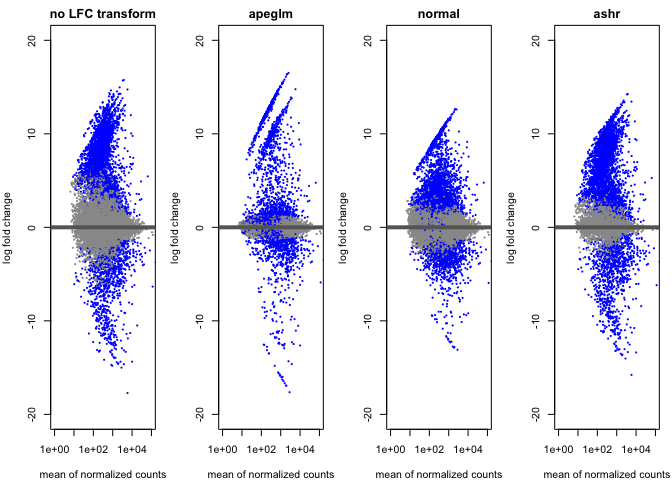<!-- -->

### 0.6.4 Extract results for adjusted p-value \< 0.05 with LFC transform of choice

``` r
res <- resLFC #resAsh

resOrdered <- res[order(res$pvalue),]# save differentially expressed genes

DE_05 <- as.data.frame(resOrdered) %>% filter(padj < 0.05 & abs(log2FoldChange) > 1)
DE_05_Up <- DE_05 %>% filter(log2FoldChange < 0) #Higher in Aboral, Lower in OralEpi
DE_05_Down <- DE_05 %>% filter(log2FoldChange > 0) #Lower in Aboral, Higher in OralEpi

nrow(DE_05)
```

    ## [1] 1805

``` r
nrow(DE_05_Up) #Higher in Aboral, Lower in OralEpi
```

    ## [1] 552

``` r
nrow(DE_05_Down) #Lower in Aboral, Higher in OralEpi
```

    ## [1] 1253

### 0.6.5 Save csvs

``` r
write.csv(as.data.frame(resOrdered), 
          file = file.path(outdir, "DESeq_results.csv"))

write.csv(DE_05, 
          file = file.path(outdir, "DEG_05.csv"))

DE_05$query <- rownames(DE_05)
resOrdered$query <- rownames(resOrdered)
```

### 0.6.6 Transforming count data for visualization

``` r
vsd <- vst(dds, blind=FALSE)
rld <- rlog(dds, blind=FALSE)
ntd <- normTransform(dds) # this gives log2(n + 1)

meanSdPlot(assay(vsd))
```

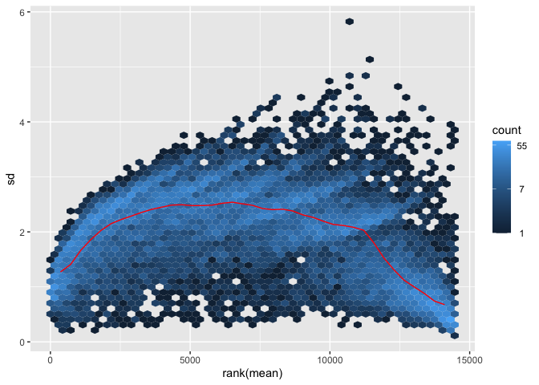<!-- -->

``` r
meanSdPlot(assay(rld))
```

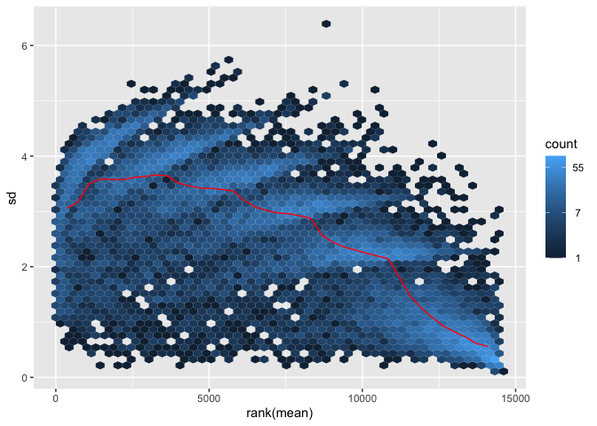<!-- -->

``` r
meanSdPlot(assay(ntd))
```

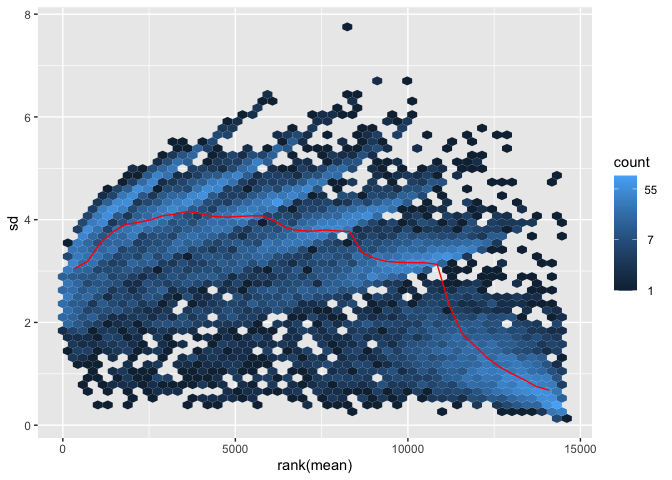<!-- -->

``` r
#save the vsd transformation
vsd_mat <- assay(vsd)
write.csv(vsd_mat, file = file.path(outdir, "vsd_expression_matrix.csv"))
```

Will move forward with vst transformation for visualizations

## 0.7 Visualizing overall expression

### 0.7.1 Heatmap of count matrix

``` r
heatmap_metadata <- as.data.frame(colData(dds)[,c("Tissue","Fragment")])

#view all genes
pheatmap(assay(vsd), cluster_rows=TRUE, show_rownames=FALSE,
         cluster_cols=TRUE, cutree_cols = 2,annotation_col=(heatmap_metadata%>% select(Tissue)),
         annotation_colors = ann_colors,color = colorRampPalette(rev(brewer.pal(n = 7, name = "RdBu")))(200))
```

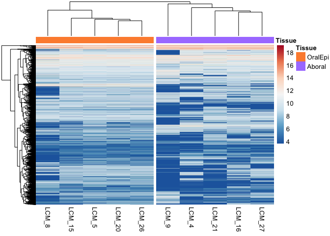<!-- -->

``` r
#view highest count genes
select <- order(rowMeans(counts(dds,normalized=TRUE)),
                decreasing=TRUE)[1:20]

pheatmap(assay(vsd)[select,], cluster_rows=FALSE, show_rownames=TRUE,
         cluster_cols=TRUE, cutree_cols = 2,annotation_col=(heatmap_metadata%>% select(Tissue)),
         annotation_colors = ann_colors, color = colorRampPalette(rev(brewer.pal(n = 7, name = "RdBu")))(200))
```

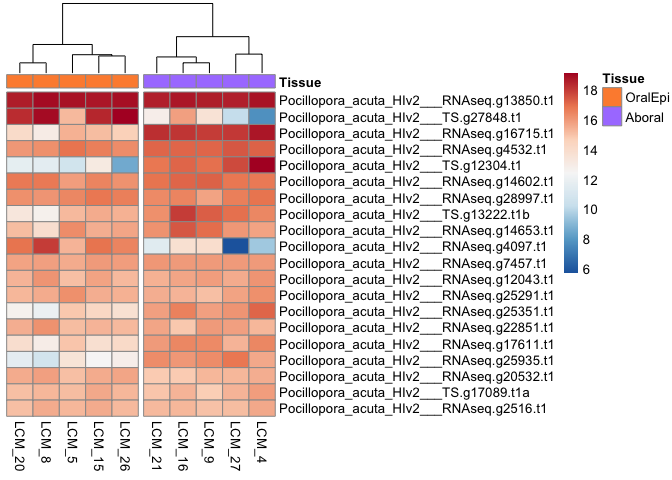<!-- -->

``` r
#view most significantly differentially expressed genes

select <- order(res$padj)[1:20]

pheatmap(assay(vsd)[select,], cluster_rows=FALSE, show_rownames=TRUE,
         cluster_cols=TRUE, cutree_cols = 2, annotation_col=(heatmap_metadata%>% select(Tissue)),
         annotation_colors = ann_colors,color = colorRampPalette(rev(brewer.pal(n = 7, name = "RdBu")))(200))
```

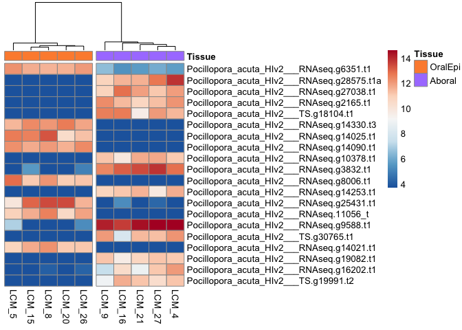<!-- -->

### 0.7.2 Heatmap of the sample-to-sample distances

``` r
sampleDists <- dist(t(assay(vsd)))

sampleDistMatrix <- as.matrix(sampleDists)
rownames(sampleDistMatrix) <- paste(vsd$Tissue, vsd$Fragment, sep="-")
colnames(sampleDistMatrix) <- NULL
colors <- colorRampPalette( rev(brewer.pal(9, "Blues")) )(255)
pheatmap(sampleDistMatrix,
         clustering_distance_rows=sampleDists,
         clustering_distance_cols=sampleDists,
         col=colors)
```

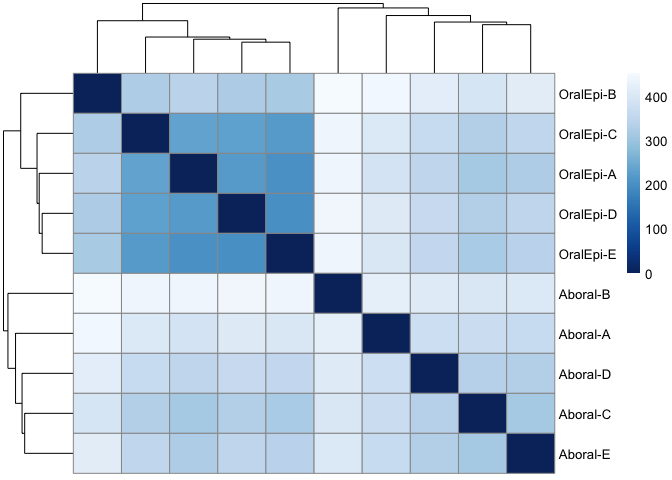<!-- -->

### 0.7.3 Principal component plot of the samples

#### 0.7.3.1 PCA of all genes

``` r
pcaData <- plotPCA(vsd, intgroup=c("Tissue", "Fragment"), returnData=TRUE, ntop = 14464)
percentVar <- round(100 * attr(pcaData, "percentVar"))

write.csv(pcaData, file = file.path(outdir, "pcaData_allgenes.csv"))
write.csv(data.frame(percentVar = attr(pcaData, "percentVar")), 
          file = file.path(outdir, "pcaData_percentVar_allgenes.csv"))

PCA <- ggplot(pcaData, aes(PC1, PC2, color=Tissue, shape=Fragment)) +
  geom_point(size=2) +
  scale_color_manual(values = c("Aboral" = "mediumpurple1", "OralEpi" = "#FD8D3C"))+
  xlab(paste0("PC1: ",percentVar[1],"% variance")) +
  ylab(paste0("PC2: ",percentVar[2],"% variance")) + 
  coord_fixed() + theme_bw()

save_ggplot(PCA, "PCA_allgenes")
```

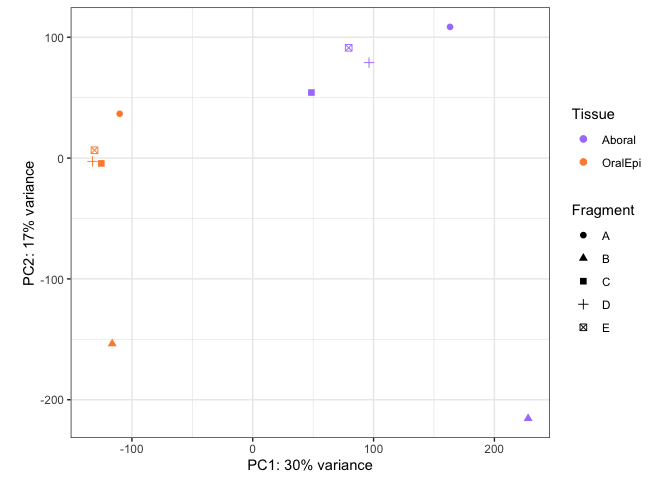<!-- -->

``` r
PCA_small <- ggplot(pcaData, aes(PC1, PC2, color=Tissue)) +
  geom_point(size=2) +
  scale_color_manual(values = c("Aboral" = "mediumpurple1", "OralEpi" = "#FD8D3C"))+
  xlab(paste0("PC1: ",percentVar[1],"% variance")) +
  ylab(paste0("PC2: ",percentVar[2],"% variance")) + 
  coord_fixed() + theme_bw()

ggsave(filename = paste0(outdir,"/PCA_allgenes_small", ".png"), plot = PCA_small, width = 4, height = 2.5, units = "in", dpi = 300)
```

#### 0.7.3.2 Default DESeq2 PCA: Top 500 variable genes

``` r
pcaData <- plotPCA(vsd, intgroup=c("Tissue", "Fragment"), returnData=TRUE)

percentVar <- round(100 * attr(pcaData, "percentVar"))
PCA <- ggplot(pcaData, aes(PC1, PC2, color=Tissue, shape=Fragment)) +
  geom_point(size=2) +
  scale_color_manual(values = c("Aboral" = "mediumpurple1", "OralEpi" = "#FD8D3C"))+
  xlab(paste0("PC1: ",percentVar[1],"% variance")) +
  ylab(paste0("PC2: ",percentVar[2],"% variance")) + 
  coord_fixed() + theme_bw()

save_ggplot(PCA, "PCA")
```

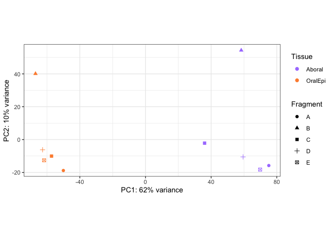<!-- -->

``` r
PCA_small <- ggplot(pcaData, aes(PC1, PC2, color=Tissue)) +
  geom_point(size=2) +
  scale_color_manual(values = c("Aboral" = "mediumpurple1", "OralEpi" = "#FD8D3C"))+
  xlab(paste0("PC1: ",percentVar[1],"% variance")) +
  ylab(paste0("PC2: ",percentVar[2],"% variance")) + 
  coord_fixed() + theme_bw()

ggsave(filename = paste0(outdir,"/PCA_small", ".png"), plot = PCA_small, width = 4, height = 2.5, units = "in", dpi = 300)
```

Clearly, the majority of the variance in the data is explained by tissue
type!

## 0.8 Annotation data

### 0.8.1 Annotations provided with genome - limited

Download annotation files from genome website

``` bash

# wget files
wget http://cyanophora.rutgers.edu/Pocillopora_acuta/Pocillopora_acuta_HIv2.genes.Conserved_Domain_Search_results.txt.gz

wget http://cyanophora.rutgers.edu/Pocillopora_acuta/Pocillopora_acuta_HIv2.genes.EggNog_results.txt.gz

wget http://cyanophora.rutgers.edu/Pocillopora_acuta/Pocillopora_acuta_HIv2.genes.KEGG_results.txt.gz

# move to references direcotry
mv *gz ../references

# unzip files
gunzip ../references/*gz
```

``` r
EggNog <- read.delim("../references/Pocillopora_acuta_HIv2.genes.EggNog_results.txt") %>% dplyr::rename("query" = X.query)

CDSearch <- read.delim("../references/Pocillopora_acuta_HIv2.genes.Conserved_Domain_Search_results.txt", quote = "") %>% dplyr::rename("query" = X.Query)

KEGG <- read.delim("../references/Pocillopora_acuta_HIv2.genes.KEGG_results.txt", header = FALSE) %>% dplyr::rename("query" = V1, "KeggTerm" = V2)
```

``` r
annot_all <- as.data.frame(rownames(dds)) %>% dplyr::rename("query" = `rownames(dds)`) %>% left_join(CDSearch)
DE_05_eggnog <- DE_05 %>% left_join(EggNog) %>% select(query,everything())

write.csv(as.data.frame(DE_05_eggnog), file=paste0(outdir,"/DE_05_eggnog_annotation.csv"))
```

### 0.8.2 DIY SwissProt Annotation of genome

Swissprot annotation of *P. acuta* genome is detailed in the file here:
<https://github.com/zdellaert/LaserCoral/blob/main/references/HI_genome_annotations/code/genome_annotation.md>.

This code annotates the protein sequences of the genomes generated by
Stephens et al. 2022 Publication and generates gene lists for different
studies. NOTE! Please reference the repository
<https://github.com/zdellaert/HI_genome_annotations>, for the most
up-to-date version of this code. This code is included here in this
project (<https://github.com/zdellaert/LaserCoral>) for
reference/reproducibility, but the files here are only included for
Pocillopora acuta.

``` r
bltabl <- read.csv("../references/HI_genome_annotations/references/swissprot/Pocillopora_acuta_HIv2_SwissProt_out_sep.tab", sep = '\t', header = FALSE)

spgo <- read.csv("../references/HI_genome_annotations/references/swissprot/SwissProt-Annot-GO_20251207.tsv", sep = '\t', header = TRUE)
```

``` r
annot_tab <- left_join(bltabl, spgo, by = c("V3" = "Entry")) %>%
  select(
    query = V1,
    blast_hit = V3,
    perc_ident = V5,
    evalue = V13,
    ProteinNames = Protein.names,
    BiologicalProcess = Gene.Ontology..biological.process.,
    GeneOntologyIDs = Gene.Ontology.IDs,
    CellularComponent = Gene.Ontology..cellular.component.,
    MolecularFunction = Gene.Ontology..molecular.function.,
  )

head(annot_tab)
```

    ##                                        query blast_hit perc_ident    evalue
    ## 1 Pocillopora_acuta_HIv2___RNAseq.g24143.t1a    Q4JAI4     31.494  1.03e-37
    ## 2  Pocillopora_acuta_HIv2___RNAseq.g18333.t1    O08807     79.897 9.65e-116
    ## 3   Pocillopora_acuta_HIv2___RNAseq.g7985.t1    O74212     50.572 3.58e-158
    ## 4      Pocillopora_acuta_HIv2___TS.g15308.t1    Q09575     29.327  1.09e-12
    ## 5   Pocillopora_acuta_HIv2___RNAseq.g2057.t1    P0C1P0     42.623  8.84e-14
    ## 6   Pocillopora_acuta_HIv2___RNAseq.g4696.t1    Q9W2Q5     51.852  9.01e-69
    ##                                                                                                                                                                                                     ProteinNames
    ## 1                                                                                                                                              Methionine synthase (EC 2.1.1.-) (Homocysteine methyltransferase)
    ## 2 Peroxiredoxin-4 (EC 1.11.1.24) (Antioxidant enzyme AOE372) (Peroxiredoxin IV) (Prx-IV) (Thioredoxin peroxidase AO372) (Thioredoxin-dependent peroxide reductase A0372) (Thioredoxin-dependent peroxiredoxin 4)
    ## 3                                                                                                   Acyl-lipid (8-3)-desaturase (EC 1.14.19.30) (Delta(5) fatty acid desaturase) (Delta-5 fatty acid desaturase)
    ## 4                                                                                                                                                                                Uncharacterized protein K02A2.6
    ## 5                                                                              Phosphatidylinositol N-acetylglucosaminyltransferase subunit Y (Phosphatidylinositol-glycan biosynthesis class Y protein) (PIG-Y)
    ## 6                                                                                                                                                                   Calcium and integrin-binding family member 2
    ##                                                                                                                                                                                                                                                                                                                                              BiologicalProcess
    ## 1                                                                                                                                                                                                                                                                                       methionine biosynthetic process [GO:0009086]; methylation [GO:0032259]
    ## 2 cell redox homeostasis [GO:0045454]; extracellular matrix organization [GO:0030198]; male gonad development [GO:0008584]; negative regulation of male germ cell proliferation [GO:2000255]; protein maturation [GO:0051604]; reactive oxygen species metabolic process [GO:0072593]; response to oxidative stress [GO:0006979]; spermatogenesis [GO:0007283]
    ## 3                                                                                                                                                                                                                                            long-chain fatty acid biosynthetic process [GO:0042759]; unsaturated fatty acid biosynthetic process [GO:0006636]
    ## 4                                                                                                                                                                                                                                                                                                                                 DNA integration [GO:0015074]
    ## 5                                                                                                                                                                                                                                                                                                                 GPI anchor biosynthetic process [GO:0006506]
    ## 6                                                                                                                                                                                                                                                                                         calcium ion homeostasis [GO:0055074]; phototransduction [GO:0007602]
    ##                                                                                                                                                                      GeneOntologyIDs
    ## 1                                                                                                                                     GO:0003871; GO:0008270; GO:0009086; GO:0032259
    ## 2 GO:0005737; GO:0005739; GO:0005783; GO:0005829; GO:0006979; GO:0007283; GO:0008584; GO:0030198; GO:0042802; GO:0045454; GO:0051604; GO:0072593; GO:0140313; GO:0140824; GO:2000255
    ## 3                                                                                                             GO:0006636; GO:0016020; GO:0020037; GO:0042759; GO:0046872; GO:0102866
    ## 4                                                                                                             GO:0003676; GO:0005737; GO:0008270; GO:0015074; GO:0019899; GO:0042575
    ## 5                                                                                                                                                             GO:0005789; GO:0006506
    ## 6                                                                                                                         GO:0000287; GO:0005509; GO:0005737; GO:0007602; GO:0055074
    ##                                                                                              CellularComponent
    ## 1                                                                                                             
    ## 2 cytoplasm [GO:0005737]; cytosol [GO:0005829]; endoplasmic reticulum [GO:0005783]; mitochondrion [GO:0005739]
    ## 3                                                                                        membrane [GO:0016020]
    ## 4                                                  cytoplasm [GO:0005737]; DNA polymerase complex [GO:0042575]
    ## 5                                                                  endoplasmic reticulum membrane [GO:0005789]
    ## 6                                                                                       cytoplasm [GO:0005737]
    ##                                                                                                                                 MolecularFunction
    ## 1                     5-methyltetrahydropteroyltriglutamate-homocysteine S-methyltransferase activity [GO:0003871]; zinc ion binding [GO:0008270]
    ## 2 identical protein binding [GO:0042802]; molecular sequestering activity [GO:0140313]; thioredoxin-dependent peroxiredoxin activity [GO:0140824]
    ## 3                                    acyl-lipid (8-3)-desaturase activity [GO:0102866]; heme binding [GO:0020037]; metal ion binding [GO:0046872]
    ## 4                                                   enzyme binding [GO:0019899]; nucleic acid binding [GO:0003676]; zinc ion binding [GO:0008270]
    ## 5                                                                                                                                                
    ## 6                                                                            calcium ion binding [GO:0005509]; magnesium ion binding [GO:0000287]

``` r
rm(spgo)
```

#### 0.8.2.1 Save Swissprot annotation of all expressed and differentially expressed genes

``` r
# potenital additional cutoffs if desired
#annot_tab <- annot_tab %>% filter(perc_ident >= 25)
#annot_tab <- annot_tab %>% filter(evalue < 1e-10)

write.table(annot_tab, 
            file = "../references/annotation/protein-GO.tsv", 
            sep = "\t", 
            row.names = FALSE, 
            quote = FALSE)

DESeq_SwissProt <- as.data.frame(resOrdered) %>% left_join(annot_tab) %>% select(query,everything()) 
DE_05_SwissProt <- DESeq_SwissProt %>% filter(query %in% DE_05$query)

write.csv(as.data.frame(DESeq_SwissProt), file=paste0(outdir,"/DESeq_SwissProt_annotation.csv"))
write.csv(as.data.frame(DE_05_SwissProt), file=paste0(outdir,"/DE_05_SwissProt_annotation.csv"))
```

#### 0.8.2.2 Heatmap of count matrix, with Swissprot annotation

``` r
DE_05_SwissProt$short_name <- ifelse(nchar(DE_05_SwissProt$ProteinNames) > 30, 
                            paste0(substr(DE_05_SwissProt$ProteinNames, 1, 27), "..."), 
                            DE_05_SwissProt$ProteinNames)

gene_labels <- DE_05_SwissProt %>% 
  select(query,short_name) %>%
  mutate_all(~ ifelse(is.na(.), "", .)) #replace NAs with "" for labelling purposes

#view most significantly differentially expressed genes

select <- order(res$padj)[1:50]

z_scores <- t(scale(t(assay(vsd)[select, ]), center = TRUE, scale = TRUE))
top50_DE <- pheatmap(z_scores, color = colorRampPalette(rev(brewer.pal(n = 7, name = "RdBu")))(200), cluster_rows=FALSE, show_rownames=TRUE,
         cluster_cols=TRUE, cutree_cols = 2,annotation_col=(heatmap_metadata%>% select(Tissue)), annotation_colors = ann_colors,
         labels_row = gene_labels[match(rownames(res)[select],(gene_labels$query)),2], fontsize_row = 6)
top50_DE
```

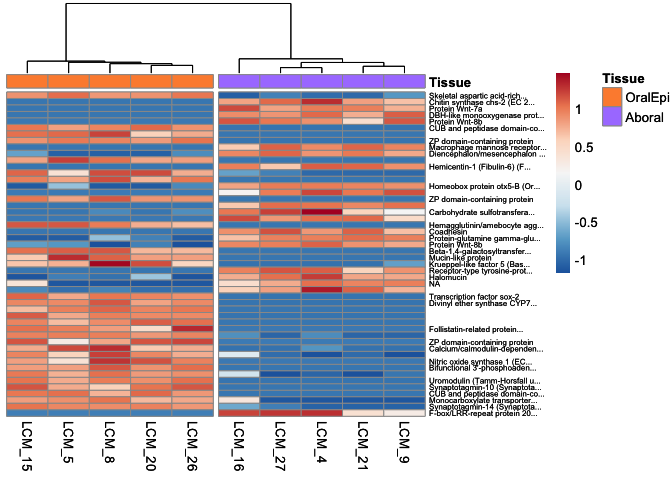<!-- -->

``` r
#view most significantly differentially expressed genes by LFC

select <- order(abs(res$log2FoldChange),decreasing = TRUE)[1:50]

z_scores <- t(scale(t(assay(vsd)[select, ]), center = TRUE, scale = TRUE))
top50_DE <- pheatmap(z_scores, color = colorRampPalette(rev(brewer.pal(n = 7, name = "RdBu")))(200), cluster_rows=FALSE, show_rownames=TRUE,
         cluster_cols=TRUE, cutree_cols = 2,annotation_col=(heatmap_metadata%>% select(Tissue)), annotation_colors = ann_colors,
         labels_row = gene_labels[match(rownames(res)[select],(gene_labels$query)),2], fontsize_row = 6)
top50_DE
```

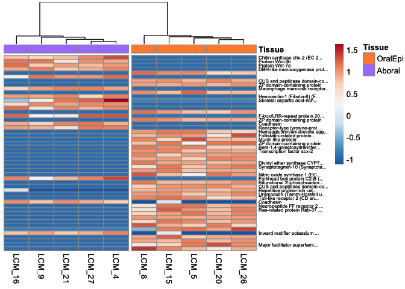<!-- -->

``` r
#view genes Higher in Aboral, Lower in OralEpi, ordered by log2FoldChange
select <- order(res$log2FoldChange,decreasing = TRUE)[1:50]

z_scores <- t(scale(t(assay(vsd)[select, ]), center = TRUE, scale = TRUE))
up_Aboral <- pheatmap(z_scores, color = colorRampPalette(rev(brewer.pal(n = 7, name = "RdBu")))(200), cluster_rows=FALSE, show_rownames=TRUE,
         cluster_cols=TRUE, cutree_cols = 2,annotation_col=(heatmap_metadata%>% select(Tissue)), annotation_colors = ann_colors,
         labels_row = gene_labels[match(rownames(res)[select],(gene_labels$query)),2], fontsize_row = 5)
up_Aboral
```

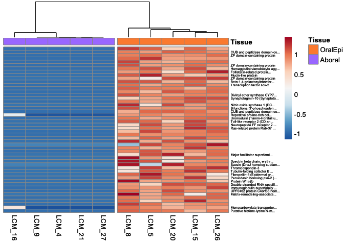<!-- -->

``` r
#view genes Lower in Aboral, Higher in OralEpi, ordered by log2FoldChange
select <- order(res$log2FoldChange)[1:50]

z_scores <- t(scale(t(assay(vsd)[select, ]), center = TRUE, scale = TRUE))
up_OralEpi <- pheatmap(z_scores, color = colorRampPalette(rev(brewer.pal(n = 7, name = "RdBu")))(200), cluster_rows=FALSE, show_rownames=TRUE,
         cluster_cols=TRUE, cutree_cols = 2,annotation_col=(heatmap_metadata%>% select(Tissue)), annotation_colors = ann_colors,
         labels_row =gene_labels[match(rownames(res)[select],(gene_labels$query)),2], fontsize_row = 5)
print(up_OralEpi)
```

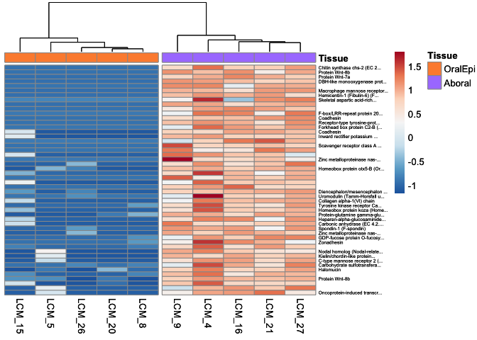<!-- -->

## 0.9 Specific Genes of Interest

### 0.9.1 Single cell marker genes (Levy et al 2021)

``` r
MarkerGenes_broc <- read.csv("../references/marker_genes/Pacuta_Spis_Markers_pairs.csv") %>% select(protein_id_spB,cluster,Standardized_Name_spA ) %>% dplyr::rename("query" = 1, "List" = 2)
```

### 0.9.2 Biomineralization toolkit

``` r
Biomin_broc_original <- read.csv("../references/Biomineralization_Toolkit_FScucchia/Pacuta_Biomin_Spis_ortholog.csv") %>% dplyr::rename("query" = Pacuta_gene) #%>% select(-c(X,accessionnumber_gene_id, ref))

Biomin_broc <- Biomin_broc_original %>%
  group_by(query,List) %>%
  summarize(definition = paste(unique(definition), collapse = ","),
            Classification = paste(unique(Classification), collapse = ","),
            Reference = paste(unique(ref), collapse = ","),
            Original_Accession = paste(unique(accessionnumber_gene_id), collapse = ",")) 

Biomin_broc$def_short <- ifelse(nchar(Biomin_broc$definition) > 40, 
                            paste0(substr(Biomin_broc$definition, 1, 37), "..."), 
                            Biomin_broc$definition)

Biomin_broc_filtered_counts <- filtered_counts[(rownames(filtered_counts) %in% Biomin_broc$query),]
```

### 0.9.3 Additional gene lists

He_etal_Nvec = He, S., Shao, W., Chen, S. (Cynthia), Wang, T. and
Gibson, M. C. (2023). Spatial transcriptomics reveals a cnidarian
segment polarity program in Nematostella vectensis. Current Biology 33,
2678-2689.e5.

DuBuc_etal_Nvec = DuBuc, T. Q., Stephenson, T. B., Rock, A. Q. and
Martindale, M. Q. (2018). Hox and Wnt pattern the primary body axis of
an anthozoan cnidarian before gastrulation. Nat Commun 9, 2007.

- oral/aboral patterning markers in nematostella

``` r
He_etal_Nvec <- read.csv("../references/marker_genes/He_etal_nematostella.csv") %>% dplyr::rename("query" = Pacuta_gene) %>% select(-c(X))

He_etal_Nvec$def_short <- gsub("Homeobox protein", "Hox", He_etal_Nvec$Description, ignore.case = TRUE)

DuBuc_etal_Nvec <- read.csv("../references/marker_genes/Wnt_nematostella.csv") %>% dplyr::rename("query" = Pacuta_gene) %>% select(-c(X))
DuBuc_etal_Nvec$def_short <- DuBuc_etal_Nvec$Gene_Name
```

``` r
join_genes_of_interest <- function(df, gene_set) {
  df %>%
    left_join(gene_set, by = "query") %>%
    select(query, everything()) %>%
    drop_na() %>% distinct()
}

DE_05_Biomin_broc    <- join_genes_of_interest(DE_05, Biomin_broc)
DE_05_marker_broc    <- join_genes_of_interest(DE_05, MarkerGenes_broc)
DE_05_He_etal        <- join_genes_of_interest(DE_05, He_etal_Nvec)
DE_05_DuBuc_etal     <- join_genes_of_interest(DE_05, DuBuc_etal_Nvec)

DESeq_Biomin_broc    <- join_genes_of_interest(as.data.frame(resOrdered), Biomin_broc)
DESeq_marker_broc    <- join_genes_of_interest(as.data.frame(resOrdered), MarkerGenes_broc)
DESeq_He_etal        <- join_genes_of_interest(as.data.frame(resOrdered), He_etal_Nvec)
DESeq_DuBuc_etal     <- join_genes_of_interest(as.data.frame(resOrdered), DuBuc_etal_Nvec)

write.csv(as.data.frame(DESeq_Biomin_broc), file=paste0(outdir,"/DESeq_biomin_annotation.csv"))
write.csv(as.data.frame(DE_05_Biomin_broc), file=paste0(outdir,"/DE_05_biomin_annotation.csv"))
write.csv(as.data.frame(DESeq_marker_broc) %>% rename("Spis_CellType_Full"=List) %>% rename("Spis_CellType"=Standardized_Name_spA), file=paste0(outdir,"/DESeq_markergene_annotation.csv"))
write.csv(as.data.frame(DE_05_marker_broc), file=paste0(outdir,"/DE_05_markergene_annotation.csv"))

Biomin_broc_all_counts <- as.data.frame(counts(dds)) %>% mutate(query = rownames(dds)) %>% select(query,everything()) %>% left_join(Biomin_broc) 
Biomin_broc_all_res <- as.data.frame(res) %>% mutate(query = rownames(res)) %>% select(query,everything()) %>% left_join(Biomin_broc)

broc_markers_all_counts <- as.data.frame(counts(dds)) %>% mutate(query = rownames(dds)) %>% select(query,everything()) %>% left_join(MarkerGenes_broc) 
broc_markers_all_res <- as.data.frame(res) %>% mutate(query = rownames(res)) %>% select(query,everything()) %>% left_join(MarkerGenes_broc) 
```

### 0.9.4 Expand biomineralization gene list using Swissprot results

``` r
keywords_manual_search_biomin_noortholog <- c("Collagen alpha", "hemicentin", "skeletal organic matrix", "carbonic anhydrase", "coadhesin", "Von Willebrand Factor D")

manual_search_biomin_noortholog <- DESeq_SwissProt %>% filter(grepl(
  paste(keywords_manual_search_biomin_noortholog,collapse="|"),ProteinNames,ignore.case = TRUE)) %>%
  select(query, ProteinNames) %>% 
  rename(definition = ProteinNames) %>% mutate(List="Searched Keywords") %>% 
  filter(!(query %in% Biomin_broc$query)) #only keep these if they're not already in our list

manual_search_biomin_noortholog <- manual_search_biomin_noortholog %>% mutate(
  Classification = 
    ifelse(grepl("Collagen", definition, ignore.case = TRUE), "Extracellular matrix/cell adhesion",
    ifelse(grepl("hemicentin", definition, ignore.case = TRUE), "Extracellular matrix/cell adhesion",
    ifelse(grepl("Uncharacterized skeletal organic matrix", definition, ignore.case = TRUE), "Uncharacterized biomineralization proteins",
    ifelse(grepl("MAM and LDL", definition, ignore.case = TRUE), "Extracellular matrix/cell adhesion",
    ifelse(grepl("carbonic anhydrase", definition, ignore.case = TRUE), "Enzymes",
    ifelse(grepl("coadhesin", definition, ignore.case = TRUE), "Extracellular matrix/cell adhesion",
    ifelse(grepl("Von Willebrand Factor D", definition, ignore.case = TRUE), "Extracellular matrix/cell adhesion",NA)))))))
)

manual_search_biomin_noortholog$def_short <- ifelse(nchar(manual_search_biomin_noortholog$definition) > 40, 
                            paste0(substr(manual_search_biomin_noortholog$definition, 1, 37), "..."), 
                            manual_search_biomin_noortholog$definition)

Biomin_broc <- Biomin_broc %>% bind_rows(manual_search_biomin_noortholog)

Biomin_broc_filtered_counts <- filtered_counts[(rownames(filtered_counts) %in% Biomin_broc$query),]

DE_05_Biomin_broc    <- DE_05 %>%
    left_join(Biomin_broc, by = "query") %>%
    select(query, everything()) %>%
    drop_na(List) %>% distinct()
DESeq_Biomin_broc    <- as.data.frame(resOrdered)%>%
    left_join(Biomin_broc, by = "query") %>%
    select(query, everything()) %>%
    drop_na(List) %>% distinct()

write.csv(as.data.frame(DESeq_Biomin_broc), file=paste0(outdir,"/DESeq_biomin_annotation.csv"))
write.csv(as.data.frame(DE_05_Biomin_broc), file=paste0(outdir,"/DE_05_biomin_annotation.csv"))
Biomin_broc_all_counts <- as.data.frame(counts(dds)) %>% mutate(query = rownames(dds)) %>% select(query,everything()) %>% left_join(Biomin_broc) 
Biomin_broc_all_res <- as.data.frame(res) %>% mutate(query = rownames(res)) %>% select(query,everything()) %>% left_join(Biomin_broc) 
```

## 0.10 Clean labels and try to categorize annotations

``` r
Manual_AllGenes <- DESeq_SwissProt %>% mutate(Heatmap_Label = ProteinNames) %>% relocate(Heatmap_Label, .after=evalue)

Manual_AllGenes$Heatmap_Label <- gsub("Homeobox protein", "Hox", Manual_AllGenes$Heatmap_Label, ignore.case = TRUE)
Manual_AllGenes$Heatmap_Label <- gsub("Protein Wnt", "Wnt", Manual_AllGenes$Heatmap_Label, ignore.case = TRUE)

#fill any missing values that are biomin genes with the biomin gene label
Manual_AllGenes <- Manual_AllGenes %>%
  left_join(
    Biomin_broc %>% select(query, definition),
    by = "query"
  ) %>%
  mutate(Heatmap_Label = coalesce(Heatmap_Label, definition)) %>%
  select(-definition)

Manual_AllGenes <- Manual_AllGenes %>% mutate(
        Heatmap_Label = str_replace(Heatmap_Label, "\\s+\\(.*", ""),
        Heatmap_Label = str_replace(Heatmap_Label, "\\s+\\[.*", ""),
        Heatmap_Label_short = str_trunc(Heatmap_Label, 50),
        Heatmap_Label_short = str_wrap(Heatmap_Label, width = 25)
      )

Manual <- Manual_AllGenes %>% filter(query %in% DE_05$query)

gene_labels <- Manual %>% 
  select(query,Heatmap_Label) %>%
  mutate_all(~ ifelse(is.na(.), "", .)) #replace NAs with "" for labelling purposes
```

``` r
### Zona pellucida domain
PFAM_ZP_domain <- annot_all %>% filter(grepl("Zona_pellucida",Short.name,ignore.case=TRUE))  %>% pull(query) %>% unique()

#### He et al 2023 TFs/genes of interest Nematostella (NOTE! I confirmed the DE_05 ones are all represented above ) + DuBuc et al 2018 Wnt/Aboral-Oral Patterning Genes, interest Nematostella

DESeq_He_etal$source <- "He_etal_2023"
DESeq_DuBuc_etal$source <- "DuBuc_etal_2018"

Hox_Literature <- rbind(DESeq_He_etal,DESeq_DuBuc_etal)

DESeq_Hox_Literature_collapsed <- Hox_Literature %>%
  group_by(query, baseMean, log2FoldChange, lfcSE, pvalue, padj) %>%
  summarize(
    Gene_Name = paste(unique(Gene_Name), collapse = "; "),
    Description = paste(unique(Description), collapse = "; "),
    def_short = paste(unique(def_short), collapse = "; "),
    source = paste(unique(source), collapse = "; "),
    .groups = "drop"
  )

WNT_HOX_MAN <- Manual_AllGenes %>% filter(grepl("wnt", Heatmap_Label, ignore.case = TRUE)|grepl("frizzle", Heatmap_Label, ignore.case = TRUE)|grepl("homeobox", Heatmap_Label, ignore.case = TRUE)|grepl("hox", Heatmap_Label, ignore.case = TRUE)) %>% select(-c(blast_hit,evalue,ProteinNames,BiologicalProcess,GeneOntologyIDs))# %>% rename(Description = Heatmap_Label)

COMBINED_HOX_WNT_all <-  full_join(DESeq_Hox_Literature_collapsed,WNT_HOX_MAN,by=c("query")) %>%
  mutate(
    baseMean = coalesce(baseMean.x, baseMean.y),
    log2FoldChange = coalesce(log2FoldChange.x, log2FoldChange.y),
    lfcSE = coalesce(lfcSE.x, lfcSE.y),
    pvalue = coalesce(pvalue.x, pvalue.y),
    padj = coalesce(padj.x, padj.y)
  ) %>%
  select(-ends_with(".x"), -ends_with(".y"))

COMBINED_HOX_WNT_all <- COMBINED_HOX_WNT_all %>%  mutate(Heatmap_Label = coalesce(Heatmap_Label, def_short)) %>%
                              mutate(Heatmap_Label = gsub("Protein Wnt", "Wnt", Heatmap_Label, ignore.case = TRUE)) %>% 
                              mutate(pathway = ifelse(grepl("ox",Heatmap_Label)|grepl("Six",Heatmap_Label), "HOX", "WNT"))
COMBINED_HOX_WNT_DE05 <-  COMBINED_HOX_WNT_all %>% filter(padj<0.05) %>% filter(abs(log2FoldChange) >1)

write.csv(COMBINED_HOX_WNT_all, file=paste0(outdir,"/Wnt_Hox_genes.csv"))
```

``` r
DESeq_SwissProt_categorized <- Manual_AllGenes %>% rowwise() %>%
  mutate(category = list(
    c(if (query %in% DESeq_Biomin_broc$query) "Biomineralization",
      if (grepl("transient", ProteinNames, ignore.case = TRUE)) "TRP Channel",
      if ((grepl("mucin|lectin|toll-|nitric|sulfotransferase|Complement", ProteinNames, ignore.case = TRUE) |
           grepl("toll-like receptor|NF-kappaB|complement activation|3'-phosphoadenosine 5'-phosphosulfate",
                 BiologicalProcess, ignore.case = TRUE)) & !grepl("Collectin", ProteinNames)) "Mucus- and Bacteria-related",
      if (grepl("amino acid transport|ammonium transmembrane transport|carbohydrate transport|
                glycerol transmembrane transport|cholesterol transport", BiologicalProcess, ignore.case = TRUE) &
          !grepl("neurotransmitter|synaptic|pigmentation", BiologicalProcess, ignore.case = TRUE)) "Transport",
      if (grepl("Solute carrier", ProteinNames, ignore.case = TRUE)) "Solute Carrier (SLC Family)",
      if (query %in% PFAM_ZP_domain) "Zona Pellucida",
      if (query %in% COMBINED_HOX_WNT_all$query) "Hox/Wnt Developmental Signaling"
    )
  )) %>%
  ungroup()

DESeq_SwissProt_categorized_collapsed <- DESeq_SwissProt_categorized %>%
  mutate(category = sapply(category, function(x) paste(x, collapse = "; "))) %>%
  relocate(category, .after = ProteinNames)

category_annotation <- DESeq_SwissProt_categorized_collapsed %>%
  select(query, category) %>%
  column_to_rownames("query")

write.csv(DESeq_SwissProt_categorized_collapsed, file=paste0(outdir,"/DESeq_SwissProt_annotation_categorized.csv"))
```

### 0.10.1 Test out new labels on heatmaps

``` r
#view most significantly differentially expressed genes

select <- order(res$padj)[1:50]

z_scores <- t(scale(t(assay(vsd)[select, ]), center = TRUE, scale = TRUE))
top50_DE <- pheatmap(z_scores, color = colorRampPalette(rev(brewer.pal(n = 7, name = "RdBu")))(200), cluster_rows=FALSE, show_rownames=TRUE,
         cluster_cols=TRUE, cutree_cols = 2,annotation_col=(heatmap_metadata%>% select(Tissue)), annotation_colors = ann_colors,
         annotation_row=category_annotation,
         labels_row = gene_labels[match(rownames(res)[select],(gene_labels$query)),2], fontsize_row = 6)
save_ggplot(top50_DE, "top50_DE_Manual")
```

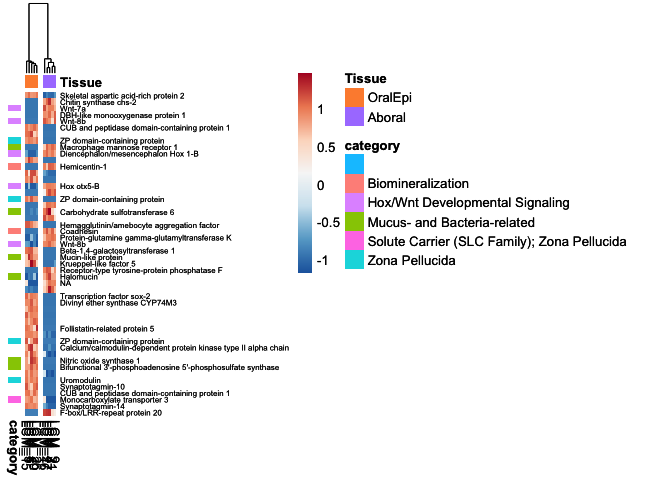<!-- -->

``` r
dev.off()
```

    ## null device 
    ##           1

``` r
#view most significantly differentially expressed genes by LFC

select <- order(abs(res$log2FoldChange),decreasing = TRUE)[1:50]

z_scores <- t(scale(t(assay(vsd)[select, ]), center = TRUE, scale = TRUE))
top50_DE_LFC <- pheatmap(z_scores, color = colorRampPalette(rev(brewer.pal(n = 7, name = "RdBu")))(200), cluster_rows=FALSE, show_rownames=TRUE,
         cluster_cols=TRUE, cutree_cols = 2,annotation_col=(heatmap_metadata%>% select(Tissue)), annotation_colors = ann_colors,
         annotation_row=category_annotation,
         labels_row = gene_labels[match(rownames(res)[select],(gene_labels$query)),2], fontsize_row = 6)
top50_DE_LFC
save_ggplot(top50_DE_LFC, "top50_LFC_DE_Manual")
dev.off()
```

    ## null device 
    ##           1

``` r
#view genes Higher in Aboral, Lower in OralEpi, ordered by log2FoldChange
select <- order(res$log2FoldChange)[1:50]

z_scores <- t(scale(t(assay(vsd)[select, ]), center = TRUE, scale = TRUE))
up_Aboral <- pheatmap(z_scores, color = colorRampPalette(rev(brewer.pal(n = 7, name = "RdBu")))(200), cluster_rows=FALSE, show_rownames=TRUE,
         cluster_cols=TRUE, cutree_cols = 2,annotation_col=(heatmap_metadata%>% select(Tissue)), labels_col = NA, annotation_colors = ann_colors,
          annotation_row=category_annotation,
         labels_row =gene_labels[match(rownames(res)[select],(gene_labels$query)),2], fontsize_row = 8.5)
up_Aboral
save_ggplot(up_Aboral, "up_Aboral_Manual")

#view genes Lower in Aboral, Higher in OralEpi, ordered by log2FoldChange
select <- order(res$log2FoldChange,decreasing = TRUE)[1:50]

z_scores <- t(scale(t(assay(vsd)[select, ]), center = TRUE, scale = TRUE))
up_OralEpi <- pheatmap(z_scores, color = colorRampPalette(rev(brewer.pal(n = 7, name = "RdBu")))(200), cluster_rows=FALSE, show_rownames=TRUE,
         cluster_cols=TRUE, cutree_cols = 2,annotation_col=(heatmap_metadata%>% select(Tissue)), labels_col = NA, annotation_colors = ann_colors,
          annotation_row=category_annotation,
         labels_row =gene_labels[match(rownames(res)[select],(gene_labels$query)),2], fontsize_row = 8.5)
up_OralEpi
save_ggplot(up_OralEpi, "up_OralEpi_Manual")
```

## 0.11 Expression of certain gene lists of interest - ones featured in the manuscript are found in <https://github.com/zdellaert/LaserCoral/blob/main/code/Final_Figures.Rmd>

### 0.11.1 SLC4 Calcification Transporter - Anion exchange protein 3 (AE 3) (Solute carrier family 4 member 3)

``` r
vst_counts <- assay(vsd)["Pocillopora_acuta_HIv2___RNAseq.g15280.t1", ]
df <- as.data.frame(colData(dds))
df$expression <- vst_counts

library(ggplot2)
ggplot(df, aes(x=Tissue, y=expression, group=Fragment, color=Fragment)) +
  geom_point(size=3) +
  geom_line() +
  theme_minimal() +
  labs(title="VST Expression by Tissue", y="VST normalized expression")
```

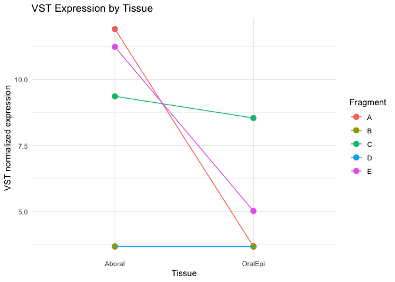<!-- -->

### 0.11.2 bacteria-related genes

``` r
mucin <- Manual %>% filter(grepl("mucin", ProteinNames, ignore.case = TRUE)|
                             grepl("lectin", ProteinNames, ignore.case = TRUE)|
                             grepl("toll-", ProteinNames, ignore.case = TRUE)|
                             grepl("ZP", ProteinNames, ignore.case = TRUE)|
                             grepl("nitric", ProteinNames, ignore.case = TRUE)|
                             grepl("sulfotransferase", ProteinNames, ignore.case = TRUE)|
                             grepl("Complement ", ProteinNames, ignore.case = TRUE)|
                             grepl("toll-like receptor", BiologicalProcess, ignore.case = TRUE)|
                             grepl("NF-kappaB", BiologicalProcess, ignore.case = TRUE)|
                             grepl("complement activation", BiologicalProcess, ignore.case = TRUE)|
                             grepl("3'-phosphoadenosine 5'-phosphosulfate", BiologicalProcess, ignore.case = TRUE)) %>% 
  filter(Heatmap_Label !="Cnidocyte marker protein (Collectin-11)")

select <- unique(mucin$query)
 
z_scores <- t(scale(t(assay(vsd)[select, ]), center = TRUE, scale = TRUE))
top50_DE <- pheatmap(z_scores, color = colorRampPalette(rev(brewer.pal(n = 7, name = "RdBu")))(200), cluster_rows=TRUE, show_rownames=TRUE,
         cluster_cols=TRUE, cutree_cols = 2,annotation_col=(heatmap_metadata%>% select(Tissue)), annotation_colors = ann_colors,
         labels_row = gene_labels[match(select,(gene_labels$query)),2], fontsize_row = 8, cutree_rows = 2)
top50_DE
save_ggplot(top50_DE, "bacteria_DE_SwissProt",height=12)
```

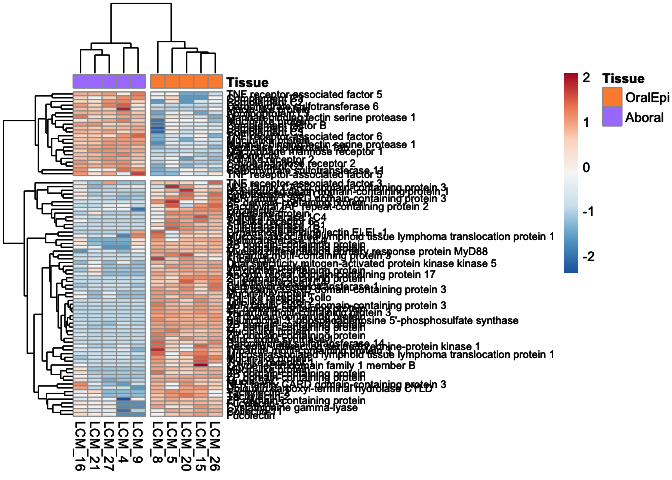<!-- -->

### 0.11.3 Potential Symbiont related transporters

``` r
transport <- Manual %>% filter(grepl("amino acid transport", BiologicalProcess, ignore.case = TRUE)|
                                 grepl("ammonium transmembrane transport", BiologicalProcess, ignore.case = TRUE)|
                                 grepl("carbohydrate transport", BiologicalProcess, ignore.case = TRUE)|
                                 grepl("glycerol transmembrane transport", BiologicalProcess, ignore.case = TRUE)|
                                 grepl("cholesterol transport", BiologicalProcess, ignore.case = TRUE)) %>% 
                                 filter(!grepl("neurotransmitter", BiologicalProcess, ignore.case = TRUE)) %>% 
                                 filter(!grepl("synaptic", BiologicalProcess, ignore.case = TRUE)) %>% 
                                 filter(!grepl("pigmentation", BiologicalProcess, ignore.case = TRUE))# %>% 
                                 #filter(!grepl("Solute carrier", ProteinNames, ignore.case = TRUE))

select <- transport$query

z_scores <- t(scale(t(assay(vsd)[select, ]), center = TRUE, scale = TRUE))
top50_DE <- pheatmap(z_scores, color = colorRampPalette(rev(brewer.pal(n = 7, name = "RdBu")))(200), cluster_rows=TRUE, show_rownames=TRUE,
         cluster_cols=TRUE, cutree_cols = 2,annotation_col=(heatmap_metadata%>% select(Tissue)), annotation_colors = ann_colors,
         labels_row = gene_labels[match(select,(gene_labels$query)),2], fontsize_row = 8, cutree_rows = 2)
top50_DE
save_ggplot(top50_DE, "transport_DE_SwissProt")
```

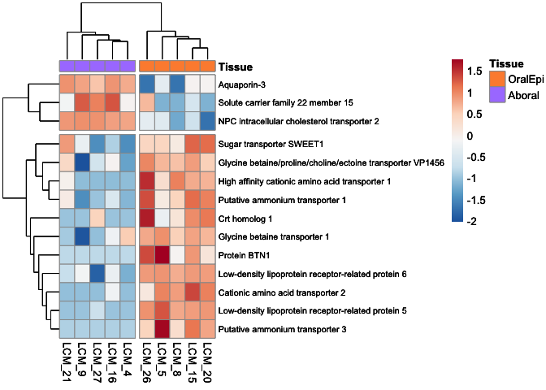<!-- -->

### 0.11.4 Solute Carrier (SLC) Family genes

``` r
solute_all <- DESeq_SwissProt %>% filter(grepl("Solute carrier", ProteinNames, ignore.case = TRUE))
solute_all <- solute_all %>%
  mutate(SLC_family = str_extract(ProteinNames, "Solute carrier family \\d+")) %>%
  mutate(SLC_family = str_replace(SLC_family,"Solute carrier family ", "SLC")) 

nrow(solute_all)
```

    ## [1] 211

``` r
solute_de <- Manual %>% filter(grepl("Solute carrier", ProteinNames, ignore.case = TRUE))
solute_de <- solute_de %>%
  mutate(SLC_family = str_extract(ProteinNames, "Solute carrier family \\d+")) %>%
  mutate(SLC_family = str_replace(SLC_family,"Solute carrier family ", "SLC")) 


solute_de_upAboral <- solute_de %>% filter(log2FoldChange < -1)
nrow(solute_de_upAboral)
```

    ## [1] 9

``` r
solute_de_upOral <- solute_de %>% filter(log2FoldChange > 1)
nrow(solute_de_upOral)
```

    ## [1] 22

``` r
length(unique(solute_all$SLC_family))
```

    ## [1] 45

``` r
length(unique(solute_de_upAboral$SLC_family))
```

    ## [1] 8

``` r
length(unique(solute_de_upOral$SLC_family))
```

    ## [1] 11

``` r
table(solute_de$SLC_family)
```

    ## 
    ##  SLC1 SLC12 SLC15 SLC16 SLC22 SLC23 SLC24 SLC25 SLC30 SLC32 SLC35 SLC46 SLC53 
    ##     2     3     1     4     2     2     1     2     1     1     1     1     1 
    ##  SLC6  SLC7 
    ##     5     4

``` r
#Basing my annotations on: https://re-solute.eu/knowledgebase/slcfamily and https://slc.bioparadigms.org/

slc_map <- data.frame(
  SLC_family = c(
    "SLC1",
    "SLC12",
    "SLC15",
    "SLC16",
    "SLC22",
    "SLC23",
    "SLC24",
    "SLC25",
    "SLC30",
    "SLC32",
    "SLC35",
    "SLC46",
    "SLC53",
    "SLC6",
    "SLC7"
  ),
  Function = c(
    "High-affinity glutamate and neutral amino acid transporter family",
    "Electroneutral cation-coupled Cl cotransporter family",
    "Proton oligopeptide cotransporter family",
    "Monocarboxylate transporter family",
    "Organic cation/anion/zwitterion transporter family",
    "Sodium-dependent ascorbic acid transporter family",
    "Na+/(Ca2+-K+) exchanger family",
    "Mitochondrial carrier family",
    "Zinc transporter family",
    "Vesicular inhibitory amino acid transporter family",
    "Nucleoside-sugar transporter family",
    "Folate transporter family",
    "Phosphate carriers",
    "Sodium- and chloride-dependent neurotransmitter transporter family",
    "Cationic amino acid transporter/glycoprotein-associated family"
  ),
  Role = c(
    "Neurotransmission, Glu metabolism, development, aa homeostasis",
    "cell volume, chloride concentration, blood pressure regulation",
    "Immunity, homeostasis of neuropeptides, peptide absoption",
    "glucose homeostasis / metabolism, lipid metabolism",
    "Drug uptake, endocytosis",
    "Absortion and distribution of ascorbic acid",
        "Skin/hair/eye pigmentation, vision, olfaction",
    "Apoptosis, Glucose/Lipid/Amino acid/Urea, metab., ATP synthesis",
    "Zinc homestasis, development, body weight, glucose metabolism",
    "Development, neurotransmission",
    "Virus infection, development, autophagy, cell proliferation",
    "Folate metabolism, Immunity, Drug uptake",
    "Virus infection, Phosphate homeostasis, development",
    "Cell differentiation, neurotransmission",
    "Nitric oxide synthesis, redox balance, aa homeostasis"
  ),
  Substrate_Specific = c(
    "Glutamate as Neurotransmitter, anionic, neutral amino acids",
    "Chloride, sodium, potassium",
    "Dipeptides, oligopeptides",
    "Ketone bodies, Lactate, Pyruvate, creatine, aromatic amino acids, T2,T3,T4",
    "Drugs, neurotransmitters, purine and pyrimidine nucleosides, niacin, steroid, carnitine, carnitine derivatives, organic anions",
    "Ascorbic acid",
    "Calcium, Potassium, Sodium",
    "Amino acids, Di- tricarboxylic ions, Co-A, Carnitine/acyl-carnitines, H+, metals, nucleotides",
    "Zinc, Managnese, Lead",
    "GABA, Glycine",
    "Purines, pyrimidines, Thiamine, nuclotide-sugars",
    "Folic acid, Heme, Methotrexate",
    "Phosphate",
    "Neurotransmitters, basic, neutral amino acids",
    "Amino acids"
  ),
  Substrate_Broad = c(
    "Amino Acids",
    "Inorganic Ions",
    "Peptides",
    "Energy\nmetabolites",
    "Organic Ions",
    "Ascorbic\nAcid",
    "Inorganic Ions",
    "Mitochondrial",
    "Transition\nElement\nCations",
    "Amino acids;\nNeuro-\ntransmitter",
    "Nucleotides",
    "Folate",
    "Organic Ions",
    "Neuro-\ntransmitter",
    "Amino Acids"
  )
)
```

``` r
solute_de <- solute_de %>%
  left_join(slc_map, by = "SLC_family") 

write.csv(solute_de, file=paste0(outdir,"/DE_05_SLC_genes.csv"))

plot_data <- solute_de %>%
  mutate(Direction = ifelse(log2FoldChange < -1 , "upAboral",
                            ifelse(log2FoldChange > 1, "upOral", "noChange"))) 
# Summarize counts by family and direction
plot_data <- plot_data %>%
  filter(Direction != "noChange") %>%
  group_by(SLC_family, Substrate_Broad, Direction) %>%
  summarise(n = n(), .groups = "drop")

ggplot(plot_data, aes(x = SLC_family, y = n, fill = Direction)) +
  geom_bar(stat = "identity") +
  facet_wrap(~Substrate_Broad, scales = "free_x") +
  scale_fill_manual(values = c("upOral" = "#FD8D3C", "upAboral" = "mediumpurple1")) +
  theme_minimal() +
  labs(title = "Differentially Expressed SLC Genes by Family",
       x = "SLC Family", y = "Number of DE Genes") +
  theme(axis.text.x = element_text(angle = 45, hjust = 1))
```

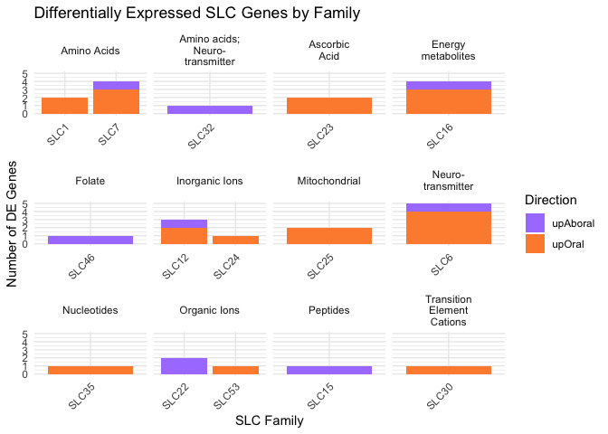<!-- -->

``` r
select <- solute_de$query

z_scores <- t(scale(t(assay(vsd)[select, ]), center = TRUE, scale = TRUE))
top50_DE <- pheatmap(z_scores, color = colorRampPalette(rev(brewer.pal(n = 7, name = "RdBu")))(200), cluster_rows=TRUE, show_rownames=TRUE,
         cluster_cols=TRUE, cutree_cols = 2,annotation_col=(heatmap_metadata%>% select(Tissue)), annotation_colors = ann_colors,
         labels_row = gene_labels[match(select,(gene_labels$query)),2], fontsize_row = 8, cutree_rows = 2)
top50_DE
```

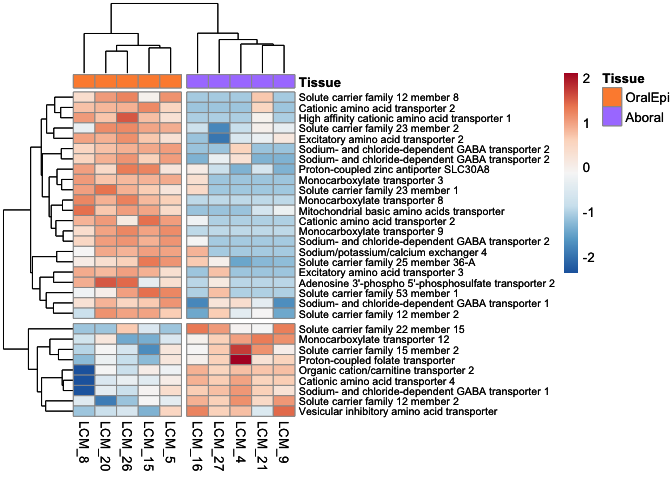<!-- -->

``` r
# Perform clustering
row_clusters <- hclust(dist(z_scores))
cluster_assignments <- cutree(row_clusters, k = 2) # Adjust k for the number of clusters

# Create a dataframe for clustering and label management
clustered_data <- data.frame(
  query = select,
  Heatmap_Label = gene_labels[match(select, gene_labels$query), 2],
  cluster = cluster_assignments
)

# Reorder rows within each cluster alphabetically by their labels
clustered_data <- clustered_data %>%
  arrange(cluster, Heatmap_Label)

# Reorder the z_scores matrix and labels based on the new order
z_scores <- z_scores[match(clustered_data$query, rownames(z_scores)), ]
ordered_labels <- clustered_data$Heatmap_Label

# Generate the heatmap with reordered rows and labels
SLC <- pheatmap(
  z_scores,
  color = colorRampPalette(rev(brewer.pal(n = 7, name = "RdBu")))(200),
  cluster_rows = FALSE,  # Disable clustering since rows are pre-ordered
  cluster_cols = TRUE,
  cutree_cols = 2,
  annotation_col = (heatmap_metadata %>% select(Tissue)),
  annotation_colors = ann_colors,
  labels_row = ordered_labels,
  fontsize_row = 8,
  borders_color = "white", 
  gaps_row = c(21) 
)
```

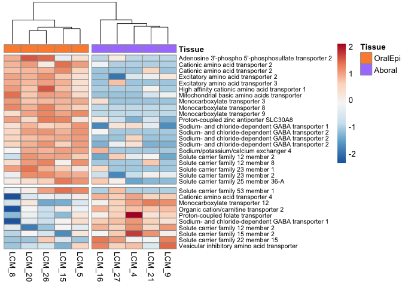<!-- -->

### 0.11.5 Zona pellucida

``` r
Amil_ZP <- DESeq_SwissProt %>% filter(blast_hit=="G8HTB6") %>% pull(query) %>% unique()

PFAM_ZP_domain <- annot_all   %>% filter(grepl("Zona_pellucida",Short.name,ignore.case=TRUE))  %>% 
  #filter(!(query %in% Amil_ZP)) %>% 
  pull(query) %>% unique()
```

### 0.11.6 wnt and hox

``` r
select <- unique(COMBINED_HOX_WNT_DE05$query)

z_scores <- t(scale(t(assay(vsd)[select, ]), center = TRUE, scale = TRUE))
Wnt_Hox_All_DE <- pheatmap(z_scores, color = colorRampPalette(rev(brewer.pal(n = 7, name = "RdBu")))(200), cluster_rows=TRUE, show_rownames=TRUE,
         cluster_cols=TRUE, cutree_cols = 2,annotation_col=(heatmap_metadata%>% select(Tissue)), annotation_colors = ann_colors,
         labels_row = COMBINED_HOX_WNT_DE05$Heatmap_Label, fontsize_row = 8, cutree_rows = 2)
Wnt_Hox_All_DE
save_ggplot(Wnt_Hox_All_DE, "Wnt_Hox_All_DE")
```

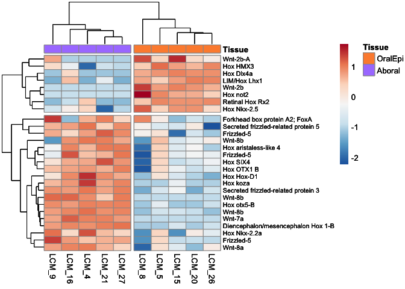<!-- -->

``` r
select <- unique(COMBINED_HOX_WNT_all$query)

z_scores <- t(scale(t(assay(vsd)[select, ]), center = TRUE, scale = TRUE))
Wnt_Hox_All <- pheatmap(z_scores, color = colorRampPalette(rev(brewer.pal(n = 7, name = "RdBu")))(200), cluster_rows=TRUE, show_rownames=TRUE,
         cluster_cols=TRUE, cutree_cols = 2,annotation_col=(heatmap_metadata%>% select(Tissue)), annotation_colors = ann_colors,
         labels_row = COMBINED_HOX_WNT_all$Heatmap_Label, fontsize_row = 8, cutree_rows = 2)
Wnt_Hox_All
save_ggplot(Wnt_Hox_All, "Wnt_Hox_All")
```

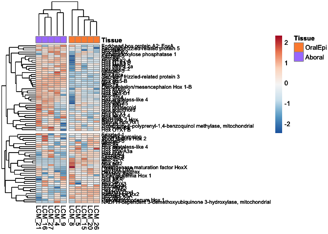<!-- -->

## 0.12 Updating Renv environment:

After you’ve confirmed your code works as expected, use renv::snapshot()
to record the packages and their sources in the lockfile.

``` r
renv::snapshot()
```
