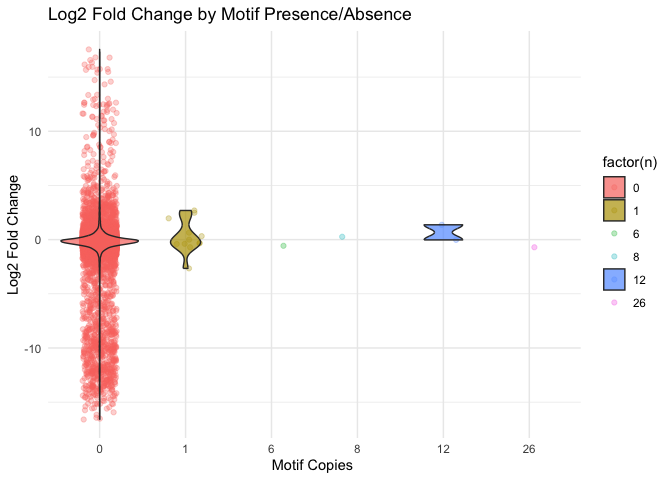
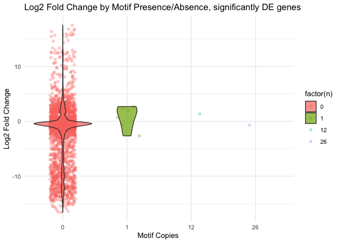

Transcription-Factors
================
Zoe Dellaert
2024-12-09

- [0.1 Transcription Factor analysis of LCM RNA
  Data](#01-transcription-factor-analysis-of-lcm-rna-data)
- [0.2 Managing Packages Using Renv](#02-managing-packages-using-renv)
- [0.3 Load packages](#03-load-packages)
- [0.4 Load in reference files and differential expression
  data](#04-load-in-reference-files-and-differential-expression-data)
- [0.5 Define promoter regions](#05-define-promoter-regions)
- [0.6 Run MEME in Linux environment using the Docker image of MEMESuite
  via
  Singularity](#06-run-meme-in-linux-environment-using-the-docker-image-of-memesuite-via-singularity)
  - [0.6.1 In unity:](#061-in-unity)
  - [0.6.2 FIMO: I am going to run FIMO to quantify these 2 motifs
    against all the
    genes.](#062-fimo-i-am-going-to-run-fimo-to-quantify-these-2-motifs-against-all-the-genes)
  - [0.6.3 FIMO Results, up Aboral](#063-fimo-results-up-aboral)
  - [0.6.4 FIMO Results, up OralEpi](#064-fimo-results-up-oralepi)
  - [0.6.5 Further looking into this motif, CAAVATGGCGG (MEME-3) -
    higher in OralEpi (negative
    L2FC)](#065-further-looking-into-this-motif-caavatggcgg-meme-3---higher-in-oralepi-negative-l2fc)
  - [0.6.6 Annotation of CAAVATGGCGG-motif-containing
    genes](#066-annotation-of-caavatggcgg-motif-containing-genes)
- [0.7 STREME: Relative enrichment of motifs compared to
  background](#07-streme-relative-enrichment-of-motifs-compared-to-background)
  - [0.7.1 Run STREME in Linux environment using the Docker image of
    MEMESuite via
    Singularity](#071-run-streme-in-linux-environment-using-the-docker-image-of-memesuite-via-singularity)
  - [0.7.2 In unity:](#072-in-unity)
- [0.8 STREME: Relative enrichment of motifs compared to opposite
  direction](#08-streme-relative-enrichment-of-motifs-compared-to-opposite-direction)
  - [0.8.1 Run STREME in Linux environment using the Docker image of
    MEMESuite via
    Singularity](#081-run-streme-in-linux-environment-using-the-docker-image-of-memesuite-via-singularity)
  - [0.8.2 In unity:](#082-in-unity)
- [0.9 Updating Renv environment:](#09-updating-renv-environment)

## 0.1 Transcription Factor analysis of LCM RNA Data

## 0.2 Managing Packages Using Renv

To run this code in my project using the renv environment, run the
following lines of code

``` r
install.packages("renv") #install the package on the new computer (may not be necessary if renv bootstraps itself as expected)
renv::restore() #reinstall all the package versions in the renv lockfile
```

## 0.3 Load packages

``` r
require("rtracklayer")
```

    ## Loading required package: rtracklayer

    ## Loading required package: GenomicRanges

    ## Loading required package: stats4

    ## Loading required package: BiocGenerics

    ## 
    ## Attaching package: 'BiocGenerics'

    ## The following objects are masked from 'package:stats':
    ## 
    ##     IQR, mad, sd, var, xtabs

    ## The following objects are masked from 'package:base':
    ## 
    ##     anyDuplicated, aperm, append, as.data.frame, basename, cbind,
    ##     colnames, dirname, do.call, duplicated, eval, evalq, Filter, Find,
    ##     get, grep, grepl, intersect, is.unsorted, lapply, Map, mapply,
    ##     match, mget, order, paste, pmax, pmax.int, pmin, pmin.int,
    ##     Position, rank, rbind, Reduce, rownames, sapply, setdiff, sort,
    ##     table, tapply, union, unique, unsplit, which.max, which.min

    ## Loading required package: S4Vectors

    ## 
    ## Attaching package: 'S4Vectors'

    ## The following object is masked from 'package:utils':
    ## 
    ##     findMatches

    ## The following objects are masked from 'package:base':
    ## 
    ##     expand.grid, I, unname

    ## Loading required package: IRanges

    ## Loading required package: GenomeInfoDb

    ## Registered S3 method overwritten by 'SparseArray':
    ##   method           from        
    ##   rowsum.dgCMatrix DelayedArray

``` r
require("Biostrings")
```

    ## Loading required package: Biostrings

    ## Warning: package 'Biostrings' was built under R version 4.3.3

    ## Loading required package: XVector

    ## 
    ## Attaching package: 'Biostrings'

    ## The following object is masked from 'package:base':
    ## 
    ##     strsplit

``` r
require("GenomicRanges")
require("knitr")
```

    ## Loading required package: knitr

    ## Warning: package 'knitr' was built under R version 4.3.3

``` r
require("tidyverse")
```

    ## Loading required package: tidyverse

    ## ── Attaching core tidyverse packages ──────────────────────── tidyverse 2.0.0 ──
    ## ✔ dplyr     1.1.4     ✔ readr     2.1.5
    ## ✔ forcats   1.0.0     ✔ stringr   1.5.1
    ## ✔ ggplot2   3.5.1     ✔ tibble    3.2.1
    ## ✔ lubridate 1.9.3     ✔ tidyr     1.3.1
    ## ✔ purrr     1.0.2     
    ## ── Conflicts ────────────────────────────────────────── tidyverse_conflicts() ──
    ## ✖ lubridate::%within%() masks IRanges::%within%()
    ## ✖ dplyr::collapse()     masks Biostrings::collapse(), IRanges::collapse()
    ## ✖ dplyr::combine()      masks BiocGenerics::combine()
    ## ✖ purrr::compact()      masks XVector::compact()
    ## ✖ dplyr::desc()         masks IRanges::desc()
    ## ✖ tidyr::expand()       masks S4Vectors::expand()
    ## ✖ dplyr::filter()       masks stats::filter()
    ## ✖ dplyr::first()        masks S4Vectors::first()
    ## ✖ dplyr::lag()          masks stats::lag()
    ## ✖ ggplot2::Position()   masks BiocGenerics::Position(), base::Position()
    ## ✖ purrr::reduce()       masks GenomicRanges::reduce(), IRanges::reduce()
    ## ✖ dplyr::rename()       masks S4Vectors::rename()
    ## ✖ lubridate::second()   masks S4Vectors::second()
    ## ✖ lubridate::second<-() masks S4Vectors::second<-()
    ## ✖ dplyr::slice()        masks XVector::slice(), IRanges::slice()
    ## ℹ Use the conflicted package (<http://conflicted.r-lib.org/>) to force all conflicts to become errors

``` r
sessionInfo() #provides list of loaded packages and version of R.
```

    ## R version 4.3.2 (2023-10-31)
    ## Platform: aarch64-apple-darwin20 (64-bit)
    ## Running under: macOS Ventura 13.0
    ## 
    ## Matrix products: default
    ## BLAS:   /Library/Frameworks/R.framework/Versions/4.3-arm64/Resources/lib/libRblas.0.dylib 
    ## LAPACK: /Library/Frameworks/R.framework/Versions/4.3-arm64/Resources/lib/libRlapack.dylib;  LAPACK version 3.11.0
    ## 
    ## locale:
    ## [1] en_US.UTF-8/en_US.UTF-8/en_US.UTF-8/C/en_US.UTF-8/en_US.UTF-8
    ## 
    ## time zone: America/New_York
    ## tzcode source: internal
    ## 
    ## attached base packages:
    ## [1] stats4    stats     graphics  grDevices datasets  utils     methods  
    ## [8] base     
    ## 
    ## other attached packages:
    ##  [1] lubridate_1.9.3      forcats_1.0.0        stringr_1.5.1       
    ##  [4] dplyr_1.1.4          purrr_1.0.2          readr_2.1.5         
    ##  [7] tidyr_1.3.1          tibble_3.2.1         ggplot2_3.5.1       
    ## [10] tidyverse_2.0.0      knitr_1.48           Biostrings_2.70.3   
    ## [13] XVector_0.40.0       rtracklayer_1.62.0   GenomicRanges_1.54.1
    ## [16] GenomeInfoDb_1.36.4  IRanges_2.34.1       S4Vectors_0.38.2    
    ## [19] BiocGenerics_0.46.0 
    ## 
    ## loaded via a namespace (and not attached):
    ##  [1] SummarizedExperiment_1.30.2 gtable_0.3.5               
    ##  [3] rjson_0.2.23                xfun_0.48                  
    ##  [5] Biobase_2.60.0              lattice_0.22-6             
    ##  [7] tzdb_0.4.0                  vctrs_0.6.5                
    ##  [9] tools_4.3.2                 bitops_1.0-9               
    ## [11] generics_0.1.3              parallel_4.3.2             
    ## [13] fansi_1.0.6                 pkgconfig_2.0.3            
    ## [15] Matrix_1.6-5                lifecycle_1.0.4            
    ## [17] GenomeInfoDbData_1.2.10     compiler_4.3.2             
    ## [19] Rsamtools_2.18.0            munsell_0.5.1              
    ## [21] codetools_0.2-20            htmltools_0.5.8.1          
    ## [23] RCurl_1.98-1.16             yaml_2.3.10                
    ## [25] pillar_1.9.0                crayon_1.5.3               
    ## [27] BiocParallel_1.34.2         DelayedArray_0.26.7        
    ## [29] abind_1.4-8                 tidyselect_1.2.1           
    ## [31] digest_0.6.37               stringi_1.8.4              
    ## [33] restfulr_0.0.15             fastmap_1.2.0              
    ## [35] grid_4.3.2                  colorspace_2.1-1           
    ## [37] cli_3.6.3                   SparseArray_1.2.4          
    ## [39] magrittr_2.0.3              S4Arrays_1.0.6             
    ## [41] XML_3.99-0.17               utf8_1.2.4                 
    ## [43] withr_3.0.1                 scales_1.3.0               
    ## [45] timechange_0.3.0            rmarkdown_2.28             
    ## [47] matrixStats_1.4.1           hms_1.1.3                  
    ## [49] evaluate_1.0.1              BiocIO_1.12.0              
    ## [51] rlang_1.1.4                 glue_1.8.0                 
    ## [53] BiocManager_1.30.25         renv_1.0.11                
    ## [55] rstudioapi_0.17.0           R6_2.5.1                   
    ## [57] MatrixGenerics_1.12.3       GenomicAlignments_1.38.2   
    ## [59] zlibbioc_1.46.0

## 0.4 Load in reference files and differential expression data

In the next chunk I am loadinf in my DESeq data. These results are
ordered by adjusted p-value. As a reminder, negative LFC = higher in
Aboral tissue, and positive LFC = higher in Oral tissue.

``` r
DESeq <- read.csv("../output_RNA/differential_expression/DESeq_results.csv", header = TRUE) %>% dplyr::rename("query" ="X")
DE_05 <- DESeq %>% filter(padj < 0.05)
```

I want to identify promoter sequences of the differentially expressed
genes to identify transcription factor binding sites. Below I load in
the *Pocillopora acuta* genome and gff annotation files, which are in
the references folder of this repo and were downloaded as described
here:
<https://github.com/zdellaert/LaserCoral/blob/main/code/RNA-seq-bioinf.md>.

``` r
# Import the P. acuta genome
genome_fasta <- "../references/Pocillopora_acuta_HIv2.assembly.fasta"
genome <- readDNAStringSet(genome_fasta, format = "fasta")

# Import the P actua genome gff3 file
gff_file <- "../references/Pocillopora_acuta_HIv2.genes.gff3"
gff <- import(gff_file, format = "gff")

#What types of entries are in the gff
unique(gff$type)
```

    ## [1] transcript CDS        exon      
    ## Levels: transcript CDS exon

``` r
#keep only transcript entries, to have one entry per gene
gff <- gff[gff$type=="transcript"]

#the gff is missing chromosome lengths, so I am adding them here:
chromosome_lengths <- seqlengths(genome)
head(chromosome_lengths)
```

    ## Pocillopora_acuta_HIv2___Sc0000000 Pocillopora_acuta_HIv2___Sc0000001 
    ##                           15774912                           13657580 
    ## Pocillopora_acuta_HIv2___Sc0000002 Pocillopora_acuta_HIv2___Sc0000003 
    ##                           11458840                           11317442 
    ## Pocillopora_acuta_HIv2___Sc0000004 Pocillopora_acuta_HIv2___Sc0000005 
    ##                           10346329                            9803754

``` r
head(seqlengths(gff))
```

    ## Pocillopora_acuta_HIv2___Sc0000000 Pocillopora_acuta_HIv2___Sc0000001 
    ##                                 NA                                 NA 
    ## Pocillopora_acuta_HIv2___Sc0000002 Pocillopora_acuta_HIv2___Sc0000003 
    ##                                 NA                                 NA 
    ## Pocillopora_acuta_HIv2___Sc0000004 Pocillopora_acuta_HIv2___Sc0000005 
    ##                                 NA                                 NA

``` r
seqlengths(gff) <- chromosome_lengths[names(chromosome_lengths) %in% seqlevels(gff)]

head(seqlengths(gff))
```

    ## Pocillopora_acuta_HIv2___Sc0000000 Pocillopora_acuta_HIv2___Sc0000001 
    ##                           15774912                           13657580 
    ## Pocillopora_acuta_HIv2___Sc0000002 Pocillopora_acuta_HIv2___Sc0000003 
    ##                           11458840                           11317442 
    ## Pocillopora_acuta_HIv2___Sc0000004 Pocillopora_acuta_HIv2___Sc0000005 
    ##                           10346329                            9803754

Filter the gff for all expressed genes in the dataset (filtered, this is
not all genes in the genome)

``` r
gff_expressed <- gff[gff$ID %in% DESeq$query] 
```

## 0.5 Define promoter regions

I am basing this idea off of the following paper:

“extract the putative promoter sequence, defined as the 500 bp
immediately upstream of the predicted transcription start site in the
gene model.”

Cleves PA, Krediet CJ, Lehnert EM, Onishi M, Pringle JR. Insights into
coral bleaching under heat stress from analysis of gene expression in a
sea anemone model system. Proceedings of the National Academy of
Sciences. 2020 Nov 17;117(46):28906–17.
(<https://www.pnas.org/doi/10.1073/pnas.2015737117>)

I am going to try using the promoters function of the GenomicRanges
Package (manual here:
<https://bioconductor.org/packages/devel/bioc/manuals/GenomicRanges/man/GenomicRanges.pdf>):

The function is described as such:

promoters: assumes that the ranges in x represent transcript regions and
returns the ranges of the corresponding promoter regions. The result is
another GenomicRanges derivative parallel to the input, that is, of the
same length as x and with the i-th element in the output corresponding
to the i-th element in the input.

The promoter regions extend around the transcription start sites (TSS)
which are located at start(x) for ranges on the + or \* strand, and at
end(x) for ranges on the - strand. The upstream and downstream arguments
define the number of nucleotides in the 5’ and 3’ direction,
respectively. More precisely, the output range is defined as

> (start(x) - upstream) to (start(x) + downstream - 1)

for ranges on the + or \* strand, and as

> (end(x) - downstream + 1) to (end(x) + upstream)

for ranges on the - strand. Be aware that the returned object might
contain **out-of-bound ranges** i.e. ranges that start before the first
nucleotide position and/or end after the last nucleotide position of the
underlying sequence.

``` r
promoters_500_UP <- promoters(gff_expressed, upstream = 500, downstream = 0)
```

    ## Warning in valid.GenomicRanges.seqinfo(x, suggest.trim = TRUE): GRanges object contains 42 out-of-bound ranges located on sequences
    ##   Pocillopora_acuta_HIv2___Sc0000016,
    ##   Pocillopora_acuta_HIv2___xfSc0000017,
    ##   Pocillopora_acuta_HIv2___Sc0000010,
    ##   Pocillopora_acuta_HIv2___xfSc0000231,
    ##   Pocillopora_acuta_HIv2___xfSc0000071,
    ##   Pocillopora_acuta_HIv2___Sc0000021,
    ##   Pocillopora_acuta_HIv2___xfSc0000033,
    ##   Pocillopora_acuta_HIv2___xpSc0000390,
    ##   Pocillopora_acuta_HIv2___xfSc0000015,
    ##   Pocillopora_acuta_HIv2___Sc0000015,
    ##   Pocillopora_acuta_HIv2___xfSc0000161,
    ##   Pocillopora_acuta_HIv2___Sc0000036,
    ##   Pocillopora_acuta_HIv2___xfSc0000021,
    ##   Pocillopora_acuta_HIv2___xfSc0000177,
    ##   Pocillopora_acuta_HIv2___Sc0000039, Pocillopora_acuta_HIv2___Sc0000035,
    ##   Pocillopora_acuta_HIv2___xfSc0000029,
    ##   Pocillopora_acuta_HIv2___xfSc0000163,
    ##   Pocillopora_acuta_HIv2___xfSc0000350,
    ##   Pocillopora_acuta_HIv2___xfSc0000108,
    ##   Pocillopora_acuta_HIv2___xfSc0000278,
    ##   Pocillopora_acuta_HIv2___xfSc0000152,
    ##   Pocillopora_acuta_HIv2___xfSc0000227,
    ##   Pocillopora_acuta_HIv2___xfSc0000129,
    ##   Pocillopora_acuta_HIv2___xfSc0000271,
    ##   Pocillopora_acuta_HIv2___xfSc0000229,
    ##   Pocillopora_acuta_HIv2___xfSc0000262,
    ##   Pocillopora_acuta_HIv2___xfSc0000212,
    ##   Pocillopora_acuta_HIv2___xfSc0000143,
    ##   Pocillopora_acuta_HIv2___xfSc0000142,
    ##   Pocillopora_acuta_HIv2___xfSc0000107,
    ##   Pocillopora_acuta_HIv2___xfSc0000210,
    ##   Pocillopora_acuta_HIv2___Sc0000066,
    ##   Pocillopora_acuta_HIv2___xfSc0000287,
    ##   Pocillopora_acuta_HIv2___xfSc0000213,
    ##   Pocillopora_acuta_HIv2___xfSc0000230,
    ##   Pocillopora_acuta_HIv2___xfSc0000288,
    ##   Pocillopora_acuta_HIv2___xfSc0000185,
    ##   Pocillopora_acuta_HIv2___xfSc0000384,
    ##   Pocillopora_acuta_HIv2___xfSc0000380,
    ##   Pocillopora_acuta_HIv2___xfSc0000381, and
    ##   Pocillopora_acuta_HIv2___xfSc0000302. Note that ranges located on a
    ##   sequence whose length is unknown (NA) or on a circular sequence are not
    ##   considered out-of-bound (use seqlengths() and isCircular() to get the
    ##   lengths and circularity flags of the underlying sequences). You can use
    ##   trim() to trim these ranges. See ?`trim,GenomicRanges-method` for more
    ##   information.

``` r
# are any of these regions out of bounds?

summary(start(promoters_500_UP))
```

    ##     Min.  1st Qu.   Median     Mean  3rd Qu.     Max. 
    ##     -499   858876  2271955  3196995  4589764 16591922

``` r
#yes! I have some regions starting at -499, which is not good.

#trim any promoters that exit the boundaries of the chromosomes, none of mine did but just in case
promoters_500_UP <- GenomicRanges::trim(promoters_500_UP)

summary(start(promoters_500_UP))
```

    ##     Min.  1st Qu.   Median     Mean  3rd Qu.     Max. 
    ##        1   858876  2271955  3196996  4589764 16591922

``` r
# also remove any rows where the promoter sequence now has a width < 500

promoters_500_UP <- promoters_500_UP[promoters_500_UP@ranges@width == 500]

write_tsv(data.frame(promoters_500_UP), "../output_RNA/differential_expression/TFs/promoters.gff", col_names = FALSE)
```

Then, extract these sequences, by chromosome, using the function
“DNAStringSet”:

``` r
#create a DNAStringSet object to house all the sequences
promoters_all <- DNAStringSet()

for (chromosome in unique(seqnames(promoters_500_UP))) {
  
  # filter the genome, one chromosome at a time
  genome_filtered <- genome[genome@ranges@NAMES %in% chromosome]
  
  # one chromosome at a time, filter the gff dataframe
  promoters_500_UP_filtered <- data.frame(promoters_500_UP) %>% filter(seqnames == chromosome)
  
  # set up a list for this chromosome
  promoters_chromosome <- DNAStringSetList()
  
  # then iterate over every row (transcript) for that chromosome
  for (i in 1:nrow(promoters_500_UP_filtered)) {
    
    #use the DNAStringSet function to subset the chromosome into the promoter regions of interest
    promoter <- DNAStringSet(genome_filtered,
                             start= promoters_500_UP_filtered$start[i],
                             end= promoters_500_UP_filtered$end[i])
    
    #carry over the transcript name (what we really care about!)
    names(promoter) <- promoters_500_UP_filtered$ID[i]
    
    #append this extracted sequence to the promoter list for this chromosome
    promoters_chromosome <-  c(promoters_chromosome, promoter)
  }
  
  #append this chromosome list to the DNAStringSetList for all chromosomes
  promoters_all <- c(promoters_all, unlist(promoters_chromosome))
}

writeXStringSet(promoters_all, filepath = "../output_RNA/differential_expression/TFs/promoters_500_upstream.fasta")

promoters_upAboral <- promoters_all[promoters_all@ranges@NAMES %in% DE_05[which(DE_05$log2FoldChange > 0),]$query]

promoters_upOralEpi <- promoters_all[promoters_all@ranges@NAMES %in% DE_05[which(DE_05$log2FoldChange < 0),]$query]

writeXStringSet(promoters_upAboral, filepath = "../output_RNA/differential_expression/TFs/promoters_500_upstream_upAboral.fasta")
writeXStringSet(promoters_upOralEpi, filepath = "../output_RNA/differential_expression/TFs/promoters_500_upstream_upOralEpi.fasta")

promoters_notDE <- promoters_all[!(promoters_all@ranges@NAMES %in% DE_05$query)]
writeXStringSet(promoters_notDE, filepath = "../output_RNA/differential_expression/TFs/promoters_500_upstream_notDE.fasta")
```

## 0.6 Run MEME in Linux environment using the [Docker image of MEMESuite](https://hub.docker.com/r/memesuite/memesuite) via Singularity

alternatively submit jobs via their webserver:
<https://meme-suite.org/meme/>

### 0.6.1 In unity:

``` bash
cd ../scripts
nano MEME.sh
```

``` bash
#!/usr/bin/env bash
#SBATCH --export=NONE
#SBATCH --nodes=1 --ntasks-per-node=24
#SBATCH --signal=2
#SBATCH --no-requeue
#SBATCH --mem=200GB
#SBATCH --error=../scripts/outs_errs/"%x_error.%j"
#SBATCH --output=../scripts/outs_errs/"%x_output.%j"
#SBATCH -t 24:00:00
#SBATCH --mail-type=BEGIN,END,FAIL #email you when job starts, stops and/or fails

SINGULARITY_IMAGE="docker://memesuite/memesuite:latest"

#Download Motif databases
cd ../references
wget https://meme-suite.org/meme/meme-software/Databases/motifs/motif_databases.12.25.tgz
tar -xvzf motif_databases.12.25.tgz
mv motif_databases motif_dbs

cd ../output_RNA/differential_expression/TFs

module load apptainer/latest

# run MEME on the differentially expressed gene fasta files, only report motifs with e-value < 0.05

singularity exec --cleanenv $SINGULARITY_IMAGE meme promoters_500_upstream_upAboral.fasta -dna -maxw 15 -mod anr -evt 0.05 -p 6 -oc meme_output_upAboral -revcomp

singularity exec --cleanenv $SINGULARITY_IMAGE meme promoters_500_upstream_upOralEpi.fasta -dna -maxw 15 -mod anr -evt 0.05 -p 6 -oc meme_output_upOralEpi -revcomp

# run TOMTOM on the MEME-identified motifs from above

singularity exec --cleanenv $SINGULARITY_IMAGE tomtom -no-ssc -oc tomtom_output_upAboral -min-overlap 5 -dist pearson -thresh 0.05 meme_output_upAboral/meme.txt ../../../references/motif_dbs/JASPAR/JASPAR2022_CORE_non-redundant_v2.meme ../../../references/motif_dbs/EUKARYOTE/homeodomain.meme ../../../references/motif_dbs/EUKARYOTE/jolma2013.meme

singularity exec --cleanenv $SINGULARITY_IMAGE tomtom -no-ssc -oc tomtom_output_upOralEpi -min-overlap 5 -dist pearson -thresh 0.05 meme_output_upOralEpi/meme.txt ../../../references/motif_dbs/JASPAR/JASPAR2022_CORE_non-redundant_v2.meme ../../../references/motif_dbs/EUKARYOTE/homeodomain.meme ../../../references/motif_dbs/EUKARYOTE/jolma2013.meme
```

**up_Aboral**: Based on the TOMTOM results, three motifs had significant
(q \< 0.05) matches to the databases queried:

1.  Poly-C, not interesting:
    
2.  Poly-T, not interesting:
    
3.  KGGAATTCCTAGGAA (MEME-3):
    

- There was a match to the **Reverse complement** of this motif.
- Match 1: MA0731.1 (BCL6B)
  - 
  - Database JASPAR2022_CORE_non-redundant_v2
    - Identical match from **jolma2013** database: BCL6B_DBD
  - p-value 2.54e-06
  - E-value 7.57e-03
  - q-value 7.57e-03
  - Overlap 14
  - Offset -1
  - Orientation Reverse Complement

**up_OralEpi**: Based on the TOMTOM results, three motifs had
significant (q \< 0.05) matches to the databases queried:

1.  Poly-G, not interesting:
    
2.  Poly-A, not interesting:
    
3.  CAAVATGGCGG (MEME-3):
    

- Match 1:
  - 
  - Name YY2_full_1
  - Database jolma2013
  - p-value 7.01e-07
  - E-value 2.09e-03
  - q-value 4.17e-03
  - Overlap 10
  - Offset -1
  - Orientation Reverse Complement
- Match 2
  - 
  - Name MA1651.1 (ZFP42)
  - Database JASPAR2022_CORE_non-redundant_v2
  - p-value 7.48e-06
  - E-value 2.23e-02
  - q-value 1.67e-02
  - Overlap 11
  - Offset 4
  - Orientation Normal
- Match 3:
  - 
  - Name MA0095.3 (Yy1)
  - Database JASPAR2022_CORE_non-redundant_v2
  - p-value 8.41e-06
  - E-value 2.51e-02
  - q-value 1.67e-02
  - Overlap 10
  - Offset 2
  - Orientation Normal

### 0.6.2 FIMO: I am going to run FIMO to quantify these 2 motifs against all the genes.

``` bash
cd ../scripts
nano MEME_FIMO.sh
```

``` bash
#!/usr/bin/env bash
#SBATCH --export=NONE
#SBATCH --nodes=1 --ntasks-per-node=24
#SBATCH --signal=2
#SBATCH --no-requeue
#SBATCH --mem=200GB
#SBATCH --error=../scripts/outs_errs/"%x_error.%j"
#SBATCH --output=../scripts/outs_errs/"%x_output.%j"
#SBATCH -t 24:00:00
#SBATCH --mail-type=BEGIN,END,FAIL #email you when job starts, stops and/or fails

SINGULARITY_IMAGE="docker://memesuite/memesuite:latest"

cd ../output_RNA/differential_expression/TFs

module load apptainer/latest

# run FIMO 

singularity exec --cleanenv $SINGULARITY_IMAGE fimo --oc fimo_output_upAboral --motif "KGGAATTCCTAGGAA" meme_output_upAboral/meme.txt promoters_500_upstream.fasta

singularity exec --cleanenv $SINGULARITY_IMAGE fimo --oc fimo_output_upOralEpi --motif "CAAVATGGCGG" meme_output_upOralEpi/meme.txt promoters_500_upstream.fasta
```

### 0.6.3 FIMO Results, up Aboral

Visualize log-fold change of genes that have this motif in their
promoter sequences:

``` r
fimo <- read.table("../output_RNA/differential_expression/TFs/fimo_output_upAboral/fimo.tsv", header = TRUE)

fimo_filtered <- fimo %>% filter(q.value < 0.05)  

# Merge FIMO results with DESeq data 
fimo_merged <- fimo_filtered %>% full_join(DESeq, by = c("sequence_name" = "query"))

#summarize

fimo_counts <- fimo_merged %>% group_by(sequence_name, log2FoldChange, padj,  motif_id) %>% count() %>%
  mutate(n = if_else(is.na(motif_id), 0, n)) 

fimo_counts_DE <- fimo_counts %>% filter(padj < 0.05)

ggplot(fimo_counts, aes(x = factor(n), y = log2FoldChange, fill = factor(n))) +
  geom_jitter(width = 0.2, alpha = 0.3, aes(color = factor(n))) +
  geom_violin(alpha = 0.7) + 
  theme_minimal() +
  labs(
    title = "Log2 Fold Change by Motif Presence/Absence",
    x = "Motif Copies ",
    y = "Log2 Fold Change"
  ) 
```

    ## Warning: Groups with fewer than two datapoints have been dropped.
    ## ℹ Set `drop = FALSE` to consider such groups for position adjustment purposes.
    ## Groups with fewer than two datapoints have been dropped.
    ## ℹ Set `drop = FALSE` to consider such groups for position adjustment purposes.
    ## Groups with fewer than two datapoints have been dropped.
    ## ℹ Set `drop = FALSE` to consider such groups for position adjustment purposes.

<!-- -->

``` r
ggplot(fimo_counts_DE, aes(x = factor(n), y = log2FoldChange, fill = factor(n))) +
  geom_jitter(width = 0.2, alpha = 0.3, aes(color = factor(n))) +
  geom_violin(alpha = 0.7) + 
  theme_minimal() +
  labs(
    title = "Log2 Fold Change by Motif Presence/Absence, significantly DE genes",
    x = "Motif Copies ",
    y = "Log2 Fold Change"
  ) 
```

    ## Warning: Groups with fewer than two datapoints have been dropped.
    ## ℹ Set `drop = FALSE` to consider such groups for position adjustment purposes.
    ## Groups with fewer than two datapoints have been dropped.
    ## ℹ Set `drop = FALSE` to consider such groups for position adjustment purposes.

<!-- -->

Not a huge effect of this motif on the log2foldchange. FIMO found 26
occurrences of this motif in the promoter of one gene, and the
repetitive nature of the motif definitely contributed to this.

``` r
fimo_presence_absence <- fimo_counts %>% mutate(n = if_else(n>0, 1, n))

fimo_presence_absence_DE <- fimo_presence_absence %>% filter(padj < 0.05)

# Fisher's exact test for presence/absence
fisher_table <- table(fimo_presence_absence_DE$n, fimo_presence_absence_DE$log2FoldChange < 0)
fisher_table
```

    ##    
    ##     FALSE TRUE
    ##   0   799 2799
    ##   1     5    3

``` r
fisher.test(fisher_table)
```

    ## 
    ##  Fisher's Exact Test for Count Data
    ## 
    ## data:  fisher_table
    ## p-value = 0.01662
    ## alternative hypothesis: true odds ratio is not equal to 1
    ## 95 percent confidence interval:
    ##  0.02655846 0.88305120
    ## sample estimates:
    ## odds ratio 
    ##  0.1713858

``` r
fisher_table <- table(fimo_presence_absence$n, fimo_presence_absence$log2FoldChange < 0)
fisher_table
```

    ##    
    ##     FALSE TRUE
    ##   0  4794 9653
    ##   1     7   10

``` r
fisher.test(fisher_table)
```

    ## 
    ##  Fisher's Exact Test for Count Data
    ## 
    ## data:  fisher_table
    ## p-value = 0.6069
    ## alternative hypothesis: true odds ratio is not equal to 1
    ## 95 percent confidence interval:
    ##  0.2435957 2.1974682
    ## sample estimates:
    ## odds ratio 
    ##  0.7094708

``` r
logistic_model <- glm((log2FoldChange > 0) ~ n, data = fimo_presence_absence_DE, family = binomial)
summary(logistic_model)
```

    ## 
    ## Call:
    ## glm(formula = (log2FoldChange > 0) ~ n, family = binomial, data = fimo_presence_absence_DE)
    ## 
    ## Coefficients:
    ##             Estimate Std. Error z value Pr(>|z|)    
    ## (Intercept) -1.25366    0.04011 -31.255   <2e-16 ***
    ## n            1.76448    0.73140   2.412   0.0158 *  
    ## ---
    ## Signif. codes:  0 '***' 0.001 '**' 0.01 '*' 0.05 '.' 0.1 ' ' 1
    ## 
    ## (Dispersion parameter for binomial family taken to be 1)
    ## 
    ##     Null deviance: 3826.9  on 3605  degrees of freedom
    ## Residual deviance: 3821.0  on 3604  degrees of freedom
    ## AIC: 3825
    ## 
    ## Number of Fisher Scoring iterations: 4

``` r
logistic_model <- glm((log2FoldChange > 0) ~ n, data = fimo_presence_absence, family = binomial)
summary(logistic_model)
```

    ## 
    ## Call:
    ## glm(formula = (log2FoldChange > 0) ~ n, family = binomial, data = fimo_presence_absence)
    ## 
    ## Coefficients:
    ##             Estimate Std. Error z value Pr(>|z|)    
    ## (Intercept) -0.69990    0.01767 -39.612   <2e-16 ***
    ## n            0.34323    0.49312   0.696    0.486    
    ## ---
    ## Signif. codes:  0 '***' 0.001 '**' 0.01 '*' 0.05 '.' 0.1 ' ' 1
    ## 
    ## (Dispersion parameter for binomial family taken to be 1)
    ## 
    ##     Null deviance: 18385  on 14463  degrees of freedom
    ## Residual deviance: 18384  on 14462  degrees of freedom
    ## AIC: 18388
    ## 
    ## Number of Fisher Scoring iterations: 4

### 0.6.4 FIMO Results, up OralEpi

Visualize log-fold change of genes that have this motif in their
promoter sequences:

``` r
fimo <- read.table("../output_RNA/differential_expression/TFs/fimo_output_upOralEpi/fimo.tsv", header = TRUE)

fimo_filtered <- fimo %>% filter(q.value < 0.05)  

# Merge FIMO results with DESeq data 
fimo_merged <- fimo_filtered %>% full_join(DESeq, by = c("sequence_name" = "query"))

#summarize

fimo_counts <- fimo_merged %>% group_by(sequence_name, log2FoldChange, padj,  motif_id) %>% count() %>%
  mutate(n = if_else(is.na(motif_id), 0, n)) 

fimo_counts_DE <- fimo_counts %>% filter(padj < 0.05)
```

``` r
plot_data <- fimo_counts %>%
  mutate(motif_count = case_when(
    n == 0 ~ "0 Motifs",
    n == 1 ~ "1 Motif",
    n > 1 ~ ">1 Motifs"
  )) %>%
  mutate(motif_count = factor(motif_count, levels = c("0 Motifs", "1 Motif", ">1 Motifs")))

plot <- ggplot(plot_data, aes(x = motif_count, y = log2FoldChange, fill = motif_count)) +
  geom_jitter(aes(color = motif_count), width = 0.2, size = 1.5, alpha = 0.6) +  
  geom_violin(alpha = 0.7, width = 0.5) +  
  stat_summary(fun = mean, geom = "point", shape = 21,  size = 2, fill = "white", color = "black") + 
  scale_fill_brewer(palette = "Set2") +  
  scale_color_brewer(palette = "Set2") + 
  labs(
    title = "Log2 Fold Change by Motif Presence",
    subtitle = "All Genes",
    x = "Number of Motifs in Promoter",
    y = "Log2 Fold Change",
    fill = "Motif Count",
    color = "Motif Count"
  ) +
  theme_minimal(base_size = 14) + 
  theme(
    legend.position = "none",  
    plot.title = element_text(face = "bold", size = 16),
    plot.subtitle = element_text(size = 14),
    axis.text = element_text(size = 12),
    axis.title = element_text(size = 14),
    panel.grid.major = element_line(size = 0.5, linetype = "dashed", color = "gray80")
  )
```

    ## Warning: The `size` argument of `element_line()` is deprecated as of ggplot2 3.4.0.
    ## ℹ Please use the `linewidth` argument instead.
    ## This warning is displayed once every 8 hours.
    ## Call `lifecycle::last_lifecycle_warnings()` to see where this warning was
    ## generated.

``` r
# Save the plot as a high-quality PNG
ggsave("../output_RNA/differential_expression/TFs/fimo_output_upOralEpi/fimo_motif6.png", plot, width = 8, height = 6, dpi = 300)

# Display the plot
print(plot)
```

<!-- -->

``` r
plot_data <- fimo_counts_DE %>%
  mutate(motif_count = case_when(
    n == 0 ~ "0 Motifs",
    n == 1 ~ "1 Motif",
    n > 1 ~ ">1 Motifs"
  )) %>%
  mutate(motif_count = factor(motif_count, levels = c("0 Motifs", "1 Motif", ">1 Motifs")))

plot <- ggplot(plot_data, aes(x = motif_count, y = log2FoldChange, fill = motif_count)) +
  geom_jitter(aes(color = motif_count), width = 0.2, size = 1.5, alpha = 0.6) +  
  geom_violin(alpha = 0.7, width = 0.5) + 
  stat_summary(fun = mean, geom = "point", shape = 21, size = 2, fill = "white", color = "black") +  
  scale_fill_brewer(palette = "Set2") + 
  scale_color_brewer(palette = "Set2") +  
  labs(
    title = "Log2 Fold Change by Motif Presence",
    subtitle = "Significantly DE Genes",
    x = "Number of Motifs in Promoter",
    y = "Log2 Fold Change",
    fill = "Motif Count",
    color = "Motif Count"
  ) +
  theme_minimal(base_size = 14) +  
  theme(
    legend.position = "none", 
    plot.title = element_text(face = "bold", size = 16),
    plot.subtitle = element_text(size = 14),
    axis.text = element_text(size = 12),
    axis.title = element_text(size = 14),
    panel.grid.major = element_line(size = 0.5, linetype = "dashed", color = "gray80")
  )

ggsave("../output_RNA/differential_expression/TFs/fimo_output_upOralEpi/fimo_motif6_DE.png", plot, width = 8, height = 6, dpi = 300)

# Display the plot
print(plot)
```

<!-- -->

**Wow! It looks like the presence of this motif may be reflected in
log2FoldChange! The genes with 1 or 2 sites have predominately negative
fold change.**

``` r
fimo_presence_absence <- fimo_counts %>% mutate(n = if_else(n>0, 1, n))

fimo_presence_absence_DE <- fimo_presence_absence %>% filter(padj < 0.05)

# Fisher's exact test for presence/absence
fisher_table <- table(fimo_presence_absence_DE$n, fimo_presence_absence_DE$log2FoldChange > 0)
fisher_table
```

    ##    
    ##     FALSE TRUE
    ##   0  2533  787
    ##   1   269   17

``` r
fisher.test(fisher_table)
```

    ## 
    ##  Fisher's Exact Test for Count Data
    ## 
    ## data:  fisher_table
    ## p-value = 1.127e-14
    ## alternative hypothesis: true odds ratio is not equal to 1
    ## 95 percent confidence interval:
    ##  0.1160307 0.3346326
    ## sample estimates:
    ## odds ratio 
    ##  0.2034528

``` r
fisher_table <- table(fimo_presence_absence$n, fimo_presence_absence$log2FoldChange > 0)
fisher_table
```

    ##    
    ##     FALSE TRUE
    ##   0  8553 4391
    ##   1  1110  410

``` r
fisher.test(fisher_table)
```

    ## 
    ##  Fisher's Exact Test for Count Data
    ## 
    ## data:  fisher_table
    ## p-value = 3.664e-08
    ## alternative hypothesis: true odds ratio is not equal to 1
    ## 95 percent confidence interval:
    ##  0.6371654 0.8113133
    ## sample estimates:
    ## odds ratio 
    ##   0.719492

``` r
logistic_model <- glm((log2FoldChange > 0) ~ n, data = fimo_presence_absence_DE, family = binomial)
summary(logistic_model)
```

    ## 
    ## Call:
    ## glm(formula = (log2FoldChange > 0) ~ n, family = binomial, data = fimo_presence_absence_DE)
    ## 
    ## Coefficients:
    ##             Estimate Std. Error z value Pr(>|z|)    
    ## (Intercept) -1.16893    0.04081 -28.643  < 2e-16 ***
    ## n           -1.59257    0.25339  -6.285 3.28e-10 ***
    ## ---
    ## Signif. codes:  0 '***' 0.001 '**' 0.01 '*' 0.05 '.' 0.1 ' ' 1
    ## 
    ## (Dispersion parameter for binomial family taken to be 1)
    ## 
    ##     Null deviance: 3826.9  on 3605  degrees of freedom
    ## Residual deviance: 3765.4  on 3604  degrees of freedom
    ## AIC: 3769.4
    ## 
    ## Number of Fisher Scoring iterations: 5

``` r
logistic_model <- glm((log2FoldChange > 0) ~ n, data = fimo_presence_absence, family = binomial)
summary(logistic_model)
```

    ## 
    ## Call:
    ## glm(formula = (log2FoldChange > 0) ~ n, family = binomial, data = fimo_presence_absence)
    ## 
    ## Coefficients:
    ##             Estimate Std. Error z value Pr(>|z|)    
    ## (Intercept) -0.66673    0.01856 -35.913  < 2e-16 ***
    ## n           -0.32923    0.06070  -5.424 5.83e-08 ***
    ## ---
    ## Signif. codes:  0 '***' 0.001 '**' 0.01 '*' 0.05 '.' 0.1 ' ' 1
    ## 
    ## (Dispersion parameter for binomial family taken to be 1)
    ## 
    ##     Null deviance: 18385  on 14463  degrees of freedom
    ## Residual deviance: 18354  on 14462  degrees of freedom
    ## AIC: 18358
    ## 
    ## Number of Fisher Scoring iterations: 4

### 0.6.5 Further looking into this motif, CAAVATGGCGG (MEME-3) - higher in OralEpi (negative L2FC)

As a reminder, these were the MEME/TOMTOM results:

- **CAAVATGGCGG (MEME-3)**:
  
  - Match 1: **YY2_full_1**
    - Database jolma2013
    - p-value 7.01e-07
    - E-value 2.09e-03
    - q-value 4.17e-03
    - Overlap 10
    - Offset -1
    - Orientation Reverse Complement
  - Match 2: **MA1651.1 (ZFP42)**
    - Database JASPAR2022_CORE_non-redundant_v2
    - p-value 7.48e-06
    - E-value 2.23e-02
    - q-value 1.67e-02
    - Overlap 11
    - Offset 4
    - Orientation Normal
  - Match 3: **MA0095.3 (Yy1)**
    - Database JASPAR2022_CORE_non-redundant_v2
    - p-value 8.41e-06
    - E-value 2.51e-02
    - q-value 1.67e-02
    - Overlap 10
    - Offset 2
    - Orientation Normal

More info about: YY2, YY1, and ZFP42:

- “YY1 may direct histone deacetylases and histone acetyltransferases to
  a promoter in order to activate or repress the promoter, thus
  implicating histone modification in the function of YY1”
- “Functions as a multifunctional transcription factor that may exhibit
  positive and negative control on a large number of genes. May
  antagonize YY1 and function in development and differentiation
- “Rex1 (Zfp-42) is a known marker of pluripotency, and is usually found
  in undifferentiated embryonic stem cells. In addition to being a
  marker for pluripotency, its regulation is also critical in
  maintaining a pluripotent state”

### 0.6.6 Annotation of CAAVATGGCGG-motif-containing genes

``` r
EggNog <- read.delim("../references/Pocillopora_acuta_HIv2.genes.EggNog_results.txt") %>% dplyr::rename("query" = X.query)

CDSearch <- read.delim("../references/Pocillopora_acuta_HIv2.genes.Conserved_Domain_Search_results.txt", quote = "") %>% dplyr::rename("query" = X.Query)
```

``` r
# Merge FIMO results (for all genes, including those with no FIMO match) with annotation data 
fimo_annot <- fimo_merged %>% left_join(EggNog, by = c("sequence_name" = "query"))

# filter to have only the FIMO-match genes
fimo_annot_filtered <- fimo_annot %>% filter(motif_id == "CAAVATGGCGG")

# annotate by counts
fimo_annot_counts <- fimo_annot %>% group_by(sequence_name, log2FoldChange, padj, Preferred_name,Description,PFAMs,motif_id) %>% count() %>%
  mutate(n = if_else(is.na(motif_id), 0, n)) 

# annotate by counts
fimo_annot_counts_filt <- fimo_annot_filtered %>% group_by(sequence_name, log2FoldChange, padj, Preferred_name,Description,PFAMs,motif_id) %>% count() %>%
  mutate(n = if_else(is.na(motif_id), 0, n)) %>% arrange(desc(n))

fimo_annot_counts_filt_DE <- fimo_annot_counts_filt %>% filter(padj < 0.05) %>% arrange(log2FoldChange)

kable(head(fimo_annot_counts_filt_DE,10), format = "markdown")
```

| sequence_name | log2FoldChange | padj | Preferred_name | Description | PFAMs | motif_id | n |
|:---|---:|---:|:---|:---|:---|:---|---:|
| Pocillopora_acuta_HIv2\_\_\_RNAseq.g13796.t1 | -14.23655 | 0.0e+00 | TBCB | cell differentiation | CAP_GLY,Ubiquitin_2 | CAAVATGGCGG | 1 |
| Pocillopora_acuta_HIv2\_\_\_RNAseq.g31136.t1 | -13.87595 | 0.0e+00 | GATAD1 | zinc ion binding | GATA | CAAVATGGCGG | 1 |
| Pocillopora_acuta_HIv2\_\_\_RNAseq.g26267.t1 | -13.41658 | 0.0e+00 | OS9 | protein retention in ER lumen | PRKCSH | CAAVATGGCGG | 1 |
| Pocillopora_acuta_HIv2\_\_\_RNAseq.g2437.t1 | -13.24189 | 0.0e+00 | NA | NA | NA | CAAVATGGCGG | 1 |
| Pocillopora_acuta_HIv2\_\_\_RNAseq.g21915.t1 | -12.66087 | 0.0e+00 | LRP2BP | Sel1-like repeats. | Sel1 | CAAVATGGCGG | 1 |
| Pocillopora_acuta_HIv2\_\_\_RNAseq.g6506.t1 | -12.28540 | 0.0e+00 | C12orf45 | Domain of unknown function (DUF4598) | DUF4598 | CAAVATGGCGG | 1 |
| Pocillopora_acuta_HIv2\_\_\_RNAseq.g15137.t1 | -12.22825 | 1.0e-07 | ERN1 | Endoplasmic reticulum to nucleus signaling | Pkinase,Ribonuc_2-5A | CAAVATGGCGG | 2 |
| Pocillopora_acuta_HIv2\_\_\_TS.g16956.t1a | -12.18190 | 1.0e-07 | NA | NA | NA | CAAVATGGCGG | 1 |
| Pocillopora_acuta_HIv2\_\_\_TS.g3401.t1 | -11.20190 | 1.5e-06 | ASNSD1 | asparagine synthase (glutamine-hydrolyzing) activity | Asn_synthase,GATase_7 | CAAVATGGCGG | 1 |
| Pocillopora_acuta_HIv2\_\_\_RNAseq.g5752.t1 | -11.00020 | 2.4e-06 | NA | NA | NA | CAAVATGGCGG | 1 |

``` r
kable(fimo_annot_counts_filt_DE %>% filter(grepl("hist",Description,ignore.case = TRUE) | grepl("hist",PFAMs,ignore.case = TRUE)), format = "markdown")
```

| sequence_name | log2FoldChange | padj | Preferred_name | Description | PFAMs | motif_id | n |
|:---|---:|---:|:---|:---|:---|:---|---:|
| Pocillopora_acuta_HIv2\_\_\_RNAseq.g19671.t1 | -0.7556675 | 0.0001264 | HDAC3 | Belongs to the histone deacetylase family. HD Type 1 subfamily | Hist_deacetyl | CAAVATGGCGG | 2 |
| Pocillopora_acuta_HIv2\_\_\_RNAseq.g28759.t1 | -0.3091423 | 0.0042824 | ATXN7L3 | Component of the transcription regulatory histone acetylation (HAT) complex SAGA, a multiprotein complex that activates transcription by remodeling chromatin and mediating histone acetylation and deubiquitination. Within the SAGA complex, participates in a subcomplex that specifically deubiquitinates | SCA7,Sgf11 | CAAVATGGCGG | 1 |
| Pocillopora_acuta_HIv2\_\_\_RNAseq.g28106.t1b | -0.1518225 | 0.0352330 | HDAC11 | protein deacetylase activity | Hist_deacetyl | CAAVATGGCGG | 1 |

There are three differentially expressed histone deacetylases containig
the motif in their promoter, one which has 2 occurances of the motif.
All three have negative log2FoldChanges, indicating they have higher
expression in the Oral Epiderimis tissues (though, they are pretty close
to zero – but found significantly DE by DESeq).

## 0.7 STREME: Relative enrichment of motifs compared to background

### 0.7.1 Run STREME in Linux environment using the [Docker image of MEMESuite](https://hub.docker.com/r/memesuite/memesuite) via Singularity

alternatively submit jobs via their webserver:
<https://meme-suite.org/meme/>

### 0.7.2 In unity:

``` bash
cd ../scripts
nano STREME.sh
```

``` bash
#!/usr/bin/env bash
#SBATCH --export=NONE
#SBATCH --nodes=1 --ntasks-per-node=24
#SBATCH --signal=2
#SBATCH --no-requeue
#SBATCH --mem=200GB
#SBATCH --error=../scripts/outs_errs/"%x_error.%j"
#SBATCH --output=../scripts/outs_errs/"%x_output.%j"
#SBATCH -t 24:00:00
#SBATCH --mail-type=BEGIN,END,FAIL #email you when job starts, stops and/or fails

SINGULARITY_IMAGE="docker://memesuite/memesuite:latest"

#Download Motif databases
#cd ../references
#wget https://meme-suite.org/meme/meme-software/Databases/motifs/motif_databases.12.25.tgz
#tar -xvzf motif_databases.12.25.tgz
#mv motif_databases motif_dbs

cd ../output_RNA/differential_expression/TFs

module load apptainer/latest

# Run STREME for relative enrichment, only report motifs with e-value < 0.05
singularity exec --cleanenv $SINGULARITY_IMAGE streme --oc streme_output_upAboral \
  --p promoters_500_upstream_upAboral.fasta \
  --n promoters_500_upstream.fasta \
  --patience 50 \
  --dna --thresh 0.05

singularity exec --cleanenv $SINGULARITY_IMAGE streme --oc streme_output_upOralEpi \
  --p promoters_500_upstream_upOralEpi.fasta \
  --n promoters_500_upstream.fasta \
  --patience 50 \
  --dna --thresh 0.05

# run TOMTOM on the STREME-identified motifs from above

singularity exec --cleanenv $SINGULARITY_IMAGE tomtom -no-ssc -oc tomtom_streme_output_upAboral -min-overlap 5 -dist pearson -thresh 0.05 streme_output_upAboral/streme.txt ../../../references/motif_dbs/JASPAR/JASPAR2022_CORE_non-redundant_v2.meme ../../../references/motif_dbs/EUKARYOTE/homeodomain.meme ../../../references/motif_dbs/EUKARYOTE/jolma2013.meme

singularity exec --cleanenv $SINGULARITY_IMAGE tomtom -no-ssc -oc tomtom_streme_output_upOralEpi -min-overlap 5 -dist pearson -thresh 0.05 streme_output_upOralEpi/streme.txt ../../../references/motif_dbs/JASPAR/JASPAR2022_CORE_non-redundant_v2.meme ../../../references/motif_dbs/EUKARYOTE/homeodomain.meme ../../../references/motif_dbs/EUKARYOTE/jolma2013.meme
```

No significant STREME results in either LFC direction with significant
TOMTOM results.

## 0.8 STREME: Relative enrichment of motifs compared to opposite direction

Okay, I found no relative enrichment of motifs compared to all the
promoters in the genome. What about the positive LFC promoters compared
to the negative LFC promoters and vice versa?

### 0.8.1 Run STREME in Linux environment using the [Docker image of MEMESuite](https://hub.docker.com/r/memesuite/memesuite) via Singularity

alternatively submit jobs via their webserver:
<https://meme-suite.org/meme/>

### 0.8.2 In unity:

``` bash
cd ../scripts
nano STREME_relative.sh
```

``` bash
#!/usr/bin/env bash
#SBATCH --export=NONE
#SBATCH --nodes=1 --ntasks-per-node=2
#SBATCH --signal=2
#SBATCH --no-requeue
#SBATCH --mem=200GB
#SBATCH --error=../scripts/outs_errs/"%x_error.%j"
#SBATCH --output=../scripts/outs_errs/"%x_output.%j"
#SBATCH -t 24:00:00
#SBATCH --mail-type=BEGIN,END,FAIL #email you when job starts, stops and/or fails

SINGULARITY_IMAGE="docker://memesuite/memesuite:latest"

#Download Motif databases
#cd ../references
#wget https://meme-suite.org/meme/meme-software/Databases/motifs/motif_databases.12.25.tgz
#tar -xvzf motif_databases.12.25.tgz
#mv motif_databases motif_dbs

cd ../output_RNA/differential_expression/TFs

module load apptainer/latest

# Run STREME for relative enrichment, only report motifs with e-value < 0.05
singularity exec --cleanenv $SINGULARITY_IMAGE streme --oc streme_relative_output_upAboral \
  --p promoters_500_upstream_upAboral.fasta \
  --n promoters_500_upstream_upOralEpi.fasta \
  --patience 50 \
  --dna --thresh 0.05

singularity exec --cleanenv $SINGULARITY_IMAGE streme --oc streme_relative_output_upOralEpi \
  --p promoters_500_upstream_upOralEpi.fasta \
  --n promoters_500_upstream_upAboral.fasta \
  --patience 50 \
  --dna --thresh 0.05

# run TOMTOM on the STREME-identified motifs from above

singularity exec --cleanenv $SINGULARITY_IMAGE tomtom -no-ssc -oc tomtom_streme_relative_output_upAboral -min-overlap 5 -dist pearson -thresh 0.05 streme_relative_output_upAboral/streme.txt ../../../references/motif_dbs/JASPAR/JASPAR2022_CORE_non-redundant_v2.meme ../../../references/motif_dbs/EUKARYOTE/homeodomain.meme ../../../references/motif_dbs/EUKARYOTE/jolma2013.meme

singularity exec --cleanenv $SINGULARITY_IMAGE tomtom -no-ssc -oc tomtom_streme_relative_output_upOralEpi -min-overlap 5 -dist pearson -thresh 0.05 streme_relative_output_upOralEpi/streme.txt ../../../references/motif_dbs/JASPAR/JASPAR2022_CORE_non-redundant_v2.meme ../../../references/motif_dbs/EUKARYOTE/homeodomain.meme ../../../references/motif_dbs/EUKARYOTE/jolma2013.meme
```

**up_OralEpi**: Based on the TOMTOM results, one motif had a significant
(q \< 0.05) match to the databases queried:

1.  AANATGGCGG (STREME-3):
    - 
    - Name YY2_full_1
    - Database jolma2013
    - p-value 3.86e-06
    - E-value 1.15e-02
    - q-value 2.30e-02
    - Overlap 10
    - Offset 0
    - Orientation Reverse Complement

Great, this matches the MEME result for upOralEpi!

## 0.9 Updating Renv environment:

After you’ve confirmed your code works as expected, use renv::snapshot()
to record the packages and their sources in the lockfile.

``` r
renv::snapshot()
```
