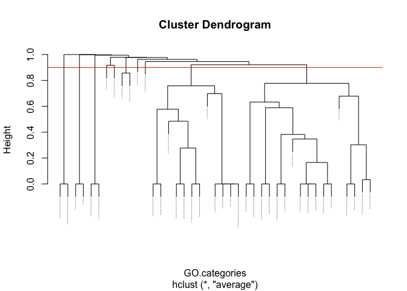
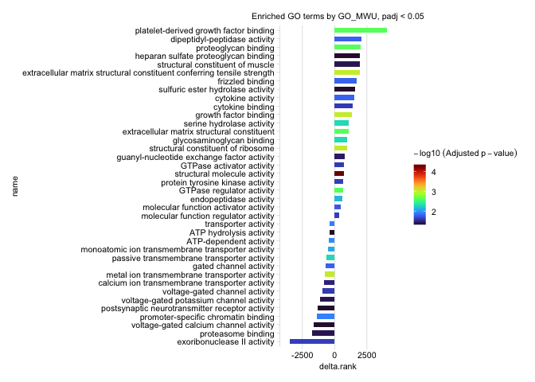

Enrichment
================
Zoe Dellaert
2024-12-09

- [0.1 Gene Ontology Analysis analysis of LCM RNA
  Data](#01-gene-ontology-analysis-analysis-of-lcm-rna-data)
- [0.2 Managing Packages Using Renv](#02-managing-packages-using-renv)
- [0.3 Load packages](#03-load-packages)
- [0.4 Description of pipeline](#04-description-of-pipeline)
- [0.5 Load in reference files and differential expression
  data](#05-load-in-reference-files-and-differential-expression-data)
- [0.6 Create gene_to_go.tab file for running
  GO_MWU](#06-create-gene_to_gotab-file-for-running-go_mwu)
- [0.7 Create the GO_MWU input csv files for the binary
  analysis](#07-create-the-go_mwu-input-csv-files-for-the-binary-analysis)
- [0.8 Create the GO_MWU input csv files for the continuous LFC
  analysis](#08-create-the-go_mwu-input-csv-files-for-the-continuous-lfc-analysis)
- [0.9 Run GO_MWU](#09-run-go_mwu)
  - [0.9.1 Up Aboral Fisher Exact
    Test](#091-up-aboral-fisher-exact-test)
  - [0.9.2 Oral Epidermis tissue fisher exact
    test](#092-oral-epidermis-tissue-fisher-exact-test)
  - [0.9.3 Differential Expression using
    LFC](#093-differential-expression-using-lfc)
- [0.10 Custom plots](#010-custom-plots)
  - [0.10.1 up aboral, fisher](#0101-up-aboral-fisher)
  - [0.10.2 continuous by LFC](#0102-continuous-by-lfc)

## 0.1 Gene Ontology Analysis analysis of LCM RNA Data

## 0.2 Managing Packages Using Renv

To run this code in my project using the renv environment, run the
following lines of code

``` r
install.packages("renv") #install the package on the new computer (may not be necessary if renv bootstraps itself as expected)
renv::restore() #reinstall all the package versions in the renv lockfile
```

## 0.3 Load packages

``` r
require("ape")
```

    ## Loading required package: ape

    ## Warning: package 'ape' was built under R version 4.3.3

``` r
require("scales")
```

    ## Loading required package: scales

``` r
require("tidyplots")
```

    ## Loading required package: tidyplots

    ## Warning: package 'tidyplots' was built under R version 4.3.3

``` r
require("tidyverse")
```

    ## Loading required package: tidyverse

    ## ── Attaching core tidyverse packages ──────────────────────── tidyverse 2.0.0 ──
    ## ✔ dplyr     1.1.4     ✔ readr     2.1.5
    ## ✔ forcats   1.0.0     ✔ stringr   1.5.1
    ## ✔ ggplot2   3.5.1     ✔ tibble    3.2.1
    ## ✔ lubridate 1.9.3     ✔ tidyr     1.3.1
    ## ✔ purrr     1.0.2     
    ## ── Conflicts ────────────────────────────────────────── tidyverse_conflicts() ──
    ## ✖ readr::col_factor() masks scales::col_factor()
    ## ✖ purrr::discard()    masks scales::discard()
    ## ✖ dplyr::filter()     masks stats::filter()
    ## ✖ dplyr::lag()        masks stats::lag()
    ## ✖ dplyr::where()      masks ape::where()
    ## ℹ Use the conflicted package (<http://conflicted.r-lib.org/>) to force all conflicts to become errors

``` r
sessionInfo() #provides list of loaded packages and version of R.
```

    ## R version 4.3.2 (2023-10-31)
    ## Platform: aarch64-apple-darwin20 (64-bit)
    ## Running under: macOS Ventura 13.0
    ## 
    ## Matrix products: default
    ## BLAS:   /Library/Frameworks/R.framework/Versions/4.3-arm64/Resources/lib/libRblas.0.dylib 
    ## LAPACK: /Library/Frameworks/R.framework/Versions/4.3-arm64/Resources/lib/libRlapack.dylib;  LAPACK version 3.11.0
    ## 
    ## locale:
    ## [1] en_US.UTF-8/en_US.UTF-8/en_US.UTF-8/C/en_US.UTF-8/en_US.UTF-8
    ## 
    ## time zone: America/New_York
    ## tzcode source: internal
    ## 
    ## attached base packages:
    ## [1] stats     graphics  grDevices datasets  utils     methods   base     
    ## 
    ## other attached packages:
    ##  [1] lubridate_1.9.3 forcats_1.0.0   stringr_1.5.1   dplyr_1.1.4    
    ##  [5] purrr_1.0.2     readr_2.1.5     tidyr_1.3.1     tibble_3.2.1   
    ##  [9] ggplot2_3.5.1   tidyverse_2.0.0 tidyplots_0.2.0 scales_1.3.0   
    ## [13] ape_5.8-1      
    ## 
    ## loaded via a namespace (and not attached):
    ##  [1] gtable_0.3.5        compiler_4.3.2      BiocManager_1.30.25
    ##  [4] renv_1.0.11         tidyselect_1.2.1    Rcpp_1.0.13-1      
    ##  [7] parallel_4.3.2      yaml_2.3.10         fastmap_1.2.0      
    ## [10] lattice_0.22-6      R6_2.5.1            generics_0.1.3     
    ## [13] knitr_1.48          munsell_0.5.1       tzdb_0.4.0         
    ## [16] pillar_1.9.0        rlang_1.1.4         utf8_1.2.4         
    ## [19] stringi_1.8.4       xfun_0.48           timechange_0.3.0   
    ## [22] cli_3.6.3           withr_3.0.1         magrittr_2.0.3     
    ## [25] digest_0.6.37       grid_4.3.2          rstudioapi_0.17.0  
    ## [28] hms_1.1.3           lifecycle_1.0.4     nlme_3.1-166       
    ## [31] vctrs_0.6.5         evaluate_1.0.1      glue_1.8.0         
    ## [34] fansi_1.0.6         colorspace_2.1-1    rmarkdown_2.28     
    ## [37] tools_4.3.2         pkgconfig_2.0.3     htmltools_0.5.8.1

## 0.4 Description of pipeline

I am going to perform functional enrichment of GO terms using
[GO_MWU](https://github.com/z0on/GO_MWU).

As described in the [README](https://github.com/z0on/GO_MWU) of the
package, the steps to running this analysis are as follows:

1.  Make a directory for GO_MWU files. I am creating one in this code/
    directory: LaserCoral/code/go_mwu
2.  Download the following scripts into that directory: GO_MWU.R,
    gomwu_a.pl, gomwu_b.pl, gomwu.functions.R (downloaded from the
    github, linked above)
3.  Download the GO hierarchy file, go.obo, from this website:
    <http://www.geneontology.org/GO.downloads.ontology.shtml>
4.  table of GO annotations for your sequences:

- “two-column (gene id - GO terms), tab-delimited, one line per gene,
  multiple GO terms separated by semicolon. If you have multiple lines
  per gene, use nrify_GOtable.pl to merge them. Do NOT include genes
  without GO annotations.”

5.  table of measure of interest for your sequences:

- “two columns of comma-separated values: gene id, continuous measure of
  change such as log(fold-change). To perform standard GO enrichment
  analysis based on Fisher’s exact test, use binary measure (1 or 0,
  i.e., either significant or not).”

## 0.5 Load in reference files and differential expression data

In the next chunk I am loadinf in my DESeq data. These results are
ordered by adjusted p-value. As a reminder, negative LFC = higher in
Aboral tissue, and positive LFC = higher in Oral tissue.

``` r
#load in DESeq results
DESeq <- read.csv("../output_RNA/differential_expression/DESeq_results.csv", header = TRUE) %>% dplyr::rename("query" ="X")

#make dataframes of just differentially expressed genes for each LFC direction
DE_05_Aboral <- DESeq %>% filter(padj < 0.05 & log2FoldChange > 0)
DE_05_OralEpi <- DESeq %>% filter(padj < 0.05& log2FoldChange < 0)

#load in annotation data 
annot_tab <- read.delim("../references/annotation/protein-GO.tsv") %>% rename(GOs = GeneOntologyIDs)

#filter annotation data for just expressed genes 
annot_tab <- annot_tab %>% filter(query %in% DESeq$query) 

annot_tab$GOs <- gsub("; ", ";", annot_tab$GOs)
annot_tab$GOs[annot_tab$GOs==""] <- NA

nrow(annot_tab)
```

    ## [1] 10927

``` r
nrow(annot_tab)/nrow(DESeq)
```

    ## [1] 0.7554618

10927/14464 genes in our dataset have annotation information in this
file. That is 76%.

``` r
sum(annot_tab$query %in% DE_05_Aboral$query)
```

    ## [1] 549

``` r
sum(annot_tab$query %in% DE_05_Aboral$query)/nrow(DE_05_Aboral)
```

    ## [1] 0.6828358

``` r
sum(annot_tab$query %in% DE_05_OralEpi$query)
```

    ## [1] 2033

``` r
sum(annot_tab$query %in% DE_05_OralEpi$query)/nrow(DE_05_OralEpi)
```

    ## [1] 0.7255532

549/804 genes that are significantly upregulated in the Aboral tissue
have annotation information. That is 68% of the genes.

2033/2802 genes that are significantly upregulated in the Oral Epidermis
tissue have annotation information. That is 73% of the genes.

## 0.6 Create gene_to_go.tab file for running GO_MWU

``` r
GO.terms <- annot_tab %>% select(query,GOs) %>% dplyr::rename("GO.terms" = GOs)

GO.terms_only <- GO.terms %>% na.omit()

nrow(GO.terms_only)
```

    ## [1] 10638

``` r
nrow(GO.terms_only)/nrow(DESeq)
```

    ## [1] 0.7354812

``` r
write.table(GO.terms_only, "go_mwu/gene_to_go.tab",row.names = FALSE, sep = "\t", quote = FALSE)
```

10638/14464 genes in our dataset have GO term information. That is 74%.

``` r
sum(GO.terms_only$query %in% DE_05_Aboral$query)
```

    ## [1] 545

``` r
sum(GO.terms_only$query %in% DE_05_Aboral$query)/nrow(DE_05_Aboral)
```

    ## [1] 0.6778607

``` r
sum(GO.terms_only$query %in% DE_05_OralEpi$query)
```

    ## [1] 1979

``` r
sum(GO.terms_only$query %in% DE_05_OralEpi$query)/nrow(DE_05_OralEpi)
```

    ## [1] 0.7062812

545/804 genes that are significantly upregulated in the Aboral tissue
have GO term information. That is 68% of the genes.

1979/2802 genes that are significantly upregulated in the Oral Epidermis
tissue have GO term information. That is 71% of the genes.

## 0.7 Create the GO_MWU input csv files for the binary analysis

``` r
### Generate vector with 1 for the 214 significant DEGs that have positive LFC and GO annotation, and 0 for the other genes that have GO annotation

UpAboral <- GO.terms_only %>% inner_join(DESeq) %>%
    mutate(DE = ifelse(padj < 0.05 & log2FoldChange > 0, 1, 0)) %>%
    dplyr::select(query, DE) 
```

    ## Joining with `by = join_by(query)`

``` r
print(sum(UpAboral$DE)) #only 545 of these have GO annotations
```

    ## [1] 545

``` r
write.csv(UpAboral, "go_mwu/UpAboral.csv", row.names = FALSE, quote = FALSE)

### Generate vector with 1 for the 1045 significant DEGs that have positive LFC and GO annotation, and 0 for the other genes that have GO annotation

UpOralEpi <- GO.terms_only %>% inner_join(DESeq) %>%
    mutate(DE = ifelse(padj < 0.05 & log2FoldChange < 0, 1, 0)) %>%
    dplyr::select(query, DE) 
```

    ## Joining with `by = join_by(query)`

``` r
print(sum(UpOralEpi$DE)) #only 1979 of these have GO annotations
```

    ## [1] 1979

``` r
write.csv(UpOralEpi, "go_mwu/UpOralEpi.csv", row.names = FALSE, quote = FALSE)
```

## 0.8 Create the GO_MWU input csv files for the continuous LFC analysis

``` r
### Generate vector with all of the genes that are expressed and have GO annotation, with their Log2FoldChanges
DE_LFC <- GO.terms_only %>% inner_join(DESeq) %>%
    dplyr::select(query, log2FoldChange) 
```

    ## Joining with `by = join_by(query)`

``` r
write.csv(DE_LFC, "go_mwu/DE_LFC.csv", row.names = FALSE, quote = FALSE)
```

## 0.9 Run GO_MWU

``` r
setwd("go_mwu")

goAnnotations="gene_to_go.tab" # two-column, tab-delimited, one line per gene, multiple GO terms separated by semicolon.
goDatabase="go.obo" # download from http://www.geneontology.org/GO.downloads.ontology.shtml
goDivision="BP" # either MF, or BP, or CC
source("gomwu.functions.R")
```

### 0.9.1 Up Aboral Fisher Exact Test

``` r
setwd("go_mwu")
input="UpAboral.csv"

gomwuStats(input, goDatabase, goAnnotations, goDivision,
    perlPath="perl", # replace with full path to perl executable if it is not in your system's PATH already
    largest=0.1,  # a GO category will not be considered if it contains more than this fraction of the total number of genes
    smallest=5,   # a GO category should contain at least this many genes to be considered
    clusterCutHeight=0.25 # threshold for merging similar (gene-sharing) terms. See README for details.
#   ,Alternative="g" # by default the MWU test is two-tailed; specify "g" or "l" of you want to test for "greater" or "less" instead.
)
```

    go.obo gene_to_go.tab UpAboral.csv BP largest=0.1 smallest=5 cutHeight=0.25

    Run parameters:

    largest GO category as fraction of all genes (largest)  : 0.1
             smallest GO category as # of genes (smallest)  : 5
                    clustering threshold (clusterCutHeight) : 0.25

    -----------------
    retrieving GO hierarchy, reformatting data...

    -------------
    go_reformat:
    Genes with GO annotations, but not listed in measure table: 1

    Terms without defined level (old ontology?..): 58
    -------------
    -------------
    go_nrify:
    12179 categories, 9535 genes; size range 5-953.5
        68 too broad
        6074 too small
        6037 remaining

    removing redundancy:

    calculating GO term similarities based on shared genes...
    4441 non-redundant GO categories of good size
    -------------

    Secondary clustering:
    calculating similarities....
    Binary classification detected; will perform Fisher's test
    185 GO terms at 10% FDR

#### 0.9.1.1 Plotting

``` r
setwd("go_mwu")
input="UpAboral.csv"

png(filename = paste0(input, "_plot.png"), width = 1200, height = 2400)
results=gomwuPlot(input,goAnnotations,goDivision,
    absValue=0.001,  #Specify absValue=0.001 if you are doing Fisher's exact test for standard GO enrichment
    level1=0.05, # FDR threshold for plotting. Specify level1=1 to plot all GO categories containing genes exceeding the absValue.
    level2=0.01, # FDR cutoff to print in regular (not italic) font.
    level3=0.001, # FDR cutoff to print in large bold font.
    txtsize=2,    # decrease to fit more on one page, or increase (after rescaling the plot so the tree fits the text) for better "word cloud" effect
    treeHeight=0.5, # height of the hierarchical clustering tree
 )
```

    ## Warning in plot.formula(c(1:top) ~ c(1:top), type = "n", axes = F, xlab = "", :
    ## the formula 'c(1:top) ~ c(1:top)' is treated as 'c(1:top) ~ 1'
    ## Warning in plot.formula(c(1:top) ~ c(1:top), type = "n", axes = F, xlab = "", :
    ## the formula 'c(1:top) ~ c(1:top)' is treated as 'c(1:top) ~ 1'

    ## GO terms dispayed: 136

    ## "Good genes" accounted for:  312 out of 482 ( 65% )

``` r
dev.off()
```

    ## quartz_off_screen 
    ##                 2

``` r
# text representation of results, with actual adjusted p-values
head(results[[1]])
```

    ##                                                      pval direction  color
    ## 4/8 one-carbon compound transport            1.934813e-02         0 grey50
    ## 17/143 inflammatory response                 3.595249e-02         0 grey50
    ## 11/42 humoral immune response                7.576116e-04         0  black
    ## 8/14 complement activation                   3.427772e-05         0  black
    ## 5/7 complement activation, classical pathway 7.716448e-04         0  black
    ## 7/32 male gonad development                  3.595249e-02         0 grey50

#### 0.9.1.2 extracting representative GOs

``` r
# this module chooses GO terms that best represent *independent* groups of significant GO terms

pcut=1e-2 # adjusted pvalue cutoff for representative GO
hcut=0.9 # height at which cut the GO terms tree to get "independent groups". 

# plotting the GO tree with the cut level (un-remark the next two lines to plot)
 plot(results[[2]],cex=0.3)
 abline(h=hcut,col="red")
```

<!-- -->

``` r
# cutting
ct=cutree(results[[2]],h=hcut)
annots=c();ci=1
for (ci in unique(ct)) {
  message(ci)
    rn=names(ct)[ct==ci]
    obs=grep("obsolete",rn)
    if(length(obs)>0) { rn=rn[-obs] }
    if (length(rn)==0) {next}
    rr=results[[1]][rn,]
    bestrr=rr[which(rr$pval==min(rr$pval)),]
    best=1
    if(nrow(bestrr)>1) {
        nns=sub(" .+","",row.names(bestrr))
        fr=c()
        for (i in 1:length(nns)) { fr=c(fr,eval(parse(text=nns[i]))) }
        best=which(fr==max(fr))
    }
    if (bestrr$pval[best]<=pcut) { annots=c(annots,sub("\\d+\\/\\d+ ","",row.names(bestrr)[best]))}
}
```

    ## 1

    ## 2

    ## 3

    ## 4

    ## 5

``` r
setwd("go_mwu")
mwus=read.table(paste("MWU",goDivision,input,sep="_"),header=T)
bestGOs=mwus[mwus$name %in% annots,]
bestGOs
```

    ##      delta.rank         pval level nseqs                             term
    ## 666           0 1.009558e-07     3    14                       GO:0006956
    ## 731           0 3.433500e-21     2   144            GO:0007156;GO:0098742
    ## 1520          0 1.377638e-14     3   184 GO:0030198;GO:0043062;GO:0045229
    ## 3991          0 7.625083e-05     2    22                       GO:1901071
    ##                                                           name        p.adj
    ## 666                                      complement activation 3.427772e-05
    ## 731  cell-cell adhesion via plasma-membrane adhesion molecules 7.622370e-18
    ## 1520             external encapsulating structure organization 1.529179e-11
    ## 3991         glucosamine-containing compound metabolic process 5.652920e-03

------------------------------------------------------------------------

### 0.9.2 Oral Epidermis tissue fisher exact test

``` r
setwd("go_mwu")
input="UpOralEpi.csv"

gomwuStats(input, goDatabase, goAnnotations, goDivision,
    perlPath="perl", # replace with full path to perl executable if it is not in your system's PATH already
    largest=0.1,  # a GO category will not be considered if it contains more than this fraction of the total number of genes
    smallest=5,   # a GO category should contain at least this many genes to be considered
    clusterCutHeight=0.25 # threshold for merging similar (gene-sharing) terms. See README for details.
#   ,Alternative="g" # by default the MWU test is two-tailed; specify "g" or "l" of you want to test for "greater" or "less" instead.
)
```

    go.obo gene_to_go.tab UpOralEpi.csv BP largest=0.1 smallest=5 cutHeight=0.25

    Run parameters:

    largest GO category as fraction of all genes (largest)  : 0.1
             smallest GO category as # of genes (smallest)  : 5
                    clustering threshold (clusterCutHeight) : 0.25

    -----------------
    retrieving GO hierarchy, reformatting data...

    -------------
    go_reformat:
    Genes with GO annotations, but not listed in measure table: 1

    Terms without defined level (old ontology?..): 58
    -------------
    -------------
    go_nrify:
    12179 categories, 9535 genes; size range 5-953.5
        68 too broad
        6074 too small
        6037 remaining

    removing redundancy:

    calculating GO term similarities based on shared genes...
    4441 non-redundant GO categories of good size
    -------------

    Secondary clustering:
    calculating similarities....
    Binary classification detected; will perform Fisher's test
    17 GO terms at 10% FDR

#### 0.9.2.1 Plotting

``` r
setwd("go_mwu")
input="UpOralEpi.csv"

png(filename = paste0(input, "_plot.png"), width = 1200, height = 600)
results=gomwuPlot(input,goAnnotations,goDivision,
    absValue=0.001,  #Specify absValue=0.001 if you are doing Fisher's exact test for standard GO enrichment
    level1=0.05, # FDR threshold for plotting. Specify level1=1 to plot all GO categories containing genes exceeding the absValue.
    level2=0.01, # FDR cutoff to print in regular (not italic) font.
    level3=0.001, # FDR cutoff to print in large bold font.
    txtsize=3,    # decrease to fit more on one page, or increase (after rescaling the plot so the tree fits the text) for better "word cloud" effect
    treeHeight=0.25, # height of the hierarchical clustering tree
 )
```

    ## Warning in plot.formula(c(1:top) ~ c(1:top), type = "n", axes = F, xlab = "", :
    ## the formula 'c(1:top) ~ c(1:top)' is treated as 'c(1:top) ~ 1'
    ## Warning in plot.formula(c(1:top) ~ c(1:top), type = "n", axes = F, xlab = "", :
    ## the formula 'c(1:top) ~ c(1:top)' is treated as 'c(1:top) ~ 1'

    ## GO terms dispayed: 3

    ## "Good genes" accounted for:  157 out of 1719 ( 9% )

``` r
dev.off()
```

    ## quartz_off_screen 
    ##                 2

``` r
# text representation of results, with actual adjusted p-values
head(results[[1]])
```

    ##                                                      pval direction color
    ## 109/385 monoatomic ion transport             0.0007379949         0 black
    ## 135/481 transmembrane transport              0.0001626729         0 black
    ## 86/282 inorganic ion transmembrane transport 0.0006127779         0 black

#### 0.9.2.2 extracting representative GOs

``` r
# this module chooses GO terms that best represent *independent* groups of significant GO terms

pcut=1e-2 # adjusted pvalue cutoff for representative GO
hcut=0.9 # height at which cut the GO terms tree to get "independent groups". 

# plotting the GO tree with the cut level (un-remark the next two lines to plot)
 plot(results[[2]],cex=0.3)
 abline(h=hcut,col="red")
```

<!-- -->

``` r
# cutting
ct=cutree(results[[2]],h=hcut)
annots=c();ci=1
for (ci in unique(ct)) {
  message(ci)
    rn=names(ct)[ct==ci]
    obs=grep("obsolete",rn)
    if(length(obs)>0) { rn=rn[-obs] }
    if (length(rn)==0) {next}
    rr=results[[1]][rn,]
    bestrr=rr[which(rr$pval==min(rr$pval)),]
    best=1
    if(nrow(bestrr)>1) {
        nns=sub(" .+","",row.names(bestrr))
        fr=c()
        for (i in 1:length(nns)) { fr=c(fr,eval(parse(text=nns[i]))) }
        best=which(fr==max(fr))
    }
    if (bestrr$pval[best]<=pcut) { annots=c(annots,sub("\\d+\\/\\d+ ","",row.names(bestrr)[best]))}
}
```

    ## 1

``` r
setwd("go_mwu")
mwus=read.table(paste("MWU",goDivision,input,sep="_"),header=T)
bestGOs=mwus[mwus$name %in% annots,]
bestGOs
```

    ##      delta.rank         pval level nseqs       term                    name
    ## 3189          0 3.663805e-08     3   481 GO:0055085 transmembrane transport
    ##             p.adj
    ## 3189 0.0001626729

### 0.9.3 Differential Expression using LFC

``` r
setwd("go_mwu")
input="DE_LFC.csv"

gomwuStats(input, goDatabase, goAnnotations, goDivision,
    perlPath="perl", # replace with full path to perl executable if it is not in your system's PATH already
    largest=0.1,  # a GO category will not be considered if it contains more than this fraction of the total number of genes
    smallest=5,   # a GO category should contain at least this many genes to be considered
    clusterCutHeight=0.25 # threshold for merging similar (gene-sharing) terms. See README for details.
#   ,Alternative="g" # by default the MWU test is two-tailed; specify "g" or "l" of you want to test for "greater" or "less" instead.
)
```

    go.obo gene_to_go.tab DE_LFC.csv BP largest=0.1 smallest=5 cutHeight=0.25

    Run parameters:

    largest GO category as fraction of all genes (largest)  : 0.1
             smallest GO category as # of genes (smallest)  : 5
                    clustering threshold (clusterCutHeight) : 0.25

    -----------------
    retrieving GO hierarchy, reformatting data...

    -------------
    go_reformat:
    Genes with GO annotations, but not listed in measure table: 1

    Terms without defined level (old ontology?..): 58
    -------------
    -------------
    go_nrify:
    12179 categories, 9535 genes; size range 5-953.5
        68 too broad
        6074 too small
        6037 remaining

    removing redundancy:

    calculating GO term similarities based on shared genes...
    4441 non-redundant GO categories of good size
    -------------

    Secondary clustering:
    calculating similarities....
    Continuous measure of interest: will perform MWU test
    78 GO terms at 10% FDR

#### 0.9.3.1 Plotting

``` r
setwd("go_mwu")
input="DE_LFC.csv"

png(filename = paste0(input, "_plot.png"), width = 1800, height = 1600)
results=gomwuPlot(input,goAnnotations,goDivision,
    absValue=1, # un-remark this if you are using log2-fold changes
    level1=0.05, # FDR threshold for plotting. Specify level1=1 to plot all GO categories containing genes exceeding the absValue.
    level2=0.01, # FDR cutoff to print in regular (not italic) font.
    level3=0.001, # FDR cutoff to print in large bold font.
    txtsize=4.5,    # decrease to fit more on one page
    treeHeight=.5, # height of the hierarchical clustering tree
    # colors=c("dodgerblue2","firebrick1","skyblue2","lightcoral") 
    colors = c("forestgreen", "purple", "seagreen3", "orchid")
 )
```

    ## Warning in plot.formula(c(1:top) ~ c(1:top), type = "n", axes = F, xlab = "", :
    ## the formula 'c(1:top) ~ c(1:top)' is treated as 'c(1:top) ~ 1'
    ## Warning in plot.formula(c(1:top) ~ c(1:top), type = "n", axes = F, xlab = "", :
    ## the formula 'c(1:top) ~ c(1:top)' is treated as 'c(1:top) ~ 1'

    ## GO terms dispayed: 41

    ## "Good genes" accounted for:  388 out of 1265 ( 31% )

``` r
dev.off()
```

    ## quartz_off_screen 
    ##                 2

``` r
# text representation of results, with actual adjusted p-values
head(results[[1]])
```

    ##                                                                    pval
    ## 7/12 nucleoside bisphosphate metabolic process              0.004999363
    ## 5/7 3'-phosphoadenosine 5'-phosphosulfate metabolic process 0.012611628
    ## 0/34 cytoplasmic translation                                0.004999363
    ## 8/163 translation                                           0.007197692
    ## 16/50 amino acid transmembrane transport                    0.038654610
    ## 8/15 amino acid import across plasma membrane               0.028246748
    ##                                                             direction
    ## 7/12 nucleoside bisphosphate metabolic process                      0
    ## 5/7 3'-phosphoadenosine 5'-phosphosulfate metabolic process         0
    ## 0/34 cytoplasmic translation                                        1
    ## 8/163 translation                                                   1
    ## 16/50 amino acid transmembrane transport                            0
    ## 8/15 amino acid import across plasma membrane                       0
    ##                                                                   color
    ## 7/12 nucleoside bisphosphate metabolic process              forestgreen
    ## 5/7 3'-phosphoadenosine 5'-phosphosulfate metabolic process   seagreen3
    ## 0/34 cytoplasmic translation                                     purple
    ## 8/163 translation                                                purple
    ## 16/50 amino acid transmembrane transport                      seagreen3
    ## 8/15 amino acid import across plasma membrane                 seagreen3

#### 0.9.3.2 extracting representative GOs

``` r
# this module chooses GO terms that best represent *independent* groups of significant GO terms

pcut=1e-2 # adjusted pvalue cutoff for representative GO
hcut=0.9 # height at which cut the GO terms tree to get "independent groups". 

# plotting the GO tree with the cut level (un-remark the next two lines to plot)
 plot(results[[2]],cex=0.1)
 abline(h=hcut,col="red")
```

<!-- -->

``` r
# cutting
ct=cutree(results[[2]],h=hcut)
annots=c();ci=1
for (ci in unique(ct)) {
  message(ci)
    rn=names(ct)[ct==ci]
    obs=grep("obsolete",rn)
    if(length(obs)>0) { rn=rn[-obs] }
    if (length(rn)==0) {next}
    rr=results[[1]][rn,]
    bestrr=rr[which(rr$pval==min(rr$pval)),]
    best=1
    if(nrow(bestrr)>1) {
        nns=sub(" .+","",row.names(bestrr))
        fr=c()
        for (i in 1:length(nns)) { fr=c(fr,eval(parse(text=nns[i]))) }
        best=which(fr==max(fr))
    }
    if (bestrr$pval[best]<=pcut) { annots=c(annots,sub("\\d+\\/\\d+ ","",row.names(bestrr)[best]))}
}
```

    ## 1

    ## 2

    ## 3

    ## 4

    ## 5

    ## 6

    ## 7

    ## 8

    ## 9

    ## 10

``` r
setwd("go_mwu")
mwus=read.table(paste("MWU",goDivision,input,sep="_"),header=T)
bestGOs=mwus[mwus$name %in% annots,]
bestGOs
```

    ##      delta.rank         pval level nseqs
    ## 218        2076 9.007862e-06     4    34
    ## 731        1295 1.454180e-08     2   144
    ## 881        2259 1.655694e-05     7    27
    ## 1519       1053 2.016719e-07     4   184
    ## 1918      -3511 7.924011e-06     3    12
    ##                                             term
    ## 218                                   GO:0002181
    ## 731                        GO:0007156;GO:0098742
    ## 881                                   GO:0008286
    ## 1519            GO:0030198;GO:0043062;GO:0045229
    ## 1918 GO:0034035;GO:0033875;GO:0034032;GO:0033865
    ##                                                           name        p.adj
    ## 218                                    cytoplasmic translation 4.999363e-03
    ## 731  cell-cell adhesion via plasma-membrane adhesion molecules 6.456561e-05
    ## 881                         insulin receptor signaling pathway 7.197692e-03
    ## 1519             external encapsulating structure organization 2.984745e-04
    ## 1918                 nucleoside bisphosphate metabolic process 4.999363e-03

## 0.10 Custom plots

### 0.10.1 up aboral, fisher

``` r
MWU_BP_UpAboral <- read.table("go_mwu/MWU_BP_UpAboral.csv", header = TRUE)
BP_UpAboral <- read.table("go_mwu/BP_UpAboral.csv", header = TRUE)
```

``` r
MWU_BP_UpAboral %>% dplyr::filter(p.adj<0.05) %>% 
  mutate(log10padj = -log10(p.adj)) %>%
  tidyplot(y = name, x = nseqs, fill = log10padj) %>%
  adjust_size(height = NA, width=NA) %>%
  theme_minimal_x() %>%
  add_sum_bar() %>% #adjust_colors(new_colors = colors_continuous_mako) %>%
  sort_y_axis_labels(nseqs) %>%
  adjust_padding(right = 0.1) %>%
  add_data_labels(nseqs, label_position = c("right")) %>%
  adjust_legend_title("$-log10~(Adjusted~p-value)$") %>%
  add_title("Enriched GO terms by GO_MWU, Up in Aboral Tissue, padj < 0.05") %>%
  save_plot("../output_RNA/differential_expression/enrichment/GO_MWU_UpAboral_Fisher_05.png",
            width = 8, height = 15, units="in",bg = "transparent") 
```

    ## ✔ save_plot: saved to '../output_RNA/differential_expression/enrichment/GO_MWU_UpAboral_Fisher_05.png'

<!-- --> \###
up oral epi, fisher

``` r
MWU_BP_UpOralEpi <- read.table("go_mwu/MWU_BP_UpOralEpi.csv", header = TRUE)
BP_UpOralEpi <- read.table("go_mwu/BP_UpOralEpi.csv", header = TRUE)
```

``` r
MWU_BP_UpOralEpi %>% dplyr::filter(p.adj<0.05) %>% 
  mutate(log10padj = -log10(p.adj)) %>%
  tidyplot(y = name, x = nseqs, fill = log10padj) %>%
  adjust_size(height = NA, width=NA) %>%
  theme_minimal_x() %>%
  add_sum_bar() %>% #adjust_colors(new_colors = colors_continuous_mako) %>%
  sort_y_axis_labels(nseqs) %>%
  adjust_padding(right = 0.1) %>%
  add_data_labels(nseqs, label_position = c("right")) %>%
  adjust_legend_title("$-log10~(Adjusted~p-value)$") %>%
  add_title("Enriched GO terms by GO_MWU, Up in Aboral Tissue, padj < 0.05") %>%
  save_plot("../output_RNA/differential_expression/enrichment/GO_MWU_UpOralEpi_Fisher_05.png",
            width = 8, height = 5, units="in",bg = "transparent") 
```

    ## ✔ save_plot: saved to '../output_RNA/differential_expression/enrichment/GO_MWU_UpOralEpi_Fisher_05.png'

<!-- -->

### 0.10.2 continuous by LFC

``` r
MWU_BP_DE_LFC <- read.table("go_mwu/MWU_BP_DE_LFC.csv", header = TRUE)
BP_DE_LFC <- read.table("go_mwu/BP_DE_LFC.csv", header = TRUE)
```

``` r
MWU_BP_DE_LFC %>% dplyr::filter(p.adj<0.05 & delta.rank > 0) %>% 
  mutate(log10padj = -log10(p.adj)) %>%
  tidyplot(y = name, x = nseqs, fill = log10padj) %>%
  adjust_size(height = NA, width=NA) %>%
  theme_minimal_x(fontsize=9) %>%
  add_sum_bar() %>% adjust_colors(new_colors = colors_continuous_turbo) %>%
  sort_y_axis_labels(delta.rank) %>%
  adjust_padding(right = 0.1) %>%
  add_data_labels(delta.rank, label_position = c("right")) %>%
  adjust_legend_title("$-log10~(Adjusted~p-value)$") %>%
  add_title("Enriched GO terms by GO_MWU, Up in Aboral Tissue, padj < 0.05") %>%
  save_plot("../output_RNA/differential_expression/enrichment/GO_MWU_UpAboral.png",
            width = 8, height = 6, units="in",bg = "transparent") 
```

    ## ✔ save_plot: saved to '../output_RNA/differential_expression/enrichment/GO_MWU_UpAboral.png'

<!-- -->

``` r
MWU_BP_DE_LFC %>% dplyr::filter(p.adj<0.05 & delta.rank < 0) %>% 
  mutate(log10padj = -log10(p.adj)) %>%
  tidyplot(y = name, x = nseqs, fill = log10padj) %>%
  adjust_size(height = NA, width=NA) %>%
  theme_minimal_x(fontsize=9) %>%
  add_sum_bar() %>% adjust_colors(new_colors = colors_continuous_turbo) %>%
  sort_y_axis_labels(-delta.rank) %>%
  adjust_padding(right = 0.1) %>%
  add_data_labels(delta.rank, label_position = c("right")) %>%
  adjust_legend_title("$-log10~(Adjusted~p-value)$") %>%
  add_title("Enriched GO terms by GO_MWU, Up in Oral Epidermis Tissue, padj < 0.05")  %>%
  save_plot("../output_RNA/differential_expression/enrichment/GO_MWU_UpOralEpi.png",
            width = 8, height = 1.75, units="in",bg = "transparent")
```

    ## ✔ save_plot: saved to '../output_RNA/differential_expression/enrichment/GO_MWU_UpOralEpi.png'

<!-- -->

``` r
MWU_BP_DE_LFC %>% dplyr::filter(p.adj<0.05) %>% 
  mutate(log10padj = -log10(p.adj)) %>%
  tidyplot(y = name, x = delta.rank, color = log10padj) %>%
  adjust_size(height = NA, width=NA) %>%
  theme_minimal_x(fontsize=8) %>%
  add_sum_bar() %>% #add_sum_dot() %>% 
  adjust_colors(new_colors = colors_continuous_turbo) %>%
  sort_y_axis_labels(delta.rank) %>%
  adjust_padding(right = 0.1, left = 0.1) %>%
  #add_data_labels(delta.rank, label_position = c("right")) %>%
  adjust_legend_title("$-log10~(Adjusted~p-value)$") %>%
  add_title("Enriched GO terms by GO_MWU, padj < 0.05") %>%
  save_plot("../output_RNA/differential_expression/enrichment/GO_MWU.png",
            width = 8, height = 6, units="in",bg = "transparent")
```

    ## ✔ save_plot: saved to '../output_RNA/differential_expression/enrichment/GO_MWU.png'

<!-- -->

``` r
MWU_BP_DE_LFC %>% dplyr::filter(p.adj<0.05) %>% 
  mutate(log10padj = -log10(p.adj)) %>%
  tidyplot(y = name, x = delta.rank) %>%
  adjust_size(height = NA, width=NA) %>%
  theme_minimal_x(fontsize=8) %>%
  add_sum_bar(width=0.2, data = filter_rows(delta.rank < 0), fill = "palegreen4") %>%
  add_sum_bar(width=0.2, data = filter_rows(delta.rank > 0), fill = "mediumpurple") %>%
  add(ggplot2::stat_summary(data = filter_rows(delta.rank < 0),fun = identity,geom = "point",
                            aes(size = log10padj), color="palegreen4", alpha=0.5)) %>%
  add(ggplot2::stat_summary(data = filter_rows(delta.rank > 0),fun = identity,geom = "point",
                            aes(size = log10padj), color="mediumpurple", alpha=0.5)) %>%
  sort_y_axis_labels(delta.rank) %>%
  adjust_padding(right = 0.1, left = 0.1) %>%
  #add(ggplot2::scale_size_continuous(name = "$-log10~(Adjusted~p-value)$", range=c(0,6))) %>%
  adjust_legend_title("$-log10~(Adjusted~p-value)$") %>%
  add_title("Enriched GO terms by GO_MWU, padj < 0.05") %>%
  save_plot("../output_RNA/differential_expression/enrichment/GO_MWU_dots.png",
            width = 8, height = 6, units="in",bg = "transparent")
```

    ## ✔ save_plot: saved to '../output_RNA/differential_expression/enrichment/GO_MWU_dots.png'

<!-- -->

``` r
MWU_BP_DE_LFC %>% dplyr::filter(p.adj<0.05) %>% 
  mutate(log10padj = -log10(p.adj)) %>%
  tidyplot(y = name, x = delta.rank, color = log10padj) %>%
  adjust_size(height = NA, width=NA) %>%
  theme_minimal_x(fontsize=8) %>%
  add_sum_bar(width=0.2, fill="gray") %>% 
  add(ggplot2::stat_summary(fun = identity,geom = "point",
                            aes(size = nseqs), alpha=0.8)) %>%
  adjust_colors(new_colors = c("#0000FF", "#CA0088", "#FF0000")) %>%
  sort_y_axis_labels(delta.rank) %>%
  adjust_padding(right = 0.1, left = 0.1) %>%
  adjust_legend_title("$-log10~(Adjusted~p-value)$") %>%
  add_title("Enriched GO terms by GO_MWU, padj < 0.05") %>%
  save_plot("../output_RNA/differential_expression/enrichment/GO_MWU_bubble.png",
            width = 8, height = 6, units="in",bg = "transparent")
```

    ## ✔ save_plot: saved to '../output_RNA/differential_expression/enrichment/GO_MWU_bubble.png'

<!-- -->
