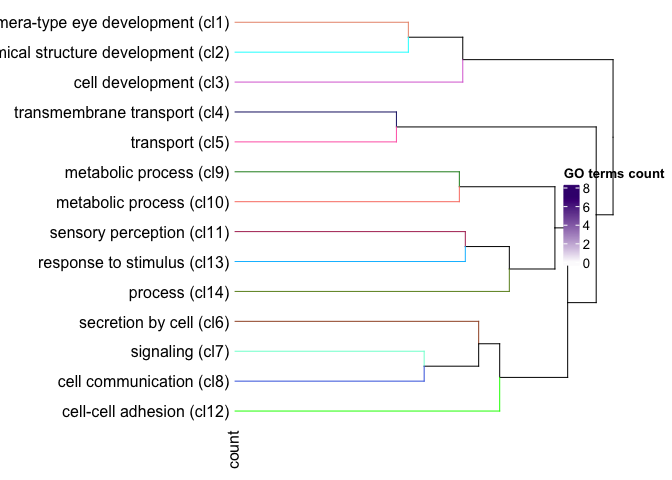
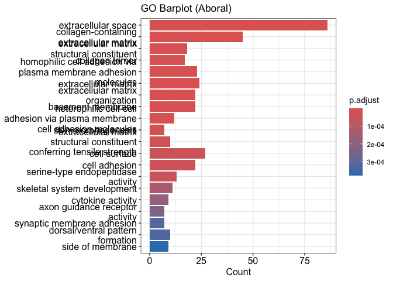
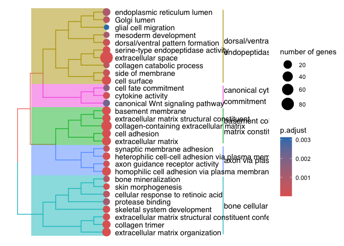
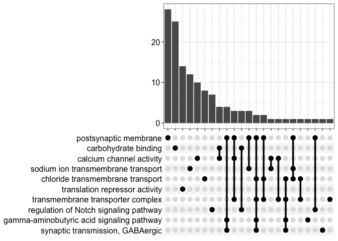
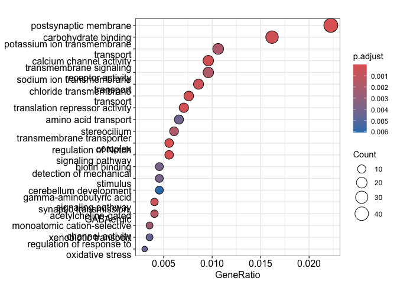
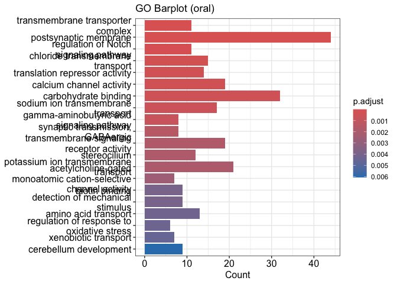
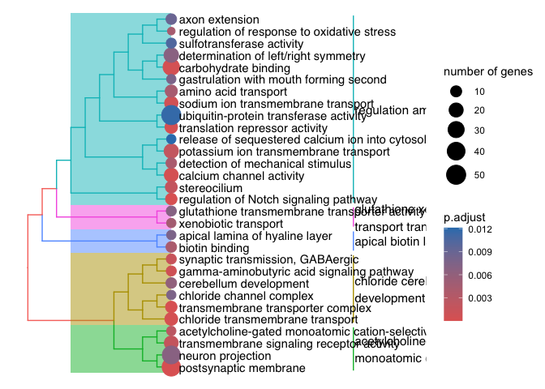

Semantic Enrichment
================
Zoe Dellaert
2025-01-11

- [0.1 Gene Ontology Analysis analysis of LCM RNA
  Data](#01-gene-ontology-analysis-analysis-of-lcm-rna-data)
- [0.2 Managing Packages Using Renv](#02-managing-packages-using-renv)
- [0.3 Load packages](#03-load-packages)
- [0.4 Description of pipeline](#04-description-of-pipeline)
- [0.5 Load in reference files and differential expression
  data](#05-load-in-reference-files-and-differential-expression-data)
- [0.6 Create custom GO annotation file for
  ViSEAGO](#06-create-custom-go-annotation-file-for-viseago)
  - [0.6.1 load the file into ViSEAGO](#061-load-the-file-into-viseago)
- [0.7 Create gene lists for
  enrichment](#07-create-gene-lists-for-enrichment)
- [0.8 Oral Epidermis:](#08-oral-epidermis)
  - [0.8.1 create topGO objects and perform enrichment using topGO
    wrapped by
    ViSEAGO](#081-create-topgo-objects-and-perform-enrichment-using-topgo-wrapped-by-viseago)
  - [0.8.2 Visualize and save initial
    results](#082-visualize-and-save-initial-results)
- [0.9 Semantic similarity](#09-semantic-similarity)
- [0.10 Visualization](#010-visualization)
  - [0.10.1 Multi Dimensional Scaling](#0101-multi-dimensional-scaling)
  - [0.10.2 Heatmap](#0102-heatmap)
  - [0.10.3 MDS](#0103-mds)
- [0.11 Visualization and interpretation of GO
  clusters](#011-visualization-and-interpretation-of-go-clusters)
- [0.12 Aboral Tissue:](#012-aboral-tissue)
  - [0.12.1 create topGO objects and perform enrichment using topGO
    wrapped by
    ViSEAGO](#0121-create-topgo-objects-and-perform-enrichment-using-topgo-wrapped-by-viseago)
  - [0.12.2 Visualize and save initial
    results](#0122-visualize-and-save-initial-results)
- [0.13 Semantic similarity](#013-semantic-similarity)
- [0.14 Visualization](#014-visualization)
  - [0.14.1 Multi Dimensional Scaling](#0141-multi-dimensional-scaling)
  - [0.14.2 Heatmap](#0142-heatmap)
  - [0.14.3 MDS](#0143-mds)
- [0.15 Visualization and interpretation of GO
  clusters](#015-visualization-and-interpretation-of-go-clusters)
- [0.16 clusterprofiler](#016-clusterprofiler)

## 0.1 Gene Ontology Analysis analysis of LCM RNA Data

## 0.2 Managing Packages Using Renv

To run this code in my project using the renv environment, run the
following lines of code

``` r
install.packages("renv") #install the package on the new computer (may not be necessary if renv bootstraps itself as expected)
renv::restore() #reinstall all the package versions in the renv lockfile
```

## 0.3 Load packages

``` r
require("ViSEAGO")
```

    ## Loading required package: ViSEAGO

    ## 

    ## Warning: replacing previous import 'data.table::set' by 'dendextend::set' when
    ## loading 'ViSEAGO'

``` r
require("topGO")
```

    ## Loading required package: topGO

    ## Loading required package: BiocGenerics

    ## 
    ## Attaching package: 'BiocGenerics'

    ## The following objects are masked from 'package:stats':
    ## 
    ##     IQR, mad, sd, var, xtabs

    ## The following objects are masked from 'package:base':
    ## 
    ##     anyDuplicated, aperm, append, as.data.frame, basename, cbind,
    ##     colnames, dirname, do.call, duplicated, eval, evalq, Filter, Find,
    ##     get, grep, grepl, intersect, is.unsorted, lapply, Map, mapply,
    ##     match, mget, order, paste, pmax, pmax.int, pmin, pmin.int,
    ##     Position, rank, rbind, Reduce, rownames, sapply, setdiff, sort,
    ##     table, tapply, union, unique, unsplit, which.max, which.min

    ## Loading required package: graph

    ## Loading required package: Biobase

    ## Welcome to Bioconductor
    ## 
    ##     Vignettes contain introductory material; view with
    ##     'browseVignettes()'. To cite Bioconductor, see
    ##     'citation("Biobase")', and for packages 'citation("pkgname")'.

    ## Loading required package: GO.db

    ## Loading required package: AnnotationDbi

    ## Loading required package: stats4

    ## Loading required package: IRanges

    ## Loading required package: S4Vectors

    ## 
    ## Attaching package: 'S4Vectors'

    ## The following object is masked from 'package:utils':
    ## 
    ##     findMatches

    ## The following objects are masked from 'package:base':
    ## 
    ##     expand.grid, I, unname

    ## Loading required package: SparseM

    ## Warning: package 'SparseM' was built under R version 4.3.3

    ## 
    ## groupGOTerms:    GOBPTerm, GOMFTerm, GOCCTerm environments built.

    ## 
    ## Attaching package: 'topGO'

    ## The following object is masked from 'package:IRanges':
    ## 
    ##     members

``` r
require("tidyverse")
```

    ## Loading required package: tidyverse

    ## ── Attaching core tidyverse packages ──────────────────────── tidyverse 2.0.0 ──
    ## ✔ dplyr     1.1.4     ✔ readr     2.1.5
    ## ✔ forcats   1.0.0     ✔ stringr   1.5.1
    ## ✔ ggplot2   3.5.1     ✔ tibble    3.2.1
    ## ✔ lubridate 1.9.3     ✔ tidyr     1.3.1
    ## ✔ purrr     1.0.2     
    ## ── Conflicts ────────────────────────────────────────── tidyverse_conflicts() ──
    ## ✖ lubridate::%within%() masks IRanges::%within%()
    ## ✖ ggplot2::annotate()   masks ViSEAGO::annotate()
    ## ✖ stringr::boundary()   masks graph::boundary()
    ## ✖ dplyr::collapse()     masks IRanges::collapse()
    ## ✖ dplyr::combine()      masks Biobase::combine(), BiocGenerics::combine()
    ## ✖ dplyr::desc()         masks IRanges::desc()
    ## ✖ tidyr::expand()       masks S4Vectors::expand()
    ## ✖ dplyr::filter()       masks stats::filter()
    ## ✖ dplyr::first()        masks S4Vectors::first()
    ## ✖ dplyr::lag()          masks stats::lag()
    ## ✖ ggplot2::Position()   masks BiocGenerics::Position(), base::Position()
    ## ✖ purrr::reduce()       masks IRanges::reduce()
    ## ✖ dplyr::rename()       masks S4Vectors::rename()
    ## ✖ lubridate::second()   masks S4Vectors::second()
    ## ✖ lubridate::second<-() masks S4Vectors::second<-()
    ## ✖ dplyr::select()       masks AnnotationDbi::select()
    ## ✖ dplyr::slice()        masks IRanges::slice()
    ## ℹ Use the conflicted package (<http://conflicted.r-lib.org/>) to force all conflicts to become errors

``` r
sessionInfo() #provides list of loaded packages and version of R.
```

    ## R version 4.3.2 (2023-10-31)
    ## Platform: aarch64-apple-darwin20 (64-bit)
    ## Running under: macOS Ventura 13.0
    ## 
    ## Matrix products: default
    ## BLAS:   /Library/Frameworks/R.framework/Versions/4.3-arm64/Resources/lib/libRblas.0.dylib 
    ## LAPACK: /Library/Frameworks/R.framework/Versions/4.3-arm64/Resources/lib/libRlapack.dylib;  LAPACK version 3.11.0
    ## 
    ## locale:
    ## [1] en_US.UTF-8/en_US.UTF-8/en_US.UTF-8/C/en_US.UTF-8/en_US.UTF-8
    ## 
    ## time zone: America/New_York
    ## tzcode source: internal
    ## 
    ## attached base packages:
    ## [1] stats4    stats     graphics  grDevices datasets  utils     methods  
    ## [8] base     
    ## 
    ## other attached packages:
    ##  [1] lubridate_1.9.3      forcats_1.0.0        stringr_1.5.1       
    ##  [4] dplyr_1.1.4          purrr_1.0.2          readr_2.1.5         
    ##  [7] tidyr_1.3.1          tibble_3.2.1         ggplot2_3.5.1       
    ## [10] tidyverse_2.0.0      topGO_2.54.0         SparseM_1.84-2      
    ## [13] GO.db_3.18.0         AnnotationDbi_1.64.1 IRanges_2.34.1      
    ## [16] S4Vectors_0.38.2     Biobase_2.60.0       graph_1.80.0        
    ## [19] BiocGenerics_0.46.0  ViSEAGO_1.16.0      
    ## 
    ## loaded via a namespace (and not attached):
    ##   [1] RColorBrewer_1.1-3      rstudioapi_0.17.0       jsonlite_1.8.9         
    ##   [4] magrittr_2.0.3          rmarkdown_2.28          fs_1.6.4               
    ##   [7] zlibbioc_1.46.0         vctrs_0.6.5             memoise_2.0.1          
    ##  [10] RCurl_1.98-1.16         webshot_0.5.5           htmltools_0.5.8.1      
    ##  [13] progress_1.2.3          dynamicTreeCut_1.63-1   curl_5.2.3             
    ##  [16] htmlwidgets_1.6.4       plyr_1.8.9              plotly_4.10.4          
    ##  [19] cachem_1.1.0            igraph_2.1.2            lifecycle_1.0.4        
    ##  [22] iterators_1.0.14        pkgconfig_2.0.3         Matrix_1.6-5           
    ##  [25] R6_2.5.1                fastmap_1.2.0           GenomeInfoDbData_1.2.10
    ##  [28] digest_0.6.37           colorspace_2.1-1        RSQLite_2.3.9          
    ##  [31] seriation_1.5.7         filelock_1.0.3          timechange_0.3.0       
    ##  [34] fansi_1.0.6             httr_1.4.7              compiler_4.3.2         
    ##  [37] bit64_4.5.2             withr_3.0.1             BiocParallel_1.34.2    
    ##  [40] viridis_0.6.5           DBI_1.2.3               UpSetR_1.4.0           
    ##  [43] heatmaply_1.5.0         dendextend_1.19.0       R.utils_2.12.3         
    ##  [46] biomaRt_2.58.2          rappdirs_0.3.3          tools_4.3.2            
    ##  [49] R.oo_1.27.0             glue_1.8.0              DiagrammeR_1.0.11      
    ##  [52] GOSemSim_2.28.1         grid_4.3.2              fgsea_1.28.0           
    ##  [55] generics_0.1.3          gtable_0.3.5            tzdb_0.4.0             
    ##  [58] R.methodsS3_1.8.2       ca_0.71.1               data.table_1.16.2      
    ##  [61] hms_1.1.3               xml2_1.3.6              utf8_1.2.4             
    ##  [64] XVector_0.40.0          foreach_1.5.2           pillar_1.9.0           
    ##  [67] yulab.utils_0.1.9       BiocFileCache_2.10.2    lattice_0.22-6         
    ##  [70] renv_1.0.11             bit_4.5.0               tidyselect_1.2.1       
    ##  [73] registry_0.5-1          Biostrings_2.70.3       knitr_1.48             
    ##  [76] gridExtra_2.3           xfun_0.48               matrixStats_1.4.1      
    ##  [79] DT_0.33                 visNetwork_2.1.2        stringi_1.8.4          
    ##  [82] lazyeval_0.2.2          yaml_2.3.10             evaluate_1.0.1         
    ##  [85] codetools_0.2-20        BiocManager_1.30.25     cli_3.6.3              
    ##  [88] munsell_0.5.1           Rcpp_1.0.13-1           GenomeInfoDb_1.36.4    
    ##  [91] dbplyr_2.5.0            png_0.1-8               XML_3.99-0.17          
    ##  [94] parallel_4.3.2          assertthat_0.2.1        blob_1.2.4             
    ##  [97] prettyunits_1.2.0       AnnotationForge_1.44.0  bitops_1.0-9           
    ## [100] viridisLite_0.4.2       scales_1.3.0            crayon_1.5.3           
    ## [103] rlang_1.1.4             cowplot_1.1.3           fastmatch_1.1-6        
    ## [106] KEGGREST_1.40.1         TSP_1.2-4

## 0.4 Description of pipeline

I am going to perform functional enrichment of GO terms using
[ViSEAGO](https://biodatamining.biomedcentral.com/articles/10.1186/s13040-019-0204-1).

I am following this vignette:
<http://bioconductor.unipi.it/packages/devel/bioc/vignettes/ViSEAGO/inst/doc/ViSEAGO.html>.

## 0.5 Load in reference files and differential expression data

In the next chunk I am loading in my DESeq data. These results are
ordered by adjusted p-value. As a reminder, negative LFC = higher in
Aboral tissue, and positive LFC = higher in Oral tissue.

``` r
#load in DESeq results
DESeq <- read.csv("../output_RNA/differential_expression/DESeq_results.csv", header = TRUE) %>% dplyr::rename("query" ="X")

#make dataframes of just differentially expressed genes for each LFC direction
DE_05_Aboral <- DESeq %>% filter(padj < 0.05 & log2FoldChange > 2)
DE_05_OralEpi <- DESeq %>% filter(padj < 0.05& log2FoldChange < -2)

#load in annotation data 
annot_tab <- read.delim("../references/annotation/protein-GO.tsv") %>% dplyr::rename(GOs = GeneOntologyIDs)

#filter annotation data for just expressed genes with GO annotations
annot_tab <- annot_tab %>% filter(query %in% DESeq$query) 

annot_tab$GOs <- gsub("; ", ";", annot_tab$GOs)
annot_tab$GOs[annot_tab$GOs==""] <- NA
annot_tab <- annot_tab %>% filter(!is.na(GOs))

nrow(annot_tab)
```

    ## [1] 10638

``` r
nrow(annot_tab)/nrow(DESeq)
```

    ## [1] 0.7354812

10638/14464 genes in our dataset have GO information in this file. That
is 74%.

``` r
sum(annot_tab$query %in% DE_05_Aboral$query)
```

    ## [1] 278

``` r
sum(annot_tab$query %in% DE_05_Aboral$query)/nrow(DE_05_Aboral)
```

    ## [1] 0.6797066

``` r
sum(annot_tab$query %in% DE_05_OralEpi$query)
```

    ## [1] 546

``` r
sum(annot_tab$query %in% DE_05_OralEpi$query)/nrow(DE_05_OralEpi)
```

    ## [1] 0.6275862

545/804 genes that are significantly upregulated in the Aboral tissue
have annotation information. That is 68% of the genes.

1979/2802 genes that are significantly upregulated in the Oral Epidermis
tissue have annotation information. That is 71% of the genes.

## 0.6 Create custom GO annotation file for ViSEAGO

``` r
##Get a list of GO Terms for all genes
annots <- annot_tab %>% dplyr::select(query,GOs) %>% dplyr::rename("GO.terms" = GOs)

# format into the format required by ViSEAGO for custom mappings
Custom_GOs <- annots %>%
  # Separate GO terms into individual rows
  separate_rows(GO.terms, sep = ";") %>%
  # Add necessary columns
  mutate(
    taxid = "pacuta",
    gene_symbol = query,
    evidence = "SwissProt"
  ) %>%
  # Rename columns
  dplyr::rename(
    gene_id = query,
    GOID = GO.terms
  ) %>%
  dplyr::select(taxid, gene_id, gene_symbol, GOID, evidence)

Custom_GOs_valid <- Custom_GOs %>% filter(GOID %in% keys(GO.db))

write.table(Custom_GOs_valid, "../output_RNA/differential_expression/semantic-enrichment/custom_GOs.txt",row.names = FALSE, sep = "\t", quote = FALSE,col.names=TRUE)

length(unique(Custom_GOs$gene_id))
```

    ## [1] 10638

``` r
length(unique(Custom_GOs_valid$gene_id))
```

    ## [1] 10637

We seem to have lost one gene when filtering for valid GO terms, so I
need to aMFount for that below.

### 0.6.1 load the file into ViSEAGO

``` r
Custom_Pacuta <- ViSEAGO::Custom2GO("../output_RNA/differential_expression/semantic-enrichment/custom_GOs.txt")
```

    ## 'select()' returned 1:1 mapping between keys and columns

``` r
myGENE2GO_Pacuta <- ViSEAGO::annotate(
    id="pacuta",
    Custom_Pacuta
)
```

## 0.7 Create gene lists for enrichment

``` r
selection <- DESeq %>% filter(query %in% Custom_GOs_valid$gene_id) %>% 
                       mutate(DE_05_Aboral = ifelse(query %in% DE_05_Aboral$query, 1,0)) %>%
                       mutate(DE_05_Oral = ifelse(query %in% DE_05_OralEpi$query, 1,0)) %>%
                       mutate(expressed = 1)

selection_Aboral <- selection %>% pull(DE_05_Aboral) %>% as.factor()
names(selection_Aboral) <- selection %>% pull(query)

selection_Oral <- selection %>% pull(DE_05_Oral) %>% as.factor()
names(selection_Oral) <- selection %>% pull(query)

expressed <- selection %>% pull(expressed) %>% as.factor()
names(expressed) <- selection %>% pull(query)
```

## 0.8 Oral Epidermis:

### 0.8.1 create topGO objects and perform enrichment using topGO wrapped by ViSEAGO

``` r
# create viseago object
selection <- names(selection_Oral)[selection_Oral==1]
background <- names(expressed)

BP_Oral <- ViSEAGO::create_topGOdata(
    geneSel=selection,
    allGenes=background,
    gene2GO=myGENE2GO_Pacuta, 
    ont="BP",
    nodeSize=5
)
```

    ## 
    ## Building most specific GOs .....

    ##  ( 8920 GO terms found. )

    ## 
    ## Build GO DAG topology ..........

    ##  ( 12838 GO terms and 28523 relations. )

    ## 
    ## Annotating nodes ...............

    ##  ( 9534 genes annotated to the GO terms. )

``` r
# perform TopGO test using classic algorithm
classic_Oral <- topGO::runTest(
    BP_Oral,
    algorithm ="classic",
    statistic = "fisher"
)
```

    ## 
    ##           -- Classic Algorithm -- 
    ## 
    ##       the algorithm is scoring 3938 nontrivial nodes
    ##       parameters: 
    ##           test statistic: fisher

``` r
BP_Results <- ViSEAGO::merge_enrich_terms(
    Input = list(Oral = c("BP_Oral", "classic_Oral"))
)
```

    ## 'select()' returned 1:1 mapping between keys and columns

``` r
BP_Results
```

    ## - object class: enrich_GO_terms
    ## - ontology: BP
    ## - method: topGO
    ## - summary:
    ##  Oral
    ##       BP_Oral 
    ##         description: Custom pacuta ../output_RNA/differential_expression/semantic-enrichment/custom_GOs.txt
    ##         available_genes: 10637
    ##         available_genes_significant: 546
    ##         feasible_genes: 9534
    ##         feasible_genes_significant: 472
    ##         genes_nodeSize: 5
    ##         nodes_number: 6852
    ##         edges_number: 14732
    ##       classic_Oral 
    ##         description: Custom pacuta ../output_RNA/differential_expression/semantic-enrichment/custom_GOs.txt 
    ##         test_name: fisher
    ##         algorithm_name: classic
    ##         GO_scored: 6852
    ##         GO_significant: 126
    ##         feasible_genes: 9534
    ##         feasible_genes_significant: 472
    ##         genes_nodeSize: 5
    ##         Nontrivial_nodes: 3938 
    ##  - enrichment pvalue cutoff:
    ##         Oral : 0.01
    ## - enrich GOs (in at least one list): 126 GO terms of 1 conditions.
    ##         Oral : 126 terms

### 0.8.2 Visualize and save initial results

``` r
# display the merged table
ViSEAGO::show_table(BP_Results)
```

    ## PhantomJS not found. You can install it with webshot::install_phantomjs(). If it is installed, please make sure the phantomjs executable can be found via the PATH variable.

<div id="htmlwidget-929d535a37230d89241e" class="datatables html-widget"
style="width:650px;height:auto;">

</div>

<script type="application/json" data-for="htmlwidget-929d535a37230d89241e">{"x":{"filter":"top","vertical":false,"filterHTML":"<tr>\n  <td><\/td>\n  <td data-type=\"character\" style=\"vertical-align: top;\">\n    <div class=\"form-group has-feedback\" style=\"margin-bottom: auto;\">\n      <input type=\"search\" placeholder=\"All\" class=\"form-control\" style=\"width: 100%;\"/>\n      <span class=\"glyphicon glyphicon-remove-circle form-control-feedback\"><\/span>\n    <\/div>\n  <\/td>\n  <td data-type=\"character\" style=\"vertical-align: top;\">\n    <div class=\"form-group has-feedback\" style=\"margin-bottom: auto;\">\n      <input type=\"search\" placeholder=\"All\" class=\"form-control\" style=\"width: 100%;\"/>\n      <span class=\"glyphicon glyphicon-remove-circle form-control-feedback\"><\/span>\n    <\/div>\n  <\/td>\n  <td data-type=\"character\" style=\"vertical-align: top;\">\n    <div class=\"form-group has-feedback\" style=\"margin-bottom: auto;\">\n      <input type=\"search\" placeholder=\"All\" class=\"form-control\" style=\"width: 100%;\"/>\n      <span class=\"glyphicon glyphicon-remove-circle form-control-feedback\"><\/span>\n    <\/div>\n  <\/td>\n  <td data-type=\"number\" style=\"vertical-align: top;\">\n    <div class=\"form-group has-feedback\" style=\"margin-bottom: auto;\">\n      <input type=\"search\" placeholder=\"All\" class=\"form-control\" style=\"width: 100%;\"/>\n      <span class=\"glyphicon glyphicon-remove-circle form-control-feedback\"><\/span>\n    <\/div>\n    <div style=\"display: none;position: absolute;width: 200px;opacity: 1\">\n      <div data-min=\"5.64162e-07\" data-max=\"0.009856533\" data-scale=\"12\"><\/div>\n      <span style=\"float: left;\"><\/span>\n      <span style=\"float: right;\"><\/span>\n    <\/div>\n  <\/td>\n  <td data-type=\"number\" style=\"vertical-align: top;\">\n    <div class=\"form-group has-feedback\" style=\"margin-bottom: auto;\">\n      <input type=\"search\" placeholder=\"All\" class=\"form-control\" style=\"width: 100%;\"/>\n      <span class=\"glyphicon glyphicon-remove-circle form-control-feedback\"><\/span>\n    <\/div>\n    <div style=\"display: none;position: absolute;width: 200px;opacity: 1\">\n      <div data-min=\"2\" data-max=\"6.25\" data-scale=\"2\"><\/div>\n      <span style=\"float: left;\"><\/span>\n      <span style=\"float: right;\"><\/span>\n    <\/div>\n  <\/td>\n<\/tr>","extensions":["Buttons","FixedColumns","Scroller"],"data":[["1","2","3","4","5","6","7","8","9","10","11","12","13","14","15","16","17","18","19","20","21","22","23","24","25","26","27","28","29","30","31","32","33","34","35","36","37","38","39","40","41","42","43","44","45","46","47","48","49","50","51","52","53","54","55","56","57","58","59","60","61","62","63","64","65","66","67","68","69","70","71","72","73","74","75","76","77","78","79","80","81","82","83","84","85","86","87","88","89","90","91","92","93","94","95","96","97","98","99","100","101","102","103","104","105","106","107","108","109","110","111","112","113","114","115","116","117","118","119","120","121","122","123","124","125","126"],["<a href=\"http://amigo.geneontology.org/amigo/term/GO:0002253\">GO:0002253<\/a>","<a href=\"http://amigo.geneontology.org/amigo/term/GO:0002753\">GO:0002753<\/a>","<a href=\"http://amigo.geneontology.org/amigo/term/GO:0003008\">GO:0003008<\/a>","<a href=\"http://amigo.geneontology.org/amigo/term/GO:0003333\">GO:0003333<\/a>","<a href=\"http://amigo.geneontology.org/amigo/term/GO:0006541\">GO:0006541<\/a>","<a href=\"http://amigo.geneontology.org/amigo/term/GO:0006811\">GO:0006811<\/a>","<a href=\"http://amigo.geneontology.org/amigo/term/GO:0006820\">GO:0006820<\/a>","<a href=\"http://amigo.geneontology.org/amigo/term/GO:0006821\">GO:0006821<\/a>","<a href=\"http://amigo.geneontology.org/amigo/term/GO:0006836\">GO:0006836<\/a>","<a href=\"http://amigo.geneontology.org/amigo/term/GO:0006865\">GO:0006865<\/a>","<a href=\"http://amigo.geneontology.org/amigo/term/GO:0006959\">GO:0006959<\/a>","<a href=\"http://amigo.geneontology.org/amigo/term/GO:0007155\">GO:0007155<\/a>","<a href=\"http://amigo.geneontology.org/amigo/term/GO:0007186\">GO:0007186<\/a>","<a href=\"http://amigo.geneontology.org/amigo/term/GO:0007204\">GO:0007204<\/a>","<a href=\"http://amigo.geneontology.org/amigo/term/GO:0007267\">GO:0007267<\/a>","<a href=\"http://amigo.geneontology.org/amigo/term/GO:0007268\">GO:0007268<\/a>","<a href=\"http://amigo.geneontology.org/amigo/term/GO:0007340\">GO:0007340<\/a>","<a href=\"http://amigo.geneontology.org/amigo/term/GO:0007600\">GO:0007600<\/a>","<a href=\"http://amigo.geneontology.org/amigo/term/GO:0007622\">GO:0007622<\/a>","<a href=\"http://amigo.geneontology.org/amigo/term/GO:0008285\">GO:0008285<\/a>","<a href=\"http://amigo.geneontology.org/amigo/term/GO:0009110\">GO:0009110<\/a>","<a href=\"http://amigo.geneontology.org/amigo/term/GO:0009612\">GO:0009612<\/a>","<a href=\"http://amigo.geneontology.org/amigo/term/GO:0009812\">GO:0009812<\/a>","<a href=\"http://amigo.geneontology.org/amigo/term/GO:0010172\">GO:0010172<\/a>","<a href=\"http://amigo.geneontology.org/amigo/term/GO:0014046\">GO:0014046<\/a>","<a href=\"http://amigo.geneontology.org/amigo/term/GO:0014048\">GO:0014048<\/a>","<a href=\"http://amigo.geneontology.org/amigo/term/GO:0014049\">GO:0014049<\/a>","<a href=\"http://amigo.geneontology.org/amigo/term/GO:0014059\">GO:0014059<\/a>","<a href=\"http://amigo.geneontology.org/amigo/term/GO:0014075\">GO:0014075<\/a>","<a href=\"http://amigo.geneontology.org/amigo/term/GO:0015698\">GO:0015698<\/a>","<a href=\"http://amigo.geneontology.org/amigo/term/GO:0015711\">GO:0015711<\/a>","<a href=\"http://amigo.geneontology.org/amigo/term/GO:0015800\">GO:0015800<\/a>","<a href=\"http://amigo.geneontology.org/amigo/term/GO:0015802\">GO:0015802<\/a>","<a href=\"http://amigo.geneontology.org/amigo/term/GO:0015812\">GO:0015812<\/a>","<a href=\"http://amigo.geneontology.org/amigo/term/GO:0015822\">GO:0015822<\/a>","<a href=\"http://amigo.geneontology.org/amigo/term/GO:0015844\">GO:0015844<\/a>","<a href=\"http://amigo.geneontology.org/amigo/term/GO:0015849\">GO:0015849<\/a>","<a href=\"http://amigo.geneontology.org/amigo/term/GO:0015872\">GO:0015872<\/a>","<a href=\"http://amigo.geneontology.org/amigo/term/GO:0015881\">GO:0015881<\/a>","<a href=\"http://amigo.geneontology.org/amigo/term/GO:0016053\">GO:0016053<\/a>","<a href=\"http://amigo.geneontology.org/amigo/term/GO:0016203\">GO:0016203<\/a>","<a href=\"http://amigo.geneontology.org/amigo/term/GO:0018958\">GO:0018958<\/a>","<a href=\"http://amigo.geneontology.org/amigo/term/GO:0019226\">GO:0019226<\/a>","<a href=\"http://amigo.geneontology.org/amigo/term/GO:0019370\">GO:0019370<\/a>","<a href=\"http://amigo.geneontology.org/amigo/term/GO:0021545\">GO:0021545<\/a>","<a href=\"http://amigo.geneontology.org/amigo/term/GO:0021549\">GO:0021549<\/a>","<a href=\"http://amigo.geneontology.org/amigo/term/GO:0021602\">GO:0021602<\/a>","<a href=\"http://amigo.geneontology.org/amigo/term/GO:0021675\">GO:0021675<\/a>","<a href=\"http://amigo.geneontology.org/amigo/term/GO:0021903\">GO:0021903<\/a>","<a href=\"http://amigo.geneontology.org/amigo/term/GO:0022410\">GO:0022410<\/a>","<a href=\"http://amigo.geneontology.org/amigo/term/GO:0030198\">GO:0030198<\/a>","<a href=\"http://amigo.geneontology.org/amigo/term/GO:0030431\">GO:0030431<\/a>","<a href=\"http://amigo.geneontology.org/amigo/term/GO:0031102\">GO:0031102<\/a>","<a href=\"http://amigo.geneontology.org/amigo/term/GO:0031214\">GO:0031214<\/a>","<a href=\"http://amigo.geneontology.org/amigo/term/GO:0032892\">GO:0032892<\/a>","<a href=\"http://amigo.geneontology.org/amigo/term/GO:0033865\">GO:0033865<\/a>","<a href=\"http://amigo.geneontology.org/amigo/term/GO:0033875\">GO:0033875<\/a>","<a href=\"http://amigo.geneontology.org/amigo/term/GO:0034032\">GO:0034032<\/a>","<a href=\"http://amigo.geneontology.org/amigo/term/GO:0034035\">GO:0034035<\/a>","<a href=\"http://amigo.geneontology.org/amigo/term/GO:0034139\">GO:0034139<\/a>","<a href=\"http://amigo.geneontology.org/amigo/term/GO:0034141\">GO:0034141<\/a>","<a href=\"http://amigo.geneontology.org/amigo/term/GO:0034220\">GO:0034220<\/a>","<a href=\"http://amigo.geneontology.org/amigo/term/GO:0034505\">GO:0034505<\/a>","<a href=\"http://amigo.geneontology.org/amigo/term/GO:0036314\">GO:0036314<\/a>","<a href=\"http://amigo.geneontology.org/amigo/term/GO:0036315\">GO:0036315<\/a>","<a href=\"http://amigo.geneontology.org/amigo/term/GO:0039531\">GO:0039531<\/a>","<a href=\"http://amigo.geneontology.org/amigo/term/GO:0042364\">GO:0042364<\/a>","<a href=\"http://amigo.geneontology.org/amigo/term/GO:0042391\">GO:0042391<\/a>","<a href=\"http://amigo.geneontology.org/amigo/term/GO:0042476\">GO:0042476<\/a>","<a href=\"http://amigo.geneontology.org/amigo/term/GO:0042745\">GO:0042745<\/a>","<a href=\"http://amigo.geneontology.org/amigo/term/GO:0042749\">GO:0042749<\/a>","<a href=\"http://amigo.geneontology.org/amigo/term/GO:0042883\">GO:0042883<\/a>","<a href=\"http://amigo.geneontology.org/amigo/term/GO:0043062\">GO:0043062<\/a>","<a href=\"http://amigo.geneontology.org/amigo/term/GO:0045117\">GO:0045117<\/a>","<a href=\"http://amigo.geneontology.org/amigo/term/GO:0045187\">GO:0045187<\/a>","<a href=\"http://amigo.geneontology.org/amigo/term/GO:0045229\">GO:0045229<\/a>","<a href=\"http://amigo.geneontology.org/amigo/term/GO:0046189\">GO:0046189<\/a>","<a href=\"http://amigo.geneontology.org/amigo/term/GO:0046394\">GO:0046394<\/a>","<a href=\"http://amigo.geneontology.org/amigo/term/GO:0046942\">GO:0046942<\/a>","<a href=\"http://amigo.geneontology.org/amigo/term/GO:0048512\">GO:0048512<\/a>","<a href=\"http://amigo.geneontology.org/amigo/term/GO:0048593\">GO:0048593<\/a>","<a href=\"http://amigo.geneontology.org/amigo/term/GO:0048596\">GO:0048596<\/a>","<a href=\"http://amigo.geneontology.org/amigo/term/GO:0048681\">GO:0048681<\/a>","<a href=\"http://amigo.geneontology.org/amigo/term/GO:0050427\">GO:0050427<\/a>","<a href=\"http://amigo.geneontology.org/amigo/term/GO:0050432\">GO:0050432<\/a>","<a href=\"http://amigo.geneontology.org/amigo/term/GO:0050433\">GO:0050433<\/a>","<a href=\"http://amigo.geneontology.org/amigo/term/GO:0050680\">GO:0050680<\/a>","<a href=\"http://amigo.geneontology.org/amigo/term/GO:0050778\">GO:0050778<\/a>","<a href=\"http://amigo.geneontology.org/amigo/term/GO:0050802\">GO:0050802<\/a>","<a href=\"http://amigo.geneontology.org/amigo/term/GO:0050877\">GO:0050877<\/a>","<a href=\"http://amigo.geneontology.org/amigo/term/GO:0051046\">GO:0051046<\/a>","<a href=\"http://amigo.geneontology.org/amigo/term/GO:0051151\">GO:0051151<\/a>","<a href=\"http://amigo.geneontology.org/amigo/term/GO:0051923\">GO:0051923<\/a>","<a href=\"http://amigo.geneontology.org/amigo/term/GO:0051937\">GO:0051937<\/a>","<a href=\"http://amigo.geneontology.org/amigo/term/GO:0051952\">GO:0051952<\/a>","<a href=\"http://amigo.geneontology.org/amigo/term/GO:0055085\">GO:0055085<\/a>","<a href=\"http://amigo.geneontology.org/amigo/term/GO:0060042\">GO:0060042<\/a>","<a href=\"http://amigo.geneontology.org/amigo/term/GO:0060080\">GO:0060080<\/a>","<a href=\"http://amigo.geneontology.org/amigo/term/GO:0060384\">GO:0060384<\/a>","<a href=\"http://amigo.geneontology.org/amigo/term/GO:0060856\">GO:0060856<\/a>","<a href=\"http://amigo.geneontology.org/amigo/term/GO:0062207\">GO:0062207<\/a>","<a href=\"http://amigo.geneontology.org/amigo/term/GO:0062208\">GO:0062208<\/a>","<a href=\"http://amigo.geneontology.org/amigo/term/GO:0070571\">GO:0070571<\/a>","<a href=\"http://amigo.geneontology.org/amigo/term/GO:0071774\">GO:0071774<\/a>","<a href=\"http://amigo.geneontology.org/amigo/term/GO:0072337\">GO:0072337<\/a>","<a href=\"http://amigo.geneontology.org/amigo/term/GO:0072348\">GO:0072348<\/a>","<a href=\"http://amigo.geneontology.org/amigo/term/GO:0089718\">GO:0089718<\/a>","<a href=\"http://amigo.geneontology.org/amigo/term/GO:0097306\">GO:0097306<\/a>","<a href=\"http://amigo.geneontology.org/amigo/term/GO:0098656\">GO:0098656<\/a>","<a href=\"http://amigo.geneontology.org/amigo/term/GO:0098660\">GO:0098660<\/a>","<a href=\"http://amigo.geneontology.org/amigo/term/GO:0098661\">GO:0098661<\/a>","<a href=\"http://amigo.geneontology.org/amigo/term/GO:0098916\">GO:0098916<\/a>","<a href=\"http://amigo.geneontology.org/amigo/term/GO:0099536\">GO:0099536<\/a>","<a href=\"http://amigo.geneontology.org/amigo/term/GO:0099537\">GO:0099537<\/a>","<a href=\"http://amigo.geneontology.org/amigo/term/GO:0141085\">GO:0141085<\/a>","<a href=\"http://amigo.geneontology.org/amigo/term/GO:1902022\">GO:1902022<\/a>","<a href=\"http://amigo.geneontology.org/amigo/term/GO:1902475\">GO:1902475<\/a>","<a href=\"http://amigo.geneontology.org/amigo/term/GO:1902476\">GO:1902476<\/a>","<a href=\"http://amigo.geneontology.org/amigo/term/GO:1903035\">GO:1903035<\/a>","<a href=\"http://amigo.geneontology.org/amigo/term/GO:1903352\">GO:1903352<\/a>","<a href=\"http://amigo.geneontology.org/amigo/term/GO:1903530\">GO:1903530<\/a>","<a href=\"http://amigo.geneontology.org/amigo/term/GO:1903712\">GO:1903712<\/a>","<a href=\"http://amigo.geneontology.org/amigo/term/GO:1903825\">GO:1903825<\/a>","<a href=\"http://amigo.geneontology.org/amigo/term/GO:1903826\">GO:1903826<\/a>","<a href=\"http://amigo.geneontology.org/amigo/term/GO:1905039\">GO:1905039<\/a>","<a href=\"http://amigo.geneontology.org/amigo/term/GO:1990822\">GO:1990822<\/a>"],["activation of immune response","cytosolic pattern recognition receptor signaling pathway","system process","amino acid transmembrane transport","glutamine metabolic process","monoatomic ion transport","monoatomic anion transport","chloride transport","neurotransmitter transport","amino acid transport","humoral immune response","cell adhesion","G protein-coupled receptor signaling pathway","positive regulation of cytosolic calcium ion concentration","cell-cell signaling","chemical synaptic transmission","acrosome reaction","sensory perception","rhythmic behavior","negative regulation of cell population proliferation","vitamin biosynthetic process","response to mechanical stimulus","flavonoid metabolic process","embryonic body morphogenesis","dopamine secretion","regulation of glutamate secretion","positive regulation of glutamate secretion","regulation of dopamine secretion","response to amine","inorganic anion transport","organic anion transport","acidic amino acid transport","basic amino acid transport","gamma-aminobutyric acid transport","ornithine transport","monoamine transport","organic acid transport","dopamine transport","creatine transmembrane transport","organic acid biosynthetic process","muscle attachment","phenol-containing compound metabolic process","transmission of nerve impulse","leukotriene biosynthetic process","cranial nerve development","cerebellum development","cranial nerve morphogenesis","nerve development","rostrocaudal neural tube patterning","circadian sleep/wake cycle process","extracellular matrix organization","sleep","neuron projection regeneration","biomineral tissue development","positive regulation of organic acid transport","nucleoside bisphosphate metabolic process","ribonucleoside bisphosphate metabolic process","purine nucleoside bisphosphate metabolic process","purine ribonucleoside bisphosphate metabolic process","regulation of toll-like receptor 3 signaling pathway","positive regulation of toll-like receptor 3 signaling pathway","monoatomic ion transmembrane transport","tooth mineralization","response to sterol","cellular response to sterol","regulation of viral-induced cytoplasmic pattern recognition receptor signaling pathway","water-soluble vitamin biosynthetic process","regulation of membrane potential","odontogenesis","circadian sleep/wake cycle","regulation of circadian sleep/wake cycle","cysteine transport","extracellular structure organization","azole transmembrane transport","regulation of circadian sleep/wake cycle, sleep","external encapsulating structure organization","phenol-containing compound biosynthetic process","carboxylic acid biosynthetic process","carboxylic acid transport","circadian behavior","camera-type eye morphogenesis","embryonic camera-type eye morphogenesis","negative regulation of axon regeneration","3'-phosphoadenosine 5'-phosphosulfate metabolic process","catecholamine secretion","regulation of catecholamine secretion","negative regulation of epithelial cell proliferation","positive regulation of immune response","circadian sleep/wake cycle, sleep","nervous system process","regulation of secretion","negative regulation of smooth muscle cell differentiation","sulfation","catecholamine transport","regulation of amine transport","transmembrane transport","retina morphogenesis in camera-type eye","inhibitory postsynaptic potential","innervation","establishment of blood-brain barrier","regulation of pattern recognition receptor signaling pathway","positive regulation of pattern recognition receptor signaling pathway","negative regulation of neuron projection regeneration","response to fibroblast growth factor","modified amino acid transport","sulfur compound transport","amino acid import across plasma membrane","cellular response to alcohol","monoatomic anion transmembrane transport","inorganic ion transmembrane transport","inorganic anion transmembrane transport","anterograde trans-synaptic signaling","synaptic signaling","trans-synaptic signaling","regulation of inflammasome-mediated signaling pathway","L-lysine transport","L-alpha-amino acid transmembrane transport","chloride transmembrane transport","negative regulation of response to wounding","L-ornithine transmembrane transport","regulation of secretion by cell","cysteine transmembrane transport","organic acid transmembrane transport","L-arginine transmembrane transport","carboxylic acid transmembrane transport","basic amino acid transmembrane transport"],["Any process that initiates an immune response.","The series of molecular signals initiated by the binding of a ligand from another organism to a cytosolic pattern recognition receptor (PRR). PRRs bind pathogen-associated molecular pattern (PAMPs), structures conserved among microbial species.","A multicellular organismal process carried out by any of the organs or tissues in an organ system. An organ system is a regularly interacting or interdependent group of organs or tissues that work together to carry out a biological objective.","The process in which an amino acid is transported across a membrane.","The chemical reactions and pathways involving glutamine, 2-amino-4-carbamoylbutanoic acid.","The directed movement of a monoatomic ion into, out of or within a cell, or between cells, by means of some agent such as a transporter or pore. Monatomic ions (also called simple ions) are ions consisting of exactly one atom.","The directed movement of a monoatomic anion, into, out of or within a cell, or between cells, by means of some agent such as a transporter or pore. Monatomic anions (also called simple anions) are negatively charged ions consisting of exactly one atom.","The directed movement of chloride into, out of or within a cell, or between cells, by means of some agent such as a transporter or pore.","The directed movement of a neurotransmitter into, out of or within a cell, or between cells, by means of some agent such as a transporter or pore. Neurotransmitters are any chemical substance that is capable of transmitting (or inhibiting the transmission of) a nerve impulse from a neuron to another cell.","The directed movement of amino acids, organic acids containing one or more amino substituents, into, out of or within a cell, or between cells, by means of some agent such as a transporter or pore.","An immune response mediated through a body fluid.","The attachment of a cell, either to another cell or to an underlying substrate such as the extracellular matrix, via cell adhesion molecules.","The series of molecular signals initiated by a ligand binding to its receptor, in which the activated receptor promotes the exchange of GDP for GTP on the alpha-subunit of an associated heterotrimeric G-protein complex. The GTP-bound activated alpha-G-protein then dissociates from the beta- and gamma-subunits to further transmit the signal within the cell. The pathway begins with receptor-ligand interaction, and ends with regulation of a downstream cellular process. The pathway can start from the plasma membrane, Golgi or nuclear membrane.","Any process that increases the concentration of calcium ions in the cytosol.","Any process that mediates the transfer of information from one cell to another. This process includes signal transduction in the receiving cell and, where applicable, release of a ligand and any processes that actively facilitate its transport and presentation to the receiving cell. Examples include signaling via soluble ligands, via cell adhesion molecules and via gap junctions.","The vesicular release of classical neurotransmitter molecules from a presynapse, across a chemical synapse, the subsequent activation of neurotransmitter receptors at the postsynapse of a target cell (neuron, muscle, or secretory cell) and the effects of this activation on the postsynaptic membrane potential and ionic composition of the postsynaptic cytosol. This process encompasses both spontaneous and evoked release of neurotransmitter and all parts of synaptic vesicle exocytosis. Evoked transmission starts with the arrival of an action potential at the presynapse.","The discharge, by sperm, of a single, anterior secretory granule following the sperm's attachment to the zona pellucida of the oocyte. The process begins with the fusion of the outer acrosomal membrane with the sperm plasma membrane and ends with the exocytosis of the acrosomal contents into the zona pellucida.","The series of events required for an organism to receive a sensory stimulus, convert it to a molecular signal, and recognize and characterize the signal. This is a neurological process.","The specific behavior of an organism that recur with measured regularity.","Any process that stops, prevents or reduces the rate or extent of cell proliferation.","The chemical reactions and pathways resulting in the formation of a vitamin, one of a number of unrelated organic substances that occur in many foods in small amounts and that are necessary in trace amounts for the normal metabolic functioning of the body.","Any process that results in a change in state or activity of a cell or an organism (in terms of movement, secretion, enzyme production, gene expression, etc.) as a result of a mechanical stimulus.","The chemical reactions and pathways involving flavonoids, a group of water-soluble phenolic derivatives containing a flavan skeleton including flavones, flavonols and flavanoids, and anthocyanins.","The process in which the anatomical structures of the embryonic soma are generated and organized.","The regulated release of dopamine by a cell. Dopamine is a catecholamine and a precursor of adrenaline and noradrenaline. It acts as a neurotransmitter in the central nervous system but it is also produced peripherally and acts as a hormone.","Any process that modulates the frequency, rate or extent of the controlled release of glutamate.","Any process that activates or increases the frequency, rate or extent of the controlled release of glutamate.","Any process that modulates the frequency, rate or extent of the regulated release of dopamine.","Any process that results in a change in state or activity of a cell or an organism (in terms of movement, secretion, enzyme production, gene expression, etc.) as a result of an amine stimulus. An amine is a compound formally derived from ammonia by replacing one, two or three hydrogen atoms by hydrocarbyl groups.","The directed movement of inorganic anions into, out of or within a cell, or between cells, by means of some agent such as a transporter or pore. Inorganic anions are atoms or small molecules with a negative charge which do not contain carbon in covalent linkage.","The directed movement of organic anions into, out of or within a cell, or between cells, by means of some agent such as a transporter or pore. Organic anions are atoms or small molecules with a negative charge which contain carbon in covalent linkage.","The directed movement of acidic amino acids, amino acids with a pH below 7, into, out of or within a cell, or between cells, by means of some agent such as a transporter or pore.","The directed movement of basic amino acids, amino acids with a pH above 7, into, out of or within a cell, or between cells, by means of some agent such as a transporter or pore.","The directed movement of gamma-aminobutyric acid (GABA, 4-aminobutyrate), an amino acid which acts as a neurotransmitter in some organisms, into, out of or within a cell, or between cells, by means of some agent such as a transporter or pore.","The directed movement of ornithine, 2,5-diaminopentanoic acid, into, out of or within a cell, or between cells, by means of some agent such as a transporter or pore.","The directed movement of monoamines, organic compounds that contain one amino group that is connected to an aromatic ring by an ethylene group (-CH2-CH2-), into, out of or within a cell, or between cells, by means of some agent such as a transporter or pore.","The directed movement of organic acids, any acidic compound containing carbon in covalent linkage, into, out of or within a cell, or between cells, by means of some agent such as a transporter or pore.","The directed movement of dopamine into, out of or within a cell, or between cells, by means of some agent such as a transporter or pore. Dopamine is a catecholamine neurotransmitter and a metabolic precursor of noradrenaline and adrenaline.","The directed movement of creatine across a membrane.","The chemical reactions and pathways resulting in the formation of organic acids, any acidic compound containing carbon in covalent linkage.","The developmental process in which a skeletal muscle attaches to its target (such as bone or body wall).","The chemical reactions and pathways involving a phenol, any compound containing one or more hydroxyl groups directly attached to an aromatic carbon ring.","The neurological system process in which a signal is transmitted through the nervous system by a combination of action potential propagation and synaptic transmission.","The chemical reactions and pathways resulting in the formation of leukotriene, a pharmacologically active substance derived from a polyunsaturated fatty acid, such as arachidonic acid.","The process whose specific outcome is the progression of the cranial nerves over time, from its formation to the mature structure. The cranial nerves are composed of twelve pairs of nerves that emanate from the nervous tissue of the hindbrain. These nerves are sensory, motor, or mixed in nature, and provide the motor and general sensory innervation of the head, neck and viscera. They mediate vision, hearing, olfaction and taste and carry the parasympathetic innervation of the autonomic ganglia that control visceral functions.","The process whose specific outcome is the progression of the cerebellum over time, from its formation to the mature structure. The cerebellum is the portion of the brain in the back of the head between the cerebrum and the pons. In mice, the cerebellum controls balance for walking and standing, modulates the force and range of movement and is involved in the learning of motor skills.","The process in which the anatomical structure of the cranial nerves are generated and organized. The cranial nerves are composed of twelve pairs of nerves that emanate from the nervous tissue of the hindbrain. These nerves are sensory, motor, or mixed in nature, and provide the motor and general sensory innervation of the head, neck and viscera. They mediate vision, hearing, olfaction and taste and carry the parasympathetic innervation of the autonomic ganglia that control visceral functions.","The process whose specific outcome is the progression of a nerve over time, from its formation to the mature structure.","The process in which the neural tube is divided into specific regions along the rostrocaudal axis.","A behavioral process involved in the cycle from wakefulness through an orderly succession of sleep states and stages that occurs on an approximately 24 hour rhythm.","A process that is carried out at the cellular level which results in the assembly, arrangement of constituent parts, or disassembly of an extracellular matrix.","Any process in which an organism enters and maintains a periodic, readily reversible state of reduced awareness and metabolic activity. Usually accompanied by physical relaxation, the onset of sleep in humans and other mammals is marked by a change in the electrical activity of the brain.","The regrowth of neuronal processes such as axons or dendrites in response to their loss or damage.","Formation of hard tissues that consist mainly of inorganic compounds, and also contain a small amounts of organic matrices that are believed to play important roles in their formation.","Any process that activates or increases the frequency, rate or extent of the directed movement of organic acids into, out of or within a cell, or between cells, by means of some agent such as a transporter or pore.","The chemical reactions and pathways involving a nucleoside bisphosphate, a compound consisting of a nucleobase linked to a deoxyribose or ribose sugar esterified with one phosphate group attached to each of two different hydroxyl groups on the sugar.","The chemical reactions and pathways involving a ribonucleoside bisphosphate, a compound consisting of a nucleobase linked to a ribose sugar esterified with one phosphate group attached to each of two different hydroxyl groups on the sugar.","The chemical reactions and pathways involving a purine nucleoside bisphosphate, a compound consisting of a purine base linked to a deoxyribose or ribose sugar esterified with one phosphate group attached to each of two different hydroxyl groups on the sugar.","The chemical reactions and pathways involving a purine ribonucleoside bisphosphate, a compound consisting of a purine base linked to a ribose sugar esterified with one phosphate group attached to each of two different hydroxyl groups on the sugar.","Any process that modulates the frequency, rate, or extent of toll-like receptor 3 signaling pathway.","Any process that activates or increases the frequency, rate, or extent of toll-like receptor 3 signaling pathway.","A process in which a monoatomic ion is transported across a membrane. Monatomic ions (also called simple ions) are ions consisting of exactly one atom.","The process in which calcium salts are deposited into calcareous tooth structures such as dental enamel, dentin and cementum.","Any process that results in a change in state or activity of a cell or an organism (in terms of movement, secretion, enzyme production, gene expression, etc.) as a result of a sterol stimulus.","Any process that results in a change in state or activity of a cell (in terms of movement, secretion, enzyme production, gene expression, etc.) as a result of a sterol stimulus.","Any process that modulates the frequency, rate or extent of a cytoplasmic pattern recognition receptor signaling pathway in response to a virus.","The chemical reactions and pathways resulting in the formation of any of a diverse group of vitamins that are soluble in water.","Any process that modulates the establishment or extent of a membrane potential, the electric potential existing across any membrane arising from charges in the membrane itself and from the charges present in the media on either side of the membrane.","The process whose specific outcome is the progression of a tooth or teeth over time, from formation to the mature structure(s). A tooth is any hard bony, calcareous, or chitinous organ found in the mouth or pharynx of an animal and used in procuring or masticating food.","The cycle from wakefulness through an orderly succession of sleep states and stages that occurs on an approximately 24 hour rhythm.","Any process that modulates the frequency, rate or extent of the circadian sleep/wake cycle.","The directed movement of cysteine into, out of or within a cell, or between cells, by means of some agent such as a transporter or pore.","A process that is carried out at the cellular level which results in the assembly, arrangement of constituent parts, or disassembly of structures in the space external to the outermost structure of a cell. For cells without external protective or external encapsulating structures this refers to space outside of the plasma membrane, and also covers the host cell environment outside an intracellular parasite.","The directed movement of azoles, heterocyclic compounds found in many biologically important substances, across a lipid bilayer, across a membrane.","Any process that modulates the frequency, rate or extent of sleep; a readily reversible state of reduced awareness and metabolic activity that occurs periodically in many animals.","A process that is carried out at the cellular level which results in the assembly, arrangement of constituent parts, or disassembly of external structures that lie outside the plasma membrane and surround the entire cell.","The chemical reactions and pathways resulting in the formation of a phenol, any compound containing one or more hydroxyl groups directly attached to an aromatic carbon ring.","The chemical reactions and pathways resulting in the formation of carboxylic acids, any organic acid containing one or more carboxyl (-COOH) groups.","The directed movement of carboxylic acids into, out of or within a cell, or between cells, by means of some agent such as a transporter or pore. Carboxylic acids are organic acids containing one or more carboxyl (COOH) groups or anions (COO-).","The specific behavior of an organism that recurs with a regularity of approximately 24 hours.","The process in which the anatomical structures of the eye are generated and organized. The camera-type eye is an organ of sight that receives light through an aperture and focuses it through a lens, projecting it on a photoreceptor field.","The process in which the anatomical structures of the eye are generated and organized during embryonic development.","Any process that stops, prevents, or reduces the frequency, rate or extent of axon regeneration.","The chemical reactions and pathways involving 3'-phosphoadenosine 5'-phosphosulfate, a naturally occurring mixed anhydride. It is an intermediate in the formation of a variety of sulfo compounds in biological systems.","The regulated release of catecholamines by a cell. The catecholamines are a group of physiologically important biogenic amines that possess a catechol (3,4-dihydroxyphenyl) nucleus and are derivatives of 3,4-dihydroxyphenylethylamine.","Any process that modulates the frequency, rate or extent of the regulated release of catecholamines.","Any process that stops, prevents or reduces the rate or extent of epithelial cell proliferation.","Any process that activates or increases the frequency, rate or extent of the immune response, the immunological reaction of an organism to an immunogenic stimulus.","The part of the circadian sleep/wake cycle where the organism is asleep.","A organ system process carried out by any of the organs or tissues of neurological system.","Any process that modulates the frequency, rate or extent of the controlled release of a substance from a cell or a tissue.","Any process that stops, prevents, or reduces the frequency, rate or extent of smooth muscle cell differentiation.","The addition of a sulfate group to a molecule.","The directed movement of catecholamines, a group of physiologically important biogenic amines that possess a catechol (3,4-dihydroxyphenyl) nucleus and are derivatives of 3,4-dihydroxyphenylethylamine.","Any process that modulates the frequency, rate or extent of the directed movement of amines into, out of or within a cell, or between cells, by means of some agent such as a transporter or pore.","The process in which a solute is transported across a lipid bilayer, from one side of a membrane to the other.","The process in which the anatomical structure of the retina is generated and organized.","A process that causes a temporary decrease in postsynaptic membrane potential due to the flow of negatively charged ions into the postsynaptic cell. The flow of ions that causes an IPSP is an inhibitory postsynaptic current (IPSC) and makes it more difficult for the neuron to fire an action potential.","The process in which a nerve invades a tissue and makes functional synaptic connection within the tissue.","Establishment of the barrier between the blood and the brain. The cells in the brain are packed tightly together preventing the passage of most molecules from the blood into the brain. Only lipid soluble molecules or those that are actively transported can pass through the blood-brain barrier.","Any process that modulates the rate, frequency or extent of a pattern recognition receptor signaling pathway.","Any process that decreases the rate, frequency or extent of a pattern recognition receptor signaling pathway.","Any process that stops, prevents, or reduces the frequency, rate or extent of neuron projection regeneration, the regrowth of neuronal processes such as axons or dendrites following their loss or damage.","Any process that results in a change in state or activity of a cell or an organism (in terms of movement, secretion, enzyme production, gene expression, etc.) as a result of a fibroblast growth factor stimulus.","The directed movement of modified amino acids into, out of or within a cell, or between cells, by means of some agent such as a transporter or pore.","The directed movement of compounds that contain sulfur, out of or within a cell, or between cells, by means of some agent such as a transporter or pore.","The directed movement of an amino acid from outside of a cell, across the plasma membrane and into the cytosol.","Any process that results in a change in state or activity of a cell (in terms of movement, secretion, enzyme production, gene expression, etc.) as a result of an alcohol stimulus.","The process in which a monoatomic anion is transported across a membrane. Monatomic anions (also called simple anions) are negatively charged ions consisting of exactly one atom.","The process in which an inorganic ion is transported across a membrane.","The process in which an inorganic anion is transported across a membrane.","Cell-cell signaling from pre to post-synapse, across the synaptic cleft.","Cell-cell signaling to, from or within a synapse.","Cell-cell signaling in either direction across the synaptic cleft.","NA","NA","NA","NA","NA","NA","NA","NA","NA","NA","NA","NA"],[0.007089075,0.007227865,3.557535e-05,2.513212e-05,0.005232355,0.004937782,0.0006504802,0.0004189671,0.009261297,5.64162e-07,0.003611161,0.002787864,0.002054411,0.009856533000000001,0.00776145,0.002118645,0.006707505,0.0001375438,0.003066825,0.009822991999999999,0.006707505,0.002533231,0.0001842225,0.002135907,0.00380361,0.003633818,0.00215542,0.003061774,0.006707505,0.006048668,1.719664e-05,0.001664716,0.0009809014999999999,0.008433802000000001,0.00215542,0.004768227,2.767712e-06,0.008072605,0.0003540409,0.002718848,0.003633818,0.004066479,0.0007655448,0.003991214,0.008072605,0.006630374,0.006707505,0.0005785020000000001,0.005601685,0.0002227324,0.005624814,0.001406525,0.006973174,0.00666029,0.006707505,0.00666029,0.00666029,0.00666029,0.0001725702,0.008096327,0.003633818,0.00485055,0.001898928,0.00380361,0.008433802000000001,0.001505764,0.002965614,0.002561131,0.005950154,0.0002227324,0.006707505,0.008096327,0.006241841,0.001118795,0.006707505,0.00569793,0.007830935000000001,0.002268649,2.767712e-06,0.003066825,0.003303991,0.006790667,0.006707505,5.630946e-06,0.002558468,0.001406525,0.005380426,0.009456446,0.0002227324,1.184404e-05,0.004712591,0.008096327,0.008096327,0.005046036,0.006803231,0.001056278,0.00313438,3.108991e-05,0.008433802000000001,0.002135907,0.002366043,0.0004934663,0.008433802000000001,0.003751873,1.085369e-05,0.0009686924,0.0008069046,0.0006751691,0.00313438,0.002602309,0.006168135,0.002118645,0.004130917,0.002311394,0.009856533000000001,0.003633818,0.004665784,0.0007966495,0.003646941,0.00215542,0.002230497,0.005601685,0.0001197447,0.0009809014999999999,0.0001197447,0.0009809014999999999],[2.15,2.14,4.45,4.6,2.28,2.31,3.19,3.38,2.03,6.25,2.44,2.55,2.69,2.01,2.11,2.67,2.17,3.86,2.51,2.01,2.17,2.6,3.73,2.67,2.42,2.44,2.67,2.51,2.17,2.22,4.76,2.78,3.01,2.07,2.67,2.32,5.56,2.09,3.45,2.57,2.44,2.39,3.12,2.4,2.09,2.18,2.17,3.24,2.25,3.65,2.25,2.85,2.16,2.18,2.17,2.18,2.18,2.18,3.76,2.09,2.44,2.31,2.72,2.42,2.07,2.82,2.53,2.59,2.23,3.65,2.17,2.09,2.2,2.95,2.17,2.24,2.11,2.64,5.56,2.51,2.48,2.17,2.17,5.25,2.59,2.85,2.27,2.02,3.65,4.93,2.33,2.09,2.09,2.3,2.17,2.98,2.5,4.51,2.07,2.67,2.63,3.31,2.07,2.43,4.96,3.01,3.09,3.17,2.5,2.58,2.21,2.67,2.38,2.64,2.01,2.44,2.33,3.1,2.44,2.67,2.65,2.25,3.92,3.01,3.92,3.01]],"container":"<table class=\"display\">\n  <thead>\n    <tr>\n      <th> <\/th>\n      <th>GO ID<\/th>\n      <th>term<\/th>\n      <th>definition<\/th>\n      <th>Oral pvalue<\/th>\n      <th>Oral -log10_pvalue<\/th>\n    <\/tr>\n  <\/thead>\n<\/table>","options":{"columnDefs":[{"targets":[2,3],"render":"function(data, type, row, meta) {\nreturn type === 'display' && data.length > 50 ?\n'<span title=\"' + data + '\">' + data.substr(0, 50) + '...<\/span>' : data;\n}"},{"className":"dt-right","targets":[4,5]},{"orderable":false,"targets":0},{"name":" ","targets":0},{"name":"GO ID","targets":1},{"name":"term","targets":2},{"name":"definition","targets":3},{"name":"Oral pvalue","targets":4},{"name":"Oral -log10_pvalue","targets":5}],"dom":"Bfltipr","search":{"regex":true,"caseInsensitive":false},"searchHighlight":true,"scrollX":true,"fixedColumns":{"leftColumns":1},"deferRender":true,"scrollY":400,"scroller":true,"buttons":["colvis"],"order":[],"autoWidth":false,"orderClasses":false,"orderCellsTop":true}},"evals":["options.columnDefs.0.render"],"jsHooks":[]}</script>

``` r
# print the merged table in a file
ViSEAGO::show_table(
    BP_Results,
    "../output_RNA/differential_expression/semantic-enrichment/DE_05_Oral_Fisher.csv"
)
```

## 0.9 Semantic similarity

``` r
# initialize 
myGOs<-ViSEAGO::build_GO_SS(
    gene2GO=myGENE2GO_Pacuta,
    enrich_GO_terms=BP_Results
)
```

    ## 'select()' returned 1:1 mapping between keys and columns

``` r
# compute all available Semantic Similarity (SS) measures
myGOs <- ViSEAGO::compute_SS_distances(
    myGOs,
    distance="Wang"
)

myGOs
```

    ## - object class: GO_SS
    ## - ontology: BP
    ## - method: topGO
    ## - summary:
    ## Oral
    ##       BP_Oral 
    ##         description: Custom pacuta ../output_RNA/differential_expression/semantic-enrichment/custom_GOs.txt
    ##         available_genes: 10637
    ##         available_genes_significant: 546
    ##         feasible_genes: 9534
    ##         feasible_genes_significant: 472
    ##         genes_nodeSize: 5
    ##         nodes_number: 6852
    ##         edges_number: 14732
    ##       classic_Oral 
    ##         description: Custom pacuta ../output_RNA/differential_expression/semantic-enrichment/custom_GOs.txt 
    ##         test_name: fisher
    ##         algorithm_name: classic
    ##         GO_scored: 6852
    ##         GO_significant: 126
    ##         feasible_genes: 9534
    ##         feasible_genes_significant: 472
    ##         genes_nodeSize: 5
    ##         Nontrivial_nodes: 3938 
    ##  - enrichment pvalue cutoff:
    ##         Oral : 0.01
    ## - enrich GOs (in at least one list): 126 GO terms of 1 conditions.
    ##         Oral : 126 terms
    ## - terms distances:  Wang

## 0.10 Visualization

### 0.10.1 Multi Dimensional Scaling

``` r
# display MDSplot
ViSEAGO::MDSplot(myGOs,
                 "GOterms")
```

<div id="htmlwidget-03375b1872a6a2a1a10c"
class="plotly html-widget html-fill-item"
style="width:672px;height:480px;">

</div>

<script type="application/json" data-for="htmlwidget-03375b1872a6a2a1a10c">{"x":{"visdat":{"1531165c4671":["function () ","plotlyVisDat"],"1531414b02f":["function () ","data"]},"cur_data":"1531414b02f","attrs":{"1531414b02f":{"alpha_stroke":1,"sizes":[10,100],"spans":[1,20],"x":{},"y":{},"type":"scatter","mode":"markers","name":"Wang","text":{},"showlegend":false,"marker":{"size":20,"opacity":0.40000000000000002,"color":"royalblue"},"visible":true,"inherit":true}},"layout":{"margin":{"b":40,"l":60,"t":100,"r":10},"title":"MultiDimensional Scaling plot","font":{"size":14},"xaxis":{"domain":[0,1],"automargin":true,"title":"Dimension 1"},"yaxis":{"domain":[0,1],"automargin":true,"title":"Dimension 2"},"updatemenus":[{"x":0.10000000000000001,"y":1.1000000000000001,"buttons":[{"method":"restyle","args":["visible",[true]],"label":"Wang"}]}],"hovermode":"closest","showlegend":false},"source":"A","config":{"modeBarButtonsToAdd":["hoverclosest","hovercompare"],"showSendToCloud":false},"data":[{"x":[-0.18132127129579387,-0.22190668462598012,-0.21930095761905607,0.44061652634447296,-0.19338474591420585,0.40055804599782141,0.44351053441170846,0.31815999986777155,0.25734317138981333,0.48342928033691213,-0.1747985302375068,-0.14706444800896587,-0.22916588974773894,-0.14643517175567772,-0.19018501699525553,-0.19239646855561895,-0.13111901156843239,-0.2035769433920411,-0.17221498271844932,-0.17631376773152269,-0.1960754205336529,-0.16889667390497379,-0.18037769769577192,-0.25006438487653965,0.22184412941449599,0.1953129879956258,0.15207027834117057,0.1726366726741029,-0.17010870558109265,0.37711662448708144,0.42659755307597907,0.44044117535748251,0.44367811935546059,0.43656317794780758,0.44288158937168676,0.46012665151979781,0.45467608392556075,0.38670667465830305,0.39773279506557108,-0.20656001021501011,-0.26215108732103154,-0.19979920130536297,-0.23192739777527097,-0.19452887006100855,-0.27663887641507695,-0.25915865439092534,-0.27057241402044152,-0.28802125260267036,-0.23736069036973675,-0.18327463546762501,-0.16016858743064583,-0.21315370196900968,-0.26468356513980601,-0.26471306877688544,0.29192655484651342,-0.20723797316744466,-0.20789171728272843,-0.20274528224287933,-0.20243331498127157,-0.22455209112206859,-0.21424216364155194,0.31165746741241213,-0.25728681292126709,-0.17350354432196657,-0.176208219583456,-0.20549415924702275,-0.1891119004447549,-0.15918466834839973,-0.27748035889706518,-0.18419473801235761,-0.224213950647451,0.40086925725885802,-0.16351863971064792,0.4403219999545393,-0.21777021787240033,-0.16351863971064792,-0.19182130330305086,-0.2024648871951035,0.39454331459086034,-0.18076168811236146,-0.25081777306505815,-0.24087101535666694,-0.23579747293900893,-0.19877713086477741,0.30342229733612314,0.21178731808281351,-0.16946633140380751,-0.18767122105996795,-0.22181071470535474,-0.21376013372035924,0.15583210516886978,-0.20399493526449228,-0.18229339112993562,0.3978604283535449,0.35079866146431965,0.22899871082966897,-0.24999984176765599,-0.24797766317234221,-0.282249965500668,-0.27161786827413675,-0.23373829258903356,-0.22136644349946663,-0.25017397412185566,-0.17285136304649576,0.45324749088609495,0.26425960971479878,0.36912456771120888,-0.18144944280353958,0.36837466587692108,0.27138992305310095,0.30505827744530101,-0.19326128692390321,-0.19230030324063827,-0.19309239311665707,-0.11392346420030101,0.43052791094725151,0.42157683738861829,0.26590412940399699,-0.19332064952089886,0.3843294798832867,0.054135776994938739,0.36936454990550649,0.41162908299755141,0.37617774832709094,0.39310118563791502,0.40741670506096916],"y":[-0.078687973208194498,-0.27922450976296215,0.21337661701572241,0.0033790771738424017,-0.17946922611996183,0.07465155326252898,0.080363579497350873,0.069879403571057389,0.061593345498568534,0.080460324116163995,-0.023533673422609286,-0.1524139875344048,-0.30670965537872813,-0.063546304666206768,-0.25386777515696052,-0.19791016036140022,0.021345465191249809,0.15229042684490746,0.068648920893724333,-0.19019054895731727,-0.22616653880546478,-0.017958084758828399,-0.079337314209810175,0.36311616088969678,-0.11454039700818004,-0.08331511916008838,-0.073617816385889157,-0.14939365501304025,-0.01797334886577381,0.07536382179630953,0.08492668568904925,0.079813151520282635,0.081381256246710762,0.08049716941418851,0.07532570405685067,0.072269741711525198,0.087134815064380367,0.055670721192867527,-0.012055651746273852,-0.24830275400743265,0.3892461026300772,-0.23170632153803025,-0.078295927585150929,-0.1969705453606283,0.43695123108587919,0.39663280170805937,0.4334998910278951,0.46748388585521994,0.33008708456558133,0.071605734107975202,-0.098272631748020409,0.21625880687997243,0.13749105631412353,0.4170639148625413,0.010440736448846313,-0.23411068364046758,-0.22888549280243073,-0.23274316956097146,-0.22524665702984881,-0.2647733183788033,-0.2459907702911214,-0.07008446176862157,0.40403560699394242,-0.030173957178271583,-0.11132455625765043,-0.21722333295152627,-0.19914038311119683,-0.025032769427774697,0.45124140804855689,0.072577460460018298,0.089097775769926765,0.070191838145658464,-0.11492611361559782,-0.015471764191865982,0.089547939329101503,-0.11492611361559785,-0.20562009211278306,-0.22850977302623932,0.084484615948989095,0.071755308263985795,0.38374367691566447,0.3602379436226873,0.042188513969710954,-0.23121408626126391,-0.050761310567460381,-0.1100898027876946,-0.15888810997418892,-0.093944976780236389,0.17406737215889789,0.1765091660459577,-0.033176849852844227,0.014236781776738495,-0.19001888822494148,0.060433850386963812,0.01134619990128595,-0.10478190256511558,0.38741686317886798,-0.16450949518103297,0.44473520748025602,0.29976433140353081,-0.29936115146004505,-0.27411497447622896,0.047462066671283831,-0.024621646516070538,0.075784542919012529,0.062987315147891965,-0.024020838706745998,-0.12233247096539733,-0.043521617387567345,-0.059151939832122108,-0.034710035401007359,-0.2090059934135467,-0.23668090045845261,-0.22181770762039615,-0.0050621613360002796,0.073732568334093793,0.005312425365086886,-0.028681407817746273,-0.078983943516232558,-0.005571939614022586,-0.17797641857593191,-0.0056683435425082841,-0.018352781814205184,-0.0082064519807355588,-0.013850021860476468,0.0055815338410845653],"type":"scatter","mode":"markers","name":"Wang","text":["GO.ID: GO:0002253 <br>GO.name: activation of immune response","GO.ID: GO:0002753 <br>GO.name: cytosolic pattern recognition receptor signaling pathway","GO.ID: GO:0003008 <br>GO.name: system process","GO.ID: GO:0003333 <br>GO.name: amino acid transmembrane transport","GO.ID: GO:0006541 <br>GO.name: glutamine metabolic process","GO.ID: GO:0006811 <br>GO.name: monoatomic ion transport","GO.ID: GO:0006820 <br>GO.name: monoatomic anion transport","GO.ID: GO:0006821 <br>GO.name: chloride transport","GO.ID: GO:0006836 <br>GO.name: neurotransmitter transport","GO.ID: GO:0006865 <br>GO.name: amino acid transport","GO.ID: GO:0006959 <br>GO.name: humoral immune response","GO.ID: GO:0007155 <br>GO.name: cell adhesion","GO.ID: GO:0007186 <br>GO.name: G protein-coupled receptor signaling pathway","GO.ID: GO:0007204 <br>GO.name: positive regulation of cytosolic calcium ion concentration","GO.ID: GO:0007267 <br>GO.name: cell-cell signaling","GO.ID: GO:0007268 <br>GO.name: chemical synaptic transmission","GO.ID: GO:0007340 <br>GO.name: acrosome reaction","GO.ID: GO:0007600 <br>GO.name: sensory perception","GO.ID: GO:0007622 <br>GO.name: rhythmic behavior","GO.ID: GO:0008285 <br>GO.name: negative regulation of cell population proliferation","GO.ID: GO:0009110 <br>GO.name: vitamin biosynthetic process","GO.ID: GO:0009612 <br>GO.name: response to mechanical stimulus","GO.ID: GO:0009812 <br>GO.name: flavonoid metabolic process","GO.ID: GO:0010172 <br>GO.name: embryonic body morphogenesis","GO.ID: GO:0014046 <br>GO.name: dopamine secretion","GO.ID: GO:0014048 <br>GO.name: regulation of glutamate secretion","GO.ID: GO:0014049 <br>GO.name: positive regulation of glutamate secretion","GO.ID: GO:0014059 <br>GO.name: regulation of dopamine secretion","GO.ID: GO:0014075 <br>GO.name: response to amine","GO.ID: GO:0015698 <br>GO.name: inorganic anion transport","GO.ID: GO:0015711 <br>GO.name: organic anion transport","GO.ID: GO:0015800 <br>GO.name: acidic amino acid transport","GO.ID: GO:0015802 <br>GO.name: basic amino acid transport","GO.ID: GO:0015812 <br>GO.name: gamma-aminobutyric acid transport","GO.ID: GO:0015822 <br>GO.name: ornithine transport","GO.ID: GO:0015844 <br>GO.name: monoamine transport","GO.ID: GO:0015849 <br>GO.name: organic acid transport","GO.ID: GO:0015872 <br>GO.name: dopamine transport","GO.ID: GO:0015881 <br>GO.name: creatine transmembrane transport","GO.ID: GO:0016053 <br>GO.name: organic acid biosynthetic process","GO.ID: GO:0016203 <br>GO.name: muscle attachment","GO.ID: GO:0018958 <br>GO.name: phenol-containing compound metabolic process","GO.ID: GO:0019226 <br>GO.name: transmission of nerve impulse","GO.ID: GO:0019370 <br>GO.name: leukotriene biosynthetic process","GO.ID: GO:0021545 <br>GO.name: cranial nerve development","GO.ID: GO:0021549 <br>GO.name: cerebellum development","GO.ID: GO:0021602 <br>GO.name: cranial nerve morphogenesis","GO.ID: GO:0021675 <br>GO.name: nerve development","GO.ID: GO:0021903 <br>GO.name: rostrocaudal neural tube patterning","GO.ID: GO:0022410 <br>GO.name: circadian sleep/wake cycle process","GO.ID: GO:0030198 <br>GO.name: extracellular matrix organization","GO.ID: GO:0030431 <br>GO.name: sleep","GO.ID: GO:0031102 <br>GO.name: neuron projection regeneration","GO.ID: GO:0031214 <br>GO.name: biomineral tissue development","GO.ID: GO:0032892 <br>GO.name: positive regulation of organic acid transport","GO.ID: GO:0033865 <br>GO.name: nucleoside bisphosphate metabolic process","GO.ID: GO:0033875 <br>GO.name: ribonucleoside bisphosphate metabolic process","GO.ID: GO:0034032 <br>GO.name: purine nucleoside bisphosphate metabolic process","GO.ID: GO:0034035 <br>GO.name: purine ribonucleoside bisphosphate metabolic process","GO.ID: GO:0034139 <br>GO.name: regulation of toll-like receptor 3 signaling pathway","GO.ID: GO:0034141 <br>GO.name: positive regulation of toll-like receptor 3 signaling pathway","GO.ID: GO:0034220 <br>GO.name: monoatomic ion transmembrane transport","GO.ID: GO:0034505 <br>GO.name: tooth mineralization","GO.ID: GO:0036314 <br>GO.name: response to sterol","GO.ID: GO:0036315 <br>GO.name: cellular response to sterol","GO.ID: GO:0039531 <br>GO.name: regulation of viral-induced cytoplasmic pattern recognition receptor signaling pathway","GO.ID: GO:0042364 <br>GO.name: water-soluble vitamin biosynthetic process","GO.ID: GO:0042391 <br>GO.name: regulation of membrane potential","GO.ID: GO:0042476 <br>GO.name: odontogenesis","GO.ID: GO:0042745 <br>GO.name: circadian sleep/wake cycle","GO.ID: GO:0042749 <br>GO.name: regulation of circadian sleep/wake cycle","GO.ID: GO:0042883 <br>GO.name: cysteine transport","GO.ID: GO:0043062 <br>GO.name: extracellular structure organization","GO.ID: GO:0045117 <br>GO.name: azole transmembrane transport","GO.ID: GO:0045187 <br>GO.name: regulation of circadian sleep/wake cycle, sleep","GO.ID: GO:0045229 <br>GO.name: external encapsulating structure organization","GO.ID: GO:0046189 <br>GO.name: phenol-containing compound biosynthetic process","GO.ID: GO:0046394 <br>GO.name: carboxylic acid biosynthetic process","GO.ID: GO:0046942 <br>GO.name: carboxylic acid transport","GO.ID: GO:0048512 <br>GO.name: circadian behavior","GO.ID: GO:0048593 <br>GO.name: camera-type eye morphogenesis","GO.ID: GO:0048596 <br>GO.name: embryonic camera-type eye morphogenesis","GO.ID: GO:0048681 <br>GO.name: negative regulation of axon regeneration","GO.ID: GO:0050427 <br>GO.name: 3'-phosphoadenosine 5'-phosphosulfate metabolic process","GO.ID: GO:0050432 <br>GO.name: catecholamine secretion","GO.ID: GO:0050433 <br>GO.name: regulation of catecholamine secretion","GO.ID: GO:0050680 <br>GO.name: negative regulation of epithelial cell proliferation","GO.ID: GO:0050778 <br>GO.name: positive regulation of immune response","GO.ID: GO:0050802 <br>GO.name: circadian sleep/wake cycle, sleep","GO.ID: GO:0050877 <br>GO.name: nervous system process","GO.ID: GO:0051046 <br>GO.name: regulation of secretion","GO.ID: GO:0051151 <br>GO.name: negative regulation of smooth muscle cell differentiation","GO.ID: GO:0051923 <br>GO.name: sulfation","GO.ID: GO:0051937 <br>GO.name: catecholamine transport","GO.ID: GO:0051952 <br>GO.name: regulation of amine transport","GO.ID: GO:0055085 <br>GO.name: transmembrane transport","GO.ID: GO:0060042 <br>GO.name: retina morphogenesis in camera-type eye","GO.ID: GO:0060080 <br>GO.name: inhibitory postsynaptic potential","GO.ID: GO:0060384 <br>GO.name: innervation","GO.ID: GO:0060856 <br>GO.name: establishment of blood-brain barrier","GO.ID: GO:0062207 <br>GO.name: regulation of pattern recognition receptor signaling pathway","GO.ID: GO:0062208 <br>GO.name: positive regulation of pattern recognition receptor signaling pathway","GO.ID: GO:0070571 <br>GO.name: negative regulation of neuron projection regeneration","GO.ID: GO:0071774 <br>GO.name: response to fibroblast growth factor","GO.ID: GO:0072337 <br>GO.name: modified amino acid transport","GO.ID: GO:0072348 <br>GO.name: sulfur compound transport","GO.ID: GO:0089718 <br>GO.name: amino acid import across plasma membrane","GO.ID: GO:0097306 <br>GO.name: cellular response to alcohol","GO.ID: GO:0098656 <br>GO.name: monoatomic anion transmembrane transport","GO.ID: GO:0098660 <br>GO.name: inorganic ion transmembrane transport","GO.ID: GO:0098661 <br>GO.name: inorganic anion transmembrane transport","GO.ID: GO:0098916 <br>GO.name: anterograde trans-synaptic signaling","GO.ID: GO:0099536 <br>GO.name: synaptic signaling","GO.ID: GO:0099537 <br>GO.name: trans-synaptic signaling","GO.ID: GO:0141085 <br>GO.name: regulation of inflammasome-mediated signaling pathway","GO.ID: GO:1902022 <br>GO.name: L-lysine transport","GO.ID: GO:1902475 <br>GO.name: L-alpha-amino acid transmembrane transport","GO.ID: GO:1902476 <br>GO.name: chloride transmembrane transport","GO.ID: GO:1903035 <br>GO.name: negative regulation of response to wounding","GO.ID: GO:1903352 <br>GO.name: L-ornithine transmembrane transport","GO.ID: GO:1903530 <br>GO.name: regulation of secretion by cell","GO.ID: GO:1903712 <br>GO.name: cysteine transmembrane transport","GO.ID: GO:1903825 <br>GO.name: organic acid transmembrane transport","GO.ID: GO:1903826 <br>GO.name: L-arginine transmembrane transport","GO.ID: GO:1905039 <br>GO.name: carboxylic acid transmembrane transport","GO.ID: GO:1990822 <br>GO.name: basic amino acid transmembrane transport"],"showlegend":false,"marker":{"color":"royalblue","size":20,"opacity":0.40000000000000002,"line":{"color":"rgba(31,119,180,1)"}},"visible":true,"error_y":{"color":"rgba(31,119,180,1)"},"error_x":{"color":"rgba(31,119,180,1)"},"line":{"color":"rgba(31,119,180,1)"},"xaxis":"x","yaxis":"y","frame":null}],"highlight":{"on":"plotly_click","persistent":false,"dynamic":false,"selectize":false,"opacityDim":0.20000000000000001,"selected":{"opacity":1},"debounce":0},"shinyEvents":["plotly_hover","plotly_click","plotly_selected","plotly_relayout","plotly_brushed","plotly_brushing","plotly_clickannotation","plotly_doubleclick","plotly_deselect","plotly_afterplot","plotly_sunburstclick"],"base_url":"https://plot.ly"},"evals":[],"jsHooks":[]}</script>

### 0.10.2 Heatmap

``` r
# GOterms heatmap with the default parameters
Wang_clusters_wardD2<-ViSEAGO::GOterms_heatmap(
    myGOs,
    showIC=TRUE,
    showGOlabels=TRUE,
    GO.tree=list(
        tree=list(
            distance="Wang",
            aggreg.method="ward.D2"
        ),
        cut=list(
            dynamic=list(
                pamStage=TRUE,
                pamRespectsDendro=TRUE,
                deepSplit=2,
                minClusterSize =2
            )
        )
    ),
    samples.tree=NULL
)
```

``` r
# Display the clusters-heatmap
ViSEAGO::show_heatmap(
    Wang_clusters_wardD2,
    "GOterms"
)
```

<div id="htmlwidget-46671c94007919d0cecf"
class="plotly html-widget html-fill-item"
style="width:672px;height:480px;">

</div>

<script type="application/json" data-for="htmlwidget-46671c94007919d0cecf">{"x":{"data":[{"x":[1],"y":[1,2,3,4,5,6,7,8,9,10,11,12,13,14,15,16,17,18,19,20,21,22,23,24,25,26,27,28,29,30,31,32,33,34,35,36,37,38,39,40,41,42,43,44,45,46,47,48,49,50,51,52,53,54,55,56,57,58,59,60,61,62,63,64,65,66,67,68,69,70,71,72,73,74,75,76,77,78,79,80,81,82,83,84,85,86,87,88,89,90,91,92,93,94,95,96,97,98,99,100,101,102,103,104,105,106,107,108,109,110,111,112,113,114,115,116,117,118,119,120,121,122,123,124,125,126],"z":[[0.16037735849056606],[0.030660377358490642],[0.19103773584905662],[0.3066037735849057],[0.10141509433962267],[0.14622641509433965],[0.018867924528301903],[0.087264150943396249],[0.023584905660377378],[0.14858490566037744],[0.15566037735849059],[0.15566037735849059],[0.58962264150943389],[0.13679245283018868],[0],[0],[0.061320754716981181],[0],[0.018867924528301903],[0.014150943396226428],[0.037735849056603807],[0.03537735849056612],[0.10141509433962267],[0.044811320754717068],[0.05660377358490571],[0.054245283018868024],[0.099056603773584995],[0.037735849056603807],[0.13915094339622647],[0.037735849056603807],[0.014150943396226428],[0.096698113207547204],[0.27358490566037735],[0.0023584905660377904],[0.033018867924528329],[0.10141509433962267],[0.68867924528301883],[0.43632075471698112],[0.57547169811320764],[0.26179245283018876],[0.19811320754716988],[0.3867924528301887],[0.3867924528301887],[0.11792452830188678],[0.3867924528301887],[0.11792452830188678],[0.037735849056603807],[0.037735849056603807],[0.40566037735849059],[0.063679245283018868],[0.018867924528301903],[0.12735849056603774],[0.023584905660377378],[0.08962264150943404],[0.14858490566037744],[0.13207547169811321],[0.091981132075471719],[0.12264150943396226],[0.037735849056603807],[0.41273584905660377],[0.040094339622641598],[0.040094339622641598],[0.040094339622641598],[0.76415094339622647],[0.05660377358490571],[0.15566037735849059],[0.15566037735849059],[0.040094339622641598],[0.037735849056603807],[0.018867924528301903],[0.014150943396226428],[0.29009433962264158],[0.16745283018867935],[0.040094339622641598],[0.051886792452830233],[0.10141509433962267],[0.1155660377358491],[0.11084905660377363],[0.037735849056603807],[0.27830188679245288],[0.070754716981132129],[0.049528301886792546],[0.32311320754716982],[0.83726415094339612],[0.6485849056603773],[0.23584905660377356],[0.0047169811320754759],[0.69575471698113212],[0.073113207547169823],[0.068396226415094338],[0.018867924528301903],[0.13679245283018868],[0.096698113207547204],[0.134433962264151],[0.070754716981132129],[0.22877358490566041],[0.25707547169811329],[0.047169811320754755],[0.1155660377358491],[0.22169811320754726],[0.33962264150943405],[0.23584905660377356],[0.15566037735849059],[0.05660377358490571],[0.018867924528301903],[0.075471698113207614],[0.61084905660377353],[0.23584905660377356],[0.25471698113207547],[0.45047169811320753],[0.45047169811320753],[0.18160377358490565],[1],[0.23584905660377356],[0.83726415094339612],[0.10141509433962267],[0.15566037735849059],[0.014150943396226428],[0.19811320754716988],[0.11792452830188678],[0.037735849056603807],[0.15094339622641512],[0.075471698113207614],[0.15566037735849059],[0.10141509433962267],[0.037735849056603807]],"text":[["<br>cluster: 21 <br>GO.ID: GO:0007186 <br>GO.name: G protein-coupled receptor signaling pathway<br>column: Oral<br>-log10 pvalue: 2.69<br>gene frequency: 8.735% (29/332)"],["<br>cluster: 21 <br>GO.ID: GO:0002753 <br>GO.name: cytosolic pattern recognition receptor signaling pathway<br>column: Oral<br>-log10 pvalue: 2.14<br>gene frequency: 10.656% (13/122)"],["<br>cluster: 21 <br>GO.ID: GO:0039531 <br>GO.name: regulation of viral-induced cytoplasmic pattern recognition receptor signaling pathway<br>column: Oral<br>-log10 pvalue: 2.82<br>gene frequency: 12.745% (13/102)"],["<br>cluster: 21 <br>GO.ID: GO:0062208 <br>GO.name: positive regulation of pattern recognition receptor signaling pathway<br>column: Oral<br>-log10 pvalue: 3.31<br>gene frequency: 18.75% (9/48)"],["<br>cluster: 21 <br>GO.ID: GO:0034141 <br>GO.name: positive regulation of toll-like receptor 3 signaling pathway<br>column: Oral<br>-log10 pvalue: 2.44<br>gene frequency: 42.857% (3/7)"],["<br>cluster: 21 <br>GO.ID: GO:0062207 <br>GO.name: regulation of pattern recognition receptor signaling pathway<br>column: Oral<br>-log10 pvalue: 2.63<br>gene frequency: 11.667% (14/120)"],["<br>cluster: 21 <br>GO.ID: GO:0034139 <br>GO.name: regulation of toll-like receptor 3 signaling pathway<br>column: Oral<br>-log10 pvalue: 2.09<br>gene frequency: 33.333% (3/9)"],["<br>cluster: 20 <br>GO.ID: GO:0099536 <br>GO.name: synaptic signaling<br>column: Oral<br>-log10 pvalue: 2.38<br>gene frequency: 8.242% (30/364)"],["<br>cluster: 20 <br>GO.ID: GO:0007267 <br>GO.name: cell-cell signaling<br>column: Oral<br>-log10 pvalue: 2.11<br>gene frequency: 6.858% (55/802)"],["<br>cluster: 20 <br>GO.ID: GO:0099537 <br>GO.name: trans-synaptic signaling<br>column: Oral<br>-log10 pvalue: 2.64<br>gene frequency: 8.571% (30/350)"],["<br>cluster: 20 <br>GO.ID: GO:0098916 <br>GO.name: anterograde trans-synaptic signaling<br>column: Oral<br>-log10 pvalue: 2.67<br>gene frequency: 8.621% (30/348)"],["<br>cluster: 20 <br>GO.ID: GO:0007268 <br>GO.name: chemical synaptic transmission<br>column: Oral<br>-log10 pvalue: 2.67<br>gene frequency: 8.621% (30/348)"],["<br>cluster: 19 <br>GO.ID: GO:0060080 <br>GO.name: inhibitory postsynaptic potential<br>column: Oral<br>-log10 pvalue: 4.51<br>gene frequency: 55.556% (5/9)"],["<br>cluster: 19 <br>GO.ID: GO:0042391 <br>GO.name: regulation of membrane potential<br>column: Oral<br>-log10 pvalue: 2.59<br>gene frequency: 10.053% (19/189)"],["<br>cluster: 19 <br>GO.ID: GO:0007204 <br>GO.name: positive regulation of cytosolic calcium ion concentration<br>column: Oral<br>-log10 pvalue: 2.01<br>gene frequency: 14.286% (7/49)"],["<br>cluster: 19 <br>GO.ID: GO:0141085 <br>GO.name: regulation of inflammasome-mediated signaling pathway<br>column: Oral<br>-log10 pvalue: 2.01<br>gene frequency: 14.286% (7/49)"],["<br>cluster: 19 <br>GO.ID: GO:0050680 <br>GO.name: negative regulation of epithelial cell proliferation<br>column: Oral<br>-log10 pvalue: 2.27<br>gene frequency: 12.658% (10/79)"],["<br>cluster: 19 <br>GO.ID: GO:0008285 <br>GO.name: negative regulation of cell population proliferation<br>column: Oral<br>-log10 pvalue: 2.01<br>gene frequency: 8.05% (26/323)"],["<br>cluster: 19 <br>GO.ID: GO:0051151 <br>GO.name: negative regulation of smooth muscle cell differentiation<br>column: Oral<br>-log10 pvalue: 2.09<br>gene frequency: 33.333% (3/9)"],["<br>cluster: 18 <br>GO.ID: GO:0070571 <br>GO.name: negative regulation of neuron projection regeneration<br>column: Oral<br>-log10 pvalue: 2.07<br>gene frequency: 23.529% (4/17)"],["<br>cluster: 18 <br>GO.ID: GO:0048681 <br>GO.name: negative regulation of axon regeneration<br>column: Oral<br>-log10 pvalue: 2.17<br>gene frequency: 25% (4/16)"],["<br>cluster: 18 <br>GO.ID: GO:0031102 <br>GO.name: neuron projection regeneration<br>column: Oral<br>-log10 pvalue: 2.16<br>gene frequency: 15.217% (7/46)"],["<br>cluster: 18 <br>GO.ID: GO:1903035 <br>GO.name: negative regulation of response to wounding<br>column: Oral<br>-log10 pvalue: 2.44<br>gene frequency: 19.355% (6/31)"],["<br>cluster: 17 <br>GO.ID: GO:0043062 <br>GO.name: extracellular structure organization<br>column: Oral<br>-log10 pvalue: 2.20<br>gene frequency: 9.268% (19/205)"],["<br>cluster: 17 <br>GO.ID: GO:0030198 <br>GO.name: extracellular matrix organization<br>column: Oral<br>-log10 pvalue: 2.25<br>gene frequency: 9.36% (19/203)"],["<br>cluster: 17 <br>GO.ID: GO:0045229 <br>GO.name: external encapsulating structure organization<br>column: Oral<br>-log10 pvalue: 2.24<br>gene frequency: 9.174% (20/218)"],["<br>cluster: 16 <br>GO.ID: GO:0071774 <br>GO.name: response to fibroblast growth factor<br>column: Oral<br>-log10 pvalue: 2.43<br>gene frequency: 12% (12/100)"],["<br>cluster: 16 <br>GO.ID: GO:0014075 <br>GO.name: response to amine<br>column: Oral<br>-log10 pvalue: 2.17<br>gene frequency: 25% (4/16)"],["<br>cluster: 16 <br>GO.ID: GO:0009612 <br>GO.name: response to mechanical stimulus<br>column: Oral<br>-log10 pvalue: 2.60<br>gene frequency: 12.037% (13/108)"],["<br>cluster: 16 <br>GO.ID: GO:0007340 <br>GO.name: acrosome reaction<br>column: Oral<br>-log10 pvalue: 2.17<br>gene frequency: 25% (4/16)"],["<br>cluster: 16 <br>GO.ID: GO:0036315 <br>GO.name: cellular response to sterol<br>column: Oral<br>-log10 pvalue: 2.07<br>gene frequency: 23.529% (4/17)"],["<br>cluster: 16 <br>GO.ID: GO:0036314 <br>GO.name: response to sterol<br>column: Oral<br>-log10 pvalue: 2.42<br>gene frequency: 22.727% (5/22)"],["<br>cluster: 16 <br>GO.ID: GO:0097306 <br>GO.name: cellular response to alcohol<br>column: Oral<br>-log10 pvalue: 3.17<br>gene frequency: 18% (9/50)"],["<br>cluster: 15 <br>GO.ID: GO:0050778 <br>GO.name: positive regulation of immune response<br>column: Oral<br>-log10 pvalue: 2.02<br>gene frequency: 8.075% (26/322)"],["<br>cluster: 15 <br>GO.ID: GO:0002253 <br>GO.name: activation of immune response<br>column: Oral<br>-log10 pvalue: 2.15<br>gene frequency: 8.582% (23/268)"],["<br>cluster: 15 <br>GO.ID: GO:0006959 <br>GO.name: humoral immune response<br>column: Oral<br>-log10 pvalue: 2.44<br>gene frequency: 14.286% (9/63)"],["<br>cluster: 14 <br>GO.ID: GO:0050877 <br>GO.name: nervous system process<br>column: Oral<br>-log10 pvalue: 4.93<br>gene frequency: 9.636% (45/467)"],["<br>cluster: 14 <br>GO.ID: GO:0007600 <br>GO.name: sensory perception<br>column: Oral<br>-log10 pvalue: 3.86<br>gene frequency: 10.833% (26/240)"],["<br>cluster: 14 <br>GO.ID: GO:0003008 <br>GO.name: system process<br>column: Oral<br>-log10 pvalue: 4.45<br>gene frequency: 8.145% (65/798)"],["<br>cluster: 14 <br>GO.ID: GO:0019226 <br>GO.name: transmission of nerve impulse<br>column: Oral<br>-log10 pvalue: 3.12<br>gene frequency: 19.512% (8/41)"],["<br>cluster: 14 <br>GO.ID: GO:0030431 <br>GO.name: sleep<br>column: Oral<br>-log10 pvalue: 2.85<br>gene frequency: 23.077% (6/26)"],["<br>cluster: 13 <br>GO.ID: GO:0042745 <br>GO.name: circadian sleep/wake cycle<br>column: Oral<br>-log10 pvalue: 3.65<br>gene frequency: 31.579% (6/19)"],["<br>cluster: 13 <br>GO.ID: GO:0022410 <br>GO.name: circadian sleep/wake cycle process<br>column: Oral<br>-log10 pvalue: 3.65<br>gene frequency: 31.579% (6/19)"],["<br>cluster: 13 <br>GO.ID: GO:0048512 <br>GO.name: circadian behavior<br>column: Oral<br>-log10 pvalue: 2.51<br>gene frequency: 20% (6/30)"],["<br>cluster: 13 <br>GO.ID: GO:0050802 <br>GO.name: circadian sleep/wake cycle, sleep<br>column: Oral<br>-log10 pvalue: 3.65<br>gene frequency: 31.579% (6/19)"],["<br>cluster: 13 <br>GO.ID: GO:0007622 <br>GO.name: rhythmic behavior<br>column: Oral<br>-log10 pvalue: 2.51<br>gene frequency: 20% (6/30)"],["<br>cluster: 12 <br>GO.ID: GO:0045187 <br>GO.name: regulation of circadian sleep/wake cycle, sleep<br>column: Oral<br>-log10 pvalue: 2.17<br>gene frequency: 25% (4/16)"],["<br>cluster: 12 <br>GO.ID: GO:0042749 <br>GO.name: regulation of circadian sleep/wake cycle<br>column: Oral<br>-log10 pvalue: 2.17<br>gene frequency: 25% (4/16)"],["<br>cluster: 11 <br>GO.ID: GO:0009812 <br>GO.name: flavonoid metabolic process<br>column: Oral<br>-log10 pvalue: 3.73<br>gene frequency: 57.143% (4/7)"],["<br>cluster: 11 <br>GO.ID: GO:0006541 <br>GO.name: glutamine metabolic process<br>column: Oral<br>-log10 pvalue: 2.28<br>gene frequency: 26.667% (4/15)"],["<br>cluster: 11 <br>GO.ID: GO:0051923 <br>GO.name: sulfation<br>column: Oral<br>-log10 pvalue: 2.09<br>gene frequency: 33.333% (3/9)"],["<br>cluster: 11 <br>GO.ID: GO:0007155 <br>GO.name: cell adhesion<br>column: Oral<br>-log10 pvalue: 2.55<br>gene frequency: 7.402% (49/662)"],["<br>cluster: 11 <br>GO.ID: GO:0046189 <br>GO.name: phenol-containing compound biosynthetic process<br>column: Oral<br>-log10 pvalue: 2.11<br>gene frequency: 16.667% (6/36)"],["<br>cluster: 11 <br>GO.ID: GO:0018958 <br>GO.name: phenol-containing compound metabolic process<br>column: Oral<br>-log10 pvalue: 2.39<br>gene frequency: 13.158% (10/76)"],["<br>cluster: 11 <br>GO.ID: GO:0046394 <br>GO.name: carboxylic acid biosynthetic process<br>column: Oral<br>-log10 pvalue: 2.64<br>gene frequency: 10.16% (19/187)"],["<br>cluster: 11 <br>GO.ID: GO:0016053 <br>GO.name: organic acid biosynthetic process<br>column: Oral<br>-log10 pvalue: 2.57<br>gene frequency: 10% (19/190)"],["<br>cluster: 11 <br>GO.ID: GO:0019370 <br>GO.name: leukotriene biosynthetic process<br>column: Oral<br>-log10 pvalue: 2.40<br>gene frequency: 28.571% (4/14)"],["<br>cluster: 11 <br>GO.ID: GO:0042364 <br>GO.name: water-soluble vitamin biosynthetic process<br>column: Oral<br>-log10 pvalue: 2.53<br>gene frequency: 30.769% (4/13)"],["<br>cluster: 11 <br>GO.ID: GO:0009110 <br>GO.name: vitamin biosynthetic process<br>column: Oral<br>-log10 pvalue: 2.17<br>gene frequency: 25% (4/16)"],["<br>cluster: 10 <br>GO.ID: GO:0034035 <br>GO.name: purine ribonucleoside bisphosphate metabolic process<br>column: Oral<br>-log10 pvalue: 3.76<br>gene frequency: 41.667% (5/12)"],["<br>cluster: 10 <br>GO.ID: GO:0034032 <br>GO.name: purine nucleoside bisphosphate metabolic process<br>column: Oral<br>-log10 pvalue: 2.18<br>gene frequency: 13.043% (9/69)"],["<br>cluster: 10 <br>GO.ID: GO:0033875 <br>GO.name: ribonucleoside bisphosphate metabolic process<br>column: Oral<br>-log10 pvalue: 2.18<br>gene frequency: 13.043% (9/69)"],["<br>cluster: 10 <br>GO.ID: GO:0033865 <br>GO.name: nucleoside bisphosphate metabolic process<br>column: Oral<br>-log10 pvalue: 2.18<br>gene frequency: 13.043% (9/69)"],["<br>cluster: 10 <br>GO.ID: GO:0050427 <br>GO.name: 3'-phosphoadenosine 5'-phosphosulfate metabolic process<br>column: Oral<br>-log10 pvalue: 5.25<br>gene frequency: 71.429% (5/7)"],["<br>cluster: 9 <br>GO.ID: GO:0021903 <br>GO.name: rostrocaudal neural tube patterning<br>column: Oral<br>-log10 pvalue: 2.25<br>gene frequency: 37.5% (3/8)"],["<br>cluster: 9 <br>GO.ID: GO:0010172 <br>GO.name: embryonic body morphogenesis<br>column: Oral<br>-log10 pvalue: 2.67<br>gene frequency: 33.333% (4/12)"],["<br>cluster: 9 <br>GO.ID: GO:0060856 <br>GO.name: establishment of blood-brain barrier<br>column: Oral<br>-log10 pvalue: 2.67<br>gene frequency: 33.333% (4/12)"],["<br>cluster: 9 <br>GO.ID: GO:0021549 <br>GO.name: cerebellum development<br>column: Oral<br>-log10 pvalue: 2.18<br>gene frequency: 14.035% (8/57)"],["<br>cluster: 9 <br>GO.ID: GO:0021602 <br>GO.name: cranial nerve morphogenesis<br>column: Oral<br>-log10 pvalue: 2.17<br>gene frequency: 25% (4/16)"],["<br>cluster: 9 <br>GO.ID: GO:0021545 <br>GO.name: cranial nerve development<br>column: Oral<br>-log10 pvalue: 2.09<br>gene frequency: 19.231% (5/26)"],["<br>cluster: 9 <br>GO.ID: GO:0060384 <br>GO.name: innervation<br>column: Oral<br>-log10 pvalue: 2.07<br>gene frequency: 23.529% (4/17)"],["<br>cluster: 9 <br>GO.ID: GO:0021675 <br>GO.name: nerve development<br>column: Oral<br>-log10 pvalue: 3.24<br>gene frequency: 18.367% (9/49)"],["<br>cluster: 8 <br>GO.ID: GO:0034505 <br>GO.name: tooth mineralization<br>column: Oral<br>-log10 pvalue: 2.72<br>gene frequency: 26.316% (5/19)"],["<br>cluster: 8 <br>GO.ID: GO:0031214 <br>GO.name: biomineral tissue development<br>column: Oral<br>-log10 pvalue: 2.18<br>gene frequency: 13.043% (9/69)"],["<br>cluster: 8 <br>GO.ID: GO:0042476 <br>GO.name: odontogenesis<br>column: Oral<br>-log10 pvalue: 2.23<br>gene frequency: 14.286% (8/56)"],["<br>cluster: 8 <br>GO.ID: GO:0016203 <br>GO.name: muscle attachment<br>column: Oral<br>-log10 pvalue: 2.44<br>gene frequency: 42.857% (3/7)"],["<br>cluster: 7 <br>GO.ID: GO:0060042 <br>GO.name: retina morphogenesis in camera-type eye<br>column: Oral<br>-log10 pvalue: 2.50<br>gene frequency: 17.5% (7/40)"],["<br>cluster: 7 <br>GO.ID: GO:0048593 <br>GO.name: camera-type eye morphogenesis<br>column: Oral<br>-log10 pvalue: 2.48<br>gene frequency: 12.791% (11/86)"],["<br>cluster: 7 <br>GO.ID: GO:0048596 <br>GO.name: embryonic camera-type eye morphogenesis<br>column: Oral<br>-log10 pvalue: 2.17<br>gene frequency: 20% (5/25)"],["<br>cluster: 6 <br>GO.ID: GO:0006820 <br>GO.name: monoatomic anion transport<br>column: Oral<br>-log10 pvalue: 3.19<br>gene frequency: 16.667% (10/60)"],["<br>cluster: 6 <br>GO.ID: GO:0006811 <br>GO.name: monoatomic ion transport<br>column: Oral<br>-log10 pvalue: 2.31<br>gene frequency: 7.742% (36/465)"],["<br>cluster: 6 <br>GO.ID: GO:0015698 <br>GO.name: inorganic anion transport<br>column: Oral<br>-log10 pvalue: 2.22<br>gene frequency: 13.235% (9/68)"],["<br>cluster: 6 <br>GO.ID: GO:0006821 <br>GO.name: chloride transport<br>column: Oral<br>-log10 pvalue: 3.38<br>gene frequency: 19.149% (9/47)"],["<br>cluster: 6 <br>GO.ID: GO:0046942 <br>GO.name: carboxylic acid transport<br>column: Oral<br>-log10 pvalue: 5.56<br>gene frequency: 14.201% (24/169)"],["<br>cluster: 6 <br>GO.ID: GO:0015711 <br>GO.name: organic anion transport<br>column: Oral<br>-log10 pvalue: 4.76<br>gene frequency: 12.5% (25/200)"],["<br>cluster: 6 <br>GO.ID: GO:0072348 <br>GO.name: sulfur compound transport<br>column: Oral<br>-log10 pvalue: 3.01<br>gene frequency: 21.212% (7/33)"],["<br>cluster: 6 <br>GO.ID: GO:0006836 <br>GO.name: neurotransmitter transport<br>column: Oral<br>-log10 pvalue: 2.03<br>gene frequency: 10.714% (12/112)"],["<br>cluster: 5 <br>GO.ID: GO:0072337 <br>GO.name: modified amino acid transport<br>column: Oral<br>-log10 pvalue: 4.96<br>gene frequency: 26.316% (10/38)"],["<br>cluster: 5 <br>GO.ID: GO:0015844 <br>GO.name: monoamine transport<br>column: Oral<br>-log10 pvalue: 2.32<br>gene frequency: 16.279% (7/43)"],["<br>cluster: 5 <br>GO.ID: GO:0051937 <br>GO.name: catecholamine transport<br>column: Oral<br>-log10 pvalue: 2.30<br>gene frequency: 18.182% (6/33)"],["<br>cluster: 5 <br>GO.ID: GO:0015872 <br>GO.name: dopamine transport<br>column: Oral<br>-log10 pvalue: 2.09<br>gene frequency: 19.231% (5/26)"],["<br>cluster: 5 <br>GO.ID: GO:0050432 <br>GO.name: catecholamine secretion<br>column: Oral<br>-log10 pvalue: 2.59<br>gene frequency: 20.69% (6/29)"],["<br>cluster: 5 <br>GO.ID: GO:0014046 <br>GO.name: dopamine secretion<br>column: Oral<br>-log10 pvalue: 2.42<br>gene frequency: 22.727% (5/22)"],["<br>cluster: 4 <br>GO.ID: GO:0098660 <br>GO.name: inorganic ion transmembrane transport<br>column: Oral<br>-log10 pvalue: 2.58<br>gene frequency: 8.696% (28/322)"],["<br>cluster: 4 <br>GO.ID: GO:0034220 <br>GO.name: monoatomic ion transmembrane transport<br>column: Oral<br>-log10 pvalue: 2.31<br>gene frequency: 8.411% (27/321)"],["<br>cluster: 4 <br>GO.ID: GO:0055085 <br>GO.name: transmembrane transport<br>column: Oral<br>-log10 pvalue: 2.98<br>gene frequency: 7.937% (45/567)"],["<br>cluster: 4 <br>GO.ID: GO:1902476 <br>GO.name: chloride transmembrane transport<br>column: Oral<br>-log10 pvalue: 3.10<br>gene frequency: 21.875% (7/32)"],["<br>cluster: 4 <br>GO.ID: GO:0098661 <br>GO.name: inorganic anion transmembrane transport<br>column: Oral<br>-log10 pvalue: 2.21<br>gene frequency: 15.556% (7/45)"],["<br>cluster: 4 <br>GO.ID: GO:0098656 <br>GO.name: monoatomic anion transmembrane transport<br>column: Oral<br>-log10 pvalue: 2.50<br>gene frequency: 17.5% (7/40)"],["<br>cluster: 4 <br>GO.ID: GO:0045117 <br>GO.name: azole transmembrane transport<br>column: Oral<br>-log10 pvalue: 2.95<br>gene frequency: 60% (3/5)"],["<br>cluster: 4 <br>GO.ID: GO:0015881 <br>GO.name: creatine transmembrane transport<br>column: Oral<br>-log10 pvalue: 3.45<br>gene frequency: 50% (4/8)"],["<br>cluster: 3 <br>GO.ID: GO:1903826 <br>GO.name: L-arginine transmembrane transport<br>column: Oral<br>-log10 pvalue: 3.01<br>gene frequency: 40% (4/10)"],["<br>cluster: 3 <br>GO.ID: GO:1903352 <br>GO.name: L-ornithine transmembrane transport<br>column: Oral<br>-log10 pvalue: 2.67<br>gene frequency: 50% (3/6)"],["<br>cluster: 3 <br>GO.ID: GO:1903712 <br>GO.name: cysteine transmembrane transport<br>column: Oral<br>-log10 pvalue: 2.25<br>gene frequency: 37.5% (3/8)"],["<br>cluster: 3 <br>GO.ID: GO:0042883 <br>GO.name: cysteine transport<br>column: Oral<br>-log10 pvalue: 2.09<br>gene frequency: 33.333% (3/9)"],["<br>cluster: 3 <br>GO.ID: GO:1902475 <br>GO.name: L-alpha-amino acid transmembrane transport<br>column: Oral<br>-log10 pvalue: 2.33<br>gene frequency: 21.739% (5/23)"],["<br>cluster: 3 <br>GO.ID: GO:0003333 <br>GO.name: amino acid transmembrane transport<br>column: Oral<br>-log10 pvalue: 4.60<br>gene frequency: 22% (11/50)"],["<br>cluster: 3 <br>GO.ID: GO:1990822 <br>GO.name: basic amino acid transmembrane transport<br>column: Oral<br>-log10 pvalue: 3.01<br>gene frequency: 40% (4/10)"],["<br>cluster: 3 <br>GO.ID: GO:0089718 <br>GO.name: amino acid import across plasma membrane<br>column: Oral<br>-log10 pvalue: 3.09<br>gene frequency: 31.25% (5/16)"],["<br>cluster: 3 <br>GO.ID: GO:1905039 <br>GO.name: carboxylic acid transmembrane transport<br>column: Oral<br>-log10 pvalue: 3.92<br>gene frequency: 16.456% (13/79)"],["<br>cluster: 3 <br>GO.ID: GO:1903825 <br>GO.name: organic acid transmembrane transport<br>column: Oral<br>-log10 pvalue: 3.92<br>gene frequency: 16.456% (13/79)"],["<br>cluster: 2 <br>GO.ID: GO:0015800 <br>GO.name: acidic amino acid transport<br>column: Oral<br>-log10 pvalue: 2.78<br>gene frequency: 19.444% (7/36)"],["<br>cluster: 2 <br>GO.ID: GO:0006865 <br>GO.name: amino acid transport<br>column: Oral<br>-log10 pvalue: 6.25<br>gene frequency: 18.447% (19/103)"],["<br>cluster: 2 <br>GO.ID: GO:0015802 <br>GO.name: basic amino acid transport<br>column: Oral<br>-log10 pvalue: 3.01<br>gene frequency: 40% (4/10)"],["<br>cluster: 2 <br>GO.ID: GO:0015849 <br>GO.name: organic acid transport<br>column: Oral<br>-log10 pvalue: 5.56<br>gene frequency: 14.201% (24/169)"],["<br>cluster: 2 <br>GO.ID: GO:1902022 <br>GO.name: L-lysine transport<br>column: Oral<br>-log10 pvalue: 2.44<br>gene frequency: 42.857% (3/7)"],["<br>cluster: 2 <br>GO.ID: GO:0015822 <br>GO.name: ornithine transport<br>column: Oral<br>-log10 pvalue: 2.67<br>gene frequency: 50% (3/6)"],["<br>cluster: 2 <br>GO.ID: GO:0015812 <br>GO.name: gamma-aminobutyric acid transport<br>column: Oral<br>-log10 pvalue: 2.07<br>gene frequency: 23.529% (4/17)"],["<br>cluster: 1 <br>GO.ID: GO:0050433 <br>GO.name: regulation of catecholamine secretion<br>column: Oral<br>-log10 pvalue: 2.85<br>gene frequency: 23.077% (6/26)"],["<br>cluster: 1 <br>GO.ID: GO:0014059 <br>GO.name: regulation of dopamine secretion<br>column: Oral<br>-log10 pvalue: 2.51<br>gene frequency: 23.81% (5/21)"],["<br>cluster: 1 <br>GO.ID: GO:0051952 <br>GO.name: regulation of amine transport<br>column: Oral<br>-log10 pvalue: 2.17<br>gene frequency: 17.143% (6/35)"],["<br>cluster: 1 <br>GO.ID: GO:1903530 <br>GO.name: regulation of secretion by cell<br>column: Oral<br>-log10 pvalue: 2.65<br>gene frequency: 9.426% (23/244)"],["<br>cluster: 1 <br>GO.ID: GO:0051046 <br>GO.name: regulation of secretion<br>column: Oral<br>-log10 pvalue: 2.33<br>gene frequency: 8.88% (23/259)"],["<br>cluster: 1 <br>GO.ID: GO:0014049 <br>GO.name: positive regulation of glutamate secretion<br>column: Oral<br>-log10 pvalue: 2.67<br>gene frequency: 50% (3/6)"],["<br>cluster: 1 <br>GO.ID: GO:0014048 <br>GO.name: regulation of glutamate secretion<br>column: Oral<br>-log10 pvalue: 2.44<br>gene frequency: 42.857% (3/7)"],["<br>cluster: 1 <br>GO.ID: GO:0032892 <br>GO.name: positive regulation of organic acid transport<br>column: Oral<br>-log10 pvalue: 2.17<br>gene frequency: 25% (4/16)"]],"colorscale":[[0,"#F7DDD8"],[0.0023584905660377904,"#F7DDD8"],[0.0047169811320754759,"#F6DCD7"],[0.014150943396226428,"#F6DBD5"],[0.018867924528301903,"#F6DAD4"],[0.023584905660377378,"#F5D9D3"],[0.030660377358490642,"#F5D7D1"],[0.033018867924528329,"#F5D7D1"],[0.03537735849056612,"#F5D6D0"],[0.037735849056603807,"#F5D6D0"],[0.040094339622641598,"#F4D5CF"],[0.044811320754717068,"#F4D5CE"],[0.047169811320754755,"#F4D4CE"],[0.049528301886792546,"#F4D4CD"],[0.051886792452830233,"#F4D3CC"],[0.054245283018868024,"#F4D3CC"],[0.05660377358490571,"#F3D2CB"],[0.061320754716981181,"#F3D1CA"],[0.063679245283018868,"#F3D1CA"],[0.068396226415094338,"#F3D0C9"],[0.070754716981132129,"#F3CFC8"],[0.073113207547169823,"#F2CFC8"],[0.075471698113207614,"#F2CEC7"],[0.087264150943396249,"#F2CCC5"],[0.08962264150943404,"#F1CCC4"],[0.091981132075471719,"#F1CBC3"],[0.096698113207547204,"#F1CAC2"],[0.099056603773584995,"#F1CAC2"],[0.10141509433962267,"#F1C9C1"],[0.11084905660377363,"#F0C7BF"],[0.1155660377358491,"#F0C7BE"],[0.11792452830188678,"#F0C6BE"],[0.12264150943396226,"#EFC5BD"],[0.12735849056603774,"#EFC4BC"],[0.13207547169811321,"#EFC3BB"],[0.134433962264151,"#EEC3BA"],[0.13679245283018868,"#EEC2B9"],[0.13915094339622647,"#EEC2B9"],[0.14622641509433965,"#EEC1B7"],[0.14858490566037744,"#EDC0B7"],[0.15094339622641512,"#EDC0B6"],[0.15566037735849059,"#EDBFB5"],[0.16037735849056606,"#EDBEB4"],[0.16745283018867935,"#ECBCB3"],[0.18160377358490565,"#EBBAB0"],[0.19103773584905662,"#EBB8AE"],[0.19811320754716988,"#EAB6AC"],[0.22169811320754726,"#E8B2A7"],[0.22877358490566041,"#E8B0A5"],[0.23584905660377356,"#E7AFA4"],[0.25471698113207547,"#E6ABA0"],[0.25707547169811329,"#E6AB9F"],[0.26179245283018876,"#E5AA9E"],[0.27358490566037735,"#E4A89C"],[0.27830188679245288,"#E4A79B"],[0.29009433962264158,"#E3A498"],[0.3066037735849057,"#E2A194"],[0.32311320754716982,"#E09E91"],[0.33962264150943405,"#DF9B8D"],[0.3867924528301887,"#DB9284"],[0.40566037735849059,"#D98E80"],[0.41273584905660377,"#D98D7E"],[0.43632075471698112,"#D78879"],[0.45047169811320753,"#D58576"],[0.57547169811320764,"#C96D5D"],[0.58962264150943389,"#C86A5A"],[0.61084905660377353,"#C66656"],[0.6485849056603773,"#C25F4F"],[0.68867924528301883,"#BE5747"],[0.69575471698113212,"#BD5545"],[0.76415094339622647,"#B54738"],[0.83726415094339612,"#AD372B"],[1,"#99000D"]],"type":"heatmap","showscale":false,"autocolorscale":false,"showlegend":false,"xaxis":"x","yaxis":"y","hoverinfo":"text","frame":null},{"x":[1],"y":[1],"name":"f70b0e7f9e1fa4a80b09f25bef6f8d81","type":"scatter","mode":"markers","opacity":0,"hoverinfo":"skip","showlegend":false,"marker":{"color":[0,1],"colorscale":[[0,"#F7DDD8"],[0.0033444816053511848,"#F7DDD7"],[0.0066889632107023696,"#F6DCD7"],[0.010033444816053555,"#F6DBD6"],[0.013377926421404635,"#F6DBD5"],[0.016722408026755821,"#F6DAD4"],[0.020066889632107007,"#F6D9D4"],[0.023411371237458189,"#F5D9D3"],[0.026755852842809374,"#F5D8D2"],[0.03010033444816056,"#F5D7D1"],[0.033444816053511746,"#F5D7D1"],[0.036789297658862928,"#F5D6D0"],[0.040133779264214013,"#F4D5CF"],[0.043478260869565195,"#F4D5CE"],[0.046822742474916378,"#F4D4CE"],[0.050167224080267567,"#F4D3CD"],[0.053511705685618749,"#F4D3CC"],[0.056856187290969931,"#F3D2CB"],[0.06020066889632112,"#F3D1CB"],[0.063545150501672198,"#F3D1CA"],[0.066889632107023381,"#F3D0C9"],[0.070234113712374563,"#F3CFC8"],[0.073578595317725759,"#F2CFC8"],[0.076923076923076941,"#F2CEC7"],[0.080267558528428123,"#F2CEC6"],[0.083612040133779306,"#F2CDC5"],[0.086956521739130391,"#F2CCC5"],[0.090301003344481573,"#F1CCC4"],[0.093645484949832755,"#F1CBC3"],[0.096989966555183937,"#F1CAC2"],[0.10033444816053513,"#F1CAC2"],[0.10367892976588632,"#F0C9C1"],[0.1070234113712375,"#F0C8C0"],[0.11036789297658858,"#F0C8BF"],[0.11371237458193977,"#F0C7BF"],[0.11705685618729095,"#F0C6BE"],[0.12040133779264213,"#EFC6BD"],[0.12374581939799331,"#EFC5BC"],[0.12709030100334451,"#EFC4BC"],[0.13043478260869568,"#EFC4BB"],[0.13377926421404676,"#EEC3BA"],[0.13712374581939807,"#EEC2B9"],[0.14046822742474913,"#EEC2B9"],[0.14381270903010032,"#EEC1B8"],[0.14715719063545152,"#EEC0B7"],[0.15050167224080269,"#EDC0B6"],[0.15384615384615388,"#EDBFB6"],[0.15719063545150497,"#EDBEB5"],[0.16053511705685625,"#EDBEB4"],[0.16387959866220733,"#ECBDB3"],[0.1672240802675585,"#ECBCB3"],[0.1705685618729097,"#ECBCB2"],[0.17391304347826089,"#ECBBB1"],[0.17725752508361206,"#EBBAB1"],[0.18060200668896315,"#EBBAB0"],[0.18394648829431443,"#EBB9AF"],[0.18729096989966551,"#EBB8AE"],[0.19063545150501671,"#EBB8AE"],[0.19397993311036787,"#EAB7AD"],[0.19732441471571907,"#EAB7AC"],[0.20066889632107027,"#EAB6AB"],[0.20401337792642144,"#EAB5AB"],[0.20735785953177263,"#E9B5AA"],[0.21070234113712372,"#E9B4A9"],[0.21404682274247488,"#E9B3A8"],[0.21739130434782608,"#E9B3A8"],[0.22073578595317725,"#E8B2A7"],[0.22408026755852845,"#E8B1A6"],[0.22742474916387964,"#E8B1A6"],[0.23076923076923081,"#E8B0A5"],[0.23411371237458189,"#E7AFA4"],[0.23745819397993317,"#E7AFA3"],[0.24080267558528426,"#E7AEA3"],[0.24414715719063546,"#E7ADA2"],[0.24749163879598662,"#E6ADA1"],[0.25083612040133774,"#E6ACA0"],[0.25418060200668902,"#E6ABA0"],[0.25752508361204007,"#E6AB9F"],[0.26086956521739135,"#E5AA9E"],[0.26421404682274247,"#E5A99E"],[0.26755852842809363,"#E5A99D"],[0.2709030100334448,"#E5A89C"],[0.27424749163879603,"#E4A89B"],[0.27759197324414719,"#E4A79B"],[0.28093645484949825,"#E4A69A"],[0.28428093645484959,"#E4A699"],[0.28762541806020064,"#E3A599"],[0.29096989966555181,"#E3A498"],[0.29431438127090304,"#E3A497"],[0.2976588628762542,"#E2A396"],[0.30100334448160537,"#E2A296"],[0.30434782608695649,"#E2A295"],[0.30769230769230776,"#E2A194"],[0.31103678929765882,"#E1A094"],[0.31438127090301005,"#E1A093"],[0.31772575250836121,"#E19F92"],[0.32107023411371238,"#E19E91"],[0.32441471571906355,"#E09E91"],[0.32775919732441466,"#E09D90"],[0.33110367892976594,"#E09C8F"],[0.334448160535117,"#DF9C8F"],[0.33779264214046822,"#DF9B8E"],[0.34113712374581939,"#DF9B8D"],[0.34448160535117056,"#DF9A8C"],[0.34782608695652178,"#DE998C"],[0.35117056856187284,"#DE998B"],[0.35451505016722412,"#DE988A"],[0.35785953177257523,"#DE978A"],[0.3612040133779264,"#DD9789"],[0.36454849498327757,"#DD9688"],[0.3678929765886288,"#DD9587"],[0.37123745819397996,"#DC9587"],[0.37458193979933102,"#DC9486"],[0.3779264214046823,"#DC9385"],[0.38127090301003341,"#DC9385"],[0.38461538461538469,"#DB9284"],[0.38795986622073575,"#DB9183"],[0.39130434782608697,"#DB9183"],[0.39464882943143814,"#DA9082"],[0.3979933110367892,"#DA8F81"],[0.40133779264214053,"#DA8F80"],[0.40468227424749159,"#D98E80"],[0.40802675585284287,"#D98E7F"],[0.41137123745819398,"#D98D7E"],[0.41471571906354515,"#D98C7E"],[0.41806020066889632,"#D88C7D"],[0.42140468227424754,"#D88B7C"],[0.42474916387959871,"#D88A7C"],[0.42809364548494977,"#D78A7B"],[0.43143812709030105,"#D7897A"],[0.43478260869565216,"#D7887A"],[0.43812709030100333,"#D78879"],[0.4414715719063545,"#D68778"],[0.44481605351170572,"#D68677"],[0.44816053511705689,"#D68677"],[0.45150501672240795,"#D58576"],[0.45484949832775928,"#D58475"],[0.45819397993311034,"#D58475"],[0.46153846153846151,"#D48374"],[0.46488294314381273,"#D48373"],[0.4682274247491639,"#D48273"],[0.47157190635451507,"#D38172"],[0.47491638795986635,"#D38171"],[0.47826086956521724,"#D38071"],[0.48160535117056852,"#D37F70"],[0.4849498327759198,"#D27F6F"],[0.48829431438127091,"#D27E6F"],[0.49163879598662197,"#D27D6E"],[0.49498327759197325,"#D17D6D"],[0.49832775919732458,"#D17C6C"],[0.50167224080267547,"#D17B6C"],[0.50501672240802675,"#D07B6B"],[0.50836120401337803,"#D07A6A"],[0.51170568561872909,"#D0796A"],[0.51505016722408015,"#CF7969"],[0.51839464882943143,"#CF7868"],[0.52173913043478271,"#CF7868"],[0.52508361204013387,"#CE7767"],[0.52842809364548493,"#CE7666"],[0.53177257525083621,"#CE7666"],[0.53511705685618727,"#CD7565"],[0.53846153846153832,"#CD7464"],[0.5418060200668896,"#CD7464"],[0.54515050167224099,"#CC7363"],[0.54849498327759205,"#CC7262"],[0.55183946488294311,"#CC7262"],[0.55518394648829439,"#CB7161"],[0.55852842809364545,"#CB7060"],[0.5618729096989965,"#CB7060"],[0.56521739130434789,"#CB6F5F"],[0.56856187290969917,"#CA6E5E"],[0.57190635451505023,"#CA6E5E"],[0.57525083612040129,"#CA6D5D"],[0.57859531772575257,"#C96C5C"],[0.58193979933110362,"#C96C5C"],[0.58528428093645479,"#C96B5B"],[0.58862876254180607,"#C86A5A"],[0.59197324414715735,"#C86A5A"],[0.59531772575250841,"#C76959"],[0.59866220735785947,"#C76958"],[0.60200668896321075,"#C76858"],[0.6053511705685618,"#C66757"],[0.60869565217391297,"#C66756"],[0.61204013377926425,"#C66656"],[0.61538461538461553,"#C56555"],[0.61872909698996659,"#C56554"],[0.62207357859531764,"#C56454"],[0.62541806020066892,"#C46353"],[0.62876254180602009,"#C46352"],[0.63210702341137115,"#C46252"],[0.63545150501672243,"#C36151"],[0.63879598662207371,"#C36150"],[0.64214046822742477,"#C36050"],[0.64548494983277582,"#C25F4F"],[0.6488294314381271,"#C25F4F"],[0.65217391304347827,"#C25E4E"],[0.65551839464882933,"#C15D4D"],[0.65886287625418061,"#C15D4D"],[0.66220735785953189,"#C15C4C"],[0.66555183946488294,"#C05B4B"],[0.668896321070234,"#C05B4B"],[0.67224080267558539,"#C05A4A"],[0.67558528428093645,"#BF5949"],[0.67892976588628751,"#BF5949"],[0.68227424749163879,"#BE5848"],[0.68561872909699006,"#BE5747"],[0.68896321070234112,"#BE5747"],[0.69230769230769229,"#BD5646"],[0.69565217391304357,"#BD5545"],[0.69899665551839463,"#BD5545"],[0.70234113712374568,"#BC5444"],[0.70568561872909696,"#BC5344"],[0.70903010033444824,"#BC5343"],[0.7123745819397993,"#BB5242"],[0.71571906354515047,"#BB5142"],[0.71906354515050175,"#BA5141"],[0.72240802675585281,"#BA5040"],[0.72575250836120386,"#BA4F40"],[0.72909698996655514,"#B94E3F"],[0.73244147157190642,"#B94E3E"],[0.73578595317725759,"#B94D3E"],[0.73913043478260865,"#B84C3D"],[0.74247491638795993,"#B84C3D"],[0.74581939799331121,"#B74B3C"],[0.74916387959866204,"#B74A3B"],[0.75250836120401332,"#B74A3B"],[0.7558528428093646,"#B6493A"],[0.75919732441471577,"#B64839"],[0.76254180602006683,"#B64839"],[0.76588628762541811,"#B54738"],[0.76923076923076938,"#B54638"],[0.77257525083612022,"#B44537"],[0.7759197324414715,"#B44536"],[0.77926421404682289,"#B44436"],[0.78260869565217395,"#B34335"],[0.785953177257525,"#B34334"],[0.78929765886287628,"#B34234"],[0.79264214046822756,"#B24133"],[0.7959866220735784,"#B24033"],[0.79933110367892979,"#B14032"],[0.80267558528428107,"#B13F31"],[0.80602006688963213,"#B13E31"],[0.80936454849498318,"#B03E30"],[0.81270903010033446,"#B03D2F"],[0.81605351170568574,"#AF3C2F"],[0.8193979933110368,"#AF3B2E"],[0.82274247491638797,"#AF3B2E"],[0.82608695652173925,"#AE3A2D"],[0.8294314381270903,"#AE392C"],[0.83277591973244136,"#AE382C"],[0.83612040133779264,"#AD382B"],[0.83946488294314392,"#AD372A"],[0.84280936454849509,"#AC362A"],[0.84615384615384615,"#AC3529"],[0.84949832775919742,"#AC3429"],[0.85284280936454848,"#AB3428"],[0.85618729096989954,"#AB3327"],[0.85953177257525082,"#AA3227"],[0.8628762541806021,"#AA3126"],[0.86622073578595327,"#AA3026"],[0.86956521739130432,"#A93025"],[0.8729096989966556,"#A92F24"],[0.87625418060200666,"#A82E24"],[0.87959866220735772,"#A82D23"],[0.882943143812709,"#A82C23"],[0.88628762541806039,"#A72B22"],[0.88963210702341144,"#A72B21"],[0.8929765886287625,"#A62A21"],[0.89632107023411378,"#A62920"],[0.89966555183946484,"#A6281F"],[0.9030100334448159,"#A5271F"],[0.90635451505016729,"#A5261E"],[0.90969899665551857,"#A4251E"],[0.91304347826086962,"#A4241D"],[0.91638795986622068,"#A3231C"],[0.91973244147157196,"#A3221C"],[0.92307692307692302,"#A3211B"],[0.92642140468227419,"#A2201B"],[0.92976588628762546,"#A21F1A"],[0.93311036789297674,"#A11E19"],[0.9364548494983278,"#A11D19"],[0.93979933110367886,"#A11C18"],[0.94314381270903014,"#A01B18"],[0.9464882943143812,"#A01A17"],[0.94983277591973259,"#9F1916"],[0.95317725752508364,"#9F1816"],[0.9565217391304347,"#9F1615"],[0.95986622073578598,"#9E1514"],[0.96321070234113704,"#9E1414"],[0.96655518394648832,"#9D1213"],[0.96989966555183948,"#9D1113"],[0.97324414715719076,"#9C0F12"],[0.97658862876254182,"#9C0E11"],[0.97993311036789288,"#9C0C11"],[0.98327759197324416,"#9B0A10"],[0.98662207357859522,"#9B0810"],[0.98996655518394649,"#9A060F"],[0.99331103678929766,"#9A040E"],[0.99665551839464894,"#99020E"],[1,"#99000D"]],"colorbar":{"bgcolor":"rgba(255,255,255,1)","bordercolor":"transparent","borderwidth":1.8897637795275593,"thickness":23.039999999999996,"title":"-log10pvalue","titlefont":{"color":"rgba(0,0,0,1)","family":"","size":14.611872146118724},"tickmode":"array","ticktext":["3","4","5","6"],"tickvals":[0.23437893081761008,0.46944182389937106,0.70450471698113215,0.93956761006289302],"tickfont":{"color":"rgba(0,0,0,1)","family":"","size":11.68949771689498},"ticklen":2,"len":0.5}},"xaxis":"x","yaxis":"y","frame":null},{"x":[0.5,0.5,1.5,1.5,0.5],"y":[38.5,39.5,39.5,38.5,38.5],"text":"value: 3.72 <br>column: IC<br>row: <br>cluster: 14 <br>GO.ID: GO:0003008 <br>GO.name: system process","type":"scatter","mode":"lines","line":{"width":0.37795275590551186,"color":"transparent","dash":"solid"},"fill":"toself","fillcolor":"rgba(255,255,255,1)","hoveron":"fills","name":"3.72","legendgroup":"3.72","showlegend":true,"xaxis":"x2","yaxis":"y","hoverinfo":"text","frame":null},{"x":[0.5,0.5,1.5,1.5,0.5],"y":[8.5,9.5,9.5,8.5,8.5],"text":"value: 3.72 <br>column: IC<br>row: <br>cluster: 14 <br>GO.ID: GO:0003008 <br>GO.name: system process","type":"scatter","mode":"lines","line":{"width":0.37795275590551186,"color":"transparent","dash":"solid"},"fill":"toself","fillcolor":"rgba(252,251,253,1)","hoveron":"fills","name":"3.74","legendgroup":"3.74","showlegend":true,"xaxis":"x2","yaxis":"y","hoverinfo":"text","frame":null},{"x":[0.5,0.5,1.5,1.5,0.5],"y":[51.5,52.5,52.5,51.5,51.5],"text":"value: 6.56 <br>column: IC<br>row: <br>cluster: 3 <br>GO.ID: GO:0003333 <br>GO.name: amino acid transmembrane transport","type":"scatter","mode":"lines","line":{"width":0.37795275590551186,"color":"transparent","dash":"solid"},"fill":"toself","fillcolor":"rgba(250,248,251,1)","hoveron":"fills","name":"4.15","legendgroup":"4.15","showlegend":true,"xaxis":"x2","yaxis":"y","hoverinfo":"text","frame":null},{"x":[0.5,0.5,1.5,1.5,0.5],"y":[95.5,96.5,96.5,95.5,95.5],"text":"value: 6.56 <br>column: IC<br>row: <br>cluster: 3 <br>GO.ID: GO:0003333 <br>GO.name: amino acid transmembrane transport","type":"scatter","mode":"lines","line":{"width":0.37795275590551186,"color":"transparent","dash":"solid"},"fill":"toself","fillcolor":"rgba(248,245,249,1)","hoveron":"fills","name":"4.19","legendgroup":"4.19","showlegend":true,"xaxis":"x2","yaxis":"y","hoverinfo":"text","frame":null},{"x":[0.5,0.5,1.5,1.5,0.5],"y":[80.5,81.5,81.5,80.5,80.5],"text":"value: 6.56 <br>column: IC<br>row: <br>cluster: 3 <br>GO.ID: GO:0003333 <br>GO.name: amino acid transmembrane transport","type":"scatter","mode":"lines","line":{"width":0.37795275590551186,"color":"transparent","dash":"solid"},"fill":"toself","fillcolor":"rgba(245,241,247,1)","hoveron":"fills","name":"4.26","legendgroup":"4.26","showlegend":true,"xaxis":"x2","yaxis":"y","hoverinfo":"text","frame":null},{"x":[0.5,0.5,1.5,1.5,0.5],"y":[36.5,37.5,37.5,36.5,36.5],"text":"value: 6.56 <br>column: IC<br>row: <br>cluster: 3 <br>GO.ID: GO:0003333 <br>GO.name: amino acid transmembrane transport","type":"scatter","mode":"lines","line":{"width":0.37795275590551186,"color":"transparent","dash":"solid"},"fill":"toself","fillcolor":"rgba(243,238,245,1)","hoveron":"fills","name":"4.45","legendgroup":"4.45","showlegend":true,"xaxis":"x2","yaxis":"y","hoverinfo":"text","frame":null},{"x":[0.5,0.5,1.5,1.5,0.5],"y":[7.5,8.5,8.5,7.5,7.5],"text":"value: 6.56 <br>column: IC<br>row: <br>cluster: 3 <br>GO.ID: GO:0003333 <br>GO.name: amino acid transmembrane transport","type":"scatter","mode":"lines","line":{"width":0.37795275590551186,"color":"transparent","dash":"solid"},"fill":"toself","fillcolor":"rgba(241,235,243,1)","hoveron":"fills","name":"4.54","legendgroup":"4.54","showlegend":true,"xaxis":"x2","yaxis":"y","hoverinfo":"text","frame":null},{"x":[0.5,0.5,1.5,1.5,0.5],"y":[9.5,10.5,10.5,9.5,9.5],"text":"value: 6.56 <br>column: IC<br>row: <br>cluster: 3 <br>GO.ID: GO:0003333 <br>GO.name: amino acid transmembrane transport","type":"scatter","mode":"lines","line":{"width":0.37795275590551186,"color":"transparent","dash":"solid"},"fill":"toself","fillcolor":"rgba(238,232,241,1)","hoveron":"fills","name":"4.57","legendgroup":"4.57","showlegend":true,"xaxis":"x2","yaxis":"y","hoverinfo":"text","frame":null},{"x":[0.5,0.5,1.5,1.5,0.5],"y":[10.5,11.5,11.5,10.5,10.5],"text":"value: 6.56 <br>column: IC<br>row: <br>cluster: 3 <br>GO.ID: GO:0003333 <br>GO.name: amino acid transmembrane transport","type":"scatter","mode":"lines","line":{"width":0.37795275590551186,"color":"transparent","dash":"solid"},"fill":"toself","fillcolor":"rgba(236,228,239,1)","hoveron":"fills","name":"4.6","legendgroup":"4.6","showlegend":true,"xaxis":"x2","yaxis":"y","hoverinfo":"text","frame":null},{"x":[0.5,0.5,1.5,1.5,0.5],"y":[11.5,12.5,12.5,11.5,11.5],"text":"value: 6.56 <br>column: IC<br>row: <br>cluster: 3 <br>GO.ID: GO:0003333 <br>GO.name: amino acid transmembrane transport","type":"scatter","mode":"lines","line":{"width":0.37795275590551186,"color":"transparent","dash":"solid"},"fill":"toself","fillcolor":"rgba(236,228,239,1)","hoveron":"fills","name":"4.6","legendgroup":"4.6","showlegend":false,"xaxis":"x2","yaxis":"y","hoverinfo":"text","frame":null},{"x":[0.5,0.5,1.5,1.5,0.5],"y":[0.5,1.5,1.5,0.5,0.5],"text":"value: 6.56 <br>column: IC<br>row: <br>cluster: 3 <br>GO.ID: GO:0003333 <br>GO.name: amino acid transmembrane transport","type":"scatter","mode":"lines","line":{"width":0.37795275590551186,"color":"transparent","dash":"solid"},"fill":"toself","fillcolor":"rgba(234,225,237,1)","hoveron":"fills","name":"4.75","legendgroup":"4.75","showlegend":true,"xaxis":"x2","yaxis":"y","hoverinfo":"text","frame":null},{"x":[0.5,0.5,1.5,1.5,0.5],"y":[94.5,95.5,95.5,94.5,94.5],"text":"value: 6.56 <br>column: IC<br>row: <br>cluster: 3 <br>GO.ID: GO:0003333 <br>GO.name: amino acid transmembrane transport","type":"scatter","mode":"lines","line":{"width":0.37795275590551186,"color":"transparent","dash":"solid"},"fill":"toself","fillcolor":"rgba(231,222,235,1)","hoveron":"fills","name":"4.78","legendgroup":"4.78","showlegend":true,"xaxis":"x2","yaxis":"y","hoverinfo":"text","frame":null},{"x":[0.5,0.5,1.5,1.5,0.5],"y":[93.5,94.5,94.5,93.5,93.5],"text":"value: 6.56 <br>column: IC<br>row: <br>cluster: 3 <br>GO.ID: GO:0003333 <br>GO.name: amino acid transmembrane transport","type":"scatter","mode":"lines","line":{"width":0.37795275590551186,"color":"transparent","dash":"solid"},"fill":"toself","fillcolor":"rgba(229,219,233,1)","hoveron":"fills","name":"4.82","legendgroup":"4.82","showlegend":true,"xaxis":"x2","yaxis":"y","hoverinfo":"text","frame":null},{"x":[0.5,0.5,1.5,1.5,0.5],"y":[33.5,34.5,34.5,33.5,33.5],"text":"value: 6.56 <br>column: IC<br>row: <br>cluster: 3 <br>GO.ID: GO:0003333 <br>GO.name: amino acid transmembrane transport","type":"scatter","mode":"lines","line":{"width":0.37795275590551186,"color":"transparent","dash":"solid"},"fill":"toself","fillcolor":"rgba(229,219,233,1)","hoveron":"fills","name":"4.82","legendgroup":"4.82","showlegend":false,"xaxis":"x2","yaxis":"y","hoverinfo":"text","frame":null},{"x":[0.5,0.5,1.5,1.5,0.5],"y":[17.5,18.5,18.5,17.5,17.5],"text":"value: 6.56 <br>column: IC<br>row: <br>cluster: 3 <br>GO.ID: GO:0003333 <br>GO.name: amino acid transmembrane transport","type":"scatter","mode":"lines","line":{"width":0.37795275590551186,"color":"transparent","dash":"solid"},"fill":"toself","fillcolor":"rgba(227,215,232,1)","hoveron":"fills","name":"4.96","legendgroup":"4.96","showlegend":true,"xaxis":"x2","yaxis":"y","hoverinfo":"text","frame":null},{"x":[0.5,0.5,1.5,1.5,0.5],"y":[34.5,35.5,35.5,34.5,34.5],"text":"value: 8.29 <br>column: IC<br>row: <br>cluster: 11 <br>GO.ID: GO:0006541 <br>GO.name: glutamine metabolic process","type":"scatter","mode":"lines","line":{"width":0.37795275590551186,"color":"transparent","dash":"solid"},"fill":"toself","fillcolor":"rgba(224,212,230,1)","hoveron":"fills","name":"5.03","legendgroup":"5.03","showlegend":true,"xaxis":"x2","yaxis":"y","hoverinfo":"text","frame":null},{"x":[0.5,0.5,1.5,1.5,0.5],"y":[84.5,85.5,85.5,84.5,84.5],"text":"value: 8.29 <br>column: IC<br>row: <br>cluster: 11 <br>GO.ID: GO:0006541 <br>GO.name: glutamine metabolic process","type":"scatter","mode":"lines","line":{"width":0.37795275590551186,"color":"transparent","dash":"solid"},"fill":"toself","fillcolor":"rgba(224,212,230,1)","hoveron":"fills","name":"5.03","legendgroup":"5.03","showlegend":false,"xaxis":"x2","yaxis":"y","hoverinfo":"text","frame":null},{"x":[0.5,0.5,1.5,1.5,0.5],"y":[114.5,115.5,115.5,114.5,114.5],"text":"value: 8.29 <br>column: IC<br>row: <br>cluster: 11 <br>GO.ID: GO:0006541 <br>GO.name: glutamine metabolic process","type":"scatter","mode":"lines","line":{"width":0.37795275590551186,"color":"transparent","dash":"solid"},"fill":"toself","fillcolor":"rgba(222,209,228,1)","hoveron":"fills","name":"5.19","legendgroup":"5.19","showlegend":true,"xaxis":"x2","yaxis":"y","hoverinfo":"text","frame":null},{"x":[0.5,0.5,1.5,1.5,0.5],"y":[122.5,123.5,123.5,122.5,122.5],"text":"value: 8.29 <br>column: IC<br>row: <br>cluster: 11 <br>GO.ID: GO:0006541 <br>GO.name: glutamine metabolic process","type":"scatter","mode":"lines","line":{"width":0.37795275590551186,"color":"transparent","dash":"solid"},"fill":"toself","fillcolor":"rgba(222,209,228,1)","hoveron":"fills","name":"5.19","legendgroup":"5.19","showlegend":false,"xaxis":"x2","yaxis":"y","hoverinfo":"text","frame":null},{"x":[0.5,0.5,1.5,1.5,0.5],"y":[83.5,84.5,84.5,83.5,83.5],"text":"value: 8.29 <br>column: IC<br>row: <br>cluster: 11 <br>GO.ID: GO:0006541 <br>GO.name: glutamine metabolic process","type":"scatter","mode":"lines","line":{"width":0.37795275590551186,"color":"transparent","dash":"solid"},"fill":"toself","fillcolor":"rgba(220,205,226,1)","hoveron":"fills","name":"5.2","legendgroup":"5.2","showlegend":true,"xaxis":"x2","yaxis":"y","hoverinfo":"text","frame":null},{"x":[0.5,0.5,1.5,1.5,0.5],"y":[37.5,38.5,38.5,37.5,37.5],"text":"value: 8.29 <br>column: IC<br>row: <br>cluster: 11 <br>GO.ID: GO:0006541 <br>GO.name: glutamine metabolic process","type":"scatter","mode":"lines","line":{"width":0.37795275590551186,"color":"transparent","dash":"solid"},"fill":"toself","fillcolor":"rgba(217,202,224,1)","hoveron":"fills","name":"5.25","legendgroup":"5.25","showlegend":true,"xaxis":"x2","yaxis":"y","hoverinfo":"text","frame":null},{"x":[0.5,0.5,1.5,1.5,0.5],"y":[121.5,122.5,122.5,121.5,121.5],"text":"value: 8.29 <br>column: IC<br>row: <br>cluster: 11 <br>GO.ID: GO:0006541 <br>GO.name: glutamine metabolic process","type":"scatter","mode":"lines","line":{"width":0.37795275590551186,"color":"transparent","dash":"solid"},"fill":"toself","fillcolor":"rgba(215,199,222,1)","hoveron":"fills","name":"5.26","legendgroup":"5.26","showlegend":true,"xaxis":"x2","yaxis":"y","hoverinfo":"text","frame":null},{"x":[0.5,0.5,1.5,1.5,0.5],"y":[13.5,14.5,14.5,13.5,13.5],"text":"value: 8.29 <br>column: IC<br>row: <br>cluster: 11 <br>GO.ID: GO:0006541 <br>GO.name: glutamine metabolic process","type":"scatter","mode":"lines","line":{"width":0.37795275590551186,"color":"transparent","dash":"solid"},"fill":"toself","fillcolor":"rgba(213,196,220,1)","hoveron":"fills","name":"5.35","legendgroup":"5.35","showlegend":true,"xaxis":"x2","yaxis":"y","hoverinfo":"text","frame":null},{"x":[0.5,0.5,1.5,1.5,0.5],"y":[25.5,26.5,26.5,25.5,25.5],"text":"value: 8.29 <br>column: IC<br>row: <br>cluster: 11 <br>GO.ID: GO:0006541 <br>GO.name: glutamine metabolic process","type":"scatter","mode":"lines","line":{"width":0.37795275590551186,"color":"transparent","dash":"solid"},"fill":"toself","fillcolor":"rgba(213,196,220,1)","hoveron":"fills","name":"5.35","legendgroup":"5.35","showlegend":false,"xaxis":"x2","yaxis":"y","hoverinfo":"text","frame":null},{"x":[0.5,0.5,1.5,1.5,0.5],"y":[23.5,24.5,24.5,23.5,23.5],"text":"value: 8.29 <br>column: IC<br>row: <br>cluster: 11 <br>GO.ID: GO:0006541 <br>GO.name: glutamine metabolic process","type":"scatter","mode":"lines","line":{"width":0.37795275590551186,"color":"transparent","dash":"solid"},"fill":"toself","fillcolor":"rgba(210,192,218,1)","hoveron":"fills","name":"5.41","legendgroup":"5.41","showlegend":true,"xaxis":"x2","yaxis":"y","hoverinfo":"text","frame":null},{"x":[0.5,0.5,1.5,1.5,0.5],"y":[24.5,25.5,25.5,24.5,24.5],"text":"value: 8.29 <br>column: IC<br>row: <br>cluster: 11 <br>GO.ID: GO:0006541 <br>GO.name: glutamine metabolic process","type":"scatter","mode":"lines","line":{"width":0.37795275590551186,"color":"transparent","dash":"solid"},"fill":"toself","fillcolor":"rgba(208,189,216,1)","hoveron":"fills","name":"5.42","legendgroup":"5.42","showlegend":true,"xaxis":"x2","yaxis":"y","hoverinfo":"text","frame":null},{"x":[0.5,0.5,1.5,1.5,0.5],"y":[55.5,56.5,56.5,55.5,55.5],"text":"value: 8.29 <br>column: IC<br>row: <br>cluster: 11 <br>GO.ID: GO:0006541 <br>GO.name: glutamine metabolic process","type":"scatter","mode":"lines","line":{"width":0.37795275590551186,"color":"transparent","dash":"solid"},"fill":"toself","fillcolor":"rgba(206,186,214,1)","hoveron":"fills","name":"5.47","legendgroup":"5.47","showlegend":true,"xaxis":"x2","yaxis":"y","hoverinfo":"text","frame":null},{"x":[0.5,0.5,1.5,1.5,0.5],"y":[54.5,55.5,55.5,54.5,54.5],"text":"value: 8.29 <br>column: IC<br>row: <br>cluster: 11 <br>GO.ID: GO:0006541 <br>GO.name: glutamine metabolic process","type":"scatter","mode":"lines","line":{"width":0.37795275590551186,"color":"transparent","dash":"solid"},"fill":"toself","fillcolor":"rgba(203,183,212,1)","hoveron":"fills","name":"5.48","legendgroup":"5.48","showlegend":true,"xaxis":"x2","yaxis":"y","hoverinfo":"text","frame":null},{"x":[0.5,0.5,1.5,1.5,0.5],"y":[112.5,113.5,113.5,112.5,112.5],"text":"value: 8.29 <br>column: IC<br>row: <br>cluster: 11 <br>GO.ID: GO:0006541 <br>GO.name: glutamine metabolic process","type":"scatter","mode":"lines","line":{"width":0.37795275590551186,"color":"transparent","dash":"solid"},"fill":"toself","fillcolor":"rgba(201,179,211,1)","hoveron":"fills","name":"5.7","legendgroup":"5.7","showlegend":true,"xaxis":"x2","yaxis":"y","hoverinfo":"text","frame":null},{"x":[0.5,0.5,1.5,1.5,0.5],"y":[86.5,87.5,87.5,86.5,86.5],"text":"value: 8.29 <br>column: IC<br>row: <br>cluster: 11 <br>GO.ID: GO:0006541 <br>GO.name: glutamine metabolic process","type":"scatter","mode":"lines","line":{"width":0.37795275590551186,"color":"transparent","dash":"solid"},"fill":"toself","fillcolor":"rgba(199,176,209,1)","hoveron":"fills","name":"5.78","legendgroup":"5.78","showlegend":true,"xaxis":"x2","yaxis":"y","hoverinfo":"text","frame":null},{"x":[0.5,0.5,1.5,1.5,0.5],"y":[1.5,2.5,2.5,1.5,1.5],"text":"value: 8.29 <br>column: IC<br>row: <br>cluster: 11 <br>GO.ID: GO:0006541 <br>GO.name: glutamine metabolic process","type":"scatter","mode":"lines","line":{"width":0.37795275590551186,"color":"transparent","dash":"solid"},"fill":"toself","fillcolor":"rgba(196,173,207,1)","hoveron":"fills","name":"5.88","legendgroup":"5.88","showlegend":true,"xaxis":"x2","yaxis":"y","hoverinfo":"text","frame":null},{"x":[0.5,0.5,1.5,1.5,0.5],"y":[5.5,6.5,6.5,5.5,5.5],"text":"value: 8.29 <br>column: IC<br>row: <br>cluster: 11 <br>GO.ID: GO:0006541 <br>GO.name: glutamine metabolic process","type":"scatter","mode":"lines","line":{"width":0.37795275590551186,"color":"transparent","dash":"solid"},"fill":"toself","fillcolor":"rgba(194,170,205,1)","hoveron":"fills","name":"5.9","legendgroup":"5.9","showlegend":true,"xaxis":"x2","yaxis":"y","hoverinfo":"text","frame":null},{"x":[0.5,0.5,1.5,1.5,0.5],"y":[2.5,3.5,3.5,2.5,2.5],"text":"value: 4.26 <br>column: IC<br>row: <br>cluster: 6 <br>GO.ID: GO:0006811 <br>GO.name: monoatomic ion transport","type":"scatter","mode":"lines","line":{"width":0.37795275590551186,"color":"transparent","dash":"solid"},"fill":"toself","fillcolor":"rgba(192,166,203,1)","hoveron":"fills","name":"6.05","legendgroup":"6.05","showlegend":true,"xaxis":"x2","yaxis":"y","hoverinfo":"text","frame":null},{"x":[0.5,0.5,1.5,1.5,0.5],"y":[110.5,111.5,111.5,110.5,110.5],"text":"value: 4.26 <br>column: IC<br>row: <br>cluster: 6 <br>GO.ID: GO:0006811 <br>GO.name: monoatomic ion transport","type":"scatter","mode":"lines","line":{"width":0.37795275590551186,"color":"transparent","dash":"solid"},"fill":"toself","fillcolor":"rgba(189,163,201,1)","hoveron":"fills","name":"6.17","legendgroup":"6.17","showlegend":true,"xaxis":"x2","yaxis":"y","hoverinfo":"text","frame":null},{"x":[0.5,0.5,1.5,1.5,0.5],"y":[109.5,110.5,110.5,109.5,109.5],"text":"value: 4.26 <br>column: IC<br>row: <br>cluster: 6 <br>GO.ID: GO:0006811 <br>GO.name: monoatomic ion transport","type":"scatter","mode":"lines","line":{"width":0.37795275590551186,"color":"transparent","dash":"solid"},"fill":"toself","fillcolor":"rgba(189,163,201,1)","hoveron":"fills","name":"6.17","legendgroup":"6.17","showlegend":false,"xaxis":"x2","yaxis":"y","hoverinfo":"text","frame":null},{"x":[0.5,0.5,1.5,1.5,0.5],"y":[28.5,29.5,29.5,28.5,28.5],"text":"value: 4.26 <br>column: IC<br>row: <br>cluster: 6 <br>GO.ID: GO:0006811 <br>GO.name: monoatomic ion transport","type":"scatter","mode":"lines","line":{"width":0.37795275590551186,"color":"transparent","dash":"solid"},"fill":"toself","fillcolor":"rgba(187,160,199,1)","hoveron":"fills","name":"6.21","legendgroup":"6.21","showlegend":true,"xaxis":"x2","yaxis":"y","hoverinfo":"text","frame":null},{"x":[0.5,0.5,1.5,1.5,0.5],"y":[26.5,27.5,27.5,26.5,26.5],"text":"value: 4.26 <br>column: IC<br>row: <br>cluster: 6 <br>GO.ID: GO:0006811 <br>GO.name: monoatomic ion transport","type":"scatter","mode":"lines","line":{"width":0.37795275590551186,"color":"transparent","dash":"solid"},"fill":"toself","fillcolor":"rgba(185,156,197,1)","hoveron":"fills","name":"6.25","legendgroup":"6.25","showlegend":true,"xaxis":"x2","yaxis":"y","hoverinfo":"text","frame":null},{"x":[0.5,0.5,1.5,1.5,0.5],"y":[53.5,54.5,54.5,53.5,53.5],"text":"value: 4.26 <br>column: IC<br>row: <br>cluster: 6 <br>GO.ID: GO:0006811 <br>GO.name: monoatomic ion transport","type":"scatter","mode":"lines","line":{"width":0.37795275590551186,"color":"transparent","dash":"solid"},"fill":"toself","fillcolor":"rgba(185,156,197,1)","hoveron":"fills","name":"6.25","legendgroup":"6.25","showlegend":false,"xaxis":"x2","yaxis":"y","hoverinfo":"text","frame":null},{"x":[0.5,0.5,1.5,1.5,0.5],"y":[77.5,78.5,78.5,77.5,77.5],"text":"value: 4.26 <br>column: IC<br>row: <br>cluster: 6 <br>GO.ID: GO:0006811 <br>GO.name: monoatomic ion transport","type":"scatter","mode":"lines","line":{"width":0.37795275590551186,"color":"transparent","dash":"solid"},"fill":"toself","fillcolor":"rgba(182,153,195,1)","hoveron":"fills","name":"6.26","legendgroup":"6.26","showlegend":true,"xaxis":"x2","yaxis":"y","hoverinfo":"text","frame":null},{"x":[0.5,0.5,1.5,1.5,0.5],"y":[62.5,63.5,63.5,62.5,62.5],"text":"value: 4.26 <br>column: IC<br>row: <br>cluster: 6 <br>GO.ID: GO:0006811 <br>GO.name: monoatomic ion transport","type":"scatter","mode":"lines","line":{"width":0.37795275590551186,"color":"transparent","dash":"solid"},"fill":"toself","fillcolor":"rgba(180,150,193,1)","hoveron":"fills","name":"6.53","legendgroup":"6.53","showlegend":true,"xaxis":"x2","yaxis":"y","hoverinfo":"text","frame":null},{"x":[0.5,0.5,1.5,1.5,0.5],"y":[61.5,62.5,62.5,61.5,61.5],"text":"value: 4.26 <br>column: IC<br>row: <br>cluster: 6 <br>GO.ID: GO:0006811 <br>GO.name: monoatomic ion transport","type":"scatter","mode":"lines","line":{"width":0.37795275590551186,"color":"transparent","dash":"solid"},"fill":"toself","fillcolor":"rgba(180,150,193,1)","hoveron":"fills","name":"6.53","legendgroup":"6.53","showlegend":false,"xaxis":"x2","yaxis":"y","hoverinfo":"text","frame":null},{"x":[0.5,0.5,1.5,1.5,0.5],"y":[60.5,61.5,61.5,60.5,60.5],"text":"value: 4.26 <br>column: IC<br>row: <br>cluster: 6 <br>GO.ID: GO:0006811 <br>GO.name: monoatomic ion transport","type":"scatter","mode":"lines","line":{"width":0.37795275590551186,"color":"transparent","dash":"solid"},"fill":"toself","fillcolor":"rgba(180,150,193,1)","hoveron":"fills","name":"6.53","legendgroup":"6.53","showlegend":false,"xaxis":"x2","yaxis":"y","hoverinfo":"text","frame":null},{"x":[0.5,0.5,1.5,1.5,0.5],"y":[106.5,107.5,107.5,106.5,106.5],"text":"value: 4.26 <br>column: IC<br>row: <br>cluster: 6 <br>GO.ID: GO:0006811 <br>GO.name: monoatomic ion transport","type":"scatter","mode":"lines","line":{"width":0.37795275590551186,"color":"transparent","dash":"solid"},"fill":"toself","fillcolor":"rgba(178,147,191,1)","hoveron":"fills","name":"6.56","legendgroup":"6.56","showlegend":true,"xaxis":"x2","yaxis":"y","hoverinfo":"text","frame":null},{"x":[0.5,0.5,1.5,1.5,0.5],"y":[81.5,82.5,82.5,81.5,81.5],"text":"value: 4.26 <br>column: IC<br>row: <br>cluster: 6 <br>GO.ID: GO:0006811 <br>GO.name: monoatomic ion transport","type":"scatter","mode":"lines","line":{"width":0.37795275590551186,"color":"transparent","dash":"solid"},"fill":"toself","fillcolor":"rgba(175,143,190,1)","hoveron":"fills","name":"6.58","legendgroup":"6.58","showlegend":true,"xaxis":"x2","yaxis":"y","hoverinfo":"text","frame":null},{"x":[0.5,0.5,1.5,1.5,0.5],"y":[3.5,4.5,4.5,3.5,3.5],"text":"value: 4.26 <br>column: IC<br>row: <br>cluster: 6 <br>GO.ID: GO:0006811 <br>GO.name: monoatomic ion transport","type":"scatter","mode":"lines","line":{"width":0.37795275590551186,"color":"transparent","dash":"solid"},"fill":"toself","fillcolor":"rgba(173,140,188,1)","hoveron":"fills","name":"6.6","legendgroup":"6.6","showlegend":true,"xaxis":"x2","yaxis":"y","hoverinfo":"text","frame":null},{"x":[0.5,0.5,1.5,1.5,0.5],"y":[16.5,17.5,17.5,16.5,16.5],"text":"value: 4.26 <br>column: IC<br>row: <br>cluster: 6 <br>GO.ID: GO:0006811 <br>GO.name: monoatomic ion transport","type":"scatter","mode":"lines","line":{"width":0.37795275590551186,"color":"transparent","dash":"solid"},"fill":"toself","fillcolor":"rgba(171,137,186,1)","hoveron":"fills","name":"6.65","legendgroup":"6.65","showlegend":true,"xaxis":"x2","yaxis":"y","hoverinfo":"text","frame":null},{"x":[0.5,0.5,1.5,1.5,0.5],"y":[35.5,36.5,36.5,35.5,35.5],"text":"value: 4.26 <br>column: IC<br>row: <br>cluster: 6 <br>GO.ID: GO:0006811 <br>GO.name: monoatomic ion transport","type":"scatter","mode":"lines","line":{"width":0.37795275590551186,"color":"transparent","dash":"solid"},"fill":"toself","fillcolor":"rgba(168,134,184,1)","hoveron":"fills","name":"6.68","legendgroup":"6.68","showlegend":true,"xaxis":"x2","yaxis":"y","hoverinfo":"text","frame":null},{"x":[0.5,0.5,1.5,1.5,0.5],"y":[73.5,74.5,74.5,73.5,73.5],"text":"value: 4.26 <br>column: IC<br>row: <br>cluster: 6 <br>GO.ID: GO:0006811 <br>GO.name: monoatomic ion transport","type":"scatter","mode":"lines","line":{"width":0.37795275590551186,"color":"transparent","dash":"solid"},"fill":"toself","fillcolor":"rgba(166,130,182,1)","hoveron":"fills","name":"6.7","legendgroup":"6.7","showlegend":true,"xaxis":"x2","yaxis":"y","hoverinfo":"text","frame":null},{"x":[0.5,0.5,1.5,1.5,0.5],"y":[71.5,72.5,72.5,71.5,71.5],"text":"value: 4.26 <br>column: IC<br>row: <br>cluster: 6 <br>GO.ID: GO:0006811 <br>GO.name: monoatomic ion transport","type":"scatter","mode":"lines","line":{"width":0.37795275590551186,"color":"transparent","dash":"solid"},"fill":"toself","fillcolor":"rgba(163,127,180,1)","hoveron":"fills","name":"6.8","legendgroup":"6.8","showlegend":true,"xaxis":"x2","yaxis":"y","hoverinfo":"text","frame":null},{"x":[0.5,0.5,1.5,1.5,0.5],"y":[79.5,80.5,80.5,79.5,79.5],"text":"value: 4.26 <br>column: IC<br>row: <br>cluster: 6 <br>GO.ID: GO:0006811 <br>GO.name: monoatomic ion transport","type":"scatter","mode":"lines","line":{"width":0.37795275590551186,"color":"transparent","dash":"solid"},"fill":"toself","fillcolor":"rgba(161,124,178,1)","hoveron":"fills","name":"6.82","legendgroup":"6.82","showlegend":true,"xaxis":"x2","yaxis":"y","hoverinfo":"text","frame":null},{"x":[0.5,0.5,1.5,1.5,0.5],"y":[67.5,68.5,68.5,67.5,67.5],"text":"value: 4.26 <br>column: IC<br>row: <br>cluster: 6 <br>GO.ID: GO:0006811 <br>GO.name: monoatomic ion transport","type":"scatter","mode":"lines","line":{"width":0.37795275590551186,"color":"transparent","dash":"solid"},"fill":"toself","fillcolor":"rgba(159,120,176,1)","hoveron":"fills","name":"6.86","legendgroup":"6.86","showlegend":true,"xaxis":"x2","yaxis":"y","hoverinfo":"text","frame":null},{"x":[0.5,0.5,1.5,1.5,0.5],"y":[74.5,75.5,75.5,74.5,74.5],"text":"value: 4.26 <br>column: IC<br>row: <br>cluster: 6 <br>GO.ID: GO:0006811 <br>GO.name: monoatomic ion transport","type":"scatter","mode":"lines","line":{"width":0.37795275590551186,"color":"transparent","dash":"solid"},"fill":"toself","fillcolor":"rgba(157,117,174,1)","hoveron":"fills","name":"6.89","legendgroup":"6.89","showlegend":true,"xaxis":"x2","yaxis":"y","hoverinfo":"text","frame":null},{"x":[0.5,0.5,1.5,1.5,0.5],"y":[52.5,53.5,53.5,52.5,52.5],"text":"value: 4.26 <br>column: IC<br>row: <br>cluster: 6 <br>GO.ID: GO:0006811 <br>GO.name: monoatomic ion transport","type":"scatter","mode":"lines","line":{"width":0.37795275590551186,"color":"transparent","dash":"solid"},"fill":"toself","fillcolor":"rgba(154,114,172,1)","hoveron":"fills","name":"6.92","legendgroup":"6.92","showlegend":true,"xaxis":"x2","yaxis":"y","hoverinfo":"text","frame":null},{"x":[0.5,0.5,1.5,1.5,0.5],"y":[14.5,15.5,15.5,14.5,14.5],"text":"value: 6.82 <br>column: IC<br>row: <br>cluster: 6 <br>GO.ID: GO:0006820 <br>GO.name: monoatomic anion transport","type":"scatter","mode":"lines","line":{"width":0.37795275590551186,"color":"transparent","dash":"solid"},"fill":"toself","fillcolor":"rgba(152,111,170,1)","hoveron":"fills","name":"7.02","legendgroup":"7.02","showlegend":true,"xaxis":"x2","yaxis":"y","hoverinfo":"text","frame":null},{"x":[0.5,0.5,1.5,1.5,0.5],"y":[76.5,77.5,77.5,76.5,76.5],"text":"value: 6.82 <br>column: IC<br>row: <br>cluster: 6 <br>GO.ID: GO:0006820 <br>GO.name: monoatomic anion transport","type":"scatter","mode":"lines","line":{"width":0.37795275590551186,"color":"transparent","dash":"solid"},"fill":"toself","fillcolor":"rgba(150,107,169,1)","hoveron":"fills","name":"7.06","legendgroup":"7.06","showlegend":true,"xaxis":"x2","yaxis":"y","hoverinfo":"text","frame":null},{"x":[0.5,0.5,1.5,1.5,0.5],"y":[105.5,106.5,106.5,105.5,105.5],"text":"value: 6.82 <br>column: IC<br>row: <br>cluster: 6 <br>GO.ID: GO:0006820 <br>GO.name: monoatomic anion transport","type":"scatter","mode":"lines","line":{"width":0.37795275590551186,"color":"transparent","dash":"solid"},"fill":"toself","fillcolor":"rgba(147,104,167,1)","hoveron":"fills","name":"7.12","legendgroup":"7.12","showlegend":true,"xaxis":"x2","yaxis":"y","hoverinfo":"text","frame":null},{"x":[0.5,0.5,1.5,1.5,0.5],"y":[32.5,33.5,33.5,32.5,32.5],"text":"value: 6.82 <br>column: IC<br>row: <br>cluster: 6 <br>GO.ID: GO:0006820 <br>GO.name: monoatomic anion transport","type":"scatter","mode":"lines","line":{"width":0.37795275590551186,"color":"transparent","dash":"solid"},"fill":"toself","fillcolor":"rgba(145,101,165,1)","hoveron":"fills","name":"7.13","legendgroup":"7.13","showlegend":true,"xaxis":"x2","yaxis":"y","hoverinfo":"text","frame":null},{"x":[0.5,0.5,1.5,1.5,0.5],"y":[21.5,22.5,22.5,21.5,21.5],"text":"value: 6.82 <br>column: IC<br>row: <br>cluster: 6 <br>GO.ID: GO:0006820 <br>GO.name: monoatomic anion transport","type":"scatter","mode":"lines","line":{"width":0.37795275590551186,"color":"transparent","dash":"solid"},"fill":"toself","fillcolor":"rgba(145,101,165,1)","hoveron":"fills","name":"7.13","legendgroup":"7.13","showlegend":false,"xaxis":"x2","yaxis":"y","hoverinfo":"text","frame":null},{"x":[0.5,0.5,1.5,1.5,0.5],"y":[97.5,98.5,98.5,97.5,97.5],"text":"value: 6.82 <br>column: IC<br>row: <br>cluster: 6 <br>GO.ID: GO:0006820 <br>GO.name: monoatomic anion transport","type":"scatter","mode":"lines","line":{"width":0.37795275590551186,"color":"transparent","dash":"solid"},"fill":"toself","fillcolor":"rgba(143,98,163,1)","hoveron":"fills","name":"7.15","legendgroup":"7.15","showlegend":true,"xaxis":"x2","yaxis":"y","hoverinfo":"text","frame":null},{"x":[0.5,0.5,1.5,1.5,0.5],"y":[87.5,88.5,88.5,87.5,87.5],"text":"value: 6.82 <br>column: IC<br>row: <br>cluster: 6 <br>GO.ID: GO:0006820 <br>GO.name: monoatomic anion transport","type":"scatter","mode":"lines","line":{"width":0.37795275590551186,"color":"transparent","dash":"solid"},"fill":"toself","fillcolor":"rgba(140,94,161,1)","hoveron":"fills","name":"7.17","legendgroup":"7.17","showlegend":true,"xaxis":"x2","yaxis":"y","hoverinfo":"text","frame":null},{"x":[0.5,0.5,1.5,1.5,0.5],"y":[15.5,16.5,16.5,15.5,15.5],"text":"value: 6.82 <br>column: IC<br>row: <br>cluster: 6 <br>GO.ID: GO:0006820 <br>GO.name: monoatomic anion transport","type":"scatter","mode":"lines","line":{"width":0.37795275590551186,"color":"transparent","dash":"solid"},"fill":"toself","fillcolor":"rgba(140,94,161,1)","hoveron":"fills","name":"7.17","legendgroup":"7.17","showlegend":false,"xaxis":"x2","yaxis":"y","hoverinfo":"text","frame":null},{"x":[0.5,0.5,1.5,1.5,0.5],"y":[88.5,89.5,89.5,88.5,88.5],"text":"value: 6.82 <br>column: IC<br>row: <br>cluster: 6 <br>GO.ID: GO:0006820 <br>GO.name: monoatomic anion transport","type":"scatter","mode":"lines","line":{"width":0.37795275590551186,"color":"transparent","dash":"solid"},"fill":"toself","fillcolor":"rgba(140,94,161,1)","hoveron":"fills","name":"7.17","legendgroup":"7.17","showlegend":false,"xaxis":"x2","yaxis":"y","hoverinfo":"text","frame":null},{"x":[0.5,0.5,1.5,1.5,0.5],"y":[82.5,83.5,83.5,82.5,82.5],"text":"value: 6.82 <br>column: IC<br>row: <br>cluster: 6 <br>GO.ID: GO:0006820 <br>GO.name: monoatomic anion transport","type":"scatter","mode":"lines","line":{"width":0.37795275590551186,"color":"transparent","dash":"solid"},"fill":"toself","fillcolor":"rgba(140,94,161,1)","hoveron":"fills","name":"7.17","legendgroup":"7.17","showlegend":false,"xaxis":"x2","yaxis":"y","hoverinfo":"text","frame":null},{"x":[0.5,0.5,1.5,1.5,0.5],"y":[120.5,121.5,121.5,120.5,120.5],"text":"value: 6.82 <br>column: IC<br>row: <br>cluster: 6 <br>GO.ID: GO:0006820 <br>GO.name: monoatomic anion transport","type":"scatter","mode":"lines","line":{"width":0.37795275590551186,"color":"transparent","dash":"solid"},"fill":"toself","fillcolor":"rgba(138,91,159,1)","hoveron":"fills","name":"7.28","legendgroup":"7.28","showlegend":true,"xaxis":"x2","yaxis":"y","hoverinfo":"text","frame":null},{"x":[0.5,0.5,1.5,1.5,0.5],"y":[39.5,40.5,40.5,39.5,39.5],"text":"value: 6.82 <br>column: IC<br>row: <br>cluster: 6 <br>GO.ID: GO:0006820 <br>GO.name: monoatomic anion transport","type":"scatter","mode":"lines","line":{"width":0.37795275590551186,"color":"transparent","dash":"solid"},"fill":"toself","fillcolor":"rgba(136,88,157,1)","hoveron":"fills","name":"7.31","legendgroup":"7.31","showlegend":true,"xaxis":"x2","yaxis":"y","hoverinfo":"text","frame":null},{"x":[0.5,0.5,1.5,1.5,0.5],"y":[111.5,112.5,112.5,111.5,111.5],"text":"value: 6.82 <br>column: IC<br>row: <br>cluster: 6 <br>GO.ID: GO:0006820 <br>GO.name: monoatomic anion transport","type":"scatter","mode":"lines","line":{"width":0.37795275590551186,"color":"transparent","dash":"solid"},"fill":"toself","fillcolor":"rgba(133,85,155,1)","hoveron":"fills","name":"7.33","legendgroup":"7.33","showlegend":true,"xaxis":"x2","yaxis":"y","hoverinfo":"text","frame":null},{"x":[0.5,0.5,1.5,1.5,0.5],"y":[69.5,70.5,70.5,69.5,69.5],"text":"value: 6.82 <br>column: IC<br>row: <br>cluster: 6 <br>GO.ID: GO:0006820 <br>GO.name: monoatomic anion transport","type":"scatter","mode":"lines","line":{"width":0.37795275590551186,"color":"transparent","dash":"solid"},"fill":"toself","fillcolor":"rgba(133,85,155,1)","hoveron":"fills","name":"7.33","legendgroup":"7.33","showlegend":false,"xaxis":"x2","yaxis":"y","hoverinfo":"text","frame":null},{"x":[0.5,0.5,1.5,1.5,0.5],"y":[85.5,86.5,86.5,85.5,85.5],"text":"value: 6.82 <br>column: IC<br>row: <br>cluster: 6 <br>GO.ID: GO:0006820 <br>GO.name: monoatomic anion transport","type":"scatter","mode":"lines","line":{"width":0.37795275590551186,"color":"transparent","dash":"solid"},"fill":"toself","fillcolor":"rgba(131,81,153,1)","hoveron":"fills","name":"7.38","legendgroup":"7.38","showlegend":true,"xaxis":"x2","yaxis":"y","hoverinfo":"text","frame":null},{"x":[0.5,0.5,1.5,1.5,0.5],"y":[98.5,99.5,99.5,98.5,98.5],"text":"value: 6.82 <br>column: IC<br>row: <br>cluster: 6 <br>GO.ID: GO:0006820 <br>GO.name: monoatomic anion transport","type":"scatter","mode":"lines","line":{"width":0.37795275590551186,"color":"transparent","dash":"solid"},"fill":"toself","fillcolor":"rgba(131,81,153,1)","hoveron":"fills","name":"7.38","legendgroup":"7.38","showlegend":false,"xaxis":"x2","yaxis":"y","hoverinfo":"text","frame":null},{"x":[0.5,0.5,1.5,1.5,0.5],"y":[22.5,23.5,23.5,22.5,22.5],"text":"value: 6.82 <br>column: IC<br>row: <br>cluster: 6 <br>GO.ID: GO:0006820 <br>GO.name: monoatomic anion transport","type":"scatter","mode":"lines","line":{"width":0.37795275590551186,"color":"transparent","dash":"solid"},"fill":"toself","fillcolor":"rgba(129,78,151,1)","hoveron":"fills","name":"7.46","legendgroup":"7.46","showlegend":true,"xaxis":"x2","yaxis":"y","hoverinfo":"text","frame":null},{"x":[0.5,0.5,1.5,1.5,0.5],"y":[89.5,90.5,90.5,89.5,89.5],"text":"value: 6.82 <br>column: IC<br>row: <br>cluster: 6 <br>GO.ID: GO:0006820 <br>GO.name: monoatomic anion transport","type":"scatter","mode":"lines","line":{"width":0.37795275590551186,"color":"transparent","dash":"solid"},"fill":"toself","fillcolor":"rgba(126,75,149,1)","hoveron":"fills","name":"7.51","legendgroup":"7.51","showlegend":true,"xaxis":"x2","yaxis":"y","hoverinfo":"text","frame":null},{"x":[0.5,0.5,1.5,1.5,0.5],"y":[45.5,46.5,46.5,45.5,45.5],"text":"value: 6.82 <br>column: IC<br>row: <br>cluster: 6 <br>GO.ID: GO:0006820 <br>GO.name: monoatomic anion transport","type":"scatter","mode":"lines","line":{"width":0.37795275590551186,"color":"transparent","dash":"solid"},"fill":"toself","fillcolor":"rgba(124,71,148,1)","hoveron":"fills","name":"7.54","legendgroup":"7.54","showlegend":true,"xaxis":"x2","yaxis":"y","hoverinfo":"text","frame":null},{"x":[0.5,0.5,1.5,1.5,0.5],"y":[43.5,44.5,44.5,43.5,43.5],"text":"value: 6.82 <br>column: IC<br>row: <br>cluster: 6 <br>GO.ID: GO:0006820 <br>GO.name: monoatomic anion transport","type":"scatter","mode":"lines","line":{"width":0.37795275590551186,"color":"transparent","dash":"solid"},"fill":"toself","fillcolor":"rgba(121,68,146,1)","hoveron":"fills","name":"7.57","legendgroup":"7.57","showlegend":true,"xaxis":"x2","yaxis":"y","hoverinfo":"text","frame":null},{"x":[0.5,0.5,1.5,1.5,0.5],"y":[96.5,97.5,97.5,96.5,96.5],"text":"value: 6.82 <br>column: IC<br>row: <br>cluster: 6 <br>GO.ID: GO:0006820 <br>GO.name: monoatomic anion transport","type":"scatter","mode":"lines","line":{"width":0.37795275590551186,"color":"transparent","dash":"solid"},"fill":"toself","fillcolor":"rgba(119,65,144,1)","hoveron":"fills","name":"7.6","legendgroup":"7.6","showlegend":true,"xaxis":"x2","yaxis":"y","hoverinfo":"text","frame":null},{"x":[0.5,0.5,1.5,1.5,0.5],"y":[108.5,109.5,109.5,108.5,108.5],"text":"value: 6.82 <br>column: IC<br>row: <br>cluster: 6 <br>GO.ID: GO:0006820 <br>GO.name: monoatomic anion transport","type":"scatter","mode":"lines","line":{"width":0.37795275590551186,"color":"transparent","dash":"solid"},"fill":"toself","fillcolor":"rgba(117,62,142,1)","hoveron":"fills","name":"7.63","legendgroup":"7.63","showlegend":true,"xaxis":"x2","yaxis":"y","hoverinfo":"text","frame":null},{"x":[0.5,0.5,1.5,1.5,0.5],"y":[91.5,92.5,92.5,91.5,91.5],"text":"value: 6.82 <br>column: IC<br>row: <br>cluster: 6 <br>GO.ID: GO:0006820 <br>GO.name: monoatomic anion transport","type":"scatter","mode":"lines","line":{"width":0.37795275590551186,"color":"transparent","dash":"solid"},"fill":"toself","fillcolor":"rgba(117,62,142,1)","hoveron":"fills","name":"7.63","legendgroup":"7.63","showlegend":false,"xaxis":"x2","yaxis":"y","hoverinfo":"text","frame":null},{"x":[0.5,0.5,1.5,1.5,0.5],"y":[40.5,41.5,41.5,40.5,40.5],"text":"value: 6.82 <br>column: IC<br>row: <br>cluster: 6 <br>GO.ID: GO:0006820 <br>GO.name: monoatomic anion transport","type":"scatter","mode":"lines","line":{"width":0.37795275590551186,"color":"transparent","dash":"solid"},"fill":"toself","fillcolor":"rgba(115,58,140,1)","hoveron":"fills","name":"7.73","legendgroup":"7.73","showlegend":true,"xaxis":"x2","yaxis":"y","hoverinfo":"text","frame":null},{"x":[0.5,0.5,1.5,1.5,0.5],"y":[78.5,79.5,79.5,78.5,78.5],"text":"value: 6.82 <br>column: IC<br>row: <br>cluster: 6 <br>GO.ID: GO:0006820 <br>GO.name: monoatomic anion transport","type":"scatter","mode":"lines","line":{"width":0.37795275590551186,"color":"transparent","dash":"solid"},"fill":"toself","fillcolor":"rgba(115,58,140,1)","hoveron":"fills","name":"7.73","legendgroup":"7.73","showlegend":false,"xaxis":"x2","yaxis":"y","hoverinfo":"text","frame":null},{"x":[0.5,0.5,1.5,1.5,0.5],"y":[118.5,119.5,119.5,118.5,118.5],"text":"value: 6.82 <br>column: IC<br>row: <br>cluster: 6 <br>GO.ID: GO:0006820 <br>GO.name: monoatomic anion transport","type":"scatter","mode":"lines","line":{"width":0.37795275590551186,"color":"transparent","dash":"solid"},"fill":"toself","fillcolor":"rgba(115,58,140,1)","hoveron":"fills","name":"7.73","legendgroup":"7.73","showlegend":false,"xaxis":"x2","yaxis":"y","hoverinfo":"text","frame":null},{"x":[0.5,0.5,1.5,1.5,0.5],"y":[117.5,118.5,118.5,117.5,117.5],"text":"value: 6.82 <br>column: IC<br>row: <br>cluster: 6 <br>GO.ID: GO:0006820 <br>GO.name: monoatomic anion transport","type":"scatter","mode":"lines","line":{"width":0.37795275590551186,"color":"transparent","dash":"solid"},"fill":"toself","fillcolor":"rgba(112,55,138,1)","hoveron":"fills","name":"7.81","legendgroup":"7.81","showlegend":true,"xaxis":"x2","yaxis":"y","hoverinfo":"text","frame":null},{"x":[0.5,0.5,1.5,1.5,0.5],"y":[90.5,91.5,91.5,90.5,90.5],"text":"value: 6.82 <br>column: IC<br>row: <br>cluster: 6 <br>GO.ID: GO:0006820 <br>GO.name: monoatomic anion transport","type":"scatter","mode":"lines","line":{"width":0.37795275590551186,"color":"transparent","dash":"solid"},"fill":"toself","fillcolor":"rgba(112,55,138,1)","hoveron":"fills","name":"7.81","legendgroup":"7.81","showlegend":false,"xaxis":"x2","yaxis":"y","hoverinfo":"text","frame":null},{"x":[0.5,0.5,1.5,1.5,0.5],"y":[68.5,69.5,69.5,68.5,68.5],"text":"value: 6.82 <br>column: IC<br>row: <br>cluster: 6 <br>GO.ID: GO:0006820 <br>GO.name: monoatomic anion transport","type":"scatter","mode":"lines","line":{"width":0.37795275590551186,"color":"transparent","dash":"solid"},"fill":"toself","fillcolor":"rgba(110,52,136,1)","hoveron":"fills","name":"7.93","legendgroup":"7.93","showlegend":true,"xaxis":"x2","yaxis":"y","hoverinfo":"text","frame":null},{"x":[0.5,0.5,1.5,1.5,0.5],"y":[92.5,93.5,93.5,92.5,92.5],"text":"value: 6.82 <br>column: IC<br>row: <br>cluster: 6 <br>GO.ID: GO:0006820 <br>GO.name: monoatomic anion transport","type":"scatter","mode":"lines","line":{"width":0.37795275590551186,"color":"transparent","dash":"solid"},"fill":"toself","fillcolor":"rgba(107,49,134,1)","hoveron":"fills","name":"7.98","legendgroup":"7.98","showlegend":true,"xaxis":"x2","yaxis":"y","hoverinfo":"text","frame":null},{"x":[0.5,0.5,1.5,1.5,0.5],"y":[31.5,32.5,32.5,31.5,31.5],"text":"value: 6.82 <br>column: IC<br>row: <br>cluster: 6 <br>GO.ID: GO:0006820 <br>GO.name: monoatomic anion transport","type":"scatter","mode":"lines","line":{"width":0.37795275590551186,"color":"transparent","dash":"solid"},"fill":"toself","fillcolor":"rgba(107,49,134,1)","hoveron":"fills","name":"7.98","legendgroup":"7.98","showlegend":false,"xaxis":"x2","yaxis":"y","hoverinfo":"text","frame":null},{"x":[0.5,0.5,1.5,1.5,0.5],"y":[119.5,120.5,120.5,119.5,119.5],"text":"value: 7.17 <br>column: IC<br>row: <br>cluster: 6 <br>GO.ID: GO:0006821 <br>GO.name: chloride transport","type":"scatter","mode":"lines","line":{"width":0.37795275590551186,"color":"transparent","dash":"solid"},"fill":"toself","fillcolor":"rgba(105,45,132,1)","hoveron":"fills","name":"8.02","legendgroup":"8.02","showlegend":true,"xaxis":"x2","yaxis":"y","hoverinfo":"text","frame":null},{"x":[0.5,0.5,1.5,1.5,0.5],"y":[42.5,43.5,43.5,42.5,42.5],"text":"value: 7.17 <br>column: IC<br>row: <br>cluster: 6 <br>GO.ID: GO:0006821 <br>GO.name: chloride transport","type":"scatter","mode":"lines","line":{"width":0.37795275590551186,"color":"transparent","dash":"solid"},"fill":"toself","fillcolor":"rgba(105,45,132,1)","hoveron":"fills","name":"8.02","legendgroup":"8.02","showlegend":false,"xaxis":"x2","yaxis":"y","hoverinfo":"text","frame":null},{"x":[0.5,0.5,1.5,1.5,0.5],"y":[41.5,42.5,42.5,41.5,41.5],"text":"value: 7.17 <br>column: IC<br>row: <br>cluster: 6 <br>GO.ID: GO:0006821 <br>GO.name: chloride transport","type":"scatter","mode":"lines","line":{"width":0.37795275590551186,"color":"transparent","dash":"solid"},"fill":"toself","fillcolor":"rgba(105,45,132,1)","hoveron":"fills","name":"8.02","legendgroup":"8.02","showlegend":false,"xaxis":"x2","yaxis":"y","hoverinfo":"text","frame":null},{"x":[0.5,0.5,1.5,1.5,0.5],"y":[44.5,45.5,45.5,44.5,44.5],"text":"value: 7.17 <br>column: IC<br>row: <br>cluster: 6 <br>GO.ID: GO:0006821 <br>GO.name: chloride transport","type":"scatter","mode":"lines","line":{"width":0.37795275590551186,"color":"transparent","dash":"solid"},"fill":"toself","fillcolor":"rgba(103,42,130,1)","hoveron":"fills","name":"8.07","legendgroup":"8.07","showlegend":true,"xaxis":"x2","yaxis":"y","hoverinfo":"text","frame":null},{"x":[0.5,0.5,1.5,1.5,0.5],"y":[72.5,73.5,73.5,72.5,72.5],"text":"value: 7.17 <br>column: IC<br>row: <br>cluster: 6 <br>GO.ID: GO:0006821 <br>GO.name: chloride transport","type":"scatter","mode":"lines","line":{"width":0.37795275590551186,"color":"transparent","dash":"solid"},"fill":"toself","fillcolor":"rgba(101,39,128,1)","hoveron":"fills","name":"8.12","legendgroup":"8.12","showlegend":true,"xaxis":"x2","yaxis":"y","hoverinfo":"text","frame":null},{"x":[0.5,0.5,1.5,1.5,0.5],"y":[58.5,59.5,59.5,58.5,58.5],"text":"value: 7.17 <br>column: IC<br>row: <br>cluster: 6 <br>GO.ID: GO:0006821 <br>GO.name: chloride transport","type":"scatter","mode":"lines","line":{"width":0.37795275590551186,"color":"transparent","dash":"solid"},"fill":"toself","fillcolor":"rgba(98,35,127,1)","hoveron":"fills","name":"8.18","legendgroup":"8.18","showlegend":true,"xaxis":"x2","yaxis":"y","hoverinfo":"text","frame":null},{"x":[0.5,0.5,1.5,1.5,0.5],"y":[56.5,57.5,57.5,56.5,56.5],"text":"value: 7.17 <br>column: IC<br>row: <br>cluster: 6 <br>GO.ID: GO:0006821 <br>GO.name: chloride transport","type":"scatter","mode":"lines","line":{"width":0.37795275590551186,"color":"transparent","dash":"solid"},"fill":"toself","fillcolor":"rgba(98,35,127,1)","hoveron":"fills","name":"8.18","legendgroup":"8.18","showlegend":false,"xaxis":"x2","yaxis":"y","hoverinfo":"text","frame":null},{"x":[0.5,0.5,1.5,1.5,0.5],"y":[47.5,48.5,48.5,47.5,47.5],"text":"value: 7.17 <br>column: IC<br>row: <br>cluster: 6 <br>GO.ID: GO:0006821 <br>GO.name: chloride transport","type":"scatter","mode":"lines","line":{"width":0.37795275590551186,"color":"transparent","dash":"solid"},"fill":"toself","fillcolor":"rgba(98,35,127,1)","hoveron":"fills","name":"8.18","legendgroup":"8.18","showlegend":false,"xaxis":"x2","yaxis":"y","hoverinfo":"text","frame":null},{"x":[0.5,0.5,1.5,1.5,0.5],"y":[19.5,20.5,20.5,19.5,19.5],"text":"value: 7.17 <br>column: IC<br>row: <br>cluster: 6 <br>GO.ID: GO:0006821 <br>GO.name: chloride transport","type":"scatter","mode":"lines","line":{"width":0.37795275590551186,"color":"transparent","dash":"solid"},"fill":"toself","fillcolor":"rgba(96,32,125,1)","hoveron":"fills","name":"8.23","legendgroup":"8.23","showlegend":true,"xaxis":"x2","yaxis":"y","hoverinfo":"text","frame":null},{"x":[0.5,0.5,1.5,1.5,0.5],"y":[29.5,30.5,30.5,29.5,29.5],"text":"value: 7.17 <br>column: IC<br>row: <br>cluster: 6 <br>GO.ID: GO:0006821 <br>GO.name: chloride transport","type":"scatter","mode":"lines","line":{"width":0.37795275590551186,"color":"transparent","dash":"solid"},"fill":"toself","fillcolor":"rgba(96,32,125,1)","hoveron":"fills","name":"8.23","legendgroup":"8.23","showlegend":false,"xaxis":"x2","yaxis":"y","hoverinfo":"text","frame":null},{"x":[0.5,0.5,1.5,1.5,0.5],"y":[27.5,28.5,28.5,27.5,27.5],"text":"value: 7.17 <br>column: IC<br>row: <br>cluster: 6 <br>GO.ID: GO:0006821 <br>GO.name: chloride transport","type":"scatter","mode":"lines","line":{"width":0.37795275590551186,"color":"transparent","dash":"solid"},"fill":"toself","fillcolor":"rgba(96,32,125,1)","hoveron":"fills","name":"8.23","legendgroup":"8.23","showlegend":false,"xaxis":"x2","yaxis":"y","hoverinfo":"text","frame":null},{"x":[0.5,0.5,1.5,1.5,0.5],"y":[30.5,31.5,31.5,30.5,30.5],"text":"value: 7.17 <br>column: IC<br>row: <br>cluster: 6 <br>GO.ID: GO:0006821 <br>GO.name: chloride transport","type":"scatter","mode":"lines","line":{"width":0.37795275590551186,"color":"transparent","dash":"solid"},"fill":"toself","fillcolor":"rgba(96,32,125,1)","hoveron":"fills","name":"8.23","legendgroup":"8.23","showlegend":false,"xaxis":"x2","yaxis":"y","hoverinfo":"text","frame":null},{"x":[0.5,0.5,1.5,1.5,0.5],"y":[46.5,47.5,47.5,46.5,46.5],"text":"value: 7.17 <br>column: IC<br>row: <br>cluster: 6 <br>GO.ID: GO:0006821 <br>GO.name: chloride transport","type":"scatter","mode":"lines","line":{"width":0.37795275590551186,"color":"transparent","dash":"solid"},"fill":"toself","fillcolor":"rgba(96,32,125,1)","hoveron":"fills","name":"8.23","legendgroup":"8.23","showlegend":false,"xaxis":"x2","yaxis":"y","hoverinfo":"text","frame":null},{"x":[0.5,0.5,1.5,1.5,0.5],"y":[70.5,71.5,71.5,70.5,70.5],"text":"value: 7.17 <br>column: IC<br>row: <br>cluster: 6 <br>GO.ID: GO:0006821 <br>GO.name: chloride transport","type":"scatter","mode":"lines","line":{"width":0.37795275590551186,"color":"transparent","dash":"solid"},"fill":"toself","fillcolor":"rgba(96,32,125,1)","hoveron":"fills","name":"8.23","legendgroup":"8.23","showlegend":false,"xaxis":"x2","yaxis":"y","hoverinfo":"text","frame":null},{"x":[0.5,0.5,1.5,1.5,0.5],"y":[49.5,50.5,50.5,49.5,49.5],"text":"value: 7.17 <br>column: IC<br>row: <br>cluster: 6 <br>GO.ID: GO:0006821 <br>GO.name: chloride transport","type":"scatter","mode":"lines","line":{"width":0.37795275590551186,"color":"transparent","dash":"solid"},"fill":"toself","fillcolor":"rgba(94,29,123,1)","hoveron":"fills","name":"8.29","legendgroup":"8.29","showlegend":true,"xaxis":"x2","yaxis":"y","hoverinfo":"text","frame":null},{"x":[0.5,0.5,1.5,1.5,0.5],"y":[125.5,126.5,126.5,125.5,125.5],"text":"value: 7.17 <br>column: IC<br>row: <br>cluster: 6 <br>GO.ID: GO:0006821 <br>GO.name: chloride transport","type":"scatter","mode":"lines","line":{"width":0.37795275590551186,"color":"transparent","dash":"solid"},"fill":"toself","fillcolor":"rgba(94,29,123,1)","hoveron":"fills","name":"8.29","legendgroup":"8.29","showlegend":false,"xaxis":"x2","yaxis":"y","hoverinfo":"text","frame":null},{"x":[0.5,0.5,1.5,1.5,0.5],"y":[20.5,21.5,21.5,20.5,20.5],"text":"value: 7.17 <br>column: IC<br>row: <br>cluster: 6 <br>GO.ID: GO:0006821 <br>GO.name: chloride transport","type":"scatter","mode":"lines","line":{"width":0.37795275590551186,"color":"transparent","dash":"solid"},"fill":"toself","fillcolor":"rgba(94,29,123,1)","hoveron":"fills","name":"8.29","legendgroup":"8.29","showlegend":false,"xaxis":"x2","yaxis":"y","hoverinfo":"text","frame":null},{"x":[0.5,0.5,1.5,1.5,0.5],"y":[57.5,58.5,58.5,57.5,57.5],"text":"value: 7.17 <br>column: IC<br>row: <br>cluster: 6 <br>GO.ID: GO:0006821 <br>GO.name: chloride transport","type":"scatter","mode":"lines","line":{"width":0.37795275590551186,"color":"transparent","dash":"solid"},"fill":"toself","fillcolor":"rgba(91,26,121,1)","hoveron":"fills","name":"8.36","legendgroup":"8.36","showlegend":true,"xaxis":"x2","yaxis":"y","hoverinfo":"text","frame":null},{"x":[0.5,0.5,1.5,1.5,0.5],"y":[113.5,114.5,114.5,113.5,113.5],"text":"value: 7.17 <br>column: IC<br>row: <br>cluster: 6 <br>GO.ID: GO:0006821 <br>GO.name: chloride transport","type":"scatter","mode":"lines","line":{"width":0.37795275590551186,"color":"transparent","dash":"solid"},"fill":"toself","fillcolor":"rgba(89,22,119,1)","hoveron":"fills","name":"8.43","legendgroup":"8.43","showlegend":true,"xaxis":"x2","yaxis":"y","hoverinfo":"text","frame":null},{"x":[0.5,0.5,1.5,1.5,0.5],"y":[66.5,67.5,67.5,66.5,66.5],"text":"value: 7.17 <br>column: IC<br>row: <br>cluster: 6 <br>GO.ID: GO:0006821 <br>GO.name: chloride transport","type":"scatter","mode":"lines","line":{"width":0.37795275590551186,"color":"transparent","dash":"solid"},"fill":"toself","fillcolor":"rgba(73,0,106,1)","hoveron":"fills","name":"8.58","legendgroup":"8.58","showlegend":true,"xaxis":"x2","yaxis":"y","hoverinfo":"text","frame":null},{"x":[0.5,0.5,1.5,1.5,0.5],"y":[65.5,66.5,66.5,65.5,65.5],"text":"value: 7.17 <br>column: IC<br>row: <br>cluster: 6 <br>GO.ID: GO:0006821 <br>GO.name: chloride transport","type":"scatter","mode":"lines","line":{"width":0.37795275590551186,"color":"transparent","dash":"solid"},"fill":"toself","fillcolor":"rgba(73,0,106,1)","hoveron":"fills","name":"8.58","legendgroup":"8.58","showlegend":false,"xaxis":"x2","yaxis":"y","hoverinfo":"text","frame":null},{"x":[0.5,0.5,1.5,1.5,0.5],"y":[59.5,60.5,60.5,59.5,59.5],"text":"value: 7.17 <br>column: IC<br>row: <br>cluster: 6 <br>GO.ID: GO:0006821 <br>GO.name: chloride transport","type":"scatter","mode":"lines","line":{"width":0.37795275590551186,"color":"transparent","dash":"solid"},"fill":"toself","fillcolor":"rgba(73,0,106,1)","hoveron":"fills","name":"8.58","legendgroup":"8.58","showlegend":false,"xaxis":"x2","yaxis":"y","hoverinfo":"text","frame":null},{"x":[0.5,0.5,1.5,1.5,0.5],"y":[101.5,102.5,102.5,101.5,101.5],"text":"value: 7.17 <br>column: IC<br>row: <br>cluster: 6 <br>GO.ID: GO:0006821 <br>GO.name: chloride transport","type":"scatter","mode":"lines","line":{"width":0.37795275590551186,"color":"transparent","dash":"solid"},"fill":"toself","fillcolor":"rgba(73,0,106,1)","hoveron":"fills","name":"8.76","legendgroup":"8.76","showlegend":true,"xaxis":"x2","yaxis":"y","hoverinfo":"text","frame":null},{"x":[0.5,0.5,1.5,1.5,0.5],"y":[107.5,108.5,108.5,107.5,107.5],"text":"value: 7.17 <br>column: IC<br>row: <br>cluster: 6 <br>GO.ID: GO:0006821 <br>GO.name: chloride transport","type":"scatter","mode":"lines","line":{"width":0.37795275590551186,"color":"transparent","dash":"solid"},"fill":"toself","fillcolor":"rgba(73,0,106,1)","hoveron":"fills","name":"8.76","legendgroup":"8.76","showlegend":false,"xaxis":"x2","yaxis":"y","hoverinfo":"text","frame":null},{"x":[0.5,0.5,1.5,1.5,0.5],"y":[6.5,7.5,7.5,6.5,6.5],"text":"value: 7.17 <br>column: IC<br>row: <br>cluster: 6 <br>GO.ID: GO:0006821 <br>GO.name: chloride transport","type":"scatter","mode":"lines","line":{"width":0.37795275590551186,"color":"transparent","dash":"solid"},"fill":"toself","fillcolor":"rgba(73,0,106,1)","hoveron":"fills","name":"8.87","legendgroup":"8.87","showlegend":true,"xaxis":"x2","yaxis":"y","hoverinfo":"text","frame":null},{"x":[0.5,0.5,1.5,1.5,0.5],"y":[104.5,105.5,105.5,104.5,104.5],"text":"value: 7.17 <br>column: IC<br>row: <br>cluster: 6 <br>GO.ID: GO:0006821 <br>GO.name: chloride transport","type":"scatter","mode":"lines","line":{"width":0.37795275590551186,"color":"transparent","dash":"solid"},"fill":"toself","fillcolor":"rgba(73,0,106,1)","hoveron":"fills","name":"8.87","legendgroup":"8.87","showlegend":false,"xaxis":"x2","yaxis":"y","hoverinfo":"text","frame":null},{"x":[0.5,0.5,1.5,1.5,0.5],"y":[18.5,19.5,19.5,18.5,18.5],"text":"value: 7.17 <br>column: IC<br>row: <br>cluster: 6 <br>GO.ID: GO:0006821 <br>GO.name: chloride transport","type":"scatter","mode":"lines","line":{"width":0.37795275590551186,"color":"transparent","dash":"solid"},"fill":"toself","fillcolor":"rgba(73,0,106,1)","hoveron":"fills","name":"8.87","legendgroup":"8.87","showlegend":false,"xaxis":"x2","yaxis":"y","hoverinfo":"text","frame":null},{"x":[0.5,0.5,1.5,1.5,0.5],"y":[50.5,51.5,51.5,50.5,50.5],"text":"value: 7.17 <br>column: IC<br>row: <br>cluster: 6 <br>GO.ID: GO:0006821 <br>GO.name: chloride transport","type":"scatter","mode":"lines","line":{"width":0.37795275590551186,"color":"transparent","dash":"solid"},"fill":"toself","fillcolor":"rgba(73,0,106,1)","hoveron":"fills","name":"8.87","legendgroup":"8.87","showlegend":false,"xaxis":"x2","yaxis":"y","hoverinfo":"text","frame":null},{"x":[0.5,0.5,1.5,1.5,0.5],"y":[12.5,13.5,13.5,12.5,12.5],"text":"value: 7.17 <br>column: IC<br>row: <br>cluster: 6 <br>GO.ID: GO:0006821 <br>GO.name: chloride transport","type":"scatter","mode":"lines","line":{"width":0.37795275590551186,"color":"transparent","dash":"solid"},"fill":"toself","fillcolor":"rgba(73,0,106,1)","hoveron":"fills","name":"8.87","legendgroup":"8.87","showlegend":false,"xaxis":"x2","yaxis":"y","hoverinfo":"text","frame":null},{"x":[0.5,0.5,1.5,1.5,0.5],"y":[103.5,104.5,104.5,103.5,103.5],"text":"value: 7.17 <br>column: IC<br>row: <br>cluster: 6 <br>GO.ID: GO:0006821 <br>GO.name: chloride transport","type":"scatter","mode":"lines","line":{"width":0.37795275590551186,"color":"transparent","dash":"solid"},"fill":"toself","fillcolor":"rgba(73,0,106,1)","hoveron":"fills","name":"8.99","legendgroup":"8.99","showlegend":true,"xaxis":"x2","yaxis":"y","hoverinfo":"text","frame":null},{"x":[0.5,0.5,1.5,1.5,0.5],"y":[124.5,125.5,125.5,124.5,124.5],"text":"value: 7.17 <br>column: IC<br>row: <br>cluster: 6 <br>GO.ID: GO:0006821 <br>GO.name: chloride transport","type":"scatter","mode":"lines","line":{"width":0.37795275590551186,"color":"transparent","dash":"solid"},"fill":"toself","fillcolor":"rgba(73,0,106,1)","hoveron":"fills","name":"8.99","legendgroup":"8.99","showlegend":false,"xaxis":"x2","yaxis":"y","hoverinfo":"text","frame":null},{"x":[0.5,0.5,1.5,1.5,0.5],"y":[116.5,117.5,117.5,116.5,116.5],"text":"value: 7.17 <br>column: IC<br>row: <br>cluster: 6 <br>GO.ID: GO:0006821 <br>GO.name: chloride transport","type":"scatter","mode":"lines","line":{"width":0.37795275590551186,"color":"transparent","dash":"solid"},"fill":"toself","fillcolor":"rgba(73,0,106,1)","hoveron":"fills","name":"8.99","legendgroup":"8.99","showlegend":false,"xaxis":"x2","yaxis":"y","hoverinfo":"text","frame":null},{"x":[0.5,0.5,1.5,1.5,0.5],"y":[100.5,101.5,101.5,100.5,100.5],"text":"value: 7.17 <br>column: IC<br>row: <br>cluster: 6 <br>GO.ID: GO:0006821 <br>GO.name: chloride transport","type":"scatter","mode":"lines","line":{"width":0.37795275590551186,"color":"transparent","dash":"solid"},"fill":"toself","fillcolor":"rgba(73,0,106,1)","hoveron":"fills","name":"8.99","legendgroup":"8.99","showlegend":false,"xaxis":"x2","yaxis":"y","hoverinfo":"text","frame":null},{"x":[0.5,0.5,1.5,1.5,0.5],"y":[64.5,65.5,65.5,64.5,64.5],"text":"value: 7.17 <br>column: IC<br>row: <br>cluster: 6 <br>GO.ID: GO:0006821 <br>GO.name: chloride transport","type":"scatter","mode":"lines","line":{"width":0.37795275590551186,"color":"transparent","dash":"solid"},"fill":"toself","fillcolor":"rgba(73,0,106,1)","hoveron":"fills","name":"8.99","legendgroup":"8.99","showlegend":false,"xaxis":"x2","yaxis":"y","hoverinfo":"text","frame":null},{"x":[0.5,0.5,1.5,1.5,0.5],"y":[115.5,116.5,116.5,115.5,115.5],"text":"value: 5.78 <br>column: IC<br>row: <br>cluster: 6 <br>GO.ID: GO:0006836 <br>GO.name: neurotransmitter transport","type":"scatter","mode":"lines","line":{"width":0.37795275590551186,"color":"transparent","dash":"solid"},"fill":"toself","fillcolor":"rgba(73,0,106,1)","hoveron":"fills","name":"9.12","legendgroup":"9.12","showlegend":true,"xaxis":"x2","yaxis":"y","hoverinfo":"text","frame":null},{"x":[0.5,0.5,1.5,1.5,0.5],"y":[48.5,49.5,49.5,48.5,48.5],"text":"value: 5.78 <br>column: IC<br>row: <br>cluster: 6 <br>GO.ID: GO:0006836 <br>GO.name: neurotransmitter transport","type":"scatter","mode":"lines","line":{"width":0.37795275590551186,"color":"transparent","dash":"solid"},"fill":"toself","fillcolor":"rgba(73,0,106,1)","hoveron":"fills","name":"9.12","legendgroup":"9.12","showlegend":false,"xaxis":"x2","yaxis":"y","hoverinfo":"text","frame":null},{"x":[0.5,0.5,1.5,1.5,0.5],"y":[75.5,76.5,76.5,75.5,75.5],"text":"value: 5.78 <br>column: IC<br>row: <br>cluster: 6 <br>GO.ID: GO:0006836 <br>GO.name: neurotransmitter transport","type":"scatter","mode":"lines","line":{"width":0.37795275590551186,"color":"transparent","dash":"solid"},"fill":"toself","fillcolor":"rgba(73,0,106,1)","hoveron":"fills","name":"9.12","legendgroup":"9.12","showlegend":false,"xaxis":"x2","yaxis":"y","hoverinfo":"text","frame":null},{"x":[0.5,0.5,1.5,1.5,0.5],"y":[4.5,5.5,5.5,4.5,4.5],"text":"value: 5.78 <br>column: IC<br>row: <br>cluster: 6 <br>GO.ID: GO:0006836 <br>GO.name: neurotransmitter transport","type":"scatter","mode":"lines","line":{"width":0.37795275590551186,"color":"transparent","dash":"solid"},"fill":"toself","fillcolor":"rgba(73,0,106,1)","hoveron":"fills","name":"9.12","legendgroup":"9.12","showlegend":false,"xaxis":"x2","yaxis":"y","hoverinfo":"text","frame":null},{"x":[0.5,0.5,1.5,1.5,0.5],"y":[63.5,64.5,64.5,63.5,63.5],"text":"value: 5.78 <br>column: IC<br>row: <br>cluster: 6 <br>GO.ID: GO:0006836 <br>GO.name: neurotransmitter transport","type":"scatter","mode":"lines","line":{"width":0.37795275590551186,"color":"transparent","dash":"solid"},"fill":"toself","fillcolor":"rgba(73,0,106,1)","hoveron":"fills","name":"9.12","legendgroup":"9.12","showlegend":false,"xaxis":"x2","yaxis":"y","hoverinfo":"text","frame":null},{"x":[0.5,0.5,1.5,1.5,0.5],"y":[102.5,103.5,103.5,102.5,102.5],"text":"value: 5.78 <br>column: IC<br>row: <br>cluster: 6 <br>GO.ID: GO:0006836 <br>GO.name: neurotransmitter transport","type":"scatter","mode":"lines","line":{"width":0.37795275590551186,"color":"transparent","dash":"solid"},"fill":"toself","fillcolor":"rgba(73,0,106,1)","hoveron":"fills","name":"9.27","legendgroup":"9.27","showlegend":true,"xaxis":"x2","yaxis":"y","hoverinfo":"text","frame":null},{"x":[0.5,0.5,1.5,1.5,0.5],"y":[123.5,124.5,124.5,123.5,123.5],"text":"value: 5.78 <br>column: IC<br>row: <br>cluster: 6 <br>GO.ID: GO:0006836 <br>GO.name: neurotransmitter transport","type":"scatter","mode":"lines","line":{"width":0.37795275590551186,"color":"transparent","dash":"solid"},"fill":"toself","fillcolor":"rgba(73,0,106,1)","hoveron":"fills","name":"9.27","legendgroup":"9.27","showlegend":false,"xaxis":"x2","yaxis":"y","hoverinfo":"text","frame":null},{"x":[0.5,0.5,1.5,1.5,0.5],"y":[99.5,100.5,100.5,99.5,99.5],"text":"value: 5.78 <br>column: IC<br>row: <br>cluster: 6 <br>GO.ID: GO:0006836 <br>GO.name: neurotransmitter transport","type":"scatter","mode":"lines","line":{"width":0.37795275590551186,"color":"transparent","dash":"solid"},"fill":"toself","fillcolor":"rgba(73,0,106,1)","hoveron":"fills","name":"9.46","legendgroup":"9.46","showlegend":true,"xaxis":"x2","yaxis":"y","hoverinfo":"text","frame":null},{"x":[1.2160619364708911,1.2160619364708911,null,1.2160619364708911,0.35156839069138929,null,0.35156839069138929,0.35156839069138929,null,0.35156839069138929,0.127,null,0.127,0.127,null,0.127,0,null,0.127,0.127,null,0.127,0,null,0.35156839069138929,0.35156839069138929,null,0.35156839069138929,0],"y":[74.71875,78.25,null,78.25,78.25,null,78.25,77.5,null,77.5,77.5,null,77.5,77,null,77,77,null,77.5,78,null,78,78,null,78.25,79,null,79,79],"text":["y: 1.2160619","y: 1.2160619",null,"y: 1.2160619","y: 1.2160619",null,"y: 0.3515684","y: 0.3515684",null,"y: 0.3515684","y: 0.3515684",null,"y: 0.1270000","y: 0.1270000",null,"y: 0.1270000","y: 0.1270000",null,"y: 0.1270000","y: 0.1270000",null,"y: 0.1270000","y: 0.1270000",null,"y: 0.3515684","y: 0.3515684",null,"y: 0.3515684","y: 0.3515684"],"type":"scatter","mode":"lines","line":{"width":1.5118110236220474,"color":"rgba(127,255,212,1)","dash":"solid"},"hoveron":"points","showlegend":false,"xaxis":"x3","yaxis":"y","hoverinfo":"text","frame":null},{"x":[4.2878910102915793,4.2878910102915793,null,4.2878910102915793,2.7107022457882994,null,2.7107022457882994,2.7107022457882994,null,2.7107022457882994,2.4897355218476522,null,2.4897355218476522,2.4897355218476522,null,2.4897355218476522,2.2461265460346156,null,2.2461265460346156,2.2461265460346156,null,2.2461265460346156,1.8953128808870598,null,1.8953128808870598,1.8953128808870598,null,1.8953128808870598,1.7010207663691375,null,1.8953128808870598,1.8953128808870598,null,1.8953128808870598,1.6911077227323688,null,1.6911077227323688,1.6911077227323688,null,1.6911077227323688,1.5881580241033348,null,1.5881580241033348,1.5881580241033348,null,1.5881580241033348,1.4590102631756736,null,1.4590102631756736,1.4590102631756736,null,1.4590102631756736,1.3266131615959043,null,1.5881580241033348,1.5881580241033348,null,1.5881580241033348,1.3113388541777411,null,2.2461265460346156,2.2461265460346156,null,2.2461265460346156,0.73285342522031172,null,2.4897355218476522,2.4897355218476522,null,2.4897355218476522,1.5383466161316299,null,2.7107022457882994,2.7107022457882994,null,2.7107022457882994,1.2160619364708911,null,1.2160619364708911,1.2160619364708911,null,1.2160619364708911,0.93715202430911215,null,4.2878910102915793,4.2878910102915793,null,4.2878910102915793,1.887997504949656,null,1.887997504949656,1.887997504949656,null,1.887997504949656,1.6054829582208365,null,1.6054829582208365,1.6054829582208365,null,1.6054829582208365,1.3491681347571753,null,1.3491681347571753,1.3491681347571753,null,1.3491681347571753,1.1669899620084876,null,1.6054829582208365,1.6054829582208365,null,1.6054829582208365,1.0541030310173669],"y":[86.5384521484375,60.385498046875,null,60.385498046875,60.385498046875,null,60.385498046875,46.05224609375,null,46.05224609375,46.05224609375,null,46.05224609375,33.3857421875,null,33.3857421875,33.3857421875,null,33.3857421875,20.490234375,null,20.490234375,20.490234375,null,20.490234375,7.125,null,7.125,7.125,null,20.490234375,33.85546875,null,33.85546875,33.85546875,null,33.85546875,27.6484375,null,27.6484375,27.6484375,null,27.6484375,22.328125,null,22.328125,22.328125,null,22.328125,19.40625,null,19.40625,19.40625,null,27.6484375,32.96875,null,32.96875,32.96875,null,33.3857421875,46.28125,null,46.28125,46.28125,null,46.05224609375,58.71875,null,58.71875,58.71875,null,60.385498046875,74.71875,null,74.71875,74.71875,null,74.71875,71.1875,null,71.1875,71.1875,null,86.5384521484375,112.69140625,null,112.69140625,112.69140625,null,112.69140625,102.0703125,null,102.0703125,102.0703125,null,102.0703125,93.09375,null,93.09375,93.09375,null,93.09375,87.875,null,87.875,87.875,null,102.0703125,111.046875,null,111.046875,111.046875],"text":["y: 4.2878910","y: 4.2878910",null,"y: 4.2878910","y: 4.2878910",null,"y: 2.7107022","y: 2.7107022",null,"y: 2.7107022","y: 2.7107022",null,"y: 2.4897355","y: 2.4897355",null,"y: 2.4897355","y: 2.4897355",null,"y: 2.2461265","y: 2.2461265",null,"y: 2.2461265","y: 2.2461265",null,"y: 1.8953129","y: 1.8953129",null,"y: 1.8953129","y: 1.8953129",null,"y: 1.8953129","y: 1.8953129",null,"y: 1.8953129","y: 1.8953129",null,"y: 1.6911077","y: 1.6911077",null,"y: 1.6911077","y: 1.6911077",null,"y: 1.5881580","y: 1.5881580",null,"y: 1.5881580","y: 1.5881580",null,"y: 1.4590103","y: 1.4590103",null,"y: 1.4590103","y: 1.4590103",null,"y: 1.5881580","y: 1.5881580",null,"y: 1.5881580","y: 1.5881580",null,"y: 2.2461265","y: 2.2461265",null,"y: 2.2461265","y: 2.2461265",null,"y: 2.4897355","y: 2.4897355",null,"y: 2.4897355","y: 2.4897355",null,"y: 2.7107022","y: 2.7107022",null,"y: 2.7107022","y: 2.7107022",null,"y: 1.2160619","y: 1.2160619",null,"y: 1.2160619","y: 1.2160619",null,"y: 4.2878910","y: 4.2878910",null,"y: 4.2878910","y: 4.2878910",null,"y: 1.8879975","y: 1.8879975",null,"y: 1.8879975","y: 1.8879975",null,"y: 1.6054830","y: 1.6054830",null,"y: 1.6054830","y: 1.6054830",null,"y: 1.3491681","y: 1.3491681",null,"y: 1.3491681","y: 1.3491681",null,"y: 1.6054830","y: 1.6054830",null,"y: 1.6054830","y: 1.6054830"],"type":"scatter","mode":"lines","line":{"width":1.5118110236220474,"color":"rgba(0,0,0,1)","dash":"solid"},"hoveron":"points","showlegend":false,"xaxis":"x3","yaxis":"y","hoverinfo":"text","frame":null},{"x":[1.0541030310173669,1.0541030310173669,null,1.0541030310173669,0.54261880419560338,null,0.54261880419560338,0.54261880419560338,null,0.54261880419560338,0.31081961542562486,null,0.31081961542562486,0.31081961542562486,null,0.31081961542562486,0.20074776877132822,null,0.20074776877132822,0.20074776877132822,null,0.20074776877132822,0.11099999999999999,null,0.11099999999999999,0.11099999999999999,null,0.11099999999999999,0,null,0.11099999999999999,0.11099999999999999,null,0.11099999999999999,0,null,0.20074776877132822,0.20074776877132822,null,0.20074776877132822,0,null,0.31081961542562486,0.31081961542562486,null,0.31081961542562486,0,null,0.54261880419560338,0.54261880419560338,null,0.54261880419560338,0.26564136224114898,null,0.26564136224114898,0.26564136224114898,null,0.26564136224114898,0.20199999999999996,null,0.20199999999999996,0.20199999999999996,null,0.20199999999999996,0,null,0.20199999999999996,0.20199999999999996,null,0.20199999999999996,0,null,0.26564136224114898,0.26564136224114898,null,0.26564136224114898,0],"y":[111.046875,115.6875,null,115.6875,115.6875,null,115.6875,114.125,null,114.125,114.125,null,114.125,113.25,null,113.25,113.25,null,113.25,112.5,null,112.5,112.5,null,112.5,112,null,112,112,null,112.5,113,null,113,113,null,113.25,114,null,114,114,null,114.125,115,null,115,115,null,115.6875,117.25,null,117.25,117.25,null,117.25,116.5,null,116.5,116.5,null,116.5,116,null,116,116,null,116.5,117,null,117,117,null,117.25,118,null,118,118],"text":["y: 1.0541030","y: 1.0541030",null,"y: 1.0541030","y: 1.0541030",null,"y: 0.5426188","y: 0.5426188",null,"y: 0.5426188","y: 0.5426188",null,"y: 0.3108196","y: 0.3108196",null,"y: 0.3108196","y: 0.3108196",null,"y: 0.2007478","y: 0.2007478",null,"y: 0.2007478","y: 0.2007478",null,"y: 0.1110000","y: 0.1110000",null,"y: 0.1110000","y: 0.1110000",null,"y: 0.1110000","y: 0.1110000",null,"y: 0.1110000","y: 0.1110000",null,"y: 0.2007478","y: 0.2007478",null,"y: 0.2007478","y: 0.2007478",null,"y: 0.3108196","y: 0.3108196",null,"y: 0.3108196","y: 0.3108196",null,"y: 0.5426188","y: 0.5426188",null,"y: 0.5426188","y: 0.5426188",null,"y: 0.2656414","y: 0.2656414",null,"y: 0.2656414","y: 0.2656414",null,"y: 0.2020000","y: 0.2020000",null,"y: 0.2020000","y: 0.2020000",null,"y: 0.2020000","y: 0.2020000",null,"y: 0.2020000","y: 0.2020000",null,"y: 0.2656414","y: 0.2656414",null,"y: 0.2656414","y: 0.2656414"],"type":"scatter","mode":"lines","line":{"width":1.5118110236220474,"color":"rgba(0,255,255,1)","dash":"solid"},"hoveron":"points","showlegend":false,"xaxis":"x3","yaxis":"y","hoverinfo":"text","frame":null},{"x":[1.887997504949656,1.887997504949656,null,1.887997504949656,0.84119386390217243,null,0.84119386390217243,0.84119386390217243,null,0.84119386390217243,0.7334178890646178,null,0.7334178890646178,0.7334178890646178,null,0.7334178890646178,0.44562091512854279,null,0.44562091512854279,0.44562091512854279,null,0.44562091512854279,0.16600000000000004,null,0.16600000000000004,0.16600000000000004,null,0.16600000000000004,0,null,0.16600000000000004,0.16600000000000004,null,0.16600000000000004,0,null,0.44562091512854279,0.44562091512854279,null,0.44562091512854279,0,null,0.7334178890646178,0.7334178890646178,null,0.7334178890646178,0.27500000000000002,null,0.27500000000000002,0.27500000000000002,null,0.27500000000000002,0,null,0.27500000000000002,0.27500000000000002,null,0.27500000000000002,0,null,0.84119386390217243,0.84119386390217243,null,0.84119386390217243,0.68078875823072549,null,0.68078875823072549,0.68078875823072549,null,0.68078875823072549,0.18799999999999994,null,0.18799999999999994,0.18799999999999994,null,0.18799999999999994,0,null,0.18799999999999994,0.18799999999999994,null,0.18799999999999994,0,null,0.68078875823072549,0.68078875823072549,null,0.68078875823072549,0],"y":[112.69140625,123.3125,null,123.3125,123.3125,null,123.3125,121.375,null,121.375,121.375,null,121.375,120.25,null,120.25,120.25,null,120.25,119.5,null,119.5,119.5,null,119.5,119,null,119,119,null,119.5,120,null,120,120,null,120.25,121,null,121,121,null,121.375,122.5,null,122.5,122.5,null,122.5,122,null,122,122,null,122.5,123,null,123,123,null,123.3125,125.25,null,125.25,125.25,null,125.25,124.5,null,124.5,124.5,null,124.5,124,null,124,124,null,124.5,125,null,125,125,null,125.25,126,null,126,126],"text":["y: 1.8879975","y: 1.8879975",null,"y: 1.8879975","y: 1.8879975",null,"y: 0.8411939","y: 0.8411939",null,"y: 0.8411939","y: 0.8411939",null,"y: 0.7334179","y: 0.7334179",null,"y: 0.7334179","y: 0.7334179",null,"y: 0.4456209","y: 0.4456209",null,"y: 0.4456209","y: 0.4456209",null,"y: 0.1660000","y: 0.1660000",null,"y: 0.1660000","y: 0.1660000",null,"y: 0.1660000","y: 0.1660000",null,"y: 0.1660000","y: 0.1660000",null,"y: 0.4456209","y: 0.4456209",null,"y: 0.4456209","y: 0.4456209",null,"y: 0.7334179","y: 0.7334179",null,"y: 0.7334179","y: 0.7334179",null,"y: 0.2750000","y: 0.2750000",null,"y: 0.2750000","y: 0.2750000",null,"y: 0.2750000","y: 0.2750000",null,"y: 0.2750000","y: 0.2750000",null,"y: 0.8411939","y: 0.8411939",null,"y: 0.8411939","y: 0.8411939",null,"y: 0.6807888","y: 0.6807888",null,"y: 0.6807888","y: 0.6807888",null,"y: 0.1880000","y: 0.1880000",null,"y: 0.1880000","y: 0.1880000",null,"y: 0.1880000","y: 0.1880000",null,"y: 0.1880000","y: 0.1880000",null,"y: 0.6807888","y: 0.6807888",null,"y: 0.6807888","y: 0.6807888"],"type":"scatter","mode":"lines","line":{"width":1.5118110236220474,"color":"rgba(233,150,122,1)","dash":"solid"},"hoveron":"points","showlegend":false,"xaxis":"x3","yaxis":"y","hoverinfo":"text","frame":null},{"x":[0.73285342522031172,0.73285342522031172,null,0.73285342522031172,0.45049916759079583,null,0.45049916759079583,0.45049916759079583,null,0.45049916759079583,0.36466582876198678,null,0.36466582876198678,0.36466582876198678,null,0.36466582876198678,0.19235730642045631,null,0.19235730642045631,0.19235730642045631,null,0.19235730642045631,0.126,null,0.126,0.126,null,0.126,0,null,0.126,0.126,null,0.126,0,null,0.19235730642045631,0.19235730642045631,null,0.19235730642045631,0,null,0.36466582876198678,0.36466582876198678,null,0.36466582876198678,0,null,0.45049916759079583,0.45049916759079583,null,0.45049916759079583,0],"y":[46.28125,45.0625,null,45.0625,45.0625,null,45.0625,44.125,null,44.125,44.125,null,44.125,43.25,null,43.25,43.25,null,43.25,42.5,null,42.5,42.5,null,42.5,42,null,42,42,null,42.5,43,null,43,43,null,43.25,44,null,44,44,null,44.125,45,null,45,45,null,45.0625,46,null,46,46],"text":["y: 0.7328534","y: 0.7328534",null,"y: 0.7328534","y: 0.7328534",null,"y: 0.4504992","y: 0.4504992",null,"y: 0.4504992","y: 0.4504992",null,"y: 0.3646658","y: 0.3646658",null,"y: 0.3646658","y: 0.3646658",null,"y: 0.1923573","y: 0.1923573",null,"y: 0.1923573","y: 0.1923573",null,"y: 0.1260000","y: 0.1260000",null,"y: 0.1260000","y: 0.1260000",null,"y: 0.1260000","y: 0.1260000",null,"y: 0.1260000","y: 0.1260000",null,"y: 0.1923573","y: 0.1923573",null,"y: 0.1923573","y: 0.1923573",null,"y: 0.3646658","y: 0.3646658",null,"y: 0.3646658","y: 0.3646658",null,"y: 0.4504992","y: 0.4504992",null,"y: 0.4504992","y: 0.4504992"],"type":"scatter","mode":"lines","line":{"width":1.5118110236220474,"color":"rgba(0,191,255,1)","dash":"solid"},"hoveron":"points","showlegend":false,"xaxis":"x3","yaxis":"y","hoverinfo":"text","frame":null},{"x":[0.93715202430911215,0.93715202430911215,null,0.93715202430911215,0.79205823649527185,null,0.79205823649527185,0.79205823649527185,null,0.79205823649527185,0.72999999999999998,null,0.72999999999999998,0.72999999999999998,null,0.72999999999999998,0,null,0.72999999999999998,0.72999999999999998,null,0.72999999999999998,0,null,0.79205823649527185,0.79205823649527185,null,0.79205823649527185,0.68861455110969017,null,0.68861455110969017,0.68861455110969017,null,0.68861455110969017,0.51700000000000002,null,0.51700000000000002,0.51700000000000002,null,0.51700000000000002,0,null,0.51700000000000002,0.51700000000000002,null,0.51700000000000002,0,null,0.68861455110969017,0.68861455110969017,null,0.68861455110969017,0.31838027577097167,null,0.31838027577097167,0.31838027577097167,null,0.31838027577097167,0.18700000000000006,null,0.18700000000000006,0.18700000000000006,null,0.18700000000000006,0,null,0.18700000000000006,0.18700000000000006,null,0.18700000000000006,0,null,0.31838027577097167,0.31838027577097167,null,0.31838027577097167,0.10999999999999999,null,0.10999999999999999,0.10999999999999999,null,0.10999999999999999,0,null,0.10999999999999999,0.10999999999999999,null,0.10999999999999999,0],"y":[71.1875,67.25,null,67.25,67.25,null,67.25,65.5,null,65.5,65.5,null,65.5,65,null,65,65,null,65.5,66,null,66,66,null,67.25,69,null,69,69,null,69,67.5,null,67.5,67.5,null,67.5,67,null,67,67,null,67.5,68,null,68,68,null,69,70.5,null,70.5,70.5,null,70.5,69.5,null,69.5,69.5,null,69.5,69,null,69,69,null,69.5,70,null,70,70,null,70.5,71.5,null,71.5,71.5,null,71.5,71,null,71,71,null,71.5,72,null,72,72],"text":["y: 0.9371520","y: 0.9371520",null,"y: 0.9371520","y: 0.9371520",null,"y: 0.7920582","y: 0.7920582",null,"y: 0.7920582","y: 0.7920582",null,"y: 0.7300000","y: 0.7300000",null,"y: 0.7300000","y: 0.7300000",null,"y: 0.7300000","y: 0.7300000",null,"y: 0.7300000","y: 0.7300000",null,"y: 0.7920582","y: 0.7920582",null,"y: 0.7920582","y: 0.7920582",null,"y: 0.6886146","y: 0.6886146",null,"y: 0.6886146","y: 0.6886146",null,"y: 0.5170000","y: 0.5170000",null,"y: 0.5170000","y: 0.5170000",null,"y: 0.5170000","y: 0.5170000",null,"y: 0.5170000","y: 0.5170000",null,"y: 0.6886146","y: 0.6886146",null,"y: 0.6886146","y: 0.6886146",null,"y: 0.3183803","y: 0.3183803",null,"y: 0.3183803","y: 0.3183803",null,"y: 0.1870000","y: 0.1870000",null,"y: 0.1870000","y: 0.1870000",null,"y: 0.1870000","y: 0.1870000",null,"y: 0.1870000","y: 0.1870000",null,"y: 0.3183803","y: 0.3183803",null,"y: 0.3183803","y: 0.3183803",null,"y: 0.1100000","y: 0.1100000",null,"y: 0.1100000","y: 0.1100000",null,"y: 0.1100000","y: 0.1100000",null,"y: 0.1100000","y: 0.1100000"],"type":"scatter","mode":"lines","line":{"width":1.5118110236220474,"color":"rgba(34,139,34,1)","dash":"solid"},"hoveron":"points","showlegend":false,"xaxis":"x3","yaxis":"y","hoverinfo":"text","frame":null},{"x":[0.73285342522031172,0.73285342522031172,null,0.73285342522031172,0.17100000000000004,null,0.17100000000000004,0.17100000000000004,null,0.17100000000000004,0,null,0.17100000000000004,0.17100000000000004,null,0.17100000000000004,0],"y":[46.28125,47.5,null,47.5,47.5,null,47.5,47,null,47,47,null,47.5,48,null,48,48],"text":["y: 0.7328534","y: 0.7328534",null,"y: 0.7328534","y: 0.7328534",null,"y: 0.1710000","y: 0.1710000",null,"y: 0.1710000","y: 0.1710000",null,"y: 0.1710000","y: 0.1710000",null,"y: 0.1710000","y: 0.1710000"],"type":"scatter","mode":"lines","line":{"width":1.5118110236220474,"color":"rgba(0,255,0,1)","dash":"solid"},"hoveron":"points","showlegend":false,"xaxis":"x3","yaxis":"y","hoverinfo":"text","frame":null},{"x":[1.1669899620084876,1.1669899620084876,null,1.1669899620084876,0.62598282724049226,null,0.62598282724049226,0.62598282724049226,null,0.62598282724049226,0.42316840619309004,null,0.42316840619309004,0.42316840619309004,null,0.42316840619309004,0.22399999999999998,null,0.22399999999999998,0.22399999999999998,null,0.22399999999999998,0,null,0.22399999999999998,0.22399999999999998,null,0.22399999999999998,0,null,0.42316840619309004,0.42316840619309004,null,0.42316840619309004,0.16200000000000003,null,0.16200000000000003,0.16200000000000003,null,0.16200000000000003,0,null,0.16200000000000003,0.16200000000000003,null,0.16200000000000003,0,null,0.62598282724049226,0.62598282724049226,null,0.62598282724049226,0.25600000000000001,null,0.25600000000000001,0.25600000000000001,null,0.25600000000000001,0,null,0.25600000000000001,0.25600000000000001,null,0.25600000000000001,0],"y":[87.875,91,null,91,91,null,91,89.5,null,89.5,89.5,null,89.5,88.5,null,88.5,88.5,null,88.5,88,null,88,88,null,88.5,89,null,89,89,null,89.5,90.5,null,90.5,90.5,null,90.5,90,null,90,90,null,90.5,91,null,91,91,null,91,92.5,null,92.5,92.5,null,92.5,92,null,92,92,null,92.5,93,null,93,93],"text":["y: 1.1669900","y: 1.1669900",null,"y: 1.1669900","y: 1.1669900",null,"y: 0.6259828","y: 0.6259828",null,"y: 0.6259828","y: 0.6259828",null,"y: 0.4231684","y: 0.4231684",null,"y: 0.4231684","y: 0.4231684",null,"y: 0.2240000","y: 0.2240000",null,"y: 0.2240000","y: 0.2240000",null,"y: 0.2240000","y: 0.2240000",null,"y: 0.2240000","y: 0.2240000",null,"y: 0.4231684","y: 0.4231684",null,"y: 0.4231684","y: 0.4231684",null,"y: 0.1620000","y: 0.1620000",null,"y: 0.1620000","y: 0.1620000",null,"y: 0.1620000","y: 0.1620000",null,"y: 0.1620000","y: 0.1620000",null,"y: 0.6259828","y: 0.6259828",null,"y: 0.6259828","y: 0.6259828",null,"y: 0.2560000","y: 0.2560000",null,"y: 0.2560000","y: 0.2560000",null,"y: 0.2560000","y: 0.2560000",null,"y: 0.2560000","y: 0.2560000"],"type":"scatter","mode":"lines","line":{"width":1.5118110236220474,"color":"rgba(255,105,180,1)","dash":"solid"},"hoveron":"points","showlegend":false,"xaxis":"x3","yaxis":"y","hoverinfo":"text","frame":null},{"x":[1.3113388541777411,1.3113388541777411,null,1.3113388541777411,1.0587290223929553,null,1.0587290223929553,1.0587290223929553,null,1.0587290223929553,0.97846853126028877,null,0.97846853126028877,0.97846853126028877,null,0.97846853126028877,0.84510669937785576,null,0.84510669937785576,0.84510669937785576,null,0.84510669937785576,0.61199999999999999,null,0.61199999999999999,0.61199999999999999,null,0.61199999999999999,0,null,0.61199999999999999,0.61199999999999999,null,0.61199999999999999,0,null,0.84510669937785576,0.84510669937785576,null,0.84510669937785576,0,null,0.97846853126028877,0.97846853126028877,null,0.97846853126028877,0,null,1.0587290223929553,1.0587290223929553,null,1.0587290223929553,0.57338643164972081,null,0.57338643164972081,0.57338643164972081,null,0.57338643164972081,0.37,null,0.37,0.37,null,0.37,0,null,0.37,0.37,null,0.37,0,null,0.57338643164972081,0.57338643164972081,null,0.57338643164972081,0],"y":[32.96875,30.6875,null,30.6875,30.6875,null,30.6875,29.125,null,29.125,29.125,null,29.125,28.25,null,28.25,28.25,null,28.25,27.5,null,27.5,27.5,null,27.5,27,null,27,27,null,27.5,28,null,28,28,null,28.25,29,null,29,29,null,29.125,30,null,30,30,null,30.6875,32.25,null,32.25,32.25,null,32.25,31.5,null,31.5,31.5,null,31.5,31,null,31,31,null,31.5,32,null,32,32,null,32.25,33,null,33,33],"text":["y: 1.3113389","y: 1.3113389",null,"y: 1.3113389","y: 1.3113389",null,"y: 1.0587290","y: 1.0587290",null,"y: 1.0587290","y: 1.0587290",null,"y: 0.9784685","y: 0.9784685",null,"y: 0.9784685","y: 0.9784685",null,"y: 0.8451067","y: 0.8451067",null,"y: 0.8451067","y: 0.8451067",null,"y: 0.6120000","y: 0.6120000",null,"y: 0.6120000","y: 0.6120000",null,"y: 0.6120000","y: 0.6120000",null,"y: 0.6120000","y: 0.6120000",null,"y: 0.8451067","y: 0.8451067",null,"y: 0.8451067","y: 0.8451067",null,"y: 0.9784685","y: 0.9784685",null,"y: 0.9784685","y: 0.9784685",null,"y: 1.0587290","y: 1.0587290",null,"y: 1.0587290","y: 1.0587290",null,"y: 0.5733864","y: 0.5733864",null,"y: 0.5733864","y: 0.5733864",null,"y: 0.3700000","y: 0.3700000",null,"y: 0.3700000","y: 0.3700000",null,"y: 0.3700000","y: 0.3700000",null,"y: 0.3700000","y: 0.3700000",null,"y: 0.5733864","y: 0.5733864",null,"y: 0.5733864","y: 0.5733864"],"type":"scatter","mode":"lines","line":{"width":1.5118110236220474,"color":"rgba(50,205,50,1)","dash":"solid"},"hoveron":"points","showlegend":false,"xaxis":"x3","yaxis":"y","hoverinfo":"text","frame":null},{"x":[1.4590102631756736,1.4590102631756736,null,1.4590102631756736,0.33209787713865324,null,0.33209787713865324,0.33209787713865324,null,0.33209787713865324,0.26500000000000001,null,0.26500000000000001,0.26500000000000001,null,0.26500000000000001,0,null,0.26500000000000001,0.26500000000000001,null,0.26500000000000001,0,null,0.33209787713865324,0.33209787713865324,null,0.33209787713865324,0],"y":[22.328125,25.25,null,25.25,25.25,null,25.25,24.5,null,24.5,24.5,null,24.5,24,null,24,24,null,24.5,25,null,25,25,null,25.25,26,null,26,26],"text":["y: 1.4590103","y: 1.4590103",null,"y: 1.4590103","y: 1.4590103",null,"y: 0.3320979","y: 0.3320979",null,"y: 0.3320979","y: 0.3320979",null,"y: 0.2650000","y: 0.2650000",null,"y: 0.2650000","y: 0.2650000",null,"y: 0.2650000","y: 0.2650000",null,"y: 0.2650000","y: 0.2650000",null,"y: 0.3320979","y: 0.3320979",null,"y: 0.3320979","y: 0.3320979"],"type":"scatter","mode":"lines","line":{"width":1.5118110236220474,"color":"rgba(255,0,255,1)","dash":"solid"},"hoveron":"points","showlegend":false,"xaxis":"x3","yaxis":"y","hoverinfo":"text","frame":null},{"x":[1.5383466161316299,1.5383466161316299,null,1.5383466161316299,1.1658835692167966,null,1.1658835692167966,1.1658835692167966,null,1.1658835692167966,0.94191038144117867,null,0.94191038144117867,0.94191038144117867,null,0.94191038144117867,0.86578952407614629,null,0.86578952407614629,0.86578952407614629,null,0.86578952407614629,0.71300000000000008,null,0.71300000000000008,0.71300000000000008,null,0.71300000000000008,0,null,0.71300000000000008,0.71300000000000008,null,0.71300000000000008,0,null,0.86578952407614629,0.86578952407614629,null,0.86578952407614629,0.70500000000000007,null,0.70500000000000007,0.70500000000000007,null,0.70500000000000007,0,null,0.70500000000000007,0.70500000000000007,null,0.70500000000000007,0,null,0.94191038144117867,0.94191038144117867,null,0.94191038144117867,0.34199999999999997,null,0.34199999999999997,0.34199999999999997,null,0.34199999999999997,0,null,0.34199999999999997,0.34199999999999997,null,0.34199999999999997,0,null,1.1658835692167966,1.1658835692167966,null,1.1658835692167966,0.78368394990157442,null,0.78368394990157442,0.78368394990157442,null,0.78368394990157442,0.29315979715279289,null,0.29315979715279289,0.29315979715279289,null,0.29315979715279289,0.16200000000000003,null,0.16200000000000003,0.16200000000000003,null,0.16200000000000003,0,null,0.16200000000000003,0.16200000000000003,null,0.16200000000000003,0,null,0.29315979715279289,0.29315979715279289,null,0.29315979715279289,0,null,0.78368394990157442,0.78368394990157442,null,0.78368394990157442,0.15400000000000003,null,0.15400000000000003,0.15400000000000003,null,0.15400000000000003,0,null,0.15400000000000003,0.15400000000000003,null,0.15400000000000003,0],"y":[58.71875,54.6875,null,54.6875,54.6875,null,54.6875,52,null,52,52,null,52,50.5,null,50.5,50.5,null,50.5,49.5,null,49.5,49.5,null,49.5,49,null,49,49,null,49.5,50,null,50,50,null,50.5,51.5,null,51.5,51.5,null,51.5,51,null,51,51,null,51.5,52,null,52,52,null,52,53.5,null,53.5,53.5,null,53.5,53,null,53,53,null,53.5,54,null,54,54,null,54.6875,57.375,null,57.375,57.375,null,57.375,56.25,null,56.25,56.25,null,56.25,55.5,null,55.5,55.5,null,55.5,55,null,55,55,null,55.5,56,null,56,56,null,56.25,57,null,57,57,null,57.375,58.5,null,58.5,58.5,null,58.5,58,null,58,58,null,58.5,59,null,59,59],"text":["y: 1.5383466","y: 1.5383466",null,"y: 1.5383466","y: 1.5383466",null,"y: 1.1658836","y: 1.1658836",null,"y: 1.1658836","y: 1.1658836",null,"y: 0.9419104","y: 0.9419104",null,"y: 0.9419104","y: 0.9419104",null,"y: 0.8657895","y: 0.8657895",null,"y: 0.8657895","y: 0.8657895",null,"y: 0.7130000","y: 0.7130000",null,"y: 0.7130000","y: 0.7130000",null,"y: 0.7130000","y: 0.7130000",null,"y: 0.7130000","y: 0.7130000",null,"y: 0.8657895","y: 0.8657895",null,"y: 0.8657895","y: 0.8657895",null,"y: 0.7050000","y: 0.7050000",null,"y: 0.7050000","y: 0.7050000",null,"y: 0.7050000","y: 0.7050000",null,"y: 0.7050000","y: 0.7050000",null,"y: 0.9419104","y: 0.9419104",null,"y: 0.9419104","y: 0.9419104",null,"y: 0.3420000","y: 0.3420000",null,"y: 0.3420000","y: 0.3420000",null,"y: 0.3420000","y: 0.3420000",null,"y: 0.3420000","y: 0.3420000",null,"y: 1.1658836","y: 1.1658836",null,"y: 1.1658836","y: 1.1658836",null,"y: 0.7836839","y: 0.7836839",null,"y: 0.7836839","y: 0.7836839",null,"y: 0.2931598","y: 0.2931598",null,"y: 0.2931598","y: 0.2931598",null,"y: 0.1620000","y: 0.1620000",null,"y: 0.1620000","y: 0.1620000",null,"y: 0.1620000","y: 0.1620000",null,"y: 0.1620000","y: 0.1620000",null,"y: 0.2931598","y: 0.2931598",null,"y: 0.2931598","y: 0.2931598",null,"y: 0.7836839","y: 0.7836839",null,"y: 0.7836839","y: 0.7836839",null,"y: 0.1540000","y: 0.1540000",null,"y: 0.1540000","y: 0.1540000",null,"y: 0.1540000","y: 0.1540000",null,"y: 0.1540000","y: 0.1540000"],"type":"scatter","mode":"lines","line":{"width":1.5118110236220474,"color":"rgba(176,48,96,1)","dash":"solid"},"hoveron":"points","showlegend":false,"xaxis":"x3","yaxis":"y","hoverinfo":"text","frame":null},{"x":[1.3491681347571753,1.3491681347571753,null,1.3491681347571753,0.61997018745527865,null,0.61997018745527865,0.61997018745527865,null,0.61997018745527865,0.59872737257174624,null,0.59872737257174624,0.59872737257174624,null,0.59872737257174624,0.28027724369511936,null,0.28027724369511936,0.28027724369511936,null,0.28027724369511936,0.12,null,0.12,0.12,null,0.12,0,null,0.12,0.12,null,0.12,0,null,0.28027724369511936,0.28027724369511936,null,0.28027724369511936,0,null,0.59872737257174624,0.59872737257174624,null,0.59872737257174624,0.14900000000000002,null,0.14900000000000002,0.14900000000000002,null,0.14900000000000002,0,null,0.14900000000000002,0.14900000000000002,null,0.14900000000000002,0,null,0.61997018745527865,0.61997018745527865,null,0.61997018745527865,0.34839871794635907,null,0.34839871794635907,0.34839871794635907,null,0.34839871794635907,0.21899999999999997,null,0.21899999999999997,0.21899999999999997,null,0.21899999999999997,0,null,0.21899999999999997,0.21899999999999997,null,0.21899999999999997,0,null,0.34839871794635907,0.34839871794635907,null,0.34839871794635907,0],"y":[93.09375,98.3125,null,98.3125,98.3125,null,98.3125,96.375,null,96.375,96.375,null,96.375,95.25,null,95.25,95.25,null,95.25,94.5,null,94.5,94.5,null,94.5,94,null,94,94,null,94.5,95,null,95,95,null,95.25,96,null,96,96,null,96.375,97.5,null,97.5,97.5,null,97.5,97,null,97,97,null,97.5,98,null,98,98,null,98.3125,100.25,null,100.25,100.25,null,100.25,99.5,null,99.5,99.5,null,99.5,99,null,99,99,null,99.5,100,null,100,100,null,100.25,101,null,101,101],"text":["y: 1.3491681","y: 1.3491681",null,"y: 1.3491681","y: 1.3491681",null,"y: 0.6199702","y: 0.6199702",null,"y: 0.6199702","y: 0.6199702",null,"y: 0.5987274","y: 0.5987274",null,"y: 0.5987274","y: 0.5987274",null,"y: 0.2802772","y: 0.2802772",null,"y: 0.2802772","y: 0.2802772",null,"y: 0.1200000","y: 0.1200000",null,"y: 0.1200000","y: 0.1200000",null,"y: 0.1200000","y: 0.1200000",null,"y: 0.1200000","y: 0.1200000",null,"y: 0.2802772","y: 0.2802772",null,"y: 0.2802772","y: 0.2802772",null,"y: 0.5987274","y: 0.5987274",null,"y: 0.5987274","y: 0.5987274",null,"y: 0.1490000","y: 0.1490000",null,"y: 0.1490000","y: 0.1490000",null,"y: 0.1490000","y: 0.1490000",null,"y: 0.1490000","y: 0.1490000",null,"y: 0.6199702","y: 0.6199702",null,"y: 0.6199702","y: 0.6199702",null,"y: 0.3483987","y: 0.3483987",null,"y: 0.3483987","y: 0.3483987",null,"y: 0.2190000","y: 0.2190000",null,"y: 0.2190000","y: 0.2190000",null,"y: 0.2190000","y: 0.2190000",null,"y: 0.2190000","y: 0.2190000",null,"y: 0.3483987","y: 0.3483987",null,"y: 0.3483987","y: 0.3483987"],"type":"scatter","mode":"lines","line":{"width":1.5118110236220474,"color":"rgba(25,25,112,1)","dash":"solid"},"hoveron":"points","showlegend":false,"xaxis":"x3","yaxis":"y","hoverinfo":"text","frame":null},{"x":[1.6911077227323688,1.6911077227323688,null,1.6911077227323688,0.70695643430129407,null,0.70695643430129407,0.70695643430129407,null,0.70695643430129407,0.58786137821768836,null,0.58786137821768836,0.58786137821768836,null,0.58786137821768836,0.31082792667326398,null,0.31082792667326398,0.31082792667326398,null,0.31082792667326398,0.18799999999999994,null,0.18799999999999994,0.18799999999999994,null,0.18799999999999994,0,null,0.18799999999999994,0.18799999999999994,null,0.18799999999999994,0,null,0.31082792667326398,0.31082792667326398,null,0.31082792667326398,0,null,0.58786137821768836,0.58786137821768836,null,0.58786137821768836,0,null,0.70695643430129407,0.70695643430129407,null,0.70695643430129407,0],"y":[33.85546875,40.0625,null,40.0625,40.0625,null,40.0625,39.125,null,39.125,39.125,null,39.125,38.25,null,38.25,38.25,null,38.25,37.5,null,37.5,37.5,null,37.5,37,null,37,37,null,37.5,38,null,38,38,null,38.25,39,null,39,39,null,39.125,40,null,40,40,null,40.0625,41,null,41,41],"text":["y: 1.6911077","y: 1.6911077",null,"y: 1.6911077","y: 1.6911077",null,"y: 0.7069564","y: 0.7069564",null,"y: 0.7069564","y: 0.7069564",null,"y: 0.5878614","y: 0.5878614",null,"y: 0.5878614","y: 0.5878614",null,"y: 0.3108279","y: 0.3108279",null,"y: 0.3108279","y: 0.3108279",null,"y: 0.1880000","y: 0.1880000",null,"y: 0.1880000","y: 0.1880000",null,"y: 0.1880000","y: 0.1880000",null,"y: 0.1880000","y: 0.1880000",null,"y: 0.3108279","y: 0.3108279",null,"y: 0.3108279","y: 0.3108279",null,"y: 0.5878614","y: 0.5878614",null,"y: 0.5878614","y: 0.5878614",null,"y: 0.7069564","y: 0.7069564",null,"y: 0.7069564","y: 0.7069564"],"type":"scatter","mode":"lines","line":{"width":1.5118110236220474,"color":"rgba(107,142,35,1)","dash":"solid"},"hoveron":"points","showlegend":false,"xaxis":"x3","yaxis":"y","hoverinfo":"text","frame":null},{"x":[1.7010207663691375,1.7010207663691375,null,1.7010207663691375,0.73457444758691348,null,0.73457444758691348,0.73457444758691348,null,0.73457444758691348,0.63588337505132708,null,0.63588337505132708,0.63588337505132708,null,0.63588337505132708,0.35299999999999998,null,0.35299999999999998,0.35299999999999998,null,0.35299999999999998,0,null,0.35299999999999998,0.35299999999999998,null,0.35299999999999998,0,null,0.63588337505132708,0.63588337505132708,null,0.63588337505132708,0,null,0.73457444758691348,0.73457444758691348,null,0.73457444758691348,0.39878816431784936,null,0.39878816431784936,0.39878816431784936,null,0.39878816431784936,0.21499999999999997,null,0.21499999999999997,0.21499999999999997,null,0.21499999999999997,0,null,0.21499999999999997,0.21499999999999997,null,0.21499999999999997,0,null,0.39878816431784936,0.39878816431784936,null,0.39878816431784936,0.21099999999999997,null,0.21099999999999997,0.21099999999999997,null,0.21099999999999997,0,null,0.21099999999999997,0.21099999999999997,null,0.21099999999999997,0],"y":[7.125,3.875,null,3.875,3.875,null,3.875,2.25,null,2.25,2.25,null,2.25,1.5,null,1.5,1.5,null,1.5,1,null,1,1,null,1.5,2,null,2,2,null,2.25,3,null,3,3,null,3.875,5.5,null,5.5,5.5,null,5.5,4.5,null,4.5,4.5,null,4.5,4,null,4,4,null,4.5,5,null,5,5,null,5.5,6.5,null,6.5,6.5,null,6.5,6,null,6,6,null,6.5,7,null,7,7],"text":["y: 1.7010208","y: 1.7010208",null,"y: 1.7010208","y: 1.7010208",null,"y: 0.7345744","y: 0.7345744",null,"y: 0.7345744","y: 0.7345744",null,"y: 0.6358834","y: 0.6358834",null,"y: 0.6358834","y: 0.6358834",null,"y: 0.3530000","y: 0.3530000",null,"y: 0.3530000","y: 0.3530000",null,"y: 0.3530000","y: 0.3530000",null,"y: 0.3530000","y: 0.3530000",null,"y: 0.6358834","y: 0.6358834",null,"y: 0.6358834","y: 0.6358834",null,"y: 0.7345744","y: 0.7345744",null,"y: 0.7345744","y: 0.7345744",null,"y: 0.3987882","y: 0.3987882",null,"y: 0.3987882","y: 0.3987882",null,"y: 0.2150000","y: 0.2150000",null,"y: 0.2150000","y: 0.2150000",null,"y: 0.2150000","y: 0.2150000",null,"y: 0.2150000","y: 0.2150000",null,"y: 0.3987882","y: 0.3987882",null,"y: 0.3987882","y: 0.3987882",null,"y: 0.2110000","y: 0.2110000",null,"y: 0.2110000","y: 0.2110000",null,"y: 0.2110000","y: 0.2110000",null,"y: 0.2110000","y: 0.2110000"],"type":"scatter","mode":"lines","line":{"width":1.5118110236220474,"color":"rgba(255,165,0,1)","dash":"solid"},"hoveron":"points","showlegend":false,"xaxis":"x3","yaxis":"y","hoverinfo":"text","frame":null},{"x":[1.0541030310173669,1.0541030310173669,null,1.0541030310173669,0.78653245324016985,null,0.78653245324016985,0.78653245324016985,null,0.78653245324016985,0.50911049881140735,null,0.50911049881140735,0.50911049881140735,null,0.50911049881140735,0.30100000000000005,null,0.30100000000000005,0.30100000000000005,null,0.30100000000000005,0,null,0.30100000000000005,0.30100000000000005,null,0.30100000000000005,0,null,0.50911049881140735,0.50911049881140735,null,0.50911049881140735,0.247,null,0.247,0.247,null,0.247,0,null,0.247,0.247,null,0.247,0,null,0.78653245324016985,0.78653245324016985,null,0.78653245324016985,0.4052073543261524,null,0.4052073543261524,0.4052073543261524,null,0.4052073543261524,0.31471892221472797,null,0.31471892221472797,0.31471892221472797,null,0.31471892221472797,0.21474403367730616,null,0.21474403367730616,0.21474403367730616,null,0.21474403367730616,0.084999999999999964,null,0.084999999999999964,0.084999999999999964,null,0.084999999999999964,0,null,0.084999999999999964,0.084999999999999964,null,0.084999999999999964,0,null,0.21474403367730616,0.21474403367730616,null,0.21474403367730616,0,null,0.31471892221472797,0.31471892221472797,null,0.31471892221472797,0,null,0.4052073543261524,0.4052073543261524,null,0.4052073543261524,0.096999999999999975,null,0.096999999999999975,0.096999999999999975,null,0.096999999999999975,0,null,0.096999999999999975,0.096999999999999975,null,0.096999999999999975,0],"y":[111.046875,106.40625,null,106.40625,106.40625,null,106.40625,103.5,null,103.5,103.5,null,103.5,102.5,null,102.5,102.5,null,102.5,102,null,102,102,null,102.5,103,null,103,103,null,103.5,104.5,null,104.5,104.5,null,104.5,104,null,104,104,null,104.5,105,null,105,105,null,106.40625,109.3125,null,109.3125,109.3125,null,109.3125,108.125,null,108.125,108.125,null,108.125,107.25,null,107.25,107.25,null,107.25,106.5,null,106.5,106.5,null,106.5,106,null,106,106,null,106.5,107,null,107,107,null,107.25,108,null,108,108,null,108.125,109,null,109,109,null,109.3125,110.5,null,110.5,110.5,null,110.5,110,null,110,110,null,110.5,111,null,111,111],"text":["y: 1.0541030","y: 1.0541030",null,"y: 1.0541030","y: 1.0541030",null,"y: 0.7865325","y: 0.7865325",null,"y: 0.7865325","y: 0.7865325",null,"y: 0.5091105","y: 0.5091105",null,"y: 0.5091105","y: 0.5091105",null,"y: 0.3010000","y: 0.3010000",null,"y: 0.3010000","y: 0.3010000",null,"y: 0.3010000","y: 0.3010000",null,"y: 0.3010000","y: 0.3010000",null,"y: 0.5091105","y: 0.5091105",null,"y: 0.5091105","y: 0.5091105",null,"y: 0.2470000","y: 0.2470000",null,"y: 0.2470000","y: 0.2470000",null,"y: 0.2470000","y: 0.2470000",null,"y: 0.2470000","y: 0.2470000",null,"y: 0.7865325","y: 0.7865325",null,"y: 0.7865325","y: 0.7865325",null,"y: 0.4052074","y: 0.4052074",null,"y: 0.4052074","y: 0.4052074",null,"y: 0.3147189","y: 0.3147189",null,"y: 0.3147189","y: 0.3147189",null,"y: 0.2147440","y: 0.2147440",null,"y: 0.2147440","y: 0.2147440",null,"y: 0.0850000","y: 0.0850000",null,"y: 0.0850000","y: 0.0850000",null,"y: 0.0850000","y: 0.0850000",null,"y: 0.0850000","y: 0.0850000",null,"y: 0.2147440","y: 0.2147440",null,"y: 0.2147440","y: 0.2147440",null,"y: 0.3147189","y: 0.3147189",null,"y: 0.3147189","y: 0.3147189",null,"y: 0.4052074","y: 0.4052074",null,"y: 0.4052074","y: 0.4052074",null,"y: 0.0970000","y: 0.0970000",null,"y: 0.0970000","y: 0.0970000",null,"y: 0.0970000","y: 0.0970000",null,"y: 0.0970000","y: 0.0970000"],"type":"scatter","mode":"lines","line":{"width":1.5118110236220474,"color":"rgba(218,112,214,1)","dash":"solid"},"hoveron":"points","showlegend":false,"xaxis":"x3","yaxis":"y","hoverinfo":"text","frame":null},{"x":[1.3266131615959043,1.3266131615959043,null,1.3266131615959043,0.82276626895694582,null,0.82276626895694582,0.82276626895694582,null,0.82276626895694582,0.47571490061450322,null,0.47571490061450322,0.47571490061450322,null,0.47571490061450322,0.18799999999999994,null,0.18799999999999994,0.18799999999999994,null,0.18799999999999994,0,null,0.18799999999999994,0.18799999999999994,null,0.18799999999999994,0,null,0.47571490061450322,0.47571490061450322,null,0.47571490061450322,0,null,0.82276626895694582,0.82276626895694582,null,0.82276626895694582,0],"y":[19.40625,22.125,null,22.125,22.125,null,22.125,21.25,null,21.25,21.25,null,21.25,20.5,null,20.5,20.5,null,20.5,20,null,20,20,null,20.5,21,null,21,21,null,21.25,22,null,22,22,null,22.125,23,null,23,23],"text":["y: 1.3266132","y: 1.3266132",null,"y: 1.3266132","y: 1.3266132",null,"y: 0.8227663","y: 0.8227663",null,"y: 0.8227663","y: 0.8227663",null,"y: 0.4757149","y: 0.4757149",null,"y: 0.4757149","y: 0.4757149",null,"y: 0.1880000","y: 0.1880000",null,"y: 0.1880000","y: 0.1880000",null,"y: 0.1880000","y: 0.1880000",null,"y: 0.1880000","y: 0.1880000",null,"y: 0.4757149","y: 0.4757149",null,"y: 0.4757149","y: 0.4757149",null,"y: 0.8227663","y: 0.8227663",null,"y: 0.8227663","y: 0.8227663"],"type":"scatter","mode":"lines","line":{"width":1.5118110236220474,"color":"rgba(205,133,63,1)","dash":"solid"},"hoveron":"points","showlegend":false,"xaxis":"x3","yaxis":"y","hoverinfo":"text","frame":null},{"x":[0.93715202430911215,0.93715202430911215,null,0.93715202430911215,0.60712656560775413,null,0.60712656560775413,0.60712656560775413,null,0.60712656560775413,0.41390135700832548,null,0.41390135700832548,0.41390135700832548,null,0.41390135700832548,0.21299999999999997,null,0.21299999999999997,0.21299999999999997,null,0.21299999999999997,0,null,0.21299999999999997,0.21299999999999997,null,0.21299999999999997,0,null,0.41390135700832548,0.41390135700832548,null,0.41390135700832548,0,null,0.60712656560775413,0.60712656560775413,null,0.60712656560775413,0],"y":[71.1875,75.125,null,75.125,75.125,null,75.125,74.25,null,74.25,74.25,null,74.25,73.5,null,73.5,73.5,null,73.5,73,null,73,73,null,73.5,74,null,74,74,null,74.25,75,null,75,75,null,75.125,76,null,76,76],"text":["y: 0.9371520","y: 0.9371520",null,"y: 0.9371520","y: 0.9371520",null,"y: 0.6071266","y: 0.6071266",null,"y: 0.6071266","y: 0.6071266",null,"y: 0.4139014","y: 0.4139014",null,"y: 0.4139014","y: 0.4139014",null,"y: 0.2130000","y: 0.2130000",null,"y: 0.2130000","y: 0.2130000",null,"y: 0.2130000","y: 0.2130000",null,"y: 0.2130000","y: 0.2130000",null,"y: 0.4139014","y: 0.4139014",null,"y: 0.4139014","y: 0.4139014",null,"y: 0.6071266","y: 0.6071266",null,"y: 0.6071266","y: 0.6071266"],"type":"scatter","mode":"lines","line":{"width":1.5118110236220474,"color":"rgba(65,105,225,1)","dash":"solid"},"hoveron":"points","showlegend":false,"xaxis":"x3","yaxis":"y","hoverinfo":"text","frame":null},{"x":[1.5383466161316299,1.5383466161316299,null,1.5383466161316299,0.42245496801434357,null,0.42245496801434357,0.42245496801434357,null,0.42245496801434357,0.25801937911715084,null,0.25801937911715084,0.25801937911715084,null,0.25801937911715084,0.10099999999999998,null,0.10099999999999998,0.10099999999999998,null,0.10099999999999998,0,null,0.10099999999999998,0.10099999999999998,null,0.10099999999999998,0,null,0.25801937911715084,0.25801937911715084,null,0.25801937911715084,0.07999999999999996,null,0.07999999999999996,0.07999999999999996,null,0.07999999999999996,0,null,0.07999999999999996,0.07999999999999996,null,0.07999999999999996,0,null,0.42245496801434357,0.42245496801434357,null,0.42245496801434357,0],"y":[58.71875,62.75,null,62.75,62.75,null,62.75,61.5,null,61.5,61.5,null,61.5,60.5,null,60.5,60.5,null,60.5,60,null,60,60,null,60.5,61,null,61,61,null,61.5,62.5,null,62.5,62.5,null,62.5,62,null,62,62,null,62.5,63,null,63,63,null,62.75,64,null,64,64],"text":["y: 1.5383466","y: 1.5383466",null,"y: 1.5383466","y: 1.5383466",null,"y: 0.4224550","y: 0.4224550",null,"y: 0.4224550","y: 0.4224550",null,"y: 0.2580194","y: 0.2580194",null,"y: 0.2580194","y: 0.2580194",null,"y: 0.1010000","y: 0.1010000",null,"y: 0.1010000","y: 0.1010000",null,"y: 0.1010000","y: 0.1010000",null,"y: 0.1010000","y: 0.1010000",null,"y: 0.2580194","y: 0.2580194",null,"y: 0.2580194","y: 0.2580194",null,"y: 0.0800000","y: 0.0800000",null,"y: 0.0800000","y: 0.0800000",null,"y: 0.0800000","y: 0.0800000",null,"y: 0.0800000","y: 0.0800000",null,"y: 0.4224550","y: 0.4224550",null,"y: 0.4224550","y: 0.4224550"],"type":"scatter","mode":"lines","line":{"width":1.5118110236220474,"color":"rgba(250,128,114,1)","dash":"solid"},"hoveron":"points","showlegend":false,"xaxis":"x3","yaxis":"y","hoverinfo":"text","frame":null},{"x":[1.1669899620084876,1.1669899620084876,null,1.1669899620084876,0.78370530175570452,null,0.78370530175570452,0.78370530175570452,null,0.78370530175570452,0.68291324485618232,null,0.68291324485618232,0.68291324485618232,null,0.68291324485618232,0.36794360980998164,null,0.36794360980998164,0.36794360980998164,null,0.36794360980998164,0.17500000000000004,null,0.17500000000000004,0.17500000000000004,null,0.17500000000000004,0,null,0.17500000000000004,0.17500000000000004,null,0.17500000000000004,0,null,0.36794360980998164,0.36794360980998164,null,0.36794360980998164,0.16100000000000003,null,0.16100000000000003,0.16100000000000003,null,0.16100000000000003,0,null,0.16100000000000003,0.16100000000000003,null,0.16100000000000003,0,null,0.68291324485618232,0.68291324485618232,null,0.68291324485618232,0.15800000000000003,null,0.15800000000000003,0.15800000000000003,null,0.15800000000000003,0,null,0.15800000000000003,0.15800000000000003,null,0.15800000000000003,0,null,0.78370530175570452,0.78370530175570452,null,0.78370530175570452,0.36099999999999999,null,0.36099999999999999,0.36099999999999999,null,0.36099999999999999,0,null,0.36099999999999999,0.36099999999999999,null,0.36099999999999999,0],"y":[87.875,84.75,null,84.75,84.75,null,84.75,83,null,83,83,null,83,81.5,null,81.5,81.5,null,81.5,80.5,null,80.5,80.5,null,80.5,80,null,80,80,null,80.5,81,null,81,81,null,81.5,82.5,null,82.5,82.5,null,82.5,82,null,82,82,null,82.5,83,null,83,83,null,83,84.5,null,84.5,84.5,null,84.5,84,null,84,84,null,84.5,85,null,85,85,null,84.75,86.5,null,86.5,86.5,null,86.5,86,null,86,86,null,86.5,87,null,87,87],"text":["y: 1.1669900","y: 1.1669900",null,"y: 1.1669900","y: 1.1669900",null,"y: 0.7837053","y: 0.7837053",null,"y: 0.7837053","y: 0.7837053",null,"y: 0.6829132","y: 0.6829132",null,"y: 0.6829132","y: 0.6829132",null,"y: 0.3679436","y: 0.3679436",null,"y: 0.3679436","y: 0.3679436",null,"y: 0.1750000","y: 0.1750000",null,"y: 0.1750000","y: 0.1750000",null,"y: 0.1750000","y: 0.1750000",null,"y: 0.1750000","y: 0.1750000",null,"y: 0.3679436","y: 0.3679436",null,"y: 0.3679436","y: 0.3679436",null,"y: 0.1610000","y: 0.1610000",null,"y: 0.1610000","y: 0.1610000",null,"y: 0.1610000","y: 0.1610000",null,"y: 0.1610000","y: 0.1610000",null,"y: 0.6829132","y: 0.6829132",null,"y: 0.6829132","y: 0.6829132",null,"y: 0.1580000","y: 0.1580000",null,"y: 0.1580000","y: 0.1580000",null,"y: 0.1580000","y: 0.1580000",null,"y: 0.1580000","y: 0.1580000",null,"y: 0.7837053","y: 0.7837053",null,"y: 0.7837053","y: 0.7837053",null,"y: 0.3610000","y: 0.3610000",null,"y: 0.3610000","y: 0.3610000",null,"y: 0.3610000","y: 0.3610000",null,"y: 0.3610000","y: 0.3610000"],"type":"scatter","mode":"lines","line":{"width":1.5118110236220474,"color":"rgba(160,82,45,1)","dash":"solid"},"hoveron":"points","showlegend":false,"xaxis":"x3","yaxis":"y","hoverinfo":"text","frame":null},{"x":[1.3113388541777411,1.3113388541777411,null,1.3113388541777411,0.6824358333694579,null,0.6824358333694579,0.6824358333694579,null,0.6824358333694579,0.071999999999999953,null,0.071999999999999953,0.071999999999999953,null,0.071999999999999953,0,null,0.071999999999999953,0.071999999999999953,null,0.071999999999999953,0,null,0.6824358333694579,0.6824358333694579,null,0.6824358333694579,0],"y":[32.96875,35.25,null,35.25,35.25,null,35.25,34.5,null,34.5,34.5,null,34.5,34,null,34,34,null,34.5,35,null,35,35,null,35.25,36,null,36,36],"text":["y: 1.3113389","y: 1.3113389",null,"y: 1.3113389","y: 1.3113389",null,"y: 0.6824358","y: 0.6824358",null,"y: 0.6824358","y: 0.6824358",null,"y: 0.0720000","y: 0.0720000",null,"y: 0.0720000","y: 0.0720000",null,"y: 0.0720000","y: 0.0720000",null,"y: 0.0720000","y: 0.0720000",null,"y: 0.6824358","y: 0.6824358",null,"y: 0.6824358","y: 0.6824358"],"type":"scatter","mode":"lines","line":{"width":1.5118110236220474,"color":"rgba(0,255,127,1)","dash":"solid"},"hoveron":"points","showlegend":false,"xaxis":"x3","yaxis":"y","hoverinfo":"text","frame":null},{"x":[1.7010207663691375,1.7010207663691375,null,1.7010207663691375,0.39985755797116884,null,0.39985755797116884,0.39985755797116884,null,0.39985755797116884,0.22323828823329867,null,0.22323828823329867,0.22323828823329867,null,0.22323828823329867,0.14800000000000002,null,0.14800000000000002,0.14800000000000002,null,0.14800000000000002,0,null,0.14800000000000002,0.14800000000000002,null,0.14800000000000002,0,null,0.22323828823329867,0.22323828823329867,null,0.22323828823329867,0,null,0.39985755797116884,0.39985755797116884,null,0.39985755797116884,0.14900000000000002,null,0.14900000000000002,0.14900000000000002,null,0.14900000000000002,0,null,0.14900000000000002,0.14900000000000002,null,0.14900000000000002,0],"y":[7.125,10.375,null,10.375,10.375,null,10.375,9.25,null,9.25,9.25,null,9.25,8.5,null,8.5,8.5,null,8.5,8,null,8,8,null,8.5,9,null,9,9,null,9.25,10,null,10,10,null,10.375,11.5,null,11.5,11.5,null,11.5,11,null,11,11,null,11.5,12,null,12,12],"text":["y: 1.7010208","y: 1.7010208",null,"y: 1.7010208","y: 1.7010208",null,"y: 0.3998576","y: 0.3998576",null,"y: 0.3998576","y: 0.3998576",null,"y: 0.2232383","y: 0.2232383",null,"y: 0.2232383","y: 0.2232383",null,"y: 0.1480000","y: 0.1480000",null,"y: 0.1480000","y: 0.1480000",null,"y: 0.1480000","y: 0.1480000",null,"y: 0.1480000","y: 0.1480000",null,"y: 0.2232383","y: 0.2232383",null,"y: 0.2232383","y: 0.2232383",null,"y: 0.3998576","y: 0.3998576",null,"y: 0.3998576","y: 0.3998576",null,"y: 0.1490000","y: 0.1490000",null,"y: 0.1490000","y: 0.1490000",null,"y: 0.1490000","y: 0.1490000",null,"y: 0.1490000","y: 0.1490000"],"type":"scatter","mode":"lines","line":{"width":1.5118110236220474,"color":"rgba(70,130,180,1)","dash":"solid"},"hoveron":"points","showlegend":false,"xaxis":"x3","yaxis":"y","hoverinfo":"text","frame":null},{"x":[1.3266131615959043,1.3266131615959043,null,1.3266131615959043,1.1787260475776784,null,1.1787260475776784,1.1787260475776784,null,1.1787260475776784,1.0878252004190134,null,1.0878252004190134,1.0878252004190134,null,1.0878252004190134,0.91083716071169019,null,0.91083716071169019,0.91083716071169019,null,0.91083716071169019,0.66100000000000003,null,0.66100000000000003,0.66100000000000003,null,0.66100000000000003,0,null,0.66100000000000003,0.66100000000000003,null,0.66100000000000003,0,null,0.91083716071169019,0.91083716071169019,null,0.91083716071169019,0,null,1.0878252004190134,1.0878252004190134,null,1.0878252004190134,0,null,1.1787260475776784,1.1787260475776784,null,1.1787260475776784,0.81093238517975907,null,0.81093238517975907,0.81093238517975907,null,0.81093238517975907,0.20399999999999996,null,0.20399999999999996,0.20399999999999996,null,0.20399999999999996,0,null,0.20399999999999996,0.20399999999999996,null,0.20399999999999996,0,null,0.81093238517975907,0.81093238517975907,null,0.81093238517975907,0],"y":[19.40625,16.6875,null,16.6875,16.6875,null,16.6875,15.125,null,15.125,15.125,null,15.125,14.25,null,14.25,14.25,null,14.25,13.5,null,13.5,13.5,null,13.5,13,null,13,13,null,13.5,14,null,14,14,null,14.25,15,null,15,15,null,15.125,16,null,16,16,null,16.6875,18.25,null,18.25,18.25,null,18.25,17.5,null,17.5,17.5,null,17.5,17,null,17,17,null,17.5,18,null,18,18,null,18.25,19,null,19,19],"text":["y: 1.3266132","y: 1.3266132",null,"y: 1.3266132","y: 1.3266132",null,"y: 1.1787260","y: 1.1787260",null,"y: 1.1787260","y: 1.1787260",null,"y: 1.0878252","y: 1.0878252",null,"y: 1.0878252","y: 1.0878252",null,"y: 0.9108372","y: 0.9108372",null,"y: 0.9108372","y: 0.9108372",null,"y: 0.6610000","y: 0.6610000",null,"y: 0.6610000","y: 0.6610000",null,"y: 0.6610000","y: 0.6610000",null,"y: 0.6610000","y: 0.6610000",null,"y: 0.9108372","y: 0.9108372",null,"y: 0.9108372","y: 0.9108372",null,"y: 1.0878252","y: 1.0878252",null,"y: 1.0878252","y: 1.0878252",null,"y: 1.1787260","y: 1.1787260",null,"y: 1.1787260","y: 1.1787260",null,"y: 0.8109324","y: 0.8109324",null,"y: 0.8109324","y: 0.8109324",null,"y: 0.2040000","y: 0.2040000",null,"y: 0.2040000","y: 0.2040000",null,"y: 0.2040000","y: 0.2040000",null,"y: 0.2040000","y: 0.2040000",null,"y: 0.8109324","y: 0.8109324",null,"y: 0.8109324","y: 0.8109324"],"type":"scatter","mode":"lines","line":{"width":1.5118110236220474,"color":"rgba(210,180,140,1)","dash":"solid"},"hoveron":"points","showlegend":false,"xaxis":"x3","yaxis":"y","hoverinfo":"text","frame":null},{"x":[4.2878910102915793,2.7107022457882994,2.4897355218476522,2.2461265460346156,1.8953128808870598,1.7010207663691375,0.73457444758691348,0.63588337505132708,0.35299999999999998,0,0,0,0.39878816431784936,0.21499999999999997,0,0,0.21099999999999997,0,0,0.39985755797116884,0.22323828823329867,0.14800000000000002,0,0,0,0.14900000000000002,0,0,1.6911077227323688,1.5881580241033348,1.4590102631756736,1.3266131615959043,1.1787260475776784,1.0878252004190134,0.91083716071169019,0.66100000000000003,0,0,0,0,0.81093238517975907,0.20399999999999996,0,0,0,0.82276626895694582,0.47571490061450322,0.18799999999999994,0,0,0,0,0.33209787713865324,0.26500000000000001,0,0,0,1.3113388541777411,1.0587290223929553,0.97846853126028877,0.84510669937785576,0.61199999999999999,0,0,0,0,0.57338643164972081,0.37,0,0,0,0.6824358333694579,0.071999999999999953,0,0,0,0.70695643430129407,0.58786137821768836,0.31082792667326398,0.18799999999999994,0,0,0,0,0,0.73285342522031172,0.45049916759079583,0.36466582876198678,0.19235730642045631,0.126,0,0,0,0,0,0.17100000000000004,0,0,1.5383466161316299,1.1658835692167966,0.94191038144117867,0.86578952407614629,0.71300000000000008,0,0,0.70500000000000007,0,0,0.34199999999999997,0,0,0.78368394990157442,0.29315979715279289,0.16200000000000003,0,0,0,0.15400000000000003,0,0,0.42245496801434357,0.25801937911715084,0.10099999999999998,0,0,0.07999999999999996,0,0,0,1.2160619364708911,0.93715202430911215,0.79205823649527185,0.72999999999999998,0,0,0.68861455110969017,0.51700000000000002,0,0,0.31838027577097167,0.18700000000000006,0,0,0.10999999999999999,0,0,0.60712656560775413,0.41390135700832548,0.21299999999999997,0,0,0,0,0.35156839069138929,0.127,0,0,0,1.887997504949656,1.6054829582208365,1.3491681347571753,1.1669899620084876,0.78370530175570452,0.68291324485618232,0.36794360980998164,0.17500000000000004,0,0,0.16100000000000003,0,0,0.15800000000000003,0,0,0.36099999999999999,0,0,0.62598282724049226,0.42316840619309004,0.22399999999999998,0,0,0.16200000000000003,0,0,0.25600000000000001,0,0,0.61997018745527865,0.59872737257174624,0.28027724369511936,0.12,0,0,0,0.14900000000000002,0,0,0.34839871794635907,0.21899999999999997,0,0,0,1.0541030310173669,0.78653245324016985,0.50911049881140735,0.30100000000000005,0,0,0.247,0,0,0.4052073543261524,0.31471892221472797,0.21474403367730616,0.084999999999999964,0,0,0,0,0.096999999999999975,0,0,0.54261880419560338,0.31081961542562486,0.20074776877132822,0.11099999999999999,0,0,0,0,0.26564136224114898,0.20199999999999996,0,0,0,0.84119386390217243,0.7334178890646178,0.44562091512854279,0.16600000000000004,0,0,0,0.27500000000000002,0,0,0.68078875823072549,0.18799999999999994,0,0,0],"y":[86.5384521484375,60.385498046875,46.05224609375,33.3857421875,20.490234375,7.125,3.875,2.25,1.5,1,2,3,5.5,4.5,4,5,6.5,6,7,10.375,9.25,8.5,8,9,10,11.5,11,12,33.85546875,27.6484375,22.328125,19.40625,16.6875,15.125,14.25,13.5,13,14,15,16,18.25,17.5,17,18,19,22.125,21.25,20.5,20,21,22,23,25.25,24.5,24,25,26,32.96875,30.6875,29.125,28.25,27.5,27,28,29,30,32.25,31.5,31,32,33,35.25,34.5,34,35,36,40.0625,39.125,38.25,37.5,37,38,39,40,41,46.28125,45.0625,44.125,43.25,42.5,42,43,44,45,46,47.5,47,48,58.71875,54.6875,52,50.5,49.5,49,50,51.5,51,52,53.5,53,54,57.375,56.25,55.5,55,56,57,58.5,58,59,62.75,61.5,60.5,60,61,62.5,62,63,64,74.71875,71.1875,67.25,65.5,65,66,69,67.5,67,68,70.5,69.5,69,70,71.5,71,72,75.125,74.25,73.5,73,74,75,76,78.25,77.5,77,78,79,112.69140625,102.0703125,93.09375,87.875,84.75,83,81.5,80.5,80,81,82.5,82,83,84.5,84,85,86.5,86,87,91,89.5,88.5,88,89,90.5,90,91,92.5,92,93,98.3125,96.375,95.25,94.5,94,95,96,97.5,97,98,100.25,99.5,99,100,101,111.046875,106.40625,103.5,102.5,102,103,104.5,104,105,109.3125,108.125,107.25,106.5,106,107,108,109,110.5,110,111,115.6875,114.125,113.25,112.5,112,113,114,115,117.25,116.5,116,117,118,123.3125,121.375,120.25,119.5,119,120,121,122.5,122,123,125.25,124.5,124,125,126],"text":["y: 4.2878910","y: 2.7107022","y: 2.4897355","y: 2.2461265","y: 1.8953129","y: 1.7010208","y: 0.7345744","y: 0.6358834","y: 0.3530000","y: 0.0000000","y: 0.0000000","y: 0.0000000","y: 0.3987882","y: 0.2150000","y: 0.0000000","y: 0.0000000","y: 0.2110000","y: 0.0000000","y: 0.0000000","y: 0.3998576","y: 0.2232383","y: 0.1480000","y: 0.0000000","y: 0.0000000","y: 0.0000000","y: 0.1490000","y: 0.0000000","y: 0.0000000","y: 1.6911077","y: 1.5881580","y: 1.4590103","y: 1.3266132","y: 1.1787260","y: 1.0878252","y: 0.9108372","y: 0.6610000","y: 0.0000000","y: 0.0000000","y: 0.0000000","y: 0.0000000","y: 0.8109324","y: 0.2040000","y: 0.0000000","y: 0.0000000","y: 0.0000000","y: 0.8227663","y: 0.4757149","y: 0.1880000","y: 0.0000000","y: 0.0000000","y: 0.0000000","y: 0.0000000","y: 0.3320979","y: 0.2650000","y: 0.0000000","y: 0.0000000","y: 0.0000000","y: 1.3113389","y: 1.0587290","y: 0.9784685","y: 0.8451067","y: 0.6120000","y: 0.0000000","y: 0.0000000","y: 0.0000000","y: 0.0000000","y: 0.5733864","y: 0.3700000","y: 0.0000000","y: 0.0000000","y: 0.0000000","y: 0.6824358","y: 0.0720000","y: 0.0000000","y: 0.0000000","y: 0.0000000","y: 0.7069564","y: 0.5878614","y: 0.3108279","y: 0.1880000","y: 0.0000000","y: 0.0000000","y: 0.0000000","y: 0.0000000","y: 0.0000000","y: 0.7328534","y: 0.4504992","y: 0.3646658","y: 0.1923573","y: 0.1260000","y: 0.0000000","y: 0.0000000","y: 0.0000000","y: 0.0000000","y: 0.0000000","y: 0.1710000","y: 0.0000000","y: 0.0000000","y: 1.5383466","y: 1.1658836","y: 0.9419104","y: 0.8657895","y: 0.7130000","y: 0.0000000","y: 0.0000000","y: 0.7050000","y: 0.0000000","y: 0.0000000","y: 0.3420000","y: 0.0000000","y: 0.0000000","y: 0.7836839","y: 0.2931598","y: 0.1620000","y: 0.0000000","y: 0.0000000","y: 0.0000000","y: 0.1540000","y: 0.0000000","y: 0.0000000","y: 0.4224550","y: 0.2580194","y: 0.1010000","y: 0.0000000","y: 0.0000000","y: 0.0800000","y: 0.0000000","y: 0.0000000","y: 0.0000000","y: 1.2160619","y: 0.9371520","y: 0.7920582","y: 0.7300000","y: 0.0000000","y: 0.0000000","y: 0.6886146","y: 0.5170000","y: 0.0000000","y: 0.0000000","y: 0.3183803","y: 0.1870000","y: 0.0000000","y: 0.0000000","y: 0.1100000","y: 0.0000000","y: 0.0000000","y: 0.6071266","y: 0.4139014","y: 0.2130000","y: 0.0000000","y: 0.0000000","y: 0.0000000","y: 0.0000000","y: 0.3515684","y: 0.1270000","y: 0.0000000","y: 0.0000000","y: 0.0000000","y: 1.8879975","y: 1.6054830","y: 1.3491681","y: 1.1669900","y: 0.7837053","y: 0.6829132","y: 0.3679436","y: 0.1750000","y: 0.0000000","y: 0.0000000","y: 0.1610000","y: 0.0000000","y: 0.0000000","y: 0.1580000","y: 0.0000000","y: 0.0000000","y: 0.3610000","y: 0.0000000","y: 0.0000000","y: 0.6259828","y: 0.4231684","y: 0.2240000","y: 0.0000000","y: 0.0000000","y: 0.1620000","y: 0.0000000","y: 0.0000000","y: 0.2560000","y: 0.0000000","y: 0.0000000","y: 0.6199702","y: 0.5987274","y: 0.2802772","y: 0.1200000","y: 0.0000000","y: 0.0000000","y: 0.0000000","y: 0.1490000","y: 0.0000000","y: 0.0000000","y: 0.3483987","y: 0.2190000","y: 0.0000000","y: 0.0000000","y: 0.0000000","y: 1.0541030","y: 0.7865325","y: 0.5091105","y: 0.3010000","y: 0.0000000","y: 0.0000000","y: 0.2470000","y: 0.0000000","y: 0.0000000","y: 0.4052074","y: 0.3147189","y: 0.2147440","y: 0.0850000","y: 0.0000000","y: 0.0000000","y: 0.0000000","y: 0.0000000","y: 0.0970000","y: 0.0000000","y: 0.0000000","y: 0.5426188","y: 0.3108196","y: 0.2007478","y: 0.1110000","y: 0.0000000","y: 0.0000000","y: 0.0000000","y: 0.0000000","y: 0.2656414","y: 0.2020000","y: 0.0000000","y: 0.0000000","y: 0.0000000","y: 0.8411939","y: 0.7334179","y: 0.4456209","y: 0.1660000","y: 0.0000000","y: 0.0000000","y: 0.0000000","y: 0.2750000","y: 0.0000000","y: 0.0000000","y: 0.6807888","y: 0.1880000","y: 0.0000000","y: 0.0000000","y: 0.0000000"],"type":"scatter","mode":"markers","marker":{"autocolorscale":false,"color":"transparent","opacity":1,"size":null,"symbol":null,"line":{"width":1.8897637795275593,"color":"transparent"}},"hoveron":"points","showlegend":false,"xaxis":"x3","yaxis":"y","hoverinfo":"text","frame":null}],"layout":{"xaxis":{"domain":[0.025000000000000001,0.5],"automargin":true,"type":"linear","autorange":false,"range":[0.5,1.5],"tickmode":"array","ticktext":["Oral"],"tickvals":[1],"categoryorder":"array","categoryarray":["Oral"],"nticks":null,"ticks":"outside","tickcolor":"rgba(51,51,51,1)","ticklen":3.6529680365296811,"tickwidth":0.66417600664176002,"showticklabels":true,"tickfont":{"color":"rgba(77,77,77,1)","family":"","size":10},"tickangle":-45,"showline":true,"linecolor":"rgba(0,0,0,1)","linewidth":0.66417600664176002,"showgrid":false,"gridcolor":null,"gridwidth":0,"zeroline":false,"anchor":"y","title":"","hoverformat":".2f","family":"Times New Roman"},"xaxis2":{"domain":[0.5,0.55000000000000004],"automargin":true,"type":"linear","autorange":false,"range":[0.40000000000000002,1.6000000000000001],"tickmode":"array","ticktext":["IC"],"tickvals":[1],"categoryorder":"array","categoryarray":["IC"],"nticks":null,"ticks":"","tickcolor":null,"ticklen":3.6529680365296811,"tickwidth":0,"showticklabels":true,"tickfont":{"color":"rgba(77,77,77,1)","family":"","size":13.283520132835205},"tickangle":-45,"showline":false,"linecolor":null,"linewidth":0,"showgrid":true,"gridcolor":"rgba(255,255,255,1)","gridwidth":0.66417600664176002,"zeroline":false,"anchor":"y","title":{"text":"","font":{"color":"rgba(0,0,0,1)","family":"","size":14.611872146118724}},"hoverformat":".2f"},"xaxis3":{"domain":[0.55000000000000004,1],"automargin":true,"type":"linear","autorange":false,"range":[0,4.2878910102915793],"tickmode":"array","ticktext":["0","1","2","3","4"],"tickvals":[0,1,2,3,4],"categoryorder":"array","categoryarray":["0","1","2","3","4"],"nticks":null,"ticks":"","tickcolor":null,"ticklen":3.6529680365296811,"tickwidth":0,"showticklabels":false,"tickfont":{"color":null,"family":null,"size":0},"tickangle":-0,"showline":false,"linecolor":null,"linewidth":0,"showgrid":false,"gridcolor":null,"gridwidth":0,"zeroline":false,"anchor":"y","title":{"text":"","font":{"color":null,"family":null,"size":0}},"hoverformat":".2f"},"yaxis":{"domain":[0,1],"automargin":true,"type":"linear","autorange":false,"range":[0.5,126.5],"tickmode":"array","ticktext":["G protein-coupled receptor signaling pathway","cytosolic pattern recognition receptor signaling p...","regulation of viral-induced cytoplasmic pattern re...","positive regulation of pattern recognition recepto...","positive regulation of toll-like receptor 3 signal...","regulation of pattern recognition receptor signali...","regulation of toll-like receptor 3 signaling pathw...","synaptic signaling","cell-cell signaling","trans-synaptic signaling","anterograde trans-synaptic signaling","chemical synaptic transmission","inhibitory postsynaptic potential","regulation of membrane potential","positive regulation of cytosolic calcium ion conce...","regulation of inflammasome-mediated signaling path...","negative regulation of epithelial cell proliferati...","negative regulation of cell population proliferati...","negative regulation of smooth muscle cell differen...","negative regulation of neuron projection regenerat...","negative regulation of axon regeneration","neuron projection regeneration","negative regulation of response to wounding","extracellular structure organization","extracellular matrix organization","external encapsulating structure organization","response to fibroblast growth factor","response to amine","response to mechanical stimulus","acrosome reaction","cellular response to sterol","response to sterol","cellular response to alcohol","positive regulation of immune response","activation of immune response","humoral immune response","nervous system process","sensory perception","system process","transmission of nerve impulse","sleep","circadian sleep/wake cycle","circadian sleep/wake cycle process","circadian behavior","circadian sleep/wake cycle, sleep","rhythmic behavior","regulation of circadian sleep/wake cycle, sleep","regulation of circadian sleep/wake cycle","flavonoid metabolic process","glutamine metabolic process","sulfation","cell adhesion","phenol-containing compound biosynthetic process","phenol-containing compound metabolic process","carboxylic acid biosynthetic process","organic acid biosynthetic process","leukotriene biosynthetic process","water-soluble vitamin biosynthetic process","vitamin biosynthetic process","purine ribonucleoside bisphosphate metabolic proce...","purine nucleoside bisphosphate metabolic process","ribonucleoside bisphosphate metabolic process","nucleoside bisphosphate metabolic process","3'-phosphoadenosine 5'-phosphosulfate metabolic pr...","rostrocaudal neural tube patterning","embryonic body morphogenesis","establishment of blood-brain barrier","cerebellum development","cranial nerve morphogenesis","cranial nerve development","innervation","nerve development","tooth mineralization","biomineral tissue development","odontogenesis","muscle attachment","retina morphogenesis in camera-type eye","camera-type eye morphogenesis","embryonic camera-type eye morphogenesis","monoatomic anion transport","monoatomic ion transport","inorganic anion transport","chloride transport","carboxylic acid transport","organic anion transport","sulfur compound transport","neurotransmitter transport","modified amino acid transport","monoamine transport","catecholamine transport","dopamine transport","catecholamine secretion","dopamine secretion","inorganic ion transmembrane transport","monoatomic ion transmembrane transport","transmembrane transport","chloride transmembrane transport","inorganic anion transmembrane transport","monoatomic anion transmembrane transport","azole transmembrane transport","creatine transmembrane transport","L-arginine transmembrane transport","L-ornithine transmembrane transport","cysteine transmembrane transport","cysteine transport","L-alpha-amino acid transmembrane transport","amino acid transmembrane transport","basic amino acid transmembrane transport","amino acid import across plasma membrane","carboxylic acid transmembrane transport","organic acid transmembrane transport","acidic amino acid transport","amino acid transport","basic amino acid transport","organic acid transport","L-lysine transport","ornithine transport","gamma-aminobutyric acid transport","regulation of catecholamine secretion","regulation of dopamine secretion","regulation of amine transport","regulation of secretion by cell","regulation of secretion","positive regulation of glutamate secretion","regulation of glutamate secretion","positive regulation of organic acid transport"],"tickvals":[1,2,3,4,5,6,7,8,9,10,11,12,13,14,15,16,17,18,19,20,21,22,23,24,25,26,27,28,29,30,31,32,33,34,35,36,37,38,39,40,41,42,43,44,45,46,47,48,49,50,51,52,53,54,55,56,57,58,59,60,61,62,63,64,65,66,67,68,69,70,71,72,73,74,75,76,77,78,79,80,81,82,83,84,85,86,87,88,89,90,91,92,93,94,95,96,97,98,99,100,101,102,103,104,105,106,107,108,109,110,111,112,113,114,115,116,117,118,119,120,121,122,123,124,125,126],"categoryorder":"array","categoryarray":["<br>cluster: 21 <br>GO.ID: GO:0007186 <br>GO.name: G protein-coupled receptor signaling pathway","<br>cluster: 21 <br>GO.ID: GO:0002753 <br>GO.name: cytosolic pattern recognition receptor signaling pathway","<br>cluster: 21 <br>GO.ID: GO:0039531 <br>GO.name: regulation of viral-induced cytoplasmic pattern recognition receptor signaling pathway","<br>cluster: 21 <br>GO.ID: GO:0062208 <br>GO.name: positive regulation of pattern recognition receptor signaling pathway","<br>cluster: 21 <br>GO.ID: GO:0034141 <br>GO.name: positive regulation of toll-like receptor 3 signaling pathway","<br>cluster: 21 <br>GO.ID: GO:0062207 <br>GO.name: regulation of pattern recognition receptor signaling pathway","<br>cluster: 21 <br>GO.ID: GO:0034139 <br>GO.name: regulation of toll-like receptor 3 signaling pathway","<br>cluster: 20 <br>GO.ID: GO:0099536 <br>GO.name: synaptic signaling","<br>cluster: 20 <br>GO.ID: GO:0007267 <br>GO.name: cell-cell signaling","<br>cluster: 20 <br>GO.ID: GO:0099537 <br>GO.name: trans-synaptic signaling","<br>cluster: 20 <br>GO.ID: GO:0098916 <br>GO.name: anterograde trans-synaptic signaling","<br>cluster: 20 <br>GO.ID: GO:0007268 <br>GO.name: chemical synaptic transmission","<br>cluster: 19 <br>GO.ID: GO:0060080 <br>GO.name: inhibitory postsynaptic potential","<br>cluster: 19 <br>GO.ID: GO:0042391 <br>GO.name: regulation of membrane potential","<br>cluster: 19 <br>GO.ID: GO:0007204 <br>GO.name: positive regulation of cytosolic calcium ion concentration","<br>cluster: 19 <br>GO.ID: GO:0141085 <br>GO.name: regulation of inflammasome-mediated signaling pathway","<br>cluster: 19 <br>GO.ID: GO:0050680 <br>GO.name: negative regulation of epithelial cell proliferation","<br>cluster: 19 <br>GO.ID: GO:0008285 <br>GO.name: negative regulation of cell population proliferation","<br>cluster: 19 <br>GO.ID: GO:0051151 <br>GO.name: negative regulation of smooth muscle cell differentiation","<br>cluster: 18 <br>GO.ID: GO:0070571 <br>GO.name: negative regulation of neuron projection regeneration","<br>cluster: 18 <br>GO.ID: GO:0048681 <br>GO.name: negative regulation of axon regeneration","<br>cluster: 18 <br>GO.ID: GO:0031102 <br>GO.name: neuron projection regeneration","<br>cluster: 18 <br>GO.ID: GO:1903035 <br>GO.name: negative regulation of response to wounding","<br>cluster: 17 <br>GO.ID: GO:0043062 <br>GO.name: extracellular structure organization","<br>cluster: 17 <br>GO.ID: GO:0030198 <br>GO.name: extracellular matrix organization","<br>cluster: 17 <br>GO.ID: GO:0045229 <br>GO.name: external encapsulating structure organization","<br>cluster: 16 <br>GO.ID: GO:0071774 <br>GO.name: response to fibroblast growth factor","<br>cluster: 16 <br>GO.ID: GO:0014075 <br>GO.name: response to amine","<br>cluster: 16 <br>GO.ID: GO:0009612 <br>GO.name: response to mechanical stimulus","<br>cluster: 16 <br>GO.ID: GO:0007340 <br>GO.name: acrosome reaction","<br>cluster: 16 <br>GO.ID: GO:0036315 <br>GO.name: cellular response to sterol","<br>cluster: 16 <br>GO.ID: GO:0036314 <br>GO.name: response to sterol","<br>cluster: 16 <br>GO.ID: GO:0097306 <br>GO.name: cellular response to alcohol","<br>cluster: 15 <br>GO.ID: GO:0050778 <br>GO.name: positive regulation of immune response","<br>cluster: 15 <br>GO.ID: GO:0002253 <br>GO.name: activation of immune response","<br>cluster: 15 <br>GO.ID: GO:0006959 <br>GO.name: humoral immune response","<br>cluster: 14 <br>GO.ID: GO:0050877 <br>GO.name: nervous system process","<br>cluster: 14 <br>GO.ID: GO:0007600 <br>GO.name: sensory perception","<br>cluster: 14 <br>GO.ID: GO:0003008 <br>GO.name: system process","<br>cluster: 14 <br>GO.ID: GO:0019226 <br>GO.name: transmission of nerve impulse","<br>cluster: 14 <br>GO.ID: GO:0030431 <br>GO.name: sleep","<br>cluster: 13 <br>GO.ID: GO:0042745 <br>GO.name: circadian sleep/wake cycle","<br>cluster: 13 <br>GO.ID: GO:0022410 <br>GO.name: circadian sleep/wake cycle process","<br>cluster: 13 <br>GO.ID: GO:0048512 <br>GO.name: circadian behavior","<br>cluster: 13 <br>GO.ID: GO:0050802 <br>GO.name: circadian sleep/wake cycle, sleep","<br>cluster: 13 <br>GO.ID: GO:0007622 <br>GO.name: rhythmic behavior","<br>cluster: 12 <br>GO.ID: GO:0045187 <br>GO.name: regulation of circadian sleep/wake cycle, sleep","<br>cluster: 12 <br>GO.ID: GO:0042749 <br>GO.name: regulation of circadian sleep/wake cycle","<br>cluster: 11 <br>GO.ID: GO:0009812 <br>GO.name: flavonoid metabolic process","<br>cluster: 11 <br>GO.ID: GO:0006541 <br>GO.name: glutamine metabolic process","<br>cluster: 11 <br>GO.ID: GO:0051923 <br>GO.name: sulfation","<br>cluster: 11 <br>GO.ID: GO:0007155 <br>GO.name: cell adhesion","<br>cluster: 11 <br>GO.ID: GO:0046189 <br>GO.name: phenol-containing compound biosynthetic process","<br>cluster: 11 <br>GO.ID: GO:0018958 <br>GO.name: phenol-containing compound metabolic process","<br>cluster: 11 <br>GO.ID: GO:0046394 <br>GO.name: carboxylic acid biosynthetic process","<br>cluster: 11 <br>GO.ID: GO:0016053 <br>GO.name: organic acid biosynthetic process","<br>cluster: 11 <br>GO.ID: GO:0019370 <br>GO.name: leukotriene biosynthetic process","<br>cluster: 11 <br>GO.ID: GO:0042364 <br>GO.name: water-soluble vitamin biosynthetic process","<br>cluster: 11 <br>GO.ID: GO:0009110 <br>GO.name: vitamin biosynthetic process","<br>cluster: 10 <br>GO.ID: GO:0034035 <br>GO.name: purine ribonucleoside bisphosphate metabolic process","<br>cluster: 10 <br>GO.ID: GO:0034032 <br>GO.name: purine nucleoside bisphosphate metabolic process","<br>cluster: 10 <br>GO.ID: GO:0033875 <br>GO.name: ribonucleoside bisphosphate metabolic process","<br>cluster: 10 <br>GO.ID: GO:0033865 <br>GO.name: nucleoside bisphosphate metabolic process","<br>cluster: 10 <br>GO.ID: GO:0050427 <br>GO.name: 3'-phosphoadenosine 5'-phosphosulfate metabolic process","<br>cluster: 9 <br>GO.ID: GO:0021903 <br>GO.name: rostrocaudal neural tube patterning","<br>cluster: 9 <br>GO.ID: GO:0010172 <br>GO.name: embryonic body morphogenesis","<br>cluster: 9 <br>GO.ID: GO:0060856 <br>GO.name: establishment of blood-brain barrier","<br>cluster: 9 <br>GO.ID: GO:0021549 <br>GO.name: cerebellum development","<br>cluster: 9 <br>GO.ID: GO:0021602 <br>GO.name: cranial nerve morphogenesis","<br>cluster: 9 <br>GO.ID: GO:0021545 <br>GO.name: cranial nerve development","<br>cluster: 9 <br>GO.ID: GO:0060384 <br>GO.name: innervation","<br>cluster: 9 <br>GO.ID: GO:0021675 <br>GO.name: nerve development","<br>cluster: 8 <br>GO.ID: GO:0034505 <br>GO.name: tooth mineralization","<br>cluster: 8 <br>GO.ID: GO:0031214 <br>GO.name: biomineral tissue development","<br>cluster: 8 <br>GO.ID: GO:0042476 <br>GO.name: odontogenesis","<br>cluster: 8 <br>GO.ID: GO:0016203 <br>GO.name: muscle attachment","<br>cluster: 7 <br>GO.ID: GO:0060042 <br>GO.name: retina morphogenesis in camera-type eye","<br>cluster: 7 <br>GO.ID: GO:0048593 <br>GO.name: camera-type eye morphogenesis","<br>cluster: 7 <br>GO.ID: GO:0048596 <br>GO.name: embryonic camera-type eye morphogenesis","<br>cluster: 6 <br>GO.ID: GO:0006820 <br>GO.name: monoatomic anion transport","<br>cluster: 6 <br>GO.ID: GO:0006811 <br>GO.name: monoatomic ion transport","<br>cluster: 6 <br>GO.ID: GO:0015698 <br>GO.name: inorganic anion transport","<br>cluster: 6 <br>GO.ID: GO:0006821 <br>GO.name: chloride transport","<br>cluster: 6 <br>GO.ID: GO:0046942 <br>GO.name: carboxylic acid transport","<br>cluster: 6 <br>GO.ID: GO:0015711 <br>GO.name: organic anion transport","<br>cluster: 6 <br>GO.ID: GO:0072348 <br>GO.name: sulfur compound transport","<br>cluster: 6 <br>GO.ID: GO:0006836 <br>GO.name: neurotransmitter transport","<br>cluster: 5 <br>GO.ID: GO:0072337 <br>GO.name: modified amino acid transport","<br>cluster: 5 <br>GO.ID: GO:0015844 <br>GO.name: monoamine transport","<br>cluster: 5 <br>GO.ID: GO:0051937 <br>GO.name: catecholamine transport","<br>cluster: 5 <br>GO.ID: GO:0015872 <br>GO.name: dopamine transport","<br>cluster: 5 <br>GO.ID: GO:0050432 <br>GO.name: catecholamine secretion","<br>cluster: 5 <br>GO.ID: GO:0014046 <br>GO.name: dopamine secretion","<br>cluster: 4 <br>GO.ID: GO:0098660 <br>GO.name: inorganic ion transmembrane transport","<br>cluster: 4 <br>GO.ID: GO:0034220 <br>GO.name: monoatomic ion transmembrane transport","<br>cluster: 4 <br>GO.ID: GO:0055085 <br>GO.name: transmembrane transport","<br>cluster: 4 <br>GO.ID: GO:1902476 <br>GO.name: chloride transmembrane transport","<br>cluster: 4 <br>GO.ID: GO:0098661 <br>GO.name: inorganic anion transmembrane transport","<br>cluster: 4 <br>GO.ID: GO:0098656 <br>GO.name: monoatomic anion transmembrane transport","<br>cluster: 4 <br>GO.ID: GO:0045117 <br>GO.name: azole transmembrane transport","<br>cluster: 4 <br>GO.ID: GO:0015881 <br>GO.name: creatine transmembrane transport","<br>cluster: 3 <br>GO.ID: GO:1903826 <br>GO.name: L-arginine transmembrane transport","<br>cluster: 3 <br>GO.ID: GO:1903352 <br>GO.name: L-ornithine transmembrane transport","<br>cluster: 3 <br>GO.ID: GO:1903712 <br>GO.name: cysteine transmembrane transport","<br>cluster: 3 <br>GO.ID: GO:0042883 <br>GO.name: cysteine transport","<br>cluster: 3 <br>GO.ID: GO:1902475 <br>GO.name: L-alpha-amino acid transmembrane transport","<br>cluster: 3 <br>GO.ID: GO:0003333 <br>GO.name: amino acid transmembrane transport","<br>cluster: 3 <br>GO.ID: GO:1990822 <br>GO.name: basic amino acid transmembrane transport","<br>cluster: 3 <br>GO.ID: GO:0089718 <br>GO.name: amino acid import across plasma membrane","<br>cluster: 3 <br>GO.ID: GO:1905039 <br>GO.name: carboxylic acid transmembrane transport","<br>cluster: 3 <br>GO.ID: GO:1903825 <br>GO.name: organic acid transmembrane transport","<br>cluster: 2 <br>GO.ID: GO:0015800 <br>GO.name: acidic amino acid transport","<br>cluster: 2 <br>GO.ID: GO:0006865 <br>GO.name: amino acid transport","<br>cluster: 2 <br>GO.ID: GO:0015802 <br>GO.name: basic amino acid transport","<br>cluster: 2 <br>GO.ID: GO:0015849 <br>GO.name: organic acid transport","<br>cluster: 2 <br>GO.ID: GO:1902022 <br>GO.name: L-lysine transport","<br>cluster: 2 <br>GO.ID: GO:0015822 <br>GO.name: ornithine transport","<br>cluster: 2 <br>GO.ID: GO:0015812 <br>GO.name: gamma-aminobutyric acid transport","<br>cluster: 1 <br>GO.ID: GO:0050433 <br>GO.name: regulation of catecholamine secretion","<br>cluster: 1 <br>GO.ID: GO:0014059 <br>GO.name: regulation of dopamine secretion","<br>cluster: 1 <br>GO.ID: GO:0051952 <br>GO.name: regulation of amine transport","<br>cluster: 1 <br>GO.ID: GO:1903530 <br>GO.name: regulation of secretion by cell","<br>cluster: 1 <br>GO.ID: GO:0051046 <br>GO.name: regulation of secretion","<br>cluster: 1 <br>GO.ID: GO:0014049 <br>GO.name: positive regulation of glutamate secretion","<br>cluster: 1 <br>GO.ID: GO:0014048 <br>GO.name: regulation of glutamate secretion","<br>cluster: 1 <br>GO.ID: GO:0032892 <br>GO.name: positive regulation of organic acid transport"],"nticks":null,"ticks":"outside","tickcolor":"rgba(51,51,51,1)","ticklen":3.6529680365296811,"tickwidth":0.66417600664176002,"showticklabels":true,"tickfont":{"color":"rgba(77,77,77,1)","family":"","size":10},"tickangle":-0,"showline":true,"linecolor":"rgba(0,0,0,1)","linewidth":0.66417600664176002,"showgrid":false,"gridcolor":null,"gridwidth":0,"zeroline":false,"anchor":"x","title":"","hoverformat":".2f","family":"Times New Roman"},"annotations":[],"shapes":[{"type":"rect","fillcolor":null,"line":{"color":null,"width":0,"linetype":[]},"yref":"paper","xref":"paper","x0":0,"x1":0.69999999999999996,"y0":0,"y1":1},{"type":"rect","fillcolor":null,"line":{"color":null,"width":0,"linetype":[]},"yref":"paper","xref":"paper","x0":0.69999999999999996,"x1":0.79999999999999993,"y0":0,"y1":1},{"type":"rect","fillcolor":null,"line":{"color":null,"width":0,"linetype":[]},"yref":"paper","xref":"paper","x0":0.79999999999999993,"x1":1,"y0":0,"y1":1}],"images":[],"margin":{"t":100,"r":0,"b":150,"l":300},"paper_bgcolor":"rgba(255,255,255,1)","font":{"color":"rgba(0,0,0,1)","family":"","size":14},"showlegend":false,"legend":{"bgcolor":"rgba(255,255,255,1)","bordercolor":"transparent","borderwidth":1.8897637795275593,"font":{"color":"rgba(0,0,0,1)","family":"","size":11.68949771689498},"title":{"text":"row side colors","font":{"color":"rgba(0,0,0,1)","family":"","size":14.611872146118724}},"y":1,"yanchor":"top"},"hovermode":"closest","barmode":"relative","title":"Wang GOterms distance clustering heatmap plot"},"attrs":{"15312d88a956":{"x":{},"y":{},"fill":{},"text":{},"type":"heatmap"},"1531139ea43c":{"x":{},"y":{},"fill":{},"type":"scatter"},"15312b0c246a":{"x":{},"y":{},"xend":{},"yend":{},"colour":{},"linetype":{},"size":{},"type":"scatter"},"15312a2ac13a":{"x":{},"y":{},"colour":{},"shape":{},"size":{}}},"source":"A","config":{"doubleClick":"reset","modeBarButtonsToAdd":["hoverclosest","hovercompare"],"showSendToCloud":false,"displaylogo":false,"modeBarButtonsToRemove":["sendDataToCloud","select2d","lasso2d","autoScale2d","hoverClosestCartesian","hoverCompareCartesian","sendDataToCloud"]},"highlight":{"on":"plotly_click","persistent":false,"dynamic":false,"selectize":false,"opacityDim":0.20000000000000001,"selected":{"opacity":1},"debounce":0},"subplot":true,"shinyEvents":["plotly_hover","plotly_click","plotly_selected","plotly_relayout","plotly_brushed","plotly_brushing","plotly_clickannotation","plotly_doubleclick","plotly_deselect","plotly_afterplot","plotly_sunburstclick"],"base_url":"https://plot.ly"},"evals":[],"jsHooks":[]}</script>

``` r
ViSEAGO::show_heatmap(
    Wang_clusters_wardD2,
    "GOterms")
```

<div id="htmlwidget-599a6ef6686ae37911b9"
class="plotly html-widget html-fill-item"
style="width:672px;height:480px;">

</div>

<script type="application/json" data-for="htmlwidget-599a6ef6686ae37911b9">{"x":{"data":[{"x":[1],"y":[1,2,3,4,5,6,7,8,9,10,11,12,13,14,15,16,17,18,19,20,21,22,23,24,25,26,27,28,29,30,31,32,33,34,35,36,37,38,39,40,41,42,43,44,45,46,47,48,49,50,51,52,53,54,55,56,57,58,59,60,61,62,63,64,65,66,67,68,69,70,71,72,73,74,75,76,77,78,79,80,81,82,83,84,85,86,87,88,89,90,91,92,93,94,95,96,97,98,99,100,101,102,103,104,105,106,107,108,109,110,111,112,113,114,115,116,117,118,119,120,121,122,123,124,125,126],"z":[[0.16037735849056606],[0.030660377358490642],[0.19103773584905662],[0.3066037735849057],[0.10141509433962267],[0.14622641509433965],[0.018867924528301903],[0.087264150943396249],[0.023584905660377378],[0.14858490566037744],[0.15566037735849059],[0.15566037735849059],[0.58962264150943389],[0.13679245283018868],[0],[0],[0.061320754716981181],[0],[0.018867924528301903],[0.014150943396226428],[0.037735849056603807],[0.03537735849056612],[0.10141509433962267],[0.044811320754717068],[0.05660377358490571],[0.054245283018868024],[0.099056603773584995],[0.037735849056603807],[0.13915094339622647],[0.037735849056603807],[0.014150943396226428],[0.096698113207547204],[0.27358490566037735],[0.0023584905660377904],[0.033018867924528329],[0.10141509433962267],[0.68867924528301883],[0.43632075471698112],[0.57547169811320764],[0.26179245283018876],[0.19811320754716988],[0.3867924528301887],[0.3867924528301887],[0.11792452830188678],[0.3867924528301887],[0.11792452830188678],[0.037735849056603807],[0.037735849056603807],[0.40566037735849059],[0.063679245283018868],[0.018867924528301903],[0.12735849056603774],[0.023584905660377378],[0.08962264150943404],[0.14858490566037744],[0.13207547169811321],[0.091981132075471719],[0.12264150943396226],[0.037735849056603807],[0.41273584905660377],[0.040094339622641598],[0.040094339622641598],[0.040094339622641598],[0.76415094339622647],[0.05660377358490571],[0.15566037735849059],[0.15566037735849059],[0.040094339622641598],[0.037735849056603807],[0.018867924528301903],[0.014150943396226428],[0.29009433962264158],[0.16745283018867935],[0.040094339622641598],[0.051886792452830233],[0.10141509433962267],[0.1155660377358491],[0.11084905660377363],[0.037735849056603807],[0.27830188679245288],[0.070754716981132129],[0.049528301886792546],[0.32311320754716982],[0.83726415094339612],[0.6485849056603773],[0.23584905660377356],[0.0047169811320754759],[0.69575471698113212],[0.073113207547169823],[0.068396226415094338],[0.018867924528301903],[0.13679245283018868],[0.096698113207547204],[0.134433962264151],[0.070754716981132129],[0.22877358490566041],[0.25707547169811329],[0.047169811320754755],[0.1155660377358491],[0.22169811320754726],[0.33962264150943405],[0.23584905660377356],[0.15566037735849059],[0.05660377358490571],[0.018867924528301903],[0.075471698113207614],[0.61084905660377353],[0.23584905660377356],[0.25471698113207547],[0.45047169811320753],[0.45047169811320753],[0.18160377358490565],[1],[0.23584905660377356],[0.83726415094339612],[0.10141509433962267],[0.15566037735849059],[0.014150943396226428],[0.19811320754716988],[0.11792452830188678],[0.037735849056603807],[0.15094339622641512],[0.075471698113207614],[0.15566037735849059],[0.10141509433962267],[0.037735849056603807]],"text":[["<br>cluster: 21 <br>GO.ID: GO:0007186 <br>GO.name: G protein-coupled receptor signaling pathway<br>column: Oral<br>-log10 pvalue: 2.69<br>gene frequency: 8.735% (29/332)"],["<br>cluster: 21 <br>GO.ID: GO:0002753 <br>GO.name: cytosolic pattern recognition receptor signaling pathway<br>column: Oral<br>-log10 pvalue: 2.14<br>gene frequency: 10.656% (13/122)"],["<br>cluster: 21 <br>GO.ID: GO:0039531 <br>GO.name: regulation of viral-induced cytoplasmic pattern recognition receptor signaling pathway<br>column: Oral<br>-log10 pvalue: 2.82<br>gene frequency: 12.745% (13/102)"],["<br>cluster: 21 <br>GO.ID: GO:0062208 <br>GO.name: positive regulation of pattern recognition receptor signaling pathway<br>column: Oral<br>-log10 pvalue: 3.31<br>gene frequency: 18.75% (9/48)"],["<br>cluster: 21 <br>GO.ID: GO:0034141 <br>GO.name: positive regulation of toll-like receptor 3 signaling pathway<br>column: Oral<br>-log10 pvalue: 2.44<br>gene frequency: 42.857% (3/7)"],["<br>cluster: 21 <br>GO.ID: GO:0062207 <br>GO.name: regulation of pattern recognition receptor signaling pathway<br>column: Oral<br>-log10 pvalue: 2.63<br>gene frequency: 11.667% (14/120)"],["<br>cluster: 21 <br>GO.ID: GO:0034139 <br>GO.name: regulation of toll-like receptor 3 signaling pathway<br>column: Oral<br>-log10 pvalue: 2.09<br>gene frequency: 33.333% (3/9)"],["<br>cluster: 20 <br>GO.ID: GO:0099536 <br>GO.name: synaptic signaling<br>column: Oral<br>-log10 pvalue: 2.38<br>gene frequency: 8.242% (30/364)"],["<br>cluster: 20 <br>GO.ID: GO:0007267 <br>GO.name: cell-cell signaling<br>column: Oral<br>-log10 pvalue: 2.11<br>gene frequency: 6.858% (55/802)"],["<br>cluster: 20 <br>GO.ID: GO:0099537 <br>GO.name: trans-synaptic signaling<br>column: Oral<br>-log10 pvalue: 2.64<br>gene frequency: 8.571% (30/350)"],["<br>cluster: 20 <br>GO.ID: GO:0098916 <br>GO.name: anterograde trans-synaptic signaling<br>column: Oral<br>-log10 pvalue: 2.67<br>gene frequency: 8.621% (30/348)"],["<br>cluster: 20 <br>GO.ID: GO:0007268 <br>GO.name: chemical synaptic transmission<br>column: Oral<br>-log10 pvalue: 2.67<br>gene frequency: 8.621% (30/348)"],["<br>cluster: 19 <br>GO.ID: GO:0060080 <br>GO.name: inhibitory postsynaptic potential<br>column: Oral<br>-log10 pvalue: 4.51<br>gene frequency: 55.556% (5/9)"],["<br>cluster: 19 <br>GO.ID: GO:0042391 <br>GO.name: regulation of membrane potential<br>column: Oral<br>-log10 pvalue: 2.59<br>gene frequency: 10.053% (19/189)"],["<br>cluster: 19 <br>GO.ID: GO:0007204 <br>GO.name: positive regulation of cytosolic calcium ion concentration<br>column: Oral<br>-log10 pvalue: 2.01<br>gene frequency: 14.286% (7/49)"],["<br>cluster: 19 <br>GO.ID: GO:0141085 <br>GO.name: regulation of inflammasome-mediated signaling pathway<br>column: Oral<br>-log10 pvalue: 2.01<br>gene frequency: 14.286% (7/49)"],["<br>cluster: 19 <br>GO.ID: GO:0050680 <br>GO.name: negative regulation of epithelial cell proliferation<br>column: Oral<br>-log10 pvalue: 2.27<br>gene frequency: 12.658% (10/79)"],["<br>cluster: 19 <br>GO.ID: GO:0008285 <br>GO.name: negative regulation of cell population proliferation<br>column: Oral<br>-log10 pvalue: 2.01<br>gene frequency: 8.05% (26/323)"],["<br>cluster: 19 <br>GO.ID: GO:0051151 <br>GO.name: negative regulation of smooth muscle cell differentiation<br>column: Oral<br>-log10 pvalue: 2.09<br>gene frequency: 33.333% (3/9)"],["<br>cluster: 18 <br>GO.ID: GO:0070571 <br>GO.name: negative regulation of neuron projection regeneration<br>column: Oral<br>-log10 pvalue: 2.07<br>gene frequency: 23.529% (4/17)"],["<br>cluster: 18 <br>GO.ID: GO:0048681 <br>GO.name: negative regulation of axon regeneration<br>column: Oral<br>-log10 pvalue: 2.17<br>gene frequency: 25% (4/16)"],["<br>cluster: 18 <br>GO.ID: GO:0031102 <br>GO.name: neuron projection regeneration<br>column: Oral<br>-log10 pvalue: 2.16<br>gene frequency: 15.217% (7/46)"],["<br>cluster: 18 <br>GO.ID: GO:1903035 <br>GO.name: negative regulation of response to wounding<br>column: Oral<br>-log10 pvalue: 2.44<br>gene frequency: 19.355% (6/31)"],["<br>cluster: 17 <br>GO.ID: GO:0043062 <br>GO.name: extracellular structure organization<br>column: Oral<br>-log10 pvalue: 2.20<br>gene frequency: 9.268% (19/205)"],["<br>cluster: 17 <br>GO.ID: GO:0030198 <br>GO.name: extracellular matrix organization<br>column: Oral<br>-log10 pvalue: 2.25<br>gene frequency: 9.36% (19/203)"],["<br>cluster: 17 <br>GO.ID: GO:0045229 <br>GO.name: external encapsulating structure organization<br>column: Oral<br>-log10 pvalue: 2.24<br>gene frequency: 9.174% (20/218)"],["<br>cluster: 16 <br>GO.ID: GO:0071774 <br>GO.name: response to fibroblast growth factor<br>column: Oral<br>-log10 pvalue: 2.43<br>gene frequency: 12% (12/100)"],["<br>cluster: 16 <br>GO.ID: GO:0014075 <br>GO.name: response to amine<br>column: Oral<br>-log10 pvalue: 2.17<br>gene frequency: 25% (4/16)"],["<br>cluster: 16 <br>GO.ID: GO:0009612 <br>GO.name: response to mechanical stimulus<br>column: Oral<br>-log10 pvalue: 2.60<br>gene frequency: 12.037% (13/108)"],["<br>cluster: 16 <br>GO.ID: GO:0007340 <br>GO.name: acrosome reaction<br>column: Oral<br>-log10 pvalue: 2.17<br>gene frequency: 25% (4/16)"],["<br>cluster: 16 <br>GO.ID: GO:0036315 <br>GO.name: cellular response to sterol<br>column: Oral<br>-log10 pvalue: 2.07<br>gene frequency: 23.529% (4/17)"],["<br>cluster: 16 <br>GO.ID: GO:0036314 <br>GO.name: response to sterol<br>column: Oral<br>-log10 pvalue: 2.42<br>gene frequency: 22.727% (5/22)"],["<br>cluster: 16 <br>GO.ID: GO:0097306 <br>GO.name: cellular response to alcohol<br>column: Oral<br>-log10 pvalue: 3.17<br>gene frequency: 18% (9/50)"],["<br>cluster: 15 <br>GO.ID: GO:0050778 <br>GO.name: positive regulation of immune response<br>column: Oral<br>-log10 pvalue: 2.02<br>gene frequency: 8.075% (26/322)"],["<br>cluster: 15 <br>GO.ID: GO:0002253 <br>GO.name: activation of immune response<br>column: Oral<br>-log10 pvalue: 2.15<br>gene frequency: 8.582% (23/268)"],["<br>cluster: 15 <br>GO.ID: GO:0006959 <br>GO.name: humoral immune response<br>column: Oral<br>-log10 pvalue: 2.44<br>gene frequency: 14.286% (9/63)"],["<br>cluster: 14 <br>GO.ID: GO:0050877 <br>GO.name: nervous system process<br>column: Oral<br>-log10 pvalue: 4.93<br>gene frequency: 9.636% (45/467)"],["<br>cluster: 14 <br>GO.ID: GO:0007600 <br>GO.name: sensory perception<br>column: Oral<br>-log10 pvalue: 3.86<br>gene frequency: 10.833% (26/240)"],["<br>cluster: 14 <br>GO.ID: GO:0003008 <br>GO.name: system process<br>column: Oral<br>-log10 pvalue: 4.45<br>gene frequency: 8.145% (65/798)"],["<br>cluster: 14 <br>GO.ID: GO:0019226 <br>GO.name: transmission of nerve impulse<br>column: Oral<br>-log10 pvalue: 3.12<br>gene frequency: 19.512% (8/41)"],["<br>cluster: 14 <br>GO.ID: GO:0030431 <br>GO.name: sleep<br>column: Oral<br>-log10 pvalue: 2.85<br>gene frequency: 23.077% (6/26)"],["<br>cluster: 13 <br>GO.ID: GO:0042745 <br>GO.name: circadian sleep/wake cycle<br>column: Oral<br>-log10 pvalue: 3.65<br>gene frequency: 31.579% (6/19)"],["<br>cluster: 13 <br>GO.ID: GO:0022410 <br>GO.name: circadian sleep/wake cycle process<br>column: Oral<br>-log10 pvalue: 3.65<br>gene frequency: 31.579% (6/19)"],["<br>cluster: 13 <br>GO.ID: GO:0048512 <br>GO.name: circadian behavior<br>column: Oral<br>-log10 pvalue: 2.51<br>gene frequency: 20% (6/30)"],["<br>cluster: 13 <br>GO.ID: GO:0050802 <br>GO.name: circadian sleep/wake cycle, sleep<br>column: Oral<br>-log10 pvalue: 3.65<br>gene frequency: 31.579% (6/19)"],["<br>cluster: 13 <br>GO.ID: GO:0007622 <br>GO.name: rhythmic behavior<br>column: Oral<br>-log10 pvalue: 2.51<br>gene frequency: 20% (6/30)"],["<br>cluster: 12 <br>GO.ID: GO:0045187 <br>GO.name: regulation of circadian sleep/wake cycle, sleep<br>column: Oral<br>-log10 pvalue: 2.17<br>gene frequency: 25% (4/16)"],["<br>cluster: 12 <br>GO.ID: GO:0042749 <br>GO.name: regulation of circadian sleep/wake cycle<br>column: Oral<br>-log10 pvalue: 2.17<br>gene frequency: 25% (4/16)"],["<br>cluster: 11 <br>GO.ID: GO:0009812 <br>GO.name: flavonoid metabolic process<br>column: Oral<br>-log10 pvalue: 3.73<br>gene frequency: 57.143% (4/7)"],["<br>cluster: 11 <br>GO.ID: GO:0006541 <br>GO.name: glutamine metabolic process<br>column: Oral<br>-log10 pvalue: 2.28<br>gene frequency: 26.667% (4/15)"],["<br>cluster: 11 <br>GO.ID: GO:0051923 <br>GO.name: sulfation<br>column: Oral<br>-log10 pvalue: 2.09<br>gene frequency: 33.333% (3/9)"],["<br>cluster: 11 <br>GO.ID: GO:0007155 <br>GO.name: cell adhesion<br>column: Oral<br>-log10 pvalue: 2.55<br>gene frequency: 7.402% (49/662)"],["<br>cluster: 11 <br>GO.ID: GO:0046189 <br>GO.name: phenol-containing compound biosynthetic process<br>column: Oral<br>-log10 pvalue: 2.11<br>gene frequency: 16.667% (6/36)"],["<br>cluster: 11 <br>GO.ID: GO:0018958 <br>GO.name: phenol-containing compound metabolic process<br>column: Oral<br>-log10 pvalue: 2.39<br>gene frequency: 13.158% (10/76)"],["<br>cluster: 11 <br>GO.ID: GO:0046394 <br>GO.name: carboxylic acid biosynthetic process<br>column: Oral<br>-log10 pvalue: 2.64<br>gene frequency: 10.16% (19/187)"],["<br>cluster: 11 <br>GO.ID: GO:0016053 <br>GO.name: organic acid biosynthetic process<br>column: Oral<br>-log10 pvalue: 2.57<br>gene frequency: 10% (19/190)"],["<br>cluster: 11 <br>GO.ID: GO:0019370 <br>GO.name: leukotriene biosynthetic process<br>column: Oral<br>-log10 pvalue: 2.40<br>gene frequency: 28.571% (4/14)"],["<br>cluster: 11 <br>GO.ID: GO:0042364 <br>GO.name: water-soluble vitamin biosynthetic process<br>column: Oral<br>-log10 pvalue: 2.53<br>gene frequency: 30.769% (4/13)"],["<br>cluster: 11 <br>GO.ID: GO:0009110 <br>GO.name: vitamin biosynthetic process<br>column: Oral<br>-log10 pvalue: 2.17<br>gene frequency: 25% (4/16)"],["<br>cluster: 10 <br>GO.ID: GO:0034035 <br>GO.name: purine ribonucleoside bisphosphate metabolic process<br>column: Oral<br>-log10 pvalue: 3.76<br>gene frequency: 41.667% (5/12)"],["<br>cluster: 10 <br>GO.ID: GO:0034032 <br>GO.name: purine nucleoside bisphosphate metabolic process<br>column: Oral<br>-log10 pvalue: 2.18<br>gene frequency: 13.043% (9/69)"],["<br>cluster: 10 <br>GO.ID: GO:0033875 <br>GO.name: ribonucleoside bisphosphate metabolic process<br>column: Oral<br>-log10 pvalue: 2.18<br>gene frequency: 13.043% (9/69)"],["<br>cluster: 10 <br>GO.ID: GO:0033865 <br>GO.name: nucleoside bisphosphate metabolic process<br>column: Oral<br>-log10 pvalue: 2.18<br>gene frequency: 13.043% (9/69)"],["<br>cluster: 10 <br>GO.ID: GO:0050427 <br>GO.name: 3'-phosphoadenosine 5'-phosphosulfate metabolic process<br>column: Oral<br>-log10 pvalue: 5.25<br>gene frequency: 71.429% (5/7)"],["<br>cluster: 9 <br>GO.ID: GO:0021903 <br>GO.name: rostrocaudal neural tube patterning<br>column: Oral<br>-log10 pvalue: 2.25<br>gene frequency: 37.5% (3/8)"],["<br>cluster: 9 <br>GO.ID: GO:0010172 <br>GO.name: embryonic body morphogenesis<br>column: Oral<br>-log10 pvalue: 2.67<br>gene frequency: 33.333% (4/12)"],["<br>cluster: 9 <br>GO.ID: GO:0060856 <br>GO.name: establishment of blood-brain barrier<br>column: Oral<br>-log10 pvalue: 2.67<br>gene frequency: 33.333% (4/12)"],["<br>cluster: 9 <br>GO.ID: GO:0021549 <br>GO.name: cerebellum development<br>column: Oral<br>-log10 pvalue: 2.18<br>gene frequency: 14.035% (8/57)"],["<br>cluster: 9 <br>GO.ID: GO:0021602 <br>GO.name: cranial nerve morphogenesis<br>column: Oral<br>-log10 pvalue: 2.17<br>gene frequency: 25% (4/16)"],["<br>cluster: 9 <br>GO.ID: GO:0021545 <br>GO.name: cranial nerve development<br>column: Oral<br>-log10 pvalue: 2.09<br>gene frequency: 19.231% (5/26)"],["<br>cluster: 9 <br>GO.ID: GO:0060384 <br>GO.name: innervation<br>column: Oral<br>-log10 pvalue: 2.07<br>gene frequency: 23.529% (4/17)"],["<br>cluster: 9 <br>GO.ID: GO:0021675 <br>GO.name: nerve development<br>column: Oral<br>-log10 pvalue: 3.24<br>gene frequency: 18.367% (9/49)"],["<br>cluster: 8 <br>GO.ID: GO:0034505 <br>GO.name: tooth mineralization<br>column: Oral<br>-log10 pvalue: 2.72<br>gene frequency: 26.316% (5/19)"],["<br>cluster: 8 <br>GO.ID: GO:0031214 <br>GO.name: biomineral tissue development<br>column: Oral<br>-log10 pvalue: 2.18<br>gene frequency: 13.043% (9/69)"],["<br>cluster: 8 <br>GO.ID: GO:0042476 <br>GO.name: odontogenesis<br>column: Oral<br>-log10 pvalue: 2.23<br>gene frequency: 14.286% (8/56)"],["<br>cluster: 8 <br>GO.ID: GO:0016203 <br>GO.name: muscle attachment<br>column: Oral<br>-log10 pvalue: 2.44<br>gene frequency: 42.857% (3/7)"],["<br>cluster: 7 <br>GO.ID: GO:0060042 <br>GO.name: retina morphogenesis in camera-type eye<br>column: Oral<br>-log10 pvalue: 2.50<br>gene frequency: 17.5% (7/40)"],["<br>cluster: 7 <br>GO.ID: GO:0048593 <br>GO.name: camera-type eye morphogenesis<br>column: Oral<br>-log10 pvalue: 2.48<br>gene frequency: 12.791% (11/86)"],["<br>cluster: 7 <br>GO.ID: GO:0048596 <br>GO.name: embryonic camera-type eye morphogenesis<br>column: Oral<br>-log10 pvalue: 2.17<br>gene frequency: 20% (5/25)"],["<br>cluster: 6 <br>GO.ID: GO:0006820 <br>GO.name: monoatomic anion transport<br>column: Oral<br>-log10 pvalue: 3.19<br>gene frequency: 16.667% (10/60)"],["<br>cluster: 6 <br>GO.ID: GO:0006811 <br>GO.name: monoatomic ion transport<br>column: Oral<br>-log10 pvalue: 2.31<br>gene frequency: 7.742% (36/465)"],["<br>cluster: 6 <br>GO.ID: GO:0015698 <br>GO.name: inorganic anion transport<br>column: Oral<br>-log10 pvalue: 2.22<br>gene frequency: 13.235% (9/68)"],["<br>cluster: 6 <br>GO.ID: GO:0006821 <br>GO.name: chloride transport<br>column: Oral<br>-log10 pvalue: 3.38<br>gene frequency: 19.149% (9/47)"],["<br>cluster: 6 <br>GO.ID: GO:0046942 <br>GO.name: carboxylic acid transport<br>column: Oral<br>-log10 pvalue: 5.56<br>gene frequency: 14.201% (24/169)"],["<br>cluster: 6 <br>GO.ID: GO:0015711 <br>GO.name: organic anion transport<br>column: Oral<br>-log10 pvalue: 4.76<br>gene frequency: 12.5% (25/200)"],["<br>cluster: 6 <br>GO.ID: GO:0072348 <br>GO.name: sulfur compound transport<br>column: Oral<br>-log10 pvalue: 3.01<br>gene frequency: 21.212% (7/33)"],["<br>cluster: 6 <br>GO.ID: GO:0006836 <br>GO.name: neurotransmitter transport<br>column: Oral<br>-log10 pvalue: 2.03<br>gene frequency: 10.714% (12/112)"],["<br>cluster: 5 <br>GO.ID: GO:0072337 <br>GO.name: modified amino acid transport<br>column: Oral<br>-log10 pvalue: 4.96<br>gene frequency: 26.316% (10/38)"],["<br>cluster: 5 <br>GO.ID: GO:0015844 <br>GO.name: monoamine transport<br>column: Oral<br>-log10 pvalue: 2.32<br>gene frequency: 16.279% (7/43)"],["<br>cluster: 5 <br>GO.ID: GO:0051937 <br>GO.name: catecholamine transport<br>column: Oral<br>-log10 pvalue: 2.30<br>gene frequency: 18.182% (6/33)"],["<br>cluster: 5 <br>GO.ID: GO:0015872 <br>GO.name: dopamine transport<br>column: Oral<br>-log10 pvalue: 2.09<br>gene frequency: 19.231% (5/26)"],["<br>cluster: 5 <br>GO.ID: GO:0050432 <br>GO.name: catecholamine secretion<br>column: Oral<br>-log10 pvalue: 2.59<br>gene frequency: 20.69% (6/29)"],["<br>cluster: 5 <br>GO.ID: GO:0014046 <br>GO.name: dopamine secretion<br>column: Oral<br>-log10 pvalue: 2.42<br>gene frequency: 22.727% (5/22)"],["<br>cluster: 4 <br>GO.ID: GO:0098660 <br>GO.name: inorganic ion transmembrane transport<br>column: Oral<br>-log10 pvalue: 2.58<br>gene frequency: 8.696% (28/322)"],["<br>cluster: 4 <br>GO.ID: GO:0034220 <br>GO.name: monoatomic ion transmembrane transport<br>column: Oral<br>-log10 pvalue: 2.31<br>gene frequency: 8.411% (27/321)"],["<br>cluster: 4 <br>GO.ID: GO:0055085 <br>GO.name: transmembrane transport<br>column: Oral<br>-log10 pvalue: 2.98<br>gene frequency: 7.937% (45/567)"],["<br>cluster: 4 <br>GO.ID: GO:1902476 <br>GO.name: chloride transmembrane transport<br>column: Oral<br>-log10 pvalue: 3.10<br>gene frequency: 21.875% (7/32)"],["<br>cluster: 4 <br>GO.ID: GO:0098661 <br>GO.name: inorganic anion transmembrane transport<br>column: Oral<br>-log10 pvalue: 2.21<br>gene frequency: 15.556% (7/45)"],["<br>cluster: 4 <br>GO.ID: GO:0098656 <br>GO.name: monoatomic anion transmembrane transport<br>column: Oral<br>-log10 pvalue: 2.50<br>gene frequency: 17.5% (7/40)"],["<br>cluster: 4 <br>GO.ID: GO:0045117 <br>GO.name: azole transmembrane transport<br>column: Oral<br>-log10 pvalue: 2.95<br>gene frequency: 60% (3/5)"],["<br>cluster: 4 <br>GO.ID: GO:0015881 <br>GO.name: creatine transmembrane transport<br>column: Oral<br>-log10 pvalue: 3.45<br>gene frequency: 50% (4/8)"],["<br>cluster: 3 <br>GO.ID: GO:1903826 <br>GO.name: L-arginine transmembrane transport<br>column: Oral<br>-log10 pvalue: 3.01<br>gene frequency: 40% (4/10)"],["<br>cluster: 3 <br>GO.ID: GO:1903352 <br>GO.name: L-ornithine transmembrane transport<br>column: Oral<br>-log10 pvalue: 2.67<br>gene frequency: 50% (3/6)"],["<br>cluster: 3 <br>GO.ID: GO:1903712 <br>GO.name: cysteine transmembrane transport<br>column: Oral<br>-log10 pvalue: 2.25<br>gene frequency: 37.5% (3/8)"],["<br>cluster: 3 <br>GO.ID: GO:0042883 <br>GO.name: cysteine transport<br>column: Oral<br>-log10 pvalue: 2.09<br>gene frequency: 33.333% (3/9)"],["<br>cluster: 3 <br>GO.ID: GO:1902475 <br>GO.name: L-alpha-amino acid transmembrane transport<br>column: Oral<br>-log10 pvalue: 2.33<br>gene frequency: 21.739% (5/23)"],["<br>cluster: 3 <br>GO.ID: GO:0003333 <br>GO.name: amino acid transmembrane transport<br>column: Oral<br>-log10 pvalue: 4.60<br>gene frequency: 22% (11/50)"],["<br>cluster: 3 <br>GO.ID: GO:1990822 <br>GO.name: basic amino acid transmembrane transport<br>column: Oral<br>-log10 pvalue: 3.01<br>gene frequency: 40% (4/10)"],["<br>cluster: 3 <br>GO.ID: GO:0089718 <br>GO.name: amino acid import across plasma membrane<br>column: Oral<br>-log10 pvalue: 3.09<br>gene frequency: 31.25% (5/16)"],["<br>cluster: 3 <br>GO.ID: GO:1905039 <br>GO.name: carboxylic acid transmembrane transport<br>column: Oral<br>-log10 pvalue: 3.92<br>gene frequency: 16.456% (13/79)"],["<br>cluster: 3 <br>GO.ID: GO:1903825 <br>GO.name: organic acid transmembrane transport<br>column: Oral<br>-log10 pvalue: 3.92<br>gene frequency: 16.456% (13/79)"],["<br>cluster: 2 <br>GO.ID: GO:0015800 <br>GO.name: acidic amino acid transport<br>column: Oral<br>-log10 pvalue: 2.78<br>gene frequency: 19.444% (7/36)"],["<br>cluster: 2 <br>GO.ID: GO:0006865 <br>GO.name: amino acid transport<br>column: Oral<br>-log10 pvalue: 6.25<br>gene frequency: 18.447% (19/103)"],["<br>cluster: 2 <br>GO.ID: GO:0015802 <br>GO.name: basic amino acid transport<br>column: Oral<br>-log10 pvalue: 3.01<br>gene frequency: 40% (4/10)"],["<br>cluster: 2 <br>GO.ID: GO:0015849 <br>GO.name: organic acid transport<br>column: Oral<br>-log10 pvalue: 5.56<br>gene frequency: 14.201% (24/169)"],["<br>cluster: 2 <br>GO.ID: GO:1902022 <br>GO.name: L-lysine transport<br>column: Oral<br>-log10 pvalue: 2.44<br>gene frequency: 42.857% (3/7)"],["<br>cluster: 2 <br>GO.ID: GO:0015822 <br>GO.name: ornithine transport<br>column: Oral<br>-log10 pvalue: 2.67<br>gene frequency: 50% (3/6)"],["<br>cluster: 2 <br>GO.ID: GO:0015812 <br>GO.name: gamma-aminobutyric acid transport<br>column: Oral<br>-log10 pvalue: 2.07<br>gene frequency: 23.529% (4/17)"],["<br>cluster: 1 <br>GO.ID: GO:0050433 <br>GO.name: regulation of catecholamine secretion<br>column: Oral<br>-log10 pvalue: 2.85<br>gene frequency: 23.077% (6/26)"],["<br>cluster: 1 <br>GO.ID: GO:0014059 <br>GO.name: regulation of dopamine secretion<br>column: Oral<br>-log10 pvalue: 2.51<br>gene frequency: 23.81% (5/21)"],["<br>cluster: 1 <br>GO.ID: GO:0051952 <br>GO.name: regulation of amine transport<br>column: Oral<br>-log10 pvalue: 2.17<br>gene frequency: 17.143% (6/35)"],["<br>cluster: 1 <br>GO.ID: GO:1903530 <br>GO.name: regulation of secretion by cell<br>column: Oral<br>-log10 pvalue: 2.65<br>gene frequency: 9.426% (23/244)"],["<br>cluster: 1 <br>GO.ID: GO:0051046 <br>GO.name: regulation of secretion<br>column: Oral<br>-log10 pvalue: 2.33<br>gene frequency: 8.88% (23/259)"],["<br>cluster: 1 <br>GO.ID: GO:0014049 <br>GO.name: positive regulation of glutamate secretion<br>column: Oral<br>-log10 pvalue: 2.67<br>gene frequency: 50% (3/6)"],["<br>cluster: 1 <br>GO.ID: GO:0014048 <br>GO.name: regulation of glutamate secretion<br>column: Oral<br>-log10 pvalue: 2.44<br>gene frequency: 42.857% (3/7)"],["<br>cluster: 1 <br>GO.ID: GO:0032892 <br>GO.name: positive regulation of organic acid transport<br>column: Oral<br>-log10 pvalue: 2.17<br>gene frequency: 25% (4/16)"]],"colorscale":[[0,"#F7DDD8"],[0.0023584905660377904,"#F7DDD8"],[0.0047169811320754759,"#F6DCD7"],[0.014150943396226428,"#F6DBD5"],[0.018867924528301903,"#F6DAD4"],[0.023584905660377378,"#F5D9D3"],[0.030660377358490642,"#F5D7D1"],[0.033018867924528329,"#F5D7D1"],[0.03537735849056612,"#F5D6D0"],[0.037735849056603807,"#F5D6D0"],[0.040094339622641598,"#F4D5CF"],[0.044811320754717068,"#F4D5CE"],[0.047169811320754755,"#F4D4CE"],[0.049528301886792546,"#F4D4CD"],[0.051886792452830233,"#F4D3CC"],[0.054245283018868024,"#F4D3CC"],[0.05660377358490571,"#F3D2CB"],[0.061320754716981181,"#F3D1CA"],[0.063679245283018868,"#F3D1CA"],[0.068396226415094338,"#F3D0C9"],[0.070754716981132129,"#F3CFC8"],[0.073113207547169823,"#F2CFC8"],[0.075471698113207614,"#F2CEC7"],[0.087264150943396249,"#F2CCC5"],[0.08962264150943404,"#F1CCC4"],[0.091981132075471719,"#F1CBC3"],[0.096698113207547204,"#F1CAC2"],[0.099056603773584995,"#F1CAC2"],[0.10141509433962267,"#F1C9C1"],[0.11084905660377363,"#F0C7BF"],[0.1155660377358491,"#F0C7BE"],[0.11792452830188678,"#F0C6BE"],[0.12264150943396226,"#EFC5BD"],[0.12735849056603774,"#EFC4BC"],[0.13207547169811321,"#EFC3BB"],[0.134433962264151,"#EEC3BA"],[0.13679245283018868,"#EEC2B9"],[0.13915094339622647,"#EEC2B9"],[0.14622641509433965,"#EEC1B7"],[0.14858490566037744,"#EDC0B7"],[0.15094339622641512,"#EDC0B6"],[0.15566037735849059,"#EDBFB5"],[0.16037735849056606,"#EDBEB4"],[0.16745283018867935,"#ECBCB3"],[0.18160377358490565,"#EBBAB0"],[0.19103773584905662,"#EBB8AE"],[0.19811320754716988,"#EAB6AC"],[0.22169811320754726,"#E8B2A7"],[0.22877358490566041,"#E8B0A5"],[0.23584905660377356,"#E7AFA4"],[0.25471698113207547,"#E6ABA0"],[0.25707547169811329,"#E6AB9F"],[0.26179245283018876,"#E5AA9E"],[0.27358490566037735,"#E4A89C"],[0.27830188679245288,"#E4A79B"],[0.29009433962264158,"#E3A498"],[0.3066037735849057,"#E2A194"],[0.32311320754716982,"#E09E91"],[0.33962264150943405,"#DF9B8D"],[0.3867924528301887,"#DB9284"],[0.40566037735849059,"#D98E80"],[0.41273584905660377,"#D98D7E"],[0.43632075471698112,"#D78879"],[0.45047169811320753,"#D58576"],[0.57547169811320764,"#C96D5D"],[0.58962264150943389,"#C86A5A"],[0.61084905660377353,"#C66656"],[0.6485849056603773,"#C25F4F"],[0.68867924528301883,"#BE5747"],[0.69575471698113212,"#BD5545"],[0.76415094339622647,"#B54738"],[0.83726415094339612,"#AD372B"],[1,"#99000D"]],"type":"heatmap","showscale":false,"autocolorscale":false,"showlegend":false,"xaxis":"x","yaxis":"y","hoverinfo":"text","frame":null},{"x":[1],"y":[1],"name":"f70b0e7f9e1fa4a80b09f25bef6f8d81","type":"scatter","mode":"markers","opacity":0,"hoverinfo":"skip","showlegend":false,"marker":{"color":[0,1],"colorscale":[[0,"#F7DDD8"],[0.0033444816053511848,"#F7DDD7"],[0.0066889632107023696,"#F6DCD7"],[0.010033444816053555,"#F6DBD6"],[0.013377926421404635,"#F6DBD5"],[0.016722408026755821,"#F6DAD4"],[0.020066889632107007,"#F6D9D4"],[0.023411371237458189,"#F5D9D3"],[0.026755852842809374,"#F5D8D2"],[0.03010033444816056,"#F5D7D1"],[0.033444816053511746,"#F5D7D1"],[0.036789297658862928,"#F5D6D0"],[0.040133779264214013,"#F4D5CF"],[0.043478260869565195,"#F4D5CE"],[0.046822742474916378,"#F4D4CE"],[0.050167224080267567,"#F4D3CD"],[0.053511705685618749,"#F4D3CC"],[0.056856187290969931,"#F3D2CB"],[0.06020066889632112,"#F3D1CB"],[0.063545150501672198,"#F3D1CA"],[0.066889632107023381,"#F3D0C9"],[0.070234113712374563,"#F3CFC8"],[0.073578595317725759,"#F2CFC8"],[0.076923076923076941,"#F2CEC7"],[0.080267558528428123,"#F2CEC6"],[0.083612040133779306,"#F2CDC5"],[0.086956521739130391,"#F2CCC5"],[0.090301003344481573,"#F1CCC4"],[0.093645484949832755,"#F1CBC3"],[0.096989966555183937,"#F1CAC2"],[0.10033444816053513,"#F1CAC2"],[0.10367892976588632,"#F0C9C1"],[0.1070234113712375,"#F0C8C0"],[0.11036789297658858,"#F0C8BF"],[0.11371237458193977,"#F0C7BF"],[0.11705685618729095,"#F0C6BE"],[0.12040133779264213,"#EFC6BD"],[0.12374581939799331,"#EFC5BC"],[0.12709030100334451,"#EFC4BC"],[0.13043478260869568,"#EFC4BB"],[0.13377926421404676,"#EEC3BA"],[0.13712374581939807,"#EEC2B9"],[0.14046822742474913,"#EEC2B9"],[0.14381270903010032,"#EEC1B8"],[0.14715719063545152,"#EEC0B7"],[0.15050167224080269,"#EDC0B6"],[0.15384615384615388,"#EDBFB6"],[0.15719063545150497,"#EDBEB5"],[0.16053511705685625,"#EDBEB4"],[0.16387959866220733,"#ECBDB3"],[0.1672240802675585,"#ECBCB3"],[0.1705685618729097,"#ECBCB2"],[0.17391304347826089,"#ECBBB1"],[0.17725752508361206,"#EBBAB1"],[0.18060200668896315,"#EBBAB0"],[0.18394648829431443,"#EBB9AF"],[0.18729096989966551,"#EBB8AE"],[0.19063545150501671,"#EBB8AE"],[0.19397993311036787,"#EAB7AD"],[0.19732441471571907,"#EAB7AC"],[0.20066889632107027,"#EAB6AB"],[0.20401337792642144,"#EAB5AB"],[0.20735785953177263,"#E9B5AA"],[0.21070234113712372,"#E9B4A9"],[0.21404682274247488,"#E9B3A8"],[0.21739130434782608,"#E9B3A8"],[0.22073578595317725,"#E8B2A7"],[0.22408026755852845,"#E8B1A6"],[0.22742474916387964,"#E8B1A6"],[0.23076923076923081,"#E8B0A5"],[0.23411371237458189,"#E7AFA4"],[0.23745819397993317,"#E7AFA3"],[0.24080267558528426,"#E7AEA3"],[0.24414715719063546,"#E7ADA2"],[0.24749163879598662,"#E6ADA1"],[0.25083612040133774,"#E6ACA0"],[0.25418060200668902,"#E6ABA0"],[0.25752508361204007,"#E6AB9F"],[0.26086956521739135,"#E5AA9E"],[0.26421404682274247,"#E5A99E"],[0.26755852842809363,"#E5A99D"],[0.2709030100334448,"#E5A89C"],[0.27424749163879603,"#E4A89B"],[0.27759197324414719,"#E4A79B"],[0.28093645484949825,"#E4A69A"],[0.28428093645484959,"#E4A699"],[0.28762541806020064,"#E3A599"],[0.29096989966555181,"#E3A498"],[0.29431438127090304,"#E3A497"],[0.2976588628762542,"#E2A396"],[0.30100334448160537,"#E2A296"],[0.30434782608695649,"#E2A295"],[0.30769230769230776,"#E2A194"],[0.31103678929765882,"#E1A094"],[0.31438127090301005,"#E1A093"],[0.31772575250836121,"#E19F92"],[0.32107023411371238,"#E19E91"],[0.32441471571906355,"#E09E91"],[0.32775919732441466,"#E09D90"],[0.33110367892976594,"#E09C8F"],[0.334448160535117,"#DF9C8F"],[0.33779264214046822,"#DF9B8E"],[0.34113712374581939,"#DF9B8D"],[0.34448160535117056,"#DF9A8C"],[0.34782608695652178,"#DE998C"],[0.35117056856187284,"#DE998B"],[0.35451505016722412,"#DE988A"],[0.35785953177257523,"#DE978A"],[0.3612040133779264,"#DD9789"],[0.36454849498327757,"#DD9688"],[0.3678929765886288,"#DD9587"],[0.37123745819397996,"#DC9587"],[0.37458193979933102,"#DC9486"],[0.3779264214046823,"#DC9385"],[0.38127090301003341,"#DC9385"],[0.38461538461538469,"#DB9284"],[0.38795986622073575,"#DB9183"],[0.39130434782608697,"#DB9183"],[0.39464882943143814,"#DA9082"],[0.3979933110367892,"#DA8F81"],[0.40133779264214053,"#DA8F80"],[0.40468227424749159,"#D98E80"],[0.40802675585284287,"#D98E7F"],[0.41137123745819398,"#D98D7E"],[0.41471571906354515,"#D98C7E"],[0.41806020066889632,"#D88C7D"],[0.42140468227424754,"#D88B7C"],[0.42474916387959871,"#D88A7C"],[0.42809364548494977,"#D78A7B"],[0.43143812709030105,"#D7897A"],[0.43478260869565216,"#D7887A"],[0.43812709030100333,"#D78879"],[0.4414715719063545,"#D68778"],[0.44481605351170572,"#D68677"],[0.44816053511705689,"#D68677"],[0.45150501672240795,"#D58576"],[0.45484949832775928,"#D58475"],[0.45819397993311034,"#D58475"],[0.46153846153846151,"#D48374"],[0.46488294314381273,"#D48373"],[0.4682274247491639,"#D48273"],[0.47157190635451507,"#D38172"],[0.47491638795986635,"#D38171"],[0.47826086956521724,"#D38071"],[0.48160535117056852,"#D37F70"],[0.4849498327759198,"#D27F6F"],[0.48829431438127091,"#D27E6F"],[0.49163879598662197,"#D27D6E"],[0.49498327759197325,"#D17D6D"],[0.49832775919732458,"#D17C6C"],[0.50167224080267547,"#D17B6C"],[0.50501672240802675,"#D07B6B"],[0.50836120401337803,"#D07A6A"],[0.51170568561872909,"#D0796A"],[0.51505016722408015,"#CF7969"],[0.51839464882943143,"#CF7868"],[0.52173913043478271,"#CF7868"],[0.52508361204013387,"#CE7767"],[0.52842809364548493,"#CE7666"],[0.53177257525083621,"#CE7666"],[0.53511705685618727,"#CD7565"],[0.53846153846153832,"#CD7464"],[0.5418060200668896,"#CD7464"],[0.54515050167224099,"#CC7363"],[0.54849498327759205,"#CC7262"],[0.55183946488294311,"#CC7262"],[0.55518394648829439,"#CB7161"],[0.55852842809364545,"#CB7060"],[0.5618729096989965,"#CB7060"],[0.56521739130434789,"#CB6F5F"],[0.56856187290969917,"#CA6E5E"],[0.57190635451505023,"#CA6E5E"],[0.57525083612040129,"#CA6D5D"],[0.57859531772575257,"#C96C5C"],[0.58193979933110362,"#C96C5C"],[0.58528428093645479,"#C96B5B"],[0.58862876254180607,"#C86A5A"],[0.59197324414715735,"#C86A5A"],[0.59531772575250841,"#C76959"],[0.59866220735785947,"#C76958"],[0.60200668896321075,"#C76858"],[0.6053511705685618,"#C66757"],[0.60869565217391297,"#C66756"],[0.61204013377926425,"#C66656"],[0.61538461538461553,"#C56555"],[0.61872909698996659,"#C56554"],[0.62207357859531764,"#C56454"],[0.62541806020066892,"#C46353"],[0.62876254180602009,"#C46352"],[0.63210702341137115,"#C46252"],[0.63545150501672243,"#C36151"],[0.63879598662207371,"#C36150"],[0.64214046822742477,"#C36050"],[0.64548494983277582,"#C25F4F"],[0.6488294314381271,"#C25F4F"],[0.65217391304347827,"#C25E4E"],[0.65551839464882933,"#C15D4D"],[0.65886287625418061,"#C15D4D"],[0.66220735785953189,"#C15C4C"],[0.66555183946488294,"#C05B4B"],[0.668896321070234,"#C05B4B"],[0.67224080267558539,"#C05A4A"],[0.67558528428093645,"#BF5949"],[0.67892976588628751,"#BF5949"],[0.68227424749163879,"#BE5848"],[0.68561872909699006,"#BE5747"],[0.68896321070234112,"#BE5747"],[0.69230769230769229,"#BD5646"],[0.69565217391304357,"#BD5545"],[0.69899665551839463,"#BD5545"],[0.70234113712374568,"#BC5444"],[0.70568561872909696,"#BC5344"],[0.70903010033444824,"#BC5343"],[0.7123745819397993,"#BB5242"],[0.71571906354515047,"#BB5142"],[0.71906354515050175,"#BA5141"],[0.72240802675585281,"#BA5040"],[0.72575250836120386,"#BA4F40"],[0.72909698996655514,"#B94E3F"],[0.73244147157190642,"#B94E3E"],[0.73578595317725759,"#B94D3E"],[0.73913043478260865,"#B84C3D"],[0.74247491638795993,"#B84C3D"],[0.74581939799331121,"#B74B3C"],[0.74916387959866204,"#B74A3B"],[0.75250836120401332,"#B74A3B"],[0.7558528428093646,"#B6493A"],[0.75919732441471577,"#B64839"],[0.76254180602006683,"#B64839"],[0.76588628762541811,"#B54738"],[0.76923076923076938,"#B54638"],[0.77257525083612022,"#B44537"],[0.7759197324414715,"#B44536"],[0.77926421404682289,"#B44436"],[0.78260869565217395,"#B34335"],[0.785953177257525,"#B34334"],[0.78929765886287628,"#B34234"],[0.79264214046822756,"#B24133"],[0.7959866220735784,"#B24033"],[0.79933110367892979,"#B14032"],[0.80267558528428107,"#B13F31"],[0.80602006688963213,"#B13E31"],[0.80936454849498318,"#B03E30"],[0.81270903010033446,"#B03D2F"],[0.81605351170568574,"#AF3C2F"],[0.8193979933110368,"#AF3B2E"],[0.82274247491638797,"#AF3B2E"],[0.82608695652173925,"#AE3A2D"],[0.8294314381270903,"#AE392C"],[0.83277591973244136,"#AE382C"],[0.83612040133779264,"#AD382B"],[0.83946488294314392,"#AD372A"],[0.84280936454849509,"#AC362A"],[0.84615384615384615,"#AC3529"],[0.84949832775919742,"#AC3429"],[0.85284280936454848,"#AB3428"],[0.85618729096989954,"#AB3327"],[0.85953177257525082,"#AA3227"],[0.8628762541806021,"#AA3126"],[0.86622073578595327,"#AA3026"],[0.86956521739130432,"#A93025"],[0.8729096989966556,"#A92F24"],[0.87625418060200666,"#A82E24"],[0.87959866220735772,"#A82D23"],[0.882943143812709,"#A82C23"],[0.88628762541806039,"#A72B22"],[0.88963210702341144,"#A72B21"],[0.8929765886287625,"#A62A21"],[0.89632107023411378,"#A62920"],[0.89966555183946484,"#A6281F"],[0.9030100334448159,"#A5271F"],[0.90635451505016729,"#A5261E"],[0.90969899665551857,"#A4251E"],[0.91304347826086962,"#A4241D"],[0.91638795986622068,"#A3231C"],[0.91973244147157196,"#A3221C"],[0.92307692307692302,"#A3211B"],[0.92642140468227419,"#A2201B"],[0.92976588628762546,"#A21F1A"],[0.93311036789297674,"#A11E19"],[0.9364548494983278,"#A11D19"],[0.93979933110367886,"#A11C18"],[0.94314381270903014,"#A01B18"],[0.9464882943143812,"#A01A17"],[0.94983277591973259,"#9F1916"],[0.95317725752508364,"#9F1816"],[0.9565217391304347,"#9F1615"],[0.95986622073578598,"#9E1514"],[0.96321070234113704,"#9E1414"],[0.96655518394648832,"#9D1213"],[0.96989966555183948,"#9D1113"],[0.97324414715719076,"#9C0F12"],[0.97658862876254182,"#9C0E11"],[0.97993311036789288,"#9C0C11"],[0.98327759197324416,"#9B0A10"],[0.98662207357859522,"#9B0810"],[0.98996655518394649,"#9A060F"],[0.99331103678929766,"#9A040E"],[0.99665551839464894,"#99020E"],[1,"#99000D"]],"colorbar":{"bgcolor":"rgba(255,255,255,1)","bordercolor":"transparent","borderwidth":1.8897637795275593,"thickness":23.039999999999996,"title":"-log10pvalue","titlefont":{"color":"rgba(0,0,0,1)","family":"","size":14.611872146118724},"tickmode":"array","ticktext":["3","4","5","6"],"tickvals":[0.23437893081761008,0.46944182389937106,0.70450471698113215,0.93956761006289302],"tickfont":{"color":"rgba(0,0,0,1)","family":"","size":11.68949771689498},"ticklen":2,"len":0.5}},"xaxis":"x","yaxis":"y","frame":null},{"x":[0.5,0.5,1.5,1.5,0.5],"y":[38.5,39.5,39.5,38.5,38.5],"text":"value: 3.72 <br>column: IC<br>row: <br>cluster: 14 <br>GO.ID: GO:0003008 <br>GO.name: system process","type":"scatter","mode":"lines","line":{"width":0.37795275590551186,"color":"transparent","dash":"solid"},"fill":"toself","fillcolor":"rgba(255,255,255,1)","hoveron":"fills","name":"3.72","legendgroup":"3.72","showlegend":true,"xaxis":"x2","yaxis":"y","hoverinfo":"text","frame":null},{"x":[0.5,0.5,1.5,1.5,0.5],"y":[8.5,9.5,9.5,8.5,8.5],"text":"value: 3.72 <br>column: IC<br>row: <br>cluster: 14 <br>GO.ID: GO:0003008 <br>GO.name: system process","type":"scatter","mode":"lines","line":{"width":0.37795275590551186,"color":"transparent","dash":"solid"},"fill":"toself","fillcolor":"rgba(252,251,253,1)","hoveron":"fills","name":"3.74","legendgroup":"3.74","showlegend":true,"xaxis":"x2","yaxis":"y","hoverinfo":"text","frame":null},{"x":[0.5,0.5,1.5,1.5,0.5],"y":[51.5,52.5,52.5,51.5,51.5],"text":"value: 6.56 <br>column: IC<br>row: <br>cluster: 3 <br>GO.ID: GO:0003333 <br>GO.name: amino acid transmembrane transport","type":"scatter","mode":"lines","line":{"width":0.37795275590551186,"color":"transparent","dash":"solid"},"fill":"toself","fillcolor":"rgba(250,248,251,1)","hoveron":"fills","name":"4.15","legendgroup":"4.15","showlegend":true,"xaxis":"x2","yaxis":"y","hoverinfo":"text","frame":null},{"x":[0.5,0.5,1.5,1.5,0.5],"y":[95.5,96.5,96.5,95.5,95.5],"text":"value: 6.56 <br>column: IC<br>row: <br>cluster: 3 <br>GO.ID: GO:0003333 <br>GO.name: amino acid transmembrane transport","type":"scatter","mode":"lines","line":{"width":0.37795275590551186,"color":"transparent","dash":"solid"},"fill":"toself","fillcolor":"rgba(248,245,249,1)","hoveron":"fills","name":"4.19","legendgroup":"4.19","showlegend":true,"xaxis":"x2","yaxis":"y","hoverinfo":"text","frame":null},{"x":[0.5,0.5,1.5,1.5,0.5],"y":[80.5,81.5,81.5,80.5,80.5],"text":"value: 6.56 <br>column: IC<br>row: <br>cluster: 3 <br>GO.ID: GO:0003333 <br>GO.name: amino acid transmembrane transport","type":"scatter","mode":"lines","line":{"width":0.37795275590551186,"color":"transparent","dash":"solid"},"fill":"toself","fillcolor":"rgba(245,241,247,1)","hoveron":"fills","name":"4.26","legendgroup":"4.26","showlegend":true,"xaxis":"x2","yaxis":"y","hoverinfo":"text","frame":null},{"x":[0.5,0.5,1.5,1.5,0.5],"y":[36.5,37.5,37.5,36.5,36.5],"text":"value: 6.56 <br>column: IC<br>row: <br>cluster: 3 <br>GO.ID: GO:0003333 <br>GO.name: amino acid transmembrane transport","type":"scatter","mode":"lines","line":{"width":0.37795275590551186,"color":"transparent","dash":"solid"},"fill":"toself","fillcolor":"rgba(243,238,245,1)","hoveron":"fills","name":"4.45","legendgroup":"4.45","showlegend":true,"xaxis":"x2","yaxis":"y","hoverinfo":"text","frame":null},{"x":[0.5,0.5,1.5,1.5,0.5],"y":[7.5,8.5,8.5,7.5,7.5],"text":"value: 6.56 <br>column: IC<br>row: <br>cluster: 3 <br>GO.ID: GO:0003333 <br>GO.name: amino acid transmembrane transport","type":"scatter","mode":"lines","line":{"width":0.37795275590551186,"color":"transparent","dash":"solid"},"fill":"toself","fillcolor":"rgba(241,235,243,1)","hoveron":"fills","name":"4.54","legendgroup":"4.54","showlegend":true,"xaxis":"x2","yaxis":"y","hoverinfo":"text","frame":null},{"x":[0.5,0.5,1.5,1.5,0.5],"y":[9.5,10.5,10.5,9.5,9.5],"text":"value: 6.56 <br>column: IC<br>row: <br>cluster: 3 <br>GO.ID: GO:0003333 <br>GO.name: amino acid transmembrane transport","type":"scatter","mode":"lines","line":{"width":0.37795275590551186,"color":"transparent","dash":"solid"},"fill":"toself","fillcolor":"rgba(238,232,241,1)","hoveron":"fills","name":"4.57","legendgroup":"4.57","showlegend":true,"xaxis":"x2","yaxis":"y","hoverinfo":"text","frame":null},{"x":[0.5,0.5,1.5,1.5,0.5],"y":[10.5,11.5,11.5,10.5,10.5],"text":"value: 6.56 <br>column: IC<br>row: <br>cluster: 3 <br>GO.ID: GO:0003333 <br>GO.name: amino acid transmembrane transport","type":"scatter","mode":"lines","line":{"width":0.37795275590551186,"color":"transparent","dash":"solid"},"fill":"toself","fillcolor":"rgba(236,228,239,1)","hoveron":"fills","name":"4.6","legendgroup":"4.6","showlegend":true,"xaxis":"x2","yaxis":"y","hoverinfo":"text","frame":null},{"x":[0.5,0.5,1.5,1.5,0.5],"y":[11.5,12.5,12.5,11.5,11.5],"text":"value: 6.56 <br>column: IC<br>row: <br>cluster: 3 <br>GO.ID: GO:0003333 <br>GO.name: amino acid transmembrane transport","type":"scatter","mode":"lines","line":{"width":0.37795275590551186,"color":"transparent","dash":"solid"},"fill":"toself","fillcolor":"rgba(236,228,239,1)","hoveron":"fills","name":"4.6","legendgroup":"4.6","showlegend":false,"xaxis":"x2","yaxis":"y","hoverinfo":"text","frame":null},{"x":[0.5,0.5,1.5,1.5,0.5],"y":[0.5,1.5,1.5,0.5,0.5],"text":"value: 6.56 <br>column: IC<br>row: <br>cluster: 3 <br>GO.ID: GO:0003333 <br>GO.name: amino acid transmembrane transport","type":"scatter","mode":"lines","line":{"width":0.37795275590551186,"color":"transparent","dash":"solid"},"fill":"toself","fillcolor":"rgba(234,225,237,1)","hoveron":"fills","name":"4.75","legendgroup":"4.75","showlegend":true,"xaxis":"x2","yaxis":"y","hoverinfo":"text","frame":null},{"x":[0.5,0.5,1.5,1.5,0.5],"y":[94.5,95.5,95.5,94.5,94.5],"text":"value: 6.56 <br>column: IC<br>row: <br>cluster: 3 <br>GO.ID: GO:0003333 <br>GO.name: amino acid transmembrane transport","type":"scatter","mode":"lines","line":{"width":0.37795275590551186,"color":"transparent","dash":"solid"},"fill":"toself","fillcolor":"rgba(231,222,235,1)","hoveron":"fills","name":"4.78","legendgroup":"4.78","showlegend":true,"xaxis":"x2","yaxis":"y","hoverinfo":"text","frame":null},{"x":[0.5,0.5,1.5,1.5,0.5],"y":[93.5,94.5,94.5,93.5,93.5],"text":"value: 6.56 <br>column: IC<br>row: <br>cluster: 3 <br>GO.ID: GO:0003333 <br>GO.name: amino acid transmembrane transport","type":"scatter","mode":"lines","line":{"width":0.37795275590551186,"color":"transparent","dash":"solid"},"fill":"toself","fillcolor":"rgba(229,219,233,1)","hoveron":"fills","name":"4.82","legendgroup":"4.82","showlegend":true,"xaxis":"x2","yaxis":"y","hoverinfo":"text","frame":null},{"x":[0.5,0.5,1.5,1.5,0.5],"y":[33.5,34.5,34.5,33.5,33.5],"text":"value: 6.56 <br>column: IC<br>row: <br>cluster: 3 <br>GO.ID: GO:0003333 <br>GO.name: amino acid transmembrane transport","type":"scatter","mode":"lines","line":{"width":0.37795275590551186,"color":"transparent","dash":"solid"},"fill":"toself","fillcolor":"rgba(229,219,233,1)","hoveron":"fills","name":"4.82","legendgroup":"4.82","showlegend":false,"xaxis":"x2","yaxis":"y","hoverinfo":"text","frame":null},{"x":[0.5,0.5,1.5,1.5,0.5],"y":[17.5,18.5,18.5,17.5,17.5],"text":"value: 6.56 <br>column: IC<br>row: <br>cluster: 3 <br>GO.ID: GO:0003333 <br>GO.name: amino acid transmembrane transport","type":"scatter","mode":"lines","line":{"width":0.37795275590551186,"color":"transparent","dash":"solid"},"fill":"toself","fillcolor":"rgba(227,215,232,1)","hoveron":"fills","name":"4.96","legendgroup":"4.96","showlegend":true,"xaxis":"x2","yaxis":"y","hoverinfo":"text","frame":null},{"x":[0.5,0.5,1.5,1.5,0.5],"y":[34.5,35.5,35.5,34.5,34.5],"text":"value: 8.29 <br>column: IC<br>row: <br>cluster: 11 <br>GO.ID: GO:0006541 <br>GO.name: glutamine metabolic process","type":"scatter","mode":"lines","line":{"width":0.37795275590551186,"color":"transparent","dash":"solid"},"fill":"toself","fillcolor":"rgba(224,212,230,1)","hoveron":"fills","name":"5.03","legendgroup":"5.03","showlegend":true,"xaxis":"x2","yaxis":"y","hoverinfo":"text","frame":null},{"x":[0.5,0.5,1.5,1.5,0.5],"y":[84.5,85.5,85.5,84.5,84.5],"text":"value: 8.29 <br>column: IC<br>row: <br>cluster: 11 <br>GO.ID: GO:0006541 <br>GO.name: glutamine metabolic process","type":"scatter","mode":"lines","line":{"width":0.37795275590551186,"color":"transparent","dash":"solid"},"fill":"toself","fillcolor":"rgba(224,212,230,1)","hoveron":"fills","name":"5.03","legendgroup":"5.03","showlegend":false,"xaxis":"x2","yaxis":"y","hoverinfo":"text","frame":null},{"x":[0.5,0.5,1.5,1.5,0.5],"y":[114.5,115.5,115.5,114.5,114.5],"text":"value: 8.29 <br>column: IC<br>row: <br>cluster: 11 <br>GO.ID: GO:0006541 <br>GO.name: glutamine metabolic process","type":"scatter","mode":"lines","line":{"width":0.37795275590551186,"color":"transparent","dash":"solid"},"fill":"toself","fillcolor":"rgba(222,209,228,1)","hoveron":"fills","name":"5.19","legendgroup":"5.19","showlegend":true,"xaxis":"x2","yaxis":"y","hoverinfo":"text","frame":null},{"x":[0.5,0.5,1.5,1.5,0.5],"y":[122.5,123.5,123.5,122.5,122.5],"text":"value: 8.29 <br>column: IC<br>row: <br>cluster: 11 <br>GO.ID: GO:0006541 <br>GO.name: glutamine metabolic process","type":"scatter","mode":"lines","line":{"width":0.37795275590551186,"color":"transparent","dash":"solid"},"fill":"toself","fillcolor":"rgba(222,209,228,1)","hoveron":"fills","name":"5.19","legendgroup":"5.19","showlegend":false,"xaxis":"x2","yaxis":"y","hoverinfo":"text","frame":null},{"x":[0.5,0.5,1.5,1.5,0.5],"y":[83.5,84.5,84.5,83.5,83.5],"text":"value: 8.29 <br>column: IC<br>row: <br>cluster: 11 <br>GO.ID: GO:0006541 <br>GO.name: glutamine metabolic process","type":"scatter","mode":"lines","line":{"width":0.37795275590551186,"color":"transparent","dash":"solid"},"fill":"toself","fillcolor":"rgba(220,205,226,1)","hoveron":"fills","name":"5.2","legendgroup":"5.2","showlegend":true,"xaxis":"x2","yaxis":"y","hoverinfo":"text","frame":null},{"x":[0.5,0.5,1.5,1.5,0.5],"y":[37.5,38.5,38.5,37.5,37.5],"text":"value: 8.29 <br>column: IC<br>row: <br>cluster: 11 <br>GO.ID: GO:0006541 <br>GO.name: glutamine metabolic process","type":"scatter","mode":"lines","line":{"width":0.37795275590551186,"color":"transparent","dash":"solid"},"fill":"toself","fillcolor":"rgba(217,202,224,1)","hoveron":"fills","name":"5.25","legendgroup":"5.25","showlegend":true,"xaxis":"x2","yaxis":"y","hoverinfo":"text","frame":null},{"x":[0.5,0.5,1.5,1.5,0.5],"y":[121.5,122.5,122.5,121.5,121.5],"text":"value: 8.29 <br>column: IC<br>row: <br>cluster: 11 <br>GO.ID: GO:0006541 <br>GO.name: glutamine metabolic process","type":"scatter","mode":"lines","line":{"width":0.37795275590551186,"color":"transparent","dash":"solid"},"fill":"toself","fillcolor":"rgba(215,199,222,1)","hoveron":"fills","name":"5.26","legendgroup":"5.26","showlegend":true,"xaxis":"x2","yaxis":"y","hoverinfo":"text","frame":null},{"x":[0.5,0.5,1.5,1.5,0.5],"y":[13.5,14.5,14.5,13.5,13.5],"text":"value: 8.29 <br>column: IC<br>row: <br>cluster: 11 <br>GO.ID: GO:0006541 <br>GO.name: glutamine metabolic process","type":"scatter","mode":"lines","line":{"width":0.37795275590551186,"color":"transparent","dash":"solid"},"fill":"toself","fillcolor":"rgba(213,196,220,1)","hoveron":"fills","name":"5.35","legendgroup":"5.35","showlegend":true,"xaxis":"x2","yaxis":"y","hoverinfo":"text","frame":null},{"x":[0.5,0.5,1.5,1.5,0.5],"y":[25.5,26.5,26.5,25.5,25.5],"text":"value: 8.29 <br>column: IC<br>row: <br>cluster: 11 <br>GO.ID: GO:0006541 <br>GO.name: glutamine metabolic process","type":"scatter","mode":"lines","line":{"width":0.37795275590551186,"color":"transparent","dash":"solid"},"fill":"toself","fillcolor":"rgba(213,196,220,1)","hoveron":"fills","name":"5.35","legendgroup":"5.35","showlegend":false,"xaxis":"x2","yaxis":"y","hoverinfo":"text","frame":null},{"x":[0.5,0.5,1.5,1.5,0.5],"y":[23.5,24.5,24.5,23.5,23.5],"text":"value: 8.29 <br>column: IC<br>row: <br>cluster: 11 <br>GO.ID: GO:0006541 <br>GO.name: glutamine metabolic process","type":"scatter","mode":"lines","line":{"width":0.37795275590551186,"color":"transparent","dash":"solid"},"fill":"toself","fillcolor":"rgba(210,192,218,1)","hoveron":"fills","name":"5.41","legendgroup":"5.41","showlegend":true,"xaxis":"x2","yaxis":"y","hoverinfo":"text","frame":null},{"x":[0.5,0.5,1.5,1.5,0.5],"y":[24.5,25.5,25.5,24.5,24.5],"text":"value: 8.29 <br>column: IC<br>row: <br>cluster: 11 <br>GO.ID: GO:0006541 <br>GO.name: glutamine metabolic process","type":"scatter","mode":"lines","line":{"width":0.37795275590551186,"color":"transparent","dash":"solid"},"fill":"toself","fillcolor":"rgba(208,189,216,1)","hoveron":"fills","name":"5.42","legendgroup":"5.42","showlegend":true,"xaxis":"x2","yaxis":"y","hoverinfo":"text","frame":null},{"x":[0.5,0.5,1.5,1.5,0.5],"y":[55.5,56.5,56.5,55.5,55.5],"text":"value: 8.29 <br>column: IC<br>row: <br>cluster: 11 <br>GO.ID: GO:0006541 <br>GO.name: glutamine metabolic process","type":"scatter","mode":"lines","line":{"width":0.37795275590551186,"color":"transparent","dash":"solid"},"fill":"toself","fillcolor":"rgba(206,186,214,1)","hoveron":"fills","name":"5.47","legendgroup":"5.47","showlegend":true,"xaxis":"x2","yaxis":"y","hoverinfo":"text","frame":null},{"x":[0.5,0.5,1.5,1.5,0.5],"y":[54.5,55.5,55.5,54.5,54.5],"text":"value: 8.29 <br>column: IC<br>row: <br>cluster: 11 <br>GO.ID: GO:0006541 <br>GO.name: glutamine metabolic process","type":"scatter","mode":"lines","line":{"width":0.37795275590551186,"color":"transparent","dash":"solid"},"fill":"toself","fillcolor":"rgba(203,183,212,1)","hoveron":"fills","name":"5.48","legendgroup":"5.48","showlegend":true,"xaxis":"x2","yaxis":"y","hoverinfo":"text","frame":null},{"x":[0.5,0.5,1.5,1.5,0.5],"y":[112.5,113.5,113.5,112.5,112.5],"text":"value: 8.29 <br>column: IC<br>row: <br>cluster: 11 <br>GO.ID: GO:0006541 <br>GO.name: glutamine metabolic process","type":"scatter","mode":"lines","line":{"width":0.37795275590551186,"color":"transparent","dash":"solid"},"fill":"toself","fillcolor":"rgba(201,179,211,1)","hoveron":"fills","name":"5.7","legendgroup":"5.7","showlegend":true,"xaxis":"x2","yaxis":"y","hoverinfo":"text","frame":null},{"x":[0.5,0.5,1.5,1.5,0.5],"y":[86.5,87.5,87.5,86.5,86.5],"text":"value: 8.29 <br>column: IC<br>row: <br>cluster: 11 <br>GO.ID: GO:0006541 <br>GO.name: glutamine metabolic process","type":"scatter","mode":"lines","line":{"width":0.37795275590551186,"color":"transparent","dash":"solid"},"fill":"toself","fillcolor":"rgba(199,176,209,1)","hoveron":"fills","name":"5.78","legendgroup":"5.78","showlegend":true,"xaxis":"x2","yaxis":"y","hoverinfo":"text","frame":null},{"x":[0.5,0.5,1.5,1.5,0.5],"y":[1.5,2.5,2.5,1.5,1.5],"text":"value: 8.29 <br>column: IC<br>row: <br>cluster: 11 <br>GO.ID: GO:0006541 <br>GO.name: glutamine metabolic process","type":"scatter","mode":"lines","line":{"width":0.37795275590551186,"color":"transparent","dash":"solid"},"fill":"toself","fillcolor":"rgba(196,173,207,1)","hoveron":"fills","name":"5.88","legendgroup":"5.88","showlegend":true,"xaxis":"x2","yaxis":"y","hoverinfo":"text","frame":null},{"x":[0.5,0.5,1.5,1.5,0.5],"y":[5.5,6.5,6.5,5.5,5.5],"text":"value: 8.29 <br>column: IC<br>row: <br>cluster: 11 <br>GO.ID: GO:0006541 <br>GO.name: glutamine metabolic process","type":"scatter","mode":"lines","line":{"width":0.37795275590551186,"color":"transparent","dash":"solid"},"fill":"toself","fillcolor":"rgba(194,170,205,1)","hoveron":"fills","name":"5.9","legendgroup":"5.9","showlegend":true,"xaxis":"x2","yaxis":"y","hoverinfo":"text","frame":null},{"x":[0.5,0.5,1.5,1.5,0.5],"y":[2.5,3.5,3.5,2.5,2.5],"text":"value: 4.26 <br>column: IC<br>row: <br>cluster: 6 <br>GO.ID: GO:0006811 <br>GO.name: monoatomic ion transport","type":"scatter","mode":"lines","line":{"width":0.37795275590551186,"color":"transparent","dash":"solid"},"fill":"toself","fillcolor":"rgba(192,166,203,1)","hoveron":"fills","name":"6.05","legendgroup":"6.05","showlegend":true,"xaxis":"x2","yaxis":"y","hoverinfo":"text","frame":null},{"x":[0.5,0.5,1.5,1.5,0.5],"y":[110.5,111.5,111.5,110.5,110.5],"text":"value: 4.26 <br>column: IC<br>row: <br>cluster: 6 <br>GO.ID: GO:0006811 <br>GO.name: monoatomic ion transport","type":"scatter","mode":"lines","line":{"width":0.37795275590551186,"color":"transparent","dash":"solid"},"fill":"toself","fillcolor":"rgba(189,163,201,1)","hoveron":"fills","name":"6.17","legendgroup":"6.17","showlegend":true,"xaxis":"x2","yaxis":"y","hoverinfo":"text","frame":null},{"x":[0.5,0.5,1.5,1.5,0.5],"y":[109.5,110.5,110.5,109.5,109.5],"text":"value: 4.26 <br>column: IC<br>row: <br>cluster: 6 <br>GO.ID: GO:0006811 <br>GO.name: monoatomic ion transport","type":"scatter","mode":"lines","line":{"width":0.37795275590551186,"color":"transparent","dash":"solid"},"fill":"toself","fillcolor":"rgba(189,163,201,1)","hoveron":"fills","name":"6.17","legendgroup":"6.17","showlegend":false,"xaxis":"x2","yaxis":"y","hoverinfo":"text","frame":null},{"x":[0.5,0.5,1.5,1.5,0.5],"y":[28.5,29.5,29.5,28.5,28.5],"text":"value: 4.26 <br>column: IC<br>row: <br>cluster: 6 <br>GO.ID: GO:0006811 <br>GO.name: monoatomic ion transport","type":"scatter","mode":"lines","line":{"width":0.37795275590551186,"color":"transparent","dash":"solid"},"fill":"toself","fillcolor":"rgba(187,160,199,1)","hoveron":"fills","name":"6.21","legendgroup":"6.21","showlegend":true,"xaxis":"x2","yaxis":"y","hoverinfo":"text","frame":null},{"x":[0.5,0.5,1.5,1.5,0.5],"y":[26.5,27.5,27.5,26.5,26.5],"text":"value: 4.26 <br>column: IC<br>row: <br>cluster: 6 <br>GO.ID: GO:0006811 <br>GO.name: monoatomic ion transport","type":"scatter","mode":"lines","line":{"width":0.37795275590551186,"color":"transparent","dash":"solid"},"fill":"toself","fillcolor":"rgba(185,156,197,1)","hoveron":"fills","name":"6.25","legendgroup":"6.25","showlegend":true,"xaxis":"x2","yaxis":"y","hoverinfo":"text","frame":null},{"x":[0.5,0.5,1.5,1.5,0.5],"y":[53.5,54.5,54.5,53.5,53.5],"text":"value: 4.26 <br>column: IC<br>row: <br>cluster: 6 <br>GO.ID: GO:0006811 <br>GO.name: monoatomic ion transport","type":"scatter","mode":"lines","line":{"width":0.37795275590551186,"color":"transparent","dash":"solid"},"fill":"toself","fillcolor":"rgba(185,156,197,1)","hoveron":"fills","name":"6.25","legendgroup":"6.25","showlegend":false,"xaxis":"x2","yaxis":"y","hoverinfo":"text","frame":null},{"x":[0.5,0.5,1.5,1.5,0.5],"y":[77.5,78.5,78.5,77.5,77.5],"text":"value: 4.26 <br>column: IC<br>row: <br>cluster: 6 <br>GO.ID: GO:0006811 <br>GO.name: monoatomic ion transport","type":"scatter","mode":"lines","line":{"width":0.37795275590551186,"color":"transparent","dash":"solid"},"fill":"toself","fillcolor":"rgba(182,153,195,1)","hoveron":"fills","name":"6.26","legendgroup":"6.26","showlegend":true,"xaxis":"x2","yaxis":"y","hoverinfo":"text","frame":null},{"x":[0.5,0.5,1.5,1.5,0.5],"y":[62.5,63.5,63.5,62.5,62.5],"text":"value: 4.26 <br>column: IC<br>row: <br>cluster: 6 <br>GO.ID: GO:0006811 <br>GO.name: monoatomic ion transport","type":"scatter","mode":"lines","line":{"width":0.37795275590551186,"color":"transparent","dash":"solid"},"fill":"toself","fillcolor":"rgba(180,150,193,1)","hoveron":"fills","name":"6.53","legendgroup":"6.53","showlegend":true,"xaxis":"x2","yaxis":"y","hoverinfo":"text","frame":null},{"x":[0.5,0.5,1.5,1.5,0.5],"y":[61.5,62.5,62.5,61.5,61.5],"text":"value: 4.26 <br>column: IC<br>row: <br>cluster: 6 <br>GO.ID: GO:0006811 <br>GO.name: monoatomic ion transport","type":"scatter","mode":"lines","line":{"width":0.37795275590551186,"color":"transparent","dash":"solid"},"fill":"toself","fillcolor":"rgba(180,150,193,1)","hoveron":"fills","name":"6.53","legendgroup":"6.53","showlegend":false,"xaxis":"x2","yaxis":"y","hoverinfo":"text","frame":null},{"x":[0.5,0.5,1.5,1.5,0.5],"y":[60.5,61.5,61.5,60.5,60.5],"text":"value: 4.26 <br>column: IC<br>row: <br>cluster: 6 <br>GO.ID: GO:0006811 <br>GO.name: monoatomic ion transport","type":"scatter","mode":"lines","line":{"width":0.37795275590551186,"color":"transparent","dash":"solid"},"fill":"toself","fillcolor":"rgba(180,150,193,1)","hoveron":"fills","name":"6.53","legendgroup":"6.53","showlegend":false,"xaxis":"x2","yaxis":"y","hoverinfo":"text","frame":null},{"x":[0.5,0.5,1.5,1.5,0.5],"y":[106.5,107.5,107.5,106.5,106.5],"text":"value: 4.26 <br>column: IC<br>row: <br>cluster: 6 <br>GO.ID: GO:0006811 <br>GO.name: monoatomic ion transport","type":"scatter","mode":"lines","line":{"width":0.37795275590551186,"color":"transparent","dash":"solid"},"fill":"toself","fillcolor":"rgba(178,147,191,1)","hoveron":"fills","name":"6.56","legendgroup":"6.56","showlegend":true,"xaxis":"x2","yaxis":"y","hoverinfo":"text","frame":null},{"x":[0.5,0.5,1.5,1.5,0.5],"y":[81.5,82.5,82.5,81.5,81.5],"text":"value: 4.26 <br>column: IC<br>row: <br>cluster: 6 <br>GO.ID: GO:0006811 <br>GO.name: monoatomic ion transport","type":"scatter","mode":"lines","line":{"width":0.37795275590551186,"color":"transparent","dash":"solid"},"fill":"toself","fillcolor":"rgba(175,143,190,1)","hoveron":"fills","name":"6.58","legendgroup":"6.58","showlegend":true,"xaxis":"x2","yaxis":"y","hoverinfo":"text","frame":null},{"x":[0.5,0.5,1.5,1.5,0.5],"y":[3.5,4.5,4.5,3.5,3.5],"text":"value: 4.26 <br>column: IC<br>row: <br>cluster: 6 <br>GO.ID: GO:0006811 <br>GO.name: monoatomic ion transport","type":"scatter","mode":"lines","line":{"width":0.37795275590551186,"color":"transparent","dash":"solid"},"fill":"toself","fillcolor":"rgba(173,140,188,1)","hoveron":"fills","name":"6.6","legendgroup":"6.6","showlegend":true,"xaxis":"x2","yaxis":"y","hoverinfo":"text","frame":null},{"x":[0.5,0.5,1.5,1.5,0.5],"y":[16.5,17.5,17.5,16.5,16.5],"text":"value: 4.26 <br>column: IC<br>row: <br>cluster: 6 <br>GO.ID: GO:0006811 <br>GO.name: monoatomic ion transport","type":"scatter","mode":"lines","line":{"width":0.37795275590551186,"color":"transparent","dash":"solid"},"fill":"toself","fillcolor":"rgba(171,137,186,1)","hoveron":"fills","name":"6.65","legendgroup":"6.65","showlegend":true,"xaxis":"x2","yaxis":"y","hoverinfo":"text","frame":null},{"x":[0.5,0.5,1.5,1.5,0.5],"y":[35.5,36.5,36.5,35.5,35.5],"text":"value: 4.26 <br>column: IC<br>row: <br>cluster: 6 <br>GO.ID: GO:0006811 <br>GO.name: monoatomic ion transport","type":"scatter","mode":"lines","line":{"width":0.37795275590551186,"color":"transparent","dash":"solid"},"fill":"toself","fillcolor":"rgba(168,134,184,1)","hoveron":"fills","name":"6.68","legendgroup":"6.68","showlegend":true,"xaxis":"x2","yaxis":"y","hoverinfo":"text","frame":null},{"x":[0.5,0.5,1.5,1.5,0.5],"y":[73.5,74.5,74.5,73.5,73.5],"text":"value: 4.26 <br>column: IC<br>row: <br>cluster: 6 <br>GO.ID: GO:0006811 <br>GO.name: monoatomic ion transport","type":"scatter","mode":"lines","line":{"width":0.37795275590551186,"color":"transparent","dash":"solid"},"fill":"toself","fillcolor":"rgba(166,130,182,1)","hoveron":"fills","name":"6.7","legendgroup":"6.7","showlegend":true,"xaxis":"x2","yaxis":"y","hoverinfo":"text","frame":null},{"x":[0.5,0.5,1.5,1.5,0.5],"y":[71.5,72.5,72.5,71.5,71.5],"text":"value: 4.26 <br>column: IC<br>row: <br>cluster: 6 <br>GO.ID: GO:0006811 <br>GO.name: monoatomic ion transport","type":"scatter","mode":"lines","line":{"width":0.37795275590551186,"color":"transparent","dash":"solid"},"fill":"toself","fillcolor":"rgba(163,127,180,1)","hoveron":"fills","name":"6.8","legendgroup":"6.8","showlegend":true,"xaxis":"x2","yaxis":"y","hoverinfo":"text","frame":null},{"x":[0.5,0.5,1.5,1.5,0.5],"y":[79.5,80.5,80.5,79.5,79.5],"text":"value: 4.26 <br>column: IC<br>row: <br>cluster: 6 <br>GO.ID: GO:0006811 <br>GO.name: monoatomic ion transport","type":"scatter","mode":"lines","line":{"width":0.37795275590551186,"color":"transparent","dash":"solid"},"fill":"toself","fillcolor":"rgba(161,124,178,1)","hoveron":"fills","name":"6.82","legendgroup":"6.82","showlegend":true,"xaxis":"x2","yaxis":"y","hoverinfo":"text","frame":null},{"x":[0.5,0.5,1.5,1.5,0.5],"y":[67.5,68.5,68.5,67.5,67.5],"text":"value: 4.26 <br>column: IC<br>row: <br>cluster: 6 <br>GO.ID: GO:0006811 <br>GO.name: monoatomic ion transport","type":"scatter","mode":"lines","line":{"width":0.37795275590551186,"color":"transparent","dash":"solid"},"fill":"toself","fillcolor":"rgba(159,120,176,1)","hoveron":"fills","name":"6.86","legendgroup":"6.86","showlegend":true,"xaxis":"x2","yaxis":"y","hoverinfo":"text","frame":null},{"x":[0.5,0.5,1.5,1.5,0.5],"y":[74.5,75.5,75.5,74.5,74.5],"text":"value: 4.26 <br>column: IC<br>row: <br>cluster: 6 <br>GO.ID: GO:0006811 <br>GO.name: monoatomic ion transport","type":"scatter","mode":"lines","line":{"width":0.37795275590551186,"color":"transparent","dash":"solid"},"fill":"toself","fillcolor":"rgba(157,117,174,1)","hoveron":"fills","name":"6.89","legendgroup":"6.89","showlegend":true,"xaxis":"x2","yaxis":"y","hoverinfo":"text","frame":null},{"x":[0.5,0.5,1.5,1.5,0.5],"y":[52.5,53.5,53.5,52.5,52.5],"text":"value: 4.26 <br>column: IC<br>row: <br>cluster: 6 <br>GO.ID: GO:0006811 <br>GO.name: monoatomic ion transport","type":"scatter","mode":"lines","line":{"width":0.37795275590551186,"color":"transparent","dash":"solid"},"fill":"toself","fillcolor":"rgba(154,114,172,1)","hoveron":"fills","name":"6.92","legendgroup":"6.92","showlegend":true,"xaxis":"x2","yaxis":"y","hoverinfo":"text","frame":null},{"x":[0.5,0.5,1.5,1.5,0.5],"y":[14.5,15.5,15.5,14.5,14.5],"text":"value: 6.82 <br>column: IC<br>row: <br>cluster: 6 <br>GO.ID: GO:0006820 <br>GO.name: monoatomic anion transport","type":"scatter","mode":"lines","line":{"width":0.37795275590551186,"color":"transparent","dash":"solid"},"fill":"toself","fillcolor":"rgba(152,111,170,1)","hoveron":"fills","name":"7.02","legendgroup":"7.02","showlegend":true,"xaxis":"x2","yaxis":"y","hoverinfo":"text","frame":null},{"x":[0.5,0.5,1.5,1.5,0.5],"y":[76.5,77.5,77.5,76.5,76.5],"text":"value: 6.82 <br>column: IC<br>row: <br>cluster: 6 <br>GO.ID: GO:0006820 <br>GO.name: monoatomic anion transport","type":"scatter","mode":"lines","line":{"width":0.37795275590551186,"color":"transparent","dash":"solid"},"fill":"toself","fillcolor":"rgba(150,107,169,1)","hoveron":"fills","name":"7.06","legendgroup":"7.06","showlegend":true,"xaxis":"x2","yaxis":"y","hoverinfo":"text","frame":null},{"x":[0.5,0.5,1.5,1.5,0.5],"y":[105.5,106.5,106.5,105.5,105.5],"text":"value: 6.82 <br>column: IC<br>row: <br>cluster: 6 <br>GO.ID: GO:0006820 <br>GO.name: monoatomic anion transport","type":"scatter","mode":"lines","line":{"width":0.37795275590551186,"color":"transparent","dash":"solid"},"fill":"toself","fillcolor":"rgba(147,104,167,1)","hoveron":"fills","name":"7.12","legendgroup":"7.12","showlegend":true,"xaxis":"x2","yaxis":"y","hoverinfo":"text","frame":null},{"x":[0.5,0.5,1.5,1.5,0.5],"y":[32.5,33.5,33.5,32.5,32.5],"text":"value: 6.82 <br>column: IC<br>row: <br>cluster: 6 <br>GO.ID: GO:0006820 <br>GO.name: monoatomic anion transport","type":"scatter","mode":"lines","line":{"width":0.37795275590551186,"color":"transparent","dash":"solid"},"fill":"toself","fillcolor":"rgba(145,101,165,1)","hoveron":"fills","name":"7.13","legendgroup":"7.13","showlegend":true,"xaxis":"x2","yaxis":"y","hoverinfo":"text","frame":null},{"x":[0.5,0.5,1.5,1.5,0.5],"y":[21.5,22.5,22.5,21.5,21.5],"text":"value: 6.82 <br>column: IC<br>row: <br>cluster: 6 <br>GO.ID: GO:0006820 <br>GO.name: monoatomic anion transport","type":"scatter","mode":"lines","line":{"width":0.37795275590551186,"color":"transparent","dash":"solid"},"fill":"toself","fillcolor":"rgba(145,101,165,1)","hoveron":"fills","name":"7.13","legendgroup":"7.13","showlegend":false,"xaxis":"x2","yaxis":"y","hoverinfo":"text","frame":null},{"x":[0.5,0.5,1.5,1.5,0.5],"y":[97.5,98.5,98.5,97.5,97.5],"text":"value: 6.82 <br>column: IC<br>row: <br>cluster: 6 <br>GO.ID: GO:0006820 <br>GO.name: monoatomic anion transport","type":"scatter","mode":"lines","line":{"width":0.37795275590551186,"color":"transparent","dash":"solid"},"fill":"toself","fillcolor":"rgba(143,98,163,1)","hoveron":"fills","name":"7.15","legendgroup":"7.15","showlegend":true,"xaxis":"x2","yaxis":"y","hoverinfo":"text","frame":null},{"x":[0.5,0.5,1.5,1.5,0.5],"y":[87.5,88.5,88.5,87.5,87.5],"text":"value: 6.82 <br>column: IC<br>row: <br>cluster: 6 <br>GO.ID: GO:0006820 <br>GO.name: monoatomic anion transport","type":"scatter","mode":"lines","line":{"width":0.37795275590551186,"color":"transparent","dash":"solid"},"fill":"toself","fillcolor":"rgba(140,94,161,1)","hoveron":"fills","name":"7.17","legendgroup":"7.17","showlegend":true,"xaxis":"x2","yaxis":"y","hoverinfo":"text","frame":null},{"x":[0.5,0.5,1.5,1.5,0.5],"y":[15.5,16.5,16.5,15.5,15.5],"text":"value: 6.82 <br>column: IC<br>row: <br>cluster: 6 <br>GO.ID: GO:0006820 <br>GO.name: monoatomic anion transport","type":"scatter","mode":"lines","line":{"width":0.37795275590551186,"color":"transparent","dash":"solid"},"fill":"toself","fillcolor":"rgba(140,94,161,1)","hoveron":"fills","name":"7.17","legendgroup":"7.17","showlegend":false,"xaxis":"x2","yaxis":"y","hoverinfo":"text","frame":null},{"x":[0.5,0.5,1.5,1.5,0.5],"y":[88.5,89.5,89.5,88.5,88.5],"text":"value: 6.82 <br>column: IC<br>row: <br>cluster: 6 <br>GO.ID: GO:0006820 <br>GO.name: monoatomic anion transport","type":"scatter","mode":"lines","line":{"width":0.37795275590551186,"color":"transparent","dash":"solid"},"fill":"toself","fillcolor":"rgba(140,94,161,1)","hoveron":"fills","name":"7.17","legendgroup":"7.17","showlegend":false,"xaxis":"x2","yaxis":"y","hoverinfo":"text","frame":null},{"x":[0.5,0.5,1.5,1.5,0.5],"y":[82.5,83.5,83.5,82.5,82.5],"text":"value: 6.82 <br>column: IC<br>row: <br>cluster: 6 <br>GO.ID: GO:0006820 <br>GO.name: monoatomic anion transport","type":"scatter","mode":"lines","line":{"width":0.37795275590551186,"color":"transparent","dash":"solid"},"fill":"toself","fillcolor":"rgba(140,94,161,1)","hoveron":"fills","name":"7.17","legendgroup":"7.17","showlegend":false,"xaxis":"x2","yaxis":"y","hoverinfo":"text","frame":null},{"x":[0.5,0.5,1.5,1.5,0.5],"y":[120.5,121.5,121.5,120.5,120.5],"text":"value: 6.82 <br>column: IC<br>row: <br>cluster: 6 <br>GO.ID: GO:0006820 <br>GO.name: monoatomic anion transport","type":"scatter","mode":"lines","line":{"width":0.37795275590551186,"color":"transparent","dash":"solid"},"fill":"toself","fillcolor":"rgba(138,91,159,1)","hoveron":"fills","name":"7.28","legendgroup":"7.28","showlegend":true,"xaxis":"x2","yaxis":"y","hoverinfo":"text","frame":null},{"x":[0.5,0.5,1.5,1.5,0.5],"y":[39.5,40.5,40.5,39.5,39.5],"text":"value: 6.82 <br>column: IC<br>row: <br>cluster: 6 <br>GO.ID: GO:0006820 <br>GO.name: monoatomic anion transport","type":"scatter","mode":"lines","line":{"width":0.37795275590551186,"color":"transparent","dash":"solid"},"fill":"toself","fillcolor":"rgba(136,88,157,1)","hoveron":"fills","name":"7.31","legendgroup":"7.31","showlegend":true,"xaxis":"x2","yaxis":"y","hoverinfo":"text","frame":null},{"x":[0.5,0.5,1.5,1.5,0.5],"y":[111.5,112.5,112.5,111.5,111.5],"text":"value: 6.82 <br>column: IC<br>row: <br>cluster: 6 <br>GO.ID: GO:0006820 <br>GO.name: monoatomic anion transport","type":"scatter","mode":"lines","line":{"width":0.37795275590551186,"color":"transparent","dash":"solid"},"fill":"toself","fillcolor":"rgba(133,85,155,1)","hoveron":"fills","name":"7.33","legendgroup":"7.33","showlegend":true,"xaxis":"x2","yaxis":"y","hoverinfo":"text","frame":null},{"x":[0.5,0.5,1.5,1.5,0.5],"y":[69.5,70.5,70.5,69.5,69.5],"text":"value: 6.82 <br>column: IC<br>row: <br>cluster: 6 <br>GO.ID: GO:0006820 <br>GO.name: monoatomic anion transport","type":"scatter","mode":"lines","line":{"width":0.37795275590551186,"color":"transparent","dash":"solid"},"fill":"toself","fillcolor":"rgba(133,85,155,1)","hoveron":"fills","name":"7.33","legendgroup":"7.33","showlegend":false,"xaxis":"x2","yaxis":"y","hoverinfo":"text","frame":null},{"x":[0.5,0.5,1.5,1.5,0.5],"y":[85.5,86.5,86.5,85.5,85.5],"text":"value: 6.82 <br>column: IC<br>row: <br>cluster: 6 <br>GO.ID: GO:0006820 <br>GO.name: monoatomic anion transport","type":"scatter","mode":"lines","line":{"width":0.37795275590551186,"color":"transparent","dash":"solid"},"fill":"toself","fillcolor":"rgba(131,81,153,1)","hoveron":"fills","name":"7.38","legendgroup":"7.38","showlegend":true,"xaxis":"x2","yaxis":"y","hoverinfo":"text","frame":null},{"x":[0.5,0.5,1.5,1.5,0.5],"y":[98.5,99.5,99.5,98.5,98.5],"text":"value: 6.82 <br>column: IC<br>row: <br>cluster: 6 <br>GO.ID: GO:0006820 <br>GO.name: monoatomic anion transport","type":"scatter","mode":"lines","line":{"width":0.37795275590551186,"color":"transparent","dash":"solid"},"fill":"toself","fillcolor":"rgba(131,81,153,1)","hoveron":"fills","name":"7.38","legendgroup":"7.38","showlegend":false,"xaxis":"x2","yaxis":"y","hoverinfo":"text","frame":null},{"x":[0.5,0.5,1.5,1.5,0.5],"y":[22.5,23.5,23.5,22.5,22.5],"text":"value: 6.82 <br>column: IC<br>row: <br>cluster: 6 <br>GO.ID: GO:0006820 <br>GO.name: monoatomic anion transport","type":"scatter","mode":"lines","line":{"width":0.37795275590551186,"color":"transparent","dash":"solid"},"fill":"toself","fillcolor":"rgba(129,78,151,1)","hoveron":"fills","name":"7.46","legendgroup":"7.46","showlegend":true,"xaxis":"x2","yaxis":"y","hoverinfo":"text","frame":null},{"x":[0.5,0.5,1.5,1.5,0.5],"y":[89.5,90.5,90.5,89.5,89.5],"text":"value: 6.82 <br>column: IC<br>row: <br>cluster: 6 <br>GO.ID: GO:0006820 <br>GO.name: monoatomic anion transport","type":"scatter","mode":"lines","line":{"width":0.37795275590551186,"color":"transparent","dash":"solid"},"fill":"toself","fillcolor":"rgba(126,75,149,1)","hoveron":"fills","name":"7.51","legendgroup":"7.51","showlegend":true,"xaxis":"x2","yaxis":"y","hoverinfo":"text","frame":null},{"x":[0.5,0.5,1.5,1.5,0.5],"y":[45.5,46.5,46.5,45.5,45.5],"text":"value: 6.82 <br>column: IC<br>row: <br>cluster: 6 <br>GO.ID: GO:0006820 <br>GO.name: monoatomic anion transport","type":"scatter","mode":"lines","line":{"width":0.37795275590551186,"color":"transparent","dash":"solid"},"fill":"toself","fillcolor":"rgba(124,71,148,1)","hoveron":"fills","name":"7.54","legendgroup":"7.54","showlegend":true,"xaxis":"x2","yaxis":"y","hoverinfo":"text","frame":null},{"x":[0.5,0.5,1.5,1.5,0.5],"y":[43.5,44.5,44.5,43.5,43.5],"text":"value: 6.82 <br>column: IC<br>row: <br>cluster: 6 <br>GO.ID: GO:0006820 <br>GO.name: monoatomic anion transport","type":"scatter","mode":"lines","line":{"width":0.37795275590551186,"color":"transparent","dash":"solid"},"fill":"toself","fillcolor":"rgba(121,68,146,1)","hoveron":"fills","name":"7.57","legendgroup":"7.57","showlegend":true,"xaxis":"x2","yaxis":"y","hoverinfo":"text","frame":null},{"x":[0.5,0.5,1.5,1.5,0.5],"y":[96.5,97.5,97.5,96.5,96.5],"text":"value: 6.82 <br>column: IC<br>row: <br>cluster: 6 <br>GO.ID: GO:0006820 <br>GO.name: monoatomic anion transport","type":"scatter","mode":"lines","line":{"width":0.37795275590551186,"color":"transparent","dash":"solid"},"fill":"toself","fillcolor":"rgba(119,65,144,1)","hoveron":"fills","name":"7.6","legendgroup":"7.6","showlegend":true,"xaxis":"x2","yaxis":"y","hoverinfo":"text","frame":null},{"x":[0.5,0.5,1.5,1.5,0.5],"y":[108.5,109.5,109.5,108.5,108.5],"text":"value: 6.82 <br>column: IC<br>row: <br>cluster: 6 <br>GO.ID: GO:0006820 <br>GO.name: monoatomic anion transport","type":"scatter","mode":"lines","line":{"width":0.37795275590551186,"color":"transparent","dash":"solid"},"fill":"toself","fillcolor":"rgba(117,62,142,1)","hoveron":"fills","name":"7.63","legendgroup":"7.63","showlegend":true,"xaxis":"x2","yaxis":"y","hoverinfo":"text","frame":null},{"x":[0.5,0.5,1.5,1.5,0.5],"y":[91.5,92.5,92.5,91.5,91.5],"text":"value: 6.82 <br>column: IC<br>row: <br>cluster: 6 <br>GO.ID: GO:0006820 <br>GO.name: monoatomic anion transport","type":"scatter","mode":"lines","line":{"width":0.37795275590551186,"color":"transparent","dash":"solid"},"fill":"toself","fillcolor":"rgba(117,62,142,1)","hoveron":"fills","name":"7.63","legendgroup":"7.63","showlegend":false,"xaxis":"x2","yaxis":"y","hoverinfo":"text","frame":null},{"x":[0.5,0.5,1.5,1.5,0.5],"y":[40.5,41.5,41.5,40.5,40.5],"text":"value: 6.82 <br>column: IC<br>row: <br>cluster: 6 <br>GO.ID: GO:0006820 <br>GO.name: monoatomic anion transport","type":"scatter","mode":"lines","line":{"width":0.37795275590551186,"color":"transparent","dash":"solid"},"fill":"toself","fillcolor":"rgba(115,58,140,1)","hoveron":"fills","name":"7.73","legendgroup":"7.73","showlegend":true,"xaxis":"x2","yaxis":"y","hoverinfo":"text","frame":null},{"x":[0.5,0.5,1.5,1.5,0.5],"y":[78.5,79.5,79.5,78.5,78.5],"text":"value: 6.82 <br>column: IC<br>row: <br>cluster: 6 <br>GO.ID: GO:0006820 <br>GO.name: monoatomic anion transport","type":"scatter","mode":"lines","line":{"width":0.37795275590551186,"color":"transparent","dash":"solid"},"fill":"toself","fillcolor":"rgba(115,58,140,1)","hoveron":"fills","name":"7.73","legendgroup":"7.73","showlegend":false,"xaxis":"x2","yaxis":"y","hoverinfo":"text","frame":null},{"x":[0.5,0.5,1.5,1.5,0.5],"y":[118.5,119.5,119.5,118.5,118.5],"text":"value: 6.82 <br>column: IC<br>row: <br>cluster: 6 <br>GO.ID: GO:0006820 <br>GO.name: monoatomic anion transport","type":"scatter","mode":"lines","line":{"width":0.37795275590551186,"color":"transparent","dash":"solid"},"fill":"toself","fillcolor":"rgba(115,58,140,1)","hoveron":"fills","name":"7.73","legendgroup":"7.73","showlegend":false,"xaxis":"x2","yaxis":"y","hoverinfo":"text","frame":null},{"x":[0.5,0.5,1.5,1.5,0.5],"y":[117.5,118.5,118.5,117.5,117.5],"text":"value: 6.82 <br>column: IC<br>row: <br>cluster: 6 <br>GO.ID: GO:0006820 <br>GO.name: monoatomic anion transport","type":"scatter","mode":"lines","line":{"width":0.37795275590551186,"color":"transparent","dash":"solid"},"fill":"toself","fillcolor":"rgba(112,55,138,1)","hoveron":"fills","name":"7.81","legendgroup":"7.81","showlegend":true,"xaxis":"x2","yaxis":"y","hoverinfo":"text","frame":null},{"x":[0.5,0.5,1.5,1.5,0.5],"y":[90.5,91.5,91.5,90.5,90.5],"text":"value: 6.82 <br>column: IC<br>row: <br>cluster: 6 <br>GO.ID: GO:0006820 <br>GO.name: monoatomic anion transport","type":"scatter","mode":"lines","line":{"width":0.37795275590551186,"color":"transparent","dash":"solid"},"fill":"toself","fillcolor":"rgba(112,55,138,1)","hoveron":"fills","name":"7.81","legendgroup":"7.81","showlegend":false,"xaxis":"x2","yaxis":"y","hoverinfo":"text","frame":null},{"x":[0.5,0.5,1.5,1.5,0.5],"y":[68.5,69.5,69.5,68.5,68.5],"text":"value: 6.82 <br>column: IC<br>row: <br>cluster: 6 <br>GO.ID: GO:0006820 <br>GO.name: monoatomic anion transport","type":"scatter","mode":"lines","line":{"width":0.37795275590551186,"color":"transparent","dash":"solid"},"fill":"toself","fillcolor":"rgba(110,52,136,1)","hoveron":"fills","name":"7.93","legendgroup":"7.93","showlegend":true,"xaxis":"x2","yaxis":"y","hoverinfo":"text","frame":null},{"x":[0.5,0.5,1.5,1.5,0.5],"y":[92.5,93.5,93.5,92.5,92.5],"text":"value: 6.82 <br>column: IC<br>row: <br>cluster: 6 <br>GO.ID: GO:0006820 <br>GO.name: monoatomic anion transport","type":"scatter","mode":"lines","line":{"width":0.37795275590551186,"color":"transparent","dash":"solid"},"fill":"toself","fillcolor":"rgba(107,49,134,1)","hoveron":"fills","name":"7.98","legendgroup":"7.98","showlegend":true,"xaxis":"x2","yaxis":"y","hoverinfo":"text","frame":null},{"x":[0.5,0.5,1.5,1.5,0.5],"y":[31.5,32.5,32.5,31.5,31.5],"text":"value: 6.82 <br>column: IC<br>row: <br>cluster: 6 <br>GO.ID: GO:0006820 <br>GO.name: monoatomic anion transport","type":"scatter","mode":"lines","line":{"width":0.37795275590551186,"color":"transparent","dash":"solid"},"fill":"toself","fillcolor":"rgba(107,49,134,1)","hoveron":"fills","name":"7.98","legendgroup":"7.98","showlegend":false,"xaxis":"x2","yaxis":"y","hoverinfo":"text","frame":null},{"x":[0.5,0.5,1.5,1.5,0.5],"y":[119.5,120.5,120.5,119.5,119.5],"text":"value: 7.17 <br>column: IC<br>row: <br>cluster: 6 <br>GO.ID: GO:0006821 <br>GO.name: chloride transport","type":"scatter","mode":"lines","line":{"width":0.37795275590551186,"color":"transparent","dash":"solid"},"fill":"toself","fillcolor":"rgba(105,45,132,1)","hoveron":"fills","name":"8.02","legendgroup":"8.02","showlegend":true,"xaxis":"x2","yaxis":"y","hoverinfo":"text","frame":null},{"x":[0.5,0.5,1.5,1.5,0.5],"y":[42.5,43.5,43.5,42.5,42.5],"text":"value: 7.17 <br>column: IC<br>row: <br>cluster: 6 <br>GO.ID: GO:0006821 <br>GO.name: chloride transport","type":"scatter","mode":"lines","line":{"width":0.37795275590551186,"color":"transparent","dash":"solid"},"fill":"toself","fillcolor":"rgba(105,45,132,1)","hoveron":"fills","name":"8.02","legendgroup":"8.02","showlegend":false,"xaxis":"x2","yaxis":"y","hoverinfo":"text","frame":null},{"x":[0.5,0.5,1.5,1.5,0.5],"y":[41.5,42.5,42.5,41.5,41.5],"text":"value: 7.17 <br>column: IC<br>row: <br>cluster: 6 <br>GO.ID: GO:0006821 <br>GO.name: chloride transport","type":"scatter","mode":"lines","line":{"width":0.37795275590551186,"color":"transparent","dash":"solid"},"fill":"toself","fillcolor":"rgba(105,45,132,1)","hoveron":"fills","name":"8.02","legendgroup":"8.02","showlegend":false,"xaxis":"x2","yaxis":"y","hoverinfo":"text","frame":null},{"x":[0.5,0.5,1.5,1.5,0.5],"y":[44.5,45.5,45.5,44.5,44.5],"text":"value: 7.17 <br>column: IC<br>row: <br>cluster: 6 <br>GO.ID: GO:0006821 <br>GO.name: chloride transport","type":"scatter","mode":"lines","line":{"width":0.37795275590551186,"color":"transparent","dash":"solid"},"fill":"toself","fillcolor":"rgba(103,42,130,1)","hoveron":"fills","name":"8.07","legendgroup":"8.07","showlegend":true,"xaxis":"x2","yaxis":"y","hoverinfo":"text","frame":null},{"x":[0.5,0.5,1.5,1.5,0.5],"y":[72.5,73.5,73.5,72.5,72.5],"text":"value: 7.17 <br>column: IC<br>row: <br>cluster: 6 <br>GO.ID: GO:0006821 <br>GO.name: chloride transport","type":"scatter","mode":"lines","line":{"width":0.37795275590551186,"color":"transparent","dash":"solid"},"fill":"toself","fillcolor":"rgba(101,39,128,1)","hoveron":"fills","name":"8.12","legendgroup":"8.12","showlegend":true,"xaxis":"x2","yaxis":"y","hoverinfo":"text","frame":null},{"x":[0.5,0.5,1.5,1.5,0.5],"y":[58.5,59.5,59.5,58.5,58.5],"text":"value: 7.17 <br>column: IC<br>row: <br>cluster: 6 <br>GO.ID: GO:0006821 <br>GO.name: chloride transport","type":"scatter","mode":"lines","line":{"width":0.37795275590551186,"color":"transparent","dash":"solid"},"fill":"toself","fillcolor":"rgba(98,35,127,1)","hoveron":"fills","name":"8.18","legendgroup":"8.18","showlegend":true,"xaxis":"x2","yaxis":"y","hoverinfo":"text","frame":null},{"x":[0.5,0.5,1.5,1.5,0.5],"y":[56.5,57.5,57.5,56.5,56.5],"text":"value: 7.17 <br>column: IC<br>row: <br>cluster: 6 <br>GO.ID: GO:0006821 <br>GO.name: chloride transport","type":"scatter","mode":"lines","line":{"width":0.37795275590551186,"color":"transparent","dash":"solid"},"fill":"toself","fillcolor":"rgba(98,35,127,1)","hoveron":"fills","name":"8.18","legendgroup":"8.18","showlegend":false,"xaxis":"x2","yaxis":"y","hoverinfo":"text","frame":null},{"x":[0.5,0.5,1.5,1.5,0.5],"y":[47.5,48.5,48.5,47.5,47.5],"text":"value: 7.17 <br>column: IC<br>row: <br>cluster: 6 <br>GO.ID: GO:0006821 <br>GO.name: chloride transport","type":"scatter","mode":"lines","line":{"width":0.37795275590551186,"color":"transparent","dash":"solid"},"fill":"toself","fillcolor":"rgba(98,35,127,1)","hoveron":"fills","name":"8.18","legendgroup":"8.18","showlegend":false,"xaxis":"x2","yaxis":"y","hoverinfo":"text","frame":null},{"x":[0.5,0.5,1.5,1.5,0.5],"y":[19.5,20.5,20.5,19.5,19.5],"text":"value: 7.17 <br>column: IC<br>row: <br>cluster: 6 <br>GO.ID: GO:0006821 <br>GO.name: chloride transport","type":"scatter","mode":"lines","line":{"width":0.37795275590551186,"color":"transparent","dash":"solid"},"fill":"toself","fillcolor":"rgba(96,32,125,1)","hoveron":"fills","name":"8.23","legendgroup":"8.23","showlegend":true,"xaxis":"x2","yaxis":"y","hoverinfo":"text","frame":null},{"x":[0.5,0.5,1.5,1.5,0.5],"y":[29.5,30.5,30.5,29.5,29.5],"text":"value: 7.17 <br>column: IC<br>row: <br>cluster: 6 <br>GO.ID: GO:0006821 <br>GO.name: chloride transport","type":"scatter","mode":"lines","line":{"width":0.37795275590551186,"color":"transparent","dash":"solid"},"fill":"toself","fillcolor":"rgba(96,32,125,1)","hoveron":"fills","name":"8.23","legendgroup":"8.23","showlegend":false,"xaxis":"x2","yaxis":"y","hoverinfo":"text","frame":null},{"x":[0.5,0.5,1.5,1.5,0.5],"y":[27.5,28.5,28.5,27.5,27.5],"text":"value: 7.17 <br>column: IC<br>row: <br>cluster: 6 <br>GO.ID: GO:0006821 <br>GO.name: chloride transport","type":"scatter","mode":"lines","line":{"width":0.37795275590551186,"color":"transparent","dash":"solid"},"fill":"toself","fillcolor":"rgba(96,32,125,1)","hoveron":"fills","name":"8.23","legendgroup":"8.23","showlegend":false,"xaxis":"x2","yaxis":"y","hoverinfo":"text","frame":null},{"x":[0.5,0.5,1.5,1.5,0.5],"y":[30.5,31.5,31.5,30.5,30.5],"text":"value: 7.17 <br>column: IC<br>row: <br>cluster: 6 <br>GO.ID: GO:0006821 <br>GO.name: chloride transport","type":"scatter","mode":"lines","line":{"width":0.37795275590551186,"color":"transparent","dash":"solid"},"fill":"toself","fillcolor":"rgba(96,32,125,1)","hoveron":"fills","name":"8.23","legendgroup":"8.23","showlegend":false,"xaxis":"x2","yaxis":"y","hoverinfo":"text","frame":null},{"x":[0.5,0.5,1.5,1.5,0.5],"y":[46.5,47.5,47.5,46.5,46.5],"text":"value: 7.17 <br>column: IC<br>row: <br>cluster: 6 <br>GO.ID: GO:0006821 <br>GO.name: chloride transport","type":"scatter","mode":"lines","line":{"width":0.37795275590551186,"color":"transparent","dash":"solid"},"fill":"toself","fillcolor":"rgba(96,32,125,1)","hoveron":"fills","name":"8.23","legendgroup":"8.23","showlegend":false,"xaxis":"x2","yaxis":"y","hoverinfo":"text","frame":null},{"x":[0.5,0.5,1.5,1.5,0.5],"y":[70.5,71.5,71.5,70.5,70.5],"text":"value: 7.17 <br>column: IC<br>row: <br>cluster: 6 <br>GO.ID: GO:0006821 <br>GO.name: chloride transport","type":"scatter","mode":"lines","line":{"width":0.37795275590551186,"color":"transparent","dash":"solid"},"fill":"toself","fillcolor":"rgba(96,32,125,1)","hoveron":"fills","name":"8.23","legendgroup":"8.23","showlegend":false,"xaxis":"x2","yaxis":"y","hoverinfo":"text","frame":null},{"x":[0.5,0.5,1.5,1.5,0.5],"y":[49.5,50.5,50.5,49.5,49.5],"text":"value: 7.17 <br>column: IC<br>row: <br>cluster: 6 <br>GO.ID: GO:0006821 <br>GO.name: chloride transport","type":"scatter","mode":"lines","line":{"width":0.37795275590551186,"color":"transparent","dash":"solid"},"fill":"toself","fillcolor":"rgba(94,29,123,1)","hoveron":"fills","name":"8.29","legendgroup":"8.29","showlegend":true,"xaxis":"x2","yaxis":"y","hoverinfo":"text","frame":null},{"x":[0.5,0.5,1.5,1.5,0.5],"y":[125.5,126.5,126.5,125.5,125.5],"text":"value: 7.17 <br>column: IC<br>row: <br>cluster: 6 <br>GO.ID: GO:0006821 <br>GO.name: chloride transport","type":"scatter","mode":"lines","line":{"width":0.37795275590551186,"color":"transparent","dash":"solid"},"fill":"toself","fillcolor":"rgba(94,29,123,1)","hoveron":"fills","name":"8.29","legendgroup":"8.29","showlegend":false,"xaxis":"x2","yaxis":"y","hoverinfo":"text","frame":null},{"x":[0.5,0.5,1.5,1.5,0.5],"y":[20.5,21.5,21.5,20.5,20.5],"text":"value: 7.17 <br>column: IC<br>row: <br>cluster: 6 <br>GO.ID: GO:0006821 <br>GO.name: chloride transport","type":"scatter","mode":"lines","line":{"width":0.37795275590551186,"color":"transparent","dash":"solid"},"fill":"toself","fillcolor":"rgba(94,29,123,1)","hoveron":"fills","name":"8.29","legendgroup":"8.29","showlegend":false,"xaxis":"x2","yaxis":"y","hoverinfo":"text","frame":null},{"x":[0.5,0.5,1.5,1.5,0.5],"y":[57.5,58.5,58.5,57.5,57.5],"text":"value: 7.17 <br>column: IC<br>row: <br>cluster: 6 <br>GO.ID: GO:0006821 <br>GO.name: chloride transport","type":"scatter","mode":"lines","line":{"width":0.37795275590551186,"color":"transparent","dash":"solid"},"fill":"toself","fillcolor":"rgba(91,26,121,1)","hoveron":"fills","name":"8.36","legendgroup":"8.36","showlegend":true,"xaxis":"x2","yaxis":"y","hoverinfo":"text","frame":null},{"x":[0.5,0.5,1.5,1.5,0.5],"y":[113.5,114.5,114.5,113.5,113.5],"text":"value: 7.17 <br>column: IC<br>row: <br>cluster: 6 <br>GO.ID: GO:0006821 <br>GO.name: chloride transport","type":"scatter","mode":"lines","line":{"width":0.37795275590551186,"color":"transparent","dash":"solid"},"fill":"toself","fillcolor":"rgba(89,22,119,1)","hoveron":"fills","name":"8.43","legendgroup":"8.43","showlegend":true,"xaxis":"x2","yaxis":"y","hoverinfo":"text","frame":null},{"x":[0.5,0.5,1.5,1.5,0.5],"y":[66.5,67.5,67.5,66.5,66.5],"text":"value: 7.17 <br>column: IC<br>row: <br>cluster: 6 <br>GO.ID: GO:0006821 <br>GO.name: chloride transport","type":"scatter","mode":"lines","line":{"width":0.37795275590551186,"color":"transparent","dash":"solid"},"fill":"toself","fillcolor":"rgba(73,0,106,1)","hoveron":"fills","name":"8.58","legendgroup":"8.58","showlegend":true,"xaxis":"x2","yaxis":"y","hoverinfo":"text","frame":null},{"x":[0.5,0.5,1.5,1.5,0.5],"y":[65.5,66.5,66.5,65.5,65.5],"text":"value: 7.17 <br>column: IC<br>row: <br>cluster: 6 <br>GO.ID: GO:0006821 <br>GO.name: chloride transport","type":"scatter","mode":"lines","line":{"width":0.37795275590551186,"color":"transparent","dash":"solid"},"fill":"toself","fillcolor":"rgba(73,0,106,1)","hoveron":"fills","name":"8.58","legendgroup":"8.58","showlegend":false,"xaxis":"x2","yaxis":"y","hoverinfo":"text","frame":null},{"x":[0.5,0.5,1.5,1.5,0.5],"y":[59.5,60.5,60.5,59.5,59.5],"text":"value: 7.17 <br>column: IC<br>row: <br>cluster: 6 <br>GO.ID: GO:0006821 <br>GO.name: chloride transport","type":"scatter","mode":"lines","line":{"width":0.37795275590551186,"color":"transparent","dash":"solid"},"fill":"toself","fillcolor":"rgba(73,0,106,1)","hoveron":"fills","name":"8.58","legendgroup":"8.58","showlegend":false,"xaxis":"x2","yaxis":"y","hoverinfo":"text","frame":null},{"x":[0.5,0.5,1.5,1.5,0.5],"y":[101.5,102.5,102.5,101.5,101.5],"text":"value: 7.17 <br>column: IC<br>row: <br>cluster: 6 <br>GO.ID: GO:0006821 <br>GO.name: chloride transport","type":"scatter","mode":"lines","line":{"width":0.37795275590551186,"color":"transparent","dash":"solid"},"fill":"toself","fillcolor":"rgba(73,0,106,1)","hoveron":"fills","name":"8.76","legendgroup":"8.76","showlegend":true,"xaxis":"x2","yaxis":"y","hoverinfo":"text","frame":null},{"x":[0.5,0.5,1.5,1.5,0.5],"y":[107.5,108.5,108.5,107.5,107.5],"text":"value: 7.17 <br>column: IC<br>row: <br>cluster: 6 <br>GO.ID: GO:0006821 <br>GO.name: chloride transport","type":"scatter","mode":"lines","line":{"width":0.37795275590551186,"color":"transparent","dash":"solid"},"fill":"toself","fillcolor":"rgba(73,0,106,1)","hoveron":"fills","name":"8.76","legendgroup":"8.76","showlegend":false,"xaxis":"x2","yaxis":"y","hoverinfo":"text","frame":null},{"x":[0.5,0.5,1.5,1.5,0.5],"y":[6.5,7.5,7.5,6.5,6.5],"text":"value: 7.17 <br>column: IC<br>row: <br>cluster: 6 <br>GO.ID: GO:0006821 <br>GO.name: chloride transport","type":"scatter","mode":"lines","line":{"width":0.37795275590551186,"color":"transparent","dash":"solid"},"fill":"toself","fillcolor":"rgba(73,0,106,1)","hoveron":"fills","name":"8.87","legendgroup":"8.87","showlegend":true,"xaxis":"x2","yaxis":"y","hoverinfo":"text","frame":null},{"x":[0.5,0.5,1.5,1.5,0.5],"y":[104.5,105.5,105.5,104.5,104.5],"text":"value: 7.17 <br>column: IC<br>row: <br>cluster: 6 <br>GO.ID: GO:0006821 <br>GO.name: chloride transport","type":"scatter","mode":"lines","line":{"width":0.37795275590551186,"color":"transparent","dash":"solid"},"fill":"toself","fillcolor":"rgba(73,0,106,1)","hoveron":"fills","name":"8.87","legendgroup":"8.87","showlegend":false,"xaxis":"x2","yaxis":"y","hoverinfo":"text","frame":null},{"x":[0.5,0.5,1.5,1.5,0.5],"y":[18.5,19.5,19.5,18.5,18.5],"text":"value: 7.17 <br>column: IC<br>row: <br>cluster: 6 <br>GO.ID: GO:0006821 <br>GO.name: chloride transport","type":"scatter","mode":"lines","line":{"width":0.37795275590551186,"color":"transparent","dash":"solid"},"fill":"toself","fillcolor":"rgba(73,0,106,1)","hoveron":"fills","name":"8.87","legendgroup":"8.87","showlegend":false,"xaxis":"x2","yaxis":"y","hoverinfo":"text","frame":null},{"x":[0.5,0.5,1.5,1.5,0.5],"y":[50.5,51.5,51.5,50.5,50.5],"text":"value: 7.17 <br>column: IC<br>row: <br>cluster: 6 <br>GO.ID: GO:0006821 <br>GO.name: chloride transport","type":"scatter","mode":"lines","line":{"width":0.37795275590551186,"color":"transparent","dash":"solid"},"fill":"toself","fillcolor":"rgba(73,0,106,1)","hoveron":"fills","name":"8.87","legendgroup":"8.87","showlegend":false,"xaxis":"x2","yaxis":"y","hoverinfo":"text","frame":null},{"x":[0.5,0.5,1.5,1.5,0.5],"y":[12.5,13.5,13.5,12.5,12.5],"text":"value: 7.17 <br>column: IC<br>row: <br>cluster: 6 <br>GO.ID: GO:0006821 <br>GO.name: chloride transport","type":"scatter","mode":"lines","line":{"width":0.37795275590551186,"color":"transparent","dash":"solid"},"fill":"toself","fillcolor":"rgba(73,0,106,1)","hoveron":"fills","name":"8.87","legendgroup":"8.87","showlegend":false,"xaxis":"x2","yaxis":"y","hoverinfo":"text","frame":null},{"x":[0.5,0.5,1.5,1.5,0.5],"y":[103.5,104.5,104.5,103.5,103.5],"text":"value: 7.17 <br>column: IC<br>row: <br>cluster: 6 <br>GO.ID: GO:0006821 <br>GO.name: chloride transport","type":"scatter","mode":"lines","line":{"width":0.37795275590551186,"color":"transparent","dash":"solid"},"fill":"toself","fillcolor":"rgba(73,0,106,1)","hoveron":"fills","name":"8.99","legendgroup":"8.99","showlegend":true,"xaxis":"x2","yaxis":"y","hoverinfo":"text","frame":null},{"x":[0.5,0.5,1.5,1.5,0.5],"y":[124.5,125.5,125.5,124.5,124.5],"text":"value: 7.17 <br>column: IC<br>row: <br>cluster: 6 <br>GO.ID: GO:0006821 <br>GO.name: chloride transport","type":"scatter","mode":"lines","line":{"width":0.37795275590551186,"color":"transparent","dash":"solid"},"fill":"toself","fillcolor":"rgba(73,0,106,1)","hoveron":"fills","name":"8.99","legendgroup":"8.99","showlegend":false,"xaxis":"x2","yaxis":"y","hoverinfo":"text","frame":null},{"x":[0.5,0.5,1.5,1.5,0.5],"y":[116.5,117.5,117.5,116.5,116.5],"text":"value: 7.17 <br>column: IC<br>row: <br>cluster: 6 <br>GO.ID: GO:0006821 <br>GO.name: chloride transport","type":"scatter","mode":"lines","line":{"width":0.37795275590551186,"color":"transparent","dash":"solid"},"fill":"toself","fillcolor":"rgba(73,0,106,1)","hoveron":"fills","name":"8.99","legendgroup":"8.99","showlegend":false,"xaxis":"x2","yaxis":"y","hoverinfo":"text","frame":null},{"x":[0.5,0.5,1.5,1.5,0.5],"y":[100.5,101.5,101.5,100.5,100.5],"text":"value: 7.17 <br>column: IC<br>row: <br>cluster: 6 <br>GO.ID: GO:0006821 <br>GO.name: chloride transport","type":"scatter","mode":"lines","line":{"width":0.37795275590551186,"color":"transparent","dash":"solid"},"fill":"toself","fillcolor":"rgba(73,0,106,1)","hoveron":"fills","name":"8.99","legendgroup":"8.99","showlegend":false,"xaxis":"x2","yaxis":"y","hoverinfo":"text","frame":null},{"x":[0.5,0.5,1.5,1.5,0.5],"y":[64.5,65.5,65.5,64.5,64.5],"text":"value: 7.17 <br>column: IC<br>row: <br>cluster: 6 <br>GO.ID: GO:0006821 <br>GO.name: chloride transport","type":"scatter","mode":"lines","line":{"width":0.37795275590551186,"color":"transparent","dash":"solid"},"fill":"toself","fillcolor":"rgba(73,0,106,1)","hoveron":"fills","name":"8.99","legendgroup":"8.99","showlegend":false,"xaxis":"x2","yaxis":"y","hoverinfo":"text","frame":null},{"x":[0.5,0.5,1.5,1.5,0.5],"y":[115.5,116.5,116.5,115.5,115.5],"text":"value: 5.78 <br>column: IC<br>row: <br>cluster: 6 <br>GO.ID: GO:0006836 <br>GO.name: neurotransmitter transport","type":"scatter","mode":"lines","line":{"width":0.37795275590551186,"color":"transparent","dash":"solid"},"fill":"toself","fillcolor":"rgba(73,0,106,1)","hoveron":"fills","name":"9.12","legendgroup":"9.12","showlegend":true,"xaxis":"x2","yaxis":"y","hoverinfo":"text","frame":null},{"x":[0.5,0.5,1.5,1.5,0.5],"y":[48.5,49.5,49.5,48.5,48.5],"text":"value: 5.78 <br>column: IC<br>row: <br>cluster: 6 <br>GO.ID: GO:0006836 <br>GO.name: neurotransmitter transport","type":"scatter","mode":"lines","line":{"width":0.37795275590551186,"color":"transparent","dash":"solid"},"fill":"toself","fillcolor":"rgba(73,0,106,1)","hoveron":"fills","name":"9.12","legendgroup":"9.12","showlegend":false,"xaxis":"x2","yaxis":"y","hoverinfo":"text","frame":null},{"x":[0.5,0.5,1.5,1.5,0.5],"y":[75.5,76.5,76.5,75.5,75.5],"text":"value: 5.78 <br>column: IC<br>row: <br>cluster: 6 <br>GO.ID: GO:0006836 <br>GO.name: neurotransmitter transport","type":"scatter","mode":"lines","line":{"width":0.37795275590551186,"color":"transparent","dash":"solid"},"fill":"toself","fillcolor":"rgba(73,0,106,1)","hoveron":"fills","name":"9.12","legendgroup":"9.12","showlegend":false,"xaxis":"x2","yaxis":"y","hoverinfo":"text","frame":null},{"x":[0.5,0.5,1.5,1.5,0.5],"y":[4.5,5.5,5.5,4.5,4.5],"text":"value: 5.78 <br>column: IC<br>row: <br>cluster: 6 <br>GO.ID: GO:0006836 <br>GO.name: neurotransmitter transport","type":"scatter","mode":"lines","line":{"width":0.37795275590551186,"color":"transparent","dash":"solid"},"fill":"toself","fillcolor":"rgba(73,0,106,1)","hoveron":"fills","name":"9.12","legendgroup":"9.12","showlegend":false,"xaxis":"x2","yaxis":"y","hoverinfo":"text","frame":null},{"x":[0.5,0.5,1.5,1.5,0.5],"y":[63.5,64.5,64.5,63.5,63.5],"text":"value: 5.78 <br>column: IC<br>row: <br>cluster: 6 <br>GO.ID: GO:0006836 <br>GO.name: neurotransmitter transport","type":"scatter","mode":"lines","line":{"width":0.37795275590551186,"color":"transparent","dash":"solid"},"fill":"toself","fillcolor":"rgba(73,0,106,1)","hoveron":"fills","name":"9.12","legendgroup":"9.12","showlegend":false,"xaxis":"x2","yaxis":"y","hoverinfo":"text","frame":null},{"x":[0.5,0.5,1.5,1.5,0.5],"y":[102.5,103.5,103.5,102.5,102.5],"text":"value: 5.78 <br>column: IC<br>row: <br>cluster: 6 <br>GO.ID: GO:0006836 <br>GO.name: neurotransmitter transport","type":"scatter","mode":"lines","line":{"width":0.37795275590551186,"color":"transparent","dash":"solid"},"fill":"toself","fillcolor":"rgba(73,0,106,1)","hoveron":"fills","name":"9.27","legendgroup":"9.27","showlegend":true,"xaxis":"x2","yaxis":"y","hoverinfo":"text","frame":null},{"x":[0.5,0.5,1.5,1.5,0.5],"y":[123.5,124.5,124.5,123.5,123.5],"text":"value: 5.78 <br>column: IC<br>row: <br>cluster: 6 <br>GO.ID: GO:0006836 <br>GO.name: neurotransmitter transport","type":"scatter","mode":"lines","line":{"width":0.37795275590551186,"color":"transparent","dash":"solid"},"fill":"toself","fillcolor":"rgba(73,0,106,1)","hoveron":"fills","name":"9.27","legendgroup":"9.27","showlegend":false,"xaxis":"x2","yaxis":"y","hoverinfo":"text","frame":null},{"x":[0.5,0.5,1.5,1.5,0.5],"y":[99.5,100.5,100.5,99.5,99.5],"text":"value: 5.78 <br>column: IC<br>row: <br>cluster: 6 <br>GO.ID: GO:0006836 <br>GO.name: neurotransmitter transport","type":"scatter","mode":"lines","line":{"width":0.37795275590551186,"color":"transparent","dash":"solid"},"fill":"toself","fillcolor":"rgba(73,0,106,1)","hoveron":"fills","name":"9.46","legendgroup":"9.46","showlegend":true,"xaxis":"x2","yaxis":"y","hoverinfo":"text","frame":null},{"x":[1.2160619364708911,1.2160619364708911,null,1.2160619364708911,0.35156839069138929,null,0.35156839069138929,0.35156839069138929,null,0.35156839069138929,0.127,null,0.127,0.127,null,0.127,0,null,0.127,0.127,null,0.127,0,null,0.35156839069138929,0.35156839069138929,null,0.35156839069138929,0],"y":[74.71875,78.25,null,78.25,78.25,null,78.25,77.5,null,77.5,77.5,null,77.5,77,null,77,77,null,77.5,78,null,78,78,null,78.25,79,null,79,79],"text":["y: 1.2160619","y: 1.2160619",null,"y: 1.2160619","y: 1.2160619",null,"y: 0.3515684","y: 0.3515684",null,"y: 0.3515684","y: 0.3515684",null,"y: 0.1270000","y: 0.1270000",null,"y: 0.1270000","y: 0.1270000",null,"y: 0.1270000","y: 0.1270000",null,"y: 0.1270000","y: 0.1270000",null,"y: 0.3515684","y: 0.3515684",null,"y: 0.3515684","y: 0.3515684"],"type":"scatter","mode":"lines","line":{"width":1.5118110236220474,"color":"rgba(127,255,212,1)","dash":"solid"},"hoveron":"points","showlegend":false,"xaxis":"x3","yaxis":"y","hoverinfo":"text","frame":null},{"x":[4.2878910102915793,4.2878910102915793,null,4.2878910102915793,2.7107022457882994,null,2.7107022457882994,2.7107022457882994,null,2.7107022457882994,2.4897355218476522,null,2.4897355218476522,2.4897355218476522,null,2.4897355218476522,2.2461265460346156,null,2.2461265460346156,2.2461265460346156,null,2.2461265460346156,1.8953128808870598,null,1.8953128808870598,1.8953128808870598,null,1.8953128808870598,1.7010207663691375,null,1.8953128808870598,1.8953128808870598,null,1.8953128808870598,1.6911077227323688,null,1.6911077227323688,1.6911077227323688,null,1.6911077227323688,1.5881580241033348,null,1.5881580241033348,1.5881580241033348,null,1.5881580241033348,1.4590102631756736,null,1.4590102631756736,1.4590102631756736,null,1.4590102631756736,1.3266131615959043,null,1.5881580241033348,1.5881580241033348,null,1.5881580241033348,1.3113388541777411,null,2.2461265460346156,2.2461265460346156,null,2.2461265460346156,0.73285342522031172,null,2.4897355218476522,2.4897355218476522,null,2.4897355218476522,1.5383466161316299,null,2.7107022457882994,2.7107022457882994,null,2.7107022457882994,1.2160619364708911,null,1.2160619364708911,1.2160619364708911,null,1.2160619364708911,0.93715202430911215,null,4.2878910102915793,4.2878910102915793,null,4.2878910102915793,1.887997504949656,null,1.887997504949656,1.887997504949656,null,1.887997504949656,1.6054829582208365,null,1.6054829582208365,1.6054829582208365,null,1.6054829582208365,1.3491681347571753,null,1.3491681347571753,1.3491681347571753,null,1.3491681347571753,1.1669899620084876,null,1.6054829582208365,1.6054829582208365,null,1.6054829582208365,1.0541030310173669],"y":[86.5384521484375,60.385498046875,null,60.385498046875,60.385498046875,null,60.385498046875,46.05224609375,null,46.05224609375,46.05224609375,null,46.05224609375,33.3857421875,null,33.3857421875,33.3857421875,null,33.3857421875,20.490234375,null,20.490234375,20.490234375,null,20.490234375,7.125,null,7.125,7.125,null,20.490234375,33.85546875,null,33.85546875,33.85546875,null,33.85546875,27.6484375,null,27.6484375,27.6484375,null,27.6484375,22.328125,null,22.328125,22.328125,null,22.328125,19.40625,null,19.40625,19.40625,null,27.6484375,32.96875,null,32.96875,32.96875,null,33.3857421875,46.28125,null,46.28125,46.28125,null,46.05224609375,58.71875,null,58.71875,58.71875,null,60.385498046875,74.71875,null,74.71875,74.71875,null,74.71875,71.1875,null,71.1875,71.1875,null,86.5384521484375,112.69140625,null,112.69140625,112.69140625,null,112.69140625,102.0703125,null,102.0703125,102.0703125,null,102.0703125,93.09375,null,93.09375,93.09375,null,93.09375,87.875,null,87.875,87.875,null,102.0703125,111.046875,null,111.046875,111.046875],"text":["y: 4.2878910","y: 4.2878910",null,"y: 4.2878910","y: 4.2878910",null,"y: 2.7107022","y: 2.7107022",null,"y: 2.7107022","y: 2.7107022",null,"y: 2.4897355","y: 2.4897355",null,"y: 2.4897355","y: 2.4897355",null,"y: 2.2461265","y: 2.2461265",null,"y: 2.2461265","y: 2.2461265",null,"y: 1.8953129","y: 1.8953129",null,"y: 1.8953129","y: 1.8953129",null,"y: 1.8953129","y: 1.8953129",null,"y: 1.8953129","y: 1.8953129",null,"y: 1.6911077","y: 1.6911077",null,"y: 1.6911077","y: 1.6911077",null,"y: 1.5881580","y: 1.5881580",null,"y: 1.5881580","y: 1.5881580",null,"y: 1.4590103","y: 1.4590103",null,"y: 1.4590103","y: 1.4590103",null,"y: 1.5881580","y: 1.5881580",null,"y: 1.5881580","y: 1.5881580",null,"y: 2.2461265","y: 2.2461265",null,"y: 2.2461265","y: 2.2461265",null,"y: 2.4897355","y: 2.4897355",null,"y: 2.4897355","y: 2.4897355",null,"y: 2.7107022","y: 2.7107022",null,"y: 2.7107022","y: 2.7107022",null,"y: 1.2160619","y: 1.2160619",null,"y: 1.2160619","y: 1.2160619",null,"y: 4.2878910","y: 4.2878910",null,"y: 4.2878910","y: 4.2878910",null,"y: 1.8879975","y: 1.8879975",null,"y: 1.8879975","y: 1.8879975",null,"y: 1.6054830","y: 1.6054830",null,"y: 1.6054830","y: 1.6054830",null,"y: 1.3491681","y: 1.3491681",null,"y: 1.3491681","y: 1.3491681",null,"y: 1.6054830","y: 1.6054830",null,"y: 1.6054830","y: 1.6054830"],"type":"scatter","mode":"lines","line":{"width":1.5118110236220474,"color":"rgba(0,0,0,1)","dash":"solid"},"hoveron":"points","showlegend":false,"xaxis":"x3","yaxis":"y","hoverinfo":"text","frame":null},{"x":[1.0541030310173669,1.0541030310173669,null,1.0541030310173669,0.54261880419560338,null,0.54261880419560338,0.54261880419560338,null,0.54261880419560338,0.31081961542562486,null,0.31081961542562486,0.31081961542562486,null,0.31081961542562486,0.20074776877132822,null,0.20074776877132822,0.20074776877132822,null,0.20074776877132822,0.11099999999999999,null,0.11099999999999999,0.11099999999999999,null,0.11099999999999999,0,null,0.11099999999999999,0.11099999999999999,null,0.11099999999999999,0,null,0.20074776877132822,0.20074776877132822,null,0.20074776877132822,0,null,0.31081961542562486,0.31081961542562486,null,0.31081961542562486,0,null,0.54261880419560338,0.54261880419560338,null,0.54261880419560338,0.26564136224114898,null,0.26564136224114898,0.26564136224114898,null,0.26564136224114898,0.20199999999999996,null,0.20199999999999996,0.20199999999999996,null,0.20199999999999996,0,null,0.20199999999999996,0.20199999999999996,null,0.20199999999999996,0,null,0.26564136224114898,0.26564136224114898,null,0.26564136224114898,0],"y":[111.046875,115.6875,null,115.6875,115.6875,null,115.6875,114.125,null,114.125,114.125,null,114.125,113.25,null,113.25,113.25,null,113.25,112.5,null,112.5,112.5,null,112.5,112,null,112,112,null,112.5,113,null,113,113,null,113.25,114,null,114,114,null,114.125,115,null,115,115,null,115.6875,117.25,null,117.25,117.25,null,117.25,116.5,null,116.5,116.5,null,116.5,116,null,116,116,null,116.5,117,null,117,117,null,117.25,118,null,118,118],"text":["y: 1.0541030","y: 1.0541030",null,"y: 1.0541030","y: 1.0541030",null,"y: 0.5426188","y: 0.5426188",null,"y: 0.5426188","y: 0.5426188",null,"y: 0.3108196","y: 0.3108196",null,"y: 0.3108196","y: 0.3108196",null,"y: 0.2007478","y: 0.2007478",null,"y: 0.2007478","y: 0.2007478",null,"y: 0.1110000","y: 0.1110000",null,"y: 0.1110000","y: 0.1110000",null,"y: 0.1110000","y: 0.1110000",null,"y: 0.1110000","y: 0.1110000",null,"y: 0.2007478","y: 0.2007478",null,"y: 0.2007478","y: 0.2007478",null,"y: 0.3108196","y: 0.3108196",null,"y: 0.3108196","y: 0.3108196",null,"y: 0.5426188","y: 0.5426188",null,"y: 0.5426188","y: 0.5426188",null,"y: 0.2656414","y: 0.2656414",null,"y: 0.2656414","y: 0.2656414",null,"y: 0.2020000","y: 0.2020000",null,"y: 0.2020000","y: 0.2020000",null,"y: 0.2020000","y: 0.2020000",null,"y: 0.2020000","y: 0.2020000",null,"y: 0.2656414","y: 0.2656414",null,"y: 0.2656414","y: 0.2656414"],"type":"scatter","mode":"lines","line":{"width":1.5118110236220474,"color":"rgba(0,255,255,1)","dash":"solid"},"hoveron":"points","showlegend":false,"xaxis":"x3","yaxis":"y","hoverinfo":"text","frame":null},{"x":[1.887997504949656,1.887997504949656,null,1.887997504949656,0.84119386390217243,null,0.84119386390217243,0.84119386390217243,null,0.84119386390217243,0.7334178890646178,null,0.7334178890646178,0.7334178890646178,null,0.7334178890646178,0.44562091512854279,null,0.44562091512854279,0.44562091512854279,null,0.44562091512854279,0.16600000000000004,null,0.16600000000000004,0.16600000000000004,null,0.16600000000000004,0,null,0.16600000000000004,0.16600000000000004,null,0.16600000000000004,0,null,0.44562091512854279,0.44562091512854279,null,0.44562091512854279,0,null,0.7334178890646178,0.7334178890646178,null,0.7334178890646178,0.27500000000000002,null,0.27500000000000002,0.27500000000000002,null,0.27500000000000002,0,null,0.27500000000000002,0.27500000000000002,null,0.27500000000000002,0,null,0.84119386390217243,0.84119386390217243,null,0.84119386390217243,0.68078875823072549,null,0.68078875823072549,0.68078875823072549,null,0.68078875823072549,0.18799999999999994,null,0.18799999999999994,0.18799999999999994,null,0.18799999999999994,0,null,0.18799999999999994,0.18799999999999994,null,0.18799999999999994,0,null,0.68078875823072549,0.68078875823072549,null,0.68078875823072549,0],"y":[112.69140625,123.3125,null,123.3125,123.3125,null,123.3125,121.375,null,121.375,121.375,null,121.375,120.25,null,120.25,120.25,null,120.25,119.5,null,119.5,119.5,null,119.5,119,null,119,119,null,119.5,120,null,120,120,null,120.25,121,null,121,121,null,121.375,122.5,null,122.5,122.5,null,122.5,122,null,122,122,null,122.5,123,null,123,123,null,123.3125,125.25,null,125.25,125.25,null,125.25,124.5,null,124.5,124.5,null,124.5,124,null,124,124,null,124.5,125,null,125,125,null,125.25,126,null,126,126],"text":["y: 1.8879975","y: 1.8879975",null,"y: 1.8879975","y: 1.8879975",null,"y: 0.8411939","y: 0.8411939",null,"y: 0.8411939","y: 0.8411939",null,"y: 0.7334179","y: 0.7334179",null,"y: 0.7334179","y: 0.7334179",null,"y: 0.4456209","y: 0.4456209",null,"y: 0.4456209","y: 0.4456209",null,"y: 0.1660000","y: 0.1660000",null,"y: 0.1660000","y: 0.1660000",null,"y: 0.1660000","y: 0.1660000",null,"y: 0.1660000","y: 0.1660000",null,"y: 0.4456209","y: 0.4456209",null,"y: 0.4456209","y: 0.4456209",null,"y: 0.7334179","y: 0.7334179",null,"y: 0.7334179","y: 0.7334179",null,"y: 0.2750000","y: 0.2750000",null,"y: 0.2750000","y: 0.2750000",null,"y: 0.2750000","y: 0.2750000",null,"y: 0.2750000","y: 0.2750000",null,"y: 0.8411939","y: 0.8411939",null,"y: 0.8411939","y: 0.8411939",null,"y: 0.6807888","y: 0.6807888",null,"y: 0.6807888","y: 0.6807888",null,"y: 0.1880000","y: 0.1880000",null,"y: 0.1880000","y: 0.1880000",null,"y: 0.1880000","y: 0.1880000",null,"y: 0.1880000","y: 0.1880000",null,"y: 0.6807888","y: 0.6807888",null,"y: 0.6807888","y: 0.6807888"],"type":"scatter","mode":"lines","line":{"width":1.5118110236220474,"color":"rgba(233,150,122,1)","dash":"solid"},"hoveron":"points","showlegend":false,"xaxis":"x3","yaxis":"y","hoverinfo":"text","frame":null},{"x":[0.73285342522031172,0.73285342522031172,null,0.73285342522031172,0.45049916759079583,null,0.45049916759079583,0.45049916759079583,null,0.45049916759079583,0.36466582876198678,null,0.36466582876198678,0.36466582876198678,null,0.36466582876198678,0.19235730642045631,null,0.19235730642045631,0.19235730642045631,null,0.19235730642045631,0.126,null,0.126,0.126,null,0.126,0,null,0.126,0.126,null,0.126,0,null,0.19235730642045631,0.19235730642045631,null,0.19235730642045631,0,null,0.36466582876198678,0.36466582876198678,null,0.36466582876198678,0,null,0.45049916759079583,0.45049916759079583,null,0.45049916759079583,0],"y":[46.28125,45.0625,null,45.0625,45.0625,null,45.0625,44.125,null,44.125,44.125,null,44.125,43.25,null,43.25,43.25,null,43.25,42.5,null,42.5,42.5,null,42.5,42,null,42,42,null,42.5,43,null,43,43,null,43.25,44,null,44,44,null,44.125,45,null,45,45,null,45.0625,46,null,46,46],"text":["y: 0.7328534","y: 0.7328534",null,"y: 0.7328534","y: 0.7328534",null,"y: 0.4504992","y: 0.4504992",null,"y: 0.4504992","y: 0.4504992",null,"y: 0.3646658","y: 0.3646658",null,"y: 0.3646658","y: 0.3646658",null,"y: 0.1923573","y: 0.1923573",null,"y: 0.1923573","y: 0.1923573",null,"y: 0.1260000","y: 0.1260000",null,"y: 0.1260000","y: 0.1260000",null,"y: 0.1260000","y: 0.1260000",null,"y: 0.1260000","y: 0.1260000",null,"y: 0.1923573","y: 0.1923573",null,"y: 0.1923573","y: 0.1923573",null,"y: 0.3646658","y: 0.3646658",null,"y: 0.3646658","y: 0.3646658",null,"y: 0.4504992","y: 0.4504992",null,"y: 0.4504992","y: 0.4504992"],"type":"scatter","mode":"lines","line":{"width":1.5118110236220474,"color":"rgba(0,191,255,1)","dash":"solid"},"hoveron":"points","showlegend":false,"xaxis":"x3","yaxis":"y","hoverinfo":"text","frame":null},{"x":[0.93715202430911215,0.93715202430911215,null,0.93715202430911215,0.79205823649527185,null,0.79205823649527185,0.79205823649527185,null,0.79205823649527185,0.72999999999999998,null,0.72999999999999998,0.72999999999999998,null,0.72999999999999998,0,null,0.72999999999999998,0.72999999999999998,null,0.72999999999999998,0,null,0.79205823649527185,0.79205823649527185,null,0.79205823649527185,0.68861455110969017,null,0.68861455110969017,0.68861455110969017,null,0.68861455110969017,0.51700000000000002,null,0.51700000000000002,0.51700000000000002,null,0.51700000000000002,0,null,0.51700000000000002,0.51700000000000002,null,0.51700000000000002,0,null,0.68861455110969017,0.68861455110969017,null,0.68861455110969017,0.31838027577097167,null,0.31838027577097167,0.31838027577097167,null,0.31838027577097167,0.18700000000000006,null,0.18700000000000006,0.18700000000000006,null,0.18700000000000006,0,null,0.18700000000000006,0.18700000000000006,null,0.18700000000000006,0,null,0.31838027577097167,0.31838027577097167,null,0.31838027577097167,0.10999999999999999,null,0.10999999999999999,0.10999999999999999,null,0.10999999999999999,0,null,0.10999999999999999,0.10999999999999999,null,0.10999999999999999,0],"y":[71.1875,67.25,null,67.25,67.25,null,67.25,65.5,null,65.5,65.5,null,65.5,65,null,65,65,null,65.5,66,null,66,66,null,67.25,69,null,69,69,null,69,67.5,null,67.5,67.5,null,67.5,67,null,67,67,null,67.5,68,null,68,68,null,69,70.5,null,70.5,70.5,null,70.5,69.5,null,69.5,69.5,null,69.5,69,null,69,69,null,69.5,70,null,70,70,null,70.5,71.5,null,71.5,71.5,null,71.5,71,null,71,71,null,71.5,72,null,72,72],"text":["y: 0.9371520","y: 0.9371520",null,"y: 0.9371520","y: 0.9371520",null,"y: 0.7920582","y: 0.7920582",null,"y: 0.7920582","y: 0.7920582",null,"y: 0.7300000","y: 0.7300000",null,"y: 0.7300000","y: 0.7300000",null,"y: 0.7300000","y: 0.7300000",null,"y: 0.7300000","y: 0.7300000",null,"y: 0.7920582","y: 0.7920582",null,"y: 0.7920582","y: 0.7920582",null,"y: 0.6886146","y: 0.6886146",null,"y: 0.6886146","y: 0.6886146",null,"y: 0.5170000","y: 0.5170000",null,"y: 0.5170000","y: 0.5170000",null,"y: 0.5170000","y: 0.5170000",null,"y: 0.5170000","y: 0.5170000",null,"y: 0.6886146","y: 0.6886146",null,"y: 0.6886146","y: 0.6886146",null,"y: 0.3183803","y: 0.3183803",null,"y: 0.3183803","y: 0.3183803",null,"y: 0.1870000","y: 0.1870000",null,"y: 0.1870000","y: 0.1870000",null,"y: 0.1870000","y: 0.1870000",null,"y: 0.1870000","y: 0.1870000",null,"y: 0.3183803","y: 0.3183803",null,"y: 0.3183803","y: 0.3183803",null,"y: 0.1100000","y: 0.1100000",null,"y: 0.1100000","y: 0.1100000",null,"y: 0.1100000","y: 0.1100000",null,"y: 0.1100000","y: 0.1100000"],"type":"scatter","mode":"lines","line":{"width":1.5118110236220474,"color":"rgba(34,139,34,1)","dash":"solid"},"hoveron":"points","showlegend":false,"xaxis":"x3","yaxis":"y","hoverinfo":"text","frame":null},{"x":[0.73285342522031172,0.73285342522031172,null,0.73285342522031172,0.17100000000000004,null,0.17100000000000004,0.17100000000000004,null,0.17100000000000004,0,null,0.17100000000000004,0.17100000000000004,null,0.17100000000000004,0],"y":[46.28125,47.5,null,47.5,47.5,null,47.5,47,null,47,47,null,47.5,48,null,48,48],"text":["y: 0.7328534","y: 0.7328534",null,"y: 0.7328534","y: 0.7328534",null,"y: 0.1710000","y: 0.1710000",null,"y: 0.1710000","y: 0.1710000",null,"y: 0.1710000","y: 0.1710000",null,"y: 0.1710000","y: 0.1710000"],"type":"scatter","mode":"lines","line":{"width":1.5118110236220474,"color":"rgba(0,255,0,1)","dash":"solid"},"hoveron":"points","showlegend":false,"xaxis":"x3","yaxis":"y","hoverinfo":"text","frame":null},{"x":[1.1669899620084876,1.1669899620084876,null,1.1669899620084876,0.62598282724049226,null,0.62598282724049226,0.62598282724049226,null,0.62598282724049226,0.42316840619309004,null,0.42316840619309004,0.42316840619309004,null,0.42316840619309004,0.22399999999999998,null,0.22399999999999998,0.22399999999999998,null,0.22399999999999998,0,null,0.22399999999999998,0.22399999999999998,null,0.22399999999999998,0,null,0.42316840619309004,0.42316840619309004,null,0.42316840619309004,0.16200000000000003,null,0.16200000000000003,0.16200000000000003,null,0.16200000000000003,0,null,0.16200000000000003,0.16200000000000003,null,0.16200000000000003,0,null,0.62598282724049226,0.62598282724049226,null,0.62598282724049226,0.25600000000000001,null,0.25600000000000001,0.25600000000000001,null,0.25600000000000001,0,null,0.25600000000000001,0.25600000000000001,null,0.25600000000000001,0],"y":[87.875,91,null,91,91,null,91,89.5,null,89.5,89.5,null,89.5,88.5,null,88.5,88.5,null,88.5,88,null,88,88,null,88.5,89,null,89,89,null,89.5,90.5,null,90.5,90.5,null,90.5,90,null,90,90,null,90.5,91,null,91,91,null,91,92.5,null,92.5,92.5,null,92.5,92,null,92,92,null,92.5,93,null,93,93],"text":["y: 1.1669900","y: 1.1669900",null,"y: 1.1669900","y: 1.1669900",null,"y: 0.6259828","y: 0.6259828",null,"y: 0.6259828","y: 0.6259828",null,"y: 0.4231684","y: 0.4231684",null,"y: 0.4231684","y: 0.4231684",null,"y: 0.2240000","y: 0.2240000",null,"y: 0.2240000","y: 0.2240000",null,"y: 0.2240000","y: 0.2240000",null,"y: 0.2240000","y: 0.2240000",null,"y: 0.4231684","y: 0.4231684",null,"y: 0.4231684","y: 0.4231684",null,"y: 0.1620000","y: 0.1620000",null,"y: 0.1620000","y: 0.1620000",null,"y: 0.1620000","y: 0.1620000",null,"y: 0.1620000","y: 0.1620000",null,"y: 0.6259828","y: 0.6259828",null,"y: 0.6259828","y: 0.6259828",null,"y: 0.2560000","y: 0.2560000",null,"y: 0.2560000","y: 0.2560000",null,"y: 0.2560000","y: 0.2560000",null,"y: 0.2560000","y: 0.2560000"],"type":"scatter","mode":"lines","line":{"width":1.5118110236220474,"color":"rgba(255,105,180,1)","dash":"solid"},"hoveron":"points","showlegend":false,"xaxis":"x3","yaxis":"y","hoverinfo":"text","frame":null},{"x":[1.3113388541777411,1.3113388541777411,null,1.3113388541777411,1.0587290223929553,null,1.0587290223929553,1.0587290223929553,null,1.0587290223929553,0.97846853126028877,null,0.97846853126028877,0.97846853126028877,null,0.97846853126028877,0.84510669937785576,null,0.84510669937785576,0.84510669937785576,null,0.84510669937785576,0.61199999999999999,null,0.61199999999999999,0.61199999999999999,null,0.61199999999999999,0,null,0.61199999999999999,0.61199999999999999,null,0.61199999999999999,0,null,0.84510669937785576,0.84510669937785576,null,0.84510669937785576,0,null,0.97846853126028877,0.97846853126028877,null,0.97846853126028877,0,null,1.0587290223929553,1.0587290223929553,null,1.0587290223929553,0.57338643164972081,null,0.57338643164972081,0.57338643164972081,null,0.57338643164972081,0.37,null,0.37,0.37,null,0.37,0,null,0.37,0.37,null,0.37,0,null,0.57338643164972081,0.57338643164972081,null,0.57338643164972081,0],"y":[32.96875,30.6875,null,30.6875,30.6875,null,30.6875,29.125,null,29.125,29.125,null,29.125,28.25,null,28.25,28.25,null,28.25,27.5,null,27.5,27.5,null,27.5,27,null,27,27,null,27.5,28,null,28,28,null,28.25,29,null,29,29,null,29.125,30,null,30,30,null,30.6875,32.25,null,32.25,32.25,null,32.25,31.5,null,31.5,31.5,null,31.5,31,null,31,31,null,31.5,32,null,32,32,null,32.25,33,null,33,33],"text":["y: 1.3113389","y: 1.3113389",null,"y: 1.3113389","y: 1.3113389",null,"y: 1.0587290","y: 1.0587290",null,"y: 1.0587290","y: 1.0587290",null,"y: 0.9784685","y: 0.9784685",null,"y: 0.9784685","y: 0.9784685",null,"y: 0.8451067","y: 0.8451067",null,"y: 0.8451067","y: 0.8451067",null,"y: 0.6120000","y: 0.6120000",null,"y: 0.6120000","y: 0.6120000",null,"y: 0.6120000","y: 0.6120000",null,"y: 0.6120000","y: 0.6120000",null,"y: 0.8451067","y: 0.8451067",null,"y: 0.8451067","y: 0.8451067",null,"y: 0.9784685","y: 0.9784685",null,"y: 0.9784685","y: 0.9784685",null,"y: 1.0587290","y: 1.0587290",null,"y: 1.0587290","y: 1.0587290",null,"y: 0.5733864","y: 0.5733864",null,"y: 0.5733864","y: 0.5733864",null,"y: 0.3700000","y: 0.3700000",null,"y: 0.3700000","y: 0.3700000",null,"y: 0.3700000","y: 0.3700000",null,"y: 0.3700000","y: 0.3700000",null,"y: 0.5733864","y: 0.5733864",null,"y: 0.5733864","y: 0.5733864"],"type":"scatter","mode":"lines","line":{"width":1.5118110236220474,"color":"rgba(50,205,50,1)","dash":"solid"},"hoveron":"points","showlegend":false,"xaxis":"x3","yaxis":"y","hoverinfo":"text","frame":null},{"x":[1.4590102631756736,1.4590102631756736,null,1.4590102631756736,0.33209787713865324,null,0.33209787713865324,0.33209787713865324,null,0.33209787713865324,0.26500000000000001,null,0.26500000000000001,0.26500000000000001,null,0.26500000000000001,0,null,0.26500000000000001,0.26500000000000001,null,0.26500000000000001,0,null,0.33209787713865324,0.33209787713865324,null,0.33209787713865324,0],"y":[22.328125,25.25,null,25.25,25.25,null,25.25,24.5,null,24.5,24.5,null,24.5,24,null,24,24,null,24.5,25,null,25,25,null,25.25,26,null,26,26],"text":["y: 1.4590103","y: 1.4590103",null,"y: 1.4590103","y: 1.4590103",null,"y: 0.3320979","y: 0.3320979",null,"y: 0.3320979","y: 0.3320979",null,"y: 0.2650000","y: 0.2650000",null,"y: 0.2650000","y: 0.2650000",null,"y: 0.2650000","y: 0.2650000",null,"y: 0.2650000","y: 0.2650000",null,"y: 0.3320979","y: 0.3320979",null,"y: 0.3320979","y: 0.3320979"],"type":"scatter","mode":"lines","line":{"width":1.5118110236220474,"color":"rgba(255,0,255,1)","dash":"solid"},"hoveron":"points","showlegend":false,"xaxis":"x3","yaxis":"y","hoverinfo":"text","frame":null},{"x":[1.5383466161316299,1.5383466161316299,null,1.5383466161316299,1.1658835692167966,null,1.1658835692167966,1.1658835692167966,null,1.1658835692167966,0.94191038144117867,null,0.94191038144117867,0.94191038144117867,null,0.94191038144117867,0.86578952407614629,null,0.86578952407614629,0.86578952407614629,null,0.86578952407614629,0.71300000000000008,null,0.71300000000000008,0.71300000000000008,null,0.71300000000000008,0,null,0.71300000000000008,0.71300000000000008,null,0.71300000000000008,0,null,0.86578952407614629,0.86578952407614629,null,0.86578952407614629,0.70500000000000007,null,0.70500000000000007,0.70500000000000007,null,0.70500000000000007,0,null,0.70500000000000007,0.70500000000000007,null,0.70500000000000007,0,null,0.94191038144117867,0.94191038144117867,null,0.94191038144117867,0.34199999999999997,null,0.34199999999999997,0.34199999999999997,null,0.34199999999999997,0,null,0.34199999999999997,0.34199999999999997,null,0.34199999999999997,0,null,1.1658835692167966,1.1658835692167966,null,1.1658835692167966,0.78368394990157442,null,0.78368394990157442,0.78368394990157442,null,0.78368394990157442,0.29315979715279289,null,0.29315979715279289,0.29315979715279289,null,0.29315979715279289,0.16200000000000003,null,0.16200000000000003,0.16200000000000003,null,0.16200000000000003,0,null,0.16200000000000003,0.16200000000000003,null,0.16200000000000003,0,null,0.29315979715279289,0.29315979715279289,null,0.29315979715279289,0,null,0.78368394990157442,0.78368394990157442,null,0.78368394990157442,0.15400000000000003,null,0.15400000000000003,0.15400000000000003,null,0.15400000000000003,0,null,0.15400000000000003,0.15400000000000003,null,0.15400000000000003,0],"y":[58.71875,54.6875,null,54.6875,54.6875,null,54.6875,52,null,52,52,null,52,50.5,null,50.5,50.5,null,50.5,49.5,null,49.5,49.5,null,49.5,49,null,49,49,null,49.5,50,null,50,50,null,50.5,51.5,null,51.5,51.5,null,51.5,51,null,51,51,null,51.5,52,null,52,52,null,52,53.5,null,53.5,53.5,null,53.5,53,null,53,53,null,53.5,54,null,54,54,null,54.6875,57.375,null,57.375,57.375,null,57.375,56.25,null,56.25,56.25,null,56.25,55.5,null,55.5,55.5,null,55.5,55,null,55,55,null,55.5,56,null,56,56,null,56.25,57,null,57,57,null,57.375,58.5,null,58.5,58.5,null,58.5,58,null,58,58,null,58.5,59,null,59,59],"text":["y: 1.5383466","y: 1.5383466",null,"y: 1.5383466","y: 1.5383466",null,"y: 1.1658836","y: 1.1658836",null,"y: 1.1658836","y: 1.1658836",null,"y: 0.9419104","y: 0.9419104",null,"y: 0.9419104","y: 0.9419104",null,"y: 0.8657895","y: 0.8657895",null,"y: 0.8657895","y: 0.8657895",null,"y: 0.7130000","y: 0.7130000",null,"y: 0.7130000","y: 0.7130000",null,"y: 0.7130000","y: 0.7130000",null,"y: 0.7130000","y: 0.7130000",null,"y: 0.8657895","y: 0.8657895",null,"y: 0.8657895","y: 0.8657895",null,"y: 0.7050000","y: 0.7050000",null,"y: 0.7050000","y: 0.7050000",null,"y: 0.7050000","y: 0.7050000",null,"y: 0.7050000","y: 0.7050000",null,"y: 0.9419104","y: 0.9419104",null,"y: 0.9419104","y: 0.9419104",null,"y: 0.3420000","y: 0.3420000",null,"y: 0.3420000","y: 0.3420000",null,"y: 0.3420000","y: 0.3420000",null,"y: 0.3420000","y: 0.3420000",null,"y: 1.1658836","y: 1.1658836",null,"y: 1.1658836","y: 1.1658836",null,"y: 0.7836839","y: 0.7836839",null,"y: 0.7836839","y: 0.7836839",null,"y: 0.2931598","y: 0.2931598",null,"y: 0.2931598","y: 0.2931598",null,"y: 0.1620000","y: 0.1620000",null,"y: 0.1620000","y: 0.1620000",null,"y: 0.1620000","y: 0.1620000",null,"y: 0.1620000","y: 0.1620000",null,"y: 0.2931598","y: 0.2931598",null,"y: 0.2931598","y: 0.2931598",null,"y: 0.7836839","y: 0.7836839",null,"y: 0.7836839","y: 0.7836839",null,"y: 0.1540000","y: 0.1540000",null,"y: 0.1540000","y: 0.1540000",null,"y: 0.1540000","y: 0.1540000",null,"y: 0.1540000","y: 0.1540000"],"type":"scatter","mode":"lines","line":{"width":1.5118110236220474,"color":"rgba(176,48,96,1)","dash":"solid"},"hoveron":"points","showlegend":false,"xaxis":"x3","yaxis":"y","hoverinfo":"text","frame":null},{"x":[1.3491681347571753,1.3491681347571753,null,1.3491681347571753,0.61997018745527865,null,0.61997018745527865,0.61997018745527865,null,0.61997018745527865,0.59872737257174624,null,0.59872737257174624,0.59872737257174624,null,0.59872737257174624,0.28027724369511936,null,0.28027724369511936,0.28027724369511936,null,0.28027724369511936,0.12,null,0.12,0.12,null,0.12,0,null,0.12,0.12,null,0.12,0,null,0.28027724369511936,0.28027724369511936,null,0.28027724369511936,0,null,0.59872737257174624,0.59872737257174624,null,0.59872737257174624,0.14900000000000002,null,0.14900000000000002,0.14900000000000002,null,0.14900000000000002,0,null,0.14900000000000002,0.14900000000000002,null,0.14900000000000002,0,null,0.61997018745527865,0.61997018745527865,null,0.61997018745527865,0.34839871794635907,null,0.34839871794635907,0.34839871794635907,null,0.34839871794635907,0.21899999999999997,null,0.21899999999999997,0.21899999999999997,null,0.21899999999999997,0,null,0.21899999999999997,0.21899999999999997,null,0.21899999999999997,0,null,0.34839871794635907,0.34839871794635907,null,0.34839871794635907,0],"y":[93.09375,98.3125,null,98.3125,98.3125,null,98.3125,96.375,null,96.375,96.375,null,96.375,95.25,null,95.25,95.25,null,95.25,94.5,null,94.5,94.5,null,94.5,94,null,94,94,null,94.5,95,null,95,95,null,95.25,96,null,96,96,null,96.375,97.5,null,97.5,97.5,null,97.5,97,null,97,97,null,97.5,98,null,98,98,null,98.3125,100.25,null,100.25,100.25,null,100.25,99.5,null,99.5,99.5,null,99.5,99,null,99,99,null,99.5,100,null,100,100,null,100.25,101,null,101,101],"text":["y: 1.3491681","y: 1.3491681",null,"y: 1.3491681","y: 1.3491681",null,"y: 0.6199702","y: 0.6199702",null,"y: 0.6199702","y: 0.6199702",null,"y: 0.5987274","y: 0.5987274",null,"y: 0.5987274","y: 0.5987274",null,"y: 0.2802772","y: 0.2802772",null,"y: 0.2802772","y: 0.2802772",null,"y: 0.1200000","y: 0.1200000",null,"y: 0.1200000","y: 0.1200000",null,"y: 0.1200000","y: 0.1200000",null,"y: 0.1200000","y: 0.1200000",null,"y: 0.2802772","y: 0.2802772",null,"y: 0.2802772","y: 0.2802772",null,"y: 0.5987274","y: 0.5987274",null,"y: 0.5987274","y: 0.5987274",null,"y: 0.1490000","y: 0.1490000",null,"y: 0.1490000","y: 0.1490000",null,"y: 0.1490000","y: 0.1490000",null,"y: 0.1490000","y: 0.1490000",null,"y: 0.6199702","y: 0.6199702",null,"y: 0.6199702","y: 0.6199702",null,"y: 0.3483987","y: 0.3483987",null,"y: 0.3483987","y: 0.3483987",null,"y: 0.2190000","y: 0.2190000",null,"y: 0.2190000","y: 0.2190000",null,"y: 0.2190000","y: 0.2190000",null,"y: 0.2190000","y: 0.2190000",null,"y: 0.3483987","y: 0.3483987",null,"y: 0.3483987","y: 0.3483987"],"type":"scatter","mode":"lines","line":{"width":1.5118110236220474,"color":"rgba(25,25,112,1)","dash":"solid"},"hoveron":"points","showlegend":false,"xaxis":"x3","yaxis":"y","hoverinfo":"text","frame":null},{"x":[1.6911077227323688,1.6911077227323688,null,1.6911077227323688,0.70695643430129407,null,0.70695643430129407,0.70695643430129407,null,0.70695643430129407,0.58786137821768836,null,0.58786137821768836,0.58786137821768836,null,0.58786137821768836,0.31082792667326398,null,0.31082792667326398,0.31082792667326398,null,0.31082792667326398,0.18799999999999994,null,0.18799999999999994,0.18799999999999994,null,0.18799999999999994,0,null,0.18799999999999994,0.18799999999999994,null,0.18799999999999994,0,null,0.31082792667326398,0.31082792667326398,null,0.31082792667326398,0,null,0.58786137821768836,0.58786137821768836,null,0.58786137821768836,0,null,0.70695643430129407,0.70695643430129407,null,0.70695643430129407,0],"y":[33.85546875,40.0625,null,40.0625,40.0625,null,40.0625,39.125,null,39.125,39.125,null,39.125,38.25,null,38.25,38.25,null,38.25,37.5,null,37.5,37.5,null,37.5,37,null,37,37,null,37.5,38,null,38,38,null,38.25,39,null,39,39,null,39.125,40,null,40,40,null,40.0625,41,null,41,41],"text":["y: 1.6911077","y: 1.6911077",null,"y: 1.6911077","y: 1.6911077",null,"y: 0.7069564","y: 0.7069564",null,"y: 0.7069564","y: 0.7069564",null,"y: 0.5878614","y: 0.5878614",null,"y: 0.5878614","y: 0.5878614",null,"y: 0.3108279","y: 0.3108279",null,"y: 0.3108279","y: 0.3108279",null,"y: 0.1880000","y: 0.1880000",null,"y: 0.1880000","y: 0.1880000",null,"y: 0.1880000","y: 0.1880000",null,"y: 0.1880000","y: 0.1880000",null,"y: 0.3108279","y: 0.3108279",null,"y: 0.3108279","y: 0.3108279",null,"y: 0.5878614","y: 0.5878614",null,"y: 0.5878614","y: 0.5878614",null,"y: 0.7069564","y: 0.7069564",null,"y: 0.7069564","y: 0.7069564"],"type":"scatter","mode":"lines","line":{"width":1.5118110236220474,"color":"rgba(107,142,35,1)","dash":"solid"},"hoveron":"points","showlegend":false,"xaxis":"x3","yaxis":"y","hoverinfo":"text","frame":null},{"x":[1.7010207663691375,1.7010207663691375,null,1.7010207663691375,0.73457444758691348,null,0.73457444758691348,0.73457444758691348,null,0.73457444758691348,0.63588337505132708,null,0.63588337505132708,0.63588337505132708,null,0.63588337505132708,0.35299999999999998,null,0.35299999999999998,0.35299999999999998,null,0.35299999999999998,0,null,0.35299999999999998,0.35299999999999998,null,0.35299999999999998,0,null,0.63588337505132708,0.63588337505132708,null,0.63588337505132708,0,null,0.73457444758691348,0.73457444758691348,null,0.73457444758691348,0.39878816431784936,null,0.39878816431784936,0.39878816431784936,null,0.39878816431784936,0.21499999999999997,null,0.21499999999999997,0.21499999999999997,null,0.21499999999999997,0,null,0.21499999999999997,0.21499999999999997,null,0.21499999999999997,0,null,0.39878816431784936,0.39878816431784936,null,0.39878816431784936,0.21099999999999997,null,0.21099999999999997,0.21099999999999997,null,0.21099999999999997,0,null,0.21099999999999997,0.21099999999999997,null,0.21099999999999997,0],"y":[7.125,3.875,null,3.875,3.875,null,3.875,2.25,null,2.25,2.25,null,2.25,1.5,null,1.5,1.5,null,1.5,1,null,1,1,null,1.5,2,null,2,2,null,2.25,3,null,3,3,null,3.875,5.5,null,5.5,5.5,null,5.5,4.5,null,4.5,4.5,null,4.5,4,null,4,4,null,4.5,5,null,5,5,null,5.5,6.5,null,6.5,6.5,null,6.5,6,null,6,6,null,6.5,7,null,7,7],"text":["y: 1.7010208","y: 1.7010208",null,"y: 1.7010208","y: 1.7010208",null,"y: 0.7345744","y: 0.7345744",null,"y: 0.7345744","y: 0.7345744",null,"y: 0.6358834","y: 0.6358834",null,"y: 0.6358834","y: 0.6358834",null,"y: 0.3530000","y: 0.3530000",null,"y: 0.3530000","y: 0.3530000",null,"y: 0.3530000","y: 0.3530000",null,"y: 0.3530000","y: 0.3530000",null,"y: 0.6358834","y: 0.6358834",null,"y: 0.6358834","y: 0.6358834",null,"y: 0.7345744","y: 0.7345744",null,"y: 0.7345744","y: 0.7345744",null,"y: 0.3987882","y: 0.3987882",null,"y: 0.3987882","y: 0.3987882",null,"y: 0.2150000","y: 0.2150000",null,"y: 0.2150000","y: 0.2150000",null,"y: 0.2150000","y: 0.2150000",null,"y: 0.2150000","y: 0.2150000",null,"y: 0.3987882","y: 0.3987882",null,"y: 0.3987882","y: 0.3987882",null,"y: 0.2110000","y: 0.2110000",null,"y: 0.2110000","y: 0.2110000",null,"y: 0.2110000","y: 0.2110000",null,"y: 0.2110000","y: 0.2110000"],"type":"scatter","mode":"lines","line":{"width":1.5118110236220474,"color":"rgba(255,165,0,1)","dash":"solid"},"hoveron":"points","showlegend":false,"xaxis":"x3","yaxis":"y","hoverinfo":"text","frame":null},{"x":[1.0541030310173669,1.0541030310173669,null,1.0541030310173669,0.78653245324016985,null,0.78653245324016985,0.78653245324016985,null,0.78653245324016985,0.50911049881140735,null,0.50911049881140735,0.50911049881140735,null,0.50911049881140735,0.30100000000000005,null,0.30100000000000005,0.30100000000000005,null,0.30100000000000005,0,null,0.30100000000000005,0.30100000000000005,null,0.30100000000000005,0,null,0.50911049881140735,0.50911049881140735,null,0.50911049881140735,0.247,null,0.247,0.247,null,0.247,0,null,0.247,0.247,null,0.247,0,null,0.78653245324016985,0.78653245324016985,null,0.78653245324016985,0.4052073543261524,null,0.4052073543261524,0.4052073543261524,null,0.4052073543261524,0.31471892221472797,null,0.31471892221472797,0.31471892221472797,null,0.31471892221472797,0.21474403367730616,null,0.21474403367730616,0.21474403367730616,null,0.21474403367730616,0.084999999999999964,null,0.084999999999999964,0.084999999999999964,null,0.084999999999999964,0,null,0.084999999999999964,0.084999999999999964,null,0.084999999999999964,0,null,0.21474403367730616,0.21474403367730616,null,0.21474403367730616,0,null,0.31471892221472797,0.31471892221472797,null,0.31471892221472797,0,null,0.4052073543261524,0.4052073543261524,null,0.4052073543261524,0.096999999999999975,null,0.096999999999999975,0.096999999999999975,null,0.096999999999999975,0,null,0.096999999999999975,0.096999999999999975,null,0.096999999999999975,0],"y":[111.046875,106.40625,null,106.40625,106.40625,null,106.40625,103.5,null,103.5,103.5,null,103.5,102.5,null,102.5,102.5,null,102.5,102,null,102,102,null,102.5,103,null,103,103,null,103.5,104.5,null,104.5,104.5,null,104.5,104,null,104,104,null,104.5,105,null,105,105,null,106.40625,109.3125,null,109.3125,109.3125,null,109.3125,108.125,null,108.125,108.125,null,108.125,107.25,null,107.25,107.25,null,107.25,106.5,null,106.5,106.5,null,106.5,106,null,106,106,null,106.5,107,null,107,107,null,107.25,108,null,108,108,null,108.125,109,null,109,109,null,109.3125,110.5,null,110.5,110.5,null,110.5,110,null,110,110,null,110.5,111,null,111,111],"text":["y: 1.0541030","y: 1.0541030",null,"y: 1.0541030","y: 1.0541030",null,"y: 0.7865325","y: 0.7865325",null,"y: 0.7865325","y: 0.7865325",null,"y: 0.5091105","y: 0.5091105",null,"y: 0.5091105","y: 0.5091105",null,"y: 0.3010000","y: 0.3010000",null,"y: 0.3010000","y: 0.3010000",null,"y: 0.3010000","y: 0.3010000",null,"y: 0.3010000","y: 0.3010000",null,"y: 0.5091105","y: 0.5091105",null,"y: 0.5091105","y: 0.5091105",null,"y: 0.2470000","y: 0.2470000",null,"y: 0.2470000","y: 0.2470000",null,"y: 0.2470000","y: 0.2470000",null,"y: 0.2470000","y: 0.2470000",null,"y: 0.7865325","y: 0.7865325",null,"y: 0.7865325","y: 0.7865325",null,"y: 0.4052074","y: 0.4052074",null,"y: 0.4052074","y: 0.4052074",null,"y: 0.3147189","y: 0.3147189",null,"y: 0.3147189","y: 0.3147189",null,"y: 0.2147440","y: 0.2147440",null,"y: 0.2147440","y: 0.2147440",null,"y: 0.0850000","y: 0.0850000",null,"y: 0.0850000","y: 0.0850000",null,"y: 0.0850000","y: 0.0850000",null,"y: 0.0850000","y: 0.0850000",null,"y: 0.2147440","y: 0.2147440",null,"y: 0.2147440","y: 0.2147440",null,"y: 0.3147189","y: 0.3147189",null,"y: 0.3147189","y: 0.3147189",null,"y: 0.4052074","y: 0.4052074",null,"y: 0.4052074","y: 0.4052074",null,"y: 0.0970000","y: 0.0970000",null,"y: 0.0970000","y: 0.0970000",null,"y: 0.0970000","y: 0.0970000",null,"y: 0.0970000","y: 0.0970000"],"type":"scatter","mode":"lines","line":{"width":1.5118110236220474,"color":"rgba(218,112,214,1)","dash":"solid"},"hoveron":"points","showlegend":false,"xaxis":"x3","yaxis":"y","hoverinfo":"text","frame":null},{"x":[1.3266131615959043,1.3266131615959043,null,1.3266131615959043,0.82276626895694582,null,0.82276626895694582,0.82276626895694582,null,0.82276626895694582,0.47571490061450322,null,0.47571490061450322,0.47571490061450322,null,0.47571490061450322,0.18799999999999994,null,0.18799999999999994,0.18799999999999994,null,0.18799999999999994,0,null,0.18799999999999994,0.18799999999999994,null,0.18799999999999994,0,null,0.47571490061450322,0.47571490061450322,null,0.47571490061450322,0,null,0.82276626895694582,0.82276626895694582,null,0.82276626895694582,0],"y":[19.40625,22.125,null,22.125,22.125,null,22.125,21.25,null,21.25,21.25,null,21.25,20.5,null,20.5,20.5,null,20.5,20,null,20,20,null,20.5,21,null,21,21,null,21.25,22,null,22,22,null,22.125,23,null,23,23],"text":["y: 1.3266132","y: 1.3266132",null,"y: 1.3266132","y: 1.3266132",null,"y: 0.8227663","y: 0.8227663",null,"y: 0.8227663","y: 0.8227663",null,"y: 0.4757149","y: 0.4757149",null,"y: 0.4757149","y: 0.4757149",null,"y: 0.1880000","y: 0.1880000",null,"y: 0.1880000","y: 0.1880000",null,"y: 0.1880000","y: 0.1880000",null,"y: 0.1880000","y: 0.1880000",null,"y: 0.4757149","y: 0.4757149",null,"y: 0.4757149","y: 0.4757149",null,"y: 0.8227663","y: 0.8227663",null,"y: 0.8227663","y: 0.8227663"],"type":"scatter","mode":"lines","line":{"width":1.5118110236220474,"color":"rgba(205,133,63,1)","dash":"solid"},"hoveron":"points","showlegend":false,"xaxis":"x3","yaxis":"y","hoverinfo":"text","frame":null},{"x":[0.93715202430911215,0.93715202430911215,null,0.93715202430911215,0.60712656560775413,null,0.60712656560775413,0.60712656560775413,null,0.60712656560775413,0.41390135700832548,null,0.41390135700832548,0.41390135700832548,null,0.41390135700832548,0.21299999999999997,null,0.21299999999999997,0.21299999999999997,null,0.21299999999999997,0,null,0.21299999999999997,0.21299999999999997,null,0.21299999999999997,0,null,0.41390135700832548,0.41390135700832548,null,0.41390135700832548,0,null,0.60712656560775413,0.60712656560775413,null,0.60712656560775413,0],"y":[71.1875,75.125,null,75.125,75.125,null,75.125,74.25,null,74.25,74.25,null,74.25,73.5,null,73.5,73.5,null,73.5,73,null,73,73,null,73.5,74,null,74,74,null,74.25,75,null,75,75,null,75.125,76,null,76,76],"text":["y: 0.9371520","y: 0.9371520",null,"y: 0.9371520","y: 0.9371520",null,"y: 0.6071266","y: 0.6071266",null,"y: 0.6071266","y: 0.6071266",null,"y: 0.4139014","y: 0.4139014",null,"y: 0.4139014","y: 0.4139014",null,"y: 0.2130000","y: 0.2130000",null,"y: 0.2130000","y: 0.2130000",null,"y: 0.2130000","y: 0.2130000",null,"y: 0.2130000","y: 0.2130000",null,"y: 0.4139014","y: 0.4139014",null,"y: 0.4139014","y: 0.4139014",null,"y: 0.6071266","y: 0.6071266",null,"y: 0.6071266","y: 0.6071266"],"type":"scatter","mode":"lines","line":{"width":1.5118110236220474,"color":"rgba(65,105,225,1)","dash":"solid"},"hoveron":"points","showlegend":false,"xaxis":"x3","yaxis":"y","hoverinfo":"text","frame":null},{"x":[1.5383466161316299,1.5383466161316299,null,1.5383466161316299,0.42245496801434357,null,0.42245496801434357,0.42245496801434357,null,0.42245496801434357,0.25801937911715084,null,0.25801937911715084,0.25801937911715084,null,0.25801937911715084,0.10099999999999998,null,0.10099999999999998,0.10099999999999998,null,0.10099999999999998,0,null,0.10099999999999998,0.10099999999999998,null,0.10099999999999998,0,null,0.25801937911715084,0.25801937911715084,null,0.25801937911715084,0.07999999999999996,null,0.07999999999999996,0.07999999999999996,null,0.07999999999999996,0,null,0.07999999999999996,0.07999999999999996,null,0.07999999999999996,0,null,0.42245496801434357,0.42245496801434357,null,0.42245496801434357,0],"y":[58.71875,62.75,null,62.75,62.75,null,62.75,61.5,null,61.5,61.5,null,61.5,60.5,null,60.5,60.5,null,60.5,60,null,60,60,null,60.5,61,null,61,61,null,61.5,62.5,null,62.5,62.5,null,62.5,62,null,62,62,null,62.5,63,null,63,63,null,62.75,64,null,64,64],"text":["y: 1.5383466","y: 1.5383466",null,"y: 1.5383466","y: 1.5383466",null,"y: 0.4224550","y: 0.4224550",null,"y: 0.4224550","y: 0.4224550",null,"y: 0.2580194","y: 0.2580194",null,"y: 0.2580194","y: 0.2580194",null,"y: 0.1010000","y: 0.1010000",null,"y: 0.1010000","y: 0.1010000",null,"y: 0.1010000","y: 0.1010000",null,"y: 0.1010000","y: 0.1010000",null,"y: 0.2580194","y: 0.2580194",null,"y: 0.2580194","y: 0.2580194",null,"y: 0.0800000","y: 0.0800000",null,"y: 0.0800000","y: 0.0800000",null,"y: 0.0800000","y: 0.0800000",null,"y: 0.0800000","y: 0.0800000",null,"y: 0.4224550","y: 0.4224550",null,"y: 0.4224550","y: 0.4224550"],"type":"scatter","mode":"lines","line":{"width":1.5118110236220474,"color":"rgba(250,128,114,1)","dash":"solid"},"hoveron":"points","showlegend":false,"xaxis":"x3","yaxis":"y","hoverinfo":"text","frame":null},{"x":[1.1669899620084876,1.1669899620084876,null,1.1669899620084876,0.78370530175570452,null,0.78370530175570452,0.78370530175570452,null,0.78370530175570452,0.68291324485618232,null,0.68291324485618232,0.68291324485618232,null,0.68291324485618232,0.36794360980998164,null,0.36794360980998164,0.36794360980998164,null,0.36794360980998164,0.17500000000000004,null,0.17500000000000004,0.17500000000000004,null,0.17500000000000004,0,null,0.17500000000000004,0.17500000000000004,null,0.17500000000000004,0,null,0.36794360980998164,0.36794360980998164,null,0.36794360980998164,0.16100000000000003,null,0.16100000000000003,0.16100000000000003,null,0.16100000000000003,0,null,0.16100000000000003,0.16100000000000003,null,0.16100000000000003,0,null,0.68291324485618232,0.68291324485618232,null,0.68291324485618232,0.15800000000000003,null,0.15800000000000003,0.15800000000000003,null,0.15800000000000003,0,null,0.15800000000000003,0.15800000000000003,null,0.15800000000000003,0,null,0.78370530175570452,0.78370530175570452,null,0.78370530175570452,0.36099999999999999,null,0.36099999999999999,0.36099999999999999,null,0.36099999999999999,0,null,0.36099999999999999,0.36099999999999999,null,0.36099999999999999,0],"y":[87.875,84.75,null,84.75,84.75,null,84.75,83,null,83,83,null,83,81.5,null,81.5,81.5,null,81.5,80.5,null,80.5,80.5,null,80.5,80,null,80,80,null,80.5,81,null,81,81,null,81.5,82.5,null,82.5,82.5,null,82.5,82,null,82,82,null,82.5,83,null,83,83,null,83,84.5,null,84.5,84.5,null,84.5,84,null,84,84,null,84.5,85,null,85,85,null,84.75,86.5,null,86.5,86.5,null,86.5,86,null,86,86,null,86.5,87,null,87,87],"text":["y: 1.1669900","y: 1.1669900",null,"y: 1.1669900","y: 1.1669900",null,"y: 0.7837053","y: 0.7837053",null,"y: 0.7837053","y: 0.7837053",null,"y: 0.6829132","y: 0.6829132",null,"y: 0.6829132","y: 0.6829132",null,"y: 0.3679436","y: 0.3679436",null,"y: 0.3679436","y: 0.3679436",null,"y: 0.1750000","y: 0.1750000",null,"y: 0.1750000","y: 0.1750000",null,"y: 0.1750000","y: 0.1750000",null,"y: 0.1750000","y: 0.1750000",null,"y: 0.3679436","y: 0.3679436",null,"y: 0.3679436","y: 0.3679436",null,"y: 0.1610000","y: 0.1610000",null,"y: 0.1610000","y: 0.1610000",null,"y: 0.1610000","y: 0.1610000",null,"y: 0.1610000","y: 0.1610000",null,"y: 0.6829132","y: 0.6829132",null,"y: 0.6829132","y: 0.6829132",null,"y: 0.1580000","y: 0.1580000",null,"y: 0.1580000","y: 0.1580000",null,"y: 0.1580000","y: 0.1580000",null,"y: 0.1580000","y: 0.1580000",null,"y: 0.7837053","y: 0.7837053",null,"y: 0.7837053","y: 0.7837053",null,"y: 0.3610000","y: 0.3610000",null,"y: 0.3610000","y: 0.3610000",null,"y: 0.3610000","y: 0.3610000",null,"y: 0.3610000","y: 0.3610000"],"type":"scatter","mode":"lines","line":{"width":1.5118110236220474,"color":"rgba(160,82,45,1)","dash":"solid"},"hoveron":"points","showlegend":false,"xaxis":"x3","yaxis":"y","hoverinfo":"text","frame":null},{"x":[1.3113388541777411,1.3113388541777411,null,1.3113388541777411,0.6824358333694579,null,0.6824358333694579,0.6824358333694579,null,0.6824358333694579,0.071999999999999953,null,0.071999999999999953,0.071999999999999953,null,0.071999999999999953,0,null,0.071999999999999953,0.071999999999999953,null,0.071999999999999953,0,null,0.6824358333694579,0.6824358333694579,null,0.6824358333694579,0],"y":[32.96875,35.25,null,35.25,35.25,null,35.25,34.5,null,34.5,34.5,null,34.5,34,null,34,34,null,34.5,35,null,35,35,null,35.25,36,null,36,36],"text":["y: 1.3113389","y: 1.3113389",null,"y: 1.3113389","y: 1.3113389",null,"y: 0.6824358","y: 0.6824358",null,"y: 0.6824358","y: 0.6824358",null,"y: 0.0720000","y: 0.0720000",null,"y: 0.0720000","y: 0.0720000",null,"y: 0.0720000","y: 0.0720000",null,"y: 0.0720000","y: 0.0720000",null,"y: 0.6824358","y: 0.6824358",null,"y: 0.6824358","y: 0.6824358"],"type":"scatter","mode":"lines","line":{"width":1.5118110236220474,"color":"rgba(0,255,127,1)","dash":"solid"},"hoveron":"points","showlegend":false,"xaxis":"x3","yaxis":"y","hoverinfo":"text","frame":null},{"x":[1.7010207663691375,1.7010207663691375,null,1.7010207663691375,0.39985755797116884,null,0.39985755797116884,0.39985755797116884,null,0.39985755797116884,0.22323828823329867,null,0.22323828823329867,0.22323828823329867,null,0.22323828823329867,0.14800000000000002,null,0.14800000000000002,0.14800000000000002,null,0.14800000000000002,0,null,0.14800000000000002,0.14800000000000002,null,0.14800000000000002,0,null,0.22323828823329867,0.22323828823329867,null,0.22323828823329867,0,null,0.39985755797116884,0.39985755797116884,null,0.39985755797116884,0.14900000000000002,null,0.14900000000000002,0.14900000000000002,null,0.14900000000000002,0,null,0.14900000000000002,0.14900000000000002,null,0.14900000000000002,0],"y":[7.125,10.375,null,10.375,10.375,null,10.375,9.25,null,9.25,9.25,null,9.25,8.5,null,8.5,8.5,null,8.5,8,null,8,8,null,8.5,9,null,9,9,null,9.25,10,null,10,10,null,10.375,11.5,null,11.5,11.5,null,11.5,11,null,11,11,null,11.5,12,null,12,12],"text":["y: 1.7010208","y: 1.7010208",null,"y: 1.7010208","y: 1.7010208",null,"y: 0.3998576","y: 0.3998576",null,"y: 0.3998576","y: 0.3998576",null,"y: 0.2232383","y: 0.2232383",null,"y: 0.2232383","y: 0.2232383",null,"y: 0.1480000","y: 0.1480000",null,"y: 0.1480000","y: 0.1480000",null,"y: 0.1480000","y: 0.1480000",null,"y: 0.1480000","y: 0.1480000",null,"y: 0.2232383","y: 0.2232383",null,"y: 0.2232383","y: 0.2232383",null,"y: 0.3998576","y: 0.3998576",null,"y: 0.3998576","y: 0.3998576",null,"y: 0.1490000","y: 0.1490000",null,"y: 0.1490000","y: 0.1490000",null,"y: 0.1490000","y: 0.1490000",null,"y: 0.1490000","y: 0.1490000"],"type":"scatter","mode":"lines","line":{"width":1.5118110236220474,"color":"rgba(70,130,180,1)","dash":"solid"},"hoveron":"points","showlegend":false,"xaxis":"x3","yaxis":"y","hoverinfo":"text","frame":null},{"x":[1.3266131615959043,1.3266131615959043,null,1.3266131615959043,1.1787260475776784,null,1.1787260475776784,1.1787260475776784,null,1.1787260475776784,1.0878252004190134,null,1.0878252004190134,1.0878252004190134,null,1.0878252004190134,0.91083716071169019,null,0.91083716071169019,0.91083716071169019,null,0.91083716071169019,0.66100000000000003,null,0.66100000000000003,0.66100000000000003,null,0.66100000000000003,0,null,0.66100000000000003,0.66100000000000003,null,0.66100000000000003,0,null,0.91083716071169019,0.91083716071169019,null,0.91083716071169019,0,null,1.0878252004190134,1.0878252004190134,null,1.0878252004190134,0,null,1.1787260475776784,1.1787260475776784,null,1.1787260475776784,0.81093238517975907,null,0.81093238517975907,0.81093238517975907,null,0.81093238517975907,0.20399999999999996,null,0.20399999999999996,0.20399999999999996,null,0.20399999999999996,0,null,0.20399999999999996,0.20399999999999996,null,0.20399999999999996,0,null,0.81093238517975907,0.81093238517975907,null,0.81093238517975907,0],"y":[19.40625,16.6875,null,16.6875,16.6875,null,16.6875,15.125,null,15.125,15.125,null,15.125,14.25,null,14.25,14.25,null,14.25,13.5,null,13.5,13.5,null,13.5,13,null,13,13,null,13.5,14,null,14,14,null,14.25,15,null,15,15,null,15.125,16,null,16,16,null,16.6875,18.25,null,18.25,18.25,null,18.25,17.5,null,17.5,17.5,null,17.5,17,null,17,17,null,17.5,18,null,18,18,null,18.25,19,null,19,19],"text":["y: 1.3266132","y: 1.3266132",null,"y: 1.3266132","y: 1.3266132",null,"y: 1.1787260","y: 1.1787260",null,"y: 1.1787260","y: 1.1787260",null,"y: 1.0878252","y: 1.0878252",null,"y: 1.0878252","y: 1.0878252",null,"y: 0.9108372","y: 0.9108372",null,"y: 0.9108372","y: 0.9108372",null,"y: 0.6610000","y: 0.6610000",null,"y: 0.6610000","y: 0.6610000",null,"y: 0.6610000","y: 0.6610000",null,"y: 0.6610000","y: 0.6610000",null,"y: 0.9108372","y: 0.9108372",null,"y: 0.9108372","y: 0.9108372",null,"y: 1.0878252","y: 1.0878252",null,"y: 1.0878252","y: 1.0878252",null,"y: 1.1787260","y: 1.1787260",null,"y: 1.1787260","y: 1.1787260",null,"y: 0.8109324","y: 0.8109324",null,"y: 0.8109324","y: 0.8109324",null,"y: 0.2040000","y: 0.2040000",null,"y: 0.2040000","y: 0.2040000",null,"y: 0.2040000","y: 0.2040000",null,"y: 0.2040000","y: 0.2040000",null,"y: 0.8109324","y: 0.8109324",null,"y: 0.8109324","y: 0.8109324"],"type":"scatter","mode":"lines","line":{"width":1.5118110236220474,"color":"rgba(210,180,140,1)","dash":"solid"},"hoveron":"points","showlegend":false,"xaxis":"x3","yaxis":"y","hoverinfo":"text","frame":null},{"x":[4.2878910102915793,2.7107022457882994,2.4897355218476522,2.2461265460346156,1.8953128808870598,1.7010207663691375,0.73457444758691348,0.63588337505132708,0.35299999999999998,0,0,0,0.39878816431784936,0.21499999999999997,0,0,0.21099999999999997,0,0,0.39985755797116884,0.22323828823329867,0.14800000000000002,0,0,0,0.14900000000000002,0,0,1.6911077227323688,1.5881580241033348,1.4590102631756736,1.3266131615959043,1.1787260475776784,1.0878252004190134,0.91083716071169019,0.66100000000000003,0,0,0,0,0.81093238517975907,0.20399999999999996,0,0,0,0.82276626895694582,0.47571490061450322,0.18799999999999994,0,0,0,0,0.33209787713865324,0.26500000000000001,0,0,0,1.3113388541777411,1.0587290223929553,0.97846853126028877,0.84510669937785576,0.61199999999999999,0,0,0,0,0.57338643164972081,0.37,0,0,0,0.6824358333694579,0.071999999999999953,0,0,0,0.70695643430129407,0.58786137821768836,0.31082792667326398,0.18799999999999994,0,0,0,0,0,0.73285342522031172,0.45049916759079583,0.36466582876198678,0.19235730642045631,0.126,0,0,0,0,0,0.17100000000000004,0,0,1.5383466161316299,1.1658835692167966,0.94191038144117867,0.86578952407614629,0.71300000000000008,0,0,0.70500000000000007,0,0,0.34199999999999997,0,0,0.78368394990157442,0.29315979715279289,0.16200000000000003,0,0,0,0.15400000000000003,0,0,0.42245496801434357,0.25801937911715084,0.10099999999999998,0,0,0.07999999999999996,0,0,0,1.2160619364708911,0.93715202430911215,0.79205823649527185,0.72999999999999998,0,0,0.68861455110969017,0.51700000000000002,0,0,0.31838027577097167,0.18700000000000006,0,0,0.10999999999999999,0,0,0.60712656560775413,0.41390135700832548,0.21299999999999997,0,0,0,0,0.35156839069138929,0.127,0,0,0,1.887997504949656,1.6054829582208365,1.3491681347571753,1.1669899620084876,0.78370530175570452,0.68291324485618232,0.36794360980998164,0.17500000000000004,0,0,0.16100000000000003,0,0,0.15800000000000003,0,0,0.36099999999999999,0,0,0.62598282724049226,0.42316840619309004,0.22399999999999998,0,0,0.16200000000000003,0,0,0.25600000000000001,0,0,0.61997018745527865,0.59872737257174624,0.28027724369511936,0.12,0,0,0,0.14900000000000002,0,0,0.34839871794635907,0.21899999999999997,0,0,0,1.0541030310173669,0.78653245324016985,0.50911049881140735,0.30100000000000005,0,0,0.247,0,0,0.4052073543261524,0.31471892221472797,0.21474403367730616,0.084999999999999964,0,0,0,0,0.096999999999999975,0,0,0.54261880419560338,0.31081961542562486,0.20074776877132822,0.11099999999999999,0,0,0,0,0.26564136224114898,0.20199999999999996,0,0,0,0.84119386390217243,0.7334178890646178,0.44562091512854279,0.16600000000000004,0,0,0,0.27500000000000002,0,0,0.68078875823072549,0.18799999999999994,0,0,0],"y":[86.5384521484375,60.385498046875,46.05224609375,33.3857421875,20.490234375,7.125,3.875,2.25,1.5,1,2,3,5.5,4.5,4,5,6.5,6,7,10.375,9.25,8.5,8,9,10,11.5,11,12,33.85546875,27.6484375,22.328125,19.40625,16.6875,15.125,14.25,13.5,13,14,15,16,18.25,17.5,17,18,19,22.125,21.25,20.5,20,21,22,23,25.25,24.5,24,25,26,32.96875,30.6875,29.125,28.25,27.5,27,28,29,30,32.25,31.5,31,32,33,35.25,34.5,34,35,36,40.0625,39.125,38.25,37.5,37,38,39,40,41,46.28125,45.0625,44.125,43.25,42.5,42,43,44,45,46,47.5,47,48,58.71875,54.6875,52,50.5,49.5,49,50,51.5,51,52,53.5,53,54,57.375,56.25,55.5,55,56,57,58.5,58,59,62.75,61.5,60.5,60,61,62.5,62,63,64,74.71875,71.1875,67.25,65.5,65,66,69,67.5,67,68,70.5,69.5,69,70,71.5,71,72,75.125,74.25,73.5,73,74,75,76,78.25,77.5,77,78,79,112.69140625,102.0703125,93.09375,87.875,84.75,83,81.5,80.5,80,81,82.5,82,83,84.5,84,85,86.5,86,87,91,89.5,88.5,88,89,90.5,90,91,92.5,92,93,98.3125,96.375,95.25,94.5,94,95,96,97.5,97,98,100.25,99.5,99,100,101,111.046875,106.40625,103.5,102.5,102,103,104.5,104,105,109.3125,108.125,107.25,106.5,106,107,108,109,110.5,110,111,115.6875,114.125,113.25,112.5,112,113,114,115,117.25,116.5,116,117,118,123.3125,121.375,120.25,119.5,119,120,121,122.5,122,123,125.25,124.5,124,125,126],"text":["y: 4.2878910","y: 2.7107022","y: 2.4897355","y: 2.2461265","y: 1.8953129","y: 1.7010208","y: 0.7345744","y: 0.6358834","y: 0.3530000","y: 0.0000000","y: 0.0000000","y: 0.0000000","y: 0.3987882","y: 0.2150000","y: 0.0000000","y: 0.0000000","y: 0.2110000","y: 0.0000000","y: 0.0000000","y: 0.3998576","y: 0.2232383","y: 0.1480000","y: 0.0000000","y: 0.0000000","y: 0.0000000","y: 0.1490000","y: 0.0000000","y: 0.0000000","y: 1.6911077","y: 1.5881580","y: 1.4590103","y: 1.3266132","y: 1.1787260","y: 1.0878252","y: 0.9108372","y: 0.6610000","y: 0.0000000","y: 0.0000000","y: 0.0000000","y: 0.0000000","y: 0.8109324","y: 0.2040000","y: 0.0000000","y: 0.0000000","y: 0.0000000","y: 0.8227663","y: 0.4757149","y: 0.1880000","y: 0.0000000","y: 0.0000000","y: 0.0000000","y: 0.0000000","y: 0.3320979","y: 0.2650000","y: 0.0000000","y: 0.0000000","y: 0.0000000","y: 1.3113389","y: 1.0587290","y: 0.9784685","y: 0.8451067","y: 0.6120000","y: 0.0000000","y: 0.0000000","y: 0.0000000","y: 0.0000000","y: 0.5733864","y: 0.3700000","y: 0.0000000","y: 0.0000000","y: 0.0000000","y: 0.6824358","y: 0.0720000","y: 0.0000000","y: 0.0000000","y: 0.0000000","y: 0.7069564","y: 0.5878614","y: 0.3108279","y: 0.1880000","y: 0.0000000","y: 0.0000000","y: 0.0000000","y: 0.0000000","y: 0.0000000","y: 0.7328534","y: 0.4504992","y: 0.3646658","y: 0.1923573","y: 0.1260000","y: 0.0000000","y: 0.0000000","y: 0.0000000","y: 0.0000000","y: 0.0000000","y: 0.1710000","y: 0.0000000","y: 0.0000000","y: 1.5383466","y: 1.1658836","y: 0.9419104","y: 0.8657895","y: 0.7130000","y: 0.0000000","y: 0.0000000","y: 0.7050000","y: 0.0000000","y: 0.0000000","y: 0.3420000","y: 0.0000000","y: 0.0000000","y: 0.7836839","y: 0.2931598","y: 0.1620000","y: 0.0000000","y: 0.0000000","y: 0.0000000","y: 0.1540000","y: 0.0000000","y: 0.0000000","y: 0.4224550","y: 0.2580194","y: 0.1010000","y: 0.0000000","y: 0.0000000","y: 0.0800000","y: 0.0000000","y: 0.0000000","y: 0.0000000","y: 1.2160619","y: 0.9371520","y: 0.7920582","y: 0.7300000","y: 0.0000000","y: 0.0000000","y: 0.6886146","y: 0.5170000","y: 0.0000000","y: 0.0000000","y: 0.3183803","y: 0.1870000","y: 0.0000000","y: 0.0000000","y: 0.1100000","y: 0.0000000","y: 0.0000000","y: 0.6071266","y: 0.4139014","y: 0.2130000","y: 0.0000000","y: 0.0000000","y: 0.0000000","y: 0.0000000","y: 0.3515684","y: 0.1270000","y: 0.0000000","y: 0.0000000","y: 0.0000000","y: 1.8879975","y: 1.6054830","y: 1.3491681","y: 1.1669900","y: 0.7837053","y: 0.6829132","y: 0.3679436","y: 0.1750000","y: 0.0000000","y: 0.0000000","y: 0.1610000","y: 0.0000000","y: 0.0000000","y: 0.1580000","y: 0.0000000","y: 0.0000000","y: 0.3610000","y: 0.0000000","y: 0.0000000","y: 0.6259828","y: 0.4231684","y: 0.2240000","y: 0.0000000","y: 0.0000000","y: 0.1620000","y: 0.0000000","y: 0.0000000","y: 0.2560000","y: 0.0000000","y: 0.0000000","y: 0.6199702","y: 0.5987274","y: 0.2802772","y: 0.1200000","y: 0.0000000","y: 0.0000000","y: 0.0000000","y: 0.1490000","y: 0.0000000","y: 0.0000000","y: 0.3483987","y: 0.2190000","y: 0.0000000","y: 0.0000000","y: 0.0000000","y: 1.0541030","y: 0.7865325","y: 0.5091105","y: 0.3010000","y: 0.0000000","y: 0.0000000","y: 0.2470000","y: 0.0000000","y: 0.0000000","y: 0.4052074","y: 0.3147189","y: 0.2147440","y: 0.0850000","y: 0.0000000","y: 0.0000000","y: 0.0000000","y: 0.0000000","y: 0.0970000","y: 0.0000000","y: 0.0000000","y: 0.5426188","y: 0.3108196","y: 0.2007478","y: 0.1110000","y: 0.0000000","y: 0.0000000","y: 0.0000000","y: 0.0000000","y: 0.2656414","y: 0.2020000","y: 0.0000000","y: 0.0000000","y: 0.0000000","y: 0.8411939","y: 0.7334179","y: 0.4456209","y: 0.1660000","y: 0.0000000","y: 0.0000000","y: 0.0000000","y: 0.2750000","y: 0.0000000","y: 0.0000000","y: 0.6807888","y: 0.1880000","y: 0.0000000","y: 0.0000000","y: 0.0000000"],"type":"scatter","mode":"markers","marker":{"autocolorscale":false,"color":"transparent","opacity":1,"size":null,"symbol":null,"line":{"width":1.8897637795275593,"color":"transparent"}},"hoveron":"points","showlegend":false,"xaxis":"x3","yaxis":"y","hoverinfo":"text","frame":null}],"layout":{"xaxis":{"domain":[0.025000000000000001,0.5],"automargin":true,"type":"linear","autorange":false,"range":[0.5,1.5],"tickmode":"array","ticktext":["Oral"],"tickvals":[1],"categoryorder":"array","categoryarray":["Oral"],"nticks":null,"ticks":"outside","tickcolor":"rgba(51,51,51,1)","ticklen":3.6529680365296811,"tickwidth":0.66417600664176002,"showticklabels":true,"tickfont":{"color":"rgba(77,77,77,1)","family":"","size":10},"tickangle":-45,"showline":true,"linecolor":"rgba(0,0,0,1)","linewidth":0.66417600664176002,"showgrid":false,"gridcolor":null,"gridwidth":0,"zeroline":false,"anchor":"y","title":"","hoverformat":".2f","family":"Times New Roman"},"xaxis2":{"domain":[0.5,0.55000000000000004],"automargin":true,"type":"linear","autorange":false,"range":[0.40000000000000002,1.6000000000000001],"tickmode":"array","ticktext":["IC"],"tickvals":[1],"categoryorder":"array","categoryarray":["IC"],"nticks":null,"ticks":"","tickcolor":null,"ticklen":3.6529680365296811,"tickwidth":0,"showticklabels":true,"tickfont":{"color":"rgba(77,77,77,1)","family":"","size":13.283520132835205},"tickangle":-45,"showline":false,"linecolor":null,"linewidth":0,"showgrid":true,"gridcolor":"rgba(255,255,255,1)","gridwidth":0.66417600664176002,"zeroline":false,"anchor":"y","title":{"text":"","font":{"color":"rgba(0,0,0,1)","family":"","size":14.611872146118724}},"hoverformat":".2f"},"xaxis3":{"domain":[0.55000000000000004,1],"automargin":true,"type":"linear","autorange":false,"range":[0,4.2878910102915793],"tickmode":"array","ticktext":["0","1","2","3","4"],"tickvals":[0,1,2,3,4],"categoryorder":"array","categoryarray":["0","1","2","3","4"],"nticks":null,"ticks":"","tickcolor":null,"ticklen":3.6529680365296811,"tickwidth":0,"showticklabels":false,"tickfont":{"color":null,"family":null,"size":0},"tickangle":-0,"showline":false,"linecolor":null,"linewidth":0,"showgrid":false,"gridcolor":null,"gridwidth":0,"zeroline":false,"anchor":"y","title":{"text":"","font":{"color":null,"family":null,"size":0}},"hoverformat":".2f"},"yaxis":{"domain":[0,1],"automargin":true,"type":"linear","autorange":false,"range":[0.5,126.5],"tickmode":"array","ticktext":["G protein-coupled receptor signaling pathway","cytosolic pattern recognition receptor signaling p...","regulation of viral-induced cytoplasmic pattern re...","positive regulation of pattern recognition recepto...","positive regulation of toll-like receptor 3 signal...","regulation of pattern recognition receptor signali...","regulation of toll-like receptor 3 signaling pathw...","synaptic signaling","cell-cell signaling","trans-synaptic signaling","anterograde trans-synaptic signaling","chemical synaptic transmission","inhibitory postsynaptic potential","regulation of membrane potential","positive regulation of cytosolic calcium ion conce...","regulation of inflammasome-mediated signaling path...","negative regulation of epithelial cell proliferati...","negative regulation of cell population proliferati...","negative regulation of smooth muscle cell differen...","negative regulation of neuron projection regenerat...","negative regulation of axon regeneration","neuron projection regeneration","negative regulation of response to wounding","extracellular structure organization","extracellular matrix organization","external encapsulating structure organization","response to fibroblast growth factor","response to amine","response to mechanical stimulus","acrosome reaction","cellular response to sterol","response to sterol","cellular response to alcohol","positive regulation of immune response","activation of immune response","humoral immune response","nervous system process","sensory perception","system process","transmission of nerve impulse","sleep","circadian sleep/wake cycle","circadian sleep/wake cycle process","circadian behavior","circadian sleep/wake cycle, sleep","rhythmic behavior","regulation of circadian sleep/wake cycle, sleep","regulation of circadian sleep/wake cycle","flavonoid metabolic process","glutamine metabolic process","sulfation","cell adhesion","phenol-containing compound biosynthetic process","phenol-containing compound metabolic process","carboxylic acid biosynthetic process","organic acid biosynthetic process","leukotriene biosynthetic process","water-soluble vitamin biosynthetic process","vitamin biosynthetic process","purine ribonucleoside bisphosphate metabolic proce...","purine nucleoside bisphosphate metabolic process","ribonucleoside bisphosphate metabolic process","nucleoside bisphosphate metabolic process","3'-phosphoadenosine 5'-phosphosulfate metabolic pr...","rostrocaudal neural tube patterning","embryonic body morphogenesis","establishment of blood-brain barrier","cerebellum development","cranial nerve morphogenesis","cranial nerve development","innervation","nerve development","tooth mineralization","biomineral tissue development","odontogenesis","muscle attachment","retina morphogenesis in camera-type eye","camera-type eye morphogenesis","embryonic camera-type eye morphogenesis","monoatomic anion transport","monoatomic ion transport","inorganic anion transport","chloride transport","carboxylic acid transport","organic anion transport","sulfur compound transport","neurotransmitter transport","modified amino acid transport","monoamine transport","catecholamine transport","dopamine transport","catecholamine secretion","dopamine secretion","inorganic ion transmembrane transport","monoatomic ion transmembrane transport","transmembrane transport","chloride transmembrane transport","inorganic anion transmembrane transport","monoatomic anion transmembrane transport","azole transmembrane transport","creatine transmembrane transport","L-arginine transmembrane transport","L-ornithine transmembrane transport","cysteine transmembrane transport","cysteine transport","L-alpha-amino acid transmembrane transport","amino acid transmembrane transport","basic amino acid transmembrane transport","amino acid import across plasma membrane","carboxylic acid transmembrane transport","organic acid transmembrane transport","acidic amino acid transport","amino acid transport","basic amino acid transport","organic acid transport","L-lysine transport","ornithine transport","gamma-aminobutyric acid transport","regulation of catecholamine secretion","regulation of dopamine secretion","regulation of amine transport","regulation of secretion by cell","regulation of secretion","positive regulation of glutamate secretion","regulation of glutamate secretion","positive regulation of organic acid transport"],"tickvals":[1,2,3,4,5,6,7,8,9,10,11,12,13,14,15,16,17,18,19,20,21,22,23,24,25,26,27,28,29,30,31,32,33,34,35,36,37,38,39,40,41,42,43,44,45,46,47,48,49,50,51,52,53,54,55,56,57,58,59,60,61,62,63,64,65,66,67,68,69,70,71,72,73,74,75,76,77,78,79,80,81,82,83,84,85,86,87,88,89,90,91,92,93,94,95,96,97,98,99,100,101,102,103,104,105,106,107,108,109,110,111,112,113,114,115,116,117,118,119,120,121,122,123,124,125,126],"categoryorder":"array","categoryarray":["<br>cluster: 21 <br>GO.ID: GO:0007186 <br>GO.name: G protein-coupled receptor signaling pathway","<br>cluster: 21 <br>GO.ID: GO:0002753 <br>GO.name: cytosolic pattern recognition receptor signaling pathway","<br>cluster: 21 <br>GO.ID: GO:0039531 <br>GO.name: regulation of viral-induced cytoplasmic pattern recognition receptor signaling pathway","<br>cluster: 21 <br>GO.ID: GO:0062208 <br>GO.name: positive regulation of pattern recognition receptor signaling pathway","<br>cluster: 21 <br>GO.ID: GO:0034141 <br>GO.name: positive regulation of toll-like receptor 3 signaling pathway","<br>cluster: 21 <br>GO.ID: GO:0062207 <br>GO.name: regulation of pattern recognition receptor signaling pathway","<br>cluster: 21 <br>GO.ID: GO:0034139 <br>GO.name: regulation of toll-like receptor 3 signaling pathway","<br>cluster: 20 <br>GO.ID: GO:0099536 <br>GO.name: synaptic signaling","<br>cluster: 20 <br>GO.ID: GO:0007267 <br>GO.name: cell-cell signaling","<br>cluster: 20 <br>GO.ID: GO:0099537 <br>GO.name: trans-synaptic signaling","<br>cluster: 20 <br>GO.ID: GO:0098916 <br>GO.name: anterograde trans-synaptic signaling","<br>cluster: 20 <br>GO.ID: GO:0007268 <br>GO.name: chemical synaptic transmission","<br>cluster: 19 <br>GO.ID: GO:0060080 <br>GO.name: inhibitory postsynaptic potential","<br>cluster: 19 <br>GO.ID: GO:0042391 <br>GO.name: regulation of membrane potential","<br>cluster: 19 <br>GO.ID: GO:0007204 <br>GO.name: positive regulation of cytosolic calcium ion concentration","<br>cluster: 19 <br>GO.ID: GO:0141085 <br>GO.name: regulation of inflammasome-mediated signaling pathway","<br>cluster: 19 <br>GO.ID: GO:0050680 <br>GO.name: negative regulation of epithelial cell proliferation","<br>cluster: 19 <br>GO.ID: GO:0008285 <br>GO.name: negative regulation of cell population proliferation","<br>cluster: 19 <br>GO.ID: GO:0051151 <br>GO.name: negative regulation of smooth muscle cell differentiation","<br>cluster: 18 <br>GO.ID: GO:0070571 <br>GO.name: negative regulation of neuron projection regeneration","<br>cluster: 18 <br>GO.ID: GO:0048681 <br>GO.name: negative regulation of axon regeneration","<br>cluster: 18 <br>GO.ID: GO:0031102 <br>GO.name: neuron projection regeneration","<br>cluster: 18 <br>GO.ID: GO:1903035 <br>GO.name: negative regulation of response to wounding","<br>cluster: 17 <br>GO.ID: GO:0043062 <br>GO.name: extracellular structure organization","<br>cluster: 17 <br>GO.ID: GO:0030198 <br>GO.name: extracellular matrix organization","<br>cluster: 17 <br>GO.ID: GO:0045229 <br>GO.name: external encapsulating structure organization","<br>cluster: 16 <br>GO.ID: GO:0071774 <br>GO.name: response to fibroblast growth factor","<br>cluster: 16 <br>GO.ID: GO:0014075 <br>GO.name: response to amine","<br>cluster: 16 <br>GO.ID: GO:0009612 <br>GO.name: response to mechanical stimulus","<br>cluster: 16 <br>GO.ID: GO:0007340 <br>GO.name: acrosome reaction","<br>cluster: 16 <br>GO.ID: GO:0036315 <br>GO.name: cellular response to sterol","<br>cluster: 16 <br>GO.ID: GO:0036314 <br>GO.name: response to sterol","<br>cluster: 16 <br>GO.ID: GO:0097306 <br>GO.name: cellular response to alcohol","<br>cluster: 15 <br>GO.ID: GO:0050778 <br>GO.name: positive regulation of immune response","<br>cluster: 15 <br>GO.ID: GO:0002253 <br>GO.name: activation of immune response","<br>cluster: 15 <br>GO.ID: GO:0006959 <br>GO.name: humoral immune response","<br>cluster: 14 <br>GO.ID: GO:0050877 <br>GO.name: nervous system process","<br>cluster: 14 <br>GO.ID: GO:0007600 <br>GO.name: sensory perception","<br>cluster: 14 <br>GO.ID: GO:0003008 <br>GO.name: system process","<br>cluster: 14 <br>GO.ID: GO:0019226 <br>GO.name: transmission of nerve impulse","<br>cluster: 14 <br>GO.ID: GO:0030431 <br>GO.name: sleep","<br>cluster: 13 <br>GO.ID: GO:0042745 <br>GO.name: circadian sleep/wake cycle","<br>cluster: 13 <br>GO.ID: GO:0022410 <br>GO.name: circadian sleep/wake cycle process","<br>cluster: 13 <br>GO.ID: GO:0048512 <br>GO.name: circadian behavior","<br>cluster: 13 <br>GO.ID: GO:0050802 <br>GO.name: circadian sleep/wake cycle, sleep","<br>cluster: 13 <br>GO.ID: GO:0007622 <br>GO.name: rhythmic behavior","<br>cluster: 12 <br>GO.ID: GO:0045187 <br>GO.name: regulation of circadian sleep/wake cycle, sleep","<br>cluster: 12 <br>GO.ID: GO:0042749 <br>GO.name: regulation of circadian sleep/wake cycle","<br>cluster: 11 <br>GO.ID: GO:0009812 <br>GO.name: flavonoid metabolic process","<br>cluster: 11 <br>GO.ID: GO:0006541 <br>GO.name: glutamine metabolic process","<br>cluster: 11 <br>GO.ID: GO:0051923 <br>GO.name: sulfation","<br>cluster: 11 <br>GO.ID: GO:0007155 <br>GO.name: cell adhesion","<br>cluster: 11 <br>GO.ID: GO:0046189 <br>GO.name: phenol-containing compound biosynthetic process","<br>cluster: 11 <br>GO.ID: GO:0018958 <br>GO.name: phenol-containing compound metabolic process","<br>cluster: 11 <br>GO.ID: GO:0046394 <br>GO.name: carboxylic acid biosynthetic process","<br>cluster: 11 <br>GO.ID: GO:0016053 <br>GO.name: organic acid biosynthetic process","<br>cluster: 11 <br>GO.ID: GO:0019370 <br>GO.name: leukotriene biosynthetic process","<br>cluster: 11 <br>GO.ID: GO:0042364 <br>GO.name: water-soluble vitamin biosynthetic process","<br>cluster: 11 <br>GO.ID: GO:0009110 <br>GO.name: vitamin biosynthetic process","<br>cluster: 10 <br>GO.ID: GO:0034035 <br>GO.name: purine ribonucleoside bisphosphate metabolic process","<br>cluster: 10 <br>GO.ID: GO:0034032 <br>GO.name: purine nucleoside bisphosphate metabolic process","<br>cluster: 10 <br>GO.ID: GO:0033875 <br>GO.name: ribonucleoside bisphosphate metabolic process","<br>cluster: 10 <br>GO.ID: GO:0033865 <br>GO.name: nucleoside bisphosphate metabolic process","<br>cluster: 10 <br>GO.ID: GO:0050427 <br>GO.name: 3'-phosphoadenosine 5'-phosphosulfate metabolic process","<br>cluster: 9 <br>GO.ID: GO:0021903 <br>GO.name: rostrocaudal neural tube patterning","<br>cluster: 9 <br>GO.ID: GO:0010172 <br>GO.name: embryonic body morphogenesis","<br>cluster: 9 <br>GO.ID: GO:0060856 <br>GO.name: establishment of blood-brain barrier","<br>cluster: 9 <br>GO.ID: GO:0021549 <br>GO.name: cerebellum development","<br>cluster: 9 <br>GO.ID: GO:0021602 <br>GO.name: cranial nerve morphogenesis","<br>cluster: 9 <br>GO.ID: GO:0021545 <br>GO.name: cranial nerve development","<br>cluster: 9 <br>GO.ID: GO:0060384 <br>GO.name: innervation","<br>cluster: 9 <br>GO.ID: GO:0021675 <br>GO.name: nerve development","<br>cluster: 8 <br>GO.ID: GO:0034505 <br>GO.name: tooth mineralization","<br>cluster: 8 <br>GO.ID: GO:0031214 <br>GO.name: biomineral tissue development","<br>cluster: 8 <br>GO.ID: GO:0042476 <br>GO.name: odontogenesis","<br>cluster: 8 <br>GO.ID: GO:0016203 <br>GO.name: muscle attachment","<br>cluster: 7 <br>GO.ID: GO:0060042 <br>GO.name: retina morphogenesis in camera-type eye","<br>cluster: 7 <br>GO.ID: GO:0048593 <br>GO.name: camera-type eye morphogenesis","<br>cluster: 7 <br>GO.ID: GO:0048596 <br>GO.name: embryonic camera-type eye morphogenesis","<br>cluster: 6 <br>GO.ID: GO:0006820 <br>GO.name: monoatomic anion transport","<br>cluster: 6 <br>GO.ID: GO:0006811 <br>GO.name: monoatomic ion transport","<br>cluster: 6 <br>GO.ID: GO:0015698 <br>GO.name: inorganic anion transport","<br>cluster: 6 <br>GO.ID: GO:0006821 <br>GO.name: chloride transport","<br>cluster: 6 <br>GO.ID: GO:0046942 <br>GO.name: carboxylic acid transport","<br>cluster: 6 <br>GO.ID: GO:0015711 <br>GO.name: organic anion transport","<br>cluster: 6 <br>GO.ID: GO:0072348 <br>GO.name: sulfur compound transport","<br>cluster: 6 <br>GO.ID: GO:0006836 <br>GO.name: neurotransmitter transport","<br>cluster: 5 <br>GO.ID: GO:0072337 <br>GO.name: modified amino acid transport","<br>cluster: 5 <br>GO.ID: GO:0015844 <br>GO.name: monoamine transport","<br>cluster: 5 <br>GO.ID: GO:0051937 <br>GO.name: catecholamine transport","<br>cluster: 5 <br>GO.ID: GO:0015872 <br>GO.name: dopamine transport","<br>cluster: 5 <br>GO.ID: GO:0050432 <br>GO.name: catecholamine secretion","<br>cluster: 5 <br>GO.ID: GO:0014046 <br>GO.name: dopamine secretion","<br>cluster: 4 <br>GO.ID: GO:0098660 <br>GO.name: inorganic ion transmembrane transport","<br>cluster: 4 <br>GO.ID: GO:0034220 <br>GO.name: monoatomic ion transmembrane transport","<br>cluster: 4 <br>GO.ID: GO:0055085 <br>GO.name: transmembrane transport","<br>cluster: 4 <br>GO.ID: GO:1902476 <br>GO.name: chloride transmembrane transport","<br>cluster: 4 <br>GO.ID: GO:0098661 <br>GO.name: inorganic anion transmembrane transport","<br>cluster: 4 <br>GO.ID: GO:0098656 <br>GO.name: monoatomic anion transmembrane transport","<br>cluster: 4 <br>GO.ID: GO:0045117 <br>GO.name: azole transmembrane transport","<br>cluster: 4 <br>GO.ID: GO:0015881 <br>GO.name: creatine transmembrane transport","<br>cluster: 3 <br>GO.ID: GO:1903826 <br>GO.name: L-arginine transmembrane transport","<br>cluster: 3 <br>GO.ID: GO:1903352 <br>GO.name: L-ornithine transmembrane transport","<br>cluster: 3 <br>GO.ID: GO:1903712 <br>GO.name: cysteine transmembrane transport","<br>cluster: 3 <br>GO.ID: GO:0042883 <br>GO.name: cysteine transport","<br>cluster: 3 <br>GO.ID: GO:1902475 <br>GO.name: L-alpha-amino acid transmembrane transport","<br>cluster: 3 <br>GO.ID: GO:0003333 <br>GO.name: amino acid transmembrane transport","<br>cluster: 3 <br>GO.ID: GO:1990822 <br>GO.name: basic amino acid transmembrane transport","<br>cluster: 3 <br>GO.ID: GO:0089718 <br>GO.name: amino acid import across plasma membrane","<br>cluster: 3 <br>GO.ID: GO:1905039 <br>GO.name: carboxylic acid transmembrane transport","<br>cluster: 3 <br>GO.ID: GO:1903825 <br>GO.name: organic acid transmembrane transport","<br>cluster: 2 <br>GO.ID: GO:0015800 <br>GO.name: acidic amino acid transport","<br>cluster: 2 <br>GO.ID: GO:0006865 <br>GO.name: amino acid transport","<br>cluster: 2 <br>GO.ID: GO:0015802 <br>GO.name: basic amino acid transport","<br>cluster: 2 <br>GO.ID: GO:0015849 <br>GO.name: organic acid transport","<br>cluster: 2 <br>GO.ID: GO:1902022 <br>GO.name: L-lysine transport","<br>cluster: 2 <br>GO.ID: GO:0015822 <br>GO.name: ornithine transport","<br>cluster: 2 <br>GO.ID: GO:0015812 <br>GO.name: gamma-aminobutyric acid transport","<br>cluster: 1 <br>GO.ID: GO:0050433 <br>GO.name: regulation of catecholamine secretion","<br>cluster: 1 <br>GO.ID: GO:0014059 <br>GO.name: regulation of dopamine secretion","<br>cluster: 1 <br>GO.ID: GO:0051952 <br>GO.name: regulation of amine transport","<br>cluster: 1 <br>GO.ID: GO:1903530 <br>GO.name: regulation of secretion by cell","<br>cluster: 1 <br>GO.ID: GO:0051046 <br>GO.name: regulation of secretion","<br>cluster: 1 <br>GO.ID: GO:0014049 <br>GO.name: positive regulation of glutamate secretion","<br>cluster: 1 <br>GO.ID: GO:0014048 <br>GO.name: regulation of glutamate secretion","<br>cluster: 1 <br>GO.ID: GO:0032892 <br>GO.name: positive regulation of organic acid transport"],"nticks":null,"ticks":"outside","tickcolor":"rgba(51,51,51,1)","ticklen":3.6529680365296811,"tickwidth":0.66417600664176002,"showticklabels":true,"tickfont":{"color":"rgba(77,77,77,1)","family":"","size":10},"tickangle":-0,"showline":true,"linecolor":"rgba(0,0,0,1)","linewidth":0.66417600664176002,"showgrid":false,"gridcolor":null,"gridwidth":0,"zeroline":false,"anchor":"x","title":"","hoverformat":".2f","family":"Times New Roman"},"annotations":[],"shapes":[{"type":"rect","fillcolor":null,"line":{"color":null,"width":0,"linetype":[]},"yref":"paper","xref":"paper","x0":0,"x1":0.69999999999999996,"y0":0,"y1":1},{"type":"rect","fillcolor":null,"line":{"color":null,"width":0,"linetype":[]},"yref":"paper","xref":"paper","x0":0.69999999999999996,"x1":0.79999999999999993,"y0":0,"y1":1},{"type":"rect","fillcolor":null,"line":{"color":null,"width":0,"linetype":[]},"yref":"paper","xref":"paper","x0":0.79999999999999993,"x1":1,"y0":0,"y1":1}],"images":[],"margin":{"t":100,"r":0,"b":150,"l":300},"paper_bgcolor":"rgba(255,255,255,1)","font":{"color":"rgba(0,0,0,1)","family":"","size":14},"showlegend":false,"legend":{"bgcolor":"rgba(255,255,255,1)","bordercolor":"transparent","borderwidth":1.8897637795275593,"font":{"color":"rgba(0,0,0,1)","family":"","size":11.68949771689498},"title":{"text":"row side colors","font":{"color":"rgba(0,0,0,1)","family":"","size":14.611872146118724}},"y":1,"yanchor":"top"},"hovermode":"closest","barmode":"relative","title":"Wang GOterms distance clustering heatmap plot"},"attrs":{"15312d88a956":{"x":{},"y":{},"fill":{},"text":{},"type":"heatmap"},"1531139ea43c":{"x":{},"y":{},"fill":{},"type":"scatter"},"15312b0c246a":{"x":{},"y":{},"xend":{},"yend":{},"colour":{},"linetype":{},"size":{},"type":"scatter"},"15312a2ac13a":{"x":{},"y":{},"colour":{},"shape":{},"size":{}}},"source":"A","config":{"doubleClick":"reset","modeBarButtonsToAdd":["hoverclosest","hovercompare"],"showSendToCloud":false,"displaylogo":false,"modeBarButtonsToRemove":["sendDataToCloud","select2d","lasso2d","autoScale2d","hoverClosestCartesian","hoverCompareCartesian","sendDataToCloud"]},"highlight":{"on":"plotly_click","persistent":false,"dynamic":false,"selectize":false,"opacityDim":0.20000000000000001,"selected":{"opacity":1},"debounce":0},"subplot":true,"shinyEvents":["plotly_hover","plotly_click","plotly_selected","plotly_relayout","plotly_brushed","plotly_brushing","plotly_clickannotation","plotly_doubleclick","plotly_deselect","plotly_afterplot","plotly_sunburstclick"],"base_url":"https://plot.ly"},"evals":[],"jsHooks":[]}</script>

``` r
# Display the clusters-heatmap table
ViSEAGO::show_table(Wang_clusters_wardD2)
```

<div id="htmlwidget-cdf3acd5ece62a122b5e" class="datatables html-widget"
style="width:650px;height:auto;">

</div>

<script type="application/json" data-for="htmlwidget-cdf3acd5ece62a122b5e">{"x":{"filter":"top","vertical":false,"filterHTML":"<tr>\n  <td><\/td>\n  <td data-type=\"character\" style=\"vertical-align: top;\">\n    <div class=\"form-group has-feedback\" style=\"margin-bottom: auto;\">\n      <input type=\"search\" placeholder=\"All\" class=\"form-control\" style=\"width: 100%;\"/>\n      <span class=\"glyphicon glyphicon-remove-circle form-control-feedback\"><\/span>\n    <\/div>\n  <\/td>\n  <td data-type=\"number\" style=\"vertical-align: top;\">\n    <div class=\"form-group has-feedback\" style=\"margin-bottom: auto;\">\n      <input type=\"search\" placeholder=\"All\" class=\"form-control\" style=\"width: 100%;\"/>\n      <span class=\"glyphicon glyphicon-remove-circle form-control-feedback\"><\/span>\n    <\/div>\n    <div style=\"display: none;position: absolute;width: 200px;opacity: 1\">\n      <div data-min=\"3.72\" data-max=\"9.47\" data-scale=\"2\"><\/div>\n      <span style=\"float: left;\"><\/span>\n      <span style=\"float: right;\"><\/span>\n    <\/div>\n  <\/td>\n  <td data-type=\"character\" style=\"vertical-align: top;\">\n    <div class=\"form-group has-feedback\" style=\"margin-bottom: auto;\">\n      <input type=\"search\" placeholder=\"All\" class=\"form-control\" style=\"width: 100%;\"/>\n      <span class=\"glyphicon glyphicon-remove-circle form-control-feedback\"><\/span>\n    <\/div>\n  <\/td>\n  <td data-type=\"character\" style=\"vertical-align: top;\">\n    <div class=\"form-group has-feedback\" style=\"margin-bottom: auto;\">\n      <input type=\"search\" placeholder=\"All\" class=\"form-control\" style=\"width: 100%;\"/>\n      <span class=\"glyphicon glyphicon-remove-circle form-control-feedback\"><\/span>\n    <\/div>\n  <\/td>\n  <td data-type=\"character\" style=\"vertical-align: top;\">\n    <div class=\"form-group has-feedback\" style=\"margin-bottom: auto;\">\n      <input type=\"search\" placeholder=\"All\" class=\"form-control\" style=\"width: 100%;\"/>\n      <span class=\"glyphicon glyphicon-remove-circle form-control-feedback\"><\/span>\n    <\/div>\n  <\/td>\n  <td data-type=\"number\" style=\"vertical-align: top;\">\n    <div class=\"form-group has-feedback\" style=\"margin-bottom: auto;\">\n      <input type=\"search\" placeholder=\"All\" class=\"form-control\" style=\"width: 100%;\"/>\n      <span class=\"glyphicon glyphicon-remove-circle form-control-feedback\"><\/span>\n    <\/div>\n    <div style=\"display: none;position: absolute;width: 200px;opacity: 1\">\n      <div data-min=\"5.64162e-07\" data-max=\"0.009856533\" data-scale=\"12\"><\/div>\n      <span style=\"float: left;\"><\/span>\n      <span style=\"float: right;\"><\/span>\n    <\/div>\n  <\/td>\n  <td data-type=\"number\" style=\"vertical-align: top;\">\n    <div class=\"form-group has-feedback\" style=\"margin-bottom: auto;\">\n      <input type=\"search\" placeholder=\"All\" class=\"form-control\" style=\"width: 100%;\"/>\n      <span class=\"glyphicon glyphicon-remove-circle form-control-feedback\"><\/span>\n    <\/div>\n    <div style=\"display: none;position: absolute;width: 200px;opacity: 1\">\n      <div data-min=\"2\" data-max=\"6.25\" data-scale=\"2\"><\/div>\n      <span style=\"float: left;\"><\/span>\n      <span style=\"float: right;\"><\/span>\n    <\/div>\n  <\/td>\n<\/tr>","extensions":["Buttons","FixedColumns","Scroller"],"data":[["1","2","3","4","5","6","7","8","9","10","11","12","13","14","15","16","17","18","19","20","21","22","23","24","25","26","27","28","29","30","31","32","33","34","35","36","37","38","39","40","41","42","43","44","45","46","47","48","49","50","51","52","53","54","55","56","57","58","59","60","61","62","63","64","65","66","67","68","69","70","71","72","73","74","75","76","77","78","79","80","81","82","83","84","85","86","87","88","89","90","91","92","93","94","95","96","97","98","99","100","101","102","103","104","105","106","107","108","109","110","111","112","113","114","115","116","117","118","119","120","121","122","123","124","125","126"],["1","1","1","1","1","1","1","1","2","2","2","2","2","2","2","3","3","3","3","3","3","3","3","3","3","4","4","4","4","4","4","4","4","5","5","5","5","5","5","6","6","6","6","6","6","6","6","7","7","7","8","8","8","8","9","9","9","9","9","9","9","9","10","10","10","10","10","11","11","11","11","11","11","11","11","11","11","11","12","12","13","13","13","13","13","14","14","14","14","14","15","15","15","16","16","16","16","16","16","16","17","17","17","18","18","18","18","19","19","19","19","19","19","19","20","20","20","20","20","21","21","21","21","21","21","21"],[8.289999999999999,8.99,9.27,5.19,5.26,7.28,8.02,7.73,7.81,8.99,9.119999999999999,5.19,8.43,5.7,7.33,6.17,6.17,7.63,8.76,6.56,7.12,8.869999999999999,8.99,9.27,8.76,8.99,9.460000000000001,7.38,7.15,7.6,4.19,4.78,4.82,7.98,7.63,7.81,7.51,7.17,7.17,5.78,7.38,5.03,5.2,7.17,6.58,4.26,6.82,7.73,6.26,7.06,9.119999999999999,6.89,6.7,8.119999999999999,6.8,8.23,7.33,7.93,6.86,8.58,8.58,8.99,9.119999999999999,6.53,6.53,6.53,8.58,8.18,8.359999999999999,8.18,5.47,5.48,6.25,6.92,4.15,8.869999999999999,8.289999999999999,9.119999999999999,8.18,8.23,7.54,8.07,7.57,8.02,8.02,7.73,7.31,3.72,5.25,4.45,6.68,5.03,4.82,7.13,7.98,8.23,8.23,6.21,8.23,6.25,5.35,5.42,5.41,7.46,7.13,8.289999999999999,8.23,8.869999999999999,4.96,6.65,7.17,7.02,5.35,8.869999999999999,4.6,4.6,4.57,3.74,4.54,8.869999999999999,5.9,9.119999999999999,6.6,6.05,5.88,4.75],["<a href=\"http://amigo.geneontology.org/amigo/term/GO:0032892\">GO:0032892<\/a>","<a href=\"http://amigo.geneontology.org/amigo/term/GO:0014048\">GO:0014048<\/a>","<a href=\"http://amigo.geneontology.org/amigo/term/GO:0014049\">GO:0014049<\/a>","<a href=\"http://amigo.geneontology.org/amigo/term/GO:0051046\">GO:0051046<\/a>","<a href=\"http://amigo.geneontology.org/amigo/term/GO:1903530\">GO:1903530<\/a>","<a href=\"http://amigo.geneontology.org/amigo/term/GO:0051952\">GO:0051952<\/a>","<a href=\"http://amigo.geneontology.org/amigo/term/GO:0014059\">GO:0014059<\/a>","<a href=\"http://amigo.geneontology.org/amigo/term/GO:0050433\">GO:0050433<\/a>","<a href=\"http://amigo.geneontology.org/amigo/term/GO:0015812\">GO:0015812<\/a>","<a href=\"http://amigo.geneontology.org/amigo/term/GO:0015822\">GO:0015822<\/a>","<a href=\"http://amigo.geneontology.org/amigo/term/GO:1902022\">GO:1902022<\/a>","<a href=\"http://amigo.geneontology.org/amigo/term/GO:0015849\">GO:0015849<\/a>","<a href=\"http://amigo.geneontology.org/amigo/term/GO:0015802\">GO:0015802<\/a>","<a href=\"http://amigo.geneontology.org/amigo/term/GO:0006865\">GO:0006865<\/a>","<a href=\"http://amigo.geneontology.org/amigo/term/GO:0015800\">GO:0015800<\/a>","<a href=\"http://amigo.geneontology.org/amigo/term/GO:1903825\">GO:1903825<\/a>","<a href=\"http://amigo.geneontology.org/amigo/term/GO:1905039\">GO:1905039<\/a>","<a href=\"http://amigo.geneontology.org/amigo/term/GO:0089718\">GO:0089718<\/a>","<a href=\"http://amigo.geneontology.org/amigo/term/GO:1990822\">GO:1990822<\/a>","<a href=\"http://amigo.geneontology.org/amigo/term/GO:0003333\">GO:0003333<\/a>","<a href=\"http://amigo.geneontology.org/amigo/term/GO:1902475\">GO:1902475<\/a>","<a href=\"http://amigo.geneontology.org/amigo/term/GO:0042883\">GO:0042883<\/a>","<a href=\"http://amigo.geneontology.org/amigo/term/GO:1903712\">GO:1903712<\/a>","<a href=\"http://amigo.geneontology.org/amigo/term/GO:1903352\">GO:1903352<\/a>","<a href=\"http://amigo.geneontology.org/amigo/term/GO:1903826\">GO:1903826<\/a>","<a href=\"http://amigo.geneontology.org/amigo/term/GO:0015881\">GO:0015881<\/a>","<a href=\"http://amigo.geneontology.org/amigo/term/GO:0045117\">GO:0045117<\/a>","<a href=\"http://amigo.geneontology.org/amigo/term/GO:0098656\">GO:0098656<\/a>","<a href=\"http://amigo.geneontology.org/amigo/term/GO:0098661\">GO:0098661<\/a>","<a href=\"http://amigo.geneontology.org/amigo/term/GO:1902476\">GO:1902476<\/a>","<a href=\"http://amigo.geneontology.org/amigo/term/GO:0055085\">GO:0055085<\/a>","<a href=\"http://amigo.geneontology.org/amigo/term/GO:0034220\">GO:0034220<\/a>","<a href=\"http://amigo.geneontology.org/amigo/term/GO:0098660\">GO:0098660<\/a>","<a href=\"http://amigo.geneontology.org/amigo/term/GO:0014046\">GO:0014046<\/a>","<a href=\"http://amigo.geneontology.org/amigo/term/GO:0050432\">GO:0050432<\/a>","<a href=\"http://amigo.geneontology.org/amigo/term/GO:0015872\">GO:0015872<\/a>","<a href=\"http://amigo.geneontology.org/amigo/term/GO:0051937\">GO:0051937<\/a>","<a href=\"http://amigo.geneontology.org/amigo/term/GO:0015844\">GO:0015844<\/a>","<a href=\"http://amigo.geneontology.org/amigo/term/GO:0072337\">GO:0072337<\/a>","<a href=\"http://amigo.geneontology.org/amigo/term/GO:0006836\">GO:0006836<\/a>","<a href=\"http://amigo.geneontology.org/amigo/term/GO:0072348\">GO:0072348<\/a>","<a href=\"http://amigo.geneontology.org/amigo/term/GO:0015711\">GO:0015711<\/a>","<a href=\"http://amigo.geneontology.org/amigo/term/GO:0046942\">GO:0046942<\/a>","<a href=\"http://amigo.geneontology.org/amigo/term/GO:0006821\">GO:0006821<\/a>","<a href=\"http://amigo.geneontology.org/amigo/term/GO:0015698\">GO:0015698<\/a>","<a href=\"http://amigo.geneontology.org/amigo/term/GO:0006811\">GO:0006811<\/a>","<a href=\"http://amigo.geneontology.org/amigo/term/GO:0006820\">GO:0006820<\/a>","<a href=\"http://amigo.geneontology.org/amigo/term/GO:0048596\">GO:0048596<\/a>","<a href=\"http://amigo.geneontology.org/amigo/term/GO:0048593\">GO:0048593<\/a>","<a href=\"http://amigo.geneontology.org/amigo/term/GO:0060042\">GO:0060042<\/a>","<a href=\"http://amigo.geneontology.org/amigo/term/GO:0016203\">GO:0016203<\/a>","<a href=\"http://amigo.geneontology.org/amigo/term/GO:0042476\">GO:0042476<\/a>","<a href=\"http://amigo.geneontology.org/amigo/term/GO:0031214\">GO:0031214<\/a>","<a href=\"http://amigo.geneontology.org/amigo/term/GO:0034505\">GO:0034505<\/a>","<a href=\"http://amigo.geneontology.org/amigo/term/GO:0021675\">GO:0021675<\/a>","<a href=\"http://amigo.geneontology.org/amigo/term/GO:0060384\">GO:0060384<\/a>","<a href=\"http://amigo.geneontology.org/amigo/term/GO:0021545\">GO:0021545<\/a>","<a href=\"http://amigo.geneontology.org/amigo/term/GO:0021602\">GO:0021602<\/a>","<a href=\"http://amigo.geneontology.org/amigo/term/GO:0021549\">GO:0021549<\/a>","<a href=\"http://amigo.geneontology.org/amigo/term/GO:0060856\">GO:0060856<\/a>","<a href=\"http://amigo.geneontology.org/amigo/term/GO:0010172\">GO:0010172<\/a>","<a href=\"http://amigo.geneontology.org/amigo/term/GO:0021903\">GO:0021903<\/a>","<a href=\"http://amigo.geneontology.org/amigo/term/GO:0050427\">GO:0050427<\/a>","<a href=\"http://amigo.geneontology.org/amigo/term/GO:0033865\">GO:0033865<\/a>","<a href=\"http://amigo.geneontology.org/amigo/term/GO:0033875\">GO:0033875<\/a>","<a href=\"http://amigo.geneontology.org/amigo/term/GO:0034032\">GO:0034032<\/a>","<a href=\"http://amigo.geneontology.org/amigo/term/GO:0034035\">GO:0034035<\/a>","<a href=\"http://amigo.geneontology.org/amigo/term/GO:0009110\">GO:0009110<\/a>","<a href=\"http://amigo.geneontology.org/amigo/term/GO:0042364\">GO:0042364<\/a>","<a href=\"http://amigo.geneontology.org/amigo/term/GO:0019370\">GO:0019370<\/a>","<a href=\"http://amigo.geneontology.org/amigo/term/GO:0016053\">GO:0016053<\/a>","<a href=\"http://amigo.geneontology.org/amigo/term/GO:0046394\">GO:0046394<\/a>","<a href=\"http://amigo.geneontology.org/amigo/term/GO:0018958\">GO:0018958<\/a>","<a href=\"http://amigo.geneontology.org/amigo/term/GO:0046189\">GO:0046189<\/a>","<a href=\"http://amigo.geneontology.org/amigo/term/GO:0007155\">GO:0007155<\/a>","<a href=\"http://amigo.geneontology.org/amigo/term/GO:0051923\">GO:0051923<\/a>","<a href=\"http://amigo.geneontology.org/amigo/term/GO:0006541\">GO:0006541<\/a>","<a href=\"http://amigo.geneontology.org/amigo/term/GO:0009812\">GO:0009812<\/a>","<a href=\"http://amigo.geneontology.org/amigo/term/GO:0042749\">GO:0042749<\/a>","<a href=\"http://amigo.geneontology.org/amigo/term/GO:0045187\">GO:0045187<\/a>","<a href=\"http://amigo.geneontology.org/amigo/term/GO:0007622\">GO:0007622<\/a>","<a href=\"http://amigo.geneontology.org/amigo/term/GO:0050802\">GO:0050802<\/a>","<a href=\"http://amigo.geneontology.org/amigo/term/GO:0048512\">GO:0048512<\/a>","<a href=\"http://amigo.geneontology.org/amigo/term/GO:0022410\">GO:0022410<\/a>","<a href=\"http://amigo.geneontology.org/amigo/term/GO:0042745\">GO:0042745<\/a>","<a href=\"http://amigo.geneontology.org/amigo/term/GO:0030431\">GO:0030431<\/a>","<a href=\"http://amigo.geneontology.org/amigo/term/GO:0019226\">GO:0019226<\/a>","<a href=\"http://amigo.geneontology.org/amigo/term/GO:0003008\">GO:0003008<\/a>","<a href=\"http://amigo.geneontology.org/amigo/term/GO:0007600\">GO:0007600<\/a>","<a href=\"http://amigo.geneontology.org/amigo/term/GO:0050877\">GO:0050877<\/a>","<a href=\"http://amigo.geneontology.org/amigo/term/GO:0006959\">GO:0006959<\/a>","<a href=\"http://amigo.geneontology.org/amigo/term/GO:0002253\">GO:0002253<\/a>","<a href=\"http://amigo.geneontology.org/amigo/term/GO:0050778\">GO:0050778<\/a>","<a href=\"http://amigo.geneontology.org/amigo/term/GO:0097306\">GO:0097306<\/a>","<a href=\"http://amigo.geneontology.org/amigo/term/GO:0036314\">GO:0036314<\/a>","<a href=\"http://amigo.geneontology.org/amigo/term/GO:0036315\">GO:0036315<\/a>","<a href=\"http://amigo.geneontology.org/amigo/term/GO:0007340\">GO:0007340<\/a>","<a href=\"http://amigo.geneontology.org/amigo/term/GO:0009612\">GO:0009612<\/a>","<a href=\"http://amigo.geneontology.org/amigo/term/GO:0014075\">GO:0014075<\/a>","<a href=\"http://amigo.geneontology.org/amigo/term/GO:0071774\">GO:0071774<\/a>","<a href=\"http://amigo.geneontology.org/amigo/term/GO:0045229\">GO:0045229<\/a>","<a href=\"http://amigo.geneontology.org/amigo/term/GO:0030198\">GO:0030198<\/a>","<a href=\"http://amigo.geneontology.org/amigo/term/GO:0043062\">GO:0043062<\/a>","<a href=\"http://amigo.geneontology.org/amigo/term/GO:1903035\">GO:1903035<\/a>","<a href=\"http://amigo.geneontology.org/amigo/term/GO:0031102\">GO:0031102<\/a>","<a href=\"http://amigo.geneontology.org/amigo/term/GO:0048681\">GO:0048681<\/a>","<a href=\"http://amigo.geneontology.org/amigo/term/GO:0070571\">GO:0070571<\/a>","<a href=\"http://amigo.geneontology.org/amigo/term/GO:0051151\">GO:0051151<\/a>","<a href=\"http://amigo.geneontology.org/amigo/term/GO:0008285\">GO:0008285<\/a>","<a href=\"http://amigo.geneontology.org/amigo/term/GO:0050680\">GO:0050680<\/a>","<a href=\"http://amigo.geneontology.org/amigo/term/GO:0141085\">GO:0141085<\/a>","<a href=\"http://amigo.geneontology.org/amigo/term/GO:0007204\">GO:0007204<\/a>","<a href=\"http://amigo.geneontology.org/amigo/term/GO:0042391\">GO:0042391<\/a>","<a href=\"http://amigo.geneontology.org/amigo/term/GO:0060080\">GO:0060080<\/a>","<a href=\"http://amigo.geneontology.org/amigo/term/GO:0007268\">GO:0007268<\/a>","<a href=\"http://amigo.geneontology.org/amigo/term/GO:0098916\">GO:0098916<\/a>","<a href=\"http://amigo.geneontology.org/amigo/term/GO:0099537\">GO:0099537<\/a>","<a href=\"http://amigo.geneontology.org/amigo/term/GO:0007267\">GO:0007267<\/a>","<a href=\"http://amigo.geneontology.org/amigo/term/GO:0099536\">GO:0099536<\/a>","<a href=\"http://amigo.geneontology.org/amigo/term/GO:0034139\">GO:0034139<\/a>","<a href=\"http://amigo.geneontology.org/amigo/term/GO:0062207\">GO:0062207<\/a>","<a href=\"http://amigo.geneontology.org/amigo/term/GO:0034141\">GO:0034141<\/a>","<a href=\"http://amigo.geneontology.org/amigo/term/GO:0062208\">GO:0062208<\/a>","<a href=\"http://amigo.geneontology.org/amigo/term/GO:0039531\">GO:0039531<\/a>","<a href=\"http://amigo.geneontology.org/amigo/term/GO:0002753\">GO:0002753<\/a>","<a href=\"http://amigo.geneontology.org/amigo/term/GO:0007186\">GO:0007186<\/a>"],["positive regulation of organic acid transport","regulation of glutamate secretion","positive regulation of glutamate secretion","regulation of secretion","regulation of secretion by cell","regulation of amine transport","regulation of dopamine secretion","regulation of catecholamine secretion","gamma-aminobutyric acid transport","ornithine transport","L-lysine transport","organic acid transport","basic amino acid transport","amino acid transport","acidic amino acid transport","organic acid transmembrane transport","carboxylic acid transmembrane transport","amino acid import across plasma membrane","basic amino acid transmembrane transport","amino acid transmembrane transport","L-alpha-amino acid transmembrane transport","cysteine transport","cysteine transmembrane transport","L-ornithine transmembrane transport","L-arginine transmembrane transport","creatine transmembrane transport","azole transmembrane transport","monoatomic anion transmembrane transport","inorganic anion transmembrane transport","chloride transmembrane transport","transmembrane transport","monoatomic ion transmembrane transport","inorganic ion transmembrane transport","dopamine secretion","catecholamine secretion","dopamine transport","catecholamine transport","monoamine transport","modified amino acid transport","neurotransmitter transport","sulfur compound transport","organic anion transport","carboxylic acid transport","chloride transport","inorganic anion transport","monoatomic ion transport","monoatomic anion transport","embryonic camera-type eye morphogenesis","camera-type eye morphogenesis","retina morphogenesis in camera-type eye","muscle attachment","odontogenesis","biomineral tissue development","tooth mineralization","nerve development","innervation","cranial nerve development","cranial nerve morphogenesis","cerebellum development","establishment of blood-brain barrier","embryonic body morphogenesis","rostrocaudal neural tube patterning","3'-phosphoadenosine 5'-phosphosulfate metabolic process","nucleoside bisphosphate metabolic process","ribonucleoside bisphosphate metabolic process","purine nucleoside bisphosphate metabolic process","purine ribonucleoside bisphosphate metabolic process","vitamin biosynthetic process","water-soluble vitamin biosynthetic process","leukotriene biosynthetic process","organic acid biosynthetic process","carboxylic acid biosynthetic process","phenol-containing compound metabolic process","phenol-containing compound biosynthetic process","cell adhesion","sulfation","glutamine metabolic process","flavonoid metabolic process","regulation of circadian sleep/wake cycle","regulation of circadian sleep/wake cycle, sleep","rhythmic behavior","circadian sleep/wake cycle, sleep","circadian behavior","circadian sleep/wake cycle process","circadian sleep/wake cycle","sleep","transmission of nerve impulse","system process","sensory perception","nervous system process","humoral immune response","activation of immune response","positive regulation of immune response","cellular response to alcohol","response to sterol","cellular response to sterol","acrosome reaction","response to mechanical stimulus","response to amine","response to fibroblast growth factor","external encapsulating structure organization","extracellular matrix organization","extracellular structure organization","negative regulation of response to wounding","neuron projection regeneration","negative regulation of axon regeneration","negative regulation of neuron projection regeneration","negative regulation of smooth muscle cell differentiation","negative regulation of cell population proliferation","negative regulation of epithelial cell proliferation","regulation of inflammasome-mediated signaling pathway","positive regulation of cytosolic calcium ion concentration","regulation of membrane potential","inhibitory postsynaptic potential","chemical synaptic transmission","anterograde trans-synaptic signaling","trans-synaptic signaling","cell-cell signaling","synaptic signaling","regulation of toll-like receptor 3 signaling pathway","regulation of pattern recognition receptor signaling pathway","positive regulation of toll-like receptor 3 signaling pathway","positive regulation of pattern recognition receptor signaling pathway","regulation of viral-induced cytoplasmic pattern recognition receptor signaling pathway","cytosolic pattern recognition receptor signaling pathway","G protein-coupled receptor signaling pathway"],["Any process that activates or increases the frequency, rate or extent of the directed movement of organic acids into, out of or within a cell, or between cells, by means of some agent such as a transporter or pore.","Any process that modulates the frequency, rate or extent of the controlled release of glutamate.","Any process that activates or increases the frequency, rate or extent of the controlled release of glutamate.","Any process that modulates the frequency, rate or extent of the controlled release of a substance from a cell or a tissue.","NA","Any process that modulates the frequency, rate or extent of the directed movement of amines into, out of or within a cell, or between cells, by means of some agent such as a transporter or pore.","Any process that modulates the frequency, rate or extent of the regulated release of dopamine.","Any process that modulates the frequency, rate or extent of the regulated release of catecholamines.","The directed movement of gamma-aminobutyric acid (GABA, 4-aminobutyrate), an amino acid which acts as a neurotransmitter in some organisms, into, out of or within a cell, or between cells, by means of some agent such as a transporter or pore.","The directed movement of ornithine, 2,5-diaminopentanoic acid, into, out of or within a cell, or between cells, by means of some agent such as a transporter or pore.","NA","The directed movement of organic acids, any acidic compound containing carbon in covalent linkage, into, out of or within a cell, or between cells, by means of some agent such as a transporter or pore.","The directed movement of basic amino acids, amino acids with a pH above 7, into, out of or within a cell, or between cells, by means of some agent such as a transporter or pore.","The directed movement of amino acids, organic acids containing one or more amino substituents, into, out of or within a cell, or between cells, by means of some agent such as a transporter or pore.","The directed movement of acidic amino acids, amino acids with a pH below 7, into, out of or within a cell, or between cells, by means of some agent such as a transporter or pore.","NA","NA","The directed movement of an amino acid from outside of a cell, across the plasma membrane and into the cytosol.","NA","The process in which an amino acid is transported across a membrane.","NA","The directed movement of cysteine into, out of or within a cell, or between cells, by means of some agent such as a transporter or pore.","NA","NA","NA","The directed movement of creatine across a membrane.","The directed movement of azoles, heterocyclic compounds found in many biologically important substances, across a lipid bilayer, across a membrane.","The process in which a monoatomic anion is transported across a membrane. Monatomic anions (also called simple anions) are negatively charged ions consisting of exactly one atom.","The process in which an inorganic anion is transported across a membrane.","NA","The process in which a solute is transported across a lipid bilayer, from one side of a membrane to the other.","A process in which a monoatomic ion is transported across a membrane. Monatomic ions (also called simple ions) are ions consisting of exactly one atom.","The process in which an inorganic ion is transported across a membrane.","The regulated release of dopamine by a cell. Dopamine is a catecholamine and a precursor of adrenaline and noradrenaline. It acts as a neurotransmitter in the central nervous system but it is also produced peripherally and acts as a hormone.","The regulated release of catecholamines by a cell. The catecholamines are a group of physiologically important biogenic amines that possess a catechol (3,4-dihydroxyphenyl) nucleus and are derivatives of 3,4-dihydroxyphenylethylamine.","The directed movement of dopamine into, out of or within a cell, or between cells, by means of some agent such as a transporter or pore. Dopamine is a catecholamine neurotransmitter and a metabolic precursor of noradrenaline and adrenaline.","The directed movement of catecholamines, a group of physiologically important biogenic amines that possess a catechol (3,4-dihydroxyphenyl) nucleus and are derivatives of 3,4-dihydroxyphenylethylamine.","The directed movement of monoamines, organic compounds that contain one amino group that is connected to an aromatic ring by an ethylene group (-CH2-CH2-), into, out of or within a cell, or between cells, by means of some agent such as a transporter or pore.","The directed movement of modified amino acids into, out of or within a cell, or between cells, by means of some agent such as a transporter or pore.","The directed movement of a neurotransmitter into, out of or within a cell, or between cells, by means of some agent such as a transporter or pore. Neurotransmitters are any chemical substance that is capable of transmitting (or inhibiting the transmission of) a nerve impulse from a neuron to another cell.","The directed movement of compounds that contain sulfur, out of or within a cell, or between cells, by means of some agent such as a transporter or pore.","The directed movement of organic anions into, out of or within a cell, or between cells, by means of some agent such as a transporter or pore. Organic anions are atoms or small molecules with a negative charge which contain carbon in covalent linkage.","The directed movement of carboxylic acids into, out of or within a cell, or between cells, by means of some agent such as a transporter or pore. Carboxylic acids are organic acids containing one or more carboxyl (COOH) groups or anions (COO-).","The directed movement of chloride into, out of or within a cell, or between cells, by means of some agent such as a transporter or pore.","The directed movement of inorganic anions into, out of or within a cell, or between cells, by means of some agent such as a transporter or pore. Inorganic anions are atoms or small molecules with a negative charge which do not contain carbon in covalent linkage.","The directed movement of a monoatomic ion into, out of or within a cell, or between cells, by means of some agent such as a transporter or pore. Monatomic ions (also called simple ions) are ions consisting of exactly one atom.","The directed movement of a monoatomic anion, into, out of or within a cell, or between cells, by means of some agent such as a transporter or pore. Monatomic anions (also called simple anions) are negatively charged ions consisting of exactly one atom.","The process in which the anatomical structures of the eye are generated and organized during embryonic development.","The process in which the anatomical structures of the eye are generated and organized. The camera-type eye is an organ of sight that receives light through an aperture and focuses it through a lens, projecting it on a photoreceptor field.","The process in which the anatomical structure of the retina is generated and organized.","The developmental process in which a skeletal muscle attaches to its target (such as bone or body wall).","The process whose specific outcome is the progression of a tooth or teeth over time, from formation to the mature structure(s). A tooth is any hard bony, calcareous, or chitinous organ found in the mouth or pharynx of an animal and used in procuring or masticating food.","Formation of hard tissues that consist mainly of inorganic compounds, and also contain a small amounts of organic matrices that are believed to play important roles in their formation.","The process in which calcium salts are deposited into calcareous tooth structures such as dental enamel, dentin and cementum.","The process whose specific outcome is the progression of a nerve over time, from its formation to the mature structure.","The process in which a nerve invades a tissue and makes functional synaptic connection within the tissue.","The process whose specific outcome is the progression of the cranial nerves over time, from its formation to the mature structure. The cranial nerves are composed of twelve pairs of nerves that emanate from the nervous tissue of the hindbrain. These nerves are sensory, motor, or mixed in nature, and provide the motor and general sensory innervation of the head, neck and viscera. They mediate vision, hearing, olfaction and taste and carry the parasympathetic innervation of the autonomic ganglia that control visceral functions.","The process in which the anatomical structure of the cranial nerves are generated and organized. The cranial nerves are composed of twelve pairs of nerves that emanate from the nervous tissue of the hindbrain. These nerves are sensory, motor, or mixed in nature, and provide the motor and general sensory innervation of the head, neck and viscera. They mediate vision, hearing, olfaction and taste and carry the parasympathetic innervation of the autonomic ganglia that control visceral functions.","The process whose specific outcome is the progression of the cerebellum over time, from its formation to the mature structure. The cerebellum is the portion of the brain in the back of the head between the cerebrum and the pons. In mice, the cerebellum controls balance for walking and standing, modulates the force and range of movement and is involved in the learning of motor skills.","Establishment of the barrier between the blood and the brain. The cells in the brain are packed tightly together preventing the passage of most molecules from the blood into the brain. Only lipid soluble molecules or those that are actively transported can pass through the blood-brain barrier.","The process in which the anatomical structures of the embryonic soma are generated and organized.","The process in which the neural tube is divided into specific regions along the rostrocaudal axis.","The chemical reactions and pathways involving 3'-phosphoadenosine 5'-phosphosulfate, a naturally occurring mixed anhydride. It is an intermediate in the formation of a variety of sulfo compounds in biological systems.","The chemical reactions and pathways involving a nucleoside bisphosphate, a compound consisting of a nucleobase linked to a deoxyribose or ribose sugar esterified with one phosphate group attached to each of two different hydroxyl groups on the sugar.","The chemical reactions and pathways involving a ribonucleoside bisphosphate, a compound consisting of a nucleobase linked to a ribose sugar esterified with one phosphate group attached to each of two different hydroxyl groups on the sugar.","The chemical reactions and pathways involving a purine nucleoside bisphosphate, a compound consisting of a purine base linked to a deoxyribose or ribose sugar esterified with one phosphate group attached to each of two different hydroxyl groups on the sugar.","The chemical reactions and pathways involving a purine ribonucleoside bisphosphate, a compound consisting of a purine base linked to a ribose sugar esterified with one phosphate group attached to each of two different hydroxyl groups on the sugar.","The chemical reactions and pathways resulting in the formation of a vitamin, one of a number of unrelated organic substances that occur in many foods in small amounts and that are necessary in trace amounts for the normal metabolic functioning of the body.","The chemical reactions and pathways resulting in the formation of any of a diverse group of vitamins that are soluble in water.","The chemical reactions and pathways resulting in the formation of leukotriene, a pharmacologically active substance derived from a polyunsaturated fatty acid, such as arachidonic acid.","The chemical reactions and pathways resulting in the formation of organic acids, any acidic compound containing carbon in covalent linkage.","The chemical reactions and pathways resulting in the formation of carboxylic acids, any organic acid containing one or more carboxyl (-COOH) groups.","The chemical reactions and pathways involving a phenol, any compound containing one or more hydroxyl groups directly attached to an aromatic carbon ring.","The chemical reactions and pathways resulting in the formation of a phenol, any compound containing one or more hydroxyl groups directly attached to an aromatic carbon ring.","The attachment of a cell, either to another cell or to an underlying substrate such as the extracellular matrix, via cell adhesion molecules.","The addition of a sulfate group to a molecule.","The chemical reactions and pathways involving glutamine, 2-amino-4-carbamoylbutanoic acid.","The chemical reactions and pathways involving flavonoids, a group of water-soluble phenolic derivatives containing a flavan skeleton including flavones, flavonols and flavanoids, and anthocyanins.","Any process that modulates the frequency, rate or extent of the circadian sleep/wake cycle.","Any process that modulates the frequency, rate or extent of sleep; a readily reversible state of reduced awareness and metabolic activity that occurs periodically in many animals.","The specific behavior of an organism that recur with measured regularity.","The part of the circadian sleep/wake cycle where the organism is asleep.","The specific behavior of an organism that recurs with a regularity of approximately 24 hours.","A behavioral process involved in the cycle from wakefulness through an orderly succession of sleep states and stages that occurs on an approximately 24 hour rhythm.","The cycle from wakefulness through an orderly succession of sleep states and stages that occurs on an approximately 24 hour rhythm.","Any process in which an organism enters and maintains a periodic, readily reversible state of reduced awareness and metabolic activity. Usually accompanied by physical relaxation, the onset of sleep in humans and other mammals is marked by a change in the electrical activity of the brain.","The neurological system process in which a signal is transmitted through the nervous system by a combination of action potential propagation and synaptic transmission.","A multicellular organismal process carried out by any of the organs or tissues in an organ system. An organ system is a regularly interacting or interdependent group of organs or tissues that work together to carry out a biological objective.","The series of events required for an organism to receive a sensory stimulus, convert it to a molecular signal, and recognize and characterize the signal. This is a neurological process.","A organ system process carried out by any of the organs or tissues of neurological system.","An immune response mediated through a body fluid.","Any process that initiates an immune response.","Any process that activates or increases the frequency, rate or extent of the immune response, the immunological reaction of an organism to an immunogenic stimulus.","Any process that results in a change in state or activity of a cell (in terms of movement, secretion, enzyme production, gene expression, etc.) as a result of an alcohol stimulus.","Any process that results in a change in state or activity of a cell or an organism (in terms of movement, secretion, enzyme production, gene expression, etc.) as a result of a sterol stimulus.","Any process that results in a change in state or activity of a cell (in terms of movement, secretion, enzyme production, gene expression, etc.) as a result of a sterol stimulus.","The discharge, by sperm, of a single, anterior secretory granule following the sperm's attachment to the zona pellucida of the oocyte. The process begins with the fusion of the outer acrosomal membrane with the sperm plasma membrane and ends with the exocytosis of the acrosomal contents into the zona pellucida.","Any process that results in a change in state or activity of a cell or an organism (in terms of movement, secretion, enzyme production, gene expression, etc.) as a result of a mechanical stimulus.","Any process that results in a change in state or activity of a cell or an organism (in terms of movement, secretion, enzyme production, gene expression, etc.) as a result of an amine stimulus. An amine is a compound formally derived from ammonia by replacing one, two or three hydrogen atoms by hydrocarbyl groups.","Any process that results in a change in state or activity of a cell or an organism (in terms of movement, secretion, enzyme production, gene expression, etc.) as a result of a fibroblast growth factor stimulus.","A process that is carried out at the cellular level which results in the assembly, arrangement of constituent parts, or disassembly of external structures that lie outside the plasma membrane and surround the entire cell.","A process that is carried out at the cellular level which results in the assembly, arrangement of constituent parts, or disassembly of an extracellular matrix.","A process that is carried out at the cellular level which results in the assembly, arrangement of constituent parts, or disassembly of structures in the space external to the outermost structure of a cell. For cells without external protective or external encapsulating structures this refers to space outside of the plasma membrane, and also covers the host cell environment outside an intracellular parasite.","NA","The regrowth of neuronal processes such as axons or dendrites in response to their loss or damage.","Any process that stops, prevents, or reduces the frequency, rate or extent of axon regeneration.","Any process that stops, prevents, or reduces the frequency, rate or extent of neuron projection regeneration, the regrowth of neuronal processes such as axons or dendrites following their loss or damage.","Any process that stops, prevents, or reduces the frequency, rate or extent of smooth muscle cell differentiation.","Any process that stops, prevents or reduces the rate or extent of cell proliferation.","Any process that stops, prevents or reduces the rate or extent of epithelial cell proliferation.","NA","Any process that increases the concentration of calcium ions in the cytosol.","Any process that modulates the establishment or extent of a membrane potential, the electric potential existing across any membrane arising from charges in the membrane itself and from the charges present in the media on either side of the membrane.","A process that causes a temporary decrease in postsynaptic membrane potential due to the flow of negatively charged ions into the postsynaptic cell. The flow of ions that causes an IPSP is an inhibitory postsynaptic current (IPSC) and makes it more difficult for the neuron to fire an action potential.","The vesicular release of classical neurotransmitter molecules from a presynapse, across a chemical synapse, the subsequent activation of neurotransmitter receptors at the postsynapse of a target cell (neuron, muscle, or secretory cell) and the effects of this activation on the postsynaptic membrane potential and ionic composition of the postsynaptic cytosol. This process encompasses both spontaneous and evoked release of neurotransmitter and all parts of synaptic vesicle exocytosis. Evoked transmission starts with the arrival of an action potential at the presynapse.","Cell-cell signaling from pre to post-synapse, across the synaptic cleft.","Cell-cell signaling in either direction across the synaptic cleft.","Any process that mediates the transfer of information from one cell to another. This process includes signal transduction in the receiving cell and, where applicable, release of a ligand and any processes that actively facilitate its transport and presentation to the receiving cell. Examples include signaling via soluble ligands, via cell adhesion molecules and via gap junctions.","Cell-cell signaling to, from or within a synapse.","Any process that modulates the frequency, rate, or extent of toll-like receptor 3 signaling pathway.","Any process that modulates the rate, frequency or extent of a pattern recognition receptor signaling pathway.","Any process that activates or increases the frequency, rate, or extent of toll-like receptor 3 signaling pathway.","Any process that decreases the rate, frequency or extent of a pattern recognition receptor signaling pathway.","Any process that modulates the frequency, rate or extent of a cytoplasmic pattern recognition receptor signaling pathway in response to a virus.","The series of molecular signals initiated by the binding of a ligand from another organism to a cytosolic pattern recognition receptor (PRR). PRRs bind pathogen-associated molecular pattern (PAMPs), structures conserved among microbial species.","The series of molecular signals initiated by a ligand binding to its receptor, in which the activated receptor promotes the exchange of GDP for GTP on the alpha-subunit of an associated heterotrimeric G-protein complex. The GTP-bound activated alpha-G-protein then dissociates from the beta- and gamma-subunits to further transmit the signal within the cell. The pathway begins with receptor-ligand interaction, and ends with regulation of a downstream cellular process. The pathway can start from the plasma membrane, Golgi or nuclear membrane."],[0.006707505,0.003633818,0.00215542,0.004712591,0.002230497,0.006803231,0.003061774,0.001406525,0.008433802000000001,0.00215542,0.003633818,2.767712e-06,0.0009809014999999999,5.64162e-07,0.001664716,0.0001197447,0.0001197447,0.0008069046,0.0009809014999999999,2.513212e-05,0.004665784,0.008096327,0.005601685,0.00215542,0.0009809014999999999,0.0003540409,0.001118795,0.00313438,0.006168135,0.0007966495,0.001056278,0.00485055,0.002602309,0.00380361,0.002558468,0.008072605,0.005046036,0.004768227,1.085369e-05,0.009261297,0.0009686924,1.719664e-05,2.767712e-06,0.0004189671,0.006048668,0.004937782,0.0006504802,0.006790667,0.003303991,0.00313438,0.003633818,0.005950154,0.00666029,0.001898928,0.0005785020000000001,0.008433802000000001,0.008072605,0.006707505,0.006630374,0.002135907,0.002135907,0.005601685,5.630946e-06,0.00666029,0.00666029,0.00666029,0.0001725702,0.006707505,0.002965614,0.003991214,0.002718848,0.002268649,0.004066479,0.007830935000000001,0.002787864,0.008096327,0.005232355,0.0001842225,0.006707505,0.006707505,0.003066825,0.0002227324,0.003066825,0.0002227324,0.0002227324,0.001406525,0.0007655448,3.557535e-05,0.0001375438,1.184404e-05,0.003611161,0.007089075,0.009456446,0.0006751691,0.00380361,0.008433802000000001,0.006707505,0.002533231,0.006707505,0.003751873,0.00569793,0.005624814,0.006241841,0.003646941,0.006973174,0.006707505,0.008433802000000001,0.008096327,0.009822991999999999,0.005380426,0.009856533000000001,0.009856533000000001,0.002561131,3.108991e-05,0.002118645,0.002118645,0.002311394,0.00776145,0.004130917,0.008096327,0.002366043,0.003633818,0.0004934663,0.001505764,0.007227865,0.002054411],[2.17,2.44,2.67,2.33,2.65,2.17,2.51,2.85,2.07,2.67,2.44,5.56,3.01,6.25,2.78,3.92,3.92,3.09,3.01,4.6,2.33,2.09,2.25,2.67,3.01,3.45,2.95,2.5,2.21,3.1,2.98,2.31,2.58,2.42,2.59,2.09,2.3,2.32,4.96,2.03,3.01,4.76,5.56,3.38,2.22,2.31,3.19,2.17,2.48,2.5,2.44,2.23,2.18,2.72,3.24,2.07,2.09,2.17,2.18,2.67,2.67,2.25,5.25,2.18,2.18,2.18,3.76,2.17,2.53,2.4,2.57,2.64,2.39,2.11,2.55,2.09,2.28,3.73,2.17,2.17,2.51,3.65,2.51,3.65,3.65,2.85,3.12,4.45,3.86,4.93,2.44,2.15,2.02,3.17,2.42,2.07,2.17,2.6,2.17,2.43,2.24,2.25,2.2,2.44,2.16,2.17,2.07,2.09,2.01,2.27,2.01,2.01,2.59,4.51,2.67,2.67,2.64,2.11,2.38,2.09,2.63,2.44,3.31,2.82,2.14,2.69]],"container":"<table class=\"display\">\n  <thead>\n    <tr>\n      <th> <\/th>\n      <th>GO cluster<\/th>\n      <th>IC<\/th>\n      <th>GO ID<\/th>\n      <th>term<\/th>\n      <th>definition<\/th>\n      <th>Oral pvalue<\/th>\n      <th>Oral -log10_pvalue<\/th>\n    <\/tr>\n  <\/thead>\n<\/table>","options":{"columnDefs":[{"targets":[4,5],"render":"function(data, type, row, meta) {\nreturn type === 'display' && data.length > 50 ?\n'<span title=\"' + data + '\">' + data.substr(0, 50) + '...<\/span>' : data;\n}"},{"className":"dt-right","targets":[2,6,7]},{"orderable":false,"targets":0},{"name":" ","targets":0},{"name":"GO cluster","targets":1},{"name":"IC","targets":2},{"name":"GO ID","targets":3},{"name":"term","targets":4},{"name":"definition","targets":5},{"name":"Oral pvalue","targets":6},{"name":"Oral -log10_pvalue","targets":7}],"dom":"Bfltipr","search":{"regex":true,"caseInsensitive":false},"searchHighlight":true,"scrollX":true,"fixedColumns":{"leftColumns":1},"deferRender":true,"scrollY":400,"scroller":true,"buttons":["colvis"],"order":[],"autoWidth":false,"orderClasses":false,"orderCellsTop":true}},"evals":["options.columnDefs.0.render"],"jsHooks":[]}</script>

``` r
# Print the clusters-heatmap table
ViSEAGO::show_table(
    Wang_clusters_wardD2,
    "../output_RNA/differential_expression/semantic-enrichment/DE_05_Oral_cluster_heatmap_Wang_wardD2.csv"
)
```

### 0.10.3 MDS

``` r
# display colored MDSplot
ViSEAGO::MDSplot(
    Wang_clusters_wardD2,
    "GOterms")
```

<div id="htmlwidget-7c716bc01e320cca7118"
class="plotly html-widget html-fill-item"
style="width:672px;height:480px;">

</div>

<script type="application/json" data-for="htmlwidget-7c716bc01e320cca7118">{"x":{"visdat":{"153148b8ef27":["function () ","plotlyVisDat"],"1531655d0ebd":["function () ","data"]},"cur_data":"1531655d0ebd","attrs":{"1531655d0ebd":{"alpha_stroke":1,"sizes":[10,100],"spans":[1,20],"x":{},"y":{},"type":"scatter","mode":"markers","color":{},"text":{},"showlegend":true,"colors":["darksalmon","cyan","orchid","midnightblue","hotpink","sienna","aquamarine","royalblue","forestgreen","salmon","maroon","green","deepskyblue","olivedrab","springgreen","limegreen","magenta","peru","tan","steelblue","orange"],"marker":{"size":20,"opacity":0.40000000000000002},"inherit":true}},"layout":{"margin":{"b":40,"l":60,"t":100,"r":10},"title":"Wang distance MultiDimensional Scaling plot","font":{"size":14},"xaxis":{"domain":[0,1],"automargin":true,"title":"Dimension 1"},"yaxis":{"domain":[0,1],"automargin":true,"title":"Dimension 2"},"hovermode":"closest","showlegend":true},"source":"A","config":{"modeBarButtonsToAdd":["hoverclosest","hovercompare"],"showSendToCloud":false},"data":[{"x":[0.1953129879956258,0.15207027834117057,0.1726366726741029,0.29192655484651342,0.21178731808281351,0.15583210516886978,0.35079866146431965,0.054135776994938739],"y":[-0.08331511916008838,-0.073617816385889157,-0.14939365501304025,0.010440736448846313,-0.1100898027876946,-0.033176849852844227,0.01134619990128595,-0.17797641857593191],"type":"scatter","mode":"markers","text":["cluster: 1 <br>GO.ID: GO:0014048 <br>GO.name: regulation of glutamate secretion","cluster: 1 <br>GO.ID: GO:0014049 <br>GO.name: positive regulation of glutamate secretion","cluster: 1 <br>GO.ID: GO:0014059 <br>GO.name: regulation of dopamine secretion","cluster: 1 <br>GO.ID: GO:0032892 <br>GO.name: positive regulation of organic acid transport","cluster: 1 <br>GO.ID: GO:0050433 <br>GO.name: regulation of catecholamine secretion","cluster: 1 <br>GO.ID: GO:0051046 <br>GO.name: regulation of secretion","cluster: 1 <br>GO.ID: GO:0051952 <br>GO.name: regulation of amine transport","cluster: 1 <br>GO.ID: GO:1903530 <br>GO.name: regulation of secretion by cell"],"showlegend":true,"marker":{"color":"rgba(233,150,122,1)","size":20,"opacity":0.40000000000000002,"line":{"color":"rgba(233,150,122,1)"}},"name":"1","textfont":{"color":"rgba(233,150,122,1)"},"error_y":{"color":"rgba(233,150,122,1)"},"error_x":{"color":"rgba(233,150,122,1)"},"line":{"color":"rgba(233,150,122,1)"},"xaxis":"x","yaxis":"y","frame":null},{"x":[0.48342928033691213,0.44044117535748251,0.44367811935546059,0.43656317794780758,0.44288158937168676,0.45467608392556075,0.43052791094725151],"y":[0.080460324116163995,0.079813151520282635,0.081381256246710762,0.08049716941418851,0.07532570405685067,0.087134815064380367,0.073732568334093793],"type":"scatter","mode":"markers","text":["cluster: 2 <br>GO.ID: GO:0006865 <br>GO.name: amino acid transport","cluster: 2 <br>GO.ID: GO:0015800 <br>GO.name: acidic amino acid transport","cluster: 2 <br>GO.ID: GO:0015802 <br>GO.name: basic amino acid transport","cluster: 2 <br>GO.ID: GO:0015812 <br>GO.name: gamma-aminobutyric acid transport","cluster: 2 <br>GO.ID: GO:0015822 <br>GO.name: ornithine transport","cluster: 2 <br>GO.ID: GO:0015849 <br>GO.name: organic acid transport","cluster: 2 <br>GO.ID: GO:1902022 <br>GO.name: L-lysine transport"],"showlegend":true,"marker":{"color":"rgba(0,255,255,1)","size":20,"opacity":0.40000000000000002,"line":{"color":"rgba(0,255,255,1)"}},"name":"2","textfont":{"color":"rgba(0,255,255,1)"},"error_y":{"color":"rgba(0,255,255,1)"},"error_x":{"color":"rgba(0,255,255,1)"},"line":{"color":"rgba(0,255,255,1)"},"xaxis":"x","yaxis":"y","frame":null},{"x":[0.44061652634447296,0.40086925725885802,0.36912456771120888,0.42157683738861829,0.3843294798832867,0.36936454990550649,0.41162908299755141,0.37617774832709094,0.39310118563791502,0.40741670506096916],"y":[0.0033790771738424017,0.070191838145658464,-0.024020838706745998,0.005312425365086886,-0.005571939614022586,-0.0056683435425082841,-0.018352781814205184,-0.0082064519807355588,-0.013850021860476468,0.0055815338410845653],"type":"scatter","mode":"markers","text":["cluster: 3 <br>GO.ID: GO:0003333 <br>GO.name: amino acid transmembrane transport","cluster: 3 <br>GO.ID: GO:0042883 <br>GO.name: cysteine transport","cluster: 3 <br>GO.ID: GO:0089718 <br>GO.name: amino acid import across plasma membrane","cluster: 3 <br>GO.ID: GO:1902475 <br>GO.name: L-alpha-amino acid transmembrane transport","cluster: 3 <br>GO.ID: GO:1903352 <br>GO.name: L-ornithine transmembrane transport","cluster: 3 <br>GO.ID: GO:1903712 <br>GO.name: cysteine transmembrane transport","cluster: 3 <br>GO.ID: GO:1903825 <br>GO.name: organic acid transmembrane transport","cluster: 3 <br>GO.ID: GO:1903826 <br>GO.name: L-arginine transmembrane transport","cluster: 3 <br>GO.ID: GO:1905039 <br>GO.name: carboxylic acid transmembrane transport","cluster: 3 <br>GO.ID: GO:1990822 <br>GO.name: basic amino acid transmembrane transport"],"showlegend":true,"marker":{"color":"rgba(218,112,214,1)","size":20,"opacity":0.40000000000000002,"line":{"color":"rgba(218,112,214,1)"}},"name":"3","textfont":{"color":"rgba(218,112,214,1)"},"error_y":{"color":"rgba(218,112,214,1)"},"error_x":{"color":"rgba(218,112,214,1)"},"line":{"color":"rgba(218,112,214,1)"},"xaxis":"x","yaxis":"y","frame":null},{"x":[0.39773279506557108,0.31165746741241213,0.4403219999545393,0.22899871082966897,0.36837466587692108,0.27138992305310095,0.30505827744530101,0.26590412940399699],"y":[-0.012055651746273852,-0.07008446176862157,-0.015471764191865982,-0.10478190256511558,-0.043521617387567345,-0.059151939832122108,-0.034710035401007359,-0.028681407817746273],"type":"scatter","mode":"markers","text":["cluster: 4 <br>GO.ID: GO:0015881 <br>GO.name: creatine transmembrane transport","cluster: 4 <br>GO.ID: GO:0034220 <br>GO.name: monoatomic ion transmembrane transport","cluster: 4 <br>GO.ID: GO:0045117 <br>GO.name: azole transmembrane transport","cluster: 4 <br>GO.ID: GO:0055085 <br>GO.name: transmembrane transport","cluster: 4 <br>GO.ID: GO:0098656 <br>GO.name: monoatomic anion transmembrane transport","cluster: 4 <br>GO.ID: GO:0098660 <br>GO.name: inorganic ion transmembrane transport","cluster: 4 <br>GO.ID: GO:0098661 <br>GO.name: inorganic anion transmembrane transport","cluster: 4 <br>GO.ID: GO:1902476 <br>GO.name: chloride transmembrane transport"],"showlegend":true,"marker":{"color":"rgba(25,25,112,1)","size":20,"opacity":0.40000000000000002,"line":{"color":"rgba(25,25,112,1)"}},"name":"4","textfont":{"color":"rgba(25,25,112,1)"},"error_y":{"color":"rgba(25,25,112,1)"},"error_x":{"color":"rgba(25,25,112,1)"},"line":{"color":"rgba(25,25,112,1)"},"xaxis":"x","yaxis":"y","frame":null},{"x":[0.22184412941449599,0.46012665151979781,0.38670667465830305,0.30342229733612314,0.3978604283535449,0.45324749088609495],"y":[-0.11454039700818004,0.072269741711525198,0.055670721192867527,-0.050761310567460381,0.060433850386963812,0.075784542919012529],"type":"scatter","mode":"markers","text":["cluster: 5 <br>GO.ID: GO:0014046 <br>GO.name: dopamine secretion","cluster: 5 <br>GO.ID: GO:0015844 <br>GO.name: monoamine transport","cluster: 5 <br>GO.ID: GO:0015872 <br>GO.name: dopamine transport","cluster: 5 <br>GO.ID: GO:0050432 <br>GO.name: catecholamine secretion","cluster: 5 <br>GO.ID: GO:0051937 <br>GO.name: catecholamine transport","cluster: 5 <br>GO.ID: GO:0072337 <br>GO.name: modified amino acid transport"],"showlegend":true,"marker":{"color":"rgba(255,105,180,1)","size":20,"opacity":0.40000000000000002,"line":{"color":"rgba(255,105,180,1)"}},"name":"5","textfont":{"color":"rgba(255,105,180,1)"},"error_y":{"color":"rgba(255,105,180,1)"},"error_x":{"color":"rgba(255,105,180,1)"},"line":{"color":"rgba(255,105,180,1)"},"xaxis":"x","yaxis":"y","frame":null},{"x":[0.40055804599782141,0.44351053441170846,0.31815999986777155,0.25734317138981333,0.37711662448708144,0.42659755307597907,0.39454331459086034,0.26425960971479878],"y":[0.07465155326252898,0.080363579497350873,0.069879403571057389,0.061593345498568534,0.07536382179630953,0.08492668568904925,0.084484615948989095,0.062987315147891965],"type":"scatter","mode":"markers","text":["cluster: 6 <br>GO.ID: GO:0006811 <br>GO.name: monoatomic ion transport","cluster: 6 <br>GO.ID: GO:0006820 <br>GO.name: monoatomic anion transport","cluster: 6 <br>GO.ID: GO:0006821 <br>GO.name: chloride transport","cluster: 6 <br>GO.ID: GO:0006836 <br>GO.name: neurotransmitter transport","cluster: 6 <br>GO.ID: GO:0015698 <br>GO.name: inorganic anion transport","cluster: 6 <br>GO.ID: GO:0015711 <br>GO.name: organic anion transport","cluster: 6 <br>GO.ID: GO:0046942 <br>GO.name: carboxylic acid transport","cluster: 6 <br>GO.ID: GO:0072348 <br>GO.name: sulfur compound transport"],"showlegend":true,"marker":{"color":"rgba(160,82,45,1)","size":20,"opacity":0.40000000000000002,"line":{"color":"rgba(160,82,45,1)"}},"name":"6","textfont":{"color":"rgba(160,82,45,1)"},"error_y":{"color":"rgba(160,82,45,1)"},"error_x":{"color":"rgba(160,82,45,1)"},"line":{"color":"rgba(160,82,45,1)"},"xaxis":"x","yaxis":"y","frame":null},{"x":[-0.25081777306505815,-0.24087101535666694,-0.24999984176765599],"y":[0.38374367691566447,0.3602379436226873,0.38741686317886798],"type":"scatter","mode":"markers","text":["cluster: 7 <br>GO.ID: GO:0048593 <br>GO.name: camera-type eye morphogenesis","cluster: 7 <br>GO.ID: GO:0048596 <br>GO.name: embryonic camera-type eye morphogenesis","cluster: 7 <br>GO.ID: GO:0060042 <br>GO.name: retina morphogenesis in camera-type eye"],"showlegend":true,"marker":{"color":"rgba(127,255,212,1)","size":20,"opacity":0.40000000000000002,"line":{"color":"rgba(127,255,212,1)"}},"name":"7","textfont":{"color":"rgba(127,255,212,1)"},"error_y":{"color":"rgba(127,255,212,1)"},"error_x":{"color":"rgba(127,255,212,1)"},"line":{"color":"rgba(127,255,212,1)"},"xaxis":"x","yaxis":"y","frame":null},{"x":[-0.26215108732103154,-0.26471306877688544,-0.25728681292126709,-0.27748035889706518],"y":[0.3892461026300772,0.4170639148625413,0.40403560699394242,0.45124140804855689],"type":"scatter","mode":"markers","text":["cluster: 8 <br>GO.ID: GO:0016203 <br>GO.name: muscle attachment","cluster: 8 <br>GO.ID: GO:0031214 <br>GO.name: biomineral tissue development","cluster: 8 <br>GO.ID: GO:0034505 <br>GO.name: tooth mineralization","cluster: 8 <br>GO.ID: GO:0042476 <br>GO.name: odontogenesis"],"showlegend":true,"marker":{"color":"rgba(65,105,225,1)","size":20,"opacity":0.40000000000000002,"line":{"color":"rgba(65,105,225,1)"}},"name":"8","textfont":{"color":"rgba(65,105,225,1)"},"error_y":{"color":"rgba(65,105,225,1)"},"error_x":{"color":"rgba(65,105,225,1)"},"line":{"color":"rgba(65,105,225,1)"},"xaxis":"x","yaxis":"y","frame":null},{"x":[-0.25006438487653965,-0.27663887641507695,-0.25915865439092534,-0.27057241402044152,-0.28802125260267036,-0.23736069036973675,-0.282249965500668,-0.27161786827413675],"y":[0.36311616088969678,0.43695123108587919,0.39663280170805937,0.4334998910278951,0.46748388585521994,0.33008708456558133,0.44473520748025602,0.29976433140353081],"type":"scatter","mode":"markers","text":["cluster: 9 <br>GO.ID: GO:0010172 <br>GO.name: embryonic body morphogenesis","cluster: 9 <br>GO.ID: GO:0021545 <br>GO.name: cranial nerve development","cluster: 9 <br>GO.ID: GO:0021549 <br>GO.name: cerebellum development","cluster: 9 <br>GO.ID: GO:0021602 <br>GO.name: cranial nerve morphogenesis","cluster: 9 <br>GO.ID: GO:0021675 <br>GO.name: nerve development","cluster: 9 <br>GO.ID: GO:0021903 <br>GO.name: rostrocaudal neural tube patterning","cluster: 9 <br>GO.ID: GO:0060384 <br>GO.name: innervation","cluster: 9 <br>GO.ID: GO:0060856 <br>GO.name: establishment of blood-brain barrier"],"showlegend":true,"marker":{"color":"rgba(34,139,34,1)","size":20,"opacity":0.40000000000000002,"line":{"color":"rgba(34,139,34,1)"}},"name":"9","textfont":{"color":"rgba(34,139,34,1)"},"error_y":{"color":"rgba(34,139,34,1)"},"error_x":{"color":"rgba(34,139,34,1)"},"line":{"color":"rgba(34,139,34,1)"},"xaxis":"x","yaxis":"y","frame":null},{"x":[-0.20723797316744466,-0.20789171728272843,-0.20274528224287933,-0.20243331498127157,-0.19877713086477741],"y":[-0.23411068364046758,-0.22888549280243073,-0.23274316956097146,-0.22524665702984881,-0.23121408626126391],"type":"scatter","mode":"markers","text":["cluster: 10 <br>GO.ID: GO:0033865 <br>GO.name: nucleoside bisphosphate metabolic process","cluster: 10 <br>GO.ID: GO:0033875 <br>GO.name: ribonucleoside bisphosphate metabolic process","cluster: 10 <br>GO.ID: GO:0034032 <br>GO.name: purine nucleoside bisphosphate metabolic process","cluster: 10 <br>GO.ID: GO:0034035 <br>GO.name: purine ribonucleoside bisphosphate metabolic process","cluster: 10 <br>GO.ID: GO:0050427 <br>GO.name: 3'-phosphoadenosine 5'-phosphosulfate metabolic process"],"showlegend":true,"marker":{"color":"rgba(250,128,114,1)","size":20,"opacity":0.40000000000000002,"line":{"color":"rgba(250,128,114,1)"}},"name":"10","textfont":{"color":"rgba(250,128,114,1)"},"error_y":{"color":"rgba(250,128,114,1)"},"error_x":{"color":"rgba(250,128,114,1)"},"line":{"color":"rgba(250,128,114,1)"},"xaxis":"x","yaxis":"y","frame":null},{"x":[-0.19338474591420585,-0.14706444800896587,-0.1960754205336529,-0.18037769769577192,-0.20656001021501011,-0.19979920130536297,-0.19452887006100855,-0.1891119004447549,-0.19182130330305086,-0.2024648871951035,-0.18229339112993562],"y":[-0.17946922611996183,-0.1524139875344048,-0.22616653880546478,-0.079337314209810175,-0.24830275400743265,-0.23170632153803025,-0.1969705453606283,-0.19914038311119683,-0.20562009211278306,-0.22850977302623932,-0.19001888822494148],"type":"scatter","mode":"markers","text":["cluster: 11 <br>GO.ID: GO:0006541 <br>GO.name: glutamine metabolic process","cluster: 11 <br>GO.ID: GO:0007155 <br>GO.name: cell adhesion","cluster: 11 <br>GO.ID: GO:0009110 <br>GO.name: vitamin biosynthetic process","cluster: 11 <br>GO.ID: GO:0009812 <br>GO.name: flavonoid metabolic process","cluster: 11 <br>GO.ID: GO:0016053 <br>GO.name: organic acid biosynthetic process","cluster: 11 <br>GO.ID: GO:0018958 <br>GO.name: phenol-containing compound metabolic process","cluster: 11 <br>GO.ID: GO:0019370 <br>GO.name: leukotriene biosynthetic process","cluster: 11 <br>GO.ID: GO:0042364 <br>GO.name: water-soluble vitamin biosynthetic process","cluster: 11 <br>GO.ID: GO:0046189 <br>GO.name: phenol-containing compound biosynthetic process","cluster: 11 <br>GO.ID: GO:0046394 <br>GO.name: carboxylic acid biosynthetic process","cluster: 11 <br>GO.ID: GO:0051923 <br>GO.name: sulfation"],"showlegend":true,"marker":{"color":"rgba(176,48,96,1)","size":20,"opacity":0.40000000000000002,"line":{"color":"rgba(176,48,96,1)"}},"name":"11","textfont":{"color":"rgba(176,48,96,1)"},"error_y":{"color":"rgba(176,48,96,1)"},"error_x":{"color":"rgba(176,48,96,1)"},"line":{"color":"rgba(176,48,96,1)"},"xaxis":"x","yaxis":"y","frame":null},{"x":[-0.224213950647451,-0.21777021787240033],"y":[0.089097775769926765,0.089547939329101503],"type":"scatter","mode":"markers","text":["cluster: 12 <br>GO.ID: GO:0042749 <br>GO.name: regulation of circadian sleep/wake cycle","cluster: 12 <br>GO.ID: GO:0045187 <br>GO.name: regulation of circadian sleep/wake cycle, sleep"],"showlegend":true,"marker":{"color":"rgba(0,255,0,1)","size":20,"opacity":0.40000000000000002,"line":{"color":"rgba(0,255,0,1)"}},"name":"12","textfont":{"color":"rgba(0,255,0,1)"},"error_y":{"color":"rgba(0,255,0,1)"},"error_x":{"color":"rgba(0,255,0,1)"},"line":{"color":"rgba(0,255,0,1)"},"xaxis":"x","yaxis":"y","frame":null},{"x":[-0.17221498271844932,-0.18327463546762501,-0.18419473801235761,-0.18076168811236146,-0.22181071470535474],"y":[0.068648920893724333,0.071605734107975202,0.072577460460018298,0.071755308263985795,0.17406737215889789],"type":"scatter","mode":"markers","text":["cluster: 13 <br>GO.ID: GO:0007622 <br>GO.name: rhythmic behavior","cluster: 13 <br>GO.ID: GO:0022410 <br>GO.name: circadian sleep/wake cycle process","cluster: 13 <br>GO.ID: GO:0042745 <br>GO.name: circadian sleep/wake cycle","cluster: 13 <br>GO.ID: GO:0048512 <br>GO.name: circadian behavior","cluster: 13 <br>GO.ID: GO:0050802 <br>GO.name: circadian sleep/wake cycle, sleep"],"showlegend":true,"marker":{"color":"rgba(0,191,255,1)","size":20,"opacity":0.40000000000000002,"line":{"color":"rgba(0,191,255,1)"}},"name":"13","textfont":{"color":"rgba(0,191,255,1)"},"error_y":{"color":"rgba(0,191,255,1)"},"error_x":{"color":"rgba(0,191,255,1)"},"line":{"color":"rgba(0,191,255,1)"},"xaxis":"x","yaxis":"y","frame":null},{"x":[-0.21930095761905607,-0.2035769433920411,-0.23192739777527097,-0.21315370196900968,-0.21376013372035924],"y":[0.21337661701572241,0.15229042684490746,-0.078295927585150929,0.21625880687997243,0.1765091660459577],"type":"scatter","mode":"markers","text":["cluster: 14 <br>GO.ID: GO:0003008 <br>GO.name: system process","cluster: 14 <br>GO.ID: GO:0007600 <br>GO.name: sensory perception","cluster: 14 <br>GO.ID: GO:0019226 <br>GO.name: transmission of nerve impulse","cluster: 14 <br>GO.ID: GO:0030431 <br>GO.name: sleep","cluster: 14 <br>GO.ID: GO:0050877 <br>GO.name: nervous system process"],"showlegend":true,"marker":{"color":"rgba(107,142,35,1)","size":20,"opacity":0.40000000000000002,"line":{"color":"rgba(107,142,35,1)"}},"name":"14","textfont":{"color":"rgba(107,142,35,1)"},"error_y":{"color":"rgba(107,142,35,1)"},"error_x":{"color":"rgba(107,142,35,1)"},"line":{"color":"rgba(107,142,35,1)"},"xaxis":"x","yaxis":"y","frame":null},{"x":[-0.18132127129579387,-0.1747985302375068,-0.18767122105996795],"y":[-0.078687973208194498,-0.023533673422609286,-0.093944976780236389],"type":"scatter","mode":"markers","text":["cluster: 15 <br>GO.ID: GO:0002253 <br>GO.name: activation of immune response","cluster: 15 <br>GO.ID: GO:0006959 <br>GO.name: humoral immune response","cluster: 15 <br>GO.ID: GO:0050778 <br>GO.name: positive regulation of immune response"],"showlegend":true,"marker":{"color":"rgba(0,255,127,1)","size":20,"opacity":0.40000000000000002,"line":{"color":"rgba(0,255,127,1)"}},"name":"15","textfont":{"color":"rgba(0,255,127,1)"},"error_y":{"color":"rgba(0,255,127,1)"},"error_x":{"color":"rgba(0,255,127,1)"},"line":{"color":"rgba(0,255,127,1)"},"xaxis":"x","yaxis":"y","frame":null},{"x":[-0.13111901156843239,-0.16889667390497379,-0.17010870558109265,-0.17350354432196657,-0.176208219583456,-0.17285136304649576,-0.18144944280353958],"y":[0.021345465191249809,-0.017958084758828399,-0.01797334886577381,-0.030173957178271583,-0.11132455625765043,-0.024621646516070538,-0.12233247096539733],"type":"scatter","mode":"markers","text":["cluster: 16 <br>GO.ID: GO:0007340 <br>GO.name: acrosome reaction","cluster: 16 <br>GO.ID: GO:0009612 <br>GO.name: response to mechanical stimulus","cluster: 16 <br>GO.ID: GO:0014075 <br>GO.name: response to amine","cluster: 16 <br>GO.ID: GO:0036314 <br>GO.name: response to sterol","cluster: 16 <br>GO.ID: GO:0036315 <br>GO.name: cellular response to sterol","cluster: 16 <br>GO.ID: GO:0071774 <br>GO.name: response to fibroblast growth factor","cluster: 16 <br>GO.ID: GO:0097306 <br>GO.name: cellular response to alcohol"],"showlegend":true,"marker":{"color":"rgba(50,205,50,1)","size":20,"opacity":0.40000000000000002,"line":{"color":"rgba(50,205,50,1)"}},"name":"16","textfont":{"color":"rgba(50,205,50,1)"},"error_y":{"color":"rgba(50,205,50,1)"},"error_x":{"color":"rgba(50,205,50,1)"},"line":{"color":"rgba(50,205,50,1)"},"xaxis":"x","yaxis":"y","frame":null},{"x":[-0.16016858743064583,-0.16351863971064792,-0.16351863971064792],"y":[-0.098272631748020409,-0.11492611361559782,-0.11492611361559785],"type":"scatter","mode":"markers","text":["cluster: 17 <br>GO.ID: GO:0030198 <br>GO.name: extracellular matrix organization","cluster: 17 <br>GO.ID: GO:0043062 <br>GO.name: extracellular structure organization","cluster: 17 <br>GO.ID: GO:0045229 <br>GO.name: external encapsulating structure organization"],"showlegend":true,"marker":{"color":"rgba(255,0,255,1)","size":20,"opacity":0.40000000000000002,"line":{"color":"rgba(255,0,255,1)"}},"name":"17","textfont":{"color":"rgba(255,0,255,1)"},"error_y":{"color":"rgba(255,0,255,1)"},"error_x":{"color":"rgba(255,0,255,1)"},"line":{"color":"rgba(255,0,255,1)"},"xaxis":"x","yaxis":"y","frame":null},{"x":[-0.26468356513980601,-0.23579747293900893,-0.25017397412185566,-0.19332064952089886],"y":[0.13749105631412353,0.042188513969710954,0.047462066671283831,-0.078983943516232558],"type":"scatter","mode":"markers","text":["cluster: 18 <br>GO.ID: GO:0031102 <br>GO.name: neuron projection regeneration","cluster: 18 <br>GO.ID: GO:0048681 <br>GO.name: negative regulation of axon regeneration","cluster: 18 <br>GO.ID: GO:0070571 <br>GO.name: negative regulation of neuron projection regeneration","cluster: 18 <br>GO.ID: GO:1903035 <br>GO.name: negative regulation of response to wounding"],"showlegend":true,"marker":{"color":"rgba(205,133,63,1)","size":20,"opacity":0.40000000000000002,"line":{"color":"rgba(205,133,63,1)"}},"name":"18","textfont":{"color":"rgba(205,133,63,1)"},"error_y":{"color":"rgba(205,133,63,1)"},"error_x":{"color":"rgba(205,133,63,1)"},"line":{"color":"rgba(205,133,63,1)"},"xaxis":"x","yaxis":"y","frame":null},{"x":[-0.14643517175567772,-0.17631376773152269,-0.15918466834839973,-0.16946633140380751,-0.20399493526449228,-0.24797766317234221,-0.11392346420030101],"y":[-0.063546304666206768,-0.19019054895731727,-0.025032769427774697,-0.15888810997418892,0.014236781776738495,-0.16450949518103297,-0.0050621613360002796],"type":"scatter","mode":"markers","text":["cluster: 19 <br>GO.ID: GO:0007204 <br>GO.name: positive regulation of cytosolic calcium ion concentration","cluster: 19 <br>GO.ID: GO:0008285 <br>GO.name: negative regulation of cell population proliferation","cluster: 19 <br>GO.ID: GO:0042391 <br>GO.name: regulation of membrane potential","cluster: 19 <br>GO.ID: GO:0050680 <br>GO.name: negative regulation of epithelial cell proliferation","cluster: 19 <br>GO.ID: GO:0051151 <br>GO.name: negative regulation of smooth muscle cell differentiation","cluster: 19 <br>GO.ID: GO:0060080 <br>GO.name: inhibitory postsynaptic potential","cluster: 19 <br>GO.ID: GO:0141085 <br>GO.name: regulation of inflammasome-mediated signaling pathway"],"showlegend":true,"marker":{"color":"rgba(210,180,140,1)","size":20,"opacity":0.40000000000000002,"line":{"color":"rgba(210,180,140,1)"}},"name":"19","textfont":{"color":"rgba(210,180,140,1)"},"error_y":{"color":"rgba(210,180,140,1)"},"error_x":{"color":"rgba(210,180,140,1)"},"line":{"color":"rgba(210,180,140,1)"},"xaxis":"x","yaxis":"y","frame":null},{"x":[-0.19018501699525553,-0.19239646855561895,-0.19326128692390321,-0.19230030324063827,-0.19309239311665707],"y":[-0.25386777515696052,-0.19791016036140022,-0.2090059934135467,-0.23668090045845261,-0.22181770762039615],"type":"scatter","mode":"markers","text":["cluster: 20 <br>GO.ID: GO:0007267 <br>GO.name: cell-cell signaling","cluster: 20 <br>GO.ID: GO:0007268 <br>GO.name: chemical synaptic transmission","cluster: 20 <br>GO.ID: GO:0098916 <br>GO.name: anterograde trans-synaptic signaling","cluster: 20 <br>GO.ID: GO:0099536 <br>GO.name: synaptic signaling","cluster: 20 <br>GO.ID: GO:0099537 <br>GO.name: trans-synaptic signaling"],"showlegend":true,"marker":{"color":"rgba(70,130,180,1)","size":20,"opacity":0.40000000000000002,"line":{"color":"rgba(70,130,180,1)"}},"name":"20","textfont":{"color":"rgba(70,130,180,1)"},"error_y":{"color":"rgba(70,130,180,1)"},"error_x":{"color":"rgba(70,130,180,1)"},"line":{"color":"rgba(70,130,180,1)"},"xaxis":"x","yaxis":"y","frame":null},{"x":[-0.22190668462598012,-0.22916588974773894,-0.22455209112206859,-0.21424216364155194,-0.20549415924702275,-0.23373829258903356,-0.22136644349946663],"y":[-0.27922450976296215,-0.30670965537872813,-0.2647733183788033,-0.2459907702911214,-0.21722333295152627,-0.29936115146004505,-0.27411497447622896],"type":"scatter","mode":"markers","text":["cluster: 21 <br>GO.ID: GO:0002753 <br>GO.name: cytosolic pattern recognition receptor signaling pathway","cluster: 21 <br>GO.ID: GO:0007186 <br>GO.name: G protein-coupled receptor signaling pathway","cluster: 21 <br>GO.ID: GO:0034139 <br>GO.name: regulation of toll-like receptor 3 signaling pathway","cluster: 21 <br>GO.ID: GO:0034141 <br>GO.name: positive regulation of toll-like receptor 3 signaling pathway","cluster: 21 <br>GO.ID: GO:0039531 <br>GO.name: regulation of viral-induced cytoplasmic pattern recognition receptor signaling pathway","cluster: 21 <br>GO.ID: GO:0062207 <br>GO.name: regulation of pattern recognition receptor signaling pathway","cluster: 21 <br>GO.ID: GO:0062208 <br>GO.name: positive regulation of pattern recognition receptor signaling pathway"],"showlegend":true,"marker":{"color":"rgba(255,165,0,1)","size":20,"opacity":0.40000000000000002,"line":{"color":"rgba(255,165,0,1)"}},"name":"21","textfont":{"color":"rgba(255,165,0,1)"},"error_y":{"color":"rgba(255,165,0,1)"},"error_x":{"color":"rgba(255,165,0,1)"},"line":{"color":"rgba(255,165,0,1)"},"xaxis":"x","yaxis":"y","frame":null}],"highlight":{"on":"plotly_click","persistent":false,"dynamic":false,"selectize":false,"opacityDim":0.20000000000000001,"selected":{"opacity":1},"debounce":0},"shinyEvents":["plotly_hover","plotly_click","plotly_selected","plotly_relayout","plotly_brushed","plotly_brushing","plotly_clickannotation","plotly_doubleclick","plotly_deselect","plotly_afterplot","plotly_sunburstclick"],"base_url":"https://plot.ly"},"evals":[],"jsHooks":[]}</script>

## 0.11 Visualization and interpretation of GO clusters

``` r
# calculate semantic similarites between clusters of GO terms
Wang_clusters_wardD2<-ViSEAGO::compute_SS_distances(
    Wang_clusters_wardD2,
    distance=c("max", "avg","rcmax", "BMA")
)
```

    ## 'select()' returned many:1 mapping between keys and columns

``` r
# build and highlight in an interactive MDSplot grouped clusters for one distance object
ViSEAGO::MDSplot(
    Wang_clusters_wardD2,
    "GOclusters")
```

    ## Warning: `line.width` does not currently support multiple values.
    ## Warning: `line.width` does not currently support multiple values.
    ## Warning: `line.width` does not currently support multiple values.
    ## Warning: `line.width` does not currently support multiple values.

<div id="htmlwidget-8b3edb9ddf41f7d87065"
class="plotly html-widget html-fill-item"
style="width:672px;height:480px;">

</div>

<script type="application/json" data-for="htmlwidget-8b3edb9ddf41f7d87065">{"x":{"visdat":{"15313af865c0":["function () ","plotlyVisDat"],"15319e03e7f":["function () ","data"],"1531612708e9":["function () ","data"],"153149ba2ad3":["function () ","data"],"15315d51a875":["function () ","data"]},"cur_data":"15315d51a875","attrs":{"15319e03e7f":{"alpha_stroke":1,"sizes":[20,50],"spans":[1,20],"x":{},"y":{},"type":"scatter","mode":"markers","name":"max","text":{},"showlegend":false,"size":{},"marker":{"sizemode":"diameter","opacity":0.40000000000000002,"line":{"color":["darksalmon","cyan","orchid","midnightblue","hotpink","sienna","aquamarine","royalblue","forestgreen","salmon","maroon","green","deepskyblue","olivedrab","springgreen","limegreen","magenta","peru","tan","steelblue","orange"]},"color":["darksalmon","cyan","orchid","midnightblue","hotpink","sienna","aquamarine","royalblue","forestgreen","salmon","maroon","green","deepskyblue","olivedrab","springgreen","limegreen","magenta","peru","tan","steelblue","orange"]},"visible":true,"inherit":true},"1531612708e9":{"alpha_stroke":1,"sizes":[20,50],"spans":[1,20],"x":{},"y":{},"type":"scatter","mode":"markers","name":"avg","text":{},"showlegend":false,"size":{},"marker":{"sizemode":"diameter","opacity":0.40000000000000002,"line":{"color":["darksalmon","cyan","orchid","midnightblue","hotpink","sienna","aquamarine","royalblue","forestgreen","salmon","maroon","green","deepskyblue","olivedrab","springgreen","limegreen","magenta","peru","tan","steelblue","orange"]},"color":["darksalmon","cyan","orchid","midnightblue","hotpink","sienna","aquamarine","royalblue","forestgreen","salmon","maroon","green","deepskyblue","olivedrab","springgreen","limegreen","magenta","peru","tan","steelblue","orange"]},"visible":false,"inherit":true},"153149ba2ad3":{"alpha_stroke":1,"sizes":[20,50],"spans":[1,20],"x":{},"y":{},"type":"scatter","mode":"markers","name":"rcmax","text":{},"showlegend":false,"size":{},"marker":{"sizemode":"diameter","opacity":0.40000000000000002,"line":{"color":["darksalmon","cyan","orchid","midnightblue","hotpink","sienna","aquamarine","royalblue","forestgreen","salmon","maroon","green","deepskyblue","olivedrab","springgreen","limegreen","magenta","peru","tan","steelblue","orange"]},"color":["darksalmon","cyan","orchid","midnightblue","hotpink","sienna","aquamarine","royalblue","forestgreen","salmon","maroon","green","deepskyblue","olivedrab","springgreen","limegreen","magenta","peru","tan","steelblue","orange"]},"visible":false,"inherit":true},"15315d51a875":{"alpha_stroke":1,"sizes":[20,50],"spans":[1,20],"x":{},"y":{},"type":"scatter","mode":"markers","name":"BMA","text":{},"showlegend":false,"size":{},"marker":{"sizemode":"diameter","opacity":0.40000000000000002,"line":{"color":["darksalmon","cyan","orchid","midnightblue","hotpink","sienna","aquamarine","royalblue","forestgreen","salmon","maroon","green","deepskyblue","olivedrab","springgreen","limegreen","magenta","peru","tan","steelblue","orange"]},"color":["darksalmon","cyan","orchid","midnightblue","hotpink","sienna","aquamarine","royalblue","forestgreen","salmon","maroon","green","deepskyblue","olivedrab","springgreen","limegreen","magenta","peru","tan","steelblue","orange"]},"visible":false,"inherit":true}},"layout":{"margin":{"b":40,"l":60,"t":100,"r":10},"title":"MultiDimensional Scaling plot","font":{"size":14},"xaxis":{"domain":[0,1],"automargin":true,"title":"Dimension 1"},"yaxis":{"domain":[0,1],"automargin":true,"title":"Dimension 2"},"updatemenus":[{"x":0.10000000000000001,"y":1.1000000000000001,"buttons":[{"method":"restyle","args":["visible",[true,false,false,false]],"label":"max"},{"method":"restyle","args":["visible",[false,true,false,false]],"label":"avg"},{"method":"restyle","args":["visible",[false,false,true,false]],"label":"rcmax"},{"method":"restyle","args":["visible",[false,false,false,true]],"label":"BMA"}]}],"hovermode":"closest","showlegend":false},"source":"A","config":{"modeBarButtonsToAdd":["hoverclosest","hovercompare"],"showSendToCloud":false},"data":[{"x":[-0.34819099937723935,-0.51936728891496531,-0.46993250091599059,-0.39130864672550525,-0.46909083849625666,-0.47120320330513782,0.27461794829283315,0.30524917528215129,0.30166959235570756,0.079939850700639872,0.052747981874088745,0.25952075403169417,0.22683750658249965,0.21861990065341164,0.16735688997590858,0.12847269936431727,0.078437951749940588,0.2635126502390942,0.1581361147075539,0.032362334913536524,0.12161212701171761],"y":[-0.068269709150347649,0.20907472622055934,0.11058846238855929,-0.0065910689068654554,-0.0008872708727186788,0.18415104585127115,0.39344562488504092,0.38817380816824842,0.29088096065822155,-0.18666857025632211,-0.25777397982300226,0.14701296310868961,0.14905364379547265,-0.023529884965275631,-0.11908333628168674,-0.11785763450471907,-0.18757672948016865,0.035297627981896534,-0.22012454800876555,-0.34447710219454564,-0.37483902861354251],"type":"scatter","mode":"markers","name":"max","text":["GO.cluster: 1 <br>GO.count: 8 <br>GO.ID: GO:0051049 <br>GO.name: regulation of transport","GO.cluster: 2 <br>GO.count: 7 <br>GO.ID: GO:0015849 <br>GO.name: organic acid transport","GO.cluster: 3 <br>GO.count: 10 <br>GO.ID: GO:0015849 <br>GO.name: organic acid transport","GO.cluster: 4 <br>GO.count: 8 <br>GO.ID: GO:0055085 <br>GO.name: transmembrane transport","GO.cluster: 5 <br>GO.count: 6 <br>GO.ID: GO:0071705 <br>GO.name: nitrogen compound transport","GO.cluster: 6 <br>GO.count: 8 <br>GO.ID: GO:0006810 <br>GO.name: transport","GO.cluster: 7 <br>GO.count: 3 <br>GO.ID: GO:0048593 <br>GO.name: camera-type eye morphogenesis","GO.cluster: 8 <br>GO.count: 4 <br>GO.ID: GO:0048513 <br>GO.name: animal organ development","GO.cluster: 9 <br>GO.count: 8 <br>GO.ID: GO:0007275 <br>GO.name: multicellular organism development","GO.cluster: 10 <br>GO.count: 5 <br>GO.ID: GO:0033865 <br>GO.name: nucleoside bisphosphate metabolic process","GO.cluster: 11 <br>GO.count: 11 <br>GO.ID: GO:0008150 <br>GO.name: biological <br>GO.name: process","GO.cluster: 12 <br>GO.count: 2 <br>GO.ID: GO:0042749 <br>GO.name: regulation of circadian sleep/wake cycle","GO.cluster: 13 <br>GO.count: 5 <br>GO.ID: GO:0007622 <br>GO.name: rhythmic behavior","GO.cluster: 14 <br>GO.count: 5 <br>GO.ID: GO:0032501 <br>GO.name: multicellular organismal process","GO.cluster: 15 <br>GO.count: 3 <br>GO.ID: GO:0006955 <br>GO.name: immune response","GO.cluster: 16 <br>GO.count: 7 <br>GO.ID: GO:0008150 <br>GO.name: biological <br>GO.name: process","GO.cluster: 17 <br>GO.count: 3 <br>GO.ID: GO:0016043 <br>GO.name: cellular component organization","GO.cluster: 18 <br>GO.count: 4 <br>GO.ID: GO:0006950 <br>GO.name: response to stress","GO.cluster: 19 <br>GO.count: 7 <br>GO.ID: GO:0065007 <br>GO.name: biological regulation","GO.cluster: 20 <br>GO.count: 5 <br>GO.ID: GO:0007267 <br>GO.name: cell-cell signaling","GO.cluster: 21 <br>GO.count: 7 <br>GO.ID: GO:0007165 <br>GO.name: signal transduction"],"showlegend":false,"marker":{"color":["darksalmon","cyan","orchid","midnightblue","hotpink","sienna","aquamarine","royalblue","forestgreen","salmon","maroon","green","deepskyblue","olivedrab","springgreen","limegreen","magenta","peru","tan","steelblue","orange"],"size":[40,36.666666666666671,46.666666666666664,40,33.333333333333329,40,23.333333333333332,26.666666666666664,40,30,50,20,30,30,23.333333333333332,36.666666666666671,23.333333333333332,26.666666666666664,36.666666666666671,30,36.666666666666671],"sizemode":"diameter","opacity":0.40000000000000002,"line":{"color":["darksalmon","cyan","orchid","midnightblue","hotpink","sienna","aquamarine","royalblue","forestgreen","salmon","maroon","green","deepskyblue","olivedrab","springgreen","limegreen","magenta","peru","tan","steelblue","orange"]}},"visible":true,"textfont":{"size":[40,36.666666666666671,46.666666666666664,40,33.333333333333329,40,23.333333333333332,26.666666666666664,40,30,50,20,30,30,23.333333333333332,36.666666666666671,23.333333333333332,26.666666666666664,36.666666666666671,30,36.666666666666671]},"error_y":{"color":"rgba(31,119,180,1)","width":[]},"error_x":{"color":"rgba(31,119,180,1)","width":[]},"line":{"color":"rgba(31,119,180,1)"},"xaxis":"x","yaxis":"y","frame":null},{"x":[-0.28506190882316851,-0.48837716684038196,-0.44486458534939044,-0.38885682667417787,-0.44471408340259394,-0.42862935674729508,0.24517873208554797,0.26198653948869566,0.25674723562745783,0.10257092500241805,0.10099118853748995,0.21780358726719612,0.17868631199826265,0.18095859823709809,0.1395872693396881,0.12078638265463511,0.095936224346207952,0.20534909411694027,0.13769100531424805,0.094815624851285238,0.14141520896983964],"y":[0.042220452241938621,-0.11326105305293351,-0.051589141987374722,-0.00081687911555168872,-0.065571100933532994,-0.10187928305016045,-0.42153596575223423,-0.42501402772033575,-0.38616199978719629,0.20625071594557046,0.21402108611462722,-0.00738164112916699,-0.0058028226862872918,-0.085090811813990558,0.16399596519614426,0.13274137290947624,0.17415736360956177,0.029510305143729241,0.17507442775210419,0.22444696371076736,0.30168607440484374],"type":"scatter","mode":"markers","name":"avg","text":["GO.cluster: 1 <br>GO.count: 8 <br>GO.ID: GO:0051049 <br>GO.name: regulation of transport","GO.cluster: 2 <br>GO.count: 7 <br>GO.ID: GO:0015849 <br>GO.name: organic acid transport","GO.cluster: 3 <br>GO.count: 10 <br>GO.ID: GO:0015849 <br>GO.name: organic acid transport","GO.cluster: 4 <br>GO.count: 8 <br>GO.ID: GO:0055085 <br>GO.name: transmembrane transport","GO.cluster: 5 <br>GO.count: 6 <br>GO.ID: GO:0071705 <br>GO.name: nitrogen compound transport","GO.cluster: 6 <br>GO.count: 8 <br>GO.ID: GO:0006810 <br>GO.name: transport","GO.cluster: 7 <br>GO.count: 3 <br>GO.ID: GO:0048593 <br>GO.name: camera-type eye morphogenesis","GO.cluster: 8 <br>GO.count: 4 <br>GO.ID: GO:0048513 <br>GO.name: animal organ development","GO.cluster: 9 <br>GO.count: 8 <br>GO.ID: GO:0007275 <br>GO.name: multicellular organism development","GO.cluster: 10 <br>GO.count: 5 <br>GO.ID: GO:0033865 <br>GO.name: nucleoside bisphosphate metabolic process","GO.cluster: 11 <br>GO.count: 11 <br>GO.ID: GO:0008150 <br>GO.name: biological <br>GO.name: process","GO.cluster: 12 <br>GO.count: 2 <br>GO.ID: GO:0042749 <br>GO.name: regulation of circadian sleep/wake cycle","GO.cluster: 13 <br>GO.count: 5 <br>GO.ID: GO:0007622 <br>GO.name: rhythmic behavior","GO.cluster: 14 <br>GO.count: 5 <br>GO.ID: GO:0032501 <br>GO.name: multicellular organismal process","GO.cluster: 15 <br>GO.count: 3 <br>GO.ID: GO:0006955 <br>GO.name: immune response","GO.cluster: 16 <br>GO.count: 7 <br>GO.ID: GO:0008150 <br>GO.name: biological <br>GO.name: process","GO.cluster: 17 <br>GO.count: 3 <br>GO.ID: GO:0016043 <br>GO.name: cellular component organization","GO.cluster: 18 <br>GO.count: 4 <br>GO.ID: GO:0006950 <br>GO.name: response to stress","GO.cluster: 19 <br>GO.count: 7 <br>GO.ID: GO:0065007 <br>GO.name: biological regulation","GO.cluster: 20 <br>GO.count: 5 <br>GO.ID: GO:0007267 <br>GO.name: cell-cell signaling","GO.cluster: 21 <br>GO.count: 7 <br>GO.ID: GO:0007165 <br>GO.name: signal transduction"],"showlegend":false,"marker":{"color":["darksalmon","cyan","orchid","midnightblue","hotpink","sienna","aquamarine","royalblue","forestgreen","salmon","maroon","green","deepskyblue","olivedrab","springgreen","limegreen","magenta","peru","tan","steelblue","orange"],"size":[40,36.666666666666671,46.666666666666664,40,33.333333333333329,40,23.333333333333332,26.666666666666664,40,30,50,20,30,30,23.333333333333332,36.666666666666671,23.333333333333332,26.666666666666664,36.666666666666671,30,36.666666666666671],"sizemode":"diameter","opacity":0.40000000000000002,"line":{"color":["darksalmon","cyan","orchid","midnightblue","hotpink","sienna","aquamarine","royalblue","forestgreen","salmon","maroon","green","deepskyblue","olivedrab","springgreen","limegreen","magenta","peru","tan","steelblue","orange"]}},"visible":false,"textfont":{"size":[40,36.666666666666671,46.666666666666664,40,33.333333333333329,40,23.333333333333332,26.666666666666664,40,30,50,20,30,30,23.333333333333332,36.666666666666671,23.333333333333332,26.666666666666664,36.666666666666671,30,36.666666666666671]},"error_y":{"color":"rgba(255,127,14,1)","width":[]},"error_x":{"color":"rgba(255,127,14,1)","width":[]},"line":{"color":"rgba(255,127,14,1)"},"xaxis":"x","yaxis":"y","frame":null},{"x":[-0.33854765812760484,-0.51676001110108405,-0.45804848783545737,-0.39826997663607161,-0.46232533183629143,-0.45666514370625794,0.26345989381685853,0.29004482310684898,0.28308988530616269,0.085872946717741122,0.079509204500457439,0.24428640802521867,0.19568633710538247,0.2211494016274041,0.15655531357295432,0.12193706472897213,0.082155756751872533,0.24206702096570859,0.17228941625886809,0.061359409713533375,0.13115372704478559],"y":[0.037279706838089316,-0.16968811412926291,-0.083998381860386606,0.0061998855454019671,-0.025933444073099925,-0.14335002161403429,-0.4053519097931908,-0.39658338837331203,-0.34402605842778072,0.22215524746273202,0.26778247634828933,-0.12090811295391783,-0.11840144850157719,0.0047847591554949975,0.12090811436366357,0.10230961019920819,0.21188334543205134,-0.021622540652942258,0.20936166142971077,0.3233224433043817,0.32387617030048016],"type":"scatter","mode":"markers","name":"rcmax","text":["GO.cluster: 1 <br>GO.count: 8 <br>GO.ID: GO:0051049 <br>GO.name: regulation of transport","GO.cluster: 2 <br>GO.count: 7 <br>GO.ID: GO:0015849 <br>GO.name: organic acid transport","GO.cluster: 3 <br>GO.count: 10 <br>GO.ID: GO:0015849 <br>GO.name: organic acid transport","GO.cluster: 4 <br>GO.count: 8 <br>GO.ID: GO:0055085 <br>GO.name: transmembrane transport","GO.cluster: 5 <br>GO.count: 6 <br>GO.ID: GO:0071705 <br>GO.name: nitrogen compound transport","GO.cluster: 6 <br>GO.count: 8 <br>GO.ID: GO:0006810 <br>GO.name: transport","GO.cluster: 7 <br>GO.count: 3 <br>GO.ID: GO:0048593 <br>GO.name: camera-type eye morphogenesis","GO.cluster: 8 <br>GO.count: 4 <br>GO.ID: GO:0048513 <br>GO.name: animal organ development","GO.cluster: 9 <br>GO.count: 8 <br>GO.ID: GO:0007275 <br>GO.name: multicellular organism development","GO.cluster: 10 <br>GO.count: 5 <br>GO.ID: GO:0033865 <br>GO.name: nucleoside bisphosphate metabolic process","GO.cluster: 11 <br>GO.count: 11 <br>GO.ID: GO:0008150 <br>GO.name: biological <br>GO.name: process","GO.cluster: 12 <br>GO.count: 2 <br>GO.ID: GO:0042749 <br>GO.name: regulation of circadian sleep/wake cycle","GO.cluster: 13 <br>GO.count: 5 <br>GO.ID: GO:0007622 <br>GO.name: rhythmic behavior","GO.cluster: 14 <br>GO.count: 5 <br>GO.ID: GO:0032501 <br>GO.name: multicellular organismal process","GO.cluster: 15 <br>GO.count: 3 <br>GO.ID: GO:0006955 <br>GO.name: immune response","GO.cluster: 16 <br>GO.count: 7 <br>GO.ID: GO:0008150 <br>GO.name: biological <br>GO.name: process","GO.cluster: 17 <br>GO.count: 3 <br>GO.ID: GO:0016043 <br>GO.name: cellular component organization","GO.cluster: 18 <br>GO.count: 4 <br>GO.ID: GO:0006950 <br>GO.name: response to stress","GO.cluster: 19 <br>GO.count: 7 <br>GO.ID: GO:0065007 <br>GO.name: biological regulation","GO.cluster: 20 <br>GO.count: 5 <br>GO.ID: GO:0007267 <br>GO.name: cell-cell signaling","GO.cluster: 21 <br>GO.count: 7 <br>GO.ID: GO:0007165 <br>GO.name: signal transduction"],"showlegend":false,"marker":{"color":["darksalmon","cyan","orchid","midnightblue","hotpink","sienna","aquamarine","royalblue","forestgreen","salmon","maroon","green","deepskyblue","olivedrab","springgreen","limegreen","magenta","peru","tan","steelblue","orange"],"size":[40,36.666666666666671,46.666666666666664,40,33.333333333333329,40,23.333333333333332,26.666666666666664,40,30,50,20,30,30,23.333333333333332,36.666666666666671,23.333333333333332,26.666666666666664,36.666666666666671,30,36.666666666666671],"sizemode":"diameter","opacity":0.40000000000000002,"line":{"color":["darksalmon","cyan","orchid","midnightblue","hotpink","sienna","aquamarine","royalblue","forestgreen","salmon","maroon","green","deepskyblue","olivedrab","springgreen","limegreen","magenta","peru","tan","steelblue","orange"]}},"visible":false,"textfont":{"size":[40,36.666666666666671,46.666666666666664,40,33.333333333333329,40,23.333333333333332,26.666666666666664,40,30,50,20,30,30,23.333333333333332,36.666666666666671,23.333333333333332,26.666666666666664,36.666666666666671,30,36.666666666666671]},"error_y":{"color":"rgba(44,160,44,1)","width":[]},"error_x":{"color":"rgba(44,160,44,1)","width":[]},"line":{"color":"rgba(44,160,44,1)"},"xaxis":"x","yaxis":"y","frame":null},{"x":[-0.32431283350276768,-0.5081649991385615,-0.46048307358929863,-0.40181693382176564,-0.45863564164562964,-0.45910695750517977,0.25474566904638818,0.2806474747122249,0.27620356043205463,0.10286726003898371,0.081823125361885421,0.23216095770972811,0.19393243267138324,0.2046228466596777,0.15695006648761997,0.13265526923254184,0.099808606373800804,0.23316604374132324,0.14676798544079325,0.078562552605370331,0.13760658868942854],"y":[-0.049578409339146513,0.14934411271471346,0.072267057821248384,-0.0068374257547255809,0.036835799268576164,0.12858627813496393,0.41429468100723632,0.41385953568154843,0.35267562150893517,-0.20625235980004095,-0.23883368912762964,0.082803155103829462,0.082739363389221693,0.029767840079884873,-0.14358334569942002,-0.12663487936238227,-0.17598125555624938,0.0088463485469401464,-0.2055900779373499,-0.2832200762962187,-0.33550827438393355],"type":"scatter","mode":"markers","name":"BMA","text":["GO.cluster: 1 <br>GO.count: 8 <br>GO.ID: GO:0051049 <br>GO.name: regulation of transport","GO.cluster: 2 <br>GO.count: 7 <br>GO.ID: GO:0015849 <br>GO.name: organic acid transport","GO.cluster: 3 <br>GO.count: 10 <br>GO.ID: GO:0015849 <br>GO.name: organic acid transport","GO.cluster: 4 <br>GO.count: 8 <br>GO.ID: GO:0055085 <br>GO.name: transmembrane transport","GO.cluster: 5 <br>GO.count: 6 <br>GO.ID: GO:0071705 <br>GO.name: nitrogen compound transport","GO.cluster: 6 <br>GO.count: 8 <br>GO.ID: GO:0006810 <br>GO.name: transport","GO.cluster: 7 <br>GO.count: 3 <br>GO.ID: GO:0048593 <br>GO.name: camera-type eye morphogenesis","GO.cluster: 8 <br>GO.count: 4 <br>GO.ID: GO:0048513 <br>GO.name: animal organ development","GO.cluster: 9 <br>GO.count: 8 <br>GO.ID: GO:0007275 <br>GO.name: multicellular organism development","GO.cluster: 10 <br>GO.count: 5 <br>GO.ID: GO:0033865 <br>GO.name: nucleoside bisphosphate metabolic process","GO.cluster: 11 <br>GO.count: 11 <br>GO.ID: GO:0008150 <br>GO.name: biological <br>GO.name: process","GO.cluster: 12 <br>GO.count: 2 <br>GO.ID: GO:0042749 <br>GO.name: regulation of circadian sleep/wake cycle","GO.cluster: 13 <br>GO.count: 5 <br>GO.ID: GO:0007622 <br>GO.name: rhythmic behavior","GO.cluster: 14 <br>GO.count: 5 <br>GO.ID: GO:0032501 <br>GO.name: multicellular organismal process","GO.cluster: 15 <br>GO.count: 3 <br>GO.ID: GO:0006955 <br>GO.name: immune response","GO.cluster: 16 <br>GO.count: 7 <br>GO.ID: GO:0008150 <br>GO.name: biological <br>GO.name: process","GO.cluster: 17 <br>GO.count: 3 <br>GO.ID: GO:0016043 <br>GO.name: cellular component organization","GO.cluster: 18 <br>GO.count: 4 <br>GO.ID: GO:0006950 <br>GO.name: response to stress","GO.cluster: 19 <br>GO.count: 7 <br>GO.ID: GO:0065007 <br>GO.name: biological regulation","GO.cluster: 20 <br>GO.count: 5 <br>GO.ID: GO:0007267 <br>GO.name: cell-cell signaling","GO.cluster: 21 <br>GO.count: 7 <br>GO.ID: GO:0007165 <br>GO.name: signal transduction"],"showlegend":false,"marker":{"color":["darksalmon","cyan","orchid","midnightblue","hotpink","sienna","aquamarine","royalblue","forestgreen","salmon","maroon","green","deepskyblue","olivedrab","springgreen","limegreen","magenta","peru","tan","steelblue","orange"],"size":[40,36.666666666666671,46.666666666666664,40,33.333333333333329,40,23.333333333333332,26.666666666666664,40,30,50,20,30,30,23.333333333333332,36.666666666666671,23.333333333333332,26.666666666666664,36.666666666666671,30,36.666666666666671],"sizemode":"diameter","opacity":0.40000000000000002,"line":{"color":["darksalmon","cyan","orchid","midnightblue","hotpink","sienna","aquamarine","royalblue","forestgreen","salmon","maroon","green","deepskyblue","olivedrab","springgreen","limegreen","magenta","peru","tan","steelblue","orange"]}},"visible":false,"textfont":{"size":[40,36.666666666666671,46.666666666666664,40,33.333333333333329,40,23.333333333333332,26.666666666666664,40,30,50,20,30,30,23.333333333333332,36.666666666666671,23.333333333333332,26.666666666666664,36.666666666666671,30,36.666666666666671]},"error_y":{"color":"rgba(214,39,40,1)","width":[]},"error_x":{"color":"rgba(214,39,40,1)","width":[]},"line":{"color":"rgba(214,39,40,1)"},"xaxis":"x","yaxis":"y","frame":null}],"highlight":{"on":"plotly_click","persistent":false,"dynamic":false,"selectize":false,"opacityDim":0.20000000000000001,"selected":{"opacity":1},"debounce":0},"shinyEvents":["plotly_hover","plotly_click","plotly_selected","plotly_relayout","plotly_brushed","plotly_brushing","plotly_clickannotation","plotly_doubleclick","plotly_deselect","plotly_afterplot","plotly_sunburstclick"],"base_url":"https://plot.ly"},"evals":[],"jsHooks":[]}</script>

``` r
# GOclusters heatmap
Wang_clusters_wardD2<-ViSEAGO::GOclusters_heatmap(
    Wang_clusters_wardD2,
    tree=list(
        distance="BMA",
        aggreg.method="ward.D2"
    )
)
```

``` r
# display the GOClusters heatmap
ViSEAGO::show_heatmap(
    Wang_clusters_wardD2,
    "GOclusters")
```

<div id="htmlwidget-d536367e2c8f6429a29d"
class="plotly html-widget html-fill-item"
style="width:672px;height:480px;">

</div>

<script type="application/json" data-for="htmlwidget-d536367e2c8f6429a29d">{"x":{"data":[{"x":[1],"y":[1,2,3,4,5,6,7,8,9,10,11,12,13,14,15,16,17,18,19,20,21],"z":[[0.22222222222222221],[0.1111111111111111],[0.55555555555555558],[0.1111111111111111],[0.55555555555555558],[0.33333333333333331],[0.55555555555555558],[0.33333333333333331],[1],[0.33333333333333331],[0.33333333333333331],[0],[0.66666666666666663],[0.22222222222222221],[0.1111111111111111],[0.66666666666666663],[0.66666666666666663],[0.88888888888888884],[0.55555555555555558],[0.44444444444444442],[0.66666666666666663]],"text":[["row: <br>cluster: 18<br>GO.ID: GO:0006950<br>GO.name: response to stress<br>column: count<br>value:  4"],["row: <br>cluster: 15<br>GO.ID: GO:0006955<br>GO.name: immune response<br>column: count<br>value:  3"],["row: <br>cluster: 16<br>GO.ID: GO:0008150<br>GO.name: biological<br>GO.name: process<br>column: count<br>value:  7"],["row: <br>cluster: 17<br>GO.ID: GO:0016043<br>GO.name: cellular component organization<br>column: count<br>value:  3"],["row: <br>cluster: 21<br>GO.ID: GO:0007165<br>GO.name: signal transduction<br>column: count<br>value:  7"],["row: <br>cluster: 20<br>GO.ID: GO:0007267<br>GO.name: cell-cell signaling<br>column: count<br>value:  5"],["row: <br>cluster: 19<br>GO.ID: GO:0065007<br>GO.name: biological regulation<br>column: count<br>value:  7"],["row: <br>cluster: 14<br>GO.ID: GO:0032501<br>GO.name: multicellular organismal process<br>column: count<br>value:  5"],["row: <br>cluster: 11<br>GO.ID: GO:0008150<br>GO.name: biological<br>GO.name: process<br>column: count<br>value: 11"],["row: <br>cluster: 10<br>GO.ID: GO:0033865<br>GO.name: nucleoside bisphosphate metabolic process<br>column: count<br>value:  5"],["row: <br>cluster: 13<br>GO.ID: GO:0007622<br>GO.name: rhythmic behavior<br>column: count<br>value:  5"],["row: <br>cluster: 12<br>GO.ID: GO:0042749<br>GO.name: regulation of circadian sleep/wake cycle<br>column: count<br>value:  2"],["row: <br>cluster: 9<br>GO.ID: GO:0007275<br>GO.name: multicellular organism development<br>column: count<br>value:  8"],["row: <br>cluster: 8<br>GO.ID: GO:0048513<br>GO.name: animal organ development<br>column: count<br>value:  4"],["row: <br>cluster: 7<br>GO.ID: GO:0048593<br>GO.name: camera-type eye morphogenesis<br>column: count<br>value:  3"],["row: <br>cluster: 6<br>GO.ID: GO:0006810<br>GO.name: transport<br>column: count<br>value:  8"],["row: <br>cluster: 4<br>GO.ID: GO:0055085<br>GO.name: transmembrane transport<br>column: count<br>value:  8"],["row: <br>cluster: 3<br>GO.ID: GO:0015849<br>GO.name: organic acid transport<br>column: count<br>value: 10"],["row: <br>cluster: 2<br>GO.ID: GO:0015849<br>GO.name: organic acid transport<br>column: count<br>value:  7"],["row: <br>cluster: 5<br>GO.ID: GO:0071705<br>GO.name: nitrogen compound transport<br>column: count<br>value:  6"],["row: <br>cluster: 1<br>GO.ID: GO:0051049<br>GO.name: regulation of transport<br>column: count<br>value:  8"]],"colorscale":[[0,"#FCFBFD"],[0.1111111111111111,"#E8DEEF"],[0.22222222222222221,"#D4C2E0"],[0.33333333333333331,"#BFA7D2"],[0.44444444444444442,"#AB8CC4"],[0.55555555555555558,"#9772B6"],[0.66666666666666663,"#8258A7"],[0.88888888888888884,"#57238B"],[1,"#3F007D"]],"type":"heatmap","showscale":false,"autocolorscale":false,"showlegend":false,"xaxis":"x","yaxis":"y","hoverinfo":"text","frame":null},{"x":[1],"y":[1],"name":"47557ab2811c19fca072b1b971d8983c","type":"scatter","mode":"markers","opacity":0,"hoverinfo":"skip","showlegend":false,"marker":{"color":[0,1],"colorscale":[[0,"#FCFBFD"],[0.0033444816053511931,"#FBFAFD"],[0.0066889632107023367,"#FBF9FC"],[0.010033444816053529,"#FAF8FC"],[0.013377926421404673,"#FAF8FB"],[0.016722408026755866,"#F9F7FB"],[0.02006688963210701,"#F8F6FA"],[0.023411371237458203,"#F8F5FA"],[0.026755852842809347,"#F7F4FA"],[0.030100334448160539,"#F7F3F9"],[0.033444816053511732,"#F6F2F9"],[0.03678929765886288,"#F5F1F8"],[0.04013377926421402,"#F5F1F8"],[0.043478260869565216,"#F4F0F7"],[0.046822742474916405,"#F4EFF7"],[0.050167224080267553,"#F3EEF7"],[0.053511705685618742,"#F2EDF6"],[0.05685618729096989,"#F2ECF6"],[0.060200668896321079,"#F1EBF5"],[0.063545150501672268,"#F0EBF5"],[0.066889632107023422,"#F0EAF4"],[0.070234113712374563,"#EFE9F4"],[0.073578595317725759,"#EFE8F4"],[0.076923076923076941,"#EEE7F3"],[0.080267558528428096,"#EDE6F3"],[0.083612040133779278,"#EDE5F2"],[0.086956521739130432,"#ECE5F2"],[0.090301003344481615,"#ECE4F1"],[0.093645484949832769,"#EBE3F1"],[0.096989966555183951,"#EAE2F1"],[0.10033444816053511,"#EAE1F0"],[0.10367892976588629,"#E9E0F0"],[0.10702341137123748,"#E9E0EF"],[0.11036789297658862,"#E8DFEF"],[0.11371237458193978,"#E7DEEE"],[0.11705685618729096,"#E7DDEE"],[0.12040133779264216,"#E6DCED"],[0.1237458193979933,"#E6DBED"],[0.12709030100334451,"#E5DAED"],[0.13043478260869565,"#E4DAEC"],[0.13377926421404684,"#E4D9EC"],[0.13712374581939801,"#E3D8EB"],[0.14046822742474918,"#E3D7EB"],[0.14381270903010032,"#E2D6EA"],[0.14715719063545152,"#E1D5EA"],[0.15050167224080269,"#E1D4EA"],[0.15384615384615385,"#E0D4E9"],[0.157190635451505,"#DFD3E9"],[0.16053511705685619,"#DFD2E8"],[0.16387959866220736,"#DED1E8"],[0.16722408026755856,"#DED0E7"],[0.1705685618729097,"#DDCFE7"],[0.17391304347826086,"#DCCFE7"],[0.17725752508361203,"#DCCEE6"],[0.18060200668896323,"#DBCDE6"],[0.18394648829431437,"#DBCCE5"],[0.18729096989966554,"#DACBE5"],[0.19063545150501671,"#D9CAE4"],[0.1939799331103679,"#D9CAE4"],[0.1973244147157191,"#D8C9E4"],[0.20066889632107024,"#D8C8E3"],[0.20401337792642138,"#D7C7E3"],[0.20735785953177258,"#D6C6E2"],[0.21070234113712377,"#D6C5E2"],[0.21404682274247491,"#D5C5E1"],[0.21739130434782605,"#D5C4E1"],[0.22073578595317725,"#D4C3E1"],[0.22408026755852845,"#D3C2E0"],[0.22742474916387956,"#D3C1E0"],[0.23076923076923073,"#D2C0DF"],[0.23411371237458192,"#D2C0DF"],[0.23745819397993312,"#D1BFDE"],[0.24080267558528431,"#D0BEDE"],[0.24414715719063551,"#D0BDDE"],[0.2474916387959866,"#CFBCDD"],[0.25083612040133779,"#CEBBDD"],[0.25418060200668902,"#CEBBDC"],[0.25752508361204007,"#CDBADC"],[0.2608695652173913,"#CDB9DB"],[0.26421404682274247,"#CCB8DB"],[0.26755852842809369,"#CBB7DB"],[0.27090301003344486,"#CBB6DA"],[0.27424749163879603,"#CAB6DA"],[0.27759197324414714,"#CAB5D9"],[0.28093645484949836,"#C9B4D9"],[0.28428093645484942,"#C8B3D8"],[0.28762541806020064,"#C8B2D8"],[0.29096989966555181,"#C7B1D8"],[0.29431438127090304,"#C7B1D7"],[0.2976588628762542,"#C6B0D7"],[0.30100334448160537,"#C5AFD6"],[0.3043478260869566,"#C5AED6"],[0.30769230769230771,"#C4ADD5"],[0.31103678929765888,"#C4ACD5"],[0.31438127090300999,"#C3ACD5"],[0.31772575250836116,"#C2ABD4"],[0.32107023411371238,"#C2AAD4"],[0.32441471571906355,"#C1A9D3"],[0.32775919732441472,"#C0A8D3"],[0.33110367892976594,"#C0A8D2"],[0.33444816053511711,"#BFA7D2"],[0.33779264214046822,"#BFA6D2"],[0.34113712374581939,"#BEA5D1"],[0.34448160535117051,"#BDA4D1"],[0.34782608695652173,"#BDA3D0"],[0.3511705685618729,"#BCA3D0"],[0.35451505016722407,"#BCA2CF"],[0.35785953177257529,"#BBA1CF"],[0.36120401337792646,"#BAA0CF"],[0.36454849498327768,"#BA9FCE"],[0.36789297658862874,"#B99FCE"],[0.37123745819397996,"#B99ECD"],[0.37458193979933108,"#B89DCD"],[0.37792642140468224,"#B79CCC"],[0.38127090301003341,"#B79BCC"],[0.38461538461538464,"#B69BCC"],[0.38795986622073581,"#B69ACB"],[0.39130434782608703,"#B599CB"],[0.3946488294314382,"#B498CA"],[0.39799331103678931,"#B497CA"],[0.40133779264214048,"#B397C9"],[0.40468227424749159,"#B296C9"],[0.40802675585284276,"#B295C9"],[0.41137123745819398,"#B194C8"],[0.41471571906354515,"#B193C8"],[0.41806020066889638,"#B092C7"],[0.42140468227424754,"#AF92C7"],[0.42474916387959866,"#AF91C6"],[0.42809364548494983,"#AE90C6"],[0.43143812709030105,"#AE8FC6"],[0.43478260869565211,"#AD8EC5"],[0.43812709030100333,"#AC8EC5"],[0.4414715719063545,"#AC8DC4"],[0.44481605351170572,"#AB8CC4"],[0.44816053511705689,"#AA8BC3"],[0.451505016722408,"#AA8AC3"],[0.45484949832775917,"#A98AC3"],[0.4581939799331104,"#A989C2"],[0.46153846153846156,"#A888C2"],[0.46488294314381279,"#A787C1"],[0.46822742474916385,"#A786C1"],[0.47157190635451507,"#A686C0"],[0.47491638795986624,"#A685C0"],[0.47826086956521746,"#A584C0"],[0.48160535117056852,"#A483BF"],[0.48494983277591974,"#A482BF"],[0.48829431438127091,"#A382BE"],[0.49163879598662213,"#A381BE"],[0.49498327759197319,"#A280BD"],[0.49832775919732442,"#A17FBD"],[0.50167224080267558,"#A17FBD"],[0.50501672240802675,"#A07EBC"],[0.50836120401337803,"#9F7DBC"],[0.51170568561872909,"#9F7CBB"],[0.51505016722408026,"#9E7BBB"],[0.51839464882943143,"#9E7BBA"],[0.52173913043478271,"#9D7ABA"],[0.52508361204013376,"#9C79BA"],[0.52842809364548493,"#9C78B9"],[0.5317725752508361,"#9B77B9"],[0.53511705685618738,"#9B77B8"],[0.53846153846153855,"#9A76B8"],[0.5418060200668896,"#9975B7"],[0.54515050167224077,"#9974B7"],[0.54849498327759205,"#9873B7"],[0.55183946488294322,"#9773B6"],[0.55518394648829428,"#9772B6"],[0.55852842809364545,"#9671B5"],[0.56187290969899673,"#9670B5"],[0.56521739130434789,"#9570B4"],[0.56856187290969895,"#946FB4"],[0.57190635451505012,"#946EB4"],[0.5752508361204014,"#936DB3"],[0.57859531772575257,"#926CB3"],[0.58193979933110374,"#926CB2"],[0.58528428093645479,"#916BB2"],[0.58862876254180607,"#916AB1"],[0.59197324414715724,"#9069B1"],[0.59531772575250841,"#8F69B1"],[0.59866220735785947,"#8F68B0"],[0.60200668896321075,"#8E67B0"],[0.60535117056856191,"#8D66AF"],[0.60869565217391308,"#8D65AF"],[0.61204013377926425,"#8C65AE"],[0.61538461538461542,"#8C64AE"],[0.61872909698996659,"#8B63AE"],[0.62207357859531776,"#8A62AD"],[0.62541806020066892,"#8A61AD"],[0.62876254180602009,"#8961AC"],[0.63210702341137126,"#8860AC"],[0.63545150501672243,"#885FAB"],[0.6387959866220736,"#875EAB"],[0.64214046822742477,"#875EAB"],[0.64548494983277593,"#865DAA"],[0.6488294314381271,"#855CAA"],[0.65217391304347827,"#855BA9"],[0.65551839464882944,"#845BA9"],[0.65886287625418061,"#835AA8"],[0.66220735785953178,"#8359A8"],[0.66555183946488294,"#8258A8"],[0.66889632107023422,"#8257A7"],[0.67224080267558528,"#8157A7"],[0.67558528428093645,"#8056A6"],[0.67892976588628762,"#8055A6"],[0.68227424749163879,"#7F54A5"],[0.68561872909699006,"#7E54A5"],[0.68896321070234101,"#7E53A5"],[0.69230769230769218,"#7D52A4"],[0.69565217391304346,"#7D51A4"],[0.69899665551839463,"#7C50A3"],[0.7023411371237458,"#7B50A3"],[0.70568561872909696,"#7B4FA2"],[0.70903010033444813,"#7A4EA2"],[0.71237458193979941,"#794DA2"],[0.71571906354515058,"#794DA1"],[0.71906354515050175,"#784CA1"],[0.72240802675585292,"#774BA0"],[0.7257525083612042,"#774AA0"],[0.72909698996655536,"#7649A0"],[0.73244147157190631,"#76499F"],[0.73578595317725748,"#75489F"],[0.73913043478260876,"#74479E"],[0.74247491638795993,"#74469E"],[0.74581939799331087,"#73469D"],[0.74916387959866215,"#72459D"],[0.75250836120401332,"#72449D"],[0.75585284280936449,"#71439C"],[0.75919732441471566,"#70429C"],[0.76254180602006683,"#70429B"],[0.76588628762541811,"#6F419B"],[0.76923076923076927,"#6E409A"],[0.77257525083612044,"#6E3F9A"],[0.77591973244147161,"#6D3F9A"],[0.77926421404682289,"#6D3E99"],[0.78260869565217406,"#6C3D99"],[0.78595317725752523,"#6B3C98"],[0.78929765886287639,"#6B3B98"],[0.79264214046822745,"#6A3B97"],[0.79598662207357862,"#693A97"],[0.79933110367892979,"#693997"],[0.80267558528428096,"#683896"],[0.80602006688963201,"#673896"],[0.80936454849498318,"#673795"],[0.81270903010033435,"#663695"],[0.81605351170568552,"#653594"],[0.8193979933110368,"#653494"],[0.82274247491638797,"#643494"],[0.82608695652173914,"#633393"],[0.8294314381270903,"#633293"],[0.83277591973244158,"#623192"],[0.83612040133779275,"#613092"],[0.83946488294314392,"#613091"],[0.84280936454849509,"#602F91"],[0.84615384615384626,"#5F2E91"],[0.84949832775919731,"#5F2D90"],[0.85284280936454848,"#5E2C90"],[0.85618729096989965,"#5D2C8F"],[0.85953177257525093,"#5D2B8F"],[0.8628762541806021,"#5C2A8E"],[0.86622073578595304,"#5B298E"],[0.86956521739130421,"#5B288E"],[0.87290969899665549,"#5A278D"],[0.87625418060200666,"#59278D"],[0.87959866220735783,"#59268C"],[0.882943143812709,"#58258C"],[0.88628762541806028,"#57248B"],[0.88963210702341144,"#57238B"],[0.89297658862876261,"#56228B"],[0.89632107023411378,"#55228A"],[0.89966555183946495,"#55218A"],[0.90301003344481601,"#542089"],[0.90635451505016718,"#531F89"],[0.90969899665551834,"#521E88"],[0.91304347826086962,"#521D88"],[0.91638795986622079,"#511C88"],[0.91973244147157196,"#501B87"],[0.92307692307692313,"#501A87"],[0.9264214046822743,"#4F1986"],[0.92976588628762558,"#4E1886"],[0.93311036789297652,"#4E1786"],[0.93645484949832769,"#4D1785"],[0.93979933110367897,"#4C1685"],[0.94314381270903014,"#4B1484"],[0.94648829431438131,"#4B1384"],[0.94983277591973247,"#4A1283"],[0.95317725752508364,"#491183"],[0.95652173913043492,"#491083"],[0.95986622073578587,"#480F82"],[0.96321070234113704,"#470E82"],[0.96655518394648832,"#460D81"],[0.96989966555183948,"#460B81"],[0.97324414715719065,"#450A80"],[0.97658862876254182,"#440980"],[0.97993311036789299,"#430780"],[0.98327759197324427,"#43067F"],[0.98662207357859544,"#42057F"],[0.98996655518394638,"#41047E"],[0.99331103678929766,"#41027E"],[0.99665551839464883,"#40017D"],[1,"#3F007D"]],"colorbar":{"bgcolor":"rgba(255,255,255,1)","bordercolor":"transparent","borderwidth":1.8897637795275593,"thickness":23.039999999999996,"title":"GO terms count","titlefont":{"color":"rgba(0,0,0,1)","family":"","size":14.611872146118724},"tickmode":"array","ticktext":["2","4","6","8","10"],"tickvals":[0.0016666666666666668,0.22314814814814812,0.44462962962962954,0.6661111111111111,0.88759259259259249],"tickfont":{"color":"rgba(0,0,0,1)","family":"","size":11.68949771689498},"ticklen":2,"len":0.5}},"xaxis":"x","yaxis":"y","frame":null},{"x":[0.64650058004614364,0.64650058004614364,null,0.64650058004614364,0],"y":[14.25,15,null,15,15],"text":"y: 0.6465006","type":"scatter","mode":"lines","line":{"width":1.5118110236220474,"color":"rgba(127,255,212,1)","dash":"solid"},"hoveron":"points","showlegend":false,"xaxis":"x2","yaxis":"y","hoverinfo":"text","frame":null},{"x":[1.8032314749862126,1.8032314749862126,null,1.8032314749862126,1.2920881161902231,null,1.2920881161902231,1.2920881161902231,null,1.2920881161902231,1.2175133537939806,null,1.2175133537939806,1.2175133537939806,null,1.2175133537939806,1.108420678262545,null,1.108420678262545,1.108420678262545,null,1.108420678262545,1.0247209376215554,null,1.0247209376215554,1.0247209376215554,null,1.0247209376215554,0.91304828276858763,null,0.91304828276858763,0.91304828276858763,null,0.91304828276858763,0.85301719404319953,null,0.85301719404319953,0.85301719404319953,null,0.85301719404319953,0.80099999999999993,null,1.0247209376215554,1.0247209376215554,null,1.0247209376215554,0.79026525082826893,null,0.79026525082826893,0.79026525082826893,null,0.79026525082826893,0.75352858826545743,null,0.75352858826545743,0.75352858826545743,null,0.75352858826545743,0.66799999999999993,null,1.108420678262545,1.108420678262545,null,1.108420678262545,0.69199999999999995,null,1.2175133537939806,1.2175133537939806,null,1.2175133537939806,0.40100000000000002,null,1.2920881161902231,1.2920881161902231,null,1.2920881161902231,0.64650058004614364,null,0.64650058004614364,0.64650058004614364,null,0.64650058004614364,0.54099999999999993,null,1.8032314749862126,1.8032314749862126,null,1.8032314749862126,0.7297310006662272,null,0.7297310006662272,0.7297310006662272,null,0.7297310006662272,0.56535121827055435,null,0.56535121827055435,0.56535121827055435,null,0.56535121827055435,0.39100000000000001,null,0.56535121827055435,0.56535121827055435,null,0.56535121827055435,0.33399999999999996,null,0.7297310006662272,0.7297310006662272,null,0.7297310006662272,0.47899999999999998],"y":[15.4140625,11.828125,null,11.828125,11.828125,null,11.828125,9.40625,null,9.40625,9.40625,null,9.40625,7.3125,null,7.3125,7.3125,null,7.3125,5.125,null,5.125,5.125,null,5.125,3.125,null,3.125,3.125,null,3.125,2.25,null,2.25,2.25,null,2.25,1.5,null,1.5,1.5,null,5.125,7.125,null,7.125,7.125,null,7.125,6.25,null,6.25,6.25,null,6.25,5.5,null,5.5,5.5,null,7.3125,9.5,null,9.5,9.5,null,9.40625,11.5,null,11.5,11.5,null,11.828125,14.25,null,14.25,14.25,null,14.25,13.5,null,13.5,13.5,null,15.4140625,19,null,19,19,null,19,17.5,null,17.5,17.5,null,17.5,16.5,null,16.5,16.5,null,17.5,18.5,null,18.5,18.5,null,19,20.5,null,20.5,20.5],"text":["y: 1.8032315","y: 1.8032315",null,"y: 1.8032315","y: 1.8032315",null,"y: 1.2920881","y: 1.2920881",null,"y: 1.2920881","y: 1.2920881",null,"y: 1.2175134","y: 1.2175134",null,"y: 1.2175134","y: 1.2175134",null,"y: 1.1084207","y: 1.1084207",null,"y: 1.1084207","y: 1.1084207",null,"y: 1.0247209","y: 1.0247209",null,"y: 1.0247209","y: 1.0247209",null,"y: 0.9130483","y: 0.9130483",null,"y: 0.9130483","y: 0.9130483",null,"y: 0.8530172","y: 0.8530172",null,"y: 0.8530172","y: 0.8530172",null,"y: 1.0247209","y: 1.0247209",null,"y: 1.0247209","y: 1.0247209",null,"y: 0.7902653","y: 0.7902653",null,"y: 0.7902653","y: 0.7902653",null,"y: 0.7535286","y: 0.7535286",null,"y: 0.7535286","y: 0.7535286",null,"y: 1.1084207","y: 1.1084207",null,"y: 1.1084207","y: 1.1084207",null,"y: 1.2175134","y: 1.2175134",null,"y: 1.2175134","y: 1.2175134",null,"y: 1.2920881","y: 1.2920881",null,"y: 1.2920881","y: 1.2920881",null,"y: 0.6465006","y: 0.6465006",null,"y: 0.6465006","y: 0.6465006",null,"y: 1.8032315","y: 1.8032315",null,"y: 1.8032315","y: 1.8032315",null,"y: 0.7297310","y: 0.7297310",null,"y: 0.7297310","y: 0.7297310",null,"y: 0.5653512","y: 0.5653512",null,"y: 0.5653512","y: 0.5653512",null,"y: 0.5653512","y: 0.5653512",null,"y: 0.5653512","y: 0.5653512",null,"y: 0.7297310","y: 0.7297310",null,"y: 0.7297310","y: 0.7297310"],"type":"scatter","mode":"lines","line":{"width":1.5118110236220474,"color":"rgba(0,0,0,1)","dash":"solid"},"hoveron":"points","showlegend":false,"xaxis":"x2","yaxis":"y","hoverinfo":"text","frame":null},{"x":[0.33399999999999996,0.33399999999999996,null,0.33399999999999996,0],"y":[18.5,19,null,19,19],"text":"y: 0.3340000","type":"scatter","mode":"lines","line":{"width":1.5118110236220474,"color":"rgba(0,255,255,1)","dash":"solid"},"hoveron":"points","showlegend":false,"xaxis":"x2","yaxis":"y","hoverinfo":"text","frame":null},{"x":[0.47899999999999998,0.47899999999999998,null,0.47899999999999998,0],"y":[20.5,21,null,21,21],"text":"y: 0.4790000","type":"scatter","mode":"lines","line":{"width":1.5118110236220474,"color":"rgba(233,150,122,1)","dash":"solid"},"hoveron":"points","showlegend":false,"xaxis":"x2","yaxis":"y","hoverinfo":"text","frame":null},{"x":[0.40100000000000002,0.40100000000000002,null,0.40100000000000002,0],"y":[11.5,11,null,11,11],"text":"y: 0.4010000","type":"scatter","mode":"lines","line":{"width":1.5118110236220474,"color":"rgba(0,191,255,1)","dash":"solid"},"hoveron":"points","showlegend":false,"xaxis":"x2","yaxis":"y","hoverinfo":"text","frame":null},{"x":[0.54099999999999993,0.54099999999999993,null,0.54099999999999993,0],"y":[13.5,13,null,13,13],"text":"y: 0.5410000","type":"scatter","mode":"lines","line":{"width":1.5118110236220474,"color":"rgba(34,139,34,1)","dash":"solid"},"hoveron":"points","showlegend":false,"xaxis":"x2","yaxis":"y","hoverinfo":"text","frame":null},{"x":[0.40100000000000002,0.40100000000000002,null,0.40100000000000002,0],"y":[11.5,12,null,12,12],"text":"y: 0.4010000","type":"scatter","mode":"lines","line":{"width":1.5118110236220474,"color":"rgba(0,255,0,1)","dash":"solid"},"hoveron":"points","showlegend":false,"xaxis":"x2","yaxis":"y","hoverinfo":"text","frame":null},{"x":[0.47899999999999998,0.47899999999999998,null,0.47899999999999998,0],"y":[20.5,20,null,20,20],"text":"y: 0.4790000","type":"scatter","mode":"lines","line":{"width":1.5118110236220474,"color":"rgba(255,105,180,1)","dash":"solid"},"hoveron":"points","showlegend":false,"xaxis":"x2","yaxis":"y","hoverinfo":"text","frame":null},{"x":[0.85301719404319953,0.85301719404319953,null,0.85301719404319953,0],"y":[2.25,3,null,3,3],"text":"y: 0.8530172","type":"scatter","mode":"lines","line":{"width":1.5118110236220474,"color":"rgba(50,205,50,1)","dash":"solid"},"hoveron":"points","showlegend":false,"xaxis":"x2","yaxis":"y","hoverinfo":"text","frame":null},{"x":[0.91304828276858763,0.91304828276858763,null,0.91304828276858763,0],"y":[3.125,4,null,4,4],"text":"y: 0.9130483","type":"scatter","mode":"lines","line":{"width":1.5118110236220474,"color":"rgba(255,0,255,1)","dash":"solid"},"hoveron":"points","showlegend":false,"xaxis":"x2","yaxis":"y","hoverinfo":"text","frame":null},{"x":[0.69199999999999995,0.69199999999999995,null,0.69199999999999995,0],"y":[9.5,9,null,9,9],"text":"y: 0.6920000","type":"scatter","mode":"lines","line":{"width":1.5118110236220474,"color":"rgba(176,48,96,1)","dash":"solid"},"hoveron":"points","showlegend":false,"xaxis":"x2","yaxis":"y","hoverinfo":"text","frame":null},{"x":[0.39100000000000001,0.39100000000000001,null,0.39100000000000001,0],"y":[16.5,17,null,17,17],"text":"y: 0.3910000","type":"scatter","mode":"lines","line":{"width":1.5118110236220474,"color":"rgba(25,25,112,1)","dash":"solid"},"hoveron":"points","showlegend":false,"xaxis":"x2","yaxis":"y","hoverinfo":"text","frame":null},{"x":[0.79026525082826893,0.79026525082826893,null,0.79026525082826893,0],"y":[7.125,8,null,8,8],"text":"y: 0.7902653","type":"scatter","mode":"lines","line":{"width":1.5118110236220474,"color":"rgba(107,142,35,1)","dash":"solid"},"hoveron":"points","showlegend":false,"xaxis":"x2","yaxis":"y","hoverinfo":"text","frame":null},{"x":[0.66799999999999993,0.66799999999999993,null,0.66799999999999993,0],"y":[5.5,5,null,5,5],"text":"y: 0.6680000","type":"scatter","mode":"lines","line":{"width":1.5118110236220474,"color":"rgba(255,165,0,1)","dash":"solid"},"hoveron":"points","showlegend":false,"xaxis":"x2","yaxis":"y","hoverinfo":"text","frame":null},{"x":[0.33399999999999996,0.33399999999999996,null,0.33399999999999996,0],"y":[18.5,18,null,18,18],"text":"y: 0.3340000","type":"scatter","mode":"lines","line":{"width":1.5118110236220474,"color":"rgba(218,112,214,1)","dash":"solid"},"hoveron":"points","showlegend":false,"xaxis":"x2","yaxis":"y","hoverinfo":"text","frame":null},{"x":[0.80099999999999993,0.80099999999999993,null,0.80099999999999993,0],"y":[1.5,1,null,1,1],"text":"y: 0.8010000","type":"scatter","mode":"lines","line":{"width":1.5118110236220474,"color":"rgba(205,133,63,1)","dash":"solid"},"hoveron":"points","showlegend":false,"xaxis":"x2","yaxis":"y","hoverinfo":"text","frame":null},{"x":[0.54099999999999993,0.54099999999999993,null,0.54099999999999993,0],"y":[13.5,14,null,14,14],"text":"y: 0.5410000","type":"scatter","mode":"lines","line":{"width":1.5118110236220474,"color":"rgba(65,105,225,1)","dash":"solid"},"hoveron":"points","showlegend":false,"xaxis":"x2","yaxis":"y","hoverinfo":"text","frame":null},{"x":[0.69199999999999995,0.69199999999999995,null,0.69199999999999995,0],"y":[9.5,10,null,10,10],"text":"y: 0.6920000","type":"scatter","mode":"lines","line":{"width":1.5118110236220474,"color":"rgba(250,128,114,1)","dash":"solid"},"hoveron":"points","showlegend":false,"xaxis":"x2","yaxis":"y","hoverinfo":"text","frame":null},{"x":[0.39100000000000001,0.39100000000000001,null,0.39100000000000001,0],"y":[16.5,16,null,16,16],"text":"y: 0.3910000","type":"scatter","mode":"lines","line":{"width":1.5118110236220474,"color":"rgba(160,82,45,1)","dash":"solid"},"hoveron":"points","showlegend":false,"xaxis":"x2","yaxis":"y","hoverinfo":"text","frame":null},{"x":[0.80099999999999993,0.80099999999999993,null,0.80099999999999993,0],"y":[1.5,2,null,2,2],"text":"y: 0.8010000","type":"scatter","mode":"lines","line":{"width":1.5118110236220474,"color":"rgba(0,255,127,1)","dash":"solid"},"hoveron":"points","showlegend":false,"xaxis":"x2","yaxis":"y","hoverinfo":"text","frame":null},{"x":[0.66799999999999993,0.66799999999999993,null,0.66799999999999993,0],"y":[5.5,6,null,6,6],"text":"y: 0.6680000","type":"scatter","mode":"lines","line":{"width":1.5118110236220474,"color":"rgba(70,130,180,1)","dash":"solid"},"hoveron":"points","showlegend":false,"xaxis":"x2","yaxis":"y","hoverinfo":"text","frame":null},{"x":[0.75352858826545743,0.75352858826545743,null,0.75352858826545743,0],"y":[6.25,7,null,7,7],"text":"y: 0.7535286","type":"scatter","mode":"lines","line":{"width":1.5118110236220474,"color":"rgba(210,180,140,1)","dash":"solid"},"hoveron":"points","showlegend":false,"xaxis":"x2","yaxis":"y","hoverinfo":"text","frame":null},{"x":[1.8032314749862126,1.2920881161902231,1.2175133537939806,1.108420678262545,1.0247209376215554,0.91304828276858763,0.85301719404319953,0.80099999999999993,0,0,0,0,0.79026525082826893,0.75352858826545743,0.66799999999999993,0,0,0,0,0.69199999999999995,0,0,0.40100000000000002,0,0,0.64650058004614364,0.54099999999999993,0,0,0,0.7297310006662272,0.56535121827055435,0.39100000000000001,0,0,0.33399999999999996,0,0,0.47899999999999998,0,0],"y":[15.4140625,11.828125,9.40625,7.3125,5.125,3.125,2.25,1.5,1,2,3,4,7.125,6.25,5.5,5,6,7,8,9.5,9,10,11.5,11,12,14.25,13.5,13,14,15,19,17.5,16.5,16,17,18.5,18,19,20.5,20,21],"text":["y: 1.8032315","y: 1.2920881","y: 1.2175134","y: 1.1084207","y: 1.0247209","y: 0.9130483","y: 0.8530172","y: 0.8010000","y: 0.0000000","y: 0.0000000","y: 0.0000000","y: 0.0000000","y: 0.7902653","y: 0.7535286","y: 0.6680000","y: 0.0000000","y: 0.0000000","y: 0.0000000","y: 0.0000000","y: 0.6920000","y: 0.0000000","y: 0.0000000","y: 0.4010000","y: 0.0000000","y: 0.0000000","y: 0.6465006","y: 0.5410000","y: 0.0000000","y: 0.0000000","y: 0.0000000","y: 0.7297310","y: 0.5653512","y: 0.3910000","y: 0.0000000","y: 0.0000000","y: 0.3340000","y: 0.0000000","y: 0.0000000","y: 0.4790000","y: 0.0000000","y: 0.0000000"],"type":"scatter","mode":"markers","marker":{"autocolorscale":false,"color":"transparent","opacity":1,"size":null,"symbol":null,"line":{"width":1.8897637795275593,"color":"transparent"}},"hoveron":"points","showlegend":false,"xaxis":"x2","yaxis":"y","hoverinfo":"text","frame":null}],"layout":{"xaxis":{"domain":[0,0.20000000000000001],"automargin":true,"type":"linear","autorange":false,"range":[0.5,1.5],"tickmode":"array","ticktext":["count"],"tickvals":[1],"categoryorder":"array","categoryarray":["count"],"nticks":null,"ticks":"outside","tickcolor":"rgba(51,51,51,1)","ticklen":3.6529680365296811,"tickwidth":0.66417600664176002,"showticklabels":true,"tickfont":{"color":"rgba(77,77,77,1)","family":"","size":10},"tickangle":-45,"showline":true,"linecolor":"rgba(0,0,0,1)","linewidth":0.66417600664176002,"showgrid":false,"gridcolor":null,"gridwidth":0,"zeroline":false,"anchor":"y","title":"","hoverformat":".2f","family":"Times New Roman"},"xaxis2":{"domain":[0.20000000000000001,0.80000000000000004],"automargin":true,"type":"linear","autorange":false,"range":[0,1.8032314749862126],"tickmode":"array","ticktext":["0.0","0.5","1.0","1.5"],"tickvals":[0,0.5,1,1.5],"categoryorder":"array","categoryarray":["0.0","0.5","1.0","1.5"],"nticks":null,"ticks":"","tickcolor":null,"ticklen":3.6529680365296811,"tickwidth":0,"showticklabels":false,"tickfont":{"color":null,"family":null,"size":0},"tickangle":-0,"showline":false,"linecolor":null,"linewidth":0,"showgrid":false,"gridcolor":null,"gridwidth":0,"zeroline":false,"anchor":"y","title":{"text":"","font":{"color":null,"family":null,"size":0}},"hoverformat":".2f"},"yaxis":{"domain":[0,1],"automargin":true,"type":"linear","autorange":false,"range":[0.5,21.5],"tickmode":"array","ticktext":["response to stress (cl18)","immune response (cl15)","process (cl16)","cellular component organization (cl17)","signal transduction (cl21)","cell-cell signaling (cl20)","biological regulation (cl19)","multicellular organismal process (cl14)","process (cl11)","nucleoside bisphosphate metabolic process (cl10)","rhythmic behavior (cl13)","regulation of circadian sleep/wake cycle (cl12)","multicellular organism development (cl9)","animal organ development (cl8)","camera-type eye morphogenesis (cl7)","transport (cl6)","transmembrane transport (cl4)","organic acid transport (cl3)","organic acid transport (cl2)","nitrogen compound transport (cl5)","regulation of transport (cl1)"],"tickvals":[1,2,3,4,5,6,7,8,9,10,11,12,13,14,15,16,17,18,19,20,21],"categoryorder":"array","categoryarray":["<br>cluster: 18<br>GO.ID: GO:0006950<br>GO.name: response to stress","<br>cluster: 15<br>GO.ID: GO:0006955<br>GO.name: immune response","<br>cluster: 16<br>GO.ID: GO:0008150<br>GO.name: biological<br>GO.name: process","<br>cluster: 17<br>GO.ID: GO:0016043<br>GO.name: cellular component organization","<br>cluster: 21<br>GO.ID: GO:0007165<br>GO.name: signal transduction","<br>cluster: 20<br>GO.ID: GO:0007267<br>GO.name: cell-cell signaling","<br>cluster: 19<br>GO.ID: GO:0065007<br>GO.name: biological regulation","<br>cluster: 14<br>GO.ID: GO:0032501<br>GO.name: multicellular organismal process","<br>cluster: 11<br>GO.ID: GO:0008150<br>GO.name: biological<br>GO.name: process","<br>cluster: 10<br>GO.ID: GO:0033865<br>GO.name: nucleoside bisphosphate metabolic process","<br>cluster: 13<br>GO.ID: GO:0007622<br>GO.name: rhythmic behavior","<br>cluster: 12<br>GO.ID: GO:0042749<br>GO.name: regulation of circadian sleep/wake cycle","<br>cluster: 9<br>GO.ID: GO:0007275<br>GO.name: multicellular organism development","<br>cluster: 8<br>GO.ID: GO:0048513<br>GO.name: animal organ development","<br>cluster: 7<br>GO.ID: GO:0048593<br>GO.name: camera-type eye morphogenesis","<br>cluster: 6<br>GO.ID: GO:0006810<br>GO.name: transport","<br>cluster: 4<br>GO.ID: GO:0055085<br>GO.name: transmembrane transport","<br>cluster: 3<br>GO.ID: GO:0015849<br>GO.name: organic acid transport","<br>cluster: 2<br>GO.ID: GO:0015849<br>GO.name: organic acid transport","<br>cluster: 5<br>GO.ID: GO:0071705<br>GO.name: nitrogen compound transport","<br>cluster: 1<br>GO.ID: GO:0051049<br>GO.name: regulation of transport"],"nticks":null,"ticks":"outside","tickcolor":"rgba(51,51,51,1)","ticklen":3.6529680365296811,"tickwidth":0.66417600664176002,"showticklabels":true,"tickfont":{"color":"rgba(77,77,77,1)","family":"","size":10},"tickangle":-0,"showline":true,"linecolor":"rgba(0,0,0,1)","linewidth":0.66417600664176002,"showgrid":false,"gridcolor":null,"gridwidth":0,"zeroline":false,"anchor":"x","title":"","hoverformat":".2f","family":"Times New Roman"},"annotations":[],"shapes":[{"type":"rect","fillcolor":null,"line":{"color":null,"width":0,"linetype":[]},"yref":"paper","xref":"paper","x0":0,"x1":0.80000000000000004,"y0":0,"y1":1},{"type":"rect","fillcolor":null,"line":{"color":null,"width":0,"linetype":[]},"yref":"paper","xref":"paper","x0":0.80000000000000004,"x1":1,"y0":0,"y1":1}],"images":[],"margin":{"t":100,"r":0,"b":150,"l":300},"paper_bgcolor":"rgba(255,255,255,1)","font":{"color":"rgba(0,0,0,1)","family":"","size":14},"showlegend":false,"legend":{"bgcolor":"rgba(255,255,255,1)","bordercolor":"transparent","borderwidth":1.8897637795275593,"font":{"color":"rgba(0,0,0,1)","family":"","size":11.68949771689498},"title":{"text":"GO terms count","font":{"color":"rgba(0,0,0,1)","family":"","size":14.611872146118724}},"y":1,"yanchor":"top"},"hovermode":"closest","barmode":"relative","title":"BMA GOclusters distance heatmap"},"attrs":{"153146ffcef4":{"x":{},"y":{},"fill":{},"text":{},"type":"heatmap"},"15315ebfba48":{"x":{},"y":{},"xend":{},"yend":{},"colour":{},"linetype":{},"size":{},"type":"scatter"},"15317d5efd90":{"x":{},"y":{},"colour":{},"shape":{},"size":{}}},"source":"A","config":{"doubleClick":"reset","modeBarButtonsToAdd":["hoverclosest","hovercompare"],"showSendToCloud":false,"displaylogo":false,"modeBarButtonsToRemove":["sendDataToCloud","select2d","lasso2d","autoScale2d","hoverClosestCartesian","hoverCompareCartesian","sendDataToCloud"]},"highlight":{"on":"plotly_click","persistent":false,"dynamic":false,"selectize":false,"opacityDim":0.20000000000000001,"selected":{"opacity":1},"debounce":0},"subplot":true,"shinyEvents":["plotly_hover","plotly_click","plotly_selected","plotly_relayout","plotly_brushed","plotly_brushing","plotly_clickannotation","plotly_doubleclick","plotly_deselect","plotly_afterplot","plotly_sunburstclick"],"base_url":"https://plot.ly"},"evals":[],"jsHooks":[]}</script>

## 0.12 Aboral Tissue:

### 0.12.1 create topGO objects and perform enrichment using topGO wrapped by ViSEAGO

``` r
# create viseago object
selection <- names(selection_Aboral)[selection_Aboral==1]
background <- names(expressed)

BP_Aboral <- ViSEAGO::create_topGOdata(
    geneSel=selection,
    allGenes=background,
    gene2GO=myGENE2GO_Pacuta, 
    ont="BP",
    nodeSize=5
)
```

    ## 
    ## Building most specific GOs .....

    ##  ( 8920 GO terms found. )

    ## 
    ## Build GO DAG topology ..........

    ##  ( 12838 GO terms and 28523 relations. )

    ## 
    ## Annotating nodes ...............

    ##  ( 9534 genes annotated to the GO terms. )

``` r
# perform TopGO test using classic algorithm
classic_Aboral <- topGO::runTest(
    BP_Aboral,
    algorithm ="classic",
    statistic = "fisher"
)
```

    ## 
    ##           -- Classic Algorithm -- 
    ## 
    ##       the algorithm is scoring 2859 nontrivial nodes
    ##       parameters: 
    ##           test statistic: fisher

``` r
BP_Results <- ViSEAGO::merge_enrich_terms(
    Input = list(Aboral = c("BP_Aboral", "classic_Aboral"))
)
```

    ## 'select()' returned 1:1 mapping between keys and columns

``` r
BP_Results
```

    ## - object class: enrich_GO_terms
    ## - ontology: BP
    ## - method: topGO
    ## - summary:
    ##  Aboral
    ##       BP_Aboral 
    ##         description: Custom pacuta ../output_RNA/differential_expression/semantic-enrichment/custom_GOs.txt
    ##         available_genes: 10637
    ##         available_genes_significant: 278
    ##         feasible_genes: 9534
    ##         feasible_genes_significant: 243
    ##         genes_nodeSize: 5
    ##         nodes_number: 6852
    ##         edges_number: 14732
    ##       classic_Aboral 
    ##         description: Custom pacuta ../output_RNA/differential_expression/semantic-enrichment/custom_GOs.txt 
    ##         test_name: fisher
    ##         algorithm_name: classic
    ##         GO_scored: 6852
    ##         GO_significant: 336
    ##         feasible_genes: 9534
    ##         feasible_genes_significant: 243
    ##         genes_nodeSize: 5
    ##         Nontrivial_nodes: 2859 
    ##  - enrichment pvalue cutoff:
    ##         Aboral : 0.01
    ## - enrich GOs (in at least one list): 336 GO terms of 1 conditions.
    ##         Aboral : 336 terms

### 0.12.2 Visualize and save initial results

``` r
# display the merged table
ViSEAGO::show_table(BP_Results)
```

<div id="htmlwidget-d7cc4451ab242a4eab37" class="datatables html-widget"
style="width:650px;height:auto;">

</div>

<script type="application/json" data-for="htmlwidget-d7cc4451ab242a4eab37">{"x":{"filter":"top","vertical":false,"filterHTML":"<tr>\n  <td><\/td>\n  <td data-type=\"character\" style=\"vertical-align: top;\">\n    <div class=\"form-group has-feedback\" style=\"margin-bottom: auto;\">\n      <input type=\"search\" placeholder=\"All\" class=\"form-control\" style=\"width: 100%;\"/>\n      <span class=\"glyphicon glyphicon-remove-circle form-control-feedback\"><\/span>\n    <\/div>\n  <\/td>\n  <td data-type=\"character\" style=\"vertical-align: top;\">\n    <div class=\"form-group has-feedback\" style=\"margin-bottom: auto;\">\n      <input type=\"search\" placeholder=\"All\" class=\"form-control\" style=\"width: 100%;\"/>\n      <span class=\"glyphicon glyphicon-remove-circle form-control-feedback\"><\/span>\n    <\/div>\n  <\/td>\n  <td data-type=\"character\" style=\"vertical-align: top;\">\n    <div class=\"form-group has-feedback\" style=\"margin-bottom: auto;\">\n      <input type=\"search\" placeholder=\"All\" class=\"form-control\" style=\"width: 100%;\"/>\n      <span class=\"glyphicon glyphicon-remove-circle form-control-feedback\"><\/span>\n    <\/div>\n  <\/td>\n  <td data-type=\"number\" style=\"vertical-align: top;\">\n    <div class=\"form-group has-feedback\" style=\"margin-bottom: auto;\">\n      <input type=\"search\" placeholder=\"All\" class=\"form-control\" style=\"width: 100%;\"/>\n      <span class=\"glyphicon glyphicon-remove-circle form-control-feedback\"><\/span>\n    <\/div>\n    <div style=\"display: none;position: absolute;width: 200px;opacity: 1\">\n      <div data-min=\"7e-15\" data-max=\"0.009926442\" data-scale=\"15\"><\/div>\n      <span style=\"float: left;\"><\/span>\n      <span style=\"float: right;\"><\/span>\n    <\/div>\n  <\/td>\n  <td data-type=\"number\" style=\"vertical-align: top;\">\n    <div class=\"form-group has-feedback\" style=\"margin-bottom: auto;\">\n      <input type=\"search\" placeholder=\"All\" class=\"form-control\" style=\"width: 100%;\"/>\n      <span class=\"glyphicon glyphicon-remove-circle form-control-feedback\"><\/span>\n    <\/div>\n    <div style=\"display: none;position: absolute;width: 200px;opacity: 1\">\n      <div data-min=\"2\" data-max=\"14.14\" data-scale=\"2\"><\/div>\n      <span style=\"float: left;\"><\/span>\n      <span style=\"float: right;\"><\/span>\n    <\/div>\n  <\/td>\n<\/tr>","extensions":["Buttons","FixedColumns","Scroller"],"data":[["1","2","3","4","5","6","7","8","9","10","11","12","13","14","15","16","17","18","19","20","21","22","23","24","25","26","27","28","29","30","31","32","33","34","35","36","37","38","39","40","41","42","43","44","45","46","47","48","49","50","51","52","53","54","55","56","57","58","59","60","61","62","63","64","65","66","67","68","69","70","71","72","73","74","75","76","77","78","79","80","81","82","83","84","85","86","87","88","89","90","91","92","93","94","95","96","97","98","99","100","101","102","103","104","105","106","107","108","109","110","111","112","113","114","115","116","117","118","119","120","121","122","123","124","125","126","127","128","129","130","131","132","133","134","135","136","137","138","139","140","141","142","143","144","145","146","147","148","149","150","151","152","153","154","155","156","157","158","159","160","161","162","163","164","165","166","167","168","169","170","171","172","173","174","175","176","177","178","179","180","181","182","183","184","185","186","187","188","189","190","191","192","193","194","195","196","197","198","199","200","201","202","203","204","205","206","207","208","209","210","211","212","213","214","215","216","217","218","219","220","221","222","223","224","225","226","227","228","229","230","231","232","233","234","235","236","237","238","239","240","241","242","243","244","245","246","247","248","249","250","251","252","253","254","255","256","257","258","259","260","261","262","263","264","265","266","267","268","269","270","271","272","273","274","275","276","277","278","279","280","281","282","283","284","285","286","287","288","289","290","291","292","293","294","295","296","297","298","299","300","301","302","303","304","305","306","307","308","309","310","311","312","313","314","315","316","317","318","319","320","321","322","323","324","325","326","327","328","329","330","331","332","333","334","335","336"],["<a href=\"http://amigo.geneontology.org/amigo/term/GO:0000902\">GO:0000902<\/a>","<a href=\"http://amigo.geneontology.org/amigo/term/GO:0001501\">GO:0001501<\/a>","<a href=\"http://amigo.geneontology.org/amigo/term/GO:0001503\">GO:0001503<\/a>","<a href=\"http://amigo.geneontology.org/amigo/term/GO:0001649\">GO:0001649<\/a>","<a href=\"http://amigo.geneontology.org/amigo/term/GO:0001654\">GO:0001654<\/a>","<a href=\"http://amigo.geneontology.org/amigo/term/GO:0001743\">GO:0001743<\/a>","<a href=\"http://amigo.geneontology.org/amigo/term/GO:0001941\">GO:0001941<\/a>","<a href=\"http://amigo.geneontology.org/amigo/term/GO:0002009\">GO:0002009<\/a>","<a href=\"http://amigo.geneontology.org/amigo/term/GO:0002164\">GO:0002164<\/a>","<a href=\"http://amigo.geneontology.org/amigo/term/GO:0002252\">GO:0002252<\/a>","<a href=\"http://amigo.geneontology.org/amigo/term/GO:0002449\">GO:0002449<\/a>","<a href=\"http://amigo.geneontology.org/amigo/term/GO:0002455\">GO:0002455<\/a>","<a href=\"http://amigo.geneontology.org/amigo/term/GO:0002922\">GO:0002922<\/a>","<a href=\"http://amigo.geneontology.org/amigo/term/GO:0003002\">GO:0003002<\/a>","<a href=\"http://amigo.geneontology.org/amigo/term/GO:0003008\">GO:0003008<\/a>","<a href=\"http://amigo.geneontology.org/amigo/term/GO:0003013\">GO:0003013<\/a>","<a href=\"http://amigo.geneontology.org/amigo/term/GO:0003129\">GO:0003129<\/a>","<a href=\"http://amigo.geneontology.org/amigo/term/GO:0003184\">GO:0003184<\/a>","<a href=\"http://amigo.geneontology.org/amigo/term/GO:0006022\">GO:0006022<\/a>","<a href=\"http://amigo.geneontology.org/amigo/term/GO:0006030\">GO:0006030<\/a>","<a href=\"http://amigo.geneontology.org/amigo/term/GO:0006040\">GO:0006040<\/a>","<a href=\"http://amigo.geneontology.org/amigo/term/GO:0006826\">GO:0006826<\/a>","<a href=\"http://amigo.geneontology.org/amigo/term/GO:0006942\">GO:0006942<\/a>","<a href=\"http://amigo.geneontology.org/amigo/term/GO:0006956\">GO:0006956<\/a>","<a href=\"http://amigo.geneontology.org/amigo/term/GO:0006958\">GO:0006958<\/a>","<a href=\"http://amigo.geneontology.org/amigo/term/GO:0006959\">GO:0006959<\/a>","<a href=\"http://amigo.geneontology.org/amigo/term/GO:0007154\">GO:0007154<\/a>","<a href=\"http://amigo.geneontology.org/amigo/term/GO:0007155\">GO:0007155<\/a>","<a href=\"http://amigo.geneontology.org/amigo/term/GO:0007156\">GO:0007156<\/a>","<a href=\"http://amigo.geneontology.org/amigo/term/GO:0007157\">GO:0007157<\/a>","<a href=\"http://amigo.geneontology.org/amigo/term/GO:0007160\">GO:0007160<\/a>","<a href=\"http://amigo.geneontology.org/amigo/term/GO:0007162\">GO:0007162<\/a>","<a href=\"http://amigo.geneontology.org/amigo/term/GO:0007165\">GO:0007165<\/a>","<a href=\"http://amigo.geneontology.org/amigo/term/GO:0007166\">GO:0007166<\/a>","<a href=\"http://amigo.geneontology.org/amigo/term/GO:0007167\">GO:0007167<\/a>","<a href=\"http://amigo.geneontology.org/amigo/term/GO:0007178\">GO:0007178<\/a>","<a href=\"http://amigo.geneontology.org/amigo/term/GO:0007179\">GO:0007179<\/a>","<a href=\"http://amigo.geneontology.org/amigo/term/GO:0007267\">GO:0007267<\/a>","<a href=\"http://amigo.geneontology.org/amigo/term/GO:0007275\">GO:0007275<\/a>","<a href=\"http://amigo.geneontology.org/amigo/term/GO:0007389\">GO:0007389<\/a>","<a href=\"http://amigo.geneontology.org/amigo/term/GO:0007399\">GO:0007399<\/a>","<a href=\"http://amigo.geneontology.org/amigo/term/GO:0007409\">GO:0007409<\/a>","<a href=\"http://amigo.geneontology.org/amigo/term/GO:0007411\">GO:0007411<\/a>","<a href=\"http://amigo.geneontology.org/amigo/term/GO:0007416\">GO:0007416<\/a>","<a href=\"http://amigo.geneontology.org/amigo/term/GO:0007423\">GO:0007423<\/a>","<a href=\"http://amigo.geneontology.org/amigo/term/GO:0007498\">GO:0007498<\/a>","<a href=\"http://amigo.geneontology.org/amigo/term/GO:0007565\">GO:0007565<\/a>","<a href=\"http://amigo.geneontology.org/amigo/term/GO:0007613\">GO:0007613<\/a>","<a href=\"http://amigo.geneontology.org/amigo/term/GO:0008015\">GO:0008015<\/a>","<a href=\"http://amigo.geneontology.org/amigo/term/GO:0008283\">GO:0008283<\/a>","<a href=\"http://amigo.geneontology.org/amigo/term/GO:0008284\">GO:0008284<\/a>","<a href=\"http://amigo.geneontology.org/amigo/term/GO:0008347\">GO:0008347<\/a>","<a href=\"http://amigo.geneontology.org/amigo/term/GO:0008584\">GO:0008584<\/a>","<a href=\"http://amigo.geneontology.org/amigo/term/GO:0009605\">GO:0009605<\/a>","<a href=\"http://amigo.geneontology.org/amigo/term/GO:0009607\">GO:0009607<\/a>","<a href=\"http://amigo.geneontology.org/amigo/term/GO:0009608\">GO:0009608<\/a>","<a href=\"http://amigo.geneontology.org/amigo/term/GO:0009611\">GO:0009611<\/a>","<a href=\"http://amigo.geneontology.org/amigo/term/GO:0009617\">GO:0009617<\/a>","<a href=\"http://amigo.geneontology.org/amigo/term/GO:0009653\">GO:0009653<\/a>","<a href=\"http://amigo.geneontology.org/amigo/term/GO:0009719\">GO:0009719<\/a>","<a href=\"http://amigo.geneontology.org/amigo/term/GO:0009725\">GO:0009725<\/a>","<a href=\"http://amigo.geneontology.org/amigo/term/GO:0009790\">GO:0009790<\/a>","<a href=\"http://amigo.geneontology.org/amigo/term/GO:0009791\">GO:0009791<\/a>","<a href=\"http://amigo.geneontology.org/amigo/term/GO:0009880\">GO:0009880<\/a>","<a href=\"http://amigo.geneontology.org/amigo/term/GO:0009887\">GO:0009887<\/a>","<a href=\"http://amigo.geneontology.org/amigo/term/GO:0009888\">GO:0009888<\/a>","<a href=\"http://amigo.geneontology.org/amigo/term/GO:0009953\">GO:0009953<\/a>","<a href=\"http://amigo.geneontology.org/amigo/term/GO:0010453\">GO:0010453<\/a>","<a href=\"http://amigo.geneontology.org/amigo/term/GO:0010454\">GO:0010454<\/a>","<a href=\"http://amigo.geneontology.org/amigo/term/GO:0010646\">GO:0010646<\/a>","<a href=\"http://amigo.geneontology.org/amigo/term/GO:0010721\">GO:0010721<\/a>","<a href=\"http://amigo.geneontology.org/amigo/term/GO:0010756\">GO:0010756<\/a>","<a href=\"http://amigo.geneontology.org/amigo/term/GO:0010810\">GO:0010810<\/a>","<a href=\"http://amigo.geneontology.org/amigo/term/GO:0010975\">GO:0010975<\/a>","<a href=\"http://amigo.geneontology.org/amigo/term/GO:0016055\">GO:0016055<\/a>","<a href=\"http://amigo.geneontology.org/amigo/term/GO:0016064\">GO:0016064<\/a>","<a href=\"http://amigo.geneontology.org/amigo/term/GO:0016339\">GO:0016339<\/a>","<a href=\"http://amigo.geneontology.org/amigo/term/GO:0016358\">GO:0016358<\/a>","<a href=\"http://amigo.geneontology.org/amigo/term/GO:0016485\">GO:0016485<\/a>","<a href=\"http://amigo.geneontology.org/amigo/term/GO:0019724\">GO:0019724<\/a>","<a href=\"http://amigo.geneontology.org/amigo/term/GO:0019755\">GO:0019755<\/a>","<a href=\"http://amigo.geneontology.org/amigo/term/GO:0021553\">GO:0021553<\/a>","<a href=\"http://amigo.geneontology.org/amigo/term/GO:0021603\">GO:0021603<\/a>","<a href=\"http://amigo.geneontology.org/amigo/term/GO:0021854\">GO:0021854<\/a>","<a href=\"http://amigo.geneontology.org/amigo/term/GO:0021879\">GO:0021879<\/a>","<a href=\"http://amigo.geneontology.org/amigo/term/GO:0022008\">GO:0022008<\/a>","<a href=\"http://amigo.geneontology.org/amigo/term/GO:0022603\">GO:0022603<\/a>","<a href=\"http://amigo.geneontology.org/amigo/term/GO:0022612\">GO:0022612<\/a>","<a href=\"http://amigo.geneontology.org/amigo/term/GO:0023051\">GO:0023051<\/a>","<a href=\"http://amigo.geneontology.org/amigo/term/GO:0023052\">GO:0023052<\/a>","<a href=\"http://amigo.geneontology.org/amigo/term/GO:0030154\">GO:0030154<\/a>","<a href=\"http://amigo.geneontology.org/amigo/term/GO:0030155\">GO:0030155<\/a>","<a href=\"http://amigo.geneontology.org/amigo/term/GO:0030182\">GO:0030182<\/a>","<a href=\"http://amigo.geneontology.org/amigo/term/GO:0030198\">GO:0030198<\/a>","<a href=\"http://amigo.geneontology.org/amigo/term/GO:0030199\">GO:0030199<\/a>","<a href=\"http://amigo.geneontology.org/amigo/term/GO:0030282\">GO:0030282<\/a>","<a href=\"http://amigo.geneontology.org/amigo/term/GO:0030574\">GO:0030574<\/a>","<a href=\"http://amigo.geneontology.org/amigo/term/GO:0030879\">GO:0030879<\/a>","<a href=\"http://amigo.geneontology.org/amigo/term/GO:0030916\">GO:0030916<\/a>","<a href=\"http://amigo.geneontology.org/amigo/term/GO:0031076\">GO:0031076<\/a>","<a href=\"http://amigo.geneontology.org/amigo/term/GO:0031099\">GO:0031099<\/a>","<a href=\"http://amigo.geneontology.org/amigo/term/GO:0031102\">GO:0031102<\/a>","<a href=\"http://amigo.geneontology.org/amigo/term/GO:0031104\">GO:0031104<\/a>","<a href=\"http://amigo.geneontology.org/amigo/term/GO:0031128\">GO:0031128<\/a>","<a href=\"http://amigo.geneontology.org/amigo/term/GO:0031175\">GO:0031175<\/a>","<a href=\"http://amigo.geneontology.org/amigo/term/GO:0031214\">GO:0031214<\/a>","<a href=\"http://amigo.geneontology.org/amigo/term/GO:0031589\">GO:0031589<\/a>","<a href=\"http://amigo.geneontology.org/amigo/term/GO:0031638\">GO:0031638<\/a>","<a href=\"http://amigo.geneontology.org/amigo/term/GO:0032501\">GO:0032501<\/a>","<a href=\"http://amigo.geneontology.org/amigo/term/GO:0032502\">GO:0032502<\/a>","<a href=\"http://amigo.geneontology.org/amigo/term/GO:0032526\">GO:0032526<\/a>","<a href=\"http://amigo.geneontology.org/amigo/term/GO:0032870\">GO:0032870<\/a>","<a href=\"http://amigo.geneontology.org/amigo/term/GO:0032963\">GO:0032963<\/a>","<a href=\"http://amigo.geneontology.org/amigo/term/GO:0032989\">GO:0032989<\/a>","<a href=\"http://amigo.geneontology.org/amigo/term/GO:0032990\">GO:0032990<\/a>","<a href=\"http://amigo.geneontology.org/amigo/term/GO:0033333\">GO:0033333<\/a>","<a href=\"http://amigo.geneontology.org/amigo/term/GO:0033339\">GO:0033339<\/a>","<a href=\"http://amigo.geneontology.org/amigo/term/GO:0034329\">GO:0034329<\/a>","<a href=\"http://amigo.geneontology.org/amigo/term/GO:0034330\">GO:0034330<\/a>","<a href=\"http://amigo.geneontology.org/amigo/term/GO:0035022\">GO:0035022<\/a>","<a href=\"http://amigo.geneontology.org/amigo/term/GO:0035107\">GO:0035107<\/a>","<a href=\"http://amigo.geneontology.org/amigo/term/GO:0035113\">GO:0035113<\/a>","<a href=\"http://amigo.geneontology.org/amigo/term/GO:0035239\">GO:0035239<\/a>","<a href=\"http://amigo.geneontology.org/amigo/term/GO:0035846\">GO:0035846<\/a>","<a href=\"http://amigo.geneontology.org/amigo/term/GO:0035988\">GO:0035988<\/a>","<a href=\"http://amigo.geneontology.org/amigo/term/GO:0036309\">GO:0036309<\/a>","<a href=\"http://amigo.geneontology.org/amigo/term/GO:0036342\">GO:0036342<\/a>","<a href=\"http://amigo.geneontology.org/amigo/term/GO:0040007\">GO:0040007<\/a>","<a href=\"http://amigo.geneontology.org/amigo/term/GO:0042060\">GO:0042060<\/a>","<a href=\"http://amigo.geneontology.org/amigo/term/GO:0042063\">GO:0042063<\/a>","<a href=\"http://amigo.geneontology.org/amigo/term/GO:0042127\">GO:0042127<\/a>","<a href=\"http://amigo.geneontology.org/amigo/term/GO:0042246\">GO:0042246<\/a>","<a href=\"http://amigo.geneontology.org/amigo/term/GO:0042471\">GO:0042471<\/a>","<a href=\"http://amigo.geneontology.org/amigo/term/GO:0042472\">GO:0042472<\/a>","<a href=\"http://amigo.geneontology.org/amigo/term/GO:0042475\">GO:0042475<\/a>","<a href=\"http://amigo.geneontology.org/amigo/term/GO:0042546\">GO:0042546<\/a>","<a href=\"http://amigo.geneontology.org/amigo/term/GO:0042659\">GO:0042659<\/a>","<a href=\"http://amigo.geneontology.org/amigo/term/GO:0043010\">GO:0043010<\/a>","<a href=\"http://amigo.geneontology.org/amigo/term/GO:0043049\">GO:0043049<\/a>","<a href=\"http://amigo.geneontology.org/amigo/term/GO:0043062\">GO:0043062<\/a>","<a href=\"http://amigo.geneontology.org/amigo/term/GO:0043113\">GO:0043113<\/a>","<a href=\"http://amigo.geneontology.org/amigo/term/GO:0043207\">GO:0043207<\/a>","<a href=\"http://amigo.geneontology.org/amigo/term/GO:0043583\">GO:0043583<\/a>","<a href=\"http://amigo.geneontology.org/amigo/term/GO:0043588\">GO:0043588<\/a>","<a href=\"http://amigo.geneontology.org/amigo/term/GO:0043589\">GO:0043589<\/a>","<a href=\"http://amigo.geneontology.org/amigo/term/GO:0044036\">GO:0044036<\/a>","<a href=\"http://amigo.geneontology.org/amigo/term/GO:0044091\">GO:0044091<\/a>","<a href=\"http://amigo.geneontology.org/amigo/term/GO:0044419\">GO:0044419<\/a>","<a href=\"http://amigo.geneontology.org/amigo/term/GO:0044703\">GO:0044703<\/a>","<a href=\"http://amigo.geneontology.org/amigo/term/GO:0044706\">GO:0044706<\/a>","<a href=\"http://amigo.geneontology.org/amigo/term/GO:0045165\">GO:0045165<\/a>","<a href=\"http://amigo.geneontology.org/amigo/term/GO:0045229\">GO:0045229<\/a>","<a href=\"http://amigo.geneontology.org/amigo/term/GO:0045595\">GO:0045595<\/a>","<a href=\"http://amigo.geneontology.org/amigo/term/GO:0045596\">GO:0045596<\/a>","<a href=\"http://amigo.geneontology.org/amigo/term/GO:0045597\">GO:0045597<\/a>","<a href=\"http://amigo.geneontology.org/amigo/term/GO:0045669\">GO:0045669<\/a>","<a href=\"http://amigo.geneontology.org/amigo/term/GO:0045685\">GO:0045685<\/a>","<a href=\"http://amigo.geneontology.org/amigo/term/GO:0045747\">GO:0045747<\/a>","<a href=\"http://amigo.geneontology.org/amigo/term/GO:0046546\">GO:0046546<\/a>","<a href=\"http://amigo.geneontology.org/amigo/term/GO:0046579\">GO:0046579<\/a>","<a href=\"http://amigo.geneontology.org/amigo/term/GO:0046619\">GO:0046619<\/a>","<a href=\"http://amigo.geneontology.org/amigo/term/GO:0046661\">GO:0046661<\/a>","<a href=\"http://amigo.geneontology.org/amigo/term/GO:0048048\">GO:0048048<\/a>","<a href=\"http://amigo.geneontology.org/amigo/term/GO:0048468\">GO:0048468<\/a>","<a href=\"http://amigo.geneontology.org/amigo/term/GO:0048513\">GO:0048513<\/a>","<a href=\"http://amigo.geneontology.org/amigo/term/GO:0048518\">GO:0048518<\/a>","<a href=\"http://amigo.geneontology.org/amigo/term/GO:0048562\">GO:0048562<\/a>","<a href=\"http://amigo.geneontology.org/amigo/term/GO:0048568\">GO:0048568<\/a>","<a href=\"http://amigo.geneontology.org/amigo/term/GO:0048582\">GO:0048582<\/a>","<a href=\"http://amigo.geneontology.org/amigo/term/GO:0048583\">GO:0048583<\/a>","<a href=\"http://amigo.geneontology.org/amigo/term/GO:0048584\">GO:0048584<\/a>","<a href=\"http://amigo.geneontology.org/amigo/term/GO:0048589\">GO:0048589<\/a>","<a href=\"http://amigo.geneontology.org/amigo/term/GO:0048592\">GO:0048592<\/a>","<a href=\"http://amigo.geneontology.org/amigo/term/GO:0048596\">GO:0048596<\/a>","<a href=\"http://amigo.geneontology.org/amigo/term/GO:0048598\">GO:0048598<\/a>","<a href=\"http://amigo.geneontology.org/amigo/term/GO:0048608\">GO:0048608<\/a>","<a href=\"http://amigo.geneontology.org/amigo/term/GO:0048646\">GO:0048646<\/a>","<a href=\"http://amigo.geneontology.org/amigo/term/GO:0048666\">GO:0048666<\/a>","<a href=\"http://amigo.geneontology.org/amigo/term/GO:0048667\">GO:0048667<\/a>","<a href=\"http://amigo.geneontology.org/amigo/term/GO:0048678\">GO:0048678<\/a>","<a href=\"http://amigo.geneontology.org/amigo/term/GO:0048699\">GO:0048699<\/a>","<a href=\"http://amigo.geneontology.org/amigo/term/GO:0048701\">GO:0048701<\/a>","<a href=\"http://amigo.geneontology.org/amigo/term/GO:0048704\">GO:0048704<\/a>","<a href=\"http://amigo.geneontology.org/amigo/term/GO:0048705\">GO:0048705<\/a>","<a href=\"http://amigo.geneontology.org/amigo/term/GO:0048706\">GO:0048706<\/a>","<a href=\"http://amigo.geneontology.org/amigo/term/GO:0048714\">GO:0048714<\/a>","<a href=\"http://amigo.geneontology.org/amigo/term/GO:0048729\">GO:0048729<\/a>","<a href=\"http://amigo.geneontology.org/amigo/term/GO:0048731\">GO:0048731<\/a>","<a href=\"http://amigo.geneontology.org/amigo/term/GO:0048732\">GO:0048732<\/a>","<a href=\"http://amigo.geneontology.org/amigo/term/GO:0048736\">GO:0048736<\/a>","<a href=\"http://amigo.geneontology.org/amigo/term/GO:0048754\">GO:0048754<\/a>","<a href=\"http://amigo.geneontology.org/amigo/term/GO:0048812\">GO:0048812<\/a>","<a href=\"http://amigo.geneontology.org/amigo/term/GO:0048813\">GO:0048813<\/a>","<a href=\"http://amigo.geneontology.org/amigo/term/GO:0048814\">GO:0048814<\/a>","<a href=\"http://amigo.geneontology.org/amigo/term/GO:0048839\">GO:0048839<\/a>","<a href=\"http://amigo.geneontology.org/amigo/term/GO:0048856\">GO:0048856<\/a>","<a href=\"http://amigo.geneontology.org/amigo/term/GO:0048858\">GO:0048858<\/a>","<a href=\"http://amigo.geneontology.org/amigo/term/GO:0048869\">GO:0048869<\/a>","<a href=\"http://amigo.geneontology.org/amigo/term/GO:0048880\">GO:0048880<\/a>","<a href=\"http://amigo.geneontology.org/amigo/term/GO:0048881\">GO:0048881<\/a>","<a href=\"http://amigo.geneontology.org/amigo/term/GO:0048915\">GO:0048915<\/a>","<a href=\"http://amigo.geneontology.org/amigo/term/GO:0048916\">GO:0048916<\/a>","<a href=\"http://amigo.geneontology.org/amigo/term/GO:0050767\">GO:0050767<\/a>","<a href=\"http://amigo.geneontology.org/amigo/term/GO:0050768\">GO:0050768<\/a>","<a href=\"http://amigo.geneontology.org/amigo/term/GO:0050769\">GO:0050769<\/a>","<a href=\"http://amigo.geneontology.org/amigo/term/GO:0050773\">GO:0050773<\/a>","<a href=\"http://amigo.geneontology.org/amigo/term/GO:0050776\">GO:0050776<\/a>","<a href=\"http://amigo.geneontology.org/amigo/term/GO:0050793\">GO:0050793<\/a>","<a href=\"http://amigo.geneontology.org/amigo/term/GO:0050803\">GO:0050803<\/a>","<a href=\"http://amigo.geneontology.org/amigo/term/GO:0050807\">GO:0050807<\/a>","<a href=\"http://amigo.geneontology.org/amigo/term/GO:0050808\">GO:0050808<\/a>","<a href=\"http://amigo.geneontology.org/amigo/term/GO:0050817\">GO:0050817<\/a>","<a href=\"http://amigo.geneontology.org/amigo/term/GO:0050829\">GO:0050829<\/a>","<a href=\"http://amigo.geneontology.org/amigo/term/GO:0050896\">GO:0050896<\/a>","<a href=\"http://amigo.geneontology.org/amigo/term/GO:0051043\">GO:0051043<\/a>","<a href=\"http://amigo.geneontology.org/amigo/term/GO:0051045\">GO:0051045<\/a>","<a href=\"http://amigo.geneontology.org/amigo/term/GO:0051057\">GO:0051057<\/a>","<a href=\"http://amigo.geneontology.org/amigo/term/GO:0051094\">GO:0051094<\/a>","<a href=\"http://amigo.geneontology.org/amigo/term/GO:0051216\">GO:0051216<\/a>","<a href=\"http://amigo.geneontology.org/amigo/term/GO:0051239\">GO:0051239<\/a>","<a href=\"http://amigo.geneontology.org/amigo/term/GO:0051240\">GO:0051240<\/a>","<a href=\"http://amigo.geneontology.org/amigo/term/GO:0051259\">GO:0051259<\/a>","<a href=\"http://amigo.geneontology.org/amigo/term/GO:0051291\">GO:0051291<\/a>","<a href=\"http://amigo.geneontology.org/amigo/term/GO:0051707\">GO:0051707<\/a>","<a href=\"http://amigo.geneontology.org/amigo/term/GO:0051960\">GO:0051960<\/a>","<a href=\"http://amigo.geneontology.org/amigo/term/GO:0051961\">GO:0051961<\/a>","<a href=\"http://amigo.geneontology.org/amigo/term/GO:0051962\">GO:0051962<\/a>","<a href=\"http://amigo.geneontology.org/amigo/term/GO:0051963\">GO:0051963<\/a>","<a href=\"http://amigo.geneontology.org/amigo/term/GO:0051965\">GO:0051965<\/a>","<a href=\"http://amigo.geneontology.org/amigo/term/GO:0060061\">GO:0060061<\/a>","<a href=\"http://amigo.geneontology.org/amigo/term/GO:0060066\">GO:0060066<\/a>","<a href=\"http://amigo.geneontology.org/amigo/term/GO:0060070\">GO:0060070<\/a>","<a href=\"http://amigo.geneontology.org/amigo/term/GO:0060135\">GO:0060135<\/a>","<a href=\"http://amigo.geneontology.org/amigo/term/GO:0060173\">GO:0060173<\/a>","<a href=\"http://amigo.geneontology.org/amigo/term/GO:0060284\">GO:0060284<\/a>","<a href=\"http://amigo.geneontology.org/amigo/term/GO:0060306\">GO:0060306<\/a>","<a href=\"http://amigo.geneontology.org/amigo/term/GO:0060429\">GO:0060429<\/a>","<a href=\"http://amigo.geneontology.org/amigo/term/GO:0060443\">GO:0060443<\/a>","<a href=\"http://amigo.geneontology.org/amigo/term/GO:0060444\">GO:0060444<\/a>","<a href=\"http://amigo.geneontology.org/amigo/term/GO:0060447\">GO:0060447<\/a>","<a href=\"http://amigo.geneontology.org/amigo/term/GO:0060512\">GO:0060512<\/a>","<a href=\"http://amigo.geneontology.org/amigo/term/GO:0060562\">GO:0060562<\/a>","<a href=\"http://amigo.geneontology.org/amigo/term/GO:0060581\">GO:0060581<\/a>","<a href=\"http://amigo.geneontology.org/amigo/term/GO:0060602\">GO:0060602<\/a>","<a href=\"http://amigo.geneontology.org/amigo/term/GO:0060603\">GO:0060603<\/a>","<a href=\"http://amigo.geneontology.org/amigo/term/GO:0060739\">GO:0060739<\/a>","<a href=\"http://amigo.geneontology.org/amigo/term/GO:0060745\">GO:0060745<\/a>","<a href=\"http://amigo.geneontology.org/amigo/term/GO:0060788\">GO:0060788<\/a>","<a href=\"http://amigo.geneontology.org/amigo/term/GO:0060795\">GO:0060795<\/a>","<a href=\"http://amigo.geneontology.org/amigo/term/GO:0060896\">GO:0060896<\/a>","<a href=\"http://amigo.geneontology.org/amigo/term/GO:0060897\">GO:0060897<\/a>","<a href=\"http://amigo.geneontology.org/amigo/term/GO:0060898\">GO:0060898<\/a>","<a href=\"http://amigo.geneontology.org/amigo/term/GO:0060900\">GO:0060900<\/a>","<a href=\"http://amigo.geneontology.org/amigo/term/GO:0061041\">GO:0061041<\/a>","<a href=\"http://amigo.geneontology.org/amigo/term/GO:0061062\">GO:0061062<\/a>","<a href=\"http://amigo.geneontology.org/amigo/term/GO:0061138\">GO:0061138<\/a>","<a href=\"http://amigo.geneontology.org/amigo/term/GO:0061180\">GO:0061180<\/a>","<a href=\"http://amigo.geneontology.org/amigo/term/GO:0061448\">GO:0061448<\/a>","<a href=\"http://amigo.geneontology.org/amigo/term/GO:0061458\">GO:0061458<\/a>","<a href=\"http://amigo.geneontology.org/amigo/term/GO:0061564\">GO:0061564<\/a>","<a href=\"http://amigo.geneontology.org/amigo/term/GO:0070206\">GO:0070206<\/a>","<a href=\"http://amigo.geneontology.org/amigo/term/GO:0070208\">GO:0070208<\/a>","<a href=\"http://amigo.geneontology.org/amigo/term/GO:0070654\">GO:0070654<\/a>","<a href=\"http://amigo.geneontology.org/amigo/term/GO:0070848\">GO:0070848<\/a>","<a href=\"http://amigo.geneontology.org/amigo/term/GO:0071229\">GO:0071229<\/a>","<a href=\"http://amigo.geneontology.org/amigo/term/GO:0071230\">GO:0071230<\/a>","<a href=\"http://amigo.geneontology.org/amigo/term/GO:0071300\">GO:0071300<\/a>","<a href=\"http://amigo.geneontology.org/amigo/term/GO:0071340\">GO:0071340<\/a>","<a href=\"http://amigo.geneontology.org/amigo/term/GO:0071554\">GO:0071554<\/a>","<a href=\"http://amigo.geneontology.org/amigo/term/GO:0071559\">GO:0071559<\/a>","<a href=\"http://amigo.geneontology.org/amigo/term/GO:0071560\">GO:0071560<\/a>","<a href=\"http://amigo.geneontology.org/amigo/term/GO:0071599\">GO:0071599<\/a>","<a href=\"http://amigo.geneontology.org/amigo/term/GO:0071600\">GO:0071600<\/a>","<a href=\"http://amigo.geneontology.org/amigo/term/GO:0071679\">GO:0071679<\/a>","<a href=\"http://amigo.geneontology.org/amigo/term/GO:0071696\">GO:0071696<\/a>","<a href=\"http://amigo.geneontology.org/amigo/term/GO:0071697\">GO:0071697<\/a>","<a href=\"http://amigo.geneontology.org/amigo/term/GO:0071698\">GO:0071698<\/a>","<a href=\"http://amigo.geneontology.org/amigo/term/GO:0071699\">GO:0071699<\/a>","<a href=\"http://amigo.geneontology.org/amigo/term/GO:0071709\">GO:0071709<\/a>","<a href=\"http://amigo.geneontology.org/amigo/term/GO:0071711\">GO:0071711<\/a>","<a href=\"http://amigo.geneontology.org/amigo/term/GO:0071798\">GO:0071798<\/a>","<a href=\"http://amigo.geneontology.org/amigo/term/GO:0071799\">GO:0071799<\/a>","<a href=\"http://amigo.geneontology.org/amigo/term/GO:0071867\">GO:0071867<\/a>","<a href=\"http://amigo.geneontology.org/amigo/term/GO:0071869\">GO:0071869<\/a>","<a href=\"http://amigo.geneontology.org/amigo/term/GO:0071873\">GO:0071873<\/a>","<a href=\"http://amigo.geneontology.org/amigo/term/GO:0072001\">GO:0072001<\/a>","<a href=\"http://amigo.geneontology.org/amigo/term/GO:0085029\">GO:0085029<\/a>","<a href=\"http://amigo.geneontology.org/amigo/term/GO:0086046\">GO:0086046<\/a>","<a href=\"http://amigo.geneontology.org/amigo/term/GO:0086091\">GO:0086091<\/a>","<a href=\"http://amigo.geneontology.org/amigo/term/GO:0090090\">GO:0090090<\/a>","<a href=\"http://amigo.geneontology.org/amigo/term/GO:0090303\">GO:0090303<\/a>","<a href=\"http://amigo.geneontology.org/amigo/term/GO:0090596\">GO:0090596<\/a>","<a href=\"http://amigo.geneontology.org/amigo/term/GO:0097066\">GO:0097066<\/a>","<a href=\"http://amigo.geneontology.org/amigo/term/GO:0097067\">GO:0097067<\/a>","<a href=\"http://amigo.geneontology.org/amigo/term/GO:0097090\">GO:0097090<\/a>","<a href=\"http://amigo.geneontology.org/amigo/term/GO:0097104\">GO:0097104<\/a>","<a href=\"http://amigo.geneontology.org/amigo/term/GO:0097105\">GO:0097105<\/a>","<a href=\"http://amigo.geneontology.org/amigo/term/GO:0097106\">GO:0097106<\/a>","<a href=\"http://amigo.geneontology.org/amigo/term/GO:0097107\">GO:0097107<\/a>","<a href=\"http://amigo.geneontology.org/amigo/term/GO:0097242\">GO:0097242<\/a>","<a href=\"http://amigo.geneontology.org/amigo/term/GO:0097485\">GO:0097485<\/a>","<a href=\"http://amigo.geneontology.org/amigo/term/GO:0098609\">GO:0098609<\/a>","<a href=\"http://amigo.geneontology.org/amigo/term/GO:0098698\">GO:0098698<\/a>","<a href=\"http://amigo.geneontology.org/amigo/term/GO:0098742\">GO:0098742<\/a>","<a href=\"http://amigo.geneontology.org/amigo/term/GO:0099054\">GO:0099054<\/a>","<a href=\"http://amigo.geneontology.org/amigo/term/GO:0099068\">GO:0099068<\/a>","<a href=\"http://amigo.geneontology.org/amigo/term/GO:0099084\">GO:0099084<\/a>","<a href=\"http://amigo.geneontology.org/amigo/term/GO:0099150\">GO:0099150<\/a>","<a href=\"http://amigo.geneontology.org/amigo/term/GO:0099151\">GO:0099151<\/a>","<a href=\"http://amigo.geneontology.org/amigo/term/GO:0099172\">GO:0099172<\/a>","<a href=\"http://amigo.geneontology.org/amigo/term/GO:0099173\">GO:0099173<\/a>","<a href=\"http://amigo.geneontology.org/amigo/term/GO:0099545\">GO:0099545<\/a>","<a href=\"http://amigo.geneontology.org/amigo/term/GO:0099560\">GO:0099560<\/a>","<a href=\"http://amigo.geneontology.org/amigo/term/GO:0110096\">GO:0110096<\/a>","<a href=\"http://amigo.geneontology.org/amigo/term/GO:0110110\">GO:0110110<\/a>","<a href=\"http://amigo.geneontology.org/amigo/term/GO:0120039\">GO:0120039<\/a>","<a href=\"http://amigo.geneontology.org/amigo/term/GO:0150063\">GO:0150063<\/a>","<a href=\"http://amigo.geneontology.org/amigo/term/GO:0150094\">GO:0150094<\/a>","<a href=\"http://amigo.geneontology.org/amigo/term/GO:0198738\">GO:0198738<\/a>","<a href=\"http://amigo.geneontology.org/amigo/term/GO:1901016\">GO:1901016<\/a>","<a href=\"http://amigo.geneontology.org/amigo/term/GO:1901071\">GO:1901071<\/a>","<a href=\"http://amigo.geneontology.org/amigo/term/GO:1901888\">GO:1901888<\/a>","<a href=\"http://amigo.geneontology.org/amigo/term/GO:1901890\">GO:1901890<\/a>","<a href=\"http://amigo.geneontology.org/amigo/term/GO:1903034\">GO:1903034<\/a>","<a href=\"http://amigo.geneontology.org/amigo/term/GO:1903224\">GO:1903224<\/a>","<a href=\"http://amigo.geneontology.org/amigo/term/GO:1903909\">GO:1903909<\/a>","<a href=\"http://amigo.geneontology.org/amigo/term/GO:1903911\">GO:1903911<\/a>","<a href=\"http://amigo.geneontology.org/amigo/term/GO:1904393\">GO:1904393<\/a>","<a href=\"http://amigo.geneontology.org/amigo/term/GO:1904395\">GO:1904395<\/a>","<a href=\"http://amigo.geneontology.org/amigo/term/GO:1904861\">GO:1904861<\/a>","<a href=\"http://amigo.geneontology.org/amigo/term/GO:1904889\">GO:1904889<\/a>","<a href=\"http://amigo.geneontology.org/amigo/term/GO:1905874\">GO:1905874<\/a>","<a href=\"http://amigo.geneontology.org/amigo/term/GO:1990399\">GO:1990399<\/a>","<a href=\"http://amigo.geneontology.org/amigo/term/GO:1990708\">GO:1990708<\/a>","<a href=\"http://amigo.geneontology.org/amigo/term/GO:2000026\">GO:2000026<\/a>","<a href=\"http://amigo.geneontology.org/amigo/term/GO:2000826\">GO:2000826<\/a>"],["cell morphogenesis","skeletal system development","ossification","osteoblast differentiation","eye development","lens placode formation","postsynaptic membrane organization","morphogenesis of an epithelium","larval development","immune effector process","lymphocyte mediated immunity","humoral immune response mediated by circulating immunoglobulin","positive regulation of humoral immune response","regionalization","system process","circulatory system process","heart induction","pulmonary valve morphogenesis","aminoglycan metabolic process","chitin metabolic process","amino sugar metabolic process","iron ion transport","regulation of striated muscle contraction","complement activation","complement activation, classical pathway","humoral immune response","cell communication","cell adhesion","homophilic cell adhesion via plasma membrane adhesion molecules","heterophilic cell-cell adhesion via plasma membrane cell adhesion molecules","cell-matrix adhesion","negative regulation of cell adhesion","signal transduction","cell surface receptor signaling pathway","enzyme-linked receptor protein signaling pathway","transmembrane receptor protein serine/threonine kinase signaling pathway","transforming growth factor beta receptor signaling pathway","cell-cell signaling","multicellular organism development","pattern specification process","nervous system development","axonogenesis","axon guidance","synapse assembly","sensory organ development","mesoderm development","female pregnancy","memory","blood circulation","cell population proliferation","positive regulation of cell population proliferation","glial cell migration","male gonad development","response to external stimulus","response to biotic stimulus","response to symbiont","response to wounding","response to bacterium","anatomical structure morphogenesis","response to endogenous stimulus","response to hormone","embryo development","post-embryonic development","embryonic pattern specification","animal organ morphogenesis","tissue development","dorsal/ventral pattern formation","regulation of cell fate commitment","negative regulation of cell fate commitment","regulation of cell communication","negative regulation of cell development","positive regulation of plasminogen activation","regulation of cell-substrate adhesion","regulation of neuron projection development","Wnt signaling pathway","immunoglobulin mediated immune response","calcium-dependent cell-cell adhesion via plasma membrane cell adhesion molecules","dendrite development","protein processing","B cell mediated immunity","one-carbon compound transport","olfactory nerve development","cranial nerve formation","hypothalamus development","forebrain neuron differentiation","neurogenesis","regulation of anatomical structure morphogenesis","gland morphogenesis","regulation of signaling","signaling","cell differentiation","regulation of cell adhesion","neuron differentiation","extracellular matrix organization","collagen fibril organization","bone mineralization","collagen catabolic process","mammary gland development","otic vesicle formation","embryonic camera-type eye development","regeneration","neuron projection regeneration","dendrite regeneration","developmental induction","neuron projection development","biomineral tissue development","cell-substrate adhesion","zymogen activation","multicellular organismal process","developmental process","response to retinoic acid","cellular response to hormone stimulus","collagen metabolic process","cellular component morphogenesis","cell part morphogenesis","fin development","pectoral fin development","cell junction assembly","cell junction organization","positive regulation of Rac protein signal transduction","appendage morphogenesis","embryonic appendage morphogenesis","tube morphogenesis","oviduct epithelium development","chondrocyte proliferation","protein localization to M-band","post-anal tail morphogenesis","growth","wound healing","gliogenesis","regulation of cell population proliferation","tissue regeneration","ear morphogenesis","inner ear morphogenesis","odontogenesis of dentin-containing tooth","cell wall biogenesis","regulation of cell fate specification","camera-type eye development","otic placode formation","extracellular structure organization","receptor clustering","response to external biotic stimulus","ear development","skin development","skin morphogenesis","cell wall macromolecule metabolic process","membrane biogenesis","biological process involved in interspecies interaction between organisms","multi-organism reproductive process","multi-multicellular organism process","cell fate commitment","external encapsulating structure organization","regulation of cell differentiation","negative regulation of cell differentiation","positive regulation of cell differentiation","positive regulation of osteoblast differentiation","regulation of glial cell differentiation","positive regulation of Notch signaling pathway","development of primary male sexual characteristics","positive regulation of Ras protein signal transduction","lens placode formation involved in camera-type eye formation","male sex differentiation","embryonic eye morphogenesis","cell development","animal organ development","positive regulation of biological process","embryonic organ morphogenesis","embryonic organ development","positive regulation of post-embryonic development","regulation of response to stimulus","positive regulation of response to stimulus","developmental growth","eye morphogenesis","embryonic camera-type eye morphogenesis","embryonic morphogenesis","reproductive structure development","anatomical structure formation involved in morphogenesis","neuron development","cell morphogenesis involved in neuron differentiation","response to axon injury","generation of neurons","embryonic cranial skeleton morphogenesis","embryonic skeletal system morphogenesis","skeletal system morphogenesis","embryonic skeletal system development","positive regulation of oligodendrocyte differentiation","tissue morphogenesis","system development","gland development","appendage development","branching morphogenesis of an epithelial tube","neuron projection morphogenesis","dendrite morphogenesis","regulation of dendrite morphogenesis","inner ear development","anatomical structure development","cell projection morphogenesis","cellular developmental process","sensory system development","mechanosensory lateral line system development","posterior lateral line system development","posterior lateral line development","regulation of neurogenesis","negative regulation of neurogenesis","positive regulation of neurogenesis","regulation of dendrite development","regulation of immune response","regulation of developmental process","regulation of synapse structure or activity","regulation of synapse organization","synapse organization","coagulation","defense response to Gram-negative bacterium","response to stimulus","regulation of membrane protein ectodomain proteolysis","negative regulation of membrane protein ectodomain proteolysis","positive regulation of small GTPase mediated signal transduction","positive regulation of developmental process","cartilage development","regulation of multicellular organismal process","positive regulation of multicellular organismal process","protein complex oligomerization","protein heterooligomerization","response to other organism","regulation of nervous system development","negative regulation of nervous system development","positive regulation of nervous system development","regulation of synapse assembly","positive regulation of synapse assembly","Spemann organizer formation","oviduct development","canonical Wnt signaling pathway","maternal process involved in female pregnancy","limb development","regulation of cell development","regulation of membrane repolarization","epithelium development","mammary gland morphogenesis","branching involved in mammary gland duct morphogenesis","bud outgrowth involved in lung branching","prostate gland morphogenesis","epithelial tube morphogenesis","cell fate commitment involved in pattern specification","branch elongation of an epithelium","mammary gland duct morphogenesis","mesenchymal-epithelial cell signaling involved in prostate gland development","mammary gland branching involved in pregnancy","ectodermal placode formation","cell fate commitment involved in formation of primary germ layer","neural plate pattern specification","neural plate regionalization","eye field cell fate commitment involved in camera-type eye formation","embryonic camera-type eye formation","regulation of wound healing","regulation of nematode larval development","morphogenesis of a branching epithelium","mammary gland epithelium development","connective tissue development","reproductive system development","axon development","protein trimerization","protein heterotrimerization","sensory epithelium regeneration","response to growth factor","cellular response to acid chemical","cellular response to amino acid stimulus","cellular response to retinoic acid","skeletal muscle acetylcholine-gated channel clustering","cell wall organization or biogenesis","response to transforming growth factor beta","cellular response to transforming growth factor beta stimulus","otic vesicle development","otic vesicle morphogenesis","commissural neuron axon guidance","ectodermal placode development","ectodermal placode morphogenesis","olfactory placode development","olfactory placode morphogenesis","membrane assembly","basement membrane organization","response to prostaglandin D","cellular response to prostaglandin D stimulus","response to monoamine","response to catecholamine","response to norepinephrine","renal system development","extracellular matrix assembly","membrane depolarization during SA node cell action potential","regulation of heart rate by cardiac conduction","negative regulation of canonical Wnt signaling pathway","positive regulation of wound healing","sensory organ morphogenesis","response to thyroid hormone","cellular response to thyroid hormone stimulus","presynaptic membrane organization","postsynaptic membrane assembly","presynaptic membrane assembly","postsynaptic density organization","postsynaptic density assembly","amyloid-beta clearance","neuron projection guidance","cell-cell adhesion","postsynaptic specialization assembly","cell-cell adhesion via plasma-membrane adhesion molecules","presynapse assembly","postsynapse assembly","postsynaptic specialization organization","regulation of postsynaptic specialization assembly","regulation of postsynaptic density assembly","presynapse organization","postsynapse organization","trans-synaptic signaling by trans-synaptic complex","synaptic membrane adhesion","cellular response to aldehyde","positive regulation of animal organ morphogenesis","plasma membrane bounded cell projection morphogenesis","visual system development","amyloid-beta clearance by cellular catabolic process","cell-cell signaling by wnt","regulation of potassium ion transmembrane transporter activity","glucosamine-containing compound metabolic process","regulation of cell junction assembly","positive regulation of cell junction assembly","regulation of response to wounding","regulation of endodermal cell differentiation","regulation of receptor clustering","positive regulation of receptor clustering","regulation of skeletal muscle acetylcholine-gated channel clustering","positive regulation of skeletal muscle acetylcholine-gated channel clustering","excitatory synapse assembly","regulation of excitatory synapse assembly","regulation of postsynaptic density organization","epithelium regeneration","conditioned place preference","regulation of multicellular organismal development","regulation of heart morphogenesis"],["The developmental process in which the size or shape of a cell is generated and organized.","The process whose specific outcome is the progression of the skeleton over time, from its formation to the mature structure. The skeleton is the bony framework of the body in vertebrates (endoskeleton) or the hard outer envelope of insects (exoskeleton or dermoskeleton).","The formation of bone or of a bony substance, or the conversion of fibrous tissue or of cartilage into bone or a bony substance.","The process whereby a relatively unspecialized cell acquires the specialized features of an osteoblast, a mesodermal or neural crest cell that gives rise to bone.","The process whose specific outcome is the progression of the eye over time, from its formation to the mature structure. The eye is the organ of sight.","The initial developmental process that will lead to the formation of an eye.","A process which results in the assembly, arrangement of constituent parts, or disassembly of a postsynaptic membrane, the specialized area of membrane facing the presynaptic membrane on the tip of the nerve ending and separated from it by a minute cleft (the synaptic cleft).","The process in which the anatomical structures of epithelia are generated and organized. An epithelium consists of closely packed cells arranged in one or more layers, that covers the outer surfaces of the body or lines any internal cavity or tube.","The process whose specific outcome is the progression of the larva over time, from its formation to the mature structure. The larva is the early, immature form of an that at birth or hatching is fundamentally unlike its parent and must metamorphose before assuming the adult characters.","Any process of the immune system that executes a component of an immune response. An effector immune process takes place after its activation.","Any process involved in the carrying out of an immune response by a lymphocyte.","An immune response dependent upon secreted immunoglobulin. An example of this process is found in Mus musculus.","Any process that activates or increases the frequency, rate, or extent of a humoral immune response.","The pattern specification process that results in the subdivision of an axis or axes in space to define an area or volume in which specific patterns of cell differentiation will take place or in which cells interpret a specific environment.","A multicellular organismal process carried out by any of the organs or tissues in an organ system. An organ system is a regularly interacting or interdependent group of organs or tissues that work together to carry out a biological objective.","A organ system process carried out by any of the organs or tissues of the circulatory system. The circulatory system is an organ system that moves extracellular fluids to and from tissue within a multicellular organism.","The close range interaction between mesoderm and endoderm or ectoderm that causes cells to change their fates and specify the development of the heart.","The process in which the structure of the pulmonary valve is generated and organized.","The chemical reactions and pathways involving aminoglycans, any polymer containing amino groups that consists of more than about 10 monosaccharide residues joined to each other by glycosidic linkages.","The chemical reactions and pathways involving chitin, a linear polysaccharide consisting of beta-(1->4)-linked N-acetyl-D-glucosamine residues.","The chemical reactions and pathways involving any amino sugar, sugars containing an amino group in place of a hydroxyl group.","The directed movement of iron (Fe) ions into, out of or within a cell, or between cells, by means of some agent such as a transporter or pore.","Any process that modulates the frequency, rate or extent of striated muscle contraction.","Any process involved in the activation of any of the steps of the complement cascade, which allows for the direct killing of microbes, the disposal of immune complexes, and the regulation of other immune processes; the initial steps of complement activation involve one of three pathways, the classical pathway, the alternative pathway, and the lectin pathway, all of which lead to the terminal complement pathway.","Any process involved in the activation of any of the steps of the classical pathway of the complement cascade which allows for the direct killing of microbes, the disposal of immune complexes, and the regulation of other immune processes.","An immune response mediated through a body fluid.","Any process that mediates interactions between a cell and its surroundings. Encompasses interactions such as signaling or attachment between one cell and another cell, between a cell and an extracellular matrix, or between a cell and any other aspect of its environment.","The attachment of a cell, either to another cell or to an underlying substrate such as the extracellular matrix, via cell adhesion molecules.","The attachment of a plasma membrane adhesion molecule in one cell to an identical molecule in an adjacent cell.","The attachment of an adhesion molecule in one cell to a nonidentical adhesion molecule in an adjacent cell.","The binding of a cell to the extracellular matrix via adhesion molecules.","Any process that stops, prevents, or reduces the frequency, rate or extent of cell adhesion.","The cellular process in which a signal is conveyed to trigger a change in the activity or state of a cell. Signal transduction begins with reception of a signal (e.g. a ligand binding to a receptor or receptor activation by a stimulus such as light), or for signal transduction in the absence of ligand, signal-withdrawal or the activity of a constitutively active receptor. Signal transduction ends with regulation of a downstream cellular process, e.g. regulation of transcription or regulation of a metabolic process. Signal transduction covers signaling from receptors located on the surface of the cell and signaling via molecules located within the cell. For signaling between cells, signal transduction is restricted to events at and within the receiving cell.","The series of molecular signals initiated by activation of a receptor on the surface of a cell. The pathway begins with binding of an extracellular ligand to a cell surface receptor, or for receptors that signal in the absence of a ligand, by ligand-withdrawal or the activity of a constitutively active receptor. The pathway ends with regulation of a downstream cellular process, e.g. transcription.","The series of molecular signals initiated by an extracellular ligand binding to a receptor on the surface of the target cell, where the receptor possesses catalytic activity or is closely associated with an enzyme such as a protein kinase, and ending with the regulation of a downstream cellular process, e.g. transcription.","The series of molecular signals initiated by an extracellular ligand binding to a receptor on the surface of the target cell where the receptor possesses serine/threonine kinase activity, and ending with the regulation of a downstream cellular process, e.g. transcription.","The series of molecular signals initiated by an extracellular ligand binding to a transforming growth factor beta receptor on the surface of a target cell, and ending with the regulation of a downstream cellular process, e.g. transcription.","Any process that mediates the transfer of information from one cell to another. This process includes signal transduction in the receiving cell and, where applicable, release of a ligand and any processes that actively facilitate its transport and presentation to the receiving cell. Examples include signaling via soluble ligands, via cell adhesion molecules and via gap junctions.","The biological process whose specific outcome is the progression of a multicellular organism over time from an initial condition (e.g. a zygote or a young adult) to a later condition (e.g. a multicellular animal or an aged adult).","Any developmental process that results in the creation of defined areas or spaces within an organism to which cells respond and eventually are instructed to differentiate.","The process whose specific outcome is the progression of nervous tissue over time, from its formation to its mature state.","De novo generation of a long process of a neuron, including the terminal branched region. Refers to the morphogenesis or creation of shape or form of the developing axon, which carries efferent (outgoing) action potentials from the cell body towards target cells.","The chemotaxis process that directs the migration of an axon growth cone to a specific target site in response to a combination of attractive and repulsive cues.","The aggregation, arrangement and bonding together of a set of components to form a synapse. This process ends when the synapse is mature (functional).","The process whose specific outcome is the progression of sensory organs over time, from its formation to the mature structure.","The process whose specific outcome is the progression of the mesoderm over time, from its formation to the mature structure. The mesoderm is the middle germ layer that develops into muscle, bone, cartilage, blood and connective tissue.","The set of physiological processes that allow an embryo or foetus to develop within the body of a female animal. It covers the time from fertilization of a female ovum by a male spermatozoon until birth.","The activities involved in the mental information processing system that receives (registers), modifies, stores, and retrieves informational stimuli. The main stages involved in the formation and retrieval of memory are encoding (processing of received information by acquisition), storage (building a permanent record of received information as a result of consolidation) and retrieval (calling back the stored information and use it in a suitable way to execute a given task).","The flow of blood through the body of an animal, enabling the transport of nutrients to the tissues and the removal of waste products.","The multiplication or reproduction of cells, resulting in the expansion of a cell population.","Any process that activates or increases the rate or extent of cell proliferation.","The orderly movement of a glial cell, non-neuronal cells that provide support and nutrition, maintain homeostasis, form myelin, and participate in signal transmission in the nervous system.","The process whose specific outcome is the progression of the male gonad over time, from its formation to the mature structure.","Any process that results in a change in state or activity of a cell or an organism (in terms of movement, secretion, enzyme production, gene expression, etc.) as a result of an external stimulus.","Any process that results in a change in state or activity of a cell or an organism (in terms of movement, secretion, enzyme production, gene expression, etc.) as a result of a biotic stimulus, a stimulus caused or produced by a living organism.","Any process that results in a change in state or activity of a cell or an organism (in terms of movement, secretion, enzyme production, gene expression, etc.) as a result of a stimulus from a symbiont, an organism living with an organism of a different species in close physical association. The symbiont is defined as the smaller of the organisms involved in a symbiotic interaction.","Any process that results in a change in state or activity of a cell or an organism (in terms of movement, secretion, enzyme production, gene expression, etc.) as a result of a stimulus indicating damage to the organism.","Any process that results in a change in state or activity of a cell or an organism (in terms of movement, secretion, enzyme production, gene expression, etc.) as a result of a stimulus from a bacterium.","The process in which anatomical structures are generated and organized. Morphogenesis pertains to the creation of form.","Any process that results in a change in state or activity of a cell or an organism (in terms of movement, secretion, enzyme production, gene expression, etc.) as a result of a stimulus arising within the organism.","Any process that results in a change in state or activity of a cell or an organism (in terms of movement, secretion, enzyme production, gene expression, etc.) as a result of a hormone stimulus.","The process whose specific outcome is the progression of an embryo from its formation until the end of its embryonic life stage. The end of the embryonic stage is organism-specific. For example, for mammals, the process would begin with zygote formation and end with birth. For insects, the process would begin at zygote formation and end with larval hatching. For plant zygotic embryos, this would be from zygote formation to the end of seed dormancy. For plant vegetative embryos, this would be from the initial determination of the cell or group of cells to form an embryo until the point when the embryo becomes independent of the parent plant.","The process whose specific outcome is the progression of the organism over time, from the completion of embryonic development to the mature structure. See embryonic development.","The process that results in the patterns of cell differentiation that will arise in an embryo.","Morphogenesis of an animal organ. An organ is defined as a tissue or set of tissues that work together to perform a specific function or functions. Morphogenesis is the process in which anatomical structures are generated and organized. Organs are commonly observed as visibly distinct structures, but may also exist as loosely associated clusters of cells that work together to perform a specific function or functions.","The process whose specific outcome is the progression of a tissue over time, from its formation to the mature structure.","The regionalization process in which the areas along the dorsal/ventral axis are established that will lead to differences in cell differentiation. The dorsal/ventral axis is defined by a line that runs orthogonal to both the anterior/posterior and left/right axes. The dorsal end is defined by the upper or back side of an organism. The ventral end is defined by the lower or front side of an organism.","Any process that modulates the frequency, rate or extent of cell fate commitment. Cell fate commitment is the commitment of cells to specific cell fates and their capacity to differentiate into particular kinds of cells. Positional information is established through protein signals that emanate from a localized source within a cell (the initial one-cell zygote) or within a developmental field.","Any process that stops, prevents or reduces the frequency or rate of cell fate commitment. Cell fate commitment is the commitment of cells to specific cell fates and their capacity to differentiate into particular kinds of cells. Positional information is established through protein signals that emanate from a localized source within a cell (the initial one-cell zygote) or within a developmental field.","Any process that modulates the frequency, rate or extent of cell communication. Cell communication is the process that mediates interactions between a cell and its surroundings. Encompasses interactions such as signaling or attachment between one cell and another cell, between a cell and an extracellular matrix, or between a cell and any other aspect of its environment.","Any process that decreases the rate, frequency or extent of the progression of the cell over time, from its formation to the mature structure. Cell development does not include the steps involved in committing a cell to a specific fate.","Any process that increases the rate, frequency or extent of plasminogen activation. Plasminogen activation is the process in which plasminogen is processed to plasmin.","Any process that modulates the frequency, rate or extent of cell-substrate adhesion. Cell-substrate adhesion is the attachment of a cell to the underlying substrate via adhesion molecules.","Any process that modulates the rate, frequency or extent of neuron projection development. Neuron projection development is the process whose specific outcome is the progression of a neuron projection over time, from its formation to the mature structure. A neuron projection is any process extending from a neural cell, such as axons or dendrites (collectively called neurites).","The series of molecular signals initiated by binding of a Wnt protein to a frizzled family receptor on the surface of the target cell and ending with a change in cell state.","An immune response mediated by immunoglobulins, whether cell-bound or in solution.","The attachment of one cell to another cell via adhesion molecules that require the presence of calcium for the interaction.","The process whose specific outcome is the progression of the dendrite over time, from its formation to the mature structure.","Any protein maturation process achieved by the cleavage of a peptide bond or bonds within a protein. Protein maturation is the process leading to the attainment of the full functional capacity of a protein.","Any process involved with the carrying out of an immune response by a B cell, through, for instance, the production of antibodies or cytokines, or antigen presentation to T cells.","The directed movement of one-carbon compounds into, out of or within a cell, or between cells, by means of some agent such as a transporter or pore.","The process whose specific outcome is the progression of the olfactory nerve over time, from its formation to the mature structure. The olfactory nerve is a collection of sensory nerve rootlets that extend down from the olfactory bulb to the olfactory mucosa of the upper parts of the nasal cavity. This nerve conducts odor information to the brainstem.","The process that gives rise to the cranial nerves. This process pertains to the initial formation of a structure from unspecified parts. The cranial nerves are composed of twelve pairs of nerves that emanate from the nervous tissue of the hindbrain. These nerves are sensory, motor, or mixed in nature, and provide the motor and general sensory innervation of the head, neck and viscera. They mediate vision, hearing, olfaction and taste and carry the parasympathetic innervation of the autonomic ganglia that control visceral functions.","The progression of the hypothalamus region of the forebrain, from its initial formation to its mature state.","The process in which a relatively unspecialized cell acquires specialized features of a neuron that will reside in the forebrain.","Generation of cells within the nervous system.","Any process that modulates the frequency, rate or extent of anatomical structure morphogenesis.","The process in which the anatomical structures of a gland are generated and organized.","Any process that modulates the frequency, rate or extent of a signaling process.","The entirety of a process in which information is transmitted within a biological system. This process begins with an active signal and ends when a cellular response has been triggered.","The cellular developmental process in which a relatively unspecialized cell, e.g. embryonic or regenerative cell, acquires specialized structural and/or functional features that characterize a specific cell. Differentiation includes the processes involved in commitment of a cell to a specific fate and its subsequent development to the mature state.","Any process that modulates the frequency, rate or extent of attachment of a cell to another cell or to the extracellular matrix.","The process in which a relatively unspecialized cell acquires specialized features of a neuron.","A process that is carried out at the cellular level which results in the assembly, arrangement of constituent parts, or disassembly of an extracellular matrix.","Any process that determines the size and arrangement of collagen fibrils within an extracellular matrix.","The deposition of hydroxyapatite, a form of calcium phosphate with the formula Ca10(PO4)6(OH)2, in bone tissue.","The proteolytic chemical reactions and pathways resulting in the breakdown of collagen in the extracellular matrix, usually carried out by proteases secreted by nearby cells.","The process whose specific outcome is the progression of the mammary gland over time, from its formation to the mature structure. The mammary gland is a large compound sebaceous gland that in female mammals is modified to secrete milk. Its development starts with the formation of the mammary line and ends as the mature gland cycles between nursing and weaning stages.","The process resulting in the transition of the otic placode into the otic vesicle, a transient embryonic structure formed during development of the vertebrate inner ear.","The process occurring during the embryonic phase whose specific outcome is the progression of the eye over time, from its formation to the mature structure.","The regrowth of a lost or destroyed body part, such as an organ or tissue. This process may occur via renewal, repair, and/or growth alone (i.e. increase in size or mass).","The regrowth of neuronal processes such as axons or dendrites in response to their loss or damage.","The regrowth of dendrites in response to their loss or damage.","A developmental process involving two tissues in which one tissue (the inducer) produces a signal that directs cell fate commitment of cells in the second tissue (the responder).","The process whose specific outcome is the progression of a neuron projection over time, from its formation to the mature structure. A neuron projection is any process extending from a neural cell, such as axons or dendrites (collectively called neurites).","Formation of hard tissues that consist mainly of inorganic compounds, and also contain a small amounts of organic matrices that are believed to play important roles in their formation.","The attachment of a cell to the underlying substrate via adhesion molecules.","The proteolytic processing of an inactive enzyme to an active form.","Any biological process, occurring at the level of a multicellular organism, pertinent to its function.","A biological process whose specific outcome is the progression of an integrated living unit: an anatomical structure (which may be a subcellular structure, cell, tissue, or organ), or organism over time from an initial condition to a later condition.","Any process that results in a change in state or activity of a cell or an organism (in terms of movement, secretion, enzyme production, gene expression, etc.) as a result of a retinoic acid stimulus.","Any process that results in a change in state or activity of a cell (in terms of movement, secretion, enzyme production, gene expression, etc.) as a result of a hormone stimulus.","The chemical reactions and pathways involving collagen, any of a group of fibrous proteins of very high tensile strength that form the main component of connective tissue in animals. Collagen is highly enriched in glycine (some regions are 33% glycine) and proline, occurring predominantly as 3-hydroxyproline (about 20%).","The process in which cellular structures, including whole cells or cell parts, are generated and organized.","The process in which the anatomical structures of a cell part are generated and organized.","The process whose specific outcome is the progression of a fin over time, from its formation to the mature structure.","The process whose specific outcome is the progression of the pectoral fin over time, from its formation to the mature structure.","A cellular process that results in the aggregation, arrangement and bonding together of a set of components to form a cell junction.","A process that is carried out at the cellular level which results in the assembly, arrangement of constituent parts, or disassembly of a cell junction. A cell junction is a specialized region of connection between two cells or between a cell and the extracellular matrix.","Any process that activates or increases the frequency, rate or extent of Rac protein signal transduction.","The process in which the anatomical structures of appendages are generated and organized. An appendage is an organ or part that is attached to the trunk of an organism, such as a limb or a branch.","The process, occurring in the embryo, by which the anatomical structures of the appendage are generated and organized. An appendage is an organ or part that is attached to the trunk of an organism, such as a limb or a branch.","The process in which the anatomical structures of a tube are generated and organized. Epithelial and endothelial tubes transport gases, liquids and cells from one site to another and form the basic structure of many organs and tissues, with tube shape and organization varying from the single-celled excretory organ in Caenorhabditis elegans to the branching trees of the mammalian kidney and insect tracheal system.","The progression of the oviduct epithelium over time from its initial formation to the mature structure. An oviduct is a tube through which an ova passes from the ovary to the uterus, or from the ovary to the outside of the organism. The oviduct epithelium is the specialized epithelium that lines the oviduct.","The multiplication or reproduction of chondrocytes by cell division, resulting in the expansion of their population. A chondrocyte is a polymorphic cell that forms cartilage.","Any process in which a protein is transported to, and/or maintained in, the M band. The M band is the midline of aligned thick filaments in a sarcomere.","The process in which a post-anal tail is generated and organized. A post-anal tail is a muscular region of the body that extends posterior to the anus. The post-anal tail may aid locomotion and balance.","The increase in size or mass of an entire organism, a part of an organism or a cell.","The series of events that restore integrity to a damaged tissue, following an injury.","The process that results in the generation of glial cells. This includes the production of glial progenitors and their differentiation into mature glia.","Any process that modulates the frequency, rate or extent of cell proliferation.","The regrowth of lost or destroyed tissues.","The process in which the anatomical structures of the ear are generated and organized. The ear is the sense organ in vertebrates that is specialized for the detection of sound, and the maintenance of balance. Includes the outer ear and middle ear, which collect and transmit sound waves; and the inner ear, which contains the organs of balance and (except in fish) hearing. Also includes the pinna, the visible part of the outer ear, present in some mammals.","The process in which the anatomical structures of the inner ear are generated and organized. The inner ear is the structure in vertebrates that contains the organs of balance and hearing. It consists of soft hollow sensory structures (the membranous labyrinth) containing fluid (endolymph) surrounded by fluid (perilymph) and encased in a bony cavity (the bony labyrinth). It consists of two chambers, the sacculus and utriculus, from which arise the cochlea and semicircular canals respectively.","The process whose specific outcome is the progression of a dentin-containing tooth over time, from its formation to the mature structure. A dentin-containing tooth is a hard, bony organ borne on the jaw or other bone of a vertebrate, and is composed mainly of dentin, a dense calcified substance, covered by a layer of enamel.","A cellular process that results in the biosynthesis of constituent macromolecules, assembly, and arrangement of constituent parts of a cell wall. Includes biosynthesis of constituent macromolecules, such as proteins and polysaccharides, and those macromolecular modifications that are involved in synthesis or assembly of the cellular component. A cell wall is the rigid or semi-rigid envelope lying outside the cell membrane of plant, fungal and most prokaryotic cells, maintaining their shape and protecting them from osmotic lysis.","Any process that mediates the adoption of a specific fate by a cell.","The process whose specific outcome is the progression of the camera-type eye over time, from its formation to the mature structure. The camera-type eye is an organ of sight that receives light through an aperture and focuses it through a lens, projecting it on a photoreceptor field.","The initial developmental process that will lead to the formation of the vertebrate inner ear. The otic placode forms as a thickening of the head ectoderm adjacent to the developing hindbrain.","A process that is carried out at the cellular level which results in the assembly, arrangement of constituent parts, or disassembly of structures in the space external to the outermost structure of a cell. For cells without external protective or external encapsulating structures this refers to space outside of the plasma membrane, and also covers the host cell environment outside an intracellular parasite.","The receptor metabolic process that results in grouping of a set of receptors at a cellular location, often to amplify the sensitivity of a signaling response.","Any process that results in a change in state or activity of a cell or an organism (in terms of movement, secretion, enzyme production, gene expression, etc.) as a result of an external biotic stimulus, an external stimulus caused by, or produced by living things.","The process whose specific outcome is the progression of the ear over time, from its formation to the mature structure. The ear is the sense organ in vertebrates that is specialized for the detection of sound, and the maintenance of balance. Includes the outer ear and middle ear, which collect and transmit sound waves; and the inner ear, which contains the organs of balance and (except in fish) hearing. Also includes the pinna, the visible part of the outer ear, present in some mammals.","The process whose specific outcome is the progression of the skin over time, from its formation to the mature structure. The skin is the external membranous integument of an animal. In vertebrates the skin generally consists of two layers, an outer nonsensitive and nonvascular epidermis (cuticle or skarfskin) composed of cells which are constantly growing and multiplying in the deeper, and being thrown off in the superficial layers, as well as an inner vascular dermis (cutis, corium or true skin) composed mostly of connective tissue.","The process in which the anatomical structures of the skin are generated and organized. The skin is the external membranous integument of an animal. In vertebrates the skin generally consists of two layers, an outer nonsensitive and nonvascular epidermis (cuticle or skarfskin) composed of cells which are constantly growing and multiplying in the deeper, and being thrown off in the superficial layers, as well as an inner, sensitive and vascular dermis (cutis, corium or true skin) composed mostly of connective tissue.","The chemical reactions and pathways involving macromolecules forming, or destined to form, part of the cell wall. A cell wall is a rigid or semi-rigid envelope lying outside the cell membrane of plant, fungal and most prokaryotic cells, maintaining their shape and protecting them from osmotic lysis.","A cellular process that results in the biosynthesis of constituent macromolecules, assembly, and arrangement of constituent parts of a membrane.","Any process evolved to enable an interaction with an organism of a different species.","A biological process that directly contributes to the process of producing new individuals, involving another organism.","A multicellular organism process which involves another multicellular organism of the same or different species.","The cellular developmental process by which a cell establishes the intrinsic character of a cell or tissue region irreversibly committing it to a particular fate.","A process that is carried out at the cellular level which results in the assembly, arrangement of constituent parts, or disassembly of external structures that lie outside the plasma membrane and surround the entire cell.","Any process that modulates the frequency, rate or extent of cell differentiation, the process in which relatively unspecialized cells acquire specialized structural and functional features.","Any process that stops, prevents, or reduces the frequency, rate or extent of cell differentiation.","Any process that activates or increases the frequency, rate or extent of cell differentiation.","Any process that activates or increases the frequency, rate or extent of osteoblast differentiation.","Any process that modulates the frequency, rate or extent of glia cell differentiation.","Any process that activates or increases the frequency, rate or extent of the Notch signaling pathway.","The process whose specific outcome is the progression of the primary male sexual characteristics over time, from their formation to the mature structures. The primary male sexual characteristics are the testes, and they develop in response to sex hormone secretion.","Any process that activates or increases the frequency, rate or extent of Ras protein signal transduction.","Establishment and formation of the optic placode, paired ectodermal placodes that become invaginated to form the embryonic lens vesicles.","The establishment of the sex of a male organism by physical differentiation.","The process occurring in the embryo by which the anatomical structures of the post-embryonic eye are generated and organized.","The cellular developmental process in which a specific cell progresses from an immature to a mature state. Cell development start once cell commitment has taken place.","Development of a tissue or tissues that work together to perform a specific function or functions. Development pertains to the process whose specific outcome is the progression of a structure over time, from its formation to the mature structure. Organs are commonly observed as visibly distinct structures, but may also exist as loosely associated clusters of cells that work together to perform a specific function or functions.","Any process that activates or increases the frequency, rate or extent of a biological process. Biological processes are regulated by many means; examples include the control of gene expression, protein modification or interaction with a protein or substrate molecule.","Morphogenesis, during the embryonic phase, of a tissue or tissues that work together to perform a specific function or functions. Morphogenesis is the process in which anatomical structures are generated and organized. Organs are commonly observed as visibly distinct structures, but may also exist as loosely associated clusters of cells that work together to perform a specific function or functions.","Development, taking place during the embryonic phase, of a tissue or tissues that work together to perform a specific function or functions. Development pertains to the process whose specific outcome is the progression of a structure over time, from its formation to the mature structure. Organs are commonly observed as visibly distinct structures, but may also exist as loosely associated clusters of cells that work together to perform a specific function or functions.","Any process that activates or increases the frequency, rate or extent of post-embryonic development. Post-embryonic development is defined as the process whose specific outcome is the progression of the organism over time, from the completion of embryonic development to the mature structure.","Any process that modulates the frequency, rate or extent of a response to a stimulus. Response to stimulus is a change in state or activity of a cell or an organism (in terms of movement, secretion, enzyme production, gene expression, etc.) as a result of a stimulus.","Any process that activates, maintains or increases the rate of a response to a stimulus. Response to stimulus is a change in state or activity of a cell or an organism (in terms of movement, secretion, enzyme production, gene expression, etc.) as a result of a stimulus.","The increase in size or mass of an entire organism, a part of an organism or a cell, where the increase in size or mass has the specific outcome of the progression of the organism over time from one condition to another.","The process in which the anatomical structures of the eye are generated and organized.","The process in which the anatomical structures of the eye are generated and organized during embryonic development.","The process in which anatomical structures are generated and organized during the embryonic phase. The embryonic phase begins with zygote formation. The end of the embryonic phase is organism-specific. For example, it would be at birth for mammals, larval hatching for insects and seed dormancy in plants.","The reproductive developmental process whose specific outcome is the progression of somatic structures that will be used in the process of creating new individuals from one or more parents, from their formation to the mature structures.","The developmental process pertaining to the initial formation of an anatomical structure from unspecified parts. This process begins with the specific processes that contribute to the appearance of the discrete structure and ends when the structural rudiment is recognizable. An anatomical structure is any biological entity that occupies space and is distinguished from its surroundings. Anatomical structures can be macroscopic such as a carpel, or microscopic such as an acrosome.","The process whose specific outcome is the progression of a neuron over time, from initial commitment of the cell to a specific fate, to the fully functional differentiated cell.","The process in which the structures of a neuron are generated and organized. This process occurs while the initially relatively unspecialized cell is acquiring the specialized features of a neuron.","Any process that results in a change in state or activity of a cell or an organism (in terms of movement, secretion, enzyme production, gene expression, etc.) as a result of an axon injury stimulus.","The process in which nerve cells are generated. This includes the production of neuroblasts and their differentiation into neurons.","The process in which the anatomical structures of the cranial skeleton are generated and organized during the embryonic phase.","The process in which the anatomical structures of the skeleton are generated and organized during the embryonic phase.","The process in which the anatomical structures of the skeleton are generated and organized.","The process, occurring during the embryonic phase, whose specific outcome is the progression of the skeleton over time, from its formation to the mature structure.","Any process that activates or increases the frequency, rate or extent of oligodendrocyte differentiation.","The process in which the anatomical structures of a tissue are generated and organized.","The process whose specific outcome is the progression of an organismal system over time, from its formation to the mature structure. A system is a regularly interacting or interdependent group of organs or tissues that work together to carry out a given biological process.","The process whose specific outcome is the progression of a gland over time, from its formation to the mature structure. A gland is an organ specialised for secretion.","The process whose specific outcome is the progression of an appendage over time, from its formation to the mature structure. An appendage is an organ or part that is attached to the trunk of an organism, such as a limb or a branch.","The process in which the anatomical structures of branches in an epithelial tube are generated and organized. A tube is a long hollow cylinder.","The process in which the anatomical structures of a neuron projection are generated and organized. A neuron projection is any process extending from a neural cell, such as axons or dendrites.","The process in which the anatomical structures of a dendrite are generated and organized.","Any process that modulates the frequency, rate or extent of dendrite morphogenesis.","The process whose specific outcome is the progression of the inner ear over time, from its formation to the mature structure.","The biological process whose specific outcome is the progression of an anatomical structure from an initial condition to its mature state. This process begins with the formation of the structure and ends with the mature structure, whatever form that may be including its natural destruction. An anatomical structure is any biological entity that occupies space and is distinguished from its surroundings. Anatomical structures can be macroscopic such as a carpel, or microscopic such as an acrosome.","The process in which the anatomical structures of a cell projection are generated and organized.","A biological process whose specific outcome is the progression of a cell over time from an initial condition to a later condition.","The process whose specific outcome is the progression of a sensory system over time from its formation to the mature structure.","The process whose specific outcome is the progression of the mechanosensory lateral line system over time, from its formation to the mature structure. The mechanosensory lateral line system consists of small sensory patches (neuromasts) located superficially on the skin or just under the skin in fluid-filled canals on the head and body of all fishes and most amphibians. The neuromasts are innervated by several lateral line nerves, which project primarily to the hindbrain. The mechanosensory lateral line system is stimulated by local water displacements and vibrations, and detects propulsion of the fish through the water, as well as facilitating shoaling, prey capture, and predator and obstacle avoidance.","The process whose specific outcome is the progression of the posterior lateral line system over time, from its formation to the mature structure. The posterior lateral line system develops from cranial ectodermal placodes, situated behind the ear, that give rise to both the neuromasts and the posterior lateral line sensory nerves that innervate the neuromasts. The posterior lateral line system consists of small sensory patches (neuromasts) located superficially on the skin or just under the skin in fluid-filled canals on the head of all fishes and most amphibians. The neuromasts are innervated by several lateral line nerves, which project primarily to the hindbrain. The posterior mechanosensory lateral line system is stimulated by local water displacements and vibrations, and detects propulsion of the fish through the water, as well as facilitating shoaling, prey capture, and predator and obstacle avoidance.","The process whose specific outcome is the progression of the posterior lateral line over time, from its formation to the mature structure. The posterior lateral line consists of small sensory patches (neuromasts) located superficially on the skin or just under the skin in fluid-filled canals on the body and trunk of all fishes and most amphibians. The posterior lateral line develops from cranial ectodermal placodes situated behind the ear.","Any process that modulates the frequency, rate or extent of neurogenesis, the generation of cells in the nervous system.","Any process that stops, prevents, or reduces the frequency, rate or extent of neurogenesis, the generation of cells within the nervous system.","Any process that activates or increases the frequency, rate or extent of neurogenesis, the generation of cells within the nervous system.","Any process that modulates the frequency, rate or extent of dendrite development.","Any process that modulates the frequency, rate or extent of the immune response, the immunological reaction of an organism to an immunogenic stimulus.","Any process that modulates the frequency, rate or extent of development, the biological process whose specific outcome is the progression of a multicellular organism over time from an initial condition (e.g. a zygote, or a young adult) to a later condition (e.g. a multicellular animal or an aged adult).","Any process that modulates the physical form or the activity of a synapse, the junction between a neuron and a target (neuron, muscle, or secretory cell).","Any process that modulates the physical form of a synapse, the junction between a neuron and a target (neuron, muscle, or secretory cell).","A process that is carried out at the cellular level which results in the assembly, arrangement of constituent parts, or disassembly of a synapse, the junction between a neuron and a target (neuron, muscle, or secretory cell).","The process in which a fluid solution, or part of it, changes into a solid or semisolid mass.","Reactions triggered in response to the presence of a Gram-negative bacterium that act to protect the cell or organism.","Any process that results in a change in state or activity of a cell or an organism (in terms of movement, secretion, enzyme production, gene expression, etc.) as a result of a stimulus. The process begins with detection of the stimulus and ends with a change in state or activity or the cell or organism.","Any process that modulates the frequency, rate or extent of the proteolytic cleavage of transmembrane proteins and release of their ectodomain (extracellular domain).","Any process that stops, prevents, or reduces the frequency, rate or extent of membrane protein ectodomain proteolysis.","Any process that activates or increases the frequency, rate or extent of small GTPase mediated signal transduction.","Any process that activates or increases the rate or extent of development, the biological process whose specific outcome is the progression of an organism over time from an initial condition (e.g. a zygote, or a young adult) to a later condition (e.g. a multicellular animal or an aged adult).","The process whose specific outcome is the progression of a cartilage element over time, from its formation to the mature structure. Cartilage elements are skeletal elements that consist of connective tissue dominated by extracellular matrix containing collagen type II and large amounts of proteoglycan, particularly chondroitin sulfate.","Any process that modulates the frequency, rate or extent of a multicellular organismal process, the processes pertinent to the function of a multicellular organism above the cellular level; includes the integrated processes of tissues and organs.","Any process that activates or increases the frequency, rate or extent of an organismal process, any of the processes pertinent to the function of an organism above the cellular level; includes the integrated processes of tissues and organs.","The process of creating protein oligomers, compounds composed of a small number, usually between three and ten, of component monomers; protein oligomers may be composed of different or identical monomers. Oligomers may be formed by the polymerization of a number of monomers or the depolymerization of a large protein polymer.","The process of creating protein oligomers, compounds composed of a small number, usually between three and ten, of component monomers that are not all identical. Oligomers may be formed by the polymerization of a number of monomers or the depolymerization of a large protein polymer.","Any process that results in a change in state or activity of a cell or an organism (in terms of movement, secretion, enzyme production, gene expression, etc.) as a result of a stimulus from another living organism.","Any process that modulates the frequency, rate or extent of nervous system development, the origin and formation of nervous tissue.","Any process that stops, prevents, or reduces the frequency, rate or extent of nervous system development, the origin and formation of nervous tissue.","Any process that activates, maintains or increases the frequency, rate or extent of nervous system development, the origin and formation of nervous tissue.","Any process that modulates the frequency, rate or extent of synapse assembly, the aggregation, arrangement and bonding together of a set of components to form a synapse.","Any process that activates, maintains or increases the frequency, rate or extent of synapse assembly, the aggregation, arrangement and bonding together of a set of components to form a synapse.","Formation of the specialized region on the dorsalmost side of the embryo that acts as the main signaling center establishing the vertebrate body plan.","The reproductive developmental process whose specific outcome is the progression of an oviduct over time, from its formation to the mature structure. An oviduct is a tube through which an ova passes from the ovary to the uterus, or from the ovary to the outside of the organism.","The series of molecular signals initiated by binding of a Wnt protein to a frizzled family receptor on the surface of the target cell, followed by propagation of the signal via beta-catenin, and ending with a change in transcription of target genes. In this pathway, the activated receptor signals via downstream effectors that result in the inhibition of beta-catenin phosphorylation, thereby preventing degradation of beta-catenin. Stabilized beta-catenin can then accumulate and travel to the nucleus to trigger changes in transcription of target genes.","A reproductive process occurring in the mother that allows an embryo or fetus to develop within it.","The process whose specific outcome is the progression of a limb over time, from its formation to the mature structure. A limb is an appendage of an animal used for locomotion or grasping. Examples include legs, arms or some types of fin.","Any process that modulates the rate, frequency or extent of the progression of the cell over time, from its formation to the mature structure. Cell development does not include the steps involved in committing a cell to a specific fate.","Any process that modulates the establishment or extent of a membrane potential in the polarizing direction towards the resting potential, usually from positive to negative.","The process whose specific outcome is the progression of an epithelium over time, from its formation to the mature structure. An epithelium is a tissue that covers the internal or external surfaces of an anatomical structure.","The process in which anatomical structures of the mammary gland are generated and organized. Morphogenesis refers to the creation of shape. The mammary gland is a large compound sebaceous gland that in female mammals is modified to secrete milk.","The process in which the branching structure of the mammary gland duct is generated and organized. The mammary gland is a large compound sebaceous gland that in female mammals is modified to secrete milk.","The process in which a region of the lung epithelium initiates an outgrowth.","The process in which the anatomical structures of a prostate gland are generated and organized.","The process in which the anatomical structures of a tube are generated and organized from an epithelium. Epithelial tubes transport gases, liquids and cells from one site to another and form the basic structure of many organs and tissues, with tube shape and organization varying from the single-celled excretory organ in Caenorhabditis elegans to the branching trees of the mammalian kidney and insect tracheal system.","The commitment of cells to specific cell fates and their capacity to differentiate into particular kinds of cells within a field of cells that will exhibit a certain pattern of differentiation. Positional information is established through protein signals that emanate from a localized source within a developmental field resulting in specification of a cell type. Those signals are then interpreted in a cell-autonomous manner resulting in the determination of the cell type.","The growth process in which a branch increases in length from its base to its tip.","The process in which anatomical structures of the mammary ducts are generated and organized. Mammary ducts are epithelial tubes that transport milk.","Any process that mediates the transfer of information from a mesenchymal cell to an epithelial cell where it is received and interpreted contributing to the progression of the prostate gland over time.","The process in which the branching structure of the mammary gland duct is generated and organized as a part of pregnancy.","The developmental process in which an ectodermal placode forms. An ectodermal placode is a thickening of the ectoderm that is the primordium of many structures derived from the ectoderm.","The commitment of cells to specific cell fates of the endoderm, ectoderm, or mesoderm as a part of gastrulation.","The developmental process that results in the creation of defined areas or spaces within the neural plate to which cells respond and eventually are instructed to differentiate.","The pattern specification process that results in the subdivision of an axis or axes of the neural plate in space to define an area or volume in which specific patterns of cell differentiation will take place or in which cells interpret a specific environment.","The commitment of neurectodermal cells to cells of the eye field and their capacity to differentiate into eye field cells. Eye field cells are neurectodermal cells that will form the optic placode.","The developmental process pertaining to the initial formation of a camera-type eye from unspecified neurectoderm. This process begins with the differentiation of cells that form the optic field and ends when the optic cup has attained its shape.","Any process that modulates the rate, frequency, or extent of the series of events that restore integrity to a damaged tissue, following an injury.","Any process that modulates the rate, frequency, or extent of nematode larval development, the process whose specific outcome is the progression of the nematode larva over time, from its formation to the mature structure. Nematode larval development begins with the newly hatched first-stage larva (L1) and ends with the end of the last larval stage (for example the fourth larval stage (L4) in C. elegans). Each stage of nematode larval development is characterized by proliferation of specific cell lineages and an increase in body size without alteration of the basic body plan. Nematode larval stages are separated by molts in which each stage-specific exoskeleton, or cuticle, is shed and replaced anew.","The process in which the anatomical structures of a branched epithelium are generated and organized.","The process whose specific outcome is the progression of the mammary gland epithelium over time, from its formation to the mature structure. The mammary gland is a large compound sebaceous gland that in female mammals is modified to secrete milk.","The progression of a connective tissue over time, from its formation to the mature structure.","The progression of the reproductive system over time from its formation to the mature structure. The reproductive system consists of the organs that function in reproduction.","The progression of an axon over time. Covers axonogenesis (de novo generation of an axon) and axon regeneration (regrowth), as well as processes pertaining to the progression of the axon over time (fasciculation and defasciculation).","The formation of a protein trimer, a macromolecular structure consisting of three noncovalently associated identical or nonidentical subunits.","The formation of a protein heterotrimer, a macromolecular structure consisting of three noncovalently associated subunits, of which not all are identical.","The regrowth of a sensory epithelium following its loss or destruction.","Any process that results in a change in state or activity of a cell or an organism (in terms of movement, secretion, enzyme production, gene expression, etc.) as a result of a growth factor stimulus.","Any process that results in a change in state or activity of a cell (in terms of movement, secretion, enzyme production, gene expression, etc.) as a result of a stimulus by the chemical structure of the anion portion of the dissociated acid (rather than the acid acting as a proton donor). The acid chemical may be in gaseous, liquid or solid form.","Any process that results in a change in state or activity of a cell (in terms of movement, secretion, enzyme production, gene expression, etc.) as a result of an amino acid stimulus. An amino acid is a carboxylic acids containing one or more amino groups.","Any process that results in a change in state or activity of a cell (in terms of movement, secretion, enzyme production, gene expression, etc.) as a result of a retinoic acid stimulus.","The accumulation of acetylcholine-gated cation channels in a narrow, central region of muscle fibers, in apposition to nerve terminals.","A process that results in the biosynthesis of constituent macromolecules, assembly, arrangement of constituent parts, or disassembly of a cell wall.","Any process that results in a change in state or activity of a cell or an organism (in terms of movement, secretion, enzyme production, gene expression, etc.) as a result of a transforming growth factor beta stimulus.","Any process that results in a change in state or activity of a cell (in terms of movement, secretion, enzyme production, gene expression, etc.) as a result of a transforming growth factor beta stimulus.","The process whose specific outcome is the progression of the otic vesicle over time, from its formation to the mature structure. The otic vesicle is a transient embryonic structure formed during development of the vertebrate inner ear.","The process in which the anatomical structures of the otic vesicle are generated and organized. The otic vesicle is a transient embryonic structure formed during development of the vertebrate inner ear.","The process in which the migration of an axon growth cone of a commissural neuron is directed to its target in the brain in response to a combination of attractive and repulsive cues.","The progression of an ectodermal placode over time from its initial formation until its mature state. An ectodermal placode is a thickening of the ectoderm that is the primordium of many structures derived from the ectoderm.","The process in which the anatomical structures of an ectodermal placode are generated and organized. An ectodermal placode is a thickening of the ectoderm that is the primordium of many structures derived from the ectoderm.","The progression of the olfactory placode over time from its initial formation until its mature state. The olfactory placode is a thickening of the neural ectoderm in the head region of the vertebrate embryo which develops into the olfactory region of the nasal cavity.","The process in which the anatomical structures of the olfactory placode are generated and organized. The olfactory placode is a thickening of the neural ectoderm in the head region of the vertebrate embryo which develops into the olfactory region of the nasal cavity.","The aggregation, arrangement and bonding together of a set of components to form a membrane.","A process that is carried out at the cellular level which results in the assembly, arrangement of constituent parts, or disassembly of the basement membrane.","Any process that results in a change in state or activity of a cell or an organism (in terms of movement, secretion, enzyme production, gene expression, etc.) as a result of a prostagladin D stimulus.","Any process that results in a change in state or activity of a cell (in terms of movement, secretion, enzyme production, gene expression, etc.) as a result of a prostagladin D stimulus.","Any process that results in a change in state or activity of a cell or an organism (in terms of movement, secretion, enzyme production, gene expression, etc.) as a result of a monoamine stimulus. A monoamine is any of a group of molecular messengers that contain one amino group that is connected to an aromatic ring by ethylene group (-CH2-CH2-). Monoamines are derived from the aromatic amino acids phenylalanine, tyrosine, histidine and tryptophan.","Any process that results in a change in state or activity of a cell or an organism (in terms of movement, secretion, enzyme production, gene expression, etc.) as a result of a catecholamine stimulus. A catecholamine is any of a group of biogenic amines that includes 4-(2-aminoethyl)pyrocatechol [4-(2-aminoethyl)benzene-1,2-diol] and derivatives formed by substitution.","Any process that results in a change in state or activity of a cell or an organism (in terms of movement, secretion, enzyme production, gene expression, etc.) as a result of a norepinephrine stimulus. Norepinephrine is a catecholamine that has the formula C8H11NO3; it acts as a hormone, and as a neurotransmitter in most of the sympathetic nervous system.","The process whose specific outcome is the progression of the renal system over time, from its formation to the mature structure. The renal system maintains fluid balance and contributes to electrolyte balance, acid/base balance, and disposal of nitrogenous waste products. In humans, the renal system comprises a pair of kidneys, a pair of ureters, urinary bladder, urethra, sphincter muscle and associated blood vessels.","The aggregation, arrangement and bonding together of the extracellular matrix.","The process in which SA node cardiac muscle cell membrane potential changes in the depolarizing direction from the negative resting potential towards the positive membrane potential that will be the peak of the action potential.","A cardiac conduction process that modulates the frequency or rate of heart contraction.","Any process that decreases the rate, frequency, or extent of the Wnt signaling pathway through beta-catenin, the series of molecular signals initiated by binding of a Wnt protein to a frizzled family receptor on the surface of the target cell, followed by propagation of the signal via beta-catenin, and ending with a change in transcription of target genes.","Any process that increases the rate, frequency, or extent of the series of events that restore integrity to a damaged tissue, following an injury.","Morphogenesis of a sensory organ. A sensory organ is defined as a tissue or set of tissues that work together to receive and transmit signals from external or internal stimuli. Morphogenesis is the process in which anatomical structures are generated and organized. Organs are commonly observed as visibly distinct structures, but may also exist as loosely associated clusters of cells that work together to perform a specific function or functions.","A change in state or activity of a cell or an organism (in terms of movement, secretion, enzyme production, gene expression, etc.) as a result of a thyroid hormone stimulus.","A change in state or activity of a cell (in terms of movement, secretion, enzyme production, gene expression, etc.) as a result of a thyroid hormone stimulus.","A process which results in the assembly, arrangement of constituent parts, or disassembly of a presynaptic membrane, including any proteins associated with the membrane, but excluding other cellular components. A presynaptic membrane is a specialized area of membrane of the axon terminal that faces the plasma membrane of the neuron or muscle fiber with which the axon terminal establishes a synaptic junction.","The aggregation, arrangement and bonding together of a set of components to form a postsynaptic membrane, a specialized area of membrane facing the presynaptic membrane on the tip of the nerve ending and separated from it by a minute cleft (the synaptic cleft).","The aggregation, arrangement and bonding together of a set of components to form a presynaptic membrane, including any proteins associated with the membrane, but excluding other cellular components. A presynaptic membrane is a specialized area of membrane of the axon terminal that faces the plasma membrane of the neuron or muscle fiber with which the axon terminal establishes a synaptic junction.","A process that results in the assembly, arrangement of constituent parts, or disassembly of a postsynaptic density, a region that lies adjacent to the cytoplasmic face of the postsynaptic membrane at excitatory synapse.","The aggregation, arrangement and bonding together of a set of components to form a postsynaptic density, a region that lies adjacent to the cytoplasmic face of the postsynaptic membrane at excitatory synapse.","The process in which amyloid-beta is removed from extracellular brain regions by mechanisms involving cell surface receptors.","The process in which the migration of a neuron projection is directed to a specific target site in response to a combination of attractive and repulsive cues.","The attachment of one cell to another cell via adhesion molecules.","The aggregation, arrangement and bonding together of a set of components to form a postsynaptic specialization, a region that lies adjacent to the cytoplasmic face of the postsynaptic membrane.","The attachment of one cell to another cell via adhesion molecules that are at least partially embedded in the plasma membrane.","The aggregation, arrangement and bonding together of a set of components to form a presynapse.","The aggregation, arrangement and bonding together of a set of components to form a postsynapse.","A process that results in the assembly, arrangement of constituent parts, or disassembly of a postsynaptic specialization, a structure that lies adjacent to the cytoplasmic face of the postsynaptic membrane.","Any process that modulates the frequency, rate or extent of postsynaptic specialization assembly, the aggregation, arrangement and bonding together of a set of components to form a postsynaptic specialization.","Any process that modulates the frequency, rate or extent of postsynaptic density assembly, the aggregation, arrangement and bonding together of a set of components to form a postsynaptic density.","A process that is carried out at the cellular level which results in the assembly, arrangement of constituent parts, or disassembly of a presynapse.","A process that is carried out at the cellular level which results in the assembly, arrangement of constituent parts, or disassembly of a postsynapse.","Cell-cell signaling between presynapse and postsynapse mediated by a trans-synaptic protein complex.","The attachment of presynaptic membrane to postsynaptic membrane via adhesion molecules that are at least partially embedded in the plasma membrane.","Any process that results in a change in state or activity of a cell (in terms of movement, secretion, enzyme production, gene expression, etc.) as a result of an aldehyde stimulus.","Any process that activates or increases the frequency, rate or extent of animal organ morphogenesis.","The process in which the anatomical structures of a plasma membrane bounded cell projection are generated and organized.","NA","NA","NA","NA","NA","NA","NA","NA","NA","NA","NA","NA","NA","NA","NA","NA","NA","NA","NA","NA"],[0.002127791,4.211908e-08,7.449473000000001e-08,0.0006317655,0.00238628,0.0001574705,0.000361171,4.484877e-05,0.003957799,0.004533167,0.008439426,8.95761e-05,0.006149151,3.798474e-05,0.0005121059,0.001033795,0.006149151,0.008536187000000001,0.00448858,0.0001179962,0.001019697,0.0006277002,0.009427698999999999,4.287597e-07,3.582584e-05,4.495169e-07,0.009137133,7.197905e-15,4.982846e-10,3.193605e-08,0.004704182,0.002337837,0.004606533,2.440742e-05,0.00139049,0.003203035,0.002698852,0.001115405,1.628806e-05,6.929887999999999e-05,0.0001916083,0.001652339,0.001086831,1.604087e-05,0.002552783,0.009908484,0.000807827,0.007548289,0.002743275,0.004108023,0.001322529,0.00754223,0.007896034,0.005937908,0.007774693,0.009069222,3.218782e-05,7.986059e-05,8.459765999999999e-09,0.007708812,0.0005462303,0.00954493,0.004362815,0.002391609,6.76842e-12,4.383542e-08,3.305959e-05,0.008450586,0.009069222,0.002858218,0.002337837,0.009069222,0.005135117,0.0008415536,0.008998729,0.007237188,0.008536187000000001,0.000160012,0.005976682,0.007237188,0.001718623,0.009069222,0.006149151,0.001226022,0.004834222,9.455895999999999e-06,0.006309128,7.350394e-05,0.006742021,0.007612324,0.000146101,0.005325883,5.043888e-05,1.29191e-12,0.004508625,3.376726e-05,0.0001169676,0.004508625,0.001226022,0.005209034,1.658574e-06,0.001027397,0.009069222,0.000754254,0.0001072843,0.0003467279,0.0001228996,0.0001338734,8.793136e-07,8.659104e-05,9.432975e-05,0.001217,4.554588e-08,0.00034971,0.00208611,0.004834222,0.001718623,1.620223e-05,2.225343e-07,0.008536187000000001,0.004987066,0.008670913000000001,0.00742631,5.933584e-06,0.00303399,0.000832984,0.001750681,0.0006481819,0.007441447,0.008099538,5.031588e-05,0.0004152186,0.002496555,0.001653855,0.009427698999999999,0.001718623,0.003957799,0.004719391,0.0005305871,1.639628e-12,0.002606203,0.0059398,0.009926442000000001,9.163823999999999e-06,9.657329999999999e-09,0.000832984,4.910798e-05,0.002633562,0.001776873,0.003154112,0.0007365933,2.611726e-14,0.000173706,0.0076231,0.0002423333,0.002310504,0.005209034,0.005209034,0.009336591999999999,0.005923618,0.0001574705,0.006066592,0.0007428842,0.0003952157,1.876505e-06,0.008408074,0.0002333036,0.00128043,0.006149151,0.0005167712,0.002989405,0.000328326,0.001662755,0.003416285,1.72446e-06,7.559921999999999e-05,0.003033888,0.0001081917,0.0007870627,0.0004581415,5.488046e-05,0.002606203,0.009336591999999999,0.003709011,0.003444635,0.005930199,1.523191e-05,3.874215e-06,0.0001636885,0.001568158,0.006233029,0.00173517,0.006250881,0.007896034,0.005370666,5.827188e-05,0.00208611,0.0001485085,0.0004509611,0.009069222,0.009069222,0.009069222,2.358079e-06,0.001959037,0.0008976467,0.001653855,0.009303362000000001,9.356007e-05,0.0007605407,0.0006505579,1.198811e-07,0.004436042,0.004554558,0.0004189149,0.003870519,0.0003090073,0.006700613,2.057243e-05,0.0002226507,0.006938228,0.005957524,0.007765109,0.000361171,0.005823988,6.57515e-06,0.0004215063,6.540597e-05,2.512311e-05,0.0001338734,0.006149151,2.080092e-07,0.0004704122,0.0005884773,0.003928996,0.0004753067,0.004834222,7.361637e-06,0.0002950137,0.0005884773,0.006149151,0.003870519,0.0003622093,0.0003369375,0.001718623,0.0001503504,0.006149151,0.0001574705,0.0001734627,0.007162905,0.0001734627,7.661855e-05,0.0001574705,0.001718623,0.004067231,0.009069222,0.003469807,0.0006277002,0.0006510464,0.0001001832,8.362056e-05,2.786861e-06,2.080092e-07,0.0003090073,0.003859333,0.002928406,0.002606203,1.553983e-05,0.008536187000000001,0.000754254,0.003256425,0.002676963,0.004834222,0.003870519,0.008536187000000001,1.666258e-06,1.666258e-06,0.0001574705,0.0001574705,2.844739e-05,0.0001831377,0.006149151,0.006149151,0.003278434,0.003278434,1.033065e-08,0.008321943,0.001183738,0.009069222,0.005930199,0.005135117,0.005209034,0.0003501371,1.064021e-06,2.03174e-08,2.515097e-05,0.000832984,2.515097e-05,0.000950499,0.0002455617,0.003870519,0.001145076,2.107771e-08,0.000754254,8.651637e-13,1.531689e-06,0.0001601697,0.002488725,0.003870519,0.002318858,7.905050999999999e-06,0.003509092,0.00303399,1.531689e-06,0.0002384674,0.004834222,0.00208611,0.00238628,0.009069222,0.009265438000000001,0.003870519,0.0001905564,7.561253e-06,0.001153043,0.001515857,0.006149151,0.007162905,0.005930199,0.003870519,0.003870519,6.739644999999999e-05,0.0003369375,0.002318858,0.0003090073,0.0003090073,0.0005880018000000001,0.009069222],[2.67,7.38,7.13,3.2,2.62,3.8,3.44,4.35,2.4,2.34,2.07,4.05,2.21,4.42,3.29,2.99,2.21,2.07,2.35,3.93,2.99,3.2,2.03,6.37,4.45,6.35,2.04,14.14,9.300000000000001,7.5,2.33,2.63,2.34,4.61,2.86,2.49,2.57,2.95,4.79,4.16,3.72,2.78,2.96,4.79,2.59,2,3.09,2.12,2.56,2.39,2.88,2.12,2.1,2.23,2.11,2.04,4.49,4.1,8.07,2.11,3.26,2.02,2.36,2.62,11.17,7.36,4.48,2.07,2.04,2.54,2.63,2.04,2.29,3.07,2.05,2.14,2.07,3.8,2.22,2.14,2.76,2.04,2.21,2.91,2.32,5.02,2.2,4.13,2.17,2.12,3.84,2.27,4.3,11.89,2.35,4.47,3.93,2.35,2.91,2.28,5.78,2.99,2.04,3.12,3.97,3.46,3.91,3.87,6.06,4.06,4.03,2.91,7.34,3.46,2.68,2.32,2.76,4.79,6.65,2.07,2.3,2.06,2.13,5.23,2.52,3.08,2.76,3.19,2.13,2.09,4.3,3.38,2.6,2.78,2.03,2.76,2.4,2.33,3.28,11.79,2.58,2.23,2,5.04,8.02,3.08,4.31,2.58,2.75,2.5,3.13,13.58,3.76,2.12,3.62,2.64,2.28,2.28,2.03,2.23,3.8,2.22,3.13,3.4,5.73,2.08,3.63,2.89,2.21,3.29,2.52,3.48,2.78,2.47,5.76,4.12,2.52,3.97,3.1,3.34,4.26,2.58,2.03,2.43,2.46,2.23,4.82,5.41,3.79,2.8,2.21,2.76,2.2,2.1,2.27,4.23,2.68,3.83,3.35,2.04,2.04,2.04,5.63,2.71,3.05,2.78,2.03,4.03,3.12,3.19,6.92,2.35,2.34,3.38,2.41,3.51,2.17,4.69,3.65,2.16,2.22,2.11,3.44,2.23,5.18,3.38,4.18,4.6,3.87,2.21,6.68,3.33,3.23,2.41,3.32,2.32,5.13,3.53,3.23,2.21,2.41,3.44,3.47,2.76,3.82,2.21,3.8,3.76,2.14,3.76,4.12,3.8,2.76,2.39,2.04,2.46,3.2,3.19,4,4.08,5.55,6.68,3.51,2.41,2.53,2.58,4.81,2.07,3.12,2.49,2.57,2.32,2.41,2.07,5.78,5.78,3.8,3.8,4.55,3.74,2.21,2.21,2.48,2.48,7.99,2.08,2.93,2.04,2.23,2.29,2.28,3.46,5.97,7.69,4.6,3.08,4.6,3.02,3.61,2.41,2.94,7.68,3.12,12.06,5.81,3.8,2.6,2.41,2.63,5.1,2.45,2.52,5.81,3.62,2.32,2.68,2.62,2.04,2.03,2.41,3.72,5.12,2.94,2.82,2.21,2.14,2.23,2.41,2.41,4.17,3.47,2.63,3.51,3.51,3.23,2.04]],"container":"<table class=\"display\">\n  <thead>\n    <tr>\n      <th> <\/th>\n      <th>GO ID<\/th>\n      <th>term<\/th>\n      <th>definition<\/th>\n      <th>Aboral pvalue<\/th>\n      <th>Aboral -log10_pvalue<\/th>\n    <\/tr>\n  <\/thead>\n<\/table>","options":{"columnDefs":[{"targets":[2,3],"render":"function(data, type, row, meta) {\nreturn type === 'display' && data.length > 50 ?\n'<span title=\"' + data + '\">' + data.substr(0, 50) + '...<\/span>' : data;\n}"},{"className":"dt-right","targets":[4,5]},{"orderable":false,"targets":0},{"name":" ","targets":0},{"name":"GO ID","targets":1},{"name":"term","targets":2},{"name":"definition","targets":3},{"name":"Aboral pvalue","targets":4},{"name":"Aboral -log10_pvalue","targets":5}],"dom":"Bfltipr","search":{"regex":true,"caseInsensitive":false},"searchHighlight":true,"scrollX":true,"fixedColumns":{"leftColumns":1},"deferRender":true,"scrollY":400,"scroller":true,"buttons":["colvis"],"order":[],"autoWidth":false,"orderClasses":false,"orderCellsTop":true}},"evals":["options.columnDefs.0.render"],"jsHooks":[]}</script>

``` r
# print the merged table in a file
ViSEAGO::show_table(
    BP_Results,
    "../output_RNA/differential_expression/semantic-enrichment/DE_05_Aboral_Fisher.csv"
)
```

## 0.13 Semantic similarity

``` r
# initialize 
myGOs<-ViSEAGO::build_GO_SS(
    gene2GO=myGENE2GO_Pacuta,
    enrich_GO_terms=BP_Results
)
```

    ## 'select()' returned 1:1 mapping between keys and columns

``` r
# compute all available Semantic Similarity (SS) measures
myGOs <- ViSEAGO::compute_SS_distances(
    myGOs,
    distance="Wang"
)

myGOs
```

    ## - object class: GO_SS
    ## - ontology: BP
    ## - method: topGO
    ## - summary:
    ## Aboral
    ##       BP_Aboral 
    ##         description: Custom pacuta ../output_RNA/differential_expression/semantic-enrichment/custom_GOs.txt
    ##         available_genes: 10637
    ##         available_genes_significant: 278
    ##         feasible_genes: 9534
    ##         feasible_genes_significant: 243
    ##         genes_nodeSize: 5
    ##         nodes_number: 6852
    ##         edges_number: 14732
    ##       classic_Aboral 
    ##         description: Custom pacuta ../output_RNA/differential_expression/semantic-enrichment/custom_GOs.txt 
    ##         test_name: fisher
    ##         algorithm_name: classic
    ##         GO_scored: 6852
    ##         GO_significant: 336
    ##         feasible_genes: 9534
    ##         feasible_genes_significant: 243
    ##         genes_nodeSize: 5
    ##         Nontrivial_nodes: 2859 
    ##  - enrichment pvalue cutoff:
    ##         Aboral : 0.01
    ## - enrich GOs (in at least one list): 336 GO terms of 1 conditions.
    ##         Aboral : 336 terms
    ## - terms distances:  Wang

## 0.14 Visualization

### 0.14.1 Multi Dimensional Scaling

``` r
# display MDSplot
ViSEAGO::MDSplot(myGOs,"GOterms")
```

<div id="htmlwidget-d320c878595c0aafa0f0"
class="plotly html-widget html-fill-item"
style="width:672px;height:480px;">

</div>

<script type="application/json" data-for="htmlwidget-d320c878595c0aafa0f0">{"x":{"visdat":{"153116d69aac":["function () ","plotlyVisDat"],"153163449dea":["function () ","data"]},"cur_data":"153163449dea","attrs":{"153163449dea":{"alpha_stroke":1,"sizes":[10,100],"spans":[1,20],"x":{},"y":{},"type":"scatter","mode":"markers","name":"Wang","text":{},"showlegend":false,"marker":{"size":20,"opacity":0.40000000000000002,"color":"royalblue"},"visible":true,"inherit":true}},"layout":{"margin":{"b":40,"l":60,"t":100,"r":10},"title":"MultiDimensional Scaling plot","font":{"size":14},"xaxis":{"domain":[0,1],"automargin":true,"title":"Dimension 1"},"yaxis":{"domain":[0,1],"automargin":true,"title":"Dimension 2"},"updatemenus":[{"x":0.10000000000000001,"y":1.1000000000000001,"buttons":[{"method":"restyle","args":["visible",[true]],"label":"Wang"}]}],"hovermode":"closest","showlegend":false},"source":"A","config":{"modeBarButtonsToAdd":["hoverclosest","hovercompare"],"showSendToCloud":false},"data":[{"x":[-0.23087264553851283,-0.38640025139684342,-0.02112226144592325,-0.017813482361437195,-0.3308237131255124,-0.27952332131992019,0.29377876451953461,-0.19853774848414482,-0.32154183053162172,0.16969455140108949,0.16707077769740417,0.21001984948368135,0.24833243156232973,-0.29320895704359218,-0.015992534211665018,0.016211604603012637,-0.14121125900736523,-0.27223126305531636,0.1646705130789578,0.16152544032691596,0.16243143898150514,0.14998820474353328,0.11515636823414425,0.24728091952140335,0.23700919242843338,0.22904613633012424,0.30522167189281524,0.29585217776696737,0.2496150257382152,0.2496150257382152,0.25542173664746082,0.31289540044416869,0.39720663723632027,0.38061214442712393,0.36343947458496567,0.34891977398510965,0.32888815406918409,0.28632838829161938,-0.40059450964706689,-0.34029833220051581,-0.3949404751481842,-0.087523254474640308,-0.0069376888818381294,-0.10715027261797232,-0.39702716543021238,-0.18600759330705255,0.021094399016227078,0.075103601453244476,0.039663679915091621,0.28215384576566999,0.31096184159678031,-0.12225205233920969,-0.26031206507013521,0.23865442945848622,0.23874187838021993,0.20271622405288811,0.22750852793799792,0.20339380409129718,-0.28673031006928157,0.24778676086320911,0.25175839388328825,-0.36343811413930022,-0.336154201719019,-0.29084718298682033,-0.4195424317600116,-0.2434679633863214,-0.25052603022380371,0.16065951475022605,0.15669127846710615,0.34819548713689219,0.040425428996770853,0.21842524155107493,0.31414493051188958,-0.020616106140515258,0.33414219703362236,0.20307402599523694,0.2496150257382152,-0.16065136004435973,0.16223947473001024,0.2057174110201142,0.14946651150393553,-0.27871685327906331,-0.28330367444149174,-0.31752674533640785,-0.18980501467064298,-0.23373737475979972,-0.12349099608288934,-0.36498301484806084,0.26016466304380237,0.19102636642085269,0.064060722156446995,0.34446196871139423,-0.17068354343078576,0.27944974545361251,0.26626800425244984,-0.30220769632152983,0.15599320794518443,-0.34407762730728525,-0.25585758352970733,-0.32074118630585913,-0.21579418038875778,-0.036659102944051558,-0.055699148667442189,-0.061931082600349942,-0.099602976342584665,-0.33327104042113548,0.27407396750209501,0.16148305820688907,-0.060465069925039687,-0.10653477543100405,0.23262273921887452,0.29380849421612226,0.1619642189928841,-0.038195176044193799,-0.02317329929070179,-0.31440439203152476,-0.24525753417779578,0.29823361884032257,0.32026011735824877,0.29224496357482482,-0.34200381251713252,-0.29189361813885945,-0.35090978254575655,-0.27340876894532068,0.25485086027823545,0.21813824997216655,-0.2285715043396194,0.15046555511208659,0.2161598175516464,-0.20940940571367461,0.33154068112820467,-0.15227423886243438,-0.31462516024801451,-0.32311549902293729,-0.3397806665144788,0.27953619646867667,0.15665277034017955,-0.30386338283268022,-0.25395937813944952,0.30514576100440183,0.23494058080500685,0.22175168284926727,-0.35383156030297952,-0.38176500545704956,-0.35669634943320827,0.24093774785827984,0.27897419260872341,0.16178622292231001,0.12834614301070271,-0.010203829650437368,0.068798161164648944,0.30514576100440172,0.16033286016569992,0.14915057334735676,0.15832035967283398,0.095020960182393352,-0.043286313739884091,0.3248264584381082,-0.24343963152544304,0.30143771626622728,-0.26701418095569462,-0.2999064961706574,-0.30638199124794879,-0.092981643107742304,-0.43514067876950907,0.25101948963590087,-0.36778913300673594,-0.39883574071487393,-0.14912150199433347,0.31263032263327373,0.29870544091537016,-0.052032890876337307,-0.31882284612810602,-0.27467948378635693,-0.36665733171056447,-0.32417013415679397,-0.24472661921723207,-0.17872528957891901,-0.17787544146303322,0.21396238314591395,-0.21312191863377009,-0.29072577972191777,-0.28598541520993553,-0.37446327352944742,-0.30125709602225675,-0.050000931601554076,-0.24152695079093939,-0.44226274820203904,-0.38828000663289808,-0.37208611721977497,-0.26028206225034017,-0.10140328328829204,-0.11667328398127581,-0.044710028603311372,-0.35384261178011644,-0.27976560482555257,-0.019238235563527478,0.060881063321164892,-0.39300024619251217,-0.29499087335783081,-0.27292530391407843,-0.25098754960491965,-0.099524120091376733,-0.070883093667532884,-0.06582740860221456,-0.044957546659026904,0.27879179708930019,0.044516482283503564,0.20051092591823944,0.34677351525205302,0.31024667240345938,-0.019455986251888088,0.19709939007388225,0.25605086391673654,0.22565769414672557,0.20946086417522131,0.31287068504185939,0.048485241394987208,-0.34568890598179386,0.079524923129504294,0.079272286918090962,0.27388568878264946,0.26549292275620323,0.2081413759972571,-0.23980928921126074,-0.19481882304194764,-0.18949280682222791,0.03350784905303604,0.032701284554263764,-0.18098438323900243,-0.30443433382213536,0.32824941739127816,0.0476369101040457,-0.31440439203152493,0.033546950399708966,0.25482418454544464,-0.2027233994085221,-0.31798153983717259,-0.2549396815897485,-0.21834297593860313,-0.2813503237729767,-0.28431464472235785,-0.1871344180022568,-0.17472737100436744,-0.2677003016244302,-0.13062066607364242,-0.20221965311975104,-0.18111025046087822,-0.15498953387523337,-0.29202382569164348,-0.23285117944917014,-0.19900991728300854,-0.29050383239753408,0.24843955332573267,-0.14311620332467859,-0.23782898502548047,-0.30879712820214045,-0.18774802757708495,-0.38570812291830664,-0.099814877504919991,0.26549292275620318,0.25139617939007619,-0.034604120439506114,0.24296850082455498,0.30074254064785749,0.26228194121407228,0.27407475058870662,0.27043427042842816,0.27957102754822505,0.244411455415114,0.27896640323284211,-0.33519362676769382,-0.26998119645096824,-0.023264439142464326,-0.22260776363798487,-0.22089550243055101,-0.16883897350449481,-0.27634280002263217,0.27686933364236643,0.26656564133563665,0.22324891895043003,0.25171347739084049,0.22634421096762192,0.22391711695613248,0.21827338568881996,-0.35933528131573073,0.27801469243405641,0.18721125333445393,0.12522044830012249,0.29889582400787407,0.24834027375744885,-0.37582826677828052,0.23995549827780108,0.27912691299893277,0.29296564868830988,-0.0033403942407505701,-0.0056610495441444912,0.28089582270063734,-0.014981803068031577,-0.018657244218189359,0.0090274388491672058,0.2775754114193773,-0.012131789350055844,0.26339267978396708,-0.043140612913974433,-0.037006220709819883,0.29058854214839858,0.074308477284251565,0.082810293535752602,0.3060833561345534,0.31286586403160416,0.23958679773436026,0.30475854948457354,0.29795468918296131,-0.2301950280940907,-0.0095505978367057542,-0.34565441903226612,0.11265592345720488,0.27034003044177918,0.22492968708517899,0.1596719710634984,0.33764139371931262,0.31441004562433217,0.26457316713309464,-0.047204208592180726,0.26598836836022954,0.26211347623886172,0.29444757529619958,0.28710826768423581,-0.092852656478587328,0.034323790834001652,0.30626327253291585,-0.04544955577719182,0.083692287651793776,-0.22777651325655704,-0.22266076286783462],"y":[-0.050483962032153475,-0.0036756617251727775,-0.15755487311669458,0.12619844549078091,-0.060255232133341705,-0.06576725011425498,0.29986289670198135,-0.10804868456999057,-0.035854726274956929,-0.20860993209398385,-0.18974028206936525,-0.24584951711069064,-0.20356884762752636,-0.061424473458057904,-0.17113183604044133,-0.16494393580372435,-0.035346518114255522,-0.053844206548840604,-0.15031994506480209,-0.14204962165118784,-0.1670122991070091,-0.1277407854423897,-0.11159300149064103,-0.21877731306912593,-0.21314221742591904,-0.29404396720896159,0.030932575054888292,0.050422552739874872,-0.0087519448222590501,-0.0087519448222590362,0.0031059594333240066,0.064922245783199703,-0.021417293964321033,-0.044404923231530155,-0.061302215281549347,-0.07429778901538385,-0.14639303632411807,-0.020004248893739061,-0.01593066774644027,-0.041738989551711847,0.071235615075202041,0.2957038321335923,0.20273935339509749,0.37320086401422031,-0.039675361104449872,-0.092127463498103079,-0.14345845368954921,-0.15297672515547805,-0.1599198447528096,0.043002768578331539,0.056550414784610224,0.16359957676341444,-0.044649065452877924,-0.31815518176795293,-0.32304956779565525,-0.24820602604250552,-0.30251709219985223,-0.24977167089467187,-0.056454955040635392,-0.33416732770951013,-0.32251853636214861,-0.04786051520783495,-0.041008748514834423,-0.061402147009994142,-0.034031005794794358,-0.084203247513651464,-0.075540830823494831,0.1941215536831648,0.16777255278491601,0.060575074633328847,0.19696892233951424,-0.041709810114585341,0.045792019171394811,0.33676544535333952,-0.073384230964342406,-0.23913662766245514,-0.0087519448222590484,0.31577363808908843,-0.13792483220222301,-0.24170596405034883,-0.12770070137247191,-0.0022721205710325284,-0.010893842858685934,0.019533721958202611,0.17392612018994649,0.24929395113132316,-0.018372749833399243,-0.057405465241085113,-0.12743635435535111,-0.20881662087810771,0.19788684146095617,0.073635629428930149,0.25093173904740645,0.20623979552980043,0.19038289670530151,-0.056451682900425189,-0.15550688842879362,-0.058743533685197302,-0.09885415088084612,-0.056175484690131089,-0.063323614588431595,0.22309629169717732,0.2094597242499886,-0.10925135589370137,0.35807414786416847,-0.051067164169554792,0.023732616440148419,-0.13926478575302129,-0.17289407934376491,-0.11249220390807449,-0.28403099872367882,-0.19024104147406948,-0.18382362166817048,0.31387119226119525,0.27656898219187759,-0.0475758361441194,-0.060926719056870332,0.34419939069452726,0.32396908139935815,-0.087689662970981685,-0.039784889042750758,-0.063132230790095931,-0.04710831357475271,-0.051327079606496198,0.016915735683560942,-0.018529841029713962,-0.069696795894547733,-0.20246734803815145,-0.28141422239961628,0.21183094646669515,0.070248681366274421,-0.084266748019312623,-0.077419301468296717,-0.059327090105223919,-0.0719995389034295,0.17123972095689369,0.16444544316077989,-0.07627393590535371,-0.10035099645096596,0.25923035083330331,0.012382904687009708,-0.28164711163952622,-0.062138759212877377,-0.032866300719079727,-0.052968182802684526,-0.0072770320741748773,0.1777731243059395,-0.20904332107688262,-0.1642330598304908,-0.15578061602700358,0.18524305074669523,0.25923035083330326,0.21056043752601519,0.19219555696532276,0.18848436017338074,0.13802765167491443,0.21803895667528708,-0.072507077456508071,-0.051198416255058998,-0.084337535668206801,-0.078020261462997426,-0.040005391204983476,-0.078033729755300707,0.22208443016007165,-0.0060144049459330256,-0.13140687299714329,-0.056471432865814804,-0.030799898893463819,0.0042522402258640324,-0.24618174949956029,-0.23763616436668208,-0.11243966936839192,-0.077717117051821119,-0.078025192414406488,-0.047944638772404222,-0.013825659238789699,-0.064236854741814314,0.25892438753948749,0.22454208905709316,-0.27327771673132473,0.23469639562746819,-0.057671259188920868,-0.064230797225558314,-0.04022989612435858,-0.028071720160545231,0.18818175069395096,-0.08774989219599115,0.029098186949322931,-0.036240909879159122,-0.023478084853053874,-0.080629642978691518,0.32090587945609494,0.28975126143625785,0.27633367527742408,-0.044775047642664725,-0.049678480489845148,0.26104938433402242,0.16851612498237767,-0.0068744139313755498,-0.051549788918002611,-0.047655759115866621,-0.059610792522402589,0.25030393621528091,0.22018209006198761,0.21748146451486083,0.29785658848757335,-0.22810887237670277,-0.037752608880875366,-0.11124187417239484,0.30278607840098937,0.32348831646659681,-0.16003066871578978,-0.23145005970769905,-0.35911490052837053,-0.025373999809949851,-0.0294271192795054,-0.079542147895073925,-0.037324918235731232,-0.040639602935247904,-0.10245521713134166,-0.097420348907699419,0.23011774061505536,0.20014501560321299,-0.25802225723144534,0.081271370826915906,0.080078610763920324,0.075348007014728796,0.34307421395644278,0.29524577594043527,-0.072253854044295185,-0.025677571310857163,-0.082575932756614706,-0.13693575154595197,-0.047575836144119345,0.21477727168543151,0.01135273951815031,-0.10694674843416457,-0.07367587517452151,-0.090913360711663629,-0.09710928547867273,-0.052602654471461993,-0.086788115894580214,0.14128904938928952,-0.10987711108087331,-0.092515578897313475,-0.010058183782629218,-0.097107095651382869,-0.073774766941829578,0.11263734677946841,-0.060763055121893249,-0.070056845946329036,0.038670760497125291,-0.069013831033898229,-0.2193784165444522,-0.021884589874285008,-0.099461825431681611,-0.085314058429767886,-0.092530712529446502,-0.0033136981250201304,0.33701982923256318,0.20014501560321302,0.16783408244299133,-0.18606180875997486,-0.31251275803562484,-0.13863851481726644,-0.1622049464836916,-0.15928469489245772,0.21744287887538885,0.043370967954847621,-0.30652615056844473,-0.1907495312676914,-0.054902655026922542,-0.090744794226627387,0.20309497598026904,-0.067553843954362425,-0.069911884705611216,-0.077808298390458649,-0.064520025531492123,0.26963654468068859,0.1708386966474372,-0.25994602353889967,-0.16400667922694098,-0.28019941292199507,-0.26350906081778641,-0.2569383549074723,0.000531213778254805,0.2596992570249298,-0.05625331993046765,-0.10189937494423738,-0.071265400494965464,-0.20905604361538779,-0.061638947462151018,-0.30181917807748077,-0.18602734029598714,0.29569761704235858,0.33433913730366083,0.31994055376487851,0.26872518145870222,0.31449655820005651,-0.16044344438683664,0.20657909024074808,0.025458746883249561,0.33994421255168672,0.0067653724465296409,0.36577668911467931,0.38240399129088115,0.30191586293910638,0.32657704185648412,0.28031546481304109,0.32931229471802864,0.34804008234289602,-0.05098273312906746,0.24662290518457286,-0.18709527015120289,-0.0054407656124722623,0.23890694505651242,-0.034904892189764836,-0.029484050827615689,-0.035168250539797379,-0.0086933815125052483,-0.1593552416014262,0.32995506686145343,0.28905805747150609,-0.22805131870679579,0.12993829888412295,0.027412205423945565,0.023282114897844538,0.19617617301398788,0.17522421574938615,0.3448900148338262,0.32163999588203579,0.25706451209776088,-0.17838969061733545,-0.15009603510468258,0.019503223116190117,-0.034950519994905567],"type":"scatter","mode":"markers","name":"Wang","text":["GO.ID: GO:0000902 <br>GO.name: cell morphogenesis","GO.ID: GO:0001501 <br>GO.name: skeletal system development","GO.ID: GO:0001503 <br>GO.name: ossification","GO.ID: GO:0001649 <br>GO.name: osteoblast differentiation","GO.ID: GO:0001654 <br>GO.name: eye development","GO.ID: GO:0001743 <br>GO.name: lens placode formation","GO.ID: GO:0001941 <br>GO.name: postsynaptic membrane organization","GO.ID: GO:0002009 <br>GO.name: morphogenesis of an epithelium","GO.ID: GO:0002164 <br>GO.name: larval development","GO.ID: GO:0002252 <br>GO.name: immune effector process","GO.ID: GO:0002449 <br>GO.name: lymphocyte mediated immunity","GO.ID: GO:0002455 <br>GO.name: humoral immune response mediated by circulating immunoglobulin","GO.ID: GO:0002922 <br>GO.name: positive regulation of humoral immune response","GO.ID: GO:0003002 <br>GO.name: regionalization","GO.ID: GO:0003008 <br>GO.name: system process","GO.ID: GO:0003013 <br>GO.name: circulatory system process","GO.ID: GO:0003129 <br>GO.name: heart induction","GO.ID: GO:0003184 <br>GO.name: pulmonary valve morphogenesis","GO.ID: GO:0006022 <br>GO.name: aminoglycan metabolic process","GO.ID: GO:0006030 <br>GO.name: chitin metabolic process","GO.ID: GO:0006040 <br>GO.name: amino sugar metabolic process","GO.ID: GO:0006826 <br>GO.name: iron ion transport","GO.ID: GO:0006942 <br>GO.name: regulation of striated muscle contraction","GO.ID: GO:0006956 <br>GO.name: complement activation","GO.ID: GO:0006958 <br>GO.name: complement activation, classical pathway","GO.ID: GO:0006959 <br>GO.name: humoral immune response","GO.ID: GO:0007154 <br>GO.name: cell communication","GO.ID: GO:0007155 <br>GO.name: cell adhesion","GO.ID: GO:0007156 <br>GO.name: homophilic cell adhesion via plasma membrane adhesion molecules","GO.ID: GO:0007157 <br>GO.name: heterophilic cell-cell adhesion via plasma membrane cell adhesion molecules","GO.ID: GO:0007160 <br>GO.name: cell-matrix adhesion","GO.ID: GO:0007162 <br>GO.name: negative regulation of cell adhesion","GO.ID: GO:0007165 <br>GO.name: signal transduction","GO.ID: GO:0007166 <br>GO.name: cell surface receptor signaling pathway","GO.ID: GO:0007167 <br>GO.name: enzyme-linked receptor protein signaling pathway","GO.ID: GO:0007178 <br>GO.name: transmembrane receptor protein serine/threonine kinase signaling pathway","GO.ID: GO:0007179 <br>GO.name: transforming growth factor beta receptor signaling pathway","GO.ID: GO:0007267 <br>GO.name: cell-cell signaling","GO.ID: GO:0007275 <br>GO.name: multicellular organism development","GO.ID: GO:0007389 <br>GO.name: pattern specification process","GO.ID: GO:0007399 <br>GO.name: nervous system development","GO.ID: GO:0007409 <br>GO.name: axonogenesis","GO.ID: GO:0007411 <br>GO.name: axon guidance","GO.ID: GO:0007416 <br>GO.name: synapse assembly","GO.ID: GO:0007423 <br>GO.name: sensory organ development","GO.ID: GO:0007498 <br>GO.name: mesoderm development","GO.ID: GO:0007565 <br>GO.name: female pregnancy","GO.ID: GO:0007613 <br>GO.name: memory","GO.ID: GO:0008015 <br>GO.name: blood circulation","GO.ID: GO:0008283 <br>GO.name: cell population proliferation","GO.ID: GO:0008284 <br>GO.name: positive regulation of cell population proliferation","GO.ID: GO:0008347 <br>GO.name: glial cell migration","GO.ID: GO:0008584 <br>GO.name: male gonad development","GO.ID: GO:0009605 <br>GO.name: response to external stimulus","GO.ID: GO:0009607 <br>GO.name: response to biotic stimulus","GO.ID: GO:0009608 <br>GO.name: response to symbiont","GO.ID: GO:0009611 <br>GO.name: response to wounding","GO.ID: GO:0009617 <br>GO.name: response to bacterium","GO.ID: GO:0009653 <br>GO.name: anatomical structure morphogenesis","GO.ID: GO:0009719 <br>GO.name: response to endogenous stimulus","GO.ID: GO:0009725 <br>GO.name: response to hormone","GO.ID: GO:0009790 <br>GO.name: embryo development","GO.ID: GO:0009791 <br>GO.name: post-embryonic development","GO.ID: GO:0009880 <br>GO.name: embryonic pattern specification","GO.ID: GO:0009887 <br>GO.name: animal organ morphogenesis","GO.ID: GO:0009888 <br>GO.name: tissue development","GO.ID: GO:0009953 <br>GO.name: dorsal/ventral pattern formation","GO.ID: GO:0010453 <br>GO.name: regulation of cell fate commitment","GO.ID: GO:0010454 <br>GO.name: negative regulation of cell fate commitment","GO.ID: GO:0010646 <br>GO.name: regulation of cell communication","GO.ID: GO:0010721 <br>GO.name: negative regulation of cell development","GO.ID: GO:0010756 <br>GO.name: positive regulation of plasminogen activation","GO.ID: GO:0010810 <br>GO.name: regulation of cell-substrate adhesion","GO.ID: GO:0010975 <br>GO.name: regulation of neuron projection development","GO.ID: GO:0016055 <br>GO.name: Wnt signaling pathway","GO.ID: GO:0016064 <br>GO.name: immunoglobulin mediated immune response","GO.ID: GO:0016339 <br>GO.name: calcium-dependent cell-cell adhesion via plasma membrane cell adhesion molecules","GO.ID: GO:0016358 <br>GO.name: dendrite development","GO.ID: GO:0016485 <br>GO.name: protein processing","GO.ID: GO:0019724 <br>GO.name: B cell mediated immunity","GO.ID: GO:0019755 <br>GO.name: one-carbon compound transport","GO.ID: GO:0021553 <br>GO.name: olfactory nerve development","GO.ID: GO:0021603 <br>GO.name: cranial nerve formation","GO.ID: GO:0021854 <br>GO.name: hypothalamus development","GO.ID: GO:0021879 <br>GO.name: forebrain neuron differentiation","GO.ID: GO:0022008 <br>GO.name: neurogenesis","GO.ID: GO:0022603 <br>GO.name: regulation of anatomical structure morphogenesis","GO.ID: GO:0022612 <br>GO.name: gland morphogenesis","GO.ID: GO:0023051 <br>GO.name: regulation of signaling","GO.ID: GO:0023052 <br>GO.name: signaling","GO.ID: GO:0030154 <br>GO.name: cell differentiation","GO.ID: GO:0030155 <br>GO.name: regulation of cell adhesion","GO.ID: GO:0030182 <br>GO.name: neuron differentiation","GO.ID: GO:0030198 <br>GO.name: extracellular matrix organization","GO.ID: GO:0030199 <br>GO.name: collagen fibril organization","GO.ID: GO:0030282 <br>GO.name: bone mineralization","GO.ID: GO:0030574 <br>GO.name: collagen catabolic process","GO.ID: GO:0030879 <br>GO.name: mammary gland development","GO.ID: GO:0030916 <br>GO.name: otic vesicle formation","GO.ID: GO:0031076 <br>GO.name: embryonic camera-type eye development","GO.ID: GO:0031099 <br>GO.name: regeneration","GO.ID: GO:0031102 <br>GO.name: neuron projection regeneration","GO.ID: GO:0031104 <br>GO.name: dendrite regeneration","GO.ID: GO:0031128 <br>GO.name: developmental induction","GO.ID: GO:0031175 <br>GO.name: neuron projection development","GO.ID: GO:0031214 <br>GO.name: biomineral tissue development","GO.ID: GO:0031589 <br>GO.name: cell-substrate adhesion","GO.ID: GO:0031638 <br>GO.name: zymogen activation","GO.ID: GO:0032501 <br>GO.name: multicellular organismal process","GO.ID: GO:0032502 <br>GO.name: developmental process","GO.ID: GO:0032526 <br>GO.name: response to retinoic acid","GO.ID: GO:0032870 <br>GO.name: cellular response to hormone stimulus","GO.ID: GO:0032963 <br>GO.name: collagen metabolic process","GO.ID: GO:0032989 <br>GO.name: cellular component morphogenesis","GO.ID: GO:0032990 <br>GO.name: cell part morphogenesis","GO.ID: GO:0033333 <br>GO.name: fin development","GO.ID: GO:0033339 <br>GO.name: pectoral fin development","GO.ID: GO:0034329 <br>GO.name: cell junction assembly","GO.ID: GO:0034330 <br>GO.name: cell junction organization","GO.ID: GO:0035022 <br>GO.name: positive regulation of Rac protein signal transduction","GO.ID: GO:0035107 <br>GO.name: appendage morphogenesis","GO.ID: GO:0035113 <br>GO.name: embryonic appendage morphogenesis","GO.ID: GO:0035239 <br>GO.name: tube morphogenesis","GO.ID: GO:0035846 <br>GO.name: oviduct epithelium development","GO.ID: GO:0035988 <br>GO.name: chondrocyte proliferation","GO.ID: GO:0036309 <br>GO.name: protein localization to M-band","GO.ID: GO:0036342 <br>GO.name: post-anal tail morphogenesis","GO.ID: GO:0040007 <br>GO.name: growth","GO.ID: GO:0042060 <br>GO.name: wound healing","GO.ID: GO:0042063 <br>GO.name: gliogenesis","GO.ID: GO:0042127 <br>GO.name: regulation of cell population proliferation","GO.ID: GO:0042246 <br>GO.name: tissue regeneration","GO.ID: GO:0042471 <br>GO.name: ear morphogenesis","GO.ID: GO:0042472 <br>GO.name: inner ear morphogenesis","GO.ID: GO:0042475 <br>GO.name: odontogenesis of dentin-containing tooth","GO.ID: GO:0042546 <br>GO.name: cell wall biogenesis","GO.ID: GO:0042659 <br>GO.name: regulation of cell fate specification","GO.ID: GO:0043010 <br>GO.name: camera-type eye development","GO.ID: GO:0043049 <br>GO.name: otic placode formation","GO.ID: GO:0043062 <br>GO.name: extracellular structure organization","GO.ID: GO:0043113 <br>GO.name: receptor clustering","GO.ID: GO:0043207 <br>GO.name: response to external biotic stimulus","GO.ID: GO:0043583 <br>GO.name: ear development","GO.ID: GO:0043588 <br>GO.name: skin development","GO.ID: GO:0043589 <br>GO.name: skin morphogenesis","GO.ID: GO:0044036 <br>GO.name: cell wall macromolecule metabolic process","GO.ID: GO:0044091 <br>GO.name: membrane biogenesis","GO.ID: GO:0044419 <br>GO.name: biological process involved in interspecies interaction between organisms","GO.ID: GO:0044703 <br>GO.name: multi-organism reproductive process","GO.ID: GO:0044706 <br>GO.name: multi-multicellular organism process","GO.ID: GO:0045165 <br>GO.name: cell fate commitment","GO.ID: GO:0045229 <br>GO.name: external encapsulating structure organization","GO.ID: GO:0045595 <br>GO.name: regulation of cell differentiation","GO.ID: GO:0045596 <br>GO.name: negative regulation of cell differentiation","GO.ID: GO:0045597 <br>GO.name: positive regulation of cell differentiation","GO.ID: GO:0045669 <br>GO.name: positive regulation of osteoblast differentiation","GO.ID: GO:0045685 <br>GO.name: regulation of glial cell differentiation","GO.ID: GO:0045747 <br>GO.name: positive regulation of Notch signaling pathway","GO.ID: GO:0046546 <br>GO.name: development of primary male sexual characteristics","GO.ID: GO:0046579 <br>GO.name: positive regulation of Ras protein signal transduction","GO.ID: GO:0046619 <br>GO.name: lens placode formation involved in camera-type eye formation","GO.ID: GO:0046661 <br>GO.name: male sex differentiation","GO.ID: GO:0048048 <br>GO.name: embryonic eye morphogenesis","GO.ID: GO:0048468 <br>GO.name: cell development","GO.ID: GO:0048513 <br>GO.name: animal organ development","GO.ID: GO:0048518 <br>GO.name: positive regulation of biological process","GO.ID: GO:0048562 <br>GO.name: embryonic organ morphogenesis","GO.ID: GO:0048568 <br>GO.name: embryonic organ development","GO.ID: GO:0048582 <br>GO.name: positive regulation of post-embryonic development","GO.ID: GO:0048583 <br>GO.name: regulation of response to stimulus","GO.ID: GO:0048584 <br>GO.name: positive regulation of response to stimulus","GO.ID: GO:0048589 <br>GO.name: developmental growth","GO.ID: GO:0048592 <br>GO.name: eye morphogenesis","GO.ID: GO:0048596 <br>GO.name: embryonic camera-type eye morphogenesis","GO.ID: GO:0048598 <br>GO.name: embryonic morphogenesis","GO.ID: GO:0048608 <br>GO.name: reproductive structure development","GO.ID: GO:0048646 <br>GO.name: anatomical structure formation involved in morphogenesis","GO.ID: GO:0048666 <br>GO.name: neuron development","GO.ID: GO:0048667 <br>GO.name: cell morphogenesis involved in neuron differentiation","GO.ID: GO:0048678 <br>GO.name: response to axon injury","GO.ID: GO:0048699 <br>GO.name: generation of neurons","GO.ID: GO:0048701 <br>GO.name: embryonic cranial skeleton morphogenesis","GO.ID: GO:0048704 <br>GO.name: embryonic skeletal system morphogenesis","GO.ID: GO:0048705 <br>GO.name: skeletal system morphogenesis","GO.ID: GO:0048706 <br>GO.name: embryonic skeletal system development","GO.ID: GO:0048714 <br>GO.name: positive regulation of oligodendrocyte differentiation","GO.ID: GO:0048729 <br>GO.name: tissue morphogenesis","GO.ID: GO:0048731 <br>GO.name: system development","GO.ID: GO:0048732 <br>GO.name: gland development","GO.ID: GO:0048736 <br>GO.name: appendage development","GO.ID: GO:0048754 <br>GO.name: branching morphogenesis of an epithelial tube","GO.ID: GO:0048812 <br>GO.name: neuron projection morphogenesis","GO.ID: GO:0048813 <br>GO.name: dendrite morphogenesis","GO.ID: GO:0048814 <br>GO.name: regulation of dendrite morphogenesis","GO.ID: GO:0048839 <br>GO.name: inner ear development","GO.ID: GO:0048856 <br>GO.name: anatomical structure development","GO.ID: GO:0048858 <br>GO.name: cell projection morphogenesis","GO.ID: GO:0048869 <br>GO.name: cellular developmental process","GO.ID: GO:0048880 <br>GO.name: sensory system development","GO.ID: GO:0048881 <br>GO.name: mechanosensory lateral line system development","GO.ID: GO:0048915 <br>GO.name: posterior lateral line system development","GO.ID: GO:0048916 <br>GO.name: posterior lateral line development","GO.ID: GO:0050767 <br>GO.name: regulation of neurogenesis","GO.ID: GO:0050768 <br>GO.name: negative regulation of neurogenesis","GO.ID: GO:0050769 <br>GO.name: positive regulation of neurogenesis","GO.ID: GO:0050773 <br>GO.name: regulation of dendrite development","GO.ID: GO:0050776 <br>GO.name: regulation of immune response","GO.ID: GO:0050793 <br>GO.name: regulation of developmental process","GO.ID: GO:0050803 <br>GO.name: regulation of synapse structure or activity","GO.ID: GO:0050807 <br>GO.name: regulation of synapse organization","GO.ID: GO:0050808 <br>GO.name: synapse organization","GO.ID: GO:0050817 <br>GO.name: coagulation","GO.ID: GO:0050829 <br>GO.name: defense response to Gram-negative bacterium","GO.ID: GO:0050896 <br>GO.name: response to stimulus","GO.ID: GO:0051043 <br>GO.name: regulation of membrane protein ectodomain proteolysis","GO.ID: GO:0051045 <br>GO.name: negative regulation of membrane protein ectodomain proteolysis","GO.ID: GO:0051057 <br>GO.name: positive regulation of small GTPase mediated signal transduction","GO.ID: GO:0051094 <br>GO.name: positive regulation of developmental process","GO.ID: GO:0051216 <br>GO.name: cartilage development","GO.ID: GO:0051239 <br>GO.name: regulation of multicellular organismal process","GO.ID: GO:0051240 <br>GO.name: positive regulation of multicellular organismal process","GO.ID: GO:0051259 <br>GO.name: protein complex oligomerization","GO.ID: GO:0051291 <br>GO.name: protein heterooligomerization","GO.ID: GO:0051707 <br>GO.name: response to other organism","GO.ID: GO:0051960 <br>GO.name: regulation of nervous system development","GO.ID: GO:0051961 <br>GO.name: negative regulation of nervous system development","GO.ID: GO:0051962 <br>GO.name: positive regulation of nervous system development","GO.ID: GO:0051963 <br>GO.name: regulation of synapse assembly","GO.ID: GO:0051965 <br>GO.name: positive regulation of synapse assembly","GO.ID: GO:0060061 <br>GO.name: Spemann organizer formation","GO.ID: GO:0060066 <br>GO.name: oviduct development","GO.ID: GO:0060070 <br>GO.name: canonical Wnt signaling pathway","GO.ID: GO:0060135 <br>GO.name: maternal process involved in female pregnancy","GO.ID: GO:0060173 <br>GO.name: limb development","GO.ID: GO:0060284 <br>GO.name: regulation of cell development","GO.ID: GO:0060306 <br>GO.name: regulation of membrane repolarization","GO.ID: GO:0060429 <br>GO.name: epithelium development","GO.ID: GO:0060443 <br>GO.name: mammary gland morphogenesis","GO.ID: GO:0060444 <br>GO.name: branching involved in mammary gland duct morphogenesis","GO.ID: GO:0060447 <br>GO.name: bud outgrowth involved in lung branching","GO.ID: GO:0060512 <br>GO.name: prostate gland morphogenesis","GO.ID: GO:0060562 <br>GO.name: epithelial tube morphogenesis","GO.ID: GO:0060581 <br>GO.name: cell fate commitment involved in pattern specification","GO.ID: GO:0060602 <br>GO.name: branch elongation of an epithelium","GO.ID: GO:0060603 <br>GO.name: mammary gland duct morphogenesis","GO.ID: GO:0060739 <br>GO.name: mesenchymal-epithelial cell signaling involved in prostate gland development","GO.ID: GO:0060745 <br>GO.name: mammary gland branching involved in pregnancy","GO.ID: GO:0060788 <br>GO.name: ectodermal placode formation","GO.ID: GO:0060795 <br>GO.name: cell fate commitment involved in formation of primary germ layer","GO.ID: GO:0060896 <br>GO.name: neural plate pattern specification","GO.ID: GO:0060897 <br>GO.name: neural plate regionalization","GO.ID: GO:0060898 <br>GO.name: eye field cell fate commitment involved in camera-type eye formation","GO.ID: GO:0060900 <br>GO.name: embryonic camera-type eye formation","GO.ID: GO:0061041 <br>GO.name: regulation of wound healing","GO.ID: GO:0061062 <br>GO.name: regulation of nematode larval development","GO.ID: GO:0061138 <br>GO.name: morphogenesis of a branching epithelium","GO.ID: GO:0061180 <br>GO.name: mammary gland epithelium development","GO.ID: GO:0061448 <br>GO.name: connective tissue development","GO.ID: GO:0061458 <br>GO.name: reproductive system development","GO.ID: GO:0061564 <br>GO.name: axon development","GO.ID: GO:0070206 <br>GO.name: protein trimerization","GO.ID: GO:0070208 <br>GO.name: protein heterotrimerization","GO.ID: GO:0070654 <br>GO.name: sensory epithelium regeneration","GO.ID: GO:0070848 <br>GO.name: response to growth factor","GO.ID: GO:0071229 <br>GO.name: cellular response to acid chemical","GO.ID: GO:0071230 <br>GO.name: cellular response to amino acid stimulus","GO.ID: GO:0071300 <br>GO.name: cellular response to retinoic acid","GO.ID: GO:0071340 <br>GO.name: skeletal muscle acetylcholine-gated channel clustering","GO.ID: GO:0071554 <br>GO.name: cell wall organization or biogenesis","GO.ID: GO:0071559 <br>GO.name: response to transforming growth factor beta","GO.ID: GO:0071560 <br>GO.name: cellular response to transforming growth factor beta stimulus","GO.ID: GO:0071599 <br>GO.name: otic vesicle development","GO.ID: GO:0071600 <br>GO.name: otic vesicle morphogenesis","GO.ID: GO:0071679 <br>GO.name: commissural neuron axon guidance","GO.ID: GO:0071696 <br>GO.name: ectodermal placode development","GO.ID: GO:0071697 <br>GO.name: ectodermal placode morphogenesis","GO.ID: GO:0071698 <br>GO.name: olfactory placode development","GO.ID: GO:0071699 <br>GO.name: olfactory placode morphogenesis","GO.ID: GO:0071709 <br>GO.name: membrane assembly","GO.ID: GO:0071711 <br>GO.name: basement membrane organization","GO.ID: GO:0071798 <br>GO.name: response to prostaglandin D","GO.ID: GO:0071799 <br>GO.name: cellular response to prostaglandin D stimulus","GO.ID: GO:0071867 <br>GO.name: response to monoamine","GO.ID: GO:0071869 <br>GO.name: response to catecholamine","GO.ID: GO:0071873 <br>GO.name: response to norepinephrine","GO.ID: GO:0072001 <br>GO.name: renal system development","GO.ID: GO:0085029 <br>GO.name: extracellular matrix assembly","GO.ID: GO:0086046 <br>GO.name: membrane depolarization during SA node cell action potential","GO.ID: GO:0086091 <br>GO.name: regulation of heart rate by cardiac conduction","GO.ID: GO:0090090 <br>GO.name: negative regulation of canonical Wnt signaling pathway","GO.ID: GO:0090303 <br>GO.name: positive regulation of wound healing","GO.ID: GO:0090596 <br>GO.name: sensory organ morphogenesis","GO.ID: GO:0097066 <br>GO.name: response to thyroid hormone","GO.ID: GO:0097067 <br>GO.name: cellular response to thyroid hormone stimulus","GO.ID: GO:0097090 <br>GO.name: presynaptic membrane organization","GO.ID: GO:0097104 <br>GO.name: postsynaptic membrane assembly","GO.ID: GO:0097105 <br>GO.name: presynaptic membrane assembly","GO.ID: GO:0097106 <br>GO.name: postsynaptic density organization","GO.ID: GO:0097107 <br>GO.name: postsynaptic density assembly","GO.ID: GO:0097242 <br>GO.name: amyloid-beta clearance","GO.ID: GO:0097485 <br>GO.name: neuron projection guidance","GO.ID: GO:0098609 <br>GO.name: cell-cell adhesion","GO.ID: GO:0098698 <br>GO.name: postsynaptic specialization assembly","GO.ID: GO:0098742 <br>GO.name: cell-cell adhesion via plasma-membrane adhesion molecules","GO.ID: GO:0099054 <br>GO.name: presynapse assembly","GO.ID: GO:0099068 <br>GO.name: postsynapse assembly","GO.ID: GO:0099084 <br>GO.name: postsynaptic specialization organization","GO.ID: GO:0099150 <br>GO.name: regulation of postsynaptic specialization assembly","GO.ID: GO:0099151 <br>GO.name: regulation of postsynaptic density assembly","GO.ID: GO:0099172 <br>GO.name: presynapse organization","GO.ID: GO:0099173 <br>GO.name: postsynapse organization","GO.ID: GO:0099545 <br>GO.name: trans-synaptic signaling by trans-synaptic complex","GO.ID: GO:0099560 <br>GO.name: synaptic membrane adhesion","GO.ID: GO:0110096 <br>GO.name: cellular response to aldehyde","GO.ID: GO:0110110 <br>GO.name: positive regulation of animal organ morphogenesis","GO.ID: GO:0120039 <br>GO.name: plasma membrane bounded cell projection morphogenesis","GO.ID: GO:0150063 <br>GO.name: visual system development","GO.ID: GO:0150094 <br>GO.name: amyloid-beta clearance by cellular catabolic process","GO.ID: GO:0198738 <br>GO.name: cell-cell signaling by wnt","GO.ID: GO:1901016 <br>GO.name: regulation of potassium ion transmembrane transporter activity","GO.ID: GO:1901071 <br>GO.name: glucosamine-containing compound metabolic process","GO.ID: GO:1901888 <br>GO.name: regulation of cell junction assembly","GO.ID: GO:1901890 <br>GO.name: positive regulation of cell junction assembly","GO.ID: GO:1903034 <br>GO.name: regulation of response to wounding","GO.ID: GO:1903224 <br>GO.name: regulation of endodermal cell differentiation","GO.ID: GO:1903909 <br>GO.name: regulation of receptor clustering","GO.ID: GO:1903911 <br>GO.name: positive regulation of receptor clustering","GO.ID: GO:1904393 <br>GO.name: regulation of skeletal muscle acetylcholine-gated channel clustering","GO.ID: GO:1904395 <br>GO.name: positive regulation of skeletal muscle acetylcholine-gated channel clustering","GO.ID: GO:1904861 <br>GO.name: excitatory synapse assembly","GO.ID: GO:1904889 <br>GO.name: regulation of excitatory synapse assembly","GO.ID: GO:1905874 <br>GO.name: regulation of postsynaptic density organization","GO.ID: GO:1990399 <br>GO.name: epithelium regeneration","GO.ID: GO:1990708 <br>GO.name: conditioned place preference","GO.ID: GO:2000026 <br>GO.name: regulation of multicellular organismal development","GO.ID: GO:2000826 <br>GO.name: regulation of heart morphogenesis"],"showlegend":false,"marker":{"color":"royalblue","size":20,"opacity":0.40000000000000002,"line":{"color":"rgba(31,119,180,1)"}},"visible":true,"error_y":{"color":"rgba(31,119,180,1)"},"error_x":{"color":"rgba(31,119,180,1)"},"line":{"color":"rgba(31,119,180,1)"},"xaxis":"x","yaxis":"y","frame":null}],"highlight":{"on":"plotly_click","persistent":false,"dynamic":false,"selectize":false,"opacityDim":0.20000000000000001,"selected":{"opacity":1},"debounce":0},"shinyEvents":["plotly_hover","plotly_click","plotly_selected","plotly_relayout","plotly_brushed","plotly_brushing","plotly_clickannotation","plotly_doubleclick","plotly_deselect","plotly_afterplot","plotly_sunburstclick"],"base_url":"https://plot.ly"},"evals":[],"jsHooks":[]}</script>

### 0.14.2 Heatmap

``` r
# GOterms heatmap with the default parameters
Wang_clusters_wardD2<-ViSEAGO::GOterms_heatmap(
    myGOs,
    showIC=TRUE,
    showGOlabels=TRUE,
    GO.tree=list(
        tree=list(
            distance="Wang",
            aggreg.method="ward.D2"
        ),
        cut=list(
            dynamic=list(
                pamStage=TRUE,
                pamRespectsDendro=TRUE,
                deepSplit=2,
                minClusterSize =2
            )
        )
    ),
    samples.tree=NULL
)
```

``` r
# Display the clusters-heatmap
ViSEAGO::show_heatmap(
    Wang_clusters_wardD2,
    "GOterms"
)
```

<div id="htmlwidget-785e4d95258c43481639"
class="plotly html-widget html-fill-item"
style="width:672px;height:480px;">

</div>

<script type="application/json" data-for="htmlwidget-785e4d95258c43481639">{"x":{"data":[{"x":[1],"y":[1,2,3,4,5,6,7,8,9,10,11,12,13,14,15,16,17,18,19,20,21,22,23,24,25,26,27,28,29,30,31,32,33,34,35,36,37,38,39,40,41,42,43,44,45,46,47,48,49,50,51,52,53,54,55,56,57,58,59,60,61,62,63,64,65,66,67,68,69,70,71,72,73,74,75,76,77,78,79,80,81,82,83,84,85,86,87,88,89,90,91,92,93,94,95,96,97,98,99,100,101,102,103,104,105,106,107,108,109,110,111,112,113,114,115,116,117,118,119,120,121,122,123,124,125,126,127,128,129,130,131,132,133,134,135,136,137,138,139,140,141,142,143,144,145,146,147,148,149,150,151,152,153,154,155,156,157,158,159,160,161,162,163,164,165,166,167,168,169,170,171,172,173,174,175,176,177,178,179,180,181,182,183,184,185,186,187,188,189,190,191,192,193,194,195,196,197,198,199,200,201,202,203,204,205,206,207,208,209,210,211,212,213,214,215,216,217,218,219,220,221,222,223,224,225,226,227,228,229,230,231,232,233,234,235,236,237,238,239,240,241,242,243,244,245,246,247,248,249,250,251,252,253,254,255,256,257,258,259,260,261,262,263,264,265,266,267,268,269,270,271,272,273,274,275,276,277,278,279,280,281,282,283,284,285,286,287,288,289,290,291,292,293,294,295,296,297,298,299,300,301,302,303,304,305,306,307,308,309,310,311,312,313,314,315,316,317,318,319,320,321,322,323,324,325,326,327,328,329,330,331,332,333,334,335,336],"z":[[0.17957166392092253],[0.017298187808896207],[0.10131795716639208],[0.2619439868204283],[0.11367380560131794],[0.086490939044481033],[0.018945634266886325],[0.058484349258649086],[0.29901153212520593],[0.1087314662273476],[0.14497528830313011],[0.023064250411861598],[0.017298187808896207],[0.032948929159802298],[0.00576606260296539],[0.0098846787479406999],[0.0032948929159802333],[0.05189456342668862],[0.052718286655683698],[0.13344316309719934],[0.042833607907742995],[0.10626029654036244],[0.0065897858319604666],[0.22158154859967052],[0.1672158154859967],[0.016474464579901166],[0.026359143327841832],[0.017298187808896207],[0.0032948929159802333],[0.018945634266886325],[0.0032948929159802333],[0.0098846787479406999],[0.014003294892915973],[0.018121911037891285],[0.013179571663920933],[0.0024711696869851568],[0.16227347611202636],[0.14827018121911037],[0.17133443163097198],[0.0032948929159802333],[0.081548599670510716],[0.064250411861614481],[0.088138385502471148],[0.0082372322899505832],[0.00576606260296539],[0.07907742998352553],[0.077429983525535415],[0.016474464579901166],[0.062602965403624367],[0.064250411861614481],[0.056013179571663935],[0.12026359143327842],[0.056013179571663935],[0.056013179571663935],[0.0074135090609555067],[0.24876441515650738],[0.18616144975288301],[0.18945634266886324],[0.090609555189456348],[0.16227347611202636],[0.0098846787479406999],[0.026359143327841832],[0.074958813838550256],[0.093080724876441506],[0.1515650741350906],[0.15074135090609556],[0.11532125205930806],[0.098846787479406936],[0.011532125205930817],[0.12108731466227349],[0.21004942339373969],[0.19028006589785829],[0.38550247116968694],[0.29242174629324547],[0.11861614497528829],[0.0090609555189456233],[0.14332784184514005],[0.81466227347611209],[0.028830313014827025],[0.076606260296540371],[0.95387149917627678],[0.80642504118616132],[0.05189456342668862],[0.098023064250411851],[0.092257001647446463],[0.25535420098846784],[0.40527182866556832],[0.38303130148270181],[0.21416803953871497],[0.037067545304777606],[0.11861614497528829],[0.31383855024711693],[0.049423393739703468],[0.084019769357495874],[0.21416803953871497],[0.088962108731466233],[0.17874794069192751],[0.22981878088962107],[0.31383855024711693],[0.14827018121911037],[0.05189456342668862],[0.033772652388797376],[0.092257001647446463],[0.13261943986820426],[0.077429983525535415],[0.25700164744645798],[0.22981878088962107],[0.12108731466227349],[0.21416803953871497],[0.15403624382207579],[0.15897858319604613],[0.028830313014827025],[0.14168039538714994],[0.081548599670510716],[0.43986820428336076],[0.15897858319604613],[0.15403624382207579],[0.018121911037891285],[0.0032948929159802333],[0.12438220757825369],[0.033772652388797376],[0.33443163097199335],[0.42257001647446457],[0.028830313014827025],[0.033772652388797376],[0.04118616144975288],[0.0032948929159802333],[0.046128500823723231],[0.081548599670510716],[0.10626029654036244],[0.12438220757825369],[0.0098846787479406999],[0.10131795716639208],[0.089785831960461263],[0.061779242174629323],[0.018945634266886325],[0.0032948929159802333],[0.17298187808896207],[0.028006589785831947],[0.047775947281713346],[0.11367380560131794],[0.018945634266886325],[0.0090609555189456233],[0.018945634266886325],[0.0090609555189456233],[0.01070840197693574],[0.20510708401976938],[0.11037891268533771],[0.067545304777594711],[0.032125205930807255],[0.023064250411861598],[0.00576606260296539],[0.028006589785831947],[0.011532125205930817],[0.011532125205930817],[0.16886326194398679],[0.0024711696869851568],[0.017298187808896207],[0.20181219110378915],[0.3599670510708402],[0.35831960461285006],[0.047775947281713346],[0.043657331136738038],[0.23146622734761116],[0.1672158154859967],[0.13344316309719934],[0.49341021416803954],[0.039538714991762765],[0.039538714991762765],[0.46869851729818784],[0.074958813838550256],[0.32701812191103785],[0.10378912685337724],[0.017298187808896207],[0.017298187808896207],[0.040362438220757843],[0.033772652388797376],[0.046952224052718268],[0.046952224052718268],[0.18945634266886324],[0.072487644151565056],[0.042833607907742995],[0.032125205930807255],[0.092257001647446463],[0.062602965403624367],[0.088962108731466233],[0.062602965403624367],[0.098846787479406936],[0.033772652388797376],[0.026359143327841832],[0.022240527182866558],[0.023887973640856673],[0.05189456342668862],[0.15733113673805602],[0.027182866556836906],[0.82866556836902805],[0.60131795716639214],[0.45304777594728168],[0.00576606260296539],[0.46787479406919269],[1],[0.018945634266886325],[0.011532125205930817],[0.047775947281713346],[0.033772652388797376],[0.033772652388797376],[0.00576606260296539],[0.088962108731466233],[0.040362438220757843],[0.070840197693574941],[0.21499176276771007],[0.028006589785831947],[0.044481054365733116],[0.10955518945634267],[0.0041186161449752734],[0.023887973640856673],[0.0024711696869851568],[0.078253706754530486],[0.0032948929159802333],[0.042833607907742995],[0.014003294892915973],[0.018945634266886325],[0.00576606260296539],[0.023064250411861598],[0.035420098846787491],[0.75535420098846784],[0.49588138385502467],[0.12026359143327842],[0.0024711696869851568],[0.00576606260296539],[0.14744645799011533],[0.028830313014827025],[0.098846787479406936],[0.1260296540362438],[0.17545304777594725],[0.30724876441515653],[0.04859967051070839],[0.25041186161449752],[0.073311367380560141],[0.13591433278418449],[0.12026359143327842],[0.20345963756177921],[0.022240527182866558],[0],[0.026359143327841832],[0.017298187808896207],[0.033772652388797376],[0.38550247116968694],[0.17462932454695224],[0.26606260296540363],[0.018121911037891285],[0.0024711696869851568],[0.0082372322899505832],[0.28088962108731463],[0.44316309719934099],[0.14168039538714994],[0.16474464579901152],[0.0065897858319604666],[0.051070840197693583],[0.11120263591433278],[0.017298187808896207],[0.0032948929159802333],[0.0032948929159802333],[0.0032948929159802333],[0.0032948929159802333],[0.029654036243822065],[0.032948929159802298],[0.0032948929159802333],[0.033772652388797376],[0.062602965403624367],[0.065897858319604596],[0.026359143327841832],[0.17462932454695224],[0.14497528830313011],[0.17792421746293247],[0.19934102141680393],[0.20428336079077433],[0.0016474464579901166],[0.22981878088962107],[0.051070840197693583],[0.14827018121911037],[0.30971993410214166],[0.14827018121911037],[0.0049423393739703499],[0.024711696869851713],[0.0024711696869851568],[0.047775947281713346],[0.03789126853377265],[0.064250411861614481],[0.049423393739703468],[0.13426688632619438],[0.033772652388797376],[0.074958813838550256],[0.10543657331136735],[0.062602965403624367],[0.038714991762767721],[0.14827018121911037],[0.14827018121911037],[0.064250411861614481],[0.093080724876441506],[0.027182866556836906],[0.051070840197693583],[0.023064250411861598],[0.18369028006589788],[0.3113673805601318],[0.14827018121911037],[0.3113673805601318],[0.16968698517298184],[0.092257001647446463],[0.042833607907742995],[0.5],[0.055189456342668856],[0.062602965403624367],[0.017298187808896207],[0.3113673805601318],[0.14497528830313011],[0.44151565074135091],[0],[0.25782537067545303],[0.098023064250411851],[0.23228995057660629],[0.19357495881383852],[0.12191103789126853],[0.098023064250411851],[0.12438220757825369],[0.12438220757825369],[0.11367380560131794],[0.11861614497528829],[0.017298187808896207],[0.01070840197693574],[0.14991762767710048],[0.10131795716639208],[0.14827018121911037],[0.03789126853377265],[0.062602965403624367],[0.017298187808896207]],"text":[["<br>cluster: 45 <br>GO.ID: GO:0051962 <br>GO.name: positive regulation of nervous system development<br>column: Aboral<br>-log10 pvalue:  4.18<br>gene frequency: 9.155% (13/142)"],["<br>cluster: 45 <br>GO.ID: GO:0048582 <br>GO.name: positive regulation of post-embryonic development<br>column: Aboral<br>-log10 pvalue:  2.21<br>gene frequency: 40% (2/5)"],["<br>cluster: 45 <br>GO.ID: GO:2000026 <br>GO.name: regulation of multicellular organismal development<br>column: Aboral<br>-log10 pvalue:  3.23<br>gene frequency: 4.858% (29/597)"],["<br>cluster: 45 <br>GO.ID: GO:0051960 <br>GO.name: regulation of nervous system development<br>column: Aboral<br>-log10 pvalue:  5.18<br>gene frequency: 8.225% (19/231)"],["<br>cluster: 45 <br>GO.ID: GO:0051961 <br>GO.name: negative regulation of nervous system development<br>column: Aboral<br>-log10 pvalue:  3.38<br>gene frequency: 10.112% (9/89)"],["<br>cluster: 45 <br>GO.ID: GO:0050769 <br>GO.name: positive regulation of neurogenesis<br>column: Aboral<br>-log10 pvalue:  3.05<br>gene frequency: 8.403% (10/119)"],["<br>cluster: 45 <br>GO.ID: GO:0048714 <br>GO.name: positive regulation of oligodendrocyte differentiation<br>column: Aboral<br>-log10 pvalue:  2.23<br>gene frequency: 20% (3/15)"],["<br>cluster: 45 <br>GO.ID: GO:0050768 <br>GO.name: negative regulation of neurogenesis<br>column: Aboral<br>-log10 pvalue:  2.71<br>gene frequency: 10% (7/70)"],["<br>cluster: 45 <br>GO.ID: GO:0050767 <br>GO.name: regulation of neurogenesis<br>column: Aboral<br>-log10 pvalue:  5.63<br>gene frequency: 9.659% (17/176)"],["<br>cluster: 44 <br>GO.ID: GO:0060284 <br>GO.name: regulation of cell development<br>column: Aboral<br>-log10 pvalue:  3.32<br>gene frequency: 5.831% (20/343)"],["<br>cluster: 44 <br>GO.ID: GO:0045595 <br>GO.name: regulation of cell differentiation<br>column: Aboral<br>-log10 pvalue:  3.76<br>gene frequency: 5.008% (32/639)"],["<br>cluster: 44 <br>GO.ID: GO:0045685 <br>GO.name: regulation of glial cell differentiation<br>column: Aboral<br>-log10 pvalue:  2.28<br>gene frequency: 14.286% (4/28)"],["<br>cluster: 44 <br>GO.ID: GO:1903224 <br>GO.name: regulation of endodermal cell differentiation<br>column: Aboral<br>-log10 pvalue:  2.21<br>gene frequency: 40% (2/5)"],["<br>cluster: 44 <br>GO.ID: GO:0042659 <br>GO.name: regulation of cell fate specification<br>column: Aboral<br>-log10 pvalue:  2.40<br>gene frequency: 15.385% (4/26)"],["<br>cluster: 44 <br>GO.ID: GO:0010453 <br>GO.name: regulation of cell fate commitment<br>column: Aboral<br>-log10 pvalue:  2.07<br>gene frequency: 12.5% (4/32)"],["<br>cluster: 44 <br>GO.ID: GO:0045596 <br>GO.name: negative regulation of cell differentiation<br>column: Aboral<br>-log10 pvalue:  2.12<br>gene frequency: 5.485% (13/237)"],["<br>cluster: 44 <br>GO.ID: GO:0010454 <br>GO.name: negative regulation of cell fate commitment<br>column: Aboral<br>-log10 pvalue:  2.04<br>gene frequency: 33.333% (2/6)"],["<br>cluster: 44 <br>GO.ID: GO:0010721 <br>GO.name: negative regulation of cell development<br>column: Aboral<br>-log10 pvalue:  2.63<br>gene frequency: 8.696% (8/92)"],["<br>cluster: 44 <br>GO.ID: GO:0045669 <br>GO.name: positive regulation of osteoblast differentiation<br>column: Aboral<br>-log10 pvalue:  2.64<br>gene frequency: 13.514% (5/37)"],["<br>cluster: 44 <br>GO.ID: GO:0045597 <br>GO.name: positive regulation of cell differentiation<br>column: Aboral<br>-log10 pvalue:  3.62<br>gene frequency: 5.983% (21/351)"],["<br>cluster: 42 <br>GO.ID: GO:0048584 <br>GO.name: positive regulation of response to stimulus<br>column: Aboral<br>-log10 pvalue:  2.52<br>gene frequency: 3.935% (41/1042)"],["<br>cluster: 42 <br>GO.ID: GO:0048583 <br>GO.name: regulation of response to stimulus<br>column: Aboral<br>-log10 pvalue:  3.29<br>gene frequency: 3.694% (69/1868)"],["<br>cluster: 42 <br>GO.ID: GO:0048518 <br>GO.name: positive regulation of biological process<br>column: Aboral<br>-log10 pvalue:  2.08<br>gene frequency: 3.187% (87/2730)"],["<br>cluster: 42 <br>GO.ID: GO:0051094 <br>GO.name: positive regulation of developmental process<br>column: Aboral<br>-log10 pvalue:  4.69<br>gene frequency: 5.688% (31/545)"],["<br>cluster: 42 <br>GO.ID: GO:0050793 <br>GO.name: regulation of developmental process<br>column: Aboral<br>-log10 pvalue:  4.03<br>gene frequency: 4.371% (49/1121)"],["<br>cluster: 42 <br>GO.ID: GO:0022603 <br>GO.name: regulation of anatomical structure morphogenesis<br>column: Aboral<br>-log10 pvalue:  2.20<br>gene frequency: 4.684% (20/427)"],["<br>cluster: 43 <br>GO.ID: GO:0110110 <br>GO.name: positive regulation of animal organ morphogenesis<br>column: Aboral<br>-log10 pvalue:  2.32<br>gene frequency: 21.429% (3/14)"],["<br>cluster: 43 <br>GO.ID: GO:0003129 <br>GO.name: heart induction<br>column: Aboral<br>-log10 pvalue:  2.21<br>gene frequency: 40% (2/5)"],["<br>cluster: 43 <br>GO.ID: GO:2000826 <br>GO.name: regulation of heart morphogenesis<br>column: Aboral<br>-log10 pvalue:  2.04<br>gene frequency: 33.333% (2/6)"],["<br>cluster: 42 <br>GO.ID: GO:0086091 <br>GO.name: regulation of heart rate by cardiac conduction<br>column: Aboral<br>-log10 pvalue:  2.23<br>gene frequency: 20% (3/15)"],["<br>cluster: 42 <br>GO.ID: GO:0086046 <br>GO.name: membrane depolarization during SA node cell action potential<br>column: Aboral<br>-log10 pvalue:  2.04<br>gene frequency: 33.333% (2/6)"],["<br>cluster: 42 <br>GO.ID: GO:0023052 <br>GO.name: signaling<br>column: Aboral<br>-log10 pvalue:  2.12<br>gene frequency: 3.185% (89/2794)"],["<br>cluster: 42 <br>GO.ID: GO:0023051 <br>GO.name: regulation of signaling<br>column: Aboral<br>-log10 pvalue:  2.17<br>gene frequency: 3.473% (58/1670)"],["<br>cluster: 42 <br>GO.ID: GO:0051240 <br>GO.name: positive regulation of multicellular organismal process<br>column: Aboral<br>-log10 pvalue:  2.22<br>gene frequency: 4.204% (28/666)"],["<br>cluster: 42 <br>GO.ID: GO:0051239 <br>GO.name: regulation of multicellular organismal process<br>column: Aboral<br>-log10 pvalue:  2.16<br>gene frequency: 3.667% (45/1227)"],["<br>cluster: 42 <br>GO.ID: GO:0006942 <br>GO.name: regulation of striated muscle contraction<br>column: Aboral<br>-log10 pvalue:  2.03<br>gene frequency: 12.121% (4/33)"],["<br>cluster: 41 <br>GO.ID: GO:0031175 <br>GO.name: neuron projection development<br>column: Aboral<br>-log10 pvalue:  3.97<br>gene frequency: 5.291% (30/567)"],["<br>cluster: 41 <br>GO.ID: GO:0016358 <br>GO.name: dendrite development<br>column: Aboral<br>-log10 pvalue:  3.80<br>gene frequency: 8.387% (13/155)"],["<br>cluster: 41 <br>GO.ID: GO:0061564 <br>GO.name: axon development<br>column: Aboral<br>-log10 pvalue:  4.08<br>gene frequency: 6.645% (20/301)"],["<br>cluster: 41 <br>GO.ID: GO:0031104 <br>GO.name: dendrite regeneration<br>column: Aboral<br>-log10 pvalue:  2.04<br>gene frequency: 33.333% (2/6)"],["<br>cluster: 41 <br>GO.ID: GO:0031102 <br>GO.name: neuron projection regeneration<br>column: Aboral<br>-log10 pvalue:  2.99<br>gene frequency: 13.043% (6/46)"],["<br>cluster: 41 <br>GO.ID: GO:0050773 <br>GO.name: regulation of dendrite development<br>column: Aboral<br>-log10 pvalue:  2.78<br>gene frequency: 10.294% (7/68)"],["<br>cluster: 41 <br>GO.ID: GO:0010975 <br>GO.name: regulation of neuron projection development<br>column: Aboral<br>-log10 pvalue:  3.07<br>gene frequency: 6.25% (16/256)"],["<br>cluster: 41 <br>GO.ID: GO:0048814 <br>GO.name: regulation of dendrite morphogenesis<br>column: Aboral<br>-log10 pvalue:  2.10<br>gene frequency: 10.204% (5/49)"],["<br>cluster: 40 <br>GO.ID: GO:0071679 <br>GO.name: commissural neuron axon guidance<br>column: Aboral<br>-log10 pvalue:  2.07<br>gene frequency: 17.647% (3/17)"],["<br>cluster: 40 <br>GO.ID: GO:0007411 <br>GO.name: axon guidance<br>column: Aboral<br>-log10 pvalue:  2.96<br>gene frequency: 7.229% (12/166)"],["<br>cluster: 40 <br>GO.ID: GO:0097485 <br>GO.name: neuron projection guidance<br>column: Aboral<br>-log10 pvalue:  2.94<br>gene frequency: 7.186% (12/167)"],["<br>cluster: 40 <br>GO.ID: GO:0048813 <br>GO.name: dendrite morphogenesis<br>column: Aboral<br>-log10 pvalue:  2.20<br>gene frequency: 7.407% (8/108)"],["<br>cluster: 40 <br>GO.ID: GO:0048812 <br>GO.name: neuron projection morphogenesis<br>column: Aboral<br>-log10 pvalue:  2.76<br>gene frequency: 5.249% (20/381)"],["<br>cluster: 40 <br>GO.ID: GO:0007409 <br>GO.name: axonogenesis<br>column: Aboral<br>-log10 pvalue:  2.78<br>gene frequency: 5.861% (16/273)"],["<br>cluster: 39 <br>GO.ID: GO:0032990 <br>GO.name: cell part morphogenesis<br>column: Aboral<br>-log10 pvalue:  2.68<br>gene frequency: 5.168% (20/387)"],["<br>cluster: 39 <br>GO.ID: GO:0032989 <br>GO.name: cellular component morphogenesis<br>column: Aboral<br>-log10 pvalue:  3.46<br>gene frequency: 5.455% (24/440)"],["<br>cluster: 39 <br>GO.ID: GO:0120039 <br>GO.name: plasma membrane bounded cell projection morphogenesis<br>column: Aboral<br>-log10 pvalue:  2.68<br>gene frequency: 5.168% (20/387)"],["<br>cluster: 39 <br>GO.ID: GO:0048858 <br>GO.name: cell projection morphogenesis<br>column: Aboral<br>-log10 pvalue:  2.68<br>gene frequency: 5.168% (20/387)"],["<br>cluster: 38 <br>GO.ID: GO:0042063 <br>GO.name: gliogenesis<br>column: Aboral<br>-log10 pvalue:  2.09<br>gene frequency: 6.211% (10/161)"],["<br>cluster: 38 <br>GO.ID: GO:0022008 <br>GO.name: neurogenesis<br>column: Aboral<br>-log10 pvalue:  5.02<br>gene frequency: 4.899% (46/939)"],["<br>cluster: 38 <br>GO.ID: GO:0048699 <br>GO.name: generation of neurons<br>column: Aboral<br>-log10 pvalue:  4.26<br>gene frequency: 4.831% (40/828)"],["<br>cluster: 38 <br>GO.ID: GO:0030182 <br>GO.name: neuron differentiation<br>column: Aboral<br>-log10 pvalue:  4.30<br>gene frequency: 4.954% (38/767)"],["<br>cluster: 38 <br>GO.ID: GO:0048667 <br>GO.name: cell morphogenesis involved in neuron differentiation<br>column: Aboral<br>-log10 pvalue:  3.10<br>gene frequency: 5.602% (20/357)"],["<br>cluster: 38 <br>GO.ID: GO:0048666 <br>GO.name: neuron development<br>column: Aboral<br>-log10 pvalue:  3.97<br>gene frequency: 5.069% (33/651)"],["<br>cluster: 38 <br>GO.ID: GO:0008347 <br>GO.name: glial cell migration<br>column: Aboral<br>-log10 pvalue:  2.12<br>gene frequency: 12.903% (4/31)"],["<br>cluster: 38 <br>GO.ID: GO:0021879 <br>GO.name: forebrain neuron differentiation<br>column: Aboral<br>-log10 pvalue:  2.32<br>gene frequency: 21.429% (3/14)"],["<br>cluster: 38 <br>GO.ID: GO:0021854 <br>GO.name: hypothalamus development<br>column: Aboral<br>-log10 pvalue:  2.91<br>gene frequency: 33.333% (3/9)"],["<br>cluster: 37 <br>GO.ID: GO:0045165 <br>GO.name: cell fate commitment<br>column: Aboral<br>-log10 pvalue:  3.13<br>gene frequency: 8.029% (11/137)"],["<br>cluster: 37 <br>GO.ID: GO:0030154 <br>GO.name: cell differentiation<br>column: Aboral<br>-log10 pvalue:  3.84<br>gene frequency: 3.732% (77/2063)"],["<br>cluster: 37 <br>GO.ID: GO:0048869 <br>GO.name: cellular developmental process<br>column: Aboral<br>-log10 pvalue:  3.83<br>gene frequency: 3.731% (77/2064)"],["<br>cluster: 37 <br>GO.ID: GO:0048468 <br>GO.name: cell development<br>column: Aboral<br>-log10 pvalue:  3.40<br>gene frequency: 3.997% (54/1351)"],["<br>cluster: 37 <br>GO.ID: GO:0001649 <br>GO.name: osteoblast differentiation<br>column: Aboral<br>-log10 pvalue:  3.20<br>gene frequency: 9.574% (9/94)"],["<br>cluster: 37 <br>GO.ID: GO:0060795 <br>GO.name: cell fate commitment involved in formation of primary germ layer<br>column: Aboral<br>-log10 pvalue:  2.14<br>gene frequency: 18.75% (3/16)"],["<br>cluster: 37 <br>GO.ID: GO:0060581 <br>GO.name: cell fate commitment involved in pattern specification<br>column: Aboral<br>-log10 pvalue:  3.47<br>gene frequency: 28.571% (4/14)"],["<br>cluster: 36 <br>GO.ID: GO:0071709 <br>GO.name: membrane assembly<br>column: Aboral<br>-log10 pvalue:  4.55<br>gene frequency: 19.444% (7/36)"],["<br>cluster: 36 <br>GO.ID: GO:0044091 <br>GO.name: membrane biogenesis<br>column: Aboral<br>-log10 pvalue:  4.31<br>gene frequency: 17.949% (7/39)"],["<br>cluster: 36 <br>GO.ID: GO:0070208 <br>GO.name: protein heterotrimerization<br>column: Aboral<br>-log10 pvalue:  6.68<br>gene frequency: 71.429% (5/7)"],["<br>cluster: 36 <br>GO.ID: GO:0070206 <br>GO.name: protein trimerization<br>column: Aboral<br>-log10 pvalue:  5.55<br>gene frequency: 26.923% (7/26)"],["<br>cluster: 36 <br>GO.ID: GO:0051291 <br>GO.name: protein heterooligomerization<br>column: Aboral<br>-log10 pvalue:  3.44<br>gene frequency: 20% (5/25)"],["<br>cluster: 36 <br>GO.ID: GO:0051259 <br>GO.name: protein complex oligomerization<br>column: Aboral<br>-log10 pvalue:  2.11<br>gene frequency: 6.25% (10/160)"],["<br>cluster: 35 <br>GO.ID: GO:0071711 <br>GO.name: basement membrane organization<br>column: Aboral<br>-log10 pvalue:  3.74<br>gene frequency: 12.698% (8/63)"],["<br>cluster: 35 <br>GO.ID: GO:0030198 <br>GO.name: extracellular matrix organization<br>column: Aboral<br>-log10 pvalue: 11.89<br>gene frequency: 13.3% (27/203)"],["<br>cluster: 35 <br>GO.ID: GO:0030199 <br>GO.name: collagen fibril organization<br>column: Aboral<br>-log10 pvalue:  2.35<br>gene frequency: 11.628% (5/43)"],["<br>cluster: 35 <br>GO.ID: GO:0085029 <br>GO.name: extracellular matrix assembly<br>column: Aboral<br>-log10 pvalue:  2.93<br>gene frequency: 15.625% (5/32)"],["<br>cluster: 35 <br>GO.ID: GO:0045229 <br>GO.name: external encapsulating structure organization<br>column: Aboral<br>-log10 pvalue: 13.58<br>gene frequency: 13.761% (30/218)"],["<br>cluster: 35 <br>GO.ID: GO:0043062 <br>GO.name: extracellular structure organization<br>column: Aboral<br>-log10 pvalue: 11.79<br>gene frequency: 13.171% (27/205)"],["<br>cluster: 34 <br>GO.ID: GO:1905874 <br>GO.name: regulation of postsynaptic density organization<br>column: Aboral<br>-log10 pvalue:  2.63<br>gene frequency: 27.273% (3/11)"],["<br>cluster: 34 <br>GO.ID: GO:0050807 <br>GO.name: regulation of synapse organization<br>column: Aboral<br>-log10 pvalue:  3.19<br>gene frequency: 7.263% (13/179)"],["<br>cluster: 34 <br>GO.ID: GO:0050803 <br>GO.name: regulation of synapse structure or activity<br>column: Aboral<br>-log10 pvalue:  3.12<br>gene frequency: 7.143% (13/182)"],["<br>cluster: 33 <br>GO.ID: GO:0099172 <br>GO.name: presynapse organization<br>column: Aboral<br>-log10 pvalue:  5.10<br>gene frequency: 23.333% (7/30)"],["<br>cluster: 33 <br>GO.ID: GO:0050808 <br>GO.name: synapse organization<br>column: Aboral<br>-log10 pvalue:  6.92<br>gene frequency: 8.228% (26/316)"],["<br>cluster: 33 <br>GO.ID: GO:0034330 <br>GO.name: cell junction organization<br>column: Aboral<br>-log10 pvalue:  6.65<br>gene frequency: 7.062% (31/439)"],["<br>cluster: 33 <br>GO.ID: GO:0097090 <br>GO.name: presynaptic membrane organization<br>column: Aboral<br>-log10 pvalue:  4.60<br>gene frequency: 33.333% (5/15)"],["<br>cluster: 33 <br>GO.ID: GO:0099173 <br>GO.name: postsynapse organization<br>column: Aboral<br>-log10 pvalue:  2.45<br>gene frequency: 7.5% (9/120)"],["<br>cluster: 33 <br>GO.ID: GO:0001941 <br>GO.name: postsynaptic membrane organization<br>column: Aboral<br>-log10 pvalue:  3.44<br>gene frequency: 20% (5/25)"],["<br>cluster: 33 <br>GO.ID: GO:0099560 <br>GO.name: synaptic membrane adhesion<br>column: Aboral<br>-log10 pvalue:  5.81<br>gene frequency: 29.167% (7/24)"],["<br>cluster: 33 <br>GO.ID: GO:0099084 <br>GO.name: postsynaptic specialization organization<br>column: Aboral<br>-log10 pvalue:  2.60<br>gene frequency: 17.391% (4/23)"],["<br>cluster: 33 <br>GO.ID: GO:0097106 <br>GO.name: postsynaptic density organization<br>column: Aboral<br>-log10 pvalue:  3.02<br>gene frequency: 22.222% (4/18)"],["<br>cluster: 32 <br>GO.ID: GO:0097105 <br>GO.name: presynaptic membrane assembly<br>column: Aboral<br>-log10 pvalue:  4.60<br>gene frequency: 33.333% (5/15)"],["<br>cluster: 32 <br>GO.ID: GO:0097104 <br>GO.name: postsynaptic membrane assembly<br>column: Aboral<br>-log10 pvalue:  3.08<br>gene frequency: 37.5% (3/8)"],["<br>cluster: 32 <br>GO.ID: GO:1904861 <br>GO.name: excitatory synapse assembly<br>column: Aboral<br>-log10 pvalue:  4.17<br>gene frequency: 27.778% (5/18)"],["<br>cluster: 32 <br>GO.ID: GO:0007416 <br>GO.name: synapse assembly<br>column: Aboral<br>-log10 pvalue:  4.79<br>gene frequency: 9.79% (14/143)"],["<br>cluster: 32 <br>GO.ID: GO:0099054 <br>GO.name: presynapse assembly<br>column: Aboral<br>-log10 pvalue:  5.81<br>gene frequency: 29.167% (7/24)"],["<br>cluster: 32 <br>GO.ID: GO:0099068 <br>GO.name: postsynapse assembly<br>column: Aboral<br>-log10 pvalue:  3.80<br>gene frequency: 18.182% (6/33)"],["<br>cluster: 32 <br>GO.ID: GO:0099151 <br>GO.name: regulation of postsynaptic density assembly<br>column: Aboral<br>-log10 pvalue:  2.63<br>gene frequency: 27.273% (3/11)"],["<br>cluster: 32 <br>GO.ID: GO:0099150 <br>GO.name: regulation of postsynaptic specialization assembly<br>column: Aboral<br>-log10 pvalue:  2.41<br>gene frequency: 23.077% (3/13)"],["<br>cluster: 32 <br>GO.ID: GO:0098698 <br>GO.name: postsynaptic specialization assembly<br>column: Aboral<br>-log10 pvalue:  3.12<br>gene frequency: 23.529% (4/17)"],["<br>cluster: 32 <br>GO.ID: GO:0097107 <br>GO.name: postsynaptic density assembly<br>column: Aboral<br>-log10 pvalue:  3.61<br>gene frequency: 30.769% (4/13)"],["<br>cluster: 32 <br>GO.ID: GO:1901890 <br>GO.name: positive regulation of cell junction assembly<br>column: Aboral<br>-log10 pvalue:  2.94<br>gene frequency: 12.766% (6/47)"],["<br>cluster: 32 <br>GO.ID: GO:1901888 <br>GO.name: regulation of cell junction assembly<br>column: Aboral<br>-log10 pvalue:  5.12<br>gene frequency: 10.448% (14/134)"],["<br>cluster: 32 <br>GO.ID: GO:0034329 <br>GO.name: cell junction assembly<br>column: Aboral<br>-log10 pvalue:  4.79<br>gene frequency: 7.724% (19/246)"],["<br>cluster: 32 <br>GO.ID: GO:1904889 <br>GO.name: regulation of excitatory synapse assembly<br>column: Aboral<br>-log10 pvalue:  3.47<br>gene frequency: 28.571% (4/14)"],["<br>cluster: 32 <br>GO.ID: GO:0051963 <br>GO.name: regulation of synapse assembly<br>column: Aboral<br>-log10 pvalue:  4.60<br>gene frequency: 11.702% (11/94)"],["<br>cluster: 32 <br>GO.ID: GO:0051965 <br>GO.name: positive regulation of synapse assembly<br>column: Aboral<br>-log10 pvalue:  3.87<br>gene frequency: 18.75% (6/32)"],["<br>cluster: 31 <br>GO.ID: GO:0006030 <br>GO.name: chitin metabolic process<br>column: Aboral<br>-log10 pvalue:  3.93<br>gene frequency: 36.364% (4/11)"],["<br>cluster: 31 <br>GO.ID: GO:0006022 <br>GO.name: aminoglycan metabolic process<br>column: Aboral<br>-log10 pvalue:  2.35<br>gene frequency: 8.642% (7/81)"],["<br>cluster: 31 <br>GO.ID: GO:1901071 <br>GO.name: glucosamine-containing compound metabolic process<br>column: Aboral<br>-log10 pvalue:  3.72<br>gene frequency: 22.727% (5/22)"],["<br>cluster: 31 <br>GO.ID: GO:0006040 <br>GO.name: amino sugar metabolic process<br>column: Aboral<br>-log10 pvalue:  2.99<br>gene frequency: 16.129% (5/31)"],["<br>cluster: 30 <br>GO.ID: GO:0032963 <br>GO.name: collagen metabolic process<br>column: Aboral<br>-log10 pvalue:  7.34<br>gene frequency: 21.569% (11/51)"],["<br>cluster: 30 <br>GO.ID: GO:0030574 <br>GO.name: collagen catabolic process<br>column: Aboral<br>-log10 pvalue:  3.93<br>gene frequency: 25% (5/20)"],["<br>cluster: 29 <br>GO.ID: GO:0031638 <br>GO.name: zymogen activation<br>column: Aboral<br>-log10 pvalue:  3.87<br>gene frequency: 18.75% (6/32)"],["<br>cluster: 29 <br>GO.ID: GO:0016485 <br>GO.name: protein processing<br>column: Aboral<br>-log10 pvalue:  2.22<br>gene frequency: 6.494% (10/154)"],["<br>cluster: 29 <br>GO.ID: GO:0010756 <br>GO.name: positive regulation of plasminogen activation<br>column: Aboral<br>-log10 pvalue:  2.04<br>gene frequency: 33.333% (2/6)"],["<br>cluster: 29 <br>GO.ID: GO:0051045 <br>GO.name: negative regulation of membrane protein ectodomain proteolysis<br>column: Aboral<br>-log10 pvalue:  3.51<br>gene frequency: 50% (3/6)"],["<br>cluster: 29 <br>GO.ID: GO:0051043 <br>GO.name: regulation of membrane protein ectodomain proteolysis<br>column: Aboral<br>-log10 pvalue:  2.41<br>gene frequency: 23.077% (3/13)"],["<br>cluster: 28 <br>GO.ID: GO:0032501 <br>GO.name: multicellular organismal process<br>column: Aboral<br>-log10 pvalue:  6.06<br>gene frequency: 3.642% (121/3322)"],["<br>cluster: 28 <br>GO.ID: GO:0001503 <br>GO.name: ossification<br>column: Aboral<br>-log10 pvalue:  7.13<br>gene frequency: 10.048% (21/209)"],["<br>cluster: 28 <br>GO.ID: GO:0050817 <br>GO.name: coagulation<br>column: Aboral<br>-log10 pvalue:  2.35<br>gene frequency: 9.836% (6/61)"],["<br>cluster: 28 <br>GO.ID: GO:0097242 <br>GO.name: amyloid-beta clearance<br>column: Aboral<br>-log10 pvalue:  2.41<br>gene frequency: 23.077% (3/13)"],["<br>cluster: 28 <br>GO.ID: GO:0044706 <br>GO.name: multi-multicellular organism process<br>column: Aboral<br>-log10 pvalue:  2.50<br>gene frequency: 10.526% (6/57)"],["<br>cluster: 28 <br>GO.ID: GO:0150094 <br>GO.name: amyloid-beta clearance by cellular catabolic process<br>column: Aboral<br>-log10 pvalue:  2.04<br>gene frequency: 33.333% (2/6)"],["<br>cluster: 28 <br>GO.ID: GO:0008015 <br>GO.name: blood circulation<br>column: Aboral<br>-log10 pvalue:  2.56<br>gene frequency: 5.957% (14/235)"],["<br>cluster: 28 <br>GO.ID: GO:0003013 <br>GO.name: circulatory system process<br>column: Aboral<br>-log10 pvalue:  2.99<br>gene frequency: 6.13% (16/261)"],["<br>cluster: 28 <br>GO.ID: GO:0003008 <br>GO.name: system process<br>column: Aboral<br>-log10 pvalue:  3.29<br>gene frequency: 4.511% (36/798)"],["<br>cluster: 28 <br>GO.ID: GO:1990708 <br>GO.name: conditioned place preference<br>column: Aboral<br>-log10 pvalue:  3.51<br>gene frequency: 50% (3/6)"],["<br>cluster: 28 <br>GO.ID: GO:0007613 <br>GO.name: memory<br>column: Aboral<br>-log10 pvalue:  2.12<br>gene frequency: 8.824% (6/68)"],["<br>cluster: 27 <br>GO.ID: GO:0060135 <br>GO.name: maternal process involved in female pregnancy<br>column: Aboral<br>-log10 pvalue:  3.23<br>gene frequency: 25% (4/16)"],["<br>cluster: 27 <br>GO.ID: GO:0007565 <br>GO.name: female pregnancy<br>column: Aboral<br>-log10 pvalue:  3.09<br>gene frequency: 13.636% (6/44)"],["<br>cluster: 27 <br>GO.ID: GO:0044703 <br>GO.name: multi-organism reproductive process<br>column: Aboral<br>-log10 pvalue:  2.75<br>gene frequency: 11.765% (6/51)"],["<br>cluster: 26 <br>GO.ID: GO:0051707 <br>GO.name: response to other organism<br>column: Aboral<br>-log10 pvalue:  2.23<br>gene frequency: 4.167% (29/696)"],["<br>cluster: 26 <br>GO.ID: GO:0009608 <br>GO.name: response to symbiont<br>column: Aboral<br>-log10 pvalue:  2.04<br>gene frequency: 33.333% (2/6)"],["<br>cluster: 26 <br>GO.ID: GO:0009617 <br>GO.name: response to bacterium<br>column: Aboral<br>-log10 pvalue:  4.10<br>gene frequency: 6.667% (20/300)"],["<br>cluster: 26 <br>GO.ID: GO:0050829 <br>GO.name: defense response to Gram-negative bacterium<br>column: Aboral<br>-log10 pvalue:  2.34<br>gene frequency: 14.815% (4/27)"],["<br>cluster: 26 <br>GO.ID: GO:0044419 <br>GO.name: biological process involved in interspecies interaction between organisms<br>column: Aboral<br>-log10 pvalue:  2.58<br>gene frequency: 4.267% (32/750)"],["<br>cluster: 26 <br>GO.ID: GO:0050896 <br>GO.name: response to stimulus<br>column: Aboral<br>-log10 pvalue:  3.38<br>gene frequency: 3.183% (131/4116)"],["<br>cluster: 26 <br>GO.ID: GO:0009605 <br>GO.name: response to external stimulus<br>column: Aboral<br>-log10 pvalue:  2.23<br>gene frequency: 3.68% (46/1250)"],["<br>cluster: 26 <br>GO.ID: GO:0009719 <br>GO.name: response to endogenous stimulus<br>column: Aboral<br>-log10 pvalue:  2.11<br>gene frequency: 4.005% (31/774)"],["<br>cluster: 26 <br>GO.ID: GO:0043207 <br>GO.name: response to external biotic stimulus<br>column: Aboral<br>-log10 pvalue:  2.23<br>gene frequency: 4.161% (29/697)"],["<br>cluster: 26 <br>GO.ID: GO:0009607 <br>GO.name: response to biotic stimulus<br>column: Aboral<br>-log10 pvalue:  2.11<br>gene frequency: 4.079% (29/711)"],["<br>cluster: 25 <br>GO.ID: GO:0042060 <br>GO.name: wound healing<br>column: Aboral<br>-log10 pvalue:  2.13<br>gene frequency: 6.289% (10/159)"],["<br>cluster: 25 <br>GO.ID: GO:0009611 <br>GO.name: response to wounding<br>column: Aboral<br>-log10 pvalue:  4.49<br>gene frequency: 7.627% (18/236)"],["<br>cluster: 25 <br>GO.ID: GO:0048678 <br>GO.name: response to axon injury<br>column: Aboral<br>-log10 pvalue:  3.34<br>gene frequency: 12.727% (7/55)"],["<br>cluster: 25 <br>GO.ID: GO:1903034 <br>GO.name: regulation of response to wounding<br>column: Aboral<br>-log10 pvalue:  2.82<br>gene frequency: 10.448% (7/67)"],["<br>cluster: 25 <br>GO.ID: GO:0061041 <br>GO.name: regulation of wound healing<br>column: Aboral<br>-log10 pvalue:  2.39<br>gene frequency: 11.905% (5/42)"],["<br>cluster: 25 <br>GO.ID: GO:0090303 <br>GO.name: positive regulation of wound healing<br>column: Aboral<br>-log10 pvalue:  2.28<br>gene frequency: 14.286% (4/28)"],["<br>cluster: 24 <br>GO.ID: GO:0002449 <br>GO.name: lymphocyte mediated immunity<br>column: Aboral<br>-log10 pvalue:  2.07<br>gene frequency: 7.692% (7/91)"],["<br>cluster: 24 <br>GO.ID: GO:0002252 <br>GO.name: immune effector process<br>column: Aboral<br>-log10 pvalue:  2.34<br>gene frequency: 6.091% (12/197)"],["<br>cluster: 24 <br>GO.ID: GO:0019724 <br>GO.name: B cell mediated immunity<br>column: Aboral<br>-log10 pvalue:  2.14<br>gene frequency: 10.417% (5/48)"],["<br>cluster: 24 <br>GO.ID: GO:0016064 <br>GO.name: immunoglobulin mediated immune response<br>column: Aboral<br>-log10 pvalue:  2.14<br>gene frequency: 10.417% (5/48)"],["<br>cluster: 24 <br>GO.ID: GO:0002455 <br>GO.name: humoral immune response mediated by circulating immunoglobulin<br>column: Aboral<br>-log10 pvalue:  4.05<br>gene frequency: 26.316% (5/19)"],["<br>cluster: 23 <br>GO.ID: GO:0050776 <br>GO.name: regulation of immune response<br>column: Aboral<br>-log10 pvalue:  2.03<br>gene frequency: 4.688% (18/384)"],["<br>cluster: 23 <br>GO.ID: GO:0002922 <br>GO.name: positive regulation of humoral immune response<br>column: Aboral<br>-log10 pvalue:  2.21<br>gene frequency: 40% (2/5)"],["<br>cluster: 23 <br>GO.ID: GO:0006958 <br>GO.name: complement activation, classical pathway<br>column: Aboral<br>-log10 pvalue:  4.45<br>gene frequency: 31.25% (5/16)"],["<br>cluster: 23 <br>GO.ID: GO:0006956 <br>GO.name: complement activation<br>column: Aboral<br>-log10 pvalue:  6.37<br>gene frequency: 27.586% (8/29)"],["<br>cluster: 23 <br>GO.ID: GO:0006959 <br>GO.name: humoral immune response<br>column: Aboral<br>-log10 pvalue:  6.35<br>gene frequency: 17.46% (11/63)"],["<br>cluster: 22 <br>GO.ID: GO:0071230 <br>GO.name: cellular response to amino acid stimulus<br>column: Aboral<br>-log10 pvalue:  2.58<br>gene frequency: 13.158% (5/38)"],["<br>cluster: 22 <br>GO.ID: GO:0071229 <br>GO.name: cellular response to acid chemical<br>column: Aboral<br>-log10 pvalue:  2.53<br>gene frequency: 12.821% (5/39)"],["<br>cluster: 22 <br>GO.ID: GO:0071300 <br>GO.name: cellular response to retinoic acid<br>column: Aboral<br>-log10 pvalue:  4.81<br>gene frequency: 21.212% (7/33)"],["<br>cluster: 22 <br>GO.ID: GO:0032526 <br>GO.name: response to retinoic acid<br>column: Aboral<br>-log10 pvalue:  4.03<br>gene frequency: 16.279% (7/43)"],["<br>cluster: 22 <br>GO.ID: GO:0110096 <br>GO.name: cellular response to aldehyde<br>column: Aboral<br>-log10 pvalue:  3.62<br>gene frequency: 21.739% (5/23)"],["<br>cluster: 22 <br>GO.ID: GO:0071873 <br>GO.name: response to norepinephrine<br>column: Aboral<br>-log10 pvalue:  7.99<br>gene frequency: 100% (5/5)"],["<br>cluster: 22 <br>GO.ID: GO:0071869 <br>GO.name: response to catecholamine<br>column: Aboral<br>-log10 pvalue:  2.48<br>gene frequency: 12.5% (5/40)"],["<br>cluster: 22 <br>GO.ID: GO:0071867 <br>GO.name: response to monoamine<br>column: Aboral<br>-log10 pvalue:  2.48<br>gene frequency: 12.5% (5/40)"],["<br>cluster: 21 <br>GO.ID: GO:0097067 <br>GO.name: cellular response to thyroid hormone stimulus<br>column: Aboral<br>-log10 pvalue:  7.69<br>gene frequency: 66.667% (6/9)"],["<br>cluster: 21 <br>GO.ID: GO:0032870 <br>GO.name: cellular response to hormone stimulus<br>column: Aboral<br>-log10 pvalue:  2.91<br>gene frequency: 6.25% (15/240)"],["<br>cluster: 21 <br>GO.ID: GO:0097066 <br>GO.name: response to thyroid hormone<br>column: Aboral<br>-log10 pvalue:  5.97<br>gene frequency: 40% (6/15)"],["<br>cluster: 21 <br>GO.ID: GO:0009725 <br>GO.name: response to hormone<br>column: Aboral<br>-log10 pvalue:  3.26<br>gene frequency: 5.63% (21/373)"],["<br>cluster: 21 <br>GO.ID: GO:0071799 <br>GO.name: cellular response to prostaglandin D stimulus<br>column: Aboral<br>-log10 pvalue:  2.21<br>gene frequency: 40% (2/5)"],["<br>cluster: 21 <br>GO.ID: GO:0071798 <br>GO.name: response to prostaglandin D<br>column: Aboral<br>-log10 pvalue:  2.21<br>gene frequency: 40% (2/5)"],["<br>cluster: 21 <br>GO.ID: GO:0071559 <br>GO.name: response to transforming growth factor beta<br>column: Aboral<br>-log10 pvalue:  2.49<br>gene frequency: 8.247% (8/97)"],["<br>cluster: 21 <br>GO.ID: GO:0070848 <br>GO.name: response to growth factor<br>column: Aboral<br>-log10 pvalue:  2.41<br>gene frequency: 5.114% (18/352)"],["<br>cluster: 21 <br>GO.ID: GO:0071560 <br>GO.name: cellular response to transforming growth factor beta stimulus<br>column: Aboral<br>-log10 pvalue:  2.57<br>gene frequency: 8.511% (8/94)"],["<br>cluster: 21 <br>GO.ID: GO:0007179 <br>GO.name: transforming growth factor beta receptor signaling pathway<br>column: Aboral<br>-log10 pvalue:  2.57<br>gene frequency: 9.459% (7/74)"],["<br>cluster: 20 <br>GO.ID: GO:0042127 <br>GO.name: regulation of cell population proliferation<br>column: Aboral<br>-log10 pvalue:  4.30<br>gene frequency: 4.71% (43/913)"],["<br>cluster: 20 <br>GO.ID: GO:0008284 <br>GO.name: positive regulation of cell population proliferation<br>column: Aboral<br>-log10 pvalue:  2.88<br>gene frequency: 4.883% (25/512)"],["<br>cluster: 20 <br>GO.ID: GO:0035988 <br>GO.name: chondrocyte proliferation<br>column: Aboral<br>-log10 pvalue:  2.52<br>gene frequency: 25% (3/12)"],["<br>cluster: 20 <br>GO.ID: GO:0008283 <br>GO.name: cell population proliferation<br>column: Aboral<br>-log10 pvalue:  2.39<br>gene frequency: 3.567% (57/1598)"],["<br>cluster: 20 <br>GO.ID: GO:0071554 <br>GO.name: cell wall organization or biogenesis<br>column: Aboral<br>-log10 pvalue:  3.12<br>gene frequency: 23.529% (4/17)"],["<br>cluster: 20 <br>GO.ID: GO:0042546 <br>GO.name: cell wall biogenesis<br>column: Aboral<br>-log10 pvalue:  2.76<br>gene frequency: 30% (3/10)"],["<br>cluster: 20 <br>GO.ID: GO:0044036 <br>GO.name: cell wall macromolecule metabolic process<br>column: Aboral<br>-log10 pvalue:  3.08<br>gene frequency: 37.5% (3/8)"],["<br>cluster: 20 <br>GO.ID: GO:0019755 <br>GO.name: one-carbon compound transport<br>column: Aboral<br>-log10 pvalue:  2.76<br>gene frequency: 30% (3/10)"],["<br>cluster: 20 <br>GO.ID: GO:0006826 <br>GO.name: iron ion transport<br>column: Aboral<br>-log10 pvalue:  3.20<br>gene frequency: 17.857% (5/28)"],["<br>cluster: 20 <br>GO.ID: GO:1901016 <br>GO.name: regulation of potassium ion transmembrane transporter activity<br>column: Aboral<br>-log10 pvalue:  2.41<br>gene frequency: 23.077% (3/13)"],["<br>cluster: 20 <br>GO.ID: GO:0060306 <br>GO.name: regulation of membrane repolarization<br>column: Aboral<br>-log10 pvalue:  2.32<br>gene frequency: 21.429% (3/14)"],["<br>cluster: 19 <br>GO.ID: GO:0030155 <br>GO.name: regulation of cell adhesion<br>column: Aboral<br>-log10 pvalue:  2.27<br>gene frequency: 5.357% (15/280)"],["<br>cluster: 19 <br>GO.ID: GO:0010810 <br>GO.name: regulation of cell-substrate adhesion<br>column: Aboral<br>-log10 pvalue:  2.29<br>gene frequency: 8.434% (7/83)"],["<br>cluster: 19 <br>GO.ID: GO:0007162 <br>GO.name: negative regulation of cell adhesion<br>column: Aboral<br>-log10 pvalue:  2.63<br>gene frequency: 8.696% (8/92)"],["<br>cluster: 19 <br>GO.ID: GO:0031589 <br>GO.name: cell-substrate adhesion<br>column: Aboral<br>-log10 pvalue:  3.91<br>gene frequency: 8.609% (13/151)"],["<br>cluster: 19 <br>GO.ID: GO:0007160 <br>GO.name: cell-matrix adhesion<br>column: Aboral<br>-log10 pvalue:  2.33<br>gene frequency: 7.767% (8/103)"],["<br>cluster: 18 <br>GO.ID: GO:0098742 <br>GO.name: cell-cell adhesion via plasma-membrane adhesion molecules<br>column: Aboral<br>-log10 pvalue: 12.06<br>gene frequency: 15.484% (24/155)"],["<br>cluster: 18 <br>GO.ID: GO:0007156 <br>GO.name: homophilic cell adhesion via plasma membrane adhesion molecules<br>column: Aboral<br>-log10 pvalue:  9.30<br>gene frequency: 15.789% (18/114)"],["<br>cluster: 18 <br>GO.ID: GO:0007157 <br>GO.name: heterophilic cell-cell adhesion via plasma membrane cell adhesion molecules<br>column: Aboral<br>-log10 pvalue:  7.50<br>gene frequency: 25.641% (10/39)"],["<br>cluster: 18 <br>GO.ID: GO:0016339 <br>GO.name: calcium-dependent cell-cell adhesion via plasma membrane cell adhesion molecules<br>column: Aboral<br>-log10 pvalue:  2.07<br>gene frequency: 17.647% (3/17)"],["<br>cluster: 18 <br>GO.ID: GO:0098609 <br>GO.name: cell-cell adhesion<br>column: Aboral<br>-log10 pvalue:  7.68<br>gene frequency: 8.021% (30/374)"],["<br>cluster: 18 <br>GO.ID: GO:0007155 <br>GO.name: cell adhesion<br>column: Aboral<br>-log10 pvalue: 14.14<br>gene frequency: 8.157% (54/662)"],["<br>cluster: 17 <br>GO.ID: GO:1903911 <br>GO.name: positive regulation of receptor clustering<br>column: Aboral<br>-log10 pvalue:  2.23<br>gene frequency: 20% (3/15)"],["<br>cluster: 17 <br>GO.ID: GO:1903909 <br>GO.name: regulation of receptor clustering<br>column: Aboral<br>-log10 pvalue:  2.14<br>gene frequency: 18.75% (3/16)"],["<br>cluster: 17 <br>GO.ID: GO:0043113 <br>GO.name: receptor clustering<br>column: Aboral<br>-log10 pvalue:  2.58<br>gene frequency: 13.158% (5/38)"],["<br>cluster: 17 <br>GO.ID: GO:1904395 <br>GO.name: positive regulation of skeletal muscle acetylcholine-gated channel clustering<br>column: Aboral<br>-log10 pvalue:  2.41<br>gene frequency: 23.077% (3/13)"],["<br>cluster: 17 <br>GO.ID: GO:1904393 <br>GO.name: regulation of skeletal muscle acetylcholine-gated channel clustering<br>column: Aboral<br>-log10 pvalue:  2.41<br>gene frequency: 23.077% (3/13)"],["<br>cluster: 17 <br>GO.ID: GO:0071340 <br>GO.name: skeletal muscle acetylcholine-gated channel clustering<br>column: Aboral<br>-log10 pvalue:  2.07<br>gene frequency: 17.647% (3/17)"],["<br>cluster: 17 <br>GO.ID: GO:0036309 <br>GO.name: protein localization to M-band<br>column: Aboral<br>-log10 pvalue:  3.08<br>gene frequency: 37.5% (3/8)"],["<br>cluster: 16 <br>GO.ID: GO:0007178 <br>GO.name: transmembrane receptor protein serine/threonine kinase signaling pathway<br>column: Aboral<br>-log10 pvalue:  2.49<br>gene frequency: 7.092% (10/141)"],["<br>cluster: 16 <br>GO.ID: GO:0007167 <br>GO.name: enzyme-linked receptor protein signaling pathway<br>column: Aboral<br>-log10 pvalue:  2.86<br>gene frequency: 5.033% (23/457)"],["<br>cluster: 16 <br>GO.ID: GO:0007166 <br>GO.name: cell surface receptor signaling pathway<br>column: Aboral<br>-log10 pvalue:  4.61<br>gene frequency: 4.378% (56/1279)"],["<br>cluster: 16 <br>GO.ID: GO:0007165 <br>GO.name: signal transduction<br>column: Aboral<br>-log10 pvalue:  2.34<br>gene frequency: 3.276% (84/2564)"],["<br>cluster: 16 <br>GO.ID: GO:0010646 <br>GO.name: regulation of cell communication<br>column: Aboral<br>-log10 pvalue:  2.54<br>gene frequency: 3.582% (60/1675)"],["<br>cluster: 16 <br>GO.ID: GO:0060070 <br>GO.name: canonical Wnt signaling pathway<br>column: Aboral<br>-log10 pvalue:  3.33<br>gene frequency: 7.514% (13/173)"],["<br>cluster: 16 <br>GO.ID: GO:0016055 <br>GO.name: Wnt signaling pathway<br>column: Aboral<br>-log10 pvalue:  2.05<br>gene frequency: 5.051% (15/297)"],["<br>cluster: 16 <br>GO.ID: GO:0090090 <br>GO.name: negative regulation of canonical Wnt signaling pathway<br>column: Aboral<br>-log10 pvalue:  2.29<br>gene frequency: 8.434% (7/83)"],["<br>cluster: 15 <br>GO.ID: GO:0198738 <br>GO.name: cell-cell signaling by wnt<br>column: Aboral<br>-log10 pvalue:  2.03<br>gene frequency: 5.034% (15/298)"],["<br>cluster: 15 <br>GO.ID: GO:0007267 <br>GO.name: cell-cell signaling<br>column: Aboral<br>-log10 pvalue:  2.95<br>gene frequency: 4.364% (35/802)"],["<br>cluster: 15 <br>GO.ID: GO:0007154 <br>GO.name: cell communication<br>column: Aboral<br>-log10 pvalue:  2.04<br>gene frequency: 3.159% (90/2849)"],["<br>cluster: 15 <br>GO.ID: GO:0099545 <br>GO.name: trans-synaptic signaling by trans-synaptic complex<br>column: Aboral<br>-log10 pvalue:  2.52<br>gene frequency: 25% (3/12)"],["<br>cluster: 14 <br>GO.ID: GO:0051057 <br>GO.name: positive regulation of small GTPase mediated signal transduction<br>column: Aboral<br>-log10 pvalue:  2.17<br>gene frequency: 13.333% (4/30)"],["<br>cluster: 14 <br>GO.ID: GO:0046579 <br>GO.name: positive regulation of Ras protein signal transduction<br>column: Aboral<br>-log10 pvalue:  2.23<br>gene frequency: 13.793% (4/29)"],["<br>cluster: 14 <br>GO.ID: GO:0035022 <br>GO.name: positive regulation of Rac protein signal transduction<br>column: Aboral<br>-log10 pvalue:  2.07<br>gene frequency: 17.647% (3/17)"],["<br>cluster: 14 <br>GO.ID: GO:0045747 <br>GO.name: positive regulation of Notch signaling pathway<br>column: Aboral<br>-log10 pvalue:  2.28<br>gene frequency: 14.286% (4/28)"],["<br>cluster: 13 <br>GO.ID: GO:0048705 <br>GO.name: skeletal system morphogenesis<br>column: Aboral<br>-log10 pvalue:  2.43<br>gene frequency: 7.438% (9/121)"],["<br>cluster: 13 <br>GO.ID: GO:0009887 <br>GO.name: animal organ morphogenesis<br>column: Aboral<br>-log10 pvalue: 11.17<br>gene frequency: 7.618% (47/617)"],["<br>cluster: 13 <br>GO.ID: GO:0043589 <br>GO.name: skin morphogenesis<br>column: Aboral<br>-log10 pvalue:  8.02<br>gene frequency: 53.846% (7/13)"],["<br>cluster: 13 <br>GO.ID: GO:0090596 <br>GO.name: sensory organ morphogenesis<br>column: Aboral<br>-log10 pvalue:  3.46<br>gene frequency: 7.368% (14/190)"],["<br>cluster: 13 <br>GO.ID: GO:0042475 <br>GO.name: odontogenesis of dentin-containing tooth<br>column: Aboral<br>-log10 pvalue:  2.03<br>gene frequency: 12.121% (4/33)"],["<br>cluster: 13 <br>GO.ID: GO:0003184 <br>GO.name: pulmonary valve morphogenesis<br>column: Aboral<br>-log10 pvalue:  2.07<br>gene frequency: 17.647% (3/17)"],["<br>cluster: 13 <br>GO.ID: GO:0048732 <br>GO.name: gland development<br>column: Aboral<br>-log10 pvalue:  3.79<br>gene frequency: 7.24% (16/221)"],["<br>cluster: 13 <br>GO.ID: GO:0030879 <br>GO.name: mammary gland development<br>column: Aboral<br>-log10 pvalue:  2.35<br>gene frequency: 11.628% (5/43)"],["<br>cluster: 13 <br>GO.ID: GO:0061180 <br>GO.name: mammary gland epithelium development<br>column: Aboral<br>-log10 pvalue:  3.20<br>gene frequency: 17.857% (5/28)"],["<br>cluster: 13 <br>GO.ID: GO:0060443 <br>GO.name: mammary gland morphogenesis<br>column: Aboral<br>-log10 pvalue:  3.53<br>gene frequency: 20.833% (5/24)"],["<br>cluster: 13 <br>GO.ID: GO:0022612 <br>GO.name: gland morphogenesis<br>column: Aboral<br>-log10 pvalue:  4.13<br>gene frequency: 12.676% (9/71)"],["<br>cluster: 13 <br>GO.ID: GO:0048513 <br>GO.name: animal organ development<br>column: Aboral<br>-log10 pvalue:  5.73<br>gene frequency: 4.428% (67/1513)"],["<br>cluster: 13 <br>GO.ID: GO:0007423 <br>GO.name: sensory organ development<br>column: Aboral<br>-log10 pvalue:  2.59<br>gene frequency: 5.191% (19/366)"],["<br>cluster: 13 <br>GO.ID: GO:0043588 <br>GO.name: skin development<br>column: Aboral<br>-log10 pvalue:  5.04<br>gene frequency: 11.881% (12/101)"],["<br>cluster: 13 <br>GO.ID: GO:0048568 <br>GO.name: embryonic organ development<br>column: Aboral<br>-log10 pvalue:  2.89<br>gene frequency: 5.822% (17/292)"],["<br>cluster: 13 <br>GO.ID: GO:0051216 <br>GO.name: cartilage development<br>column: Aboral<br>-log10 pvalue:  3.65<br>gene frequency: 10% (10/100)"],["<br>cluster: 13 <br>GO.ID: GO:0031214 <br>GO.name: biomineral tissue development<br>column: Aboral<br>-log10 pvalue:  3.46<br>gene frequency: 11.594% (8/69)"],["<br>cluster: 13 <br>GO.ID: GO:0030282 <br>GO.name: bone mineralization<br>column: Aboral<br>-log10 pvalue:  4.47<br>gene frequency: 16% (8/50)"],["<br>cluster: 13 <br>GO.ID: GO:0048839 <br>GO.name: inner ear development<br>column: Aboral<br>-log10 pvalue:  2.27<br>gene frequency: 7.031% (9/128)"],["<br>cluster: 13 <br>GO.ID: GO:0043583 <br>GO.name: ear development<br>column: Aboral<br>-log10 pvalue:  2.00<br>gene frequency: 6.383% (9/141)"],["<br>cluster: 13 <br>GO.ID: GO:0071599 <br>GO.name: otic vesicle development<br>column: Aboral<br>-log10 pvalue:  2.32<br>gene frequency: 21.429% (3/14)"],["<br>cluster: 12 <br>GO.ID: GO:0060739 <br>GO.name: mesenchymal-epithelial cell signaling involved in prostate gland development<br>column: Aboral<br>-log10 pvalue:  2.21<br>gene frequency: 40% (2/5)"],["<br>cluster: 12 <br>GO.ID: GO:0060512 <br>GO.name: prostate gland morphogenesis<br>column: Aboral<br>-log10 pvalue:  2.41<br>gene frequency: 23.077% (3/13)"],["<br>cluster: 12 <br>GO.ID: GO:0060066 <br>GO.name: oviduct development<br>column: Aboral<br>-log10 pvalue:  6.68<br>gene frequency: 71.429% (5/7)"],["<br>cluster: 12 <br>GO.ID: GO:0048608 <br>GO.name: reproductive structure development<br>column: Aboral<br>-log10 pvalue:  4.12<br>gene frequency: 9.028% (13/144)"],["<br>cluster: 12 <br>GO.ID: GO:0035846 <br>GO.name: oviduct epithelium development<br>column: Aboral<br>-log10 pvalue:  5.23<br>gene frequency: 66.667% (4/6)"],["<br>cluster: 12 <br>GO.ID: GO:0046661 <br>GO.name: male sex differentiation<br>column: Aboral<br>-log10 pvalue:  2.22<br>gene frequency: 9.231% (6/65)"],["<br>cluster: 12 <br>GO.ID: GO:0046546 <br>GO.name: development of primary male sexual characteristics<br>column: Aboral<br>-log10 pvalue:  2.03<br>gene frequency: 9.804% (5/51)"],["<br>cluster: 12 <br>GO.ID: GO:0008584 <br>GO.name: male gonad development<br>column: Aboral<br>-log10 pvalue:  2.10<br>gene frequency: 10.204% (5/49)"],["<br>cluster: 11 <br>GO.ID: GO:0048731 <br>GO.name: system development<br>column: Aboral<br>-log10 pvalue:  5.41<br>gene frequency: 4.033% (82/2033)"],["<br>cluster: 11 <br>GO.ID: GO:0001501 <br>GO.name: skeletal system development<br>column: Aboral<br>-log10 pvalue:  7.38<br>gene frequency: 9.583% (23/240)"],["<br>cluster: 11 <br>GO.ID: GO:0007399 <br>GO.name: nervous system development<br>column: Aboral<br>-log10 pvalue:  3.72<br>gene frequency: 4.113% (54/1313)"],["<br>cluster: 11 <br>GO.ID: GO:0061458 <br>GO.name: reproductive system development<br>column: Aboral<br>-log10 pvalue:  4.00<br>gene frequency: 8.784% (13/148)"],["<br>cluster: 11 <br>GO.ID: GO:0072001 <br>GO.name: renal system development<br>column: Aboral<br>-log10 pvalue:  2.08<br>gene frequency: 5.634% (12/213)"],["<br>cluster: 11 <br>GO.ID: GO:0150063 <br>GO.name: visual system development<br>column: Aboral<br>-log10 pvalue:  2.62<br>gene frequency: 5.837% (15/257)"],["<br>cluster: 11 <br>GO.ID: GO:0048880 <br>GO.name: sensory system development<br>column: Aboral<br>-log10 pvalue:  3.35<br>gene frequency: 6.391% (17/266)"],["<br>cluster: 11 <br>GO.ID: GO:0021603 <br>GO.name: cranial nerve formation<br>column: Aboral<br>-log10 pvalue:  2.21<br>gene frequency: 40% (2/5)"],["<br>cluster: 11 <br>GO.ID: GO:0021553 <br>GO.name: olfactory nerve development<br>column: Aboral<br>-log10 pvalue:  2.04<br>gene frequency: 33.333% (2/6)"],["<br>cluster: 10 <br>GO.ID: GO:0048915 <br>GO.name: posterior lateral line system development<br>column: Aboral<br>-log10 pvalue:  2.04<br>gene frequency: 33.333% (2/6)"],["<br>cluster: 10 <br>GO.ID: GO:0048881 <br>GO.name: mechanosensory lateral line system development<br>column: Aboral<br>-log10 pvalue:  2.04<br>gene frequency: 33.333% (2/6)"],["<br>cluster: 10 <br>GO.ID: GO:0048916 <br>GO.name: posterior lateral line development<br>column: Aboral<br>-log10 pvalue:  2.04<br>gene frequency: 33.333% (2/6)"],["<br>cluster: 9 <br>GO.ID: GO:0009791 <br>GO.name: post-embryonic development<br>column: Aboral<br>-log10 pvalue:  2.36<br>gene frequency: 7.258% (9/124)"],["<br>cluster: 9 <br>GO.ID: GO:0002164 <br>GO.name: larval development<br>column: Aboral<br>-log10 pvalue:  2.40<br>gene frequency: 15.385% (4/26)"],["<br>cluster: 9 <br>GO.ID: GO:0061062 <br>GO.name: regulation of nematode larval development<br>column: Aboral<br>-log10 pvalue:  2.04<br>gene frequency: 33.333% (2/6)"],["<br>cluster: 9 <br>GO.ID: GO:0060173 <br>GO.name: limb development<br>column: Aboral<br>-log10 pvalue:  2.41<br>gene frequency: 8% (8/100)"],["<br>cluster: 9 <br>GO.ID: GO:0033339 <br>GO.name: pectoral fin development<br>column: Aboral<br>-log10 pvalue:  2.76<br>gene frequency: 30% (3/10)"],["<br>cluster: 9 <br>GO.ID: GO:0048736 <br>GO.name: appendage development<br>column: Aboral<br>-log10 pvalue:  2.80<br>gene frequency: 7.812% (10/128)"],["<br>cluster: 9 <br>GO.ID: GO:0033333 <br>GO.name: fin development<br>column: Aboral<br>-log10 pvalue:  2.32<br>gene frequency: 21.429% (3/14)"],["<br>cluster: 9 <br>GO.ID: GO:0060897 <br>GO.name: neural plate regionalization<br>column: Aboral<br>-log10 pvalue:  4.12<br>gene frequency: 40% (4/10)"],["<br>cluster: 9 <br>GO.ID: GO:0060896 <br>GO.name: neural plate pattern specification<br>column: Aboral<br>-log10 pvalue:  3.76<br>gene frequency: 33.333% (4/12)"],["<br>cluster: 9 <br>GO.ID: GO:0007389 <br>GO.name: pattern specification process<br>column: Aboral<br>-log10 pvalue:  4.16<br>gene frequency: 6.542% (21/321)"],["<br>cluster: 9 <br>GO.ID: GO:0003002 <br>GO.name: regionalization<br>column: Aboral<br>-log10 pvalue:  4.42<br>gene frequency: 6.818% (21/308)"],["<br>cluster: 9 <br>GO.ID: GO:0009953 <br>GO.name: dorsal/ventral pattern formation<br>column: Aboral<br>-log10 pvalue:  4.48<br>gene frequency: 12.5% (10/80)"],["<br>cluster: 9 <br>GO.ID: GO:0009790 <br>GO.name: embryo development<br>column: Aboral<br>-log10 pvalue:  2.02<br>gene frequency: 3.979% (30/754)"],["<br>cluster: 9 <br>GO.ID: GO:0007275 <br>GO.name: multicellular organism development<br>column: Aboral<br>-log10 pvalue:  4.79<br>gene frequency: 3.778% (90/2382)"],["<br>cluster: 9 <br>GO.ID: GO:0009880 <br>GO.name: embryonic pattern specification<br>column: Aboral<br>-log10 pvalue:  2.62<br>gene frequency: 11.111% (6/54)"],["<br>cluster: 8 <br>GO.ID: GO:0071699 <br>GO.name: olfactory placode morphogenesis<br>column: Aboral<br>-log10 pvalue:  3.80<br>gene frequency: 60% (3/5)"],["<br>cluster: 8 <br>GO.ID: GO:0048598 <br>GO.name: embryonic morphogenesis<br>column: Aboral<br>-log10 pvalue:  5.76<br>gene frequency: 6.995% (27/386)"],["<br>cluster: 8 <br>GO.ID: GO:0001743 <br>GO.name: lens placode formation<br>column: Aboral<br>-log10 pvalue:  3.80<br>gene frequency: 60% (3/5)"],["<br>cluster: 8 <br>GO.ID: GO:0035113 <br>GO.name: embryonic appendage morphogenesis<br>column: Aboral<br>-log10 pvalue:  2.06<br>gene frequency: 8.571% (6/70)"],["<br>cluster: 8 <br>GO.ID: GO:0035107 <br>GO.name: appendage morphogenesis<br>column: Aboral<br>-log10 pvalue:  2.30<br>gene frequency: 7.692% (8/104)"],["<br>cluster: 7 <br>GO.ID: GO:0048704 <br>GO.name: embryonic skeletal system morphogenesis<br>column: Aboral<br>-log10 pvalue:  2.03<br>gene frequency: 9.804% (5/51)"],["<br>cluster: 7 <br>GO.ID: GO:0048701 <br>GO.name: embryonic cranial skeleton morphogenesis<br>column: Aboral<br>-log10 pvalue:  2.58<br>gene frequency: 13.158% (5/38)"],["<br>cluster: 7 <br>GO.ID: GO:0048706 <br>GO.name: embryonic skeletal system development<br>column: Aboral<br>-log10 pvalue:  2.46<br>gene frequency: 10.345% (6/58)"],["<br>cluster: 6 <br>GO.ID: GO:0042472 <br>GO.name: inner ear morphogenesis<br>column: Aboral<br>-log10 pvalue:  2.78<br>gene frequency: 10.294% (7/68)"],["<br>cluster: 6 <br>GO.ID: GO:0042471 <br>GO.name: ear morphogenesis<br>column: Aboral<br>-log10 pvalue:  2.60<br>gene frequency: 9.589% (7/73)"],["<br>cluster: 6 <br>GO.ID: GO:0048562 <br>GO.name: embryonic organ morphogenesis<br>column: Aboral<br>-log10 pvalue:  3.63<br>gene frequency: 7.317% (15/205)"],["<br>cluster: 6 <br>GO.ID: GO:0071600 <br>GO.name: otic vesicle morphogenesis<br>column: Aboral<br>-log10 pvalue:  2.41<br>gene frequency: 23.077% (3/13)"],["<br>cluster: 6 <br>GO.ID: GO:0030916 <br>GO.name: otic vesicle formation<br>column: Aboral<br>-log10 pvalue:  2.91<br>gene frequency: 33.333% (3/9)"],["<br>cluster: 6 <br>GO.ID: GO:0043049 <br>GO.name: otic placode formation<br>column: Aboral<br>-log10 pvalue:  3.28<br>gene frequency: 42.857% (3/7)"],["<br>cluster: 5 <br>GO.ID: GO:0060900 <br>GO.name: embryonic camera-type eye formation<br>column: Aboral<br>-log10 pvalue:  2.76<br>gene frequency: 30% (3/10)"],["<br>cluster: 5 <br>GO.ID: GO:0048596 <br>GO.name: embryonic camera-type eye morphogenesis<br>column: Aboral<br>-log10 pvalue:  2.47<br>gene frequency: 16% (4/25)"],["<br>cluster: 5 <br>GO.ID: GO:0046619 <br>GO.name: lens placode formation involved in camera-type eye formation<br>column: Aboral<br>-log10 pvalue:  3.80<br>gene frequency: 60% (3/5)"],["<br>cluster: 5 <br>GO.ID: GO:0060898 <br>GO.name: eye field cell fate commitment involved in camera-type eye formation<br>column: Aboral<br>-log10 pvalue:  3.80<br>gene frequency: 60% (3/5)"],["<br>cluster: 5 <br>GO.ID: GO:0048592 <br>GO.name: eye morphogenesis<br>column: Aboral<br>-log10 pvalue:  2.78<br>gene frequency: 7.752% (10/129)"],["<br>cluster: 5 <br>GO.ID: GO:0048048 <br>GO.name: embryonic eye morphogenesis<br>column: Aboral<br>-log10 pvalue:  3.13<br>gene frequency: 17.241% (5/29)"],["<br>cluster: 5 <br>GO.ID: GO:0043010 <br>GO.name: camera-type eye development<br>column: Aboral<br>-log10 pvalue:  2.33<br>gene frequency: 6.061% (12/198)"],["<br>cluster: 5 <br>GO.ID: GO:0001654 <br>GO.name: eye development<br>column: Aboral<br>-log10 pvalue:  2.62<br>gene frequency: 5.837% (15/257)"],["<br>cluster: 5 <br>GO.ID: GO:0031076 <br>GO.name: embryonic camera-type eye development<br>column: Aboral<br>-log10 pvalue:  2.28<br>gene frequency: 14.286% (4/28)"],["<br>cluster: 4 <br>GO.ID: GO:0048856 <br>GO.name: anatomical structure development<br>column: Aboral<br>-log10 pvalue:  4.23<br>gene frequency: 3.536% (102/2885)"],["<br>cluster: 4 <br>GO.ID: GO:0031099 <br>GO.name: regeneration<br>column: Aboral<br>-log10 pvalue:  5.78<br>gene frequency: 11.864% (14/118)"],["<br>cluster: 4 <br>GO.ID: GO:0071698 <br>GO.name: olfactory placode development<br>column: Aboral<br>-log10 pvalue:  3.80<br>gene frequency: 60% (3/5)"],["<br>cluster: 4 <br>GO.ID: GO:0071696 <br>GO.name: ectodermal placode development<br>column: Aboral<br>-log10 pvalue:  5.78<br>gene frequency: 37.5% (6/16)"],["<br>cluster: 4 <br>GO.ID: GO:0032502 <br>GO.name: developmental process<br>column: Aboral<br>-log10 pvalue:  4.06<br>gene frequency: 3.45% (108/3130)"],["<br>cluster: 4 <br>GO.ID: GO:0031128 <br>GO.name: developmental induction<br>column: Aboral<br>-log10 pvalue:  3.12<br>gene frequency: 23.529% (4/17)"],["<br>cluster: 4 <br>GO.ID: GO:0048646 <br>GO.name: anatomical structure formation involved in morphogenesis<br>column: Aboral<br>-log10 pvalue:  2.52<br>gene frequency: 4.47% (27/604)"],["<br>cluster: 4 <br>GO.ID: GO:0009653 <br>GO.name: anatomical structure morphogenesis<br>column: Aboral<br>-log10 pvalue:  8.07<br>gene frequency: 4.986% (70/1404)"],["<br>cluster: 4 <br>GO.ID: GO:0000902 <br>GO.name: cell morphogenesis<br>column: Aboral<br>-log10 pvalue:  2.67<br>gene frequency: 4.79% (24/501)"],["<br>cluster: 4 <br>GO.ID: GO:0036342 <br>GO.name: post-anal tail morphogenesis<br>column: Aboral<br>-log10 pvalue:  2.76<br>gene frequency: 19.048% (4/21)"],["<br>cluster: 4 <br>GO.ID: GO:0060061 <br>GO.name: Spemann organizer formation<br>column: Aboral<br>-log10 pvalue:  2.21<br>gene frequency: 40% (2/5)"],["<br>cluster: 4 <br>GO.ID: GO:0071697 <br>GO.name: ectodermal placode morphogenesis<br>column: Aboral<br>-log10 pvalue:  5.78<br>gene frequency: 37.5% (6/16)"],["<br>cluster: 4 <br>GO.ID: GO:0060788 <br>GO.name: ectodermal placode formation<br>column: Aboral<br>-log10 pvalue:  3.76<br>gene frequency: 33.333% (4/12)"],["<br>cluster: 3 <br>GO.ID: GO:0009888 <br>GO.name: tissue development<br>column: Aboral<br>-log10 pvalue:  7.36<br>gene frequency: 5.333% (56/1050)"],["<br>cluster: 3 <br>GO.ID: GO:0007498 <br>GO.name: mesoderm development<br>column: Aboral<br>-log10 pvalue:  2.00<br>gene frequency: 8.333% (6/72)"],["<br>cluster: 3 <br>GO.ID: GO:0060429 <br>GO.name: epithelium development<br>column: Aboral<br>-log10 pvalue:  5.13<br>gene frequency: 5.398% (38/704)"],["<br>cluster: 3 <br>GO.ID: GO:0061448 <br>GO.name: connective tissue development<br>column: Aboral<br>-log10 pvalue:  3.19<br>gene frequency: 8.148% (11/135)"],["<br>cluster: 3 <br>GO.ID: GO:0048729 <br>GO.name: tissue morphogenesis<br>column: Aboral<br>-log10 pvalue:  4.82<br>gene frequency: 6.357% (26/409)"],["<br>cluster: 3 <br>GO.ID: GO:0002009 <br>GO.name: morphogenesis of an epithelium<br>column: Aboral<br>-log10 pvalue:  4.35<br>gene frequency: 6.389% (23/360)"],["<br>cluster: 2 <br>GO.ID: GO:0048589 <br>GO.name: developmental growth<br>column: Aboral<br>-log10 pvalue:  3.48<br>gene frequency: 5.714% (22/385)"],["<br>cluster: 2 <br>GO.ID: GO:0040007 <br>GO.name: growth<br>column: Aboral<br>-log10 pvalue:  3.19<br>gene frequency: 5.133% (25/487)"],["<br>cluster: 2 <br>GO.ID: GO:1990399 <br>GO.name: epithelium regeneration<br>column: Aboral<br>-log10 pvalue:  3.51<br>gene frequency: 50% (3/6)"],["<br>cluster: 2 <br>GO.ID: GO:0070654 <br>GO.name: sensory epithelium regeneration<br>column: Aboral<br>-log10 pvalue:  3.51<br>gene frequency: 50% (3/6)"],["<br>cluster: 2 <br>GO.ID: GO:0042246 <br>GO.name: tissue regeneration<br>column: Aboral<br>-log10 pvalue:  3.38<br>gene frequency: 15.385% (6/39)"],["<br>cluster: 1 <br>GO.ID: GO:0060562 <br>GO.name: epithelial tube morphogenesis<br>column: Aboral<br>-log10 pvalue:  3.44<br>gene frequency: 6.751% (16/237)"],["<br>cluster: 1 <br>GO.ID: GO:0048754 <br>GO.name: branching morphogenesis of an epithelial tube<br>column: Aboral<br>-log10 pvalue:  2.21<br>gene frequency: 8.14% (7/86)"],["<br>cluster: 1 <br>GO.ID: GO:0035239 <br>GO.name: tube morphogenesis<br>column: Aboral<br>-log10 pvalue:  2.13<br>gene frequency: 4.462% (22/493)"],["<br>cluster: 1 <br>GO.ID: GO:0060603 <br>GO.name: mammary gland duct morphogenesis<br>column: Aboral<br>-log10 pvalue:  3.82<br>gene frequency: 23.81% (5/21)"],["<br>cluster: 1 <br>GO.ID: GO:0060444 <br>GO.name: branching involved in mammary gland duct morphogenesis<br>column: Aboral<br>-log10 pvalue:  3.23<br>gene frequency: 25% (4/16)"],["<br>cluster: 1 <br>GO.ID: GO:0060745 <br>GO.name: mammary gland branching involved in pregnancy<br>column: Aboral<br>-log10 pvalue:  3.80<br>gene frequency: 60% (3/5)"],["<br>cluster: 1 <br>GO.ID: GO:0061138 <br>GO.name: morphogenesis of a branching epithelium<br>column: Aboral<br>-log10 pvalue:  2.46<br>gene frequency: 8.163% (8/98)"],["<br>cluster: 1 <br>GO.ID: GO:0060602 <br>GO.name: branch elongation of an epithelium<br>column: Aboral<br>-log10 pvalue:  2.76<br>gene frequency: 30% (3/10)"],["<br>cluster: 1 <br>GO.ID: GO:0060447 <br>GO.name: bud outgrowth involved in lung branching<br>column: Aboral<br>-log10 pvalue:  2.21<br>gene frequency: 40% (2/5)"]],"colorscale":[[0,"#FCF2F0"],[0.0016474464579901166,"#FCF2F0"],[0.0024711696869851568,"#FCF2F0"],[0.0032948929159802333,"#FCF1EF"],[0.0041186161449752734,"#FCF1EF"],[0.0049423393739703499,"#FCF1EF"],[0.00576606260296539,"#FCF1EF"],[0.0065897858319604666,"#FCF1EE"],[0.0074135090609555067,"#FCF1EE"],[0.0082372322899505832,"#FCF0EE"],[0.0090609555189456233,"#FCF0EE"],[0.0098846787479406999,"#FCF0EE"],[0.01070840197693574,"#FCF0ED"],[0.011532125205930817,"#FCF0ED"],[0.013179571663920933,"#FBEFED"],[0.014003294892915973,"#FBEFED"],[0.016474464579901166,"#FBEFEC"],[0.017298187808896207,"#FBEEEC"],[0.018121911037891285,"#FBEEEC"],[0.018945634266886325,"#FBEEEB"],[0.022240527182866558,"#FBEDEA"],[0.023064250411861598,"#FBEDEA"],[0.023887973640856673,"#FBEDEA"],[0.024711696869851713,"#FBEDEA"],[0.026359143327841832,"#FBECE9"],[0.027182866556836906,"#FBECE9"],[0.028006589785831947,"#FBECE9"],[0.028830313014827025,"#FBECE9"],[0.029654036243822065,"#FBECE9"],[0.032125205930807255,"#FAEBE8"],[0.032948929159802298,"#FAEBE8"],[0.033772652388797376,"#FAEBE8"],[0.035420098846787491,"#FAEAE7"],[0.037067545304777606,"#FAEAE7"],[0.03789126853377265,"#FAEAE6"],[0.038714991762767721,"#FAEAE6"],[0.039538714991762765,"#FAE9E6"],[0.040362438220757843,"#FAE9E6"],[0.04118616144975288,"#FAE9E6"],[0.042833607907742995,"#FAE9E5"],[0.043657331136738038,"#FAE9E5"],[0.044481054365733116,"#FAE8E5"],[0.046128500823723231,"#FAE8E4"],[0.046952224052718268,"#FAE8E4"],[0.047775947281713346,"#FAE8E4"],[0.04859967051070839,"#F9E7E4"],[0.049423393739703468,"#F9E7E4"],[0.051070840197693583,"#F9E7E3"],[0.05189456342668862,"#F9E7E3"],[0.052718286655683698,"#F9E7E3"],[0.055189456342668856,"#F9E6E2"],[0.056013179571663935,"#F9E6E2"],[0.058484349258649086,"#F9E5E1"],[0.061779242174629323,"#F9E5E0"],[0.062602965403624367,"#F9E4E0"],[0.064250411861614481,"#F9E4E0"],[0.065897858319604596,"#F8E4DF"],[0.067545304777594711,"#F8E3DF"],[0.070840197693574941,"#F8E3DE"],[0.072487644151565056,"#F8E2DE"],[0.073311367380560141,"#F8E2DD"],[0.074958813838550256,"#F8E2DD"],[0.076606260296540371,"#F8E1DD"],[0.077429983525535415,"#F8E1DC"],[0.078253706754530486,"#F8E1DC"],[0.07907742998352553,"#F8E1DC"],[0.081548599670510716,"#F8E0DB"],[0.084019769357495874,"#F7E0DB"],[0.086490939044481033,"#F7DFDA"],[0.088138385502471148,"#F7DFDA"],[0.088962108731466233,"#F7DFDA"],[0.089785831960461263,"#F7DED9"],[0.090609555189456348,"#F7DED9"],[0.092257001647446463,"#F7DED9"],[0.093080724876441506,"#F7DED8"],[0.098023064250411851,"#F7DDD7"],[0.098846787479406936,"#F6DCD7"],[0.10131795716639208,"#F6DCD6"],[0.10378912685337724,"#F6DBD6"],[0.10543657331136735,"#F6DBD5"],[0.10626029654036244,"#F6DBD5"],[0.1087314662273476,"#F6DAD5"],[0.10955518945634267,"#F6DAD4"],[0.11037891268533771,"#F6DAD4"],[0.11120263591433278,"#F6DAD4"],[0.11367380560131794,"#F6D9D3"],[0.11532125205930806,"#F5D9D3"],[0.11861614497528829,"#F5D8D2"],[0.12026359143327842,"#F5D8D2"],[0.12108731466227349,"#F5D7D1"],[0.12191103789126853,"#F5D7D1"],[0.12438220757825369,"#F5D7D1"],[0.1260296540362438,"#F5D6D0"],[0.13261943986820426,"#F4D5CF"],[0.13344316309719934,"#F4D5CE"],[0.13426688632619438,"#F4D5CE"],[0.13591433278418449,"#F4D4CE"],[0.14168039538714994,"#F4D3CC"],[0.14332784184514005,"#F4D3CC"],[0.14497528830313011,"#F3D2CC"],[0.14744645799011533,"#F3D2CB"],[0.14827018121911037,"#F3D2CB"],[0.14991762767710048,"#F3D1CA"],[0.15074135090609556,"#F3D1CA"],[0.1515650741350906,"#F3D1CA"],[0.15403624382207579,"#F3D0C9"],[0.15733113673805602,"#F3D0C8"],[0.15897858319604613,"#F3CFC8"],[0.16227347611202636,"#F2CEC7"],[0.16474464579901152,"#F2CEC7"],[0.1672158154859967,"#F2CDC6"],[0.16886326194398679,"#F2CDC6"],[0.16968698517298184,"#F2CDC5"],[0.17133443163097198,"#F2CDC5"],[0.17298187808896207,"#F2CCC5"],[0.17462932454695224,"#F1CCC4"],[0.17545304777594725,"#F1CCC4"],[0.17792421746293247,"#F1CBC3"],[0.17874794069192751,"#F1CBC3"],[0.17957166392092253,"#F1CBC3"],[0.18369028006589788,"#F1CAC2"],[0.18616144975288301,"#F1C9C1"],[0.18945634266886324,"#F0C9C0"],[0.19028006589785829,"#F0C8C0"],[0.19357495881383852,"#F0C8BF"],[0.19934102141680393,"#F0C6BE"],[0.20181219110378915,"#EFC6BD"],[0.20345963756177921,"#EFC6BD"],[0.20428336079077433,"#EFC5BD"],[0.20510708401976938,"#EFC5BD"],[0.21004942339373969,"#EFC4BB"],[0.21416803953871497,"#EFC3BA"],[0.21499176276771007,"#EFC3BA"],[0.22158154859967052,"#EEC2B9"],[0.22981878088962107,"#EDC0B7"],[0.23146622734761116,"#EDBFB6"],[0.23228995057660629,"#EDBFB6"],[0.24876441515650738,"#ECBCB2"],[0.25041186161449752,"#ECBBB2"],[0.25535420098846784,"#EBBAB0"],[0.25700164744645798,"#EBBAB0"],[0.25782537067545303,"#EBBAB0"],[0.2619439868204283,"#EBB9AF"],[0.26606260296540363,"#EBB8AE"],[0.28088962108731463,"#E9B5AA"],[0.29242174629324547,"#E8B2A7"],[0.29901153212520593,"#E8B1A6"],[0.30724876441515653,"#E7AFA4"],[0.30971993410214166,"#E7AFA3"],[0.3113673805601318,"#E7AEA3"],[0.31383855024711693,"#E7AEA2"],[0.32701812191103785,"#E6AB9F"],[0.33443163097199335,"#E5A99D"],[0.35831960461285006,"#E3A498"],[0.3599670510708402,"#E3A497"],[0.38303130148270181,"#E19F92"],[0.38550247116968694,"#E19E91"],[0.40527182866556832,"#DF9A8D"],[0.42257001647446457,"#DD9689"],[0.43986820428336076,"#DB9385"],[0.44151565074135091,"#DB9284"],[0.44316309719934099,"#DB9284"],[0.45304777594728168,"#DA9082"],[0.46787479406919269,"#D98D7E"],[0.46869851729818784,"#D98C7E"],[0.49341021416803954,"#D68778"],[0.49588138385502467,"#D68778"],[0.5,"#D68677"],[0.60131795716639214,"#CB7060"],[0.75535420098846784,"#B94E3F"],[0.80642504118616132,"#B34334"],[0.81466227347611209,"#B24133"],[0.82866556836902805,"#B03D30"],[0.95387149917627678,"#9F1916"],[1,"#99000D"]],"type":"heatmap","showscale":false,"autocolorscale":false,"showlegend":false,"xaxis":"x","yaxis":"y","hoverinfo":"text","frame":null},{"x":[1],"y":[1],"name":"0f45da964fb62c1c1ac7b9357664443a","type":"scatter","mode":"markers","opacity":0,"hoverinfo":"skip","showlegend":false,"marker":{"color":[0,1],"colorscale":[[0,"#FCF2F0"],[0.003344481605351187,"#FCF1EF"],[0.0066889632107023367,"#FCF1EE"],[0.010033444816053524,"#FCF0EE"],[0.013377926421404673,"#FBEFED"],[0.016722408026755863,"#FBEEEC"],[0.02006688963210701,"#FBEEEB"],[0.023411371237458199,"#FBEDEA"],[0.026755852842809347,"#FBECE9"],[0.030100334448160536,"#FBECE8"],[0.033444816053511725,"#FAEBE8"],[0.036789297658862873,"#FAEAE7"],[0.040133779264214062,"#FAE9E6"],[0.043478260869565209,"#FAE9E5"],[0.046822742474916398,"#FAE8E4"],[0.050167224080267546,"#F9E7E3"],[0.053511705685618735,"#F9E6E2"],[0.056856187290969917,"#F9E6E2"],[0.060200668896321072,"#F9E5E1"],[0.063545150501672254,"#F9E4E0"],[0.066889632107023408,"#F8E3DF"],[0.070234113712374591,"#F8E3DE"],[0.073578595317725745,"#F8E2DD"],[0.076923076923076927,"#F8E1DD"],[0.080267558528428123,"#F8E0DC"],[0.083612040133779264,"#F7E0DB"],[0.086956521739130418,"#F7DFDA"],[0.090301003344481601,"#F7DED9"],[0.093645484949832797,"#F7DED8"],[0.096989966555183937,"#F7DDD8"],[0.10033444816053513,"#F6DCD7"],[0.10367892976588632,"#F6DBD6"],[0.10702341137123747,"#F6DBD5"],[0.11036789297658861,"#F6DAD4"],[0.11371237458193981,"#F6D9D3"],[0.11705685618729099,"#F5D8D2"],[0.12040133779264214,"#F5D8D2"],[0.12374581939799333,"#F5D7D1"],[0.12709030100334451,"#F5D6D0"],[0.13043478260869568,"#F4D5CF"],[0.13377926421404682,"#F4D5CE"],[0.13712374581939801,"#F4D4CD"],[0.14046822742474918,"#F4D3CD"],[0.14381270903010035,"#F4D3CC"],[0.14715719063545152,"#F3D2CB"],[0.15050167224080271,"#F3D1CA"],[0.15384615384615385,"#F3D0C9"],[0.15719063545150502,"#F3D0C8"],[0.16053511705685619,"#F2CFC8"],[0.16387959866220739,"#F2CEC7"],[0.16722408026755853,"#F2CDC6"],[0.17056856187290975,"#F2CDC5"],[0.17391304347826084,"#F1CCC4"],[0.17725752508361206,"#F1CBC4"],[0.1806020066889632,"#F1CAC3"],[0.18394648829431437,"#F1CAC2"],[0.18729096989966559,"#F1C9C1"],[0.19063545150501673,"#F0C8C0"],[0.19397993311036787,"#F0C8BF"],[0.1973244147157191,"#F0C7BF"],[0.20066889632107027,"#F0C6BE"],[0.20401337792642141,"#EFC5BD"],[0.20735785953177263,"#EFC5BC"],[0.21070234113712372,"#EFC4BB"],[0.21404682274247494,"#EFC3BA"],[0.21739130434782616,"#EEC2BA"],[0.22073578595317722,"#EEC2B9"],[0.22408026755852845,"#EEC1B8"],[0.22742474916387961,"#EEC0B7"],[0.23076923076923075,"#EDC0B6"],[0.23411371237458198,"#EDBFB6"],[0.23745819397993312,"#EDBEB5"],[0.24080267558528429,"#EDBDB4"],[0.24414715719063551,"#ECBDB3"],[0.24749163879598665,"#ECBCB2"],[0.25083612040133779,"#ECBBB1"],[0.25418060200668902,"#ECBBB1"],[0.25752508361204013,"#EBBAB0"],[0.26086956521739135,"#EBB9AF"],[0.26421404682274247,"#EBB8AE"],[0.26755852842809363,"#EAB8AD"],[0.27090301003344486,"#EAB7AD"],[0.27424749163879603,"#EAB6AC"],[0.27759197324414714,"#EAB5AB"],[0.28093645484949836,"#E9B5AA"],[0.28428093645484953,"#E9B4A9"],[0.2876254180602007,"#E9B3A9"],[0.29096989966555192,"#E9B3A8"],[0.29431438127090304,"#E8B2A7"],[0.2976588628762542,"#E8B1A6"],[0.30100334448160543,"#E8B0A5"],[0.30434782608695649,"#E8B0A5"],[0.30769230769230771,"#E7AFA4"],[0.31103678929765888,"#E7AEA3"],[0.31438127090301005,"#E7AEA2"],[0.31772575250836127,"#E6ADA1"],[0.32107023411371238,"#E6ACA1"],[0.32441471571906355,"#E6ABA0"],[0.32775919732441477,"#E6AB9F"],[0.33110367892976594,"#E5AA9E"],[0.33444816053511706,"#E5A99D"],[0.33779264214046822,"#E5A99D"],[0.34113712374581945,"#E4A89C"],[0.34448160535117062,"#E4A79B"],[0.34782608695652173,"#E4A69A"],[0.35117056856187295,"#E4A699"],[0.35451505016722412,"#E3A599"],[0.35785953177257529,"#E3A498"],[0.3612040133779264,"#E3A397"],[0.36454849498327763,"#E2A396"],[0.3678929765886288,"#E2A295"],[0.37123745819397996,"#E2A195"],[0.37458193979933119,"#E1A194"],[0.3779264214046823,"#E1A093"],[0.38127090301003347,"#E19F92"],[0.38461538461538464,"#E19E91"],[0.38795986622073586,"#E09E91"],[0.39130434782608697,"#E09D90"],[0.39464882943143814,"#E09C8F"],[0.39799331103678931,"#DF9C8E"],[0.40133779264214053,"#DF9B8E"],[0.40468227424749165,"#DF9A8D"],[0.40802675585284282,"#DE998C"],[0.41137123745819404,"#DE998B"],[0.41471571906354521,"#DE988A"],[0.41806020066889632,"#DE978A"],[0.42140468227424749,"#DD9789"],[0.42474916387959871,"#DD9688"],[0.42809364548494988,"#DD9587"],[0.43143812709030099,"#DC9487"],[0.43478260869565222,"#DC9486"],[0.43812709030100339,"#DC9385"],[0.44147157190635455,"#DB9284"],[0.44481605351170567,"#DB9283"],[0.44816053511705689,"#DB9183"],[0.45150501672240806,"#DA9082"],[0.45484949832775923,"#DA8F81"],[0.45819397993311045,"#DA8F80"],[0.46153846153846156,"#D98E80"],[0.46488294314381273,"#D98D7F"],[0.4682274247491639,"#D98D7E"],[0.47157190635451512,"#D88C7D"],[0.47491638795986624,"#D88B7D"],[0.47826086956521741,"#D88A7C"],[0.48160535117056857,"#D78A7B"],[0.4849498327759198,"#D7897A"],[0.48829431438127091,"#D78879"],[0.49163879598662208,"#D68879"],[0.4949832775919733,"#D68778"],[0.49832775919732442,"#D68677"],[0.50167224080267558,"#D58576"],[0.50501672240802686,"#D58576"],[0.50836120401337803,"#D58475"],[0.51170568561872909,"#D48374"],[0.51505016722408026,"#D48373"],[0.51839464882943143,"#D48273"],[0.52173913043478271,"#D38172"],[0.52508361204013387,"#D38071"],[0.52842809364548493,"#D38070"],[0.53177257525083621,"#D27F70"],[0.53511705685618727,"#D27E6F"],[0.53846153846153844,"#D27E6E"],[0.54180602006688972,"#D17D6D"],[0.54515050167224088,"#D17C6D"],[0.54849498327759205,"#D17B6C"],[0.55183946488294311,"#D07B6B"],[0.55518394648829428,"#D07A6A"],[0.55852842809364556,"#D0796A"],[0.56187290969899673,"#CF7969"],[0.565217391304348,"#CF7868"],[0.56856187290969906,"#CF7767"],[0.57190635451505012,"#CE7667"],[0.5752508361204014,"#CE7666"],[0.57859531772575257,"#CD7565"],[0.58193979933110385,"#CD7464"],[0.5852842809364549,"#CD7464"],[0.58862876254180607,"#CC7363"],[0.59197324414715713,"#CC7262"],[0.59531772575250841,"#CC7161"],[0.59866220735785958,"#CB7161"],[0.60200668896321086,"#CB7060"],[0.60535117056856191,"#CB6F5F"],[0.60869565217391297,"#CA6F5E"],[0.61204013377926425,"#CA6E5E"],[0.61538461538461542,"#C96D5D"],[0.6187290969899667,"#C96C5C"],[0.62207357859531776,"#C96C5B"],[0.62541806020066892,"#C86B5B"],[0.62876254180602009,"#C86A5A"],[0.63210702341137126,"#C86959"],[0.63545150501672254,"#C76959"],[0.63879598662207371,"#C76858"],[0.64214046822742477,"#C76757"],[0.64548494983277582,"#C66756"],[0.6488294314381271,"#C66656"],[0.65217391304347827,"#C56555"],[0.65551839464882955,"#C56454"],[0.65886287625418061,"#C56453"],[0.66220735785953189,"#C46353"],[0.66555183946488294,"#C46252"],[0.66889632107023411,"#C36151"],[0.67224080267558539,"#C36151"],[0.67558528428093645,"#C36050"],[0.67892976588628773,"#C25F4F"],[0.6822742474916389,"#C25F4E"],[0.68561872909698995,"#C25E4E"],[0.68896321070234123,"#C15D4D"],[0.6923076923076924,"#C15C4C"],[0.69565217391304346,"#C05C4C"],[0.69899665551839474,"#C05B4B"],[0.70234113712374591,"#C05A4A"],[0.70568561872909707,"#BF5949"],[0.70903010033444824,"#BF5949"],[0.7123745819397993,"#BE5848"],[0.71571906354515058,"#BE5747"],[0.71906354515050175,"#BE5647"],[0.72240802675585281,"#BD5646"],[0.72575250836120409,"#BD5545"],[0.72909698996655525,"#BC5444"],[0.73244147157190642,"#BC5344"],[0.73578595317725759,"#BC5343"],[0.73913043478260887,"#BB5242"],[0.74247491638795993,"#BB5142"],[0.7458193979933111,"#BA5041"],[0.74916387959866237,"#BA5040"],[0.75250836120401343,"#BA4F40"],[0.7558528428093646,"#B94E3F"],[0.75919732441471577,"#B94D3E"],[0.76254180602006694,"#B84D3D"],[0.76588628762541822,"#B84C3D"],[0.76923076923076927,"#B84B3C"],[0.77257525083612044,"#B74A3B"],[0.77591973244147172,"#B74A3B"],[0.77926421404682278,"#B6493A"],[0.78260869565217395,"#B64839"],[0.78595317725752523,"#B54739"],[0.78929765886287628,"#B54738"],[0.79264214046822756,"#B54637"],[0.79598662207357862,"#B44536"],[0.79933110367892979,"#B44436"],[0.80267558528428107,"#B34335"],[0.80602006688963213,"#B34334"],[0.80936454849498329,"#B34234"],[0.81270903010033457,"#B24133"],[0.81605351170568563,"#B24032"],[0.81939799331103691,"#B13F32"],[0.82274247491638808,"#B13F31"],[0.82608695652173914,"#B03E30"],[0.82943143812709041,"#B03D30"],[0.83277591973244158,"#B03C2F"],[0.83612040133779264,"#AF3B2E"],[0.83946488294314392,"#AF3B2E"],[0.84280936454849498,"#AE3A2D"],[0.84615384615384626,"#AE392C"],[0.84949832775919742,"#AD382C"],[0.85284280936454848,"#AD372B"],[0.85618729096989976,"#AD362A"],[0.85953177257525093,"#AC3529"],[0.86287625418060199,"#AC3529"],[0.86622073578595327,"#AB3428"],[0.86956521739130443,"#AB3327"],[0.8729096989966556,"#AA3227"],[0.87625418060200677,"#AA3126"],[0.87959866220735783,"#A93025"],[0.88294314381270911,"#A92F25"],[0.88628762541806028,"#A92E24"],[0.88963210702341133,"#A82E23"],[0.89297658862876261,"#A82D23"],[0.89632107023411378,"#A72C22"],[0.89966555183946495,"#A72B21"],[0.90301003344481612,"#A62A21"],[0.9063545150501674,"#A62920"],[0.90969899665551845,"#A5281F"],[0.91304347826086962,"#A5271F"],[0.9163879598662209,"#A5261E"],[0.91973244147157196,"#A4251D"],[0.92307692307692313,"#A4241D"],[0.9264214046822743,"#A3231C"],[0.92976588628762546,"#A3221B"],[0.93311036789297674,"#A2211B"],[0.9364548494983278,"#A21F1A"],[0.93979933110367897,"#A11E19"],[0.94314381270903025,"#A11D19"],[0.94648829431438131,"#A01C18"],[0.94983277591973247,"#A01B17"],[0.95317725752508375,"#A01917"],[0.95652173913043481,"#9F1816"],[0.95986622073578609,"#9F1715"],[0.96321070234113715,"#9E1515"],[0.96655518394648832,"#9E1414"],[0.9698996655518396,"#9D1213"],[0.97324414715719065,"#9D1113"],[0.97658862876254182,"#9C0F12"],[0.9799331103678931,"#9C0D11"],[0.98327759197324416,"#9B0B10"],[0.98662207357859544,"#9B0910"],[0.98996655518394661,"#9A060F"],[0.99331103678929766,"#9A040E"],[0.99665551839464894,"#99020E"],[1,"#99000D"]],"colorbar":{"bgcolor":"rgba(255,255,255,1)","bordercolor":"transparent","borderwidth":1.8897637795275593,"thickness":23.039999999999996,"title":"-log10pvalue","titlefont":{"color":"rgba(0,0,0,1)","family":"","size":14.611872146118724},"tickmode":"array","ticktext":["5","10"],"tickvals":[0.2479599121361889,0.65844865458539259],"tickfont":{"color":"rgba(0,0,0,1)","family":"","size":11.68949771689498},"ticklen":2,"len":0.5}},"xaxis":"x","yaxis":"y","frame":null},{"x":[0.5,0.5,1.5,1.5,0.5],"y":[121.5,122.5,122.5,121.5,121.5],"text":"value: 4.34 <br>column: IC<br>row: <br>cluster: 4 <br>GO.ID: GO:0000902 <br>GO.name: cell morphogenesis","type":"scatter","mode":"lines","line":{"width":0.37795275590551186,"color":"transparent","dash":"solid"},"fill":"toself","fillcolor":"rgba(255,255,255,1)","hoveron":"fills","name":"1.51","legendgroup":"1.51","showlegend":true,"xaxis":"x2","yaxis":"y","hoverinfo":"text","frame":null},{"x":[0.5,0.5,1.5,1.5,0.5],"y":[140.5,141.5,141.5,140.5,140.5],"text":"value: 4.34 <br>column: IC<br>row: <br>cluster: 4 <br>GO.ID: GO:0000902 <br>GO.name: cell morphogenesis","type":"scatter","mode":"lines","line":{"width":0.37795275590551186,"color":"transparent","dash":"solid"},"fill":"toself","fillcolor":"rgba(254,253,254,1)","hoveron":"fills","name":"1.55","legendgroup":"1.55","showlegend":true,"xaxis":"x2","yaxis":"y","hoverinfo":"text","frame":null},{"x":[0.5,0.5,1.5,1.5,0.5],"y":[307.5,308.5,308.5,307.5,307.5],"text":"value: 4.34 <br>column: IC<br>row: <br>cluster: 4 <br>GO.ID: GO:0000902 <br>GO.name: cell morphogenesis","type":"scatter","mode":"lines","line":{"width":0.37795275590551186,"color":"transparent","dash":"solid"},"fill":"toself","fillcolor":"rgba(253,252,253,1)","hoveron":"fills","name":"1.59","legendgroup":"1.59","showlegend":true,"xaxis":"x2","yaxis":"y","hoverinfo":"text","frame":null},{"x":[0.5,0.5,1.5,1.5,0.5],"y":[303.5,304.5,304.5,303.5,303.5],"text":"value: 4.34 <br>column: IC<br>row: <br>cluster: 4 <br>GO.ID: GO:0000902 <br>GO.name: cell morphogenesis","type":"scatter","mode":"lines","line":{"width":0.37795275590551186,"color":"transparent","dash":"solid"},"fill":"toself","fillcolor":"rgba(252,250,252,1)","hoveron":"fills","name":"1.68","legendgroup":"1.68","showlegend":true,"xaxis":"x2","yaxis":"y","hoverinfo":"text","frame":null},{"x":[0.5,0.5,1.5,1.5,0.5],"y":[278.5,279.5,279.5,278.5,278.5],"text":"value: 4.34 <br>column: IC<br>row: <br>cluster: 4 <br>GO.ID: GO:0000902 <br>GO.name: cell morphogenesis","type":"scatter","mode":"lines","line":{"width":0.37795275590551186,"color":"transparent","dash":"solid"},"fill":"toself","fillcolor":"rgba(251,249,251,1)","hoveron":"fills","name":"1.94","legendgroup":"1.94","showlegend":true,"xaxis":"x2","yaxis":"y","hoverinfo":"text","frame":null},{"x":[0.5,0.5,1.5,1.5,0.5],"y":[22.5,23.5,23.5,22.5,22.5],"text":"value: 5.06 <br>column: IC<br>row: <br>cluster: 11 <br>GO.ID: GO:0001501 <br>GO.name: skeletal system development","type":"scatter","mode":"lines","line":{"width":0.37795275590551186,"color":"transparent","dash":"solid"},"fill":"toself","fillcolor":"rgba(250,248,251,1)","hoveron":"fills","name":"2.12","legendgroup":"2.12","showlegend":true,"xaxis":"x2","yaxis":"y","hoverinfo":"text","frame":null},{"x":[0.5,0.5,1.5,1.5,0.5],"y":[253.5,254.5,254.5,253.5,253.5],"text":"value: 5.06 <br>column: IC<br>row: <br>cluster: 11 <br>GO.ID: GO:0001501 <br>GO.name: skeletal system development","type":"scatter","mode":"lines","line":{"width":0.37795275590551186,"color":"transparent","dash":"solid"},"fill":"toself","fillcolor":"rgba(249,246,250,1)","hoveron":"fills","name":"2.17","legendgroup":"2.17","showlegend":true,"xaxis":"x2","yaxis":"y","hoverinfo":"text","frame":null},{"x":[0.5,0.5,1.5,1.5,0.5],"y":[218.5,219.5,219.5,218.5,218.5],"text":"value: 5.06 <br>column: IC<br>row: <br>cluster: 11 <br>GO.ID: GO:0001501 <br>GO.name: skeletal system development","type":"scatter","mode":"lines","line":{"width":0.37795275590551186,"color":"transparent","dash":"solid"},"fill":"toself","fillcolor":"rgba(248,245,249,1)","hoveron":"fills","name":"2.18","legendgroup":"2.18","showlegend":true,"xaxis":"x2","yaxis":"y","hoverinfo":"text","frame":null},{"x":[0.5,0.5,1.5,1.5,0.5],"y":[31.5,32.5,32.5,31.5,31.5],"text":"value: 5.06 <br>column: IC<br>row: <br>cluster: 11 <br>GO.ID: GO:0001501 <br>GO.name: skeletal system development","type":"scatter","mode":"lines","line":{"width":0.37795275590551186,"color":"transparent","dash":"solid"},"fill":"toself","fillcolor":"rgba(247,244,248,1)","hoveron":"fills","name":"2.21","legendgroup":"2.21","showlegend":true,"xaxis":"x2","yaxis":"y","hoverinfo":"text","frame":null},{"x":[0.5,0.5,1.5,1.5,0.5],"y":[211.5,212.5,212.5,211.5,211.5],"text":"value: 5.06 <br>column: IC<br>row: <br>cluster: 11 <br>GO.ID: GO:0001501 <br>GO.name: skeletal system development","type":"scatter","mode":"lines","line":{"width":0.37795275590551186,"color":"transparent","dash":"solid"},"fill":"toself","fillcolor":"rgba(246,242,247,1)","hoveron":"fills","name":"2.36","legendgroup":"2.36","showlegend":true,"xaxis":"x2","yaxis":"y","hoverinfo":"text","frame":null},{"x":[0.5,0.5,1.5,1.5,0.5],"y":[235.5,236.5,236.5,235.5,235.5],"text":"value: 5.06 <br>column: IC<br>row: <br>cluster: 11 <br>GO.ID: GO:0001501 <br>GO.name: skeletal system development","type":"scatter","mode":"lines","line":{"width":0.37795275590551186,"color":"transparent","dash":"solid"},"fill":"toself","fillcolor":"rgba(245,241,247,1)","hoveron":"fills","name":"2.54","legendgroup":"2.54","showlegend":true,"xaxis":"x2","yaxis":"y","hoverinfo":"text","frame":null},{"x":[0.5,0.5,1.5,1.5,0.5],"y":[65.5,66.5,66.5,65.5,65.5],"text":"value: 5.06 <br>column: IC<br>row: <br>cluster: 11 <br>GO.ID: GO:0001501 <br>GO.name: skeletal system development","type":"scatter","mode":"lines","line":{"width":0.37795275590551186,"color":"transparent","dash":"solid"},"fill":"toself","fillcolor":"rgba(244,240,246,1)","hoveron":"fills","name":"2.55","legendgroup":"2.55","showlegend":true,"xaxis":"x2","yaxis":"y","hoverinfo":"text","frame":null},{"x":[0.5,0.5,1.5,1.5,0.5],"y":[64.5,65.5,65.5,64.5,64.5],"text":"value: 5.06 <br>column: IC<br>row: <br>cluster: 11 <br>GO.ID: GO:0001501 <br>GO.name: skeletal system development","type":"scatter","mode":"lines","line":{"width":0.37795275590551186,"color":"transparent","dash":"solid"},"fill":"toself","fillcolor":"rgba(244,240,246,1)","hoveron":"fills","name":"2.55","legendgroup":"2.55","showlegend":false,"xaxis":"x2","yaxis":"y","hoverinfo":"text","frame":null},{"x":[0.5,0.5,1.5,1.5,0.5],"y":[310.5,311.5,311.5,310.5,310.5],"text":"value: 5.06 <br>column: IC<br>row: <br>cluster: 11 <br>GO.ID: GO:0001501 <br>GO.name: skeletal system development","type":"scatter","mode":"lines","line":{"width":0.37795275590551186,"color":"transparent","dash":"solid"},"fill":"toself","fillcolor":"rgba(243,238,245,1)","hoveron":"fills","name":"2.73","legendgroup":"2.73","showlegend":true,"xaxis":"x2","yaxis":"y","hoverinfo":"text","frame":null},{"x":[0.5,0.5,1.5,1.5,0.5],"y":[21.5,22.5,22.5,21.5,21.5],"text":"value: 5.06 <br>column: IC<br>row: <br>cluster: 11 <br>GO.ID: GO:0001501 <br>GO.name: skeletal system development","type":"scatter","mode":"lines","line":{"width":0.37795275590551186,"color":"transparent","dash":"solid"},"fill":"toself","fillcolor":"rgba(242,237,244,1)","hoveron":"fills","name":"2.81","legendgroup":"2.81","showlegend":true,"xaxis":"x2","yaxis":"y","hoverinfo":"text","frame":null},{"x":[0.5,0.5,1.5,1.5,0.5],"y":[255.5,256.5,256.5,255.5,255.5],"text":"value: 5.06 <br>column: IC<br>row: <br>cluster: 11 <br>GO.ID: GO:0001501 <br>GO.name: skeletal system development","type":"scatter","mode":"lines","line":{"width":0.37795275590551186,"color":"transparent","dash":"solid"},"fill":"toself","fillcolor":"rgba(241,236,243,1)","hoveron":"fills","name":"2.9","legendgroup":"2.9","showlegend":true,"xaxis":"x2","yaxis":"y","hoverinfo":"text","frame":null},{"x":[0.5,0.5,1.5,1.5,0.5],"y":[182.5,183.5,183.5,182.5,182.5],"text":"value: 5.4 <br>column: IC<br>row: <br>cluster: 28 <br>GO.ID: GO:0001503 <br>GO.name: ossification","type":"scatter","mode":"lines","line":{"width":0.37795275590551186,"color":"transparent","dash":"solid"},"fill":"toself","fillcolor":"rgba(240,234,243,1)","hoveron":"fills","name":"3","legendgroup":"3","showlegend":true,"xaxis":"x2","yaxis":"y","hoverinfo":"text","frame":null},{"x":[0.5,0.5,1.5,1.5,0.5],"y":[212.5,213.5,213.5,212.5,212.5],"text":"value: 5.4 <br>column: IC<br>row: <br>cluster: 28 <br>GO.ID: GO:0001503 <br>GO.name: ossification","type":"scatter","mode":"lines","line":{"width":0.37795275590551186,"color":"transparent","dash":"solid"},"fill":"toself","fillcolor":"rgba(239,233,242,1)","hoveron":"fills","name":"3.01","legendgroup":"3.01","showlegend":true,"xaxis":"x2","yaxis":"y","hoverinfo":"text","frame":null},{"x":[0.5,0.5,1.5,1.5,0.5],"y":[32.5,33.5,33.5,32.5,32.5],"text":"value: 5.4 <br>column: IC<br>row: <br>cluster: 28 <br>GO.ID: GO:0001503 <br>GO.name: ossification","type":"scatter","mode":"lines","line":{"width":0.37795275590551186,"color":"transparent","dash":"solid"},"fill":"toself","fillcolor":"rgba(238,232,241,1)","hoveron":"fills","name":"3.02","legendgroup":"3.02","showlegend":true,"xaxis":"x2","yaxis":"y","hoverinfo":"text","frame":null},{"x":[0.5,0.5,1.5,1.5,0.5],"y":[66.5,67.5,67.5,66.5,66.5],"text":"value: 5.4 <br>column: IC<br>row: <br>cluster: 28 <br>GO.ID: GO:0001503 <br>GO.name: ossification","type":"scatter","mode":"lines","line":{"width":0.37795275590551186,"color":"transparent","dash":"solid"},"fill":"toself","fillcolor":"rgba(237,230,240,1)","hoveron":"fills","name":"3.17","legendgroup":"3.17","showlegend":true,"xaxis":"x2","yaxis":"y","hoverinfo":"text","frame":null},{"x":[0.5,0.5,1.5,1.5,0.5],"y":[34.5,35.5,35.5,34.5,34.5],"text":"value: 5.4 <br>column: IC<br>row: <br>cluster: 28 <br>GO.ID: GO:0001503 <br>GO.name: ossification","type":"scatter","mode":"lines","line":{"width":0.37795275590551186,"color":"transparent","dash":"solid"},"fill":"toself","fillcolor":"rgba(236,229,240,1)","hoveron":"fills","name":"3.18","legendgroup":"3.18","showlegend":true,"xaxis":"x2","yaxis":"y","hoverinfo":"text","frame":null},{"x":[0.5,0.5,1.5,1.5,0.5],"y":[316.5,317.5,317.5,316.5,316.5],"text":"value: 5.4 <br>column: IC<br>row: <br>cluster: 28 <br>GO.ID: GO:0001503 <br>GO.name: ossification","type":"scatter","mode":"lines","line":{"width":0.37795275590551186,"color":"transparent","dash":"solid"},"fill":"toself","fillcolor":"rgba(235,228,239,1)","hoveron":"fills","name":"3.2","legendgroup":"3.2","showlegend":true,"xaxis":"x2","yaxis":"y","hoverinfo":"text","frame":null},{"x":[0.5,0.5,1.5,1.5,0.5],"y":[141.5,142.5,142.5,141.5,141.5],"text":"value: 5.4 <br>column: IC<br>row: <br>cluster: 28 <br>GO.ID: GO:0001503 <br>GO.name: ossification","type":"scatter","mode":"lines","line":{"width":0.37795275590551186,"color":"transparent","dash":"solid"},"fill":"toself","fillcolor":"rgba(234,226,238,1)","hoveron":"fills","name":"3.26","legendgroup":"3.26","showlegend":true,"xaxis":"x2","yaxis":"y","hoverinfo":"text","frame":null},{"x":[0.5,0.5,1.5,1.5,0.5],"y":[210.5,211.5,211.5,210.5,210.5],"text":"value: 5.4 <br>column: IC<br>row: <br>cluster: 28 <br>GO.ID: GO:0001503 <br>GO.name: ossification","type":"scatter","mode":"lines","line":{"width":0.37795275590551186,"color":"transparent","dash":"solid"},"fill":"toself","fillcolor":"rgba(233,225,237,1)","hoveron":"fills","name":"3.34","legendgroup":"3.34","showlegend":true,"xaxis":"x2","yaxis":"y","hoverinfo":"text","frame":null},{"x":[0.5,0.5,1.5,1.5,0.5],"y":[55.5,56.5,56.5,55.5,55.5],"text":"value: 5.4 <br>column: IC<br>row: <br>cluster: 28 <br>GO.ID: GO:0001503 <br>GO.name: ossification","type":"scatter","mode":"lines","line":{"width":0.37795275590551186,"color":"transparent","dash":"solid"},"fill":"toself","fillcolor":"rgba(232,223,236,1)","hoveron":"fills","name":"3.4","legendgroup":"3.4","showlegend":true,"xaxis":"x2","yaxis":"y","hoverinfo":"text","frame":null},{"x":[0.5,0.5,1.5,1.5,0.5],"y":[24.5,25.5,25.5,24.5,24.5],"text":"value: 5.4 <br>column: IC<br>row: <br>cluster: 28 <br>GO.ID: GO:0001503 <br>GO.name: ossification","type":"scatter","mode":"lines","line":{"width":0.37795275590551186,"color":"transparent","dash":"solid"},"fill":"toself","fillcolor":"rgba(231,222,236,1)","hoveron":"fills","name":"3.41","legendgroup":"3.41","showlegend":true,"xaxis":"x2","yaxis":"y","hoverinfo":"text","frame":null},{"x":[0.5,0.5,1.5,1.5,0.5],"y":[56.5,57.5,57.5,56.5,56.5],"text":"value: 5.4 <br>column: IC<br>row: <br>cluster: 28 <br>GO.ID: GO:0001503 <br>GO.name: ossification","type":"scatter","mode":"lines","line":{"width":0.37795275590551186,"color":"transparent","dash":"solid"},"fill":"toself","fillcolor":"rgba(230,221,235,1)","hoveron":"fills","name":"3.57","legendgroup":"3.57","showlegend":true,"xaxis":"x2","yaxis":"y","hoverinfo":"text","frame":null},{"x":[0.5,0.5,1.5,1.5,0.5],"y":[20.5,21.5,21.5,20.5,20.5],"text":"value: 5.4 <br>column: IC<br>row: <br>cluster: 28 <br>GO.ID: GO:0001503 <br>GO.name: ossification","type":"scatter","mode":"lines","line":{"width":0.37795275590551186,"color":"transparent","dash":"solid"},"fill":"toself","fillcolor":"rgba(229,219,234,1)","hoveron":"fills","name":"3.6","legendgroup":"3.6","showlegend":true,"xaxis":"x2","yaxis":"y","hoverinfo":"text","frame":null},{"x":[0.5,0.5,1.5,1.5,0.5],"y":[57.5,58.5,58.5,57.5,57.5],"text":"value: 5.4 <br>column: IC<br>row: <br>cluster: 28 <br>GO.ID: GO:0001503 <br>GO.name: ossification","type":"scatter","mode":"lines","line":{"width":0.37795275590551186,"color":"transparent","dash":"solid"},"fill":"toself","fillcolor":"rgba(229,218,233,1)","hoveron":"fills","name":"3.7","legendgroup":"3.7","showlegend":true,"xaxis":"x2","yaxis":"y","hoverinfo":"text","frame":null},{"x":[0.5,0.5,1.5,1.5,0.5],"y":[318.5,319.5,319.5,318.5,318.5],"text":"value: 5.4 <br>column: IC<br>row: <br>cluster: 28 <br>GO.ID: GO:0001503 <br>GO.name: ossification","type":"scatter","mode":"lines","line":{"width":0.37795275590551186,"color":"transparent","dash":"solid"},"fill":"toself","fillcolor":"rgba(228,217,232,1)","hoveron":"fills","name":"3.71","legendgroup":"3.71","showlegend":true,"xaxis":"x2","yaxis":"y","hoverinfo":"text","frame":null},{"x":[0.5,0.5,1.5,1.5,0.5],"y":[139.5,140.5,140.5,139.5,139.5],"text":"value: 5.4 <br>column: IC<br>row: <br>cluster: 28 <br>GO.ID: GO:0001503 <br>GO.name: ossification","type":"scatter","mode":"lines","line":{"width":0.37795275590551186,"color":"transparent","dash":"solid"},"fill":"toself","fillcolor":"rgba(227,215,232,1)","hoveron":"fills","name":"3.72","legendgroup":"3.72","showlegend":true,"xaxis":"x2","yaxis":"y","hoverinfo":"text","frame":null},{"x":[0.5,0.5,1.5,1.5,0.5],"y":[129.5,130.5,130.5,129.5,129.5],"text":"value: 5.4 <br>column: IC<br>row: <br>cluster: 28 <br>GO.ID: GO:0001503 <br>GO.name: ossification","type":"scatter","mode":"lines","line":{"width":0.37795275590551186,"color":"transparent","dash":"solid"},"fill":"toself","fillcolor":"rgba(227,215,232,1)","hoveron":"fills","name":"3.72","legendgroup":"3.72","showlegend":false,"xaxis":"x2","yaxis":"y","hoverinfo":"text","frame":null},{"x":[0.5,0.5,1.5,1.5,0.5],"y":[217.5,218.5,218.5,217.5,217.5],"text":"value: 5.4 <br>column: IC<br>row: <br>cluster: 28 <br>GO.ID: GO:0001503 <br>GO.name: ossification","type":"scatter","mode":"lines","line":{"width":0.37795275590551186,"color":"transparent","dash":"solid"},"fill":"toself","fillcolor":"rgba(226,214,231,1)","hoveron":"fills","name":"3.74","legendgroup":"3.74","showlegend":true,"xaxis":"x2","yaxis":"y","hoverinfo":"text","frame":null},{"x":[0.5,0.5,1.5,1.5,0.5],"y":[144.5,145.5,145.5,144.5,144.5],"text":"value: 5.4 <br>column: IC<br>row: <br>cluster: 28 <br>GO.ID: GO:0001503 <br>GO.name: ossification","type":"scatter","mode":"lines","line":{"width":0.37795275590551186,"color":"transparent","dash":"solid"},"fill":"toself","fillcolor":"rgba(225,213,230,1)","hoveron":"fills","name":"3.76","legendgroup":"3.76","showlegend":true,"xaxis":"x2","yaxis":"y","hoverinfo":"text","frame":null},{"x":[0.5,0.5,1.5,1.5,0.5],"y":[225.5,226.5,226.5,225.5,225.5],"text":"value: 5.4 <br>column: IC<br>row: <br>cluster: 28 <br>GO.ID: GO:0001503 <br>GO.name: ossification","type":"scatter","mode":"lines","line":{"width":0.37795275590551186,"color":"transparent","dash":"solid"},"fill":"toself","fillcolor":"rgba(225,213,230,1)","hoveron":"fills","name":"3.76","legendgroup":"3.76","showlegend":false,"xaxis":"x2","yaxis":"y","hoverinfo":"text","frame":null},{"x":[0.5,0.5,1.5,1.5,0.5],"y":[179.5,180.5,180.5,179.5,179.5],"text":"value: 5.4 <br>column: IC<br>row: <br>cluster: 28 <br>GO.ID: GO:0001503 <br>GO.name: ossification","type":"scatter","mode":"lines","line":{"width":0.37795275590551186,"color":"transparent","dash":"solid"},"fill":"toself","fillcolor":"rgba(224,211,229,1)","hoveron":"fills","name":"3.78","legendgroup":"3.78","showlegend":true,"xaxis":"x2","yaxis":"y","hoverinfo":"text","frame":null},{"x":[0.5,0.5,1.5,1.5,0.5],"y":[143.5,144.5,144.5,143.5,143.5],"text":"value: 5.4 <br>column: IC<br>row: <br>cluster: 28 <br>GO.ID: GO:0001503 <br>GO.name: ossification","type":"scatter","mode":"lines","line":{"width":0.37795275590551186,"color":"transparent","dash":"solid"},"fill":"toself","fillcolor":"rgba(224,211,229,1)","hoveron":"fills","name":"3.78","legendgroup":"3.78","showlegend":false,"xaxis":"x2","yaxis":"y","hoverinfo":"text","frame":null},{"x":[0.5,0.5,1.5,1.5,0.5],"y":[135.5,136.5,136.5,135.5,135.5],"text":"value: 5.4 <br>column: IC<br>row: <br>cluster: 28 <br>GO.ID: GO:0001503 <br>GO.name: ossification","type":"scatter","mode":"lines","line":{"width":0.37795275590551186,"color":"transparent","dash":"solid"},"fill":"toself","fillcolor":"rgba(224,211,229,1)","hoveron":"fills","name":"3.78","legendgroup":"3.78","showlegend":false,"xaxis":"x2","yaxis":"y","hoverinfo":"text","frame":null},{"x":[0.5,0.5,1.5,1.5,0.5],"y":[277.5,278.5,278.5,277.5,277.5],"text":"value: 5.4 <br>column: IC<br>row: <br>cluster: 28 <br>GO.ID: GO:0001503 <br>GO.name: ossification","type":"scatter","mode":"lines","line":{"width":0.37795275590551186,"color":"transparent","dash":"solid"},"fill":"toself","fillcolor":"rgba(223,210,228,1)","hoveron":"fills","name":"3.8","legendgroup":"3.8","showlegend":true,"xaxis":"x2","yaxis":"y","hoverinfo":"text","frame":null},{"x":[0.5,0.5,1.5,1.5,0.5],"y":[142.5,143.5,143.5,142.5,142.5],"text":"value: 5.4 <br>column: IC<br>row: <br>cluster: 28 <br>GO.ID: GO:0001503 <br>GO.name: ossification","type":"scatter","mode":"lines","line":{"width":0.37795275590551186,"color":"transparent","dash":"solid"},"fill":"toself","fillcolor":"rgba(222,209,228,1)","hoveron":"fills","name":"3.95","legendgroup":"3.95","showlegend":true,"xaxis":"x2","yaxis":"y","hoverinfo":"text","frame":null},{"x":[0.5,0.5,1.5,1.5,0.5],"y":[59.5,60.5,60.5,59.5,59.5],"text":"value: 5.4 <br>column: IC<br>row: <br>cluster: 28 <br>GO.ID: GO:0001503 <br>GO.name: ossification","type":"scatter","mode":"lines","line":{"width":0.37795275590551186,"color":"transparent","dash":"solid"},"fill":"toself","fillcolor":"rgba(221,207,227,1)","hoveron":"fills","name":"3.97","legendgroup":"3.97","showlegend":true,"xaxis":"x2","yaxis":"y","hoverinfo":"text","frame":null},{"x":[0.5,0.5,1.5,1.5,0.5],"y":[33.5,34.5,34.5,33.5,33.5],"text":"value: 6.35 <br>column: IC<br>row: <br>cluster: 37 <br>GO.ID: GO:0001649 <br>GO.name: osteoblast differentiation","type":"scatter","mode":"lines","line":{"width":0.37795275590551186,"color":"transparent","dash":"solid"},"fill":"toself","fillcolor":"rgba(220,206,226,1)","hoveron":"fills","name":"4.05","legendgroup":"4.05","showlegend":true,"xaxis":"x2","yaxis":"y","hoverinfo":"text","frame":null},{"x":[0.5,0.5,1.5,1.5,0.5],"y":[10.5,11.5,11.5,10.5,10.5],"text":"value: 6.35 <br>column: IC<br>row: <br>cluster: 37 <br>GO.ID: GO:0001649 <br>GO.name: osteoblast differentiation","type":"scatter","mode":"lines","line":{"width":0.37795275590551186,"color":"transparent","dash":"solid"},"fill":"toself","fillcolor":"rgba(219,205,225,1)","hoveron":"fills","name":"4.07","legendgroup":"4.07","showlegend":true,"xaxis":"x2","yaxis":"y","hoverinfo":"text","frame":null},{"x":[0.5,0.5,1.5,1.5,0.5],"y":[36.5,37.5,37.5,36.5,36.5],"text":"value: 6.35 <br>column: IC<br>row: <br>cluster: 37 <br>GO.ID: GO:0001649 <br>GO.name: osteoblast differentiation","type":"scatter","mode":"lines","line":{"width":0.37795275590551186,"color":"transparent","dash":"solid"},"fill":"toself","fillcolor":"rgba(218,203,225,1)","hoveron":"fills","name":"4.14","legendgroup":"4.14","showlegend":true,"xaxis":"x2","yaxis":"y","hoverinfo":"text","frame":null},{"x":[0.5,0.5,1.5,1.5,0.5],"y":[309.5,310.5,310.5,309.5,309.5],"text":"value: 6.35 <br>column: IC<br>row: <br>cluster: 37 <br>GO.ID: GO:0001649 <br>GO.name: osteoblast differentiation","type":"scatter","mode":"lines","line":{"width":0.37795275590551186,"color":"transparent","dash":"solid"},"fill":"toself","fillcolor":"rgba(218,203,225,1)","hoveron":"fills","name":"4.14","legendgroup":"4.14","showlegend":false,"xaxis":"x2","yaxis":"y","hoverinfo":"text","frame":null},{"x":[0.5,0.5,1.5,1.5,0.5],"y":[200.5,201.5,201.5,200.5,200.5],"text":"value: 6.35 <br>column: IC<br>row: <br>cluster: 37 <br>GO.ID: GO:0001649 <br>GO.name: osteoblast differentiation","type":"scatter","mode":"lines","line":{"width":0.37795275590551186,"color":"transparent","dash":"solid"},"fill":"toself","fillcolor":"rgba(217,202,224,1)","hoveron":"fills","name":"4.15","legendgroup":"4.15","showlegend":true,"xaxis":"x2","yaxis":"y","hoverinfo":"text","frame":null},{"x":[0.5,0.5,1.5,1.5,0.5],"y":[320.5,321.5,321.5,320.5,320.5],"text":"value: 6.35 <br>column: IC<br>row: <br>cluster: 37 <br>GO.ID: GO:0001649 <br>GO.name: osteoblast differentiation","type":"scatter","mode":"lines","line":{"width":0.37795275590551186,"color":"transparent","dash":"solid"},"fill":"toself","fillcolor":"rgba(216,201,223,1)","hoveron":"fills","name":"4.25","legendgroup":"4.25","showlegend":true,"xaxis":"x2","yaxis":"y","hoverinfo":"text","frame":null},{"x":[0.5,0.5,1.5,1.5,0.5],"y":[2.5,3.5,3.5,2.5,2.5],"text":"value: 6.35 <br>column: IC<br>row: <br>cluster: 37 <br>GO.ID: GO:0001649 <br>GO.name: osteoblast differentiation","type":"scatter","mode":"lines","line":{"width":0.37795275590551186,"color":"transparent","dash":"solid"},"fill":"toself","fillcolor":"rgba(215,199,222,1)","hoveron":"fills","name":"4.27","legendgroup":"4.27","showlegend":true,"xaxis":"x2","yaxis":"y","hoverinfo":"text","frame":null},{"x":[0.5,0.5,1.5,1.5,0.5],"y":[329.5,330.5,330.5,329.5,329.5],"text":"value: 6.35 <br>column: IC<br>row: <br>cluster: 37 <br>GO.ID: GO:0001649 <br>GO.name: osteoblast differentiation","type":"scatter","mode":"lines","line":{"width":0.37795275590551186,"color":"transparent","dash":"solid"},"fill":"toself","fillcolor":"rgba(214,198,221,1)","hoveron":"fills","name":"4.28","legendgroup":"4.28","showlegend":true,"xaxis":"x2","yaxis":"y","hoverinfo":"text","frame":null},{"x":[0.5,0.5,1.5,1.5,0.5],"y":[23.5,24.5,24.5,23.5,23.5],"text":"value: 6.35 <br>column: IC<br>row: <br>cluster: 37 <br>GO.ID: GO:0001649 <br>GO.name: osteoblast differentiation","type":"scatter","mode":"lines","line":{"width":0.37795275590551186,"color":"transparent","dash":"solid"},"fill":"toself","fillcolor":"rgba(213,196,221,1)","hoveron":"fills","name":"4.32","legendgroup":"4.32","showlegend":true,"xaxis":"x2","yaxis":"y","hoverinfo":"text","frame":null},{"x":[0.5,0.5,1.5,1.5,0.5],"y":[311.5,312.5,312.5,311.5,311.5],"text":"value: 6.35 <br>column: IC<br>row: <br>cluster: 37 <br>GO.ID: GO:0001649 <br>GO.name: osteoblast differentiation","type":"scatter","mode":"lines","line":{"width":0.37795275590551186,"color":"transparent","dash":"solid"},"fill":"toself","fillcolor":"rgba(212,195,220,1)","hoveron":"fills","name":"4.34","legendgroup":"4.34","showlegend":true,"xaxis":"x2","yaxis":"y","hoverinfo":"text","frame":null},{"x":[0.5,0.5,1.5,1.5,0.5],"y":[51.5,52.5,52.5,51.5,51.5],"text":"value: 6.35 <br>column: IC<br>row: <br>cluster: 37 <br>GO.ID: GO:0001649 <br>GO.name: osteoblast differentiation","type":"scatter","mode":"lines","line":{"width":0.37795275590551186,"color":"transparent","dash":"solid"},"fill":"toself","fillcolor":"rgba(211,194,219,1)","hoveron":"fills","name":"4.41","legendgroup":"4.41","showlegend":true,"xaxis":"x2","yaxis":"y","hoverinfo":"text","frame":null},{"x":[0.5,0.5,1.5,1.5,0.5],"y":[321.5,322.5,322.5,321.5,321.5],"text":"value: 6.35 <br>column: IC<br>row: <br>cluster: 37 <br>GO.ID: GO:0001649 <br>GO.name: osteoblast differentiation","type":"scatter","mode":"lines","line":{"width":0.37795275590551186,"color":"transparent","dash":"solid"},"fill":"toself","fillcolor":"rgba(211,194,219,1)","hoveron":"fills","name":"4.41","legendgroup":"4.41","showlegend":false,"xaxis":"x2","yaxis":"y","hoverinfo":"text","frame":null},{"x":[0.5,0.5,1.5,1.5,0.5],"y":[87.5,88.5,88.5,87.5,87.5],"text":"value: 6.35 <br>column: IC<br>row: <br>cluster: 37 <br>GO.ID: GO:0001649 <br>GO.name: osteoblast differentiation","type":"scatter","mode":"lines","line":{"width":0.37795275590551186,"color":"transparent","dash":"solid"},"fill":"toself","fillcolor":"rgba(210,192,218,1)","hoveron":"fills","name":"4.43","legendgroup":"4.43","showlegend":true,"xaxis":"x2","yaxis":"y","hoverinfo":"text","frame":null},{"x":[0.5,0.5,1.5,1.5,0.5],"y":[281.5,282.5,282.5,281.5,281.5],"text":"value: 6.35 <br>column: IC<br>row: <br>cluster: 37 <br>GO.ID: GO:0001649 <br>GO.name: osteoblast differentiation","type":"scatter","mode":"lines","line":{"width":0.37795275590551186,"color":"transparent","dash":"solid"},"fill":"toself","fillcolor":"rgba(210,192,218,1)","hoveron":"fills","name":"4.43","legendgroup":"4.43","showlegend":false,"xaxis":"x2","yaxis":"y","hoverinfo":"text","frame":null},{"x":[0.5,0.5,1.5,1.5,0.5],"y":[236.5,237.5,237.5,236.5,236.5],"text":"value: 6.35 <br>column: IC<br>row: <br>cluster: 37 <br>GO.ID: GO:0001649 <br>GO.name: osteoblast differentiation","type":"scatter","mode":"lines","line":{"width":0.37795275590551186,"color":"transparent","dash":"solid"},"fill":"toself","fillcolor":"rgba(209,191,217,1)","hoveron":"fills","name":"4.49","legendgroup":"4.49","showlegend":true,"xaxis":"x2","yaxis":"y","hoverinfo":"text","frame":null},{"x":[0.5,0.5,1.5,1.5,0.5],"y":[180.5,181.5,181.5,180.5,180.5],"text":"value: 6.35 <br>column: IC<br>row: <br>cluster: 37 <br>GO.ID: GO:0001649 <br>GO.name: osteoblast differentiation","type":"scatter","mode":"lines","line":{"width":0.37795275590551186,"color":"transparent","dash":"solid"},"fill":"toself","fillcolor":"rgba(208,190,217,1)","hoveron":"fills","name":"4.51","legendgroup":"4.51","showlegend":true,"xaxis":"x2","yaxis":"y","hoverinfo":"text","frame":null},{"x":[0.5,0.5,1.5,1.5,0.5],"y":[274.5,275.5,275.5,274.5,274.5],"text":"value: 6.35 <br>column: IC<br>row: <br>cluster: 37 <br>GO.ID: GO:0001649 <br>GO.name: osteoblast differentiation","type":"scatter","mode":"lines","line":{"width":0.37795275590551186,"color":"transparent","dash":"solid"},"fill":"toself","fillcolor":"rgba(207,188,216,1)","hoveron":"fills","name":"4.53","legendgroup":"4.53","showlegend":true,"xaxis":"x2","yaxis":"y","hoverinfo":"text","frame":null},{"x":[0.5,0.5,1.5,1.5,0.5],"y":[50.5,51.5,51.5,50.5,50.5],"text":"value: 6.35 <br>column: IC<br>row: <br>cluster: 37 <br>GO.ID: GO:0001649 <br>GO.name: osteoblast differentiation","type":"scatter","mode":"lines","line":{"width":0.37795275590551186,"color":"transparent","dash":"solid"},"fill":"toself","fillcolor":"rgba(206,187,215,1)","hoveron":"fills","name":"4.55","legendgroup":"4.55","showlegend":true,"xaxis":"x2","yaxis":"y","hoverinfo":"text","frame":null},{"x":[0.5,0.5,1.5,1.5,0.5],"y":[53.5,54.5,54.5,53.5,53.5],"text":"value: 6.35 <br>column: IC<br>row: <br>cluster: 37 <br>GO.ID: GO:0001649 <br>GO.name: osteoblast differentiation","type":"scatter","mode":"lines","line":{"width":0.37795275590551186,"color":"transparent","dash":"solid"},"fill":"toself","fillcolor":"rgba(206,187,215,1)","hoveron":"fills","name":"4.55","legendgroup":"4.55","showlegend":false,"xaxis":"x2","yaxis":"y","hoverinfo":"text","frame":null},{"x":[0.5,0.5,1.5,1.5,0.5],"y":[52.5,53.5,53.5,52.5,52.5],"text":"value: 6.35 <br>column: IC<br>row: <br>cluster: 37 <br>GO.ID: GO:0001649 <br>GO.name: osteoblast differentiation","type":"scatter","mode":"lines","line":{"width":0.37795275590551186,"color":"transparent","dash":"solid"},"fill":"toself","fillcolor":"rgba(206,187,215,1)","hoveron":"fills","name":"4.55","legendgroup":"4.55","showlegend":false,"xaxis":"x2","yaxis":"y","hoverinfo":"text","frame":null},{"x":[0.5,0.5,1.5,1.5,0.5],"y":[48.5,49.5,49.5,48.5,48.5],"text":"value: 6.35 <br>column: IC<br>row: <br>cluster: 37 <br>GO.ID: GO:0001649 <br>GO.name: osteoblast differentiation","type":"scatter","mode":"lines","line":{"width":0.37795275590551186,"color":"transparent","dash":"solid"},"fill":"toself","fillcolor":"rgba(205,186,214,1)","hoveron":"fills","name":"4.56","legendgroup":"4.56","showlegend":true,"xaxis":"x2","yaxis":"y","hoverinfo":"text","frame":null},{"x":[0.5,0.5,1.5,1.5,0.5],"y":[323.5,324.5,324.5,323.5,323.5],"text":"value: 6.35 <br>column: IC<br>row: <br>cluster: 37 <br>GO.ID: GO:0001649 <br>GO.name: osteoblast differentiation","type":"scatter","mode":"lines","line":{"width":0.37795275590551186,"color":"transparent","dash":"solid"},"fill":"toself","fillcolor":"rgba(204,184,214,1)","hoveron":"fills","name":"4.57","legendgroup":"4.57","showlegend":true,"xaxis":"x2","yaxis":"y","hoverinfo":"text","frame":null},{"x":[0.5,0.5,1.5,1.5,0.5],"y":[209.5,210.5,210.5,209.5,209.5],"text":"value: 6.35 <br>column: IC<br>row: <br>cluster: 37 <br>GO.ID: GO:0001649 <br>GO.name: osteoblast differentiation","type":"scatter","mode":"lines","line":{"width":0.37795275590551186,"color":"transparent","dash":"solid"},"fill":"toself","fillcolor":"rgba(203,183,213,1)","hoveron":"fills","name":"4.59","legendgroup":"4.59","showlegend":true,"xaxis":"x2","yaxis":"y","hoverinfo":"text","frame":null},{"x":[0.5,0.5,1.5,1.5,0.5],"y":[156.5,157.5,157.5,156.5,156.5],"text":"value: 6.35 <br>column: IC<br>row: <br>cluster: 37 <br>GO.ID: GO:0001649 <br>GO.name: osteoblast differentiation","type":"scatter","mode":"lines","line":{"width":0.37795275590551186,"color":"transparent","dash":"solid"},"fill":"toself","fillcolor":"rgba(203,182,212,1)","hoveron":"fills","name":"4.6","legendgroup":"4.6","showlegend":true,"xaxis":"x2","yaxis":"y","hoverinfo":"text","frame":null},{"x":[0.5,0.5,1.5,1.5,0.5],"y":[275.5,276.5,276.5,275.5,275.5],"text":"value: 6.35 <br>column: IC<br>row: <br>cluster: 37 <br>GO.ID: GO:0001649 <br>GO.name: osteoblast differentiation","type":"scatter","mode":"lines","line":{"width":0.37795275590551186,"color":"transparent","dash":"solid"},"fill":"toself","fillcolor":"rgba(202,180,211,1)","hoveron":"fills","name":"4.61","legendgroup":"4.61","showlegend":true,"xaxis":"x2","yaxis":"y","hoverinfo":"text","frame":null},{"x":[0.5,0.5,1.5,1.5,0.5],"y":[58.5,59.5,59.5,58.5,58.5],"text":"value: 6.35 <br>column: IC<br>row: <br>cluster: 37 <br>GO.ID: GO:0001649 <br>GO.name: osteoblast differentiation","type":"scatter","mode":"lines","line":{"width":0.37795275590551186,"color":"transparent","dash":"solid"},"fill":"toself","fillcolor":"rgba(201,179,210,1)","hoveron":"fills","name":"4.66","legendgroup":"4.66","showlegend":true,"xaxis":"x2","yaxis":"y","hoverinfo":"text","frame":null},{"x":[0.5,0.5,1.5,1.5,0.5],"y":[25.5,26.5,26.5,25.5,25.5],"text":"value: 6.35 <br>column: IC<br>row: <br>cluster: 37 <br>GO.ID: GO:0001649 <br>GO.name: osteoblast differentiation","type":"scatter","mode":"lines","line":{"width":0.37795275590551186,"color":"transparent","dash":"solid"},"fill":"toself","fillcolor":"rgba(200,178,210,1)","hoveron":"fills","name":"4.67","legendgroup":"4.67","showlegend":true,"xaxis":"x2","yaxis":"y","hoverinfo":"text","frame":null},{"x":[0.5,0.5,1.5,1.5,0.5],"y":[86.5,87.5,87.5,86.5,86.5],"text":"value: 6.35 <br>column: IC<br>row: <br>cluster: 37 <br>GO.ID: GO:0001649 <br>GO.name: osteoblast differentiation","type":"scatter","mode":"lines","line":{"width":0.37795275590551186,"color":"transparent","dash":"solid"},"fill":"toself","fillcolor":"rgba(199,176,209,1)","hoveron":"fills","name":"4.74","legendgroup":"4.74","showlegend":true,"xaxis":"x2","yaxis":"y","hoverinfo":"text","frame":null},{"x":[0.5,0.5,1.5,1.5,0.5],"y":[172.5,173.5,173.5,172.5,172.5],"text":"value: 6.35 <br>column: IC<br>row: <br>cluster: 37 <br>GO.ID: GO:0001649 <br>GO.name: osteoblast differentiation","type":"scatter","mode":"lines","line":{"width":0.37795275590551186,"color":"transparent","dash":"solid"},"fill":"toself","fillcolor":"rgba(198,175,208,1)","hoveron":"fills","name":"4.75","legendgroup":"4.75","showlegend":true,"xaxis":"x2","yaxis":"y","hoverinfo":"text","frame":null},{"x":[0.5,0.5,1.5,1.5,0.5],"y":[128.5,129.5,129.5,128.5,128.5],"text":"value: 6.35 <br>column: IC<br>row: <br>cluster: 37 <br>GO.ID: GO:0001649 <br>GO.name: osteoblast differentiation","type":"scatter","mode":"lines","line":{"width":0.37795275590551186,"color":"transparent","dash":"solid"},"fill":"toself","fillcolor":"rgba(197,174,207,1)","hoveron":"fills","name":"4.79","legendgroup":"4.79","showlegend":true,"xaxis":"x2","yaxis":"y","hoverinfo":"text","frame":null},{"x":[0.5,0.5,1.5,1.5,0.5],"y":[38.5,39.5,39.5,38.5,38.5],"text":"value: 6.35 <br>column: IC<br>row: <br>cluster: 37 <br>GO.ID: GO:0001649 <br>GO.name: osteoblast differentiation","type":"scatter","mode":"lines","line":{"width":0.37795275590551186,"color":"transparent","dash":"solid"},"fill":"toself","fillcolor":"rgba(196,172,206,1)","hoveron":"fills","name":"4.8","legendgroup":"4.8","showlegend":true,"xaxis":"x2","yaxis":"y","hoverinfo":"text","frame":null},{"x":[0.5,0.5,1.5,1.5,0.5],"y":[199.5,200.5,200.5,199.5,199.5],"text":"value: 6.35 <br>column: IC<br>row: <br>cluster: 37 <br>GO.ID: GO:0001649 <br>GO.name: osteoblast differentiation","type":"scatter","mode":"lines","line":{"width":0.37795275590551186,"color":"transparent","dash":"solid"},"fill":"toself","fillcolor":"rgba(196,172,206,1)","hoveron":"fills","name":"4.8","legendgroup":"4.8","showlegend":false,"xaxis":"x2","yaxis":"y","hoverinfo":"text","frame":null},{"x":[0.5,0.5,1.5,1.5,0.5],"y":[216.5,217.5,217.5,216.5,216.5],"text":"value: 6.35 <br>column: IC<br>row: <br>cluster: 37 <br>GO.ID: GO:0001649 <br>GO.name: osteoblast differentiation","type":"scatter","mode":"lines","line":{"width":0.37795275590551186,"color":"transparent","dash":"solid"},"fill":"toself","fillcolor":"rgba(196,172,206,1)","hoveron":"fills","name":"4.8","legendgroup":"4.8","showlegend":false,"xaxis":"x2","yaxis":"y","hoverinfo":"text","frame":null},{"x":[0.5,0.5,1.5,1.5,0.5],"y":[214.5,215.5,215.5,214.5,214.5],"text":"value: 6.35 <br>column: IC<br>row: <br>cluster: 37 <br>GO.ID: GO:0001649 <br>GO.name: osteoblast differentiation","type":"scatter","mode":"lines","line":{"width":0.37795275590551186,"color":"transparent","dash":"solid"},"fill":"toself","fillcolor":"rgba(196,172,206,1)","hoveron":"fills","name":"4.8","legendgroup":"4.8","showlegend":false,"xaxis":"x2","yaxis":"y","hoverinfo":"text","frame":null},{"x":[0.5,0.5,1.5,1.5,0.5],"y":[322.5,323.5,323.5,322.5,322.5],"text":"value: 6.35 <br>column: IC<br>row: <br>cluster: 37 <br>GO.ID: GO:0001649 <br>GO.name: osteoblast differentiation","type":"scatter","mode":"lines","line":{"width":0.37795275590551186,"color":"transparent","dash":"solid"},"fill":"toself","fillcolor":"rgba(195,171,206,1)","hoveron":"fills","name":"4.84","legendgroup":"4.84","showlegend":true,"xaxis":"x2","yaxis":"y","hoverinfo":"text","frame":null},{"x":[0.5,0.5,1.5,1.5,0.5],"y":[19.5,20.5,20.5,19.5,19.5],"text":"value: 6.35 <br>column: IC<br>row: <br>cluster: 37 <br>GO.ID: GO:0001649 <br>GO.name: osteoblast differentiation","type":"scatter","mode":"lines","line":{"width":0.37795275590551186,"color":"transparent","dash":"solid"},"fill":"toself","fillcolor":"rgba(194,170,205,1)","hoveron":"fills","name":"4.85","legendgroup":"4.85","showlegend":true,"xaxis":"x2","yaxis":"y","hoverinfo":"text","frame":null},{"x":[0.5,0.5,1.5,1.5,0.5],"y":[127.5,128.5,128.5,127.5,127.5],"text":"value: 6.35 <br>column: IC<br>row: <br>cluster: 37 <br>GO.ID: GO:0001649 <br>GO.name: osteoblast differentiation","type":"scatter","mode":"lines","line":{"width":0.37795275590551186,"color":"transparent","dash":"solid"},"fill":"toself","fillcolor":"rgba(193,168,204,1)","hoveron":"fills","name":"4.87","legendgroup":"4.87","showlegend":true,"xaxis":"x2","yaxis":"y","hoverinfo":"text","frame":null},{"x":[0.5,0.5,1.5,1.5,0.5],"y":[176.5,177.5,177.5,176.5,176.5],"text":"value: 6.35 <br>column: IC<br>row: <br>cluster: 37 <br>GO.ID: GO:0001649 <br>GO.name: osteoblast differentiation","type":"scatter","mode":"lines","line":{"width":0.37795275590551186,"color":"transparent","dash":"solid"},"fill":"toself","fillcolor":"rgba(192,167,203,1)","hoveron":"fills","name":"4.9","legendgroup":"4.9","showlegend":true,"xaxis":"x2","yaxis":"y","hoverinfo":"text","frame":null},{"x":[0.5,0.5,1.5,1.5,0.5],"y":[9.5,10.5,10.5,9.5,9.5],"text":"value: 6.35 <br>column: IC<br>row: <br>cluster: 37 <br>GO.ID: GO:0001649 <br>GO.name: osteoblast differentiation","type":"scatter","mode":"lines","line":{"width":0.37795275590551186,"color":"transparent","dash":"solid"},"fill":"toself","fillcolor":"rgba(191,165,202,1)","hoveron":"fills","name":"4.91","legendgroup":"4.91","showlegend":true,"xaxis":"x2","yaxis":"y","hoverinfo":"text","frame":null},{"x":[0.5,0.5,1.5,1.5,0.5],"y":[259.5,260.5,260.5,259.5,259.5],"text":"value: 6.35 <br>column: IC<br>row: <br>cluster: 37 <br>GO.ID: GO:0001649 <br>GO.name: osteoblast differentiation","type":"scatter","mode":"lines","line":{"width":0.37795275590551186,"color":"transparent","dash":"solid"},"fill":"toself","fillcolor":"rgba(190,164,202,1)","hoveron":"fills","name":"4.95","legendgroup":"4.95","showlegend":true,"xaxis":"x2","yaxis":"y","hoverinfo":"text","frame":null},{"x":[0.5,0.5,1.5,1.5,0.5],"y":[49.5,50.5,50.5,49.5,49.5],"text":"value: 6.35 <br>column: IC<br>row: <br>cluster: 37 <br>GO.ID: GO:0001649 <br>GO.name: osteoblast differentiation","type":"scatter","mode":"lines","line":{"width":0.37795275590551186,"color":"transparent","dash":"solid"},"fill":"toself","fillcolor":"rgba(190,164,202,1)","hoveron":"fills","name":"4.95","legendgroup":"4.95","showlegend":false,"xaxis":"x2","yaxis":"y","hoverinfo":"text","frame":null},{"x":[0.5,0.5,1.5,1.5,0.5],"y":[258.5,259.5,259.5,258.5,258.5],"text":"value: 6.35 <br>column: IC<br>row: <br>cluster: 37 <br>GO.ID: GO:0001649 <br>GO.name: osteoblast differentiation","type":"scatter","mode":"lines","line":{"width":0.37795275590551186,"color":"transparent","dash":"solid"},"fill":"toself","fillcolor":"rgba(189,163,201,1)","hoveron":"fills","name":"4.98","legendgroup":"4.98","showlegend":true,"xaxis":"x2","yaxis":"y","hoverinfo":"text","frame":null},{"x":[0.5,0.5,1.5,1.5,0.5],"y":[301.5,302.5,302.5,301.5,301.5],"text":"value: 6.35 <br>column: IC<br>row: <br>cluster: 37 <br>GO.ID: GO:0001649 <br>GO.name: osteoblast differentiation","type":"scatter","mode":"lines","line":{"width":0.37795275590551186,"color":"transparent","dash":"solid"},"fill":"toself","fillcolor":"rgba(189,163,201,1)","hoveron":"fills","name":"4.98","legendgroup":"4.98","showlegend":false,"xaxis":"x2","yaxis":"y","hoverinfo":"text","frame":null},{"x":[0.5,0.5,1.5,1.5,0.5],"y":[238.5,239.5,239.5,238.5,238.5],"text":"value: 4.98 <br>column: IC<br>row: <br>cluster: 5 <br>GO.ID: GO:0001654 <br>GO.name: eye development","type":"scatter","mode":"lines","line":{"width":0.37795275590551186,"color":"transparent","dash":"solid"},"fill":"toself","fillcolor":"rgba(188,161,200,1)","hoveron":"fills","name":"5","legendgroup":"5","showlegend":true,"xaxis":"x2","yaxis":"y","hoverinfo":"text","frame":null},{"x":[0.5,0.5,1.5,1.5,0.5],"y":[137.5,138.5,138.5,137.5,137.5],"text":"value: 4.98 <br>column: IC<br>row: <br>cluster: 5 <br>GO.ID: GO:0001654 <br>GO.name: eye development","type":"scatter","mode":"lines","line":{"width":0.37795275590551186,"color":"transparent","dash":"solid"},"fill":"toself","fillcolor":"rgba(187,160,199,1)","hoveron":"fills","name":"5.04","legendgroup":"5.04","showlegend":true,"xaxis":"x2","yaxis":"y","hoverinfo":"text","frame":null},{"x":[0.5,0.5,1.5,1.5,0.5],"y":[257.5,258.5,258.5,257.5,257.5],"text":"value: 4.98 <br>column: IC<br>row: <br>cluster: 5 <br>GO.ID: GO:0001654 <br>GO.name: eye development","type":"scatter","mode":"lines","line":{"width":0.37795275590551186,"color":"transparent","dash":"solid"},"fill":"toself","fillcolor":"rgba(186,159,199,1)","hoveron":"fills","name":"5.05","legendgroup":"5.05","showlegend":true,"xaxis":"x2","yaxis":"y","hoverinfo":"text","frame":null},{"x":[0.5,0.5,1.5,1.5,0.5],"y":[254.5,255.5,255.5,254.5,254.5],"text":"value: 4.98 <br>column: IC<br>row: <br>cluster: 5 <br>GO.ID: GO:0001654 <br>GO.name: eye development","type":"scatter","mode":"lines","line":{"width":0.37795275590551186,"color":"transparent","dash":"solid"},"fill":"toself","fillcolor":"rgba(185,157,198,1)","hoveron":"fills","name":"5.06","legendgroup":"5.06","showlegend":true,"xaxis":"x2","yaxis":"y","hoverinfo":"text","frame":null},{"x":[0.5,0.5,1.5,1.5,0.5],"y":[327.5,328.5,328.5,327.5,327.5],"text":"value: 4.98 <br>column: IC<br>row: <br>cluster: 5 <br>GO.ID: GO:0001654 <br>GO.name: eye development","type":"scatter","mode":"lines","line":{"width":0.37795275590551186,"color":"transparent","dash":"solid"},"fill":"toself","fillcolor":"rgba(184,156,197,1)","hoveron":"fills","name":"5.18","legendgroup":"5.18","showlegend":true,"xaxis":"x2","yaxis":"y","hoverinfo":"text","frame":null},{"x":[0.5,0.5,1.5,1.5,0.5],"y":[190.5,191.5,191.5,190.5,190.5],"text":"value: 4.98 <br>column: IC<br>row: <br>cluster: 5 <br>GO.ID: GO:0001654 <br>GO.name: eye development","type":"scatter","mode":"lines","line":{"width":0.37795275590551186,"color":"transparent","dash":"solid"},"fill":"toself","fillcolor":"rgba(183,155,196,1)","hoveron":"fills","name":"5.19","legendgroup":"5.19","showlegend":true,"xaxis":"x2","yaxis":"y","hoverinfo":"text","frame":null},{"x":[0.5,0.5,1.5,1.5,0.5],"y":[230.5,231.5,231.5,230.5,230.5],"text":"value: 4.98 <br>column: IC<br>row: <br>cluster: 5 <br>GO.ID: GO:0001654 <br>GO.name: eye development","type":"scatter","mode":"lines","line":{"width":0.37795275590551186,"color":"transparent","dash":"solid"},"fill":"toself","fillcolor":"rgba(182,153,195,1)","hoveron":"fills","name":"5.2","legendgroup":"5.2","showlegend":true,"xaxis":"x2","yaxis":"y","hoverinfo":"text","frame":null},{"x":[0.5,0.5,1.5,1.5,0.5],"y":[15.5,16.5,16.5,15.5,15.5],"text":"value: 4.98 <br>column: IC<br>row: <br>cluster: 5 <br>GO.ID: GO:0001654 <br>GO.name: eye development","type":"scatter","mode":"lines","line":{"width":0.37795275590551186,"color":"transparent","dash":"solid"},"fill":"toself","fillcolor":"rgba(181,152,195,1)","hoveron":"fills","name":"5.22","legendgroup":"5.22","showlegend":true,"xaxis":"x2","yaxis":"y","hoverinfo":"text","frame":null},{"x":[0.5,0.5,1.5,1.5,0.5],"y":[106.5,107.5,107.5,106.5,106.5],"text":"value: 4.98 <br>column: IC<br>row: <br>cluster: 5 <br>GO.ID: GO:0001654 <br>GO.name: eye development","type":"scatter","mode":"lines","line":{"width":0.37795275590551186,"color":"transparent","dash":"solid"},"fill":"toself","fillcolor":"rgba(180,151,194,1)","hoveron":"fills","name":"5.23","legendgroup":"5.23","showlegend":true,"xaxis":"x2","yaxis":"y","hoverinfo":"text","frame":null},{"x":[0.5,0.5,1.5,1.5,0.5],"y":[42.5,43.5,43.5,42.5,42.5],"text":"value: 4.98 <br>column: IC<br>row: <br>cluster: 5 <br>GO.ID: GO:0001654 <br>GO.name: eye development","type":"scatter","mode":"lines","line":{"width":0.37795275590551186,"color":"transparent","dash":"solid"},"fill":"toself","fillcolor":"rgba(180,151,194,1)","hoveron":"fills","name":"5.23","legendgroup":"5.23","showlegend":false,"xaxis":"x2","yaxis":"y","hoverinfo":"text","frame":null},{"x":[0.5,0.5,1.5,1.5,0.5],"y":[227.5,228.5,228.5,227.5,227.5],"text":"value: 4.98 <br>column: IC<br>row: <br>cluster: 5 <br>GO.ID: GO:0001654 <br>GO.name: eye development","type":"scatter","mode":"lines","line":{"width":0.37795275590551186,"color":"transparent","dash":"solid"},"fill":"toself","fillcolor":"rgba(179,149,193,1)","hoveron":"fills","name":"5.28","legendgroup":"5.28","showlegend":true,"xaxis":"x2","yaxis":"y","hoverinfo":"text","frame":null},{"x":[0.5,0.5,1.5,1.5,0.5],"y":[170.5,171.5,171.5,170.5,170.5],"text":"value: 4.98 <br>column: IC<br>row: <br>cluster: 5 <br>GO.ID: GO:0001654 <br>GO.name: eye development","type":"scatter","mode":"lines","line":{"width":0.37795275590551186,"color":"transparent","dash":"solid"},"fill":"toself","fillcolor":"rgba(178,148,192,1)","hoveron":"fills","name":"5.29","legendgroup":"5.29","showlegend":true,"xaxis":"x2","yaxis":"y","hoverinfo":"text","frame":null},{"x":[0.5,0.5,1.5,1.5,0.5],"y":[3.5,4.5,4.5,3.5,3.5],"text":"value: 4.98 <br>column: IC<br>row: <br>cluster: 5 <br>GO.ID: GO:0001654 <br>GO.name: eye development","type":"scatter","mode":"lines","line":{"width":0.37795275590551186,"color":"transparent","dash":"solid"},"fill":"toself","fillcolor":"rgba(177,147,191,1)","hoveron":"fills","name":"5.3","legendgroup":"5.3","showlegend":true,"xaxis":"x2","yaxis":"y","hoverinfo":"text","frame":null},{"x":[0.5,0.5,1.5,1.5,0.5],"y":[146.5,147.5,147.5,146.5,146.5],"text":"value: 4.98 <br>column: IC<br>row: <br>cluster: 5 <br>GO.ID: GO:0001654 <br>GO.name: eye development","type":"scatter","mode":"lines","line":{"width":0.37795275590551186,"color":"transparent","dash":"solid"},"fill":"toself","fillcolor":"rgba(177,145,191,1)","hoveron":"fills","name":"5.32","legendgroup":"5.32","showlegend":true,"xaxis":"x2","yaxis":"y","hoverinfo":"text","frame":null},{"x":[0.5,0.5,1.5,1.5,0.5],"y":[80.5,81.5,81.5,80.5,80.5],"text":"value: 4.98 <br>column: IC<br>row: <br>cluster: 5 <br>GO.ID: GO:0001654 <br>GO.name: eye development","type":"scatter","mode":"lines","line":{"width":0.37795275590551186,"color":"transparent","dash":"solid"},"fill":"toself","fillcolor":"rgba(176,144,190,1)","hoveron":"fills","name":"5.35","legendgroup":"5.35","showlegend":true,"xaxis":"x2","yaxis":"y","hoverinfo":"text","frame":null},{"x":[0.5,0.5,1.5,1.5,0.5],"y":[300.5,301.5,301.5,300.5,300.5],"text":"value: 4.98 <br>column: IC<br>row: <br>cluster: 5 <br>GO.ID: GO:0001654 <br>GO.name: eye development","type":"scatter","mode":"lines","line":{"width":0.37795275590551186,"color":"transparent","dash":"solid"},"fill":"toself","fillcolor":"rgba(175,143,189,1)","hoveron":"fills","name":"5.39","legendgroup":"5.39","showlegend":true,"xaxis":"x2","yaxis":"y","hoverinfo":"text","frame":null},{"x":[0.5,0.5,1.5,1.5,0.5],"y":[122.5,123.5,123.5,122.5,122.5],"text":"value: 4.98 <br>column: IC<br>row: <br>cluster: 5 <br>GO.ID: GO:0001654 <br>GO.name: eye development","type":"scatter","mode":"lines","line":{"width":0.37795275590551186,"color":"transparent","dash":"solid"},"fill":"toself","fillcolor":"rgba(174,141,188,1)","hoveron":"fills","name":"5.4","legendgroup":"5.4","showlegend":true,"xaxis":"x2","yaxis":"y","hoverinfo":"text","frame":null},{"x":[0.5,0.5,1.5,1.5,0.5],"y":[81.5,82.5,82.5,81.5,81.5],"text":"value: 4.98 <br>column: IC<br>row: <br>cluster: 5 <br>GO.ID: GO:0001654 <br>GO.name: eye development","type":"scatter","mode":"lines","line":{"width":0.37795275590551186,"color":"transparent","dash":"solid"},"fill":"toself","fillcolor":"rgba(173,140,187,1)","hoveron":"fills","name":"5.41","legendgroup":"5.41","showlegend":true,"xaxis":"x2","yaxis":"y","hoverinfo":"text","frame":null},{"x":[0.5,0.5,1.5,1.5,0.5],"y":[77.5,78.5,78.5,77.5,77.5],"text":"value: 4.98 <br>column: IC<br>row: <br>cluster: 5 <br>GO.ID: GO:0001654 <br>GO.name: eye development","type":"scatter","mode":"lines","line":{"width":0.37795275590551186,"color":"transparent","dash":"solid"},"fill":"toself","fillcolor":"rgba(172,138,187,1)","hoveron":"fills","name":"5.42","legendgroup":"5.42","showlegend":true,"xaxis":"x2","yaxis":"y","hoverinfo":"text","frame":null},{"x":[0.5,0.5,1.5,1.5,0.5],"y":[290.5,291.5,291.5,290.5,290.5],"text":"value: 4.98 <br>column: IC<br>row: <br>cluster: 5 <br>GO.ID: GO:0001654 <br>GO.name: eye development","type":"scatter","mode":"lines","line":{"width":0.37795275590551186,"color":"transparent","dash":"solid"},"fill":"toself","fillcolor":"rgba(171,137,186,1)","hoveron":"fills","name":"5.44","legendgroup":"5.44","showlegend":true,"xaxis":"x2","yaxis":"y","hoverinfo":"text","frame":null},{"x":[0.5,0.5,1.5,1.5,0.5],"y":[152.5,153.5,153.5,152.5,152.5],"text":"value: 4.98 <br>column: IC<br>row: <br>cluster: 5 <br>GO.ID: GO:0001654 <br>GO.name: eye development","type":"scatter","mode":"lines","line":{"width":0.37795275590551186,"color":"transparent","dash":"solid"},"fill":"toself","fillcolor":"rgba(170,136,185,1)","hoveron":"fills","name":"5.47","legendgroup":"5.47","showlegend":true,"xaxis":"x2","yaxis":"y","hoverinfo":"text","frame":null},{"x":[0.5,0.5,1.5,1.5,0.5],"y":[46.5,47.5,47.5,46.5,46.5],"text":"value: 4.98 <br>column: IC<br>row: <br>cluster: 5 <br>GO.ID: GO:0001654 <br>GO.name: eye development","type":"scatter","mode":"lines","line":{"width":0.37795275590551186,"color":"transparent","dash":"solid"},"fill":"toself","fillcolor":"rgba(169,134,184,1)","hoveron":"fills","name":"5.52","legendgroup":"5.52","showlegend":true,"xaxis":"x2","yaxis":"y","hoverinfo":"text","frame":null},{"x":[0.5,0.5,1.5,1.5,0.5],"y":[45.5,46.5,46.5,45.5,45.5],"text":"value: 4.98 <br>column: IC<br>row: <br>cluster: 5 <br>GO.ID: GO:0001654 <br>GO.name: eye development","type":"scatter","mode":"lines","line":{"width":0.37795275590551186,"color":"transparent","dash":"solid"},"fill":"toself","fillcolor":"rgba(168,133,184,1)","hoveron":"fills","name":"5.54","legendgroup":"5.54","showlegend":true,"xaxis":"x2","yaxis":"y","hoverinfo":"text","frame":null},{"x":[0.5,0.5,1.5,1.5,0.5],"y":[54.5,55.5,55.5,54.5,54.5],"text":"value: 4.98 <br>column: IC<br>row: <br>cluster: 5 <br>GO.ID: GO:0001654 <br>GO.name: eye development","type":"scatter","mode":"lines","line":{"width":0.37795275590551186,"color":"transparent","dash":"solid"},"fill":"toself","fillcolor":"rgba(167,132,183,1)","hoveron":"fills","name":"5.58","legendgroup":"5.58","showlegend":true,"xaxis":"x2","yaxis":"y","hoverinfo":"text","frame":null},{"x":[0.5,0.5,1.5,1.5,0.5],"y":[84.5,85.5,85.5,84.5,84.5],"text":"value: 4.98 <br>column: IC<br>row: <br>cluster: 5 <br>GO.ID: GO:0001654 <br>GO.name: eye development","type":"scatter","mode":"lines","line":{"width":0.37795275590551186,"color":"transparent","dash":"solid"},"fill":"toself","fillcolor":"rgba(166,130,182,1)","hoveron":"fills","name":"5.59","legendgroup":"5.59","showlegend":true,"xaxis":"x2","yaxis":"y","hoverinfo":"text","frame":null},{"x":[0.5,0.5,1.5,1.5,0.5],"y":[63.5,64.5,64.5,63.5,63.5],"text":"value: 4.98 <br>column: IC<br>row: <br>cluster: 5 <br>GO.ID: GO:0001654 <br>GO.name: eye development","type":"scatter","mode":"lines","line":{"width":0.37795275590551186,"color":"transparent","dash":"solid"},"fill":"toself","fillcolor":"rgba(165,129,181,1)","hoveron":"fills","name":"5.6","legendgroup":"5.6","showlegend":true,"xaxis":"x2","yaxis":"y","hoverinfo":"text","frame":null},{"x":[0.5,0.5,1.5,1.5,0.5],"y":[8.5,9.5,9.5,8.5,8.5],"text":"value: 4.98 <br>column: IC<br>row: <br>cluster: 5 <br>GO.ID: GO:0001654 <br>GO.name: eye development","type":"scatter","mode":"lines","line":{"width":0.37795275590551186,"color":"transparent","dash":"solid"},"fill":"toself","fillcolor":"rgba(164,128,180,1)","hoveron":"fills","name":"5.61","legendgroup":"5.61","showlegend":true,"xaxis":"x2","yaxis":"y","hoverinfo":"text","frame":null},{"x":[0.5,0.5,1.5,1.5,0.5],"y":[83.5,84.5,84.5,83.5,83.5],"text":"value: 4.98 <br>column: IC<br>row: <br>cluster: 5 <br>GO.ID: GO:0001654 <br>GO.name: eye development","type":"scatter","mode":"lines","line":{"width":0.37795275590551186,"color":"transparent","dash":"solid"},"fill":"toself","fillcolor":"rgba(164,128,180,1)","hoveron":"fills","name":"5.61","legendgroup":"5.61","showlegend":false,"xaxis":"x2","yaxis":"y","hoverinfo":"text","frame":null},{"x":[0.5,0.5,1.5,1.5,0.5],"y":[243.5,244.5,244.5,243.5,243.5],"text":"value: 4.98 <br>column: IC<br>row: <br>cluster: 5 <br>GO.ID: GO:0001654 <br>GO.name: eye development","type":"scatter","mode":"lines","line":{"width":0.37795275590551186,"color":"transparent","dash":"solid"},"fill":"toself","fillcolor":"rgba(163,126,180,1)","hoveron":"fills","name":"5.62","legendgroup":"5.62","showlegend":true,"xaxis":"x2","yaxis":"y","hoverinfo":"text","frame":null},{"x":[0.5,0.5,1.5,1.5,0.5],"y":[256.5,257.5,257.5,256.5,256.5],"text":"value: 4.98 <br>column: IC<br>row: <br>cluster: 5 <br>GO.ID: GO:0001654 <br>GO.name: eye development","type":"scatter","mode":"lines","line":{"width":0.37795275590551186,"color":"transparent","dash":"solid"},"fill":"toself","fillcolor":"rgba(162,125,179,1)","hoveron":"fills","name":"5.64","legendgroup":"5.64","showlegend":true,"xaxis":"x2","yaxis":"y","hoverinfo":"text","frame":null},{"x":[0.5,0.5,1.5,1.5,0.5],"y":[248.5,249.5,249.5,248.5,248.5],"text":"value: 4.98 <br>column: IC<br>row: <br>cluster: 5 <br>GO.ID: GO:0001654 <br>GO.name: eye development","type":"scatter","mode":"lines","line":{"width":0.37795275590551186,"color":"transparent","dash":"solid"},"fill":"toself","fillcolor":"rgba(161,124,178,1)","hoveron":"fills","name":"5.66","legendgroup":"5.66","showlegend":true,"xaxis":"x2","yaxis":"y","hoverinfo":"text","frame":null},{"x":[0.5,0.5,1.5,1.5,0.5],"y":[298.5,299.5,299.5,298.5,298.5],"text":"value: 4.98 <br>column: IC<br>row: <br>cluster: 5 <br>GO.ID: GO:0001654 <br>GO.name: eye development","type":"scatter","mode":"lines","line":{"width":0.37795275590551186,"color":"transparent","dash":"solid"},"fill":"toself","fillcolor":"rgba(160,122,177,1)","hoveron":"fills","name":"5.67","legendgroup":"5.67","showlegend":true,"xaxis":"x2","yaxis":"y","hoverinfo":"text","frame":null},{"x":[0.5,0.5,1.5,1.5,0.5],"y":[270.5,271.5,271.5,270.5,270.5],"text":"value: 4.98 <br>column: IC<br>row: <br>cluster: 5 <br>GO.ID: GO:0001654 <br>GO.name: eye development","type":"scatter","mode":"lines","line":{"width":0.37795275590551186,"color":"transparent","dash":"solid"},"fill":"toself","fillcolor":"rgba(159,121,176,1)","hoveron":"fills","name":"5.68","legendgroup":"5.68","showlegend":true,"xaxis":"x2","yaxis":"y","hoverinfo":"text","frame":null},{"x":[0.5,0.5,1.5,1.5,0.5],"y":[195.5,196.5,196.5,195.5,195.5],"text":"value: 4.98 <br>column: IC<br>row: <br>cluster: 5 <br>GO.ID: GO:0001654 <br>GO.name: eye development","type":"scatter","mode":"lines","line":{"width":0.37795275590551186,"color":"transparent","dash":"solid"},"fill":"toself","fillcolor":"rgba(158,120,176,1)","hoveron":"fills","name":"5.7","legendgroup":"5.7","showlegend":true,"xaxis":"x2","yaxis":"y","hoverinfo":"text","frame":null},{"x":[0.5,0.5,1.5,1.5,0.5],"y":[208.5,209.5,209.5,208.5,208.5],"text":"value: 4.98 <br>column: IC<br>row: <br>cluster: 5 <br>GO.ID: GO:0001654 <br>GO.name: eye development","type":"scatter","mode":"lines","line":{"width":0.37795275590551186,"color":"transparent","dash":"solid"},"fill":"toself","fillcolor":"rgba(158,120,176,1)","hoveron":"fills","name":"5.7","legendgroup":"5.7","showlegend":false,"xaxis":"x2","yaxis":"y","hoverinfo":"text","frame":null},{"x":[0.5,0.5,1.5,1.5,0.5],"y":[145.5,146.5,146.5,145.5,145.5],"text":"value: 4.98 <br>column: IC<br>row: <br>cluster: 5 <br>GO.ID: GO:0001654 <br>GO.name: eye development","type":"scatter","mode":"lines","line":{"width":0.37795275590551186,"color":"transparent","dash":"solid"},"fill":"toself","fillcolor":"rgba(157,118,175,1)","hoveron":"fills","name":"5.71","legendgroup":"5.71","showlegend":true,"xaxis":"x2","yaxis":"y","hoverinfo":"text","frame":null},{"x":[0.5,0.5,1.5,1.5,0.5],"y":[242.5,243.5,243.5,242.5,242.5],"text":"value: 4.98 <br>column: IC<br>row: <br>cluster: 5 <br>GO.ID: GO:0001654 <br>GO.name: eye development","type":"scatter","mode":"lines","line":{"width":0.37795275590551186,"color":"transparent","dash":"solid"},"fill":"toself","fillcolor":"rgba(156,117,174,1)","hoveron":"fills","name":"5.75","legendgroup":"5.75","showlegend":true,"xaxis":"x2","yaxis":"y","hoverinfo":"text","frame":null},{"x":[0.5,0.5,1.5,1.5,0.5],"y":[97.5,98.5,98.5,97.5,97.5],"text":"value: 4.98 <br>column: IC<br>row: <br>cluster: 5 <br>GO.ID: GO:0001654 <br>GO.name: eye development","type":"scatter","mode":"lines","line":{"width":0.37795275590551186,"color":"transparent","dash":"solid"},"fill":"toself","fillcolor":"rgba(156,117,174,1)","hoveron":"fills","name":"5.75","legendgroup":"5.75","showlegend":false,"xaxis":"x2","yaxis":"y","hoverinfo":"text","frame":null},{"x":[0.5,0.5,1.5,1.5,0.5],"y":[193.5,194.5,194.5,193.5,193.5],"text":"value: 4.98 <br>column: IC<br>row: <br>cluster: 5 <br>GO.ID: GO:0001654 <br>GO.name: eye development","type":"scatter","mode":"lines","line":{"width":0.37795275590551186,"color":"transparent","dash":"solid"},"fill":"toself","fillcolor":"rgba(155,116,173,1)","hoveron":"fills","name":"5.77","legendgroup":"5.77","showlegend":true,"xaxis":"x2","yaxis":"y","hoverinfo":"text","frame":null},{"x":[0.5,0.5,1.5,1.5,0.5],"y":[213.5,214.5,214.5,213.5,213.5],"text":"value: 4.98 <br>column: IC<br>row: <br>cluster: 5 <br>GO.ID: GO:0001654 <br>GO.name: eye development","type":"scatter","mode":"lines","line":{"width":0.37795275590551186,"color":"transparent","dash":"solid"},"fill":"toself","fillcolor":"rgba(155,116,173,1)","hoveron":"fills","name":"5.77","legendgroup":"5.77","showlegend":false,"xaxis":"x2","yaxis":"y","hoverinfo":"text","frame":null},{"x":[0.5,0.5,1.5,1.5,0.5],"y":[265.5,266.5,266.5,265.5,265.5],"text":"value: 4.98 <br>column: IC<br>row: <br>cluster: 5 <br>GO.ID: GO:0001654 <br>GO.name: eye development","type":"scatter","mode":"lines","line":{"width":0.37795275590551186,"color":"transparent","dash":"solid"},"fill":"toself","fillcolor":"rgba(154,114,173,1)","hoveron":"fills","name":"5.78","legendgroup":"5.78","showlegend":true,"xaxis":"x2","yaxis":"y","hoverinfo":"text","frame":null},{"x":[0.5,0.5,1.5,1.5,0.5],"y":[37.5,38.5,38.5,37.5,37.5],"text":"value: 4.98 <br>column: IC<br>row: <br>cluster: 5 <br>GO.ID: GO:0001654 <br>GO.name: eye development","type":"scatter","mode":"lines","line":{"width":0.37795275590551186,"color":"transparent","dash":"solid"},"fill":"toself","fillcolor":"rgba(153,113,172,1)","hoveron":"fills","name":"5.79","legendgroup":"5.79","showlegend":true,"xaxis":"x2","yaxis":"y","hoverinfo":"text","frame":null},{"x":[0.5,0.5,1.5,1.5,0.5],"y":[319.5,320.5,320.5,319.5,319.5],"text":"value: 4.98 <br>column: IC<br>row: <br>cluster: 5 <br>GO.ID: GO:0001654 <br>GO.name: eye development","type":"scatter","mode":"lines","line":{"width":0.37795275590551186,"color":"transparent","dash":"solid"},"fill":"toself","fillcolor":"rgba(152,111,171,1)","hoveron":"fills","name":"5.8","legendgroup":"5.8","showlegend":true,"xaxis":"x2","yaxis":"y","hoverinfo":"text","frame":null},{"x":[0.5,0.5,1.5,1.5,0.5],"y":[284.5,285.5,285.5,284.5,284.5],"text":"value: 4.98 <br>column: IC<br>row: <br>cluster: 5 <br>GO.ID: GO:0001654 <br>GO.name: eye development","type":"scatter","mode":"lines","line":{"width":0.37795275590551186,"color":"transparent","dash":"solid"},"fill":"toself","fillcolor":"rgba(151,110,170,1)","hoveron":"fills","name":"5.86","legendgroup":"5.86","showlegend":true,"xaxis":"x2","yaxis":"y","hoverinfo":"text","frame":null},{"x":[0.5,0.5,1.5,1.5,0.5],"y":[75.5,76.5,76.5,75.5,75.5],"text":"value: 4.98 <br>column: IC<br>row: <br>cluster: 5 <br>GO.ID: GO:0001654 <br>GO.name: eye development","type":"scatter","mode":"lines","line":{"width":0.37795275590551186,"color":"transparent","dash":"solid"},"fill":"toself","fillcolor":"rgba(151,110,170,1)","hoveron":"fills","name":"5.86","legendgroup":"5.86","showlegend":false,"xaxis":"x2","yaxis":"y","hoverinfo":"text","frame":null},{"x":[0.5,0.5,1.5,1.5,0.5],"y":[89.5,90.5,90.5,89.5,89.5],"text":"value: 4.98 <br>column: IC<br>row: <br>cluster: 5 <br>GO.ID: GO:0001654 <br>GO.name: eye development","type":"scatter","mode":"lines","line":{"width":0.37795275590551186,"color":"transparent","dash":"solid"},"fill":"toself","fillcolor":"rgba(151,110,170,1)","hoveron":"fills","name":"5.86","legendgroup":"5.86","showlegend":false,"xaxis":"x2","yaxis":"y","hoverinfo":"text","frame":null},{"x":[0.5,0.5,1.5,1.5,0.5],"y":[117.5,118.5,118.5,117.5,117.5],"text":"value: 4.98 <br>column: IC<br>row: <br>cluster: 5 <br>GO.ID: GO:0001654 <br>GO.name: eye development","type":"scatter","mode":"lines","line":{"width":0.37795275590551186,"color":"transparent","dash":"solid"},"fill":"toself","fillcolor":"rgba(151,110,170,1)","hoveron":"fills","name":"5.86","legendgroup":"5.86","showlegend":false,"xaxis":"x2","yaxis":"y","hoverinfo":"text","frame":null},{"x":[0.5,0.5,1.5,1.5,0.5],"y":[0.5,1.5,1.5,0.5,0.5],"text":"value: 4.98 <br>column: IC<br>row: <br>cluster: 5 <br>GO.ID: GO:0001654 <br>GO.name: eye development","type":"scatter","mode":"lines","line":{"width":0.37795275590551186,"color":"transparent","dash":"solid"},"fill":"toself","fillcolor":"rgba(151,109,169,1)","hoveron":"fills","name":"5.95","legendgroup":"5.95","showlegend":true,"xaxis":"x2","yaxis":"y","hoverinfo":"text","frame":null},{"x":[0.5,0.5,1.5,1.5,0.5],"y":[224.5,225.5,225.5,224.5,224.5],"text":"value: 4.98 <br>column: IC<br>row: <br>cluster: 5 <br>GO.ID: GO:0001654 <br>GO.name: eye development","type":"scatter","mode":"lines","line":{"width":0.37795275590551186,"color":"transparent","dash":"solid"},"fill":"toself","fillcolor":"rgba(150,107,169,1)","hoveron":"fills","name":"5.99","legendgroup":"5.99","showlegend":true,"xaxis":"x2","yaxis":"y","hoverinfo":"text","frame":null},{"x":[0.5,0.5,1.5,1.5,0.5],"y":[268.5,269.5,269.5,268.5,268.5],"text":"value: 9.46 <br>column: IC<br>row: <br>cluster: 8 <br>GO.ID: GO:0001743 <br>GO.name: lens placode formation","type":"scatter","mode":"lines","line":{"width":0.37795275590551186,"color":"transparent","dash":"solid"},"fill":"toself","fillcolor":"rgba(149,106,168,1)","hoveron":"fills","name":"6","legendgroup":"6","showlegend":true,"xaxis":"x2","yaxis":"y","hoverinfo":"text","frame":null},{"x":[0.5,0.5,1.5,1.5,0.5],"y":[333.5,334.5,334.5,333.5,333.5],"text":"value: 9.46 <br>column: IC<br>row: <br>cluster: 8 <br>GO.ID: GO:0001743 <br>GO.name: lens placode formation","type":"scatter","mode":"lines","line":{"width":0.37795275590551186,"color":"transparent","dash":"solid"},"fill":"toself","fillcolor":"rgba(149,106,168,1)","hoveron":"fills","name":"6","legendgroup":"6","showlegend":false,"xaxis":"x2","yaxis":"y","hoverinfo":"text","frame":null},{"x":[0.5,0.5,1.5,1.5,0.5],"y":[105.5,106.5,106.5,105.5,105.5],"text":"value: 9.46 <br>column: IC<br>row: <br>cluster: 8 <br>GO.ID: GO:0001743 <br>GO.name: lens placode formation","type":"scatter","mode":"lines","line":{"width":0.37795275590551186,"color":"transparent","dash":"solid"},"fill":"toself","fillcolor":"rgba(149,106,168,1)","hoveron":"fills","name":"6","legendgroup":"6","showlegend":false,"xaxis":"x2","yaxis":"y","hoverinfo":"text","frame":null},{"x":[0.5,0.5,1.5,1.5,0.5],"y":[239.5,240.5,240.5,239.5,239.5],"text":"value: 9.46 <br>column: IC<br>row: <br>cluster: 8 <br>GO.ID: GO:0001743 <br>GO.name: lens placode formation","type":"scatter","mode":"lines","line":{"width":0.37795275590551186,"color":"transparent","dash":"solid"},"fill":"toself","fillcolor":"rgba(148,105,167,1)","hoveron":"fills","name":"6.06","legendgroup":"6.06","showlegend":true,"xaxis":"x2","yaxis":"y","hoverinfo":"text","frame":null},{"x":[0.5,0.5,1.5,1.5,0.5],"y":[304.5,305.5,305.5,304.5,304.5],"text":"value: 9.46 <br>column: IC<br>row: <br>cluster: 8 <br>GO.ID: GO:0001743 <br>GO.name: lens placode formation","type":"scatter","mode":"lines","line":{"width":0.37795275590551186,"color":"transparent","dash":"solid"},"fill":"toself","fillcolor":"rgba(147,103,166,1)","hoveron":"fills","name":"6.17","legendgroup":"6.17","showlegend":true,"xaxis":"x2","yaxis":"y","hoverinfo":"text","frame":null},{"x":[0.5,0.5,1.5,1.5,0.5],"y":[5.5,6.5,6.5,5.5,5.5],"text":"value: 9.46 <br>column: IC<br>row: <br>cluster: 8 <br>GO.ID: GO:0001743 <br>GO.name: lens placode formation","type":"scatter","mode":"lines","line":{"width":0.37795275590551186,"color":"transparent","dash":"solid"},"fill":"toself","fillcolor":"rgba(147,103,166,1)","hoveron":"fills","name":"6.17","legendgroup":"6.17","showlegend":false,"xaxis":"x2","yaxis":"y","hoverinfo":"text","frame":null},{"x":[0.5,0.5,1.5,1.5,0.5],"y":[237.5,238.5,238.5,237.5,237.5],"text":"value: 9.46 <br>column: IC<br>row: <br>cluster: 8 <br>GO.ID: GO:0001743 <br>GO.name: lens placode formation","type":"scatter","mode":"lines","line":{"width":0.37795275590551186,"color":"transparent","dash":"solid"},"fill":"toself","fillcolor":"rgba(146,102,165,1)","hoveron":"fills","name":"6.21","legendgroup":"6.21","showlegend":true,"xaxis":"x2","yaxis":"y","hoverinfo":"text","frame":null},{"x":[0.5,0.5,1.5,1.5,0.5],"y":[47.5,48.5,48.5,47.5,47.5],"text":"value: 9.46 <br>column: IC<br>row: <br>cluster: 8 <br>GO.ID: GO:0001743 <br>GO.name: lens placode formation","type":"scatter","mode":"lines","line":{"width":0.37795275590551186,"color":"transparent","dash":"solid"},"fill":"toself","fillcolor":"rgba(145,101,165,1)","hoveron":"fills","name":"6.22","legendgroup":"6.22","showlegend":true,"xaxis":"x2","yaxis":"y","hoverinfo":"text","frame":null},{"x":[0.5,0.5,1.5,1.5,0.5],"y":[328.5,329.5,329.5,328.5,328.5],"text":"value: 9.46 <br>column: IC<br>row: <br>cluster: 8 <br>GO.ID: GO:0001743 <br>GO.name: lens placode formation","type":"scatter","mode":"lines","line":{"width":0.37795275590551186,"color":"transparent","dash":"solid"},"fill":"toself","fillcolor":"rgba(144,99,164,1)","hoveron":"fills","name":"6.23","legendgroup":"6.23","showlegend":true,"xaxis":"x2","yaxis":"y","hoverinfo":"text","frame":null},{"x":[0.5,0.5,1.5,1.5,0.5],"y":[194.5,195.5,195.5,194.5,194.5],"text":"value: 9.46 <br>column: IC<br>row: <br>cluster: 8 <br>GO.ID: GO:0001743 <br>GO.name: lens placode formation","type":"scatter","mode":"lines","line":{"width":0.37795275590551186,"color":"transparent","dash":"solid"},"fill":"toself","fillcolor":"rgba(143,98,163,1)","hoveron":"fills","name":"6.31","legendgroup":"6.31","showlegend":true,"xaxis":"x2","yaxis":"y","hoverinfo":"text","frame":null},{"x":[0.5,0.5,1.5,1.5,0.5],"y":[17.5,18.5,18.5,17.5,17.5],"text":"value: 9.46 <br>column: IC<br>row: <br>cluster: 8 <br>GO.ID: GO:0001743 <br>GO.name: lens placode formation","type":"scatter","mode":"lines","line":{"width":0.37795275590551186,"color":"transparent","dash":"solid"},"fill":"toself","fillcolor":"rgba(143,98,163,1)","hoveron":"fills","name":"6.31","legendgroup":"6.31","showlegend":false,"xaxis":"x2","yaxis":"y","hoverinfo":"text","frame":null},{"x":[0.5,0.5,1.5,1.5,0.5],"y":[196.5,197.5,197.5,196.5,196.5],"text":"value: 9.46 <br>column: IC<br>row: <br>cluster: 8 <br>GO.ID: GO:0001743 <br>GO.name: lens placode formation","type":"scatter","mode":"lines","line":{"width":0.37795275590551186,"color":"transparent","dash":"solid"},"fill":"toself","fillcolor":"rgba(142,97,162,1)","hoveron":"fills","name":"6.33","legendgroup":"6.33","showlegend":true,"xaxis":"x2","yaxis":"y","hoverinfo":"text","frame":null},{"x":[0.5,0.5,1.5,1.5,0.5],"y":[175.5,176.5,176.5,175.5,175.5],"text":"value: 9.46 <br>column: IC<br>row: <br>cluster: 8 <br>GO.ID: GO:0001743 <br>GO.name: lens placode formation","type":"scatter","mode":"lines","line":{"width":0.37795275590551186,"color":"transparent","dash":"solid"},"fill":"toself","fillcolor":"rgba(141,95,161,1)","hoveron":"fills","name":"6.34","legendgroup":"6.34","showlegend":true,"xaxis":"x2","yaxis":"y","hoverinfo":"text","frame":null},{"x":[0.5,0.5,1.5,1.5,0.5],"y":[111.5,112.5,112.5,111.5,111.5],"text":"value: 9.46 <br>column: IC<br>row: <br>cluster: 8 <br>GO.ID: GO:0001743 <br>GO.name: lens placode formation","type":"scatter","mode":"lines","line":{"width":0.37795275590551186,"color":"transparent","dash":"solid"},"fill":"toself","fillcolor":"rgba(140,94,161,1)","hoveron":"fills","name":"6.35","legendgroup":"6.35","showlegend":true,"xaxis":"x2","yaxis":"y","hoverinfo":"text","frame":null},{"x":[0.5,0.5,1.5,1.5,0.5],"y":[67.5,68.5,68.5,67.5,67.5],"text":"value: 9.46 <br>column: IC<br>row: <br>cluster: 8 <br>GO.ID: GO:0001743 <br>GO.name: lens placode formation","type":"scatter","mode":"lines","line":{"width":0.37795275590551186,"color":"transparent","dash":"solid"},"fill":"toself","fillcolor":"rgba(140,94,161,1)","hoveron":"fills","name":"6.35","legendgroup":"6.35","showlegend":false,"xaxis":"x2","yaxis":"y","hoverinfo":"text","frame":null},{"x":[0.5,0.5,1.5,1.5,0.5],"y":[177.5,178.5,178.5,177.5,177.5],"text":"value: 9.46 <br>column: IC<br>row: <br>cluster: 8 <br>GO.ID: GO:0001743 <br>GO.name: lens placode formation","type":"scatter","mode":"lines","line":{"width":0.37795275590551186,"color":"transparent","dash":"solid"},"fill":"toself","fillcolor":"rgba(139,93,160,1)","hoveron":"fills","name":"6.37","legendgroup":"6.37","showlegend":true,"xaxis":"x2","yaxis":"y","hoverinfo":"text","frame":null},{"x":[0.5,0.5,1.5,1.5,0.5],"y":[192.5,193.5,193.5,192.5,192.5],"text":"value: 9.46 <br>column: IC<br>row: <br>cluster: 8 <br>GO.ID: GO:0001743 <br>GO.name: lens placode formation","type":"scatter","mode":"lines","line":{"width":0.37795275590551186,"color":"transparent","dash":"solid"},"fill":"toself","fillcolor":"rgba(138,91,159,1)","hoveron":"fills","name":"6.38","legendgroup":"6.38","showlegend":true,"xaxis":"x2","yaxis":"y","hoverinfo":"text","frame":null},{"x":[0.5,0.5,1.5,1.5,0.5],"y":[4.5,5.5,5.5,4.5,4.5],"text":"value: 9.46 <br>column: IC<br>row: <br>cluster: 8 <br>GO.ID: GO:0001743 <br>GO.name: lens placode formation","type":"scatter","mode":"lines","line":{"width":0.37795275590551186,"color":"transparent","dash":"solid"},"fill":"toself","fillcolor":"rgba(137,90,158,1)","hoveron":"fills","name":"6.39","legendgroup":"6.39","showlegend":true,"xaxis":"x2","yaxis":"y","hoverinfo":"text","frame":null},{"x":[0.5,0.5,1.5,1.5,0.5],"y":[108.5,109.5,109.5,108.5,108.5],"text":"value: 9.46 <br>column: IC<br>row: <br>cluster: 8 <br>GO.ID: GO:0001743 <br>GO.name: lens placode formation","type":"scatter","mode":"lines","line":{"width":0.37795275590551186,"color":"transparent","dash":"solid"},"fill":"toself","fillcolor":"rgba(137,90,158,1)","hoveron":"fills","name":"6.39","legendgroup":"6.39","showlegend":false,"xaxis":"x2","yaxis":"y","hoverinfo":"text","frame":null},{"x":[0.5,0.5,1.5,1.5,0.5],"y":[276.5,277.5,277.5,276.5,276.5],"text":"value: 9.46 <br>column: IC<br>row: <br>cluster: 8 <br>GO.ID: GO:0001743 <br>GO.name: lens placode formation","type":"scatter","mode":"lines","line":{"width":0.37795275590551186,"color":"transparent","dash":"solid"},"fill":"toself","fillcolor":"rgba(136,89,158,1)","hoveron":"fills","name":"6.43","legendgroup":"6.43","showlegend":true,"xaxis":"x2","yaxis":"y","hoverinfo":"text","frame":null},{"x":[0.5,0.5,1.5,1.5,0.5],"y":[151.5,152.5,152.5,151.5,151.5],"text":"value: 9.46 <br>column: IC<br>row: <br>cluster: 8 <br>GO.ID: GO:0001743 <br>GO.name: lens placode formation","type":"scatter","mode":"lines","line":{"width":0.37795275590551186,"color":"transparent","dash":"solid"},"fill":"toself","fillcolor":"rgba(135,87,157,1)","hoveron":"fills","name":"6.44","legendgroup":"6.44","showlegend":true,"xaxis":"x2","yaxis":"y","hoverinfo":"text","frame":null},{"x":[0.5,0.5,1.5,1.5,0.5],"y":[234.5,235.5,235.5,234.5,234.5],"text":"value: 9.46 <br>column: IC<br>row: <br>cluster: 8 <br>GO.ID: GO:0001743 <br>GO.name: lens placode formation","type":"scatter","mode":"lines","line":{"width":0.37795275590551186,"color":"transparent","dash":"solid"},"fill":"toself","fillcolor":"rgba(135,87,157,1)","hoveron":"fills","name":"6.44","legendgroup":"6.44","showlegend":false,"xaxis":"x2","yaxis":"y","hoverinfo":"text","frame":null},{"x":[0.5,0.5,1.5,1.5,0.5],"y":[283.5,284.5,284.5,283.5,283.5],"text":"value: 9.46 <br>column: IC<br>row: <br>cluster: 8 <br>GO.ID: GO:0001743 <br>GO.name: lens placode formation","type":"scatter","mode":"lines","line":{"width":0.37795275590551186,"color":"transparent","dash":"solid"},"fill":"toself","fillcolor":"rgba(134,86,156,1)","hoveron":"fills","name":"6.45","legendgroup":"6.45","showlegend":true,"xaxis":"x2","yaxis":"y","hoverinfo":"text","frame":null},{"x":[0.5,0.5,1.5,1.5,0.5],"y":[289.5,290.5,290.5,289.5,289.5],"text":"value: 9.46 <br>column: IC<br>row: <br>cluster: 8 <br>GO.ID: GO:0001743 <br>GO.name: lens placode formation","type":"scatter","mode":"lines","line":{"width":0.37795275590551186,"color":"transparent","dash":"solid"},"fill":"toself","fillcolor":"rgba(133,85,155,1)","hoveron":"fills","name":"6.46","legendgroup":"6.46","showlegend":true,"xaxis":"x2","yaxis":"y","hoverinfo":"text","frame":null},{"x":[0.5,0.5,1.5,1.5,0.5],"y":[317.5,318.5,318.5,317.5,317.5],"text":"value: 9.46 <br>column: IC<br>row: <br>cluster: 8 <br>GO.ID: GO:0001743 <br>GO.name: lens placode formation","type":"scatter","mode":"lines","line":{"width":0.37795275590551186,"color":"transparent","dash":"solid"},"fill":"toself","fillcolor":"rgba(132,83,154,1)","hoveron":"fills","name":"6.52","legendgroup":"6.52","showlegend":true,"xaxis":"x2","yaxis":"y","hoverinfo":"text","frame":null},{"x":[0.5,0.5,1.5,1.5,0.5],"y":[191.5,192.5,192.5,191.5,191.5],"text":"value: 9.46 <br>column: IC<br>row: <br>cluster: 8 <br>GO.ID: GO:0001743 <br>GO.name: lens placode formation","type":"scatter","mode":"lines","line":{"width":0.37795275590551186,"color":"transparent","dash":"solid"},"fill":"toself","fillcolor":"rgba(131,82,154,1)","hoveron":"fills","name":"6.53","legendgroup":"6.53","showlegend":true,"xaxis":"x2","yaxis":"y","hoverinfo":"text","frame":null},{"x":[0.5,0.5,1.5,1.5,0.5],"y":[178.5,179.5,179.5,178.5,178.5],"text":"value: 9.46 <br>column: IC<br>row: <br>cluster: 8 <br>GO.ID: GO:0001743 <br>GO.name: lens placode formation","type":"scatter","mode":"lines","line":{"width":0.37795275590551186,"color":"transparent","dash":"solid"},"fill":"toself","fillcolor":"rgba(130,80,153,1)","hoveron":"fills","name":"6.61","legendgroup":"6.61","showlegend":true,"xaxis":"x2","yaxis":"y","hoverinfo":"text","frame":null},{"x":[0.5,0.5,1.5,1.5,0.5],"y":[148.5,149.5,149.5,148.5,148.5],"text":"value: 9.46 <br>column: IC<br>row: <br>cluster: 8 <br>GO.ID: GO:0001743 <br>GO.name: lens placode formation","type":"scatter","mode":"lines","line":{"width":0.37795275590551186,"color":"transparent","dash":"solid"},"fill":"toself","fillcolor":"rgba(129,79,152,1)","hoveron":"fills","name":"6.64","legendgroup":"6.64","showlegend":true,"xaxis":"x2","yaxis":"y","hoverinfo":"text","frame":null},{"x":[0.5,0.5,1.5,1.5,0.5],"y":[7.5,8.5,8.5,7.5,7.5],"text":"value: 9.46 <br>column: IC<br>row: <br>cluster: 8 <br>GO.ID: GO:0001743 <br>GO.name: lens placode formation","type":"scatter","mode":"lines","line":{"width":0.37795275590551186,"color":"transparent","dash":"solid"},"fill":"toself","fillcolor":"rgba(128,78,151,1)","hoveron":"fills","name":"6.65","legendgroup":"6.65","showlegend":true,"xaxis":"x2","yaxis":"y","hoverinfo":"text","frame":null},{"x":[0.5,0.5,1.5,1.5,0.5],"y":[215.5,216.5,216.5,215.5,215.5],"text":"value: 9.46 <br>column: IC<br>row: <br>cluster: 8 <br>GO.ID: GO:0001743 <br>GO.name: lens placode formation","type":"scatter","mode":"lines","line":{"width":0.37795275590551186,"color":"transparent","dash":"solid"},"fill":"toself","fillcolor":"rgba(128,78,151,1)","hoveron":"fills","name":"6.65","legendgroup":"6.65","showlegend":false,"xaxis":"x2","yaxis":"y","hoverinfo":"text","frame":null},{"x":[0.5,0.5,1.5,1.5,0.5],"y":[288.5,289.5,289.5,288.5,288.5],"text":"value: 9.46 <br>column: IC<br>row: <br>cluster: 8 <br>GO.ID: GO:0001743 <br>GO.name: lens placode formation","type":"scatter","mode":"lines","line":{"width":0.37795275590551186,"color":"transparent","dash":"solid"},"fill":"toself","fillcolor":"rgba(127,76,150,1)","hoveron":"fills","name":"6.66","legendgroup":"6.66","showlegend":true,"xaxis":"x2","yaxis":"y","hoverinfo":"text","frame":null},{"x":[0.5,0.5,1.5,1.5,0.5],"y":[41.5,42.5,42.5,41.5,41.5],"text":"value: 9.46 <br>column: IC<br>row: <br>cluster: 8 <br>GO.ID: GO:0001743 <br>GO.name: lens placode formation","type":"scatter","mode":"lines","line":{"width":0.37795275590551186,"color":"transparent","dash":"solid"},"fill":"toself","fillcolor":"rgba(126,75,150,1)","hoveron":"fills","name":"6.68","legendgroup":"6.68","showlegend":true,"xaxis":"x2","yaxis":"y","hoverinfo":"text","frame":null},{"x":[0.5,0.5,1.5,1.5,0.5],"y":[160.5,161.5,161.5,160.5,160.5],"text":"value: 9.46 <br>column: IC<br>row: <br>cluster: 8 <br>GO.ID: GO:0001743 <br>GO.name: lens placode formation","type":"scatter","mode":"lines","line":{"width":0.37795275590551186,"color":"transparent","dash":"solid"},"fill":"toself","fillcolor":"rgba(126,75,150,1)","hoveron":"fills","name":"6.68","legendgroup":"6.68","showlegend":false,"xaxis":"x2","yaxis":"y","hoverinfo":"text","frame":null},{"x":[0.5,0.5,1.5,1.5,0.5],"y":[76.5,77.5,77.5,76.5,76.5],"text":"value: 9.46 <br>column: IC<br>row: <br>cluster: 8 <br>GO.ID: GO:0001743 <br>GO.name: lens placode formation","type":"scatter","mode":"lines","line":{"width":0.37795275590551186,"color":"transparent","dash":"solid"},"fill":"toself","fillcolor":"rgba(126,75,150,1)","hoveron":"fills","name":"6.68","legendgroup":"6.68","showlegend":false,"xaxis":"x2","yaxis":"y","hoverinfo":"text","frame":null},{"x":[0.5,0.5,1.5,1.5,0.5],"y":[240.5,241.5,241.5,240.5,240.5],"text":"value: 9.46 <br>column: IC<br>row: <br>cluster: 8 <br>GO.ID: GO:0001743 <br>GO.name: lens placode formation","type":"scatter","mode":"lines","line":{"width":0.37795275590551186,"color":"transparent","dash":"solid"},"fill":"toself","fillcolor":"rgba(125,74,149,1)","hoveron":"fills","name":"6.7","legendgroup":"6.7","showlegend":true,"xaxis":"x2","yaxis":"y","hoverinfo":"text","frame":null},{"x":[0.5,0.5,1.5,1.5,0.5],"y":[123.5,124.5,124.5,123.5,123.5],"text":"value: 9.46 <br>column: IC<br>row: <br>cluster: 8 <br>GO.ID: GO:0001743 <br>GO.name: lens placode formation","type":"scatter","mode":"lines","line":{"width":0.37795275590551186,"color":"transparent","dash":"solid"},"fill":"toself","fillcolor":"rgba(125,72,148,1)","hoveron":"fills","name":"6.74","legendgroup":"6.74","showlegend":true,"xaxis":"x2","yaxis":"y","hoverinfo":"text","frame":null},{"x":[0.5,0.5,1.5,1.5,0.5],"y":[231.5,232.5,232.5,231.5,231.5],"text":"value: 9.46 <br>column: IC<br>row: <br>cluster: 8 <br>GO.ID: GO:0001743 <br>GO.name: lens placode formation","type":"scatter","mode":"lines","line":{"width":0.37795275590551186,"color":"transparent","dash":"solid"},"fill":"toself","fillcolor":"rgba(124,71,147,1)","hoveron":"fills","name":"6.78","legendgroup":"6.78","showlegend":true,"xaxis":"x2","yaxis":"y","hoverinfo":"text","frame":null},{"x":[0.5,0.5,1.5,1.5,0.5],"y":[250.5,251.5,251.5,250.5,250.5],"text":"value: 9.46 <br>column: IC<br>row: <br>cluster: 8 <br>GO.ID: GO:0001743 <br>GO.name: lens placode formation","type":"scatter","mode":"lines","line":{"width":0.37795275590551186,"color":"transparent","dash":"solid"},"fill":"toself","fillcolor":"rgba(123,70,146,1)","hoveron":"fills","name":"6.79","legendgroup":"6.79","showlegend":true,"xaxis":"x2","yaxis":"y","hoverinfo":"text","frame":null},{"x":[0.5,0.5,1.5,1.5,0.5],"y":[131.5,132.5,132.5,131.5,131.5],"text":"value: 9.46 <br>column: IC<br>row: <br>cluster: 8 <br>GO.ID: GO:0001743 <br>GO.name: lens placode formation","type":"scatter","mode":"lines","line":{"width":0.37795275590551186,"color":"transparent","dash":"solid"},"fill":"toself","fillcolor":"rgba(122,68,146,1)","hoveron":"fills","name":"6.82","legendgroup":"6.82","showlegend":true,"xaxis":"x2","yaxis":"y","hoverinfo":"text","frame":null},{"x":[0.5,0.5,1.5,1.5,0.5],"y":[287.5,288.5,288.5,287.5,287.5],"text":"value: 9.46 <br>column: IC<br>row: <br>cluster: 8 <br>GO.ID: GO:0001743 <br>GO.name: lens placode formation","type":"scatter","mode":"lines","line":{"width":0.37795275590551186,"color":"transparent","dash":"solid"},"fill":"toself","fillcolor":"rgba(121,67,145,1)","hoveron":"fills","name":"6.86","legendgroup":"6.86","showlegend":true,"xaxis":"x2","yaxis":"y","hoverinfo":"text","frame":null},{"x":[0.5,0.5,1.5,1.5,0.5],"y":[35.5,36.5,36.5,35.5,35.5],"text":"value: 9.46 <br>column: IC<br>row: <br>cluster: 8 <br>GO.ID: GO:0001743 <br>GO.name: lens placode formation","type":"scatter","mode":"lines","line":{"width":0.37795275590551186,"color":"transparent","dash":"solid"},"fill":"toself","fillcolor":"rgba(120,66,144,1)","hoveron":"fills","name":"6.91","legendgroup":"6.91","showlegend":true,"xaxis":"x2","yaxis":"y","hoverinfo":"text","frame":null},{"x":[0.5,0.5,1.5,1.5,0.5],"y":[279.5,280.5,280.5,279.5,279.5],"text":"value: 9.46 <br>column: IC<br>row: <br>cluster: 8 <br>GO.ID: GO:0001743 <br>GO.name: lens placode formation","type":"scatter","mode":"lines","line":{"width":0.37795275590551186,"color":"transparent","dash":"solid"},"fill":"toself","fillcolor":"rgba(120,66,144,1)","hoveron":"fills","name":"6.91","legendgroup":"6.91","showlegend":false,"xaxis":"x2","yaxis":"y","hoverinfo":"text","frame":null},{"x":[0.5,0.5,1.5,1.5,0.5],"y":[125.5,126.5,126.5,125.5,125.5],"text":"value: 9.46 <br>column: IC<br>row: <br>cluster: 8 <br>GO.ID: GO:0001743 <br>GO.name: lens placode formation","type":"scatter","mode":"lines","line":{"width":0.37795275590551186,"color":"transparent","dash":"solid"},"fill":"toself","fillcolor":"rgba(119,64,143,1)","hoveron":"fills","name":"6.97","legendgroup":"6.97","showlegend":true,"xaxis":"x2","yaxis":"y","hoverinfo":"text","frame":null},{"x":[0.5,0.5,1.5,1.5,0.5],"y":[147.5,148.5,148.5,147.5,147.5],"text":"value: 9.46 <br>column: IC<br>row: <br>cluster: 8 <br>GO.ID: GO:0001743 <br>GO.name: lens placode formation","type":"scatter","mode":"lines","line":{"width":0.37795275590551186,"color":"transparent","dash":"solid"},"fill":"toself","fillcolor":"rgba(119,64,143,1)","hoveron":"fills","name":"6.97","legendgroup":"6.97","showlegend":false,"xaxis":"x2","yaxis":"y","hoverinfo":"text","frame":null},{"x":[0.5,0.5,1.5,1.5,0.5],"y":[43.5,44.5,44.5,43.5,43.5],"text":"value: 7.24 <br>column: IC<br>row: <br>cluster: 33 <br>GO.ID: GO:0001941 <br>GO.name: postsynaptic membrane organization","type":"scatter","mode":"lines","line":{"width":0.37795275590551186,"color":"transparent","dash":"solid"},"fill":"toself","fillcolor":"rgba(118,63,143,1)","hoveron":"fills","name":"7.01","legendgroup":"7.01","showlegend":true,"xaxis":"x2","yaxis":"y","hoverinfo":"text","frame":null},{"x":[0.5,0.5,1.5,1.5,0.5],"y":[285.5,286.5,286.5,285.5,285.5],"text":"value: 7.24 <br>column: IC<br>row: <br>cluster: 33 <br>GO.ID: GO:0001941 <br>GO.name: postsynaptic membrane organization","type":"scatter","mode":"lines","line":{"width":0.37795275590551186,"color":"transparent","dash":"solid"},"fill":"toself","fillcolor":"rgba(117,62,142,1)","hoveron":"fills","name":"7.02","legendgroup":"7.02","showlegend":true,"xaxis":"x2","yaxis":"y","hoverinfo":"text","frame":null},{"x":[0.5,0.5,1.5,1.5,0.5],"y":[203.5,204.5,204.5,203.5,203.5],"text":"value: 7.24 <br>column: IC<br>row: <br>cluster: 33 <br>GO.ID: GO:0001941 <br>GO.name: postsynaptic membrane organization","type":"scatter","mode":"lines","line":{"width":0.37795275590551186,"color":"transparent","dash":"solid"},"fill":"toself","fillcolor":"rgba(116,60,141,1)","hoveron":"fills","name":"7.04","legendgroup":"7.04","showlegend":true,"xaxis":"x2","yaxis":"y","hoverinfo":"text","frame":null},{"x":[0.5,0.5,1.5,1.5,0.5],"y":[251.5,252.5,252.5,251.5,251.5],"text":"value: 7.24 <br>column: IC<br>row: <br>cluster: 33 <br>GO.ID: GO:0001941 <br>GO.name: postsynaptic membrane organization","type":"scatter","mode":"lines","line":{"width":0.37795275590551186,"color":"transparent","dash":"solid"},"fill":"toself","fillcolor":"rgba(116,60,141,1)","hoveron":"fills","name":"7.04","legendgroup":"7.04","showlegend":false,"xaxis":"x2","yaxis":"y","hoverinfo":"text","frame":null},{"x":[0.5,0.5,1.5,1.5,0.5],"y":[153.5,154.5,154.5,153.5,153.5],"text":"value: 7.24 <br>column: IC<br>row: <br>cluster: 33 <br>GO.ID: GO:0001941 <br>GO.name: postsynaptic membrane organization","type":"scatter","mode":"lines","line":{"width":0.37795275590551186,"color":"transparent","dash":"solid"},"fill":"toself","fillcolor":"rgba(115,59,140,1)","hoveron":"fills","name":"7.06","legendgroup":"7.06","showlegend":true,"xaxis":"x2","yaxis":"y","hoverinfo":"text","frame":null},{"x":[0.5,0.5,1.5,1.5,0.5],"y":[134.5,135.5,135.5,134.5,134.5],"text":"value: 7.24 <br>column: IC<br>row: <br>cluster: 33 <br>GO.ID: GO:0001941 <br>GO.name: postsynaptic membrane organization","type":"scatter","mode":"lines","line":{"width":0.37795275590551186,"color":"transparent","dash":"solid"},"fill":"toself","fillcolor":"rgba(114,58,139,1)","hoveron":"fills","name":"7.08","legendgroup":"7.08","showlegend":true,"xaxis":"x2","yaxis":"y","hoverinfo":"text","frame":null},{"x":[0.5,0.5,1.5,1.5,0.5],"y":[168.5,169.5,169.5,168.5,168.5],"text":"value: 7.24 <br>column: IC<br>row: <br>cluster: 33 <br>GO.ID: GO:0001941 <br>GO.name: postsynaptic membrane organization","type":"scatter","mode":"lines","line":{"width":0.37795275590551186,"color":"transparent","dash":"solid"},"fill":"toself","fillcolor":"rgba(114,58,139,1)","hoveron":"fills","name":"7.08","legendgroup":"7.08","showlegend":false,"xaxis":"x2","yaxis":"y","hoverinfo":"text","frame":null},{"x":[0.5,0.5,1.5,1.5,0.5],"y":[167.5,168.5,168.5,167.5,167.5],"text":"value: 7.24 <br>column: IC<br>row: <br>cluster: 33 <br>GO.ID: GO:0001941 <br>GO.name: postsynaptic membrane organization","type":"scatter","mode":"lines","line":{"width":0.37795275590551186,"color":"transparent","dash":"solid"},"fill":"toself","fillcolor":"rgba(114,58,139,1)","hoveron":"fills","name":"7.08","legendgroup":"7.08","showlegend":false,"xaxis":"x2","yaxis":"y","hoverinfo":"text","frame":null},{"x":[0.5,0.5,1.5,1.5,0.5],"y":[252.5,253.5,253.5,252.5,252.5],"text":"value: 7.24 <br>column: IC<br>row: <br>cluster: 33 <br>GO.ID: GO:0001941 <br>GO.name: postsynaptic membrane organization","type":"scatter","mode":"lines","line":{"width":0.37795275590551186,"color":"transparent","dash":"solid"},"fill":"toself","fillcolor":"rgba(114,58,139,1)","hoveron":"fills","name":"7.08","legendgroup":"7.08","showlegend":false,"xaxis":"x2","yaxis":"y","hoverinfo":"text","frame":null},{"x":[0.5,0.5,1.5,1.5,0.5],"y":[154.5,155.5,155.5,154.5,154.5],"text":"value: 7.24 <br>column: IC<br>row: <br>cluster: 33 <br>GO.ID: GO:0001941 <br>GO.name: postsynaptic membrane organization","type":"scatter","mode":"lines","line":{"width":0.37795275590551186,"color":"transparent","dash":"solid"},"fill":"toself","fillcolor":"rgba(114,58,139,1)","hoveron":"fills","name":"7.08","legendgroup":"7.08","showlegend":false,"xaxis":"x2","yaxis":"y","hoverinfo":"text","frame":null},{"x":[0.5,0.5,1.5,1.5,0.5],"y":[241.5,242.5,242.5,241.5,241.5],"text":"value: 7.24 <br>column: IC<br>row: <br>cluster: 33 <br>GO.ID: GO:0001941 <br>GO.name: postsynaptic membrane organization","type":"scatter","mode":"lines","line":{"width":0.37795275590551186,"color":"transparent","dash":"solid"},"fill":"toself","fillcolor":"rgba(113,56,139,1)","hoveron":"fills","name":"7.1","legendgroup":"7.1","showlegend":true,"xaxis":"x2","yaxis":"y","hoverinfo":"text","frame":null},{"x":[0.5,0.5,1.5,1.5,0.5],"y":[40.5,41.5,41.5,40.5,40.5],"text":"value: 7.24 <br>column: IC<br>row: <br>cluster: 33 <br>GO.ID: GO:0001941 <br>GO.name: postsynaptic membrane organization","type":"scatter","mode":"lines","line":{"width":0.37795275590551186,"color":"transparent","dash":"solid"},"fill":"toself","fillcolor":"rgba(112,55,138,1)","hoveron":"fills","name":"7.13","legendgroup":"7.13","showlegend":true,"xaxis":"x2","yaxis":"y","hoverinfo":"text","frame":null},{"x":[0.5,0.5,1.5,1.5,0.5],"y":[114.5,115.5,115.5,114.5,114.5],"text":"value: 7.24 <br>column: IC<br>row: <br>cluster: 33 <br>GO.ID: GO:0001941 <br>GO.name: postsynaptic membrane organization","type":"scatter","mode":"lines","line":{"width":0.37795275590551186,"color":"transparent","dash":"solid"},"fill":"toself","fillcolor":"rgba(112,55,138,1)","hoveron":"fills","name":"7.13","legendgroup":"7.13","showlegend":false,"xaxis":"x2","yaxis":"y","hoverinfo":"text","frame":null},{"x":[0.5,0.5,1.5,1.5,0.5],"y":[149.5,150.5,150.5,149.5,149.5],"text":"value: 7.24 <br>column: IC<br>row: <br>cluster: 33 <br>GO.ID: GO:0001941 <br>GO.name: postsynaptic membrane organization","type":"scatter","mode":"lines","line":{"width":0.37795275590551186,"color":"transparent","dash":"solid"},"fill":"toself","fillcolor":"rgba(111,53,137,1)","hoveron":"fills","name":"7.15","legendgroup":"7.15","showlegend":true,"xaxis":"x2","yaxis":"y","hoverinfo":"text","frame":null},{"x":[0.5,0.5,1.5,1.5,0.5],"y":[104.5,105.5,105.5,104.5,104.5],"text":"value: 7.24 <br>column: IC<br>row: <br>cluster: 33 <br>GO.ID: GO:0001941 <br>GO.name: postsynaptic membrane organization","type":"scatter","mode":"lines","line":{"width":0.37795275590551186,"color":"transparent","dash":"solid"},"fill":"toself","fillcolor":"rgba(110,52,136,1)","hoveron":"fills","name":"7.2","legendgroup":"7.2","showlegend":true,"xaxis":"x2","yaxis":"y","hoverinfo":"text","frame":null},{"x":[0.5,0.5,1.5,1.5,0.5],"y":[71.5,72.5,72.5,71.5,71.5],"text":"value: 7.24 <br>column: IC<br>row: <br>cluster: 33 <br>GO.ID: GO:0001941 <br>GO.name: postsynaptic membrane organization","type":"scatter","mode":"lines","line":{"width":0.37795275590551186,"color":"transparent","dash":"solid"},"fill":"toself","fillcolor":"rgba(109,51,135,1)","hoveron":"fills","name":"7.22","legendgroup":"7.22","showlegend":true,"xaxis":"x2","yaxis":"y","hoverinfo":"text","frame":null},{"x":[0.5,0.5,1.5,1.5,0.5],"y":[78.5,79.5,79.5,78.5,78.5],"text":"value: 7.24 <br>column: IC<br>row: <br>cluster: 33 <br>GO.ID: GO:0001941 <br>GO.name: postsynaptic membrane organization","type":"scatter","mode":"lines","line":{"width":0.37795275590551186,"color":"transparent","dash":"solid"},"fill":"toself","fillcolor":"rgba(109,51,135,1)","hoveron":"fills","name":"7.22","legendgroup":"7.22","showlegend":false,"xaxis":"x2","yaxis":"y","hoverinfo":"text","frame":null},{"x":[0.5,0.5,1.5,1.5,0.5],"y":[90.5,91.5,91.5,90.5,90.5],"text":"value: 7.24 <br>column: IC<br>row: <br>cluster: 33 <br>GO.ID: GO:0001941 <br>GO.name: postsynaptic membrane organization","type":"scatter","mode":"lines","line":{"width":0.37795275590551186,"color":"transparent","dash":"solid"},"fill":"toself","fillcolor":"rgba(108,49,135,1)","hoveron":"fills","name":"7.24","legendgroup":"7.24","showlegend":true,"xaxis":"x2","yaxis":"y","hoverinfo":"text","frame":null},{"x":[0.5,0.5,1.5,1.5,0.5],"y":[113.5,114.5,114.5,113.5,113.5],"text":"value: 7.24 <br>column: IC<br>row: <br>cluster: 33 <br>GO.ID: GO:0001941 <br>GO.name: postsynaptic membrane organization","type":"scatter","mode":"lines","line":{"width":0.37795275590551186,"color":"transparent","dash":"solid"},"fill":"toself","fillcolor":"rgba(107,48,134,1)","hoveron":"fills","name":"7.26","legendgroup":"7.26","showlegend":true,"xaxis":"x2","yaxis":"y","hoverinfo":"text","frame":null},{"x":[0.5,0.5,1.5,1.5,0.5],"y":[232.5,233.5,233.5,232.5,232.5],"text":"value: 7.24 <br>column: IC<br>row: <br>cluster: 33 <br>GO.ID: GO:0001941 <br>GO.name: postsynaptic membrane organization","type":"scatter","mode":"lines","line":{"width":0.37795275590551186,"color":"transparent","dash":"solid"},"fill":"toself","fillcolor":"rgba(107,48,134,1)","hoveron":"fills","name":"7.26","legendgroup":"7.26","showlegend":false,"xaxis":"x2","yaxis":"y","hoverinfo":"text","frame":null},{"x":[0.5,0.5,1.5,1.5,0.5],"y":[162.5,163.5,163.5,162.5,162.5],"text":"value: 7.24 <br>column: IC<br>row: <br>cluster: 33 <br>GO.ID: GO:0001941 <br>GO.name: postsynaptic membrane organization","type":"scatter","mode":"lines","line":{"width":0.37795275590551186,"color":"transparent","dash":"solid"},"fill":"toself","fillcolor":"rgba(107,48,134,1)","hoveron":"fills","name":"7.26","legendgroup":"7.26","showlegend":false,"xaxis":"x2","yaxis":"y","hoverinfo":"text","frame":null},{"x":[0.5,0.5,1.5,1.5,0.5],"y":[133.5,134.5,134.5,133.5,133.5],"text":"value: 7.24 <br>column: IC<br>row: <br>cluster: 33 <br>GO.ID: GO:0001941 <br>GO.name: postsynaptic membrane organization","type":"scatter","mode":"lines","line":{"width":0.37795275590551186,"color":"transparent","dash":"solid"},"fill":"toself","fillcolor":"rgba(107,48,134,1)","hoveron":"fills","name":"7.26","legendgroup":"7.26","showlegend":false,"xaxis":"x2","yaxis":"y","hoverinfo":"text","frame":null},{"x":[0.5,0.5,1.5,1.5,0.5],"y":[326.5,327.5,327.5,326.5,326.5],"text":"value: 7.24 <br>column: IC<br>row: <br>cluster: 33 <br>GO.ID: GO:0001941 <br>GO.name: postsynaptic membrane organization","type":"scatter","mode":"lines","line":{"width":0.37795275590551186,"color":"transparent","dash":"solid"},"fill":"toself","fillcolor":"rgba(106,47,133,1)","hoveron":"fills","name":"7.28","legendgroup":"7.28","showlegend":true,"xaxis":"x2","yaxis":"y","hoverinfo":"text","frame":null},{"x":[0.5,0.5,1.5,1.5,0.5],"y":[161.5,162.5,162.5,161.5,161.5],"text":"value: 7.24 <br>column: IC<br>row: <br>cluster: 33 <br>GO.ID: GO:0001941 <br>GO.name: postsynaptic membrane organization","type":"scatter","mode":"lines","line":{"width":0.37795275590551186,"color":"transparent","dash":"solid"},"fill":"toself","fillcolor":"rgba(106,47,133,1)","hoveron":"fills","name":"7.28","legendgroup":"7.28","showlegend":false,"xaxis":"x2","yaxis":"y","hoverinfo":"text","frame":null},{"x":[0.5,0.5,1.5,1.5,0.5],"y":[70.5,71.5,71.5,70.5,70.5],"text":"value: 7.24 <br>column: IC<br>row: <br>cluster: 33 <br>GO.ID: GO:0001941 <br>GO.name: postsynaptic membrane organization","type":"scatter","mode":"lines","line":{"width":0.37795275590551186,"color":"transparent","dash":"solid"},"fill":"toself","fillcolor":"rgba(106,47,133,1)","hoveron":"fills","name":"7.28","legendgroup":"7.28","showlegend":false,"xaxis":"x2","yaxis":"y","hoverinfo":"text","frame":null},{"x":[0.5,0.5,1.5,1.5,0.5],"y":[164.5,165.5,165.5,164.5,164.5],"text":"value: 7.24 <br>column: IC<br>row: <br>cluster: 33 <br>GO.ID: GO:0001941 <br>GO.name: postsynaptic membrane organization","type":"scatter","mode":"lines","line":{"width":0.37795275590551186,"color":"transparent","dash":"solid"},"fill":"toself","fillcolor":"rgba(105,45,132,1)","hoveron":"fills","name":"7.31","legendgroup":"7.31","showlegend":true,"xaxis":"x2","yaxis":"y","hoverinfo":"text","frame":null},{"x":[0.5,0.5,1.5,1.5,0.5],"y":[99.5,100.5,100.5,99.5,99.5],"text":"value: 7.24 <br>column: IC<br>row: <br>cluster: 33 <br>GO.ID: GO:0001941 <br>GO.name: postsynaptic membrane organization","type":"scatter","mode":"lines","line":{"width":0.37795275590551186,"color":"transparent","dash":"solid"},"fill":"toself","fillcolor":"rgba(104,44,132,1)","hoveron":"fills","name":"7.35","legendgroup":"7.35","showlegend":true,"xaxis":"x2","yaxis":"y","hoverinfo":"text","frame":null},{"x":[0.5,0.5,1.5,1.5,0.5],"y":[286.5,287.5,287.5,286.5,286.5],"text":"value: 7.24 <br>column: IC<br>row: <br>cluster: 33 <br>GO.ID: GO:0001941 <br>GO.name: postsynaptic membrane organization","type":"scatter","mode":"lines","line":{"width":0.37795275590551186,"color":"transparent","dash":"solid"},"fill":"toself","fillcolor":"rgba(103,43,131,1)","hoveron":"fills","name":"7.38","legendgroup":"7.38","showlegend":true,"xaxis":"x2","yaxis":"y","hoverinfo":"text","frame":null},{"x":[0.5,0.5,1.5,1.5,0.5],"y":[233.5,234.5,234.5,233.5,233.5],"text":"value: 7.24 <br>column: IC<br>row: <br>cluster: 33 <br>GO.ID: GO:0001941 <br>GO.name: postsynaptic membrane organization","type":"scatter","mode":"lines","line":{"width":0.37795275590551186,"color":"transparent","dash":"solid"},"fill":"toself","fillcolor":"rgba(103,43,131,1)","hoveron":"fills","name":"7.38","legendgroup":"7.38","showlegend":false,"xaxis":"x2","yaxis":"y","hoverinfo":"text","frame":null},{"x":[0.5,0.5,1.5,1.5,0.5],"y":[197.5,198.5,198.5,197.5,197.5],"text":"value: 7.24 <br>column: IC<br>row: <br>cluster: 33 <br>GO.ID: GO:0001941 <br>GO.name: postsynaptic membrane organization","type":"scatter","mode":"lines","line":{"width":0.37795275590551186,"color":"transparent","dash":"solid"},"fill":"toself","fillcolor":"rgba(102,41,130,1)","hoveron":"fills","name":"7.4","legendgroup":"7.4","showlegend":true,"xaxis":"x2","yaxis":"y","hoverinfo":"text","frame":null},{"x":[0.5,0.5,1.5,1.5,0.5],"y":[159.5,160.5,160.5,159.5,159.5],"text":"value: 7.24 <br>column: IC<br>row: <br>cluster: 33 <br>GO.ID: GO:0001941 <br>GO.name: postsynaptic membrane organization","type":"scatter","mode":"lines","line":{"width":0.37795275590551186,"color":"transparent","dash":"solid"},"fill":"toself","fillcolor":"rgba(101,40,129,1)","hoveron":"fills","name":"7.43","legendgroup":"7.43","showlegend":true,"xaxis":"x2","yaxis":"y","hoverinfo":"text","frame":null},{"x":[0.5,0.5,1.5,1.5,0.5],"y":[228.5,229.5,229.5,228.5,228.5],"text":"value: 7.24 <br>column: IC<br>row: <br>cluster: 33 <br>GO.ID: GO:0001941 <br>GO.name: postsynaptic membrane organization","type":"scatter","mode":"lines","line":{"width":0.37795275590551186,"color":"transparent","dash":"solid"},"fill":"toself","fillcolor":"rgba(100,39,128,1)","hoveron":"fills","name":"7.46","legendgroup":"7.46","showlegend":true,"xaxis":"x2","yaxis":"y","hoverinfo":"text","frame":null},{"x":[0.5,0.5,1.5,1.5,0.5],"y":[18.5,19.5,19.5,18.5,18.5],"text":"value: 7.24 <br>column: IC<br>row: <br>cluster: 33 <br>GO.ID: GO:0001941 <br>GO.name: postsynaptic membrane organization","type":"scatter","mode":"lines","line":{"width":0.37795275590551186,"color":"transparent","dash":"solid"},"fill":"toself","fillcolor":"rgba(100,39,128,1)","hoveron":"fills","name":"7.46","legendgroup":"7.46","showlegend":false,"xaxis":"x2","yaxis":"y","hoverinfo":"text","frame":null},{"x":[0.5,0.5,1.5,1.5,0.5],"y":[85.5,86.5,86.5,85.5,85.5],"text":"value: 7.24 <br>column: IC<br>row: <br>cluster: 33 <br>GO.ID: GO:0001941 <br>GO.name: postsynaptic membrane organization","type":"scatter","mode":"lines","line":{"width":0.37795275590551186,"color":"transparent","dash":"solid"},"fill":"toself","fillcolor":"rgba(99,37,128,1)","hoveron":"fills","name":"7.48","legendgroup":"7.48","showlegend":true,"xaxis":"x2","yaxis":"y","hoverinfo":"text","frame":null},{"x":[0.5,0.5,1.5,1.5,0.5],"y":[266.5,267.5,267.5,266.5,266.5],"text":"value: 7.24 <br>column: IC<br>row: <br>cluster: 33 <br>GO.ID: GO:0001941 <br>GO.name: postsynaptic membrane organization","type":"scatter","mode":"lines","line":{"width":0.37795275590551186,"color":"transparent","dash":"solid"},"fill":"toself","fillcolor":"rgba(99,36,127,1)","hoveron":"fills","name":"7.51","legendgroup":"7.51","showlegend":true,"xaxis":"x2","yaxis":"y","hoverinfo":"text","frame":null},{"x":[0.5,0.5,1.5,1.5,0.5],"y":[220.5,221.5,221.5,220.5,220.5],"text":"value: 7.24 <br>column: IC<br>row: <br>cluster: 33 <br>GO.ID: GO:0001941 <br>GO.name: postsynaptic membrane organization","type":"scatter","mode":"lines","line":{"width":0.37795275590551186,"color":"transparent","dash":"solid"},"fill":"toself","fillcolor":"rgba(98,35,126,1)","hoveron":"fills","name":"7.54","legendgroup":"7.54","showlegend":true,"xaxis":"x2","yaxis":"y","hoverinfo":"text","frame":null},{"x":[0.5,0.5,1.5,1.5,0.5],"y":[79.5,80.5,80.5,79.5,79.5],"text":"value: 7.24 <br>column: IC<br>row: <br>cluster: 33 <br>GO.ID: GO:0001941 <br>GO.name: postsynaptic membrane organization","type":"scatter","mode":"lines","line":{"width":0.37795275590551186,"color":"transparent","dash":"solid"},"fill":"toself","fillcolor":"rgba(98,35,126,1)","hoveron":"fills","name":"7.54","legendgroup":"7.54","showlegend":false,"xaxis":"x2","yaxis":"y","hoverinfo":"text","frame":null},{"x":[0.5,0.5,1.5,1.5,0.5],"y":[221.5,222.5,222.5,221.5,221.5],"text":"value: 7.24 <br>column: IC<br>row: <br>cluster: 33 <br>GO.ID: GO:0001941 <br>GO.name: postsynaptic membrane organization","type":"scatter","mode":"lines","line":{"width":0.37795275590551186,"color":"transparent","dash":"solid"},"fill":"toself","fillcolor":"rgba(97,33,125,1)","hoveron":"fills","name":"7.57","legendgroup":"7.57","showlegend":true,"xaxis":"x2","yaxis":"y","hoverinfo":"text","frame":null},{"x":[0.5,0.5,1.5,1.5,0.5],"y":[109.5,110.5,110.5,109.5,109.5],"text":"value: 7.24 <br>column: IC<br>row: <br>cluster: 33 <br>GO.ID: GO:0001941 <br>GO.name: postsynaptic membrane organization","type":"scatter","mode":"lines","line":{"width":0.37795275590551186,"color":"transparent","dash":"solid"},"fill":"toself","fillcolor":"rgba(97,33,125,1)","hoveron":"fills","name":"7.57","legendgroup":"7.57","showlegend":false,"xaxis":"x2","yaxis":"y","hoverinfo":"text","frame":null},{"x":[0.5,0.5,1.5,1.5,0.5],"y":[163.5,164.5,164.5,163.5,163.5],"text":"value: 7.24 <br>column: IC<br>row: <br>cluster: 33 <br>GO.ID: GO:0001941 <br>GO.name: postsynaptic membrane organization","type":"scatter","mode":"lines","line":{"width":0.37795275590551186,"color":"transparent","dash":"solid"},"fill":"toself","fillcolor":"rgba(97,33,125,1)","hoveron":"fills","name":"7.57","legendgroup":"7.57","showlegend":false,"xaxis":"x2","yaxis":"y","hoverinfo":"text","frame":null},{"x":[0.5,0.5,1.5,1.5,0.5],"y":[60.5,61.5,61.5,60.5,60.5],"text":"value: 7.24 <br>column: IC<br>row: <br>cluster: 33 <br>GO.ID: GO:0001941 <br>GO.name: postsynaptic membrane organization","type":"scatter","mode":"lines","line":{"width":0.37795275590551186,"color":"transparent","dash":"solid"},"fill":"toself","fillcolor":"rgba(97,33,125,1)","hoveron":"fills","name":"7.57","legendgroup":"7.57","showlegend":false,"xaxis":"x2","yaxis":"y","hoverinfo":"text","frame":null},{"x":[0.5,0.5,1.5,1.5,0.5],"y":[14.5,15.5,15.5,14.5,14.5],"text":"value: 7.24 <br>column: IC<br>row: <br>cluster: 33 <br>GO.ID: GO:0001941 <br>GO.name: postsynaptic membrane organization","type":"scatter","mode":"lines","line":{"width":0.37795275590551186,"color":"transparent","dash":"solid"},"fill":"toself","fillcolor":"rgba(97,33,125,1)","hoveron":"fills","name":"7.57","legendgroup":"7.57","showlegend":false,"xaxis":"x2","yaxis":"y","hoverinfo":"text","frame":null},{"x":[0.5,0.5,1.5,1.5,0.5],"y":[302.5,303.5,303.5,302.5,302.5],"text":"value: 7.24 <br>column: IC<br>row: <br>cluster: 33 <br>GO.ID: GO:0001941 <br>GO.name: postsynaptic membrane organization","type":"scatter","mode":"lines","line":{"width":0.37795275590551186,"color":"transparent","dash":"solid"},"fill":"toself","fillcolor":"rgba(96,32,124,1)","hoveron":"fills","name":"7.6","legendgroup":"7.6","showlegend":true,"xaxis":"x2","yaxis":"y","hoverinfo":"text","frame":null},{"x":[0.5,0.5,1.5,1.5,0.5],"y":[116.5,117.5,117.5,116.5,116.5],"text":"value: 7.24 <br>column: IC<br>row: <br>cluster: 33 <br>GO.ID: GO:0001941 <br>GO.name: postsynaptic membrane organization","type":"scatter","mode":"lines","line":{"width":0.37795275590551186,"color":"transparent","dash":"solid"},"fill":"toself","fillcolor":"rgba(96,32,124,1)","hoveron":"fills","name":"7.6","legendgroup":"7.6","showlegend":false,"xaxis":"x2","yaxis":"y","hoverinfo":"text","frame":null},{"x":[0.5,0.5,1.5,1.5,0.5],"y":[11.5,12.5,12.5,11.5,11.5],"text":"value: 7.24 <br>column: IC<br>row: <br>cluster: 33 <br>GO.ID: GO:0001941 <br>GO.name: postsynaptic membrane organization","type":"scatter","mode":"lines","line":{"width":0.37795275590551186,"color":"transparent","dash":"solid"},"fill":"toself","fillcolor":"rgba(96,32,124,1)","hoveron":"fills","name":"7.6","legendgroup":"7.6","showlegend":false,"xaxis":"x2","yaxis":"y","hoverinfo":"text","frame":null},{"x":[0.5,0.5,1.5,1.5,0.5],"y":[299.5,300.5,300.5,299.5,299.5],"text":"value: 7.24 <br>column: IC<br>row: <br>cluster: 33 <br>GO.ID: GO:0001941 <br>GO.name: postsynaptic membrane organization","type":"scatter","mode":"lines","line":{"width":0.37795275590551186,"color":"transparent","dash":"solid"},"fill":"toself","fillcolor":"rgba(96,32,124,1)","hoveron":"fills","name":"7.6","legendgroup":"7.6","showlegend":false,"xaxis":"x2","yaxis":"y","hoverinfo":"text","frame":null},{"x":[0.5,0.5,1.5,1.5,0.5],"y":[187.5,188.5,188.5,187.5,187.5],"text":"value: 7.24 <br>column: IC<br>row: <br>cluster: 33 <br>GO.ID: GO:0001941 <br>GO.name: postsynaptic membrane organization","type":"scatter","mode":"lines","line":{"width":0.37795275590551186,"color":"transparent","dash":"solid"},"fill":"toself","fillcolor":"rgba(96,32,124,1)","hoveron":"fills","name":"7.6","legendgroup":"7.6","showlegend":false,"xaxis":"x2","yaxis":"y","hoverinfo":"text","frame":null},{"x":[0.5,0.5,1.5,1.5,0.5],"y":[330.5,331.5,331.5,330.5,330.5],"text":"value: 7.24 <br>column: IC<br>row: <br>cluster: 33 <br>GO.ID: GO:0001941 <br>GO.name: postsynaptic membrane organization","type":"scatter","mode":"lines","line":{"width":0.37795275590551186,"color":"transparent","dash":"solid"},"fill":"toself","fillcolor":"rgba(96,32,124,1)","hoveron":"fills","name":"7.6","legendgroup":"7.6","showlegend":false,"xaxis":"x2","yaxis":"y","hoverinfo":"text","frame":null},{"x":[0.5,0.5,1.5,1.5,0.5],"y":[150.5,151.5,151.5,150.5,150.5],"text":"value: 7.24 <br>column: IC<br>row: <br>cluster: 33 <br>GO.ID: GO:0001941 <br>GO.name: postsynaptic membrane organization","type":"scatter","mode":"lines","line":{"width":0.37795275590551186,"color":"transparent","dash":"solid"},"fill":"toself","fillcolor":"rgba(95,31,124,1)","hoveron":"fills","name":"7.7","legendgroup":"7.7","showlegend":true,"xaxis":"x2","yaxis":"y","hoverinfo":"text","frame":null},{"x":[0.5,0.5,1.5,1.5,0.5],"y":[98.5,99.5,99.5,98.5,98.5],"text":"value: 7.24 <br>column: IC<br>row: <br>cluster: 33 <br>GO.ID: GO:0001941 <br>GO.name: postsynaptic membrane organization","type":"scatter","mode":"lines","line":{"width":0.37795275590551186,"color":"transparent","dash":"solid"},"fill":"toself","fillcolor":"rgba(95,31,124,1)","hoveron":"fills","name":"7.7","legendgroup":"7.7","showlegend":false,"xaxis":"x2","yaxis":"y","hoverinfo":"text","frame":null},{"x":[0.5,0.5,1.5,1.5,0.5],"y":[223.5,224.5,224.5,223.5,223.5],"text":"value: 7.24 <br>column: IC<br>row: <br>cluster: 33 <br>GO.ID: GO:0001941 <br>GO.name: postsynaptic membrane organization","type":"scatter","mode":"lines","line":{"width":0.37795275590551186,"color":"transparent","dash":"solid"},"fill":"toself","fillcolor":"rgba(94,29,123,1)","hoveron":"fills","name":"7.73","legendgroup":"7.73","showlegend":true,"xaxis":"x2","yaxis":"y","hoverinfo":"text","frame":null},{"x":[0.5,0.5,1.5,1.5,0.5],"y":[295.5,296.5,296.5,295.5,295.5],"text":"value: 7.24 <br>column: IC<br>row: <br>cluster: 33 <br>GO.ID: GO:0001941 <br>GO.name: postsynaptic membrane organization","type":"scatter","mode":"lines","line":{"width":0.37795275590551186,"color":"transparent","dash":"solid"},"fill":"toself","fillcolor":"rgba(94,29,123,1)","hoveron":"fills","name":"7.73","legendgroup":"7.73","showlegend":false,"xaxis":"x2","yaxis":"y","hoverinfo":"text","frame":null},{"x":[0.5,0.5,1.5,1.5,0.5],"y":[138.5,139.5,139.5,138.5,138.5],"text":"value: 7.24 <br>column: IC<br>row: <br>cluster: 33 <br>GO.ID: GO:0001941 <br>GO.name: postsynaptic membrane organization","type":"scatter","mode":"lines","line":{"width":0.37795275590551186,"color":"transparent","dash":"solid"},"fill":"toself","fillcolor":"rgba(93,28,122,1)","hoveron":"fills","name":"7.77","legendgroup":"7.77","showlegend":true,"xaxis":"x2","yaxis":"y","hoverinfo":"text","frame":null},{"x":[0.5,0.5,1.5,1.5,0.5],"y":[92.5,93.5,93.5,92.5,92.5],"text":"value: 7.24 <br>column: IC<br>row: <br>cluster: 33 <br>GO.ID: GO:0001941 <br>GO.name: postsynaptic membrane organization","type":"scatter","mode":"lines","line":{"width":0.37795275590551186,"color":"transparent","dash":"solid"},"fill":"toself","fillcolor":"rgba(93,28,122,1)","hoveron":"fills","name":"7.77","legendgroup":"7.77","showlegend":false,"xaxis":"x2","yaxis":"y","hoverinfo":"text","frame":null},{"x":[0.5,0.5,1.5,1.5,0.5],"y":[13.5,14.5,14.5,13.5,13.5],"text":"value: 7.24 <br>column: IC<br>row: <br>cluster: 33 <br>GO.ID: GO:0001941 <br>GO.name: postsynaptic membrane organization","type":"scatter","mode":"lines","line":{"width":0.37795275590551186,"color":"transparent","dash":"solid"},"fill":"toself","fillcolor":"rgba(92,26,121,1)","hoveron":"fills","name":"7.81","legendgroup":"7.81","showlegend":true,"xaxis":"x2","yaxis":"y","hoverinfo":"text","frame":null},{"x":[0.5,0.5,1.5,1.5,0.5],"y":[73.5,74.5,74.5,73.5,73.5],"text":"value: 7.24 <br>column: IC<br>row: <br>cluster: 33 <br>GO.ID: GO:0001941 <br>GO.name: postsynaptic membrane organization","type":"scatter","mode":"lines","line":{"width":0.37795275590551186,"color":"transparent","dash":"solid"},"fill":"toself","fillcolor":"rgba(92,26,121,1)","hoveron":"fills","name":"7.81","legendgroup":"7.81","showlegend":false,"xaxis":"x2","yaxis":"y","hoverinfo":"text","frame":null},{"x":[0.5,0.5,1.5,1.5,0.5],"y":[206.5,207.5,207.5,206.5,206.5],"text":"value: 7.24 <br>column: IC<br>row: <br>cluster: 33 <br>GO.ID: GO:0001941 <br>GO.name: postsynaptic membrane organization","type":"scatter","mode":"lines","line":{"width":0.37795275590551186,"color":"transparent","dash":"solid"},"fill":"toself","fillcolor":"rgba(92,26,121,1)","hoveron":"fills","name":"7.81","legendgroup":"7.81","showlegend":false,"xaxis":"x2","yaxis":"y","hoverinfo":"text","frame":null},{"x":[0.5,0.5,1.5,1.5,0.5],"y":[112.5,113.5,113.5,112.5,112.5],"text":"value: 7.24 <br>column: IC<br>row: <br>cluster: 33 <br>GO.ID: GO:0001941 <br>GO.name: postsynaptic membrane organization","type":"scatter","mode":"lines","line":{"width":0.37795275590551186,"color":"transparent","dash":"solid"},"fill":"toself","fillcolor":"rgba(92,26,121,1)","hoveron":"fills","name":"7.81","legendgroup":"7.81","showlegend":false,"xaxis":"x2","yaxis":"y","hoverinfo":"text","frame":null},{"x":[0.5,0.5,1.5,1.5,0.5],"y":[74.5,75.5,75.5,74.5,74.5],"text":"value: 7.24 <br>column: IC<br>row: <br>cluster: 33 <br>GO.ID: GO:0001941 <br>GO.name: postsynaptic membrane organization","type":"scatter","mode":"lines","line":{"width":0.37795275590551186,"color":"transparent","dash":"solid"},"fill":"toself","fillcolor":"rgba(91,25,120,1)","hoveron":"fills","name":"7.85","legendgroup":"7.85","showlegend":true,"xaxis":"x2","yaxis":"y","hoverinfo":"text","frame":null},{"x":[0.5,0.5,1.5,1.5,0.5],"y":[91.5,92.5,92.5,91.5,91.5],"text":"value: 7.24 <br>column: IC<br>row: <br>cluster: 33 <br>GO.ID: GO:0001941 <br>GO.name: postsynaptic membrane organization","type":"scatter","mode":"lines","line":{"width":0.37795275590551186,"color":"transparent","dash":"solid"},"fill":"toself","fillcolor":"rgba(91,25,120,1)","hoveron":"fills","name":"7.85","legendgroup":"7.85","showlegend":false,"xaxis":"x2","yaxis":"y","hoverinfo":"text","frame":null},{"x":[0.5,0.5,1.5,1.5,0.5],"y":[165.5,166.5,166.5,165.5,165.5],"text":"value: 7.24 <br>column: IC<br>row: <br>cluster: 33 <br>GO.ID: GO:0001941 <br>GO.name: postsynaptic membrane organization","type":"scatter","mode":"lines","line":{"width":0.37795275590551186,"color":"transparent","dash":"solid"},"fill":"toself","fillcolor":"rgba(90,24,120,1)","hoveron":"fills","name":"7.93","legendgroup":"7.93","showlegend":true,"xaxis":"x2","yaxis":"y","hoverinfo":"text","frame":null},{"x":[0.5,0.5,1.5,1.5,0.5],"y":[306.5,307.5,307.5,306.5,306.5],"text":"value: 7.24 <br>column: IC<br>row: <br>cluster: 33 <br>GO.ID: GO:0001941 <br>GO.name: postsynaptic membrane organization","type":"scatter","mode":"lines","line":{"width":0.37795275590551186,"color":"transparent","dash":"solid"},"fill":"toself","fillcolor":"rgba(89,22,119,1)","hoveron":"fills","name":"7.98","legendgroup":"7.98","showlegend":true,"xaxis":"x2","yaxis":"y","hoverinfo":"text","frame":null},{"x":[0.5,0.5,1.5,1.5,0.5],"y":[312.5,313.5,313.5,312.5,312.5],"text":"value: 4.41 <br>column: IC<br>row: <br>cluster: 3 <br>GO.ID: GO:0002009 <br>GO.name: morphogenesis of an epithelium","type":"scatter","mode":"lines","line":{"width":0.37795275590551186,"color":"transparent","dash":"solid"},"fill":"toself","fillcolor":"rgba(88,21,118,1)","hoveron":"fills","name":"8.02","legendgroup":"8.02","showlegend":true,"xaxis":"x2","yaxis":"y","hoverinfo":"text","frame":null},{"x":[0.5,0.5,1.5,1.5,0.5],"y":[183.5,184.5,184.5,183.5,183.5],"text":"value: 4.41 <br>column: IC<br>row: <br>cluster: 3 <br>GO.ID: GO:0002009 <br>GO.name: morphogenesis of an epithelium","type":"scatter","mode":"lines","line":{"width":0.37795275590551186,"color":"transparent","dash":"solid"},"fill":"toself","fillcolor":"rgba(88,21,118,1)","hoveron":"fills","name":"8.02","legendgroup":"8.02","showlegend":false,"xaxis":"x2","yaxis":"y","hoverinfo":"text","frame":null},{"x":[0.5,0.5,1.5,1.5,0.5],"y":[314.5,315.5,315.5,314.5,314.5],"text":"value: 4.41 <br>column: IC<br>row: <br>cluster: 3 <br>GO.ID: GO:0002009 <br>GO.name: morphogenesis of an epithelium","type":"scatter","mode":"lines","line":{"width":0.37795275590551186,"color":"transparent","dash":"solid"},"fill":"toself","fillcolor":"rgba(88,21,118,1)","hoveron":"fills","name":"8.02","legendgroup":"8.02","showlegend":false,"xaxis":"x2","yaxis":"y","hoverinfo":"text","frame":null},{"x":[0.5,0.5,1.5,1.5,0.5],"y":[93.5,94.5,94.5,93.5,93.5],"text":"value: 4.41 <br>column: IC<br>row: <br>cluster: 3 <br>GO.ID: GO:0002009 <br>GO.name: morphogenesis of an epithelium","type":"scatter","mode":"lines","line":{"width":0.37795275590551186,"color":"transparent","dash":"solid"},"fill":"toself","fillcolor":"rgba(88,21,118,1)","hoveron":"fills","name":"8.02","legendgroup":"8.02","showlegend":false,"xaxis":"x2","yaxis":"y","hoverinfo":"text","frame":null},{"x":[0.5,0.5,1.5,1.5,0.5],"y":[331.5,332.5,332.5,331.5,331.5],"text":"value: 4.41 <br>column: IC<br>row: <br>cluster: 3 <br>GO.ID: GO:0002009 <br>GO.name: morphogenesis of an epithelium","type":"scatter","mode":"lines","line":{"width":0.37795275590551186,"color":"transparent","dash":"solid"},"fill":"toself","fillcolor":"rgba(87,20,117,1)","hoveron":"fills","name":"8.07","legendgroup":"8.07","showlegend":true,"xaxis":"x2","yaxis":"y","hoverinfo":"text","frame":null},{"x":[0.5,0.5,1.5,1.5,0.5],"y":[115.5,116.5,116.5,115.5,115.5],"text":"value: 4.41 <br>column: IC<br>row: <br>cluster: 3 <br>GO.ID: GO:0002009 <br>GO.name: morphogenesis of an epithelium","type":"scatter","mode":"lines","line":{"width":0.37795275590551186,"color":"transparent","dash":"solid"},"fill":"toself","fillcolor":"rgba(87,20,117,1)","hoveron":"fills","name":"8.07","legendgroup":"8.07","showlegend":false,"xaxis":"x2","yaxis":"y","hoverinfo":"text","frame":null},{"x":[0.5,0.5,1.5,1.5,0.5],"y":[155.5,156.5,156.5,155.5,155.5],"text":"value: 4.41 <br>column: IC<br>row: <br>cluster: 3 <br>GO.ID: GO:0002009 <br>GO.name: morphogenesis of an epithelium","type":"scatter","mode":"lines","line":{"width":0.37795275590551186,"color":"transparent","dash":"solid"},"fill":"toself","fillcolor":"rgba(86,18,117,1)","hoveron":"fills","name":"8.12","legendgroup":"8.12","showlegend":true,"xaxis":"x2","yaxis":"y","hoverinfo":"text","frame":null},{"x":[0.5,0.5,1.5,1.5,0.5],"y":[88.5,89.5,89.5,88.5,88.5],"text":"value: 4.41 <br>column: IC<br>row: <br>cluster: 3 <br>GO.ID: GO:0002009 <br>GO.name: morphogenesis of an epithelium","type":"scatter","mode":"lines","line":{"width":0.37795275590551186,"color":"transparent","dash":"solid"},"fill":"toself","fillcolor":"rgba(86,18,117,1)","hoveron":"fills","name":"8.12","legendgroup":"8.12","showlegend":false,"xaxis":"x2","yaxis":"y","hoverinfo":"text","frame":null},{"x":[0.5,0.5,1.5,1.5,0.5],"y":[102.5,103.5,103.5,102.5,102.5],"text":"value: 4.41 <br>column: IC<br>row: <br>cluster: 3 <br>GO.ID: GO:0002009 <br>GO.name: morphogenesis of an epithelium","type":"scatter","mode":"lines","line":{"width":0.37795275590551186,"color":"transparent","dash":"solid"},"fill":"toself","fillcolor":"rgba(86,18,117,1)","hoveron":"fills","name":"8.12","legendgroup":"8.12","showlegend":false,"xaxis":"x2","yaxis":"y","hoverinfo":"text","frame":null},{"x":[0.5,0.5,1.5,1.5,0.5],"y":[96.5,97.5,97.5,96.5,96.5],"text":"value: 4.41 <br>column: IC<br>row: <br>cluster: 3 <br>GO.ID: GO:0002009 <br>GO.name: morphogenesis of an epithelium","type":"scatter","mode":"lines","line":{"width":0.37795275590551186,"color":"transparent","dash":"solid"},"fill":"toself","fillcolor":"rgba(86,18,117,1)","hoveron":"fills","name":"8.12","legendgroup":"8.12","showlegend":false,"xaxis":"x2","yaxis":"y","hoverinfo":"text","frame":null},{"x":[0.5,0.5,1.5,1.5,0.5],"y":[308.5,309.5,309.5,308.5,308.5],"text":"value: 4.41 <br>column: IC<br>row: <br>cluster: 3 <br>GO.ID: GO:0002009 <br>GO.name: morphogenesis of an epithelium","type":"scatter","mode":"lines","line":{"width":0.37795275590551186,"color":"transparent","dash":"solid"},"fill":"toself","fillcolor":"rgba(85,17,116,1)","hoveron":"fills","name":"8.18","legendgroup":"8.18","showlegend":true,"xaxis":"x2","yaxis":"y","hoverinfo":"text","frame":null},{"x":[0.5,0.5,1.5,1.5,0.5],"y":[246.5,247.5,247.5,246.5,246.5],"text":"value: 4.41 <br>column: IC<br>row: <br>cluster: 3 <br>GO.ID: GO:0002009 <br>GO.name: morphogenesis of an epithelium","type":"scatter","mode":"lines","line":{"width":0.37795275590551186,"color":"transparent","dash":"solid"},"fill":"toself","fillcolor":"rgba(85,17,116,1)","hoveron":"fills","name":"8.18","legendgroup":"8.18","showlegend":false,"xaxis":"x2","yaxis":"y","hoverinfo":"text","frame":null},{"x":[0.5,0.5,1.5,1.5,0.5],"y":[222.5,223.5,223.5,222.5,222.5],"text":"value: 4.41 <br>column: IC<br>row: <br>cluster: 3 <br>GO.ID: GO:0002009 <br>GO.name: morphogenesis of an epithelium","type":"scatter","mode":"lines","line":{"width":0.37795275590551186,"color":"transparent","dash":"solid"},"fill":"toself","fillcolor":"rgba(84,16,115,1)","hoveron":"fills","name":"8.23","legendgroup":"8.23","showlegend":true,"xaxis":"x2","yaxis":"y","hoverinfo":"text","frame":null},{"x":[0.5,0.5,1.5,1.5,0.5],"y":[229.5,230.5,230.5,229.5,229.5],"text":"value: 4.41 <br>column: IC<br>row: <br>cluster: 3 <br>GO.ID: GO:0002009 <br>GO.name: morphogenesis of an epithelium","type":"scatter","mode":"lines","line":{"width":0.37795275590551186,"color":"transparent","dash":"solid"},"fill":"toself","fillcolor":"rgba(84,16,115,1)","hoveron":"fills","name":"8.23","legendgroup":"8.23","showlegend":false,"xaxis":"x2","yaxis":"y","hoverinfo":"text","frame":null},{"x":[0.5,0.5,1.5,1.5,0.5],"y":[315.5,316.5,316.5,315.5,315.5],"text":"value: 4.41 <br>column: IC<br>row: <br>cluster: 3 <br>GO.ID: GO:0002009 <br>GO.name: morphogenesis of an epithelium","type":"scatter","mode":"lines","line":{"width":0.37795275590551186,"color":"transparent","dash":"solid"},"fill":"toself","fillcolor":"rgba(84,16,115,1)","hoveron":"fills","name":"8.23","legendgroup":"8.23","showlegend":false,"xaxis":"x2","yaxis":"y","hoverinfo":"text","frame":null},{"x":[0.5,0.5,1.5,1.5,0.5],"y":[44.5,45.5,45.5,44.5,44.5],"text":"value: 4.41 <br>column: IC<br>row: <br>cluster: 3 <br>GO.ID: GO:0002009 <br>GO.name: morphogenesis of an epithelium","type":"scatter","mode":"lines","line":{"width":0.37795275590551186,"color":"transparent","dash":"solid"},"fill":"toself","fillcolor":"rgba(84,16,115,1)","hoveron":"fills","name":"8.23","legendgroup":"8.23","showlegend":false,"xaxis":"x2","yaxis":"y","hoverinfo":"text","frame":null},{"x":[0.5,0.5,1.5,1.5,0.5],"y":[202.5,203.5,203.5,202.5,202.5],"text":"value: 4.41 <br>column: IC<br>row: <br>cluster: 3 <br>GO.ID: GO:0002009 <br>GO.name: morphogenesis of an epithelium","type":"scatter","mode":"lines","line":{"width":0.37795275590551186,"color":"transparent","dash":"solid"},"fill":"toself","fillcolor":"rgba(84,16,115,1)","hoveron":"fills","name":"8.23","legendgroup":"8.23","showlegend":false,"xaxis":"x2","yaxis":"y","hoverinfo":"text","frame":null},{"x":[0.5,0.5,1.5,1.5,0.5],"y":[198.5,199.5,199.5,198.5,198.5],"text":"value: 4.41 <br>column: IC<br>row: <br>cluster: 3 <br>GO.ID: GO:0002009 <br>GO.name: morphogenesis of an epithelium","type":"scatter","mode":"lines","line":{"width":0.37795275590551186,"color":"transparent","dash":"solid"},"fill":"toself","fillcolor":"rgba(84,16,115,1)","hoveron":"fills","name":"8.23","legendgroup":"8.23","showlegend":false,"xaxis":"x2","yaxis":"y","hoverinfo":"text","frame":null},{"x":[0.5,0.5,1.5,1.5,0.5],"y":[132.5,133.5,133.5,132.5,132.5],"text":"value: 4.41 <br>column: IC<br>row: <br>cluster: 3 <br>GO.ID: GO:0002009 <br>GO.name: morphogenesis of an epithelium","type":"scatter","mode":"lines","line":{"width":0.37795275590551186,"color":"transparent","dash":"solid"},"fill":"toself","fillcolor":"rgba(83,14,114,1)","hoveron":"fills","name":"8.29","legendgroup":"8.29","showlegend":true,"xaxis":"x2","yaxis":"y","hoverinfo":"text","frame":null},{"x":[0.5,0.5,1.5,1.5,0.5],"y":[189.5,190.5,190.5,189.5,189.5],"text":"value: 4.41 <br>column: IC<br>row: <br>cluster: 3 <br>GO.ID: GO:0002009 <br>GO.name: morphogenesis of an epithelium","type":"scatter","mode":"lines","line":{"width":0.37795275590551186,"color":"transparent","dash":"solid"},"fill":"toself","fillcolor":"rgba(83,14,114,1)","hoveron":"fills","name":"8.29","legendgroup":"8.29","showlegend":false,"xaxis":"x2","yaxis":"y","hoverinfo":"text","frame":null},{"x":[0.5,0.5,1.5,1.5,0.5],"y":[68.5,69.5,69.5,68.5,68.5],"text":"value: 4.41 <br>column: IC<br>row: <br>cluster: 3 <br>GO.ID: GO:0002009 <br>GO.name: morphogenesis of an epithelium","type":"scatter","mode":"lines","line":{"width":0.37795275590551186,"color":"transparent","dash":"solid"},"fill":"toself","fillcolor":"rgba(83,14,114,1)","hoveron":"fills","name":"8.29","legendgroup":"8.29","showlegend":false,"xaxis":"x2","yaxis":"y","hoverinfo":"text","frame":null},{"x":[0.5,0.5,1.5,1.5,0.5],"y":[158.5,159.5,159.5,158.5,158.5],"text":"value: 4.41 <br>column: IC<br>row: <br>cluster: 3 <br>GO.ID: GO:0002009 <br>GO.name: morphogenesis of an epithelium","type":"scatter","mode":"lines","line":{"width":0.37795275590551186,"color":"transparent","dash":"solid"},"fill":"toself","fillcolor":"rgba(83,14,114,1)","hoveron":"fills","name":"8.29","legendgroup":"8.29","showlegend":false,"xaxis":"x2","yaxis":"y","hoverinfo":"text","frame":null},{"x":[0.5,0.5,1.5,1.5,0.5],"y":[6.5,7.5,7.5,6.5,6.5],"text":"value: 4.41 <br>column: IC<br>row: <br>cluster: 3 <br>GO.ID: GO:0002009 <br>GO.name: morphogenesis of an epithelium","type":"scatter","mode":"lines","line":{"width":0.37795275590551186,"color":"transparent","dash":"solid"},"fill":"toself","fillcolor":"rgba(82,13,113,1)","hoveron":"fills","name":"8.36","legendgroup":"8.36","showlegend":true,"xaxis":"x2","yaxis":"y","hoverinfo":"text","frame":null},{"x":[0.5,0.5,1.5,1.5,0.5],"y":[244.5,245.5,245.5,244.5,244.5],"text":"value: 4.41 <br>column: IC<br>row: <br>cluster: 3 <br>GO.ID: GO:0002009 <br>GO.name: morphogenesis of an epithelium","type":"scatter","mode":"lines","line":{"width":0.37795275590551186,"color":"transparent","dash":"solid"},"fill":"toself","fillcolor":"rgba(82,13,113,1)","hoveron":"fills","name":"8.36","legendgroup":"8.36","showlegend":false,"xaxis":"x2","yaxis":"y","hoverinfo":"text","frame":null},{"x":[0.5,0.5,1.5,1.5,0.5],"y":[29.5,30.5,30.5,29.5,29.5],"text":"value: 4.41 <br>column: IC<br>row: <br>cluster: 3 <br>GO.ID: GO:0002009 <br>GO.name: morphogenesis of an epithelium","type":"scatter","mode":"lines","line":{"width":0.37795275590551186,"color":"transparent","dash":"solid"},"fill":"toself","fillcolor":"rgba(82,13,113,1)","hoveron":"fills","name":"8.36","legendgroup":"8.36","showlegend":false,"xaxis":"x2","yaxis":"y","hoverinfo":"text","frame":null},{"x":[0.5,0.5,1.5,1.5,0.5],"y":[171.5,172.5,172.5,171.5,171.5],"text":"value: 4.41 <br>column: IC<br>row: <br>cluster: 3 <br>GO.ID: GO:0002009 <br>GO.name: morphogenesis of an epithelium","type":"scatter","mode":"lines","line":{"width":0.37795275590551186,"color":"transparent","dash":"solid"},"fill":"toself","fillcolor":"rgba(82,13,113,1)","hoveron":"fills","name":"8.36","legendgroup":"8.36","showlegend":false,"xaxis":"x2","yaxis":"y","hoverinfo":"text","frame":null},{"x":[0.5,0.5,1.5,1.5,0.5],"y":[94.5,95.5,95.5,94.5,94.5],"text":"value: 4.41 <br>column: IC<br>row: <br>cluster: 3 <br>GO.ID: GO:0002009 <br>GO.name: morphogenesis of an epithelium","type":"scatter","mode":"lines","line":{"width":0.37795275590551186,"color":"transparent","dash":"solid"},"fill":"toself","fillcolor":"rgba(82,13,113,1)","hoveron":"fills","name":"8.36","legendgroup":"8.36","showlegend":false,"xaxis":"x2","yaxis":"y","hoverinfo":"text","frame":null},{"x":[0.5,0.5,1.5,1.5,0.5],"y":[124.5,125.5,125.5,124.5,124.5],"text":"value: 4.41 <br>column: IC<br>row: <br>cluster: 3 <br>GO.ID: GO:0002009 <br>GO.name: morphogenesis of an epithelium","type":"scatter","mode":"lines","line":{"width":0.37795275590551186,"color":"transparent","dash":"solid"},"fill":"toself","fillcolor":"rgba(82,13,113,1)","hoveron":"fills","name":"8.36","legendgroup":"8.36","showlegend":false,"xaxis":"x2","yaxis":"y","hoverinfo":"text","frame":null},{"x":[0.5,0.5,1.5,1.5,0.5],"y":[201.5,202.5,202.5,201.5,201.5],"text":"value: 4.41 <br>column: IC<br>row: <br>cluster: 3 <br>GO.ID: GO:0002009 <br>GO.name: morphogenesis of an epithelium","type":"scatter","mode":"lines","line":{"width":0.37795275590551186,"color":"transparent","dash":"solid"},"fill":"toself","fillcolor":"rgba(82,13,113,1)","hoveron":"fills","name":"8.36","legendgroup":"8.36","showlegend":false,"xaxis":"x2","yaxis":"y","hoverinfo":"text","frame":null},{"x":[0.5,0.5,1.5,1.5,0.5],"y":[271.5,272.5,272.5,271.5,271.5],"text":"value: 4.41 <br>column: IC<br>row: <br>cluster: 3 <br>GO.ID: GO:0002009 <br>GO.name: morphogenesis of an epithelium","type":"scatter","mode":"lines","line":{"width":0.37795275590551186,"color":"transparent","dash":"solid"},"fill":"toself","fillcolor":"rgba(81,12,113,1)","hoveron":"fills","name":"8.43","legendgroup":"8.43","showlegend":true,"xaxis":"x2","yaxis":"y","hoverinfo":"text","frame":null},{"x":[0.5,0.5,1.5,1.5,0.5],"y":[184.5,185.5,185.5,184.5,184.5],"text":"value: 4.41 <br>column: IC<br>row: <br>cluster: 3 <br>GO.ID: GO:0002009 <br>GO.name: morphogenesis of an epithelium","type":"scatter","mode":"lines","line":{"width":0.37795275590551186,"color":"transparent","dash":"solid"},"fill":"toself","fillcolor":"rgba(81,12,113,1)","hoveron":"fills","name":"8.43","legendgroup":"8.43","showlegend":false,"xaxis":"x2","yaxis":"y","hoverinfo":"text","frame":null},{"x":[0.5,0.5,1.5,1.5,0.5],"y":[110.5,111.5,111.5,110.5,110.5],"text":"value: 4.41 <br>column: IC<br>row: <br>cluster: 3 <br>GO.ID: GO:0002009 <br>GO.name: morphogenesis of an epithelium","type":"scatter","mode":"lines","line":{"width":0.37795275590551186,"color":"transparent","dash":"solid"},"fill":"toself","fillcolor":"rgba(81,12,113,1)","hoveron":"fills","name":"8.43","legendgroup":"8.43","showlegend":false,"xaxis":"x2","yaxis":"y","hoverinfo":"text","frame":null},{"x":[0.5,0.5,1.5,1.5,0.5],"y":[69.5,70.5,70.5,69.5,69.5],"text":"value: 4.41 <br>column: IC<br>row: <br>cluster: 3 <br>GO.ID: GO:0002009 <br>GO.name: morphogenesis of an epithelium","type":"scatter","mode":"lines","line":{"width":0.37795275590551186,"color":"transparent","dash":"solid"},"fill":"toself","fillcolor":"rgba(81,12,113,1)","hoveron":"fills","name":"8.43","legendgroup":"8.43","showlegend":false,"xaxis":"x2","yaxis":"y","hoverinfo":"text","frame":null},{"x":[0.5,0.5,1.5,1.5,0.5],"y":[273.5,274.5,274.5,273.5,273.5],"text":"value: 4.41 <br>column: IC<br>row: <br>cluster: 3 <br>GO.ID: GO:0002009 <br>GO.name: morphogenesis of an epithelium","type":"scatter","mode":"lines","line":{"width":0.37795275590551186,"color":"transparent","dash":"solid"},"fill":"toself","fillcolor":"rgba(81,12,113,1)","hoveron":"fills","name":"8.43","legendgroup":"8.43","showlegend":false,"xaxis":"x2","yaxis":"y","hoverinfo":"text","frame":null},{"x":[0.5,0.5,1.5,1.5,0.5],"y":[103.5,104.5,104.5,103.5,103.5],"text":"value: 4.41 <br>column: IC<br>row: <br>cluster: 3 <br>GO.ID: GO:0002009 <br>GO.name: morphogenesis of an epithelium","type":"scatter","mode":"lines","line":{"width":0.37795275590551186,"color":"transparent","dash":"solid"},"fill":"toself","fillcolor":"rgba(81,12,113,1)","hoveron":"fills","name":"8.43","legendgroup":"8.43","showlegend":false,"xaxis":"x2","yaxis":"y","hoverinfo":"text","frame":null},{"x":[0.5,0.5,1.5,1.5,0.5],"y":[101.5,102.5,102.5,101.5,101.5],"text":"value: 4.41 <br>column: IC<br>row: <br>cluster: 3 <br>GO.ID: GO:0002009 <br>GO.name: morphogenesis of an epithelium","type":"scatter","mode":"lines","line":{"width":0.37795275590551186,"color":"transparent","dash":"solid"},"fill":"toself","fillcolor":"rgba(81,12,113,1)","hoveron":"fills","name":"8.43","legendgroup":"8.43","showlegend":false,"xaxis":"x2","yaxis":"y","hoverinfo":"text","frame":null},{"x":[0.5,0.5,1.5,1.5,0.5],"y":[26.5,27.5,27.5,26.5,26.5],"text":"value: 4.41 <br>column: IC<br>row: <br>cluster: 3 <br>GO.ID: GO:0002009 <br>GO.name: morphogenesis of an epithelium","type":"scatter","mode":"lines","line":{"width":0.37795275590551186,"color":"transparent","dash":"solid"},"fill":"toself","fillcolor":"rgba(81,12,113,1)","hoveron":"fills","name":"8.43","legendgroup":"8.43","showlegend":false,"xaxis":"x2","yaxis":"y","hoverinfo":"text","frame":null},{"x":[0.5,0.5,1.5,1.5,0.5],"y":[205.5,206.5,206.5,205.5,205.5],"text":"value: 4.41 <br>column: IC<br>row: <br>cluster: 3 <br>GO.ID: GO:0002009 <br>GO.name: morphogenesis of an epithelium","type":"scatter","mode":"lines","line":{"width":0.37795275590551186,"color":"transparent","dash":"solid"},"fill":"toself","fillcolor":"rgba(81,12,113,1)","hoveron":"fills","name":"8.43","legendgroup":"8.43","showlegend":false,"xaxis":"x2","yaxis":"y","hoverinfo":"text","frame":null},{"x":[0.5,0.5,1.5,1.5,0.5],"y":[107.5,108.5,108.5,107.5,107.5],"text":"value: 4.41 <br>column: IC<br>row: <br>cluster: 3 <br>GO.ID: GO:0002009 <br>GO.name: morphogenesis of an epithelium","type":"scatter","mode":"lines","line":{"width":0.37795275590551186,"color":"transparent","dash":"solid"},"fill":"toself","fillcolor":"rgba(81,12,113,1)","hoveron":"fills","name":"8.43","legendgroup":"8.43","showlegend":false,"xaxis":"x2","yaxis":"y","hoverinfo":"text","frame":null},{"x":[0.5,0.5,1.5,1.5,0.5],"y":[61.5,62.5,62.5,61.5,61.5],"text":"value: 4.41 <br>column: IC<br>row: <br>cluster: 3 <br>GO.ID: GO:0002009 <br>GO.name: morphogenesis of an epithelium","type":"scatter","mode":"lines","line":{"width":0.37795275590551186,"color":"transparent","dash":"solid"},"fill":"toself","fillcolor":"rgba(81,12,113,1)","hoveron":"fills","name":"8.43","legendgroup":"8.43","showlegend":false,"xaxis":"x2","yaxis":"y","hoverinfo":"text","frame":null},{"x":[0.5,0.5,1.5,1.5,0.5],"y":[226.5,227.5,227.5,226.5,226.5],"text":"value: 4.41 <br>column: IC<br>row: <br>cluster: 3 <br>GO.ID: GO:0002009 <br>GO.name: morphogenesis of an epithelium","type":"scatter","mode":"lines","line":{"width":0.37795275590551186,"color":"transparent","dash":"solid"},"fill":"toself","fillcolor":"rgba(80,10,112,1)","hoveron":"fills","name":"8.5","legendgroup":"8.5","showlegend":true,"xaxis":"x2","yaxis":"y","hoverinfo":"text","frame":null},{"x":[0.5,0.5,1.5,1.5,0.5],"y":[120.5,121.5,121.5,120.5,120.5],"text":"value: 4.41 <br>column: IC<br>row: <br>cluster: 3 <br>GO.ID: GO:0002009 <br>GO.name: morphogenesis of an epithelium","type":"scatter","mode":"lines","line":{"width":0.37795275590551186,"color":"transparent","dash":"solid"},"fill":"toself","fillcolor":"rgba(80,10,112,1)","hoveron":"fills","name":"8.5","legendgroup":"8.5","showlegend":false,"xaxis":"x2","yaxis":"y","hoverinfo":"text","frame":null},{"x":[0.5,0.5,1.5,1.5,0.5],"y":[291.5,292.5,292.5,291.5,291.5],"text":"value: 4.41 <br>column: IC<br>row: <br>cluster: 3 <br>GO.ID: GO:0002009 <br>GO.name: morphogenesis of an epithelium","type":"scatter","mode":"lines","line":{"width":0.37795275590551186,"color":"transparent","dash":"solid"},"fill":"toself","fillcolor":"rgba(80,10,112,1)","hoveron":"fills","name":"8.5","legendgroup":"8.5","showlegend":false,"xaxis":"x2","yaxis":"y","hoverinfo":"text","frame":null},{"x":[0.5,0.5,1.5,1.5,0.5],"y":[188.5,189.5,189.5,188.5,188.5],"text":"value: 4.41 <br>column: IC<br>row: <br>cluster: 3 <br>GO.ID: GO:0002009 <br>GO.name: morphogenesis of an epithelium","type":"scatter","mode":"lines","line":{"width":0.37795275590551186,"color":"transparent","dash":"solid"},"fill":"toself","fillcolor":"rgba(80,10,112,1)","hoveron":"fills","name":"8.5","legendgroup":"8.5","showlegend":false,"xaxis":"x2","yaxis":"y","hoverinfo":"text","frame":null},{"x":[0.5,0.5,1.5,1.5,0.5],"y":[204.5,205.5,205.5,204.5,204.5],"text":"value: 4.41 <br>column: IC<br>row: <br>cluster: 3 <br>GO.ID: GO:0002009 <br>GO.name: morphogenesis of an epithelium","type":"scatter","mode":"lines","line":{"width":0.37795275590551186,"color":"transparent","dash":"solid"},"fill":"toself","fillcolor":"rgba(80,10,112,1)","hoveron":"fills","name":"8.5","legendgroup":"8.5","showlegend":false,"xaxis":"x2","yaxis":"y","hoverinfo":"text","frame":null},{"x":[0.5,0.5,1.5,1.5,0.5],"y":[181.5,182.5,182.5,181.5,181.5],"text":"value: 4.41 <br>column: IC<br>row: <br>cluster: 3 <br>GO.ID: GO:0002009 <br>GO.name: morphogenesis of an epithelium","type":"scatter","mode":"lines","line":{"width":0.37795275590551186,"color":"transparent","dash":"solid"},"fill":"toself","fillcolor":"rgba(73,0,106,1)","hoveron":"fills","name":"8.58","legendgroup":"8.58","showlegend":true,"xaxis":"x2","yaxis":"y","hoverinfo":"text","frame":null},{"x":[0.5,0.5,1.5,1.5,0.5],"y":[219.5,220.5,220.5,219.5,219.5],"text":"value: 4.41 <br>column: IC<br>row: <br>cluster: 3 <br>GO.ID: GO:0002009 <br>GO.name: morphogenesis of an epithelium","type":"scatter","mode":"lines","line":{"width":0.37795275590551186,"color":"transparent","dash":"solid"},"fill":"toself","fillcolor":"rgba(73,0,106,1)","hoveron":"fills","name":"8.58","legendgroup":"8.58","showlegend":false,"xaxis":"x2","yaxis":"y","hoverinfo":"text","frame":null},{"x":[0.5,0.5,1.5,1.5,0.5],"y":[185.5,186.5,186.5,185.5,185.5],"text":"value: 4.41 <br>column: IC<br>row: <br>cluster: 3 <br>GO.ID: GO:0002009 <br>GO.name: morphogenesis of an epithelium","type":"scatter","mode":"lines","line":{"width":0.37795275590551186,"color":"transparent","dash":"solid"},"fill":"toself","fillcolor":"rgba(73,0,106,1)","hoveron":"fills","name":"8.67","legendgroup":"8.67","showlegend":true,"xaxis":"x2","yaxis":"y","hoverinfo":"text","frame":null},{"x":[0.5,0.5,1.5,1.5,0.5],"y":[100.5,101.5,101.5,100.5,100.5],"text":"value: 4.41 <br>column: IC<br>row: <br>cluster: 3 <br>GO.ID: GO:0002009 <br>GO.name: morphogenesis of an epithelium","type":"scatter","mode":"lines","line":{"width":0.37795275590551186,"color":"transparent","dash":"solid"},"fill":"toself","fillcolor":"rgba(73,0,106,1)","hoveron":"fills","name":"8.67","legendgroup":"8.67","showlegend":false,"xaxis":"x2","yaxis":"y","hoverinfo":"text","frame":null},{"x":[0.5,0.5,1.5,1.5,0.5],"y":[82.5,83.5,83.5,82.5,82.5],"text":"value: 4.41 <br>column: IC<br>row: <br>cluster: 3 <br>GO.ID: GO:0002009 <br>GO.name: morphogenesis of an epithelium","type":"scatter","mode":"lines","line":{"width":0.37795275590551186,"color":"transparent","dash":"solid"},"fill":"toself","fillcolor":"rgba(73,0,106,1)","hoveron":"fills","name":"8.67","legendgroup":"8.67","showlegend":false,"xaxis":"x2","yaxis":"y","hoverinfo":"text","frame":null},{"x":[0.5,0.5,1.5,1.5,0.5],"y":[269.5,270.5,270.5,269.5,269.5],"text":"value: 4.41 <br>column: IC<br>row: <br>cluster: 3 <br>GO.ID: GO:0002009 <br>GO.name: morphogenesis of an epithelium","type":"scatter","mode":"lines","line":{"width":0.37795275590551186,"color":"transparent","dash":"solid"},"fill":"toself","fillcolor":"rgba(73,0,106,1)","hoveron":"fills","name":"8.76","legendgroup":"8.76","showlegend":true,"xaxis":"x2","yaxis":"y","hoverinfo":"text","frame":null},{"x":[0.5,0.5,1.5,1.5,0.5],"y":[334.5,335.5,335.5,334.5,334.5],"text":"value: 4.41 <br>column: IC<br>row: <br>cluster: 3 <br>GO.ID: GO:0002009 <br>GO.name: morphogenesis of an epithelium","type":"scatter","mode":"lines","line":{"width":0.37795275590551186,"color":"transparent","dash":"solid"},"fill":"toself","fillcolor":"rgba(73,0,106,1)","hoveron":"fills","name":"8.76","legendgroup":"8.76","showlegend":false,"xaxis":"x2","yaxis":"y","hoverinfo":"text","frame":null},{"x":[0.5,0.5,1.5,1.5,0.5],"y":[272.5,273.5,273.5,272.5,272.5],"text":"value: 4.41 <br>column: IC<br>row: <br>cluster: 3 <br>GO.ID: GO:0002009 <br>GO.name: morphogenesis of an epithelium","type":"scatter","mode":"lines","line":{"width":0.37795275590551186,"color":"transparent","dash":"solid"},"fill":"toself","fillcolor":"rgba(73,0,106,1)","hoveron":"fills","name":"8.76","legendgroup":"8.76","showlegend":false,"xaxis":"x2","yaxis":"y","hoverinfo":"text","frame":null},{"x":[0.5,0.5,1.5,1.5,0.5],"y":[294.5,295.5,295.5,294.5,294.5],"text":"value: 4.41 <br>column: IC<br>row: <br>cluster: 3 <br>GO.ID: GO:0002009 <br>GO.name: morphogenesis of an epithelium","type":"scatter","mode":"lines","line":{"width":0.37795275590551186,"color":"transparent","dash":"solid"},"fill":"toself","fillcolor":"rgba(73,0,106,1)","hoveron":"fills","name":"8.76","legendgroup":"8.76","showlegend":false,"xaxis":"x2","yaxis":"y","hoverinfo":"text","frame":null},{"x":[0.5,0.5,1.5,1.5,0.5],"y":[95.5,96.5,96.5,95.5,95.5],"text":"value: 4.41 <br>column: IC<br>row: <br>cluster: 3 <br>GO.ID: GO:0002009 <br>GO.name: morphogenesis of an epithelium","type":"scatter","mode":"lines","line":{"width":0.37795275590551186,"color":"transparent","dash":"solid"},"fill":"toself","fillcolor":"rgba(73,0,106,1)","hoveron":"fills","name":"8.76","legendgroup":"8.76","showlegend":false,"xaxis":"x2","yaxis":"y","hoverinfo":"text","frame":null},{"x":[0.5,0.5,1.5,1.5,0.5],"y":[186.5,187.5,187.5,186.5,186.5],"text":"value: 4.41 <br>column: IC<br>row: <br>cluster: 3 <br>GO.ID: GO:0002009 <br>GO.name: morphogenesis of an epithelium","type":"scatter","mode":"lines","line":{"width":0.37795275590551186,"color":"transparent","dash":"solid"},"fill":"toself","fillcolor":"rgba(73,0,106,1)","hoveron":"fills","name":"8.76","legendgroup":"8.76","showlegend":false,"xaxis":"x2","yaxis":"y","hoverinfo":"text","frame":null},{"x":[0.5,0.5,1.5,1.5,0.5],"y":[169.5,170.5,170.5,169.5,169.5],"text":"value: 4.41 <br>column: IC<br>row: <br>cluster: 3 <br>GO.ID: GO:0002009 <br>GO.name: morphogenesis of an epithelium","type":"scatter","mode":"lines","line":{"width":0.37795275590551186,"color":"transparent","dash":"solid"},"fill":"toself","fillcolor":"rgba(73,0,106,1)","hoveron":"fills","name":"8.87","legendgroup":"8.87","showlegend":true,"xaxis":"x2","yaxis":"y","hoverinfo":"text","frame":null},{"x":[0.5,0.5,1.5,1.5,0.5],"y":[62.5,63.5,63.5,62.5,62.5],"text":"value: 4.41 <br>column: IC<br>row: <br>cluster: 3 <br>GO.ID: GO:0002009 <br>GO.name: morphogenesis of an epithelium","type":"scatter","mode":"lines","line":{"width":0.37795275590551186,"color":"transparent","dash":"solid"},"fill":"toself","fillcolor":"rgba(73,0,106,1)","hoveron":"fills","name":"8.87","legendgroup":"8.87","showlegend":false,"xaxis":"x2","yaxis":"y","hoverinfo":"text","frame":null},{"x":[0.5,0.5,1.5,1.5,0.5],"y":[292.5,293.5,293.5,292.5,292.5],"text":"value: 4.41 <br>column: IC<br>row: <br>cluster: 3 <br>GO.ID: GO:0002009 <br>GO.name: morphogenesis of an epithelium","type":"scatter","mode":"lines","line":{"width":0.37795275590551186,"color":"transparent","dash":"solid"},"fill":"toself","fillcolor":"rgba(73,0,106,1)","hoveron":"fills","name":"8.87","legendgroup":"8.87","showlegend":false,"xaxis":"x2","yaxis":"y","hoverinfo":"text","frame":null},{"x":[0.5,0.5,1.5,1.5,0.5],"y":[207.5,208.5,208.5,207.5,207.5],"text":"value: 4.41 <br>column: IC<br>row: <br>cluster: 3 <br>GO.ID: GO:0002009 <br>GO.name: morphogenesis of an epithelium","type":"scatter","mode":"lines","line":{"width":0.37795275590551186,"color":"transparent","dash":"solid"},"fill":"toself","fillcolor":"rgba(73,0,106,1)","hoveron":"fills","name":"8.99","legendgroup":"8.99","showlegend":true,"xaxis":"x2","yaxis":"y","hoverinfo":"text","frame":null},{"x":[0.5,0.5,1.5,1.5,0.5],"y":[263.5,264.5,264.5,263.5,263.5],"text":"value: 4.41 <br>column: IC<br>row: <br>cluster: 3 <br>GO.ID: GO:0002009 <br>GO.name: morphogenesis of an epithelium","type":"scatter","mode":"lines","line":{"width":0.37795275590551186,"color":"transparent","dash":"solid"},"fill":"toself","fillcolor":"rgba(73,0,106,1)","hoveron":"fills","name":"8.99","legendgroup":"8.99","showlegend":false,"xaxis":"x2","yaxis":"y","hoverinfo":"text","frame":null},{"x":[0.5,0.5,1.5,1.5,0.5],"y":[157.5,158.5,158.5,157.5,157.5],"text":"value: 7.51 <br>column: IC<br>row: <br>cluster: 9 <br>GO.ID: GO:0002164 <br>GO.name: larval development","type":"scatter","mode":"lines","line":{"width":0.37795275590551186,"color":"transparent","dash":"solid"},"fill":"toself","fillcolor":"rgba(73,0,106,1)","hoveron":"fills","name":"9.12","legendgroup":"9.12","showlegend":true,"xaxis":"x2","yaxis":"y","hoverinfo":"text","frame":null},{"x":[0.5,0.5,1.5,1.5,0.5],"y":[293.5,294.5,294.5,293.5,293.5],"text":"value: 7.51 <br>column: IC<br>row: <br>cluster: 9 <br>GO.ID: GO:0002164 <br>GO.name: larval development","type":"scatter","mode":"lines","line":{"width":0.37795275590551186,"color":"transparent","dash":"solid"},"fill":"toself","fillcolor":"rgba(73,0,106,1)","hoveron":"fills","name":"9.12","legendgroup":"9.12","showlegend":false,"xaxis":"x2","yaxis":"y","hoverinfo":"text","frame":null},{"x":[0.5,0.5,1.5,1.5,0.5],"y":[262.5,263.5,263.5,262.5,262.5],"text":"value: 7.51 <br>column: IC<br>row: <br>cluster: 9 <br>GO.ID: GO:0002164 <br>GO.name: larval development","type":"scatter","mode":"lines","line":{"width":0.37795275590551186,"color":"transparent","dash":"solid"},"fill":"toself","fillcolor":"rgba(73,0,106,1)","hoveron":"fills","name":"9.12","legendgroup":"9.12","showlegend":false,"xaxis":"x2","yaxis":"y","hoverinfo":"text","frame":null},{"x":[0.5,0.5,1.5,1.5,0.5],"y":[264.5,265.5,265.5,264.5,264.5],"text":"value: 7.51 <br>column: IC<br>row: <br>cluster: 9 <br>GO.ID: GO:0002164 <br>GO.name: larval development","type":"scatter","mode":"lines","line":{"width":0.37795275590551186,"color":"transparent","dash":"solid"},"fill":"toself","fillcolor":"rgba(73,0,106,1)","hoveron":"fills","name":"9.12","legendgroup":"9.12","showlegend":false,"xaxis":"x2","yaxis":"y","hoverinfo":"text","frame":null},{"x":[0.5,0.5,1.5,1.5,0.5],"y":[247.5,248.5,248.5,247.5,247.5],"text":"value: 7.51 <br>column: IC<br>row: <br>cluster: 9 <br>GO.ID: GO:0002164 <br>GO.name: larval development","type":"scatter","mode":"lines","line":{"width":0.37795275590551186,"color":"transparent","dash":"solid"},"fill":"toself","fillcolor":"rgba(73,0,106,1)","hoveron":"fills","name":"9.12","legendgroup":"9.12","showlegend":false,"xaxis":"x2","yaxis":"y","hoverinfo":"text","frame":null},{"x":[0.5,0.5,1.5,1.5,0.5],"y":[72.5,73.5,73.5,72.5,72.5],"text":"value: 7.51 <br>column: IC<br>row: <br>cluster: 9 <br>GO.ID: GO:0002164 <br>GO.name: larval development","type":"scatter","mode":"lines","line":{"width":0.37795275590551186,"color":"transparent","dash":"solid"},"fill":"toself","fillcolor":"rgba(73,0,106,1)","hoveron":"fills","name":"9.12","legendgroup":"9.12","showlegend":false,"xaxis":"x2","yaxis":"y","hoverinfo":"text","frame":null},{"x":[0.5,0.5,1.5,1.5,0.5],"y":[39.5,40.5,40.5,39.5,39.5],"text":"value: 7.51 <br>column: IC<br>row: <br>cluster: 9 <br>GO.ID: GO:0002164 <br>GO.name: larval development","type":"scatter","mode":"lines","line":{"width":0.37795275590551186,"color":"transparent","dash":"solid"},"fill":"toself","fillcolor":"rgba(73,0,106,1)","hoveron":"fills","name":"9.27","legendgroup":"9.27","showlegend":true,"xaxis":"x2","yaxis":"y","hoverinfo":"text","frame":null},{"x":[0.5,0.5,1.5,1.5,0.5],"y":[249.5,250.5,250.5,249.5,249.5],"text":"value: 7.51 <br>column: IC<br>row: <br>cluster: 9 <br>GO.ID: GO:0002164 <br>GO.name: larval development","type":"scatter","mode":"lines","line":{"width":0.37795275590551186,"color":"transparent","dash":"solid"},"fill":"toself","fillcolor":"rgba(73,0,106,1)","hoveron":"fills","name":"9.27","legendgroup":"9.27","showlegend":false,"xaxis":"x2","yaxis":"y","hoverinfo":"text","frame":null},{"x":[0.5,0.5,1.5,1.5,0.5],"y":[119.5,120.5,120.5,119.5,119.5],"text":"value: 7.51 <br>column: IC<br>row: <br>cluster: 9 <br>GO.ID: GO:0002164 <br>GO.name: larval development","type":"scatter","mode":"lines","line":{"width":0.37795275590551186,"color":"transparent","dash":"solid"},"fill":"toself","fillcolor":"rgba(73,0,106,1)","hoveron":"fills","name":"9.27","legendgroup":"9.27","showlegend":false,"xaxis":"x2","yaxis":"y","hoverinfo":"text","frame":null},{"x":[0.5,0.5,1.5,1.5,0.5],"y":[267.5,268.5,268.5,267.5,267.5],"text":"value: 7.51 <br>column: IC<br>row: <br>cluster: 9 <br>GO.ID: GO:0002164 <br>GO.name: larval development","type":"scatter","mode":"lines","line":{"width":0.37795275590551186,"color":"transparent","dash":"solid"},"fill":"toself","fillcolor":"rgba(73,0,106,1)","hoveron":"fills","name":"9.27","legendgroup":"9.27","showlegend":false,"xaxis":"x2","yaxis":"y","hoverinfo":"text","frame":null},{"x":[0.5,0.5,1.5,1.5,0.5],"y":[325.5,326.5,326.5,325.5,325.5],"text":"value: 7.51 <br>column: IC<br>row: <br>cluster: 9 <br>GO.ID: GO:0002164 <br>GO.name: larval development","type":"scatter","mode":"lines","line":{"width":0.37795275590551186,"color":"transparent","dash":"solid"},"fill":"toself","fillcolor":"rgba(73,0,106,1)","hoveron":"fills","name":"9.27","legendgroup":"9.27","showlegend":false,"xaxis":"x2","yaxis":"y","hoverinfo":"text","frame":null},{"x":[0.5,0.5,1.5,1.5,0.5],"y":[30.5,31.5,31.5,30.5,30.5],"text":"value: 7.51 <br>column: IC<br>row: <br>cluster: 9 <br>GO.ID: GO:0002164 <br>GO.name: larval development","type":"scatter","mode":"lines","line":{"width":0.37795275590551186,"color":"transparent","dash":"solid"},"fill":"toself","fillcolor":"rgba(73,0,106,1)","hoveron":"fills","name":"9.27","legendgroup":"9.27","showlegend":false,"xaxis":"x2","yaxis":"y","hoverinfo":"text","frame":null},{"x":[0.5,0.5,1.5,1.5,0.5],"y":[126.5,127.5,127.5,126.5,126.5],"text":"value: 7.51 <br>column: IC<br>row: <br>cluster: 9 <br>GO.ID: GO:0002164 <br>GO.name: larval development","type":"scatter","mode":"lines","line":{"width":0.37795275590551186,"color":"transparent","dash":"solid"},"fill":"toself","fillcolor":"rgba(73,0,106,1)","hoveron":"fills","name":"9.27","legendgroup":"9.27","showlegend":false,"xaxis":"x2","yaxis":"y","hoverinfo":"text","frame":null},{"x":[0.5,0.5,1.5,1.5,0.5],"y":[324.5,325.5,325.5,324.5,324.5],"text":"value: 7.51 <br>column: IC<br>row: <br>cluster: 9 <br>GO.ID: GO:0002164 <br>GO.name: larval development","type":"scatter","mode":"lines","line":{"width":0.37795275590551186,"color":"transparent","dash":"solid"},"fill":"toself","fillcolor":"rgba(73,0,106,1)","hoveron":"fills","name":"9.27","legendgroup":"9.27","showlegend":false,"xaxis":"x2","yaxis":"y","hoverinfo":"text","frame":null},{"x":[0.5,0.5,1.5,1.5,0.5],"y":[130.5,131.5,131.5,130.5,130.5],"text":"value: 7.51 <br>column: IC<br>row: <br>cluster: 9 <br>GO.ID: GO:0002164 <br>GO.name: larval development","type":"scatter","mode":"lines","line":{"width":0.37795275590551186,"color":"transparent","dash":"solid"},"fill":"toself","fillcolor":"rgba(73,0,106,1)","hoveron":"fills","name":"9.27","legendgroup":"9.27","showlegend":false,"xaxis":"x2","yaxis":"y","hoverinfo":"text","frame":null},{"x":[0.5,0.5,1.5,1.5,0.5],"y":[28.5,29.5,29.5,28.5,28.5],"text":"value: 7.51 <br>column: IC<br>row: <br>cluster: 9 <br>GO.ID: GO:0002164 <br>GO.name: larval development","type":"scatter","mode":"lines","line":{"width":0.37795275590551186,"color":"transparent","dash":"solid"},"fill":"toself","fillcolor":"rgba(73,0,106,1)","hoveron":"fills","name":"9.27","legendgroup":"9.27","showlegend":false,"xaxis":"x2","yaxis":"y","hoverinfo":"text","frame":null},{"x":[0.5,0.5,1.5,1.5,0.5],"y":[136.5,137.5,137.5,136.5,136.5],"text":"value: 7.51 <br>column: IC<br>row: <br>cluster: 9 <br>GO.ID: GO:0002164 <br>GO.name: larval development","type":"scatter","mode":"lines","line":{"width":0.37795275590551186,"color":"transparent","dash":"solid"},"fill":"toself","fillcolor":"rgba(73,0,106,1)","hoveron":"fills","name":"9.27","legendgroup":"9.27","showlegend":false,"xaxis":"x2","yaxis":"y","hoverinfo":"text","frame":null},{"x":[0.5,0.5,1.5,1.5,0.5],"y":[16.5,17.5,17.5,16.5,16.5],"text":"value: 7.51 <br>column: IC<br>row: <br>cluster: 9 <br>GO.ID: GO:0002164 <br>GO.name: larval development","type":"scatter","mode":"lines","line":{"width":0.37795275590551186,"color":"transparent","dash":"solid"},"fill":"toself","fillcolor":"rgba(73,0,106,1)","hoveron":"fills","name":"9.27","legendgroup":"9.27","showlegend":false,"xaxis":"x2","yaxis":"y","hoverinfo":"text","frame":null},{"x":[0.5,0.5,1.5,1.5,0.5],"y":[118.5,119.5,119.5,118.5,118.5],"text":"value: 7.51 <br>column: IC<br>row: <br>cluster: 9 <br>GO.ID: GO:0002164 <br>GO.name: larval development","type":"scatter","mode":"lines","line":{"width":0.37795275590551186,"color":"transparent","dash":"solid"},"fill":"toself","fillcolor":"rgba(73,0,106,1)","hoveron":"fills","name":"9.27","legendgroup":"9.27","showlegend":false,"xaxis":"x2","yaxis":"y","hoverinfo":"text","frame":null},{"x":[0.5,0.5,1.5,1.5,0.5],"y":[261.5,262.5,262.5,261.5,261.5],"text":"value: 7.51 <br>column: IC<br>row: <br>cluster: 9 <br>GO.ID: GO:0002164 <br>GO.name: larval development","type":"scatter","mode":"lines","line":{"width":0.37795275590551186,"color":"transparent","dash":"solid"},"fill":"toself","fillcolor":"rgba(73,0,106,1)","hoveron":"fills","name":"9.27","legendgroup":"9.27","showlegend":false,"xaxis":"x2","yaxis":"y","hoverinfo":"text","frame":null},{"x":[0.5,0.5,1.5,1.5,0.5],"y":[296.5,297.5,297.5,296.5,296.5],"text":"value: 7.51 <br>column: IC<br>row: <br>cluster: 9 <br>GO.ID: GO:0002164 <br>GO.name: larval development","type":"scatter","mode":"lines","line":{"width":0.37795275590551186,"color":"transparent","dash":"solid"},"fill":"toself","fillcolor":"rgba(73,0,106,1)","hoveron":"fills","name":"9.46","legendgroup":"9.46","showlegend":true,"xaxis":"x2","yaxis":"y","hoverinfo":"text","frame":null},{"x":[0.5,0.5,1.5,1.5,0.5],"y":[1.5,2.5,2.5,1.5,1.5],"text":"value: 7.51 <br>column: IC<br>row: <br>cluster: 9 <br>GO.ID: GO:0002164 <br>GO.name: larval development","type":"scatter","mode":"lines","line":{"width":0.37795275590551186,"color":"transparent","dash":"solid"},"fill":"toself","fillcolor":"rgba(73,0,106,1)","hoveron":"fills","name":"9.46","legendgroup":"9.46","showlegend":false,"xaxis":"x2","yaxis":"y","hoverinfo":"text","frame":null},{"x":[0.5,0.5,1.5,1.5,0.5],"y":[27.5,28.5,28.5,27.5,27.5],"text":"value: 7.51 <br>column: IC<br>row: <br>cluster: 9 <br>GO.ID: GO:0002164 <br>GO.name: larval development","type":"scatter","mode":"lines","line":{"width":0.37795275590551186,"color":"transparent","dash":"solid"},"fill":"toself","fillcolor":"rgba(73,0,106,1)","hoveron":"fills","name":"9.46","legendgroup":"9.46","showlegend":false,"xaxis":"x2","yaxis":"y","hoverinfo":"text","frame":null},{"x":[0.5,0.5,1.5,1.5,0.5],"y":[313.5,314.5,314.5,313.5,313.5],"text":"value: 7.51 <br>column: IC<br>row: <br>cluster: 9 <br>GO.ID: GO:0002164 <br>GO.name: larval development","type":"scatter","mode":"lines","line":{"width":0.37795275590551186,"color":"transparent","dash":"solid"},"fill":"toself","fillcolor":"rgba(73,0,106,1)","hoveron":"fills","name":"9.46","legendgroup":"9.46","showlegend":false,"xaxis":"x2","yaxis":"y","hoverinfo":"text","frame":null},{"x":[0.5,0.5,1.5,1.5,0.5],"y":[335.5,336.5,336.5,335.5,335.5],"text":"value: 7.51 <br>column: IC<br>row: <br>cluster: 9 <br>GO.ID: GO:0002164 <br>GO.name: larval development","type":"scatter","mode":"lines","line":{"width":0.37795275590551186,"color":"transparent","dash":"solid"},"fill":"toself","fillcolor":"rgba(73,0,106,1)","hoveron":"fills","name":"9.46","legendgroup":"9.46","showlegend":false,"xaxis":"x2","yaxis":"y","hoverinfo":"text","frame":null},{"x":[0.5,0.5,1.5,1.5,0.5],"y":[245.5,246.5,246.5,245.5,245.5],"text":"value: 7.51 <br>column: IC<br>row: <br>cluster: 9 <br>GO.ID: GO:0002164 <br>GO.name: larval development","type":"scatter","mode":"lines","line":{"width":0.37795275590551186,"color":"transparent","dash":"solid"},"fill":"toself","fillcolor":"rgba(73,0,106,1)","hoveron":"fills","name":"9.46","legendgroup":"9.46","showlegend":false,"xaxis":"x2","yaxis":"y","hoverinfo":"text","frame":null},{"x":[0.5,0.5,1.5,1.5,0.5],"y":[332.5,333.5,333.5,332.5,332.5],"text":"value: 7.51 <br>column: IC<br>row: <br>cluster: 9 <br>GO.ID: GO:0002164 <br>GO.name: larval development","type":"scatter","mode":"lines","line":{"width":0.37795275590551186,"color":"transparent","dash":"solid"},"fill":"toself","fillcolor":"rgba(73,0,106,1)","hoveron":"fills","name":"9.46","legendgroup":"9.46","showlegend":false,"xaxis":"x2","yaxis":"y","hoverinfo":"text","frame":null},{"x":[0.5,0.5,1.5,1.5,0.5],"y":[297.5,298.5,298.5,297.5,297.5],"text":"value: 7.51 <br>column: IC<br>row: <br>cluster: 9 <br>GO.ID: GO:0002164 <br>GO.name: larval development","type":"scatter","mode":"lines","line":{"width":0.37795275590551186,"color":"transparent","dash":"solid"},"fill":"toself","fillcolor":"rgba(73,0,106,1)","hoveron":"fills","name":"9.46","legendgroup":"9.46","showlegend":false,"xaxis":"x2","yaxis":"y","hoverinfo":"text","frame":null},{"x":[0.5,0.5,1.5,1.5,0.5],"y":[305.5,306.5,306.5,305.5,305.5],"text":"value: 7.51 <br>column: IC<br>row: <br>cluster: 9 <br>GO.ID: GO:0002164 <br>GO.name: larval development","type":"scatter","mode":"lines","line":{"width":0.37795275590551186,"color":"transparent","dash":"solid"},"fill":"toself","fillcolor":"rgba(73,0,106,1)","hoveron":"fills","name":"9.46","legendgroup":"9.46","showlegend":false,"xaxis":"x2","yaxis":"y","hoverinfo":"text","frame":null},{"x":[0.5,0.5,1.5,1.5,0.5],"y":[280.5,281.5,281.5,280.5,280.5],"text":"value: 7.51 <br>column: IC<br>row: <br>cluster: 9 <br>GO.ID: GO:0002164 <br>GO.name: larval development","type":"scatter","mode":"lines","line":{"width":0.37795275590551186,"color":"transparent","dash":"solid"},"fill":"toself","fillcolor":"rgba(73,0,106,1)","hoveron":"fills","name":"9.46","legendgroup":"9.46","showlegend":false,"xaxis":"x2","yaxis":"y","hoverinfo":"text","frame":null},{"x":[0.5,0.5,1.5,1.5,0.5],"y":[174.5,175.5,175.5,174.5,174.5],"text":"value: 7.51 <br>column: IC<br>row: <br>cluster: 9 <br>GO.ID: GO:0002164 <br>GO.name: larval development","type":"scatter","mode":"lines","line":{"width":0.37795275590551186,"color":"transparent","dash":"solid"},"fill":"toself","fillcolor":"rgba(73,0,106,1)","hoveron":"fills","name":"9.46","legendgroup":"9.46","showlegend":false,"xaxis":"x2","yaxis":"y","hoverinfo":"text","frame":null},{"x":[0.5,0.5,1.5,1.5,0.5],"y":[173.5,174.5,174.5,173.5,173.5],"text":"value: 7.51 <br>column: IC<br>row: <br>cluster: 9 <br>GO.ID: GO:0002164 <br>GO.name: larval development","type":"scatter","mode":"lines","line":{"width":0.37795275590551186,"color":"transparent","dash":"solid"},"fill":"toself","fillcolor":"rgba(73,0,106,1)","hoveron":"fills","name":"9.46","legendgroup":"9.46","showlegend":false,"xaxis":"x2","yaxis":"y","hoverinfo":"text","frame":null},{"x":[0.5,0.5,1.5,1.5,0.5],"y":[166.5,167.5,167.5,166.5,166.5],"text":"value: 7.51 <br>column: IC<br>row: <br>cluster: 9 <br>GO.ID: GO:0002164 <br>GO.name: larval development","type":"scatter","mode":"lines","line":{"width":0.37795275590551186,"color":"transparent","dash":"solid"},"fill":"toself","fillcolor":"rgba(73,0,106,1)","hoveron":"fills","name":"9.46","legendgroup":"9.46","showlegend":false,"xaxis":"x2","yaxis":"y","hoverinfo":"text","frame":null},{"x":[0.5,0.5,1.5,1.5,0.5],"y":[12.5,13.5,13.5,12.5,12.5],"text":"value: 7.51 <br>column: IC<br>row: <br>cluster: 9 <br>GO.ID: GO:0002164 <br>GO.name: larval development","type":"scatter","mode":"lines","line":{"width":0.37795275590551186,"color":"transparent","dash":"solid"},"fill":"toself","fillcolor":"rgba(73,0,106,1)","hoveron":"fills","name":"9.46","legendgroup":"9.46","showlegend":false,"xaxis":"x2","yaxis":"y","hoverinfo":"text","frame":null},{"x":[0.5,0.5,1.5,1.5,0.5],"y":[282.5,283.5,283.5,282.5,282.5],"text":"value: 7.51 <br>column: IC<br>row: <br>cluster: 9 <br>GO.ID: GO:0002164 <br>GO.name: larval development","type":"scatter","mode":"lines","line":{"width":0.37795275590551186,"color":"transparent","dash":"solid"},"fill":"toself","fillcolor":"rgba(73,0,106,1)","hoveron":"fills","name":"9.46","legendgroup":"9.46","showlegend":false,"xaxis":"x2","yaxis":"y","hoverinfo":"text","frame":null},{"x":[0.5,0.5,1.5,1.5,0.5],"y":[260.5,261.5,261.5,260.5,260.5],"text":"value: 7.51 <br>column: IC<br>row: <br>cluster: 9 <br>GO.ID: GO:0002164 <br>GO.name: larval development","type":"scatter","mode":"lines","line":{"width":0.37795275590551186,"color":"transparent","dash":"solid"},"fill":"toself","fillcolor":"rgba(73,0,106,1)","hoveron":"fills","name":"9.46","legendgroup":"9.46","showlegend":false,"xaxis":"x2","yaxis":"y","hoverinfo":"text","frame":null},{"x":[1.0345562575326679,1.0345562575326679,null,1.0345562575326679,0.40651076246515294,null,0.40651076246515294,0.40651076246515294,null,0.40651076246515294,0.10299999999999998,null,0.10299999999999998,0.10299999999999998,null,0.10299999999999998,0,null,0.10299999999999998,0.10299999999999998,null,0.10299999999999998,0,null,0.40651076246515294,0.40651076246515294,null,0.40651076246515294,0],"y":[285.3125,287.25,null,287.25,287.25,null,287.25,286.5,null,286.5,286.5,null,286.5,286,null,286,286,null,286.5,287,null,287,287,null,287.25,288,null,288,288],"text":["y: 1.0345563","y: 1.0345563",null,"y: 1.0345563","y: 1.0345563",null,"y: 0.4065108","y: 0.4065108",null,"y: 0.4065108","y: 0.4065108",null,"y: 0.1030000","y: 0.1030000",null,"y: 0.1030000","y: 0.1030000",null,"y: 0.1030000","y: 0.1030000",null,"y: 0.1030000","y: 0.1030000",null,"y: 0.4065108","y: 0.4065108",null,"y: 0.4065108","y: 0.4065108"],"type":"scatter","mode":"lines","line":{"width":1.5118110236220474,"color":"rgba(127,255,212,1)","dash":"solid"},"hoveron":"points","showlegend":false,"xaxis":"x3","yaxis":"y","hoverinfo":"text","frame":null},{"x":[5.4009225763377913,5.4009225763377913,null,5.4009225763377913,3.9546521634345657,null,3.9546521634345657,3.9546521634345657,null,3.9546521634345657,3.7520919633317491,null,3.7520919633317491,3.7520919633317491,null,3.7520919633317491,2.8480829657728202,null,2.8480829657728202,2.8480829657728202,null,2.8480829657728202,1.8838813841228021,null,1.8838813841228021,1.8838813841228021,null,1.8838813841228021,1.5626523069202674,null,1.8838813841228021,1.8838813841228021,null,1.8838813841228021,1.282356988684731,null,1.282356988684731,1.282356988684731,null,1.282356988684731,1.1511534794862643,null,2.8480829657728202,2.8480829657728202,null,2.8480829657728202,1.7204777824303927,null,1.7204777824303927,1.7204777824303927,null,1.7204777824303927,1.2271539404861942,null,1.2271539404861942,1.2271539404861942,null,1.2271539404861942,0.94374807473786593,null,1.7204777824303927,1.7204777824303927,null,1.7204777824303927,1.1624645642320623,null,3.7520919633317491,3.7520919633317491,null,3.7520919633317491,2.0277920936328755,null,2.0277920936328755,2.0277920936328755,null,2.0277920936328755,1.712261929923885,null,1.712261929923885,1.712261929923885,null,1.712261929923885,1.4249947953121325,null,1.712261929923885,1.712261929923885,null,1.712261929923885,1.2294954475538149,null,3.9546521634345657,3.9546521634345657,null,3.9546521634345657,2.9408823409567288,null,2.9408823409567288,2.9408823409567288,null,2.9408823409567288,2.6842633489176708,null,2.6842633489176708,2.6842633489176708,null,2.6842633489176708,2.4651868907763377,null,2.4651868907763377,2.4651868907763377,null,2.4651868907763377,2.1438342670727426,null,2.1438342670727426,2.1438342670727426,null,2.1438342670727426,1.4501514926086694,null,1.4501514926086694,1.4501514926086694,null,1.4501514926086694,1.1507046391957698,null,2.1438342670727426,2.1438342670727426,null,2.1438342670727426,1.3981516725903167,null,2.4651868907763377,2.4651868907763377,null,2.4651868907763377,2.072251075335894,null,2.072251075335894,2.072251075335894,null,2.072251075335894,1.7054248493166351,null,2.072251075335894,2.072251075335894,null,2.072251075335894,1.2329629353715381,null,2.6842633489176708,2.6842633489176708,null,2.6842633489176708,1.2398197516843594,null,2.9408823409567288,2.9408823409567288,null,2.9408823409567288,2.2617274943115726,null,2.2617274943115726,2.2617274943115726,null,2.2617274943115726,2.1012003580023784,null,2.1012003580023784,2.1012003580023784,null,2.1012003580023784,1.7504941899620543,null,1.7504941899620543,1.7504941899620543,null,1.7504941899620543,1.059096776417614,null,2.2617274943115726,2.2617274943115726,null,2.2617274943115726,1.3913153698329268,null,1.3913153698329268,1.3913153698329268,null,1.3913153698329268,1.1572263895481587,null,5.4009225763377913,5.4009225763377913,null,5.4009225763377913,2.5730080193590346,null,2.5730080193590346,2.5730080193590346,null,2.5730080193590346,2.1119957238065497,null,2.1119957238065497,2.1119957238065497,null,2.1119957238065497,1.6208626969647886,null,1.6208626969647886,1.6208626969647886,null,1.6208626969647886,1.5815896563688712,null,1.6208626969647886,1.6208626969647886,null,1.6208626969647886,1.2640952920596642,null,1.2640952920596642,1.2640952920596642,null,1.2640952920596642,0.93847574407771572,null,2.1119957238065497,2.1119957238065497,null,2.1119957238065497,1.4189229495585689,null,1.4189229495585689,1.4189229495585689,null,1.4189229495585689,1.1776214678021844,null,1.1776214678021844,1.1776214678021844,null,1.1776214678021844,1.0345562575326679,null,2.5730080193590346,2.5730080193590346,null,2.5730080193590346,1.8943254782842274,null,1.8943254782842274,1.8943254782842274,null,1.8943254782842274,1.4437300310763017,null,1.4437300310763017,1.4437300310763017,null,1.4437300310763017,1.1104947147424813],"y":[212.25738525390625,123.7545166015625,null,123.7545166015625,123.7545166015625,null,123.7545166015625,65.826171875,null,65.826171875,65.826171875,null,65.826171875,38.533203125,null,38.533203125,38.533203125,null,38.533203125,20.48828125,null,20.48828125,20.48828125,null,20.48828125,11.2890625,null,11.2890625,11.2890625,null,20.48828125,29.6875,null,29.6875,29.6875,null,29.6875,26,null,26,26,null,38.533203125,56.578125,null,56.578125,56.578125,null,56.578125,48.515625,null,48.515625,48.515625,null,48.515625,44.53125,null,44.53125,44.53125,null,56.578125,64.640625,null,64.640625,64.640625,null,65.826171875,93.119140625,null,93.119140625,93.119140625,null,93.119140625,82.41015625,null,82.41015625,82.41015625,null,82.41015625,76.65625,null,76.65625,76.65625,null,82.41015625,88.1640625,null,88.1640625,88.1640625,null,123.7545166015625,181.682861328125,null,181.682861328125,181.682861328125,null,181.682861328125,154.12744140625,null,154.12744140625,154.12744140625,null,154.12744140625,137.5986328125,null,137.5986328125,137.5986328125,null,137.5986328125,124.298828125,null,124.298828125,124.298828125,null,124.298828125,116.6875,null,116.6875,116.6875,null,116.6875,114,null,114,114,null,124.298828125,131.91015625,null,131.91015625,131.91015625,null,137.5986328125,150.8984375,null,150.8984375,150.8984375,null,150.8984375,144.984375,null,144.984375,144.984375,null,150.8984375,156.8125,null,156.8125,156.8125,null,154.12744140625,170.65625,null,170.65625,170.65625,null,181.682861328125,209.23828125,null,209.23828125,209.23828125,null,209.23828125,198.7578125,null,198.7578125,198.7578125,null,198.7578125,191.140625,null,191.140625,191.140625,null,191.140625,196.34375,null,196.34375,196.34375,null,209.23828125,219.71875,null,219.71875,219.71875,null,219.71875,216.3125,null,216.3125,216.3125,null,212.25738525390625,300.76025390625,null,300.76025390625,300.76025390625,null,300.76025390625,274.9326171875,null,274.9326171875,274.9326171875,null,274.9326171875,255.458984375,null,255.458984375,255.458984375,null,255.458984375,243.3984375,null,243.3984375,243.3984375,null,255.458984375,267.51953125,null,267.51953125,267.51953125,null,267.51953125,262.0703125,null,262.0703125,262.0703125,null,274.9326171875,294.40625,null,294.40625,294.40625,null,294.40625,288.53125,null,288.53125,288.53125,null,288.53125,285.3125,null,285.3125,285.3125,null,300.76025390625,326.587890625,null,326.587890625,326.587890625,null,326.587890625,320.17578125,null,320.17578125,320.17578125,null,320.17578125,315.4765625,null,315.4765625,315.4765625],"text":["y: 5.4009226","y: 5.4009226",null,"y: 5.4009226","y: 5.4009226",null,"y: 3.9546522","y: 3.9546522",null,"y: 3.9546522","y: 3.9546522",null,"y: 3.7520920","y: 3.7520920",null,"y: 3.7520920","y: 3.7520920",null,"y: 2.8480830","y: 2.8480830",null,"y: 2.8480830","y: 2.8480830",null,"y: 1.8838814","y: 1.8838814",null,"y: 1.8838814","y: 1.8838814",null,"y: 1.8838814","y: 1.8838814",null,"y: 1.8838814","y: 1.8838814",null,"y: 1.2823570","y: 1.2823570",null,"y: 1.2823570","y: 1.2823570",null,"y: 2.8480830","y: 2.8480830",null,"y: 2.8480830","y: 2.8480830",null,"y: 1.7204778","y: 1.7204778",null,"y: 1.7204778","y: 1.7204778",null,"y: 1.2271539","y: 1.2271539",null,"y: 1.2271539","y: 1.2271539",null,"y: 1.7204778","y: 1.7204778",null,"y: 1.7204778","y: 1.7204778",null,"y: 3.7520920","y: 3.7520920",null,"y: 3.7520920","y: 3.7520920",null,"y: 2.0277921","y: 2.0277921",null,"y: 2.0277921","y: 2.0277921",null,"y: 1.7122619","y: 1.7122619",null,"y: 1.7122619","y: 1.7122619",null,"y: 1.7122619","y: 1.7122619",null,"y: 1.7122619","y: 1.7122619",null,"y: 3.9546522","y: 3.9546522",null,"y: 3.9546522","y: 3.9546522",null,"y: 2.9408823","y: 2.9408823",null,"y: 2.9408823","y: 2.9408823",null,"y: 2.6842633","y: 2.6842633",null,"y: 2.6842633","y: 2.6842633",null,"y: 2.4651869","y: 2.4651869",null,"y: 2.4651869","y: 2.4651869",null,"y: 2.1438343","y: 2.1438343",null,"y: 2.1438343","y: 2.1438343",null,"y: 1.4501515","y: 1.4501515",null,"y: 1.4501515","y: 1.4501515",null,"y: 2.1438343","y: 2.1438343",null,"y: 2.1438343","y: 2.1438343",null,"y: 2.4651869","y: 2.4651869",null,"y: 2.4651869","y: 2.4651869",null,"y: 2.0722511","y: 2.0722511",null,"y: 2.0722511","y: 2.0722511",null,"y: 2.0722511","y: 2.0722511",null,"y: 2.0722511","y: 2.0722511",null,"y: 2.6842633","y: 2.6842633",null,"y: 2.6842633","y: 2.6842633",null,"y: 2.9408823","y: 2.9408823",null,"y: 2.9408823","y: 2.9408823",null,"y: 2.2617275","y: 2.2617275",null,"y: 2.2617275","y: 2.2617275",null,"y: 2.1012004","y: 2.1012004",null,"y: 2.1012004","y: 2.1012004",null,"y: 1.7504942","y: 1.7504942",null,"y: 1.7504942","y: 1.7504942",null,"y: 2.2617275","y: 2.2617275",null,"y: 2.2617275","y: 2.2617275",null,"y: 1.3913154","y: 1.3913154",null,"y: 1.3913154","y: 1.3913154",null,"y: 5.4009226","y: 5.4009226",null,"y: 5.4009226","y: 5.4009226",null,"y: 2.5730080","y: 2.5730080",null,"y: 2.5730080","y: 2.5730080",null,"y: 2.1119957","y: 2.1119957",null,"y: 2.1119957","y: 2.1119957",null,"y: 1.6208627","y: 1.6208627",null,"y: 1.6208627","y: 1.6208627",null,"y: 1.6208627","y: 1.6208627",null,"y: 1.6208627","y: 1.6208627",null,"y: 1.2640953","y: 1.2640953",null,"y: 1.2640953","y: 1.2640953",null,"y: 2.1119957","y: 2.1119957",null,"y: 2.1119957","y: 2.1119957",null,"y: 1.4189229","y: 1.4189229",null,"y: 1.4189229","y: 1.4189229",null,"y: 1.1776215","y: 1.1776215",null,"y: 1.1776215","y: 1.1776215",null,"y: 2.5730080","y: 2.5730080",null,"y: 2.5730080","y: 2.5730080",null,"y: 1.8943255","y: 1.8943255",null,"y: 1.8943255","y: 1.8943255",null,"y: 1.4437300","y: 1.4437300",null,"y: 1.4437300","y: 1.4437300"],"type":"scatter","mode":"lines","line":{"width":1.5118110236220474,"color":"rgba(0,0,0,1)","dash":"solid"},"hoveron":"points","showlegend":false,"xaxis":"x3","yaxis":"y","hoverinfo":"text","frame":null},{"x":[1.2398197516843594,1.2398197516843594,null,1.2398197516843594,1.0905748560583388,null,1.0905748560583388,1.0905748560583388,null,1.0905748560583388,0.77491036040736139,null,0.77491036040736139,0.77491036040736139,null,0.77491036040736139,0.47299999999999998,null,0.47299999999999998,0.47299999999999998,null,0.47299999999999998,0,null,0.47299999999999998,0.47299999999999998,null,0.47299999999999998,0,null,0.77491036040736139,0.77491036040736139,null,0.77491036040736139,0.45966872129103292,null,0.45966872129103292,0.45966872129103292,null,0.45966872129103292,0.37,null,0.37,0.37,null,0.37,0,null,0.37,0.37,null,0.37,0,null,0.45966872129103292,0.45966872129103292,null,0.45966872129103292,0,null,1.0905748560583388,1.0905748560583388,null,1.0905748560583388,0.33924671455053668,null,0.33924671455053668,0.33924671455053668,null,0.33924671455053668,0.096999999999999975,null,0.096999999999999975,0.096999999999999975,null,0.096999999999999975,0,null,0.096999999999999975,0.096999999999999975,null,0.096999999999999975,0,null,0.33924671455053668,0.33924671455053668,null,0.33924671455053668,0],"y":[170.65625,166.0625,null,166.0625,166.0625,null,166.0625,163.875,null,163.875,163.875,null,163.875,162.5,null,162.5,162.5,null,162.5,162,null,162,162,null,162.5,163,null,163,163,null,163.875,165.25,null,165.25,165.25,null,165.25,164.5,null,164.5,164.5,null,164.5,164,null,164,164,null,164.5,165,null,165,165,null,165.25,166,null,166,166,null,166.0625,168.25,null,168.25,168.25,null,168.25,167.5,null,167.5,167.5,null,167.5,167,null,167,167,null,167.5,168,null,168,168,null,168.25,169,null,169,169],"text":["y: 1.2398198","y: 1.2398198",null,"y: 1.2398198","y: 1.2398198",null,"y: 1.0905749","y: 1.0905749",null,"y: 1.0905749","y: 1.0905749",null,"y: 0.7749104","y: 0.7749104",null,"y: 0.7749104","y: 0.7749104",null,"y: 0.4730000","y: 0.4730000",null,"y: 0.4730000","y: 0.4730000",null,"y: 0.4730000","y: 0.4730000",null,"y: 0.4730000","y: 0.4730000",null,"y: 0.7749104","y: 0.7749104",null,"y: 0.7749104","y: 0.7749104",null,"y: 0.4596687","y: 0.4596687",null,"y: 0.4596687","y: 0.4596687",null,"y: 0.3700000","y: 0.3700000",null,"y: 0.3700000","y: 0.3700000",null,"y: 0.3700000","y: 0.3700000",null,"y: 0.3700000","y: 0.3700000",null,"y: 0.4596687","y: 0.4596687",null,"y: 0.4596687","y: 0.4596687",null,"y: 1.0905749","y: 1.0905749",null,"y: 1.0905749","y: 1.0905749",null,"y: 0.3392467","y: 0.3392467",null,"y: 0.3392467","y: 0.3392467",null,"y: 0.0970000","y: 0.0970000",null,"y: 0.0970000","y: 0.0970000",null,"y: 0.0970000","y: 0.0970000",null,"y: 0.0970000","y: 0.0970000",null,"y: 0.3392467","y: 0.3392467",null,"y: 0.3392467","y: 0.3392467"],"type":"scatter","mode":"lines","line":{"width":1.5118110236220474,"color":"rgba(222,184,135,1)","dash":"solid"},"hoveron":"points","showlegend":false,"xaxis":"x3","yaxis":"y","hoverinfo":"text","frame":null},{"x":[1.3981516725903167,1.3981516725903167,null,1.3981516725903167,1.0431931651415187,null,1.0431931651415187,1.0431931651415187,null,1.0431931651415187,0.92540753785081709,null,0.92540753785081709,0.92540753785081709,null,0.92540753785081709,0.77752504782804277,null,0.77752504782804277,0.77752504782804277,null,0.77752504782804277,0.55735428589004321,null,0.55735428589004321,0.55735428589004321,null,0.55735428589004321,0.43017322092385057,null,0.43017322092385057,0.43017322092385057,null,0.43017322092385057,0.40155821495768201,null,0.40155821495768201,0.40155821495768201,null,0.40155821495768201,0.25700000000000001,null,0.25700000000000001,0.25700000000000001,null,0.25700000000000001,0,null,0.25700000000000001,0.25700000000000001,null,0.25700000000000001,0,null,0.40155821495768201,0.40155821495768201,null,0.40155821495768201,0,null,0.43017322092385057,0.43017322092385057,null,0.43017322092385057,0,null,0.55735428589004321,0.55735428589004321,null,0.55735428589004321,0,null,0.77752504782804277,0.77752504782804277,null,0.77752504782804277,0,null,0.92540753785081709,0.92540753785081709,null,0.92540753785081709,0.31082792667326398,null,0.31082792667326398,0.31082792667326398,null,0.31082792667326398,0.18799999999999994,null,0.18799999999999994,0.18799999999999994,null,0.18799999999999994,0,null,0.18799999999999994,0.18799999999999994,null,0.18799999999999994,0,null,0.31082792667326398,0.31082792667326398,null,0.31082792667326398,0,null,1.0431931651415187,1.0431931651415187,null,1.0431931651415187,0.43600000000000005,null,0.43600000000000005,0.43600000000000005,null,0.43600000000000005,0,null,0.43600000000000005,0.43600000000000005,null,0.43600000000000005,0],"y":[131.91015625,129.5703125,null,129.5703125,129.5703125,null,129.5703125,127.640625,null,127.640625,127.640625,null,127.640625,126.03125,null,126.03125,126.03125,null,126.03125,125.0625,null,125.0625,125.0625,null,125.0625,124.125,null,124.125,124.125,null,124.125,123.25,null,123.25,123.25,null,123.25,122.5,null,122.5,122.5,null,122.5,122,null,122,122,null,122.5,123,null,123,123,null,123.25,124,null,124,124,null,124.125,125,null,125,125,null,125.0625,126,null,126,126,null,126.03125,127,null,127,127,null,127.640625,129.25,null,129.25,129.25,null,129.25,128.5,null,128.5,128.5,null,128.5,128,null,128,128,null,128.5,129,null,129,129,null,129.25,130,null,130,130,null,129.5703125,131.5,null,131.5,131.5,null,131.5,131,null,131,131,null,131.5,132,null,132,132],"text":["y: 1.3981517","y: 1.3981517",null,"y: 1.3981517","y: 1.3981517",null,"y: 1.0431932","y: 1.0431932",null,"y: 1.0431932","y: 1.0431932",null,"y: 0.9254075","y: 0.9254075",null,"y: 0.9254075","y: 0.9254075",null,"y: 0.7775250","y: 0.7775250",null,"y: 0.7775250","y: 0.7775250",null,"y: 0.5573543","y: 0.5573543",null,"y: 0.5573543","y: 0.5573543",null,"y: 0.4301732","y: 0.4301732",null,"y: 0.4301732","y: 0.4301732",null,"y: 0.4015582","y: 0.4015582",null,"y: 0.4015582","y: 0.4015582",null,"y: 0.2570000","y: 0.2570000",null,"y: 0.2570000","y: 0.2570000",null,"y: 0.2570000","y: 0.2570000",null,"y: 0.2570000","y: 0.2570000",null,"y: 0.4015582","y: 0.4015582",null,"y: 0.4015582","y: 0.4015582",null,"y: 0.4301732","y: 0.4301732",null,"y: 0.4301732","y: 0.4301732",null,"y: 0.5573543","y: 0.5573543",null,"y: 0.5573543","y: 0.5573543",null,"y: 0.7775250","y: 0.7775250",null,"y: 0.7775250","y: 0.7775250",null,"y: 0.9254075","y: 0.9254075",null,"y: 0.9254075","y: 0.9254075",null,"y: 0.3108279","y: 0.3108279",null,"y: 0.3108279","y: 0.3108279",null,"y: 0.1880000","y: 0.1880000",null,"y: 0.1880000","y: 0.1880000",null,"y: 0.1880000","y: 0.1880000",null,"y: 0.1880000","y: 0.1880000",null,"y: 0.3108279","y: 0.3108279",null,"y: 0.3108279","y: 0.3108279",null,"y: 1.0431932","y: 1.0431932",null,"y: 1.0431932","y: 1.0431932",null,"y: 0.4360000","y: 0.4360000",null,"y: 0.4360000","y: 0.4360000",null,"y: 0.4360000","y: 0.4360000",null,"y: 0.4360000","y: 0.4360000"],"type":"scatter","mode":"lines","line":{"width":1.5118110236220474,"color":"rgba(95,158,160,1)","dash":"solid"},"hoveron":"points","showlegend":false,"xaxis":"x3","yaxis":"y","hoverinfo":"text","frame":null},{"x":[1.2294954475538149,1.2294954475538149,null,1.2294954475538149,0.68703129477484493,null,0.68703129477484493,0.68703129477484493,null,0.68703129477484493,0.30200000000000005,null,0.30200000000000005,0.30200000000000005,null,0.30200000000000005,0,null,0.30200000000000005,0.30200000000000005,null,0.30200000000000005,0,null,0.68703129477484493,0.68703129477484493,null,0.68703129477484493,0],"y":[88.1640625,84.25,null,84.25,84.25,null,84.25,83.5,null,83.5,83.5,null,83.5,83,null,83,83,null,83.5,84,null,84,84,null,84.25,85,null,85,85],"text":["y: 1.2294954","y: 1.2294954",null,"y: 1.2294954","y: 1.2294954",null,"y: 0.6870313","y: 0.6870313",null,"y: 0.6870313","y: 0.6870313",null,"y: 0.3020000","y: 0.3020000",null,"y: 0.3020000","y: 0.3020000",null,"y: 0.3020000","y: 0.3020000",null,"y: 0.3020000","y: 0.3020000",null,"y: 0.6870313","y: 0.6870313",null,"y: 0.6870313","y: 0.6870313"],"type":"scatter","mode":"lines","line":{"width":1.5118110236220474,"color":"rgba(100,149,237,1)","dash":"solid"},"hoveron":"points","showlegend":false,"xaxis":"x3","yaxis":"y","hoverinfo":"text","frame":null},{"x":[1.4437300310763017,1.4437300310763017,null,1.4437300310763017,0.86350201698278239,null,0.86350201698278239,0.86350201698278239,null,0.86350201698278239,0.37,null,0.37,0.37,null,0.37,0,null,0.37,0.37,null,0.37,0,null,0.86350201698278239,0.86350201698278239,null,0.86350201698278239,0.35133554711510007,null,0.35133554711510007,0.35133554711510007,null,0.35133554711510007,0.077999999999999958,null,0.077999999999999958,0.077999999999999958,null,0.077999999999999958,0,null,0.077999999999999958,0.077999999999999958,null,0.077999999999999958,0,null,0.35133554711510007,0.35133554711510007,null,0.35133554711510007,0],"y":[320.17578125,324.875,null,324.875,324.875,null,324.875,323.5,null,323.5,323.5,null,323.5,323,null,323,323,null,323.5,324,null,324,324,null,324.875,326.25,null,326.25,326.25,null,326.25,325.5,null,325.5,325.5,null,325.5,325,null,325,325,null,325.5,326,null,326,326,null,326.25,327,null,327,327],"text":["y: 1.4437300","y: 1.4437300",null,"y: 1.4437300","y: 1.4437300",null,"y: 0.8635020","y: 0.8635020",null,"y: 0.8635020","y: 0.8635020",null,"y: 0.3700000","y: 0.3700000",null,"y: 0.3700000","y: 0.3700000",null,"y: 0.3700000","y: 0.3700000",null,"y: 0.3700000","y: 0.3700000",null,"y: 0.8635020","y: 0.8635020",null,"y: 0.8635020","y: 0.8635020",null,"y: 0.3513355","y: 0.3513355",null,"y: 0.3513355","y: 0.3513355",null,"y: 0.0780000","y: 0.0780000",null,"y: 0.0780000","y: 0.0780000",null,"y: 0.0780000","y: 0.0780000",null,"y: 0.0780000","y: 0.0780000",null,"y: 0.3513355","y: 0.3513355",null,"y: 0.3513355","y: 0.3513355"],"type":"scatter","mode":"lines","line":{"width":1.5118110236220474,"color":"rgba(0,255,255,1)","dash":"solid"},"hoveron":"points","showlegend":false,"xaxis":"x3","yaxis":"y","hoverinfo":"text","frame":null},{"x":[1.2271539404861942,1.2271539404861942,null,1.2271539404861942,0.35396468750427634,null,0.35396468750427634,0.35396468750427634,null,0.35396468750427634,0.097999999999999976,null,0.097999999999999976,0.097999999999999976,null,0.097999999999999976,0,null,0.097999999999999976,0.097999999999999976,null,0.097999999999999976,0,null,0.35396468750427634,0.35396468750427634,null,0.35396468750427634,0.083999999999999964,null,0.083999999999999964,0.083999999999999964,null,0.083999999999999964,0,null,0.083999999999999964,0.083999999999999964,null,0.083999999999999964,0],"y":[48.515625,52.5,null,52.5,52.5,null,52.5,51.5,null,51.5,51.5,null,51.5,51,null,51,51,null,51.5,52,null,52,52,null,52.5,53.5,null,53.5,53.5,null,53.5,53,null,53,53,null,53.5,54,null,54,54],"text":["y: 1.2271539","y: 1.2271539",null,"y: 1.2271539","y: 1.2271539",null,"y: 0.3539647","y: 0.3539647",null,"y: 0.3539647","y: 0.3539647",null,"y: 0.0980000","y: 0.0980000",null,"y: 0.0980000","y: 0.0980000",null,"y: 0.0980000","y: 0.0980000",null,"y: 0.0980000","y: 0.0980000",null,"y: 0.3539647","y: 0.3539647",null,"y: 0.3539647","y: 0.3539647",null,"y: 0.0840000","y: 0.0840000",null,"y: 0.0840000","y: 0.0840000",null,"y: 0.0840000","y: 0.0840000",null,"y: 0.0840000","y: 0.0840000"],"type":"scatter","mode":"lines","line":{"width":1.5118110236220474,"color":"rgba(184,134,11,1)","dash":"solid"},"hoveron":"points","showlegend":false,"xaxis":"x3","yaxis":"y","hoverinfo":"text","frame":null},{"x":[1.4249947953121325,1.4249947953121325,null,1.4249947953121325,0.41983865948718924,null,0.41983865948718924,0.41983865948718924,null,0.41983865948718924,0.38796799696194872,null,0.38796799696194872,0.38796799696194872,null,0.38796799696194872,0.30732772952230214,null,0.30732772952230214,0.30732772952230214,null,0.30732772952230214,0.13900000000000001,null,0.13900000000000001,0.13900000000000001,null,0.13900000000000001,0,null,0.13900000000000001,0.13900000000000001,null,0.13900000000000001,0,null,0.30732772952230214,0.30732772952230214,null,0.30732772952230214,0,null,0.38796799696194872,0.38796799696194872,null,0.38796799696194872,0,null,0.41983865948718924,0.41983865948718924,null,0.41983865948718924,0.36099999999999999,null,0.36099999999999999,0.36099999999999999,null,0.36099999999999999,0,null,0.36099999999999999,0.36099999999999999,null,0.36099999999999999,0],"y":[76.65625,80.3125,null,80.3125,80.3125,null,80.3125,79.125,null,79.125,79.125,null,79.125,78.25,null,78.25,78.25,null,78.25,77.5,null,77.5,77.5,null,77.5,77,null,77,77,null,77.5,78,null,78,78,null,78.25,79,null,79,79,null,79.125,80,null,80,80,null,80.3125,81.5,null,81.5,81.5,null,81.5,81,null,81,81,null,81.5,82,null,82,82],"text":["y: 1.4249948","y: 1.4249948",null,"y: 1.4249948","y: 1.4249948",null,"y: 0.4198387","y: 0.4198387",null,"y: 0.4198387","y: 0.4198387",null,"y: 0.3879680","y: 0.3879680",null,"y: 0.3879680","y: 0.3879680",null,"y: 0.3073277","y: 0.3073277",null,"y: 0.3073277","y: 0.3073277",null,"y: 0.1390000","y: 0.1390000",null,"y: 0.1390000","y: 0.1390000",null,"y: 0.1390000","y: 0.1390000",null,"y: 0.1390000","y: 0.1390000",null,"y: 0.3073277","y: 0.3073277",null,"y: 0.3073277","y: 0.3073277",null,"y: 0.3879680","y: 0.3879680",null,"y: 0.3879680","y: 0.3879680",null,"y: 0.4198387","y: 0.4198387",null,"y: 0.4198387","y: 0.4198387",null,"y: 0.3610000","y: 0.3610000",null,"y: 0.3610000","y: 0.3610000",null,"y: 0.3610000","y: 0.3610000",null,"y: 0.3610000","y: 0.3610000"],"type":"scatter","mode":"lines","line":{"width":1.5118110236220474,"color":"rgba(85,107,47,1)","dash":"solid"},"hoveron":"points","showlegend":false,"xaxis":"x3","yaxis":"y","hoverinfo":"text","frame":null},{"x":[1.2294954475538149,1.2294954475538149,null,1.2294954475538149,0.64144031876682228,null,0.64144031876682228,0.64144031876682228,null,0.64144031876682228,0.54011303931500776,null,0.54011303931500776,0.54011303931500776,null,0.54011303931500776,0.40876317511895977,null,0.40876317511895977,0.40876317511895977,null,0.40876317511895977,0.35487697398769985,null,0.35487697398769985,0.35487697398769985,null,0.35487697398769985,0.23610237892349442,null,0.23610237892349442,0.23610237892349442,null,0.23610237892349442,0.14500000000000002,null,0.14500000000000002,0.14500000000000002,null,0.14500000000000002,0,null,0.14500000000000002,0.14500000000000002,null,0.14500000000000002,0,null,0.23610237892349442,0.23610237892349442,null,0.23610237892349442,0,null,0.35487697398769985,0.35487697398769985,null,0.35487697398769985,0,null,0.40876317511895977,0.40876317511895977,null,0.40876317511895977,0.20099999999999996,null,0.20099999999999996,0.20099999999999996,null,0.20099999999999996,0,null,0.20099999999999996,0.20099999999999996,null,0.20099999999999996,0,null,0.54011303931500776,0.54011303931500776,null,0.54011303931500776,0,null,0.64144031876682228,0.64144031876682228,null,0.64144031876682228,0.11599999999999999,null,0.11599999999999999,0.11599999999999999,null,0.11599999999999999,0,null,0.11599999999999999,0.11599999999999999,null,0.11599999999999999,0],"y":[88.1640625,92.078125,null,92.078125,92.078125,null,92.078125,90.65625,null,90.65625,90.65625,null,90.65625,89.3125,null,89.3125,89.3125,null,89.3125,88.125,null,88.125,88.125,null,88.125,87.25,null,87.25,87.25,null,87.25,86.5,null,86.5,86.5,null,86.5,86,null,86,86,null,86.5,87,null,87,87,null,87.25,88,null,88,88,null,88.125,89,null,89,89,null,89.3125,90.5,null,90.5,90.5,null,90.5,90,null,90,90,null,90.5,91,null,91,91,null,90.65625,92,null,92,92,null,92.078125,93.5,null,93.5,93.5,null,93.5,93,null,93,93,null,93.5,94,null,94,94],"text":["y: 1.2294954","y: 1.2294954",null,"y: 1.2294954","y: 1.2294954",null,"y: 0.6414403","y: 0.6414403",null,"y: 0.6414403","y: 0.6414403",null,"y: 0.5401130","y: 0.5401130",null,"y: 0.5401130","y: 0.5401130",null,"y: 0.4087632","y: 0.4087632",null,"y: 0.4087632","y: 0.4087632",null,"y: 0.3548770","y: 0.3548770",null,"y: 0.3548770","y: 0.3548770",null,"y: 0.2361024","y: 0.2361024",null,"y: 0.2361024","y: 0.2361024",null,"y: 0.1450000","y: 0.1450000",null,"y: 0.1450000","y: 0.1450000",null,"y: 0.1450000","y: 0.1450000",null,"y: 0.1450000","y: 0.1450000",null,"y: 0.2361024","y: 0.2361024",null,"y: 0.2361024","y: 0.2361024",null,"y: 0.3548770","y: 0.3548770",null,"y: 0.3548770","y: 0.3548770",null,"y: 0.4087632","y: 0.4087632",null,"y: 0.4087632","y: 0.4087632",null,"y: 0.2010000","y: 0.2010000",null,"y: 0.2010000","y: 0.2010000",null,"y: 0.2010000","y: 0.2010000",null,"y: 0.2010000","y: 0.2010000",null,"y: 0.5401130","y: 0.5401130",null,"y: 0.5401130","y: 0.5401130",null,"y: 0.6414403","y: 0.6414403",null,"y: 0.6414403","y: 0.6414403",null,"y: 0.1160000","y: 0.1160000",null,"y: 0.1160000","y: 0.1160000",null,"y: 0.1160000","y: 0.1160000",null,"y: 0.1160000","y: 0.1160000"],"type":"scatter","mode":"lines","line":{"width":1.5118110236220474,"color":"rgba(153,50,204,1)","dash":"solid"},"hoveron":"points","showlegend":false,"xaxis":"x3","yaxis":"y","hoverinfo":"text","frame":null},{"x":[1.8943254782842274,1.8943254782842274,null,1.8943254782842274,0.7997308575042259,null,0.7997308575042259,0.7997308575042259,null,0.7997308575042259,0.66312618205989537,null,0.66312618205989537,0.66312618205989537,null,0.66312618205989537,0.35743204482344143,null,0.35743204482344143,0.35743204482344143,null,0.35743204482344143,0.15900000000000003,null,0.15900000000000003,0.15900000000000003,null,0.15900000000000003,0,null,0.15900000000000003,0.15900000000000003,null,0.15900000000000003,0,null,0.35743204482344143,0.35743204482344143,null,0.35743204482344143,0,null,0.66312618205989537,0.66312618205989537,null,0.66312618205989537,0.3265828123666849,null,0.3265828123666849,0.3265828123666849,null,0.3265828123666849,0.13500000000000001,null,0.13500000000000001,0.13500000000000001,null,0.13500000000000001,0,null,0.13500000000000001,0.13500000000000001,null,0.13500000000000001,0,null,0.3265828123666849,0.3265828123666849,null,0.3265828123666849,0,null,0.7997308575042259,0.7997308575042259,null,0.7997308575042259,0.43775716251517038,null,0.43775716251517038,0.43775716251517038,null,0.43775716251517038,0.22199999999999998,null,0.22199999999999998,0.22199999999999998,null,0.22199999999999998,0,null,0.22199999999999998,0.22199999999999998,null,0.22199999999999998,0,null,0.43775716251517038,0.43775716251517038,null,0.43775716251517038,0],"y":[326.587890625,333,null,333,333,null,333,330.75,null,330.75,330.75,null,330.75,329.25,null,329.25,329.25,null,329.25,328.5,null,328.5,328.5,null,328.5,328,null,328,328,null,328.5,329,null,329,329,null,329.25,330,null,330,330,null,330.75,332.25,null,332.25,332.25,null,332.25,331.5,null,331.5,331.5,null,331.5,331,null,331,331,null,331.5,332,null,332,332,null,332.25,333,null,333,333,null,333,335.25,null,335.25,335.25,null,335.25,334.5,null,334.5,334.5,null,334.5,334,null,334,334,null,334.5,335,null,335,335,null,335.25,336,null,336,336],"text":["y: 1.8943255","y: 1.8943255",null,"y: 1.8943255","y: 1.8943255",null,"y: 0.7997309","y: 0.7997309",null,"y: 0.7997309","y: 0.7997309",null,"y: 0.6631262","y: 0.6631262",null,"y: 0.6631262","y: 0.6631262",null,"y: 0.3574320","y: 0.3574320",null,"y: 0.3574320","y: 0.3574320",null,"y: 0.1590000","y: 0.1590000",null,"y: 0.1590000","y: 0.1590000",null,"y: 0.1590000","y: 0.1590000",null,"y: 0.1590000","y: 0.1590000",null,"y: 0.3574320","y: 0.3574320",null,"y: 0.3574320","y: 0.3574320",null,"y: 0.6631262","y: 0.6631262",null,"y: 0.6631262","y: 0.6631262",null,"y: 0.3265828","y: 0.3265828",null,"y: 0.3265828","y: 0.3265828",null,"y: 0.1350000","y: 0.1350000",null,"y: 0.1350000","y: 0.1350000",null,"y: 0.1350000","y: 0.1350000",null,"y: 0.1350000","y: 0.1350000",null,"y: 0.3265828","y: 0.3265828",null,"y: 0.3265828","y: 0.3265828",null,"y: 0.7997309","y: 0.7997309",null,"y: 0.7997309","y: 0.7997309",null,"y: 0.4377572","y: 0.4377572",null,"y: 0.4377572","y: 0.4377572",null,"y: 0.2220000","y: 0.2220000",null,"y: 0.2220000","y: 0.2220000",null,"y: 0.2220000","y: 0.2220000",null,"y: 0.2220000","y: 0.2220000",null,"y: 0.4377572","y: 0.4377572",null,"y: 0.4377572","y: 0.4377572"],"type":"scatter","mode":"lines","line":{"width":1.5118110236220474,"color":"rgba(233,150,122,1)","dash":"solid"},"hoveron":"points","showlegend":false,"xaxis":"x3","yaxis":"y","hoverinfo":"text","frame":null},{"x":[1.7054248493166351,1.7054248493166351,null,1.7054248493166351,0.83291476154526156,null,0.83291476154526156,0.83291476154526156,null,0.83291476154526156,0.31410507795958981,null,0.31410507795958981,0.31410507795958981,null,0.31410507795958981,0.18799999999999994,null,0.18799999999999994,0.18799999999999994,null,0.18799999999999994,0,null,0.18799999999999994,0.18799999999999994,null,0.18799999999999994,0,null,0.31410507795958981,0.31410507795958981,null,0.31410507795958981,0,null,0.83291476154526156,0.83291476154526156,null,0.83291476154526156,0.31331028284008378,null,0.31331028284008378,0.31331028284008378,null,0.31331028284008378,0.18000000000000005,null,0.18000000000000005,0.18000000000000005,null,0.18000000000000005,0,null,0.18000000000000005,0.18000000000000005,null,0.18000000000000005,0,null,0.31331028284008378,0.31331028284008378,null,0.31331028284008378,0],"y":[144.984375,148.75,null,148.75,148.75,null,148.75,147.25,null,147.25,147.25,null,147.25,146.5,null,146.5,146.5,null,146.5,146,null,146,146,null,146.5,147,null,147,147,null,147.25,148,null,148,148,null,148.75,150.25,null,150.25,150.25,null,150.25,149.5,null,149.5,149.5,null,149.5,149,null,149,149,null,149.5,150,null,150,150,null,150.25,151,null,151,151],"text":["y: 1.7054248","y: 1.7054248",null,"y: 1.7054248","y: 1.7054248",null,"y: 0.8329148","y: 0.8329148",null,"y: 0.8329148","y: 0.8329148",null,"y: 0.3141051","y: 0.3141051",null,"y: 0.3141051","y: 0.3141051",null,"y: 0.1880000","y: 0.1880000",null,"y: 0.1880000","y: 0.1880000",null,"y: 0.1880000","y: 0.1880000",null,"y: 0.1880000","y: 0.1880000",null,"y: 0.3141051","y: 0.3141051",null,"y: 0.3141051","y: 0.3141051",null,"y: 0.8329148","y: 0.8329148",null,"y: 0.8329148","y: 0.8329148",null,"y: 0.3133103","y: 0.3133103",null,"y: 0.3133103","y: 0.3133103",null,"y: 0.1800000","y: 0.1800000",null,"y: 0.1800000","y: 0.1800000",null,"y: 0.1800000","y: 0.1800000",null,"y: 0.1800000","y: 0.1800000",null,"y: 0.3133103","y: 0.3133103",null,"y: 0.3133103","y: 0.3133103"],"type":"scatter","mode":"lines","line":{"width":1.5118110236220474,"color":"rgba(72,61,139,1)","dash":"solid"},"hoveron":"points","showlegend":false,"xaxis":"x3","yaxis":"y","hoverinfo":"text","frame":null},{"x":[0.94374807473786593,0.94374807473786593,null,0.94374807473786593,0.70246005817650115,null,0.70246005817650115,0.70246005817650115,null,0.70246005817650115,0.4242701969264398,null,0.4242701969264398,0.4242701969264398,null,0.4242701969264398,0.13409325113517087,null,0.13409325113517087,0.13409325113517087,null,0.13409325113517087,0.070999999999999952,null,0.070999999999999952,0.070999999999999952,null,0.070999999999999952,0,null,0.070999999999999952,0.070999999999999952,null,0.070999999999999952,0,null,0.13409325113517087,0.13409325113517087,null,0.13409325113517087,0,null,0.4242701969264398,0.4242701969264398,null,0.4242701969264398,0.093999999999999972,null,0.093999999999999972,0.093999999999999972,null,0.093999999999999972,0,null,0.093999999999999972,0.093999999999999972,null,0.093999999999999972,0,null,0.70246005817650115,0.70246005817650115,null,0.70246005817650115,0.32992221305432989,null,0.32992221305432989,0.32992221305432989,null,0.32992221305432989,0.13600000000000001,null,0.13600000000000001,0.13600000000000001,null,0.13600000000000001,0,null,0.13600000000000001,0.13600000000000001,null,0.13600000000000001,0,null,0.32992221305432989,0.32992221305432989,null,0.32992221305432989,0],"y":[44.53125,41.3125,null,41.3125,41.3125,null,41.3125,39.375,null,39.375,39.375,null,39.375,38.25,null,38.25,38.25,null,38.25,37.5,null,37.5,37.5,null,37.5,37,null,37,37,null,37.5,38,null,38,38,null,38.25,39,null,39,39,null,39.375,40.5,null,40.5,40.5,null,40.5,40,null,40,40,null,40.5,41,null,41,41,null,41.3125,43.25,null,43.25,43.25,null,43.25,42.5,null,42.5,42.5,null,42.5,42,null,42,42,null,42.5,43,null,43,43,null,43.25,44,null,44,44],"text":["y: 0.9437481","y: 0.9437481",null,"y: 0.9437481","y: 0.9437481",null,"y: 0.7024601","y: 0.7024601",null,"y: 0.7024601","y: 0.7024601",null,"y: 0.4242702","y: 0.4242702",null,"y: 0.4242702","y: 0.4242702",null,"y: 0.1340933","y: 0.1340933",null,"y: 0.1340933","y: 0.1340933",null,"y: 0.0710000","y: 0.0710000",null,"y: 0.0710000","y: 0.0710000",null,"y: 0.0710000","y: 0.0710000",null,"y: 0.0710000","y: 0.0710000",null,"y: 0.1340933","y: 0.1340933",null,"y: 0.1340933","y: 0.1340933",null,"y: 0.4242702","y: 0.4242702",null,"y: 0.4242702","y: 0.4242702",null,"y: 0.0940000","y: 0.0940000",null,"y: 0.0940000","y: 0.0940000",null,"y: 0.0940000","y: 0.0940000",null,"y: 0.0940000","y: 0.0940000",null,"y: 0.7024601","y: 0.7024601",null,"y: 0.7024601","y: 0.7024601",null,"y: 0.3299222","y: 0.3299222",null,"y: 0.3299222","y: 0.3299222",null,"y: 0.1360000","y: 0.1360000",null,"y: 0.1360000","y: 0.1360000",null,"y: 0.1360000","y: 0.1360000",null,"y: 0.1360000","y: 0.1360000",null,"y: 0.3299222","y: 0.3299222",null,"y: 0.3299222","y: 0.3299222"],"type":"scatter","mode":"lines","line":{"width":1.5118110236220474,"color":"rgba(0,206,209,1)","dash":"solid"},"hoveron":"points","showlegend":false,"xaxis":"x3","yaxis":"y","hoverinfo":"text","frame":null},{"x":[1.5815896563688712,1.5815896563688712,null,1.5815896563688712,0.91502757179379979,null,0.91502757179379979,0.91502757179379979,null,0.91502757179379979,0.85643326262665309,null,0.85643326262665309,0.85643326262665309,null,0.85643326262665309,0.68136955220105533,null,0.68136955220105533,0.68136955220105533,null,0.68136955220105533,0.36994283342159767,null,0.36994283342159767,0.36994283342159767,null,0.36994283342159767,0.31177155097923864,null,0.31177155097923864,0.31177155097923864,null,0.31177155097923864,0.28549430817443627,null,0.28549430817443627,0.28549430817443627,null,0.28549430817443627,0.16700000000000004,null,0.16700000000000004,0.16700000000000004,null,0.16700000000000004,0,null,0.16700000000000004,0.16700000000000004,null,0.16700000000000004,0,null,0.28549430817443627,0.28549430817443627,null,0.28549430817443627,0,null,0.31177155097923864,0.31177155097923864,null,0.31177155097923864,0,null,0.36994283342159767,0.36994283342159767,null,0.36994283342159767,0,null,0.68136955220105533,0.68136955220105533,null,0.68136955220105533,0,null,0.85643326262665309,0.85643326262665309,null,0.85643326262665309,0.53006672535949029,null,0.53006672535949029,0.53006672535949029,null,0.53006672535949029,0.32821588423881415,null,0.32821588423881415,0.32821588423881415,null,0.32821588423881415,0.13300000000000001,null,0.13300000000000001,0.13300000000000001,null,0.13300000000000001,0,null,0.13300000000000001,0.13300000000000001,null,0.13300000000000001,0,null,0.32821588423881415,0.32821588423881415,null,0.32821588423881415,0,null,0.53006672535949029,0.53006672535949029,null,0.53006672535949029,0.16500000000000004,null,0.16500000000000004,0.16500000000000004,null,0.16500000000000004,0,null,0.16500000000000004,0.16500000000000004,null,0.16500000000000004,0,null,0.91502757179379979,0.91502757179379979,null,0.91502757179379979,0.68103490575530923,null,0.68103490575530923,0.68103490575530923,null,0.68103490575530923,0.57201578399800934,null,0.57201578399800934,0.57201578399800934,null,0.57201578399800934,0.45785019384073655,null,0.45785019384073655,0.45785019384073655,null,0.45785019384073655,0.31498783045275469,null,0.31498783045275469,0.31498783045275469,null,0.31498783045275469,0.2244073676746525,null,0.2244073676746525,0.2244073676746525,null,0.2244073676746525,0.126,null,0.126,0.126,null,0.126,0,null,0.126,0.126,null,0.126,0,null,0.2244073676746525,0.2244073676746525,null,0.2244073676746525,0,null,0.31498783045275469,0.31498783045275469,null,0.31498783045275469,0,null,0.45785019384073655,0.45785019384073655,null,0.45785019384073655,0,null,0.57201578399800934,0.57201578399800934,null,0.57201578399800934,0.15000000000000002,null,0.15000000000000002,0.15000000000000002,null,0.15000000000000002,0,null,0.15000000000000002,0.15000000000000002,null,0.15000000000000002,0,null,0.68103490575530923,0.68103490575530923,null,0.68103490575530923,0.31853885163351736,null,0.31853885163351736,0.31853885163351736,null,0.31853885163351736,0.121,null,0.121,0.121,null,0.121,0,null,0.121,0.121,null,0.121,0,null,0.31853885163351736,0.31853885163351736,null,0.31853885163351736,0],"y":[243.3984375,236.734375,null,236.734375,236.734375,null,236.734375,231.203125,null,231.203125,231.203125,null,231.203125,229.03125,null,229.03125,229.03125,null,229.03125,228.0625,null,228.0625,228.0625,null,228.0625,227.125,null,227.125,227.125,null,227.125,226.25,null,226.25,226.25,null,226.25,225.5,null,225.5,225.5,null,225.5,225,null,225,225,null,225.5,226,null,226,226,null,226.25,227,null,227,227,null,227.125,228,null,228,228,null,228.0625,229,null,229,229,null,229.03125,230,null,230,230,null,231.203125,233.375,null,233.375,233.375,null,233.375,232.25,null,232.25,232.25,null,232.25,231.5,null,231.5,231.5,null,231.5,231,null,231,231,null,231.5,232,null,232,232,null,232.25,233,null,233,233,null,233.375,234.5,null,234.5,234.5,null,234.5,234,null,234,234,null,234.5,235,null,235,235,null,236.734375,242.265625,null,242.265625,242.265625,null,242.265625,240.28125,null,240.28125,240.28125,null,240.28125,239.0625,null,239.0625,239.0625,null,239.0625,238.125,null,238.125,238.125,null,238.125,237.25,null,237.25,237.25,null,237.25,236.5,null,236.5,236.5,null,236.5,236,null,236,236,null,236.5,237,null,237,237,null,237.25,238,null,238,238,null,238.125,239,null,239,239,null,239.0625,240,null,240,240,null,240.28125,241.5,null,241.5,241.5,null,241.5,241,null,241,241,null,241.5,242,null,242,242,null,242.265625,244.25,null,244.25,244.25,null,244.25,243.5,null,243.5,243.5,null,243.5,243,null,243,243,null,243.5,244,null,244,244,null,244.25,245,null,245,245],"text":["y: 1.5815897","y: 1.5815897",null,"y: 1.5815897","y: 1.5815897",null,"y: 0.9150276","y: 0.9150276",null,"y: 0.9150276","y: 0.9150276",null,"y: 0.8564333","y: 0.8564333",null,"y: 0.8564333","y: 0.8564333",null,"y: 0.6813696","y: 0.6813696",null,"y: 0.6813696","y: 0.6813696",null,"y: 0.3699428","y: 0.3699428",null,"y: 0.3699428","y: 0.3699428",null,"y: 0.3117716","y: 0.3117716",null,"y: 0.3117716","y: 0.3117716",null,"y: 0.2854943","y: 0.2854943",null,"y: 0.2854943","y: 0.2854943",null,"y: 0.1670000","y: 0.1670000",null,"y: 0.1670000","y: 0.1670000",null,"y: 0.1670000","y: 0.1670000",null,"y: 0.1670000","y: 0.1670000",null,"y: 0.2854943","y: 0.2854943",null,"y: 0.2854943","y: 0.2854943",null,"y: 0.3117716","y: 0.3117716",null,"y: 0.3117716","y: 0.3117716",null,"y: 0.3699428","y: 0.3699428",null,"y: 0.3699428","y: 0.3699428",null,"y: 0.6813696","y: 0.6813696",null,"y: 0.6813696","y: 0.6813696",null,"y: 0.8564333","y: 0.8564333",null,"y: 0.8564333","y: 0.8564333",null,"y: 0.5300667","y: 0.5300667",null,"y: 0.5300667","y: 0.5300667",null,"y: 0.3282159","y: 0.3282159",null,"y: 0.3282159","y: 0.3282159",null,"y: 0.1330000","y: 0.1330000",null,"y: 0.1330000","y: 0.1330000",null,"y: 0.1330000","y: 0.1330000",null,"y: 0.1330000","y: 0.1330000",null,"y: 0.3282159","y: 0.3282159",null,"y: 0.3282159","y: 0.3282159",null,"y: 0.5300667","y: 0.5300667",null,"y: 0.5300667","y: 0.5300667",null,"y: 0.1650000","y: 0.1650000",null,"y: 0.1650000","y: 0.1650000",null,"y: 0.1650000","y: 0.1650000",null,"y: 0.1650000","y: 0.1650000",null,"y: 0.9150276","y: 0.9150276",null,"y: 0.9150276","y: 0.9150276",null,"y: 0.6810349","y: 0.6810349",null,"y: 0.6810349","y: 0.6810349",null,"y: 0.5720158","y: 0.5720158",null,"y: 0.5720158","y: 0.5720158",null,"y: 0.4578502","y: 0.4578502",null,"y: 0.4578502","y: 0.4578502",null,"y: 0.3149878","y: 0.3149878",null,"y: 0.3149878","y: 0.3149878",null,"y: 0.2244074","y: 0.2244074",null,"y: 0.2244074","y: 0.2244074",null,"y: 0.1260000","y: 0.1260000",null,"y: 0.1260000","y: 0.1260000",null,"y: 0.1260000","y: 0.1260000",null,"y: 0.1260000","y: 0.1260000",null,"y: 0.2244074","y: 0.2244074",null,"y: 0.2244074","y: 0.2244074",null,"y: 0.3149878","y: 0.3149878",null,"y: 0.3149878","y: 0.3149878",null,"y: 0.4578502","y: 0.4578502",null,"y: 0.4578502","y: 0.4578502",null,"y: 0.5720158","y: 0.5720158",null,"y: 0.5720158","y: 0.5720158",null,"y: 0.1500000","y: 0.1500000",null,"y: 0.1500000","y: 0.1500000",null,"y: 0.1500000","y: 0.1500000",null,"y: 0.1500000","y: 0.1500000",null,"y: 0.6810349","y: 0.6810349",null,"y: 0.6810349","y: 0.6810349",null,"y: 0.3185389","y: 0.3185389",null,"y: 0.3185389","y: 0.3185389",null,"y: 0.1210000","y: 0.1210000",null,"y: 0.1210000","y: 0.1210000",null,"y: 0.1210000","y: 0.1210000",null,"y: 0.1210000","y: 0.1210000",null,"y: 0.3185389","y: 0.3185389",null,"y: 0.3185389","y: 0.3185389"],"type":"scatter","mode":"lines","line":{"width":1.5118110236220474,"color":"rgba(0,191,255,1)","dash":"solid"},"hoveron":"points","showlegend":false,"xaxis":"x3","yaxis":"y","hoverinfo":"text","frame":null},{"x":[1.1511534794862643,1.1511534794862643,null,1.1511534794862643,0.37764577759235352,null,0.37764577759235352,0.37764577759235352,null,0.37764577759235352,0.33099999999999996,null,0.33099999999999996,0.33099999999999996,null,0.33099999999999996,0,null,0.33099999999999996,0.33099999999999996,null,0.33099999999999996,0,null,0.37764577759235352,0.37764577759235352,null,0.37764577759235352,0],"y":[26,28.25,null,28.25,28.25,null,28.25,27.5,null,27.5,27.5,null,27.5,27,null,27,27,null,27.5,28,null,28,28,null,28.25,29,null,29,29],"text":["y: 1.1511535","y: 1.1511535",null,"y: 1.1511535","y: 1.1511535",null,"y: 0.3776458","y: 0.3776458",null,"y: 0.3776458","y: 0.3776458",null,"y: 0.3310000","y: 0.3310000",null,"y: 0.3310000","y: 0.3310000",null,"y: 0.3310000","y: 0.3310000",null,"y: 0.3310000","y: 0.3310000",null,"y: 0.3776458","y: 0.3776458",null,"y: 0.3776458","y: 0.3776458"],"type":"scatter","mode":"lines","line":{"width":1.5118110236220474,"color":"rgba(30,144,255,1)","dash":"solid"},"hoveron":"points","showlegend":false,"xaxis":"x3","yaxis":"y","hoverinfo":"text","frame":null},{"x":[1.2640952920596642,1.2640952920596642,null,1.2640952920596642,0.91277466185983358,null,0.91277466185983358,0.91277466185983358,null,0.91277466185983358,0.84355705201248843,null,0.84355705201248843,0.84355705201248843,null,0.84355705201248843,0.47186226804015596,null,0.47186226804015596,0.47186226804015596,null,0.47186226804015596,0.128,null,0.128,0.128,null,0.128,0,null,0.128,0.128,null,0.128,0,null,0.47186226804015596,0.47186226804015596,null,0.47186226804015596,0,null,0.84355705201248843,0.84355705201248843,null,0.84355705201248843,0.28976973616994578,null,0.28976973616994578,0.28976973616994578,null,0.28976973616994578,0.21699999999999997,null,0.21699999999999997,0.21699999999999997,null,0.21699999999999997,0,null,0.21699999999999997,0.21699999999999997,null,0.21699999999999997,0,null,0.28976973616994578,0.28976973616994578,null,0.28976973616994578,0.13600000000000001,null,0.13600000000000001,0.13600000000000001,null,0.13600000000000001,0,null,0.13600000000000001,0.13600000000000001,null,0.13600000000000001,0,null,0.91277466185983358,0.91277466185983358,null,0.91277466185983358,0.56382079008611707,null,0.56382079008611707,0.56382079008611707,null,0.56382079008611707,0.38231688427271948,null,0.38231688427271948,0.38231688427271948,null,0.38231688427271948,0.21699999999999997,null,0.21699999999999997,0.21699999999999997,null,0.21699999999999997,0,null,0.21699999999999997,0.21699999999999997,null,0.21699999999999997,0,null,0.38231688427271948,0.38231688427271948,null,0.38231688427271948,0.20908849800981402,null,0.20908849800981402,0.20908849800981402,null,0.20908849800981402,0.13600000000000001,null,0.13600000000000001,0.13600000000000001,null,0.13600000000000001,0,null,0.13600000000000001,0.13600000000000001,null,0.13600000000000001,0,null,0.20908849800981402,0.20908849800981402,null,0.20908849800981402,0,null,0.56382079008611707,0.56382079008611707,null,0.56382079008611707,0.30075017317811586,null,0.30075017317811586,0.30075017317811586,null,0.30075017317811586,0.14800000000000002,null,0.14800000000000002,0.14800000000000002,null,0.14800000000000002,0,null,0.14800000000000002,0.14800000000000002,null,0.14800000000000002,0,null,0.30075017317811586,0.30075017317811586,null,0.30075017317811586,0],"y":[267.51953125,272.96875,null,272.96875,272.96875,null,272.96875,268.875,null,268.875,268.875,null,268.875,267.25,null,267.25,267.25,null,267.25,266.5,null,266.5,266.5,null,266.5,266,null,266,266,null,266.5,267,null,267,267,null,267.25,268,null,268,268,null,268.875,270.5,null,270.5,270.5,null,270.5,269.5,null,269.5,269.5,null,269.5,269,null,269,269,null,269.5,270,null,270,270,null,270.5,271.5,null,271.5,271.5,null,271.5,271,null,271,271,null,271.5,272,null,272,272,null,272.96875,277.0625,null,277.0625,277.0625,null,277.0625,274.875,null,274.875,274.875,null,274.875,273.5,null,273.5,273.5,null,273.5,273,null,273,273,null,273.5,274,null,274,274,null,274.875,276.25,null,276.25,276.25,null,276.25,275.5,null,275.5,275.5,null,275.5,275,null,275,275,null,275.5,276,null,276,276,null,276.25,277,null,277,277,null,277.0625,279.25,null,279.25,279.25,null,279.25,278.5,null,278.5,278.5,null,278.5,278,null,278,278,null,278.5,279,null,279,279,null,279.25,280,null,280,280],"text":["y: 1.2640953","y: 1.2640953",null,"y: 1.2640953","y: 1.2640953",null,"y: 0.9127747","y: 0.9127747",null,"y: 0.9127747","y: 0.9127747",null,"y: 0.8435571","y: 0.8435571",null,"y: 0.8435571","y: 0.8435571",null,"y: 0.4718623","y: 0.4718623",null,"y: 0.4718623","y: 0.4718623",null,"y: 0.1280000","y: 0.1280000",null,"y: 0.1280000","y: 0.1280000",null,"y: 0.1280000","y: 0.1280000",null,"y: 0.1280000","y: 0.1280000",null,"y: 0.4718623","y: 0.4718623",null,"y: 0.4718623","y: 0.4718623",null,"y: 0.8435571","y: 0.8435571",null,"y: 0.8435571","y: 0.8435571",null,"y: 0.2897697","y: 0.2897697",null,"y: 0.2897697","y: 0.2897697",null,"y: 0.2170000","y: 0.2170000",null,"y: 0.2170000","y: 0.2170000",null,"y: 0.2170000","y: 0.2170000",null,"y: 0.2170000","y: 0.2170000",null,"y: 0.2897697","y: 0.2897697",null,"y: 0.2897697","y: 0.2897697",null,"y: 0.1360000","y: 0.1360000",null,"y: 0.1360000","y: 0.1360000",null,"y: 0.1360000","y: 0.1360000",null,"y: 0.1360000","y: 0.1360000",null,"y: 0.9127747","y: 0.9127747",null,"y: 0.9127747","y: 0.9127747",null,"y: 0.5638208","y: 0.5638208",null,"y: 0.5638208","y: 0.5638208",null,"y: 0.3823169","y: 0.3823169",null,"y: 0.3823169","y: 0.3823169",null,"y: 0.2170000","y: 0.2170000",null,"y: 0.2170000","y: 0.2170000",null,"y: 0.2170000","y: 0.2170000",null,"y: 0.2170000","y: 0.2170000",null,"y: 0.3823169","y: 0.3823169",null,"y: 0.3823169","y: 0.3823169",null,"y: 0.2090885","y: 0.2090885",null,"y: 0.2090885","y: 0.2090885",null,"y: 0.1360000","y: 0.1360000",null,"y: 0.1360000","y: 0.1360000",null,"y: 0.1360000","y: 0.1360000",null,"y: 0.1360000","y: 0.1360000",null,"y: 0.2090885","y: 0.2090885",null,"y: 0.2090885","y: 0.2090885",null,"y: 0.5638208","y: 0.5638208",null,"y: 0.5638208","y: 0.5638208",null,"y: 0.3007502","y: 0.3007502",null,"y: 0.3007502","y: 0.3007502",null,"y: 0.1480000","y: 0.1480000",null,"y: 0.1480000","y: 0.1480000",null,"y: 0.1480000","y: 0.1480000",null,"y: 0.1480000","y: 0.1480000",null,"y: 0.3007502","y: 0.3007502",null,"y: 0.3007502","y: 0.3007502"],"type":"scatter","mode":"lines","line":{"width":1.5118110236220474,"color":"rgba(34,139,34,1)","dash":"solid"},"hoveron":"points","showlegend":false,"xaxis":"x3","yaxis":"y","hoverinfo":"text","frame":null},{"x":[1.3981516725903167,1.3981516725903167,null,1.3981516725903167,0.38364262884443212,null,0.38364262884443212,0.38364262884443212,null,0.38364262884443212,0.21299999999999997,null,0.21299999999999997,0.21299999999999997,null,0.21299999999999997,0,null,0.21299999999999997,0.21299999999999997,null,0.21299999999999997,0,null,0.38364262884443212,0.38364262884443212,null,0.38364262884443212,0],"y":[131.91015625,134.25,null,134.25,134.25,null,134.25,133.5,null,133.5,133.5,null,133.5,133,null,133,133,null,133.5,134,null,134,134,null,134.25,135,null,135,135],"text":["y: 1.3981517","y: 1.3981517",null,"y: 1.3981517","y: 1.3981517",null,"y: 0.3836426","y: 0.3836426",null,"y: 0.3836426","y: 0.3836426",null,"y: 0.2130000","y: 0.2130000",null,"y: 0.2130000","y: 0.2130000",null,"y: 0.2130000","y: 0.2130000",null,"y: 0.2130000","y: 0.2130000",null,"y: 0.3836426","y: 0.3836426",null,"y: 0.3836426","y: 0.3836426"],"type":"scatter","mode":"lines","line":{"width":1.5118110236220474,"color":"rgba(218,165,32,1)","dash":"solid"},"hoveron":"points","showlegend":false,"xaxis":"x3","yaxis":"y","hoverinfo":"text","frame":null},{"x":[1.5815896563688712,1.5815896563688712,null,1.5815896563688712,0.80604976066410861,null,0.80604976066410861,0.80604976066410861,null,0.80604976066410861,0.58076920258108267,null,0.58076920258108267,0.58076920258108267,null,0.58076920258108267,0.31100000000000005,null,0.31100000000000005,0.31100000000000005,null,0.31100000000000005,0,null,0.31100000000000005,0.31100000000000005,null,0.31100000000000005,0,null,0.58076920258108267,0.58076920258108267,null,0.58076920258108267,0.22807089541046954,null,0.22807089541046954,0.22807089541046954,null,0.22807089541046954,0.14100000000000001,null,0.14100000000000001,0.14100000000000001,null,0.14100000000000001,0,null,0.14100000000000001,0.14100000000000001,null,0.14100000000000001,0,null,0.22807089541046954,0.22807089541046954,null,0.22807089541046954,0,null,0.80604976066410861,0.80604976066410861,null,0.80604976066410861,0.34930550143582528,null,0.34930550143582528,0.34930550143582528,null,0.34930550143582528,0.15700000000000003,null,0.15700000000000003,0.15700000000000003,null,0.15700000000000003,0,null,0.15700000000000003,0.15700000000000003,null,0.15700000000000003,0,null,0.34930550143582528,0.34930550143582528,null,0.34930550143582528,0],"y":[243.3984375,250.0625,null,250.0625,250.0625,null,250.0625,247.875,null,247.875,247.875,null,247.875,246.5,null,246.5,246.5,null,246.5,246,null,246,246,null,246.5,247,null,247,247,null,247.875,249.25,null,249.25,249.25,null,249.25,248.5,null,248.5,248.5,null,248.5,248,null,248,248,null,248.5,249,null,249,249,null,249.25,250,null,250,250,null,250.0625,252.25,null,252.25,252.25,null,252.25,251.5,null,251.5,251.5,null,251.5,251,null,251,251,null,251.5,252,null,252,252,null,252.25,253,null,253,253],"text":["y: 1.5815897","y: 1.5815897",null,"y: 1.5815897","y: 1.5815897",null,"y: 0.8060498","y: 0.8060498",null,"y: 0.8060498","y: 0.8060498",null,"y: 0.5807692","y: 0.5807692",null,"y: 0.5807692","y: 0.5807692",null,"y: 0.3110000","y: 0.3110000",null,"y: 0.3110000","y: 0.3110000",null,"y: 0.3110000","y: 0.3110000",null,"y: 0.3110000","y: 0.3110000",null,"y: 0.5807692","y: 0.5807692",null,"y: 0.5807692","y: 0.5807692",null,"y: 0.2280709","y: 0.2280709",null,"y: 0.2280709","y: 0.2280709",null,"y: 0.1410000","y: 0.1410000",null,"y: 0.1410000","y: 0.1410000",null,"y: 0.1410000","y: 0.1410000",null,"y: 0.1410000","y: 0.1410000",null,"y: 0.2280709","y: 0.2280709",null,"y: 0.2280709","y: 0.2280709",null,"y: 0.8060498","y: 0.8060498",null,"y: 0.8060498","y: 0.8060498",null,"y: 0.3493055","y: 0.3493055",null,"y: 0.3493055","y: 0.3493055",null,"y: 0.1570000","y: 0.1570000",null,"y: 0.1570000","y: 0.1570000",null,"y: 0.1570000","y: 0.1570000",null,"y: 0.1570000","y: 0.1570000",null,"y: 0.3493055","y: 0.3493055",null,"y: 0.3493055","y: 0.3493055"],"type":"scatter","mode":"lines","line":{"width":1.5118110236220474,"color":"rgba(0,255,0,1)","dash":"solid"},"hoveron":"points","showlegend":false,"xaxis":"x3","yaxis":"y","hoverinfo":"text","frame":null},{"x":[1.4189229495585689,1.4189229495585689,null,1.4189229495585689,0.78538730714356608,null,0.78538730714356608,0.78538730714356608,null,0.78538730714356608,0.51729907532619201,null,0.51729907532619201,0.51729907532619201,null,0.51729907532619201,0.3688364587907943,null,0.3688364587907943,0.3688364587907943,null,0.3688364587907943,0.19891874387967229,null,0.19891874387967229,0.19891874387967229,null,0.19891874387967229,0.091999999999999971,null,0.091999999999999971,0.091999999999999971,null,0.091999999999999971,0,null,0.091999999999999971,0.091999999999999971,null,0.091999999999999971,0,null,0.19891874387967229,0.19891874387967229,null,0.19891874387967229,0,null,0.3688364587907943,0.3688364587907943,null,0.3688364587907943,0,null,0.51729907532619201,0.51729907532619201,null,0.51729907532619201,0.21299999999999997,null,0.21299999999999997,0.21299999999999997,null,0.21299999999999997,0,null,0.21299999999999997,0.21299999999999997,null,0.21299999999999997,0,null,0.78538730714356608,0.78538730714356608,null,0.78538730714356608,0.25701491526109266,null,0.25701491526109266,0.25701491526109266,null,0.25701491526109266,0.10799999999999998,null,0.10799999999999998,0.10799999999999998,null,0.10799999999999998,0,null,0.10799999999999998,0.10799999999999998,null,0.10799999999999998,0,null,0.25701491526109266,0.25701491526109266,null,0.25701491526109266,0],"y":[294.40625,300.28125,null,300.28125,300.28125,null,300.28125,298.3125,null,298.3125,298.3125,null,298.3125,297.125,null,297.125,297.125,null,297.125,296.25,null,296.25,296.25,null,296.25,295.5,null,295.5,295.5,null,295.5,295,null,295,295,null,295.5,296,null,296,296,null,296.25,297,null,297,297,null,297.125,298,null,298,298,null,298.3125,299.5,null,299.5,299.5,null,299.5,299,null,299,299,null,299.5,300,null,300,300,null,300.28125,302.25,null,302.25,302.25,null,302.25,301.5,null,301.5,301.5,null,301.5,301,null,301,301,null,301.5,302,null,302,302,null,302.25,303,null,303,303],"text":["y: 1.4189229","y: 1.4189229",null,"y: 1.4189229","y: 1.4189229",null,"y: 0.7853873","y: 0.7853873",null,"y: 0.7853873","y: 0.7853873",null,"y: 0.5172991","y: 0.5172991",null,"y: 0.5172991","y: 0.5172991",null,"y: 0.3688365","y: 0.3688365",null,"y: 0.3688365","y: 0.3688365",null,"y: 0.1989187","y: 0.1989187",null,"y: 0.1989187","y: 0.1989187",null,"y: 0.0920000","y: 0.0920000",null,"y: 0.0920000","y: 0.0920000",null,"y: 0.0920000","y: 0.0920000",null,"y: 0.0920000","y: 0.0920000",null,"y: 0.1989187","y: 0.1989187",null,"y: 0.1989187","y: 0.1989187",null,"y: 0.3688365","y: 0.3688365",null,"y: 0.3688365","y: 0.3688365",null,"y: 0.5172991","y: 0.5172991",null,"y: 0.5172991","y: 0.5172991",null,"y: 0.2130000","y: 0.2130000",null,"y: 0.2130000","y: 0.2130000",null,"y: 0.2130000","y: 0.2130000",null,"y: 0.2130000","y: 0.2130000",null,"y: 0.7853873","y: 0.7853873",null,"y: 0.7853873","y: 0.7853873",null,"y: 0.2570149","y: 0.2570149",null,"y: 0.2570149","y: 0.2570149",null,"y: 0.1080000","y: 0.1080000",null,"y: 0.1080000","y: 0.1080000",null,"y: 0.1080000","y: 0.1080000",null,"y: 0.1080000","y: 0.1080000",null,"y: 0.2570149","y: 0.2570149",null,"y: 0.2570149","y: 0.2570149"],"type":"scatter","mode":"lines","line":{"width":1.5118110236220474,"color":"rgba(255,105,180,1)","dash":"solid"},"hoveron":"points","showlegend":false,"xaxis":"x3","yaxis":"y","hoverinfo":"text","frame":null},{"x":[1.4501514926086694,1.4501514926086694,null,1.4501514926086694,1.0218141383506754,null,1.0218141383506754,1.0218141383506754,null,1.0218141383506754,0.64696882974890435,null,0.64696882974890435,0.64696882974890435,null,0.64696882974890435,0.099999999999999978,null,0.099999999999999978,0.099999999999999978,null,0.099999999999999978,0,null,0.099999999999999978,0.099999999999999978,null,0.099999999999999978,0,null,0.64696882974890435,0.64696882974890435,null,0.64696882974890435,0,null,1.0218141383506754,1.0218141383506754,null,1.0218141383506754,0.19999999999999996,null,0.19999999999999996,0.19999999999999996,null,0.19999999999999996,0,null,0.19999999999999996,0.19999999999999996,null,0.19999999999999996,0],"y":[116.6875,119.375,null,119.375,119.375,null,119.375,118.25,null,118.25,118.25,null,118.25,117.5,null,117.5,117.5,null,117.5,117,null,117,117,null,117.5,118,null,118,118,null,118.25,119,null,119,119,null,119.375,120.5,null,120.5,120.5,null,120.5,120,null,120,120,null,120.5,121,null,121,121],"text":["y: 1.4501515","y: 1.4501515",null,"y: 1.4501515","y: 1.4501515",null,"y: 1.0218141","y: 1.0218141",null,"y: 1.0218141","y: 1.0218141",null,"y: 0.6469688","y: 0.6469688",null,"y: 0.6469688","y: 0.6469688",null,"y: 0.1000000","y: 0.1000000",null,"y: 0.1000000","y: 0.1000000",null,"y: 0.1000000","y: 0.1000000",null,"y: 0.1000000","y: 0.1000000",null,"y: 0.6469688","y: 0.6469688",null,"y: 0.6469688","y: 0.6469688",null,"y: 1.0218141","y: 1.0218141",null,"y: 1.0218141","y: 1.0218141",null,"y: 0.2000000","y: 0.2000000",null,"y: 0.2000000","y: 0.2000000",null,"y: 0.2000000","y: 0.2000000",null,"y: 0.2000000","y: 0.2000000"],"type":"scatter","mode":"lines","line":{"width":1.5118110236220474,"color":"rgba(205,92,92,1)","dash":"solid"},"hoveron":"points","showlegend":false,"xaxis":"x3","yaxis":"y","hoverinfo":"text","frame":null},{"x":[1.1572263895481587,1.1572263895481587,null,1.1572263895481587,0.75558316330280051,null,0.75558316330280051,0.75558316330280051,null,0.75558316330280051,0.5486456051040598,null,0.5486456051040598,0.5486456051040598,null,0.5486456051040598,0.20761502835777568,null,0.20761502835777568,0.20761502835777568,null,0.20761502835777568,0.10899999999999999,null,0.10899999999999999,0.10899999999999999,null,0.10899999999999999,0,null,0.10899999999999999,0.10899999999999999,null,0.10899999999999999,0,null,0.20761502835777568,0.20761502835777568,null,0.20761502835777568,0.084999999999999964,null,0.084999999999999964,0.084999999999999964,null,0.084999999999999964,0,null,0.084999999999999964,0.084999999999999964,null,0.084999999999999964,0,null,0.5486456051040598,0.5486456051040598,null,0.5486456051040598,0,null,0.75558316330280051,0.75558316330280051,null,0.75558316330280051,0.45149012539958538,null,0.45149012539958538,0.45149012539958538,null,0.45149012539958538,0.091999999999999971,null,0.091999999999999971,0.091999999999999971,null,0.091999999999999971,0,null,0.091999999999999971,0.091999999999999971,null,0.091999999999999971,0,null,0.45149012539958538,0.45149012539958538,null,0.45149012539958538,0],"y":[216.3125,213.5,null,213.5,213.5,null,213.5,211.75,null,211.75,211.75,null,211.75,210.5,null,210.5,210.5,null,210.5,209.5,null,209.5,209.5,null,209.5,209,null,209,209,null,209.5,210,null,210,210,null,210.5,211.5,null,211.5,211.5,null,211.5,211,null,211,211,null,211.5,212,null,212,212,null,211.75,213,null,213,213,null,213.5,215.25,null,215.25,215.25,null,215.25,214.5,null,214.5,214.5,null,214.5,214,null,214,214,null,214.5,215,null,215,215,null,215.25,216,null,216,216],"text":["y: 1.1572264","y: 1.1572264",null,"y: 1.1572264","y: 1.1572264",null,"y: 0.7555832","y: 0.7555832",null,"y: 0.7555832","y: 0.7555832",null,"y: 0.5486456","y: 0.5486456",null,"y: 0.5486456","y: 0.5486456",null,"y: 0.2076150","y: 0.2076150",null,"y: 0.2076150","y: 0.2076150",null,"y: 0.1090000","y: 0.1090000",null,"y: 0.1090000","y: 0.1090000",null,"y: 0.1090000","y: 0.1090000",null,"y: 0.1090000","y: 0.1090000",null,"y: 0.2076150","y: 0.2076150",null,"y: 0.2076150","y: 0.2076150",null,"y: 0.0850000","y: 0.0850000",null,"y: 0.0850000","y: 0.0850000",null,"y: 0.0850000","y: 0.0850000",null,"y: 0.0850000","y: 0.0850000",null,"y: 0.5486456","y: 0.5486456",null,"y: 0.5486456","y: 0.5486456",null,"y: 0.7555832","y: 0.7555832",null,"y: 0.7555832","y: 0.7555832",null,"y: 0.4514901","y: 0.4514901",null,"y: 0.4514901","y: 0.4514901",null,"y: 0.0920000","y: 0.0920000",null,"y: 0.0920000","y: 0.0920000",null,"y: 0.0920000","y: 0.0920000",null,"y: 0.0920000","y: 0.0920000",null,"y: 0.4514901","y: 0.4514901",null,"y: 0.4514901","y: 0.4514901"],"type":"scatter","mode":"lines","line":{"width":1.5118110236220474,"color":"rgba(50,205,50,1)","dash":"solid"},"hoveron":"points","showlegend":false,"xaxis":"x3","yaxis":"y","hoverinfo":"text","frame":null},{"x":[2.1012003580023784,2.1012003580023784,null,2.1012003580023784,0.81237292046495602,null,0.81237292046495602,0.81237292046495602,null,0.81237292046495602,0.65152155247031796,null,0.65152155247031796,0.65152155247031796,null,0.65152155247031796,0.37908794054502276,null,0.37908794054502276,0.37908794054502276,null,0.37908794054502276,0.16900000000000004,null,0.16900000000000004,0.16900000000000004,null,0.16900000000000004,0,null,0.16900000000000004,0.16900000000000004,null,0.16900000000000004,0,null,0.37908794054502276,0.37908794054502276,null,0.37908794054502276,0,null,0.65152155247031796,0.65152155247031796,null,0.65152155247031796,0.26651766670648058,null,0.26651766670648058,0.26651766670648058,null,0.26651766670648058,0.14100000000000001,null,0.14100000000000001,0.14100000000000001,null,0.14100000000000001,0,null,0.14100000000000001,0.14100000000000001,null,0.14100000000000001,0,null,0.26651766670648058,0.26651766670648058,null,0.26651766670648058,0,null,0.81237292046495602,0.81237292046495602,null,0.81237292046495602,0],"y":[198.7578125,206.375,null,206.375,206.375,null,206.375,204.75,null,204.75,204.75,null,204.75,203.25,null,203.25,203.25,null,203.25,202.5,null,202.5,202.5,null,202.5,202,null,202,202,null,202.5,203,null,203,203,null,203.25,204,null,204,204,null,204.75,206.25,null,206.25,206.25,null,206.25,205.5,null,205.5,205.5,null,205.5,205,null,205,205,null,205.5,206,null,206,206,null,206.25,207,null,207,207,null,206.375,208,null,208,208],"text":["y: 2.1012004","y: 2.1012004",null,"y: 2.1012004","y: 2.1012004",null,"y: 0.8123729","y: 0.8123729",null,"y: 0.8123729","y: 0.8123729",null,"y: 0.6515216","y: 0.6515216",null,"y: 0.6515216","y: 0.6515216",null,"y: 0.3790879","y: 0.3790879",null,"y: 0.3790879","y: 0.3790879",null,"y: 0.1690000","y: 0.1690000",null,"y: 0.1690000","y: 0.1690000",null,"y: 0.1690000","y: 0.1690000",null,"y: 0.1690000","y: 0.1690000",null,"y: 0.3790879","y: 0.3790879",null,"y: 0.3790879","y: 0.3790879",null,"y: 0.6515216","y: 0.6515216",null,"y: 0.6515216","y: 0.6515216",null,"y: 0.2665177","y: 0.2665177",null,"y: 0.2665177","y: 0.2665177",null,"y: 0.1410000","y: 0.1410000",null,"y: 0.1410000","y: 0.1410000",null,"y: 0.1410000","y: 0.1410000",null,"y: 0.1410000","y: 0.1410000",null,"y: 0.2665177","y: 0.2665177",null,"y: 0.2665177","y: 0.2665177",null,"y: 0.8123729","y: 0.8123729",null,"y: 0.8123729","y: 0.8123729"],"type":"scatter","mode":"lines","line":{"width":1.5118110236220474,"color":"rgba(255,0,255,1)","dash":"solid"},"hoveron":"points","showlegend":false,"xaxis":"x3","yaxis":"y","hoverinfo":"text","frame":null},{"x":[0.93847574407771572,0.93847574407771572,null,0.93847574407771572,0.72192030074996538,null,0.72192030074996538,0.72192030074996538,null,0.72192030074996538,0.45314242478812022,null,0.45314242478812022,0.45314242478812022,null,0.45314242478812022,0.35909232796037283,null,0.35909232796037283,0.35909232796037283,null,0.35909232796037283,0.25888897234142672,null,0.25888897234142672,0.25888897234142672,null,0.25888897234142672,0.23941177915883757,null,0.23941177915883757,0.23941177915883757,null,0.23941177915883757,0.13600000000000001,null,0.13600000000000001,0.13600000000000001,null,0.13600000000000001,0,null,0.13600000000000001,0.13600000000000001,null,0.13600000000000001,0,null,0.23941177915883757,0.23941177915883757,null,0.23941177915883757,0,null,0.25888897234142672,0.25888897234142672,null,0.25888897234142672,0,null,0.35909232796037283,0.35909232796037283,null,0.35909232796037283,0,null,0.45314242478812022,0.45314242478812022,null,0.45314242478812022,0.14000000000000001,null,0.14000000000000001,0.14000000000000001,null,0.14000000000000001,0,null,0.14000000000000001,0.14000000000000001,null,0.14000000000000001,0,null,0.72192030074996538,0.72192030074996538,null,0.72192030074996538,0.41800000000000004,null,0.41800000000000004,0.41800000000000004,null,0.41800000000000004,0,null,0.41800000000000004,0.41800000000000004,null,0.41800000000000004,0],"y":[262.0703125,259.890625,null,259.890625,259.890625,null,259.890625,258.28125,null,258.28125,258.28125,null,258.28125,257.0625,null,257.0625,257.0625,null,257.0625,256.125,null,256.125,256.125,null,256.125,255.25,null,255.25,255.25,null,255.25,254.5,null,254.5,254.5,null,254.5,254,null,254,254,null,254.5,255,null,255,255,null,255.25,256,null,256,256,null,256.125,257,null,257,257,null,257.0625,258,null,258,258,null,258.28125,259.5,null,259.5,259.5,null,259.5,259,null,259,259,null,259.5,260,null,260,260,null,259.890625,261.5,null,261.5,261.5,null,261.5,261,null,261,261,null,261.5,262,null,262,262],"text":["y: 0.9384757","y: 0.9384757",null,"y: 0.9384757","y: 0.9384757",null,"y: 0.7219203","y: 0.7219203",null,"y: 0.7219203","y: 0.7219203",null,"y: 0.4531424","y: 0.4531424",null,"y: 0.4531424","y: 0.4531424",null,"y: 0.3590923","y: 0.3590923",null,"y: 0.3590923","y: 0.3590923",null,"y: 0.2588890","y: 0.2588890",null,"y: 0.2588890","y: 0.2588890",null,"y: 0.2394118","y: 0.2394118",null,"y: 0.2394118","y: 0.2394118",null,"y: 0.1360000","y: 0.1360000",null,"y: 0.1360000","y: 0.1360000",null,"y: 0.1360000","y: 0.1360000",null,"y: 0.1360000","y: 0.1360000",null,"y: 0.2394118","y: 0.2394118",null,"y: 0.2394118","y: 0.2394118",null,"y: 0.2588890","y: 0.2588890",null,"y: 0.2588890","y: 0.2588890",null,"y: 0.3590923","y: 0.3590923",null,"y: 0.3590923","y: 0.3590923",null,"y: 0.4531424","y: 0.4531424",null,"y: 0.4531424","y: 0.4531424",null,"y: 0.1400000","y: 0.1400000",null,"y: 0.1400000","y: 0.1400000",null,"y: 0.1400000","y: 0.1400000",null,"y: 0.1400000","y: 0.1400000",null,"y: 0.7219203","y: 0.7219203",null,"y: 0.7219203","y: 0.7219203",null,"y: 0.4180000","y: 0.4180000",null,"y: 0.4180000","y: 0.4180000",null,"y: 0.4180000","y: 0.4180000",null,"y: 0.4180000","y: 0.4180000"],"type":"scatter","mode":"lines","line":{"width":1.5118110236220474,"color":"rgba(176,48,96,1)","dash":"solid"},"hoveron":"points","showlegend":false,"xaxis":"x3","yaxis":"y","hoverinfo":"text","frame":null},{"x":[1.1104947147424813,1.1104947147424813,null,1.1104947147424813,0.87799504158069874,null,0.87799504158069874,0.87799504158069874,null,0.87799504158069874,0.69400564358896488,null,0.69400564358896488,0.69400564358896488,null,0.69400564358896488,0.49870381991719298,null,0.49870381991719298,0.49870381991719298,null,0.49870381991719298,0.21199999999999997,null,0.21199999999999997,0.21199999999999997,null,0.21199999999999997,0,null,0.21199999999999997,0.21199999999999997,null,0.21199999999999997,0,null,0.49870381991719298,0.49870381991719298,null,0.49870381991719298,0.18799999999999994,null,0.18799999999999994,0.18799999999999994,null,0.18799999999999994,0,null,0.18799999999999994,0.18799999999999994,null,0.18799999999999994,0,null,0.69400564358896488,0.69400564358896488,null,0.69400564358896488,0.25700000000000001,null,0.25700000000000001,0.25700000000000001,null,0.25700000000000001,0,null,0.25700000000000001,0.25700000000000001,null,0.25700000000000001,0,null,0.87799504158069874,0.87799504158069874,null,0.87799504158069874,0.5978860617685805,null,0.5978860617685805,0.5978860617685805,null,0.5978860617685805,0.46266445724736621,null,0.46266445724736621,0.46266445724736621,null,0.46266445724736621,0.30419620861104324,null,0.30419620861104324,0.30419620861104324,null,0.30419620861104324,0.27479022301869965,null,0.27479022301869965,0.27479022301869965,null,0.27479022301869965,0.15900000000000003,null,0.15900000000000003,0.15900000000000003,null,0.15900000000000003,0,null,0.15900000000000003,0.15900000000000003,null,0.15900000000000003,0,null,0.27479022301869965,0.27479022301869965,null,0.27479022301869965,0,null,0.30419620861104324,0.30419620861104324,null,0.30419620861104324,0,null,0.46266445724736621,0.46266445724736621,null,0.46266445724736621,0,null,0.5978860617685805,0.5978860617685805,null,0.5978860617685805,0.20499999999999996,null,0.20499999999999996,0.20499999999999996,null,0.20499999999999996,0,null,0.20499999999999996,0.20499999999999996,null,0.20499999999999996,0],"y":[315.4765625,310.640625,null,310.640625,310.640625,null,310.640625,307,null,307,307,null,307,305.5,null,305.5,305.5,null,305.5,304.5,null,304.5,304.5,null,304.5,304,null,304,304,null,304.5,305,null,305,305,null,305.5,306.5,null,306.5,306.5,null,306.5,306,null,306,306,null,306.5,307,null,307,307,null,307,308.5,null,308.5,308.5,null,308.5,308,null,308,308,null,308.5,309,null,309,309,null,310.640625,314.28125,null,314.28125,314.28125,null,314.28125,313.0625,null,313.0625,313.0625,null,313.0625,312.125,null,312.125,312.125,null,312.125,311.25,null,311.25,311.25,null,311.25,310.5,null,310.5,310.5,null,310.5,310,null,310,310,null,310.5,311,null,311,311,null,311.25,312,null,312,312,null,312.125,313,null,313,313,null,313.0625,314,null,314,314,null,314.28125,315.5,null,315.5,315.5,null,315.5,315,null,315,315,null,315.5,316,null,316,316],"text":["y: 1.1104947","y: 1.1104947",null,"y: 1.1104947","y: 1.1104947",null,"y: 0.8779950","y: 0.8779950",null,"y: 0.8779950","y: 0.8779950",null,"y: 0.6940056","y: 0.6940056",null,"y: 0.6940056","y: 0.6940056",null,"y: 0.4987038","y: 0.4987038",null,"y: 0.4987038","y: 0.4987038",null,"y: 0.2120000","y: 0.2120000",null,"y: 0.2120000","y: 0.2120000",null,"y: 0.2120000","y: 0.2120000",null,"y: 0.2120000","y: 0.2120000",null,"y: 0.4987038","y: 0.4987038",null,"y: 0.4987038","y: 0.4987038",null,"y: 0.1880000","y: 0.1880000",null,"y: 0.1880000","y: 0.1880000",null,"y: 0.1880000","y: 0.1880000",null,"y: 0.1880000","y: 0.1880000",null,"y: 0.6940056","y: 0.6940056",null,"y: 0.6940056","y: 0.6940056",null,"y: 0.2570000","y: 0.2570000",null,"y: 0.2570000","y: 0.2570000",null,"y: 0.2570000","y: 0.2570000",null,"y: 0.2570000","y: 0.2570000",null,"y: 0.8779950","y: 0.8779950",null,"y: 0.8779950","y: 0.8779950",null,"y: 0.5978861","y: 0.5978861",null,"y: 0.5978861","y: 0.5978861",null,"y: 0.4626645","y: 0.4626645",null,"y: 0.4626645","y: 0.4626645",null,"y: 0.3041962","y: 0.3041962",null,"y: 0.3041962","y: 0.3041962",null,"y: 0.2747902","y: 0.2747902",null,"y: 0.2747902","y: 0.2747902",null,"y: 0.1590000","y: 0.1590000",null,"y: 0.1590000","y: 0.1590000",null,"y: 0.1590000","y: 0.1590000",null,"y: 0.1590000","y: 0.1590000",null,"y: 0.2747902","y: 0.2747902",null,"y: 0.2747902","y: 0.2747902",null,"y: 0.3041962","y: 0.3041962",null,"y: 0.3041962","y: 0.3041962",null,"y: 0.4626645","y: 0.4626645",null,"y: 0.4626645","y: 0.4626645",null,"y: 0.5978861","y: 0.5978861",null,"y: 0.5978861","y: 0.5978861",null,"y: 0.2050000","y: 0.2050000",null,"y: 0.2050000","y: 0.2050000",null,"y: 0.2050000","y: 0.2050000",null,"y: 0.2050000","y: 0.2050000"],"type":"scatter","mode":"lines","line":{"width":1.5118110236220474,"color":"rgba(25,25,112,1)","dash":"solid"},"hoveron":"points","showlegend":false,"xaxis":"x3","yaxis":"y","hoverinfo":"text","frame":null},{"x":[1.3913153698329268,1.3913153698329268,null,1.3913153698329268,0.49487978338178251,null,0.49487978338178251,0.49487978338178251,null,0.49487978338178251,0.20164572894063487,null,0.20164572894063487,0.20164572894063487,null,0.20164572894063487,0.13100000000000001,null,0.13100000000000001,0.13100000000000001,null,0.13100000000000001,0,null,0.13100000000000001,0.13100000000000001,null,0.13100000000000001,0,null,0.20164572894063487,0.20164572894063487,null,0.20164572894063487,0,null,0.49487978338178251,0.49487978338178251,null,0.49487978338178251,0],"y":[219.71875,223.125,null,223.125,223.125,null,223.125,222.25,null,222.25,222.25,null,222.25,221.5,null,221.5,221.5,null,221.5,221,null,221,221,null,221.5,222,null,222,222,null,222.25,223,null,223,223,null,223.125,224,null,224,224],"text":["y: 1.3913154","y: 1.3913154",null,"y: 1.3913154","y: 1.3913154",null,"y: 0.4948798","y: 0.4948798",null,"y: 0.4948798","y: 0.4948798",null,"y: 0.2016457","y: 0.2016457",null,"y: 0.2016457","y: 0.2016457",null,"y: 0.1310000","y: 0.1310000",null,"y: 0.1310000","y: 0.1310000",null,"y: 0.1310000","y: 0.1310000",null,"y: 0.1310000","y: 0.1310000",null,"y: 0.2016457","y: 0.2016457",null,"y: 0.2016457","y: 0.2016457",null,"y: 0.4948798","y: 0.4948798",null,"y: 0.4948798","y: 0.4948798"],"type":"scatter","mode":"lines","line":{"width":1.5118110236220474,"color":"rgba(107,142,35,1)","dash":"solid"},"hoveron":"points","showlegend":false,"xaxis":"x3","yaxis":"y","hoverinfo":"text","frame":null},{"x":[1.2398197516843594,1.2398197516843594,null,1.2398197516843594,1.0103921186021463,null,1.0103921186021463,1.0103921186021463,null,1.0103921186021463,0.78149162930044647,null,0.78149162930044647,0.78149162930044647,null,0.78149162930044647,0.55298869789535487,null,0.55298869789535487,0.55298869789535487,null,0.55298869789535487,0.14100000000000001,null,0.14100000000000001,0.14100000000000001,null,0.14100000000000001,0,null,0.14100000000000001,0.14100000000000001,null,0.14100000000000001,0,null,0.55298869789535487,0.55298869789535487,null,0.55298869789535487,0.13600000000000001,null,0.13600000000000001,0.13600000000000001,null,0.13600000000000001,0,null,0.13600000000000001,0.13600000000000001,null,0.13600000000000001,0,null,0.78149162930044647,0.78149162930044647,null,0.78149162930044647,0.37,null,0.37,0.37,null,0.37,0,null,0.37,0.37,null,0.37,0,null,1.0103921186021463,1.0103921186021463,null,1.0103921186021463,0.68159995598591405,null,0.68159995598591405,0.68159995598591405,null,0.68159995598591405,0.249,null,0.249,0.249,null,0.249,0,null,0.249,0.249,null,0.249,0,null,0.68159995598591405,0.68159995598591405,null,0.68159995598591405,0.23899999999999999,null,0.23899999999999999,0.23899999999999999,null,0.23899999999999999,0,null,0.23899999999999999,0.23899999999999999,null,0.23899999999999999,0],"y":[170.65625,175.25,null,175.25,175.25,null,175.25,173,null,173,173,null,173,171.5,null,171.5,171.5,null,171.5,170.5,null,170.5,170.5,null,170.5,170,null,170,170,null,170.5,171,null,171,171,null,171.5,172.5,null,172.5,172.5,null,172.5,172,null,172,172,null,172.5,173,null,173,173,null,173,174.5,null,174.5,174.5,null,174.5,174,null,174,174,null,174.5,175,null,175,175,null,175.25,177.5,null,177.5,177.5,null,177.5,176.5,null,176.5,176.5,null,176.5,176,null,176,176,null,176.5,177,null,177,177,null,177.5,178.5,null,178.5,178.5,null,178.5,178,null,178,178,null,178.5,179,null,179,179],"text":["y: 1.2398198","y: 1.2398198",null,"y: 1.2398198","y: 1.2398198",null,"y: 1.0103921","y: 1.0103921",null,"y: 1.0103921","y: 1.0103921",null,"y: 0.7814916","y: 0.7814916",null,"y: 0.7814916","y: 0.7814916",null,"y: 0.5529887","y: 0.5529887",null,"y: 0.5529887","y: 0.5529887",null,"y: 0.1410000","y: 0.1410000",null,"y: 0.1410000","y: 0.1410000",null,"y: 0.1410000","y: 0.1410000",null,"y: 0.1410000","y: 0.1410000",null,"y: 0.5529887","y: 0.5529887",null,"y: 0.5529887","y: 0.5529887",null,"y: 0.1360000","y: 0.1360000",null,"y: 0.1360000","y: 0.1360000",null,"y: 0.1360000","y: 0.1360000",null,"y: 0.1360000","y: 0.1360000",null,"y: 0.7814916","y: 0.7814916",null,"y: 0.7814916","y: 0.7814916",null,"y: 0.3700000","y: 0.3700000",null,"y: 0.3700000","y: 0.3700000",null,"y: 0.3700000","y: 0.3700000",null,"y: 0.3700000","y: 0.3700000",null,"y: 1.0103921","y: 1.0103921",null,"y: 1.0103921","y: 1.0103921",null,"y: 0.6816000","y: 0.6816000",null,"y: 0.6816000","y: 0.6816000",null,"y: 0.2490000","y: 0.2490000",null,"y: 0.2490000","y: 0.2490000",null,"y: 0.2490000","y: 0.2490000",null,"y: 0.2490000","y: 0.2490000",null,"y: 0.6816000","y: 0.6816000",null,"y: 0.6816000","y: 0.6816000",null,"y: 0.2390000","y: 0.2390000",null,"y: 0.2390000","y: 0.2390000",null,"y: 0.2390000","y: 0.2390000",null,"y: 0.2390000","y: 0.2390000"],"type":"scatter","mode":"lines","line":{"width":1.5118110236220474,"color":"rgba(255,165,0,1)","dash":"solid"},"hoveron":"points","showlegend":false,"xaxis":"x3","yaxis":"y","hoverinfo":"text","frame":null},{"x":[1.4249947953121325,1.4249947953121325,null,1.4249947953121325,0.92545880513397238,null,0.92545880513397238,0.92545880513397238,null,0.92545880513397238,0.38,null,0.38,0.38,null,0.38,0,null,0.38,0.38,null,0.38,0,null,0.92545880513397238,0.92545880513397238,null,0.92545880513397238,0.28125611104472026,null,0.28125611104472026,0.28125611104472026,null,0.28125611104472026,0.21199999999999997,null,0.21199999999999997,0.21199999999999997,null,0.21199999999999997,0,null,0.21199999999999997,0.21199999999999997,null,0.21199999999999997,0,null,0.28125611104472026,0.28125611104472026,null,0.28125611104472026,0.13100000000000001,null,0.13100000000000001,0.13100000000000001,null,0.13100000000000001,0,null,0.13100000000000001,0.13100000000000001,null,0.13100000000000001,0],"y":[76.65625,73,null,73,73,null,73,71.5,null,71.5,71.5,null,71.5,71,null,71,71,null,71.5,72,null,72,72,null,73,74.5,null,74.5,74.5,null,74.5,73.5,null,73.5,73.5,null,73.5,73,null,73,73,null,73.5,74,null,74,74,null,74.5,75.5,null,75.5,75.5,null,75.5,75,null,75,75,null,75.5,76,null,76,76],"text":["y: 1.4249948","y: 1.4249948",null,"y: 1.4249948","y: 1.4249948",null,"y: 0.9254588","y: 0.9254588",null,"y: 0.9254588","y: 0.9254588",null,"y: 0.3800000","y: 0.3800000",null,"y: 0.3800000","y: 0.3800000",null,"y: 0.3800000","y: 0.3800000",null,"y: 0.3800000","y: 0.3800000",null,"y: 0.9254588","y: 0.9254588",null,"y: 0.9254588","y: 0.9254588",null,"y: 0.2812561","y: 0.2812561",null,"y: 0.2812561","y: 0.2812561",null,"y: 0.2120000","y: 0.2120000",null,"y: 0.2120000","y: 0.2120000",null,"y: 0.2120000","y: 0.2120000",null,"y: 0.2120000","y: 0.2120000",null,"y: 0.2812561","y: 0.2812561",null,"y: 0.2812561","y: 0.2812561",null,"y: 0.1310000","y: 0.1310000",null,"y: 0.1310000","y: 0.1310000",null,"y: 0.1310000","y: 0.1310000",null,"y: 0.1310000","y: 0.1310000"],"type":"scatter","mode":"lines","line":{"width":1.5118110236220474,"color":"rgba(255,69,0,1)","dash":"solid"},"hoveron":"points","showlegend":false,"xaxis":"x3","yaxis":"y","hoverinfo":"text","frame":null},{"x":[1.1104947147424813,1.1104947147424813,null,1.1104947147424813,0.61426880652257343,null,0.61426880652257343,0.61426880652257343,null,0.61426880652257343,0.33836592618051831,null,0.33836592618051831,0.33836592618051831,null,0.33836592618051831,0.31410507795958981,null,0.31410507795958981,0.31410507795958981,null,0.31410507795958981,0.18799999999999994,null,0.18799999999999994,0.18799999999999994,null,0.18799999999999994,0,null,0.18799999999999994,0.18799999999999994,null,0.18799999999999994,0,null,0.31410507795958981,0.31410507795958981,null,0.31410507795958981,0,null,0.33836592618051831,0.33836592618051831,null,0.33836592618051831,0,null,0.61426880652257343,0.61426880652257343,null,0.61426880652257343,0.21199999999999997,null,0.21199999999999997,0.21199999999999997,null,0.21199999999999997,0,null,0.21199999999999997,0.21199999999999997,null,0.21199999999999997,0],"y":[315.4765625,320.3125,null,320.3125,320.3125,null,320.3125,319.125,null,319.125,319.125,null,319.125,318.25,null,318.25,318.25,null,318.25,317.5,null,317.5,317.5,null,317.5,317,null,317,317,null,317.5,318,null,318,318,null,318.25,319,null,319,319,null,319.125,320,null,320,320,null,320.3125,321.5,null,321.5,321.5,null,321.5,321,null,321,321,null,321.5,322,null,322,322],"text":["y: 1.1104947","y: 1.1104947",null,"y: 1.1104947","y: 1.1104947",null,"y: 0.6142688","y: 0.6142688",null,"y: 0.6142688","y: 0.6142688",null,"y: 0.3383659","y: 0.3383659",null,"y: 0.3383659","y: 0.3383659",null,"y: 0.3141051","y: 0.3141051",null,"y: 0.3141051","y: 0.3141051",null,"y: 0.1880000","y: 0.1880000",null,"y: 0.1880000","y: 0.1880000",null,"y: 0.1880000","y: 0.1880000",null,"y: 0.1880000","y: 0.1880000",null,"y: 0.3141051","y: 0.3141051",null,"y: 0.3141051","y: 0.3141051",null,"y: 0.3383659","y: 0.3383659",null,"y: 0.3383659","y: 0.3383659",null,"y: 0.6142688","y: 0.6142688",null,"y: 0.6142688","y: 0.6142688",null,"y: 0.2120000","y: 0.2120000",null,"y: 0.2120000","y: 0.2120000",null,"y: 0.2120000","y: 0.2120000",null,"y: 0.2120000","y: 0.2120000"],"type":"scatter","mode":"lines","line":{"width":1.5118110236220474,"color":"rgba(218,112,214,1)","dash":"solid"},"hoveron":"points","showlegend":false,"xaxis":"x3","yaxis":"y","hoverinfo":"text","frame":null},{"x":[1.059096776417614,1.059096776417614,null,1.059096776417614,0.39996312330013634,null,0.39996312330013634,0.39996312330013634,null,0.39996312330013634,0.2938993591917704,null,0.2938993591917704,0.2938993591917704,null,0.2938993591917704,0.27231905307316756,null,0.27231905307316756,0.27231905307316756,null,0.27231905307316756,0.15900000000000003,null,0.15900000000000003,0.15900000000000003,null,0.15900000000000003,0,null,0.15900000000000003,0.15900000000000003,null,0.15900000000000003,0,null,0.27231905307316756,0.27231905307316756,null,0.27231905307316756,0,null,0.2938993591917704,0.2938993591917704,null,0.2938993591917704,0,null,0.39996312330013634,0.39996312330013634,null,0.39996312330013634,0.16900000000000004,null,0.16900000000000004,0.16900000000000004,null,0.16900000000000004,0,null,0.16900000000000004,0.16900000000000004,null,0.16900000000000004,0],"y":[196.34375,199.3125,null,199.3125,199.3125,null,199.3125,198.125,null,198.125,198.125,null,198.125,197.25,null,197.25,197.25,null,197.25,196.5,null,196.5,196.5,null,196.5,196,null,196,196,null,196.5,197,null,197,197,null,197.25,198,null,198,198,null,198.125,199,null,199,199,null,199.3125,200.5,null,200.5,200.5,null,200.5,200,null,200,200,null,200.5,201,null,201,201],"text":["y: 1.0590968","y: 1.0590968",null,"y: 1.0590968","y: 1.0590968",null,"y: 0.3999631","y: 0.3999631",null,"y: 0.3999631","y: 0.3999631",null,"y: 0.2938994","y: 0.2938994",null,"y: 0.2938994","y: 0.2938994",null,"y: 0.2723191","y: 0.2723191",null,"y: 0.2723191","y: 0.2723191",null,"y: 0.1590000","y: 0.1590000",null,"y: 0.1590000","y: 0.1590000",null,"y: 0.1590000","y: 0.1590000",null,"y: 0.1590000","y: 0.1590000",null,"y: 0.2723191","y: 0.2723191",null,"y: 0.2723191","y: 0.2723191",null,"y: 0.2938994","y: 0.2938994",null,"y: 0.2938994","y: 0.2938994",null,"y: 0.3999631","y: 0.3999631",null,"y: 0.3999631","y: 0.3999631",null,"y: 0.1690000","y: 0.1690000",null,"y: 0.1690000","y: 0.1690000",null,"y: 0.1690000","y: 0.1690000",null,"y: 0.1690000","y: 0.1690000"],"type":"scatter","mode":"lines","line":{"width":1.5118110236220474,"color":"rgba(205,133,63,1)","dash":"solid"},"hoveron":"points","showlegend":false,"xaxis":"x3","yaxis":"y","hoverinfo":"text","frame":null},{"x":[1.1507046391957698,1.1507046391957698,null,1.1507046391957698,0.31299999999999994,null,0.31299999999999994,0.31299999999999994,null,0.31299999999999994,0,null,0.31299999999999994,0.31299999999999994,null,0.31299999999999994,0],"y":[114,115.5,null,115.5,115.5,null,115.5,115,null,115,115,null,115.5,116,null,116,116],"text":["y: 1.1507046","y: 1.1507046",null,"y: 1.1507046","y: 1.1507046",null,"y: 0.3130000","y: 0.3130000",null,"y: 0.3130000","y: 0.3130000",null,"y: 0.3130000","y: 0.3130000",null,"y: 0.3130000","y: 0.3130000"],"type":"scatter","mode":"lines","line":{"width":1.5118110236220474,"color":"rgba(255,192,203,1)","dash":"solid"},"hoveron":"points","showlegend":false,"xaxis":"x3","yaxis":"y","hoverinfo":"text","frame":null},{"x":[1.7054248493166351,1.7054248493166351,null,1.7054248493166351,1.0056968728200364,null,1.0056968728200364,1.0056968728200364,null,1.0056968728200364,0.68783958885775098,null,0.68783958885775098,0.68783958885775098,null,0.68783958885775098,0.47026464180643363,null,0.47026464180643363,0.47026464180643363,null,0.47026464180643363,0.21843916010337217,null,0.21843916010337217,0.21843916010337217,null,0.21843916010337217,0.123,null,0.123,0.123,null,0.123,0,null,0.123,0.123,null,0.123,0,null,0.21843916010337217,0.21843916010337217,null,0.21843916010337217,0,null,0.47026464180643363,0.47026464180643363,null,0.47026464180643363,0,null,0.68783958885775098,0.68783958885775098,null,0.68783958885775098,0,null,1.0056968728200364,1.0056968728200364,null,1.0056968728200364,0.57888254421773677,null,0.57888254421773677,0.57888254421773677,null,0.57888254421773677,0.40155821495768201,null,0.40155821495768201,0.40155821495768201,null,0.40155821495768201,0.25700000000000001,null,0.25700000000000001,0.25700000000000001,null,0.25700000000000001,0,null,0.25700000000000001,0.25700000000000001,null,0.25700000000000001,0,null,0.40155821495768201,0.40155821495768201,null,0.40155821495768201,0,null,0.57888254421773677,0.57888254421773677,null,0.57888254421773677,0.31299999999999994,null,0.31299999999999994,0.31299999999999994,null,0.31299999999999994,0,null,0.31299999999999994,0.31299999999999994,null,0.31299999999999994,0],"y":[144.984375,141.21875,null,141.21875,141.21875,null,141.21875,139.0625,null,139.0625,139.0625,null,139.0625,138.125,null,138.125,138.125,null,138.125,137.25,null,137.25,137.25,null,137.25,136.5,null,136.5,136.5,null,136.5,136,null,136,136,null,136.5,137,null,137,137,null,137.25,138,null,138,138,null,138.125,139,null,139,139,null,139.0625,140,null,140,140,null,141.21875,143.375,null,143.375,143.375,null,143.375,142.25,null,142.25,142.25,null,142.25,141.5,null,141.5,141.5,null,141.5,141,null,141,141,null,141.5,142,null,142,142,null,142.25,143,null,143,143,null,143.375,144.5,null,144.5,144.5,null,144.5,144,null,144,144,null,144.5,145,null,145,145],"text":["y: 1.7054248","y: 1.7054248",null,"y: 1.7054248","y: 1.7054248",null,"y: 1.0056969","y: 1.0056969",null,"y: 1.0056969","y: 1.0056969",null,"y: 0.6878396","y: 0.6878396",null,"y: 0.6878396","y: 0.6878396",null,"y: 0.4702646","y: 0.4702646",null,"y: 0.4702646","y: 0.4702646",null,"y: 0.2184392","y: 0.2184392",null,"y: 0.2184392","y: 0.2184392",null,"y: 0.1230000","y: 0.1230000",null,"y: 0.1230000","y: 0.1230000",null,"y: 0.1230000","y: 0.1230000",null,"y: 0.1230000","y: 0.1230000",null,"y: 0.2184392","y: 0.2184392",null,"y: 0.2184392","y: 0.2184392",null,"y: 0.4702646","y: 0.4702646",null,"y: 0.4702646","y: 0.4702646",null,"y: 0.6878396","y: 0.6878396",null,"y: 0.6878396","y: 0.6878396",null,"y: 1.0056969","y: 1.0056969",null,"y: 1.0056969","y: 1.0056969",null,"y: 0.5788825","y: 0.5788825",null,"y: 0.5788825","y: 0.5788825",null,"y: 0.4015582","y: 0.4015582",null,"y: 0.4015582","y: 0.4015582",null,"y: 0.2570000","y: 0.2570000",null,"y: 0.2570000","y: 0.2570000",null,"y: 0.2570000","y: 0.2570000",null,"y: 0.2570000","y: 0.2570000",null,"y: 0.4015582","y: 0.4015582",null,"y: 0.4015582","y: 0.4015582",null,"y: 0.5788825","y: 0.5788825",null,"y: 0.5788825","y: 0.5788825",null,"y: 0.3130000","y: 0.3130000",null,"y: 0.3130000","y: 0.3130000",null,"y: 0.3130000","y: 0.3130000",null,"y: 0.3130000","y: 0.3130000"],"type":"scatter","mode":"lines","line":{"width":1.5118110236220474,"color":"rgba(221,160,221,1)","dash":"solid"},"hoveron":"points","showlegend":false,"xaxis":"x3","yaxis":"y","hoverinfo":"text","frame":null},{"x":[1.1624645642320623,1.1624645642320623,null,1.1624645642320623,0.62978427145446292,null,0.62978427145446292,0.62978427145446292,null,0.62978427145446292,0.444834463592919,null,0.444834463592919,0.444834463592919,null,0.444834463592919,0.33933095938920749,null,0.33933095938920749,0.33933095938920749,null,0.33933095938920749,0.23616096205766102,null,0.23616096205766102,0.23616096205766102,null,0.23616096205766102,0.14800000000000002,null,0.14800000000000002,0.14800000000000002,null,0.14800000000000002,0,null,0.14800000000000002,0.14800000000000002,null,0.14800000000000002,0,null,0.23616096205766102,0.23616096205766102,null,0.23616096205766102,0,null,0.33933095938920749,0.33933095938920749,null,0.33933095938920749,0,null,0.444834463592919,0.444834463592919,null,0.444834463592919,0,null,0.62978427145446292,0.62978427145446292,null,0.62978427145446292,0.42600000000000005,null,0.42600000000000005,0.42600000000000005,null,0.42600000000000005,0,null,0.42600000000000005,0.42600000000000005,null,0.42600000000000005,0],"y":[64.640625,68.28125,null,68.28125,68.28125,null,68.28125,67.0625,null,67.0625,67.0625,null,67.0625,66.125,null,66.125,66.125,null,66.125,65.25,null,65.25,65.25,null,65.25,64.5,null,64.5,64.5,null,64.5,64,null,64,64,null,64.5,65,null,65,65,null,65.25,66,null,66,66,null,66.125,67,null,67,67,null,67.0625,68,null,68,68,null,68.28125,69.5,null,69.5,69.5,null,69.5,69,null,69,69,null,69.5,70,null,70,70],"text":["y: 1.1624646","y: 1.1624646",null,"y: 1.1624646","y: 1.1624646",null,"y: 0.6297843","y: 0.6297843",null,"y: 0.6297843","y: 0.6297843",null,"y: 0.4448345","y: 0.4448345",null,"y: 0.4448345","y: 0.4448345",null,"y: 0.3393310","y: 0.3393310",null,"y: 0.3393310","y: 0.3393310",null,"y: 0.2361610","y: 0.2361610",null,"y: 0.2361610","y: 0.2361610",null,"y: 0.1480000","y: 0.1480000",null,"y: 0.1480000","y: 0.1480000",null,"y: 0.1480000","y: 0.1480000",null,"y: 0.1480000","y: 0.1480000",null,"y: 0.2361610","y: 0.2361610",null,"y: 0.2361610","y: 0.2361610",null,"y: 0.3393310","y: 0.3393310",null,"y: 0.3393310","y: 0.3393310",null,"y: 0.4448345","y: 0.4448345",null,"y: 0.4448345","y: 0.4448345",null,"y: 0.6297843","y: 0.6297843",null,"y: 0.6297843","y: 0.6297843",null,"y: 0.4260000","y: 0.4260000",null,"y: 0.4260000","y: 0.4260000",null,"y: 0.4260000","y: 0.4260000",null,"y: 0.4260000","y: 0.4260000"],"type":"scatter","mode":"lines","line":{"width":1.5118110236220474,"color":"rgba(176,224,230,1)","dash":"solid"},"hoveron":"points","showlegend":false,"xaxis":"x3","yaxis":"y","hoverinfo":"text","frame":null},{"x":[1.5626523069202674,1.5626523069202674,null,1.5626523069202674,0.89023430748439603,null,0.89023430748439603,0.89023430748439603,null,0.89023430748439603,0.46944428139379152,null,0.46944428139379152,0.46944428139379152,null,0.46944428139379152,0.30500000000000005,null,0.30500000000000005,0.30500000000000005,null,0.30500000000000005,0,null,0.30500000000000005,0.30500000000000005,null,0.30500000000000005,0,null,0.46944428139379152,0.46944428139379152,null,0.46944428139379152,0.29178016839166204,null,0.29178016839166204,0.29178016839166204,null,0.29178016839166204,0.18300000000000005,null,0.18300000000000005,0.18300000000000005,null,0.18300000000000005,0,null,0.18300000000000005,0.18300000000000005,null,0.18300000000000005,0,null,0.29178016839166204,0.29178016839166204,null,0.29178016839166204,0,null,0.89023430748439603,0.89023430748439603,null,0.89023430748439603,0.44202997635906999,null,0.44202997635906999,0.44202997635906999,null,0.44202997635906999,0.22499999999999998,null,0.22499999999999998,0.22499999999999998,null,0.22499999999999998,0,null,0.22499999999999998,0.22499999999999998,null,0.22499999999999998,0,null,0.44202997635906999,0.44202997635906999,null,0.44202997635906999,0.19599999999999995,null,0.19599999999999995,0.19599999999999995,null,0.19599999999999995,0,null,0.19599999999999995,0.19599999999999995,null,0.19599999999999995,0],"y":[11.2890625,5.1875,null,5.1875,5.1875,null,5.1875,2.875,null,2.875,2.875,null,2.875,1.5,null,1.5,1.5,null,1.5,1,null,1,1,null,1.5,2,null,2,2,null,2.875,4.25,null,4.25,4.25,null,4.25,3.5,null,3.5,3.5,null,3.5,3,null,3,3,null,3.5,4,null,4,4,null,4.25,5,null,5,5,null,5.1875,7.5,null,7.5,7.5,null,7.5,6.5,null,6.5,6.5,null,6.5,6,null,6,6,null,6.5,7,null,7,7,null,7.5,8.5,null,8.5,8.5,null,8.5,8,null,8,8,null,8.5,9,null,9,9],"text":["y: 1.5626523","y: 1.5626523",null,"y: 1.5626523","y: 1.5626523",null,"y: 0.8902343","y: 0.8902343",null,"y: 0.8902343","y: 0.8902343",null,"y: 0.4694443","y: 0.4694443",null,"y: 0.4694443","y: 0.4694443",null,"y: 0.3050000","y: 0.3050000",null,"y: 0.3050000","y: 0.3050000",null,"y: 0.3050000","y: 0.3050000",null,"y: 0.3050000","y: 0.3050000",null,"y: 0.4694443","y: 0.4694443",null,"y: 0.4694443","y: 0.4694443",null,"y: 0.2917802","y: 0.2917802",null,"y: 0.2917802","y: 0.2917802",null,"y: 0.1830000","y: 0.1830000",null,"y: 0.1830000","y: 0.1830000",null,"y: 0.1830000","y: 0.1830000",null,"y: 0.1830000","y: 0.1830000",null,"y: 0.2917802","y: 0.2917802",null,"y: 0.2917802","y: 0.2917802",null,"y: 0.8902343","y: 0.8902343",null,"y: 0.8902343","y: 0.8902343",null,"y: 0.4420300","y: 0.4420300",null,"y: 0.4420300","y: 0.4420300",null,"y: 0.2250000","y: 0.2250000",null,"y: 0.2250000","y: 0.2250000",null,"y: 0.2250000","y: 0.2250000",null,"y: 0.2250000","y: 0.2250000",null,"y: 0.4420300","y: 0.4420300",null,"y: 0.4420300","y: 0.4420300",null,"y: 0.1960000","y: 0.1960000",null,"y: 0.1960000","y: 0.1960000",null,"y: 0.1960000","y: 0.1960000",null,"y: 0.1960000","y: 0.1960000"],"type":"scatter","mode":"lines","line":{"width":1.5118110236220474,"color":"rgba(160,32,240,1)","dash":"solid"},"hoveron":"points","showlegend":false,"xaxis":"x3","yaxis":"y","hoverinfo":"text","frame":null},{"x":[1.2329629353715381,1.2329629353715381,null,1.2329629353715381,0.74554995361366194,null,0.74554995361366194,0.74554995361366194,null,0.74554995361366194,0.34299999999999997,null,0.34299999999999997,0.34299999999999997,null,0.34299999999999997,0,null,0.34299999999999997,0.34299999999999997,null,0.34299999999999997,0,null,0.74554995361366194,0.74554995361366194,null,0.74554995361366194,0.22642806068742158,null,0.22642806068742158,0.22642806068742158,null,0.22642806068742158,0.11099999999999999,null,0.11099999999999999,0.11099999999999999,null,0.11099999999999999,0,null,0.11099999999999999,0.11099999999999999,null,0.11099999999999999,0,null,0.22642806068742158,0.22642806068742158,null,0.22642806068742158,0],"y":[156.8125,153.875,null,153.875,153.875,null,153.875,152.5,null,152.5,152.5,null,152.5,152,null,152,152,null,152.5,153,null,153,153,null,153.875,155.25,null,155.25,155.25,null,155.25,154.5,null,154.5,154.5,null,154.5,154,null,154,154,null,154.5,155,null,155,155,null,155.25,156,null,156,156],"text":["y: 1.2329629","y: 1.2329629",null,"y: 1.2329629","y: 1.2329629",null,"y: 0.7455500","y: 0.7455500",null,"y: 0.7455500","y: 0.7455500",null,"y: 0.3430000","y: 0.3430000",null,"y: 0.3430000","y: 0.3430000",null,"y: 0.3430000","y: 0.3430000",null,"y: 0.3430000","y: 0.3430000",null,"y: 0.7455500","y: 0.7455500",null,"y: 0.7455500","y: 0.7455500",null,"y: 0.2264281","y: 0.2264281",null,"y: 0.2264281","y: 0.2264281",null,"y: 0.1110000","y: 0.1110000",null,"y: 0.1110000","y: 0.1110000",null,"y: 0.1110000","y: 0.1110000",null,"y: 0.1110000","y: 0.1110000",null,"y: 0.2264281","y: 0.2264281",null,"y: 0.2264281","y: 0.2264281"],"type":"scatter","mode":"lines","line":{"width":1.5118110236220474,"color":"rgba(255,0,0,1)","dash":"solid"},"hoveron":"points","showlegend":false,"xaxis":"x3","yaxis":"y","hoverinfo":"text","frame":null},{"x":[1.1624645642320623,1.1624645642320623,null,1.1624645642320623,0.79242812502670135,null,0.79242812502670135,0.79242812502670135,null,0.79242812502670135,0.57089958253035478,null,0.57089958253035478,0.57089958253035478,null,0.57089958253035478,0.48187256268298434,null,0.48187256268298434,0.48187256268298434,null,0.48187256268298434,0.25943881745028058,null,0.25943881745028058,0.25943881745028058,null,0.25943881745028058,0.10099999999999998,null,0.10099999999999998,0.10099999999999998,null,0.10099999999999998,0,null,0.10099999999999998,0.10099999999999998,null,0.10099999999999998,0,null,0.25943881745028058,0.25943881745028058,null,0.25943881745028058,0.099999999999999978,null,0.099999999999999978,0.099999999999999978,null,0.099999999999999978,0,null,0.099999999999999978,0.099999999999999978,null,0.099999999999999978,0,null,0.48187256268298434,0.48187256268298434,null,0.48187256268298434,0.19299999999999995,null,0.19299999999999995,0.19299999999999995,null,0.19299999999999995,0,null,0.19299999999999995,0.19299999999999995,null,0.19299999999999995,0,null,0.57089958253035478,0.57089958253035478,null,0.57089958253035478,0,null,0.79242812502670135,0.79242812502670135,null,0.79242812502670135,0.46299999999999997,null,0.46299999999999997,0.46299999999999997,null,0.46299999999999997,0,null,0.46299999999999997,0.46299999999999997,null,0.46299999999999997,0],"y":[64.640625,61,null,61,61,null,61,59.5,null,59.5,59.5,null,59.5,58,null,58,58,null,58,56.5,null,56.5,56.5,null,56.5,55.5,null,55.5,55.5,null,55.5,55,null,55,55,null,55.5,56,null,56,56,null,56.5,57.5,null,57.5,57.5,null,57.5,57,null,57,57,null,57.5,58,null,58,58,null,58,59.5,null,59.5,59.5,null,59.5,59,null,59,59,null,59.5,60,null,60,60,null,59.5,61,null,61,61,null,61,62.5,null,62.5,62.5,null,62.5,62,null,62,62,null,62.5,63,null,63,63],"text":["y: 1.1624646","y: 1.1624646",null,"y: 1.1624646","y: 1.1624646",null,"y: 0.7924281","y: 0.7924281",null,"y: 0.7924281","y: 0.7924281",null,"y: 0.5708996","y: 0.5708996",null,"y: 0.5708996","y: 0.5708996",null,"y: 0.4818726","y: 0.4818726",null,"y: 0.4818726","y: 0.4818726",null,"y: 0.2594388","y: 0.2594388",null,"y: 0.2594388","y: 0.2594388",null,"y: 0.1010000","y: 0.1010000",null,"y: 0.1010000","y: 0.1010000",null,"y: 0.1010000","y: 0.1010000",null,"y: 0.1010000","y: 0.1010000",null,"y: 0.2594388","y: 0.2594388",null,"y: 0.2594388","y: 0.2594388",null,"y: 0.1000000","y: 0.1000000",null,"y: 0.1000000","y: 0.1000000",null,"y: 0.1000000","y: 0.1000000",null,"y: 0.1000000","y: 0.1000000",null,"y: 0.4818726","y: 0.4818726",null,"y: 0.4818726","y: 0.4818726",null,"y: 0.1930000","y: 0.1930000",null,"y: 0.1930000","y: 0.1930000",null,"y: 0.1930000","y: 0.1930000",null,"y: 0.1930000","y: 0.1930000",null,"y: 0.5708996","y: 0.5708996",null,"y: 0.5708996","y: 0.5708996",null,"y: 0.7924281","y: 0.7924281",null,"y: 0.7924281","y: 0.7924281",null,"y: 0.4630000","y: 0.4630000",null,"y: 0.4630000","y: 0.4630000",null,"y: 0.4630000","y: 0.4630000",null,"y: 0.4630000","y: 0.4630000"],"type":"scatter","mode":"lines","line":{"width":1.5118110236220474,"color":"rgba(188,143,143,1)","dash":"solid"},"hoveron":"points","showlegend":false,"xaxis":"x3","yaxis":"y","hoverinfo":"text","frame":null},{"x":[1.0345562575326679,1.0345562575326679,null,1.0345562575326679,0.61364289289455631,null,0.61364289289455631,0.61364289289455631,null,0.61364289289455631,0.30748983723043599,null,0.30748983723043599,0.30748983723043599,null,0.30748983723043599,0.27200000000000002,null,0.27200000000000002,0.27200000000000002,null,0.27200000000000002,0,null,0.27200000000000002,0.27200000000000002,null,0.27200000000000002,0,null,0.30748983723043599,0.30748983723043599,null,0.30748983723043599,0,null,0.61364289289455631,0.61364289289455631,null,0.61364289289455631,0.21999999999999997,null,0.21999999999999997,0.21999999999999997,null,0.21999999999999997,0,null,0.21999999999999997,0.21999999999999997,null,0.21999999999999997,0],"y":[285.3125,283.375,null,283.375,283.375,null,283.375,282.25,null,282.25,282.25,null,282.25,281.5,null,281.5,281.5,null,281.5,281,null,281,281,null,281.5,282,null,282,282,null,282.25,283,null,283,283,null,283.375,284.5,null,284.5,284.5,null,284.5,284,null,284,284,null,284.5,285,null,285,285],"text":["y: 1.0345563","y: 1.0345563",null,"y: 1.0345563","y: 1.0345563",null,"y: 0.6136429","y: 0.6136429",null,"y: 0.6136429","y: 0.6136429",null,"y: 0.3074898","y: 0.3074898",null,"y: 0.3074898","y: 0.3074898",null,"y: 0.2720000","y: 0.2720000",null,"y: 0.2720000","y: 0.2720000",null,"y: 0.2720000","y: 0.2720000",null,"y: 0.2720000","y: 0.2720000",null,"y: 0.3074898","y: 0.3074898",null,"y: 0.3074898","y: 0.3074898",null,"y: 0.6136429","y: 0.6136429",null,"y: 0.6136429","y: 0.6136429",null,"y: 0.2200000","y: 0.2200000",null,"y: 0.2200000","y: 0.2200000",null,"y: 0.2200000","y: 0.2200000",null,"y: 0.2200000","y: 0.2200000"],"type":"scatter","mode":"lines","line":{"width":1.5118110236220474,"color":"rgba(65,105,225,1)","dash":"solid"},"hoveron":"points","showlegend":false,"xaxis":"x3","yaxis":"y","hoverinfo":"text","frame":null},{"x":[0.93847574407771572,0.93847574407771572,null,0.93847574407771572,0.31334485794408684,null,0.31334485794408684,0.31334485794408684,null,0.31334485794408684,0.13100000000000001,null,0.13100000000000001,0.13100000000000001,null,0.13100000000000001,0,null,0.13100000000000001,0.13100000000000001,null,0.13100000000000001,0,null,0.31334485794408684,0.31334485794408684,null,0.31334485794408684,0],"y":[262.0703125,264.25,null,264.25,264.25,null,264.25,263.5,null,263.5,263.5,null,263.5,263,null,263,263,null,263.5,264,null,264,264,null,264.25,265,null,265,265],"text":["y: 0.9384757","y: 0.9384757",null,"y: 0.9384757","y: 0.9384757",null,"y: 0.3133449","y: 0.3133449",null,"y: 0.3133449","y: 0.3133449",null,"y: 0.1310000","y: 0.1310000",null,"y: 0.1310000","y: 0.1310000",null,"y: 0.1310000","y: 0.1310000",null,"y: 0.1310000","y: 0.1310000",null,"y: 0.3133449","y: 0.3133449",null,"y: 0.3133449","y: 0.3133449"],"type":"scatter","mode":"lines","line":{"width":1.5118110236220474,"color":"rgba(250,128,114,1)","dash":"solid"},"hoveron":"points","showlegend":false,"xaxis":"x3","yaxis":"y","hoverinfo":"text","frame":null},{"x":[1.5626523069202674,1.5626523069202674,null,1.5626523069202674,0.68470154967052044,null,0.68470154967052044,0.68470154967052044,null,0.68470154967052044,0.62360671366922704,null,0.62360671366922704,0.62360671366922704,null,0.62360671366922704,0.59695351577823863,null,0.59695351577823863,0.59695351577823863,null,0.59695351577823863,0.43625393981028987,null,0.43625393981028987,0.43625393981028987,null,0.43625393981028987,0.33876688149817713,null,0.33876688149817713,0.33876688149817713,null,0.33876688149817713,0.18100000000000005,null,0.18100000000000005,0.18100000000000005,null,0.18100000000000005,0,null,0.18100000000000005,0.18100000000000005,null,0.18100000000000005,0,null,0.33876688149817713,0.33876688149817713,null,0.33876688149817713,0,null,0.43625393981028987,0.43625393981028987,null,0.43625393981028987,0,null,0.59695351577823863,0.59695351577823863,null,0.59695351577823863,0.13700000000000001,null,0.13700000000000001,0.13700000000000001,null,0.13700000000000001,0,null,0.13700000000000001,0.13700000000000001,null,0.13700000000000001,0,null,0.62360671366922704,0.62360671366922704,null,0.62360671366922704,0.28328430948430589,null,0.28328430948430589,0.28328430948430589,null,0.28328430948430589,0.15000000000000002,null,0.15000000000000002,0.15000000000000002,null,0.15000000000000002,0,null,0.15000000000000002,0.15000000000000002,null,0.15000000000000002,0,null,0.28328430948430589,0.28328430948430589,null,0.28328430948430589,0,null,0.68470154967052044,0.68470154967052044,null,0.68470154967052044,0.19899999999999995,null,0.19899999999999995,0.19899999999999995,null,0.19899999999999995,0,null,0.19899999999999995,0.19899999999999995,null,0.19899999999999995,0],"y":[11.2890625,17.390625,null,17.390625,17.390625,null,17.390625,15.28125,null,15.28125,15.28125,null,15.28125,13.3125,null,13.3125,13.3125,null,13.3125,12.125,null,12.125,12.125,null,12.125,11.25,null,11.25,11.25,null,11.25,10.5,null,10.5,10.5,null,10.5,10,null,10,10,null,10.5,11,null,11,11,null,11.25,12,null,12,12,null,12.125,13,null,13,13,null,13.3125,14.5,null,14.5,14.5,null,14.5,14,null,14,14,null,14.5,15,null,15,15,null,15.28125,17.25,null,17.25,17.25,null,17.25,16.5,null,16.5,16.5,null,16.5,16,null,16,16,null,16.5,17,null,17,17,null,17.25,18,null,18,18,null,17.390625,19.5,null,19.5,19.5,null,19.5,19,null,19,19,null,19.5,20,null,20,20],"text":["y: 1.5626523","y: 1.5626523",null,"y: 1.5626523","y: 1.5626523",null,"y: 0.6847015","y: 0.6847015",null,"y: 0.6847015","y: 0.6847015",null,"y: 0.6236067","y: 0.6236067",null,"y: 0.6236067","y: 0.6236067",null,"y: 0.5969535","y: 0.5969535",null,"y: 0.5969535","y: 0.5969535",null,"y: 0.4362539","y: 0.4362539",null,"y: 0.4362539","y: 0.4362539",null,"y: 0.3387669","y: 0.3387669",null,"y: 0.3387669","y: 0.3387669",null,"y: 0.1810000","y: 0.1810000",null,"y: 0.1810000","y: 0.1810000",null,"y: 0.1810000","y: 0.1810000",null,"y: 0.1810000","y: 0.1810000",null,"y: 0.3387669","y: 0.3387669",null,"y: 0.3387669","y: 0.3387669",null,"y: 0.4362539","y: 0.4362539",null,"y: 0.4362539","y: 0.4362539",null,"y: 0.5969535","y: 0.5969535",null,"y: 0.5969535","y: 0.5969535",null,"y: 0.1370000","y: 0.1370000",null,"y: 0.1370000","y: 0.1370000",null,"y: 0.1370000","y: 0.1370000",null,"y: 0.1370000","y: 0.1370000",null,"y: 0.6236067","y: 0.6236067",null,"y: 0.6236067","y: 0.6236067",null,"y: 0.2832843","y: 0.2832843",null,"y: 0.2832843","y: 0.2832843",null,"y: 0.1500000","y: 0.1500000",null,"y: 0.1500000","y: 0.1500000",null,"y: 0.1500000","y: 0.1500000",null,"y: 0.1500000","y: 0.1500000",null,"y: 0.2832843","y: 0.2832843",null,"y: 0.2832843","y: 0.2832843",null,"y: 0.6847015","y: 0.6847015",null,"y: 0.6847015","y: 0.6847015",null,"y: 0.1990000","y: 0.1990000",null,"y: 0.1990000","y: 0.1990000",null,"y: 0.1990000","y: 0.1990000",null,"y: 0.1990000","y: 0.1990000"],"type":"scatter","mode":"lines","line":{"width":1.5118110236220474,"color":"rgba(244,164,96,1)","dash":"solid"},"hoveron":"points","showlegend":false,"xaxis":"x3","yaxis":"y","hoverinfo":"text","frame":null},{"x":[0.94374807473786593,0.94374807473786593,null,0.94374807473786593,0.46641862455666722,null,0.46641862455666722,0.46641862455666722,null,0.46641862455666722,0.16722141011246139,null,0.16722141011246139,0.16722141011246139,null,0.16722141011246139,0.049000000000000044,null,0.049000000000000044,0.049000000000000044,null,0.049000000000000044,0,null,0.049000000000000044,0.049000000000000044,null,0.049000000000000044,0,null,0.16722141011246139,0.16722141011246139,null,0.16722141011246139,0,null,0.46641862455666722,0.46641862455666722,null,0.46641862455666722,0.16662732869090435,null,0.16662732869090435,0.16662732869090435,null,0.16662732869090435,0.15400000000000003,null,0.15400000000000003,0.15400000000000003,null,0.15400000000000003,0,null,0.15400000000000003,0.15400000000000003,null,0.15400000000000003,0,null,0.16662732869090435,0.16662732869090435,null,0.16662732869090435,0],"y":[44.53125,47.75,null,47.75,47.75,null,47.75,46.25,null,46.25,46.25,null,46.25,45.5,null,45.5,45.5,null,45.5,45,null,45,45,null,45.5,46,null,46,46,null,46.25,47,null,47,47,null,47.75,49.25,null,49.25,49.25,null,49.25,48.5,null,48.5,48.5,null,48.5,48,null,48,48,null,48.5,49,null,49,49,null,49.25,50,null,50,50],"text":["y: 0.9437481","y: 0.9437481",null,"y: 0.9437481","y: 0.9437481",null,"y: 0.4664186","y: 0.4664186",null,"y: 0.4664186","y: 0.4664186",null,"y: 0.1672214","y: 0.1672214",null,"y: 0.1672214","y: 0.1672214",null,"y: 0.0490000","y: 0.0490000",null,"y: 0.0490000","y: 0.0490000",null,"y: 0.0490000","y: 0.0490000",null,"y: 0.0490000","y: 0.0490000",null,"y: 0.1672214","y: 0.1672214",null,"y: 0.1672214","y: 0.1672214",null,"y: 0.4664186","y: 0.4664186",null,"y: 0.4664186","y: 0.4664186",null,"y: 0.1666273","y: 0.1666273",null,"y: 0.1666273","y: 0.1666273",null,"y: 0.1540000","y: 0.1540000",null,"y: 0.1540000","y: 0.1540000",null,"y: 0.1540000","y: 0.1540000",null,"y: 0.1540000","y: 0.1540000",null,"y: 0.1666273","y: 0.1666273",null,"y: 0.1666273","y: 0.1666273"],"type":"scatter","mode":"lines","line":{"width":1.5118110236220474,"color":"rgba(46,139,87,1)","dash":"solid"},"hoveron":"points","showlegend":false,"xaxis":"x3","yaxis":"y","hoverinfo":"text","frame":null},{"x":[1.1776214678021844,1.1776214678021844,null,1.1776214678021844,0.60163554859510526,null,0.60163554859510526,0.60163554859510526,null,0.60163554859510526,0.25699805446734414,null,0.25699805446734414,0.25699805446734414,null,0.25699805446734414,0.10599999999999998,null,0.10599999999999998,0.10599999999999998,null,0.10599999999999998,0,null,0.10599999999999998,0.10599999999999998,null,0.10599999999999998,0,null,0.25699805446734414,0.25699805446734414,null,0.25699805446734414,0,null,0.60163554859510526,0.60163554859510526,null,0.60163554859510526,0.16794542764441864,null,0.16794542764441864,0.16794542764441864,null,0.16794542764441864,0.10499999999999998,null,0.10499999999999998,0.10499999999999998,null,0.10499999999999998,0,null,0.10499999999999998,0.10499999999999998,null,0.10499999999999998,0,null,0.16794542764441864,0.16794542764441864,null,0.16794542764441864,0],"y":[288.53125,291.75,null,291.75,291.75,null,291.75,290.25,null,290.25,290.25,null,290.25,289.5,null,289.5,289.5,null,289.5,289,null,289,289,null,289.5,290,null,290,290,null,290.25,291,null,291,291,null,291.75,293.25,null,293.25,293.25,null,293.25,292.5,null,292.5,292.5,null,292.5,292,null,292,292,null,292.5,293,null,293,293,null,293.25,294,null,294,294],"text":["y: 1.1776215","y: 1.1776215",null,"y: 1.1776215","y: 1.1776215",null,"y: 0.6016355","y: 0.6016355",null,"y: 0.6016355","y: 0.6016355",null,"y: 0.2569981","y: 0.2569981",null,"y: 0.2569981","y: 0.2569981",null,"y: 0.1060000","y: 0.1060000",null,"y: 0.1060000","y: 0.1060000",null,"y: 0.1060000","y: 0.1060000",null,"y: 0.1060000","y: 0.1060000",null,"y: 0.2569981","y: 0.2569981",null,"y: 0.2569981","y: 0.2569981",null,"y: 0.6016355","y: 0.6016355",null,"y: 0.6016355","y: 0.6016355",null,"y: 0.1679454","y: 0.1679454",null,"y: 0.1679454","y: 0.1679454",null,"y: 0.1050000","y: 0.1050000",null,"y: 0.1050000","y: 0.1050000",null,"y: 0.1050000","y: 0.1050000",null,"y: 0.1050000","y: 0.1050000",null,"y: 0.1679454","y: 0.1679454",null,"y: 0.1679454","y: 0.1679454"],"type":"scatter","mode":"lines","line":{"width":1.5118110236220474,"color":"rgba(160,82,45,1)","dash":"solid"},"hoveron":"points","showlegend":false,"xaxis":"x3","yaxis":"y","hoverinfo":"text","frame":null},{"x":[1.2329629353715381,1.2329629353715381,null,1.2329629353715381,0.60104242778692429,null,0.60104242778692429,0.60104242778692429,null,0.60104242778692429,0.47205508153180603,null,0.47205508153180603,0.47205508153180603,null,0.47205508153180603,0.34899999999999998,null,0.34899999999999998,0.34899999999999998,null,0.34899999999999998,0,null,0.34899999999999998,0.34899999999999998,null,0.34899999999999998,0,null,0.47205508153180603,0.47205508153180603,null,0.47205508153180603,0.21299999999999997,null,0.21299999999999997,0.21299999999999997,null,0.21299999999999997,0,null,0.21299999999999997,0.21299999999999997,null,0.21299999999999997,0,null,0.60104242778692429,0.60104242778692429,null,0.60104242778692429,0],"y":[156.8125,159.75,null,159.75,159.75,null,159.75,158.5,null,158.5,158.5,null,158.5,157.5,null,157.5,157.5,null,157.5,157,null,157,157,null,157.5,158,null,158,158,null,158.5,159.5,null,159.5,159.5,null,159.5,159,null,159,159,null,159.5,160,null,160,160,null,159.75,161,null,161,161],"text":["y: 1.2329629","y: 1.2329629",null,"y: 1.2329629","y: 1.2329629",null,"y: 0.6010424","y: 0.6010424",null,"y: 0.6010424","y: 0.6010424",null,"y: 0.4720551","y: 0.4720551",null,"y: 0.4720551","y: 0.4720551",null,"y: 0.3490000","y: 0.3490000",null,"y: 0.3490000","y: 0.3490000",null,"y: 0.3490000","y: 0.3490000",null,"y: 0.3490000","y: 0.3490000",null,"y: 0.4720551","y: 0.4720551",null,"y: 0.4720551","y: 0.4720551",null,"y: 0.2130000","y: 0.2130000",null,"y: 0.2130000","y: 0.2130000",null,"y: 0.2130000","y: 0.2130000",null,"y: 0.2130000","y: 0.2130000",null,"y: 0.6010424","y: 0.6010424",null,"y: 0.6010424","y: 0.6010424"],"type":"scatter","mode":"lines","line":{"width":1.5118110236220474,"color":"rgba(135,206,235,1)","dash":"solid"},"hoveron":"points","showlegend":false,"xaxis":"x3","yaxis":"y","hoverinfo":"text","frame":null},{"x":[1.1507046391957698,1.1507046391957698,null,1.1507046391957698,0.6692805839108138,null,0.6692805839108138,0.6692805839108138,null,0.6692805839108138,0.21599999999999997,null,0.21599999999999997,0.21599999999999997,null,0.21599999999999997,0,null,0.21599999999999997,0.21599999999999997,null,0.21599999999999997,0,null,0.6692805839108138,0.6692805839108138,null,0.6692805839108138,0.17500000000000004,null,0.17500000000000004,0.17500000000000004,null,0.17500000000000004,0,null,0.17500000000000004,0.17500000000000004,null,0.17500000000000004,0],"y":[114,112.5,null,112.5,112.5,null,112.5,111.5,null,111.5,111.5,null,111.5,111,null,111,111,null,111.5,112,null,112,112,null,112.5,113.5,null,113.5,113.5,null,113.5,113,null,113,113,null,113.5,114,null,114,114],"text":["y: 1.1507046","y: 1.1507046",null,"y: 1.1507046","y: 1.1507046",null,"y: 0.6692806","y: 0.6692806",null,"y: 0.6692806","y: 0.6692806",null,"y: 0.2160000","y: 0.2160000",null,"y: 0.2160000","y: 0.2160000",null,"y: 0.2160000","y: 0.2160000",null,"y: 0.2160000","y: 0.2160000",null,"y: 0.6692806","y: 0.6692806",null,"y: 0.6692806","y: 0.6692806",null,"y: 0.1750000","y: 0.1750000",null,"y: 0.1750000","y: 0.1750000",null,"y: 0.1750000","y: 0.1750000",null,"y: 0.1750000","y: 0.1750000"],"type":"scatter","mode":"lines","line":{"width":1.5118110236220474,"color":"rgba(106,90,205,1)","dash":"solid"},"hoveron":"points","showlegend":false,"xaxis":"x3","yaxis":"y","hoverinfo":"text","frame":null},{"x":[1.1572263895481587,1.1572263895481587,null,1.1572263895481587,0.49608265440347732,null,0.49608265440347732,0.49608265440347732,null,0.49608265440347732,0.39775117850233965,null,0.39775117850233965,0.39775117850233965,null,0.39775117850233965,0.14800000000000002,null,0.14800000000000002,0.14800000000000002,null,0.14800000000000002,0,null,0.14800000000000002,0.14800000000000002,null,0.14800000000000002,0,null,0.39775117850233965,0.39775117850233965,null,0.39775117850233965,0,null,0.49608265440347732,0.49608265440347732,null,0.49608265440347732,0],"y":[216.3125,219.125,null,219.125,219.125,null,219.125,218.25,null,218.25,218.25,null,218.25,217.5,null,217.5,217.5,null,217.5,217,null,217,217,null,217.5,218,null,218,218,null,218.25,219,null,219,219,null,219.125,220,null,220,220],"text":["y: 1.1572264","y: 1.1572264",null,"y: 1.1572264","y: 1.1572264",null,"y: 0.4960827","y: 0.4960827",null,"y: 0.4960827","y: 0.4960827",null,"y: 0.3977512","y: 0.3977512",null,"y: 0.3977512","y: 0.3977512",null,"y: 0.1480000","y: 0.1480000",null,"y: 0.1480000","y: 0.1480000",null,"y: 0.1480000","y: 0.1480000",null,"y: 0.1480000","y: 0.1480000",null,"y: 0.3977512","y: 0.3977512",null,"y: 0.3977512","y: 0.3977512",null,"y: 0.4960827","y: 0.4960827",null,"y: 0.4960827","y: 0.4960827"],"type":"scatter","mode":"lines","line":{"width":1.5118110236220474,"color":"rgba(0,255,127,1)","dash":"solid"},"hoveron":"points","showlegend":false,"xaxis":"x3","yaxis":"y","hoverinfo":"text","frame":null},{"x":[1.7504941899620543,1.7504941899620543,null,1.7504941899620543,1.4400753971062241,null,1.4400753971062241,1.4400753971062241,null,1.4400753971062241,1.1143474387666148,null,1.1143474387666148,1.1143474387666148,null,1.1143474387666148,0.7074761480078321,null,0.7074761480078321,0.7074761480078321,null,0.7074761480078321,0.22899999999999998,null,0.22899999999999998,0.22899999999999998,null,0.22899999999999998,0,null,0.22899999999999998,0.22899999999999998,null,0.22899999999999998,0,null,0.7074761480078321,0.7074761480078321,null,0.7074761480078321,0.21199999999999997,null,0.21199999999999997,0.21199999999999997,null,0.21199999999999997,0,null,0.21199999999999997,0.21199999999999997,null,0.21199999999999997,0,null,1.1143474387666148,1.1143474387666148,null,1.1143474387666148,0.61747388608750087,null,0.61747388608750087,0.61747388608750087,null,0.61747388608750087,0.37,null,0.37,0.37,null,0.37,0,null,0.37,0.37,null,0.37,0,null,0.61747388608750087,0.61747388608750087,null,0.61747388608750087,0,null,1.4400753971062241,1.4400753971062241,null,1.4400753971062241,1.0033321982274865,null,1.0033321982274865,1.0033321982274865,null,1.0033321982274865,0.69700000000000006,null,0.69700000000000006,0.69700000000000006,null,0.69700000000000006,0,null,0.69700000000000006,0.69700000000000006,null,0.69700000000000006,0,null,1.0033321982274865,1.0033321982274865,null,1.0033321982274865,0.50700000000000001,null,0.50700000000000001,0.50700000000000001,null,0.50700000000000001,0,null,0.50700000000000001,0.50700000000000001,null,0.50700000000000001,0],"y":[191.140625,185.9375,null,185.9375,185.9375,null,185.9375,183.375,null,183.375,183.375,null,183.375,181.5,null,181.5,181.5,null,181.5,180.5,null,180.5,180.5,null,180.5,180,null,180,180,null,180.5,181,null,181,181,null,181.5,182.5,null,182.5,182.5,null,182.5,182,null,182,182,null,182.5,183,null,183,183,null,183.375,185.25,null,185.25,185.25,null,185.25,184.5,null,184.5,184.5,null,184.5,184,null,184,184,null,184.5,185,null,185,185,null,185.25,186,null,186,186,null,185.9375,188.5,null,188.5,188.5,null,188.5,187.5,null,187.5,187.5,null,187.5,187,null,187,187,null,187.5,188,null,188,188,null,188.5,189.5,null,189.5,189.5,null,189.5,189,null,189,189,null,189.5,190,null,190,190],"text":["y: 1.7504942","y: 1.7504942",null,"y: 1.7504942","y: 1.7504942",null,"y: 1.4400754","y: 1.4400754",null,"y: 1.4400754","y: 1.4400754",null,"y: 1.1143474","y: 1.1143474",null,"y: 1.1143474","y: 1.1143474",null,"y: 0.7074761","y: 0.7074761",null,"y: 0.7074761","y: 0.7074761",null,"y: 0.2290000","y: 0.2290000",null,"y: 0.2290000","y: 0.2290000",null,"y: 0.2290000","y: 0.2290000",null,"y: 0.2290000","y: 0.2290000",null,"y: 0.7074761","y: 0.7074761",null,"y: 0.7074761","y: 0.7074761",null,"y: 0.2120000","y: 0.2120000",null,"y: 0.2120000","y: 0.2120000",null,"y: 0.2120000","y: 0.2120000",null,"y: 0.2120000","y: 0.2120000",null,"y: 1.1143474","y: 1.1143474",null,"y: 1.1143474","y: 1.1143474",null,"y: 0.6174739","y: 0.6174739",null,"y: 0.6174739","y: 0.6174739",null,"y: 0.3700000","y: 0.3700000",null,"y: 0.3700000","y: 0.3700000",null,"y: 0.3700000","y: 0.3700000",null,"y: 0.3700000","y: 0.3700000",null,"y: 0.6174739","y: 0.6174739",null,"y: 0.6174739","y: 0.6174739",null,"y: 1.4400754","y: 1.4400754",null,"y: 1.4400754","y: 1.4400754",null,"y: 1.0033322","y: 1.0033322",null,"y: 1.0033322","y: 1.0033322",null,"y: 0.6970000","y: 0.6970000",null,"y: 0.6970000","y: 0.6970000",null,"y: 0.6970000","y: 0.6970000",null,"y: 0.6970000","y: 0.6970000",null,"y: 1.0033322","y: 1.0033322",null,"y: 1.0033322","y: 1.0033322",null,"y: 0.5070000","y: 0.5070000",null,"y: 0.5070000","y: 0.5070000",null,"y: 0.5070000","y: 0.5070000",null,"y: 0.5070000","y: 0.5070000"],"type":"scatter","mode":"lines","line":{"width":1.5118110236220474,"color":"rgba(70,130,180,1)","dash":"solid"},"hoveron":"points","showlegend":false,"xaxis":"x3","yaxis":"y","hoverinfo":"text","frame":null},{"x":[1.059096776417614,1.059096776417614,null,1.059096776417614,0.7432219498014484,null,0.7432219498014484,0.7432219498014484,null,0.7432219498014484,0.32169136347333493,null,0.32169136347333493,0.32169136347333493,null,0.32169136347333493,0.18000000000000005,null,0.18000000000000005,0.18000000000000005,null,0.18000000000000005,0,null,0.18000000000000005,0.18000000000000005,null,0.18000000000000005,0,null,0.32169136347333493,0.32169136347333493,null,0.32169136347333493,0,null,0.7432219498014484,0.7432219498014484,null,0.7432219498014484,0.16300000000000003,null,0.16300000000000003,0.16300000000000003,null,0.16300000000000003,0,null,0.16300000000000003,0.16300000000000003,null,0.16300000000000003,0],"y":[196.34375,193.375,null,193.375,193.375,null,193.375,192.25,null,192.25,192.25,null,192.25,191.5,null,191.5,191.5,null,191.5,191,null,191,191,null,191.5,192,null,192,192,null,192.25,193,null,193,193,null,193.375,194.5,null,194.5,194.5,null,194.5,194,null,194,194,null,194.5,195,null,195,195],"text":["y: 1.0590968","y: 1.0590968",null,"y: 1.0590968","y: 1.0590968",null,"y: 0.7432219","y: 0.7432219",null,"y: 0.7432219","y: 0.7432219",null,"y: 0.3216914","y: 0.3216914",null,"y: 0.3216914","y: 0.3216914",null,"y: 0.1800000","y: 0.1800000",null,"y: 0.1800000","y: 0.1800000",null,"y: 0.1800000","y: 0.1800000",null,"y: 0.1800000","y: 0.1800000",null,"y: 0.3216914","y: 0.3216914",null,"y: 0.3216914","y: 0.3216914",null,"y: 0.7432219","y: 0.7432219",null,"y: 0.7432219","y: 0.7432219",null,"y: 0.1630000","y: 0.1630000",null,"y: 0.1630000","y: 0.1630000",null,"y: 0.1630000","y: 0.1630000",null,"y: 0.1630000","y: 0.1630000"],"type":"scatter","mode":"lines","line":{"width":1.5118110236220474,"color":"rgba(210,180,140,1)","dash":"solid"},"hoveron":"points","showlegend":false,"xaxis":"x3","yaxis":"y","hoverinfo":"text","frame":null},{"x":[1.1511534794862643,1.1511534794862643,null,1.1511534794862643,0.86066311643987636,null,0.86066311643987636,0.86066311643987636,null,0.86066311643987636,0.42393631597210452,null,0.42393631597210452,0.42393631597210452,null,0.42393631597210452,0.21799999999999997,null,0.21799999999999997,0.21799999999999997,null,0.21799999999999997,0,null,0.21799999999999997,0.21799999999999997,null,0.21799999999999997,0,null,0.42393631597210452,0.42393631597210452,null,0.42393631597210452,0,null,0.86066311643987636,0.86066311643987636,null,0.86066311643987636,0.399919158497481,null,0.399919158497481,0.399919158497481,null,0.399919158497481,0.21799999999999997,null,0.21799999999999997,0.21799999999999997,null,0.21799999999999997,0,null,0.21799999999999997,0.21799999999999997,null,0.21799999999999997,0,null,0.399919158497481,0.399919158497481,null,0.399919158497481,0,null,1.282356988684731,1.282356988684731,null,1.282356988684731,0.97561686224909094,null,0.97561686224909094,0.97561686224909094,null,0.97561686224909094,0.92874565947841725,null,0.92874565947841725,0.92874565947841725,null,0.92874565947841725,0.53100000000000003,null,0.53100000000000003,0.53100000000000003,null,0.53100000000000003,0,null,0.53100000000000003,0.53100000000000003,null,0.53100000000000003,0,null,0.92874565947841725,0.92874565947841725,null,0.92874565947841725,0.43100000000000005,null,0.43100000000000005,0.43100000000000005,null,0.43100000000000005,0,null,0.43100000000000005,0.43100000000000005,null,0.43100000000000005,0,null,0.97561686224909094,0.97561686224909094,null,0.97561686224909094,0.64817024512597521,null,0.64817024512597521,0.64817024512597521,null,0.64817024512597521,0.21799999999999997,null,0.21799999999999997,0.21799999999999997,null,0.21799999999999997,0,null,0.21799999999999997,0.21799999999999997,null,0.21799999999999997,0,null,0.64817024512597521,0.64817024512597521,null,0.64817024512597521,0],"y":[26,23.75,null,23.75,23.75,null,23.75,22.25,null,22.25,22.25,null,22.25,21.5,null,21.5,21.5,null,21.5,21,null,21,21,null,21.5,22,null,22,22,null,22.25,23,null,23,23,null,23.75,25.25,null,25.25,25.25,null,25.25,24.5,null,24.5,24.5,null,24.5,24,null,24,24,null,24.5,25,null,25,25,null,25.25,26,null,26,26,null,29.6875,33.375,null,33.375,33.375,null,33.375,31.5,null,31.5,31.5,null,31.5,30.5,null,30.5,30.5,null,30.5,30,null,30,30,null,30.5,31,null,31,31,null,31.5,32.5,null,32.5,32.5,null,32.5,32,null,32,32,null,32.5,33,null,33,33,null,33.375,35.25,null,35.25,35.25,null,35.25,34.5,null,34.5,34.5,null,34.5,34,null,34,34,null,34.5,35,null,35,35,null,35.25,36,null,36,36],"text":["y: 1.1511535","y: 1.1511535",null,"y: 1.1511535","y: 1.1511535",null,"y: 0.8606631","y: 0.8606631",null,"y: 0.8606631","y: 0.8606631",null,"y: 0.4239363","y: 0.4239363",null,"y: 0.4239363","y: 0.4239363",null,"y: 0.2180000","y: 0.2180000",null,"y: 0.2180000","y: 0.2180000",null,"y: 0.2180000","y: 0.2180000",null,"y: 0.2180000","y: 0.2180000",null,"y: 0.4239363","y: 0.4239363",null,"y: 0.4239363","y: 0.4239363",null,"y: 0.8606631","y: 0.8606631",null,"y: 0.8606631","y: 0.8606631",null,"y: 0.3999192","y: 0.3999192",null,"y: 0.3999192","y: 0.3999192",null,"y: 0.2180000","y: 0.2180000",null,"y: 0.2180000","y: 0.2180000",null,"y: 0.2180000","y: 0.2180000",null,"y: 0.2180000","y: 0.2180000",null,"y: 0.3999192","y: 0.3999192",null,"y: 0.3999192","y: 0.3999192",null,"y: 1.2823570","y: 1.2823570",null,"y: 1.2823570","y: 1.2823570",null,"y: 0.9756169","y: 0.9756169",null,"y: 0.9756169","y: 0.9756169",null,"y: 0.9287457","y: 0.9287457",null,"y: 0.9287457","y: 0.9287457",null,"y: 0.5310000","y: 0.5310000",null,"y: 0.5310000","y: 0.5310000",null,"y: 0.5310000","y: 0.5310000",null,"y: 0.5310000","y: 0.5310000",null,"y: 0.9287457","y: 0.9287457",null,"y: 0.9287457","y: 0.9287457",null,"y: 0.4310000","y: 0.4310000",null,"y: 0.4310000","y: 0.4310000",null,"y: 0.4310000","y: 0.4310000",null,"y: 0.4310000","y: 0.4310000",null,"y: 0.9756169","y: 0.9756169",null,"y: 0.9756169","y: 0.9756169",null,"y: 0.6481702","y: 0.6481702",null,"y: 0.6481702","y: 0.6481702",null,"y: 0.2180000","y: 0.2180000",null,"y: 0.2180000","y: 0.2180000",null,"y: 0.2180000","y: 0.2180000",null,"y: 0.2180000","y: 0.2180000",null,"y: 0.6481702","y: 0.6481702",null,"y: 0.6481702","y: 0.6481702"],"type":"scatter","mode":"lines","line":{"width":1.5118110236220474,"color":"rgba(216,191,216,1)","dash":"solid"},"hoveron":"points","showlegend":false,"xaxis":"x3","yaxis":"y","hoverinfo":"text","frame":null},{"x":[2.0277920936328755,2.0277920936328755,null,2.0277920936328755,1.0150918718684201,null,1.0150918718684201,1.0150918718684201,null,1.0150918718684201,0.8334224818981868,null,0.8334224818981868,0.8334224818981868,null,0.8334224818981868,0.41618946006196106,null,0.41618946006196106,0.41618946006196106,null,0.41618946006196106,0.32199999999999995,null,0.32199999999999995,0.32199999999999995,null,0.32199999999999995,0,null,0.32199999999999995,0.32199999999999995,null,0.32199999999999995,0,null,0.41618946006196106,0.41618946006196106,null,0.41618946006196106,0.20023153264824864,null,0.20023153264824864,0.20023153264824864,null,0.20023153264824864,0.18072446799847919,null,0.18072446799847919,0.18072446799847919,null,0.18072446799847919,0.077999999999999958,null,0.077999999999999958,0.077999999999999958,null,0.077999999999999958,0,null,0.077999999999999958,0.077999999999999958,null,0.077999999999999958,0,null,0.18072446799847919,0.18072446799847919,null,0.18072446799847919,0,null,0.20023153264824864,0.20023153264824864,null,0.20023153264824864,0,null,0.8334224818981868,0.8334224818981868,null,0.8334224818981868,0.40360314666761454,null,0.40360314666761454,0.40360314666761454,null,0.40360314666761454,0.254,null,0.254,0.254,null,0.254,0,null,0.254,0.254,null,0.254,0,null,0.40360314666761454,0.40360314666761454,null,0.40360314666761454,0.13800000000000001,null,0.13800000000000001,0.13800000000000001,null,0.13800000000000001,0,null,0.13800000000000001,0.13800000000000001,null,0.13800000000000001,0,null,1.0150918718684201,1.0150918718684201,null,1.0150918718684201,0.72122303531339504,null,0.72122303531339504,0.72122303531339504,null,0.72122303531339504,0.41265562720828941,null,0.41265562720828941,0.41265562720828941,null,0.41265562720828941,0.19799999999999995,null,0.19799999999999995,0.19799999999999995,null,0.19799999999999995,0,null,0.19799999999999995,0.19799999999999995,null,0.19799999999999995,0,null,0.41265562720828941,0.41265562720828941,null,0.41265562720828941,0,null,0.72122303531339504,0.72122303531339504,null,0.72122303531339504,0.33501542253056549,null,0.33501542253056549,0.33501542253056549,null,0.33501542253056549,0.087999999999999967,null,0.087999999999999967,0.087999999999999967,null,0.087999999999999967,0,null,0.087999999999999967,0.087999999999999967,null,0.087999999999999967,0,null,0.33501542253056549,0.33501542253056549,null,0.33501542253056549,0],"y":[93.119140625,103.828125,null,103.828125,103.828125,null,103.828125,99.90625,null,99.90625,99.90625,null,99.90625,97.3125,null,97.3125,97.3125,null,97.3125,95.5,null,95.5,95.5,null,95.5,95,null,95,95,null,95.5,96,null,96,96,null,97.3125,99.125,null,99.125,99.125,null,99.125,98.25,null,98.25,98.25,null,98.25,97.5,null,97.5,97.5,null,97.5,97,null,97,97,null,97.5,98,null,98,98,null,98.25,99,null,99,99,null,99.125,100,null,100,100,null,99.90625,102.5,null,102.5,102.5,null,102.5,101.5,null,101.5,101.5,null,101.5,101,null,101,101,null,101.5,102,null,102,102,null,102.5,103.5,null,103.5,103.5,null,103.5,103,null,103,103,null,103.5,104,null,104,104,null,103.828125,107.75,null,107.75,107.75,null,107.75,106.25,null,106.25,106.25,null,106.25,105.5,null,105.5,105.5,null,105.5,105,null,105,105,null,105.5,106,null,106,106,null,106.25,107,null,107,107,null,107.75,109.25,null,109.25,109.25,null,109.25,108.5,null,108.5,108.5,null,108.5,108,null,108,108,null,108.5,109,null,109,109,null,109.25,110,null,110,110],"text":["y: 2.0277921","y: 2.0277921",null,"y: 2.0277921","y: 2.0277921",null,"y: 1.0150919","y: 1.0150919",null,"y: 1.0150919","y: 1.0150919",null,"y: 0.8334225","y: 0.8334225",null,"y: 0.8334225","y: 0.8334225",null,"y: 0.4161895","y: 0.4161895",null,"y: 0.4161895","y: 0.4161895",null,"y: 0.3220000","y: 0.3220000",null,"y: 0.3220000","y: 0.3220000",null,"y: 0.3220000","y: 0.3220000",null,"y: 0.3220000","y: 0.3220000",null,"y: 0.4161895","y: 0.4161895",null,"y: 0.4161895","y: 0.4161895",null,"y: 0.2002315","y: 0.2002315",null,"y: 0.2002315","y: 0.2002315",null,"y: 0.1807245","y: 0.1807245",null,"y: 0.1807245","y: 0.1807245",null,"y: 0.0780000","y: 0.0780000",null,"y: 0.0780000","y: 0.0780000",null,"y: 0.0780000","y: 0.0780000",null,"y: 0.0780000","y: 0.0780000",null,"y: 0.1807245","y: 0.1807245",null,"y: 0.1807245","y: 0.1807245",null,"y: 0.2002315","y: 0.2002315",null,"y: 0.2002315","y: 0.2002315",null,"y: 0.8334225","y: 0.8334225",null,"y: 0.8334225","y: 0.8334225",null,"y: 0.4036031","y: 0.4036031",null,"y: 0.4036031","y: 0.4036031",null,"y: 0.2540000","y: 0.2540000",null,"y: 0.2540000","y: 0.2540000",null,"y: 0.2540000","y: 0.2540000",null,"y: 0.2540000","y: 0.2540000",null,"y: 0.4036031","y: 0.4036031",null,"y: 0.4036031","y: 0.4036031",null,"y: 0.1380000","y: 0.1380000",null,"y: 0.1380000","y: 0.1380000",null,"y: 0.1380000","y: 0.1380000",null,"y: 0.1380000","y: 0.1380000",null,"y: 1.0150919","y: 1.0150919",null,"y: 1.0150919","y: 1.0150919",null,"y: 0.7212230","y: 0.7212230",null,"y: 0.7212230","y: 0.7212230",null,"y: 0.4126556","y: 0.4126556",null,"y: 0.4126556","y: 0.4126556",null,"y: 0.1980000","y: 0.1980000",null,"y: 0.1980000","y: 0.1980000",null,"y: 0.1980000","y: 0.1980000",null,"y: 0.1980000","y: 0.1980000",null,"y: 0.4126556","y: 0.4126556",null,"y: 0.4126556","y: 0.4126556",null,"y: 0.7212230","y: 0.7212230",null,"y: 0.7212230","y: 0.7212230",null,"y: 0.3350154","y: 0.3350154",null,"y: 0.3350154","y: 0.3350154",null,"y: 0.0880000","y: 0.0880000",null,"y: 0.0880000","y: 0.0880000",null,"y: 0.0880000","y: 0.0880000",null,"y: 0.0880000","y: 0.0880000",null,"y: 0.3350154","y: 0.3350154",null,"y: 0.3350154","y: 0.3350154"],"type":"scatter","mode":"lines","line":{"width":1.5118110236220474,"color":"rgba(64,224,208,1)","dash":"solid"},"hoveron":"points","showlegend":false,"xaxis":"x3","yaxis":"y","hoverinfo":"text","frame":null},{"x":[5.4009225763377913,3.9546521634345657,3.7520919633317491,2.8480829657728202,1.8838813841228021,1.5626523069202674,0.89023430748439603,0.46944428139379152,0.30500000000000005,0,0,0.29178016839166204,0.18300000000000005,0,0,0,0.44202997635906999,0.22499999999999998,0,0,0.19599999999999995,0,0,0.68470154967052044,0.62360671366922704,0.59695351577823863,0.43625393981028987,0.33876688149817713,0.18100000000000005,0,0,0,0,0.13700000000000001,0,0,0.28328430948430589,0.15000000000000002,0,0,0,0.19899999999999995,0,0,1.282356988684731,1.1511534794862643,0.86066311643987636,0.42393631597210452,0.21799999999999997,0,0,0,0.399919158497481,0.21799999999999997,0,0,0,0.37764577759235352,0.33099999999999996,0,0,0,0.97561686224909094,0.92874565947841725,0.53100000000000003,0,0,0.43100000000000005,0,0,0.64817024512597521,0.21799999999999997,0,0,0,1.7204777824303927,1.2271539404861942,0.94374807473786593,0.70246005817650115,0.4242701969264398,0.13409325113517087,0.070999999999999952,0,0,0,0.093999999999999972,0,0,0.32992221305432989,0.13600000000000001,0,0,0,0.46641862455666722,0.16722141011246139,0.049000000000000044,0,0,0,0.16662732869090435,0.15400000000000003,0,0,0,0.35396468750427634,0.097999999999999976,0,0,0.083999999999999964,0,0,1.1624645642320623,0.79242812502670135,0.57089958253035478,0.48187256268298434,0.25943881745028058,0.10099999999999998,0,0,0.099999999999999978,0,0,0.19299999999999995,0,0,0,0.46299999999999997,0,0,0.62978427145446292,0.444834463592919,0.33933095938920749,0.23616096205766102,0.14800000000000002,0,0,0,0,0,0.42600000000000005,0,0,2.0277920936328755,1.712261929923885,1.4249947953121325,0.92545880513397238,0.38,0,0,0.28125611104472026,0.21199999999999997,0,0,0.13100000000000001,0,0,0.41983865948718924,0.38796799696194872,0.30732772952230214,0.13900000000000001,0,0,0,0,0.36099999999999999,0,0,1.2294954475538149,0.68703129477484493,0.30200000000000005,0,0,0,0.64144031876682228,0.54011303931500776,0.40876317511895977,0.35487697398769985,0.23610237892349442,0.14500000000000002,0,0,0,0,0.20099999999999996,0,0,0,0.11599999999999999,0,0,1.0150918718684201,0.8334224818981868,0.41618946006196106,0.32199999999999995,0,0,0.20023153264824864,0.18072446799847919,0.077999999999999958,0,0,0,0,0.40360314666761454,0.254,0,0,0.13800000000000001,0,0,0.72122303531339504,0.41265562720828941,0.19799999999999995,0,0,0,0.33501542253056549,0.087999999999999967,0,0,0,2.9408823409567288,2.6842633489176708,2.4651868907763377,2.1438342670727426,1.4501514926086694,1.1507046391957698,0.6692805839108138,0.21599999999999997,0,0,0.17500000000000004,0,0,0.31299999999999994,0,0,1.0218141383506754,0.64696882974890435,0.099999999999999978,0,0,0,0.19999999999999996,0,0,1.3981516725903167,1.0431931651415187,0.92540753785081709,0.77752504782804277,0.55735428589004321,0.43017322092385057,0.40155821495768201,0.25700000000000001,0,0,0,0,0,0,0.31082792667326398,0.18799999999999994,0,0,0,0.43600000000000005,0,0,0.38364262884443212,0.21299999999999997,0,0,0,2.072251075335894,1.7054248493166351,1.0056968728200364,0.68783958885775098,0.47026464180643363,0.21843916010337217,0.123,0,0,0,0,0,0.57888254421773677,0.40155821495768201,0.25700000000000001,0,0,0,0.31299999999999994,0,0,0.83291476154526156,0.31410507795958981,0.18799999999999994,0,0,0,0.31331028284008378,0.18000000000000005,0,0,0,1.2329629353715381,0.74554995361366194,0.34299999999999997,0,0,0.22642806068742158,0.11099999999999999,0,0,0,0.60104242778692429,0.47205508153180603,0.34899999999999998,0,0,0.21299999999999997,0,0,0,1.2398197516843594,1.0905748560583388,0.77491036040736139,0.47299999999999998,0,0,0.45966872129103292,0.37,0,0,0,0.33924671455053668,0.096999999999999975,0,0,0,1.0103921186021463,0.78149162930044647,0.55298869789535487,0.14100000000000001,0,0,0.13600000000000001,0,0,0.37,0,0,0.68159995598591405,0.249,0,0,0.23899999999999999,0,0,2.2617274943115726,2.1012003580023784,1.7504941899620543,1.4400753971062241,1.1143474387666148,0.7074761480078321,0.22899999999999998,0,0,0.21199999999999997,0,0,0.61747388608750087,0.37,0,0,0,1.0033321982274865,0.69700000000000006,0,0,0.50700000000000001,0,0,1.059096776417614,0.7432219498014484,0.32169136347333493,0.18000000000000005,0,0,0,0.16300000000000003,0,0,0.39996312330013634,0.2938993591917704,0.27231905307316756,0.15900000000000003,0,0,0,0,0.16900000000000004,0,0,0.81237292046495602,0.65152155247031796,0.37908794054502276,0.16900000000000004,0,0,0,0.26651766670648058,0.14100000000000001,0,0,0,0,1.3913153698329268,1.1572263895481587,0.75558316330280051,0.5486456051040598,0.20761502835777568,0.10899999999999999,0,0,0.084999999999999964,0,0,0,0.45149012539958538,0.091999999999999971,0,0,0,0.49608265440347732,0.39775117850233965,0.14800000000000002,0,0,0,0,0.49487978338178251,0.20164572894063487,0.13100000000000001,0,0,0,0,2.5730080193590346,2.1119957238065497,1.6208626969647886,1.5815896563688712,0.91502757179379979,0.85643326262665309,0.68136955220105533,0.36994283342159767,0.31177155097923864,0.28549430817443627,0.16700000000000004,0,0,0,0,0,0,0.53006672535949029,0.32821588423881415,0.13300000000000001,0,0,0,0.16500000000000004,0,0,0.68103490575530923,0.57201578399800934,0.45785019384073655,0.31498783045275469,0.2244073676746525,0.126,0,0,0,0,0,0.15000000000000002,0,0,0.31853885163351736,0.121,0,0,0,0.80604976066410861,0.58076920258108267,0.31100000000000005,0,0,0.22807089541046954,0.14100000000000001,0,0,0,0.34930550143582528,0.15700000000000003,0,0,0,1.2640952920596642,0.93847574407771572,0.72192030074996538,0.45314242478812022,0.35909232796037283,0.25888897234142672,0.23941177915883757,0.13600000000000001,0,0,0,0,0,0.14000000000000001,0,0,0.41800000000000004,0,0,0.31334485794408684,0.13100000000000001,0,0,0,0.91277466185983358,0.84355705201248843,0.47186226804015596,0.128,0,0,0,0.28976973616994578,0.21699999999999997,0,0,0.13600000000000001,0,0,0.56382079008611707,0.38231688427271948,0.21699999999999997,0,0,0.20908849800981402,0.13600000000000001,0,0,0,0.30075017317811586,0.14800000000000002,0,0,0,1.4189229495585689,1.1776214678021844,1.0345562575326679,0.61364289289455631,0.30748983723043599,0.27200000000000002,0,0,0,0.21999999999999997,0,0,0.40651076246515294,0.10299999999999998,0,0,0,0.60163554859510526,0.25699805446734414,0.10599999999999998,0,0,0,0.16794542764441864,0.10499999999999998,0,0,0,0.78538730714356608,0.51729907532619201,0.3688364587907943,0.19891874387967229,0.091999999999999971,0,0,0,0,0.21299999999999997,0,0,0.25701491526109266,0.10799999999999998,0,0,0,1.8943254782842274,1.4437300310763017,1.1104947147424813,0.87799504158069874,0.69400564358896488,0.49870381991719298,0.21199999999999997,0,0,0.18799999999999994,0,0,0.25700000000000001,0,0,0.5978860617685805,0.46266445724736621,0.30419620861104324,0.27479022301869965,0.15900000000000003,0,0,0,0,0,0.20499999999999996,0,0,0.61426880652257343,0.33836592618051831,0.31410507795958981,0.18799999999999994,0,0,0,0,0.21199999999999997,0,0,0.86350201698278239,0.37,0,0,0.35133554711510007,0.077999999999999958,0,0,0,0.7997308575042259,0.66312618205989537,0.35743204482344143,0.15900000000000003,0,0,0,0.3265828123666849,0.13500000000000001,0,0,0,0.43775716251517038,0.22199999999999998,0,0,0],"y":[212.25738525390625,123.7545166015625,65.826171875,38.533203125,20.48828125,11.2890625,5.1875,2.875,1.5,1,2,4.25,3.5,3,4,5,7.5,6.5,6,7,8.5,8,9,17.390625,15.28125,13.3125,12.125,11.25,10.5,10,11,12,13,14.5,14,15,17.25,16.5,16,17,18,19.5,19,20,29.6875,26,23.75,22.25,21.5,21,22,23,25.25,24.5,24,25,26,28.25,27.5,27,28,29,33.375,31.5,30.5,30,31,32.5,32,33,35.25,34.5,34,35,36,56.578125,48.515625,44.53125,41.3125,39.375,38.25,37.5,37,38,39,40.5,40,41,43.25,42.5,42,43,44,47.75,46.25,45.5,45,46,47,49.25,48.5,48,49,50,52.5,51.5,51,52,53.5,53,54,64.640625,61,59.5,58,56.5,55.5,55,56,57.5,57,58,59.5,59,60,61,62.5,62,63,68.28125,67.0625,66.125,65.25,64.5,64,65,66,67,68,69.5,69,70,93.119140625,82.41015625,76.65625,73,71.5,71,72,74.5,73.5,73,74,75.5,75,76,80.3125,79.125,78.25,77.5,77,78,79,80,81.5,81,82,88.1640625,84.25,83.5,83,84,85,92.078125,90.65625,89.3125,88.125,87.25,86.5,86,87,88,89,90.5,90,91,92,93.5,93,94,103.828125,99.90625,97.3125,95.5,95,96,99.125,98.25,97.5,97,98,99,100,102.5,101.5,101,102,103.5,103,104,107.75,106.25,105.5,105,106,107,109.25,108.5,108,109,110,181.682861328125,154.12744140625,137.5986328125,124.298828125,116.6875,114,112.5,111.5,111,112,113.5,113,114,115.5,115,116,119.375,118.25,117.5,117,118,119,120.5,120,121,131.91015625,129.5703125,127.640625,126.03125,125.0625,124.125,123.25,122.5,122,123,124,125,126,127,129.25,128.5,128,129,130,131.5,131,132,134.25,133.5,133,134,135,150.8984375,144.984375,141.21875,139.0625,138.125,137.25,136.5,136,137,138,139,140,143.375,142.25,141.5,141,142,143,144.5,144,145,148.75,147.25,146.5,146,147,148,150.25,149.5,149,150,151,156.8125,153.875,152.5,152,153,155.25,154.5,154,155,156,159.75,158.5,157.5,157,158,159.5,159,160,161,170.65625,166.0625,163.875,162.5,162,163,165.25,164.5,164,165,166,168.25,167.5,167,168,169,175.25,173,171.5,170.5,170,171,172.5,172,173,174.5,174,175,177.5,176.5,176,177,178.5,178,179,209.23828125,198.7578125,191.140625,185.9375,183.375,181.5,180.5,180,181,182.5,182,183,185.25,184.5,184,185,186,188.5,187.5,187,188,189.5,189,190,196.34375,193.375,192.25,191.5,191,192,193,194.5,194,195,199.3125,198.125,197.25,196.5,196,197,198,199,200.5,200,201,206.375,204.75,203.25,202.5,202,203,204,206.25,205.5,205,206,207,208,219.71875,216.3125,213.5,211.75,210.5,209.5,209,210,211.5,211,212,213,215.25,214.5,214,215,216,219.125,218.25,217.5,217,218,219,220,223.125,222.25,221.5,221,222,223,224,300.76025390625,274.9326171875,255.458984375,243.3984375,236.734375,231.203125,229.03125,228.0625,227.125,226.25,225.5,225,226,227,228,229,230,233.375,232.25,231.5,231,232,233,234.5,234,235,242.265625,240.28125,239.0625,238.125,237.25,236.5,236,237,238,239,240,241.5,241,242,244.25,243.5,243,244,245,250.0625,247.875,246.5,246,247,249.25,248.5,248,249,250,252.25,251.5,251,252,253,267.51953125,262.0703125,259.890625,258.28125,257.0625,256.125,255.25,254.5,254,255,256,257,258,259.5,259,260,261.5,261,262,264.25,263.5,263,264,265,272.96875,268.875,267.25,266.5,266,267,268,270.5,269.5,269,270,271.5,271,272,277.0625,274.875,273.5,273,274,276.25,275.5,275,276,277,279.25,278.5,278,279,280,294.40625,288.53125,285.3125,283.375,282.25,281.5,281,282,283,284.5,284,285,287.25,286.5,286,287,288,291.75,290.25,289.5,289,290,291,293.25,292.5,292,293,294,300.28125,298.3125,297.125,296.25,295.5,295,296,297,298,299.5,299,300,302.25,301.5,301,302,303,326.587890625,320.17578125,315.4765625,310.640625,307,305.5,304.5,304,305,306.5,306,307,308.5,308,309,314.28125,313.0625,312.125,311.25,310.5,310,311,312,313,314,315.5,315,316,320.3125,319.125,318.25,317.5,317,318,319,320,321.5,321,322,324.875,323.5,323,324,326.25,325.5,325,326,327,333,330.75,329.25,328.5,328,329,330,332.25,331.5,331,332,333,335.25,334.5,334,335,336],"text":["y: 5.4009226","y: 3.9546522","y: 3.7520920","y: 2.8480830","y: 1.8838814","y: 1.5626523","y: 0.8902343","y: 0.4694443","y: 0.3050000","y: 0.0000000","y: 0.0000000","y: 0.2917802","y: 0.1830000","y: 0.0000000","y: 0.0000000","y: 0.0000000","y: 0.4420300","y: 0.2250000","y: 0.0000000","y: 0.0000000","y: 0.1960000","y: 0.0000000","y: 0.0000000","y: 0.6847015","y: 0.6236067","y: 0.5969535","y: 0.4362539","y: 0.3387669","y: 0.1810000","y: 0.0000000","y: 0.0000000","y: 0.0000000","y: 0.0000000","y: 0.1370000","y: 0.0000000","y: 0.0000000","y: 0.2832843","y: 0.1500000","y: 0.0000000","y: 0.0000000","y: 0.0000000","y: 0.1990000","y: 0.0000000","y: 0.0000000","y: 1.2823570","y: 1.1511535","y: 0.8606631","y: 0.4239363","y: 0.2180000","y: 0.0000000","y: 0.0000000","y: 0.0000000","y: 0.3999192","y: 0.2180000","y: 0.0000000","y: 0.0000000","y: 0.0000000","y: 0.3776458","y: 0.3310000","y: 0.0000000","y: 0.0000000","y: 0.0000000","y: 0.9756169","y: 0.9287457","y: 0.5310000","y: 0.0000000","y: 0.0000000","y: 0.4310000","y: 0.0000000","y: 0.0000000","y: 0.6481702","y: 0.2180000","y: 0.0000000","y: 0.0000000","y: 0.0000000","y: 1.7204778","y: 1.2271539","y: 0.9437481","y: 0.7024601","y: 0.4242702","y: 0.1340933","y: 0.0710000","y: 0.0000000","y: 0.0000000","y: 0.0000000","y: 0.0940000","y: 0.0000000","y: 0.0000000","y: 0.3299222","y: 0.1360000","y: 0.0000000","y: 0.0000000","y: 0.0000000","y: 0.4664186","y: 0.1672214","y: 0.0490000","y: 0.0000000","y: 0.0000000","y: 0.0000000","y: 0.1666273","y: 0.1540000","y: 0.0000000","y: 0.0000000","y: 0.0000000","y: 0.3539647","y: 0.0980000","y: 0.0000000","y: 0.0000000","y: 0.0840000","y: 0.0000000","y: 0.0000000","y: 1.1624646","y: 0.7924281","y: 0.5708996","y: 0.4818726","y: 0.2594388","y: 0.1010000","y: 0.0000000","y: 0.0000000","y: 0.1000000","y: 0.0000000","y: 0.0000000","y: 0.1930000","y: 0.0000000","y: 0.0000000","y: 0.0000000","y: 0.4630000","y: 0.0000000","y: 0.0000000","y: 0.6297843","y: 0.4448345","y: 0.3393310","y: 0.2361610","y: 0.1480000","y: 0.0000000","y: 0.0000000","y: 0.0000000","y: 0.0000000","y: 0.0000000","y: 0.4260000","y: 0.0000000","y: 0.0000000","y: 2.0277921","y: 1.7122619","y: 1.4249948","y: 0.9254588","y: 0.3800000","y: 0.0000000","y: 0.0000000","y: 0.2812561","y: 0.2120000","y: 0.0000000","y: 0.0000000","y: 0.1310000","y: 0.0000000","y: 0.0000000","y: 0.4198387","y: 0.3879680","y: 0.3073277","y: 0.1390000","y: 0.0000000","y: 0.0000000","y: 0.0000000","y: 0.0000000","y: 0.3610000","y: 0.0000000","y: 0.0000000","y: 1.2294954","y: 0.6870313","y: 0.3020000","y: 0.0000000","y: 0.0000000","y: 0.0000000","y: 0.6414403","y: 0.5401130","y: 0.4087632","y: 0.3548770","y: 0.2361024","y: 0.1450000","y: 0.0000000","y: 0.0000000","y: 0.0000000","y: 0.0000000","y: 0.2010000","y: 0.0000000","y: 0.0000000","y: 0.0000000","y: 0.1160000","y: 0.0000000","y: 0.0000000","y: 1.0150919","y: 0.8334225","y: 0.4161895","y: 0.3220000","y: 0.0000000","y: 0.0000000","y: 0.2002315","y: 0.1807245","y: 0.0780000","y: 0.0000000","y: 0.0000000","y: 0.0000000","y: 0.0000000","y: 0.4036031","y: 0.2540000","y: 0.0000000","y: 0.0000000","y: 0.1380000","y: 0.0000000","y: 0.0000000","y: 0.7212230","y: 0.4126556","y: 0.1980000","y: 0.0000000","y: 0.0000000","y: 0.0000000","y: 0.3350154","y: 0.0880000","y: 0.0000000","y: 0.0000000","y: 0.0000000","y: 2.9408823","y: 2.6842633","y: 2.4651869","y: 2.1438343","y: 1.4501515","y: 1.1507046","y: 0.6692806","y: 0.2160000","y: 0.0000000","y: 0.0000000","y: 0.1750000","y: 0.0000000","y: 0.0000000","y: 0.3130000","y: 0.0000000","y: 0.0000000","y: 1.0218141","y: 0.6469688","y: 0.1000000","y: 0.0000000","y: 0.0000000","y: 0.0000000","y: 0.2000000","y: 0.0000000","y: 0.0000000","y: 1.3981517","y: 1.0431932","y: 0.9254075","y: 0.7775250","y: 0.5573543","y: 0.4301732","y: 0.4015582","y: 0.2570000","y: 0.0000000","y: 0.0000000","y: 0.0000000","y: 0.0000000","y: 0.0000000","y: 0.0000000","y: 0.3108279","y: 0.1880000","y: 0.0000000","y: 0.0000000","y: 0.0000000","y: 0.4360000","y: 0.0000000","y: 0.0000000","y: 0.3836426","y: 0.2130000","y: 0.0000000","y: 0.0000000","y: 0.0000000","y: 2.0722511","y: 1.7054248","y: 1.0056969","y: 0.6878396","y: 0.4702646","y: 0.2184392","y: 0.1230000","y: 0.0000000","y: 0.0000000","y: 0.0000000","y: 0.0000000","y: 0.0000000","y: 0.5788825","y: 0.4015582","y: 0.2570000","y: 0.0000000","y: 0.0000000","y: 0.0000000","y: 0.3130000","y: 0.0000000","y: 0.0000000","y: 0.8329148","y: 0.3141051","y: 0.1880000","y: 0.0000000","y: 0.0000000","y: 0.0000000","y: 0.3133103","y: 0.1800000","y: 0.0000000","y: 0.0000000","y: 0.0000000","y: 1.2329629","y: 0.7455500","y: 0.3430000","y: 0.0000000","y: 0.0000000","y: 0.2264281","y: 0.1110000","y: 0.0000000","y: 0.0000000","y: 0.0000000","y: 0.6010424","y: 0.4720551","y: 0.3490000","y: 0.0000000","y: 0.0000000","y: 0.2130000","y: 0.0000000","y: 0.0000000","y: 0.0000000","y: 1.2398198","y: 1.0905749","y: 0.7749104","y: 0.4730000","y: 0.0000000","y: 0.0000000","y: 0.4596687","y: 0.3700000","y: 0.0000000","y: 0.0000000","y: 0.0000000","y: 0.3392467","y: 0.0970000","y: 0.0000000","y: 0.0000000","y: 0.0000000","y: 1.0103921","y: 0.7814916","y: 0.5529887","y: 0.1410000","y: 0.0000000","y: 0.0000000","y: 0.1360000","y: 0.0000000","y: 0.0000000","y: 0.3700000","y: 0.0000000","y: 0.0000000","y: 0.6816000","y: 0.2490000","y: 0.0000000","y: 0.0000000","y: 0.2390000","y: 0.0000000","y: 0.0000000","y: 2.2617275","y: 2.1012004","y: 1.7504942","y: 1.4400754","y: 1.1143474","y: 0.7074761","y: 0.2290000","y: 0.0000000","y: 0.0000000","y: 0.2120000","y: 0.0000000","y: 0.0000000","y: 0.6174739","y: 0.3700000","y: 0.0000000","y: 0.0000000","y: 0.0000000","y: 1.0033322","y: 0.6970000","y: 0.0000000","y: 0.0000000","y: 0.5070000","y: 0.0000000","y: 0.0000000","y: 1.0590968","y: 0.7432219","y: 0.3216914","y: 0.1800000","y: 0.0000000","y: 0.0000000","y: 0.0000000","y: 0.1630000","y: 0.0000000","y: 0.0000000","y: 0.3999631","y: 0.2938994","y: 0.2723191","y: 0.1590000","y: 0.0000000","y: 0.0000000","y: 0.0000000","y: 0.0000000","y: 0.1690000","y: 0.0000000","y: 0.0000000","y: 0.8123729","y: 0.6515216","y: 0.3790879","y: 0.1690000","y: 0.0000000","y: 0.0000000","y: 0.0000000","y: 0.2665177","y: 0.1410000","y: 0.0000000","y: 0.0000000","y: 0.0000000","y: 0.0000000","y: 1.3913154","y: 1.1572264","y: 0.7555832","y: 0.5486456","y: 0.2076150","y: 0.1090000","y: 0.0000000","y: 0.0000000","y: 0.0850000","y: 0.0000000","y: 0.0000000","y: 0.0000000","y: 0.4514901","y: 0.0920000","y: 0.0000000","y: 0.0000000","y: 0.0000000","y: 0.4960827","y: 0.3977512","y: 0.1480000","y: 0.0000000","y: 0.0000000","y: 0.0000000","y: 0.0000000","y: 0.4948798","y: 0.2016457","y: 0.1310000","y: 0.0000000","y: 0.0000000","y: 0.0000000","y: 0.0000000","y: 2.5730080","y: 2.1119957","y: 1.6208627","y: 1.5815897","y: 0.9150276","y: 0.8564333","y: 0.6813696","y: 0.3699428","y: 0.3117716","y: 0.2854943","y: 0.1670000","y: 0.0000000","y: 0.0000000","y: 0.0000000","y: 0.0000000","y: 0.0000000","y: 0.0000000","y: 0.5300667","y: 0.3282159","y: 0.1330000","y: 0.0000000","y: 0.0000000","y: 0.0000000","y: 0.1650000","y: 0.0000000","y: 0.0000000","y: 0.6810349","y: 0.5720158","y: 0.4578502","y: 0.3149878","y: 0.2244074","y: 0.1260000","y: 0.0000000","y: 0.0000000","y: 0.0000000","y: 0.0000000","y: 0.0000000","y: 0.1500000","y: 0.0000000","y: 0.0000000","y: 0.3185389","y: 0.1210000","y: 0.0000000","y: 0.0000000","y: 0.0000000","y: 0.8060498","y: 0.5807692","y: 0.3110000","y: 0.0000000","y: 0.0000000","y: 0.2280709","y: 0.1410000","y: 0.0000000","y: 0.0000000","y: 0.0000000","y: 0.3493055","y: 0.1570000","y: 0.0000000","y: 0.0000000","y: 0.0000000","y: 1.2640953","y: 0.9384757","y: 0.7219203","y: 0.4531424","y: 0.3590923","y: 0.2588890","y: 0.2394118","y: 0.1360000","y: 0.0000000","y: 0.0000000","y: 0.0000000","y: 0.0000000","y: 0.0000000","y: 0.1400000","y: 0.0000000","y: 0.0000000","y: 0.4180000","y: 0.0000000","y: 0.0000000","y: 0.3133449","y: 0.1310000","y: 0.0000000","y: 0.0000000","y: 0.0000000","y: 0.9127747","y: 0.8435571","y: 0.4718623","y: 0.1280000","y: 0.0000000","y: 0.0000000","y: 0.0000000","y: 0.2897697","y: 0.2170000","y: 0.0000000","y: 0.0000000","y: 0.1360000","y: 0.0000000","y: 0.0000000","y: 0.5638208","y: 0.3823169","y: 0.2170000","y: 0.0000000","y: 0.0000000","y: 0.2090885","y: 0.1360000","y: 0.0000000","y: 0.0000000","y: 0.0000000","y: 0.3007502","y: 0.1480000","y: 0.0000000","y: 0.0000000","y: 0.0000000","y: 1.4189229","y: 1.1776215","y: 1.0345563","y: 0.6136429","y: 0.3074898","y: 0.2720000","y: 0.0000000","y: 0.0000000","y: 0.0000000","y: 0.2200000","y: 0.0000000","y: 0.0000000","y: 0.4065108","y: 0.1030000","y: 0.0000000","y: 0.0000000","y: 0.0000000","y: 0.6016355","y: 0.2569981","y: 0.1060000","y: 0.0000000","y: 0.0000000","y: 0.0000000","y: 0.1679454","y: 0.1050000","y: 0.0000000","y: 0.0000000","y: 0.0000000","y: 0.7853873","y: 0.5172991","y: 0.3688365","y: 0.1989187","y: 0.0920000","y: 0.0000000","y: 0.0000000","y: 0.0000000","y: 0.0000000","y: 0.2130000","y: 0.0000000","y: 0.0000000","y: 0.2570149","y: 0.1080000","y: 0.0000000","y: 0.0000000","y: 0.0000000","y: 1.8943255","y: 1.4437300","y: 1.1104947","y: 0.8779950","y: 0.6940056","y: 0.4987038","y: 0.2120000","y: 0.0000000","y: 0.0000000","y: 0.1880000","y: 0.0000000","y: 0.0000000","y: 0.2570000","y: 0.0000000","y: 0.0000000","y: 0.5978861","y: 0.4626645","y: 0.3041962","y: 0.2747902","y: 0.1590000","y: 0.0000000","y: 0.0000000","y: 0.0000000","y: 0.0000000","y: 0.0000000","y: 0.2050000","y: 0.0000000","y: 0.0000000","y: 0.6142688","y: 0.3383659","y: 0.3141051","y: 0.1880000","y: 0.0000000","y: 0.0000000","y: 0.0000000","y: 0.0000000","y: 0.2120000","y: 0.0000000","y: 0.0000000","y: 0.8635020","y: 0.3700000","y: 0.0000000","y: 0.0000000","y: 0.3513355","y: 0.0780000","y: 0.0000000","y: 0.0000000","y: 0.0000000","y: 0.7997309","y: 0.6631262","y: 0.3574320","y: 0.1590000","y: 0.0000000","y: 0.0000000","y: 0.0000000","y: 0.3265828","y: 0.1350000","y: 0.0000000","y: 0.0000000","y: 0.0000000","y: 0.4377572","y: 0.2220000","y: 0.0000000","y: 0.0000000","y: 0.0000000"],"type":"scatter","mode":"markers","marker":{"autocolorscale":false,"color":"transparent","opacity":1,"size":null,"symbol":null,"line":{"width":1.8897637795275593,"color":"transparent"}},"hoveron":"points","showlegend":false,"xaxis":"x3","yaxis":"y","hoverinfo":"text","frame":null}],"layout":{"xaxis":{"domain":[0.025000000000000001,0.5],"automargin":true,"type":"linear","autorange":false,"range":[0.5,1.5],"tickmode":"array","ticktext":["Aboral"],"tickvals":[1],"categoryorder":"array","categoryarray":["Aboral"],"nticks":null,"ticks":"outside","tickcolor":"rgba(51,51,51,1)","ticklen":3.6529680365296811,"tickwidth":0.66417600664176002,"showticklabels":true,"tickfont":{"color":"rgba(77,77,77,1)","family":"","size":10},"tickangle":-45,"showline":true,"linecolor":"rgba(0,0,0,1)","linewidth":0.66417600664176002,"showgrid":false,"gridcolor":null,"gridwidth":0,"zeroline":false,"anchor":"y","title":"","hoverformat":".2f","family":"Times New Roman"},"xaxis2":{"domain":[0.5,0.55000000000000004],"automargin":true,"type":"linear","autorange":false,"range":[0.40000000000000002,1.6000000000000001],"tickmode":"array","ticktext":["IC"],"tickvals":[1],"categoryorder":"array","categoryarray":["IC"],"nticks":null,"ticks":"","tickcolor":null,"ticklen":3.6529680365296811,"tickwidth":0,"showticklabels":true,"tickfont":{"color":"rgba(77,77,77,1)","family":"","size":13.283520132835205},"tickangle":-45,"showline":false,"linecolor":null,"linewidth":0,"showgrid":true,"gridcolor":"rgba(255,255,255,1)","gridwidth":0.66417600664176002,"zeroline":false,"anchor":"y","title":{"text":"","font":{"color":"rgba(0,0,0,1)","family":"","size":14.611872146118724}},"hoverformat":".2f"},"xaxis3":{"domain":[0.55000000000000004,1],"automargin":true,"type":"linear","autorange":false,"range":[0,5.4009225763377913],"tickmode":"array","ticktext":["0","1","2","3","4","5"],"tickvals":[0,0.99999999999999989,1.9999999999999998,3,3.9999999999999996,5],"categoryorder":"array","categoryarray":["0","1","2","3","4","5"],"nticks":null,"ticks":"","tickcolor":null,"ticklen":3.6529680365296811,"tickwidth":0,"showticklabels":false,"tickfont":{"color":null,"family":null,"size":0},"tickangle":-0,"showline":false,"linecolor":null,"linewidth":0,"showgrid":false,"gridcolor":null,"gridwidth":0,"zeroline":false,"anchor":"y","title":{"text":"","font":{"color":null,"family":null,"size":0}},"hoverformat":".2f"},"yaxis":{"domain":[0,1],"automargin":true,"type":"linear","autorange":false,"range":[0.5,336.5],"tickmode":"array","ticktext":["positive regulation of nervous system development","positive regulation of post-embryonic development","regulation of multicellular organismal development","regulation of nervous system development","negative regulation of nervous system development","positive regulation of neurogenesis","positive regulation of oligodendrocyte differentia...","negative regulation of neurogenesis","regulation of neurogenesis","regulation of cell development","regulation of cell differentiation","regulation of glial cell differentiation","regulation of endodermal cell differentiation","regulation of cell fate specification","regulation of cell fate commitment","negative regulation of cell differentiation","negative regulation of cell fate commitment","negative regulation of cell development","positive regulation of osteoblast differentiation","positive regulation of cell differentiation","positive regulation of response to stimulus","regulation of response to stimulus","positive regulation of biological process","positive regulation of developmental process","regulation of developmental process","regulation of anatomical structure morphogenesis","positive regulation of animal organ morphogenesis","heart induction","regulation of heart morphogenesis","regulation of heart rate by cardiac conduction","membrane depolarization during SA node cell action...","signaling","regulation of signaling","positive regulation of multicellular organismal pr...","regulation of multicellular organismal process","regulation of striated muscle contraction","neuron projection development","dendrite development","axon development","dendrite regeneration","neuron projection regeneration","regulation of dendrite development","regulation of neuron projection development","regulation of dendrite morphogenesis","commissural neuron axon guidance","axon guidance","neuron projection guidance","dendrite morphogenesis","neuron projection morphogenesis","axonogenesis","cell part morphogenesis","cellular component morphogenesis","plasma membrane bounded cell projection morphogene...","cell projection morphogenesis","gliogenesis","neurogenesis","generation of neurons","neuron differentiation","cell morphogenesis involved in neuron differentiat...","neuron development","glial cell migration","forebrain neuron differentiation","hypothalamus development","cell fate commitment","cell differentiation","cellular developmental process","cell development","osteoblast differentiation","cell fate commitment involved in formation of prim...","cell fate commitment involved in pattern specifica...","membrane assembly","membrane biogenesis","protein heterotrimerization","protein trimerization","protein heterooligomerization","protein complex oligomerization","basement membrane organization","extracellular matrix organization","collagen fibril organization","extracellular matrix assembly","external encapsulating structure organization","extracellular structure organization","regulation of postsynaptic density organization","regulation of synapse organization","regulation of synapse structure or activity","presynapse organization","synapse organization","cell junction organization","presynaptic membrane organization","postsynapse organization","postsynaptic membrane organization","synaptic membrane adhesion","postsynaptic specialization organization","postsynaptic density organization","presynaptic membrane assembly","postsynaptic membrane assembly","excitatory synapse assembly","synapse assembly","presynapse assembly","postsynapse assembly","regulation of postsynaptic density assembly","regulation of postsynaptic specialization assembly","postsynaptic specialization assembly","postsynaptic density assembly","positive regulation of cell junction assembly","regulation of cell junction assembly","cell junction assembly","regulation of excitatory synapse assembly","regulation of synapse assembly","positive regulation of synapse assembly","chitin metabolic process","aminoglycan metabolic process","glucosamine-containing compound metabolic process","amino sugar metabolic process","collagen metabolic process","collagen catabolic process","zymogen activation","protein processing","positive regulation of plasminogen activation","negative regulation of membrane protein ectodomain...","regulation of membrane protein ectodomain proteoly...","multicellular organismal process","ossification","coagulation","amyloid-beta clearance","multi-multicellular organism process","amyloid-beta clearance by cellular catabolic proce...","blood circulation","circulatory system process","system process","conditioned place preference","memory","maternal process involved in female pregnancy","female pregnancy","multi-organism reproductive process","response to other organism","response to symbiont","response to bacterium","defense response to Gram-negative bacterium","biological process involved in interspecies intera...","response to stimulus","response to external stimulus","response to endogenous stimulus","response to external biotic stimulus","response to biotic stimulus","wound healing","response to wounding","response to axon injury","regulation of response to wounding","regulation of wound healing","positive regulation of wound healing","lymphocyte mediated immunity","immune effector process","B cell mediated immunity","immunoglobulin mediated immune response","humoral immune response mediated by circulating im...","regulation of immune response","positive regulation of humoral immune response","complement activation, classical pathway","complement activation","humoral immune response","cellular response to amino acid stimulus","cellular response to acid chemical","cellular response to retinoic acid","response to retinoic acid","cellular response to aldehyde","response to norepinephrine","response to catecholamine","response to monoamine","cellular response to thyroid hormone stimulus","cellular response to hormone stimulus","response to thyroid hormone","response to hormone","cellular response to prostaglandin D stimulus","response to prostaglandin D","response to transforming growth factor beta","response to growth factor","cellular response to transforming growth factor be...","transforming growth factor beta receptor signaling...","regulation of cell population proliferation","positive regulation of cell population proliferati...","chondrocyte proliferation","cell population proliferation","cell wall organization or biogenesis","cell wall biogenesis","cell wall macromolecule metabolic process","one-carbon compound transport","iron ion transport","regulation of potassium ion transmembrane transpor...","regulation of membrane repolarization","regulation of cell adhesion","regulation of cell-substrate adhesion","negative regulation of cell adhesion","cell-substrate adhesion","cell-matrix adhesion","cell-cell adhesion via plasma-membrane adhesion mo...","homophilic cell adhesion via plasma membrane adhes...","heterophilic cell-cell adhesion via plasma membran...","calcium-dependent cell-cell adhesion via plasma me...","cell-cell adhesion","cell adhesion","positive regulation of receptor clustering","regulation of receptor clustering","receptor clustering","positive regulation of skeletal muscle acetylcholi...","regulation of skeletal muscle acetylcholine-gated ...","skeletal muscle acetylcholine-gated channel cluste...","protein localization to M-band","transmembrane receptor protein serine/threonine ki...","enzyme-linked receptor protein signaling pathway","cell surface receptor signaling pathway","signal transduction","regulation of cell communication","canonical Wnt signaling pathway","Wnt signaling pathway","negative regulation of canonical Wnt signaling pat...","cell-cell signaling by wnt","cell-cell signaling","cell communication","trans-synaptic signaling by trans-synaptic complex","positive regulation of small GTPase mediated signa...","positive regulation of Ras protein signal transduc...","positive regulation of Rac protein signal transduc...","positive regulation of Notch signaling pathway","skeletal system morphogenesis","animal organ morphogenesis","skin morphogenesis","sensory organ morphogenesis","odontogenesis of dentin-containing tooth","pulmonary valve morphogenesis","gland development","mammary gland development","mammary gland epithelium development","mammary gland morphogenesis","gland morphogenesis","animal organ development","sensory organ development","skin development","embryonic organ development","cartilage development","biomineral tissue development","bone mineralization","inner ear development","ear development","otic vesicle development","mesenchymal-epithelial cell signaling involved in ...","prostate gland morphogenesis","oviduct development","reproductive structure development","oviduct epithelium development","male sex differentiation","development of primary male sexual characteristics","male gonad development","system development","skeletal system development","nervous system development","reproductive system development","renal system development","visual system development","sensory system development","cranial nerve formation","olfactory nerve development","posterior lateral line system development","mechanosensory lateral line system development","posterior lateral line development","post-embryonic development","larval development","regulation of nematode larval development","limb development","pectoral fin development","appendage development","fin development","neural plate regionalization","neural plate pattern specification","pattern specification process","regionalization","dorsal/ventral pattern formation","embryo development","multicellular organism development","embryonic pattern specification","olfactory placode morphogenesis","embryonic morphogenesis","lens placode formation","embryonic appendage morphogenesis","appendage morphogenesis","embryonic skeletal system morphogenesis","embryonic cranial skeleton morphogenesis","embryonic skeletal system development","inner ear morphogenesis","ear morphogenesis","embryonic organ morphogenesis","otic vesicle morphogenesis","otic vesicle formation","otic placode formation","embryonic camera-type eye formation","embryonic camera-type eye morphogenesis","lens placode formation involved in camera-type eye...","eye field cell fate commitment involved in camera-...","eye morphogenesis","embryonic eye morphogenesis","camera-type eye development","eye development","embryonic camera-type eye development","anatomical structure development","regeneration","olfactory placode development","ectodermal placode development","developmental process","developmental induction","anatomical structure formation involved in morphog...","anatomical structure morphogenesis","cell morphogenesis","post-anal tail morphogenesis","Spemann organizer formation","ectodermal placode morphogenesis","ectodermal placode formation","tissue development","mesoderm development","epithelium development","connective tissue development","tissue morphogenesis","morphogenesis of an epithelium","developmental growth","growth","epithelium regeneration","sensory epithelium regeneration","tissue regeneration","epithelial tube morphogenesis","branching morphogenesis of an epithelial tube","tube morphogenesis","mammary gland duct morphogenesis","branching involved in mammary gland duct morphogen...","mammary gland branching involved in pregnancy","morphogenesis of a branching epithelium","branch elongation of an epithelium","bud outgrowth involved in lung branching"],"tickvals":[1,2,3,4,5,6,7,8,9,10,11,12,13,14,15,16,17,18,19,20,21,22,23,24,25,26,27,28,29,30,31,32,33,34,35,36,37,38,39,40,41,42,43,44,45,46,47,48,49,50,51,52,53,54,55,56,57,58,59,60,61,62,63,64,65,66,67,68,69,70,71,72,73,74,75,76,77,78,79,80,81,82,83,84,85,86,87,88,89,90,91,92,93,94,95,96,97,98,99,100,101,102,103,104,105,106,107,108,109,110,111,112,113,114,115,116,117,118,119,120,121,122,123,124,125,126,127,128,129,130,131,132,133,134,135,136,137,138,139,140,141,142,143,144,145,146,147,148,149,150,151,152,153,154,155,156,157,158,159,160,161,162,163,164,165,166,167,168,169,170,171,172,173,174,175,176,177,178,179,180,181,182,183,184,185,186,187,188,189,190,191,192,193,194,195,196,197,198,199,200,201,202,203,204,205,206,207,208,209,210,211,212,213,214,215,216,217,218,219,220,221,222,223,224,225,226,227,228,229,230,231,232,233,234,235,236,237,238,239,240,241,242,243,244,245,246,247,248,249,250,251,252,253,254,255,256,257,258,259,260,261,262,263,264,265,266,267,268,269,270,271,272,273,274,275,276,277,278,279,280,281,282,283,284,285,286,287,288,289,290,291,292,293,294,295,296,297,298,299,300,301,302,303,304,305,306,307,308,309,310,311,312,313,314,315,316,317,318,319,320,321,322,323,324,325,326,327,328,329,330,331,332,333,334,335,336],"categoryorder":"array","categoryarray":["<br>cluster: 45 <br>GO.ID: GO:0051962 <br>GO.name: positive regulation of nervous system development","<br>cluster: 45 <br>GO.ID: GO:0048582 <br>GO.name: positive regulation of post-embryonic development","<br>cluster: 45 <br>GO.ID: GO:2000026 <br>GO.name: regulation of multicellular organismal development","<br>cluster: 45 <br>GO.ID: GO:0051960 <br>GO.name: regulation of nervous system development","<br>cluster: 45 <br>GO.ID: GO:0051961 <br>GO.name: negative regulation of nervous system development","<br>cluster: 45 <br>GO.ID: GO:0050769 <br>GO.name: positive regulation of neurogenesis","<br>cluster: 45 <br>GO.ID: GO:0048714 <br>GO.name: positive regulation of oligodendrocyte differentiation","<br>cluster: 45 <br>GO.ID: GO:0050768 <br>GO.name: negative regulation of neurogenesis","<br>cluster: 45 <br>GO.ID: GO:0050767 <br>GO.name: regulation of neurogenesis","<br>cluster: 44 <br>GO.ID: GO:0060284 <br>GO.name: regulation of cell development","<br>cluster: 44 <br>GO.ID: GO:0045595 <br>GO.name: regulation of cell differentiation","<br>cluster: 44 <br>GO.ID: GO:0045685 <br>GO.name: regulation of glial cell differentiation","<br>cluster: 44 <br>GO.ID: GO:1903224 <br>GO.name: regulation of endodermal cell differentiation","<br>cluster: 44 <br>GO.ID: GO:0042659 <br>GO.name: regulation of cell fate specification","<br>cluster: 44 <br>GO.ID: GO:0010453 <br>GO.name: regulation of cell fate commitment","<br>cluster: 44 <br>GO.ID: GO:0045596 <br>GO.name: negative regulation of cell differentiation","<br>cluster: 44 <br>GO.ID: GO:0010454 <br>GO.name: negative regulation of cell fate commitment","<br>cluster: 44 <br>GO.ID: GO:0010721 <br>GO.name: negative regulation of cell development","<br>cluster: 44 <br>GO.ID: GO:0045669 <br>GO.name: positive regulation of osteoblast differentiation","<br>cluster: 44 <br>GO.ID: GO:0045597 <br>GO.name: positive regulation of cell differentiation","<br>cluster: 42 <br>GO.ID: GO:0048584 <br>GO.name: positive regulation of response to stimulus","<br>cluster: 42 <br>GO.ID: GO:0048583 <br>GO.name: regulation of response to stimulus","<br>cluster: 42 <br>GO.ID: GO:0048518 <br>GO.name: positive regulation of biological process","<br>cluster: 42 <br>GO.ID: GO:0051094 <br>GO.name: positive regulation of developmental process","<br>cluster: 42 <br>GO.ID: GO:0050793 <br>GO.name: regulation of developmental process","<br>cluster: 42 <br>GO.ID: GO:0022603 <br>GO.name: regulation of anatomical structure morphogenesis","<br>cluster: 43 <br>GO.ID: GO:0110110 <br>GO.name: positive regulation of animal organ morphogenesis","<br>cluster: 43 <br>GO.ID: GO:0003129 <br>GO.name: heart induction","<br>cluster: 43 <br>GO.ID: GO:2000826 <br>GO.name: regulation of heart morphogenesis","<br>cluster: 42 <br>GO.ID: GO:0086091 <br>GO.name: regulation of heart rate by cardiac conduction","<br>cluster: 42 <br>GO.ID: GO:0086046 <br>GO.name: membrane depolarization during SA node cell action potential","<br>cluster: 42 <br>GO.ID: GO:0023052 <br>GO.name: signaling","<br>cluster: 42 <br>GO.ID: GO:0023051 <br>GO.name: regulation of signaling","<br>cluster: 42 <br>GO.ID: GO:0051240 <br>GO.name: positive regulation of multicellular organismal process","<br>cluster: 42 <br>GO.ID: GO:0051239 <br>GO.name: regulation of multicellular organismal process","<br>cluster: 42 <br>GO.ID: GO:0006942 <br>GO.name: regulation of striated muscle contraction","<br>cluster: 41 <br>GO.ID: GO:0031175 <br>GO.name: neuron projection development","<br>cluster: 41 <br>GO.ID: GO:0016358 <br>GO.name: dendrite development","<br>cluster: 41 <br>GO.ID: GO:0061564 <br>GO.name: axon development","<br>cluster: 41 <br>GO.ID: GO:0031104 <br>GO.name: dendrite regeneration","<br>cluster: 41 <br>GO.ID: GO:0031102 <br>GO.name: neuron projection regeneration","<br>cluster: 41 <br>GO.ID: GO:0050773 <br>GO.name: regulation of dendrite development","<br>cluster: 41 <br>GO.ID: GO:0010975 <br>GO.name: regulation of neuron projection development","<br>cluster: 41 <br>GO.ID: GO:0048814 <br>GO.name: regulation of dendrite morphogenesis","<br>cluster: 40 <br>GO.ID: GO:0071679 <br>GO.name: commissural neuron axon guidance","<br>cluster: 40 <br>GO.ID: GO:0007411 <br>GO.name: axon guidance","<br>cluster: 40 <br>GO.ID: GO:0097485 <br>GO.name: neuron projection guidance","<br>cluster: 40 <br>GO.ID: GO:0048813 <br>GO.name: dendrite morphogenesis","<br>cluster: 40 <br>GO.ID: GO:0048812 <br>GO.name: neuron projection morphogenesis","<br>cluster: 40 <br>GO.ID: GO:0007409 <br>GO.name: axonogenesis","<br>cluster: 39 <br>GO.ID: GO:0032990 <br>GO.name: cell part morphogenesis","<br>cluster: 39 <br>GO.ID: GO:0032989 <br>GO.name: cellular component morphogenesis","<br>cluster: 39 <br>GO.ID: GO:0120039 <br>GO.name: plasma membrane bounded cell projection morphogenesis","<br>cluster: 39 <br>GO.ID: GO:0048858 <br>GO.name: cell projection morphogenesis","<br>cluster: 38 <br>GO.ID: GO:0042063 <br>GO.name: gliogenesis","<br>cluster: 38 <br>GO.ID: GO:0022008 <br>GO.name: neurogenesis","<br>cluster: 38 <br>GO.ID: GO:0048699 <br>GO.name: generation of neurons","<br>cluster: 38 <br>GO.ID: GO:0030182 <br>GO.name: neuron differentiation","<br>cluster: 38 <br>GO.ID: GO:0048667 <br>GO.name: cell morphogenesis involved in neuron differentiation","<br>cluster: 38 <br>GO.ID: GO:0048666 <br>GO.name: neuron development","<br>cluster: 38 <br>GO.ID: GO:0008347 <br>GO.name: glial cell migration","<br>cluster: 38 <br>GO.ID: GO:0021879 <br>GO.name: forebrain neuron differentiation","<br>cluster: 38 <br>GO.ID: GO:0021854 <br>GO.name: hypothalamus development","<br>cluster: 37 <br>GO.ID: GO:0045165 <br>GO.name: cell fate commitment","<br>cluster: 37 <br>GO.ID: GO:0030154 <br>GO.name: cell differentiation","<br>cluster: 37 <br>GO.ID: GO:0048869 <br>GO.name: cellular developmental process","<br>cluster: 37 <br>GO.ID: GO:0048468 <br>GO.name: cell development","<br>cluster: 37 <br>GO.ID: GO:0001649 <br>GO.name: osteoblast differentiation","<br>cluster: 37 <br>GO.ID: GO:0060795 <br>GO.name: cell fate commitment involved in formation of primary germ layer","<br>cluster: 37 <br>GO.ID: GO:0060581 <br>GO.name: cell fate commitment involved in pattern specification","<br>cluster: 36 <br>GO.ID: GO:0071709 <br>GO.name: membrane assembly","<br>cluster: 36 <br>GO.ID: GO:0044091 <br>GO.name: membrane biogenesis","<br>cluster: 36 <br>GO.ID: GO:0070208 <br>GO.name: protein heterotrimerization","<br>cluster: 36 <br>GO.ID: GO:0070206 <br>GO.name: protein trimerization","<br>cluster: 36 <br>GO.ID: GO:0051291 <br>GO.name: protein heterooligomerization","<br>cluster: 36 <br>GO.ID: GO:0051259 <br>GO.name: protein complex oligomerization","<br>cluster: 35 <br>GO.ID: GO:0071711 <br>GO.name: basement membrane organization","<br>cluster: 35 <br>GO.ID: GO:0030198 <br>GO.name: extracellular matrix organization","<br>cluster: 35 <br>GO.ID: GO:0030199 <br>GO.name: collagen fibril organization","<br>cluster: 35 <br>GO.ID: GO:0085029 <br>GO.name: extracellular matrix assembly","<br>cluster: 35 <br>GO.ID: GO:0045229 <br>GO.name: external encapsulating structure organization","<br>cluster: 35 <br>GO.ID: GO:0043062 <br>GO.name: extracellular structure organization","<br>cluster: 34 <br>GO.ID: GO:1905874 <br>GO.name: regulation of postsynaptic density organization","<br>cluster: 34 <br>GO.ID: GO:0050807 <br>GO.name: regulation of synapse organization","<br>cluster: 34 <br>GO.ID: GO:0050803 <br>GO.name: regulation of synapse structure or activity","<br>cluster: 33 <br>GO.ID: GO:0099172 <br>GO.name: presynapse organization","<br>cluster: 33 <br>GO.ID: GO:0050808 <br>GO.name: synapse organization","<br>cluster: 33 <br>GO.ID: GO:0034330 <br>GO.name: cell junction organization","<br>cluster: 33 <br>GO.ID: GO:0097090 <br>GO.name: presynaptic membrane organization","<br>cluster: 33 <br>GO.ID: GO:0099173 <br>GO.name: postsynapse organization","<br>cluster: 33 <br>GO.ID: GO:0001941 <br>GO.name: postsynaptic membrane organization","<br>cluster: 33 <br>GO.ID: GO:0099560 <br>GO.name: synaptic membrane adhesion","<br>cluster: 33 <br>GO.ID: GO:0099084 <br>GO.name: postsynaptic specialization organization","<br>cluster: 33 <br>GO.ID: GO:0097106 <br>GO.name: postsynaptic density organization","<br>cluster: 32 <br>GO.ID: GO:0097105 <br>GO.name: presynaptic membrane assembly","<br>cluster: 32 <br>GO.ID: GO:0097104 <br>GO.name: postsynaptic membrane assembly","<br>cluster: 32 <br>GO.ID: GO:1904861 <br>GO.name: excitatory synapse assembly","<br>cluster: 32 <br>GO.ID: GO:0007416 <br>GO.name: synapse assembly","<br>cluster: 32 <br>GO.ID: GO:0099054 <br>GO.name: presynapse assembly","<br>cluster: 32 <br>GO.ID: GO:0099068 <br>GO.name: postsynapse assembly","<br>cluster: 32 <br>GO.ID: GO:0099151 <br>GO.name: regulation of postsynaptic density assembly","<br>cluster: 32 <br>GO.ID: GO:0099150 <br>GO.name: regulation of postsynaptic specialization assembly","<br>cluster: 32 <br>GO.ID: GO:0098698 <br>GO.name: postsynaptic specialization assembly","<br>cluster: 32 <br>GO.ID: GO:0097107 <br>GO.name: postsynaptic density assembly","<br>cluster: 32 <br>GO.ID: GO:1901890 <br>GO.name: positive regulation of cell junction assembly","<br>cluster: 32 <br>GO.ID: GO:1901888 <br>GO.name: regulation of cell junction assembly","<br>cluster: 32 <br>GO.ID: GO:0034329 <br>GO.name: cell junction assembly","<br>cluster: 32 <br>GO.ID: GO:1904889 <br>GO.name: regulation of excitatory synapse assembly","<br>cluster: 32 <br>GO.ID: GO:0051963 <br>GO.name: regulation of synapse assembly","<br>cluster: 32 <br>GO.ID: GO:0051965 <br>GO.name: positive regulation of synapse assembly","<br>cluster: 31 <br>GO.ID: GO:0006030 <br>GO.name: chitin metabolic process","<br>cluster: 31 <br>GO.ID: GO:0006022 <br>GO.name: aminoglycan metabolic process","<br>cluster: 31 <br>GO.ID: GO:1901071 <br>GO.name: glucosamine-containing compound metabolic process","<br>cluster: 31 <br>GO.ID: GO:0006040 <br>GO.name: amino sugar metabolic process","<br>cluster: 30 <br>GO.ID: GO:0032963 <br>GO.name: collagen metabolic process","<br>cluster: 30 <br>GO.ID: GO:0030574 <br>GO.name: collagen catabolic process","<br>cluster: 29 <br>GO.ID: GO:0031638 <br>GO.name: zymogen activation","<br>cluster: 29 <br>GO.ID: GO:0016485 <br>GO.name: protein processing","<br>cluster: 29 <br>GO.ID: GO:0010756 <br>GO.name: positive regulation of plasminogen activation","<br>cluster: 29 <br>GO.ID: GO:0051045 <br>GO.name: negative regulation of membrane protein ectodomain proteolysis","<br>cluster: 29 <br>GO.ID: GO:0051043 <br>GO.name: regulation of membrane protein ectodomain proteolysis","<br>cluster: 28 <br>GO.ID: GO:0032501 <br>GO.name: multicellular organismal process","<br>cluster: 28 <br>GO.ID: GO:0001503 <br>GO.name: ossification","<br>cluster: 28 <br>GO.ID: GO:0050817 <br>GO.name: coagulation","<br>cluster: 28 <br>GO.ID: GO:0097242 <br>GO.name: amyloid-beta clearance","<br>cluster: 28 <br>GO.ID: GO:0044706 <br>GO.name: multi-multicellular organism process","<br>cluster: 28 <br>GO.ID: GO:0150094 <br>GO.name: amyloid-beta clearance by cellular catabolic process","<br>cluster: 28 <br>GO.ID: GO:0008015 <br>GO.name: blood circulation","<br>cluster: 28 <br>GO.ID: GO:0003013 <br>GO.name: circulatory system process","<br>cluster: 28 <br>GO.ID: GO:0003008 <br>GO.name: system process","<br>cluster: 28 <br>GO.ID: GO:1990708 <br>GO.name: conditioned place preference","<br>cluster: 28 <br>GO.ID: GO:0007613 <br>GO.name: memory","<br>cluster: 27 <br>GO.ID: GO:0060135 <br>GO.name: maternal process involved in female pregnancy","<br>cluster: 27 <br>GO.ID: GO:0007565 <br>GO.name: female pregnancy","<br>cluster: 27 <br>GO.ID: GO:0044703 <br>GO.name: multi-organism reproductive process","<br>cluster: 26 <br>GO.ID: GO:0051707 <br>GO.name: response to other organism","<br>cluster: 26 <br>GO.ID: GO:0009608 <br>GO.name: response to symbiont","<br>cluster: 26 <br>GO.ID: GO:0009617 <br>GO.name: response to bacterium","<br>cluster: 26 <br>GO.ID: GO:0050829 <br>GO.name: defense response to Gram-negative bacterium","<br>cluster: 26 <br>GO.ID: GO:0044419 <br>GO.name: biological process involved in interspecies interaction between organisms","<br>cluster: 26 <br>GO.ID: GO:0050896 <br>GO.name: response to stimulus","<br>cluster: 26 <br>GO.ID: GO:0009605 <br>GO.name: response to external stimulus","<br>cluster: 26 <br>GO.ID: GO:0009719 <br>GO.name: response to endogenous stimulus","<br>cluster: 26 <br>GO.ID: GO:0043207 <br>GO.name: response to external biotic stimulus","<br>cluster: 26 <br>GO.ID: GO:0009607 <br>GO.name: response to biotic stimulus","<br>cluster: 25 <br>GO.ID: GO:0042060 <br>GO.name: wound healing","<br>cluster: 25 <br>GO.ID: GO:0009611 <br>GO.name: response to wounding","<br>cluster: 25 <br>GO.ID: GO:0048678 <br>GO.name: response to axon injury","<br>cluster: 25 <br>GO.ID: GO:1903034 <br>GO.name: regulation of response to wounding","<br>cluster: 25 <br>GO.ID: GO:0061041 <br>GO.name: regulation of wound healing","<br>cluster: 25 <br>GO.ID: GO:0090303 <br>GO.name: positive regulation of wound healing","<br>cluster: 24 <br>GO.ID: GO:0002449 <br>GO.name: lymphocyte mediated immunity","<br>cluster: 24 <br>GO.ID: GO:0002252 <br>GO.name: immune effector process","<br>cluster: 24 <br>GO.ID: GO:0019724 <br>GO.name: B cell mediated immunity","<br>cluster: 24 <br>GO.ID: GO:0016064 <br>GO.name: immunoglobulin mediated immune response","<br>cluster: 24 <br>GO.ID: GO:0002455 <br>GO.name: humoral immune response mediated by circulating immunoglobulin","<br>cluster: 23 <br>GO.ID: GO:0050776 <br>GO.name: regulation of immune response","<br>cluster: 23 <br>GO.ID: GO:0002922 <br>GO.name: positive regulation of humoral immune response","<br>cluster: 23 <br>GO.ID: GO:0006958 <br>GO.name: complement activation, classical pathway","<br>cluster: 23 <br>GO.ID: GO:0006956 <br>GO.name: complement activation","<br>cluster: 23 <br>GO.ID: GO:0006959 <br>GO.name: humoral immune response","<br>cluster: 22 <br>GO.ID: GO:0071230 <br>GO.name: cellular response to amino acid stimulus","<br>cluster: 22 <br>GO.ID: GO:0071229 <br>GO.name: cellular response to acid chemical","<br>cluster: 22 <br>GO.ID: GO:0071300 <br>GO.name: cellular response to retinoic acid","<br>cluster: 22 <br>GO.ID: GO:0032526 <br>GO.name: response to retinoic acid","<br>cluster: 22 <br>GO.ID: GO:0110096 <br>GO.name: cellular response to aldehyde","<br>cluster: 22 <br>GO.ID: GO:0071873 <br>GO.name: response to norepinephrine","<br>cluster: 22 <br>GO.ID: GO:0071869 <br>GO.name: response to catecholamine","<br>cluster: 22 <br>GO.ID: GO:0071867 <br>GO.name: response to monoamine","<br>cluster: 21 <br>GO.ID: GO:0097067 <br>GO.name: cellular response to thyroid hormone stimulus","<br>cluster: 21 <br>GO.ID: GO:0032870 <br>GO.name: cellular response to hormone stimulus","<br>cluster: 21 <br>GO.ID: GO:0097066 <br>GO.name: response to thyroid hormone","<br>cluster: 21 <br>GO.ID: GO:0009725 <br>GO.name: response to hormone","<br>cluster: 21 <br>GO.ID: GO:0071799 <br>GO.name: cellular response to prostaglandin D stimulus","<br>cluster: 21 <br>GO.ID: GO:0071798 <br>GO.name: response to prostaglandin D","<br>cluster: 21 <br>GO.ID: GO:0071559 <br>GO.name: response to transforming growth factor beta","<br>cluster: 21 <br>GO.ID: GO:0070848 <br>GO.name: response to growth factor","<br>cluster: 21 <br>GO.ID: GO:0071560 <br>GO.name: cellular response to transforming growth factor beta stimulus","<br>cluster: 21 <br>GO.ID: GO:0007179 <br>GO.name: transforming growth factor beta receptor signaling pathway","<br>cluster: 20 <br>GO.ID: GO:0042127 <br>GO.name: regulation of cell population proliferation","<br>cluster: 20 <br>GO.ID: GO:0008284 <br>GO.name: positive regulation of cell population proliferation","<br>cluster: 20 <br>GO.ID: GO:0035988 <br>GO.name: chondrocyte proliferation","<br>cluster: 20 <br>GO.ID: GO:0008283 <br>GO.name: cell population proliferation","<br>cluster: 20 <br>GO.ID: GO:0071554 <br>GO.name: cell wall organization or biogenesis","<br>cluster: 20 <br>GO.ID: GO:0042546 <br>GO.name: cell wall biogenesis","<br>cluster: 20 <br>GO.ID: GO:0044036 <br>GO.name: cell wall macromolecule metabolic process","<br>cluster: 20 <br>GO.ID: GO:0019755 <br>GO.name: one-carbon compound transport","<br>cluster: 20 <br>GO.ID: GO:0006826 <br>GO.name: iron ion transport","<br>cluster: 20 <br>GO.ID: GO:1901016 <br>GO.name: regulation of potassium ion transmembrane transporter activity","<br>cluster: 20 <br>GO.ID: GO:0060306 <br>GO.name: regulation of membrane repolarization","<br>cluster: 19 <br>GO.ID: GO:0030155 <br>GO.name: regulation of cell adhesion","<br>cluster: 19 <br>GO.ID: GO:0010810 <br>GO.name: regulation of cell-substrate adhesion","<br>cluster: 19 <br>GO.ID: GO:0007162 <br>GO.name: negative regulation of cell adhesion","<br>cluster: 19 <br>GO.ID: GO:0031589 <br>GO.name: cell-substrate adhesion","<br>cluster: 19 <br>GO.ID: GO:0007160 <br>GO.name: cell-matrix adhesion","<br>cluster: 18 <br>GO.ID: GO:0098742 <br>GO.name: cell-cell adhesion via plasma-membrane adhesion molecules","<br>cluster: 18 <br>GO.ID: GO:0007156 <br>GO.name: homophilic cell adhesion via plasma membrane adhesion molecules","<br>cluster: 18 <br>GO.ID: GO:0007157 <br>GO.name: heterophilic cell-cell adhesion via plasma membrane cell adhesion molecules","<br>cluster: 18 <br>GO.ID: GO:0016339 <br>GO.name: calcium-dependent cell-cell adhesion via plasma membrane cell adhesion molecules","<br>cluster: 18 <br>GO.ID: GO:0098609 <br>GO.name: cell-cell adhesion","<br>cluster: 18 <br>GO.ID: GO:0007155 <br>GO.name: cell adhesion","<br>cluster: 17 <br>GO.ID: GO:1903911 <br>GO.name: positive regulation of receptor clustering","<br>cluster: 17 <br>GO.ID: GO:1903909 <br>GO.name: regulation of receptor clustering","<br>cluster: 17 <br>GO.ID: GO:0043113 <br>GO.name: receptor clustering","<br>cluster: 17 <br>GO.ID: GO:1904395 <br>GO.name: positive regulation of skeletal muscle acetylcholine-gated channel clustering","<br>cluster: 17 <br>GO.ID: GO:1904393 <br>GO.name: regulation of skeletal muscle acetylcholine-gated channel clustering","<br>cluster: 17 <br>GO.ID: GO:0071340 <br>GO.name: skeletal muscle acetylcholine-gated channel clustering","<br>cluster: 17 <br>GO.ID: GO:0036309 <br>GO.name: protein localization to M-band","<br>cluster: 16 <br>GO.ID: GO:0007178 <br>GO.name: transmembrane receptor protein serine/threonine kinase signaling pathway","<br>cluster: 16 <br>GO.ID: GO:0007167 <br>GO.name: enzyme-linked receptor protein signaling pathway","<br>cluster: 16 <br>GO.ID: GO:0007166 <br>GO.name: cell surface receptor signaling pathway","<br>cluster: 16 <br>GO.ID: GO:0007165 <br>GO.name: signal transduction","<br>cluster: 16 <br>GO.ID: GO:0010646 <br>GO.name: regulation of cell communication","<br>cluster: 16 <br>GO.ID: GO:0060070 <br>GO.name: canonical Wnt signaling pathway","<br>cluster: 16 <br>GO.ID: GO:0016055 <br>GO.name: Wnt signaling pathway","<br>cluster: 16 <br>GO.ID: GO:0090090 <br>GO.name: negative regulation of canonical Wnt signaling pathway","<br>cluster: 15 <br>GO.ID: GO:0198738 <br>GO.name: cell-cell signaling by wnt","<br>cluster: 15 <br>GO.ID: GO:0007267 <br>GO.name: cell-cell signaling","<br>cluster: 15 <br>GO.ID: GO:0007154 <br>GO.name: cell communication","<br>cluster: 15 <br>GO.ID: GO:0099545 <br>GO.name: trans-synaptic signaling by trans-synaptic complex","<br>cluster: 14 <br>GO.ID: GO:0051057 <br>GO.name: positive regulation of small GTPase mediated signal transduction","<br>cluster: 14 <br>GO.ID: GO:0046579 <br>GO.name: positive regulation of Ras protein signal transduction","<br>cluster: 14 <br>GO.ID: GO:0035022 <br>GO.name: positive regulation of Rac protein signal transduction","<br>cluster: 14 <br>GO.ID: GO:0045747 <br>GO.name: positive regulation of Notch signaling pathway","<br>cluster: 13 <br>GO.ID: GO:0048705 <br>GO.name: skeletal system morphogenesis","<br>cluster: 13 <br>GO.ID: GO:0009887 <br>GO.name: animal organ morphogenesis","<br>cluster: 13 <br>GO.ID: GO:0043589 <br>GO.name: skin morphogenesis","<br>cluster: 13 <br>GO.ID: GO:0090596 <br>GO.name: sensory organ morphogenesis","<br>cluster: 13 <br>GO.ID: GO:0042475 <br>GO.name: odontogenesis of dentin-containing tooth","<br>cluster: 13 <br>GO.ID: GO:0003184 <br>GO.name: pulmonary valve morphogenesis","<br>cluster: 13 <br>GO.ID: GO:0048732 <br>GO.name: gland development","<br>cluster: 13 <br>GO.ID: GO:0030879 <br>GO.name: mammary gland development","<br>cluster: 13 <br>GO.ID: GO:0061180 <br>GO.name: mammary gland epithelium development","<br>cluster: 13 <br>GO.ID: GO:0060443 <br>GO.name: mammary gland morphogenesis","<br>cluster: 13 <br>GO.ID: GO:0022612 <br>GO.name: gland morphogenesis","<br>cluster: 13 <br>GO.ID: GO:0048513 <br>GO.name: animal organ development","<br>cluster: 13 <br>GO.ID: GO:0007423 <br>GO.name: sensory organ development","<br>cluster: 13 <br>GO.ID: GO:0043588 <br>GO.name: skin development","<br>cluster: 13 <br>GO.ID: GO:0048568 <br>GO.name: embryonic organ development","<br>cluster: 13 <br>GO.ID: GO:0051216 <br>GO.name: cartilage development","<br>cluster: 13 <br>GO.ID: GO:0031214 <br>GO.name: biomineral tissue development","<br>cluster: 13 <br>GO.ID: GO:0030282 <br>GO.name: bone mineralization","<br>cluster: 13 <br>GO.ID: GO:0048839 <br>GO.name: inner ear development","<br>cluster: 13 <br>GO.ID: GO:0043583 <br>GO.name: ear development","<br>cluster: 13 <br>GO.ID: GO:0071599 <br>GO.name: otic vesicle development","<br>cluster: 12 <br>GO.ID: GO:0060739 <br>GO.name: mesenchymal-epithelial cell signaling involved in prostate gland development","<br>cluster: 12 <br>GO.ID: GO:0060512 <br>GO.name: prostate gland morphogenesis","<br>cluster: 12 <br>GO.ID: GO:0060066 <br>GO.name: oviduct development","<br>cluster: 12 <br>GO.ID: GO:0048608 <br>GO.name: reproductive structure development","<br>cluster: 12 <br>GO.ID: GO:0035846 <br>GO.name: oviduct epithelium development","<br>cluster: 12 <br>GO.ID: GO:0046661 <br>GO.name: male sex differentiation","<br>cluster: 12 <br>GO.ID: GO:0046546 <br>GO.name: development of primary male sexual characteristics","<br>cluster: 12 <br>GO.ID: GO:0008584 <br>GO.name: male gonad development","<br>cluster: 11 <br>GO.ID: GO:0048731 <br>GO.name: system development","<br>cluster: 11 <br>GO.ID: GO:0001501 <br>GO.name: skeletal system development","<br>cluster: 11 <br>GO.ID: GO:0007399 <br>GO.name: nervous system development","<br>cluster: 11 <br>GO.ID: GO:0061458 <br>GO.name: reproductive system development","<br>cluster: 11 <br>GO.ID: GO:0072001 <br>GO.name: renal system development","<br>cluster: 11 <br>GO.ID: GO:0150063 <br>GO.name: visual system development","<br>cluster: 11 <br>GO.ID: GO:0048880 <br>GO.name: sensory system development","<br>cluster: 11 <br>GO.ID: GO:0021603 <br>GO.name: cranial nerve formation","<br>cluster: 11 <br>GO.ID: GO:0021553 <br>GO.name: olfactory nerve development","<br>cluster: 10 <br>GO.ID: GO:0048915 <br>GO.name: posterior lateral line system development","<br>cluster: 10 <br>GO.ID: GO:0048881 <br>GO.name: mechanosensory lateral line system development","<br>cluster: 10 <br>GO.ID: GO:0048916 <br>GO.name: posterior lateral line development","<br>cluster: 9 <br>GO.ID: GO:0009791 <br>GO.name: post-embryonic development","<br>cluster: 9 <br>GO.ID: GO:0002164 <br>GO.name: larval development","<br>cluster: 9 <br>GO.ID: GO:0061062 <br>GO.name: regulation of nematode larval development","<br>cluster: 9 <br>GO.ID: GO:0060173 <br>GO.name: limb development","<br>cluster: 9 <br>GO.ID: GO:0033339 <br>GO.name: pectoral fin development","<br>cluster: 9 <br>GO.ID: GO:0048736 <br>GO.name: appendage development","<br>cluster: 9 <br>GO.ID: GO:0033333 <br>GO.name: fin development","<br>cluster: 9 <br>GO.ID: GO:0060897 <br>GO.name: neural plate regionalization","<br>cluster: 9 <br>GO.ID: GO:0060896 <br>GO.name: neural plate pattern specification","<br>cluster: 9 <br>GO.ID: GO:0007389 <br>GO.name: pattern specification process","<br>cluster: 9 <br>GO.ID: GO:0003002 <br>GO.name: regionalization","<br>cluster: 9 <br>GO.ID: GO:0009953 <br>GO.name: dorsal/ventral pattern formation","<br>cluster: 9 <br>GO.ID: GO:0009790 <br>GO.name: embryo development","<br>cluster: 9 <br>GO.ID: GO:0007275 <br>GO.name: multicellular organism development","<br>cluster: 9 <br>GO.ID: GO:0009880 <br>GO.name: embryonic pattern specification","<br>cluster: 8 <br>GO.ID: GO:0071699 <br>GO.name: olfactory placode morphogenesis","<br>cluster: 8 <br>GO.ID: GO:0048598 <br>GO.name: embryonic morphogenesis","<br>cluster: 8 <br>GO.ID: GO:0001743 <br>GO.name: lens placode formation","<br>cluster: 8 <br>GO.ID: GO:0035113 <br>GO.name: embryonic appendage morphogenesis","<br>cluster: 8 <br>GO.ID: GO:0035107 <br>GO.name: appendage morphogenesis","<br>cluster: 7 <br>GO.ID: GO:0048704 <br>GO.name: embryonic skeletal system morphogenesis","<br>cluster: 7 <br>GO.ID: GO:0048701 <br>GO.name: embryonic cranial skeleton morphogenesis","<br>cluster: 7 <br>GO.ID: GO:0048706 <br>GO.name: embryonic skeletal system development","<br>cluster: 6 <br>GO.ID: GO:0042472 <br>GO.name: inner ear morphogenesis","<br>cluster: 6 <br>GO.ID: GO:0042471 <br>GO.name: ear morphogenesis","<br>cluster: 6 <br>GO.ID: GO:0048562 <br>GO.name: embryonic organ morphogenesis","<br>cluster: 6 <br>GO.ID: GO:0071600 <br>GO.name: otic vesicle morphogenesis","<br>cluster: 6 <br>GO.ID: GO:0030916 <br>GO.name: otic vesicle formation","<br>cluster: 6 <br>GO.ID: GO:0043049 <br>GO.name: otic placode formation","<br>cluster: 5 <br>GO.ID: GO:0060900 <br>GO.name: embryonic camera-type eye formation","<br>cluster: 5 <br>GO.ID: GO:0048596 <br>GO.name: embryonic camera-type eye morphogenesis","<br>cluster: 5 <br>GO.ID: GO:0046619 <br>GO.name: lens placode formation involved in camera-type eye formation","<br>cluster: 5 <br>GO.ID: GO:0060898 <br>GO.name: eye field cell fate commitment involved in camera-type eye formation","<br>cluster: 5 <br>GO.ID: GO:0048592 <br>GO.name: eye morphogenesis","<br>cluster: 5 <br>GO.ID: GO:0048048 <br>GO.name: embryonic eye morphogenesis","<br>cluster: 5 <br>GO.ID: GO:0043010 <br>GO.name: camera-type eye development","<br>cluster: 5 <br>GO.ID: GO:0001654 <br>GO.name: eye development","<br>cluster: 5 <br>GO.ID: GO:0031076 <br>GO.name: embryonic camera-type eye development","<br>cluster: 4 <br>GO.ID: GO:0048856 <br>GO.name: anatomical structure development","<br>cluster: 4 <br>GO.ID: GO:0031099 <br>GO.name: regeneration","<br>cluster: 4 <br>GO.ID: GO:0071698 <br>GO.name: olfactory placode development","<br>cluster: 4 <br>GO.ID: GO:0071696 <br>GO.name: ectodermal placode development","<br>cluster: 4 <br>GO.ID: GO:0032502 <br>GO.name: developmental process","<br>cluster: 4 <br>GO.ID: GO:0031128 <br>GO.name: developmental induction","<br>cluster: 4 <br>GO.ID: GO:0048646 <br>GO.name: anatomical structure formation involved in morphogenesis","<br>cluster: 4 <br>GO.ID: GO:0009653 <br>GO.name: anatomical structure morphogenesis","<br>cluster: 4 <br>GO.ID: GO:0000902 <br>GO.name: cell morphogenesis","<br>cluster: 4 <br>GO.ID: GO:0036342 <br>GO.name: post-anal tail morphogenesis","<br>cluster: 4 <br>GO.ID: GO:0060061 <br>GO.name: Spemann organizer formation","<br>cluster: 4 <br>GO.ID: GO:0071697 <br>GO.name: ectodermal placode morphogenesis","<br>cluster: 4 <br>GO.ID: GO:0060788 <br>GO.name: ectodermal placode formation","<br>cluster: 3 <br>GO.ID: GO:0009888 <br>GO.name: tissue development","<br>cluster: 3 <br>GO.ID: GO:0007498 <br>GO.name: mesoderm development","<br>cluster: 3 <br>GO.ID: GO:0060429 <br>GO.name: epithelium development","<br>cluster: 3 <br>GO.ID: GO:0061448 <br>GO.name: connective tissue development","<br>cluster: 3 <br>GO.ID: GO:0048729 <br>GO.name: tissue morphogenesis","<br>cluster: 3 <br>GO.ID: GO:0002009 <br>GO.name: morphogenesis of an epithelium","<br>cluster: 2 <br>GO.ID: GO:0048589 <br>GO.name: developmental growth","<br>cluster: 2 <br>GO.ID: GO:0040007 <br>GO.name: growth","<br>cluster: 2 <br>GO.ID: GO:1990399 <br>GO.name: epithelium regeneration","<br>cluster: 2 <br>GO.ID: GO:0070654 <br>GO.name: sensory epithelium regeneration","<br>cluster: 2 <br>GO.ID: GO:0042246 <br>GO.name: tissue regeneration","<br>cluster: 1 <br>GO.ID: GO:0060562 <br>GO.name: epithelial tube morphogenesis","<br>cluster: 1 <br>GO.ID: GO:0048754 <br>GO.name: branching morphogenesis of an epithelial tube","<br>cluster: 1 <br>GO.ID: GO:0035239 <br>GO.name: tube morphogenesis","<br>cluster: 1 <br>GO.ID: GO:0060603 <br>GO.name: mammary gland duct morphogenesis","<br>cluster: 1 <br>GO.ID: GO:0060444 <br>GO.name: branching involved in mammary gland duct morphogenesis","<br>cluster: 1 <br>GO.ID: GO:0060745 <br>GO.name: mammary gland branching involved in pregnancy","<br>cluster: 1 <br>GO.ID: GO:0061138 <br>GO.name: morphogenesis of a branching epithelium","<br>cluster: 1 <br>GO.ID: GO:0060602 <br>GO.name: branch elongation of an epithelium","<br>cluster: 1 <br>GO.ID: GO:0060447 <br>GO.name: bud outgrowth involved in lung branching"],"nticks":null,"ticks":"outside","tickcolor":"rgba(51,51,51,1)","ticklen":3.6529680365296811,"tickwidth":0.66417600664176002,"showticklabels":true,"tickfont":{"color":"rgba(77,77,77,1)","family":"","size":10},"tickangle":-0,"showline":true,"linecolor":"rgba(0,0,0,1)","linewidth":0.66417600664176002,"showgrid":false,"gridcolor":null,"gridwidth":0,"zeroline":false,"anchor":"x","title":"","hoverformat":".2f","family":"Times New Roman"},"annotations":[],"shapes":[{"type":"rect","fillcolor":null,"line":{"color":null,"width":0,"linetype":[]},"yref":"paper","xref":"paper","x0":0,"x1":0.69999999999999996,"y0":0,"y1":1},{"type":"rect","fillcolor":null,"line":{"color":null,"width":0,"linetype":[]},"yref":"paper","xref":"paper","x0":0.69999999999999996,"x1":0.79999999999999993,"y0":0,"y1":1},{"type":"rect","fillcolor":null,"line":{"color":null,"width":0,"linetype":[]},"yref":"paper","xref":"paper","x0":0.79999999999999993,"x1":1,"y0":0,"y1":1}],"images":[],"margin":{"t":100,"r":0,"b":150,"l":300},"paper_bgcolor":"rgba(255,255,255,1)","font":{"color":"rgba(0,0,0,1)","family":"","size":14},"showlegend":false,"legend":{"bgcolor":"rgba(255,255,255,1)","bordercolor":"transparent","borderwidth":1.8897637795275593,"font":{"color":"rgba(0,0,0,1)","family":"","size":11.68949771689498},"title":{"text":"row side colors","font":{"color":"rgba(0,0,0,1)","family":"","size":14.611872146118724}},"y":1,"yanchor":"top"},"hovermode":"closest","barmode":"relative","title":"Wang GOterms distance clustering heatmap plot"},"attrs":{"1531957a2c8":{"x":{},"y":{},"fill":{},"text":{},"type":"heatmap"},"1531c67794e":{"x":{},"y":{},"fill":{},"type":"scatter"},"1531fb30162":{"x":{},"y":{},"xend":{},"yend":{},"colour":{},"linetype":{},"size":{},"type":"scatter"},"1531311fd0fb":{"x":{},"y":{},"colour":{},"shape":{},"size":{}}},"source":"A","config":{"doubleClick":"reset","modeBarButtonsToAdd":["hoverclosest","hovercompare"],"showSendToCloud":false,"displaylogo":false,"modeBarButtonsToRemove":["sendDataToCloud","select2d","lasso2d","autoScale2d","hoverClosestCartesian","hoverCompareCartesian","sendDataToCloud"]},"highlight":{"on":"plotly_click","persistent":false,"dynamic":false,"selectize":false,"opacityDim":0.20000000000000001,"selected":{"opacity":1},"debounce":0},"subplot":true,"shinyEvents":["plotly_hover","plotly_click","plotly_selected","plotly_relayout","plotly_brushed","plotly_brushing","plotly_clickannotation","plotly_doubleclick","plotly_deselect","plotly_afterplot","plotly_sunburstclick"],"base_url":"https://plot.ly"},"evals":[],"jsHooks":[]}</script>

``` r
ViSEAGO::show_heatmap(
    Wang_clusters_wardD2,
    "GOterms")
```

<div id="htmlwidget-5329abd9299959ff2bb0"
class="plotly html-widget html-fill-item"
style="width:672px;height:480px;">

</div>

<script type="application/json" data-for="htmlwidget-5329abd9299959ff2bb0">{"x":{"data":[{"x":[1],"y":[1,2,3,4,5,6,7,8,9,10,11,12,13,14,15,16,17,18,19,20,21,22,23,24,25,26,27,28,29,30,31,32,33,34,35,36,37,38,39,40,41,42,43,44,45,46,47,48,49,50,51,52,53,54,55,56,57,58,59,60,61,62,63,64,65,66,67,68,69,70,71,72,73,74,75,76,77,78,79,80,81,82,83,84,85,86,87,88,89,90,91,92,93,94,95,96,97,98,99,100,101,102,103,104,105,106,107,108,109,110,111,112,113,114,115,116,117,118,119,120,121,122,123,124,125,126,127,128,129,130,131,132,133,134,135,136,137,138,139,140,141,142,143,144,145,146,147,148,149,150,151,152,153,154,155,156,157,158,159,160,161,162,163,164,165,166,167,168,169,170,171,172,173,174,175,176,177,178,179,180,181,182,183,184,185,186,187,188,189,190,191,192,193,194,195,196,197,198,199,200,201,202,203,204,205,206,207,208,209,210,211,212,213,214,215,216,217,218,219,220,221,222,223,224,225,226,227,228,229,230,231,232,233,234,235,236,237,238,239,240,241,242,243,244,245,246,247,248,249,250,251,252,253,254,255,256,257,258,259,260,261,262,263,264,265,266,267,268,269,270,271,272,273,274,275,276,277,278,279,280,281,282,283,284,285,286,287,288,289,290,291,292,293,294,295,296,297,298,299,300,301,302,303,304,305,306,307,308,309,310,311,312,313,314,315,316,317,318,319,320,321,322,323,324,325,326,327,328,329,330,331,332,333,334,335,336],"z":[[0.17957166392092253],[0.017298187808896207],[0.10131795716639208],[0.2619439868204283],[0.11367380560131794],[0.086490939044481033],[0.018945634266886325],[0.058484349258649086],[0.29901153212520593],[0.1087314662273476],[0.14497528830313011],[0.023064250411861598],[0.017298187808896207],[0.032948929159802298],[0.00576606260296539],[0.0098846787479406999],[0.0032948929159802333],[0.05189456342668862],[0.052718286655683698],[0.13344316309719934],[0.042833607907742995],[0.10626029654036244],[0.0065897858319604666],[0.22158154859967052],[0.1672158154859967],[0.016474464579901166],[0.026359143327841832],[0.017298187808896207],[0.0032948929159802333],[0.018945634266886325],[0.0032948929159802333],[0.0098846787479406999],[0.014003294892915973],[0.018121911037891285],[0.013179571663920933],[0.0024711696869851568],[0.16227347611202636],[0.14827018121911037],[0.17133443163097198],[0.0032948929159802333],[0.081548599670510716],[0.064250411861614481],[0.088138385502471148],[0.0082372322899505832],[0.00576606260296539],[0.07907742998352553],[0.077429983525535415],[0.016474464579901166],[0.062602965403624367],[0.064250411861614481],[0.056013179571663935],[0.12026359143327842],[0.056013179571663935],[0.056013179571663935],[0.0074135090609555067],[0.24876441515650738],[0.18616144975288301],[0.18945634266886324],[0.090609555189456348],[0.16227347611202636],[0.0098846787479406999],[0.026359143327841832],[0.074958813838550256],[0.093080724876441506],[0.1515650741350906],[0.15074135090609556],[0.11532125205930806],[0.098846787479406936],[0.011532125205930817],[0.12108731466227349],[0.21004942339373969],[0.19028006589785829],[0.38550247116968694],[0.29242174629324547],[0.11861614497528829],[0.0090609555189456233],[0.14332784184514005],[0.81466227347611209],[0.028830313014827025],[0.076606260296540371],[0.95387149917627678],[0.80642504118616132],[0.05189456342668862],[0.098023064250411851],[0.092257001647446463],[0.25535420098846784],[0.40527182866556832],[0.38303130148270181],[0.21416803953871497],[0.037067545304777606],[0.11861614497528829],[0.31383855024711693],[0.049423393739703468],[0.084019769357495874],[0.21416803953871497],[0.088962108731466233],[0.17874794069192751],[0.22981878088962107],[0.31383855024711693],[0.14827018121911037],[0.05189456342668862],[0.033772652388797376],[0.092257001647446463],[0.13261943986820426],[0.077429983525535415],[0.25700164744645798],[0.22981878088962107],[0.12108731466227349],[0.21416803953871497],[0.15403624382207579],[0.15897858319604613],[0.028830313014827025],[0.14168039538714994],[0.081548599670510716],[0.43986820428336076],[0.15897858319604613],[0.15403624382207579],[0.018121911037891285],[0.0032948929159802333],[0.12438220757825369],[0.033772652388797376],[0.33443163097199335],[0.42257001647446457],[0.028830313014827025],[0.033772652388797376],[0.04118616144975288],[0.0032948929159802333],[0.046128500823723231],[0.081548599670510716],[0.10626029654036244],[0.12438220757825369],[0.0098846787479406999],[0.10131795716639208],[0.089785831960461263],[0.061779242174629323],[0.018945634266886325],[0.0032948929159802333],[0.17298187808896207],[0.028006589785831947],[0.047775947281713346],[0.11367380560131794],[0.018945634266886325],[0.0090609555189456233],[0.018945634266886325],[0.0090609555189456233],[0.01070840197693574],[0.20510708401976938],[0.11037891268533771],[0.067545304777594711],[0.032125205930807255],[0.023064250411861598],[0.00576606260296539],[0.028006589785831947],[0.011532125205930817],[0.011532125205930817],[0.16886326194398679],[0.0024711696869851568],[0.017298187808896207],[0.20181219110378915],[0.3599670510708402],[0.35831960461285006],[0.047775947281713346],[0.043657331136738038],[0.23146622734761116],[0.1672158154859967],[0.13344316309719934],[0.49341021416803954],[0.039538714991762765],[0.039538714991762765],[0.46869851729818784],[0.074958813838550256],[0.32701812191103785],[0.10378912685337724],[0.017298187808896207],[0.017298187808896207],[0.040362438220757843],[0.033772652388797376],[0.046952224052718268],[0.046952224052718268],[0.18945634266886324],[0.072487644151565056],[0.042833607907742995],[0.032125205930807255],[0.092257001647446463],[0.062602965403624367],[0.088962108731466233],[0.062602965403624367],[0.098846787479406936],[0.033772652388797376],[0.026359143327841832],[0.022240527182866558],[0.023887973640856673],[0.05189456342668862],[0.15733113673805602],[0.027182866556836906],[0.82866556836902805],[0.60131795716639214],[0.45304777594728168],[0.00576606260296539],[0.46787479406919269],[1],[0.018945634266886325],[0.011532125205930817],[0.047775947281713346],[0.033772652388797376],[0.033772652388797376],[0.00576606260296539],[0.088962108731466233],[0.040362438220757843],[0.070840197693574941],[0.21499176276771007],[0.028006589785831947],[0.044481054365733116],[0.10955518945634267],[0.0041186161449752734],[0.023887973640856673],[0.0024711696869851568],[0.078253706754530486],[0.0032948929159802333],[0.042833607907742995],[0.014003294892915973],[0.018945634266886325],[0.00576606260296539],[0.023064250411861598],[0.035420098846787491],[0.75535420098846784],[0.49588138385502467],[0.12026359143327842],[0.0024711696869851568],[0.00576606260296539],[0.14744645799011533],[0.028830313014827025],[0.098846787479406936],[0.1260296540362438],[0.17545304777594725],[0.30724876441515653],[0.04859967051070839],[0.25041186161449752],[0.073311367380560141],[0.13591433278418449],[0.12026359143327842],[0.20345963756177921],[0.022240527182866558],[0],[0.026359143327841832],[0.017298187808896207],[0.033772652388797376],[0.38550247116968694],[0.17462932454695224],[0.26606260296540363],[0.018121911037891285],[0.0024711696869851568],[0.0082372322899505832],[0.28088962108731463],[0.44316309719934099],[0.14168039538714994],[0.16474464579901152],[0.0065897858319604666],[0.051070840197693583],[0.11120263591433278],[0.017298187808896207],[0.0032948929159802333],[0.0032948929159802333],[0.0032948929159802333],[0.0032948929159802333],[0.029654036243822065],[0.032948929159802298],[0.0032948929159802333],[0.033772652388797376],[0.062602965403624367],[0.065897858319604596],[0.026359143327841832],[0.17462932454695224],[0.14497528830313011],[0.17792421746293247],[0.19934102141680393],[0.20428336079077433],[0.0016474464579901166],[0.22981878088962107],[0.051070840197693583],[0.14827018121911037],[0.30971993410214166],[0.14827018121911037],[0.0049423393739703499],[0.024711696869851713],[0.0024711696869851568],[0.047775947281713346],[0.03789126853377265],[0.064250411861614481],[0.049423393739703468],[0.13426688632619438],[0.033772652388797376],[0.074958813838550256],[0.10543657331136735],[0.062602965403624367],[0.038714991762767721],[0.14827018121911037],[0.14827018121911037],[0.064250411861614481],[0.093080724876441506],[0.027182866556836906],[0.051070840197693583],[0.023064250411861598],[0.18369028006589788],[0.3113673805601318],[0.14827018121911037],[0.3113673805601318],[0.16968698517298184],[0.092257001647446463],[0.042833607907742995],[0.5],[0.055189456342668856],[0.062602965403624367],[0.017298187808896207],[0.3113673805601318],[0.14497528830313011],[0.44151565074135091],[0],[0.25782537067545303],[0.098023064250411851],[0.23228995057660629],[0.19357495881383852],[0.12191103789126853],[0.098023064250411851],[0.12438220757825369],[0.12438220757825369],[0.11367380560131794],[0.11861614497528829],[0.017298187808896207],[0.01070840197693574],[0.14991762767710048],[0.10131795716639208],[0.14827018121911037],[0.03789126853377265],[0.062602965403624367],[0.017298187808896207]],"text":[["<br>cluster: 45 <br>GO.ID: GO:0051962 <br>GO.name: positive regulation of nervous system development<br>column: Aboral<br>-log10 pvalue:  4.18<br>gene frequency: 9.155% (13/142)"],["<br>cluster: 45 <br>GO.ID: GO:0048582 <br>GO.name: positive regulation of post-embryonic development<br>column: Aboral<br>-log10 pvalue:  2.21<br>gene frequency: 40% (2/5)"],["<br>cluster: 45 <br>GO.ID: GO:2000026 <br>GO.name: regulation of multicellular organismal development<br>column: Aboral<br>-log10 pvalue:  3.23<br>gene frequency: 4.858% (29/597)"],["<br>cluster: 45 <br>GO.ID: GO:0051960 <br>GO.name: regulation of nervous system development<br>column: Aboral<br>-log10 pvalue:  5.18<br>gene frequency: 8.225% (19/231)"],["<br>cluster: 45 <br>GO.ID: GO:0051961 <br>GO.name: negative regulation of nervous system development<br>column: Aboral<br>-log10 pvalue:  3.38<br>gene frequency: 10.112% (9/89)"],["<br>cluster: 45 <br>GO.ID: GO:0050769 <br>GO.name: positive regulation of neurogenesis<br>column: Aboral<br>-log10 pvalue:  3.05<br>gene frequency: 8.403% (10/119)"],["<br>cluster: 45 <br>GO.ID: GO:0048714 <br>GO.name: positive regulation of oligodendrocyte differentiation<br>column: Aboral<br>-log10 pvalue:  2.23<br>gene frequency: 20% (3/15)"],["<br>cluster: 45 <br>GO.ID: GO:0050768 <br>GO.name: negative regulation of neurogenesis<br>column: Aboral<br>-log10 pvalue:  2.71<br>gene frequency: 10% (7/70)"],["<br>cluster: 45 <br>GO.ID: GO:0050767 <br>GO.name: regulation of neurogenesis<br>column: Aboral<br>-log10 pvalue:  5.63<br>gene frequency: 9.659% (17/176)"],["<br>cluster: 44 <br>GO.ID: GO:0060284 <br>GO.name: regulation of cell development<br>column: Aboral<br>-log10 pvalue:  3.32<br>gene frequency: 5.831% (20/343)"],["<br>cluster: 44 <br>GO.ID: GO:0045595 <br>GO.name: regulation of cell differentiation<br>column: Aboral<br>-log10 pvalue:  3.76<br>gene frequency: 5.008% (32/639)"],["<br>cluster: 44 <br>GO.ID: GO:0045685 <br>GO.name: regulation of glial cell differentiation<br>column: Aboral<br>-log10 pvalue:  2.28<br>gene frequency: 14.286% (4/28)"],["<br>cluster: 44 <br>GO.ID: GO:1903224 <br>GO.name: regulation of endodermal cell differentiation<br>column: Aboral<br>-log10 pvalue:  2.21<br>gene frequency: 40% (2/5)"],["<br>cluster: 44 <br>GO.ID: GO:0042659 <br>GO.name: regulation of cell fate specification<br>column: Aboral<br>-log10 pvalue:  2.40<br>gene frequency: 15.385% (4/26)"],["<br>cluster: 44 <br>GO.ID: GO:0010453 <br>GO.name: regulation of cell fate commitment<br>column: Aboral<br>-log10 pvalue:  2.07<br>gene frequency: 12.5% (4/32)"],["<br>cluster: 44 <br>GO.ID: GO:0045596 <br>GO.name: negative regulation of cell differentiation<br>column: Aboral<br>-log10 pvalue:  2.12<br>gene frequency: 5.485% (13/237)"],["<br>cluster: 44 <br>GO.ID: GO:0010454 <br>GO.name: negative regulation of cell fate commitment<br>column: Aboral<br>-log10 pvalue:  2.04<br>gene frequency: 33.333% (2/6)"],["<br>cluster: 44 <br>GO.ID: GO:0010721 <br>GO.name: negative regulation of cell development<br>column: Aboral<br>-log10 pvalue:  2.63<br>gene frequency: 8.696% (8/92)"],["<br>cluster: 44 <br>GO.ID: GO:0045669 <br>GO.name: positive regulation of osteoblast differentiation<br>column: Aboral<br>-log10 pvalue:  2.64<br>gene frequency: 13.514% (5/37)"],["<br>cluster: 44 <br>GO.ID: GO:0045597 <br>GO.name: positive regulation of cell differentiation<br>column: Aboral<br>-log10 pvalue:  3.62<br>gene frequency: 5.983% (21/351)"],["<br>cluster: 42 <br>GO.ID: GO:0048584 <br>GO.name: positive regulation of response to stimulus<br>column: Aboral<br>-log10 pvalue:  2.52<br>gene frequency: 3.935% (41/1042)"],["<br>cluster: 42 <br>GO.ID: GO:0048583 <br>GO.name: regulation of response to stimulus<br>column: Aboral<br>-log10 pvalue:  3.29<br>gene frequency: 3.694% (69/1868)"],["<br>cluster: 42 <br>GO.ID: GO:0048518 <br>GO.name: positive regulation of biological process<br>column: Aboral<br>-log10 pvalue:  2.08<br>gene frequency: 3.187% (87/2730)"],["<br>cluster: 42 <br>GO.ID: GO:0051094 <br>GO.name: positive regulation of developmental process<br>column: Aboral<br>-log10 pvalue:  4.69<br>gene frequency: 5.688% (31/545)"],["<br>cluster: 42 <br>GO.ID: GO:0050793 <br>GO.name: regulation of developmental process<br>column: Aboral<br>-log10 pvalue:  4.03<br>gene frequency: 4.371% (49/1121)"],["<br>cluster: 42 <br>GO.ID: GO:0022603 <br>GO.name: regulation of anatomical structure morphogenesis<br>column: Aboral<br>-log10 pvalue:  2.20<br>gene frequency: 4.684% (20/427)"],["<br>cluster: 43 <br>GO.ID: GO:0110110 <br>GO.name: positive regulation of animal organ morphogenesis<br>column: Aboral<br>-log10 pvalue:  2.32<br>gene frequency: 21.429% (3/14)"],["<br>cluster: 43 <br>GO.ID: GO:0003129 <br>GO.name: heart induction<br>column: Aboral<br>-log10 pvalue:  2.21<br>gene frequency: 40% (2/5)"],["<br>cluster: 43 <br>GO.ID: GO:2000826 <br>GO.name: regulation of heart morphogenesis<br>column: Aboral<br>-log10 pvalue:  2.04<br>gene frequency: 33.333% (2/6)"],["<br>cluster: 42 <br>GO.ID: GO:0086091 <br>GO.name: regulation of heart rate by cardiac conduction<br>column: Aboral<br>-log10 pvalue:  2.23<br>gene frequency: 20% (3/15)"],["<br>cluster: 42 <br>GO.ID: GO:0086046 <br>GO.name: membrane depolarization during SA node cell action potential<br>column: Aboral<br>-log10 pvalue:  2.04<br>gene frequency: 33.333% (2/6)"],["<br>cluster: 42 <br>GO.ID: GO:0023052 <br>GO.name: signaling<br>column: Aboral<br>-log10 pvalue:  2.12<br>gene frequency: 3.185% (89/2794)"],["<br>cluster: 42 <br>GO.ID: GO:0023051 <br>GO.name: regulation of signaling<br>column: Aboral<br>-log10 pvalue:  2.17<br>gene frequency: 3.473% (58/1670)"],["<br>cluster: 42 <br>GO.ID: GO:0051240 <br>GO.name: positive regulation of multicellular organismal process<br>column: Aboral<br>-log10 pvalue:  2.22<br>gene frequency: 4.204% (28/666)"],["<br>cluster: 42 <br>GO.ID: GO:0051239 <br>GO.name: regulation of multicellular organismal process<br>column: Aboral<br>-log10 pvalue:  2.16<br>gene frequency: 3.667% (45/1227)"],["<br>cluster: 42 <br>GO.ID: GO:0006942 <br>GO.name: regulation of striated muscle contraction<br>column: Aboral<br>-log10 pvalue:  2.03<br>gene frequency: 12.121% (4/33)"],["<br>cluster: 41 <br>GO.ID: GO:0031175 <br>GO.name: neuron projection development<br>column: Aboral<br>-log10 pvalue:  3.97<br>gene frequency: 5.291% (30/567)"],["<br>cluster: 41 <br>GO.ID: GO:0016358 <br>GO.name: dendrite development<br>column: Aboral<br>-log10 pvalue:  3.80<br>gene frequency: 8.387% (13/155)"],["<br>cluster: 41 <br>GO.ID: GO:0061564 <br>GO.name: axon development<br>column: Aboral<br>-log10 pvalue:  4.08<br>gene frequency: 6.645% (20/301)"],["<br>cluster: 41 <br>GO.ID: GO:0031104 <br>GO.name: dendrite regeneration<br>column: Aboral<br>-log10 pvalue:  2.04<br>gene frequency: 33.333% (2/6)"],["<br>cluster: 41 <br>GO.ID: GO:0031102 <br>GO.name: neuron projection regeneration<br>column: Aboral<br>-log10 pvalue:  2.99<br>gene frequency: 13.043% (6/46)"],["<br>cluster: 41 <br>GO.ID: GO:0050773 <br>GO.name: regulation of dendrite development<br>column: Aboral<br>-log10 pvalue:  2.78<br>gene frequency: 10.294% (7/68)"],["<br>cluster: 41 <br>GO.ID: GO:0010975 <br>GO.name: regulation of neuron projection development<br>column: Aboral<br>-log10 pvalue:  3.07<br>gene frequency: 6.25% (16/256)"],["<br>cluster: 41 <br>GO.ID: GO:0048814 <br>GO.name: regulation of dendrite morphogenesis<br>column: Aboral<br>-log10 pvalue:  2.10<br>gene frequency: 10.204% (5/49)"],["<br>cluster: 40 <br>GO.ID: GO:0071679 <br>GO.name: commissural neuron axon guidance<br>column: Aboral<br>-log10 pvalue:  2.07<br>gene frequency: 17.647% (3/17)"],["<br>cluster: 40 <br>GO.ID: GO:0007411 <br>GO.name: axon guidance<br>column: Aboral<br>-log10 pvalue:  2.96<br>gene frequency: 7.229% (12/166)"],["<br>cluster: 40 <br>GO.ID: GO:0097485 <br>GO.name: neuron projection guidance<br>column: Aboral<br>-log10 pvalue:  2.94<br>gene frequency: 7.186% (12/167)"],["<br>cluster: 40 <br>GO.ID: GO:0048813 <br>GO.name: dendrite morphogenesis<br>column: Aboral<br>-log10 pvalue:  2.20<br>gene frequency: 7.407% (8/108)"],["<br>cluster: 40 <br>GO.ID: GO:0048812 <br>GO.name: neuron projection morphogenesis<br>column: Aboral<br>-log10 pvalue:  2.76<br>gene frequency: 5.249% (20/381)"],["<br>cluster: 40 <br>GO.ID: GO:0007409 <br>GO.name: axonogenesis<br>column: Aboral<br>-log10 pvalue:  2.78<br>gene frequency: 5.861% (16/273)"],["<br>cluster: 39 <br>GO.ID: GO:0032990 <br>GO.name: cell part morphogenesis<br>column: Aboral<br>-log10 pvalue:  2.68<br>gene frequency: 5.168% (20/387)"],["<br>cluster: 39 <br>GO.ID: GO:0032989 <br>GO.name: cellular component morphogenesis<br>column: Aboral<br>-log10 pvalue:  3.46<br>gene frequency: 5.455% (24/440)"],["<br>cluster: 39 <br>GO.ID: GO:0120039 <br>GO.name: plasma membrane bounded cell projection morphogenesis<br>column: Aboral<br>-log10 pvalue:  2.68<br>gene frequency: 5.168% (20/387)"],["<br>cluster: 39 <br>GO.ID: GO:0048858 <br>GO.name: cell projection morphogenesis<br>column: Aboral<br>-log10 pvalue:  2.68<br>gene frequency: 5.168% (20/387)"],["<br>cluster: 38 <br>GO.ID: GO:0042063 <br>GO.name: gliogenesis<br>column: Aboral<br>-log10 pvalue:  2.09<br>gene frequency: 6.211% (10/161)"],["<br>cluster: 38 <br>GO.ID: GO:0022008 <br>GO.name: neurogenesis<br>column: Aboral<br>-log10 pvalue:  5.02<br>gene frequency: 4.899% (46/939)"],["<br>cluster: 38 <br>GO.ID: GO:0048699 <br>GO.name: generation of neurons<br>column: Aboral<br>-log10 pvalue:  4.26<br>gene frequency: 4.831% (40/828)"],["<br>cluster: 38 <br>GO.ID: GO:0030182 <br>GO.name: neuron differentiation<br>column: Aboral<br>-log10 pvalue:  4.30<br>gene frequency: 4.954% (38/767)"],["<br>cluster: 38 <br>GO.ID: GO:0048667 <br>GO.name: cell morphogenesis involved in neuron differentiation<br>column: Aboral<br>-log10 pvalue:  3.10<br>gene frequency: 5.602% (20/357)"],["<br>cluster: 38 <br>GO.ID: GO:0048666 <br>GO.name: neuron development<br>column: Aboral<br>-log10 pvalue:  3.97<br>gene frequency: 5.069% (33/651)"],["<br>cluster: 38 <br>GO.ID: GO:0008347 <br>GO.name: glial cell migration<br>column: Aboral<br>-log10 pvalue:  2.12<br>gene frequency: 12.903% (4/31)"],["<br>cluster: 38 <br>GO.ID: GO:0021879 <br>GO.name: forebrain neuron differentiation<br>column: Aboral<br>-log10 pvalue:  2.32<br>gene frequency: 21.429% (3/14)"],["<br>cluster: 38 <br>GO.ID: GO:0021854 <br>GO.name: hypothalamus development<br>column: Aboral<br>-log10 pvalue:  2.91<br>gene frequency: 33.333% (3/9)"],["<br>cluster: 37 <br>GO.ID: GO:0045165 <br>GO.name: cell fate commitment<br>column: Aboral<br>-log10 pvalue:  3.13<br>gene frequency: 8.029% (11/137)"],["<br>cluster: 37 <br>GO.ID: GO:0030154 <br>GO.name: cell differentiation<br>column: Aboral<br>-log10 pvalue:  3.84<br>gene frequency: 3.732% (77/2063)"],["<br>cluster: 37 <br>GO.ID: GO:0048869 <br>GO.name: cellular developmental process<br>column: Aboral<br>-log10 pvalue:  3.83<br>gene frequency: 3.731% (77/2064)"],["<br>cluster: 37 <br>GO.ID: GO:0048468 <br>GO.name: cell development<br>column: Aboral<br>-log10 pvalue:  3.40<br>gene frequency: 3.997% (54/1351)"],["<br>cluster: 37 <br>GO.ID: GO:0001649 <br>GO.name: osteoblast differentiation<br>column: Aboral<br>-log10 pvalue:  3.20<br>gene frequency: 9.574% (9/94)"],["<br>cluster: 37 <br>GO.ID: GO:0060795 <br>GO.name: cell fate commitment involved in formation of primary germ layer<br>column: Aboral<br>-log10 pvalue:  2.14<br>gene frequency: 18.75% (3/16)"],["<br>cluster: 37 <br>GO.ID: GO:0060581 <br>GO.name: cell fate commitment involved in pattern specification<br>column: Aboral<br>-log10 pvalue:  3.47<br>gene frequency: 28.571% (4/14)"],["<br>cluster: 36 <br>GO.ID: GO:0071709 <br>GO.name: membrane assembly<br>column: Aboral<br>-log10 pvalue:  4.55<br>gene frequency: 19.444% (7/36)"],["<br>cluster: 36 <br>GO.ID: GO:0044091 <br>GO.name: membrane biogenesis<br>column: Aboral<br>-log10 pvalue:  4.31<br>gene frequency: 17.949% (7/39)"],["<br>cluster: 36 <br>GO.ID: GO:0070208 <br>GO.name: protein heterotrimerization<br>column: Aboral<br>-log10 pvalue:  6.68<br>gene frequency: 71.429% (5/7)"],["<br>cluster: 36 <br>GO.ID: GO:0070206 <br>GO.name: protein trimerization<br>column: Aboral<br>-log10 pvalue:  5.55<br>gene frequency: 26.923% (7/26)"],["<br>cluster: 36 <br>GO.ID: GO:0051291 <br>GO.name: protein heterooligomerization<br>column: Aboral<br>-log10 pvalue:  3.44<br>gene frequency: 20% (5/25)"],["<br>cluster: 36 <br>GO.ID: GO:0051259 <br>GO.name: protein complex oligomerization<br>column: Aboral<br>-log10 pvalue:  2.11<br>gene frequency: 6.25% (10/160)"],["<br>cluster: 35 <br>GO.ID: GO:0071711 <br>GO.name: basement membrane organization<br>column: Aboral<br>-log10 pvalue:  3.74<br>gene frequency: 12.698% (8/63)"],["<br>cluster: 35 <br>GO.ID: GO:0030198 <br>GO.name: extracellular matrix organization<br>column: Aboral<br>-log10 pvalue: 11.89<br>gene frequency: 13.3% (27/203)"],["<br>cluster: 35 <br>GO.ID: GO:0030199 <br>GO.name: collagen fibril organization<br>column: Aboral<br>-log10 pvalue:  2.35<br>gene frequency: 11.628% (5/43)"],["<br>cluster: 35 <br>GO.ID: GO:0085029 <br>GO.name: extracellular matrix assembly<br>column: Aboral<br>-log10 pvalue:  2.93<br>gene frequency: 15.625% (5/32)"],["<br>cluster: 35 <br>GO.ID: GO:0045229 <br>GO.name: external encapsulating structure organization<br>column: Aboral<br>-log10 pvalue: 13.58<br>gene frequency: 13.761% (30/218)"],["<br>cluster: 35 <br>GO.ID: GO:0043062 <br>GO.name: extracellular structure organization<br>column: Aboral<br>-log10 pvalue: 11.79<br>gene frequency: 13.171% (27/205)"],["<br>cluster: 34 <br>GO.ID: GO:1905874 <br>GO.name: regulation of postsynaptic density organization<br>column: Aboral<br>-log10 pvalue:  2.63<br>gene frequency: 27.273% (3/11)"],["<br>cluster: 34 <br>GO.ID: GO:0050807 <br>GO.name: regulation of synapse organization<br>column: Aboral<br>-log10 pvalue:  3.19<br>gene frequency: 7.263% (13/179)"],["<br>cluster: 34 <br>GO.ID: GO:0050803 <br>GO.name: regulation of synapse structure or activity<br>column: Aboral<br>-log10 pvalue:  3.12<br>gene frequency: 7.143% (13/182)"],["<br>cluster: 33 <br>GO.ID: GO:0099172 <br>GO.name: presynapse organization<br>column: Aboral<br>-log10 pvalue:  5.10<br>gene frequency: 23.333% (7/30)"],["<br>cluster: 33 <br>GO.ID: GO:0050808 <br>GO.name: synapse organization<br>column: Aboral<br>-log10 pvalue:  6.92<br>gene frequency: 8.228% (26/316)"],["<br>cluster: 33 <br>GO.ID: GO:0034330 <br>GO.name: cell junction organization<br>column: Aboral<br>-log10 pvalue:  6.65<br>gene frequency: 7.062% (31/439)"],["<br>cluster: 33 <br>GO.ID: GO:0097090 <br>GO.name: presynaptic membrane organization<br>column: Aboral<br>-log10 pvalue:  4.60<br>gene frequency: 33.333% (5/15)"],["<br>cluster: 33 <br>GO.ID: GO:0099173 <br>GO.name: postsynapse organization<br>column: Aboral<br>-log10 pvalue:  2.45<br>gene frequency: 7.5% (9/120)"],["<br>cluster: 33 <br>GO.ID: GO:0001941 <br>GO.name: postsynaptic membrane organization<br>column: Aboral<br>-log10 pvalue:  3.44<br>gene frequency: 20% (5/25)"],["<br>cluster: 33 <br>GO.ID: GO:0099560 <br>GO.name: synaptic membrane adhesion<br>column: Aboral<br>-log10 pvalue:  5.81<br>gene frequency: 29.167% (7/24)"],["<br>cluster: 33 <br>GO.ID: GO:0099084 <br>GO.name: postsynaptic specialization organization<br>column: Aboral<br>-log10 pvalue:  2.60<br>gene frequency: 17.391% (4/23)"],["<br>cluster: 33 <br>GO.ID: GO:0097106 <br>GO.name: postsynaptic density organization<br>column: Aboral<br>-log10 pvalue:  3.02<br>gene frequency: 22.222% (4/18)"],["<br>cluster: 32 <br>GO.ID: GO:0097105 <br>GO.name: presynaptic membrane assembly<br>column: Aboral<br>-log10 pvalue:  4.60<br>gene frequency: 33.333% (5/15)"],["<br>cluster: 32 <br>GO.ID: GO:0097104 <br>GO.name: postsynaptic membrane assembly<br>column: Aboral<br>-log10 pvalue:  3.08<br>gene frequency: 37.5% (3/8)"],["<br>cluster: 32 <br>GO.ID: GO:1904861 <br>GO.name: excitatory synapse assembly<br>column: Aboral<br>-log10 pvalue:  4.17<br>gene frequency: 27.778% (5/18)"],["<br>cluster: 32 <br>GO.ID: GO:0007416 <br>GO.name: synapse assembly<br>column: Aboral<br>-log10 pvalue:  4.79<br>gene frequency: 9.79% (14/143)"],["<br>cluster: 32 <br>GO.ID: GO:0099054 <br>GO.name: presynapse assembly<br>column: Aboral<br>-log10 pvalue:  5.81<br>gene frequency: 29.167% (7/24)"],["<br>cluster: 32 <br>GO.ID: GO:0099068 <br>GO.name: postsynapse assembly<br>column: Aboral<br>-log10 pvalue:  3.80<br>gene frequency: 18.182% (6/33)"],["<br>cluster: 32 <br>GO.ID: GO:0099151 <br>GO.name: regulation of postsynaptic density assembly<br>column: Aboral<br>-log10 pvalue:  2.63<br>gene frequency: 27.273% (3/11)"],["<br>cluster: 32 <br>GO.ID: GO:0099150 <br>GO.name: regulation of postsynaptic specialization assembly<br>column: Aboral<br>-log10 pvalue:  2.41<br>gene frequency: 23.077% (3/13)"],["<br>cluster: 32 <br>GO.ID: GO:0098698 <br>GO.name: postsynaptic specialization assembly<br>column: Aboral<br>-log10 pvalue:  3.12<br>gene frequency: 23.529% (4/17)"],["<br>cluster: 32 <br>GO.ID: GO:0097107 <br>GO.name: postsynaptic density assembly<br>column: Aboral<br>-log10 pvalue:  3.61<br>gene frequency: 30.769% (4/13)"],["<br>cluster: 32 <br>GO.ID: GO:1901890 <br>GO.name: positive regulation of cell junction assembly<br>column: Aboral<br>-log10 pvalue:  2.94<br>gene frequency: 12.766% (6/47)"],["<br>cluster: 32 <br>GO.ID: GO:1901888 <br>GO.name: regulation of cell junction assembly<br>column: Aboral<br>-log10 pvalue:  5.12<br>gene frequency: 10.448% (14/134)"],["<br>cluster: 32 <br>GO.ID: GO:0034329 <br>GO.name: cell junction assembly<br>column: Aboral<br>-log10 pvalue:  4.79<br>gene frequency: 7.724% (19/246)"],["<br>cluster: 32 <br>GO.ID: GO:1904889 <br>GO.name: regulation of excitatory synapse assembly<br>column: Aboral<br>-log10 pvalue:  3.47<br>gene frequency: 28.571% (4/14)"],["<br>cluster: 32 <br>GO.ID: GO:0051963 <br>GO.name: regulation of synapse assembly<br>column: Aboral<br>-log10 pvalue:  4.60<br>gene frequency: 11.702% (11/94)"],["<br>cluster: 32 <br>GO.ID: GO:0051965 <br>GO.name: positive regulation of synapse assembly<br>column: Aboral<br>-log10 pvalue:  3.87<br>gene frequency: 18.75% (6/32)"],["<br>cluster: 31 <br>GO.ID: GO:0006030 <br>GO.name: chitin metabolic process<br>column: Aboral<br>-log10 pvalue:  3.93<br>gene frequency: 36.364% (4/11)"],["<br>cluster: 31 <br>GO.ID: GO:0006022 <br>GO.name: aminoglycan metabolic process<br>column: Aboral<br>-log10 pvalue:  2.35<br>gene frequency: 8.642% (7/81)"],["<br>cluster: 31 <br>GO.ID: GO:1901071 <br>GO.name: glucosamine-containing compound metabolic process<br>column: Aboral<br>-log10 pvalue:  3.72<br>gene frequency: 22.727% (5/22)"],["<br>cluster: 31 <br>GO.ID: GO:0006040 <br>GO.name: amino sugar metabolic process<br>column: Aboral<br>-log10 pvalue:  2.99<br>gene frequency: 16.129% (5/31)"],["<br>cluster: 30 <br>GO.ID: GO:0032963 <br>GO.name: collagen metabolic process<br>column: Aboral<br>-log10 pvalue:  7.34<br>gene frequency: 21.569% (11/51)"],["<br>cluster: 30 <br>GO.ID: GO:0030574 <br>GO.name: collagen catabolic process<br>column: Aboral<br>-log10 pvalue:  3.93<br>gene frequency: 25% (5/20)"],["<br>cluster: 29 <br>GO.ID: GO:0031638 <br>GO.name: zymogen activation<br>column: Aboral<br>-log10 pvalue:  3.87<br>gene frequency: 18.75% (6/32)"],["<br>cluster: 29 <br>GO.ID: GO:0016485 <br>GO.name: protein processing<br>column: Aboral<br>-log10 pvalue:  2.22<br>gene frequency: 6.494% (10/154)"],["<br>cluster: 29 <br>GO.ID: GO:0010756 <br>GO.name: positive regulation of plasminogen activation<br>column: Aboral<br>-log10 pvalue:  2.04<br>gene frequency: 33.333% (2/6)"],["<br>cluster: 29 <br>GO.ID: GO:0051045 <br>GO.name: negative regulation of membrane protein ectodomain proteolysis<br>column: Aboral<br>-log10 pvalue:  3.51<br>gene frequency: 50% (3/6)"],["<br>cluster: 29 <br>GO.ID: GO:0051043 <br>GO.name: regulation of membrane protein ectodomain proteolysis<br>column: Aboral<br>-log10 pvalue:  2.41<br>gene frequency: 23.077% (3/13)"],["<br>cluster: 28 <br>GO.ID: GO:0032501 <br>GO.name: multicellular organismal process<br>column: Aboral<br>-log10 pvalue:  6.06<br>gene frequency: 3.642% (121/3322)"],["<br>cluster: 28 <br>GO.ID: GO:0001503 <br>GO.name: ossification<br>column: Aboral<br>-log10 pvalue:  7.13<br>gene frequency: 10.048% (21/209)"],["<br>cluster: 28 <br>GO.ID: GO:0050817 <br>GO.name: coagulation<br>column: Aboral<br>-log10 pvalue:  2.35<br>gene frequency: 9.836% (6/61)"],["<br>cluster: 28 <br>GO.ID: GO:0097242 <br>GO.name: amyloid-beta clearance<br>column: Aboral<br>-log10 pvalue:  2.41<br>gene frequency: 23.077% (3/13)"],["<br>cluster: 28 <br>GO.ID: GO:0044706 <br>GO.name: multi-multicellular organism process<br>column: Aboral<br>-log10 pvalue:  2.50<br>gene frequency: 10.526% (6/57)"],["<br>cluster: 28 <br>GO.ID: GO:0150094 <br>GO.name: amyloid-beta clearance by cellular catabolic process<br>column: Aboral<br>-log10 pvalue:  2.04<br>gene frequency: 33.333% (2/6)"],["<br>cluster: 28 <br>GO.ID: GO:0008015 <br>GO.name: blood circulation<br>column: Aboral<br>-log10 pvalue:  2.56<br>gene frequency: 5.957% (14/235)"],["<br>cluster: 28 <br>GO.ID: GO:0003013 <br>GO.name: circulatory system process<br>column: Aboral<br>-log10 pvalue:  2.99<br>gene frequency: 6.13% (16/261)"],["<br>cluster: 28 <br>GO.ID: GO:0003008 <br>GO.name: system process<br>column: Aboral<br>-log10 pvalue:  3.29<br>gene frequency: 4.511% (36/798)"],["<br>cluster: 28 <br>GO.ID: GO:1990708 <br>GO.name: conditioned place preference<br>column: Aboral<br>-log10 pvalue:  3.51<br>gene frequency: 50% (3/6)"],["<br>cluster: 28 <br>GO.ID: GO:0007613 <br>GO.name: memory<br>column: Aboral<br>-log10 pvalue:  2.12<br>gene frequency: 8.824% (6/68)"],["<br>cluster: 27 <br>GO.ID: GO:0060135 <br>GO.name: maternal process involved in female pregnancy<br>column: Aboral<br>-log10 pvalue:  3.23<br>gene frequency: 25% (4/16)"],["<br>cluster: 27 <br>GO.ID: GO:0007565 <br>GO.name: female pregnancy<br>column: Aboral<br>-log10 pvalue:  3.09<br>gene frequency: 13.636% (6/44)"],["<br>cluster: 27 <br>GO.ID: GO:0044703 <br>GO.name: multi-organism reproductive process<br>column: Aboral<br>-log10 pvalue:  2.75<br>gene frequency: 11.765% (6/51)"],["<br>cluster: 26 <br>GO.ID: GO:0051707 <br>GO.name: response to other organism<br>column: Aboral<br>-log10 pvalue:  2.23<br>gene frequency: 4.167% (29/696)"],["<br>cluster: 26 <br>GO.ID: GO:0009608 <br>GO.name: response to symbiont<br>column: Aboral<br>-log10 pvalue:  2.04<br>gene frequency: 33.333% (2/6)"],["<br>cluster: 26 <br>GO.ID: GO:0009617 <br>GO.name: response to bacterium<br>column: Aboral<br>-log10 pvalue:  4.10<br>gene frequency: 6.667% (20/300)"],["<br>cluster: 26 <br>GO.ID: GO:0050829 <br>GO.name: defense response to Gram-negative bacterium<br>column: Aboral<br>-log10 pvalue:  2.34<br>gene frequency: 14.815% (4/27)"],["<br>cluster: 26 <br>GO.ID: GO:0044419 <br>GO.name: biological process involved in interspecies interaction between organisms<br>column: Aboral<br>-log10 pvalue:  2.58<br>gene frequency: 4.267% (32/750)"],["<br>cluster: 26 <br>GO.ID: GO:0050896 <br>GO.name: response to stimulus<br>column: Aboral<br>-log10 pvalue:  3.38<br>gene frequency: 3.183% (131/4116)"],["<br>cluster: 26 <br>GO.ID: GO:0009605 <br>GO.name: response to external stimulus<br>column: Aboral<br>-log10 pvalue:  2.23<br>gene frequency: 3.68% (46/1250)"],["<br>cluster: 26 <br>GO.ID: GO:0009719 <br>GO.name: response to endogenous stimulus<br>column: Aboral<br>-log10 pvalue:  2.11<br>gene frequency: 4.005% (31/774)"],["<br>cluster: 26 <br>GO.ID: GO:0043207 <br>GO.name: response to external biotic stimulus<br>column: Aboral<br>-log10 pvalue:  2.23<br>gene frequency: 4.161% (29/697)"],["<br>cluster: 26 <br>GO.ID: GO:0009607 <br>GO.name: response to biotic stimulus<br>column: Aboral<br>-log10 pvalue:  2.11<br>gene frequency: 4.079% (29/711)"],["<br>cluster: 25 <br>GO.ID: GO:0042060 <br>GO.name: wound healing<br>column: Aboral<br>-log10 pvalue:  2.13<br>gene frequency: 6.289% (10/159)"],["<br>cluster: 25 <br>GO.ID: GO:0009611 <br>GO.name: response to wounding<br>column: Aboral<br>-log10 pvalue:  4.49<br>gene frequency: 7.627% (18/236)"],["<br>cluster: 25 <br>GO.ID: GO:0048678 <br>GO.name: response to axon injury<br>column: Aboral<br>-log10 pvalue:  3.34<br>gene frequency: 12.727% (7/55)"],["<br>cluster: 25 <br>GO.ID: GO:1903034 <br>GO.name: regulation of response to wounding<br>column: Aboral<br>-log10 pvalue:  2.82<br>gene frequency: 10.448% (7/67)"],["<br>cluster: 25 <br>GO.ID: GO:0061041 <br>GO.name: regulation of wound healing<br>column: Aboral<br>-log10 pvalue:  2.39<br>gene frequency: 11.905% (5/42)"],["<br>cluster: 25 <br>GO.ID: GO:0090303 <br>GO.name: positive regulation of wound healing<br>column: Aboral<br>-log10 pvalue:  2.28<br>gene frequency: 14.286% (4/28)"],["<br>cluster: 24 <br>GO.ID: GO:0002449 <br>GO.name: lymphocyte mediated immunity<br>column: Aboral<br>-log10 pvalue:  2.07<br>gene frequency: 7.692% (7/91)"],["<br>cluster: 24 <br>GO.ID: GO:0002252 <br>GO.name: immune effector process<br>column: Aboral<br>-log10 pvalue:  2.34<br>gene frequency: 6.091% (12/197)"],["<br>cluster: 24 <br>GO.ID: GO:0019724 <br>GO.name: B cell mediated immunity<br>column: Aboral<br>-log10 pvalue:  2.14<br>gene frequency: 10.417% (5/48)"],["<br>cluster: 24 <br>GO.ID: GO:0016064 <br>GO.name: immunoglobulin mediated immune response<br>column: Aboral<br>-log10 pvalue:  2.14<br>gene frequency: 10.417% (5/48)"],["<br>cluster: 24 <br>GO.ID: GO:0002455 <br>GO.name: humoral immune response mediated by circulating immunoglobulin<br>column: Aboral<br>-log10 pvalue:  4.05<br>gene frequency: 26.316% (5/19)"],["<br>cluster: 23 <br>GO.ID: GO:0050776 <br>GO.name: regulation of immune response<br>column: Aboral<br>-log10 pvalue:  2.03<br>gene frequency: 4.688% (18/384)"],["<br>cluster: 23 <br>GO.ID: GO:0002922 <br>GO.name: positive regulation of humoral immune response<br>column: Aboral<br>-log10 pvalue:  2.21<br>gene frequency: 40% (2/5)"],["<br>cluster: 23 <br>GO.ID: GO:0006958 <br>GO.name: complement activation, classical pathway<br>column: Aboral<br>-log10 pvalue:  4.45<br>gene frequency: 31.25% (5/16)"],["<br>cluster: 23 <br>GO.ID: GO:0006956 <br>GO.name: complement activation<br>column: Aboral<br>-log10 pvalue:  6.37<br>gene frequency: 27.586% (8/29)"],["<br>cluster: 23 <br>GO.ID: GO:0006959 <br>GO.name: humoral immune response<br>column: Aboral<br>-log10 pvalue:  6.35<br>gene frequency: 17.46% (11/63)"],["<br>cluster: 22 <br>GO.ID: GO:0071230 <br>GO.name: cellular response to amino acid stimulus<br>column: Aboral<br>-log10 pvalue:  2.58<br>gene frequency: 13.158% (5/38)"],["<br>cluster: 22 <br>GO.ID: GO:0071229 <br>GO.name: cellular response to acid chemical<br>column: Aboral<br>-log10 pvalue:  2.53<br>gene frequency: 12.821% (5/39)"],["<br>cluster: 22 <br>GO.ID: GO:0071300 <br>GO.name: cellular response to retinoic acid<br>column: Aboral<br>-log10 pvalue:  4.81<br>gene frequency: 21.212% (7/33)"],["<br>cluster: 22 <br>GO.ID: GO:0032526 <br>GO.name: response to retinoic acid<br>column: Aboral<br>-log10 pvalue:  4.03<br>gene frequency: 16.279% (7/43)"],["<br>cluster: 22 <br>GO.ID: GO:0110096 <br>GO.name: cellular response to aldehyde<br>column: Aboral<br>-log10 pvalue:  3.62<br>gene frequency: 21.739% (5/23)"],["<br>cluster: 22 <br>GO.ID: GO:0071873 <br>GO.name: response to norepinephrine<br>column: Aboral<br>-log10 pvalue:  7.99<br>gene frequency: 100% (5/5)"],["<br>cluster: 22 <br>GO.ID: GO:0071869 <br>GO.name: response to catecholamine<br>column: Aboral<br>-log10 pvalue:  2.48<br>gene frequency: 12.5% (5/40)"],["<br>cluster: 22 <br>GO.ID: GO:0071867 <br>GO.name: response to monoamine<br>column: Aboral<br>-log10 pvalue:  2.48<br>gene frequency: 12.5% (5/40)"],["<br>cluster: 21 <br>GO.ID: GO:0097067 <br>GO.name: cellular response to thyroid hormone stimulus<br>column: Aboral<br>-log10 pvalue:  7.69<br>gene frequency: 66.667% (6/9)"],["<br>cluster: 21 <br>GO.ID: GO:0032870 <br>GO.name: cellular response to hormone stimulus<br>column: Aboral<br>-log10 pvalue:  2.91<br>gene frequency: 6.25% (15/240)"],["<br>cluster: 21 <br>GO.ID: GO:0097066 <br>GO.name: response to thyroid hormone<br>column: Aboral<br>-log10 pvalue:  5.97<br>gene frequency: 40% (6/15)"],["<br>cluster: 21 <br>GO.ID: GO:0009725 <br>GO.name: response to hormone<br>column: Aboral<br>-log10 pvalue:  3.26<br>gene frequency: 5.63% (21/373)"],["<br>cluster: 21 <br>GO.ID: GO:0071799 <br>GO.name: cellular response to prostaglandin D stimulus<br>column: Aboral<br>-log10 pvalue:  2.21<br>gene frequency: 40% (2/5)"],["<br>cluster: 21 <br>GO.ID: GO:0071798 <br>GO.name: response to prostaglandin D<br>column: Aboral<br>-log10 pvalue:  2.21<br>gene frequency: 40% (2/5)"],["<br>cluster: 21 <br>GO.ID: GO:0071559 <br>GO.name: response to transforming growth factor beta<br>column: Aboral<br>-log10 pvalue:  2.49<br>gene frequency: 8.247% (8/97)"],["<br>cluster: 21 <br>GO.ID: GO:0070848 <br>GO.name: response to growth factor<br>column: Aboral<br>-log10 pvalue:  2.41<br>gene frequency: 5.114% (18/352)"],["<br>cluster: 21 <br>GO.ID: GO:0071560 <br>GO.name: cellular response to transforming growth factor beta stimulus<br>column: Aboral<br>-log10 pvalue:  2.57<br>gene frequency: 8.511% (8/94)"],["<br>cluster: 21 <br>GO.ID: GO:0007179 <br>GO.name: transforming growth factor beta receptor signaling pathway<br>column: Aboral<br>-log10 pvalue:  2.57<br>gene frequency: 9.459% (7/74)"],["<br>cluster: 20 <br>GO.ID: GO:0042127 <br>GO.name: regulation of cell population proliferation<br>column: Aboral<br>-log10 pvalue:  4.30<br>gene frequency: 4.71% (43/913)"],["<br>cluster: 20 <br>GO.ID: GO:0008284 <br>GO.name: positive regulation of cell population proliferation<br>column: Aboral<br>-log10 pvalue:  2.88<br>gene frequency: 4.883% (25/512)"],["<br>cluster: 20 <br>GO.ID: GO:0035988 <br>GO.name: chondrocyte proliferation<br>column: Aboral<br>-log10 pvalue:  2.52<br>gene frequency: 25% (3/12)"],["<br>cluster: 20 <br>GO.ID: GO:0008283 <br>GO.name: cell population proliferation<br>column: Aboral<br>-log10 pvalue:  2.39<br>gene frequency: 3.567% (57/1598)"],["<br>cluster: 20 <br>GO.ID: GO:0071554 <br>GO.name: cell wall organization or biogenesis<br>column: Aboral<br>-log10 pvalue:  3.12<br>gene frequency: 23.529% (4/17)"],["<br>cluster: 20 <br>GO.ID: GO:0042546 <br>GO.name: cell wall biogenesis<br>column: Aboral<br>-log10 pvalue:  2.76<br>gene frequency: 30% (3/10)"],["<br>cluster: 20 <br>GO.ID: GO:0044036 <br>GO.name: cell wall macromolecule metabolic process<br>column: Aboral<br>-log10 pvalue:  3.08<br>gene frequency: 37.5% (3/8)"],["<br>cluster: 20 <br>GO.ID: GO:0019755 <br>GO.name: one-carbon compound transport<br>column: Aboral<br>-log10 pvalue:  2.76<br>gene frequency: 30% (3/10)"],["<br>cluster: 20 <br>GO.ID: GO:0006826 <br>GO.name: iron ion transport<br>column: Aboral<br>-log10 pvalue:  3.20<br>gene frequency: 17.857% (5/28)"],["<br>cluster: 20 <br>GO.ID: GO:1901016 <br>GO.name: regulation of potassium ion transmembrane transporter activity<br>column: Aboral<br>-log10 pvalue:  2.41<br>gene frequency: 23.077% (3/13)"],["<br>cluster: 20 <br>GO.ID: GO:0060306 <br>GO.name: regulation of membrane repolarization<br>column: Aboral<br>-log10 pvalue:  2.32<br>gene frequency: 21.429% (3/14)"],["<br>cluster: 19 <br>GO.ID: GO:0030155 <br>GO.name: regulation of cell adhesion<br>column: Aboral<br>-log10 pvalue:  2.27<br>gene frequency: 5.357% (15/280)"],["<br>cluster: 19 <br>GO.ID: GO:0010810 <br>GO.name: regulation of cell-substrate adhesion<br>column: Aboral<br>-log10 pvalue:  2.29<br>gene frequency: 8.434% (7/83)"],["<br>cluster: 19 <br>GO.ID: GO:0007162 <br>GO.name: negative regulation of cell adhesion<br>column: Aboral<br>-log10 pvalue:  2.63<br>gene frequency: 8.696% (8/92)"],["<br>cluster: 19 <br>GO.ID: GO:0031589 <br>GO.name: cell-substrate adhesion<br>column: Aboral<br>-log10 pvalue:  3.91<br>gene frequency: 8.609% (13/151)"],["<br>cluster: 19 <br>GO.ID: GO:0007160 <br>GO.name: cell-matrix adhesion<br>column: Aboral<br>-log10 pvalue:  2.33<br>gene frequency: 7.767% (8/103)"],["<br>cluster: 18 <br>GO.ID: GO:0098742 <br>GO.name: cell-cell adhesion via plasma-membrane adhesion molecules<br>column: Aboral<br>-log10 pvalue: 12.06<br>gene frequency: 15.484% (24/155)"],["<br>cluster: 18 <br>GO.ID: GO:0007156 <br>GO.name: homophilic cell adhesion via plasma membrane adhesion molecules<br>column: Aboral<br>-log10 pvalue:  9.30<br>gene frequency: 15.789% (18/114)"],["<br>cluster: 18 <br>GO.ID: GO:0007157 <br>GO.name: heterophilic cell-cell adhesion via plasma membrane cell adhesion molecules<br>column: Aboral<br>-log10 pvalue:  7.50<br>gene frequency: 25.641% (10/39)"],["<br>cluster: 18 <br>GO.ID: GO:0016339 <br>GO.name: calcium-dependent cell-cell adhesion via plasma membrane cell adhesion molecules<br>column: Aboral<br>-log10 pvalue:  2.07<br>gene frequency: 17.647% (3/17)"],["<br>cluster: 18 <br>GO.ID: GO:0098609 <br>GO.name: cell-cell adhesion<br>column: Aboral<br>-log10 pvalue:  7.68<br>gene frequency: 8.021% (30/374)"],["<br>cluster: 18 <br>GO.ID: GO:0007155 <br>GO.name: cell adhesion<br>column: Aboral<br>-log10 pvalue: 14.14<br>gene frequency: 8.157% (54/662)"],["<br>cluster: 17 <br>GO.ID: GO:1903911 <br>GO.name: positive regulation of receptor clustering<br>column: Aboral<br>-log10 pvalue:  2.23<br>gene frequency: 20% (3/15)"],["<br>cluster: 17 <br>GO.ID: GO:1903909 <br>GO.name: regulation of receptor clustering<br>column: Aboral<br>-log10 pvalue:  2.14<br>gene frequency: 18.75% (3/16)"],["<br>cluster: 17 <br>GO.ID: GO:0043113 <br>GO.name: receptor clustering<br>column: Aboral<br>-log10 pvalue:  2.58<br>gene frequency: 13.158% (5/38)"],["<br>cluster: 17 <br>GO.ID: GO:1904395 <br>GO.name: positive regulation of skeletal muscle acetylcholine-gated channel clustering<br>column: Aboral<br>-log10 pvalue:  2.41<br>gene frequency: 23.077% (3/13)"],["<br>cluster: 17 <br>GO.ID: GO:1904393 <br>GO.name: regulation of skeletal muscle acetylcholine-gated channel clustering<br>column: Aboral<br>-log10 pvalue:  2.41<br>gene frequency: 23.077% (3/13)"],["<br>cluster: 17 <br>GO.ID: GO:0071340 <br>GO.name: skeletal muscle acetylcholine-gated channel clustering<br>column: Aboral<br>-log10 pvalue:  2.07<br>gene frequency: 17.647% (3/17)"],["<br>cluster: 17 <br>GO.ID: GO:0036309 <br>GO.name: protein localization to M-band<br>column: Aboral<br>-log10 pvalue:  3.08<br>gene frequency: 37.5% (3/8)"],["<br>cluster: 16 <br>GO.ID: GO:0007178 <br>GO.name: transmembrane receptor protein serine/threonine kinase signaling pathway<br>column: Aboral<br>-log10 pvalue:  2.49<br>gene frequency: 7.092% (10/141)"],["<br>cluster: 16 <br>GO.ID: GO:0007167 <br>GO.name: enzyme-linked receptor protein signaling pathway<br>column: Aboral<br>-log10 pvalue:  2.86<br>gene frequency: 5.033% (23/457)"],["<br>cluster: 16 <br>GO.ID: GO:0007166 <br>GO.name: cell surface receptor signaling pathway<br>column: Aboral<br>-log10 pvalue:  4.61<br>gene frequency: 4.378% (56/1279)"],["<br>cluster: 16 <br>GO.ID: GO:0007165 <br>GO.name: signal transduction<br>column: Aboral<br>-log10 pvalue:  2.34<br>gene frequency: 3.276% (84/2564)"],["<br>cluster: 16 <br>GO.ID: GO:0010646 <br>GO.name: regulation of cell communication<br>column: Aboral<br>-log10 pvalue:  2.54<br>gene frequency: 3.582% (60/1675)"],["<br>cluster: 16 <br>GO.ID: GO:0060070 <br>GO.name: canonical Wnt signaling pathway<br>column: Aboral<br>-log10 pvalue:  3.33<br>gene frequency: 7.514% (13/173)"],["<br>cluster: 16 <br>GO.ID: GO:0016055 <br>GO.name: Wnt signaling pathway<br>column: Aboral<br>-log10 pvalue:  2.05<br>gene frequency: 5.051% (15/297)"],["<br>cluster: 16 <br>GO.ID: GO:0090090 <br>GO.name: negative regulation of canonical Wnt signaling pathway<br>column: Aboral<br>-log10 pvalue:  2.29<br>gene frequency: 8.434% (7/83)"],["<br>cluster: 15 <br>GO.ID: GO:0198738 <br>GO.name: cell-cell signaling by wnt<br>column: Aboral<br>-log10 pvalue:  2.03<br>gene frequency: 5.034% (15/298)"],["<br>cluster: 15 <br>GO.ID: GO:0007267 <br>GO.name: cell-cell signaling<br>column: Aboral<br>-log10 pvalue:  2.95<br>gene frequency: 4.364% (35/802)"],["<br>cluster: 15 <br>GO.ID: GO:0007154 <br>GO.name: cell communication<br>column: Aboral<br>-log10 pvalue:  2.04<br>gene frequency: 3.159% (90/2849)"],["<br>cluster: 15 <br>GO.ID: GO:0099545 <br>GO.name: trans-synaptic signaling by trans-synaptic complex<br>column: Aboral<br>-log10 pvalue:  2.52<br>gene frequency: 25% (3/12)"],["<br>cluster: 14 <br>GO.ID: GO:0051057 <br>GO.name: positive regulation of small GTPase mediated signal transduction<br>column: Aboral<br>-log10 pvalue:  2.17<br>gene frequency: 13.333% (4/30)"],["<br>cluster: 14 <br>GO.ID: GO:0046579 <br>GO.name: positive regulation of Ras protein signal transduction<br>column: Aboral<br>-log10 pvalue:  2.23<br>gene frequency: 13.793% (4/29)"],["<br>cluster: 14 <br>GO.ID: GO:0035022 <br>GO.name: positive regulation of Rac protein signal transduction<br>column: Aboral<br>-log10 pvalue:  2.07<br>gene frequency: 17.647% (3/17)"],["<br>cluster: 14 <br>GO.ID: GO:0045747 <br>GO.name: positive regulation of Notch signaling pathway<br>column: Aboral<br>-log10 pvalue:  2.28<br>gene frequency: 14.286% (4/28)"],["<br>cluster: 13 <br>GO.ID: GO:0048705 <br>GO.name: skeletal system morphogenesis<br>column: Aboral<br>-log10 pvalue:  2.43<br>gene frequency: 7.438% (9/121)"],["<br>cluster: 13 <br>GO.ID: GO:0009887 <br>GO.name: animal organ morphogenesis<br>column: Aboral<br>-log10 pvalue: 11.17<br>gene frequency: 7.618% (47/617)"],["<br>cluster: 13 <br>GO.ID: GO:0043589 <br>GO.name: skin morphogenesis<br>column: Aboral<br>-log10 pvalue:  8.02<br>gene frequency: 53.846% (7/13)"],["<br>cluster: 13 <br>GO.ID: GO:0090596 <br>GO.name: sensory organ morphogenesis<br>column: Aboral<br>-log10 pvalue:  3.46<br>gene frequency: 7.368% (14/190)"],["<br>cluster: 13 <br>GO.ID: GO:0042475 <br>GO.name: odontogenesis of dentin-containing tooth<br>column: Aboral<br>-log10 pvalue:  2.03<br>gene frequency: 12.121% (4/33)"],["<br>cluster: 13 <br>GO.ID: GO:0003184 <br>GO.name: pulmonary valve morphogenesis<br>column: Aboral<br>-log10 pvalue:  2.07<br>gene frequency: 17.647% (3/17)"],["<br>cluster: 13 <br>GO.ID: GO:0048732 <br>GO.name: gland development<br>column: Aboral<br>-log10 pvalue:  3.79<br>gene frequency: 7.24% (16/221)"],["<br>cluster: 13 <br>GO.ID: GO:0030879 <br>GO.name: mammary gland development<br>column: Aboral<br>-log10 pvalue:  2.35<br>gene frequency: 11.628% (5/43)"],["<br>cluster: 13 <br>GO.ID: GO:0061180 <br>GO.name: mammary gland epithelium development<br>column: Aboral<br>-log10 pvalue:  3.20<br>gene frequency: 17.857% (5/28)"],["<br>cluster: 13 <br>GO.ID: GO:0060443 <br>GO.name: mammary gland morphogenesis<br>column: Aboral<br>-log10 pvalue:  3.53<br>gene frequency: 20.833% (5/24)"],["<br>cluster: 13 <br>GO.ID: GO:0022612 <br>GO.name: gland morphogenesis<br>column: Aboral<br>-log10 pvalue:  4.13<br>gene frequency: 12.676% (9/71)"],["<br>cluster: 13 <br>GO.ID: GO:0048513 <br>GO.name: animal organ development<br>column: Aboral<br>-log10 pvalue:  5.73<br>gene frequency: 4.428% (67/1513)"],["<br>cluster: 13 <br>GO.ID: GO:0007423 <br>GO.name: sensory organ development<br>column: Aboral<br>-log10 pvalue:  2.59<br>gene frequency: 5.191% (19/366)"],["<br>cluster: 13 <br>GO.ID: GO:0043588 <br>GO.name: skin development<br>column: Aboral<br>-log10 pvalue:  5.04<br>gene frequency: 11.881% (12/101)"],["<br>cluster: 13 <br>GO.ID: GO:0048568 <br>GO.name: embryonic organ development<br>column: Aboral<br>-log10 pvalue:  2.89<br>gene frequency: 5.822% (17/292)"],["<br>cluster: 13 <br>GO.ID: GO:0051216 <br>GO.name: cartilage development<br>column: Aboral<br>-log10 pvalue:  3.65<br>gene frequency: 10% (10/100)"],["<br>cluster: 13 <br>GO.ID: GO:0031214 <br>GO.name: biomineral tissue development<br>column: Aboral<br>-log10 pvalue:  3.46<br>gene frequency: 11.594% (8/69)"],["<br>cluster: 13 <br>GO.ID: GO:0030282 <br>GO.name: bone mineralization<br>column: Aboral<br>-log10 pvalue:  4.47<br>gene frequency: 16% (8/50)"],["<br>cluster: 13 <br>GO.ID: GO:0048839 <br>GO.name: inner ear development<br>column: Aboral<br>-log10 pvalue:  2.27<br>gene frequency: 7.031% (9/128)"],["<br>cluster: 13 <br>GO.ID: GO:0043583 <br>GO.name: ear development<br>column: Aboral<br>-log10 pvalue:  2.00<br>gene frequency: 6.383% (9/141)"],["<br>cluster: 13 <br>GO.ID: GO:0071599 <br>GO.name: otic vesicle development<br>column: Aboral<br>-log10 pvalue:  2.32<br>gene frequency: 21.429% (3/14)"],["<br>cluster: 12 <br>GO.ID: GO:0060739 <br>GO.name: mesenchymal-epithelial cell signaling involved in prostate gland development<br>column: Aboral<br>-log10 pvalue:  2.21<br>gene frequency: 40% (2/5)"],["<br>cluster: 12 <br>GO.ID: GO:0060512 <br>GO.name: prostate gland morphogenesis<br>column: Aboral<br>-log10 pvalue:  2.41<br>gene frequency: 23.077% (3/13)"],["<br>cluster: 12 <br>GO.ID: GO:0060066 <br>GO.name: oviduct development<br>column: Aboral<br>-log10 pvalue:  6.68<br>gene frequency: 71.429% (5/7)"],["<br>cluster: 12 <br>GO.ID: GO:0048608 <br>GO.name: reproductive structure development<br>column: Aboral<br>-log10 pvalue:  4.12<br>gene frequency: 9.028% (13/144)"],["<br>cluster: 12 <br>GO.ID: GO:0035846 <br>GO.name: oviduct epithelium development<br>column: Aboral<br>-log10 pvalue:  5.23<br>gene frequency: 66.667% (4/6)"],["<br>cluster: 12 <br>GO.ID: GO:0046661 <br>GO.name: male sex differentiation<br>column: Aboral<br>-log10 pvalue:  2.22<br>gene frequency: 9.231% (6/65)"],["<br>cluster: 12 <br>GO.ID: GO:0046546 <br>GO.name: development of primary male sexual characteristics<br>column: Aboral<br>-log10 pvalue:  2.03<br>gene frequency: 9.804% (5/51)"],["<br>cluster: 12 <br>GO.ID: GO:0008584 <br>GO.name: male gonad development<br>column: Aboral<br>-log10 pvalue:  2.10<br>gene frequency: 10.204% (5/49)"],["<br>cluster: 11 <br>GO.ID: GO:0048731 <br>GO.name: system development<br>column: Aboral<br>-log10 pvalue:  5.41<br>gene frequency: 4.033% (82/2033)"],["<br>cluster: 11 <br>GO.ID: GO:0001501 <br>GO.name: skeletal system development<br>column: Aboral<br>-log10 pvalue:  7.38<br>gene frequency: 9.583% (23/240)"],["<br>cluster: 11 <br>GO.ID: GO:0007399 <br>GO.name: nervous system development<br>column: Aboral<br>-log10 pvalue:  3.72<br>gene frequency: 4.113% (54/1313)"],["<br>cluster: 11 <br>GO.ID: GO:0061458 <br>GO.name: reproductive system development<br>column: Aboral<br>-log10 pvalue:  4.00<br>gene frequency: 8.784% (13/148)"],["<br>cluster: 11 <br>GO.ID: GO:0072001 <br>GO.name: renal system development<br>column: Aboral<br>-log10 pvalue:  2.08<br>gene frequency: 5.634% (12/213)"],["<br>cluster: 11 <br>GO.ID: GO:0150063 <br>GO.name: visual system development<br>column: Aboral<br>-log10 pvalue:  2.62<br>gene frequency: 5.837% (15/257)"],["<br>cluster: 11 <br>GO.ID: GO:0048880 <br>GO.name: sensory system development<br>column: Aboral<br>-log10 pvalue:  3.35<br>gene frequency: 6.391% (17/266)"],["<br>cluster: 11 <br>GO.ID: GO:0021603 <br>GO.name: cranial nerve formation<br>column: Aboral<br>-log10 pvalue:  2.21<br>gene frequency: 40% (2/5)"],["<br>cluster: 11 <br>GO.ID: GO:0021553 <br>GO.name: olfactory nerve development<br>column: Aboral<br>-log10 pvalue:  2.04<br>gene frequency: 33.333% (2/6)"],["<br>cluster: 10 <br>GO.ID: GO:0048915 <br>GO.name: posterior lateral line system development<br>column: Aboral<br>-log10 pvalue:  2.04<br>gene frequency: 33.333% (2/6)"],["<br>cluster: 10 <br>GO.ID: GO:0048881 <br>GO.name: mechanosensory lateral line system development<br>column: Aboral<br>-log10 pvalue:  2.04<br>gene frequency: 33.333% (2/6)"],["<br>cluster: 10 <br>GO.ID: GO:0048916 <br>GO.name: posterior lateral line development<br>column: Aboral<br>-log10 pvalue:  2.04<br>gene frequency: 33.333% (2/6)"],["<br>cluster: 9 <br>GO.ID: GO:0009791 <br>GO.name: post-embryonic development<br>column: Aboral<br>-log10 pvalue:  2.36<br>gene frequency: 7.258% (9/124)"],["<br>cluster: 9 <br>GO.ID: GO:0002164 <br>GO.name: larval development<br>column: Aboral<br>-log10 pvalue:  2.40<br>gene frequency: 15.385% (4/26)"],["<br>cluster: 9 <br>GO.ID: GO:0061062 <br>GO.name: regulation of nematode larval development<br>column: Aboral<br>-log10 pvalue:  2.04<br>gene frequency: 33.333% (2/6)"],["<br>cluster: 9 <br>GO.ID: GO:0060173 <br>GO.name: limb development<br>column: Aboral<br>-log10 pvalue:  2.41<br>gene frequency: 8% (8/100)"],["<br>cluster: 9 <br>GO.ID: GO:0033339 <br>GO.name: pectoral fin development<br>column: Aboral<br>-log10 pvalue:  2.76<br>gene frequency: 30% (3/10)"],["<br>cluster: 9 <br>GO.ID: GO:0048736 <br>GO.name: appendage development<br>column: Aboral<br>-log10 pvalue:  2.80<br>gene frequency: 7.812% (10/128)"],["<br>cluster: 9 <br>GO.ID: GO:0033333 <br>GO.name: fin development<br>column: Aboral<br>-log10 pvalue:  2.32<br>gene frequency: 21.429% (3/14)"],["<br>cluster: 9 <br>GO.ID: GO:0060897 <br>GO.name: neural plate regionalization<br>column: Aboral<br>-log10 pvalue:  4.12<br>gene frequency: 40% (4/10)"],["<br>cluster: 9 <br>GO.ID: GO:0060896 <br>GO.name: neural plate pattern specification<br>column: Aboral<br>-log10 pvalue:  3.76<br>gene frequency: 33.333% (4/12)"],["<br>cluster: 9 <br>GO.ID: GO:0007389 <br>GO.name: pattern specification process<br>column: Aboral<br>-log10 pvalue:  4.16<br>gene frequency: 6.542% (21/321)"],["<br>cluster: 9 <br>GO.ID: GO:0003002 <br>GO.name: regionalization<br>column: Aboral<br>-log10 pvalue:  4.42<br>gene frequency: 6.818% (21/308)"],["<br>cluster: 9 <br>GO.ID: GO:0009953 <br>GO.name: dorsal/ventral pattern formation<br>column: Aboral<br>-log10 pvalue:  4.48<br>gene frequency: 12.5% (10/80)"],["<br>cluster: 9 <br>GO.ID: GO:0009790 <br>GO.name: embryo development<br>column: Aboral<br>-log10 pvalue:  2.02<br>gene frequency: 3.979% (30/754)"],["<br>cluster: 9 <br>GO.ID: GO:0007275 <br>GO.name: multicellular organism development<br>column: Aboral<br>-log10 pvalue:  4.79<br>gene frequency: 3.778% (90/2382)"],["<br>cluster: 9 <br>GO.ID: GO:0009880 <br>GO.name: embryonic pattern specification<br>column: Aboral<br>-log10 pvalue:  2.62<br>gene frequency: 11.111% (6/54)"],["<br>cluster: 8 <br>GO.ID: GO:0071699 <br>GO.name: olfactory placode morphogenesis<br>column: Aboral<br>-log10 pvalue:  3.80<br>gene frequency: 60% (3/5)"],["<br>cluster: 8 <br>GO.ID: GO:0048598 <br>GO.name: embryonic morphogenesis<br>column: Aboral<br>-log10 pvalue:  5.76<br>gene frequency: 6.995% (27/386)"],["<br>cluster: 8 <br>GO.ID: GO:0001743 <br>GO.name: lens placode formation<br>column: Aboral<br>-log10 pvalue:  3.80<br>gene frequency: 60% (3/5)"],["<br>cluster: 8 <br>GO.ID: GO:0035113 <br>GO.name: embryonic appendage morphogenesis<br>column: Aboral<br>-log10 pvalue:  2.06<br>gene frequency: 8.571% (6/70)"],["<br>cluster: 8 <br>GO.ID: GO:0035107 <br>GO.name: appendage morphogenesis<br>column: Aboral<br>-log10 pvalue:  2.30<br>gene frequency: 7.692% (8/104)"],["<br>cluster: 7 <br>GO.ID: GO:0048704 <br>GO.name: embryonic skeletal system morphogenesis<br>column: Aboral<br>-log10 pvalue:  2.03<br>gene frequency: 9.804% (5/51)"],["<br>cluster: 7 <br>GO.ID: GO:0048701 <br>GO.name: embryonic cranial skeleton morphogenesis<br>column: Aboral<br>-log10 pvalue:  2.58<br>gene frequency: 13.158% (5/38)"],["<br>cluster: 7 <br>GO.ID: GO:0048706 <br>GO.name: embryonic skeletal system development<br>column: Aboral<br>-log10 pvalue:  2.46<br>gene frequency: 10.345% (6/58)"],["<br>cluster: 6 <br>GO.ID: GO:0042472 <br>GO.name: inner ear morphogenesis<br>column: Aboral<br>-log10 pvalue:  2.78<br>gene frequency: 10.294% (7/68)"],["<br>cluster: 6 <br>GO.ID: GO:0042471 <br>GO.name: ear morphogenesis<br>column: Aboral<br>-log10 pvalue:  2.60<br>gene frequency: 9.589% (7/73)"],["<br>cluster: 6 <br>GO.ID: GO:0048562 <br>GO.name: embryonic organ morphogenesis<br>column: Aboral<br>-log10 pvalue:  3.63<br>gene frequency: 7.317% (15/205)"],["<br>cluster: 6 <br>GO.ID: GO:0071600 <br>GO.name: otic vesicle morphogenesis<br>column: Aboral<br>-log10 pvalue:  2.41<br>gene frequency: 23.077% (3/13)"],["<br>cluster: 6 <br>GO.ID: GO:0030916 <br>GO.name: otic vesicle formation<br>column: Aboral<br>-log10 pvalue:  2.91<br>gene frequency: 33.333% (3/9)"],["<br>cluster: 6 <br>GO.ID: GO:0043049 <br>GO.name: otic placode formation<br>column: Aboral<br>-log10 pvalue:  3.28<br>gene frequency: 42.857% (3/7)"],["<br>cluster: 5 <br>GO.ID: GO:0060900 <br>GO.name: embryonic camera-type eye formation<br>column: Aboral<br>-log10 pvalue:  2.76<br>gene frequency: 30% (3/10)"],["<br>cluster: 5 <br>GO.ID: GO:0048596 <br>GO.name: embryonic camera-type eye morphogenesis<br>column: Aboral<br>-log10 pvalue:  2.47<br>gene frequency: 16% (4/25)"],["<br>cluster: 5 <br>GO.ID: GO:0046619 <br>GO.name: lens placode formation involved in camera-type eye formation<br>column: Aboral<br>-log10 pvalue:  3.80<br>gene frequency: 60% (3/5)"],["<br>cluster: 5 <br>GO.ID: GO:0060898 <br>GO.name: eye field cell fate commitment involved in camera-type eye formation<br>column: Aboral<br>-log10 pvalue:  3.80<br>gene frequency: 60% (3/5)"],["<br>cluster: 5 <br>GO.ID: GO:0048592 <br>GO.name: eye morphogenesis<br>column: Aboral<br>-log10 pvalue:  2.78<br>gene frequency: 7.752% (10/129)"],["<br>cluster: 5 <br>GO.ID: GO:0048048 <br>GO.name: embryonic eye morphogenesis<br>column: Aboral<br>-log10 pvalue:  3.13<br>gene frequency: 17.241% (5/29)"],["<br>cluster: 5 <br>GO.ID: GO:0043010 <br>GO.name: camera-type eye development<br>column: Aboral<br>-log10 pvalue:  2.33<br>gene frequency: 6.061% (12/198)"],["<br>cluster: 5 <br>GO.ID: GO:0001654 <br>GO.name: eye development<br>column: Aboral<br>-log10 pvalue:  2.62<br>gene frequency: 5.837% (15/257)"],["<br>cluster: 5 <br>GO.ID: GO:0031076 <br>GO.name: embryonic camera-type eye development<br>column: Aboral<br>-log10 pvalue:  2.28<br>gene frequency: 14.286% (4/28)"],["<br>cluster: 4 <br>GO.ID: GO:0048856 <br>GO.name: anatomical structure development<br>column: Aboral<br>-log10 pvalue:  4.23<br>gene frequency: 3.536% (102/2885)"],["<br>cluster: 4 <br>GO.ID: GO:0031099 <br>GO.name: regeneration<br>column: Aboral<br>-log10 pvalue:  5.78<br>gene frequency: 11.864% (14/118)"],["<br>cluster: 4 <br>GO.ID: GO:0071698 <br>GO.name: olfactory placode development<br>column: Aboral<br>-log10 pvalue:  3.80<br>gene frequency: 60% (3/5)"],["<br>cluster: 4 <br>GO.ID: GO:0071696 <br>GO.name: ectodermal placode development<br>column: Aboral<br>-log10 pvalue:  5.78<br>gene frequency: 37.5% (6/16)"],["<br>cluster: 4 <br>GO.ID: GO:0032502 <br>GO.name: developmental process<br>column: Aboral<br>-log10 pvalue:  4.06<br>gene frequency: 3.45% (108/3130)"],["<br>cluster: 4 <br>GO.ID: GO:0031128 <br>GO.name: developmental induction<br>column: Aboral<br>-log10 pvalue:  3.12<br>gene frequency: 23.529% (4/17)"],["<br>cluster: 4 <br>GO.ID: GO:0048646 <br>GO.name: anatomical structure formation involved in morphogenesis<br>column: Aboral<br>-log10 pvalue:  2.52<br>gene frequency: 4.47% (27/604)"],["<br>cluster: 4 <br>GO.ID: GO:0009653 <br>GO.name: anatomical structure morphogenesis<br>column: Aboral<br>-log10 pvalue:  8.07<br>gene frequency: 4.986% (70/1404)"],["<br>cluster: 4 <br>GO.ID: GO:0000902 <br>GO.name: cell morphogenesis<br>column: Aboral<br>-log10 pvalue:  2.67<br>gene frequency: 4.79% (24/501)"],["<br>cluster: 4 <br>GO.ID: GO:0036342 <br>GO.name: post-anal tail morphogenesis<br>column: Aboral<br>-log10 pvalue:  2.76<br>gene frequency: 19.048% (4/21)"],["<br>cluster: 4 <br>GO.ID: GO:0060061 <br>GO.name: Spemann organizer formation<br>column: Aboral<br>-log10 pvalue:  2.21<br>gene frequency: 40% (2/5)"],["<br>cluster: 4 <br>GO.ID: GO:0071697 <br>GO.name: ectodermal placode morphogenesis<br>column: Aboral<br>-log10 pvalue:  5.78<br>gene frequency: 37.5% (6/16)"],["<br>cluster: 4 <br>GO.ID: GO:0060788 <br>GO.name: ectodermal placode formation<br>column: Aboral<br>-log10 pvalue:  3.76<br>gene frequency: 33.333% (4/12)"],["<br>cluster: 3 <br>GO.ID: GO:0009888 <br>GO.name: tissue development<br>column: Aboral<br>-log10 pvalue:  7.36<br>gene frequency: 5.333% (56/1050)"],["<br>cluster: 3 <br>GO.ID: GO:0007498 <br>GO.name: mesoderm development<br>column: Aboral<br>-log10 pvalue:  2.00<br>gene frequency: 8.333% (6/72)"],["<br>cluster: 3 <br>GO.ID: GO:0060429 <br>GO.name: epithelium development<br>column: Aboral<br>-log10 pvalue:  5.13<br>gene frequency: 5.398% (38/704)"],["<br>cluster: 3 <br>GO.ID: GO:0061448 <br>GO.name: connective tissue development<br>column: Aboral<br>-log10 pvalue:  3.19<br>gene frequency: 8.148% (11/135)"],["<br>cluster: 3 <br>GO.ID: GO:0048729 <br>GO.name: tissue morphogenesis<br>column: Aboral<br>-log10 pvalue:  4.82<br>gene frequency: 6.357% (26/409)"],["<br>cluster: 3 <br>GO.ID: GO:0002009 <br>GO.name: morphogenesis of an epithelium<br>column: Aboral<br>-log10 pvalue:  4.35<br>gene frequency: 6.389% (23/360)"],["<br>cluster: 2 <br>GO.ID: GO:0048589 <br>GO.name: developmental growth<br>column: Aboral<br>-log10 pvalue:  3.48<br>gene frequency: 5.714% (22/385)"],["<br>cluster: 2 <br>GO.ID: GO:0040007 <br>GO.name: growth<br>column: Aboral<br>-log10 pvalue:  3.19<br>gene frequency: 5.133% (25/487)"],["<br>cluster: 2 <br>GO.ID: GO:1990399 <br>GO.name: epithelium regeneration<br>column: Aboral<br>-log10 pvalue:  3.51<br>gene frequency: 50% (3/6)"],["<br>cluster: 2 <br>GO.ID: GO:0070654 <br>GO.name: sensory epithelium regeneration<br>column: Aboral<br>-log10 pvalue:  3.51<br>gene frequency: 50% (3/6)"],["<br>cluster: 2 <br>GO.ID: GO:0042246 <br>GO.name: tissue regeneration<br>column: Aboral<br>-log10 pvalue:  3.38<br>gene frequency: 15.385% (6/39)"],["<br>cluster: 1 <br>GO.ID: GO:0060562 <br>GO.name: epithelial tube morphogenesis<br>column: Aboral<br>-log10 pvalue:  3.44<br>gene frequency: 6.751% (16/237)"],["<br>cluster: 1 <br>GO.ID: GO:0048754 <br>GO.name: branching morphogenesis of an epithelial tube<br>column: Aboral<br>-log10 pvalue:  2.21<br>gene frequency: 8.14% (7/86)"],["<br>cluster: 1 <br>GO.ID: GO:0035239 <br>GO.name: tube morphogenesis<br>column: Aboral<br>-log10 pvalue:  2.13<br>gene frequency: 4.462% (22/493)"],["<br>cluster: 1 <br>GO.ID: GO:0060603 <br>GO.name: mammary gland duct morphogenesis<br>column: Aboral<br>-log10 pvalue:  3.82<br>gene frequency: 23.81% (5/21)"],["<br>cluster: 1 <br>GO.ID: GO:0060444 <br>GO.name: branching involved in mammary gland duct morphogenesis<br>column: Aboral<br>-log10 pvalue:  3.23<br>gene frequency: 25% (4/16)"],["<br>cluster: 1 <br>GO.ID: GO:0060745 <br>GO.name: mammary gland branching involved in pregnancy<br>column: Aboral<br>-log10 pvalue:  3.80<br>gene frequency: 60% (3/5)"],["<br>cluster: 1 <br>GO.ID: GO:0061138 <br>GO.name: morphogenesis of a branching epithelium<br>column: Aboral<br>-log10 pvalue:  2.46<br>gene frequency: 8.163% (8/98)"],["<br>cluster: 1 <br>GO.ID: GO:0060602 <br>GO.name: branch elongation of an epithelium<br>column: Aboral<br>-log10 pvalue:  2.76<br>gene frequency: 30% (3/10)"],["<br>cluster: 1 <br>GO.ID: GO:0060447 <br>GO.name: bud outgrowth involved in lung branching<br>column: Aboral<br>-log10 pvalue:  2.21<br>gene frequency: 40% (2/5)"]],"colorscale":[[0,"#FCF2F0"],[0.0016474464579901166,"#FCF2F0"],[0.0024711696869851568,"#FCF2F0"],[0.0032948929159802333,"#FCF1EF"],[0.0041186161449752734,"#FCF1EF"],[0.0049423393739703499,"#FCF1EF"],[0.00576606260296539,"#FCF1EF"],[0.0065897858319604666,"#FCF1EE"],[0.0074135090609555067,"#FCF1EE"],[0.0082372322899505832,"#FCF0EE"],[0.0090609555189456233,"#FCF0EE"],[0.0098846787479406999,"#FCF0EE"],[0.01070840197693574,"#FCF0ED"],[0.011532125205930817,"#FCF0ED"],[0.013179571663920933,"#FBEFED"],[0.014003294892915973,"#FBEFED"],[0.016474464579901166,"#FBEFEC"],[0.017298187808896207,"#FBEEEC"],[0.018121911037891285,"#FBEEEC"],[0.018945634266886325,"#FBEEEB"],[0.022240527182866558,"#FBEDEA"],[0.023064250411861598,"#FBEDEA"],[0.023887973640856673,"#FBEDEA"],[0.024711696869851713,"#FBEDEA"],[0.026359143327841832,"#FBECE9"],[0.027182866556836906,"#FBECE9"],[0.028006589785831947,"#FBECE9"],[0.028830313014827025,"#FBECE9"],[0.029654036243822065,"#FBECE9"],[0.032125205930807255,"#FAEBE8"],[0.032948929159802298,"#FAEBE8"],[0.033772652388797376,"#FAEBE8"],[0.035420098846787491,"#FAEAE7"],[0.037067545304777606,"#FAEAE7"],[0.03789126853377265,"#FAEAE6"],[0.038714991762767721,"#FAEAE6"],[0.039538714991762765,"#FAE9E6"],[0.040362438220757843,"#FAE9E6"],[0.04118616144975288,"#FAE9E6"],[0.042833607907742995,"#FAE9E5"],[0.043657331136738038,"#FAE9E5"],[0.044481054365733116,"#FAE8E5"],[0.046128500823723231,"#FAE8E4"],[0.046952224052718268,"#FAE8E4"],[0.047775947281713346,"#FAE8E4"],[0.04859967051070839,"#F9E7E4"],[0.049423393739703468,"#F9E7E4"],[0.051070840197693583,"#F9E7E3"],[0.05189456342668862,"#F9E7E3"],[0.052718286655683698,"#F9E7E3"],[0.055189456342668856,"#F9E6E2"],[0.056013179571663935,"#F9E6E2"],[0.058484349258649086,"#F9E5E1"],[0.061779242174629323,"#F9E5E0"],[0.062602965403624367,"#F9E4E0"],[0.064250411861614481,"#F9E4E0"],[0.065897858319604596,"#F8E4DF"],[0.067545304777594711,"#F8E3DF"],[0.070840197693574941,"#F8E3DE"],[0.072487644151565056,"#F8E2DE"],[0.073311367380560141,"#F8E2DD"],[0.074958813838550256,"#F8E2DD"],[0.076606260296540371,"#F8E1DD"],[0.077429983525535415,"#F8E1DC"],[0.078253706754530486,"#F8E1DC"],[0.07907742998352553,"#F8E1DC"],[0.081548599670510716,"#F8E0DB"],[0.084019769357495874,"#F7E0DB"],[0.086490939044481033,"#F7DFDA"],[0.088138385502471148,"#F7DFDA"],[0.088962108731466233,"#F7DFDA"],[0.089785831960461263,"#F7DED9"],[0.090609555189456348,"#F7DED9"],[0.092257001647446463,"#F7DED9"],[0.093080724876441506,"#F7DED8"],[0.098023064250411851,"#F7DDD7"],[0.098846787479406936,"#F6DCD7"],[0.10131795716639208,"#F6DCD6"],[0.10378912685337724,"#F6DBD6"],[0.10543657331136735,"#F6DBD5"],[0.10626029654036244,"#F6DBD5"],[0.1087314662273476,"#F6DAD5"],[0.10955518945634267,"#F6DAD4"],[0.11037891268533771,"#F6DAD4"],[0.11120263591433278,"#F6DAD4"],[0.11367380560131794,"#F6D9D3"],[0.11532125205930806,"#F5D9D3"],[0.11861614497528829,"#F5D8D2"],[0.12026359143327842,"#F5D8D2"],[0.12108731466227349,"#F5D7D1"],[0.12191103789126853,"#F5D7D1"],[0.12438220757825369,"#F5D7D1"],[0.1260296540362438,"#F5D6D0"],[0.13261943986820426,"#F4D5CF"],[0.13344316309719934,"#F4D5CE"],[0.13426688632619438,"#F4D5CE"],[0.13591433278418449,"#F4D4CE"],[0.14168039538714994,"#F4D3CC"],[0.14332784184514005,"#F4D3CC"],[0.14497528830313011,"#F3D2CC"],[0.14744645799011533,"#F3D2CB"],[0.14827018121911037,"#F3D2CB"],[0.14991762767710048,"#F3D1CA"],[0.15074135090609556,"#F3D1CA"],[0.1515650741350906,"#F3D1CA"],[0.15403624382207579,"#F3D0C9"],[0.15733113673805602,"#F3D0C8"],[0.15897858319604613,"#F3CFC8"],[0.16227347611202636,"#F2CEC7"],[0.16474464579901152,"#F2CEC7"],[0.1672158154859967,"#F2CDC6"],[0.16886326194398679,"#F2CDC6"],[0.16968698517298184,"#F2CDC5"],[0.17133443163097198,"#F2CDC5"],[0.17298187808896207,"#F2CCC5"],[0.17462932454695224,"#F1CCC4"],[0.17545304777594725,"#F1CCC4"],[0.17792421746293247,"#F1CBC3"],[0.17874794069192751,"#F1CBC3"],[0.17957166392092253,"#F1CBC3"],[0.18369028006589788,"#F1CAC2"],[0.18616144975288301,"#F1C9C1"],[0.18945634266886324,"#F0C9C0"],[0.19028006589785829,"#F0C8C0"],[0.19357495881383852,"#F0C8BF"],[0.19934102141680393,"#F0C6BE"],[0.20181219110378915,"#EFC6BD"],[0.20345963756177921,"#EFC6BD"],[0.20428336079077433,"#EFC5BD"],[0.20510708401976938,"#EFC5BD"],[0.21004942339373969,"#EFC4BB"],[0.21416803953871497,"#EFC3BA"],[0.21499176276771007,"#EFC3BA"],[0.22158154859967052,"#EEC2B9"],[0.22981878088962107,"#EDC0B7"],[0.23146622734761116,"#EDBFB6"],[0.23228995057660629,"#EDBFB6"],[0.24876441515650738,"#ECBCB2"],[0.25041186161449752,"#ECBBB2"],[0.25535420098846784,"#EBBAB0"],[0.25700164744645798,"#EBBAB0"],[0.25782537067545303,"#EBBAB0"],[0.2619439868204283,"#EBB9AF"],[0.26606260296540363,"#EBB8AE"],[0.28088962108731463,"#E9B5AA"],[0.29242174629324547,"#E8B2A7"],[0.29901153212520593,"#E8B1A6"],[0.30724876441515653,"#E7AFA4"],[0.30971993410214166,"#E7AFA3"],[0.3113673805601318,"#E7AEA3"],[0.31383855024711693,"#E7AEA2"],[0.32701812191103785,"#E6AB9F"],[0.33443163097199335,"#E5A99D"],[0.35831960461285006,"#E3A498"],[0.3599670510708402,"#E3A497"],[0.38303130148270181,"#E19F92"],[0.38550247116968694,"#E19E91"],[0.40527182866556832,"#DF9A8D"],[0.42257001647446457,"#DD9689"],[0.43986820428336076,"#DB9385"],[0.44151565074135091,"#DB9284"],[0.44316309719934099,"#DB9284"],[0.45304777594728168,"#DA9082"],[0.46787479406919269,"#D98D7E"],[0.46869851729818784,"#D98C7E"],[0.49341021416803954,"#D68778"],[0.49588138385502467,"#D68778"],[0.5,"#D68677"],[0.60131795716639214,"#CB7060"],[0.75535420098846784,"#B94E3F"],[0.80642504118616132,"#B34334"],[0.81466227347611209,"#B24133"],[0.82866556836902805,"#B03D30"],[0.95387149917627678,"#9F1916"],[1,"#99000D"]],"type":"heatmap","showscale":false,"autocolorscale":false,"showlegend":false,"xaxis":"x","yaxis":"y","hoverinfo":"text","frame":null},{"x":[1],"y":[1],"name":"0f45da964fb62c1c1ac7b9357664443a","type":"scatter","mode":"markers","opacity":0,"hoverinfo":"skip","showlegend":false,"marker":{"color":[0,1],"colorscale":[[0,"#FCF2F0"],[0.003344481605351187,"#FCF1EF"],[0.0066889632107023367,"#FCF1EE"],[0.010033444816053524,"#FCF0EE"],[0.013377926421404673,"#FBEFED"],[0.016722408026755863,"#FBEEEC"],[0.02006688963210701,"#FBEEEB"],[0.023411371237458199,"#FBEDEA"],[0.026755852842809347,"#FBECE9"],[0.030100334448160536,"#FBECE8"],[0.033444816053511725,"#FAEBE8"],[0.036789297658862873,"#FAEAE7"],[0.040133779264214062,"#FAE9E6"],[0.043478260869565209,"#FAE9E5"],[0.046822742474916398,"#FAE8E4"],[0.050167224080267546,"#F9E7E3"],[0.053511705685618735,"#F9E6E2"],[0.056856187290969917,"#F9E6E2"],[0.060200668896321072,"#F9E5E1"],[0.063545150501672254,"#F9E4E0"],[0.066889632107023408,"#F8E3DF"],[0.070234113712374591,"#F8E3DE"],[0.073578595317725745,"#F8E2DD"],[0.076923076923076927,"#F8E1DD"],[0.080267558528428123,"#F8E0DC"],[0.083612040133779264,"#F7E0DB"],[0.086956521739130418,"#F7DFDA"],[0.090301003344481601,"#F7DED9"],[0.093645484949832797,"#F7DED8"],[0.096989966555183937,"#F7DDD8"],[0.10033444816053513,"#F6DCD7"],[0.10367892976588632,"#F6DBD6"],[0.10702341137123747,"#F6DBD5"],[0.11036789297658861,"#F6DAD4"],[0.11371237458193981,"#F6D9D3"],[0.11705685618729099,"#F5D8D2"],[0.12040133779264214,"#F5D8D2"],[0.12374581939799333,"#F5D7D1"],[0.12709030100334451,"#F5D6D0"],[0.13043478260869568,"#F4D5CF"],[0.13377926421404682,"#F4D5CE"],[0.13712374581939801,"#F4D4CD"],[0.14046822742474918,"#F4D3CD"],[0.14381270903010035,"#F4D3CC"],[0.14715719063545152,"#F3D2CB"],[0.15050167224080271,"#F3D1CA"],[0.15384615384615385,"#F3D0C9"],[0.15719063545150502,"#F3D0C8"],[0.16053511705685619,"#F2CFC8"],[0.16387959866220739,"#F2CEC7"],[0.16722408026755853,"#F2CDC6"],[0.17056856187290975,"#F2CDC5"],[0.17391304347826084,"#F1CCC4"],[0.17725752508361206,"#F1CBC4"],[0.1806020066889632,"#F1CAC3"],[0.18394648829431437,"#F1CAC2"],[0.18729096989966559,"#F1C9C1"],[0.19063545150501673,"#F0C8C0"],[0.19397993311036787,"#F0C8BF"],[0.1973244147157191,"#F0C7BF"],[0.20066889632107027,"#F0C6BE"],[0.20401337792642141,"#EFC5BD"],[0.20735785953177263,"#EFC5BC"],[0.21070234113712372,"#EFC4BB"],[0.21404682274247494,"#EFC3BA"],[0.21739130434782616,"#EEC2BA"],[0.22073578595317722,"#EEC2B9"],[0.22408026755852845,"#EEC1B8"],[0.22742474916387961,"#EEC0B7"],[0.23076923076923075,"#EDC0B6"],[0.23411371237458198,"#EDBFB6"],[0.23745819397993312,"#EDBEB5"],[0.24080267558528429,"#EDBDB4"],[0.24414715719063551,"#ECBDB3"],[0.24749163879598665,"#ECBCB2"],[0.25083612040133779,"#ECBBB1"],[0.25418060200668902,"#ECBBB1"],[0.25752508361204013,"#EBBAB0"],[0.26086956521739135,"#EBB9AF"],[0.26421404682274247,"#EBB8AE"],[0.26755852842809363,"#EAB8AD"],[0.27090301003344486,"#EAB7AD"],[0.27424749163879603,"#EAB6AC"],[0.27759197324414714,"#EAB5AB"],[0.28093645484949836,"#E9B5AA"],[0.28428093645484953,"#E9B4A9"],[0.2876254180602007,"#E9B3A9"],[0.29096989966555192,"#E9B3A8"],[0.29431438127090304,"#E8B2A7"],[0.2976588628762542,"#E8B1A6"],[0.30100334448160543,"#E8B0A5"],[0.30434782608695649,"#E8B0A5"],[0.30769230769230771,"#E7AFA4"],[0.31103678929765888,"#E7AEA3"],[0.31438127090301005,"#E7AEA2"],[0.31772575250836127,"#E6ADA1"],[0.32107023411371238,"#E6ACA1"],[0.32441471571906355,"#E6ABA0"],[0.32775919732441477,"#E6AB9F"],[0.33110367892976594,"#E5AA9E"],[0.33444816053511706,"#E5A99D"],[0.33779264214046822,"#E5A99D"],[0.34113712374581945,"#E4A89C"],[0.34448160535117062,"#E4A79B"],[0.34782608695652173,"#E4A69A"],[0.35117056856187295,"#E4A699"],[0.35451505016722412,"#E3A599"],[0.35785953177257529,"#E3A498"],[0.3612040133779264,"#E3A397"],[0.36454849498327763,"#E2A396"],[0.3678929765886288,"#E2A295"],[0.37123745819397996,"#E2A195"],[0.37458193979933119,"#E1A194"],[0.3779264214046823,"#E1A093"],[0.38127090301003347,"#E19F92"],[0.38461538461538464,"#E19E91"],[0.38795986622073586,"#E09E91"],[0.39130434782608697,"#E09D90"],[0.39464882943143814,"#E09C8F"],[0.39799331103678931,"#DF9C8E"],[0.40133779264214053,"#DF9B8E"],[0.40468227424749165,"#DF9A8D"],[0.40802675585284282,"#DE998C"],[0.41137123745819404,"#DE998B"],[0.41471571906354521,"#DE988A"],[0.41806020066889632,"#DE978A"],[0.42140468227424749,"#DD9789"],[0.42474916387959871,"#DD9688"],[0.42809364548494988,"#DD9587"],[0.43143812709030099,"#DC9487"],[0.43478260869565222,"#DC9486"],[0.43812709030100339,"#DC9385"],[0.44147157190635455,"#DB9284"],[0.44481605351170567,"#DB9283"],[0.44816053511705689,"#DB9183"],[0.45150501672240806,"#DA9082"],[0.45484949832775923,"#DA8F81"],[0.45819397993311045,"#DA8F80"],[0.46153846153846156,"#D98E80"],[0.46488294314381273,"#D98D7F"],[0.4682274247491639,"#D98D7E"],[0.47157190635451512,"#D88C7D"],[0.47491638795986624,"#D88B7D"],[0.47826086956521741,"#D88A7C"],[0.48160535117056857,"#D78A7B"],[0.4849498327759198,"#D7897A"],[0.48829431438127091,"#D78879"],[0.49163879598662208,"#D68879"],[0.4949832775919733,"#D68778"],[0.49832775919732442,"#D68677"],[0.50167224080267558,"#D58576"],[0.50501672240802686,"#D58576"],[0.50836120401337803,"#D58475"],[0.51170568561872909,"#D48374"],[0.51505016722408026,"#D48373"],[0.51839464882943143,"#D48273"],[0.52173913043478271,"#D38172"],[0.52508361204013387,"#D38071"],[0.52842809364548493,"#D38070"],[0.53177257525083621,"#D27F70"],[0.53511705685618727,"#D27E6F"],[0.53846153846153844,"#D27E6E"],[0.54180602006688972,"#D17D6D"],[0.54515050167224088,"#D17C6D"],[0.54849498327759205,"#D17B6C"],[0.55183946488294311,"#D07B6B"],[0.55518394648829428,"#D07A6A"],[0.55852842809364556,"#D0796A"],[0.56187290969899673,"#CF7969"],[0.565217391304348,"#CF7868"],[0.56856187290969906,"#CF7767"],[0.57190635451505012,"#CE7667"],[0.5752508361204014,"#CE7666"],[0.57859531772575257,"#CD7565"],[0.58193979933110385,"#CD7464"],[0.5852842809364549,"#CD7464"],[0.58862876254180607,"#CC7363"],[0.59197324414715713,"#CC7262"],[0.59531772575250841,"#CC7161"],[0.59866220735785958,"#CB7161"],[0.60200668896321086,"#CB7060"],[0.60535117056856191,"#CB6F5F"],[0.60869565217391297,"#CA6F5E"],[0.61204013377926425,"#CA6E5E"],[0.61538461538461542,"#C96D5D"],[0.6187290969899667,"#C96C5C"],[0.62207357859531776,"#C96C5B"],[0.62541806020066892,"#C86B5B"],[0.62876254180602009,"#C86A5A"],[0.63210702341137126,"#C86959"],[0.63545150501672254,"#C76959"],[0.63879598662207371,"#C76858"],[0.64214046822742477,"#C76757"],[0.64548494983277582,"#C66756"],[0.6488294314381271,"#C66656"],[0.65217391304347827,"#C56555"],[0.65551839464882955,"#C56454"],[0.65886287625418061,"#C56453"],[0.66220735785953189,"#C46353"],[0.66555183946488294,"#C46252"],[0.66889632107023411,"#C36151"],[0.67224080267558539,"#C36151"],[0.67558528428093645,"#C36050"],[0.67892976588628773,"#C25F4F"],[0.6822742474916389,"#C25F4E"],[0.68561872909698995,"#C25E4E"],[0.68896321070234123,"#C15D4D"],[0.6923076923076924,"#C15C4C"],[0.69565217391304346,"#C05C4C"],[0.69899665551839474,"#C05B4B"],[0.70234113712374591,"#C05A4A"],[0.70568561872909707,"#BF5949"],[0.70903010033444824,"#BF5949"],[0.7123745819397993,"#BE5848"],[0.71571906354515058,"#BE5747"],[0.71906354515050175,"#BE5647"],[0.72240802675585281,"#BD5646"],[0.72575250836120409,"#BD5545"],[0.72909698996655525,"#BC5444"],[0.73244147157190642,"#BC5344"],[0.73578595317725759,"#BC5343"],[0.73913043478260887,"#BB5242"],[0.74247491638795993,"#BB5142"],[0.7458193979933111,"#BA5041"],[0.74916387959866237,"#BA5040"],[0.75250836120401343,"#BA4F40"],[0.7558528428093646,"#B94E3F"],[0.75919732441471577,"#B94D3E"],[0.76254180602006694,"#B84D3D"],[0.76588628762541822,"#B84C3D"],[0.76923076923076927,"#B84B3C"],[0.77257525083612044,"#B74A3B"],[0.77591973244147172,"#B74A3B"],[0.77926421404682278,"#B6493A"],[0.78260869565217395,"#B64839"],[0.78595317725752523,"#B54739"],[0.78929765886287628,"#B54738"],[0.79264214046822756,"#B54637"],[0.79598662207357862,"#B44536"],[0.79933110367892979,"#B44436"],[0.80267558528428107,"#B34335"],[0.80602006688963213,"#B34334"],[0.80936454849498329,"#B34234"],[0.81270903010033457,"#B24133"],[0.81605351170568563,"#B24032"],[0.81939799331103691,"#B13F32"],[0.82274247491638808,"#B13F31"],[0.82608695652173914,"#B03E30"],[0.82943143812709041,"#B03D30"],[0.83277591973244158,"#B03C2F"],[0.83612040133779264,"#AF3B2E"],[0.83946488294314392,"#AF3B2E"],[0.84280936454849498,"#AE3A2D"],[0.84615384615384626,"#AE392C"],[0.84949832775919742,"#AD382C"],[0.85284280936454848,"#AD372B"],[0.85618729096989976,"#AD362A"],[0.85953177257525093,"#AC3529"],[0.86287625418060199,"#AC3529"],[0.86622073578595327,"#AB3428"],[0.86956521739130443,"#AB3327"],[0.8729096989966556,"#AA3227"],[0.87625418060200677,"#AA3126"],[0.87959866220735783,"#A93025"],[0.88294314381270911,"#A92F25"],[0.88628762541806028,"#A92E24"],[0.88963210702341133,"#A82E23"],[0.89297658862876261,"#A82D23"],[0.89632107023411378,"#A72C22"],[0.89966555183946495,"#A72B21"],[0.90301003344481612,"#A62A21"],[0.9063545150501674,"#A62920"],[0.90969899665551845,"#A5281F"],[0.91304347826086962,"#A5271F"],[0.9163879598662209,"#A5261E"],[0.91973244147157196,"#A4251D"],[0.92307692307692313,"#A4241D"],[0.9264214046822743,"#A3231C"],[0.92976588628762546,"#A3221B"],[0.93311036789297674,"#A2211B"],[0.9364548494983278,"#A21F1A"],[0.93979933110367897,"#A11E19"],[0.94314381270903025,"#A11D19"],[0.94648829431438131,"#A01C18"],[0.94983277591973247,"#A01B17"],[0.95317725752508375,"#A01917"],[0.95652173913043481,"#9F1816"],[0.95986622073578609,"#9F1715"],[0.96321070234113715,"#9E1515"],[0.96655518394648832,"#9E1414"],[0.9698996655518396,"#9D1213"],[0.97324414715719065,"#9D1113"],[0.97658862876254182,"#9C0F12"],[0.9799331103678931,"#9C0D11"],[0.98327759197324416,"#9B0B10"],[0.98662207357859544,"#9B0910"],[0.98996655518394661,"#9A060F"],[0.99331103678929766,"#9A040E"],[0.99665551839464894,"#99020E"],[1,"#99000D"]],"colorbar":{"bgcolor":"rgba(255,255,255,1)","bordercolor":"transparent","borderwidth":1.8897637795275593,"thickness":23.039999999999996,"title":"-log10pvalue","titlefont":{"color":"rgba(0,0,0,1)","family":"","size":14.611872146118724},"tickmode":"array","ticktext":["5","10"],"tickvals":[0.2479599121361889,0.65844865458539259],"tickfont":{"color":"rgba(0,0,0,1)","family":"","size":11.68949771689498},"ticklen":2,"len":0.5}},"xaxis":"x","yaxis":"y","frame":null},{"x":[0.5,0.5,1.5,1.5,0.5],"y":[121.5,122.5,122.5,121.5,121.5],"text":"value: 4.34 <br>column: IC<br>row: <br>cluster: 4 <br>GO.ID: GO:0000902 <br>GO.name: cell morphogenesis","type":"scatter","mode":"lines","line":{"width":0.37795275590551186,"color":"transparent","dash":"solid"},"fill":"toself","fillcolor":"rgba(255,255,255,1)","hoveron":"fills","name":"1.51","legendgroup":"1.51","showlegend":true,"xaxis":"x2","yaxis":"y","hoverinfo":"text","frame":null},{"x":[0.5,0.5,1.5,1.5,0.5],"y":[140.5,141.5,141.5,140.5,140.5],"text":"value: 4.34 <br>column: IC<br>row: <br>cluster: 4 <br>GO.ID: GO:0000902 <br>GO.name: cell morphogenesis","type":"scatter","mode":"lines","line":{"width":0.37795275590551186,"color":"transparent","dash":"solid"},"fill":"toself","fillcolor":"rgba(254,253,254,1)","hoveron":"fills","name":"1.55","legendgroup":"1.55","showlegend":true,"xaxis":"x2","yaxis":"y","hoverinfo":"text","frame":null},{"x":[0.5,0.5,1.5,1.5,0.5],"y":[307.5,308.5,308.5,307.5,307.5],"text":"value: 4.34 <br>column: IC<br>row: <br>cluster: 4 <br>GO.ID: GO:0000902 <br>GO.name: cell morphogenesis","type":"scatter","mode":"lines","line":{"width":0.37795275590551186,"color":"transparent","dash":"solid"},"fill":"toself","fillcolor":"rgba(253,252,253,1)","hoveron":"fills","name":"1.59","legendgroup":"1.59","showlegend":true,"xaxis":"x2","yaxis":"y","hoverinfo":"text","frame":null},{"x":[0.5,0.5,1.5,1.5,0.5],"y":[303.5,304.5,304.5,303.5,303.5],"text":"value: 4.34 <br>column: IC<br>row: <br>cluster: 4 <br>GO.ID: GO:0000902 <br>GO.name: cell morphogenesis","type":"scatter","mode":"lines","line":{"width":0.37795275590551186,"color":"transparent","dash":"solid"},"fill":"toself","fillcolor":"rgba(252,250,252,1)","hoveron":"fills","name":"1.68","legendgroup":"1.68","showlegend":true,"xaxis":"x2","yaxis":"y","hoverinfo":"text","frame":null},{"x":[0.5,0.5,1.5,1.5,0.5],"y":[278.5,279.5,279.5,278.5,278.5],"text":"value: 4.34 <br>column: IC<br>row: <br>cluster: 4 <br>GO.ID: GO:0000902 <br>GO.name: cell morphogenesis","type":"scatter","mode":"lines","line":{"width":0.37795275590551186,"color":"transparent","dash":"solid"},"fill":"toself","fillcolor":"rgba(251,249,251,1)","hoveron":"fills","name":"1.94","legendgroup":"1.94","showlegend":true,"xaxis":"x2","yaxis":"y","hoverinfo":"text","frame":null},{"x":[0.5,0.5,1.5,1.5,0.5],"y":[22.5,23.5,23.5,22.5,22.5],"text":"value: 5.06 <br>column: IC<br>row: <br>cluster: 11 <br>GO.ID: GO:0001501 <br>GO.name: skeletal system development","type":"scatter","mode":"lines","line":{"width":0.37795275590551186,"color":"transparent","dash":"solid"},"fill":"toself","fillcolor":"rgba(250,248,251,1)","hoveron":"fills","name":"2.12","legendgroup":"2.12","showlegend":true,"xaxis":"x2","yaxis":"y","hoverinfo":"text","frame":null},{"x":[0.5,0.5,1.5,1.5,0.5],"y":[253.5,254.5,254.5,253.5,253.5],"text":"value: 5.06 <br>column: IC<br>row: <br>cluster: 11 <br>GO.ID: GO:0001501 <br>GO.name: skeletal system development","type":"scatter","mode":"lines","line":{"width":0.37795275590551186,"color":"transparent","dash":"solid"},"fill":"toself","fillcolor":"rgba(249,246,250,1)","hoveron":"fills","name":"2.17","legendgroup":"2.17","showlegend":true,"xaxis":"x2","yaxis":"y","hoverinfo":"text","frame":null},{"x":[0.5,0.5,1.5,1.5,0.5],"y":[218.5,219.5,219.5,218.5,218.5],"text":"value: 5.06 <br>column: IC<br>row: <br>cluster: 11 <br>GO.ID: GO:0001501 <br>GO.name: skeletal system development","type":"scatter","mode":"lines","line":{"width":0.37795275590551186,"color":"transparent","dash":"solid"},"fill":"toself","fillcolor":"rgba(248,245,249,1)","hoveron":"fills","name":"2.18","legendgroup":"2.18","showlegend":true,"xaxis":"x2","yaxis":"y","hoverinfo":"text","frame":null},{"x":[0.5,0.5,1.5,1.5,0.5],"y":[31.5,32.5,32.5,31.5,31.5],"text":"value: 5.06 <br>column: IC<br>row: <br>cluster: 11 <br>GO.ID: GO:0001501 <br>GO.name: skeletal system development","type":"scatter","mode":"lines","line":{"width":0.37795275590551186,"color":"transparent","dash":"solid"},"fill":"toself","fillcolor":"rgba(247,244,248,1)","hoveron":"fills","name":"2.21","legendgroup":"2.21","showlegend":true,"xaxis":"x2","yaxis":"y","hoverinfo":"text","frame":null},{"x":[0.5,0.5,1.5,1.5,0.5],"y":[211.5,212.5,212.5,211.5,211.5],"text":"value: 5.06 <br>column: IC<br>row: <br>cluster: 11 <br>GO.ID: GO:0001501 <br>GO.name: skeletal system development","type":"scatter","mode":"lines","line":{"width":0.37795275590551186,"color":"transparent","dash":"solid"},"fill":"toself","fillcolor":"rgba(246,242,247,1)","hoveron":"fills","name":"2.36","legendgroup":"2.36","showlegend":true,"xaxis":"x2","yaxis":"y","hoverinfo":"text","frame":null},{"x":[0.5,0.5,1.5,1.5,0.5],"y":[235.5,236.5,236.5,235.5,235.5],"text":"value: 5.06 <br>column: IC<br>row: <br>cluster: 11 <br>GO.ID: GO:0001501 <br>GO.name: skeletal system development","type":"scatter","mode":"lines","line":{"width":0.37795275590551186,"color":"transparent","dash":"solid"},"fill":"toself","fillcolor":"rgba(245,241,247,1)","hoveron":"fills","name":"2.54","legendgroup":"2.54","showlegend":true,"xaxis":"x2","yaxis":"y","hoverinfo":"text","frame":null},{"x":[0.5,0.5,1.5,1.5,0.5],"y":[65.5,66.5,66.5,65.5,65.5],"text":"value: 5.06 <br>column: IC<br>row: <br>cluster: 11 <br>GO.ID: GO:0001501 <br>GO.name: skeletal system development","type":"scatter","mode":"lines","line":{"width":0.37795275590551186,"color":"transparent","dash":"solid"},"fill":"toself","fillcolor":"rgba(244,240,246,1)","hoveron":"fills","name":"2.55","legendgroup":"2.55","showlegend":true,"xaxis":"x2","yaxis":"y","hoverinfo":"text","frame":null},{"x":[0.5,0.5,1.5,1.5,0.5],"y":[64.5,65.5,65.5,64.5,64.5],"text":"value: 5.06 <br>column: IC<br>row: <br>cluster: 11 <br>GO.ID: GO:0001501 <br>GO.name: skeletal system development","type":"scatter","mode":"lines","line":{"width":0.37795275590551186,"color":"transparent","dash":"solid"},"fill":"toself","fillcolor":"rgba(244,240,246,1)","hoveron":"fills","name":"2.55","legendgroup":"2.55","showlegend":false,"xaxis":"x2","yaxis":"y","hoverinfo":"text","frame":null},{"x":[0.5,0.5,1.5,1.5,0.5],"y":[310.5,311.5,311.5,310.5,310.5],"text":"value: 5.06 <br>column: IC<br>row: <br>cluster: 11 <br>GO.ID: GO:0001501 <br>GO.name: skeletal system development","type":"scatter","mode":"lines","line":{"width":0.37795275590551186,"color":"transparent","dash":"solid"},"fill":"toself","fillcolor":"rgba(243,238,245,1)","hoveron":"fills","name":"2.73","legendgroup":"2.73","showlegend":true,"xaxis":"x2","yaxis":"y","hoverinfo":"text","frame":null},{"x":[0.5,0.5,1.5,1.5,0.5],"y":[21.5,22.5,22.5,21.5,21.5],"text":"value: 5.06 <br>column: IC<br>row: <br>cluster: 11 <br>GO.ID: GO:0001501 <br>GO.name: skeletal system development","type":"scatter","mode":"lines","line":{"width":0.37795275590551186,"color":"transparent","dash":"solid"},"fill":"toself","fillcolor":"rgba(242,237,244,1)","hoveron":"fills","name":"2.81","legendgroup":"2.81","showlegend":true,"xaxis":"x2","yaxis":"y","hoverinfo":"text","frame":null},{"x":[0.5,0.5,1.5,1.5,0.5],"y":[255.5,256.5,256.5,255.5,255.5],"text":"value: 5.06 <br>column: IC<br>row: <br>cluster: 11 <br>GO.ID: GO:0001501 <br>GO.name: skeletal system development","type":"scatter","mode":"lines","line":{"width":0.37795275590551186,"color":"transparent","dash":"solid"},"fill":"toself","fillcolor":"rgba(241,236,243,1)","hoveron":"fills","name":"2.9","legendgroup":"2.9","showlegend":true,"xaxis":"x2","yaxis":"y","hoverinfo":"text","frame":null},{"x":[0.5,0.5,1.5,1.5,0.5],"y":[182.5,183.5,183.5,182.5,182.5],"text":"value: 5.4 <br>column: IC<br>row: <br>cluster: 28 <br>GO.ID: GO:0001503 <br>GO.name: ossification","type":"scatter","mode":"lines","line":{"width":0.37795275590551186,"color":"transparent","dash":"solid"},"fill":"toself","fillcolor":"rgba(240,234,243,1)","hoveron":"fills","name":"3","legendgroup":"3","showlegend":true,"xaxis":"x2","yaxis":"y","hoverinfo":"text","frame":null},{"x":[0.5,0.5,1.5,1.5,0.5],"y":[212.5,213.5,213.5,212.5,212.5],"text":"value: 5.4 <br>column: IC<br>row: <br>cluster: 28 <br>GO.ID: GO:0001503 <br>GO.name: ossification","type":"scatter","mode":"lines","line":{"width":0.37795275590551186,"color":"transparent","dash":"solid"},"fill":"toself","fillcolor":"rgba(239,233,242,1)","hoveron":"fills","name":"3.01","legendgroup":"3.01","showlegend":true,"xaxis":"x2","yaxis":"y","hoverinfo":"text","frame":null},{"x":[0.5,0.5,1.5,1.5,0.5],"y":[32.5,33.5,33.5,32.5,32.5],"text":"value: 5.4 <br>column: IC<br>row: <br>cluster: 28 <br>GO.ID: GO:0001503 <br>GO.name: ossification","type":"scatter","mode":"lines","line":{"width":0.37795275590551186,"color":"transparent","dash":"solid"},"fill":"toself","fillcolor":"rgba(238,232,241,1)","hoveron":"fills","name":"3.02","legendgroup":"3.02","showlegend":true,"xaxis":"x2","yaxis":"y","hoverinfo":"text","frame":null},{"x":[0.5,0.5,1.5,1.5,0.5],"y":[66.5,67.5,67.5,66.5,66.5],"text":"value: 5.4 <br>column: IC<br>row: <br>cluster: 28 <br>GO.ID: GO:0001503 <br>GO.name: ossification","type":"scatter","mode":"lines","line":{"width":0.37795275590551186,"color":"transparent","dash":"solid"},"fill":"toself","fillcolor":"rgba(237,230,240,1)","hoveron":"fills","name":"3.17","legendgroup":"3.17","showlegend":true,"xaxis":"x2","yaxis":"y","hoverinfo":"text","frame":null},{"x":[0.5,0.5,1.5,1.5,0.5],"y":[34.5,35.5,35.5,34.5,34.5],"text":"value: 5.4 <br>column: IC<br>row: <br>cluster: 28 <br>GO.ID: GO:0001503 <br>GO.name: ossification","type":"scatter","mode":"lines","line":{"width":0.37795275590551186,"color":"transparent","dash":"solid"},"fill":"toself","fillcolor":"rgba(236,229,240,1)","hoveron":"fills","name":"3.18","legendgroup":"3.18","showlegend":true,"xaxis":"x2","yaxis":"y","hoverinfo":"text","frame":null},{"x":[0.5,0.5,1.5,1.5,0.5],"y":[316.5,317.5,317.5,316.5,316.5],"text":"value: 5.4 <br>column: IC<br>row: <br>cluster: 28 <br>GO.ID: GO:0001503 <br>GO.name: ossification","type":"scatter","mode":"lines","line":{"width":0.37795275590551186,"color":"transparent","dash":"solid"},"fill":"toself","fillcolor":"rgba(235,228,239,1)","hoveron":"fills","name":"3.2","legendgroup":"3.2","showlegend":true,"xaxis":"x2","yaxis":"y","hoverinfo":"text","frame":null},{"x":[0.5,0.5,1.5,1.5,0.5],"y":[141.5,142.5,142.5,141.5,141.5],"text":"value: 5.4 <br>column: IC<br>row: <br>cluster: 28 <br>GO.ID: GO:0001503 <br>GO.name: ossification","type":"scatter","mode":"lines","line":{"width":0.37795275590551186,"color":"transparent","dash":"solid"},"fill":"toself","fillcolor":"rgba(234,226,238,1)","hoveron":"fills","name":"3.26","legendgroup":"3.26","showlegend":true,"xaxis":"x2","yaxis":"y","hoverinfo":"text","frame":null},{"x":[0.5,0.5,1.5,1.5,0.5],"y":[210.5,211.5,211.5,210.5,210.5],"text":"value: 5.4 <br>column: IC<br>row: <br>cluster: 28 <br>GO.ID: GO:0001503 <br>GO.name: ossification","type":"scatter","mode":"lines","line":{"width":0.37795275590551186,"color":"transparent","dash":"solid"},"fill":"toself","fillcolor":"rgba(233,225,237,1)","hoveron":"fills","name":"3.34","legendgroup":"3.34","showlegend":true,"xaxis":"x2","yaxis":"y","hoverinfo":"text","frame":null},{"x":[0.5,0.5,1.5,1.5,0.5],"y":[55.5,56.5,56.5,55.5,55.5],"text":"value: 5.4 <br>column: IC<br>row: <br>cluster: 28 <br>GO.ID: GO:0001503 <br>GO.name: ossification","type":"scatter","mode":"lines","line":{"width":0.37795275590551186,"color":"transparent","dash":"solid"},"fill":"toself","fillcolor":"rgba(232,223,236,1)","hoveron":"fills","name":"3.4","legendgroup":"3.4","showlegend":true,"xaxis":"x2","yaxis":"y","hoverinfo":"text","frame":null},{"x":[0.5,0.5,1.5,1.5,0.5],"y":[24.5,25.5,25.5,24.5,24.5],"text":"value: 5.4 <br>column: IC<br>row: <br>cluster: 28 <br>GO.ID: GO:0001503 <br>GO.name: ossification","type":"scatter","mode":"lines","line":{"width":0.37795275590551186,"color":"transparent","dash":"solid"},"fill":"toself","fillcolor":"rgba(231,222,236,1)","hoveron":"fills","name":"3.41","legendgroup":"3.41","showlegend":true,"xaxis":"x2","yaxis":"y","hoverinfo":"text","frame":null},{"x":[0.5,0.5,1.5,1.5,0.5],"y":[56.5,57.5,57.5,56.5,56.5],"text":"value: 5.4 <br>column: IC<br>row: <br>cluster: 28 <br>GO.ID: GO:0001503 <br>GO.name: ossification","type":"scatter","mode":"lines","line":{"width":0.37795275590551186,"color":"transparent","dash":"solid"},"fill":"toself","fillcolor":"rgba(230,221,235,1)","hoveron":"fills","name":"3.57","legendgroup":"3.57","showlegend":true,"xaxis":"x2","yaxis":"y","hoverinfo":"text","frame":null},{"x":[0.5,0.5,1.5,1.5,0.5],"y":[20.5,21.5,21.5,20.5,20.5],"text":"value: 5.4 <br>column: IC<br>row: <br>cluster: 28 <br>GO.ID: GO:0001503 <br>GO.name: ossification","type":"scatter","mode":"lines","line":{"width":0.37795275590551186,"color":"transparent","dash":"solid"},"fill":"toself","fillcolor":"rgba(229,219,234,1)","hoveron":"fills","name":"3.6","legendgroup":"3.6","showlegend":true,"xaxis":"x2","yaxis":"y","hoverinfo":"text","frame":null},{"x":[0.5,0.5,1.5,1.5,0.5],"y":[57.5,58.5,58.5,57.5,57.5],"text":"value: 5.4 <br>column: IC<br>row: <br>cluster: 28 <br>GO.ID: GO:0001503 <br>GO.name: ossification","type":"scatter","mode":"lines","line":{"width":0.37795275590551186,"color":"transparent","dash":"solid"},"fill":"toself","fillcolor":"rgba(229,218,233,1)","hoveron":"fills","name":"3.7","legendgroup":"3.7","showlegend":true,"xaxis":"x2","yaxis":"y","hoverinfo":"text","frame":null},{"x":[0.5,0.5,1.5,1.5,0.5],"y":[318.5,319.5,319.5,318.5,318.5],"text":"value: 5.4 <br>column: IC<br>row: <br>cluster: 28 <br>GO.ID: GO:0001503 <br>GO.name: ossification","type":"scatter","mode":"lines","line":{"width":0.37795275590551186,"color":"transparent","dash":"solid"},"fill":"toself","fillcolor":"rgba(228,217,232,1)","hoveron":"fills","name":"3.71","legendgroup":"3.71","showlegend":true,"xaxis":"x2","yaxis":"y","hoverinfo":"text","frame":null},{"x":[0.5,0.5,1.5,1.5,0.5],"y":[139.5,140.5,140.5,139.5,139.5],"text":"value: 5.4 <br>column: IC<br>row: <br>cluster: 28 <br>GO.ID: GO:0001503 <br>GO.name: ossification","type":"scatter","mode":"lines","line":{"width":0.37795275590551186,"color":"transparent","dash":"solid"},"fill":"toself","fillcolor":"rgba(227,215,232,1)","hoveron":"fills","name":"3.72","legendgroup":"3.72","showlegend":true,"xaxis":"x2","yaxis":"y","hoverinfo":"text","frame":null},{"x":[0.5,0.5,1.5,1.5,0.5],"y":[129.5,130.5,130.5,129.5,129.5],"text":"value: 5.4 <br>column: IC<br>row: <br>cluster: 28 <br>GO.ID: GO:0001503 <br>GO.name: ossification","type":"scatter","mode":"lines","line":{"width":0.37795275590551186,"color":"transparent","dash":"solid"},"fill":"toself","fillcolor":"rgba(227,215,232,1)","hoveron":"fills","name":"3.72","legendgroup":"3.72","showlegend":false,"xaxis":"x2","yaxis":"y","hoverinfo":"text","frame":null},{"x":[0.5,0.5,1.5,1.5,0.5],"y":[217.5,218.5,218.5,217.5,217.5],"text":"value: 5.4 <br>column: IC<br>row: <br>cluster: 28 <br>GO.ID: GO:0001503 <br>GO.name: ossification","type":"scatter","mode":"lines","line":{"width":0.37795275590551186,"color":"transparent","dash":"solid"},"fill":"toself","fillcolor":"rgba(226,214,231,1)","hoveron":"fills","name":"3.74","legendgroup":"3.74","showlegend":true,"xaxis":"x2","yaxis":"y","hoverinfo":"text","frame":null},{"x":[0.5,0.5,1.5,1.5,0.5],"y":[144.5,145.5,145.5,144.5,144.5],"text":"value: 5.4 <br>column: IC<br>row: <br>cluster: 28 <br>GO.ID: GO:0001503 <br>GO.name: ossification","type":"scatter","mode":"lines","line":{"width":0.37795275590551186,"color":"transparent","dash":"solid"},"fill":"toself","fillcolor":"rgba(225,213,230,1)","hoveron":"fills","name":"3.76","legendgroup":"3.76","showlegend":true,"xaxis":"x2","yaxis":"y","hoverinfo":"text","frame":null},{"x":[0.5,0.5,1.5,1.5,0.5],"y":[225.5,226.5,226.5,225.5,225.5],"text":"value: 5.4 <br>column: IC<br>row: <br>cluster: 28 <br>GO.ID: GO:0001503 <br>GO.name: ossification","type":"scatter","mode":"lines","line":{"width":0.37795275590551186,"color":"transparent","dash":"solid"},"fill":"toself","fillcolor":"rgba(225,213,230,1)","hoveron":"fills","name":"3.76","legendgroup":"3.76","showlegend":false,"xaxis":"x2","yaxis":"y","hoverinfo":"text","frame":null},{"x":[0.5,0.5,1.5,1.5,0.5],"y":[179.5,180.5,180.5,179.5,179.5],"text":"value: 5.4 <br>column: IC<br>row: <br>cluster: 28 <br>GO.ID: GO:0001503 <br>GO.name: ossification","type":"scatter","mode":"lines","line":{"width":0.37795275590551186,"color":"transparent","dash":"solid"},"fill":"toself","fillcolor":"rgba(224,211,229,1)","hoveron":"fills","name":"3.78","legendgroup":"3.78","showlegend":true,"xaxis":"x2","yaxis":"y","hoverinfo":"text","frame":null},{"x":[0.5,0.5,1.5,1.5,0.5],"y":[143.5,144.5,144.5,143.5,143.5],"text":"value: 5.4 <br>column: IC<br>row: <br>cluster: 28 <br>GO.ID: GO:0001503 <br>GO.name: ossification","type":"scatter","mode":"lines","line":{"width":0.37795275590551186,"color":"transparent","dash":"solid"},"fill":"toself","fillcolor":"rgba(224,211,229,1)","hoveron":"fills","name":"3.78","legendgroup":"3.78","showlegend":false,"xaxis":"x2","yaxis":"y","hoverinfo":"text","frame":null},{"x":[0.5,0.5,1.5,1.5,0.5],"y":[135.5,136.5,136.5,135.5,135.5],"text":"value: 5.4 <br>column: IC<br>row: <br>cluster: 28 <br>GO.ID: GO:0001503 <br>GO.name: ossification","type":"scatter","mode":"lines","line":{"width":0.37795275590551186,"color":"transparent","dash":"solid"},"fill":"toself","fillcolor":"rgba(224,211,229,1)","hoveron":"fills","name":"3.78","legendgroup":"3.78","showlegend":false,"xaxis":"x2","yaxis":"y","hoverinfo":"text","frame":null},{"x":[0.5,0.5,1.5,1.5,0.5],"y":[277.5,278.5,278.5,277.5,277.5],"text":"value: 5.4 <br>column: IC<br>row: <br>cluster: 28 <br>GO.ID: GO:0001503 <br>GO.name: ossification","type":"scatter","mode":"lines","line":{"width":0.37795275590551186,"color":"transparent","dash":"solid"},"fill":"toself","fillcolor":"rgba(223,210,228,1)","hoveron":"fills","name":"3.8","legendgroup":"3.8","showlegend":true,"xaxis":"x2","yaxis":"y","hoverinfo":"text","frame":null},{"x":[0.5,0.5,1.5,1.5,0.5],"y":[142.5,143.5,143.5,142.5,142.5],"text":"value: 5.4 <br>column: IC<br>row: <br>cluster: 28 <br>GO.ID: GO:0001503 <br>GO.name: ossification","type":"scatter","mode":"lines","line":{"width":0.37795275590551186,"color":"transparent","dash":"solid"},"fill":"toself","fillcolor":"rgba(222,209,228,1)","hoveron":"fills","name":"3.95","legendgroup":"3.95","showlegend":true,"xaxis":"x2","yaxis":"y","hoverinfo":"text","frame":null},{"x":[0.5,0.5,1.5,1.5,0.5],"y":[59.5,60.5,60.5,59.5,59.5],"text":"value: 5.4 <br>column: IC<br>row: <br>cluster: 28 <br>GO.ID: GO:0001503 <br>GO.name: ossification","type":"scatter","mode":"lines","line":{"width":0.37795275590551186,"color":"transparent","dash":"solid"},"fill":"toself","fillcolor":"rgba(221,207,227,1)","hoveron":"fills","name":"3.97","legendgroup":"3.97","showlegend":true,"xaxis":"x2","yaxis":"y","hoverinfo":"text","frame":null},{"x":[0.5,0.5,1.5,1.5,0.5],"y":[33.5,34.5,34.5,33.5,33.5],"text":"value: 6.35 <br>column: IC<br>row: <br>cluster: 37 <br>GO.ID: GO:0001649 <br>GO.name: osteoblast differentiation","type":"scatter","mode":"lines","line":{"width":0.37795275590551186,"color":"transparent","dash":"solid"},"fill":"toself","fillcolor":"rgba(220,206,226,1)","hoveron":"fills","name":"4.05","legendgroup":"4.05","showlegend":true,"xaxis":"x2","yaxis":"y","hoverinfo":"text","frame":null},{"x":[0.5,0.5,1.5,1.5,0.5],"y":[10.5,11.5,11.5,10.5,10.5],"text":"value: 6.35 <br>column: IC<br>row: <br>cluster: 37 <br>GO.ID: GO:0001649 <br>GO.name: osteoblast differentiation","type":"scatter","mode":"lines","line":{"width":0.37795275590551186,"color":"transparent","dash":"solid"},"fill":"toself","fillcolor":"rgba(219,205,225,1)","hoveron":"fills","name":"4.07","legendgroup":"4.07","showlegend":true,"xaxis":"x2","yaxis":"y","hoverinfo":"text","frame":null},{"x":[0.5,0.5,1.5,1.5,0.5],"y":[36.5,37.5,37.5,36.5,36.5],"text":"value: 6.35 <br>column: IC<br>row: <br>cluster: 37 <br>GO.ID: GO:0001649 <br>GO.name: osteoblast differentiation","type":"scatter","mode":"lines","line":{"width":0.37795275590551186,"color":"transparent","dash":"solid"},"fill":"toself","fillcolor":"rgba(218,203,225,1)","hoveron":"fills","name":"4.14","legendgroup":"4.14","showlegend":true,"xaxis":"x2","yaxis":"y","hoverinfo":"text","frame":null},{"x":[0.5,0.5,1.5,1.5,0.5],"y":[309.5,310.5,310.5,309.5,309.5],"text":"value: 6.35 <br>column: IC<br>row: <br>cluster: 37 <br>GO.ID: GO:0001649 <br>GO.name: osteoblast differentiation","type":"scatter","mode":"lines","line":{"width":0.37795275590551186,"color":"transparent","dash":"solid"},"fill":"toself","fillcolor":"rgba(218,203,225,1)","hoveron":"fills","name":"4.14","legendgroup":"4.14","showlegend":false,"xaxis":"x2","yaxis":"y","hoverinfo":"text","frame":null},{"x":[0.5,0.5,1.5,1.5,0.5],"y":[200.5,201.5,201.5,200.5,200.5],"text":"value: 6.35 <br>column: IC<br>row: <br>cluster: 37 <br>GO.ID: GO:0001649 <br>GO.name: osteoblast differentiation","type":"scatter","mode":"lines","line":{"width":0.37795275590551186,"color":"transparent","dash":"solid"},"fill":"toself","fillcolor":"rgba(217,202,224,1)","hoveron":"fills","name":"4.15","legendgroup":"4.15","showlegend":true,"xaxis":"x2","yaxis":"y","hoverinfo":"text","frame":null},{"x":[0.5,0.5,1.5,1.5,0.5],"y":[320.5,321.5,321.5,320.5,320.5],"text":"value: 6.35 <br>column: IC<br>row: <br>cluster: 37 <br>GO.ID: GO:0001649 <br>GO.name: osteoblast differentiation","type":"scatter","mode":"lines","line":{"width":0.37795275590551186,"color":"transparent","dash":"solid"},"fill":"toself","fillcolor":"rgba(216,201,223,1)","hoveron":"fills","name":"4.25","legendgroup":"4.25","showlegend":true,"xaxis":"x2","yaxis":"y","hoverinfo":"text","frame":null},{"x":[0.5,0.5,1.5,1.5,0.5],"y":[2.5,3.5,3.5,2.5,2.5],"text":"value: 6.35 <br>column: IC<br>row: <br>cluster: 37 <br>GO.ID: GO:0001649 <br>GO.name: osteoblast differentiation","type":"scatter","mode":"lines","line":{"width":0.37795275590551186,"color":"transparent","dash":"solid"},"fill":"toself","fillcolor":"rgba(215,199,222,1)","hoveron":"fills","name":"4.27","legendgroup":"4.27","showlegend":true,"xaxis":"x2","yaxis":"y","hoverinfo":"text","frame":null},{"x":[0.5,0.5,1.5,1.5,0.5],"y":[329.5,330.5,330.5,329.5,329.5],"text":"value: 6.35 <br>column: IC<br>row: <br>cluster: 37 <br>GO.ID: GO:0001649 <br>GO.name: osteoblast differentiation","type":"scatter","mode":"lines","line":{"width":0.37795275590551186,"color":"transparent","dash":"solid"},"fill":"toself","fillcolor":"rgba(214,198,221,1)","hoveron":"fills","name":"4.28","legendgroup":"4.28","showlegend":true,"xaxis":"x2","yaxis":"y","hoverinfo":"text","frame":null},{"x":[0.5,0.5,1.5,1.5,0.5],"y":[23.5,24.5,24.5,23.5,23.5],"text":"value: 6.35 <br>column: IC<br>row: <br>cluster: 37 <br>GO.ID: GO:0001649 <br>GO.name: osteoblast differentiation","type":"scatter","mode":"lines","line":{"width":0.37795275590551186,"color":"transparent","dash":"solid"},"fill":"toself","fillcolor":"rgba(213,196,221,1)","hoveron":"fills","name":"4.32","legendgroup":"4.32","showlegend":true,"xaxis":"x2","yaxis":"y","hoverinfo":"text","frame":null},{"x":[0.5,0.5,1.5,1.5,0.5],"y":[311.5,312.5,312.5,311.5,311.5],"text":"value: 6.35 <br>column: IC<br>row: <br>cluster: 37 <br>GO.ID: GO:0001649 <br>GO.name: osteoblast differentiation","type":"scatter","mode":"lines","line":{"width":0.37795275590551186,"color":"transparent","dash":"solid"},"fill":"toself","fillcolor":"rgba(212,195,220,1)","hoveron":"fills","name":"4.34","legendgroup":"4.34","showlegend":true,"xaxis":"x2","yaxis":"y","hoverinfo":"text","frame":null},{"x":[0.5,0.5,1.5,1.5,0.5],"y":[51.5,52.5,52.5,51.5,51.5],"text":"value: 6.35 <br>column: IC<br>row: <br>cluster: 37 <br>GO.ID: GO:0001649 <br>GO.name: osteoblast differentiation","type":"scatter","mode":"lines","line":{"width":0.37795275590551186,"color":"transparent","dash":"solid"},"fill":"toself","fillcolor":"rgba(211,194,219,1)","hoveron":"fills","name":"4.41","legendgroup":"4.41","showlegend":true,"xaxis":"x2","yaxis":"y","hoverinfo":"text","frame":null},{"x":[0.5,0.5,1.5,1.5,0.5],"y":[321.5,322.5,322.5,321.5,321.5],"text":"value: 6.35 <br>column: IC<br>row: <br>cluster: 37 <br>GO.ID: GO:0001649 <br>GO.name: osteoblast differentiation","type":"scatter","mode":"lines","line":{"width":0.37795275590551186,"color":"transparent","dash":"solid"},"fill":"toself","fillcolor":"rgba(211,194,219,1)","hoveron":"fills","name":"4.41","legendgroup":"4.41","showlegend":false,"xaxis":"x2","yaxis":"y","hoverinfo":"text","frame":null},{"x":[0.5,0.5,1.5,1.5,0.5],"y":[87.5,88.5,88.5,87.5,87.5],"text":"value: 6.35 <br>column: IC<br>row: <br>cluster: 37 <br>GO.ID: GO:0001649 <br>GO.name: osteoblast differentiation","type":"scatter","mode":"lines","line":{"width":0.37795275590551186,"color":"transparent","dash":"solid"},"fill":"toself","fillcolor":"rgba(210,192,218,1)","hoveron":"fills","name":"4.43","legendgroup":"4.43","showlegend":true,"xaxis":"x2","yaxis":"y","hoverinfo":"text","frame":null},{"x":[0.5,0.5,1.5,1.5,0.5],"y":[281.5,282.5,282.5,281.5,281.5],"text":"value: 6.35 <br>column: IC<br>row: <br>cluster: 37 <br>GO.ID: GO:0001649 <br>GO.name: osteoblast differentiation","type":"scatter","mode":"lines","line":{"width":0.37795275590551186,"color":"transparent","dash":"solid"},"fill":"toself","fillcolor":"rgba(210,192,218,1)","hoveron":"fills","name":"4.43","legendgroup":"4.43","showlegend":false,"xaxis":"x2","yaxis":"y","hoverinfo":"text","frame":null},{"x":[0.5,0.5,1.5,1.5,0.5],"y":[236.5,237.5,237.5,236.5,236.5],"text":"value: 6.35 <br>column: IC<br>row: <br>cluster: 37 <br>GO.ID: GO:0001649 <br>GO.name: osteoblast differentiation","type":"scatter","mode":"lines","line":{"width":0.37795275590551186,"color":"transparent","dash":"solid"},"fill":"toself","fillcolor":"rgba(209,191,217,1)","hoveron":"fills","name":"4.49","legendgroup":"4.49","showlegend":true,"xaxis":"x2","yaxis":"y","hoverinfo":"text","frame":null},{"x":[0.5,0.5,1.5,1.5,0.5],"y":[180.5,181.5,181.5,180.5,180.5],"text":"value: 6.35 <br>column: IC<br>row: <br>cluster: 37 <br>GO.ID: GO:0001649 <br>GO.name: osteoblast differentiation","type":"scatter","mode":"lines","line":{"width":0.37795275590551186,"color":"transparent","dash":"solid"},"fill":"toself","fillcolor":"rgba(208,190,217,1)","hoveron":"fills","name":"4.51","legendgroup":"4.51","showlegend":true,"xaxis":"x2","yaxis":"y","hoverinfo":"text","frame":null},{"x":[0.5,0.5,1.5,1.5,0.5],"y":[274.5,275.5,275.5,274.5,274.5],"text":"value: 6.35 <br>column: IC<br>row: <br>cluster: 37 <br>GO.ID: GO:0001649 <br>GO.name: osteoblast differentiation","type":"scatter","mode":"lines","line":{"width":0.37795275590551186,"color":"transparent","dash":"solid"},"fill":"toself","fillcolor":"rgba(207,188,216,1)","hoveron":"fills","name":"4.53","legendgroup":"4.53","showlegend":true,"xaxis":"x2","yaxis":"y","hoverinfo":"text","frame":null},{"x":[0.5,0.5,1.5,1.5,0.5],"y":[50.5,51.5,51.5,50.5,50.5],"text":"value: 6.35 <br>column: IC<br>row: <br>cluster: 37 <br>GO.ID: GO:0001649 <br>GO.name: osteoblast differentiation","type":"scatter","mode":"lines","line":{"width":0.37795275590551186,"color":"transparent","dash":"solid"},"fill":"toself","fillcolor":"rgba(206,187,215,1)","hoveron":"fills","name":"4.55","legendgroup":"4.55","showlegend":true,"xaxis":"x2","yaxis":"y","hoverinfo":"text","frame":null},{"x":[0.5,0.5,1.5,1.5,0.5],"y":[53.5,54.5,54.5,53.5,53.5],"text":"value: 6.35 <br>column: IC<br>row: <br>cluster: 37 <br>GO.ID: GO:0001649 <br>GO.name: osteoblast differentiation","type":"scatter","mode":"lines","line":{"width":0.37795275590551186,"color":"transparent","dash":"solid"},"fill":"toself","fillcolor":"rgba(206,187,215,1)","hoveron":"fills","name":"4.55","legendgroup":"4.55","showlegend":false,"xaxis":"x2","yaxis":"y","hoverinfo":"text","frame":null},{"x":[0.5,0.5,1.5,1.5,0.5],"y":[52.5,53.5,53.5,52.5,52.5],"text":"value: 6.35 <br>column: IC<br>row: <br>cluster: 37 <br>GO.ID: GO:0001649 <br>GO.name: osteoblast differentiation","type":"scatter","mode":"lines","line":{"width":0.37795275590551186,"color":"transparent","dash":"solid"},"fill":"toself","fillcolor":"rgba(206,187,215,1)","hoveron":"fills","name":"4.55","legendgroup":"4.55","showlegend":false,"xaxis":"x2","yaxis":"y","hoverinfo":"text","frame":null},{"x":[0.5,0.5,1.5,1.5,0.5],"y":[48.5,49.5,49.5,48.5,48.5],"text":"value: 6.35 <br>column: IC<br>row: <br>cluster: 37 <br>GO.ID: GO:0001649 <br>GO.name: osteoblast differentiation","type":"scatter","mode":"lines","line":{"width":0.37795275590551186,"color":"transparent","dash":"solid"},"fill":"toself","fillcolor":"rgba(205,186,214,1)","hoveron":"fills","name":"4.56","legendgroup":"4.56","showlegend":true,"xaxis":"x2","yaxis":"y","hoverinfo":"text","frame":null},{"x":[0.5,0.5,1.5,1.5,0.5],"y":[323.5,324.5,324.5,323.5,323.5],"text":"value: 6.35 <br>column: IC<br>row: <br>cluster: 37 <br>GO.ID: GO:0001649 <br>GO.name: osteoblast differentiation","type":"scatter","mode":"lines","line":{"width":0.37795275590551186,"color":"transparent","dash":"solid"},"fill":"toself","fillcolor":"rgba(204,184,214,1)","hoveron":"fills","name":"4.57","legendgroup":"4.57","showlegend":true,"xaxis":"x2","yaxis":"y","hoverinfo":"text","frame":null},{"x":[0.5,0.5,1.5,1.5,0.5],"y":[209.5,210.5,210.5,209.5,209.5],"text":"value: 6.35 <br>column: IC<br>row: <br>cluster: 37 <br>GO.ID: GO:0001649 <br>GO.name: osteoblast differentiation","type":"scatter","mode":"lines","line":{"width":0.37795275590551186,"color":"transparent","dash":"solid"},"fill":"toself","fillcolor":"rgba(203,183,213,1)","hoveron":"fills","name":"4.59","legendgroup":"4.59","showlegend":true,"xaxis":"x2","yaxis":"y","hoverinfo":"text","frame":null},{"x":[0.5,0.5,1.5,1.5,0.5],"y":[156.5,157.5,157.5,156.5,156.5],"text":"value: 6.35 <br>column: IC<br>row: <br>cluster: 37 <br>GO.ID: GO:0001649 <br>GO.name: osteoblast differentiation","type":"scatter","mode":"lines","line":{"width":0.37795275590551186,"color":"transparent","dash":"solid"},"fill":"toself","fillcolor":"rgba(203,182,212,1)","hoveron":"fills","name":"4.6","legendgroup":"4.6","showlegend":true,"xaxis":"x2","yaxis":"y","hoverinfo":"text","frame":null},{"x":[0.5,0.5,1.5,1.5,0.5],"y":[275.5,276.5,276.5,275.5,275.5],"text":"value: 6.35 <br>column: IC<br>row: <br>cluster: 37 <br>GO.ID: GO:0001649 <br>GO.name: osteoblast differentiation","type":"scatter","mode":"lines","line":{"width":0.37795275590551186,"color":"transparent","dash":"solid"},"fill":"toself","fillcolor":"rgba(202,180,211,1)","hoveron":"fills","name":"4.61","legendgroup":"4.61","showlegend":true,"xaxis":"x2","yaxis":"y","hoverinfo":"text","frame":null},{"x":[0.5,0.5,1.5,1.5,0.5],"y":[58.5,59.5,59.5,58.5,58.5],"text":"value: 6.35 <br>column: IC<br>row: <br>cluster: 37 <br>GO.ID: GO:0001649 <br>GO.name: osteoblast differentiation","type":"scatter","mode":"lines","line":{"width":0.37795275590551186,"color":"transparent","dash":"solid"},"fill":"toself","fillcolor":"rgba(201,179,210,1)","hoveron":"fills","name":"4.66","legendgroup":"4.66","showlegend":true,"xaxis":"x2","yaxis":"y","hoverinfo":"text","frame":null},{"x":[0.5,0.5,1.5,1.5,0.5],"y":[25.5,26.5,26.5,25.5,25.5],"text":"value: 6.35 <br>column: IC<br>row: <br>cluster: 37 <br>GO.ID: GO:0001649 <br>GO.name: osteoblast differentiation","type":"scatter","mode":"lines","line":{"width":0.37795275590551186,"color":"transparent","dash":"solid"},"fill":"toself","fillcolor":"rgba(200,178,210,1)","hoveron":"fills","name":"4.67","legendgroup":"4.67","showlegend":true,"xaxis":"x2","yaxis":"y","hoverinfo":"text","frame":null},{"x":[0.5,0.5,1.5,1.5,0.5],"y":[86.5,87.5,87.5,86.5,86.5],"text":"value: 6.35 <br>column: IC<br>row: <br>cluster: 37 <br>GO.ID: GO:0001649 <br>GO.name: osteoblast differentiation","type":"scatter","mode":"lines","line":{"width":0.37795275590551186,"color":"transparent","dash":"solid"},"fill":"toself","fillcolor":"rgba(199,176,209,1)","hoveron":"fills","name":"4.74","legendgroup":"4.74","showlegend":true,"xaxis":"x2","yaxis":"y","hoverinfo":"text","frame":null},{"x":[0.5,0.5,1.5,1.5,0.5],"y":[172.5,173.5,173.5,172.5,172.5],"text":"value: 6.35 <br>column: IC<br>row: <br>cluster: 37 <br>GO.ID: GO:0001649 <br>GO.name: osteoblast differentiation","type":"scatter","mode":"lines","line":{"width":0.37795275590551186,"color":"transparent","dash":"solid"},"fill":"toself","fillcolor":"rgba(198,175,208,1)","hoveron":"fills","name":"4.75","legendgroup":"4.75","showlegend":true,"xaxis":"x2","yaxis":"y","hoverinfo":"text","frame":null},{"x":[0.5,0.5,1.5,1.5,0.5],"y":[128.5,129.5,129.5,128.5,128.5],"text":"value: 6.35 <br>column: IC<br>row: <br>cluster: 37 <br>GO.ID: GO:0001649 <br>GO.name: osteoblast differentiation","type":"scatter","mode":"lines","line":{"width":0.37795275590551186,"color":"transparent","dash":"solid"},"fill":"toself","fillcolor":"rgba(197,174,207,1)","hoveron":"fills","name":"4.79","legendgroup":"4.79","showlegend":true,"xaxis":"x2","yaxis":"y","hoverinfo":"text","frame":null},{"x":[0.5,0.5,1.5,1.5,0.5],"y":[38.5,39.5,39.5,38.5,38.5],"text":"value: 6.35 <br>column: IC<br>row: <br>cluster: 37 <br>GO.ID: GO:0001649 <br>GO.name: osteoblast differentiation","type":"scatter","mode":"lines","line":{"width":0.37795275590551186,"color":"transparent","dash":"solid"},"fill":"toself","fillcolor":"rgba(196,172,206,1)","hoveron":"fills","name":"4.8","legendgroup":"4.8","showlegend":true,"xaxis":"x2","yaxis":"y","hoverinfo":"text","frame":null},{"x":[0.5,0.5,1.5,1.5,0.5],"y":[199.5,200.5,200.5,199.5,199.5],"text":"value: 6.35 <br>column: IC<br>row: <br>cluster: 37 <br>GO.ID: GO:0001649 <br>GO.name: osteoblast differentiation","type":"scatter","mode":"lines","line":{"width":0.37795275590551186,"color":"transparent","dash":"solid"},"fill":"toself","fillcolor":"rgba(196,172,206,1)","hoveron":"fills","name":"4.8","legendgroup":"4.8","showlegend":false,"xaxis":"x2","yaxis":"y","hoverinfo":"text","frame":null},{"x":[0.5,0.5,1.5,1.5,0.5],"y":[216.5,217.5,217.5,216.5,216.5],"text":"value: 6.35 <br>column: IC<br>row: <br>cluster: 37 <br>GO.ID: GO:0001649 <br>GO.name: osteoblast differentiation","type":"scatter","mode":"lines","line":{"width":0.37795275590551186,"color":"transparent","dash":"solid"},"fill":"toself","fillcolor":"rgba(196,172,206,1)","hoveron":"fills","name":"4.8","legendgroup":"4.8","showlegend":false,"xaxis":"x2","yaxis":"y","hoverinfo":"text","frame":null},{"x":[0.5,0.5,1.5,1.5,0.5],"y":[214.5,215.5,215.5,214.5,214.5],"text":"value: 6.35 <br>column: IC<br>row: <br>cluster: 37 <br>GO.ID: GO:0001649 <br>GO.name: osteoblast differentiation","type":"scatter","mode":"lines","line":{"width":0.37795275590551186,"color":"transparent","dash":"solid"},"fill":"toself","fillcolor":"rgba(196,172,206,1)","hoveron":"fills","name":"4.8","legendgroup":"4.8","showlegend":false,"xaxis":"x2","yaxis":"y","hoverinfo":"text","frame":null},{"x":[0.5,0.5,1.5,1.5,0.5],"y":[322.5,323.5,323.5,322.5,322.5],"text":"value: 6.35 <br>column: IC<br>row: <br>cluster: 37 <br>GO.ID: GO:0001649 <br>GO.name: osteoblast differentiation","type":"scatter","mode":"lines","line":{"width":0.37795275590551186,"color":"transparent","dash":"solid"},"fill":"toself","fillcolor":"rgba(195,171,206,1)","hoveron":"fills","name":"4.84","legendgroup":"4.84","showlegend":true,"xaxis":"x2","yaxis":"y","hoverinfo":"text","frame":null},{"x":[0.5,0.5,1.5,1.5,0.5],"y":[19.5,20.5,20.5,19.5,19.5],"text":"value: 6.35 <br>column: IC<br>row: <br>cluster: 37 <br>GO.ID: GO:0001649 <br>GO.name: osteoblast differentiation","type":"scatter","mode":"lines","line":{"width":0.37795275590551186,"color":"transparent","dash":"solid"},"fill":"toself","fillcolor":"rgba(194,170,205,1)","hoveron":"fills","name":"4.85","legendgroup":"4.85","showlegend":true,"xaxis":"x2","yaxis":"y","hoverinfo":"text","frame":null},{"x":[0.5,0.5,1.5,1.5,0.5],"y":[127.5,128.5,128.5,127.5,127.5],"text":"value: 6.35 <br>column: IC<br>row: <br>cluster: 37 <br>GO.ID: GO:0001649 <br>GO.name: osteoblast differentiation","type":"scatter","mode":"lines","line":{"width":0.37795275590551186,"color":"transparent","dash":"solid"},"fill":"toself","fillcolor":"rgba(193,168,204,1)","hoveron":"fills","name":"4.87","legendgroup":"4.87","showlegend":true,"xaxis":"x2","yaxis":"y","hoverinfo":"text","frame":null},{"x":[0.5,0.5,1.5,1.5,0.5],"y":[176.5,177.5,177.5,176.5,176.5],"text":"value: 6.35 <br>column: IC<br>row: <br>cluster: 37 <br>GO.ID: GO:0001649 <br>GO.name: osteoblast differentiation","type":"scatter","mode":"lines","line":{"width":0.37795275590551186,"color":"transparent","dash":"solid"},"fill":"toself","fillcolor":"rgba(192,167,203,1)","hoveron":"fills","name":"4.9","legendgroup":"4.9","showlegend":true,"xaxis":"x2","yaxis":"y","hoverinfo":"text","frame":null},{"x":[0.5,0.5,1.5,1.5,0.5],"y":[9.5,10.5,10.5,9.5,9.5],"text":"value: 6.35 <br>column: IC<br>row: <br>cluster: 37 <br>GO.ID: GO:0001649 <br>GO.name: osteoblast differentiation","type":"scatter","mode":"lines","line":{"width":0.37795275590551186,"color":"transparent","dash":"solid"},"fill":"toself","fillcolor":"rgba(191,165,202,1)","hoveron":"fills","name":"4.91","legendgroup":"4.91","showlegend":true,"xaxis":"x2","yaxis":"y","hoverinfo":"text","frame":null},{"x":[0.5,0.5,1.5,1.5,0.5],"y":[259.5,260.5,260.5,259.5,259.5],"text":"value: 6.35 <br>column: IC<br>row: <br>cluster: 37 <br>GO.ID: GO:0001649 <br>GO.name: osteoblast differentiation","type":"scatter","mode":"lines","line":{"width":0.37795275590551186,"color":"transparent","dash":"solid"},"fill":"toself","fillcolor":"rgba(190,164,202,1)","hoveron":"fills","name":"4.95","legendgroup":"4.95","showlegend":true,"xaxis":"x2","yaxis":"y","hoverinfo":"text","frame":null},{"x":[0.5,0.5,1.5,1.5,0.5],"y":[49.5,50.5,50.5,49.5,49.5],"text":"value: 6.35 <br>column: IC<br>row: <br>cluster: 37 <br>GO.ID: GO:0001649 <br>GO.name: osteoblast differentiation","type":"scatter","mode":"lines","line":{"width":0.37795275590551186,"color":"transparent","dash":"solid"},"fill":"toself","fillcolor":"rgba(190,164,202,1)","hoveron":"fills","name":"4.95","legendgroup":"4.95","showlegend":false,"xaxis":"x2","yaxis":"y","hoverinfo":"text","frame":null},{"x":[0.5,0.5,1.5,1.5,0.5],"y":[258.5,259.5,259.5,258.5,258.5],"text":"value: 6.35 <br>column: IC<br>row: <br>cluster: 37 <br>GO.ID: GO:0001649 <br>GO.name: osteoblast differentiation","type":"scatter","mode":"lines","line":{"width":0.37795275590551186,"color":"transparent","dash":"solid"},"fill":"toself","fillcolor":"rgba(189,163,201,1)","hoveron":"fills","name":"4.98","legendgroup":"4.98","showlegend":true,"xaxis":"x2","yaxis":"y","hoverinfo":"text","frame":null},{"x":[0.5,0.5,1.5,1.5,0.5],"y":[301.5,302.5,302.5,301.5,301.5],"text":"value: 6.35 <br>column: IC<br>row: <br>cluster: 37 <br>GO.ID: GO:0001649 <br>GO.name: osteoblast differentiation","type":"scatter","mode":"lines","line":{"width":0.37795275590551186,"color":"transparent","dash":"solid"},"fill":"toself","fillcolor":"rgba(189,163,201,1)","hoveron":"fills","name":"4.98","legendgroup":"4.98","showlegend":false,"xaxis":"x2","yaxis":"y","hoverinfo":"text","frame":null},{"x":[0.5,0.5,1.5,1.5,0.5],"y":[238.5,239.5,239.5,238.5,238.5],"text":"value: 4.98 <br>column: IC<br>row: <br>cluster: 5 <br>GO.ID: GO:0001654 <br>GO.name: eye development","type":"scatter","mode":"lines","line":{"width":0.37795275590551186,"color":"transparent","dash":"solid"},"fill":"toself","fillcolor":"rgba(188,161,200,1)","hoveron":"fills","name":"5","legendgroup":"5","showlegend":true,"xaxis":"x2","yaxis":"y","hoverinfo":"text","frame":null},{"x":[0.5,0.5,1.5,1.5,0.5],"y":[137.5,138.5,138.5,137.5,137.5],"text":"value: 4.98 <br>column: IC<br>row: <br>cluster: 5 <br>GO.ID: GO:0001654 <br>GO.name: eye development","type":"scatter","mode":"lines","line":{"width":0.37795275590551186,"color":"transparent","dash":"solid"},"fill":"toself","fillcolor":"rgba(187,160,199,1)","hoveron":"fills","name":"5.04","legendgroup":"5.04","showlegend":true,"xaxis":"x2","yaxis":"y","hoverinfo":"text","frame":null},{"x":[0.5,0.5,1.5,1.5,0.5],"y":[257.5,258.5,258.5,257.5,257.5],"text":"value: 4.98 <br>column: IC<br>row: <br>cluster: 5 <br>GO.ID: GO:0001654 <br>GO.name: eye development","type":"scatter","mode":"lines","line":{"width":0.37795275590551186,"color":"transparent","dash":"solid"},"fill":"toself","fillcolor":"rgba(186,159,199,1)","hoveron":"fills","name":"5.05","legendgroup":"5.05","showlegend":true,"xaxis":"x2","yaxis":"y","hoverinfo":"text","frame":null},{"x":[0.5,0.5,1.5,1.5,0.5],"y":[254.5,255.5,255.5,254.5,254.5],"text":"value: 4.98 <br>column: IC<br>row: <br>cluster: 5 <br>GO.ID: GO:0001654 <br>GO.name: eye development","type":"scatter","mode":"lines","line":{"width":0.37795275590551186,"color":"transparent","dash":"solid"},"fill":"toself","fillcolor":"rgba(185,157,198,1)","hoveron":"fills","name":"5.06","legendgroup":"5.06","showlegend":true,"xaxis":"x2","yaxis":"y","hoverinfo":"text","frame":null},{"x":[0.5,0.5,1.5,1.5,0.5],"y":[327.5,328.5,328.5,327.5,327.5],"text":"value: 4.98 <br>column: IC<br>row: <br>cluster: 5 <br>GO.ID: GO:0001654 <br>GO.name: eye development","type":"scatter","mode":"lines","line":{"width":0.37795275590551186,"color":"transparent","dash":"solid"},"fill":"toself","fillcolor":"rgba(184,156,197,1)","hoveron":"fills","name":"5.18","legendgroup":"5.18","showlegend":true,"xaxis":"x2","yaxis":"y","hoverinfo":"text","frame":null},{"x":[0.5,0.5,1.5,1.5,0.5],"y":[190.5,191.5,191.5,190.5,190.5],"text":"value: 4.98 <br>column: IC<br>row: <br>cluster: 5 <br>GO.ID: GO:0001654 <br>GO.name: eye development","type":"scatter","mode":"lines","line":{"width":0.37795275590551186,"color":"transparent","dash":"solid"},"fill":"toself","fillcolor":"rgba(183,155,196,1)","hoveron":"fills","name":"5.19","legendgroup":"5.19","showlegend":true,"xaxis":"x2","yaxis":"y","hoverinfo":"text","frame":null},{"x":[0.5,0.5,1.5,1.5,0.5],"y":[230.5,231.5,231.5,230.5,230.5],"text":"value: 4.98 <br>column: IC<br>row: <br>cluster: 5 <br>GO.ID: GO:0001654 <br>GO.name: eye development","type":"scatter","mode":"lines","line":{"width":0.37795275590551186,"color":"transparent","dash":"solid"},"fill":"toself","fillcolor":"rgba(182,153,195,1)","hoveron":"fills","name":"5.2","legendgroup":"5.2","showlegend":true,"xaxis":"x2","yaxis":"y","hoverinfo":"text","frame":null},{"x":[0.5,0.5,1.5,1.5,0.5],"y":[15.5,16.5,16.5,15.5,15.5],"text":"value: 4.98 <br>column: IC<br>row: <br>cluster: 5 <br>GO.ID: GO:0001654 <br>GO.name: eye development","type":"scatter","mode":"lines","line":{"width":0.37795275590551186,"color":"transparent","dash":"solid"},"fill":"toself","fillcolor":"rgba(181,152,195,1)","hoveron":"fills","name":"5.22","legendgroup":"5.22","showlegend":true,"xaxis":"x2","yaxis":"y","hoverinfo":"text","frame":null},{"x":[0.5,0.5,1.5,1.5,0.5],"y":[106.5,107.5,107.5,106.5,106.5],"text":"value: 4.98 <br>column: IC<br>row: <br>cluster: 5 <br>GO.ID: GO:0001654 <br>GO.name: eye development","type":"scatter","mode":"lines","line":{"width":0.37795275590551186,"color":"transparent","dash":"solid"},"fill":"toself","fillcolor":"rgba(180,151,194,1)","hoveron":"fills","name":"5.23","legendgroup":"5.23","showlegend":true,"xaxis":"x2","yaxis":"y","hoverinfo":"text","frame":null},{"x":[0.5,0.5,1.5,1.5,0.5],"y":[42.5,43.5,43.5,42.5,42.5],"text":"value: 4.98 <br>column: IC<br>row: <br>cluster: 5 <br>GO.ID: GO:0001654 <br>GO.name: eye development","type":"scatter","mode":"lines","line":{"width":0.37795275590551186,"color":"transparent","dash":"solid"},"fill":"toself","fillcolor":"rgba(180,151,194,1)","hoveron":"fills","name":"5.23","legendgroup":"5.23","showlegend":false,"xaxis":"x2","yaxis":"y","hoverinfo":"text","frame":null},{"x":[0.5,0.5,1.5,1.5,0.5],"y":[227.5,228.5,228.5,227.5,227.5],"text":"value: 4.98 <br>column: IC<br>row: <br>cluster: 5 <br>GO.ID: GO:0001654 <br>GO.name: eye development","type":"scatter","mode":"lines","line":{"width":0.37795275590551186,"color":"transparent","dash":"solid"},"fill":"toself","fillcolor":"rgba(179,149,193,1)","hoveron":"fills","name":"5.28","legendgroup":"5.28","showlegend":true,"xaxis":"x2","yaxis":"y","hoverinfo":"text","frame":null},{"x":[0.5,0.5,1.5,1.5,0.5],"y":[170.5,171.5,171.5,170.5,170.5],"text":"value: 4.98 <br>column: IC<br>row: <br>cluster: 5 <br>GO.ID: GO:0001654 <br>GO.name: eye development","type":"scatter","mode":"lines","line":{"width":0.37795275590551186,"color":"transparent","dash":"solid"},"fill":"toself","fillcolor":"rgba(178,148,192,1)","hoveron":"fills","name":"5.29","legendgroup":"5.29","showlegend":true,"xaxis":"x2","yaxis":"y","hoverinfo":"text","frame":null},{"x":[0.5,0.5,1.5,1.5,0.5],"y":[3.5,4.5,4.5,3.5,3.5],"text":"value: 4.98 <br>column: IC<br>row: <br>cluster: 5 <br>GO.ID: GO:0001654 <br>GO.name: eye development","type":"scatter","mode":"lines","line":{"width":0.37795275590551186,"color":"transparent","dash":"solid"},"fill":"toself","fillcolor":"rgba(177,147,191,1)","hoveron":"fills","name":"5.3","legendgroup":"5.3","showlegend":true,"xaxis":"x2","yaxis":"y","hoverinfo":"text","frame":null},{"x":[0.5,0.5,1.5,1.5,0.5],"y":[146.5,147.5,147.5,146.5,146.5],"text":"value: 4.98 <br>column: IC<br>row: <br>cluster: 5 <br>GO.ID: GO:0001654 <br>GO.name: eye development","type":"scatter","mode":"lines","line":{"width":0.37795275590551186,"color":"transparent","dash":"solid"},"fill":"toself","fillcolor":"rgba(177,145,191,1)","hoveron":"fills","name":"5.32","legendgroup":"5.32","showlegend":true,"xaxis":"x2","yaxis":"y","hoverinfo":"text","frame":null},{"x":[0.5,0.5,1.5,1.5,0.5],"y":[80.5,81.5,81.5,80.5,80.5],"text":"value: 4.98 <br>column: IC<br>row: <br>cluster: 5 <br>GO.ID: GO:0001654 <br>GO.name: eye development","type":"scatter","mode":"lines","line":{"width":0.37795275590551186,"color":"transparent","dash":"solid"},"fill":"toself","fillcolor":"rgba(176,144,190,1)","hoveron":"fills","name":"5.35","legendgroup":"5.35","showlegend":true,"xaxis":"x2","yaxis":"y","hoverinfo":"text","frame":null},{"x":[0.5,0.5,1.5,1.5,0.5],"y":[300.5,301.5,301.5,300.5,300.5],"text":"value: 4.98 <br>column: IC<br>row: <br>cluster: 5 <br>GO.ID: GO:0001654 <br>GO.name: eye development","type":"scatter","mode":"lines","line":{"width":0.37795275590551186,"color":"transparent","dash":"solid"},"fill":"toself","fillcolor":"rgba(175,143,189,1)","hoveron":"fills","name":"5.39","legendgroup":"5.39","showlegend":true,"xaxis":"x2","yaxis":"y","hoverinfo":"text","frame":null},{"x":[0.5,0.5,1.5,1.5,0.5],"y":[122.5,123.5,123.5,122.5,122.5],"text":"value: 4.98 <br>column: IC<br>row: <br>cluster: 5 <br>GO.ID: GO:0001654 <br>GO.name: eye development","type":"scatter","mode":"lines","line":{"width":0.37795275590551186,"color":"transparent","dash":"solid"},"fill":"toself","fillcolor":"rgba(174,141,188,1)","hoveron":"fills","name":"5.4","legendgroup":"5.4","showlegend":true,"xaxis":"x2","yaxis":"y","hoverinfo":"text","frame":null},{"x":[0.5,0.5,1.5,1.5,0.5],"y":[81.5,82.5,82.5,81.5,81.5],"text":"value: 4.98 <br>column: IC<br>row: <br>cluster: 5 <br>GO.ID: GO:0001654 <br>GO.name: eye development","type":"scatter","mode":"lines","line":{"width":0.37795275590551186,"color":"transparent","dash":"solid"},"fill":"toself","fillcolor":"rgba(173,140,187,1)","hoveron":"fills","name":"5.41","legendgroup":"5.41","showlegend":true,"xaxis":"x2","yaxis":"y","hoverinfo":"text","frame":null},{"x":[0.5,0.5,1.5,1.5,0.5],"y":[77.5,78.5,78.5,77.5,77.5],"text":"value: 4.98 <br>column: IC<br>row: <br>cluster: 5 <br>GO.ID: GO:0001654 <br>GO.name: eye development","type":"scatter","mode":"lines","line":{"width":0.37795275590551186,"color":"transparent","dash":"solid"},"fill":"toself","fillcolor":"rgba(172,138,187,1)","hoveron":"fills","name":"5.42","legendgroup":"5.42","showlegend":true,"xaxis":"x2","yaxis":"y","hoverinfo":"text","frame":null},{"x":[0.5,0.5,1.5,1.5,0.5],"y":[290.5,291.5,291.5,290.5,290.5],"text":"value: 4.98 <br>column: IC<br>row: <br>cluster: 5 <br>GO.ID: GO:0001654 <br>GO.name: eye development","type":"scatter","mode":"lines","line":{"width":0.37795275590551186,"color":"transparent","dash":"solid"},"fill":"toself","fillcolor":"rgba(171,137,186,1)","hoveron":"fills","name":"5.44","legendgroup":"5.44","showlegend":true,"xaxis":"x2","yaxis":"y","hoverinfo":"text","frame":null},{"x":[0.5,0.5,1.5,1.5,0.5],"y":[152.5,153.5,153.5,152.5,152.5],"text":"value: 4.98 <br>column: IC<br>row: <br>cluster: 5 <br>GO.ID: GO:0001654 <br>GO.name: eye development","type":"scatter","mode":"lines","line":{"width":0.37795275590551186,"color":"transparent","dash":"solid"},"fill":"toself","fillcolor":"rgba(170,136,185,1)","hoveron":"fills","name":"5.47","legendgroup":"5.47","showlegend":true,"xaxis":"x2","yaxis":"y","hoverinfo":"text","frame":null},{"x":[0.5,0.5,1.5,1.5,0.5],"y":[46.5,47.5,47.5,46.5,46.5],"text":"value: 4.98 <br>column: IC<br>row: <br>cluster: 5 <br>GO.ID: GO:0001654 <br>GO.name: eye development","type":"scatter","mode":"lines","line":{"width":0.37795275590551186,"color":"transparent","dash":"solid"},"fill":"toself","fillcolor":"rgba(169,134,184,1)","hoveron":"fills","name":"5.52","legendgroup":"5.52","showlegend":true,"xaxis":"x2","yaxis":"y","hoverinfo":"text","frame":null},{"x":[0.5,0.5,1.5,1.5,0.5],"y":[45.5,46.5,46.5,45.5,45.5],"text":"value: 4.98 <br>column: IC<br>row: <br>cluster: 5 <br>GO.ID: GO:0001654 <br>GO.name: eye development","type":"scatter","mode":"lines","line":{"width":0.37795275590551186,"color":"transparent","dash":"solid"},"fill":"toself","fillcolor":"rgba(168,133,184,1)","hoveron":"fills","name":"5.54","legendgroup":"5.54","showlegend":true,"xaxis":"x2","yaxis":"y","hoverinfo":"text","frame":null},{"x":[0.5,0.5,1.5,1.5,0.5],"y":[54.5,55.5,55.5,54.5,54.5],"text":"value: 4.98 <br>column: IC<br>row: <br>cluster: 5 <br>GO.ID: GO:0001654 <br>GO.name: eye development","type":"scatter","mode":"lines","line":{"width":0.37795275590551186,"color":"transparent","dash":"solid"},"fill":"toself","fillcolor":"rgba(167,132,183,1)","hoveron":"fills","name":"5.58","legendgroup":"5.58","showlegend":true,"xaxis":"x2","yaxis":"y","hoverinfo":"text","frame":null},{"x":[0.5,0.5,1.5,1.5,0.5],"y":[84.5,85.5,85.5,84.5,84.5],"text":"value: 4.98 <br>column: IC<br>row: <br>cluster: 5 <br>GO.ID: GO:0001654 <br>GO.name: eye development","type":"scatter","mode":"lines","line":{"width":0.37795275590551186,"color":"transparent","dash":"solid"},"fill":"toself","fillcolor":"rgba(166,130,182,1)","hoveron":"fills","name":"5.59","legendgroup":"5.59","showlegend":true,"xaxis":"x2","yaxis":"y","hoverinfo":"text","frame":null},{"x":[0.5,0.5,1.5,1.5,0.5],"y":[63.5,64.5,64.5,63.5,63.5],"text":"value: 4.98 <br>column: IC<br>row: <br>cluster: 5 <br>GO.ID: GO:0001654 <br>GO.name: eye development","type":"scatter","mode":"lines","line":{"width":0.37795275590551186,"color":"transparent","dash":"solid"},"fill":"toself","fillcolor":"rgba(165,129,181,1)","hoveron":"fills","name":"5.6","legendgroup":"5.6","showlegend":true,"xaxis":"x2","yaxis":"y","hoverinfo":"text","frame":null},{"x":[0.5,0.5,1.5,1.5,0.5],"y":[8.5,9.5,9.5,8.5,8.5],"text":"value: 4.98 <br>column: IC<br>row: <br>cluster: 5 <br>GO.ID: GO:0001654 <br>GO.name: eye development","type":"scatter","mode":"lines","line":{"width":0.37795275590551186,"color":"transparent","dash":"solid"},"fill":"toself","fillcolor":"rgba(164,128,180,1)","hoveron":"fills","name":"5.61","legendgroup":"5.61","showlegend":true,"xaxis":"x2","yaxis":"y","hoverinfo":"text","frame":null},{"x":[0.5,0.5,1.5,1.5,0.5],"y":[83.5,84.5,84.5,83.5,83.5],"text":"value: 4.98 <br>column: IC<br>row: <br>cluster: 5 <br>GO.ID: GO:0001654 <br>GO.name: eye development","type":"scatter","mode":"lines","line":{"width":0.37795275590551186,"color":"transparent","dash":"solid"},"fill":"toself","fillcolor":"rgba(164,128,180,1)","hoveron":"fills","name":"5.61","legendgroup":"5.61","showlegend":false,"xaxis":"x2","yaxis":"y","hoverinfo":"text","frame":null},{"x":[0.5,0.5,1.5,1.5,0.5],"y":[243.5,244.5,244.5,243.5,243.5],"text":"value: 4.98 <br>column: IC<br>row: <br>cluster: 5 <br>GO.ID: GO:0001654 <br>GO.name: eye development","type":"scatter","mode":"lines","line":{"width":0.37795275590551186,"color":"transparent","dash":"solid"},"fill":"toself","fillcolor":"rgba(163,126,180,1)","hoveron":"fills","name":"5.62","legendgroup":"5.62","showlegend":true,"xaxis":"x2","yaxis":"y","hoverinfo":"text","frame":null},{"x":[0.5,0.5,1.5,1.5,0.5],"y":[256.5,257.5,257.5,256.5,256.5],"text":"value: 4.98 <br>column: IC<br>row: <br>cluster: 5 <br>GO.ID: GO:0001654 <br>GO.name: eye development","type":"scatter","mode":"lines","line":{"width":0.37795275590551186,"color":"transparent","dash":"solid"},"fill":"toself","fillcolor":"rgba(162,125,179,1)","hoveron":"fills","name":"5.64","legendgroup":"5.64","showlegend":true,"xaxis":"x2","yaxis":"y","hoverinfo":"text","frame":null},{"x":[0.5,0.5,1.5,1.5,0.5],"y":[248.5,249.5,249.5,248.5,248.5],"text":"value: 4.98 <br>column: IC<br>row: <br>cluster: 5 <br>GO.ID: GO:0001654 <br>GO.name: eye development","type":"scatter","mode":"lines","line":{"width":0.37795275590551186,"color":"transparent","dash":"solid"},"fill":"toself","fillcolor":"rgba(161,124,178,1)","hoveron":"fills","name":"5.66","legendgroup":"5.66","showlegend":true,"xaxis":"x2","yaxis":"y","hoverinfo":"text","frame":null},{"x":[0.5,0.5,1.5,1.5,0.5],"y":[298.5,299.5,299.5,298.5,298.5],"text":"value: 4.98 <br>column: IC<br>row: <br>cluster: 5 <br>GO.ID: GO:0001654 <br>GO.name: eye development","type":"scatter","mode":"lines","line":{"width":0.37795275590551186,"color":"transparent","dash":"solid"},"fill":"toself","fillcolor":"rgba(160,122,177,1)","hoveron":"fills","name":"5.67","legendgroup":"5.67","showlegend":true,"xaxis":"x2","yaxis":"y","hoverinfo":"text","frame":null},{"x":[0.5,0.5,1.5,1.5,0.5],"y":[270.5,271.5,271.5,270.5,270.5],"text":"value: 4.98 <br>column: IC<br>row: <br>cluster: 5 <br>GO.ID: GO:0001654 <br>GO.name: eye development","type":"scatter","mode":"lines","line":{"width":0.37795275590551186,"color":"transparent","dash":"solid"},"fill":"toself","fillcolor":"rgba(159,121,176,1)","hoveron":"fills","name":"5.68","legendgroup":"5.68","showlegend":true,"xaxis":"x2","yaxis":"y","hoverinfo":"text","frame":null},{"x":[0.5,0.5,1.5,1.5,0.5],"y":[195.5,196.5,196.5,195.5,195.5],"text":"value: 4.98 <br>column: IC<br>row: <br>cluster: 5 <br>GO.ID: GO:0001654 <br>GO.name: eye development","type":"scatter","mode":"lines","line":{"width":0.37795275590551186,"color":"transparent","dash":"solid"},"fill":"toself","fillcolor":"rgba(158,120,176,1)","hoveron":"fills","name":"5.7","legendgroup":"5.7","showlegend":true,"xaxis":"x2","yaxis":"y","hoverinfo":"text","frame":null},{"x":[0.5,0.5,1.5,1.5,0.5],"y":[208.5,209.5,209.5,208.5,208.5],"text":"value: 4.98 <br>column: IC<br>row: <br>cluster: 5 <br>GO.ID: GO:0001654 <br>GO.name: eye development","type":"scatter","mode":"lines","line":{"width":0.37795275590551186,"color":"transparent","dash":"solid"},"fill":"toself","fillcolor":"rgba(158,120,176,1)","hoveron":"fills","name":"5.7","legendgroup":"5.7","showlegend":false,"xaxis":"x2","yaxis":"y","hoverinfo":"text","frame":null},{"x":[0.5,0.5,1.5,1.5,0.5],"y":[145.5,146.5,146.5,145.5,145.5],"text":"value: 4.98 <br>column: IC<br>row: <br>cluster: 5 <br>GO.ID: GO:0001654 <br>GO.name: eye development","type":"scatter","mode":"lines","line":{"width":0.37795275590551186,"color":"transparent","dash":"solid"},"fill":"toself","fillcolor":"rgba(157,118,175,1)","hoveron":"fills","name":"5.71","legendgroup":"5.71","showlegend":true,"xaxis":"x2","yaxis":"y","hoverinfo":"text","frame":null},{"x":[0.5,0.5,1.5,1.5,0.5],"y":[242.5,243.5,243.5,242.5,242.5],"text":"value: 4.98 <br>column: IC<br>row: <br>cluster: 5 <br>GO.ID: GO:0001654 <br>GO.name: eye development","type":"scatter","mode":"lines","line":{"width":0.37795275590551186,"color":"transparent","dash":"solid"},"fill":"toself","fillcolor":"rgba(156,117,174,1)","hoveron":"fills","name":"5.75","legendgroup":"5.75","showlegend":true,"xaxis":"x2","yaxis":"y","hoverinfo":"text","frame":null},{"x":[0.5,0.5,1.5,1.5,0.5],"y":[97.5,98.5,98.5,97.5,97.5],"text":"value: 4.98 <br>column: IC<br>row: <br>cluster: 5 <br>GO.ID: GO:0001654 <br>GO.name: eye development","type":"scatter","mode":"lines","line":{"width":0.37795275590551186,"color":"transparent","dash":"solid"},"fill":"toself","fillcolor":"rgba(156,117,174,1)","hoveron":"fills","name":"5.75","legendgroup":"5.75","showlegend":false,"xaxis":"x2","yaxis":"y","hoverinfo":"text","frame":null},{"x":[0.5,0.5,1.5,1.5,0.5],"y":[193.5,194.5,194.5,193.5,193.5],"text":"value: 4.98 <br>column: IC<br>row: <br>cluster: 5 <br>GO.ID: GO:0001654 <br>GO.name: eye development","type":"scatter","mode":"lines","line":{"width":0.37795275590551186,"color":"transparent","dash":"solid"},"fill":"toself","fillcolor":"rgba(155,116,173,1)","hoveron":"fills","name":"5.77","legendgroup":"5.77","showlegend":true,"xaxis":"x2","yaxis":"y","hoverinfo":"text","frame":null},{"x":[0.5,0.5,1.5,1.5,0.5],"y":[213.5,214.5,214.5,213.5,213.5],"text":"value: 4.98 <br>column: IC<br>row: <br>cluster: 5 <br>GO.ID: GO:0001654 <br>GO.name: eye development","type":"scatter","mode":"lines","line":{"width":0.37795275590551186,"color":"transparent","dash":"solid"},"fill":"toself","fillcolor":"rgba(155,116,173,1)","hoveron":"fills","name":"5.77","legendgroup":"5.77","showlegend":false,"xaxis":"x2","yaxis":"y","hoverinfo":"text","frame":null},{"x":[0.5,0.5,1.5,1.5,0.5],"y":[265.5,266.5,266.5,265.5,265.5],"text":"value: 4.98 <br>column: IC<br>row: <br>cluster: 5 <br>GO.ID: GO:0001654 <br>GO.name: eye development","type":"scatter","mode":"lines","line":{"width":0.37795275590551186,"color":"transparent","dash":"solid"},"fill":"toself","fillcolor":"rgba(154,114,173,1)","hoveron":"fills","name":"5.78","legendgroup":"5.78","showlegend":true,"xaxis":"x2","yaxis":"y","hoverinfo":"text","frame":null},{"x":[0.5,0.5,1.5,1.5,0.5],"y":[37.5,38.5,38.5,37.5,37.5],"text":"value: 4.98 <br>column: IC<br>row: <br>cluster: 5 <br>GO.ID: GO:0001654 <br>GO.name: eye development","type":"scatter","mode":"lines","line":{"width":0.37795275590551186,"color":"transparent","dash":"solid"},"fill":"toself","fillcolor":"rgba(153,113,172,1)","hoveron":"fills","name":"5.79","legendgroup":"5.79","showlegend":true,"xaxis":"x2","yaxis":"y","hoverinfo":"text","frame":null},{"x":[0.5,0.5,1.5,1.5,0.5],"y":[319.5,320.5,320.5,319.5,319.5],"text":"value: 4.98 <br>column: IC<br>row: <br>cluster: 5 <br>GO.ID: GO:0001654 <br>GO.name: eye development","type":"scatter","mode":"lines","line":{"width":0.37795275590551186,"color":"transparent","dash":"solid"},"fill":"toself","fillcolor":"rgba(152,111,171,1)","hoveron":"fills","name":"5.8","legendgroup":"5.8","showlegend":true,"xaxis":"x2","yaxis":"y","hoverinfo":"text","frame":null},{"x":[0.5,0.5,1.5,1.5,0.5],"y":[284.5,285.5,285.5,284.5,284.5],"text":"value: 4.98 <br>column: IC<br>row: <br>cluster: 5 <br>GO.ID: GO:0001654 <br>GO.name: eye development","type":"scatter","mode":"lines","line":{"width":0.37795275590551186,"color":"transparent","dash":"solid"},"fill":"toself","fillcolor":"rgba(151,110,170,1)","hoveron":"fills","name":"5.86","legendgroup":"5.86","showlegend":true,"xaxis":"x2","yaxis":"y","hoverinfo":"text","frame":null},{"x":[0.5,0.5,1.5,1.5,0.5],"y":[75.5,76.5,76.5,75.5,75.5],"text":"value: 4.98 <br>column: IC<br>row: <br>cluster: 5 <br>GO.ID: GO:0001654 <br>GO.name: eye development","type":"scatter","mode":"lines","line":{"width":0.37795275590551186,"color":"transparent","dash":"solid"},"fill":"toself","fillcolor":"rgba(151,110,170,1)","hoveron":"fills","name":"5.86","legendgroup":"5.86","showlegend":false,"xaxis":"x2","yaxis":"y","hoverinfo":"text","frame":null},{"x":[0.5,0.5,1.5,1.5,0.5],"y":[89.5,90.5,90.5,89.5,89.5],"text":"value: 4.98 <br>column: IC<br>row: <br>cluster: 5 <br>GO.ID: GO:0001654 <br>GO.name: eye development","type":"scatter","mode":"lines","line":{"width":0.37795275590551186,"color":"transparent","dash":"solid"},"fill":"toself","fillcolor":"rgba(151,110,170,1)","hoveron":"fills","name":"5.86","legendgroup":"5.86","showlegend":false,"xaxis":"x2","yaxis":"y","hoverinfo":"text","frame":null},{"x":[0.5,0.5,1.5,1.5,0.5],"y":[117.5,118.5,118.5,117.5,117.5],"text":"value: 4.98 <br>column: IC<br>row: <br>cluster: 5 <br>GO.ID: GO:0001654 <br>GO.name: eye development","type":"scatter","mode":"lines","line":{"width":0.37795275590551186,"color":"transparent","dash":"solid"},"fill":"toself","fillcolor":"rgba(151,110,170,1)","hoveron":"fills","name":"5.86","legendgroup":"5.86","showlegend":false,"xaxis":"x2","yaxis":"y","hoverinfo":"text","frame":null},{"x":[0.5,0.5,1.5,1.5,0.5],"y":[0.5,1.5,1.5,0.5,0.5],"text":"value: 4.98 <br>column: IC<br>row: <br>cluster: 5 <br>GO.ID: GO:0001654 <br>GO.name: eye development","type":"scatter","mode":"lines","line":{"width":0.37795275590551186,"color":"transparent","dash":"solid"},"fill":"toself","fillcolor":"rgba(151,109,169,1)","hoveron":"fills","name":"5.95","legendgroup":"5.95","showlegend":true,"xaxis":"x2","yaxis":"y","hoverinfo":"text","frame":null},{"x":[0.5,0.5,1.5,1.5,0.5],"y":[224.5,225.5,225.5,224.5,224.5],"text":"value: 4.98 <br>column: IC<br>row: <br>cluster: 5 <br>GO.ID: GO:0001654 <br>GO.name: eye development","type":"scatter","mode":"lines","line":{"width":0.37795275590551186,"color":"transparent","dash":"solid"},"fill":"toself","fillcolor":"rgba(150,107,169,1)","hoveron":"fills","name":"5.99","legendgroup":"5.99","showlegend":true,"xaxis":"x2","yaxis":"y","hoverinfo":"text","frame":null},{"x":[0.5,0.5,1.5,1.5,0.5],"y":[268.5,269.5,269.5,268.5,268.5],"text":"value: 9.46 <br>column: IC<br>row: <br>cluster: 8 <br>GO.ID: GO:0001743 <br>GO.name: lens placode formation","type":"scatter","mode":"lines","line":{"width":0.37795275590551186,"color":"transparent","dash":"solid"},"fill":"toself","fillcolor":"rgba(149,106,168,1)","hoveron":"fills","name":"6","legendgroup":"6","showlegend":true,"xaxis":"x2","yaxis":"y","hoverinfo":"text","frame":null},{"x":[0.5,0.5,1.5,1.5,0.5],"y":[333.5,334.5,334.5,333.5,333.5],"text":"value: 9.46 <br>column: IC<br>row: <br>cluster: 8 <br>GO.ID: GO:0001743 <br>GO.name: lens placode formation","type":"scatter","mode":"lines","line":{"width":0.37795275590551186,"color":"transparent","dash":"solid"},"fill":"toself","fillcolor":"rgba(149,106,168,1)","hoveron":"fills","name":"6","legendgroup":"6","showlegend":false,"xaxis":"x2","yaxis":"y","hoverinfo":"text","frame":null},{"x":[0.5,0.5,1.5,1.5,0.5],"y":[105.5,106.5,106.5,105.5,105.5],"text":"value: 9.46 <br>column: IC<br>row: <br>cluster: 8 <br>GO.ID: GO:0001743 <br>GO.name: lens placode formation","type":"scatter","mode":"lines","line":{"width":0.37795275590551186,"color":"transparent","dash":"solid"},"fill":"toself","fillcolor":"rgba(149,106,168,1)","hoveron":"fills","name":"6","legendgroup":"6","showlegend":false,"xaxis":"x2","yaxis":"y","hoverinfo":"text","frame":null},{"x":[0.5,0.5,1.5,1.5,0.5],"y":[239.5,240.5,240.5,239.5,239.5],"text":"value: 9.46 <br>column: IC<br>row: <br>cluster: 8 <br>GO.ID: GO:0001743 <br>GO.name: lens placode formation","type":"scatter","mode":"lines","line":{"width":0.37795275590551186,"color":"transparent","dash":"solid"},"fill":"toself","fillcolor":"rgba(148,105,167,1)","hoveron":"fills","name":"6.06","legendgroup":"6.06","showlegend":true,"xaxis":"x2","yaxis":"y","hoverinfo":"text","frame":null},{"x":[0.5,0.5,1.5,1.5,0.5],"y":[304.5,305.5,305.5,304.5,304.5],"text":"value: 9.46 <br>column: IC<br>row: <br>cluster: 8 <br>GO.ID: GO:0001743 <br>GO.name: lens placode formation","type":"scatter","mode":"lines","line":{"width":0.37795275590551186,"color":"transparent","dash":"solid"},"fill":"toself","fillcolor":"rgba(147,103,166,1)","hoveron":"fills","name":"6.17","legendgroup":"6.17","showlegend":true,"xaxis":"x2","yaxis":"y","hoverinfo":"text","frame":null},{"x":[0.5,0.5,1.5,1.5,0.5],"y":[5.5,6.5,6.5,5.5,5.5],"text":"value: 9.46 <br>column: IC<br>row: <br>cluster: 8 <br>GO.ID: GO:0001743 <br>GO.name: lens placode formation","type":"scatter","mode":"lines","line":{"width":0.37795275590551186,"color":"transparent","dash":"solid"},"fill":"toself","fillcolor":"rgba(147,103,166,1)","hoveron":"fills","name":"6.17","legendgroup":"6.17","showlegend":false,"xaxis":"x2","yaxis":"y","hoverinfo":"text","frame":null},{"x":[0.5,0.5,1.5,1.5,0.5],"y":[237.5,238.5,238.5,237.5,237.5],"text":"value: 9.46 <br>column: IC<br>row: <br>cluster: 8 <br>GO.ID: GO:0001743 <br>GO.name: lens placode formation","type":"scatter","mode":"lines","line":{"width":0.37795275590551186,"color":"transparent","dash":"solid"},"fill":"toself","fillcolor":"rgba(146,102,165,1)","hoveron":"fills","name":"6.21","legendgroup":"6.21","showlegend":true,"xaxis":"x2","yaxis":"y","hoverinfo":"text","frame":null},{"x":[0.5,0.5,1.5,1.5,0.5],"y":[47.5,48.5,48.5,47.5,47.5],"text":"value: 9.46 <br>column: IC<br>row: <br>cluster: 8 <br>GO.ID: GO:0001743 <br>GO.name: lens placode formation","type":"scatter","mode":"lines","line":{"width":0.37795275590551186,"color":"transparent","dash":"solid"},"fill":"toself","fillcolor":"rgba(145,101,165,1)","hoveron":"fills","name":"6.22","legendgroup":"6.22","showlegend":true,"xaxis":"x2","yaxis":"y","hoverinfo":"text","frame":null},{"x":[0.5,0.5,1.5,1.5,0.5],"y":[328.5,329.5,329.5,328.5,328.5],"text":"value: 9.46 <br>column: IC<br>row: <br>cluster: 8 <br>GO.ID: GO:0001743 <br>GO.name: lens placode formation","type":"scatter","mode":"lines","line":{"width":0.37795275590551186,"color":"transparent","dash":"solid"},"fill":"toself","fillcolor":"rgba(144,99,164,1)","hoveron":"fills","name":"6.23","legendgroup":"6.23","showlegend":true,"xaxis":"x2","yaxis":"y","hoverinfo":"text","frame":null},{"x":[0.5,0.5,1.5,1.5,0.5],"y":[194.5,195.5,195.5,194.5,194.5],"text":"value: 9.46 <br>column: IC<br>row: <br>cluster: 8 <br>GO.ID: GO:0001743 <br>GO.name: lens placode formation","type":"scatter","mode":"lines","line":{"width":0.37795275590551186,"color":"transparent","dash":"solid"},"fill":"toself","fillcolor":"rgba(143,98,163,1)","hoveron":"fills","name":"6.31","legendgroup":"6.31","showlegend":true,"xaxis":"x2","yaxis":"y","hoverinfo":"text","frame":null},{"x":[0.5,0.5,1.5,1.5,0.5],"y":[17.5,18.5,18.5,17.5,17.5],"text":"value: 9.46 <br>column: IC<br>row: <br>cluster: 8 <br>GO.ID: GO:0001743 <br>GO.name: lens placode formation","type":"scatter","mode":"lines","line":{"width":0.37795275590551186,"color":"transparent","dash":"solid"},"fill":"toself","fillcolor":"rgba(143,98,163,1)","hoveron":"fills","name":"6.31","legendgroup":"6.31","showlegend":false,"xaxis":"x2","yaxis":"y","hoverinfo":"text","frame":null},{"x":[0.5,0.5,1.5,1.5,0.5],"y":[196.5,197.5,197.5,196.5,196.5],"text":"value: 9.46 <br>column: IC<br>row: <br>cluster: 8 <br>GO.ID: GO:0001743 <br>GO.name: lens placode formation","type":"scatter","mode":"lines","line":{"width":0.37795275590551186,"color":"transparent","dash":"solid"},"fill":"toself","fillcolor":"rgba(142,97,162,1)","hoveron":"fills","name":"6.33","legendgroup":"6.33","showlegend":true,"xaxis":"x2","yaxis":"y","hoverinfo":"text","frame":null},{"x":[0.5,0.5,1.5,1.5,0.5],"y":[175.5,176.5,176.5,175.5,175.5],"text":"value: 9.46 <br>column: IC<br>row: <br>cluster: 8 <br>GO.ID: GO:0001743 <br>GO.name: lens placode formation","type":"scatter","mode":"lines","line":{"width":0.37795275590551186,"color":"transparent","dash":"solid"},"fill":"toself","fillcolor":"rgba(141,95,161,1)","hoveron":"fills","name":"6.34","legendgroup":"6.34","showlegend":true,"xaxis":"x2","yaxis":"y","hoverinfo":"text","frame":null},{"x":[0.5,0.5,1.5,1.5,0.5],"y":[111.5,112.5,112.5,111.5,111.5],"text":"value: 9.46 <br>column: IC<br>row: <br>cluster: 8 <br>GO.ID: GO:0001743 <br>GO.name: lens placode formation","type":"scatter","mode":"lines","line":{"width":0.37795275590551186,"color":"transparent","dash":"solid"},"fill":"toself","fillcolor":"rgba(140,94,161,1)","hoveron":"fills","name":"6.35","legendgroup":"6.35","showlegend":true,"xaxis":"x2","yaxis":"y","hoverinfo":"text","frame":null},{"x":[0.5,0.5,1.5,1.5,0.5],"y":[67.5,68.5,68.5,67.5,67.5],"text":"value: 9.46 <br>column: IC<br>row: <br>cluster: 8 <br>GO.ID: GO:0001743 <br>GO.name: lens placode formation","type":"scatter","mode":"lines","line":{"width":0.37795275590551186,"color":"transparent","dash":"solid"},"fill":"toself","fillcolor":"rgba(140,94,161,1)","hoveron":"fills","name":"6.35","legendgroup":"6.35","showlegend":false,"xaxis":"x2","yaxis":"y","hoverinfo":"text","frame":null},{"x":[0.5,0.5,1.5,1.5,0.5],"y":[177.5,178.5,178.5,177.5,177.5],"text":"value: 9.46 <br>column: IC<br>row: <br>cluster: 8 <br>GO.ID: GO:0001743 <br>GO.name: lens placode formation","type":"scatter","mode":"lines","line":{"width":0.37795275590551186,"color":"transparent","dash":"solid"},"fill":"toself","fillcolor":"rgba(139,93,160,1)","hoveron":"fills","name":"6.37","legendgroup":"6.37","showlegend":true,"xaxis":"x2","yaxis":"y","hoverinfo":"text","frame":null},{"x":[0.5,0.5,1.5,1.5,0.5],"y":[192.5,193.5,193.5,192.5,192.5],"text":"value: 9.46 <br>column: IC<br>row: <br>cluster: 8 <br>GO.ID: GO:0001743 <br>GO.name: lens placode formation","type":"scatter","mode":"lines","line":{"width":0.37795275590551186,"color":"transparent","dash":"solid"},"fill":"toself","fillcolor":"rgba(138,91,159,1)","hoveron":"fills","name":"6.38","legendgroup":"6.38","showlegend":true,"xaxis":"x2","yaxis":"y","hoverinfo":"text","frame":null},{"x":[0.5,0.5,1.5,1.5,0.5],"y":[4.5,5.5,5.5,4.5,4.5],"text":"value: 9.46 <br>column: IC<br>row: <br>cluster: 8 <br>GO.ID: GO:0001743 <br>GO.name: lens placode formation","type":"scatter","mode":"lines","line":{"width":0.37795275590551186,"color":"transparent","dash":"solid"},"fill":"toself","fillcolor":"rgba(137,90,158,1)","hoveron":"fills","name":"6.39","legendgroup":"6.39","showlegend":true,"xaxis":"x2","yaxis":"y","hoverinfo":"text","frame":null},{"x":[0.5,0.5,1.5,1.5,0.5],"y":[108.5,109.5,109.5,108.5,108.5],"text":"value: 9.46 <br>column: IC<br>row: <br>cluster: 8 <br>GO.ID: GO:0001743 <br>GO.name: lens placode formation","type":"scatter","mode":"lines","line":{"width":0.37795275590551186,"color":"transparent","dash":"solid"},"fill":"toself","fillcolor":"rgba(137,90,158,1)","hoveron":"fills","name":"6.39","legendgroup":"6.39","showlegend":false,"xaxis":"x2","yaxis":"y","hoverinfo":"text","frame":null},{"x":[0.5,0.5,1.5,1.5,0.5],"y":[276.5,277.5,277.5,276.5,276.5],"text":"value: 9.46 <br>column: IC<br>row: <br>cluster: 8 <br>GO.ID: GO:0001743 <br>GO.name: lens placode formation","type":"scatter","mode":"lines","line":{"width":0.37795275590551186,"color":"transparent","dash":"solid"},"fill":"toself","fillcolor":"rgba(136,89,158,1)","hoveron":"fills","name":"6.43","legendgroup":"6.43","showlegend":true,"xaxis":"x2","yaxis":"y","hoverinfo":"text","frame":null},{"x":[0.5,0.5,1.5,1.5,0.5],"y":[151.5,152.5,152.5,151.5,151.5],"text":"value: 9.46 <br>column: IC<br>row: <br>cluster: 8 <br>GO.ID: GO:0001743 <br>GO.name: lens placode formation","type":"scatter","mode":"lines","line":{"width":0.37795275590551186,"color":"transparent","dash":"solid"},"fill":"toself","fillcolor":"rgba(135,87,157,1)","hoveron":"fills","name":"6.44","legendgroup":"6.44","showlegend":true,"xaxis":"x2","yaxis":"y","hoverinfo":"text","frame":null},{"x":[0.5,0.5,1.5,1.5,0.5],"y":[234.5,235.5,235.5,234.5,234.5],"text":"value: 9.46 <br>column: IC<br>row: <br>cluster: 8 <br>GO.ID: GO:0001743 <br>GO.name: lens placode formation","type":"scatter","mode":"lines","line":{"width":0.37795275590551186,"color":"transparent","dash":"solid"},"fill":"toself","fillcolor":"rgba(135,87,157,1)","hoveron":"fills","name":"6.44","legendgroup":"6.44","showlegend":false,"xaxis":"x2","yaxis":"y","hoverinfo":"text","frame":null},{"x":[0.5,0.5,1.5,1.5,0.5],"y":[283.5,284.5,284.5,283.5,283.5],"text":"value: 9.46 <br>column: IC<br>row: <br>cluster: 8 <br>GO.ID: GO:0001743 <br>GO.name: lens placode formation","type":"scatter","mode":"lines","line":{"width":0.37795275590551186,"color":"transparent","dash":"solid"},"fill":"toself","fillcolor":"rgba(134,86,156,1)","hoveron":"fills","name":"6.45","legendgroup":"6.45","showlegend":true,"xaxis":"x2","yaxis":"y","hoverinfo":"text","frame":null},{"x":[0.5,0.5,1.5,1.5,0.5],"y":[289.5,290.5,290.5,289.5,289.5],"text":"value: 9.46 <br>column: IC<br>row: <br>cluster: 8 <br>GO.ID: GO:0001743 <br>GO.name: lens placode formation","type":"scatter","mode":"lines","line":{"width":0.37795275590551186,"color":"transparent","dash":"solid"},"fill":"toself","fillcolor":"rgba(133,85,155,1)","hoveron":"fills","name":"6.46","legendgroup":"6.46","showlegend":true,"xaxis":"x2","yaxis":"y","hoverinfo":"text","frame":null},{"x":[0.5,0.5,1.5,1.5,0.5],"y":[317.5,318.5,318.5,317.5,317.5],"text":"value: 9.46 <br>column: IC<br>row: <br>cluster: 8 <br>GO.ID: GO:0001743 <br>GO.name: lens placode formation","type":"scatter","mode":"lines","line":{"width":0.37795275590551186,"color":"transparent","dash":"solid"},"fill":"toself","fillcolor":"rgba(132,83,154,1)","hoveron":"fills","name":"6.52","legendgroup":"6.52","showlegend":true,"xaxis":"x2","yaxis":"y","hoverinfo":"text","frame":null},{"x":[0.5,0.5,1.5,1.5,0.5],"y":[191.5,192.5,192.5,191.5,191.5],"text":"value: 9.46 <br>column: IC<br>row: <br>cluster: 8 <br>GO.ID: GO:0001743 <br>GO.name: lens placode formation","type":"scatter","mode":"lines","line":{"width":0.37795275590551186,"color":"transparent","dash":"solid"},"fill":"toself","fillcolor":"rgba(131,82,154,1)","hoveron":"fills","name":"6.53","legendgroup":"6.53","showlegend":true,"xaxis":"x2","yaxis":"y","hoverinfo":"text","frame":null},{"x":[0.5,0.5,1.5,1.5,0.5],"y":[178.5,179.5,179.5,178.5,178.5],"text":"value: 9.46 <br>column: IC<br>row: <br>cluster: 8 <br>GO.ID: GO:0001743 <br>GO.name: lens placode formation","type":"scatter","mode":"lines","line":{"width":0.37795275590551186,"color":"transparent","dash":"solid"},"fill":"toself","fillcolor":"rgba(130,80,153,1)","hoveron":"fills","name":"6.61","legendgroup":"6.61","showlegend":true,"xaxis":"x2","yaxis":"y","hoverinfo":"text","frame":null},{"x":[0.5,0.5,1.5,1.5,0.5],"y":[148.5,149.5,149.5,148.5,148.5],"text":"value: 9.46 <br>column: IC<br>row: <br>cluster: 8 <br>GO.ID: GO:0001743 <br>GO.name: lens placode formation","type":"scatter","mode":"lines","line":{"width":0.37795275590551186,"color":"transparent","dash":"solid"},"fill":"toself","fillcolor":"rgba(129,79,152,1)","hoveron":"fills","name":"6.64","legendgroup":"6.64","showlegend":true,"xaxis":"x2","yaxis":"y","hoverinfo":"text","frame":null},{"x":[0.5,0.5,1.5,1.5,0.5],"y":[7.5,8.5,8.5,7.5,7.5],"text":"value: 9.46 <br>column: IC<br>row: <br>cluster: 8 <br>GO.ID: GO:0001743 <br>GO.name: lens placode formation","type":"scatter","mode":"lines","line":{"width":0.37795275590551186,"color":"transparent","dash":"solid"},"fill":"toself","fillcolor":"rgba(128,78,151,1)","hoveron":"fills","name":"6.65","legendgroup":"6.65","showlegend":true,"xaxis":"x2","yaxis":"y","hoverinfo":"text","frame":null},{"x":[0.5,0.5,1.5,1.5,0.5],"y":[215.5,216.5,216.5,215.5,215.5],"text":"value: 9.46 <br>column: IC<br>row: <br>cluster: 8 <br>GO.ID: GO:0001743 <br>GO.name: lens placode formation","type":"scatter","mode":"lines","line":{"width":0.37795275590551186,"color":"transparent","dash":"solid"},"fill":"toself","fillcolor":"rgba(128,78,151,1)","hoveron":"fills","name":"6.65","legendgroup":"6.65","showlegend":false,"xaxis":"x2","yaxis":"y","hoverinfo":"text","frame":null},{"x":[0.5,0.5,1.5,1.5,0.5],"y":[288.5,289.5,289.5,288.5,288.5],"text":"value: 9.46 <br>column: IC<br>row: <br>cluster: 8 <br>GO.ID: GO:0001743 <br>GO.name: lens placode formation","type":"scatter","mode":"lines","line":{"width":0.37795275590551186,"color":"transparent","dash":"solid"},"fill":"toself","fillcolor":"rgba(127,76,150,1)","hoveron":"fills","name":"6.66","legendgroup":"6.66","showlegend":true,"xaxis":"x2","yaxis":"y","hoverinfo":"text","frame":null},{"x":[0.5,0.5,1.5,1.5,0.5],"y":[41.5,42.5,42.5,41.5,41.5],"text":"value: 9.46 <br>column: IC<br>row: <br>cluster: 8 <br>GO.ID: GO:0001743 <br>GO.name: lens placode formation","type":"scatter","mode":"lines","line":{"width":0.37795275590551186,"color":"transparent","dash":"solid"},"fill":"toself","fillcolor":"rgba(126,75,150,1)","hoveron":"fills","name":"6.68","legendgroup":"6.68","showlegend":true,"xaxis":"x2","yaxis":"y","hoverinfo":"text","frame":null},{"x":[0.5,0.5,1.5,1.5,0.5],"y":[160.5,161.5,161.5,160.5,160.5],"text":"value: 9.46 <br>column: IC<br>row: <br>cluster: 8 <br>GO.ID: GO:0001743 <br>GO.name: lens placode formation","type":"scatter","mode":"lines","line":{"width":0.37795275590551186,"color":"transparent","dash":"solid"},"fill":"toself","fillcolor":"rgba(126,75,150,1)","hoveron":"fills","name":"6.68","legendgroup":"6.68","showlegend":false,"xaxis":"x2","yaxis":"y","hoverinfo":"text","frame":null},{"x":[0.5,0.5,1.5,1.5,0.5],"y":[76.5,77.5,77.5,76.5,76.5],"text":"value: 9.46 <br>column: IC<br>row: <br>cluster: 8 <br>GO.ID: GO:0001743 <br>GO.name: lens placode formation","type":"scatter","mode":"lines","line":{"width":0.37795275590551186,"color":"transparent","dash":"solid"},"fill":"toself","fillcolor":"rgba(126,75,150,1)","hoveron":"fills","name":"6.68","legendgroup":"6.68","showlegend":false,"xaxis":"x2","yaxis":"y","hoverinfo":"text","frame":null},{"x":[0.5,0.5,1.5,1.5,0.5],"y":[240.5,241.5,241.5,240.5,240.5],"text":"value: 9.46 <br>column: IC<br>row: <br>cluster: 8 <br>GO.ID: GO:0001743 <br>GO.name: lens placode formation","type":"scatter","mode":"lines","line":{"width":0.37795275590551186,"color":"transparent","dash":"solid"},"fill":"toself","fillcolor":"rgba(125,74,149,1)","hoveron":"fills","name":"6.7","legendgroup":"6.7","showlegend":true,"xaxis":"x2","yaxis":"y","hoverinfo":"text","frame":null},{"x":[0.5,0.5,1.5,1.5,0.5],"y":[123.5,124.5,124.5,123.5,123.5],"text":"value: 9.46 <br>column: IC<br>row: <br>cluster: 8 <br>GO.ID: GO:0001743 <br>GO.name: lens placode formation","type":"scatter","mode":"lines","line":{"width":0.37795275590551186,"color":"transparent","dash":"solid"},"fill":"toself","fillcolor":"rgba(125,72,148,1)","hoveron":"fills","name":"6.74","legendgroup":"6.74","showlegend":true,"xaxis":"x2","yaxis":"y","hoverinfo":"text","frame":null},{"x":[0.5,0.5,1.5,1.5,0.5],"y":[231.5,232.5,232.5,231.5,231.5],"text":"value: 9.46 <br>column: IC<br>row: <br>cluster: 8 <br>GO.ID: GO:0001743 <br>GO.name: lens placode formation","type":"scatter","mode":"lines","line":{"width":0.37795275590551186,"color":"transparent","dash":"solid"},"fill":"toself","fillcolor":"rgba(124,71,147,1)","hoveron":"fills","name":"6.78","legendgroup":"6.78","showlegend":true,"xaxis":"x2","yaxis":"y","hoverinfo":"text","frame":null},{"x":[0.5,0.5,1.5,1.5,0.5],"y":[250.5,251.5,251.5,250.5,250.5],"text":"value: 9.46 <br>column: IC<br>row: <br>cluster: 8 <br>GO.ID: GO:0001743 <br>GO.name: lens placode formation","type":"scatter","mode":"lines","line":{"width":0.37795275590551186,"color":"transparent","dash":"solid"},"fill":"toself","fillcolor":"rgba(123,70,146,1)","hoveron":"fills","name":"6.79","legendgroup":"6.79","showlegend":true,"xaxis":"x2","yaxis":"y","hoverinfo":"text","frame":null},{"x":[0.5,0.5,1.5,1.5,0.5],"y":[131.5,132.5,132.5,131.5,131.5],"text":"value: 9.46 <br>column: IC<br>row: <br>cluster: 8 <br>GO.ID: GO:0001743 <br>GO.name: lens placode formation","type":"scatter","mode":"lines","line":{"width":0.37795275590551186,"color":"transparent","dash":"solid"},"fill":"toself","fillcolor":"rgba(122,68,146,1)","hoveron":"fills","name":"6.82","legendgroup":"6.82","showlegend":true,"xaxis":"x2","yaxis":"y","hoverinfo":"text","frame":null},{"x":[0.5,0.5,1.5,1.5,0.5],"y":[287.5,288.5,288.5,287.5,287.5],"text":"value: 9.46 <br>column: IC<br>row: <br>cluster: 8 <br>GO.ID: GO:0001743 <br>GO.name: lens placode formation","type":"scatter","mode":"lines","line":{"width":0.37795275590551186,"color":"transparent","dash":"solid"},"fill":"toself","fillcolor":"rgba(121,67,145,1)","hoveron":"fills","name":"6.86","legendgroup":"6.86","showlegend":true,"xaxis":"x2","yaxis":"y","hoverinfo":"text","frame":null},{"x":[0.5,0.5,1.5,1.5,0.5],"y":[35.5,36.5,36.5,35.5,35.5],"text":"value: 9.46 <br>column: IC<br>row: <br>cluster: 8 <br>GO.ID: GO:0001743 <br>GO.name: lens placode formation","type":"scatter","mode":"lines","line":{"width":0.37795275590551186,"color":"transparent","dash":"solid"},"fill":"toself","fillcolor":"rgba(120,66,144,1)","hoveron":"fills","name":"6.91","legendgroup":"6.91","showlegend":true,"xaxis":"x2","yaxis":"y","hoverinfo":"text","frame":null},{"x":[0.5,0.5,1.5,1.5,0.5],"y":[279.5,280.5,280.5,279.5,279.5],"text":"value: 9.46 <br>column: IC<br>row: <br>cluster: 8 <br>GO.ID: GO:0001743 <br>GO.name: lens placode formation","type":"scatter","mode":"lines","line":{"width":0.37795275590551186,"color":"transparent","dash":"solid"},"fill":"toself","fillcolor":"rgba(120,66,144,1)","hoveron":"fills","name":"6.91","legendgroup":"6.91","showlegend":false,"xaxis":"x2","yaxis":"y","hoverinfo":"text","frame":null},{"x":[0.5,0.5,1.5,1.5,0.5],"y":[125.5,126.5,126.5,125.5,125.5],"text":"value: 9.46 <br>column: IC<br>row: <br>cluster: 8 <br>GO.ID: GO:0001743 <br>GO.name: lens placode formation","type":"scatter","mode":"lines","line":{"width":0.37795275590551186,"color":"transparent","dash":"solid"},"fill":"toself","fillcolor":"rgba(119,64,143,1)","hoveron":"fills","name":"6.97","legendgroup":"6.97","showlegend":true,"xaxis":"x2","yaxis":"y","hoverinfo":"text","frame":null},{"x":[0.5,0.5,1.5,1.5,0.5],"y":[147.5,148.5,148.5,147.5,147.5],"text":"value: 9.46 <br>column: IC<br>row: <br>cluster: 8 <br>GO.ID: GO:0001743 <br>GO.name: lens placode formation","type":"scatter","mode":"lines","line":{"width":0.37795275590551186,"color":"transparent","dash":"solid"},"fill":"toself","fillcolor":"rgba(119,64,143,1)","hoveron":"fills","name":"6.97","legendgroup":"6.97","showlegend":false,"xaxis":"x2","yaxis":"y","hoverinfo":"text","frame":null},{"x":[0.5,0.5,1.5,1.5,0.5],"y":[43.5,44.5,44.5,43.5,43.5],"text":"value: 7.24 <br>column: IC<br>row: <br>cluster: 33 <br>GO.ID: GO:0001941 <br>GO.name: postsynaptic membrane organization","type":"scatter","mode":"lines","line":{"width":0.37795275590551186,"color":"transparent","dash":"solid"},"fill":"toself","fillcolor":"rgba(118,63,143,1)","hoveron":"fills","name":"7.01","legendgroup":"7.01","showlegend":true,"xaxis":"x2","yaxis":"y","hoverinfo":"text","frame":null},{"x":[0.5,0.5,1.5,1.5,0.5],"y":[285.5,286.5,286.5,285.5,285.5],"text":"value: 7.24 <br>column: IC<br>row: <br>cluster: 33 <br>GO.ID: GO:0001941 <br>GO.name: postsynaptic membrane organization","type":"scatter","mode":"lines","line":{"width":0.37795275590551186,"color":"transparent","dash":"solid"},"fill":"toself","fillcolor":"rgba(117,62,142,1)","hoveron":"fills","name":"7.02","legendgroup":"7.02","showlegend":true,"xaxis":"x2","yaxis":"y","hoverinfo":"text","frame":null},{"x":[0.5,0.5,1.5,1.5,0.5],"y":[203.5,204.5,204.5,203.5,203.5],"text":"value: 7.24 <br>column: IC<br>row: <br>cluster: 33 <br>GO.ID: GO:0001941 <br>GO.name: postsynaptic membrane organization","type":"scatter","mode":"lines","line":{"width":0.37795275590551186,"color":"transparent","dash":"solid"},"fill":"toself","fillcolor":"rgba(116,60,141,1)","hoveron":"fills","name":"7.04","legendgroup":"7.04","showlegend":true,"xaxis":"x2","yaxis":"y","hoverinfo":"text","frame":null},{"x":[0.5,0.5,1.5,1.5,0.5],"y":[251.5,252.5,252.5,251.5,251.5],"text":"value: 7.24 <br>column: IC<br>row: <br>cluster: 33 <br>GO.ID: GO:0001941 <br>GO.name: postsynaptic membrane organization","type":"scatter","mode":"lines","line":{"width":0.37795275590551186,"color":"transparent","dash":"solid"},"fill":"toself","fillcolor":"rgba(116,60,141,1)","hoveron":"fills","name":"7.04","legendgroup":"7.04","showlegend":false,"xaxis":"x2","yaxis":"y","hoverinfo":"text","frame":null},{"x":[0.5,0.5,1.5,1.5,0.5],"y":[153.5,154.5,154.5,153.5,153.5],"text":"value: 7.24 <br>column: IC<br>row: <br>cluster: 33 <br>GO.ID: GO:0001941 <br>GO.name: postsynaptic membrane organization","type":"scatter","mode":"lines","line":{"width":0.37795275590551186,"color":"transparent","dash":"solid"},"fill":"toself","fillcolor":"rgba(115,59,140,1)","hoveron":"fills","name":"7.06","legendgroup":"7.06","showlegend":true,"xaxis":"x2","yaxis":"y","hoverinfo":"text","frame":null},{"x":[0.5,0.5,1.5,1.5,0.5],"y":[134.5,135.5,135.5,134.5,134.5],"text":"value: 7.24 <br>column: IC<br>row: <br>cluster: 33 <br>GO.ID: GO:0001941 <br>GO.name: postsynaptic membrane organization","type":"scatter","mode":"lines","line":{"width":0.37795275590551186,"color":"transparent","dash":"solid"},"fill":"toself","fillcolor":"rgba(114,58,139,1)","hoveron":"fills","name":"7.08","legendgroup":"7.08","showlegend":true,"xaxis":"x2","yaxis":"y","hoverinfo":"text","frame":null},{"x":[0.5,0.5,1.5,1.5,0.5],"y":[168.5,169.5,169.5,168.5,168.5],"text":"value: 7.24 <br>column: IC<br>row: <br>cluster: 33 <br>GO.ID: GO:0001941 <br>GO.name: postsynaptic membrane organization","type":"scatter","mode":"lines","line":{"width":0.37795275590551186,"color":"transparent","dash":"solid"},"fill":"toself","fillcolor":"rgba(114,58,139,1)","hoveron":"fills","name":"7.08","legendgroup":"7.08","showlegend":false,"xaxis":"x2","yaxis":"y","hoverinfo":"text","frame":null},{"x":[0.5,0.5,1.5,1.5,0.5],"y":[167.5,168.5,168.5,167.5,167.5],"text":"value: 7.24 <br>column: IC<br>row: <br>cluster: 33 <br>GO.ID: GO:0001941 <br>GO.name: postsynaptic membrane organization","type":"scatter","mode":"lines","line":{"width":0.37795275590551186,"color":"transparent","dash":"solid"},"fill":"toself","fillcolor":"rgba(114,58,139,1)","hoveron":"fills","name":"7.08","legendgroup":"7.08","showlegend":false,"xaxis":"x2","yaxis":"y","hoverinfo":"text","frame":null},{"x":[0.5,0.5,1.5,1.5,0.5],"y":[252.5,253.5,253.5,252.5,252.5],"text":"value: 7.24 <br>column: IC<br>row: <br>cluster: 33 <br>GO.ID: GO:0001941 <br>GO.name: postsynaptic membrane organization","type":"scatter","mode":"lines","line":{"width":0.37795275590551186,"color":"transparent","dash":"solid"},"fill":"toself","fillcolor":"rgba(114,58,139,1)","hoveron":"fills","name":"7.08","legendgroup":"7.08","showlegend":false,"xaxis":"x2","yaxis":"y","hoverinfo":"text","frame":null},{"x":[0.5,0.5,1.5,1.5,0.5],"y":[154.5,155.5,155.5,154.5,154.5],"text":"value: 7.24 <br>column: IC<br>row: <br>cluster: 33 <br>GO.ID: GO:0001941 <br>GO.name: postsynaptic membrane organization","type":"scatter","mode":"lines","line":{"width":0.37795275590551186,"color":"transparent","dash":"solid"},"fill":"toself","fillcolor":"rgba(114,58,139,1)","hoveron":"fills","name":"7.08","legendgroup":"7.08","showlegend":false,"xaxis":"x2","yaxis":"y","hoverinfo":"text","frame":null},{"x":[0.5,0.5,1.5,1.5,0.5],"y":[241.5,242.5,242.5,241.5,241.5],"text":"value: 7.24 <br>column: IC<br>row: <br>cluster: 33 <br>GO.ID: GO:0001941 <br>GO.name: postsynaptic membrane organization","type":"scatter","mode":"lines","line":{"width":0.37795275590551186,"color":"transparent","dash":"solid"},"fill":"toself","fillcolor":"rgba(113,56,139,1)","hoveron":"fills","name":"7.1","legendgroup":"7.1","showlegend":true,"xaxis":"x2","yaxis":"y","hoverinfo":"text","frame":null},{"x":[0.5,0.5,1.5,1.5,0.5],"y":[40.5,41.5,41.5,40.5,40.5],"text":"value: 7.24 <br>column: IC<br>row: <br>cluster: 33 <br>GO.ID: GO:0001941 <br>GO.name: postsynaptic membrane organization","type":"scatter","mode":"lines","line":{"width":0.37795275590551186,"color":"transparent","dash":"solid"},"fill":"toself","fillcolor":"rgba(112,55,138,1)","hoveron":"fills","name":"7.13","legendgroup":"7.13","showlegend":true,"xaxis":"x2","yaxis":"y","hoverinfo":"text","frame":null},{"x":[0.5,0.5,1.5,1.5,0.5],"y":[114.5,115.5,115.5,114.5,114.5],"text":"value: 7.24 <br>column: IC<br>row: <br>cluster: 33 <br>GO.ID: GO:0001941 <br>GO.name: postsynaptic membrane organization","type":"scatter","mode":"lines","line":{"width":0.37795275590551186,"color":"transparent","dash":"solid"},"fill":"toself","fillcolor":"rgba(112,55,138,1)","hoveron":"fills","name":"7.13","legendgroup":"7.13","showlegend":false,"xaxis":"x2","yaxis":"y","hoverinfo":"text","frame":null},{"x":[0.5,0.5,1.5,1.5,0.5],"y":[149.5,150.5,150.5,149.5,149.5],"text":"value: 7.24 <br>column: IC<br>row: <br>cluster: 33 <br>GO.ID: GO:0001941 <br>GO.name: postsynaptic membrane organization","type":"scatter","mode":"lines","line":{"width":0.37795275590551186,"color":"transparent","dash":"solid"},"fill":"toself","fillcolor":"rgba(111,53,137,1)","hoveron":"fills","name":"7.15","legendgroup":"7.15","showlegend":true,"xaxis":"x2","yaxis":"y","hoverinfo":"text","frame":null},{"x":[0.5,0.5,1.5,1.5,0.5],"y":[104.5,105.5,105.5,104.5,104.5],"text":"value: 7.24 <br>column: IC<br>row: <br>cluster: 33 <br>GO.ID: GO:0001941 <br>GO.name: postsynaptic membrane organization","type":"scatter","mode":"lines","line":{"width":0.37795275590551186,"color":"transparent","dash":"solid"},"fill":"toself","fillcolor":"rgba(110,52,136,1)","hoveron":"fills","name":"7.2","legendgroup":"7.2","showlegend":true,"xaxis":"x2","yaxis":"y","hoverinfo":"text","frame":null},{"x":[0.5,0.5,1.5,1.5,0.5],"y":[71.5,72.5,72.5,71.5,71.5],"text":"value: 7.24 <br>column: IC<br>row: <br>cluster: 33 <br>GO.ID: GO:0001941 <br>GO.name: postsynaptic membrane organization","type":"scatter","mode":"lines","line":{"width":0.37795275590551186,"color":"transparent","dash":"solid"},"fill":"toself","fillcolor":"rgba(109,51,135,1)","hoveron":"fills","name":"7.22","legendgroup":"7.22","showlegend":true,"xaxis":"x2","yaxis":"y","hoverinfo":"text","frame":null},{"x":[0.5,0.5,1.5,1.5,0.5],"y":[78.5,79.5,79.5,78.5,78.5],"text":"value: 7.24 <br>column: IC<br>row: <br>cluster: 33 <br>GO.ID: GO:0001941 <br>GO.name: postsynaptic membrane organization","type":"scatter","mode":"lines","line":{"width":0.37795275590551186,"color":"transparent","dash":"solid"},"fill":"toself","fillcolor":"rgba(109,51,135,1)","hoveron":"fills","name":"7.22","legendgroup":"7.22","showlegend":false,"xaxis":"x2","yaxis":"y","hoverinfo":"text","frame":null},{"x":[0.5,0.5,1.5,1.5,0.5],"y":[90.5,91.5,91.5,90.5,90.5],"text":"value: 7.24 <br>column: IC<br>row: <br>cluster: 33 <br>GO.ID: GO:0001941 <br>GO.name: postsynaptic membrane organization","type":"scatter","mode":"lines","line":{"width":0.37795275590551186,"color":"transparent","dash":"solid"},"fill":"toself","fillcolor":"rgba(108,49,135,1)","hoveron":"fills","name":"7.24","legendgroup":"7.24","showlegend":true,"xaxis":"x2","yaxis":"y","hoverinfo":"text","frame":null},{"x":[0.5,0.5,1.5,1.5,0.5],"y":[113.5,114.5,114.5,113.5,113.5],"text":"value: 7.24 <br>column: IC<br>row: <br>cluster: 33 <br>GO.ID: GO:0001941 <br>GO.name: postsynaptic membrane organization","type":"scatter","mode":"lines","line":{"width":0.37795275590551186,"color":"transparent","dash":"solid"},"fill":"toself","fillcolor":"rgba(107,48,134,1)","hoveron":"fills","name":"7.26","legendgroup":"7.26","showlegend":true,"xaxis":"x2","yaxis":"y","hoverinfo":"text","frame":null},{"x":[0.5,0.5,1.5,1.5,0.5],"y":[232.5,233.5,233.5,232.5,232.5],"text":"value: 7.24 <br>column: IC<br>row: <br>cluster: 33 <br>GO.ID: GO:0001941 <br>GO.name: postsynaptic membrane organization","type":"scatter","mode":"lines","line":{"width":0.37795275590551186,"color":"transparent","dash":"solid"},"fill":"toself","fillcolor":"rgba(107,48,134,1)","hoveron":"fills","name":"7.26","legendgroup":"7.26","showlegend":false,"xaxis":"x2","yaxis":"y","hoverinfo":"text","frame":null},{"x":[0.5,0.5,1.5,1.5,0.5],"y":[162.5,163.5,163.5,162.5,162.5],"text":"value: 7.24 <br>column: IC<br>row: <br>cluster: 33 <br>GO.ID: GO:0001941 <br>GO.name: postsynaptic membrane organization","type":"scatter","mode":"lines","line":{"width":0.37795275590551186,"color":"transparent","dash":"solid"},"fill":"toself","fillcolor":"rgba(107,48,134,1)","hoveron":"fills","name":"7.26","legendgroup":"7.26","showlegend":false,"xaxis":"x2","yaxis":"y","hoverinfo":"text","frame":null},{"x":[0.5,0.5,1.5,1.5,0.5],"y":[133.5,134.5,134.5,133.5,133.5],"text":"value: 7.24 <br>column: IC<br>row: <br>cluster: 33 <br>GO.ID: GO:0001941 <br>GO.name: postsynaptic membrane organization","type":"scatter","mode":"lines","line":{"width":0.37795275590551186,"color":"transparent","dash":"solid"},"fill":"toself","fillcolor":"rgba(107,48,134,1)","hoveron":"fills","name":"7.26","legendgroup":"7.26","showlegend":false,"xaxis":"x2","yaxis":"y","hoverinfo":"text","frame":null},{"x":[0.5,0.5,1.5,1.5,0.5],"y":[326.5,327.5,327.5,326.5,326.5],"text":"value: 7.24 <br>column: IC<br>row: <br>cluster: 33 <br>GO.ID: GO:0001941 <br>GO.name: postsynaptic membrane organization","type":"scatter","mode":"lines","line":{"width":0.37795275590551186,"color":"transparent","dash":"solid"},"fill":"toself","fillcolor":"rgba(106,47,133,1)","hoveron":"fills","name":"7.28","legendgroup":"7.28","showlegend":true,"xaxis":"x2","yaxis":"y","hoverinfo":"text","frame":null},{"x":[0.5,0.5,1.5,1.5,0.5],"y":[161.5,162.5,162.5,161.5,161.5],"text":"value: 7.24 <br>column: IC<br>row: <br>cluster: 33 <br>GO.ID: GO:0001941 <br>GO.name: postsynaptic membrane organization","type":"scatter","mode":"lines","line":{"width":0.37795275590551186,"color":"transparent","dash":"solid"},"fill":"toself","fillcolor":"rgba(106,47,133,1)","hoveron":"fills","name":"7.28","legendgroup":"7.28","showlegend":false,"xaxis":"x2","yaxis":"y","hoverinfo":"text","frame":null},{"x":[0.5,0.5,1.5,1.5,0.5],"y":[70.5,71.5,71.5,70.5,70.5],"text":"value: 7.24 <br>column: IC<br>row: <br>cluster: 33 <br>GO.ID: GO:0001941 <br>GO.name: postsynaptic membrane organization","type":"scatter","mode":"lines","line":{"width":0.37795275590551186,"color":"transparent","dash":"solid"},"fill":"toself","fillcolor":"rgba(106,47,133,1)","hoveron":"fills","name":"7.28","legendgroup":"7.28","showlegend":false,"xaxis":"x2","yaxis":"y","hoverinfo":"text","frame":null},{"x":[0.5,0.5,1.5,1.5,0.5],"y":[164.5,165.5,165.5,164.5,164.5],"text":"value: 7.24 <br>column: IC<br>row: <br>cluster: 33 <br>GO.ID: GO:0001941 <br>GO.name: postsynaptic membrane organization","type":"scatter","mode":"lines","line":{"width":0.37795275590551186,"color":"transparent","dash":"solid"},"fill":"toself","fillcolor":"rgba(105,45,132,1)","hoveron":"fills","name":"7.31","legendgroup":"7.31","showlegend":true,"xaxis":"x2","yaxis":"y","hoverinfo":"text","frame":null},{"x":[0.5,0.5,1.5,1.5,0.5],"y":[99.5,100.5,100.5,99.5,99.5],"text":"value: 7.24 <br>column: IC<br>row: <br>cluster: 33 <br>GO.ID: GO:0001941 <br>GO.name: postsynaptic membrane organization","type":"scatter","mode":"lines","line":{"width":0.37795275590551186,"color":"transparent","dash":"solid"},"fill":"toself","fillcolor":"rgba(104,44,132,1)","hoveron":"fills","name":"7.35","legendgroup":"7.35","showlegend":true,"xaxis":"x2","yaxis":"y","hoverinfo":"text","frame":null},{"x":[0.5,0.5,1.5,1.5,0.5],"y":[286.5,287.5,287.5,286.5,286.5],"text":"value: 7.24 <br>column: IC<br>row: <br>cluster: 33 <br>GO.ID: GO:0001941 <br>GO.name: postsynaptic membrane organization","type":"scatter","mode":"lines","line":{"width":0.37795275590551186,"color":"transparent","dash":"solid"},"fill":"toself","fillcolor":"rgba(103,43,131,1)","hoveron":"fills","name":"7.38","legendgroup":"7.38","showlegend":true,"xaxis":"x2","yaxis":"y","hoverinfo":"text","frame":null},{"x":[0.5,0.5,1.5,1.5,0.5],"y":[233.5,234.5,234.5,233.5,233.5],"text":"value: 7.24 <br>column: IC<br>row: <br>cluster: 33 <br>GO.ID: GO:0001941 <br>GO.name: postsynaptic membrane organization","type":"scatter","mode":"lines","line":{"width":0.37795275590551186,"color":"transparent","dash":"solid"},"fill":"toself","fillcolor":"rgba(103,43,131,1)","hoveron":"fills","name":"7.38","legendgroup":"7.38","showlegend":false,"xaxis":"x2","yaxis":"y","hoverinfo":"text","frame":null},{"x":[0.5,0.5,1.5,1.5,0.5],"y":[197.5,198.5,198.5,197.5,197.5],"text":"value: 7.24 <br>column: IC<br>row: <br>cluster: 33 <br>GO.ID: GO:0001941 <br>GO.name: postsynaptic membrane organization","type":"scatter","mode":"lines","line":{"width":0.37795275590551186,"color":"transparent","dash":"solid"},"fill":"toself","fillcolor":"rgba(102,41,130,1)","hoveron":"fills","name":"7.4","legendgroup":"7.4","showlegend":true,"xaxis":"x2","yaxis":"y","hoverinfo":"text","frame":null},{"x":[0.5,0.5,1.5,1.5,0.5],"y":[159.5,160.5,160.5,159.5,159.5],"text":"value: 7.24 <br>column: IC<br>row: <br>cluster: 33 <br>GO.ID: GO:0001941 <br>GO.name: postsynaptic membrane organization","type":"scatter","mode":"lines","line":{"width":0.37795275590551186,"color":"transparent","dash":"solid"},"fill":"toself","fillcolor":"rgba(101,40,129,1)","hoveron":"fills","name":"7.43","legendgroup":"7.43","showlegend":true,"xaxis":"x2","yaxis":"y","hoverinfo":"text","frame":null},{"x":[0.5,0.5,1.5,1.5,0.5],"y":[228.5,229.5,229.5,228.5,228.5],"text":"value: 7.24 <br>column: IC<br>row: <br>cluster: 33 <br>GO.ID: GO:0001941 <br>GO.name: postsynaptic membrane organization","type":"scatter","mode":"lines","line":{"width":0.37795275590551186,"color":"transparent","dash":"solid"},"fill":"toself","fillcolor":"rgba(100,39,128,1)","hoveron":"fills","name":"7.46","legendgroup":"7.46","showlegend":true,"xaxis":"x2","yaxis":"y","hoverinfo":"text","frame":null},{"x":[0.5,0.5,1.5,1.5,0.5],"y":[18.5,19.5,19.5,18.5,18.5],"text":"value: 7.24 <br>column: IC<br>row: <br>cluster: 33 <br>GO.ID: GO:0001941 <br>GO.name: postsynaptic membrane organization","type":"scatter","mode":"lines","line":{"width":0.37795275590551186,"color":"transparent","dash":"solid"},"fill":"toself","fillcolor":"rgba(100,39,128,1)","hoveron":"fills","name":"7.46","legendgroup":"7.46","showlegend":false,"xaxis":"x2","yaxis":"y","hoverinfo":"text","frame":null},{"x":[0.5,0.5,1.5,1.5,0.5],"y":[85.5,86.5,86.5,85.5,85.5],"text":"value: 7.24 <br>column: IC<br>row: <br>cluster: 33 <br>GO.ID: GO:0001941 <br>GO.name: postsynaptic membrane organization","type":"scatter","mode":"lines","line":{"width":0.37795275590551186,"color":"transparent","dash":"solid"},"fill":"toself","fillcolor":"rgba(99,37,128,1)","hoveron":"fills","name":"7.48","legendgroup":"7.48","showlegend":true,"xaxis":"x2","yaxis":"y","hoverinfo":"text","frame":null},{"x":[0.5,0.5,1.5,1.5,0.5],"y":[266.5,267.5,267.5,266.5,266.5],"text":"value: 7.24 <br>column: IC<br>row: <br>cluster: 33 <br>GO.ID: GO:0001941 <br>GO.name: postsynaptic membrane organization","type":"scatter","mode":"lines","line":{"width":0.37795275590551186,"color":"transparent","dash":"solid"},"fill":"toself","fillcolor":"rgba(99,36,127,1)","hoveron":"fills","name":"7.51","legendgroup":"7.51","showlegend":true,"xaxis":"x2","yaxis":"y","hoverinfo":"text","frame":null},{"x":[0.5,0.5,1.5,1.5,0.5],"y":[220.5,221.5,221.5,220.5,220.5],"text":"value: 7.24 <br>column: IC<br>row: <br>cluster: 33 <br>GO.ID: GO:0001941 <br>GO.name: postsynaptic membrane organization","type":"scatter","mode":"lines","line":{"width":0.37795275590551186,"color":"transparent","dash":"solid"},"fill":"toself","fillcolor":"rgba(98,35,126,1)","hoveron":"fills","name":"7.54","legendgroup":"7.54","showlegend":true,"xaxis":"x2","yaxis":"y","hoverinfo":"text","frame":null},{"x":[0.5,0.5,1.5,1.5,0.5],"y":[79.5,80.5,80.5,79.5,79.5],"text":"value: 7.24 <br>column: IC<br>row: <br>cluster: 33 <br>GO.ID: GO:0001941 <br>GO.name: postsynaptic membrane organization","type":"scatter","mode":"lines","line":{"width":0.37795275590551186,"color":"transparent","dash":"solid"},"fill":"toself","fillcolor":"rgba(98,35,126,1)","hoveron":"fills","name":"7.54","legendgroup":"7.54","showlegend":false,"xaxis":"x2","yaxis":"y","hoverinfo":"text","frame":null},{"x":[0.5,0.5,1.5,1.5,0.5],"y":[221.5,222.5,222.5,221.5,221.5],"text":"value: 7.24 <br>column: IC<br>row: <br>cluster: 33 <br>GO.ID: GO:0001941 <br>GO.name: postsynaptic membrane organization","type":"scatter","mode":"lines","line":{"width":0.37795275590551186,"color":"transparent","dash":"solid"},"fill":"toself","fillcolor":"rgba(97,33,125,1)","hoveron":"fills","name":"7.57","legendgroup":"7.57","showlegend":true,"xaxis":"x2","yaxis":"y","hoverinfo":"text","frame":null},{"x":[0.5,0.5,1.5,1.5,0.5],"y":[109.5,110.5,110.5,109.5,109.5],"text":"value: 7.24 <br>column: IC<br>row: <br>cluster: 33 <br>GO.ID: GO:0001941 <br>GO.name: postsynaptic membrane organization","type":"scatter","mode":"lines","line":{"width":0.37795275590551186,"color":"transparent","dash":"solid"},"fill":"toself","fillcolor":"rgba(97,33,125,1)","hoveron":"fills","name":"7.57","legendgroup":"7.57","showlegend":false,"xaxis":"x2","yaxis":"y","hoverinfo":"text","frame":null},{"x":[0.5,0.5,1.5,1.5,0.5],"y":[163.5,164.5,164.5,163.5,163.5],"text":"value: 7.24 <br>column: IC<br>row: <br>cluster: 33 <br>GO.ID: GO:0001941 <br>GO.name: postsynaptic membrane organization","type":"scatter","mode":"lines","line":{"width":0.37795275590551186,"color":"transparent","dash":"solid"},"fill":"toself","fillcolor":"rgba(97,33,125,1)","hoveron":"fills","name":"7.57","legendgroup":"7.57","showlegend":false,"xaxis":"x2","yaxis":"y","hoverinfo":"text","frame":null},{"x":[0.5,0.5,1.5,1.5,0.5],"y":[60.5,61.5,61.5,60.5,60.5],"text":"value: 7.24 <br>column: IC<br>row: <br>cluster: 33 <br>GO.ID: GO:0001941 <br>GO.name: postsynaptic membrane organization","type":"scatter","mode":"lines","line":{"width":0.37795275590551186,"color":"transparent","dash":"solid"},"fill":"toself","fillcolor":"rgba(97,33,125,1)","hoveron":"fills","name":"7.57","legendgroup":"7.57","showlegend":false,"xaxis":"x2","yaxis":"y","hoverinfo":"text","frame":null},{"x":[0.5,0.5,1.5,1.5,0.5],"y":[14.5,15.5,15.5,14.5,14.5],"text":"value: 7.24 <br>column: IC<br>row: <br>cluster: 33 <br>GO.ID: GO:0001941 <br>GO.name: postsynaptic membrane organization","type":"scatter","mode":"lines","line":{"width":0.37795275590551186,"color":"transparent","dash":"solid"},"fill":"toself","fillcolor":"rgba(97,33,125,1)","hoveron":"fills","name":"7.57","legendgroup":"7.57","showlegend":false,"xaxis":"x2","yaxis":"y","hoverinfo":"text","frame":null},{"x":[0.5,0.5,1.5,1.5,0.5],"y":[302.5,303.5,303.5,302.5,302.5],"text":"value: 7.24 <br>column: IC<br>row: <br>cluster: 33 <br>GO.ID: GO:0001941 <br>GO.name: postsynaptic membrane organization","type":"scatter","mode":"lines","line":{"width":0.37795275590551186,"color":"transparent","dash":"solid"},"fill":"toself","fillcolor":"rgba(96,32,124,1)","hoveron":"fills","name":"7.6","legendgroup":"7.6","showlegend":true,"xaxis":"x2","yaxis":"y","hoverinfo":"text","frame":null},{"x":[0.5,0.5,1.5,1.5,0.5],"y":[116.5,117.5,117.5,116.5,116.5],"text":"value: 7.24 <br>column: IC<br>row: <br>cluster: 33 <br>GO.ID: GO:0001941 <br>GO.name: postsynaptic membrane organization","type":"scatter","mode":"lines","line":{"width":0.37795275590551186,"color":"transparent","dash":"solid"},"fill":"toself","fillcolor":"rgba(96,32,124,1)","hoveron":"fills","name":"7.6","legendgroup":"7.6","showlegend":false,"xaxis":"x2","yaxis":"y","hoverinfo":"text","frame":null},{"x":[0.5,0.5,1.5,1.5,0.5],"y":[11.5,12.5,12.5,11.5,11.5],"text":"value: 7.24 <br>column: IC<br>row: <br>cluster: 33 <br>GO.ID: GO:0001941 <br>GO.name: postsynaptic membrane organization","type":"scatter","mode":"lines","line":{"width":0.37795275590551186,"color":"transparent","dash":"solid"},"fill":"toself","fillcolor":"rgba(96,32,124,1)","hoveron":"fills","name":"7.6","legendgroup":"7.6","showlegend":false,"xaxis":"x2","yaxis":"y","hoverinfo":"text","frame":null},{"x":[0.5,0.5,1.5,1.5,0.5],"y":[299.5,300.5,300.5,299.5,299.5],"text":"value: 7.24 <br>column: IC<br>row: <br>cluster: 33 <br>GO.ID: GO:0001941 <br>GO.name: postsynaptic membrane organization","type":"scatter","mode":"lines","line":{"width":0.37795275590551186,"color":"transparent","dash":"solid"},"fill":"toself","fillcolor":"rgba(96,32,124,1)","hoveron":"fills","name":"7.6","legendgroup":"7.6","showlegend":false,"xaxis":"x2","yaxis":"y","hoverinfo":"text","frame":null},{"x":[0.5,0.5,1.5,1.5,0.5],"y":[187.5,188.5,188.5,187.5,187.5],"text":"value: 7.24 <br>column: IC<br>row: <br>cluster: 33 <br>GO.ID: GO:0001941 <br>GO.name: postsynaptic membrane organization","type":"scatter","mode":"lines","line":{"width":0.37795275590551186,"color":"transparent","dash":"solid"},"fill":"toself","fillcolor":"rgba(96,32,124,1)","hoveron":"fills","name":"7.6","legendgroup":"7.6","showlegend":false,"xaxis":"x2","yaxis":"y","hoverinfo":"text","frame":null},{"x":[0.5,0.5,1.5,1.5,0.5],"y":[330.5,331.5,331.5,330.5,330.5],"text":"value: 7.24 <br>column: IC<br>row: <br>cluster: 33 <br>GO.ID: GO:0001941 <br>GO.name: postsynaptic membrane organization","type":"scatter","mode":"lines","line":{"width":0.37795275590551186,"color":"transparent","dash":"solid"},"fill":"toself","fillcolor":"rgba(96,32,124,1)","hoveron":"fills","name":"7.6","legendgroup":"7.6","showlegend":false,"xaxis":"x2","yaxis":"y","hoverinfo":"text","frame":null},{"x":[0.5,0.5,1.5,1.5,0.5],"y":[150.5,151.5,151.5,150.5,150.5],"text":"value: 7.24 <br>column: IC<br>row: <br>cluster: 33 <br>GO.ID: GO:0001941 <br>GO.name: postsynaptic membrane organization","type":"scatter","mode":"lines","line":{"width":0.37795275590551186,"color":"transparent","dash":"solid"},"fill":"toself","fillcolor":"rgba(95,31,124,1)","hoveron":"fills","name":"7.7","legendgroup":"7.7","showlegend":true,"xaxis":"x2","yaxis":"y","hoverinfo":"text","frame":null},{"x":[0.5,0.5,1.5,1.5,0.5],"y":[98.5,99.5,99.5,98.5,98.5],"text":"value: 7.24 <br>column: IC<br>row: <br>cluster: 33 <br>GO.ID: GO:0001941 <br>GO.name: postsynaptic membrane organization","type":"scatter","mode":"lines","line":{"width":0.37795275590551186,"color":"transparent","dash":"solid"},"fill":"toself","fillcolor":"rgba(95,31,124,1)","hoveron":"fills","name":"7.7","legendgroup":"7.7","showlegend":false,"xaxis":"x2","yaxis":"y","hoverinfo":"text","frame":null},{"x":[0.5,0.5,1.5,1.5,0.5],"y":[223.5,224.5,224.5,223.5,223.5],"text":"value: 7.24 <br>column: IC<br>row: <br>cluster: 33 <br>GO.ID: GO:0001941 <br>GO.name: postsynaptic membrane organization","type":"scatter","mode":"lines","line":{"width":0.37795275590551186,"color":"transparent","dash":"solid"},"fill":"toself","fillcolor":"rgba(94,29,123,1)","hoveron":"fills","name":"7.73","legendgroup":"7.73","showlegend":true,"xaxis":"x2","yaxis":"y","hoverinfo":"text","frame":null},{"x":[0.5,0.5,1.5,1.5,0.5],"y":[295.5,296.5,296.5,295.5,295.5],"text":"value: 7.24 <br>column: IC<br>row: <br>cluster: 33 <br>GO.ID: GO:0001941 <br>GO.name: postsynaptic membrane organization","type":"scatter","mode":"lines","line":{"width":0.37795275590551186,"color":"transparent","dash":"solid"},"fill":"toself","fillcolor":"rgba(94,29,123,1)","hoveron":"fills","name":"7.73","legendgroup":"7.73","showlegend":false,"xaxis":"x2","yaxis":"y","hoverinfo":"text","frame":null},{"x":[0.5,0.5,1.5,1.5,0.5],"y":[138.5,139.5,139.5,138.5,138.5],"text":"value: 7.24 <br>column: IC<br>row: <br>cluster: 33 <br>GO.ID: GO:0001941 <br>GO.name: postsynaptic membrane organization","type":"scatter","mode":"lines","line":{"width":0.37795275590551186,"color":"transparent","dash":"solid"},"fill":"toself","fillcolor":"rgba(93,28,122,1)","hoveron":"fills","name":"7.77","legendgroup":"7.77","showlegend":true,"xaxis":"x2","yaxis":"y","hoverinfo":"text","frame":null},{"x":[0.5,0.5,1.5,1.5,0.5],"y":[92.5,93.5,93.5,92.5,92.5],"text":"value: 7.24 <br>column: IC<br>row: <br>cluster: 33 <br>GO.ID: GO:0001941 <br>GO.name: postsynaptic membrane organization","type":"scatter","mode":"lines","line":{"width":0.37795275590551186,"color":"transparent","dash":"solid"},"fill":"toself","fillcolor":"rgba(93,28,122,1)","hoveron":"fills","name":"7.77","legendgroup":"7.77","showlegend":false,"xaxis":"x2","yaxis":"y","hoverinfo":"text","frame":null},{"x":[0.5,0.5,1.5,1.5,0.5],"y":[13.5,14.5,14.5,13.5,13.5],"text":"value: 7.24 <br>column: IC<br>row: <br>cluster: 33 <br>GO.ID: GO:0001941 <br>GO.name: postsynaptic membrane organization","type":"scatter","mode":"lines","line":{"width":0.37795275590551186,"color":"transparent","dash":"solid"},"fill":"toself","fillcolor":"rgba(92,26,121,1)","hoveron":"fills","name":"7.81","legendgroup":"7.81","showlegend":true,"xaxis":"x2","yaxis":"y","hoverinfo":"text","frame":null},{"x":[0.5,0.5,1.5,1.5,0.5],"y":[73.5,74.5,74.5,73.5,73.5],"text":"value: 7.24 <br>column: IC<br>row: <br>cluster: 33 <br>GO.ID: GO:0001941 <br>GO.name: postsynaptic membrane organization","type":"scatter","mode":"lines","line":{"width":0.37795275590551186,"color":"transparent","dash":"solid"},"fill":"toself","fillcolor":"rgba(92,26,121,1)","hoveron":"fills","name":"7.81","legendgroup":"7.81","showlegend":false,"xaxis":"x2","yaxis":"y","hoverinfo":"text","frame":null},{"x":[0.5,0.5,1.5,1.5,0.5],"y":[206.5,207.5,207.5,206.5,206.5],"text":"value: 7.24 <br>column: IC<br>row: <br>cluster: 33 <br>GO.ID: GO:0001941 <br>GO.name: postsynaptic membrane organization","type":"scatter","mode":"lines","line":{"width":0.37795275590551186,"color":"transparent","dash":"solid"},"fill":"toself","fillcolor":"rgba(92,26,121,1)","hoveron":"fills","name":"7.81","legendgroup":"7.81","showlegend":false,"xaxis":"x2","yaxis":"y","hoverinfo":"text","frame":null},{"x":[0.5,0.5,1.5,1.5,0.5],"y":[112.5,113.5,113.5,112.5,112.5],"text":"value: 7.24 <br>column: IC<br>row: <br>cluster: 33 <br>GO.ID: GO:0001941 <br>GO.name: postsynaptic membrane organization","type":"scatter","mode":"lines","line":{"width":0.37795275590551186,"color":"transparent","dash":"solid"},"fill":"toself","fillcolor":"rgba(92,26,121,1)","hoveron":"fills","name":"7.81","legendgroup":"7.81","showlegend":false,"xaxis":"x2","yaxis":"y","hoverinfo":"text","frame":null},{"x":[0.5,0.5,1.5,1.5,0.5],"y":[74.5,75.5,75.5,74.5,74.5],"text":"value: 7.24 <br>column: IC<br>row: <br>cluster: 33 <br>GO.ID: GO:0001941 <br>GO.name: postsynaptic membrane organization","type":"scatter","mode":"lines","line":{"width":0.37795275590551186,"color":"transparent","dash":"solid"},"fill":"toself","fillcolor":"rgba(91,25,120,1)","hoveron":"fills","name":"7.85","legendgroup":"7.85","showlegend":true,"xaxis":"x2","yaxis":"y","hoverinfo":"text","frame":null},{"x":[0.5,0.5,1.5,1.5,0.5],"y":[91.5,92.5,92.5,91.5,91.5],"text":"value: 7.24 <br>column: IC<br>row: <br>cluster: 33 <br>GO.ID: GO:0001941 <br>GO.name: postsynaptic membrane organization","type":"scatter","mode":"lines","line":{"width":0.37795275590551186,"color":"transparent","dash":"solid"},"fill":"toself","fillcolor":"rgba(91,25,120,1)","hoveron":"fills","name":"7.85","legendgroup":"7.85","showlegend":false,"xaxis":"x2","yaxis":"y","hoverinfo":"text","frame":null},{"x":[0.5,0.5,1.5,1.5,0.5],"y":[165.5,166.5,166.5,165.5,165.5],"text":"value: 7.24 <br>column: IC<br>row: <br>cluster: 33 <br>GO.ID: GO:0001941 <br>GO.name: postsynaptic membrane organization","type":"scatter","mode":"lines","line":{"width":0.37795275590551186,"color":"transparent","dash":"solid"},"fill":"toself","fillcolor":"rgba(90,24,120,1)","hoveron":"fills","name":"7.93","legendgroup":"7.93","showlegend":true,"xaxis":"x2","yaxis":"y","hoverinfo":"text","frame":null},{"x":[0.5,0.5,1.5,1.5,0.5],"y":[306.5,307.5,307.5,306.5,306.5],"text":"value: 7.24 <br>column: IC<br>row: <br>cluster: 33 <br>GO.ID: GO:0001941 <br>GO.name: postsynaptic membrane organization","type":"scatter","mode":"lines","line":{"width":0.37795275590551186,"color":"transparent","dash":"solid"},"fill":"toself","fillcolor":"rgba(89,22,119,1)","hoveron":"fills","name":"7.98","legendgroup":"7.98","showlegend":true,"xaxis":"x2","yaxis":"y","hoverinfo":"text","frame":null},{"x":[0.5,0.5,1.5,1.5,0.5],"y":[312.5,313.5,313.5,312.5,312.5],"text":"value: 4.41 <br>column: IC<br>row: <br>cluster: 3 <br>GO.ID: GO:0002009 <br>GO.name: morphogenesis of an epithelium","type":"scatter","mode":"lines","line":{"width":0.37795275590551186,"color":"transparent","dash":"solid"},"fill":"toself","fillcolor":"rgba(88,21,118,1)","hoveron":"fills","name":"8.02","legendgroup":"8.02","showlegend":true,"xaxis":"x2","yaxis":"y","hoverinfo":"text","frame":null},{"x":[0.5,0.5,1.5,1.5,0.5],"y":[183.5,184.5,184.5,183.5,183.5],"text":"value: 4.41 <br>column: IC<br>row: <br>cluster: 3 <br>GO.ID: GO:0002009 <br>GO.name: morphogenesis of an epithelium","type":"scatter","mode":"lines","line":{"width":0.37795275590551186,"color":"transparent","dash":"solid"},"fill":"toself","fillcolor":"rgba(88,21,118,1)","hoveron":"fills","name":"8.02","legendgroup":"8.02","showlegend":false,"xaxis":"x2","yaxis":"y","hoverinfo":"text","frame":null},{"x":[0.5,0.5,1.5,1.5,0.5],"y":[314.5,315.5,315.5,314.5,314.5],"text":"value: 4.41 <br>column: IC<br>row: <br>cluster: 3 <br>GO.ID: GO:0002009 <br>GO.name: morphogenesis of an epithelium","type":"scatter","mode":"lines","line":{"width":0.37795275590551186,"color":"transparent","dash":"solid"},"fill":"toself","fillcolor":"rgba(88,21,118,1)","hoveron":"fills","name":"8.02","legendgroup":"8.02","showlegend":false,"xaxis":"x2","yaxis":"y","hoverinfo":"text","frame":null},{"x":[0.5,0.5,1.5,1.5,0.5],"y":[93.5,94.5,94.5,93.5,93.5],"text":"value: 4.41 <br>column: IC<br>row: <br>cluster: 3 <br>GO.ID: GO:0002009 <br>GO.name: morphogenesis of an epithelium","type":"scatter","mode":"lines","line":{"width":0.37795275590551186,"color":"transparent","dash":"solid"},"fill":"toself","fillcolor":"rgba(88,21,118,1)","hoveron":"fills","name":"8.02","legendgroup":"8.02","showlegend":false,"xaxis":"x2","yaxis":"y","hoverinfo":"text","frame":null},{"x":[0.5,0.5,1.5,1.5,0.5],"y":[331.5,332.5,332.5,331.5,331.5],"text":"value: 4.41 <br>column: IC<br>row: <br>cluster: 3 <br>GO.ID: GO:0002009 <br>GO.name: morphogenesis of an epithelium","type":"scatter","mode":"lines","line":{"width":0.37795275590551186,"color":"transparent","dash":"solid"},"fill":"toself","fillcolor":"rgba(87,20,117,1)","hoveron":"fills","name":"8.07","legendgroup":"8.07","showlegend":true,"xaxis":"x2","yaxis":"y","hoverinfo":"text","frame":null},{"x":[0.5,0.5,1.5,1.5,0.5],"y":[115.5,116.5,116.5,115.5,115.5],"text":"value: 4.41 <br>column: IC<br>row: <br>cluster: 3 <br>GO.ID: GO:0002009 <br>GO.name: morphogenesis of an epithelium","type":"scatter","mode":"lines","line":{"width":0.37795275590551186,"color":"transparent","dash":"solid"},"fill":"toself","fillcolor":"rgba(87,20,117,1)","hoveron":"fills","name":"8.07","legendgroup":"8.07","showlegend":false,"xaxis":"x2","yaxis":"y","hoverinfo":"text","frame":null},{"x":[0.5,0.5,1.5,1.5,0.5],"y":[155.5,156.5,156.5,155.5,155.5],"text":"value: 4.41 <br>column: IC<br>row: <br>cluster: 3 <br>GO.ID: GO:0002009 <br>GO.name: morphogenesis of an epithelium","type":"scatter","mode":"lines","line":{"width":0.37795275590551186,"color":"transparent","dash":"solid"},"fill":"toself","fillcolor":"rgba(86,18,117,1)","hoveron":"fills","name":"8.12","legendgroup":"8.12","showlegend":true,"xaxis":"x2","yaxis":"y","hoverinfo":"text","frame":null},{"x":[0.5,0.5,1.5,1.5,0.5],"y":[88.5,89.5,89.5,88.5,88.5],"text":"value: 4.41 <br>column: IC<br>row: <br>cluster: 3 <br>GO.ID: GO:0002009 <br>GO.name: morphogenesis of an epithelium","type":"scatter","mode":"lines","line":{"width":0.37795275590551186,"color":"transparent","dash":"solid"},"fill":"toself","fillcolor":"rgba(86,18,117,1)","hoveron":"fills","name":"8.12","legendgroup":"8.12","showlegend":false,"xaxis":"x2","yaxis":"y","hoverinfo":"text","frame":null},{"x":[0.5,0.5,1.5,1.5,0.5],"y":[102.5,103.5,103.5,102.5,102.5],"text":"value: 4.41 <br>column: IC<br>row: <br>cluster: 3 <br>GO.ID: GO:0002009 <br>GO.name: morphogenesis of an epithelium","type":"scatter","mode":"lines","line":{"width":0.37795275590551186,"color":"transparent","dash":"solid"},"fill":"toself","fillcolor":"rgba(86,18,117,1)","hoveron":"fills","name":"8.12","legendgroup":"8.12","showlegend":false,"xaxis":"x2","yaxis":"y","hoverinfo":"text","frame":null},{"x":[0.5,0.5,1.5,1.5,0.5],"y":[96.5,97.5,97.5,96.5,96.5],"text":"value: 4.41 <br>column: IC<br>row: <br>cluster: 3 <br>GO.ID: GO:0002009 <br>GO.name: morphogenesis of an epithelium","type":"scatter","mode":"lines","line":{"width":0.37795275590551186,"color":"transparent","dash":"solid"},"fill":"toself","fillcolor":"rgba(86,18,117,1)","hoveron":"fills","name":"8.12","legendgroup":"8.12","showlegend":false,"xaxis":"x2","yaxis":"y","hoverinfo":"text","frame":null},{"x":[0.5,0.5,1.5,1.5,0.5],"y":[308.5,309.5,309.5,308.5,308.5],"text":"value: 4.41 <br>column: IC<br>row: <br>cluster: 3 <br>GO.ID: GO:0002009 <br>GO.name: morphogenesis of an epithelium","type":"scatter","mode":"lines","line":{"width":0.37795275590551186,"color":"transparent","dash":"solid"},"fill":"toself","fillcolor":"rgba(85,17,116,1)","hoveron":"fills","name":"8.18","legendgroup":"8.18","showlegend":true,"xaxis":"x2","yaxis":"y","hoverinfo":"text","frame":null},{"x":[0.5,0.5,1.5,1.5,0.5],"y":[246.5,247.5,247.5,246.5,246.5],"text":"value: 4.41 <br>column: IC<br>row: <br>cluster: 3 <br>GO.ID: GO:0002009 <br>GO.name: morphogenesis of an epithelium","type":"scatter","mode":"lines","line":{"width":0.37795275590551186,"color":"transparent","dash":"solid"},"fill":"toself","fillcolor":"rgba(85,17,116,1)","hoveron":"fills","name":"8.18","legendgroup":"8.18","showlegend":false,"xaxis":"x2","yaxis":"y","hoverinfo":"text","frame":null},{"x":[0.5,0.5,1.5,1.5,0.5],"y":[222.5,223.5,223.5,222.5,222.5],"text":"value: 4.41 <br>column: IC<br>row: <br>cluster: 3 <br>GO.ID: GO:0002009 <br>GO.name: morphogenesis of an epithelium","type":"scatter","mode":"lines","line":{"width":0.37795275590551186,"color":"transparent","dash":"solid"},"fill":"toself","fillcolor":"rgba(84,16,115,1)","hoveron":"fills","name":"8.23","legendgroup":"8.23","showlegend":true,"xaxis":"x2","yaxis":"y","hoverinfo":"text","frame":null},{"x":[0.5,0.5,1.5,1.5,0.5],"y":[229.5,230.5,230.5,229.5,229.5],"text":"value: 4.41 <br>column: IC<br>row: <br>cluster: 3 <br>GO.ID: GO:0002009 <br>GO.name: morphogenesis of an epithelium","type":"scatter","mode":"lines","line":{"width":0.37795275590551186,"color":"transparent","dash":"solid"},"fill":"toself","fillcolor":"rgba(84,16,115,1)","hoveron":"fills","name":"8.23","legendgroup":"8.23","showlegend":false,"xaxis":"x2","yaxis":"y","hoverinfo":"text","frame":null},{"x":[0.5,0.5,1.5,1.5,0.5],"y":[315.5,316.5,316.5,315.5,315.5],"text":"value: 4.41 <br>column: IC<br>row: <br>cluster: 3 <br>GO.ID: GO:0002009 <br>GO.name: morphogenesis of an epithelium","type":"scatter","mode":"lines","line":{"width":0.37795275590551186,"color":"transparent","dash":"solid"},"fill":"toself","fillcolor":"rgba(84,16,115,1)","hoveron":"fills","name":"8.23","legendgroup":"8.23","showlegend":false,"xaxis":"x2","yaxis":"y","hoverinfo":"text","frame":null},{"x":[0.5,0.5,1.5,1.5,0.5],"y":[44.5,45.5,45.5,44.5,44.5],"text":"value: 4.41 <br>column: IC<br>row: <br>cluster: 3 <br>GO.ID: GO:0002009 <br>GO.name: morphogenesis of an epithelium","type":"scatter","mode":"lines","line":{"width":0.37795275590551186,"color":"transparent","dash":"solid"},"fill":"toself","fillcolor":"rgba(84,16,115,1)","hoveron":"fills","name":"8.23","legendgroup":"8.23","showlegend":false,"xaxis":"x2","yaxis":"y","hoverinfo":"text","frame":null},{"x":[0.5,0.5,1.5,1.5,0.5],"y":[202.5,203.5,203.5,202.5,202.5],"text":"value: 4.41 <br>column: IC<br>row: <br>cluster: 3 <br>GO.ID: GO:0002009 <br>GO.name: morphogenesis of an epithelium","type":"scatter","mode":"lines","line":{"width":0.37795275590551186,"color":"transparent","dash":"solid"},"fill":"toself","fillcolor":"rgba(84,16,115,1)","hoveron":"fills","name":"8.23","legendgroup":"8.23","showlegend":false,"xaxis":"x2","yaxis":"y","hoverinfo":"text","frame":null},{"x":[0.5,0.5,1.5,1.5,0.5],"y":[198.5,199.5,199.5,198.5,198.5],"text":"value: 4.41 <br>column: IC<br>row: <br>cluster: 3 <br>GO.ID: GO:0002009 <br>GO.name: morphogenesis of an epithelium","type":"scatter","mode":"lines","line":{"width":0.37795275590551186,"color":"transparent","dash":"solid"},"fill":"toself","fillcolor":"rgba(84,16,115,1)","hoveron":"fills","name":"8.23","legendgroup":"8.23","showlegend":false,"xaxis":"x2","yaxis":"y","hoverinfo":"text","frame":null},{"x":[0.5,0.5,1.5,1.5,0.5],"y":[132.5,133.5,133.5,132.5,132.5],"text":"value: 4.41 <br>column: IC<br>row: <br>cluster: 3 <br>GO.ID: GO:0002009 <br>GO.name: morphogenesis of an epithelium","type":"scatter","mode":"lines","line":{"width":0.37795275590551186,"color":"transparent","dash":"solid"},"fill":"toself","fillcolor":"rgba(83,14,114,1)","hoveron":"fills","name":"8.29","legendgroup":"8.29","showlegend":true,"xaxis":"x2","yaxis":"y","hoverinfo":"text","frame":null},{"x":[0.5,0.5,1.5,1.5,0.5],"y":[189.5,190.5,190.5,189.5,189.5],"text":"value: 4.41 <br>column: IC<br>row: <br>cluster: 3 <br>GO.ID: GO:0002009 <br>GO.name: morphogenesis of an epithelium","type":"scatter","mode":"lines","line":{"width":0.37795275590551186,"color":"transparent","dash":"solid"},"fill":"toself","fillcolor":"rgba(83,14,114,1)","hoveron":"fills","name":"8.29","legendgroup":"8.29","showlegend":false,"xaxis":"x2","yaxis":"y","hoverinfo":"text","frame":null},{"x":[0.5,0.5,1.5,1.5,0.5],"y":[68.5,69.5,69.5,68.5,68.5],"text":"value: 4.41 <br>column: IC<br>row: <br>cluster: 3 <br>GO.ID: GO:0002009 <br>GO.name: morphogenesis of an epithelium","type":"scatter","mode":"lines","line":{"width":0.37795275590551186,"color":"transparent","dash":"solid"},"fill":"toself","fillcolor":"rgba(83,14,114,1)","hoveron":"fills","name":"8.29","legendgroup":"8.29","showlegend":false,"xaxis":"x2","yaxis":"y","hoverinfo":"text","frame":null},{"x":[0.5,0.5,1.5,1.5,0.5],"y":[158.5,159.5,159.5,158.5,158.5],"text":"value: 4.41 <br>column: IC<br>row: <br>cluster: 3 <br>GO.ID: GO:0002009 <br>GO.name: morphogenesis of an epithelium","type":"scatter","mode":"lines","line":{"width":0.37795275590551186,"color":"transparent","dash":"solid"},"fill":"toself","fillcolor":"rgba(83,14,114,1)","hoveron":"fills","name":"8.29","legendgroup":"8.29","showlegend":false,"xaxis":"x2","yaxis":"y","hoverinfo":"text","frame":null},{"x":[0.5,0.5,1.5,1.5,0.5],"y":[6.5,7.5,7.5,6.5,6.5],"text":"value: 4.41 <br>column: IC<br>row: <br>cluster: 3 <br>GO.ID: GO:0002009 <br>GO.name: morphogenesis of an epithelium","type":"scatter","mode":"lines","line":{"width":0.37795275590551186,"color":"transparent","dash":"solid"},"fill":"toself","fillcolor":"rgba(82,13,113,1)","hoveron":"fills","name":"8.36","legendgroup":"8.36","showlegend":true,"xaxis":"x2","yaxis":"y","hoverinfo":"text","frame":null},{"x":[0.5,0.5,1.5,1.5,0.5],"y":[244.5,245.5,245.5,244.5,244.5],"text":"value: 4.41 <br>column: IC<br>row: <br>cluster: 3 <br>GO.ID: GO:0002009 <br>GO.name: morphogenesis of an epithelium","type":"scatter","mode":"lines","line":{"width":0.37795275590551186,"color":"transparent","dash":"solid"},"fill":"toself","fillcolor":"rgba(82,13,113,1)","hoveron":"fills","name":"8.36","legendgroup":"8.36","showlegend":false,"xaxis":"x2","yaxis":"y","hoverinfo":"text","frame":null},{"x":[0.5,0.5,1.5,1.5,0.5],"y":[29.5,30.5,30.5,29.5,29.5],"text":"value: 4.41 <br>column: IC<br>row: <br>cluster: 3 <br>GO.ID: GO:0002009 <br>GO.name: morphogenesis of an epithelium","type":"scatter","mode":"lines","line":{"width":0.37795275590551186,"color":"transparent","dash":"solid"},"fill":"toself","fillcolor":"rgba(82,13,113,1)","hoveron":"fills","name":"8.36","legendgroup":"8.36","showlegend":false,"xaxis":"x2","yaxis":"y","hoverinfo":"text","frame":null},{"x":[0.5,0.5,1.5,1.5,0.5],"y":[171.5,172.5,172.5,171.5,171.5],"text":"value: 4.41 <br>column: IC<br>row: <br>cluster: 3 <br>GO.ID: GO:0002009 <br>GO.name: morphogenesis of an epithelium","type":"scatter","mode":"lines","line":{"width":0.37795275590551186,"color":"transparent","dash":"solid"},"fill":"toself","fillcolor":"rgba(82,13,113,1)","hoveron":"fills","name":"8.36","legendgroup":"8.36","showlegend":false,"xaxis":"x2","yaxis":"y","hoverinfo":"text","frame":null},{"x":[0.5,0.5,1.5,1.5,0.5],"y":[94.5,95.5,95.5,94.5,94.5],"text":"value: 4.41 <br>column: IC<br>row: <br>cluster: 3 <br>GO.ID: GO:0002009 <br>GO.name: morphogenesis of an epithelium","type":"scatter","mode":"lines","line":{"width":0.37795275590551186,"color":"transparent","dash":"solid"},"fill":"toself","fillcolor":"rgba(82,13,113,1)","hoveron":"fills","name":"8.36","legendgroup":"8.36","showlegend":false,"xaxis":"x2","yaxis":"y","hoverinfo":"text","frame":null},{"x":[0.5,0.5,1.5,1.5,0.5],"y":[124.5,125.5,125.5,124.5,124.5],"text":"value: 4.41 <br>column: IC<br>row: <br>cluster: 3 <br>GO.ID: GO:0002009 <br>GO.name: morphogenesis of an epithelium","type":"scatter","mode":"lines","line":{"width":0.37795275590551186,"color":"transparent","dash":"solid"},"fill":"toself","fillcolor":"rgba(82,13,113,1)","hoveron":"fills","name":"8.36","legendgroup":"8.36","showlegend":false,"xaxis":"x2","yaxis":"y","hoverinfo":"text","frame":null},{"x":[0.5,0.5,1.5,1.5,0.5],"y":[201.5,202.5,202.5,201.5,201.5],"text":"value: 4.41 <br>column: IC<br>row: <br>cluster: 3 <br>GO.ID: GO:0002009 <br>GO.name: morphogenesis of an epithelium","type":"scatter","mode":"lines","line":{"width":0.37795275590551186,"color":"transparent","dash":"solid"},"fill":"toself","fillcolor":"rgba(82,13,113,1)","hoveron":"fills","name":"8.36","legendgroup":"8.36","showlegend":false,"xaxis":"x2","yaxis":"y","hoverinfo":"text","frame":null},{"x":[0.5,0.5,1.5,1.5,0.5],"y":[271.5,272.5,272.5,271.5,271.5],"text":"value: 4.41 <br>column: IC<br>row: <br>cluster: 3 <br>GO.ID: GO:0002009 <br>GO.name: morphogenesis of an epithelium","type":"scatter","mode":"lines","line":{"width":0.37795275590551186,"color":"transparent","dash":"solid"},"fill":"toself","fillcolor":"rgba(81,12,113,1)","hoveron":"fills","name":"8.43","legendgroup":"8.43","showlegend":true,"xaxis":"x2","yaxis":"y","hoverinfo":"text","frame":null},{"x":[0.5,0.5,1.5,1.5,0.5],"y":[184.5,185.5,185.5,184.5,184.5],"text":"value: 4.41 <br>column: IC<br>row: <br>cluster: 3 <br>GO.ID: GO:0002009 <br>GO.name: morphogenesis of an epithelium","type":"scatter","mode":"lines","line":{"width":0.37795275590551186,"color":"transparent","dash":"solid"},"fill":"toself","fillcolor":"rgba(81,12,113,1)","hoveron":"fills","name":"8.43","legendgroup":"8.43","showlegend":false,"xaxis":"x2","yaxis":"y","hoverinfo":"text","frame":null},{"x":[0.5,0.5,1.5,1.5,0.5],"y":[110.5,111.5,111.5,110.5,110.5],"text":"value: 4.41 <br>column: IC<br>row: <br>cluster: 3 <br>GO.ID: GO:0002009 <br>GO.name: morphogenesis of an epithelium","type":"scatter","mode":"lines","line":{"width":0.37795275590551186,"color":"transparent","dash":"solid"},"fill":"toself","fillcolor":"rgba(81,12,113,1)","hoveron":"fills","name":"8.43","legendgroup":"8.43","showlegend":false,"xaxis":"x2","yaxis":"y","hoverinfo":"text","frame":null},{"x":[0.5,0.5,1.5,1.5,0.5],"y":[69.5,70.5,70.5,69.5,69.5],"text":"value: 4.41 <br>column: IC<br>row: <br>cluster: 3 <br>GO.ID: GO:0002009 <br>GO.name: morphogenesis of an epithelium","type":"scatter","mode":"lines","line":{"width":0.37795275590551186,"color":"transparent","dash":"solid"},"fill":"toself","fillcolor":"rgba(81,12,113,1)","hoveron":"fills","name":"8.43","legendgroup":"8.43","showlegend":false,"xaxis":"x2","yaxis":"y","hoverinfo":"text","frame":null},{"x":[0.5,0.5,1.5,1.5,0.5],"y":[273.5,274.5,274.5,273.5,273.5],"text":"value: 4.41 <br>column: IC<br>row: <br>cluster: 3 <br>GO.ID: GO:0002009 <br>GO.name: morphogenesis of an epithelium","type":"scatter","mode":"lines","line":{"width":0.37795275590551186,"color":"transparent","dash":"solid"},"fill":"toself","fillcolor":"rgba(81,12,113,1)","hoveron":"fills","name":"8.43","legendgroup":"8.43","showlegend":false,"xaxis":"x2","yaxis":"y","hoverinfo":"text","frame":null},{"x":[0.5,0.5,1.5,1.5,0.5],"y":[103.5,104.5,104.5,103.5,103.5],"text":"value: 4.41 <br>column: IC<br>row: <br>cluster: 3 <br>GO.ID: GO:0002009 <br>GO.name: morphogenesis of an epithelium","type":"scatter","mode":"lines","line":{"width":0.37795275590551186,"color":"transparent","dash":"solid"},"fill":"toself","fillcolor":"rgba(81,12,113,1)","hoveron":"fills","name":"8.43","legendgroup":"8.43","showlegend":false,"xaxis":"x2","yaxis":"y","hoverinfo":"text","frame":null},{"x":[0.5,0.5,1.5,1.5,0.5],"y":[101.5,102.5,102.5,101.5,101.5],"text":"value: 4.41 <br>column: IC<br>row: <br>cluster: 3 <br>GO.ID: GO:0002009 <br>GO.name: morphogenesis of an epithelium","type":"scatter","mode":"lines","line":{"width":0.37795275590551186,"color":"transparent","dash":"solid"},"fill":"toself","fillcolor":"rgba(81,12,113,1)","hoveron":"fills","name":"8.43","legendgroup":"8.43","showlegend":false,"xaxis":"x2","yaxis":"y","hoverinfo":"text","frame":null},{"x":[0.5,0.5,1.5,1.5,0.5],"y":[26.5,27.5,27.5,26.5,26.5],"text":"value: 4.41 <br>column: IC<br>row: <br>cluster: 3 <br>GO.ID: GO:0002009 <br>GO.name: morphogenesis of an epithelium","type":"scatter","mode":"lines","line":{"width":0.37795275590551186,"color":"transparent","dash":"solid"},"fill":"toself","fillcolor":"rgba(81,12,113,1)","hoveron":"fills","name":"8.43","legendgroup":"8.43","showlegend":false,"xaxis":"x2","yaxis":"y","hoverinfo":"text","frame":null},{"x":[0.5,0.5,1.5,1.5,0.5],"y":[205.5,206.5,206.5,205.5,205.5],"text":"value: 4.41 <br>column: IC<br>row: <br>cluster: 3 <br>GO.ID: GO:0002009 <br>GO.name: morphogenesis of an epithelium","type":"scatter","mode":"lines","line":{"width":0.37795275590551186,"color":"transparent","dash":"solid"},"fill":"toself","fillcolor":"rgba(81,12,113,1)","hoveron":"fills","name":"8.43","legendgroup":"8.43","showlegend":false,"xaxis":"x2","yaxis":"y","hoverinfo":"text","frame":null},{"x":[0.5,0.5,1.5,1.5,0.5],"y":[107.5,108.5,108.5,107.5,107.5],"text":"value: 4.41 <br>column: IC<br>row: <br>cluster: 3 <br>GO.ID: GO:0002009 <br>GO.name: morphogenesis of an epithelium","type":"scatter","mode":"lines","line":{"width":0.37795275590551186,"color":"transparent","dash":"solid"},"fill":"toself","fillcolor":"rgba(81,12,113,1)","hoveron":"fills","name":"8.43","legendgroup":"8.43","showlegend":false,"xaxis":"x2","yaxis":"y","hoverinfo":"text","frame":null},{"x":[0.5,0.5,1.5,1.5,0.5],"y":[61.5,62.5,62.5,61.5,61.5],"text":"value: 4.41 <br>column: IC<br>row: <br>cluster: 3 <br>GO.ID: GO:0002009 <br>GO.name: morphogenesis of an epithelium","type":"scatter","mode":"lines","line":{"width":0.37795275590551186,"color":"transparent","dash":"solid"},"fill":"toself","fillcolor":"rgba(81,12,113,1)","hoveron":"fills","name":"8.43","legendgroup":"8.43","showlegend":false,"xaxis":"x2","yaxis":"y","hoverinfo":"text","frame":null},{"x":[0.5,0.5,1.5,1.5,0.5],"y":[226.5,227.5,227.5,226.5,226.5],"text":"value: 4.41 <br>column: IC<br>row: <br>cluster: 3 <br>GO.ID: GO:0002009 <br>GO.name: morphogenesis of an epithelium","type":"scatter","mode":"lines","line":{"width":0.37795275590551186,"color":"transparent","dash":"solid"},"fill":"toself","fillcolor":"rgba(80,10,112,1)","hoveron":"fills","name":"8.5","legendgroup":"8.5","showlegend":true,"xaxis":"x2","yaxis":"y","hoverinfo":"text","frame":null},{"x":[0.5,0.5,1.5,1.5,0.5],"y":[120.5,121.5,121.5,120.5,120.5],"text":"value: 4.41 <br>column: IC<br>row: <br>cluster: 3 <br>GO.ID: GO:0002009 <br>GO.name: morphogenesis of an epithelium","type":"scatter","mode":"lines","line":{"width":0.37795275590551186,"color":"transparent","dash":"solid"},"fill":"toself","fillcolor":"rgba(80,10,112,1)","hoveron":"fills","name":"8.5","legendgroup":"8.5","showlegend":false,"xaxis":"x2","yaxis":"y","hoverinfo":"text","frame":null},{"x":[0.5,0.5,1.5,1.5,0.5],"y":[291.5,292.5,292.5,291.5,291.5],"text":"value: 4.41 <br>column: IC<br>row: <br>cluster: 3 <br>GO.ID: GO:0002009 <br>GO.name: morphogenesis of an epithelium","type":"scatter","mode":"lines","line":{"width":0.37795275590551186,"color":"transparent","dash":"solid"},"fill":"toself","fillcolor":"rgba(80,10,112,1)","hoveron":"fills","name":"8.5","legendgroup":"8.5","showlegend":false,"xaxis":"x2","yaxis":"y","hoverinfo":"text","frame":null},{"x":[0.5,0.5,1.5,1.5,0.5],"y":[188.5,189.5,189.5,188.5,188.5],"text":"value: 4.41 <br>column: IC<br>row: <br>cluster: 3 <br>GO.ID: GO:0002009 <br>GO.name: morphogenesis of an epithelium","type":"scatter","mode":"lines","line":{"width":0.37795275590551186,"color":"transparent","dash":"solid"},"fill":"toself","fillcolor":"rgba(80,10,112,1)","hoveron":"fills","name":"8.5","legendgroup":"8.5","showlegend":false,"xaxis":"x2","yaxis":"y","hoverinfo":"text","frame":null},{"x":[0.5,0.5,1.5,1.5,0.5],"y":[204.5,205.5,205.5,204.5,204.5],"text":"value: 4.41 <br>column: IC<br>row: <br>cluster: 3 <br>GO.ID: GO:0002009 <br>GO.name: morphogenesis of an epithelium","type":"scatter","mode":"lines","line":{"width":0.37795275590551186,"color":"transparent","dash":"solid"},"fill":"toself","fillcolor":"rgba(80,10,112,1)","hoveron":"fills","name":"8.5","legendgroup":"8.5","showlegend":false,"xaxis":"x2","yaxis":"y","hoverinfo":"text","frame":null},{"x":[0.5,0.5,1.5,1.5,0.5],"y":[181.5,182.5,182.5,181.5,181.5],"text":"value: 4.41 <br>column: IC<br>row: <br>cluster: 3 <br>GO.ID: GO:0002009 <br>GO.name: morphogenesis of an epithelium","type":"scatter","mode":"lines","line":{"width":0.37795275590551186,"color":"transparent","dash":"solid"},"fill":"toself","fillcolor":"rgba(73,0,106,1)","hoveron":"fills","name":"8.58","legendgroup":"8.58","showlegend":true,"xaxis":"x2","yaxis":"y","hoverinfo":"text","frame":null},{"x":[0.5,0.5,1.5,1.5,0.5],"y":[219.5,220.5,220.5,219.5,219.5],"text":"value: 4.41 <br>column: IC<br>row: <br>cluster: 3 <br>GO.ID: GO:0002009 <br>GO.name: morphogenesis of an epithelium","type":"scatter","mode":"lines","line":{"width":0.37795275590551186,"color":"transparent","dash":"solid"},"fill":"toself","fillcolor":"rgba(73,0,106,1)","hoveron":"fills","name":"8.58","legendgroup":"8.58","showlegend":false,"xaxis":"x2","yaxis":"y","hoverinfo":"text","frame":null},{"x":[0.5,0.5,1.5,1.5,0.5],"y":[185.5,186.5,186.5,185.5,185.5],"text":"value: 4.41 <br>column: IC<br>row: <br>cluster: 3 <br>GO.ID: GO:0002009 <br>GO.name: morphogenesis of an epithelium","type":"scatter","mode":"lines","line":{"width":0.37795275590551186,"color":"transparent","dash":"solid"},"fill":"toself","fillcolor":"rgba(73,0,106,1)","hoveron":"fills","name":"8.67","legendgroup":"8.67","showlegend":true,"xaxis":"x2","yaxis":"y","hoverinfo":"text","frame":null},{"x":[0.5,0.5,1.5,1.5,0.5],"y":[100.5,101.5,101.5,100.5,100.5],"text":"value: 4.41 <br>column: IC<br>row: <br>cluster: 3 <br>GO.ID: GO:0002009 <br>GO.name: morphogenesis of an epithelium","type":"scatter","mode":"lines","line":{"width":0.37795275590551186,"color":"transparent","dash":"solid"},"fill":"toself","fillcolor":"rgba(73,0,106,1)","hoveron":"fills","name":"8.67","legendgroup":"8.67","showlegend":false,"xaxis":"x2","yaxis":"y","hoverinfo":"text","frame":null},{"x":[0.5,0.5,1.5,1.5,0.5],"y":[82.5,83.5,83.5,82.5,82.5],"text":"value: 4.41 <br>column: IC<br>row: <br>cluster: 3 <br>GO.ID: GO:0002009 <br>GO.name: morphogenesis of an epithelium","type":"scatter","mode":"lines","line":{"width":0.37795275590551186,"color":"transparent","dash":"solid"},"fill":"toself","fillcolor":"rgba(73,0,106,1)","hoveron":"fills","name":"8.67","legendgroup":"8.67","showlegend":false,"xaxis":"x2","yaxis":"y","hoverinfo":"text","frame":null},{"x":[0.5,0.5,1.5,1.5,0.5],"y":[269.5,270.5,270.5,269.5,269.5],"text":"value: 4.41 <br>column: IC<br>row: <br>cluster: 3 <br>GO.ID: GO:0002009 <br>GO.name: morphogenesis of an epithelium","type":"scatter","mode":"lines","line":{"width":0.37795275590551186,"color":"transparent","dash":"solid"},"fill":"toself","fillcolor":"rgba(73,0,106,1)","hoveron":"fills","name":"8.76","legendgroup":"8.76","showlegend":true,"xaxis":"x2","yaxis":"y","hoverinfo":"text","frame":null},{"x":[0.5,0.5,1.5,1.5,0.5],"y":[334.5,335.5,335.5,334.5,334.5],"text":"value: 4.41 <br>column: IC<br>row: <br>cluster: 3 <br>GO.ID: GO:0002009 <br>GO.name: morphogenesis of an epithelium","type":"scatter","mode":"lines","line":{"width":0.37795275590551186,"color":"transparent","dash":"solid"},"fill":"toself","fillcolor":"rgba(73,0,106,1)","hoveron":"fills","name":"8.76","legendgroup":"8.76","showlegend":false,"xaxis":"x2","yaxis":"y","hoverinfo":"text","frame":null},{"x":[0.5,0.5,1.5,1.5,0.5],"y":[272.5,273.5,273.5,272.5,272.5],"text":"value: 4.41 <br>column: IC<br>row: <br>cluster: 3 <br>GO.ID: GO:0002009 <br>GO.name: morphogenesis of an epithelium","type":"scatter","mode":"lines","line":{"width":0.37795275590551186,"color":"transparent","dash":"solid"},"fill":"toself","fillcolor":"rgba(73,0,106,1)","hoveron":"fills","name":"8.76","legendgroup":"8.76","showlegend":false,"xaxis":"x2","yaxis":"y","hoverinfo":"text","frame":null},{"x":[0.5,0.5,1.5,1.5,0.5],"y":[294.5,295.5,295.5,294.5,294.5],"text":"value: 4.41 <br>column: IC<br>row: <br>cluster: 3 <br>GO.ID: GO:0002009 <br>GO.name: morphogenesis of an epithelium","type":"scatter","mode":"lines","line":{"width":0.37795275590551186,"color":"transparent","dash":"solid"},"fill":"toself","fillcolor":"rgba(73,0,106,1)","hoveron":"fills","name":"8.76","legendgroup":"8.76","showlegend":false,"xaxis":"x2","yaxis":"y","hoverinfo":"text","frame":null},{"x":[0.5,0.5,1.5,1.5,0.5],"y":[95.5,96.5,96.5,95.5,95.5],"text":"value: 4.41 <br>column: IC<br>row: <br>cluster: 3 <br>GO.ID: GO:0002009 <br>GO.name: morphogenesis of an epithelium","type":"scatter","mode":"lines","line":{"width":0.37795275590551186,"color":"transparent","dash":"solid"},"fill":"toself","fillcolor":"rgba(73,0,106,1)","hoveron":"fills","name":"8.76","legendgroup":"8.76","showlegend":false,"xaxis":"x2","yaxis":"y","hoverinfo":"text","frame":null},{"x":[0.5,0.5,1.5,1.5,0.5],"y":[186.5,187.5,187.5,186.5,186.5],"text":"value: 4.41 <br>column: IC<br>row: <br>cluster: 3 <br>GO.ID: GO:0002009 <br>GO.name: morphogenesis of an epithelium","type":"scatter","mode":"lines","line":{"width":0.37795275590551186,"color":"transparent","dash":"solid"},"fill":"toself","fillcolor":"rgba(73,0,106,1)","hoveron":"fills","name":"8.76","legendgroup":"8.76","showlegend":false,"xaxis":"x2","yaxis":"y","hoverinfo":"text","frame":null},{"x":[0.5,0.5,1.5,1.5,0.5],"y":[169.5,170.5,170.5,169.5,169.5],"text":"value: 4.41 <br>column: IC<br>row: <br>cluster: 3 <br>GO.ID: GO:0002009 <br>GO.name: morphogenesis of an epithelium","type":"scatter","mode":"lines","line":{"width":0.37795275590551186,"color":"transparent","dash":"solid"},"fill":"toself","fillcolor":"rgba(73,0,106,1)","hoveron":"fills","name":"8.87","legendgroup":"8.87","showlegend":true,"xaxis":"x2","yaxis":"y","hoverinfo":"text","frame":null},{"x":[0.5,0.5,1.5,1.5,0.5],"y":[62.5,63.5,63.5,62.5,62.5],"text":"value: 4.41 <br>column: IC<br>row: <br>cluster: 3 <br>GO.ID: GO:0002009 <br>GO.name: morphogenesis of an epithelium","type":"scatter","mode":"lines","line":{"width":0.37795275590551186,"color":"transparent","dash":"solid"},"fill":"toself","fillcolor":"rgba(73,0,106,1)","hoveron":"fills","name":"8.87","legendgroup":"8.87","showlegend":false,"xaxis":"x2","yaxis":"y","hoverinfo":"text","frame":null},{"x":[0.5,0.5,1.5,1.5,0.5],"y":[292.5,293.5,293.5,292.5,292.5],"text":"value: 4.41 <br>column: IC<br>row: <br>cluster: 3 <br>GO.ID: GO:0002009 <br>GO.name: morphogenesis of an epithelium","type":"scatter","mode":"lines","line":{"width":0.37795275590551186,"color":"transparent","dash":"solid"},"fill":"toself","fillcolor":"rgba(73,0,106,1)","hoveron":"fills","name":"8.87","legendgroup":"8.87","showlegend":false,"xaxis":"x2","yaxis":"y","hoverinfo":"text","frame":null},{"x":[0.5,0.5,1.5,1.5,0.5],"y":[207.5,208.5,208.5,207.5,207.5],"text":"value: 4.41 <br>column: IC<br>row: <br>cluster: 3 <br>GO.ID: GO:0002009 <br>GO.name: morphogenesis of an epithelium","type":"scatter","mode":"lines","line":{"width":0.37795275590551186,"color":"transparent","dash":"solid"},"fill":"toself","fillcolor":"rgba(73,0,106,1)","hoveron":"fills","name":"8.99","legendgroup":"8.99","showlegend":true,"xaxis":"x2","yaxis":"y","hoverinfo":"text","frame":null},{"x":[0.5,0.5,1.5,1.5,0.5],"y":[263.5,264.5,264.5,263.5,263.5],"text":"value: 4.41 <br>column: IC<br>row: <br>cluster: 3 <br>GO.ID: GO:0002009 <br>GO.name: morphogenesis of an epithelium","type":"scatter","mode":"lines","line":{"width":0.37795275590551186,"color":"transparent","dash":"solid"},"fill":"toself","fillcolor":"rgba(73,0,106,1)","hoveron":"fills","name":"8.99","legendgroup":"8.99","showlegend":false,"xaxis":"x2","yaxis":"y","hoverinfo":"text","frame":null},{"x":[0.5,0.5,1.5,1.5,0.5],"y":[157.5,158.5,158.5,157.5,157.5],"text":"value: 7.51 <br>column: IC<br>row: <br>cluster: 9 <br>GO.ID: GO:0002164 <br>GO.name: larval development","type":"scatter","mode":"lines","line":{"width":0.37795275590551186,"color":"transparent","dash":"solid"},"fill":"toself","fillcolor":"rgba(73,0,106,1)","hoveron":"fills","name":"9.12","legendgroup":"9.12","showlegend":true,"xaxis":"x2","yaxis":"y","hoverinfo":"text","frame":null},{"x":[0.5,0.5,1.5,1.5,0.5],"y":[293.5,294.5,294.5,293.5,293.5],"text":"value: 7.51 <br>column: IC<br>row: <br>cluster: 9 <br>GO.ID: GO:0002164 <br>GO.name: larval development","type":"scatter","mode":"lines","line":{"width":0.37795275590551186,"color":"transparent","dash":"solid"},"fill":"toself","fillcolor":"rgba(73,0,106,1)","hoveron":"fills","name":"9.12","legendgroup":"9.12","showlegend":false,"xaxis":"x2","yaxis":"y","hoverinfo":"text","frame":null},{"x":[0.5,0.5,1.5,1.5,0.5],"y":[262.5,263.5,263.5,262.5,262.5],"text":"value: 7.51 <br>column: IC<br>row: <br>cluster: 9 <br>GO.ID: GO:0002164 <br>GO.name: larval development","type":"scatter","mode":"lines","line":{"width":0.37795275590551186,"color":"transparent","dash":"solid"},"fill":"toself","fillcolor":"rgba(73,0,106,1)","hoveron":"fills","name":"9.12","legendgroup":"9.12","showlegend":false,"xaxis":"x2","yaxis":"y","hoverinfo":"text","frame":null},{"x":[0.5,0.5,1.5,1.5,0.5],"y":[264.5,265.5,265.5,264.5,264.5],"text":"value: 7.51 <br>column: IC<br>row: <br>cluster: 9 <br>GO.ID: GO:0002164 <br>GO.name: larval development","type":"scatter","mode":"lines","line":{"width":0.37795275590551186,"color":"transparent","dash":"solid"},"fill":"toself","fillcolor":"rgba(73,0,106,1)","hoveron":"fills","name":"9.12","legendgroup":"9.12","showlegend":false,"xaxis":"x2","yaxis":"y","hoverinfo":"text","frame":null},{"x":[0.5,0.5,1.5,1.5,0.5],"y":[247.5,248.5,248.5,247.5,247.5],"text":"value: 7.51 <br>column: IC<br>row: <br>cluster: 9 <br>GO.ID: GO:0002164 <br>GO.name: larval development","type":"scatter","mode":"lines","line":{"width":0.37795275590551186,"color":"transparent","dash":"solid"},"fill":"toself","fillcolor":"rgba(73,0,106,1)","hoveron":"fills","name":"9.12","legendgroup":"9.12","showlegend":false,"xaxis":"x2","yaxis":"y","hoverinfo":"text","frame":null},{"x":[0.5,0.5,1.5,1.5,0.5],"y":[72.5,73.5,73.5,72.5,72.5],"text":"value: 7.51 <br>column: IC<br>row: <br>cluster: 9 <br>GO.ID: GO:0002164 <br>GO.name: larval development","type":"scatter","mode":"lines","line":{"width":0.37795275590551186,"color":"transparent","dash":"solid"},"fill":"toself","fillcolor":"rgba(73,0,106,1)","hoveron":"fills","name":"9.12","legendgroup":"9.12","showlegend":false,"xaxis":"x2","yaxis":"y","hoverinfo":"text","frame":null},{"x":[0.5,0.5,1.5,1.5,0.5],"y":[39.5,40.5,40.5,39.5,39.5],"text":"value: 7.51 <br>column: IC<br>row: <br>cluster: 9 <br>GO.ID: GO:0002164 <br>GO.name: larval development","type":"scatter","mode":"lines","line":{"width":0.37795275590551186,"color":"transparent","dash":"solid"},"fill":"toself","fillcolor":"rgba(73,0,106,1)","hoveron":"fills","name":"9.27","legendgroup":"9.27","showlegend":true,"xaxis":"x2","yaxis":"y","hoverinfo":"text","frame":null},{"x":[0.5,0.5,1.5,1.5,0.5],"y":[249.5,250.5,250.5,249.5,249.5],"text":"value: 7.51 <br>column: IC<br>row: <br>cluster: 9 <br>GO.ID: GO:0002164 <br>GO.name: larval development","type":"scatter","mode":"lines","line":{"width":0.37795275590551186,"color":"transparent","dash":"solid"},"fill":"toself","fillcolor":"rgba(73,0,106,1)","hoveron":"fills","name":"9.27","legendgroup":"9.27","showlegend":false,"xaxis":"x2","yaxis":"y","hoverinfo":"text","frame":null},{"x":[0.5,0.5,1.5,1.5,0.5],"y":[119.5,120.5,120.5,119.5,119.5],"text":"value: 7.51 <br>column: IC<br>row: <br>cluster: 9 <br>GO.ID: GO:0002164 <br>GO.name: larval development","type":"scatter","mode":"lines","line":{"width":0.37795275590551186,"color":"transparent","dash":"solid"},"fill":"toself","fillcolor":"rgba(73,0,106,1)","hoveron":"fills","name":"9.27","legendgroup":"9.27","showlegend":false,"xaxis":"x2","yaxis":"y","hoverinfo":"text","frame":null},{"x":[0.5,0.5,1.5,1.5,0.5],"y":[267.5,268.5,268.5,267.5,267.5],"text":"value: 7.51 <br>column: IC<br>row: <br>cluster: 9 <br>GO.ID: GO:0002164 <br>GO.name: larval development","type":"scatter","mode":"lines","line":{"width":0.37795275590551186,"color":"transparent","dash":"solid"},"fill":"toself","fillcolor":"rgba(73,0,106,1)","hoveron":"fills","name":"9.27","legendgroup":"9.27","showlegend":false,"xaxis":"x2","yaxis":"y","hoverinfo":"text","frame":null},{"x":[0.5,0.5,1.5,1.5,0.5],"y":[325.5,326.5,326.5,325.5,325.5],"text":"value: 7.51 <br>column: IC<br>row: <br>cluster: 9 <br>GO.ID: GO:0002164 <br>GO.name: larval development","type":"scatter","mode":"lines","line":{"width":0.37795275590551186,"color":"transparent","dash":"solid"},"fill":"toself","fillcolor":"rgba(73,0,106,1)","hoveron":"fills","name":"9.27","legendgroup":"9.27","showlegend":false,"xaxis":"x2","yaxis":"y","hoverinfo":"text","frame":null},{"x":[0.5,0.5,1.5,1.5,0.5],"y":[30.5,31.5,31.5,30.5,30.5],"text":"value: 7.51 <br>column: IC<br>row: <br>cluster: 9 <br>GO.ID: GO:0002164 <br>GO.name: larval development","type":"scatter","mode":"lines","line":{"width":0.37795275590551186,"color":"transparent","dash":"solid"},"fill":"toself","fillcolor":"rgba(73,0,106,1)","hoveron":"fills","name":"9.27","legendgroup":"9.27","showlegend":false,"xaxis":"x2","yaxis":"y","hoverinfo":"text","frame":null},{"x":[0.5,0.5,1.5,1.5,0.5],"y":[126.5,127.5,127.5,126.5,126.5],"text":"value: 7.51 <br>column: IC<br>row: <br>cluster: 9 <br>GO.ID: GO:0002164 <br>GO.name: larval development","type":"scatter","mode":"lines","line":{"width":0.37795275590551186,"color":"transparent","dash":"solid"},"fill":"toself","fillcolor":"rgba(73,0,106,1)","hoveron":"fills","name":"9.27","legendgroup":"9.27","showlegend":false,"xaxis":"x2","yaxis":"y","hoverinfo":"text","frame":null},{"x":[0.5,0.5,1.5,1.5,0.5],"y":[324.5,325.5,325.5,324.5,324.5],"text":"value: 7.51 <br>column: IC<br>row: <br>cluster: 9 <br>GO.ID: GO:0002164 <br>GO.name: larval development","type":"scatter","mode":"lines","line":{"width":0.37795275590551186,"color":"transparent","dash":"solid"},"fill":"toself","fillcolor":"rgba(73,0,106,1)","hoveron":"fills","name":"9.27","legendgroup":"9.27","showlegend":false,"xaxis":"x2","yaxis":"y","hoverinfo":"text","frame":null},{"x":[0.5,0.5,1.5,1.5,0.5],"y":[130.5,131.5,131.5,130.5,130.5],"text":"value: 7.51 <br>column: IC<br>row: <br>cluster: 9 <br>GO.ID: GO:0002164 <br>GO.name: larval development","type":"scatter","mode":"lines","line":{"width":0.37795275590551186,"color":"transparent","dash":"solid"},"fill":"toself","fillcolor":"rgba(73,0,106,1)","hoveron":"fills","name":"9.27","legendgroup":"9.27","showlegend":false,"xaxis":"x2","yaxis":"y","hoverinfo":"text","frame":null},{"x":[0.5,0.5,1.5,1.5,0.5],"y":[28.5,29.5,29.5,28.5,28.5],"text":"value: 7.51 <br>column: IC<br>row: <br>cluster: 9 <br>GO.ID: GO:0002164 <br>GO.name: larval development","type":"scatter","mode":"lines","line":{"width":0.37795275590551186,"color":"transparent","dash":"solid"},"fill":"toself","fillcolor":"rgba(73,0,106,1)","hoveron":"fills","name":"9.27","legendgroup":"9.27","showlegend":false,"xaxis":"x2","yaxis":"y","hoverinfo":"text","frame":null},{"x":[0.5,0.5,1.5,1.5,0.5],"y":[136.5,137.5,137.5,136.5,136.5],"text":"value: 7.51 <br>column: IC<br>row: <br>cluster: 9 <br>GO.ID: GO:0002164 <br>GO.name: larval development","type":"scatter","mode":"lines","line":{"width":0.37795275590551186,"color":"transparent","dash":"solid"},"fill":"toself","fillcolor":"rgba(73,0,106,1)","hoveron":"fills","name":"9.27","legendgroup":"9.27","showlegend":false,"xaxis":"x2","yaxis":"y","hoverinfo":"text","frame":null},{"x":[0.5,0.5,1.5,1.5,0.5],"y":[16.5,17.5,17.5,16.5,16.5],"text":"value: 7.51 <br>column: IC<br>row: <br>cluster: 9 <br>GO.ID: GO:0002164 <br>GO.name: larval development","type":"scatter","mode":"lines","line":{"width":0.37795275590551186,"color":"transparent","dash":"solid"},"fill":"toself","fillcolor":"rgba(73,0,106,1)","hoveron":"fills","name":"9.27","legendgroup":"9.27","showlegend":false,"xaxis":"x2","yaxis":"y","hoverinfo":"text","frame":null},{"x":[0.5,0.5,1.5,1.5,0.5],"y":[118.5,119.5,119.5,118.5,118.5],"text":"value: 7.51 <br>column: IC<br>row: <br>cluster: 9 <br>GO.ID: GO:0002164 <br>GO.name: larval development","type":"scatter","mode":"lines","line":{"width":0.37795275590551186,"color":"transparent","dash":"solid"},"fill":"toself","fillcolor":"rgba(73,0,106,1)","hoveron":"fills","name":"9.27","legendgroup":"9.27","showlegend":false,"xaxis":"x2","yaxis":"y","hoverinfo":"text","frame":null},{"x":[0.5,0.5,1.5,1.5,0.5],"y":[261.5,262.5,262.5,261.5,261.5],"text":"value: 7.51 <br>column: IC<br>row: <br>cluster: 9 <br>GO.ID: GO:0002164 <br>GO.name: larval development","type":"scatter","mode":"lines","line":{"width":0.37795275590551186,"color":"transparent","dash":"solid"},"fill":"toself","fillcolor":"rgba(73,0,106,1)","hoveron":"fills","name":"9.27","legendgroup":"9.27","showlegend":false,"xaxis":"x2","yaxis":"y","hoverinfo":"text","frame":null},{"x":[0.5,0.5,1.5,1.5,0.5],"y":[296.5,297.5,297.5,296.5,296.5],"text":"value: 7.51 <br>column: IC<br>row: <br>cluster: 9 <br>GO.ID: GO:0002164 <br>GO.name: larval development","type":"scatter","mode":"lines","line":{"width":0.37795275590551186,"color":"transparent","dash":"solid"},"fill":"toself","fillcolor":"rgba(73,0,106,1)","hoveron":"fills","name":"9.46","legendgroup":"9.46","showlegend":true,"xaxis":"x2","yaxis":"y","hoverinfo":"text","frame":null},{"x":[0.5,0.5,1.5,1.5,0.5],"y":[1.5,2.5,2.5,1.5,1.5],"text":"value: 7.51 <br>column: IC<br>row: <br>cluster: 9 <br>GO.ID: GO:0002164 <br>GO.name: larval development","type":"scatter","mode":"lines","line":{"width":0.37795275590551186,"color":"transparent","dash":"solid"},"fill":"toself","fillcolor":"rgba(73,0,106,1)","hoveron":"fills","name":"9.46","legendgroup":"9.46","showlegend":false,"xaxis":"x2","yaxis":"y","hoverinfo":"text","frame":null},{"x":[0.5,0.5,1.5,1.5,0.5],"y":[27.5,28.5,28.5,27.5,27.5],"text":"value: 7.51 <br>column: IC<br>row: <br>cluster: 9 <br>GO.ID: GO:0002164 <br>GO.name: larval development","type":"scatter","mode":"lines","line":{"width":0.37795275590551186,"color":"transparent","dash":"solid"},"fill":"toself","fillcolor":"rgba(73,0,106,1)","hoveron":"fills","name":"9.46","legendgroup":"9.46","showlegend":false,"xaxis":"x2","yaxis":"y","hoverinfo":"text","frame":null},{"x":[0.5,0.5,1.5,1.5,0.5],"y":[313.5,314.5,314.5,313.5,313.5],"text":"value: 7.51 <br>column: IC<br>row: <br>cluster: 9 <br>GO.ID: GO:0002164 <br>GO.name: larval development","type":"scatter","mode":"lines","line":{"width":0.37795275590551186,"color":"transparent","dash":"solid"},"fill":"toself","fillcolor":"rgba(73,0,106,1)","hoveron":"fills","name":"9.46","legendgroup":"9.46","showlegend":false,"xaxis":"x2","yaxis":"y","hoverinfo":"text","frame":null},{"x":[0.5,0.5,1.5,1.5,0.5],"y":[335.5,336.5,336.5,335.5,335.5],"text":"value: 7.51 <br>column: IC<br>row: <br>cluster: 9 <br>GO.ID: GO:0002164 <br>GO.name: larval development","type":"scatter","mode":"lines","line":{"width":0.37795275590551186,"color":"transparent","dash":"solid"},"fill":"toself","fillcolor":"rgba(73,0,106,1)","hoveron":"fills","name":"9.46","legendgroup":"9.46","showlegend":false,"xaxis":"x2","yaxis":"y","hoverinfo":"text","frame":null},{"x":[0.5,0.5,1.5,1.5,0.5],"y":[245.5,246.5,246.5,245.5,245.5],"text":"value: 7.51 <br>column: IC<br>row: <br>cluster: 9 <br>GO.ID: GO:0002164 <br>GO.name: larval development","type":"scatter","mode":"lines","line":{"width":0.37795275590551186,"color":"transparent","dash":"solid"},"fill":"toself","fillcolor":"rgba(73,0,106,1)","hoveron":"fills","name":"9.46","legendgroup":"9.46","showlegend":false,"xaxis":"x2","yaxis":"y","hoverinfo":"text","frame":null},{"x":[0.5,0.5,1.5,1.5,0.5],"y":[332.5,333.5,333.5,332.5,332.5],"text":"value: 7.51 <br>column: IC<br>row: <br>cluster: 9 <br>GO.ID: GO:0002164 <br>GO.name: larval development","type":"scatter","mode":"lines","line":{"width":0.37795275590551186,"color":"transparent","dash":"solid"},"fill":"toself","fillcolor":"rgba(73,0,106,1)","hoveron":"fills","name":"9.46","legendgroup":"9.46","showlegend":false,"xaxis":"x2","yaxis":"y","hoverinfo":"text","frame":null},{"x":[0.5,0.5,1.5,1.5,0.5],"y":[297.5,298.5,298.5,297.5,297.5],"text":"value: 7.51 <br>column: IC<br>row: <br>cluster: 9 <br>GO.ID: GO:0002164 <br>GO.name: larval development","type":"scatter","mode":"lines","line":{"width":0.37795275590551186,"color":"transparent","dash":"solid"},"fill":"toself","fillcolor":"rgba(73,0,106,1)","hoveron":"fills","name":"9.46","legendgroup":"9.46","showlegend":false,"xaxis":"x2","yaxis":"y","hoverinfo":"text","frame":null},{"x":[0.5,0.5,1.5,1.5,0.5],"y":[305.5,306.5,306.5,305.5,305.5],"text":"value: 7.51 <br>column: IC<br>row: <br>cluster: 9 <br>GO.ID: GO:0002164 <br>GO.name: larval development","type":"scatter","mode":"lines","line":{"width":0.37795275590551186,"color":"transparent","dash":"solid"},"fill":"toself","fillcolor":"rgba(73,0,106,1)","hoveron":"fills","name":"9.46","legendgroup":"9.46","showlegend":false,"xaxis":"x2","yaxis":"y","hoverinfo":"text","frame":null},{"x":[0.5,0.5,1.5,1.5,0.5],"y":[280.5,281.5,281.5,280.5,280.5],"text":"value: 7.51 <br>column: IC<br>row: <br>cluster: 9 <br>GO.ID: GO:0002164 <br>GO.name: larval development","type":"scatter","mode":"lines","line":{"width":0.37795275590551186,"color":"transparent","dash":"solid"},"fill":"toself","fillcolor":"rgba(73,0,106,1)","hoveron":"fills","name":"9.46","legendgroup":"9.46","showlegend":false,"xaxis":"x2","yaxis":"y","hoverinfo":"text","frame":null},{"x":[0.5,0.5,1.5,1.5,0.5],"y":[174.5,175.5,175.5,174.5,174.5],"text":"value: 7.51 <br>column: IC<br>row: <br>cluster: 9 <br>GO.ID: GO:0002164 <br>GO.name: larval development","type":"scatter","mode":"lines","line":{"width":0.37795275590551186,"color":"transparent","dash":"solid"},"fill":"toself","fillcolor":"rgba(73,0,106,1)","hoveron":"fills","name":"9.46","legendgroup":"9.46","showlegend":false,"xaxis":"x2","yaxis":"y","hoverinfo":"text","frame":null},{"x":[0.5,0.5,1.5,1.5,0.5],"y":[173.5,174.5,174.5,173.5,173.5],"text":"value: 7.51 <br>column: IC<br>row: <br>cluster: 9 <br>GO.ID: GO:0002164 <br>GO.name: larval development","type":"scatter","mode":"lines","line":{"width":0.37795275590551186,"color":"transparent","dash":"solid"},"fill":"toself","fillcolor":"rgba(73,0,106,1)","hoveron":"fills","name":"9.46","legendgroup":"9.46","showlegend":false,"xaxis":"x2","yaxis":"y","hoverinfo":"text","frame":null},{"x":[0.5,0.5,1.5,1.5,0.5],"y":[166.5,167.5,167.5,166.5,166.5],"text":"value: 7.51 <br>column: IC<br>row: <br>cluster: 9 <br>GO.ID: GO:0002164 <br>GO.name: larval development","type":"scatter","mode":"lines","line":{"width":0.37795275590551186,"color":"transparent","dash":"solid"},"fill":"toself","fillcolor":"rgba(73,0,106,1)","hoveron":"fills","name":"9.46","legendgroup":"9.46","showlegend":false,"xaxis":"x2","yaxis":"y","hoverinfo":"text","frame":null},{"x":[0.5,0.5,1.5,1.5,0.5],"y":[12.5,13.5,13.5,12.5,12.5],"text":"value: 7.51 <br>column: IC<br>row: <br>cluster: 9 <br>GO.ID: GO:0002164 <br>GO.name: larval development","type":"scatter","mode":"lines","line":{"width":0.37795275590551186,"color":"transparent","dash":"solid"},"fill":"toself","fillcolor":"rgba(73,0,106,1)","hoveron":"fills","name":"9.46","legendgroup":"9.46","showlegend":false,"xaxis":"x2","yaxis":"y","hoverinfo":"text","frame":null},{"x":[0.5,0.5,1.5,1.5,0.5],"y":[282.5,283.5,283.5,282.5,282.5],"text":"value: 7.51 <br>column: IC<br>row: <br>cluster: 9 <br>GO.ID: GO:0002164 <br>GO.name: larval development","type":"scatter","mode":"lines","line":{"width":0.37795275590551186,"color":"transparent","dash":"solid"},"fill":"toself","fillcolor":"rgba(73,0,106,1)","hoveron":"fills","name":"9.46","legendgroup":"9.46","showlegend":false,"xaxis":"x2","yaxis":"y","hoverinfo":"text","frame":null},{"x":[0.5,0.5,1.5,1.5,0.5],"y":[260.5,261.5,261.5,260.5,260.5],"text":"value: 7.51 <br>column: IC<br>row: <br>cluster: 9 <br>GO.ID: GO:0002164 <br>GO.name: larval development","type":"scatter","mode":"lines","line":{"width":0.37795275590551186,"color":"transparent","dash":"solid"},"fill":"toself","fillcolor":"rgba(73,0,106,1)","hoveron":"fills","name":"9.46","legendgroup":"9.46","showlegend":false,"xaxis":"x2","yaxis":"y","hoverinfo":"text","frame":null},{"x":[1.0345562575326679,1.0345562575326679,null,1.0345562575326679,0.40651076246515294,null,0.40651076246515294,0.40651076246515294,null,0.40651076246515294,0.10299999999999998,null,0.10299999999999998,0.10299999999999998,null,0.10299999999999998,0,null,0.10299999999999998,0.10299999999999998,null,0.10299999999999998,0,null,0.40651076246515294,0.40651076246515294,null,0.40651076246515294,0],"y":[285.3125,287.25,null,287.25,287.25,null,287.25,286.5,null,286.5,286.5,null,286.5,286,null,286,286,null,286.5,287,null,287,287,null,287.25,288,null,288,288],"text":["y: 1.0345563","y: 1.0345563",null,"y: 1.0345563","y: 1.0345563",null,"y: 0.4065108","y: 0.4065108",null,"y: 0.4065108","y: 0.4065108",null,"y: 0.1030000","y: 0.1030000",null,"y: 0.1030000","y: 0.1030000",null,"y: 0.1030000","y: 0.1030000",null,"y: 0.1030000","y: 0.1030000",null,"y: 0.4065108","y: 0.4065108",null,"y: 0.4065108","y: 0.4065108"],"type":"scatter","mode":"lines","line":{"width":1.5118110236220474,"color":"rgba(127,255,212,1)","dash":"solid"},"hoveron":"points","showlegend":false,"xaxis":"x3","yaxis":"y","hoverinfo":"text","frame":null},{"x":[5.4009225763377913,5.4009225763377913,null,5.4009225763377913,3.9546521634345657,null,3.9546521634345657,3.9546521634345657,null,3.9546521634345657,3.7520919633317491,null,3.7520919633317491,3.7520919633317491,null,3.7520919633317491,2.8480829657728202,null,2.8480829657728202,2.8480829657728202,null,2.8480829657728202,1.8838813841228021,null,1.8838813841228021,1.8838813841228021,null,1.8838813841228021,1.5626523069202674,null,1.8838813841228021,1.8838813841228021,null,1.8838813841228021,1.282356988684731,null,1.282356988684731,1.282356988684731,null,1.282356988684731,1.1511534794862643,null,2.8480829657728202,2.8480829657728202,null,2.8480829657728202,1.7204777824303927,null,1.7204777824303927,1.7204777824303927,null,1.7204777824303927,1.2271539404861942,null,1.2271539404861942,1.2271539404861942,null,1.2271539404861942,0.94374807473786593,null,1.7204777824303927,1.7204777824303927,null,1.7204777824303927,1.1624645642320623,null,3.7520919633317491,3.7520919633317491,null,3.7520919633317491,2.0277920936328755,null,2.0277920936328755,2.0277920936328755,null,2.0277920936328755,1.712261929923885,null,1.712261929923885,1.712261929923885,null,1.712261929923885,1.4249947953121325,null,1.712261929923885,1.712261929923885,null,1.712261929923885,1.2294954475538149,null,3.9546521634345657,3.9546521634345657,null,3.9546521634345657,2.9408823409567288,null,2.9408823409567288,2.9408823409567288,null,2.9408823409567288,2.6842633489176708,null,2.6842633489176708,2.6842633489176708,null,2.6842633489176708,2.4651868907763377,null,2.4651868907763377,2.4651868907763377,null,2.4651868907763377,2.1438342670727426,null,2.1438342670727426,2.1438342670727426,null,2.1438342670727426,1.4501514926086694,null,1.4501514926086694,1.4501514926086694,null,1.4501514926086694,1.1507046391957698,null,2.1438342670727426,2.1438342670727426,null,2.1438342670727426,1.3981516725903167,null,2.4651868907763377,2.4651868907763377,null,2.4651868907763377,2.072251075335894,null,2.072251075335894,2.072251075335894,null,2.072251075335894,1.7054248493166351,null,2.072251075335894,2.072251075335894,null,2.072251075335894,1.2329629353715381,null,2.6842633489176708,2.6842633489176708,null,2.6842633489176708,1.2398197516843594,null,2.9408823409567288,2.9408823409567288,null,2.9408823409567288,2.2617274943115726,null,2.2617274943115726,2.2617274943115726,null,2.2617274943115726,2.1012003580023784,null,2.1012003580023784,2.1012003580023784,null,2.1012003580023784,1.7504941899620543,null,1.7504941899620543,1.7504941899620543,null,1.7504941899620543,1.059096776417614,null,2.2617274943115726,2.2617274943115726,null,2.2617274943115726,1.3913153698329268,null,1.3913153698329268,1.3913153698329268,null,1.3913153698329268,1.1572263895481587,null,5.4009225763377913,5.4009225763377913,null,5.4009225763377913,2.5730080193590346,null,2.5730080193590346,2.5730080193590346,null,2.5730080193590346,2.1119957238065497,null,2.1119957238065497,2.1119957238065497,null,2.1119957238065497,1.6208626969647886,null,1.6208626969647886,1.6208626969647886,null,1.6208626969647886,1.5815896563688712,null,1.6208626969647886,1.6208626969647886,null,1.6208626969647886,1.2640952920596642,null,1.2640952920596642,1.2640952920596642,null,1.2640952920596642,0.93847574407771572,null,2.1119957238065497,2.1119957238065497,null,2.1119957238065497,1.4189229495585689,null,1.4189229495585689,1.4189229495585689,null,1.4189229495585689,1.1776214678021844,null,1.1776214678021844,1.1776214678021844,null,1.1776214678021844,1.0345562575326679,null,2.5730080193590346,2.5730080193590346,null,2.5730080193590346,1.8943254782842274,null,1.8943254782842274,1.8943254782842274,null,1.8943254782842274,1.4437300310763017,null,1.4437300310763017,1.4437300310763017,null,1.4437300310763017,1.1104947147424813],"y":[212.25738525390625,123.7545166015625,null,123.7545166015625,123.7545166015625,null,123.7545166015625,65.826171875,null,65.826171875,65.826171875,null,65.826171875,38.533203125,null,38.533203125,38.533203125,null,38.533203125,20.48828125,null,20.48828125,20.48828125,null,20.48828125,11.2890625,null,11.2890625,11.2890625,null,20.48828125,29.6875,null,29.6875,29.6875,null,29.6875,26,null,26,26,null,38.533203125,56.578125,null,56.578125,56.578125,null,56.578125,48.515625,null,48.515625,48.515625,null,48.515625,44.53125,null,44.53125,44.53125,null,56.578125,64.640625,null,64.640625,64.640625,null,65.826171875,93.119140625,null,93.119140625,93.119140625,null,93.119140625,82.41015625,null,82.41015625,82.41015625,null,82.41015625,76.65625,null,76.65625,76.65625,null,82.41015625,88.1640625,null,88.1640625,88.1640625,null,123.7545166015625,181.682861328125,null,181.682861328125,181.682861328125,null,181.682861328125,154.12744140625,null,154.12744140625,154.12744140625,null,154.12744140625,137.5986328125,null,137.5986328125,137.5986328125,null,137.5986328125,124.298828125,null,124.298828125,124.298828125,null,124.298828125,116.6875,null,116.6875,116.6875,null,116.6875,114,null,114,114,null,124.298828125,131.91015625,null,131.91015625,131.91015625,null,137.5986328125,150.8984375,null,150.8984375,150.8984375,null,150.8984375,144.984375,null,144.984375,144.984375,null,150.8984375,156.8125,null,156.8125,156.8125,null,154.12744140625,170.65625,null,170.65625,170.65625,null,181.682861328125,209.23828125,null,209.23828125,209.23828125,null,209.23828125,198.7578125,null,198.7578125,198.7578125,null,198.7578125,191.140625,null,191.140625,191.140625,null,191.140625,196.34375,null,196.34375,196.34375,null,209.23828125,219.71875,null,219.71875,219.71875,null,219.71875,216.3125,null,216.3125,216.3125,null,212.25738525390625,300.76025390625,null,300.76025390625,300.76025390625,null,300.76025390625,274.9326171875,null,274.9326171875,274.9326171875,null,274.9326171875,255.458984375,null,255.458984375,255.458984375,null,255.458984375,243.3984375,null,243.3984375,243.3984375,null,255.458984375,267.51953125,null,267.51953125,267.51953125,null,267.51953125,262.0703125,null,262.0703125,262.0703125,null,274.9326171875,294.40625,null,294.40625,294.40625,null,294.40625,288.53125,null,288.53125,288.53125,null,288.53125,285.3125,null,285.3125,285.3125,null,300.76025390625,326.587890625,null,326.587890625,326.587890625,null,326.587890625,320.17578125,null,320.17578125,320.17578125,null,320.17578125,315.4765625,null,315.4765625,315.4765625],"text":["y: 5.4009226","y: 5.4009226",null,"y: 5.4009226","y: 5.4009226",null,"y: 3.9546522","y: 3.9546522",null,"y: 3.9546522","y: 3.9546522",null,"y: 3.7520920","y: 3.7520920",null,"y: 3.7520920","y: 3.7520920",null,"y: 2.8480830","y: 2.8480830",null,"y: 2.8480830","y: 2.8480830",null,"y: 1.8838814","y: 1.8838814",null,"y: 1.8838814","y: 1.8838814",null,"y: 1.8838814","y: 1.8838814",null,"y: 1.8838814","y: 1.8838814",null,"y: 1.2823570","y: 1.2823570",null,"y: 1.2823570","y: 1.2823570",null,"y: 2.8480830","y: 2.8480830",null,"y: 2.8480830","y: 2.8480830",null,"y: 1.7204778","y: 1.7204778",null,"y: 1.7204778","y: 1.7204778",null,"y: 1.2271539","y: 1.2271539",null,"y: 1.2271539","y: 1.2271539",null,"y: 1.7204778","y: 1.7204778",null,"y: 1.7204778","y: 1.7204778",null,"y: 3.7520920","y: 3.7520920",null,"y: 3.7520920","y: 3.7520920",null,"y: 2.0277921","y: 2.0277921",null,"y: 2.0277921","y: 2.0277921",null,"y: 1.7122619","y: 1.7122619",null,"y: 1.7122619","y: 1.7122619",null,"y: 1.7122619","y: 1.7122619",null,"y: 1.7122619","y: 1.7122619",null,"y: 3.9546522","y: 3.9546522",null,"y: 3.9546522","y: 3.9546522",null,"y: 2.9408823","y: 2.9408823",null,"y: 2.9408823","y: 2.9408823",null,"y: 2.6842633","y: 2.6842633",null,"y: 2.6842633","y: 2.6842633",null,"y: 2.4651869","y: 2.4651869",null,"y: 2.4651869","y: 2.4651869",null,"y: 2.1438343","y: 2.1438343",null,"y: 2.1438343","y: 2.1438343",null,"y: 1.4501515","y: 1.4501515",null,"y: 1.4501515","y: 1.4501515",null,"y: 2.1438343","y: 2.1438343",null,"y: 2.1438343","y: 2.1438343",null,"y: 2.4651869","y: 2.4651869",null,"y: 2.4651869","y: 2.4651869",null,"y: 2.0722511","y: 2.0722511",null,"y: 2.0722511","y: 2.0722511",null,"y: 2.0722511","y: 2.0722511",null,"y: 2.0722511","y: 2.0722511",null,"y: 2.6842633","y: 2.6842633",null,"y: 2.6842633","y: 2.6842633",null,"y: 2.9408823","y: 2.9408823",null,"y: 2.9408823","y: 2.9408823",null,"y: 2.2617275","y: 2.2617275",null,"y: 2.2617275","y: 2.2617275",null,"y: 2.1012004","y: 2.1012004",null,"y: 2.1012004","y: 2.1012004",null,"y: 1.7504942","y: 1.7504942",null,"y: 1.7504942","y: 1.7504942",null,"y: 2.2617275","y: 2.2617275",null,"y: 2.2617275","y: 2.2617275",null,"y: 1.3913154","y: 1.3913154",null,"y: 1.3913154","y: 1.3913154",null,"y: 5.4009226","y: 5.4009226",null,"y: 5.4009226","y: 5.4009226",null,"y: 2.5730080","y: 2.5730080",null,"y: 2.5730080","y: 2.5730080",null,"y: 2.1119957","y: 2.1119957",null,"y: 2.1119957","y: 2.1119957",null,"y: 1.6208627","y: 1.6208627",null,"y: 1.6208627","y: 1.6208627",null,"y: 1.6208627","y: 1.6208627",null,"y: 1.6208627","y: 1.6208627",null,"y: 1.2640953","y: 1.2640953",null,"y: 1.2640953","y: 1.2640953",null,"y: 2.1119957","y: 2.1119957",null,"y: 2.1119957","y: 2.1119957",null,"y: 1.4189229","y: 1.4189229",null,"y: 1.4189229","y: 1.4189229",null,"y: 1.1776215","y: 1.1776215",null,"y: 1.1776215","y: 1.1776215",null,"y: 2.5730080","y: 2.5730080",null,"y: 2.5730080","y: 2.5730080",null,"y: 1.8943255","y: 1.8943255",null,"y: 1.8943255","y: 1.8943255",null,"y: 1.4437300","y: 1.4437300",null,"y: 1.4437300","y: 1.4437300"],"type":"scatter","mode":"lines","line":{"width":1.5118110236220474,"color":"rgba(0,0,0,1)","dash":"solid"},"hoveron":"points","showlegend":false,"xaxis":"x3","yaxis":"y","hoverinfo":"text","frame":null},{"x":[1.2398197516843594,1.2398197516843594,null,1.2398197516843594,1.0905748560583388,null,1.0905748560583388,1.0905748560583388,null,1.0905748560583388,0.77491036040736139,null,0.77491036040736139,0.77491036040736139,null,0.77491036040736139,0.47299999999999998,null,0.47299999999999998,0.47299999999999998,null,0.47299999999999998,0,null,0.47299999999999998,0.47299999999999998,null,0.47299999999999998,0,null,0.77491036040736139,0.77491036040736139,null,0.77491036040736139,0.45966872129103292,null,0.45966872129103292,0.45966872129103292,null,0.45966872129103292,0.37,null,0.37,0.37,null,0.37,0,null,0.37,0.37,null,0.37,0,null,0.45966872129103292,0.45966872129103292,null,0.45966872129103292,0,null,1.0905748560583388,1.0905748560583388,null,1.0905748560583388,0.33924671455053668,null,0.33924671455053668,0.33924671455053668,null,0.33924671455053668,0.096999999999999975,null,0.096999999999999975,0.096999999999999975,null,0.096999999999999975,0,null,0.096999999999999975,0.096999999999999975,null,0.096999999999999975,0,null,0.33924671455053668,0.33924671455053668,null,0.33924671455053668,0],"y":[170.65625,166.0625,null,166.0625,166.0625,null,166.0625,163.875,null,163.875,163.875,null,163.875,162.5,null,162.5,162.5,null,162.5,162,null,162,162,null,162.5,163,null,163,163,null,163.875,165.25,null,165.25,165.25,null,165.25,164.5,null,164.5,164.5,null,164.5,164,null,164,164,null,164.5,165,null,165,165,null,165.25,166,null,166,166,null,166.0625,168.25,null,168.25,168.25,null,168.25,167.5,null,167.5,167.5,null,167.5,167,null,167,167,null,167.5,168,null,168,168,null,168.25,169,null,169,169],"text":["y: 1.2398198","y: 1.2398198",null,"y: 1.2398198","y: 1.2398198",null,"y: 1.0905749","y: 1.0905749",null,"y: 1.0905749","y: 1.0905749",null,"y: 0.7749104","y: 0.7749104",null,"y: 0.7749104","y: 0.7749104",null,"y: 0.4730000","y: 0.4730000",null,"y: 0.4730000","y: 0.4730000",null,"y: 0.4730000","y: 0.4730000",null,"y: 0.4730000","y: 0.4730000",null,"y: 0.7749104","y: 0.7749104",null,"y: 0.7749104","y: 0.7749104",null,"y: 0.4596687","y: 0.4596687",null,"y: 0.4596687","y: 0.4596687",null,"y: 0.3700000","y: 0.3700000",null,"y: 0.3700000","y: 0.3700000",null,"y: 0.3700000","y: 0.3700000",null,"y: 0.3700000","y: 0.3700000",null,"y: 0.4596687","y: 0.4596687",null,"y: 0.4596687","y: 0.4596687",null,"y: 1.0905749","y: 1.0905749",null,"y: 1.0905749","y: 1.0905749",null,"y: 0.3392467","y: 0.3392467",null,"y: 0.3392467","y: 0.3392467",null,"y: 0.0970000","y: 0.0970000",null,"y: 0.0970000","y: 0.0970000",null,"y: 0.0970000","y: 0.0970000",null,"y: 0.0970000","y: 0.0970000",null,"y: 0.3392467","y: 0.3392467",null,"y: 0.3392467","y: 0.3392467"],"type":"scatter","mode":"lines","line":{"width":1.5118110236220474,"color":"rgba(222,184,135,1)","dash":"solid"},"hoveron":"points","showlegend":false,"xaxis":"x3","yaxis":"y","hoverinfo":"text","frame":null},{"x":[1.3981516725903167,1.3981516725903167,null,1.3981516725903167,1.0431931651415187,null,1.0431931651415187,1.0431931651415187,null,1.0431931651415187,0.92540753785081709,null,0.92540753785081709,0.92540753785081709,null,0.92540753785081709,0.77752504782804277,null,0.77752504782804277,0.77752504782804277,null,0.77752504782804277,0.55735428589004321,null,0.55735428589004321,0.55735428589004321,null,0.55735428589004321,0.43017322092385057,null,0.43017322092385057,0.43017322092385057,null,0.43017322092385057,0.40155821495768201,null,0.40155821495768201,0.40155821495768201,null,0.40155821495768201,0.25700000000000001,null,0.25700000000000001,0.25700000000000001,null,0.25700000000000001,0,null,0.25700000000000001,0.25700000000000001,null,0.25700000000000001,0,null,0.40155821495768201,0.40155821495768201,null,0.40155821495768201,0,null,0.43017322092385057,0.43017322092385057,null,0.43017322092385057,0,null,0.55735428589004321,0.55735428589004321,null,0.55735428589004321,0,null,0.77752504782804277,0.77752504782804277,null,0.77752504782804277,0,null,0.92540753785081709,0.92540753785081709,null,0.92540753785081709,0.31082792667326398,null,0.31082792667326398,0.31082792667326398,null,0.31082792667326398,0.18799999999999994,null,0.18799999999999994,0.18799999999999994,null,0.18799999999999994,0,null,0.18799999999999994,0.18799999999999994,null,0.18799999999999994,0,null,0.31082792667326398,0.31082792667326398,null,0.31082792667326398,0,null,1.0431931651415187,1.0431931651415187,null,1.0431931651415187,0.43600000000000005,null,0.43600000000000005,0.43600000000000005,null,0.43600000000000005,0,null,0.43600000000000005,0.43600000000000005,null,0.43600000000000005,0],"y":[131.91015625,129.5703125,null,129.5703125,129.5703125,null,129.5703125,127.640625,null,127.640625,127.640625,null,127.640625,126.03125,null,126.03125,126.03125,null,126.03125,125.0625,null,125.0625,125.0625,null,125.0625,124.125,null,124.125,124.125,null,124.125,123.25,null,123.25,123.25,null,123.25,122.5,null,122.5,122.5,null,122.5,122,null,122,122,null,122.5,123,null,123,123,null,123.25,124,null,124,124,null,124.125,125,null,125,125,null,125.0625,126,null,126,126,null,126.03125,127,null,127,127,null,127.640625,129.25,null,129.25,129.25,null,129.25,128.5,null,128.5,128.5,null,128.5,128,null,128,128,null,128.5,129,null,129,129,null,129.25,130,null,130,130,null,129.5703125,131.5,null,131.5,131.5,null,131.5,131,null,131,131,null,131.5,132,null,132,132],"text":["y: 1.3981517","y: 1.3981517",null,"y: 1.3981517","y: 1.3981517",null,"y: 1.0431932","y: 1.0431932",null,"y: 1.0431932","y: 1.0431932",null,"y: 0.9254075","y: 0.9254075",null,"y: 0.9254075","y: 0.9254075",null,"y: 0.7775250","y: 0.7775250",null,"y: 0.7775250","y: 0.7775250",null,"y: 0.5573543","y: 0.5573543",null,"y: 0.5573543","y: 0.5573543",null,"y: 0.4301732","y: 0.4301732",null,"y: 0.4301732","y: 0.4301732",null,"y: 0.4015582","y: 0.4015582",null,"y: 0.4015582","y: 0.4015582",null,"y: 0.2570000","y: 0.2570000",null,"y: 0.2570000","y: 0.2570000",null,"y: 0.2570000","y: 0.2570000",null,"y: 0.2570000","y: 0.2570000",null,"y: 0.4015582","y: 0.4015582",null,"y: 0.4015582","y: 0.4015582",null,"y: 0.4301732","y: 0.4301732",null,"y: 0.4301732","y: 0.4301732",null,"y: 0.5573543","y: 0.5573543",null,"y: 0.5573543","y: 0.5573543",null,"y: 0.7775250","y: 0.7775250",null,"y: 0.7775250","y: 0.7775250",null,"y: 0.9254075","y: 0.9254075",null,"y: 0.9254075","y: 0.9254075",null,"y: 0.3108279","y: 0.3108279",null,"y: 0.3108279","y: 0.3108279",null,"y: 0.1880000","y: 0.1880000",null,"y: 0.1880000","y: 0.1880000",null,"y: 0.1880000","y: 0.1880000",null,"y: 0.1880000","y: 0.1880000",null,"y: 0.3108279","y: 0.3108279",null,"y: 0.3108279","y: 0.3108279",null,"y: 1.0431932","y: 1.0431932",null,"y: 1.0431932","y: 1.0431932",null,"y: 0.4360000","y: 0.4360000",null,"y: 0.4360000","y: 0.4360000",null,"y: 0.4360000","y: 0.4360000",null,"y: 0.4360000","y: 0.4360000"],"type":"scatter","mode":"lines","line":{"width":1.5118110236220474,"color":"rgba(95,158,160,1)","dash":"solid"},"hoveron":"points","showlegend":false,"xaxis":"x3","yaxis":"y","hoverinfo":"text","frame":null},{"x":[1.2294954475538149,1.2294954475538149,null,1.2294954475538149,0.68703129477484493,null,0.68703129477484493,0.68703129477484493,null,0.68703129477484493,0.30200000000000005,null,0.30200000000000005,0.30200000000000005,null,0.30200000000000005,0,null,0.30200000000000005,0.30200000000000005,null,0.30200000000000005,0,null,0.68703129477484493,0.68703129477484493,null,0.68703129477484493,0],"y":[88.1640625,84.25,null,84.25,84.25,null,84.25,83.5,null,83.5,83.5,null,83.5,83,null,83,83,null,83.5,84,null,84,84,null,84.25,85,null,85,85],"text":["y: 1.2294954","y: 1.2294954",null,"y: 1.2294954","y: 1.2294954",null,"y: 0.6870313","y: 0.6870313",null,"y: 0.6870313","y: 0.6870313",null,"y: 0.3020000","y: 0.3020000",null,"y: 0.3020000","y: 0.3020000",null,"y: 0.3020000","y: 0.3020000",null,"y: 0.3020000","y: 0.3020000",null,"y: 0.6870313","y: 0.6870313",null,"y: 0.6870313","y: 0.6870313"],"type":"scatter","mode":"lines","line":{"width":1.5118110236220474,"color":"rgba(100,149,237,1)","dash":"solid"},"hoveron":"points","showlegend":false,"xaxis":"x3","yaxis":"y","hoverinfo":"text","frame":null},{"x":[1.4437300310763017,1.4437300310763017,null,1.4437300310763017,0.86350201698278239,null,0.86350201698278239,0.86350201698278239,null,0.86350201698278239,0.37,null,0.37,0.37,null,0.37,0,null,0.37,0.37,null,0.37,0,null,0.86350201698278239,0.86350201698278239,null,0.86350201698278239,0.35133554711510007,null,0.35133554711510007,0.35133554711510007,null,0.35133554711510007,0.077999999999999958,null,0.077999999999999958,0.077999999999999958,null,0.077999999999999958,0,null,0.077999999999999958,0.077999999999999958,null,0.077999999999999958,0,null,0.35133554711510007,0.35133554711510007,null,0.35133554711510007,0],"y":[320.17578125,324.875,null,324.875,324.875,null,324.875,323.5,null,323.5,323.5,null,323.5,323,null,323,323,null,323.5,324,null,324,324,null,324.875,326.25,null,326.25,326.25,null,326.25,325.5,null,325.5,325.5,null,325.5,325,null,325,325,null,325.5,326,null,326,326,null,326.25,327,null,327,327],"text":["y: 1.4437300","y: 1.4437300",null,"y: 1.4437300","y: 1.4437300",null,"y: 0.8635020","y: 0.8635020",null,"y: 0.8635020","y: 0.8635020",null,"y: 0.3700000","y: 0.3700000",null,"y: 0.3700000","y: 0.3700000",null,"y: 0.3700000","y: 0.3700000",null,"y: 0.3700000","y: 0.3700000",null,"y: 0.8635020","y: 0.8635020",null,"y: 0.8635020","y: 0.8635020",null,"y: 0.3513355","y: 0.3513355",null,"y: 0.3513355","y: 0.3513355",null,"y: 0.0780000","y: 0.0780000",null,"y: 0.0780000","y: 0.0780000",null,"y: 0.0780000","y: 0.0780000",null,"y: 0.0780000","y: 0.0780000",null,"y: 0.3513355","y: 0.3513355",null,"y: 0.3513355","y: 0.3513355"],"type":"scatter","mode":"lines","line":{"width":1.5118110236220474,"color":"rgba(0,255,255,1)","dash":"solid"},"hoveron":"points","showlegend":false,"xaxis":"x3","yaxis":"y","hoverinfo":"text","frame":null},{"x":[1.2271539404861942,1.2271539404861942,null,1.2271539404861942,0.35396468750427634,null,0.35396468750427634,0.35396468750427634,null,0.35396468750427634,0.097999999999999976,null,0.097999999999999976,0.097999999999999976,null,0.097999999999999976,0,null,0.097999999999999976,0.097999999999999976,null,0.097999999999999976,0,null,0.35396468750427634,0.35396468750427634,null,0.35396468750427634,0.083999999999999964,null,0.083999999999999964,0.083999999999999964,null,0.083999999999999964,0,null,0.083999999999999964,0.083999999999999964,null,0.083999999999999964,0],"y":[48.515625,52.5,null,52.5,52.5,null,52.5,51.5,null,51.5,51.5,null,51.5,51,null,51,51,null,51.5,52,null,52,52,null,52.5,53.5,null,53.5,53.5,null,53.5,53,null,53,53,null,53.5,54,null,54,54],"text":["y: 1.2271539","y: 1.2271539",null,"y: 1.2271539","y: 1.2271539",null,"y: 0.3539647","y: 0.3539647",null,"y: 0.3539647","y: 0.3539647",null,"y: 0.0980000","y: 0.0980000",null,"y: 0.0980000","y: 0.0980000",null,"y: 0.0980000","y: 0.0980000",null,"y: 0.0980000","y: 0.0980000",null,"y: 0.3539647","y: 0.3539647",null,"y: 0.3539647","y: 0.3539647",null,"y: 0.0840000","y: 0.0840000",null,"y: 0.0840000","y: 0.0840000",null,"y: 0.0840000","y: 0.0840000",null,"y: 0.0840000","y: 0.0840000"],"type":"scatter","mode":"lines","line":{"width":1.5118110236220474,"color":"rgba(184,134,11,1)","dash":"solid"},"hoveron":"points","showlegend":false,"xaxis":"x3","yaxis":"y","hoverinfo":"text","frame":null},{"x":[1.4249947953121325,1.4249947953121325,null,1.4249947953121325,0.41983865948718924,null,0.41983865948718924,0.41983865948718924,null,0.41983865948718924,0.38796799696194872,null,0.38796799696194872,0.38796799696194872,null,0.38796799696194872,0.30732772952230214,null,0.30732772952230214,0.30732772952230214,null,0.30732772952230214,0.13900000000000001,null,0.13900000000000001,0.13900000000000001,null,0.13900000000000001,0,null,0.13900000000000001,0.13900000000000001,null,0.13900000000000001,0,null,0.30732772952230214,0.30732772952230214,null,0.30732772952230214,0,null,0.38796799696194872,0.38796799696194872,null,0.38796799696194872,0,null,0.41983865948718924,0.41983865948718924,null,0.41983865948718924,0.36099999999999999,null,0.36099999999999999,0.36099999999999999,null,0.36099999999999999,0,null,0.36099999999999999,0.36099999999999999,null,0.36099999999999999,0],"y":[76.65625,80.3125,null,80.3125,80.3125,null,80.3125,79.125,null,79.125,79.125,null,79.125,78.25,null,78.25,78.25,null,78.25,77.5,null,77.5,77.5,null,77.5,77,null,77,77,null,77.5,78,null,78,78,null,78.25,79,null,79,79,null,79.125,80,null,80,80,null,80.3125,81.5,null,81.5,81.5,null,81.5,81,null,81,81,null,81.5,82,null,82,82],"text":["y: 1.4249948","y: 1.4249948",null,"y: 1.4249948","y: 1.4249948",null,"y: 0.4198387","y: 0.4198387",null,"y: 0.4198387","y: 0.4198387",null,"y: 0.3879680","y: 0.3879680",null,"y: 0.3879680","y: 0.3879680",null,"y: 0.3073277","y: 0.3073277",null,"y: 0.3073277","y: 0.3073277",null,"y: 0.1390000","y: 0.1390000",null,"y: 0.1390000","y: 0.1390000",null,"y: 0.1390000","y: 0.1390000",null,"y: 0.1390000","y: 0.1390000",null,"y: 0.3073277","y: 0.3073277",null,"y: 0.3073277","y: 0.3073277",null,"y: 0.3879680","y: 0.3879680",null,"y: 0.3879680","y: 0.3879680",null,"y: 0.4198387","y: 0.4198387",null,"y: 0.4198387","y: 0.4198387",null,"y: 0.3610000","y: 0.3610000",null,"y: 0.3610000","y: 0.3610000",null,"y: 0.3610000","y: 0.3610000",null,"y: 0.3610000","y: 0.3610000"],"type":"scatter","mode":"lines","line":{"width":1.5118110236220474,"color":"rgba(85,107,47,1)","dash":"solid"},"hoveron":"points","showlegend":false,"xaxis":"x3","yaxis":"y","hoverinfo":"text","frame":null},{"x":[1.2294954475538149,1.2294954475538149,null,1.2294954475538149,0.64144031876682228,null,0.64144031876682228,0.64144031876682228,null,0.64144031876682228,0.54011303931500776,null,0.54011303931500776,0.54011303931500776,null,0.54011303931500776,0.40876317511895977,null,0.40876317511895977,0.40876317511895977,null,0.40876317511895977,0.35487697398769985,null,0.35487697398769985,0.35487697398769985,null,0.35487697398769985,0.23610237892349442,null,0.23610237892349442,0.23610237892349442,null,0.23610237892349442,0.14500000000000002,null,0.14500000000000002,0.14500000000000002,null,0.14500000000000002,0,null,0.14500000000000002,0.14500000000000002,null,0.14500000000000002,0,null,0.23610237892349442,0.23610237892349442,null,0.23610237892349442,0,null,0.35487697398769985,0.35487697398769985,null,0.35487697398769985,0,null,0.40876317511895977,0.40876317511895977,null,0.40876317511895977,0.20099999999999996,null,0.20099999999999996,0.20099999999999996,null,0.20099999999999996,0,null,0.20099999999999996,0.20099999999999996,null,0.20099999999999996,0,null,0.54011303931500776,0.54011303931500776,null,0.54011303931500776,0,null,0.64144031876682228,0.64144031876682228,null,0.64144031876682228,0.11599999999999999,null,0.11599999999999999,0.11599999999999999,null,0.11599999999999999,0,null,0.11599999999999999,0.11599999999999999,null,0.11599999999999999,0],"y":[88.1640625,92.078125,null,92.078125,92.078125,null,92.078125,90.65625,null,90.65625,90.65625,null,90.65625,89.3125,null,89.3125,89.3125,null,89.3125,88.125,null,88.125,88.125,null,88.125,87.25,null,87.25,87.25,null,87.25,86.5,null,86.5,86.5,null,86.5,86,null,86,86,null,86.5,87,null,87,87,null,87.25,88,null,88,88,null,88.125,89,null,89,89,null,89.3125,90.5,null,90.5,90.5,null,90.5,90,null,90,90,null,90.5,91,null,91,91,null,90.65625,92,null,92,92,null,92.078125,93.5,null,93.5,93.5,null,93.5,93,null,93,93,null,93.5,94,null,94,94],"text":["y: 1.2294954","y: 1.2294954",null,"y: 1.2294954","y: 1.2294954",null,"y: 0.6414403","y: 0.6414403",null,"y: 0.6414403","y: 0.6414403",null,"y: 0.5401130","y: 0.5401130",null,"y: 0.5401130","y: 0.5401130",null,"y: 0.4087632","y: 0.4087632",null,"y: 0.4087632","y: 0.4087632",null,"y: 0.3548770","y: 0.3548770",null,"y: 0.3548770","y: 0.3548770",null,"y: 0.2361024","y: 0.2361024",null,"y: 0.2361024","y: 0.2361024",null,"y: 0.1450000","y: 0.1450000",null,"y: 0.1450000","y: 0.1450000",null,"y: 0.1450000","y: 0.1450000",null,"y: 0.1450000","y: 0.1450000",null,"y: 0.2361024","y: 0.2361024",null,"y: 0.2361024","y: 0.2361024",null,"y: 0.3548770","y: 0.3548770",null,"y: 0.3548770","y: 0.3548770",null,"y: 0.4087632","y: 0.4087632",null,"y: 0.4087632","y: 0.4087632",null,"y: 0.2010000","y: 0.2010000",null,"y: 0.2010000","y: 0.2010000",null,"y: 0.2010000","y: 0.2010000",null,"y: 0.2010000","y: 0.2010000",null,"y: 0.5401130","y: 0.5401130",null,"y: 0.5401130","y: 0.5401130",null,"y: 0.6414403","y: 0.6414403",null,"y: 0.6414403","y: 0.6414403",null,"y: 0.1160000","y: 0.1160000",null,"y: 0.1160000","y: 0.1160000",null,"y: 0.1160000","y: 0.1160000",null,"y: 0.1160000","y: 0.1160000"],"type":"scatter","mode":"lines","line":{"width":1.5118110236220474,"color":"rgba(153,50,204,1)","dash":"solid"},"hoveron":"points","showlegend":false,"xaxis":"x3","yaxis":"y","hoverinfo":"text","frame":null},{"x":[1.8943254782842274,1.8943254782842274,null,1.8943254782842274,0.7997308575042259,null,0.7997308575042259,0.7997308575042259,null,0.7997308575042259,0.66312618205989537,null,0.66312618205989537,0.66312618205989537,null,0.66312618205989537,0.35743204482344143,null,0.35743204482344143,0.35743204482344143,null,0.35743204482344143,0.15900000000000003,null,0.15900000000000003,0.15900000000000003,null,0.15900000000000003,0,null,0.15900000000000003,0.15900000000000003,null,0.15900000000000003,0,null,0.35743204482344143,0.35743204482344143,null,0.35743204482344143,0,null,0.66312618205989537,0.66312618205989537,null,0.66312618205989537,0.3265828123666849,null,0.3265828123666849,0.3265828123666849,null,0.3265828123666849,0.13500000000000001,null,0.13500000000000001,0.13500000000000001,null,0.13500000000000001,0,null,0.13500000000000001,0.13500000000000001,null,0.13500000000000001,0,null,0.3265828123666849,0.3265828123666849,null,0.3265828123666849,0,null,0.7997308575042259,0.7997308575042259,null,0.7997308575042259,0.43775716251517038,null,0.43775716251517038,0.43775716251517038,null,0.43775716251517038,0.22199999999999998,null,0.22199999999999998,0.22199999999999998,null,0.22199999999999998,0,null,0.22199999999999998,0.22199999999999998,null,0.22199999999999998,0,null,0.43775716251517038,0.43775716251517038,null,0.43775716251517038,0],"y":[326.587890625,333,null,333,333,null,333,330.75,null,330.75,330.75,null,330.75,329.25,null,329.25,329.25,null,329.25,328.5,null,328.5,328.5,null,328.5,328,null,328,328,null,328.5,329,null,329,329,null,329.25,330,null,330,330,null,330.75,332.25,null,332.25,332.25,null,332.25,331.5,null,331.5,331.5,null,331.5,331,null,331,331,null,331.5,332,null,332,332,null,332.25,333,null,333,333,null,333,335.25,null,335.25,335.25,null,335.25,334.5,null,334.5,334.5,null,334.5,334,null,334,334,null,334.5,335,null,335,335,null,335.25,336,null,336,336],"text":["y: 1.8943255","y: 1.8943255",null,"y: 1.8943255","y: 1.8943255",null,"y: 0.7997309","y: 0.7997309",null,"y: 0.7997309","y: 0.7997309",null,"y: 0.6631262","y: 0.6631262",null,"y: 0.6631262","y: 0.6631262",null,"y: 0.3574320","y: 0.3574320",null,"y: 0.3574320","y: 0.3574320",null,"y: 0.1590000","y: 0.1590000",null,"y: 0.1590000","y: 0.1590000",null,"y: 0.1590000","y: 0.1590000",null,"y: 0.1590000","y: 0.1590000",null,"y: 0.3574320","y: 0.3574320",null,"y: 0.3574320","y: 0.3574320",null,"y: 0.6631262","y: 0.6631262",null,"y: 0.6631262","y: 0.6631262",null,"y: 0.3265828","y: 0.3265828",null,"y: 0.3265828","y: 0.3265828",null,"y: 0.1350000","y: 0.1350000",null,"y: 0.1350000","y: 0.1350000",null,"y: 0.1350000","y: 0.1350000",null,"y: 0.1350000","y: 0.1350000",null,"y: 0.3265828","y: 0.3265828",null,"y: 0.3265828","y: 0.3265828",null,"y: 0.7997309","y: 0.7997309",null,"y: 0.7997309","y: 0.7997309",null,"y: 0.4377572","y: 0.4377572",null,"y: 0.4377572","y: 0.4377572",null,"y: 0.2220000","y: 0.2220000",null,"y: 0.2220000","y: 0.2220000",null,"y: 0.2220000","y: 0.2220000",null,"y: 0.2220000","y: 0.2220000",null,"y: 0.4377572","y: 0.4377572",null,"y: 0.4377572","y: 0.4377572"],"type":"scatter","mode":"lines","line":{"width":1.5118110236220474,"color":"rgba(233,150,122,1)","dash":"solid"},"hoveron":"points","showlegend":false,"xaxis":"x3","yaxis":"y","hoverinfo":"text","frame":null},{"x":[1.7054248493166351,1.7054248493166351,null,1.7054248493166351,0.83291476154526156,null,0.83291476154526156,0.83291476154526156,null,0.83291476154526156,0.31410507795958981,null,0.31410507795958981,0.31410507795958981,null,0.31410507795958981,0.18799999999999994,null,0.18799999999999994,0.18799999999999994,null,0.18799999999999994,0,null,0.18799999999999994,0.18799999999999994,null,0.18799999999999994,0,null,0.31410507795958981,0.31410507795958981,null,0.31410507795958981,0,null,0.83291476154526156,0.83291476154526156,null,0.83291476154526156,0.31331028284008378,null,0.31331028284008378,0.31331028284008378,null,0.31331028284008378,0.18000000000000005,null,0.18000000000000005,0.18000000000000005,null,0.18000000000000005,0,null,0.18000000000000005,0.18000000000000005,null,0.18000000000000005,0,null,0.31331028284008378,0.31331028284008378,null,0.31331028284008378,0],"y":[144.984375,148.75,null,148.75,148.75,null,148.75,147.25,null,147.25,147.25,null,147.25,146.5,null,146.5,146.5,null,146.5,146,null,146,146,null,146.5,147,null,147,147,null,147.25,148,null,148,148,null,148.75,150.25,null,150.25,150.25,null,150.25,149.5,null,149.5,149.5,null,149.5,149,null,149,149,null,149.5,150,null,150,150,null,150.25,151,null,151,151],"text":["y: 1.7054248","y: 1.7054248",null,"y: 1.7054248","y: 1.7054248",null,"y: 0.8329148","y: 0.8329148",null,"y: 0.8329148","y: 0.8329148",null,"y: 0.3141051","y: 0.3141051",null,"y: 0.3141051","y: 0.3141051",null,"y: 0.1880000","y: 0.1880000",null,"y: 0.1880000","y: 0.1880000",null,"y: 0.1880000","y: 0.1880000",null,"y: 0.1880000","y: 0.1880000",null,"y: 0.3141051","y: 0.3141051",null,"y: 0.3141051","y: 0.3141051",null,"y: 0.8329148","y: 0.8329148",null,"y: 0.8329148","y: 0.8329148",null,"y: 0.3133103","y: 0.3133103",null,"y: 0.3133103","y: 0.3133103",null,"y: 0.1800000","y: 0.1800000",null,"y: 0.1800000","y: 0.1800000",null,"y: 0.1800000","y: 0.1800000",null,"y: 0.1800000","y: 0.1800000",null,"y: 0.3133103","y: 0.3133103",null,"y: 0.3133103","y: 0.3133103"],"type":"scatter","mode":"lines","line":{"width":1.5118110236220474,"color":"rgba(72,61,139,1)","dash":"solid"},"hoveron":"points","showlegend":false,"xaxis":"x3","yaxis":"y","hoverinfo":"text","frame":null},{"x":[0.94374807473786593,0.94374807473786593,null,0.94374807473786593,0.70246005817650115,null,0.70246005817650115,0.70246005817650115,null,0.70246005817650115,0.4242701969264398,null,0.4242701969264398,0.4242701969264398,null,0.4242701969264398,0.13409325113517087,null,0.13409325113517087,0.13409325113517087,null,0.13409325113517087,0.070999999999999952,null,0.070999999999999952,0.070999999999999952,null,0.070999999999999952,0,null,0.070999999999999952,0.070999999999999952,null,0.070999999999999952,0,null,0.13409325113517087,0.13409325113517087,null,0.13409325113517087,0,null,0.4242701969264398,0.4242701969264398,null,0.4242701969264398,0.093999999999999972,null,0.093999999999999972,0.093999999999999972,null,0.093999999999999972,0,null,0.093999999999999972,0.093999999999999972,null,0.093999999999999972,0,null,0.70246005817650115,0.70246005817650115,null,0.70246005817650115,0.32992221305432989,null,0.32992221305432989,0.32992221305432989,null,0.32992221305432989,0.13600000000000001,null,0.13600000000000001,0.13600000000000001,null,0.13600000000000001,0,null,0.13600000000000001,0.13600000000000001,null,0.13600000000000001,0,null,0.32992221305432989,0.32992221305432989,null,0.32992221305432989,0],"y":[44.53125,41.3125,null,41.3125,41.3125,null,41.3125,39.375,null,39.375,39.375,null,39.375,38.25,null,38.25,38.25,null,38.25,37.5,null,37.5,37.5,null,37.5,37,null,37,37,null,37.5,38,null,38,38,null,38.25,39,null,39,39,null,39.375,40.5,null,40.5,40.5,null,40.5,40,null,40,40,null,40.5,41,null,41,41,null,41.3125,43.25,null,43.25,43.25,null,43.25,42.5,null,42.5,42.5,null,42.5,42,null,42,42,null,42.5,43,null,43,43,null,43.25,44,null,44,44],"text":["y: 0.9437481","y: 0.9437481",null,"y: 0.9437481","y: 0.9437481",null,"y: 0.7024601","y: 0.7024601",null,"y: 0.7024601","y: 0.7024601",null,"y: 0.4242702","y: 0.4242702",null,"y: 0.4242702","y: 0.4242702",null,"y: 0.1340933","y: 0.1340933",null,"y: 0.1340933","y: 0.1340933",null,"y: 0.0710000","y: 0.0710000",null,"y: 0.0710000","y: 0.0710000",null,"y: 0.0710000","y: 0.0710000",null,"y: 0.0710000","y: 0.0710000",null,"y: 0.1340933","y: 0.1340933",null,"y: 0.1340933","y: 0.1340933",null,"y: 0.4242702","y: 0.4242702",null,"y: 0.4242702","y: 0.4242702",null,"y: 0.0940000","y: 0.0940000",null,"y: 0.0940000","y: 0.0940000",null,"y: 0.0940000","y: 0.0940000",null,"y: 0.0940000","y: 0.0940000",null,"y: 0.7024601","y: 0.7024601",null,"y: 0.7024601","y: 0.7024601",null,"y: 0.3299222","y: 0.3299222",null,"y: 0.3299222","y: 0.3299222",null,"y: 0.1360000","y: 0.1360000",null,"y: 0.1360000","y: 0.1360000",null,"y: 0.1360000","y: 0.1360000",null,"y: 0.1360000","y: 0.1360000",null,"y: 0.3299222","y: 0.3299222",null,"y: 0.3299222","y: 0.3299222"],"type":"scatter","mode":"lines","line":{"width":1.5118110236220474,"color":"rgba(0,206,209,1)","dash":"solid"},"hoveron":"points","showlegend":false,"xaxis":"x3","yaxis":"y","hoverinfo":"text","frame":null},{"x":[1.5815896563688712,1.5815896563688712,null,1.5815896563688712,0.91502757179379979,null,0.91502757179379979,0.91502757179379979,null,0.91502757179379979,0.85643326262665309,null,0.85643326262665309,0.85643326262665309,null,0.85643326262665309,0.68136955220105533,null,0.68136955220105533,0.68136955220105533,null,0.68136955220105533,0.36994283342159767,null,0.36994283342159767,0.36994283342159767,null,0.36994283342159767,0.31177155097923864,null,0.31177155097923864,0.31177155097923864,null,0.31177155097923864,0.28549430817443627,null,0.28549430817443627,0.28549430817443627,null,0.28549430817443627,0.16700000000000004,null,0.16700000000000004,0.16700000000000004,null,0.16700000000000004,0,null,0.16700000000000004,0.16700000000000004,null,0.16700000000000004,0,null,0.28549430817443627,0.28549430817443627,null,0.28549430817443627,0,null,0.31177155097923864,0.31177155097923864,null,0.31177155097923864,0,null,0.36994283342159767,0.36994283342159767,null,0.36994283342159767,0,null,0.68136955220105533,0.68136955220105533,null,0.68136955220105533,0,null,0.85643326262665309,0.85643326262665309,null,0.85643326262665309,0.53006672535949029,null,0.53006672535949029,0.53006672535949029,null,0.53006672535949029,0.32821588423881415,null,0.32821588423881415,0.32821588423881415,null,0.32821588423881415,0.13300000000000001,null,0.13300000000000001,0.13300000000000001,null,0.13300000000000001,0,null,0.13300000000000001,0.13300000000000001,null,0.13300000000000001,0,null,0.32821588423881415,0.32821588423881415,null,0.32821588423881415,0,null,0.53006672535949029,0.53006672535949029,null,0.53006672535949029,0.16500000000000004,null,0.16500000000000004,0.16500000000000004,null,0.16500000000000004,0,null,0.16500000000000004,0.16500000000000004,null,0.16500000000000004,0,null,0.91502757179379979,0.91502757179379979,null,0.91502757179379979,0.68103490575530923,null,0.68103490575530923,0.68103490575530923,null,0.68103490575530923,0.57201578399800934,null,0.57201578399800934,0.57201578399800934,null,0.57201578399800934,0.45785019384073655,null,0.45785019384073655,0.45785019384073655,null,0.45785019384073655,0.31498783045275469,null,0.31498783045275469,0.31498783045275469,null,0.31498783045275469,0.2244073676746525,null,0.2244073676746525,0.2244073676746525,null,0.2244073676746525,0.126,null,0.126,0.126,null,0.126,0,null,0.126,0.126,null,0.126,0,null,0.2244073676746525,0.2244073676746525,null,0.2244073676746525,0,null,0.31498783045275469,0.31498783045275469,null,0.31498783045275469,0,null,0.45785019384073655,0.45785019384073655,null,0.45785019384073655,0,null,0.57201578399800934,0.57201578399800934,null,0.57201578399800934,0.15000000000000002,null,0.15000000000000002,0.15000000000000002,null,0.15000000000000002,0,null,0.15000000000000002,0.15000000000000002,null,0.15000000000000002,0,null,0.68103490575530923,0.68103490575530923,null,0.68103490575530923,0.31853885163351736,null,0.31853885163351736,0.31853885163351736,null,0.31853885163351736,0.121,null,0.121,0.121,null,0.121,0,null,0.121,0.121,null,0.121,0,null,0.31853885163351736,0.31853885163351736,null,0.31853885163351736,0],"y":[243.3984375,236.734375,null,236.734375,236.734375,null,236.734375,231.203125,null,231.203125,231.203125,null,231.203125,229.03125,null,229.03125,229.03125,null,229.03125,228.0625,null,228.0625,228.0625,null,228.0625,227.125,null,227.125,227.125,null,227.125,226.25,null,226.25,226.25,null,226.25,225.5,null,225.5,225.5,null,225.5,225,null,225,225,null,225.5,226,null,226,226,null,226.25,227,null,227,227,null,227.125,228,null,228,228,null,228.0625,229,null,229,229,null,229.03125,230,null,230,230,null,231.203125,233.375,null,233.375,233.375,null,233.375,232.25,null,232.25,232.25,null,232.25,231.5,null,231.5,231.5,null,231.5,231,null,231,231,null,231.5,232,null,232,232,null,232.25,233,null,233,233,null,233.375,234.5,null,234.5,234.5,null,234.5,234,null,234,234,null,234.5,235,null,235,235,null,236.734375,242.265625,null,242.265625,242.265625,null,242.265625,240.28125,null,240.28125,240.28125,null,240.28125,239.0625,null,239.0625,239.0625,null,239.0625,238.125,null,238.125,238.125,null,238.125,237.25,null,237.25,237.25,null,237.25,236.5,null,236.5,236.5,null,236.5,236,null,236,236,null,236.5,237,null,237,237,null,237.25,238,null,238,238,null,238.125,239,null,239,239,null,239.0625,240,null,240,240,null,240.28125,241.5,null,241.5,241.5,null,241.5,241,null,241,241,null,241.5,242,null,242,242,null,242.265625,244.25,null,244.25,244.25,null,244.25,243.5,null,243.5,243.5,null,243.5,243,null,243,243,null,243.5,244,null,244,244,null,244.25,245,null,245,245],"text":["y: 1.5815897","y: 1.5815897",null,"y: 1.5815897","y: 1.5815897",null,"y: 0.9150276","y: 0.9150276",null,"y: 0.9150276","y: 0.9150276",null,"y: 0.8564333","y: 0.8564333",null,"y: 0.8564333","y: 0.8564333",null,"y: 0.6813696","y: 0.6813696",null,"y: 0.6813696","y: 0.6813696",null,"y: 0.3699428","y: 0.3699428",null,"y: 0.3699428","y: 0.3699428",null,"y: 0.3117716","y: 0.3117716",null,"y: 0.3117716","y: 0.3117716",null,"y: 0.2854943","y: 0.2854943",null,"y: 0.2854943","y: 0.2854943",null,"y: 0.1670000","y: 0.1670000",null,"y: 0.1670000","y: 0.1670000",null,"y: 0.1670000","y: 0.1670000",null,"y: 0.1670000","y: 0.1670000",null,"y: 0.2854943","y: 0.2854943",null,"y: 0.2854943","y: 0.2854943",null,"y: 0.3117716","y: 0.3117716",null,"y: 0.3117716","y: 0.3117716",null,"y: 0.3699428","y: 0.3699428",null,"y: 0.3699428","y: 0.3699428",null,"y: 0.6813696","y: 0.6813696",null,"y: 0.6813696","y: 0.6813696",null,"y: 0.8564333","y: 0.8564333",null,"y: 0.8564333","y: 0.8564333",null,"y: 0.5300667","y: 0.5300667",null,"y: 0.5300667","y: 0.5300667",null,"y: 0.3282159","y: 0.3282159",null,"y: 0.3282159","y: 0.3282159",null,"y: 0.1330000","y: 0.1330000",null,"y: 0.1330000","y: 0.1330000",null,"y: 0.1330000","y: 0.1330000",null,"y: 0.1330000","y: 0.1330000",null,"y: 0.3282159","y: 0.3282159",null,"y: 0.3282159","y: 0.3282159",null,"y: 0.5300667","y: 0.5300667",null,"y: 0.5300667","y: 0.5300667",null,"y: 0.1650000","y: 0.1650000",null,"y: 0.1650000","y: 0.1650000",null,"y: 0.1650000","y: 0.1650000",null,"y: 0.1650000","y: 0.1650000",null,"y: 0.9150276","y: 0.9150276",null,"y: 0.9150276","y: 0.9150276",null,"y: 0.6810349","y: 0.6810349",null,"y: 0.6810349","y: 0.6810349",null,"y: 0.5720158","y: 0.5720158",null,"y: 0.5720158","y: 0.5720158",null,"y: 0.4578502","y: 0.4578502",null,"y: 0.4578502","y: 0.4578502",null,"y: 0.3149878","y: 0.3149878",null,"y: 0.3149878","y: 0.3149878",null,"y: 0.2244074","y: 0.2244074",null,"y: 0.2244074","y: 0.2244074",null,"y: 0.1260000","y: 0.1260000",null,"y: 0.1260000","y: 0.1260000",null,"y: 0.1260000","y: 0.1260000",null,"y: 0.1260000","y: 0.1260000",null,"y: 0.2244074","y: 0.2244074",null,"y: 0.2244074","y: 0.2244074",null,"y: 0.3149878","y: 0.3149878",null,"y: 0.3149878","y: 0.3149878",null,"y: 0.4578502","y: 0.4578502",null,"y: 0.4578502","y: 0.4578502",null,"y: 0.5720158","y: 0.5720158",null,"y: 0.5720158","y: 0.5720158",null,"y: 0.1500000","y: 0.1500000",null,"y: 0.1500000","y: 0.1500000",null,"y: 0.1500000","y: 0.1500000",null,"y: 0.1500000","y: 0.1500000",null,"y: 0.6810349","y: 0.6810349",null,"y: 0.6810349","y: 0.6810349",null,"y: 0.3185389","y: 0.3185389",null,"y: 0.3185389","y: 0.3185389",null,"y: 0.1210000","y: 0.1210000",null,"y: 0.1210000","y: 0.1210000",null,"y: 0.1210000","y: 0.1210000",null,"y: 0.1210000","y: 0.1210000",null,"y: 0.3185389","y: 0.3185389",null,"y: 0.3185389","y: 0.3185389"],"type":"scatter","mode":"lines","line":{"width":1.5118110236220474,"color":"rgba(0,191,255,1)","dash":"solid"},"hoveron":"points","showlegend":false,"xaxis":"x3","yaxis":"y","hoverinfo":"text","frame":null},{"x":[1.1511534794862643,1.1511534794862643,null,1.1511534794862643,0.37764577759235352,null,0.37764577759235352,0.37764577759235352,null,0.37764577759235352,0.33099999999999996,null,0.33099999999999996,0.33099999999999996,null,0.33099999999999996,0,null,0.33099999999999996,0.33099999999999996,null,0.33099999999999996,0,null,0.37764577759235352,0.37764577759235352,null,0.37764577759235352,0],"y":[26,28.25,null,28.25,28.25,null,28.25,27.5,null,27.5,27.5,null,27.5,27,null,27,27,null,27.5,28,null,28,28,null,28.25,29,null,29,29],"text":["y: 1.1511535","y: 1.1511535",null,"y: 1.1511535","y: 1.1511535",null,"y: 0.3776458","y: 0.3776458",null,"y: 0.3776458","y: 0.3776458",null,"y: 0.3310000","y: 0.3310000",null,"y: 0.3310000","y: 0.3310000",null,"y: 0.3310000","y: 0.3310000",null,"y: 0.3310000","y: 0.3310000",null,"y: 0.3776458","y: 0.3776458",null,"y: 0.3776458","y: 0.3776458"],"type":"scatter","mode":"lines","line":{"width":1.5118110236220474,"color":"rgba(30,144,255,1)","dash":"solid"},"hoveron":"points","showlegend":false,"xaxis":"x3","yaxis":"y","hoverinfo":"text","frame":null},{"x":[1.2640952920596642,1.2640952920596642,null,1.2640952920596642,0.91277466185983358,null,0.91277466185983358,0.91277466185983358,null,0.91277466185983358,0.84355705201248843,null,0.84355705201248843,0.84355705201248843,null,0.84355705201248843,0.47186226804015596,null,0.47186226804015596,0.47186226804015596,null,0.47186226804015596,0.128,null,0.128,0.128,null,0.128,0,null,0.128,0.128,null,0.128,0,null,0.47186226804015596,0.47186226804015596,null,0.47186226804015596,0,null,0.84355705201248843,0.84355705201248843,null,0.84355705201248843,0.28976973616994578,null,0.28976973616994578,0.28976973616994578,null,0.28976973616994578,0.21699999999999997,null,0.21699999999999997,0.21699999999999997,null,0.21699999999999997,0,null,0.21699999999999997,0.21699999999999997,null,0.21699999999999997,0,null,0.28976973616994578,0.28976973616994578,null,0.28976973616994578,0.13600000000000001,null,0.13600000000000001,0.13600000000000001,null,0.13600000000000001,0,null,0.13600000000000001,0.13600000000000001,null,0.13600000000000001,0,null,0.91277466185983358,0.91277466185983358,null,0.91277466185983358,0.56382079008611707,null,0.56382079008611707,0.56382079008611707,null,0.56382079008611707,0.38231688427271948,null,0.38231688427271948,0.38231688427271948,null,0.38231688427271948,0.21699999999999997,null,0.21699999999999997,0.21699999999999997,null,0.21699999999999997,0,null,0.21699999999999997,0.21699999999999997,null,0.21699999999999997,0,null,0.38231688427271948,0.38231688427271948,null,0.38231688427271948,0.20908849800981402,null,0.20908849800981402,0.20908849800981402,null,0.20908849800981402,0.13600000000000001,null,0.13600000000000001,0.13600000000000001,null,0.13600000000000001,0,null,0.13600000000000001,0.13600000000000001,null,0.13600000000000001,0,null,0.20908849800981402,0.20908849800981402,null,0.20908849800981402,0,null,0.56382079008611707,0.56382079008611707,null,0.56382079008611707,0.30075017317811586,null,0.30075017317811586,0.30075017317811586,null,0.30075017317811586,0.14800000000000002,null,0.14800000000000002,0.14800000000000002,null,0.14800000000000002,0,null,0.14800000000000002,0.14800000000000002,null,0.14800000000000002,0,null,0.30075017317811586,0.30075017317811586,null,0.30075017317811586,0],"y":[267.51953125,272.96875,null,272.96875,272.96875,null,272.96875,268.875,null,268.875,268.875,null,268.875,267.25,null,267.25,267.25,null,267.25,266.5,null,266.5,266.5,null,266.5,266,null,266,266,null,266.5,267,null,267,267,null,267.25,268,null,268,268,null,268.875,270.5,null,270.5,270.5,null,270.5,269.5,null,269.5,269.5,null,269.5,269,null,269,269,null,269.5,270,null,270,270,null,270.5,271.5,null,271.5,271.5,null,271.5,271,null,271,271,null,271.5,272,null,272,272,null,272.96875,277.0625,null,277.0625,277.0625,null,277.0625,274.875,null,274.875,274.875,null,274.875,273.5,null,273.5,273.5,null,273.5,273,null,273,273,null,273.5,274,null,274,274,null,274.875,276.25,null,276.25,276.25,null,276.25,275.5,null,275.5,275.5,null,275.5,275,null,275,275,null,275.5,276,null,276,276,null,276.25,277,null,277,277,null,277.0625,279.25,null,279.25,279.25,null,279.25,278.5,null,278.5,278.5,null,278.5,278,null,278,278,null,278.5,279,null,279,279,null,279.25,280,null,280,280],"text":["y: 1.2640953","y: 1.2640953",null,"y: 1.2640953","y: 1.2640953",null,"y: 0.9127747","y: 0.9127747",null,"y: 0.9127747","y: 0.9127747",null,"y: 0.8435571","y: 0.8435571",null,"y: 0.8435571","y: 0.8435571",null,"y: 0.4718623","y: 0.4718623",null,"y: 0.4718623","y: 0.4718623",null,"y: 0.1280000","y: 0.1280000",null,"y: 0.1280000","y: 0.1280000",null,"y: 0.1280000","y: 0.1280000",null,"y: 0.1280000","y: 0.1280000",null,"y: 0.4718623","y: 0.4718623",null,"y: 0.4718623","y: 0.4718623",null,"y: 0.8435571","y: 0.8435571",null,"y: 0.8435571","y: 0.8435571",null,"y: 0.2897697","y: 0.2897697",null,"y: 0.2897697","y: 0.2897697",null,"y: 0.2170000","y: 0.2170000",null,"y: 0.2170000","y: 0.2170000",null,"y: 0.2170000","y: 0.2170000",null,"y: 0.2170000","y: 0.2170000",null,"y: 0.2897697","y: 0.2897697",null,"y: 0.2897697","y: 0.2897697",null,"y: 0.1360000","y: 0.1360000",null,"y: 0.1360000","y: 0.1360000",null,"y: 0.1360000","y: 0.1360000",null,"y: 0.1360000","y: 0.1360000",null,"y: 0.9127747","y: 0.9127747",null,"y: 0.9127747","y: 0.9127747",null,"y: 0.5638208","y: 0.5638208",null,"y: 0.5638208","y: 0.5638208",null,"y: 0.3823169","y: 0.3823169",null,"y: 0.3823169","y: 0.3823169",null,"y: 0.2170000","y: 0.2170000",null,"y: 0.2170000","y: 0.2170000",null,"y: 0.2170000","y: 0.2170000",null,"y: 0.2170000","y: 0.2170000",null,"y: 0.3823169","y: 0.3823169",null,"y: 0.3823169","y: 0.3823169",null,"y: 0.2090885","y: 0.2090885",null,"y: 0.2090885","y: 0.2090885",null,"y: 0.1360000","y: 0.1360000",null,"y: 0.1360000","y: 0.1360000",null,"y: 0.1360000","y: 0.1360000",null,"y: 0.1360000","y: 0.1360000",null,"y: 0.2090885","y: 0.2090885",null,"y: 0.2090885","y: 0.2090885",null,"y: 0.5638208","y: 0.5638208",null,"y: 0.5638208","y: 0.5638208",null,"y: 0.3007502","y: 0.3007502",null,"y: 0.3007502","y: 0.3007502",null,"y: 0.1480000","y: 0.1480000",null,"y: 0.1480000","y: 0.1480000",null,"y: 0.1480000","y: 0.1480000",null,"y: 0.1480000","y: 0.1480000",null,"y: 0.3007502","y: 0.3007502",null,"y: 0.3007502","y: 0.3007502"],"type":"scatter","mode":"lines","line":{"width":1.5118110236220474,"color":"rgba(34,139,34,1)","dash":"solid"},"hoveron":"points","showlegend":false,"xaxis":"x3","yaxis":"y","hoverinfo":"text","frame":null},{"x":[1.3981516725903167,1.3981516725903167,null,1.3981516725903167,0.38364262884443212,null,0.38364262884443212,0.38364262884443212,null,0.38364262884443212,0.21299999999999997,null,0.21299999999999997,0.21299999999999997,null,0.21299999999999997,0,null,0.21299999999999997,0.21299999999999997,null,0.21299999999999997,0,null,0.38364262884443212,0.38364262884443212,null,0.38364262884443212,0],"y":[131.91015625,134.25,null,134.25,134.25,null,134.25,133.5,null,133.5,133.5,null,133.5,133,null,133,133,null,133.5,134,null,134,134,null,134.25,135,null,135,135],"text":["y: 1.3981517","y: 1.3981517",null,"y: 1.3981517","y: 1.3981517",null,"y: 0.3836426","y: 0.3836426",null,"y: 0.3836426","y: 0.3836426",null,"y: 0.2130000","y: 0.2130000",null,"y: 0.2130000","y: 0.2130000",null,"y: 0.2130000","y: 0.2130000",null,"y: 0.2130000","y: 0.2130000",null,"y: 0.3836426","y: 0.3836426",null,"y: 0.3836426","y: 0.3836426"],"type":"scatter","mode":"lines","line":{"width":1.5118110236220474,"color":"rgba(218,165,32,1)","dash":"solid"},"hoveron":"points","showlegend":false,"xaxis":"x3","yaxis":"y","hoverinfo":"text","frame":null},{"x":[1.5815896563688712,1.5815896563688712,null,1.5815896563688712,0.80604976066410861,null,0.80604976066410861,0.80604976066410861,null,0.80604976066410861,0.58076920258108267,null,0.58076920258108267,0.58076920258108267,null,0.58076920258108267,0.31100000000000005,null,0.31100000000000005,0.31100000000000005,null,0.31100000000000005,0,null,0.31100000000000005,0.31100000000000005,null,0.31100000000000005,0,null,0.58076920258108267,0.58076920258108267,null,0.58076920258108267,0.22807089541046954,null,0.22807089541046954,0.22807089541046954,null,0.22807089541046954,0.14100000000000001,null,0.14100000000000001,0.14100000000000001,null,0.14100000000000001,0,null,0.14100000000000001,0.14100000000000001,null,0.14100000000000001,0,null,0.22807089541046954,0.22807089541046954,null,0.22807089541046954,0,null,0.80604976066410861,0.80604976066410861,null,0.80604976066410861,0.34930550143582528,null,0.34930550143582528,0.34930550143582528,null,0.34930550143582528,0.15700000000000003,null,0.15700000000000003,0.15700000000000003,null,0.15700000000000003,0,null,0.15700000000000003,0.15700000000000003,null,0.15700000000000003,0,null,0.34930550143582528,0.34930550143582528,null,0.34930550143582528,0],"y":[243.3984375,250.0625,null,250.0625,250.0625,null,250.0625,247.875,null,247.875,247.875,null,247.875,246.5,null,246.5,246.5,null,246.5,246,null,246,246,null,246.5,247,null,247,247,null,247.875,249.25,null,249.25,249.25,null,249.25,248.5,null,248.5,248.5,null,248.5,248,null,248,248,null,248.5,249,null,249,249,null,249.25,250,null,250,250,null,250.0625,252.25,null,252.25,252.25,null,252.25,251.5,null,251.5,251.5,null,251.5,251,null,251,251,null,251.5,252,null,252,252,null,252.25,253,null,253,253],"text":["y: 1.5815897","y: 1.5815897",null,"y: 1.5815897","y: 1.5815897",null,"y: 0.8060498","y: 0.8060498",null,"y: 0.8060498","y: 0.8060498",null,"y: 0.5807692","y: 0.5807692",null,"y: 0.5807692","y: 0.5807692",null,"y: 0.3110000","y: 0.3110000",null,"y: 0.3110000","y: 0.3110000",null,"y: 0.3110000","y: 0.3110000",null,"y: 0.3110000","y: 0.3110000",null,"y: 0.5807692","y: 0.5807692",null,"y: 0.5807692","y: 0.5807692",null,"y: 0.2280709","y: 0.2280709",null,"y: 0.2280709","y: 0.2280709",null,"y: 0.1410000","y: 0.1410000",null,"y: 0.1410000","y: 0.1410000",null,"y: 0.1410000","y: 0.1410000",null,"y: 0.1410000","y: 0.1410000",null,"y: 0.2280709","y: 0.2280709",null,"y: 0.2280709","y: 0.2280709",null,"y: 0.8060498","y: 0.8060498",null,"y: 0.8060498","y: 0.8060498",null,"y: 0.3493055","y: 0.3493055",null,"y: 0.3493055","y: 0.3493055",null,"y: 0.1570000","y: 0.1570000",null,"y: 0.1570000","y: 0.1570000",null,"y: 0.1570000","y: 0.1570000",null,"y: 0.1570000","y: 0.1570000",null,"y: 0.3493055","y: 0.3493055",null,"y: 0.3493055","y: 0.3493055"],"type":"scatter","mode":"lines","line":{"width":1.5118110236220474,"color":"rgba(0,255,0,1)","dash":"solid"},"hoveron":"points","showlegend":false,"xaxis":"x3","yaxis":"y","hoverinfo":"text","frame":null},{"x":[1.4189229495585689,1.4189229495585689,null,1.4189229495585689,0.78538730714356608,null,0.78538730714356608,0.78538730714356608,null,0.78538730714356608,0.51729907532619201,null,0.51729907532619201,0.51729907532619201,null,0.51729907532619201,0.3688364587907943,null,0.3688364587907943,0.3688364587907943,null,0.3688364587907943,0.19891874387967229,null,0.19891874387967229,0.19891874387967229,null,0.19891874387967229,0.091999999999999971,null,0.091999999999999971,0.091999999999999971,null,0.091999999999999971,0,null,0.091999999999999971,0.091999999999999971,null,0.091999999999999971,0,null,0.19891874387967229,0.19891874387967229,null,0.19891874387967229,0,null,0.3688364587907943,0.3688364587907943,null,0.3688364587907943,0,null,0.51729907532619201,0.51729907532619201,null,0.51729907532619201,0.21299999999999997,null,0.21299999999999997,0.21299999999999997,null,0.21299999999999997,0,null,0.21299999999999997,0.21299999999999997,null,0.21299999999999997,0,null,0.78538730714356608,0.78538730714356608,null,0.78538730714356608,0.25701491526109266,null,0.25701491526109266,0.25701491526109266,null,0.25701491526109266,0.10799999999999998,null,0.10799999999999998,0.10799999999999998,null,0.10799999999999998,0,null,0.10799999999999998,0.10799999999999998,null,0.10799999999999998,0,null,0.25701491526109266,0.25701491526109266,null,0.25701491526109266,0],"y":[294.40625,300.28125,null,300.28125,300.28125,null,300.28125,298.3125,null,298.3125,298.3125,null,298.3125,297.125,null,297.125,297.125,null,297.125,296.25,null,296.25,296.25,null,296.25,295.5,null,295.5,295.5,null,295.5,295,null,295,295,null,295.5,296,null,296,296,null,296.25,297,null,297,297,null,297.125,298,null,298,298,null,298.3125,299.5,null,299.5,299.5,null,299.5,299,null,299,299,null,299.5,300,null,300,300,null,300.28125,302.25,null,302.25,302.25,null,302.25,301.5,null,301.5,301.5,null,301.5,301,null,301,301,null,301.5,302,null,302,302,null,302.25,303,null,303,303],"text":["y: 1.4189229","y: 1.4189229",null,"y: 1.4189229","y: 1.4189229",null,"y: 0.7853873","y: 0.7853873",null,"y: 0.7853873","y: 0.7853873",null,"y: 0.5172991","y: 0.5172991",null,"y: 0.5172991","y: 0.5172991",null,"y: 0.3688365","y: 0.3688365",null,"y: 0.3688365","y: 0.3688365",null,"y: 0.1989187","y: 0.1989187",null,"y: 0.1989187","y: 0.1989187",null,"y: 0.0920000","y: 0.0920000",null,"y: 0.0920000","y: 0.0920000",null,"y: 0.0920000","y: 0.0920000",null,"y: 0.0920000","y: 0.0920000",null,"y: 0.1989187","y: 0.1989187",null,"y: 0.1989187","y: 0.1989187",null,"y: 0.3688365","y: 0.3688365",null,"y: 0.3688365","y: 0.3688365",null,"y: 0.5172991","y: 0.5172991",null,"y: 0.5172991","y: 0.5172991",null,"y: 0.2130000","y: 0.2130000",null,"y: 0.2130000","y: 0.2130000",null,"y: 0.2130000","y: 0.2130000",null,"y: 0.2130000","y: 0.2130000",null,"y: 0.7853873","y: 0.7853873",null,"y: 0.7853873","y: 0.7853873",null,"y: 0.2570149","y: 0.2570149",null,"y: 0.2570149","y: 0.2570149",null,"y: 0.1080000","y: 0.1080000",null,"y: 0.1080000","y: 0.1080000",null,"y: 0.1080000","y: 0.1080000",null,"y: 0.1080000","y: 0.1080000",null,"y: 0.2570149","y: 0.2570149",null,"y: 0.2570149","y: 0.2570149"],"type":"scatter","mode":"lines","line":{"width":1.5118110236220474,"color":"rgba(255,105,180,1)","dash":"solid"},"hoveron":"points","showlegend":false,"xaxis":"x3","yaxis":"y","hoverinfo":"text","frame":null},{"x":[1.4501514926086694,1.4501514926086694,null,1.4501514926086694,1.0218141383506754,null,1.0218141383506754,1.0218141383506754,null,1.0218141383506754,0.64696882974890435,null,0.64696882974890435,0.64696882974890435,null,0.64696882974890435,0.099999999999999978,null,0.099999999999999978,0.099999999999999978,null,0.099999999999999978,0,null,0.099999999999999978,0.099999999999999978,null,0.099999999999999978,0,null,0.64696882974890435,0.64696882974890435,null,0.64696882974890435,0,null,1.0218141383506754,1.0218141383506754,null,1.0218141383506754,0.19999999999999996,null,0.19999999999999996,0.19999999999999996,null,0.19999999999999996,0,null,0.19999999999999996,0.19999999999999996,null,0.19999999999999996,0],"y":[116.6875,119.375,null,119.375,119.375,null,119.375,118.25,null,118.25,118.25,null,118.25,117.5,null,117.5,117.5,null,117.5,117,null,117,117,null,117.5,118,null,118,118,null,118.25,119,null,119,119,null,119.375,120.5,null,120.5,120.5,null,120.5,120,null,120,120,null,120.5,121,null,121,121],"text":["y: 1.4501515","y: 1.4501515",null,"y: 1.4501515","y: 1.4501515",null,"y: 1.0218141","y: 1.0218141",null,"y: 1.0218141","y: 1.0218141",null,"y: 0.6469688","y: 0.6469688",null,"y: 0.6469688","y: 0.6469688",null,"y: 0.1000000","y: 0.1000000",null,"y: 0.1000000","y: 0.1000000",null,"y: 0.1000000","y: 0.1000000",null,"y: 0.1000000","y: 0.1000000",null,"y: 0.6469688","y: 0.6469688",null,"y: 0.6469688","y: 0.6469688",null,"y: 1.0218141","y: 1.0218141",null,"y: 1.0218141","y: 1.0218141",null,"y: 0.2000000","y: 0.2000000",null,"y: 0.2000000","y: 0.2000000",null,"y: 0.2000000","y: 0.2000000",null,"y: 0.2000000","y: 0.2000000"],"type":"scatter","mode":"lines","line":{"width":1.5118110236220474,"color":"rgba(205,92,92,1)","dash":"solid"},"hoveron":"points","showlegend":false,"xaxis":"x3","yaxis":"y","hoverinfo":"text","frame":null},{"x":[1.1572263895481587,1.1572263895481587,null,1.1572263895481587,0.75558316330280051,null,0.75558316330280051,0.75558316330280051,null,0.75558316330280051,0.5486456051040598,null,0.5486456051040598,0.5486456051040598,null,0.5486456051040598,0.20761502835777568,null,0.20761502835777568,0.20761502835777568,null,0.20761502835777568,0.10899999999999999,null,0.10899999999999999,0.10899999999999999,null,0.10899999999999999,0,null,0.10899999999999999,0.10899999999999999,null,0.10899999999999999,0,null,0.20761502835777568,0.20761502835777568,null,0.20761502835777568,0.084999999999999964,null,0.084999999999999964,0.084999999999999964,null,0.084999999999999964,0,null,0.084999999999999964,0.084999999999999964,null,0.084999999999999964,0,null,0.5486456051040598,0.5486456051040598,null,0.5486456051040598,0,null,0.75558316330280051,0.75558316330280051,null,0.75558316330280051,0.45149012539958538,null,0.45149012539958538,0.45149012539958538,null,0.45149012539958538,0.091999999999999971,null,0.091999999999999971,0.091999999999999971,null,0.091999999999999971,0,null,0.091999999999999971,0.091999999999999971,null,0.091999999999999971,0,null,0.45149012539958538,0.45149012539958538,null,0.45149012539958538,0],"y":[216.3125,213.5,null,213.5,213.5,null,213.5,211.75,null,211.75,211.75,null,211.75,210.5,null,210.5,210.5,null,210.5,209.5,null,209.5,209.5,null,209.5,209,null,209,209,null,209.5,210,null,210,210,null,210.5,211.5,null,211.5,211.5,null,211.5,211,null,211,211,null,211.5,212,null,212,212,null,211.75,213,null,213,213,null,213.5,215.25,null,215.25,215.25,null,215.25,214.5,null,214.5,214.5,null,214.5,214,null,214,214,null,214.5,215,null,215,215,null,215.25,216,null,216,216],"text":["y: 1.1572264","y: 1.1572264",null,"y: 1.1572264","y: 1.1572264",null,"y: 0.7555832","y: 0.7555832",null,"y: 0.7555832","y: 0.7555832",null,"y: 0.5486456","y: 0.5486456",null,"y: 0.5486456","y: 0.5486456",null,"y: 0.2076150","y: 0.2076150",null,"y: 0.2076150","y: 0.2076150",null,"y: 0.1090000","y: 0.1090000",null,"y: 0.1090000","y: 0.1090000",null,"y: 0.1090000","y: 0.1090000",null,"y: 0.1090000","y: 0.1090000",null,"y: 0.2076150","y: 0.2076150",null,"y: 0.2076150","y: 0.2076150",null,"y: 0.0850000","y: 0.0850000",null,"y: 0.0850000","y: 0.0850000",null,"y: 0.0850000","y: 0.0850000",null,"y: 0.0850000","y: 0.0850000",null,"y: 0.5486456","y: 0.5486456",null,"y: 0.5486456","y: 0.5486456",null,"y: 0.7555832","y: 0.7555832",null,"y: 0.7555832","y: 0.7555832",null,"y: 0.4514901","y: 0.4514901",null,"y: 0.4514901","y: 0.4514901",null,"y: 0.0920000","y: 0.0920000",null,"y: 0.0920000","y: 0.0920000",null,"y: 0.0920000","y: 0.0920000",null,"y: 0.0920000","y: 0.0920000",null,"y: 0.4514901","y: 0.4514901",null,"y: 0.4514901","y: 0.4514901"],"type":"scatter","mode":"lines","line":{"width":1.5118110236220474,"color":"rgba(50,205,50,1)","dash":"solid"},"hoveron":"points","showlegend":false,"xaxis":"x3","yaxis":"y","hoverinfo":"text","frame":null},{"x":[2.1012003580023784,2.1012003580023784,null,2.1012003580023784,0.81237292046495602,null,0.81237292046495602,0.81237292046495602,null,0.81237292046495602,0.65152155247031796,null,0.65152155247031796,0.65152155247031796,null,0.65152155247031796,0.37908794054502276,null,0.37908794054502276,0.37908794054502276,null,0.37908794054502276,0.16900000000000004,null,0.16900000000000004,0.16900000000000004,null,0.16900000000000004,0,null,0.16900000000000004,0.16900000000000004,null,0.16900000000000004,0,null,0.37908794054502276,0.37908794054502276,null,0.37908794054502276,0,null,0.65152155247031796,0.65152155247031796,null,0.65152155247031796,0.26651766670648058,null,0.26651766670648058,0.26651766670648058,null,0.26651766670648058,0.14100000000000001,null,0.14100000000000001,0.14100000000000001,null,0.14100000000000001,0,null,0.14100000000000001,0.14100000000000001,null,0.14100000000000001,0,null,0.26651766670648058,0.26651766670648058,null,0.26651766670648058,0,null,0.81237292046495602,0.81237292046495602,null,0.81237292046495602,0],"y":[198.7578125,206.375,null,206.375,206.375,null,206.375,204.75,null,204.75,204.75,null,204.75,203.25,null,203.25,203.25,null,203.25,202.5,null,202.5,202.5,null,202.5,202,null,202,202,null,202.5,203,null,203,203,null,203.25,204,null,204,204,null,204.75,206.25,null,206.25,206.25,null,206.25,205.5,null,205.5,205.5,null,205.5,205,null,205,205,null,205.5,206,null,206,206,null,206.25,207,null,207,207,null,206.375,208,null,208,208],"text":["y: 2.1012004","y: 2.1012004",null,"y: 2.1012004","y: 2.1012004",null,"y: 0.8123729","y: 0.8123729",null,"y: 0.8123729","y: 0.8123729",null,"y: 0.6515216","y: 0.6515216",null,"y: 0.6515216","y: 0.6515216",null,"y: 0.3790879","y: 0.3790879",null,"y: 0.3790879","y: 0.3790879",null,"y: 0.1690000","y: 0.1690000",null,"y: 0.1690000","y: 0.1690000",null,"y: 0.1690000","y: 0.1690000",null,"y: 0.1690000","y: 0.1690000",null,"y: 0.3790879","y: 0.3790879",null,"y: 0.3790879","y: 0.3790879",null,"y: 0.6515216","y: 0.6515216",null,"y: 0.6515216","y: 0.6515216",null,"y: 0.2665177","y: 0.2665177",null,"y: 0.2665177","y: 0.2665177",null,"y: 0.1410000","y: 0.1410000",null,"y: 0.1410000","y: 0.1410000",null,"y: 0.1410000","y: 0.1410000",null,"y: 0.1410000","y: 0.1410000",null,"y: 0.2665177","y: 0.2665177",null,"y: 0.2665177","y: 0.2665177",null,"y: 0.8123729","y: 0.8123729",null,"y: 0.8123729","y: 0.8123729"],"type":"scatter","mode":"lines","line":{"width":1.5118110236220474,"color":"rgba(255,0,255,1)","dash":"solid"},"hoveron":"points","showlegend":false,"xaxis":"x3","yaxis":"y","hoverinfo":"text","frame":null},{"x":[0.93847574407771572,0.93847574407771572,null,0.93847574407771572,0.72192030074996538,null,0.72192030074996538,0.72192030074996538,null,0.72192030074996538,0.45314242478812022,null,0.45314242478812022,0.45314242478812022,null,0.45314242478812022,0.35909232796037283,null,0.35909232796037283,0.35909232796037283,null,0.35909232796037283,0.25888897234142672,null,0.25888897234142672,0.25888897234142672,null,0.25888897234142672,0.23941177915883757,null,0.23941177915883757,0.23941177915883757,null,0.23941177915883757,0.13600000000000001,null,0.13600000000000001,0.13600000000000001,null,0.13600000000000001,0,null,0.13600000000000001,0.13600000000000001,null,0.13600000000000001,0,null,0.23941177915883757,0.23941177915883757,null,0.23941177915883757,0,null,0.25888897234142672,0.25888897234142672,null,0.25888897234142672,0,null,0.35909232796037283,0.35909232796037283,null,0.35909232796037283,0,null,0.45314242478812022,0.45314242478812022,null,0.45314242478812022,0.14000000000000001,null,0.14000000000000001,0.14000000000000001,null,0.14000000000000001,0,null,0.14000000000000001,0.14000000000000001,null,0.14000000000000001,0,null,0.72192030074996538,0.72192030074996538,null,0.72192030074996538,0.41800000000000004,null,0.41800000000000004,0.41800000000000004,null,0.41800000000000004,0,null,0.41800000000000004,0.41800000000000004,null,0.41800000000000004,0],"y":[262.0703125,259.890625,null,259.890625,259.890625,null,259.890625,258.28125,null,258.28125,258.28125,null,258.28125,257.0625,null,257.0625,257.0625,null,257.0625,256.125,null,256.125,256.125,null,256.125,255.25,null,255.25,255.25,null,255.25,254.5,null,254.5,254.5,null,254.5,254,null,254,254,null,254.5,255,null,255,255,null,255.25,256,null,256,256,null,256.125,257,null,257,257,null,257.0625,258,null,258,258,null,258.28125,259.5,null,259.5,259.5,null,259.5,259,null,259,259,null,259.5,260,null,260,260,null,259.890625,261.5,null,261.5,261.5,null,261.5,261,null,261,261,null,261.5,262,null,262,262],"text":["y: 0.9384757","y: 0.9384757",null,"y: 0.9384757","y: 0.9384757",null,"y: 0.7219203","y: 0.7219203",null,"y: 0.7219203","y: 0.7219203",null,"y: 0.4531424","y: 0.4531424",null,"y: 0.4531424","y: 0.4531424",null,"y: 0.3590923","y: 0.3590923",null,"y: 0.3590923","y: 0.3590923",null,"y: 0.2588890","y: 0.2588890",null,"y: 0.2588890","y: 0.2588890",null,"y: 0.2394118","y: 0.2394118",null,"y: 0.2394118","y: 0.2394118",null,"y: 0.1360000","y: 0.1360000",null,"y: 0.1360000","y: 0.1360000",null,"y: 0.1360000","y: 0.1360000",null,"y: 0.1360000","y: 0.1360000",null,"y: 0.2394118","y: 0.2394118",null,"y: 0.2394118","y: 0.2394118",null,"y: 0.2588890","y: 0.2588890",null,"y: 0.2588890","y: 0.2588890",null,"y: 0.3590923","y: 0.3590923",null,"y: 0.3590923","y: 0.3590923",null,"y: 0.4531424","y: 0.4531424",null,"y: 0.4531424","y: 0.4531424",null,"y: 0.1400000","y: 0.1400000",null,"y: 0.1400000","y: 0.1400000",null,"y: 0.1400000","y: 0.1400000",null,"y: 0.1400000","y: 0.1400000",null,"y: 0.7219203","y: 0.7219203",null,"y: 0.7219203","y: 0.7219203",null,"y: 0.4180000","y: 0.4180000",null,"y: 0.4180000","y: 0.4180000",null,"y: 0.4180000","y: 0.4180000",null,"y: 0.4180000","y: 0.4180000"],"type":"scatter","mode":"lines","line":{"width":1.5118110236220474,"color":"rgba(176,48,96,1)","dash":"solid"},"hoveron":"points","showlegend":false,"xaxis":"x3","yaxis":"y","hoverinfo":"text","frame":null},{"x":[1.1104947147424813,1.1104947147424813,null,1.1104947147424813,0.87799504158069874,null,0.87799504158069874,0.87799504158069874,null,0.87799504158069874,0.69400564358896488,null,0.69400564358896488,0.69400564358896488,null,0.69400564358896488,0.49870381991719298,null,0.49870381991719298,0.49870381991719298,null,0.49870381991719298,0.21199999999999997,null,0.21199999999999997,0.21199999999999997,null,0.21199999999999997,0,null,0.21199999999999997,0.21199999999999997,null,0.21199999999999997,0,null,0.49870381991719298,0.49870381991719298,null,0.49870381991719298,0.18799999999999994,null,0.18799999999999994,0.18799999999999994,null,0.18799999999999994,0,null,0.18799999999999994,0.18799999999999994,null,0.18799999999999994,0,null,0.69400564358896488,0.69400564358896488,null,0.69400564358896488,0.25700000000000001,null,0.25700000000000001,0.25700000000000001,null,0.25700000000000001,0,null,0.25700000000000001,0.25700000000000001,null,0.25700000000000001,0,null,0.87799504158069874,0.87799504158069874,null,0.87799504158069874,0.5978860617685805,null,0.5978860617685805,0.5978860617685805,null,0.5978860617685805,0.46266445724736621,null,0.46266445724736621,0.46266445724736621,null,0.46266445724736621,0.30419620861104324,null,0.30419620861104324,0.30419620861104324,null,0.30419620861104324,0.27479022301869965,null,0.27479022301869965,0.27479022301869965,null,0.27479022301869965,0.15900000000000003,null,0.15900000000000003,0.15900000000000003,null,0.15900000000000003,0,null,0.15900000000000003,0.15900000000000003,null,0.15900000000000003,0,null,0.27479022301869965,0.27479022301869965,null,0.27479022301869965,0,null,0.30419620861104324,0.30419620861104324,null,0.30419620861104324,0,null,0.46266445724736621,0.46266445724736621,null,0.46266445724736621,0,null,0.5978860617685805,0.5978860617685805,null,0.5978860617685805,0.20499999999999996,null,0.20499999999999996,0.20499999999999996,null,0.20499999999999996,0,null,0.20499999999999996,0.20499999999999996,null,0.20499999999999996,0],"y":[315.4765625,310.640625,null,310.640625,310.640625,null,310.640625,307,null,307,307,null,307,305.5,null,305.5,305.5,null,305.5,304.5,null,304.5,304.5,null,304.5,304,null,304,304,null,304.5,305,null,305,305,null,305.5,306.5,null,306.5,306.5,null,306.5,306,null,306,306,null,306.5,307,null,307,307,null,307,308.5,null,308.5,308.5,null,308.5,308,null,308,308,null,308.5,309,null,309,309,null,310.640625,314.28125,null,314.28125,314.28125,null,314.28125,313.0625,null,313.0625,313.0625,null,313.0625,312.125,null,312.125,312.125,null,312.125,311.25,null,311.25,311.25,null,311.25,310.5,null,310.5,310.5,null,310.5,310,null,310,310,null,310.5,311,null,311,311,null,311.25,312,null,312,312,null,312.125,313,null,313,313,null,313.0625,314,null,314,314,null,314.28125,315.5,null,315.5,315.5,null,315.5,315,null,315,315,null,315.5,316,null,316,316],"text":["y: 1.1104947","y: 1.1104947",null,"y: 1.1104947","y: 1.1104947",null,"y: 0.8779950","y: 0.8779950",null,"y: 0.8779950","y: 0.8779950",null,"y: 0.6940056","y: 0.6940056",null,"y: 0.6940056","y: 0.6940056",null,"y: 0.4987038","y: 0.4987038",null,"y: 0.4987038","y: 0.4987038",null,"y: 0.2120000","y: 0.2120000",null,"y: 0.2120000","y: 0.2120000",null,"y: 0.2120000","y: 0.2120000",null,"y: 0.2120000","y: 0.2120000",null,"y: 0.4987038","y: 0.4987038",null,"y: 0.4987038","y: 0.4987038",null,"y: 0.1880000","y: 0.1880000",null,"y: 0.1880000","y: 0.1880000",null,"y: 0.1880000","y: 0.1880000",null,"y: 0.1880000","y: 0.1880000",null,"y: 0.6940056","y: 0.6940056",null,"y: 0.6940056","y: 0.6940056",null,"y: 0.2570000","y: 0.2570000",null,"y: 0.2570000","y: 0.2570000",null,"y: 0.2570000","y: 0.2570000",null,"y: 0.2570000","y: 0.2570000",null,"y: 0.8779950","y: 0.8779950",null,"y: 0.8779950","y: 0.8779950",null,"y: 0.5978861","y: 0.5978861",null,"y: 0.5978861","y: 0.5978861",null,"y: 0.4626645","y: 0.4626645",null,"y: 0.4626645","y: 0.4626645",null,"y: 0.3041962","y: 0.3041962",null,"y: 0.3041962","y: 0.3041962",null,"y: 0.2747902","y: 0.2747902",null,"y: 0.2747902","y: 0.2747902",null,"y: 0.1590000","y: 0.1590000",null,"y: 0.1590000","y: 0.1590000",null,"y: 0.1590000","y: 0.1590000",null,"y: 0.1590000","y: 0.1590000",null,"y: 0.2747902","y: 0.2747902",null,"y: 0.2747902","y: 0.2747902",null,"y: 0.3041962","y: 0.3041962",null,"y: 0.3041962","y: 0.3041962",null,"y: 0.4626645","y: 0.4626645",null,"y: 0.4626645","y: 0.4626645",null,"y: 0.5978861","y: 0.5978861",null,"y: 0.5978861","y: 0.5978861",null,"y: 0.2050000","y: 0.2050000",null,"y: 0.2050000","y: 0.2050000",null,"y: 0.2050000","y: 0.2050000",null,"y: 0.2050000","y: 0.2050000"],"type":"scatter","mode":"lines","line":{"width":1.5118110236220474,"color":"rgba(25,25,112,1)","dash":"solid"},"hoveron":"points","showlegend":false,"xaxis":"x3","yaxis":"y","hoverinfo":"text","frame":null},{"x":[1.3913153698329268,1.3913153698329268,null,1.3913153698329268,0.49487978338178251,null,0.49487978338178251,0.49487978338178251,null,0.49487978338178251,0.20164572894063487,null,0.20164572894063487,0.20164572894063487,null,0.20164572894063487,0.13100000000000001,null,0.13100000000000001,0.13100000000000001,null,0.13100000000000001,0,null,0.13100000000000001,0.13100000000000001,null,0.13100000000000001,0,null,0.20164572894063487,0.20164572894063487,null,0.20164572894063487,0,null,0.49487978338178251,0.49487978338178251,null,0.49487978338178251,0],"y":[219.71875,223.125,null,223.125,223.125,null,223.125,222.25,null,222.25,222.25,null,222.25,221.5,null,221.5,221.5,null,221.5,221,null,221,221,null,221.5,222,null,222,222,null,222.25,223,null,223,223,null,223.125,224,null,224,224],"text":["y: 1.3913154","y: 1.3913154",null,"y: 1.3913154","y: 1.3913154",null,"y: 0.4948798","y: 0.4948798",null,"y: 0.4948798","y: 0.4948798",null,"y: 0.2016457","y: 0.2016457",null,"y: 0.2016457","y: 0.2016457",null,"y: 0.1310000","y: 0.1310000",null,"y: 0.1310000","y: 0.1310000",null,"y: 0.1310000","y: 0.1310000",null,"y: 0.1310000","y: 0.1310000",null,"y: 0.2016457","y: 0.2016457",null,"y: 0.2016457","y: 0.2016457",null,"y: 0.4948798","y: 0.4948798",null,"y: 0.4948798","y: 0.4948798"],"type":"scatter","mode":"lines","line":{"width":1.5118110236220474,"color":"rgba(107,142,35,1)","dash":"solid"},"hoveron":"points","showlegend":false,"xaxis":"x3","yaxis":"y","hoverinfo":"text","frame":null},{"x":[1.2398197516843594,1.2398197516843594,null,1.2398197516843594,1.0103921186021463,null,1.0103921186021463,1.0103921186021463,null,1.0103921186021463,0.78149162930044647,null,0.78149162930044647,0.78149162930044647,null,0.78149162930044647,0.55298869789535487,null,0.55298869789535487,0.55298869789535487,null,0.55298869789535487,0.14100000000000001,null,0.14100000000000001,0.14100000000000001,null,0.14100000000000001,0,null,0.14100000000000001,0.14100000000000001,null,0.14100000000000001,0,null,0.55298869789535487,0.55298869789535487,null,0.55298869789535487,0.13600000000000001,null,0.13600000000000001,0.13600000000000001,null,0.13600000000000001,0,null,0.13600000000000001,0.13600000000000001,null,0.13600000000000001,0,null,0.78149162930044647,0.78149162930044647,null,0.78149162930044647,0.37,null,0.37,0.37,null,0.37,0,null,0.37,0.37,null,0.37,0,null,1.0103921186021463,1.0103921186021463,null,1.0103921186021463,0.68159995598591405,null,0.68159995598591405,0.68159995598591405,null,0.68159995598591405,0.249,null,0.249,0.249,null,0.249,0,null,0.249,0.249,null,0.249,0,null,0.68159995598591405,0.68159995598591405,null,0.68159995598591405,0.23899999999999999,null,0.23899999999999999,0.23899999999999999,null,0.23899999999999999,0,null,0.23899999999999999,0.23899999999999999,null,0.23899999999999999,0],"y":[170.65625,175.25,null,175.25,175.25,null,175.25,173,null,173,173,null,173,171.5,null,171.5,171.5,null,171.5,170.5,null,170.5,170.5,null,170.5,170,null,170,170,null,170.5,171,null,171,171,null,171.5,172.5,null,172.5,172.5,null,172.5,172,null,172,172,null,172.5,173,null,173,173,null,173,174.5,null,174.5,174.5,null,174.5,174,null,174,174,null,174.5,175,null,175,175,null,175.25,177.5,null,177.5,177.5,null,177.5,176.5,null,176.5,176.5,null,176.5,176,null,176,176,null,176.5,177,null,177,177,null,177.5,178.5,null,178.5,178.5,null,178.5,178,null,178,178,null,178.5,179,null,179,179],"text":["y: 1.2398198","y: 1.2398198",null,"y: 1.2398198","y: 1.2398198",null,"y: 1.0103921","y: 1.0103921",null,"y: 1.0103921","y: 1.0103921",null,"y: 0.7814916","y: 0.7814916",null,"y: 0.7814916","y: 0.7814916",null,"y: 0.5529887","y: 0.5529887",null,"y: 0.5529887","y: 0.5529887",null,"y: 0.1410000","y: 0.1410000",null,"y: 0.1410000","y: 0.1410000",null,"y: 0.1410000","y: 0.1410000",null,"y: 0.1410000","y: 0.1410000",null,"y: 0.5529887","y: 0.5529887",null,"y: 0.5529887","y: 0.5529887",null,"y: 0.1360000","y: 0.1360000",null,"y: 0.1360000","y: 0.1360000",null,"y: 0.1360000","y: 0.1360000",null,"y: 0.1360000","y: 0.1360000",null,"y: 0.7814916","y: 0.7814916",null,"y: 0.7814916","y: 0.7814916",null,"y: 0.3700000","y: 0.3700000",null,"y: 0.3700000","y: 0.3700000",null,"y: 0.3700000","y: 0.3700000",null,"y: 0.3700000","y: 0.3700000",null,"y: 1.0103921","y: 1.0103921",null,"y: 1.0103921","y: 1.0103921",null,"y: 0.6816000","y: 0.6816000",null,"y: 0.6816000","y: 0.6816000",null,"y: 0.2490000","y: 0.2490000",null,"y: 0.2490000","y: 0.2490000",null,"y: 0.2490000","y: 0.2490000",null,"y: 0.2490000","y: 0.2490000",null,"y: 0.6816000","y: 0.6816000",null,"y: 0.6816000","y: 0.6816000",null,"y: 0.2390000","y: 0.2390000",null,"y: 0.2390000","y: 0.2390000",null,"y: 0.2390000","y: 0.2390000",null,"y: 0.2390000","y: 0.2390000"],"type":"scatter","mode":"lines","line":{"width":1.5118110236220474,"color":"rgba(255,165,0,1)","dash":"solid"},"hoveron":"points","showlegend":false,"xaxis":"x3","yaxis":"y","hoverinfo":"text","frame":null},{"x":[1.4249947953121325,1.4249947953121325,null,1.4249947953121325,0.92545880513397238,null,0.92545880513397238,0.92545880513397238,null,0.92545880513397238,0.38,null,0.38,0.38,null,0.38,0,null,0.38,0.38,null,0.38,0,null,0.92545880513397238,0.92545880513397238,null,0.92545880513397238,0.28125611104472026,null,0.28125611104472026,0.28125611104472026,null,0.28125611104472026,0.21199999999999997,null,0.21199999999999997,0.21199999999999997,null,0.21199999999999997,0,null,0.21199999999999997,0.21199999999999997,null,0.21199999999999997,0,null,0.28125611104472026,0.28125611104472026,null,0.28125611104472026,0.13100000000000001,null,0.13100000000000001,0.13100000000000001,null,0.13100000000000001,0,null,0.13100000000000001,0.13100000000000001,null,0.13100000000000001,0],"y":[76.65625,73,null,73,73,null,73,71.5,null,71.5,71.5,null,71.5,71,null,71,71,null,71.5,72,null,72,72,null,73,74.5,null,74.5,74.5,null,74.5,73.5,null,73.5,73.5,null,73.5,73,null,73,73,null,73.5,74,null,74,74,null,74.5,75.5,null,75.5,75.5,null,75.5,75,null,75,75,null,75.5,76,null,76,76],"text":["y: 1.4249948","y: 1.4249948",null,"y: 1.4249948","y: 1.4249948",null,"y: 0.9254588","y: 0.9254588",null,"y: 0.9254588","y: 0.9254588",null,"y: 0.3800000","y: 0.3800000",null,"y: 0.3800000","y: 0.3800000",null,"y: 0.3800000","y: 0.3800000",null,"y: 0.3800000","y: 0.3800000",null,"y: 0.9254588","y: 0.9254588",null,"y: 0.9254588","y: 0.9254588",null,"y: 0.2812561","y: 0.2812561",null,"y: 0.2812561","y: 0.2812561",null,"y: 0.2120000","y: 0.2120000",null,"y: 0.2120000","y: 0.2120000",null,"y: 0.2120000","y: 0.2120000",null,"y: 0.2120000","y: 0.2120000",null,"y: 0.2812561","y: 0.2812561",null,"y: 0.2812561","y: 0.2812561",null,"y: 0.1310000","y: 0.1310000",null,"y: 0.1310000","y: 0.1310000",null,"y: 0.1310000","y: 0.1310000",null,"y: 0.1310000","y: 0.1310000"],"type":"scatter","mode":"lines","line":{"width":1.5118110236220474,"color":"rgba(255,69,0,1)","dash":"solid"},"hoveron":"points","showlegend":false,"xaxis":"x3","yaxis":"y","hoverinfo":"text","frame":null},{"x":[1.1104947147424813,1.1104947147424813,null,1.1104947147424813,0.61426880652257343,null,0.61426880652257343,0.61426880652257343,null,0.61426880652257343,0.33836592618051831,null,0.33836592618051831,0.33836592618051831,null,0.33836592618051831,0.31410507795958981,null,0.31410507795958981,0.31410507795958981,null,0.31410507795958981,0.18799999999999994,null,0.18799999999999994,0.18799999999999994,null,0.18799999999999994,0,null,0.18799999999999994,0.18799999999999994,null,0.18799999999999994,0,null,0.31410507795958981,0.31410507795958981,null,0.31410507795958981,0,null,0.33836592618051831,0.33836592618051831,null,0.33836592618051831,0,null,0.61426880652257343,0.61426880652257343,null,0.61426880652257343,0.21199999999999997,null,0.21199999999999997,0.21199999999999997,null,0.21199999999999997,0,null,0.21199999999999997,0.21199999999999997,null,0.21199999999999997,0],"y":[315.4765625,320.3125,null,320.3125,320.3125,null,320.3125,319.125,null,319.125,319.125,null,319.125,318.25,null,318.25,318.25,null,318.25,317.5,null,317.5,317.5,null,317.5,317,null,317,317,null,317.5,318,null,318,318,null,318.25,319,null,319,319,null,319.125,320,null,320,320,null,320.3125,321.5,null,321.5,321.5,null,321.5,321,null,321,321,null,321.5,322,null,322,322],"text":["y: 1.1104947","y: 1.1104947",null,"y: 1.1104947","y: 1.1104947",null,"y: 0.6142688","y: 0.6142688",null,"y: 0.6142688","y: 0.6142688",null,"y: 0.3383659","y: 0.3383659",null,"y: 0.3383659","y: 0.3383659",null,"y: 0.3141051","y: 0.3141051",null,"y: 0.3141051","y: 0.3141051",null,"y: 0.1880000","y: 0.1880000",null,"y: 0.1880000","y: 0.1880000",null,"y: 0.1880000","y: 0.1880000",null,"y: 0.1880000","y: 0.1880000",null,"y: 0.3141051","y: 0.3141051",null,"y: 0.3141051","y: 0.3141051",null,"y: 0.3383659","y: 0.3383659",null,"y: 0.3383659","y: 0.3383659",null,"y: 0.6142688","y: 0.6142688",null,"y: 0.6142688","y: 0.6142688",null,"y: 0.2120000","y: 0.2120000",null,"y: 0.2120000","y: 0.2120000",null,"y: 0.2120000","y: 0.2120000",null,"y: 0.2120000","y: 0.2120000"],"type":"scatter","mode":"lines","line":{"width":1.5118110236220474,"color":"rgba(218,112,214,1)","dash":"solid"},"hoveron":"points","showlegend":false,"xaxis":"x3","yaxis":"y","hoverinfo":"text","frame":null},{"x":[1.059096776417614,1.059096776417614,null,1.059096776417614,0.39996312330013634,null,0.39996312330013634,0.39996312330013634,null,0.39996312330013634,0.2938993591917704,null,0.2938993591917704,0.2938993591917704,null,0.2938993591917704,0.27231905307316756,null,0.27231905307316756,0.27231905307316756,null,0.27231905307316756,0.15900000000000003,null,0.15900000000000003,0.15900000000000003,null,0.15900000000000003,0,null,0.15900000000000003,0.15900000000000003,null,0.15900000000000003,0,null,0.27231905307316756,0.27231905307316756,null,0.27231905307316756,0,null,0.2938993591917704,0.2938993591917704,null,0.2938993591917704,0,null,0.39996312330013634,0.39996312330013634,null,0.39996312330013634,0.16900000000000004,null,0.16900000000000004,0.16900000000000004,null,0.16900000000000004,0,null,0.16900000000000004,0.16900000000000004,null,0.16900000000000004,0],"y":[196.34375,199.3125,null,199.3125,199.3125,null,199.3125,198.125,null,198.125,198.125,null,198.125,197.25,null,197.25,197.25,null,197.25,196.5,null,196.5,196.5,null,196.5,196,null,196,196,null,196.5,197,null,197,197,null,197.25,198,null,198,198,null,198.125,199,null,199,199,null,199.3125,200.5,null,200.5,200.5,null,200.5,200,null,200,200,null,200.5,201,null,201,201],"text":["y: 1.0590968","y: 1.0590968",null,"y: 1.0590968","y: 1.0590968",null,"y: 0.3999631","y: 0.3999631",null,"y: 0.3999631","y: 0.3999631",null,"y: 0.2938994","y: 0.2938994",null,"y: 0.2938994","y: 0.2938994",null,"y: 0.2723191","y: 0.2723191",null,"y: 0.2723191","y: 0.2723191",null,"y: 0.1590000","y: 0.1590000",null,"y: 0.1590000","y: 0.1590000",null,"y: 0.1590000","y: 0.1590000",null,"y: 0.1590000","y: 0.1590000",null,"y: 0.2723191","y: 0.2723191",null,"y: 0.2723191","y: 0.2723191",null,"y: 0.2938994","y: 0.2938994",null,"y: 0.2938994","y: 0.2938994",null,"y: 0.3999631","y: 0.3999631",null,"y: 0.3999631","y: 0.3999631",null,"y: 0.1690000","y: 0.1690000",null,"y: 0.1690000","y: 0.1690000",null,"y: 0.1690000","y: 0.1690000",null,"y: 0.1690000","y: 0.1690000"],"type":"scatter","mode":"lines","line":{"width":1.5118110236220474,"color":"rgba(205,133,63,1)","dash":"solid"},"hoveron":"points","showlegend":false,"xaxis":"x3","yaxis":"y","hoverinfo":"text","frame":null},{"x":[1.1507046391957698,1.1507046391957698,null,1.1507046391957698,0.31299999999999994,null,0.31299999999999994,0.31299999999999994,null,0.31299999999999994,0,null,0.31299999999999994,0.31299999999999994,null,0.31299999999999994,0],"y":[114,115.5,null,115.5,115.5,null,115.5,115,null,115,115,null,115.5,116,null,116,116],"text":["y: 1.1507046","y: 1.1507046",null,"y: 1.1507046","y: 1.1507046",null,"y: 0.3130000","y: 0.3130000",null,"y: 0.3130000","y: 0.3130000",null,"y: 0.3130000","y: 0.3130000",null,"y: 0.3130000","y: 0.3130000"],"type":"scatter","mode":"lines","line":{"width":1.5118110236220474,"color":"rgba(255,192,203,1)","dash":"solid"},"hoveron":"points","showlegend":false,"xaxis":"x3","yaxis":"y","hoverinfo":"text","frame":null},{"x":[1.7054248493166351,1.7054248493166351,null,1.7054248493166351,1.0056968728200364,null,1.0056968728200364,1.0056968728200364,null,1.0056968728200364,0.68783958885775098,null,0.68783958885775098,0.68783958885775098,null,0.68783958885775098,0.47026464180643363,null,0.47026464180643363,0.47026464180643363,null,0.47026464180643363,0.21843916010337217,null,0.21843916010337217,0.21843916010337217,null,0.21843916010337217,0.123,null,0.123,0.123,null,0.123,0,null,0.123,0.123,null,0.123,0,null,0.21843916010337217,0.21843916010337217,null,0.21843916010337217,0,null,0.47026464180643363,0.47026464180643363,null,0.47026464180643363,0,null,0.68783958885775098,0.68783958885775098,null,0.68783958885775098,0,null,1.0056968728200364,1.0056968728200364,null,1.0056968728200364,0.57888254421773677,null,0.57888254421773677,0.57888254421773677,null,0.57888254421773677,0.40155821495768201,null,0.40155821495768201,0.40155821495768201,null,0.40155821495768201,0.25700000000000001,null,0.25700000000000001,0.25700000000000001,null,0.25700000000000001,0,null,0.25700000000000001,0.25700000000000001,null,0.25700000000000001,0,null,0.40155821495768201,0.40155821495768201,null,0.40155821495768201,0,null,0.57888254421773677,0.57888254421773677,null,0.57888254421773677,0.31299999999999994,null,0.31299999999999994,0.31299999999999994,null,0.31299999999999994,0,null,0.31299999999999994,0.31299999999999994,null,0.31299999999999994,0],"y":[144.984375,141.21875,null,141.21875,141.21875,null,141.21875,139.0625,null,139.0625,139.0625,null,139.0625,138.125,null,138.125,138.125,null,138.125,137.25,null,137.25,137.25,null,137.25,136.5,null,136.5,136.5,null,136.5,136,null,136,136,null,136.5,137,null,137,137,null,137.25,138,null,138,138,null,138.125,139,null,139,139,null,139.0625,140,null,140,140,null,141.21875,143.375,null,143.375,143.375,null,143.375,142.25,null,142.25,142.25,null,142.25,141.5,null,141.5,141.5,null,141.5,141,null,141,141,null,141.5,142,null,142,142,null,142.25,143,null,143,143,null,143.375,144.5,null,144.5,144.5,null,144.5,144,null,144,144,null,144.5,145,null,145,145],"text":["y: 1.7054248","y: 1.7054248",null,"y: 1.7054248","y: 1.7054248",null,"y: 1.0056969","y: 1.0056969",null,"y: 1.0056969","y: 1.0056969",null,"y: 0.6878396","y: 0.6878396",null,"y: 0.6878396","y: 0.6878396",null,"y: 0.4702646","y: 0.4702646",null,"y: 0.4702646","y: 0.4702646",null,"y: 0.2184392","y: 0.2184392",null,"y: 0.2184392","y: 0.2184392",null,"y: 0.1230000","y: 0.1230000",null,"y: 0.1230000","y: 0.1230000",null,"y: 0.1230000","y: 0.1230000",null,"y: 0.1230000","y: 0.1230000",null,"y: 0.2184392","y: 0.2184392",null,"y: 0.2184392","y: 0.2184392",null,"y: 0.4702646","y: 0.4702646",null,"y: 0.4702646","y: 0.4702646",null,"y: 0.6878396","y: 0.6878396",null,"y: 0.6878396","y: 0.6878396",null,"y: 1.0056969","y: 1.0056969",null,"y: 1.0056969","y: 1.0056969",null,"y: 0.5788825","y: 0.5788825",null,"y: 0.5788825","y: 0.5788825",null,"y: 0.4015582","y: 0.4015582",null,"y: 0.4015582","y: 0.4015582",null,"y: 0.2570000","y: 0.2570000",null,"y: 0.2570000","y: 0.2570000",null,"y: 0.2570000","y: 0.2570000",null,"y: 0.2570000","y: 0.2570000",null,"y: 0.4015582","y: 0.4015582",null,"y: 0.4015582","y: 0.4015582",null,"y: 0.5788825","y: 0.5788825",null,"y: 0.5788825","y: 0.5788825",null,"y: 0.3130000","y: 0.3130000",null,"y: 0.3130000","y: 0.3130000",null,"y: 0.3130000","y: 0.3130000",null,"y: 0.3130000","y: 0.3130000"],"type":"scatter","mode":"lines","line":{"width":1.5118110236220474,"color":"rgba(221,160,221,1)","dash":"solid"},"hoveron":"points","showlegend":false,"xaxis":"x3","yaxis":"y","hoverinfo":"text","frame":null},{"x":[1.1624645642320623,1.1624645642320623,null,1.1624645642320623,0.62978427145446292,null,0.62978427145446292,0.62978427145446292,null,0.62978427145446292,0.444834463592919,null,0.444834463592919,0.444834463592919,null,0.444834463592919,0.33933095938920749,null,0.33933095938920749,0.33933095938920749,null,0.33933095938920749,0.23616096205766102,null,0.23616096205766102,0.23616096205766102,null,0.23616096205766102,0.14800000000000002,null,0.14800000000000002,0.14800000000000002,null,0.14800000000000002,0,null,0.14800000000000002,0.14800000000000002,null,0.14800000000000002,0,null,0.23616096205766102,0.23616096205766102,null,0.23616096205766102,0,null,0.33933095938920749,0.33933095938920749,null,0.33933095938920749,0,null,0.444834463592919,0.444834463592919,null,0.444834463592919,0,null,0.62978427145446292,0.62978427145446292,null,0.62978427145446292,0.42600000000000005,null,0.42600000000000005,0.42600000000000005,null,0.42600000000000005,0,null,0.42600000000000005,0.42600000000000005,null,0.42600000000000005,0],"y":[64.640625,68.28125,null,68.28125,68.28125,null,68.28125,67.0625,null,67.0625,67.0625,null,67.0625,66.125,null,66.125,66.125,null,66.125,65.25,null,65.25,65.25,null,65.25,64.5,null,64.5,64.5,null,64.5,64,null,64,64,null,64.5,65,null,65,65,null,65.25,66,null,66,66,null,66.125,67,null,67,67,null,67.0625,68,null,68,68,null,68.28125,69.5,null,69.5,69.5,null,69.5,69,null,69,69,null,69.5,70,null,70,70],"text":["y: 1.1624646","y: 1.1624646",null,"y: 1.1624646","y: 1.1624646",null,"y: 0.6297843","y: 0.6297843",null,"y: 0.6297843","y: 0.6297843",null,"y: 0.4448345","y: 0.4448345",null,"y: 0.4448345","y: 0.4448345",null,"y: 0.3393310","y: 0.3393310",null,"y: 0.3393310","y: 0.3393310",null,"y: 0.2361610","y: 0.2361610",null,"y: 0.2361610","y: 0.2361610",null,"y: 0.1480000","y: 0.1480000",null,"y: 0.1480000","y: 0.1480000",null,"y: 0.1480000","y: 0.1480000",null,"y: 0.1480000","y: 0.1480000",null,"y: 0.2361610","y: 0.2361610",null,"y: 0.2361610","y: 0.2361610",null,"y: 0.3393310","y: 0.3393310",null,"y: 0.3393310","y: 0.3393310",null,"y: 0.4448345","y: 0.4448345",null,"y: 0.4448345","y: 0.4448345",null,"y: 0.6297843","y: 0.6297843",null,"y: 0.6297843","y: 0.6297843",null,"y: 0.4260000","y: 0.4260000",null,"y: 0.4260000","y: 0.4260000",null,"y: 0.4260000","y: 0.4260000",null,"y: 0.4260000","y: 0.4260000"],"type":"scatter","mode":"lines","line":{"width":1.5118110236220474,"color":"rgba(176,224,230,1)","dash":"solid"},"hoveron":"points","showlegend":false,"xaxis":"x3","yaxis":"y","hoverinfo":"text","frame":null},{"x":[1.5626523069202674,1.5626523069202674,null,1.5626523069202674,0.89023430748439603,null,0.89023430748439603,0.89023430748439603,null,0.89023430748439603,0.46944428139379152,null,0.46944428139379152,0.46944428139379152,null,0.46944428139379152,0.30500000000000005,null,0.30500000000000005,0.30500000000000005,null,0.30500000000000005,0,null,0.30500000000000005,0.30500000000000005,null,0.30500000000000005,0,null,0.46944428139379152,0.46944428139379152,null,0.46944428139379152,0.29178016839166204,null,0.29178016839166204,0.29178016839166204,null,0.29178016839166204,0.18300000000000005,null,0.18300000000000005,0.18300000000000005,null,0.18300000000000005,0,null,0.18300000000000005,0.18300000000000005,null,0.18300000000000005,0,null,0.29178016839166204,0.29178016839166204,null,0.29178016839166204,0,null,0.89023430748439603,0.89023430748439603,null,0.89023430748439603,0.44202997635906999,null,0.44202997635906999,0.44202997635906999,null,0.44202997635906999,0.22499999999999998,null,0.22499999999999998,0.22499999999999998,null,0.22499999999999998,0,null,0.22499999999999998,0.22499999999999998,null,0.22499999999999998,0,null,0.44202997635906999,0.44202997635906999,null,0.44202997635906999,0.19599999999999995,null,0.19599999999999995,0.19599999999999995,null,0.19599999999999995,0,null,0.19599999999999995,0.19599999999999995,null,0.19599999999999995,0],"y":[11.2890625,5.1875,null,5.1875,5.1875,null,5.1875,2.875,null,2.875,2.875,null,2.875,1.5,null,1.5,1.5,null,1.5,1,null,1,1,null,1.5,2,null,2,2,null,2.875,4.25,null,4.25,4.25,null,4.25,3.5,null,3.5,3.5,null,3.5,3,null,3,3,null,3.5,4,null,4,4,null,4.25,5,null,5,5,null,5.1875,7.5,null,7.5,7.5,null,7.5,6.5,null,6.5,6.5,null,6.5,6,null,6,6,null,6.5,7,null,7,7,null,7.5,8.5,null,8.5,8.5,null,8.5,8,null,8,8,null,8.5,9,null,9,9],"text":["y: 1.5626523","y: 1.5626523",null,"y: 1.5626523","y: 1.5626523",null,"y: 0.8902343","y: 0.8902343",null,"y: 0.8902343","y: 0.8902343",null,"y: 0.4694443","y: 0.4694443",null,"y: 0.4694443","y: 0.4694443",null,"y: 0.3050000","y: 0.3050000",null,"y: 0.3050000","y: 0.3050000",null,"y: 0.3050000","y: 0.3050000",null,"y: 0.3050000","y: 0.3050000",null,"y: 0.4694443","y: 0.4694443",null,"y: 0.4694443","y: 0.4694443",null,"y: 0.2917802","y: 0.2917802",null,"y: 0.2917802","y: 0.2917802",null,"y: 0.1830000","y: 0.1830000",null,"y: 0.1830000","y: 0.1830000",null,"y: 0.1830000","y: 0.1830000",null,"y: 0.1830000","y: 0.1830000",null,"y: 0.2917802","y: 0.2917802",null,"y: 0.2917802","y: 0.2917802",null,"y: 0.8902343","y: 0.8902343",null,"y: 0.8902343","y: 0.8902343",null,"y: 0.4420300","y: 0.4420300",null,"y: 0.4420300","y: 0.4420300",null,"y: 0.2250000","y: 0.2250000",null,"y: 0.2250000","y: 0.2250000",null,"y: 0.2250000","y: 0.2250000",null,"y: 0.2250000","y: 0.2250000",null,"y: 0.4420300","y: 0.4420300",null,"y: 0.4420300","y: 0.4420300",null,"y: 0.1960000","y: 0.1960000",null,"y: 0.1960000","y: 0.1960000",null,"y: 0.1960000","y: 0.1960000",null,"y: 0.1960000","y: 0.1960000"],"type":"scatter","mode":"lines","line":{"width":1.5118110236220474,"color":"rgba(160,32,240,1)","dash":"solid"},"hoveron":"points","showlegend":false,"xaxis":"x3","yaxis":"y","hoverinfo":"text","frame":null},{"x":[1.2329629353715381,1.2329629353715381,null,1.2329629353715381,0.74554995361366194,null,0.74554995361366194,0.74554995361366194,null,0.74554995361366194,0.34299999999999997,null,0.34299999999999997,0.34299999999999997,null,0.34299999999999997,0,null,0.34299999999999997,0.34299999999999997,null,0.34299999999999997,0,null,0.74554995361366194,0.74554995361366194,null,0.74554995361366194,0.22642806068742158,null,0.22642806068742158,0.22642806068742158,null,0.22642806068742158,0.11099999999999999,null,0.11099999999999999,0.11099999999999999,null,0.11099999999999999,0,null,0.11099999999999999,0.11099999999999999,null,0.11099999999999999,0,null,0.22642806068742158,0.22642806068742158,null,0.22642806068742158,0],"y":[156.8125,153.875,null,153.875,153.875,null,153.875,152.5,null,152.5,152.5,null,152.5,152,null,152,152,null,152.5,153,null,153,153,null,153.875,155.25,null,155.25,155.25,null,155.25,154.5,null,154.5,154.5,null,154.5,154,null,154,154,null,154.5,155,null,155,155,null,155.25,156,null,156,156],"text":["y: 1.2329629","y: 1.2329629",null,"y: 1.2329629","y: 1.2329629",null,"y: 0.7455500","y: 0.7455500",null,"y: 0.7455500","y: 0.7455500",null,"y: 0.3430000","y: 0.3430000",null,"y: 0.3430000","y: 0.3430000",null,"y: 0.3430000","y: 0.3430000",null,"y: 0.3430000","y: 0.3430000",null,"y: 0.7455500","y: 0.7455500",null,"y: 0.7455500","y: 0.7455500",null,"y: 0.2264281","y: 0.2264281",null,"y: 0.2264281","y: 0.2264281",null,"y: 0.1110000","y: 0.1110000",null,"y: 0.1110000","y: 0.1110000",null,"y: 0.1110000","y: 0.1110000",null,"y: 0.1110000","y: 0.1110000",null,"y: 0.2264281","y: 0.2264281",null,"y: 0.2264281","y: 0.2264281"],"type":"scatter","mode":"lines","line":{"width":1.5118110236220474,"color":"rgba(255,0,0,1)","dash":"solid"},"hoveron":"points","showlegend":false,"xaxis":"x3","yaxis":"y","hoverinfo":"text","frame":null},{"x":[1.1624645642320623,1.1624645642320623,null,1.1624645642320623,0.79242812502670135,null,0.79242812502670135,0.79242812502670135,null,0.79242812502670135,0.57089958253035478,null,0.57089958253035478,0.57089958253035478,null,0.57089958253035478,0.48187256268298434,null,0.48187256268298434,0.48187256268298434,null,0.48187256268298434,0.25943881745028058,null,0.25943881745028058,0.25943881745028058,null,0.25943881745028058,0.10099999999999998,null,0.10099999999999998,0.10099999999999998,null,0.10099999999999998,0,null,0.10099999999999998,0.10099999999999998,null,0.10099999999999998,0,null,0.25943881745028058,0.25943881745028058,null,0.25943881745028058,0.099999999999999978,null,0.099999999999999978,0.099999999999999978,null,0.099999999999999978,0,null,0.099999999999999978,0.099999999999999978,null,0.099999999999999978,0,null,0.48187256268298434,0.48187256268298434,null,0.48187256268298434,0.19299999999999995,null,0.19299999999999995,0.19299999999999995,null,0.19299999999999995,0,null,0.19299999999999995,0.19299999999999995,null,0.19299999999999995,0,null,0.57089958253035478,0.57089958253035478,null,0.57089958253035478,0,null,0.79242812502670135,0.79242812502670135,null,0.79242812502670135,0.46299999999999997,null,0.46299999999999997,0.46299999999999997,null,0.46299999999999997,0,null,0.46299999999999997,0.46299999999999997,null,0.46299999999999997,0],"y":[64.640625,61,null,61,61,null,61,59.5,null,59.5,59.5,null,59.5,58,null,58,58,null,58,56.5,null,56.5,56.5,null,56.5,55.5,null,55.5,55.5,null,55.5,55,null,55,55,null,55.5,56,null,56,56,null,56.5,57.5,null,57.5,57.5,null,57.5,57,null,57,57,null,57.5,58,null,58,58,null,58,59.5,null,59.5,59.5,null,59.5,59,null,59,59,null,59.5,60,null,60,60,null,59.5,61,null,61,61,null,61,62.5,null,62.5,62.5,null,62.5,62,null,62,62,null,62.5,63,null,63,63],"text":["y: 1.1624646","y: 1.1624646",null,"y: 1.1624646","y: 1.1624646",null,"y: 0.7924281","y: 0.7924281",null,"y: 0.7924281","y: 0.7924281",null,"y: 0.5708996","y: 0.5708996",null,"y: 0.5708996","y: 0.5708996",null,"y: 0.4818726","y: 0.4818726",null,"y: 0.4818726","y: 0.4818726",null,"y: 0.2594388","y: 0.2594388",null,"y: 0.2594388","y: 0.2594388",null,"y: 0.1010000","y: 0.1010000",null,"y: 0.1010000","y: 0.1010000",null,"y: 0.1010000","y: 0.1010000",null,"y: 0.1010000","y: 0.1010000",null,"y: 0.2594388","y: 0.2594388",null,"y: 0.2594388","y: 0.2594388",null,"y: 0.1000000","y: 0.1000000",null,"y: 0.1000000","y: 0.1000000",null,"y: 0.1000000","y: 0.1000000",null,"y: 0.1000000","y: 0.1000000",null,"y: 0.4818726","y: 0.4818726",null,"y: 0.4818726","y: 0.4818726",null,"y: 0.1930000","y: 0.1930000",null,"y: 0.1930000","y: 0.1930000",null,"y: 0.1930000","y: 0.1930000",null,"y: 0.1930000","y: 0.1930000",null,"y: 0.5708996","y: 0.5708996",null,"y: 0.5708996","y: 0.5708996",null,"y: 0.7924281","y: 0.7924281",null,"y: 0.7924281","y: 0.7924281",null,"y: 0.4630000","y: 0.4630000",null,"y: 0.4630000","y: 0.4630000",null,"y: 0.4630000","y: 0.4630000",null,"y: 0.4630000","y: 0.4630000"],"type":"scatter","mode":"lines","line":{"width":1.5118110236220474,"color":"rgba(188,143,143,1)","dash":"solid"},"hoveron":"points","showlegend":false,"xaxis":"x3","yaxis":"y","hoverinfo":"text","frame":null},{"x":[1.0345562575326679,1.0345562575326679,null,1.0345562575326679,0.61364289289455631,null,0.61364289289455631,0.61364289289455631,null,0.61364289289455631,0.30748983723043599,null,0.30748983723043599,0.30748983723043599,null,0.30748983723043599,0.27200000000000002,null,0.27200000000000002,0.27200000000000002,null,0.27200000000000002,0,null,0.27200000000000002,0.27200000000000002,null,0.27200000000000002,0,null,0.30748983723043599,0.30748983723043599,null,0.30748983723043599,0,null,0.61364289289455631,0.61364289289455631,null,0.61364289289455631,0.21999999999999997,null,0.21999999999999997,0.21999999999999997,null,0.21999999999999997,0,null,0.21999999999999997,0.21999999999999997,null,0.21999999999999997,0],"y":[285.3125,283.375,null,283.375,283.375,null,283.375,282.25,null,282.25,282.25,null,282.25,281.5,null,281.5,281.5,null,281.5,281,null,281,281,null,281.5,282,null,282,282,null,282.25,283,null,283,283,null,283.375,284.5,null,284.5,284.5,null,284.5,284,null,284,284,null,284.5,285,null,285,285],"text":["y: 1.0345563","y: 1.0345563",null,"y: 1.0345563","y: 1.0345563",null,"y: 0.6136429","y: 0.6136429",null,"y: 0.6136429","y: 0.6136429",null,"y: 0.3074898","y: 0.3074898",null,"y: 0.3074898","y: 0.3074898",null,"y: 0.2720000","y: 0.2720000",null,"y: 0.2720000","y: 0.2720000",null,"y: 0.2720000","y: 0.2720000",null,"y: 0.2720000","y: 0.2720000",null,"y: 0.3074898","y: 0.3074898",null,"y: 0.3074898","y: 0.3074898",null,"y: 0.6136429","y: 0.6136429",null,"y: 0.6136429","y: 0.6136429",null,"y: 0.2200000","y: 0.2200000",null,"y: 0.2200000","y: 0.2200000",null,"y: 0.2200000","y: 0.2200000",null,"y: 0.2200000","y: 0.2200000"],"type":"scatter","mode":"lines","line":{"width":1.5118110236220474,"color":"rgba(65,105,225,1)","dash":"solid"},"hoveron":"points","showlegend":false,"xaxis":"x3","yaxis":"y","hoverinfo":"text","frame":null},{"x":[0.93847574407771572,0.93847574407771572,null,0.93847574407771572,0.31334485794408684,null,0.31334485794408684,0.31334485794408684,null,0.31334485794408684,0.13100000000000001,null,0.13100000000000001,0.13100000000000001,null,0.13100000000000001,0,null,0.13100000000000001,0.13100000000000001,null,0.13100000000000001,0,null,0.31334485794408684,0.31334485794408684,null,0.31334485794408684,0],"y":[262.0703125,264.25,null,264.25,264.25,null,264.25,263.5,null,263.5,263.5,null,263.5,263,null,263,263,null,263.5,264,null,264,264,null,264.25,265,null,265,265],"text":["y: 0.9384757","y: 0.9384757",null,"y: 0.9384757","y: 0.9384757",null,"y: 0.3133449","y: 0.3133449",null,"y: 0.3133449","y: 0.3133449",null,"y: 0.1310000","y: 0.1310000",null,"y: 0.1310000","y: 0.1310000",null,"y: 0.1310000","y: 0.1310000",null,"y: 0.1310000","y: 0.1310000",null,"y: 0.3133449","y: 0.3133449",null,"y: 0.3133449","y: 0.3133449"],"type":"scatter","mode":"lines","line":{"width":1.5118110236220474,"color":"rgba(250,128,114,1)","dash":"solid"},"hoveron":"points","showlegend":false,"xaxis":"x3","yaxis":"y","hoverinfo":"text","frame":null},{"x":[1.5626523069202674,1.5626523069202674,null,1.5626523069202674,0.68470154967052044,null,0.68470154967052044,0.68470154967052044,null,0.68470154967052044,0.62360671366922704,null,0.62360671366922704,0.62360671366922704,null,0.62360671366922704,0.59695351577823863,null,0.59695351577823863,0.59695351577823863,null,0.59695351577823863,0.43625393981028987,null,0.43625393981028987,0.43625393981028987,null,0.43625393981028987,0.33876688149817713,null,0.33876688149817713,0.33876688149817713,null,0.33876688149817713,0.18100000000000005,null,0.18100000000000005,0.18100000000000005,null,0.18100000000000005,0,null,0.18100000000000005,0.18100000000000005,null,0.18100000000000005,0,null,0.33876688149817713,0.33876688149817713,null,0.33876688149817713,0,null,0.43625393981028987,0.43625393981028987,null,0.43625393981028987,0,null,0.59695351577823863,0.59695351577823863,null,0.59695351577823863,0.13700000000000001,null,0.13700000000000001,0.13700000000000001,null,0.13700000000000001,0,null,0.13700000000000001,0.13700000000000001,null,0.13700000000000001,0,null,0.62360671366922704,0.62360671366922704,null,0.62360671366922704,0.28328430948430589,null,0.28328430948430589,0.28328430948430589,null,0.28328430948430589,0.15000000000000002,null,0.15000000000000002,0.15000000000000002,null,0.15000000000000002,0,null,0.15000000000000002,0.15000000000000002,null,0.15000000000000002,0,null,0.28328430948430589,0.28328430948430589,null,0.28328430948430589,0,null,0.68470154967052044,0.68470154967052044,null,0.68470154967052044,0.19899999999999995,null,0.19899999999999995,0.19899999999999995,null,0.19899999999999995,0,null,0.19899999999999995,0.19899999999999995,null,0.19899999999999995,0],"y":[11.2890625,17.390625,null,17.390625,17.390625,null,17.390625,15.28125,null,15.28125,15.28125,null,15.28125,13.3125,null,13.3125,13.3125,null,13.3125,12.125,null,12.125,12.125,null,12.125,11.25,null,11.25,11.25,null,11.25,10.5,null,10.5,10.5,null,10.5,10,null,10,10,null,10.5,11,null,11,11,null,11.25,12,null,12,12,null,12.125,13,null,13,13,null,13.3125,14.5,null,14.5,14.5,null,14.5,14,null,14,14,null,14.5,15,null,15,15,null,15.28125,17.25,null,17.25,17.25,null,17.25,16.5,null,16.5,16.5,null,16.5,16,null,16,16,null,16.5,17,null,17,17,null,17.25,18,null,18,18,null,17.390625,19.5,null,19.5,19.5,null,19.5,19,null,19,19,null,19.5,20,null,20,20],"text":["y: 1.5626523","y: 1.5626523",null,"y: 1.5626523","y: 1.5626523",null,"y: 0.6847015","y: 0.6847015",null,"y: 0.6847015","y: 0.6847015",null,"y: 0.6236067","y: 0.6236067",null,"y: 0.6236067","y: 0.6236067",null,"y: 0.5969535","y: 0.5969535",null,"y: 0.5969535","y: 0.5969535",null,"y: 0.4362539","y: 0.4362539",null,"y: 0.4362539","y: 0.4362539",null,"y: 0.3387669","y: 0.3387669",null,"y: 0.3387669","y: 0.3387669",null,"y: 0.1810000","y: 0.1810000",null,"y: 0.1810000","y: 0.1810000",null,"y: 0.1810000","y: 0.1810000",null,"y: 0.1810000","y: 0.1810000",null,"y: 0.3387669","y: 0.3387669",null,"y: 0.3387669","y: 0.3387669",null,"y: 0.4362539","y: 0.4362539",null,"y: 0.4362539","y: 0.4362539",null,"y: 0.5969535","y: 0.5969535",null,"y: 0.5969535","y: 0.5969535",null,"y: 0.1370000","y: 0.1370000",null,"y: 0.1370000","y: 0.1370000",null,"y: 0.1370000","y: 0.1370000",null,"y: 0.1370000","y: 0.1370000",null,"y: 0.6236067","y: 0.6236067",null,"y: 0.6236067","y: 0.6236067",null,"y: 0.2832843","y: 0.2832843",null,"y: 0.2832843","y: 0.2832843",null,"y: 0.1500000","y: 0.1500000",null,"y: 0.1500000","y: 0.1500000",null,"y: 0.1500000","y: 0.1500000",null,"y: 0.1500000","y: 0.1500000",null,"y: 0.2832843","y: 0.2832843",null,"y: 0.2832843","y: 0.2832843",null,"y: 0.6847015","y: 0.6847015",null,"y: 0.6847015","y: 0.6847015",null,"y: 0.1990000","y: 0.1990000",null,"y: 0.1990000","y: 0.1990000",null,"y: 0.1990000","y: 0.1990000",null,"y: 0.1990000","y: 0.1990000"],"type":"scatter","mode":"lines","line":{"width":1.5118110236220474,"color":"rgba(244,164,96,1)","dash":"solid"},"hoveron":"points","showlegend":false,"xaxis":"x3","yaxis":"y","hoverinfo":"text","frame":null},{"x":[0.94374807473786593,0.94374807473786593,null,0.94374807473786593,0.46641862455666722,null,0.46641862455666722,0.46641862455666722,null,0.46641862455666722,0.16722141011246139,null,0.16722141011246139,0.16722141011246139,null,0.16722141011246139,0.049000000000000044,null,0.049000000000000044,0.049000000000000044,null,0.049000000000000044,0,null,0.049000000000000044,0.049000000000000044,null,0.049000000000000044,0,null,0.16722141011246139,0.16722141011246139,null,0.16722141011246139,0,null,0.46641862455666722,0.46641862455666722,null,0.46641862455666722,0.16662732869090435,null,0.16662732869090435,0.16662732869090435,null,0.16662732869090435,0.15400000000000003,null,0.15400000000000003,0.15400000000000003,null,0.15400000000000003,0,null,0.15400000000000003,0.15400000000000003,null,0.15400000000000003,0,null,0.16662732869090435,0.16662732869090435,null,0.16662732869090435,0],"y":[44.53125,47.75,null,47.75,47.75,null,47.75,46.25,null,46.25,46.25,null,46.25,45.5,null,45.5,45.5,null,45.5,45,null,45,45,null,45.5,46,null,46,46,null,46.25,47,null,47,47,null,47.75,49.25,null,49.25,49.25,null,49.25,48.5,null,48.5,48.5,null,48.5,48,null,48,48,null,48.5,49,null,49,49,null,49.25,50,null,50,50],"text":["y: 0.9437481","y: 0.9437481",null,"y: 0.9437481","y: 0.9437481",null,"y: 0.4664186","y: 0.4664186",null,"y: 0.4664186","y: 0.4664186",null,"y: 0.1672214","y: 0.1672214",null,"y: 0.1672214","y: 0.1672214",null,"y: 0.0490000","y: 0.0490000",null,"y: 0.0490000","y: 0.0490000",null,"y: 0.0490000","y: 0.0490000",null,"y: 0.0490000","y: 0.0490000",null,"y: 0.1672214","y: 0.1672214",null,"y: 0.1672214","y: 0.1672214",null,"y: 0.4664186","y: 0.4664186",null,"y: 0.4664186","y: 0.4664186",null,"y: 0.1666273","y: 0.1666273",null,"y: 0.1666273","y: 0.1666273",null,"y: 0.1540000","y: 0.1540000",null,"y: 0.1540000","y: 0.1540000",null,"y: 0.1540000","y: 0.1540000",null,"y: 0.1540000","y: 0.1540000",null,"y: 0.1666273","y: 0.1666273",null,"y: 0.1666273","y: 0.1666273"],"type":"scatter","mode":"lines","line":{"width":1.5118110236220474,"color":"rgba(46,139,87,1)","dash":"solid"},"hoveron":"points","showlegend":false,"xaxis":"x3","yaxis":"y","hoverinfo":"text","frame":null},{"x":[1.1776214678021844,1.1776214678021844,null,1.1776214678021844,0.60163554859510526,null,0.60163554859510526,0.60163554859510526,null,0.60163554859510526,0.25699805446734414,null,0.25699805446734414,0.25699805446734414,null,0.25699805446734414,0.10599999999999998,null,0.10599999999999998,0.10599999999999998,null,0.10599999999999998,0,null,0.10599999999999998,0.10599999999999998,null,0.10599999999999998,0,null,0.25699805446734414,0.25699805446734414,null,0.25699805446734414,0,null,0.60163554859510526,0.60163554859510526,null,0.60163554859510526,0.16794542764441864,null,0.16794542764441864,0.16794542764441864,null,0.16794542764441864,0.10499999999999998,null,0.10499999999999998,0.10499999999999998,null,0.10499999999999998,0,null,0.10499999999999998,0.10499999999999998,null,0.10499999999999998,0,null,0.16794542764441864,0.16794542764441864,null,0.16794542764441864,0],"y":[288.53125,291.75,null,291.75,291.75,null,291.75,290.25,null,290.25,290.25,null,290.25,289.5,null,289.5,289.5,null,289.5,289,null,289,289,null,289.5,290,null,290,290,null,290.25,291,null,291,291,null,291.75,293.25,null,293.25,293.25,null,293.25,292.5,null,292.5,292.5,null,292.5,292,null,292,292,null,292.5,293,null,293,293,null,293.25,294,null,294,294],"text":["y: 1.1776215","y: 1.1776215",null,"y: 1.1776215","y: 1.1776215",null,"y: 0.6016355","y: 0.6016355",null,"y: 0.6016355","y: 0.6016355",null,"y: 0.2569981","y: 0.2569981",null,"y: 0.2569981","y: 0.2569981",null,"y: 0.1060000","y: 0.1060000",null,"y: 0.1060000","y: 0.1060000",null,"y: 0.1060000","y: 0.1060000",null,"y: 0.1060000","y: 0.1060000",null,"y: 0.2569981","y: 0.2569981",null,"y: 0.2569981","y: 0.2569981",null,"y: 0.6016355","y: 0.6016355",null,"y: 0.6016355","y: 0.6016355",null,"y: 0.1679454","y: 0.1679454",null,"y: 0.1679454","y: 0.1679454",null,"y: 0.1050000","y: 0.1050000",null,"y: 0.1050000","y: 0.1050000",null,"y: 0.1050000","y: 0.1050000",null,"y: 0.1050000","y: 0.1050000",null,"y: 0.1679454","y: 0.1679454",null,"y: 0.1679454","y: 0.1679454"],"type":"scatter","mode":"lines","line":{"width":1.5118110236220474,"color":"rgba(160,82,45,1)","dash":"solid"},"hoveron":"points","showlegend":false,"xaxis":"x3","yaxis":"y","hoverinfo":"text","frame":null},{"x":[1.2329629353715381,1.2329629353715381,null,1.2329629353715381,0.60104242778692429,null,0.60104242778692429,0.60104242778692429,null,0.60104242778692429,0.47205508153180603,null,0.47205508153180603,0.47205508153180603,null,0.47205508153180603,0.34899999999999998,null,0.34899999999999998,0.34899999999999998,null,0.34899999999999998,0,null,0.34899999999999998,0.34899999999999998,null,0.34899999999999998,0,null,0.47205508153180603,0.47205508153180603,null,0.47205508153180603,0.21299999999999997,null,0.21299999999999997,0.21299999999999997,null,0.21299999999999997,0,null,0.21299999999999997,0.21299999999999997,null,0.21299999999999997,0,null,0.60104242778692429,0.60104242778692429,null,0.60104242778692429,0],"y":[156.8125,159.75,null,159.75,159.75,null,159.75,158.5,null,158.5,158.5,null,158.5,157.5,null,157.5,157.5,null,157.5,157,null,157,157,null,157.5,158,null,158,158,null,158.5,159.5,null,159.5,159.5,null,159.5,159,null,159,159,null,159.5,160,null,160,160,null,159.75,161,null,161,161],"text":["y: 1.2329629","y: 1.2329629",null,"y: 1.2329629","y: 1.2329629",null,"y: 0.6010424","y: 0.6010424",null,"y: 0.6010424","y: 0.6010424",null,"y: 0.4720551","y: 0.4720551",null,"y: 0.4720551","y: 0.4720551",null,"y: 0.3490000","y: 0.3490000",null,"y: 0.3490000","y: 0.3490000",null,"y: 0.3490000","y: 0.3490000",null,"y: 0.3490000","y: 0.3490000",null,"y: 0.4720551","y: 0.4720551",null,"y: 0.4720551","y: 0.4720551",null,"y: 0.2130000","y: 0.2130000",null,"y: 0.2130000","y: 0.2130000",null,"y: 0.2130000","y: 0.2130000",null,"y: 0.2130000","y: 0.2130000",null,"y: 0.6010424","y: 0.6010424",null,"y: 0.6010424","y: 0.6010424"],"type":"scatter","mode":"lines","line":{"width":1.5118110236220474,"color":"rgba(135,206,235,1)","dash":"solid"},"hoveron":"points","showlegend":false,"xaxis":"x3","yaxis":"y","hoverinfo":"text","frame":null},{"x":[1.1507046391957698,1.1507046391957698,null,1.1507046391957698,0.6692805839108138,null,0.6692805839108138,0.6692805839108138,null,0.6692805839108138,0.21599999999999997,null,0.21599999999999997,0.21599999999999997,null,0.21599999999999997,0,null,0.21599999999999997,0.21599999999999997,null,0.21599999999999997,0,null,0.6692805839108138,0.6692805839108138,null,0.6692805839108138,0.17500000000000004,null,0.17500000000000004,0.17500000000000004,null,0.17500000000000004,0,null,0.17500000000000004,0.17500000000000004,null,0.17500000000000004,0],"y":[114,112.5,null,112.5,112.5,null,112.5,111.5,null,111.5,111.5,null,111.5,111,null,111,111,null,111.5,112,null,112,112,null,112.5,113.5,null,113.5,113.5,null,113.5,113,null,113,113,null,113.5,114,null,114,114],"text":["y: 1.1507046","y: 1.1507046",null,"y: 1.1507046","y: 1.1507046",null,"y: 0.6692806","y: 0.6692806",null,"y: 0.6692806","y: 0.6692806",null,"y: 0.2160000","y: 0.2160000",null,"y: 0.2160000","y: 0.2160000",null,"y: 0.2160000","y: 0.2160000",null,"y: 0.2160000","y: 0.2160000",null,"y: 0.6692806","y: 0.6692806",null,"y: 0.6692806","y: 0.6692806",null,"y: 0.1750000","y: 0.1750000",null,"y: 0.1750000","y: 0.1750000",null,"y: 0.1750000","y: 0.1750000",null,"y: 0.1750000","y: 0.1750000"],"type":"scatter","mode":"lines","line":{"width":1.5118110236220474,"color":"rgba(106,90,205,1)","dash":"solid"},"hoveron":"points","showlegend":false,"xaxis":"x3","yaxis":"y","hoverinfo":"text","frame":null},{"x":[1.1572263895481587,1.1572263895481587,null,1.1572263895481587,0.49608265440347732,null,0.49608265440347732,0.49608265440347732,null,0.49608265440347732,0.39775117850233965,null,0.39775117850233965,0.39775117850233965,null,0.39775117850233965,0.14800000000000002,null,0.14800000000000002,0.14800000000000002,null,0.14800000000000002,0,null,0.14800000000000002,0.14800000000000002,null,0.14800000000000002,0,null,0.39775117850233965,0.39775117850233965,null,0.39775117850233965,0,null,0.49608265440347732,0.49608265440347732,null,0.49608265440347732,0],"y":[216.3125,219.125,null,219.125,219.125,null,219.125,218.25,null,218.25,218.25,null,218.25,217.5,null,217.5,217.5,null,217.5,217,null,217,217,null,217.5,218,null,218,218,null,218.25,219,null,219,219,null,219.125,220,null,220,220],"text":["y: 1.1572264","y: 1.1572264",null,"y: 1.1572264","y: 1.1572264",null,"y: 0.4960827","y: 0.4960827",null,"y: 0.4960827","y: 0.4960827",null,"y: 0.3977512","y: 0.3977512",null,"y: 0.3977512","y: 0.3977512",null,"y: 0.1480000","y: 0.1480000",null,"y: 0.1480000","y: 0.1480000",null,"y: 0.1480000","y: 0.1480000",null,"y: 0.1480000","y: 0.1480000",null,"y: 0.3977512","y: 0.3977512",null,"y: 0.3977512","y: 0.3977512",null,"y: 0.4960827","y: 0.4960827",null,"y: 0.4960827","y: 0.4960827"],"type":"scatter","mode":"lines","line":{"width":1.5118110236220474,"color":"rgba(0,255,127,1)","dash":"solid"},"hoveron":"points","showlegend":false,"xaxis":"x3","yaxis":"y","hoverinfo":"text","frame":null},{"x":[1.7504941899620543,1.7504941899620543,null,1.7504941899620543,1.4400753971062241,null,1.4400753971062241,1.4400753971062241,null,1.4400753971062241,1.1143474387666148,null,1.1143474387666148,1.1143474387666148,null,1.1143474387666148,0.7074761480078321,null,0.7074761480078321,0.7074761480078321,null,0.7074761480078321,0.22899999999999998,null,0.22899999999999998,0.22899999999999998,null,0.22899999999999998,0,null,0.22899999999999998,0.22899999999999998,null,0.22899999999999998,0,null,0.7074761480078321,0.7074761480078321,null,0.7074761480078321,0.21199999999999997,null,0.21199999999999997,0.21199999999999997,null,0.21199999999999997,0,null,0.21199999999999997,0.21199999999999997,null,0.21199999999999997,0,null,1.1143474387666148,1.1143474387666148,null,1.1143474387666148,0.61747388608750087,null,0.61747388608750087,0.61747388608750087,null,0.61747388608750087,0.37,null,0.37,0.37,null,0.37,0,null,0.37,0.37,null,0.37,0,null,0.61747388608750087,0.61747388608750087,null,0.61747388608750087,0,null,1.4400753971062241,1.4400753971062241,null,1.4400753971062241,1.0033321982274865,null,1.0033321982274865,1.0033321982274865,null,1.0033321982274865,0.69700000000000006,null,0.69700000000000006,0.69700000000000006,null,0.69700000000000006,0,null,0.69700000000000006,0.69700000000000006,null,0.69700000000000006,0,null,1.0033321982274865,1.0033321982274865,null,1.0033321982274865,0.50700000000000001,null,0.50700000000000001,0.50700000000000001,null,0.50700000000000001,0,null,0.50700000000000001,0.50700000000000001,null,0.50700000000000001,0],"y":[191.140625,185.9375,null,185.9375,185.9375,null,185.9375,183.375,null,183.375,183.375,null,183.375,181.5,null,181.5,181.5,null,181.5,180.5,null,180.5,180.5,null,180.5,180,null,180,180,null,180.5,181,null,181,181,null,181.5,182.5,null,182.5,182.5,null,182.5,182,null,182,182,null,182.5,183,null,183,183,null,183.375,185.25,null,185.25,185.25,null,185.25,184.5,null,184.5,184.5,null,184.5,184,null,184,184,null,184.5,185,null,185,185,null,185.25,186,null,186,186,null,185.9375,188.5,null,188.5,188.5,null,188.5,187.5,null,187.5,187.5,null,187.5,187,null,187,187,null,187.5,188,null,188,188,null,188.5,189.5,null,189.5,189.5,null,189.5,189,null,189,189,null,189.5,190,null,190,190],"text":["y: 1.7504942","y: 1.7504942",null,"y: 1.7504942","y: 1.7504942",null,"y: 1.4400754","y: 1.4400754",null,"y: 1.4400754","y: 1.4400754",null,"y: 1.1143474","y: 1.1143474",null,"y: 1.1143474","y: 1.1143474",null,"y: 0.7074761","y: 0.7074761",null,"y: 0.7074761","y: 0.7074761",null,"y: 0.2290000","y: 0.2290000",null,"y: 0.2290000","y: 0.2290000",null,"y: 0.2290000","y: 0.2290000",null,"y: 0.2290000","y: 0.2290000",null,"y: 0.7074761","y: 0.7074761",null,"y: 0.7074761","y: 0.7074761",null,"y: 0.2120000","y: 0.2120000",null,"y: 0.2120000","y: 0.2120000",null,"y: 0.2120000","y: 0.2120000",null,"y: 0.2120000","y: 0.2120000",null,"y: 1.1143474","y: 1.1143474",null,"y: 1.1143474","y: 1.1143474",null,"y: 0.6174739","y: 0.6174739",null,"y: 0.6174739","y: 0.6174739",null,"y: 0.3700000","y: 0.3700000",null,"y: 0.3700000","y: 0.3700000",null,"y: 0.3700000","y: 0.3700000",null,"y: 0.3700000","y: 0.3700000",null,"y: 0.6174739","y: 0.6174739",null,"y: 0.6174739","y: 0.6174739",null,"y: 1.4400754","y: 1.4400754",null,"y: 1.4400754","y: 1.4400754",null,"y: 1.0033322","y: 1.0033322",null,"y: 1.0033322","y: 1.0033322",null,"y: 0.6970000","y: 0.6970000",null,"y: 0.6970000","y: 0.6970000",null,"y: 0.6970000","y: 0.6970000",null,"y: 0.6970000","y: 0.6970000",null,"y: 1.0033322","y: 1.0033322",null,"y: 1.0033322","y: 1.0033322",null,"y: 0.5070000","y: 0.5070000",null,"y: 0.5070000","y: 0.5070000",null,"y: 0.5070000","y: 0.5070000",null,"y: 0.5070000","y: 0.5070000"],"type":"scatter","mode":"lines","line":{"width":1.5118110236220474,"color":"rgba(70,130,180,1)","dash":"solid"},"hoveron":"points","showlegend":false,"xaxis":"x3","yaxis":"y","hoverinfo":"text","frame":null},{"x":[1.059096776417614,1.059096776417614,null,1.059096776417614,0.7432219498014484,null,0.7432219498014484,0.7432219498014484,null,0.7432219498014484,0.32169136347333493,null,0.32169136347333493,0.32169136347333493,null,0.32169136347333493,0.18000000000000005,null,0.18000000000000005,0.18000000000000005,null,0.18000000000000005,0,null,0.18000000000000005,0.18000000000000005,null,0.18000000000000005,0,null,0.32169136347333493,0.32169136347333493,null,0.32169136347333493,0,null,0.7432219498014484,0.7432219498014484,null,0.7432219498014484,0.16300000000000003,null,0.16300000000000003,0.16300000000000003,null,0.16300000000000003,0,null,0.16300000000000003,0.16300000000000003,null,0.16300000000000003,0],"y":[196.34375,193.375,null,193.375,193.375,null,193.375,192.25,null,192.25,192.25,null,192.25,191.5,null,191.5,191.5,null,191.5,191,null,191,191,null,191.5,192,null,192,192,null,192.25,193,null,193,193,null,193.375,194.5,null,194.5,194.5,null,194.5,194,null,194,194,null,194.5,195,null,195,195],"text":["y: 1.0590968","y: 1.0590968",null,"y: 1.0590968","y: 1.0590968",null,"y: 0.7432219","y: 0.7432219",null,"y: 0.7432219","y: 0.7432219",null,"y: 0.3216914","y: 0.3216914",null,"y: 0.3216914","y: 0.3216914",null,"y: 0.1800000","y: 0.1800000",null,"y: 0.1800000","y: 0.1800000",null,"y: 0.1800000","y: 0.1800000",null,"y: 0.1800000","y: 0.1800000",null,"y: 0.3216914","y: 0.3216914",null,"y: 0.3216914","y: 0.3216914",null,"y: 0.7432219","y: 0.7432219",null,"y: 0.7432219","y: 0.7432219",null,"y: 0.1630000","y: 0.1630000",null,"y: 0.1630000","y: 0.1630000",null,"y: 0.1630000","y: 0.1630000",null,"y: 0.1630000","y: 0.1630000"],"type":"scatter","mode":"lines","line":{"width":1.5118110236220474,"color":"rgba(210,180,140,1)","dash":"solid"},"hoveron":"points","showlegend":false,"xaxis":"x3","yaxis":"y","hoverinfo":"text","frame":null},{"x":[1.1511534794862643,1.1511534794862643,null,1.1511534794862643,0.86066311643987636,null,0.86066311643987636,0.86066311643987636,null,0.86066311643987636,0.42393631597210452,null,0.42393631597210452,0.42393631597210452,null,0.42393631597210452,0.21799999999999997,null,0.21799999999999997,0.21799999999999997,null,0.21799999999999997,0,null,0.21799999999999997,0.21799999999999997,null,0.21799999999999997,0,null,0.42393631597210452,0.42393631597210452,null,0.42393631597210452,0,null,0.86066311643987636,0.86066311643987636,null,0.86066311643987636,0.399919158497481,null,0.399919158497481,0.399919158497481,null,0.399919158497481,0.21799999999999997,null,0.21799999999999997,0.21799999999999997,null,0.21799999999999997,0,null,0.21799999999999997,0.21799999999999997,null,0.21799999999999997,0,null,0.399919158497481,0.399919158497481,null,0.399919158497481,0,null,1.282356988684731,1.282356988684731,null,1.282356988684731,0.97561686224909094,null,0.97561686224909094,0.97561686224909094,null,0.97561686224909094,0.92874565947841725,null,0.92874565947841725,0.92874565947841725,null,0.92874565947841725,0.53100000000000003,null,0.53100000000000003,0.53100000000000003,null,0.53100000000000003,0,null,0.53100000000000003,0.53100000000000003,null,0.53100000000000003,0,null,0.92874565947841725,0.92874565947841725,null,0.92874565947841725,0.43100000000000005,null,0.43100000000000005,0.43100000000000005,null,0.43100000000000005,0,null,0.43100000000000005,0.43100000000000005,null,0.43100000000000005,0,null,0.97561686224909094,0.97561686224909094,null,0.97561686224909094,0.64817024512597521,null,0.64817024512597521,0.64817024512597521,null,0.64817024512597521,0.21799999999999997,null,0.21799999999999997,0.21799999999999997,null,0.21799999999999997,0,null,0.21799999999999997,0.21799999999999997,null,0.21799999999999997,0,null,0.64817024512597521,0.64817024512597521,null,0.64817024512597521,0],"y":[26,23.75,null,23.75,23.75,null,23.75,22.25,null,22.25,22.25,null,22.25,21.5,null,21.5,21.5,null,21.5,21,null,21,21,null,21.5,22,null,22,22,null,22.25,23,null,23,23,null,23.75,25.25,null,25.25,25.25,null,25.25,24.5,null,24.5,24.5,null,24.5,24,null,24,24,null,24.5,25,null,25,25,null,25.25,26,null,26,26,null,29.6875,33.375,null,33.375,33.375,null,33.375,31.5,null,31.5,31.5,null,31.5,30.5,null,30.5,30.5,null,30.5,30,null,30,30,null,30.5,31,null,31,31,null,31.5,32.5,null,32.5,32.5,null,32.5,32,null,32,32,null,32.5,33,null,33,33,null,33.375,35.25,null,35.25,35.25,null,35.25,34.5,null,34.5,34.5,null,34.5,34,null,34,34,null,34.5,35,null,35,35,null,35.25,36,null,36,36],"text":["y: 1.1511535","y: 1.1511535",null,"y: 1.1511535","y: 1.1511535",null,"y: 0.8606631","y: 0.8606631",null,"y: 0.8606631","y: 0.8606631",null,"y: 0.4239363","y: 0.4239363",null,"y: 0.4239363","y: 0.4239363",null,"y: 0.2180000","y: 0.2180000",null,"y: 0.2180000","y: 0.2180000",null,"y: 0.2180000","y: 0.2180000",null,"y: 0.2180000","y: 0.2180000",null,"y: 0.4239363","y: 0.4239363",null,"y: 0.4239363","y: 0.4239363",null,"y: 0.8606631","y: 0.8606631",null,"y: 0.8606631","y: 0.8606631",null,"y: 0.3999192","y: 0.3999192",null,"y: 0.3999192","y: 0.3999192",null,"y: 0.2180000","y: 0.2180000",null,"y: 0.2180000","y: 0.2180000",null,"y: 0.2180000","y: 0.2180000",null,"y: 0.2180000","y: 0.2180000",null,"y: 0.3999192","y: 0.3999192",null,"y: 0.3999192","y: 0.3999192",null,"y: 1.2823570","y: 1.2823570",null,"y: 1.2823570","y: 1.2823570",null,"y: 0.9756169","y: 0.9756169",null,"y: 0.9756169","y: 0.9756169",null,"y: 0.9287457","y: 0.9287457",null,"y: 0.9287457","y: 0.9287457",null,"y: 0.5310000","y: 0.5310000",null,"y: 0.5310000","y: 0.5310000",null,"y: 0.5310000","y: 0.5310000",null,"y: 0.5310000","y: 0.5310000",null,"y: 0.9287457","y: 0.9287457",null,"y: 0.9287457","y: 0.9287457",null,"y: 0.4310000","y: 0.4310000",null,"y: 0.4310000","y: 0.4310000",null,"y: 0.4310000","y: 0.4310000",null,"y: 0.4310000","y: 0.4310000",null,"y: 0.9756169","y: 0.9756169",null,"y: 0.9756169","y: 0.9756169",null,"y: 0.6481702","y: 0.6481702",null,"y: 0.6481702","y: 0.6481702",null,"y: 0.2180000","y: 0.2180000",null,"y: 0.2180000","y: 0.2180000",null,"y: 0.2180000","y: 0.2180000",null,"y: 0.2180000","y: 0.2180000",null,"y: 0.6481702","y: 0.6481702",null,"y: 0.6481702","y: 0.6481702"],"type":"scatter","mode":"lines","line":{"width":1.5118110236220474,"color":"rgba(216,191,216,1)","dash":"solid"},"hoveron":"points","showlegend":false,"xaxis":"x3","yaxis":"y","hoverinfo":"text","frame":null},{"x":[2.0277920936328755,2.0277920936328755,null,2.0277920936328755,1.0150918718684201,null,1.0150918718684201,1.0150918718684201,null,1.0150918718684201,0.8334224818981868,null,0.8334224818981868,0.8334224818981868,null,0.8334224818981868,0.41618946006196106,null,0.41618946006196106,0.41618946006196106,null,0.41618946006196106,0.32199999999999995,null,0.32199999999999995,0.32199999999999995,null,0.32199999999999995,0,null,0.32199999999999995,0.32199999999999995,null,0.32199999999999995,0,null,0.41618946006196106,0.41618946006196106,null,0.41618946006196106,0.20023153264824864,null,0.20023153264824864,0.20023153264824864,null,0.20023153264824864,0.18072446799847919,null,0.18072446799847919,0.18072446799847919,null,0.18072446799847919,0.077999999999999958,null,0.077999999999999958,0.077999999999999958,null,0.077999999999999958,0,null,0.077999999999999958,0.077999999999999958,null,0.077999999999999958,0,null,0.18072446799847919,0.18072446799847919,null,0.18072446799847919,0,null,0.20023153264824864,0.20023153264824864,null,0.20023153264824864,0,null,0.8334224818981868,0.8334224818981868,null,0.8334224818981868,0.40360314666761454,null,0.40360314666761454,0.40360314666761454,null,0.40360314666761454,0.254,null,0.254,0.254,null,0.254,0,null,0.254,0.254,null,0.254,0,null,0.40360314666761454,0.40360314666761454,null,0.40360314666761454,0.13800000000000001,null,0.13800000000000001,0.13800000000000001,null,0.13800000000000001,0,null,0.13800000000000001,0.13800000000000001,null,0.13800000000000001,0,null,1.0150918718684201,1.0150918718684201,null,1.0150918718684201,0.72122303531339504,null,0.72122303531339504,0.72122303531339504,null,0.72122303531339504,0.41265562720828941,null,0.41265562720828941,0.41265562720828941,null,0.41265562720828941,0.19799999999999995,null,0.19799999999999995,0.19799999999999995,null,0.19799999999999995,0,null,0.19799999999999995,0.19799999999999995,null,0.19799999999999995,0,null,0.41265562720828941,0.41265562720828941,null,0.41265562720828941,0,null,0.72122303531339504,0.72122303531339504,null,0.72122303531339504,0.33501542253056549,null,0.33501542253056549,0.33501542253056549,null,0.33501542253056549,0.087999999999999967,null,0.087999999999999967,0.087999999999999967,null,0.087999999999999967,0,null,0.087999999999999967,0.087999999999999967,null,0.087999999999999967,0,null,0.33501542253056549,0.33501542253056549,null,0.33501542253056549,0],"y":[93.119140625,103.828125,null,103.828125,103.828125,null,103.828125,99.90625,null,99.90625,99.90625,null,99.90625,97.3125,null,97.3125,97.3125,null,97.3125,95.5,null,95.5,95.5,null,95.5,95,null,95,95,null,95.5,96,null,96,96,null,97.3125,99.125,null,99.125,99.125,null,99.125,98.25,null,98.25,98.25,null,98.25,97.5,null,97.5,97.5,null,97.5,97,null,97,97,null,97.5,98,null,98,98,null,98.25,99,null,99,99,null,99.125,100,null,100,100,null,99.90625,102.5,null,102.5,102.5,null,102.5,101.5,null,101.5,101.5,null,101.5,101,null,101,101,null,101.5,102,null,102,102,null,102.5,103.5,null,103.5,103.5,null,103.5,103,null,103,103,null,103.5,104,null,104,104,null,103.828125,107.75,null,107.75,107.75,null,107.75,106.25,null,106.25,106.25,null,106.25,105.5,null,105.5,105.5,null,105.5,105,null,105,105,null,105.5,106,null,106,106,null,106.25,107,null,107,107,null,107.75,109.25,null,109.25,109.25,null,109.25,108.5,null,108.5,108.5,null,108.5,108,null,108,108,null,108.5,109,null,109,109,null,109.25,110,null,110,110],"text":["y: 2.0277921","y: 2.0277921",null,"y: 2.0277921","y: 2.0277921",null,"y: 1.0150919","y: 1.0150919",null,"y: 1.0150919","y: 1.0150919",null,"y: 0.8334225","y: 0.8334225",null,"y: 0.8334225","y: 0.8334225",null,"y: 0.4161895","y: 0.4161895",null,"y: 0.4161895","y: 0.4161895",null,"y: 0.3220000","y: 0.3220000",null,"y: 0.3220000","y: 0.3220000",null,"y: 0.3220000","y: 0.3220000",null,"y: 0.3220000","y: 0.3220000",null,"y: 0.4161895","y: 0.4161895",null,"y: 0.4161895","y: 0.4161895",null,"y: 0.2002315","y: 0.2002315",null,"y: 0.2002315","y: 0.2002315",null,"y: 0.1807245","y: 0.1807245",null,"y: 0.1807245","y: 0.1807245",null,"y: 0.0780000","y: 0.0780000",null,"y: 0.0780000","y: 0.0780000",null,"y: 0.0780000","y: 0.0780000",null,"y: 0.0780000","y: 0.0780000",null,"y: 0.1807245","y: 0.1807245",null,"y: 0.1807245","y: 0.1807245",null,"y: 0.2002315","y: 0.2002315",null,"y: 0.2002315","y: 0.2002315",null,"y: 0.8334225","y: 0.8334225",null,"y: 0.8334225","y: 0.8334225",null,"y: 0.4036031","y: 0.4036031",null,"y: 0.4036031","y: 0.4036031",null,"y: 0.2540000","y: 0.2540000",null,"y: 0.2540000","y: 0.2540000",null,"y: 0.2540000","y: 0.2540000",null,"y: 0.2540000","y: 0.2540000",null,"y: 0.4036031","y: 0.4036031",null,"y: 0.4036031","y: 0.4036031",null,"y: 0.1380000","y: 0.1380000",null,"y: 0.1380000","y: 0.1380000",null,"y: 0.1380000","y: 0.1380000",null,"y: 0.1380000","y: 0.1380000",null,"y: 1.0150919","y: 1.0150919",null,"y: 1.0150919","y: 1.0150919",null,"y: 0.7212230","y: 0.7212230",null,"y: 0.7212230","y: 0.7212230",null,"y: 0.4126556","y: 0.4126556",null,"y: 0.4126556","y: 0.4126556",null,"y: 0.1980000","y: 0.1980000",null,"y: 0.1980000","y: 0.1980000",null,"y: 0.1980000","y: 0.1980000",null,"y: 0.1980000","y: 0.1980000",null,"y: 0.4126556","y: 0.4126556",null,"y: 0.4126556","y: 0.4126556",null,"y: 0.7212230","y: 0.7212230",null,"y: 0.7212230","y: 0.7212230",null,"y: 0.3350154","y: 0.3350154",null,"y: 0.3350154","y: 0.3350154",null,"y: 0.0880000","y: 0.0880000",null,"y: 0.0880000","y: 0.0880000",null,"y: 0.0880000","y: 0.0880000",null,"y: 0.0880000","y: 0.0880000",null,"y: 0.3350154","y: 0.3350154",null,"y: 0.3350154","y: 0.3350154"],"type":"scatter","mode":"lines","line":{"width":1.5118110236220474,"color":"rgba(64,224,208,1)","dash":"solid"},"hoveron":"points","showlegend":false,"xaxis":"x3","yaxis":"y","hoverinfo":"text","frame":null},{"x":[5.4009225763377913,3.9546521634345657,3.7520919633317491,2.8480829657728202,1.8838813841228021,1.5626523069202674,0.89023430748439603,0.46944428139379152,0.30500000000000005,0,0,0.29178016839166204,0.18300000000000005,0,0,0,0.44202997635906999,0.22499999999999998,0,0,0.19599999999999995,0,0,0.68470154967052044,0.62360671366922704,0.59695351577823863,0.43625393981028987,0.33876688149817713,0.18100000000000005,0,0,0,0,0.13700000000000001,0,0,0.28328430948430589,0.15000000000000002,0,0,0,0.19899999999999995,0,0,1.282356988684731,1.1511534794862643,0.86066311643987636,0.42393631597210452,0.21799999999999997,0,0,0,0.399919158497481,0.21799999999999997,0,0,0,0.37764577759235352,0.33099999999999996,0,0,0,0.97561686224909094,0.92874565947841725,0.53100000000000003,0,0,0.43100000000000005,0,0,0.64817024512597521,0.21799999999999997,0,0,0,1.7204777824303927,1.2271539404861942,0.94374807473786593,0.70246005817650115,0.4242701969264398,0.13409325113517087,0.070999999999999952,0,0,0,0.093999999999999972,0,0,0.32992221305432989,0.13600000000000001,0,0,0,0.46641862455666722,0.16722141011246139,0.049000000000000044,0,0,0,0.16662732869090435,0.15400000000000003,0,0,0,0.35396468750427634,0.097999999999999976,0,0,0.083999999999999964,0,0,1.1624645642320623,0.79242812502670135,0.57089958253035478,0.48187256268298434,0.25943881745028058,0.10099999999999998,0,0,0.099999999999999978,0,0,0.19299999999999995,0,0,0,0.46299999999999997,0,0,0.62978427145446292,0.444834463592919,0.33933095938920749,0.23616096205766102,0.14800000000000002,0,0,0,0,0,0.42600000000000005,0,0,2.0277920936328755,1.712261929923885,1.4249947953121325,0.92545880513397238,0.38,0,0,0.28125611104472026,0.21199999999999997,0,0,0.13100000000000001,0,0,0.41983865948718924,0.38796799696194872,0.30732772952230214,0.13900000000000001,0,0,0,0,0.36099999999999999,0,0,1.2294954475538149,0.68703129477484493,0.30200000000000005,0,0,0,0.64144031876682228,0.54011303931500776,0.40876317511895977,0.35487697398769985,0.23610237892349442,0.14500000000000002,0,0,0,0,0.20099999999999996,0,0,0,0.11599999999999999,0,0,1.0150918718684201,0.8334224818981868,0.41618946006196106,0.32199999999999995,0,0,0.20023153264824864,0.18072446799847919,0.077999999999999958,0,0,0,0,0.40360314666761454,0.254,0,0,0.13800000000000001,0,0,0.72122303531339504,0.41265562720828941,0.19799999999999995,0,0,0,0.33501542253056549,0.087999999999999967,0,0,0,2.9408823409567288,2.6842633489176708,2.4651868907763377,2.1438342670727426,1.4501514926086694,1.1507046391957698,0.6692805839108138,0.21599999999999997,0,0,0.17500000000000004,0,0,0.31299999999999994,0,0,1.0218141383506754,0.64696882974890435,0.099999999999999978,0,0,0,0.19999999999999996,0,0,1.3981516725903167,1.0431931651415187,0.92540753785081709,0.77752504782804277,0.55735428589004321,0.43017322092385057,0.40155821495768201,0.25700000000000001,0,0,0,0,0,0,0.31082792667326398,0.18799999999999994,0,0,0,0.43600000000000005,0,0,0.38364262884443212,0.21299999999999997,0,0,0,2.072251075335894,1.7054248493166351,1.0056968728200364,0.68783958885775098,0.47026464180643363,0.21843916010337217,0.123,0,0,0,0,0,0.57888254421773677,0.40155821495768201,0.25700000000000001,0,0,0,0.31299999999999994,0,0,0.83291476154526156,0.31410507795958981,0.18799999999999994,0,0,0,0.31331028284008378,0.18000000000000005,0,0,0,1.2329629353715381,0.74554995361366194,0.34299999999999997,0,0,0.22642806068742158,0.11099999999999999,0,0,0,0.60104242778692429,0.47205508153180603,0.34899999999999998,0,0,0.21299999999999997,0,0,0,1.2398197516843594,1.0905748560583388,0.77491036040736139,0.47299999999999998,0,0,0.45966872129103292,0.37,0,0,0,0.33924671455053668,0.096999999999999975,0,0,0,1.0103921186021463,0.78149162930044647,0.55298869789535487,0.14100000000000001,0,0,0.13600000000000001,0,0,0.37,0,0,0.68159995598591405,0.249,0,0,0.23899999999999999,0,0,2.2617274943115726,2.1012003580023784,1.7504941899620543,1.4400753971062241,1.1143474387666148,0.7074761480078321,0.22899999999999998,0,0,0.21199999999999997,0,0,0.61747388608750087,0.37,0,0,0,1.0033321982274865,0.69700000000000006,0,0,0.50700000000000001,0,0,1.059096776417614,0.7432219498014484,0.32169136347333493,0.18000000000000005,0,0,0,0.16300000000000003,0,0,0.39996312330013634,0.2938993591917704,0.27231905307316756,0.15900000000000003,0,0,0,0,0.16900000000000004,0,0,0.81237292046495602,0.65152155247031796,0.37908794054502276,0.16900000000000004,0,0,0,0.26651766670648058,0.14100000000000001,0,0,0,0,1.3913153698329268,1.1572263895481587,0.75558316330280051,0.5486456051040598,0.20761502835777568,0.10899999999999999,0,0,0.084999999999999964,0,0,0,0.45149012539958538,0.091999999999999971,0,0,0,0.49608265440347732,0.39775117850233965,0.14800000000000002,0,0,0,0,0.49487978338178251,0.20164572894063487,0.13100000000000001,0,0,0,0,2.5730080193590346,2.1119957238065497,1.6208626969647886,1.5815896563688712,0.91502757179379979,0.85643326262665309,0.68136955220105533,0.36994283342159767,0.31177155097923864,0.28549430817443627,0.16700000000000004,0,0,0,0,0,0,0.53006672535949029,0.32821588423881415,0.13300000000000001,0,0,0,0.16500000000000004,0,0,0.68103490575530923,0.57201578399800934,0.45785019384073655,0.31498783045275469,0.2244073676746525,0.126,0,0,0,0,0,0.15000000000000002,0,0,0.31853885163351736,0.121,0,0,0,0.80604976066410861,0.58076920258108267,0.31100000000000005,0,0,0.22807089541046954,0.14100000000000001,0,0,0,0.34930550143582528,0.15700000000000003,0,0,0,1.2640952920596642,0.93847574407771572,0.72192030074996538,0.45314242478812022,0.35909232796037283,0.25888897234142672,0.23941177915883757,0.13600000000000001,0,0,0,0,0,0.14000000000000001,0,0,0.41800000000000004,0,0,0.31334485794408684,0.13100000000000001,0,0,0,0.91277466185983358,0.84355705201248843,0.47186226804015596,0.128,0,0,0,0.28976973616994578,0.21699999999999997,0,0,0.13600000000000001,0,0,0.56382079008611707,0.38231688427271948,0.21699999999999997,0,0,0.20908849800981402,0.13600000000000001,0,0,0,0.30075017317811586,0.14800000000000002,0,0,0,1.4189229495585689,1.1776214678021844,1.0345562575326679,0.61364289289455631,0.30748983723043599,0.27200000000000002,0,0,0,0.21999999999999997,0,0,0.40651076246515294,0.10299999999999998,0,0,0,0.60163554859510526,0.25699805446734414,0.10599999999999998,0,0,0,0.16794542764441864,0.10499999999999998,0,0,0,0.78538730714356608,0.51729907532619201,0.3688364587907943,0.19891874387967229,0.091999999999999971,0,0,0,0,0.21299999999999997,0,0,0.25701491526109266,0.10799999999999998,0,0,0,1.8943254782842274,1.4437300310763017,1.1104947147424813,0.87799504158069874,0.69400564358896488,0.49870381991719298,0.21199999999999997,0,0,0.18799999999999994,0,0,0.25700000000000001,0,0,0.5978860617685805,0.46266445724736621,0.30419620861104324,0.27479022301869965,0.15900000000000003,0,0,0,0,0,0.20499999999999996,0,0,0.61426880652257343,0.33836592618051831,0.31410507795958981,0.18799999999999994,0,0,0,0,0.21199999999999997,0,0,0.86350201698278239,0.37,0,0,0.35133554711510007,0.077999999999999958,0,0,0,0.7997308575042259,0.66312618205989537,0.35743204482344143,0.15900000000000003,0,0,0,0.3265828123666849,0.13500000000000001,0,0,0,0.43775716251517038,0.22199999999999998,0,0,0],"y":[212.25738525390625,123.7545166015625,65.826171875,38.533203125,20.48828125,11.2890625,5.1875,2.875,1.5,1,2,4.25,3.5,3,4,5,7.5,6.5,6,7,8.5,8,9,17.390625,15.28125,13.3125,12.125,11.25,10.5,10,11,12,13,14.5,14,15,17.25,16.5,16,17,18,19.5,19,20,29.6875,26,23.75,22.25,21.5,21,22,23,25.25,24.5,24,25,26,28.25,27.5,27,28,29,33.375,31.5,30.5,30,31,32.5,32,33,35.25,34.5,34,35,36,56.578125,48.515625,44.53125,41.3125,39.375,38.25,37.5,37,38,39,40.5,40,41,43.25,42.5,42,43,44,47.75,46.25,45.5,45,46,47,49.25,48.5,48,49,50,52.5,51.5,51,52,53.5,53,54,64.640625,61,59.5,58,56.5,55.5,55,56,57.5,57,58,59.5,59,60,61,62.5,62,63,68.28125,67.0625,66.125,65.25,64.5,64,65,66,67,68,69.5,69,70,93.119140625,82.41015625,76.65625,73,71.5,71,72,74.5,73.5,73,74,75.5,75,76,80.3125,79.125,78.25,77.5,77,78,79,80,81.5,81,82,88.1640625,84.25,83.5,83,84,85,92.078125,90.65625,89.3125,88.125,87.25,86.5,86,87,88,89,90.5,90,91,92,93.5,93,94,103.828125,99.90625,97.3125,95.5,95,96,99.125,98.25,97.5,97,98,99,100,102.5,101.5,101,102,103.5,103,104,107.75,106.25,105.5,105,106,107,109.25,108.5,108,109,110,181.682861328125,154.12744140625,137.5986328125,124.298828125,116.6875,114,112.5,111.5,111,112,113.5,113,114,115.5,115,116,119.375,118.25,117.5,117,118,119,120.5,120,121,131.91015625,129.5703125,127.640625,126.03125,125.0625,124.125,123.25,122.5,122,123,124,125,126,127,129.25,128.5,128,129,130,131.5,131,132,134.25,133.5,133,134,135,150.8984375,144.984375,141.21875,139.0625,138.125,137.25,136.5,136,137,138,139,140,143.375,142.25,141.5,141,142,143,144.5,144,145,148.75,147.25,146.5,146,147,148,150.25,149.5,149,150,151,156.8125,153.875,152.5,152,153,155.25,154.5,154,155,156,159.75,158.5,157.5,157,158,159.5,159,160,161,170.65625,166.0625,163.875,162.5,162,163,165.25,164.5,164,165,166,168.25,167.5,167,168,169,175.25,173,171.5,170.5,170,171,172.5,172,173,174.5,174,175,177.5,176.5,176,177,178.5,178,179,209.23828125,198.7578125,191.140625,185.9375,183.375,181.5,180.5,180,181,182.5,182,183,185.25,184.5,184,185,186,188.5,187.5,187,188,189.5,189,190,196.34375,193.375,192.25,191.5,191,192,193,194.5,194,195,199.3125,198.125,197.25,196.5,196,197,198,199,200.5,200,201,206.375,204.75,203.25,202.5,202,203,204,206.25,205.5,205,206,207,208,219.71875,216.3125,213.5,211.75,210.5,209.5,209,210,211.5,211,212,213,215.25,214.5,214,215,216,219.125,218.25,217.5,217,218,219,220,223.125,222.25,221.5,221,222,223,224,300.76025390625,274.9326171875,255.458984375,243.3984375,236.734375,231.203125,229.03125,228.0625,227.125,226.25,225.5,225,226,227,228,229,230,233.375,232.25,231.5,231,232,233,234.5,234,235,242.265625,240.28125,239.0625,238.125,237.25,236.5,236,237,238,239,240,241.5,241,242,244.25,243.5,243,244,245,250.0625,247.875,246.5,246,247,249.25,248.5,248,249,250,252.25,251.5,251,252,253,267.51953125,262.0703125,259.890625,258.28125,257.0625,256.125,255.25,254.5,254,255,256,257,258,259.5,259,260,261.5,261,262,264.25,263.5,263,264,265,272.96875,268.875,267.25,266.5,266,267,268,270.5,269.5,269,270,271.5,271,272,277.0625,274.875,273.5,273,274,276.25,275.5,275,276,277,279.25,278.5,278,279,280,294.40625,288.53125,285.3125,283.375,282.25,281.5,281,282,283,284.5,284,285,287.25,286.5,286,287,288,291.75,290.25,289.5,289,290,291,293.25,292.5,292,293,294,300.28125,298.3125,297.125,296.25,295.5,295,296,297,298,299.5,299,300,302.25,301.5,301,302,303,326.587890625,320.17578125,315.4765625,310.640625,307,305.5,304.5,304,305,306.5,306,307,308.5,308,309,314.28125,313.0625,312.125,311.25,310.5,310,311,312,313,314,315.5,315,316,320.3125,319.125,318.25,317.5,317,318,319,320,321.5,321,322,324.875,323.5,323,324,326.25,325.5,325,326,327,333,330.75,329.25,328.5,328,329,330,332.25,331.5,331,332,333,335.25,334.5,334,335,336],"text":["y: 5.4009226","y: 3.9546522","y: 3.7520920","y: 2.8480830","y: 1.8838814","y: 1.5626523","y: 0.8902343","y: 0.4694443","y: 0.3050000","y: 0.0000000","y: 0.0000000","y: 0.2917802","y: 0.1830000","y: 0.0000000","y: 0.0000000","y: 0.0000000","y: 0.4420300","y: 0.2250000","y: 0.0000000","y: 0.0000000","y: 0.1960000","y: 0.0000000","y: 0.0000000","y: 0.6847015","y: 0.6236067","y: 0.5969535","y: 0.4362539","y: 0.3387669","y: 0.1810000","y: 0.0000000","y: 0.0000000","y: 0.0000000","y: 0.0000000","y: 0.1370000","y: 0.0000000","y: 0.0000000","y: 0.2832843","y: 0.1500000","y: 0.0000000","y: 0.0000000","y: 0.0000000","y: 0.1990000","y: 0.0000000","y: 0.0000000","y: 1.2823570","y: 1.1511535","y: 0.8606631","y: 0.4239363","y: 0.2180000","y: 0.0000000","y: 0.0000000","y: 0.0000000","y: 0.3999192","y: 0.2180000","y: 0.0000000","y: 0.0000000","y: 0.0000000","y: 0.3776458","y: 0.3310000","y: 0.0000000","y: 0.0000000","y: 0.0000000","y: 0.9756169","y: 0.9287457","y: 0.5310000","y: 0.0000000","y: 0.0000000","y: 0.4310000","y: 0.0000000","y: 0.0000000","y: 0.6481702","y: 0.2180000","y: 0.0000000","y: 0.0000000","y: 0.0000000","y: 1.7204778","y: 1.2271539","y: 0.9437481","y: 0.7024601","y: 0.4242702","y: 0.1340933","y: 0.0710000","y: 0.0000000","y: 0.0000000","y: 0.0000000","y: 0.0940000","y: 0.0000000","y: 0.0000000","y: 0.3299222","y: 0.1360000","y: 0.0000000","y: 0.0000000","y: 0.0000000","y: 0.4664186","y: 0.1672214","y: 0.0490000","y: 0.0000000","y: 0.0000000","y: 0.0000000","y: 0.1666273","y: 0.1540000","y: 0.0000000","y: 0.0000000","y: 0.0000000","y: 0.3539647","y: 0.0980000","y: 0.0000000","y: 0.0000000","y: 0.0840000","y: 0.0000000","y: 0.0000000","y: 1.1624646","y: 0.7924281","y: 0.5708996","y: 0.4818726","y: 0.2594388","y: 0.1010000","y: 0.0000000","y: 0.0000000","y: 0.1000000","y: 0.0000000","y: 0.0000000","y: 0.1930000","y: 0.0000000","y: 0.0000000","y: 0.0000000","y: 0.4630000","y: 0.0000000","y: 0.0000000","y: 0.6297843","y: 0.4448345","y: 0.3393310","y: 0.2361610","y: 0.1480000","y: 0.0000000","y: 0.0000000","y: 0.0000000","y: 0.0000000","y: 0.0000000","y: 0.4260000","y: 0.0000000","y: 0.0000000","y: 2.0277921","y: 1.7122619","y: 1.4249948","y: 0.9254588","y: 0.3800000","y: 0.0000000","y: 0.0000000","y: 0.2812561","y: 0.2120000","y: 0.0000000","y: 0.0000000","y: 0.1310000","y: 0.0000000","y: 0.0000000","y: 0.4198387","y: 0.3879680","y: 0.3073277","y: 0.1390000","y: 0.0000000","y: 0.0000000","y: 0.0000000","y: 0.0000000","y: 0.3610000","y: 0.0000000","y: 0.0000000","y: 1.2294954","y: 0.6870313","y: 0.3020000","y: 0.0000000","y: 0.0000000","y: 0.0000000","y: 0.6414403","y: 0.5401130","y: 0.4087632","y: 0.3548770","y: 0.2361024","y: 0.1450000","y: 0.0000000","y: 0.0000000","y: 0.0000000","y: 0.0000000","y: 0.2010000","y: 0.0000000","y: 0.0000000","y: 0.0000000","y: 0.1160000","y: 0.0000000","y: 0.0000000","y: 1.0150919","y: 0.8334225","y: 0.4161895","y: 0.3220000","y: 0.0000000","y: 0.0000000","y: 0.2002315","y: 0.1807245","y: 0.0780000","y: 0.0000000","y: 0.0000000","y: 0.0000000","y: 0.0000000","y: 0.4036031","y: 0.2540000","y: 0.0000000","y: 0.0000000","y: 0.1380000","y: 0.0000000","y: 0.0000000","y: 0.7212230","y: 0.4126556","y: 0.1980000","y: 0.0000000","y: 0.0000000","y: 0.0000000","y: 0.3350154","y: 0.0880000","y: 0.0000000","y: 0.0000000","y: 0.0000000","y: 2.9408823","y: 2.6842633","y: 2.4651869","y: 2.1438343","y: 1.4501515","y: 1.1507046","y: 0.6692806","y: 0.2160000","y: 0.0000000","y: 0.0000000","y: 0.1750000","y: 0.0000000","y: 0.0000000","y: 0.3130000","y: 0.0000000","y: 0.0000000","y: 1.0218141","y: 0.6469688","y: 0.1000000","y: 0.0000000","y: 0.0000000","y: 0.0000000","y: 0.2000000","y: 0.0000000","y: 0.0000000","y: 1.3981517","y: 1.0431932","y: 0.9254075","y: 0.7775250","y: 0.5573543","y: 0.4301732","y: 0.4015582","y: 0.2570000","y: 0.0000000","y: 0.0000000","y: 0.0000000","y: 0.0000000","y: 0.0000000","y: 0.0000000","y: 0.3108279","y: 0.1880000","y: 0.0000000","y: 0.0000000","y: 0.0000000","y: 0.4360000","y: 0.0000000","y: 0.0000000","y: 0.3836426","y: 0.2130000","y: 0.0000000","y: 0.0000000","y: 0.0000000","y: 2.0722511","y: 1.7054248","y: 1.0056969","y: 0.6878396","y: 0.4702646","y: 0.2184392","y: 0.1230000","y: 0.0000000","y: 0.0000000","y: 0.0000000","y: 0.0000000","y: 0.0000000","y: 0.5788825","y: 0.4015582","y: 0.2570000","y: 0.0000000","y: 0.0000000","y: 0.0000000","y: 0.3130000","y: 0.0000000","y: 0.0000000","y: 0.8329148","y: 0.3141051","y: 0.1880000","y: 0.0000000","y: 0.0000000","y: 0.0000000","y: 0.3133103","y: 0.1800000","y: 0.0000000","y: 0.0000000","y: 0.0000000","y: 1.2329629","y: 0.7455500","y: 0.3430000","y: 0.0000000","y: 0.0000000","y: 0.2264281","y: 0.1110000","y: 0.0000000","y: 0.0000000","y: 0.0000000","y: 0.6010424","y: 0.4720551","y: 0.3490000","y: 0.0000000","y: 0.0000000","y: 0.2130000","y: 0.0000000","y: 0.0000000","y: 0.0000000","y: 1.2398198","y: 1.0905749","y: 0.7749104","y: 0.4730000","y: 0.0000000","y: 0.0000000","y: 0.4596687","y: 0.3700000","y: 0.0000000","y: 0.0000000","y: 0.0000000","y: 0.3392467","y: 0.0970000","y: 0.0000000","y: 0.0000000","y: 0.0000000","y: 1.0103921","y: 0.7814916","y: 0.5529887","y: 0.1410000","y: 0.0000000","y: 0.0000000","y: 0.1360000","y: 0.0000000","y: 0.0000000","y: 0.3700000","y: 0.0000000","y: 0.0000000","y: 0.6816000","y: 0.2490000","y: 0.0000000","y: 0.0000000","y: 0.2390000","y: 0.0000000","y: 0.0000000","y: 2.2617275","y: 2.1012004","y: 1.7504942","y: 1.4400754","y: 1.1143474","y: 0.7074761","y: 0.2290000","y: 0.0000000","y: 0.0000000","y: 0.2120000","y: 0.0000000","y: 0.0000000","y: 0.6174739","y: 0.3700000","y: 0.0000000","y: 0.0000000","y: 0.0000000","y: 1.0033322","y: 0.6970000","y: 0.0000000","y: 0.0000000","y: 0.5070000","y: 0.0000000","y: 0.0000000","y: 1.0590968","y: 0.7432219","y: 0.3216914","y: 0.1800000","y: 0.0000000","y: 0.0000000","y: 0.0000000","y: 0.1630000","y: 0.0000000","y: 0.0000000","y: 0.3999631","y: 0.2938994","y: 0.2723191","y: 0.1590000","y: 0.0000000","y: 0.0000000","y: 0.0000000","y: 0.0000000","y: 0.1690000","y: 0.0000000","y: 0.0000000","y: 0.8123729","y: 0.6515216","y: 0.3790879","y: 0.1690000","y: 0.0000000","y: 0.0000000","y: 0.0000000","y: 0.2665177","y: 0.1410000","y: 0.0000000","y: 0.0000000","y: 0.0000000","y: 0.0000000","y: 1.3913154","y: 1.1572264","y: 0.7555832","y: 0.5486456","y: 0.2076150","y: 0.1090000","y: 0.0000000","y: 0.0000000","y: 0.0850000","y: 0.0000000","y: 0.0000000","y: 0.0000000","y: 0.4514901","y: 0.0920000","y: 0.0000000","y: 0.0000000","y: 0.0000000","y: 0.4960827","y: 0.3977512","y: 0.1480000","y: 0.0000000","y: 0.0000000","y: 0.0000000","y: 0.0000000","y: 0.4948798","y: 0.2016457","y: 0.1310000","y: 0.0000000","y: 0.0000000","y: 0.0000000","y: 0.0000000","y: 2.5730080","y: 2.1119957","y: 1.6208627","y: 1.5815897","y: 0.9150276","y: 0.8564333","y: 0.6813696","y: 0.3699428","y: 0.3117716","y: 0.2854943","y: 0.1670000","y: 0.0000000","y: 0.0000000","y: 0.0000000","y: 0.0000000","y: 0.0000000","y: 0.0000000","y: 0.5300667","y: 0.3282159","y: 0.1330000","y: 0.0000000","y: 0.0000000","y: 0.0000000","y: 0.1650000","y: 0.0000000","y: 0.0000000","y: 0.6810349","y: 0.5720158","y: 0.4578502","y: 0.3149878","y: 0.2244074","y: 0.1260000","y: 0.0000000","y: 0.0000000","y: 0.0000000","y: 0.0000000","y: 0.0000000","y: 0.1500000","y: 0.0000000","y: 0.0000000","y: 0.3185389","y: 0.1210000","y: 0.0000000","y: 0.0000000","y: 0.0000000","y: 0.8060498","y: 0.5807692","y: 0.3110000","y: 0.0000000","y: 0.0000000","y: 0.2280709","y: 0.1410000","y: 0.0000000","y: 0.0000000","y: 0.0000000","y: 0.3493055","y: 0.1570000","y: 0.0000000","y: 0.0000000","y: 0.0000000","y: 1.2640953","y: 0.9384757","y: 0.7219203","y: 0.4531424","y: 0.3590923","y: 0.2588890","y: 0.2394118","y: 0.1360000","y: 0.0000000","y: 0.0000000","y: 0.0000000","y: 0.0000000","y: 0.0000000","y: 0.1400000","y: 0.0000000","y: 0.0000000","y: 0.4180000","y: 0.0000000","y: 0.0000000","y: 0.3133449","y: 0.1310000","y: 0.0000000","y: 0.0000000","y: 0.0000000","y: 0.9127747","y: 0.8435571","y: 0.4718623","y: 0.1280000","y: 0.0000000","y: 0.0000000","y: 0.0000000","y: 0.2897697","y: 0.2170000","y: 0.0000000","y: 0.0000000","y: 0.1360000","y: 0.0000000","y: 0.0000000","y: 0.5638208","y: 0.3823169","y: 0.2170000","y: 0.0000000","y: 0.0000000","y: 0.2090885","y: 0.1360000","y: 0.0000000","y: 0.0000000","y: 0.0000000","y: 0.3007502","y: 0.1480000","y: 0.0000000","y: 0.0000000","y: 0.0000000","y: 1.4189229","y: 1.1776215","y: 1.0345563","y: 0.6136429","y: 0.3074898","y: 0.2720000","y: 0.0000000","y: 0.0000000","y: 0.0000000","y: 0.2200000","y: 0.0000000","y: 0.0000000","y: 0.4065108","y: 0.1030000","y: 0.0000000","y: 0.0000000","y: 0.0000000","y: 0.6016355","y: 0.2569981","y: 0.1060000","y: 0.0000000","y: 0.0000000","y: 0.0000000","y: 0.1679454","y: 0.1050000","y: 0.0000000","y: 0.0000000","y: 0.0000000","y: 0.7853873","y: 0.5172991","y: 0.3688365","y: 0.1989187","y: 0.0920000","y: 0.0000000","y: 0.0000000","y: 0.0000000","y: 0.0000000","y: 0.2130000","y: 0.0000000","y: 0.0000000","y: 0.2570149","y: 0.1080000","y: 0.0000000","y: 0.0000000","y: 0.0000000","y: 1.8943255","y: 1.4437300","y: 1.1104947","y: 0.8779950","y: 0.6940056","y: 0.4987038","y: 0.2120000","y: 0.0000000","y: 0.0000000","y: 0.1880000","y: 0.0000000","y: 0.0000000","y: 0.2570000","y: 0.0000000","y: 0.0000000","y: 0.5978861","y: 0.4626645","y: 0.3041962","y: 0.2747902","y: 0.1590000","y: 0.0000000","y: 0.0000000","y: 0.0000000","y: 0.0000000","y: 0.0000000","y: 0.2050000","y: 0.0000000","y: 0.0000000","y: 0.6142688","y: 0.3383659","y: 0.3141051","y: 0.1880000","y: 0.0000000","y: 0.0000000","y: 0.0000000","y: 0.0000000","y: 0.2120000","y: 0.0000000","y: 0.0000000","y: 0.8635020","y: 0.3700000","y: 0.0000000","y: 0.0000000","y: 0.3513355","y: 0.0780000","y: 0.0000000","y: 0.0000000","y: 0.0000000","y: 0.7997309","y: 0.6631262","y: 0.3574320","y: 0.1590000","y: 0.0000000","y: 0.0000000","y: 0.0000000","y: 0.3265828","y: 0.1350000","y: 0.0000000","y: 0.0000000","y: 0.0000000","y: 0.4377572","y: 0.2220000","y: 0.0000000","y: 0.0000000","y: 0.0000000"],"type":"scatter","mode":"markers","marker":{"autocolorscale":false,"color":"transparent","opacity":1,"size":null,"symbol":null,"line":{"width":1.8897637795275593,"color":"transparent"}},"hoveron":"points","showlegend":false,"xaxis":"x3","yaxis":"y","hoverinfo":"text","frame":null}],"layout":{"xaxis":{"domain":[0.025000000000000001,0.5],"automargin":true,"type":"linear","autorange":false,"range":[0.5,1.5],"tickmode":"array","ticktext":["Aboral"],"tickvals":[1],"categoryorder":"array","categoryarray":["Aboral"],"nticks":null,"ticks":"outside","tickcolor":"rgba(51,51,51,1)","ticklen":3.6529680365296811,"tickwidth":0.66417600664176002,"showticklabels":true,"tickfont":{"color":"rgba(77,77,77,1)","family":"","size":10},"tickangle":-45,"showline":true,"linecolor":"rgba(0,0,0,1)","linewidth":0.66417600664176002,"showgrid":false,"gridcolor":null,"gridwidth":0,"zeroline":false,"anchor":"y","title":"","hoverformat":".2f","family":"Times New Roman"},"xaxis2":{"domain":[0.5,0.55000000000000004],"automargin":true,"type":"linear","autorange":false,"range":[0.40000000000000002,1.6000000000000001],"tickmode":"array","ticktext":["IC"],"tickvals":[1],"categoryorder":"array","categoryarray":["IC"],"nticks":null,"ticks":"","tickcolor":null,"ticklen":3.6529680365296811,"tickwidth":0,"showticklabels":true,"tickfont":{"color":"rgba(77,77,77,1)","family":"","size":13.283520132835205},"tickangle":-45,"showline":false,"linecolor":null,"linewidth":0,"showgrid":true,"gridcolor":"rgba(255,255,255,1)","gridwidth":0.66417600664176002,"zeroline":false,"anchor":"y","title":{"text":"","font":{"color":"rgba(0,0,0,1)","family":"","size":14.611872146118724}},"hoverformat":".2f"},"xaxis3":{"domain":[0.55000000000000004,1],"automargin":true,"type":"linear","autorange":false,"range":[0,5.4009225763377913],"tickmode":"array","ticktext":["0","1","2","3","4","5"],"tickvals":[0,0.99999999999999989,1.9999999999999998,3,3.9999999999999996,5],"categoryorder":"array","categoryarray":["0","1","2","3","4","5"],"nticks":null,"ticks":"","tickcolor":null,"ticklen":3.6529680365296811,"tickwidth":0,"showticklabels":false,"tickfont":{"color":null,"family":null,"size":0},"tickangle":-0,"showline":false,"linecolor":null,"linewidth":0,"showgrid":false,"gridcolor":null,"gridwidth":0,"zeroline":false,"anchor":"y","title":{"text":"","font":{"color":null,"family":null,"size":0}},"hoverformat":".2f"},"yaxis":{"domain":[0,1],"automargin":true,"type":"linear","autorange":false,"range":[0.5,336.5],"tickmode":"array","ticktext":["positive regulation of nervous system development","positive regulation of post-embryonic development","regulation of multicellular organismal development","regulation of nervous system development","negative regulation of nervous system development","positive regulation of neurogenesis","positive regulation of oligodendrocyte differentia...","negative regulation of neurogenesis","regulation of neurogenesis","regulation of cell development","regulation of cell differentiation","regulation of glial cell differentiation","regulation of endodermal cell differentiation","regulation of cell fate specification","regulation of cell fate commitment","negative regulation of cell differentiation","negative regulation of cell fate commitment","negative regulation of cell development","positive regulation of osteoblast differentiation","positive regulation of cell differentiation","positive regulation of response to stimulus","regulation of response to stimulus","positive regulation of biological process","positive regulation of developmental process","regulation of developmental process","regulation of anatomical structure morphogenesis","positive regulation of animal organ morphogenesis","heart induction","regulation of heart morphogenesis","regulation of heart rate by cardiac conduction","membrane depolarization during SA node cell action...","signaling","regulation of signaling","positive regulation of multicellular organismal pr...","regulation of multicellular organismal process","regulation of striated muscle contraction","neuron projection development","dendrite development","axon development","dendrite regeneration","neuron projection regeneration","regulation of dendrite development","regulation of neuron projection development","regulation of dendrite morphogenesis","commissural neuron axon guidance","axon guidance","neuron projection guidance","dendrite morphogenesis","neuron projection morphogenesis","axonogenesis","cell part morphogenesis","cellular component morphogenesis","plasma membrane bounded cell projection morphogene...","cell projection morphogenesis","gliogenesis","neurogenesis","generation of neurons","neuron differentiation","cell morphogenesis involved in neuron differentiat...","neuron development","glial cell migration","forebrain neuron differentiation","hypothalamus development","cell fate commitment","cell differentiation","cellular developmental process","cell development","osteoblast differentiation","cell fate commitment involved in formation of prim...","cell fate commitment involved in pattern specifica...","membrane assembly","membrane biogenesis","protein heterotrimerization","protein trimerization","protein heterooligomerization","protein complex oligomerization","basement membrane organization","extracellular matrix organization","collagen fibril organization","extracellular matrix assembly","external encapsulating structure organization","extracellular structure organization","regulation of postsynaptic density organization","regulation of synapse organization","regulation of synapse structure or activity","presynapse organization","synapse organization","cell junction organization","presynaptic membrane organization","postsynapse organization","postsynaptic membrane organization","synaptic membrane adhesion","postsynaptic specialization organization","postsynaptic density organization","presynaptic membrane assembly","postsynaptic membrane assembly","excitatory synapse assembly","synapse assembly","presynapse assembly","postsynapse assembly","regulation of postsynaptic density assembly","regulation of postsynaptic specialization assembly","postsynaptic specialization assembly","postsynaptic density assembly","positive regulation of cell junction assembly","regulation of cell junction assembly","cell junction assembly","regulation of excitatory synapse assembly","regulation of synapse assembly","positive regulation of synapse assembly","chitin metabolic process","aminoglycan metabolic process","glucosamine-containing compound metabolic process","amino sugar metabolic process","collagen metabolic process","collagen catabolic process","zymogen activation","protein processing","positive regulation of plasminogen activation","negative regulation of membrane protein ectodomain...","regulation of membrane protein ectodomain proteoly...","multicellular organismal process","ossification","coagulation","amyloid-beta clearance","multi-multicellular organism process","amyloid-beta clearance by cellular catabolic proce...","blood circulation","circulatory system process","system process","conditioned place preference","memory","maternal process involved in female pregnancy","female pregnancy","multi-organism reproductive process","response to other organism","response to symbiont","response to bacterium","defense response to Gram-negative bacterium","biological process involved in interspecies intera...","response to stimulus","response to external stimulus","response to endogenous stimulus","response to external biotic stimulus","response to biotic stimulus","wound healing","response to wounding","response to axon injury","regulation of response to wounding","regulation of wound healing","positive regulation of wound healing","lymphocyte mediated immunity","immune effector process","B cell mediated immunity","immunoglobulin mediated immune response","humoral immune response mediated by circulating im...","regulation of immune response","positive regulation of humoral immune response","complement activation, classical pathway","complement activation","humoral immune response","cellular response to amino acid stimulus","cellular response to acid chemical","cellular response to retinoic acid","response to retinoic acid","cellular response to aldehyde","response to norepinephrine","response to catecholamine","response to monoamine","cellular response to thyroid hormone stimulus","cellular response to hormone stimulus","response to thyroid hormone","response to hormone","cellular response to prostaglandin D stimulus","response to prostaglandin D","response to transforming growth factor beta","response to growth factor","cellular response to transforming growth factor be...","transforming growth factor beta receptor signaling...","regulation of cell population proliferation","positive regulation of cell population proliferati...","chondrocyte proliferation","cell population proliferation","cell wall organization or biogenesis","cell wall biogenesis","cell wall macromolecule metabolic process","one-carbon compound transport","iron ion transport","regulation of potassium ion transmembrane transpor...","regulation of membrane repolarization","regulation of cell adhesion","regulation of cell-substrate adhesion","negative regulation of cell adhesion","cell-substrate adhesion","cell-matrix adhesion","cell-cell adhesion via plasma-membrane adhesion mo...","homophilic cell adhesion via plasma membrane adhes...","heterophilic cell-cell adhesion via plasma membran...","calcium-dependent cell-cell adhesion via plasma me...","cell-cell adhesion","cell adhesion","positive regulation of receptor clustering","regulation of receptor clustering","receptor clustering","positive regulation of skeletal muscle acetylcholi...","regulation of skeletal muscle acetylcholine-gated ...","skeletal muscle acetylcholine-gated channel cluste...","protein localization to M-band","transmembrane receptor protein serine/threonine ki...","enzyme-linked receptor protein signaling pathway","cell surface receptor signaling pathway","signal transduction","regulation of cell communication","canonical Wnt signaling pathway","Wnt signaling pathway","negative regulation of canonical Wnt signaling pat...","cell-cell signaling by wnt","cell-cell signaling","cell communication","trans-synaptic signaling by trans-synaptic complex","positive regulation of small GTPase mediated signa...","positive regulation of Ras protein signal transduc...","positive regulation of Rac protein signal transduc...","positive regulation of Notch signaling pathway","skeletal system morphogenesis","animal organ morphogenesis","skin morphogenesis","sensory organ morphogenesis","odontogenesis of dentin-containing tooth","pulmonary valve morphogenesis","gland development","mammary gland development","mammary gland epithelium development","mammary gland morphogenesis","gland morphogenesis","animal organ development","sensory organ development","skin development","embryonic organ development","cartilage development","biomineral tissue development","bone mineralization","inner ear development","ear development","otic vesicle development","mesenchymal-epithelial cell signaling involved in ...","prostate gland morphogenesis","oviduct development","reproductive structure development","oviduct epithelium development","male sex differentiation","development of primary male sexual characteristics","male gonad development","system development","skeletal system development","nervous system development","reproductive system development","renal system development","visual system development","sensory system development","cranial nerve formation","olfactory nerve development","posterior lateral line system development","mechanosensory lateral line system development","posterior lateral line development","post-embryonic development","larval development","regulation of nematode larval development","limb development","pectoral fin development","appendage development","fin development","neural plate regionalization","neural plate pattern specification","pattern specification process","regionalization","dorsal/ventral pattern formation","embryo development","multicellular organism development","embryonic pattern specification","olfactory placode morphogenesis","embryonic morphogenesis","lens placode formation","embryonic appendage morphogenesis","appendage morphogenesis","embryonic skeletal system morphogenesis","embryonic cranial skeleton morphogenesis","embryonic skeletal system development","inner ear morphogenesis","ear morphogenesis","embryonic organ morphogenesis","otic vesicle morphogenesis","otic vesicle formation","otic placode formation","embryonic camera-type eye formation","embryonic camera-type eye morphogenesis","lens placode formation involved in camera-type eye...","eye field cell fate commitment involved in camera-...","eye morphogenesis","embryonic eye morphogenesis","camera-type eye development","eye development","embryonic camera-type eye development","anatomical structure development","regeneration","olfactory placode development","ectodermal placode development","developmental process","developmental induction","anatomical structure formation involved in morphog...","anatomical structure morphogenesis","cell morphogenesis","post-anal tail morphogenesis","Spemann organizer formation","ectodermal placode morphogenesis","ectodermal placode formation","tissue development","mesoderm development","epithelium development","connective tissue development","tissue morphogenesis","morphogenesis of an epithelium","developmental growth","growth","epithelium regeneration","sensory epithelium regeneration","tissue regeneration","epithelial tube morphogenesis","branching morphogenesis of an epithelial tube","tube morphogenesis","mammary gland duct morphogenesis","branching involved in mammary gland duct morphogen...","mammary gland branching involved in pregnancy","morphogenesis of a branching epithelium","branch elongation of an epithelium","bud outgrowth involved in lung branching"],"tickvals":[1,2,3,4,5,6,7,8,9,10,11,12,13,14,15,16,17,18,19,20,21,22,23,24,25,26,27,28,29,30,31,32,33,34,35,36,37,38,39,40,41,42,43,44,45,46,47,48,49,50,51,52,53,54,55,56,57,58,59,60,61,62,63,64,65,66,67,68,69,70,71,72,73,74,75,76,77,78,79,80,81,82,83,84,85,86,87,88,89,90,91,92,93,94,95,96,97,98,99,100,101,102,103,104,105,106,107,108,109,110,111,112,113,114,115,116,117,118,119,120,121,122,123,124,125,126,127,128,129,130,131,132,133,134,135,136,137,138,139,140,141,142,143,144,145,146,147,148,149,150,151,152,153,154,155,156,157,158,159,160,161,162,163,164,165,166,167,168,169,170,171,172,173,174,175,176,177,178,179,180,181,182,183,184,185,186,187,188,189,190,191,192,193,194,195,196,197,198,199,200,201,202,203,204,205,206,207,208,209,210,211,212,213,214,215,216,217,218,219,220,221,222,223,224,225,226,227,228,229,230,231,232,233,234,235,236,237,238,239,240,241,242,243,244,245,246,247,248,249,250,251,252,253,254,255,256,257,258,259,260,261,262,263,264,265,266,267,268,269,270,271,272,273,274,275,276,277,278,279,280,281,282,283,284,285,286,287,288,289,290,291,292,293,294,295,296,297,298,299,300,301,302,303,304,305,306,307,308,309,310,311,312,313,314,315,316,317,318,319,320,321,322,323,324,325,326,327,328,329,330,331,332,333,334,335,336],"categoryorder":"array","categoryarray":["<br>cluster: 45 <br>GO.ID: GO:0051962 <br>GO.name: positive regulation of nervous system development","<br>cluster: 45 <br>GO.ID: GO:0048582 <br>GO.name: positive regulation of post-embryonic development","<br>cluster: 45 <br>GO.ID: GO:2000026 <br>GO.name: regulation of multicellular organismal development","<br>cluster: 45 <br>GO.ID: GO:0051960 <br>GO.name: regulation of nervous system development","<br>cluster: 45 <br>GO.ID: GO:0051961 <br>GO.name: negative regulation of nervous system development","<br>cluster: 45 <br>GO.ID: GO:0050769 <br>GO.name: positive regulation of neurogenesis","<br>cluster: 45 <br>GO.ID: GO:0048714 <br>GO.name: positive regulation of oligodendrocyte differentiation","<br>cluster: 45 <br>GO.ID: GO:0050768 <br>GO.name: negative regulation of neurogenesis","<br>cluster: 45 <br>GO.ID: GO:0050767 <br>GO.name: regulation of neurogenesis","<br>cluster: 44 <br>GO.ID: GO:0060284 <br>GO.name: regulation of cell development","<br>cluster: 44 <br>GO.ID: GO:0045595 <br>GO.name: regulation of cell differentiation","<br>cluster: 44 <br>GO.ID: GO:0045685 <br>GO.name: regulation of glial cell differentiation","<br>cluster: 44 <br>GO.ID: GO:1903224 <br>GO.name: regulation of endodermal cell differentiation","<br>cluster: 44 <br>GO.ID: GO:0042659 <br>GO.name: regulation of cell fate specification","<br>cluster: 44 <br>GO.ID: GO:0010453 <br>GO.name: regulation of cell fate commitment","<br>cluster: 44 <br>GO.ID: GO:0045596 <br>GO.name: negative regulation of cell differentiation","<br>cluster: 44 <br>GO.ID: GO:0010454 <br>GO.name: negative regulation of cell fate commitment","<br>cluster: 44 <br>GO.ID: GO:0010721 <br>GO.name: negative regulation of cell development","<br>cluster: 44 <br>GO.ID: GO:0045669 <br>GO.name: positive regulation of osteoblast differentiation","<br>cluster: 44 <br>GO.ID: GO:0045597 <br>GO.name: positive regulation of cell differentiation","<br>cluster: 42 <br>GO.ID: GO:0048584 <br>GO.name: positive regulation of response to stimulus","<br>cluster: 42 <br>GO.ID: GO:0048583 <br>GO.name: regulation of response to stimulus","<br>cluster: 42 <br>GO.ID: GO:0048518 <br>GO.name: positive regulation of biological process","<br>cluster: 42 <br>GO.ID: GO:0051094 <br>GO.name: positive regulation of developmental process","<br>cluster: 42 <br>GO.ID: GO:0050793 <br>GO.name: regulation of developmental process","<br>cluster: 42 <br>GO.ID: GO:0022603 <br>GO.name: regulation of anatomical structure morphogenesis","<br>cluster: 43 <br>GO.ID: GO:0110110 <br>GO.name: positive regulation of animal organ morphogenesis","<br>cluster: 43 <br>GO.ID: GO:0003129 <br>GO.name: heart induction","<br>cluster: 43 <br>GO.ID: GO:2000826 <br>GO.name: regulation of heart morphogenesis","<br>cluster: 42 <br>GO.ID: GO:0086091 <br>GO.name: regulation of heart rate by cardiac conduction","<br>cluster: 42 <br>GO.ID: GO:0086046 <br>GO.name: membrane depolarization during SA node cell action potential","<br>cluster: 42 <br>GO.ID: GO:0023052 <br>GO.name: signaling","<br>cluster: 42 <br>GO.ID: GO:0023051 <br>GO.name: regulation of signaling","<br>cluster: 42 <br>GO.ID: GO:0051240 <br>GO.name: positive regulation of multicellular organismal process","<br>cluster: 42 <br>GO.ID: GO:0051239 <br>GO.name: regulation of multicellular organismal process","<br>cluster: 42 <br>GO.ID: GO:0006942 <br>GO.name: regulation of striated muscle contraction","<br>cluster: 41 <br>GO.ID: GO:0031175 <br>GO.name: neuron projection development","<br>cluster: 41 <br>GO.ID: GO:0016358 <br>GO.name: dendrite development","<br>cluster: 41 <br>GO.ID: GO:0061564 <br>GO.name: axon development","<br>cluster: 41 <br>GO.ID: GO:0031104 <br>GO.name: dendrite regeneration","<br>cluster: 41 <br>GO.ID: GO:0031102 <br>GO.name: neuron projection regeneration","<br>cluster: 41 <br>GO.ID: GO:0050773 <br>GO.name: regulation of dendrite development","<br>cluster: 41 <br>GO.ID: GO:0010975 <br>GO.name: regulation of neuron projection development","<br>cluster: 41 <br>GO.ID: GO:0048814 <br>GO.name: regulation of dendrite morphogenesis","<br>cluster: 40 <br>GO.ID: GO:0071679 <br>GO.name: commissural neuron axon guidance","<br>cluster: 40 <br>GO.ID: GO:0007411 <br>GO.name: axon guidance","<br>cluster: 40 <br>GO.ID: GO:0097485 <br>GO.name: neuron projection guidance","<br>cluster: 40 <br>GO.ID: GO:0048813 <br>GO.name: dendrite morphogenesis","<br>cluster: 40 <br>GO.ID: GO:0048812 <br>GO.name: neuron projection morphogenesis","<br>cluster: 40 <br>GO.ID: GO:0007409 <br>GO.name: axonogenesis","<br>cluster: 39 <br>GO.ID: GO:0032990 <br>GO.name: cell part morphogenesis","<br>cluster: 39 <br>GO.ID: GO:0032989 <br>GO.name: cellular component morphogenesis","<br>cluster: 39 <br>GO.ID: GO:0120039 <br>GO.name: plasma membrane bounded cell projection morphogenesis","<br>cluster: 39 <br>GO.ID: GO:0048858 <br>GO.name: cell projection morphogenesis","<br>cluster: 38 <br>GO.ID: GO:0042063 <br>GO.name: gliogenesis","<br>cluster: 38 <br>GO.ID: GO:0022008 <br>GO.name: neurogenesis","<br>cluster: 38 <br>GO.ID: GO:0048699 <br>GO.name: generation of neurons","<br>cluster: 38 <br>GO.ID: GO:0030182 <br>GO.name: neuron differentiation","<br>cluster: 38 <br>GO.ID: GO:0048667 <br>GO.name: cell morphogenesis involved in neuron differentiation","<br>cluster: 38 <br>GO.ID: GO:0048666 <br>GO.name: neuron development","<br>cluster: 38 <br>GO.ID: GO:0008347 <br>GO.name: glial cell migration","<br>cluster: 38 <br>GO.ID: GO:0021879 <br>GO.name: forebrain neuron differentiation","<br>cluster: 38 <br>GO.ID: GO:0021854 <br>GO.name: hypothalamus development","<br>cluster: 37 <br>GO.ID: GO:0045165 <br>GO.name: cell fate commitment","<br>cluster: 37 <br>GO.ID: GO:0030154 <br>GO.name: cell differentiation","<br>cluster: 37 <br>GO.ID: GO:0048869 <br>GO.name: cellular developmental process","<br>cluster: 37 <br>GO.ID: GO:0048468 <br>GO.name: cell development","<br>cluster: 37 <br>GO.ID: GO:0001649 <br>GO.name: osteoblast differentiation","<br>cluster: 37 <br>GO.ID: GO:0060795 <br>GO.name: cell fate commitment involved in formation of primary germ layer","<br>cluster: 37 <br>GO.ID: GO:0060581 <br>GO.name: cell fate commitment involved in pattern specification","<br>cluster: 36 <br>GO.ID: GO:0071709 <br>GO.name: membrane assembly","<br>cluster: 36 <br>GO.ID: GO:0044091 <br>GO.name: membrane biogenesis","<br>cluster: 36 <br>GO.ID: GO:0070208 <br>GO.name: protein heterotrimerization","<br>cluster: 36 <br>GO.ID: GO:0070206 <br>GO.name: protein trimerization","<br>cluster: 36 <br>GO.ID: GO:0051291 <br>GO.name: protein heterooligomerization","<br>cluster: 36 <br>GO.ID: GO:0051259 <br>GO.name: protein complex oligomerization","<br>cluster: 35 <br>GO.ID: GO:0071711 <br>GO.name: basement membrane organization","<br>cluster: 35 <br>GO.ID: GO:0030198 <br>GO.name: extracellular matrix organization","<br>cluster: 35 <br>GO.ID: GO:0030199 <br>GO.name: collagen fibril organization","<br>cluster: 35 <br>GO.ID: GO:0085029 <br>GO.name: extracellular matrix assembly","<br>cluster: 35 <br>GO.ID: GO:0045229 <br>GO.name: external encapsulating structure organization","<br>cluster: 35 <br>GO.ID: GO:0043062 <br>GO.name: extracellular structure organization","<br>cluster: 34 <br>GO.ID: GO:1905874 <br>GO.name: regulation of postsynaptic density organization","<br>cluster: 34 <br>GO.ID: GO:0050807 <br>GO.name: regulation of synapse organization","<br>cluster: 34 <br>GO.ID: GO:0050803 <br>GO.name: regulation of synapse structure or activity","<br>cluster: 33 <br>GO.ID: GO:0099172 <br>GO.name: presynapse organization","<br>cluster: 33 <br>GO.ID: GO:0050808 <br>GO.name: synapse organization","<br>cluster: 33 <br>GO.ID: GO:0034330 <br>GO.name: cell junction organization","<br>cluster: 33 <br>GO.ID: GO:0097090 <br>GO.name: presynaptic membrane organization","<br>cluster: 33 <br>GO.ID: GO:0099173 <br>GO.name: postsynapse organization","<br>cluster: 33 <br>GO.ID: GO:0001941 <br>GO.name: postsynaptic membrane organization","<br>cluster: 33 <br>GO.ID: GO:0099560 <br>GO.name: synaptic membrane adhesion","<br>cluster: 33 <br>GO.ID: GO:0099084 <br>GO.name: postsynaptic specialization organization","<br>cluster: 33 <br>GO.ID: GO:0097106 <br>GO.name: postsynaptic density organization","<br>cluster: 32 <br>GO.ID: GO:0097105 <br>GO.name: presynaptic membrane assembly","<br>cluster: 32 <br>GO.ID: GO:0097104 <br>GO.name: postsynaptic membrane assembly","<br>cluster: 32 <br>GO.ID: GO:1904861 <br>GO.name: excitatory synapse assembly","<br>cluster: 32 <br>GO.ID: GO:0007416 <br>GO.name: synapse assembly","<br>cluster: 32 <br>GO.ID: GO:0099054 <br>GO.name: presynapse assembly","<br>cluster: 32 <br>GO.ID: GO:0099068 <br>GO.name: postsynapse assembly","<br>cluster: 32 <br>GO.ID: GO:0099151 <br>GO.name: regulation of postsynaptic density assembly","<br>cluster: 32 <br>GO.ID: GO:0099150 <br>GO.name: regulation of postsynaptic specialization assembly","<br>cluster: 32 <br>GO.ID: GO:0098698 <br>GO.name: postsynaptic specialization assembly","<br>cluster: 32 <br>GO.ID: GO:0097107 <br>GO.name: postsynaptic density assembly","<br>cluster: 32 <br>GO.ID: GO:1901890 <br>GO.name: positive regulation of cell junction assembly","<br>cluster: 32 <br>GO.ID: GO:1901888 <br>GO.name: regulation of cell junction assembly","<br>cluster: 32 <br>GO.ID: GO:0034329 <br>GO.name: cell junction assembly","<br>cluster: 32 <br>GO.ID: GO:1904889 <br>GO.name: regulation of excitatory synapse assembly","<br>cluster: 32 <br>GO.ID: GO:0051963 <br>GO.name: regulation of synapse assembly","<br>cluster: 32 <br>GO.ID: GO:0051965 <br>GO.name: positive regulation of synapse assembly","<br>cluster: 31 <br>GO.ID: GO:0006030 <br>GO.name: chitin metabolic process","<br>cluster: 31 <br>GO.ID: GO:0006022 <br>GO.name: aminoglycan metabolic process","<br>cluster: 31 <br>GO.ID: GO:1901071 <br>GO.name: glucosamine-containing compound metabolic process","<br>cluster: 31 <br>GO.ID: GO:0006040 <br>GO.name: amino sugar metabolic process","<br>cluster: 30 <br>GO.ID: GO:0032963 <br>GO.name: collagen metabolic process","<br>cluster: 30 <br>GO.ID: GO:0030574 <br>GO.name: collagen catabolic process","<br>cluster: 29 <br>GO.ID: GO:0031638 <br>GO.name: zymogen activation","<br>cluster: 29 <br>GO.ID: GO:0016485 <br>GO.name: protein processing","<br>cluster: 29 <br>GO.ID: GO:0010756 <br>GO.name: positive regulation of plasminogen activation","<br>cluster: 29 <br>GO.ID: GO:0051045 <br>GO.name: negative regulation of membrane protein ectodomain proteolysis","<br>cluster: 29 <br>GO.ID: GO:0051043 <br>GO.name: regulation of membrane protein ectodomain proteolysis","<br>cluster: 28 <br>GO.ID: GO:0032501 <br>GO.name: multicellular organismal process","<br>cluster: 28 <br>GO.ID: GO:0001503 <br>GO.name: ossification","<br>cluster: 28 <br>GO.ID: GO:0050817 <br>GO.name: coagulation","<br>cluster: 28 <br>GO.ID: GO:0097242 <br>GO.name: amyloid-beta clearance","<br>cluster: 28 <br>GO.ID: GO:0044706 <br>GO.name: multi-multicellular organism process","<br>cluster: 28 <br>GO.ID: GO:0150094 <br>GO.name: amyloid-beta clearance by cellular catabolic process","<br>cluster: 28 <br>GO.ID: GO:0008015 <br>GO.name: blood circulation","<br>cluster: 28 <br>GO.ID: GO:0003013 <br>GO.name: circulatory system process","<br>cluster: 28 <br>GO.ID: GO:0003008 <br>GO.name: system process","<br>cluster: 28 <br>GO.ID: GO:1990708 <br>GO.name: conditioned place preference","<br>cluster: 28 <br>GO.ID: GO:0007613 <br>GO.name: memory","<br>cluster: 27 <br>GO.ID: GO:0060135 <br>GO.name: maternal process involved in female pregnancy","<br>cluster: 27 <br>GO.ID: GO:0007565 <br>GO.name: female pregnancy","<br>cluster: 27 <br>GO.ID: GO:0044703 <br>GO.name: multi-organism reproductive process","<br>cluster: 26 <br>GO.ID: GO:0051707 <br>GO.name: response to other organism","<br>cluster: 26 <br>GO.ID: GO:0009608 <br>GO.name: response to symbiont","<br>cluster: 26 <br>GO.ID: GO:0009617 <br>GO.name: response to bacterium","<br>cluster: 26 <br>GO.ID: GO:0050829 <br>GO.name: defense response to Gram-negative bacterium","<br>cluster: 26 <br>GO.ID: GO:0044419 <br>GO.name: biological process involved in interspecies interaction between organisms","<br>cluster: 26 <br>GO.ID: GO:0050896 <br>GO.name: response to stimulus","<br>cluster: 26 <br>GO.ID: GO:0009605 <br>GO.name: response to external stimulus","<br>cluster: 26 <br>GO.ID: GO:0009719 <br>GO.name: response to endogenous stimulus","<br>cluster: 26 <br>GO.ID: GO:0043207 <br>GO.name: response to external biotic stimulus","<br>cluster: 26 <br>GO.ID: GO:0009607 <br>GO.name: response to biotic stimulus","<br>cluster: 25 <br>GO.ID: GO:0042060 <br>GO.name: wound healing","<br>cluster: 25 <br>GO.ID: GO:0009611 <br>GO.name: response to wounding","<br>cluster: 25 <br>GO.ID: GO:0048678 <br>GO.name: response to axon injury","<br>cluster: 25 <br>GO.ID: GO:1903034 <br>GO.name: regulation of response to wounding","<br>cluster: 25 <br>GO.ID: GO:0061041 <br>GO.name: regulation of wound healing","<br>cluster: 25 <br>GO.ID: GO:0090303 <br>GO.name: positive regulation of wound healing","<br>cluster: 24 <br>GO.ID: GO:0002449 <br>GO.name: lymphocyte mediated immunity","<br>cluster: 24 <br>GO.ID: GO:0002252 <br>GO.name: immune effector process","<br>cluster: 24 <br>GO.ID: GO:0019724 <br>GO.name: B cell mediated immunity","<br>cluster: 24 <br>GO.ID: GO:0016064 <br>GO.name: immunoglobulin mediated immune response","<br>cluster: 24 <br>GO.ID: GO:0002455 <br>GO.name: humoral immune response mediated by circulating immunoglobulin","<br>cluster: 23 <br>GO.ID: GO:0050776 <br>GO.name: regulation of immune response","<br>cluster: 23 <br>GO.ID: GO:0002922 <br>GO.name: positive regulation of humoral immune response","<br>cluster: 23 <br>GO.ID: GO:0006958 <br>GO.name: complement activation, classical pathway","<br>cluster: 23 <br>GO.ID: GO:0006956 <br>GO.name: complement activation","<br>cluster: 23 <br>GO.ID: GO:0006959 <br>GO.name: humoral immune response","<br>cluster: 22 <br>GO.ID: GO:0071230 <br>GO.name: cellular response to amino acid stimulus","<br>cluster: 22 <br>GO.ID: GO:0071229 <br>GO.name: cellular response to acid chemical","<br>cluster: 22 <br>GO.ID: GO:0071300 <br>GO.name: cellular response to retinoic acid","<br>cluster: 22 <br>GO.ID: GO:0032526 <br>GO.name: response to retinoic acid","<br>cluster: 22 <br>GO.ID: GO:0110096 <br>GO.name: cellular response to aldehyde","<br>cluster: 22 <br>GO.ID: GO:0071873 <br>GO.name: response to norepinephrine","<br>cluster: 22 <br>GO.ID: GO:0071869 <br>GO.name: response to catecholamine","<br>cluster: 22 <br>GO.ID: GO:0071867 <br>GO.name: response to monoamine","<br>cluster: 21 <br>GO.ID: GO:0097067 <br>GO.name: cellular response to thyroid hormone stimulus","<br>cluster: 21 <br>GO.ID: GO:0032870 <br>GO.name: cellular response to hormone stimulus","<br>cluster: 21 <br>GO.ID: GO:0097066 <br>GO.name: response to thyroid hormone","<br>cluster: 21 <br>GO.ID: GO:0009725 <br>GO.name: response to hormone","<br>cluster: 21 <br>GO.ID: GO:0071799 <br>GO.name: cellular response to prostaglandin D stimulus","<br>cluster: 21 <br>GO.ID: GO:0071798 <br>GO.name: response to prostaglandin D","<br>cluster: 21 <br>GO.ID: GO:0071559 <br>GO.name: response to transforming growth factor beta","<br>cluster: 21 <br>GO.ID: GO:0070848 <br>GO.name: response to growth factor","<br>cluster: 21 <br>GO.ID: GO:0071560 <br>GO.name: cellular response to transforming growth factor beta stimulus","<br>cluster: 21 <br>GO.ID: GO:0007179 <br>GO.name: transforming growth factor beta receptor signaling pathway","<br>cluster: 20 <br>GO.ID: GO:0042127 <br>GO.name: regulation of cell population proliferation","<br>cluster: 20 <br>GO.ID: GO:0008284 <br>GO.name: positive regulation of cell population proliferation","<br>cluster: 20 <br>GO.ID: GO:0035988 <br>GO.name: chondrocyte proliferation","<br>cluster: 20 <br>GO.ID: GO:0008283 <br>GO.name: cell population proliferation","<br>cluster: 20 <br>GO.ID: GO:0071554 <br>GO.name: cell wall organization or biogenesis","<br>cluster: 20 <br>GO.ID: GO:0042546 <br>GO.name: cell wall biogenesis","<br>cluster: 20 <br>GO.ID: GO:0044036 <br>GO.name: cell wall macromolecule metabolic process","<br>cluster: 20 <br>GO.ID: GO:0019755 <br>GO.name: one-carbon compound transport","<br>cluster: 20 <br>GO.ID: GO:0006826 <br>GO.name: iron ion transport","<br>cluster: 20 <br>GO.ID: GO:1901016 <br>GO.name: regulation of potassium ion transmembrane transporter activity","<br>cluster: 20 <br>GO.ID: GO:0060306 <br>GO.name: regulation of membrane repolarization","<br>cluster: 19 <br>GO.ID: GO:0030155 <br>GO.name: regulation of cell adhesion","<br>cluster: 19 <br>GO.ID: GO:0010810 <br>GO.name: regulation of cell-substrate adhesion","<br>cluster: 19 <br>GO.ID: GO:0007162 <br>GO.name: negative regulation of cell adhesion","<br>cluster: 19 <br>GO.ID: GO:0031589 <br>GO.name: cell-substrate adhesion","<br>cluster: 19 <br>GO.ID: GO:0007160 <br>GO.name: cell-matrix adhesion","<br>cluster: 18 <br>GO.ID: GO:0098742 <br>GO.name: cell-cell adhesion via plasma-membrane adhesion molecules","<br>cluster: 18 <br>GO.ID: GO:0007156 <br>GO.name: homophilic cell adhesion via plasma membrane adhesion molecules","<br>cluster: 18 <br>GO.ID: GO:0007157 <br>GO.name: heterophilic cell-cell adhesion via plasma membrane cell adhesion molecules","<br>cluster: 18 <br>GO.ID: GO:0016339 <br>GO.name: calcium-dependent cell-cell adhesion via plasma membrane cell adhesion molecules","<br>cluster: 18 <br>GO.ID: GO:0098609 <br>GO.name: cell-cell adhesion","<br>cluster: 18 <br>GO.ID: GO:0007155 <br>GO.name: cell adhesion","<br>cluster: 17 <br>GO.ID: GO:1903911 <br>GO.name: positive regulation of receptor clustering","<br>cluster: 17 <br>GO.ID: GO:1903909 <br>GO.name: regulation of receptor clustering","<br>cluster: 17 <br>GO.ID: GO:0043113 <br>GO.name: receptor clustering","<br>cluster: 17 <br>GO.ID: GO:1904395 <br>GO.name: positive regulation of skeletal muscle acetylcholine-gated channel clustering","<br>cluster: 17 <br>GO.ID: GO:1904393 <br>GO.name: regulation of skeletal muscle acetylcholine-gated channel clustering","<br>cluster: 17 <br>GO.ID: GO:0071340 <br>GO.name: skeletal muscle acetylcholine-gated channel clustering","<br>cluster: 17 <br>GO.ID: GO:0036309 <br>GO.name: protein localization to M-band","<br>cluster: 16 <br>GO.ID: GO:0007178 <br>GO.name: transmembrane receptor protein serine/threonine kinase signaling pathway","<br>cluster: 16 <br>GO.ID: GO:0007167 <br>GO.name: enzyme-linked receptor protein signaling pathway","<br>cluster: 16 <br>GO.ID: GO:0007166 <br>GO.name: cell surface receptor signaling pathway","<br>cluster: 16 <br>GO.ID: GO:0007165 <br>GO.name: signal transduction","<br>cluster: 16 <br>GO.ID: GO:0010646 <br>GO.name: regulation of cell communication","<br>cluster: 16 <br>GO.ID: GO:0060070 <br>GO.name: canonical Wnt signaling pathway","<br>cluster: 16 <br>GO.ID: GO:0016055 <br>GO.name: Wnt signaling pathway","<br>cluster: 16 <br>GO.ID: GO:0090090 <br>GO.name: negative regulation of canonical Wnt signaling pathway","<br>cluster: 15 <br>GO.ID: GO:0198738 <br>GO.name: cell-cell signaling by wnt","<br>cluster: 15 <br>GO.ID: GO:0007267 <br>GO.name: cell-cell signaling","<br>cluster: 15 <br>GO.ID: GO:0007154 <br>GO.name: cell communication","<br>cluster: 15 <br>GO.ID: GO:0099545 <br>GO.name: trans-synaptic signaling by trans-synaptic complex","<br>cluster: 14 <br>GO.ID: GO:0051057 <br>GO.name: positive regulation of small GTPase mediated signal transduction","<br>cluster: 14 <br>GO.ID: GO:0046579 <br>GO.name: positive regulation of Ras protein signal transduction","<br>cluster: 14 <br>GO.ID: GO:0035022 <br>GO.name: positive regulation of Rac protein signal transduction","<br>cluster: 14 <br>GO.ID: GO:0045747 <br>GO.name: positive regulation of Notch signaling pathway","<br>cluster: 13 <br>GO.ID: GO:0048705 <br>GO.name: skeletal system morphogenesis","<br>cluster: 13 <br>GO.ID: GO:0009887 <br>GO.name: animal organ morphogenesis","<br>cluster: 13 <br>GO.ID: GO:0043589 <br>GO.name: skin morphogenesis","<br>cluster: 13 <br>GO.ID: GO:0090596 <br>GO.name: sensory organ morphogenesis","<br>cluster: 13 <br>GO.ID: GO:0042475 <br>GO.name: odontogenesis of dentin-containing tooth","<br>cluster: 13 <br>GO.ID: GO:0003184 <br>GO.name: pulmonary valve morphogenesis","<br>cluster: 13 <br>GO.ID: GO:0048732 <br>GO.name: gland development","<br>cluster: 13 <br>GO.ID: GO:0030879 <br>GO.name: mammary gland development","<br>cluster: 13 <br>GO.ID: GO:0061180 <br>GO.name: mammary gland epithelium development","<br>cluster: 13 <br>GO.ID: GO:0060443 <br>GO.name: mammary gland morphogenesis","<br>cluster: 13 <br>GO.ID: GO:0022612 <br>GO.name: gland morphogenesis","<br>cluster: 13 <br>GO.ID: GO:0048513 <br>GO.name: animal organ development","<br>cluster: 13 <br>GO.ID: GO:0007423 <br>GO.name: sensory organ development","<br>cluster: 13 <br>GO.ID: GO:0043588 <br>GO.name: skin development","<br>cluster: 13 <br>GO.ID: GO:0048568 <br>GO.name: embryonic organ development","<br>cluster: 13 <br>GO.ID: GO:0051216 <br>GO.name: cartilage development","<br>cluster: 13 <br>GO.ID: GO:0031214 <br>GO.name: biomineral tissue development","<br>cluster: 13 <br>GO.ID: GO:0030282 <br>GO.name: bone mineralization","<br>cluster: 13 <br>GO.ID: GO:0048839 <br>GO.name: inner ear development","<br>cluster: 13 <br>GO.ID: GO:0043583 <br>GO.name: ear development","<br>cluster: 13 <br>GO.ID: GO:0071599 <br>GO.name: otic vesicle development","<br>cluster: 12 <br>GO.ID: GO:0060739 <br>GO.name: mesenchymal-epithelial cell signaling involved in prostate gland development","<br>cluster: 12 <br>GO.ID: GO:0060512 <br>GO.name: prostate gland morphogenesis","<br>cluster: 12 <br>GO.ID: GO:0060066 <br>GO.name: oviduct development","<br>cluster: 12 <br>GO.ID: GO:0048608 <br>GO.name: reproductive structure development","<br>cluster: 12 <br>GO.ID: GO:0035846 <br>GO.name: oviduct epithelium development","<br>cluster: 12 <br>GO.ID: GO:0046661 <br>GO.name: male sex differentiation","<br>cluster: 12 <br>GO.ID: GO:0046546 <br>GO.name: development of primary male sexual characteristics","<br>cluster: 12 <br>GO.ID: GO:0008584 <br>GO.name: male gonad development","<br>cluster: 11 <br>GO.ID: GO:0048731 <br>GO.name: system development","<br>cluster: 11 <br>GO.ID: GO:0001501 <br>GO.name: skeletal system development","<br>cluster: 11 <br>GO.ID: GO:0007399 <br>GO.name: nervous system development","<br>cluster: 11 <br>GO.ID: GO:0061458 <br>GO.name: reproductive system development","<br>cluster: 11 <br>GO.ID: GO:0072001 <br>GO.name: renal system development","<br>cluster: 11 <br>GO.ID: GO:0150063 <br>GO.name: visual system development","<br>cluster: 11 <br>GO.ID: GO:0048880 <br>GO.name: sensory system development","<br>cluster: 11 <br>GO.ID: GO:0021603 <br>GO.name: cranial nerve formation","<br>cluster: 11 <br>GO.ID: GO:0021553 <br>GO.name: olfactory nerve development","<br>cluster: 10 <br>GO.ID: GO:0048915 <br>GO.name: posterior lateral line system development","<br>cluster: 10 <br>GO.ID: GO:0048881 <br>GO.name: mechanosensory lateral line system development","<br>cluster: 10 <br>GO.ID: GO:0048916 <br>GO.name: posterior lateral line development","<br>cluster: 9 <br>GO.ID: GO:0009791 <br>GO.name: post-embryonic development","<br>cluster: 9 <br>GO.ID: GO:0002164 <br>GO.name: larval development","<br>cluster: 9 <br>GO.ID: GO:0061062 <br>GO.name: regulation of nematode larval development","<br>cluster: 9 <br>GO.ID: GO:0060173 <br>GO.name: limb development","<br>cluster: 9 <br>GO.ID: GO:0033339 <br>GO.name: pectoral fin development","<br>cluster: 9 <br>GO.ID: GO:0048736 <br>GO.name: appendage development","<br>cluster: 9 <br>GO.ID: GO:0033333 <br>GO.name: fin development","<br>cluster: 9 <br>GO.ID: GO:0060897 <br>GO.name: neural plate regionalization","<br>cluster: 9 <br>GO.ID: GO:0060896 <br>GO.name: neural plate pattern specification","<br>cluster: 9 <br>GO.ID: GO:0007389 <br>GO.name: pattern specification process","<br>cluster: 9 <br>GO.ID: GO:0003002 <br>GO.name: regionalization","<br>cluster: 9 <br>GO.ID: GO:0009953 <br>GO.name: dorsal/ventral pattern formation","<br>cluster: 9 <br>GO.ID: GO:0009790 <br>GO.name: embryo development","<br>cluster: 9 <br>GO.ID: GO:0007275 <br>GO.name: multicellular organism development","<br>cluster: 9 <br>GO.ID: GO:0009880 <br>GO.name: embryonic pattern specification","<br>cluster: 8 <br>GO.ID: GO:0071699 <br>GO.name: olfactory placode morphogenesis","<br>cluster: 8 <br>GO.ID: GO:0048598 <br>GO.name: embryonic morphogenesis","<br>cluster: 8 <br>GO.ID: GO:0001743 <br>GO.name: lens placode formation","<br>cluster: 8 <br>GO.ID: GO:0035113 <br>GO.name: embryonic appendage morphogenesis","<br>cluster: 8 <br>GO.ID: GO:0035107 <br>GO.name: appendage morphogenesis","<br>cluster: 7 <br>GO.ID: GO:0048704 <br>GO.name: embryonic skeletal system morphogenesis","<br>cluster: 7 <br>GO.ID: GO:0048701 <br>GO.name: embryonic cranial skeleton morphogenesis","<br>cluster: 7 <br>GO.ID: GO:0048706 <br>GO.name: embryonic skeletal system development","<br>cluster: 6 <br>GO.ID: GO:0042472 <br>GO.name: inner ear morphogenesis","<br>cluster: 6 <br>GO.ID: GO:0042471 <br>GO.name: ear morphogenesis","<br>cluster: 6 <br>GO.ID: GO:0048562 <br>GO.name: embryonic organ morphogenesis","<br>cluster: 6 <br>GO.ID: GO:0071600 <br>GO.name: otic vesicle morphogenesis","<br>cluster: 6 <br>GO.ID: GO:0030916 <br>GO.name: otic vesicle formation","<br>cluster: 6 <br>GO.ID: GO:0043049 <br>GO.name: otic placode formation","<br>cluster: 5 <br>GO.ID: GO:0060900 <br>GO.name: embryonic camera-type eye formation","<br>cluster: 5 <br>GO.ID: GO:0048596 <br>GO.name: embryonic camera-type eye morphogenesis","<br>cluster: 5 <br>GO.ID: GO:0046619 <br>GO.name: lens placode formation involved in camera-type eye formation","<br>cluster: 5 <br>GO.ID: GO:0060898 <br>GO.name: eye field cell fate commitment involved in camera-type eye formation","<br>cluster: 5 <br>GO.ID: GO:0048592 <br>GO.name: eye morphogenesis","<br>cluster: 5 <br>GO.ID: GO:0048048 <br>GO.name: embryonic eye morphogenesis","<br>cluster: 5 <br>GO.ID: GO:0043010 <br>GO.name: camera-type eye development","<br>cluster: 5 <br>GO.ID: GO:0001654 <br>GO.name: eye development","<br>cluster: 5 <br>GO.ID: GO:0031076 <br>GO.name: embryonic camera-type eye development","<br>cluster: 4 <br>GO.ID: GO:0048856 <br>GO.name: anatomical structure development","<br>cluster: 4 <br>GO.ID: GO:0031099 <br>GO.name: regeneration","<br>cluster: 4 <br>GO.ID: GO:0071698 <br>GO.name: olfactory placode development","<br>cluster: 4 <br>GO.ID: GO:0071696 <br>GO.name: ectodermal placode development","<br>cluster: 4 <br>GO.ID: GO:0032502 <br>GO.name: developmental process","<br>cluster: 4 <br>GO.ID: GO:0031128 <br>GO.name: developmental induction","<br>cluster: 4 <br>GO.ID: GO:0048646 <br>GO.name: anatomical structure formation involved in morphogenesis","<br>cluster: 4 <br>GO.ID: GO:0009653 <br>GO.name: anatomical structure morphogenesis","<br>cluster: 4 <br>GO.ID: GO:0000902 <br>GO.name: cell morphogenesis","<br>cluster: 4 <br>GO.ID: GO:0036342 <br>GO.name: post-anal tail morphogenesis","<br>cluster: 4 <br>GO.ID: GO:0060061 <br>GO.name: Spemann organizer formation","<br>cluster: 4 <br>GO.ID: GO:0071697 <br>GO.name: ectodermal placode morphogenesis","<br>cluster: 4 <br>GO.ID: GO:0060788 <br>GO.name: ectodermal placode formation","<br>cluster: 3 <br>GO.ID: GO:0009888 <br>GO.name: tissue development","<br>cluster: 3 <br>GO.ID: GO:0007498 <br>GO.name: mesoderm development","<br>cluster: 3 <br>GO.ID: GO:0060429 <br>GO.name: epithelium development","<br>cluster: 3 <br>GO.ID: GO:0061448 <br>GO.name: connective tissue development","<br>cluster: 3 <br>GO.ID: GO:0048729 <br>GO.name: tissue morphogenesis","<br>cluster: 3 <br>GO.ID: GO:0002009 <br>GO.name: morphogenesis of an epithelium","<br>cluster: 2 <br>GO.ID: GO:0048589 <br>GO.name: developmental growth","<br>cluster: 2 <br>GO.ID: GO:0040007 <br>GO.name: growth","<br>cluster: 2 <br>GO.ID: GO:1990399 <br>GO.name: epithelium regeneration","<br>cluster: 2 <br>GO.ID: GO:0070654 <br>GO.name: sensory epithelium regeneration","<br>cluster: 2 <br>GO.ID: GO:0042246 <br>GO.name: tissue regeneration","<br>cluster: 1 <br>GO.ID: GO:0060562 <br>GO.name: epithelial tube morphogenesis","<br>cluster: 1 <br>GO.ID: GO:0048754 <br>GO.name: branching morphogenesis of an epithelial tube","<br>cluster: 1 <br>GO.ID: GO:0035239 <br>GO.name: tube morphogenesis","<br>cluster: 1 <br>GO.ID: GO:0060603 <br>GO.name: mammary gland duct morphogenesis","<br>cluster: 1 <br>GO.ID: GO:0060444 <br>GO.name: branching involved in mammary gland duct morphogenesis","<br>cluster: 1 <br>GO.ID: GO:0060745 <br>GO.name: mammary gland branching involved in pregnancy","<br>cluster: 1 <br>GO.ID: GO:0061138 <br>GO.name: morphogenesis of a branching epithelium","<br>cluster: 1 <br>GO.ID: GO:0060602 <br>GO.name: branch elongation of an epithelium","<br>cluster: 1 <br>GO.ID: GO:0060447 <br>GO.name: bud outgrowth involved in lung branching"],"nticks":null,"ticks":"outside","tickcolor":"rgba(51,51,51,1)","ticklen":3.6529680365296811,"tickwidth":0.66417600664176002,"showticklabels":true,"tickfont":{"color":"rgba(77,77,77,1)","family":"","size":10},"tickangle":-0,"showline":true,"linecolor":"rgba(0,0,0,1)","linewidth":0.66417600664176002,"showgrid":false,"gridcolor":null,"gridwidth":0,"zeroline":false,"anchor":"x","title":"","hoverformat":".2f","family":"Times New Roman"},"annotations":[],"shapes":[{"type":"rect","fillcolor":null,"line":{"color":null,"width":0,"linetype":[]},"yref":"paper","xref":"paper","x0":0,"x1":0.69999999999999996,"y0":0,"y1":1},{"type":"rect","fillcolor":null,"line":{"color":null,"width":0,"linetype":[]},"yref":"paper","xref":"paper","x0":0.69999999999999996,"x1":0.79999999999999993,"y0":0,"y1":1},{"type":"rect","fillcolor":null,"line":{"color":null,"width":0,"linetype":[]},"yref":"paper","xref":"paper","x0":0.79999999999999993,"x1":1,"y0":0,"y1":1}],"images":[],"margin":{"t":100,"r":0,"b":150,"l":300},"paper_bgcolor":"rgba(255,255,255,1)","font":{"color":"rgba(0,0,0,1)","family":"","size":14},"showlegend":false,"legend":{"bgcolor":"rgba(255,255,255,1)","bordercolor":"transparent","borderwidth":1.8897637795275593,"font":{"color":"rgba(0,0,0,1)","family":"","size":11.68949771689498},"title":{"text":"row side colors","font":{"color":"rgba(0,0,0,1)","family":"","size":14.611872146118724}},"y":1,"yanchor":"top"},"hovermode":"closest","barmode":"relative","title":"Wang GOterms distance clustering heatmap plot"},"attrs":{"1531957a2c8":{"x":{},"y":{},"fill":{},"text":{},"type":"heatmap"},"1531c67794e":{"x":{},"y":{},"fill":{},"type":"scatter"},"1531fb30162":{"x":{},"y":{},"xend":{},"yend":{},"colour":{},"linetype":{},"size":{},"type":"scatter"},"1531311fd0fb":{"x":{},"y":{},"colour":{},"shape":{},"size":{}}},"source":"A","config":{"doubleClick":"reset","modeBarButtonsToAdd":["hoverclosest","hovercompare"],"showSendToCloud":false,"displaylogo":false,"modeBarButtonsToRemove":["sendDataToCloud","select2d","lasso2d","autoScale2d","hoverClosestCartesian","hoverCompareCartesian","sendDataToCloud"]},"highlight":{"on":"plotly_click","persistent":false,"dynamic":false,"selectize":false,"opacityDim":0.20000000000000001,"selected":{"opacity":1},"debounce":0},"subplot":true,"shinyEvents":["plotly_hover","plotly_click","plotly_selected","plotly_relayout","plotly_brushed","plotly_brushing","plotly_clickannotation","plotly_doubleclick","plotly_deselect","plotly_afterplot","plotly_sunburstclick"],"base_url":"https://plot.ly"},"evals":[],"jsHooks":[]}</script>

``` r
# Display the clusters-heatmap table
ViSEAGO::show_table(Wang_clusters_wardD2)
```

<div id="htmlwidget-e16f2d01a29b0ec2b77b" class="datatables html-widget"
style="width:650px;height:auto;">

</div>

<script type="application/json" data-for="htmlwidget-e16f2d01a29b0ec2b77b">{"x":{"filter":"top","vertical":false,"filterHTML":"<tr>\n  <td><\/td>\n  <td data-type=\"character\" style=\"vertical-align: top;\">\n    <div class=\"form-group has-feedback\" style=\"margin-bottom: auto;\">\n      <input type=\"search\" placeholder=\"All\" class=\"form-control\" style=\"width: 100%;\"/>\n      <span class=\"glyphicon glyphicon-remove-circle form-control-feedback\"><\/span>\n    <\/div>\n  <\/td>\n  <td data-type=\"number\" style=\"vertical-align: top;\">\n    <div class=\"form-group has-feedback\" style=\"margin-bottom: auto;\">\n      <input type=\"search\" placeholder=\"All\" class=\"form-control\" style=\"width: 100%;\"/>\n      <span class=\"glyphicon glyphicon-remove-circle form-control-feedback\"><\/span>\n    <\/div>\n    <div style=\"display: none;position: absolute;width: 200px;opacity: 1\">\n      <div data-min=\"1.51\" data-max=\"9.47\" data-scale=\"2\"><\/div>\n      <span style=\"float: left;\"><\/span>\n      <span style=\"float: right;\"><\/span>\n    <\/div>\n  <\/td>\n  <td data-type=\"character\" style=\"vertical-align: top;\">\n    <div class=\"form-group has-feedback\" style=\"margin-bottom: auto;\">\n      <input type=\"search\" placeholder=\"All\" class=\"form-control\" style=\"width: 100%;\"/>\n      <span class=\"glyphicon glyphicon-remove-circle form-control-feedback\"><\/span>\n    <\/div>\n  <\/td>\n  <td data-type=\"character\" style=\"vertical-align: top;\">\n    <div class=\"form-group has-feedback\" style=\"margin-bottom: auto;\">\n      <input type=\"search\" placeholder=\"All\" class=\"form-control\" style=\"width: 100%;\"/>\n      <span class=\"glyphicon glyphicon-remove-circle form-control-feedback\"><\/span>\n    <\/div>\n  <\/td>\n  <td data-type=\"character\" style=\"vertical-align: top;\">\n    <div class=\"form-group has-feedback\" style=\"margin-bottom: auto;\">\n      <input type=\"search\" placeholder=\"All\" class=\"form-control\" style=\"width: 100%;\"/>\n      <span class=\"glyphicon glyphicon-remove-circle form-control-feedback\"><\/span>\n    <\/div>\n  <\/td>\n  <td data-type=\"number\" style=\"vertical-align: top;\">\n    <div class=\"form-group has-feedback\" style=\"margin-bottom: auto;\">\n      <input type=\"search\" placeholder=\"All\" class=\"form-control\" style=\"width: 100%;\"/>\n      <span class=\"glyphicon glyphicon-remove-circle form-control-feedback\"><\/span>\n    <\/div>\n    <div style=\"display: none;position: absolute;width: 200px;opacity: 1\">\n      <div data-min=\"7e-15\" data-max=\"0.009926442\" data-scale=\"15\"><\/div>\n      <span style=\"float: left;\"><\/span>\n      <span style=\"float: right;\"><\/span>\n    <\/div>\n  <\/td>\n  <td data-type=\"number\" style=\"vertical-align: top;\">\n    <div class=\"form-group has-feedback\" style=\"margin-bottom: auto;\">\n      <input type=\"search\" placeholder=\"All\" class=\"form-control\" style=\"width: 100%;\"/>\n      <span class=\"glyphicon glyphicon-remove-circle form-control-feedback\"><\/span>\n    <\/div>\n    <div style=\"display: none;position: absolute;width: 200px;opacity: 1\">\n      <div data-min=\"2\" data-max=\"14.14\" data-scale=\"2\"><\/div>\n      <span style=\"float: left;\"><\/span>\n      <span style=\"float: right;\"><\/span>\n    <\/div>\n  <\/td>\n<\/tr>","extensions":["Buttons","FixedColumns","Scroller"],"data":[["1","2","3","4","5","6","7","8","9","10","11","12","13","14","15","16","17","18","19","20","21","22","23","24","25","26","27","28","29","30","31","32","33","34","35","36","37","38","39","40","41","42","43","44","45","46","47","48","49","50","51","52","53","54","55","56","57","58","59","60","61","62","63","64","65","66","67","68","69","70","71","72","73","74","75","76","77","78","79","80","81","82","83","84","85","86","87","88","89","90","91","92","93","94","95","96","97","98","99","100","101","102","103","104","105","106","107","108","109","110","111","112","113","114","115","116","117","118","119","120","121","122","123","124","125","126","127","128","129","130","131","132","133","134","135","136","137","138","139","140","141","142","143","144","145","146","147","148","149","150","151","152","153","154","155","156","157","158","159","160","161","162","163","164","165","166","167","168","169","170","171","172","173","174","175","176","177","178","179","180","181","182","183","184","185","186","187","188","189","190","191","192","193","194","195","196","197","198","199","200","201","202","203","204","205","206","207","208","209","210","211","212","213","214","215","216","217","218","219","220","221","222","223","224","225","226","227","228","229","230","231","232","233","234","235","236","237","238","239","240","241","242","243","244","245","246","247","248","249","250","251","252","253","254","255","256","257","258","259","260","261","262","263","264","265","266","267","268","269","270","271","272","273","274","275","276","277","278","279","280","281","282","283","284","285","286","287","288","289","290","291","292","293","294","295","296","297","298","299","300","301","302","303","304","305","306","307","308","309","310","311","312","313","314","315","316","317","318","319","320","321","322","323","324","325","326","327","328","329","330","331","332","333","334","335","336"],["1","1","1","1","1","1","1","1","1","2","2","2","2","2","3","3","3","3","3","3","4","4","4","4","4","4","4","4","4","4","4","4","4","5","5","5","5","5","5","5","5","5","6","6","6","6","6","6","7","7","7","8","8","8","8","8","9","9","9","9","9","9","9","9","9","9","9","9","9","9","9","10","10","10","11","11","11","11","11","11","11","11","11","12","12","12","12","12","12","12","12","13","13","13","13","13","13","13","13","13","13","13","13","13","13","13","13","13","13","13","13","13","14","14","14","14","15","15","15","15","16","16","16","16","16","16","16","16","17","17","17","17","17","17","17","18","18","18","18","18","18","19","19","19","19","19","20","20","20","20","20","20","20","20","20","20","20","21","21","21","21","21","21","21","21","21","21","22","22","22","22","22","22","22","22","23","23","23","23","23","24","24","24","24","24","25","25","25","25","25","25","26","26","26","26","26","26","26","26","26","26","27","27","27","28","28","28","28","28","28","28","28","28","28","28","29","29","29","29","29","30","30","31","31","31","31","32","32","32","32","32","32","32","32","32","32","32","32","32","32","32","32","33","33","33","33","33","33","33","33","33","34","34","34","35","35","35","35","35","35","36","36","36","36","36","36","37","37","37","37","37","37","37","38","38","38","38","38","38","38","38","38","39","39","39","39","40","40","40","40","40","40","41","41","41","41","41","41","41","41","42","42","42","42","42","42","42","43","43","43","42","42","42","42","42","42","44","44","44","44","44","44","44","44","44","44","44","45","45","45","45","45","45","45","45","45"],[9.460000000000001,8.76,6,9.460000000000001,8.07,7.6,4.28,6.23,5.18,7.28,9.27,9.27,4.57,4.84,4.41,4.25,5.8,3.71,6.52,3.2,8.23,8.02,9.460000000000001,8.02,4.34,2.73,4.14,8.18,1.59,7.98,9.460000000000001,6.17,1.68,7.6,4.98,5.39,7.6,5.67,9.460000000000001,9.460000000000001,7.73,8.76,9.119999999999999,8.869999999999999,8.5,5.44,6.46,6.66,6.86,7.38,7.02,5.86,6.45,9.460000000000001,4.43,9.460000000000001,6.91,1.94,3.8,6.43,4.61,4.53,8.43,8.76,8.43,5.68,8.76,6,9.27,7.51,5.78,9.119999999999999,8.99,9.119999999999999,9.27,9.460000000000001,4.95,4.98,5.05,5.64,2.9,5.06,2.17,7.08,7.04,6.79,9.27,5.66,9.119999999999999,8.18,9.460000000000001,8.359999999999999,5.62,5.75,7.1,6.7,6.06,5,6.21,4.49,2.54,6.44,7.38,7.26,6.78,5.2,8.23,7.46,5.28,8.5,3.76,5.99,7.73,8.23,7.57,7.54,8.58,2.18,3.74,4.8,6.65,4.8,5.77,3.01,2.36,3.34,4.59,5.7,8.99,7.81,8.43,8.5,7.04,8.23,8.359999999999999,4.15,4.8,8.23,7.4,6.33,5.7,6.31,5.77,6.38,6.53,5.19,8.289999999999999,8.5,7.6,8.76,8.67,8.43,8.02,3,8.58,4.51,3.78,6.61,6.37,4.9,6.34,9.460000000000001,9.460000000000001,4.75,8.359999999999999,5.29,8.869999999999999,7.08,7.08,9.460000000000001,7.93,7.31,7.57,7.26,7.28,6.68,7.43,8.289999999999999,9.119999999999999,4.6,8.119999999999999,7.08,7.06,5.47,6.44,7.7,7.15,6.64,6.97,5.32,5.71,3.76,3.78,3.95,3.26,1.55,3.72,7.77,5.04,9.27,3.78,7.08,7.26,8.289999999999999,6.82,9.27,3.72,4.79,4.87,9.27,6.97,8.359999999999999,6.74,5.4,1.51,8.5,9.27,9.27,5.86,7.6,8.07,7.13,7.26,7.81,6.35,8.43,7.57,6.39,8.43,5.23,6,7.2,8.43,8.119999999999999,8.43,8.67,7.35,7.7,5.75,8.119999999999999,8.76,8.359999999999999,8.02,7.77,7.85,7.24,5.86,8.119999999999999,4.43,4.74,7.48,5.59,5.61,8.67,5.41,5.35,7.54,7.22,5.42,6.68,5.86,7.85,7.81,9.119999999999999,7.22,7.28,8.43,8.289999999999999,6.35,3.17,2.55,2.55,5.6,8.869999999999999,8.43,7.57,3.97,4.66,3.7,3.57,3.4,5.58,4.55,4.55,4.41,4.55,4.95,4.56,6.22,5.52,5.54,8.23,7.01,5.23,6.68,7.13,9.27,4.8,5.79,4.14,6.91,3.18,4.05,3.02,2.21,9.27,8.359999999999999,9.27,9.460000000000001,8.43,4.67,3.41,4.32,2.12,2.81,3.6,4.85,7.46,6.31,9.27,5.22,7.57,7.81,9.460000000000001,7.6,4.07,4.91,5.61,6.65,8.359999999999999,6.17,6.39,5.3,4.27,9.460000000000001,5.95],["<a href=\"http://amigo.geneontology.org/amigo/term/GO:0060447\">GO:0060447<\/a>","<a href=\"http://amigo.geneontology.org/amigo/term/GO:0060602\">GO:0060602<\/a>","<a href=\"http://amigo.geneontology.org/amigo/term/GO:0061138\">GO:0061138<\/a>","<a href=\"http://amigo.geneontology.org/amigo/term/GO:0060745\">GO:0060745<\/a>","<a href=\"http://amigo.geneontology.org/amigo/term/GO:0060444\">GO:0060444<\/a>","<a href=\"http://amigo.geneontology.org/amigo/term/GO:0060603\">GO:0060603<\/a>","<a href=\"http://amigo.geneontology.org/amigo/term/GO:0035239\">GO:0035239<\/a>","<a href=\"http://amigo.geneontology.org/amigo/term/GO:0048754\">GO:0048754<\/a>","<a href=\"http://amigo.geneontology.org/amigo/term/GO:0060562\">GO:0060562<\/a>","<a href=\"http://amigo.geneontology.org/amigo/term/GO:0042246\">GO:0042246<\/a>","<a href=\"http://amigo.geneontology.org/amigo/term/GO:0070654\">GO:0070654<\/a>","<a href=\"http://amigo.geneontology.org/amigo/term/GO:1990399\">GO:1990399<\/a>","<a href=\"http://amigo.geneontology.org/amigo/term/GO:0040007\">GO:0040007<\/a>","<a href=\"http://amigo.geneontology.org/amigo/term/GO:0048589\">GO:0048589<\/a>","<a href=\"http://amigo.geneontology.org/amigo/term/GO:0002009\">GO:0002009<\/a>","<a href=\"http://amigo.geneontology.org/amigo/term/GO:0048729\">GO:0048729<\/a>","<a href=\"http://amigo.geneontology.org/amigo/term/GO:0061448\">GO:0061448<\/a>","<a href=\"http://amigo.geneontology.org/amigo/term/GO:0060429\">GO:0060429<\/a>","<a href=\"http://amigo.geneontology.org/amigo/term/GO:0007498\">GO:0007498<\/a>","<a href=\"http://amigo.geneontology.org/amigo/term/GO:0009888\">GO:0009888<\/a>","<a href=\"http://amigo.geneontology.org/amigo/term/GO:0060788\">GO:0060788<\/a>","<a href=\"http://amigo.geneontology.org/amigo/term/GO:0071697\">GO:0071697<\/a>","<a href=\"http://amigo.geneontology.org/amigo/term/GO:0060061\">GO:0060061<\/a>","<a href=\"http://amigo.geneontology.org/amigo/term/GO:0036342\">GO:0036342<\/a>","<a href=\"http://amigo.geneontology.org/amigo/term/GO:0000902\">GO:0000902<\/a>","<a href=\"http://amigo.geneontology.org/amigo/term/GO:0009653\">GO:0009653<\/a>","<a href=\"http://amigo.geneontology.org/amigo/term/GO:0048646\">GO:0048646<\/a>","<a href=\"http://amigo.geneontology.org/amigo/term/GO:0031128\">GO:0031128<\/a>","<a href=\"http://amigo.geneontology.org/amigo/term/GO:0032502\">GO:0032502<\/a>","<a href=\"http://amigo.geneontology.org/amigo/term/GO:0071696\">GO:0071696<\/a>","<a href=\"http://amigo.geneontology.org/amigo/term/GO:0071698\">GO:0071698<\/a>","<a href=\"http://amigo.geneontology.org/amigo/term/GO:0031099\">GO:0031099<\/a>","<a href=\"http://amigo.geneontology.org/amigo/term/GO:0048856\">GO:0048856<\/a>","<a href=\"http://amigo.geneontology.org/amigo/term/GO:0031076\">GO:0031076<\/a>","<a href=\"http://amigo.geneontology.org/amigo/term/GO:0001654\">GO:0001654<\/a>","<a href=\"http://amigo.geneontology.org/amigo/term/GO:0043010\">GO:0043010<\/a>","<a href=\"http://amigo.geneontology.org/amigo/term/GO:0048048\">GO:0048048<\/a>","<a href=\"http://amigo.geneontology.org/amigo/term/GO:0048592\">GO:0048592<\/a>","<a href=\"http://amigo.geneontology.org/amigo/term/GO:0060898\">GO:0060898<\/a>","<a href=\"http://amigo.geneontology.org/amigo/term/GO:0046619\">GO:0046619<\/a>","<a href=\"http://amigo.geneontology.org/amigo/term/GO:0048596\">GO:0048596<\/a>","<a href=\"http://amigo.geneontology.org/amigo/term/GO:0060900\">GO:0060900<\/a>","<a href=\"http://amigo.geneontology.org/amigo/term/GO:0043049\">GO:0043049<\/a>","<a href=\"http://amigo.geneontology.org/amigo/term/GO:0030916\">GO:0030916<\/a>","<a href=\"http://amigo.geneontology.org/amigo/term/GO:0071600\">GO:0071600<\/a>","<a href=\"http://amigo.geneontology.org/amigo/term/GO:0048562\">GO:0048562<\/a>","<a href=\"http://amigo.geneontology.org/amigo/term/GO:0042471\">GO:0042471<\/a>","<a href=\"http://amigo.geneontology.org/amigo/term/GO:0042472\">GO:0042472<\/a>","<a href=\"http://amigo.geneontology.org/amigo/term/GO:0048706\">GO:0048706<\/a>","<a href=\"http://amigo.geneontology.org/amigo/term/GO:0048701\">GO:0048701<\/a>","<a href=\"http://amigo.geneontology.org/amigo/term/GO:0048704\">GO:0048704<\/a>","<a href=\"http://amigo.geneontology.org/amigo/term/GO:0035107\">GO:0035107<\/a>","<a href=\"http://amigo.geneontology.org/amigo/term/GO:0035113\">GO:0035113<\/a>","<a href=\"http://amigo.geneontology.org/amigo/term/GO:0001743\">GO:0001743<\/a>","<a href=\"http://amigo.geneontology.org/amigo/term/GO:0048598\">GO:0048598<\/a>","<a href=\"http://amigo.geneontology.org/amigo/term/GO:0071699\">GO:0071699<\/a>","<a href=\"http://amigo.geneontology.org/amigo/term/GO:0009880\">GO:0009880<\/a>","<a href=\"http://amigo.geneontology.org/amigo/term/GO:0007275\">GO:0007275<\/a>","<a href=\"http://amigo.geneontology.org/amigo/term/GO:0009790\">GO:0009790<\/a>","<a href=\"http://amigo.geneontology.org/amigo/term/GO:0009953\">GO:0009953<\/a>","<a href=\"http://amigo.geneontology.org/amigo/term/GO:0003002\">GO:0003002<\/a>","<a href=\"http://amigo.geneontology.org/amigo/term/GO:0007389\">GO:0007389<\/a>","<a href=\"http://amigo.geneontology.org/amigo/term/GO:0060896\">GO:0060896<\/a>","<a href=\"http://amigo.geneontology.org/amigo/term/GO:0060897\">GO:0060897<\/a>","<a href=\"http://amigo.geneontology.org/amigo/term/GO:0033333\">GO:0033333<\/a>","<a href=\"http://amigo.geneontology.org/amigo/term/GO:0048736\">GO:0048736<\/a>","<a href=\"http://amigo.geneontology.org/amigo/term/GO:0033339\">GO:0033339<\/a>","<a href=\"http://amigo.geneontology.org/amigo/term/GO:0060173\">GO:0060173<\/a>","<a href=\"http://amigo.geneontology.org/amigo/term/GO:0061062\">GO:0061062<\/a>","<a href=\"http://amigo.geneontology.org/amigo/term/GO:0002164\">GO:0002164<\/a>","<a href=\"http://amigo.geneontology.org/amigo/term/GO:0009791\">GO:0009791<\/a>","<a href=\"http://amigo.geneontology.org/amigo/term/GO:0048916\">GO:0048916<\/a>","<a href=\"http://amigo.geneontology.org/amigo/term/GO:0048881\">GO:0048881<\/a>","<a href=\"http://amigo.geneontology.org/amigo/term/GO:0048915\">GO:0048915<\/a>","<a href=\"http://amigo.geneontology.org/amigo/term/GO:0021553\">GO:0021553<\/a>","<a href=\"http://amigo.geneontology.org/amigo/term/GO:0021603\">GO:0021603<\/a>","<a href=\"http://amigo.geneontology.org/amigo/term/GO:0048880\">GO:0048880<\/a>","<a href=\"http://amigo.geneontology.org/amigo/term/GO:0150063\">GO:0150063<\/a>","<a href=\"http://amigo.geneontology.org/amigo/term/GO:0072001\">GO:0072001<\/a>","<a href=\"http://amigo.geneontology.org/amigo/term/GO:0061458\">GO:0061458<\/a>","<a href=\"http://amigo.geneontology.org/amigo/term/GO:0007399\">GO:0007399<\/a>","<a href=\"http://amigo.geneontology.org/amigo/term/GO:0001501\">GO:0001501<\/a>","<a href=\"http://amigo.geneontology.org/amigo/term/GO:0048731\">GO:0048731<\/a>","<a href=\"http://amigo.geneontology.org/amigo/term/GO:0008584\">GO:0008584<\/a>","<a href=\"http://amigo.geneontology.org/amigo/term/GO:0046546\">GO:0046546<\/a>","<a href=\"http://amigo.geneontology.org/amigo/term/GO:0046661\">GO:0046661<\/a>","<a href=\"http://amigo.geneontology.org/amigo/term/GO:0035846\">GO:0035846<\/a>","<a href=\"http://amigo.geneontology.org/amigo/term/GO:0048608\">GO:0048608<\/a>","<a href=\"http://amigo.geneontology.org/amigo/term/GO:0060066\">GO:0060066<\/a>","<a href=\"http://amigo.geneontology.org/amigo/term/GO:0060512\">GO:0060512<\/a>","<a href=\"http://amigo.geneontology.org/amigo/term/GO:0060739\">GO:0060739<\/a>","<a href=\"http://amigo.geneontology.org/amigo/term/GO:0071599\">GO:0071599<\/a>","<a href=\"http://amigo.geneontology.org/amigo/term/GO:0043583\">GO:0043583<\/a>","<a href=\"http://amigo.geneontology.org/amigo/term/GO:0048839\">GO:0048839<\/a>","<a href=\"http://amigo.geneontology.org/amigo/term/GO:0030282\">GO:0030282<\/a>","<a href=\"http://amigo.geneontology.org/amigo/term/GO:0031214\">GO:0031214<\/a>","<a href=\"http://amigo.geneontology.org/amigo/term/GO:0051216\">GO:0051216<\/a>","<a href=\"http://amigo.geneontology.org/amigo/term/GO:0048568\">GO:0048568<\/a>","<a href=\"http://amigo.geneontology.org/amigo/term/GO:0043588\">GO:0043588<\/a>","<a href=\"http://amigo.geneontology.org/amigo/term/GO:0007423\">GO:0007423<\/a>","<a href=\"http://amigo.geneontology.org/amigo/term/GO:0048513\">GO:0048513<\/a>","<a href=\"http://amigo.geneontology.org/amigo/term/GO:0022612\">GO:0022612<\/a>","<a href=\"http://amigo.geneontology.org/amigo/term/GO:0060443\">GO:0060443<\/a>","<a href=\"http://amigo.geneontology.org/amigo/term/GO:0061180\">GO:0061180<\/a>","<a href=\"http://amigo.geneontology.org/amigo/term/GO:0030879\">GO:0030879<\/a>","<a href=\"http://amigo.geneontology.org/amigo/term/GO:0048732\">GO:0048732<\/a>","<a href=\"http://amigo.geneontology.org/amigo/term/GO:0003184\">GO:0003184<\/a>","<a href=\"http://amigo.geneontology.org/amigo/term/GO:0042475\">GO:0042475<\/a>","<a href=\"http://amigo.geneontology.org/amigo/term/GO:0090596\">GO:0090596<\/a>","<a href=\"http://amigo.geneontology.org/amigo/term/GO:0043589\">GO:0043589<\/a>","<a href=\"http://amigo.geneontology.org/amigo/term/GO:0009887\">GO:0009887<\/a>","<a href=\"http://amigo.geneontology.org/amigo/term/GO:0048705\">GO:0048705<\/a>","<a href=\"http://amigo.geneontology.org/amigo/term/GO:0045747\">GO:0045747<\/a>","<a href=\"http://amigo.geneontology.org/amigo/term/GO:0035022\">GO:0035022<\/a>","<a href=\"http://amigo.geneontology.org/amigo/term/GO:0046579\">GO:0046579<\/a>","<a href=\"http://amigo.geneontology.org/amigo/term/GO:0051057\">GO:0051057<\/a>","<a href=\"http://amigo.geneontology.org/amigo/term/GO:0099545\">GO:0099545<\/a>","<a href=\"http://amigo.geneontology.org/amigo/term/GO:0007154\">GO:0007154<\/a>","<a href=\"http://amigo.geneontology.org/amigo/term/GO:0007267\">GO:0007267<\/a>","<a href=\"http://amigo.geneontology.org/amigo/term/GO:0198738\">GO:0198738<\/a>","<a href=\"http://amigo.geneontology.org/amigo/term/GO:0090090\">GO:0090090<\/a>","<a href=\"http://amigo.geneontology.org/amigo/term/GO:0016055\">GO:0016055<\/a>","<a href=\"http://amigo.geneontology.org/amigo/term/GO:0060070\">GO:0060070<\/a>","<a href=\"http://amigo.geneontology.org/amigo/term/GO:0010646\">GO:0010646<\/a>","<a href=\"http://amigo.geneontology.org/amigo/term/GO:0007165\">GO:0007165<\/a>","<a href=\"http://amigo.geneontology.org/amigo/term/GO:0007166\">GO:0007166<\/a>","<a href=\"http://amigo.geneontology.org/amigo/term/GO:0007167\">GO:0007167<\/a>","<a href=\"http://amigo.geneontology.org/amigo/term/GO:0007178\">GO:0007178<\/a>","<a href=\"http://amigo.geneontology.org/amigo/term/GO:0036309\">GO:0036309<\/a>","<a href=\"http://amigo.geneontology.org/amigo/term/GO:0071340\">GO:0071340<\/a>","<a href=\"http://amigo.geneontology.org/amigo/term/GO:1904393\">GO:1904393<\/a>","<a href=\"http://amigo.geneontology.org/amigo/term/GO:1904395\">GO:1904395<\/a>","<a href=\"http://amigo.geneontology.org/amigo/term/GO:0043113\">GO:0043113<\/a>","<a href=\"http://amigo.geneontology.org/amigo/term/GO:1903909\">GO:1903909<\/a>","<a href=\"http://amigo.geneontology.org/amigo/term/GO:1903911\">GO:1903911<\/a>","<a href=\"http://amigo.geneontology.org/amigo/term/GO:0007155\">GO:0007155<\/a>","<a href=\"http://amigo.geneontology.org/amigo/term/GO:0098609\">GO:0098609<\/a>","<a href=\"http://amigo.geneontology.org/amigo/term/GO:0016339\">GO:0016339<\/a>","<a href=\"http://amigo.geneontology.org/amigo/term/GO:0007157\">GO:0007157<\/a>","<a href=\"http://amigo.geneontology.org/amigo/term/GO:0007156\">GO:0007156<\/a>","<a href=\"http://amigo.geneontology.org/amigo/term/GO:0098742\">GO:0098742<\/a>","<a href=\"http://amigo.geneontology.org/amigo/term/GO:0007160\">GO:0007160<\/a>","<a href=\"http://amigo.geneontology.org/amigo/term/GO:0031589\">GO:0031589<\/a>","<a href=\"http://amigo.geneontology.org/amigo/term/GO:0007162\">GO:0007162<\/a>","<a href=\"http://amigo.geneontology.org/amigo/term/GO:0010810\">GO:0010810<\/a>","<a href=\"http://amigo.geneontology.org/amigo/term/GO:0030155\">GO:0030155<\/a>","<a href=\"http://amigo.geneontology.org/amigo/term/GO:0060306\">GO:0060306<\/a>","<a href=\"http://amigo.geneontology.org/amigo/term/GO:1901016\">GO:1901016<\/a>","<a href=\"http://amigo.geneontology.org/amigo/term/GO:0006826\">GO:0006826<\/a>","<a href=\"http://amigo.geneontology.org/amigo/term/GO:0019755\">GO:0019755<\/a>","<a href=\"http://amigo.geneontology.org/amigo/term/GO:0044036\">GO:0044036<\/a>","<a href=\"http://amigo.geneontology.org/amigo/term/GO:0042546\">GO:0042546<\/a>","<a href=\"http://amigo.geneontology.org/amigo/term/GO:0071554\">GO:0071554<\/a>","<a href=\"http://amigo.geneontology.org/amigo/term/GO:0008283\">GO:0008283<\/a>","<a href=\"http://amigo.geneontology.org/amigo/term/GO:0035988\">GO:0035988<\/a>","<a href=\"http://amigo.geneontology.org/amigo/term/GO:0008284\">GO:0008284<\/a>","<a href=\"http://amigo.geneontology.org/amigo/term/GO:0042127\">GO:0042127<\/a>","<a href=\"http://amigo.geneontology.org/amigo/term/GO:0007179\">GO:0007179<\/a>","<a href=\"http://amigo.geneontology.org/amigo/term/GO:0071560\">GO:0071560<\/a>","<a href=\"http://amigo.geneontology.org/amigo/term/GO:0070848\">GO:0070848<\/a>","<a href=\"http://amigo.geneontology.org/amigo/term/GO:0071559\">GO:0071559<\/a>","<a href=\"http://amigo.geneontology.org/amigo/term/GO:0071798\">GO:0071798<\/a>","<a href=\"http://amigo.geneontology.org/amigo/term/GO:0071799\">GO:0071799<\/a>","<a href=\"http://amigo.geneontology.org/amigo/term/GO:0009725\">GO:0009725<\/a>","<a href=\"http://amigo.geneontology.org/amigo/term/GO:0097066\">GO:0097066<\/a>","<a href=\"http://amigo.geneontology.org/amigo/term/GO:0032870\">GO:0032870<\/a>","<a href=\"http://amigo.geneontology.org/amigo/term/GO:0097067\">GO:0097067<\/a>","<a href=\"http://amigo.geneontology.org/amigo/term/GO:0071867\">GO:0071867<\/a>","<a href=\"http://amigo.geneontology.org/amigo/term/GO:0071869\">GO:0071869<\/a>","<a href=\"http://amigo.geneontology.org/amigo/term/GO:0071873\">GO:0071873<\/a>","<a href=\"http://amigo.geneontology.org/amigo/term/GO:0110096\">GO:0110096<\/a>","<a href=\"http://amigo.geneontology.org/amigo/term/GO:0032526\">GO:0032526<\/a>","<a href=\"http://amigo.geneontology.org/amigo/term/GO:0071300\">GO:0071300<\/a>","<a href=\"http://amigo.geneontology.org/amigo/term/GO:0071229\">GO:0071229<\/a>","<a href=\"http://amigo.geneontology.org/amigo/term/GO:0071230\">GO:0071230<\/a>","<a href=\"http://amigo.geneontology.org/amigo/term/GO:0006959\">GO:0006959<\/a>","<a href=\"http://amigo.geneontology.org/amigo/term/GO:0006956\">GO:0006956<\/a>","<a href=\"http://amigo.geneontology.org/amigo/term/GO:0006958\">GO:0006958<\/a>","<a href=\"http://amigo.geneontology.org/amigo/term/GO:0002922\">GO:0002922<\/a>","<a href=\"http://amigo.geneontology.org/amigo/term/GO:0050776\">GO:0050776<\/a>","<a href=\"http://amigo.geneontology.org/amigo/term/GO:0002455\">GO:0002455<\/a>","<a href=\"http://amigo.geneontology.org/amigo/term/GO:0016064\">GO:0016064<\/a>","<a href=\"http://amigo.geneontology.org/amigo/term/GO:0019724\">GO:0019724<\/a>","<a href=\"http://amigo.geneontology.org/amigo/term/GO:0002252\">GO:0002252<\/a>","<a href=\"http://amigo.geneontology.org/amigo/term/GO:0002449\">GO:0002449<\/a>","<a href=\"http://amigo.geneontology.org/amigo/term/GO:0090303\">GO:0090303<\/a>","<a href=\"http://amigo.geneontology.org/amigo/term/GO:0061041\">GO:0061041<\/a>","<a href=\"http://amigo.geneontology.org/amigo/term/GO:1903034\">GO:1903034<\/a>","<a href=\"http://amigo.geneontology.org/amigo/term/GO:0048678\">GO:0048678<\/a>","<a href=\"http://amigo.geneontology.org/amigo/term/GO:0009611\">GO:0009611<\/a>","<a href=\"http://amigo.geneontology.org/amigo/term/GO:0042060\">GO:0042060<\/a>","<a href=\"http://amigo.geneontology.org/amigo/term/GO:0009607\">GO:0009607<\/a>","<a href=\"http://amigo.geneontology.org/amigo/term/GO:0043207\">GO:0043207<\/a>","<a href=\"http://amigo.geneontology.org/amigo/term/GO:0009719\">GO:0009719<\/a>","<a href=\"http://amigo.geneontology.org/amigo/term/GO:0009605\">GO:0009605<\/a>","<a href=\"http://amigo.geneontology.org/amigo/term/GO:0050896\">GO:0050896<\/a>","<a href=\"http://amigo.geneontology.org/amigo/term/GO:0044419\">GO:0044419<\/a>","<a href=\"http://amigo.geneontology.org/amigo/term/GO:0050829\">GO:0050829<\/a>","<a href=\"http://amigo.geneontology.org/amigo/term/GO:0009617\">GO:0009617<\/a>","<a href=\"http://amigo.geneontology.org/amigo/term/GO:0009608\">GO:0009608<\/a>","<a href=\"http://amigo.geneontology.org/amigo/term/GO:0051707\">GO:0051707<\/a>","<a href=\"http://amigo.geneontology.org/amigo/term/GO:0044703\">GO:0044703<\/a>","<a href=\"http://amigo.geneontology.org/amigo/term/GO:0007565\">GO:0007565<\/a>","<a href=\"http://amigo.geneontology.org/amigo/term/GO:0060135\">GO:0060135<\/a>","<a href=\"http://amigo.geneontology.org/amigo/term/GO:0007613\">GO:0007613<\/a>","<a href=\"http://amigo.geneontology.org/amigo/term/GO:1990708\">GO:1990708<\/a>","<a href=\"http://amigo.geneontology.org/amigo/term/GO:0003008\">GO:0003008<\/a>","<a href=\"http://amigo.geneontology.org/amigo/term/GO:0003013\">GO:0003013<\/a>","<a href=\"http://amigo.geneontology.org/amigo/term/GO:0008015\">GO:0008015<\/a>","<a href=\"http://amigo.geneontology.org/amigo/term/GO:0150094\">GO:0150094<\/a>","<a href=\"http://amigo.geneontology.org/amigo/term/GO:0044706\">GO:0044706<\/a>","<a href=\"http://amigo.geneontology.org/amigo/term/GO:0097242\">GO:0097242<\/a>","<a href=\"http://amigo.geneontology.org/amigo/term/GO:0050817\">GO:0050817<\/a>","<a href=\"http://amigo.geneontology.org/amigo/term/GO:0001503\">GO:0001503<\/a>","<a href=\"http://amigo.geneontology.org/amigo/term/GO:0032501\">GO:0032501<\/a>","<a href=\"http://amigo.geneontology.org/amigo/term/GO:0051043\">GO:0051043<\/a>","<a href=\"http://amigo.geneontology.org/amigo/term/GO:0051045\">GO:0051045<\/a>","<a href=\"http://amigo.geneontology.org/amigo/term/GO:0010756\">GO:0010756<\/a>","<a href=\"http://amigo.geneontology.org/amigo/term/GO:0016485\">GO:0016485<\/a>","<a href=\"http://amigo.geneontology.org/amigo/term/GO:0031638\">GO:0031638<\/a>","<a href=\"http://amigo.geneontology.org/amigo/term/GO:0030574\">GO:0030574<\/a>","<a href=\"http://amigo.geneontology.org/amigo/term/GO:0032963\">GO:0032963<\/a>","<a href=\"http://amigo.geneontology.org/amigo/term/GO:0006040\">GO:0006040<\/a>","<a href=\"http://amigo.geneontology.org/amigo/term/GO:1901071\">GO:1901071<\/a>","<a href=\"http://amigo.geneontology.org/amigo/term/GO:0006022\">GO:0006022<\/a>","<a href=\"http://amigo.geneontology.org/amigo/term/GO:0006030\">GO:0006030<\/a>","<a href=\"http://amigo.geneontology.org/amigo/term/GO:0051965\">GO:0051965<\/a>","<a href=\"http://amigo.geneontology.org/amigo/term/GO:0051963\">GO:0051963<\/a>","<a href=\"http://amigo.geneontology.org/amigo/term/GO:1904889\">GO:1904889<\/a>","<a href=\"http://amigo.geneontology.org/amigo/term/GO:0034329\">GO:0034329<\/a>","<a href=\"http://amigo.geneontology.org/amigo/term/GO:1901888\">GO:1901888<\/a>","<a href=\"http://amigo.geneontology.org/amigo/term/GO:1901890\">GO:1901890<\/a>","<a href=\"http://amigo.geneontology.org/amigo/term/GO:0097107\">GO:0097107<\/a>","<a href=\"http://amigo.geneontology.org/amigo/term/GO:0098698\">GO:0098698<\/a>","<a href=\"http://amigo.geneontology.org/amigo/term/GO:0099150\">GO:0099150<\/a>","<a href=\"http://amigo.geneontology.org/amigo/term/GO:0099151\">GO:0099151<\/a>","<a href=\"http://amigo.geneontology.org/amigo/term/GO:0099068\">GO:0099068<\/a>","<a href=\"http://amigo.geneontology.org/amigo/term/GO:0099054\">GO:0099054<\/a>","<a href=\"http://amigo.geneontology.org/amigo/term/GO:0007416\">GO:0007416<\/a>","<a href=\"http://amigo.geneontology.org/amigo/term/GO:1904861\">GO:1904861<\/a>","<a href=\"http://amigo.geneontology.org/amigo/term/GO:0097104\">GO:0097104<\/a>","<a href=\"http://amigo.geneontology.org/amigo/term/GO:0097105\">GO:0097105<\/a>","<a href=\"http://amigo.geneontology.org/amigo/term/GO:0097106\">GO:0097106<\/a>","<a href=\"http://amigo.geneontology.org/amigo/term/GO:0099084\">GO:0099084<\/a>","<a href=\"http://amigo.geneontology.org/amigo/term/GO:0099560\">GO:0099560<\/a>","<a href=\"http://amigo.geneontology.org/amigo/term/GO:0001941\">GO:0001941<\/a>","<a href=\"http://amigo.geneontology.org/amigo/term/GO:0099173\">GO:0099173<\/a>","<a href=\"http://amigo.geneontology.org/amigo/term/GO:0097090\">GO:0097090<\/a>","<a href=\"http://amigo.geneontology.org/amigo/term/GO:0034330\">GO:0034330<\/a>","<a href=\"http://amigo.geneontology.org/amigo/term/GO:0050808\">GO:0050808<\/a>","<a href=\"http://amigo.geneontology.org/amigo/term/GO:0099172\">GO:0099172<\/a>","<a href=\"http://amigo.geneontology.org/amigo/term/GO:0050803\">GO:0050803<\/a>","<a href=\"http://amigo.geneontology.org/amigo/term/GO:0050807\">GO:0050807<\/a>","<a href=\"http://amigo.geneontology.org/amigo/term/GO:1905874\">GO:1905874<\/a>","<a href=\"http://amigo.geneontology.org/amigo/term/GO:0043062\">GO:0043062<\/a>","<a href=\"http://amigo.geneontology.org/amigo/term/GO:0045229\">GO:0045229<\/a>","<a href=\"http://amigo.geneontology.org/amigo/term/GO:0085029\">GO:0085029<\/a>","<a href=\"http://amigo.geneontology.org/amigo/term/GO:0030199\">GO:0030199<\/a>","<a href=\"http://amigo.geneontology.org/amigo/term/GO:0030198\">GO:0030198<\/a>","<a href=\"http://amigo.geneontology.org/amigo/term/GO:0071711\">GO:0071711<\/a>","<a href=\"http://amigo.geneontology.org/amigo/term/GO:0051259\">GO:0051259<\/a>","<a href=\"http://amigo.geneontology.org/amigo/term/GO:0051291\">GO:0051291<\/a>","<a href=\"http://amigo.geneontology.org/amigo/term/GO:0070206\">GO:0070206<\/a>","<a href=\"http://amigo.geneontology.org/amigo/term/GO:0070208\">GO:0070208<\/a>","<a href=\"http://amigo.geneontology.org/amigo/term/GO:0044091\">GO:0044091<\/a>","<a href=\"http://amigo.geneontology.org/amigo/term/GO:0071709\">GO:0071709<\/a>","<a href=\"http://amigo.geneontology.org/amigo/term/GO:0060581\">GO:0060581<\/a>","<a href=\"http://amigo.geneontology.org/amigo/term/GO:0060795\">GO:0060795<\/a>","<a href=\"http://amigo.geneontology.org/amigo/term/GO:0001649\">GO:0001649<\/a>","<a href=\"http://amigo.geneontology.org/amigo/term/GO:0048468\">GO:0048468<\/a>","<a href=\"http://amigo.geneontology.org/amigo/term/GO:0048869\">GO:0048869<\/a>","<a href=\"http://amigo.geneontology.org/amigo/term/GO:0030154\">GO:0030154<\/a>","<a href=\"http://amigo.geneontology.org/amigo/term/GO:0045165\">GO:0045165<\/a>","<a href=\"http://amigo.geneontology.org/amigo/term/GO:0021854\">GO:0021854<\/a>","<a href=\"http://amigo.geneontology.org/amigo/term/GO:0021879\">GO:0021879<\/a>","<a href=\"http://amigo.geneontology.org/amigo/term/GO:0008347\">GO:0008347<\/a>","<a href=\"http://amigo.geneontology.org/amigo/term/GO:0048666\">GO:0048666<\/a>","<a href=\"http://amigo.geneontology.org/amigo/term/GO:0048667\">GO:0048667<\/a>","<a href=\"http://amigo.geneontology.org/amigo/term/GO:0030182\">GO:0030182<\/a>","<a href=\"http://amigo.geneontology.org/amigo/term/GO:0048699\">GO:0048699<\/a>","<a href=\"http://amigo.geneontology.org/amigo/term/GO:0022008\">GO:0022008<\/a>","<a href=\"http://amigo.geneontology.org/amigo/term/GO:0042063\">GO:0042063<\/a>","<a href=\"http://amigo.geneontology.org/amigo/term/GO:0048858\">GO:0048858<\/a>","<a href=\"http://amigo.geneontology.org/amigo/term/GO:0120039\">GO:0120039<\/a>","<a href=\"http://amigo.geneontology.org/amigo/term/GO:0032989\">GO:0032989<\/a>","<a href=\"http://amigo.geneontology.org/amigo/term/GO:0032990\">GO:0032990<\/a>","<a href=\"http://amigo.geneontology.org/amigo/term/GO:0007409\">GO:0007409<\/a>","<a href=\"http://amigo.geneontology.org/amigo/term/GO:0048812\">GO:0048812<\/a>","<a href=\"http://amigo.geneontology.org/amigo/term/GO:0048813\">GO:0048813<\/a>","<a href=\"http://amigo.geneontology.org/amigo/term/GO:0097485\">GO:0097485<\/a>","<a href=\"http://amigo.geneontology.org/amigo/term/GO:0007411\">GO:0007411<\/a>","<a href=\"http://amigo.geneontology.org/amigo/term/GO:0071679\">GO:0071679<\/a>","<a href=\"http://amigo.geneontology.org/amigo/term/GO:0048814\">GO:0048814<\/a>","<a href=\"http://amigo.geneontology.org/amigo/term/GO:0010975\">GO:0010975<\/a>","<a href=\"http://amigo.geneontology.org/amigo/term/GO:0050773\">GO:0050773<\/a>","<a href=\"http://amigo.geneontology.org/amigo/term/GO:0031102\">GO:0031102<\/a>","<a href=\"http://amigo.geneontology.org/amigo/term/GO:0031104\">GO:0031104<\/a>","<a href=\"http://amigo.geneontology.org/amigo/term/GO:0061564\">GO:0061564<\/a>","<a href=\"http://amigo.geneontology.org/amigo/term/GO:0016358\">GO:0016358<\/a>","<a href=\"http://amigo.geneontology.org/amigo/term/GO:0031175\">GO:0031175<\/a>","<a href=\"http://amigo.geneontology.org/amigo/term/GO:0006942\">GO:0006942<\/a>","<a href=\"http://amigo.geneontology.org/amigo/term/GO:0051239\">GO:0051239<\/a>","<a href=\"http://amigo.geneontology.org/amigo/term/GO:0051240\">GO:0051240<\/a>","<a href=\"http://amigo.geneontology.org/amigo/term/GO:0023051\">GO:0023051<\/a>","<a href=\"http://amigo.geneontology.org/amigo/term/GO:0023052\">GO:0023052<\/a>","<a href=\"http://amigo.geneontology.org/amigo/term/GO:0086046\">GO:0086046<\/a>","<a href=\"http://amigo.geneontology.org/amigo/term/GO:0086091\">GO:0086091<\/a>","<a href=\"http://amigo.geneontology.org/amigo/term/GO:2000826\">GO:2000826<\/a>","<a href=\"http://amigo.geneontology.org/amigo/term/GO:0003129\">GO:0003129<\/a>","<a href=\"http://amigo.geneontology.org/amigo/term/GO:0110110\">GO:0110110<\/a>","<a href=\"http://amigo.geneontology.org/amigo/term/GO:0022603\">GO:0022603<\/a>","<a href=\"http://amigo.geneontology.org/amigo/term/GO:0050793\">GO:0050793<\/a>","<a href=\"http://amigo.geneontology.org/amigo/term/GO:0051094\">GO:0051094<\/a>","<a href=\"http://amigo.geneontology.org/amigo/term/GO:0048518\">GO:0048518<\/a>","<a href=\"http://amigo.geneontology.org/amigo/term/GO:0048583\">GO:0048583<\/a>","<a href=\"http://amigo.geneontology.org/amigo/term/GO:0048584\">GO:0048584<\/a>","<a href=\"http://amigo.geneontology.org/amigo/term/GO:0045597\">GO:0045597<\/a>","<a href=\"http://amigo.geneontology.org/amigo/term/GO:0045669\">GO:0045669<\/a>","<a href=\"http://amigo.geneontology.org/amigo/term/GO:0010721\">GO:0010721<\/a>","<a href=\"http://amigo.geneontology.org/amigo/term/GO:0010454\">GO:0010454<\/a>","<a href=\"http://amigo.geneontology.org/amigo/term/GO:0045596\">GO:0045596<\/a>","<a href=\"http://amigo.geneontology.org/amigo/term/GO:0010453\">GO:0010453<\/a>","<a href=\"http://amigo.geneontology.org/amigo/term/GO:0042659\">GO:0042659<\/a>","<a href=\"http://amigo.geneontology.org/amigo/term/GO:1903224\">GO:1903224<\/a>","<a href=\"http://amigo.geneontology.org/amigo/term/GO:0045685\">GO:0045685<\/a>","<a href=\"http://amigo.geneontology.org/amigo/term/GO:0045595\">GO:0045595<\/a>","<a href=\"http://amigo.geneontology.org/amigo/term/GO:0060284\">GO:0060284<\/a>","<a href=\"http://amigo.geneontology.org/amigo/term/GO:0050767\">GO:0050767<\/a>","<a href=\"http://amigo.geneontology.org/amigo/term/GO:0050768\">GO:0050768<\/a>","<a href=\"http://amigo.geneontology.org/amigo/term/GO:0048714\">GO:0048714<\/a>","<a href=\"http://amigo.geneontology.org/amigo/term/GO:0050769\">GO:0050769<\/a>","<a href=\"http://amigo.geneontology.org/amigo/term/GO:0051961\">GO:0051961<\/a>","<a href=\"http://amigo.geneontology.org/amigo/term/GO:0051960\">GO:0051960<\/a>","<a href=\"http://amigo.geneontology.org/amigo/term/GO:2000026\">GO:2000026<\/a>","<a href=\"http://amigo.geneontology.org/amigo/term/GO:0048582\">GO:0048582<\/a>","<a href=\"http://amigo.geneontology.org/amigo/term/GO:0051962\">GO:0051962<\/a>"],["bud outgrowth involved in lung branching","branch elongation of an epithelium","morphogenesis of a branching epithelium","mammary gland branching involved in pregnancy","branching involved in mammary gland duct morphogenesis","mammary gland duct morphogenesis","tube morphogenesis","branching morphogenesis of an epithelial tube","epithelial tube morphogenesis","tissue regeneration","sensory epithelium regeneration","epithelium regeneration","growth","developmental growth","morphogenesis of an epithelium","tissue morphogenesis","connective tissue development","epithelium development","mesoderm development","tissue development","ectodermal placode formation","ectodermal placode morphogenesis","Spemann organizer formation","post-anal tail morphogenesis","cell morphogenesis","anatomical structure morphogenesis","anatomical structure formation involved in morphogenesis","developmental induction","developmental process","ectodermal placode development","olfactory placode development","regeneration","anatomical structure development","embryonic camera-type eye development","eye development","camera-type eye development","embryonic eye morphogenesis","eye morphogenesis","eye field cell fate commitment involved in camera-type eye formation","lens placode formation involved in camera-type eye formation","embryonic camera-type eye morphogenesis","embryonic camera-type eye formation","otic placode formation","otic vesicle formation","otic vesicle morphogenesis","embryonic organ morphogenesis","ear morphogenesis","inner ear morphogenesis","embryonic skeletal system development","embryonic cranial skeleton morphogenesis","embryonic skeletal system morphogenesis","appendage morphogenesis","embryonic appendage morphogenesis","lens placode formation","embryonic morphogenesis","olfactory placode morphogenesis","embryonic pattern specification","multicellular organism development","embryo development","dorsal/ventral pattern formation","regionalization","pattern specification process","neural plate pattern specification","neural plate regionalization","fin development","appendage development","pectoral fin development","limb development","regulation of nematode larval development","larval development","post-embryonic development","posterior lateral line development","mechanosensory lateral line system development","posterior lateral line system development","olfactory nerve development","cranial nerve formation","sensory system development","visual system development","renal system development","reproductive system development","nervous system development","skeletal system development","system development","male gonad development","development of primary male sexual characteristics","male sex differentiation","oviduct epithelium development","reproductive structure development","oviduct development","prostate gland morphogenesis","mesenchymal-epithelial cell signaling involved in prostate gland development","otic vesicle development","ear development","inner ear development","bone mineralization","biomineral tissue development","cartilage development","embryonic organ development","skin development","sensory organ development","animal organ development","gland morphogenesis","mammary gland morphogenesis","mammary gland epithelium development","mammary gland development","gland development","pulmonary valve morphogenesis","odontogenesis of dentin-containing tooth","sensory organ morphogenesis","skin morphogenesis","animal organ morphogenesis","skeletal system morphogenesis","positive regulation of Notch signaling pathway","positive regulation of Rac protein signal transduction","positive regulation of Ras protein signal transduction","positive regulation of small GTPase mediated signal transduction","trans-synaptic signaling by trans-synaptic complex","cell communication","cell-cell signaling","cell-cell signaling by wnt","negative regulation of canonical Wnt signaling pathway","Wnt signaling pathway","canonical Wnt signaling pathway","regulation of cell communication","signal transduction","cell surface receptor signaling pathway","enzyme-linked receptor protein signaling pathway","transmembrane receptor protein serine/threonine kinase signaling pathway","protein localization to M-band","skeletal muscle acetylcholine-gated channel clustering","regulation of skeletal muscle acetylcholine-gated channel clustering","positive regulation of skeletal muscle acetylcholine-gated channel clustering","receptor clustering","regulation of receptor clustering","positive regulation of receptor clustering","cell adhesion","cell-cell adhesion","calcium-dependent cell-cell adhesion via plasma membrane cell adhesion molecules","heterophilic cell-cell adhesion via plasma membrane cell adhesion molecules","homophilic cell adhesion via plasma membrane adhesion molecules","cell-cell adhesion via plasma-membrane adhesion molecules","cell-matrix adhesion","cell-substrate adhesion","negative regulation of cell adhesion","regulation of cell-substrate adhesion","regulation of cell adhesion","regulation of membrane repolarization","regulation of potassium ion transmembrane transporter activity","iron ion transport","one-carbon compound transport","cell wall macromolecule metabolic process","cell wall biogenesis","cell wall organization or biogenesis","cell population proliferation","chondrocyte proliferation","positive regulation of cell population proliferation","regulation of cell population proliferation","transforming growth factor beta receptor signaling pathway","cellular response to transforming growth factor beta stimulus","response to growth factor","response to transforming growth factor beta","response to prostaglandin D","cellular response to prostaglandin D stimulus","response to hormone","response to thyroid hormone","cellular response to hormone stimulus","cellular response to thyroid hormone stimulus","response to monoamine","response to catecholamine","response to norepinephrine","cellular response to aldehyde","response to retinoic acid","cellular response to retinoic acid","cellular response to acid chemical","cellular response to amino acid stimulus","humoral immune response","complement activation","complement activation, classical pathway","positive regulation of humoral immune response","regulation of immune response","humoral immune response mediated by circulating immunoglobulin","immunoglobulin mediated immune response","B cell mediated immunity","immune effector process","lymphocyte mediated immunity","positive regulation of wound healing","regulation of wound healing","regulation of response to wounding","response to axon injury","response to wounding","wound healing","response to biotic stimulus","response to external biotic stimulus","response to endogenous stimulus","response to external stimulus","response to stimulus","biological process involved in interspecies interaction between organisms","defense response to Gram-negative bacterium","response to bacterium","response to symbiont","response to other organism","multi-organism reproductive process","female pregnancy","maternal process involved in female pregnancy","memory","conditioned place preference","system process","circulatory system process","blood circulation","amyloid-beta clearance by cellular catabolic process","multi-multicellular organism process","amyloid-beta clearance","coagulation","ossification","multicellular organismal process","regulation of membrane protein ectodomain proteolysis","negative regulation of membrane protein ectodomain proteolysis","positive regulation of plasminogen activation","protein processing","zymogen activation","collagen catabolic process","collagen metabolic process","amino sugar metabolic process","glucosamine-containing compound metabolic process","aminoglycan metabolic process","chitin metabolic process","positive regulation of synapse assembly","regulation of synapse assembly","regulation of excitatory synapse assembly","cell junction assembly","regulation of cell junction assembly","positive regulation of cell junction assembly","postsynaptic density assembly","postsynaptic specialization assembly","regulation of postsynaptic specialization assembly","regulation of postsynaptic density assembly","postsynapse assembly","presynapse assembly","synapse assembly","excitatory synapse assembly","postsynaptic membrane assembly","presynaptic membrane assembly","postsynaptic density organization","postsynaptic specialization organization","synaptic membrane adhesion","postsynaptic membrane organization","postsynapse organization","presynaptic membrane organization","cell junction organization","synapse organization","presynapse organization","regulation of synapse structure or activity","regulation of synapse organization","regulation of postsynaptic density organization","extracellular structure organization","external encapsulating structure organization","extracellular matrix assembly","collagen fibril organization","extracellular matrix organization","basement membrane organization","protein complex oligomerization","protein heterooligomerization","protein trimerization","protein heterotrimerization","membrane biogenesis","membrane assembly","cell fate commitment involved in pattern specification","cell fate commitment involved in formation of primary germ layer","osteoblast differentiation","cell development","cellular developmental process","cell differentiation","cell fate commitment","hypothalamus development","forebrain neuron differentiation","glial cell migration","neuron development","cell morphogenesis involved in neuron differentiation","neuron differentiation","generation of neurons","neurogenesis","gliogenesis","cell projection morphogenesis","plasma membrane bounded cell projection morphogenesis","cellular component morphogenesis","cell part morphogenesis","axonogenesis","neuron projection morphogenesis","dendrite morphogenesis","neuron projection guidance","axon guidance","commissural neuron axon guidance","regulation of dendrite morphogenesis","regulation of neuron projection development","regulation of dendrite development","neuron projection regeneration","dendrite regeneration","axon development","dendrite development","neuron projection development","regulation of striated muscle contraction","regulation of multicellular organismal process","positive regulation of multicellular organismal process","regulation of signaling","signaling","membrane depolarization during SA node cell action potential","regulation of heart rate by cardiac conduction","regulation of heart morphogenesis","heart induction","positive regulation of animal organ morphogenesis","regulation of anatomical structure morphogenesis","regulation of developmental process","positive regulation of developmental process","positive regulation of biological process","regulation of response to stimulus","positive regulation of response to stimulus","positive regulation of cell differentiation","positive regulation of osteoblast differentiation","negative regulation of cell development","negative regulation of cell fate commitment","negative regulation of cell differentiation","regulation of cell fate commitment","regulation of cell fate specification","regulation of endodermal cell differentiation","regulation of glial cell differentiation","regulation of cell differentiation","regulation of cell development","regulation of neurogenesis","negative regulation of neurogenesis","positive regulation of oligodendrocyte differentiation","positive regulation of neurogenesis","negative regulation of nervous system development","regulation of nervous system development","regulation of multicellular organismal development","positive regulation of post-embryonic development","positive regulation of nervous system development"],["The process in which a region of the lung epithelium initiates an outgrowth.","The growth process in which a branch increases in length from its base to its tip.","The process in which the anatomical structures of a branched epithelium are generated and organized.","The process in which the branching structure of the mammary gland duct is generated and organized as a part of pregnancy.","The process in which the branching structure of the mammary gland duct is generated and organized. The mammary gland is a large compound sebaceous gland that in female mammals is modified to secrete milk.","The process in which anatomical structures of the mammary ducts are generated and organized. Mammary ducts are epithelial tubes that transport milk.","The process in which the anatomical structures of a tube are generated and organized. Epithelial and endothelial tubes transport gases, liquids and cells from one site to another and form the basic structure of many organs and tissues, with tube shape and organization varying from the single-celled excretory organ in Caenorhabditis elegans to the branching trees of the mammalian kidney and insect tracheal system.","The process in which the anatomical structures of branches in an epithelial tube are generated and organized. A tube is a long hollow cylinder.","The process in which the anatomical structures of a tube are generated and organized from an epithelium. Epithelial tubes transport gases, liquids and cells from one site to another and form the basic structure of many organs and tissues, with tube shape and organization varying from the single-celled excretory organ in Caenorhabditis elegans to the branching trees of the mammalian kidney and insect tracheal system.","The regrowth of lost or destroyed tissues.","The regrowth of a sensory epithelium following its loss or destruction.","NA","The increase in size or mass of an entire organism, a part of an organism or a cell.","The increase in size or mass of an entire organism, a part of an organism or a cell, where the increase in size or mass has the specific outcome of the progression of the organism over time from one condition to another.","The process in which the anatomical structures of epithelia are generated and organized. An epithelium consists of closely packed cells arranged in one or more layers, that covers the outer surfaces of the body or lines any internal cavity or tube.","The process in which the anatomical structures of a tissue are generated and organized.","The progression of a connective tissue over time, from its formation to the mature structure.","The process whose specific outcome is the progression of an epithelium over time, from its formation to the mature structure. An epithelium is a tissue that covers the internal or external surfaces of an anatomical structure.","The process whose specific outcome is the progression of the mesoderm over time, from its formation to the mature structure. The mesoderm is the middle germ layer that develops into muscle, bone, cartilage, blood and connective tissue.","The process whose specific outcome is the progression of a tissue over time, from its formation to the mature structure.","The developmental process in which an ectodermal placode forms. An ectodermal placode is a thickening of the ectoderm that is the primordium of many structures derived from the ectoderm.","The process in which the anatomical structures of an ectodermal placode are generated and organized. An ectodermal placode is a thickening of the ectoderm that is the primordium of many structures derived from the ectoderm.","Formation of the specialized region on the dorsalmost side of the embryo that acts as the main signaling center establishing the vertebrate body plan.","The process in which a post-anal tail is generated and organized. A post-anal tail is a muscular region of the body that extends posterior to the anus. The post-anal tail may aid locomotion and balance.","The developmental process in which the size or shape of a cell is generated and organized.","The process in which anatomical structures are generated and organized. Morphogenesis pertains to the creation of form.","The developmental process pertaining to the initial formation of an anatomical structure from unspecified parts. This process begins with the specific processes that contribute to the appearance of the discrete structure and ends when the structural rudiment is recognizable. An anatomical structure is any biological entity that occupies space and is distinguished from its surroundings. Anatomical structures can be macroscopic such as a carpel, or microscopic such as an acrosome.","A developmental process involving two tissues in which one tissue (the inducer) produces a signal that directs cell fate commitment of cells in the second tissue (the responder).","A biological process whose specific outcome is the progression of an integrated living unit: an anatomical structure (which may be a subcellular structure, cell, tissue, or organ), or organism over time from an initial condition to a later condition.","The progression of an ectodermal placode over time from its initial formation until its mature state. An ectodermal placode is a thickening of the ectoderm that is the primordium of many structures derived from the ectoderm.","The progression of the olfactory placode over time from its initial formation until its mature state. The olfactory placode is a thickening of the neural ectoderm in the head region of the vertebrate embryo which develops into the olfactory region of the nasal cavity.","The regrowth of a lost or destroyed body part, such as an organ or tissue. This process may occur via renewal, repair, and/or growth alone (i.e. increase in size or mass).","The biological process whose specific outcome is the progression of an anatomical structure from an initial condition to its mature state. This process begins with the formation of the structure and ends with the mature structure, whatever form that may be including its natural destruction. An anatomical structure is any biological entity that occupies space and is distinguished from its surroundings. Anatomical structures can be macroscopic such as a carpel, or microscopic such as an acrosome.","The process occurring during the embryonic phase whose specific outcome is the progression of the eye over time, from its formation to the mature structure.","The process whose specific outcome is the progression of the eye over time, from its formation to the mature structure. The eye is the organ of sight.","The process whose specific outcome is the progression of the camera-type eye over time, from its formation to the mature structure. The camera-type eye is an organ of sight that receives light through an aperture and focuses it through a lens, projecting it on a photoreceptor field.","The process occurring in the embryo by which the anatomical structures of the post-embryonic eye are generated and organized.","The process in which the anatomical structures of the eye are generated and organized.","The commitment of neurectodermal cells to cells of the eye field and their capacity to differentiate into eye field cells. Eye field cells are neurectodermal cells that will form the optic placode.","Establishment and formation of the optic placode, paired ectodermal placodes that become invaginated to form the embryonic lens vesicles.","The process in which the anatomical structures of the eye are generated and organized during embryonic development.","The developmental process pertaining to the initial formation of a camera-type eye from unspecified neurectoderm. This process begins with the differentiation of cells that form the optic field and ends when the optic cup has attained its shape.","The initial developmental process that will lead to the formation of the vertebrate inner ear. The otic placode forms as a thickening of the head ectoderm adjacent to the developing hindbrain.","The process resulting in the transition of the otic placode into the otic vesicle, a transient embryonic structure formed during development of the vertebrate inner ear.","The process in which the anatomical structures of the otic vesicle are generated and organized. The otic vesicle is a transient embryonic structure formed during development of the vertebrate inner ear.","Morphogenesis, during the embryonic phase, of a tissue or tissues that work together to perform a specific function or functions. Morphogenesis is the process in which anatomical structures are generated and organized. Organs are commonly observed as visibly distinct structures, but may also exist as loosely associated clusters of cells that work together to perform a specific function or functions.","The process in which the anatomical structures of the ear are generated and organized. The ear is the sense organ in vertebrates that is specialized for the detection of sound, and the maintenance of balance. Includes the outer ear and middle ear, which collect and transmit sound waves; and the inner ear, which contains the organs of balance and (except in fish) hearing. Also includes the pinna, the visible part of the outer ear, present in some mammals.","The process in which the anatomical structures of the inner ear are generated and organized. The inner ear is the structure in vertebrates that contains the organs of balance and hearing. It consists of soft hollow sensory structures (the membranous labyrinth) containing fluid (endolymph) surrounded by fluid (perilymph) and encased in a bony cavity (the bony labyrinth). It consists of two chambers, the sacculus and utriculus, from which arise the cochlea and semicircular canals respectively.","The process, occurring during the embryonic phase, whose specific outcome is the progression of the skeleton over time, from its formation to the mature structure.","The process in which the anatomical structures of the cranial skeleton are generated and organized during the embryonic phase.","The process in which the anatomical structures of the skeleton are generated and organized during the embryonic phase.","The process in which the anatomical structures of appendages are generated and organized. An appendage is an organ or part that is attached to the trunk of an organism, such as a limb or a branch.","The process, occurring in the embryo, by which the anatomical structures of the appendage are generated and organized. An appendage is an organ or part that is attached to the trunk of an organism, such as a limb or a branch.","The initial developmental process that will lead to the formation of an eye.","The process in which anatomical structures are generated and organized during the embryonic phase. The embryonic phase begins with zygote formation. The end of the embryonic phase is organism-specific. For example, it would be at birth for mammals, larval hatching for insects and seed dormancy in plants.","The process in which the anatomical structures of the olfactory placode are generated and organized. The olfactory placode is a thickening of the neural ectoderm in the head region of the vertebrate embryo which develops into the olfactory region of the nasal cavity.","The process that results in the patterns of cell differentiation that will arise in an embryo.","The biological process whose specific outcome is the progression of a multicellular organism over time from an initial condition (e.g. a zygote or a young adult) to a later condition (e.g. a multicellular animal or an aged adult).","The process whose specific outcome is the progression of an embryo from its formation until the end of its embryonic life stage. The end of the embryonic stage is organism-specific. For example, for mammals, the process would begin with zygote formation and end with birth. For insects, the process would begin at zygote formation and end with larval hatching. For plant zygotic embryos, this would be from zygote formation to the end of seed dormancy. For plant vegetative embryos, this would be from the initial determination of the cell or group of cells to form an embryo until the point when the embryo becomes independent of the parent plant.","The regionalization process in which the areas along the dorsal/ventral axis are established that will lead to differences in cell differentiation. The dorsal/ventral axis is defined by a line that runs orthogonal to both the anterior/posterior and left/right axes. The dorsal end is defined by the upper or back side of an organism. The ventral end is defined by the lower or front side of an organism.","The pattern specification process that results in the subdivision of an axis or axes in space to define an area or volume in which specific patterns of cell differentiation will take place or in which cells interpret a specific environment.","Any developmental process that results in the creation of defined areas or spaces within an organism to which cells respond and eventually are instructed to differentiate.","The developmental process that results in the creation of defined areas or spaces within the neural plate to which cells respond and eventually are instructed to differentiate.","The pattern specification process that results in the subdivision of an axis or axes of the neural plate in space to define an area or volume in which specific patterns of cell differentiation will take place or in which cells interpret a specific environment.","The process whose specific outcome is the progression of a fin over time, from its formation to the mature structure.","The process whose specific outcome is the progression of an appendage over time, from its formation to the mature structure. An appendage is an organ or part that is attached to the trunk of an organism, such as a limb or a branch.","The process whose specific outcome is the progression of the pectoral fin over time, from its formation to the mature structure.","The process whose specific outcome is the progression of a limb over time, from its formation to the mature structure. A limb is an appendage of an animal used for locomotion or grasping. Examples include legs, arms or some types of fin.","Any process that modulates the rate, frequency, or extent of nematode larval development, the process whose specific outcome is the progression of the nematode larva over time, from its formation to the mature structure. Nematode larval development begins with the newly hatched first-stage larva (L1) and ends with the end of the last larval stage (for example the fourth larval stage (L4) in C. elegans). Each stage of nematode larval development is characterized by proliferation of specific cell lineages and an increase in body size without alteration of the basic body plan. Nematode larval stages are separated by molts in which each stage-specific exoskeleton, or cuticle, is shed and replaced anew.","The process whose specific outcome is the progression of the larva over time, from its formation to the mature structure. The larva is the early, immature form of an that at birth or hatching is fundamentally unlike its parent and must metamorphose before assuming the adult characters.","The process whose specific outcome is the progression of the organism over time, from the completion of embryonic development to the mature structure. See embryonic development.","The process whose specific outcome is the progression of the posterior lateral line over time, from its formation to the mature structure. The posterior lateral line consists of small sensory patches (neuromasts) located superficially on the skin or just under the skin in fluid-filled canals on the body and trunk of all fishes and most amphibians. The posterior lateral line develops from cranial ectodermal placodes situated behind the ear.","The process whose specific outcome is the progression of the mechanosensory lateral line system over time, from its formation to the mature structure. The mechanosensory lateral line system consists of small sensory patches (neuromasts) located superficially on the skin or just under the skin in fluid-filled canals on the head and body of all fishes and most amphibians. The neuromasts are innervated by several lateral line nerves, which project primarily to the hindbrain. The mechanosensory lateral line system is stimulated by local water displacements and vibrations, and detects propulsion of the fish through the water, as well as facilitating shoaling, prey capture, and predator and obstacle avoidance.","The process whose specific outcome is the progression of the posterior lateral line system over time, from its formation to the mature structure. The posterior lateral line system develops from cranial ectodermal placodes, situated behind the ear, that give rise to both the neuromasts and the posterior lateral line sensory nerves that innervate the neuromasts. The posterior lateral line system consists of small sensory patches (neuromasts) located superficially on the skin or just under the skin in fluid-filled canals on the head of all fishes and most amphibians. The neuromasts are innervated by several lateral line nerves, which project primarily to the hindbrain. The posterior mechanosensory lateral line system is stimulated by local water displacements and vibrations, and detects propulsion of the fish through the water, as well as facilitating shoaling, prey capture, and predator and obstacle avoidance.","The process whose specific outcome is the progression of the olfactory nerve over time, from its formation to the mature structure. The olfactory nerve is a collection of sensory nerve rootlets that extend down from the olfactory bulb to the olfactory mucosa of the upper parts of the nasal cavity. This nerve conducts odor information to the brainstem.","The process that gives rise to the cranial nerves. This process pertains to the initial formation of a structure from unspecified parts. The cranial nerves are composed of twelve pairs of nerves that emanate from the nervous tissue of the hindbrain. These nerves are sensory, motor, or mixed in nature, and provide the motor and general sensory innervation of the head, neck and viscera. They mediate vision, hearing, olfaction and taste and carry the parasympathetic innervation of the autonomic ganglia that control visceral functions.","The process whose specific outcome is the progression of a sensory system over time from its formation to the mature structure.","NA","The process whose specific outcome is the progression of the renal system over time, from its formation to the mature structure. The renal system maintains fluid balance and contributes to electrolyte balance, acid/base balance, and disposal of nitrogenous waste products. In humans, the renal system comprises a pair of kidneys, a pair of ureters, urinary bladder, urethra, sphincter muscle and associated blood vessels.","The progression of the reproductive system over time from its formation to the mature structure. The reproductive system consists of the organs that function in reproduction.","The process whose specific outcome is the progression of nervous tissue over time, from its formation to its mature state.","The process whose specific outcome is the progression of the skeleton over time, from its formation to the mature structure. The skeleton is the bony framework of the body in vertebrates (endoskeleton) or the hard outer envelope of insects (exoskeleton or dermoskeleton).","The process whose specific outcome is the progression of an organismal system over time, from its formation to the mature structure. A system is a regularly interacting or interdependent group of organs or tissues that work together to carry out a given biological process.","The process whose specific outcome is the progression of the male gonad over time, from its formation to the mature structure.","The process whose specific outcome is the progression of the primary male sexual characteristics over time, from their formation to the mature structures. The primary male sexual characteristics are the testes, and they develop in response to sex hormone secretion.","The establishment of the sex of a male organism by physical differentiation.","The progression of the oviduct epithelium over time from its initial formation to the mature structure. An oviduct is a tube through which an ova passes from the ovary to the uterus, or from the ovary to the outside of the organism. The oviduct epithelium is the specialized epithelium that lines the oviduct.","The reproductive developmental process whose specific outcome is the progression of somatic structures that will be used in the process of creating new individuals from one or more parents, from their formation to the mature structures.","The reproductive developmental process whose specific outcome is the progression of an oviduct over time, from its formation to the mature structure. An oviduct is a tube through which an ova passes from the ovary to the uterus, or from the ovary to the outside of the organism.","The process in which the anatomical structures of a prostate gland are generated and organized.","Any process that mediates the transfer of information from a mesenchymal cell to an epithelial cell where it is received and interpreted contributing to the progression of the prostate gland over time.","The process whose specific outcome is the progression of the otic vesicle over time, from its formation to the mature structure. The otic vesicle is a transient embryonic structure formed during development of the vertebrate inner ear.","The process whose specific outcome is the progression of the ear over time, from its formation to the mature structure. The ear is the sense organ in vertebrates that is specialized for the detection of sound, and the maintenance of balance. Includes the outer ear and middle ear, which collect and transmit sound waves; and the inner ear, which contains the organs of balance and (except in fish) hearing. Also includes the pinna, the visible part of the outer ear, present in some mammals.","The process whose specific outcome is the progression of the inner ear over time, from its formation to the mature structure.","The deposition of hydroxyapatite, a form of calcium phosphate with the formula Ca10(PO4)6(OH)2, in bone tissue.","Formation of hard tissues that consist mainly of inorganic compounds, and also contain a small amounts of organic matrices that are believed to play important roles in their formation.","The process whose specific outcome is the progression of a cartilage element over time, from its formation to the mature structure. Cartilage elements are skeletal elements that consist of connective tissue dominated by extracellular matrix containing collagen type II and large amounts of proteoglycan, particularly chondroitin sulfate.","Development, taking place during the embryonic phase, of a tissue or tissues that work together to perform a specific function or functions. Development pertains to the process whose specific outcome is the progression of a structure over time, from its formation to the mature structure. Organs are commonly observed as visibly distinct structures, but may also exist as loosely associated clusters of cells that work together to perform a specific function or functions.","The process whose specific outcome is the progression of the skin over time, from its formation to the mature structure. The skin is the external membranous integument of an animal. In vertebrates the skin generally consists of two layers, an outer nonsensitive and nonvascular epidermis (cuticle or skarfskin) composed of cells which are constantly growing and multiplying in the deeper, and being thrown off in the superficial layers, as well as an inner vascular dermis (cutis, corium or true skin) composed mostly of connective tissue.","The process whose specific outcome is the progression of sensory organs over time, from its formation to the mature structure.","Development of a tissue or tissues that work together to perform a specific function or functions. Development pertains to the process whose specific outcome is the progression of a structure over time, from its formation to the mature structure. Organs are commonly observed as visibly distinct structures, but may also exist as loosely associated clusters of cells that work together to perform a specific function or functions.","The process in which the anatomical structures of a gland are generated and organized.","The process in which anatomical structures of the mammary gland are generated and organized. Morphogenesis refers to the creation of shape. The mammary gland is a large compound sebaceous gland that in female mammals is modified to secrete milk.","The process whose specific outcome is the progression of the mammary gland epithelium over time, from its formation to the mature structure. The mammary gland is a large compound sebaceous gland that in female mammals is modified to secrete milk.","The process whose specific outcome is the progression of the mammary gland over time, from its formation to the mature structure. The mammary gland is a large compound sebaceous gland that in female mammals is modified to secrete milk. Its development starts with the formation of the mammary line and ends as the mature gland cycles between nursing and weaning stages.","The process whose specific outcome is the progression of a gland over time, from its formation to the mature structure. A gland is an organ specialised for secretion.","The process in which the structure of the pulmonary valve is generated and organized.","The process whose specific outcome is the progression of a dentin-containing tooth over time, from its formation to the mature structure. A dentin-containing tooth is a hard, bony organ borne on the jaw or other bone of a vertebrate, and is composed mainly of dentin, a dense calcified substance, covered by a layer of enamel.","Morphogenesis of a sensory organ. A sensory organ is defined as a tissue or set of tissues that work together to receive and transmit signals from external or internal stimuli. Morphogenesis is the process in which anatomical structures are generated and organized. Organs are commonly observed as visibly distinct structures, but may also exist as loosely associated clusters of cells that work together to perform a specific function or functions.","The process in which the anatomical structures of the skin are generated and organized. The skin is the external membranous integument of an animal. In vertebrates the skin generally consists of two layers, an outer nonsensitive and nonvascular epidermis (cuticle or skarfskin) composed of cells which are constantly growing and multiplying in the deeper, and being thrown off in the superficial layers, as well as an inner, sensitive and vascular dermis (cutis, corium or true skin) composed mostly of connective tissue.","Morphogenesis of an animal organ. An organ is defined as a tissue or set of tissues that work together to perform a specific function or functions. Morphogenesis is the process in which anatomical structures are generated and organized. Organs are commonly observed as visibly distinct structures, but may also exist as loosely associated clusters of cells that work together to perform a specific function or functions.","The process in which the anatomical structures of the skeleton are generated and organized.","Any process that activates or increases the frequency, rate or extent of the Notch signaling pathway.","Any process that activates or increases the frequency, rate or extent of Rac protein signal transduction.","Any process that activates or increases the frequency, rate or extent of Ras protein signal transduction.","Any process that activates or increases the frequency, rate or extent of small GTPase mediated signal transduction.","Cell-cell signaling between presynapse and postsynapse mediated by a trans-synaptic protein complex.","Any process that mediates interactions between a cell and its surroundings. Encompasses interactions such as signaling or attachment between one cell and another cell, between a cell and an extracellular matrix, or between a cell and any other aspect of its environment.","Any process that mediates the transfer of information from one cell to another. This process includes signal transduction in the receiving cell and, where applicable, release of a ligand and any processes that actively facilitate its transport and presentation to the receiving cell. Examples include signaling via soluble ligands, via cell adhesion molecules and via gap junctions.","NA","Any process that decreases the rate, frequency, or extent of the Wnt signaling pathway through beta-catenin, the series of molecular signals initiated by binding of a Wnt protein to a frizzled family receptor on the surface of the target cell, followed by propagation of the signal via beta-catenin, and ending with a change in transcription of target genes.","The series of molecular signals initiated by binding of a Wnt protein to a frizzled family receptor on the surface of the target cell and ending with a change in cell state.","The series of molecular signals initiated by binding of a Wnt protein to a frizzled family receptor on the surface of the target cell, followed by propagation of the signal via beta-catenin, and ending with a change in transcription of target genes. In this pathway, the activated receptor signals via downstream effectors that result in the inhibition of beta-catenin phosphorylation, thereby preventing degradation of beta-catenin. Stabilized beta-catenin can then accumulate and travel to the nucleus to trigger changes in transcription of target genes.","Any process that modulates the frequency, rate or extent of cell communication. Cell communication is the process that mediates interactions between a cell and its surroundings. Encompasses interactions such as signaling or attachment between one cell and another cell, between a cell and an extracellular matrix, or between a cell and any other aspect of its environment.","The cellular process in which a signal is conveyed to trigger a change in the activity or state of a cell. Signal transduction begins with reception of a signal (e.g. a ligand binding to a receptor or receptor activation by a stimulus such as light), or for signal transduction in the absence of ligand, signal-withdrawal or the activity of a constitutively active receptor. Signal transduction ends with regulation of a downstream cellular process, e.g. regulation of transcription or regulation of a metabolic process. Signal transduction covers signaling from receptors located on the surface of the cell and signaling via molecules located within the cell. For signaling between cells, signal transduction is restricted to events at and within the receiving cell.","The series of molecular signals initiated by activation of a receptor on the surface of a cell. The pathway begins with binding of an extracellular ligand to a cell surface receptor, or for receptors that signal in the absence of a ligand, by ligand-withdrawal or the activity of a constitutively active receptor. The pathway ends with regulation of a downstream cellular process, e.g. transcription.","The series of molecular signals initiated by an extracellular ligand binding to a receptor on the surface of the target cell, where the receptor possesses catalytic activity or is closely associated with an enzyme such as a protein kinase, and ending with the regulation of a downstream cellular process, e.g. transcription.","The series of molecular signals initiated by an extracellular ligand binding to a receptor on the surface of the target cell where the receptor possesses serine/threonine kinase activity, and ending with the regulation of a downstream cellular process, e.g. transcription.","Any process in which a protein is transported to, and/or maintained in, the M band. The M band is the midline of aligned thick filaments in a sarcomere.","The accumulation of acetylcholine-gated cation channels in a narrow, central region of muscle fibers, in apposition to nerve terminals.","NA","NA","The receptor metabolic process that results in grouping of a set of receptors at a cellular location, often to amplify the sensitivity of a signaling response.","NA","NA","The attachment of a cell, either to another cell or to an underlying substrate such as the extracellular matrix, via cell adhesion molecules.","The attachment of one cell to another cell via adhesion molecules.","The attachment of one cell to another cell via adhesion molecules that require the presence of calcium for the interaction.","The attachment of an adhesion molecule in one cell to a nonidentical adhesion molecule in an adjacent cell.","The attachment of a plasma membrane adhesion molecule in one cell to an identical molecule in an adjacent cell.","The attachment of one cell to another cell via adhesion molecules that are at least partially embedded in the plasma membrane.","The binding of a cell to the extracellular matrix via adhesion molecules.","The attachment of a cell to the underlying substrate via adhesion molecules.","Any process that stops, prevents, or reduces the frequency, rate or extent of cell adhesion.","Any process that modulates the frequency, rate or extent of cell-substrate adhesion. Cell-substrate adhesion is the attachment of a cell to the underlying substrate via adhesion molecules.","Any process that modulates the frequency, rate or extent of attachment of a cell to another cell or to the extracellular matrix.","Any process that modulates the establishment or extent of a membrane potential in the polarizing direction towards the resting potential, usually from positive to negative.","NA","The directed movement of iron (Fe) ions into, out of or within a cell, or between cells, by means of some agent such as a transporter or pore.","The directed movement of one-carbon compounds into, out of or within a cell, or between cells, by means of some agent such as a transporter or pore.","The chemical reactions and pathways involving macromolecules forming, or destined to form, part of the cell wall. A cell wall is a rigid or semi-rigid envelope lying outside the cell membrane of plant, fungal and most prokaryotic cells, maintaining their shape and protecting them from osmotic lysis.","A cellular process that results in the biosynthesis of constituent macromolecules, assembly, and arrangement of constituent parts of a cell wall. Includes biosynthesis of constituent macromolecules, such as proteins and polysaccharides, and those macromolecular modifications that are involved in synthesis or assembly of the cellular component. A cell wall is the rigid or semi-rigid envelope lying outside the cell membrane of plant, fungal and most prokaryotic cells, maintaining their shape and protecting them from osmotic lysis.","A process that results in the biosynthesis of constituent macromolecules, assembly, arrangement of constituent parts, or disassembly of a cell wall.","The multiplication or reproduction of cells, resulting in the expansion of a cell population.","The multiplication or reproduction of chondrocytes by cell division, resulting in the expansion of their population. A chondrocyte is a polymorphic cell that forms cartilage.","Any process that activates or increases the rate or extent of cell proliferation.","Any process that modulates the frequency, rate or extent of cell proliferation.","The series of molecular signals initiated by an extracellular ligand binding to a transforming growth factor beta receptor on the surface of a target cell, and ending with the regulation of a downstream cellular process, e.g. transcription.","Any process that results in a change in state or activity of a cell (in terms of movement, secretion, enzyme production, gene expression, etc.) as a result of a transforming growth factor beta stimulus.","Any process that results in a change in state or activity of a cell or an organism (in terms of movement, secretion, enzyme production, gene expression, etc.) as a result of a growth factor stimulus.","Any process that results in a change in state or activity of a cell or an organism (in terms of movement, secretion, enzyme production, gene expression, etc.) as a result of a transforming growth factor beta stimulus.","Any process that results in a change in state or activity of a cell or an organism (in terms of movement, secretion, enzyme production, gene expression, etc.) as a result of a prostagladin D stimulus.","Any process that results in a change in state or activity of a cell (in terms of movement, secretion, enzyme production, gene expression, etc.) as a result of a prostagladin D stimulus.","Any process that results in a change in state or activity of a cell or an organism (in terms of movement, secretion, enzyme production, gene expression, etc.) as a result of a hormone stimulus.","A change in state or activity of a cell or an organism (in terms of movement, secretion, enzyme production, gene expression, etc.) as a result of a thyroid hormone stimulus.","Any process that results in a change in state or activity of a cell (in terms of movement, secretion, enzyme production, gene expression, etc.) as a result of a hormone stimulus.","A change in state or activity of a cell (in terms of movement, secretion, enzyme production, gene expression, etc.) as a result of a thyroid hormone stimulus.","Any process that results in a change in state or activity of a cell or an organism (in terms of movement, secretion, enzyme production, gene expression, etc.) as a result of a monoamine stimulus. A monoamine is any of a group of molecular messengers that contain one amino group that is connected to an aromatic ring by ethylene group (-CH2-CH2-). Monoamines are derived from the aromatic amino acids phenylalanine, tyrosine, histidine and tryptophan.","Any process that results in a change in state or activity of a cell or an organism (in terms of movement, secretion, enzyme production, gene expression, etc.) as a result of a catecholamine stimulus. A catecholamine is any of a group of biogenic amines that includes 4-(2-aminoethyl)pyrocatechol [4-(2-aminoethyl)benzene-1,2-diol] and derivatives formed by substitution.","Any process that results in a change in state or activity of a cell or an organism (in terms of movement, secretion, enzyme production, gene expression, etc.) as a result of a norepinephrine stimulus. Norepinephrine is a catecholamine that has the formula C8H11NO3; it acts as a hormone, and as a neurotransmitter in most of the sympathetic nervous system.","Any process that results in a change in state or activity of a cell (in terms of movement, secretion, enzyme production, gene expression, etc.) as a result of an aldehyde stimulus.","Any process that results in a change in state or activity of a cell or an organism (in terms of movement, secretion, enzyme production, gene expression, etc.) as a result of a retinoic acid stimulus.","Any process that results in a change in state or activity of a cell (in terms of movement, secretion, enzyme production, gene expression, etc.) as a result of a retinoic acid stimulus.","Any process that results in a change in state or activity of a cell (in terms of movement, secretion, enzyme production, gene expression, etc.) as a result of a stimulus by the chemical structure of the anion portion of the dissociated acid (rather than the acid acting as a proton donor). The acid chemical may be in gaseous, liquid or solid form.","Any process that results in a change in state or activity of a cell (in terms of movement, secretion, enzyme production, gene expression, etc.) as a result of an amino acid stimulus. An amino acid is a carboxylic acids containing one or more amino groups.","An immune response mediated through a body fluid.","Any process involved in the activation of any of the steps of the complement cascade, which allows for the direct killing of microbes, the disposal of immune complexes, and the regulation of other immune processes; the initial steps of complement activation involve one of three pathways, the classical pathway, the alternative pathway, and the lectin pathway, all of which lead to the terminal complement pathway.","Any process involved in the activation of any of the steps of the classical pathway of the complement cascade which allows for the direct killing of microbes, the disposal of immune complexes, and the regulation of other immune processes.","Any process that activates or increases the frequency, rate, or extent of a humoral immune response.","Any process that modulates the frequency, rate or extent of the immune response, the immunological reaction of an organism to an immunogenic stimulus.","An immune response dependent upon secreted immunoglobulin. An example of this process is found in Mus musculus.","An immune response mediated by immunoglobulins, whether cell-bound or in solution.","Any process involved with the carrying out of an immune response by a B cell, through, for instance, the production of antibodies or cytokines, or antigen presentation to T cells.","Any process of the immune system that executes a component of an immune response. An effector immune process takes place after its activation.","Any process involved in the carrying out of an immune response by a lymphocyte.","Any process that increases the rate, frequency, or extent of the series of events that restore integrity to a damaged tissue, following an injury.","Any process that modulates the rate, frequency, or extent of the series of events that restore integrity to a damaged tissue, following an injury.","NA","Any process that results in a change in state or activity of a cell or an organism (in terms of movement, secretion, enzyme production, gene expression, etc.) as a result of an axon injury stimulus.","Any process that results in a change in state or activity of a cell or an organism (in terms of movement, secretion, enzyme production, gene expression, etc.) as a result of a stimulus indicating damage to the organism.","The series of events that restore integrity to a damaged tissue, following an injury.","Any process that results in a change in state or activity of a cell or an organism (in terms of movement, secretion, enzyme production, gene expression, etc.) as a result of a biotic stimulus, a stimulus caused or produced by a living organism.","Any process that results in a change in state or activity of a cell or an organism (in terms of movement, secretion, enzyme production, gene expression, etc.) as a result of an external biotic stimulus, an external stimulus caused by, or produced by living things.","Any process that results in a change in state or activity of a cell or an organism (in terms of movement, secretion, enzyme production, gene expression, etc.) as a result of a stimulus arising within the organism.","Any process that results in a change in state or activity of a cell or an organism (in terms of movement, secretion, enzyme production, gene expression, etc.) as a result of an external stimulus.","Any process that results in a change in state or activity of a cell or an organism (in terms of movement, secretion, enzyme production, gene expression, etc.) as a result of a stimulus. The process begins with detection of the stimulus and ends with a change in state or activity or the cell or organism.","Any process evolved to enable an interaction with an organism of a different species.","Reactions triggered in response to the presence of a Gram-negative bacterium that act to protect the cell or organism.","Any process that results in a change in state or activity of a cell or an organism (in terms of movement, secretion, enzyme production, gene expression, etc.) as a result of a stimulus from a bacterium.","Any process that results in a change in state or activity of a cell or an organism (in terms of movement, secretion, enzyme production, gene expression, etc.) as a result of a stimulus from a symbiont, an organism living with an organism of a different species in close physical association. The symbiont is defined as the smaller of the organisms involved in a symbiotic interaction.","Any process that results in a change in state or activity of a cell or an organism (in terms of movement, secretion, enzyme production, gene expression, etc.) as a result of a stimulus from another living organism.","A biological process that directly contributes to the process of producing new individuals, involving another organism.","The set of physiological processes that allow an embryo or foetus to develop within the body of a female animal. It covers the time from fertilization of a female ovum by a male spermatozoon until birth.","A reproductive process occurring in the mother that allows an embryo or fetus to develop within it.","The activities involved in the mental information processing system that receives (registers), modifies, stores, and retrieves informational stimuli. The main stages involved in the formation and retrieval of memory are encoding (processing of received information by acquisition), storage (building a permanent record of received information as a result of consolidation) and retrieval (calling back the stored information and use it in a suitable way to execute a given task).","NA","A multicellular organismal process carried out by any of the organs or tissues in an organ system. An organ system is a regularly interacting or interdependent group of organs or tissues that work together to carry out a biological objective.","A organ system process carried out by any of the organs or tissues of the circulatory system. The circulatory system is an organ system that moves extracellular fluids to and from tissue within a multicellular organism.","The flow of blood through the body of an animal, enabling the transport of nutrients to the tissues and the removal of waste products.","NA","A multicellular organism process which involves another multicellular organism of the same or different species.","The process in which amyloid-beta is removed from extracellular brain regions by mechanisms involving cell surface receptors.","The process in which a fluid solution, or part of it, changes into a solid or semisolid mass.","The formation of bone or of a bony substance, or the conversion of fibrous tissue or of cartilage into bone or a bony substance.","Any biological process, occurring at the level of a multicellular organism, pertinent to its function.","Any process that modulates the frequency, rate or extent of the proteolytic cleavage of transmembrane proteins and release of their ectodomain (extracellular domain).","Any process that stops, prevents, or reduces the frequency, rate or extent of membrane protein ectodomain proteolysis.","Any process that increases the rate, frequency or extent of plasminogen activation. Plasminogen activation is the process in which plasminogen is processed to plasmin.","Any protein maturation process achieved by the cleavage of a peptide bond or bonds within a protein. Protein maturation is the process leading to the attainment of the full functional capacity of a protein.","The proteolytic processing of an inactive enzyme to an active form.","The proteolytic chemical reactions and pathways resulting in the breakdown of collagen in the extracellular matrix, usually carried out by proteases secreted by nearby cells.","The chemical reactions and pathways involving collagen, any of a group of fibrous proteins of very high tensile strength that form the main component of connective tissue in animals. Collagen is highly enriched in glycine (some regions are 33% glycine) and proline, occurring predominantly as 3-hydroxyproline (about 20%).","The chemical reactions and pathways involving any amino sugar, sugars containing an amino group in place of a hydroxyl group.","NA","The chemical reactions and pathways involving aminoglycans, any polymer containing amino groups that consists of more than about 10 monosaccharide residues joined to each other by glycosidic linkages.","The chemical reactions and pathways involving chitin, a linear polysaccharide consisting of beta-(1->4)-linked N-acetyl-D-glucosamine residues.","Any process that activates, maintains or increases the frequency, rate or extent of synapse assembly, the aggregation, arrangement and bonding together of a set of components to form a synapse.","Any process that modulates the frequency, rate or extent of synapse assembly, the aggregation, arrangement and bonding together of a set of components to form a synapse.","NA","A cellular process that results in the aggregation, arrangement and bonding together of a set of components to form a cell junction.","NA","NA","The aggregation, arrangement and bonding together of a set of components to form a postsynaptic density, a region that lies adjacent to the cytoplasmic face of the postsynaptic membrane at excitatory synapse.","The aggregation, arrangement and bonding together of a set of components to form a postsynaptic specialization, a region that lies adjacent to the cytoplasmic face of the postsynaptic membrane.","Any process that modulates the frequency, rate or extent of postsynaptic specialization assembly, the aggregation, arrangement and bonding together of a set of components to form a postsynaptic specialization.","Any process that modulates the frequency, rate or extent of postsynaptic density assembly, the aggregation, arrangement and bonding together of a set of components to form a postsynaptic density.","The aggregation, arrangement and bonding together of a set of components to form a postsynapse.","The aggregation, arrangement and bonding together of a set of components to form a presynapse.","The aggregation, arrangement and bonding together of a set of components to form a synapse. This process ends when the synapse is mature (functional).","NA","The aggregation, arrangement and bonding together of a set of components to form a postsynaptic membrane, a specialized area of membrane facing the presynaptic membrane on the tip of the nerve ending and separated from it by a minute cleft (the synaptic cleft).","The aggregation, arrangement and bonding together of a set of components to form a presynaptic membrane, including any proteins associated with the membrane, but excluding other cellular components. A presynaptic membrane is a specialized area of membrane of the axon terminal that faces the plasma membrane of the neuron or muscle fiber with which the axon terminal establishes a synaptic junction.","A process that results in the assembly, arrangement of constituent parts, or disassembly of a postsynaptic density, a region that lies adjacent to the cytoplasmic face of the postsynaptic membrane at excitatory synapse.","A process that results in the assembly, arrangement of constituent parts, or disassembly of a postsynaptic specialization, a structure that lies adjacent to the cytoplasmic face of the postsynaptic membrane.","The attachment of presynaptic membrane to postsynaptic membrane via adhesion molecules that are at least partially embedded in the plasma membrane.","A process which results in the assembly, arrangement of constituent parts, or disassembly of a postsynaptic membrane, the specialized area of membrane facing the presynaptic membrane on the tip of the nerve ending and separated from it by a minute cleft (the synaptic cleft).","A process that is carried out at the cellular level which results in the assembly, arrangement of constituent parts, or disassembly of a postsynapse.","A process which results in the assembly, arrangement of constituent parts, or disassembly of a presynaptic membrane, including any proteins associated with the membrane, but excluding other cellular components. A presynaptic membrane is a specialized area of membrane of the axon terminal that faces the plasma membrane of the neuron or muscle fiber with which the axon terminal establishes a synaptic junction.","A process that is carried out at the cellular level which results in the assembly, arrangement of constituent parts, or disassembly of a cell junction. A cell junction is a specialized region of connection between two cells or between a cell and the extracellular matrix.","A process that is carried out at the cellular level which results in the assembly, arrangement of constituent parts, or disassembly of a synapse, the junction between a neuron and a target (neuron, muscle, or secretory cell).","A process that is carried out at the cellular level which results in the assembly, arrangement of constituent parts, or disassembly of a presynapse.","Any process that modulates the physical form or the activity of a synapse, the junction between a neuron and a target (neuron, muscle, or secretory cell).","Any process that modulates the physical form of a synapse, the junction between a neuron and a target (neuron, muscle, or secretory cell).","NA","A process that is carried out at the cellular level which results in the assembly, arrangement of constituent parts, or disassembly of structures in the space external to the outermost structure of a cell. For cells without external protective or external encapsulating structures this refers to space outside of the plasma membrane, and also covers the host cell environment outside an intracellular parasite.","A process that is carried out at the cellular level which results in the assembly, arrangement of constituent parts, or disassembly of external structures that lie outside the plasma membrane and surround the entire cell.","The aggregation, arrangement and bonding together of the extracellular matrix.","Any process that determines the size and arrangement of collagen fibrils within an extracellular matrix.","A process that is carried out at the cellular level which results in the assembly, arrangement of constituent parts, or disassembly of an extracellular matrix.","A process that is carried out at the cellular level which results in the assembly, arrangement of constituent parts, or disassembly of the basement membrane.","The process of creating protein oligomers, compounds composed of a small number, usually between three and ten, of component monomers; protein oligomers may be composed of different or identical monomers. Oligomers may be formed by the polymerization of a number of monomers or the depolymerization of a large protein polymer.","The process of creating protein oligomers, compounds composed of a small number, usually between three and ten, of component monomers that are not all identical. Oligomers may be formed by the polymerization of a number of monomers or the depolymerization of a large protein polymer.","The formation of a protein trimer, a macromolecular structure consisting of three noncovalently associated identical or nonidentical subunits.","The formation of a protein heterotrimer, a macromolecular structure consisting of three noncovalently associated subunits, of which not all are identical.","A cellular process that results in the biosynthesis of constituent macromolecules, assembly, and arrangement of constituent parts of a membrane.","The aggregation, arrangement and bonding together of a set of components to form a membrane.","The commitment of cells to specific cell fates and their capacity to differentiate into particular kinds of cells within a field of cells that will exhibit a certain pattern of differentiation. Positional information is established through protein signals that emanate from a localized source within a developmental field resulting in specification of a cell type. Those signals are then interpreted in a cell-autonomous manner resulting in the determination of the cell type.","The commitment of cells to specific cell fates of the endoderm, ectoderm, or mesoderm as a part of gastrulation.","The process whereby a relatively unspecialized cell acquires the specialized features of an osteoblast, a mesodermal or neural crest cell that gives rise to bone.","The cellular developmental process in which a specific cell progresses from an immature to a mature state. Cell development start once cell commitment has taken place.","A biological process whose specific outcome is the progression of a cell over time from an initial condition to a later condition.","The cellular developmental process in which a relatively unspecialized cell, e.g. embryonic or regenerative cell, acquires specialized structural and/or functional features that characterize a specific cell. Differentiation includes the processes involved in commitment of a cell to a specific fate and its subsequent development to the mature state.","The cellular developmental process by which a cell establishes the intrinsic character of a cell or tissue region irreversibly committing it to a particular fate.","The progression of the hypothalamus region of the forebrain, from its initial formation to its mature state.","The process in which a relatively unspecialized cell acquires specialized features of a neuron that will reside in the forebrain.","The orderly movement of a glial cell, non-neuronal cells that provide support and nutrition, maintain homeostasis, form myelin, and participate in signal transmission in the nervous system.","The process whose specific outcome is the progression of a neuron over time, from initial commitment of the cell to a specific fate, to the fully functional differentiated cell.","The process in which the structures of a neuron are generated and organized. This process occurs while the initially relatively unspecialized cell is acquiring the specialized features of a neuron.","The process in which a relatively unspecialized cell acquires specialized features of a neuron.","The process in which nerve cells are generated. This includes the production of neuroblasts and their differentiation into neurons.","Generation of cells within the nervous system.","The process that results in the generation of glial cells. This includes the production of glial progenitors and their differentiation into mature glia.","The process in which the anatomical structures of a cell projection are generated and organized.","The process in which the anatomical structures of a plasma membrane bounded cell projection are generated and organized.","The process in which cellular structures, including whole cells or cell parts, are generated and organized.","The process in which the anatomical structures of a cell part are generated and organized.","De novo generation of a long process of a neuron, including the terminal branched region. Refers to the morphogenesis or creation of shape or form of the developing axon, which carries efferent (outgoing) action potentials from the cell body towards target cells.","The process in which the anatomical structures of a neuron projection are generated and organized. A neuron projection is any process extending from a neural cell, such as axons or dendrites.","The process in which the anatomical structures of a dendrite are generated and organized.","The process in which the migration of a neuron projection is directed to a specific target site in response to a combination of attractive and repulsive cues.","The chemotaxis process that directs the migration of an axon growth cone to a specific target site in response to a combination of attractive and repulsive cues.","The process in which the migration of an axon growth cone of a commissural neuron is directed to its target in the brain in response to a combination of attractive and repulsive cues.","Any process that modulates the frequency, rate or extent of dendrite morphogenesis.","Any process that modulates the rate, frequency or extent of neuron projection development. Neuron projection development is the process whose specific outcome is the progression of a neuron projection over time, from its formation to the mature structure. A neuron projection is any process extending from a neural cell, such as axons or dendrites (collectively called neurites).","Any process that modulates the frequency, rate or extent of dendrite development.","The regrowth of neuronal processes such as axons or dendrites in response to their loss or damage.","The regrowth of dendrites in response to their loss or damage.","The progression of an axon over time. Covers axonogenesis (de novo generation of an axon) and axon regeneration (regrowth), as well as processes pertaining to the progression of the axon over time (fasciculation and defasciculation).","The process whose specific outcome is the progression of the dendrite over time, from its formation to the mature structure.","The process whose specific outcome is the progression of a neuron projection over time, from its formation to the mature structure. A neuron projection is any process extending from a neural cell, such as axons or dendrites (collectively called neurites).","Any process that modulates the frequency, rate or extent of striated muscle contraction.","Any process that modulates the frequency, rate or extent of a multicellular organismal process, the processes pertinent to the function of a multicellular organism above the cellular level; includes the integrated processes of tissues and organs.","Any process that activates or increases the frequency, rate or extent of an organismal process, any of the processes pertinent to the function of an organism above the cellular level; includes the integrated processes of tissues and organs.","Any process that modulates the frequency, rate or extent of a signaling process.","The entirety of a process in which information is transmitted within a biological system. This process begins with an active signal and ends when a cellular response has been triggered.","The process in which SA node cardiac muscle cell membrane potential changes in the depolarizing direction from the negative resting potential towards the positive membrane potential that will be the peak of the action potential.","A cardiac conduction process that modulates the frequency or rate of heart contraction.","NA","The close range interaction between mesoderm and endoderm or ectoderm that causes cells to change their fates and specify the development of the heart.","Any process that activates or increases the frequency, rate or extent of animal organ morphogenesis.","Any process that modulates the frequency, rate or extent of anatomical structure morphogenesis.","Any process that modulates the frequency, rate or extent of development, the biological process whose specific outcome is the progression of a multicellular organism over time from an initial condition (e.g. a zygote, or a young adult) to a later condition (e.g. a multicellular animal or an aged adult).","Any process that activates or increases the rate or extent of development, the biological process whose specific outcome is the progression of an organism over time from an initial condition (e.g. a zygote, or a young adult) to a later condition (e.g. a multicellular animal or an aged adult).","Any process that activates or increases the frequency, rate or extent of a biological process. Biological processes are regulated by many means; examples include the control of gene expression, protein modification or interaction with a protein or substrate molecule.","Any process that modulates the frequency, rate or extent of a response to a stimulus. Response to stimulus is a change in state or activity of a cell or an organism (in terms of movement, secretion, enzyme production, gene expression, etc.) as a result of a stimulus.","Any process that activates, maintains or increases the rate of a response to a stimulus. Response to stimulus is a change in state or activity of a cell or an organism (in terms of movement, secretion, enzyme production, gene expression, etc.) as a result of a stimulus.","Any process that activates or increases the frequency, rate or extent of cell differentiation.","Any process that activates or increases the frequency, rate or extent of osteoblast differentiation.","Any process that decreases the rate, frequency or extent of the progression of the cell over time, from its formation to the mature structure. Cell development does not include the steps involved in committing a cell to a specific fate.","Any process that stops, prevents or reduces the frequency or rate of cell fate commitment. Cell fate commitment is the commitment of cells to specific cell fates and their capacity to differentiate into particular kinds of cells. Positional information is established through protein signals that emanate from a localized source within a cell (the initial one-cell zygote) or within a developmental field.","Any process that stops, prevents, or reduces the frequency, rate or extent of cell differentiation.","Any process that modulates the frequency, rate or extent of cell fate commitment. Cell fate commitment is the commitment of cells to specific cell fates and their capacity to differentiate into particular kinds of cells. Positional information is established through protein signals that emanate from a localized source within a cell (the initial one-cell zygote) or within a developmental field.","Any process that mediates the adoption of a specific fate by a cell.","NA","Any process that modulates the frequency, rate or extent of glia cell differentiation.","Any process that modulates the frequency, rate or extent of cell differentiation, the process in which relatively unspecialized cells acquire specialized structural and functional features.","Any process that modulates the rate, frequency or extent of the progression of the cell over time, from its formation to the mature structure. Cell development does not include the steps involved in committing a cell to a specific fate.","Any process that modulates the frequency, rate or extent of neurogenesis, the generation of cells in the nervous system.","Any process that stops, prevents, or reduces the frequency, rate or extent of neurogenesis, the generation of cells within the nervous system.","Any process that activates or increases the frequency, rate or extent of oligodendrocyte differentiation.","Any process that activates or increases the frequency, rate or extent of neurogenesis, the generation of cells within the nervous system.","Any process that stops, prevents, or reduces the frequency, rate or extent of nervous system development, the origin and formation of nervous tissue.","Any process that modulates the frequency, rate or extent of nervous system development, the origin and formation of nervous tissue.","NA","Any process that activates or increases the frequency, rate or extent of post-embryonic development. Post-embryonic development is defined as the process whose specific outcome is the progression of the organism over time, from the completion of embryonic development to the mature structure.","Any process that activates, maintains or increases the frequency, rate or extent of nervous system development, the origin and formation of nervous tissue."],[0.006149151,0.001718623,0.003469807,0.0001574705,0.0005884773,0.0001503504,0.00742631,0.006233029,0.0003622093,0.0004152186,0.0003090073,0.0003090073,0.0006481819,0.000328326,4.484877e-05,1.523191e-05,0.0006510464,7.361637e-06,0.009908484,4.383542e-08,0.0001734627,1.666258e-06,0.006149151,0.001750681,0.002127791,8.459765999999999e-09,0.003033888,0.000754254,8.659104e-05,1.666258e-06,0.0001574705,1.658574e-06,5.827188e-05,0.005209034,0.00238628,0.004719391,0.0007428842,0.001662755,0.0001574705,0.0001574705,0.003416285,0.001718623,0.0005305871,0.001226022,0.003870519,0.0002333036,0.002496555,0.001653855,0.003444635,0.002606203,0.009336591999999999,0.004987066,0.008670913000000001,0.0001574705,1.72446e-06,0.0001574705,0.002391609,1.628806e-05,0.00954493,3.305959e-05,3.798474e-05,6.929887999999999e-05,0.0001734627,7.661855e-05,0.004834222,0.001568158,0.001718623,0.003928996,0.009069222,0.003957799,0.004362815,0.009069222,0.009069222,0.009069222,0.009069222,0.006149151,0.0004509611,0.00238628,0.008321943,0.0001001832,0.0001916083,4.211908e-08,3.874215e-06,0.007896034,0.009336591999999999,0.006066592,5.933584e-06,7.559921999999999e-05,2.080092e-07,0.003870519,0.006149151,0.004834222,0.009926442000000001,0.005370666,3.376726e-05,0.0003467279,0.0002226507,0.00128043,9.163823999999999e-06,0.002552783,1.876505e-06,7.350394e-05,0.0002950137,0.0006277002,0.004508625,0.0001636885,0.008536187000000001,0.009427698999999999,0.0003501371,9.657329999999999e-09,6.76842e-12,0.003709011,0.005209034,0.008536187000000001,0.005923618,0.006700613,0.00303399,0.009137133,0.001115405,0.009265438000000001,0.005135117,0.008998729,0.0004704122,0.002858218,0.004606533,2.440742e-05,0.00139049,0.003203035,0.000832984,0.008536187000000001,0.003870519,0.003870519,0.002606203,0.007162905,0.005930199,7.197905e-15,2.107771e-08,0.008536187000000001,3.193605e-08,4.982846e-10,8.651637e-13,0.004704182,0.0001228996,0.002337837,0.005135117,0.005325883,0.004834222,0.003870519,0.0006277002,0.001718623,0.000832984,0.001718623,0.000754254,0.004108023,0.00303399,0.001322529,5.031588e-05,0.002698852,0.002676963,0.003859333,0.003256425,0.006149151,0.006149151,0.0005462303,1.064021e-06,0.001217,2.03174e-08,0.003278434,0.003278434,1.033065e-08,0.0002384674,9.432975e-05,1.553983e-05,0.002928406,0.002606203,4.495169e-07,4.287597e-07,3.582584e-05,0.006149151,0.009303362000000001,8.95761e-05,0.007237188,0.007237188,0.004533167,0.008439426,0.005209034,0.004067231,0.001515857,0.0004581415,3.218782e-05,0.007441447,0.007774693,0.0059398,0.007708812,0.005937908,0.0004189149,0.002633562,0.004554558,7.986059e-05,0.009069222,0.005823988,0.001776873,0.000807827,0.0005884773,0.007548289,0.0003090073,0.0005121059,0.001033795,0.002743275,0.009069222,0.003154112,0.003870519,0.004436042,7.449473000000001e-08,8.793136e-07,0.003870519,0.0003090073,0.009069222,0.005976682,0.0001338734,0.0001169676,4.554588e-08,0.001019697,0.0001905564,0.00448858,0.0001179962,0.0001338734,2.512311e-05,0.0003369375,1.620223e-05,7.561253e-06,0.001153043,0.0002455617,0.000754254,0.003870519,0.002318858,0.0001601697,1.531689e-06,1.604087e-05,6.739644999999999e-05,0.000832984,2.515097e-05,0.000950499,0.002488725,1.531689e-06,0.000361171,0.003509092,2.515097e-05,2.225343e-07,1.198811e-07,7.905050999999999e-06,0.0007605407,0.0006505579,0.002318858,1.639628e-12,2.611726e-14,0.001183738,0.004508625,1.29191e-12,0.0001831377,0.007765109,0.000361171,2.786861e-06,2.080092e-07,4.910798e-05,2.844739e-05,0.0003369375,0.007162905,0.0006317655,0.0003952157,0.0001485085,0.000146101,0.0007365933,0.001226022,0.004834222,0.00754223,0.0001081917,0.0007870627,5.043888e-05,5.488046e-05,9.455895999999999e-06,0.008099538,0.00208611,0.00208611,0.00034971,0.00208611,0.001652339,0.00173517,0.006250881,0.001145076,0.001086831,0.008536187000000001,0.007896034,0.0008415536,0.001653855,0.001027397,0.009069222,8.362056e-05,0.000160012,0.0001072843,0.009427698999999999,0.006938228,0.005957524,0.006742021,0.007612324,0.009069222,0.005930199,0.009069222,0.006149151,0.004834222,0.006309128,9.356007e-05,2.057243e-05,0.008408074,0.0005167712,0.002989405,0.0002423333,0.002310504,0.002337837,0.009069222,0.0076231,0.008450586,0.003957799,0.006149151,0.005209034,0.000173706,0.0004753067,2.358079e-06,0.001959037,0.005930199,0.0008976467,0.0004215063,6.57515e-06,0.0005880018000000001,0.006149151,6.540597e-05],[2.21,2.76,2.46,3.8,3.23,3.82,2.13,2.21,3.44,3.38,3.51,3.51,3.19,3.48,4.35,4.82,3.19,5.13,2,7.36,3.76,5.78,2.21,2.76,2.67,8.07,2.52,3.12,4.06,5.78,3.8,5.78,4.23,2.28,2.62,2.33,3.13,2.78,3.8,3.8,2.47,2.76,3.28,2.91,2.41,3.63,2.6,2.78,2.46,2.58,2.03,2.3,2.06,3.8,5.76,3.8,2.62,4.79,2.02,4.48,4.42,4.16,3.76,4.12,2.32,2.8,2.76,2.41,2.04,2.4,2.36,2.04,2.04,2.04,2.04,2.21,3.35,2.62,2.08,4,3.72,7.38,5.41,2.1,2.03,2.22,5.23,4.12,6.68,2.41,2.21,2.32,2,2.27,4.47,3.46,3.65,2.89,5.04,2.59,5.73,4.13,3.53,3.2,2.35,3.79,2.07,2.03,3.46,8.02,11.17,2.43,2.28,2.07,2.23,2.17,2.52,2.04,2.95,2.03,2.29,2.05,3.33,2.54,2.34,4.61,2.86,2.49,3.08,2.07,2.41,2.41,2.58,2.14,2.23,14.14,7.68,2.07,7.5,9.300000000000001,12.06,2.33,3.91,2.63,2.29,2.27,2.32,2.41,3.2,2.76,3.08,2.76,3.12,2.39,2.52,2.88,4.3,2.57,2.57,2.41,2.49,2.21,2.21,3.26,5.97,2.91,7.69,2.48,2.48,7.99,3.62,4.03,4.81,2.53,2.58,6.35,6.37,4.45,2.21,2.03,4.05,2.14,2.14,2.34,2.07,2.28,2.39,2.82,3.34,4.49,2.13,2.11,2.23,2.11,2.23,3.38,2.58,2.34,4.1,2.04,2.23,2.75,3.09,3.23,2.12,3.51,3.29,2.99,2.56,2.04,2.5,2.41,2.35,7.13,6.06,2.41,3.51,2.04,2.22,3.87,3.93,7.34,2.99,3.72,2.35,3.93,3.87,4.6,3.47,4.79,5.12,2.94,3.61,3.12,2.41,2.63,3.8,5.81,4.79,4.17,3.08,4.6,3.02,2.6,5.81,3.44,2.45,4.6,6.65,6.92,5.1,3.12,3.19,2.63,11.79,13.58,2.93,2.35,11.89,3.74,2.11,3.44,5.55,6.68,4.31,4.55,3.47,2.14,3.2,3.4,3.83,3.84,3.13,2.91,2.32,2.12,3.97,3.1,4.3,4.26,5.02,2.09,2.68,2.68,3.46,2.68,2.78,2.76,2.2,2.94,2.96,2.07,2.1,3.07,2.78,2.99,2.04,4.08,3.8,3.97,2.03,2.16,2.22,2.17,2.12,2.04,2.23,2.04,2.21,2.32,2.2,4.03,4.69,2.08,3.29,2.52,3.62,2.64,2.63,2.04,2.12,2.07,2.4,2.21,2.28,3.76,3.32,5.63,2.71,2.23,3.05,3.38,5.18,3.23,2.21,4.18]],"container":"<table class=\"display\">\n  <thead>\n    <tr>\n      <th> <\/th>\n      <th>GO cluster<\/th>\n      <th>IC<\/th>\n      <th>GO ID<\/th>\n      <th>term<\/th>\n      <th>definition<\/th>\n      <th>Aboral pvalue<\/th>\n      <th>Aboral -log10_pvalue<\/th>\n    <\/tr>\n  <\/thead>\n<\/table>","options":{"columnDefs":[{"targets":[4,5],"render":"function(data, type, row, meta) {\nreturn type === 'display' && data.length > 50 ?\n'<span title=\"' + data + '\">' + data.substr(0, 50) + '...<\/span>' : data;\n}"},{"className":"dt-right","targets":[2,6,7]},{"orderable":false,"targets":0},{"name":" ","targets":0},{"name":"GO cluster","targets":1},{"name":"IC","targets":2},{"name":"GO ID","targets":3},{"name":"term","targets":4},{"name":"definition","targets":5},{"name":"Aboral pvalue","targets":6},{"name":"Aboral -log10_pvalue","targets":7}],"dom":"Bfltipr","search":{"regex":true,"caseInsensitive":false},"searchHighlight":true,"scrollX":true,"fixedColumns":{"leftColumns":1},"deferRender":true,"scrollY":400,"scroller":true,"buttons":["colvis"],"order":[],"autoWidth":false,"orderClasses":false,"orderCellsTop":true}},"evals":["options.columnDefs.0.render"],"jsHooks":[]}</script>

``` r
# Print the clusters-heatmap table
ViSEAGO::show_table(
    Wang_clusters_wardD2,
    "../output_RNA/differential_expression/semantic-enrichment/DE_05_Aboral_cluster_heatmap_Wang_wardD2.csv"
)
```

### 0.14.3 MDS

``` r
# display colored MDSplot
ViSEAGO::MDSplot(
    Wang_clusters_wardD2,
    "GOterms")
```

<div id="htmlwidget-767d1f271ea42394a973"
class="plotly html-widget html-fill-item"
style="width:672px;height:480px;">

</div>

<script type="application/json" data-for="htmlwidget-767d1f271ea42394a973">{"x":{"visdat":{"15313fca7334":["function () ","plotlyVisDat"],"15314517ba4":["function () ","data"]},"cur_data":"15314517ba4","attrs":{"15314517ba4":{"alpha_stroke":1,"sizes":[10,100],"spans":[1,20],"x":{},"y":{},"type":"scatter","mode":"markers","color":{},"text":{},"showlegend":true,"colors":["darksalmon","cyan","orchid","midnightblue","hotpink","sienna","aquamarine","royalblue","forestgreen","salmon","maroon","green","deepskyblue","olivedrab","springgreen","limegreen","magenta","peru","tan","steelblue","orange","burlywood","skyblue","red","darkslateblue","plum","goldenrod","cadetblue","indianred","pink","slateblue","turquoise","darkorchid","cornflowerblue","darkolivegreen","orangered","powderblue","rosybrown","darkgoldenrod","seagreen","darkturquoise","thistle","dodgerblue","sandybrown","purple"],"marker":{"size":20,"opacity":0.40000000000000002},"inherit":true}},"layout":{"margin":{"b":40,"l":60,"t":100,"r":10},"title":"Wang distance MultiDimensional Scaling plot","font":{"size":14},"xaxis":{"domain":[0,1],"automargin":true,"title":"Dimension 1"},"yaxis":{"domain":[0,1],"automargin":true,"title":"Dimension 2"},"hovermode":"closest","showlegend":true},"source":"A","config":{"modeBarButtonsToAdd":["hoverclosest","hovercompare"],"showSendToCloud":false},"data":[{"x":[-0.35090978254575655,-0.26028206225034017,-0.2549396815897485,-0.21834297593860313,-0.28431464472235785,-0.17472737100436744,-0.2677003016244302,-0.20221965311975104,-0.23782898502548047],"y":[-0.04710831357475271,-0.080629642978691518,-0.090913360711663629,-0.09710928547867273,-0.086788115894580214,-0.10987711108087331,-0.092515578897313475,-0.097107095651382869,-0.099461825431681611],"type":"scatter","mode":"markers","text":["cluster: 1 <br>GO.ID: GO:0035239 <br>GO.name: tube morphogenesis","cluster: 1 <br>GO.ID: GO:0048754 <br>GO.name: branching morphogenesis of an epithelial tube","cluster: 1 <br>GO.ID: GO:0060444 <br>GO.name: branching involved in mammary gland duct morphogenesis","cluster: 1 <br>GO.ID: GO:0060447 <br>GO.name: bud outgrowth involved in lung branching","cluster: 1 <br>GO.ID: GO:0060562 <br>GO.name: epithelial tube morphogenesis","cluster: 1 <br>GO.ID: GO:0060602 <br>GO.name: branch elongation of an epithelium","cluster: 1 <br>GO.ID: GO:0060603 <br>GO.name: mammary gland duct morphogenesis","cluster: 1 <br>GO.ID: GO:0060745 <br>GO.name: mammary gland branching involved in pregnancy","cluster: 1 <br>GO.ID: GO:0061138 <br>GO.name: morphogenesis of a branching epithelium"],"showlegend":true,"marker":{"color":"rgba(233,150,122,1)","size":20,"opacity":0.40000000000000002,"line":{"color":"rgba(233,150,122,1)"}},"name":"1","textfont":{"color":"rgba(233,150,122,1)"},"error_y":{"color":"rgba(233,150,122,1)"},"error_x":{"color":"rgba(233,150,122,1)"},"line":{"color":"rgba(233,150,122,1)"},"xaxis":"x","yaxis":"y","frame":null},{"x":[0.15046555511208659,-0.15227423886243438,-0.052032890876337307,-0.034604120439506114,-0.04544955577719182],"y":[-0.20246734803815145,-0.084266748019312623,-0.11243966936839192,-0.18606180875997486,-0.17838969061733545],"type":"scatter","mode":"markers","text":["cluster: 2 <br>GO.ID: GO:0040007 <br>GO.name: growth","cluster: 2 <br>GO.ID: GO:0042246 <br>GO.name: tissue regeneration","cluster: 2 <br>GO.ID: GO:0048589 <br>GO.name: developmental growth","cluster: 2 <br>GO.ID: GO:0070654 <br>GO.name: sensory epithelium regeneration","cluster: 2 <br>GO.ID: GO:1990399 <br>GO.name: epithelium regeneration"],"showlegend":true,"marker":{"color":"rgba(0,255,255,1)","size":20,"opacity":0.40000000000000002,"line":{"color":"rgba(0,255,255,1)"}},"name":"2","textfont":{"color":"rgba(0,255,255,1)"},"error_y":{"color":"rgba(0,255,255,1)"},"error_x":{"color":"rgba(0,255,255,1)"},"line":{"color":"rgba(0,255,255,1)"},"xaxis":"x","yaxis":"y","frame":null},{"x":[-0.19853774848414482,-0.18600759330705255,-0.2434679633863214,-0.24152695079093939,-0.2027233994085221,-0.18774802757708495],"y":[-0.10804868456999057,-0.092127463498103079,-0.084203247513651464,-0.08774989219599115,-0.10694674843416457,-0.092530712529446502],"type":"scatter","mode":"markers","text":["cluster: 3 <br>GO.ID: GO:0002009 <br>GO.name: morphogenesis of an epithelium","cluster: 3 <br>GO.ID: GO:0007498 <br>GO.name: mesoderm development","cluster: 3 <br>GO.ID: GO:0009888 <br>GO.name: tissue development","cluster: 3 <br>GO.ID: GO:0048729 <br>GO.name: tissue morphogenesis","cluster: 3 <br>GO.ID: GO:0060429 <br>GO.name: epithelium development","cluster: 3 <br>GO.ID: GO:0061448 <br>GO.name: connective tissue development"],"showlegend":true,"marker":{"color":"rgba(218,112,214,1)","size":20,"opacity":0.40000000000000002,"line":{"color":"rgba(218,112,214,1)"}},"name":"3","textfont":{"color":"rgba(218,112,214,1)"},"error_y":{"color":"rgba(218,112,214,1)"},"error_x":{"color":"rgba(218,112,214,1)"},"line":{"color":"rgba(218,112,214,1)"},"xaxis":"x","yaxis":"y","frame":null},{"x":[-0.23087264553851283,-0.28673031006928157,-0.21579418038875778,-0.061931082600349942,-0.10653477543100405,-0.2285715043396194,-0.24472661921723207,-0.27976560482555257,-0.18098438323900243,-0.18111025046087822,-0.22260776363798487,-0.22089550243055101,-0.16883897350449481],"y":[-0.050483962032153475,-0.056454955040635392,-0.063323614588431595,-0.10925135589370137,-0.11249220390807449,-0.069696795894547733,-0.064236854741814314,-0.049678480489845148,-0.072253854044295185,-0.073774766941829578,-0.067553843954362425,-0.069911884705611216,-0.077808298390458649],"type":"scatter","mode":"markers","text":["cluster: 4 <br>GO.ID: GO:0000902 <br>GO.name: cell morphogenesis","cluster: 4 <br>GO.ID: GO:0009653 <br>GO.name: anatomical structure morphogenesis","cluster: 4 <br>GO.ID: GO:0031099 <br>GO.name: regeneration","cluster: 4 <br>GO.ID: GO:0031128 <br>GO.name: developmental induction","cluster: 4 <br>GO.ID: GO:0032502 <br>GO.name: developmental process","cluster: 4 <br>GO.ID: GO:0036342 <br>GO.name: post-anal tail morphogenesis","cluster: 4 <br>GO.ID: GO:0048646 <br>GO.name: anatomical structure formation involved in morphogenesis","cluster: 4 <br>GO.ID: GO:0048856 <br>GO.name: anatomical structure development","cluster: 4 <br>GO.ID: GO:0060061 <br>GO.name: Spemann organizer formation","cluster: 4 <br>GO.ID: GO:0060788 <br>GO.name: ectodermal placode formation","cluster: 4 <br>GO.ID: GO:0071696 <br>GO.name: ectodermal placode development","cluster: 4 <br>GO.ID: GO:0071697 <br>GO.name: ectodermal placode morphogenesis","cluster: 4 <br>GO.ID: GO:0071698 <br>GO.name: olfactory placode development"],"showlegend":true,"marker":{"color":"rgba(25,25,112,1)","size":20,"opacity":0.40000000000000002,"line":{"color":"rgba(25,25,112,1)"}},"name":"4","textfont":{"color":"rgba(25,25,112,1)"},"error_y":{"color":"rgba(25,25,112,1)"},"error_x":{"color":"rgba(25,25,112,1)"},"line":{"color":"rgba(25,25,112,1)"},"xaxis":"x","yaxis":"y","frame":null},{"x":[-0.3308237131255124,-0.32074118630585913,-0.30386338283268022,-0.26701418095569462,-0.30638199124794879,-0.31882284612810602,-0.27467948378635693,-0.19900991728300854,-0.29050383239753408],"y":[-0.060255232133341705,-0.056175484690131089,-0.07627393590535371,-0.078020261462997426,-0.078033729755300707,-0.077717117051821119,-0.078025192414406488,0.038670760497125291,-0.069013831033898229],"type":"scatter","mode":"markers","text":["cluster: 5 <br>GO.ID: GO:0001654 <br>GO.name: eye development","cluster: 5 <br>GO.ID: GO:0031076 <br>GO.name: embryonic camera-type eye development","cluster: 5 <br>GO.ID: GO:0043010 <br>GO.name: camera-type eye development","cluster: 5 <br>GO.ID: GO:0046619 <br>GO.name: lens placode formation involved in camera-type eye formation","cluster: 5 <br>GO.ID: GO:0048048 <br>GO.name: embryonic eye morphogenesis","cluster: 5 <br>GO.ID: GO:0048592 <br>GO.name: eye morphogenesis","cluster: 5 <br>GO.ID: GO:0048596 <br>GO.name: embryonic camera-type eye morphogenesis","cluster: 5 <br>GO.ID: GO:0060898 <br>GO.name: eye field cell fate commitment involved in camera-type eye formation","cluster: 5 <br>GO.ID: GO:0060900 <br>GO.name: embryonic camera-type eye formation"],"showlegend":true,"marker":{"color":"rgba(255,105,180,1)","size":20,"opacity":0.40000000000000002,"line":{"color":"rgba(255,105,180,1)"}},"name":"5","textfont":{"color":"rgba(255,105,180,1)"},"error_y":{"color":"rgba(255,105,180,1)"},"error_x":{"color":"rgba(255,105,180,1)"},"line":{"color":"rgba(255,105,180,1)"},"xaxis":"x","yaxis":"y","frame":null},{"x":[-0.25585758352970733,-0.31462516024801451,-0.32311549902293729,-0.25395937813944952,-0.36778913300673594,-0.26998119645096824],"y":[-0.09885415088084612,-0.077419301468296717,-0.059327090105223919,-0.10035099645096596,-0.056471432865814804,-0.090744794226627387],"type":"scatter","mode":"markers","text":["cluster: 6 <br>GO.ID: GO:0030916 <br>GO.name: otic vesicle formation","cluster: 6 <br>GO.ID: GO:0042471 <br>GO.name: ear morphogenesis","cluster: 6 <br>GO.ID: GO:0042472 <br>GO.name: inner ear morphogenesis","cluster: 6 <br>GO.ID: GO:0043049 <br>GO.name: otic placode formation","cluster: 6 <br>GO.ID: GO:0048562 <br>GO.name: embryonic organ morphogenesis","cluster: 6 <br>GO.ID: GO:0071600 <br>GO.name: otic vesicle morphogenesis"],"showlegend":true,"marker":{"color":"rgba(160,82,45,1)","size":20,"opacity":0.40000000000000002,"line":{"color":"rgba(160,82,45,1)"}},"name":"6","textfont":{"color":"rgba(160,82,45,1)"},"error_y":{"color":"rgba(160,82,45,1)"},"error_x":{"color":"rgba(160,82,45,1)"},"line":{"color":"rgba(160,82,45,1)"},"xaxis":"x","yaxis":"y","frame":null},{"x":[-0.29072577972191777,-0.28598541520993553,-0.30125709602225675],"y":[-0.057671259188920868,-0.064230797225558314,-0.028071720160545231],"type":"scatter","mode":"markers","text":["cluster: 7 <br>GO.ID: GO:0048701 <br>GO.name: embryonic cranial skeleton morphogenesis","cluster: 7 <br>GO.ID: GO:0048704 <br>GO.name: embryonic skeletal system morphogenesis","cluster: 7 <br>GO.ID: GO:0048706 <br>GO.name: embryonic skeletal system development"],"showlegend":true,"marker":{"color":"rgba(127,255,212,1)","size":20,"opacity":0.40000000000000002,"line":{"color":"rgba(127,255,212,1)"}},"name":"7","textfont":{"color":"rgba(127,255,212,1)"},"error_y":{"color":"rgba(127,255,212,1)"},"error_x":{"color":"rgba(127,255,212,1)"},"line":{"color":"rgba(127,255,212,1)"},"xaxis":"x","yaxis":"y","frame":null},{"x":[-0.27952332131992019,-0.34200381251713252,-0.29189361813885945,-0.36665733171056447,-0.27634280002263217],"y":[-0.06576725011425498,-0.039784889042750758,-0.063132230790095931,-0.047944638772404222,-0.064520025531492123],"type":"scatter","mode":"markers","text":["cluster: 8 <br>GO.ID: GO:0001743 <br>GO.name: lens placode formation","cluster: 8 <br>GO.ID: GO:0035107 <br>GO.name: appendage morphogenesis","cluster: 8 <br>GO.ID: GO:0035113 <br>GO.name: embryonic appendage morphogenesis","cluster: 8 <br>GO.ID: GO:0048598 <br>GO.name: embryonic morphogenesis","cluster: 8 <br>GO.ID: GO:0071699 <br>GO.name: olfactory placode morphogenesis"],"showlegend":true,"marker":{"color":"rgba(65,105,225,1)","size":20,"opacity":0.40000000000000002,"line":{"color":"rgba(65,105,225,1)"}},"name":"8","textfont":{"color":"rgba(65,105,225,1)"},"error_y":{"color":"rgba(65,105,225,1)"},"error_x":{"color":"rgba(65,105,225,1)"},"line":{"color":"rgba(65,105,225,1)"},"xaxis":"x","yaxis":"y","frame":null},{"x":[-0.32154183053162172,-0.29320895704359218,-0.40059450964706689,-0.34029833220051581,-0.36343811413930022,-0.336154201719019,-0.29084718298682033,-0.25052603022380371,-0.31440439203152476,-0.24525753417779578,-0.37208611721977497,-0.31440439203152493,-0.29202382569164348,-0.23285117944917014,-0.14311620332467859],"y":[-0.035854726274956929,-0.061424473458057904,-0.01593066774644027,-0.041738989551711847,-0.04786051520783495,-0.041008748514834423,-0.061402147009994142,-0.075540830823494831,-0.0475758361441194,-0.060926719056870332,-0.023478084853053874,-0.047575836144119345,-0.060763055121893249,-0.070056845946329036,-0.021884589874285008],"type":"scatter","mode":"markers","text":["cluster: 9 <br>GO.ID: GO:0002164 <br>GO.name: larval development","cluster: 9 <br>GO.ID: GO:0003002 <br>GO.name: regionalization","cluster: 9 <br>GO.ID: GO:0007275 <br>GO.name: multicellular organism development","cluster: 9 <br>GO.ID: GO:0007389 <br>GO.name: pattern specification process","cluster: 9 <br>GO.ID: GO:0009790 <br>GO.name: embryo development","cluster: 9 <br>GO.ID: GO:0009791 <br>GO.name: post-embryonic development","cluster: 9 <br>GO.ID: GO:0009880 <br>GO.name: embryonic pattern specification","cluster: 9 <br>GO.ID: GO:0009953 <br>GO.name: dorsal/ventral pattern formation","cluster: 9 <br>GO.ID: GO:0033333 <br>GO.name: fin development","cluster: 9 <br>GO.ID: GO:0033339 <br>GO.name: pectoral fin development","cluster: 9 <br>GO.ID: GO:0048736 <br>GO.name: appendage development","cluster: 9 <br>GO.ID: GO:0060173 <br>GO.name: limb development","cluster: 9 <br>GO.ID: GO:0060896 <br>GO.name: neural plate pattern specification","cluster: 9 <br>GO.ID: GO:0060897 <br>GO.name: neural plate regionalization","cluster: 9 <br>GO.ID: GO:0061062 <br>GO.name: regulation of nematode larval development"],"showlegend":true,"marker":{"color":"rgba(34,139,34,1)","size":20,"opacity":0.40000000000000002,"line":{"color":"rgba(34,139,34,1)"}},"name":"9","textfont":{"color":"rgba(34,139,34,1)"},"error_y":{"color":"rgba(34,139,34,1)"},"error_x":{"color":"rgba(34,139,34,1)"},"line":{"color":"rgba(34,139,34,1)"},"xaxis":"x","yaxis":"y","frame":null},{"x":[-0.29499087335783081,-0.27292530391407843,-0.25098754960491965],"y":[-0.051549788918002611,-0.047655759115866621,-0.059610792522402589],"type":"scatter","mode":"markers","text":["cluster: 10 <br>GO.ID: GO:0048881 <br>GO.name: mechanosensory lateral line system development","cluster: 10 <br>GO.ID: GO:0048915 <br>GO.name: posterior lateral line system development","cluster: 10 <br>GO.ID: GO:0048916 <br>GO.name: posterior lateral line development"],"showlegend":true,"marker":{"color":"rgba(250,128,114,1)","size":20,"opacity":0.40000000000000002,"line":{"color":"rgba(250,128,114,1)"}},"name":"10","textfont":{"color":"rgba(250,128,114,1)"},"error_y":{"color":"rgba(250,128,114,1)"},"error_x":{"color":"rgba(250,128,114,1)"},"line":{"color":"rgba(250,128,114,1)"},"xaxis":"x","yaxis":"y","frame":null},{"x":[-0.38640025139684342,-0.3949404751481842,-0.27871685327906331,-0.28330367444149174,-0.44226274820203904,-0.39300024619251217,-0.38570812291830664,-0.35933528131573073,-0.34565441903226612],"y":[-0.0036756617251727775,0.071235615075202041,-0.0022721205710325284,-0.010893842858685934,0.029098186949322931,-0.0068744139313755498,-0.0033136981250201304,0.000531213778254805,-0.034904892189764836],"type":"scatter","mode":"markers","text":["cluster: 11 <br>GO.ID: GO:0001501 <br>GO.name: skeletal system development","cluster: 11 <br>GO.ID: GO:0007399 <br>GO.name: nervous system development","cluster: 11 <br>GO.ID: GO:0021553 <br>GO.name: olfactory nerve development","cluster: 11 <br>GO.ID: GO:0021603 <br>GO.name: cranial nerve formation","cluster: 11 <br>GO.ID: GO:0048731 <br>GO.name: system development","cluster: 11 <br>GO.ID: GO:0048880 <br>GO.name: sensory system development","cluster: 11 <br>GO.ID: GO:0061458 <br>GO.name: reproductive system development","cluster: 11 <br>GO.ID: GO:0072001 <br>GO.name: renal system development","cluster: 11 <br>GO.ID: GO:0150063 <br>GO.name: visual system development"],"showlegend":true,"marker":{"color":"rgba(176,48,96,1)","size":20,"opacity":0.40000000000000002,"line":{"color":"rgba(176,48,96,1)"}},"name":"11","textfont":{"color":"rgba(176,48,96,1)"},"error_y":{"color":"rgba(176,48,96,1)"},"error_x":{"color":"rgba(176,48,96,1)"},"line":{"color":"rgba(176,48,96,1)"},"xaxis":"x","yaxis":"y","frame":null},{"x":[-0.26031206507013521,-0.27340876894532068,-0.24343963152544304,-0.2999064961706574,-0.32417013415679397,-0.30443433382213536,-0.2813503237729767,-0.13062066607364242],"y":[-0.044649065452877924,-0.051327079606496198,-0.051198416255058998,-0.040005391204983476,-0.013825659238789699,-0.025677571310857163,-0.052602654471461993,-0.010058183782629218],"type":"scatter","mode":"markers","text":["cluster: 12 <br>GO.ID: GO:0008584 <br>GO.name: male gonad development","cluster: 12 <br>GO.ID: GO:0035846 <br>GO.name: oviduct epithelium development","cluster: 12 <br>GO.ID: GO:0046546 <br>GO.name: development of primary male sexual characteristics","cluster: 12 <br>GO.ID: GO:0046661 <br>GO.name: male sex differentiation","cluster: 12 <br>GO.ID: GO:0048608 <br>GO.name: reproductive structure development","cluster: 12 <br>GO.ID: GO:0060066 <br>GO.name: oviduct development","cluster: 12 <br>GO.ID: GO:0060512 <br>GO.name: prostate gland morphogenesis","cluster: 12 <br>GO.ID: GO:0060739 <br>GO.name: mesenchymal-epithelial cell signaling involved in prostate gland development"],"showlegend":true,"marker":{"color":"rgba(0,255,0,1)","size":20,"opacity":0.40000000000000002,"line":{"color":"rgba(0,255,0,1)"}},"name":"12","textfont":{"color":"rgba(0,255,0,1)"},"error_y":{"color":"rgba(0,255,0,1)"},"error_x":{"color":"rgba(0,255,0,1)"},"line":{"color":"rgba(0,255,0,1)"},"xaxis":"x","yaxis":"y","frame":null},{"x":[-0.27223126305531636,-0.39702716543021238,-0.4195424317600116,-0.36498301484806084,-0.30220769632152983,-0.34407762730728525,-0.33327104042113548,-0.3397806665144788,-0.35383156030297952,-0.38176500545704956,-0.35669634943320827,-0.43514067876950907,-0.39883574071487393,-0.37446327352944742,-0.38828000663289808,-0.35384261178011644,-0.34568890598179386,-0.31798153983717259,-0.30879712820214045,-0.33519362676769382,-0.37582826677828052],"y":[-0.053844206548840604,-0.039675361104449872,-0.034031005794794358,-0.057405465241085113,-0.056451682900425189,-0.058743533685197302,-0.051067164169554792,-0.0719995389034295,-0.062138759212877377,-0.032866300719079727,-0.052968182802684526,-0.0060144049459330256,-0.030799898893463819,-0.04022989612435858,-0.036240909879159122,-0.044775047642664725,-0.040639602935247904,-0.07367587517452151,-0.085314058429767886,-0.054902655026922542,-0.061638947462151018],"type":"scatter","mode":"markers","text":["cluster: 13 <br>GO.ID: GO:0003184 <br>GO.name: pulmonary valve morphogenesis","cluster: 13 <br>GO.ID: GO:0007423 <br>GO.name: sensory organ development","cluster: 13 <br>GO.ID: GO:0009887 <br>GO.name: animal organ morphogenesis","cluster: 13 <br>GO.ID: GO:0022612 <br>GO.name: gland morphogenesis","cluster: 13 <br>GO.ID: GO:0030282 <br>GO.name: bone mineralization","cluster: 13 <br>GO.ID: GO:0030879 <br>GO.name: mammary gland development","cluster: 13 <br>GO.ID: GO:0031214 <br>GO.name: biomineral tissue development","cluster: 13 <br>GO.ID: GO:0042475 <br>GO.name: odontogenesis of dentin-containing tooth","cluster: 13 <br>GO.ID: GO:0043583 <br>GO.name: ear development","cluster: 13 <br>GO.ID: GO:0043588 <br>GO.name: skin development","cluster: 13 <br>GO.ID: GO:0043589 <br>GO.name: skin morphogenesis","cluster: 13 <br>GO.ID: GO:0048513 <br>GO.name: animal organ development","cluster: 13 <br>GO.ID: GO:0048568 <br>GO.name: embryonic organ development","cluster: 13 <br>GO.ID: GO:0048705 <br>GO.name: skeletal system morphogenesis","cluster: 13 <br>GO.ID: GO:0048732 <br>GO.name: gland development","cluster: 13 <br>GO.ID: GO:0048839 <br>GO.name: inner ear development","cluster: 13 <br>GO.ID: GO:0051216 <br>GO.name: cartilage development","cluster: 13 <br>GO.ID: GO:0060443 <br>GO.name: mammary gland morphogenesis","cluster: 13 <br>GO.ID: GO:0061180 <br>GO.name: mammary gland epithelium development","cluster: 13 <br>GO.ID: GO:0071599 <br>GO.name: otic vesicle development","cluster: 13 <br>GO.ID: GO:0090596 <br>GO.name: sensory organ morphogenesis"],"showlegend":true,"marker":{"color":"rgba(0,191,255,1)","size":20,"opacity":0.40000000000000002,"line":{"color":"rgba(0,191,255,1)"}},"name":"13","textfont":{"color":"rgba(0,191,255,1)"},"error_y":{"color":"rgba(0,191,255,1)"},"error_x":{"color":"rgba(0,191,255,1)"},"line":{"color":"rgba(0,191,255,1)"},"xaxis":"x","yaxis":"y","frame":null},{"x":[0.29224496357482482,0.3248264584381082,0.30143771626622728,0.31287068504185939],"y":[-0.087689662970981685,-0.072507077456508071,-0.084337535668206801,-0.079542147895073925],"type":"scatter","mode":"markers","text":["cluster: 14 <br>GO.ID: GO:0035022 <br>GO.name: positive regulation of Rac protein signal transduction","cluster: 14 <br>GO.ID: GO:0045747 <br>GO.name: positive regulation of Notch signaling pathway","cluster: 14 <br>GO.ID: GO:0046579 <br>GO.name: positive regulation of Ras protein signal transduction","cluster: 14 <br>GO.ID: GO:0051057 <br>GO.name: positive regulation of small GTPase mediated signal transduction"],"showlegend":true,"marker":{"color":"rgba(107,142,35,1)","size":20,"opacity":0.40000000000000002,"line":{"color":"rgba(107,142,35,1)"}},"name":"14","textfont":{"color":"rgba(107,142,35,1)"},"error_y":{"color":"rgba(107,142,35,1)"},"error_x":{"color":"rgba(107,142,35,1)"},"line":{"color":"rgba(107,142,35,1)"},"xaxis":"x","yaxis":"y","frame":null},{"x":[0.30522167189281524,0.28632838829161938,0.23958679773436026,0.27034003044177918],"y":[0.030932575054888292,-0.020004248893739061,-0.05098273312906746,-0.035168250539797379],"type":"scatter","mode":"markers","text":["cluster: 15 <br>GO.ID: GO:0007154 <br>GO.name: cell communication","cluster: 15 <br>GO.ID: GO:0007267 <br>GO.name: cell-cell signaling","cluster: 15 <br>GO.ID: GO:0099545 <br>GO.name: trans-synaptic signaling by trans-synaptic complex","cluster: 15 <br>GO.ID: GO:0198738 <br>GO.name: cell-cell signaling by wnt"],"showlegend":true,"marker":{"color":"rgba(0,255,127,1)","size":20,"opacity":0.40000000000000002,"line":{"color":"rgba(0,255,127,1)"}},"name":"15","textfont":{"color":"rgba(0,255,127,1)"},"error_y":{"color":"rgba(0,255,127,1)"},"error_x":{"color":"rgba(0,255,127,1)"},"line":{"color":"rgba(0,255,127,1)"},"xaxis":"x","yaxis":"y","frame":null},{"x":[0.39720663723632027,0.38061214442712393,0.36343947458496567,0.34891977398510965,0.34819548713689219,0.33414219703362236,0.32824941739127816,0.29889582400787407],"y":[-0.021417293964321033,-0.044404923231530155,-0.061302215281549347,-0.07429778901538385,0.060575074633328847,-0.073384230964342406,-0.082575932756614706,-0.071265400494965464],"type":"scatter","mode":"markers","text":["cluster: 16 <br>GO.ID: GO:0007165 <br>GO.name: signal transduction","cluster: 16 <br>GO.ID: GO:0007166 <br>GO.name: cell surface receptor signaling pathway","cluster: 16 <br>GO.ID: GO:0007167 <br>GO.name: enzyme-linked receptor protein signaling pathway","cluster: 16 <br>GO.ID: GO:0007178 <br>GO.name: transmembrane receptor protein serine/threonine kinase signaling pathway","cluster: 16 <br>GO.ID: GO:0010646 <br>GO.name: regulation of cell communication","cluster: 16 <br>GO.ID: GO:0016055 <br>GO.name: Wnt signaling pathway","cluster: 16 <br>GO.ID: GO:0060070 <br>GO.name: canonical Wnt signaling pathway","cluster: 16 <br>GO.ID: GO:0090090 <br>GO.name: negative regulation of canonical Wnt signaling pathway"],"showlegend":true,"marker":{"color":"rgba(50,205,50,1)","size":20,"opacity":0.40000000000000002,"line":{"color":"rgba(50,205,50,1)"}},"name":"16","textfont":{"color":"rgba(50,205,50,1)"},"error_y":{"color":"rgba(50,205,50,1)"},"error_x":{"color":"rgba(50,205,50,1)"},"line":{"color":"rgba(50,205,50,1)"},"xaxis":"x","yaxis":"y","frame":null},{"x":[0.21813824997216655,0.23494058080500685,0.27043427042842816,0.26598836836022954,0.26211347623886172,0.29444757529619958,0.28710826768423581],"y":[-0.018529841029713962,0.012382904687009708,0.21744287887538885,0.027412205423945565,0.023282114897844538,0.19617617301398788,0.17522421574938615],"type":"scatter","mode":"markers","text":["cluster: 17 <br>GO.ID: GO:0036309 <br>GO.name: protein localization to M-band","cluster: 17 <br>GO.ID: GO:0043113 <br>GO.name: receptor clustering","cluster: 17 <br>GO.ID: GO:0071340 <br>GO.name: skeletal muscle acetylcholine-gated channel clustering","cluster: 17 <br>GO.ID: GO:1903909 <br>GO.name: regulation of receptor clustering","cluster: 17 <br>GO.ID: GO:1903911 <br>GO.name: positive regulation of receptor clustering","cluster: 17 <br>GO.ID: GO:1904393 <br>GO.name: regulation of skeletal muscle acetylcholine-gated channel clustering","cluster: 17 <br>GO.ID: GO:1904395 <br>GO.name: positive regulation of skeletal muscle acetylcholine-gated channel clustering"],"showlegend":true,"marker":{"color":"rgba(255,0,255,1)","size":20,"opacity":0.40000000000000002,"line":{"color":"rgba(255,0,255,1)"}},"name":"17","textfont":{"color":"rgba(255,0,255,1)"},"error_y":{"color":"rgba(255,0,255,1)"},"error_x":{"color":"rgba(255,0,255,1)"},"line":{"color":"rgba(255,0,255,1)"},"xaxis":"x","yaxis":"y","frame":null},{"x":[0.29585217776696737,0.2496150257382152,0.2496150257382152,0.2496150257382152,0.2775754114193773,0.26339267978396708],"y":[0.050422552739874872,-0.0087519448222590501,-0.0087519448222590362,-0.0087519448222590484,0.025458746883249561,0.0067653724465296409],"type":"scatter","mode":"markers","text":["cluster: 18 <br>GO.ID: GO:0007155 <br>GO.name: cell adhesion","cluster: 18 <br>GO.ID: GO:0007156 <br>GO.name: homophilic cell adhesion via plasma membrane adhesion molecules","cluster: 18 <br>GO.ID: GO:0007157 <br>GO.name: heterophilic cell-cell adhesion via plasma membrane cell adhesion molecules","cluster: 18 <br>GO.ID: GO:0016339 <br>GO.name: calcium-dependent cell-cell adhesion via plasma membrane cell adhesion molecules","cluster: 18 <br>GO.ID: GO:0098609 <br>GO.name: cell-cell adhesion","cluster: 18 <br>GO.ID: GO:0098742 <br>GO.name: cell-cell adhesion via plasma-membrane adhesion molecules"],"showlegend":true,"marker":{"color":"rgba(205,133,63,1)","size":20,"opacity":0.40000000000000002,"line":{"color":"rgba(205,133,63,1)"}},"name":"18","textfont":{"color":"rgba(205,133,63,1)"},"error_y":{"color":"rgba(205,133,63,1)"},"error_x":{"color":"rgba(205,133,63,1)"},"line":{"color":"rgba(205,133,63,1)"},"xaxis":"x","yaxis":"y","frame":null},{"x":[0.25542173664746082,0.31289540044416869,0.31414493051188958,0.34446196871139423,0.27407396750209501],"y":[0.0031059594333240066,0.064922245783199703,0.045792019171394811,0.073635629428930149,0.023732616440148419],"type":"scatter","mode":"markers","text":["cluster: 19 <br>GO.ID: GO:0007160 <br>GO.name: cell-matrix adhesion","cluster: 19 <br>GO.ID: GO:0007162 <br>GO.name: negative regulation of cell adhesion","cluster: 19 <br>GO.ID: GO:0010810 <br>GO.name: regulation of cell-substrate adhesion","cluster: 19 <br>GO.ID: GO:0030155 <br>GO.name: regulation of cell adhesion","cluster: 19 <br>GO.ID: GO:0031589 <br>GO.name: cell-substrate adhesion"],"showlegend":true,"marker":{"color":"rgba(210,180,140,1)","size":20,"opacity":0.40000000000000002,"line":{"color":"rgba(210,180,140,1)"}},"name":"19","textfont":{"color":"rgba(210,180,140,1)"},"error_y":{"color":"rgba(210,180,140,1)"},"error_x":{"color":"rgba(210,180,140,1)"},"line":{"color":"rgba(210,180,140,1)"},"xaxis":"x","yaxis":"y","frame":null},{"x":[0.14998820474353328,0.28215384576566999,0.31096184159678031,0.14946651150393553,0.25485086027823545,0.33154068112820467,0.27953619646867667,0.24093774785827984,0.25482418454544464,0.27957102754822505,0.22492968708517899],"y":[-0.1277407854423897,0.043002768578331539,0.056550414784610224,-0.12770070137247191,0.016915735683560942,0.070248681366274421,0.17123972095689369,-0.0072770320741748773,0.01135273951815031,0.043370967954847621,-0.0086933815125052483],"type":"scatter","mode":"markers","text":["cluster: 20 <br>GO.ID: GO:0006826 <br>GO.name: iron ion transport","cluster: 20 <br>GO.ID: GO:0008283 <br>GO.name: cell population proliferation","cluster: 20 <br>GO.ID: GO:0008284 <br>GO.name: positive regulation of cell population proliferation","cluster: 20 <br>GO.ID: GO:0019755 <br>GO.name: one-carbon compound transport","cluster: 20 <br>GO.ID: GO:0035988 <br>GO.name: chondrocyte proliferation","cluster: 20 <br>GO.ID: GO:0042127 <br>GO.name: regulation of cell population proliferation","cluster: 20 <br>GO.ID: GO:0042546 <br>GO.name: cell wall biogenesis","cluster: 20 <br>GO.ID: GO:0044036 <br>GO.name: cell wall macromolecule metabolic process","cluster: 20 <br>GO.ID: GO:0060306 <br>GO.name: regulation of membrane repolarization","cluster: 20 <br>GO.ID: GO:0071554 <br>GO.name: cell wall organization or biogenesis","cluster: 20 <br>GO.ID: GO:1901016 <br>GO.name: regulation of potassium ion transmembrane transporter activity"],"showlegend":true,"marker":{"color":"rgba(70,130,180,1)","size":20,"opacity":0.40000000000000002,"line":{"color":"rgba(70,130,180,1)"}},"name":"20","textfont":{"color":"rgba(70,130,180,1)"},"error_y":{"color":"rgba(70,130,180,1)"},"error_x":{"color":"rgba(70,130,180,1)"},"line":{"color":"rgba(70,130,180,1)"},"xaxis":"x","yaxis":"y","frame":null},{"x":[0.32888815406918409,0.25175839388328825,0.29380849421612226,0.24296850082455498,0.244411455415114,0.27896640323284211,0.22324891895043003,0.25171347739084049,0.23995549827780108,0.27912691299893277],"y":[-0.14639303632411807,-0.32251853636214861,-0.19024104147406948,-0.31251275803562484,-0.30652615056844473,-0.1907495312676914,-0.25994602353889967,-0.16400667922694098,-0.30181917807748077,-0.18602734029598714],"type":"scatter","mode":"markers","text":["cluster: 21 <br>GO.ID: GO:0007179 <br>GO.name: transforming growth factor beta receptor signaling pathway","cluster: 21 <br>GO.ID: GO:0009725 <br>GO.name: response to hormone","cluster: 21 <br>GO.ID: GO:0032870 <br>GO.name: cellular response to hormone stimulus","cluster: 21 <br>GO.ID: GO:0070848 <br>GO.name: response to growth factor","cluster: 21 <br>GO.ID: GO:0071559 <br>GO.name: response to transforming growth factor beta","cluster: 21 <br>GO.ID: GO:0071560 <br>GO.name: cellular response to transforming growth factor beta stimulus","cluster: 21 <br>GO.ID: GO:0071798 <br>GO.name: response to prostaglandin D","cluster: 21 <br>GO.ID: GO:0071799 <br>GO.name: cellular response to prostaglandin D stimulus","cluster: 21 <br>GO.ID: GO:0097066 <br>GO.name: response to thyroid hormone","cluster: 21 <br>GO.ID: GO:0097067 <br>GO.name: cellular response to thyroid hormone stimulus"],"showlegend":true,"marker":{"color":"rgba(255,165,0,1)","size":20,"opacity":0.40000000000000002,"line":{"color":"rgba(255,165,0,1)"}},"name":"21","textfont":{"color":"rgba(255,165,0,1)"},"error_y":{"color":"rgba(255,165,0,1)"},"error_x":{"color":"rgba(255,165,0,1)"},"line":{"color":"rgba(255,165,0,1)"},"xaxis":"x","yaxis":"y","frame":null},{"x":[0.23262273921887452,0.30074254064785749,0.26228194121407228,0.27407475058870662,0.22634421096762192,0.22391711695613248,0.21827338568881996,0.29795468918296131],"y":[-0.28403099872367882,-0.13863851481726644,-0.1622049464836916,-0.15928469489245772,-0.28019941292199507,-0.26350906081778641,-0.2569383549074723,-0.18709527015120289],"type":"scatter","mode":"markers","text":["cluster: 22 <br>GO.ID: GO:0032526 <br>GO.name: response to retinoic acid","cluster: 22 <br>GO.ID: GO:0071229 <br>GO.name: cellular response to acid chemical","cluster: 22 <br>GO.ID: GO:0071230 <br>GO.name: cellular response to amino acid stimulus","cluster: 22 <br>GO.ID: GO:0071300 <br>GO.name: cellular response to retinoic acid","cluster: 22 <br>GO.ID: GO:0071867 <br>GO.name: response to monoamine","cluster: 22 <br>GO.ID: GO:0071869 <br>GO.name: response to catecholamine","cluster: 22 <br>GO.ID: GO:0071873 <br>GO.name: response to norepinephrine","cluster: 22 <br>GO.ID: GO:0110096 <br>GO.name: cellular response to aldehyde"],"showlegend":true,"marker":{"color":"rgba(222,184,135,1)","size":20,"opacity":0.40000000000000002,"line":{"color":"rgba(222,184,135,1)"}},"name":"22","textfont":{"color":"rgba(222,184,135,1)"},"error_y":{"color":"rgba(222,184,135,1)"},"error_x":{"color":"rgba(222,184,135,1)"},"line":{"color":"rgba(222,184,135,1)"},"xaxis":"x","yaxis":"y","frame":null},{"x":[0.24833243156232973,0.24728091952140335,0.23700919242843338,0.22904613633012424,0.27879179708930019],"y":[-0.20356884762752636,-0.21877731306912593,-0.21314221742591904,-0.29404396720896159,-0.22810887237670277],"type":"scatter","mode":"markers","text":["cluster: 23 <br>GO.ID: GO:0002922 <br>GO.name: positive regulation of humoral immune response","cluster: 23 <br>GO.ID: GO:0006956 <br>GO.name: complement activation","cluster: 23 <br>GO.ID: GO:0006958 <br>GO.name: complement activation, classical pathway","cluster: 23 <br>GO.ID: GO:0006959 <br>GO.name: humoral immune response","cluster: 23 <br>GO.ID: GO:0050776 <br>GO.name: regulation of immune response"],"showlegend":true,"marker":{"color":"rgba(135,206,235,1)","size":20,"opacity":0.40000000000000002,"line":{"color":"rgba(135,206,235,1)"}},"name":"23","textfont":{"color":"rgba(135,206,235,1)"},"error_y":{"color":"rgba(135,206,235,1)"},"error_x":{"color":"rgba(135,206,235,1)"},"line":{"color":"rgba(135,206,235,1)"},"xaxis":"x","yaxis":"y","frame":null},{"x":[0.16969455140108949,0.16707077769740417,0.21001984948368135,0.20307402599523694,0.2057174110201142],"y":[-0.20860993209398385,-0.18974028206936525,-0.24584951711069064,-0.23913662766245514,-0.24170596405034883],"type":"scatter","mode":"markers","text":["cluster: 24 <br>GO.ID: GO:0002252 <br>GO.name: immune effector process","cluster: 24 <br>GO.ID: GO:0002449 <br>GO.name: lymphocyte mediated immunity","cluster: 24 <br>GO.ID: GO:0002455 <br>GO.name: humoral immune response mediated by circulating immunoglobulin","cluster: 24 <br>GO.ID: GO:0016064 <br>GO.name: immunoglobulin mediated immune response","cluster: 24 <br>GO.ID: GO:0019724 <br>GO.name: B cell mediated immunity"],"showlegend":true,"marker":{"color":"rgba(255,0,0,1)","size":20,"opacity":0.40000000000000002,"line":{"color":"rgba(255,0,0,1)"}},"name":"24","textfont":{"color":"rgba(255,0,0,1)"},"error_y":{"color":"rgba(255,0,0,1)"},"error_x":{"color":"rgba(255,0,0,1)"},"line":{"color":"rgba(255,0,0,1)"},"xaxis":"x","yaxis":"y","frame":null},{"x":[0.22750852793799792,0.2161598175516464,0.21396238314591395,0.24843955332573267,0.24834027375744885,0.26457316713309464],"y":[-0.30251709219985223,-0.28141422239961628,-0.27327771673132473,-0.2193784165444522,-0.20905604361538779,-0.22805131870679579],"type":"scatter","mode":"markers","text":["cluster: 25 <br>GO.ID: GO:0009611 <br>GO.name: response to wounding","cluster: 25 <br>GO.ID: GO:0042060 <br>GO.name: wound healing","cluster: 25 <br>GO.ID: GO:0048678 <br>GO.name: response to axon injury","cluster: 25 <br>GO.ID: GO:0061041 <br>GO.name: regulation of wound healing","cluster: 25 <br>GO.ID: GO:0090303 <br>GO.name: positive regulation of wound healing","cluster: 25 <br>GO.ID: GO:1903034 <br>GO.name: regulation of response to wounding"],"showlegend":true,"marker":{"color":"rgba(72,61,139,1)","size":20,"opacity":0.40000000000000002,"line":{"color":"rgba(72,61,139,1)"}},"name":"25","textfont":{"color":"rgba(72,61,139,1)"},"error_y":{"color":"rgba(72,61,139,1)"},"error_x":{"color":"rgba(72,61,139,1)"},"line":{"color":"rgba(72,61,139,1)"},"xaxis":"x","yaxis":"y","frame":null},{"x":[0.23865442945848622,0.23874187838021993,0.20271622405288811,0.20339380409129718,0.24778676086320911,0.22175168284926727,0.16178622292231001,0.19709939007388225,0.25605086391673654,0.2081413759972571],"y":[-0.31815518176795293,-0.32304956779565525,-0.24820602604250552,-0.24977167089467187,-0.33416732770951013,-0.28164711163952622,-0.20904332107688262,-0.23145005970769905,-0.35911490052837053,-0.25802225723144534],"type":"scatter","mode":"markers","text":["cluster: 26 <br>GO.ID: GO:0009605 <br>GO.name: response to external stimulus","cluster: 26 <br>GO.ID: GO:0009607 <br>GO.name: response to biotic stimulus","cluster: 26 <br>GO.ID: GO:0009608 <br>GO.name: response to symbiont","cluster: 26 <br>GO.ID: GO:0009617 <br>GO.name: response to bacterium","cluster: 26 <br>GO.ID: GO:0009719 <br>GO.name: response to endogenous stimulus","cluster: 26 <br>GO.ID: GO:0043207 <br>GO.name: response to external biotic stimulus","cluster: 26 <br>GO.ID: GO:0044419 <br>GO.name: biological process involved in interspecies interaction between organisms","cluster: 26 <br>GO.ID: GO:0050829 <br>GO.name: defense response to Gram-negative bacterium","cluster: 26 <br>GO.ID: GO:0050896 <br>GO.name: response to stimulus","cluster: 26 <br>GO.ID: GO:0051707 <br>GO.name: response to other organism"],"showlegend":true,"marker":{"color":"rgba(221,160,221,1)","size":20,"opacity":0.40000000000000002,"line":{"color":"rgba(221,160,221,1)"}},"name":"26","textfont":{"color":"rgba(221,160,221,1)"},"error_y":{"color":"rgba(221,160,221,1)"},"error_x":{"color":"rgba(221,160,221,1)"},"line":{"color":"rgba(221,160,221,1)"},"xaxis":"x","yaxis":"y","frame":null},{"x":[0.021094399016227078,0.12834614301070271,0.0476369101040457],"y":[-0.14345845368954921,-0.1642330598304908,-0.13693575154595197],"type":"scatter","mode":"markers","text":["cluster: 27 <br>GO.ID: GO:0007565 <br>GO.name: female pregnancy","cluster: 27 <br>GO.ID: GO:0044703 <br>GO.name: multi-organism reproductive process","cluster: 27 <br>GO.ID: GO:0060135 <br>GO.name: maternal process involved in female pregnancy"],"showlegend":true,"marker":{"color":"rgba(218,165,32,1)","size":20,"opacity":0.40000000000000002,"line":{"color":"rgba(218,165,32,1)"}},"name":"27","textfont":{"color":"rgba(218,165,32,1)"},"error_y":{"color":"rgba(218,165,32,1)"},"error_x":{"color":"rgba(218,165,32,1)"},"line":{"color":"rgba(218,165,32,1)"},"xaxis":"x","yaxis":"y","frame":null},{"x":[-0.02112226144592325,-0.015992534211665018,0.016211604603012637,0.075103601453244476,0.039663679915091621,-0.060465069925039687,-0.010203829650437368,-0.019455986251888088,-0.018657244218189359,0.11265592345720488,0.083692287651793776],"y":[-0.15755487311669458,-0.17113183604044133,-0.16494393580372435,-0.15297672515547805,-0.1599198447528096,-0.17289407934376491,-0.15578061602700358,-0.16003066871578978,-0.16044344438683664,-0.029484050827615689,-0.15009603510468258],"type":"scatter","mode":"markers","text":["cluster: 28 <br>GO.ID: GO:0001503 <br>GO.name: ossification","cluster: 28 <br>GO.ID: GO:0003008 <br>GO.name: system process","cluster: 28 <br>GO.ID: GO:0003013 <br>GO.name: circulatory system process","cluster: 28 <br>GO.ID: GO:0007613 <br>GO.name: memory","cluster: 28 <br>GO.ID: GO:0008015 <br>GO.name: blood circulation","cluster: 28 <br>GO.ID: GO:0032501 <br>GO.name: multicellular organismal process","cluster: 28 <br>GO.ID: GO:0044706 <br>GO.name: multi-multicellular organism process","cluster: 28 <br>GO.ID: GO:0050817 <br>GO.name: coagulation","cluster: 28 <br>GO.ID: GO:0097242 <br>GO.name: amyloid-beta clearance","cluster: 28 <br>GO.ID: GO:0150094 <br>GO.name: amyloid-beta clearance by cellular catabolic process","cluster: 28 <br>GO.ID: GO:1990708 <br>GO.name: conditioned place preference"],"showlegend":true,"marker":{"color":"rgba(95,158,160,1)","size":20,"opacity":0.40000000000000002,"line":{"color":"rgba(95,158,160,1)"}},"name":"28","textfont":{"color":"rgba(95,158,160,1)"},"error_y":{"color":"rgba(95,158,160,1)"},"error_x":{"color":"rgba(95,158,160,1)"},"line":{"color":"rgba(95,158,160,1)"},"xaxis":"x","yaxis":"y","frame":null},{"x":[0.21842524155107493,0.16223947473001024,0.16148305820688907,0.22565769414672557,0.20946086417522131],"y":[-0.041709810114585341,-0.13792483220222301,-0.13926478575302129,-0.025373999809949851,-0.0294271192795054],"type":"scatter","mode":"markers","text":["cluster: 29 <br>GO.ID: GO:0010756 <br>GO.name: positive regulation of plasminogen activation","cluster: 29 <br>GO.ID: GO:0016485 <br>GO.name: protein processing","cluster: 29 <br>GO.ID: GO:0031638 <br>GO.name: zymogen activation","cluster: 29 <br>GO.ID: GO:0051043 <br>GO.name: regulation of membrane protein ectodomain proteolysis","cluster: 29 <br>GO.ID: GO:0051045 <br>GO.name: negative regulation of membrane protein ectodomain proteolysis"],"showlegend":true,"marker":{"color":"rgba(205,92,92,1)","size":20,"opacity":0.40000000000000002,"line":{"color":"rgba(205,92,92,1)"}},"name":"29","textfont":{"color":"rgba(205,92,92,1)"},"error_y":{"color":"rgba(205,92,92,1)"},"error_x":{"color":"rgba(205,92,92,1)"},"line":{"color":"rgba(205,92,92,1)"},"xaxis":"x","yaxis":"y","frame":null},{"x":[0.15599320794518443,0.1619642189928841],"y":[-0.15550688842879362,-0.18382362166817048],"type":"scatter","mode":"markers","text":["cluster: 30 <br>GO.ID: GO:0030574 <br>GO.name: collagen catabolic process","cluster: 30 <br>GO.ID: GO:0032963 <br>GO.name: collagen metabolic process"],"showlegend":true,"marker":{"color":"rgba(255,192,203,1)","size":20,"opacity":0.40000000000000002,"line":{"color":"rgba(255,192,203,1)"}},"name":"30","textfont":{"color":"rgba(255,192,203,1)"},"error_y":{"color":"rgba(255,192,203,1)"},"error_x":{"color":"rgba(255,192,203,1)"},"line":{"color":"rgba(255,192,203,1)"},"xaxis":"x","yaxis":"y","frame":null},{"x":[0.1646705130789578,0.16152544032691596,0.16243143898150514,0.1596719710634984],"y":[-0.15031994506480209,-0.14204962165118784,-0.1670122991070091,-0.1593552416014262],"type":"scatter","mode":"markers","text":["cluster: 31 <br>GO.ID: GO:0006022 <br>GO.name: aminoglycan metabolic process","cluster: 31 <br>GO.ID: GO:0006030 <br>GO.name: chitin metabolic process","cluster: 31 <br>GO.ID: GO:0006040 <br>GO.name: amino sugar metabolic process","cluster: 31 <br>GO.ID: GO:1901071 <br>GO.name: glucosamine-containing compound metabolic process"],"showlegend":true,"marker":{"color":"rgba(106,90,205,1)","size":20,"opacity":0.40000000000000002,"line":{"color":"rgba(106,90,205,1)"}},"name":"31","textfont":{"color":"rgba(106,90,205,1)"},"error_y":{"color":"rgba(106,90,205,1)"},"error_x":{"color":"rgba(106,90,205,1)"},"line":{"color":"rgba(106,90,205,1)"},"xaxis":"x","yaxis":"y","frame":null},{"x":[-0.10715027261797232,0.29823361884032257,0.03350784905303604,0.032701284554263764,-0.0033403942407505701,-0.0056610495441444912,-0.014981803068031577,-0.012131789350055844,-0.043140612913974433,-0.037006220709819883,0.074308477284251565,0.082810293535752602,0.33764139371931262,0.31441004562433217,-0.092852656478587328,0.034323790834001652],"y":[0.37320086401422031,0.34419939069452726,0.34307421395644278,0.29524577594043527,0.33433913730366083,0.31994055376487851,0.31449655820005651,0.33994421255168672,0.36577668911467931,0.38240399129088115,0.32657704185648412,0.28031546481304109,0.32995506686145343,0.28905805747150609,0.3448900148338262,0.32163999588203579],"type":"scatter","mode":"markers","text":["cluster: 32 <br>GO.ID: GO:0007416 <br>GO.name: synapse assembly","cluster: 32 <br>GO.ID: GO:0034329 <br>GO.name: cell junction assembly","cluster: 32 <br>GO.ID: GO:0051963 <br>GO.name: regulation of synapse assembly","cluster: 32 <br>GO.ID: GO:0051965 <br>GO.name: positive regulation of synapse assembly","cluster: 32 <br>GO.ID: GO:0097104 <br>GO.name: postsynaptic membrane assembly","cluster: 32 <br>GO.ID: GO:0097105 <br>GO.name: presynaptic membrane assembly","cluster: 32 <br>GO.ID: GO:0097107 <br>GO.name: postsynaptic density assembly","cluster: 32 <br>GO.ID: GO:0098698 <br>GO.name: postsynaptic specialization assembly","cluster: 32 <br>GO.ID: GO:0099054 <br>GO.name: presynapse assembly","cluster: 32 <br>GO.ID: GO:0099068 <br>GO.name: postsynapse assembly","cluster: 32 <br>GO.ID: GO:0099150 <br>GO.name: regulation of postsynaptic specialization assembly","cluster: 32 <br>GO.ID: GO:0099151 <br>GO.name: regulation of postsynaptic density assembly","cluster: 32 <br>GO.ID: GO:1901888 <br>GO.name: regulation of cell junction assembly","cluster: 32 <br>GO.ID: GO:1901890 <br>GO.name: positive regulation of cell junction assembly","cluster: 32 <br>GO.ID: GO:1904861 <br>GO.name: excitatory synapse assembly","cluster: 32 <br>GO.ID: GO:1904889 <br>GO.name: regulation of excitatory synapse assembly"],"showlegend":true,"marker":{"color":"rgba(64,224,208,1)","size":20,"opacity":0.40000000000000002,"line":{"color":"rgba(64,224,208,1)"}},"name":"32","textfont":{"color":"rgba(64,224,208,1)"},"error_y":{"color":"rgba(64,224,208,1)"},"error_x":{"color":"rgba(64,224,208,1)"},"line":{"color":"rgba(64,224,208,1)"},"xaxis":"x","yaxis":"y","frame":null},{"x":[0.29377876451953461,0.32026011735824877,0.31024667240345938,0.29296564868830988,0.28089582270063734,0.29058854214839858,0.3060833561345534,0.31286586403160416,0.30475854948457354],"y":[0.29986289670198135,0.32396908139935815,0.32348831646659681,0.29569761704235858,0.26872518145870222,0.30191586293910638,0.32931229471802864,0.34804008234289602,0.24662290518457286],"type":"scatter","mode":"markers","text":["cluster: 33 <br>GO.ID: GO:0001941 <br>GO.name: postsynaptic membrane organization","cluster: 33 <br>GO.ID: GO:0034330 <br>GO.name: cell junction organization","cluster: 33 <br>GO.ID: GO:0050808 <br>GO.name: synapse organization","cluster: 33 <br>GO.ID: GO:0097090 <br>GO.name: presynaptic membrane organization","cluster: 33 <br>GO.ID: GO:0097106 <br>GO.name: postsynaptic density organization","cluster: 33 <br>GO.ID: GO:0099084 <br>GO.name: postsynaptic specialization organization","cluster: 33 <br>GO.ID: GO:0099172 <br>GO.name: presynapse organization","cluster: 33 <br>GO.ID: GO:0099173 <br>GO.name: postsynapse organization","cluster: 33 <br>GO.ID: GO:0099560 <br>GO.name: synaptic membrane adhesion"],"showlegend":true,"marker":{"color":"rgba(153,50,204,1)","size":20,"opacity":0.40000000000000002,"line":{"color":"rgba(153,50,204,1)"}},"name":"33","textfont":{"color":"rgba(153,50,204,1)"},"error_y":{"color":"rgba(153,50,204,1)"},"error_x":{"color":"rgba(153,50,204,1)"},"line":{"color":"rgba(153,50,204,1)"},"xaxis":"x","yaxis":"y","frame":null},{"x":[0.20051092591823944,0.34677351525205302,0.30626327253291585],"y":[-0.11124187417239484,0.30278607840098937,0.25706451209776088],"type":"scatter","mode":"markers","text":["cluster: 34 <br>GO.ID: GO:0050803 <br>GO.name: regulation of synapse structure or activity","cluster: 34 <br>GO.ID: GO:0050807 <br>GO.name: regulation of synapse organization","cluster: 34 <br>GO.ID: GO:1905874 <br>GO.name: regulation of postsynaptic density organization"],"showlegend":true,"marker":{"color":"rgba(100,149,237,1)","size":20,"opacity":0.40000000000000002,"line":{"color":"rgba(100,149,237,1)"}},"name":"34","textfont":{"color":"rgba(100,149,237,1)"},"error_y":{"color":"rgba(100,149,237,1)"},"error_x":{"color":"rgba(100,149,237,1)"},"line":{"color":"rgba(100,149,237,1)"},"xaxis":"x","yaxis":"y","frame":null},{"x":[0.27944974545361251,0.26626800425244984,0.30514576100440183,0.30514576100440172,0.26656564133563665,0.27801469243405641],"y":[0.20623979552980043,0.19038289670530151,0.25923035083330331,0.25923035083330326,0.1708386966474372,0.2596992570249298],"type":"scatter","mode":"markers","text":["cluster: 35 <br>GO.ID: GO:0030198 <br>GO.name: extracellular matrix organization","cluster: 35 <br>GO.ID: GO:0030199 <br>GO.name: collagen fibril organization","cluster: 35 <br>GO.ID: GO:0043062 <br>GO.name: extracellular structure organization","cluster: 35 <br>GO.ID: GO:0045229 <br>GO.name: external encapsulating structure organization","cluster: 35 <br>GO.ID: GO:0071711 <br>GO.name: basement membrane organization","cluster: 35 <br>GO.ID: GO:0085029 <br>GO.name: extracellular matrix assembly"],"showlegend":true,"marker":{"color":"rgba(85,107,47,1)","size":20,"opacity":0.40000000000000002,"line":{"color":"rgba(85,107,47,1)"}},"name":"35","textfont":{"color":"rgba(85,107,47,1)"},"error_y":{"color":"rgba(85,107,47,1)"},"error_x":{"color":"rgba(85,107,47,1)"},"line":{"color":"rgba(85,107,47,1)"},"xaxis":"x","yaxis":"y","frame":null},{"x":[0.27897419260872341,0.27388568878264946,0.26549292275620323,0.26549292275620318,0.25139617939007619,0.27686933364236643],"y":[0.1777731243059395,0.23011774061505536,0.20014501560321299,0.20014501560321302,0.16783408244299133,0.26963654468068859],"type":"scatter","mode":"markers","text":["cluster: 36 <br>GO.ID: GO:0044091 <br>GO.name: membrane biogenesis","cluster: 36 <br>GO.ID: GO:0051259 <br>GO.name: protein complex oligomerization","cluster: 36 <br>GO.ID: GO:0051291 <br>GO.name: protein heterooligomerization","cluster: 36 <br>GO.ID: GO:0070206 <br>GO.name: protein trimerization","cluster: 36 <br>GO.ID: GO:0070208 <br>GO.name: protein heterotrimerization","cluster: 36 <br>GO.ID: GO:0071709 <br>GO.name: membrane assembly"],"showlegend":true,"marker":{"color":"rgba(255,69,0,1)","size":20,"opacity":0.40000000000000002,"line":{"color":"rgba(255,69,0,1)"}},"name":"36","textfont":{"color":"rgba(255,69,0,1)"},"error_y":{"color":"rgba(255,69,0,1)"},"error_x":{"color":"rgba(255,69,0,1)"},"line":{"color":"rgba(255,69,0,1)"},"xaxis":"x","yaxis":"y","frame":null},{"x":[-0.017813482361437195,0.064060722156446995,0.068798161164648944,-0.092981643107742304,0.060881063321164892,-0.1871344180022568,-0.15498953387523337],"y":[0.12619844549078091,0.19788684146095617,0.18524305074669523,0.22208443016007165,0.16851612498237767,0.14128904938928952,0.11263734677946841],"type":"scatter","mode":"markers","text":["cluster: 37 <br>GO.ID: GO:0001649 <br>GO.name: osteoblast differentiation","cluster: 37 <br>GO.ID: GO:0030154 <br>GO.name: cell differentiation","cluster: 37 <br>GO.ID: GO:0045165 <br>GO.name: cell fate commitment","cluster: 37 <br>GO.ID: GO:0048468 <br>GO.name: cell development","cluster: 37 <br>GO.ID: GO:0048869 <br>GO.name: cellular developmental process","cluster: 37 <br>GO.ID: GO:0060581 <br>GO.name: cell fate commitment involved in pattern specification","cluster: 37 <br>GO.ID: GO:0060795 <br>GO.name: cell fate commitment involved in formation of primary germ layer"],"showlegend":true,"marker":{"color":"rgba(176,224,230,1)","size":20,"opacity":0.40000000000000002,"line":{"color":"rgba(176,224,230,1)"}},"name":"37","textfont":{"color":"rgba(176,224,230,1)"},"error_y":{"color":"rgba(176,224,230,1)"},"error_x":{"color":"rgba(176,224,230,1)"},"line":{"color":"rgba(176,224,230,1)"},"xaxis":"x","yaxis":"y","frame":null},{"x":[-0.12225205233920969,-0.31752674533640785,-0.18980501467064298,-0.23373737475979972,-0.17068354343078576,-0.20940940571367461,-0.17872528957891901,-0.17787544146303322,-0.21312191863377009],"y":[0.16359957676341444,0.019533721958202611,0.17392612018994649,0.24929395113132316,0.25093173904740645,0.21183094646669515,0.25892438753948749,0.22454208905709316,0.23469639562746819],"type":"scatter","mode":"markers","text":["cluster: 38 <br>GO.ID: GO:0008347 <br>GO.name: glial cell migration","cluster: 38 <br>GO.ID: GO:0021854 <br>GO.name: hypothalamus development","cluster: 38 <br>GO.ID: GO:0021879 <br>GO.name: forebrain neuron differentiation","cluster: 38 <br>GO.ID: GO:0022008 <br>GO.name: neurogenesis","cluster: 38 <br>GO.ID: GO:0030182 <br>GO.name: neuron differentiation","cluster: 38 <br>GO.ID: GO:0042063 <br>GO.name: gliogenesis","cluster: 38 <br>GO.ID: GO:0048666 <br>GO.name: neuron development","cluster: 38 <br>GO.ID: GO:0048667 <br>GO.name: cell morphogenesis involved in neuron differentiation","cluster: 38 <br>GO.ID: GO:0048699 <br>GO.name: generation of neurons"],"showlegend":true,"marker":{"color":"rgba(188,143,143,1)","size":20,"opacity":0.40000000000000002,"line":{"color":"rgba(188,143,143,1)"}},"name":"38","textfont":{"color":"rgba(188,143,143,1)"},"error_y":{"color":"rgba(188,143,143,1)"},"error_x":{"color":"rgba(188,143,143,1)"},"line":{"color":"rgba(188,143,143,1)"},"xaxis":"x","yaxis":"y","frame":null},{"x":[-0.038195176044193799,-0.02317329929070179,-0.019238235563527478,-0.0095505978367057542],"y":[0.31387119226119525,0.27656898219187759,0.26104938433402242,0.23890694505651242],"type":"scatter","mode":"markers","text":["cluster: 39 <br>GO.ID: GO:0032989 <br>GO.name: cellular component morphogenesis","cluster: 39 <br>GO.ID: GO:0032990 <br>GO.name: cell part morphogenesis","cluster: 39 <br>GO.ID: GO:0048858 <br>GO.name: cell projection morphogenesis","cluster: 39 <br>GO.ID: GO:0120039 <br>GO.name: plasma membrane bounded cell projection morphogenesis"],"showlegend":true,"marker":{"color":"rgba(184,134,11,1)","size":20,"opacity":0.40000000000000002,"line":{"color":"rgba(184,134,11,1)"}},"name":"39","textfont":{"color":"rgba(184,134,11,1)"},"error_y":{"color":"rgba(184,134,11,1)"},"error_x":{"color":"rgba(184,134,11,1)"},"line":{"color":"rgba(184,134,11,1)"},"xaxis":"x","yaxis":"y","frame":null},{"x":[-0.087523254474640308,-0.0069376888818381294,-0.10140328328829204,-0.11667328398127581,-0.023264439142464326,0.0090274388491672058],"y":[0.2957038321335923,0.20273935339509749,0.32090587945609494,0.28975126143625785,0.20309497598026904,0.20657909024074808],"type":"scatter","mode":"markers","text":["cluster: 40 <br>GO.ID: GO:0007409 <br>GO.name: axonogenesis","cluster: 40 <br>GO.ID: GO:0007411 <br>GO.name: axon guidance","cluster: 40 <br>GO.ID: GO:0048812 <br>GO.name: neuron projection morphogenesis","cluster: 40 <br>GO.ID: GO:0048813 <br>GO.name: dendrite morphogenesis","cluster: 40 <br>GO.ID: GO:0071679 <br>GO.name: commissural neuron axon guidance","cluster: 40 <br>GO.ID: GO:0097485 <br>GO.name: neuron projection guidance"],"showlegend":true,"marker":{"color":"rgba(46,139,87,1)","size":20,"opacity":0.40000000000000002,"line":{"color":"rgba(46,139,87,1)"}},"name":"40","textfont":{"color":"rgba(46,139,87,1)"},"error_y":{"color":"rgba(46,139,87,1)"},"error_x":{"color":"rgba(46,139,87,1)"},"line":{"color":"rgba(46,139,87,1)"},"xaxis":"x","yaxis":"y","frame":null},{"x":[-0.020616106140515258,-0.16065136004435973,-0.036659102944051558,-0.055699148667442189,-0.099602976342584665,-0.044710028603311372,-0.044957546659026904,-0.099814877504919991],"y":[0.33676544535333952,0.31577363808908843,0.22309629169717732,0.2094597242499886,0.35807414786416847,0.27633367527742408,0.29785658848757335,0.33701982923256318],"type":"scatter","mode":"markers","text":["cluster: 41 <br>GO.ID: GO:0010975 <br>GO.name: regulation of neuron projection development","cluster: 41 <br>GO.ID: GO:0016358 <br>GO.name: dendrite development","cluster: 41 <br>GO.ID: GO:0031102 <br>GO.name: neuron projection regeneration","cluster: 41 <br>GO.ID: GO:0031104 <br>GO.name: dendrite regeneration","cluster: 41 <br>GO.ID: GO:0031175 <br>GO.name: neuron projection development","cluster: 41 <br>GO.ID: GO:0048814 <br>GO.name: regulation of dendrite morphogenesis","cluster: 41 <br>GO.ID: GO:0050773 <br>GO.name: regulation of dendrite development","cluster: 41 <br>GO.ID: GO:0061564 <br>GO.name: axon development"],"showlegend":true,"marker":{"color":"rgba(0,206,209,1)","size":20,"opacity":0.40000000000000002,"line":{"color":"rgba(0,206,209,1)"}},"name":"41","textfont":{"color":"rgba(0,206,209,1)"},"error_y":{"color":"rgba(0,206,209,1)"},"error_x":{"color":"rgba(0,206,209,1)"},"line":{"color":"rgba(0,206,209,1)"},"xaxis":"x","yaxis":"y","frame":null},{"x":[0.11515636823414425,-0.12349099608288934,0.26016466304380237,0.19102636642085269,0.25101948963590087,0.31263032263327373,0.29870544091537016,0.044516482283503564,0.048485241394987208,0.079524923129504294,0.079272286918090962,0.18721125333445393,0.12522044830012249],"y":[-0.11159300149064103,-0.018372749833399243,-0.12743635435535111,-0.20881662087810771,-0.13140687299714329,-0.24618174949956029,-0.23763616436668208,-0.037752608880875366,-0.037324918235731232,-0.10245521713134166,-0.097420348907699419,-0.05625331993046765,-0.10189937494423738],"type":"scatter","mode":"markers","text":["cluster: 42 <br>GO.ID: GO:0006942 <br>GO.name: regulation of striated muscle contraction","cluster: 42 <br>GO.ID: GO:0022603 <br>GO.name: regulation of anatomical structure morphogenesis","cluster: 42 <br>GO.ID: GO:0023051 <br>GO.name: regulation of signaling","cluster: 42 <br>GO.ID: GO:0023052 <br>GO.name: signaling","cluster: 42 <br>GO.ID: GO:0048518 <br>GO.name: positive regulation of biological process","cluster: 42 <br>GO.ID: GO:0048583 <br>GO.name: regulation of response to stimulus","cluster: 42 <br>GO.ID: GO:0048584 <br>GO.name: positive regulation of response to stimulus","cluster: 42 <br>GO.ID: GO:0050793 <br>GO.name: regulation of developmental process","cluster: 42 <br>GO.ID: GO:0051094 <br>GO.name: positive regulation of developmental process","cluster: 42 <br>GO.ID: GO:0051239 <br>GO.name: regulation of multicellular organismal process","cluster: 42 <br>GO.ID: GO:0051240 <br>GO.name: positive regulation of multicellular organismal process","cluster: 42 <br>GO.ID: GO:0086046 <br>GO.name: membrane depolarization during SA node cell action potential","cluster: 42 <br>GO.ID: GO:0086091 <br>GO.name: regulation of heart rate by cardiac conduction"],"showlegend":true,"marker":{"color":"rgba(216,191,216,1)","size":20,"opacity":0.40000000000000002,"line":{"color":"rgba(216,191,216,1)"}},"name":"42","textfont":{"color":"rgba(216,191,216,1)"},"error_y":{"color":"rgba(216,191,216,1)"},"error_x":{"color":"rgba(216,191,216,1)"},"line":{"color":"rgba(216,191,216,1)"},"xaxis":"x","yaxis":"y","frame":null},{"x":[-0.14121125900736523,-0.2301950280940907,-0.22266076286783462],"y":[-0.035346518114255522,-0.0054407656124722623,-0.034950519994905567],"type":"scatter","mode":"markers","text":["cluster: 43 <br>GO.ID: GO:0003129 <br>GO.name: heart induction","cluster: 43 <br>GO.ID: GO:0110110 <br>GO.name: positive regulation of animal organ morphogenesis","cluster: 43 <br>GO.ID: GO:2000826 <br>GO.name: regulation of heart morphogenesis"],"showlegend":true,"marker":{"color":"rgba(30,144,255,1)","size":20,"opacity":0.40000000000000002,"line":{"color":"rgba(30,144,255,1)"}},"name":"43","textfont":{"color":"rgba(30,144,255,1)"},"error_y":{"color":"rgba(30,144,255,1)"},"error_x":{"color":"rgba(30,144,255,1)"},"line":{"color":"rgba(30,144,255,1)"},"xaxis":"x","yaxis":"y","frame":null},{"x":[0.16065951475022605,0.15669127846710615,0.040425428996770853,0.15665277034017955,0.16033286016569992,0.14915057334735676,0.15832035967283398,0.095020960182393352,-0.043286313739884091,0.033546950399708966,-0.047204208592180726],"y":[0.1941215536831648,0.16777255278491601,0.19696892233951424,0.16444544316077989,0.21056043752601519,0.19219555696532276,0.18848436017338074,0.13802765167491443,0.21803895667528708,0.21477727168543151,0.12993829888412295],"type":"scatter","mode":"markers","text":["cluster: 44 <br>GO.ID: GO:0010453 <br>GO.name: regulation of cell fate commitment","cluster: 44 <br>GO.ID: GO:0010454 <br>GO.name: negative regulation of cell fate commitment","cluster: 44 <br>GO.ID: GO:0010721 <br>GO.name: negative regulation of cell development","cluster: 44 <br>GO.ID: GO:0042659 <br>GO.name: regulation of cell fate specification","cluster: 44 <br>GO.ID: GO:0045595 <br>GO.name: regulation of cell differentiation","cluster: 44 <br>GO.ID: GO:0045596 <br>GO.name: negative regulation of cell differentiation","cluster: 44 <br>GO.ID: GO:0045597 <br>GO.name: positive regulation of cell differentiation","cluster: 44 <br>GO.ID: GO:0045669 <br>GO.name: positive regulation of osteoblast differentiation","cluster: 44 <br>GO.ID: GO:0045685 <br>GO.name: regulation of glial cell differentiation","cluster: 44 <br>GO.ID: GO:0060284 <br>GO.name: regulation of cell development","cluster: 44 <br>GO.ID: GO:1903224 <br>GO.name: regulation of endodermal cell differentiation"],"showlegend":true,"marker":{"color":"rgba(244,164,96,1)","size":20,"opacity":0.40000000000000002,"line":{"color":"rgba(244,164,96,1)"}},"name":"44","textfont":{"color":"rgba(244,164,96,1)"},"error_y":{"color":"rgba(244,164,96,1)"},"error_x":{"color":"rgba(244,164,96,1)"},"line":{"color":"rgba(244,164,96,1)"},"xaxis":"x","yaxis":"y","frame":null},{"x":[-0.14912150199433347,-0.050000931601554076,-0.099524120091376733,-0.070883093667532884,-0.06582740860221456,-0.23980928921126074,-0.19481882304194764,-0.18949280682222791,-0.22777651325655704],"y":[0.0042522402258640324,0.18818175069395096,0.25030393621528091,0.22018209006198761,0.21748146451486083,0.081271370826915906,0.080078610763920324,0.075348007014728796,0.019503223116190117],"type":"scatter","mode":"markers","text":["cluster: 45 <br>GO.ID: GO:0048582 <br>GO.name: positive regulation of post-embryonic development","cluster: 45 <br>GO.ID: GO:0048714 <br>GO.name: positive regulation of oligodendrocyte differentiation","cluster: 45 <br>GO.ID: GO:0050767 <br>GO.name: regulation of neurogenesis","cluster: 45 <br>GO.ID: GO:0050768 <br>GO.name: negative regulation of neurogenesis","cluster: 45 <br>GO.ID: GO:0050769 <br>GO.name: positive regulation of neurogenesis","cluster: 45 <br>GO.ID: GO:0051960 <br>GO.name: regulation of nervous system development","cluster: 45 <br>GO.ID: GO:0051961 <br>GO.name: negative regulation of nervous system development","cluster: 45 <br>GO.ID: GO:0051962 <br>GO.name: positive regulation of nervous system development","cluster: 45 <br>GO.ID: GO:2000026 <br>GO.name: regulation of multicellular organismal development"],"showlegend":true,"marker":{"color":"rgba(160,32,240,1)","size":20,"opacity":0.40000000000000002,"line":{"color":"rgba(160,32,240,1)"}},"name":"45","textfont":{"color":"rgba(160,32,240,1)"},"error_y":{"color":"rgba(160,32,240,1)"},"error_x":{"color":"rgba(160,32,240,1)"},"line":{"color":"rgba(160,32,240,1)"},"xaxis":"x","yaxis":"y","frame":null}],"highlight":{"on":"plotly_click","persistent":false,"dynamic":false,"selectize":false,"opacityDim":0.20000000000000001,"selected":{"opacity":1},"debounce":0},"shinyEvents":["plotly_hover","plotly_click","plotly_selected","plotly_relayout","plotly_brushed","plotly_brushing","plotly_clickannotation","plotly_doubleclick","plotly_deselect","plotly_afterplot","plotly_sunburstclick"],"base_url":"https://plot.ly"},"evals":[],"jsHooks":[]}</script>

## 0.15 Visualization and interpretation of GO clusters

``` r
# calculate semantic similarites between clusters of GO terms
Wang_clusters_wardD2<-ViSEAGO::compute_SS_distances(
    Wang_clusters_wardD2,
    distance=c("max", "avg","rcmax", "BMA")
)
```

    ## 'select()' returned many:1 mapping between keys and columns

``` r
# build and highlight in an interactive MDSplot grouped clusters for one distance object
ViSEAGO::MDSplot(
    Wang_clusters_wardD2,
    "GOclusters")
```

    ## Warning: `line.width` does not currently support multiple values.
    ## Warning: `line.width` does not currently support multiple values.
    ## Warning: `line.width` does not currently support multiple values.
    ## Warning: `line.width` does not currently support multiple values.

<div id="htmlwidget-793bf38321d2e0b4ae4e"
class="plotly html-widget html-fill-item"
style="width:672px;height:480px;">

</div>

<script type="application/json" data-for="htmlwidget-793bf38321d2e0b4ae4e">{"x":{"visdat":{"15312d73fc59":["function () ","plotlyVisDat"],"153119bc4e5f":["function () ","data"],"153119bd4c2c":["function () ","data"],"15315ad3e9e7":["function () ","data"],"1531ea16b47":["function () ","data"]},"cur_data":"1531ea16b47","attrs":{"153119bc4e5f":{"alpha_stroke":1,"sizes":[20,50],"spans":[1,20],"x":{},"y":{},"type":"scatter","mode":"markers","name":"max","text":{},"showlegend":false,"size":{},"marker":{"sizemode":"diameter","opacity":0.40000000000000002,"line":{"color":["darksalmon","cyan","orchid","midnightblue","hotpink","sienna","aquamarine","royalblue","forestgreen","salmon","maroon","green","deepskyblue","olivedrab","springgreen","limegreen","magenta","peru","tan","steelblue","orange","burlywood","skyblue","red","darkslateblue","plum","goldenrod","cadetblue","indianred","pink","slateblue","turquoise","darkorchid","cornflowerblue","darkolivegreen","orangered","powderblue","rosybrown","darkgoldenrod","seagreen","darkturquoise","thistle","dodgerblue","sandybrown","purple"]},"color":["darksalmon","cyan","orchid","midnightblue","hotpink","sienna","aquamarine","royalblue","forestgreen","salmon","maroon","green","deepskyblue","olivedrab","springgreen","limegreen","magenta","peru","tan","steelblue","orange","burlywood","skyblue","red","darkslateblue","plum","goldenrod","cadetblue","indianred","pink","slateblue","turquoise","darkorchid","cornflowerblue","darkolivegreen","orangered","powderblue","rosybrown","darkgoldenrod","seagreen","darkturquoise","thistle","dodgerblue","sandybrown","purple"]},"visible":true,"inherit":true},"153119bd4c2c":{"alpha_stroke":1,"sizes":[20,50],"spans":[1,20],"x":{},"y":{},"type":"scatter","mode":"markers","name":"avg","text":{},"showlegend":false,"size":{},"marker":{"sizemode":"diameter","opacity":0.40000000000000002,"line":{"color":["darksalmon","cyan","orchid","midnightblue","hotpink","sienna","aquamarine","royalblue","forestgreen","salmon","maroon","green","deepskyblue","olivedrab","springgreen","limegreen","magenta","peru","tan","steelblue","orange","burlywood","skyblue","red","darkslateblue","plum","goldenrod","cadetblue","indianred","pink","slateblue","turquoise","darkorchid","cornflowerblue","darkolivegreen","orangered","powderblue","rosybrown","darkgoldenrod","seagreen","darkturquoise","thistle","dodgerblue","sandybrown","purple"]},"color":["darksalmon","cyan","orchid","midnightblue","hotpink","sienna","aquamarine","royalblue","forestgreen","salmon","maroon","green","deepskyblue","olivedrab","springgreen","limegreen","magenta","peru","tan","steelblue","orange","burlywood","skyblue","red","darkslateblue","plum","goldenrod","cadetblue","indianred","pink","slateblue","turquoise","darkorchid","cornflowerblue","darkolivegreen","orangered","powderblue","rosybrown","darkgoldenrod","seagreen","darkturquoise","thistle","dodgerblue","sandybrown","purple"]},"visible":false,"inherit":true},"15315ad3e9e7":{"alpha_stroke":1,"sizes":[20,50],"spans":[1,20],"x":{},"y":{},"type":"scatter","mode":"markers","name":"rcmax","text":{},"showlegend":false,"size":{},"marker":{"sizemode":"diameter","opacity":0.40000000000000002,"line":{"color":["darksalmon","cyan","orchid","midnightblue","hotpink","sienna","aquamarine","royalblue","forestgreen","salmon","maroon","green","deepskyblue","olivedrab","springgreen","limegreen","magenta","peru","tan","steelblue","orange","burlywood","skyblue","red","darkslateblue","plum","goldenrod","cadetblue","indianred","pink","slateblue","turquoise","darkorchid","cornflowerblue","darkolivegreen","orangered","powderblue","rosybrown","darkgoldenrod","seagreen","darkturquoise","thistle","dodgerblue","sandybrown","purple"]},"color":["darksalmon","cyan","orchid","midnightblue","hotpink","sienna","aquamarine","royalblue","forestgreen","salmon","maroon","green","deepskyblue","olivedrab","springgreen","limegreen","magenta","peru","tan","steelblue","orange","burlywood","skyblue","red","darkslateblue","plum","goldenrod","cadetblue","indianred","pink","slateblue","turquoise","darkorchid","cornflowerblue","darkolivegreen","orangered","powderblue","rosybrown","darkgoldenrod","seagreen","darkturquoise","thistle","dodgerblue","sandybrown","purple"]},"visible":false,"inherit":true},"1531ea16b47":{"alpha_stroke":1,"sizes":[20,50],"spans":[1,20],"x":{},"y":{},"type":"scatter","mode":"markers","name":"BMA","text":{},"showlegend":false,"size":{},"marker":{"sizemode":"diameter","opacity":0.40000000000000002,"line":{"color":["darksalmon","cyan","orchid","midnightblue","hotpink","sienna","aquamarine","royalblue","forestgreen","salmon","maroon","green","deepskyblue","olivedrab","springgreen","limegreen","magenta","peru","tan","steelblue","orange","burlywood","skyblue","red","darkslateblue","plum","goldenrod","cadetblue","indianred","pink","slateblue","turquoise","darkorchid","cornflowerblue","darkolivegreen","orangered","powderblue","rosybrown","darkgoldenrod","seagreen","darkturquoise","thistle","dodgerblue","sandybrown","purple"]},"color":["darksalmon","cyan","orchid","midnightblue","hotpink","sienna","aquamarine","royalblue","forestgreen","salmon","maroon","green","deepskyblue","olivedrab","springgreen","limegreen","magenta","peru","tan","steelblue","orange","burlywood","skyblue","red","darkslateblue","plum","goldenrod","cadetblue","indianred","pink","slateblue","turquoise","darkorchid","cornflowerblue","darkolivegreen","orangered","powderblue","rosybrown","darkgoldenrod","seagreen","darkturquoise","thistle","dodgerblue","sandybrown","purple"]},"visible":false,"inherit":true}},"layout":{"margin":{"b":40,"l":60,"t":100,"r":10},"title":"MultiDimensional Scaling plot","font":{"size":14},"xaxis":{"domain":[0,1],"automargin":true,"title":"Dimension 1"},"yaxis":{"domain":[0,1],"automargin":true,"title":"Dimension 2"},"updatemenus":[{"x":0.10000000000000001,"y":1.1000000000000001,"buttons":[{"method":"restyle","args":["visible",[true,false,false,false]],"label":"max"},{"method":"restyle","args":["visible",[false,true,false,false]],"label":"avg"},{"method":"restyle","args":["visible",[false,false,true,false]],"label":"rcmax"},{"method":"restyle","args":["visible",[false,false,false,true]],"label":"BMA"}]}],"hovermode":"closest","showlegend":false},"source":"A","config":{"modeBarButtonsToAdd":["hoverclosest","hovercompare"],"showSendToCloud":false},"data":[{"x":[-0.37220710112120708,0.0098934396779938628,-0.27632727757066927,-0.22158788572312071,-0.39265718697480367,-0.42323431334599459,-0.38615699124066638,-0.39880008609297884,-0.38439197124198665,-0.33964623490923818,-0.44505871219175186,-0.28881351262461225,-0.44911382023592039,0.30443604200298147,0.29587631942725479,0.37262600999351425,0.29894981074231991,0.30229823701264602,0.34045078784941507,0.35231210803535962,0.30345930631218265,0.28876037273022043,0.26314347112169073,0.1871610080951952,0.24169784860116222,0.25533896864934258,0.0221327794736698,-0.048603003300089438,0.20922461134440476,0.17838935073570045,0.19053689328618556,0.011535757359426468,0.34457533678467089,0.29608401544040974,0.2920593745344448,0.29457258810586606,-0.12047938958400169,-0.28834983611083231,-0.071169866987647629,-0.11097623721062135,-0.12007201088645547,0.065417515283403255,-0.27204837096950074,-0.04852835435811384,-0.26270978991924859],"y":[-0.089455531596415089,-0.21070488841576263,-0.088318588678520604,-0.080567589394766728,-0.007461769012126784,-0.024364105221652121,-0.029326895070557798,-0.02559037027785975,-0.0301566473229074,-0.066672609422539594,0.020316574836656245,-0.016984483326850042,-0.015747528976154748,-0.065161733024626467,0.055472944873632184,0.022928341866412016,0.23428822591384074,0.14581753333559094,0.13057428711519309,0.10000533792113506,-0.2009100859946574,-0.10023455745070768,-0.33122387032967499,-0.29031976770081458,-0.31017626146450594,-0.33400350990575134,-0.22781884784969547,-0.20371701474851162,-0.167999961009204,-0.25560112688509307,-0.2562812068405908,0.36958198645313062,0.39421420058300743,0.18498394528644174,0.31613490327521099,0.26329584801619421,0.16732482523106887,0.22024052239759731,0.31793047761716386,0.22849055202110211,0.22784665386202022,-0.17993950486665727,-0.0069964641531951414,0.15395298772357724,0.062334770610824645],"type":"scatter","mode":"markers","name":"max","text":["GO.cluster: 1 <br>GO.count: 9 <br>GO.ID: GO:0009653 <br>GO.name: anatomical structure morphogenesis","GO.cluster: 2 <br>GO.count: 5 <br>GO.ID: GO:0040007 <br>GO.name: growth","GO.cluster: 3 <br>GO.count: 6 <br>GO.ID: GO:0009888 <br>GO.name: tissue development","GO.cluster: 4 <br>GO.count: 13 <br>GO.ID: GO:0032502 <br>GO.name: developmental process","GO.cluster: 5 <br>GO.count: 9 <br>GO.ID: GO:0001654 <br>GO.name: eye development","GO.cluster: 6 <br>GO.count: 6 <br>GO.ID: GO:0048562 <br>GO.name: embryonic organ morphogenesis","GO.cluster: 7 <br>GO.count: 3 <br>GO.ID: GO:0048706 <br>GO.name: embryonic skeletal system development","GO.cluster: 8 <br>GO.count: 5 <br>GO.ID: GO:0009653 <br>GO.name: anatomical structure morphogenesis","GO.cluster: 9 <br>GO.count: 15 <br>GO.ID: GO:0007275 <br>GO.name: multicellular organism development","GO.cluster: 10 <br>GO.count: 3 <br>GO.ID: GO:0048881 <br>GO.name: mechanosensory lateral line system development","GO.cluster: 11 <br>GO.count: 9 <br>GO.ID: GO:0048731 <br>GO.name: system development","GO.cluster: 12 <br>GO.count: 8 <br>GO.ID: GO:0003006 <br>GO.name: developmental process involved in reproduction","GO.cluster: 13 <br>GO.count: 21 <br>GO.ID: GO:0048513 <br>GO.name: animal organ development","GO.cluster: 14 <br>GO.count: 4 <br>GO.ID: GO:0009967 <br>GO.name: positive regulation of signal transduction","GO.cluster: 15 <br>GO.count: 4 <br>GO.ID: GO:0007154 <br>GO.name: cell communication","GO.cluster: 16 <br>GO.count: 8 <br>GO.ID: GO:0007154 <br>GO.name: cell communication","GO.cluster: 17 <br>GO.count: 7 <br>GO.ID: GO:0008104 <br>GO.name: protein localization","GO.cluster: 18 <br>GO.count: 6 <br>GO.ID: GO:0007155 <br>GO.name: cell adhesion","GO.cluster: 19 <br>GO.count: 5 <br>GO.ID: GO:0007155 <br>GO.name: cell adhesion","GO.cluster: 20 <br>GO.count: 11 <br>GO.ID: GO:0008150 <br>GO.name: biological <br>GO.name: process","GO.cluster: 21 <br>GO.count: 10 <br>GO.ID: GO:0009719 <br>GO.name: response to endogenous stimulus","GO.cluster: 22 <br>GO.count: 8 <br>GO.ID: GO:0042221 <br>GO.name: response to chemical","GO.cluster: 23 <br>GO.count: 5 <br>GO.ID: GO:0006955 <br>GO.name: immune response","GO.cluster: 24 <br>GO.count: 5 <br>GO.ID: GO:0002252 <br>GO.name: immune effector process","GO.cluster: 25 <br>GO.count: 6 <br>GO.ID: GO:0009611 <br>GO.name: response to wounding","GO.cluster: 26 <br>GO.count: 10 <br>GO.ID: GO:0008150 <br>GO.name: biological <br>GO.name: process","GO.cluster: 27 <br>GO.count: 3 <br>GO.ID: GO:0044703 <br>GO.name: multi-organism reproductive process","GO.cluster: 28 <br>GO.count: 11 <br>GO.ID: GO:0032501 <br>GO.name: multicellular organismal process","GO.cluster: 29 <br>GO.count: 5 <br>GO.ID: GO:0006508 <br>GO.name: proteolysis","GO.cluster: 30 <br>GO.count: 2 <br>GO.ID: GO:0032963 <br>GO.name: collagen metabolic process","GO.cluster: 31 <br>GO.count: 4 <br>GO.ID: GO:1901135 <br>GO.name: carbohydrate derivative metabolic process","GO.cluster: 32 <br>GO.count: 16 <br>GO.ID: GO:0034329 <br>GO.name: cell junction assembly","GO.cluster: 33 <br>GO.count: 9 <br>GO.ID: GO:0034330 <br>GO.name: cell junction organization","GO.cluster: 34 <br>GO.count: 3 <br>GO.ID: GO:0050803 <br>GO.name: regulation of synapse structure or activity","GO.cluster: 35 <br>GO.count: 6 <br>GO.ID: GO:0016043 <br>GO.name: cellular component organization","GO.cluster: 36 <br>GO.count: 6 <br>GO.ID: GO:0044085 <br>GO.name: cellular component biogenesis","GO.cluster: 37 <br>GO.count: 7 <br>GO.ID: GO:0048869 <br>GO.name: cellular developmental process","GO.cluster: 38 <br>GO.count: 9 <br>GO.ID: GO:0007399 <br>GO.name: nervous system development","GO.cluster: 39 <br>GO.count: 4 <br>GO.ID: GO:0032989 <br>GO.name: cellular component morphogenesis","GO.cluster: 40 <br>GO.count: 6 <br>GO.ID: GO:0048812 <br>GO.name: neuron projection morphogenesis","GO.cluster: 41 <br>GO.count: 8 <br>GO.ID: GO:0031175 <br>GO.name: neuron projection development","GO.cluster: 42 <br>GO.count: 13 <br>GO.ID: GO:0050789 <br>GO.name: regulation of biological process","GO.cluster: 43 <br>GO.count: 3 <br>GO.ID: GO:2000027 <br>GO.name: regulation of animal organ morphogenesis","GO.cluster: 44 <br>GO.count: 11 <br>GO.ID: GO:0050793 <br>GO.name: regulation of developmental process","GO.cluster: 45 <br>GO.count: 9 <br>GO.ID: GO:2000026 <br>GO.name: regulation of multicellular organismal development"],"showlegend":false,"marker":{"color":["darksalmon","cyan","orchid","midnightblue","hotpink","sienna","aquamarine","royalblue","forestgreen","salmon","maroon","green","deepskyblue","olivedrab","springgreen","limegreen","magenta","peru","tan","steelblue","orange","burlywood","skyblue","red","darkslateblue","plum","goldenrod","cadetblue","indianred","pink","slateblue","turquoise","darkorchid","cornflowerblue","darkolivegreen","orangered","powderblue","rosybrown","darkgoldenrod","seagreen","darkturquoise","thistle","dodgerblue","sandybrown","purple"],"size":[31.05263157894737,24.736842105263158,26.315789473684212,37.368421052631575,31.05263157894737,26.315789473684212,21.578947368421051,24.736842105263158,40.526315789473685,21.578947368421051,31.05263157894737,29.473684210526315,50,23.157894736842106,23.157894736842106,29.473684210526315,27.894736842105264,26.315789473684212,24.736842105263158,34.210526315789473,32.631578947368425,29.473684210526315,24.736842105263158,24.736842105263158,26.315789473684212,32.631578947368425,21.578947368421051,34.210526315789473,24.736842105263158,20,23.157894736842106,42.10526315789474,31.05263157894737,21.578947368421051,26.315789473684212,26.315789473684212,27.894736842105264,31.05263157894737,23.157894736842106,26.315789473684212,29.473684210526315,37.368421052631575,21.578947368421051,34.210526315789473,31.05263157894737],"sizemode":"diameter","opacity":0.40000000000000002,"line":{"color":["darksalmon","cyan","orchid","midnightblue","hotpink","sienna","aquamarine","royalblue","forestgreen","salmon","maroon","green","deepskyblue","olivedrab","springgreen","limegreen","magenta","peru","tan","steelblue","orange","burlywood","skyblue","red","darkslateblue","plum","goldenrod","cadetblue","indianred","pink","slateblue","turquoise","darkorchid","cornflowerblue","darkolivegreen","orangered","powderblue","rosybrown","darkgoldenrod","seagreen","darkturquoise","thistle","dodgerblue","sandybrown","purple"]}},"visible":true,"textfont":{"size":[31.05263157894737,24.736842105263158,26.315789473684212,37.368421052631575,31.05263157894737,26.315789473684212,21.578947368421051,24.736842105263158,40.526315789473685,21.578947368421051,31.05263157894737,29.473684210526315,50,23.157894736842106,23.157894736842106,29.473684210526315,27.894736842105264,26.315789473684212,24.736842105263158,34.210526315789473,32.631578947368425,29.473684210526315,24.736842105263158,24.736842105263158,26.315789473684212,32.631578947368425,21.578947368421051,34.210526315789473,24.736842105263158,20,23.157894736842106,42.10526315789474,31.05263157894737,21.578947368421051,26.315789473684212,26.315789473684212,27.894736842105264,31.05263157894737,23.157894736842106,26.315789473684212,29.473684210526315,37.368421052631575,21.578947368421051,34.210526315789473,31.05263157894737]},"error_y":{"color":"rgba(31,119,180,1)","width":[]},"error_x":{"color":"rgba(31,119,180,1)","width":[]},"line":{"color":"rgba(31,119,180,1)"},"xaxis":"x","yaxis":"y","frame":null},{"x":[-0.28683892431292773,-0.050737889278603676,-0.23693825545982053,-0.23339324506300416,-0.32620217038577948,-0.34237321147447675,-0.33710631779611477,-0.35272988171538078,-0.32609613713743324,-0.30096343198066466,-0.39200572896537611,-0.28746319748189847,-0.38418588556336974,0.28065521035415764,0.26302764298710418,0.32252048809068962,0.23276222492272283,0.25136161465371998,0.28284020194564735,0.24837565246028767,0.23105635770982169,0.22624390352591936,0.23242889977078313,0.18525484343899409,0.2129219565547745,0.20098895262788719,0.049081723547493364,0.0042208180518907039,0.18833842337594486,0.16223905614907783,0.16333822591462893,0.018095831613981907,0.27211740651179023,0.26242526833861007,0.25142360773168371,0.24027353824542907,-0.085217710658418239,-0.24601925483251041,-0.074473406073363807,-0.11186558386580579,-0.12435910564219729,0.11959198939431336,-0.24044762152109503,0.033000898165513763,-0.19516777687462808],"y":[-0.087266135451730134,-0.14274746153837181,-0.069581995095826452,-0.037100090895748589,-0.068104492594127056,-0.088010173435517147,-0.067974267778422817,-0.045324014015421438,-0.052727888904671068,-0.071487255645341849,-0.017765691194197866,-0.059943087690983811,-0.059168998210745366,-0.076653530520565741,0.037225284551258113,-0.01598887653022614,0.10895114450180428,0.074612915643194791,0.084621761280891342,0.052905133152430908,-0.18934971672851006,-0.17176152484583232,-0.26084594418224077,-0.24919366242738775,-0.24495125154798167,-0.24395581805756464,-0.1650946902873576,-0.15127784645104475,-0.11888663044787005,-0.19253209307641048,-0.19437668355035942,0.29136149535968997,0.326833441829464,0.16451501175501967,0.28579953925403939,0.24396795506523059,0.21023204233638274,0.20663473351533437,0.34490710388972323,0.30581738743041409,0.31376296372037565,-0.13044490319672358,-0.047985469911414114,0.18555209361955702,0.082800187307785461],"type":"scatter","mode":"markers","name":"avg","text":["GO.cluster: 1 <br>GO.count: 9 <br>GO.ID: GO:0009653 <br>GO.name: anatomical structure morphogenesis","GO.cluster: 2 <br>GO.count: 5 <br>GO.ID: GO:0040007 <br>GO.name: growth","GO.cluster: 3 <br>GO.count: 6 <br>GO.ID: GO:0009888 <br>GO.name: tissue development","GO.cluster: 4 <br>GO.count: 13 <br>GO.ID: GO:0032502 <br>GO.name: developmental process","GO.cluster: 5 <br>GO.count: 9 <br>GO.ID: GO:0001654 <br>GO.name: eye development","GO.cluster: 6 <br>GO.count: 6 <br>GO.ID: GO:0048562 <br>GO.name: embryonic organ morphogenesis","GO.cluster: 7 <br>GO.count: 3 <br>GO.ID: GO:0048706 <br>GO.name: embryonic skeletal system development","GO.cluster: 8 <br>GO.count: 5 <br>GO.ID: GO:0009653 <br>GO.name: anatomical structure morphogenesis","GO.cluster: 9 <br>GO.count: 15 <br>GO.ID: GO:0007275 <br>GO.name: multicellular organism development","GO.cluster: 10 <br>GO.count: 3 <br>GO.ID: GO:0048881 <br>GO.name: mechanosensory lateral line system development","GO.cluster: 11 <br>GO.count: 9 <br>GO.ID: GO:0048731 <br>GO.name: system development","GO.cluster: 12 <br>GO.count: 8 <br>GO.ID: GO:0003006 <br>GO.name: developmental process involved in reproduction","GO.cluster: 13 <br>GO.count: 21 <br>GO.ID: GO:0048513 <br>GO.name: animal organ development","GO.cluster: 14 <br>GO.count: 4 <br>GO.ID: GO:0009967 <br>GO.name: positive regulation of signal transduction","GO.cluster: 15 <br>GO.count: 4 <br>GO.ID: GO:0007154 <br>GO.name: cell communication","GO.cluster: 16 <br>GO.count: 8 <br>GO.ID: GO:0007154 <br>GO.name: cell communication","GO.cluster: 17 <br>GO.count: 7 <br>GO.ID: GO:0008104 <br>GO.name: protein localization","GO.cluster: 18 <br>GO.count: 6 <br>GO.ID: GO:0007155 <br>GO.name: cell adhesion","GO.cluster: 19 <br>GO.count: 5 <br>GO.ID: GO:0007155 <br>GO.name: cell adhesion","GO.cluster: 20 <br>GO.count: 11 <br>GO.ID: GO:0008150 <br>GO.name: biological <br>GO.name: process","GO.cluster: 21 <br>GO.count: 10 <br>GO.ID: GO:0009719 <br>GO.name: response to endogenous stimulus","GO.cluster: 22 <br>GO.count: 8 <br>GO.ID: GO:0042221 <br>GO.name: response to chemical","GO.cluster: 23 <br>GO.count: 5 <br>GO.ID: GO:0006955 <br>GO.name: immune response","GO.cluster: 24 <br>GO.count: 5 <br>GO.ID: GO:0002252 <br>GO.name: immune effector process","GO.cluster: 25 <br>GO.count: 6 <br>GO.ID: GO:0009611 <br>GO.name: response to wounding","GO.cluster: 26 <br>GO.count: 10 <br>GO.ID: GO:0008150 <br>GO.name: biological <br>GO.name: process","GO.cluster: 27 <br>GO.count: 3 <br>GO.ID: GO:0044703 <br>GO.name: multi-organism reproductive process","GO.cluster: 28 <br>GO.count: 11 <br>GO.ID: GO:0032501 <br>GO.name: multicellular organismal process","GO.cluster: 29 <br>GO.count: 5 <br>GO.ID: GO:0006508 <br>GO.name: proteolysis","GO.cluster: 30 <br>GO.count: 2 <br>GO.ID: GO:0032963 <br>GO.name: collagen metabolic process","GO.cluster: 31 <br>GO.count: 4 <br>GO.ID: GO:1901135 <br>GO.name: carbohydrate derivative metabolic process","GO.cluster: 32 <br>GO.count: 16 <br>GO.ID: GO:0034329 <br>GO.name: cell junction assembly","GO.cluster: 33 <br>GO.count: 9 <br>GO.ID: GO:0034330 <br>GO.name: cell junction organization","GO.cluster: 34 <br>GO.count: 3 <br>GO.ID: GO:0050803 <br>GO.name: regulation of synapse structure or activity","GO.cluster: 35 <br>GO.count: 6 <br>GO.ID: GO:0016043 <br>GO.name: cellular component organization","GO.cluster: 36 <br>GO.count: 6 <br>GO.ID: GO:0044085 <br>GO.name: cellular component biogenesis","GO.cluster: 37 <br>GO.count: 7 <br>GO.ID: GO:0048869 <br>GO.name: cellular developmental process","GO.cluster: 38 <br>GO.count: 9 <br>GO.ID: GO:0007399 <br>GO.name: nervous system development","GO.cluster: 39 <br>GO.count: 4 <br>GO.ID: GO:0032989 <br>GO.name: cellular component morphogenesis","GO.cluster: 40 <br>GO.count: 6 <br>GO.ID: GO:0048812 <br>GO.name: neuron projection morphogenesis","GO.cluster: 41 <br>GO.count: 8 <br>GO.ID: GO:0031175 <br>GO.name: neuron projection development","GO.cluster: 42 <br>GO.count: 13 <br>GO.ID: GO:0050789 <br>GO.name: regulation of biological process","GO.cluster: 43 <br>GO.count: 3 <br>GO.ID: GO:2000027 <br>GO.name: regulation of animal organ morphogenesis","GO.cluster: 44 <br>GO.count: 11 <br>GO.ID: GO:0050793 <br>GO.name: regulation of developmental process","GO.cluster: 45 <br>GO.count: 9 <br>GO.ID: GO:2000026 <br>GO.name: regulation of multicellular organismal development"],"showlegend":false,"marker":{"color":["darksalmon","cyan","orchid","midnightblue","hotpink","sienna","aquamarine","royalblue","forestgreen","salmon","maroon","green","deepskyblue","olivedrab","springgreen","limegreen","magenta","peru","tan","steelblue","orange","burlywood","skyblue","red","darkslateblue","plum","goldenrod","cadetblue","indianred","pink","slateblue","turquoise","darkorchid","cornflowerblue","darkolivegreen","orangered","powderblue","rosybrown","darkgoldenrod","seagreen","darkturquoise","thistle","dodgerblue","sandybrown","purple"],"size":[31.05263157894737,24.736842105263158,26.315789473684212,37.368421052631575,31.05263157894737,26.315789473684212,21.578947368421051,24.736842105263158,40.526315789473685,21.578947368421051,31.05263157894737,29.473684210526315,50,23.157894736842106,23.157894736842106,29.473684210526315,27.894736842105264,26.315789473684212,24.736842105263158,34.210526315789473,32.631578947368425,29.473684210526315,24.736842105263158,24.736842105263158,26.315789473684212,32.631578947368425,21.578947368421051,34.210526315789473,24.736842105263158,20,23.157894736842106,42.10526315789474,31.05263157894737,21.578947368421051,26.315789473684212,26.315789473684212,27.894736842105264,31.05263157894737,23.157894736842106,26.315789473684212,29.473684210526315,37.368421052631575,21.578947368421051,34.210526315789473,31.05263157894737],"sizemode":"diameter","opacity":0.40000000000000002,"line":{"color":["darksalmon","cyan","orchid","midnightblue","hotpink","sienna","aquamarine","royalblue","forestgreen","salmon","maroon","green","deepskyblue","olivedrab","springgreen","limegreen","magenta","peru","tan","steelblue","orange","burlywood","skyblue","red","darkslateblue","plum","goldenrod","cadetblue","indianred","pink","slateblue","turquoise","darkorchid","cornflowerblue","darkolivegreen","orangered","powderblue","rosybrown","darkgoldenrod","seagreen","darkturquoise","thistle","dodgerblue","sandybrown","purple"]}},"visible":false,"textfont":{"size":[31.05263157894737,24.736842105263158,26.315789473684212,37.368421052631575,31.05263157894737,26.315789473684212,21.578947368421051,24.736842105263158,40.526315789473685,21.578947368421051,31.05263157894737,29.473684210526315,50,23.157894736842106,23.157894736842106,29.473684210526315,27.894736842105264,26.315789473684212,24.736842105263158,34.210526315789473,32.631578947368425,29.473684210526315,24.736842105263158,24.736842105263158,26.315789473684212,32.631578947368425,21.578947368421051,34.210526315789473,24.736842105263158,20,23.157894736842106,42.10526315789474,31.05263157894737,21.578947368421051,26.315789473684212,26.315789473684212,27.894736842105264,31.05263157894737,23.157894736842106,26.315789473684212,29.473684210526315,37.368421052631575,21.578947368421051,34.210526315789473,31.05263157894737]},"error_y":{"color":"rgba(255,127,14,1)","width":[]},"error_x":{"color":"rgba(255,127,14,1)","width":[]},"line":{"color":"rgba(255,127,14,1)"},"xaxis":"x","yaxis":"y","frame":null},{"x":[-0.34948849426344958,-0.015275557202747973,-0.25950804927838533,-0.24528303104406474,-0.36408751886955848,-0.39006777934732367,-0.37478523224612048,-0.38073942997716076,-0.36960805559275473,-0.33177338184394412,-0.41642840991775765,-0.27064435163302047,-0.43201339582456844,0.30997619027903001,0.28065398795323387,0.35578242554135697,0.26828408632337858,0.288153978221801,0.31836309520419065,0.3273291323146939,0.2838105189286344,0.26739094552543152,0.2534835654914494,0.18619711382890114,0.23032621589455235,0.23780152558433168,0.027102253463416253,-0.042522268110517895,0.20495848398879329,0.17683912576128014,0.18352578544355405,0.013996638963273552,0.32672815546880657,0.28734509036158723,0.27974712502066373,0.2725704897213348,-0.1161782010516707,-0.27122010338506014,-0.069768525143467972,-0.11788233011947816,-0.12761167430252929,0.075750742090361797,-0.25909078330182628,-0.022964378571308806,-0.22917572034734154],"y":[-0.086662429895791995,-0.16919098580719855,-0.083462173994151651,-0.05370312833874126,-0.032739615582263015,-0.04874816735914099,-0.043045234242516897,-0.037343167847617049,-0.033453539131338306,-0.057959441814314644,0.0023272473863981341,-0.035666598182200304,-0.034031920555091098,-0.082350969922481906,0.028321389789013083,-0.024841893674195901,0.1865682656025989,0.13742810198950497,0.11767349080839599,0.11472397325280781,-0.21358669286539342,-0.15287603008561937,-0.30163087383552312,-0.27872032716768064,-0.28895622948585992,-0.31512793848922432,-0.20851863342264679,-0.18632635639624334,-0.12968277777582221,-0.23581174341516761,-0.21887025227708787,0.36113874213853442,0.38491907348398091,0.20474016597609193,0.29926927953623006,0.26923641373270257,0.18320840734283042,0.20604232807660938,0.30786120297817177,0.25415843251637421,0.26254095605869276,-0.17682892431982497,-0.027561639048986727,0.15200871941419669,0.085531494848988823],"type":"scatter","mode":"markers","name":"rcmax","text":["GO.cluster: 1 <br>GO.count: 9 <br>GO.ID: GO:0009653 <br>GO.name: anatomical structure morphogenesis","GO.cluster: 2 <br>GO.count: 5 <br>GO.ID: GO:0040007 <br>GO.name: growth","GO.cluster: 3 <br>GO.count: 6 <br>GO.ID: GO:0009888 <br>GO.name: tissue development","GO.cluster: 4 <br>GO.count: 13 <br>GO.ID: GO:0032502 <br>GO.name: developmental process","GO.cluster: 5 <br>GO.count: 9 <br>GO.ID: GO:0001654 <br>GO.name: eye development","GO.cluster: 6 <br>GO.count: 6 <br>GO.ID: GO:0048562 <br>GO.name: embryonic organ morphogenesis","GO.cluster: 7 <br>GO.count: 3 <br>GO.ID: GO:0048706 <br>GO.name: embryonic skeletal system development","GO.cluster: 8 <br>GO.count: 5 <br>GO.ID: GO:0009653 <br>GO.name: anatomical structure morphogenesis","GO.cluster: 9 <br>GO.count: 15 <br>GO.ID: GO:0007275 <br>GO.name: multicellular organism development","GO.cluster: 10 <br>GO.count: 3 <br>GO.ID: GO:0048881 <br>GO.name: mechanosensory lateral line system development","GO.cluster: 11 <br>GO.count: 9 <br>GO.ID: GO:0048731 <br>GO.name: system development","GO.cluster: 12 <br>GO.count: 8 <br>GO.ID: GO:0003006 <br>GO.name: developmental process involved in reproduction","GO.cluster: 13 <br>GO.count: 21 <br>GO.ID: GO:0048513 <br>GO.name: animal organ development","GO.cluster: 14 <br>GO.count: 4 <br>GO.ID: GO:0009967 <br>GO.name: positive regulation of signal transduction","GO.cluster: 15 <br>GO.count: 4 <br>GO.ID: GO:0007154 <br>GO.name: cell communication","GO.cluster: 16 <br>GO.count: 8 <br>GO.ID: GO:0007154 <br>GO.name: cell communication","GO.cluster: 17 <br>GO.count: 7 <br>GO.ID: GO:0008104 <br>GO.name: protein localization","GO.cluster: 18 <br>GO.count: 6 <br>GO.ID: GO:0007155 <br>GO.name: cell adhesion","GO.cluster: 19 <br>GO.count: 5 <br>GO.ID: GO:0007155 <br>GO.name: cell adhesion","GO.cluster: 20 <br>GO.count: 11 <br>GO.ID: GO:0008150 <br>GO.name: biological <br>GO.name: process","GO.cluster: 21 <br>GO.count: 10 <br>GO.ID: GO:0009719 <br>GO.name: response to endogenous stimulus","GO.cluster: 22 <br>GO.count: 8 <br>GO.ID: GO:0042221 <br>GO.name: response to chemical","GO.cluster: 23 <br>GO.count: 5 <br>GO.ID: GO:0006955 <br>GO.name: immune response","GO.cluster: 24 <br>GO.count: 5 <br>GO.ID: GO:0002252 <br>GO.name: immune effector process","GO.cluster: 25 <br>GO.count: 6 <br>GO.ID: GO:0009611 <br>GO.name: response to wounding","GO.cluster: 26 <br>GO.count: 10 <br>GO.ID: GO:0008150 <br>GO.name: biological <br>GO.name: process","GO.cluster: 27 <br>GO.count: 3 <br>GO.ID: GO:0044703 <br>GO.name: multi-organism reproductive process","GO.cluster: 28 <br>GO.count: 11 <br>GO.ID: GO:0032501 <br>GO.name: multicellular organismal process","GO.cluster: 29 <br>GO.count: 5 <br>GO.ID: GO:0006508 <br>GO.name: proteolysis","GO.cluster: 30 <br>GO.count: 2 <br>GO.ID: GO:0032963 <br>GO.name: collagen metabolic process","GO.cluster: 31 <br>GO.count: 4 <br>GO.ID: GO:1901135 <br>GO.name: carbohydrate derivative metabolic process","GO.cluster: 32 <br>GO.count: 16 <br>GO.ID: GO:0034329 <br>GO.name: cell junction assembly","GO.cluster: 33 <br>GO.count: 9 <br>GO.ID: GO:0034330 <br>GO.name: cell junction organization","GO.cluster: 34 <br>GO.count: 3 <br>GO.ID: GO:0050803 <br>GO.name: regulation of synapse structure or activity","GO.cluster: 35 <br>GO.count: 6 <br>GO.ID: GO:0016043 <br>GO.name: cellular component organization","GO.cluster: 36 <br>GO.count: 6 <br>GO.ID: GO:0044085 <br>GO.name: cellular component biogenesis","GO.cluster: 37 <br>GO.count: 7 <br>GO.ID: GO:0048869 <br>GO.name: cellular developmental process","GO.cluster: 38 <br>GO.count: 9 <br>GO.ID: GO:0007399 <br>GO.name: nervous system development","GO.cluster: 39 <br>GO.count: 4 <br>GO.ID: GO:0032989 <br>GO.name: cellular component morphogenesis","GO.cluster: 40 <br>GO.count: 6 <br>GO.ID: GO:0048812 <br>GO.name: neuron projection morphogenesis","GO.cluster: 41 <br>GO.count: 8 <br>GO.ID: GO:0031175 <br>GO.name: neuron projection development","GO.cluster: 42 <br>GO.count: 13 <br>GO.ID: GO:0050789 <br>GO.name: regulation of biological process","GO.cluster: 43 <br>GO.count: 3 <br>GO.ID: GO:2000027 <br>GO.name: regulation of animal organ morphogenesis","GO.cluster: 44 <br>GO.count: 11 <br>GO.ID: GO:0050793 <br>GO.name: regulation of developmental process","GO.cluster: 45 <br>GO.count: 9 <br>GO.ID: GO:2000026 <br>GO.name: regulation of multicellular organismal development"],"showlegend":false,"marker":{"color":["darksalmon","cyan","orchid","midnightblue","hotpink","sienna","aquamarine","royalblue","forestgreen","salmon","maroon","green","deepskyblue","olivedrab","springgreen","limegreen","magenta","peru","tan","steelblue","orange","burlywood","skyblue","red","darkslateblue","plum","goldenrod","cadetblue","indianred","pink","slateblue","turquoise","darkorchid","cornflowerblue","darkolivegreen","orangered","powderblue","rosybrown","darkgoldenrod","seagreen","darkturquoise","thistle","dodgerblue","sandybrown","purple"],"size":[31.05263157894737,24.736842105263158,26.315789473684212,37.368421052631575,31.05263157894737,26.315789473684212,21.578947368421051,24.736842105263158,40.526315789473685,21.578947368421051,31.05263157894737,29.473684210526315,50,23.157894736842106,23.157894736842106,29.473684210526315,27.894736842105264,26.315789473684212,24.736842105263158,34.210526315789473,32.631578947368425,29.473684210526315,24.736842105263158,24.736842105263158,26.315789473684212,32.631578947368425,21.578947368421051,34.210526315789473,24.736842105263158,20,23.157894736842106,42.10526315789474,31.05263157894737,21.578947368421051,26.315789473684212,26.315789473684212,27.894736842105264,31.05263157894737,23.157894736842106,26.315789473684212,29.473684210526315,37.368421052631575,21.578947368421051,34.210526315789473,31.05263157894737],"sizemode":"diameter","opacity":0.40000000000000002,"line":{"color":["darksalmon","cyan","orchid","midnightblue","hotpink","sienna","aquamarine","royalblue","forestgreen","salmon","maroon","green","deepskyblue","olivedrab","springgreen","limegreen","magenta","peru","tan","steelblue","orange","burlywood","skyblue","red","darkslateblue","plum","goldenrod","cadetblue","indianred","pink","slateblue","turquoise","darkorchid","cornflowerblue","darkolivegreen","orangered","powderblue","rosybrown","darkgoldenrod","seagreen","darkturquoise","thistle","dodgerblue","sandybrown","purple"]}},"visible":false,"textfont":{"size":[31.05263157894737,24.736842105263158,26.315789473684212,37.368421052631575,31.05263157894737,26.315789473684212,21.578947368421051,24.736842105263158,40.526315789473685,21.578947368421051,31.05263157894737,29.473684210526315,50,23.157894736842106,23.157894736842106,29.473684210526315,27.894736842105264,26.315789473684212,24.736842105263158,34.210526315789473,32.631578947368425,29.473684210526315,24.736842105263158,24.736842105263158,26.315789473684212,32.631578947368425,21.578947368421051,34.210526315789473,24.736842105263158,20,23.157894736842106,42.10526315789474,31.05263157894737,21.578947368421051,26.315789473684212,26.315789473684212,27.894736842105264,31.05263157894737,23.157894736842106,26.315789473684212,29.473684210526315,37.368421052631575,21.578947368421051,34.210526315789473,31.05263157894737]},"error_y":{"color":"rgba(44,160,44,1)","width":[]},"error_x":{"color":"rgba(44,160,44,1)","width":[]},"line":{"color":"rgba(44,160,44,1)"},"xaxis":"x","yaxis":"y","frame":null},{"x":[-0.3385330791173361,-0.027922306857409977,-0.26331329827323063,-0.2464145964512908,-0.36109843983338952,-0.38639963382298448,-0.35353262598932972,-0.37450314964938963,-0.35861811520347087,-0.30681291788914394,-0.41889438492887177,-0.29432700723135785,-0.415057924619881,0.29156334600188677,0.27965943201330745,0.35328667052684598,0.26621262355591158,0.27915929402886941,0.31228249410508768,0.29086364086339139,0.26555399051445788,0.25675652669620069,0.25052432986940387,0.1825071643514575,0.23050344887221455,0.2248196865385485,0.041497315602958385,-0.021096215452997988,0.19786311866340275,0.16471293681465193,0.17163379856848651,0.021931282856963913,0.31388766546347557,0.27646845825280503,0.27344445389838906,0.26561872207731241,-0.10622217447878786,-0.26768375593491767,-0.070362486946663083,-0.10475335915302691,-0.12431376534209578,0.098740530319726003,-0.25029293481939197,0.0049968719544244075,-0.22433563041521462],"y":[-0.075533038004732156,-0.16504139860813846,-0.074317662210309804,-0.051721811937723614,-0.036457263468999815,-0.056515809012007277,-0.049465342058096579,-0.034484608180145281,-0.040550617040479617,-0.072533223640281794,-0.0023358053041256767,-0.043241332255514096,-0.040551989448124603,-0.08701389962777871,0.051225647783165219,-0.023200720728511974,0.17128848112325554,0.11588331415807446,0.1001995538983019,0.080134795727587638,-0.21271192550666437,-0.15880068239217726,-0.30604704996545501,-0.26548493372668136,-0.28452360431756407,-0.29332519454238776,-0.18032678678773884,-0.17125572551432774,-0.14061906347393191,-0.20968463680576588,-0.21787317604715095,0.34355226428727131,0.37341172904507586,0.19171528616687949,0.30559541437752724,0.25923073988592304,0.18979977513980417,0.20592531621303967,0.33806662298962148,0.25720207613657392,0.27201515952698579,-0.15970101600500472,-0.038161899917903502,0.16516156597891271,0.071072474089726556],"type":"scatter","mode":"markers","name":"BMA","text":["GO.cluster: 1 <br>GO.count: 9 <br>GO.ID: GO:0009653 <br>GO.name: anatomical structure morphogenesis","GO.cluster: 2 <br>GO.count: 5 <br>GO.ID: GO:0040007 <br>GO.name: growth","GO.cluster: 3 <br>GO.count: 6 <br>GO.ID: GO:0009888 <br>GO.name: tissue development","GO.cluster: 4 <br>GO.count: 13 <br>GO.ID: GO:0032502 <br>GO.name: developmental process","GO.cluster: 5 <br>GO.count: 9 <br>GO.ID: GO:0001654 <br>GO.name: eye development","GO.cluster: 6 <br>GO.count: 6 <br>GO.ID: GO:0048562 <br>GO.name: embryonic organ morphogenesis","GO.cluster: 7 <br>GO.count: 3 <br>GO.ID: GO:0048706 <br>GO.name: embryonic skeletal system development","GO.cluster: 8 <br>GO.count: 5 <br>GO.ID: GO:0009653 <br>GO.name: anatomical structure morphogenesis","GO.cluster: 9 <br>GO.count: 15 <br>GO.ID: GO:0007275 <br>GO.name: multicellular organism development","GO.cluster: 10 <br>GO.count: 3 <br>GO.ID: GO:0048881 <br>GO.name: mechanosensory lateral line system development","GO.cluster: 11 <br>GO.count: 9 <br>GO.ID: GO:0048731 <br>GO.name: system development","GO.cluster: 12 <br>GO.count: 8 <br>GO.ID: GO:0003006 <br>GO.name: developmental process involved in reproduction","GO.cluster: 13 <br>GO.count: 21 <br>GO.ID: GO:0048513 <br>GO.name: animal organ development","GO.cluster: 14 <br>GO.count: 4 <br>GO.ID: GO:0009967 <br>GO.name: positive regulation of signal transduction","GO.cluster: 15 <br>GO.count: 4 <br>GO.ID: GO:0007154 <br>GO.name: cell communication","GO.cluster: 16 <br>GO.count: 8 <br>GO.ID: GO:0007154 <br>GO.name: cell communication","GO.cluster: 17 <br>GO.count: 7 <br>GO.ID: GO:0008104 <br>GO.name: protein localization","GO.cluster: 18 <br>GO.count: 6 <br>GO.ID: GO:0007155 <br>GO.name: cell adhesion","GO.cluster: 19 <br>GO.count: 5 <br>GO.ID: GO:0007155 <br>GO.name: cell adhesion","GO.cluster: 20 <br>GO.count: 11 <br>GO.ID: GO:0008150 <br>GO.name: biological <br>GO.name: process","GO.cluster: 21 <br>GO.count: 10 <br>GO.ID: GO:0009719 <br>GO.name: response to endogenous stimulus","GO.cluster: 22 <br>GO.count: 8 <br>GO.ID: GO:0042221 <br>GO.name: response to chemical","GO.cluster: 23 <br>GO.count: 5 <br>GO.ID: GO:0006955 <br>GO.name: immune response","GO.cluster: 24 <br>GO.count: 5 <br>GO.ID: GO:0002252 <br>GO.name: immune effector process","GO.cluster: 25 <br>GO.count: 6 <br>GO.ID: GO:0009611 <br>GO.name: response to wounding","GO.cluster: 26 <br>GO.count: 10 <br>GO.ID: GO:0008150 <br>GO.name: biological <br>GO.name: process","GO.cluster: 27 <br>GO.count: 3 <br>GO.ID: GO:0044703 <br>GO.name: multi-organism reproductive process","GO.cluster: 28 <br>GO.count: 11 <br>GO.ID: GO:0032501 <br>GO.name: multicellular organismal process","GO.cluster: 29 <br>GO.count: 5 <br>GO.ID: GO:0006508 <br>GO.name: proteolysis","GO.cluster: 30 <br>GO.count: 2 <br>GO.ID: GO:0032963 <br>GO.name: collagen metabolic process","GO.cluster: 31 <br>GO.count: 4 <br>GO.ID: GO:1901135 <br>GO.name: carbohydrate derivative metabolic process","GO.cluster: 32 <br>GO.count: 16 <br>GO.ID: GO:0034329 <br>GO.name: cell junction assembly","GO.cluster: 33 <br>GO.count: 9 <br>GO.ID: GO:0034330 <br>GO.name: cell junction organization","GO.cluster: 34 <br>GO.count: 3 <br>GO.ID: GO:0050803 <br>GO.name: regulation of synapse structure or activity","GO.cluster: 35 <br>GO.count: 6 <br>GO.ID: GO:0016043 <br>GO.name: cellular component organization","GO.cluster: 36 <br>GO.count: 6 <br>GO.ID: GO:0044085 <br>GO.name: cellular component biogenesis","GO.cluster: 37 <br>GO.count: 7 <br>GO.ID: GO:0048869 <br>GO.name: cellular developmental process","GO.cluster: 38 <br>GO.count: 9 <br>GO.ID: GO:0007399 <br>GO.name: nervous system development","GO.cluster: 39 <br>GO.count: 4 <br>GO.ID: GO:0032989 <br>GO.name: cellular component morphogenesis","GO.cluster: 40 <br>GO.count: 6 <br>GO.ID: GO:0048812 <br>GO.name: neuron projection morphogenesis","GO.cluster: 41 <br>GO.count: 8 <br>GO.ID: GO:0031175 <br>GO.name: neuron projection development","GO.cluster: 42 <br>GO.count: 13 <br>GO.ID: GO:0050789 <br>GO.name: regulation of biological process","GO.cluster: 43 <br>GO.count: 3 <br>GO.ID: GO:2000027 <br>GO.name: regulation of animal organ morphogenesis","GO.cluster: 44 <br>GO.count: 11 <br>GO.ID: GO:0050793 <br>GO.name: regulation of developmental process","GO.cluster: 45 <br>GO.count: 9 <br>GO.ID: GO:2000026 <br>GO.name: regulation of multicellular organismal development"],"showlegend":false,"marker":{"color":["darksalmon","cyan","orchid","midnightblue","hotpink","sienna","aquamarine","royalblue","forestgreen","salmon","maroon","green","deepskyblue","olivedrab","springgreen","limegreen","magenta","peru","tan","steelblue","orange","burlywood","skyblue","red","darkslateblue","plum","goldenrod","cadetblue","indianred","pink","slateblue","turquoise","darkorchid","cornflowerblue","darkolivegreen","orangered","powderblue","rosybrown","darkgoldenrod","seagreen","darkturquoise","thistle","dodgerblue","sandybrown","purple"],"size":[31.05263157894737,24.736842105263158,26.315789473684212,37.368421052631575,31.05263157894737,26.315789473684212,21.578947368421051,24.736842105263158,40.526315789473685,21.578947368421051,31.05263157894737,29.473684210526315,50,23.157894736842106,23.157894736842106,29.473684210526315,27.894736842105264,26.315789473684212,24.736842105263158,34.210526315789473,32.631578947368425,29.473684210526315,24.736842105263158,24.736842105263158,26.315789473684212,32.631578947368425,21.578947368421051,34.210526315789473,24.736842105263158,20,23.157894736842106,42.10526315789474,31.05263157894737,21.578947368421051,26.315789473684212,26.315789473684212,27.894736842105264,31.05263157894737,23.157894736842106,26.315789473684212,29.473684210526315,37.368421052631575,21.578947368421051,34.210526315789473,31.05263157894737],"sizemode":"diameter","opacity":0.40000000000000002,"line":{"color":["darksalmon","cyan","orchid","midnightblue","hotpink","sienna","aquamarine","royalblue","forestgreen","salmon","maroon","green","deepskyblue","olivedrab","springgreen","limegreen","magenta","peru","tan","steelblue","orange","burlywood","skyblue","red","darkslateblue","plum","goldenrod","cadetblue","indianred","pink","slateblue","turquoise","darkorchid","cornflowerblue","darkolivegreen","orangered","powderblue","rosybrown","darkgoldenrod","seagreen","darkturquoise","thistle","dodgerblue","sandybrown","purple"]}},"visible":false,"textfont":{"size":[31.05263157894737,24.736842105263158,26.315789473684212,37.368421052631575,31.05263157894737,26.315789473684212,21.578947368421051,24.736842105263158,40.526315789473685,21.578947368421051,31.05263157894737,29.473684210526315,50,23.157894736842106,23.157894736842106,29.473684210526315,27.894736842105264,26.315789473684212,24.736842105263158,34.210526315789473,32.631578947368425,29.473684210526315,24.736842105263158,24.736842105263158,26.315789473684212,32.631578947368425,21.578947368421051,34.210526315789473,24.736842105263158,20,23.157894736842106,42.10526315789474,31.05263157894737,21.578947368421051,26.315789473684212,26.315789473684212,27.894736842105264,31.05263157894737,23.157894736842106,26.315789473684212,29.473684210526315,37.368421052631575,21.578947368421051,34.210526315789473,31.05263157894737]},"error_y":{"color":"rgba(214,39,40,1)","width":[]},"error_x":{"color":"rgba(214,39,40,1)","width":[]},"line":{"color":"rgba(214,39,40,1)"},"xaxis":"x","yaxis":"y","frame":null}],"highlight":{"on":"plotly_click","persistent":false,"dynamic":false,"selectize":false,"opacityDim":0.20000000000000001,"selected":{"opacity":1},"debounce":0},"shinyEvents":["plotly_hover","plotly_click","plotly_selected","plotly_relayout","plotly_brushed","plotly_brushing","plotly_clickannotation","plotly_doubleclick","plotly_deselect","plotly_afterplot","plotly_sunburstclick"],"base_url":"https://plot.ly"},"evals":[],"jsHooks":[]}</script>

``` r
# Save the MDS plot object
mds_plot <- ViSEAGO::MDSplot(Wang_clusters_wardD2, "GOclusters")
mds_plot
```

    ## Warning: `line.width` does not currently support multiple values.
    ## Warning: `line.width` does not currently support multiple values.
    ## Warning: `line.width` does not currently support multiple values.
    ## Warning: `line.width` does not currently support multiple values.

<div id="htmlwidget-e55609896624acceec15"
class="plotly html-widget html-fill-item"
style="width:672px;height:480px;">

</div>

<script type="application/json" data-for="htmlwidget-e55609896624acceec15">{"x":{"visdat":{"153178a09d2":["function () ","plotlyVisDat"],"1531778abddb":["function () ","data"],"153135b6b22d":["function () ","data"],"15316d6bc3e7":["function () ","data"],"15313e0aaad0":["function () ","data"]},"cur_data":"15313e0aaad0","attrs":{"1531778abddb":{"alpha_stroke":1,"sizes":[20,50],"spans":[1,20],"x":{},"y":{},"type":"scatter","mode":"markers","name":"max","text":{},"showlegend":false,"size":{},"marker":{"sizemode":"diameter","opacity":0.40000000000000002,"line":{"color":["darksalmon","cyan","orchid","midnightblue","hotpink","sienna","aquamarine","royalblue","forestgreen","salmon","maroon","green","deepskyblue","olivedrab","springgreen","limegreen","magenta","peru","tan","steelblue","orange","burlywood","skyblue","red","darkslateblue","plum","goldenrod","cadetblue","indianred","pink","slateblue","turquoise","darkorchid","cornflowerblue","darkolivegreen","orangered","powderblue","rosybrown","darkgoldenrod","seagreen","darkturquoise","thistle","dodgerblue","sandybrown","purple"]},"color":["darksalmon","cyan","orchid","midnightblue","hotpink","sienna","aquamarine","royalblue","forestgreen","salmon","maroon","green","deepskyblue","olivedrab","springgreen","limegreen","magenta","peru","tan","steelblue","orange","burlywood","skyblue","red","darkslateblue","plum","goldenrod","cadetblue","indianred","pink","slateblue","turquoise","darkorchid","cornflowerblue","darkolivegreen","orangered","powderblue","rosybrown","darkgoldenrod","seagreen","darkturquoise","thistle","dodgerblue","sandybrown","purple"]},"visible":true,"inherit":true},"153135b6b22d":{"alpha_stroke":1,"sizes":[20,50],"spans":[1,20],"x":{},"y":{},"type":"scatter","mode":"markers","name":"avg","text":{},"showlegend":false,"size":{},"marker":{"sizemode":"diameter","opacity":0.40000000000000002,"line":{"color":["darksalmon","cyan","orchid","midnightblue","hotpink","sienna","aquamarine","royalblue","forestgreen","salmon","maroon","green","deepskyblue","olivedrab","springgreen","limegreen","magenta","peru","tan","steelblue","orange","burlywood","skyblue","red","darkslateblue","plum","goldenrod","cadetblue","indianred","pink","slateblue","turquoise","darkorchid","cornflowerblue","darkolivegreen","orangered","powderblue","rosybrown","darkgoldenrod","seagreen","darkturquoise","thistle","dodgerblue","sandybrown","purple"]},"color":["darksalmon","cyan","orchid","midnightblue","hotpink","sienna","aquamarine","royalblue","forestgreen","salmon","maroon","green","deepskyblue","olivedrab","springgreen","limegreen","magenta","peru","tan","steelblue","orange","burlywood","skyblue","red","darkslateblue","plum","goldenrod","cadetblue","indianred","pink","slateblue","turquoise","darkorchid","cornflowerblue","darkolivegreen","orangered","powderblue","rosybrown","darkgoldenrod","seagreen","darkturquoise","thistle","dodgerblue","sandybrown","purple"]},"visible":false,"inherit":true},"15316d6bc3e7":{"alpha_stroke":1,"sizes":[20,50],"spans":[1,20],"x":{},"y":{},"type":"scatter","mode":"markers","name":"rcmax","text":{},"showlegend":false,"size":{},"marker":{"sizemode":"diameter","opacity":0.40000000000000002,"line":{"color":["darksalmon","cyan","orchid","midnightblue","hotpink","sienna","aquamarine","royalblue","forestgreen","salmon","maroon","green","deepskyblue","olivedrab","springgreen","limegreen","magenta","peru","tan","steelblue","orange","burlywood","skyblue","red","darkslateblue","plum","goldenrod","cadetblue","indianred","pink","slateblue","turquoise","darkorchid","cornflowerblue","darkolivegreen","orangered","powderblue","rosybrown","darkgoldenrod","seagreen","darkturquoise","thistle","dodgerblue","sandybrown","purple"]},"color":["darksalmon","cyan","orchid","midnightblue","hotpink","sienna","aquamarine","royalblue","forestgreen","salmon","maroon","green","deepskyblue","olivedrab","springgreen","limegreen","magenta","peru","tan","steelblue","orange","burlywood","skyblue","red","darkslateblue","plum","goldenrod","cadetblue","indianred","pink","slateblue","turquoise","darkorchid","cornflowerblue","darkolivegreen","orangered","powderblue","rosybrown","darkgoldenrod","seagreen","darkturquoise","thistle","dodgerblue","sandybrown","purple"]},"visible":false,"inherit":true},"15313e0aaad0":{"alpha_stroke":1,"sizes":[20,50],"spans":[1,20],"x":{},"y":{},"type":"scatter","mode":"markers","name":"BMA","text":{},"showlegend":false,"size":{},"marker":{"sizemode":"diameter","opacity":0.40000000000000002,"line":{"color":["darksalmon","cyan","orchid","midnightblue","hotpink","sienna","aquamarine","royalblue","forestgreen","salmon","maroon","green","deepskyblue","olivedrab","springgreen","limegreen","magenta","peru","tan","steelblue","orange","burlywood","skyblue","red","darkslateblue","plum","goldenrod","cadetblue","indianred","pink","slateblue","turquoise","darkorchid","cornflowerblue","darkolivegreen","orangered","powderblue","rosybrown","darkgoldenrod","seagreen","darkturquoise","thistle","dodgerblue","sandybrown","purple"]},"color":["darksalmon","cyan","orchid","midnightblue","hotpink","sienna","aquamarine","royalblue","forestgreen","salmon","maroon","green","deepskyblue","olivedrab","springgreen","limegreen","magenta","peru","tan","steelblue","orange","burlywood","skyblue","red","darkslateblue","plum","goldenrod","cadetblue","indianred","pink","slateblue","turquoise","darkorchid","cornflowerblue","darkolivegreen","orangered","powderblue","rosybrown","darkgoldenrod","seagreen","darkturquoise","thistle","dodgerblue","sandybrown","purple"]},"visible":false,"inherit":true}},"layout":{"margin":{"b":40,"l":60,"t":100,"r":10},"title":"MultiDimensional Scaling plot","font":{"size":14},"xaxis":{"domain":[0,1],"automargin":true,"title":"Dimension 1"},"yaxis":{"domain":[0,1],"automargin":true,"title":"Dimension 2"},"updatemenus":[{"x":0.10000000000000001,"y":1.1000000000000001,"buttons":[{"method":"restyle","args":["visible",[true,false,false,false]],"label":"max"},{"method":"restyle","args":["visible",[false,true,false,false]],"label":"avg"},{"method":"restyle","args":["visible",[false,false,true,false]],"label":"rcmax"},{"method":"restyle","args":["visible",[false,false,false,true]],"label":"BMA"}]}],"hovermode":"closest","showlegend":false},"source":"A","config":{"modeBarButtonsToAdd":["hoverclosest","hovercompare"],"showSendToCloud":false},"data":[{"x":[-0.37220710112120708,0.0098934396779938628,-0.27632727757066927,-0.22158788572312071,-0.39265718697480367,-0.42323431334599459,-0.38615699124066638,-0.39880008609297884,-0.38439197124198665,-0.33964623490923818,-0.44505871219175186,-0.28881351262461225,-0.44911382023592039,0.30443604200298147,0.29587631942725479,0.37262600999351425,0.29894981074231991,0.30229823701264602,0.34045078784941507,0.35231210803535962,0.30345930631218265,0.28876037273022043,0.26314347112169073,0.1871610080951952,0.24169784860116222,0.25533896864934258,0.0221327794736698,-0.048603003300089438,0.20922461134440476,0.17838935073570045,0.19053689328618556,0.011535757359426468,0.34457533678467089,0.29608401544040974,0.2920593745344448,0.29457258810586606,-0.12047938958400169,-0.28834983611083231,-0.071169866987647629,-0.11097623721062135,-0.12007201088645547,0.065417515283403255,-0.27204837096950074,-0.04852835435811384,-0.26270978991924859],"y":[-0.089455531596415089,-0.21070488841576263,-0.088318588678520604,-0.080567589394766728,-0.007461769012126784,-0.024364105221652121,-0.029326895070557798,-0.02559037027785975,-0.0301566473229074,-0.066672609422539594,0.020316574836656245,-0.016984483326850042,-0.015747528976154748,-0.065161733024626467,0.055472944873632184,0.022928341866412016,0.23428822591384074,0.14581753333559094,0.13057428711519309,0.10000533792113506,-0.2009100859946574,-0.10023455745070768,-0.33122387032967499,-0.29031976770081458,-0.31017626146450594,-0.33400350990575134,-0.22781884784969547,-0.20371701474851162,-0.167999961009204,-0.25560112688509307,-0.2562812068405908,0.36958198645313062,0.39421420058300743,0.18498394528644174,0.31613490327521099,0.26329584801619421,0.16732482523106887,0.22024052239759731,0.31793047761716386,0.22849055202110211,0.22784665386202022,-0.17993950486665727,-0.0069964641531951414,0.15395298772357724,0.062334770610824645],"type":"scatter","mode":"markers","name":"max","text":["GO.cluster: 1 <br>GO.count: 9 <br>GO.ID: GO:0009653 <br>GO.name: anatomical structure morphogenesis","GO.cluster: 2 <br>GO.count: 5 <br>GO.ID: GO:0040007 <br>GO.name: growth","GO.cluster: 3 <br>GO.count: 6 <br>GO.ID: GO:0009888 <br>GO.name: tissue development","GO.cluster: 4 <br>GO.count: 13 <br>GO.ID: GO:0032502 <br>GO.name: developmental process","GO.cluster: 5 <br>GO.count: 9 <br>GO.ID: GO:0001654 <br>GO.name: eye development","GO.cluster: 6 <br>GO.count: 6 <br>GO.ID: GO:0048562 <br>GO.name: embryonic organ morphogenesis","GO.cluster: 7 <br>GO.count: 3 <br>GO.ID: GO:0048706 <br>GO.name: embryonic skeletal system development","GO.cluster: 8 <br>GO.count: 5 <br>GO.ID: GO:0009653 <br>GO.name: anatomical structure morphogenesis","GO.cluster: 9 <br>GO.count: 15 <br>GO.ID: GO:0007275 <br>GO.name: multicellular organism development","GO.cluster: 10 <br>GO.count: 3 <br>GO.ID: GO:0048881 <br>GO.name: mechanosensory lateral line system development","GO.cluster: 11 <br>GO.count: 9 <br>GO.ID: GO:0048731 <br>GO.name: system development","GO.cluster: 12 <br>GO.count: 8 <br>GO.ID: GO:0003006 <br>GO.name: developmental process involved in reproduction","GO.cluster: 13 <br>GO.count: 21 <br>GO.ID: GO:0048513 <br>GO.name: animal organ development","GO.cluster: 14 <br>GO.count: 4 <br>GO.ID: GO:0009967 <br>GO.name: positive regulation of signal transduction","GO.cluster: 15 <br>GO.count: 4 <br>GO.ID: GO:0007154 <br>GO.name: cell communication","GO.cluster: 16 <br>GO.count: 8 <br>GO.ID: GO:0007154 <br>GO.name: cell communication","GO.cluster: 17 <br>GO.count: 7 <br>GO.ID: GO:0008104 <br>GO.name: protein localization","GO.cluster: 18 <br>GO.count: 6 <br>GO.ID: GO:0007155 <br>GO.name: cell adhesion","GO.cluster: 19 <br>GO.count: 5 <br>GO.ID: GO:0007155 <br>GO.name: cell adhesion","GO.cluster: 20 <br>GO.count: 11 <br>GO.ID: GO:0008150 <br>GO.name: biological <br>GO.name: process","GO.cluster: 21 <br>GO.count: 10 <br>GO.ID: GO:0009719 <br>GO.name: response to endogenous stimulus","GO.cluster: 22 <br>GO.count: 8 <br>GO.ID: GO:0042221 <br>GO.name: response to chemical","GO.cluster: 23 <br>GO.count: 5 <br>GO.ID: GO:0006955 <br>GO.name: immune response","GO.cluster: 24 <br>GO.count: 5 <br>GO.ID: GO:0002252 <br>GO.name: immune effector process","GO.cluster: 25 <br>GO.count: 6 <br>GO.ID: GO:0009611 <br>GO.name: response to wounding","GO.cluster: 26 <br>GO.count: 10 <br>GO.ID: GO:0008150 <br>GO.name: biological <br>GO.name: process","GO.cluster: 27 <br>GO.count: 3 <br>GO.ID: GO:0044703 <br>GO.name: multi-organism reproductive process","GO.cluster: 28 <br>GO.count: 11 <br>GO.ID: GO:0032501 <br>GO.name: multicellular organismal process","GO.cluster: 29 <br>GO.count: 5 <br>GO.ID: GO:0006508 <br>GO.name: proteolysis","GO.cluster: 30 <br>GO.count: 2 <br>GO.ID: GO:0032963 <br>GO.name: collagen metabolic process","GO.cluster: 31 <br>GO.count: 4 <br>GO.ID: GO:1901135 <br>GO.name: carbohydrate derivative metabolic process","GO.cluster: 32 <br>GO.count: 16 <br>GO.ID: GO:0034329 <br>GO.name: cell junction assembly","GO.cluster: 33 <br>GO.count: 9 <br>GO.ID: GO:0034330 <br>GO.name: cell junction organization","GO.cluster: 34 <br>GO.count: 3 <br>GO.ID: GO:0050803 <br>GO.name: regulation of synapse structure or activity","GO.cluster: 35 <br>GO.count: 6 <br>GO.ID: GO:0016043 <br>GO.name: cellular component organization","GO.cluster: 36 <br>GO.count: 6 <br>GO.ID: GO:0044085 <br>GO.name: cellular component biogenesis","GO.cluster: 37 <br>GO.count: 7 <br>GO.ID: GO:0048869 <br>GO.name: cellular developmental process","GO.cluster: 38 <br>GO.count: 9 <br>GO.ID: GO:0007399 <br>GO.name: nervous system development","GO.cluster: 39 <br>GO.count: 4 <br>GO.ID: GO:0032989 <br>GO.name: cellular component morphogenesis","GO.cluster: 40 <br>GO.count: 6 <br>GO.ID: GO:0048812 <br>GO.name: neuron projection morphogenesis","GO.cluster: 41 <br>GO.count: 8 <br>GO.ID: GO:0031175 <br>GO.name: neuron projection development","GO.cluster: 42 <br>GO.count: 13 <br>GO.ID: GO:0050789 <br>GO.name: regulation of biological process","GO.cluster: 43 <br>GO.count: 3 <br>GO.ID: GO:2000027 <br>GO.name: regulation of animal organ morphogenesis","GO.cluster: 44 <br>GO.count: 11 <br>GO.ID: GO:0050793 <br>GO.name: regulation of developmental process","GO.cluster: 45 <br>GO.count: 9 <br>GO.ID: GO:2000026 <br>GO.name: regulation of multicellular organismal development"],"showlegend":false,"marker":{"color":["darksalmon","cyan","orchid","midnightblue","hotpink","sienna","aquamarine","royalblue","forestgreen","salmon","maroon","green","deepskyblue","olivedrab","springgreen","limegreen","magenta","peru","tan","steelblue","orange","burlywood","skyblue","red","darkslateblue","plum","goldenrod","cadetblue","indianred","pink","slateblue","turquoise","darkorchid","cornflowerblue","darkolivegreen","orangered","powderblue","rosybrown","darkgoldenrod","seagreen","darkturquoise","thistle","dodgerblue","sandybrown","purple"],"size":[31.05263157894737,24.736842105263158,26.315789473684212,37.368421052631575,31.05263157894737,26.315789473684212,21.578947368421051,24.736842105263158,40.526315789473685,21.578947368421051,31.05263157894737,29.473684210526315,50,23.157894736842106,23.157894736842106,29.473684210526315,27.894736842105264,26.315789473684212,24.736842105263158,34.210526315789473,32.631578947368425,29.473684210526315,24.736842105263158,24.736842105263158,26.315789473684212,32.631578947368425,21.578947368421051,34.210526315789473,24.736842105263158,20,23.157894736842106,42.10526315789474,31.05263157894737,21.578947368421051,26.315789473684212,26.315789473684212,27.894736842105264,31.05263157894737,23.157894736842106,26.315789473684212,29.473684210526315,37.368421052631575,21.578947368421051,34.210526315789473,31.05263157894737],"sizemode":"diameter","opacity":0.40000000000000002,"line":{"color":["darksalmon","cyan","orchid","midnightblue","hotpink","sienna","aquamarine","royalblue","forestgreen","salmon","maroon","green","deepskyblue","olivedrab","springgreen","limegreen","magenta","peru","tan","steelblue","orange","burlywood","skyblue","red","darkslateblue","plum","goldenrod","cadetblue","indianred","pink","slateblue","turquoise","darkorchid","cornflowerblue","darkolivegreen","orangered","powderblue","rosybrown","darkgoldenrod","seagreen","darkturquoise","thistle","dodgerblue","sandybrown","purple"]}},"visible":true,"textfont":{"size":[31.05263157894737,24.736842105263158,26.315789473684212,37.368421052631575,31.05263157894737,26.315789473684212,21.578947368421051,24.736842105263158,40.526315789473685,21.578947368421051,31.05263157894737,29.473684210526315,50,23.157894736842106,23.157894736842106,29.473684210526315,27.894736842105264,26.315789473684212,24.736842105263158,34.210526315789473,32.631578947368425,29.473684210526315,24.736842105263158,24.736842105263158,26.315789473684212,32.631578947368425,21.578947368421051,34.210526315789473,24.736842105263158,20,23.157894736842106,42.10526315789474,31.05263157894737,21.578947368421051,26.315789473684212,26.315789473684212,27.894736842105264,31.05263157894737,23.157894736842106,26.315789473684212,29.473684210526315,37.368421052631575,21.578947368421051,34.210526315789473,31.05263157894737]},"error_y":{"color":"rgba(31,119,180,1)","width":[]},"error_x":{"color":"rgba(31,119,180,1)","width":[]},"line":{"color":"rgba(31,119,180,1)"},"xaxis":"x","yaxis":"y","frame":null},{"x":[-0.28683892431292773,-0.050737889278603676,-0.23693825545982053,-0.23339324506300416,-0.32620217038577948,-0.34237321147447675,-0.33710631779611477,-0.35272988171538078,-0.32609613713743324,-0.30096343198066466,-0.39200572896537611,-0.28746319748189847,-0.38418588556336974,0.28065521035415764,0.26302764298710418,0.32252048809068962,0.23276222492272283,0.25136161465371998,0.28284020194564735,0.24837565246028767,0.23105635770982169,0.22624390352591936,0.23242889977078313,0.18525484343899409,0.2129219565547745,0.20098895262788719,0.049081723547493364,0.0042208180518907039,0.18833842337594486,0.16223905614907783,0.16333822591462893,0.018095831613981907,0.27211740651179023,0.26242526833861007,0.25142360773168371,0.24027353824542907,-0.085217710658418239,-0.24601925483251041,-0.074473406073363807,-0.11186558386580579,-0.12435910564219729,0.11959198939431336,-0.24044762152109503,0.033000898165513763,-0.19516777687462808],"y":[-0.087266135451730134,-0.14274746153837181,-0.069581995095826452,-0.037100090895748589,-0.068104492594127056,-0.088010173435517147,-0.067974267778422817,-0.045324014015421438,-0.052727888904671068,-0.071487255645341849,-0.017765691194197866,-0.059943087690983811,-0.059168998210745366,-0.076653530520565741,0.037225284551258113,-0.01598887653022614,0.10895114450180428,0.074612915643194791,0.084621761280891342,0.052905133152430908,-0.18934971672851006,-0.17176152484583232,-0.26084594418224077,-0.24919366242738775,-0.24495125154798167,-0.24395581805756464,-0.1650946902873576,-0.15127784645104475,-0.11888663044787005,-0.19253209307641048,-0.19437668355035942,0.29136149535968997,0.326833441829464,0.16451501175501967,0.28579953925403939,0.24396795506523059,0.21023204233638274,0.20663473351533437,0.34490710388972323,0.30581738743041409,0.31376296372037565,-0.13044490319672358,-0.047985469911414114,0.18555209361955702,0.082800187307785461],"type":"scatter","mode":"markers","name":"avg","text":["GO.cluster: 1 <br>GO.count: 9 <br>GO.ID: GO:0009653 <br>GO.name: anatomical structure morphogenesis","GO.cluster: 2 <br>GO.count: 5 <br>GO.ID: GO:0040007 <br>GO.name: growth","GO.cluster: 3 <br>GO.count: 6 <br>GO.ID: GO:0009888 <br>GO.name: tissue development","GO.cluster: 4 <br>GO.count: 13 <br>GO.ID: GO:0032502 <br>GO.name: developmental process","GO.cluster: 5 <br>GO.count: 9 <br>GO.ID: GO:0001654 <br>GO.name: eye development","GO.cluster: 6 <br>GO.count: 6 <br>GO.ID: GO:0048562 <br>GO.name: embryonic organ morphogenesis","GO.cluster: 7 <br>GO.count: 3 <br>GO.ID: GO:0048706 <br>GO.name: embryonic skeletal system development","GO.cluster: 8 <br>GO.count: 5 <br>GO.ID: GO:0009653 <br>GO.name: anatomical structure morphogenesis","GO.cluster: 9 <br>GO.count: 15 <br>GO.ID: GO:0007275 <br>GO.name: multicellular organism development","GO.cluster: 10 <br>GO.count: 3 <br>GO.ID: GO:0048881 <br>GO.name: mechanosensory lateral line system development","GO.cluster: 11 <br>GO.count: 9 <br>GO.ID: GO:0048731 <br>GO.name: system development","GO.cluster: 12 <br>GO.count: 8 <br>GO.ID: GO:0003006 <br>GO.name: developmental process involved in reproduction","GO.cluster: 13 <br>GO.count: 21 <br>GO.ID: GO:0048513 <br>GO.name: animal organ development","GO.cluster: 14 <br>GO.count: 4 <br>GO.ID: GO:0009967 <br>GO.name: positive regulation of signal transduction","GO.cluster: 15 <br>GO.count: 4 <br>GO.ID: GO:0007154 <br>GO.name: cell communication","GO.cluster: 16 <br>GO.count: 8 <br>GO.ID: GO:0007154 <br>GO.name: cell communication","GO.cluster: 17 <br>GO.count: 7 <br>GO.ID: GO:0008104 <br>GO.name: protein localization","GO.cluster: 18 <br>GO.count: 6 <br>GO.ID: GO:0007155 <br>GO.name: cell adhesion","GO.cluster: 19 <br>GO.count: 5 <br>GO.ID: GO:0007155 <br>GO.name: cell adhesion","GO.cluster: 20 <br>GO.count: 11 <br>GO.ID: GO:0008150 <br>GO.name: biological <br>GO.name: process","GO.cluster: 21 <br>GO.count: 10 <br>GO.ID: GO:0009719 <br>GO.name: response to endogenous stimulus","GO.cluster: 22 <br>GO.count: 8 <br>GO.ID: GO:0042221 <br>GO.name: response to chemical","GO.cluster: 23 <br>GO.count: 5 <br>GO.ID: GO:0006955 <br>GO.name: immune response","GO.cluster: 24 <br>GO.count: 5 <br>GO.ID: GO:0002252 <br>GO.name: immune effector process","GO.cluster: 25 <br>GO.count: 6 <br>GO.ID: GO:0009611 <br>GO.name: response to wounding","GO.cluster: 26 <br>GO.count: 10 <br>GO.ID: GO:0008150 <br>GO.name: biological <br>GO.name: process","GO.cluster: 27 <br>GO.count: 3 <br>GO.ID: GO:0044703 <br>GO.name: multi-organism reproductive process","GO.cluster: 28 <br>GO.count: 11 <br>GO.ID: GO:0032501 <br>GO.name: multicellular organismal process","GO.cluster: 29 <br>GO.count: 5 <br>GO.ID: GO:0006508 <br>GO.name: proteolysis","GO.cluster: 30 <br>GO.count: 2 <br>GO.ID: GO:0032963 <br>GO.name: collagen metabolic process","GO.cluster: 31 <br>GO.count: 4 <br>GO.ID: GO:1901135 <br>GO.name: carbohydrate derivative metabolic process","GO.cluster: 32 <br>GO.count: 16 <br>GO.ID: GO:0034329 <br>GO.name: cell junction assembly","GO.cluster: 33 <br>GO.count: 9 <br>GO.ID: GO:0034330 <br>GO.name: cell junction organization","GO.cluster: 34 <br>GO.count: 3 <br>GO.ID: GO:0050803 <br>GO.name: regulation of synapse structure or activity","GO.cluster: 35 <br>GO.count: 6 <br>GO.ID: GO:0016043 <br>GO.name: cellular component organization","GO.cluster: 36 <br>GO.count: 6 <br>GO.ID: GO:0044085 <br>GO.name: cellular component biogenesis","GO.cluster: 37 <br>GO.count: 7 <br>GO.ID: GO:0048869 <br>GO.name: cellular developmental process","GO.cluster: 38 <br>GO.count: 9 <br>GO.ID: GO:0007399 <br>GO.name: nervous system development","GO.cluster: 39 <br>GO.count: 4 <br>GO.ID: GO:0032989 <br>GO.name: cellular component morphogenesis","GO.cluster: 40 <br>GO.count: 6 <br>GO.ID: GO:0048812 <br>GO.name: neuron projection morphogenesis","GO.cluster: 41 <br>GO.count: 8 <br>GO.ID: GO:0031175 <br>GO.name: neuron projection development","GO.cluster: 42 <br>GO.count: 13 <br>GO.ID: GO:0050789 <br>GO.name: regulation of biological process","GO.cluster: 43 <br>GO.count: 3 <br>GO.ID: GO:2000027 <br>GO.name: regulation of animal organ morphogenesis","GO.cluster: 44 <br>GO.count: 11 <br>GO.ID: GO:0050793 <br>GO.name: regulation of developmental process","GO.cluster: 45 <br>GO.count: 9 <br>GO.ID: GO:2000026 <br>GO.name: regulation of multicellular organismal development"],"showlegend":false,"marker":{"color":["darksalmon","cyan","orchid","midnightblue","hotpink","sienna","aquamarine","royalblue","forestgreen","salmon","maroon","green","deepskyblue","olivedrab","springgreen","limegreen","magenta","peru","tan","steelblue","orange","burlywood","skyblue","red","darkslateblue","plum","goldenrod","cadetblue","indianred","pink","slateblue","turquoise","darkorchid","cornflowerblue","darkolivegreen","orangered","powderblue","rosybrown","darkgoldenrod","seagreen","darkturquoise","thistle","dodgerblue","sandybrown","purple"],"size":[31.05263157894737,24.736842105263158,26.315789473684212,37.368421052631575,31.05263157894737,26.315789473684212,21.578947368421051,24.736842105263158,40.526315789473685,21.578947368421051,31.05263157894737,29.473684210526315,50,23.157894736842106,23.157894736842106,29.473684210526315,27.894736842105264,26.315789473684212,24.736842105263158,34.210526315789473,32.631578947368425,29.473684210526315,24.736842105263158,24.736842105263158,26.315789473684212,32.631578947368425,21.578947368421051,34.210526315789473,24.736842105263158,20,23.157894736842106,42.10526315789474,31.05263157894737,21.578947368421051,26.315789473684212,26.315789473684212,27.894736842105264,31.05263157894737,23.157894736842106,26.315789473684212,29.473684210526315,37.368421052631575,21.578947368421051,34.210526315789473,31.05263157894737],"sizemode":"diameter","opacity":0.40000000000000002,"line":{"color":["darksalmon","cyan","orchid","midnightblue","hotpink","sienna","aquamarine","royalblue","forestgreen","salmon","maroon","green","deepskyblue","olivedrab","springgreen","limegreen","magenta","peru","tan","steelblue","orange","burlywood","skyblue","red","darkslateblue","plum","goldenrod","cadetblue","indianred","pink","slateblue","turquoise","darkorchid","cornflowerblue","darkolivegreen","orangered","powderblue","rosybrown","darkgoldenrod","seagreen","darkturquoise","thistle","dodgerblue","sandybrown","purple"]}},"visible":false,"textfont":{"size":[31.05263157894737,24.736842105263158,26.315789473684212,37.368421052631575,31.05263157894737,26.315789473684212,21.578947368421051,24.736842105263158,40.526315789473685,21.578947368421051,31.05263157894737,29.473684210526315,50,23.157894736842106,23.157894736842106,29.473684210526315,27.894736842105264,26.315789473684212,24.736842105263158,34.210526315789473,32.631578947368425,29.473684210526315,24.736842105263158,24.736842105263158,26.315789473684212,32.631578947368425,21.578947368421051,34.210526315789473,24.736842105263158,20,23.157894736842106,42.10526315789474,31.05263157894737,21.578947368421051,26.315789473684212,26.315789473684212,27.894736842105264,31.05263157894737,23.157894736842106,26.315789473684212,29.473684210526315,37.368421052631575,21.578947368421051,34.210526315789473,31.05263157894737]},"error_y":{"color":"rgba(255,127,14,1)","width":[]},"error_x":{"color":"rgba(255,127,14,1)","width":[]},"line":{"color":"rgba(255,127,14,1)"},"xaxis":"x","yaxis":"y","frame":null},{"x":[-0.34948849426344958,-0.015275557202747973,-0.25950804927838533,-0.24528303104406474,-0.36408751886955848,-0.39006777934732367,-0.37478523224612048,-0.38073942997716076,-0.36960805559275473,-0.33177338184394412,-0.41642840991775765,-0.27064435163302047,-0.43201339582456844,0.30997619027903001,0.28065398795323387,0.35578242554135697,0.26828408632337858,0.288153978221801,0.31836309520419065,0.3273291323146939,0.2838105189286344,0.26739094552543152,0.2534835654914494,0.18619711382890114,0.23032621589455235,0.23780152558433168,0.027102253463416253,-0.042522268110517895,0.20495848398879329,0.17683912576128014,0.18352578544355405,0.013996638963273552,0.32672815546880657,0.28734509036158723,0.27974712502066373,0.2725704897213348,-0.1161782010516707,-0.27122010338506014,-0.069768525143467972,-0.11788233011947816,-0.12761167430252929,0.075750742090361797,-0.25909078330182628,-0.022964378571308806,-0.22917572034734154],"y":[-0.086662429895791995,-0.16919098580719855,-0.083462173994151651,-0.05370312833874126,-0.032739615582263015,-0.04874816735914099,-0.043045234242516897,-0.037343167847617049,-0.033453539131338306,-0.057959441814314644,0.0023272473863981341,-0.035666598182200304,-0.034031920555091098,-0.082350969922481906,0.028321389789013083,-0.024841893674195901,0.1865682656025989,0.13742810198950497,0.11767349080839599,0.11472397325280781,-0.21358669286539342,-0.15287603008561937,-0.30163087383552312,-0.27872032716768064,-0.28895622948585992,-0.31512793848922432,-0.20851863342264679,-0.18632635639624334,-0.12968277777582221,-0.23581174341516761,-0.21887025227708787,0.36113874213853442,0.38491907348398091,0.20474016597609193,0.29926927953623006,0.26923641373270257,0.18320840734283042,0.20604232807660938,0.30786120297817177,0.25415843251637421,0.26254095605869276,-0.17682892431982497,-0.027561639048986727,0.15200871941419669,0.085531494848988823],"type":"scatter","mode":"markers","name":"rcmax","text":["GO.cluster: 1 <br>GO.count: 9 <br>GO.ID: GO:0009653 <br>GO.name: anatomical structure morphogenesis","GO.cluster: 2 <br>GO.count: 5 <br>GO.ID: GO:0040007 <br>GO.name: growth","GO.cluster: 3 <br>GO.count: 6 <br>GO.ID: GO:0009888 <br>GO.name: tissue development","GO.cluster: 4 <br>GO.count: 13 <br>GO.ID: GO:0032502 <br>GO.name: developmental process","GO.cluster: 5 <br>GO.count: 9 <br>GO.ID: GO:0001654 <br>GO.name: eye development","GO.cluster: 6 <br>GO.count: 6 <br>GO.ID: GO:0048562 <br>GO.name: embryonic organ morphogenesis","GO.cluster: 7 <br>GO.count: 3 <br>GO.ID: GO:0048706 <br>GO.name: embryonic skeletal system development","GO.cluster: 8 <br>GO.count: 5 <br>GO.ID: GO:0009653 <br>GO.name: anatomical structure morphogenesis","GO.cluster: 9 <br>GO.count: 15 <br>GO.ID: GO:0007275 <br>GO.name: multicellular organism development","GO.cluster: 10 <br>GO.count: 3 <br>GO.ID: GO:0048881 <br>GO.name: mechanosensory lateral line system development","GO.cluster: 11 <br>GO.count: 9 <br>GO.ID: GO:0048731 <br>GO.name: system development","GO.cluster: 12 <br>GO.count: 8 <br>GO.ID: GO:0003006 <br>GO.name: developmental process involved in reproduction","GO.cluster: 13 <br>GO.count: 21 <br>GO.ID: GO:0048513 <br>GO.name: animal organ development","GO.cluster: 14 <br>GO.count: 4 <br>GO.ID: GO:0009967 <br>GO.name: positive regulation of signal transduction","GO.cluster: 15 <br>GO.count: 4 <br>GO.ID: GO:0007154 <br>GO.name: cell communication","GO.cluster: 16 <br>GO.count: 8 <br>GO.ID: GO:0007154 <br>GO.name: cell communication","GO.cluster: 17 <br>GO.count: 7 <br>GO.ID: GO:0008104 <br>GO.name: protein localization","GO.cluster: 18 <br>GO.count: 6 <br>GO.ID: GO:0007155 <br>GO.name: cell adhesion","GO.cluster: 19 <br>GO.count: 5 <br>GO.ID: GO:0007155 <br>GO.name: cell adhesion","GO.cluster: 20 <br>GO.count: 11 <br>GO.ID: GO:0008150 <br>GO.name: biological <br>GO.name: process","GO.cluster: 21 <br>GO.count: 10 <br>GO.ID: GO:0009719 <br>GO.name: response to endogenous stimulus","GO.cluster: 22 <br>GO.count: 8 <br>GO.ID: GO:0042221 <br>GO.name: response to chemical","GO.cluster: 23 <br>GO.count: 5 <br>GO.ID: GO:0006955 <br>GO.name: immune response","GO.cluster: 24 <br>GO.count: 5 <br>GO.ID: GO:0002252 <br>GO.name: immune effector process","GO.cluster: 25 <br>GO.count: 6 <br>GO.ID: GO:0009611 <br>GO.name: response to wounding","GO.cluster: 26 <br>GO.count: 10 <br>GO.ID: GO:0008150 <br>GO.name: biological <br>GO.name: process","GO.cluster: 27 <br>GO.count: 3 <br>GO.ID: GO:0044703 <br>GO.name: multi-organism reproductive process","GO.cluster: 28 <br>GO.count: 11 <br>GO.ID: GO:0032501 <br>GO.name: multicellular organismal process","GO.cluster: 29 <br>GO.count: 5 <br>GO.ID: GO:0006508 <br>GO.name: proteolysis","GO.cluster: 30 <br>GO.count: 2 <br>GO.ID: GO:0032963 <br>GO.name: collagen metabolic process","GO.cluster: 31 <br>GO.count: 4 <br>GO.ID: GO:1901135 <br>GO.name: carbohydrate derivative metabolic process","GO.cluster: 32 <br>GO.count: 16 <br>GO.ID: GO:0034329 <br>GO.name: cell junction assembly","GO.cluster: 33 <br>GO.count: 9 <br>GO.ID: GO:0034330 <br>GO.name: cell junction organization","GO.cluster: 34 <br>GO.count: 3 <br>GO.ID: GO:0050803 <br>GO.name: regulation of synapse structure or activity","GO.cluster: 35 <br>GO.count: 6 <br>GO.ID: GO:0016043 <br>GO.name: cellular component organization","GO.cluster: 36 <br>GO.count: 6 <br>GO.ID: GO:0044085 <br>GO.name: cellular component biogenesis","GO.cluster: 37 <br>GO.count: 7 <br>GO.ID: GO:0048869 <br>GO.name: cellular developmental process","GO.cluster: 38 <br>GO.count: 9 <br>GO.ID: GO:0007399 <br>GO.name: nervous system development","GO.cluster: 39 <br>GO.count: 4 <br>GO.ID: GO:0032989 <br>GO.name: cellular component morphogenesis","GO.cluster: 40 <br>GO.count: 6 <br>GO.ID: GO:0048812 <br>GO.name: neuron projection morphogenesis","GO.cluster: 41 <br>GO.count: 8 <br>GO.ID: GO:0031175 <br>GO.name: neuron projection development","GO.cluster: 42 <br>GO.count: 13 <br>GO.ID: GO:0050789 <br>GO.name: regulation of biological process","GO.cluster: 43 <br>GO.count: 3 <br>GO.ID: GO:2000027 <br>GO.name: regulation of animal organ morphogenesis","GO.cluster: 44 <br>GO.count: 11 <br>GO.ID: GO:0050793 <br>GO.name: regulation of developmental process","GO.cluster: 45 <br>GO.count: 9 <br>GO.ID: GO:2000026 <br>GO.name: regulation of multicellular organismal development"],"showlegend":false,"marker":{"color":["darksalmon","cyan","orchid","midnightblue","hotpink","sienna","aquamarine","royalblue","forestgreen","salmon","maroon","green","deepskyblue","olivedrab","springgreen","limegreen","magenta","peru","tan","steelblue","orange","burlywood","skyblue","red","darkslateblue","plum","goldenrod","cadetblue","indianred","pink","slateblue","turquoise","darkorchid","cornflowerblue","darkolivegreen","orangered","powderblue","rosybrown","darkgoldenrod","seagreen","darkturquoise","thistle","dodgerblue","sandybrown","purple"],"size":[31.05263157894737,24.736842105263158,26.315789473684212,37.368421052631575,31.05263157894737,26.315789473684212,21.578947368421051,24.736842105263158,40.526315789473685,21.578947368421051,31.05263157894737,29.473684210526315,50,23.157894736842106,23.157894736842106,29.473684210526315,27.894736842105264,26.315789473684212,24.736842105263158,34.210526315789473,32.631578947368425,29.473684210526315,24.736842105263158,24.736842105263158,26.315789473684212,32.631578947368425,21.578947368421051,34.210526315789473,24.736842105263158,20,23.157894736842106,42.10526315789474,31.05263157894737,21.578947368421051,26.315789473684212,26.315789473684212,27.894736842105264,31.05263157894737,23.157894736842106,26.315789473684212,29.473684210526315,37.368421052631575,21.578947368421051,34.210526315789473,31.05263157894737],"sizemode":"diameter","opacity":0.40000000000000002,"line":{"color":["darksalmon","cyan","orchid","midnightblue","hotpink","sienna","aquamarine","royalblue","forestgreen","salmon","maroon","green","deepskyblue","olivedrab","springgreen","limegreen","magenta","peru","tan","steelblue","orange","burlywood","skyblue","red","darkslateblue","plum","goldenrod","cadetblue","indianred","pink","slateblue","turquoise","darkorchid","cornflowerblue","darkolivegreen","orangered","powderblue","rosybrown","darkgoldenrod","seagreen","darkturquoise","thistle","dodgerblue","sandybrown","purple"]}},"visible":false,"textfont":{"size":[31.05263157894737,24.736842105263158,26.315789473684212,37.368421052631575,31.05263157894737,26.315789473684212,21.578947368421051,24.736842105263158,40.526315789473685,21.578947368421051,31.05263157894737,29.473684210526315,50,23.157894736842106,23.157894736842106,29.473684210526315,27.894736842105264,26.315789473684212,24.736842105263158,34.210526315789473,32.631578947368425,29.473684210526315,24.736842105263158,24.736842105263158,26.315789473684212,32.631578947368425,21.578947368421051,34.210526315789473,24.736842105263158,20,23.157894736842106,42.10526315789474,31.05263157894737,21.578947368421051,26.315789473684212,26.315789473684212,27.894736842105264,31.05263157894737,23.157894736842106,26.315789473684212,29.473684210526315,37.368421052631575,21.578947368421051,34.210526315789473,31.05263157894737]},"error_y":{"color":"rgba(44,160,44,1)","width":[]},"error_x":{"color":"rgba(44,160,44,1)","width":[]},"line":{"color":"rgba(44,160,44,1)"},"xaxis":"x","yaxis":"y","frame":null},{"x":[-0.3385330791173361,-0.027922306857409977,-0.26331329827323063,-0.2464145964512908,-0.36109843983338952,-0.38639963382298448,-0.35353262598932972,-0.37450314964938963,-0.35861811520347087,-0.30681291788914394,-0.41889438492887177,-0.29432700723135785,-0.415057924619881,0.29156334600188677,0.27965943201330745,0.35328667052684598,0.26621262355591158,0.27915929402886941,0.31228249410508768,0.29086364086339139,0.26555399051445788,0.25675652669620069,0.25052432986940387,0.1825071643514575,0.23050344887221455,0.2248196865385485,0.041497315602958385,-0.021096215452997988,0.19786311866340275,0.16471293681465193,0.17163379856848651,0.021931282856963913,0.31388766546347557,0.27646845825280503,0.27344445389838906,0.26561872207731241,-0.10622217447878786,-0.26768375593491767,-0.070362486946663083,-0.10475335915302691,-0.12431376534209578,0.098740530319726003,-0.25029293481939197,0.0049968719544244075,-0.22433563041521462],"y":[-0.075533038004732156,-0.16504139860813846,-0.074317662210309804,-0.051721811937723614,-0.036457263468999815,-0.056515809012007277,-0.049465342058096579,-0.034484608180145281,-0.040550617040479617,-0.072533223640281794,-0.0023358053041256767,-0.043241332255514096,-0.040551989448124603,-0.08701389962777871,0.051225647783165219,-0.023200720728511974,0.17128848112325554,0.11588331415807446,0.1001995538983019,0.080134795727587638,-0.21271192550666437,-0.15880068239217726,-0.30604704996545501,-0.26548493372668136,-0.28452360431756407,-0.29332519454238776,-0.18032678678773884,-0.17125572551432774,-0.14061906347393191,-0.20968463680576588,-0.21787317604715095,0.34355226428727131,0.37341172904507586,0.19171528616687949,0.30559541437752724,0.25923073988592304,0.18979977513980417,0.20592531621303967,0.33806662298962148,0.25720207613657392,0.27201515952698579,-0.15970101600500472,-0.038161899917903502,0.16516156597891271,0.071072474089726556],"type":"scatter","mode":"markers","name":"BMA","text":["GO.cluster: 1 <br>GO.count: 9 <br>GO.ID: GO:0009653 <br>GO.name: anatomical structure morphogenesis","GO.cluster: 2 <br>GO.count: 5 <br>GO.ID: GO:0040007 <br>GO.name: growth","GO.cluster: 3 <br>GO.count: 6 <br>GO.ID: GO:0009888 <br>GO.name: tissue development","GO.cluster: 4 <br>GO.count: 13 <br>GO.ID: GO:0032502 <br>GO.name: developmental process","GO.cluster: 5 <br>GO.count: 9 <br>GO.ID: GO:0001654 <br>GO.name: eye development","GO.cluster: 6 <br>GO.count: 6 <br>GO.ID: GO:0048562 <br>GO.name: embryonic organ morphogenesis","GO.cluster: 7 <br>GO.count: 3 <br>GO.ID: GO:0048706 <br>GO.name: embryonic skeletal system development","GO.cluster: 8 <br>GO.count: 5 <br>GO.ID: GO:0009653 <br>GO.name: anatomical structure morphogenesis","GO.cluster: 9 <br>GO.count: 15 <br>GO.ID: GO:0007275 <br>GO.name: multicellular organism development","GO.cluster: 10 <br>GO.count: 3 <br>GO.ID: GO:0048881 <br>GO.name: mechanosensory lateral line system development","GO.cluster: 11 <br>GO.count: 9 <br>GO.ID: GO:0048731 <br>GO.name: system development","GO.cluster: 12 <br>GO.count: 8 <br>GO.ID: GO:0003006 <br>GO.name: developmental process involved in reproduction","GO.cluster: 13 <br>GO.count: 21 <br>GO.ID: GO:0048513 <br>GO.name: animal organ development","GO.cluster: 14 <br>GO.count: 4 <br>GO.ID: GO:0009967 <br>GO.name: positive regulation of signal transduction","GO.cluster: 15 <br>GO.count: 4 <br>GO.ID: GO:0007154 <br>GO.name: cell communication","GO.cluster: 16 <br>GO.count: 8 <br>GO.ID: GO:0007154 <br>GO.name: cell communication","GO.cluster: 17 <br>GO.count: 7 <br>GO.ID: GO:0008104 <br>GO.name: protein localization","GO.cluster: 18 <br>GO.count: 6 <br>GO.ID: GO:0007155 <br>GO.name: cell adhesion","GO.cluster: 19 <br>GO.count: 5 <br>GO.ID: GO:0007155 <br>GO.name: cell adhesion","GO.cluster: 20 <br>GO.count: 11 <br>GO.ID: GO:0008150 <br>GO.name: biological <br>GO.name: process","GO.cluster: 21 <br>GO.count: 10 <br>GO.ID: GO:0009719 <br>GO.name: response to endogenous stimulus","GO.cluster: 22 <br>GO.count: 8 <br>GO.ID: GO:0042221 <br>GO.name: response to chemical","GO.cluster: 23 <br>GO.count: 5 <br>GO.ID: GO:0006955 <br>GO.name: immune response","GO.cluster: 24 <br>GO.count: 5 <br>GO.ID: GO:0002252 <br>GO.name: immune effector process","GO.cluster: 25 <br>GO.count: 6 <br>GO.ID: GO:0009611 <br>GO.name: response to wounding","GO.cluster: 26 <br>GO.count: 10 <br>GO.ID: GO:0008150 <br>GO.name: biological <br>GO.name: process","GO.cluster: 27 <br>GO.count: 3 <br>GO.ID: GO:0044703 <br>GO.name: multi-organism reproductive process","GO.cluster: 28 <br>GO.count: 11 <br>GO.ID: GO:0032501 <br>GO.name: multicellular organismal process","GO.cluster: 29 <br>GO.count: 5 <br>GO.ID: GO:0006508 <br>GO.name: proteolysis","GO.cluster: 30 <br>GO.count: 2 <br>GO.ID: GO:0032963 <br>GO.name: collagen metabolic process","GO.cluster: 31 <br>GO.count: 4 <br>GO.ID: GO:1901135 <br>GO.name: carbohydrate derivative metabolic process","GO.cluster: 32 <br>GO.count: 16 <br>GO.ID: GO:0034329 <br>GO.name: cell junction assembly","GO.cluster: 33 <br>GO.count: 9 <br>GO.ID: GO:0034330 <br>GO.name: cell junction organization","GO.cluster: 34 <br>GO.count: 3 <br>GO.ID: GO:0050803 <br>GO.name: regulation of synapse structure or activity","GO.cluster: 35 <br>GO.count: 6 <br>GO.ID: GO:0016043 <br>GO.name: cellular component organization","GO.cluster: 36 <br>GO.count: 6 <br>GO.ID: GO:0044085 <br>GO.name: cellular component biogenesis","GO.cluster: 37 <br>GO.count: 7 <br>GO.ID: GO:0048869 <br>GO.name: cellular developmental process","GO.cluster: 38 <br>GO.count: 9 <br>GO.ID: GO:0007399 <br>GO.name: nervous system development","GO.cluster: 39 <br>GO.count: 4 <br>GO.ID: GO:0032989 <br>GO.name: cellular component morphogenesis","GO.cluster: 40 <br>GO.count: 6 <br>GO.ID: GO:0048812 <br>GO.name: neuron projection morphogenesis","GO.cluster: 41 <br>GO.count: 8 <br>GO.ID: GO:0031175 <br>GO.name: neuron projection development","GO.cluster: 42 <br>GO.count: 13 <br>GO.ID: GO:0050789 <br>GO.name: regulation of biological process","GO.cluster: 43 <br>GO.count: 3 <br>GO.ID: GO:2000027 <br>GO.name: regulation of animal organ morphogenesis","GO.cluster: 44 <br>GO.count: 11 <br>GO.ID: GO:0050793 <br>GO.name: regulation of developmental process","GO.cluster: 45 <br>GO.count: 9 <br>GO.ID: GO:2000026 <br>GO.name: regulation of multicellular organismal development"],"showlegend":false,"marker":{"color":["darksalmon","cyan","orchid","midnightblue","hotpink","sienna","aquamarine","royalblue","forestgreen","salmon","maroon","green","deepskyblue","olivedrab","springgreen","limegreen","magenta","peru","tan","steelblue","orange","burlywood","skyblue","red","darkslateblue","plum","goldenrod","cadetblue","indianred","pink","slateblue","turquoise","darkorchid","cornflowerblue","darkolivegreen","orangered","powderblue","rosybrown","darkgoldenrod","seagreen","darkturquoise","thistle","dodgerblue","sandybrown","purple"],"size":[31.05263157894737,24.736842105263158,26.315789473684212,37.368421052631575,31.05263157894737,26.315789473684212,21.578947368421051,24.736842105263158,40.526315789473685,21.578947368421051,31.05263157894737,29.473684210526315,50,23.157894736842106,23.157894736842106,29.473684210526315,27.894736842105264,26.315789473684212,24.736842105263158,34.210526315789473,32.631578947368425,29.473684210526315,24.736842105263158,24.736842105263158,26.315789473684212,32.631578947368425,21.578947368421051,34.210526315789473,24.736842105263158,20,23.157894736842106,42.10526315789474,31.05263157894737,21.578947368421051,26.315789473684212,26.315789473684212,27.894736842105264,31.05263157894737,23.157894736842106,26.315789473684212,29.473684210526315,37.368421052631575,21.578947368421051,34.210526315789473,31.05263157894737],"sizemode":"diameter","opacity":0.40000000000000002,"line":{"color":["darksalmon","cyan","orchid","midnightblue","hotpink","sienna","aquamarine","royalblue","forestgreen","salmon","maroon","green","deepskyblue","olivedrab","springgreen","limegreen","magenta","peru","tan","steelblue","orange","burlywood","skyblue","red","darkslateblue","plum","goldenrod","cadetblue","indianred","pink","slateblue","turquoise","darkorchid","cornflowerblue","darkolivegreen","orangered","powderblue","rosybrown","darkgoldenrod","seagreen","darkturquoise","thistle","dodgerblue","sandybrown","purple"]}},"visible":false,"textfont":{"size":[31.05263157894737,24.736842105263158,26.315789473684212,37.368421052631575,31.05263157894737,26.315789473684212,21.578947368421051,24.736842105263158,40.526315789473685,21.578947368421051,31.05263157894737,29.473684210526315,50,23.157894736842106,23.157894736842106,29.473684210526315,27.894736842105264,26.315789473684212,24.736842105263158,34.210526315789473,32.631578947368425,29.473684210526315,24.736842105263158,24.736842105263158,26.315789473684212,32.631578947368425,21.578947368421051,34.210526315789473,24.736842105263158,20,23.157894736842106,42.10526315789474,31.05263157894737,21.578947368421051,26.315789473684212,26.315789473684212,27.894736842105264,31.05263157894737,23.157894736842106,26.315789473684212,29.473684210526315,37.368421052631575,21.578947368421051,34.210526315789473,31.05263157894737]},"error_y":{"color":"rgba(214,39,40,1)","width":[]},"error_x":{"color":"rgba(214,39,40,1)","width":[]},"line":{"color":"rgba(214,39,40,1)"},"xaxis":"x","yaxis":"y","frame":null}],"highlight":{"on":"plotly_click","persistent":false,"dynamic":false,"selectize":false,"opacityDim":0.20000000000000001,"selected":{"opacity":1},"debounce":0},"shinyEvents":["plotly_hover","plotly_click","plotly_selected","plotly_relayout","plotly_brushed","plotly_brushing","plotly_clickannotation","plotly_doubleclick","plotly_deselect","plotly_afterplot","plotly_sunburstclick"],"base_url":"https://plot.ly"},"evals":[],"jsHooks":[]}</script>

``` r
mds_plot + 
  scale_color_manual(values = c("Cluster1" = "red", "Cluster2" = "blue", "Cluster3" = "darkgreen"))
```

    ## NULL

``` r
# GOclusters heatmap
Wang_clusters_wardD2<-ViSEAGO::GOclusters_heatmap(
    Wang_clusters_wardD2,
    tree=list(
        distance="BMA",
        aggreg.method="ward.D2"
    )
)
```

``` r
# display the GOClusters heatmap
ViSEAGO::show_heatmap(
    Wang_clusters_wardD2,
    "GOclusters")
```

<div id="htmlwidget-5e458cfcf6fbc1838df8"
class="plotly html-widget html-fill-item"
style="width:672px;height:480px;">

</div>

<script type="application/json" data-for="htmlwidget-5e458cfcf6fbc1838df8">{"x":{"data":[{"x":[1],"y":[1,2,3,4,5,6,7,8,9,10,11,12,13,14,15,16,17,18,19,20,21,22,23,24,25,26,27,28,29,30,31,32,33,34,35,36,37,38,39,40,41,42,43,44,45],"z":[[0.42105263157894735],[0.21052631578947367],[0.31578947368421051],[0.42105263157894735],[0.15789473684210525],[0.15789473684210525],[0.10526315789473684],[0.15789473684210525],[0],[0.15789473684210525],[0.21052631578947367],[0.47368421052631576],[0.31578947368421051],[0.10526315789473684],[0.10526315789473684],[0.21052631578947367],[0.21052631578947367],[0.36842105263157893],[0.73684210526315785],[0.052631578947368418],[0.26315789473684209],[0.47368421052631576],[0.052631578947368418],[0.36842105263157893],[0.052631578947368418],[0.57894736842105265],[1],[0.36842105263157893],[0.68421052631578949],[0.31578947368421051],[0.052631578947368418],[0.21052631578947367],[0.36842105263157893],[0.15789473684210525],[0.052631578947368418],[0.57894736842105265],[0.21052631578947367],[0.36842105263157893],[0.15789473684210525],[0.31578947368421051],[0.21052631578947367],[0.36842105263157893],[0.10526315789473684],[0.47368421052631576],[0.26315789473684209]],"text":[["row: <br>cluster: 26<br>GO.ID: GO:0008150<br>GO.name: biological<br>GO.name: process<br>column: count<br>value: 10"],["row: <br>cluster: 25<br>GO.ID: GO:0009611<br>GO.name: response to wounding<br>column: count<br>value:  6"],["row: <br>cluster: 22<br>GO.ID: GO:0042221<br>GO.name: response to chemical<br>column: count<br>value:  8"],["row: <br>cluster: 21<br>GO.ID: GO:0009719<br>GO.name: response to endogenous stimulus<br>column: count<br>value: 10"],["row: <br>cluster: 24<br>GO.ID: GO:0002252<br>GO.name: immune effector process<br>column: count<br>value:  5"],["row: <br>cluster: 23<br>GO.ID: GO:0006955<br>GO.name: immune response<br>column: count<br>value:  5"],["row: <br>cluster: 31<br>GO.ID: GO:1901135<br>GO.name: carbohydrate derivative metabolic process<br>column: count<br>value:  4"],["row: <br>cluster: 29<br>GO.ID: GO:0006508<br>GO.name: proteolysis<br>column: count<br>value:  5"],["row: <br>cluster: 30<br>GO.ID: GO:0032963<br>GO.name: collagen metabolic process<br>column: count<br>value:  2"],["row: <br>cluster: 19<br>GO.ID: GO:0007155<br>GO.name: cell adhesion<br>column: count<br>value:  5"],["row: <br>cluster: 18<br>GO.ID: GO:0007155<br>GO.name: cell adhesion<br>column: count<br>value:  6"],["row: <br>cluster: 20<br>GO.ID: GO:0008150<br>GO.name: biological<br>GO.name: process<br>column: count<br>value: 11"],["row: <br>cluster: 16<br>GO.ID: GO:0007154<br>GO.name: cell communication<br>column: count<br>value:  8"],["row: <br>cluster: 15<br>GO.ID: GO:0007154<br>GO.name: cell communication<br>column: count<br>value:  4"],["row: <br>cluster: 14<br>GO.ID: GO:0009967<br>GO.name: positive regulation of signal transduction<br>column: count<br>value:  4"],["row: <br>cluster: 36<br>GO.ID: GO:0044085<br>GO.name: cellular component biogenesis<br>column: count<br>value:  6"],["row: <br>cluster: 35<br>GO.ID: GO:0016043<br>GO.name: cellular component organization<br>column: count<br>value:  6"],["row: <br>cluster: 33<br>GO.ID: GO:0034330<br>GO.name: cell junction organization<br>column: count<br>value:  9"],["row: <br>cluster: 32<br>GO.ID: GO:0034329<br>GO.name: cell junction assembly<br>column: count<br>value: 16"],["row: <br>cluster: 34<br>GO.ID: GO:0050803<br>GO.name: regulation of synapse structure or activity<br>column: count<br>value:  3"],["row: <br>cluster: 17<br>GO.ID: GO:0008104<br>GO.name: protein localization<br>column: count<br>value:  7"],["row: <br>cluster: 28<br>GO.ID: GO:0032501<br>GO.name: multicellular organismal process<br>column: count<br>value: 11"],["row: <br>cluster: 27<br>GO.ID: GO:0044703<br>GO.name: multi-organism reproductive process<br>column: count<br>value:  3"],["row: <br>cluster: 45<br>GO.ID: GO:2000026<br>GO.name: regulation of multicellular organismal development<br>column: count<br>value:  9"],["row: <br>cluster: 43<br>GO.ID: GO:2000027<br>GO.name: regulation of animal organ morphogenesis<br>column: count<br>value:  3"],["row: <br>cluster: 42<br>GO.ID: GO:0050789<br>GO.name: regulation of biological process<br>column: count<br>value: 13"],["row: <br>cluster: 13<br>GO.ID: GO:0048513<br>GO.name: animal organ development<br>column: count<br>value: 21"],["row: <br>cluster: 11<br>GO.ID: GO:0048731<br>GO.name: system development<br>column: count<br>value:  9"],["row: <br>cluster: 9<br>GO.ID: GO:0007275<br>GO.name: multicellular organism development<br>column: count<br>value: 15"],["row: <br>cluster: 12<br>GO.ID: GO:0003006<br>GO.name: developmental process involved in reproduction<br>column: count<br>value:  8"],["row: <br>cluster: 10<br>GO.ID: GO:0048881<br>GO.name: mechanosensory lateral line system development<br>column: count<br>value:  3"],["row: <br>cluster: 6<br>GO.ID: GO:0048562<br>GO.name: embryonic organ morphogenesis<br>column: count<br>value:  6"],["row: <br>cluster: 5<br>GO.ID: GO:0001654<br>GO.name: eye development<br>column: count<br>value:  9"],["row: <br>cluster: 8<br>GO.ID: GO:0009653<br>GO.name: anatomical structure morphogenesis<br>column: count<br>value:  5"],["row: <br>cluster: 7<br>GO.ID: GO:0048706<br>GO.name: embryonic skeletal system development<br>column: count<br>value:  3"],["row: <br>cluster: 4<br>GO.ID: GO:0032502<br>GO.name: developmental process<br>column: count<br>value: 13"],["row: <br>cluster: 3<br>GO.ID: GO:0009888<br>GO.name: tissue development<br>column: count<br>value:  6"],["row: <br>cluster: 1<br>GO.ID: GO:0009653<br>GO.name: anatomical structure morphogenesis<br>column: count<br>value:  9"],["row: <br>cluster: 2<br>GO.ID: GO:0040007<br>GO.name: growth<br>column: count<br>value:  5"],["row: <br>cluster: 41<br>GO.ID: GO:0031175<br>GO.name: neuron projection development<br>column: count<br>value:  8"],["row: <br>cluster: 40<br>GO.ID: GO:0048812<br>GO.name: neuron projection morphogenesis<br>column: count<br>value:  6"],["row: <br>cluster: 38<br>GO.ID: GO:0007399<br>GO.name: nervous system development<br>column: count<br>value:  9"],["row: <br>cluster: 39<br>GO.ID: GO:0032989<br>GO.name: cellular component morphogenesis<br>column: count<br>value:  4"],["row: <br>cluster: 44<br>GO.ID: GO:0050793<br>GO.name: regulation of developmental process<br>column: count<br>value: 11"],["row: <br>cluster: 37<br>GO.ID: GO:0048869<br>GO.name: cellular developmental process<br>column: count<br>value:  7"]],"colorscale":[[0,"#FCFBFD"],[0.052631578947368418,"#F2EDF6"],[0.10526315789473684,"#E9E0EF"],[0.15789473684210525,"#DFD3E9"],[0.21052631578947367,"#D6C5E2"],[0.26315789473684209,"#CCB8DB"],[0.31578947368421051,"#C3ABD4"],[0.36842105263157893,"#B99ECE"],[0.42105263157894735,"#AF92C7"],[0.47368421052631576,"#A685C0"],[0.57894736842105265,"#926CB3"],[0.68421052631578949,"#7F54A5"],[0.73684210526315785,"#75489F"],[1,"#3F007D"]],"type":"heatmap","showscale":false,"autocolorscale":false,"showlegend":false,"xaxis":"x","yaxis":"y","hoverinfo":"text","frame":null},{"x":[1],"y":[1],"name":"dab5fcee4a809784365e7efed07f6b12","type":"scatter","mode":"markers","opacity":0,"hoverinfo":"skip","showlegend":false,"marker":{"color":[0,1],"colorscale":[[0,"#FCFBFD"],[0.0033444816053511801,"#FBFAFD"],[0.0066889632107023367,"#FBF9FC"],[0.010033444816053517,"#FAF8FC"],[0.013377926421404673,"#FAF8FB"],[0.016722408026755852,"#F9F7FB"],[0.020066889632107034,"#F8F6FA"],[0.023411371237458189,"#F8F5FA"],[0.026755852842809371,"#F7F4FA"],[0.030100334448160525,"#F7F3F9"],[0.033444816053511704,"#F6F2F9"],[0.036789297658862866,"#F5F1F8"],[0.040133779264214041,"#F5F1F8"],[0.043478260869565223,"#F4F0F7"],[0.046822742474916378,"#F4EFF7"],[0.05016722408026756,"#F3EEF7"],[0.053511705685618742,"#F2EDF6"],[0.056856187290969896,"#F2ECF6"],[0.060200668896321051,"#F1EBF5"],[0.063545150501672254,"#F0EBF5"],[0.066889632107023408,"#F0EAF4"],[0.070234113712374577,"#EFE9F4"],[0.073578595317725745,"#EFE8F4"],[0.076923076923076927,"#EEE7F3"],[0.080267558528428082,"#EDE6F3"],[0.083612040133779264,"#EDE5F2"],[0.086956521739130446,"#ECE5F2"],[0.090301003344481601,"#ECE4F1"],[0.093645484949832755,"#EBE3F1"],[0.096989966555183937,"#EAE2F1"],[0.10033444816053512,"#EAE1F0"],[0.10367892976588627,"#E9E0F0"],[0.10702341137123748,"#E9E0EF"],[0.11036789297658864,"#E8DFEF"],[0.11371237458193979,"#E7DEEE"],[0.117056856187291,"#E7DDEE"],[0.1204013377926421,"#E6DCED"],[0.12374581939799331,"#E6DBED"],[0.12709030100334451,"#E5DAED"],[0.13043478260869562,"#E4DAEC"],[0.13377926421404682,"#E4D9EC"],[0.13712374581939799,"#E3D8EB"],[0.14046822742474915,"#E3D7EB"],[0.14381270903010035,"#E2D6EA"],[0.14715719063545149,"#E1D5EA"],[0.15050167224080266,"#E1D4EA"],[0.15384615384615385,"#E0D4E9"],[0.15719063545150502,"#DFD3E9"],[0.16053511705685616,"#DFD2E8"],[0.16387959866220739,"#DED1E8"],[0.16722408026755853,"#DED0E7"],[0.1705685618729097,"#DDCFE7"],[0.17391304347826089,"#DCCFE7"],[0.17725752508361201,"#DCCEE6"],[0.1806020066889632,"#DBCDE6"],[0.1839464882943144,"#DBCCE5"],[0.18729096989966551,"#DACBE5"],[0.19063545150501673,"#D9CAE4"],[0.19397993311036787,"#D9CAE4"],[0.19732441471571904,"#D8C9E4"],[0.20066889632107024,"#D8C8E3"],[0.20401337792642141,"#D7C7E3"],[0.20735785953177255,"#D6C6E2"],[0.21070234113712374,"#D6C5E2"],[0.21404682274247491,"#D5C5E1"],[0.21739130434782608,"#D5C4E1"],[0.22073578595317728,"#D4C3E1"],[0.22408026755852842,"#D3C2E0"],[0.22742474916387959,"#D3C1E0"],[0.23076923076923075,"#D2C0DF"],[0.23411371237458195,"#D2C0DF"],[0.23745819397993309,"#D1BFDE"],[0.24080267558528426,"#D0BEDE"],[0.24414715719063546,"#D0BDDE"],[0.24749163879598662,"#CFBCDD"],[0.25083612040133779,"#CEBBDD"],[0.25418060200668896,"#CEBBDC"],[0.25752508361204013,"#CDBADC"],[0.2608695652173913,"#CDB9DB"],[0.26421404682274247,"#CCB8DB"],[0.26755852842809363,"#CBB7DB"],[0.2709030100334448,"#CBB6DA"],[0.27424749163879597,"#CAB6DA"],[0.27759197324414719,"#CAB5D9"],[0.28093645484949831,"#C9B4D9"],[0.28428093645484948,"#C8B3D8"],[0.2876254180602007,"#C8B2D8"],[0.29096989966555187,"#C7B1D8"],[0.29431438127090298,"#C7B1D7"],[0.29765886287625415,"#C6B0D7"],[0.30100334448160537,"#C5AFD6"],[0.30434782608695654,"#C5AED6"],[0.30769230769230765,"#C4ADD5"],[0.31103678929765888,"#C4ACD5"],[0.31438127090301005,"#C3ACD5"],[0.31772575250836121,"#C2ABD4"],[0.32107023411371233,"#C2AAD4"],[0.32441471571906355,"#C1A9D3"],[0.32775919732441477,"#C0A8D3"],[0.33110367892976589,"#C0A8D2"],[0.33444816053511706,"#BFA7D2"],[0.33779264214046828,"#BFA6D2"],[0.34113712374581939,"#BEA5D1"],[0.34448160535117056,"#BDA4D1"],[0.34782608695652178,"#BDA3D0"],[0.3511705685618729,"#BCA3D0"],[0.35451505016722401,"#BCA2CF"],[0.35785953177257529,"#BBA1CF"],[0.3612040133779264,"#BAA0CF"],[0.36454849498327752,"#BA9FCE"],[0.3678929765886288,"#B99FCE"],[0.37123745819397991,"#B99ECD"],[0.37458193979933102,"#B89DCD"],[0.37792642140468236,"#B79CCC"],[0.38127090301003347,"#B79BCC"],[0.38461538461538458,"#B69BCC"],[0.38795986622073575,"#B69ACB"],[0.39130434782608697,"#B599CB"],[0.39464882943143809,"#B498CA"],[0.39799331103678925,"#B497CA"],[0.40133779264214048,"#B397C9"],[0.40468227424749159,"#B296C9"],[0.40802675585284282,"#B295C9"],[0.41137123745819398,"#B194C8"],[0.4147157190635451,"#B193C8"],[0.41806020066889632,"#B092C7"],[0.42140468227424749,"#AF92C7"],[0.4247491638795986,"#AF91C6"],[0.42809364548494983,"#AE90C6"],[0.43143812709030105,"#AE8FC6"],[0.43478260869565216,"#AD8EC5"],[0.43812709030100333,"#AC8EC5"],[0.44147157190635455,"#AC8DC4"],[0.44481605351170567,"#AB8CC4"],[0.44816053511705684,"#AA8BC3"],[0.45150501672240806,"#AA8AC3"],[0.45484949832775917,"#A98AC3"],[0.4581939799331104,"#A989C2"],[0.46153846153846151,"#A888C2"],[0.46488294314381268,"#A787C1"],[0.4682274247491639,"#A786C1"],[0.47157190635451501,"#A686C0"],[0.47491638795986618,"#A685C0"],[0.47826086956521741,"#A584C0"],[0.48160535117056852,"#A483BF"],[0.48494983277591974,"#A482BF"],[0.48829431438127091,"#A382BE"],[0.49163879598662202,"#A381BE"],[0.49498327759197325,"#A280BD"],[0.49832775919732447,"#A17FBD"],[0.50167224080267558,"#A17FBD"],[0.50501672240802675,"#A07EBC"],[0.50836120401337792,"#9F7DBC"],[0.51170568561872909,"#9F7CBB"],[0.51505016722408026,"#9E7BBB"],[0.51839464882943143,"#9E7BBA"],[0.52173913043478259,"#9D7ABA"],[0.52508361204013376,"#9C79BA"],[0.52842809364548493,"#9C78B9"],[0.5317725752508361,"#9B77B9"],[0.53511705685618727,"#9B77B8"],[0.53846153846153844,"#9A76B8"],[0.5418060200668896,"#9975B7"],[0.54515050167224077,"#9974B7"],[0.54849498327759194,"#9873B7"],[0.55183946488294311,"#9773B6"],[0.55518394648829439,"#9772B6"],[0.55852842809364545,"#9671B5"],[0.56187290969899661,"#9670B5"],[0.56521739130434789,"#9570B4"],[0.56856187290969895,"#946FB4"],[0.57190635451505012,"#946EB4"],[0.5752508361204014,"#936DB3"],[0.57859531772575246,"#926CB3"],[0.58193979933110374,"#926CB2"],[0.58528428093645479,"#916BB2"],[0.58862876254180596,"#916AB1"],[0.59197324414715724,"#9069B1"],[0.5953177257525083,"#8F69B1"],[0.59866220735785947,"#8F68B0"],[0.60200668896321075,"#8E67B0"],[0.6053511705685618,"#8D66AF"],[0.60869565217391308,"#8D65AF"],[0.61204013377926425,"#8C65AE"],[0.61538461538461531,"#8C64AE"],[0.61872909698996659,"#8B63AE"],[0.62207357859531776,"#8A62AD"],[0.62541806020066881,"#8A61AD"],[0.62876254180602009,"#8961AC"],[0.63210702341137126,"#8860AC"],[0.63545150501672243,"#885FAB"],[0.6387959866220736,"#875EAB"],[0.64214046822742465,"#875EAB"],[0.64548494983277593,"#865DAA"],[0.6488294314381271,"#855CAA"],[0.65217391304347816,"#855BA9"],[0.65551839464882944,"#845BA9"],[0.65886287625418061,"#835AA8"],[0.66220735785953178,"#8359A8"],[0.66555183946488294,"#8258A8"],[0.66889632107023411,"#8257A7"],[0.67224080267558528,"#8157A7"],[0.67558528428093645,"#8056A6"],[0.67892976588628762,"#8055A6"],[0.68227424749163879,"#7F54A5"],[0.68561872909698995,"#7E54A5"],[0.68896321070234112,"#7E53A5"],[0.69230769230769229,"#7D52A4"],[0.69565217391304346,"#7D51A4"],[0.69899665551839474,"#7C50A3"],[0.7023411371237458,"#7B50A3"],[0.70568561872909696,"#7B4FA2"],[0.70903010033444813,"#7A4EA2"],[0.7123745819397993,"#794DA2"],[0.71571906354515047,"#794DA1"],[0.71906354515050164,"#784CA1"],[0.72240802675585281,"#774BA0"],[0.72575250836120409,"#774AA0"],[0.72909698996655514,"#7649A0"],[0.73244147157190631,"#76499F"],[0.73578595317725759,"#75489F"],[0.73913043478260854,"#74479E"],[0.74247491638795982,"#74469E"],[0.74581939799331121,"#73469D"],[0.74916387959866204,"#72459D"],[0.75250836120401343,"#72449D"],[0.75585284280936471,"#71439C"],[0.75919732441471555,"#70429C"],[0.76254180602006694,"#70429B"],[0.76588628762541799,"#6F419B"],[0.76923076923076916,"#6E409A"],[0.77257525083612044,"#6E3F9A"],[0.7759197324414715,"#6D3F9A"],[0.77926421404682267,"#6D3E99"],[0.78260869565217395,"#6C3D99"],[0.785953177257525,"#6B3C98"],[0.78929765886287617,"#6B3B98"],[0.79264214046822745,"#6A3B97"],[0.79598662207357851,"#693A97"],[0.79933110367892968,"#693997"],[0.80267558528428096,"#683896"],[0.80602006688963213,"#673896"],[0.80936454849498318,"#673795"],[0.81270903010033446,"#663695"],[0.81605351170568563,"#653594"],[0.81939799331103669,"#653494"],[0.82274247491638797,"#643494"],[0.82608695652173914,"#633393"],[0.82943143812709019,"#633293"],[0.83277591973244147,"#623192"],[0.83612040133779264,"#613092"],[0.8394648829431437,"#613091"],[0.84280936454849498,"#602F91"],[0.84615384615384615,"#5F2E91"],[0.8494983277591972,"#5F2D90"],[0.85284280936454859,"#5E2C90"],[0.85618729096989965,"#5D2C8F"],[0.85953177257525082,"#5D2B8F"],[0.8628762541806021,"#5C2A8E"],[0.86622073578595316,"#5B298E"],[0.86956521739130432,"#5B288E"],[0.8729096989966556,"#5A278D"],[0.87625418060200666,"#59278D"],[0.87959866220735783,"#59268C"],[0.88294314381270911,"#58258C"],[0.88628762541806017,"#57248B"],[0.88963210702341133,"#57238B"],[0.89297658862876261,"#56228B"],[0.89632107023411367,"#55228A"],[0.89966555183946484,"#55218A"],[0.90301003344481612,"#542089"],[0.90635451505016729,"#531F89"],[0.90969899665551834,"#521E88"],[0.91304347826086962,"#521D88"],[0.91638795986622079,"#511C88"],[0.91973244147157185,"#501B87"],[0.92307692307692302,"#501A87"],[0.9264214046822743,"#4F1986"],[0.92976588628762535,"#4E1886"],[0.93311036789297652,"#4E1786"],[0.9364548494983278,"#4D1785"],[0.93979933110367886,"#4C1685"],[0.94314381270903003,"#4B1484"],[0.94648829431438131,"#4B1384"],[0.94983277591973236,"#4A1283"],[0.95317725752508353,"#491183"],[0.95652173913043481,"#491083"],[0.95986622073578598,"#480F82"],[0.96321070234113704,"#470E82"],[0.96655518394648832,"#460D81"],[0.96989966555183948,"#460B81"],[0.97324414715719054,"#450A80"],[0.97658862876254182,"#440980"],[0.97993311036789299,"#430780"],[0.98327759197324405,"#43067F"],[0.98662207357859533,"#42057F"],[0.98996655518394649,"#41047E"],[0.99331103678929755,"#41027E"],[0.99665551839464894,"#40017D"],[1,"#3F007D"]],"colorbar":{"bgcolor":"rgba(255,255,255,1)","bordercolor":"transparent","borderwidth":1.8897637795275593,"thickness":23.039999999999996,"title":"GO terms count","titlefont":{"color":"rgba(0,0,0,1)","family":"","size":14.611872146118724},"tickmode":"array","ticktext":["5","10","15","20"],"tickvals":[0.15903508771929822,0.42131578947368414,0.6835964912280702,0.94587719298245609],"tickfont":{"color":"rgba(0,0,0,1)","family":"","size":11.68949771689498},"ticklen":2,"len":0.5}},"xaxis":"x","yaxis":"y","frame":null},{"x":[0.55314042822174303,0.55314042822174303,null,0.55314042822174303,0],"y":[34.125,35,null,35,35],"text":"y: 0.5531404","type":"scatter","mode":"lines","line":{"width":1.5118110236220474,"color":"rgba(127,255,212,1)","dash":"solid"},"hoveron":"points","showlegend":false,"xaxis":"x2","yaxis":"y","hoverinfo":"text","frame":null},{"x":[2.2314652969357538,2.2314652969357538,null,2.2314652969357538,1.4871163504186684,null,1.4871163504186684,1.4871163504186684,null,1.4871163504186684,1.2640189432476434,null,1.2640189432476434,1.2640189432476434,null,1.2640189432476434,1.0464281309929189,null,1.0464281309929189,1.0464281309929189,null,1.0464281309929189,0.88938995946659971,null,0.88938995946659971,0.88938995946659971,null,0.88938995946659971,0.627,null,0.88938995946659971,0.88938995946659971,null,0.88938995946659971,0.55699999999999994,null,1.0464281309929189,1.0464281309929189,null,1.0464281309929189,0.498,null,1.2640189432476434,1.2640189432476434,null,1.2640189432476434,0.80395107645511188,null,0.80395107645511188,0.80395107645511188,null,0.80395107645511188,0.70199999999999996,null,1.4871163504186684,1.4871163504186684,null,1.4871163504186684,1.2611874695434191,null,1.2611874695434191,1.2611874695434191,null,1.2611874695434191,0.96570544163321359,null,0.96570544163321359,0.96570544163321359,null,0.96570544163321359,0.76525442392274579,null,0.76525442392274579,0.76525442392274579,null,0.76525442392274579,0.379,null,0.96570544163321359,0.96570544163321359,null,0.96570544163321359,0.69998714273906493,null,0.69998714273906493,0.69998714273906493,null,0.69998714273906493,0.48799999999999999,null,1.2611874695434191,1.2611874695434191,null,1.2611874695434191,0.85933206620025526,null,0.85933206620025526,0.85933206620025526,null,0.85933206620025526,0.80314593941574541,null,0.80314593941574541,0.80314593941574541,null,0.80314593941574541,0.61699999999999999,null,0.80314593941574541,0.80314593941574541,null,0.80314593941574541,0.54412682345203323,null,0.54412682345203323,0.54412682345203323,null,0.54412682345203323,0.48999999999999999,null,2.2314652969357538,2.2314652969357538,null,2.2314652969357538,1.3959098983976166,null,1.3959098983976166,1.3959098983976166,null,1.3959098983976166,1.1489724714591469,null,1.1489724714591469,1.1489724714591469,null,1.1489724714591469,1.0382999887636841,null,1.0382999887636841,1.0382999887636841,null,1.0382999887636841,0.66300000000000003,null,1.0382999887636841,1.0382999887636841,null,1.0382999887636841,0.63934132772200269,null,0.63934132772200269,0.63934132772200269,null,0.63934132772200269,0.53000000000000003,null,1.1489724714591469,1.1489724714591469,null,1.1489724714591469,1.0250906484827755,null,1.0250906484827755,1.0250906484827755,null,1.0250906484827755,0.83908520293101208,null,0.83908520293101208,0.83908520293101208,null,0.83908520293101208,0.63492109746014913,null,0.63492109746014913,0.63492109746014913,null,0.63492109746014913,0.54346297021968293,null,0.54346297021968293,0.54346297021968293,null,0.54346297021968293,0.38962546118034946,null,0.38962546118034946,0.38962546118034946,null,0.38962546118034946,0.32599999999999996,null,0.83908520293101208,0.83908520293101208,null,0.83908520293101208,0.55314042822174303,null,0.55314042822174303,0.55314042822174303,null,0.55314042822174303,0.51380897877194276,null,0.51380897877194276,0.51380897877194276,null,0.51380897877194276,0.42900000000000005,null,1.0250906484827755,1.0250906484827755,null,1.0250906484827755,0.65999191914244937,null,0.65999191914244937,0.65999191914244937,null,0.65999191914244937,0.54786646791592075,null,0.54786646791592075,0.54786646791592075,null,0.54786646791592075,0.38700000000000001,null,1.3959098983976166,1.3959098983976166,null,1.3959098983976166,0.77643501552501692,null,0.77643501552501692,0.77643501552501692,null,0.77643501552501692,0.61480322055109637,null,0.61480322055109637,0.61480322055109637,null,0.61480322055109637,0.45135019663228243,null,0.45135019663228243,0.45135019663228243,null,0.45135019663228243,0.32899999999999996,null,0.77643501552501692,0.77643501552501692,null,0.77643501552501692,0.41500000000000004],"y":[23.755859375,11.109375,null,11.109375,11.109375,null,11.109375,6.125,null,6.125,6.125,null,6.125,4,null,4,4,null,4,2.5,null,2.5,2.5,null,2.5,1.5,null,1.5,1.5,null,2.5,3.5,null,3.5,3.5,null,4,5.5,null,5.5,5.5,null,6.125,8.25,null,8.25,8.25,null,8.25,7.5,null,7.5,7.5,null,11.109375,16.09375,null,16.09375,16.09375,null,16.09375,12.75,null,12.75,12.75,null,12.75,11.25,null,11.25,11.25,null,11.25,10.5,null,10.5,10.5,null,12.75,14.25,null,14.25,14.25,null,14.25,13.5,null,13.5,13.5,null,16.09375,19.4375,null,19.4375,19.4375,null,19.4375,17.875,null,17.875,17.875,null,17.875,16.5,null,16.5,16.5,null,17.875,19.25,null,19.25,19.25,null,19.25,18.5,null,18.5,18.5,null,23.755859375,36.40234375,null,36.40234375,36.40234375,null,36.40234375,29.4921875,null,29.4921875,29.4921875,null,29.4921875,23.875,null,23.875,23.875,null,23.875,22.5,null,22.5,22.5,null,23.875,25.25,null,25.25,25.25,null,25.25,24.5,null,24.5,24.5,null,29.4921875,35.109375,null,35.109375,35.109375,null,35.109375,32.09375,null,32.09375,32.09375,null,32.09375,30.0625,null,30.0625,30.0625,null,30.0625,29.125,null,29.125,29.125,null,29.125,28.25,null,28.25,28.25,null,28.25,27.5,null,27.5,27.5,null,32.09375,34.125,null,34.125,34.125,null,34.125,33.25,null,33.25,33.25,null,33.25,32.5,null,32.5,32.5,null,35.109375,38.125,null,38.125,38.125,null,38.125,37.25,null,37.25,37.25,null,37.25,36.5,null,36.5,36.5,null,36.40234375,43.3125,null,43.3125,43.3125,null,43.3125,42.125,null,42.125,42.125,null,42.125,41.25,null,41.25,41.25,null,41.25,40.5,null,40.5,40.5,null,43.3125,44.5,null,44.5,44.5],"text":["y: 2.2314653","y: 2.2314653",null,"y: 2.2314653","y: 2.2314653",null,"y: 1.4871164","y: 1.4871164",null,"y: 1.4871164","y: 1.4871164",null,"y: 1.2640189","y: 1.2640189",null,"y: 1.2640189","y: 1.2640189",null,"y: 1.0464281","y: 1.0464281",null,"y: 1.0464281","y: 1.0464281",null,"y: 0.8893900","y: 0.8893900",null,"y: 0.8893900","y: 0.8893900",null,"y: 0.8893900","y: 0.8893900",null,"y: 0.8893900","y: 0.8893900",null,"y: 1.0464281","y: 1.0464281",null,"y: 1.0464281","y: 1.0464281",null,"y: 1.2640189","y: 1.2640189",null,"y: 1.2640189","y: 1.2640189",null,"y: 0.8039511","y: 0.8039511",null,"y: 0.8039511","y: 0.8039511",null,"y: 1.4871164","y: 1.4871164",null,"y: 1.4871164","y: 1.4871164",null,"y: 1.2611875","y: 1.2611875",null,"y: 1.2611875","y: 1.2611875",null,"y: 0.9657054","y: 0.9657054",null,"y: 0.9657054","y: 0.9657054",null,"y: 0.7652544","y: 0.7652544",null,"y: 0.7652544","y: 0.7652544",null,"y: 0.9657054","y: 0.9657054",null,"y: 0.9657054","y: 0.9657054",null,"y: 0.6999871","y: 0.6999871",null,"y: 0.6999871","y: 0.6999871",null,"y: 1.2611875","y: 1.2611875",null,"y: 1.2611875","y: 1.2611875",null,"y: 0.8593321","y: 0.8593321",null,"y: 0.8593321","y: 0.8593321",null,"y: 0.8031459","y: 0.8031459",null,"y: 0.8031459","y: 0.8031459",null,"y: 0.8031459","y: 0.8031459",null,"y: 0.8031459","y: 0.8031459",null,"y: 0.5441268","y: 0.5441268",null,"y: 0.5441268","y: 0.5441268",null,"y: 2.2314653","y: 2.2314653",null,"y: 2.2314653","y: 2.2314653",null,"y: 1.3959099","y: 1.3959099",null,"y: 1.3959099","y: 1.3959099",null,"y: 1.1489725","y: 1.1489725",null,"y: 1.1489725","y: 1.1489725",null,"y: 1.0383000","y: 1.0383000",null,"y: 1.0383000","y: 1.0383000",null,"y: 1.0383000","y: 1.0383000",null,"y: 1.0383000","y: 1.0383000",null,"y: 0.6393413","y: 0.6393413",null,"y: 0.6393413","y: 0.6393413",null,"y: 1.1489725","y: 1.1489725",null,"y: 1.1489725","y: 1.1489725",null,"y: 1.0250906","y: 1.0250906",null,"y: 1.0250906","y: 1.0250906",null,"y: 0.8390852","y: 0.8390852",null,"y: 0.8390852","y: 0.8390852",null,"y: 0.6349211","y: 0.6349211",null,"y: 0.6349211","y: 0.6349211",null,"y: 0.5434630","y: 0.5434630",null,"y: 0.5434630","y: 0.5434630",null,"y: 0.3896255","y: 0.3896255",null,"y: 0.3896255","y: 0.3896255",null,"y: 0.8390852","y: 0.8390852",null,"y: 0.8390852","y: 0.8390852",null,"y: 0.5531404","y: 0.5531404",null,"y: 0.5531404","y: 0.5531404",null,"y: 0.5138090","y: 0.5138090",null,"y: 0.5138090","y: 0.5138090",null,"y: 1.0250906","y: 1.0250906",null,"y: 1.0250906","y: 1.0250906",null,"y: 0.6599919","y: 0.6599919",null,"y: 0.6599919","y: 0.6599919",null,"y: 0.5478665","y: 0.5478665",null,"y: 0.5478665","y: 0.5478665",null,"y: 1.3959099","y: 1.3959099",null,"y: 1.3959099","y: 1.3959099",null,"y: 0.7764350","y: 0.7764350",null,"y: 0.7764350","y: 0.7764350",null,"y: 0.6148032","y: 0.6148032",null,"y: 0.6148032","y: 0.6148032",null,"y: 0.4513502","y: 0.4513502",null,"y: 0.4513502","y: 0.4513502",null,"y: 0.7764350","y: 0.7764350",null,"y: 0.7764350","y: 0.7764350"],"type":"scatter","mode":"lines","line":{"width":1.5118110236220474,"color":"rgba(0,0,0,1)","dash":"solid"},"hoveron":"points","showlegend":false,"xaxis":"x2","yaxis":"y","hoverinfo":"text","frame":null},{"x":[0.55699999999999994,0.55699999999999994,null,0.55699999999999994,0],"y":[3.5,3,null,3,3],"text":"y: 0.5570000","type":"scatter","mode":"lines","line":{"width":1.5118110236220474,"color":"rgba(222,184,135,1)","dash":"solid"},"hoveron":"points","showlegend":false,"xaxis":"x2","yaxis":"y","hoverinfo":"text","frame":null},{"x":[0.66300000000000003,0.66300000000000003,null,0.66300000000000003,0],"y":[22.5,22,null,22,22],"text":"y: 0.6630000","type":"scatter","mode":"lines","line":{"width":1.5118110236220474,"color":"rgba(95,158,160,1)","dash":"solid"},"hoveron":"points","showlegend":false,"xaxis":"x2","yaxis":"y","hoverinfo":"text","frame":null},{"x":[0.54412682345203323,0.54412682345203323,null,0.54412682345203323,0],"y":[19.25,20,null,20,20],"text":"y: 0.5441268","type":"scatter","mode":"lines","line":{"width":1.5118110236220474,"color":"rgba(100,149,237,1)","dash":"solid"},"hoveron":"points","showlegend":false,"xaxis":"x2","yaxis":"y","hoverinfo":"text","frame":null},{"x":[0.65999191914244937,0.65999191914244937,null,0.65999191914244937,0],"y":[38.125,39,null,39,39],"text":"y: 0.6599919","type":"scatter","mode":"lines","line":{"width":1.5118110236220474,"color":"rgba(0,255,255,1)","dash":"solid"},"hoveron":"points","showlegend":false,"xaxis":"x2","yaxis":"y","hoverinfo":"text","frame":null},{"x":[0.61480322055109637,0.61480322055109637,null,0.61480322055109637,0],"y":[42.125,43,null,43,43],"text":"y: 0.6148032","type":"scatter","mode":"lines","line":{"width":1.5118110236220474,"color":"rgba(184,134,11,1)","dash":"solid"},"hoveron":"points","showlegend":false,"xaxis":"x2","yaxis":"y","hoverinfo":"text","frame":null},{"x":[0.61699999999999999,0.61699999999999999,null,0.61699999999999999,0],"y":[16.5,17,null,17,17],"text":"y: 0.6170000","type":"scatter","mode":"lines","line":{"width":1.5118110236220474,"color":"rgba(85,107,47,1)","dash":"solid"},"hoveron":"points","showlegend":false,"xaxis":"x2","yaxis":"y","hoverinfo":"text","frame":null},{"x":[0.48999999999999999,0.48999999999999999,null,0.48999999999999999,0],"y":[18.5,18,null,18,18],"text":"y: 0.4900000","type":"scatter","mode":"lines","line":{"width":1.5118110236220474,"color":"rgba(153,50,204,1)","dash":"solid"},"hoveron":"points","showlegend":false,"xaxis":"x2","yaxis":"y","hoverinfo":"text","frame":null},{"x":[0.54786646791592075,0.54786646791592075,null,0.54786646791592075,0],"y":[37.25,38,null,38,38],"text":"y: 0.5478665","type":"scatter","mode":"lines","line":{"width":1.5118110236220474,"color":"rgba(233,150,122,1)","dash":"solid"},"hoveron":"points","showlegend":false,"xaxis":"x2","yaxis":"y","hoverinfo":"text","frame":null},{"x":[0.627,0.627,null,0.627,0],"y":[1.5,2,null,2,2],"text":"y: 0.6270000","type":"scatter","mode":"lines","line":{"width":1.5118110236220474,"color":"rgba(72,61,139,1)","dash":"solid"},"hoveron":"points","showlegend":false,"xaxis":"x2","yaxis":"y","hoverinfo":"text","frame":null},{"x":[0.32899999999999996,0.32899999999999996,null,0.32899999999999996,0],"y":[40.5,40,null,40,40],"text":"y: 0.3290000","type":"scatter","mode":"lines","line":{"width":1.5118110236220474,"color":"rgba(0,206,209,1)","dash":"solid"},"hoveron":"points","showlegend":false,"xaxis":"x2","yaxis":"y","hoverinfo":"text","frame":null},{"x":[0.32599999999999996,0.32599999999999996,null,0.32599999999999996,0],"y":[27.5,27,null,27,27],"text":"y: 0.3260000","type":"scatter","mode":"lines","line":{"width":1.5118110236220474,"color":"rgba(0,191,255,1)","dash":"solid"},"hoveron":"points","showlegend":false,"xaxis":"x2","yaxis":"y","hoverinfo":"text","frame":null},{"x":[0.53000000000000003,0.53000000000000003,null,0.53000000000000003,0],"y":[24.5,25,null,25,25],"text":"y: 0.5300000","type":"scatter","mode":"lines","line":{"width":1.5118110236220474,"color":"rgba(30,144,255,1)","dash":"solid"},"hoveron":"points","showlegend":false,"xaxis":"x2","yaxis":"y","hoverinfo":"text","frame":null},{"x":[0.38962546118034946,0.38962546118034946,null,0.38962546118034946,0],"y":[28.25,29,null,29,29],"text":"y: 0.3896255","type":"scatter","mode":"lines","line":{"width":1.5118110236220474,"color":"rgba(34,139,34,1)","dash":"solid"},"hoveron":"points","showlegend":false,"xaxis":"x2","yaxis":"y","hoverinfo":"text","frame":null},{"x":[0.66300000000000003,0.66300000000000003,null,0.66300000000000003,0],"y":[22.5,23,null,23,23],"text":"y: 0.6630000","type":"scatter","mode":"lines","line":{"width":1.5118110236220474,"color":"rgba(218,165,32,1)","dash":"solid"},"hoveron":"points","showlegend":false,"xaxis":"x2","yaxis":"y","hoverinfo":"text","frame":null},{"x":[0.54346297021968293,0.54346297021968293,null,0.54346297021968293,0],"y":[29.125,30,null,30,30],"text":"y: 0.5434630","type":"scatter","mode":"lines","line":{"width":1.5118110236220474,"color":"rgba(0,255,0,1)","dash":"solid"},"hoveron":"points","showlegend":false,"xaxis":"x2","yaxis":"y","hoverinfo":"text","frame":null},{"x":[0.42900000000000005,0.42900000000000005,null,0.42900000000000005,0],"y":[32.5,33,null,33,33],"text":"y: 0.4290000","type":"scatter","mode":"lines","line":{"width":1.5118110236220474,"color":"rgba(255,105,180,1)","dash":"solid"},"hoveron":"points","showlegend":false,"xaxis":"x2","yaxis":"y","hoverinfo":"text","frame":null},{"x":[0.70199999999999996,0.70199999999999996,null,0.70199999999999996,0],"y":[7.5,8,null,8,8],"text":"y: 0.7020000","type":"scatter","mode":"lines","line":{"width":1.5118110236220474,"color":"rgba(205,92,92,1)","dash":"solid"},"hoveron":"points","showlegend":false,"xaxis":"x2","yaxis":"y","hoverinfo":"text","frame":null},{"x":[0.48799999999999999,0.48799999999999999,null,0.48799999999999999,0],"y":[13.5,13,null,13,13],"text":"y: 0.4880000","type":"scatter","mode":"lines","line":{"width":1.5118110236220474,"color":"rgba(50,205,50,1)","dash":"solid"},"hoveron":"points","showlegend":false,"xaxis":"x2","yaxis":"y","hoverinfo":"text","frame":null},{"x":[0.85933206620025526,0.85933206620025526,null,0.85933206620025526,0],"y":[19.4375,21,null,21,21],"text":"y: 0.8593321","type":"scatter","mode":"lines","line":{"width":1.5118110236220474,"color":"rgba(255,0,255,1)","dash":"solid"},"hoveron":"points","showlegend":false,"xaxis":"x2","yaxis":"y","hoverinfo":"text","frame":null},{"x":[0.32599999999999996,0.32599999999999996,null,0.32599999999999996,0],"y":[27.5,28,null,28,28],"text":"y: 0.3260000","type":"scatter","mode":"lines","line":{"width":1.5118110236220474,"color":"rgba(176,48,96,1)","dash":"solid"},"hoveron":"points","showlegend":false,"xaxis":"x2","yaxis":"y","hoverinfo":"text","frame":null},{"x":[0.38700000000000001,0.38700000000000001,null,0.38700000000000001,0],"y":[36.5,36,null,36,36],"text":"y: 0.3870000","type":"scatter","mode":"lines","line":{"width":1.5118110236220474,"color":"rgba(25,25,112,1)","dash":"solid"},"hoveron":"points","showlegend":false,"xaxis":"x2","yaxis":"y","hoverinfo":"text","frame":null},{"x":[0.69998714273906493,0.69998714273906493,null,0.69998714273906493,0],"y":[14.25,15,null,15,15],"text":"y: 0.6999871","type":"scatter","mode":"lines","line":{"width":1.5118110236220474,"color":"rgba(107,142,35,1)","dash":"solid"},"hoveron":"points","showlegend":false,"xaxis":"x2","yaxis":"y","hoverinfo":"text","frame":null},{"x":[0.55699999999999994,0.55699999999999994,null,0.55699999999999994,0],"y":[3.5,4,null,4,4],"text":"y: 0.5570000","type":"scatter","mode":"lines","line":{"width":1.5118110236220474,"color":"rgba(255,165,0,1)","dash":"solid"},"hoveron":"points","showlegend":false,"xaxis":"x2","yaxis":"y","hoverinfo":"text","frame":null},{"x":[0.61699999999999999,0.61699999999999999,null,0.61699999999999999,0],"y":[16.5,16,null,16,16],"text":"y: 0.6170000","type":"scatter","mode":"lines","line":{"width":1.5118110236220474,"color":"rgba(255,69,0,1)","dash":"solid"},"hoveron":"points","showlegend":false,"xaxis":"x2","yaxis":"y","hoverinfo":"text","frame":null},{"x":[0.38700000000000001,0.38700000000000001,null,0.38700000000000001,0],"y":[36.5,37,null,37,37],"text":"y: 0.3870000","type":"scatter","mode":"lines","line":{"width":1.5118110236220474,"color":"rgba(218,112,214,1)","dash":"solid"},"hoveron":"points","showlegend":false,"xaxis":"x2","yaxis":"y","hoverinfo":"text","frame":null},{"x":[0.379,0.379,null,0.379,0],"y":[10.5,11,null,11,11],"text":"y: 0.3790000","type":"scatter","mode":"lines","line":{"width":1.5118110236220474,"color":"rgba(205,133,63,1)","dash":"solid"},"hoveron":"points","showlegend":false,"xaxis":"x2","yaxis":"y","hoverinfo":"text","frame":null},{"x":[0.80395107645511188,0.80395107645511188,null,0.80395107645511188,0],"y":[8.25,9,null,9,9],"text":"y: 0.8039511","type":"scatter","mode":"lines","line":{"width":1.5118110236220474,"color":"rgba(255,192,203,1)","dash":"solid"},"hoveron":"points","showlegend":false,"xaxis":"x2","yaxis":"y","hoverinfo":"text","frame":null},{"x":[0.627,0.627,null,0.627,0],"y":[1.5,1,null,1,1],"text":"y: 0.6270000","type":"scatter","mode":"lines","line":{"width":1.5118110236220474,"color":"rgba(221,160,221,1)","dash":"solid"},"hoveron":"points","showlegend":false,"xaxis":"x2","yaxis":"y","hoverinfo":"text","frame":null},{"x":[0.41500000000000004,0.41500000000000004,null,0.41500000000000004,0],"y":[44.5,45,null,45,45],"text":"y: 0.4150000","type":"scatter","mode":"lines","line":{"width":1.5118110236220474,"color":"rgba(176,224,230,1)","dash":"solid"},"hoveron":"points","showlegend":false,"xaxis":"x2","yaxis":"y","hoverinfo":"text","frame":null},{"x":[0.53000000000000003,0.53000000000000003,null,0.53000000000000003,0],"y":[24.5,24,null,24,24],"text":"y: 0.5300000","type":"scatter","mode":"lines","line":{"width":1.5118110236220474,"color":"rgba(160,32,240,1)","dash":"solid"},"hoveron":"points","showlegend":false,"xaxis":"x2","yaxis":"y","hoverinfo":"text","frame":null},{"x":[0.498,0.498,null,0.498,0],"y":[5.5,5,null,5,5],"text":"y: 0.4980000","type":"scatter","mode":"lines","line":{"width":1.5118110236220474,"color":"rgba(255,0,0,1)","dash":"solid"},"hoveron":"points","showlegend":false,"xaxis":"x2","yaxis":"y","hoverinfo":"text","frame":null},{"x":[0.45135019663228243,0.45135019663228243,null,0.45135019663228243,0],"y":[41.25,42,null,42,42],"text":"y: 0.4513502","type":"scatter","mode":"lines","line":{"width":1.5118110236220474,"color":"rgba(188,143,143,1)","dash":"solid"},"hoveron":"points","showlegend":false,"xaxis":"x2","yaxis":"y","hoverinfo":"text","frame":null},{"x":[0.51380897877194276,0.51380897877194276,null,0.51380897877194276,0],"y":[33.25,34,null,34,34],"text":"y: 0.5138090","type":"scatter","mode":"lines","line":{"width":1.5118110236220474,"color":"rgba(65,105,225,1)","dash":"solid"},"hoveron":"points","showlegend":false,"xaxis":"x2","yaxis":"y","hoverinfo":"text","frame":null},{"x":[0.63492109746014913,0.63492109746014913,null,0.63492109746014913,0],"y":[30.0625,31,null,31,31],"text":"y: 0.6349211","type":"scatter","mode":"lines","line":{"width":1.5118110236220474,"color":"rgba(250,128,114,1)","dash":"solid"},"hoveron":"points","showlegend":false,"xaxis":"x2","yaxis":"y","hoverinfo":"text","frame":null},{"x":[0.41500000000000004,0.41500000000000004,null,0.41500000000000004,0],"y":[44.5,44,null,44,44],"text":"y: 0.4150000","type":"scatter","mode":"lines","line":{"width":1.5118110236220474,"color":"rgba(244,164,96,1)","dash":"solid"},"hoveron":"points","showlegend":false,"xaxis":"x2","yaxis":"y","hoverinfo":"text","frame":null},{"x":[0.32899999999999996,0.32899999999999996,null,0.32899999999999996,0],"y":[40.5,41,null,41,41],"text":"y: 0.3290000","type":"scatter","mode":"lines","line":{"width":1.5118110236220474,"color":"rgba(46,139,87,1)","dash":"solid"},"hoveron":"points","showlegend":false,"xaxis":"x2","yaxis":"y","hoverinfo":"text","frame":null},{"x":[0.42900000000000005,0.42900000000000005,null,0.42900000000000005,0],"y":[32.5,32,null,32,32],"text":"y: 0.4290000","type":"scatter","mode":"lines","line":{"width":1.5118110236220474,"color":"rgba(160,82,45,1)","dash":"solid"},"hoveron":"points","showlegend":false,"xaxis":"x2","yaxis":"y","hoverinfo":"text","frame":null},{"x":[0.498,0.498,null,0.498,0],"y":[5.5,6,null,6,6],"text":"y: 0.4980000","type":"scatter","mode":"lines","line":{"width":1.5118110236220474,"color":"rgba(135,206,235,1)","dash":"solid"},"hoveron":"points","showlegend":false,"xaxis":"x2","yaxis":"y","hoverinfo":"text","frame":null},{"x":[0.70199999999999996,0.70199999999999996,null,0.70199999999999996,0],"y":[7.5,7,null,7,7],"text":"y: 0.7020000","type":"scatter","mode":"lines","line":{"width":1.5118110236220474,"color":"rgba(106,90,205,1)","dash":"solid"},"hoveron":"points","showlegend":false,"xaxis":"x2","yaxis":"y","hoverinfo":"text","frame":null},{"x":[0.48799999999999999,0.48799999999999999,null,0.48799999999999999,0],"y":[13.5,14,null,14,14],"text":"y: 0.4880000","type":"scatter","mode":"lines","line":{"width":1.5118110236220474,"color":"rgba(0,255,127,1)","dash":"solid"},"hoveron":"points","showlegend":false,"xaxis":"x2","yaxis":"y","hoverinfo":"text","frame":null},{"x":[0.76525442392274579,0.76525442392274579,null,0.76525442392274579,0],"y":[11.25,12,null,12,12],"text":"y: 0.7652544","type":"scatter","mode":"lines","line":{"width":1.5118110236220474,"color":"rgba(70,130,180,1)","dash":"solid"},"hoveron":"points","showlegend":false,"xaxis":"x2","yaxis":"y","hoverinfo":"text","frame":null},{"x":[0.379,0.379,null,0.379,0],"y":[10.5,10,null,10,10],"text":"y: 0.3790000","type":"scatter","mode":"lines","line":{"width":1.5118110236220474,"color":"rgba(210,180,140,1)","dash":"solid"},"hoveron":"points","showlegend":false,"xaxis":"x2","yaxis":"y","hoverinfo":"text","frame":null},{"x":[0.63934132772200269,0.63934132772200269,null,0.63934132772200269,0],"y":[25.25,26,null,26,26],"text":"y: 0.6393413","type":"scatter","mode":"lines","line":{"width":1.5118110236220474,"color":"rgba(216,191,216,1)","dash":"solid"},"hoveron":"points","showlegend":false,"xaxis":"x2","yaxis":"y","hoverinfo":"text","frame":null},{"x":[0.48999999999999999,0.48999999999999999,null,0.48999999999999999,0],"y":[18.5,19,null,19,19],"text":"y: 0.4900000","type":"scatter","mode":"lines","line":{"width":1.5118110236220474,"color":"rgba(64,224,208,1)","dash":"solid"},"hoveron":"points","showlegend":false,"xaxis":"x2","yaxis":"y","hoverinfo":"text","frame":null},{"x":[2.2314652969357538,1.4871163504186684,1.2640189432476434,1.0464281309929189,0.88938995946659971,0.627,0,0,0.55699999999999994,0,0,0.498,0,0,0.80395107645511188,0.70199999999999996,0,0,0,1.2611874695434191,0.96570544163321359,0.76525442392274579,0.379,0,0,0,0.69998714273906493,0.48799999999999999,0,0,0,0.85933206620025526,0.80314593941574541,0.61699999999999999,0,0,0.54412682345203323,0.48999999999999999,0,0,0,0,1.3959098983976166,1.1489724714591469,1.0382999887636841,0.66300000000000003,0,0,0.63934132772200269,0.53000000000000003,0,0,0,1.0250906484827755,0.83908520293101208,0.63492109746014913,0.54346297021968293,0.38962546118034946,0.32599999999999996,0,0,0,0,0,0.55314042822174303,0.51380897877194276,0.42900000000000005,0,0,0,0,0.65999191914244937,0.54786646791592075,0.38700000000000001,0,0,0,0,0.77643501552501692,0.61480322055109637,0.45135019663228243,0.32899999999999996,0,0,0,0,0.41500000000000004,0,0],"y":[23.755859375,11.109375,6.125,4,2.5,1.5,1,2,3.5,3,4,5.5,5,6,8.25,7.5,7,8,9,16.09375,12.75,11.25,10.5,10,11,12,14.25,13.5,13,14,15,19.4375,17.875,16.5,16,17,19.25,18.5,18,19,20,21,36.40234375,29.4921875,23.875,22.5,22,23,25.25,24.5,24,25,26,35.109375,32.09375,30.0625,29.125,28.25,27.5,27,28,29,30,31,34.125,33.25,32.5,32,33,34,35,38.125,37.25,36.5,36,37,38,39,43.3125,42.125,41.25,40.5,40,41,42,43,44.5,44,45],"text":["y: 2.2314653","y: 1.4871164","y: 1.2640189","y: 1.0464281","y: 0.8893900","y: 0.6270000","y: 0.0000000","y: 0.0000000","y: 0.5570000","y: 0.0000000","y: 0.0000000","y: 0.4980000","y: 0.0000000","y: 0.0000000","y: 0.8039511","y: 0.7020000","y: 0.0000000","y: 0.0000000","y: 0.0000000","y: 1.2611875","y: 0.9657054","y: 0.7652544","y: 0.3790000","y: 0.0000000","y: 0.0000000","y: 0.0000000","y: 0.6999871","y: 0.4880000","y: 0.0000000","y: 0.0000000","y: 0.0000000","y: 0.8593321","y: 0.8031459","y: 0.6170000","y: 0.0000000","y: 0.0000000","y: 0.5441268","y: 0.4900000","y: 0.0000000","y: 0.0000000","y: 0.0000000","y: 0.0000000","y: 1.3959099","y: 1.1489725","y: 1.0383000","y: 0.6630000","y: 0.0000000","y: 0.0000000","y: 0.6393413","y: 0.5300000","y: 0.0000000","y: 0.0000000","y: 0.0000000","y: 1.0250906","y: 0.8390852","y: 0.6349211","y: 0.5434630","y: 0.3896255","y: 0.3260000","y: 0.0000000","y: 0.0000000","y: 0.0000000","y: 0.0000000","y: 0.0000000","y: 0.5531404","y: 0.5138090","y: 0.4290000","y: 0.0000000","y: 0.0000000","y: 0.0000000","y: 0.0000000","y: 0.6599919","y: 0.5478665","y: 0.3870000","y: 0.0000000","y: 0.0000000","y: 0.0000000","y: 0.0000000","y: 0.7764350","y: 0.6148032","y: 0.4513502","y: 0.3290000","y: 0.0000000","y: 0.0000000","y: 0.0000000","y: 0.0000000","y: 0.4150000","y: 0.0000000","y: 0.0000000"],"type":"scatter","mode":"markers","marker":{"autocolorscale":false,"color":"transparent","opacity":1,"size":null,"symbol":null,"line":{"width":1.8897637795275593,"color":"transparent"}},"hoveron":"points","showlegend":false,"xaxis":"x2","yaxis":"y","hoverinfo":"text","frame":null}],"layout":{"xaxis":{"domain":[0,0.20000000000000001],"automargin":true,"type":"linear","autorange":false,"range":[0.5,1.5],"tickmode":"array","ticktext":["count"],"tickvals":[1],"categoryorder":"array","categoryarray":["count"],"nticks":null,"ticks":"outside","tickcolor":"rgba(51,51,51,1)","ticklen":3.6529680365296811,"tickwidth":0.66417600664176002,"showticklabels":true,"tickfont":{"color":"rgba(77,77,77,1)","family":"","size":10},"tickangle":-45,"showline":true,"linecolor":"rgba(0,0,0,1)","linewidth":0.66417600664176002,"showgrid":false,"gridcolor":null,"gridwidth":0,"zeroline":false,"anchor":"y","title":"","hoverformat":".2f","family":"Times New Roman"},"xaxis2":{"domain":[0.20000000000000001,0.80000000000000004],"automargin":true,"type":"linear","autorange":false,"range":[0,2.2314652969357538],"tickmode":"array","ticktext":["0.0","0.5","1.0","1.5","2.0"],"tickvals":[0,0.5,1,1.5,2],"categoryorder":"array","categoryarray":["0.0","0.5","1.0","1.5","2.0"],"nticks":null,"ticks":"","tickcolor":null,"ticklen":3.6529680365296811,"tickwidth":0,"showticklabels":false,"tickfont":{"color":null,"family":null,"size":0},"tickangle":-0,"showline":false,"linecolor":null,"linewidth":0,"showgrid":false,"gridcolor":null,"gridwidth":0,"zeroline":false,"anchor":"y","title":{"text":"","font":{"color":null,"family":null,"size":0}},"hoverformat":".2f"},"yaxis":{"domain":[0,1],"automargin":true,"type":"linear","autorange":false,"range":[0.5,45.5],"tickmode":"array","ticktext":["process (cl26)","response to wounding (cl25)","response to chemical (cl22)","response to endogenous stimulus (cl21)","immune effector process (cl24)","immune response (cl23)","carbohydrate derivative metabolic process (cl31)","proteolysis (cl29)","collagen metabolic process (cl30)","cell adhesion (cl19)","cell adhesion (cl18)","process (cl20)","cell communication (cl16)","cell communication (cl15)","positive regulation of signal transduction (cl14)","cellular component biogenesis (cl36)","cellular component organization (cl35)","cell junction organization (cl33)","cell junction assembly (cl32)","regulation of synapse structure or activity (cl34)","protein localization (cl17)","multicellular organismal process (cl28)","multi-organism reproductive process (cl27)","regulation of multicellular organismal development (cl45)","regulation of animal organ morphogenesis (cl43)","regulation of biological process (cl42)","animal organ development (cl13)","system development (cl11)","multicellular organism development (cl9)","developmental process involved in reproduction (cl12)","mechanosensory lateral line system development (cl10)","embryonic organ morphogenesis (cl6)","eye development (cl5)","anatomical structure morphogenesis (cl8)","embryonic skeletal system development (cl7)","developmental process (cl4)","tissue development (cl3)","anatomical structure morphogenesis (cl1)","growth (cl2)","neuron projection development (cl41)","neuron projection morphogenesis (cl40)","nervous system development (cl38)","cellular component morphogenesis (cl39)","regulation of developmental process (cl44)","cellular developmental process (cl37)"],"tickvals":[1,2,3,4,5,6,7,8,9,10,11,12,13,14,15,16,17,18,19,20,21,22,23,24,25,26,27,28,29,30,31,32,33,34,35,36,37,38,39,40,41,42,43,44,45],"categoryorder":"array","categoryarray":["<br>cluster: 26<br>GO.ID: GO:0008150<br>GO.name: biological<br>GO.name: process","<br>cluster: 25<br>GO.ID: GO:0009611<br>GO.name: response to wounding","<br>cluster: 22<br>GO.ID: GO:0042221<br>GO.name: response to chemical","<br>cluster: 21<br>GO.ID: GO:0009719<br>GO.name: response to endogenous stimulus","<br>cluster: 24<br>GO.ID: GO:0002252<br>GO.name: immune effector process","<br>cluster: 23<br>GO.ID: GO:0006955<br>GO.name: immune response","<br>cluster: 31<br>GO.ID: GO:1901135<br>GO.name: carbohydrate derivative metabolic process","<br>cluster: 29<br>GO.ID: GO:0006508<br>GO.name: proteolysis","<br>cluster: 30<br>GO.ID: GO:0032963<br>GO.name: collagen metabolic process","<br>cluster: 19<br>GO.ID: GO:0007155<br>GO.name: cell adhesion","<br>cluster: 18<br>GO.ID: GO:0007155<br>GO.name: cell adhesion","<br>cluster: 20<br>GO.ID: GO:0008150<br>GO.name: biological<br>GO.name: process","<br>cluster: 16<br>GO.ID: GO:0007154<br>GO.name: cell communication","<br>cluster: 15<br>GO.ID: GO:0007154<br>GO.name: cell communication","<br>cluster: 14<br>GO.ID: GO:0009967<br>GO.name: positive regulation of signal transduction","<br>cluster: 36<br>GO.ID: GO:0044085<br>GO.name: cellular component biogenesis","<br>cluster: 35<br>GO.ID: GO:0016043<br>GO.name: cellular component organization","<br>cluster: 33<br>GO.ID: GO:0034330<br>GO.name: cell junction organization","<br>cluster: 32<br>GO.ID: GO:0034329<br>GO.name: cell junction assembly","<br>cluster: 34<br>GO.ID: GO:0050803<br>GO.name: regulation of synapse structure or activity","<br>cluster: 17<br>GO.ID: GO:0008104<br>GO.name: protein localization","<br>cluster: 28<br>GO.ID: GO:0032501<br>GO.name: multicellular organismal process","<br>cluster: 27<br>GO.ID: GO:0044703<br>GO.name: multi-organism reproductive process","<br>cluster: 45<br>GO.ID: GO:2000026<br>GO.name: regulation of multicellular organismal development","<br>cluster: 43<br>GO.ID: GO:2000027<br>GO.name: regulation of animal organ morphogenesis","<br>cluster: 42<br>GO.ID: GO:0050789<br>GO.name: regulation of biological process","<br>cluster: 13<br>GO.ID: GO:0048513<br>GO.name: animal organ development","<br>cluster: 11<br>GO.ID: GO:0048731<br>GO.name: system development","<br>cluster: 9<br>GO.ID: GO:0007275<br>GO.name: multicellular organism development","<br>cluster: 12<br>GO.ID: GO:0003006<br>GO.name: developmental process involved in reproduction","<br>cluster: 10<br>GO.ID: GO:0048881<br>GO.name: mechanosensory lateral line system development","<br>cluster: 6<br>GO.ID: GO:0048562<br>GO.name: embryonic organ morphogenesis","<br>cluster: 5<br>GO.ID: GO:0001654<br>GO.name: eye development","<br>cluster: 8<br>GO.ID: GO:0009653<br>GO.name: anatomical structure morphogenesis","<br>cluster: 7<br>GO.ID: GO:0048706<br>GO.name: embryonic skeletal system development","<br>cluster: 4<br>GO.ID: GO:0032502<br>GO.name: developmental process","<br>cluster: 3<br>GO.ID: GO:0009888<br>GO.name: tissue development","<br>cluster: 1<br>GO.ID: GO:0009653<br>GO.name: anatomical structure morphogenesis","<br>cluster: 2<br>GO.ID: GO:0040007<br>GO.name: growth","<br>cluster: 41<br>GO.ID: GO:0031175<br>GO.name: neuron projection development","<br>cluster: 40<br>GO.ID: GO:0048812<br>GO.name: neuron projection morphogenesis","<br>cluster: 38<br>GO.ID: GO:0007399<br>GO.name: nervous system development","<br>cluster: 39<br>GO.ID: GO:0032989<br>GO.name: cellular component morphogenesis","<br>cluster: 44<br>GO.ID: GO:0050793<br>GO.name: regulation of developmental process","<br>cluster: 37<br>GO.ID: GO:0048869<br>GO.name: cellular developmental process"],"nticks":null,"ticks":"outside","tickcolor":"rgba(51,51,51,1)","ticklen":3.6529680365296811,"tickwidth":0.66417600664176002,"showticklabels":true,"tickfont":{"color":"rgba(77,77,77,1)","family":"","size":10},"tickangle":-0,"showline":true,"linecolor":"rgba(0,0,0,1)","linewidth":0.66417600664176002,"showgrid":false,"gridcolor":null,"gridwidth":0,"zeroline":false,"anchor":"x","title":"","hoverformat":".2f","family":"Times New Roman"},"annotations":[],"shapes":[{"type":"rect","fillcolor":null,"line":{"color":null,"width":0,"linetype":[]},"yref":"paper","xref":"paper","x0":0,"x1":0.80000000000000004,"y0":0,"y1":1},{"type":"rect","fillcolor":null,"line":{"color":null,"width":0,"linetype":[]},"yref":"paper","xref":"paper","x0":0.80000000000000004,"x1":1,"y0":0,"y1":1}],"images":[],"margin":{"t":100,"r":0,"b":150,"l":300},"paper_bgcolor":"rgba(255,255,255,1)","font":{"color":"rgba(0,0,0,1)","family":"","size":14},"showlegend":false,"legend":{"bgcolor":"rgba(255,255,255,1)","bordercolor":"transparent","borderwidth":1.8897637795275593,"font":{"color":"rgba(0,0,0,1)","family":"","size":11.68949771689498},"title":{"text":"GO terms count","font":{"color":"rgba(0,0,0,1)","family":"","size":14.611872146118724}},"y":1,"yanchor":"top"},"hovermode":"closest","barmode":"relative","title":"BMA GOclusters distance heatmap"},"attrs":{"153134633166":{"x":{},"y":{},"fill":{},"text":{},"type":"heatmap"},"15315fbbee5c":{"x":{},"y":{},"xend":{},"yend":{},"colour":{},"linetype":{},"size":{},"type":"scatter"},"15312b1e0b1e":{"x":{},"y":{},"colour":{},"shape":{},"size":{}}},"source":"A","config":{"doubleClick":"reset","modeBarButtonsToAdd":["hoverclosest","hovercompare"],"showSendToCloud":false,"displaylogo":false,"modeBarButtonsToRemove":["sendDataToCloud","select2d","lasso2d","autoScale2d","hoverClosestCartesian","hoverCompareCartesian","sendDataToCloud"]},"highlight":{"on":"plotly_click","persistent":false,"dynamic":false,"selectize":false,"opacityDim":0.20000000000000001,"selected":{"opacity":1},"debounce":0},"subplot":true,"shinyEvents":["plotly_hover","plotly_click","plotly_selected","plotly_relayout","plotly_brushed","plotly_brushing","plotly_clickannotation","plotly_doubleclick","plotly_deselect","plotly_afterplot","plotly_sunburstclick"],"base_url":"https://plot.ly"},"evals":[],"jsHooks":[]}</script>

## 0.16 clusterprofiler

``` r
library(clusterProfiler)
```

    ## Warning: package 'clusterProfiler' was built under R version 4.3.3

    ## clusterProfiler v4.10.1  For help: https://yulab-smu.top/biomedical-knowledge-mining-book/
    ## 
    ## If you use clusterProfiler in published research, please cite:
    ## T Wu, E Hu, S Xu, M Chen, P Guo, Z Dai, T Feng, L Zhou, W Tang, L Zhan, X Fu, S Liu, X Bo, and G Yu. clusterProfiler 4.0: A universal enrichment tool for interpreting omics data. The Innovation. 2021, 2(3):100141

    ## 
    ## Attaching package: 'clusterProfiler'

    ## The following object is masked from 'package:purrr':
    ## 
    ##     simplify

    ## The following object is masked from 'package:AnnotationDbi':
    ## 
    ##     select

    ## The following object is masked from 'package:IRanges':
    ## 
    ##     slice

    ## The following object is masked from 'package:S4Vectors':
    ## 
    ##     rename

    ## The following object is masked from 'package:stats':
    ## 
    ##     filter

``` r
library(enrichplot)
library(GO.db)

DE_05_Aboral <- DESeq %>% filter(padj < 0.05 & log2FoldChange > 1)

# Create TERM2GENE data.frame
TERM2GENE <- Custom_GOs_valid %>%
  dplyr::select(GOID, gene_id) %>%
  dplyr::distinct()  # remove potential duplicates

gene_list_aboral <- DE_05_Aboral$query

ego_aboral <- enricher(
  gene = gene_list_aboral,
  TERM2GENE = TERM2GENE,
  pvalueCutoff = 0.05,
  qvalueCutoff = 0.05
)

ego_aboral@result$Description <- Term(ego_aboral@result$ID)

dotplot(ego_aboral, showCategory = 20)
```

<!-- -->

``` r
barplot(ego_aboral, showCategory = 20, title = "GO Barplot (Aboral)")
```

<!-- -->

``` r
# Clean ego_aboral@result$geneID
ego_aboral@result$geneID <- gsub("Pocillopora_acuta_HIv2___", "", ego_aboral@result$geneID)
ego_aboral@result$geneID <- gsub("\\.t1[a-z]*", "", ego_aboral@result$geneID)

treeplot(pairwise_termsim(ego_aboral))
```

    ## ! # Invaild edge matrix for <phylo>. A <tbl_df> is returned.

    ## ! # Invaild edge matrix for <phylo>. A <tbl_df> is returned.
    ## ! # Invaild edge matrix for <phylo>. A <tbl_df> is returned.
    ## ! # Invaild edge matrix for <phylo>. A <tbl_df> is returned.
    ## ! # Invaild edge matrix for <phylo>. A <tbl_df> is returned.
    ## ! # Invaild edge matrix for <phylo>. A <tbl_df> is returned.
    ## ! # Invaild edge matrix for <phylo>. A <tbl_df> is returned.
    ## ! # Invaild edge matrix for <phylo>. A <tbl_df> is returned.
    ## ! # Invaild edge matrix for <phylo>. A <tbl_df> is returned.
    ## ! # Invaild edge matrix for <phylo>. A <tbl_df> is returned.
    ## ! # Invaild edge matrix for <phylo>. A <tbl_df> is returned.
    ## ! # Invaild edge matrix for <phylo>. A <tbl_df> is returned.
    ## ! # Invaild edge matrix for <phylo>. A <tbl_df> is returned.
    ## ! # Invaild edge matrix for <phylo>. A <tbl_df> is returned.
    ## ! # Invaild edge matrix for <phylo>. A <tbl_df> is returned.
    ## ! # Invaild edge matrix for <phylo>. A <tbl_df> is returned.
    ## ! # Invaild edge matrix for <phylo>. A <tbl_df> is returned.
    ## ! # Invaild edge matrix for <phylo>. A <tbl_df> is returned.
    ## ! # Invaild edge matrix for <phylo>. A <tbl_df> is returned.
    ## ! # Invaild edge matrix for <phylo>. A <tbl_df> is returned.
    ## ! # Invaild edge matrix for <phylo>. A <tbl_df> is returned.
    ## ! # Invaild edge matrix for <phylo>. A <tbl_df> is returned.
    ## ! # Invaild edge matrix for <phylo>. A <tbl_df> is returned.
    ## ! # Invaild edge matrix for <phylo>. A <tbl_df> is returned.
    ## ! # Invaild edge matrix for <phylo>. A <tbl_df> is returned.
    ## ! # Invaild edge matrix for <phylo>. A <tbl_df> is returned.
    ## ! # Invaild edge matrix for <phylo>. A <tbl_df> is returned.
    ## ! # Invaild edge matrix for <phylo>. A <tbl_df> is returned.
    ## ! # Invaild edge matrix for <phylo>. A <tbl_df> is returned.
    ## ! # Invaild edge matrix for <phylo>. A <tbl_df> is returned.
    ## ! # Invaild edge matrix for <phylo>. A <tbl_df> is returned.
    ## ! # Invaild edge matrix for <phylo>. A <tbl_df> is returned.
    ## ! # Invaild edge matrix for <phylo>. A <tbl_df> is returned.
    ## ! # Invaild edge matrix for <phylo>. A <tbl_df> is returned.
    ## ! # Invaild edge matrix for <phylo>. A <tbl_df> is returned.
    ## ! # Invaild edge matrix for <phylo>. A <tbl_df> is returned.
    ## ! # Invaild edge matrix for <phylo>. A <tbl_df> is returned.
    ## ! # Invaild edge matrix for <phylo>. A <tbl_df> is returned.
    ## ! # Invaild edge matrix for <phylo>. A <tbl_df> is returned.
    ## ! # Invaild edge matrix for <phylo>. A <tbl_df> is returned.
    ## ! # Invaild edge matrix for <phylo>. A <tbl_df> is returned.
    ## ! # Invaild edge matrix for <phylo>. A <tbl_df> is returned.
    ## ! # Invaild edge matrix for <phylo>. A <tbl_df> is returned.
    ## ! # Invaild edge matrix for <phylo>. A <tbl_df> is returned.
    ## ! # Invaild edge matrix for <phylo>. A <tbl_df> is returned.
    ## ! # Invaild edge matrix for <phylo>. A <tbl_df> is returned.

<!-- -->

``` r
########

DE_05_OralEpi <- DESeq %>% filter(padj < 0.05& log2FoldChange < 0)
gene_list_oral <- DE_05_OralEpi$query

ego_oral <- enricher(
  gene = gene_list_oral,
  pAdjustMethod="none",
  TERM2GENE = TERM2GENE,
  pvalueCutoff = 0.05,
  qvalueCutoff = 1
)
ego_oral
```

    ## #
    ## # over-representation test
    ## #
    ## #...@organism     UNKNOWN 
    ## #...@ontology     UNKNOWN 
    ## #...@gene     chr [1:2802] "Pocillopora_acuta_HIv2___RNAseq.g6351.t1" ...
    ## #...pvalues adjusted by 'none' with cutoff <0.05 
    ## #...108 enriched terms found
    ## 'data.frame':    108 obs. of  9 variables:
    ##  $ ID         : chr  "GO:1902495" "GO:0045211" "GO:0008593" "GO:1902476" ...
    ##  $ Description: chr  "GO:1902495" "GO:0045211" "GO:0008593" "GO:1902476" ...
    ##  $ GeneRatio  : chr  "11/1978" "44/1978" "11/1978" "15/1978" ...
    ##  $ BgRatio    : chr  "14/10637" "123/10637" "17/10637" "32/10637" ...
    ##  $ pvalue     : num  1.87e-06 4.57e-06 3.66e-05 2.40e-04 2.63e-04 ...
    ##  $ p.adjust   : num  1.87e-06 4.57e-06 3.66e-05 2.40e-04 2.63e-04 ...
    ##  $ qvalue     : num  0.00423 0.00515 0.02753 0.10955 0.10955 ...
    ##  $ geneID     : chr  "Pocillopora_acuta_HIv2___RNAseq.g28741.t1/Pocillopora_acuta_HIv2___RNAseq.g21572.t1a/Pocillopora_acuta_HIv2___R"| __truncated__ "Pocillopora_acuta_HIv2___RNAseq.g5252.t1/Pocillopora_acuta_HIv2___RNAseq.g28202.t1/Pocillopora_acuta_HIv2___RNA"| __truncated__ "Pocillopora_acuta_HIv2___RNAseq.g7241.t1/Pocillopora_acuta_HIv2___RNAseq.g7243.t1/Pocillopora_acuta_HIv2___RNAs"| __truncated__ "Pocillopora_acuta_HIv2___RNAseq.g19042.t1/Pocillopora_acuta_HIv2___RNAseq.g14871.t1/Pocillopora_acuta_HIv2___RN"| __truncated__ ...
    ##  $ Count      : int  11 44 11 15 14 19 32 17 8 8 ...
    ## #...Citation
    ##  T Wu, E Hu, S Xu, M Chen, P Guo, Z Dai, T Feng, L Zhou, W Tang, L Zhan, X Fu, S Liu, X Bo, and G Yu.
    ##  clusterProfiler 4.0: A universal enrichment tool for interpreting omics data.
    ##  The Innovation. 2021, 2(3):100141

``` r
ego_oral@result$Description <- Term(ego_oral@result$ID)

upsetplot(ego_oral)
```

<!-- -->

``` r
dotplot(ego_oral, showCategory = 20)
```

<!-- -->

``` r
barplot(ego_oral, showCategory = 20, title = "GO Barplot (oral)")
```

<!-- -->

``` r
# Clean ego_oral@result$geneID
ego_oral@result$geneID <- gsub("Pocillopora_acuta_HIv2___", "", ego_oral@result$geneID)
ego_oral@result$geneID <- gsub("\\.t1[a-z]*", "", ego_oral@result$geneID)

treeplot(pairwise_termsim(ego_oral), hclust_method = "ward.D2",nwords=2)
```

    ## Warning in treeplot.enrichResult(x, ...): Use 'cluster.params = list(method = your_value)' instead of 'hclust_method'.
    ##  The hclust_method parameter will be removed in the next version.

    ## ! # Invaild edge matrix for <phylo>. A <tbl_df> is returned.
    ## ! # Invaild edge matrix for <phylo>. A <tbl_df> is returned.
    ## ! # Invaild edge matrix for <phylo>. A <tbl_df> is returned.
    ## ! # Invaild edge matrix for <phylo>. A <tbl_df> is returned.
    ## ! # Invaild edge matrix for <phylo>. A <tbl_df> is returned.
    ## ! # Invaild edge matrix for <phylo>. A <tbl_df> is returned.
    ## ! # Invaild edge matrix for <phylo>. A <tbl_df> is returned.
    ## ! # Invaild edge matrix for <phylo>. A <tbl_df> is returned.
    ## ! # Invaild edge matrix for <phylo>. A <tbl_df> is returned.
    ## ! # Invaild edge matrix for <phylo>. A <tbl_df> is returned.
    ## ! # Invaild edge matrix for <phylo>. A <tbl_df> is returned.
    ## ! # Invaild edge matrix for <phylo>. A <tbl_df> is returned.
    ## ! # Invaild edge matrix for <phylo>. A <tbl_df> is returned.
    ## ! # Invaild edge matrix for <phylo>. A <tbl_df> is returned.
    ## ! # Invaild edge matrix for <phylo>. A <tbl_df> is returned.
    ## ! # Invaild edge matrix for <phylo>. A <tbl_df> is returned.
    ## ! # Invaild edge matrix for <phylo>. A <tbl_df> is returned.
    ## ! # Invaild edge matrix for <phylo>. A <tbl_df> is returned.
    ## ! # Invaild edge matrix for <phylo>. A <tbl_df> is returned.
    ## ! # Invaild edge matrix for <phylo>. A <tbl_df> is returned.
    ## ! # Invaild edge matrix for <phylo>. A <tbl_df> is returned.
    ## ! # Invaild edge matrix for <phylo>. A <tbl_df> is returned.
    ## ! # Invaild edge matrix for <phylo>. A <tbl_df> is returned.
    ## ! # Invaild edge matrix for <phylo>. A <tbl_df> is returned.
    ## ! # Invaild edge matrix for <phylo>. A <tbl_df> is returned.
    ## ! # Invaild edge matrix for <phylo>. A <tbl_df> is returned.
    ## ! # Invaild edge matrix for <phylo>. A <tbl_df> is returned.
    ## ! # Invaild edge matrix for <phylo>. A <tbl_df> is returned.
    ## ! # Invaild edge matrix for <phylo>. A <tbl_df> is returned.
    ## ! # Invaild edge matrix for <phylo>. A <tbl_df> is returned.
    ## ! # Invaild edge matrix for <phylo>. A <tbl_df> is returned.
    ## ! # Invaild edge matrix for <phylo>. A <tbl_df> is returned.
    ## ! # Invaild edge matrix for <phylo>. A <tbl_df> is returned.
    ## ! # Invaild edge matrix for <phylo>. A <tbl_df> is returned.
    ## ! # Invaild edge matrix for <phylo>. A <tbl_df> is returned.
    ## ! # Invaild edge matrix for <phylo>. A <tbl_df> is returned.
    ## ! # Invaild edge matrix for <phylo>. A <tbl_df> is returned.
    ## ! # Invaild edge matrix for <phylo>. A <tbl_df> is returned.
    ## ! # Invaild edge matrix for <phylo>. A <tbl_df> is returned.
    ## ! # Invaild edge matrix for <phylo>. A <tbl_df> is returned.
    ## ! # Invaild edge matrix for <phylo>. A <tbl_df> is returned.
    ## ! # Invaild edge matrix for <phylo>. A <tbl_df> is returned.
    ## ! # Invaild edge matrix for <phylo>. A <tbl_df> is returned.
    ## ! # Invaild edge matrix for <phylo>. A <tbl_df> is returned.
    ## ! # Invaild edge matrix for <phylo>. A <tbl_df> is returned.
    ## ! # Invaild edge matrix for <phylo>. A <tbl_df> is returned.

<!-- -->
