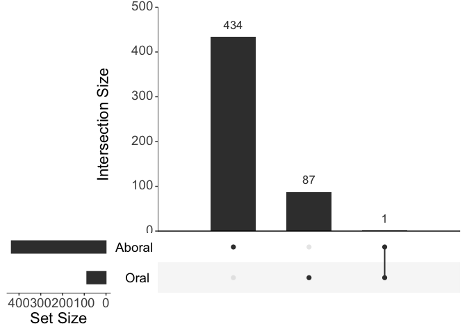

Semantic Enrichment
================
Zoe Dellaert
2025-01-11

- [0.1 Gene Ontology Analysis analysis of LCM RNA
  Data](#01-gene-ontology-analysis-analysis-of-lcm-rna-data)
- [0.2 Managing Packages Using Renv](#02-managing-packages-using-renv)
- [0.3 Load packages](#03-load-packages)
- [0.4 Description of pipeline](#04-description-of-pipeline)
- [0.5 Load in reference files and differential expression
  data](#05-load-in-reference-files-and-differential-expression-data)
- [0.6 Create custom GO annotation file for
  ViSEAGO](#06-create-custom-go-annotation-file-for-viseago)
  - [0.6.1 load the file into ViSEAGO](#061-load-the-file-into-viseago)
- [0.7 Create gene lists for
  enrichment](#07-create-gene-lists-for-enrichment)
- [0.8 create topGO objects and perform enrichment using topGO wrapped
  by
  ViSEAGO](#08-create-topgo-objects-and-perform-enrichment-using-topgo-wrapped-by-viseago)
  - [0.8.1 Merge results for both
    conditions](#081-merge-results-for-both-conditions)
  - [0.8.2 Visualize and save initial
    results](#082-visualize-and-save-initial-results)
- [0.9 Semantic similarity](#09-semantic-similarity)
- [0.10 Visualization](#010-visualization)
  - [0.10.1 Multi Dimensional Scaling](#0101-multi-dimensional-scaling)
  - [0.10.2 Heatmap](#0102-heatmap)
  - [0.10.3 MDS](#0103-mds)
- [0.11 Visualization and interpretation of GO
  clusters](#011-visualization-and-interpretation-of-go-clusters)

## 0.1 Gene Ontology Analysis analysis of LCM RNA Data

## 0.2 Managing Packages Using Renv

To run this code in my project using the renv environment, run the
following lines of code

``` r
install.packages("renv") #install the package on the new computer (may not be necessary if renv bootstraps itself as expected)
renv::restore() #reinstall all the package versions in the renv lockfile
```

## 0.3 Load packages

``` r
require("ViSEAGO")
```

    ## Loading required package: ViSEAGO

    ## 

    ## Warning: replacing previous import 'data.table::set' by 'dendextend::set' when
    ## loading 'ViSEAGO'

``` r
require("topGO")
```

    ## Loading required package: topGO

    ## Loading required package: BiocGenerics

    ## 
    ## Attaching package: 'BiocGenerics'

    ## The following objects are masked from 'package:stats':
    ## 
    ##     IQR, mad, sd, var, xtabs

    ## The following objects are masked from 'package:base':
    ## 
    ##     anyDuplicated, aperm, append, as.data.frame, basename, cbind,
    ##     colnames, dirname, do.call, duplicated, eval, evalq, Filter, Find,
    ##     get, grep, grepl, intersect, is.unsorted, lapply, Map, mapply,
    ##     match, mget, order, paste, pmax, pmax.int, pmin, pmin.int,
    ##     Position, rank, rbind, Reduce, rownames, sapply, setdiff, sort,
    ##     table, tapply, union, unique, unsplit, which.max, which.min

    ## Loading required package: graph

    ## Loading required package: Biobase

    ## Welcome to Bioconductor
    ## 
    ##     Vignettes contain introductory material; view with
    ##     'browseVignettes()'. To cite Bioconductor, see
    ##     'citation("Biobase")', and for packages 'citation("pkgname")'.

    ## Loading required package: GO.db

    ## Loading required package: AnnotationDbi

    ## Loading required package: stats4

    ## Loading required package: IRanges

    ## Loading required package: S4Vectors

    ## 
    ## Attaching package: 'S4Vectors'

    ## The following object is masked from 'package:utils':
    ## 
    ##     findMatches

    ## The following objects are masked from 'package:base':
    ## 
    ##     expand.grid, I, unname

    ## Loading required package: SparseM

    ## Warning: package 'SparseM' was built under R version 4.3.3

    ## 
    ## groupGOTerms:    GOBPTerm, GOMFTerm, GOCCTerm environments built.

    ## 
    ## Attaching package: 'topGO'

    ## The following object is masked from 'package:IRanges':
    ## 
    ##     members

``` r
require("tidyverse")
```

    ## Loading required package: tidyverse

    ## ── Attaching core tidyverse packages ──────────────────────── tidyverse 2.0.0 ──
    ## ✔ dplyr     1.1.4     ✔ readr     2.1.5
    ## ✔ forcats   1.0.0     ✔ stringr   1.5.1
    ## ✔ ggplot2   3.5.1     ✔ tibble    3.2.1
    ## ✔ lubridate 1.9.3     ✔ tidyr     1.3.1
    ## ✔ purrr     1.0.2     
    ## ── Conflicts ────────────────────────────────────────── tidyverse_conflicts() ──
    ## ✖ lubridate::%within%() masks IRanges::%within%()
    ## ✖ ggplot2::annotate()   masks ViSEAGO::annotate()
    ## ✖ stringr::boundary()   masks graph::boundary()
    ## ✖ dplyr::collapse()     masks IRanges::collapse()
    ## ✖ dplyr::combine()      masks Biobase::combine(), BiocGenerics::combine()
    ## ✖ dplyr::desc()         masks IRanges::desc()
    ## ✖ tidyr::expand()       masks S4Vectors::expand()
    ## ✖ dplyr::filter()       masks stats::filter()
    ## ✖ dplyr::first()        masks S4Vectors::first()
    ## ✖ dplyr::lag()          masks stats::lag()
    ## ✖ ggplot2::Position()   masks BiocGenerics::Position(), base::Position()
    ## ✖ purrr::reduce()       masks IRanges::reduce()
    ## ✖ dplyr::rename()       masks S4Vectors::rename()
    ## ✖ lubridate::second()   masks S4Vectors::second()
    ## ✖ lubridate::second<-() masks S4Vectors::second<-()
    ## ✖ dplyr::select()       masks AnnotationDbi::select()
    ## ✖ dplyr::slice()        masks IRanges::slice()
    ## ℹ Use the conflicted package (<http://conflicted.r-lib.org/>) to force all conflicts to become errors

``` r
sessionInfo() #provides list of loaded packages and version of R.
```

    ## R version 4.3.2 (2023-10-31)
    ## Platform: aarch64-apple-darwin20 (64-bit)
    ## Running under: macOS Ventura 13.0
    ## 
    ## Matrix products: default
    ## BLAS:   /Library/Frameworks/R.framework/Versions/4.3-arm64/Resources/lib/libRblas.0.dylib 
    ## LAPACK: /Library/Frameworks/R.framework/Versions/4.3-arm64/Resources/lib/libRlapack.dylib;  LAPACK version 3.11.0
    ## 
    ## locale:
    ## [1] en_US.UTF-8/en_US.UTF-8/en_US.UTF-8/C/en_US.UTF-8/en_US.UTF-8
    ## 
    ## time zone: America/New_York
    ## tzcode source: internal
    ## 
    ## attached base packages:
    ## [1] stats4    stats     graphics  grDevices datasets  utils     methods  
    ## [8] base     
    ## 
    ## other attached packages:
    ##  [1] lubridate_1.9.3      forcats_1.0.0        stringr_1.5.1       
    ##  [4] dplyr_1.1.4          purrr_1.0.2          readr_2.1.5         
    ##  [7] tidyr_1.3.1          tibble_3.2.1         ggplot2_3.5.1       
    ## [10] tidyverse_2.0.0      topGO_2.54.0         SparseM_1.84-2      
    ## [13] GO.db_3.18.0         AnnotationDbi_1.64.1 IRanges_2.34.1      
    ## [16] S4Vectors_0.38.2     Biobase_2.60.0       graph_1.80.0        
    ## [19] BiocGenerics_0.46.0  ViSEAGO_1.16.0      
    ## 
    ## loaded via a namespace (and not attached):
    ##   [1] RColorBrewer_1.1-3      rstudioapi_0.17.0       jsonlite_1.8.9         
    ##   [4] magrittr_2.0.3          rmarkdown_2.28          fs_1.6.4               
    ##   [7] zlibbioc_1.46.0         vctrs_0.6.5             memoise_2.0.1          
    ##  [10] RCurl_1.98-1.16         webshot_0.5.5           htmltools_0.5.8.1      
    ##  [13] progress_1.2.3          dynamicTreeCut_1.63-1   curl_5.2.3             
    ##  [16] htmlwidgets_1.6.4       plyr_1.8.9              plotly_4.10.4          
    ##  [19] cachem_1.1.0            igraph_2.1.2            lifecycle_1.0.4        
    ##  [22] iterators_1.0.14        pkgconfig_2.0.3         Matrix_1.6-5           
    ##  [25] R6_2.5.1                fastmap_1.2.0           GenomeInfoDbData_1.2.10
    ##  [28] digest_0.6.37           colorspace_2.1-1        RSQLite_2.3.9          
    ##  [31] seriation_1.5.7         filelock_1.0.3          timechange_0.3.0       
    ##  [34] fansi_1.0.6             httr_1.4.7              compiler_4.3.2         
    ##  [37] bit64_4.5.2             withr_3.0.1             BiocParallel_1.34.2    
    ##  [40] viridis_0.6.5           DBI_1.2.3               UpSetR_1.4.0           
    ##  [43] heatmaply_1.5.0         dendextend_1.19.0       R.utils_2.12.3         
    ##  [46] biomaRt_2.58.2          rappdirs_0.3.3          tools_4.3.2            
    ##  [49] R.oo_1.27.0             glue_1.8.0              DiagrammeR_1.0.11      
    ##  [52] GOSemSim_2.28.1         grid_4.3.2              fgsea_1.28.0           
    ##  [55] generics_0.1.3          gtable_0.3.5            tzdb_0.4.0             
    ##  [58] R.methodsS3_1.8.2       ca_0.71.1               data.table_1.16.2      
    ##  [61] hms_1.1.3               xml2_1.3.6              utf8_1.2.4             
    ##  [64] XVector_0.40.0          foreach_1.5.2           pillar_1.9.0           
    ##  [67] yulab.utils_0.1.9       BiocFileCache_2.10.2    lattice_0.22-6         
    ##  [70] renv_1.0.11             bit_4.5.0               tidyselect_1.2.1       
    ##  [73] registry_0.5-1          Biostrings_2.70.3       knitr_1.48             
    ##  [76] gridExtra_2.3           xfun_0.48               matrixStats_1.4.1      
    ##  [79] DT_0.33                 visNetwork_2.1.2        stringi_1.8.4          
    ##  [82] lazyeval_0.2.2          yaml_2.3.10             evaluate_1.0.1         
    ##  [85] codetools_0.2-20        BiocManager_1.30.25     cli_3.6.3              
    ##  [88] munsell_0.5.1           Rcpp_1.0.13-1           GenomeInfoDb_1.36.4    
    ##  [91] dbplyr_2.5.0            png_0.1-8               XML_3.99-0.17          
    ##  [94] parallel_4.3.2          assertthat_0.2.1        blob_1.2.4             
    ##  [97] prettyunits_1.2.0       AnnotationForge_1.44.0  bitops_1.0-9           
    ## [100] viridisLite_0.4.2       scales_1.3.0            crayon_1.5.3           
    ## [103] rlang_1.1.4             cowplot_1.1.3           fastmatch_1.1-6        
    ## [106] KEGGREST_1.40.1         TSP_1.2-4

## 0.4 Description of pipeline

I am going to perform functional enrichment of GO terms using
[ViSEAGO](https://biodatamining.biomedcentral.com/articles/10.1186/s13040-019-0204-1).

I am following this vignette:
<http://bioconductor.unipi.it/packages/devel/bioc/vignettes/ViSEAGO/inst/doc/ViSEAGO.html>.

## 0.5 Load in reference files and differential expression data

In the next chunk I am loading in my DESeq data. These results are
ordered by adjusted p-value. As a reminder, negative LFC = higher in
Aboral tissue, and positive LFC = higher in Oral tissue.

``` r
#load in DESeq results
DESeq <- read.csv("../output_RNA/differential_expression/DESeq_results.csv", header = TRUE) %>% dplyr::rename("query" ="X")

#make dataframes of just differentially expressed genes for each LFC direction
DE_05_Aboral <- DESeq %>% filter(padj < 0.05 & log2FoldChange > 0)
DE_05_OralEpi <- DESeq %>% filter(padj < 0.05& log2FoldChange < 0)

#load in annotation data 
annot_tab <- read.delim("../references/annotation/protein-GO.tsv") %>% dplyr::rename(GOs = GeneOntologyIDs)

#filter annotation data for just expressed genes with GO annotations
annot_tab <- annot_tab %>% filter(query %in% DESeq$query) 

annot_tab$GOs <- gsub("; ", ";", annot_tab$GOs)
annot_tab$GOs[annot_tab$GOs==""] <- NA
annot_tab <- annot_tab %>% filter(!is.na(GOs))

nrow(annot_tab)
```

    ## [1] 10638

``` r
nrow(annot_tab)/nrow(DESeq)
```

    ## [1] 0.7354812

10638/14464 genes in our dataset have GO information in this file. That
is 74%.

``` r
sum(annot_tab$query %in% DE_05_Aboral$query)
```

    ## [1] 545

``` r
sum(annot_tab$query %in% DE_05_Aboral$query)/nrow(DE_05_Aboral)
```

    ## [1] 0.6778607

``` r
sum(annot_tab$query %in% DE_05_OralEpi$query)
```

    ## [1] 1979

``` r
sum(annot_tab$query %in% DE_05_OralEpi$query)/nrow(DE_05_OralEpi)
```

    ## [1] 0.7062812

545/804 genes that are significantly upregulated in the Aboral tissue
have annotation information. That is 68% of the genes.

1979/2802 genes that are significantly upregulated in the Oral Epidermis
tissue have annotation information. That is 71% of the genes.

## 0.6 Create custom GO annotation file for ViSEAGO

``` r
##Get a list of GO Terms for all genes
annots <- annot_tab %>% dplyr::select(query,GOs) %>% dplyr::rename("GO.terms" = GOs)

# format into the format required by ViSEAGO for custom mappings
Custom_GOs <- annots %>%
  # Separate GO terms into individual rows
  separate_rows(GO.terms, sep = ";") %>%
  # Add necessary columns
  mutate(
    taxid = "pacuta",
    gene_symbol = query,
    evidence = "SwissProt"
  ) %>%
  # Rename columns
  dplyr::rename(
    gene_id = query,
    GOID = GO.terms
  ) %>%
  dplyr::select(taxid, gene_id, gene_symbol, GOID, evidence)

Custom_GOs_valid <- Custom_GOs %>% filter(GOID %in% keys(GO.db))

write.table(Custom_GOs_valid, "../output_RNA/differential_expression/semantic-enrichment/custom_GOs.txt",row.names = FALSE, sep = "\t", quote = FALSE,col.names=TRUE)

length(unique(Custom_GOs$gene_id))
```

    ## [1] 10638

``` r
length(unique(Custom_GOs_valid$gene_id))
```

    ## [1] 10637

We seem to have lost one gene when filtering for valid GO terms, so I
need to account for that below.

### 0.6.1 load the file into ViSEAGO

``` r
Custom_Pacuta <- ViSEAGO::Custom2GO("../output_RNA/differential_expression/semantic-enrichment/custom_GOs.txt")
```

    ## 'select()' returned 1:1 mapping between keys and columns

``` r
myGENE2GO_Pacuta <- ViSEAGO::annotate(
    id="pacuta",
    Custom_Pacuta
)
```

## 0.7 Create gene lists for enrichment

``` r
selection <- DESeq %>% filter(query %in% Custom_GOs_valid$gene_id) %>% 
                       mutate(DE_05_Aboral = ifelse(query %in% DE_05_Aboral$query, 1,0)) %>%
                       mutate(DE_05_Oral = ifelse(query %in% DE_05_OralEpi$query, 1,0)) %>%
                       mutate(expressed = 1)

selection_Aboral <- selection %>% pull(DE_05_Aboral) %>% as.factor()
names(selection_Aboral) <- selection %>% pull(query)

selection_Oral <- selection %>% pull(DE_05_Oral) %>% as.factor()
names(selection_Oral) <- selection %>% pull(query)

expressed <- selection %>% pull(expressed) %>% as.factor()
names(expressed) <- selection %>% pull(query)
```

## 0.8 create topGO objects and perform enrichment using topGO wrapped by ViSEAGO

``` r
#create topgo object using custom mappings
# BP_Aboral <- new("topGOdata",
#               ontology = "BP",
#               allGenes = selection_Aboral,
#               nodeSize = 5,
#               gene2GO = geneID2GO,
#               annot = annFUN.gene2GO) 

# create viseago object
selection <- names(selection_Aboral)[selection_Aboral==1]
background <- names(expressed)

BP_Aboral <- ViSEAGO::create_topGOdata(
    geneSel=selection,
    allGenes=background,
    gene2GO=myGENE2GO_Pacuta, 
    ont="BP",
    nodeSize=5
)
```

    ## 
    ## Building most specific GOs .....

    ##  ( 8920 GO terms found. )

    ## 
    ## Build GO DAG topology ..........

    ##  ( 12838 GO terms and 28523 relations. )

    ## 
    ## Annotating nodes ...............

    ##  ( 9534 genes annotated to the GO terms. )

``` r
# perform TopGO test using classic algorithm
classic_Aboral <- topGO::runTest(
    BP_Aboral,
    algorithm ="classic",
    statistic = "fisher"
)
```

    ## 
    ##           -- Classic Algorithm -- 
    ## 
    ##       the algorithm is scoring 3918 nontrivial nodes
    ##       parameters: 
    ##           test statistic: fisher

``` r
#create topgo object using custom mappings
# BP_Oral <- new("topGOdata",
#               ontology = "BP",
#               allGenes = selection_Oral,
#               nodeSize = 5,
#               gene2GO = geneID2GO,
#               annot = annFUN.gene2GO) 

# create viseago object
selection <- names(selection_Oral)[selection_Oral==1]
background <- names(expressed)

BP_Oral <- ViSEAGO::create_topGOdata(
    geneSel=selection,
    allGenes=background,
    gene2GO=myGENE2GO_Pacuta, 
    ont="BP",
    nodeSize=5
)
```

    ## 
    ## Building most specific GOs .....

    ##  ( 8920 GO terms found. )

    ## 
    ## Build GO DAG topology ..........

    ##  ( 12838 GO terms and 28523 relations. )

    ## 
    ## Annotating nodes ...............

    ##  ( 9534 genes annotated to the GO terms. )

``` r
# perform TopGO test using classic algorithm
classic_Oral <- topGO::runTest(
    BP_Oral,
    algorithm ="classic",
    statistic = "fisher"
)
```

    ## 
    ##           -- Classic Algorithm -- 
    ## 
    ##       the algorithm is scoring 6011 nontrivial nodes
    ##       parameters: 
    ##           test statistic: fisher

### 0.8.1 Merge results for both conditions

``` r
BP_sResults <- ViSEAGO::merge_enrich_terms(
    Input = list(
        Aboral = c("BP_Aboral", "classic_Aboral"),
        Oral = c("BP_Oral", "classic_Oral")
    )
)
```

    ## 'select()' returned 1:1 mapping between keys and columns

### 0.8.2 Visualize and save initial results

``` r
# display the merged table
#ViSEAGO::show_table(BP_sResults)

# print the merged table in a file
ViSEAGO::show_table(
    BP_sResults,
    "../output_RNA/differential_expression/semantic-enrichment/BP_sResults.csv"
)
```

``` r
# count significant (or not) pvalues by condition
ViSEAGO::GOcount(BP_sResults)
```

    ## PhantomJS not found. You can install it with webshot::install_phantomjs(). If it is installed, please make sure the phantomjs executable can be found via the PATH variable.

<div id="htmlwidget-5f77f85781875f44c820"
class="plotly html-widget html-fill-item"
style="width:672px;height:480px;">

</div>

<script type="application/json" data-for="htmlwidget-5f77f85781875f44c820">{"x":{"visdat":{"749978d0717c":["function () ","plotlyVisDat"]},"cur_data":"749978d0717c","attrs":{"749978d0717c":{"y":{},"x":{},"color":{},"colors":["#FED8B1","#87ceeb"],"alpha_stroke":1,"sizes":[10,100],"spans":[1,20],"type":"bar"}},"layout":{"margin":{"b":100,"l":150,"t":100,"r":10},"xaxis":{"domain":[0,1],"automargin":true,"title":"GO terms number"},"yaxis":{"domain":[0,1],"automargin":true,"title":"","type":"category","categoryorder":"array","categoryarray":["Oral","Aboral"]},"title":"number of significant (or not) GO terms by conditions","barmode":"stack","hovermode":"closest","showlegend":true},"source":"A","config":{"modeBarButtonsToAdd":["hoverclosest","hovercompare"],"showSendToCloud":false},"data":[{"y":["Aboral","Oral"],"x":[435,88],"type":"bar","orientation":"h","name":"enriched GO terms","marker":{"color":"rgba(254,216,177,1)","line":{"color":"rgba(254,216,177,1)"}},"textfont":{"color":"rgba(254,216,177,1)"},"error_y":{"color":"rgba(254,216,177,1)"},"error_x":{"color":"rgba(254,216,177,1)"},"xaxis":"x","yaxis":"y","frame":null},{"y":["Aboral","Oral"],"x":[87,434],"type":"bar","orientation":"h","name":"not enriched GO terms","marker":{"color":"rgba(135,206,235,1)","line":{"color":"rgba(135,206,235,1)"}},"textfont":{"color":"rgba(135,206,235,1)"},"error_y":{"color":"rgba(135,206,235,1)"},"error_x":{"color":"rgba(135,206,235,1)"},"xaxis":"x","yaxis":"y","frame":null}],"highlight":{"on":"plotly_click","persistent":false,"dynamic":false,"selectize":false,"opacityDim":0.20000000000000001,"selected":{"opacity":1},"debounce":0},"shinyEvents":["plotly_hover","plotly_click","plotly_selected","plotly_relayout","plotly_brushed","plotly_brushing","plotly_clickannotation","plotly_doubleclick","plotly_deselect","plotly_afterplot","plotly_sunburstclick"],"base_url":"https://plot.ly"},"evals":[],"jsHooks":[]}</script>

``` r
# display interactions
ViSEAGO::Upset(
    BP_sResults,
    file="../output_RNA/differential_expression/semantic-enrichment/OLexport.csv"
)
```

<!-- -->

## 0.9 Semantic similarity

``` r
# initialize 
myGOs<-ViSEAGO::build_GO_SS(
    gene2GO=myGENE2GO_Pacuta,
    enrich_GO_terms=BP_sResults
)
```

    ## 'select()' returned 1:1 mapping between keys and columns

``` r
# compute all available Semantic Similarity (SS) measures
myGOs <- ViSEAGO::compute_SS_distances(
    myGOs,
    distance="Wang"
)
```

## 0.10 Visualization

### 0.10.1 Multi Dimensional Scaling

``` r
# display MDSplot
ViSEAGO::MDSplot(myGOs)
```

<div id="htmlwidget-08a19ee121f421c1c753"
class="plotly html-widget html-fill-item"
style="width:672px;height:480px;">

</div>

<script type="application/json" data-for="htmlwidget-08a19ee121f421c1c753">{"x":{"visdat":{"74994412ee42":["function () ","plotlyVisDat"],"749936d851f8":["function () ","data"]},"cur_data":"749936d851f8","attrs":{"749936d851f8":{"alpha_stroke":1,"sizes":[10,100],"spans":[1,20],"x":{},"y":{},"type":"scatter","mode":"markers","name":"Wang","text":{},"showlegend":false,"marker":{"size":20,"opacity":0.40000000000000002,"color":"royalblue"},"visible":true,"inherit":true}},"layout":{"margin":{"b":40,"l":60,"t":100,"r":10},"title":"MultiDimensional Scaling plot","font":{"size":14},"xaxis":{"domain":[0,1],"automargin":true,"title":"Dimension 1"},"yaxis":{"domain":[0,1],"automargin":true,"title":"Dimension 2"},"updatemenus":[{"x":0.10000000000000001,"y":1.1000000000000001,"buttons":[{"method":"restyle","args":["visible",[true]],"label":"Wang"}]}],"hovermode":"closest","showlegend":false},"source":"A","config":{"modeBarButtonsToAdd":["hoverclosest","hovercompare"],"showSendToCloud":false},"data":[{"x":[-0.21972400333828687,-0.38750759987297551,-0.0023789620699254809,-0.35295651986276105,-0.036515025873145653,-0.32344505891221509,-0.39531140832961981,-0.32802373246381517,0.045348771736137848,0.04504946080986847,-0.16209688524789406,-0.16389234354723239,-0.24846671909258178,-0.19273878424218016,-0.28944877985278178,-0.36846792371841303,0.23382327730324226,-0.37830463358964694,-0.1955306038030854,-0.049423451892301531,-0.099792990672552234,-0.31770842092906737,0.23536753370238503,0.18046937804636659,0.17547319547081422,0.17227262715559671,0.21059036910720602,0.20844047372925961,0.22403381598927105,0.2149066748567246,-0.2889534596049913,0.0054937934812384617,0.071410091140474197,-0.27974716419430601,-0.16271683595277495,-0.37370317868316316,-0.30151980608172096,-0.30151980608172096,-0.35611361885349274,-0.2943080317437588,-0.29430803174375886,-0.33054405583163915,-0.37367125919903704,-0.33906596698977853,-0.33415876587145149,-0.28519558332522899,-0.35015186995327419,-0.2954159419704982,-0.15234095647930576,0.18765410177751884,0.17955458517713696,0.18132049373070905,0.17088963363970699,0.18550523090080415,0.24994345539156504,0.22609551941694478,0.23690728962032029,0.22583799703890012,0.23507996880804202,0.28937802054179546,0.27170845916886233,0.23263078972903634,0.23191349371821948,0.28233875333864006,-0.21826418693647551,0.35822472178883258,0.34676805541937761,0.33391957527468985,0.32253267854106571,0.34364104742273022,0.27064884256624827,-0.39883825912787763,-0.33649762525311772,-0.40814443856091209,-0.11203273586597898,-0.019058672990824688,-0.16976988867513571,-0.38668288198534762,-0.40055476439627818,-0.38917145616757715,-0.31267709215270811,-0.24816470674987404,-0.23366604551637021,-0.2170609052916419,-0.18220119771510326,-0.39267667761213693,0.23938556358653593,0.036373087670972269,-0.0012588893037114165,0.13284647004010103,0.19999156742409752,0.096080097344444629,0.26392490567128934,-0.14531092281380534,0.26927045439609198,0.27786761212893224,0.10057101176117425,-0.13114523258136743,-0.25458240677553989,0.2607737840413063,0.20715001324372687,0.24680525830303135,0.20715001324372687,-0.27614014090672095,0.26188360079833972,0.26637214391837855,-0.33276355609932518,-0.27286704032804548,-0.34159397876554909,-0.42595475954697293,-0.24193089238030122,-0.21188711442167166,-0.24474269613406446,0.33475214277595994,0.3091191379101062,-0.19872706763843126,0.27614094238523884,0.3131268447680341,0.291379233570774,0.0091648691610805525,-0.060545064784582596,-0.20188043906441319,-0.052175630980411912,-0.12425499177898798,-0.089723290774950309,0.24397232177989994,0.24381031047662596,0.30956219640385418,0.23191349371821929,-0.19272963953503733,0.2341347180677758,0.24961499962509365,-0.37631450706001934,-0.31900278389507641,-0.27351539048910434,-0.23041977080361534,-0.21943126017091011,-0.32191633539329401,-0.14090780618608476,-0.16518103274263546,-0.33000505181033968,-0.20849105568848061,-0.17095332016521425,-0.27027846967411201,-0.1295178976290067,-0.36564389019941335,0.23401288485143831,0.25122060758740472,0.20563608872289973,0.23578163682073403,0.034597122683378799,0.30430267832754693,-0.20313327556197647,0.17385465783904994,0.24447181719979247,0.23406068212004685,-0.30994133536211327,0.1740823020559574,-0.31082151944436809,-0.098807879183784419,-0.34893732631995905,-0.22515869270699121,-0.3032148907638938,-0.20769658735408802,-0.066843405735239864,-0.045387200268350497,-0.049930423192866655,-0.13749022903928668,-0.34436874004539675,0.29122984911486027,0.25068229304750828,0.173850605710128,-0.023783422985200066,0.11412390956522502,0.1052325070970216,0.24307792964855179,0.24412973538454763,-0.039973837182421645,-0.093278481090393897,0.25034092891126958,0.2894984990347434,0.1858667231620468,-0.080125697133026044,-0.059424330871034388,0.17473707531393534,0.23627638759988048,-0.30661165201694657,0.26159952990555485,0.24623759008279136,0.26554490799627989,0.25525029378694408,-0.27173535993133929,-0.33433406799982196,-0.26636780548120303,-0.26961925229943173,-0.26716295240295351,-0.34432485288534848,-0.37831050778348924,0.20753038792468106,0.30563265273387641,-0.2801550270393251,-0.26873610098958378,0.24467427432820821,0.21276607703437181,-0.21731366756387002,0.17289834596236045,0.22731298536375191,0.18520197735020996,0.23772862471597406,0.23380344717517493,-0.24272312059316206,-0.16381287221574728,0.29982963387737688,0.28018520858275753,0.23752932543166441,-0.33997051742055867,0.11981550537173341,0.060285120585019759,0.22124832607872269,-0.29361487042501672,-0.21996634382187227,0.26406603645162907,-0.39333754334002585,-0.35882805562725273,0.24078985342056333,0.099225745231809645,0.24946141886309653,0.14635840934180919,0.0066278416854552019,0.040150720358339602,0.022886742890421908,0.26406603645162902,-0.19188747572468279,0.11586714852744952,0.11470139328421367,0.11384066505774552,0.05336615230104242,0.061361445439164573,-0.088393759941442357,-0.056968090928107812,-0.05835196983518838,0.29536759442984162,-0.23158061359871529,-0.29383549957630867,-0.27427367973083522,-0.12186381066465267,-0.4513123841209134,-0.34957744110439803,-0.34650721652280642,-0.39538943293003365,-0.39425204676901721,-0.16019883932054432,0.30834613413500139,0.28856771585014196,-0.04211850114863034,-0.30194926174783987,-0.26983937446327666,-0.24360608211418219,-0.34050178598715553,-0.32668566598846732,0.060343445905777948,-0.36311283284634216,-0.23210128859901091,-0.14436152565857593,-0.14404875701376305,-0.20840849513371074,-0.19923684034473993,-0.011152905728809871,0.0055103162638439297,0.23042902497172113,-0.24567701597418054,-0.24074882428201919,-0.12901468417654044,-0.088874243500896594,-0.23454691673859576,-0.45249430149791325,-0.39879151101459881,-0.36892370998298785,-0.30865804492376414,-0.25461679713971941,-0.26698653940994976,-0.12928062273415447,-0.27444235978426834,-0.045726342426013006,0.03575576958867175,-0.39399879996164255,-0.13754367248674948,-0.10092697349633616,-0.10247910945980734,-0.067738079475861107,-0.032562813371974572,-0.082383666257543439,0.033890471844855302,0.20883866361678477,0.28701259918677441,0.25097383729392331,0.00064067330837464746,0.095836994827083202,0.097221261196846862,0.21025085411986338,0.27791605028186944,0.2665934374106832,0.24753386143979608,0.20506154142648669,0.036422914367450515,0.035033343684756621,-0.35334670979341409,0.077279161715672659,0.07405333460472048,0.075970428648581029,0.23483230378686645,-0.25982382348063437,-0.20966078325441537,-0.21177362734283259,-0.026171570702326563,-0.018643285728598767,-0.38736555872968303,-0.16852744117953808,-0.3087618474114136,0.30563265273387635,0.062924424762872591,-0.0060985328419002113,-0.31257980532614871,-0.2672682218977544,-0.33060558757605607,-0.20544911836863122,-0.3134966989317462,-0.2500446897703093,-0.21934628803668108,-0.3923244683291145,-0.2828145084953731,-0.38790616123569194,-0.18975734057241336,-0.28041970917684511,-0.059541442685765868,-0.2079977383949479,-0.16514106701207262,-0.16767823255827161,-0.26515119750225385,0.25352858306623111,-0.24331884914239146,-0.14838123792531036,-0.25908121502953729,-0.19459918273091589,-0.16386689411485139,-0.28452629005964003,-0.2254518393978463,-0.1843098681137485,-0.26018322759228135,0.25416556996253054,0.24250375699949125,-0.046271795790889338,-0.23087432913668038,-0.3147489475811025,-0.33760273670641988,-0.18336772040857241,-0.39175967195566502,-0.13536291254097294,0.23532111426255259,0.22476291468710724,0.22476291468710724,-0.030576887949339417,0.25849927541105577,0.26670783079008747,0.27333617344113037,0.25389721330188691,0.28977336251440183,0.27729578620875717,0.29285730243092389,0.24384208627868056,0.26566353683818894,-0.035256576502068857,-0.21195882957387863,-0.20552635226346624,-0.15703652480253766,-0.24669548320473553,0.23637917635516922,0.23547815412672171,0.25483779313728955,0.23595736634943942,0.25021977364983689,0.22793183642770612,-0.37634046230580059,-0.26602656572595723,-0.32421984542287918,-0.32475580344905319,-0.27937501399476139,-0.23773653145015089,-0.25174097700113734,-0.40255161414718321,0.24026053960834573,0.24744457996042452,-0.36785972065777972,-0.2839121553594196,0.25410203982188845,0.27612102407947686,0.23820964784295293,-0.06233889380061327,-0.058319371584834447,-0.07078557390214367,-0.084035593947141593,0.056343922239928498,-0.004300140786135445,0.25593782202363941,-0.071554415684071615,0.24353145082350178,-0.1010979977984222,-0.10140233172243653,0.25059254903649802,0.24738515867149621,0.29535594437387408,-0.24662976514357399,0.26936477366326506,0.24002477579181289,-0.033576533344923484,-0.34101080639678633,0.25650963557074802,0.21788823898937643,0.18023716471738732,0.25502815037757576,0.28054405292150641,0.26080005682575869,-0.11241059808268052,0.26836677658902136,0.26140832842203143,0.26269964273840091,-0.15068995355290377,-0.021257791916114412,-0.33510673517432299,-0.043027426891965828,0.10362541736710836,-0.23859138836374449,-0.28929356584412586,0.25346475078952246,-0.25145169888316932,-0.25321053847593999,-0.13262243328287926,0.27423241738304244,0.22958415500277343,0.22478222095813258,0.26935124510121455,0.25644205089519079,0.24232671517767077,0.26700137505417443,0.24064777265928378,0.23887820540959714,0.2528360972698771,0.2037873944688848,0.22542128702840911,0.33008909501925165,0.3343338708504473,-0.060514495002618643,0.062057971822394281,0.21489265552599562,0.2170744634346036,0.31709192889051063,-0.16998634557012271,0.23619811401964586,0.22772617289682889,0.25213164777994179,0.18873312824098049,0.25146432229728183,0.24474393711963677,0.25451545004513371,0.22306636592940074,0.25002449092732071,0.26023145331175407,0.2414952675866778,0.20471092229826657,0.31393769123169202,-0.3151182127356621,0.22977702018554952,0.25327309334640347,0.26437382051609554,0.20865574101963882,0.21382113597859592,0.17919147458113238,0.25896786336217986,0.22872294097176282,0.210175258586598,0.21209213838195337,0.241259809496499,0.20171226769949893,0.039509239923282695,0.1495037111563807,0.16467543196830181,0.076887480789716758,0.076640741024066344,0.08699673810501149,0.20943017284779294,0.23479514641685967,0.2404281612265052,0.23483230378686631,0.27033205092213314,0.25717751462534649,0.25550452861196238,0.18008557074434248,0.32188145408860397,-0.31937046972677285,0.22737662521594484,0.25961863748039143,-0.32505231630799164,-0.071788052197841734,0.23271818196323166,0.26361189749480279,0.24463359221702827,0.27010558886376751,0.28250643077411419,0.26737321365010586,0.25419516047298663,0.29290898077867594,0.30290386091792376,0.29944520000590064,0.27825835489019823,0.27637886451911509,0.29863545370642852,0.23870350986709335,0.27236753881795545,0.26607916341015864,0.26414644740878779,0.28883727405938608,0.2833662923633678],"y":[0.074763356580086385,0.039218891086841741,0.15825675856667903,0.0415279033697145,-0.19928401090425035,0.094436755603151706,0.044258482541187943,0.091548770345760089,-0.26341888249831247,-0.26158563982957728,0.11354441892100703,0.13205994073388097,0.093014177780776017,-0.010121603093359396,0.10396918668301081,0.075908278754703629,-0.17309405299870453,0.0409863867502121,0.13062271100614017,-0.30713049114677654,-0.21018220888608941,0.066953699956438739,0.2117702295955522,0.16751197743986021,0.15116417749301816,0.14048489197313518,0.16769321485936969,0.16848291935602219,0.19554024425916991,0.18080890360305599,0.089597718398517046,0.18228782051114145,0.14391397482468579,0.10875571778153419,0.01187696455688861,0.074400586881077743,0.10305193102890343,0.10305193102890343,0.094962226235286482,0.1016333790776501,0.10163337907765013,0.10224862394419165,0.07427603157256793,0.098790726594360348,0.090450636799468354,0.11125105843804228,0.078014031600250583,0.088580104366466239,0.094427066921229749,0.12027903872951061,0.10088902783802682,0.11225661631423514,0.094830478313300645,0.13675087742494718,0.21130831819083684,0.19675780284217739,0.088974548811589782,0.089768045679748026,0.21041886602058318,-0.10738489701165864,-0.099948189572334381,-0.040248988679122355,-0.039417005777628661,-0.19665211510844269,0.094398708418311633,-0.17900754438709204,-0.150811019820074,-0.12575995324785544,-0.10569196774299314,-0.14839123286655098,-0.071209588783212041,0.055060499528266034,0.0760890731914943,-0.039048377215252582,-0.31225279975147124,-0.22696143301391405,-0.22919382668152266,-0.033271408507077251,0.081366648734503749,0.08935529153883684,0.094705256998757481,0.12015268932912597,0.11957636828004364,0.1167497402691669,0.098733171211164247,0.08105980052814081,-0.16330501414193122,0.13637524012836008,0.16421507815948683,0.12942027404079529,0.06251898347005351,0.15106953684129423,-0.08748498100049068,-0.29486673496226712,-0.092528527692572082,-0.20254772458586459,0.14715526543843427,-0.19545448942370786,0.10832959886157945,0.24582009638072264,0.17051705641825721,0.22207842538273187,0.17051705641825732,0.087838211357740878,0.25409334402660694,0.25215536983140729,0.076725038189886671,0.086426951110733868,0.078140398357792115,0.091989154491647296,0.098204926855024743,0.086040592513012437,0.097460262538777667,-0.1366893246220251,-0.12373476247966528,-0.28516357834752859,0.26998239340023067,-0.23310548193964967,-0.21077070630219438,-0.34790825004102016,-0.41027731749448393,-0.25078270965068933,-0.23661816490937318,-0.36304795762601111,-0.33403902144898473,0.2147221165625289,0.20831990557241503,-0.097234104830158263,-0.039417005777628703,-0.31928020523303474,-0.0040873505588896013,0.22221301457954568,0.010798387061526407,0.029890022635436331,0.043438959995550169,-0.21745632929240472,-0.21070623630919627,0.0031540738600583369,-0.24695689269440974,-0.26630116393855352,0.010691842462585087,-0.17657105793978892,-0.19208581551334569,-0.29534010826958645,-0.058206411420210137,0.108375851327385,-0.14258486251577912,-0.02620126680565827,0.15468637296472804,-0.019503269209742619,-0.29839669396396157,-0.22375586102595466,-0.3158585791180834,0.052648305264857455,-0.15480541403056883,-0.14348784354439226,0.090067680572770259,0.12898462857038426,0.074873924896201399,-0.18766913147302919,0.09634409181019471,0.1265439452717132,0.088405337603855522,0.06923283112527763,-0.27509099710804447,-0.24328331574882353,0.098579933194952896,-0.37508867391572676,0.091301333539025184,-0.316327651001578,-0.071276404526284851,0.10509191215614312,-0.18964010777463117,0.036419596766071559,0.020843601813380658,0.22286770729823996,0.21627057516645798,0.18931860882500398,0.10967688179054878,0.22673754863602127,0.1032235614270394,0.15867464784714605,-0.26411723879120363,-0.23241218340368486,0.14991290337742497,0.1971785994757205,0.073668067939806611,0.24886062845579057,-0.21474066377399934,-0.21884772385033269,0.23781376260556122,-0.16350367169741753,0.081416280020209744,0.095218831766495746,0.09195588381350818,0.089014455400140163,0.090207340566008959,0.065215874147252037,0.017935117517949559,-0.08541556519768885,0.081016496834880727,0.072876506374975933,-0.064488714855531079,0.0075519928161311761,0.093449648313452566,0.18122919784195499,-0.0093941772252885414,0.17834908189802171,-0.0080145236640250389,0.20438402529875077,-0.2687822454282951,0.02976468746961719,-0.22451049357871367,0.27581262150889169,0.20278865927767892,0.11809198974570985,-0.33305787612441207,0.13822914547240239,-0.020675372821107534,0.1065049245186479,0.12575458773946335,-0.19630472990347123,0.075778357724410245,0.10267563064102424,-0.034534505534499119,0.016100265163492361,-0.14048510878680978,0.14608363281078976,0.15556531255077347,-0.28098308901659963,-0.20163504204469876,-0.19630472990347117,-0.00064359535493223124,-0.40506754955069946,-0.36570474664636288,-0.37193188771447733,-0.31380404066438444,-0.28930797138416786,-0.36827767257367344,-0.3478979403678496,-0.35155652681641303,-0.10358681719064244,0.10702934711803049,0.068973412429023315,0.11322860956585223,-0.29631607762879908,0.055343061924275155,0.10268381794256089,0.048579229773138749,0.073114758421520848,0.077063298807373698,-0.075735250843943003,0.068353476622100645,0.066787655117866648,0.094341298576207974,0.11780202581469768,0.12395493066288416,0.10969464489907785,0.086140650529245577,0.047221930686357994,-0.062344561741392211,0.10026813040662334,0.090903548920767463,-0.26635991048810181,-0.2681054637016958,-0.32235403108342747,-0.27455207587645031,-0.30825889577032639,-0.29734991321239607,0.19617261655048157,-0.29061614757458998,-0.25095185028783273,-0.32530612146071364,-0.32742433105758401,0.11561441831254449,0.014933866372179371,0.08012014048407648,0.057984273341455353,0.075617131203075991,0.11383899548504062,0.087008404796068708,-0.32707658724566929,0.066962336832180711,-0.2209714593417364,-0.23465199440913587,0.043846490873829573,-0.38347655562627331,-0.3455439133747818,-0.34948778834965749,-0.35053004013208799,-0.34877751890342207,-0.38316429133092933,-0.095514281339689477,0.049473481850642993,-0.29428303113184839,-0.19737353292783896,0.16580031059634762,0.003872768498604285,0.0061903185842608613,0.058013218497758964,0.27920291133374436,0.076128700795167634,0.074379762493455806,-0.038340793723386703,-0.083718491440496798,-0.089752283143821554,0.07834952510518528,-0.013536418021342967,-0.013501008780978025,-0.0077471063916948208,-0.13958704551862072,-0.14455879097184046,-0.14237858586579744,-0.1476749690507779,-0.28035079317318573,-0.27230324240608872,0.039030375621172016,0.090154982911949316,0.060814391838880086,-0.085415565197688503,0.12749547690266513,-0.3808985357817346,0.098308259641301021,0.10542203003970069,0.10156807887194849,0.11610119249699309,0.11713317462756619,0.12778349314645407,0.1278346595880282,0.087660137946689434,0.095759149099803195,0.039893613757542461,0.086933785943097128,0.12259707325874745,-0.13336394944902319,-0.17688761131260372,-0.17274587616434492,0.12448137507216893,0.13180340567392124,-0.051992587661179694,0.08252789335889163,0.0027905963014321113,0.12281316225092938,0.12402728909411199,0.090966036683413729,0.087168249839629355,0.089923867501070509,-0.05203644530732851,0.10239088941722492,0.089563054885695395,0.081157125733211002,-0.11487175965662863,0.12706007665586033,0.11592139303787743,0.069930100185439562,0.099287772448878889,0.041740890088561917,-0.35633307182231799,-0.14013086510807293,-0.11674919294579306,-0.11674919294579303,0.14481770043605957,0.24498138377646622,0.048827550225027994,0.08369483214375667,0.073933383368031277,0.083862869017395592,0.10557269862066904,0.087522135403923673,0.22435372055971739,-0.085128358825174846,-0.22343329257687608,0.076613459579745843,0.091648684124671392,0.080713233110008928,0.090850061724340361,-0.17956779245599541,-0.12827837982661711,0.23489583127239297,0.20474785587065245,0.095077230711932026,0.19448921208714268,0.042311823352138518,0.10534693133258698,0.10790110543931489,0.088511310028331708,0.11436922026118321,0.088936900078332506,0.10430131982717813,0.046231157227547219,-0.17897525481157639,0.076601202610975777,0.10975329020936896,0.077301039877463021,0.23628213128098616,0.10403021379506258,-0.1794022291814264,-0.18620092036410582,-0.18542047635363507,-0.1658540650264666,0.10430027941444162,0.15310960944986571,-0.22606553932982368,-0.075439725084111439,-0.18671299392000115,-0.056069035307971318,-0.22624169980408235,-0.2272398712811331,-0.21213584479243577,-0.16366115765374664,0.099452262089155974,-0.036718767721228056,-0.29005268116002819,-0.21306538222148977,-0.20347828243588739,0.06634717902707632,-0.053628819566868234,-0.004125800468832601,0.12850502666481919,0.23672046268529734,-0.30780635024561026,-0.2727612226268975,-0.042262673601671484,0.084941631919344882,0.075718550719366701,0.072640899116011418,-0.20462972088232845,-0.25726074161673151,0.091264290381700225,0.13874843405915774,0.14329164674815528,-0.094287432785838982,-0.0065751653673447267,-0.16011989792736286,0.02117455055278954,0.10827326181451508,-0.061914852060415165,0.12053998141072539,-0.0072988458692413993,0.0018123054857485997,0.24560080090342967,0.22716778197782644,0.20845372308682081,0.24262095224826744,0.20734758863255345,0.20216049670117464,0.21874989875939443,-0.01848281839858178,0.1955415276602791,-0.12282718179521163,-0.12646689152444551,-0.32382739469331656,0.16784228855794278,0.014098007615775097,-0.0088936319733620081,-0.112765833089132,-0.23861909115493302,0.21016620745810358,0.20138172965827661,0.23563132816847865,0.14374053550383137,0.22493497517215669,0.21056646708523927,0.22751132121299328,-0.0077800304302767433,0.037374176646548518,-0.051351977836556879,0.20788505208783711,0.015662673722162995,0.057494424710729894,0.11365271527265559,0.18385624713705323,0.10872648328997493,0.084368640617947535,0.055994313503345987,0.0090118090707159218,0.12774299842944606,0.028966580949326935,-0.012714945912094686,0.014892832184857319,0.003592477784015816,0.21214268302843184,0.0080701425821861593,0.1749892635444035,0.21863104279209783,0.20621653485018887,0.15881144761981014,0.15788867206651025,0.15178413247221179,0.16680852382823777,-0.049713872178434572,-0.16072298072797347,-0.13958704551862086,-0.14206646901482312,-0.1309278336238095,0.24716316143274938,0.055897383266115118,0.011303767868477359,0.079823894865320488,-0.050495837005935212,-0.14048674591816041,0.013476160331867607,-0.071477677328244546,0.19634554722822967,0.082964336452885826,0.21514832201808176,0.084654813396832382,-0.29271657577307902,-0.26383742628457102,0.0432452724832895,0.070718807092123775,0.084625644368756192,0.068072448488472756,0.086492466338310869,0.075745568154642257,0.027434432493983529,0.19640166367845735,0.1202728208130357,0.088075989127099907,-0.14297639402643963,0.10236918844449265,0.10593925667915736],"type":"scatter","mode":"markers","name":"Wang","text":["GO.ID: GO:0000902 <br>GO.name: cell morphogenesis","GO.ID: GO:0001501 <br>GO.name: skeletal system development","GO.ID: GO:0001503 <br>GO.name: ossification","GO.ID: GO:0001568 <br>GO.name: blood vessel development","GO.ID: GO:0001649 <br>GO.name: osteoblast differentiation","GO.ID: GO:0001654 <br>GO.name: eye development","GO.ID: GO:0001655 <br>GO.name: urogenital system development","GO.ID: GO:0001656 <br>GO.name: metanephros development","GO.ID: GO:0001708 <br>GO.name: cell fate specification","GO.ID: GO:0001709 <br>GO.name: cell fate determination","GO.ID: GO:0001736 <br>GO.name: establishment of planar polarity","GO.ID: GO:0001738 <br>GO.name: morphogenesis of a polarized epithelium","GO.ID: GO:0001743 <br>GO.name: lens placode formation","GO.ID: GO:0001759 <br>GO.name: organ induction","GO.ID: GO:0001763 <br>GO.name: morphogenesis of a branching structure","GO.ID: GO:0001822 <br>GO.name: kidney development","GO.ID: GO:0001941 <br>GO.name: postsynaptic membrane organization","GO.ID: GO:0001944 <br>GO.name: vasculature development","GO.ID: GO:0002009 <br>GO.name: morphogenesis of an epithelium","GO.ID: GO:0002052 <br>GO.name: positive regulation of neuroblast proliferation","GO.ID: GO:0002064 <br>GO.name: epithelial cell development","GO.ID: GO:0002164 <br>GO.name: larval development","GO.ID: GO:0002250 <br>GO.name: adaptive immune response","GO.ID: GO:0002252 <br>GO.name: immune effector process","GO.ID: GO:0002443 <br>GO.name: leukocyte mediated immunity","GO.ID: GO:0002449 <br>GO.name: lymphocyte mediated immunity","GO.ID: GO:0002455 <br>GO.name: humoral immune response mediated by circulating immunoglobulin","GO.ID: GO:0002456 <br>GO.name: T cell mediated immunity","GO.ID: GO:0002460 <br>GO.name: adaptive immune response based on somatic recombination of immune receptors built from immunoglobulin superfamily domains","GO.ID: GO:0002526 <br>GO.name: acute inflammatory response","GO.ID: GO:0003002 <br>GO.name: regionalization","GO.ID: GO:0003008 <br>GO.name: system process","GO.ID: GO:0003094 <br>GO.name: glomerular filtration","GO.ID: GO:0003128 <br>GO.name: heart field specification","GO.ID: GO:0003129 <br>GO.name: heart induction","GO.ID: GO:0003170 <br>GO.name: heart valve development","GO.ID: GO:0003176 <br>GO.name: aortic valve development","GO.ID: GO:0003177 <br>GO.name: pulmonary valve development","GO.ID: GO:0003179 <br>GO.name: heart valve morphogenesis","GO.ID: GO:0003180 <br>GO.name: aortic valve morphogenesis","GO.ID: GO:0003184 <br>GO.name: pulmonary valve morphogenesis","GO.ID: GO:0003197 <br>GO.name: endocardial cushion development","GO.ID: GO:0003205 <br>GO.name: cardiac chamber development","GO.ID: GO:0003206 <br>GO.name: cardiac chamber morphogenesis","GO.ID: GO:0003231 <br>GO.name: cardiac ventricle development","GO.ID: GO:0003272 <br>GO.name: endocardial cushion formation","GO.ID: GO:0003279 <br>GO.name: cardiac septum development","GO.ID: GO:0003281 <br>GO.name: ventricular septum development","GO.ID: GO:0003401 <br>GO.name: axis elongation","GO.ID: GO:0006022 <br>GO.name: aminoglycan metabolic process","GO.ID: GO:0006023 <br>GO.name: aminoglycan biosynthetic process","GO.ID: GO:0006030 <br>GO.name: chitin metabolic process","GO.ID: GO:0006032 <br>GO.name: chitin catabolic process","GO.ID: GO:0006040 <br>GO.name: amino sugar metabolic process","GO.ID: GO:0006935 <br>GO.name: chemotaxis","GO.ID: GO:0006954 <br>GO.name: inflammatory response","GO.ID: GO:0006956 <br>GO.name: complement activation","GO.ID: GO:0006958 <br>GO.name: complement activation, classical pathway","GO.ID: GO:0006959 <br>GO.name: humoral immune response","GO.ID: GO:0007154 <br>GO.name: cell communication","GO.ID: GO:0007155 <br>GO.name: cell adhesion","GO.ID: GO:0007156 <br>GO.name: homophilic cell adhesion via plasma membrane adhesion molecules","GO.ID: GO:0007157 <br>GO.name: heterophilic cell-cell adhesion via plasma membrane cell adhesion molecules","GO.ID: GO:0007162 <br>GO.name: negative regulation of cell adhesion","GO.ID: GO:0007164 <br>GO.name: establishment of tissue polarity","GO.ID: GO:0007165 <br>GO.name: signal transduction","GO.ID: GO:0007166 <br>GO.name: cell surface receptor signaling pathway","GO.ID: GO:0007167 <br>GO.name: enzyme-linked receptor protein signaling pathway","GO.ID: GO:0007178 <br>GO.name: transmembrane receptor protein serine/threonine kinase signaling pathway","GO.ID: GO:0007186 <br>GO.name: G protein-coupled receptor signaling pathway","GO.ID: GO:0007267 <br>GO.name: cell-cell signaling","GO.ID: GO:0007275 <br>GO.name: multicellular organism development","GO.ID: GO:0007389 <br>GO.name: pattern specification process","GO.ID: GO:0007399 <br>GO.name: nervous system development","GO.ID: GO:0007409 <br>GO.name: axonogenesis","GO.ID: GO:0007411 <br>GO.name: axon guidance","GO.ID: GO:0007416 <br>GO.name: synapse assembly","GO.ID: GO:0007417 <br>GO.name: central nervous system development","GO.ID: GO:0007423 <br>GO.name: sensory organ development","GO.ID: GO:0007444 <br>GO.name: imaginal disc development","GO.ID: GO:0007446 <br>GO.name: imaginal disc growth","GO.ID: GO:0007472 <br>GO.name: wing disc morphogenesis","GO.ID: GO:0007474 <br>GO.name: imaginal disc-derived wing vein specification","GO.ID: GO:0007476 <br>GO.name: imaginal disc-derived wing morphogenesis","GO.ID: GO:0007498 <br>GO.name: mesoderm development","GO.ID: GO:0007507 <br>GO.name: heart development","GO.ID: GO:0007528 <br>GO.name: neuromuscular junction development","GO.ID: GO:0007565 <br>GO.name: female pregnancy","GO.ID: GO:0007586 <br>GO.name: digestion","GO.ID: GO:0007596 <br>GO.name: blood coagulation","GO.ID: GO:0007599 <br>GO.name: hemostasis","GO.ID: GO:0007613 <br>GO.name: memory","GO.ID: GO:0008037 <br>GO.name: cell recognition","GO.ID: GO:0008038 <br>GO.name: neuron recognition","GO.ID: GO:0008283 <br>GO.name: cell population proliferation","GO.ID: GO:0008284 <br>GO.name: positive regulation of cell population proliferation","GO.ID: GO:0008306 <br>GO.name: associative learning","GO.ID: GO:0008347 <br>GO.name: glial cell migration","GO.ID: GO:0008587 <br>GO.name: imaginal disc-derived wing margin morphogenesis","GO.ID: GO:0009605 <br>GO.name: response to external stimulus","GO.ID: GO:0009608 <br>GO.name: response to symbiont","GO.ID: GO:0009611 <br>GO.name: response to wounding","GO.ID: GO:0009617 <br>GO.name: response to bacterium","GO.ID: GO:0009653 <br>GO.name: anatomical structure morphogenesis","GO.ID: GO:0009719 <br>GO.name: response to endogenous stimulus","GO.ID: GO:0009725 <br>GO.name: response to hormone","GO.ID: GO:0009791 <br>GO.name: post-embryonic development","GO.ID: GO:0009880 <br>GO.name: embryonic pattern specification","GO.ID: GO:0009886 <br>GO.name: post-embryonic animal morphogenesis","GO.ID: GO:0009887 <br>GO.name: animal organ morphogenesis","GO.ID: GO:0009888 <br>GO.name: tissue development","GO.ID: GO:0009950 <br>GO.name: dorsal/ventral axis specification","GO.ID: GO:0009953 <br>GO.name: dorsal/ventral pattern formation","GO.ID: GO:0009966 <br>GO.name: regulation of signal transduction","GO.ID: GO:0009967 <br>GO.name: positive regulation of signal transduction","GO.ID: GO:0010001 <br>GO.name: glial cell differentiation","GO.ID: GO:0010033 <br>GO.name: response to organic substance","GO.ID: GO:0010646 <br>GO.name: regulation of cell communication","GO.ID: GO:0010647 <br>GO.name: positive regulation of cell communication","GO.ID: GO:0010721 <br>GO.name: negative regulation of cell development","GO.ID: GO:0010975 <br>GO.name: regulation of neuron projection development","GO.ID: GO:0014003 <br>GO.name: oligodendrocyte development","GO.ID: GO:0014012 <br>GO.name: peripheral nervous system axon regeneration","GO.ID: GO:0014013 <br>GO.name: regulation of gliogenesis","GO.ID: GO:0014015 <br>GO.name: positive regulation of gliogenesis","GO.ID: GO:0015669 <br>GO.name: gas transport","GO.ID: GO:0015670 <br>GO.name: carbon dioxide transport","GO.ID: GO:0016055 <br>GO.name: Wnt signaling pathway","GO.ID: GO:0016339 <br>GO.name: calcium-dependent cell-cell adhesion via plasma membrane cell adhesion molecules","GO.ID: GO:0016358 <br>GO.name: dendrite development","GO.ID: GO:0016477 <br>GO.name: cell migration","GO.ID: GO:0019755 <br>GO.name: one-carbon compound transport","GO.ID: GO:0021510 <br>GO.name: spinal cord development","GO.ID: GO:0021511 <br>GO.name: spinal cord patterning","GO.ID: GO:0021513 <br>GO.name: spinal cord dorsal/ventral patterning","GO.ID: GO:0021514 <br>GO.name: ventral spinal cord interneuron differentiation","GO.ID: GO:0021529 <br>GO.name: spinal cord oligodendrocyte cell differentiation","GO.ID: GO:0021545 <br>GO.name: cranial nerve development","GO.ID: GO:0021780 <br>GO.name: glial cell fate specification","GO.ID: GO:0021781 <br>GO.name: glial cell fate commitment","GO.ID: GO:0021854 <br>GO.name: hypothalamus development","GO.ID: GO:0021889 <br>GO.name: olfactory bulb interneuron differentiation","GO.ID: GO:0021891 <br>GO.name: olfactory bulb interneuron development","GO.ID: GO:0022008 <br>GO.name: neurogenesis","GO.ID: GO:0022603 <br>GO.name: regulation of anatomical structure morphogenesis","GO.ID: GO:0022612 <br>GO.name: gland morphogenesis","GO.ID: GO:0022617 <br>GO.name: extracellular matrix disassembly","GO.ID: GO:0023051 <br>GO.name: regulation of signaling","GO.ID: GO:0023052 <br>GO.name: signaling","GO.ID: GO:0023056 <br>GO.name: positive regulation of signaling","GO.ID: GO:0030154 <br>GO.name: cell differentiation","GO.ID: GO:0030155 <br>GO.name: regulation of cell adhesion","GO.ID: GO:0030182 <br>GO.name: neuron differentiation","GO.ID: GO:0030195 <br>GO.name: negative regulation of blood coagulation","GO.ID: GO:0030198 <br>GO.name: extracellular matrix organization","GO.ID: GO:0030199 <br>GO.name: collagen fibril organization","GO.ID: GO:0030282 <br>GO.name: bone mineralization","GO.ID: GO:0030574 <br>GO.name: collagen catabolic process","GO.ID: GO:0030850 <br>GO.name: prostate gland development","GO.ID: GO:0030855 <br>GO.name: epithelial cell differentiation","GO.ID: GO:0030879 <br>GO.name: mammary gland development","GO.ID: GO:0030916 <br>GO.name: otic vesicle formation","GO.ID: GO:0031076 <br>GO.name: embryonic camera-type eye development","GO.ID: GO:0031099 <br>GO.name: regeneration","GO.ID: GO:0031102 <br>GO.name: neuron projection regeneration","GO.ID: GO:0031103 <br>GO.name: axon regeneration","GO.ID: GO:0031128 <br>GO.name: developmental induction","GO.ID: GO:0031175 <br>GO.name: neuron projection development","GO.ID: GO:0031214 <br>GO.name: biomineral tissue development","GO.ID: GO:0031344 <br>GO.name: regulation of cell projection organization","GO.ID: GO:0031589 <br>GO.name: cell-substrate adhesion","GO.ID: GO:0031638 <br>GO.name: zymogen activation","GO.ID: GO:0031642 <br>GO.name: negative regulation of myelination","GO.ID: GO:0031644 <br>GO.name: regulation of nervous system process","GO.ID: GO:0031645 <br>GO.name: negative regulation of nervous system process","GO.ID: GO:0032354 <br>GO.name: response to follicle-stimulating hormone","GO.ID: GO:0032355 <br>GO.name: response to estradiol","GO.ID: GO:0032501 <br>GO.name: multicellular organismal process","GO.ID: GO:0032502 <br>GO.name: developmental process","GO.ID: GO:0032526 <br>GO.name: response to retinoic acid","GO.ID: GO:0032870 <br>GO.name: cellular response to hormone stimulus","GO.ID: GO:0032963 <br>GO.name: collagen metabolic process","GO.ID: GO:0032989 <br>GO.name: cellular component morphogenesis","GO.ID: GO:0032990 <br>GO.name: cell part morphogenesis","GO.ID: GO:0033058 <br>GO.name: directional locomotion","GO.ID: GO:0033280 <br>GO.name: response to vitamin D","GO.ID: GO:0033333 <br>GO.name: fin development","GO.ID: GO:0033993 <br>GO.name: response to lipid","GO.ID: GO:0034329 <br>GO.name: cell junction assembly","GO.ID: GO:0034330 <br>GO.name: cell junction organization","GO.ID: GO:0034694 <br>GO.name: response to prostaglandin","GO.ID: GO:0035051 <br>GO.name: cardiocyte differentiation","GO.ID: GO:0035107 <br>GO.name: appendage morphogenesis","GO.ID: GO:0035113 <br>GO.name: embryonic appendage morphogenesis","GO.ID: GO:0035114 <br>GO.name: imaginal disc-derived appendage morphogenesis","GO.ID: GO:0035120 <br>GO.name: post-embryonic appendage morphogenesis","GO.ID: GO:0035239 <br>GO.name: tube morphogenesis","GO.ID: GO:0035295 <br>GO.name: tube development","GO.ID: GO:0035335 <br>GO.name: peptidyl-tyrosine dephosphorylation","GO.ID: GO:0035567 <br>GO.name: non-canonical Wnt signaling pathway","GO.ID: GO:0035846 <br>GO.name: oviduct epithelium development","GO.ID: GO:0035904 <br>GO.name: aorta development","GO.ID: GO:0035988 <br>GO.name: chondrocyte proliferation","GO.ID: GO:0036309 <br>GO.name: protein localization to M-band","GO.ID: GO:0036342 <br>GO.name: post-anal tail morphogenesis","GO.ID: GO:0040007 <br>GO.name: growth","GO.ID: GO:0040008 <br>GO.name: regulation of growth","GO.ID: GO:0040011 <br>GO.name: locomotion","GO.ID: GO:0040012 <br>GO.name: regulation of locomotion","GO.ID: GO:0042060 <br>GO.name: wound healing","GO.ID: GO:0042063 <br>GO.name: gliogenesis","GO.ID: GO:0042067 <br>GO.name: establishment of ommatidial planar polarity","GO.ID: GO:0042127 <br>GO.name: regulation of cell population proliferation","GO.ID: GO:0042221 <br>GO.name: response to chemical","GO.ID: GO:0042330 <br>GO.name: taxis","GO.ID: GO:0042475 <br>GO.name: odontogenesis of dentin-containing tooth","GO.ID: GO:0042659 <br>GO.name: regulation of cell fate specification","GO.ID: GO:0042698 <br>GO.name: ovulation cycle","GO.ID: GO:0042744 <br>GO.name: hydrogen peroxide catabolic process","GO.ID: GO:0043010 <br>GO.name: camera-type eye development","GO.ID: GO:0043049 <br>GO.name: otic placode formation","GO.ID: GO:0043062 <br>GO.name: extracellular structure organization","GO.ID: GO:0043588 <br>GO.name: skin development","GO.ID: GO:0043589 <br>GO.name: skin morphogenesis","GO.ID: GO:0044036 <br>GO.name: cell wall macromolecule metabolic process","GO.ID: GO:0044057 <br>GO.name: regulation of system process","GO.ID: GO:0044091 <br>GO.name: membrane biogenesis","GO.ID: GO:0044703 <br>GO.name: multi-organism reproductive process","GO.ID: GO:0044706 <br>GO.name: multi-multicellular organism process","GO.ID: GO:0045165 <br>GO.name: cell fate commitment","GO.ID: GO:0045214 <br>GO.name: sarcomere organization","GO.ID: GO:0045229 <br>GO.name: external encapsulating structure organization","GO.ID: GO:0045570 <br>GO.name: regulation of imaginal disc growth","GO.ID: GO:0045595 <br>GO.name: regulation of cell differentiation","GO.ID: GO:0045596 <br>GO.name: negative regulation of cell differentiation","GO.ID: GO:0045597 <br>GO.name: positive regulation of cell differentiation","GO.ID: GO:0045667 <br>GO.name: regulation of osteoblast differentiation","GO.ID: GO:0045669 <br>GO.name: positive regulation of osteoblast differentiation","GO.ID: GO:0045685 <br>GO.name: regulation of glial cell differentiation","GO.ID: GO:0045686 <br>GO.name: negative regulation of glial cell differentiation","GO.ID: GO:0045687 <br>GO.name: positive regulation of glial cell differentiation","GO.ID: GO:0045747 <br>GO.name: positive regulation of Notch signaling pathway","GO.ID: GO:0046619 <br>GO.name: lens placode formation involved in camera-type eye formation","GO.ID: GO:0046661 <br>GO.name: male sex differentiation","GO.ID: GO:0048048 <br>GO.name: embryonic eye morphogenesis","GO.ID: GO:0048468 <br>GO.name: cell development","GO.ID: GO:0048513 <br>GO.name: animal organ development","GO.ID: GO:0048562 <br>GO.name: embryonic organ morphogenesis","GO.ID: GO:0048565 <br>GO.name: digestive tract development","GO.ID: GO:0048568 <br>GO.name: embryonic organ development","GO.ID: GO:0048569 <br>GO.name: post-embryonic animal organ development","GO.ID: GO:0048582 <br>GO.name: positive regulation of post-embryonic development","GO.ID: GO:0048583 <br>GO.name: regulation of response to stimulus","GO.ID: GO:0048584 <br>GO.name: positive regulation of response to stimulus","GO.ID: GO:0048589 <br>GO.name: developmental growth","GO.ID: GO:0048592 <br>GO.name: eye morphogenesis","GO.ID: GO:0048593 <br>GO.name: camera-type eye morphogenesis","GO.ID: GO:0048596 <br>GO.name: embryonic camera-type eye morphogenesis","GO.ID: GO:0048598 <br>GO.name: embryonic morphogenesis","GO.ID: GO:0048608 <br>GO.name: reproductive structure development","GO.ID: GO:0048638 <br>GO.name: regulation of developmental growth","GO.ID: GO:0048645 <br>GO.name: animal organ formation","GO.ID: GO:0048646 <br>GO.name: anatomical structure formation involved in morphogenesis","GO.ID: GO:0048664 <br>GO.name: neuron fate determination","GO.ID: GO:0048665 <br>GO.name: neuron fate specification","GO.ID: GO:0048666 <br>GO.name: neuron development","GO.ID: GO:0048667 <br>GO.name: cell morphogenesis involved in neuron differentiation","GO.ID: GO:0048670 <br>GO.name: regulation of collateral sprouting","GO.ID: GO:0048671 <br>GO.name: negative regulation of collateral sprouting","GO.ID: GO:0048678 <br>GO.name: response to axon injury","GO.ID: GO:0048699 <br>GO.name: generation of neurons","GO.ID: GO:0048709 <br>GO.name: oligodendrocyte differentiation","GO.ID: GO:0048713 <br>GO.name: regulation of oligodendrocyte differentiation","GO.ID: GO:0048714 <br>GO.name: positive regulation of oligodendrocyte differentiation","GO.ID: GO:0048729 <br>GO.name: tissue morphogenesis","GO.ID: GO:0048731 <br>GO.name: system development","GO.ID: GO:0048732 <br>GO.name: gland development","GO.ID: GO:0048736 <br>GO.name: appendage development","GO.ID: GO:0048737 <br>GO.name: imaginal disc-derived appendage development","GO.ID: GO:0048754 <br>GO.name: branching morphogenesis of an epithelial tube","GO.ID: GO:0048808 <br>GO.name: male genitalia morphogenesis","GO.ID: GO:0048812 <br>GO.name: neuron projection morphogenesis","GO.ID: GO:0048856 <br>GO.name: anatomical structure development","GO.ID: GO:0048858 <br>GO.name: cell projection morphogenesis","GO.ID: GO:0048869 <br>GO.name: cellular developmental process","GO.ID: GO:0048880 <br>GO.name: sensory system development","GO.ID: GO:0050767 <br>GO.name: regulation of neurogenesis","GO.ID: GO:0050768 <br>GO.name: negative regulation of neurogenesis","GO.ID: GO:0050769 <br>GO.name: positive regulation of neurogenesis","GO.ID: GO:0050770 <br>GO.name: regulation of axonogenesis","GO.ID: GO:0050771 <br>GO.name: negative regulation of axonogenesis","GO.ID: GO:0050773 <br>GO.name: regulation of dendrite development","GO.ID: GO:0050793 <br>GO.name: regulation of developmental process","GO.ID: GO:0050803 <br>GO.name: regulation of synapse structure or activity","GO.ID: GO:0050807 <br>GO.name: regulation of synapse organization","GO.ID: GO:0050808 <br>GO.name: synapse organization","GO.ID: GO:0050817 <br>GO.name: coagulation","GO.ID: GO:0050818 <br>GO.name: regulation of coagulation","GO.ID: GO:0050819 <br>GO.name: negative regulation of coagulation","GO.ID: GO:0050878 <br>GO.name: regulation of body fluid levels","GO.ID: GO:0050896 <br>GO.name: response to stimulus","GO.ID: GO:0050920 <br>GO.name: regulation of chemotaxis","GO.ID: GO:0050922 <br>GO.name: negative regulation of chemotaxis","GO.ID: GO:0051045 <br>GO.name: negative regulation of membrane protein ectodomain proteolysis","GO.ID: GO:0051093 <br>GO.name: negative regulation of developmental process","GO.ID: GO:0051094 <br>GO.name: positive regulation of developmental process","GO.ID: GO:0051216 <br>GO.name: cartilage development","GO.ID: GO:0051239 <br>GO.name: regulation of multicellular organismal process","GO.ID: GO:0051240 <br>GO.name: positive regulation of multicellular organismal process","GO.ID: GO:0051241 <br>GO.name: negative regulation of multicellular organismal process","GO.ID: GO:0051291 <br>GO.name: protein heterooligomerization","GO.ID: GO:0051960 <br>GO.name: regulation of nervous system development","GO.ID: GO:0051961 <br>GO.name: negative regulation of nervous system development","GO.ID: GO:0051962 <br>GO.name: positive regulation of nervous system development","GO.ID: GO:0051963 <br>GO.name: regulation of synapse assembly","GO.ID: GO:0051965 <br>GO.name: positive regulation of synapse assembly","GO.ID: GO:0055123 <br>GO.name: digestive system development","GO.ID: GO:0060061 <br>GO.name: Spemann organizer formation","GO.ID: GO:0060066 <br>GO.name: oviduct development","GO.ID: GO:0060070 <br>GO.name: canonical Wnt signaling pathway","GO.ID: GO:0060135 <br>GO.name: maternal process involved in female pregnancy","GO.ID: GO:0060284 <br>GO.name: regulation of cell development","GO.ID: GO:0060411 <br>GO.name: cardiac septum morphogenesis","GO.ID: GO:0060412 <br>GO.name: ventricular septum morphogenesis","GO.ID: GO:0060425 <br>GO.name: lung morphogenesis","GO.ID: GO:0060429 <br>GO.name: epithelium development","GO.ID: GO:0060443 <br>GO.name: mammary gland morphogenesis","GO.ID: GO:0060444 <br>GO.name: branching involved in mammary gland duct morphogenesis","GO.ID: GO:0060447 <br>GO.name: bud outgrowth involved in lung branching","GO.ID: GO:0060485 <br>GO.name: mesenchyme development","GO.ID: GO:0060512 <br>GO.name: prostate gland morphogenesis","GO.ID: GO:0060541 <br>GO.name: respiratory system development","GO.ID: GO:0060560 <br>GO.name: developmental growth involved in morphogenesis","GO.ID: GO:0060562 <br>GO.name: epithelial tube morphogenesis","GO.ID: GO:0060563 <br>GO.name: neuroepithelial cell differentiation","GO.ID: GO:0060581 <br>GO.name: cell fate commitment involved in pattern specification","GO.ID: GO:0060582 <br>GO.name: cell fate determination involved in pattern specification","GO.ID: GO:0060602 <br>GO.name: branch elongation of an epithelium","GO.ID: GO:0060603 <br>GO.name: mammary gland duct morphogenesis","GO.ID: GO:0060638 <br>GO.name: mesenchymal-epithelial cell signaling","GO.ID: GO:0060713 <br>GO.name: labyrinthine layer morphogenesis","GO.ID: GO:0060739 <br>GO.name: mesenchymal-epithelial cell signaling involved in prostate gland development","GO.ID: GO:0060740 <br>GO.name: prostate gland epithelium morphogenesis","GO.ID: GO:0060745 <br>GO.name: mammary gland branching involved in pregnancy","GO.ID: GO:0060788 <br>GO.name: ectodermal placode formation","GO.ID: GO:0060896 <br>GO.name: neural plate pattern specification","GO.ID: GO:0060897 <br>GO.name: neural plate regionalization","GO.ID: GO:0060898 <br>GO.name: eye field cell fate commitment involved in camera-type eye formation","GO.ID: GO:0060900 <br>GO.name: embryonic camera-type eye formation","GO.ID: GO:0061041 <br>GO.name: regulation of wound healing","GO.ID: GO:0061045 <br>GO.name: negative regulation of wound healing","GO.ID: GO:0061101 <br>GO.name: neuroendocrine cell differentiation","GO.ID: GO:0061138 <br>GO.name: morphogenesis of a branching epithelium","GO.ID: GO:0061180 <br>GO.name: mammary gland epithelium development","GO.ID: GO:0061326 <br>GO.name: renal tubule development","GO.ID: GO:0061448 <br>GO.name: connective tissue development","GO.ID: GO:0061458 <br>GO.name: reproductive system development","GO.ID: GO:0061564 <br>GO.name: axon development","GO.ID: GO:0070206 <br>GO.name: protein trimerization","GO.ID: GO:0070207 <br>GO.name: protein homotrimerization","GO.ID: GO:0070208 <br>GO.name: protein heterotrimerization","GO.ID: GO:0070654 <br>GO.name: sensory epithelium regeneration","GO.ID: GO:0070848 <br>GO.name: response to growth factor","GO.ID: GO:0071295 <br>GO.name: cellular response to vitamin","GO.ID: GO:0071300 <br>GO.name: cellular response to retinoic acid","GO.ID: GO:0071305 <br>GO.name: cellular response to vitamin D","GO.ID: GO:0071363 <br>GO.name: cellular response to growth factor stimulus","GO.ID: GO:0071379 <br>GO.name: cellular response to prostaglandin stimulus","GO.ID: GO:0071396 <br>GO.name: cellular response to lipid","GO.ID: GO:0071495 <br>GO.name: cellular response to endogenous stimulus","GO.ID: GO:0071554 <br>GO.name: cell wall organization or biogenesis","GO.ID: GO:0071679 <br>GO.name: commissural neuron axon guidance","GO.ID: GO:0071696 <br>GO.name: ectodermal placode development","GO.ID: GO:0071697 <br>GO.name: ectodermal placode morphogenesis","GO.ID: GO:0071698 <br>GO.name: olfactory placode development","GO.ID: GO:0071699 <br>GO.name: olfactory placode morphogenesis","GO.ID: GO:0071709 <br>GO.name: membrane assembly","GO.ID: GO:0071711 <br>GO.name: basement membrane organization","GO.ID: GO:0071774 <br>GO.name: response to fibroblast growth factor","GO.ID: GO:0071798 <br>GO.name: response to prostaglandin D","GO.ID: GO:0071799 <br>GO.name: cellular response to prostaglandin D stimulus","GO.ID: GO:0071873 <br>GO.name: response to norepinephrine","GO.ID: GO:0072001 <br>GO.name: renal system development","GO.ID: GO:0072070 <br>GO.name: loop of Henle development","GO.ID: GO:0072073 <br>GO.name: kidney epithelium development","GO.ID: GO:0072170 <br>GO.name: metanephric tubule development","GO.ID: GO:0072207 <br>GO.name: metanephric epithelium development","GO.ID: GO:0072234 <br>GO.name: metanephric nephron tubule development","GO.ID: GO:0072243 <br>GO.name: metanephric nephron epithelium development","GO.ID: GO:0072359 <br>GO.name: circulatory system development","GO.ID: GO:0085029 <br>GO.name: extracellular matrix assembly","GO.ID: GO:0090303 <br>GO.name: positive regulation of wound healing","GO.ID: GO:0090596 <br>GO.name: sensory organ morphogenesis","GO.ID: GO:0090598 <br>GO.name: male anatomical structure morphogenesis","GO.ID: GO:0097066 <br>GO.name: response to thyroid hormone","GO.ID: GO:0097067 <br>GO.name: cellular response to thyroid hormone stimulus","GO.ID: GO:0097090 <br>GO.name: presynaptic membrane organization","GO.ID: GO:0097104 <br>GO.name: postsynaptic membrane assembly","GO.ID: GO:0097105 <br>GO.name: presynaptic membrane assembly","GO.ID: GO:0097107 <br>GO.name: postsynaptic density assembly","GO.ID: GO:0097150 <br>GO.name: neuronal stem cell population maintenance","GO.ID: GO:0097205 <br>GO.name: renal filtration","GO.ID: GO:0097485 <br>GO.name: neuron projection guidance","GO.ID: GO:0098609 <br>GO.name: cell-cell adhesion","GO.ID: GO:0098698 <br>GO.name: postsynaptic specialization assembly","GO.ID: GO:0098742 <br>GO.name: cell-cell adhesion via plasma-membrane adhesion molecules","GO.ID: GO:0099054 <br>GO.name: presynapse assembly","GO.ID: GO:0099068 <br>GO.name: postsynapse assembly","GO.ID: GO:0099172 <br>GO.name: presynapse organization","GO.ID: GO:0099560 <br>GO.name: synaptic membrane adhesion","GO.ID: GO:0110096 <br>GO.name: cellular response to aldehyde","GO.ID: GO:0110110 <br>GO.name: positive regulation of animal organ morphogenesis","GO.ID: GO:0120035 <br>GO.name: regulation of plasma membrane bounded cell projection organization","GO.ID: GO:0120036 <br>GO.name: plasma membrane bounded cell projection organization","GO.ID: GO:0120039 <br>GO.name: plasma membrane bounded cell projection morphogenesis","GO.ID: GO:0150063 <br>GO.name: visual system development","GO.ID: GO:0198738 <br>GO.name: cell-cell signaling by wnt","GO.ID: GO:1900047 <br>GO.name: negative regulation of hemostasis","GO.ID: GO:1901071 <br>GO.name: glucosamine-containing compound metabolic process","GO.ID: GO:1901654 <br>GO.name: response to ketone","GO.ID: GO:1901888 <br>GO.name: regulation of cell junction assembly","GO.ID: GO:1901890 <br>GO.name: positive regulation of cell junction assembly","GO.ID: GO:1902742 <br>GO.name: apoptotic process involved in development","GO.ID: GO:1903034 <br>GO.name: regulation of response to wounding","GO.ID: GO:1903035 <br>GO.name: negative regulation of response to wounding","GO.ID: GO:1903036 <br>GO.name: positive regulation of response to wounding","GO.ID: GO:1904861 <br>GO.name: excitatory synapse assembly","GO.ID: GO:1904889 <br>GO.name: regulation of excitatory synapse assembly","GO.ID: GO:1905314 <br>GO.name: semi-lunar valve development","GO.ID: GO:1990399 <br>GO.name: epithelium regeneration","GO.ID: GO:1990708 <br>GO.name: conditioned place preference","GO.ID: GO:2000026 <br>GO.name: regulation of multicellular organismal development","GO.ID: GO:2000027 <br>GO.name: regulation of animal organ morphogenesis","GO.ID: GO:2000179 <br>GO.name: positive regulation of neural precursor cell proliferation","GO.ID: GO:2000826 <br>GO.name: regulation of heart morphogenesis","GO.ID: GO:0001702 <br>GO.name: gastrulation with mouth forming second","GO.ID: GO:0001923 <br>GO.name: B-1 B cell differentiation","GO.ID: GO:0003333 <br>GO.name: amino acid transmembrane transport","GO.ID: GO:0006599 <br>GO.name: phosphagen metabolic process","GO.ID: GO:0006603 <br>GO.name: phosphocreatine metabolic process","GO.ID: GO:0006811 <br>GO.name: monoatomic ion transport","GO.ID: GO:0006812 <br>GO.name: monoatomic cation transport","GO.ID: GO:0006814 <br>GO.name: sodium ion transport","GO.ID: GO:0006820 <br>GO.name: monoatomic anion transport","GO.ID: GO:0006821 <br>GO.name: chloride transport","GO.ID: GO:0006862 <br>GO.name: nucleotide transport","GO.ID: GO:0006865 <br>GO.name: amino acid transport","GO.ID: GO:0006874 <br>GO.name: intracellular calcium ion homeostasis","GO.ID: GO:0006968 <br>GO.name: cellular defense response","GO.ID: GO:0007214 <br>GO.name: gamma-aminobutyric acid signaling pathway","GO.ID: GO:0007219 <br>GO.name: Notch signaling pathway","GO.ID: GO:0007412 <br>GO.name: axon target recognition","GO.ID: GO:0007600 <br>GO.name: sensory perception","GO.ID: GO:0008216 <br>GO.name: spermidine metabolic process","GO.ID: GO:0008299 <br>GO.name: isoprenoid biosynthetic process","GO.ID: GO:0008593 <br>GO.name: regulation of Notch signaling pathway","GO.ID: GO:0008594 <br>GO.name: photoreceptor cell morphogenesis","GO.ID: GO:0009581 <br>GO.name: detection of external stimulus","GO.ID: GO:0009582 <br>GO.name: detection of abiotic stimulus","GO.ID: GO:0009593 <br>GO.name: detection of chemical stimulus","GO.ID: GO:0009812 <br>GO.name: flavonoid metabolic process","GO.ID: GO:0015711 <br>GO.name: organic anion transport","GO.ID: GO:0015800 <br>GO.name: acidic amino acid transport","GO.ID: GO:0015849 <br>GO.name: organic acid transport","GO.ID: GO:0016053 <br>GO.name: organic acid biosynthetic process","GO.ID: GO:0017156 <br>GO.name: calcium-ion regulated exocytosis","GO.ID: GO:0017158 <br>GO.name: regulation of calcium ion-dependent exocytosis","GO.ID: GO:0030001 <br>GO.name: metal ion transport","GO.ID: GO:0034035 <br>GO.name: purine ribonucleoside bisphosphate metabolic process","GO.ID: GO:0034220 <br>GO.name: monoatomic ion transmembrane transport","GO.ID: GO:0034505 <br>GO.name: tooth mineralization","GO.ID: GO:0034635 <br>GO.name: glutathione transport","GO.ID: GO:0034775 <br>GO.name: glutathione transmembrane transport","GO.ID: GO:0035725 <br>GO.name: sodium ion transmembrane transport","GO.ID: GO:0042391 <br>GO.name: regulation of membrane potential","GO.ID: GO:0042396 <br>GO.name: phosphagen biosynthetic process","GO.ID: GO:0044283 <br>GO.name: small molecule biosynthetic process","GO.ID: GO:0045055 <br>GO.name: regulated exocytosis","GO.ID: GO:0046184 <br>GO.name: aldehyde biosynthetic process","GO.ID: GO:0046314 <br>GO.name: phosphocreatine biosynthetic process","GO.ID: GO:0046394 <br>GO.name: carboxylic acid biosynthetic process","GO.ID: GO:0046942 <br>GO.name: carboxylic acid transport","GO.ID: GO:0050427 <br>GO.name: 3'-phosphoadenosine 5'-phosphosulfate metabolic process","GO.ID: GO:0050877 <br>GO.name: nervous system process","GO.ID: GO:0050906 <br>GO.name: detection of stimulus involved in sensory perception","GO.ID: GO:0050907 <br>GO.name: detection of chemical stimulus involved in sensory perception","GO.ID: GO:0050951 <br>GO.name: sensory perception of temperature stimulus","GO.ID: GO:0050954 <br>GO.name: sensory perception of mechanical stimulus","GO.ID: GO:0050955 <br>GO.name: thermoception","GO.ID: GO:0050982 <br>GO.name: detection of mechanical stimulus","GO.ID: GO:0051208 <br>GO.name: sequestering of calcium ion","GO.ID: GO:0051259 <br>GO.name: protein complex oligomerization","GO.ID: GO:0051260 <br>GO.name: protein homooligomerization","GO.ID: GO:0051282 <br>GO.name: regulation of sequestering of calcium ion","GO.ID: GO:0051283 <br>GO.name: negative regulation of sequestering of calcium ion","GO.ID: GO:0051606 <br>GO.name: detection of stimulus","GO.ID: GO:0055074 <br>GO.name: calcium ion homeostasis","GO.ID: GO:0055085 <br>GO.name: transmembrane transport","GO.ID: GO:0060041 <br>GO.name: retina development in camera-type eye","GO.ID: GO:0060080 <br>GO.name: inhibitory postsynaptic potential","GO.ID: GO:0060232 <br>GO.name: delamination","GO.ID: GO:0060384 <br>GO.name: innervation","GO.ID: GO:0061314 <br>GO.name: Notch signaling involved in heart development","GO.ID: GO:0070729 <br>GO.name: cyclic nucleotide transport","GO.ID: GO:0071805 <br>GO.name: potassium ion transmembrane transport","GO.ID: GO:0072348 <br>GO.name: sulfur compound transport","GO.ID: GO:0089718 <br>GO.name: amino acid import across plasma membrane","GO.ID: GO:0090083 <br>GO.name: regulation of inclusion body assembly","GO.ID: GO:0090084 <br>GO.name: negative regulation of inclusion body assembly","GO.ID: GO:0090119 <br>GO.name: vesicle-mediated cholesterol transport","GO.ID: GO:0098655 <br>GO.name: monoatomic cation transmembrane transport","GO.ID: GO:0098656 <br>GO.name: monoatomic anion transmembrane transport","GO.ID: GO:0098660 <br>GO.name: inorganic ion transmembrane transport","GO.ID: GO:0098661 <br>GO.name: inorganic anion transmembrane transport","GO.ID: GO:0098662 <br>GO.name: inorganic cation transmembrane transport","GO.ID: GO:0098739 <br>GO.name: import across plasma membrane","GO.ID: GO:1902022 <br>GO.name: L-lysine transport","GO.ID: GO:1902475 <br>GO.name: L-alpha-amino acid transmembrane transport","GO.ID: GO:1902476 <br>GO.name: chloride transmembrane transport","GO.ID: GO:1903385 <br>GO.name: regulation of homophilic cell adhesion","GO.ID: GO:1903825 <br>GO.name: organic acid transmembrane transport","GO.ID: GO:1905039 <br>GO.name: carboxylic acid transmembrane transport"],"showlegend":false,"marker":{"color":"royalblue","size":20,"opacity":0.40000000000000002,"line":{"color":"rgba(31,119,180,1)"}},"visible":true,"error_y":{"color":"rgba(31,119,180,1)"},"error_x":{"color":"rgba(31,119,180,1)"},"line":{"color":"rgba(31,119,180,1)"},"xaxis":"x","yaxis":"y","frame":null}],"highlight":{"on":"plotly_click","persistent":false,"dynamic":false,"selectize":false,"opacityDim":0.20000000000000001,"selected":{"opacity":1},"debounce":0},"shinyEvents":["plotly_hover","plotly_click","plotly_selected","plotly_relayout","plotly_brushed","plotly_brushing","plotly_clickannotation","plotly_doubleclick","plotly_deselect","plotly_afterplot","plotly_sunburstclick"],"base_url":"https://plot.ly"},"evals":[],"jsHooks":[]}</script>

### 0.10.2 Heatmap

``` r
# GOterms heatmap with the default parameters
Wang_clusters_wardD2<-ViSEAGO::GOterms_heatmap(
    myGOs,
    showIC=TRUE,
    showGOlabels=TRUE,
    GO.tree=list(
        tree=list(
            distance="Wang",
            aggreg.method="ward.D2"
        ),
        cut=list(
            dynamic=list(
                pamStage=TRUE,
                pamRespectsDendro=TRUE,
                deepSplit=2,
                minClusterSize =2
            )
        )
    ),
    samples.tree=NULL
)
```

``` r
# Display the clusters-heatmap
ViSEAGO::show_heatmap(
    Wang_clusters_wardD2,
    "GOterms"
)
```

<div id="htmlwidget-f7de12a779d225f4de8a"
class="plotly html-widget html-fill-item"
style="width:672px;height:480px;">

</div>

<script type="application/json" data-for="htmlwidget-f7de12a779d225f4de8a">{"x":{"data":[{"x":[1,2],"y":[1,2,3,4,5,6,7,8,9,10,11,12,13,14,15,16,17,18,19,20,21,22,23,24,25,26,27,28,29,30,31,32,33,34,35,36,37,38,39,40,41,42,43,44,45,46,47,48,49,50,51,52,53,54,55,56,57,58,59,60,61,62,63,64,65,66,67,68,69,70,71,72,73,74,75,76,77,78,79,80,81,82,83,84,85,86,87,88,89,90,91,92,93,94,95,96,97,98,99,100,101,102,103,104,105,106,107,108,109,110,111,112,113,114,115,116,117,118,119,120,121,122,123,124,125,126,127,128,129,130,131,132,133,134,135,136,137,138,139,140,141,142,143,144,145,146,147,148,149,150,151,152,153,154,155,156,157,158,159,160,161,162,163,164,165,166,167,168,169,170,171,172,173,174,175,176,177,178,179,180,181,182,183,184,185,186,187,188,189,190,191,192,193,194,195,196,197,198,199,200,201,202,203,204,205,206,207,208,209,210,211,212,213,214,215,216,217,218,219,220,221,222,223,224,225,226,227,228,229,230,231,232,233,234,235,236,237,238,239,240,241,242,243,244,245,246,247,248,249,250,251,252,253,254,255,256,257,258,259,260,261,262,263,264,265,266,267,268,269,270,271,272,273,274,275,276,277,278,279,280,281,282,283,284,285,286,287,288,289,290,291,292,293,294,295,296,297,298,299,300,301,302,303,304,305,306,307,308,309,310,311,312,313,314,315,316,317,318,319,320,321,322,323,324,325,326,327,328,329,330,331,332,333,334,335,336,337,338,339,340,341,342,343,344,345,346,347,348,349,350,351,352,353,354,355,356,357,358,359,360,361,362,363,364,365,366,367,368,369,370,371,372,373,374,375,376,377,378,379,380,381,382,383,384,385,386,387,388,389,390,391,392,393,394,395,396,397,398,399,400,401,402,403,404,405,406,407,408,409,410,411,412,413,414,415,416,417,418,419,420,421,422,423,424,425,426,427,428,429,430,431,432,433,434,435,436,437,438,439,440,441,442,443,444,445,446,447,448,449,450,451,452,453,454,455,456,457,458,459,460,461,462,463,464,465,466,467,468,469,470,471,472,473,474,475,476,477,478,479,480,481,482,483,484,485,486,487,488,489,490,491,492,493,494,495,496,497,498,499,500,501,502,503,504,505,506,507,508,509,510,511,512,513,514,515,516,517,518,519,520,521,522],"z":[[0,0.11287988422575976],[0.10709117221418235,0.01736613603473227],[0.098408104196816212,0.00048239266763145202],[0.11625663289917994,0.0033767486734201644],[0.12686927158707187,0],[0.12011577424023155,0.0057887120115774236],[0.14327062228654125,0.0028943560057887118],[0.13844669561022674,0.01640135069946937],[0.09792571152918475,0.0019295706705258081],[0.13844669561022674,0.0019295706705258081],[0.011577424023154847,0.11432706222865413],[0.022190062711046791,0.13844669561022674],[0.020260492040520984,0.17703810902074288],[0.023154848046309694,0.10082006753497345],[0.010130246020260492,0.15388326097443319],[0.023154848046309694,0.10082006753497345],[0.023154848046309694,0.10082006753497345],[0.0072358900144717797,0.12879884225759769],[0.9276410998552822,0.0096478533526290402],[0.77858176555716352,0.024119633381572598],[0.54172696575012058,0.01640135069946937],[0.41148094548962849,0.0062711046792088762],[0.14037626628075253,0.0038591413410516162],[0.336227689339122,0],[0.09696092619392184,0.028943560057887119],[1,0.015436565364206465],[0.11432706222865413,0.019778099372889532],[0.20549927641099855,0.058851905451037141],[0.030873130728412929,0.11287988422575976],[0,0.11287988422575976],[0.10419681620839363,0.0043415340086830675],[0.098890496864447647,0.00241196333815726],[0.16015436565364205,0.0072358900144717797],[0.020742884708152436,0.1326579835986493],[0.18379160636758321,0.0019295706705258081],[0.14085865894838398,0.00048239266763145202],[0.05499276410998552,0.099372889532079109],[0.10998552821997104,0.0028943560057887118],[0.120598166907863,0.00096478533526290404],[0.014954172696575011,0.15484804630969609],[0.12204534491075734,0.074288470815243604],[0,0.11287988422575976],[0.049686444766039554,0.16931982633863965],[0.12349252291365172,0.00048239266763145202],[0.12638687891944042,0.044380125422093582],[0.14134105161601543,0.00048239266763145202],[0.12879884225759769,0.00096478533526290404],[0.11770381090207428,0.0014471780028943559],[0.19199228171731789,0.0038591413410516162],[0.32368547998070429,0.00048239266763145202],[0.28268210323203086,0.00048239266763145202],[0.10371442354076217,0.0082006753497346849],[0.13796430294259526,0.0067534973468403288],[0.12831644958996624,0.00096478533526290404],[0.10564399421128798,0.00096478533526290404],[0.13121080559575496,0.00096478533526290404],[0.10612638687891944,0.04293294741919923],[0.16449589966232514,0.0014471780028943559],[0.25904486251808972,0.00241196333815726],[0.12928123492522914,0.020260492040520984],[0.15243608297153885,0.013989387361312108],[0.11625663289917994,0.0057887120115774236],[0.15243608297153885,0.013989387361312108],[0.014954172696575011,0.13603473227206944],[0.12831644958996624,0.0014471780028943559],[0.099372889532079109,0.011577424023154847],[0.16787264833574531,0.0048239266763145201],[0.11384466956102267,0.0057887120115774236],[0.10709117221418235,0],[0.17800289435600578,0.0033767486734201644],[0.17462614568258564,0.0028943560057887118],[0.099372889532079109,0.00096478533526290404],[0.16449589966232514,0.0048239266763145201],[0.1345875542691751,0.00241196333815726],[0.062711046792088762,0.14471780028943559],[0.11143270622286541,0.087795465508924267],[0.00048239266763145202,0.10998552821997104],[0.016883743367100818,0.16739025566811386],[0,0.11673902556681137],[0,0.1075735648818138],[0,0.14037626628075253],[0.0028943560057887118,0.19778099372889529],[0.1948866377231066,0],[0.10130246020260492,0.00048239266763145202],[0.10371442354076217,0.015918958031837918],[0.37964302942595274,0.013024602026049204],[0.34780511336227687,0.0067534973468403288],[0.14327062228654125,0],[0.17703810902074288,0.012059816690786299],[0.15822479498311626,0.0067534973468403288],[0.11625663289917994,0],[0.11625663289917994,0],[0,0.14471780028943559],[0,0.14471780028943559],[0,0.14471780028943559],[0,0.14471780028943559],[0,0.17752050168837433],[0,0.17124939700916544],[0.00096478533526290404,0.14134105161601543],[0.00048239266763145202,0.13314037626628075],[0.00048239266763145202,0.11432706222865413],[0,0.10516160154365654],[0,0.10660877954655089],[0.10709117221418235,0.0048239266763145201],[0.1698022190062711,0.0072358900144717797],[0.14616497829232994,0.0072358900144717797],[0.12686927158707187,0.0077182826821032323],[0,0.11287988422575976],[0.1345875542691751,0.00048239266763145202],[0.28895320791123974,0.00048239266763145202],[0.16690786300048238,0.00241196333815726],[0.19971056439942111,0.011095031355523395],[0.15050651230101303,0.0077182826821032323],[0,0.12204534491075734],[0.18958031837916064,0.00241196333815726],[0.12542209358417752,0.00241196333815726],[0.11191509889049686,0.0048239266763145201],[0.10709117221418235,0.0048239266763145201],[0.15098890496864448,0.00048239266763145202],[0.10709117221418235,0.0048239266763145201],[0.11625663289917994,0.00048239266763145202],[0.10612638687891944,0.0014471780028943559],[0.11480945489628556,0.014471780028943559],[0.12638687891944042,0.00096478533526290404],[0.11722141823444285,0.00096478533526290404],[0.15388326097443319,0.00096478533526290404],[0.14423540762180415,0.00048239266763145202],[0.021225277375783887,0.1799324650265316],[0.04293294741919923,0.16111915098890495],[0,0.10371442354076217],[0.030390738060781474,0.13555233960443802],[0.041003376748673416,0.17028461167390255],[0.21611191509889052,0.015918958031837918],[0.1427882296189098,0.015918958031837918],[0.18958031837916064,0.0077182826821032323],[0.21804148576941629,0.0053063193439459718],[0.17124939700916544,0.012542209358417752],[0.12686927158707187,0.0077182826821032323],[0.2310660877954655,0.01736613603473227],[0.36324167872648339,0.0091654606849975884],[0.19729860106126385,0.012542209358417752],[0.12686927158707187,0.025084418716835505],[0.12686927158707187,0.025084418716835505],[0.1345875542691751,0.028943560057887119],[0.10612638687891944,0.008683068017366135],[0,0.11673902556681137],[0.25518572117703808,0.0077182826821032323],[0.2151471297636276,0.00241196333815726],[0.1345875542691751,0],[0.16449589966232514,0],[0.15436565364206464,0],[0.20164013506994691,0],[0.15050651230101303,0.035214664737095995],[0.11384466956102267,0.015436565364206465],[0.11625663289917994,0.0057887120115774236],[0.19778099372889529,0.00048239266763145202],[0.18427399903521466,0],[0.23589001447178001,0.049686444766039554],[0.1345875542691751,0.00241196333815726],[0.17317896767969126,0.00241196333815726],[0.19633381572600098,0.0043415340086830675],[0.24505547515677761,0.027978774722624215],[0.18041485769416304,0],[0.14712976362759284,0.00048239266763145202],[0.14423540762180415,0.00048239266763145202],[0.1345875542691751,0.010130246020260492],[0.27351664254703328,0.00241196333815726],[0.26193921852387841,0.00096478533526290404],[0.099372889532079109,0.057887120115774238],[0.17848528702363725,0.00048239266763145202],[0.21707670043415339,0.0096478533526290402],[0.19150988904968644,0],[0.12204534491075734,0],[0.10033767486734202,0.00096478533526290404],[0.13506994693680655,0.035214664737095995],[0.14568258562469849,0.0082006753497346849],[0.29088277858176559,0.0043415340086830675],[0.11480945489628556,0.00241196333815726],[0.10805595754944526,0.02653159671972986],[0.31259044862518093,0],[0.13506994693680655,0],[0.31066087795465508,0.00096478533526290404],[0.10998552821997104,0],[0.097443318861553302,0.0067534973468403288],[0.12686927158707187,0.038591413410516161],[0.12011577424023155,0.034249879401833092],[0.16449589966232514,0.01736613603473227],[0.25952725518572117,0.0062711046792088762],[0.36468885672937768,0.0038591413410516162],[0.21707670043415339,0.0096478533526290402],[0.011095031355523395,0.17559093101784853],[0.008683068017366135,0.27496382054992763],[0.00241196333815726,0.24939700916546068],[0.0038591413410516162,0.23926676314520018],[0.031837916063675836,0.18089725036179449],[0.01929570670525808,0.13699951760733237],[0.0028943560057887118,0.19150988904968644],[0.013024602026049204,0.12397491558128315],[0.0033767486734201644,0.17848528702363725],[0.014954172696575011,0.09792571152918475],[0,0.14327062228654125],[0,0.15147129763627593],[0,0.15243608297153885],[0.0019295706705258081,0.1427882296189098],[0.0019295706705258081,0.1427882296189098],[0.023154848046309694,0.14520019295706704],[0.027013989387361315,0.12349252291365172],[0.039556198745779064,0.19729860106126385],[0.039556198745779064,0.16787264833574531],[0,0.12204534491075734],[0.010612638687891944,0.098890496864447647],[0.0053063193439459718,0.10371442354076217],[0.14327062228654125,0],[0.11625663289917994,0],[0.039556198745779064,0.16787264833574531],[0.031837916063675836,0.20742884708152434],[0.035214664737095995,0.11915098890496865],[0.023154848046309694,0.2219006271104679],[0.050651230101302458,0.12542209358417752],[0,0.14471780028943559],[0,0.14471780028943559],[0,0.096478533526290391],[0.11625663289917994,0],[0.017848528702363725,0.12204534491075734],[0.011577424023154847,0.15822479498311626],[0.01736613603473227,0.18813314037626627],[0.3724071394114809,0.0033767486734201644],[0.37288953207911241,0.0033767486734201644],[0.29281234925229138,0.00048239266763145202],[0.2040520984081042,0.0053063193439459718],[0.19054510371442354,0.031355523396044381],[0.18958031837916064,0.014471780028943559],[0.1948866377231066,0.0077182826821032323],[0.3386396526772793,0.029908345393150022],[0,0.11287988422575976],[0.13748191027496381,0.056922334780511334],[0.11384466956102267,0.04293294741919923],[0.14327062228654125,0.012059816690786299],[0.12397491558128315,0.014471780028943559],[0.18668596237337193,0.00048239266763145202],[0.22913651712493971,0.00048239266763145202],[0.18234442836468884,0.0014471780028943559],[0.17800289435600578,0.0028943560057887118],[0.098890496864447647,0.023154848046309694],[0.16160154365653642,0.0072358900144717797],[0.25952725518572117,0.012542209358417752],[0.19971056439942111,0.0038591413410516162],[0.19392185238784368,0],[0.26193921852387841,0.0033767486734201644],[0.1345875542691751,0.0048239266763145201],[0.32513265798359864,0.008683068017366135],[0.32657983598649298,0.0053063193439459718],[0.12686927158707187,0.025084418716835505],[0.098408104196816212,0.020742884708152436],[0.14327062228654125,0.0028943560057887118],[0,0.15195369030390737],[0.20356970574047273,0.0057887120115774236],[0.10709117221418235,0],[0.10709117221418235,0],[0.18041485769416304,0.029425952725518571],[0.17221418234442834,0.024602026049204053],[0.38109020742884708,0.0067534973468403288],[0.21466473709599615,0.014471780028943559],[0.14085865894838398,0.0096478533526290402],[0.24939700916546068,0.0043415340086830675],[0.10323203087313074,0.011577424023154847],[0.14085865894838398,0.0096478533526290402],[0.2310660877954655,0.00048239266763145202],[0.25180897250361794,0.0019295706705258081],[0.2050168837433671,0],[0.16063675832127353,0.0019295706705258081],[0.19295706705258078,0.0014471780028943559],[0.12252773757838881,0.0048239266763145201],[0.10805595754944526,0.044380125422093582],[0.21128798842257596,0.0038591413410516162],[0.10709117221418235,0.01736613603473227],[0.37674867342016399,0.00048239266763145202],[0.18186203569705739,0.0053063193439459718],[0.24360829715388324,0.00048239266763145202],[0.14085865894838398,0],[0.3227206946454414,0],[0.3748191027496382,0.00048239266763145202],[0.24409068982151469,0.0033767486734201644],[0,0.1326579835986493],[0.22624216111915099,0.0082006753497346849],[0.19199228171731789,0.0067534973468403288],[0.14037626628075253,0.0038591413410516162],[0.26579835986493006,0.048721659430776651],[0.26338639652677276,0.047274481427882292],[0.12783405692233477,0.00048239266763145202],[0.11625663289917994,0],[0.10805595754944526,0],[0.11625663289917994,0],[0.20164013506994691,0.0077182826821032323],[0.25663289917993248,0.0053063193439459718],[0.20164013506994691,0.0077182826821032323],[0.20164013506994691,0.0077182826821032323],[0.10998552821997104,0.0014471780028943559],[0.12879884225759769,0],[0.17462614568258564,0.00048239266763145202],[0.29040038591413408,0.00241196333815726],[0.19150988904968644,0.00096478533526290404],[0.30535455861070909,0.010130246020260492],[0.15436565364206464,0.018813314037626629],[0.15291847563917027,0.014471780028943559],[0.19729860106126385,0.024119633381572598],[0.12590448625180897,0.0019295706705258081],[0.11866859623733719,0.0028943560057887118],[0.097443318861553302,0.0048239266763145201],[0.15388326097443319,0.0053063193439459718],[0.10226724553786783,0.0077182826821032323],[0.1948866377231066,0.0014471780028943559],[0.4655089242643512,0.0028943560057887118],[0.43704775687409553,0.00048239266763145202],[0.10419681620839363,0.054027978774722631],[0.30873130728412929,0.039073806078147616],[0.70477568740955132,0.011095031355523395],[0.12397491558128315,0.0067534973468403288],[0.21032320308731309,0],[0.18475639170284611,0.0033767486734201644],[0.78774722624216098,0.0096478533526290402],[0.69705740472744815,0.013024602026049204],[0.13121080559575496,0],[0.12108055957549443,0],[0.12879884225759769,0.028943560057887119],[0.31741437530149541,0.013506994693680658],[0.25084418716835505,0],[0.071394114809454901,0.10564399421128798],[0.10226724553786783,0.015436565364206465],[0.038591413410516161,0.14182344428364688],[0.098890496864447647,0],[0.21032320308731309,0],[0.20791123974915579,0.0057887120115774236],[0,0.11673902556681137],[0,0.12879884225759769],[0.11384466956102267,0.0014471780028943559],[0.17317896767969126,0.00048239266763145202],[0.14616497829232994,0.00048239266763145202],[0.13217559093101786,0.0014471780028943559],[0.15388326097443319,0.0053063193439459718],[0.10709117221418235,0.0048239266763145201],[0.1345875542691751,0.00048239266763145202],[0.21562952243125902,0.013506994693680658],[0.23299565846599132,0.00096478533526290404],[0.10805595754944526,0.0062711046792088762],[0.098408104196816212,0.0038591413410516162],[0.12011577424023155,0],[0.33526290400385916,0],[0.21369995176073323,0.0072358900144717797],[0.27592860588519053,0],[0.099372889532079109,0.0038591413410516162],[0.22575976845151952,0.0072358900144717797],[0.16063675832127353,0.012542209358417752],[0.1789676796912687,0.0082006753497346849],[0.21707670043415339,0.0096478533526290402],[0.10709117221418235,0.01736613603473227],[0.10998552821997104,0.0091654606849975884],[0.11625663289917994,0.0057887120115774236],[0.19633381572600098,0.00096478533526290404],[0.20598166907862997,0.0072358900144717797],[0.17848528702363725,0.0033767486734201644],[0.098890496864447647,0.013506994693680658],[0.19006271104679209,0.0028943560057887118],[0.20115774240231549,0.0028943560057887118],[0.14568258562469849,0.013506994693680658],[0.16594307766521948,0.0043415340086830675],[0.27303424987940184,0.0062711046792088762],[0.14712976362759284,0.0014471780028943559],[0.10467920887602508,0.0014471780028943559],[0.40135069946936808,0.0043415340086830675],[0.16063675832127353,0.037626628075253257],[0.14664737095996142,0.023637240713941146],[0.21707670043415339,0],[0.11625663289917994,0.0057887120115774236],[0.10998552821997104,0.0043415340086830675],[0.11625663289917994,0.0057887120115774236],[0.10612638687891944,0.0038591413410516162],[0.43753014954172698,0.00096478533526290404],[0.3396044380125422,0.04582730342498794],[0.14085865894838398,0],[0.19633381572600098,0.040038591413410513],[0.098408104196816212,0.010130246020260492],[0.49011095031355523,0.017848528702363725],[0.12011577424023155,0.0028943560057887118],[0.33188615533043897,0.038591413410516161],[0.18379160636758321,0.0028943560057887118],[0.41919922817173177,0.0014471780028943559],[0.18813314037626627,0.0038591413410516162],[0.10323203087313074,0.023637240713941146],[0.25663289917993248,0.008683068017366135],[0.23396044380125419,0.0057887120115774236],[0.19633381572600098,0.011577424023154847],[0.16063675832127353,0.023154848046309694],[0.28075253256150506,0.0038591413410516162],[0.55089242643511815,0.0053063193439459718],[0.18861553304389775,0.013989387361312108],[0.10467920887602508,0.0014471780028943559],[0.11915098890496865,0.037626628075253257],[0.14520019295706704,0.0014471780028943559],[0.14085865894838398,0.0096478533526290402],[0.19633381572600098,0.040038591413410513],[0.12686927158707187,0.062711046792088762],[0.14085865894838398,0],[0.14085865894838398,0.0096478533526290402],[0.010612638687891944,0.098890496864447647],[0.170767004341534,0.039073806078147616],[0.21321755909310178,0.012059816690786299],[0.44283646888567291,0.0019295706705258081],[0.16787264833574531,0.0067534973468403288],[0.15098890496864448,0.0067534973468403288],[0.11384466956102267,0.0014471780028943559],[0.10612638687891944,0.0038591413410516162],[0.098890496864447647,0.0067534973468403288],[0.12397491558128315,0.0072358900144717797],[0.15870718765074771,0.0028943560057887118],[0.13506994693680655,0.013506994693680658],[0.10612638687891944,0.0038591413410516162],[0.15098890496864448,0.023154848046309694],[0.099855282199710557,0.035214664737095995],[0.20115774240231549,0.0028943560057887118],[0.1789676796912687,0.0082006753497346849],[0.31403762662807522,0.021225277375783887],[0.33719247467438496,0.013989387361312108],[0.13699951760733237,0.027978774722624215],[0.38301977809937288,0.020742884708152436],[0.098408104196816212,0.03569705740472745],[0.10564399421128798,0.0062711046792088762],[0.12252773757838881,0.0048239266763145201],[0.098408104196816212,0.020742884708152436],[0.12686927158707187,0.057887120115774238],[0.18186203569705739,0.0072358900144717797],[0,0.11963338157260009],[0.4134105161601544,0.018813314037626629],[0.17703810902074288,0.063675832127351673],[0.11095031355523395,0.00241196333815726],[0.11915098890496865,0.0072358900144717797],[0.18523878437047755,0.0014471780028943559],[0.24987940183309212,0.0028943560057887118],[0.13989387361312108,0.013506994693680658],[0.16449589966232514,0.01929570670525808],[0.14085865894838398,0],[0.10226724553786783,0.00241196333815726],[0.14085865894838398,0],[0.12252773757838881,0.0048239266763145201],[0.57018813314037631,0.017848528702363725],[0.2875060299083454,0],[0.10805595754944526,0.0062711046792088762],[0.14423540762180415,0.028461167390255667],[0.27448142788229618,0.0057887120115774236],[0.21707670043415339,0.0096478533526290402],[0.12108055957549443,0],[0.53304389773275451,0.0033767486734201644],[0.35455861070911721,0],[0.096478533526290391,0.0019295706705258081],[0.20549927641099855,0.0077182826821032323],[0.19150988904968644,0.060781476121562948],[0.21707670043415339,0.055957549445248431],[0.10033767486734202,0.013506994693680658],[0.11384466956102267,0.010130246020260492],[0.1688374336710082,0.0053063193439459718],[0.17269657501205982,0.0043415340086830675],[0.2320308731307284,0.0028943560057887118],[0.098890496864447647,0.014954172696575011],[0.17462614568258564,0.031837916063675836],[0.34973468403280267,0.013989387361312108],[0.11191509889049686,0.057404727448142782],[0.099372889532079109,0.014471780028943559],[0.011095031355523395,0.1075735648818138],[0.13506994693680655,0.052098408104196817],[0.10709117221418235,0.01736613603473227],[0.15291847563917027,0.014471780028943559],[0.099372889532079109,0],[0.099372889532079109,0],[0.099372889532079109,0],[0.099372889532079109,0],[0.12445730824891461,0.0062711046792088762],[0.14327062228654125,0.0028943560057887118],[0.12879884225759769,0.01640135069946937],[0.1596719729860106,0.0043415340086830675],[0.13941148094548964,0.015436565364206465],[0.13410516160154365,0.0033767486734201644],[0.17510853835021706,0.00096478533526290404],[0.10902074288470814,0.0048239266763145201],[0.09792571152918475,0.00096478533526290404],[0.11143270622286541,0.013024602026049204],[0.10902074288470814,0.013506994693680658],[0.11432706222865413,0.010612638687891944],[0.1085383502170767,0.015918958031837918],[0.09696092619392184,0.0067534973468403288],[0.13506994693680655,0],[0.11915098890496865,0.00048239266763145202],[0.16690786300048238,0.00048239266763145202],[0.10709117221418235,0.00096478533526290404],[0.10660877954655089,0.0038591413410516162],[0.11384466956102267,0],[0.1345875542691751,0.00048239266763145202],[0.12397491558128315,0.0014471780028943559],[0.18813314037626627,0.00048239266763145202],[0.14085865894838398,0],[0.099372889532079109,0],[0.11384466956102267,0.0014471780028943559],[0.10709117221418235,0.0048239266763145201],[0.12686927158707187,0],[0.13748191027496381,0.0014471780028943559],[0.17414375301495416,0],[0.14327062228654125,0.050651230101302458],[0.13941148094548964,0.076218041485769425],[0.14085865894838398,0.0096478533526290402],[0.14085865894838398,0.0096478533526290402],[0.10082006753497345,0.056922334780511334],[0.1596719729860106,0.057404727448142782],[0.11625663289917994,0.044862518089725037],[0.099372889532079109,0.032320308731307285],[0.10323203087313074,0.05499276410998552],[0.12638687891944042,0.10371442354076217],[0.046309696092619389,0.098890496864447647],[0.12542209358417752,0.075735648818137963],[0.19150988904968644,0.060781476121562948],[0.13989387361312108,0.073323685479980708],[0.19633381572600098,0.052098408104196817],[0.21707670043415339,0.056922334780511334],[0.11625663289917994,0.0057887120115774236]],"text":[["<br>cluster: 49 <br>GO.ID: GO:0090119 <br>GO.name: vesicle-mediated cholesterol transport<br>column: Aboral<br>-log10 pvalue:  0.00<br>gene frequency: 0% (0/5)","<br>cluster: 49 <br>GO.ID: GO:0090119 <br>GO.name: vesicle-mediated cholesterol transport<br>column: Oral<br>-log10 pvalue:  2.34<br>gene frequency: 80% (4/5)"],["<br>cluster: 49 <br>GO.ID: GO:0036309 <br>GO.name: protein localization to M-band<br>column: Aboral<br>-log10 pvalue:  2.22<br>gene frequency: 37.5% (3/8)","<br>cluster: 49 <br>GO.ID: GO:0036309 <br>GO.name: protein localization to M-band<br>column: Oral<br>-log10 pvalue:  0.36<br>gene frequency: 25% (2/8)"],["<br>cluster: 49 <br>GO.ID: GO:0071554 <br>GO.name: cell wall organization or biogenesis<br>column: Aboral<br>-log10 pvalue:  2.04<br>gene frequency: 23.529% (4/17)","<br>cluster: 49 <br>GO.ID: GO:0071554 <br>GO.name: cell wall organization or biogenesis<br>column: Oral<br>-log10 pvalue:  0.01<br>gene frequency: 5.882% (1/17)"],["<br>cluster: 49 <br>GO.ID: GO:0008037 <br>GO.name: cell recognition<br>column: Aboral<br>-log10 pvalue:  2.41<br>gene frequency: 15.686% (8/51)","<br>cluster: 49 <br>GO.ID: GO:0008037 <br>GO.name: cell recognition<br>column: Oral<br>-log10 pvalue:  0.07<br>gene frequency: 13.725% (7/51)"],["<br>cluster: 49 <br>GO.ID: GO:0035988 <br>GO.name: chondrocyte proliferation<br>column: Aboral<br>-log10 pvalue:  2.63<br>gene frequency: 33.333% (4/12)","<br>cluster: 49 <br>GO.ID: GO:0035988 <br>GO.name: chondrocyte proliferation<br>column: Oral<br>-log10 pvalue:  0.00<br>gene frequency: 0% (0/12)"],["<br>cluster: 49 <br>GO.ID: GO:0008283 <br>GO.name: cell population proliferation<br>column: Aboral<br>-log10 pvalue:  2.49<br>gene frequency: 6.508% (104/1598)","<br>cluster: 49 <br>GO.ID: GO:0008283 <br>GO.name: cell population proliferation<br>column: Oral<br>-log10 pvalue:  0.12<br>gene frequency: 17.522% (280/1598)"],["<br>cluster: 49 <br>GO.ID: GO:0060638 <br>GO.name: mesenchymal-epithelial cell signaling<br>column: Aboral<br>-log10 pvalue:  2.97<br>gene frequency: 40% (4/10)","<br>cluster: 49 <br>GO.ID: GO:0060638 <br>GO.name: mesenchymal-epithelial cell signaling<br>column: Oral<br>-log10 pvalue:  0.06<br>gene frequency: 10% (1/10)"],["<br>cluster: 49 <br>GO.ID: GO:0007267 <br>GO.name: cell-cell signaling<br>column: Aboral<br>-log10 pvalue:  2.87<br>gene frequency: 7.481% (60/802)","<br>cluster: 49 <br>GO.ID: GO:0007267 <br>GO.name: cell-cell signaling<br>column: Oral<br>-log10 pvalue:  0.34<br>gene frequency: 18.329% (147/802)"],["<br>cluster: 49 <br>GO.ID: GO:0198738 <br>GO.name: cell-cell signaling by wnt<br>column: Aboral<br>-log10 pvalue:  2.03<br>gene frequency: 8.389% (25/298)","<br>cluster: 49 <br>GO.ID: GO:0198738 <br>GO.name: cell-cell signaling by wnt<br>column: Oral<br>-log10 pvalue:  0.04<br>gene frequency: 15.436% (46/298)"],["<br>cluster: 49 <br>GO.ID: GO:0007154 <br>GO.name: cell communication<br>column: Aboral<br>-log10 pvalue:  2.87<br>gene frequency: 6.143% (175/2849)","<br>cluster: 49 <br>GO.ID: GO:0007154 <br>GO.name: cell communication<br>column: Oral<br>-log10 pvalue:  0.04<br>gene frequency: 17.339% (494/2849)"],["<br>cluster: 48 <br>GO.ID: GO:0045055 <br>GO.name: regulated exocytosis<br>column: Aboral<br>-log10 pvalue:  0.24<br>gene frequency: 5.051% (5/99)","<br>cluster: 48 <br>GO.ID: GO:0045055 <br>GO.name: regulated exocytosis<br>column: Oral<br>-log10 pvalue:  2.37<br>gene frequency: 29.293% (29/99)"],["<br>cluster: 48 <br>GO.ID: GO:0017156 <br>GO.name: calcium-ion regulated exocytosis<br>column: Aboral<br>-log10 pvalue:  0.46<br>gene frequency: 7.317% (3/41)","<br>cluster: 48 <br>GO.ID: GO:0017156 <br>GO.name: calcium-ion regulated exocytosis<br>column: Oral<br>-log10 pvalue:  2.87<br>gene frequency: 39.024% (16/41)"],["<br>cluster: 48 <br>GO.ID: GO:0017158 <br>GO.name: regulation of calcium ion-dependent exocytosis<br>column: Aboral<br>-log10 pvalue:  0.42<br>gene frequency: 7.692% (2/26)","<br>cluster: 48 <br>GO.ID: GO:0017158 <br>GO.name: regulation of calcium ion-dependent exocytosis<br>column: Oral<br>-log10 pvalue:  3.67<br>gene frequency: 50% (13/26)"],["<br>cluster: 47 <br>GO.ID: GO:0051208 <br>GO.name: sequestering of calcium ion<br>column: Aboral<br>-log10 pvalue:  0.48<br>gene frequency: 7.5% (3/40)","<br>cluster: 47 <br>GO.ID: GO:0051208 <br>GO.name: sequestering of calcium ion<br>column: Oral<br>-log10 pvalue:  2.09<br>gene frequency: 35% (14/40)"],["<br>cluster: 47 <br>GO.ID: GO:0006874 <br>GO.name: intracellular calcium ion homeostasis<br>column: Aboral<br>-log10 pvalue:  0.21<br>gene frequency: 4.762% (6/126)","<br>cluster: 47 <br>GO.ID: GO:0006874 <br>GO.name: intracellular calcium ion homeostasis<br>column: Oral<br>-log10 pvalue:  3.19<br>gene frequency: 30.159% (38/126)"],["<br>cluster: 47 <br>GO.ID: GO:0051283 <br>GO.name: negative regulation of sequestering of calcium ion<br>column: Aboral<br>-log10 pvalue:  0.48<br>gene frequency: 7.5% (3/40)","<br>cluster: 47 <br>GO.ID: GO:0051283 <br>GO.name: negative regulation of sequestering of calcium ion<br>column: Oral<br>-log10 pvalue:  2.09<br>gene frequency: 35% (14/40)"],["<br>cluster: 47 <br>GO.ID: GO:0051282 <br>GO.name: regulation of sequestering of calcium ion<br>column: Aboral<br>-log10 pvalue:  0.48<br>gene frequency: 7.5% (3/40)","<br>cluster: 47 <br>GO.ID: GO:0051282 <br>GO.name: regulation of sequestering of calcium ion<br>column: Oral<br>-log10 pvalue:  2.09<br>gene frequency: 35% (14/40)"],["<br>cluster: 47 <br>GO.ID: GO:0055074 <br>GO.name: calcium ion homeostasis<br>column: Aboral<br>-log10 pvalue:  0.15<br>gene frequency: 4.348% (6/138)","<br>cluster: 47 <br>GO.ID: GO:0055074 <br>GO.name: calcium ion homeostasis<br>column: Oral<br>-log10 pvalue:  2.67<br>gene frequency: 28.261% (39/138)"],["<br>cluster: 46 <br>GO.ID: GO:0098742 <br>GO.name: cell-cell adhesion via plasma-membrane adhesion molecules<br>column: Aboral<br>-log10 pvalue: 19.23<br>gene frequency: 27.097% (42/155)","<br>cluster: 46 <br>GO.ID: GO:0098742 <br>GO.name: cell-cell adhesion via plasma-membrane adhesion molecules<br>column: Oral<br>-log10 pvalue:  0.20<br>gene frequency: 17.419% (27/155)"],["<br>cluster: 46 <br>GO.ID: GO:0007156 <br>GO.name: homophilic cell adhesion via plasma membrane adhesion molecules<br>column: Aboral<br>-log10 pvalue: 16.14<br>gene frequency: 28.947% (33/114)","<br>cluster: 46 <br>GO.ID: GO:0007156 <br>GO.name: homophilic cell adhesion via plasma membrane adhesion molecules<br>column: Oral<br>-log10 pvalue:  0.50<br>gene frequency: 20.175% (23/114)"],["<br>cluster: 46 <br>GO.ID: GO:0098609 <br>GO.name: cell-cell adhesion<br>column: Aboral<br>-log10 pvalue: 11.23<br>gene frequency: 14.171% (53/374)","<br>cluster: 46 <br>GO.ID: GO:0098609 <br>GO.name: cell-cell adhesion<br>column: Oral<br>-log10 pvalue:  0.34<br>gene frequency: 18.449% (69/374)"],["<br>cluster: 46 <br>GO.ID: GO:0007157 <br>GO.name: heterophilic cell-cell adhesion via plasma membrane cell adhesion molecules<br>column: Aboral<br>-log10 pvalue:  8.53<br>gene frequency: 35.897% (14/39)","<br>cluster: 46 <br>GO.ID: GO:0007157 <br>GO.name: heterophilic cell-cell adhesion via plasma membrane cell adhesion molecules<br>column: Oral<br>-log10 pvalue:  0.13<br>gene frequency: 15.385% (6/39)"],["<br>cluster: 46 <br>GO.ID: GO:0016339 <br>GO.name: calcium-dependent cell-cell adhesion via plasma membrane cell adhesion molecules<br>column: Aboral<br>-log10 pvalue:  2.91<br>gene frequency: 29.412% (5/17)","<br>cluster: 46 <br>GO.ID: GO:0016339 <br>GO.name: calcium-dependent cell-cell adhesion via plasma membrane cell adhesion molecules<br>column: Oral<br>-log10 pvalue:  0.08<br>gene frequency: 11.765% (2/17)"],["<br>cluster: 46 <br>GO.ID: GO:0099560 <br>GO.name: synaptic membrane adhesion<br>column: Aboral<br>-log10 pvalue:  6.97<br>gene frequency: 41.667% (10/24)","<br>cluster: 46 <br>GO.ID: GO:0099560 <br>GO.name: synaptic membrane adhesion<br>column: Oral<br>-log10 pvalue:  0.00<br>gene frequency: 4.167% (1/24)"],["<br>cluster: 46 <br>GO.ID: GO:0031589 <br>GO.name: cell-substrate adhesion<br>column: Aboral<br>-log10 pvalue:  2.01<br>gene frequency: 9.934% (15/151)","<br>cluster: 46 <br>GO.ID: GO:0031589 <br>GO.name: cell-substrate adhesion<br>column: Oral<br>-log10 pvalue:  0.60<br>gene frequency: 20.53% (31/151)"],["<br>cluster: 46 <br>GO.ID: GO:0007155 <br>GO.name: cell adhesion<br>column: Aboral<br>-log10 pvalue: 20.73<br>gene frequency: 14.35% (95/662)","<br>cluster: 46 <br>GO.ID: GO:0007155 <br>GO.name: cell adhesion<br>column: Oral<br>-log10 pvalue:  0.32<br>gene frequency: 18.278% (121/662)"],["<br>cluster: 46 <br>GO.ID: GO:0030155 <br>GO.name: regulation of cell adhesion<br>column: Aboral<br>-log10 pvalue:  2.37<br>gene frequency: 8.929% (25/280)","<br>cluster: 46 <br>GO.ID: GO:0030155 <br>GO.name: regulation of cell adhesion<br>column: Oral<br>-log10 pvalue:  0.41<br>gene frequency: 18.929% (53/280)"],["<br>cluster: 46 <br>GO.ID: GO:0007162 <br>GO.name: negative regulation of cell adhesion<br>column: Aboral<br>-log10 pvalue:  4.26<br>gene frequency: 16.304% (15/92)","<br>cluster: 46 <br>GO.ID: GO:0007162 <br>GO.name: negative regulation of cell adhesion<br>column: Oral<br>-log10 pvalue:  1.22<br>gene frequency: 25% (23/92)"],["<br>cluster: 46 <br>GO.ID: GO:0060232 <br>GO.name: delamination<br>column: Aboral<br>-log10 pvalue:  0.64<br>gene frequency: 20% (1/5)","<br>cluster: 46 <br>GO.ID: GO:0060232 <br>GO.name: delamination<br>column: Oral<br>-log10 pvalue:  2.34<br>gene frequency: 80% (4/5)"],["<br>cluster: 46 <br>GO.ID: GO:1903385 <br>GO.name: regulation of homophilic cell adhesion<br>column: Aboral<br>-log10 pvalue:  0.00<br>gene frequency: 0% (0/5)","<br>cluster: 46 <br>GO.ID: GO:1903385 <br>GO.name: regulation of homophilic cell adhesion<br>column: Oral<br>-log10 pvalue:  2.34<br>gene frequency: 80% (4/5)"],["<br>cluster: 45 <br>GO.ID: GO:0035567 <br>GO.name: non-canonical Wnt signaling pathway<br>column: Aboral<br>-log10 pvalue:  2.16<br>gene frequency: 12.5% (10/80)","<br>cluster: 45 <br>GO.ID: GO:0035567 <br>GO.name: non-canonical Wnt signaling pathway<br>column: Oral<br>-log10 pvalue:  0.09<br>gene frequency: 15% (12/80)"],["<br>cluster: 45 <br>GO.ID: GO:0016055 <br>GO.name: Wnt signaling pathway<br>column: Aboral<br>-log10 pvalue:  2.05<br>gene frequency: 8.418% (25/297)","<br>cluster: 45 <br>GO.ID: GO:0016055 <br>GO.name: Wnt signaling pathway<br>column: Oral<br>-log10 pvalue:  0.05<br>gene frequency: 15.488% (46/297)"],["<br>cluster: 45 <br>GO.ID: GO:0060070 <br>GO.name: canonical Wnt signaling pathway<br>column: Aboral<br>-log10 pvalue:  3.32<br>gene frequency: 11.561% (20/173)","<br>cluster: 45 <br>GO.ID: GO:0060070 <br>GO.name: canonical Wnt signaling pathway<br>column: Oral<br>-log10 pvalue:  0.15<br>gene frequency: 16.763% (29/173)"],["<br>cluster: 45 <br>GO.ID: GO:0060080 <br>GO.name: inhibitory postsynaptic potential<br>column: Aboral<br>-log10 pvalue:  0.43<br>gene frequency: 11.111% (1/9)","<br>cluster: 45 <br>GO.ID: GO:0060080 <br>GO.name: inhibitory postsynaptic potential<br>column: Oral<br>-log10 pvalue:  2.75<br>gene frequency: 66.667% (6/9)"],["<br>cluster: 45 <br>GO.ID: GO:0007166 <br>GO.name: cell surface receptor signaling pathway<br>column: Aboral<br>-log10 pvalue:  3.81<br>gene frequency: 7.271% (93/1279)","<br>cluster: 45 <br>GO.ID: GO:0007166 <br>GO.name: cell surface receptor signaling pathway<br>column: Oral<br>-log10 pvalue:  0.04<br>gene frequency: 16.81% (215/1279)"],["<br>cluster: 45 <br>GO.ID: GO:0007165 <br>GO.name: signal transduction<br>column: Aboral<br>-log10 pvalue:  2.92<br>gene frequency: 6.24% (160/2564)","<br>cluster: 45 <br>GO.ID: GO:0007165 <br>GO.name: signal transduction<br>column: Oral<br>-log10 pvalue:  0.01<br>gene frequency: 16.771% (430/2564)"],["<br>cluster: 45 <br>GO.ID: GO:0007219 <br>GO.name: Notch signaling pathway<br>column: Aboral<br>-log10 pvalue:  1.14<br>gene frequency: 8.547% (10/117)","<br>cluster: 45 <br>GO.ID: GO:0007219 <br>GO.name: Notch signaling pathway<br>column: Oral<br>-log10 pvalue:  2.06<br>gene frequency: 27.35% (32/117)"],["<br>cluster: 45 <br>GO.ID: GO:0007178 <br>GO.name: transmembrane receptor protein serine/threonine kinase signaling pathway<br>column: Aboral<br>-log10 pvalue:  2.28<br>gene frequency: 10.638% (15/141)","<br>cluster: 45 <br>GO.ID: GO:0007178 <br>GO.name: transmembrane receptor protein serine/threonine kinase signaling pathway<br>column: Oral<br>-log10 pvalue:  0.06<br>gene frequency: 14.894% (21/141)"],["<br>cluster: 45 <br>GO.ID: GO:0007167 <br>GO.name: enzyme-linked receptor protein signaling pathway<br>column: Aboral<br>-log10 pvalue:  2.50<br>gene frequency: 8.096% (37/457)","<br>cluster: 45 <br>GO.ID: GO:0007167 <br>GO.name: enzyme-linked receptor protein signaling pathway<br>column: Oral<br>-log10 pvalue:  0.02<br>gene frequency: 15.098% (69/457)"],["<br>cluster: 45 <br>GO.ID: GO:0007214 <br>GO.name: gamma-aminobutyric acid signaling pathway<br>column: Aboral<br>-log10 pvalue:  0.31<br>gene frequency: 7.692% (1/13)","<br>cluster: 45 <br>GO.ID: GO:0007214 <br>GO.name: gamma-aminobutyric acid signaling pathway<br>column: Oral<br>-log10 pvalue:  3.21<br>gene frequency: 61.538% (8/13)"],["<br>cluster: 45 <br>GO.ID: GO:0007186 <br>GO.name: G protein-coupled receptor signaling pathway<br>column: Aboral<br>-log10 pvalue:  2.53<br>gene frequency: 8.735% (29/332)","<br>cluster: 45 <br>GO.ID: GO:0007186 <br>GO.name: G protein-coupled receptor signaling pathway<br>column: Oral<br>-log10 pvalue:  1.54<br>gene frequency: 22.289% (74/332)"],["<br>cluster: 45 <br>GO.ID: GO:0061314 <br>GO.name: Notch signaling involved in heart development<br>column: Aboral<br>-log10 pvalue:  0.00<br>gene frequency: 0% (0/5)","<br>cluster: 45 <br>GO.ID: GO:0061314 <br>GO.name: Notch signaling involved in heart development<br>column: Oral<br>-log10 pvalue:  2.34<br>gene frequency: 80% (4/5)"],["<br>cluster: 45 <br>GO.ID: GO:0008593 <br>GO.name: regulation of Notch signaling pathway<br>column: Aboral<br>-log10 pvalue:  1.03<br>gene frequency: 9.677% (6/62)","<br>cluster: 45 <br>GO.ID: GO:0008593 <br>GO.name: regulation of Notch signaling pathway<br>column: Oral<br>-log10 pvalue:  3.51<br>gene frequency: 37.097% (23/62)"],["<br>cluster: 45 <br>GO.ID: GO:0009966 <br>GO.name: regulation of signal transduction<br>column: Aboral<br>-log10 pvalue:  2.56<br>gene frequency: 6.621% (97/1465)","<br>cluster: 45 <br>GO.ID: GO:0009966 <br>GO.name: regulation of signal transduction<br>column: Oral<br>-log10 pvalue:  0.01<br>gene frequency: 16.246% (238/1465)"],["<br>cluster: 45 <br>GO.ID: GO:0045747 <br>GO.name: positive regulation of Notch signaling pathway<br>column: Aboral<br>-log10 pvalue:  2.62<br>gene frequency: 21.429% (6/28)","<br>cluster: 45 <br>GO.ID: GO:0045747 <br>GO.name: positive regulation of Notch signaling pathway<br>column: Oral<br>-log10 pvalue:  0.92<br>gene frequency: 28.571% (8/28)"],["<br>cluster: 45 <br>GO.ID: GO:0009967 <br>GO.name: positive regulation of signal transduction<br>column: Aboral<br>-log10 pvalue:  2.93<br>gene frequency: 7.65% (56/732)","<br>cluster: 45 <br>GO.ID: GO:0009967 <br>GO.name: positive regulation of signal transduction<br>column: Oral<br>-log10 pvalue:  0.01<br>gene frequency: 15.71% (115/732)"],["<br>cluster: 45 <br>GO.ID: GO:0010647 <br>GO.name: positive regulation of cell communication<br>column: Aboral<br>-log10 pvalue:  2.67<br>gene frequency: 7.335% (60/818)","<br>cluster: 45 <br>GO.ID: GO:0010647 <br>GO.name: positive regulation of cell communication<br>column: Oral<br>-log10 pvalue:  0.02<br>gene frequency: 16.015% (131/818)"],["<br>cluster: 45 <br>GO.ID: GO:0010646 <br>GO.name: regulation of cell communication<br>column: Aboral<br>-log10 pvalue:  2.44<br>gene frequency: 6.448% (108/1675)","<br>cluster: 45 <br>GO.ID: GO:0010646 <br>GO.name: regulation of cell communication<br>column: Oral<br>-log10 pvalue:  0.03<br>gene frequency: 16.896% (283/1675)"],["<br>cluster: 44 <br>GO.ID: GO:0051093 <br>GO.name: negative regulation of developmental process<br>column: Aboral<br>-log10 pvalue:  3.98<br>gene frequency: 9.809% (36/367)","<br>cluster: 44 <br>GO.ID: GO:0051093 <br>GO.name: negative regulation of developmental process<br>column: Oral<br>-log10 pvalue:  0.08<br>gene frequency: 16.349% (60/367)"],["<br>cluster: 44 <br>GO.ID: GO:0050793 <br>GO.name: regulation of developmental process<br>column: Aboral<br>-log10 pvalue:  6.71<br>gene frequency: 8.475% (95/1121)","<br>cluster: 44 <br>GO.ID: GO:0050793 <br>GO.name: regulation of developmental process<br>column: Oral<br>-log10 pvalue:  0.01<br>gene frequency: 15.968% (179/1121)"],["<br>cluster: 44 <br>GO.ID: GO:0051094 <br>GO.name: positive regulation of developmental process<br>column: Aboral<br>-log10 pvalue:  5.86<br>gene frequency: 9.908% (54/545)","<br>cluster: 44 <br>GO.ID: GO:0051094 <br>GO.name: positive regulation of developmental process<br>column: Oral<br>-log10 pvalue:  0.01<br>gene frequency: 14.679% (80/545)"],["<br>cluster: 44 <br>GO.ID: GO:0048638 <br>GO.name: regulation of developmental growth<br>column: Aboral<br>-log10 pvalue:  2.15<br>gene frequency: 9.574% (18/188)","<br>cluster: 44 <br>GO.ID: GO:0048638 <br>GO.name: regulation of developmental growth<br>column: Oral<br>-log10 pvalue:  0.17<br>gene frequency: 17.021% (32/188)"],["<br>cluster: 44 <br>GO.ID: GO:0040008 <br>GO.name: regulation of growth<br>column: Aboral<br>-log10 pvalue:  2.86<br>gene frequency: 9.302% (28/301)","<br>cluster: 44 <br>GO.ID: GO:0040008 <br>GO.name: regulation of growth<br>column: Oral<br>-log10 pvalue:  0.14<br>gene frequency: 16.944% (51/301)"],["<br>cluster: 44 <br>GO.ID: GO:0023056 <br>GO.name: positive regulation of signaling<br>column: Aboral<br>-log10 pvalue:  2.66<br>gene frequency: 7.326% (60/819)","<br>cluster: 44 <br>GO.ID: GO:0023056 <br>GO.name: positive regulation of signaling<br>column: Oral<br>-log10 pvalue:  0.02<br>gene frequency: 15.995% (131/819)"],["<br>cluster: 44 <br>GO.ID: GO:0023051 <br>GO.name: regulation of signaling<br>column: Aboral<br>-log10 pvalue:  2.19<br>gene frequency: 6.347% (106/1670)","<br>cluster: 44 <br>GO.ID: GO:0023051 <br>GO.name: regulation of signaling<br>column: Oral<br>-log10 pvalue:  0.02<br>gene frequency: 16.766% (280/1670)"],["<br>cluster: 44 <br>GO.ID: GO:0023052 <br>GO.name: signaling<br>column: Aboral<br>-log10 pvalue:  2.72<br>gene frequency: 6.12% (171/2794)","<br>cluster: 44 <br>GO.ID: GO:0023052 <br>GO.name: signaling<br>column: Oral<br>-log10 pvalue:  0.02<br>gene frequency: 17.037% (476/2794)"],["<br>cluster: 44 <br>GO.ID: GO:2000179 <br>GO.name: positive regulation of neural precursor cell proliferation<br>column: Aboral<br>-log10 pvalue:  2.20<br>gene frequency: 20.833% (5/24)","<br>cluster: 44 <br>GO.ID: GO:2000179 <br>GO.name: positive regulation of neural precursor cell proliferation<br>column: Oral<br>-log10 pvalue:  0.89<br>gene frequency: 29.167% (7/24)"],["<br>cluster: 44 <br>GO.ID: GO:0008284 <br>GO.name: positive regulation of cell population proliferation<br>column: Aboral<br>-log10 pvalue:  3.41<br>gene frequency: 8.594% (44/512)","<br>cluster: 44 <br>GO.ID: GO:0008284 <br>GO.name: positive regulation of cell population proliferation<br>column: Oral<br>-log10 pvalue:  0.03<br>gene frequency: 15.82% (81/512)"],["<br>cluster: 44 <br>GO.ID: GO:0042127 <br>GO.name: regulation of cell population proliferation<br>column: Aboral<br>-log10 pvalue:  5.37<br>gene frequency: 8.434% (77/913)","<br>cluster: 44 <br>GO.ID: GO:0042127 <br>GO.name: regulation of cell population proliferation<br>column: Oral<br>-log10 pvalue:  0.05<br>gene frequency: 16.648% (152/913)"],["<br>cluster: 43 <br>GO.ID: GO:0050878 <br>GO.name: regulation of body fluid levels<br>column: Aboral<br>-log10 pvalue:  2.68<br>gene frequency: 13.187% (12/91)","<br>cluster: 43 <br>GO.ID: GO:0050878 <br>GO.name: regulation of body fluid levels<br>column: Oral<br>-log10 pvalue:  0.42<br>gene frequency: 19.78% (18/91)"],["<br>cluster: 43 <br>GO.ID: GO:0007599 <br>GO.name: hemostasis<br>column: Aboral<br>-log10 pvalue:  3.16<br>gene frequency: 16.949% (10/59)","<br>cluster: 43 <br>GO.ID: GO:0007599 <br>GO.name: hemostasis<br>column: Oral<br>-log10 pvalue:  0.29<br>gene frequency: 18.644% (11/59)"],["<br>cluster: 43 <br>GO.ID: GO:1900047 <br>GO.name: negative regulation of hemostasis<br>column: Aboral<br>-log10 pvalue:  2.41<br>gene frequency: 42.857% (3/7)","<br>cluster: 43 <br>GO.ID: GO:1900047 <br>GO.name: negative regulation of hemostasis<br>column: Oral<br>-log10 pvalue:  0.12<br>gene frequency: 14.286% (1/7)"],["<br>cluster: 43 <br>GO.ID: GO:0007596 <br>GO.name: blood coagulation<br>column: Aboral<br>-log10 pvalue:  3.16<br>gene frequency: 16.949% (10/59)","<br>cluster: 43 <br>GO.ID: GO:0007596 <br>GO.name: blood coagulation<br>column: Oral<br>-log10 pvalue:  0.29<br>gene frequency: 18.644% (11/59)"],["<br>cluster: 43 <br>GO.ID: GO:0042391 <br>GO.name: regulation of membrane potential<br>column: Aboral<br>-log10 pvalue:  0.31<br>gene frequency: 5.291% (10/189)","<br>cluster: 43 <br>GO.ID: GO:0042391 <br>GO.name: regulation of membrane potential<br>column: Oral<br>-log10 pvalue:  2.82<br>gene frequency: 26.984% (51/189)"],["<br>cluster: 43 <br>GO.ID: GO:0050803 <br>GO.name: regulation of synapse structure or activity<br>column: Aboral<br>-log10 pvalue:  2.66<br>gene frequency: 10.44% (19/182)","<br>cluster: 43 <br>GO.ID: GO:0050803 <br>GO.name: regulation of synapse structure or activity<br>column: Oral<br>-log10 pvalue:  0.03<br>gene frequency: 14.286% (26/182)"],["<br>cluster: 42 <br>GO.ID: GO:0044057 <br>GO.name: regulation of system process<br>column: Aboral<br>-log10 pvalue:  2.06<br>gene frequency: 8.898% (21/236)","<br>cluster: 42 <br>GO.ID: GO:0044057 <br>GO.name: regulation of system process<br>column: Oral<br>-log10 pvalue:  0.24<br>gene frequency: 17.797% (42/236)"],["<br>cluster: 42 <br>GO.ID: GO:0031644 <br>GO.name: regulation of nervous system process<br>column: Aboral<br>-log10 pvalue:  3.48<br>gene frequency: 18.519% (10/54)","<br>cluster: 42 <br>GO.ID: GO:0031644 <br>GO.name: regulation of nervous system process<br>column: Oral<br>-log10 pvalue:  0.10<br>gene frequency: 14.815% (8/54)"],["<br>cluster: 42 <br>GO.ID: GO:0031645 <br>GO.name: negative regulation of nervous system process<br>column: Aboral<br>-log10 pvalue:  2.36<br>gene frequency: 28.571% (4/14)","<br>cluster: 42 <br>GO.ID: GO:0031645 <br>GO.name: negative regulation of nervous system process<br>column: Oral<br>-log10 pvalue:  0.12<br>gene frequency: 14.286% (2/14)"],["<br>cluster: 42 <br>GO.ID: GO:0031642 <br>GO.name: negative regulation of myelination<br>column: Aboral<br>-log10 pvalue:  2.22<br>gene frequency: 37.5% (3/8)","<br>cluster: 42 <br>GO.ID: GO:0031642 <br>GO.name: negative regulation of myelination<br>column: Oral<br>-log10 pvalue:  0.00<br>gene frequency: 0% (0/8)"],["<br>cluster: 42 <br>GO.ID: GO:0051240 <br>GO.name: positive regulation of multicellular organismal process<br>column: Aboral<br>-log10 pvalue:  3.69<br>gene frequency: 8.258% (55/666)","<br>cluster: 42 <br>GO.ID: GO:0051240 <br>GO.name: positive regulation of multicellular organismal process<br>column: Oral<br>-log10 pvalue:  0.07<br>gene frequency: 16.667% (111/666)"],["<br>cluster: 42 <br>GO.ID: GO:0051239 <br>GO.name: regulation of multicellular organismal process<br>column: Aboral<br>-log10 pvalue:  3.62<br>gene frequency: 7.253% (89/1227)","<br>cluster: 42 <br>GO.ID: GO:0051239 <br>GO.name: regulation of multicellular organismal process<br>column: Oral<br>-log10 pvalue:  0.06<br>gene frequency: 17.033% (209/1227)"],["<br>cluster: 42 <br>GO.ID: GO:0051241 <br>GO.name: negative regulation of multicellular organismal process<br>column: Aboral<br>-log10 pvalue:  2.06<br>gene frequency: 7.882% (32/406)","<br>cluster: 42 <br>GO.ID: GO:0051241 <br>GO.name: negative regulation of multicellular organismal process<br>column: Oral<br>-log10 pvalue:  0.02<br>gene frequency: 15.025% (61/406)"],["<br>cluster: 42 <br>GO.ID: GO:0050819 <br>GO.name: negative regulation of coagulation<br>column: Aboral<br>-log10 pvalue:  3.41<br>gene frequency: 50% (4/8)","<br>cluster: 42 <br>GO.ID: GO:0050819 <br>GO.name: negative regulation of coagulation<br>column: Oral<br>-log10 pvalue:  0.10<br>gene frequency: 12.5% (1/8)"],["<br>cluster: 42 <br>GO.ID: GO:0050818 <br>GO.name: regulation of coagulation<br>column: Aboral<br>-log10 pvalue:  2.79<br>gene frequency: 36.364% (4/11)","<br>cluster: 42 <br>GO.ID: GO:0050818 <br>GO.name: regulation of coagulation<br>column: Oral<br>-log10 pvalue:  0.05<br>gene frequency: 9.091% (1/11)"],["<br>cluster: 41 <br>GO.ID: GO:0050877 <br>GO.name: nervous system process<br>column: Aboral<br>-log10 pvalue:  1.30<br>gene frequency: 6.852% (32/467)","<br>cluster: 41 <br>GO.ID: GO:0050877 <br>GO.name: nervous system process<br>column: Oral<br>-log10 pvalue:  3.00<br>gene frequency: 23.769% (111/467)"],["<br>cluster: 41 <br>GO.ID: GO:0003008 <br>GO.name: system process<br>column: Aboral<br>-log10 pvalue:  2.31<br>gene frequency: 7.143% (57/798)","<br>cluster: 41 <br>GO.ID: GO:0003008 <br>GO.name: system process<br>column: Oral<br>-log10 pvalue:  1.82<br>gene frequency: 21.053% (168/798)"],["<br>cluster: 41 <br>GO.ID: GO:0050954 <br>GO.name: sensory perception of mechanical stimulus<br>column: Aboral<br>-log10 pvalue:  0.01<br>gene frequency: 1.835% (2/109)","<br>cluster: 41 <br>GO.ID: GO:0050954 <br>GO.name: sensory perception of mechanical stimulus<br>column: Oral<br>-log10 pvalue:  2.28<br>gene frequency: 28.44% (31/109)"],["<br>cluster: 41 <br>GO.ID: GO:0007600 <br>GO.name: sensory perception<br>column: Aboral<br>-log10 pvalue:  0.35<br>gene frequency: 5.417% (13/240)","<br>cluster: 41 <br>GO.ID: GO:0007600 <br>GO.name: sensory perception<br>column: Oral<br>-log10 pvalue:  3.47<br>gene frequency: 27.083% (65/240)"],["<br>cluster: 41 <br>GO.ID: GO:0050955 <br>GO.name: thermoception<br>column: Aboral<br>-log10 pvalue:  0.00<br>gene frequency: 0% (0/10)","<br>cluster: 41 <br>GO.ID: GO:0050955 <br>GO.name: thermoception<br>column: Oral<br>-log10 pvalue:  2.42<br>gene frequency: 60% (6/10)"],["<br>cluster: 41 <br>GO.ID: GO:0050951 <br>GO.name: sensory perception of temperature stimulus<br>column: Aboral<br>-log10 pvalue:  0.00<br>gene frequency: 0% (0/17)","<br>cluster: 41 <br>GO.ID: GO:0050951 <br>GO.name: sensory perception of temperature stimulus<br>column: Oral<br>-log10 pvalue:  2.23<br>gene frequency: 47.059% (8/17)"],["<br>cluster: 41 <br>GO.ID: GO:0050907 <br>GO.name: detection of chemical stimulus involved in sensory perception<br>column: Aboral<br>-log10 pvalue:  0.00<br>gene frequency: 0% (0/14)","<br>cluster: 41 <br>GO.ID: GO:0050907 <br>GO.name: detection of chemical stimulus involved in sensory perception<br>column: Oral<br>-log10 pvalue:  2.91<br>gene frequency: 57.143% (8/14)"],["<br>cluster: 41 <br>GO.ID: GO:0050906 <br>GO.name: detection of stimulus involved in sensory perception<br>column: Aboral<br>-log10 pvalue:  0.06<br>gene frequency: 2.5% (1/40)","<br>cluster: 41 <br>GO.ID: GO:0050906 <br>GO.name: detection of stimulus involved in sensory perception<br>column: Oral<br>-log10 pvalue:  4.10<br>gene frequency: 45% (18/40)"],["<br>cluster: 41 <br>GO.ID: GO:1990708 <br>GO.name: conditioned place preference<br>column: Aboral<br>-log10 pvalue:  4.04<br>gene frequency: 66.667% (4/6)","<br>cluster: 41 <br>GO.ID: GO:1990708 <br>GO.name: conditioned place preference<br>column: Oral<br>-log10 pvalue:  0.00<br>gene frequency: 0% (0/6)"],["<br>cluster: 41 <br>GO.ID: GO:0008306 <br>GO.name: associative learning<br>column: Aboral<br>-log10 pvalue:  2.10<br>gene frequency: 15.217% (7/46)","<br>cluster: 41 <br>GO.ID: GO:0008306 <br>GO.name: associative learning<br>column: Oral<br>-log10 pvalue:  0.01<br>gene frequency: 8.696% (4/46)"],["<br>cluster: 41 <br>GO.ID: GO:0007613 <br>GO.name: memory<br>column: Aboral<br>-log10 pvalue:  2.15<br>gene frequency: 13.235% (9/68)","<br>cluster: 41 <br>GO.ID: GO:0007613 <br>GO.name: memory<br>column: Oral<br>-log10 pvalue:  0.33<br>gene frequency: 19.118% (13/68)"],["<br>cluster: 40 <br>GO.ID: GO:0032501 <br>GO.name: multicellular organismal process<br>column: Aboral<br>-log10 pvalue:  7.87<br>gene frequency: 6.833% (227/3322)","<br>cluster: 40 <br>GO.ID: GO:0032501 <br>GO.name: multicellular organismal process<br>column: Oral<br>-log10 pvalue:  0.27<br>gene frequency: 18.092% (601/3322)"],["<br>cluster: 40 <br>GO.ID: GO:0001503 <br>GO.name: ossification<br>column: Aboral<br>-log10 pvalue:  7.21<br>gene frequency: 14.833% (31/209)","<br>cluster: 40 <br>GO.ID: GO:0001503 <br>GO.name: ossification<br>column: Oral<br>-log10 pvalue:  0.14<br>gene frequency: 16.746% (35/209)"],["<br>cluster: 40 <br>GO.ID: GO:0007586 <br>GO.name: digestion<br>column: Aboral<br>-log10 pvalue:  2.97<br>gene frequency: 19.048% (8/42)","<br>cluster: 40 <br>GO.ID: GO:0007586 <br>GO.name: digestion<br>column: Oral<br>-log10 pvalue:  0.00<br>gene frequency: 4.762% (2/42)"],["<br>cluster: 40 <br>GO.ID: GO:0050817 <br>GO.name: coagulation<br>column: Aboral<br>-log10 pvalue:  3.67<br>gene frequency: 18.033% (11/61)","<br>cluster: 40 <br>GO.ID: GO:0050817 <br>GO.name: coagulation<br>column: Oral<br>-log10 pvalue:  0.25<br>gene frequency: 18.033% (11/61)"],["<br>cluster: 40 <br>GO.ID: GO:0044706 <br>GO.name: multi-multicellular organism process<br>column: Aboral<br>-log10 pvalue:  3.28<br>gene frequency: 17.544% (10/57)","<br>cluster: 40 <br>GO.ID: GO:0044706 <br>GO.name: multi-multicellular organism process<br>column: Oral<br>-log10 pvalue:  0.14<br>gene frequency: 15.789% (9/57)"],["<br>cluster: 40 <br>GO.ID: GO:0097205 <br>GO.name: renal filtration<br>column: Aboral<br>-log10 pvalue:  2.41<br>gene frequency: 42.857% (3/7)","<br>cluster: 40 <br>GO.ID: GO:0097205 <br>GO.name: renal filtration<br>column: Oral<br>-log10 pvalue:  0.00<br>gene frequency: 0% (0/7)"],["<br>cluster: 40 <br>GO.ID: GO:0003094 <br>GO.name: glomerular filtration<br>column: Aboral<br>-log10 pvalue:  2.41<br>gene frequency: 42.857% (3/7)","<br>cluster: 40 <br>GO.ID: GO:0003094 <br>GO.name: glomerular filtration<br>column: Oral<br>-log10 pvalue:  0.00<br>gene frequency: 0% (0/7)"],["<br>cluster: 38 <br>GO.ID: GO:0046314 <br>GO.name: phosphocreatine biosynthetic process<br>column: Aboral<br>-log10 pvalue:  0.00<br>gene frequency: 0% (0/6)","<br>cluster: 38 <br>GO.ID: GO:0046314 <br>GO.name: phosphocreatine biosynthetic process<br>column: Oral<br>-log10 pvalue:  3.00<br>gene frequency: 83.333% (5/6)"],["<br>cluster: 38 <br>GO.ID: GO:0042396 <br>GO.name: phosphagen biosynthetic process<br>column: Aboral<br>-log10 pvalue:  0.00<br>gene frequency: 0% (0/6)","<br>cluster: 38 <br>GO.ID: GO:0042396 <br>GO.name: phosphagen biosynthetic process<br>column: Oral<br>-log10 pvalue:  3.00<br>gene frequency: 83.333% (5/6)"],["<br>cluster: 38 <br>GO.ID: GO:0006603 <br>GO.name: phosphocreatine metabolic process<br>column: Aboral<br>-log10 pvalue:  0.00<br>gene frequency: 0% (0/6)","<br>cluster: 38 <br>GO.ID: GO:0006603 <br>GO.name: phosphocreatine metabolic process<br>column: Oral<br>-log10 pvalue:  3.00<br>gene frequency: 83.333% (5/6)"],["<br>cluster: 38 <br>GO.ID: GO:0006599 <br>GO.name: phosphagen metabolic process<br>column: Aboral<br>-log10 pvalue:  0.00<br>gene frequency: 0% (0/6)","<br>cluster: 38 <br>GO.ID: GO:0006599 <br>GO.name: phosphagen metabolic process<br>column: Oral<br>-log10 pvalue:  3.00<br>gene frequency: 83.333% (5/6)"],["<br>cluster: 38 <br>GO.ID: GO:0050427 <br>GO.name: 3'-phosphoadenosine 5'-phosphosulfate metabolic process<br>column: Aboral<br>-log10 pvalue:  0.00<br>gene frequency: 0% (0/7)","<br>cluster: 38 <br>GO.ID: GO:0050427 <br>GO.name: 3'-phosphoadenosine 5'-phosphosulfate metabolic process<br>column: Oral<br>-log10 pvalue:  3.68<br>gene frequency: 85.714% (6/7)"],["<br>cluster: 38 <br>GO.ID: GO:0034035 <br>GO.name: purine ribonucleoside bisphosphate metabolic process<br>column: Aboral<br>-log10 pvalue:  0.00<br>gene frequency: 0% (0/12)","<br>cluster: 38 <br>GO.ID: GO:0034035 <br>GO.name: purine ribonucleoside bisphosphate metabolic process<br>column: Oral<br>-log10 pvalue:  3.55<br>gene frequency: 66.667% (8/12)"],["<br>cluster: 39 <br>GO.ID: GO:0046394 <br>GO.name: carboxylic acid biosynthetic process<br>column: Aboral<br>-log10 pvalue:  0.02<br>gene frequency: 2.674% (5/187)","<br>cluster: 39 <br>GO.ID: GO:0046394 <br>GO.name: carboxylic acid biosynthetic process<br>column: Oral<br>-log10 pvalue:  2.93<br>gene frequency: 27.273% (51/187)"],["<br>cluster: 39 <br>GO.ID: GO:0016053 <br>GO.name: organic acid biosynthetic process<br>column: Aboral<br>-log10 pvalue:  0.01<br>gene frequency: 2.632% (5/190)","<br>cluster: 39 <br>GO.ID: GO:0016053 <br>GO.name: organic acid biosynthetic process<br>column: Oral<br>-log10 pvalue:  2.76<br>gene frequency: 26.842% (51/190)"],["<br>cluster: 39 <br>GO.ID: GO:0044283 <br>GO.name: small molecule biosynthetic process<br>column: Aboral<br>-log10 pvalue:  0.01<br>gene frequency: 2.941% (10/340)","<br>cluster: 39 <br>GO.ID: GO:0044283 <br>GO.name: small molecule biosynthetic process<br>column: Oral<br>-log10 pvalue:  2.37<br>gene frequency: 23.824% (81/340)"],["<br>cluster: 39 <br>GO.ID: GO:0046184 <br>GO.name: aldehyde biosynthetic process<br>column: Aboral<br>-log10 pvalue:  0.00<br>gene frequency: 0% (0/14)","<br>cluster: 39 <br>GO.ID: GO:0046184 <br>GO.name: aldehyde biosynthetic process<br>column: Oral<br>-log10 pvalue:  2.18<br>gene frequency: 50% (7/14)"],["<br>cluster: 39 <br>GO.ID: GO:0008299 <br>GO.name: isoprenoid biosynthetic process<br>column: Aboral<br>-log10 pvalue:  0.00<br>gene frequency: 0% (0/24)","<br>cluster: 39 <br>GO.ID: GO:0008299 <br>GO.name: isoprenoid biosynthetic process<br>column: Oral<br>-log10 pvalue:  2.21<br>gene frequency: 41.667% (10/24)"],["<br>cluster: 39 <br>GO.ID: GO:0044036 <br>GO.name: cell wall macromolecule metabolic process<br>column: Aboral<br>-log10 pvalue:  2.22<br>gene frequency: 37.5% (3/8)","<br>cluster: 39 <br>GO.ID: GO:0044036 <br>GO.name: cell wall macromolecule metabolic process<br>column: Oral<br>-log10 pvalue:  0.10<br>gene frequency: 12.5% (1/8)"],["<br>cluster: 38 <br>GO.ID: GO:0035335 <br>GO.name: peptidyl-tyrosine dephosphorylation<br>column: Aboral<br>-log10 pvalue:  3.52<br>gene frequency: 38.462% (5/13)","<br>cluster: 38 <br>GO.ID: GO:0035335 <br>GO.name: peptidyl-tyrosine dephosphorylation<br>column: Oral<br>-log10 pvalue:  0.15<br>gene frequency: 15.385% (2/13)"],["<br>cluster: 38 <br>GO.ID: GO:0031638 <br>GO.name: zymogen activation<br>column: Aboral<br>-log10 pvalue:  3.03<br>gene frequency: 21.875% (7/32)","<br>cluster: 38 <br>GO.ID: GO:0031638 <br>GO.name: zymogen activation<br>column: Oral<br>-log10 pvalue:  0.15<br>gene frequency: 15.625% (5/32)"],["<br>cluster: 38 <br>GO.ID: GO:0051045 <br>GO.name: negative regulation of membrane protein ectodomain proteolysis<br>column: Aboral<br>-log10 pvalue:  2.63<br>gene frequency: 50% (3/6)","<br>cluster: 38 <br>GO.ID: GO:0051045 <br>GO.name: negative regulation of membrane protein ectodomain proteolysis<br>column: Oral<br>-log10 pvalue:  0.16<br>gene frequency: 16.667% (1/6)"],["<br>cluster: 38 <br>GO.ID: GO:0008216 <br>GO.name: spermidine metabolic process<br>column: Aboral<br>-log10 pvalue:  0.00<br>gene frequency: 0% (0/5)","<br>cluster: 38 <br>GO.ID: GO:0008216 <br>GO.name: spermidine metabolic process<br>column: Oral<br>-log10 pvalue:  2.34<br>gene frequency: 80% (4/5)"],["<br>cluster: 39 <br>GO.ID: GO:0042744 <br>GO.name: hydrogen peroxide catabolic process<br>column: Aboral<br>-log10 pvalue:  2.79<br>gene frequency: 27.778% (5/18)","<br>cluster: 39 <br>GO.ID: GO:0042744 <br>GO.name: hydrogen peroxide catabolic process<br>column: Oral<br>-log10 pvalue:  0.01<br>gene frequency: 5.556% (1/18)"],["<br>cluster: 39 <br>GO.ID: GO:0032963 <br>GO.name: collagen metabolic process<br>column: Aboral<br>-log10 pvalue:  5.99<br>gene frequency: 25.49% (13/51)","<br>cluster: 39 <br>GO.ID: GO:0032963 <br>GO.name: collagen metabolic process<br>column: Oral<br>-log10 pvalue:  0.01<br>gene frequency: 9.804% (5/51)"],["<br>cluster: 39 <br>GO.ID: GO:0030574 <br>GO.name: collagen catabolic process<br>column: Aboral<br>-log10 pvalue:  3.46<br>gene frequency: 30% (6/20)","<br>cluster: 39 <br>GO.ID: GO:0030574 <br>GO.name: collagen catabolic process<br>column: Oral<br>-log10 pvalue:  0.05<br>gene frequency: 10% (2/20)"],["<br>cluster: 39 <br>GO.ID: GO:1901071 <br>GO.name: glucosamine-containing compound metabolic process<br>column: Aboral<br>-log10 pvalue:  4.14<br>gene frequency: 31.818% (7/22)","<br>cluster: 39 <br>GO.ID: GO:1901071 <br>GO.name: glucosamine-containing compound metabolic process<br>column: Oral<br>-log10 pvalue:  0.23<br>gene frequency: 18.182% (4/22)"],["<br>cluster: 39 <br>GO.ID: GO:0006040 <br>GO.name: amino sugar metabolic process<br>column: Aboral<br>-log10 pvalue:  3.12<br>gene frequency: 22.581% (7/31)","<br>cluster: 39 <br>GO.ID: GO:0006040 <br>GO.name: amino sugar metabolic process<br>column: Oral<br>-log10 pvalue:  0.16<br>gene frequency: 16.129% (5/31)"],["<br>cluster: 39 <br>GO.ID: GO:0009812 <br>GO.name: flavonoid metabolic process<br>column: Aboral<br>-log10 pvalue:  0.00<br>gene frequency: 0% (0/7)","<br>cluster: 39 <br>GO.ID: GO:0009812 <br>GO.name: flavonoid metabolic process<br>column: Oral<br>-log10 pvalue:  2.53<br>gene frequency: 71.429% (5/7)"],["<br>cluster: 38 <br>GO.ID: GO:0006030 <br>GO.name: chitin metabolic process<br>column: Aboral<br>-log10 pvalue:  3.93<br>gene frequency: 45.455% (5/11)","<br>cluster: 38 <br>GO.ID: GO:0006030 <br>GO.name: chitin metabolic process<br>column: Oral<br>-log10 pvalue:  0.05<br>gene frequency: 9.091% (1/11)"],["<br>cluster: 38 <br>GO.ID: GO:0006022 <br>GO.name: aminoglycan metabolic process<br>column: Aboral<br>-log10 pvalue:  2.60<br>gene frequency: 13.58% (11/81)","<br>cluster: 38 <br>GO.ID: GO:0006022 <br>GO.name: aminoglycan metabolic process<br>column: Oral<br>-log10 pvalue:  0.05<br>gene frequency: 13.58% (11/81)"],["<br>cluster: 38 <br>GO.ID: GO:0006023 <br>GO.name: aminoglycan biosynthetic process<br>column: Aboral<br>-log10 pvalue:  2.32<br>gene frequency: 16.667% (7/42)","<br>cluster: 38 <br>GO.ID: GO:0006023 <br>GO.name: aminoglycan biosynthetic process<br>column: Oral<br>-log10 pvalue:  0.10<br>gene frequency: 14.286% (6/42)"],["<br>cluster: 38 <br>GO.ID: GO:0006032 <br>GO.name: chitin catabolic process<br>column: Aboral<br>-log10 pvalue:  2.22<br>gene frequency: 37.5% (3/8)","<br>cluster: 38 <br>GO.ID: GO:0006032 <br>GO.name: chitin catabolic process<br>column: Oral<br>-log10 pvalue:  0.10<br>gene frequency: 12.5% (1/8)"],["<br>cluster: 37 <br>GO.ID: GO:0040011 <br>GO.name: locomotion<br>column: Aboral<br>-log10 pvalue:  3.13<br>gene frequency: 8.451% (42/497)","<br>cluster: 37 <br>GO.ID: GO:0040011 <br>GO.name: locomotion<br>column: Oral<br>-log10 pvalue:  0.01<br>gene frequency: 14.487% (72/497)"],["<br>cluster: 37 <br>GO.ID: GO:0033058 <br>GO.name: directional locomotion<br>column: Aboral<br>-log10 pvalue:  2.22<br>gene frequency: 37.5% (3/8)","<br>cluster: 37 <br>GO.ID: GO:0033058 <br>GO.name: directional locomotion<br>column: Oral<br>-log10 pvalue:  0.10<br>gene frequency: 12.5% (1/8)"],["<br>cluster: 37 <br>GO.ID: GO:0040012 <br>GO.name: regulation of locomotion<br>column: Aboral<br>-log10 pvalue:  2.41<br>gene frequency: 8.121% (35/431)","<br>cluster: 37 <br>GO.ID: GO:0040012 <br>GO.name: regulation of locomotion<br>column: Oral<br>-log10 pvalue:  0.01<br>gene frequency: 14.849% (64/431)"],["<br>cluster: 37 <br>GO.ID: GO:0016477 <br>GO.name: cell migration<br>column: Aboral<br>-log10 pvalue:  2.20<br>gene frequency: 7.344% (47/640)","<br>cluster: 37 <br>GO.ID: GO:0016477 <br>GO.name: cell migration<br>column: Oral<br>-log10 pvalue:  0.03<br>gene frequency: 15.937% (102/640)"],["<br>cluster: 37 <br>GO.ID: GO:0008347 <br>GO.name: glial cell migration<br>column: Aboral<br>-log10 pvalue:  2.38<br>gene frequency: 19.355% (6/31)","<br>cluster: 37 <br>GO.ID: GO:0008347 <br>GO.name: glial cell migration<br>column: Oral<br>-log10 pvalue:  0.30<br>gene frequency: 19.355% (6/31)"],["<br>cluster: 37 <br>GO.ID: GO:0042330 <br>GO.name: taxis<br>column: Aboral<br>-log10 pvalue:  2.62<br>gene frequency: 11.538% (15/130)","<br>cluster: 37 <br>GO.ID: GO:0042330 <br>GO.name: taxis<br>column: Oral<br>-log10 pvalue:  0.02<br>gene frequency: 13.077% (17/130)"],["<br>cluster: 37 <br>GO.ID: GO:0006935 <br>GO.name: chemotaxis<br>column: Aboral<br>-log10 pvalue:  2.43<br>gene frequency: 11.382% (14/123)","<br>cluster: 37 <br>GO.ID: GO:0006935 <br>GO.name: chemotaxis<br>column: Oral<br>-log10 pvalue:  0.02<br>gene frequency: 13.008% (16/123)"],["<br>cluster: 37 <br>GO.ID: GO:0050922 <br>GO.name: negative regulation of chemotaxis<br>column: Aboral<br>-log10 pvalue:  3.19<br>gene frequency: 33.333% (5/15)","<br>cluster: 37 <br>GO.ID: GO:0050922 <br>GO.name: negative regulation of chemotaxis<br>column: Oral<br>-log10 pvalue:  0.02<br>gene frequency: 6.667% (1/15)"],["<br>cluster: 37 <br>GO.ID: GO:0050920 <br>GO.name: regulation of chemotaxis<br>column: Aboral<br>-log10 pvalue:  2.99<br>gene frequency: 16.129% (10/62)","<br>cluster: 37 <br>GO.ID: GO:0050920 <br>GO.name: regulation of chemotaxis<br>column: Oral<br>-log10 pvalue:  0.01<br>gene frequency: 9.677% (6/62)"],["<br>cluster: 36 <br>GO.ID: GO:0051606 <br>GO.name: detection of stimulus<br>column: Aboral<br>-log10 pvalue:  0.44<br>gene frequency: 6.087% (7/115)","<br>cluster: 36 <br>GO.ID: GO:0051606 <br>GO.name: detection of stimulus<br>column: Oral<br>-log10 pvalue:  3.73<br>gene frequency: 32.174% (37/115)"],["<br>cluster: 36 <br>GO.ID: GO:0009581 <br>GO.name: detection of external stimulus<br>column: Aboral<br>-log10 pvalue:  0.89<br>gene frequency: 8.434% (7/83)","<br>cluster: 36 <br>GO.ID: GO:0009581 <br>GO.name: detection of external stimulus<br>column: Oral<br>-log10 pvalue:  3.34<br>gene frequency: 33.735% (28/83)"],["<br>cluster: 36 <br>GO.ID: GO:0009593 <br>GO.name: detection of chemical stimulus<br>column: Aboral<br>-log10 pvalue:  0.00<br>gene frequency: 0% (0/28)","<br>cluster: 36 <br>GO.ID: GO:0009593 <br>GO.name: detection of chemical stimulus<br>column: Oral<br>-log10 pvalue:  2.15<br>gene frequency: 39.286% (11/28)"],["<br>cluster: 36 <br>GO.ID: GO:0050982 <br>GO.name: detection of mechanical stimulus<br>column: Aboral<br>-log10 pvalue:  0.63<br>gene frequency: 8.163% (4/49)","<br>cluster: 36 <br>GO.ID: GO:0050982 <br>GO.name: detection of mechanical stimulus<br>column: Oral<br>-log10 pvalue:  2.81<br>gene frequency: 36.735% (18/49)"],["<br>cluster: 36 <br>GO.ID: GO:0009582 <br>GO.name: detection of abiotic stimulus<br>column: Aboral<br>-log10 pvalue:  0.85<br>gene frequency: 8.235% (7/85)","<br>cluster: 36 <br>GO.ID: GO:0009582 <br>GO.name: detection of abiotic stimulus<br>column: Oral<br>-log10 pvalue:  3.53<br>gene frequency: 34.118% (29/85)"],["<br>cluster: 36 <br>GO.ID: GO:0050896 <br>GO.name: response to stimulus<br>column: Aboral<br>-log10 pvalue:  4.48<br>gene frequency: 6.122% (252/4116)","<br>cluster: 36 <br>GO.ID: GO:0050896 <br>GO.name: response to stimulus<br>column: Oral<br>-log10 pvalue:  0.33<br>gene frequency: 18.173% (748/4116)"],["<br>cluster: 36 <br>GO.ID: GO:0009605 <br>GO.name: response to external stimulus<br>column: Aboral<br>-log10 pvalue:  2.96<br>gene frequency: 6.96% (87/1250)","<br>cluster: 36 <br>GO.ID: GO:0009605 <br>GO.name: response to external stimulus<br>column: Oral<br>-log10 pvalue:  0.33<br>gene frequency: 18.24% (228/1250)"],["<br>cluster: 36 <br>GO.ID: GO:0071495 <br>GO.name: cellular response to endogenous stimulus<br>column: Aboral<br>-log10 pvalue:  3.93<br>gene frequency: 8.477% (54/637)","<br>cluster: 36 <br>GO.ID: GO:0071495 <br>GO.name: cellular response to endogenous stimulus<br>column: Oral<br>-log10 pvalue:  0.16<br>gene frequency: 17.425% (111/637)"],["<br>cluster: 36 <br>GO.ID: GO:0009719 <br>GO.name: response to endogenous stimulus<br>column: Aboral<br>-log10 pvalue:  4.52<br>gene frequency: 8.398% (65/774)","<br>cluster: 36 <br>GO.ID: GO:0009719 <br>GO.name: response to endogenous stimulus<br>column: Oral<br>-log10 pvalue:  0.11<br>gene frequency: 17.183% (133/774)"],["<br>cluster: 36 <br>GO.ID: GO:0009617 <br>GO.name: response to bacterium<br>column: Aboral<br>-log10 pvalue:  3.55<br>gene frequency: 10% (30/300)","<br>cluster: 36 <br>GO.ID: GO:0009617 <br>GO.name: response to bacterium<br>column: Oral<br>-log10 pvalue:  0.26<br>gene frequency: 18% (54/300)"],["<br>cluster: 36 <br>GO.ID: GO:0009608 <br>GO.name: response to symbiont<br>column: Aboral<br>-log10 pvalue:  2.63<br>gene frequency: 50% (3/6)","<br>cluster: 36 <br>GO.ID: GO:0009608 <br>GO.name: response to symbiont<br>column: Oral<br>-log10 pvalue:  0.16<br>gene frequency: 16.667% (1/6)"],["<br>cluster: 35 <br>GO.ID: GO:0042060 <br>GO.name: wound healing<br>column: Aboral<br>-log10 pvalue:  4.79<br>gene frequency: 13.836% (22/159)","<br>cluster: 35 <br>GO.ID: GO:0042060 <br>GO.name: wound healing<br>column: Oral<br>-log10 pvalue:  0.36<br>gene frequency: 18.868% (30/159)"],["<br>cluster: 35 <br>GO.ID: GO:0009611 <br>GO.name: response to wounding<br>column: Aboral<br>-log10 pvalue:  7.53<br>gene frequency: 14.407% (34/236)","<br>cluster: 35 <br>GO.ID: GO:0009611 <br>GO.name: response to wounding<br>column: Oral<br>-log10 pvalue:  0.19<br>gene frequency: 17.373% (41/236)"],["<br>cluster: 35 <br>GO.ID: GO:0048678 <br>GO.name: response to axon injury<br>column: Aboral<br>-log10 pvalue:  4.09<br>gene frequency: 20% (11/55)","<br>cluster: 35 <br>GO.ID: GO:0048678 <br>GO.name: response to axon injury<br>column: Oral<br>-log10 pvalue:  0.26<br>gene frequency: 18.182% (10/55)"],["<br>cluster: 35 <br>GO.ID: GO:1990399 <br>GO.name: epithelium regeneration<br>column: Aboral<br>-log10 pvalue:  2.63<br>gene frequency: 50% (3/6)","<br>cluster: 35 <br>GO.ID: GO:1990399 <br>GO.name: epithelium regeneration<br>column: Oral<br>-log10 pvalue:  0.52<br>gene frequency: 33.333% (2/6)"],["<br>cluster: 35 <br>GO.ID: GO:0070654 <br>GO.name: sensory epithelium regeneration<br>column: Aboral<br>-log10 pvalue:  2.63<br>gene frequency: 50% (3/6)","<br>cluster: 35 <br>GO.ID: GO:0070654 <br>GO.name: sensory epithelium regeneration<br>column: Oral<br>-log10 pvalue:  0.52<br>gene frequency: 33.333% (2/6)"],["<br>cluster: 35 <br>GO.ID: GO:0006954 <br>GO.name: inflammatory response<br>column: Aboral<br>-log10 pvalue:  2.79<br>gene frequency: 9.211% (28/304)","<br>cluster: 35 <br>GO.ID: GO:0006954 <br>GO.name: inflammatory response<br>column: Oral<br>-log10 pvalue:  0.60<br>gene frequency: 19.737% (60/304)"],["<br>cluster: 35 <br>GO.ID: GO:0002526 <br>GO.name: acute inflammatory response<br>column: Aboral<br>-log10 pvalue:  2.20<br>gene frequency: 20.833% (5/24)","<br>cluster: 35 <br>GO.ID: GO:0002526 <br>GO.name: acute inflammatory response<br>column: Oral<br>-log10 pvalue:  0.18<br>gene frequency: 16.667% (4/24)"],["<br>cluster: 35 <br>GO.ID: GO:0006968 <br>GO.name: cellular defense response<br>column: Aboral<br>-log10 pvalue:  0.00<br>gene frequency: 0% (0/10)","<br>cluster: 35 <br>GO.ID: GO:0006968 <br>GO.name: cellular defense response<br>column: Oral<br>-log10 pvalue:  2.42<br>gene frequency: 60% (6/10)"],["<br>cluster: 34 <br>GO.ID: GO:1903034 <br>GO.name: regulation of response to wounding<br>column: Aboral<br>-log10 pvalue:  5.29<br>gene frequency: 20.896% (14/67)","<br>cluster: 34 <br>GO.ID: GO:1903034 <br>GO.name: regulation of response to wounding<br>column: Oral<br>-log10 pvalue:  0.16<br>gene frequency: 16.418% (11/67)"],["<br>cluster: 34 <br>GO.ID: GO:0061041 <br>GO.name: regulation of wound healing<br>column: Aboral<br>-log10 pvalue:  4.46<br>gene frequency: 23.81% (10/42)","<br>cluster: 34 <br>GO.ID: GO:0061041 <br>GO.name: regulation of wound healing<br>column: Oral<br>-log10 pvalue:  0.05<br>gene frequency: 11.905% (5/42)"],["<br>cluster: 34 <br>GO.ID: GO:1903036 <br>GO.name: positive regulation of response to wounding<br>column: Aboral<br>-log10 pvalue:  2.79<br>gene frequency: 20% (7/35)","<br>cluster: 34 <br>GO.ID: GO:1903036 <br>GO.name: positive regulation of response to wounding<br>column: Oral<br>-log10 pvalue:  0.00<br>gene frequency: 5.714% (2/35)"],["<br>cluster: 34 <br>GO.ID: GO:0090303 <br>GO.name: positive regulation of wound healing<br>column: Aboral<br>-log10 pvalue:  3.41<br>gene frequency: 25% (7/28)","<br>cluster: 34 <br>GO.ID: GO:0090303 <br>GO.name: positive regulation of wound healing<br>column: Oral<br>-log10 pvalue:  0.00<br>gene frequency: 3.571% (1/28)"],["<br>cluster: 34 <br>GO.ID: GO:0048584 <br>GO.name: positive regulation of response to stimulus<br>column: Aboral<br>-log10 pvalue:  3.20<br>gene frequency: 7.294% (76/1042)","<br>cluster: 34 <br>GO.ID: GO:0048584 <br>GO.name: positive regulation of response to stimulus<br>column: Oral<br>-log10 pvalue:  0.00<br>gene frequency: 15.451% (161/1042)"],["<br>cluster: 34 <br>GO.ID: GO:0048583 <br>GO.name: regulation of response to stimulus<br>column: Aboral<br>-log10 pvalue:  4.18<br>gene frequency: 6.906% (129/1868)","<br>cluster: 34 <br>GO.ID: GO:0048583 <br>GO.name: regulation of response to stimulus<br>column: Oral<br>-log10 pvalue:  0.00<br>gene frequency: 16.06% (300/1868)"],["<br>cluster: 34 <br>GO.ID: GO:1903035 <br>GO.name: negative regulation of response to wounding<br>column: Aboral<br>-log10 pvalue:  3.12<br>gene frequency: 22.581% (7/31)","<br>cluster: 34 <br>GO.ID: GO:1903035 <br>GO.name: negative regulation of response to wounding<br>column: Oral<br>-log10 pvalue:  0.73<br>gene frequency: 25.806% (8/31)"],["<br>cluster: 34 <br>GO.ID: GO:0061045 <br>GO.name: negative regulation of wound healing<br>column: Aboral<br>-log10 pvalue:  2.36<br>gene frequency: 28.571% (4/14)","<br>cluster: 34 <br>GO.ID: GO:0061045 <br>GO.name: negative regulation of wound healing<br>column: Oral<br>-log10 pvalue:  0.32<br>gene frequency: 21.429% (3/14)"],["<br>cluster: 34 <br>GO.ID: GO:0030195 <br>GO.name: negative regulation of blood coagulation<br>column: Aboral<br>-log10 pvalue:  2.41<br>gene frequency: 42.857% (3/7)","<br>cluster: 34 <br>GO.ID: GO:0030195 <br>GO.name: negative regulation of blood coagulation<br>column: Oral<br>-log10 pvalue:  0.12<br>gene frequency: 14.286% (1/7)"],["<br>cluster: 33 <br>GO.ID: GO:0002460 <br>GO.name: adaptive immune response based on somatic recombination of immune receptors built from immunoglobulin superfamily domains<br>column: Aboral<br>-log10 pvalue:  4.10<br>gene frequency: 15.789% (15/95)","<br>cluster: 33 <br>GO.ID: GO:0002460 <br>GO.name: adaptive immune response based on somatic recombination of immune receptors built from immunoglobulin superfamily domains<br>column: Oral<br>-log10 pvalue:  0.01<br>gene frequency: 11.579% (11/95)"],["<br>cluster: 33 <br>GO.ID: GO:0002250 <br>GO.name: adaptive immune response<br>column: Aboral<br>-log10 pvalue:  3.82<br>gene frequency: 13.821% (17/123)","<br>cluster: 33 <br>GO.ID: GO:0002250 <br>GO.name: adaptive immune response<br>column: Oral<br>-log10 pvalue:  0.00<br>gene frequency: 10.569% (13/123)"],["<br>cluster: 33 <br>GO.ID: GO:0006959 <br>GO.name: humoral immune response<br>column: Aboral<br>-log10 pvalue:  4.89<br>gene frequency: 20.635% (13/63)","<br>cluster: 33 <br>GO.ID: GO:0006959 <br>GO.name: humoral immune response<br>column: Oral<br>-log10 pvalue:  1.03<br>gene frequency: 25.397% (16/63)"],["<br>cluster: 33 <br>GO.ID: GO:0002456 <br>GO.name: T cell mediated immunity<br>column: Aboral<br>-log10 pvalue:  2.79<br>gene frequency: 20% (7/35)","<br>cluster: 33 <br>GO.ID: GO:0002456 <br>GO.name: T cell mediated immunity<br>column: Oral<br>-log10 pvalue:  0.05<br>gene frequency: 11.429% (4/35)"],["<br>cluster: 33 <br>GO.ID: GO:0002455 <br>GO.name: humoral immune response mediated by circulating immunoglobulin<br>column: Aboral<br>-log10 pvalue:  3.59<br>gene frequency: 31.579% (6/19)","<br>cluster: 33 <br>GO.ID: GO:0002455 <br>GO.name: humoral immune response mediated by circulating immunoglobulin<br>column: Oral<br>-log10 pvalue:  0.05<br>gene frequency: 10.526% (2/19)"],["<br>cluster: 33 <br>GO.ID: GO:0006958 <br>GO.name: complement activation, classical pathway<br>column: Aboral<br>-log10 pvalue:  4.07<br>gene frequency: 37.5% (6/16)","<br>cluster: 33 <br>GO.ID: GO:0006958 <br>GO.name: complement activation, classical pathway<br>column: Oral<br>-log10 pvalue:  0.09<br>gene frequency: 12.5% (2/16)"],["<br>cluster: 33 <br>GO.ID: GO:0006956 <br>GO.name: complement activation<br>column: Aboral<br>-log10 pvalue:  5.08<br>gene frequency: 31.034% (9/29)","<br>cluster: 33 <br>GO.ID: GO:0006956 <br>GO.name: complement activation<br>column: Oral<br>-log10 pvalue:  0.58<br>gene frequency: 24.138% (7/29)"],["<br>cluster: 33 <br>GO.ID: GO:0002449 <br>GO.name: lymphocyte mediated immunity<br>column: Aboral<br>-log10 pvalue:  3.74<br>gene frequency: 15.385% (14/91)","<br>cluster: 33 <br>GO.ID: GO:0002449 <br>GO.name: lymphocyte mediated immunity<br>column: Oral<br>-log10 pvalue:  0.00<br>gene frequency: 9.89% (9/91)"],["<br>cluster: 33 <br>GO.ID: GO:0002443 <br>GO.name: leukocyte mediated immunity<br>column: Aboral<br>-log10 pvalue:  3.05<br>gene frequency: 12.712% (15/118)","<br>cluster: 33 <br>GO.ID: GO:0002443 <br>GO.name: leukocyte mediated immunity<br>column: Oral<br>-log10 pvalue:  0.01<br>gene frequency: 11.864% (14/118)"],["<br>cluster: 33 <br>GO.ID: GO:0002252 <br>GO.name: immune effector process<br>column: Aboral<br>-log10 pvalue:  2.99<br>gene frequency: 10.66% (21/197)","<br>cluster: 33 <br>GO.ID: GO:0002252 <br>GO.name: immune effector process<br>column: Oral<br>-log10 pvalue:  0.01<br>gene frequency: 13.198% (26/197)"],["<br>cluster: 32 <br>GO.ID: GO:0034694 <br>GO.name: response to prostaglandin<br>column: Aboral<br>-log10 pvalue:  2.79<br>gene frequency: 36.364% (4/11)","<br>cluster: 32 <br>GO.ID: GO:0034694 <br>GO.name: response to prostaglandin<br>column: Oral<br>-log10 pvalue:  0.21<br>gene frequency: 18.182% (2/11)"],["<br>cluster: 32 <br>GO.ID: GO:0009725 <br>GO.name: response to hormone<br>column: Aboral<br>-log10 pvalue:  5.67<br>gene frequency: 10.992% (41/373)","<br>cluster: 32 <br>GO.ID: GO:0009725 <br>GO.name: response to hormone<br>column: Oral<br>-log10 pvalue:  0.05<br>gene frequency: 15.818% (59/373)"],["<br>cluster: 32 <br>GO.ID: GO:0097066 <br>GO.name: response to thyroid hormone<br>column: Aboral<br>-log10 pvalue:  5.43<br>gene frequency: 46.667% (7/15)","<br>cluster: 32 <br>GO.ID: GO:0097066 <br>GO.name: response to thyroid hormone<br>column: Oral<br>-log10 pvalue:  0.02<br>gene frequency: 6.667% (1/15)"],["<br>cluster: 32 <br>GO.ID: GO:0032354 <br>GO.name: response to follicle-stimulating hormone<br>column: Aboral<br>-log10 pvalue:  2.06<br>gene frequency: 33.333% (3/9)","<br>cluster: 32 <br>GO.ID: GO:0032354 <br>GO.name: response to follicle-stimulating hormone<br>column: Oral<br>-log10 pvalue:  1.20<br>gene frequency: 44.444% (4/9)"],["<br>cluster: 32 <br>GO.ID: GO:1901654 <br>GO.name: response to ketone<br>column: Aboral<br>-log10 pvalue:  3.70<br>gene frequency: 16.049% (13/81)","<br>cluster: 32 <br>GO.ID: GO:1901654 <br>GO.name: response to ketone<br>column: Oral<br>-log10 pvalue:  0.01<br>gene frequency: 11.111% (9/81)"],["<br>cluster: 32 <br>GO.ID: GO:0071798 <br>GO.name: response to prostaglandin D<br>column: Aboral<br>-log10 pvalue:  4.50<br>gene frequency: 80% (4/5)","<br>cluster: 32 <br>GO.ID: GO:0071798 <br>GO.name: response to prostaglandin D<br>column: Oral<br>-log10 pvalue:  0.20<br>gene frequency: 20% (1/5)"],["<br>cluster: 32 <br>GO.ID: GO:0033993 <br>GO.name: response to lipid<br>column: Aboral<br>-log10 pvalue:  3.97<br>gene frequency: 10.154% (33/325)","<br>cluster: 32 <br>GO.ID: GO:0033993 <br>GO.name: response to lipid<br>column: Oral<br>-log10 pvalue:  0.00<br>gene frequency: 11.692% (38/325)"],["<br>cluster: 32 <br>GO.ID: GO:0010033 <br>GO.name: response to organic substance<br>column: Aboral<br>-log10 pvalue:  2.53<br>gene frequency: 6.774% (84/1240)","<br>cluster: 32 <br>GO.ID: GO:0010033 <br>GO.name: response to organic substance<br>column: Oral<br>-log10 pvalue:  0.00<br>gene frequency: 15.645% (194/1240)"],["<br>cluster: 32 <br>GO.ID: GO:0042221 <br>GO.name: response to chemical<br>column: Aboral<br>-log10 pvalue:  2.08<br>gene frequency: 6.368% (98/1539)","<br>cluster: 32 <br>GO.ID: GO:0042221 <br>GO.name: response to chemical<br>column: Oral<br>-log10 pvalue:  0.02<br>gene frequency: 16.569% (255/1539)"],["<br>cluster: 32 <br>GO.ID: GO:0071774 <br>GO.name: response to fibroblast growth factor<br>column: Aboral<br>-log10 pvalue:  2.80<br>gene frequency: 13% (13/100)","<br>cluster: 32 <br>GO.ID: GO:0071774 <br>GO.name: response to fibroblast growth factor<br>column: Oral<br>-log10 pvalue:  0.73<br>gene frequency: 22% (22/100)"],["<br>cluster: 32 <br>GO.ID: GO:0070848 <br>GO.name: response to growth factor<br>column: Aboral<br>-log10 pvalue:  3.02<br>gene frequency: 9.091% (32/352)","<br>cluster: 32 <br>GO.ID: GO:0070848 <br>GO.name: response to growth factor<br>column: Oral<br>-log10 pvalue:  0.17<br>gene frequency: 17.33% (61/352)"],["<br>cluster: 32 <br>GO.ID: GO:0032526 <br>GO.name: response to retinoic acid<br>column: Aboral<br>-log10 pvalue:  6.03<br>gene frequency: 27.907% (12/43)","<br>cluster: 32 <br>GO.ID: GO:0032526 <br>GO.name: response to retinoic acid<br>column: Oral<br>-log10 pvalue:  0.09<br>gene frequency: 13.953% (6/43)"],["<br>cluster: 32 <br>GO.ID: GO:0032355 <br>GO.name: response to estradiol<br>column: Aboral<br>-log10 pvalue:  2.38<br>gene frequency: 17.073% (7/41)","<br>cluster: 32 <br>GO.ID: GO:0032355 <br>GO.name: response to estradiol<br>column: Oral<br>-log10 pvalue:  0.05<br>gene frequency: 12.195% (5/41)"],["<br>cluster: 32 <br>GO.ID: GO:0033280 <br>GO.name: response to vitamin D<br>column: Aboral<br>-log10 pvalue:  2.24<br>gene frequency: 26.667% (4/15)","<br>cluster: 32 <br>GO.ID: GO:0033280 <br>GO.name: response to vitamin D<br>column: Oral<br>-log10 pvalue:  0.55<br>gene frequency: 26.667% (4/15)"],["<br>cluster: 32 <br>GO.ID: GO:0071873 <br>GO.name: response to norepinephrine<br>column: Aboral<br>-log10 pvalue:  6.48<br>gene frequency: 100% (5/5)","<br>cluster: 32 <br>GO.ID: GO:0071873 <br>GO.name: response to norepinephrine<br>column: Oral<br>-log10 pvalue:  0.00<br>gene frequency: 0% (0/5)"],["<br>cluster: 31 <br>GO.ID: GO:0071396 <br>GO.name: cellular response to lipid<br>column: Aboral<br>-log10 pvalue:  2.80<br>gene frequency: 10.294% (21/204)","<br>cluster: 31 <br>GO.ID: GO:0071396 <br>GO.name: cellular response to lipid<br>column: Oral<br>-log10 pvalue:  0.00<br>gene frequency: 12.255% (25/204)"],["<br>cluster: 31 <br>GO.ID: GO:0071300 <br>GO.name: cellular response to retinoic acid<br>column: Aboral<br>-log10 pvalue:  6.44<br>gene frequency: 33.333% (11/33)","<br>cluster: 31 <br>GO.ID: GO:0071300 <br>GO.name: cellular response to retinoic acid<br>column: Oral<br>-log10 pvalue:  0.02<br>gene frequency: 9.091% (3/33)"],["<br>cluster: 31 <br>GO.ID: GO:0110096 <br>GO.name: cellular response to aldehyde<br>column: Aboral<br>-log10 pvalue:  2.28<br>gene frequency: 21.739% (5/23)","<br>cluster: 31 <br>GO.ID: GO:0110096 <br>GO.name: cellular response to aldehyde<br>column: Oral<br>-log10 pvalue:  0.00<br>gene frequency: 4.348% (1/23)"],["<br>cluster: 31 <br>GO.ID: GO:0071363 <br>GO.name: cellular response to growth factor stimulus<br>column: Aboral<br>-log10 pvalue:  2.02<br>gene frequency: 8.182% (27/330)","<br>cluster: 31 <br>GO.ID: GO:0071363 <br>GO.name: cellular response to growth factor stimulus<br>column: Oral<br>-log10 pvalue:  0.14<br>gene frequency: 16.97% (56/330)"],["<br>cluster: 31 <br>GO.ID: GO:0071305 <br>GO.name: cellular response to vitamin D<br>column: Aboral<br>-log10 pvalue:  2.63<br>gene frequency: 33.333% (4/12)","<br>cluster: 31 <br>GO.ID: GO:0071305 <br>GO.name: cellular response to vitamin D<br>column: Oral<br>-log10 pvalue:  0.80<br>gene frequency: 33.333% (4/12)"],["<br>cluster: 31 <br>GO.ID: GO:0071295 <br>GO.name: cellular response to vitamin<br>column: Aboral<br>-log10 pvalue:  2.49<br>gene frequency: 30.769% (4/13)","<br>cluster: 31 <br>GO.ID: GO:0071295 <br>GO.name: cellular response to vitamin<br>column: Oral<br>-log10 pvalue:  0.71<br>gene frequency: 30.769% (4/13)"],["<br>cluster: 31 <br>GO.ID: GO:0071379 <br>GO.name: cellular response to prostaglandin stimulus<br>column: Aboral<br>-log10 pvalue:  3.41<br>gene frequency: 50% (4/8)","<br>cluster: 31 <br>GO.ID: GO:0071379 <br>GO.name: cellular response to prostaglandin stimulus<br>column: Oral<br>-log10 pvalue:  0.36<br>gene frequency: 25% (2/8)"],["<br>cluster: 31 <br>GO.ID: GO:0032870 <br>GO.name: cellular response to hormone stimulus<br>column: Aboral<br>-log10 pvalue:  5.38<br>gene frequency: 12.5% (30/240)","<br>cluster: 31 <br>GO.ID: GO:0032870 <br>GO.name: cellular response to hormone stimulus<br>column: Oral<br>-log10 pvalue:  0.13<br>gene frequency: 16.667% (40/240)"],["<br>cluster: 31 <br>GO.ID: GO:0097067 <br>GO.name: cellular response to thyroid hormone stimulus<br>column: Aboral<br>-log10 pvalue:  7.56<br>gene frequency: 77.778% (7/9)","<br>cluster: 31 <br>GO.ID: GO:0097067 <br>GO.name: cellular response to thyroid hormone stimulus<br>column: Oral<br>-log10 pvalue:  0.08<br>gene frequency: 11.111% (1/9)"],["<br>cluster: 31 <br>GO.ID: GO:0071799 <br>GO.name: cellular response to prostaglandin D stimulus<br>column: Aboral<br>-log10 pvalue:  4.50<br>gene frequency: 80% (4/5)","<br>cluster: 31 <br>GO.ID: GO:0071799 <br>GO.name: cellular response to prostaglandin D stimulus<br>column: Oral<br>-log10 pvalue:  0.20<br>gene frequency: 20% (1/5)"],["<br>cluster: 30 <br>GO.ID: GO:0098739 <br>GO.name: import across plasma membrane<br>column: Aboral<br>-log10 pvalue:  0.23<br>gene frequency: 5% (4/80)","<br>cluster: 30 <br>GO.ID: GO:0098739 <br>GO.name: import across plasma membrane<br>column: Oral<br>-log10 pvalue:  3.64<br>gene frequency: 35% (28/80)"],["<br>cluster: 30 <br>GO.ID: GO:0055085 <br>GO.name: transmembrane transport<br>column: Aboral<br>-log10 pvalue:  0.18<br>gene frequency: 4.762% (27/567)","<br>cluster: 30 <br>GO.ID: GO:0055085 <br>GO.name: transmembrane transport<br>column: Oral<br>-log10 pvalue:  5.70<br>gene frequency: 25.75% (146/567)"],["<br>cluster: 30 <br>GO.ID: GO:0098660 <br>GO.name: inorganic ion transmembrane transport<br>column: Aboral<br>-log10 pvalue:  0.05<br>gene frequency: 3.727% (12/322)","<br>cluster: 30 <br>GO.ID: GO:0098660 <br>GO.name: inorganic ion transmembrane transport<br>column: Oral<br>-log10 pvalue:  5.17<br>gene frequency: 27.95% (90/322)"],["<br>cluster: 30 <br>GO.ID: GO:0034220 <br>GO.name: monoatomic ion transmembrane transport<br>column: Aboral<br>-log10 pvalue:  0.08<br>gene frequency: 4.05% (13/321)","<br>cluster: 30 <br>GO.ID: GO:0034220 <br>GO.name: monoatomic ion transmembrane transport<br>column: Oral<br>-log10 pvalue:  4.96<br>gene frequency: 27.726% (89/321)"],["<br>cluster: 30 <br>GO.ID: GO:1902476 <br>GO.name: chloride transmembrane transport<br>column: Aboral<br>-log10 pvalue:  0.66<br>gene frequency: 9.375% (3/32)","<br>cluster: 30 <br>GO.ID: GO:1902476 <br>GO.name: chloride transmembrane transport<br>column: Oral<br>-log10 pvalue:  3.75<br>gene frequency: 46.875% (15/32)"],["<br>cluster: 30 <br>GO.ID: GO:0098661 <br>GO.name: inorganic anion transmembrane transport<br>column: Aboral<br>-log10 pvalue:  0.40<br>gene frequency: 6.667% (3/45)","<br>cluster: 30 <br>GO.ID: GO:0098661 <br>GO.name: inorganic anion transmembrane transport<br>column: Oral<br>-log10 pvalue:  2.84<br>gene frequency: 37.778% (17/45)"],["<br>cluster: 30 <br>GO.ID: GO:0098662 <br>GO.name: inorganic cation transmembrane transport<br>column: Aboral<br>-log10 pvalue:  0.06<br>gene frequency: 3.86% (11/285)","<br>cluster: 30 <br>GO.ID: GO:0098662 <br>GO.name: inorganic cation transmembrane transport<br>column: Oral<br>-log10 pvalue:  3.97<br>gene frequency: 27.018% (77/285)"],["<br>cluster: 30 <br>GO.ID: GO:0035725 <br>GO.name: sodium ion transmembrane transport<br>column: Aboral<br>-log10 pvalue:  0.27<br>gene frequency: 5.455% (3/55)","<br>cluster: 30 <br>GO.ID: GO:0035725 <br>GO.name: sodium ion transmembrane transport<br>column: Oral<br>-log10 pvalue:  2.57<br>gene frequency: 34.545% (19/55)"],["<br>cluster: 30 <br>GO.ID: GO:0098655 <br>GO.name: monoatomic cation transmembrane transport<br>column: Aboral<br>-log10 pvalue:  0.07<br>gene frequency: 3.915% (11/281)","<br>cluster: 30 <br>GO.ID: GO:0098655 <br>GO.name: monoatomic cation transmembrane transport<br>column: Oral<br>-log10 pvalue:  3.70<br>gene frequency: 26.69% (75/281)"],["<br>cluster: 30 <br>GO.ID: GO:0071805 <br>GO.name: potassium ion transmembrane transport<br>column: Aboral<br>-log10 pvalue:  0.31<br>gene frequency: 5.495% (5/91)","<br>cluster: 30 <br>GO.ID: GO:0071805 <br>GO.name: potassium ion transmembrane transport<br>column: Oral<br>-log10 pvalue:  2.03<br>gene frequency: 28.571% (26/91)"],["<br>cluster: 29 <br>GO.ID: GO:1902475 <br>GO.name: L-alpha-amino acid transmembrane transport<br>column: Aboral<br>-log10 pvalue:  0.00<br>gene frequency: 0% (0/23)","<br>cluster: 29 <br>GO.ID: GO:1902475 <br>GO.name: L-alpha-amino acid transmembrane transport<br>column: Oral<br>-log10 pvalue:  2.97<br>gene frequency: 47.826% (11/23)"],["<br>cluster: 29 <br>GO.ID: GO:0003333 <br>GO.name: amino acid transmembrane transport<br>column: Aboral<br>-log10 pvalue:  0.00<br>gene frequency: 0% (0/50)","<br>cluster: 29 <br>GO.ID: GO:0003333 <br>GO.name: amino acid transmembrane transport<br>column: Oral<br>-log10 pvalue:  3.14<br>gene frequency: 38% (19/50)"],["<br>cluster: 29 <br>GO.ID: GO:0089718 <br>GO.name: amino acid import across plasma membrane<br>column: Aboral<br>-log10 pvalue:  0.00<br>gene frequency: 0% (0/16)","<br>cluster: 29 <br>GO.ID: GO:0089718 <br>GO.name: amino acid import across plasma membrane<br>column: Oral<br>-log10 pvalue:  3.16<br>gene frequency: 56.25% (9/16)"],["<br>cluster: 29 <br>GO.ID: GO:1905039 <br>GO.name: carboxylic acid transmembrane transport<br>column: Aboral<br>-log10 pvalue:  0.04<br>gene frequency: 2.532% (2/79)","<br>cluster: 29 <br>GO.ID: GO:1905039 <br>GO.name: carboxylic acid transmembrane transport<br>column: Oral<br>-log10 pvalue:  2.96<br>gene frequency: 32.911% (26/79)"],["<br>cluster: 29 <br>GO.ID: GO:1903825 <br>GO.name: organic acid transmembrane transport<br>column: Aboral<br>-log10 pvalue:  0.04<br>gene frequency: 2.532% (2/79)","<br>cluster: 29 <br>GO.ID: GO:1903825 <br>GO.name: organic acid transmembrane transport<br>column: Oral<br>-log10 pvalue:  2.96<br>gene frequency: 32.911% (26/79)"],["<br>cluster: 29 <br>GO.ID: GO:0098656 <br>GO.name: monoatomic anion transmembrane transport<br>column: Aboral<br>-log10 pvalue:  0.48<br>gene frequency: 7.5% (3/40)","<br>cluster: 29 <br>GO.ID: GO:0098656 <br>GO.name: monoatomic anion transmembrane transport<br>column: Oral<br>-log10 pvalue:  3.01<br>gene frequency: 40% (16/40)"],["<br>cluster: 28 <br>GO.ID: GO:0015800 <br>GO.name: acidic amino acid transport<br>column: Aboral<br>-log10 pvalue:  0.56<br>gene frequency: 8.333% (3/36)","<br>cluster: 28 <br>GO.ID: GO:0015800 <br>GO.name: acidic amino acid transport<br>column: Oral<br>-log10 pvalue:  2.56<br>gene frequency: 38.889% (14/36)"],["<br>cluster: 28 <br>GO.ID: GO:0006865 <br>GO.name: amino acid transport<br>column: Aboral<br>-log10 pvalue:  0.82<br>gene frequency: 7.767% (8/103)","<br>cluster: 28 <br>GO.ID: GO:0006865 <br>GO.name: amino acid transport<br>column: Oral<br>-log10 pvalue:  4.09<br>gene frequency: 33.981% (35/103)"],["<br>cluster: 28 <br>GO.ID: GO:0015849 <br>GO.name: organic acid transport<br>column: Aboral<br>-log10 pvalue:  0.82<br>gene frequency: 7.101% (12/169)","<br>cluster: 28 <br>GO.ID: GO:0015849 <br>GO.name: organic acid transport<br>column: Oral<br>-log10 pvalue:  3.48<br>gene frequency: 28.994% (49/169)"],["<br>cluster: 28 <br>GO.ID: GO:1902022 <br>GO.name: L-lysine transport<br>column: Aboral<br>-log10 pvalue:  0.00<br>gene frequency: 0% (0/7)","<br>cluster: 28 <br>GO.ID: GO:1902022 <br>GO.name: L-lysine transport<br>column: Oral<br>-log10 pvalue:  2.53<br>gene frequency: 71.429% (5/7)"],["<br>cluster: 28 <br>GO.ID: GO:0070729 <br>GO.name: cyclic nucleotide transport<br>column: Aboral<br>-log10 pvalue:  0.22<br>gene frequency: 5.556% (1/18)","<br>cluster: 28 <br>GO.ID: GO:0070729 <br>GO.name: cyclic nucleotide transport<br>column: Oral<br>-log10 pvalue:  2.05<br>gene frequency: 44.444% (8/18)"],["<br>cluster: 28 <br>GO.ID: GO:0006862 <br>GO.name: nucleotide transport<br>column: Aboral<br>-log10 pvalue:  0.11<br>gene frequency: 3.571% (1/28)","<br>cluster: 28 <br>GO.ID: GO:0006862 <br>GO.name: nucleotide transport<br>column: Oral<br>-log10 pvalue:  2.15<br>gene frequency: 39.286% (11/28)"],["<br>cluster: 28 <br>GO.ID: GO:0019755 <br>GO.name: one-carbon compound transport<br>column: Aboral<br>-log10 pvalue:  2.97<br>gene frequency: 40% (4/10)","<br>cluster: 28 <br>GO.ID: GO:0019755 <br>GO.name: one-carbon compound transport<br>column: Oral<br>-log10 pvalue:  0.00<br>gene frequency: 0% (0/10)"],["<br>cluster: 28 <br>GO.ID: GO:0015670 <br>GO.name: carbon dioxide transport<br>column: Aboral<br>-log10 pvalue:  2.41<br>gene frequency: 42.857% (3/7)","<br>cluster: 28 <br>GO.ID: GO:0015670 <br>GO.name: carbon dioxide transport<br>column: Oral<br>-log10 pvalue:  0.00<br>gene frequency: 0% (0/7)"],["<br>cluster: 28 <br>GO.ID: GO:0046942 <br>GO.name: carboxylic acid transport<br>column: Aboral<br>-log10 pvalue:  0.82<br>gene frequency: 7.101% (12/169)","<br>cluster: 28 <br>GO.ID: GO:0046942 <br>GO.name: carboxylic acid transport<br>column: Oral<br>-log10 pvalue:  3.48<br>gene frequency: 28.994% (49/169)"],["<br>cluster: 28 <br>GO.ID: GO:0015711 <br>GO.name: organic anion transport<br>column: Aboral<br>-log10 pvalue:  0.66<br>gene frequency: 6.5% (13/200)","<br>cluster: 28 <br>GO.ID: GO:0015711 <br>GO.name: organic anion transport<br>column: Oral<br>-log10 pvalue:  4.30<br>gene frequency: 29.5% (59/200)"],["<br>cluster: 28 <br>GO.ID: GO:0006820 <br>GO.name: monoatomic anion transport<br>column: Aboral<br>-log10 pvalue:  0.73<br>gene frequency: 8.333% (5/60)","<br>cluster: 28 <br>GO.ID: GO:0006820 <br>GO.name: monoatomic anion transport<br>column: Oral<br>-log10 pvalue:  2.47<br>gene frequency: 33.333% (20/60)"],["<br>cluster: 28 <br>GO.ID: GO:0006811 <br>GO.name: monoatomic ion transport<br>column: Aboral<br>-log10 pvalue:  0.48<br>gene frequency: 5.591% (26/465)","<br>cluster: 28 <br>GO.ID: GO:0006811 <br>GO.name: monoatomic ion transport<br>column: Oral<br>-log10 pvalue:  4.60<br>gene frequency: 25.591% (119/465)"],["<br>cluster: 28 <br>GO.ID: GO:0006821 <br>GO.name: chloride transport<br>column: Aboral<br>-log10 pvalue:  1.05<br>gene frequency: 10.638% (5/47)","<br>cluster: 28 <br>GO.ID: GO:0006821 <br>GO.name: chloride transport<br>column: Oral<br>-log10 pvalue:  2.60<br>gene frequency: 36.17% (17/47)"],["<br>cluster: 28 <br>GO.ID: GO:0034775 <br>GO.name: glutathione transmembrane transport<br>column: Aboral<br>-log10 pvalue:  0.00<br>gene frequency: 0% (0/6)","<br>cluster: 28 <br>GO.ID: GO:0034775 <br>GO.name: glutathione transmembrane transport<br>column: Oral<br>-log10 pvalue:  3.00<br>gene frequency: 83.333% (5/6)"],["<br>cluster: 28 <br>GO.ID: GO:0034635 <br>GO.name: glutathione transport<br>column: Aboral<br>-log10 pvalue:  0.00<br>gene frequency: 0% (0/6)","<br>cluster: 28 <br>GO.ID: GO:0034635 <br>GO.name: glutathione transport<br>column: Oral<br>-log10 pvalue:  3.00<br>gene frequency: 83.333% (5/6)"],["<br>cluster: 28 <br>GO.ID: GO:0072348 <br>GO.name: sulfur compound transport<br>column: Aboral<br>-log10 pvalue:  0.00<br>gene frequency: 0% (0/33)","<br>cluster: 28 <br>GO.ID: GO:0072348 <br>GO.name: sulfur compound transport<br>column: Oral<br>-log10 pvalue:  2.00<br>gene frequency: 36.364% (12/33)"],["<br>cluster: 28 <br>GO.ID: GO:0015669 <br>GO.name: gas transport<br>column: Aboral<br>-log10 pvalue:  2.41<br>gene frequency: 42.857% (3/7)","<br>cluster: 28 <br>GO.ID: GO:0015669 <br>GO.name: gas transport<br>column: Oral<br>-log10 pvalue:  0.00<br>gene frequency: 0% (0/7)"],["<br>cluster: 28 <br>GO.ID: GO:0006814 <br>GO.name: sodium ion transport<br>column: Aboral<br>-log10 pvalue:  0.37<br>gene frequency: 5.952% (5/84)","<br>cluster: 28 <br>GO.ID: GO:0006814 <br>GO.name: sodium ion transport<br>column: Oral<br>-log10 pvalue:  2.53<br>gene frequency: 30.952% (26/84)"],["<br>cluster: 28 <br>GO.ID: GO:0006812 <br>GO.name: monoatomic cation transport<br>column: Aboral<br>-log10 pvalue:  0.24<br>gene frequency: 4.961% (19/383)","<br>cluster: 28 <br>GO.ID: GO:0006812 <br>GO.name: monoatomic cation transport<br>column: Oral<br>-log10 pvalue:  3.28<br>gene frequency: 24.804% (95/383)"],["<br>cluster: 28 <br>GO.ID: GO:0030001 <br>GO.name: metal ion transport<br>column: Aboral<br>-log10 pvalue:  0.36<br>gene frequency: 5.352% (19/355)","<br>cluster: 28 <br>GO.ID: GO:0030001 <br>GO.name: metal ion transport<br>column: Oral<br>-log10 pvalue:  3.90<br>gene frequency: 25.915% (92/355)"],["<br>cluster: 27 <br>GO.ID: GO:0048869 <br>GO.name: cellular developmental process<br>column: Aboral<br>-log10 pvalue:  7.72<br>gene frequency: 7.558% (156/2064)","<br>cluster: 27 <br>GO.ID: GO:0048869 <br>GO.name: cellular developmental process<br>column: Oral<br>-log10 pvalue:  0.07<br>gene frequency: 17.345% (358/2064)"],["<br>cluster: 27 <br>GO.ID: GO:0030154 <br>GO.name: cell differentiation<br>column: Aboral<br>-log10 pvalue:  7.73<br>gene frequency: 7.562% (156/2063)","<br>cluster: 27 <br>GO.ID: GO:0030154 <br>GO.name: cell differentiation<br>column: Oral<br>-log10 pvalue:  0.07<br>gene frequency: 17.353% (358/2063)"],["<br>cluster: 27 <br>GO.ID: GO:0048468 <br>GO.name: cell development<br>column: Aboral<br>-log10 pvalue:  6.07<br>gene frequency: 7.92% (107/1351)","<br>cluster: 27 <br>GO.ID: GO:0048468 <br>GO.name: cell development<br>column: Oral<br>-log10 pvalue:  0.01<br>gene frequency: 16.21% (219/1351)"],["<br>cluster: 27 <br>GO.ID: GO:0045165 <br>GO.name: cell fate commitment<br>column: Aboral<br>-log10 pvalue:  4.23<br>gene frequency: 13.869% (19/137)","<br>cluster: 27 <br>GO.ID: GO:0045165 <br>GO.name: cell fate commitment<br>column: Oral<br>-log10 pvalue:  0.11<br>gene frequency: 16.058% (22/137)"],["<br>cluster: 27 <br>GO.ID: GO:0001708 <br>GO.name: cell fate specification<br>column: Aboral<br>-log10 pvalue:  3.95<br>gene frequency: 19.298% (11/57)","<br>cluster: 27 <br>GO.ID: GO:0001708 <br>GO.name: cell fate specification<br>column: Oral<br>-log10 pvalue:  0.65<br>gene frequency: 22.807% (13/57)"],["<br>cluster: 27 <br>GO.ID: GO:0001709 <br>GO.name: cell fate determination<br>column: Aboral<br>-log10 pvalue:  3.93<br>gene frequency: 25.806% (8/31)","<br>cluster: 27 <br>GO.ID: GO:0001709 <br>GO.name: cell fate determination<br>column: Oral<br>-log10 pvalue:  0.30<br>gene frequency: 19.355% (6/31)"],["<br>cluster: 27 <br>GO.ID: GO:0060582 <br>GO.name: cell fate determination involved in pattern specification<br>column: Aboral<br>-log10 pvalue:  4.04<br>gene frequency: 66.667% (4/6)","<br>cluster: 27 <br>GO.ID: GO:0060582 <br>GO.name: cell fate determination involved in pattern specification<br>column: Oral<br>-log10 pvalue:  0.16<br>gene frequency: 16.667% (1/6)"],["<br>cluster: 27 <br>GO.ID: GO:0060581 <br>GO.name: cell fate commitment involved in pattern specification<br>column: Aboral<br>-log10 pvalue:  7.02<br>gene frequency: 57.143% (8/14)","<br>cluster: 27 <br>GO.ID: GO:0060581 <br>GO.name: cell fate commitment involved in pattern specification<br>column: Oral<br>-log10 pvalue:  0.62<br>gene frequency: 28.571% (4/14)"],["<br>cluster: 27 <br>GO.ID: GO:0001923 <br>GO.name: B-1 B cell differentiation<br>column: Aboral<br>-log10 pvalue:  0.00<br>gene frequency: 0% (0/5)","<br>cluster: 27 <br>GO.ID: GO:0001923 <br>GO.name: B-1 B cell differentiation<br>column: Oral<br>-log10 pvalue:  2.34<br>gene frequency: 80% (4/5)"],["<br>cluster: 27 <br>GO.ID: GO:0030855 <br>GO.name: epithelial cell differentiation<br>column: Aboral<br>-log10 pvalue:  2.85<br>gene frequency: 9.177% (29/316)","<br>cluster: 27 <br>GO.ID: GO:0030855 <br>GO.name: epithelial cell differentiation<br>column: Oral<br>-log10 pvalue:  1.18<br>gene frequency: 21.519% (68/316)"],["<br>cluster: 27 <br>GO.ID: GO:0002064 <br>GO.name: epithelial cell development<br>column: Aboral<br>-log10 pvalue:  2.36<br>gene frequency: 11.2% (14/125)","<br>cluster: 27 <br>GO.ID: GO:0002064 <br>GO.name: epithelial cell development<br>column: Oral<br>-log10 pvalue:  0.89<br>gene frequency: 22.4% (28/125)"],["<br>cluster: 27 <br>GO.ID: GO:0061101 <br>GO.name: neuroendocrine cell differentiation<br>column: Aboral<br>-log10 pvalue:  2.97<br>gene frequency: 40% (4/10)","<br>cluster: 27 <br>GO.ID: GO:0061101 <br>GO.name: neuroendocrine cell differentiation<br>column: Oral<br>-log10 pvalue:  0.25<br>gene frequency: 20% (2/10)"],["<br>cluster: 27 <br>GO.ID: GO:0060563 <br>GO.name: neuroepithelial cell differentiation<br>column: Aboral<br>-log10 pvalue:  2.57<br>gene frequency: 25% (5/20)","<br>cluster: 27 <br>GO.ID: GO:0060563 <br>GO.name: neuroepithelial cell differentiation<br>column: Oral<br>-log10 pvalue:  0.30<br>gene frequency: 20% (4/20)"],["<br>cluster: 26 <br>GO.ID: GO:0060284 <br>GO.name: regulation of cell development<br>column: Aboral<br>-log10 pvalue:  3.87<br>gene frequency: 9.913% (34/343)","<br>cluster: 26 <br>GO.ID: GO:0060284 <br>GO.name: regulation of cell development<br>column: Oral<br>-log10 pvalue:  0.01<br>gene frequency: 14.577% (50/343)"],["<br>cluster: 26 <br>GO.ID: GO:0045595 <br>GO.name: regulation of cell differentiation<br>column: Aboral<br>-log10 pvalue:  4.75<br>gene frequency: 8.92% (57/639)","<br>cluster: 26 <br>GO.ID: GO:0045595 <br>GO.name: regulation of cell differentiation<br>column: Oral<br>-log10 pvalue:  0.01<br>gene frequency: 15.023% (96/639)"],["<br>cluster: 26 <br>GO.ID: GO:0045596 <br>GO.name: negative regulation of cell differentiation<br>column: Aboral<br>-log10 pvalue:  3.78<br>gene frequency: 10.97% (26/237)","<br>cluster: 26 <br>GO.ID: GO:0045596 <br>GO.name: negative regulation of cell differentiation<br>column: Oral<br>-log10 pvalue:  0.03<br>gene frequency: 14.768% (35/237)"],["<br>cluster: 26 <br>GO.ID: GO:0010721 <br>GO.name: negative regulation of cell development<br>column: Aboral<br>-log10 pvalue:  3.69<br>gene frequency: 15.217% (14/92)","<br>cluster: 26 <br>GO.ID: GO:0010721 <br>GO.name: negative regulation of cell development<br>column: Oral<br>-log10 pvalue:  0.06<br>gene frequency: 14.13% (13/92)"],["<br>cluster: 26 <br>GO.ID: GO:0042659 <br>GO.name: regulation of cell fate specification<br>column: Aboral<br>-log10 pvalue:  2.05<br>gene frequency: 19.231% (5/26)","<br>cluster: 26 <br>GO.ID: GO:0042659 <br>GO.name: regulation of cell fate specification<br>column: Oral<br>-log10 pvalue:  0.48<br>gene frequency: 23.077% (6/26)"],["<br>cluster: 26 <br>GO.ID: GO:0045667 <br>GO.name: regulation of osteoblast differentiation<br>column: Aboral<br>-log10 pvalue:  3.35<br>gene frequency: 17.857% (10/56)","<br>cluster: 26 <br>GO.ID: GO:0045667 <br>GO.name: regulation of osteoblast differentiation<br>column: Oral<br>-log10 pvalue:  0.15<br>gene frequency: 16.071% (9/56)"],["<br>cluster: 26 <br>GO.ID: GO:0001649 <br>GO.name: osteoblast differentiation<br>column: Aboral<br>-log10 pvalue:  5.38<br>gene frequency: 18.085% (17/94)","<br>cluster: 26 <br>GO.ID: GO:0001649 <br>GO.name: osteoblast differentiation<br>column: Oral<br>-log10 pvalue:  0.26<br>gene frequency: 18.085% (17/94)"],["<br>cluster: 26 <br>GO.ID: GO:0045669 <br>GO.name: positive regulation of osteoblast differentiation<br>column: Aboral<br>-log10 pvalue:  4.14<br>gene frequency: 24.324% (9/37)","<br>cluster: 26 <br>GO.ID: GO:0045669 <br>GO.name: positive regulation of osteoblast differentiation<br>column: Oral<br>-log10 pvalue:  0.08<br>gene frequency: 13.514% (5/37)"],["<br>cluster: 26 <br>GO.ID: GO:0045597 <br>GO.name: positive regulation of cell differentiation<br>column: Aboral<br>-log10 pvalue:  4.02<br>gene frequency: 9.972% (35/351)","<br>cluster: 26 <br>GO.ID: GO:0045597 <br>GO.name: positive regulation of cell differentiation<br>column: Oral<br>-log10 pvalue:  0.00<br>gene frequency: 12.821% (45/351)"],["<br>cluster: 25 <br>GO.ID: GO:0048666 <br>GO.name: neuron development<br>column: Aboral<br>-log10 pvalue:  5.43<br>gene frequency: 9.217% (60/651)","<br>cluster: 25 <br>GO.ID: GO:0048666 <br>GO.name: neuron development<br>column: Oral<br>-log10 pvalue:  0.07<br>gene frequency: 16.743% (109/651)"],["<br>cluster: 25 <br>GO.ID: GO:0008038 <br>GO.name: neuron recognition<br>column: Aboral<br>-log10 pvalue:  2.79<br>gene frequency: 20% (7/35)","<br>cluster: 25 <br>GO.ID: GO:0008038 <br>GO.name: neuron recognition<br>column: Oral<br>-log10 pvalue:  0.10<br>gene frequency: 14.286% (5/35)"],["<br>cluster: 25 <br>GO.ID: GO:0048699 <br>GO.name: generation of neurons<br>column: Aboral<br>-log10 pvalue:  6.74<br>gene frequency: 9.179% (76/828)","<br>cluster: 25 <br>GO.ID: GO:0048699 <br>GO.name: generation of neurons<br>column: Oral<br>-log10 pvalue:  0.18<br>gene frequency: 17.633% (146/828)"],["<br>cluster: 25 <br>GO.ID: GO:0030182 <br>GO.name: neuron differentiation<br>column: Aboral<br>-log10 pvalue:  6.77<br>gene frequency: 9.387% (72/767)","<br>cluster: 25 <br>GO.ID: GO:0030182 <br>GO.name: neuron differentiation<br>column: Oral<br>-log10 pvalue:  0.11<br>gene frequency: 17.21% (132/767)"],["<br>cluster: 25 <br>GO.ID: GO:0021514 <br>GO.name: ventral spinal cord interneuron differentiation<br>column: Aboral<br>-log10 pvalue:  2.63<br>gene frequency: 50% (3/6)","<br>cluster: 25 <br>GO.ID: GO:0021514 <br>GO.name: ventral spinal cord interneuron differentiation<br>column: Oral<br>-log10 pvalue:  0.52<br>gene frequency: 33.333% (2/6)"],["<br>cluster: 25 <br>GO.ID: GO:0048665 <br>GO.name: neuron fate specification<br>column: Aboral<br>-log10 pvalue:  2.04<br>gene frequency: 23.529% (4/17)","<br>cluster: 25 <br>GO.ID: GO:0048665 <br>GO.name: neuron fate specification<br>column: Oral<br>-log10 pvalue:  0.43<br>gene frequency: 23.529% (4/17)"],["<br>cluster: 25 <br>GO.ID: GO:0048664 <br>GO.name: neuron fate determination<br>column: Aboral<br>-log10 pvalue:  2.97<br>gene frequency: 40% (4/10)","<br>cluster: 25 <br>GO.ID: GO:0048664 <br>GO.name: neuron fate determination<br>column: Oral<br>-log10 pvalue:  0.06<br>gene frequency: 10% (1/10)"],["<br>cluster: 25 <br>GO.ID: GO:0008594 <br>GO.name: photoreceptor cell morphogenesis<br>column: Aboral<br>-log10 pvalue:  0.00<br>gene frequency: 0% (0/8)","<br>cluster: 25 <br>GO.ID: GO:0008594 <br>GO.name: photoreceptor cell morphogenesis<br>column: Oral<br>-log10 pvalue:  3.15<br>gene frequency: 75% (6/8)"],["<br>cluster: 25 <br>GO.ID: GO:0048667 <br>GO.name: cell morphogenesis involved in neuron differentiation<br>column: Aboral<br>-log10 pvalue:  4.22<br>gene frequency: 10.084% (36/357)","<br>cluster: 25 <br>GO.ID: GO:0048667 <br>GO.name: cell morphogenesis involved in neuron differentiation<br>column: Oral<br>-log10 pvalue:  0.12<br>gene frequency: 16.807% (60/357)"],["<br>cluster: 25 <br>GO.ID: GO:0021891 <br>GO.name: olfactory bulb interneuron development<br>column: Aboral<br>-log10 pvalue:  2.22<br>gene frequency: 37.5% (3/8)","<br>cluster: 25 <br>GO.ID: GO:0021891 <br>GO.name: olfactory bulb interneuron development<br>column: Oral<br>-log10 pvalue:  0.00<br>gene frequency: 0% (0/8)"],["<br>cluster: 25 <br>GO.ID: GO:0021889 <br>GO.name: olfactory bulb interneuron differentiation<br>column: Aboral<br>-log10 pvalue:  2.22<br>gene frequency: 37.5% (3/8)","<br>cluster: 25 <br>GO.ID: GO:0021889 <br>GO.name: olfactory bulb interneuron differentiation<br>column: Oral<br>-log10 pvalue:  0.00<br>gene frequency: 0% (0/8)"],["<br>cluster: 24 <br>GO.ID: GO:0042063 <br>GO.name: gliogenesis<br>column: Aboral<br>-log10 pvalue:  3.74<br>gene frequency: 12.422% (20/161)","<br>cluster: 24 <br>GO.ID: GO:0042063 <br>GO.name: gliogenesis<br>column: Oral<br>-log10 pvalue:  0.61<br>gene frequency: 20.497% (33/161)"],["<br>cluster: 24 <br>GO.ID: GO:0010001 <br>GO.name: glial cell differentiation<br>column: Aboral<br>-log10 pvalue:  3.57<br>gene frequency: 13.178% (17/129)","<br>cluster: 24 <br>GO.ID: GO:0010001 <br>GO.name: glial cell differentiation<br>column: Oral<br>-log10 pvalue:  0.51<br>gene frequency: 20.155% (26/129)"],["<br>cluster: 24 <br>GO.ID: GO:0022008 <br>GO.name: neurogenesis<br>column: Aboral<br>-log10 pvalue:  7.90<br>gene frequency: 9.265% (87/939)","<br>cluster: 24 <br>GO.ID: GO:0022008 <br>GO.name: neurogenesis<br>column: Oral<br>-log10 pvalue:  0.14<br>gene frequency: 17.465% (164/939)"],["<br>cluster: 24 <br>GO.ID: GO:0021781 <br>GO.name: glial cell fate commitment<br>column: Aboral<br>-log10 pvalue:  4.45<br>gene frequency: 55.556% (5/9)","<br>cluster: 24 <br>GO.ID: GO:0021781 <br>GO.name: glial cell fate commitment<br>column: Oral<br>-log10 pvalue:  0.30<br>gene frequency: 22.222% (2/9)"],["<br>cluster: 24 <br>GO.ID: GO:0021780 <br>GO.name: glial cell fate specification<br>column: Aboral<br>-log10 pvalue:  2.92<br>gene frequency: 60% (3/5)","<br>cluster: 24 <br>GO.ID: GO:0021780 <br>GO.name: glial cell fate specification<br>column: Oral<br>-log10 pvalue:  0.20<br>gene frequency: 20% (1/5)"],["<br>cluster: 24 <br>GO.ID: GO:0048709 <br>GO.name: oligodendrocyte differentiation<br>column: Aboral<br>-log10 pvalue:  5.17<br>gene frequency: 25.581% (11/43)","<br>cluster: 24 <br>GO.ID: GO:0048709 <br>GO.name: oligodendrocyte differentiation<br>column: Oral<br>-log10 pvalue:  0.09<br>gene frequency: 13.953% (6/43)"],["<br>cluster: 24 <br>GO.ID: GO:0014003 <br>GO.name: oligodendrocyte development<br>column: Aboral<br>-log10 pvalue:  2.14<br>gene frequency: 25% (4/16)","<br>cluster: 24 <br>GO.ID: GO:0014003 <br>GO.name: oligodendrocyte development<br>column: Oral<br>-log10 pvalue:  0.24<br>gene frequency: 18.75% (3/16)"],["<br>cluster: 24 <br>GO.ID: GO:0021529 <br>GO.name: spinal cord oligodendrocyte cell differentiation<br>column: Aboral<br>-log10 pvalue:  2.92<br>gene frequency: 60% (3/5)","<br>cluster: 24 <br>GO.ID: GO:0021529 <br>GO.name: spinal cord oligodendrocyte cell differentiation<br>column: Oral<br>-log10 pvalue:  0.20<br>gene frequency: 20% (1/5)"],["<br>cluster: 24 <br>GO.ID: GO:0048713 <br>GO.name: regulation of oligodendrocyte differentiation<br>column: Aboral<br>-log10 pvalue:  4.79<br>gene frequency: 38.889% (7/18)","<br>cluster: 24 <br>GO.ID: GO:0048713 <br>GO.name: regulation of oligodendrocyte differentiation<br>column: Oral<br>-log10 pvalue:  0.01<br>gene frequency: 5.556% (1/18)"],["<br>cluster: 24 <br>GO.ID: GO:0045685 <br>GO.name: regulation of glial cell differentiation<br>column: Aboral<br>-log10 pvalue:  5.22<br>gene frequency: 32.143% (9/28)","<br>cluster: 24 <br>GO.ID: GO:0045685 <br>GO.name: regulation of glial cell differentiation<br>column: Oral<br>-log10 pvalue:  0.04<br>gene frequency: 10.714% (3/28)"],["<br>cluster: 23 <br>GO.ID: GO:0048714 <br>GO.name: positive regulation of oligodendrocyte differentiation<br>column: Aboral<br>-log10 pvalue:  4.25<br>gene frequency: 40% (6/15)","<br>cluster: 23 <br>GO.ID: GO:0048714 <br>GO.name: positive regulation of oligodendrocyte differentiation<br>column: Oral<br>-log10 pvalue:  0.00<br>gene frequency: 0% (0/15)"],["<br>cluster: 23 <br>GO.ID: GO:0045687 <br>GO.name: positive regulation of glial cell differentiation<br>column: Aboral<br>-log10 pvalue:  3.33<br>gene frequency: 28.571% (6/21)","<br>cluster: 23 <br>GO.ID: GO:0045687 <br>GO.name: positive regulation of glial cell differentiation<br>column: Oral<br>-log10 pvalue:  0.04<br>gene frequency: 9.524% (2/21)"],["<br>cluster: 23 <br>GO.ID: GO:0050769 <br>GO.name: positive regulation of neurogenesis<br>column: Aboral<br>-log10 pvalue:  4.00<br>gene frequency: 14.286% (17/119)","<br>cluster: 23 <br>GO.ID: GO:0050769 <br>GO.name: positive regulation of neurogenesis<br>column: Oral<br>-log10 pvalue:  0.03<br>gene frequency: 13.445% (16/119)"],["<br>cluster: 23 <br>GO.ID: GO:0014015 <br>GO.name: positive regulation of gliogenesis<br>column: Aboral<br>-log10 pvalue:  2.54<br>gene frequency: 20.69% (6/29)","<br>cluster: 23 <br>GO.ID: GO:0014015 <br>GO.name: positive regulation of gliogenesis<br>column: Oral<br>-log10 pvalue:  0.10<br>gene frequency: 13.793% (4/29)"],["<br>cluster: 23 <br>GO.ID: GO:0002052 <br>GO.name: positive regulation of neuroblast proliferation<br>column: Aboral<br>-log10 pvalue:  2.24<br>gene frequency: 26.667% (4/15)","<br>cluster: 23 <br>GO.ID: GO:0002052 <br>GO.name: positive regulation of neuroblast proliferation<br>column: Oral<br>-log10 pvalue:  0.92<br>gene frequency: 33.333% (5/15)"],["<br>cluster: 23 <br>GO.ID: GO:0050768 <br>GO.name: negative regulation of neurogenesis<br>column: Aboral<br>-log10 pvalue:  4.38<br>gene frequency: 18.571% (13/70)","<br>cluster: 23 <br>GO.ID: GO:0050768 <br>GO.name: negative regulation of neurogenesis<br>column: Oral<br>-log10 pvalue:  0.08<br>gene frequency: 14.286% (10/70)"],["<br>cluster: 23 <br>GO.ID: GO:0045686 <br>GO.name: negative regulation of glial cell differentiation<br>column: Aboral<br>-log10 pvalue:  2.22<br>gene frequency: 37.5% (3/8)","<br>cluster: 23 <br>GO.ID: GO:0045686 <br>GO.name: negative regulation of glial cell differentiation<br>column: Oral<br>-log10 pvalue:  0.36<br>gene frequency: 25% (2/8)"],["<br>cluster: 23 <br>GO.ID: GO:0050767 <br>GO.name: regulation of neurogenesis<br>column: Aboral<br>-log10 pvalue:  7.81<br>gene frequency: 16.477% (29/176)","<br>cluster: 23 <br>GO.ID: GO:0050767 <br>GO.name: regulation of neurogenesis<br>column: Oral<br>-log10 pvalue:  0.01<br>gene frequency: 13.068% (23/176)"],["<br>cluster: 23 <br>GO.ID: GO:0014013 <br>GO.name: regulation of gliogenesis<br>column: Aboral<br>-log10 pvalue:  3.77<br>gene frequency: 21.951% (9/41)","<br>cluster: 23 <br>GO.ID: GO:0014013 <br>GO.name: regulation of gliogenesis<br>column: Oral<br>-log10 pvalue:  0.11<br>gene frequency: 14.634% (6/41)"],["<br>cluster: 23 <br>GO.ID: GO:0051962 <br>GO.name: positive regulation of nervous system development<br>column: Aboral<br>-log10 pvalue:  5.05<br>gene frequency: 14.789% (21/142)","<br>cluster: 23 <br>GO.ID: GO:0051962 <br>GO.name: positive regulation of nervous system development<br>column: Oral<br>-log10 pvalue:  0.01<br>gene frequency: 12.676% (18/142)"],["<br>cluster: 23 <br>GO.ID: GO:0048582 <br>GO.name: positive regulation of post-embryonic development<br>column: Aboral<br>-log10 pvalue:  2.92<br>gene frequency: 60% (3/5)","<br>cluster: 23 <br>GO.ID: GO:0048582 <br>GO.name: positive regulation of post-embryonic development<br>column: Oral<br>-log10 pvalue:  0.00<br>gene frequency: 0% (0/5)"],["<br>cluster: 23 <br>GO.ID: GO:2000026 <br>GO.name: regulation of multicellular organismal development<br>column: Aboral<br>-log10 pvalue:  6.69<br>gene frequency: 10.05% (60/597)","<br>cluster: 23 <br>GO.ID: GO:2000026 <br>GO.name: regulation of multicellular organismal development<br>column: Oral<br>-log10 pvalue:  0.00<br>gene frequency: 14.405% (86/597)"],["<br>cluster: 23 <br>GO.ID: GO:0051960 <br>GO.name: regulation of nervous system development<br>column: Aboral<br>-log10 pvalue:  7.77<br>gene frequency: 14.719% (34/231)","<br>cluster: 23 <br>GO.ID: GO:0051960 <br>GO.name: regulation of nervous system development<br>column: Oral<br>-log10 pvalue:  0.01<br>gene frequency: 12.987% (30/231)"],["<br>cluster: 23 <br>GO.ID: GO:0051961 <br>GO.name: negative regulation of nervous system development<br>column: Aboral<br>-log10 pvalue:  5.06<br>gene frequency: 17.978% (16/89)","<br>cluster: 23 <br>GO.ID: GO:0051961 <br>GO.name: negative regulation of nervous system development<br>column: Oral<br>-log10 pvalue:  0.07<br>gene frequency: 14.607% (13/89)"],["<br>cluster: 22 <br>GO.ID: GO:0007412 <br>GO.name: axon target recognition<br>column: Aboral<br>-log10 pvalue:  0.00<br>gene frequency: 0% (0/9)","<br>cluster: 22 <br>GO.ID: GO:0007412 <br>GO.name: axon target recognition<br>column: Oral<br>-log10 pvalue:  2.75<br>gene frequency: 66.667% (6/9)"],["<br>cluster: 22 <br>GO.ID: GO:0007409 <br>GO.name: axonogenesis<br>column: Aboral<br>-log10 pvalue:  4.69<br>gene frequency: 11.355% (31/273)","<br>cluster: 22 <br>GO.ID: GO:0007409 <br>GO.name: axonogenesis<br>column: Oral<br>-log10 pvalue:  0.17<br>gene frequency: 17.216% (47/273)"],["<br>cluster: 22 <br>GO.ID: GO:0048812 <br>GO.name: neuron projection morphogenesis<br>column: Aboral<br>-log10 pvalue:  3.98<br>gene frequency: 9.711% (37/381)","<br>cluster: 22 <br>GO.ID: GO:0048812 <br>GO.name: neuron projection morphogenesis<br>column: Oral<br>-log10 pvalue:  0.14<br>gene frequency: 17.06% (65/381)"],["<br>cluster: 22 <br>GO.ID: GO:0071679 <br>GO.name: commissural neuron axon guidance<br>column: Aboral<br>-log10 pvalue:  2.91<br>gene frequency: 29.412% (5/17)","<br>cluster: 22 <br>GO.ID: GO:0071679 <br>GO.name: commissural neuron axon guidance<br>column: Oral<br>-log10 pvalue:  0.08<br>gene frequency: 11.765% (2/17)"],["<br>cluster: 22 <br>GO.ID: GO:0007411 <br>GO.name: axon guidance<br>column: Aboral<br>-log10 pvalue:  5.51<br>gene frequency: 14.458% (24/166)","<br>cluster: 22 <br>GO.ID: GO:0007411 <br>GO.name: axon guidance<br>column: Oral<br>-log10 pvalue:  1.01<br>gene frequency: 22.289% (37/166)"],["<br>cluster: 22 <br>GO.ID: GO:0097485 <br>GO.name: neuron projection guidance<br>column: Aboral<br>-log10 pvalue:  5.46<br>gene frequency: 14.371% (24/167)","<br>cluster: 22 <br>GO.ID: GO:0097485 <br>GO.name: neuron projection guidance<br>column: Oral<br>-log10 pvalue:  0.98<br>gene frequency: 22.156% (37/167)"],["<br>cluster: 22 <br>GO.ID: GO:0050770 <br>GO.name: regulation of axonogenesis<br>column: Aboral<br>-log10 pvalue:  2.65<br>gene frequency: 13.75% (11/80)","<br>cluster: 22 <br>GO.ID: GO:0050770 <br>GO.name: regulation of axonogenesis<br>column: Oral<br>-log10 pvalue:  0.01<br>gene frequency: 10% (8/80)"],["<br>cluster: 22 <br>GO.ID: GO:0048670 <br>GO.name: regulation of collateral sprouting<br>column: Aboral<br>-log10 pvalue:  2.41<br>gene frequency: 42.857% (3/7)","<br>cluster: 22 <br>GO.ID: GO:0048670 <br>GO.name: regulation of collateral sprouting<br>column: Oral<br>-log10 pvalue:  0.00<br>gene frequency: 0% (0/7)"],["<br>cluster: 22 <br>GO.ID: GO:0050771 <br>GO.name: negative regulation of axonogenesis<br>column: Aboral<br>-log10 pvalue:  2.24<br>gene frequency: 18.182% (6/33)","<br>cluster: 22 <br>GO.ID: GO:0050771 <br>GO.name: negative regulation of axonogenesis<br>column: Oral<br>-log10 pvalue:  0.00<br>gene frequency: 6.061% (2/33)"],["<br>cluster: 22 <br>GO.ID: GO:0048671 <br>GO.name: negative regulation of collateral sprouting<br>column: Aboral<br>-log10 pvalue:  2.41<br>gene frequency: 42.857% (3/7)","<br>cluster: 22 <br>GO.ID: GO:0048671 <br>GO.name: negative regulation of collateral sprouting<br>column: Oral<br>-log10 pvalue:  0.00<br>gene frequency: 0% (0/7)"],["<br>cluster: 21 <br>GO.ID: GO:0032990 <br>GO.name: cell part morphogenesis<br>column: Aboral<br>-log10 pvalue:  4.18<br>gene frequency: 9.819% (38/387)","<br>cluster: 21 <br>GO.ID: GO:0032990 <br>GO.name: cell part morphogenesis<br>column: Oral<br>-log10 pvalue:  0.16<br>gene frequency: 17.313% (67/387)"],["<br>cluster: 21 <br>GO.ID: GO:0032989 <br>GO.name: cellular component morphogenesis<br>column: Aboral<br>-log10 pvalue:  5.32<br>gene frequency: 10.227% (45/440)","<br>cluster: 21 <br>GO.ID: GO:0032989 <br>GO.name: cellular component morphogenesis<br>column: Oral<br>-log10 pvalue:  0.11<br>gene frequency: 16.818% (74/440)"],["<br>cluster: 21 <br>GO.ID: GO:0120039 <br>GO.name: plasma membrane bounded cell projection morphogenesis<br>column: Aboral<br>-log10 pvalue:  4.18<br>gene frequency: 9.819% (38/387)","<br>cluster: 21 <br>GO.ID: GO:0120039 <br>GO.name: plasma membrane bounded cell projection morphogenesis<br>column: Oral<br>-log10 pvalue:  0.16<br>gene frequency: 17.313% (67/387)"],["<br>cluster: 21 <br>GO.ID: GO:0048858 <br>GO.name: cell projection morphogenesis<br>column: Aboral<br>-log10 pvalue:  4.18<br>gene frequency: 9.819% (38/387)","<br>cluster: 21 <br>GO.ID: GO:0048858 <br>GO.name: cell projection morphogenesis<br>column: Oral<br>-log10 pvalue:  0.16<br>gene frequency: 17.313% (67/387)"],["<br>cluster: 21 <br>GO.ID: GO:0045214 <br>GO.name: sarcomere organization<br>column: Aboral<br>-log10 pvalue:  2.28<br>gene frequency: 21.739% (5/23)","<br>cluster: 21 <br>GO.ID: GO:0045214 <br>GO.name: sarcomere organization<br>column: Oral<br>-log10 pvalue:  0.03<br>gene frequency: 8.696% (2/23)"],["<br>cluster: 20 <br>GO.ID: GO:0050773 <br>GO.name: regulation of dendrite development<br>column: Aboral<br>-log10 pvalue:  2.67<br>gene frequency: 14.706% (10/68)","<br>cluster: 20 <br>GO.ID: GO:0050773 <br>GO.name: regulation of dendrite development<br>column: Oral<br>-log10 pvalue:  0.00<br>gene frequency: 7.353% (5/68)"],["<br>cluster: 20 <br>GO.ID: GO:0010975 <br>GO.name: regulation of neuron projection development<br>column: Aboral<br>-log10 pvalue:  3.62<br>gene frequency: 10.547% (27/256)","<br>cluster: 20 <br>GO.ID: GO:0010975 <br>GO.name: regulation of neuron projection development<br>column: Oral<br>-log10 pvalue:  0.01<br>gene frequency: 14.062% (36/256)"],["<br>cluster: 20 <br>GO.ID: GO:0031175 <br>GO.name: neuron projection development<br>column: Aboral<br>-log10 pvalue:  6.02<br>gene frequency: 9.877% (56/567)","<br>cluster: 20 <br>GO.ID: GO:0031175 <br>GO.name: neuron projection development<br>column: Oral<br>-log10 pvalue:  0.05<br>gene frequency: 16.226% (92/567)"],["<br>cluster: 20 <br>GO.ID: GO:0016358 <br>GO.name: dendrite development<br>column: Aboral<br>-log10 pvalue:  3.97<br>gene frequency: 12.903% (20/155)","<br>cluster: 20 <br>GO.ID: GO:0016358 <br>GO.name: dendrite development<br>column: Oral<br>-log10 pvalue:  0.02<br>gene frequency: 13.548% (21/155)"],["<br>cluster: 20 <br>GO.ID: GO:0061564 <br>GO.name: axon development<br>column: Aboral<br>-log10 pvalue:  6.33<br>gene frequency: 12.292% (37/301)","<br>cluster: 20 <br>GO.ID: GO:0061564 <br>GO.name: axon development<br>column: Oral<br>-log10 pvalue:  0.21<br>gene frequency: 17.608% (53/301)"],["<br>cluster: 20 <br>GO.ID: GO:0031103 <br>GO.name: axon regeneration<br>column: Aboral<br>-log10 pvalue:  3.20<br>gene frequency: 20.513% (8/39)","<br>cluster: 20 <br>GO.ID: GO:0031103 <br>GO.name: axon regeneration<br>column: Oral<br>-log10 pvalue:  0.39<br>gene frequency: 20.513% (8/39)"],["<br>cluster: 20 <br>GO.ID: GO:0014012 <br>GO.name: peripheral nervous system axon regeneration<br>column: Aboral<br>-log10 pvalue:  3.17<br>gene frequency: 44.444% (4/9)","<br>cluster: 20 <br>GO.ID: GO:0014012 <br>GO.name: peripheral nervous system axon regeneration<br>column: Oral<br>-log10 pvalue:  0.30<br>gene frequency: 22.222% (2/9)"],["<br>cluster: 20 <br>GO.ID: GO:0031102 <br>GO.name: neuron projection regeneration<br>column: Aboral<br>-log10 pvalue:  4.09<br>gene frequency: 21.739% (10/46)","<br>cluster: 20 <br>GO.ID: GO:0031102 <br>GO.name: neuron projection regeneration<br>column: Oral<br>-log10 pvalue:  0.50<br>gene frequency: 21.739% (10/46)"],["<br>cluster: 20 <br>GO.ID: GO:0120035 <br>GO.name: regulation of plasma membrane bounded cell projection organization<br>column: Aboral<br>-log10 pvalue:  2.61<br>gene frequency: 8.659% (31/358)","<br>cluster: 20 <br>GO.ID: GO:0120035 <br>GO.name: regulation of plasma membrane bounded cell projection organization<br>column: Oral<br>-log10 pvalue:  0.04<br>gene frequency: 15.642% (56/358)"],["<br>cluster: 20 <br>GO.ID: GO:0031344 <br>GO.name: regulation of cell projection organization<br>column: Aboral<br>-log10 pvalue:  2.46<br>gene frequency: 8.47% (31/366)","<br>cluster: 20 <br>GO.ID: GO:0031344 <br>GO.name: regulation of cell projection organization<br>column: Oral<br>-log10 pvalue:  0.06<br>gene frequency: 16.12% (59/366)"],["<br>cluster: 20 <br>GO.ID: GO:0120036 <br>GO.name: plasma membrane bounded cell projection organization<br>column: Aboral<br>-log10 pvalue:  2.02<br>gene frequency: 6.75% (65/963)","<br>cluster: 20 <br>GO.ID: GO:0120036 <br>GO.name: plasma membrane bounded cell projection organization<br>column: Oral<br>-log10 pvalue:  0.10<br>gene frequency: 17.238% (166/963)"],["<br>cluster: 19 <br>GO.ID: GO:0097090 <br>GO.name: presynaptic membrane organization<br>column: Aboral<br>-log10 pvalue:  3.19<br>gene frequency: 33.333% (5/15)","<br>cluster: 19 <br>GO.ID: GO:0097090 <br>GO.name: presynaptic membrane organization<br>column: Oral<br>-log10 pvalue:  0.11<br>gene frequency: 13.333% (2/15)"],["<br>cluster: 19 <br>GO.ID: GO:0001941 <br>GO.name: postsynaptic membrane organization<br>column: Aboral<br>-log10 pvalue:  2.12<br>gene frequency: 20% (5/25)","<br>cluster: 19 <br>GO.ID: GO:0001941 <br>GO.name: postsynaptic membrane organization<br>column: Oral<br>-log10 pvalue:  0.16<br>gene frequency: 16% (4/25)"],["<br>cluster: 19 <br>GO.ID: GO:0099172 <br>GO.name: presynapse organization<br>column: Aboral<br>-log10 pvalue:  4.04<br>gene frequency: 26.667% (8/30)","<br>cluster: 19 <br>GO.ID: GO:0099172 <br>GO.name: presynapse organization<br>column: Oral<br>-log10 pvalue:  0.03<br>gene frequency: 10% (3/30)"],["<br>cluster: 19 <br>GO.ID: GO:0050808 <br>GO.name: synapse organization<br>column: Aboral<br>-log10 pvalue:  9.65<br>gene frequency: 14.241% (45/316)","<br>cluster: 19 <br>GO.ID: GO:0050808 <br>GO.name: synapse organization<br>column: Oral<br>-log10 pvalue:  0.06<br>gene frequency: 15.823% (50/316)"],["<br>cluster: 19 <br>GO.ID: GO:0034330 <br>GO.name: cell junction organization<br>column: Aboral<br>-log10 pvalue:  9.06<br>gene frequency: 12.301% (54/439)","<br>cluster: 19 <br>GO.ID: GO:0034330 <br>GO.name: cell junction organization<br>column: Oral<br>-log10 pvalue:  0.01<br>gene frequency: 14.806% (65/439)"],["<br>cluster: 19 <br>GO.ID: GO:0007528 <br>GO.name: neuromuscular junction development<br>column: Aboral<br>-log10 pvalue:  2.16<br>gene frequency: 12.5% (10/80)","<br>cluster: 19 <br>GO.ID: GO:0007528 <br>GO.name: neuromuscular junction development<br>column: Oral<br>-log10 pvalue:  1.12<br>gene frequency: 25% (20/80)"],["<br>cluster: 18 <br>GO.ID: GO:0071711 <br>GO.name: basement membrane organization<br>column: Aboral<br>-log10 pvalue:  6.40<br>gene frequency: 23.81% (15/63)","<br>cluster: 18 <br>GO.ID: GO:0071711 <br>GO.name: basement membrane organization<br>column: Oral<br>-log10 pvalue:  0.81<br>gene frequency: 23.81% (15/63)"],["<br>cluster: 18 <br>GO.ID: GO:0030198 <br>GO.name: extracellular matrix organization<br>column: Aboral<br>-log10 pvalue: 14.61<br>gene frequency: 20.69% (42/203)","<br>cluster: 18 <br>GO.ID: GO:0030198 <br>GO.name: extracellular matrix organization<br>column: Oral<br>-log10 pvalue:  0.23<br>gene frequency: 17.734% (36/203)"],["<br>cluster: 18 <br>GO.ID: GO:0022617 <br>GO.name: extracellular matrix disassembly<br>column: Aboral<br>-log10 pvalue:  2.57<br>gene frequency: 25% (5/20)","<br>cluster: 18 <br>GO.ID: GO:0022617 <br>GO.name: extracellular matrix disassembly<br>column: Oral<br>-log10 pvalue:  0.14<br>gene frequency: 15% (3/20)"],["<br>cluster: 18 <br>GO.ID: GO:0030199 <br>GO.name: collagen fibril organization<br>column: Aboral<br>-log10 pvalue:  4.36<br>gene frequency: 23.256% (10/43)","<br>cluster: 18 <br>GO.ID: GO:0030199 <br>GO.name: collagen fibril organization<br>column: Oral<br>-log10 pvalue:  0.00<br>gene frequency: 6.977% (3/43)"],["<br>cluster: 18 <br>GO.ID: GO:0085029 <br>GO.name: extracellular matrix assembly<br>column: Aboral<br>-log10 pvalue:  3.83<br>gene frequency: 25% (8/32)","<br>cluster: 18 <br>GO.ID: GO:0085029 <br>GO.name: extracellular matrix assembly<br>column: Oral<br>-log10 pvalue:  0.07<br>gene frequency: 12.5% (4/32)"],["<br>cluster: 18 <br>GO.ID: GO:0045229 <br>GO.name: external encapsulating structure organization<br>column: Aboral<br>-log10 pvalue: 16.33<br>gene frequency: 21.101% (46/218)","<br>cluster: 18 <br>GO.ID: GO:0045229 <br>GO.name: external encapsulating structure organization<br>column: Oral<br>-log10 pvalue:  0.20<br>gene frequency: 17.431% (38/218)"],["<br>cluster: 18 <br>GO.ID: GO:0043062 <br>GO.name: extracellular structure organization<br>column: Aboral<br>-log10 pvalue: 14.45<br>gene frequency: 20.488% (42/205)","<br>cluster: 18 <br>GO.ID: GO:0043062 <br>GO.name: extracellular structure organization<br>column: Oral<br>-log10 pvalue:  0.27<br>gene frequency: 18.049% (37/205)"],["<br>cluster: 17 <br>GO.ID: GO:0071709 <br>GO.name: membrane assembly<br>column: Aboral<br>-log10 pvalue:  2.72<br>gene frequency: 19.444% (7/36)","<br>cluster: 17 <br>GO.ID: GO:0071709 <br>GO.name: membrane assembly<br>column: Oral<br>-log10 pvalue:  0.00<br>gene frequency: 5.556% (2/36)"],["<br>cluster: 17 <br>GO.ID: GO:0044091 <br>GO.name: membrane biogenesis<br>column: Aboral<br>-log10 pvalue:  2.51<br>gene frequency: 17.949% (7/39)","<br>cluster: 17 <br>GO.ID: GO:0044091 <br>GO.name: membrane biogenesis<br>column: Oral<br>-log10 pvalue:  0.00<br>gene frequency: 5.128% (2/39)"],["<br>cluster: 17 <br>GO.ID: GO:0070207 <br>GO.name: protein homotrimerization<br>column: Aboral<br>-log10 pvalue:  2.67<br>gene frequency: 26.316% (5/19)","<br>cluster: 17 <br>GO.ID: GO:0070207 <br>GO.name: protein homotrimerization<br>column: Oral<br>-log10 pvalue:  0.60<br>gene frequency: 26.316% (5/19)"],["<br>cluster: 17 <br>GO.ID: GO:0070206 <br>GO.name: protein trimerization<br>column: Aboral<br>-log10 pvalue:  6.58<br>gene frequency: 38.462% (10/26)","<br>cluster: 17 <br>GO.ID: GO:0070206 <br>GO.name: protein trimerization<br>column: Oral<br>-log10 pvalue:  0.28<br>gene frequency: 19.231% (5/26)"],["<br>cluster: 17 <br>GO.ID: GO:0070208 <br>GO.name: protein heterotrimerization<br>column: Aboral<br>-log10 pvalue:  5.20<br>gene frequency: 71.429% (5/7)","<br>cluster: 17 <br>GO.ID: GO:0070208 <br>GO.name: protein heterotrimerization<br>column: Oral<br>-log10 pvalue:  0.00<br>gene frequency: 0% (0/7)"],["<br>cluster: 17 <br>GO.ID: GO:0051259 <br>GO.name: protein complex oligomerization<br>column: Aboral<br>-log10 pvalue:  1.48<br>gene frequency: 8.75% (14/160)","<br>cluster: 17 <br>GO.ID: GO:0051259 <br>GO.name: protein complex oligomerization<br>column: Oral<br>-log10 pvalue:  2.19<br>gene frequency: 26.25% (42/160)"],["<br>cluster: 17 <br>GO.ID: GO:0051291 <br>GO.name: protein heterooligomerization<br>column: Aboral<br>-log10 pvalue:  2.12<br>gene frequency: 20% (5/25)","<br>cluster: 17 <br>GO.ID: GO:0051291 <br>GO.name: protein heterooligomerization<br>column: Oral<br>-log10 pvalue:  0.32<br>gene frequency: 20% (5/25)"],["<br>cluster: 17 <br>GO.ID: GO:0051260 <br>GO.name: protein homooligomerization<br>column: Aboral<br>-log10 pvalue:  0.80<br>gene frequency: 7.692% (8/104)","<br>cluster: 17 <br>GO.ID: GO:0051260 <br>GO.name: protein homooligomerization<br>column: Oral<br>-log10 pvalue:  2.94<br>gene frequency: 30.769% (32/104)"],["<br>cluster: 16 <br>GO.ID: GO:1901890 <br>GO.name: positive regulation of cell junction assembly<br>column: Aboral<br>-log10 pvalue:  2.05<br>gene frequency: 14.894% (7/47)","<br>cluster: 16 <br>GO.ID: GO:1901890 <br>GO.name: positive regulation of cell junction assembly<br>column: Oral<br>-log10 pvalue:  0.00<br>gene frequency: 6.383% (3/47)"],["<br>cluster: 16 <br>GO.ID: GO:1901888 <br>GO.name: regulation of cell junction assembly<br>column: Aboral<br>-log10 pvalue:  4.36<br>gene frequency: 14.179% (19/134)","<br>cluster: 16 <br>GO.ID: GO:1901888 <br>GO.name: regulation of cell junction assembly<br>column: Oral<br>-log10 pvalue:  0.00<br>gene frequency: 10.448% (14/134)"],["<br>cluster: 16 <br>GO.ID: GO:0034329 <br>GO.name: cell junction assembly<br>column: Aboral<br>-log10 pvalue:  4.31<br>gene frequency: 11.382% (28/246)","<br>cluster: 16 <br>GO.ID: GO:0034329 <br>GO.name: cell junction assembly<br>column: Oral<br>-log10 pvalue:  0.12<br>gene frequency: 16.667% (41/246)"],["<br>cluster: 16 <br>GO.ID: GO:0090084 <br>GO.name: negative regulation of inclusion body assembly<br>column: Aboral<br>-log10 pvalue:  0.00<br>gene frequency: 0% (0/10)","<br>cluster: 16 <br>GO.ID: GO:0090084 <br>GO.name: negative regulation of inclusion body assembly<br>column: Oral<br>-log10 pvalue:  2.42<br>gene frequency: 60% (6/10)"],["<br>cluster: 16 <br>GO.ID: GO:0090083 <br>GO.name: regulation of inclusion body assembly<br>column: Aboral<br>-log10 pvalue:  0.00<br>gene frequency: 0% (0/12)","<br>cluster: 16 <br>GO.ID: GO:0090083 <br>GO.name: regulation of inclusion body assembly<br>column: Oral<br>-log10 pvalue:  2.67<br>gene frequency: 58.333% (7/12)"],["<br>cluster: 16 <br>GO.ID: GO:1904889 <br>GO.name: regulation of excitatory synapse assembly<br>column: Aboral<br>-log10 pvalue:  2.36<br>gene frequency: 28.571% (4/14)","<br>cluster: 16 <br>GO.ID: GO:1904889 <br>GO.name: regulation of excitatory synapse assembly<br>column: Oral<br>-log10 pvalue:  0.03<br>gene frequency: 7.143% (1/14)"],["<br>cluster: 16 <br>GO.ID: GO:0051963 <br>GO.name: regulation of synapse assembly<br>column: Aboral<br>-log10 pvalue:  3.59<br>gene frequency: 14.894% (14/94)","<br>cluster: 16 <br>GO.ID: GO:0051963 <br>GO.name: regulation of synapse assembly<br>column: Oral<br>-log10 pvalue:  0.01<br>gene frequency: 11.702% (11/94)"],["<br>cluster: 16 <br>GO.ID: GO:0051965 <br>GO.name: positive regulation of synapse assembly<br>column: Aboral<br>-log10 pvalue:  3.03<br>gene frequency: 21.875% (7/32)","<br>cluster: 16 <br>GO.ID: GO:0051965 <br>GO.name: positive regulation of synapse assembly<br>column: Oral<br>-log10 pvalue:  0.01<br>gene frequency: 6.25% (2/32)"],["<br>cluster: 16 <br>GO.ID: GO:0050807 <br>GO.name: regulation of synapse organization<br>column: Aboral<br>-log10 pvalue:  2.74<br>gene frequency: 10.615% (19/179)","<br>cluster: 16 <br>GO.ID: GO:0050807 <br>GO.name: regulation of synapse organization<br>column: Oral<br>-log10 pvalue:  0.03<br>gene frequency: 13.966% (25/179)"],["<br>cluster: 15 <br>GO.ID: GO:0097105 <br>GO.name: presynaptic membrane assembly<br>column: Aboral<br>-log10 pvalue:  3.19<br>gene frequency: 33.333% (5/15)","<br>cluster: 15 <br>GO.ID: GO:0097105 <br>GO.name: presynaptic membrane assembly<br>column: Oral<br>-log10 pvalue:  0.11<br>gene frequency: 13.333% (2/15)"],["<br>cluster: 15 <br>GO.ID: GO:0097104 <br>GO.name: postsynaptic membrane assembly<br>column: Aboral<br>-log10 pvalue:  2.22<br>gene frequency: 37.5% (3/8)","<br>cluster: 15 <br>GO.ID: GO:0097104 <br>GO.name: postsynaptic membrane assembly<br>column: Oral<br>-log10 pvalue:  0.10<br>gene frequency: 12.5% (1/8)"],["<br>cluster: 15 <br>GO.ID: GO:1904861 <br>GO.name: excitatory synapse assembly<br>column: Aboral<br>-log10 pvalue:  2.79<br>gene frequency: 27.778% (5/18)","<br>cluster: 15 <br>GO.ID: GO:1904861 <br>GO.name: excitatory synapse assembly<br>column: Oral<br>-log10 pvalue:  0.01<br>gene frequency: 5.556% (1/18)"],["<br>cluster: 15 <br>GO.ID: GO:0007416 <br>GO.name: synapse assembly<br>column: Aboral<br>-log10 pvalue:  4.47<br>gene frequency: 13.986% (20/143)","<br>cluster: 15 <br>GO.ID: GO:0007416 <br>GO.name: synapse assembly<br>column: Oral<br>-log10 pvalue:  0.28<br>gene frequency: 18.182% (26/143)"],["<br>cluster: 15 <br>GO.ID: GO:0099054 <br>GO.name: presynapse assembly<br>column: Aboral<br>-log10 pvalue:  4.83<br>gene frequency: 33.333% (8/24)","<br>cluster: 15 <br>GO.ID: GO:0099054 <br>GO.name: presynapse assembly<br>column: Oral<br>-log10 pvalue:  0.02<br>gene frequency: 8.333% (2/24)"],["<br>cluster: 15 <br>GO.ID: GO:0099068 <br>GO.name: postsynapse assembly<br>column: Aboral<br>-log10 pvalue:  2.24<br>gene frequency: 18.182% (6/33)","<br>cluster: 15 <br>GO.ID: GO:0099068 <br>GO.name: postsynapse assembly<br>column: Oral<br>-log10 pvalue:  0.13<br>gene frequency: 15.152% (5/33)"],["<br>cluster: 15 <br>GO.ID: GO:0098698 <br>GO.name: postsynaptic specialization assembly<br>column: Aboral<br>-log10 pvalue:  2.04<br>gene frequency: 23.529% (4/17)","<br>cluster: 15 <br>GO.ID: GO:0098698 <br>GO.name: postsynaptic specialization assembly<br>column: Oral<br>-log10 pvalue:  0.08<br>gene frequency: 11.765% (2/17)"],["<br>cluster: 15 <br>GO.ID: GO:0097107 <br>GO.name: postsynaptic density assembly<br>column: Aboral<br>-log10 pvalue:  2.49<br>gene frequency: 30.769% (4/13)","<br>cluster: 15 <br>GO.ID: GO:0097107 <br>GO.name: postsynaptic density assembly<br>column: Oral<br>-log10 pvalue:  0.00<br>gene frequency: 0% (0/13)"],["<br>cluster: 14 <br>GO.ID: GO:0060066 <br>GO.name: oviduct development<br>column: Aboral<br>-log10 pvalue:  6.95<br>gene frequency: 85.714% (6/7)","<br>cluster: 14 <br>GO.ID: GO:0060066 <br>GO.name: oviduct development<br>column: Oral<br>-log10 pvalue:  0.00<br>gene frequency: 0% (0/7)"],["<br>cluster: 14 <br>GO.ID: GO:0048608 <br>GO.name: reproductive structure development<br>column: Aboral<br>-log10 pvalue:  4.43<br>gene frequency: 13.889% (20/144)","<br>cluster: 14 <br>GO.ID: GO:0048608 <br>GO.name: reproductive structure development<br>column: Oral<br>-log10 pvalue:  0.15<br>gene frequency: 16.667% (24/144)"],["<br>cluster: 14 <br>GO.ID: GO:0035846 <br>GO.name: oviduct epithelium development<br>column: Aboral<br>-log10 pvalue:  5.72<br>gene frequency: 83.333% (5/6)","<br>cluster: 14 <br>GO.ID: GO:0035846 <br>GO.name: oviduct epithelium development<br>column: Oral<br>-log10 pvalue:  0.00<br>gene frequency: 0% (0/6)"],["<br>cluster: 14 <br>GO.ID: GO:0060713 <br>GO.name: labyrinthine layer morphogenesis<br>column: Aboral<br>-log10 pvalue:  2.06<br>gene frequency: 33.333% (3/9)","<br>cluster: 14 <br>GO.ID: GO:0060713 <br>GO.name: labyrinthine layer morphogenesis<br>column: Oral<br>-log10 pvalue:  0.08<br>gene frequency: 11.111% (1/9)"],["<br>cluster: 14 <br>GO.ID: GO:0060512 <br>GO.name: prostate gland morphogenesis<br>column: Aboral<br>-log10 pvalue:  4.68<br>gene frequency: 46.154% (6/13)","<br>cluster: 14 <br>GO.ID: GO:0060512 <br>GO.name: prostate gland morphogenesis<br>column: Oral<br>-log10 pvalue:  0.15<br>gene frequency: 15.385% (2/13)"],["<br>cluster: 14 <br>GO.ID: GO:0030850 <br>GO.name: prostate gland development<br>column: Aboral<br>-log10 pvalue:  3.33<br>gene frequency: 28.571% (6/21)","<br>cluster: 14 <br>GO.ID: GO:0030850 <br>GO.name: prostate gland development<br>column: Oral<br>-log10 pvalue:  0.26<br>gene frequency: 19.048% (4/21)"],["<br>cluster: 14 <br>GO.ID: GO:0060740 <br>GO.name: prostate gland epithelium morphogenesis<br>column: Aboral<br>-log10 pvalue:  3.71<br>gene frequency: 41.667% (5/12)","<br>cluster: 14 <br>GO.ID: GO:0060740 <br>GO.name: prostate gland epithelium morphogenesis<br>column: Oral<br>-log10 pvalue:  0.17<br>gene frequency: 16.667% (2/12)"],["<br>cluster: 14 <br>GO.ID: GO:0060739 <br>GO.name: mesenchymal-epithelial cell signaling involved in prostate gland development<br>column: Aboral<br>-log10 pvalue:  4.50<br>gene frequency: 80% (4/5)","<br>cluster: 14 <br>GO.ID: GO:0060739 <br>GO.name: mesenchymal-epithelial cell signaling involved in prostate gland development<br>column: Oral<br>-log10 pvalue:  0.20<br>gene frequency: 20% (1/5)"],["<br>cluster: 14 <br>GO.ID: GO:0090598 <br>GO.name: male anatomical structure morphogenesis<br>column: Aboral<br>-log10 pvalue:  2.22<br>gene frequency: 37.5% (3/8)","<br>cluster: 14 <br>GO.ID: GO:0090598 <br>GO.name: male anatomical structure morphogenesis<br>column: Oral<br>-log10 pvalue:  0.36<br>gene frequency: 25% (2/8)"],["<br>cluster: 14 <br>GO.ID: GO:0046661 <br>GO.name: male sex differentiation<br>column: Aboral<br>-log10 pvalue:  2.28<br>gene frequency: 13.846% (9/65)","<br>cluster: 14 <br>GO.ID: GO:0046661 <br>GO.name: male sex differentiation<br>column: Oral<br>-log10 pvalue:  0.19<br>gene frequency: 16.923% (11/65)"],["<br>cluster: 14 <br>GO.ID: GO:0048808 <br>GO.name: male genitalia morphogenesis<br>column: Aboral<br>-log10 pvalue:  2.41<br>gene frequency: 42.857% (3/7)","<br>cluster: 14 <br>GO.ID: GO:0048808 <br>GO.name: male genitalia morphogenesis<br>column: Oral<br>-log10 pvalue:  0.12<br>gene frequency: 14.286% (1/7)"],["<br>cluster: 13 <br>GO.ID: GO:0060135 <br>GO.name: maternal process involved in female pregnancy<br>column: Aboral<br>-log10 pvalue:  4.07<br>gene frequency: 37.5% (6/16)","<br>cluster: 13 <br>GO.ID: GO:0060135 <br>GO.name: maternal process involved in female pregnancy<br>column: Oral<br>-log10 pvalue:  0.02<br>gene frequency: 6.25% (1/16)"],["<br>cluster: 13 <br>GO.ID: GO:0007565 <br>GO.name: female pregnancy<br>column: Aboral<br>-log10 pvalue:  4.27<br>gene frequency: 22.727% (10/44)","<br>cluster: 13 <br>GO.ID: GO:0007565 <br>GO.name: female pregnancy<br>column: Oral<br>-log10 pvalue:  0.15<br>gene frequency: 15.909% (7/44)"],["<br>cluster: 13 <br>GO.ID: GO:0044703 <br>GO.name: multi-organism reproductive process<br>column: Aboral<br>-log10 pvalue:  3.70<br>gene frequency: 19.608% (10/51)","<br>cluster: 13 <br>GO.ID: GO:0044703 <br>GO.name: multi-organism reproductive process<br>column: Oral<br>-log10 pvalue:  0.07<br>gene frequency: 13.725% (7/51)"],["<br>cluster: 13 <br>GO.ID: GO:0042698 <br>GO.name: ovulation cycle<br>column: Aboral<br>-log10 pvalue:  2.05<br>gene frequency: 19.231% (5/26)","<br>cluster: 13 <br>GO.ID: GO:0042698 <br>GO.name: ovulation cycle<br>column: Oral<br>-log10 pvalue:  0.28<br>gene frequency: 19.231% (5/26)"],["<br>cluster: 12 <br>GO.ID: GO:0061138 <br>GO.name: morphogenesis of a branching epithelium<br>column: Aboral<br>-log10 pvalue:  3.94<br>gene frequency: 15.306% (15/98)","<br>cluster: 12 <br>GO.ID: GO:0061138 <br>GO.name: morphogenesis of a branching epithelium<br>column: Oral<br>-log10 pvalue:  0.06<br>gene frequency: 14.286% (14/98)"],["<br>cluster: 12 <br>GO.ID: GO:0060602 <br>GO.name: branch elongation of an epithelium<br>column: Aboral<br>-log10 pvalue:  4.17<br>gene frequency: 50% (5/10)","<br>cluster: 12 <br>GO.ID: GO:0060602 <br>GO.name: branch elongation of an epithelium<br>column: Oral<br>-log10 pvalue:  0.06<br>gene frequency: 10% (1/10)"],["<br>cluster: 12 <br>GO.ID: GO:0060562 <br>GO.name: epithelial tube morphogenesis<br>column: Aboral<br>-log10 pvalue:  3.02<br>gene frequency: 10.127% (24/237)","<br>cluster: 12 <br>GO.ID: GO:0060562 <br>GO.name: epithelial tube morphogenesis<br>column: Oral<br>-log10 pvalue:  0.28<br>gene frequency: 18.143% (43/237)"],["<br>cluster: 12 <br>GO.ID: GO:0048754 <br>GO.name: branching morphogenesis of an epithelial tube<br>column: Aboral<br>-log10 pvalue:  3.44<br>gene frequency: 15.116% (13/86)","<br>cluster: 12 <br>GO.ID: GO:0048754 <br>GO.name: branching morphogenesis of an epithelial tube<br>column: Oral<br>-log10 pvalue:  0.09<br>gene frequency: 15.116% (13/86)"],["<br>cluster: 12 <br>GO.ID: GO:0002009 <br>GO.name: morphogenesis of an epithelium<br>column: Aboral<br>-log10 pvalue:  5.66<br>gene frequency: 11.111% (40/360)","<br>cluster: 12 <br>GO.ID: GO:0002009 <br>GO.name: morphogenesis of an epithelium<br>column: Oral<br>-log10 pvalue:  0.13<br>gene frequency: 16.944% (61/360)"],["<br>cluster: 12 <br>GO.ID: GO:0001738 <br>GO.name: morphogenesis of a polarized epithelium<br>column: Aboral<br>-log10 pvalue:  3.05<br>gene frequency: 13.208% (14/106)","<br>cluster: 12 <br>GO.ID: GO:0001738 <br>GO.name: morphogenesis of a polarized epithelium<br>column: Oral<br>-log10 pvalue:  0.03<br>gene frequency: 13.208% (14/106)"],["<br>cluster: 12 <br>GO.ID: GO:0001736 <br>GO.name: establishment of planar polarity<br>column: Aboral<br>-log10 pvalue:  2.17<br>gene frequency: 11.957% (11/92)","<br>cluster: 12 <br>GO.ID: GO:0001736 <br>GO.name: establishment of planar polarity<br>column: Oral<br>-log10 pvalue:  0.03<br>gene frequency: 13.043% (12/92)"],["<br>cluster: 12 <br>GO.ID: GO:0048729 <br>GO.name: tissue morphogenesis<br>column: Aboral<br>-log10 pvalue:  8.32<br>gene frequency: 12.225% (50/409)","<br>cluster: 12 <br>GO.ID: GO:0048729 <br>GO.name: tissue morphogenesis<br>column: Oral<br>-log10 pvalue:  0.09<br>gene frequency: 16.626% (68/409)"],["<br>cluster: 12 <br>GO.ID: GO:0060603 <br>GO.name: mammary gland duct morphogenesis<br>column: Aboral<br>-log10 pvalue:  3.33<br>gene frequency: 28.571% (6/21)","<br>cluster: 12 <br>GO.ID: GO:0060603 <br>GO.name: mammary gland duct morphogenesis<br>column: Oral<br>-log10 pvalue:  0.78<br>gene frequency: 28.571% (6/21)"],["<br>cluster: 12 <br>GO.ID: GO:0060444 <br>GO.name: branching involved in mammary gland duct morphogenesis<br>column: Aboral<br>-log10 pvalue:  3.04<br>gene frequency: 31.25% (5/16)","<br>cluster: 12 <br>GO.ID: GO:0060444 <br>GO.name: branching involved in mammary gland duct morphogenesis<br>column: Oral<br>-log10 pvalue:  0.49<br>gene frequency: 25% (4/16)"],["<br>cluster: 12 <br>GO.ID: GO:0060745 <br>GO.name: mammary gland branching involved in pregnancy<br>column: Aboral<br>-log10 pvalue:  4.50<br>gene frequency: 80% (4/5)","<br>cluster: 12 <br>GO.ID: GO:0060745 <br>GO.name: mammary gland branching involved in pregnancy<br>column: Oral<br>-log10 pvalue:  0.00<br>gene frequency: 0% (0/5)"],["<br>cluster: 11 <br>GO.ID: GO:0008587 <br>GO.name: imaginal disc-derived wing margin morphogenesis<br>column: Aboral<br>-log10 pvalue:  2.41<br>gene frequency: 42.857% (3/7)","<br>cluster: 11 <br>GO.ID: GO:0008587 <br>GO.name: imaginal disc-derived wing margin morphogenesis<br>column: Oral<br>-log10 pvalue:  0.12<br>gene frequency: 14.286% (1/7)"],["<br>cluster: 11 <br>GO.ID: GO:0007476 <br>GO.name: imaginal disc-derived wing morphogenesis<br>column: Aboral<br>-log10 pvalue:  2.28<br>gene frequency: 21.739% (5/23)","<br>cluster: 11 <br>GO.ID: GO:0007476 <br>GO.name: imaginal disc-derived wing morphogenesis<br>column: Oral<br>-log10 pvalue:  0.09<br>gene frequency: 13.043% (3/23)"],["<br>cluster: 11 <br>GO.ID: GO:0007474 <br>GO.name: imaginal disc-derived wing vein specification<br>column: Aboral<br>-log10 pvalue:  2.41<br>gene frequency: 42.857% (3/7)","<br>cluster: 11 <br>GO.ID: GO:0007474 <br>GO.name: imaginal disc-derived wing vein specification<br>column: Oral<br>-log10 pvalue:  0.12<br>gene frequency: 14.286% (1/7)"],["<br>cluster: 11 <br>GO.ID: GO:0007472 <br>GO.name: wing disc morphogenesis<br>column: Aboral<br>-log10 pvalue:  2.20<br>gene frequency: 20.833% (5/24)","<br>cluster: 11 <br>GO.ID: GO:0007472 <br>GO.name: wing disc morphogenesis<br>column: Oral<br>-log10 pvalue:  0.08<br>gene frequency: 12.5% (3/24)"],["<br>cluster: 10 <br>GO.ID: GO:0048856 <br>GO.name: anatomical structure development<br>column: Aboral<br>-log10 pvalue:  9.07<br>gene frequency: 7.21% (208/2885)","<br>cluster: 10 <br>GO.ID: GO:0048856 <br>GO.name: anatomical structure development<br>column: Oral<br>-log10 pvalue:  0.02<br>gene frequency: 17.158% (495/2885)"],["<br>cluster: 10 <br>GO.ID: GO:0031099 <br>GO.name: regeneration<br>column: Aboral<br>-log10 pvalue:  7.04<br>gene frequency: 18.644% (22/118)","<br>cluster: 10 <br>GO.ID: GO:0031099 <br>GO.name: regeneration<br>column: Oral<br>-log10 pvalue:  0.95<br>gene frequency: 22.881% (27/118)"],["<br>cluster: 10 <br>GO.ID: GO:0071698 <br>GO.name: olfactory placode development<br>column: Aboral<br>-log10 pvalue:  2.92<br>gene frequency: 60% (3/5)","<br>cluster: 10 <br>GO.ID: GO:0071698 <br>GO.name: olfactory placode development<br>column: Oral<br>-log10 pvalue:  0.00<br>gene frequency: 0% (0/5)"],["<br>cluster: 10 <br>GO.ID: GO:0071696 <br>GO.name: ectodermal placode development<br>column: Aboral<br>-log10 pvalue:  4.07<br>gene frequency: 37.5% (6/16)","<br>cluster: 10 <br>GO.ID: GO:0071696 <br>GO.name: ectodermal placode development<br>column: Oral<br>-log10 pvalue:  0.83<br>gene frequency: 31.25% (5/16)"],["<br>cluster: 10 <br>GO.ID: GO:1902742 <br>GO.name: apoptotic process involved in development<br>column: Aboral<br>-log10 pvalue:  2.04<br>gene frequency: 23.529% (4/17)","<br>cluster: 10 <br>GO.ID: GO:1902742 <br>GO.name: apoptotic process involved in development<br>column: Oral<br>-log10 pvalue:  0.21<br>gene frequency: 17.647% (3/17)"],["<br>cluster: 10 <br>GO.ID: GO:0009888 <br>GO.name: tissue development<br>column: Aboral<br>-log10 pvalue: 10.16<br>gene frequency: 9.619% (101/1050)","<br>cluster: 10 <br>GO.ID: GO:0009888 <br>GO.name: tissue development<br>column: Oral<br>-log10 pvalue:  0.37<br>gene frequency: 18.381% (193/1050)"],["<br>cluster: 10 <br>GO.ID: GO:0007498 <br>GO.name: mesoderm development<br>column: Aboral<br>-log10 pvalue:  2.49<br>gene frequency: 13.889% (10/72)","<br>cluster: 10 <br>GO.ID: GO:0007498 <br>GO.name: mesoderm development<br>column: Oral<br>-log10 pvalue:  0.06<br>gene frequency: 13.889% (10/72)"],["<br>cluster: 10 <br>GO.ID: GO:0060429 <br>GO.name: epithelium development<br>column: Aboral<br>-log10 pvalue:  6.88<br>gene frequency: 9.659% (68/704)","<br>cluster: 10 <br>GO.ID: GO:0060429 <br>GO.name: epithelium development<br>column: Oral<br>-log10 pvalue:  0.80<br>gene frequency: 19.602% (138/704)"],["<br>cluster: 10 <br>GO.ID: GO:0061448 <br>GO.name: connective tissue development<br>column: Aboral<br>-log10 pvalue:  3.81<br>gene frequency: 13.333% (18/135)","<br>cluster: 10 <br>GO.ID: GO:0061448 <br>GO.name: connective tissue development<br>column: Oral<br>-log10 pvalue:  0.06<br>gene frequency: 14.815% (20/135)"],["<br>cluster: 10 <br>GO.ID: GO:0032502 <br>GO.name: developmental process<br>column: Aboral<br>-log10 pvalue:  8.69<br>gene frequency: 7.029% (220/3130)","<br>cluster: 10 <br>GO.ID: GO:0032502 <br>GO.name: developmental process<br>column: Oral<br>-log10 pvalue:  0.03<br>gene frequency: 17.252% (540/3130)"],["<br>cluster: 10 <br>GO.ID: GO:0031128 <br>GO.name: developmental induction<br>column: Aboral<br>-log10 pvalue:  3.90<br>gene frequency: 35.294% (6/17)","<br>cluster: 10 <br>GO.ID: GO:0031128 <br>GO.name: developmental induction<br>column: Oral<br>-log10 pvalue:  0.08<br>gene frequency: 11.765% (2/17)"],["<br>cluster: 10 <br>GO.ID: GO:0097150 <br>GO.name: neuronal stem cell population maintenance<br>column: Aboral<br>-log10 pvalue:  2.14<br>gene frequency: 25% (4/16)","<br>cluster: 10 <br>GO.ID: GO:0097150 <br>GO.name: neuronal stem cell population maintenance<br>column: Oral<br>-log10 pvalue:  0.49<br>gene frequency: 25% (4/16)"],["<br>cluster: 10 <br>GO.ID: GO:0048589 <br>GO.name: developmental growth<br>column: Aboral<br>-log10 pvalue:  5.32<br>gene frequency: 10.649% (41/385)","<br>cluster: 10 <br>GO.ID: GO:0048589 <br>GO.name: developmental growth<br>column: Oral<br>-log10 pvalue:  0.18<br>gene frequency: 17.403% (67/385)"],["<br>cluster: 10 <br>GO.ID: GO:0040007 <br>GO.name: growth<br>column: Aboral<br>-log10 pvalue:  4.85<br>gene frequency: 9.651% (47/487)","<br>cluster: 10 <br>GO.ID: GO:0040007 <br>GO.name: growth<br>column: Oral<br>-log10 pvalue:  0.12<br>gene frequency: 17.043% (83/487)"],["<br>cluster: 10 <br>GO.ID: GO:0060560 <br>GO.name: developmental growth involved in morphogenesis<br>column: Aboral<br>-log10 pvalue:  4.07<br>gene frequency: 13.953% (18/129)","<br>cluster: 10 <br>GO.ID: GO:0060560 <br>GO.name: developmental growth involved in morphogenesis<br>column: Oral<br>-log10 pvalue:  0.24<br>gene frequency: 17.829% (23/129)"],["<br>cluster: 10 <br>GO.ID: GO:0003401 <br>GO.name: axis elongation<br>column: Aboral<br>-log10 pvalue:  3.33<br>gene frequency: 28.571% (6/21)","<br>cluster: 10 <br>GO.ID: GO:0003401 <br>GO.name: axis elongation<br>column: Oral<br>-log10 pvalue:  0.48<br>gene frequency: 23.81% (5/21)"],["<br>cluster: 9 <br>GO.ID: GO:0048646 <br>GO.name: anatomical structure formation involved in morphogenesis<br>column: Aboral<br>-log10 pvalue:  5.82<br>gene frequency: 9.603% (58/604)","<br>cluster: 9 <br>GO.ID: GO:0048646 <br>GO.name: anatomical structure formation involved in morphogenesis<br>column: Oral<br>-log10 pvalue:  0.08<br>gene frequency: 16.722% (101/604)"],["<br>cluster: 9 <br>GO.ID: GO:0009653 <br>GO.name: anatomical structure morphogenesis<br>column: Aboral<br>-log10 pvalue: 11.42<br>gene frequency: 9.117% (128/1404)","<br>cluster: 9 <br>GO.ID: GO:0009653 <br>GO.name: anatomical structure morphogenesis<br>column: Oral<br>-log10 pvalue:  0.11<br>gene frequency: 17.45% (245/1404)"],["<br>cluster: 9 <br>GO.ID: GO:0000902 <br>GO.name: cell morphogenesis<br>column: Aboral<br>-log10 pvalue:  3.91<br>gene frequency: 8.982% (45/501)","<br>cluster: 9 <br>GO.ID: GO:0000902 <br>GO.name: cell morphogenesis<br>column: Oral<br>-log10 pvalue:  0.29<br>gene frequency: 18.164% (91/501)"],["<br>cluster: 9 <br>GO.ID: GO:0007164 <br>GO.name: establishment of tissue polarity<br>column: Aboral<br>-log10 pvalue:  2.17<br>gene frequency: 11.957% (11/92)","<br>cluster: 9 <br>GO.ID: GO:0007164 <br>GO.name: establishment of tissue polarity<br>column: Oral<br>-log10 pvalue:  0.03<br>gene frequency: 13.043% (12/92)"],["<br>cluster: 9 <br>GO.ID: GO:0036342 <br>GO.name: post-anal tail morphogenesis<br>column: Aboral<br>-log10 pvalue:  2.47<br>gene frequency: 23.81% (5/21)","<br>cluster: 9 <br>GO.ID: GO:0036342 <br>GO.name: post-anal tail morphogenesis<br>column: Oral<br>-log10 pvalue:  0.78<br>gene frequency: 28.571% (6/21)"],["<br>cluster: 9 <br>GO.ID: GO:0001763 <br>GO.name: morphogenesis of a branching structure<br>column: Aboral<br>-log10 pvalue:  3.01<br>gene frequency: 12.605% (15/119)","<br>cluster: 9 <br>GO.ID: GO:0001763 <br>GO.name: morphogenesis of a branching structure<br>column: Oral<br>-log10 pvalue:  0.03<br>gene frequency: 13.445% (16/119)"],["<br>cluster: 9 <br>GO.ID: GO:0060061 <br>GO.name: Spemann organizer formation<br>column: Aboral<br>-log10 pvalue:  2.92<br>gene frequency: 60% (3/5)","<br>cluster: 9 <br>GO.ID: GO:0060061 <br>GO.name: Spemann organizer formation<br>column: Oral<br>-log10 pvalue:  0.20<br>gene frequency: 20% (1/5)"],["<br>cluster: 9 <br>GO.ID: GO:0071697 <br>GO.name: ectodermal placode morphogenesis<br>column: Aboral<br>-log10 pvalue:  4.07<br>gene frequency: 37.5% (6/16)","<br>cluster: 9 <br>GO.ID: GO:0071697 <br>GO.name: ectodermal placode morphogenesis<br>column: Oral<br>-log10 pvalue:  0.83<br>gene frequency: 31.25% (5/16)"],["<br>cluster: 9 <br>GO.ID: GO:0060788 <br>GO.name: ectodermal placode formation<br>column: Aboral<br>-log10 pvalue:  2.63<br>gene frequency: 33.333% (4/12)","<br>cluster: 9 <br>GO.ID: GO:0060788 <br>GO.name: ectodermal placode formation<br>column: Oral<br>-log10 pvalue:  1.30<br>gene frequency: 41.667% (5/12)"],["<br>cluster: 9 <br>GO.ID: GO:0071699 <br>GO.name: olfactory placode morphogenesis<br>column: Aboral<br>-log10 pvalue:  2.92<br>gene frequency: 60% (3/5)","<br>cluster: 9 <br>GO.ID: GO:0071699 <br>GO.name: olfactory placode morphogenesis<br>column: Oral<br>-log10 pvalue:  0.00<br>gene frequency: 0% (0/5)"],["<br>cluster: 9 <br>GO.ID: GO:0001743 <br>GO.name: lens placode formation<br>column: Aboral<br>-log10 pvalue:  2.92<br>gene frequency: 60% (3/5)","<br>cluster: 9 <br>GO.ID: GO:0001743 <br>GO.name: lens placode formation<br>column: Oral<br>-log10 pvalue:  0.20<br>gene frequency: 20% (1/5)"],["<br>cluster: 9 <br>GO.ID: GO:0001702 <br>GO.name: gastrulation with mouth forming second<br>column: Aboral<br>-log10 pvalue:  0.22<br>gene frequency: 5.556% (1/18)","<br>cluster: 9 <br>GO.ID: GO:0001702 <br>GO.name: gastrulation with mouth forming second<br>column: Oral<br>-log10 pvalue:  2.05<br>gene frequency: 44.444% (8/18)"],["<br>cluster: 9 <br>GO.ID: GO:0048598 <br>GO.name: embryonic morphogenesis<br>column: Aboral<br>-log10 pvalue:  3.54<br>gene frequency: 9.326% (36/386)","<br>cluster: 9 <br>GO.ID: GO:0048598 <br>GO.name: embryonic morphogenesis<br>column: Oral<br>-log10 pvalue:  0.81<br>gene frequency: 20.207% (78/386)"],["<br>cluster: 8 <br>GO.ID: GO:0035295 <br>GO.name: tube development<br>column: Aboral<br>-log10 pvalue:  4.42<br>gene frequency: 8.736% (56/641)","<br>cluster: 8 <br>GO.ID: GO:0035295 <br>GO.name: tube development<br>column: Oral<br>-log10 pvalue:  0.25<br>gene frequency: 17.941% (115/641)"],["<br>cluster: 8 <br>GO.ID: GO:0007275 <br>GO.name: multicellular organism development<br>column: Aboral<br>-log10 pvalue:  9.18<br>gene frequency: 7.557% (180/2382)","<br>cluster: 8 <br>GO.ID: GO:0007275 <br>GO.name: multicellular organism development<br>column: Oral<br>-log10 pvalue:  0.04<br>gene frequency: 17.254% (411/2382)"],["<br>cluster: 8 <br>GO.ID: GO:0035239 <br>GO.name: tube morphogenesis<br>column: Aboral<br>-log10 pvalue:  3.48<br>gene frequency: 8.722% (43/493)","<br>cluster: 8 <br>GO.ID: GO:0035239 <br>GO.name: tube morphogenesis<br>column: Oral<br>-log10 pvalue:  0.14<br>gene frequency: 17.241% (85/493)"],["<br>cluster: 8 <br>GO.ID: GO:0048736 <br>GO.name: appendage development<br>column: Aboral<br>-log10 pvalue:  3.13<br>gene frequency: 12.5% (16/128)","<br>cluster: 8 <br>GO.ID: GO:0048736 <br>GO.name: appendage development<br>column: Oral<br>-log10 pvalue:  0.14<br>gene frequency: 16.406% (21/128)"],["<br>cluster: 8 <br>GO.ID: GO:0033333 <br>GO.name: fin development<br>column: Aboral<br>-log10 pvalue:  2.36<br>gene frequency: 28.571% (4/14)","<br>cluster: 8 <br>GO.ID: GO:0033333 <br>GO.name: fin development<br>column: Oral<br>-log10 pvalue:  0.03<br>gene frequency: 7.143% (1/14)"],["<br>cluster: 8 <br>GO.ID: GO:0048737 <br>GO.name: imaginal disc-derived appendage development<br>column: Aboral<br>-log10 pvalue:  2.20<br>gene frequency: 20.833% (5/24)","<br>cluster: 8 <br>GO.ID: GO:0048737 <br>GO.name: imaginal disc-derived appendage development<br>column: Oral<br>-log10 pvalue:  0.08<br>gene frequency: 12.5% (3/24)"],["<br>cluster: 8 <br>GO.ID: GO:0035120 <br>GO.name: post-embryonic appendage morphogenesis<br>column: Aboral<br>-log10 pvalue:  2.05<br>gene frequency: 19.231% (5/26)","<br>cluster: 8 <br>GO.ID: GO:0035120 <br>GO.name: post-embryonic appendage morphogenesis<br>column: Oral<br>-log10 pvalue:  0.14<br>gene frequency: 15.385% (4/26)"],["<br>cluster: 8 <br>GO.ID: GO:0009886 <br>GO.name: post-embryonic animal morphogenesis<br>column: Aboral<br>-log10 pvalue:  2.57<br>gene frequency: 18.421% (7/38)","<br>cluster: 8 <br>GO.ID: GO:0009886 <br>GO.name: post-embryonic animal morphogenesis<br>column: Oral<br>-log10 pvalue:  0.15<br>gene frequency: 15.789% (6/38)"],["<br>cluster: 8 <br>GO.ID: GO:0009791 <br>GO.name: post-embryonic development<br>column: Aboral<br>-log10 pvalue:  3.29<br>gene frequency: 12.903% (16/124)","<br>cluster: 8 <br>GO.ID: GO:0009791 <br>GO.name: post-embryonic development<br>column: Oral<br>-log10 pvalue:  0.06<br>gene frequency: 14.516% (18/124)"],["<br>cluster: 8 <br>GO.ID: GO:0002164 <br>GO.name: larval development<br>column: Aboral<br>-log10 pvalue:  2.80<br>gene frequency: 23.077% (6/26)","<br>cluster: 8 <br>GO.ID: GO:0002164 <br>GO.name: larval development<br>column: Oral<br>-log10 pvalue:  0.28<br>gene frequency: 19.231% (5/26)"],["<br>cluster: 8 <br>GO.ID: GO:0035114 <br>GO.name: imaginal disc-derived appendage morphogenesis<br>column: Aboral<br>-log10 pvalue:  2.20<br>gene frequency: 20.833% (5/24)","<br>cluster: 8 <br>GO.ID: GO:0035114 <br>GO.name: imaginal disc-derived appendage morphogenesis<br>column: Oral<br>-log10 pvalue:  0.08<br>gene frequency: 12.5% (3/24)"],["<br>cluster: 8 <br>GO.ID: GO:0035107 <br>GO.name: appendage morphogenesis<br>column: Aboral<br>-log10 pvalue:  3.13<br>gene frequency: 13.462% (14/104)","<br>cluster: 8 <br>GO.ID: GO:0035107 <br>GO.name: appendage morphogenesis<br>column: Oral<br>-log10 pvalue:  0.48<br>gene frequency: 20.192% (21/104)"],["<br>cluster: 8 <br>GO.ID: GO:0035113 <br>GO.name: embryonic appendage morphogenesis<br>column: Aboral<br>-log10 pvalue:  2.07<br>gene frequency: 12.857% (9/70)","<br>cluster: 8 <br>GO.ID: GO:0035113 <br>GO.name: embryonic appendage morphogenesis<br>column: Oral<br>-log10 pvalue:  0.73<br>gene frequency: 22.857% (16/70)"],["<br>cluster: 7 <br>GO.ID: GO:0060897 <br>GO.name: neural plate regionalization<br>column: Aboral<br>-log10 pvalue:  4.17<br>gene frequency: 50% (5/10)","<br>cluster: 7 <br>GO.ID: GO:0060897 <br>GO.name: neural plate regionalization<br>column: Oral<br>-log10 pvalue:  0.06<br>gene frequency: 10% (1/10)"],["<br>cluster: 7 <br>GO.ID: GO:0060896 <br>GO.name: neural plate pattern specification<br>column: Aboral<br>-log10 pvalue:  3.71<br>gene frequency: 41.667% (5/12)","<br>cluster: 7 <br>GO.ID: GO:0060896 <br>GO.name: neural plate pattern specification<br>column: Oral<br>-log10 pvalue:  0.17<br>gene frequency: 16.667% (2/12)"],["<br>cluster: 7 <br>GO.ID: GO:0007389 <br>GO.name: pattern specification process<br>column: Aboral<br>-log10 pvalue:  6.51<br>gene frequency: 12.15% (39/321)","<br>cluster: 7 <br>GO.ID: GO:0007389 <br>GO.name: pattern specification process<br>column: Oral<br>-log10 pvalue:  0.44<br>gene frequency: 19.003% (61/321)"],["<br>cluster: 7 <br>GO.ID: GO:0003002 <br>GO.name: regionalization<br>column: Aboral<br>-log10 pvalue:  6.99<br>gene frequency: 12.662% (39/308)","<br>cluster: 7 <br>GO.ID: GO:0003002 <br>GO.name: regionalization<br>column: Oral<br>-log10 pvalue:  0.29<br>gene frequency: 18.182% (56/308)"],["<br>cluster: 7 <br>GO.ID: GO:0009880 <br>GO.name: embryonic pattern specification<br>column: Aboral<br>-log10 pvalue:  2.84<br>gene frequency: 16.667% (9/54)","<br>cluster: 7 <br>GO.ID: GO:0009880 <br>GO.name: embryonic pattern specification<br>column: Oral<br>-log10 pvalue:  0.58<br>gene frequency: 22.222% (12/54)"],["<br>cluster: 7 <br>GO.ID: GO:0009953 <br>GO.name: dorsal/ventral pattern formation<br>column: Aboral<br>-log10 pvalue:  7.94<br>gene frequency: 23.75% (19/80)","<br>cluster: 7 <br>GO.ID: GO:0009953 <br>GO.name: dorsal/ventral pattern formation<br>column: Oral<br>-log10 pvalue:  0.43<br>gene frequency: 20% (16/80)"],["<br>cluster: 7 <br>GO.ID: GO:0009950 <br>GO.name: dorsal/ventral axis specification<br>column: Aboral<br>-log10 pvalue:  2.04<br>gene frequency: 23.529% (4/17)","<br>cluster: 7 <br>GO.ID: GO:0009950 <br>GO.name: dorsal/ventral axis specification<br>column: Oral<br>-log10 pvalue:  0.74<br>gene frequency: 29.412% (5/17)"],["<br>cluster: 6 <br>GO.ID: GO:0060485 <br>GO.name: mesenchyme development<br>column: Aboral<br>-log10 pvalue:  2.19<br>gene frequency: 10.127% (16/158)","<br>cluster: 6 <br>GO.ID: GO:0060485 <br>GO.name: mesenchyme development<br>column: Oral<br>-log10 pvalue:  0.13<br>gene frequency: 16.456% (26/158)"],["<br>cluster: 6 <br>GO.ID: GO:0003197 <br>GO.name: endocardial cushion development<br>column: Aboral<br>-log10 pvalue:  2.54<br>gene frequency: 20.69% (6/29)","<br>cluster: 6 <br>GO.ID: GO:0003197 <br>GO.name: endocardial cushion development<br>column: Oral<br>-log10 pvalue:  0.10<br>gene frequency: 13.793% (4/29)"],["<br>cluster: 6 <br>GO.ID: GO:0003272 <br>GO.name: endocardial cushion formation<br>column: Aboral<br>-log10 pvalue:  2.04<br>gene frequency: 23.529% (4/17)","<br>cluster: 6 <br>GO.ID: GO:0003272 <br>GO.name: endocardial cushion formation<br>column: Oral<br>-log10 pvalue:  0.43<br>gene frequency: 23.529% (4/17)"],["<br>cluster: 6 <br>GO.ID: GO:0031214 <br>GO.name: biomineral tissue development<br>column: Aboral<br>-log10 pvalue:  2.63<br>gene frequency: 14.493% (10/69)","<br>cluster: 6 <br>GO.ID: GO:0031214 <br>GO.name: biomineral tissue development<br>column: Oral<br>-log10 pvalue:  1.20<br>gene frequency: 26.087% (18/69)"],["<br>cluster: 6 <br>GO.ID: GO:0030282 <br>GO.name: bone mineralization<br>column: Aboral<br>-log10 pvalue:  3.77<br>gene frequency: 20% (10/50)","<br>cluster: 6 <br>GO.ID: GO:0030282 <br>GO.name: bone mineralization<br>column: Oral<br>-log10 pvalue:  0.15<br>gene frequency: 16% (8/50)"],["<br>cluster: 6 <br>GO.ID: GO:0034505 <br>GO.name: tooth mineralization<br>column: Aboral<br>-log10 pvalue:  0.00<br>gene frequency: 0% (0/19)","<br>cluster: 6 <br>GO.ID: GO:0034505 <br>GO.name: tooth mineralization<br>column: Oral<br>-log10 pvalue:  2.48<br>gene frequency: 47.368% (9/19)"],["<br>cluster: 6 <br>GO.ID: GO:0048513 <br>GO.name: animal organ development<br>column: Aboral<br>-log10 pvalue:  8.57<br>gene frequency: 8.328% (126/1513)","<br>cluster: 6 <br>GO.ID: GO:0048513 <br>GO.name: animal organ development<br>column: Oral<br>-log10 pvalue:  0.39<br>gene frequency: 18.374% (278/1513)"],["<br>cluster: 6 <br>GO.ID: GO:0007423 <br>GO.name: sensory organ development<br>column: Aboral<br>-log10 pvalue:  3.67<br>gene frequency: 9.563% (35/366)","<br>cluster: 6 <br>GO.ID: GO:0007423 <br>GO.name: sensory organ development<br>column: Oral<br>-log10 pvalue:  1.32<br>gene frequency: 21.585% (79/366)"],["<br>cluster: 6 <br>GO.ID: GO:0043588 <br>GO.name: skin development<br>column: Aboral<br>-log10 pvalue:  2.30<br>gene frequency: 11.881% (12/101)","<br>cluster: 6 <br>GO.ID: GO:0043588 <br>GO.name: skin development<br>column: Oral<br>-log10 pvalue:  0.05<br>gene frequency: 13.861% (14/101)"],["<br>cluster: 6 <br>GO.ID: GO:0048569 <br>GO.name: post-embryonic animal organ development<br>column: Aboral<br>-log10 pvalue:  2.47<br>gene frequency: 16% (8/50)","<br>cluster: 6 <br>GO.ID: GO:0048569 <br>GO.name: post-embryonic animal organ development<br>column: Oral<br>-log10 pvalue:  0.15<br>gene frequency: 16% (8/50)"],["<br>cluster: 6 <br>GO.ID: GO:0051216 <br>GO.name: cartilage development<br>column: Aboral<br>-log10 pvalue:  3.84<br>gene frequency: 15% (15/100)","<br>cluster: 6 <br>GO.ID: GO:0051216 <br>GO.name: cartilage development<br>column: Oral<br>-log10 pvalue:  0.03<br>gene frequency: 13% (13/100)"],["<br>cluster: 6 <br>GO.ID: GO:0048732 <br>GO.name: gland development<br>column: Aboral<br>-log10 pvalue:  5.18<br>gene frequency: 12.67% (28/221)","<br>cluster: 6 <br>GO.ID: GO:0048732 <br>GO.name: gland development<br>column: Oral<br>-log10 pvalue:  0.06<br>gene frequency: 15.385% (34/221)"],["<br>cluster: 6 <br>GO.ID: GO:0030879 <br>GO.name: mammary gland development<br>column: Aboral<br>-log10 pvalue:  2.90<br>gene frequency: 18.605% (8/43)","<br>cluster: 6 <br>GO.ID: GO:0030879 <br>GO.name: mammary gland development<br>column: Oral<br>-log10 pvalue:  0.28<br>gene frequency: 18.605% (8/43)"],["<br>cluster: 6 <br>GO.ID: GO:0061180 <br>GO.name: mammary gland epithelium development<br>column: Aboral<br>-log10 pvalue:  3.41<br>gene frequency: 25% (7/28)","<br>cluster: 6 <br>GO.ID: GO:0061180 <br>GO.name: mammary gland epithelium development<br>column: Oral<br>-log10 pvalue:  0.40<br>gene frequency: 21.429% (6/28)"],["<br>cluster: 6 <br>GO.ID: GO:0007446 <br>GO.name: imaginal disc growth<br>column: Aboral<br>-log10 pvalue:  2.92<br>gene frequency: 60% (3/5)","<br>cluster: 6 <br>GO.ID: GO:0007446 <br>GO.name: imaginal disc growth<br>column: Oral<br>-log10 pvalue:  0.00<br>gene frequency: 0% (0/5)"],["<br>cluster: 6 <br>GO.ID: GO:0007444 <br>GO.name: imaginal disc development<br>column: Aboral<br>-log10 pvalue:  2.12<br>gene frequency: 17.143% (6/35)","<br>cluster: 6 <br>GO.ID: GO:0007444 <br>GO.name: imaginal disc development<br>column: Oral<br>-log10 pvalue:  0.05<br>gene frequency: 11.429% (4/35)"],["<br>cluster: 6 <br>GO.ID: GO:0045570 <br>GO.name: regulation of imaginal disc growth<br>column: Aboral<br>-log10 pvalue:  2.92<br>gene frequency: 60% (3/5)","<br>cluster: 6 <br>GO.ID: GO:0045570 <br>GO.name: regulation of imaginal disc growth<br>column: Oral<br>-log10 pvalue:  0.00<br>gene frequency: 0% (0/5)"],["<br>cluster: 6 <br>GO.ID: GO:0048645 <br>GO.name: animal organ formation<br>column: Aboral<br>-log10 pvalue:  2.54<br>gene frequency: 20.69% (6/29)","<br>cluster: 6 <br>GO.ID: GO:0048645 <br>GO.name: animal organ formation<br>column: Oral<br>-log10 pvalue:  0.10<br>gene frequency: 13.793% (4/29)"],["<br>cluster: 6 <br>GO.ID: GO:0009887 <br>GO.name: animal organ morphogenesis<br>column: Aboral<br>-log10 pvalue: 11.82<br>gene frequency: 11.994% (74/617)","<br>cluster: 6 <br>GO.ID: GO:0009887 <br>GO.name: animal organ morphogenesis<br>column: Oral<br>-log10 pvalue:  0.37<br>gene frequency: 18.476% (114/617)"],["<br>cluster: 6 <br>GO.ID: GO:0043589 <br>GO.name: skin morphogenesis<br>column: Aboral<br>-log10 pvalue:  5.96<br>gene frequency: 53.846% (7/13)","<br>cluster: 6 <br>GO.ID: GO:0043589 <br>GO.name: skin morphogenesis<br>column: Oral<br>-log10 pvalue:  0.00<br>gene frequency: 0% (0/13)"],["<br>cluster: 6 <br>GO.ID: GO:0042475 <br>GO.name: odontogenesis of dentin-containing tooth<br>column: Aboral<br>-log10 pvalue:  2.24<br>gene frequency: 18.182% (6/33)","<br>cluster: 6 <br>GO.ID: GO:0042475 <br>GO.name: odontogenesis of dentin-containing tooth<br>column: Oral<br>-log10 pvalue:  0.13<br>gene frequency: 15.152% (5/33)"],["<br>cluster: 6 <br>GO.ID: GO:0060443 <br>GO.name: mammary gland morphogenesis<br>column: Aboral<br>-log10 pvalue:  2.99<br>gene frequency: 25% (6/24)","<br>cluster: 6 <br>GO.ID: GO:0060443 <br>GO.name: mammary gland morphogenesis<br>column: Oral<br>-log10 pvalue:  0.59<br>gene frequency: 25% (6/24)"],["<br>cluster: 6 <br>GO.ID: GO:0022612 <br>GO.name: gland morphogenesis<br>column: Aboral<br>-log10 pvalue:  5.69<br>gene frequency: 21.127% (15/71)","<br>cluster: 6 <br>GO.ID: GO:0022612 <br>GO.name: gland morphogenesis<br>column: Oral<br>-log10 pvalue:  0.12<br>gene frequency: 15.493% (11/71)"],["<br>cluster: 6 <br>GO.ID: GO:0060447 <br>GO.name: bud outgrowth involved in lung branching<br>column: Aboral<br>-log10 pvalue:  4.50<br>gene frequency: 80% (4/5)","<br>cluster: 6 <br>GO.ID: GO:0060447 <br>GO.name: bud outgrowth involved in lung branching<br>column: Oral<br>-log10 pvalue:  0.20<br>gene frequency: 20% (1/5)"],["<br>cluster: 6 <br>GO.ID: GO:0060425 <br>GO.name: lung morphogenesis<br>column: Aboral<br>-log10 pvalue:  2.51<br>gene frequency: 17.949% (7/39)","<br>cluster: 6 <br>GO.ID: GO:0060425 <br>GO.name: lung morphogenesis<br>column: Oral<br>-log10 pvalue:  0.00<br>gene frequency: 5.128% (2/39)"],["<br>cluster: 5 <br>GO.ID: GO:0048731 <br>GO.name: system development<br>column: Aboral<br>-log10 pvalue: 11.05<br>gene frequency: 8.165% (166/2033)","<br>cluster: 5 <br>GO.ID: GO:0048731 <br>GO.name: system development<br>column: Oral<br>-log10 pvalue:  0.07<br>gene frequency: 17.364% (353/2033)"],["<br>cluster: 5 <br>GO.ID: GO:0001501 <br>GO.name: skeletal system development<br>column: Aboral<br>-log10 pvalue:  7.35<br>gene frequency: 14.167% (34/240)","<br>cluster: 5 <br>GO.ID: GO:0001501 <br>GO.name: skeletal system development<br>column: Oral<br>-log10 pvalue:  0.00<br>gene frequency: 12.5% (30/240)"],["<br>cluster: 5 <br>GO.ID: GO:0060541 <br>GO.name: respiratory system development<br>column: Aboral<br>-log10 pvalue:  2.00<br>gene frequency: 9.444% (17/180)","<br>cluster: 5 <br>GO.ID: GO:0060541 <br>GO.name: respiratory system development<br>column: Oral<br>-log10 pvalue:  0.04<br>gene frequency: 14.444% (26/180)"],["<br>cluster: 5 <br>GO.ID: GO:0061458 <br>GO.name: reproductive system development<br>column: Aboral<br>-log10 pvalue:  4.26<br>gene frequency: 13.514% (20/148)","<br>cluster: 5 <br>GO.ID: GO:0061458 <br>GO.name: reproductive system development<br>column: Oral<br>-log10 pvalue:  0.16<br>gene frequency: 16.892% (25/148)"],["<br>cluster: 5 <br>GO.ID: GO:0150063 <br>GO.name: visual system development<br>column: Aboral<br>-log10 pvalue:  3.97<br>gene frequency: 10.895% (28/257)","<br>cluster: 5 <br>GO.ID: GO:0150063 <br>GO.name: visual system development<br>column: Oral<br>-log10 pvalue:  1.26<br>gene frequency: 22.179% (57/257)"],["<br>cluster: 5 <br>GO.ID: GO:0048880 <br>GO.name: sensory system development<br>column: Aboral<br>-log10 pvalue:  4.50<br>gene frequency: 11.278% (30/266)","<br>cluster: 5 <br>GO.ID: GO:0048880 <br>GO.name: sensory system development<br>column: Oral<br>-log10 pvalue:  1.16<br>gene frequency: 21.805% (58/266)"],["<br>cluster: 5 <br>GO.ID: GO:0055123 <br>GO.name: digestive system development<br>column: Aboral<br>-log10 pvalue:  2.08<br>gene frequency: 12.195% (10/82)","<br>cluster: 5 <br>GO.ID: GO:0055123 <br>GO.name: digestive system development<br>column: Oral<br>-log10 pvalue:  0.28<br>gene frequency: 18.293% (15/82)"],["<br>cluster: 5 <br>GO.ID: GO:0048565 <br>GO.name: digestive tract development<br>column: Aboral<br>-log10 pvalue:  2.36<br>gene frequency: 13.333% (10/75)","<br>cluster: 5 <br>GO.ID: GO:0048565 <br>GO.name: digestive tract development<br>column: Oral<br>-log10 pvalue:  0.21<br>gene frequency: 17.333% (13/75)"],["<br>cluster: 5 <br>GO.ID: GO:0001944 <br>GO.name: vasculature development<br>column: Aboral<br>-log10 pvalue:  3.50<br>gene frequency: 9.471% (34/359)","<br>cluster: 5 <br>GO.ID: GO:0001944 <br>GO.name: vasculature development<br>column: Oral<br>-log10 pvalue:  0.11<br>gene frequency: 16.713% (60/359)"],["<br>cluster: 5 <br>GO.ID: GO:0001568 <br>GO.name: blood vessel development<br>column: Aboral<br>-log10 pvalue:  3.58<br>gene frequency: 9.677% (33/341)","<br>cluster: 5 <br>GO.ID: GO:0001568 <br>GO.name: blood vessel development<br>column: Oral<br>-log10 pvalue:  0.09<br>gene frequency: 16.422% (56/341)"],["<br>cluster: 5 <br>GO.ID: GO:0072359 <br>GO.name: circulatory system development<br>column: Aboral<br>-log10 pvalue:  4.81<br>gene frequency: 9.018% (56/621)","<br>cluster: 5 <br>GO.ID: GO:0072359 <br>GO.name: circulatory system development<br>column: Oral<br>-log10 pvalue:  0.06<br>gene frequency: 16.586% (103/621)"],["<br>cluster: 5 <br>GO.ID: GO:0035904 <br>GO.name: aorta development<br>column: Aboral<br>-log10 pvalue:  2.05<br>gene frequency: 16.667% (6/36)","<br>cluster: 5 <br>GO.ID: GO:0035904 <br>GO.name: aorta development<br>column: Oral<br>-log10 pvalue:  0.31<br>gene frequency: 19.444% (7/36)"],["<br>cluster: 5 <br>GO.ID: GO:0007417 <br>GO.name: central nervous system development<br>column: Aboral<br>-log10 pvalue:  3.62<br>gene frequency: 8.848% (43/486)","<br>cluster: 5 <br>GO.ID: GO:0007417 <br>GO.name: central nervous system development<br>column: Oral<br>-log10 pvalue:  0.66<br>gene frequency: 19.547% (95/486)"],["<br>cluster: 5 <br>GO.ID: GO:0007399 <br>GO.name: nervous system development<br>column: Aboral<br>-log10 pvalue:  7.25<br>gene frequency: 8.302% (109/1313)","<br>cluster: 5 <br>GO.ID: GO:0007399 <br>GO.name: nervous system development<br>column: Oral<br>-log10 pvalue:  0.29<br>gene frequency: 18.126% (238/1313)"],["<br>cluster: 5 <br>GO.ID: GO:0021510 <br>GO.name: spinal cord development<br>column: Aboral<br>-log10 pvalue:  2.32<br>gene frequency: 16.667% (7/42)","<br>cluster: 5 <br>GO.ID: GO:0021510 <br>GO.name: spinal cord development<br>column: Oral<br>-log10 pvalue:  1.19<br>gene frequency: 28.571% (12/42)"],["<br>cluster: 5 <br>GO.ID: GO:0021854 <br>GO.name: hypothalamus development<br>column: Aboral<br>-log10 pvalue:  2.06<br>gene frequency: 33.333% (3/9)","<br>cluster: 5 <br>GO.ID: GO:0021854 <br>GO.name: hypothalamus development<br>column: Oral<br>-log10 pvalue:  0.30<br>gene frequency: 22.222% (2/9)"],["<br>cluster: 5 <br>GO.ID: GO:0060384 <br>GO.name: innervation<br>column: Aboral<br>-log10 pvalue:  0.23<br>gene frequency: 5.882% (1/17)","<br>cluster: 5 <br>GO.ID: GO:0060384 <br>GO.name: innervation<br>column: Oral<br>-log10 pvalue:  2.23<br>gene frequency: 47.059% (8/17)"],["<br>cluster: 5 <br>GO.ID: GO:0021545 <br>GO.name: cranial nerve development<br>column: Aboral<br>-log10 pvalue:  2.80<br>gene frequency: 23.077% (6/26)","<br>cluster: 5 <br>GO.ID: GO:0021545 <br>GO.name: cranial nerve development<br>column: Oral<br>-log10 pvalue:  1.08<br>gene frequency: 30.769% (8/26)"],["<br>cluster: 5 <br>GO.ID: GO:0021513 <br>GO.name: spinal cord dorsal/ventral patterning<br>column: Aboral<br>-log10 pvalue:  2.22<br>gene frequency: 37.5% (3/8)","<br>cluster: 5 <br>GO.ID: GO:0021513 <br>GO.name: spinal cord dorsal/ventral patterning<br>column: Oral<br>-log10 pvalue:  0.36<br>gene frequency: 25% (2/8)"],["<br>cluster: 5 <br>GO.ID: GO:0021511 <br>GO.name: spinal cord patterning<br>column: Aboral<br>-log10 pvalue:  3.17<br>gene frequency: 44.444% (4/9)","<br>cluster: 5 <br>GO.ID: GO:0021511 <br>GO.name: spinal cord patterning<br>column: Oral<br>-log10 pvalue:  0.30<br>gene frequency: 22.222% (2/9)"],["<br>cluster: 4 <br>GO.ID: GO:0072243 <br>GO.name: metanephric nephron epithelium development<br>column: Aboral<br>-log10 pvalue:  2.06<br>gene frequency: 33.333% (3/9)","<br>cluster: 4 <br>GO.ID: GO:0072243 <br>GO.name: metanephric nephron epithelium development<br>column: Oral<br>-log10 pvalue:  0.00<br>gene frequency: 0% (0/9)"],["<br>cluster: 4 <br>GO.ID: GO:0072234 <br>GO.name: metanephric nephron tubule development<br>column: Aboral<br>-log10 pvalue:  2.06<br>gene frequency: 33.333% (3/9)","<br>cluster: 4 <br>GO.ID: GO:0072234 <br>GO.name: metanephric nephron tubule development<br>column: Oral<br>-log10 pvalue:  0.00<br>gene frequency: 0% (0/9)"],["<br>cluster: 4 <br>GO.ID: GO:0072207 <br>GO.name: metanephric epithelium development<br>column: Aboral<br>-log10 pvalue:  2.06<br>gene frequency: 33.333% (3/9)","<br>cluster: 4 <br>GO.ID: GO:0072207 <br>GO.name: metanephric epithelium development<br>column: Oral<br>-log10 pvalue:  0.00<br>gene frequency: 0% (0/9)"],["<br>cluster: 4 <br>GO.ID: GO:0072170 <br>GO.name: metanephric tubule development<br>column: Aboral<br>-log10 pvalue:  2.06<br>gene frequency: 33.333% (3/9)","<br>cluster: 4 <br>GO.ID: GO:0072170 <br>GO.name: metanephric tubule development<br>column: Oral<br>-log10 pvalue:  0.00<br>gene frequency: 0% (0/9)"],["<br>cluster: 4 <br>GO.ID: GO:0072073 <br>GO.name: kidney epithelium development<br>column: Aboral<br>-log10 pvalue:  2.58<br>gene frequency: 14.286% (10/70)","<br>cluster: 4 <br>GO.ID: GO:0072073 <br>GO.name: kidney epithelium development<br>column: Oral<br>-log10 pvalue:  0.13<br>gene frequency: 15.714% (11/70)"],["<br>cluster: 4 <br>GO.ID: GO:0072070 <br>GO.name: loop of Henle development<br>column: Aboral<br>-log10 pvalue:  2.97<br>gene frequency: 40% (4/10)","<br>cluster: 4 <br>GO.ID: GO:0072070 <br>GO.name: loop of Henle development<br>column: Oral<br>-log10 pvalue:  0.06<br>gene frequency: 10% (1/10)"],["<br>cluster: 4 <br>GO.ID: GO:0061326 <br>GO.name: renal tubule development<br>column: Aboral<br>-log10 pvalue:  2.67<br>gene frequency: 15.789% (9/57)","<br>cluster: 4 <br>GO.ID: GO:0061326 <br>GO.name: renal tubule development<br>column: Oral<br>-log10 pvalue:  0.34<br>gene frequency: 19.298% (11/57)"],["<br>cluster: 4 <br>GO.ID: GO:0072001 <br>GO.name: renal system development<br>column: Aboral<br>-log10 pvalue:  3.31<br>gene frequency: 10.798% (23/213)","<br>cluster: 4 <br>GO.ID: GO:0072001 <br>GO.name: renal system development<br>column: Oral<br>-log10 pvalue:  0.09<br>gene frequency: 15.962% (34/213)"],["<br>cluster: 4 <br>GO.ID: GO:0001655 <br>GO.name: urogenital system development<br>column: Aboral<br>-log10 pvalue:  2.89<br>gene frequency: 24% (6/25)","<br>cluster: 4 <br>GO.ID: GO:0001655 <br>GO.name: urogenital system development<br>column: Oral<br>-log10 pvalue:  0.32<br>gene frequency: 20% (5/25)"],["<br>cluster: 4 <br>GO.ID: GO:0001822 <br>GO.name: kidney development<br>column: Aboral<br>-log10 pvalue:  2.78<br>gene frequency: 10.244% (21/205)","<br>cluster: 4 <br>GO.ID: GO:0001822 <br>GO.name: kidney development<br>column: Oral<br>-log10 pvalue:  0.07<br>gene frequency: 15.61% (32/205)"],["<br>cluster: 4 <br>GO.ID: GO:0001656 <br>GO.name: metanephros development<br>column: Aboral<br>-log10 pvalue:  3.63<br>gene frequency: 23.529% (8/34)","<br>cluster: 4 <br>GO.ID: GO:0001656 <br>GO.name: metanephros development<br>column: Oral<br>-log10 pvalue:  0.02<br>gene frequency: 8.824% (3/34)"],["<br>cluster: 3 <br>GO.ID: GO:0060411 <br>GO.name: cardiac septum morphogenesis<br>column: Aboral<br>-log10 pvalue:  2.26<br>gene frequency: 14.815% (8/54)","<br>cluster: 3 <br>GO.ID: GO:0060411 <br>GO.name: cardiac septum morphogenesis<br>column: Oral<br>-log10 pvalue:  0.10<br>gene frequency: 14.815% (8/54)"],["<br>cluster: 3 <br>GO.ID: GO:0003206 <br>GO.name: cardiac chamber morphogenesis<br>column: Aboral<br>-log10 pvalue:  2.03<br>gene frequency: 12.676% (9/71)","<br>cluster: 3 <br>GO.ID: GO:0003206 <br>GO.name: cardiac chamber morphogenesis<br>column: Oral<br>-log10 pvalue:  0.02<br>gene frequency: 11.268% (8/71)"],["<br>cluster: 3 <br>GO.ID: GO:0060412 <br>GO.name: ventricular septum morphogenesis<br>column: Aboral<br>-log10 pvalue:  2.31<br>gene frequency: 18.75% (6/32)","<br>cluster: 3 <br>GO.ID: GO:0060412 <br>GO.name: ventricular septum morphogenesis<br>column: Oral<br>-log10 pvalue:  0.27<br>gene frequency: 18.75% (6/32)"],["<br>cluster: 3 <br>GO.ID: GO:0003281 <br>GO.name: ventricular septum development<br>column: Aboral<br>-log10 pvalue:  2.26<br>gene frequency: 16.279% (7/43)","<br>cluster: 3 <br>GO.ID: GO:0003281 <br>GO.name: ventricular septum development<br>column: Oral<br>-log10 pvalue:  0.28<br>gene frequency: 18.605% (8/43)"],["<br>cluster: 3 <br>GO.ID: GO:0003231 <br>GO.name: cardiac ventricle development<br>column: Aboral<br>-log10 pvalue:  2.37<br>gene frequency: 14.286% (9/63)","<br>cluster: 3 <br>GO.ID: GO:0003231 <br>GO.name: cardiac ventricle development<br>column: Oral<br>-log10 pvalue:  0.22<br>gene frequency: 17.46% (11/63)"],["<br>cluster: 3 <br>GO.ID: GO:0003279 <br>GO.name: cardiac septum development<br>column: Aboral<br>-log10 pvalue:  2.25<br>gene frequency: 12.222% (11/90)","<br>cluster: 3 <br>GO.ID: GO:0003279 <br>GO.name: cardiac septum development<br>column: Oral<br>-log10 pvalue:  0.33<br>gene frequency: 18.889% (17/90)"],["<br>cluster: 3 <br>GO.ID: GO:0003205 <br>GO.name: cardiac chamber development<br>column: Aboral<br>-log10 pvalue:  2.01<br>gene frequency: 10.909% (12/110)","<br>cluster: 3 <br>GO.ID: GO:0003205 <br>GO.name: cardiac chamber development<br>column: Oral<br>-log10 pvalue:  0.14<br>gene frequency: 16.364% (18/110)"],["<br>cluster: 3 <br>GO.ID: GO:1905314 <br>GO.name: semi-lunar valve development<br>column: Aboral<br>-log10 pvalue:  2.80<br>gene frequency: 23.077% (6/26)","<br>cluster: 3 <br>GO.ID: GO:1905314 <br>GO.name: semi-lunar valve development<br>column: Oral<br>-log10 pvalue:  0.00<br>gene frequency: 3.846% (1/26)"],["<br>cluster: 3 <br>GO.ID: GO:0003176 <br>GO.name: aortic valve development<br>column: Aboral<br>-log10 pvalue:  2.47<br>gene frequency: 23.81% (5/21)","<br>cluster: 3 <br>GO.ID: GO:0003176 <br>GO.name: aortic valve development<br>column: Oral<br>-log10 pvalue:  0.01<br>gene frequency: 4.762% (1/21)"],["<br>cluster: 3 <br>GO.ID: GO:0003177 <br>GO.name: pulmonary valve development<br>column: Aboral<br>-log10 pvalue:  3.46<br>gene frequency: 30% (6/20)","<br>cluster: 3 <br>GO.ID: GO:0003177 <br>GO.name: pulmonary valve development<br>column: Oral<br>-log10 pvalue:  0.01<br>gene frequency: 5% (1/20)"],["<br>cluster: 3 <br>GO.ID: GO:0007507 <br>GO.name: heart development<br>column: Aboral<br>-log10 pvalue:  2.22<br>gene frequency: 8.158% (31/380)","<br>cluster: 3 <br>GO.ID: GO:0007507 <br>GO.name: heart development<br>column: Oral<br>-log10 pvalue:  0.02<br>gene frequency: 15% (57/380)"],["<br>cluster: 3 <br>GO.ID: GO:0003170 <br>GO.name: heart valve development<br>column: Aboral<br>-log10 pvalue:  2.21<br>gene frequency: 15.909% (7/44)","<br>cluster: 3 <br>GO.ID: GO:0003170 <br>GO.name: heart valve development<br>column: Oral<br>-log10 pvalue:  0.08<br>gene frequency: 13.636% (6/44)"],["<br>cluster: 3 <br>GO.ID: GO:0035051 <br>GO.name: cardiocyte differentiation<br>column: Aboral<br>-log10 pvalue:  2.36<br>gene frequency: 13.333% (10/75)","<br>cluster: 3 <br>GO.ID: GO:0035051 <br>GO.name: cardiocyte differentiation<br>column: Oral<br>-log10 pvalue:  0.00<br>gene frequency: 9.333% (7/75)"],["<br>cluster: 3 <br>GO.ID: GO:0003180 <br>GO.name: aortic valve morphogenesis<br>column: Aboral<br>-log10 pvalue:  2.79<br>gene frequency: 27.778% (5/18)","<br>cluster: 3 <br>GO.ID: GO:0003180 <br>GO.name: aortic valve morphogenesis<br>column: Oral<br>-log10 pvalue:  0.01<br>gene frequency: 5.556% (1/18)"],["<br>cluster: 3 <br>GO.ID: GO:0003179 <br>GO.name: heart valve morphogenesis<br>column: Aboral<br>-log10 pvalue:  2.57<br>gene frequency: 18.421% (7/38)","<br>cluster: 3 <br>GO.ID: GO:0003179 <br>GO.name: heart valve morphogenesis<br>column: Oral<br>-log10 pvalue:  0.03<br>gene frequency: 10.526% (4/38)"],["<br>cluster: 3 <br>GO.ID: GO:0003184 <br>GO.name: pulmonary valve morphogenesis<br>column: Aboral<br>-log10 pvalue:  3.90<br>gene frequency: 35.294% (6/17)","<br>cluster: 3 <br>GO.ID: GO:0003184 <br>GO.name: pulmonary valve morphogenesis<br>column: Oral<br>-log10 pvalue:  0.01<br>gene frequency: 5.882% (1/17)"],["<br>cluster: 2 <br>GO.ID: GO:0003129 <br>GO.name: heart induction<br>column: Aboral<br>-log10 pvalue:  2.92<br>gene frequency: 60% (3/5)","<br>cluster: 2 <br>GO.ID: GO:0003129 <br>GO.name: heart induction<br>column: Oral<br>-log10 pvalue:  0.00<br>gene frequency: 0% (0/5)"],["<br>cluster: 2 <br>GO.ID: GO:0001759 <br>GO.name: organ induction<br>column: Aboral<br>-log10 pvalue:  2.06<br>gene frequency: 33.333% (3/9)","<br>cluster: 2 <br>GO.ID: GO:0001759 <br>GO.name: organ induction<br>column: Oral<br>-log10 pvalue:  0.00<br>gene frequency: 0% (0/9)"],["<br>cluster: 2 <br>GO.ID: GO:0110110 <br>GO.name: positive regulation of animal organ morphogenesis<br>column: Aboral<br>-log10 pvalue:  2.36<br>gene frequency: 28.571% (4/14)","<br>cluster: 2 <br>GO.ID: GO:0110110 <br>GO.name: positive regulation of animal organ morphogenesis<br>column: Oral<br>-log10 pvalue:  0.03<br>gene frequency: 7.143% (1/14)"],["<br>cluster: 2 <br>GO.ID: GO:0003128 <br>GO.name: heart field specification<br>column: Aboral<br>-log10 pvalue:  2.22<br>gene frequency: 37.5% (3/8)","<br>cluster: 2 <br>GO.ID: GO:0003128 <br>GO.name: heart field specification<br>column: Oral<br>-log10 pvalue:  0.10<br>gene frequency: 12.5% (1/8)"],["<br>cluster: 2 <br>GO.ID: GO:2000826 <br>GO.name: regulation of heart morphogenesis<br>column: Aboral<br>-log10 pvalue:  2.63<br>gene frequency: 50% (3/6)","<br>cluster: 2 <br>GO.ID: GO:2000826 <br>GO.name: regulation of heart morphogenesis<br>column: Oral<br>-log10 pvalue:  0.00<br>gene frequency: 0% (0/6)"],["<br>cluster: 2 <br>GO.ID: GO:2000027 <br>GO.name: regulation of animal organ morphogenesis<br>column: Aboral<br>-log10 pvalue:  2.85<br>gene frequency: 13.793% (12/87)","<br>cluster: 2 <br>GO.ID: GO:2000027 <br>GO.name: regulation of animal organ morphogenesis<br>column: Oral<br>-log10 pvalue:  0.03<br>gene frequency: 12.644% (11/87)"],["<br>cluster: 2 <br>GO.ID: GO:0022603 <br>GO.name: regulation of anatomical structure morphogenesis<br>column: Aboral<br>-log10 pvalue:  3.61<br>gene frequency: 9.133% (39/427)","<br>cluster: 2 <br>GO.ID: GO:0022603 <br>GO.name: regulation of anatomical structure morphogenesis<br>column: Oral<br>-log10 pvalue:  0.00<br>gene frequency: 13.115% (56/427)"],["<br>cluster: 1 <br>GO.ID: GO:0060900 <br>GO.name: embryonic camera-type eye formation<br>column: Aboral<br>-log10 pvalue:  2.97<br>gene frequency: 40% (4/10)","<br>cluster: 1 <br>GO.ID: GO:0060900 <br>GO.name: embryonic camera-type eye formation<br>column: Oral<br>-log10 pvalue:  1.05<br>gene frequency: 40% (4/10)"],["<br>cluster: 1 <br>GO.ID: GO:0048596 <br>GO.name: embryonic camera-type eye morphogenesis<br>column: Aboral<br>-log10 pvalue:  2.89<br>gene frequency: 24% (6/25)","<br>cluster: 1 <br>GO.ID: GO:0048596 <br>GO.name: embryonic camera-type eye morphogenesis<br>column: Oral<br>-log10 pvalue:  1.58<br>gene frequency: 36% (9/25)"],["<br>cluster: 1 <br>GO.ID: GO:0046619 <br>GO.name: lens placode formation involved in camera-type eye formation<br>column: Aboral<br>-log10 pvalue:  2.92<br>gene frequency: 60% (3/5)","<br>cluster: 1 <br>GO.ID: GO:0046619 <br>GO.name: lens placode formation involved in camera-type eye formation<br>column: Oral<br>-log10 pvalue:  0.20<br>gene frequency: 20% (1/5)"],["<br>cluster: 1 <br>GO.ID: GO:0060898 <br>GO.name: eye field cell fate commitment involved in camera-type eye formation<br>column: Aboral<br>-log10 pvalue:  2.92<br>gene frequency: 60% (3/5)","<br>cluster: 1 <br>GO.ID: GO:0060898 <br>GO.name: eye field cell fate commitment involved in camera-type eye formation<br>column: Oral<br>-log10 pvalue:  0.20<br>gene frequency: 20% (1/5)"],["<br>cluster: 1 <br>GO.ID: GO:0048562 <br>GO.name: embryonic organ morphogenesis<br>column: Aboral<br>-log10 pvalue:  2.09<br>gene frequency: 9.268% (19/205)","<br>cluster: 1 <br>GO.ID: GO:0048562 <br>GO.name: embryonic organ morphogenesis<br>column: Oral<br>-log10 pvalue:  1.18<br>gene frequency: 22.439% (46/205)"],["<br>cluster: 1 <br>GO.ID: GO:0048048 <br>GO.name: embryonic eye morphogenesis<br>column: Aboral<br>-log10 pvalue:  3.31<br>gene frequency: 24.138% (7/29)","<br>cluster: 1 <br>GO.ID: GO:0048048 <br>GO.name: embryonic eye morphogenesis<br>column: Oral<br>-log10 pvalue:  1.19<br>gene frequency: 31.034% (9/29)"],["<br>cluster: 1 <br>GO.ID: GO:0043049 <br>GO.name: otic placode formation<br>column: Aboral<br>-log10 pvalue:  2.41<br>gene frequency: 42.857% (3/7)","<br>cluster: 1 <br>GO.ID: GO:0043049 <br>GO.name: otic placode formation<br>column: Oral<br>-log10 pvalue:  0.93<br>gene frequency: 42.857% (3/7)"],["<br>cluster: 1 <br>GO.ID: GO:0030916 <br>GO.name: otic vesicle formation<br>column: Aboral<br>-log10 pvalue:  2.06<br>gene frequency: 33.333% (3/9)","<br>cluster: 1 <br>GO.ID: GO:0030916 <br>GO.name: otic vesicle formation<br>column: Oral<br>-log10 pvalue:  0.67<br>gene frequency: 33.333% (3/9)"],["<br>cluster: 1 <br>GO.ID: GO:0048568 <br>GO.name: embryonic organ development<br>column: Aboral<br>-log10 pvalue:  2.14<br>gene frequency: 8.562% (25/292)","<br>cluster: 1 <br>GO.ID: GO:0048568 <br>GO.name: embryonic organ development<br>column: Oral<br>-log10 pvalue:  1.14<br>gene frequency: 21.575% (63/292)"],["<br>cluster: 1 <br>GO.ID: GO:0031076 <br>GO.name: embryonic camera-type eye development<br>column: Aboral<br>-log10 pvalue:  2.62<br>gene frequency: 21.429% (6/28)","<br>cluster: 1 <br>GO.ID: GO:0031076 <br>GO.name: embryonic camera-type eye development<br>column: Oral<br>-log10 pvalue:  2.15<br>gene frequency: 39.286% (11/28)"],["<br>cluster: 1 <br>GO.ID: GO:0060041 <br>GO.name: retina development in camera-type eye<br>column: Aboral<br>-log10 pvalue:  0.96<br>gene frequency: 8.421% (8/95)","<br>cluster: 1 <br>GO.ID: GO:0060041 <br>GO.name: retina development in camera-type eye<br>column: Oral<br>-log10 pvalue:  2.05<br>gene frequency: 28.421% (27/95)"],["<br>cluster: 1 <br>GO.ID: GO:0043010 <br>GO.name: camera-type eye development<br>column: Aboral<br>-log10 pvalue:  2.60<br>gene frequency: 10.101% (20/198)","<br>cluster: 1 <br>GO.ID: GO:0043010 <br>GO.name: camera-type eye development<br>column: Oral<br>-log10 pvalue:  1.57<br>gene frequency: 23.737% (47/198)"],["<br>cluster: 1 <br>GO.ID: GO:0001654 <br>GO.name: eye development<br>column: Aboral<br>-log10 pvalue:  3.97<br>gene frequency: 10.895% (28/257)","<br>cluster: 1 <br>GO.ID: GO:0001654 <br>GO.name: eye development<br>column: Oral<br>-log10 pvalue:  1.26<br>gene frequency: 22.179% (57/257)"],["<br>cluster: 1 <br>GO.ID: GO:0048593 <br>GO.name: camera-type eye morphogenesis<br>column: Aboral<br>-log10 pvalue:  2.90<br>gene frequency: 13.953% (12/86)","<br>cluster: 1 <br>GO.ID: GO:0048593 <br>GO.name: camera-type eye morphogenesis<br>column: Oral<br>-log10 pvalue:  1.52<br>gene frequency: 26.744% (23/86)"],["<br>cluster: 1 <br>GO.ID: GO:0048592 <br>GO.name: eye morphogenesis<br>column: Aboral<br>-log10 pvalue:  4.07<br>gene frequency: 13.953% (18/129)","<br>cluster: 1 <br>GO.ID: GO:0048592 <br>GO.name: eye morphogenesis<br>column: Oral<br>-log10 pvalue:  1.08<br>gene frequency: 23.256% (30/129)"],["<br>cluster: 1 <br>GO.ID: GO:0090596 <br>GO.name: sensory organ morphogenesis<br>column: Aboral<br>-log10 pvalue:  4.50<br>gene frequency: 12.632% (24/190)","<br>cluster: 1 <br>GO.ID: GO:0090596 <br>GO.name: sensory organ morphogenesis<br>column: Oral<br>-log10 pvalue:  1.18<br>gene frequency: 22.632% (43/190)"],["<br>cluster: 1 <br>GO.ID: GO:0042067 <br>GO.name: establishment of ommatidial planar polarity<br>column: Aboral<br>-log10 pvalue:  2.41<br>gene frequency: 42.857% (3/7)","<br>cluster: 1 <br>GO.ID: GO:0042067 <br>GO.name: establishment of ommatidial planar polarity<br>column: Oral<br>-log10 pvalue:  0.12<br>gene frequency: 14.286% (1/7)"]],"colorscale":[[0,"#FFFFFF"],[0.00048239266763145202,"#FFFFFF"],[0.00096478533526290404,"#FFFFFF"],[0.0014471780028943559,"#FFFFFF"],[0.0019295706705258081,"#FFFFFF"],[0.00241196333815726,"#FFFFFF"],[0.0028943560057887118,"#FFFFFF"],[0.0033767486734201644,"#FFFFFF"],[0.0038591413410516162,"#FFFFFF"],[0.0043415340086830675,"#FFFFFF"],[0.0048239266763145201,"#FFFFFF"],[0.0053063193439459718,"#FFFFFF"],[0.0057887120115774236,"#FFFFFF"],[0.0062711046792088762,"#FFFFFF"],[0.0067534973468403288,"#FFFFFF"],[0.0072358900144717797,"#FFFFFF"],[0.0077182826821032323,"#FFFFFF"],[0.0082006753497346849,"#FFFFFF"],[0.008683068017366135,"#FFFFFF"],[0.0091654606849975884,"#FFFFFF"],[0.0096478533526290402,"#FFFFFF"],[0.010130246020260492,"#FFFFFF"],[0.010612638687891944,"#FFFFFF"],[0.011095031355523395,"#FFFFFF"],[0.011577424023154847,"#FFFFFF"],[0.012059816690786299,"#FFFFFF"],[0.012542209358417752,"#FFFFFF"],[0.013024602026049204,"#FFFFFF"],[0.013506994693680658,"#FFFFFF"],[0.013989387361312108,"#FFFFFF"],[0.014471780028943559,"#FFFFFF"],[0.014954172696575011,"#FFFFFF"],[0.015436565364206465,"#FFFFFF"],[0.015918958031837918,"#FFFFFF"],[0.01640135069946937,"#FFFFFF"],[0.016883743367100818,"#FFFFFF"],[0.01736613603473227,"#FFFFFF"],[0.017848528702363725,"#FFFFFF"],[0.018813314037626629,"#FFFFFF"],[0.01929570670525808,"#FFFFFF"],[0.019778099372889532,"#FFFFFF"],[0.020260492040520984,"#FFFFFF"],[0.020742884708152436,"#FFFFFF"],[0.021225277375783887,"#FFFFFF"],[0.022190062711046791,"#FFFFFF"],[0.023154848046309694,"#FFFFFF"],[0.023637240713941146,"#FFFFFF"],[0.024119633381572598,"#FFFFFF"],[0.024602026049204053,"#FFFFFF"],[0.025084418716835505,"#FFFFFF"],[0.02653159671972986,"#FFFFFF"],[0.027013989387361315,"#FFFFFF"],[0.027978774722624215,"#FFFFFF"],[0.028461167390255667,"#FFFFFF"],[0.028943560057887119,"#FFFFFF"],[0.029425952725518571,"#FFFFFF"],[0.029908345393150022,"#FFFFFF"],[0.030390738060781474,"#FFFFFF"],[0.030873130728412929,"#FFFFFF"],[0.031355523396044381,"#FFFFFF"],[0.031837916063675836,"#FFFFFF"],[0.032320308731307285,"#FFFFFF"],[0.034249879401833092,"#FFFFFF"],[0.035214664737095995,"#FFFFFF"],[0.03569705740472745,"#FFFFFF"],[0.037626628075253257,"#FFFFFF"],[0.038591413410516161,"#FFFFFF"],[0.039073806078147616,"#FFFFFF"],[0.039556198745779064,"#FFFFFF"],[0.040038591413410513,"#FFFFFF"],[0.041003376748673416,"#FFFFFF"],[0.04293294741919923,"#FFFFFF"],[0.044380125422093582,"#FFFFFF"],[0.044862518089725037,"#FFFFFF"],[0.04582730342498794,"#FFFFFF"],[0.046309696092619389,"#FFFFFF"],[0.047274481427882292,"#FFFFFF"],[0.048721659430776651,"#FFFFFF"],[0.049686444766039554,"#FFFFFF"],[0.050651230101302458,"#FFFFFF"],[0.052098408104196817,"#FFFFFF"],[0.054027978774722631,"#FFFFFF"],[0.05499276410998552,"#FFFFFF"],[0.055957549445248431,"#FFFFFF"],[0.056922334780511334,"#FFFFFF"],[0.057404727448142782,"#FFFFFF"],[0.057887120115774238,"#FFFFFF"],[0.058851905451037141,"#FFFFFF"],[0.060781476121562948,"#FFFFFF"],[0.062711046792088762,"#FFFFFF"],[0.063675832127351673,"#FFFFFF"],[0.071394114809454901,"#FFFDFC"],[0.073323685479980708,"#FEFCFC"],[0.074288470815243604,"#FEFCFC"],[0.075735648818137963,"#FEFCFB"],[0.076218041485769425,"#FEFCFB"],[0.087795465508924267,"#FEF9F8"],[0.096478533526290391,"#FDF7F5"],[0.09696092619392184,"#FDF6F5"],[0.097443318861553302,"#FDF6F5"],[0.09792571152918475,"#FDF6F5"],[0.098408104196816212,"#FDF6F5"],[0.098890496864447647,"#FDF6F4"],[0.099372889532079109,"#FDF6F4"],[0.099855282199710557,"#FDF6F4"],[0.10033767486734202,"#FDF6F4"],[0.10082006753497345,"#FDF5F4"],[0.10130246020260492,"#FDF5F4"],[0.10226724553786783,"#FDF5F3"],[0.10323203087313074,"#FDF5F3"],[0.10371442354076217,"#FDF5F3"],[0.10419681620839363,"#FDF5F3"],[0.10467920887602508,"#FDF4F3"],[0.10516160154365654,"#FDF4F3"],[0.10564399421128798,"#FDF4F3"],[0.10612638687891944,"#FDF4F2"],[0.10660877954655089,"#FDF4F2"],[0.10709117221418235,"#FDF4F2"],[0.1075735648818138,"#FDF4F2"],[0.10805595754944526,"#FCF4F2"],[0.1085383502170767,"#FCF3F2"],[0.10902074288470814,"#FCF3F2"],[0.10998552821997104,"#FCF3F1"],[0.11095031355523395,"#FCF3F1"],[0.11143270622286541,"#FCF3F1"],[0.11191509889049686,"#FCF3F1"],[0.11287988422575976,"#FCF2F0"],[0.11384466956102267,"#FCF2F0"],[0.11432706222865413,"#FCF2F0"],[0.11480945489628556,"#FCF2F0"],[0.11625663289917994,"#FCF2EF"],[0.11673902556681137,"#FCF1EF"],[0.11722141823444285,"#FCF1EF"],[0.11770381090207428,"#FCF1EF"],[0.11866859623733719,"#FCF1EF"],[0.11915098890496865,"#FCF1EF"],[0.11963338157260009,"#FCF1EE"],[0.12011577424023155,"#FCF1EE"],[0.120598166907863,"#FCF0EE"],[0.12108055957549443,"#FCF0EE"],[0.12204534491075734,"#FCF0EE"],[0.12252773757838881,"#FCF0EE"],[0.12349252291365172,"#FCF0ED"],[0.12397491558128315,"#FCF0ED"],[0.12445730824891461,"#FCF0ED"],[0.12542209358417752,"#FBEFED"],[0.12590448625180897,"#FBEFED"],[0.12638687891944042,"#FBEFED"],[0.12686927158707187,"#FBEFEC"],[0.12783405692233477,"#FBEFEC"],[0.12831644958996624,"#FBEFEC"],[0.12879884225759769,"#FBEEEC"],[0.12928123492522914,"#FBEEEC"],[0.13121080559575496,"#FBEEEB"],[0.13217559093101786,"#FBEEEB"],[0.1326579835986493,"#FBEDEB"],[0.13314037626628075,"#FBEDEB"],[0.13410516160154365,"#FBEDEA"],[0.1345875542691751,"#FBEDEA"],[0.13506994693680655,"#FBEDEA"],[0.13555233960443802,"#FBEDEA"],[0.13603473227206944,"#FBEDEA"],[0.13699951760733237,"#FBECE9"],[0.13748191027496381,"#FBECE9"],[0.13796430294259526,"#FBECE9"],[0.13844669561022674,"#FBECE9"],[0.13941148094548964,"#FBECE9"],[0.13989387361312108,"#FBECE9"],[0.14037626628075253,"#FBECE8"],[0.14085865894838398,"#FAEBE8"],[0.14134105161601543,"#FAEBE8"],[0.14182344428364688,"#FAEBE8"],[0.1427882296189098,"#FAEBE8"],[0.14327062228654125,"#FAEBE8"],[0.14423540762180415,"#FAEBE7"],[0.14471780028943559,"#FAEAE7"],[0.14520019295706704,"#FAEAE7"],[0.14568258562469849,"#FAEAE7"],[0.14616497829232994,"#FAEAE7"],[0.14664737095996142,"#FAEAE7"],[0.14712976362759284,"#FAEAE7"],[0.15050651230101303,"#FAE9E6"],[0.15098890496864448,"#FAE9E5"],[0.15147129763627593,"#FAE9E5"],[0.15195369030390737,"#FAE9E5"],[0.15243608297153885,"#FAE9E5"],[0.15291847563917027,"#FAE8E5"],[0.15388326097443319,"#FAE8E5"],[0.15436565364206464,"#FAE8E4"],[0.15484804630969609,"#FAE8E4"],[0.15822479498311626,"#F9E7E3"],[0.15870718765074771,"#F9E7E3"],[0.1596719729860106,"#F9E7E3"],[0.16015436565364205,"#F9E7E3"],[0.16063675832127353,"#F9E6E3"],[0.16111915098890495,"#F9E6E3"],[0.16160154365653642,"#F9E6E2"],[0.16449589966232514,"#F9E6E2"],[0.16594307766521948,"#F9E5E1"],[0.16690786300048238,"#F9E5E1"],[0.16739025566811386,"#F9E5E1"],[0.16787264833574531,"#F9E5E1"],[0.1688374336710082,"#F9E4E0"],[0.16931982633863965,"#F9E4E0"],[0.1698022190062711,"#F9E4E0"],[0.17028461167390255,"#F9E4E0"],[0.170767004341534,"#F9E4E0"],[0.17124939700916544,"#F9E4E0"],[0.17221418234442834,"#F8E4DF"],[0.17269657501205982,"#F8E3DF"],[0.17317896767969126,"#F8E3DF"],[0.17414375301495416,"#F8E3DF"],[0.17462614568258564,"#F8E3DF"],[0.17510853835021706,"#F8E3DF"],[0.17559093101784853,"#F8E3DE"],[0.17703810902074288,"#F8E2DE"],[0.17752050168837433,"#F8E2DE"],[0.17800289435600578,"#F8E2DE"],[0.17848528702363725,"#F8E2DE"],[0.1789676796912687,"#F8E2DD"],[0.1799324650265316,"#F8E2DD"],[0.18041485769416304,"#F8E2DD"],[0.18089725036179449,"#F8E1DD"],[0.18186203569705739,"#F8E1DD"],[0.18234442836468884,"#F8E1DC"],[0.18379160636758321,"#F8E1DC"],[0.18427399903521466,"#F8E1DC"],[0.18475639170284611,"#F8E0DC"],[0.18523878437047755,"#F8E0DC"],[0.18668596237337193,"#F7E0DB"],[0.18813314037626627,"#F7E0DB"],[0.18861553304389775,"#F7E0DB"],[0.18958031837916064,"#F7DFDA"],[0.19006271104679209,"#F7DFDA"],[0.19054510371442354,"#F7DFDA"],[0.19150988904968644,"#F7DFDA"],[0.19199228171731789,"#F7DFDA"],[0.19295706705258078,"#F7DED9"],[0.19392185238784368,"#F7DED9"],[0.1948866377231066,"#F7DED9"],[0.19633381572600098,"#F7DED8"],[0.19729860106126385,"#F7DDD8"],[0.19778099372889529,"#F7DDD8"],[0.19971056439942111,"#F7DDD8"],[0.20115774240231549,"#F6DCD7"],[0.20164013506994691,"#F6DCD7"],[0.20356970574047273,"#F6DCD6"],[0.2040520984081042,"#F6DCD6"],[0.2050168837433671,"#F6DBD6"],[0.20549927641099855,"#F6DBD6"],[0.20598166907862997,"#F6DBD6"],[0.20742884708152434,"#F6DBD5"],[0.20791123974915579,"#F6DBD5"],[0.21032320308731309,"#F6DAD5"],[0.21128798842257596,"#F6DAD4"],[0.21321755909310178,"#F6D9D4"],[0.21369995176073323,"#F6D9D4"],[0.21466473709599615,"#F6D9D3"],[0.2151471297636276,"#F5D9D3"],[0.21562952243125902,"#F5D9D3"],[0.21611191509889052,"#F5D9D3"],[0.21707670043415339,"#F5D8D3"],[0.21804148576941629,"#F5D8D2"],[0.2219006271104679,"#F5D7D1"],[0.22575976845151952,"#F5D6D0"],[0.22624216111915099,"#F5D6D0"],[0.22913651712493971,"#F4D6CF"],[0.2310660877954655,"#F4D5CF"],[0.2320308731307284,"#F4D5CE"],[0.23299565846599132,"#F4D5CE"],[0.23396044380125419,"#F4D4CE"],[0.23589001447178001,"#F4D4CD"],[0.23926676314520018,"#F4D3CC"],[0.24360829715388324,"#F3D2CB"],[0.24409068982151469,"#F3D2CB"],[0.24505547515677761,"#F3D2CB"],[0.24939700916546068,"#F3D1CA"],[0.24987940183309212,"#F3D0C9"],[0.25084418716835505,"#F3D0C9"],[0.25180897250361794,"#F3D0C9"],[0.25518572117703808,"#F2CFC8"],[0.25663289917993248,"#F2CFC7"],[0.25904486251808972,"#F2CEC7"],[0.25952725518572117,"#F2CEC7"],[0.26193921852387841,"#F2CDC6"],[0.26338639652677276,"#F2CDC6"],[0.26579835986493006,"#F2CCC5"],[0.27303424987940184,"#F1CBC3"],[0.27351664254703328,"#F1CBC3"],[0.27448142788229618,"#F1CAC3"],[0.27496382054992763,"#F1CAC2"],[0.27592860588519053,"#F1CAC2"],[0.28075253256150506,"#F0C9C1"],[0.28268210323203086,"#F0C8C0"],[0.2875060299083454,"#F0C7BF"],[0.28895320791123974,"#F0C7BE"],[0.29040038591413408,"#F0C6BE"],[0.29088277858176559,"#F0C6BE"],[0.29281234925229138,"#EFC6BD"],[0.30535455861070909,"#EEC3BA"],[0.30873130728412929,"#EEC2B9"],[0.31066087795465508,"#EEC1B8"],[0.31259044862518093,"#EEC1B8"],[0.31403762662807522,"#EEC1B8"],[0.31741437530149541,"#EDC0B7"],[0.3227206946454414,"#EDBFB5"],[0.32368547998070429,"#EDBEB5"],[0.32513265798359864,"#EDBEB4"],[0.32657983598649298,"#EDBEB4"],[0.33188615533043897,"#ECBCB3"],[0.33526290400385916,"#ECBBB2"],[0.336227689339122,"#ECBBB1"],[0.33719247467438496,"#ECBBB1"],[0.3386396526772793,"#ECBBB1"],[0.3396044380125422,"#EBBAB1"],[0.34780511336227687,"#EBB8AE"],[0.34973468403280267,"#EBB8AE"],[0.35455861070911721,"#EAB7AC"],[0.36324167872648339,"#E9B5AA"],[0.36468885672937768,"#E9B4AA"],[0.3724071394114809,"#E9B2A8"],[0.37288953207911241,"#E8B2A7"],[0.3748191027496382,"#E8B2A7"],[0.37674867342016399,"#E8B1A6"],[0.37964302942595274,"#E8B1A6"],[0.38109020742884708,"#E8B0A5"],[0.38301977809937288,"#E8B0A5"],[0.40135069946936808,"#E6ABA0"],[0.41148094548962849,"#E5A99D"],[0.4134105161601544,"#E5A89C"],[0.41919922817173177,"#E4A79B"],[0.43704775687409553,"#E2A396"],[0.43753014954172698,"#E2A396"],[0.44283646888567291,"#E2A195"],[0.4655089242643512,"#DF9C8F"],[0.49011095031355523,"#DD9688"],[0.53304389773275451,"#D88C7D"],[0.54172696575012058,"#D7897B"],[0.55089242643511815,"#D68778"],[0.57018813314037631,"#D48373"],[0.69705740472744815,"#C56454"],[0.70477568740955132,"#C46252"],[0.77858176555716352,"#BA4F40"],[0.78774722624216098,"#B94D3E"],[0.9276410998552822,"#A4251E"],[1,"#99000D"]],"type":"heatmap","showscale":false,"autocolorscale":false,"showlegend":false,"xaxis":"x","yaxis":"y","hoverinfo":"text","frame":null},{"x":[1],"y":[1],"name":"b2fb778a1d55b36bb9e33b3106960304","type":"scatter","mode":"markers","opacity":0,"hoverinfo":"skip","showlegend":false,"marker":{"color":[0,1],"colorscale":[[0,"#FFFFFF"],[0.0033444816053511705,"#FFFFFF"],[0.006688963210702341,"#FFFFFF"],[0.010033444816053512,"#FFFFFF"],[0.013377926421404682,"#FFFFFF"],[0.016722408026755852,"#FFFFFF"],[0.020066889632107024,"#FFFFFF"],[0.023411371237458192,"#FFFFFF"],[0.026755852842809364,"#FFFFFF"],[0.030100334448160536,"#FFFFFF"],[0.033444816053511704,"#FFFFFF"],[0.036789297658862873,"#FFFFFF"],[0.040133779264214048,"#FFFFFF"],[0.043478260869565216,"#FFFFFF"],[0.046822742474916385,"#FFFFFF"],[0.05016722408026756,"#FFFFFF"],[0.053511705685618728,"#FFFFFF"],[0.056856187290969896,"#FFFFFF"],[0.060200668896321072,"#FFFFFF"],[0.06354515050167224,"#FFFFFF"],[0.066889632107023408,"#FFFEFE"],[0.070234113712374591,"#FFFDFD"],[0.073578595317725745,"#FEFCFC"],[0.076923076923076913,"#FEFBFB"],[0.080267558528428096,"#FEFBFA"],[0.083612040133779264,"#FEFAF9"],[0.086956521739130432,"#FEF9F8"],[0.090301003344481601,"#FEF8F7"],[0.093645484949832769,"#FDF7F6"],[0.096989966555183937,"#FDF6F5"],[0.10033444816053512,"#FDF6F4"],[0.10367892976588627,"#FDF5F3"],[0.10702341137123746,"#FDF4F2"],[0.11036789297658864,"#FCF3F1"],[0.11371237458193979,"#FCF2F0"],[0.11705685618729096,"#FCF1EF"],[0.12040133779264214,"#FCF1EE"],[0.1237458193979933,"#FCF0ED"],[0.12709030100334448,"#FBEFEC"],[0.13043478260869565,"#FBEEEB"],[0.13377926421404682,"#FBEDEA"],[0.13712374581939799,"#FBECE9"],[0.14046822742474918,"#FBECE8"],[0.14381270903010032,"#FAEBE7"],[0.14715719063545149,"#FAEAE7"],[0.15050167224080269,"#FAE9E6"],[0.15384615384615383,"#FAE8E5"],[0.15719063545150502,"#F9E7E4"],[0.16053511705685619,"#F9E7E3"],[0.16387959866220736,"#F9E6E2"],[0.16722408026755853,"#F9E5E1"],[0.17056856187290967,"#F9E4E0"],[0.17391304347826086,"#F8E3DF"],[0.17725752508361203,"#F8E2DE"],[0.1806020066889632,"#F8E2DD"],[0.18394648829431437,"#F8E1DC"],[0.18729096989966554,"#F7E0DB"],[0.19063545150501671,"#F7DFDA"],[0.19397993311036787,"#F7DED9"],[0.19732441471571904,"#F7DDD8"],[0.20066889632107024,"#F7DDD7"],[0.20401337792642141,"#F6DCD6"],[0.20735785953177255,"#F6DBD5"],[0.21070234113712374,"#F6DAD4"],[0.21404682274247491,"#F6D9D3"],[0.21739130434782605,"#F5D8D3"],[0.22073578595317728,"#F5D8D2"],[0.22408026755852842,"#F5D7D1"],[0.22742474916387959,"#F5D6D0"],[0.23076923076923078,"#F4D5CF"],[0.23411371237458192,"#F4D4CE"],[0.23745819397993309,"#F4D3CD"],[0.24080267558528429,"#F4D3CC"],[0.24414715719063546,"#F3D2CB"],[0.2474916387959866,"#F3D1CA"],[0.25083612040133779,"#F3D0C9"],[0.25418060200668896,"#F3CFC8"],[0.25752508361204013,"#F2CFC7"],[0.2608695652173913,"#F2CEC6"],[0.26421404682274247,"#F2CDC5"],[0.26755852842809363,"#F2CCC4"],[0.2709030100334448,"#F1CBC4"],[0.27424749163879597,"#F1CAC3"],[0.27759197324414714,"#F1CAC2"],[0.28093645484949836,"#F0C9C1"],[0.28428093645484948,"#F0C8C0"],[0.28762541806020064,"#F0C7BF"],[0.29096989966555187,"#F0C6BE"],[0.29431438127090298,"#EFC5BD"],[0.29765886287625415,"#EFC5BC"],[0.30100334448160537,"#EFC4BB"],[0.30434782608695654,"#EFC3BA"],[0.30769230769230765,"#EEC2B9"],[0.31103678929765888,"#EEC1B8"],[0.31438127090301005,"#EEC1B7"],[0.31772575250836116,"#EDC0B7"],[0.32107023411371238,"#EDBFB6"],[0.32441471571906355,"#EDBEB5"],[0.32775919732441472,"#EDBDB4"],[0.33110367892976583,"#ECBCB3"],[0.33444816053511706,"#ECBCB2"],[0.33779264214046822,"#ECBBB1"],[0.34113712374581934,"#EBBAB0"],[0.34448160535117056,"#EBB9AF"],[0.34782608695652173,"#EBB8AE"],[0.3511705685618729,"#EAB8AD"],[0.35451505016722407,"#EAB7AC"],[0.35785953177257523,"#EAB6AC"],[0.3612040133779264,"#EAB5AB"],[0.36454849498327757,"#E9B4AA"],[0.36789297658862874,"#E9B4A9"],[0.37123745819397991,"#E9B3A8"],[0.37458193979933108,"#E8B2A7"],[0.37792642140468224,"#E8B1A6"],[0.38127090301003341,"#E8B0A5"],[0.38461538461538464,"#E7AFA4"],[0.38795986622073575,"#E7AFA3"],[0.39130434782608697,"#E7AEA2"],[0.39464882943143809,"#E6ADA2"],[0.39799331103678925,"#E6ACA1"],[0.40133779264214048,"#E6ABA0"],[0.40468227424749159,"#E6AB9F"],[0.40802675585284282,"#E5AA9E"],[0.41137123745819398,"#E5A99D"],[0.4147157190635451,"#E5A89C"],[0.41806020066889632,"#E4A79B"],[0.42140468227424749,"#E4A79A"],[0.4247491638795986,"#E4A699"],[0.42809364548494983,"#E3A599"],[0.43143812709030099,"#E3A498"],[0.43478260869565211,"#E3A397"],[0.43812709030100333,"#E2A296"],[0.44147157190635455,"#E2A295"],[0.44481605351170567,"#E2A194"],[0.44816053511705684,"#E1A093"],[0.45150501672240806,"#E19F92"],[0.45484949832775917,"#E19E91"],[0.45819397993311034,"#E09E91"],[0.46153846153846156,"#E09D90"],[0.46488294314381268,"#E09C8F"],[0.46822742474916385,"#DF9B8E"],[0.47157190635451507,"#DF9A8D"],[0.47491638795986618,"#DF9A8C"],[0.47826086956521735,"#DE998B"],[0.48160535117056857,"#DE988A"],[0.48494983277591969,"#DD9789"],[0.48829431438127091,"#DD9689"],[0.49163879598662208,"#DD9688"],[0.49498327759197319,"#DC9587"],[0.49832775919732442,"#DC9486"],[0.50167224080267558,"#DC9385"],[0.50501672240802675,"#DB9284"],[0.50836120401337792,"#DB9283"],[0.51170568561872909,"#DB9182"],[0.51505016722408026,"#DA9082"],[0.51839464882943143,"#DA8F81"],[0.52173913043478259,"#DA8E80"],[0.52508361204013376,"#D98D7F"],[0.52842809364548493,"#D98D7E"],[0.5317725752508361,"#D88C7D"],[0.53511705685618727,"#D88B7C"],[0.53846153846153844,"#D88A7C"],[0.5418060200668896,"#D7897B"],[0.54515050167224077,"#D7897A"],[0.54849498327759194,"#D78879"],[0.55183946488294311,"#D68778"],[0.55518394648829428,"#D68677"],[0.55852842809364545,"#D58576"],[0.56187290969899673,"#D58575"],[0.56521739130434778,"#D58475"],[0.56856187290969895,"#D48374"],[0.57190635451505023,"#D48273"],[0.57525083612040129,"#D48172"],[0.57859531772575246,"#D38171"],[0.58193979933110374,"#D38070"],[0.58528428093645479,"#D27F70"],[0.58862876254180596,"#D27E6F"],[0.59197324414715724,"#D27D6E"],[0.5953177257525083,"#D17D6D"],[0.59866220735785947,"#D17C6C"],[0.60200668896321075,"#D07B6B"],[0.6053511705685618,"#D07A6A"],[0.60869565217391308,"#D0796A"],[0.61204013377926425,"#CF7869"],[0.61538461538461531,"#CF7868"],[0.61872909698996659,"#CE7767"],[0.62207357859531776,"#CE7666"],[0.62541806020066881,"#CE7565"],[0.62876254180602009,"#CD7465"],[0.63210702341137126,"#CD7464"],[0.63545150501672232,"#CC7363"],[0.6387959866220736,"#CC7262"],[0.64214046822742477,"#CC7161"],[0.64548494983277593,"#CB7060"],[0.6488294314381271,"#CB7060"],[0.65217391304347816,"#CA6F5F"],[0.65551839464882944,"#CA6E5E"],[0.65886287625418061,"#CA6D5D"],[0.66220735785953166,"#C96C5C"],[0.66555183946488294,"#C96C5B"],[0.66889632107023411,"#C86B5B"],[0.67224080267558517,"#C86A5A"],[0.67558528428093645,"#C76959"],[0.67892976588628762,"#C76858"],[0.68227424749163867,"#C76757"],[0.68561872909698995,"#C66756"],[0.68896321070234112,"#C66656"],[0.69230769230769229,"#C56555"],[0.69565217391304346,"#C56454"],[0.69899665551839463,"#C46353"],[0.7023411371237458,"#C46352"],[0.70568561872909696,"#C46252"],[0.70903010033444813,"#C36151"],[0.7123745819397993,"#C36050"],[0.71571906354515047,"#C25F4F"],[0.71906354515050164,"#C25E4E"],[0.72240802675585281,"#C15E4D"],[0.72575250836120397,"#C15D4D"],[0.72909698996655514,"#C15C4C"],[0.73244147157190631,"#C05B4B"],[0.73578595317725748,"#C05A4A"],[0.73913043478260865,"#BF5949"],[0.74247491638795982,"#BF5949"],[0.74581939799331098,"#BE5848"],[0.74916387959866215,"#BE5747"],[0.75250836120401332,"#BD5646"],[0.75585284280936449,"#BD5545"],[0.75919732441471566,"#BD5445"],[0.76254180602006683,"#BC5444"],[0.76588628762541799,"#BC5343"],[0.76923076923076927,"#BB5242"],[0.77257525083612033,"#BB5141"],[0.7759197324414715,"#BA5041"],[0.77926421404682278,"#BA4F40"],[0.78260869565217395,"#B94E3F"],[0.78595317725752512,"#B94E3E"],[0.78929765886287617,"#B84D3D"],[0.79264214046822734,"#B84C3D"],[0.79598662207357851,"#B74B3C"],[0.79933110367892979,"#B74A3B"],[0.80267558528428096,"#B7493A"],[0.80602006688963213,"#B6483A"],[0.80936454849498318,"#B64839"],[0.81270903010033435,"#B54738"],[0.81605351170568563,"#B54637"],[0.8193979933110368,"#B44536"],[0.82274247491638797,"#B44436"],[0.82608695652173914,"#B34335"],[0.82943143812709019,"#B34234"],[0.83277591973244136,"#B24133"],[0.83612040133779264,"#B24033"],[0.83946488294314381,"#B14032"],[0.84280936454849498,"#B13F31"],[0.84615384615384626,"#B03E30"],[0.8494983277591972,"#B03D2F"],[0.85284280936454848,"#AF3C2F"],[0.85618729096989965,"#AF3B2E"],[0.85953177257525082,"#AE3A2D"],[0.86287625418060199,"#AE392C"],[0.86622073578595304,"#AD382C"],[0.86956521739130421,"#AD372B"],[0.87290969899665549,"#AC362A"],[0.87625418060200666,"#AC3529"],[0.87959866220735783,"#AB3429"],[0.88294314381270911,"#AB3328"],[0.88628762541806005,"#AB3227"],[0.88963210702341133,"#AA3126"],[0.8929765886287625,"#AA3025"],[0.89632107023411367,"#A92F25"],[0.89966555183946484,"#A92E24"],[0.90301003344481612,"#A82D23"],[0.90635451505016706,"#A82C22"],[0.90969899665551834,"#A72B22"],[0.91304347826086951,"#A62A21"],[0.91638795986622068,"#A62920"],[0.91973244147157185,"#A5281F"],[0.92307692307692313,"#A5271F"],[0.92642140468227419,"#A4261E"],[0.92976588628762535,"#A4241D"],[0.93311036789297652,"#A3231C"],[0.93645484949832769,"#A3221C"],[0.93979933110367897,"#A2211B"],[0.94314381270903014,"#A2201A"],[0.9464882943143812,"#A11E19"],[0.94983277591973236,"#A11D19"],[0.95317725752508353,"#A01C18"],[0.9565217391304347,"#A01A17"],[0.95986622073578598,"#9F1916"],[0.96321070234113715,"#9F1716"],[0.96655518394648821,"#9E1615"],[0.96989966555183937,"#9E1414"],[0.97324414715719054,"#9D1213"],[0.97658862876254182,"#9D1012"],[0.97993311036789299,"#9C0E12"],[0.98327759197324416,"#9C0C11"],[0.98662207357859522,"#9B0A10"],[0.98996655518394638,"#9B070F"],[0.99331103678929755,"#9A050F"],[0.99665551839464883,"#9A020E"],[1,"#99000D"]],"colorbar":{"bgcolor":"rgba(255,255,255,1)","bordercolor":"transparent","borderwidth":1.8897637795275593,"thickness":23.039999999999996,"title":"-log10pvalue","titlefont":{"color":"rgba(0,0,0,1)","family":"","size":14.611872146118724},"tickmode":"array","ticktext":["0","5","10","15","20"],"tickvals":[0.0016666666666666668,0.24205901270300689,0.48245135873934708,0.72284370477568738,0.96323605081202757],"tickfont":{"color":"rgba(0,0,0,1)","family":"","size":11.68949771689498},"ticklen":2,"len":0.5}},"xaxis":"x","yaxis":"y","frame":null},{"x":[0.5,0.5,1.5,1.5,0.5],"y":[85.5,86.5,86.5,85.5,85.5],"text":"value: 4.34 <br>column: IC<br>row: <br>cluster: 9 <br>GO.ID: GO:0000902 <br>GO.name: cell morphogenesis","type":"scatter","mode":"lines","line":{"width":0.37795275590551186,"color":"transparent","dash":"solid"},"fill":"toself","fillcolor":"rgba(255,255,255,1)","hoveron":"fills","name":"1.51","legendgroup":"1.51","showlegend":true,"xaxis":"x2","yaxis":"y","hoverinfo":"text","frame":null},{"x":[0.5,0.5,1.5,1.5,0.5],"y":[132.5,133.5,133.5,132.5,132.5],"text":"value: 4.34 <br>column: IC<br>row: <br>cluster: 9 <br>GO.ID: GO:0000902 <br>GO.name: cell morphogenesis","type":"scatter","mode":"lines","line":{"width":0.37795275590551186,"color":"transparent","dash":"solid"},"fill":"toself","fillcolor":"rgba(254,253,254,1)","hoveron":"fills","name":"1.55","legendgroup":"1.55","showlegend":true,"xaxis":"x2","yaxis":"y","hoverinfo":"text","frame":null},{"x":[0.5,0.5,1.5,1.5,0.5],"y":[386.5,387.5,387.5,386.5,386.5],"text":"value: 4.34 <br>column: IC<br>row: <br>cluster: 9 <br>GO.ID: GO:0000902 <br>GO.name: cell morphogenesis","type":"scatter","mode":"lines","line":{"width":0.37795275590551186,"color":"transparent","dash":"solid"},"fill":"toself","fillcolor":"rgba(253,252,253,1)","hoveron":"fills","name":"1.59","legendgroup":"1.59","showlegend":true,"xaxis":"x2","yaxis":"y","hoverinfo":"text","frame":null},{"x":[0.5,0.5,1.5,1.5,0.5],"y":[377.5,378.5,378.5,377.5,377.5],"text":"value: 4.34 <br>column: IC<br>row: <br>cluster: 9 <br>GO.ID: GO:0000902 <br>GO.name: cell morphogenesis","type":"scatter","mode":"lines","line":{"width":0.37795275590551186,"color":"transparent","dash":"solid"},"fill":"toself","fillcolor":"rgba(252,251,253,1)","hoveron":"fills","name":"1.68","legendgroup":"1.68","showlegend":true,"xaxis":"x2","yaxis":"y","hoverinfo":"text","frame":null},{"x":[0.5,0.5,1.5,1.5,0.5],"y":[407.5,408.5,408.5,407.5,407.5],"text":"value: 4.34 <br>column: IC<br>row: <br>cluster: 9 <br>GO.ID: GO:0000902 <br>GO.name: cell morphogenesis","type":"scatter","mode":"lines","line":{"width":0.37795275590551186,"color":"transparent","dash":"solid"},"fill":"toself","fillcolor":"rgba(252,250,252,1)","hoveron":"fills","name":"1.94","legendgroup":"1.94","showlegend":true,"xaxis":"x2","yaxis":"y","hoverinfo":"text","frame":null},{"x":[0.5,0.5,1.5,1.5,0.5],"y":[451.5,452.5,452.5,451.5,451.5],"text":"value: 5.06 <br>column: IC<br>row: <br>cluster: 5 <br>GO.ID: GO:0001501 <br>GO.name: skeletal system development","type":"scatter","mode":"lines","line":{"width":0.37795275590551186,"color":"transparent","dash":"solid"},"fill":"toself","fillcolor":"rgba(251,249,251,1)","hoveron":"fills","name":"2.17","legendgroup":"2.17","showlegend":true,"xaxis":"x2","yaxis":"y","hoverinfo":"text","frame":null},{"x":[0.5,0.5,1.5,1.5,0.5],"y":[9.5,10.5,10.5,9.5,9.5],"text":"value: 5.06 <br>column: IC<br>row: <br>cluster: 5 <br>GO.ID: GO:0001501 <br>GO.name: skeletal system development","type":"scatter","mode":"lines","line":{"width":0.37795275590551186,"color":"transparent","dash":"solid"},"fill":"toself","fillcolor":"rgba(250,248,251,1)","hoveron":"fills","name":"2.18","legendgroup":"2.18","showlegend":true,"xaxis":"x2","yaxis":"y","hoverinfo":"text","frame":null},{"x":[0.5,0.5,1.5,1.5,0.5],"y":[55.5,56.5,56.5,55.5,55.5],"text":"value: 5.06 <br>column: IC<br>row: <br>cluster: 5 <br>GO.ID: GO:0001501 <br>GO.name: skeletal system development","type":"scatter","mode":"lines","line":{"width":0.37795275590551186,"color":"transparent","dash":"solid"},"fill":"toself","fillcolor":"rgba(249,247,250,1)","hoveron":"fills","name":"2.21","legendgroup":"2.21","showlegend":true,"xaxis":"x2","yaxis":"y","hoverinfo":"text","frame":null},{"x":[0.5,0.5,1.5,1.5,0.5],"y":[35.5,36.5,36.5,35.5,35.5],"text":"value: 5.06 <br>column: IC<br>row: <br>cluster: 5 <br>GO.ID: GO:0001501 <br>GO.name: skeletal system development","type":"scatter","mode":"lines","line":{"width":0.37795275590551186,"color":"transparent","dash":"solid"},"fill":"toself","fillcolor":"rgba(249,246,250,1)","hoveron":"fills","name":"2.36","legendgroup":"2.36","showlegend":true,"xaxis":"x2","yaxis":"y","hoverinfo":"text","frame":null},{"x":[0.5,0.5,1.5,1.5,0.5],"y":[432.5,433.5,433.5,432.5,432.5],"text":"value: 5.06 <br>column: IC<br>row: <br>cluster: 5 <br>GO.ID: GO:0001501 <br>GO.name: skeletal system development","type":"scatter","mode":"lines","line":{"width":0.37795275590551186,"color":"transparent","dash":"solid"},"fill":"toself","fillcolor":"rgba(248,245,249,1)","hoveron":"fills","name":"2.54","legendgroup":"2.54","showlegend":true,"xaxis":"x2","yaxis":"y","hoverinfo":"text","frame":null},{"x":[0.5,0.5,1.5,1.5,0.5],"y":[227.5,228.5,228.5,227.5,227.5],"text":"value: 5.06 <br>column: IC<br>row: <br>cluster: 5 <br>GO.ID: GO:0001501 <br>GO.name: skeletal system development","type":"scatter","mode":"lines","line":{"width":0.37795275590551186,"color":"transparent","dash":"solid"},"fill":"toself","fillcolor":"rgba(247,244,248,1)","hoveron":"fills","name":"2.55","legendgroup":"2.55","showlegend":true,"xaxis":"x2","yaxis":"y","hoverinfo":"text","frame":null},{"x":[0.5,0.5,1.5,1.5,0.5],"y":[226.5,227.5,227.5,226.5,226.5],"text":"value: 5.06 <br>column: IC<br>row: <br>cluster: 5 <br>GO.ID: GO:0001501 <br>GO.name: skeletal system development","type":"scatter","mode":"lines","line":{"width":0.37795275590551186,"color":"transparent","dash":"solid"},"fill":"toself","fillcolor":"rgba(247,244,248,1)","hoveron":"fills","name":"2.55","legendgroup":"2.55","showlegend":false,"xaxis":"x2","yaxis":"y","hoverinfo":"text","frame":null},{"x":[0.5,0.5,1.5,1.5,0.5],"y":[394.5,395.5,395.5,394.5,394.5],"text":"value: 5.06 <br>column: IC<br>row: <br>cluster: 5 <br>GO.ID: GO:0001501 <br>GO.name: skeletal system development","type":"scatter","mode":"lines","line":{"width":0.37795275590551186,"color":"transparent","dash":"solid"},"fill":"toself","fillcolor":"rgba(246,243,248,1)","hoveron":"fills","name":"2.73","legendgroup":"2.73","showlegend":true,"xaxis":"x2","yaxis":"y","hoverinfo":"text","frame":null},{"x":[0.5,0.5,1.5,1.5,0.5],"y":[151.5,152.5,152.5,151.5,151.5],"text":"value: 5.06 <br>column: IC<br>row: <br>cluster: 5 <br>GO.ID: GO:0001501 <br>GO.name: skeletal system development","type":"scatter","mode":"lines","line":{"width":0.37795275590551186,"color":"transparent","dash":"solid"},"fill":"toself","fillcolor":"rgba(246,242,247,1)","hoveron":"fills","name":"2.81","legendgroup":"2.81","showlegend":true,"xaxis":"x2","yaxis":"y","hoverinfo":"text","frame":null},{"x":[0.5,0.5,1.5,1.5,0.5],"y":[173.5,174.5,174.5,173.5,173.5],"text":"value: 5.06 <br>column: IC<br>row: <br>cluster: 5 <br>GO.ID: GO:0001501 <br>GO.name: skeletal system development","type":"scatter","mode":"lines","line":{"width":0.37795275590551186,"color":"transparent","dash":"solid"},"fill":"toself","fillcolor":"rgba(245,241,247,1)","hoveron":"fills","name":"2.9","legendgroup":"2.9","showlegend":true,"xaxis":"x2","yaxis":"y","hoverinfo":"text","frame":null},{"x":[0.5,0.5,1.5,1.5,0.5],"y":[464.5,465.5,465.5,464.5,464.5],"text":"value: 5.06 <br>column: IC<br>row: <br>cluster: 5 <br>GO.ID: GO:0001501 <br>GO.name: skeletal system development","type":"scatter","mode":"lines","line":{"width":0.37795275590551186,"color":"transparent","dash":"solid"},"fill":"toself","fillcolor":"rgba(245,241,247,1)","hoveron":"fills","name":"2.9","legendgroup":"2.9","showlegend":false,"xaxis":"x2","yaxis":"y","hoverinfo":"text","frame":null},{"x":[0.5,0.5,1.5,1.5,0.5],"y":[5.5,6.5,6.5,5.5,5.5],"text":"value: 5.4 <br>column: IC<br>row: <br>cluster: 40 <br>GO.ID: GO:0001503 <br>GO.name: ossification","type":"scatter","mode":"lines","line":{"width":0.37795275590551186,"color":"transparent","dash":"solid"},"fill":"toself","fillcolor":"rgba(244,240,246,1)","hoveron":"fills","name":"3","legendgroup":"3","showlegend":true,"xaxis":"x2","yaxis":"y","hoverinfo":"text","frame":null},{"x":[0.5,0.5,1.5,1.5,0.5],"y":[47.5,48.5,48.5,47.5,47.5],"text":"value: 5.4 <br>column: IC<br>row: <br>cluster: 40 <br>GO.ID: GO:0001503 <br>GO.name: ossification","type":"scatter","mode":"lines","line":{"width":0.37795275590551186,"color":"transparent","dash":"solid"},"fill":"toself","fillcolor":"rgba(243,239,245,1)","hoveron":"fills","name":"3.01","legendgroup":"3.01","showlegend":true,"xaxis":"x2","yaxis":"y","hoverinfo":"text","frame":null},{"x":[0.5,0.5,1.5,1.5,0.5],"y":[54.5,55.5,55.5,54.5,54.5],"text":"value: 5.4 <br>column: IC<br>row: <br>cluster: 40 <br>GO.ID: GO:0001503 <br>GO.name: ossification","type":"scatter","mode":"lines","line":{"width":0.37795275590551186,"color":"transparent","dash":"solid"},"fill":"toself","fillcolor":"rgba(243,238,245,1)","hoveron":"fills","name":"3.02","legendgroup":"3.02","showlegend":true,"xaxis":"x2","yaxis":"y","hoverinfo":"text","frame":null},{"x":[0.5,0.5,1.5,1.5,0.5],"y":[228.5,229.5,229.5,228.5,228.5],"text":"value: 5.4 <br>column: IC<br>row: <br>cluster: 40 <br>GO.ID: GO:0001503 <br>GO.name: ossification","type":"scatter","mode":"lines","line":{"width":0.37795275590551186,"color":"transparent","dash":"solid"},"fill":"toself","fillcolor":"rgba(242,237,244,1)","hoveron":"fills","name":"3.17","legendgroup":"3.17","showlegend":true,"xaxis":"x2","yaxis":"y","hoverinfo":"text","frame":null},{"x":[0.5,0.5,1.5,1.5,0.5],"y":[43.5,44.5,44.5,43.5,43.5],"text":"value: 5.4 <br>column: IC<br>row: <br>cluster: 40 <br>GO.ID: GO:0001503 <br>GO.name: ossification","type":"scatter","mode":"lines","line":{"width":0.37795275590551186,"color":"transparent","dash":"solid"},"fill":"toself","fillcolor":"rgba(241,236,243,1)","hoveron":"fills","name":"3.18","legendgroup":"3.18","showlegend":true,"xaxis":"x2","yaxis":"y","hoverinfo":"text","frame":null},{"x":[0.5,0.5,1.5,1.5,0.5],"y":[70.5,71.5,71.5,70.5,70.5],"text":"value: 5.4 <br>column: IC<br>row: <br>cluster: 40 <br>GO.ID: GO:0001503 <br>GO.name: ossification","type":"scatter","mode":"lines","line":{"width":0.37795275590551186,"color":"transparent","dash":"solid"},"fill":"toself","fillcolor":"rgba(241,236,243,1)","hoveron":"fills","name":"3.18","legendgroup":"3.18","showlegend":false,"xaxis":"x2","yaxis":"y","hoverinfo":"text","frame":null},{"x":[0.5,0.5,1.5,1.5,0.5],"y":[382.5,383.5,383.5,382.5,382.5],"text":"value: 5.4 <br>column: IC<br>row: <br>cluster: 40 <br>GO.ID: GO:0001503 <br>GO.name: ossification","type":"scatter","mode":"lines","line":{"width":0.37795275590551186,"color":"transparent","dash":"solid"},"fill":"toself","fillcolor":"rgba(240,235,243,1)","hoveron":"fills","name":"3.2","legendgroup":"3.2","showlegend":true,"xaxis":"x2","yaxis":"y","hoverinfo":"text","frame":null},{"x":[0.5,0.5,1.5,1.5,0.5],"y":[172.5,173.5,173.5,172.5,172.5],"text":"value: 5.4 <br>column: IC<br>row: <br>cluster: 40 <br>GO.ID: GO:0001503 <br>GO.name: ossification","type":"scatter","mode":"lines","line":{"width":0.37795275590551186,"color":"transparent","dash":"solid"},"fill":"toself","fillcolor":"rgba(240,234,242,1)","hoveron":"fills","name":"3.24","legendgroup":"3.24","showlegend":true,"xaxis":"x2","yaxis":"y","hoverinfo":"text","frame":null},{"x":[0.5,0.5,1.5,1.5,0.5],"y":[133.5,134.5,134.5,133.5,133.5],"text":"value: 5.4 <br>column: IC<br>row: <br>cluster: 40 <br>GO.ID: GO:0001503 <br>GO.name: ossification","type":"scatter","mode":"lines","line":{"width":0.37795275590551186,"color":"transparent","dash":"solid"},"fill":"toself","fillcolor":"rgba(239,232,242,1)","hoveron":"fills","name":"3.26","legendgroup":"3.26","showlegend":true,"xaxis":"x2","yaxis":"y","hoverinfo":"text","frame":null},{"x":[0.5,0.5,1.5,1.5,0.5],"y":[34.5,35.5,35.5,34.5,34.5],"text":"value: 5.4 <br>column: IC<br>row: <br>cluster: 40 <br>GO.ID: GO:0001503 <br>GO.name: ossification","type":"scatter","mode":"lines","line":{"width":0.37795275590551186,"color":"transparent","dash":"solid"},"fill":"toself","fillcolor":"rgba(238,231,241,1)","hoveron":"fills","name":"3.34","legendgroup":"3.34","showlegend":true,"xaxis":"x2","yaxis":"y","hoverinfo":"text","frame":null},{"x":[0.5,0.5,1.5,1.5,0.5],"y":[261.5,262.5,262.5,261.5,261.5],"text":"value: 5.4 <br>column: IC<br>row: <br>cluster: 40 <br>GO.ID: GO:0001503 <br>GO.name: ossification","type":"scatter","mode":"lines","line":{"width":0.37795275590551186,"color":"transparent","dash":"solid"},"fill":"toself","fillcolor":"rgba(237,230,240,1)","hoveron":"fills","name":"3.4","legendgroup":"3.4","showlegend":true,"xaxis":"x2","yaxis":"y","hoverinfo":"text","frame":null},{"x":[0.5,0.5,1.5,1.5,0.5],"y":[49.5,50.5,50.5,49.5,49.5],"text":"value: 5.4 <br>column: IC<br>row: <br>cluster: 40 <br>GO.ID: GO:0001503 <br>GO.name: ossification","type":"scatter","mode":"lines","line":{"width":0.37795275590551186,"color":"transparent","dash":"solid"},"fill":"toself","fillcolor":"rgba(237,229,240,1)","hoveron":"fills","name":"3.41","legendgroup":"3.41","showlegend":true,"xaxis":"x2","yaxis":"y","hoverinfo":"text","frame":null},{"x":[0.5,0.5,1.5,1.5,0.5],"y":[250.5,251.5,251.5,250.5,250.5],"text":"value: 5.4 <br>column: IC<br>row: <br>cluster: 40 <br>GO.ID: GO:0001503 <br>GO.name: ossification","type":"scatter","mode":"lines","line":{"width":0.37795275590551186,"color":"transparent","dash":"solid"},"fill":"toself","fillcolor":"rgba(236,228,239,1)","hoveron":"fills","name":"3.57","legendgroup":"3.57","showlegend":true,"xaxis":"x2","yaxis":"y","hoverinfo":"text","frame":null},{"x":[0.5,0.5,1.5,1.5,0.5],"y":[150.5,151.5,151.5,150.5,150.5],"text":"value: 5.4 <br>column: IC<br>row: <br>cluster: 40 <br>GO.ID: GO:0001503 <br>GO.name: ossification","type":"scatter","mode":"lines","line":{"width":0.37795275590551186,"color":"transparent","dash":"solid"},"fill":"toself","fillcolor":"rgba(235,227,239,1)","hoveron":"fills","name":"3.6","legendgroup":"3.6","showlegend":true,"xaxis":"x2","yaxis":"y","hoverinfo":"text","frame":null},{"x":[0.5,0.5,1.5,1.5,0.5],"y":[308.5,309.5,309.5,308.5,308.5],"text":"value: 5.4 <br>column: IC<br>row: <br>cluster: 40 <br>GO.ID: GO:0001503 <br>GO.name: ossification","type":"scatter","mode":"lines","line":{"width":0.37795275590551186,"color":"transparent","dash":"solid"},"fill":"toself","fillcolor":"rgba(235,227,239,1)","hoveron":"fills","name":"3.6","legendgroup":"3.6","showlegend":false,"xaxis":"x2","yaxis":"y","hoverinfo":"text","frame":null},{"x":[0.5,0.5,1.5,1.5,0.5],"y":[461.5,462.5,462.5,461.5,461.5],"text":"value: 5.4 <br>column: IC<br>row: <br>cluster: 40 <br>GO.ID: GO:0001503 <br>GO.name: ossification","type":"scatter","mode":"lines","line":{"width":0.37795275590551186,"color":"transparent","dash":"solid"},"fill":"toself","fillcolor":"rgba(234,226,238,1)","hoveron":"fills","name":"3.68","legendgroup":"3.68","showlegend":true,"xaxis":"x2","yaxis":"y","hoverinfo":"text","frame":null},{"x":[0.5,0.5,1.5,1.5,0.5],"y":[251.5,252.5,252.5,251.5,251.5],"text":"value: 5.4 <br>column: IC<br>row: <br>cluster: 40 <br>GO.ID: GO:0001503 <br>GO.name: ossification","type":"scatter","mode":"lines","line":{"width":0.37795275590551186,"color":"transparent","dash":"solid"},"fill":"toself","fillcolor":"rgba(234,225,237,1)","hoveron":"fills","name":"3.7","legendgroup":"3.7","showlegend":true,"xaxis":"x2","yaxis":"y","hoverinfo":"text","frame":null},{"x":[0.5,0.5,1.5,1.5,0.5],"y":[384.5,385.5,385.5,384.5,384.5],"text":"value: 5.4 <br>column: IC<br>row: <br>cluster: 40 <br>GO.ID: GO:0001503 <br>GO.name: ossification","type":"scatter","mode":"lines","line":{"width":0.37795275590551186,"color":"transparent","dash":"solid"},"fill":"toself","fillcolor":"rgba(233,224,237,1)","hoveron":"fills","name":"3.71","legendgroup":"3.71","showlegend":true,"xaxis":"x2","yaxis":"y","hoverinfo":"text","frame":null},{"x":[0.5,0.5,1.5,1.5,0.5],"y":[75.5,76.5,76.5,75.5,75.5],"text":"value: 5.4 <br>column: IC<br>row: <br>cluster: 40 <br>GO.ID: GO:0001503 <br>GO.name: ossification","type":"scatter","mode":"lines","line":{"width":0.37795275590551186,"color":"transparent","dash":"solid"},"fill":"toself","fillcolor":"rgba(232,223,236,1)","hoveron":"fills","name":"3.72","legendgroup":"3.72","showlegend":true,"xaxis":"x2","yaxis":"y","hoverinfo":"text","frame":null},{"x":[0.5,0.5,1.5,1.5,0.5],"y":[7.5,8.5,8.5,7.5,7.5],"text":"value: 5.4 <br>column: IC<br>row: <br>cluster: 40 <br>GO.ID: GO:0001503 <br>GO.name: ossification","type":"scatter","mode":"lines","line":{"width":0.37795275590551186,"color":"transparent","dash":"solid"},"fill":"toself","fillcolor":"rgba(231,222,235,1)","hoveron":"fills","name":"3.74","legendgroup":"3.74","showlegend":true,"xaxis":"x2","yaxis":"y","hoverinfo":"text","frame":null},{"x":[0.5,0.5,1.5,1.5,0.5],"y":[444.5,445.5,445.5,444.5,444.5],"text":"value: 5.4 <br>column: IC<br>row: <br>cluster: 40 <br>GO.ID: GO:0001503 <br>GO.name: ossification","type":"scatter","mode":"lines","line":{"width":0.37795275590551186,"color":"transparent","dash":"solid"},"fill":"toself","fillcolor":"rgba(231,221,235,1)","hoveron":"fills","name":"3.76","legendgroup":"3.76","showlegend":true,"xaxis":"x2","yaxis":"y","hoverinfo":"text","frame":null},{"x":[0.5,0.5,1.5,1.5,0.5],"y":[58.5,59.5,59.5,58.5,58.5],"text":"value: 5.4 <br>column: IC<br>row: <br>cluster: 40 <br>GO.ID: GO:0001503 <br>GO.name: ossification","type":"scatter","mode":"lines","line":{"width":0.37795275590551186,"color":"transparent","dash":"solid"},"fill":"toself","fillcolor":"rgba(230,220,234,1)","hoveron":"fills","name":"3.78","legendgroup":"3.78","showlegend":true,"xaxis":"x2","yaxis":"y","hoverinfo":"text","frame":null},{"x":[0.5,0.5,1.5,1.5,0.5],"y":[406.5,407.5,407.5,406.5,406.5],"text":"value: 5.4 <br>column: IC<br>row: <br>cluster: 40 <br>GO.ID: GO:0001503 <br>GO.name: ossification","type":"scatter","mode":"lines","line":{"width":0.37795275590551186,"color":"transparent","dash":"solid"},"fill":"toself","fillcolor":"rgba(229,219,234,1)","hoveron":"fills","name":"3.89","legendgroup":"3.89","showlegend":true,"xaxis":"x2","yaxis":"y","hoverinfo":"text","frame":null},{"x":[0.5,0.5,1.5,1.5,0.5],"y":[46.5,47.5,47.5,46.5,46.5],"text":"value: 5.4 <br>column: IC<br>row: <br>cluster: 40 <br>GO.ID: GO:0001503 <br>GO.name: ossification","type":"scatter","mode":"lines","line":{"width":0.37795275590551186,"color":"transparent","dash":"solid"},"fill":"toself","fillcolor":"rgba(228,218,233,1)","hoveron":"fills","name":"3.94","legendgroup":"3.94","showlegend":true,"xaxis":"x2","yaxis":"y","hoverinfo":"text","frame":null},{"x":[0.5,0.5,1.5,1.5,0.5],"y":[53.5,54.5,54.5,53.5,53.5],"text":"value: 5.4 <br>column: IC<br>row: <br>cluster: 40 <br>GO.ID: GO:0001503 <br>GO.name: ossification","type":"scatter","mode":"lines","line":{"width":0.37795275590551186,"color":"transparent","dash":"solid"},"fill":"toself","fillcolor":"rgba(228,218,233,1)","hoveron":"fills","name":"3.94","legendgroup":"3.94","showlegend":false,"xaxis":"x2","yaxis":"y","hoverinfo":"text","frame":null},{"x":[0.5,0.5,1.5,1.5,0.5],"y":[135.5,136.5,136.5,135.5,135.5],"text":"value: 5.4 <br>column: IC<br>row: <br>cluster: 40 <br>GO.ID: GO:0001503 <br>GO.name: ossification","type":"scatter","mode":"lines","line":{"width":0.37795275590551186,"color":"transparent","dash":"solid"},"fill":"toself","fillcolor":"rgba(228,217,232,1)","hoveron":"fills","name":"3.95","legendgroup":"3.95","showlegend":true,"xaxis":"x2","yaxis":"y","hoverinfo":"text","frame":null},{"x":[0.5,0.5,1.5,1.5,0.5],"y":[248.5,249.5,249.5,248.5,248.5],"text":"value: 5.4 <br>column: IC<br>row: <br>cluster: 40 <br>GO.ID: GO:0001503 <br>GO.name: ossification","type":"scatter","mode":"lines","line":{"width":0.37795275590551186,"color":"transparent","dash":"solid"},"fill":"toself","fillcolor":"rgba(227,216,232,1)","hoveron":"fills","name":"3.97","legendgroup":"3.97","showlegend":true,"xaxis":"x2","yaxis":"y","hoverinfo":"text","frame":null},{"x":[0.5,0.5,1.5,1.5,0.5],"y":[69.5,70.5,70.5,69.5,69.5],"text":"value: 4.63 <br>column: IC<br>row: <br>cluster: 5 <br>GO.ID: GO:0001568 <br>GO.name: blood vessel development","type":"scatter","mode":"lines","line":{"width":0.37795275590551186,"color":"transparent","dash":"solid"},"fill":"toself","fillcolor":"rgba(226,215,231,1)","hoveron":"fills","name":"4.05","legendgroup":"4.05","showlegend":true,"xaxis":"x2","yaxis":"y","hoverinfo":"text","frame":null},{"x":[0.5,0.5,1.5,1.5,0.5],"y":[45.5,46.5,46.5,45.5,45.5],"text":"value: 4.63 <br>column: IC<br>row: <br>cluster: 5 <br>GO.ID: GO:0001568 <br>GO.name: blood vessel development","type":"scatter","mode":"lines","line":{"width":0.37795275590551186,"color":"transparent","dash":"solid"},"fill":"toself","fillcolor":"rgba(225,214,231,1)","hoveron":"fills","name":"4.07","legendgroup":"4.07","showlegend":true,"xaxis":"x2","yaxis":"y","hoverinfo":"text","frame":null},{"x":[0.5,0.5,1.5,1.5,0.5],"y":[240.5,241.5,241.5,240.5,240.5],"text":"value: 4.63 <br>column: IC<br>row: <br>cluster: 5 <br>GO.ID: GO:0001568 <br>GO.name: blood vessel development","type":"scatter","mode":"lines","line":{"width":0.37795275590551186,"color":"transparent","dash":"solid"},"fill":"toself","fillcolor":"rgba(225,214,231,1)","hoveron":"fills","name":"4.07","legendgroup":"4.07","showlegend":false,"xaxis":"x2","yaxis":"y","hoverinfo":"text","frame":null},{"x":[0.5,0.5,1.5,1.5,0.5],"y":[121.5,122.5,122.5,121.5,121.5],"text":"value: 4.63 <br>column: IC<br>row: <br>cluster: 5 <br>GO.ID: GO:0001568 <br>GO.name: blood vessel development","type":"scatter","mode":"lines","line":{"width":0.37795275590551186,"color":"transparent","dash":"solid"},"fill":"toself","fillcolor":"rgba(225,213,230,1)","hoveron":"fills","name":"4.13","legendgroup":"4.13","showlegend":true,"xaxis":"x2","yaxis":"y","hoverinfo":"text","frame":null},{"x":[0.5,0.5,1.5,1.5,0.5],"y":[300.5,301.5,301.5,300.5,300.5],"text":"value: 4.63 <br>column: IC<br>row: <br>cluster: 5 <br>GO.ID: GO:0001568 <br>GO.name: blood vessel development","type":"scatter","mode":"lines","line":{"width":0.37795275590551186,"color":"transparent","dash":"solid"},"fill":"toself","fillcolor":"rgba(224,211,229,1)","hoveron":"fills","name":"4.14","legendgroup":"4.14","showlegend":true,"xaxis":"x2","yaxis":"y","hoverinfo":"text","frame":null},{"x":[0.5,0.5,1.5,1.5,0.5],"y":[393.5,394.5,394.5,393.5,393.5],"text":"value: 4.63 <br>column: IC<br>row: <br>cluster: 5 <br>GO.ID: GO:0001568 <br>GO.name: blood vessel development","type":"scatter","mode":"lines","line":{"width":0.37795275590551186,"color":"transparent","dash":"solid"},"fill":"toself","fillcolor":"rgba(224,211,229,1)","hoveron":"fills","name":"4.14","legendgroup":"4.14","showlegend":false,"xaxis":"x2","yaxis":"y","hoverinfo":"text","frame":null},{"x":[0.5,0.5,1.5,1.5,0.5],"y":[25.5,26.5,26.5,25.5,25.5],"text":"value: 4.63 <br>column: IC<br>row: <br>cluster: 5 <br>GO.ID: GO:0001568 <br>GO.name: blood vessel development","type":"scatter","mode":"lines","line":{"width":0.37795275590551186,"color":"transparent","dash":"solid"},"fill":"toself","fillcolor":"rgba(223,210,229,1)","hoveron":"fills","name":"4.15","legendgroup":"4.15","showlegend":true,"xaxis":"x2","yaxis":"y","hoverinfo":"text","frame":null},{"x":[0.5,0.5,1.5,1.5,0.5],"y":[191.5,192.5,192.5,191.5,191.5],"text":"value: 4.63 <br>column: IC<br>row: <br>cluster: 5 <br>GO.ID: GO:0001568 <br>GO.name: blood vessel development","type":"scatter","mode":"lines","line":{"width":0.37795275590551186,"color":"transparent","dash":"solid"},"fill":"toself","fillcolor":"rgba(222,209,228,1)","hoveron":"fills","name":"4.19","legendgroup":"4.19","showlegend":true,"xaxis":"x2","yaxis":"y","hoverinfo":"text","frame":null},{"x":[0.5,0.5,1.5,1.5,0.5],"y":[134.5,135.5,135.5,134.5,134.5],"text":"value: 4.63 <br>column: IC<br>row: <br>cluster: 5 <br>GO.ID: GO:0001568 <br>GO.name: blood vessel development","type":"scatter","mode":"lines","line":{"width":0.37795275590551186,"color":"transparent","dash":"solid"},"fill":"toself","fillcolor":"rgba(222,208,228,1)","hoveron":"fills","name":"4.21","legendgroup":"4.21","showlegend":true,"xaxis":"x2","yaxis":"y","hoverinfo":"text","frame":null},{"x":[0.5,0.5,1.5,1.5,0.5],"y":[492.5,493.5,493.5,492.5,492.5],"text":"value: 4.63 <br>column: IC<br>row: <br>cluster: 5 <br>GO.ID: GO:0001568 <br>GO.name: blood vessel development","type":"scatter","mode":"lines","line":{"width":0.37795275590551186,"color":"transparent","dash":"solid"},"fill":"toself","fillcolor":"rgba(221,207,227,1)","hoveron":"fills","name":"4.22","legendgroup":"4.22","showlegend":true,"xaxis":"x2","yaxis":"y","hoverinfo":"text","frame":null},{"x":[0.5,0.5,1.5,1.5,0.5],"y":[463.5,464.5,464.5,463.5,463.5],"text":"value: 4.63 <br>column: IC<br>row: <br>cluster: 5 <br>GO.ID: GO:0001568 <br>GO.name: blood vessel development","type":"scatter","mode":"lines","line":{"width":0.37795275590551186,"color":"transparent","dash":"solid"},"fill":"toself","fillcolor":"rgba(220,206,226,1)","hoveron":"fills","name":"4.24","legendgroup":"4.24","showlegend":true,"xaxis":"x2","yaxis":"y","hoverinfo":"text","frame":null},{"x":[0.5,0.5,1.5,1.5,0.5],"y":[369.5,370.5,370.5,369.5,369.5],"text":"value: 4.63 <br>column: IC<br>row: <br>cluster: 5 <br>GO.ID: GO:0001568 <br>GO.name: blood vessel development","type":"scatter","mode":"lines","line":{"width":0.37795275590551186,"color":"transparent","dash":"solid"},"fill":"toself","fillcolor":"rgba(219,205,226,1)","hoveron":"fills","name":"4.25","legendgroup":"4.25","showlegend":true,"xaxis":"x2","yaxis":"y","hoverinfo":"text","frame":null},{"x":[0.5,0.5,1.5,1.5,0.5],"y":[217.5,218.5,218.5,217.5,217.5],"text":"value: 4.63 <br>column: IC<br>row: <br>cluster: 5 <br>GO.ID: GO:0001568 <br>GO.name: blood vessel development","type":"scatter","mode":"lines","line":{"width":0.37795275590551186,"color":"transparent","dash":"solid"},"fill":"toself","fillcolor":"rgba(219,204,225,1)","hoveron":"fills","name":"4.26","legendgroup":"4.26","showlegend":true,"xaxis":"x2","yaxis":"y","hoverinfo":"text","frame":null},{"x":[0.5,0.5,1.5,1.5,0.5],"y":[280.5,281.5,281.5,280.5,280.5],"text":"value: 4.63 <br>column: IC<br>row: <br>cluster: 5 <br>GO.ID: GO:0001568 <br>GO.name: blood vessel development","type":"scatter","mode":"lines","line":{"width":0.37795275590551186,"color":"transparent","dash":"solid"},"fill":"toself","fillcolor":"rgba(218,203,224,1)","hoveron":"fills","name":"4.27","legendgroup":"4.27","showlegend":true,"xaxis":"x2","yaxis":"y","hoverinfo":"text","frame":null},{"x":[0.5,0.5,1.5,1.5,0.5],"y":[408.5,409.5,409.5,408.5,408.5],"text":"value: 4.63 <br>column: IC<br>row: <br>cluster: 5 <br>GO.ID: GO:0001568 <br>GO.name: blood vessel development","type":"scatter","mode":"lines","line":{"width":0.37795275590551186,"color":"transparent","dash":"solid"},"fill":"toself","fillcolor":"rgba(217,202,224,1)","hoveron":"fills","name":"4.28","legendgroup":"4.28","showlegend":true,"xaxis":"x2","yaxis":"y","hoverinfo":"text","frame":null},{"x":[0.5,0.5,1.5,1.5,0.5],"y":[50.5,51.5,51.5,50.5,50.5],"text":"value: 4.63 <br>column: IC<br>row: <br>cluster: 5 <br>GO.ID: GO:0001568 <br>GO.name: blood vessel development","type":"scatter","mode":"lines","line":{"width":0.37795275590551186,"color":"transparent","dash":"solid"},"fill":"toself","fillcolor":"rgba(216,201,223,1)","hoveron":"fills","name":"4.32","legendgroup":"4.32","showlegend":true,"xaxis":"x2","yaxis":"y","hoverinfo":"text","frame":null},{"x":[0.5,0.5,1.5,1.5,0.5],"y":[395.5,396.5,396.5,395.5,395.5],"text":"value: 4.63 <br>column: IC<br>row: <br>cluster: 5 <br>GO.ID: GO:0001568 <br>GO.name: blood vessel development","type":"scatter","mode":"lines","line":{"width":0.37795275590551186,"color":"transparent","dash":"solid"},"fill":"toself","fillcolor":"rgba(216,200,223,1)","hoveron":"fills","name":"4.34","legendgroup":"4.34","showlegend":true,"xaxis":"x2","yaxis":"y","hoverinfo":"text","frame":null},{"x":[0.5,0.5,1.5,1.5,0.5],"y":[294.5,295.5,295.5,294.5,294.5],"text":"value: 4.63 <br>column: IC<br>row: <br>cluster: 5 <br>GO.ID: GO:0001568 <br>GO.name: blood vessel development","type":"scatter","mode":"lines","line":{"width":0.37795275590551186,"color":"transparent","dash":"solid"},"fill":"toself","fillcolor":"rgba(215,199,222,1)","hoveron":"fills","name":"4.41","legendgroup":"4.41","showlegend":true,"xaxis":"x2","yaxis":"y","hoverinfo":"text","frame":null},{"x":[0.5,0.5,1.5,1.5,0.5],"y":[366.5,367.5,367.5,366.5,366.5],"text":"value: 4.63 <br>column: IC<br>row: <br>cluster: 5 <br>GO.ID: GO:0001568 <br>GO.name: blood vessel development","type":"scatter","mode":"lines","line":{"width":0.37795275590551186,"color":"transparent","dash":"solid"},"fill":"toself","fillcolor":"rgba(215,199,222,1)","hoveron":"fills","name":"4.41","legendgroup":"4.41","showlegend":false,"xaxis":"x2","yaxis":"y","hoverinfo":"text","frame":null},{"x":[0.5,0.5,1.5,1.5,0.5],"y":[313.5,314.5,314.5,313.5,313.5],"text":"value: 4.63 <br>column: IC<br>row: <br>cluster: 5 <br>GO.ID: GO:0001568 <br>GO.name: blood vessel development","type":"scatter","mode":"lines","line":{"width":0.37795275590551186,"color":"transparent","dash":"solid"},"fill":"toself","fillcolor":"rgba(214,198,221,1)","hoveron":"fills","name":"4.43","legendgroup":"4.43","showlegend":true,"xaxis":"x2","yaxis":"y","hoverinfo":"text","frame":null},{"x":[0.5,0.5,1.5,1.5,0.5],"y":[405.5,406.5,406.5,405.5,405.5],"text":"value: 4.63 <br>column: IC<br>row: <br>cluster: 5 <br>GO.ID: GO:0001568 <br>GO.name: blood vessel development","type":"scatter","mode":"lines","line":{"width":0.37795275590551186,"color":"transparent","dash":"solid"},"fill":"toself","fillcolor":"rgba(214,198,221,1)","hoveron":"fills","name":"4.43","legendgroup":"4.43","showlegend":false,"xaxis":"x2","yaxis":"y","hoverinfo":"text","frame":null},{"x":[0.5,0.5,1.5,1.5,0.5],"y":[224.5,225.5,225.5,224.5,224.5],"text":"value: 4.63 <br>column: IC<br>row: <br>cluster: 5 <br>GO.ID: GO:0001568 <br>GO.name: blood vessel development","type":"scatter","mode":"lines","line":{"width":0.37795275590551186,"color":"transparent","dash":"solid"},"fill":"toself","fillcolor":"rgba(213,197,221,1)","hoveron":"fills","name":"4.45","legendgroup":"4.45","showlegend":true,"xaxis":"x2","yaxis":"y","hoverinfo":"text","frame":null},{"x":[0.5,0.5,1.5,1.5,0.5],"y":[74.5,75.5,75.5,74.5,74.5],"text":"value: 4.63 <br>column: IC<br>row: <br>cluster: 5 <br>GO.ID: GO:0001568 <br>GO.name: blood vessel development","type":"scatter","mode":"lines","line":{"width":0.37795275590551186,"color":"transparent","dash":"solid"},"fill":"toself","fillcolor":"rgba(213,197,221,1)","hoveron":"fills","name":"4.45","legendgroup":"4.45","showlegend":false,"xaxis":"x2","yaxis":"y","hoverinfo":"text","frame":null},{"x":[0.5,0.5,1.5,1.5,0.5],"y":[433.5,434.5,434.5,433.5,433.5],"text":"value: 4.63 <br>column: IC<br>row: <br>cluster: 5 <br>GO.ID: GO:0001568 <br>GO.name: blood vessel development","type":"scatter","mode":"lines","line":{"width":0.37795275590551186,"color":"transparent","dash":"solid"},"fill":"toself","fillcolor":"rgba(213,196,220,1)","hoveron":"fills","name":"4.49","legendgroup":"4.49","showlegend":true,"xaxis":"x2","yaxis":"y","hoverinfo":"text","frame":null},{"x":[0.5,0.5,1.5,1.5,0.5],"y":[71.5,72.5,72.5,71.5,71.5],"text":"value: 4.63 <br>column: IC<br>row: <br>cluster: 5 <br>GO.ID: GO:0001568 <br>GO.name: blood vessel development","type":"scatter","mode":"lines","line":{"width":0.37795275590551186,"color":"transparent","dash":"solid"},"fill":"toself","fillcolor":"rgba(212,195,220,1)","hoveron":"fills","name":"4.51","legendgroup":"4.51","showlegend":true,"xaxis":"x2","yaxis":"y","hoverinfo":"text","frame":null},{"x":[0.5,0.5,1.5,1.5,0.5],"y":[57.5,58.5,58.5,57.5,57.5],"text":"value: 4.63 <br>column: IC<br>row: <br>cluster: 5 <br>GO.ID: GO:0001568 <br>GO.name: blood vessel development","type":"scatter","mode":"lines","line":{"width":0.37795275590551186,"color":"transparent","dash":"solid"},"fill":"toself","fillcolor":"rgba(212,195,220,1)","hoveron":"fills","name":"4.51","legendgroup":"4.51","showlegend":false,"xaxis":"x2","yaxis":"y","hoverinfo":"text","frame":null},{"x":[0.5,0.5,1.5,1.5,0.5],"y":[459.5,460.5,460.5,459.5,459.5],"text":"value: 4.63 <br>column: IC<br>row: <br>cluster: 5 <br>GO.ID: GO:0001568 <br>GO.name: blood vessel development","type":"scatter","mode":"lines","line":{"width":0.37795275590551186,"color":"transparent","dash":"solid"},"fill":"toself","fillcolor":"rgba(211,194,219,1)","hoveron":"fills","name":"4.53","legendgroup":"4.53","showlegend":true,"xaxis":"x2","yaxis":"y","hoverinfo":"text","frame":null},{"x":[0.5,0.5,1.5,1.5,0.5],"y":[118.5,119.5,119.5,118.5,118.5],"text":"value: 4.63 <br>column: IC<br>row: <br>cluster: 5 <br>GO.ID: GO:0001568 <br>GO.name: blood vessel development","type":"scatter","mode":"lines","line":{"width":0.37795275590551186,"color":"transparent","dash":"solid"},"fill":"toself","fillcolor":"rgba(211,194,219,1)","hoveron":"fills","name":"4.53","legendgroup":"4.53","showlegend":false,"xaxis":"x2","yaxis":"y","hoverinfo":"text","frame":null},{"x":[0.5,0.5,1.5,1.5,0.5],"y":[421.5,422.5,422.5,421.5,421.5],"text":"value: 4.63 <br>column: IC<br>row: <br>cluster: 5 <br>GO.ID: GO:0001568 <br>GO.name: blood vessel development","type":"scatter","mode":"lines","line":{"width":0.37795275590551186,"color":"transparent","dash":"solid"},"fill":"toself","fillcolor":"rgba(211,194,219,1)","hoveron":"fills","name":"4.53","legendgroup":"4.53","showlegend":false,"xaxis":"x2","yaxis":"y","hoverinfo":"text","frame":null},{"x":[0.5,0.5,1.5,1.5,0.5],"y":[225.5,226.5,226.5,225.5,225.5],"text":"value: 4.63 <br>column: IC<br>row: <br>cluster: 5 <br>GO.ID: GO:0001568 <br>GO.name: blood vessel development","type":"scatter","mode":"lines","line":{"width":0.37795275590551186,"color":"transparent","dash":"solid"},"fill":"toself","fillcolor":"rgba(210,193,218,1)","hoveron":"fills","name":"4.54","legendgroup":"4.54","showlegend":true,"xaxis":"x2","yaxis":"y","hoverinfo":"text","frame":null},{"x":[0.5,0.5,1.5,1.5,0.5],"y":[293.5,294.5,294.5,293.5,293.5],"text":"value: 4.63 <br>column: IC<br>row: <br>cluster: 5 <br>GO.ID: GO:0001568 <br>GO.name: blood vessel development","type":"scatter","mode":"lines","line":{"width":0.37795275590551186,"color":"transparent","dash":"solid"},"fill":"toself","fillcolor":"rgba(210,192,218,1)","hoveron":"fills","name":"4.55","legendgroup":"4.55","showlegend":true,"xaxis":"x2","yaxis":"y","hoverinfo":"text","frame":null},{"x":[0.5,0.5,1.5,1.5,0.5],"y":[296.5,297.5,297.5,296.5,296.5],"text":"value: 4.63 <br>column: IC<br>row: <br>cluster: 5 <br>GO.ID: GO:0001568 <br>GO.name: blood vessel development","type":"scatter","mode":"lines","line":{"width":0.37795275590551186,"color":"transparent","dash":"solid"},"fill":"toself","fillcolor":"rgba(210,192,218,1)","hoveron":"fills","name":"4.55","legendgroup":"4.55","showlegend":false,"xaxis":"x2","yaxis":"y","hoverinfo":"text","frame":null},{"x":[0.5,0.5,1.5,1.5,0.5],"y":[295.5,296.5,296.5,295.5,295.5],"text":"value: 4.63 <br>column: IC<br>row: <br>cluster: 5 <br>GO.ID: GO:0001568 <br>GO.name: blood vessel development","type":"scatter","mode":"lines","line":{"width":0.37795275590551186,"color":"transparent","dash":"solid"},"fill":"toself","fillcolor":"rgba(210,192,218,1)","hoveron":"fills","name":"4.55","legendgroup":"4.55","showlegend":false,"xaxis":"x2","yaxis":"y","hoverinfo":"text","frame":null},{"x":[0.5,0.5,1.5,1.5,0.5],"y":[285.5,286.5,286.5,285.5,285.5],"text":"value: 4.63 <br>column: IC<br>row: <br>cluster: 5 <br>GO.ID: GO:0001568 <br>GO.name: blood vessel development","type":"scatter","mode":"lines","line":{"width":0.37795275590551186,"color":"transparent","dash":"solid"},"fill":"toself","fillcolor":"rgba(209,190,217,1)","hoveron":"fills","name":"4.56","legendgroup":"4.56","showlegend":true,"xaxis":"x2","yaxis":"y","hoverinfo":"text","frame":null},{"x":[0.5,0.5,1.5,1.5,0.5],"y":[390.5,391.5,391.5,390.5,390.5],"text":"value: 4.63 <br>column: IC<br>row: <br>cluster: 5 <br>GO.ID: GO:0001568 <br>GO.name: blood vessel development","type":"scatter","mode":"lines","line":{"width":0.37795275590551186,"color":"transparent","dash":"solid"},"fill":"toself","fillcolor":"rgba(208,189,216,1)","hoveron":"fills","name":"4.57","legendgroup":"4.57","showlegend":true,"xaxis":"x2","yaxis":"y","hoverinfo":"text","frame":null},{"x":[0.5,0.5,1.5,1.5,0.5],"y":[38.5,39.5,39.5,38.5,38.5],"text":"value: 4.63 <br>column: IC<br>row: <br>cluster: 5 <br>GO.ID: GO:0001568 <br>GO.name: blood vessel development","type":"scatter","mode":"lines","line":{"width":0.37795275590551186,"color":"transparent","dash":"solid"},"fill":"toself","fillcolor":"rgba(207,188,216,1)","hoveron":"fills","name":"4.59","legendgroup":"4.59","showlegend":true,"xaxis":"x2","yaxis":"y","hoverinfo":"text","frame":null},{"x":[0.5,0.5,1.5,1.5,0.5],"y":[422.5,423.5,423.5,422.5,422.5],"text":"value: 4.63 <br>column: IC<br>row: <br>cluster: 5 <br>GO.ID: GO:0001568 <br>GO.name: blood vessel development","type":"scatter","mode":"lines","line":{"width":0.37795275590551186,"color":"transparent","dash":"solid"},"fill":"toself","fillcolor":"rgba(207,187,215,1)","hoveron":"fills","name":"4.61","legendgroup":"4.61","showlegend":true,"xaxis":"x2","yaxis":"y","hoverinfo":"text","frame":null},{"x":[0.5,0.5,1.5,1.5,0.5],"y":[460.5,461.5,461.5,460.5,460.5],"text":"value: 4.63 <br>column: IC<br>row: <br>cluster: 5 <br>GO.ID: GO:0001568 <br>GO.name: blood vessel development","type":"scatter","mode":"lines","line":{"width":0.37795275590551186,"color":"transparent","dash":"solid"},"fill":"toself","fillcolor":"rgba(206,186,215,1)","hoveron":"fills","name":"4.63","legendgroup":"4.63","showlegend":true,"xaxis":"x2","yaxis":"y","hoverinfo":"text","frame":null},{"x":[0.5,0.5,1.5,1.5,0.5],"y":[256.5,257.5,257.5,256.5,256.5],"text":"value: 4.63 <br>column: IC<br>row: <br>cluster: 5 <br>GO.ID: GO:0001568 <br>GO.name: blood vessel development","type":"scatter","mode":"lines","line":{"width":0.37795275590551186,"color":"transparent","dash":"solid"},"fill":"toself","fillcolor":"rgba(205,185,214,1)","hoveron":"fills","name":"4.66","legendgroup":"4.66","showlegend":true,"xaxis":"x2","yaxis":"y","hoverinfo":"text","frame":null},{"x":[0.5,0.5,1.5,1.5,0.5],"y":[504.5,505.5,505.5,504.5,504.5],"text":"value: 4.63 <br>column: IC<br>row: <br>cluster: 5 <br>GO.ID: GO:0001568 <br>GO.name: blood vessel development","type":"scatter","mode":"lines","line":{"width":0.37795275590551186,"color":"transparent","dash":"solid"},"fill":"toself","fillcolor":"rgba(204,184,213,1)","hoveron":"fills","name":"4.67","legendgroup":"4.67","showlegend":true,"xaxis":"x2","yaxis":"y","hoverinfo":"text","frame":null},{"x":[0.5,0.5,1.5,1.5,0.5],"y":[120.5,121.5,121.5,120.5,120.5],"text":"value: 4.63 <br>column: IC<br>row: <br>cluster: 5 <br>GO.ID: GO:0001568 <br>GO.name: blood vessel development","type":"scatter","mode":"lines","line":{"width":0.37795275590551186,"color":"transparent","dash":"solid"},"fill":"toself","fillcolor":"rgba(204,183,213,1)","hoveron":"fills","name":"4.72","legendgroup":"4.72","showlegend":true,"xaxis":"x2","yaxis":"y","hoverinfo":"text","frame":null},{"x":[0.5,0.5,1.5,1.5,0.5],"y":[48.5,49.5,49.5,48.5,48.5],"text":"value: 4.63 <br>column: IC<br>row: <br>cluster: 5 <br>GO.ID: GO:0001568 <br>GO.name: blood vessel development","type":"scatter","mode":"lines","line":{"width":0.37795275590551186,"color":"transparent","dash":"solid"},"fill":"toself","fillcolor":"rgba(204,183,213,1)","hoveron":"fills","name":"4.72","legendgroup":"4.72","showlegend":false,"xaxis":"x2","yaxis":"y","hoverinfo":"text","frame":null},{"x":[0.5,0.5,1.5,1.5,0.5],"y":[312.5,313.5,313.5,312.5,312.5],"text":"value: 4.63 <br>column: IC<br>row: <br>cluster: 5 <br>GO.ID: GO:0001568 <br>GO.name: blood vessel development","type":"scatter","mode":"lines","line":{"width":0.37795275590551186,"color":"transparent","dash":"solid"},"fill":"toself","fillcolor":"rgba(203,182,212,1)","hoveron":"fills","name":"4.74","legendgroup":"4.74","showlegend":true,"xaxis":"x2","yaxis":"y","hoverinfo":"text","frame":null},{"x":[0.5,0.5,1.5,1.5,0.5],"y":[166.5,167.5,167.5,166.5,166.5],"text":"value: 4.63 <br>column: IC<br>row: <br>cluster: 5 <br>GO.ID: GO:0001568 <br>GO.name: blood vessel development","type":"scatter","mode":"lines","line":{"width":0.37795275590551186,"color":"transparent","dash":"solid"},"fill":"toself","fillcolor":"rgba(202,181,212,1)","hoveron":"fills","name":"4.75","legendgroup":"4.75","showlegend":true,"xaxis":"x2","yaxis":"y","hoverinfo":"text","frame":null},{"x":[0.5,0.5,1.5,1.5,0.5],"y":[40.5,41.5,41.5,40.5,40.5],"text":"value: 4.63 <br>column: IC<br>row: <br>cluster: 5 <br>GO.ID: GO:0001568 <br>GO.name: blood vessel development","type":"scatter","mode":"lines","line":{"width":0.37795275590551186,"color":"transparent","dash":"solid"},"fill":"toself","fillcolor":"rgba(202,181,212,1)","hoveron":"fills","name":"4.75","legendgroup":"4.75","showlegend":false,"xaxis":"x2","yaxis":"y","hoverinfo":"text","frame":null},{"x":[0.5,0.5,1.5,1.5,0.5],"y":[193.5,194.5,194.5,193.5,193.5],"text":"value: 4.63 <br>column: IC<br>row: <br>cluster: 5 <br>GO.ID: GO:0001568 <br>GO.name: blood vessel development","type":"scatter","mode":"lines","line":{"width":0.37795275590551186,"color":"transparent","dash":"solid"},"fill":"toself","fillcolor":"rgba(201,180,211,1)","hoveron":"fills","name":"4.78","legendgroup":"4.78","showlegend":true,"xaxis":"x2","yaxis":"y","hoverinfo":"text","frame":null},{"x":[0.5,0.5,1.5,1.5,0.5],"y":[31.5,32.5,32.5,31.5,31.5],"text":"value: 4.63 <br>column: IC<br>row: <br>cluster: 5 <br>GO.ID: GO:0001568 <br>GO.name: blood vessel development","type":"scatter","mode":"lines","line":{"width":0.37795275590551186,"color":"transparent","dash":"solid"},"fill":"toself","fillcolor":"rgba(201,179,210,1)","hoveron":"fills","name":"4.8","legendgroup":"4.8","showlegend":true,"xaxis":"x2","yaxis":"y","hoverinfo":"text","frame":null},{"x":[0.5,0.5,1.5,1.5,0.5],"y":[302.5,303.5,303.5,302.5,302.5],"text":"value: 4.63 <br>column: IC<br>row: <br>cluster: 5 <br>GO.ID: GO:0001568 <br>GO.name: blood vessel development","type":"scatter","mode":"lines","line":{"width":0.37795275590551186,"color":"transparent","dash":"solid"},"fill":"toself","fillcolor":"rgba(201,179,210,1)","hoveron":"fills","name":"4.8","legendgroup":"4.8","showlegend":false,"xaxis":"x2","yaxis":"y","hoverinfo":"text","frame":null},{"x":[0.5,0.5,1.5,1.5,0.5],"y":[20.5,21.5,21.5,20.5,20.5],"text":"value: 4.63 <br>column: IC<br>row: <br>cluster: 5 <br>GO.ID: GO:0001568 <br>GO.name: blood vessel development","type":"scatter","mode":"lines","line":{"width":0.37795275590551186,"color":"transparent","dash":"solid"},"fill":"toself","fillcolor":"rgba(201,179,210,1)","hoveron":"fills","name":"4.8","legendgroup":"4.8","showlegend":false,"xaxis":"x2","yaxis":"y","hoverinfo":"text","frame":null},{"x":[0.5,0.5,1.5,1.5,0.5],"y":[8.5,9.5,9.5,8.5,8.5],"text":"value: 4.63 <br>column: IC<br>row: <br>cluster: 5 <br>GO.ID: GO:0001568 <br>GO.name: blood vessel development","type":"scatter","mode":"lines","line":{"width":0.37795275590551186,"color":"transparent","dash":"solid"},"fill":"toself","fillcolor":"rgba(201,179,210,1)","hoveron":"fills","name":"4.8","legendgroup":"4.8","showlegend":false,"xaxis":"x2","yaxis":"y","hoverinfo":"text","frame":null},{"x":[0.5,0.5,1.5,1.5,0.5],"y":[192.5,193.5,193.5,192.5,192.5],"text":"value: 4.63 <br>column: IC<br>row: <br>cluster: 5 <br>GO.ID: GO:0001568 <br>GO.name: blood vessel development","type":"scatter","mode":"lines","line":{"width":0.37795275590551186,"color":"transparent","dash":"solid"},"fill":"toself","fillcolor":"rgba(200,178,210,1)","hoveron":"fills","name":"4.82","legendgroup":"4.82","showlegend":true,"xaxis":"x2","yaxis":"y","hoverinfo":"text","frame":null},{"x":[0.5,0.5,1.5,1.5,0.5],"y":[235.5,236.5,236.5,235.5,235.5],"text":"value: 4.63 <br>column: IC<br>row: <br>cluster: 5 <br>GO.ID: GO:0001568 <br>GO.name: blood vessel development","type":"scatter","mode":"lines","line":{"width":0.37795275590551186,"color":"transparent","dash":"solid"},"fill":"toself","fillcolor":"rgba(199,177,209,1)","hoveron":"fills","name":"4.84","legendgroup":"4.84","showlegend":true,"xaxis":"x2","yaxis":"y","hoverinfo":"text","frame":null},{"x":[0.5,0.5,1.5,1.5,0.5],"y":[389.5,390.5,390.5,389.5,389.5],"text":"value: 4.63 <br>column: IC<br>row: <br>cluster: 5 <br>GO.ID: GO:0001568 <br>GO.name: blood vessel development","type":"scatter","mode":"lines","line":{"width":0.37795275590551186,"color":"transparent","dash":"solid"},"fill":"toself","fillcolor":"rgba(199,177,209,1)","hoveron":"fills","name":"4.84","legendgroup":"4.84","showlegend":false,"xaxis":"x2","yaxis":"y","hoverinfo":"text","frame":null},{"x":[0.5,0.5,1.5,1.5,0.5],"y":[307.5,308.5,308.5,307.5,307.5],"text":"value: 4.63 <br>column: IC<br>row: <br>cluster: 5 <br>GO.ID: GO:0001568 <br>GO.name: blood vessel development","type":"scatter","mode":"lines","line":{"width":0.37795275590551186,"color":"transparent","dash":"solid"},"fill":"toself","fillcolor":"rgba(198,176,209,1)","hoveron":"fills","name":"4.85","legendgroup":"4.85","showlegend":true,"xaxis":"x2","yaxis":"y","hoverinfo":"text","frame":null},{"x":[0.5,0.5,1.5,1.5,0.5],"y":[247.5,248.5,248.5,247.5,247.5],"text":"value: 4.63 <br>column: IC<br>row: <br>cluster: 5 <br>GO.ID: GO:0001568 <br>GO.name: blood vessel development","type":"scatter","mode":"lines","line":{"width":0.37795275590551186,"color":"transparent","dash":"solid"},"fill":"toself","fillcolor":"rgba(198,176,209,1)","hoveron":"fills","name":"4.85","legendgroup":"4.85","showlegend":false,"xaxis":"x2","yaxis":"y","hoverinfo":"text","frame":null},{"x":[0.5,0.5,1.5,1.5,0.5],"y":[100.5,101.5,101.5,100.5,100.5],"text":"value: 4.63 <br>column: IC<br>row: <br>cluster: 5 <br>GO.ID: GO:0001568 <br>GO.name: blood vessel development","type":"scatter","mode":"lines","line":{"width":0.37795275590551186,"color":"transparent","dash":"solid"},"fill":"toself","fillcolor":"rgba(198,175,208,1)","hoveron":"fills","name":"4.87","legendgroup":"4.87","showlegend":true,"xaxis":"x2","yaxis":"y","hoverinfo":"text","frame":null},{"x":[0.5,0.5,1.5,1.5,0.5],"y":[306.5,307.5,307.5,306.5,306.5],"text":"value: 4.63 <br>column: IC<br>row: <br>cluster: 5 <br>GO.ID: GO:0001568 <br>GO.name: blood vessel development","type":"scatter","mode":"lines","line":{"width":0.37795275590551186,"color":"transparent","dash":"solid"},"fill":"toself","fillcolor":"rgba(197,174,207,1)","hoveron":"fills","name":"4.88","legendgroup":"4.88","showlegend":true,"xaxis":"x2","yaxis":"y","hoverinfo":"text","frame":null},{"x":[0.5,0.5,1.5,1.5,0.5],"y":[175.5,176.5,176.5,175.5,175.5],"text":"value: 4.63 <br>column: IC<br>row: <br>cluster: 5 <br>GO.ID: GO:0001568 <br>GO.name: blood vessel development","type":"scatter","mode":"lines","line":{"width":0.37795275590551186,"color":"transparent","dash":"solid"},"fill":"toself","fillcolor":"rgba(196,173,207,1)","hoveron":"fills","name":"4.9","legendgroup":"4.9","showlegend":true,"xaxis":"x2","yaxis":"y","hoverinfo":"text","frame":null},{"x":[0.5,0.5,1.5,1.5,0.5],"y":[171.5,172.5,172.5,171.5,171.5],"text":"value: 4.63 <br>column: IC<br>row: <br>cluster: 5 <br>GO.ID: GO:0001568 <br>GO.name: blood vessel development","type":"scatter","mode":"lines","line":{"width":0.37795275590551186,"color":"transparent","dash":"solid"},"fill":"toself","fillcolor":"rgba(195,172,206,1)","hoveron":"fills","name":"4.91","legendgroup":"4.91","showlegend":true,"xaxis":"x2","yaxis":"y","hoverinfo":"text","frame":null},{"x":[0.5,0.5,1.5,1.5,0.5],"y":[239.5,240.5,240.5,239.5,239.5],"text":"value: 4.63 <br>column: IC<br>row: <br>cluster: 5 <br>GO.ID: GO:0001568 <br>GO.name: blood vessel development","type":"scatter","mode":"lines","line":{"width":0.37795275590551186,"color":"transparent","dash":"solid"},"fill":"toself","fillcolor":"rgba(195,172,206,1)","hoveron":"fills","name":"4.91","legendgroup":"4.91","showlegend":false,"xaxis":"x2","yaxis":"y","hoverinfo":"text","frame":null},{"x":[0.5,0.5,1.5,1.5,0.5],"y":[143.5,144.5,144.5,143.5,143.5],"text":"value: 4.63 <br>column: IC<br>row: <br>cluster: 5 <br>GO.ID: GO:0001568 <br>GO.name: blood vessel development","type":"scatter","mode":"lines","line":{"width":0.37795275590551186,"color":"transparent","dash":"solid"},"fill":"toself","fillcolor":"rgba(195,171,205,1)","hoveron":"fills","name":"4.92","legendgroup":"4.92","showlegend":true,"xaxis":"x2","yaxis":"y","hoverinfo":"text","frame":null},{"x":[0.5,0.5,1.5,1.5,0.5],"y":[196.5,197.5,197.5,196.5,196.5],"text":"value: 4.63 <br>column: IC<br>row: <br>cluster: 5 <br>GO.ID: GO:0001568 <br>GO.name: blood vessel development","type":"scatter","mode":"lines","line":{"width":0.37795275590551186,"color":"transparent","dash":"solid"},"fill":"toself","fillcolor":"rgba(194,170,205,1)","hoveron":"fills","name":"4.93","legendgroup":"4.93","showlegend":true,"xaxis":"x2","yaxis":"y","hoverinfo":"text","frame":null},{"x":[0.5,0.5,1.5,1.5,0.5],"y":[198.5,199.5,199.5,198.5,198.5],"text":"value: 4.63 <br>column: IC<br>row: <br>cluster: 5 <br>GO.ID: GO:0001568 <br>GO.name: blood vessel development","type":"scatter","mode":"lines","line":{"width":0.37795275590551186,"color":"transparent","dash":"solid"},"fill":"toself","fillcolor":"rgba(193,168,204,1)","hoveron":"fills","name":"4.94","legendgroup":"4.94","showlegend":true,"xaxis":"x2","yaxis":"y","hoverinfo":"text","frame":null},{"x":[0.5,0.5,1.5,1.5,0.5],"y":[456.5,457.5,457.5,456.5,456.5],"text":"value: 4.63 <br>column: IC<br>row: <br>cluster: 5 <br>GO.ID: GO:0001568 <br>GO.name: blood vessel development","type":"scatter","mode":"lines","line":{"width":0.37795275590551186,"color":"transparent","dash":"solid"},"fill":"toself","fillcolor":"rgba(192,167,204,1)","hoveron":"fills","name":"4.95","legendgroup":"4.95","showlegend":true,"xaxis":"x2","yaxis":"y","hoverinfo":"text","frame":null},{"x":[0.5,0.5,1.5,1.5,0.5],"y":[284.5,285.5,285.5,284.5,284.5],"text":"value: 4.63 <br>column: IC<br>row: <br>cluster: 5 <br>GO.ID: GO:0001568 <br>GO.name: blood vessel development","type":"scatter","mode":"lines","line":{"width":0.37795275590551186,"color":"transparent","dash":"solid"},"fill":"toself","fillcolor":"rgba(192,167,204,1)","hoveron":"fills","name":"4.95","legendgroup":"4.95","showlegend":false,"xaxis":"x2","yaxis":"y","hoverinfo":"text","frame":null},{"x":[0.5,0.5,1.5,1.5,0.5],"y":[183.5,184.5,184.5,183.5,183.5],"text":"value: 4.63 <br>column: IC<br>row: <br>cluster: 5 <br>GO.ID: GO:0001568 <br>GO.name: blood vessel development","type":"scatter","mode":"lines","line":{"width":0.37795275590551186,"color":"transparent","dash":"solid"},"fill":"toself","fillcolor":"rgba(192,166,203,1)","hoveron":"fills","name":"4.97","legendgroup":"4.97","showlegend":true,"xaxis":"x2","yaxis":"y","hoverinfo":"text","frame":null},{"x":[0.5,0.5,1.5,1.5,0.5],"y":[455.5,456.5,456.5,455.5,455.5],"text":"value: 4.63 <br>column: IC<br>row: <br>cluster: 5 <br>GO.ID: GO:0001568 <br>GO.name: blood vessel development","type":"scatter","mode":"lines","line":{"width":0.37795275590551186,"color":"transparent","dash":"solid"},"fill":"toself","fillcolor":"rgba(191,165,202,1)","hoveron":"fills","name":"4.98","legendgroup":"4.98","showlegend":true,"xaxis":"x2","yaxis":"y","hoverinfo":"text","frame":null},{"x":[0.5,0.5,1.5,1.5,0.5],"y":[517.5,518.5,518.5,517.5,517.5],"text":"value: 4.63 <br>column: IC<br>row: <br>cluster: 5 <br>GO.ID: GO:0001568 <br>GO.name: blood vessel development","type":"scatter","mode":"lines","line":{"width":0.37795275590551186,"color":"transparent","dash":"solid"},"fill":"toself","fillcolor":"rgba(191,165,202,1)","hoveron":"fills","name":"4.98","legendgroup":"4.98","showlegend":false,"xaxis":"x2","yaxis":"y","hoverinfo":"text","frame":null},{"x":[0.5,0.5,1.5,1.5,0.5],"y":[513.5,514.5,514.5,513.5,513.5],"text":"value: 6.35 <br>column: IC<br>row: <br>cluster: 26 <br>GO.ID: GO:0001649 <br>GO.name: osteoblast differentiation","type":"scatter","mode":"lines","line":{"width":0.37795275590551186,"color":"transparent","dash":"solid"},"fill":"toself","fillcolor":"rgba(190,164,202,1)","hoveron":"fills","name":"5","legendgroup":"5","showlegend":true,"xaxis":"x2","yaxis":"y","hoverinfo":"text","frame":null},{"x":[0.5,0.5,1.5,1.5,0.5],"y":[65.5,66.5,66.5,65.5,65.5],"text":"value: 6.35 <br>column: IC<br>row: <br>cluster: 26 <br>GO.ID: GO:0001649 <br>GO.name: osteoblast differentiation","type":"scatter","mode":"lines","line":{"width":0.37795275590551186,"color":"transparent","dash":"solid"},"fill":"toself","fillcolor":"rgba(189,163,201,1)","hoveron":"fills","name":"5.01","legendgroup":"5.01","showlegend":true,"xaxis":"x2","yaxis":"y","hoverinfo":"text","frame":null},{"x":[0.5,0.5,1.5,1.5,0.5],"y":[215.5,216.5,216.5,215.5,215.5],"text":"value: 6.35 <br>column: IC<br>row: <br>cluster: 26 <br>GO.ID: GO:0001649 <br>GO.name: osteoblast differentiation","type":"scatter","mode":"lines","line":{"width":0.37795275590551186,"color":"transparent","dash":"solid"},"fill":"toself","fillcolor":"rgba(189,162,201,1)","hoveron":"fills","name":"5.03","legendgroup":"5.03","showlegend":true,"xaxis":"x2","yaxis":"y","hoverinfo":"text","frame":null},{"x":[0.5,0.5,1.5,1.5,0.5],"y":[136.5,137.5,137.5,136.5,136.5],"text":"value: 6.35 <br>column: IC<br>row: <br>cluster: 26 <br>GO.ID: GO:0001649 <br>GO.name: osteoblast differentiation","type":"scatter","mode":"lines","line":{"width":0.37795275590551186,"color":"transparent","dash":"solid"},"fill":"toself","fillcolor":"rgba(188,161,200,1)","hoveron":"fills","name":"5.04","legendgroup":"5.04","showlegend":true,"xaxis":"x2","yaxis":"y","hoverinfo":"text","frame":null},{"x":[0.5,0.5,1.5,1.5,0.5],"y":[478.5,479.5,479.5,478.5,478.5],"text":"value: 6.35 <br>column: IC<br>row: <br>cluster: 26 <br>GO.ID: GO:0001649 <br>GO.name: osteoblast differentiation","type":"scatter","mode":"lines","line":{"width":0.37795275590551186,"color":"transparent","dash":"solid"},"fill":"toself","fillcolor":"rgba(187,160,199,1)","hoveron":"fills","name":"5.05","legendgroup":"5.05","showlegend":true,"xaxis":"x2","yaxis":"y","hoverinfo":"text","frame":null},{"x":[0.5,0.5,1.5,1.5,0.5],"y":[452.5,453.5,453.5,452.5,452.5],"text":"value: 6.35 <br>column: IC<br>row: <br>cluster: 26 <br>GO.ID: GO:0001649 <br>GO.name: osteoblast differentiation","type":"scatter","mode":"lines","line":{"width":0.37795275590551186,"color":"transparent","dash":"solid"},"fill":"toself","fillcolor":"rgba(186,159,199,1)","hoveron":"fills","name":"5.06","legendgroup":"5.06","showlegend":true,"xaxis":"x2","yaxis":"y","hoverinfo":"text","frame":null},{"x":[0.5,0.5,1.5,1.5,0.5],"y":[480.5,481.5,481.5,480.5,480.5],"text":"value: 6.35 <br>column: IC<br>row: <br>cluster: 26 <br>GO.ID: GO:0001649 <br>GO.name: osteoblast differentiation","type":"scatter","mode":"lines","line":{"width":0.37795275590551186,"color":"transparent","dash":"solid"},"fill":"toself","fillcolor":"rgba(186,158,198,1)","hoveron":"fills","name":"5.15","legendgroup":"5.15","showlegend":true,"xaxis":"x2","yaxis":"y","hoverinfo":"text","frame":null},{"x":[0.5,0.5,1.5,1.5,0.5],"y":[52.5,53.5,53.5,52.5,52.5],"text":"value: 6.35 <br>column: IC<br>row: <br>cluster: 26 <br>GO.ID: GO:0001649 <br>GO.name: osteoblast differentiation","type":"scatter","mode":"lines","line":{"width":0.37795275590551186,"color":"transparent","dash":"solid"},"fill":"toself","fillcolor":"rgba(185,157,197,1)","hoveron":"fills","name":"5.17","legendgroup":"5.17","showlegend":true,"xaxis":"x2","yaxis":"y","hoverinfo":"text","frame":null},{"x":[0.5,0.5,1.5,1.5,0.5],"y":[364.5,365.5,365.5,364.5,364.5],"text":"value: 6.35 <br>column: IC<br>row: <br>cluster: 26 <br>GO.ID: GO:0001649 <br>GO.name: osteoblast differentiation","type":"scatter","mode":"lines","line":{"width":0.37795275590551186,"color":"transparent","dash":"solid"},"fill":"toself","fillcolor":"rgba(184,156,197,1)","hoveron":"fills","name":"5.18","legendgroup":"5.18","showlegend":true,"xaxis":"x2","yaxis":"y","hoverinfo":"text","frame":null},{"x":[0.5,0.5,1.5,1.5,0.5],"y":[26.5,27.5,27.5,26.5,26.5],"text":"value: 6.35 <br>column: IC<br>row: <br>cluster: 26 <br>GO.ID: GO:0001649 <br>GO.name: osteoblast differentiation","type":"scatter","mode":"lines","line":{"width":0.37795275590551186,"color":"transparent","dash":"solid"},"fill":"toself","fillcolor":"rgba(183,155,196,1)","hoveron":"fills","name":"5.19","legendgroup":"5.19","showlegend":true,"xaxis":"x2","yaxis":"y","hoverinfo":"text","frame":null},{"x":[0.5,0.5,1.5,1.5,0.5],"y":[208.5,209.5,209.5,208.5,208.5],"text":"value: 6.35 <br>column: IC<br>row: <br>cluster: 26 <br>GO.ID: GO:0001649 <br>GO.name: osteoblast differentiation","type":"scatter","mode":"lines","line":{"width":0.37795275590551186,"color":"transparent","dash":"solid"},"fill":"toself","fillcolor":"rgba(183,155,196,1)","hoveron":"fills","name":"5.19","legendgroup":"5.19","showlegend":false,"xaxis":"x2","yaxis":"y","hoverinfo":"text","frame":null},{"x":[0.5,0.5,1.5,1.5,0.5],"y":[437.5,438.5,438.5,437.5,437.5],"text":"value: 6.35 <br>column: IC<br>row: <br>cluster: 26 <br>GO.ID: GO:0001649 <br>GO.name: osteoblast differentiation","type":"scatter","mode":"lines","line":{"width":0.37795275590551186,"color":"transparent","dash":"solid"},"fill":"toself","fillcolor":"rgba(183,154,196,1)","hoveron":"fills","name":"5.2","legendgroup":"5.2","showlegend":true,"xaxis":"x2","yaxis":"y","hoverinfo":"text","frame":null},{"x":[0.5,0.5,1.5,1.5,0.5],"y":[214.5,215.5,215.5,214.5,214.5],"text":"value: 6.35 <br>column: IC<br>row: <br>cluster: 26 <br>GO.ID: GO:0001649 <br>GO.name: osteoblast differentiation","type":"scatter","mode":"lines","line":{"width":0.37795275590551186,"color":"transparent","dash":"solid"},"fill":"toself","fillcolor":"rgba(183,154,196,1)","hoveron":"fills","name":"5.2","legendgroup":"5.2","showlegend":false,"xaxis":"x2","yaxis":"y","hoverinfo":"text","frame":null},{"x":[0.5,0.5,1.5,1.5,0.5],"y":[241.5,242.5,242.5,241.5,241.5],"text":"value: 6.35 <br>column: IC<br>row: <br>cluster: 26 <br>GO.ID: GO:0001649 <br>GO.name: osteoblast differentiation","type":"scatter","mode":"lines","line":{"width":0.37795275590551186,"color":"transparent","dash":"solid"},"fill":"toself","fillcolor":"rgba(182,153,195,1)","hoveron":"fills","name":"5.22","legendgroup":"5.22","showlegend":true,"xaxis":"x2","yaxis":"y","hoverinfo":"text","frame":null},{"x":[0.5,0.5,1.5,1.5,0.5],"y":[299.5,300.5,300.5,299.5,299.5],"text":"value: 6.35 <br>column: IC<br>row: <br>cluster: 26 <br>GO.ID: GO:0001649 <br>GO.name: osteoblast differentiation","type":"scatter","mode":"lines","line":{"width":0.37795275590551186,"color":"transparent","dash":"solid"},"fill":"toself","fillcolor":"rgba(181,152,194,1)","hoveron":"fills","name":"5.23","legendgroup":"5.23","showlegend":true,"xaxis":"x2","yaxis":"y","hoverinfo":"text","frame":null},{"x":[0.5,0.5,1.5,1.5,0.5],"y":[332.5,333.5,333.5,332.5,332.5],"text":"value: 6.35 <br>column: IC<br>row: <br>cluster: 26 <br>GO.ID: GO:0001649 <br>GO.name: osteoblast differentiation","type":"scatter","mode":"lines","line":{"width":0.37795275590551186,"color":"transparent","dash":"solid"},"fill":"toself","fillcolor":"rgba(181,152,194,1)","hoveron":"fills","name":"5.23","legendgroup":"5.23","showlegend":false,"xaxis":"x2","yaxis":"y","hoverinfo":"text","frame":null},{"x":[0.5,0.5,1.5,1.5,0.5],"y":[77.5,78.5,78.5,77.5,77.5],"text":"value: 6.35 <br>column: IC<br>row: <br>cluster: 26 <br>GO.ID: GO:0001649 <br>GO.name: osteoblast differentiation","type":"scatter","mode":"lines","line":{"width":0.37795275590551186,"color":"transparent","dash":"solid"},"fill":"toself","fillcolor":"rgba(180,151,194,1)","hoveron":"fills","name":"5.25","legendgroup":"5.25","showlegend":true,"xaxis":"x2","yaxis":"y","hoverinfo":"text","frame":null},{"x":[0.5,0.5,1.5,1.5,0.5],"y":[520.5,521.5,521.5,520.5,520.5],"text":"value: 6.35 <br>column: IC<br>row: <br>cluster: 26 <br>GO.ID: GO:0001649 <br>GO.name: osteoblast differentiation","type":"scatter","mode":"lines","line":{"width":0.37795275590551186,"color":"transparent","dash":"solid"},"fill":"toself","fillcolor":"rgba(180,150,193,1)","hoveron":"fills","name":"5.28","legendgroup":"5.28","showlegend":true,"xaxis":"x2","yaxis":"y","hoverinfo":"text","frame":null},{"x":[0.5,0.5,1.5,1.5,0.5],"y":[187.5,188.5,188.5,187.5,187.5],"text":"value: 6.35 <br>column: IC<br>row: <br>cluster: 26 <br>GO.ID: GO:0001649 <br>GO.name: osteoblast differentiation","type":"scatter","mode":"lines","line":{"width":0.37795275590551186,"color":"transparent","dash":"solid"},"fill":"toself","fillcolor":"rgba(179,149,193,1)","hoveron":"fills","name":"5.29","legendgroup":"5.29","showlegend":true,"xaxis":"x2","yaxis":"y","hoverinfo":"text","frame":null},{"x":[0.5,0.5,1.5,1.5,0.5],"y":[281.5,282.5,282.5,281.5,281.5],"text":"value: 6.35 <br>column: IC<br>row: <br>cluster: 26 <br>GO.ID: GO:0001649 <br>GO.name: osteoblast differentiation","type":"scatter","mode":"lines","line":{"width":0.37795275590551186,"color":"transparent","dash":"solid"},"fill":"toself","fillcolor":"rgba(178,147,192,1)","hoveron":"fills","name":"5.3","legendgroup":"5.3","showlegend":true,"xaxis":"x2","yaxis":"y","hoverinfo":"text","frame":null},{"x":[0.5,0.5,1.5,1.5,0.5],"y":[139.5,140.5,140.5,139.5,139.5],"text":"value: 6.35 <br>column: IC<br>row: <br>cluster: 26 <br>GO.ID: GO:0001649 <br>GO.name: osteoblast differentiation","type":"scatter","mode":"lines","line":{"width":0.37795275590551186,"color":"transparent","dash":"solid"},"fill":"toself","fillcolor":"rgba(177,146,191,1)","hoveron":"fills","name":"5.32","legendgroup":"5.32","showlegend":true,"xaxis":"x2","yaxis":"y","hoverinfo":"text","frame":null},{"x":[0.5,0.5,1.5,1.5,0.5],"y":[320.5,321.5,321.5,320.5,320.5],"text":"value: 6.35 <br>column: IC<br>row: <br>cluster: 26 <br>GO.ID: GO:0001649 <br>GO.name: osteoblast differentiation","type":"scatter","mode":"lines","line":{"width":0.37795275590551186,"color":"transparent","dash":"solid"},"fill":"toself","fillcolor":"rgba(177,145,191,1)","hoveron":"fills","name":"5.35","legendgroup":"5.35","showlegend":true,"xaxis":"x2","yaxis":"y","hoverinfo":"text","frame":null},{"x":[0.5,0.5,1.5,1.5,0.5],"y":[63.5,64.5,64.5,63.5,63.5],"text":"value: 6.35 <br>column: IC<br>row: <br>cluster: 26 <br>GO.ID: GO:0001649 <br>GO.name: osteoblast differentiation","type":"scatter","mode":"lines","line":{"width":0.37795275590551186,"color":"transparent","dash":"solid"},"fill":"toself","fillcolor":"rgba(177,145,191,1)","hoveron":"fills","name":"5.35","legendgroup":"5.35","showlegend":false,"xaxis":"x2","yaxis":"y","hoverinfo":"text","frame":null},{"x":[0.5,0.5,1.5,1.5,0.5],"y":[516.5,517.5,517.5,516.5,516.5],"text":"value: 6.35 <br>column: IC<br>row: <br>cluster: 26 <br>GO.ID: GO:0001649 <br>GO.name: osteoblast differentiation","type":"scatter","mode":"lines","line":{"width":0.37795275590551186,"color":"transparent","dash":"solid"},"fill":"toself","fillcolor":"rgba(176,144,190,1)","hoveron":"fills","name":"5.39","legendgroup":"5.39","showlegend":true,"xaxis":"x2","yaxis":"y","hoverinfo":"text","frame":null},{"x":[0.5,0.5,1.5,1.5,0.5],"y":[86.5,87.5,87.5,86.5,86.5],"text":"value: 6.35 <br>column: IC<br>row: <br>cluster: 26 <br>GO.ID: GO:0001649 <br>GO.name: osteoblast differentiation","type":"scatter","mode":"lines","line":{"width":0.37795275590551186,"color":"transparent","dash":"solid"},"fill":"toself","fillcolor":"rgba(175,143,190,1)","hoveron":"fills","name":"5.4","legendgroup":"5.4","showlegend":true,"xaxis":"x2","yaxis":"y","hoverinfo":"text","frame":null},{"x":[0.5,0.5,1.5,1.5,0.5],"y":[321.5,322.5,322.5,321.5,321.5],"text":"value: 6.35 <br>column: IC<br>row: <br>cluster: 26 <br>GO.ID: GO:0001649 <br>GO.name: osteoblast differentiation","type":"scatter","mode":"lines","line":{"width":0.37795275590551186,"color":"transparent","dash":"solid"},"fill":"toself","fillcolor":"rgba(174,142,189,1)","hoveron":"fills","name":"5.41","legendgroup":"5.41","showlegend":true,"xaxis":"x2","yaxis":"y","hoverinfo":"text","frame":null},{"x":[0.5,0.5,1.5,1.5,0.5],"y":[316.5,317.5,317.5,316.5,316.5],"text":"value: 6.35 <br>column: IC<br>row: <br>cluster: 26 <br>GO.ID: GO:0001649 <br>GO.name: osteoblast differentiation","type":"scatter","mode":"lines","line":{"width":0.37795275590551186,"color":"transparent","dash":"solid"},"fill":"toself","fillcolor":"rgba(174,141,188,1)","hoveron":"fills","name":"5.42","legendgroup":"5.42","showlegend":true,"xaxis":"x2","yaxis":"y","hoverinfo":"text","frame":null},{"x":[0.5,0.5,1.5,1.5,0.5],"y":[509.5,510.5,510.5,509.5,509.5],"text":"value: 6.35 <br>column: IC<br>row: <br>cluster: 26 <br>GO.ID: GO:0001649 <br>GO.name: osteoblast differentiation","type":"scatter","mode":"lines","line":{"width":0.37795275590551186,"color":"transparent","dash":"solid"},"fill":"toself","fillcolor":"rgba(173,140,188,1)","hoveron":"fills","name":"5.44","legendgroup":"5.44","showlegend":true,"xaxis":"x2","yaxis":"y","hoverinfo":"text","frame":null},{"x":[0.5,0.5,1.5,1.5,0.5],"y":[164.5,165.5,165.5,164.5,164.5],"text":"value: 6.35 <br>column: IC<br>row: <br>cluster: 26 <br>GO.ID: GO:0001649 <br>GO.name: osteoblast differentiation","type":"scatter","mode":"lines","line":{"width":0.37795275590551186,"color":"transparent","dash":"solid"},"fill":"toself","fillcolor":"rgba(172,139,187,1)","hoveron":"fills","name":"5.47","legendgroup":"5.47","showlegend":true,"xaxis":"x2","yaxis":"y","hoverinfo":"text","frame":null},{"x":[0.5,0.5,1.5,1.5,0.5],"y":[426.5,427.5,427.5,426.5,426.5],"text":"value: 6.35 <br>column: IC<br>row: <br>cluster: 26 <br>GO.ID: GO:0001649 <br>GO.name: osteoblast differentiation","type":"scatter","mode":"lines","line":{"width":0.37795275590551186,"color":"transparent","dash":"solid"},"fill":"toself","fillcolor":"rgba(172,139,187,1)","hoveron":"fills","name":"5.47","legendgroup":"5.47","showlegend":false,"xaxis":"x2","yaxis":"y","hoverinfo":"text","frame":null},{"x":[0.5,0.5,1.5,1.5,0.5],"y":[99.5,100.5,100.5,99.5,99.5],"text":"value: 6.35 <br>column: IC<br>row: <br>cluster: 26 <br>GO.ID: GO:0001649 <br>GO.name: osteoblast differentiation","type":"scatter","mode":"lines","line":{"width":0.37795275590551186,"color":"transparent","dash":"solid"},"fill":"toself","fillcolor":"rgba(172,139,187,1)","hoveron":"fills","name":"5.47","legendgroup":"5.47","showlegend":false,"xaxis":"x2","yaxis":"y","hoverinfo":"text","frame":null},{"x":[0.5,0.5,1.5,1.5,0.5],"y":[180.5,181.5,181.5,180.5,180.5],"text":"value: 6.35 <br>column: IC<br>row: <br>cluster: 26 <br>GO.ID: GO:0001649 <br>GO.name: osteoblast differentiation","type":"scatter","mode":"lines","line":{"width":0.37795275590551186,"color":"transparent","dash":"solid"},"fill":"toself","fillcolor":"rgba(171,138,186,1)","hoveron":"fills","name":"5.48","legendgroup":"5.48","showlegend":true,"xaxis":"x2","yaxis":"y","hoverinfo":"text","frame":null},{"x":[0.5,0.5,1.5,1.5,0.5],"y":[98.5,99.5,99.5,98.5,98.5],"text":"value: 6.35 <br>column: IC<br>row: <br>cluster: 26 <br>GO.ID: GO:0001649 <br>GO.name: osteoblast differentiation","type":"scatter","mode":"lines","line":{"width":0.37795275590551186,"color":"transparent","dash":"solid"},"fill":"toself","fillcolor":"rgba(171,138,186,1)","hoveron":"fills","name":"5.48","legendgroup":"5.48","showlegend":false,"xaxis":"x2","yaxis":"y","hoverinfo":"text","frame":null},{"x":[0.5,0.5,1.5,1.5,0.5],"y":[453.5,454.5,454.5,453.5,453.5],"text":"value: 6.35 <br>column: IC<br>row: <br>cluster: 26 <br>GO.ID: GO:0001649 <br>GO.name: osteoblast differentiation","type":"scatter","mode":"lines","line":{"width":0.37795275590551186,"color":"transparent","dash":"solid"},"fill":"toself","fillcolor":"rgba(171,137,186,1)","hoveron":"fills","name":"5.5","legendgroup":"5.5","showlegend":true,"xaxis":"x2","yaxis":"y","hoverinfo":"text","frame":null},{"x":[0.5,0.5,1.5,1.5,0.5],"y":[288.5,289.5,289.5,288.5,288.5],"text":"value: 6.35 <br>column: IC<br>row: <br>cluster: 26 <br>GO.ID: GO:0001649 <br>GO.name: osteoblast differentiation","type":"scatter","mode":"lines","line":{"width":0.37795275590551186,"color":"transparent","dash":"solid"},"fill":"toself","fillcolor":"rgba(170,136,185,1)","hoveron":"fills","name":"5.52","legendgroup":"5.52","showlegend":true,"xaxis":"x2","yaxis":"y","hoverinfo":"text","frame":null},{"x":[0.5,0.5,1.5,1.5,0.5],"y":[287.5,288.5,288.5,287.5,287.5],"text":"value: 6.35 <br>column: IC<br>row: <br>cluster: 26 <br>GO.ID: GO:0001649 <br>GO.name: osteoblast differentiation","type":"scatter","mode":"lines","line":{"width":0.37795275590551186,"color":"transparent","dash":"solid"},"fill":"toself","fillcolor":"rgba(169,135,185,1)","hoveron":"fills","name":"5.54","legendgroup":"5.54","showlegend":true,"xaxis":"x2","yaxis":"y","hoverinfo":"text","frame":null},{"x":[0.5,0.5,1.5,1.5,0.5],"y":[259.5,260.5,260.5,259.5,259.5],"text":"value: 6.35 <br>column: IC<br>row: <br>cluster: 26 <br>GO.ID: GO:0001649 <br>GO.name: osteoblast differentiation","type":"scatter","mode":"lines","line":{"width":0.37795275590551186,"color":"transparent","dash":"solid"},"fill":"toself","fillcolor":"rgba(168,134,184,1)","hoveron":"fills","name":"5.58","legendgroup":"5.58","showlegend":true,"xaxis":"x2","yaxis":"y","hoverinfo":"text","frame":null},{"x":[0.5,0.5,1.5,1.5,0.5],"y":[64.5,65.5,65.5,64.5,64.5],"text":"value: 6.35 <br>column: IC<br>row: <br>cluster: 26 <br>GO.ID: GO:0001649 <br>GO.name: osteoblast differentiation","type":"scatter","mode":"lines","line":{"width":0.37795275590551186,"color":"transparent","dash":"solid"},"fill":"toself","fillcolor":"rgba(168,133,183,1)","hoveron":"fills","name":"5.59","legendgroup":"5.59","showlegend":true,"xaxis":"x2","yaxis":"y","hoverinfo":"text","frame":null},{"x":[0.5,0.5,1.5,1.5,0.5],"y":[229.5,230.5,230.5,229.5,229.5],"text":"value: 6.35 <br>column: IC<br>row: <br>cluster: 26 <br>GO.ID: GO:0001649 <br>GO.name: osteoblast differentiation","type":"scatter","mode":"lines","line":{"width":0.37795275590551186,"color":"transparent","dash":"solid"},"fill":"toself","fillcolor":"rgba(167,132,183,1)","hoveron":"fills","name":"5.6","legendgroup":"5.6","showlegend":true,"xaxis":"x2","yaxis":"y","hoverinfo":"text","frame":null},{"x":[0.5,0.5,1.5,1.5,0.5],"y":[276.5,277.5,277.5,276.5,276.5],"text":"value: 6.35 <br>column: IC<br>row: <br>cluster: 26 <br>GO.ID: GO:0001649 <br>GO.name: osteoblast differentiation","type":"scatter","mode":"lines","line":{"width":0.37795275590551186,"color":"transparent","dash":"solid"},"fill":"toself","fillcolor":"rgba(166,131,182,1)","hoveron":"fills","name":"5.61","legendgroup":"5.61","showlegend":true,"xaxis":"x2","yaxis":"y","hoverinfo":"text","frame":null},{"x":[0.5,0.5,1.5,1.5,0.5],"y":[338.5,339.5,339.5,338.5,338.5],"text":"value: 6.35 <br>column: IC<br>row: <br>cluster: 26 <br>GO.ID: GO:0001649 <br>GO.name: osteoblast differentiation","type":"scatter","mode":"lines","line":{"width":0.37795275590551186,"color":"transparent","dash":"solid"},"fill":"toself","fillcolor":"rgba(166,131,182,1)","hoveron":"fills","name":"5.61","legendgroup":"5.61","showlegend":false,"xaxis":"x2","yaxis":"y","hoverinfo":"text","frame":null},{"x":[0.5,0.5,1.5,1.5,0.5],"y":[454.5,455.5,455.5,454.5,454.5],"text":"value: 6.35 <br>column: IC<br>row: <br>cluster: 26 <br>GO.ID: GO:0001649 <br>GO.name: osteoblast differentiation","type":"scatter","mode":"lines","line":{"width":0.37795275590551186,"color":"transparent","dash":"solid"},"fill":"toself","fillcolor":"rgba(165,130,182,1)","hoveron":"fills","name":"5.64","legendgroup":"5.64","showlegend":true,"xaxis":"x2","yaxis":"y","hoverinfo":"text","frame":null},{"x":[0.5,0.5,1.5,1.5,0.5],"y":[348.5,349.5,349.5,348.5,348.5],"text":"value: 6.35 <br>column: IC<br>row: <br>cluster: 26 <br>GO.ID: GO:0001649 <br>GO.name: osteoblast differentiation","type":"scatter","mode":"lines","line":{"width":0.37795275590551186,"color":"transparent","dash":"solid"},"fill":"toself","fillcolor":"rgba(165,129,181,1)","hoveron":"fills","name":"5.66","legendgroup":"5.66","showlegend":true,"xaxis":"x2","yaxis":"y","hoverinfo":"text","frame":null},{"x":[0.5,0.5,1.5,1.5,0.5],"y":[519.5,520.5,520.5,519.5,519.5],"text":"value: 6.35 <br>column: IC<br>row: <br>cluster: 26 <br>GO.ID: GO:0001649 <br>GO.name: osteoblast differentiation","type":"scatter","mode":"lines","line":{"width":0.37795275590551186,"color":"transparent","dash":"solid"},"fill":"toself","fillcolor":"rgba(164,128,180,1)","hoveron":"fills","name":"5.67","legendgroup":"5.67","showlegend":true,"xaxis":"x2","yaxis":"y","hoverinfo":"text","frame":null},{"x":[0.5,0.5,1.5,1.5,0.5],"y":[409.5,410.5,410.5,409.5,409.5],"text":"value: 6.35 <br>column: IC<br>row: <br>cluster: 26 <br>GO.ID: GO:0001649 <br>GO.name: osteoblast differentiation","type":"scatter","mode":"lines","line":{"width":0.37795275590551186,"color":"transparent","dash":"solid"},"fill":"toself","fillcolor":"rgba(163,126,180,1)","hoveron":"fills","name":"5.68","legendgroup":"5.68","showlegend":true,"xaxis":"x2","yaxis":"y","hoverinfo":"text","frame":null},{"x":[0.5,0.5,1.5,1.5,0.5],"y":[51.5,52.5,52.5,51.5,51.5],"text":"value: 6.35 <br>column: IC<br>row: <br>cluster: 26 <br>GO.ID: GO:0001649 <br>GO.name: osteoblast differentiation","type":"scatter","mode":"lines","line":{"width":0.37795275590551186,"color":"transparent","dash":"solid"},"fill":"toself","fillcolor":"rgba(162,125,179,1)","hoveron":"fills","name":"5.69","legendgroup":"5.69","showlegend":true,"xaxis":"x2","yaxis":"y","hoverinfo":"text","frame":null},{"x":[0.5,0.5,1.5,1.5,0.5],"y":[18.5,19.5,19.5,18.5,18.5],"text":"value: 6.35 <br>column: IC<br>row: <br>cluster: 26 <br>GO.ID: GO:0001649 <br>GO.name: osteoblast differentiation","type":"scatter","mode":"lines","line":{"width":0.37795275590551186,"color":"transparent","dash":"solid"},"fill":"toself","fillcolor":"rgba(162,124,178,1)","hoveron":"fills","name":"5.7","legendgroup":"5.7","showlegend":true,"xaxis":"x2","yaxis":"y","hoverinfo":"text","frame":null},{"x":[0.5,0.5,1.5,1.5,0.5],"y":[207.5,208.5,208.5,207.5,207.5],"text":"value: 6.35 <br>column: IC<br>row: <br>cluster: 26 <br>GO.ID: GO:0001649 <br>GO.name: osteoblast differentiation","type":"scatter","mode":"lines","line":{"width":0.37795275590551186,"color":"transparent","dash":"solid"},"fill":"toself","fillcolor":"rgba(162,124,178,1)","hoveron":"fills","name":"5.7","legendgroup":"5.7","showlegend":false,"xaxis":"x2","yaxis":"y","hoverinfo":"text","frame":null},{"x":[0.5,0.5,1.5,1.5,0.5],"y":[37.5,38.5,38.5,37.5,37.5],"text":"value: 6.35 <br>column: IC<br>row: <br>cluster: 26 <br>GO.ID: GO:0001649 <br>GO.name: osteoblast differentiation","type":"scatter","mode":"lines","line":{"width":0.37795275590551186,"color":"transparent","dash":"solid"},"fill":"toself","fillcolor":"rgba(162,124,178,1)","hoveron":"fills","name":"5.7","legendgroup":"5.7","showlegend":false,"xaxis":"x2","yaxis":"y","hoverinfo":"text","frame":null},{"x":[0.5,0.5,1.5,1.5,0.5],"y":[138.5,139.5,139.5,138.5,138.5],"text":"value: 6.35 <br>column: IC<br>row: <br>cluster: 26 <br>GO.ID: GO:0001649 <br>GO.name: osteoblast differentiation","type":"scatter","mode":"lines","line":{"width":0.37795275590551186,"color":"transparent","dash":"solid"},"fill":"toself","fillcolor":"rgba(161,123,178,1)","hoveron":"fills","name":"5.71","legendgroup":"5.71","showlegend":true,"xaxis":"x2","yaxis":"y","hoverinfo":"text","frame":null},{"x":[0.5,0.5,1.5,1.5,0.5],"y":[367.5,368.5,368.5,367.5,367.5],"text":"value: 6.35 <br>column: IC<br>row: <br>cluster: 26 <br>GO.ID: GO:0001649 <br>GO.name: osteoblast differentiation","type":"scatter","mode":"lines","line":{"width":0.37795275590551186,"color":"transparent","dash":"solid"},"fill":"toself","fillcolor":"rgba(160,122,177,1)","hoveron":"fills","name":"5.72","legendgroup":"5.72","showlegend":true,"xaxis":"x2","yaxis":"y","hoverinfo":"text","frame":null},{"x":[0.5,0.5,1.5,1.5,0.5],"y":[342.5,343.5,343.5,342.5,342.5],"text":"value: 6.35 <br>column: IC<br>row: <br>cluster: 26 <br>GO.ID: GO:0001649 <br>GO.name: osteoblast differentiation","type":"scatter","mode":"lines","line":{"width":0.37795275590551186,"color":"transparent","dash":"solid"},"fill":"toself","fillcolor":"rgba(159,121,177,1)","hoveron":"fills","name":"5.75","legendgroup":"5.75","showlegend":true,"xaxis":"x2","yaxis":"y","hoverinfo":"text","frame":null},{"x":[0.5,0.5,1.5,1.5,0.5],"y":[24.5,25.5,25.5,24.5,24.5],"text":"value: 6.35 <br>column: IC<br>row: <br>cluster: 26 <br>GO.ID: GO:0001649 <br>GO.name: osteoblast differentiation","type":"scatter","mode":"lines","line":{"width":0.37795275590551186,"color":"transparent","dash":"solid"},"fill":"toself","fillcolor":"rgba(159,120,176,1)","hoveron":"fills","name":"5.77","legendgroup":"5.77","showlegend":true,"xaxis":"x2","yaxis":"y","hoverinfo":"text","frame":null},{"x":[0.5,0.5,1.5,1.5,0.5],"y":[32.5,33.5,33.5,32.5,32.5],"text":"value: 6.35 <br>column: IC<br>row: <br>cluster: 26 <br>GO.ID: GO:0001649 <br>GO.name: osteoblast differentiation","type":"scatter","mode":"lines","line":{"width":0.37795275590551186,"color":"transparent","dash":"solid"},"fill":"toself","fillcolor":"rgba(159,120,176,1)","hoveron":"fills","name":"5.77","legendgroup":"5.77","showlegend":false,"xaxis":"x2","yaxis":"y","hoverinfo":"text","frame":null},{"x":[0.5,0.5,1.5,1.5,0.5],"y":[10.5,11.5,11.5,10.5,10.5],"text":"value: 6.35 <br>column: IC<br>row: <br>cluster: 26 <br>GO.ID: GO:0001649 <br>GO.name: osteoblast differentiation","type":"scatter","mode":"lines","line":{"width":0.37795275590551186,"color":"transparent","dash":"solid"},"fill":"toself","fillcolor":"rgba(159,120,176,1)","hoveron":"fills","name":"5.77","legendgroup":"5.77","showlegend":false,"xaxis":"x2","yaxis":"y","hoverinfo":"text","frame":null},{"x":[0.5,0.5,1.5,1.5,0.5],"y":[414.5,415.5,415.5,414.5,414.5],"text":"value: 6.35 <br>column: IC<br>row: <br>cluster: 26 <br>GO.ID: GO:0001649 <br>GO.name: osteoblast differentiation","type":"scatter","mode":"lines","line":{"width":0.37795275590551186,"color":"transparent","dash":"solid"},"fill":"toself","fillcolor":"rgba(158,119,175,1)","hoveron":"fills","name":"5.78","legendgroup":"5.78","showlegend":true,"xaxis":"x2","yaxis":"y","hoverinfo":"text","frame":null},{"x":[0.5,0.5,1.5,1.5,0.5],"y":[301.5,302.5,302.5,301.5,301.5],"text":"value: 6.35 <br>column: IC<br>row: <br>cluster: 26 <br>GO.ID: GO:0001649 <br>GO.name: osteoblast differentiation","type":"scatter","mode":"lines","line":{"width":0.37795275590551186,"color":"transparent","dash":"solid"},"fill":"toself","fillcolor":"rgba(157,118,175,1)","hoveron":"fills","name":"5.79","legendgroup":"5.79","showlegend":true,"xaxis":"x2","yaxis":"y","hoverinfo":"text","frame":null},{"x":[0.5,0.5,1.5,1.5,0.5],"y":[385.5,386.5,386.5,385.5,385.5],"text":"value: 6.35 <br>column: IC<br>row: <br>cluster: 26 <br>GO.ID: GO:0001649 <br>GO.name: osteoblast differentiation","type":"scatter","mode":"lines","line":{"width":0.37795275590551186,"color":"transparent","dash":"solid"},"fill":"toself","fillcolor":"rgba(156,117,174,1)","hoveron":"fills","name":"5.8","legendgroup":"5.8","showlegend":true,"xaxis":"x2","yaxis":"y","hoverinfo":"text","frame":null},{"x":[0.5,0.5,1.5,1.5,0.5],"y":[368.5,369.5,369.5,368.5,368.5],"text":"value: 6.35 <br>column: IC<br>row: <br>cluster: 26 <br>GO.ID: GO:0001649 <br>GO.name: osteoblast differentiation","type":"scatter","mode":"lines","line":{"width":0.37795275590551186,"color":"transparent","dash":"solid"},"fill":"toself","fillcolor":"rgba(156,116,174,1)","hoveron":"fills","name":"5.82","legendgroup":"5.82","showlegend":true,"xaxis":"x2","yaxis":"y","hoverinfo":"text","frame":null},{"x":[0.5,0.5,1.5,1.5,0.5],"y":[396.5,397.5,397.5,396.5,396.5],"text":"value: 6.35 <br>column: IC<br>row: <br>cluster: 26 <br>GO.ID: GO:0001649 <br>GO.name: osteoblast differentiation","type":"scatter","mode":"lines","line":{"width":0.37795275590551186,"color":"transparent","dash":"solid"},"fill":"toself","fillcolor":"rgba(156,116,174,1)","hoveron":"fills","name":"5.82","legendgroup":"5.82","showlegend":false,"xaxis":"x2","yaxis":"y","hoverinfo":"text","frame":null},{"x":[0.5,0.5,1.5,1.5,0.5],"y":[488.5,489.5,489.5,488.5,488.5],"text":"value: 6.35 <br>column: IC<br>row: <br>cluster: 26 <br>GO.ID: GO:0001649 <br>GO.name: osteoblast differentiation","type":"scatter","mode":"lines","line":{"width":0.37795275590551186,"color":"transparent","dash":"solid"},"fill":"toself","fillcolor":"rgba(155,115,173,1)","hoveron":"fills","name":"5.84","legendgroup":"5.84","showlegend":true,"xaxis":"x2","yaxis":"y","hoverinfo":"text","frame":null},{"x":[0.5,0.5,1.5,1.5,0.5],"y":[17.5,18.5,18.5,17.5,17.5],"text":"value: 6.35 <br>column: IC<br>row: <br>cluster: 26 <br>GO.ID: GO:0001649 <br>GO.name: osteoblast differentiation","type":"scatter","mode":"lines","line":{"width":0.37795275590551186,"color":"transparent","dash":"solid"},"fill":"toself","fillcolor":"rgba(155,115,173,1)","hoveron":"fills","name":"5.84","legendgroup":"5.84","showlegend":false,"xaxis":"x2","yaxis":"y","hoverinfo":"text","frame":null},{"x":[0.5,0.5,1.5,1.5,0.5],"y":[260.5,261.5,261.5,260.5,260.5],"text":"value: 6.35 <br>column: IC<br>row: <br>cluster: 26 <br>GO.ID: GO:0001649 <br>GO.name: osteoblast differentiation","type":"scatter","mode":"lines","line":{"width":0.37795275590551186,"color":"transparent","dash":"solid"},"fill":"toself","fillcolor":"rgba(154,114,172,1)","hoveron":"fills","name":"5.86","legendgroup":"5.86","showlegend":true,"xaxis":"x2","yaxis":"y","hoverinfo":"text","frame":null},{"x":[0.5,0.5,1.5,1.5,0.5],"y":[417.5,418.5,418.5,417.5,417.5],"text":"value: 6.35 <br>column: IC<br>row: <br>cluster: 26 <br>GO.ID: GO:0001649 <br>GO.name: osteoblast differentiation","type":"scatter","mode":"lines","line":{"width":0.37795275590551186,"color":"transparent","dash":"solid"},"fill":"toself","fillcolor":"rgba(154,114,172,1)","hoveron":"fills","name":"5.86","legendgroup":"5.86","showlegend":false,"xaxis":"x2","yaxis":"y","hoverinfo":"text","frame":null},{"x":[0.5,0.5,1.5,1.5,0.5],"y":[327.5,328.5,328.5,327.5,327.5],"text":"value: 6.35 <br>column: IC<br>row: <br>cluster: 26 <br>GO.ID: GO:0001649 <br>GO.name: osteoblast differentiation","type":"scatter","mode":"lines","line":{"width":0.37795275590551186,"color":"transparent","dash":"solid"},"fill":"toself","fillcolor":"rgba(154,114,172,1)","hoveron":"fills","name":"5.86","legendgroup":"5.86","showlegend":false,"xaxis":"x2","yaxis":"y","hoverinfo":"text","frame":null},{"x":[0.5,0.5,1.5,1.5,0.5],"y":[398.5,399.5,399.5,398.5,398.5],"text":"value: 6.35 <br>column: IC<br>row: <br>cluster: 26 <br>GO.ID: GO:0001649 <br>GO.name: osteoblast differentiation","type":"scatter","mode":"lines","line":{"width":0.37795275590551186,"color":"transparent","dash":"solid"},"fill":"toself","fillcolor":"rgba(153,113,172,1)","hoveron":"fills","name":"5.88","legendgroup":"5.88","showlegend":true,"xaxis":"x2","yaxis":"y","hoverinfo":"text","frame":null},{"x":[0.5,0.5,1.5,1.5,0.5],"y":[123.5,124.5,124.5,123.5,123.5],"text":"value: 6.35 <br>column: IC<br>row: <br>cluster: 26 <br>GO.ID: GO:0001649 <br>GO.name: osteoblast differentiation","type":"scatter","mode":"lines","line":{"width":0.37795275590551186,"color":"transparent","dash":"solid"},"fill":"toself","fillcolor":"rgba(153,113,172,1)","hoveron":"fills","name":"5.88","legendgroup":"5.88","showlegend":false,"xaxis":"x2","yaxis":"y","hoverinfo":"text","frame":null},{"x":[0.5,0.5,1.5,1.5,0.5],"y":[391.5,392.5,392.5,391.5,391.5],"text":"value: 6.35 <br>column: IC<br>row: <br>cluster: 26 <br>GO.ID: GO:0001649 <br>GO.name: osteoblast differentiation","type":"scatter","mode":"lines","line":{"width":0.37795275590551186,"color":"transparent","dash":"solid"},"fill":"toself","fillcolor":"rgba(153,112,171,1)","hoveron":"fills","name":"5.92","legendgroup":"5.92","showlegend":true,"xaxis":"x2","yaxis":"y","hoverinfo":"text","frame":null},{"x":[0.5,0.5,1.5,1.5,0.5],"y":[124.5,125.5,125.5,124.5,124.5],"text":"value: 6.35 <br>column: IC<br>row: <br>cluster: 26 <br>GO.ID: GO:0001649 <br>GO.name: osteoblast differentiation","type":"scatter","mode":"lines","line":{"width":0.37795275590551186,"color":"transparent","dash":"solid"},"fill":"toself","fillcolor":"rgba(152,111,170,1)","hoveron":"fills","name":"5.94","legendgroup":"5.94","showlegend":true,"xaxis":"x2","yaxis":"y","hoverinfo":"text","frame":null},{"x":[0.5,0.5,1.5,1.5,0.5],"y":[278.5,279.5,279.5,278.5,278.5],"text":"value: 6.35 <br>column: IC<br>row: <br>cluster: 26 <br>GO.ID: GO:0001649 <br>GO.name: osteoblast differentiation","type":"scatter","mode":"lines","line":{"width":0.37795275590551186,"color":"transparent","dash":"solid"},"fill":"toself","fillcolor":"rgba(151,110,170,1)","hoveron":"fills","name":"5.95","legendgroup":"5.95","showlegend":true,"xaxis":"x2","yaxis":"y","hoverinfo":"text","frame":null},{"x":[0.5,0.5,1.5,1.5,0.5],"y":[14.5,15.5,15.5,14.5,14.5],"text":"value: 6.35 <br>column: IC<br>row: <br>cluster: 26 <br>GO.ID: GO:0001649 <br>GO.name: osteoblast differentiation","type":"scatter","mode":"lines","line":{"width":0.37795275590551186,"color":"transparent","dash":"solid"},"fill":"toself","fillcolor":"rgba(151,110,170,1)","hoveron":"fills","name":"5.95","legendgroup":"5.95","showlegend":false,"xaxis":"x2","yaxis":"y","hoverinfo":"text","frame":null},{"x":[0.5,0.5,1.5,1.5,0.5],"y":[362.5,363.5,363.5,362.5,362.5],"text":"value: 4.98 <br>column: IC<br>row: <br>cluster: 1 <br>GO.ID: GO:0001654 <br>GO.name: eye development","type":"scatter","mode":"lines","line":{"width":0.37795275590551186,"color":"transparent","dash":"solid"},"fill":"toself","fillcolor":"rgba(150,109,169,1)","hoveron":"fills","name":"6","legendgroup":"6","showlegend":true,"xaxis":"x2","yaxis":"y","hoverinfo":"text","frame":null},{"x":[0.5,0.5,1.5,1.5,0.5],"y":[331.5,332.5,332.5,331.5,331.5],"text":"value: 4.98 <br>column: IC<br>row: <br>cluster: 1 <br>GO.ID: GO:0001654 <br>GO.name: eye development","type":"scatter","mode":"lines","line":{"width":0.37795275590551186,"color":"transparent","dash":"solid"},"fill":"toself","fillcolor":"rgba(150,109,169,1)","hoveron":"fills","name":"6","legendgroup":"6","showlegend":false,"xaxis":"x2","yaxis":"y","hoverinfo":"text","frame":null},{"x":[0.5,0.5,1.5,1.5,0.5],"y":[36.5,37.5,37.5,36.5,36.5],"text":"value: 4.98 <br>column: IC<br>row: <br>cluster: 1 <br>GO.ID: GO:0001654 <br>GO.name: eye development","type":"scatter","mode":"lines","line":{"width":0.37795275590551186,"color":"transparent","dash":"solid"},"fill":"toself","fillcolor":"rgba(150,109,169,1)","hoveron":"fills","name":"6","legendgroup":"6","showlegend":false,"xaxis":"x2","yaxis":"y","hoverinfo":"text","frame":null},{"x":[0.5,0.5,1.5,1.5,0.5],"y":[127.5,128.5,128.5,127.5,127.5],"text":"value: 4.98 <br>column: IC<br>row: <br>cluster: 1 <br>GO.ID: GO:0001654 <br>GO.name: eye development","type":"scatter","mode":"lines","line":{"width":0.37795275590551186,"color":"transparent","dash":"solid"},"fill":"toself","fillcolor":"rgba(150,108,169,1)","hoveron":"fills","name":"6.03","legendgroup":"6.03","showlegend":true,"xaxis":"x2","yaxis":"y","hoverinfo":"text","frame":null},{"x":[0.5,0.5,1.5,1.5,0.5],"y":[156.5,157.5,157.5,156.5,156.5],"text":"value: 4.98 <br>column: IC<br>row: <br>cluster: 1 <br>GO.ID: GO:0001654 <br>GO.name: eye development","type":"scatter","mode":"lines","line":{"width":0.37795275590551186,"color":"transparent","dash":"solid"},"fill":"toself","fillcolor":"rgba(149,107,168,1)","hoveron":"fills","name":"6.04","legendgroup":"6.04","showlegend":true,"xaxis":"x2","yaxis":"y","hoverinfo":"text","frame":null},{"x":[0.5,0.5,1.5,1.5,0.5],"y":[236.5,237.5,237.5,236.5,236.5],"text":"value: 4.98 <br>column: IC<br>row: <br>cluster: 1 <br>GO.ID: GO:0001654 <br>GO.name: eye development","type":"scatter","mode":"lines","line":{"width":0.37795275590551186,"color":"transparent","dash":"solid"},"fill":"toself","fillcolor":"rgba(148,105,167,1)","hoveron":"fills","name":"6.05","legendgroup":"6.05","showlegend":true,"xaxis":"x2","yaxis":"y","hoverinfo":"text","frame":null},{"x":[0.5,0.5,1.5,1.5,0.5],"y":[436.5,437.5,437.5,436.5,436.5],"text":"value: 4.98 <br>column: IC<br>row: <br>cluster: 1 <br>GO.ID: GO:0001654 <br>GO.name: eye development","type":"scatter","mode":"lines","line":{"width":0.37795275590551186,"color":"transparent","dash":"solid"},"fill":"toself","fillcolor":"rgba(147,104,167,1)","hoveron":"fills","name":"6.06","legendgroup":"6.06","showlegend":true,"xaxis":"x2","yaxis":"y","hoverinfo":"text","frame":null},{"x":[0.5,0.5,1.5,1.5,0.5],"y":[163.5,164.5,164.5,163.5,163.5],"text":"value: 4.98 <br>column: IC<br>row: <br>cluster: 1 <br>GO.ID: GO:0001654 <br>GO.name: eye development","type":"scatter","mode":"lines","line":{"width":0.37795275590551186,"color":"transparent","dash":"solid"},"fill":"toself","fillcolor":"rgba(147,103,166,1)","hoveron":"fills","name":"6.13","legendgroup":"6.13","showlegend":true,"xaxis":"x2","yaxis":"y","hoverinfo":"text","frame":null},{"x":[0.5,0.5,1.5,1.5,0.5],"y":[483.5,484.5,484.5,483.5,483.5],"text":"value: 4.98 <br>column: IC<br>row: <br>cluster: 1 <br>GO.ID: GO:0001654 <br>GO.name: eye development","type":"scatter","mode":"lines","line":{"width":0.37795275590551186,"color":"transparent","dash":"solid"},"fill":"toself","fillcolor":"rgba(146,102,166,1)","hoveron":"fills","name":"6.15","legendgroup":"6.15","showlegend":true,"xaxis":"x2","yaxis":"y","hoverinfo":"text","frame":null},{"x":[0.5,0.5,1.5,1.5,0.5],"y":[515.5,516.5,516.5,515.5,515.5],"text":"value: 4.98 <br>column: IC<br>row: <br>cluster: 1 <br>GO.ID: GO:0001654 <br>GO.name: eye development","type":"scatter","mode":"lines","line":{"width":0.37795275590551186,"color":"transparent","dash":"solid"},"fill":"toself","fillcolor":"rgba(145,101,165,1)","hoveron":"fills","name":"6.16","legendgroup":"6.16","showlegend":true,"xaxis":"x2","yaxis":"y","hoverinfo":"text","frame":null},{"x":[0.5,0.5,1.5,1.5,0.5],"y":[378.5,379.5,379.5,378.5,378.5],"text":"value: 4.98 <br>column: IC<br>row: <br>cluster: 1 <br>GO.ID: GO:0001654 <br>GO.name: eye development","type":"scatter","mode":"lines","line":{"width":0.37795275590551186,"color":"transparent","dash":"solid"},"fill":"toself","fillcolor":"rgba(144,100,164,1)","hoveron":"fills","name":"6.17","legendgroup":"6.17","showlegend":true,"xaxis":"x2","yaxis":"y","hoverinfo":"text","frame":null},{"x":[0.5,0.5,1.5,1.5,0.5],"y":[271.5,272.5,272.5,271.5,271.5],"text":"value: 4.98 <br>column: IC<br>row: <br>cluster: 1 <br>GO.ID: GO:0001654 <br>GO.name: eye development","type":"scatter","mode":"lines","line":{"width":0.37795275590551186,"color":"transparent","dash":"solid"},"fill":"toself","fillcolor":"rgba(144,100,164,1)","hoveron":"fills","name":"6.17","legendgroup":"6.17","showlegend":false,"xaxis":"x2","yaxis":"y","hoverinfo":"text","frame":null},{"x":[0.5,0.5,1.5,1.5,0.5],"y":[204.5,205.5,205.5,204.5,204.5],"text":"value: 4.98 <br>column: IC<br>row: <br>cluster: 1 <br>GO.ID: GO:0001654 <br>GO.name: eye development","type":"scatter","mode":"lines","line":{"width":0.37795275590551186,"color":"transparent","dash":"solid"},"fill":"toself","fillcolor":"rgba(144,100,164,1)","hoveron":"fills","name":"6.17","legendgroup":"6.17","showlegend":false,"xaxis":"x2","yaxis":"y","hoverinfo":"text","frame":null},{"x":[0.5,0.5,1.5,1.5,0.5],"y":[203.5,204.5,204.5,203.5,203.5],"text":"value: 4.98 <br>column: IC<br>row: <br>cluster: 1 <br>GO.ID: GO:0001654 <br>GO.name: eye development","type":"scatter","mode":"lines","line":{"width":0.37795275590551186,"color":"transparent","dash":"solid"},"fill":"toself","fillcolor":"rgba(144,100,164,1)","hoveron":"fills","name":"6.17","legendgroup":"6.17","showlegend":false,"xaxis":"x2","yaxis":"y","hoverinfo":"text","frame":null},{"x":[0.5,0.5,1.5,1.5,0.5],"y":[434.5,435.5,435.5,434.5,434.5],"text":"value: 4.98 <br>column: IC<br>row: <br>cluster: 1 <br>GO.ID: GO:0001654 <br>GO.name: eye development","type":"scatter","mode":"lines","line":{"width":0.37795275590551186,"color":"transparent","dash":"solid"},"fill":"toself","fillcolor":"rgba(144,99,164,1)","hoveron":"fills","name":"6.21","legendgroup":"6.21","showlegend":true,"xaxis":"x2","yaxis":"y","hoverinfo":"text","frame":null},{"x":[0.5,0.5,1.5,1.5,0.5],"y":[503.5,504.5,504.5,503.5,503.5],"text":"value: 4.98 <br>column: IC<br>row: <br>cluster: 1 <br>GO.ID: GO:0001654 <br>GO.name: eye development","type":"scatter","mode":"lines","line":{"width":0.37795275590551186,"color":"transparent","dash":"solid"},"fill":"toself","fillcolor":"rgba(144,99,164,1)","hoveron":"fills","name":"6.21","legendgroup":"6.21","showlegend":false,"xaxis":"x2","yaxis":"y","hoverinfo":"text","frame":null},{"x":[0.5,0.5,1.5,1.5,0.5],"y":[487.5,488.5,488.5,487.5,487.5],"text":"value: 4.98 <br>column: IC<br>row: <br>cluster: 1 <br>GO.ID: GO:0001654 <br>GO.name: eye development","type":"scatter","mode":"lines","line":{"width":0.37795275590551186,"color":"transparent","dash":"solid"},"fill":"toself","fillcolor":"rgba(143,98,163,1)","hoveron":"fills","name":"6.22","legendgroup":"6.22","showlegend":true,"xaxis":"x2","yaxis":"y","hoverinfo":"text","frame":null},{"x":[0.5,0.5,1.5,1.5,0.5],"y":[365.5,366.5,366.5,365.5,365.5],"text":"value: 4.98 <br>column: IC<br>row: <br>cluster: 1 <br>GO.ID: GO:0001654 <br>GO.name: eye development","type":"scatter","mode":"lines","line":{"width":0.37795275590551186,"color":"transparent","dash":"solid"},"fill":"toself","fillcolor":"rgba(142,97,163,1)","hoveron":"fills","name":"6.23","legendgroup":"6.23","showlegend":true,"xaxis":"x2","yaxis":"y","hoverinfo":"text","frame":null},{"x":[0.5,0.5,1.5,1.5,0.5],"y":[174.5,175.5,175.5,174.5,174.5],"text":"value: 4.98 <br>column: IC<br>row: <br>cluster: 1 <br>GO.ID: GO:0001654 <br>GO.name: eye development","type":"scatter","mode":"lines","line":{"width":0.37795275590551186,"color":"transparent","dash":"solid"},"fill":"toself","fillcolor":"rgba(141,96,162,1)","hoveron":"fills","name":"6.25","legendgroup":"6.25","showlegend":true,"xaxis":"x2","yaxis":"y","hoverinfo":"text","frame":null},{"x":[0.5,0.5,1.5,1.5,0.5],"y":[518.5,519.5,519.5,518.5,518.5],"text":"value: 4.98 <br>column: IC<br>row: <br>cluster: 1 <br>GO.ID: GO:0001654 <br>GO.name: eye development","type":"scatter","mode":"lines","line":{"width":0.37795275590551186,"color":"transparent","dash":"solid"},"fill":"toself","fillcolor":"rgba(141,95,161,1)","hoveron":"fills","name":"6.26","legendgroup":"6.26","showlegend":true,"xaxis":"x2","yaxis":"y","hoverinfo":"text","frame":null},{"x":[0.5,0.5,1.5,1.5,0.5],"y":[76.5,77.5,77.5,76.5,76.5],"text":"value: 4.98 <br>column: IC<br>row: <br>cluster: 1 <br>GO.ID: GO:0001654 <br>GO.name: eye development","type":"scatter","mode":"lines","line":{"width":0.37795275590551186,"color":"transparent","dash":"solid"},"fill":"toself","fillcolor":"rgba(141,95,161,1)","hoveron":"fills","name":"6.26","legendgroup":"6.26","showlegend":false,"xaxis":"x2","yaxis":"y","hoverinfo":"text","frame":null},{"x":[0.5,0.5,1.5,1.5,0.5],"y":[30.5,31.5,31.5,30.5,30.5],"text":"value: 4.98 <br>column: IC<br>row: <br>cluster: 1 <br>GO.ID: GO:0001654 <br>GO.name: eye development","type":"scatter","mode":"lines","line":{"width":0.37795275590551186,"color":"transparent","dash":"solid"},"fill":"toself","fillcolor":"rgba(140,94,161,1)","hoveron":"fills","name":"6.27","legendgroup":"6.27","showlegend":true,"xaxis":"x2","yaxis":"y","hoverinfo":"text","frame":null},{"x":[0.5,0.5,1.5,1.5,0.5],"y":[155.5,156.5,156.5,155.5,155.5],"text":"value: 4.98 <br>column: IC<br>row: <br>cluster: 1 <br>GO.ID: GO:0001654 <br>GO.name: eye development","type":"scatter","mode":"lines","line":{"width":0.37795275590551186,"color":"transparent","dash":"solid"},"fill":"toself","fillcolor":"rgba(139,93,160,1)","hoveron":"fills","name":"6.3","legendgroup":"6.3","showlegend":true,"xaxis":"x2","yaxis":"y","hoverinfo":"text","frame":null},{"x":[0.5,0.5,1.5,1.5,0.5],"y":[59.5,60.5,60.5,59.5,59.5],"text":"value: 4.98 <br>column: IC<br>row: <br>cluster: 1 <br>GO.ID: GO:0001654 <br>GO.name: eye development","type":"scatter","mode":"lines","line":{"width":0.37795275590551186,"color":"transparent","dash":"solid"},"fill":"toself","fillcolor":"rgba(139,93,160,1)","hoveron":"fills","name":"6.3","legendgroup":"6.3","showlegend":false,"xaxis":"x2","yaxis":"y","hoverinfo":"text","frame":null},{"x":[0.5,0.5,1.5,1.5,0.5],"y":[223.5,224.5,224.5,223.5,223.5],"text":"value: 4.98 <br>column: IC<br>row: <br>cluster: 1 <br>GO.ID: GO:0001654 <br>GO.name: eye development","type":"scatter","mode":"lines","line":{"width":0.37795275590551186,"color":"transparent","dash":"solid"},"fill":"toself","fillcolor":"rgba(139,93,160,1)","hoveron":"fills","name":"6.3","legendgroup":"6.3","showlegend":false,"xaxis":"x2","yaxis":"y","hoverinfo":"text","frame":null},{"x":[0.5,0.5,1.5,1.5,0.5],"y":[314.5,315.5,315.5,314.5,314.5],"text":"value: 4.98 <br>column: IC<br>row: <br>cluster: 1 <br>GO.ID: GO:0001654 <br>GO.name: eye development","type":"scatter","mode":"lines","line":{"width":0.37795275590551186,"color":"transparent","dash":"solid"},"fill":"toself","fillcolor":"rgba(139,93,160,1)","hoveron":"fills","name":"6.3","legendgroup":"6.3","showlegend":false,"xaxis":"x2","yaxis":"y","hoverinfo":"text","frame":null},{"x":[0.5,0.5,1.5,1.5,0.5],"y":[242.5,243.5,243.5,242.5,242.5],"text":"value: 4.98 <br>column: IC<br>row: <br>cluster: 1 <br>GO.ID: GO:0001654 <br>GO.name: eye development","type":"scatter","mode":"lines","line":{"width":0.37795275590551186,"color":"transparent","dash":"solid"},"fill":"toself","fillcolor":"rgba(138,92,159,1)","hoveron":"fills","name":"6.31","legendgroup":"6.31","showlegend":true,"xaxis":"x2","yaxis":"y","hoverinfo":"text","frame":null},{"x":[0.5,0.5,1.5,1.5,0.5],"y":[329.5,330.5,330.5,329.5,329.5],"text":"value: 4.98 <br>column: IC<br>row: <br>cluster: 1 <br>GO.ID: GO:0001654 <br>GO.name: eye development","type":"scatter","mode":"lines","line":{"width":0.37795275590551186,"color":"transparent","dash":"solid"},"fill":"toself","fillcolor":"rgba(138,91,159,1)","hoveron":"fills","name":"6.32","legendgroup":"6.32","showlegend":true,"xaxis":"x2","yaxis":"y","hoverinfo":"text","frame":null},{"x":[0.5,0.5,1.5,1.5,0.5],"y":[435.5,436.5,436.5,435.5,435.5],"text":"value: 4.98 <br>column: IC<br>row: <br>cluster: 1 <br>GO.ID: GO:0001654 <br>GO.name: eye development","type":"scatter","mode":"lines","line":{"width":0.37795275590551186,"color":"transparent","dash":"solid"},"fill":"toself","fillcolor":"rgba(137,90,158,1)","hoveron":"fills","name":"6.33","legendgroup":"6.33","showlegend":true,"xaxis":"x2","yaxis":"y","hoverinfo":"text","frame":null},{"x":[0.5,0.5,1.5,1.5,0.5],"y":[19.5,20.5,20.5,19.5,19.5],"text":"value: 4.98 <br>column: IC<br>row: <br>cluster: 1 <br>GO.ID: GO:0001654 <br>GO.name: eye development","type":"scatter","mode":"lines","line":{"width":0.37795275590551186,"color":"transparent","dash":"solid"},"fill":"toself","fillcolor":"rgba(137,90,158,1)","hoveron":"fills","name":"6.33","legendgroup":"6.33","showlegend":false,"xaxis":"x2","yaxis":"y","hoverinfo":"text","frame":null},{"x":[0.5,0.5,1.5,1.5,0.5],"y":[475.5,476.5,476.5,475.5,475.5],"text":"value: 4.98 <br>column: IC<br>row: <br>cluster: 1 <br>GO.ID: GO:0001654 <br>GO.name: eye development","type":"scatter","mode":"lines","line":{"width":0.37795275590551186,"color":"transparent","dash":"solid"},"fill":"toself","fillcolor":"rgba(136,89,158,1)","hoveron":"fills","name":"6.34","legendgroup":"6.34","showlegend":true,"xaxis":"x2","yaxis":"y","hoverinfo":"text","frame":null},{"x":[0.5,0.5,1.5,1.5,0.5],"y":[245.5,246.5,246.5,245.5,245.5],"text":"value: 4.98 <br>column: IC<br>row: <br>cluster: 1 <br>GO.ID: GO:0001654 <br>GO.name: eye development","type":"scatter","mode":"lines","line":{"width":0.37795275590551186,"color":"transparent","dash":"solid"},"fill":"toself","fillcolor":"rgba(135,88,157,1)","hoveron":"fills","name":"6.35","legendgroup":"6.35","showlegend":true,"xaxis":"x2","yaxis":"y","hoverinfo":"text","frame":null},{"x":[0.5,0.5,1.5,1.5,0.5],"y":[115.5,116.5,116.5,115.5,115.5],"text":"value: 4.98 <br>column: IC<br>row: <br>cluster: 1 <br>GO.ID: GO:0001654 <br>GO.name: eye development","type":"scatter","mode":"lines","line":{"width":0.37795275590551186,"color":"transparent","dash":"solid"},"fill":"toself","fillcolor":"rgba(135,88,157,1)","hoveron":"fills","name":"6.35","legendgroup":"6.35","showlegend":false,"xaxis":"x2","yaxis":"y","hoverinfo":"text","frame":null},{"x":[0.5,0.5,1.5,1.5,0.5],"y":[457.5,458.5,458.5,457.5,457.5],"text":"value: 4.98 <br>column: IC<br>row: <br>cluster: 1 <br>GO.ID: GO:0001654 <br>GO.name: eye development","type":"scatter","mode":"lines","line":{"width":0.37795275590551186,"color":"transparent","dash":"solid"},"fill":"toself","fillcolor":"rgba(135,87,156,1)","hoveron":"fills","name":"6.38","legendgroup":"6.38","showlegend":true,"xaxis":"x2","yaxis":"y","hoverinfo":"text","frame":null},{"x":[0.5,0.5,1.5,1.5,0.5],"y":[27.5,28.5,28.5,27.5,27.5],"text":"value: 4.98 <br>column: IC<br>row: <br>cluster: 1 <br>GO.ID: GO:0001654 <br>GO.name: eye development","type":"scatter","mode":"lines","line":{"width":0.37795275590551186,"color":"transparent","dash":"solid"},"fill":"toself","fillcolor":"rgba(135,87,156,1)","hoveron":"fills","name":"6.38","legendgroup":"6.38","showlegend":false,"xaxis":"x2","yaxis":"y","hoverinfo":"text","frame":null},{"x":[0.5,0.5,1.5,1.5,0.5],"y":[441.5,442.5,442.5,441.5,441.5],"text":"value: 4.98 <br>column: IC<br>row: <br>cluster: 1 <br>GO.ID: GO:0001654 <br>GO.name: eye development","type":"scatter","mode":"lines","line":{"width":0.37795275590551186,"color":"transparent","dash":"solid"},"fill":"toself","fillcolor":"rgba(135,87,156,1)","hoveron":"fills","name":"6.38","legendgroup":"6.38","showlegend":false,"xaxis":"x2","yaxis":"y","hoverinfo":"text","frame":null},{"x":[0.5,0.5,1.5,1.5,0.5],"y":[282.5,283.5,283.5,282.5,282.5],"text":"value: 4.98 <br>column: IC<br>row: <br>cluster: 1 <br>GO.ID: GO:0001654 <br>GO.name: eye development","type":"scatter","mode":"lines","line":{"width":0.37795275590551186,"color":"transparent","dash":"solid"},"fill":"toself","fillcolor":"rgba(134,86,156,1)","hoveron":"fills","name":"6.39","legendgroup":"6.39","showlegend":true,"xaxis":"x2","yaxis":"y","hoverinfo":"text","frame":null},{"x":[0.5,0.5,1.5,1.5,0.5],"y":[336.5,337.5,337.5,336.5,336.5],"text":"value: 4.98 <br>column: IC<br>row: <br>cluster: 1 <br>GO.ID: GO:0001654 <br>GO.name: eye development","type":"scatter","mode":"lines","line":{"width":0.37795275590551186,"color":"transparent","dash":"solid"},"fill":"toself","fillcolor":"rgba(134,86,156,1)","hoveron":"fills","name":"6.39","legendgroup":"6.39","showlegend":false,"xaxis":"x2","yaxis":"y","hoverinfo":"text","frame":null},{"x":[0.5,0.5,1.5,1.5,0.5],"y":[131.5,132.5,132.5,131.5,131.5],"text":"value: 4.98 <br>column: IC<br>row: <br>cluster: 1 <br>GO.ID: GO:0001654 <br>GO.name: eye development","type":"scatter","mode":"lines","line":{"width":0.37795275590551186,"color":"transparent","dash":"solid"},"fill":"toself","fillcolor":"rgba(134,86,156,1)","hoveron":"fills","name":"6.39","legendgroup":"6.39","showlegend":false,"xaxis":"x2","yaxis":"y","hoverinfo":"text","frame":null},{"x":[0.5,0.5,1.5,1.5,0.5],"y":[190.5,191.5,191.5,190.5,190.5],"text":"value: 4.98 <br>column: IC<br>row: <br>cluster: 1 <br>GO.ID: GO:0001654 <br>GO.name: eye development","type":"scatter","mode":"lines","line":{"width":0.37795275590551186,"color":"transparent","dash":"solid"},"fill":"toself","fillcolor":"rgba(133,84,155,1)","hoveron":"fills","name":"6.4","legendgroup":"6.4","showlegend":true,"xaxis":"x2","yaxis":"y","hoverinfo":"text","frame":null},{"x":[0.5,0.5,1.5,1.5,0.5],"y":[128.5,129.5,129.5,128.5,128.5],"text":"value: 4.98 <br>column: IC<br>row: <br>cluster: 1 <br>GO.ID: GO:0001654 <br>GO.name: eye development","type":"scatter","mode":"lines","line":{"width":0.37795275590551186,"color":"transparent","dash":"solid"},"fill":"toself","fillcolor":"rgba(132,83,155,1)","hoveron":"fills","name":"6.41","legendgroup":"6.41","showlegend":true,"xaxis":"x2","yaxis":"y","hoverinfo":"text","frame":null},{"x":[0.5,0.5,1.5,1.5,0.5],"y":[199.5,200.5,200.5,199.5,199.5],"text":"value: 4.98 <br>column: IC<br>row: <br>cluster: 1 <br>GO.ID: GO:0001654 <br>GO.name: eye development","type":"scatter","mode":"lines","line":{"width":0.37795275590551186,"color":"transparent","dash":"solid"},"fill":"toself","fillcolor":"rgba(132,83,155,1)","hoveron":"fills","name":"6.41","legendgroup":"6.41","showlegend":false,"xaxis":"x2","yaxis":"y","hoverinfo":"text","frame":null},{"x":[0.5,0.5,1.5,1.5,0.5],"y":[424.5,425.5,425.5,424.5,424.5],"text":"value: 4.98 <br>column: IC<br>row: <br>cluster: 1 <br>GO.ID: GO:0001654 <br>GO.name: eye development","type":"scatter","mode":"lines","line":{"width":0.37795275590551186,"color":"transparent","dash":"solid"},"fill":"toself","fillcolor":"rgba(132,82,154,1)","hoveron":"fills","name":"6.43","legendgroup":"6.43","showlegend":true,"xaxis":"x2","yaxis":"y","hoverinfo":"text","frame":null},{"x":[0.5,0.5,1.5,1.5,0.5],"y":[448.5,449.5,449.5,448.5,448.5],"text":"value: 4.98 <br>column: IC<br>row: <br>cluster: 1 <br>GO.ID: GO:0001654 <br>GO.name: eye development","type":"scatter","mode":"lines","line":{"width":0.37795275590551186,"color":"transparent","dash":"solid"},"fill":"toself","fillcolor":"rgba(131,81,153,1)","hoveron":"fills","name":"6.44","legendgroup":"6.44","showlegend":true,"xaxis":"x2","yaxis":"y","hoverinfo":"text","frame":null},{"x":[0.5,0.5,1.5,1.5,0.5],"y":[162.5,163.5,163.5,162.5,162.5],"text":"value: 4.98 <br>column: IC<br>row: <br>cluster: 1 <br>GO.ID: GO:0001654 <br>GO.name: eye development","type":"scatter","mode":"lines","line":{"width":0.37795275590551186,"color":"transparent","dash":"solid"},"fill":"toself","fillcolor":"rgba(131,81,153,1)","hoveron":"fills","name":"6.44","legendgroup":"6.44","showlegend":false,"xaxis":"x2","yaxis":"y","hoverinfo":"text","frame":null},{"x":[0.5,0.5,1.5,1.5,0.5],"y":[418.5,419.5,419.5,418.5,418.5],"text":"value: 4.98 <br>column: IC<br>row: <br>cluster: 1 <br>GO.ID: GO:0001654 <br>GO.name: eye development","type":"scatter","mode":"lines","line":{"width":0.37795275590551186,"color":"transparent","dash":"solid"},"fill":"toself","fillcolor":"rgba(130,80,153,1)","hoveron":"fills","name":"6.45","legendgroup":"6.45","showlegend":true,"xaxis":"x2","yaxis":"y","hoverinfo":"text","frame":null},{"x":[0.5,0.5,1.5,1.5,0.5],"y":[458.5,459.5,459.5,458.5,458.5],"text":"value: 4.98 <br>column: IC<br>row: <br>cluster: 1 <br>GO.ID: GO:0001654 <br>GO.name: eye development","type":"scatter","mode":"lines","line":{"width":0.37795275590551186,"color":"transparent","dash":"solid"},"fill":"toself","fillcolor":"rgba(129,79,152,1)","hoveron":"fills","name":"6.46","legendgroup":"6.46","showlegend":true,"xaxis":"x2","yaxis":"y","hoverinfo":"text","frame":null},{"x":[0.5,0.5,1.5,1.5,0.5],"y":[494.5,495.5,495.5,494.5,494.5],"text":"value: 4.98 <br>column: IC<br>row: <br>cluster: 1 <br>GO.ID: GO:0001654 <br>GO.name: eye development","type":"scatter","mode":"lines","line":{"width":0.37795275590551186,"color":"transparent","dash":"solid"},"fill":"toself","fillcolor":"rgba(129,78,151,1)","hoveron":"fills","name":"6.47","legendgroup":"6.47","showlegend":true,"xaxis":"x2","yaxis":"y","hoverinfo":"text","frame":null},{"x":[0.5,0.5,1.5,1.5,0.5],"y":[383.5,384.5,384.5,383.5,383.5],"text":"value: 4.98 <br>column: IC<br>row: <br>cluster: 1 <br>GO.ID: GO:0001654 <br>GO.name: eye development","type":"scatter","mode":"lines","line":{"width":0.37795275590551186,"color":"transparent","dash":"solid"},"fill":"toself","fillcolor":"rgba(128,77,151,1)","hoveron":"fills","name":"6.52","legendgroup":"6.52","showlegend":true,"xaxis":"x2","yaxis":"y","hoverinfo":"text","frame":null},{"x":[0.5,0.5,1.5,1.5,0.5],"y":[289.5,290.5,290.5,289.5,289.5],"text":"value: 4.98 <br>column: IC<br>row: <br>cluster: 1 <br>GO.ID: GO:0001654 <br>GO.name: eye development","type":"scatter","mode":"lines","line":{"width":0.37795275590551186,"color":"transparent","dash":"solid"},"fill":"toself","fillcolor":"rgba(127,76,150,1)","hoveron":"fills","name":"6.53","legendgroup":"6.53","showlegend":true,"xaxis":"x2","yaxis":"y","hoverinfo":"text","frame":null},{"x":[0.5,0.5,1.5,1.5,0.5],"y":[201.5,202.5,202.5,201.5,201.5],"text":"value: 4.98 <br>column: IC<br>row: <br>cluster: 1 <br>GO.ID: GO:0001654 <br>GO.name: eye development","type":"scatter","mode":"lines","line":{"width":0.37795275590551186,"color":"transparent","dash":"solid"},"fill":"toself","fillcolor":"rgba(126,75,150,1)","hoveron":"fills","name":"6.56","legendgroup":"6.56","showlegend":true,"xaxis":"x2","yaxis":"y","hoverinfo":"text","frame":null},{"x":[0.5,0.5,1.5,1.5,0.5],"y":[493.5,494.5,494.5,493.5,493.5],"text":"value: 4.98 <br>column: IC<br>row: <br>cluster: 1 <br>GO.ID: GO:0001654 <br>GO.name: eye development","type":"scatter","mode":"lines","line":{"width":0.37795275590551186,"color":"transparent","dash":"solid"},"fill":"toself","fillcolor":"rgba(126,74,149,1)","hoveron":"fills","name":"6.57","legendgroup":"6.57","showlegend":true,"xaxis":"x2","yaxis":"y","hoverinfo":"text","frame":null},{"x":[0.5,0.5,1.5,1.5,0.5],"y":[413.5,414.5,414.5,413.5,413.5],"text":"value: 4.98 <br>column: IC<br>row: <br>cluster: 1 <br>GO.ID: GO:0001654 <br>GO.name: eye development","type":"scatter","mode":"lines","line":{"width":0.37795275590551186,"color":"transparent","dash":"solid"},"fill":"toself","fillcolor":"rgba(125,73,148,1)","hoveron":"fills","name":"6.58","legendgroup":"6.58","showlegend":true,"xaxis":"x2","yaxis":"y","hoverinfo":"text","frame":null},{"x":[0.5,0.5,1.5,1.5,0.5],"y":[486.5,487.5,487.5,486.5,486.5],"text":"value: 4.98 <br>column: IC<br>row: <br>cluster: 1 <br>GO.ID: GO:0001654 <br>GO.name: eye development","type":"scatter","mode":"lines","line":{"width":0.37795275590551186,"color":"transparent","dash":"solid"},"fill":"toself","fillcolor":"rgba(124,72,148,1)","hoveron":"fills","name":"6.59","legendgroup":"6.59","showlegend":true,"xaxis":"x2","yaxis":"y","hoverinfo":"text","frame":null},{"x":[0.5,0.5,1.5,1.5,0.5],"y":[169.5,170.5,170.5,169.5,169.5],"text":"value: 4.98 <br>column: IC<br>row: <br>cluster: 1 <br>GO.ID: GO:0001654 <br>GO.name: eye development","type":"scatter","mode":"lines","line":{"width":0.37795275590551186,"color":"transparent","dash":"solid"},"fill":"toself","fillcolor":"rgba(123,71,147,1)","hoveron":"fills","name":"6.6","legendgroup":"6.6","showlegend":true,"xaxis":"x2","yaxis":"y","hoverinfo":"text","frame":null},{"x":[0.5,0.5,1.5,1.5,0.5],"y":[477.5,478.5,478.5,477.5,477.5],"text":"value: 4.98 <br>column: IC<br>row: <br>cluster: 1 <br>GO.ID: GO:0001654 <br>GO.name: eye development","type":"scatter","mode":"lines","line":{"width":0.37795275590551186,"color":"transparent","dash":"solid"},"fill":"toself","fillcolor":"rgba(123,70,147,1)","hoveron":"fills","name":"6.61","legendgroup":"6.61","showlegend":true,"xaxis":"x2","yaxis":"y","hoverinfo":"text","frame":null},{"x":[0.5,0.5,1.5,1.5,0.5],"y":[146.5,147.5,147.5,146.5,146.5],"text":"value: 4.98 <br>column: IC<br>row: <br>cluster: 1 <br>GO.ID: GO:0001654 <br>GO.name: eye development","type":"scatter","mode":"lines","line":{"width":0.37795275590551186,"color":"transparent","dash":"solid"},"fill":"toself","fillcolor":"rgba(122,69,146,1)","hoveron":"fills","name":"6.64","legendgroup":"6.64","showlegend":true,"xaxis":"x2","yaxis":"y","hoverinfo":"text","frame":null},{"x":[0.5,0.5,1.5,1.5,0.5],"y":[274.5,275.5,275.5,274.5,274.5],"text":"value: 4.98 <br>column: IC<br>row: <br>cluster: 1 <br>GO.ID: GO:0001654 <br>GO.name: eye development","type":"scatter","mode":"lines","line":{"width":0.37795275590551186,"color":"transparent","dash":"solid"},"fill":"toself","fillcolor":"rgba(121,68,145,1)","hoveron":"fills","name":"6.65","legendgroup":"6.65","showlegend":true,"xaxis":"x2","yaxis":"y","hoverinfo":"text","frame":null},{"x":[0.5,0.5,1.5,1.5,0.5],"y":[482.5,483.5,483.5,482.5,482.5],"text":"value: 4.98 <br>column: IC<br>row: <br>cluster: 1 <br>GO.ID: GO:0001654 <br>GO.name: eye development","type":"scatter","mode":"lines","line":{"width":0.37795275590551186,"color":"transparent","dash":"solid"},"fill":"toself","fillcolor":"rgba(120,67,145,1)","hoveron":"fills","name":"6.67","legendgroup":"6.67","showlegend":true,"xaxis":"x2","yaxis":"y","hoverinfo":"text","frame":null},{"x":[0.5,0.5,1.5,1.5,0.5],"y":[230.5,231.5,231.5,230.5,230.5],"text":"value: 4.98 <br>column: IC<br>row: <br>cluster: 1 <br>GO.ID: GO:0001654 <br>GO.name: eye development","type":"scatter","mode":"lines","line":{"width":0.37795275590551186,"color":"transparent","dash":"solid"},"fill":"toself","fillcolor":"rgba(120,67,145,1)","hoveron":"fills","name":"6.67","legendgroup":"6.67","showlegend":false,"xaxis":"x2","yaxis":"y","hoverinfo":"text","frame":null},{"x":[0.5,0.5,1.5,1.5,0.5],"y":[298.5,299.5,299.5,298.5,298.5],"text":"value: 4.98 <br>column: IC<br>row: <br>cluster: 1 <br>GO.ID: GO:0001654 <br>GO.name: eye development","type":"scatter","mode":"lines","line":{"width":0.37795275590551186,"color":"transparent","dash":"solid"},"fill":"toself","fillcolor":"rgba(120,66,144,1)","hoveron":"fills","name":"6.68","legendgroup":"6.68","showlegend":true,"xaxis":"x2","yaxis":"y","hoverinfo":"text","frame":null},{"x":[0.5,0.5,1.5,1.5,0.5],"y":[315.5,316.5,316.5,315.5,315.5],"text":"value: 4.98 <br>column: IC<br>row: <br>cluster: 1 <br>GO.ID: GO:0001654 <br>GO.name: eye development","type":"scatter","mode":"lines","line":{"width":0.37795275590551186,"color":"transparent","dash":"solid"},"fill":"toself","fillcolor":"rgba(120,66,144,1)","hoveron":"fills","name":"6.68","legendgroup":"6.68","showlegend":false,"xaxis":"x2","yaxis":"y","hoverinfo":"text","frame":null},{"x":[0.5,0.5,1.5,1.5,0.5],"y":[157.5,158.5,158.5,157.5,157.5],"text":"value: 4.98 <br>column: IC<br>row: <br>cluster: 1 <br>GO.ID: GO:0001654 <br>GO.name: eye development","type":"scatter","mode":"lines","line":{"width":0.37795275590551186,"color":"transparent","dash":"solid"},"fill":"toself","fillcolor":"rgba(120,66,144,1)","hoveron":"fills","name":"6.68","legendgroup":"6.68","showlegend":false,"xaxis":"x2","yaxis":"y","hoverinfo":"text","frame":null},{"x":[0.5,0.5,1.5,1.5,0.5],"y":[429.5,430.5,430.5,429.5,429.5],"text":"value: 4.98 <br>column: IC<br>row: <br>cluster: 1 <br>GO.ID: GO:0001654 <br>GO.name: eye development","type":"scatter","mode":"lines","line":{"width":0.37795275590551186,"color":"transparent","dash":"solid"},"fill":"toself","fillcolor":"rgba(119,65,144,1)","hoveron":"fills","name":"6.7","legendgroup":"6.7","showlegend":true,"xaxis":"x2","yaxis":"y","hoverinfo":"text","frame":null},{"x":[0.5,0.5,1.5,1.5,0.5],"y":[11.5,12.5,12.5,11.5,11.5],"text":"value: 4.98 <br>column: IC<br>row: <br>cluster: 1 <br>GO.ID: GO:0001654 <br>GO.name: eye development","type":"scatter","mode":"lines","line":{"width":0.37795275590551186,"color":"transparent","dash":"solid"},"fill":"toself","fillcolor":"rgba(119,65,144,1)","hoveron":"fills","name":"6.7","legendgroup":"6.7","showlegend":false,"xaxis":"x2","yaxis":"y","hoverinfo":"text","frame":null},{"x":[0.5,0.5,1.5,1.5,0.5],"y":[88.5,89.5,89.5,88.5,88.5],"text":"value: 4.98 <br>column: IC<br>row: <br>cluster: 1 <br>GO.ID: GO:0001654 <br>GO.name: eye development","type":"scatter","mode":"lines","line":{"width":0.37795275590551186,"color":"transparent","dash":"solid"},"fill":"toself","fillcolor":"rgba(118,64,143,1)","hoveron":"fills","name":"6.74","legendgroup":"6.74","showlegend":true,"xaxis":"x2","yaxis":"y","hoverinfo":"text","frame":null},{"x":[0.5,0.5,1.5,1.5,0.5],"y":[126.5,127.5,127.5,126.5,126.5],"text":"value: 4.98 <br>column: IC<br>row: <br>cluster: 1 <br>GO.ID: GO:0001654 <br>GO.name: eye development","type":"scatter","mode":"lines","line":{"width":0.37795275590551186,"color":"transparent","dash":"solid"},"fill":"toself","fillcolor":"rgba(118,64,143,1)","hoveron":"fills","name":"6.74","legendgroup":"6.74","showlegend":false,"xaxis":"x2","yaxis":"y","hoverinfo":"text","frame":null},{"x":[0.5,0.5,1.5,1.5,0.5],"y":[60.5,61.5,61.5,60.5,60.5],"text":"value: 4.98 <br>column: IC<br>row: <br>cluster: 1 <br>GO.ID: GO:0001654 <br>GO.name: eye development","type":"scatter","mode":"lines","line":{"width":0.37795275590551186,"color":"transparent","dash":"solid"},"fill":"toself","fillcolor":"rgba(118,64,143,1)","hoveron":"fills","name":"6.74","legendgroup":"6.74","showlegend":false,"xaxis":"x2","yaxis":"y","hoverinfo":"text","frame":null},{"x":[0.5,0.5,1.5,1.5,0.5],"y":[62.5,63.5,63.5,62.5,62.5],"text":"value: 4.98 <br>column: IC<br>row: <br>cluster: 1 <br>GO.ID: GO:0001654 <br>GO.name: eye development","type":"scatter","mode":"lines","line":{"width":0.37795275590551186,"color":"transparent","dash":"solid"},"fill":"toself","fillcolor":"rgba(117,62,142,1)","hoveron":"fills","name":"6.76","legendgroup":"6.76","showlegend":true,"xaxis":"x2","yaxis":"y","hoverinfo":"text","frame":null},{"x":[0.5,0.5,1.5,1.5,0.5],"y":[438.5,439.5,439.5,438.5,438.5],"text":"value: 4.98 <br>column: IC<br>row: <br>cluster: 1 <br>GO.ID: GO:0001654 <br>GO.name: eye development","type":"scatter","mode":"lines","line":{"width":0.37795275590551186,"color":"transparent","dash":"solid"},"fill":"toself","fillcolor":"rgba(117,61,142,1)","hoveron":"fills","name":"6.78","legendgroup":"6.78","showlegend":true,"xaxis":"x2","yaxis":"y","hoverinfo":"text","frame":null},{"x":[0.5,0.5,1.5,1.5,0.5],"y":[356.5,357.5,357.5,356.5,356.5],"text":"value: 4.98 <br>column: IC<br>row: <br>cluster: 1 <br>GO.ID: GO:0001654 <br>GO.name: eye development","type":"scatter","mode":"lines","line":{"width":0.37795275590551186,"color":"transparent","dash":"solid"},"fill":"toself","fillcolor":"rgba(116,60,141,1)","hoveron":"fills","name":"6.79","legendgroup":"6.79","showlegend":true,"xaxis":"x2","yaxis":"y","hoverinfo":"text","frame":null},{"x":[0.5,0.5,1.5,1.5,0.5],"y":[450.5,451.5,451.5,450.5,450.5],"text":"value: 4.98 <br>column: IC<br>row: <br>cluster: 1 <br>GO.ID: GO:0001654 <br>GO.name: eye development","type":"scatter","mode":"lines","line":{"width":0.37795275590551186,"color":"transparent","dash":"solid"},"fill":"toself","fillcolor":"rgba(115,59,140,1)","hoveron":"fills","name":"6.82","legendgroup":"6.82","showlegend":true,"xaxis":"x2","yaxis":"y","hoverinfo":"text","frame":null},{"x":[0.5,0.5,1.5,1.5,0.5],"y":[216.5,217.5,217.5,216.5,216.5],"text":"value: 4.98 <br>column: IC<br>row: <br>cluster: 1 <br>GO.ID: GO:0001654 <br>GO.name: eye development","type":"scatter","mode":"lines","line":{"width":0.37795275590551186,"color":"transparent","dash":"solid"},"fill":"toself","fillcolor":"rgba(115,59,140,1)","hoveron":"fills","name":"6.82","legendgroup":"6.82","showlegend":false,"xaxis":"x2","yaxis":"y","hoverinfo":"text","frame":null},{"x":[0.5,0.5,1.5,1.5,0.5],"y":[42.5,43.5,43.5,42.5,42.5],"text":"value: 4.98 <br>column: IC<br>row: <br>cluster: 1 <br>GO.ID: GO:0001654 <br>GO.name: eye development","type":"scatter","mode":"lines","line":{"width":0.37795275590551186,"color":"transparent","dash":"solid"},"fill":"toself","fillcolor":"rgba(115,59,140,1)","hoveron":"fills","name":"6.82","legendgroup":"6.82","showlegend":false,"xaxis":"x2","yaxis":"y","hoverinfo":"text","frame":null},{"x":[0.5,0.5,1.5,1.5,0.5],"y":[84.5,85.5,85.5,84.5,84.5],"text":"value: 4.98 <br>column: IC<br>row: <br>cluster: 1 <br>GO.ID: GO:0001654 <br>GO.name: eye development","type":"scatter","mode":"lines","line":{"width":0.37795275590551186,"color":"transparent","dash":"solid"},"fill":"toself","fillcolor":"rgba(115,59,140,1)","hoveron":"fills","name":"6.82","legendgroup":"6.82","showlegend":false,"xaxis":"x2","yaxis":"y","hoverinfo":"text","frame":null},{"x":[0.5,0.5,1.5,1.5,0.5],"y":[496.5,497.5,497.5,496.5,496.5],"text":"value: 4.98 <br>column: IC<br>row: <br>cluster: 1 <br>GO.ID: GO:0001654 <br>GO.name: eye development","type":"scatter","mode":"lines","line":{"width":0.37795275590551186,"color":"transparent","dash":"solid"},"fill":"toself","fillcolor":"rgba(114,58,140,1)","hoveron":"fills","name":"6.83","legendgroup":"6.83","showlegend":true,"xaxis":"x2","yaxis":"y","hoverinfo":"text","frame":null},{"x":[0.5,0.5,1.5,1.5,0.5],"y":[197.5,198.5,198.5,197.5,197.5],"text":"value: 4.98 <br>column: IC<br>row: <br>cluster: 1 <br>GO.ID: GO:0001654 <br>GO.name: eye development","type":"scatter","mode":"lines","line":{"width":0.37795275590551186,"color":"transparent","dash":"solid"},"fill":"toself","fillcolor":"rgba(114,58,140,1)","hoveron":"fills","name":"6.83","legendgroup":"6.83","showlegend":false,"xaxis":"x2","yaxis":"y","hoverinfo":"text","frame":null},{"x":[0.5,0.5,1.5,1.5,0.5],"y":[66.5,67.5,67.5,66.5,66.5],"text":"value: 4.98 <br>column: IC<br>row: <br>cluster: 1 <br>GO.ID: GO:0001654 <br>GO.name: eye development","type":"scatter","mode":"lines","line":{"width":0.37795275590551186,"color":"transparent","dash":"solid"},"fill":"toself","fillcolor":"rgba(114,57,139,1)","hoveron":"fills","name":"6.89","legendgroup":"6.89","showlegend":true,"xaxis":"x2","yaxis":"y","hoverinfo":"text","frame":null},{"x":[0.5,0.5,1.5,1.5,0.5],"y":[423.5,424.5,424.5,423.5,423.5],"text":"value: 4.98 <br>column: IC<br>row: <br>cluster: 1 <br>GO.ID: GO:0001654 <br>GO.name: eye development","type":"scatter","mode":"lines","line":{"width":0.37795275590551186,"color":"transparent","dash":"solid"},"fill":"toself","fillcolor":"rgba(113,56,139,1)","hoveron":"fills","name":"6.91","legendgroup":"6.91","showlegend":true,"xaxis":"x2","yaxis":"y","hoverinfo":"text","frame":null},{"x":[0.5,0.5,1.5,1.5,0.5],"y":[264.5,265.5,265.5,264.5,264.5],"text":"value: 4.98 <br>column: IC<br>row: <br>cluster: 1 <br>GO.ID: GO:0001654 <br>GO.name: eye development","type":"scatter","mode":"lines","line":{"width":0.37795275590551186,"color":"transparent","dash":"solid"},"fill":"toself","fillcolor":"rgba(113,56,139,1)","hoveron":"fills","name":"6.91","legendgroup":"6.91","showlegend":false,"xaxis":"x2","yaxis":"y","hoverinfo":"text","frame":null},{"x":[0.5,0.5,1.5,1.5,0.5],"y":[81.5,82.5,82.5,81.5,81.5],"text":"value: 4.98 <br>column: IC<br>row: <br>cluster: 1 <br>GO.ID: GO:0001654 <br>GO.name: eye development","type":"scatter","mode":"lines","line":{"width":0.37795275590551186,"color":"transparent","dash":"solid"},"fill":"toself","fillcolor":"rgba(113,56,139,1)","hoveron":"fills","name":"6.91","legendgroup":"6.91","showlegend":false,"xaxis":"x2","yaxis":"y","hoverinfo":"text","frame":null},{"x":[0.5,0.5,1.5,1.5,0.5],"y":[89.5,90.5,90.5,89.5,89.5],"text":"value: 4.98 <br>column: IC<br>row: <br>cluster: 1 <br>GO.ID: GO:0001654 <br>GO.name: eye development","type":"scatter","mode":"lines","line":{"width":0.37795275590551186,"color":"transparent","dash":"solid"},"fill":"toself","fillcolor":"rgba(112,55,138,1)","hoveron":"fills","name":"6.97","legendgroup":"6.97","showlegend":true,"xaxis":"x2","yaxis":"y","hoverinfo":"text","frame":null},{"x":[0.5,0.5,1.5,1.5,0.5],"y":[140.5,141.5,141.5,140.5,140.5],"text":"value: 4.98 <br>column: IC<br>row: <br>cluster: 1 <br>GO.ID: GO:0001654 <br>GO.name: eye development","type":"scatter","mode":"lines","line":{"width":0.37795275590551186,"color":"transparent","dash":"solid"},"fill":"toself","fillcolor":"rgba(112,55,138,1)","hoveron":"fills","name":"6.97","legendgroup":"6.97","showlegend":false,"xaxis":"x2","yaxis":"y","hoverinfo":"text","frame":null},{"x":[0.5,0.5,1.5,1.5,0.5],"y":[465.5,466.5,466.5,465.5,465.5],"text":"value: 4.98 <br>column: IC<br>row: <br>cluster: 1 <br>GO.ID: GO:0001654 <br>GO.name: eye development","type":"scatter","mode":"lines","line":{"width":0.37795275590551186,"color":"transparent","dash":"solid"},"fill":"toself","fillcolor":"rgba(111,54,137,1)","hoveron":"fills","name":"6.99","legendgroup":"6.99","showlegend":true,"xaxis":"x2","yaxis":"y","hoverinfo":"text","frame":null},{"x":[0.5,0.5,1.5,1.5,0.5],"y":[244.5,245.5,245.5,244.5,244.5],"text":"value: 7.28 <br>column: IC<br>row: <br>cluster: 4 <br>GO.ID: GO:0001655 <br>GO.name: urogenital system development","type":"scatter","mode":"lines","line":{"width":0.37795275590551186,"color":"transparent","dash":"solid"},"fill":"toself","fillcolor":"rgba(111,53,137,1)","hoveron":"fills","name":"7.01","legendgroup":"7.01","showlegend":true,"xaxis":"x2","yaxis":"y","hoverinfo":"text","frame":null},{"x":[0.5,0.5,1.5,1.5,0.5],"y":[416.5,417.5,417.5,416.5,416.5],"text":"value: 7.28 <br>column: IC<br>row: <br>cluster: 4 <br>GO.ID: GO:0001655 <br>GO.name: urogenital system development","type":"scatter","mode":"lines","line":{"width":0.37795275590551186,"color":"transparent","dash":"solid"},"fill":"toself","fillcolor":"rgba(110,52,136,1)","hoveron":"fills","name":"7.02","legendgroup":"7.02","showlegend":true,"xaxis":"x2","yaxis":"y","hoverinfo":"text","frame":null},{"x":[0.5,0.5,1.5,1.5,0.5],"y":[412.5,413.5,413.5,412.5,412.5],"text":"value: 7.28 <br>column: IC<br>row: <br>cluster: 4 <br>GO.ID: GO:0001655 <br>GO.name: urogenital system development","type":"scatter","mode":"lines","line":{"width":0.37795275590551186,"color":"transparent","dash":"solid"},"fill":"toself","fillcolor":"rgba(110,52,136,1)","hoveron":"fills","name":"7.02","legendgroup":"7.02","showlegend":false,"xaxis":"x2","yaxis":"y","hoverinfo":"text","frame":null},{"x":[0.5,0.5,1.5,1.5,0.5],"y":[411.5,412.5,412.5,411.5,411.5],"text":"value: 7.28 <br>column: IC<br>row: <br>cluster: 4 <br>GO.ID: GO:0001655 <br>GO.name: urogenital system development","type":"scatter","mode":"lines","line":{"width":0.37795275590551186,"color":"transparent","dash":"solid"},"fill":"toself","fillcolor":"rgba(110,52,136,1)","hoveron":"fills","name":"7.02","legendgroup":"7.02","showlegend":false,"xaxis":"x2","yaxis":"y","hoverinfo":"text","frame":null},{"x":[0.5,0.5,1.5,1.5,0.5],"y":[130.5,131.5,131.5,130.5,130.5],"text":"value: 7.28 <br>column: IC<br>row: <br>cluster: 4 <br>GO.ID: GO:0001655 <br>GO.name: urogenital system development","type":"scatter","mode":"lines","line":{"width":0.37795275590551186,"color":"transparent","dash":"solid"},"fill":"toself","fillcolor":"rgba(110,52,136,1)","hoveron":"fills","name":"7.02","legendgroup":"7.02","showlegend":false,"xaxis":"x2","yaxis":"y","hoverinfo":"text","frame":null},{"x":[0.5,0.5,1.5,1.5,0.5],"y":[13.5,14.5,14.5,13.5,13.5],"text":"value: 7.28 <br>column: IC<br>row: <br>cluster: 4 <br>GO.ID: GO:0001655 <br>GO.name: urogenital system development","type":"scatter","mode":"lines","line":{"width":0.37795275590551186,"color":"transparent","dash":"solid"},"fill":"toself","fillcolor":"rgba(109,51,136,1)","hoveron":"fills","name":"7.04","legendgroup":"7.04","showlegend":true,"xaxis":"x2","yaxis":"y","hoverinfo":"text","frame":null},{"x":[0.5,0.5,1.5,1.5,0.5],"y":[16.5,17.5,17.5,16.5,16.5],"text":"value: 7.28 <br>column: IC<br>row: <br>cluster: 4 <br>GO.ID: GO:0001655 <br>GO.name: urogenital system development","type":"scatter","mode":"lines","line":{"width":0.37795275590551186,"color":"transparent","dash":"solid"},"fill":"toself","fillcolor":"rgba(109,51,136,1)","hoveron":"fills","name":"7.04","legendgroup":"7.04","showlegend":false,"xaxis":"x2","yaxis":"y","hoverinfo":"text","frame":null},{"x":[0.5,0.5,1.5,1.5,0.5],"y":[15.5,16.5,16.5,15.5,15.5],"text":"value: 7.28 <br>column: IC<br>row: <br>cluster: 4 <br>GO.ID: GO:0001655 <br>GO.name: urogenital system development","type":"scatter","mode":"lines","line":{"width":0.37795275590551186,"color":"transparent","dash":"solid"},"fill":"toself","fillcolor":"rgba(109,51,136,1)","hoveron":"fills","name":"7.04","legendgroup":"7.04","showlegend":false,"xaxis":"x2","yaxis":"y","hoverinfo":"text","frame":null},{"x":[0.5,0.5,1.5,1.5,0.5],"y":[360.5,361.5,361.5,360.5,360.5],"text":"value: 7.28 <br>column: IC<br>row: <br>cluster: 4 <br>GO.ID: GO:0001655 <br>GO.name: urogenital system development","type":"scatter","mode":"lines","line":{"width":0.37795275590551186,"color":"transparent","dash":"solid"},"fill":"toself","fillcolor":"rgba(108,50,135,1)","hoveron":"fills","name":"7.08","legendgroup":"7.08","showlegend":true,"xaxis":"x2","yaxis":"y","hoverinfo":"text","frame":null},{"x":[0.5,0.5,1.5,1.5,0.5],"y":[430.5,431.5,431.5,430.5,430.5],"text":"value: 7.28 <br>column: IC<br>row: <br>cluster: 4 <br>GO.ID: GO:0001655 <br>GO.name: urogenital system development","type":"scatter","mode":"lines","line":{"width":0.37795275590551186,"color":"transparent","dash":"solid"},"fill":"toself","fillcolor":"rgba(108,49,134,1)","hoveron":"fills","name":"7.1","legendgroup":"7.1","showlegend":true,"xaxis":"x2","yaxis":"y","hoverinfo":"text","frame":null},{"x":[0.5,0.5,1.5,1.5,0.5],"y":[3.5,4.5,4.5,3.5,3.5],"text":"value: 7.28 <br>column: IC<br>row: <br>cluster: 4 <br>GO.ID: GO:0001655 <br>GO.name: urogenital system development","type":"scatter","mode":"lines","line":{"width":0.37795275590551186,"color":"transparent","dash":"solid"},"fill":"toself","fillcolor":"rgba(108,49,134,1)","hoveron":"fills","name":"7.1","legendgroup":"7.1","showlegend":false,"xaxis":"x2","yaxis":"y","hoverinfo":"text","frame":null},{"x":[0.5,0.5,1.5,1.5,0.5],"y":[200.5,201.5,201.5,200.5,200.5],"text":"value: 7.28 <br>column: IC<br>row: <br>cluster: 4 <br>GO.ID: GO:0001655 <br>GO.name: urogenital system development","type":"scatter","mode":"lines","line":{"width":0.37795275590551186,"color":"transparent","dash":"solid"},"fill":"toself","fillcolor":"rgba(107,48,134,1)","hoveron":"fills","name":"7.12","legendgroup":"7.12","showlegend":true,"xaxis":"x2","yaxis":"y","hoverinfo":"text","frame":null},{"x":[0.5,0.5,1.5,1.5,0.5],"y":[305.5,306.5,306.5,305.5,305.5],"text":"value: 7.28 <br>column: IC<br>row: <br>cluster: 4 <br>GO.ID: GO:0001655 <br>GO.name: urogenital system development","type":"scatter","mode":"lines","line":{"width":0.37795275590551186,"color":"transparent","dash":"solid"},"fill":"toself","fillcolor":"rgba(106,47,133,1)","hoveron":"fills","name":"7.13","legendgroup":"7.13","showlegend":true,"xaxis":"x2","yaxis":"y","hoverinfo":"text","frame":null},{"x":[0.5,0.5,1.5,1.5,0.5],"y":[109.5,110.5,110.5,109.5,109.5],"text":"value: 7.28 <br>column: IC<br>row: <br>cluster: 4 <br>GO.ID: GO:0001655 <br>GO.name: urogenital system development","type":"scatter","mode":"lines","line":{"width":0.37795275590551186,"color":"transparent","dash":"solid"},"fill":"toself","fillcolor":"rgba(106,47,133,1)","hoveron":"fills","name":"7.13","legendgroup":"7.13","showlegend":false,"xaxis":"x2","yaxis":"y","hoverinfo":"text","frame":null},{"x":[0.5,0.5,1.5,1.5,0.5],"y":[481.5,482.5,482.5,481.5,481.5],"text":"value: 7.28 <br>column: IC<br>row: <br>cluster: 4 <br>GO.ID: GO:0001655 <br>GO.name: urogenital system development","type":"scatter","mode":"lines","line":{"width":0.37795275590551186,"color":"transparent","dash":"solid"},"fill":"toself","fillcolor":"rgba(106,47,133,1)","hoveron":"fills","name":"7.13","legendgroup":"7.13","showlegend":false,"xaxis":"x2","yaxis":"y","hoverinfo":"text","frame":null},{"x":[0.5,0.5,1.5,1.5,0.5],"y":[147.5,148.5,148.5,147.5,147.5],"text":"value: 7.28 <br>column: IC<br>row: <br>cluster: 4 <br>GO.ID: GO:0001655 <br>GO.name: urogenital system development","type":"scatter","mode":"lines","line":{"width":0.37795275590551186,"color":"transparent","dash":"solid"},"fill":"toself","fillcolor":"rgba(105,46,132,1)","hoveron":"fills","name":"7.15","legendgroup":"7.15","showlegend":true,"xaxis":"x2","yaxis":"y","hoverinfo":"text","frame":null},{"x":[0.5,0.5,1.5,1.5,0.5],"y":[485.5,486.5,486.5,485.5,485.5],"text":"value: 7.28 <br>column: IC<br>row: <br>cluster: 4 <br>GO.ID: GO:0001655 <br>GO.name: urogenital system development","type":"scatter","mode":"lines","line":{"width":0.37795275590551186,"color":"transparent","dash":"solid"},"fill":"toself","fillcolor":"rgba(105,46,132,1)","hoveron":"fills","name":"7.15","legendgroup":"7.15","showlegend":false,"xaxis":"x2","yaxis":"y","hoverinfo":"text","frame":null},{"x":[0.5,0.5,1.5,1.5,0.5],"y":[116.5,117.5,117.5,116.5,116.5],"text":"value: 7.28 <br>column: IC<br>row: <br>cluster: 4 <br>GO.ID: GO:0001655 <br>GO.name: urogenital system development","type":"scatter","mode":"lines","line":{"width":0.37795275590551186,"color":"transparent","dash":"solid"},"fill":"toself","fillcolor":"rgba(105,46,132,1)","hoveron":"fills","name":"7.15","legendgroup":"7.15","showlegend":false,"xaxis":"x2","yaxis":"y","hoverinfo":"text","frame":null},{"x":[0.5,0.5,1.5,1.5,0.5],"y":[195.5,196.5,196.5,195.5,195.5],"text":"value: 7.28 <br>column: IC<br>row: <br>cluster: 4 <br>GO.ID: GO:0001655 <br>GO.name: urogenital system development","type":"scatter","mode":"lines","line":{"width":0.37795275590551186,"color":"transparent","dash":"solid"},"fill":"toself","fillcolor":"rgba(105,46,132,1)","hoveron":"fills","name":"7.15","legendgroup":"7.15","showlegend":false,"xaxis":"x2","yaxis":"y","hoverinfo":"text","frame":null},{"x":[0.5,0.5,1.5,1.5,0.5],"y":[83.5,84.5,84.5,83.5,83.5],"text":"value: 7.28 <br>column: IC<br>row: <br>cluster: 4 <br>GO.ID: GO:0001655 <br>GO.name: urogenital system development","type":"scatter","mode":"lines","line":{"width":0.37795275590551186,"color":"transparent","dash":"solid"},"fill":"toself","fillcolor":"rgba(105,46,132,1)","hoveron":"fills","name":"7.15","legendgroup":"7.15","showlegend":false,"xaxis":"x2","yaxis":"y","hoverinfo":"text","frame":null},{"x":[0.5,0.5,1.5,1.5,0.5],"y":[218.5,219.5,219.5,218.5,218.5],"text":"value: 7.28 <br>column: IC<br>row: <br>cluster: 4 <br>GO.ID: GO:0001655 <br>GO.name: urogenital system development","type":"scatter","mode":"lines","line":{"width":0.37795275590551186,"color":"transparent","dash":"solid"},"fill":"toself","fillcolor":"rgba(105,45,132,1)","hoveron":"fills","name":"7.17","legendgroup":"7.17","showlegend":true,"xaxis":"x2","yaxis":"y","hoverinfo":"text","frame":null},{"x":[0.5,0.5,1.5,1.5,0.5],"y":[87.5,88.5,88.5,87.5,87.5],"text":"value: 7.28 <br>column: IC<br>row: <br>cluster: 4 <br>GO.ID: GO:0001655 <br>GO.name: urogenital system development","type":"scatter","mode":"lines","line":{"width":0.37795275590551186,"color":"transparent","dash":"solid"},"fill":"toself","fillcolor":"rgba(105,45,132,1)","hoveron":"fills","name":"7.17","legendgroup":"7.17","showlegend":false,"xaxis":"x2","yaxis":"y","hoverinfo":"text","frame":null},{"x":[0.5,0.5,1.5,1.5,0.5],"y":[330.5,331.5,331.5,330.5,330.5],"text":"value: 7.28 <br>column: IC<br>row: <br>cluster: 4 <br>GO.ID: GO:0001655 <br>GO.name: urogenital system development","type":"scatter","mode":"lines","line":{"width":0.37795275590551186,"color":"transparent","dash":"solid"},"fill":"toself","fillcolor":"rgba(104,44,131,1)","hoveron":"fills","name":"7.2","legendgroup":"7.2","showlegend":true,"xaxis":"x2","yaxis":"y","hoverinfo":"text","frame":null},{"x":[0.5,0.5,1.5,1.5,0.5],"y":[231.5,232.5,232.5,231.5,231.5],"text":"value: 7.28 <br>column: IC<br>row: <br>cluster: 4 <br>GO.ID: GO:0001655 <br>GO.name: urogenital system development","type":"scatter","mode":"lines","line":{"width":0.37795275590551186,"color":"transparent","dash":"solid"},"fill":"toself","fillcolor":"rgba(103,43,131,1)","hoveron":"fills","name":"7.22","legendgroup":"7.22","showlegend":true,"xaxis":"x2","yaxis":"y","hoverinfo":"text","frame":null},{"x":[0.5,0.5,1.5,1.5,0.5],"y":[318.5,319.5,319.5,318.5,318.5],"text":"value: 7.28 <br>column: IC<br>row: <br>cluster: 4 <br>GO.ID: GO:0001655 <br>GO.name: urogenital system development","type":"scatter","mode":"lines","line":{"width":0.37795275590551186,"color":"transparent","dash":"solid"},"fill":"toself","fillcolor":"rgba(103,43,131,1)","hoveron":"fills","name":"7.22","legendgroup":"7.22","showlegend":false,"xaxis":"x2","yaxis":"y","hoverinfo":"text","frame":null},{"x":[0.5,0.5,1.5,1.5,0.5],"y":[323.5,324.5,324.5,323.5,323.5],"text":"value: 7.28 <br>column: IC<br>row: <br>cluster: 4 <br>GO.ID: GO:0001655 <br>GO.name: urogenital system development","type":"scatter","mode":"lines","line":{"width":0.37795275590551186,"color":"transparent","dash":"solid"},"fill":"toself","fillcolor":"rgba(103,43,131,1)","hoveron":"fills","name":"7.22","legendgroup":"7.22","showlegend":false,"xaxis":"x2","yaxis":"y","hoverinfo":"text","frame":null},{"x":[0.5,0.5,1.5,1.5,0.5],"y":[277.5,278.5,278.5,277.5,277.5],"text":"value: 7.28 <br>column: IC<br>row: <br>cluster: 4 <br>GO.ID: GO:0001655 <br>GO.name: urogenital system development","type":"scatter","mode":"lines","line":{"width":0.37795275590551186,"color":"transparent","dash":"solid"},"fill":"toself","fillcolor":"rgba(102,41,130,1)","hoveron":"fills","name":"7.24","legendgroup":"7.24","showlegend":true,"xaxis":"x2","yaxis":"y","hoverinfo":"text","frame":null},{"x":[0.5,0.5,1.5,1.5,0.5],"y":[310.5,311.5,311.5,310.5,310.5],"text":"value: 7.28 <br>column: IC<br>row: <br>cluster: 4 <br>GO.ID: GO:0001655 <br>GO.name: urogenital system development","type":"scatter","mode":"lines","line":{"width":0.37795275590551186,"color":"transparent","dash":"solid"},"fill":"toself","fillcolor":"rgba(102,41,130,1)","hoveron":"fills","name":"7.24","legendgroup":"7.24","showlegend":false,"xaxis":"x2","yaxis":"y","hoverinfo":"text","frame":null},{"x":[0.5,0.5,1.5,1.5,0.5],"y":[439.5,440.5,440.5,439.5,439.5],"text":"value: 7.28 <br>column: IC<br>row: <br>cluster: 4 <br>GO.ID: GO:0001655 <br>GO.name: urogenital system development","type":"scatter","mode":"lines","line":{"width":0.37795275590551186,"color":"transparent","dash":"solid"},"fill":"toself","fillcolor":"rgba(102,40,129,1)","hoveron":"fills","name":"7.26","legendgroup":"7.26","showlegend":true,"xaxis":"x2","yaxis":"y","hoverinfo":"text","frame":null},{"x":[0.5,0.5,1.5,1.5,0.5],"y":[112.5,113.5,113.5,112.5,112.5],"text":"value: 7.28 <br>column: IC<br>row: <br>cluster: 4 <br>GO.ID: GO:0001655 <br>GO.name: urogenital system development","type":"scatter","mode":"lines","line":{"width":0.37795275590551186,"color":"transparent","dash":"solid"},"fill":"toself","fillcolor":"rgba(102,40,129,1)","hoveron":"fills","name":"7.26","legendgroup":"7.26","showlegend":false,"xaxis":"x2","yaxis":"y","hoverinfo":"text","frame":null},{"x":[0.5,0.5,1.5,1.5,0.5],"y":[359.5,360.5,360.5,359.5,359.5],"text":"value: 7.28 <br>column: IC<br>row: <br>cluster: 4 <br>GO.ID: GO:0001655 <br>GO.name: urogenital system development","type":"scatter","mode":"lines","line":{"width":0.37795275590551186,"color":"transparent","dash":"solid"},"fill":"toself","fillcolor":"rgba(102,40,129,1)","hoveron":"fills","name":"7.26","legendgroup":"7.26","showlegend":false,"xaxis":"x2","yaxis":"y","hoverinfo":"text","frame":null},{"x":[0.5,0.5,1.5,1.5,0.5],"y":[322.5,323.5,323.5,322.5,322.5],"text":"value: 7.28 <br>column: IC<br>row: <br>cluster: 4 <br>GO.ID: GO:0001655 <br>GO.name: urogenital system development","type":"scatter","mode":"lines","line":{"width":0.37795275590551186,"color":"transparent","dash":"solid"},"fill":"toself","fillcolor":"rgba(101,39,129,1)","hoveron":"fills","name":"7.28","legendgroup":"7.28","showlegend":true,"xaxis":"x2","yaxis":"y","hoverinfo":"text","frame":null},{"x":[0.5,0.5,1.5,1.5,0.5],"y":[479.5,480.5,480.5,479.5,479.5],"text":"value: 7.28 <br>column: IC<br>row: <br>cluster: 4 <br>GO.ID: GO:0001655 <br>GO.name: urogenital system development","type":"scatter","mode":"lines","line":{"width":0.37795275590551186,"color":"transparent","dash":"solid"},"fill":"toself","fillcolor":"rgba(101,39,129,1)","hoveron":"fills","name":"7.28","legendgroup":"7.28","showlegend":false,"xaxis":"x2","yaxis":"y","hoverinfo":"text","frame":null},{"x":[0.5,0.5,1.5,1.5,0.5],"y":[303.5,304.5,304.5,303.5,303.5],"text":"value: 7.28 <br>column: IC<br>row: <br>cluster: 4 <br>GO.ID: GO:0001655 <br>GO.name: urogenital system development","type":"scatter","mode":"lines","line":{"width":0.37795275590551186,"color":"transparent","dash":"solid"},"fill":"toself","fillcolor":"rgba(100,38,128,1)","hoveron":"fills","name":"7.31","legendgroup":"7.31","showlegend":true,"xaxis":"x2","yaxis":"y","hoverinfo":"text","frame":null},{"x":[0.5,0.5,1.5,1.5,0.5],"y":[176.5,177.5,177.5,176.5,176.5],"text":"value: 7.28 <br>column: IC<br>row: <br>cluster: 4 <br>GO.ID: GO:0001655 <br>GO.name: urogenital system development","type":"scatter","mode":"lines","line":{"width":0.37795275590551186,"color":"transparent","dash":"solid"},"fill":"toself","fillcolor":"rgba(100,38,128,1)","hoveron":"fills","name":"7.31","legendgroup":"7.31","showlegend":false,"xaxis":"x2","yaxis":"y","hoverinfo":"text","frame":null},{"x":[0.5,0.5,1.5,1.5,0.5],"y":[489.5,490.5,490.5,489.5,489.5],"text":"value: 7.28 <br>column: IC<br>row: <br>cluster: 4 <br>GO.ID: GO:0001655 <br>GO.name: urogenital system development","type":"scatter","mode":"lines","line":{"width":0.37795275590551186,"color":"transparent","dash":"solid"},"fill":"toself","fillcolor":"rgba(100,38,128,1)","hoveron":"fills","name":"7.31","legendgroup":"7.31","showlegend":false,"xaxis":"x2","yaxis":"y","hoverinfo":"text","frame":null},{"x":[0.5,0.5,1.5,1.5,0.5],"y":[468.5,469.5,469.5,468.5,468.5],"text":"value: 7.28 <br>column: IC<br>row: <br>cluster: 4 <br>GO.ID: GO:0001655 <br>GO.name: urogenital system development","type":"scatter","mode":"lines","line":{"width":0.37795275590551186,"color":"transparent","dash":"solid"},"fill":"toself","fillcolor":"rgba(99,37,128,1)","hoveron":"fills","name":"7.33","legendgroup":"7.33","showlegend":true,"xaxis":"x2","yaxis":"y","hoverinfo":"text","frame":null},{"x":[0.5,0.5,1.5,1.5,0.5],"y":[206.5,207.5,207.5,206.5,206.5],"text":"value: 7.28 <br>column: IC<br>row: <br>cluster: 4 <br>GO.ID: GO:0001655 <br>GO.name: urogenital system development","type":"scatter","mode":"lines","line":{"width":0.37795275590551186,"color":"transparent","dash":"solid"},"fill":"toself","fillcolor":"rgba(99,37,128,1)","hoveron":"fills","name":"7.33","legendgroup":"7.33","showlegend":false,"xaxis":"x2","yaxis":"y","hoverinfo":"text","frame":null},{"x":[0.5,0.5,1.5,1.5,0.5],"y":[177.5,178.5,178.5,177.5,177.5],"text":"value: 7.28 <br>column: IC<br>row: <br>cluster: 4 <br>GO.ID: GO:0001655 <br>GO.name: urogenital system development","type":"scatter","mode":"lines","line":{"width":0.37795275590551186,"color":"transparent","dash":"solid"},"fill":"toself","fillcolor":"rgba(99,36,127,1)","hoveron":"fills","name":"7.35","legendgroup":"7.35","showlegend":true,"xaxis":"x2","yaxis":"y","hoverinfo":"text","frame":null},{"x":[0.5,0.5,1.5,1.5,0.5],"y":[344.5,345.5,345.5,344.5,344.5],"text":"value: 7.28 <br>column: IC<br>row: <br>cluster: 4 <br>GO.ID: GO:0001655 <br>GO.name: urogenital system development","type":"scatter","mode":"lines","line":{"width":0.37795275590551186,"color":"transparent","dash":"solid"},"fill":"toself","fillcolor":"rgba(99,36,127,1)","hoveron":"fills","name":"7.35","legendgroup":"7.35","showlegend":false,"xaxis":"x2","yaxis":"y","hoverinfo":"text","frame":null},{"x":[0.5,0.5,1.5,1.5,0.5],"y":[352.5,353.5,353.5,352.5,352.5],"text":"value: 7.28 <br>column: IC<br>row: <br>cluster: 4 <br>GO.ID: GO:0001655 <br>GO.name: urogenital system development","type":"scatter","mode":"lines","line":{"width":0.37795275590551186,"color":"transparent","dash":"solid"},"fill":"toself","fillcolor":"rgba(98,35,126,1)","hoveron":"fills","name":"7.38","legendgroup":"7.38","showlegend":true,"xaxis":"x2","yaxis":"y","hoverinfo":"text","frame":null},{"x":[0.5,0.5,1.5,1.5,0.5],"y":[291.5,292.5,292.5,291.5,291.5],"text":"value: 7.28 <br>column: IC<br>row: <br>cluster: 4 <br>GO.ID: GO:0001655 <br>GO.name: urogenital system development","type":"scatter","mode":"lines","line":{"width":0.37795275590551186,"color":"transparent","dash":"solid"},"fill":"toself","fillcolor":"rgba(98,35,126,1)","hoveron":"fills","name":"7.38","legendgroup":"7.38","showlegend":false,"xaxis":"x2","yaxis":"y","hoverinfo":"text","frame":null},{"x":[0.5,0.5,1.5,1.5,0.5],"y":[447.5,448.5,448.5,447.5,447.5],"text":"value: 7.28 <br>column: IC<br>row: <br>cluster: 4 <br>GO.ID: GO:0001655 <br>GO.name: urogenital system development","type":"scatter","mode":"lines","line":{"width":0.37795275590551186,"color":"transparent","dash":"solid"},"fill":"toself","fillcolor":"rgba(98,35,126,1)","hoveron":"fills","name":"7.38","legendgroup":"7.38","showlegend":false,"xaxis":"x2","yaxis":"y","hoverinfo":"text","frame":null},{"x":[0.5,0.5,1.5,1.5,0.5],"y":[221.5,222.5,222.5,221.5,221.5],"text":"value: 7.28 <br>column: IC<br>row: <br>cluster: 4 <br>GO.ID: GO:0001655 <br>GO.name: urogenital system development","type":"scatter","mode":"lines","line":{"width":0.37795275590551186,"color":"transparent","dash":"solid"},"fill":"toself","fillcolor":"rgba(98,35,126,1)","hoveron":"fills","name":"7.38","legendgroup":"7.38","showlegend":false,"xaxis":"x2","yaxis":"y","hoverinfo":"text","frame":null},{"x":[0.5,0.5,1.5,1.5,0.5],"y":[205.5,206.5,206.5,205.5,205.5],"text":"value: 7.28 <br>column: IC<br>row: <br>cluster: 4 <br>GO.ID: GO:0001655 <br>GO.name: urogenital system development","type":"scatter","mode":"lines","line":{"width":0.37795275590551186,"color":"transparent","dash":"solid"},"fill":"toself","fillcolor":"rgba(98,35,126,1)","hoveron":"fills","name":"7.38","legendgroup":"7.38","showlegend":false,"xaxis":"x2","yaxis":"y","hoverinfo":"text","frame":null},{"x":[0.5,0.5,1.5,1.5,0.5],"y":[376.5,377.5,377.5,376.5,376.5],"text":"value: 7.28 <br>column: IC<br>row: <br>cluster: 4 <br>GO.ID: GO:0001655 <br>GO.name: urogenital system development","type":"scatter","mode":"lines","line":{"width":0.37795275590551186,"color":"transparent","dash":"solid"},"fill":"toself","fillcolor":"rgba(98,35,126,1)","hoveron":"fills","name":"7.38","legendgroup":"7.38","showlegend":false,"xaxis":"x2","yaxis":"y","hoverinfo":"text","frame":null},{"x":[0.5,0.5,1.5,1.5,0.5],"y":[21.5,22.5,22.5,21.5,21.5],"text":"value: 7.28 <br>column: IC<br>row: <br>cluster: 4 <br>GO.ID: GO:0001655 <br>GO.name: urogenital system development","type":"scatter","mode":"lines","line":{"width":0.37795275590551186,"color":"transparent","dash":"solid"},"fill":"toself","fillcolor":"rgba(97,34,126,1)","hoveron":"fills","name":"7.4","legendgroup":"7.4","showlegend":true,"xaxis":"x2","yaxis":"y","hoverinfo":"text","frame":null},{"x":[0.5,0.5,1.5,1.5,0.5],"y":[443.5,444.5,444.5,443.5,443.5],"text":"value: 7.28 <br>column: IC<br>row: <br>cluster: 4 <br>GO.ID: GO:0001655 <br>GO.name: urogenital system development","type":"scatter","mode":"lines","line":{"width":0.37795275590551186,"color":"transparent","dash":"solid"},"fill":"toself","fillcolor":"rgba(96,33,125,1)","hoveron":"fills","name":"7.43","legendgroup":"7.43","showlegend":true,"xaxis":"x2","yaxis":"y","hoverinfo":"text","frame":null},{"x":[0.5,0.5,1.5,1.5,0.5],"y":[484.5,485.5,485.5,484.5,484.5],"text":"value: 7.28 <br>column: IC<br>row: <br>cluster: 4 <br>GO.ID: GO:0001655 <br>GO.name: urogenital system development","type":"scatter","mode":"lines","line":{"width":0.37795275590551186,"color":"transparent","dash":"solid"},"fill":"toself","fillcolor":"rgba(96,33,125,1)","hoveron":"fills","name":"7.43","legendgroup":"7.43","showlegend":false,"xaxis":"x2","yaxis":"y","hoverinfo":"text","frame":null},{"x":[0.5,0.5,1.5,1.5,0.5],"y":[161.5,162.5,162.5,161.5,161.5],"text":"value: 7.28 <br>column: IC<br>row: <br>cluster: 4 <br>GO.ID: GO:0001655 <br>GO.name: urogenital system development","type":"scatter","mode":"lines","line":{"width":0.37795275590551186,"color":"transparent","dash":"solid"},"fill":"toself","fillcolor":"rgba(96,33,125,1)","hoveron":"fills","name":"7.43","legendgroup":"7.43","showlegend":false,"xaxis":"x2","yaxis":"y","hoverinfo":"text","frame":null},{"x":[0.5,0.5,1.5,1.5,0.5],"y":[374.5,375.5,375.5,374.5,374.5],"text":"value: 7.28 <br>column: IC<br>row: <br>cluster: 4 <br>GO.ID: GO:0001655 <br>GO.name: urogenital system development","type":"scatter","mode":"lines","line":{"width":0.37795275590551186,"color":"transparent","dash":"solid"},"fill":"toself","fillcolor":"rgba(96,33,125,1)","hoveron":"fills","name":"7.43","legendgroup":"7.43","showlegend":false,"xaxis":"x2","yaxis":"y","hoverinfo":"text","frame":null},{"x":[0.5,0.5,1.5,1.5,0.5],"y":[446.5,447.5,447.5,446.5,446.5],"text":"value: 7.28 <br>column: IC<br>row: <br>cluster: 4 <br>GO.ID: GO:0001655 <br>GO.name: urogenital system development","type":"scatter","mode":"lines","line":{"width":0.37795275590551186,"color":"transparent","dash":"solid"},"fill":"toself","fillcolor":"rgba(96,32,125,1)","hoveron":"fills","name":"7.46","legendgroup":"7.46","showlegend":true,"xaxis":"x2","yaxis":"y","hoverinfo":"text","frame":null},{"x":[0.5,0.5,1.5,1.5,0.5],"y":[246.5,247.5,247.5,246.5,246.5],"text":"value: 7.28 <br>column: IC<br>row: <br>cluster: 4 <br>GO.ID: GO:0001655 <br>GO.name: urogenital system development","type":"scatter","mode":"lines","line":{"width":0.37795275590551186,"color":"transparent","dash":"solid"},"fill":"toself","fillcolor":"rgba(96,32,125,1)","hoveron":"fills","name":"7.46","legendgroup":"7.46","showlegend":false,"xaxis":"x2","yaxis":"y","hoverinfo":"text","frame":null},{"x":[0.5,0.5,1.5,1.5,0.5],"y":[427.5,428.5,428.5,427.5,427.5],"text":"value: 7.28 <br>column: IC<br>row: <br>cluster: 4 <br>GO.ID: GO:0001655 <br>GO.name: urogenital system development","type":"scatter","mode":"lines","line":{"width":0.37795275590551186,"color":"transparent","dash":"solid"},"fill":"toself","fillcolor":"rgba(96,32,125,1)","hoveron":"fills","name":"7.46","legendgroup":"7.46","showlegend":false,"xaxis":"x2","yaxis":"y","hoverinfo":"text","frame":null},{"x":[0.5,0.5,1.5,1.5,0.5],"y":[152.5,153.5,153.5,152.5,152.5],"text":"value: 7.28 <br>column: IC<br>row: <br>cluster: 4 <br>GO.ID: GO:0001655 <br>GO.name: urogenital system development","type":"scatter","mode":"lines","line":{"width":0.37795275590551186,"color":"transparent","dash":"solid"},"fill":"toself","fillcolor":"rgba(96,32,125,1)","hoveron":"fills","name":"7.46","legendgroup":"7.46","showlegend":false,"xaxis":"x2","yaxis":"y","hoverinfo":"text","frame":null},{"x":[0.5,0.5,1.5,1.5,0.5],"y":[148.5,149.5,149.5,148.5,148.5],"text":"value: 7.28 <br>column: IC<br>row: <br>cluster: 4 <br>GO.ID: GO:0001655 <br>GO.name: urogenital system development","type":"scatter","mode":"lines","line":{"width":0.37795275590551186,"color":"transparent","dash":"solid"},"fill":"toself","fillcolor":"rgba(96,32,125,1)","hoveron":"fills","name":"7.46","legendgroup":"7.46","showlegend":false,"xaxis":"x2","yaxis":"y","hoverinfo":"text","frame":null},{"x":[0.5,0.5,1.5,1.5,0.5],"y":[462.5,463.5,463.5,462.5,462.5],"text":"value: 7.28 <br>column: IC<br>row: <br>cluster: 4 <br>GO.ID: GO:0001655 <br>GO.name: urogenital system development","type":"scatter","mode":"lines","line":{"width":0.37795275590551186,"color":"transparent","dash":"solid"},"fill":"toself","fillcolor":"rgba(95,31,124,1)","hoveron":"fills","name":"7.48","legendgroup":"7.48","showlegend":true,"xaxis":"x2","yaxis":"y","hoverinfo":"text","frame":null},{"x":[0.5,0.5,1.5,1.5,0.5],"y":[311.5,312.5,312.5,311.5,311.5],"text":"value: 7.28 <br>column: IC<br>row: <br>cluster: 4 <br>GO.ID: GO:0001655 <br>GO.name: urogenital system development","type":"scatter","mode":"lines","line":{"width":0.37795275590551186,"color":"transparent","dash":"solid"},"fill":"toself","fillcolor":"rgba(95,31,124,1)","hoveron":"fills","name":"7.48","legendgroup":"7.48","showlegend":false,"xaxis":"x2","yaxis":"y","hoverinfo":"text","frame":null},{"x":[0.5,0.5,1.5,1.5,0.5],"y":[415.5,416.5,416.5,415.5,415.5],"text":"value: 7.28 <br>column: IC<br>row: <br>cluster: 4 <br>GO.ID: GO:0001655 <br>GO.name: urogenital system development","type":"scatter","mode":"lines","line":{"width":0.37795275590551186,"color":"transparent","dash":"solid"},"fill":"toself","fillcolor":"rgba(94,30,123,1)","hoveron":"fills","name":"7.51","legendgroup":"7.51","showlegend":true,"xaxis":"x2","yaxis":"y","hoverinfo":"text","frame":null},{"x":[0.5,0.5,1.5,1.5,0.5],"y":[158.5,159.5,159.5,158.5,158.5],"text":"value: 7.28 <br>column: IC<br>row: <br>cluster: 4 <br>GO.ID: GO:0001655 <br>GO.name: urogenital system development","type":"scatter","mode":"lines","line":{"width":0.37795275590551186,"color":"transparent","dash":"solid"},"fill":"toself","fillcolor":"rgba(94,30,123,1)","hoveron":"fills","name":"7.51","legendgroup":"7.51","showlegend":false,"xaxis":"x2","yaxis":"y","hoverinfo":"text","frame":null},{"x":[0.5,0.5,1.5,1.5,0.5],"y":[249.5,250.5,250.5,249.5,249.5],"text":"value: 7.28 <br>column: IC<br>row: <br>cluster: 4 <br>GO.ID: GO:0001655 <br>GO.name: urogenital system development","type":"scatter","mode":"lines","line":{"width":0.37795275590551186,"color":"transparent","dash":"solid"},"fill":"toself","fillcolor":"rgba(94,30,123,1)","hoveron":"fills","name":"7.51","legendgroup":"7.51","showlegend":false,"xaxis":"x2","yaxis":"y","hoverinfo":"text","frame":null},{"x":[0.5,0.5,1.5,1.5,0.5],"y":[319.5,320.5,320.5,319.5,319.5],"text":"value: 7.28 <br>column: IC<br>row: <br>cluster: 4 <br>GO.ID: GO:0001655 <br>GO.name: urogenital system development","type":"scatter","mode":"lines","line":{"width":0.37795275590551186,"color":"transparent","dash":"solid"},"fill":"toself","fillcolor":"rgba(93,29,123,1)","hoveron":"fills","name":"7.54","legendgroup":"7.54","showlegend":true,"xaxis":"x2","yaxis":"y","hoverinfo":"text","frame":null},{"x":[0.5,0.5,1.5,1.5,0.5],"y":[211.5,212.5,212.5,211.5,211.5],"text":"value: 7.28 <br>column: IC<br>row: <br>cluster: 4 <br>GO.ID: GO:0001655 <br>GO.name: urogenital system development","type":"scatter","mode":"lines","line":{"width":0.37795275590551186,"color":"transparent","dash":"solid"},"fill":"toself","fillcolor":"rgba(93,29,123,1)","hoveron":"fills","name":"7.54","legendgroup":"7.54","showlegend":false,"xaxis":"x2","yaxis":"y","hoverinfo":"text","frame":null},{"x":[0.5,0.5,1.5,1.5,0.5],"y":[102.5,103.5,103.5,102.5,102.5],"text":"value: 7.28 <br>column: IC<br>row: <br>cluster: 4 <br>GO.ID: GO:0001655 <br>GO.name: urogenital system development","type":"scatter","mode":"lines","line":{"width":0.37795275590551186,"color":"transparent","dash":"solid"},"fill":"toself","fillcolor":"rgba(93,29,123,1)","hoveron":"fills","name":"7.54","legendgroup":"7.54","showlegend":false,"xaxis":"x2","yaxis":"y","hoverinfo":"text","frame":null},{"x":[0.5,0.5,1.5,1.5,0.5],"y":[337.5,338.5,338.5,337.5,337.5],"text":"value: 7.28 <br>column: IC<br>row: <br>cluster: 4 <br>GO.ID: GO:0001655 <br>GO.name: urogenital system development","type":"scatter","mode":"lines","line":{"width":0.37795275590551186,"color":"transparent","dash":"solid"},"fill":"toself","fillcolor":"rgba(93,28,122,1)","hoveron":"fills","name":"7.57","legendgroup":"7.57","showlegend":true,"xaxis":"x2","yaxis":"y","hoverinfo":"text","frame":null},{"x":[0.5,0.5,1.5,1.5,0.5],"y":[181.5,182.5,182.5,181.5,181.5],"text":"value: 7.28 <br>column: IC<br>row: <br>cluster: 4 <br>GO.ID: GO:0001655 <br>GO.name: urogenital system development","type":"scatter","mode":"lines","line":{"width":0.37795275590551186,"color":"transparent","dash":"solid"},"fill":"toself","fillcolor":"rgba(93,28,122,1)","hoveron":"fills","name":"7.57","legendgroup":"7.57","showlegend":false,"xaxis":"x2","yaxis":"y","hoverinfo":"text","frame":null},{"x":[0.5,0.5,1.5,1.5,0.5],"y":[122.5,123.5,123.5,122.5,122.5],"text":"value: 7.28 <br>column: IC<br>row: <br>cluster: 4 <br>GO.ID: GO:0001655 <br>GO.name: urogenital system development","type":"scatter","mode":"lines","line":{"width":0.37795275590551186,"color":"transparent","dash":"solid"},"fill":"toself","fillcolor":"rgba(93,28,122,1)","hoveron":"fills","name":"7.57","legendgroup":"7.57","showlegend":false,"xaxis":"x2","yaxis":"y","hoverinfo":"text","frame":null},{"x":[0.5,0.5,1.5,1.5,0.5],"y":[514.5,515.5,515.5,514.5,514.5],"text":"value: 7.28 <br>column: IC<br>row: <br>cluster: 4 <br>GO.ID: GO:0001655 <br>GO.name: urogenital system development","type":"scatter","mode":"lines","line":{"width":0.37795275590551186,"color":"transparent","dash":"solid"},"fill":"toself","fillcolor":"rgba(92,27,121,1)","hoveron":"fills","name":"7.6","legendgroup":"7.6","showlegend":true,"xaxis":"x2","yaxis":"y","hoverinfo":"text","frame":null},{"x":[0.5,0.5,1.5,1.5,0.5],"y":[105.5,106.5,106.5,105.5,105.5],"text":"value: 7.28 <br>column: IC<br>row: <br>cluster: 4 <br>GO.ID: GO:0001655 <br>GO.name: urogenital system development","type":"scatter","mode":"lines","line":{"width":0.37795275590551186,"color":"transparent","dash":"solid"},"fill":"toself","fillcolor":"rgba(92,27,121,1)","hoveron":"fills","name":"7.6","legendgroup":"7.6","showlegend":false,"xaxis":"x2","yaxis":"y","hoverinfo":"text","frame":null},{"x":[0.5,0.5,1.5,1.5,0.5],"y":[361.5,362.5,362.5,361.5,361.5],"text":"value: 7.28 <br>column: IC<br>row: <br>cluster: 4 <br>GO.ID: GO:0001655 <br>GO.name: urogenital system development","type":"scatter","mode":"lines","line":{"width":0.37795275590551186,"color":"transparent","dash":"solid"},"fill":"toself","fillcolor":"rgba(92,27,121,1)","hoveron":"fills","name":"7.6","legendgroup":"7.6","showlegend":false,"xaxis":"x2","yaxis":"y","hoverinfo":"text","frame":null},{"x":[0.5,0.5,1.5,1.5,0.5],"y":[268.5,269.5,269.5,268.5,268.5],"text":"value: 7.28 <br>column: IC<br>row: <br>cluster: 4 <br>GO.ID: GO:0001655 <br>GO.name: urogenital system development","type":"scatter","mode":"lines","line":{"width":0.37795275590551186,"color":"transparent","dash":"solid"},"fill":"toself","fillcolor":"rgba(92,27,121,1)","hoveron":"fills","name":"7.6","legendgroup":"7.6","showlegend":false,"xaxis":"x2","yaxis":"y","hoverinfo":"text","frame":null},{"x":[0.5,0.5,1.5,1.5,0.5],"y":[510.5,511.5,511.5,510.5,510.5],"text":"value: 7.28 <br>column: IC<br>row: <br>cluster: 4 <br>GO.ID: GO:0001655 <br>GO.name: urogenital system development","type":"scatter","mode":"lines","line":{"width":0.37795275590551186,"color":"transparent","dash":"solid"},"fill":"toself","fillcolor":"rgba(92,27,121,1)","hoveron":"fills","name":"7.6","legendgroup":"7.6","showlegend":false,"xaxis":"x2","yaxis":"y","hoverinfo":"text","frame":null},{"x":[0.5,0.5,1.5,1.5,0.5],"y":[370.5,371.5,371.5,370.5,370.5],"text":"value: 7.28 <br>column: IC<br>row: <br>cluster: 4 <br>GO.ID: GO:0001655 <br>GO.name: urogenital system development","type":"scatter","mode":"lines","line":{"width":0.37795275590551186,"color":"transparent","dash":"solid"},"fill":"toself","fillcolor":"rgba(92,27,121,1)","hoveron":"fills","name":"7.6","legendgroup":"7.6","showlegend":false,"xaxis":"x2","yaxis":"y","hoverinfo":"text","frame":null},{"x":[0.5,0.5,1.5,1.5,0.5],"y":[12.5,13.5,13.5,12.5,12.5],"text":"value: 7.28 <br>column: IC<br>row: <br>cluster: 4 <br>GO.ID: GO:0001655 <br>GO.name: urogenital system development","type":"scatter","mode":"lines","line":{"width":0.37795275590551186,"color":"transparent","dash":"solid"},"fill":"toself","fillcolor":"rgba(92,27,121,1)","hoveron":"fills","name":"7.6","legendgroup":"7.6","showlegend":false,"xaxis":"x2","yaxis":"y","hoverinfo":"text","frame":null},{"x":[0.5,0.5,1.5,1.5,0.5],"y":[194.5,195.5,195.5,194.5,194.5],"text":"value: 7.28 <br>column: IC<br>row: <br>cluster: 4 <br>GO.ID: GO:0001655 <br>GO.name: urogenital system development","type":"scatter","mode":"lines","line":{"width":0.37795275590551186,"color":"transparent","dash":"solid"},"fill":"toself","fillcolor":"rgba(92,27,121,1)","hoveron":"fills","name":"7.6","legendgroup":"7.6","showlegend":false,"xaxis":"x2","yaxis":"y","hoverinfo":"text","frame":null},{"x":[0.5,0.5,1.5,1.5,0.5],"y":[202.5,203.5,203.5,202.5,202.5],"text":"value: 7.28 <br>column: IC<br>row: <br>cluster: 4 <br>GO.ID: GO:0001655 <br>GO.name: urogenital system development","type":"scatter","mode":"lines","line":{"width":0.37795275590551186,"color":"transparent","dash":"solid"},"fill":"toself","fillcolor":"rgba(91,26,121,1)","hoveron":"fills","name":"7.63","legendgroup":"7.63","showlegend":true,"xaxis":"x2","yaxis":"y","hoverinfo":"text","frame":null},{"x":[0.5,0.5,1.5,1.5,0.5],"y":[129.5,130.5,130.5,129.5,129.5],"text":"value: 7.28 <br>column: IC<br>row: <br>cluster: 4 <br>GO.ID: GO:0001655 <br>GO.name: urogenital system development","type":"scatter","mode":"lines","line":{"width":0.37795275590551186,"color":"transparent","dash":"solid"},"fill":"toself","fillcolor":"rgba(90,25,120,1)","hoveron":"fills","name":"7.67","legendgroup":"7.67","showlegend":true,"xaxis":"x2","yaxis":"y","hoverinfo":"text","frame":null},{"x":[0.5,0.5,1.5,1.5,0.5],"y":[272.5,273.5,273.5,272.5,272.5],"text":"value: 7.28 <br>column: IC<br>row: <br>cluster: 4 <br>GO.ID: GO:0001655 <br>GO.name: urogenital system development","type":"scatter","mode":"lines","line":{"width":0.37795275590551186,"color":"transparent","dash":"solid"},"fill":"toself","fillcolor":"rgba(90,24,120,1)","hoveron":"fills","name":"7.7","legendgroup":"7.7","showlegend":true,"xaxis":"x2","yaxis":"y","hoverinfo":"text","frame":null},{"x":[0.5,0.5,1.5,1.5,0.5],"y":[149.5,150.5,150.5,149.5,149.5],"text":"value: 7.28 <br>column: IC<br>row: <br>cluster: 4 <br>GO.ID: GO:0001655 <br>GO.name: urogenital system development","type":"scatter","mode":"lines","line":{"width":0.37795275590551186,"color":"transparent","dash":"solid"},"fill":"toself","fillcolor":"rgba(90,24,120,1)","hoveron":"fills","name":"7.7","legendgroup":"7.7","showlegend":false,"xaxis":"x2","yaxis":"y","hoverinfo":"text","frame":null},{"x":[0.5,0.5,1.5,1.5,0.5],"y":[343.5,344.5,344.5,343.5,343.5],"text":"value: 7.28 <br>column: IC<br>row: <br>cluster: 4 <br>GO.ID: GO:0001655 <br>GO.name: urogenital system development","type":"scatter","mode":"lines","line":{"width":0.37795275590551186,"color":"transparent","dash":"solid"},"fill":"toself","fillcolor":"rgba(90,24,120,1)","hoveron":"fills","name":"7.7","legendgroup":"7.7","showlegend":false,"xaxis":"x2","yaxis":"y","hoverinfo":"text","frame":null},{"x":[0.5,0.5,1.5,1.5,0.5],"y":[44.5,45.5,45.5,44.5,44.5],"text":"value: 7.28 <br>column: IC<br>row: <br>cluster: 4 <br>GO.ID: GO:0001655 <br>GO.name: urogenital system development","type":"scatter","mode":"lines","line":{"width":0.37795275590551186,"color":"transparent","dash":"solid"},"fill":"toself","fillcolor":"rgba(89,23,119,1)","hoveron":"fills","name":"7.73","legendgroup":"7.73","showlegend":true,"xaxis":"x2","yaxis":"y","hoverinfo":"text","frame":null},{"x":[0.5,0.5,1.5,1.5,0.5],"y":[506.5,507.5,507.5,506.5,506.5],"text":"value: 7.28 <br>column: IC<br>row: <br>cluster: 4 <br>GO.ID: GO:0001655 <br>GO.name: urogenital system development","type":"scatter","mode":"lines","line":{"width":0.37795275590551186,"color":"transparent","dash":"solid"},"fill":"toself","fillcolor":"rgba(89,23,119,1)","hoveron":"fills","name":"7.73","legendgroup":"7.73","showlegend":false,"xaxis":"x2","yaxis":"y","hoverinfo":"text","frame":null},{"x":[0.5,0.5,1.5,1.5,0.5],"y":[238.5,239.5,239.5,238.5,238.5],"text":"value: 7.28 <br>column: IC<br>row: <br>cluster: 4 <br>GO.ID: GO:0001655 <br>GO.name: urogenital system development","type":"scatter","mode":"lines","line":{"width":0.37795275590551186,"color":"transparent","dash":"solid"},"fill":"toself","fillcolor":"rgba(89,23,119,1)","hoveron":"fills","name":"7.73","legendgroup":"7.73","showlegend":false,"xaxis":"x2","yaxis":"y","hoverinfo":"text","frame":null},{"x":[0.5,0.5,1.5,1.5,0.5],"y":[392.5,393.5,393.5,392.5,392.5],"text":"value: 7.28 <br>column: IC<br>row: <br>cluster: 4 <br>GO.ID: GO:0001655 <br>GO.name: urogenital system development","type":"scatter","mode":"lines","line":{"width":0.37795275590551186,"color":"transparent","dash":"solid"},"fill":"toself","fillcolor":"rgba(89,23,119,1)","hoveron":"fills","name":"7.73","legendgroup":"7.73","showlegend":false,"xaxis":"x2","yaxis":"y","hoverinfo":"text","frame":null},{"x":[0.5,0.5,1.5,1.5,0.5],"y":[243.5,244.5,244.5,243.5,243.5],"text":"value: 7.28 <br>column: IC<br>row: <br>cluster: 4 <br>GO.ID: GO:0001655 <br>GO.name: urogenital system development","type":"scatter","mode":"lines","line":{"width":0.37795275590551186,"color":"transparent","dash":"solid"},"fill":"toself","fillcolor":"rgba(88,22,118,1)","hoveron":"fills","name":"7.81","legendgroup":"7.81","showlegend":true,"xaxis":"x2","yaxis":"y","hoverinfo":"text","frame":null},{"x":[0.5,0.5,1.5,1.5,0.5],"y":[325.5,326.5,326.5,325.5,325.5],"text":"value: 7.28 <br>column: IC<br>row: <br>cluster: 4 <br>GO.ID: GO:0001655 <br>GO.name: urogenital system development","type":"scatter","mode":"lines","line":{"width":0.37795275590551186,"color":"transparent","dash":"solid"},"fill":"toself","fillcolor":"rgba(88,22,118,1)","hoveron":"fills","name":"7.81","legendgroup":"7.81","showlegend":false,"xaxis":"x2","yaxis":"y","hoverinfo":"text","frame":null},{"x":[0.5,0.5,1.5,1.5,0.5],"y":[111.5,112.5,112.5,111.5,111.5],"text":"value: 7.28 <br>column: IC<br>row: <br>cluster: 4 <br>GO.ID: GO:0001655 <br>GO.name: urogenital system development","type":"scatter","mode":"lines","line":{"width":0.37795275590551186,"color":"transparent","dash":"solid"},"fill":"toself","fillcolor":"rgba(88,22,118,1)","hoveron":"fills","name":"7.81","legendgroup":"7.81","showlegend":false,"xaxis":"x2","yaxis":"y","hoverinfo":"text","frame":null},{"x":[0.5,0.5,1.5,1.5,0.5],"y":[297.5,298.5,298.5,297.5,297.5],"text":"value: 7.28 <br>column: IC<br>row: <br>cluster: 4 <br>GO.ID: GO:0001655 <br>GO.name: urogenital system development","type":"scatter","mode":"lines","line":{"width":0.37795275590551186,"color":"transparent","dash":"solid"},"fill":"toself","fillcolor":"rgba(87,20,118,1)","hoveron":"fills","name":"7.85","legendgroup":"7.85","showlegend":true,"xaxis":"x2","yaxis":"y","hoverinfo":"text","frame":null},{"x":[0.5,0.5,1.5,1.5,0.5],"y":[144.5,145.5,145.5,144.5,144.5],"text":"value: 7.28 <br>column: IC<br>row: <br>cluster: 4 <br>GO.ID: GO:0001655 <br>GO.name: urogenital system development","type":"scatter","mode":"lines","line":{"width":0.37795275590551186,"color":"transparent","dash":"solid"},"fill":"toself","fillcolor":"rgba(87,20,118,1)","hoveron":"fills","name":"7.85","legendgroup":"7.85","showlegend":false,"xaxis":"x2","yaxis":"y","hoverinfo":"text","frame":null},{"x":[0.5,0.5,1.5,1.5,0.5],"y":[328.5,329.5,329.5,328.5,328.5],"text":"value: 7.28 <br>column: IC<br>row: <br>cluster: 4 <br>GO.ID: GO:0001655 <br>GO.name: urogenital system development","type":"scatter","mode":"lines","line":{"width":0.37795275590551186,"color":"transparent","dash":"solid"},"fill":"toself","fillcolor":"rgba(87,20,118,1)","hoveron":"fills","name":"7.85","legendgroup":"7.85","showlegend":false,"xaxis":"x2","yaxis":"y","hoverinfo":"text","frame":null},{"x":[0.5,0.5,1.5,1.5,0.5],"y":[23.5,24.5,24.5,23.5,23.5],"text":"value: 7.28 <br>column: IC<br>row: <br>cluster: 4 <br>GO.ID: GO:0001655 <br>GO.name: urogenital system development","type":"scatter","mode":"lines","line":{"width":0.37795275590551186,"color":"transparent","dash":"solid"},"fill":"toself","fillcolor":"rgba(87,20,118,1)","hoveron":"fills","name":"7.85","legendgroup":"7.85","showlegend":false,"xaxis":"x2","yaxis":"y","hoverinfo":"text","frame":null},{"x":[0.5,0.5,1.5,1.5,0.5],"y":[56.5,57.5,57.5,56.5,56.5],"text":"value: 7.28 <br>column: IC<br>row: <br>cluster: 4 <br>GO.ID: GO:0001655 <br>GO.name: urogenital system development","type":"scatter","mode":"lines","line":{"width":0.37795275590551186,"color":"transparent","dash":"solid"},"fill":"toself","fillcolor":"rgba(87,19,117,1)","hoveron":"fills","name":"7.89","legendgroup":"7.89","showlegend":true,"xaxis":"x2","yaxis":"y","hoverinfo":"text","frame":null},{"x":[0.5,0.5,1.5,1.5,0.5],"y":[182.5,183.5,183.5,182.5,182.5],"text":"value: 7.28 <br>column: IC<br>row: <br>cluster: 4 <br>GO.ID: GO:0001655 <br>GO.name: urogenital system development","type":"scatter","mode":"lines","line":{"width":0.37795275590551186,"color":"transparent","dash":"solid"},"fill":"toself","fillcolor":"rgba(86,18,117,1)","hoveron":"fills","name":"7.93","legendgroup":"7.93","showlegend":true,"xaxis":"x2","yaxis":"y","hoverinfo":"text","frame":null},{"x":[0.5,0.5,1.5,1.5,0.5],"y":[380.5,381.5,381.5,380.5,380.5],"text":"value: 7.28 <br>column: IC<br>row: <br>cluster: 4 <br>GO.ID: GO:0001655 <br>GO.name: urogenital system development","type":"scatter","mode":"lines","line":{"width":0.37795275590551186,"color":"transparent","dash":"solid"},"fill":"toself","fillcolor":"rgba(85,17,116,1)","hoveron":"fills","name":"7.98","legendgroup":"7.98","showlegend":true,"xaxis":"x2","yaxis":"y","hoverinfo":"text","frame":null},{"x":[0.5,0.5,1.5,1.5,0.5],"y":[381.5,382.5,382.5,381.5,381.5],"text":"value: 7.28 <br>column: IC<br>row: <br>cluster: 4 <br>GO.ID: GO:0001655 <br>GO.name: urogenital system development","type":"scatter","mode":"lines","line":{"width":0.37795275590551186,"color":"transparent","dash":"solid"},"fill":"toself","fillcolor":"rgba(85,17,116,1)","hoveron":"fills","name":"7.98","legendgroup":"7.98","showlegend":false,"xaxis":"x2","yaxis":"y","hoverinfo":"text","frame":null},{"x":[0.5,0.5,1.5,1.5,0.5],"y":[404.5,405.5,405.5,404.5,404.5],"text":"value: 7.28 <br>column: IC<br>row: <br>cluster: 4 <br>GO.ID: GO:0001655 <br>GO.name: urogenital system development","type":"scatter","mode":"lines","line":{"width":0.37795275590551186,"color":"transparent","dash":"solid"},"fill":"toself","fillcolor":"rgba(85,17,116,1)","hoveron":"fills","name":"7.98","legendgroup":"7.98","showlegend":false,"xaxis":"x2","yaxis":"y","hoverinfo":"text","frame":null},{"x":[0.5,0.5,1.5,1.5,0.5],"y":[317.5,318.5,318.5,317.5,317.5],"text":"value: 7.13 <br>column: IC<br>row: <br>cluster: 4 <br>GO.ID: GO:0001656 <br>GO.name: metanephros development","type":"scatter","mode":"lines","line":{"width":0.37795275590551186,"color":"transparent","dash":"solid"},"fill":"toself","fillcolor":"rgba(84,16,115,1)","hoveron":"fills","name":"8.02","legendgroup":"8.02","showlegend":true,"xaxis":"x2","yaxis":"y","hoverinfo":"text","frame":null},{"x":[0.5,0.5,1.5,1.5,0.5],"y":[397.5,398.5,398.5,397.5,397.5],"text":"value: 7.13 <br>column: IC<br>row: <br>cluster: 4 <br>GO.ID: GO:0001656 <br>GO.name: metanephros development","type":"scatter","mode":"lines","line":{"width":0.37795275590551186,"color":"transparent","dash":"solid"},"fill":"toself","fillcolor":"rgba(84,16,115,1)","hoveron":"fills","name":"8.02","legendgroup":"8.02","showlegend":false,"xaxis":"x2","yaxis":"y","hoverinfo":"text","frame":null},{"x":[0.5,0.5,1.5,1.5,0.5],"y":[270.5,271.5,271.5,270.5,270.5],"text":"value: 7.13 <br>column: IC<br>row: <br>cluster: 4 <br>GO.ID: GO:0001656 <br>GO.name: metanephros development","type":"scatter","mode":"lines","line":{"width":0.37795275590551186,"color":"transparent","dash":"solid"},"fill":"toself","fillcolor":"rgba(84,16,115,1)","hoveron":"fills","name":"8.02","legendgroup":"8.02","showlegend":false,"xaxis":"x2","yaxis":"y","hoverinfo":"text","frame":null},{"x":[0.5,0.5,1.5,1.5,0.5],"y":[490.5,491.5,491.5,490.5,490.5],"text":"value: 7.13 <br>column: IC<br>row: <br>cluster: 4 <br>GO.ID: GO:0001656 <br>GO.name: metanephros development","type":"scatter","mode":"lines","line":{"width":0.37795275590551186,"color":"transparent","dash":"solid"},"fill":"toself","fillcolor":"rgba(84,16,115,1)","hoveron":"fills","name":"8.02","legendgroup":"8.02","showlegend":false,"xaxis":"x2","yaxis":"y","hoverinfo":"text","frame":null},{"x":[0.5,0.5,1.5,1.5,0.5],"y":[2.5,3.5,3.5,2.5,2.5],"text":"value: 7.13 <br>column: IC<br>row: <br>cluster: 4 <br>GO.ID: GO:0001656 <br>GO.name: metanephros development","type":"scatter","mode":"lines","line":{"width":0.37795275590551186,"color":"transparent","dash":"solid"},"fill":"toself","fillcolor":"rgba(84,16,115,1)","hoveron":"fills","name":"8.02","legendgroup":"8.02","showlegend":false,"xaxis":"x2","yaxis":"y","hoverinfo":"text","frame":null},{"x":[0.5,0.5,1.5,1.5,0.5],"y":[400.5,401.5,401.5,400.5,400.5],"text":"value: 7.13 <br>column: IC<br>row: <br>cluster: 4 <br>GO.ID: GO:0001656 <br>GO.name: metanephros development","type":"scatter","mode":"lines","line":{"width":0.37795275590551186,"color":"transparent","dash":"solid"},"fill":"toself","fillcolor":"rgba(84,16,115,1)","hoveron":"fills","name":"8.02","legendgroup":"8.02","showlegend":false,"xaxis":"x2","yaxis":"y","hoverinfo":"text","frame":null},{"x":[0.5,0.5,1.5,1.5,0.5],"y":[110.5,111.5,111.5,110.5,110.5],"text":"value: 7.13 <br>column: IC<br>row: <br>cluster: 4 <br>GO.ID: GO:0001656 <br>GO.name: metanephros development","type":"scatter","mode":"lines","line":{"width":0.37795275590551186,"color":"transparent","dash":"solid"},"fill":"toself","fillcolor":"rgba(84,15,115,1)","hoveron":"fills","name":"8.07","legendgroup":"8.07","showlegend":true,"xaxis":"x2","yaxis":"y","hoverinfo":"text","frame":null},{"x":[0.5,0.5,1.5,1.5,0.5],"y":[371.5,372.5,372.5,371.5,371.5],"text":"value: 7.13 <br>column: IC<br>row: <br>cluster: 4 <br>GO.ID: GO:0001656 <br>GO.name: metanephros development","type":"scatter","mode":"lines","line":{"width":0.37795275590551186,"color":"transparent","dash":"solid"},"fill":"toself","fillcolor":"rgba(84,15,115,1)","hoveron":"fills","name":"8.07","legendgroup":"8.07","showlegend":false,"xaxis":"x2","yaxis":"y","hoverinfo":"text","frame":null},{"x":[0.5,0.5,1.5,1.5,0.5],"y":[153.5,154.5,154.5,153.5,153.5],"text":"value: 7.13 <br>column: IC<br>row: <br>cluster: 4 <br>GO.ID: GO:0001656 <br>GO.name: metanephros development","type":"scatter","mode":"lines","line":{"width":0.37795275590551186,"color":"transparent","dash":"solid"},"fill":"toself","fillcolor":"rgba(84,15,115,1)","hoveron":"fills","name":"8.07","legendgroup":"8.07","showlegend":false,"xaxis":"x2","yaxis":"y","hoverinfo":"text","frame":null},{"x":[0.5,0.5,1.5,1.5,0.5],"y":[491.5,492.5,492.5,491.5,491.5],"text":"value: 7.13 <br>column: IC<br>row: <br>cluster: 4 <br>GO.ID: GO:0001656 <br>GO.name: metanephros development","type":"scatter","mode":"lines","line":{"width":0.37795275590551186,"color":"transparent","dash":"solid"},"fill":"toself","fillcolor":"rgba(84,15,115,1)","hoveron":"fills","name":"8.07","legendgroup":"8.07","showlegend":false,"xaxis":"x2","yaxis":"y","hoverinfo":"text","frame":null},{"x":[0.5,0.5,1.5,1.5,0.5],"y":[265.5,266.5,266.5,265.5,265.5],"text":"value: 7.13 <br>column: IC<br>row: <br>cluster: 4 <br>GO.ID: GO:0001656 <br>GO.name: metanephros development","type":"scatter","mode":"lines","line":{"width":0.37795275590551186,"color":"transparent","dash":"solid"},"fill":"toself","fillcolor":"rgba(83,14,114,1)","hoveron":"fills","name":"8.12","legendgroup":"8.12","showlegend":true,"xaxis":"x2","yaxis":"y","hoverinfo":"text","frame":null},{"x":[0.5,0.5,1.5,1.5,0.5],"y":[253.5,254.5,254.5,253.5,253.5],"text":"value: 7.13 <br>column: IC<br>row: <br>cluster: 4 <br>GO.ID: GO:0001656 <br>GO.name: metanephros development","type":"scatter","mode":"lines","line":{"width":0.37795275590551186,"color":"transparent","dash":"solid"},"fill":"toself","fillcolor":"rgba(83,14,114,1)","hoveron":"fills","name":"8.12","legendgroup":"8.12","showlegend":false,"xaxis":"x2","yaxis":"y","hoverinfo":"text","frame":null},{"x":[0.5,0.5,1.5,1.5,0.5],"y":[159.5,160.5,160.5,159.5,159.5],"text":"value: 7.13 <br>column: IC<br>row: <br>cluster: 4 <br>GO.ID: GO:0001656 <br>GO.name: metanephros development","type":"scatter","mode":"lines","line":{"width":0.37795275590551186,"color":"transparent","dash":"solid"},"fill":"toself","fillcolor":"rgba(83,14,114,1)","hoveron":"fills","name":"8.12","legendgroup":"8.12","showlegend":false,"xaxis":"x2","yaxis":"y","hoverinfo":"text","frame":null},{"x":[0.5,0.5,1.5,1.5,0.5],"y":[324.5,325.5,325.5,324.5,324.5],"text":"value: 7.13 <br>column: IC<br>row: <br>cluster: 4 <br>GO.ID: GO:0001656 <br>GO.name: metanephros development","type":"scatter","mode":"lines","line":{"width":0.37795275590551186,"color":"transparent","dash":"solid"},"fill":"toself","fillcolor":"rgba(83,14,114,1)","hoveron":"fills","name":"8.12","legendgroup":"8.12","showlegend":false,"xaxis":"x2","yaxis":"y","hoverinfo":"text","frame":null},{"x":[0.5,0.5,1.5,1.5,0.5],"y":[309.5,310.5,310.5,309.5,309.5],"text":"value: 7.13 <br>column: IC<br>row: <br>cluster: 4 <br>GO.ID: GO:0001656 <br>GO.name: metanephros development","type":"scatter","mode":"lines","line":{"width":0.37795275590551186,"color":"transparent","dash":"solid"},"fill":"toself","fillcolor":"rgba(83,14,114,1)","hoveron":"fills","name":"8.12","legendgroup":"8.12","showlegend":false,"xaxis":"x2","yaxis":"y","hoverinfo":"text","frame":null},{"x":[0.5,0.5,1.5,1.5,0.5],"y":[345.5,346.5,346.5,345.5,345.5],"text":"value: 7.13 <br>column: IC<br>row: <br>cluster: 4 <br>GO.ID: GO:0001656 <br>GO.name: metanephros development","type":"scatter","mode":"lines","line":{"width":0.37795275590551186,"color":"transparent","dash":"solid"},"fill":"toself","fillcolor":"rgba(83,14,114,1)","hoveron":"fills","name":"8.12","legendgroup":"8.12","showlegend":false,"xaxis":"x2","yaxis":"y","hoverinfo":"text","frame":null},{"x":[0.5,0.5,1.5,1.5,0.5],"y":[341.5,342.5,342.5,341.5,341.5],"text":"value: 7.13 <br>column: IC<br>row: <br>cluster: 4 <br>GO.ID: GO:0001656 <br>GO.name: metanephros development","type":"scatter","mode":"lines","line":{"width":0.37795275590551186,"color":"transparent","dash":"solid"},"fill":"toself","fillcolor":"rgba(83,14,114,1)","hoveron":"fills","name":"8.12","legendgroup":"8.12","showlegend":false,"xaxis":"x2","yaxis":"y","hoverinfo":"text","frame":null},{"x":[0.5,0.5,1.5,1.5,0.5],"y":[431.5,432.5,432.5,431.5,431.5],"text":"value: 7.13 <br>column: IC<br>row: <br>cluster: 4 <br>GO.ID: GO:0001656 <br>GO.name: metanephros development","type":"scatter","mode":"lines","line":{"width":0.37795275590551186,"color":"transparent","dash":"solid"},"fill":"toself","fillcolor":"rgba(83,14,114,1)","hoveron":"fills","name":"8.12","legendgroup":"8.12","showlegend":false,"xaxis":"x2","yaxis":"y","hoverinfo":"text","frame":null},{"x":[0.5,0.5,1.5,1.5,0.5],"y":[79.5,80.5,80.5,79.5,79.5],"text":"value: 7.13 <br>column: IC<br>row: <br>cluster: 4 <br>GO.ID: GO:0001656 <br>GO.name: metanephros development","type":"scatter","mode":"lines","line":{"width":0.37795275590551186,"color":"transparent","dash":"solid"},"fill":"toself","fillcolor":"rgba(83,14,114,1)","hoveron":"fills","name":"8.12","legendgroup":"8.12","showlegend":false,"xaxis":"x2","yaxis":"y","hoverinfo":"text","frame":null},{"x":[0.5,0.5,1.5,1.5,0.5],"y":[210.5,211.5,211.5,210.5,210.5],"text":"value: 7.13 <br>column: IC<br>row: <br>cluster: 4 <br>GO.ID: GO:0001656 <br>GO.name: metanephros development","type":"scatter","mode":"lines","line":{"width":0.37795275590551186,"color":"transparent","dash":"solid"},"fill":"toself","fillcolor":"rgba(83,14,114,1)","hoveron":"fills","name":"8.12","legendgroup":"8.12","showlegend":false,"xaxis":"x2","yaxis":"y","hoverinfo":"text","frame":null},{"x":[0.5,0.5,1.5,1.5,0.5],"y":[387.5,388.5,388.5,387.5,387.5],"text":"value: 7.13 <br>column: IC<br>row: <br>cluster: 4 <br>GO.ID: GO:0001656 <br>GO.name: metanephros development","type":"scatter","mode":"lines","line":{"width":0.37795275590551186,"color":"transparent","dash":"solid"},"fill":"toself","fillcolor":"rgba(82,13,113,1)","hoveron":"fills","name":"8.18","legendgroup":"8.18","showlegend":true,"xaxis":"x2","yaxis":"y","hoverinfo":"text","frame":null},{"x":[0.5,0.5,1.5,1.5,0.5],"y":[67.5,68.5,68.5,67.5,67.5],"text":"value: 7.13 <br>column: IC<br>row: <br>cluster: 4 <br>GO.ID: GO:0001656 <br>GO.name: metanephros development","type":"scatter","mode":"lines","line":{"width":0.37795275590551186,"color":"transparent","dash":"solid"},"fill":"toself","fillcolor":"rgba(82,13,113,1)","hoveron":"fills","name":"8.18","legendgroup":"8.18","showlegend":false,"xaxis":"x2","yaxis":"y","hoverinfo":"text","frame":null},{"x":[0.5,0.5,1.5,1.5,0.5],"y":[108.5,109.5,109.5,108.5,108.5],"text":"value: 7.13 <br>column: IC<br>row: <br>cluster: 4 <br>GO.ID: GO:0001656 <br>GO.name: metanephros development","type":"scatter","mode":"lines","line":{"width":0.37795275590551186,"color":"transparent","dash":"solid"},"fill":"toself","fillcolor":"rgba(82,13,113,1)","hoveron":"fills","name":"8.18","legendgroup":"8.18","showlegend":false,"xaxis":"x2","yaxis":"y","hoverinfo":"text","frame":null},{"x":[0.5,0.5,1.5,1.5,0.5],"y":[267.5,268.5,268.5,267.5,267.5],"text":"value: 7.13 <br>column: IC<br>row: <br>cluster: 4 <br>GO.ID: GO:0001656 <br>GO.name: metanephros development","type":"scatter","mode":"lines","line":{"width":0.37795275590551186,"color":"transparent","dash":"solid"},"fill":"toself","fillcolor":"rgba(82,13,113,1)","hoveron":"fills","name":"8.18","legendgroup":"8.18","showlegend":false,"xaxis":"x2","yaxis":"y","hoverinfo":"text","frame":null},{"x":[0.5,0.5,1.5,1.5,0.5],"y":[351.5,352.5,352.5,351.5,351.5],"text":"value: 7.13 <br>column: IC<br>row: <br>cluster: 4 <br>GO.ID: GO:0001656 <br>GO.name: metanephros development","type":"scatter","mode":"lines","line":{"width":0.37795275590551186,"color":"transparent","dash":"solid"},"fill":"toself","fillcolor":"rgba(82,13,113,1)","hoveron":"fills","name":"8.18","legendgroup":"8.18","showlegend":false,"xaxis":"x2","yaxis":"y","hoverinfo":"text","frame":null},{"x":[0.5,0.5,1.5,1.5,0.5],"y":[495.5,496.5,496.5,495.5,495.5],"text":"value: 7.13 <br>column: IC<br>row: <br>cluster: 4 <br>GO.ID: GO:0001656 <br>GO.name: metanephros development","type":"scatter","mode":"lines","line":{"width":0.37795275590551186,"color":"transparent","dash":"solid"},"fill":"toself","fillcolor":"rgba(82,13,113,1)","hoveron":"fills","name":"8.18","legendgroup":"8.18","showlegend":false,"xaxis":"x2","yaxis":"y","hoverinfo":"text","frame":null},{"x":[0.5,0.5,1.5,1.5,0.5],"y":[428.5,429.5,429.5,428.5,428.5],"text":"value: 7.13 <br>column: IC<br>row: <br>cluster: 4 <br>GO.ID: GO:0001656 <br>GO.name: metanephros development","type":"scatter","mode":"lines","line":{"width":0.37795275590551186,"color":"transparent","dash":"solid"},"fill":"toself","fillcolor":"rgba(82,13,113,1)","hoveron":"fills","name":"8.18","legendgroup":"8.18","showlegend":false,"xaxis":"x2","yaxis":"y","hoverinfo":"text","frame":null},{"x":[0.5,0.5,1.5,1.5,0.5],"y":[425.5,426.5,426.5,425.5,425.5],"text":"value: 7.13 <br>column: IC<br>row: <br>cluster: 4 <br>GO.ID: GO:0001656 <br>GO.name: metanephros development","type":"scatter","mode":"lines","line":{"width":0.37795275590551186,"color":"transparent","dash":"solid"},"fill":"toself","fillcolor":"rgba(81,12,113,1)","hoveron":"fills","name":"8.23","legendgroup":"8.23","showlegend":true,"xaxis":"x2","yaxis":"y","hoverinfo":"text","frame":null},{"x":[0.5,0.5,1.5,1.5,0.5],"y":[22.5,23.5,23.5,22.5,22.5],"text":"value: 7.13 <br>column: IC<br>row: <br>cluster: 4 <br>GO.ID: GO:0001656 <br>GO.name: metanephros development","type":"scatter","mode":"lines","line":{"width":0.37795275590551186,"color":"transparent","dash":"solid"},"fill":"toself","fillcolor":"rgba(81,12,113,1)","hoveron":"fills","name":"8.23","legendgroup":"8.23","showlegend":false,"xaxis":"x2","yaxis":"y","hoverinfo":"text","frame":null},{"x":[0.5,0.5,1.5,1.5,0.5],"y":[178.5,179.5,179.5,178.5,178.5],"text":"value: 7.13 <br>column: IC<br>row: <br>cluster: 4 <br>GO.ID: GO:0001656 <br>GO.name: metanephros development","type":"scatter","mode":"lines","line":{"width":0.37795275590551186,"color":"transparent","dash":"solid"},"fill":"toself","fillcolor":"rgba(81,12,113,1)","hoveron":"fills","name":"8.23","legendgroup":"8.23","showlegend":false,"xaxis":"x2","yaxis":"y","hoverinfo":"text","frame":null},{"x":[0.5,0.5,1.5,1.5,0.5],"y":[401.5,402.5,402.5,401.5,401.5],"text":"value: 7.13 <br>column: IC<br>row: <br>cluster: 4 <br>GO.ID: GO:0001656 <br>GO.name: metanephros development","type":"scatter","mode":"lines","line":{"width":0.37795275590551186,"color":"transparent","dash":"solid"},"fill":"toself","fillcolor":"rgba(81,12,113,1)","hoveron":"fills","name":"8.23","legendgroup":"8.23","showlegend":false,"xaxis":"x2","yaxis":"y","hoverinfo":"text","frame":null},{"x":[0.5,0.5,1.5,1.5,0.5],"y":[286.5,287.5,287.5,286.5,286.5],"text":"value: 7.13 <br>column: IC<br>row: <br>cluster: 4 <br>GO.ID: GO:0001656 <br>GO.name: metanephros development","type":"scatter","mode":"lines","line":{"width":0.37795275590551186,"color":"transparent","dash":"solid"},"fill":"toself","fillcolor":"rgba(81,12,113,1)","hoveron":"fills","name":"8.23","legendgroup":"8.23","showlegend":false,"xaxis":"x2","yaxis":"y","hoverinfo":"text","frame":null},{"x":[0.5,0.5,1.5,1.5,0.5],"y":[497.5,498.5,498.5,497.5,497.5],"text":"value: 7.13 <br>column: IC<br>row: <br>cluster: 4 <br>GO.ID: GO:0001656 <br>GO.name: metanephros development","type":"scatter","mode":"lines","line":{"width":0.37795275590551186,"color":"transparent","dash":"solid"},"fill":"toself","fillcolor":"rgba(81,12,113,1)","hoveron":"fills","name":"8.23","legendgroup":"8.23","showlegend":false,"xaxis":"x2","yaxis":"y","hoverinfo":"text","frame":null},{"x":[0.5,0.5,1.5,1.5,0.5],"y":[467.5,468.5,468.5,467.5,467.5],"text":"value: 7.13 <br>column: IC<br>row: <br>cluster: 4 <br>GO.ID: GO:0001656 <br>GO.name: metanephros development","type":"scatter","mode":"lines","line":{"width":0.37795275590551186,"color":"transparent","dash":"solid"},"fill":"toself","fillcolor":"rgba(81,12,113,1)","hoveron":"fills","name":"8.23","legendgroup":"8.23","showlegend":false,"xaxis":"x2","yaxis":"y","hoverinfo":"text","frame":null},{"x":[0.5,0.5,1.5,1.5,0.5],"y":[104.5,105.5,105.5,104.5,104.5],"text":"value: 7.13 <br>column: IC<br>row: <br>cluster: 4 <br>GO.ID: GO:0001656 <br>GO.name: metanephros development","type":"scatter","mode":"lines","line":{"width":0.37795275590551186,"color":"transparent","dash":"solid"},"fill":"toself","fillcolor":"rgba(81,11,112,1)","hoveron":"fills","name":"8.29","legendgroup":"8.29","showlegend":true,"xaxis":"x2","yaxis":"y","hoverinfo":"text","frame":null},{"x":[0.5,0.5,1.5,1.5,0.5],"y":[358.5,359.5,359.5,358.5,358.5],"text":"value: 7.13 <br>column: IC<br>row: <br>cluster: 4 <br>GO.ID: GO:0001656 <br>GO.name: metanephros development","type":"scatter","mode":"lines","line":{"width":0.37795275590551186,"color":"transparent","dash":"solid"},"fill":"toself","fillcolor":"rgba(81,11,112,1)","hoveron":"fills","name":"8.29","legendgroup":"8.29","showlegend":false,"xaxis":"x2","yaxis":"y","hoverinfo":"text","frame":null},{"x":[0.5,0.5,1.5,1.5,0.5],"y":[353.5,354.5,354.5,353.5,353.5],"text":"value: 7.13 <br>column: IC<br>row: <br>cluster: 4 <br>GO.ID: GO:0001656 <br>GO.name: metanephros development","type":"scatter","mode":"lines","line":{"width":0.37795275590551186,"color":"transparent","dash":"solid"},"fill":"toself","fillcolor":"rgba(81,11,112,1)","hoveron":"fills","name":"8.29","legendgroup":"8.29","showlegend":false,"xaxis":"x2","yaxis":"y","hoverinfo":"text","frame":null},{"x":[0.5,0.5,1.5,1.5,0.5],"y":[388.5,389.5,389.5,388.5,388.5],"text":"value: 7.13 <br>column: IC<br>row: <br>cluster: 4 <br>GO.ID: GO:0001656 <br>GO.name: metanephros development","type":"scatter","mode":"lines","line":{"width":0.37795275590551186,"color":"transparent","dash":"solid"},"fill":"toself","fillcolor":"rgba(81,11,112,1)","hoveron":"fills","name":"8.29","legendgroup":"8.29","showlegend":false,"xaxis":"x2","yaxis":"y","hoverinfo":"text","frame":null},{"x":[0.5,0.5,1.5,1.5,0.5],"y":[80.5,81.5,81.5,80.5,80.5],"text":"value: 7.13 <br>column: IC<br>row: <br>cluster: 4 <br>GO.ID: GO:0001656 <br>GO.name: metanephros development","type":"scatter","mode":"lines","line":{"width":0.37795275590551186,"color":"transparent","dash":"solid"},"fill":"toself","fillcolor":"rgba(81,11,112,1)","hoveron":"fills","name":"8.29","legendgroup":"8.29","showlegend":false,"xaxis":"x2","yaxis":"y","hoverinfo":"text","frame":null},{"x":[0.5,0.5,1.5,1.5,0.5],"y":[160.5,161.5,161.5,160.5,160.5],"text":"value: 7.13 <br>column: IC<br>row: <br>cluster: 4 <br>GO.ID: GO:0001656 <br>GO.name: metanephros development","type":"scatter","mode":"lines","line":{"width":0.37795275590551186,"color":"transparent","dash":"solid"},"fill":"toself","fillcolor":"rgba(81,11,112,1)","hoveron":"fills","name":"8.29","legendgroup":"8.29","showlegend":false,"xaxis":"x2","yaxis":"y","hoverinfo":"text","frame":null},{"x":[0.5,0.5,1.5,1.5,0.5],"y":[273.5,274.5,274.5,273.5,273.5],"text":"value: 7.13 <br>column: IC<br>row: <br>cluster: 4 <br>GO.ID: GO:0001656 <br>GO.name: metanephros development","type":"scatter","mode":"lines","line":{"width":0.37795275590551186,"color":"transparent","dash":"solid"},"fill":"toself","fillcolor":"rgba(80,10,112,1)","hoveron":"fills","name":"8.36","legendgroup":"8.36","showlegend":true,"xaxis":"x2","yaxis":"y","hoverinfo":"text","frame":null},{"x":[0.5,0.5,1.5,1.5,0.5],"y":[269.5,270.5,270.5,269.5,269.5],"text":"value: 7.13 <br>column: IC<br>row: <br>cluster: 4 <br>GO.ID: GO:0001656 <br>GO.name: metanephros development","type":"scatter","mode":"lines","line":{"width":0.37795275590551186,"color":"transparent","dash":"solid"},"fill":"toself","fillcolor":"rgba(80,10,112,1)","hoveron":"fills","name":"8.36","legendgroup":"8.36","showlegend":false,"xaxis":"x2","yaxis":"y","hoverinfo":"text","frame":null},{"x":[0.5,0.5,1.5,1.5,0.5],"y":[73.5,74.5,74.5,73.5,73.5],"text":"value: 7.13 <br>column: IC<br>row: <br>cluster: 4 <br>GO.ID: GO:0001656 <br>GO.name: metanephros development","type":"scatter","mode":"lines","line":{"width":0.37795275590551186,"color":"transparent","dash":"solid"},"fill":"toself","fillcolor":"rgba(80,10,112,1)","hoveron":"fills","name":"8.36","legendgroup":"8.36","showlegend":false,"xaxis":"x2","yaxis":"y","hoverinfo":"text","frame":null},{"x":[0.5,0.5,1.5,1.5,0.5],"y":[125.5,126.5,126.5,125.5,125.5],"text":"value: 7.13 <br>column: IC<br>row: <br>cluster: 4 <br>GO.ID: GO:0001656 <br>GO.name: metanephros development","type":"scatter","mode":"lines","line":{"width":0.37795275590551186,"color":"transparent","dash":"solid"},"fill":"toself","fillcolor":"rgba(80,10,112,1)","hoveron":"fills","name":"8.36","legendgroup":"8.36","showlegend":false,"xaxis":"x2","yaxis":"y","hoverinfo":"text","frame":null},{"x":[0.5,0.5,1.5,1.5,0.5],"y":[473.5,474.5,474.5,473.5,473.5],"text":"value: 7.13 <br>column: IC<br>row: <br>cluster: 4 <br>GO.ID: GO:0001656 <br>GO.name: metanephros development","type":"scatter","mode":"lines","line":{"width":0.37795275590551186,"color":"transparent","dash":"solid"},"fill":"toself","fillcolor":"rgba(80,10,112,1)","hoveron":"fills","name":"8.36","legendgroup":"8.36","showlegend":false,"xaxis":"x2","yaxis":"y","hoverinfo":"text","frame":null},{"x":[0.5,0.5,1.5,1.5,0.5],"y":[167.5,168.5,168.5,167.5,167.5],"text":"value: 7.13 <br>column: IC<br>row: <br>cluster: 4 <br>GO.ID: GO:0001656 <br>GO.name: metanephros development","type":"scatter","mode":"lines","line":{"width":0.37795275590551186,"color":"transparent","dash":"solid"},"fill":"toself","fillcolor":"rgba(80,10,112,1)","hoveron":"fills","name":"8.36","legendgroup":"8.36","showlegend":false,"xaxis":"x2","yaxis":"y","hoverinfo":"text","frame":null},{"x":[0.5,0.5,1.5,1.5,0.5],"y":[339.5,340.5,340.5,339.5,339.5],"text":"value: 7.13 <br>column: IC<br>row: <br>cluster: 4 <br>GO.ID: GO:0001656 <br>GO.name: metanephros development","type":"scatter","mode":"lines","line":{"width":0.37795275590551186,"color":"transparent","dash":"solid"},"fill":"toself","fillcolor":"rgba(80,10,112,1)","hoveron":"fills","name":"8.36","legendgroup":"8.36","showlegend":false,"xaxis":"x2","yaxis":"y","hoverinfo":"text","frame":null},{"x":[0.5,0.5,1.5,1.5,0.5],"y":[101.5,102.5,102.5,101.5,101.5],"text":"value: 7.13 <br>column: IC<br>row: <br>cluster: 4 <br>GO.ID: GO:0001656 <br>GO.name: metanephros development","type":"scatter","mode":"lines","line":{"width":0.37795275590551186,"color":"transparent","dash":"solid"},"fill":"toself","fillcolor":"rgba(80,10,112,1)","hoveron":"fills","name":"8.36","legendgroup":"8.36","showlegend":false,"xaxis":"x2","yaxis":"y","hoverinfo":"text","frame":null},{"x":[0.5,0.5,1.5,1.5,0.5],"y":[410.5,411.5,411.5,410.5,410.5],"text":"value: 7.13 <br>column: IC<br>row: <br>cluster: 4 <br>GO.ID: GO:0001656 <br>GO.name: metanephros development","type":"scatter","mode":"lines","line":{"width":0.37795275590551186,"color":"transparent","dash":"solid"},"fill":"toself","fillcolor":"rgba(79,9,111,1)","hoveron":"fills","name":"8.43","legendgroup":"8.43","showlegend":true,"xaxis":"x2","yaxis":"y","hoverinfo":"text","frame":null},{"x":[0.5,0.5,1.5,1.5,0.5],"y":[233.5,234.5,234.5,233.5,233.5],"text":"value: 7.13 <br>column: IC<br>row: <br>cluster: 4 <br>GO.ID: GO:0001656 <br>GO.name: metanephros development","type":"scatter","mode":"lines","line":{"width":0.37795275590551186,"color":"transparent","dash":"solid"},"fill":"toself","fillcolor":"rgba(79,9,111,1)","hoveron":"fills","name":"8.43","legendgroup":"8.43","showlegend":false,"xaxis":"x2","yaxis":"y","hoverinfo":"text","frame":null},{"x":[0.5,0.5,1.5,1.5,0.5],"y":[420.5,421.5,421.5,420.5,420.5],"text":"value: 7.13 <br>column: IC<br>row: <br>cluster: 4 <br>GO.ID: GO:0001656 <br>GO.name: metanephros development","type":"scatter","mode":"lines","line":{"width":0.37795275590551186,"color":"transparent","dash":"solid"},"fill":"toself","fillcolor":"rgba(79,9,111,1)","hoveron":"fills","name":"8.43","legendgroup":"8.43","showlegend":false,"xaxis":"x2","yaxis":"y","hoverinfo":"text","frame":null},{"x":[0.5,0.5,1.5,1.5,0.5],"y":[474.5,475.5,475.5,474.5,474.5],"text":"value: 7.13 <br>column: IC<br>row: <br>cluster: 4 <br>GO.ID: GO:0001656 <br>GO.name: metanephros development","type":"scatter","mode":"lines","line":{"width":0.37795275590551186,"color":"transparent","dash":"solid"},"fill":"toself","fillcolor":"rgba(79,9,111,1)","hoveron":"fills","name":"8.43","legendgroup":"8.43","showlegend":false,"xaxis":"x2","yaxis":"y","hoverinfo":"text","frame":null},{"x":[0.5,0.5,1.5,1.5,0.5],"y":[346.5,347.5,347.5,346.5,346.5],"text":"value: 7.13 <br>column: IC<br>row: <br>cluster: 4 <br>GO.ID: GO:0001656 <br>GO.name: metanephros development","type":"scatter","mode":"lines","line":{"width":0.37795275590551186,"color":"transparent","dash":"solid"},"fill":"toself","fillcolor":"rgba(79,9,111,1)","hoveron":"fills","name":"8.43","legendgroup":"8.43","showlegend":false,"xaxis":"x2","yaxis":"y","hoverinfo":"text","frame":null},{"x":[0.5,0.5,1.5,1.5,0.5],"y":[500.5,501.5,501.5,500.5,500.5],"text":"value: 7.13 <br>column: IC<br>row: <br>cluster: 4 <br>GO.ID: GO:0001656 <br>GO.name: metanephros development","type":"scatter","mode":"lines","line":{"width":0.37795275590551186,"color":"transparent","dash":"solid"},"fill":"toself","fillcolor":"rgba(79,9,111,1)","hoveron":"fills","name":"8.43","legendgroup":"8.43","showlegend":false,"xaxis":"x2","yaxis":"y","hoverinfo":"text","frame":null},{"x":[0.5,0.5,1.5,1.5,0.5],"y":[335.5,336.5,336.5,335.5,335.5],"text":"value: 7.13 <br>column: IC<br>row: <br>cluster: 4 <br>GO.ID: GO:0001656 <br>GO.name: metanephros development","type":"scatter","mode":"lines","line":{"width":0.37795275590551186,"color":"transparent","dash":"solid"},"fill":"toself","fillcolor":"rgba(79,9,111,1)","hoveron":"fills","name":"8.43","legendgroup":"8.43","showlegend":false,"xaxis":"x2","yaxis":"y","hoverinfo":"text","frame":null},{"x":[0.5,0.5,1.5,1.5,0.5],"y":[114.5,115.5,115.5,114.5,114.5],"text":"value: 7.13 <br>column: IC<br>row: <br>cluster: 4 <br>GO.ID: GO:0001656 <br>GO.name: metanephros development","type":"scatter","mode":"lines","line":{"width":0.37795275590551186,"color":"transparent","dash":"solid"},"fill":"toself","fillcolor":"rgba(79,9,111,1)","hoveron":"fills","name":"8.43","legendgroup":"8.43","showlegend":false,"xaxis":"x2","yaxis":"y","hoverinfo":"text","frame":null},{"x":[0.5,0.5,1.5,1.5,0.5],"y":[445.5,446.5,446.5,445.5,445.5],"text":"value: 7.13 <br>column: IC<br>row: <br>cluster: 4 <br>GO.ID: GO:0001656 <br>GO.name: metanephros development","type":"scatter","mode":"lines","line":{"width":0.37795275590551186,"color":"transparent","dash":"solid"},"fill":"toself","fillcolor":"rgba(78,8,110,1)","hoveron":"fills","name":"8.5","legendgroup":"8.5","showlegend":true,"xaxis":"x2","yaxis":"y","hoverinfo":"text","frame":null},{"x":[0.5,0.5,1.5,1.5,0.5],"y":[185.5,186.5,186.5,185.5,185.5],"text":"value: 7.13 <br>column: IC<br>row: <br>cluster: 4 <br>GO.ID: GO:0001656 <br>GO.name: metanephros development","type":"scatter","mode":"lines","line":{"width":0.37795275590551186,"color":"transparent","dash":"solid"},"fill":"toself","fillcolor":"rgba(78,8,110,1)","hoveron":"fills","name":"8.5","legendgroup":"8.5","showlegend":false,"xaxis":"x2","yaxis":"y","hoverinfo":"text","frame":null},{"x":[0.5,0.5,1.5,1.5,0.5],"y":[472.5,473.5,473.5,472.5,472.5],"text":"value: 7.13 <br>column: IC<br>row: <br>cluster: 4 <br>GO.ID: GO:0001656 <br>GO.name: metanephros development","type":"scatter","mode":"lines","line":{"width":0.37795275590551186,"color":"transparent","dash":"solid"},"fill":"toself","fillcolor":"rgba(78,8,110,1)","hoveron":"fills","name":"8.5","legendgroup":"8.5","showlegend":false,"xaxis":"x2","yaxis":"y","hoverinfo":"text","frame":null},{"x":[0.5,0.5,1.5,1.5,0.5],"y":[471.5,472.5,472.5,471.5,471.5],"text":"value: 7.13 <br>column: IC<br>row: <br>cluster: 4 <br>GO.ID: GO:0001656 <br>GO.name: metanephros development","type":"scatter","mode":"lines","line":{"width":0.37795275590551186,"color":"transparent","dash":"solid"},"fill":"toself","fillcolor":"rgba(78,8,110,1)","hoveron":"fills","name":"8.5","legendgroup":"8.5","showlegend":false,"xaxis":"x2","yaxis":"y","hoverinfo":"text","frame":null},{"x":[0.5,0.5,1.5,1.5,0.5],"y":[39.5,40.5,40.5,39.5,39.5],"text":"value: 7.13 <br>column: IC<br>row: <br>cluster: 4 <br>GO.ID: GO:0001656 <br>GO.name: metanephros development","type":"scatter","mode":"lines","line":{"width":0.37795275590551186,"color":"transparent","dash":"solid"},"fill":"toself","fillcolor":"rgba(78,8,110,1)","hoveron":"fills","name":"8.5","legendgroup":"8.5","showlegend":false,"xaxis":"x2","yaxis":"y","hoverinfo":"text","frame":null},{"x":[0.5,0.5,1.5,1.5,0.5],"y":[4.5,5.5,5.5,4.5,4.5],"text":"value: 7.13 <br>column: IC<br>row: <br>cluster: 4 <br>GO.ID: GO:0001656 <br>GO.name: metanephros development","type":"scatter","mode":"lines","line":{"width":0.37795275590551186,"color":"transparent","dash":"solid"},"fill":"toself","fillcolor":"rgba(73,0,106,1)","hoveron":"fills","name":"8.58","legendgroup":"8.58","showlegend":true,"xaxis":"x2","yaxis":"y","hoverinfo":"text","frame":null},{"x":[0.5,0.5,1.5,1.5,0.5],"y":[184.5,185.5,185.5,184.5,184.5],"text":"value: 7.13 <br>column: IC<br>row: <br>cluster: 4 <br>GO.ID: GO:0001656 <br>GO.name: metanephros development","type":"scatter","mode":"lines","line":{"width":0.37795275590551186,"color":"transparent","dash":"solid"},"fill":"toself","fillcolor":"rgba(73,0,106,1)","hoveron":"fills","name":"8.58","legendgroup":"8.58","showlegend":false,"xaxis":"x2","yaxis":"y","hoverinfo":"text","frame":null},{"x":[0.5,0.5,1.5,1.5,0.5],"y":[97.5,98.5,98.5,97.5,97.5],"text":"value: 7.13 <br>column: IC<br>row: <br>cluster: 4 <br>GO.ID: GO:0001656 <br>GO.name: metanephros development","type":"scatter","mode":"lines","line":{"width":0.37795275590551186,"color":"transparent","dash":"solid"},"fill":"toself","fillcolor":"rgba(73,0,106,1)","hoveron":"fills","name":"8.58","legendgroup":"8.58","showlegend":false,"xaxis":"x2","yaxis":"y","hoverinfo":"text","frame":null},{"x":[0.5,0.5,1.5,1.5,0.5],"y":[334.5,335.5,335.5,334.5,334.5],"text":"value: 7.13 <br>column: IC<br>row: <br>cluster: 4 <br>GO.ID: GO:0001656 <br>GO.name: metanephros development","type":"scatter","mode":"lines","line":{"width":0.37795275590551186,"color":"transparent","dash":"solid"},"fill":"toself","fillcolor":"rgba(73,0,106,1)","hoveron":"fills","name":"8.58","legendgroup":"8.58","showlegend":false,"xaxis":"x2","yaxis":"y","hoverinfo":"text","frame":null},{"x":[0.5,0.5,1.5,1.5,0.5],"y":[165.5,166.5,166.5,165.5,165.5],"text":"value: 7.13 <br>column: IC<br>row: <br>cluster: 4 <br>GO.ID: GO:0001656 <br>GO.name: metanephros development","type":"scatter","mode":"lines","line":{"width":0.37795275590551186,"color":"transparent","dash":"solid"},"fill":"toself","fillcolor":"rgba(73,0,106,1)","hoveron":"fills","name":"8.67","legendgroup":"8.67","showlegend":true,"xaxis":"x2","yaxis":"y","hoverinfo":"text","frame":null},{"x":[0.5,0.5,1.5,1.5,0.5],"y":[103.5,104.5,104.5,103.5,103.5],"text":"value: 7.13 <br>column: IC<br>row: <br>cluster: 4 <br>GO.ID: GO:0001656 <br>GO.name: metanephros development","type":"scatter","mode":"lines","line":{"width":0.37795275590551186,"color":"transparent","dash":"solid"},"fill":"toself","fillcolor":"rgba(73,0,106,1)","hoveron":"fills","name":"8.67","legendgroup":"8.67","showlegend":false,"xaxis":"x2","yaxis":"y","hoverinfo":"text","frame":null},{"x":[0.5,0.5,1.5,1.5,0.5],"y":[501.5,502.5,502.5,501.5,501.5],"text":"value: 7.13 <br>column: IC<br>row: <br>cluster: 4 <br>GO.ID: GO:0001656 <br>GO.name: metanephros development","type":"scatter","mode":"lines","line":{"width":0.37795275590551186,"color":"transparent","dash":"solid"},"fill":"toself","fillcolor":"rgba(73,0,106,1)","hoveron":"fills","name":"8.67","legendgroup":"8.67","showlegend":false,"xaxis":"x2","yaxis":"y","hoverinfo":"text","frame":null},{"x":[0.5,0.5,1.5,1.5,0.5],"y":[476.5,477.5,477.5,476.5,476.5],"text":"value: 7.13 <br>column: IC<br>row: <br>cluster: 4 <br>GO.ID: GO:0001656 <br>GO.name: metanephros development","type":"scatter","mode":"lines","line":{"width":0.37795275590551186,"color":"transparent","dash":"solid"},"fill":"toself","fillcolor":"rgba(73,0,106,1)","hoveron":"fills","name":"8.67","legendgroup":"8.67","showlegend":false,"xaxis":"x2","yaxis":"y","hoverinfo":"text","frame":null},{"x":[0.5,0.5,1.5,1.5,0.5],"y":[78.5,79.5,79.5,78.5,78.5],"text":"value: 7.13 <br>column: IC<br>row: <br>cluster: 4 <br>GO.ID: GO:0001656 <br>GO.name: metanephros development","type":"scatter","mode":"lines","line":{"width":0.37795275590551186,"color":"transparent","dash":"solid"},"fill":"toself","fillcolor":"rgba(73,0,106,1)","hoveron":"fills","name":"8.67","legendgroup":"8.67","showlegend":false,"xaxis":"x2","yaxis":"y","hoverinfo":"text","frame":null},{"x":[0.5,0.5,1.5,1.5,0.5],"y":[212.5,213.5,213.5,212.5,212.5],"text":"value: 7.13 <br>column: IC<br>row: <br>cluster: 4 <br>GO.ID: GO:0001656 <br>GO.name: metanephros development","type":"scatter","mode":"lines","line":{"width":0.37795275590551186,"color":"transparent","dash":"solid"},"fill":"toself","fillcolor":"rgba(73,0,106,1)","hoveron":"fills","name":"8.76","legendgroup":"8.76","showlegend":true,"xaxis":"x2","yaxis":"y","hoverinfo":"text","frame":null},{"x":[0.5,0.5,1.5,1.5,0.5],"y":[262.5,263.5,263.5,262.5,262.5],"text":"value: 7.13 <br>column: IC<br>row: <br>cluster: 4 <br>GO.ID: GO:0001656 <br>GO.name: metanephros development","type":"scatter","mode":"lines","line":{"width":0.37795275590551186,"color":"transparent","dash":"solid"},"fill":"toself","fillcolor":"rgba(73,0,106,1)","hoveron":"fills","name":"8.76","legendgroup":"8.76","showlegend":false,"xaxis":"x2","yaxis":"y","hoverinfo":"text","frame":null},{"x":[0.5,0.5,1.5,1.5,0.5],"y":[254.5,255.5,255.5,254.5,254.5],"text":"value: 7.13 <br>column: IC<br>row: <br>cluster: 4 <br>GO.ID: GO:0001656 <br>GO.name: metanephros development","type":"scatter","mode":"lines","line":{"width":0.37795275590551186,"color":"transparent","dash":"solid"},"fill":"toself","fillcolor":"rgba(73,0,106,1)","hoveron":"fills","name":"8.76","legendgroup":"8.76","showlegend":false,"xaxis":"x2","yaxis":"y","hoverinfo":"text","frame":null},{"x":[0.5,0.5,1.5,1.5,0.5],"y":[72.5,73.5,73.5,72.5,72.5],"text":"value: 7.13 <br>column: IC<br>row: <br>cluster: 4 <br>GO.ID: GO:0001656 <br>GO.name: metanephros development","type":"scatter","mode":"lines","line":{"width":0.37795275590551186,"color":"transparent","dash":"solid"},"fill":"toself","fillcolor":"rgba(73,0,106,1)","hoveron":"fills","name":"8.76","legendgroup":"8.76","showlegend":false,"xaxis":"x2","yaxis":"y","hoverinfo":"text","frame":null},{"x":[0.5,0.5,1.5,1.5,0.5],"y":[363.5,364.5,364.5,363.5,363.5],"text":"value: 7.13 <br>column: IC<br>row: <br>cluster: 4 <br>GO.ID: GO:0001656 <br>GO.name: metanephros development","type":"scatter","mode":"lines","line":{"width":0.37795275590551186,"color":"transparent","dash":"solid"},"fill":"toself","fillcolor":"rgba(73,0,106,1)","hoveron":"fills","name":"8.76","legendgroup":"8.76","showlegend":false,"xaxis":"x2","yaxis":"y","hoverinfo":"text","frame":null},{"x":[0.5,0.5,1.5,1.5,0.5],"y":[6.5,7.5,7.5,6.5,6.5],"text":"value: 7.13 <br>column: IC<br>row: <br>cluster: 4 <br>GO.ID: GO:0001656 <br>GO.name: metanephros development","type":"scatter","mode":"lines","line":{"width":0.37795275590551186,"color":"transparent","dash":"solid"},"fill":"toself","fillcolor":"rgba(73,0,106,1)","hoveron":"fills","name":"8.76","legendgroup":"8.76","showlegend":false,"xaxis":"x2","yaxis":"y","hoverinfo":"text","frame":null},{"x":[0.5,0.5,1.5,1.5,0.5],"y":[419.5,420.5,420.5,419.5,419.5],"text":"value: 7.13 <br>column: IC<br>row: <br>cluster: 4 <br>GO.ID: GO:0001656 <br>GO.name: metanephros development","type":"scatter","mode":"lines","line":{"width":0.37795275590551186,"color":"transparent","dash":"solid"},"fill":"toself","fillcolor":"rgba(73,0,106,1)","hoveron":"fills","name":"8.76","legendgroup":"8.76","showlegend":false,"xaxis":"x2","yaxis":"y","hoverinfo":"text","frame":null},{"x":[0.5,0.5,1.5,1.5,0.5],"y":[505.5,506.5,506.5,505.5,505.5],"text":"value: 7.13 <br>column: IC<br>row: <br>cluster: 4 <br>GO.ID: GO:0001656 <br>GO.name: metanephros development","type":"scatter","mode":"lines","line":{"width":0.37795275590551186,"color":"transparent","dash":"solid"},"fill":"toself","fillcolor":"rgba(73,0,106,1)","hoveron":"fills","name":"8.76","legendgroup":"8.76","showlegend":false,"xaxis":"x2","yaxis":"y","hoverinfo":"text","frame":null},{"x":[0.5,0.5,1.5,1.5,0.5],"y":[237.5,238.5,238.5,237.5,237.5],"text":"value: 7.13 <br>column: IC<br>row: <br>cluster: 4 <br>GO.ID: GO:0001656 <br>GO.name: metanephros development","type":"scatter","mode":"lines","line":{"width":0.37795275590551186,"color":"transparent","dash":"solid"},"fill":"toself","fillcolor":"rgba(73,0,106,1)","hoveron":"fills","name":"8.76","legendgroup":"8.76","showlegend":false,"xaxis":"x2","yaxis":"y","hoverinfo":"text","frame":null},{"x":[0.5,0.5,1.5,1.5,0.5],"y":[340.5,341.5,341.5,340.5,340.5],"text":"value: 7.13 <br>column: IC<br>row: <br>cluster: 4 <br>GO.ID: GO:0001656 <br>GO.name: metanephros development","type":"scatter","mode":"lines","line":{"width":0.37795275590551186,"color":"transparent","dash":"solid"},"fill":"toself","fillcolor":"rgba(73,0,106,1)","hoveron":"fills","name":"8.76","legendgroup":"8.76","showlegend":false,"xaxis":"x2","yaxis":"y","hoverinfo":"text","frame":null},{"x":[0.5,0.5,1.5,1.5,0.5],"y":[145.5,146.5,146.5,145.5,145.5],"text":"value: 7.13 <br>column: IC<br>row: <br>cluster: 4 <br>GO.ID: GO:0001656 <br>GO.name: metanephros development","type":"scatter","mode":"lines","line":{"width":0.37795275590551186,"color":"transparent","dash":"solid"},"fill":"toself","fillcolor":"rgba(73,0,106,1)","hoveron":"fills","name":"8.76","legendgroup":"8.76","showlegend":false,"xaxis":"x2","yaxis":"y","hoverinfo":"text","frame":null},{"x":[0.5,0.5,1.5,1.5,0.5],"y":[333.5,334.5,334.5,333.5,333.5],"text":"value: 7.13 <br>column: IC<br>row: <br>cluster: 4 <br>GO.ID: GO:0001656 <br>GO.name: metanephros development","type":"scatter","mode":"lines","line":{"width":0.37795275590551186,"color":"transparent","dash":"solid"},"fill":"toself","fillcolor":"rgba(73,0,106,1)","hoveron":"fills","name":"8.76","legendgroup":"8.76","showlegend":false,"xaxis":"x2","yaxis":"y","hoverinfo":"text","frame":null},{"x":[0.5,0.5,1.5,1.5,0.5],"y":[304.5,305.5,305.5,304.5,304.5],"text":"value: 7.13 <br>column: IC<br>row: <br>cluster: 4 <br>GO.ID: GO:0001656 <br>GO.name: metanephros development","type":"scatter","mode":"lines","line":{"width":0.37795275590551186,"color":"transparent","dash":"solid"},"fill":"toself","fillcolor":"rgba(73,0,106,1)","hoveron":"fills","name":"8.87","legendgroup":"8.87","showlegend":true,"xaxis":"x2","yaxis":"y","hoverinfo":"text","frame":null},{"x":[0.5,0.5,1.5,1.5,0.5],"y":[470.5,471.5,471.5,470.5,470.5],"text":"value: 7.13 <br>column: IC<br>row: <br>cluster: 4 <br>GO.ID: GO:0001656 <br>GO.name: metanephros development","type":"scatter","mode":"lines","line":{"width":0.37795275590551186,"color":"transparent","dash":"solid"},"fill":"toself","fillcolor":"rgba(73,0,106,1)","hoveron":"fills","name":"8.87","legendgroup":"8.87","showlegend":false,"xaxis":"x2","yaxis":"y","hoverinfo":"text","frame":null},{"x":[0.5,0.5,1.5,1.5,0.5],"y":[499.5,500.5,500.5,499.5,499.5],"text":"value: 7.13 <br>column: IC<br>row: <br>cluster: 4 <br>GO.ID: GO:0001656 <br>GO.name: metanephros development","type":"scatter","mode":"lines","line":{"width":0.37795275590551186,"color":"transparent","dash":"solid"},"fill":"toself","fillcolor":"rgba(73,0,106,1)","hoveron":"fills","name":"8.87","legendgroup":"8.87","showlegend":false,"xaxis":"x2","yaxis":"y","hoverinfo":"text","frame":null},{"x":[0.5,0.5,1.5,1.5,0.5],"y":[466.5,467.5,467.5,466.5,466.5],"text":"value: 7.13 <br>column: IC<br>row: <br>cluster: 4 <br>GO.ID: GO:0001656 <br>GO.name: metanephros development","type":"scatter","mode":"lines","line":{"width":0.37795275590551186,"color":"transparent","dash":"solid"},"fill":"toself","fillcolor":"rgba(73,0,106,1)","hoveron":"fills","name":"8.87","legendgroup":"8.87","showlegend":false,"xaxis":"x2","yaxis":"y","hoverinfo":"text","frame":null},{"x":[0.5,0.5,1.5,1.5,0.5],"y":[258.5,259.5,259.5,258.5,258.5],"text":"value: 7.13 <br>column: IC<br>row: <br>cluster: 4 <br>GO.ID: GO:0001656 <br>GO.name: metanephros development","type":"scatter","mode":"lines","line":{"width":0.37795275590551186,"color":"transparent","dash":"solid"},"fill":"toself","fillcolor":"rgba(73,0,106,1)","hoveron":"fills","name":"8.87","legendgroup":"8.87","showlegend":false,"xaxis":"x2","yaxis":"y","hoverinfo":"text","frame":null},{"x":[0.5,0.5,1.5,1.5,0.5],"y":[257.5,258.5,258.5,257.5,257.5],"text":"value: 7.13 <br>column: IC<br>row: <br>cluster: 4 <br>GO.ID: GO:0001656 <br>GO.name: metanephros development","type":"scatter","mode":"lines","line":{"width":0.37795275590551186,"color":"transparent","dash":"solid"},"fill":"toself","fillcolor":"rgba(73,0,106,1)","hoveron":"fills","name":"8.87","legendgroup":"8.87","showlegend":false,"xaxis":"x2","yaxis":"y","hoverinfo":"text","frame":null},{"x":[0.5,0.5,1.5,1.5,0.5],"y":[154.5,155.5,155.5,154.5,154.5],"text":"value: 7.13 <br>column: IC<br>row: <br>cluster: 4 <br>GO.ID: GO:0001656 <br>GO.name: metanephros development","type":"scatter","mode":"lines","line":{"width":0.37795275590551186,"color":"transparent","dash":"solid"},"fill":"toself","fillcolor":"rgba(73,0,106,1)","hoveron":"fills","name":"8.87","legendgroup":"8.87","showlegend":false,"xaxis":"x2","yaxis":"y","hoverinfo":"text","frame":null},{"x":[0.5,0.5,1.5,1.5,0.5],"y":[512.5,513.5,513.5,512.5,512.5],"text":"value: 7.13 <br>column: IC<br>row: <br>cluster: 4 <br>GO.ID: GO:0001656 <br>GO.name: metanephros development","type":"scatter","mode":"lines","line":{"width":0.37795275590551186,"color":"transparent","dash":"solid"},"fill":"toself","fillcolor":"rgba(73,0,106,1)","hoveron":"fills","name":"8.87","legendgroup":"8.87","showlegend":false,"xaxis":"x2","yaxis":"y","hoverinfo":"text","frame":null},{"x":[0.5,0.5,1.5,1.5,0.5],"y":[168.5,169.5,169.5,168.5,168.5],"text":"value: 7.13 <br>column: IC<br>row: <br>cluster: 4 <br>GO.ID: GO:0001656 <br>GO.name: metanephros development","type":"scatter","mode":"lines","line":{"width":0.37795275590551186,"color":"transparent","dash":"solid"},"fill":"toself","fillcolor":"rgba(73,0,106,1)","hoveron":"fills","name":"8.87","legendgroup":"8.87","showlegend":false,"xaxis":"x2","yaxis":"y","hoverinfo":"text","frame":null},{"x":[0.5,0.5,1.5,1.5,0.5],"y":[119.5,120.5,120.5,119.5,119.5],"text":"value: 7.13 <br>column: IC<br>row: <br>cluster: 4 <br>GO.ID: GO:0001656 <br>GO.name: metanephros development","type":"scatter","mode":"lines","line":{"width":0.37795275590551186,"color":"transparent","dash":"solid"},"fill":"toself","fillcolor":"rgba(73,0,106,1)","hoveron":"fills","name":"8.87","legendgroup":"8.87","showlegend":false,"xaxis":"x2","yaxis":"y","hoverinfo":"text","frame":null},{"x":[0.5,0.5,1.5,1.5,0.5],"y":[521.5,522.5,522.5,521.5,521.5],"text":"value: 7.13 <br>column: IC<br>row: <br>cluster: 4 <br>GO.ID: GO:0001656 <br>GO.name: metanephros development","type":"scatter","mode":"lines","line":{"width":0.37795275590551186,"color":"transparent","dash":"solid"},"fill":"toself","fillcolor":"rgba(73,0,106,1)","hoveron":"fills","name":"8.87","legendgroup":"8.87","showlegend":false,"xaxis":"x2","yaxis":"y","hoverinfo":"text","frame":null},{"x":[0.5,0.5,1.5,1.5,0.5],"y":[275.5,276.5,276.5,275.5,275.5],"text":"value: 7.13 <br>column: IC<br>row: <br>cluster: 4 <br>GO.ID: GO:0001656 <br>GO.name: metanephros development","type":"scatter","mode":"lines","line":{"width":0.37795275590551186,"color":"transparent","dash":"solid"},"fill":"toself","fillcolor":"rgba(73,0,106,1)","hoveron":"fills","name":"8.87","legendgroup":"8.87","showlegend":false,"xaxis":"x2","yaxis":"y","hoverinfo":"text","frame":null},{"x":[0.5,0.5,1.5,1.5,0.5],"y":[350.5,351.5,351.5,350.5,350.5],"text":"value: 7.13 <br>column: IC<br>row: <br>cluster: 4 <br>GO.ID: GO:0001656 <br>GO.name: metanephros development","type":"scatter","mode":"lines","line":{"width":0.37795275590551186,"color":"transparent","dash":"solid"},"fill":"toself","fillcolor":"rgba(73,0,106,1)","hoveron":"fills","name":"8.87","legendgroup":"8.87","showlegend":false,"xaxis":"x2","yaxis":"y","hoverinfo":"text","frame":null},{"x":[0.5,0.5,1.5,1.5,0.5],"y":[188.5,189.5,189.5,188.5,188.5],"text":"value: 7.13 <br>column: IC<br>row: <br>cluster: 4 <br>GO.ID: GO:0001656 <br>GO.name: metanephros development","type":"scatter","mode":"lines","line":{"width":0.37795275590551186,"color":"transparent","dash":"solid"},"fill":"toself","fillcolor":"rgba(73,0,106,1)","hoveron":"fills","name":"8.87","legendgroup":"8.87","showlegend":false,"xaxis":"x2","yaxis":"y","hoverinfo":"text","frame":null},{"x":[0.5,0.5,1.5,1.5,0.5],"y":[61.5,62.5,62.5,61.5,61.5],"text":"value: 7.13 <br>column: IC<br>row: <br>cluster: 4 <br>GO.ID: GO:0001656 <br>GO.name: metanephros development","type":"scatter","mode":"lines","line":{"width":0.37795275590551186,"color":"transparent","dash":"solid"},"fill":"toself","fillcolor":"rgba(73,0,106,1)","hoveron":"fills","name":"8.87","legendgroup":"8.87","showlegend":false,"xaxis":"x2","yaxis":"y","hoverinfo":"text","frame":null},{"x":[0.5,0.5,1.5,1.5,0.5],"y":[283.5,284.5,284.5,283.5,283.5],"text":"value: 7.13 <br>column: IC<br>row: <br>cluster: 4 <br>GO.ID: GO:0001656 <br>GO.name: metanephros development","type":"scatter","mode":"lines","line":{"width":0.37795275590551186,"color":"transparent","dash":"solid"},"fill":"toself","fillcolor":"rgba(73,0,106,1)","hoveron":"fills","name":"8.87","legendgroup":"8.87","showlegend":false,"xaxis":"x2","yaxis":"y","hoverinfo":"text","frame":null},{"x":[0.5,0.5,1.5,1.5,0.5],"y":[33.5,34.5,34.5,33.5,33.5],"text":"value: 7.13 <br>column: IC<br>row: <br>cluster: 4 <br>GO.ID: GO:0001656 <br>GO.name: metanephros development","type":"scatter","mode":"lines","line":{"width":0.37795275590551186,"color":"transparent","dash":"solid"},"fill":"toself","fillcolor":"rgba(73,0,106,1)","hoveron":"fills","name":"8.87","legendgroup":"8.87","showlegend":false,"xaxis":"x2","yaxis":"y","hoverinfo":"text","frame":null},{"x":[0.5,0.5,1.5,1.5,0.5],"y":[469.5,470.5,470.5,469.5,469.5],"text":"value: 7.13 <br>column: IC<br>row: <br>cluster: 4 <br>GO.ID: GO:0001656 <br>GO.name: metanephros development","type":"scatter","mode":"lines","line":{"width":0.37795275590551186,"color":"transparent","dash":"solid"},"fill":"toself","fillcolor":"rgba(73,0,106,1)","hoveron":"fills","name":"8.99","legendgroup":"8.99","showlegend":true,"xaxis":"x2","yaxis":"y","hoverinfo":"text","frame":null},{"x":[0.5,0.5,1.5,1.5,0.5],"y":[68.5,69.5,69.5,68.5,68.5],"text":"value: 7.13 <br>column: IC<br>row: <br>cluster: 4 <br>GO.ID: GO:0001656 <br>GO.name: metanephros development","type":"scatter","mode":"lines","line":{"width":0.37795275590551186,"color":"transparent","dash":"solid"},"fill":"toself","fillcolor":"rgba(73,0,106,1)","hoveron":"fills","name":"8.99","legendgroup":"8.99","showlegend":false,"xaxis":"x2","yaxis":"y","hoverinfo":"text","frame":null},{"x":[0.5,0.5,1.5,1.5,0.5],"y":[1.5,2.5,2.5,1.5,1.5],"text":"value: 7.13 <br>column: IC<br>row: <br>cluster: 4 <br>GO.ID: GO:0001656 <br>GO.name: metanephros development","type":"scatter","mode":"lines","line":{"width":0.37795275590551186,"color":"transparent","dash":"solid"},"fill":"toself","fillcolor":"rgba(73,0,106,1)","hoveron":"fills","name":"8.99","legendgroup":"8.99","showlegend":false,"xaxis":"x2","yaxis":"y","hoverinfo":"text","frame":null},{"x":[0.5,0.5,1.5,1.5,0.5],"y":[186.5,187.5,187.5,186.5,186.5],"text":"value: 7.13 <br>column: IC<br>row: <br>cluster: 4 <br>GO.ID: GO:0001656 <br>GO.name: metanephros development","type":"scatter","mode":"lines","line":{"width":0.37795275590551186,"color":"transparent","dash":"solid"},"fill":"toself","fillcolor":"rgba(73,0,106,1)","hoveron":"fills","name":"8.99","legendgroup":"8.99","showlegend":false,"xaxis":"x2","yaxis":"y","hoverinfo":"text","frame":null},{"x":[0.5,0.5,1.5,1.5,0.5],"y":[355.5,356.5,356.5,355.5,355.5],"text":"value: 7.13 <br>column: IC<br>row: <br>cluster: 4 <br>GO.ID: GO:0001656 <br>GO.name: metanephros development","type":"scatter","mode":"lines","line":{"width":0.37795275590551186,"color":"transparent","dash":"solid"},"fill":"toself","fillcolor":"rgba(73,0,106,1)","hoveron":"fills","name":"8.99","legendgroup":"8.99","showlegend":false,"xaxis":"x2","yaxis":"y","hoverinfo":"text","frame":null},{"x":[0.5,0.5,1.5,1.5,0.5],"y":[255.5,256.5,256.5,255.5,255.5],"text":"value: 7.13 <br>column: IC<br>row: <br>cluster: 4 <br>GO.ID: GO:0001656 <br>GO.name: metanephros development","type":"scatter","mode":"lines","line":{"width":0.37795275590551186,"color":"transparent","dash":"solid"},"fill":"toself","fillcolor":"rgba(73,0,106,1)","hoveron":"fills","name":"8.99","legendgroup":"8.99","showlegend":false,"xaxis":"x2","yaxis":"y","hoverinfo":"text","frame":null},{"x":[0.5,0.5,1.5,1.5,0.5],"y":[117.5,118.5,118.5,117.5,117.5],"text":"value: 7.13 <br>column: IC<br>row: <br>cluster: 4 <br>GO.ID: GO:0001656 <br>GO.name: metanephros development","type":"scatter","mode":"lines","line":{"width":0.37795275590551186,"color":"transparent","dash":"solid"},"fill":"toself","fillcolor":"rgba(73,0,106,1)","hoveron":"fills","name":"8.99","legendgroup":"8.99","showlegend":false,"xaxis":"x2","yaxis":"y","hoverinfo":"text","frame":null},{"x":[0.5,0.5,1.5,1.5,0.5],"y":[222.5,223.5,223.5,222.5,222.5],"text":"value: 6.67 <br>column: IC<br>row: <br>cluster: 27 <br>GO.ID: GO:0001708 <br>GO.name: cell fate specification","type":"scatter","mode":"lines","line":{"width":0.37795275590551186,"color":"transparent","dash":"solid"},"fill":"toself","fillcolor":"rgba(73,0,106,1)","hoveron":"fills","name":"9.12","legendgroup":"9.12","showlegend":true,"xaxis":"x2","yaxis":"y","hoverinfo":"text","frame":null},{"x":[0.5,0.5,1.5,1.5,0.5],"y":[213.5,214.5,214.5,213.5,213.5],"text":"value: 6.67 <br>column: IC<br>row: <br>cluster: 27 <br>GO.ID: GO:0001708 <br>GO.name: cell fate specification","type":"scatter","mode":"lines","line":{"width":0.37795275590551186,"color":"transparent","dash":"solid"},"fill":"toself","fillcolor":"rgba(73,0,106,1)","hoveron":"fills","name":"9.12","legendgroup":"9.12","showlegend":false,"xaxis":"x2","yaxis":"y","hoverinfo":"text","frame":null},{"x":[0.5,0.5,1.5,1.5,0.5],"y":[266.5,267.5,267.5,266.5,266.5],"text":"value: 6.67 <br>column: IC<br>row: <br>cluster: 27 <br>GO.ID: GO:0001708 <br>GO.name: cell fate specification","type":"scatter","mode":"lines","line":{"width":0.37795275590551186,"color":"transparent","dash":"solid"},"fill":"toself","fillcolor":"rgba(73,0,106,1)","hoveron":"fills","name":"9.12","legendgroup":"9.12","showlegend":false,"xaxis":"x2","yaxis":"y","hoverinfo":"text","frame":null},{"x":[0.5,0.5,1.5,1.5,0.5],"y":[511.5,512.5,512.5,511.5,511.5],"text":"value: 6.67 <br>column: IC<br>row: <br>cluster: 27 <br>GO.ID: GO:0001708 <br>GO.name: cell fate specification","type":"scatter","mode":"lines","line":{"width":0.37795275590551186,"color":"transparent","dash":"solid"},"fill":"toself","fillcolor":"rgba(73,0,106,1)","hoveron":"fills","name":"9.12","legendgroup":"9.12","showlegend":false,"xaxis":"x2","yaxis":"y","hoverinfo":"text","frame":null},{"x":[0.5,0.5,1.5,1.5,0.5],"y":[290.5,291.5,291.5,290.5,290.5],"text":"value: 6.67 <br>column: IC<br>row: <br>cluster: 27 <br>GO.ID: GO:0001708 <br>GO.name: cell fate specification","type":"scatter","mode":"lines","line":{"width":0.37795275590551186,"color":"transparent","dash":"solid"},"fill":"toself","fillcolor":"rgba(73,0,106,1)","hoveron":"fills","name":"9.12","legendgroup":"9.12","showlegend":false,"xaxis":"x2","yaxis":"y","hoverinfo":"text","frame":null},{"x":[0.5,0.5,1.5,1.5,0.5],"y":[292.5,293.5,293.5,292.5,292.5],"text":"value: 6.67 <br>column: IC<br>row: <br>cluster: 27 <br>GO.ID: GO:0001708 <br>GO.name: cell fate specification","type":"scatter","mode":"lines","line":{"width":0.37795275590551186,"color":"transparent","dash":"solid"},"fill":"toself","fillcolor":"rgba(73,0,106,1)","hoveron":"fills","name":"9.12","legendgroup":"9.12","showlegend":false,"xaxis":"x2","yaxis":"y","hoverinfo":"text","frame":null},{"x":[0.5,0.5,1.5,1.5,0.5],"y":[357.5,358.5,358.5,357.5,357.5],"text":"value: 6.67 <br>column: IC<br>row: <br>cluster: 27 <br>GO.ID: GO:0001708 <br>GO.name: cell fate specification","type":"scatter","mode":"lines","line":{"width":0.37795275590551186,"color":"transparent","dash":"solid"},"fill":"toself","fillcolor":"rgba(73,0,106,1)","hoveron":"fills","name":"9.12","legendgroup":"9.12","showlegend":false,"xaxis":"x2","yaxis":"y","hoverinfo":"text","frame":null},{"x":[0.5,0.5,1.5,1.5,0.5],"y":[347.5,348.5,348.5,347.5,347.5],"text":"value: 6.67 <br>column: IC<br>row: <br>cluster: 27 <br>GO.ID: GO:0001708 <br>GO.name: cell fate specification","type":"scatter","mode":"lines","line":{"width":0.37795275590551186,"color":"transparent","dash":"solid"},"fill":"toself","fillcolor":"rgba(73,0,106,1)","hoveron":"fills","name":"9.12","legendgroup":"9.12","showlegend":false,"xaxis":"x2","yaxis":"y","hoverinfo":"text","frame":null},{"x":[0.5,0.5,1.5,1.5,0.5],"y":[91.5,92.5,92.5,91.5,91.5],"text":"value: 6.67 <br>column: IC<br>row: <br>cluster: 27 <br>GO.ID: GO:0001708 <br>GO.name: cell fate specification","type":"scatter","mode":"lines","line":{"width":0.37795275590551186,"color":"transparent","dash":"solid"},"fill":"toself","fillcolor":"rgba(73,0,106,1)","hoveron":"fills","name":"9.12","legendgroup":"9.12","showlegend":false,"xaxis":"x2","yaxis":"y","hoverinfo":"text","frame":null},{"x":[0.5,0.5,1.5,1.5,0.5],"y":[326.5,327.5,327.5,326.5,326.5],"text":"value: 6.67 <br>column: IC<br>row: <br>cluster: 27 <br>GO.ID: GO:0001708 <br>GO.name: cell fate specification","type":"scatter","mode":"lines","line":{"width":0.37795275590551186,"color":"transparent","dash":"solid"},"fill":"toself","fillcolor":"rgba(73,0,106,1)","hoveron":"fills","name":"9.12","legendgroup":"9.12","showlegend":false,"xaxis":"x2","yaxis":"y","hoverinfo":"text","frame":null},{"x":[0.5,0.5,1.5,1.5,0.5],"y":[90.5,91.5,91.5,90.5,90.5],"text":"value: 6.67 <br>column: IC<br>row: <br>cluster: 27 <br>GO.ID: GO:0001708 <br>GO.name: cell fate specification","type":"scatter","mode":"lines","line":{"width":0.37795275590551186,"color":"transparent","dash":"solid"},"fill":"toself","fillcolor":"rgba(73,0,106,1)","hoveron":"fills","name":"9.12","legendgroup":"9.12","showlegend":false,"xaxis":"x2","yaxis":"y","hoverinfo":"text","frame":null},{"x":[0.5,0.5,1.5,1.5,0.5],"y":[113.5,114.5,114.5,113.5,113.5],"text":"value: 6.67 <br>column: IC<br>row: <br>cluster: 27 <br>GO.ID: GO:0001708 <br>GO.name: cell fate specification","type":"scatter","mode":"lines","line":{"width":0.37795275590551186,"color":"transparent","dash":"solid"},"fill":"toself","fillcolor":"rgba(73,0,106,1)","hoveron":"fills","name":"9.12","legendgroup":"9.12","showlegend":false,"xaxis":"x2","yaxis":"y","hoverinfo":"text","frame":null},{"x":[0.5,0.5,1.5,1.5,0.5],"y":[96.5,97.5,97.5,96.5,96.5],"text":"value: 6.67 <br>column: IC<br>row: <br>cluster: 27 <br>GO.ID: GO:0001708 <br>GO.name: cell fate specification","type":"scatter","mode":"lines","line":{"width":0.37795275590551186,"color":"transparent","dash":"solid"},"fill":"toself","fillcolor":"rgba(73,0,106,1)","hoveron":"fills","name":"9.12","legendgroup":"9.12","showlegend":false,"xaxis":"x2","yaxis":"y","hoverinfo":"text","frame":null},{"x":[0.5,0.5,1.5,1.5,0.5],"y":[209.5,210.5,210.5,209.5,209.5],"text":"value: 6.67 <br>column: IC<br>row: <br>cluster: 27 <br>GO.ID: GO:0001708 <br>GO.name: cell fate specification","type":"scatter","mode":"lines","line":{"width":0.37795275590551186,"color":"transparent","dash":"solid"},"fill":"toself","fillcolor":"rgba(73,0,106,1)","hoveron":"fills","name":"9.12","legendgroup":"9.12","showlegend":false,"xaxis":"x2","yaxis":"y","hoverinfo":"text","frame":null},{"x":[0.5,0.5,1.5,1.5,0.5],"y":[440.5,441.5,441.5,440.5,440.5],"text":"value: 6.67 <br>column: IC<br>row: <br>cluster: 27 <br>GO.ID: GO:0001708 <br>GO.name: cell fate specification","type":"scatter","mode":"lines","line":{"width":0.37795275590551186,"color":"transparent","dash":"solid"},"fill":"toself","fillcolor":"rgba(73,0,106,1)","hoveron":"fills","name":"9.12","legendgroup":"9.12","showlegend":false,"xaxis":"x2","yaxis":"y","hoverinfo":"text","frame":null},{"x":[0.5,0.5,1.5,1.5,0.5],"y":[375.5,376.5,376.5,375.5,375.5],"text":"value: 6.67 <br>column: IC<br>row: <br>cluster: 27 <br>GO.ID: GO:0001708 <br>GO.name: cell fate specification","type":"scatter","mode":"lines","line":{"width":0.37795275590551186,"color":"transparent","dash":"solid"},"fill":"toself","fillcolor":"rgba(73,0,106,1)","hoveron":"fills","name":"9.12","legendgroup":"9.12","showlegend":false,"xaxis":"x2","yaxis":"y","hoverinfo":"text","frame":null},{"x":[0.5,0.5,1.5,1.5,0.5],"y":[373.5,374.5,374.5,373.5,373.5],"text":"value: 6.67 <br>column: IC<br>row: <br>cluster: 27 <br>GO.ID: GO:0001708 <br>GO.name: cell fate specification","type":"scatter","mode":"lines","line":{"width":0.37795275590551186,"color":"transparent","dash":"solid"},"fill":"toself","fillcolor":"rgba(73,0,106,1)","hoveron":"fills","name":"9.12","legendgroup":"9.12","showlegend":false,"xaxis":"x2","yaxis":"y","hoverinfo":"text","frame":null},{"x":[0.5,0.5,1.5,1.5,0.5],"y":[137.5,138.5,138.5,137.5,137.5],"text":"value: 6.67 <br>column: IC<br>row: <br>cluster: 27 <br>GO.ID: GO:0001708 <br>GO.name: cell fate specification","type":"scatter","mode":"lines","line":{"width":0.37795275590551186,"color":"transparent","dash":"solid"},"fill":"toself","fillcolor":"rgba(73,0,106,1)","hoveron":"fills","name":"9.27","legendgroup":"9.27","showlegend":true,"xaxis":"x2","yaxis":"y","hoverinfo":"text","frame":null},{"x":[0.5,0.5,1.5,1.5,0.5],"y":[252.5,253.5,253.5,252.5,252.5],"text":"value: 6.67 <br>column: IC<br>row: <br>cluster: 27 <br>GO.ID: GO:0001708 <br>GO.name: cell fate specification","type":"scatter","mode":"lines","line":{"width":0.37795275590551186,"color":"transparent","dash":"solid"},"fill":"toself","fillcolor":"rgba(73,0,106,1)","hoveron":"fills","name":"9.27","legendgroup":"9.27","showlegend":false,"xaxis":"x2","yaxis":"y","hoverinfo":"text","frame":null},{"x":[0.5,0.5,1.5,1.5,0.5],"y":[349.5,350.5,350.5,349.5,349.5],"text":"value: 6.67 <br>column: IC<br>row: <br>cluster: 27 <br>GO.ID: GO:0001708 <br>GO.name: cell fate specification","type":"scatter","mode":"lines","line":{"width":0.37795275590551186,"color":"transparent","dash":"solid"},"fill":"toself","fillcolor":"rgba(73,0,106,1)","hoveron":"fills","name":"9.27","legendgroup":"9.27","showlegend":false,"xaxis":"x2","yaxis":"y","hoverinfo":"text","frame":null},{"x":[0.5,0.5,1.5,1.5,0.5],"y":[442.5,443.5,443.5,442.5,442.5],"text":"value: 6.67 <br>column: IC<br>row: <br>cluster: 27 <br>GO.ID: GO:0001708 <br>GO.name: cell fate specification","type":"scatter","mode":"lines","line":{"width":0.37795275590551186,"color":"transparent","dash":"solid"},"fill":"toself","fillcolor":"rgba(73,0,106,1)","hoveron":"fills","name":"9.27","legendgroup":"9.27","showlegend":false,"xaxis":"x2","yaxis":"y","hoverinfo":"text","frame":null},{"x":[0.5,0.5,1.5,1.5,0.5],"y":[106.5,107.5,107.5,106.5,106.5],"text":"value: 6.67 <br>column: IC<br>row: <br>cluster: 27 <br>GO.ID: GO:0001708 <br>GO.name: cell fate specification","type":"scatter","mode":"lines","line":{"width":0.37795275590551186,"color":"transparent","dash":"solid"},"fill":"toself","fillcolor":"rgba(73,0,106,1)","hoveron":"fills","name":"9.27","legendgroup":"9.27","showlegend":false,"xaxis":"x2","yaxis":"y","hoverinfo":"text","frame":null},{"x":[0.5,0.5,1.5,1.5,0.5],"y":[232.5,233.5,233.5,232.5,232.5],"text":"value: 6.67 <br>column: IC<br>row: <br>cluster: 27 <br>GO.ID: GO:0001708 <br>GO.name: cell fate specification","type":"scatter","mode":"lines","line":{"width":0.37795275590551186,"color":"transparent","dash":"solid"},"fill":"toself","fillcolor":"rgba(73,0,106,1)","hoveron":"fills","name":"9.27","legendgroup":"9.27","showlegend":false,"xaxis":"x2","yaxis":"y","hoverinfo":"text","frame":null},{"x":[0.5,0.5,1.5,1.5,0.5],"y":[142.5,143.5,143.5,142.5,142.5],"text":"value: 6.67 <br>column: IC<br>row: <br>cluster: 27 <br>GO.ID: GO:0001708 <br>GO.name: cell fate specification","type":"scatter","mode":"lines","line":{"width":0.37795275590551186,"color":"transparent","dash":"solid"},"fill":"toself","fillcolor":"rgba(73,0,106,1)","hoveron":"fills","name":"9.27","legendgroup":"9.27","showlegend":false,"xaxis":"x2","yaxis":"y","hoverinfo":"text","frame":null},{"x":[0.5,0.5,1.5,1.5,0.5],"y":[141.5,142.5,142.5,141.5,141.5],"text":"value: 6.67 <br>column: IC<br>row: <br>cluster: 27 <br>GO.ID: GO:0001708 <br>GO.name: cell fate specification","type":"scatter","mode":"lines","line":{"width":0.37795275590551186,"color":"transparent","dash":"solid"},"fill":"toself","fillcolor":"rgba(73,0,106,1)","hoveron":"fills","name":"9.27","legendgroup":"9.27","showlegend":false,"xaxis":"x2","yaxis":"y","hoverinfo":"text","frame":null},{"x":[0.5,0.5,1.5,1.5,0.5],"y":[82.5,83.5,83.5,82.5,82.5],"text":"value: 6.67 <br>column: IC<br>row: <br>cluster: 27 <br>GO.ID: GO:0001708 <br>GO.name: cell fate specification","type":"scatter","mode":"lines","line":{"width":0.37795275590551186,"color":"transparent","dash":"solid"},"fill":"toself","fillcolor":"rgba(73,0,106,1)","hoveron":"fills","name":"9.27","legendgroup":"9.27","showlegend":false,"xaxis":"x2","yaxis":"y","hoverinfo":"text","frame":null},{"x":[0.5,0.5,1.5,1.5,0.5],"y":[502.5,503.5,503.5,502.5,502.5],"text":"value: 6.67 <br>column: IC<br>row: <br>cluster: 27 <br>GO.ID: GO:0001708 <br>GO.name: cell fate specification","type":"scatter","mode":"lines","line":{"width":0.37795275590551186,"color":"transparent","dash":"solid"},"fill":"toself","fillcolor":"rgba(73,0,106,1)","hoveron":"fills","name":"9.27","legendgroup":"9.27","showlegend":false,"xaxis":"x2","yaxis":"y","hoverinfo":"text","frame":null},{"x":[0.5,0.5,1.5,1.5,0.5],"y":[95.5,96.5,96.5,95.5,95.5],"text":"value: 6.67 <br>column: IC<br>row: <br>cluster: 27 <br>GO.ID: GO:0001708 <br>GO.name: cell fate specification","type":"scatter","mode":"lines","line":{"width":0.37795275590551186,"color":"transparent","dash":"solid"},"fill":"toself","fillcolor":"rgba(73,0,106,1)","hoveron":"fills","name":"9.27","legendgroup":"9.27","showlegend":false,"xaxis":"x2","yaxis":"y","hoverinfo":"text","frame":null},{"x":[0.5,0.5,1.5,1.5,0.5],"y":[94.5,95.5,95.5,94.5,94.5],"text":"value: 6.67 <br>column: IC<br>row: <br>cluster: 27 <br>GO.ID: GO:0001708 <br>GO.name: cell fate specification","type":"scatter","mode":"lines","line":{"width":0.37795275590551186,"color":"transparent","dash":"solid"},"fill":"toself","fillcolor":"rgba(73,0,106,1)","hoveron":"fills","name":"9.27","legendgroup":"9.27","showlegend":false,"xaxis":"x2","yaxis":"y","hoverinfo":"text","frame":null},{"x":[0.5,0.5,1.5,1.5,0.5],"y":[220.5,221.5,221.5,220.5,220.5],"text":"value: 6.67 <br>column: IC<br>row: <br>cluster: 27 <br>GO.ID: GO:0001708 <br>GO.name: cell fate specification","type":"scatter","mode":"lines","line":{"width":0.37795275590551186,"color":"transparent","dash":"solid"},"fill":"toself","fillcolor":"rgba(73,0,106,1)","hoveron":"fills","name":"9.27","legendgroup":"9.27","showlegend":false,"xaxis":"x2","yaxis":"y","hoverinfo":"text","frame":null},{"x":[0.5,0.5,1.5,1.5,0.5],"y":[219.5,220.5,220.5,219.5,219.5],"text":"value: 6.67 <br>column: IC<br>row: <br>cluster: 27 <br>GO.ID: GO:0001708 <br>GO.name: cell fate specification","type":"scatter","mode":"lines","line":{"width":0.37795275590551186,"color":"transparent","dash":"solid"},"fill":"toself","fillcolor":"rgba(73,0,106,1)","hoveron":"fills","name":"9.27","legendgroup":"9.27","showlegend":false,"xaxis":"x2","yaxis":"y","hoverinfo":"text","frame":null},{"x":[0.5,0.5,1.5,1.5,0.5],"y":[93.5,94.5,94.5,93.5,93.5],"text":"value: 6.67 <br>column: IC<br>row: <br>cluster: 27 <br>GO.ID: GO:0001708 <br>GO.name: cell fate specification","type":"scatter","mode":"lines","line":{"width":0.37795275590551186,"color":"transparent","dash":"solid"},"fill":"toself","fillcolor":"rgba(73,0,106,1)","hoveron":"fills","name":"9.27","legendgroup":"9.27","showlegend":false,"xaxis":"x2","yaxis":"y","hoverinfo":"text","frame":null},{"x":[0.5,0.5,1.5,1.5,0.5],"y":[92.5,93.5,93.5,92.5,92.5],"text":"value: 6.67 <br>column: IC<br>row: <br>cluster: 27 <br>GO.ID: GO:0001708 <br>GO.name: cell fate specification","type":"scatter","mode":"lines","line":{"width":0.37795275590551186,"color":"transparent","dash":"solid"},"fill":"toself","fillcolor":"rgba(73,0,106,1)","hoveron":"fills","name":"9.27","legendgroup":"9.27","showlegend":false,"xaxis":"x2","yaxis":"y","hoverinfo":"text","frame":null},{"x":[0.5,0.5,1.5,1.5,0.5],"y":[28.5,29.5,29.5,28.5,28.5],"text":"value: 6.67 <br>column: IC<br>row: <br>cluster: 27 <br>GO.ID: GO:0001708 <br>GO.name: cell fate specification","type":"scatter","mode":"lines","line":{"width":0.37795275590551186,"color":"transparent","dash":"solid"},"fill":"toself","fillcolor":"rgba(73,0,106,1)","hoveron":"fills","name":"9.27","legendgroup":"9.27","showlegend":false,"xaxis":"x2","yaxis":"y","hoverinfo":"text","frame":null},{"x":[0.5,0.5,1.5,1.5,0.5],"y":[403.5,404.5,404.5,403.5,403.5],"text":"value: 6.67 <br>column: IC<br>row: <br>cluster: 27 <br>GO.ID: GO:0001708 <br>GO.name: cell fate specification","type":"scatter","mode":"lines","line":{"width":0.37795275590551186,"color":"transparent","dash":"solid"},"fill":"toself","fillcolor":"rgba(73,0,106,1)","hoveron":"fills","name":"9.46","legendgroup":"9.46","showlegend":true,"xaxis":"x2","yaxis":"y","hoverinfo":"text","frame":null},{"x":[0.5,0.5,1.5,1.5,0.5],"y":[263.5,264.5,264.5,263.5,263.5],"text":"value: 6.67 <br>column: IC<br>row: <br>cluster: 27 <br>GO.ID: GO:0001708 <br>GO.name: cell fate specification","type":"scatter","mode":"lines","line":{"width":0.37795275590551186,"color":"transparent","dash":"solid"},"fill":"toself","fillcolor":"rgba(73,0,106,1)","hoveron":"fills","name":"9.46","legendgroup":"9.46","showlegend":false,"xaxis":"x2","yaxis":"y","hoverinfo":"text","frame":null},{"x":[0.5,0.5,1.5,1.5,0.5],"y":[507.5,508.5,508.5,507.5,507.5],"text":"value: 6.67 <br>column: IC<br>row: <br>cluster: 27 <br>GO.ID: GO:0001708 <br>GO.name: cell fate specification","type":"scatter","mode":"lines","line":{"width":0.37795275590551186,"color":"transparent","dash":"solid"},"fill":"toself","fillcolor":"rgba(73,0,106,1)","hoveron":"fills","name":"9.46","legendgroup":"9.46","showlegend":false,"xaxis":"x2","yaxis":"y","hoverinfo":"text","frame":null},{"x":[0.5,0.5,1.5,1.5,0.5],"y":[279.5,280.5,280.5,279.5,279.5],"text":"value: 6.67 <br>column: IC<br>row: <br>cluster: 27 <br>GO.ID: GO:0001708 <br>GO.name: cell fate specification","type":"scatter","mode":"lines","line":{"width":0.37795275590551186,"color":"transparent","dash":"solid"},"fill":"toself","fillcolor":"rgba(73,0,106,1)","hoveron":"fills","name":"9.46","legendgroup":"9.46","showlegend":false,"xaxis":"x2","yaxis":"y","hoverinfo":"text","frame":null},{"x":[0.5,0.5,1.5,1.5,0.5],"y":[399.5,400.5,400.5,399.5,399.5],"text":"value: 6.67 <br>column: IC<br>row: <br>cluster: 27 <br>GO.ID: GO:0001708 <br>GO.name: cell fate specification","type":"scatter","mode":"lines","line":{"width":0.37795275590551186,"color":"transparent","dash":"solid"},"fill":"toself","fillcolor":"rgba(73,0,106,1)","hoveron":"fills","name":"9.46","legendgroup":"9.46","showlegend":false,"xaxis":"x2","yaxis":"y","hoverinfo":"text","frame":null},{"x":[0.5,0.5,1.5,1.5,0.5],"y":[449.5,450.5,450.5,449.5,449.5],"text":"value: 6.67 <br>column: IC<br>row: <br>cluster: 27 <br>GO.ID: GO:0001708 <br>GO.name: cell fate specification","type":"scatter","mode":"lines","line":{"width":0.37795275590551186,"color":"transparent","dash":"solid"},"fill":"toself","fillcolor":"rgba(73,0,106,1)","hoveron":"fills","name":"9.46","legendgroup":"9.46","showlegend":false,"xaxis":"x2","yaxis":"y","hoverinfo":"text","frame":null},{"x":[0.5,0.5,1.5,1.5,0.5],"y":[354.5,355.5,355.5,354.5,354.5],"text":"value: 6.67 <br>column: IC<br>row: <br>cluster: 27 <br>GO.ID: GO:0001708 <br>GO.name: cell fate specification","type":"scatter","mode":"lines","line":{"width":0.37795275590551186,"color":"transparent","dash":"solid"},"fill":"toself","fillcolor":"rgba(73,0,106,1)","hoveron":"fills","name":"9.46","legendgroup":"9.46","showlegend":false,"xaxis":"x2","yaxis":"y","hoverinfo":"text","frame":null},{"x":[0.5,0.5,1.5,1.5,0.5],"y":[372.5,373.5,373.5,372.5,372.5],"text":"value: 6.67 <br>column: IC<br>row: <br>cluster: 27 <br>GO.ID: GO:0001708 <br>GO.name: cell fate specification","type":"scatter","mode":"lines","line":{"width":0.37795275590551186,"color":"transparent","dash":"solid"},"fill":"toself","fillcolor":"rgba(73,0,106,1)","hoveron":"fills","name":"9.46","legendgroup":"9.46","showlegend":false,"xaxis":"x2","yaxis":"y","hoverinfo":"text","frame":null},{"x":[0.5,0.5,1.5,1.5,0.5],"y":[508.5,509.5,509.5,508.5,508.5],"text":"value: 6.67 <br>column: IC<br>row: <br>cluster: 27 <br>GO.ID: GO:0001708 <br>GO.name: cell fate specification","type":"scatter","mode":"lines","line":{"width":0.37795275590551186,"color":"transparent","dash":"solid"},"fill":"toself","fillcolor":"rgba(73,0,106,1)","hoveron":"fills","name":"9.46","legendgroup":"9.46","showlegend":false,"xaxis":"x2","yaxis":"y","hoverinfo":"text","frame":null},{"x":[0.5,0.5,1.5,1.5,0.5],"y":[498.5,499.5,499.5,498.5,498.5],"text":"value: 6.67 <br>column: IC<br>row: <br>cluster: 27 <br>GO.ID: GO:0001708 <br>GO.name: cell fate specification","type":"scatter","mode":"lines","line":{"width":0.37795275590551186,"color":"transparent","dash":"solid"},"fill":"toself","fillcolor":"rgba(73,0,106,1)","hoveron":"fills","name":"9.46","legendgroup":"9.46","showlegend":false,"xaxis":"x2","yaxis":"y","hoverinfo":"text","frame":null},{"x":[0.5,0.5,1.5,1.5,0.5],"y":[379.5,380.5,380.5,379.5,379.5],"text":"value: 6.67 <br>column: IC<br>row: <br>cluster: 27 <br>GO.ID: GO:0001708 <br>GO.name: cell fate specification","type":"scatter","mode":"lines","line":{"width":0.37795275590551186,"color":"transparent","dash":"solid"},"fill":"toself","fillcolor":"rgba(73,0,106,1)","hoveron":"fills","name":"9.46","legendgroup":"9.46","showlegend":false,"xaxis":"x2","yaxis":"y","hoverinfo":"text","frame":null},{"x":[0.5,0.5,1.5,1.5,0.5],"y":[402.5,403.5,403.5,402.5,402.5],"text":"value: 6.67 <br>column: IC<br>row: <br>cluster: 27 <br>GO.ID: GO:0001708 <br>GO.name: cell fate specification","type":"scatter","mode":"lines","line":{"width":0.37795275590551186,"color":"transparent","dash":"solid"},"fill":"toself","fillcolor":"rgba(73,0,106,1)","hoveron":"fills","name":"9.46","legendgroup":"9.46","showlegend":false,"xaxis":"x2","yaxis":"y","hoverinfo":"text","frame":null},{"x":[0.5,0.5,1.5,1.5,0.5],"y":[170.5,171.5,171.5,170.5,170.5],"text":"value: 6.67 <br>column: IC<br>row: <br>cluster: 27 <br>GO.ID: GO:0001708 <br>GO.name: cell fate specification","type":"scatter","mode":"lines","line":{"width":0.37795275590551186,"color":"transparent","dash":"solid"},"fill":"toself","fillcolor":"rgba(73,0,106,1)","hoveron":"fills","name":"9.46","legendgroup":"9.46","showlegend":false,"xaxis":"x2","yaxis":"y","hoverinfo":"text","frame":null},{"x":[0.5,0.5,1.5,1.5,0.5],"y":[189.5,190.5,190.5,189.5,189.5],"text":"value: 6.67 <br>column: IC<br>row: <br>cluster: 27 <br>GO.ID: GO:0001708 <br>GO.name: cell fate specification","type":"scatter","mode":"lines","line":{"width":0.37795275590551186,"color":"transparent","dash":"solid"},"fill":"toself","fillcolor":"rgba(73,0,106,1)","hoveron":"fills","name":"9.46","legendgroup":"9.46","showlegend":false,"xaxis":"x2","yaxis":"y","hoverinfo":"text","frame":null},{"x":[0.5,0.5,1.5,1.5,0.5],"y":[179.5,180.5,180.5,179.5,179.5],"text":"value: 6.67 <br>column: IC<br>row: <br>cluster: 27 <br>GO.ID: GO:0001708 <br>GO.name: cell fate specification","type":"scatter","mode":"lines","line":{"width":0.37795275590551186,"color":"transparent","dash":"solid"},"fill":"toself","fillcolor":"rgba(73,0,106,1)","hoveron":"fills","name":"9.46","legendgroup":"9.46","showlegend":false,"xaxis":"x2","yaxis":"y","hoverinfo":"text","frame":null},{"x":[0.5,0.5,1.5,1.5,0.5],"y":[234.5,235.5,235.5,234.5,234.5],"text":"value: 6.67 <br>column: IC<br>row: <br>cluster: 27 <br>GO.ID: GO:0001708 <br>GO.name: cell fate specification","type":"scatter","mode":"lines","line":{"width":0.37795275590551186,"color":"transparent","dash":"solid"},"fill":"toself","fillcolor":"rgba(73,0,106,1)","hoveron":"fills","name":"9.46","legendgroup":"9.46","showlegend":false,"xaxis":"x2","yaxis":"y","hoverinfo":"text","frame":null},{"x":[0.5,0.5,1.5,1.5,0.5],"y":[107.5,108.5,108.5,107.5,107.5],"text":"value: 6.67 <br>column: IC<br>row: <br>cluster: 27 <br>GO.ID: GO:0001708 <br>GO.name: cell fate specification","type":"scatter","mode":"lines","line":{"width":0.37795275590551186,"color":"transparent","dash":"solid"},"fill":"toself","fillcolor":"rgba(73,0,106,1)","hoveron":"fills","name":"9.46","legendgroup":"9.46","showlegend":false,"xaxis":"x2","yaxis":"y","hoverinfo":"text","frame":null},{"x":[0.5,0.5,1.5,1.5,0.5],"y":[41.5,42.5,42.5,41.5,41.5],"text":"value: 6.67 <br>column: IC<br>row: <br>cluster: 27 <br>GO.ID: GO:0001708 <br>GO.name: cell fate specification","type":"scatter","mode":"lines","line":{"width":0.37795275590551186,"color":"transparent","dash":"solid"},"fill":"toself","fillcolor":"rgba(73,0,106,1)","hoveron":"fills","name":"9.46","legendgroup":"9.46","showlegend":false,"xaxis":"x2","yaxis":"y","hoverinfo":"text","frame":null},{"x":[0.5,0.5,1.5,1.5,0.5],"y":[0.5,1.5,1.5,0.5,0.5],"text":"value: 6.67 <br>column: IC<br>row: <br>cluster: 27 <br>GO.ID: GO:0001708 <br>GO.name: cell fate specification","type":"scatter","mode":"lines","line":{"width":0.37795275590551186,"color":"transparent","dash":"solid"},"fill":"toself","fillcolor":"rgba(73,0,106,1)","hoveron":"fills","name":"9.46","legendgroup":"9.46","showlegend":false,"xaxis":"x2","yaxis":"y","hoverinfo":"text","frame":null},{"x":[0.5,0.5,1.5,1.5,0.5],"y":[29.5,30.5,30.5,29.5,29.5],"text":"value: 6.67 <br>column: IC<br>row: <br>cluster: 27 <br>GO.ID: GO:0001708 <br>GO.name: cell fate specification","type":"scatter","mode":"lines","line":{"width":0.37795275590551186,"color":"transparent","dash":"solid"},"fill":"toself","fillcolor":"rgba(73,0,106,1)","hoveron":"fills","name":"9.46","legendgroup":"9.46","showlegend":false,"xaxis":"x2","yaxis":"y","hoverinfo":"text","frame":null},{"x":[1.1709809342391739,1.1709809342391739,null,1.1709809342391739,0.53131292904598937,null,0.53131292904598937,0.53131292904598937,null,0.53131292904598937,0.4166971322195534,null,0.4166971322195534,0.4166971322195534,null,0.4166971322195534,0.28976973616994578,null,0.28976973616994578,0.28976973616994578,null,0.28976973616994578,0.21699999999999997,null,0.21699999999999997,0.21699999999999997,null,0.21699999999999997,0,null,0.21699999999999997,0.21699999999999997,null,0.21699999999999997,0,null,0.28976973616994578,0.28976973616994578,null,0.28976973616994578,0.13600000000000001,null,0.13600000000000001,0.13600000000000001,null,0.13600000000000001,0,null,0.13600000000000001,0.13600000000000001,null,0.13600000000000001,0,null,0.4166971322195534,0.4166971322195534,null,0.4166971322195534,0,null,0.53131292904598937,0.53131292904598937,null,0.53131292904598937,0.20599999999999996,null,0.20599999999999996,0.20599999999999996,null,0.20599999999999996,0,null,0.20599999999999996,0.20599999999999996,null,0.20599999999999996,0],"y":[419.65625,424.125,null,424.125,424.125,null,424.125,422.75,null,422.75,422.75,null,422.75,421.5,null,421.5,421.5,null,421.5,420.5,null,420.5,420.5,null,420.5,420,null,420,420,null,420.5,421,null,421,421,null,421.5,422.5,null,422.5,422.5,null,422.5,422,null,422,422,null,422.5,423,null,423,423,null,422.75,424,null,424,424,null,424.125,425.5,null,425.5,425.5,null,425.5,425,null,425,425,null,425.5,426,null,426,426],"text":["y: 1.1709809","y: 1.1709809",null,"y: 1.1709809","y: 1.1709809",null,"y: 0.5313129","y: 0.5313129",null,"y: 0.5313129","y: 0.5313129",null,"y: 0.4166971","y: 0.4166971",null,"y: 0.4166971","y: 0.4166971",null,"y: 0.2897697","y: 0.2897697",null,"y: 0.2897697","y: 0.2897697",null,"y: 0.2170000","y: 0.2170000",null,"y: 0.2170000","y: 0.2170000",null,"y: 0.2170000","y: 0.2170000",null,"y: 0.2170000","y: 0.2170000",null,"y: 0.2897697","y: 0.2897697",null,"y: 0.2897697","y: 0.2897697",null,"y: 0.1360000","y: 0.1360000",null,"y: 0.1360000","y: 0.1360000",null,"y: 0.1360000","y: 0.1360000",null,"y: 0.1360000","y: 0.1360000",null,"y: 0.4166971","y: 0.4166971",null,"y: 0.4166971","y: 0.4166971",null,"y: 0.5313129","y: 0.5313129",null,"y: 0.5313129","y: 0.5313129",null,"y: 0.2060000","y: 0.2060000",null,"y: 0.2060000","y: 0.2060000",null,"y: 0.2060000","y: 0.2060000",null,"y: 0.2060000","y: 0.2060000"],"type":"scatter","mode":"lines","line":{"width":1.5118110236220474,"color":"rgba(127,255,212,1)","dash":"solid"},"hoveron":"points","showlegend":false,"xaxis":"x3","yaxis":"y","hoverinfo":"text","frame":null},{"x":[6.717773233276958,6.717773233276958,null,6.717773233276958,5.2001079945238411,null,5.2001079945238411,5.2001079945238411,null,5.2001079945238411,4.3911194868227765,null,4.3911194868227765,4.3911194868227765,null,4.3911194868227765,3.5586872267226592,null,3.5586872267226592,3.5586872267226592,null,3.5586872267226592,3.1412109912912336,null,3.1412109912912336,3.1412109912912336,null,3.1412109912912336,2.9678659521527075,null,2.9678659521527075,2.9678659521527075,null,2.9678659521527075,2.5007068011975244,null,2.5007068011975244,2.5007068011975244,null,2.5007068011975244,2.0503035059879955,null,2.0503035059879955,2.0503035059879955,null,2.0503035059879955,1.88828581876085,null,1.88828581876085,1.88828581876085,null,1.88828581876085,1.4179786552225202,null,2.9678659521527075,2.9678659521527075,null,2.9678659521527075,2.4254825701569569,null,2.4254825701569569,2.4254825701569569,null,2.4254825701569569,1.6492441529434323,null,1.6492441529434323,1.6492441529434323,null,1.6492441529434323,1.5526071363310479,null,2.4254825701569569,2.4254825701569569,null,2.4254825701569569,1.3327528812290155,null,3.1412109912912336,3.1412109912912336,null,3.1412109912912336,1.5193858893160355,null,1.5193858893160355,1.5193858893160355,null,1.5193858893160355,1.3751229190236931,null,1.5193858893160355,1.5193858893160355,null,1.5193858893160355,1.2866049861850335,null,1.2866049861850335,1.2866049861850335,null,1.2866049861850335,1.0773365305233089,null,1.0773365305233089,1.0773365305233089,null,1.0773365305233089,0.87952060805873089,null,0.87952060805873089,0.87952060805873089,null,0.87952060805873089,0.84142765583263313,null,0.84142765583263313,0.84142765583263313,null,0.84142765583263313,0.79151752981219559,null,0.79151752981219559,0.79151752981219559,null,0.79151752981219559,0.60999999999999999,null,0.87952060805873089,0.87952060805873089,null,0.87952060805873089,0.78300000000000003,null,1.2866049861850335,1.2866049861850335,null,1.2866049861850335,0.9676916569120263,null,3.5586872267226592,3.5586872267226592,null,3.5586872267226592,2.8147808095256299,null,2.8147808095256299,2.8147808095256299,null,2.8147808095256299,2.1813001486430941,null,2.1813001486430941,2.1813001486430941,null,2.1813001486430941,2.0104460101622785,null,2.0104460101622785,2.0104460101622785,null,2.0104460101622785,1.6814130826615614,null,2.0104460101622785,2.0104460101622785,null,2.0104460101622785,1.5148015827055767,null,2.8147808095256299,2.8147808095256299,null,2.8147808095256299,1.5151448775612186,null,4.3911194868227765,4.3911194868227765,null,4.3911194868227765,1.7495312872309545,null,1.7495312872309545,1.7495312872309545,null,1.7495312872309545,1.2183397480451283,null,5.2001079945238411,5.2001079945238411,null,5.2001079945238411,3.9806973256841207,null,3.9806973256841207,3.9806973256841207,null,3.9806973256841207,2.636069266085622,null,2.636069266085622,2.636069266085622,null,2.636069266085622,2.1006126134558358,null,2.1006126134558358,2.1006126134558358,null,2.1006126134558358,1.8488689602553532,null,1.8488689602553532,1.8488689602553532,null,1.8488689602553532,1.3980151928392908,null,1.8488689602553532,1.8488689602553532,null,1.8488689602553532,1.2277183927709368,null,2.636069266085622,2.636069266085622,null,2.636069266085622,1.3954360064218814,null,1.3954360064218814,1.3954360064218814,null,1.3954360064218814,1.2572136917273318,null,3.9806973256841207,3.9806973256841207,null,3.9806973256841207,2.0027848606365559,null,2.0027848606365559,2.0027848606365559,null,2.0027848606365559,1.7225549104205411,null,1.7225549104205411,1.7225549104205411,null,1.7225549104205411,1.4164269213211191,null,2.0027848606365559,2.0027848606365559,null,2.0027848606365559,1.3468418512290974,null,6.717773233276958,6.717773233276958,null,6.717773233276958,2.697067817237655,null,2.697067817237655,2.697067817237655,null,2.697067817237655,2.3339698793123365,null,2.3339698793123365,2.3339698793123365,null,2.3339698793123365,2.1517018690639587,null,2.1517018690639587,2.1517018690639587,null,2.1517018690639587,1.5598109957377022,null,2.1517018690639587,2.1517018690639587,null,2.1517018690639587,1.2979379426730322,null,2.3339698793123365,2.3339698793123365,null,2.3339698793123365,1.8648691334244978,null,1.8648691334244978,1.8648691334244978,null,1.8648691334244978,1.3521608126976705,null,1.8648691334244978,1.8648691334244978,null,1.8648691334244978,1.1709809342391739,null,2.697067817237655,2.697067817237655,null,2.697067817237655,2.1384369684241764,null,2.1384369684241764,2.1384369684241764,null,2.1384369684241764,1.8085150362959035,null,1.8085150362959035,1.8085150362959035,null,1.8085150362959035,1.6310993698512068,null,1.6310993698512068,1.6310993698512068,null,1.6310993698512068,1.4187463456634284,null,1.8085150362959035,1.8085150362959035,null,1.8085150362959035,1.5472073379427373],"y":[339.24734497070312,236.25726318359375,null,236.25726318359375,236.25726318359375,null,236.25726318359375,166.3651123046875,null,166.3651123046875,166.3651123046875,null,166.3651123046875,122.452880859375,null,122.452880859375,122.452880859375,null,122.452880859375,79.21630859375,null,79.21630859375,79.21630859375,null,79.21630859375,53.0654296875,null,53.0654296875,53.0654296875,null,53.0654296875,30.611328125,null,30.611328125,30.611328125,null,30.611328125,19.82421875,null,19.82421875,19.82421875,null,19.82421875,12.953125,null,12.953125,12.953125,null,12.953125,9.15625,null,9.15625,9.15625,null,53.0654296875,75.51953125,null,75.51953125,75.51953125,null,75.51953125,64.8984375,null,64.8984375,64.8984375,null,64.8984375,59.546875,null,59.546875,59.546875,null,75.51953125,86.140625,null,86.140625,86.140625,null,79.21630859375,105.3671875,null,105.3671875,105.3671875,null,105.3671875,98.6875,null,98.6875,98.6875,null,105.3671875,112.046875,null,112.046875,112.046875,null,112.046875,108.90625,null,108.90625,108.90625,null,108.90625,107.3125,null,107.3125,107.3125,null,107.3125,106.125,null,106.125,106.125,null,106.125,105.25,null,105.25,105.25,null,105.25,104.5,null,104.5,104.5,null,107.3125,108.5,null,108.5,108.5,null,112.046875,115.1875,null,115.1875,115.1875,null,122.452880859375,165.689453125,null,165.689453125,165.689453125,null,165.689453125,150.27734375,null,150.27734375,150.27734375,null,150.27734375,138.4609375,null,138.4609375,138.4609375,null,138.4609375,129.203125,null,129.203125,129.203125,null,138.4609375,147.71875,null,147.71875,147.71875,null,165.689453125,181.1015625,null,181.1015625,181.1015625,null,166.3651123046875,210.27734375,null,210.27734375,210.27734375,null,210.27734375,200.15625,null,200.15625,200.15625,null,236.25726318359375,306.1494140625,null,306.1494140625,306.1494140625,null,306.1494140625,281.779296875,null,281.779296875,281.779296875,null,281.779296875,264.26171875,null,264.26171875,264.26171875,null,264.26171875,250.7734375,null,250.7734375,250.7734375,null,250.7734375,240.015625,null,240.015625,240.015625,null,250.7734375,261.53125,null,261.53125,261.53125,null,281.779296875,299.296875,null,299.296875,299.296875,null,299.296875,292.9375,null,292.9375,292.9375,null,306.1494140625,330.51953125,null,330.51953125,330.51953125,null,330.51953125,320.9609375,null,320.9609375,320.9609375,null,320.9609375,316.296875,null,316.296875,316.296875,null,330.51953125,340.078125,null,340.078125,340.078125,null,339.24734497070312,442.2374267578125,null,442.2374267578125,442.2374267578125,null,442.2374267578125,386.46337890625,null,386.46337890625,386.46337890625,null,386.46337890625,365.3671875,null,365.3671875,365.3671875,null,365.3671875,357.90625,null,357.90625,357.90625,null,365.3671875,372.828125,null,372.828125,372.828125,null,386.46337890625,407.5595703125,null,407.5595703125,407.5595703125,null,407.5595703125,395.462890625,null,395.462890625,395.462890625,null,407.5595703125,419.65625,null,419.65625,419.65625,null,442.2374267578125,498.011474609375,null,498.011474609375,498.011474609375,null,498.011474609375,481.31982421875,null,481.31982421875,481.31982421875,null,481.31982421875,465.9599609375,null,465.9599609375,465.9599609375,null,465.9599609375,453.826171875,null,453.826171875,453.826171875,null,481.31982421875,496.6796875,null,496.6796875,496.6796875],"text":["y: 6.7177732","y: 6.7177732",null,"y: 6.7177732","y: 6.7177732",null,"y: 5.2001080","y: 5.2001080",null,"y: 5.2001080","y: 5.2001080",null,"y: 4.3911195","y: 4.3911195",null,"y: 4.3911195","y: 4.3911195",null,"y: 3.5586872","y: 3.5586872",null,"y: 3.5586872","y: 3.5586872",null,"y: 3.1412110","y: 3.1412110",null,"y: 3.1412110","y: 3.1412110",null,"y: 2.9678660","y: 2.9678660",null,"y: 2.9678660","y: 2.9678660",null,"y: 2.5007068","y: 2.5007068",null,"y: 2.5007068","y: 2.5007068",null,"y: 2.0503035","y: 2.0503035",null,"y: 2.0503035","y: 2.0503035",null,"y: 1.8882858","y: 1.8882858",null,"y: 1.8882858","y: 1.8882858",null,"y: 2.9678660","y: 2.9678660",null,"y: 2.9678660","y: 2.9678660",null,"y: 2.4254826","y: 2.4254826",null,"y: 2.4254826","y: 2.4254826",null,"y: 1.6492442","y: 1.6492442",null,"y: 1.6492442","y: 1.6492442",null,"y: 2.4254826","y: 2.4254826",null,"y: 2.4254826","y: 2.4254826",null,"y: 3.1412110","y: 3.1412110",null,"y: 3.1412110","y: 3.1412110",null,"y: 1.5193859","y: 1.5193859",null,"y: 1.5193859","y: 1.5193859",null,"y: 1.5193859","y: 1.5193859",null,"y: 1.5193859","y: 1.5193859",null,"y: 1.2866050","y: 1.2866050",null,"y: 1.2866050","y: 1.2866050",null,"y: 1.0773365","y: 1.0773365",null,"y: 1.0773365","y: 1.0773365",null,"y: 0.8795206","y: 0.8795206",null,"y: 0.8795206","y: 0.8795206",null,"y: 0.8414277","y: 0.8414277",null,"y: 0.8414277","y: 0.8414277",null,"y: 0.7915175","y: 0.7915175",null,"y: 0.7915175","y: 0.7915175",null,"y: 0.8795206","y: 0.8795206",null,"y: 0.8795206","y: 0.8795206",null,"y: 1.2866050","y: 1.2866050",null,"y: 1.2866050","y: 1.2866050",null,"y: 3.5586872","y: 3.5586872",null,"y: 3.5586872","y: 3.5586872",null,"y: 2.8147808","y: 2.8147808",null,"y: 2.8147808","y: 2.8147808",null,"y: 2.1813001","y: 2.1813001",null,"y: 2.1813001","y: 2.1813001",null,"y: 2.0104460","y: 2.0104460",null,"y: 2.0104460","y: 2.0104460",null,"y: 2.0104460","y: 2.0104460",null,"y: 2.0104460","y: 2.0104460",null,"y: 2.8147808","y: 2.8147808",null,"y: 2.8147808","y: 2.8147808",null,"y: 4.3911195","y: 4.3911195",null,"y: 4.3911195","y: 4.3911195",null,"y: 1.7495313","y: 1.7495313",null,"y: 1.7495313","y: 1.7495313",null,"y: 5.2001080","y: 5.2001080",null,"y: 5.2001080","y: 5.2001080",null,"y: 3.9806973","y: 3.9806973",null,"y: 3.9806973","y: 3.9806973",null,"y: 2.6360693","y: 2.6360693",null,"y: 2.6360693","y: 2.6360693",null,"y: 2.1006126","y: 2.1006126",null,"y: 2.1006126","y: 2.1006126",null,"y: 1.8488690","y: 1.8488690",null,"y: 1.8488690","y: 1.8488690",null,"y: 1.8488690","y: 1.8488690",null,"y: 1.8488690","y: 1.8488690",null,"y: 2.6360693","y: 2.6360693",null,"y: 2.6360693","y: 2.6360693",null,"y: 1.3954360","y: 1.3954360",null,"y: 1.3954360","y: 1.3954360",null,"y: 3.9806973","y: 3.9806973",null,"y: 3.9806973","y: 3.9806973",null,"y: 2.0027849","y: 2.0027849",null,"y: 2.0027849","y: 2.0027849",null,"y: 1.7225549","y: 1.7225549",null,"y: 1.7225549","y: 1.7225549",null,"y: 2.0027849","y: 2.0027849",null,"y: 2.0027849","y: 2.0027849",null,"y: 6.7177732","y: 6.7177732",null,"y: 6.7177732","y: 6.7177732",null,"y: 2.6970678","y: 2.6970678",null,"y: 2.6970678","y: 2.6970678",null,"y: 2.3339699","y: 2.3339699",null,"y: 2.3339699","y: 2.3339699",null,"y: 2.1517019","y: 2.1517019",null,"y: 2.1517019","y: 2.1517019",null,"y: 2.1517019","y: 2.1517019",null,"y: 2.1517019","y: 2.1517019",null,"y: 2.3339699","y: 2.3339699",null,"y: 2.3339699","y: 2.3339699",null,"y: 1.8648691","y: 1.8648691",null,"y: 1.8648691","y: 1.8648691",null,"y: 1.8648691","y: 1.8648691",null,"y: 1.8648691","y: 1.8648691",null,"y: 2.6970678","y: 2.6970678",null,"y: 2.6970678","y: 2.6970678",null,"y: 2.1384370","y: 2.1384370",null,"y: 2.1384370","y: 2.1384370",null,"y: 1.8085150","y: 1.8085150",null,"y: 1.8085150","y: 1.8085150",null,"y: 1.6310994","y: 1.6310994",null,"y: 1.6310994","y: 1.6310994",null,"y: 1.8085150","y: 1.8085150",null,"y: 1.8085150","y: 1.8085150"],"type":"scatter","mode":"lines","line":{"width":1.5118110236220474,"color":"rgba(0,0,0,1)","dash":"solid"},"hoveron":"points","showlegend":false,"xaxis":"x3","yaxis":"y","hoverinfo":"text","frame":null},{"x":[1.2572136917273318,1.2572136917273318,null,1.2572136917273318,0.93563967423362282,null,0.93563967423362282,0.93563967423362282,null,0.93563967423362282,0.46836061604992651,null,0.46836061604992651,0.46836061604992651,null,0.46836061604992651,0.21018166745302344,null,0.21018166745302344,0.21018166745302344,null,0.21018166745302344,0.088999999999999968,null,0.088999999999999968,0.088999999999999968,null,0.088999999999999968,0,null,0.088999999999999968,0.088999999999999968,null,0.088999999999999968,0,null,0.21018166745302344,0.21018166745302344,null,0.21018166745302344,0,null,0.46836061604992651,0.46836061604992651,null,0.46836061604992651,0.16722141011246139,null,0.16722141011246139,0.16722141011246139,null,0.16722141011246139,0.049000000000000044,null,0.049000000000000044,0.049000000000000044,null,0.049000000000000044,0,null,0.049000000000000044,0.049000000000000044,null,0.049000000000000044,0,null,0.16722141011246139,0.16722141011246139,null,0.16722141011246139,0,null,0.93563967423362282,0.93563967423362282,null,0.93563967423362282,0.38697545141778694,null,0.38697545141778694,0.38697545141778694,null,0.38697545141778694,0.24199999999999999,null,0.24199999999999999,0.24199999999999999,null,0.24199999999999999,0,null,0.24199999999999999,0.24199999999999999,null,0.24199999999999999,0,null,0.38697545141778694,0.38697545141778694,null,0.38697545141778694,0.19699999999999995,null,0.19699999999999995,0.19699999999999995,null,0.19699999999999995,0,null,0.19699999999999995,0.19699999999999995,null,0.19699999999999995,0],"y":[292.9375,289.125,null,289.125,289.125,null,289.125,286.75,null,286.75,286.75,null,286.75,285.25,null,285.25,285.25,null,285.25,284.5,null,284.5,284.5,null,284.5,284,null,284,284,null,284.5,285,null,285,285,null,285.25,286,null,286,286,null,286.75,288.25,null,288.25,288.25,null,288.25,287.5,null,287.5,287.5,null,287.5,287,null,287,287,null,287.5,288,null,288,288,null,288.25,289,null,289,289,null,289.125,291.5,null,291.5,291.5,null,291.5,290.5,null,290.5,290.5,null,290.5,290,null,290,290,null,290.5,291,null,291,291,null,291.5,292.5,null,292.5,292.5,null,292.5,292,null,292,292,null,292.5,293,null,293,293],"text":["y: 1.2572137","y: 1.2572137",null,"y: 1.2572137","y: 1.2572137",null,"y: 0.9356397","y: 0.9356397",null,"y: 0.9356397","y: 0.9356397",null,"y: 0.4683606","y: 0.4683606",null,"y: 0.4683606","y: 0.4683606",null,"y: 0.2101817","y: 0.2101817",null,"y: 0.2101817","y: 0.2101817",null,"y: 0.0890000","y: 0.0890000",null,"y: 0.0890000","y: 0.0890000",null,"y: 0.0890000","y: 0.0890000",null,"y: 0.0890000","y: 0.0890000",null,"y: 0.2101817","y: 0.2101817",null,"y: 0.2101817","y: 0.2101817",null,"y: 0.4683606","y: 0.4683606",null,"y: 0.4683606","y: 0.4683606",null,"y: 0.1672214","y: 0.1672214",null,"y: 0.1672214","y: 0.1672214",null,"y: 0.0490000","y: 0.0490000",null,"y: 0.0490000","y: 0.0490000",null,"y: 0.0490000","y: 0.0490000",null,"y: 0.0490000","y: 0.0490000",null,"y: 0.1672214","y: 0.1672214",null,"y: 0.1672214","y: 0.1672214",null,"y: 0.9356397","y: 0.9356397",null,"y: 0.9356397","y: 0.9356397",null,"y: 0.3869755","y: 0.3869755",null,"y: 0.3869755","y: 0.3869755",null,"y: 0.2420000","y: 0.2420000",null,"y: 0.2420000","y: 0.2420000",null,"y: 0.2420000","y: 0.2420000",null,"y: 0.2420000","y: 0.2420000",null,"y: 0.3869755","y: 0.3869755",null,"y: 0.3869755","y: 0.3869755",null,"y: 0.1970000","y: 0.1970000",null,"y: 0.1970000","y: 0.1970000",null,"y: 0.1970000","y: 0.1970000",null,"y: 0.1970000","y: 0.1970000"],"type":"scatter","mode":"lines","line":{"width":1.5118110236220474,"color":"rgba(222,184,135,1)","dash":"solid"},"hoveron":"points","showlegend":false,"xaxis":"x3","yaxis":"y","hoverinfo":"text","frame":null},{"x":[1.7495312872309545,1.7495312872309545,null,1.7495312872309545,1.1256371232921085,null,1.1256371232921085,1.1256371232921085,null,1.1256371232921085,0.98181130361054403,null,0.98181130361054403,0.98181130361054403,null,0.98181130361054403,0.85614765210085242,null,0.85614765210085242,0.85614765210085242,null,0.85614765210085242,0.80479593686847106,null,0.80479593686847106,0.80479593686847106,null,0.80479593686847106,0.42917071195504475,null,0.42917071195504475,0.42917071195504475,null,0.42917071195504475,0.29089688894864452,null,0.29089688894864452,0.29089688894864452,null,0.29089688894864452,0.11099999999999999,null,0.11099999999999999,0.11099999999999999,null,0.11099999999999999,0,null,0.11099999999999999,0.11099999999999999,null,0.11099999999999999,0,null,0.29089688894864452,0.29089688894864452,null,0.29089688894864452,0,null,0.42917071195504475,0.42917071195504475,null,0.42917071195504475,0,null,0.80479593686847106,0.80479593686847106,null,0.80479593686847106,0.10899999999999999,null,0.10899999999999999,0.10899999999999999,null,0.10899999999999999,0,null,0.10899999999999999,0.10899999999999999,null,0.10899999999999999,0,null,0.85614765210085242,0.85614765210085242,null,0.85614765210085242,0.64030117541520659,null,0.64030117541520659,0.64030117541520659,null,0.64030117541520659,0.57740497053627793,null,0.57740497053627793,0.57740497053627793,null,0.57740497053627793,0.21599999999999997,null,0.21599999999999997,0.21599999999999997,null,0.21599999999999997,0,null,0.21599999999999997,0.21599999999999997,null,0.21599999999999997,0,null,0.57740497053627793,0.57740497053627793,null,0.57740497053627793,0.15800000000000003,null,0.15800000000000003,0.15800000000000003,null,0.15800000000000003,0,null,0.15800000000000003,0.15800000000000003,null,0.15800000000000003,0,null,0.64030117541520659,0.64030117541520659,null,0.64030117541520659,0.36462629270711311,null,0.36462629270711311,0.36462629270711311,null,0.36462629270711311,0.17500000000000004,null,0.17500000000000004,0.17500000000000004,null,0.17500000000000004,0,null,0.17500000000000004,0.17500000000000004,null,0.17500000000000004,0,null,0.36462629270711311,0.36462629270711311,null,0.36462629270711311,0,null,0.98181130361054403,0.98181130361054403,null,0.98181130361054403,0.18999999999999995,null,0.18999999999999995,0.18999999999999995,null,0.18999999999999995,0,null,0.18999999999999995,0.18999999999999995,null,0.18999999999999995,0,null,1.1256371232921085,1.1256371232921085,null,1.1256371232921085,0.73221340240852362,null,0.73221340240852362,0.73221340240852362,null,0.73221340240852362,0.36099999999999999,null,0.36099999999999999,0.36099999999999999,null,0.36099999999999999,0,null,0.36099999999999999,0.36099999999999999,null,0.36099999999999999,0,null,0.73221340240852362,0.73221340240852362,null,0.73221340240852362,0.28387027553679045,null,0.28387027553679045,0.28387027553679045,null,0.28387027553679045,0.16700000000000004,null,0.16700000000000004,0.16700000000000004,null,0.16700000000000004,0,null,0.16700000000000004,0.16700000000000004,null,0.16700000000000004,0,null,0.28387027553679045,0.28387027553679045,null,0.28387027553679045,0],"y":[210.27734375,220.3984375,null,220.3984375,220.3984375,null,220.3984375,216.921875,null,216.921875,216.921875,null,216.921875,213.34375,null,213.34375,213.34375,null,213.34375,210.3125,null,210.3125,210.3125,null,210.3125,209.125,null,209.125,209.125,null,209.125,208.25,null,208.25,208.25,null,208.25,207.5,null,207.5,207.5,null,207.5,207,null,207,207,null,207.5,208,null,208,208,null,208.25,209,null,209,209,null,209.125,210,null,210,210,null,210.3125,211.5,null,211.5,211.5,null,211.5,211,null,211,211,null,211.5,212,null,212,212,null,213.34375,216.375,null,216.375,216.375,null,216.375,214.5,null,214.5,214.5,null,214.5,213.5,null,213.5,213.5,null,213.5,213,null,213,213,null,213.5,214,null,214,214,null,214.5,215.5,null,215.5,215.5,null,215.5,215,null,215,215,null,215.5,216,null,216,216,null,216.375,218.25,null,218.25,218.25,null,218.25,217.5,null,217.5,217.5,null,217.5,217,null,217,217,null,217.5,218,null,218,218,null,218.25,219,null,219,219,null,216.921875,220.5,null,220.5,220.5,null,220.5,220,null,220,220,null,220.5,221,null,221,221,null,220.3984375,223.875,null,223.875,223.875,null,223.875,222.5,null,222.5,222.5,null,222.5,222,null,222,222,null,222.5,223,null,223,223,null,223.875,225.25,null,225.25,225.25,null,225.25,224.5,null,224.5,224.5,null,224.5,224,null,224,224,null,224.5,225,null,225,225,null,225.25,226,null,226,226],"text":["y: 1.7495313","y: 1.7495313",null,"y: 1.7495313","y: 1.7495313",null,"y: 1.1256371","y: 1.1256371",null,"y: 1.1256371","y: 1.1256371",null,"y: 0.9818113","y: 0.9818113",null,"y: 0.9818113","y: 0.9818113",null,"y: 0.8561477","y: 0.8561477",null,"y: 0.8561477","y: 0.8561477",null,"y: 0.8047959","y: 0.8047959",null,"y: 0.8047959","y: 0.8047959",null,"y: 0.4291707","y: 0.4291707",null,"y: 0.4291707","y: 0.4291707",null,"y: 0.2908969","y: 0.2908969",null,"y: 0.2908969","y: 0.2908969",null,"y: 0.1110000","y: 0.1110000",null,"y: 0.1110000","y: 0.1110000",null,"y: 0.1110000","y: 0.1110000",null,"y: 0.1110000","y: 0.1110000",null,"y: 0.2908969","y: 0.2908969",null,"y: 0.2908969","y: 0.2908969",null,"y: 0.4291707","y: 0.4291707",null,"y: 0.4291707","y: 0.4291707",null,"y: 0.8047959","y: 0.8047959",null,"y: 0.8047959","y: 0.8047959",null,"y: 0.1090000","y: 0.1090000",null,"y: 0.1090000","y: 0.1090000",null,"y: 0.1090000","y: 0.1090000",null,"y: 0.1090000","y: 0.1090000",null,"y: 0.8561477","y: 0.8561477",null,"y: 0.8561477","y: 0.8561477",null,"y: 0.6403012","y: 0.6403012",null,"y: 0.6403012","y: 0.6403012",null,"y: 0.5774050","y: 0.5774050",null,"y: 0.5774050","y: 0.5774050",null,"y: 0.2160000","y: 0.2160000",null,"y: 0.2160000","y: 0.2160000",null,"y: 0.2160000","y: 0.2160000",null,"y: 0.2160000","y: 0.2160000",null,"y: 0.5774050","y: 0.5774050",null,"y: 0.5774050","y: 0.5774050",null,"y: 0.1580000","y: 0.1580000",null,"y: 0.1580000","y: 0.1580000",null,"y: 0.1580000","y: 0.1580000",null,"y: 0.1580000","y: 0.1580000",null,"y: 0.6403012","y: 0.6403012",null,"y: 0.6403012","y: 0.6403012",null,"y: 0.3646263","y: 0.3646263",null,"y: 0.3646263","y: 0.3646263",null,"y: 0.1750000","y: 0.1750000",null,"y: 0.1750000","y: 0.1750000",null,"y: 0.1750000","y: 0.1750000",null,"y: 0.1750000","y: 0.1750000",null,"y: 0.3646263","y: 0.3646263",null,"y: 0.3646263","y: 0.3646263",null,"y: 0.9818113","y: 0.9818113",null,"y: 0.9818113","y: 0.9818113",null,"y: 0.1900000","y: 0.1900000",null,"y: 0.1900000","y: 0.1900000",null,"y: 0.1900000","y: 0.1900000",null,"y: 0.1900000","y: 0.1900000",null,"y: 1.1256371","y: 1.1256371",null,"y: 1.1256371","y: 1.1256371",null,"y: 0.7322134","y: 0.7322134",null,"y: 0.7322134","y: 0.7322134",null,"y: 0.3610000","y: 0.3610000",null,"y: 0.3610000","y: 0.3610000",null,"y: 0.3610000","y: 0.3610000",null,"y: 0.3610000","y: 0.3610000",null,"y: 0.7322134","y: 0.7322134",null,"y: 0.7322134","y: 0.7322134",null,"y: 0.2838703","y: 0.2838703",null,"y: 0.2838703","y: 0.2838703",null,"y: 0.1670000","y: 0.1670000",null,"y: 0.1670000","y: 0.1670000",null,"y: 0.1670000","y: 0.1670000",null,"y: 0.1670000","y: 0.1670000",null,"y: 0.2838703","y: 0.2838703",null,"y: 0.2838703","y: 0.2838703"],"type":"scatter","mode":"lines","line":{"width":1.5118110236220474,"color":"rgba(95,158,160,1)","dash":"solid"},"hoveron":"points","showlegend":false,"xaxis":"x3","yaxis":"y","hoverinfo":"text","frame":null},{"x":[1.5148015827055767,1.5148015827055767,null,1.5148015827055767,0.86110052323239894,null,0.86110052323239894,0.86110052323239894,null,0.86110052323239894,0.6913827931520039,null,0.6913827931520039,0.6913827931520039,null,0.6913827931520039,0.35746957912527316,null,0.35746957912527316,0.35746957912527316,null,0.35746957912527316,0.18000000000000005,null,0.18000000000000005,0.18000000000000005,null,0.18000000000000005,0,null,0.18000000000000005,0.18000000000000005,null,0.18000000000000005,0,null,0.35746957912527316,0.35746957912527316,null,0.35746957912527316,0.17900000000000005,null,0.17900000000000005,0.17900000000000005,null,0.17900000000000005,0,null,0.17900000000000005,0.17900000000000005,null,0.17900000000000005,0,null,0.6913827931520039,0.6913827931520039,null,0.6913827931520039,0.21799999999999997,null,0.21799999999999997,0.21799999999999997,null,0.21799999999999997,0,null,0.21799999999999997,0.21799999999999997,null,0.21799999999999997,0,null,0.86110052323239894,0.86110052323239894,null,0.86110052323239894,0.46200721495087788,null,0.46200721495087788,0.46200721495087788,null,0.46200721495087788,0.27000000000000002,null,0.27000000000000002,0.27000000000000002,null,0.27000000000000002,0,null,0.27000000000000002,0.27000000000000002,null,0.27000000000000002,0,null,0.46200721495087788,0.46200721495087788,null,0.46200721495087788,0],"y":[147.71875,152.125,null,152.125,152.125,null,152.125,150,null,150,150,null,150,148.5,null,148.5,148.5,null,148.5,147.5,null,147.5,147.5,null,147.5,147,null,147,147,null,147.5,148,null,148,148,null,148.5,149.5,null,149.5,149.5,null,149.5,149,null,149,149,null,149.5,150,null,150,150,null,150,151.5,null,151.5,151.5,null,151.5,151,null,151,151,null,151.5,152,null,152,152,null,152.125,154.25,null,154.25,154.25,null,154.25,153.5,null,153.5,153.5,null,153.5,153,null,153,153,null,153.5,154,null,154,154,null,154.25,155,null,155,155],"text":["y: 1.5148016","y: 1.5148016",null,"y: 1.5148016","y: 1.5148016",null,"y: 0.8611005","y: 0.8611005",null,"y: 0.8611005","y: 0.8611005",null,"y: 0.6913828","y: 0.6913828",null,"y: 0.6913828","y: 0.6913828",null,"y: 0.3574696","y: 0.3574696",null,"y: 0.3574696","y: 0.3574696",null,"y: 0.1800000","y: 0.1800000",null,"y: 0.1800000","y: 0.1800000",null,"y: 0.1800000","y: 0.1800000",null,"y: 0.1800000","y: 0.1800000",null,"y: 0.3574696","y: 0.3574696",null,"y: 0.3574696","y: 0.3574696",null,"y: 0.1790000","y: 0.1790000",null,"y: 0.1790000","y: 0.1790000",null,"y: 0.1790000","y: 0.1790000",null,"y: 0.1790000","y: 0.1790000",null,"y: 0.6913828","y: 0.6913828",null,"y: 0.6913828","y: 0.6913828",null,"y: 0.2180000","y: 0.2180000",null,"y: 0.2180000","y: 0.2180000",null,"y: 0.2180000","y: 0.2180000",null,"y: 0.2180000","y: 0.2180000",null,"y: 0.8611005","y: 0.8611005",null,"y: 0.8611005","y: 0.8611005",null,"y: 0.4620072","y: 0.4620072",null,"y: 0.4620072","y: 0.4620072",null,"y: 0.2700000","y: 0.2700000",null,"y: 0.2700000","y: 0.2700000",null,"y: 0.2700000","y: 0.2700000",null,"y: 0.2700000","y: 0.2700000",null,"y: 0.4620072","y: 0.4620072",null,"y: 0.4620072","y: 0.4620072"],"type":"scatter","mode":"lines","line":{"width":1.5118110236220474,"color":"rgba(100,149,237,1)","dash":"solid"},"hoveron":"points","showlegend":false,"xaxis":"x3","yaxis":"y","hoverinfo":"text","frame":null},{"x":[1.5472073379427373,1.5472073379427373,null,1.5472073379427373,0.75478521069620474,null,0.75478521069620474,0.75478521069620474,null,0.75478521069620474,0.58672054676822083,null,0.58672054676822083,0.58672054676822083,null,0.58672054676822083,0.31198878184960427,null,0.31198878184960427,0.31198878184960427,null,0.31198878184960427,0.16300000000000003,null,0.16300000000000003,0.16300000000000003,null,0.16300000000000003,0,null,0.16300000000000003,0.16300000000000003,null,0.16300000000000003,0,null,0.31198878184960427,0.31198878184960427,null,0.31198878184960427,0,null,0.58672054676822083,0.58672054676822083,null,0.58672054676822083,0,null,0.75478521069620474,0.75478521069620474,null,0.75478521069620474,0.38194764039066925,null,0.38194764039066925,0.38194764039066925,null,0.38194764039066925,0.19599999999999995,null,0.19599999999999995,0.19599999999999995,null,0.19599999999999995,0,null,0.19599999999999995,0.19599999999999995,null,0.19599999999999995,0,null,0.38194764039066925,0.38194764039066925,null,0.38194764039066925,0],"y":[496.6796875,502.6875,null,502.6875,502.6875,null,502.6875,501.125,null,501.125,501.125,null,501.125,500.25,null,500.25,500.25,null,500.25,499.5,null,499.5,499.5,null,499.5,499,null,499,499,null,499.5,500,null,500,500,null,500.25,501,null,501,501,null,501.125,502,null,502,502,null,502.6875,504.25,null,504.25,504.25,null,504.25,503.5,null,503.5,503.5,null,503.5,503,null,503,503,null,503.5,504,null,504,504,null,504.25,505,null,505,505],"text":["y: 1.5472073","y: 1.5472073",null,"y: 1.5472073","y: 1.5472073",null,"y: 0.7547852","y: 0.7547852",null,"y: 0.7547852","y: 0.7547852",null,"y: 0.5867205","y: 0.5867205",null,"y: 0.5867205","y: 0.5867205",null,"y: 0.3119888","y: 0.3119888",null,"y: 0.3119888","y: 0.3119888",null,"y: 0.1630000","y: 0.1630000",null,"y: 0.1630000","y: 0.1630000",null,"y: 0.1630000","y: 0.1630000",null,"y: 0.1630000","y: 0.1630000",null,"y: 0.3119888","y: 0.3119888",null,"y: 0.3119888","y: 0.3119888",null,"y: 0.5867205","y: 0.5867205",null,"y: 0.5867205","y: 0.5867205",null,"y: 0.7547852","y: 0.7547852",null,"y: 0.7547852","y: 0.7547852",null,"y: 0.3819476","y: 0.3819476",null,"y: 0.3819476","y: 0.3819476",null,"y: 0.1960000","y: 0.1960000",null,"y: 0.1960000","y: 0.1960000",null,"y: 0.1960000","y: 0.1960000",null,"y: 0.1960000","y: 0.1960000",null,"y: 0.3819476","y: 0.3819476",null,"y: 0.3819476","y: 0.3819476"],"type":"scatter","mode":"lines","line":{"width":1.5118110236220474,"color":"rgba(0,255,255,1)","dash":"solid"},"hoveron":"points","showlegend":false,"xaxis":"x3","yaxis":"y","hoverinfo":"text","frame":null},{"x":[1.3751229190236931,1.3751229190236931,null,1.3751229190236931,0.73881517760984494,null,0.73881517760984494,0.73881517760984494,null,0.73881517760984494,0.55336726803573533,null,0.55336726803573533,0.55336726803573533,null,0.55336726803573533,0.16200000000000003,null,0.16200000000000003,0.16200000000000003,null,0.16200000000000003,0,null,0.16200000000000003,0.16200000000000003,null,0.16200000000000003,0,null,0.55336726803573533,0.55336726803573533,null,0.55336726803573533,0,null,0.73881517760984494,0.73881517760984494,null,0.73881517760984494,0.42800000000000005,null,0.42800000000000005,0.42800000000000005,null,0.42800000000000005,0,null,0.42800000000000005,0.42800000000000005,null,0.42800000000000005,0,null,0.60999999999999999,0.60999999999999999,null,0.60999999999999999,0,null,0.78300000000000003,0.78300000000000003,null,0.78300000000000003,0,null,1.0773365305233089,1.0773365305233089,null,1.0773365305233089,0.31299999999999994,null,0.31299999999999994,0.31299999999999994,null,0.31299999999999994,0,null,0.31299999999999994,0.31299999999999994,null,0.31299999999999994,0,null,0.9676916569120263,0.9676916569120263,null,0.9676916569120263,0.62378281476808894,null,0.62378281476808894,0.62378281476808894,null,0.62378281476808894,0.17500000000000004,null,0.17500000000000004,0.17500000000000004,null,0.17500000000000004,0,null,0.17500000000000004,0.17500000000000004,null,0.17500000000000004,0,null,0.62378281476808894,0.62378281476808894,null,0.62378281476808894,0],"y":[98.6875,101.375,null,101.375,101.375,null,101.375,100.25,null,100.25,100.25,null,100.25,99.5,null,99.5,99.5,null,99.5,99,null,99,99,null,99.5,100,null,100,100,null,100.25,101,null,101,101,null,101.375,102.5,null,102.5,102.5,null,102.5,102,null,102,102,null,102.5,103,null,103,103,null,104.5,104,null,104,104,null,108.5,109,null,109,109,null,108.90625,110.5,null,110.5,110.5,null,110.5,110,null,110,110,null,110.5,111,null,111,111,null,115.1875,113.25,null,113.25,113.25,null,113.25,112.5,null,112.5,112.5,null,112.5,112,null,112,112,null,112.5,113,null,113,113,null,113.25,114,null,114,114],"text":["y: 1.3751229","y: 1.3751229",null,"y: 1.3751229","y: 1.3751229",null,"y: 0.7388152","y: 0.7388152",null,"y: 0.7388152","y: 0.7388152",null,"y: 0.5533673","y: 0.5533673",null,"y: 0.5533673","y: 0.5533673",null,"y: 0.1620000","y: 0.1620000",null,"y: 0.1620000","y: 0.1620000",null,"y: 0.1620000","y: 0.1620000",null,"y: 0.1620000","y: 0.1620000",null,"y: 0.5533673","y: 0.5533673",null,"y: 0.5533673","y: 0.5533673",null,"y: 0.7388152","y: 0.7388152",null,"y: 0.7388152","y: 0.7388152",null,"y: 0.4280000","y: 0.4280000",null,"y: 0.4280000","y: 0.4280000",null,"y: 0.4280000","y: 0.4280000",null,"y: 0.4280000","y: 0.4280000",null,"y: 0.6100000","y: 0.6100000",null,"y: 0.6100000","y: 0.6100000",null,"y: 0.7830000","y: 0.7830000",null,"y: 0.7830000","y: 0.7830000",null,"y: 1.0773365","y: 1.0773365",null,"y: 1.0773365","y: 1.0773365",null,"y: 0.3130000","y: 0.3130000",null,"y: 0.3130000","y: 0.3130000",null,"y: 0.3130000","y: 0.3130000",null,"y: 0.3130000","y: 0.3130000",null,"y: 0.9676917","y: 0.9676917",null,"y: 0.9676917","y: 0.9676917",null,"y: 0.6237828","y: 0.6237828",null,"y: 0.6237828","y: 0.6237828",null,"y: 0.1750000","y: 0.1750000",null,"y: 0.1750000","y: 0.1750000",null,"y: 0.1750000","y: 0.1750000",null,"y: 0.1750000","y: 0.1750000",null,"y: 0.6237828","y: 0.6237828",null,"y: 0.6237828","y: 0.6237828"],"type":"scatter","mode":"lines","line":{"width":1.5118110236220474,"color":"rgba(184,134,11,1)","dash":"solid"},"hoveron":"points","showlegend":false,"xaxis":"x3","yaxis":"y","hoverinfo":"text","frame":null},{"x":[1.4179786552225202,1.4179786552225202,null,1.4179786552225202,0.43434586832768801,null,0.43434586832768801,0.43434586832768801,null,0.43434586832768801,0.11099999999999999,null,0.11099999999999999,0.11099999999999999,null,0.11099999999999999,0,null,0.11099999999999999,0.11099999999999999,null,0.11099999999999999,0,null,0.43434586832768801,0.43434586832768801,null,0.43434586832768801,0],"y":[9.15625,12.25,null,12.25,12.25,null,12.25,11.5,null,11.5,11.5,null,11.5,11,null,11,11,null,11.5,12,null,12,12,null,12.25,13,null,13,13],"text":["y: 1.4179787","y: 1.4179787",null,"y: 1.4179787","y: 1.4179787",null,"y: 0.4343459","y: 0.4343459",null,"y: 0.4343459","y: 0.4343459",null,"y: 0.1110000","y: 0.1110000",null,"y: 0.1110000","y: 0.1110000",null,"y: 0.1110000","y: 0.1110000",null,"y: 0.1110000","y: 0.1110000",null,"y: 0.4343459","y: 0.4343459",null,"y: 0.4343459","y: 0.4343459"],"type":"scatter","mode":"lines","line":{"width":1.5118110236220474,"color":"rgba(139,0,139,1)","dash":"solid"},"hoveron":"points","showlegend":false,"xaxis":"x3","yaxis":"y","hoverinfo":"text","frame":null},{"x":[1.5148015827055767,1.5148015827055767,null,1.5148015827055767,1.1463219661159774,null,1.1463219661159774,1.1463219661159774,null,1.1463219661159774,0.89671020959951164,null,0.89671020959951164,0.89671020959951164,null,0.89671020959951164,0.31410507795958981,null,0.31410507795958981,0.31410507795958981,null,0.31410507795958981,0.18799999999999994,null,0.18799999999999994,0.18799999999999994,null,0.18799999999999994,0,null,0.18799999999999994,0.18799999999999994,null,0.18799999999999994,0,null,0.31410507795958981,0.31410507795958981,null,0.31410507795958981,0,null,0.89671020959951164,0.89671020959951164,null,0.89671020959951164,0.077999999999999958,null,0.077999999999999958,0.077999999999999958,null,0.077999999999999958,0,null,0.077999999999999958,0.077999999999999958,null,0.077999999999999958,0,null,1.1463219661159774,1.1463219661159774,null,1.1463219661159774,0.47521047968242447,null,0.47521047968242447,0.47521047968242447,null,0.47521047968242447,0.17500000000000004,null,0.17500000000000004,0.17500000000000004,null,0.17500000000000004,0,null,0.17500000000000004,0.17500000000000004,null,0.17500000000000004,0,null,0.47521047968242447,0.47521047968242447,null,0.47521047968242447,0],"y":[147.71875,143.3125,null,143.3125,143.3125,null,143.3125,141.375,null,141.375,141.375,null,141.375,140.25,null,140.25,140.25,null,140.25,139.5,null,139.5,139.5,null,139.5,139,null,139,139,null,139.5,140,null,140,140,null,140.25,141,null,141,141,null,141.375,142.5,null,142.5,142.5,null,142.5,142,null,142,142,null,142.5,143,null,143,143,null,143.3125,145.25,null,145.25,145.25,null,145.25,144.5,null,144.5,144.5,null,144.5,144,null,144,144,null,144.5,145,null,145,145,null,145.25,146,null,146,146],"text":["y: 1.5148016","y: 1.5148016",null,"y: 1.5148016","y: 1.5148016",null,"y: 1.1463220","y: 1.1463220",null,"y: 1.1463220","y: 1.1463220",null,"y: 0.8967102","y: 0.8967102",null,"y: 0.8967102","y: 0.8967102",null,"y: 0.3141051","y: 0.3141051",null,"y: 0.3141051","y: 0.3141051",null,"y: 0.1880000","y: 0.1880000",null,"y: 0.1880000","y: 0.1880000",null,"y: 0.1880000","y: 0.1880000",null,"y: 0.1880000","y: 0.1880000",null,"y: 0.3141051","y: 0.3141051",null,"y: 0.3141051","y: 0.3141051",null,"y: 0.8967102","y: 0.8967102",null,"y: 0.8967102","y: 0.8967102",null,"y: 0.0780000","y: 0.0780000",null,"y: 0.0780000","y: 0.0780000",null,"y: 0.0780000","y: 0.0780000",null,"y: 0.0780000","y: 0.0780000",null,"y: 1.1463220","y: 1.1463220",null,"y: 1.1463220","y: 1.1463220",null,"y: 0.4752105","y: 0.4752105",null,"y: 0.4752105","y: 0.4752105",null,"y: 0.1750000","y: 0.1750000",null,"y: 0.1750000","y: 0.1750000",null,"y: 0.1750000","y: 0.1750000",null,"y: 0.1750000","y: 0.1750000",null,"y: 0.4752105","y: 0.4752105",null,"y: 0.4752105","y: 0.4752105"],"type":"scatter","mode":"lines","line":{"width":1.5118110236220474,"color":"rgba(85,107,47,1)","dash":"solid"},"hoveron":"points","showlegend":false,"xaxis":"x3","yaxis":"y","hoverinfo":"text","frame":null},{"x":[2.1813001486430941,2.1813001486430941,null,2.1813001486430941,1.1153249494461885,null,1.1153249494461885,1.1153249494461885,null,1.1153249494461885,0.86599668425627196,null,0.86599668425627196,0.86599668425627196,null,0.86599668425627196,0.55482393603737035,null,0.55482393603737035,0.55482393603737035,null,0.55482393603737035,0.43960323019741332,null,0.43960323019741332,0.43960323019741332,null,0.43960323019741332,0.16300000000000003,null,0.16300000000000003,0.16300000000000003,null,0.16300000000000003,0,null,0.16300000000000003,0.16300000000000003,null,0.16300000000000003,0,null,0.43960323019741332,0.43960323019741332,null,0.43960323019741332,0,null,0.55482393603737035,0.55482393603737035,null,0.55482393603737035,0.376,null,0.376,0.376,null,0.376,0,null,0.376,0.376,null,0.376,0,null,0.86599668425627196,0.86599668425627196,null,0.86599668425627196,0.21299999999999997,null,0.21299999999999997,0.21299999999999997,null,0.21299999999999997,0,null,0.21299999999999997,0.21299999999999997,null,0.21299999999999997,0,null,1.1153249494461885,1.1153249494461885,null,1.1153249494461885,0.31082792667326398,null,0.31082792667326398,0.31082792667326398,null,0.31082792667326398,0.18799999999999994,null,0.18799999999999994,0.18799999999999994,null,0.18799999999999994,0,null,0.18799999999999994,0.18799999999999994,null,0.18799999999999994,0,null,0.31082792667326398,0.31082792667326398,null,0.31082792667326398,0],"y":[150.27734375,162.09375,null,162.09375,162.09375,null,162.09375,159.9375,null,159.9375,159.9375,null,159.9375,158.375,null,158.375,158.375,null,158.375,157.25,null,157.25,157.25,null,157.25,156.5,null,156.5,156.5,null,156.5,156,null,156,156,null,156.5,157,null,157,157,null,157.25,158,null,158,158,null,158.375,159.5,null,159.5,159.5,null,159.5,159,null,159,159,null,159.5,160,null,160,160,null,159.9375,161.5,null,161.5,161.5,null,161.5,161,null,161,161,null,161.5,162,null,162,162,null,162.09375,164.25,null,164.25,164.25,null,164.25,163.5,null,163.5,163.5,null,163.5,163,null,163,163,null,163.5,164,null,164,164,null,164.25,165,null,165,165],"text":["y: 2.1813001","y: 2.1813001",null,"y: 2.1813001","y: 2.1813001",null,"y: 1.1153249","y: 1.1153249",null,"y: 1.1153249","y: 1.1153249",null,"y: 0.8659967","y: 0.8659967",null,"y: 0.8659967","y: 0.8659967",null,"y: 0.5548239","y: 0.5548239",null,"y: 0.5548239","y: 0.5548239",null,"y: 0.4396032","y: 0.4396032",null,"y: 0.4396032","y: 0.4396032",null,"y: 0.1630000","y: 0.1630000",null,"y: 0.1630000","y: 0.1630000",null,"y: 0.1630000","y: 0.1630000",null,"y: 0.1630000","y: 0.1630000",null,"y: 0.4396032","y: 0.4396032",null,"y: 0.4396032","y: 0.4396032",null,"y: 0.5548239","y: 0.5548239",null,"y: 0.5548239","y: 0.5548239",null,"y: 0.3760000","y: 0.3760000",null,"y: 0.3760000","y: 0.3760000",null,"y: 0.3760000","y: 0.3760000",null,"y: 0.3760000","y: 0.3760000",null,"y: 0.8659967","y: 0.8659967",null,"y: 0.8659967","y: 0.8659967",null,"y: 0.2130000","y: 0.2130000",null,"y: 0.2130000","y: 0.2130000",null,"y: 0.2130000","y: 0.2130000",null,"y: 0.2130000","y: 0.2130000",null,"y: 1.1153249","y: 1.1153249",null,"y: 1.1153249","y: 1.1153249",null,"y: 0.3108279","y: 0.3108279",null,"y: 0.3108279","y: 0.3108279",null,"y: 0.1880000","y: 0.1880000",null,"y: 0.1880000","y: 0.1880000",null,"y: 0.1880000","y: 0.1880000",null,"y: 0.1880000","y: 0.1880000",null,"y: 0.3108279","y: 0.3108279",null,"y: 0.3108279","y: 0.3108279"],"type":"scatter","mode":"lines","line":{"width":1.5118110236220474,"color":"rgba(153,50,204,1)","dash":"solid"},"hoveron":"points","showlegend":false,"xaxis":"x3","yaxis":"y","hoverinfo":"text","frame":null},{"x":[1.4179786552225202,1.4179786552225202,null,1.4179786552225202,1.1332735180293707,null,1.1332735180293707,1.1332735180293707,null,1.1332735180293707,1.0267106862857391,null,1.0267106862857391,1.0267106862857391,null,1.0267106862857391,0.80699999999999994,null,0.80699999999999994,0.80699999999999994,null,0.80699999999999994,0,null,0.80699999999999994,0.80699999999999994,null,0.80699999999999994,0,null,1.0267106862857391,1.0267106862857391,null,1.0267106862857391,0.63963778812699923,null,0.63963778812699923,0.63963778812699923,null,0.63963778812699923,0.45699999999999996,null,0.45699999999999996,0.45699999999999996,null,0.45699999999999996,0,null,0.45699999999999996,0.45699999999999996,null,0.45699999999999996,0,null,0.63963778812699923,0.63963778812699923,null,0.63963778812699923,0.21199999999999997,null,0.21199999999999997,0.21199999999999997,null,0.21199999999999997,0,null,0.21199999999999997,0.21199999999999997,null,0.21199999999999997,0,null,1.1332735180293707,1.1332735180293707,null,1.1332735180293707,0.42396422805074802,null,0.42396422805074802,0.42396422805074802,null,0.42396422805074802,0.2571134639285414,null,0.2571134639285414,0.2571134639285414,null,0.2571134639285414,0.14800000000000002,null,0.14800000000000002,0.14800000000000002,null,0.14800000000000002,0,null,0.14800000000000002,0.14800000000000002,null,0.14800000000000002,0,null,0.2571134639285414,0.2571134639285414,null,0.2571134639285414,0,null,0.42396422805074802,0.42396422805074802,null,0.42396422805074802,0],"y":[9.15625,6.0625,null,6.0625,6.0625,null,6.0625,3,null,3,3,null,3,1.5,null,1.5,1.5,null,1.5,1,null,1,1,null,1.5,2,null,2,2,null,3,4.5,null,4.5,4.5,null,4.5,3.5,null,3.5,3.5,null,3.5,3,null,3,3,null,3.5,4,null,4,4,null,4.5,5.5,null,5.5,5.5,null,5.5,5,null,5,5,null,5.5,6,null,6,6,null,6.0625,9.125,null,9.125,9.125,null,9.125,8.25,null,8.25,8.25,null,8.25,7.5,null,7.5,7.5,null,7.5,7,null,7,7,null,7.5,8,null,8,8,null,8.25,9,null,9,9,null,9.125,10,null,10,10],"text":["y: 1.4179787","y: 1.4179787",null,"y: 1.4179787","y: 1.4179787",null,"y: 1.1332735","y: 1.1332735",null,"y: 1.1332735","y: 1.1332735",null,"y: 1.0267107","y: 1.0267107",null,"y: 1.0267107","y: 1.0267107",null,"y: 0.8070000","y: 0.8070000",null,"y: 0.8070000","y: 0.8070000",null,"y: 0.8070000","y: 0.8070000",null,"y: 0.8070000","y: 0.8070000",null,"y: 1.0267107","y: 1.0267107",null,"y: 1.0267107","y: 1.0267107",null,"y: 0.6396378","y: 0.6396378",null,"y: 0.6396378","y: 0.6396378",null,"y: 0.4570000","y: 0.4570000",null,"y: 0.4570000","y: 0.4570000",null,"y: 0.4570000","y: 0.4570000",null,"y: 0.4570000","y: 0.4570000",null,"y: 0.6396378","y: 0.6396378",null,"y: 0.6396378","y: 0.6396378",null,"y: 0.2120000","y: 0.2120000",null,"y: 0.2120000","y: 0.2120000",null,"y: 0.2120000","y: 0.2120000",null,"y: 0.2120000","y: 0.2120000",null,"y: 1.1332735","y: 1.1332735",null,"y: 1.1332735","y: 1.1332735",null,"y: 0.4239642","y: 0.4239642",null,"y: 0.4239642","y: 0.4239642",null,"y: 0.2571135","y: 0.2571135",null,"y: 0.2571135","y: 0.2571135",null,"y: 0.1480000","y: 0.1480000",null,"y: 0.1480000","y: 0.1480000",null,"y: 0.1480000","y: 0.1480000",null,"y: 0.1480000","y: 0.1480000",null,"y: 0.2571135","y: 0.2571135",null,"y: 0.2571135","y: 0.2571135",null,"y: 0.4239642","y: 0.4239642",null,"y: 0.4239642","y: 0.4239642"],"type":"scatter","mode":"lines","line":{"width":1.5118110236220474,"color":"rgba(139,0,0,1)","dash":"solid"},"hoveron":"points","showlegend":false,"xaxis":"x3","yaxis":"y","hoverinfo":"text","frame":null},{"x":[2.1384369684241764,2.1384369684241764,null,2.1384369684241764,1.0855446337948451,null,1.0855446337948451,1.0855446337948451,null,1.0855446337948451,0.91016633095275501,null,0.91016633095275501,0.91016633095275501,null,0.91016633095275501,0.48828884894087032,null,0.48828884894087032,0.48828884894087032,null,0.48828884894087032,0.3688364587907943,null,0.3688364587907943,0.3688364587907943,null,0.3688364587907943,0.19891874387967229,null,0.19891874387967229,0.19891874387967229,null,0.19891874387967229,0.091999999999999971,null,0.091999999999999971,0.091999999999999971,null,0.091999999999999971,0,null,0.091999999999999971,0.091999999999999971,null,0.091999999999999971,0,null,0.19891874387967229,0.19891874387967229,null,0.19891874387967229,0,null,0.3688364587907943,0.3688364587907943,null,0.3688364587907943,0,null,0.48828884894087032,0.48828884894087032,null,0.48828884894087032,0.248,null,0.248,0.248,null,0.248,0,null,0.248,0.248,null,0.248,0,null,0.91016633095275501,0.91016633095275501,null,0.91016633095275501,0.10999999999999999,null,0.10999999999999999,0.10999999999999999,null,0.10999999999999999,0,null,0.10999999999999999,0.10999999999999999,null,0.10999999999999999,0,null,1.0855446337948451,1.0855446337948451,null,1.0855446337948451,0.80184046626079752,null,0.80184046626079752,0.80184046626079752,null,0.80184046626079752,0.54678289414843007,null,0.54678289414843007,0.54678289414843007,null,0.54678289414843007,0.27700000000000002,null,0.27700000000000002,0.27700000000000002,null,0.27700000000000002,0,null,0.27700000000000002,0.27700000000000002,null,0.27700000000000002,0,null,0.54678289414843007,0.54678289414843007,null,0.54678289414843007,0.15184092553283082,null,0.15184092553283082,0.15184092553283082,null,0.15184092553283082,0.10299999999999998,null,0.10299999999999998,0.10299999999999998,null,0.10299999999999998,0,null,0.10299999999999998,0.10299999999999998,null,0.10299999999999998,0,null,0.15184092553283082,0.15184092553283082,null,0.15184092553283082,0,null,0.80184046626079752,0.80184046626079752,null,0.80184046626079752,0.53792192742069922,null,0.53792192742069922,0.53792192742069922,null,0.53792192742069922,0.30688597230893427,null,0.30688597230893427,0.30688597230893427,null,0.30688597230893427,0.14100000000000001,null,0.14100000000000001,0.14100000000000001,null,0.14100000000000001,0,null,0.14100000000000001,0.14100000000000001,null,0.14100000000000001,0,null,0.30688597230893427,0.30688597230893427,null,0.30688597230893427,0,null,0.53792192742069922,0.53792192742069922,null,0.53792192742069922,0],"y":[498.011474609375,514.703125,null,514.703125,514.703125,null,514.703125,510.90625,null,510.90625,510.90625,null,510.90625,509.3125,null,509.3125,509.3125,null,509.3125,508.125,null,508.125,508.125,null,508.125,507.25,null,507.25,507.25,null,507.25,506.5,null,506.5,506.5,null,506.5,506,null,506,506,null,506.5,507,null,507,507,null,507.25,508,null,508,508,null,508.125,509,null,509,509,null,509.3125,510.5,null,510.5,510.5,null,510.5,510,null,510,510,null,510.5,511,null,511,511,null,510.90625,512.5,null,512.5,512.5,null,512.5,512,null,512,512,null,512.5,513,null,513,513,null,514.703125,518.5,null,518.5,518.5,null,518.5,515.875,null,515.875,515.875,null,515.875,514.5,null,514.5,514.5,null,514.5,514,null,514,514,null,514.5,515,null,515,515,null,515.875,517.25,null,517.25,517.25,null,517.25,516.5,null,516.5,516.5,null,516.5,516,null,516,516,null,516.5,517,null,517,517,null,517.25,518,null,518,518,null,518.5,521.125,null,521.125,521.125,null,521.125,520.25,null,520.25,520.25,null,520.25,519.5,null,519.5,519.5,null,519.5,519,null,519,519,null,519.5,520,null,520,520,null,520.25,521,null,521,521,null,521.125,522,null,522,522],"text":["y: 2.1384370","y: 2.1384370",null,"y: 2.1384370","y: 2.1384370",null,"y: 1.0855446","y: 1.0855446",null,"y: 1.0855446","y: 1.0855446",null,"y: 0.9101663","y: 0.9101663",null,"y: 0.9101663","y: 0.9101663",null,"y: 0.4882888","y: 0.4882888",null,"y: 0.4882888","y: 0.4882888",null,"y: 0.3688365","y: 0.3688365",null,"y: 0.3688365","y: 0.3688365",null,"y: 0.1989187","y: 0.1989187",null,"y: 0.1989187","y: 0.1989187",null,"y: 0.0920000","y: 0.0920000",null,"y: 0.0920000","y: 0.0920000",null,"y: 0.0920000","y: 0.0920000",null,"y: 0.0920000","y: 0.0920000",null,"y: 0.1989187","y: 0.1989187",null,"y: 0.1989187","y: 0.1989187",null,"y: 0.3688365","y: 0.3688365",null,"y: 0.3688365","y: 0.3688365",null,"y: 0.4882888","y: 0.4882888",null,"y: 0.4882888","y: 0.4882888",null,"y: 0.2480000","y: 0.2480000",null,"y: 0.2480000","y: 0.2480000",null,"y: 0.2480000","y: 0.2480000",null,"y: 0.2480000","y: 0.2480000",null,"y: 0.9101663","y: 0.9101663",null,"y: 0.9101663","y: 0.9101663",null,"y: 0.1100000","y: 0.1100000",null,"y: 0.1100000","y: 0.1100000",null,"y: 0.1100000","y: 0.1100000",null,"y: 0.1100000","y: 0.1100000",null,"y: 1.0855446","y: 1.0855446",null,"y: 1.0855446","y: 1.0855446",null,"y: 0.8018405","y: 0.8018405",null,"y: 0.8018405","y: 0.8018405",null,"y: 0.5467829","y: 0.5467829",null,"y: 0.5467829","y: 0.5467829",null,"y: 0.2770000","y: 0.2770000",null,"y: 0.2770000","y: 0.2770000",null,"y: 0.2770000","y: 0.2770000",null,"y: 0.2770000","y: 0.2770000",null,"y: 0.5467829","y: 0.5467829",null,"y: 0.5467829","y: 0.5467829",null,"y: 0.1518409","y: 0.1518409",null,"y: 0.1518409","y: 0.1518409",null,"y: 0.1030000","y: 0.1030000",null,"y: 0.1030000","y: 0.1030000",null,"y: 0.1030000","y: 0.1030000",null,"y: 0.1030000","y: 0.1030000",null,"y: 0.1518409","y: 0.1518409",null,"y: 0.1518409","y: 0.1518409",null,"y: 0.8018405","y: 0.8018405",null,"y: 0.8018405","y: 0.8018405",null,"y: 0.5379219","y: 0.5379219",null,"y: 0.5379219","y: 0.5379219",null,"y: 0.3068860","y: 0.3068860",null,"y: 0.3068860","y: 0.3068860",null,"y: 0.1410000","y: 0.1410000",null,"y: 0.1410000","y: 0.1410000",null,"y: 0.1410000","y: 0.1410000",null,"y: 0.1410000","y: 0.1410000",null,"y: 0.3068860","y: 0.3068860",null,"y: 0.3068860","y: 0.3068860",null,"y: 0.5379219","y: 0.5379219",null,"y: 0.5379219","y: 0.5379219"],"type":"scatter","mode":"lines","line":{"width":1.5118110236220474,"color":"rgba(233,150,122,1)","dash":"solid"},"hoveron":"points","showlegend":false,"xaxis":"x3","yaxis":"y","hoverinfo":"text","frame":null},{"x":[1.2277183927709368,1.2277183927709368,null,1.2277183927709368,0.82428863729627966,null,0.82428863729627966,0.82428863729627966,null,0.82428863729627966,0.66401358993551307,null,0.66401358993551307,0.66401358993551307,null,0.66401358993551307,0.51826333626283627,null,0.51826333626283627,0.51826333626283627,null,0.51826333626283627,0.47692284491309489,null,0.47692284491309489,0.47692284491309489,null,0.47692284491309489,0.31096462821356391,null,0.31096462821356391,0.31096462821356391,null,0.31096462821356391,0.13400000000000001,null,0.13400000000000001,0.13400000000000001,null,0.13400000000000001,0,null,0.13400000000000001,0.13400000000000001,null,0.13400000000000001,0,null,0.31096462821356391,0.31096462821356391,null,0.31096462821356391,0.099999999999999978,null,0.099999999999999978,0.099999999999999978,null,0.099999999999999978,0,null,0.099999999999999978,0.099999999999999978,null,0.099999999999999978,0,null,0.47692284491309489,0.47692284491309489,null,0.47692284491309489,0,null,0.51826333626283627,0.51826333626283627,null,0.51826333626283627,0.27300000000000002,null,0.27300000000000002,0.27300000000000002,null,0.27300000000000002,0,null,0.27300000000000002,0.27300000000000002,null,0.27300000000000002,0,null,0.66401358993551307,0.66401358993551307,null,0.66401358993551307,0.15700000000000003,null,0.15700000000000003,0.15700000000000003,null,0.15700000000000003,0,null,0.15700000000000003,0.15700000000000003,null,0.15700000000000003,0,null,0.82428863729627966,0.82428863729627966,null,0.82428863729627966,0.15600000000000003,null,0.15600000000000003,0.15600000000000003,null,0.15600000000000003,0,null,0.15600000000000003,0.15600000000000003,null,0.15600000000000003,0],"y":[261.53125,256.65625,null,256.65625,256.65625,null,256.65625,254.8125,null,254.8125,254.8125,null,254.8125,253.125,null,253.125,253.125,null,253.125,251.75,null,251.75,251.75,null,251.75,250.5,null,250.5,250.5,null,250.5,249.5,null,249.5,249.5,null,249.5,249,null,249,249,null,249.5,250,null,250,250,null,250.5,251.5,null,251.5,251.5,null,251.5,251,null,251,251,null,251.5,252,null,252,252,null,251.75,253,null,253,253,null,253.125,254.5,null,254.5,254.5,null,254.5,254,null,254,254,null,254.5,255,null,255,255,null,254.8125,256.5,null,256.5,256.5,null,256.5,256,null,256,256,null,256.5,257,null,257,257,null,256.65625,258.5,null,258.5,258.5,null,258.5,258,null,258,258,null,258.5,259,null,259,259],"text":["y: 1.2277184","y: 1.2277184",null,"y: 1.2277184","y: 1.2277184",null,"y: 0.8242886","y: 0.8242886",null,"y: 0.8242886","y: 0.8242886",null,"y: 0.6640136","y: 0.6640136",null,"y: 0.6640136","y: 0.6640136",null,"y: 0.5182633","y: 0.5182633",null,"y: 0.5182633","y: 0.5182633",null,"y: 0.4769228","y: 0.4769228",null,"y: 0.4769228","y: 0.4769228",null,"y: 0.3109646","y: 0.3109646",null,"y: 0.3109646","y: 0.3109646",null,"y: 0.1340000","y: 0.1340000",null,"y: 0.1340000","y: 0.1340000",null,"y: 0.1340000","y: 0.1340000",null,"y: 0.1340000","y: 0.1340000",null,"y: 0.3109646","y: 0.3109646",null,"y: 0.3109646","y: 0.3109646",null,"y: 0.1000000","y: 0.1000000",null,"y: 0.1000000","y: 0.1000000",null,"y: 0.1000000","y: 0.1000000",null,"y: 0.1000000","y: 0.1000000",null,"y: 0.4769228","y: 0.4769228",null,"y: 0.4769228","y: 0.4769228",null,"y: 0.5182633","y: 0.5182633",null,"y: 0.5182633","y: 0.5182633",null,"y: 0.2730000","y: 0.2730000",null,"y: 0.2730000","y: 0.2730000",null,"y: 0.2730000","y: 0.2730000",null,"y: 0.2730000","y: 0.2730000",null,"y: 0.6640136","y: 0.6640136",null,"y: 0.6640136","y: 0.6640136",null,"y: 0.1570000","y: 0.1570000",null,"y: 0.1570000","y: 0.1570000",null,"y: 0.1570000","y: 0.1570000",null,"y: 0.1570000","y: 0.1570000",null,"y: 0.8242886","y: 0.8242886",null,"y: 0.8242886","y: 0.8242886",null,"y: 0.1560000","y: 0.1560000",null,"y: 0.1560000","y: 0.1560000",null,"y: 0.1560000","y: 0.1560000",null,"y: 0.1560000","y: 0.1560000"],"type":"scatter","mode":"lines","line":{"width":1.5118110236220474,"color":"rgba(72,61,139,1)","dash":"solid"},"hoveron":"points","showlegend":false,"xaxis":"x3","yaxis":"y","hoverinfo":"text","frame":null},{"x":[1.3327528812290155,1.3327528812290155,null,1.3327528812290155,1.1943775956158467,null,1.1943775956158467,1.1943775956158467,null,1.1943775956158467,0.81602833896869054,null,0.81602833896869054,0.81602833896869054,null,0.81602833896869054,0.5131033034389858,null,0.5131033034389858,0.5131033034389858,null,0.5131033034389858,0.42218124070119462,null,0.42218124070119462,0.42218124070119462,null,0.42218124070119462,0.21199999999999997,null,0.21199999999999997,0.21199999999999997,null,0.21199999999999997,0,null,0.21199999999999997,0.21199999999999997,null,0.21199999999999997,0,null,0.42218124070119462,0.42218124070119462,null,0.42218124070119462,0.17500000000000004,null,0.17500000000000004,0.17500000000000004,null,0.17500000000000004,0,null,0.17500000000000004,0.17500000000000004,null,0.17500000000000004,0,null,0.5131033034389858,0.5131033034389858,null,0.5131033034389858,0.16700000000000004,null,0.16700000000000004,0.16700000000000004,null,0.16700000000000004,0,null,0.16700000000000004,0.16700000000000004,null,0.16700000000000004,0,null,0.81602833896869054,0.81602833896869054,null,0.81602833896869054,0.28300000000000003,null,0.28300000000000003,0.28300000000000003,null,0.28300000000000003,0,null,0.28300000000000003,0.28300000000000003,null,0.28300000000000003,0,null,1.1943775956158467,1.1943775956158467,null,1.1943775956158467,0.45675047892695203,null,0.45675047892695203,0.45675047892695203,null,0.45675047892695203,0.13900000000000001,null,0.13900000000000001,0.13900000000000001,null,0.13900000000000001,0,null,0.13900000000000001,0.13900000000000001,null,0.13900000000000001,0,null,0.45675047892695203,0.45675047892695203,null,0.45675047892695203,0],"y":[86.140625,82,null,82,82,null,82,79.75,null,79.75,79.75,null,79.75,78,null,78,78,null,78,76.5,null,76.5,76.5,null,76.5,75.5,null,75.5,75.5,null,75.5,75,null,75,75,null,75.5,76,null,76,76,null,76.5,77.5,null,77.5,77.5,null,77.5,77,null,77,77,null,77.5,78,null,78,78,null,78,79.5,null,79.5,79.5,null,79.5,79,null,79,79,null,79.5,80,null,80,80,null,79.75,81.5,null,81.5,81.5,null,81.5,81,null,81,81,null,81.5,82,null,82,82,null,82,84.25,null,84.25,84.25,null,84.25,83.5,null,83.5,83.5,null,83.5,83,null,83,83,null,83.5,84,null,84,84,null,84.25,85,null,85,85],"text":["y: 1.3327529","y: 1.3327529",null,"y: 1.3327529","y: 1.3327529",null,"y: 1.1943776","y: 1.1943776",null,"y: 1.1943776","y: 1.1943776",null,"y: 0.8160283","y: 0.8160283",null,"y: 0.8160283","y: 0.8160283",null,"y: 0.5131033","y: 0.5131033",null,"y: 0.5131033","y: 0.5131033",null,"y: 0.4221812","y: 0.4221812",null,"y: 0.4221812","y: 0.4221812",null,"y: 0.2120000","y: 0.2120000",null,"y: 0.2120000","y: 0.2120000",null,"y: 0.2120000","y: 0.2120000",null,"y: 0.2120000","y: 0.2120000",null,"y: 0.4221812","y: 0.4221812",null,"y: 0.4221812","y: 0.4221812",null,"y: 0.1750000","y: 0.1750000",null,"y: 0.1750000","y: 0.1750000",null,"y: 0.1750000","y: 0.1750000",null,"y: 0.1750000","y: 0.1750000",null,"y: 0.5131033","y: 0.5131033",null,"y: 0.5131033","y: 0.5131033",null,"y: 0.1670000","y: 0.1670000",null,"y: 0.1670000","y: 0.1670000",null,"y: 0.1670000","y: 0.1670000",null,"y: 0.1670000","y: 0.1670000",null,"y: 0.8160283","y: 0.8160283",null,"y: 0.8160283","y: 0.8160283",null,"y: 0.2830000","y: 0.2830000",null,"y: 0.2830000","y: 0.2830000",null,"y: 0.2830000","y: 0.2830000",null,"y: 0.2830000","y: 0.2830000",null,"y: 1.1943776","y: 1.1943776",null,"y: 1.1943776","y: 1.1943776",null,"y: 0.4567505","y: 0.4567505",null,"y: 0.4567505","y: 0.4567505",null,"y: 0.1390000","y: 0.1390000",null,"y: 0.1390000","y: 0.1390000",null,"y: 0.1390000","y: 0.1390000",null,"y: 0.1390000","y: 0.1390000",null,"y: 0.4567505","y: 0.4567505",null,"y: 0.4567505","y: 0.4567505"],"type":"scatter","mode":"lines","line":{"width":1.5118110236220474,"color":"rgba(0,206,209,1)","dash":"solid"},"hoveron":"points","showlegend":false,"xaxis":"x3","yaxis":"y","hoverinfo":"text","frame":null},{"x":[1.88828581876085,1.88828581876085,null,1.88828581876085,0.56493406694940951,null,0.56493406694940951,0.56493406694940951,null,0.56493406694940951,0.34320329252499898,null,0.34320329252499898,0.34320329252499898,null,0.34320329252499898,0.18999999999999995,null,0.18999999999999995,0.18999999999999995,null,0.18999999999999995,0,null,0.18999999999999995,0.18999999999999995,null,0.18999999999999995,0,null,0.34320329252499898,0.34320329252499898,null,0.34320329252499898,0.10099999999999998,null,0.10099999999999998,0.10099999999999998,null,0.10099999999999998,0,null,0.10099999999999998,0.10099999999999998,null,0.10099999999999998,0,null,0.56493406694940951,0.56493406694940951,null,0.56493406694940951,0],"y":[12.953125,16.75,null,16.75,16.75,null,16.75,15.5,null,15.5,15.5,null,15.5,14.5,null,14.5,14.5,null,14.5,14,null,14,14,null,14.5,15,null,15,15,null,15.5,16.5,null,16.5,16.5,null,16.5,16,null,16,16,null,16.5,17,null,17,17,null,16.75,18,null,18,18],"text":["y: 1.8882858","y: 1.8882858",null,"y: 1.8882858","y: 1.8882858",null,"y: 0.5649341","y: 0.5649341",null,"y: 0.5649341","y: 0.5649341",null,"y: 0.3432033","y: 0.3432033",null,"y: 0.3432033","y: 0.3432033",null,"y: 0.1900000","y: 0.1900000",null,"y: 0.1900000","y: 0.1900000",null,"y: 0.1900000","y: 0.1900000",null,"y: 0.1900000","y: 0.1900000",null,"y: 0.3432033","y: 0.3432033",null,"y: 0.3432033","y: 0.3432033",null,"y: 0.1010000","y: 0.1010000",null,"y: 0.1010000","y: 0.1010000",null,"y: 0.1010000","y: 0.1010000",null,"y: 0.1010000","y: 0.1010000",null,"y: 0.5649341","y: 0.5649341",null,"y: 0.5649341","y: 0.5649341"],"type":"scatter","mode":"lines","line":{"width":1.5118110236220474,"color":"rgba(255,20,147,1)","dash":"solid"},"hoveron":"points","showlegend":false,"xaxis":"x3","yaxis":"y","hoverinfo":"text","frame":null},{"x":[1.5598109957377022,1.5598109957377022,null,1.5598109957377022,0.67202889322806147,null,0.67202889322806147,0.67202889322806147,null,0.67202889322806147,0.38364262884443212,null,0.38364262884443212,0.38364262884443212,null,0.38364262884443212,0.21299999999999997,null,0.21299999999999997,0.21299999999999997,null,0.21299999999999997,0,null,0.21299999999999997,0.21299999999999997,null,0.21299999999999997,0,null,0.38364262884443212,0.38364262884443212,null,0.38364262884443212,0,null,0.67202889322806147,0.67202889322806147,null,0.67202889322806147,0],"y":[357.90625,361.125,null,361.125,361.125,null,361.125,360.25,null,360.25,360.25,null,360.25,359.5,null,359.5,359.5,null,359.5,359,null,359,359,null,359.5,360,null,360,360,null,360.25,361,null,361,361,null,361.125,362,null,362,362],"text":["y: 1.5598110","y: 1.5598110",null,"y: 1.5598110","y: 1.5598110",null,"y: 0.6720289","y: 0.6720289",null,"y: 0.6720289","y: 0.6720289",null,"y: 0.3836426","y: 0.3836426",null,"y: 0.3836426","y: 0.3836426",null,"y: 0.2130000","y: 0.2130000",null,"y: 0.2130000","y: 0.2130000",null,"y: 0.2130000","y: 0.2130000",null,"y: 0.2130000","y: 0.2130000",null,"y: 0.3836426","y: 0.3836426",null,"y: 0.3836426","y: 0.3836426",null,"y: 0.6720289","y: 0.6720289",null,"y: 0.6720289","y: 0.6720289"],"type":"scatter","mode":"lines","line":{"width":1.5118110236220474,"color":"rgba(0,191,255,1)","dash":"solid"},"hoveron":"points","showlegend":false,"xaxis":"x3","yaxis":"y","hoverinfo":"text","frame":null},{"x":[1.5526071363310479,1.5526071363310479,null,1.5526071363310479,0.76801139314465905,null,0.76801139314465905,0.76801139314465905,null,0.76801139314465905,0.60563534132897712,null,0.60563534132897712,0.60563534132897712,null,0.60563534132897712,0.46507992144719956,null,0.46507992144719956,0.46507992144719956,null,0.46507992144719956,0.18799999999999994,null,0.18799999999999994,0.18799999999999994,null,0.18799999999999994,0,null,0.18799999999999994,0.18799999999999994,null,0.18799999999999994,0,null,0.46507992144719956,0.46507992144719956,null,0.46507992144719956,0,null,0.60563534132897712,0.60563534132897712,null,0.60563534132897712,0,null,0.76801139314465905,0.76801139314465905,null,0.76801139314465905,0.39500000000000002,null,0.39500000000000002,0.39500000000000002,null,0.39500000000000002,0,null,0.39500000000000002,0.39500000000000002,null,0.39500000000000002,0],"y":[59.546875,63.3125,null,63.3125,63.3125,null,63.3125,62.125,null,62.125,62.125,null,62.125,61.25,null,61.25,61.25,null,61.25,60.5,null,60.5,60.5,null,60.5,60,null,60,60,null,60.5,61,null,61,61,null,61.25,62,null,62,62,null,62.125,63,null,63,63,null,63.3125,64.5,null,64.5,64.5,null,64.5,64,null,64,64,null,64.5,65,null,65,65],"text":["y: 1.5526071","y: 1.5526071",null,"y: 1.5526071","y: 1.5526071",null,"y: 0.7680114","y: 0.7680114",null,"y: 0.7680114","y: 0.7680114",null,"y: 0.6056353","y: 0.6056353",null,"y: 0.6056353","y: 0.6056353",null,"y: 0.4650799","y: 0.4650799",null,"y: 0.4650799","y: 0.4650799",null,"y: 0.1880000","y: 0.1880000",null,"y: 0.1880000","y: 0.1880000",null,"y: 0.1880000","y: 0.1880000",null,"y: 0.1880000","y: 0.1880000",null,"y: 0.4650799","y: 0.4650799",null,"y: 0.4650799","y: 0.4650799",null,"y: 0.6056353","y: 0.6056353",null,"y: 0.6056353","y: 0.6056353",null,"y: 0.7680114","y: 0.7680114",null,"y: 0.7680114","y: 0.7680114",null,"y: 0.3950000","y: 0.3950000",null,"y: 0.3950000","y: 0.3950000",null,"y: 0.3950000","y: 0.3950000",null,"y: 0.3950000","y: 0.3950000"],"type":"scatter","mode":"lines","line":{"width":1.5118110236220474,"color":"rgba(30,144,255,1)","dash":"solid"},"hoveron":"points","showlegend":false,"xaxis":"x3","yaxis":"y","hoverinfo":"text","frame":null},{"x":[1.3521608126976705,1.3521608126976705,null,1.3521608126976705,1.0018809468314744,null,1.0018809468314744,1.0018809468314744,null,1.0018809468314744,0.63532652522210475,null,0.63532652522210475,0.63532652522210475,null,0.63532652522210475,0.50629052453911794,null,0.50629052453911794,0.50629052453911794,null,0.50629052453911794,0.41474538373963049,null,0.41474538373963049,0.41474538373963049,null,0.41474538373963049,0.31519137044024537,null,0.31519137044024537,0.31519137044024537,null,0.31519137044024537,0.30419620861104324,null,0.30419620861104324,0.30419620861104324,null,0.30419620861104324,0.27479022301869965,null,0.27479022301869965,0.27479022301869965,null,0.27479022301869965,0.15900000000000003,null,0.15900000000000003,0.15900000000000003,null,0.15900000000000003,0,null,0.15900000000000003,0.15900000000000003,null,0.15900000000000003,0,null,0.27479022301869965,0.27479022301869965,null,0.27479022301869965,0,null,0.30419620861104324,0.30419620861104324,null,0.30419620861104324,0,null,0.31519137044024537,0.31519137044024537,null,0.31519137044024537,0,null,0.41474538373963049,0.41474538373963049,null,0.41474538373963049,0,null,0.50629052453911794,0.50629052453911794,null,0.50629052453911794,0,null,0.63532652522210475,0.63532652522210475,null,0.63532652522210475,0.20499999999999996,null,0.20499999999999996,0.20499999999999996,null,0.20499999999999996,0,null,0.20499999999999996,0.20499999999999996,null,0.20499999999999996,0,null,1.0018809468314744,1.0018809468314744,null,1.0018809468314744,0.46904637297393098,null,0.46904637297393098,0.46904637297393098,null,0.46904637297393098,0.31599999999999995,null,0.31599999999999995,0.31599999999999995,null,0.31599999999999995,0,null,0.31599999999999995,0.31599999999999995,null,0.31599999999999995,0,null,0.46904637297393098,0.46904637297393098,null,0.46904637297393098,0.19999999999999996,null,0.19999999999999996,0.19999999999999996,null,0.19999999999999996,0,null,0.19999999999999996,0.19999999999999996,null,0.19999999999999996,0],"y":[395.462890625,402.37890625,null,402.37890625,402.37890625,null,402.37890625,400.2578125,null,400.2578125,400.2578125,null,400.2578125,399.015625,null,399.015625,399.015625,null,399.015625,398.03125,null,398.03125,398.03125,null,398.03125,397.0625,null,397.0625,397.0625,null,397.0625,396.125,null,396.125,396.125,null,396.125,395.25,null,395.25,395.25,null,395.25,394.5,null,394.5,394.5,null,394.5,394,null,394,394,null,394.5,395,null,395,395,null,395.25,396,null,396,396,null,396.125,397,null,397,397,null,397.0625,398,null,398,398,null,398.03125,399,null,399,399,null,399.015625,400,null,400,400,null,400.2578125,401.5,null,401.5,401.5,null,401.5,401,null,401,401,null,401.5,402,null,402,402,null,402.37890625,404.5,null,404.5,404.5,null,404.5,403.5,null,403.5,403.5,null,403.5,403,null,403,403,null,403.5,404,null,404,404,null,404.5,405.5,null,405.5,405.5,null,405.5,405,null,405,405,null,405.5,406,null,406,406],"text":["y: 1.3521608","y: 1.3521608",null,"y: 1.3521608","y: 1.3521608",null,"y: 1.0018809","y: 1.0018809",null,"y: 1.0018809","y: 1.0018809",null,"y: 0.6353265","y: 0.6353265",null,"y: 0.6353265","y: 0.6353265",null,"y: 0.5062905","y: 0.5062905",null,"y: 0.5062905","y: 0.5062905",null,"y: 0.4147454","y: 0.4147454",null,"y: 0.4147454","y: 0.4147454",null,"y: 0.3151914","y: 0.3151914",null,"y: 0.3151914","y: 0.3151914",null,"y: 0.3041962","y: 0.3041962",null,"y: 0.3041962","y: 0.3041962",null,"y: 0.2747902","y: 0.2747902",null,"y: 0.2747902","y: 0.2747902",null,"y: 0.1590000","y: 0.1590000",null,"y: 0.1590000","y: 0.1590000",null,"y: 0.1590000","y: 0.1590000",null,"y: 0.1590000","y: 0.1590000",null,"y: 0.2747902","y: 0.2747902",null,"y: 0.2747902","y: 0.2747902",null,"y: 0.3041962","y: 0.3041962",null,"y: 0.3041962","y: 0.3041962",null,"y: 0.3151914","y: 0.3151914",null,"y: 0.3151914","y: 0.3151914",null,"y: 0.4147454","y: 0.4147454",null,"y: 0.4147454","y: 0.4147454",null,"y: 0.5062905","y: 0.5062905",null,"y: 0.5062905","y: 0.5062905",null,"y: 0.6353265","y: 0.6353265",null,"y: 0.6353265","y: 0.6353265",null,"y: 0.2050000","y: 0.2050000",null,"y: 0.2050000","y: 0.2050000",null,"y: 0.2050000","y: 0.2050000",null,"y: 0.2050000","y: 0.2050000",null,"y: 1.0018809","y: 1.0018809",null,"y: 1.0018809","y: 1.0018809",null,"y: 0.4690464","y: 0.4690464",null,"y: 0.4690464","y: 0.4690464",null,"y: 0.3160000","y: 0.3160000",null,"y: 0.3160000","y: 0.3160000",null,"y: 0.3160000","y: 0.3160000",null,"y: 0.3160000","y: 0.3160000",null,"y: 0.4690464","y: 0.4690464",null,"y: 0.4690464","y: 0.4690464",null,"y: 0.2000000","y: 0.2000000",null,"y: 0.2000000","y: 0.2000000",null,"y: 0.2000000","y: 0.2000000",null,"y: 0.2000000","y: 0.2000000"],"type":"scatter","mode":"lines","line":{"width":1.5118110236220474,"color":"rgba(34,139,34,1)","dash":"solid"},"hoveron":"points","showlegend":false,"xaxis":"x3","yaxis":"y","hoverinfo":"text","frame":null},{"x":[1.3980151928392908,1.3980151928392908,null,1.3980151928392908,1.0553971990976894,null,1.0553971990976894,1.0553971990976894,null,1.0553971990976894,0.78591519545332911,null,0.78591519545332911,0.78591519545332911,null,0.78591519545332911,0.67147977135080794,null,0.67147977135080794,0.67147977135080794,null,0.67147977135080794,0.42115476173650623,null,0.42115476173650623,0.42115476173650623,null,0.42115476173650623,0.31122071482042019,null,0.31122071482042019,0.31122071482042019,null,0.31122071482042019,0.16900000000000004,null,0.16900000000000004,0.16900000000000004,null,0.16900000000000004,0,null,0.16900000000000004,0.16900000000000004,null,0.16900000000000004,0,null,0.31122071482042019,0.31122071482042019,null,0.31122071482042019,0,null,0.42115476173650623,0.42115476173650623,null,0.42115476173650623,0.20673171019463848,null,0.20673171019463848,0.20673171019463848,null,0.20673171019463848,0.126,null,0.126,0.126,null,0.126,0,null,0.126,0.126,null,0.126,0,null,0.20673171019463848,0.20673171019463848,null,0.20673171019463848,0,null,0.67147977135080794,0.67147977135080794,null,0.67147977135080794,0.14400000000000002,null,0.14400000000000002,0.14400000000000002,null,0.14400000000000002,0,null,0.14400000000000002,0.14400000000000002,null,0.14400000000000002,0,null,0.78591519545332911,0.78591519545332911,null,0.78591519545332911,0,null,1.0553971990976894,1.0553971990976894,null,1.0553971990976894,0.42333674539307359,null,0.42333674539307359,0.42333674539307359,null,0.42333674539307359,0.16500000000000004,null,0.16500000000000004,0.16500000000000004,null,0.16500000000000004,0,null,0.16500000000000004,0.16500000000000004,null,0.16500000000000004,0,null,0.42333674539307359,0.42333674539307359,null,0.42333674539307359,0.129,null,0.129,0.129,null,0.129,0,null,0.129,0.129,null,0.129,0],"y":[240.015625,235.40625,null,235.40625,235.40625,null,235.40625,233.3125,null,233.3125,233.3125,null,233.3125,231.625,null,231.625,231.625,null,231.625,229.75,null,229.75,229.75,null,229.75,228.25,null,228.25,228.25,null,228.25,227.5,null,227.5,227.5,null,227.5,227,null,227,227,null,227.5,228,null,228,228,null,228.25,229,null,229,229,null,229.75,231.25,null,231.25,231.25,null,231.25,230.5,null,230.5,230.5,null,230.5,230,null,230,230,null,230.5,231,null,231,231,null,231.25,232,null,232,232,null,231.625,233.5,null,233.5,233.5,null,233.5,233,null,233,233,null,233.5,234,null,234,234,null,233.3125,235,null,235,235,null,235.40625,237.5,null,237.5,237.5,null,237.5,236.5,null,236.5,236.5,null,236.5,236,null,236,236,null,236.5,237,null,237,237,null,237.5,238.5,null,238.5,238.5,null,238.5,238,null,238,238,null,238.5,239,null,239,239],"text":["y: 1.3980152","y: 1.3980152",null,"y: 1.3980152","y: 1.3980152",null,"y: 1.0553972","y: 1.0553972",null,"y: 1.0553972","y: 1.0553972",null,"y: 0.7859152","y: 0.7859152",null,"y: 0.7859152","y: 0.7859152",null,"y: 0.6714798","y: 0.6714798",null,"y: 0.6714798","y: 0.6714798",null,"y: 0.4211548","y: 0.4211548",null,"y: 0.4211548","y: 0.4211548",null,"y: 0.3112207","y: 0.3112207",null,"y: 0.3112207","y: 0.3112207",null,"y: 0.1690000","y: 0.1690000",null,"y: 0.1690000","y: 0.1690000",null,"y: 0.1690000","y: 0.1690000",null,"y: 0.1690000","y: 0.1690000",null,"y: 0.3112207","y: 0.3112207",null,"y: 0.3112207","y: 0.3112207",null,"y: 0.4211548","y: 0.4211548",null,"y: 0.4211548","y: 0.4211548",null,"y: 0.2067317","y: 0.2067317",null,"y: 0.2067317","y: 0.2067317",null,"y: 0.1260000","y: 0.1260000",null,"y: 0.1260000","y: 0.1260000",null,"y: 0.1260000","y: 0.1260000",null,"y: 0.1260000","y: 0.1260000",null,"y: 0.2067317","y: 0.2067317",null,"y: 0.2067317","y: 0.2067317",null,"y: 0.6714798","y: 0.6714798",null,"y: 0.6714798","y: 0.6714798",null,"y: 0.1440000","y: 0.1440000",null,"y: 0.1440000","y: 0.1440000",null,"y: 0.1440000","y: 0.1440000",null,"y: 0.1440000","y: 0.1440000",null,"y: 0.7859152","y: 0.7859152",null,"y: 0.7859152","y: 0.7859152",null,"y: 1.0553972","y: 1.0553972",null,"y: 1.0553972","y: 1.0553972",null,"y: 0.4233367","y: 0.4233367",null,"y: 0.4233367","y: 0.4233367",null,"y: 0.1650000","y: 0.1650000",null,"y: 0.1650000","y: 0.1650000",null,"y: 0.1650000","y: 0.1650000",null,"y: 0.1650000","y: 0.1650000",null,"y: 0.4233367","y: 0.4233367",null,"y: 0.4233367","y: 0.4233367",null,"y: 0.1290000","y: 0.1290000",null,"y: 0.1290000","y: 0.1290000",null,"y: 0.1290000","y: 0.1290000",null,"y: 0.1290000","y: 0.1290000"],"type":"scatter","mode":"lines","line":{"width":1.5118110236220474,"color":"rgba(218,165,32,1)","dash":"solid"},"hoveron":"points","showlegend":false,"xaxis":"x3","yaxis":"y","hoverinfo":"text","frame":null},{"x":[1.2979379426730322,1.2979379426730322,null,1.2979379426730322,0.98902402918383658,null,0.98902402918383658,0.98902402918383658,null,0.98902402918383658,0.68605429814264707,null,0.68605429814264707,0.68605429814264707,null,0.68605429814264707,0.51697388715485426,null,0.51697388715485426,0.51697388715485426,null,0.51697388715485426,0.22199999999999998,null,0.22199999999999998,0.22199999999999998,null,0.22199999999999998,0,null,0.22199999999999998,0.22199999999999998,null,0.22199999999999998,0,null,0.51697388715485426,0.51697388715485426,null,0.51697388715485426,0.15900000000000003,null,0.15900000000000003,0.15900000000000003,null,0.15900000000000003,0,null,0.15900000000000003,0.15900000000000003,null,0.15900000000000003,0,null,0.68605429814264707,0.68605429814264707,null,0.68605429814264707,0.33022769922181472,null,0.33022769922181472,0.33022769922181472,null,0.33022769922181472,0.24516661001585574,null,0.24516661001585574,0.24516661001585574,null,0.24516661001585574,0.12,null,0.12,0.12,null,0.12,0,null,0.12,0.12,null,0.12,0,null,0.24516661001585574,0.24516661001585574,null,0.24516661001585574,0,null,0.33022769922181472,0.33022769922181472,null,0.33022769922181472,0,null,0.98902402918383658,0.98902402918383658,null,0.98902402918383658,0.3265828123666849,null,0.3265828123666849,0.3265828123666849,null,0.3265828123666849,0.13500000000000001,null,0.13500000000000001,0.13500000000000001,null,0.13500000000000001,0,null,0.13500000000000001,0.13500000000000001,null,0.13500000000000001,0,null,0.3265828123666849,0.3265828123666849,null,0.3265828123666849,0],"y":[372.828125,369.53125,null,369.53125,369.53125,null,369.53125,366.8125,null,366.8125,366.8125,null,366.8125,364.5,null,364.5,364.5,null,364.5,363.5,null,363.5,363.5,null,363.5,363,null,363,363,null,363.5,364,null,364,364,null,364.5,365.5,null,365.5,365.5,null,365.5,365,null,365,365,null,365.5,366,null,366,366,null,366.8125,369.125,null,369.125,369.125,null,369.125,368.25,null,368.25,368.25,null,368.25,367.5,null,367.5,367.5,null,367.5,367,null,367,367,null,367.5,368,null,368,368,null,368.25,369,null,369,369,null,369.125,370,null,370,370,null,369.53125,372.25,null,372.25,372.25,null,372.25,371.5,null,371.5,371.5,null,371.5,371,null,371,371,null,371.5,372,null,372,372,null,372.25,373,null,373,373],"text":["y: 1.2979379","y: 1.2979379",null,"y: 1.2979379","y: 1.2979379",null,"y: 0.9890240","y: 0.9890240",null,"y: 0.9890240","y: 0.9890240",null,"y: 0.6860543","y: 0.6860543",null,"y: 0.6860543","y: 0.6860543",null,"y: 0.5169739","y: 0.5169739",null,"y: 0.5169739","y: 0.5169739",null,"y: 0.2220000","y: 0.2220000",null,"y: 0.2220000","y: 0.2220000",null,"y: 0.2220000","y: 0.2220000",null,"y: 0.2220000","y: 0.2220000",null,"y: 0.5169739","y: 0.5169739",null,"y: 0.5169739","y: 0.5169739",null,"y: 0.1590000","y: 0.1590000",null,"y: 0.1590000","y: 0.1590000",null,"y: 0.1590000","y: 0.1590000",null,"y: 0.1590000","y: 0.1590000",null,"y: 0.6860543","y: 0.6860543",null,"y: 0.6860543","y: 0.6860543",null,"y: 0.3302277","y: 0.3302277",null,"y: 0.3302277","y: 0.3302277",null,"y: 0.2451666","y: 0.2451666",null,"y: 0.2451666","y: 0.2451666",null,"y: 0.1200000","y: 0.1200000",null,"y: 0.1200000","y: 0.1200000",null,"y: 0.1200000","y: 0.1200000",null,"y: 0.1200000","y: 0.1200000",null,"y: 0.2451666","y: 0.2451666",null,"y: 0.2451666","y: 0.2451666",null,"y: 0.3302277","y: 0.3302277",null,"y: 0.3302277","y: 0.3302277",null,"y: 0.9890240","y: 0.9890240",null,"y: 0.9890240","y: 0.9890240",null,"y: 0.3265828","y: 0.3265828",null,"y: 0.3265828","y: 0.3265828",null,"y: 0.1350000","y: 0.1350000",null,"y: 0.1350000","y: 0.1350000",null,"y: 0.1350000","y: 0.1350000",null,"y: 0.1350000","y: 0.1350000",null,"y: 0.3265828","y: 0.3265828",null,"y: 0.3265828","y: 0.3265828"],"type":"scatter","mode":"lines","line":{"width":1.5118110236220474,"color":"rgba(0,255,0,1)","dash":"solid"},"hoveron":"points","showlegend":false,"xaxis":"x3","yaxis":"y","hoverinfo":"text","frame":null},{"x":[1.4187463456634284,1.4187463456634284,null,1.4187463456634284,1.0151042639387675,null,1.0151042639387675,1.0151042639387675,null,1.0151042639387675,0.72637341177477932,null,0.72637341177477932,0.72637341177477932,null,0.72637341177477932,0.49462409969592064,null,0.49462409969592064,0.49462409969592064,null,0.49462409969592064,0.4292604104736425,null,0.4292604104736425,0.4292604104736425,null,0.4292604104736425,0.25888897234142672,null,0.25888897234142672,0.25888897234142672,null,0.25888897234142672,0.23941177915883757,null,0.23941177915883757,0.23941177915883757,null,0.23941177915883757,0.13600000000000001,null,0.13600000000000001,0.13600000000000001,null,0.13600000000000001,0,null,0.13600000000000001,0.13600000000000001,null,0.13600000000000001,0,null,0.23941177915883757,0.23941177915883757,null,0.23941177915883757,0,null,0.25888897234142672,0.25888897234142672,null,0.25888897234142672,0,null,0.4292604104736425,0.4292604104736425,null,0.4292604104736425,0.14000000000000001,null,0.14000000000000001,0.14000000000000001,null,0.14000000000000001,0,null,0.14000000000000001,0.14000000000000001,null,0.14000000000000001,0,null,0.49462409969592064,0.49462409969592064,null,0.49462409969592064,0.20199999999999996,null,0.20199999999999996,0.20199999999999996,null,0.20199999999999996,0,null,0.20199999999999996,0.20199999999999996,null,0.20199999999999996,0,null,0.72637341177477932,0.72637341177477932,null,0.72637341177477932,0.30995349113482601,null,0.30995349113482601,0.30995349113482601,null,0.30995349113482601,0.18372080266897736,null,0.18372080266897736,0.18372080266897736,null,0.18372080266897736,0.10999999999999999,null,0.10999999999999999,0.10999999999999999,null,0.10999999999999999,0,null,0.10999999999999999,0.10999999999999999,null,0.10999999999999999,0,null,0.18372080266897736,0.18372080266897736,null,0.18372080266897736,0,null,0.30995349113482601,0.30995349113482601,null,0.30995349113482601,0,null,1.0151042639387675,1.0151042639387675,null,1.0151042639387675,0.69862817960151968,null,0.69862817960151968,0.69862817960151968,null,0.69862817960151968,0.52047830566380637,null,0.52047830566380637,0.52047830566380637,null,0.52047830566380637,0.42577184813778685,null,0.42577184813778685,0.42577184813778685,null,0.42577184813778685,0.26136819495365793,null,0.26136819495365793,0.26136819495365793,null,0.26136819495365793,0.126,null,0.126,0.126,null,0.126,0,null,0.126,0.126,null,0.126,0,null,0.26136819495365793,0.26136819495365793,null,0.26136819495365793,0,null,0.42577184813778685,0.42577184813778685,null,0.42577184813778685,0,null,0.52047830566380637,0.52047830566380637,null,0.52047830566380637,0.22699999999999998,null,0.22699999999999998,0.22699999999999998,null,0.22699999999999998,0,null,0.22699999999999998,0.22699999999999998,null,0.22699999999999998,0,null,0.69862817960151968,0.69862817960151968,null,0.69862817960151968,0.14200000000000002,null,0.14200000000000002,0.14200000000000002,null,0.14200000000000002,0,null,0.14200000000000002,0.14200000000000002,null,0.14200000000000002,0],"y":[453.826171875,464.2109375,null,464.2109375,464.2109375,null,464.2109375,459.515625,null,459.515625,459.515625,null,459.515625,456.90625,null,456.90625,456.90625,null,456.90625,455.3125,null,455.3125,455.3125,null,455.3125,454.125,null,454.125,454.125,null,454.125,453.25,null,453.25,453.25,null,453.25,452.5,null,452.5,452.5,null,452.5,452,null,452,452,null,452.5,453,null,453,453,null,453.25,454,null,454,454,null,454.125,455,null,455,455,null,455.3125,456.5,null,456.5,456.5,null,456.5,456,null,456,456,null,456.5,457,null,457,457,null,456.90625,458.5,null,458.5,458.5,null,458.5,458,null,458,458,null,458.5,459,null,459,459,null,459.515625,462.125,null,462.125,462.125,null,462.125,461.25,null,461.25,461.25,null,461.25,460.5,null,460.5,460.5,null,460.5,460,null,460,460,null,460.5,461,null,461,461,null,461.25,462,null,462,462,null,462.125,463,null,463,463,null,464.2109375,468.90625,null,468.90625,468.90625,null,468.90625,467.3125,null,467.3125,467.3125,null,467.3125,466.125,null,466.125,466.125,null,466.125,465.25,null,465.25,465.25,null,465.25,464.5,null,464.5,464.5,null,464.5,464,null,464,464,null,464.5,465,null,465,465,null,465.25,466,null,466,466,null,466.125,467,null,467,467,null,467.3125,468.5,null,468.5,468.5,null,468.5,468,null,468,468,null,468.5,469,null,469,469,null,468.90625,470.5,null,470.5,470.5,null,470.5,470,null,470,470,null,470.5,471,null,471,471],"text":["y: 1.4187463","y: 1.4187463",null,"y: 1.4187463","y: 1.4187463",null,"y: 1.0151043","y: 1.0151043",null,"y: 1.0151043","y: 1.0151043",null,"y: 0.7263734","y: 0.7263734",null,"y: 0.7263734","y: 0.7263734",null,"y: 0.4946241","y: 0.4946241",null,"y: 0.4946241","y: 0.4946241",null,"y: 0.4292604","y: 0.4292604",null,"y: 0.4292604","y: 0.4292604",null,"y: 0.2588890","y: 0.2588890",null,"y: 0.2588890","y: 0.2588890",null,"y: 0.2394118","y: 0.2394118",null,"y: 0.2394118","y: 0.2394118",null,"y: 0.1360000","y: 0.1360000",null,"y: 0.1360000","y: 0.1360000",null,"y: 0.1360000","y: 0.1360000",null,"y: 0.1360000","y: 0.1360000",null,"y: 0.2394118","y: 0.2394118",null,"y: 0.2394118","y: 0.2394118",null,"y: 0.2588890","y: 0.2588890",null,"y: 0.2588890","y: 0.2588890",null,"y: 0.4292604","y: 0.4292604",null,"y: 0.4292604","y: 0.4292604",null,"y: 0.1400000","y: 0.1400000",null,"y: 0.1400000","y: 0.1400000",null,"y: 0.1400000","y: 0.1400000",null,"y: 0.1400000","y: 0.1400000",null,"y: 0.4946241","y: 0.4946241",null,"y: 0.4946241","y: 0.4946241",null,"y: 0.2020000","y: 0.2020000",null,"y: 0.2020000","y: 0.2020000",null,"y: 0.2020000","y: 0.2020000",null,"y: 0.2020000","y: 0.2020000",null,"y: 0.7263734","y: 0.7263734",null,"y: 0.7263734","y: 0.7263734",null,"y: 0.3099535","y: 0.3099535",null,"y: 0.3099535","y: 0.3099535",null,"y: 0.1837208","y: 0.1837208",null,"y: 0.1837208","y: 0.1837208",null,"y: 0.1100000","y: 0.1100000",null,"y: 0.1100000","y: 0.1100000",null,"y: 0.1100000","y: 0.1100000",null,"y: 0.1100000","y: 0.1100000",null,"y: 0.1837208","y: 0.1837208",null,"y: 0.1837208","y: 0.1837208",null,"y: 0.3099535","y: 0.3099535",null,"y: 0.3099535","y: 0.3099535",null,"y: 1.0151043","y: 1.0151043",null,"y: 1.0151043","y: 1.0151043",null,"y: 0.6986282","y: 0.6986282",null,"y: 0.6986282","y: 0.6986282",null,"y: 0.5204783","y: 0.5204783",null,"y: 0.5204783","y: 0.5204783",null,"y: 0.4257718","y: 0.4257718",null,"y: 0.4257718","y: 0.4257718",null,"y: 0.2613682","y: 0.2613682",null,"y: 0.2613682","y: 0.2613682",null,"y: 0.1260000","y: 0.1260000",null,"y: 0.1260000","y: 0.1260000",null,"y: 0.1260000","y: 0.1260000",null,"y: 0.1260000","y: 0.1260000",null,"y: 0.2613682","y: 0.2613682",null,"y: 0.2613682","y: 0.2613682",null,"y: 0.4257718","y: 0.4257718",null,"y: 0.4257718","y: 0.4257718",null,"y: 0.5204783","y: 0.5204783",null,"y: 0.5204783","y: 0.5204783",null,"y: 0.2270000","y: 0.2270000",null,"y: 0.2270000","y: 0.2270000",null,"y: 0.2270000","y: 0.2270000",null,"y: 0.2270000","y: 0.2270000",null,"y: 0.6986282","y: 0.6986282",null,"y: 0.6986282","y: 0.6986282",null,"y: 0.1420000","y: 0.1420000",null,"y: 0.1420000","y: 0.1420000",null,"y: 0.1420000","y: 0.1420000",null,"y: 0.1420000","y: 0.1420000"],"type":"scatter","mode":"lines","line":{"width":1.5118110236220474,"color":"rgba(255,105,180,1)","dash":"solid"},"hoveron":"points","showlegend":false,"xaxis":"x3","yaxis":"y","hoverinfo":"text","frame":null},{"x":[1.2183397480451283,1.2183397480451283,null,1.2183397480451283,0.48711018602912964,null,0.48711018602912964,0.48711018602912964,null,0.48711018602912964,0.28212585843910165,null,0.28212585843910165,0.28212585843910165,null,0.28212585843910165,0.084999999999999964,null,0.084999999999999964,0.084999999999999964,null,0.084999999999999964,0,null,0.084999999999999964,0.084999999999999964,null,0.084999999999999964,0,null,0.28212585843910165,0.28212585843910165,null,0.28212585843910165,0,null,0.48711018602912964,0.48711018602912964,null,0.48711018602912964,0.27294138564900705,null,0.27294138564900705,0.27294138564900705,null,0.27294138564900705,0.096999999999999975,null,0.096999999999999975,0.096999999999999975,null,0.096999999999999975,0,null,0.096999999999999975,0.096999999999999975,null,0.096999999999999975,0,null,0.27294138564900705,0.27294138564900705,null,0.27294138564900705,0],"y":[200.15625,203.75,null,203.75,203.75,null,203.75,202.25,null,202.25,202.25,null,202.25,201.5,null,201.5,201.5,null,201.5,201,null,201,201,null,201.5,202,null,202,202,null,202.25,203,null,203,203,null,203.75,205.25,null,205.25,205.25,null,205.25,204.5,null,204.5,204.5,null,204.5,204,null,204,204,null,204.5,205,null,205,205,null,205.25,206,null,206,206],"text":["y: 1.2183397","y: 1.2183397",null,"y: 1.2183397","y: 1.2183397",null,"y: 0.4871102","y: 0.4871102",null,"y: 0.4871102","y: 0.4871102",null,"y: 0.2821259","y: 0.2821259",null,"y: 0.2821259","y: 0.2821259",null,"y: 0.0850000","y: 0.0850000",null,"y: 0.0850000","y: 0.0850000",null,"y: 0.0850000","y: 0.0850000",null,"y: 0.0850000","y: 0.0850000",null,"y: 0.2821259","y: 0.2821259",null,"y: 0.2821259","y: 0.2821259",null,"y: 0.4871102","y: 0.4871102",null,"y: 0.4871102","y: 0.4871102",null,"y: 0.2729414","y: 0.2729414",null,"y: 0.2729414","y: 0.2729414",null,"y: 0.0970000","y: 0.0970000",null,"y: 0.0970000","y: 0.0970000",null,"y: 0.0970000","y: 0.0970000",null,"y: 0.0970000","y: 0.0970000",null,"y: 0.2729414","y: 0.2729414",null,"y: 0.2729414","y: 0.2729414"],"type":"scatter","mode":"lines","line":{"width":1.5118110236220474,"color":"rgba(205,92,92,1)","dash":"solid"},"hoveron":"points","showlegend":false,"xaxis":"x3","yaxis":"y","hoverinfo":"text","frame":null},{"x":[1.3468418512290974,1.3468418512290974,null,1.3468418512290974,0.88556895709920724,null,0.88556895709920724,0.88556895709920724,null,0.88556895709920724,0.67300723126377571,null,0.67300723126377571,0.67300723126377571,null,0.67300723126377571,0.41265562720828941,null,0.41265562720828941,0.41265562720828941,null,0.41265562720828941,0.19799999999999995,null,0.19799999999999995,0.19799999999999995,null,0.19799999999999995,0,null,0.19799999999999995,0.19799999999999995,null,0.19799999999999995,0,null,0.41265562720828941,0.41265562720828941,null,0.41265562720828941,0,null,0.67300723126377571,0.67300723126377571,null,0.67300723126377571,0.17500000000000004,null,0.17500000000000004,0.17500000000000004,null,0.17500000000000004,0,null,0.17500000000000004,0.17500000000000004,null,0.17500000000000004,0,null,0.88556895709920724,0.88556895709920724,null,0.88556895709920724,0.48250975810512542,null,0.48250975810512542,0.48250975810512542,null,0.48250975810512542,0.33501542253056549,null,0.33501542253056549,0.33501542253056549,null,0.33501542253056549,0.087999999999999967,null,0.087999999999999967,0.087999999999999967,null,0.087999999999999967,0,null,0.087999999999999967,0.087999999999999967,null,0.087999999999999967,0,null,0.33501542253056549,0.33501542253056549,null,0.33501542253056549,0,null,0.48250975810512542,0.48250975810512542,null,0.48250975810512542,0],"y":[340.078125,335.75,null,335.75,335.75,null,335.75,333.375,null,333.375,333.375,null,333.375,332.25,null,332.25,332.25,null,332.25,331.5,null,331.5,331.5,null,331.5,331,null,331,331,null,331.5,332,null,332,332,null,332.25,333,null,333,333,null,333.375,334.5,null,334.5,334.5,null,334.5,334,null,334,334,null,334.5,335,null,335,335,null,335.75,338.125,null,338.125,338.125,null,338.125,337.25,null,337.25,337.25,null,337.25,336.5,null,336.5,336.5,null,336.5,336,null,336,336,null,336.5,337,null,337,337,null,337.25,338,null,338,338,null,338.125,339,null,339,339],"text":["y: 1.3468419","y: 1.3468419",null,"y: 1.3468419","y: 1.3468419",null,"y: 0.8855690","y: 0.8855690",null,"y: 0.8855690","y: 0.8855690",null,"y: 0.6730072","y: 0.6730072",null,"y: 0.6730072","y: 0.6730072",null,"y: 0.4126556","y: 0.4126556",null,"y: 0.4126556","y: 0.4126556",null,"y: 0.1980000","y: 0.1980000",null,"y: 0.1980000","y: 0.1980000",null,"y: 0.1980000","y: 0.1980000",null,"y: 0.1980000","y: 0.1980000",null,"y: 0.4126556","y: 0.4126556",null,"y: 0.4126556","y: 0.4126556",null,"y: 0.6730072","y: 0.6730072",null,"y: 0.6730072","y: 0.6730072",null,"y: 0.1750000","y: 0.1750000",null,"y: 0.1750000","y: 0.1750000",null,"y: 0.1750000","y: 0.1750000",null,"y: 0.1750000","y: 0.1750000",null,"y: 0.8855690","y: 0.8855690",null,"y: 0.8855690","y: 0.8855690",null,"y: 0.4825098","y: 0.4825098",null,"y: 0.4825098","y: 0.4825098",null,"y: 0.3350154","y: 0.3350154",null,"y: 0.3350154","y: 0.3350154",null,"y: 0.0880000","y: 0.0880000",null,"y: 0.0880000","y: 0.0880000",null,"y: 0.0880000","y: 0.0880000",null,"y: 0.0880000","y: 0.0880000",null,"y: 0.3350154","y: 0.3350154",null,"y: 0.3350154","y: 0.3350154",null,"y: 0.4825098","y: 0.4825098",null,"y: 0.4825098","y: 0.4825098"],"type":"scatter","mode":"lines","line":{"width":1.5118110236220474,"color":"rgba(50,205,50,1)","dash":"solid"},"hoveron":"points","showlegend":false,"xaxis":"x3","yaxis":"y","hoverinfo":"text","frame":null},{"x":[1.7225549104205411,1.7225549104205411,null,1.7225549104205411,0.97612917519489539,null,0.97612917519489539,0.97612917519489539,null,0.97612917519489539,0.38,null,0.38,0.38,null,0.38,0,null,0.38,0.38,null,0.38,0,null,0.97612917519489539,0.97612917519489539,null,0.97612917519489539,0.37803483084675327,null,0.37803483084675327,0.37803483084675327,null,0.37803483084675327,0.34496086734584841,null,0.34496086734584841,0.34496086734584841,null,0.34496086734584841,0.21199999999999997,null,0.21199999999999997,0.21199999999999997,null,0.21199999999999997,0,null,0.21199999999999997,0.21199999999999997,null,0.21199999999999997,0,null,0.34496086734584841,0.34496086734584841,null,0.34496086734584841,0,null,0.37803483084675327,0.37803483084675327,null,0.37803483084675327,0.23229507097654917,null,0.23229507097654917,0.23229507097654917,null,0.23229507097654917,0.13100000000000001,null,0.13100000000000001,0.13100000000000001,null,0.13100000000000001,0,null,0.13100000000000001,0.13100000000000001,null,0.13100000000000001,0,null,0.23229507097654917,0.23229507097654917,null,0.23229507097654917,0],"y":[320.9609375,325.625,null,325.625,325.625,null,325.625,323.5,null,323.5,323.5,null,323.5,323,null,323,323,null,323.5,324,null,324,324,null,325.625,327.75,null,327.75,327.75,null,327.75,326.25,null,326.25,326.25,null,326.25,325.5,null,325.5,325.5,null,325.5,325,null,325,325,null,325.5,326,null,326,326,null,326.25,327,null,327,327,null,327.75,329.25,null,329.25,329.25,null,329.25,328.5,null,328.5,328.5,null,328.5,328,null,328,328,null,328.5,329,null,329,329,null,329.25,330,null,330,330],"text":["y: 1.7225549","y: 1.7225549",null,"y: 1.7225549","y: 1.7225549",null,"y: 0.9761292","y: 0.9761292",null,"y: 0.9761292","y: 0.9761292",null,"y: 0.3800000","y: 0.3800000",null,"y: 0.3800000","y: 0.3800000",null,"y: 0.3800000","y: 0.3800000",null,"y: 0.3800000","y: 0.3800000",null,"y: 0.9761292","y: 0.9761292",null,"y: 0.9761292","y: 0.9761292",null,"y: 0.3780348","y: 0.3780348",null,"y: 0.3780348","y: 0.3780348",null,"y: 0.3449609","y: 0.3449609",null,"y: 0.3449609","y: 0.3449609",null,"y: 0.2120000","y: 0.2120000",null,"y: 0.2120000","y: 0.2120000",null,"y: 0.2120000","y: 0.2120000",null,"y: 0.2120000","y: 0.2120000",null,"y: 0.3449609","y: 0.3449609",null,"y: 0.3449609","y: 0.3449609",null,"y: 0.3780348","y: 0.3780348",null,"y: 0.3780348","y: 0.3780348",null,"y: 0.2322951","y: 0.2322951",null,"y: 0.2322951","y: 0.2322951",null,"y: 0.1310000","y: 0.1310000",null,"y: 0.1310000","y: 0.1310000",null,"y: 0.1310000","y: 0.1310000",null,"y: 0.1310000","y: 0.1310000",null,"y: 0.2322951","y: 0.2322951",null,"y: 0.2322951","y: 0.2322951"],"type":"scatter","mode":"lines","line":{"width":1.5118110236220474,"color":"rgba(255,0,255,1)","dash":"solid"},"hoveron":"points","showlegend":false,"xaxis":"x3","yaxis":"y","hoverinfo":"text","frame":null},{"x":[1.2979379426730322,1.2979379426730322,null,1.2979379426730322,0.22025364166493744,null,0.22025364166493744,0.22025364166493744,null,0.22025364166493744,0.13969729178954521,null,0.13969729178954521,0.13969729178954521,null,0.13969729178954521,0.044000000000000039,null,0.044000000000000039,0.044000000000000039,null,0.044000000000000039,0,null,0.044000000000000039,0.044000000000000039,null,0.044000000000000039,0,null,0.13969729178954521,0.13969729178954521,null,0.13969729178954521,0,null,0.22025364166493744,0.22025364166493744,null,0.22025364166493744,0],"y":[372.828125,376.125,null,376.125,376.125,null,376.125,375.25,null,375.25,375.25,null,375.25,374.5,null,374.5,374.5,null,374.5,374,null,374,374,null,374.5,375,null,375,375,null,375.25,376,null,376,376,null,376.125,377,null,377,377],"text":["y: 1.2979379","y: 1.2979379",null,"y: 1.2979379","y: 1.2979379",null,"y: 0.2202536","y: 0.2202536",null,"y: 0.2202536","y: 0.2202536",null,"y: 0.1396973","y: 0.1396973",null,"y: 0.1396973","y: 0.1396973",null,"y: 0.0440000","y: 0.0440000",null,"y: 0.0440000","y: 0.0440000",null,"y: 0.0440000","y: 0.0440000",null,"y: 0.0440000","y: 0.0440000",null,"y: 0.1396973","y: 0.1396973",null,"y: 0.1396973","y: 0.1396973",null,"y: 0.2202536","y: 0.2202536",null,"y: 0.2202536","y: 0.2202536"],"type":"scatter","mode":"lines","line":{"width":1.5118110236220474,"color":"rgba(176,48,96,1)","dash":"solid"},"hoveron":"points","showlegend":false,"xaxis":"x3","yaxis":"y","hoverinfo":"text","frame":null},{"x":[1.6310993698512068,1.6310993698512068,null,1.6310993698512068,0.74073227632850269,null,0.74073227632850269,0.74073227632850269,null,0.74073227632850269,0.50747560110244283,null,0.50747560110244283,0.50747560110244283,null,0.50747560110244283,0.38355286467448008,null,0.38355286467448008,0.38355286467448008,null,0.38355286467448008,0.21399999999999997,null,0.21399999999999997,0.21399999999999997,null,0.21399999999999997,0,null,0.21399999999999997,0.21399999999999997,null,0.21399999999999997,0,null,0.38355286467448008,0.38355286467448008,null,0.38355286467448008,0.20776910261152881,null,0.20776910261152881,0.20776910261152881,null,0.20776910261152881,0.13400000000000001,null,0.13400000000000001,0.13400000000000001,null,0.13400000000000001,0,null,0.13400000000000001,0.13400000000000001,null,0.13400000000000001,0,null,0.20776910261152881,0.20776910261152881,null,0.20776910261152881,0,null,0.50747560110244283,0.50747560110244283,null,0.50747560110244283,0.254,null,0.254,0.254,null,0.254,0,null,0.254,0.254,null,0.254,0,null,0.74073227632850269,0.74073227632850269,null,0.74073227632850269,0.35630815314836678,null,0.35630815314836678,0.35630815314836678,null,0.35630815314836678,0.126,null,0.126,0.126,null,0.126,0,null,0.126,0.126,null,0.126,0,null,0.35630815314836678,0.35630815314836678,null,0.35630815314836678,0.10499999999999998,null,0.10499999999999998,0.10499999999999998,null,0.10499999999999998,0,null,0.10499999999999998,0.10499999999999998,null,0.10499999999999998,0],"y":[465.9599609375,478.09375,null,478.09375,478.09375,null,478.09375,475.6875,null,475.6875,475.6875,null,475.6875,473.875,null,473.875,473.875,null,473.875,472.5,null,472.5,472.5,null,472.5,472,null,472,472,null,472.5,473,null,473,473,null,473.875,475.25,null,475.25,475.25,null,475.25,474.5,null,474.5,474.5,null,474.5,474,null,474,474,null,474.5,475,null,475,475,null,475.25,476,null,476,476,null,475.6875,477.5,null,477.5,477.5,null,477.5,477,null,477,477,null,477.5,478,null,478,478,null,478.09375,480.5,null,480.5,480.5,null,480.5,479.5,null,479.5,479.5,null,479.5,479,null,479,479,null,479.5,480,null,480,480,null,480.5,481.5,null,481.5,481.5,null,481.5,481,null,481,481,null,481.5,482,null,482,482],"text":["y: 1.6310994","y: 1.6310994",null,"y: 1.6310994","y: 1.6310994",null,"y: 0.7407323","y: 0.7407323",null,"y: 0.7407323","y: 0.7407323",null,"y: 0.5074756","y: 0.5074756",null,"y: 0.5074756","y: 0.5074756",null,"y: 0.3835529","y: 0.3835529",null,"y: 0.3835529","y: 0.3835529",null,"y: 0.2140000","y: 0.2140000",null,"y: 0.2140000","y: 0.2140000",null,"y: 0.2140000","y: 0.2140000",null,"y: 0.2140000","y: 0.2140000",null,"y: 0.3835529","y: 0.3835529",null,"y: 0.3835529","y: 0.3835529",null,"y: 0.2077691","y: 0.2077691",null,"y: 0.2077691","y: 0.2077691",null,"y: 0.1340000","y: 0.1340000",null,"y: 0.1340000","y: 0.1340000",null,"y: 0.1340000","y: 0.1340000",null,"y: 0.1340000","y: 0.1340000",null,"y: 0.2077691","y: 0.2077691",null,"y: 0.2077691","y: 0.2077691",null,"y: 0.5074756","y: 0.5074756",null,"y: 0.5074756","y: 0.5074756",null,"y: 0.2540000","y: 0.2540000",null,"y: 0.2540000","y: 0.2540000",null,"y: 0.2540000","y: 0.2540000",null,"y: 0.2540000","y: 0.2540000",null,"y: 0.7407323","y: 0.7407323",null,"y: 0.7407323","y: 0.7407323",null,"y: 0.3563082","y: 0.3563082",null,"y: 0.3563082","y: 0.3563082",null,"y: 0.1260000","y: 0.1260000",null,"y: 0.1260000","y: 0.1260000",null,"y: 0.1260000","y: 0.1260000",null,"y: 0.1260000","y: 0.1260000",null,"y: 0.3563082","y: 0.3563082",null,"y: 0.3563082","y: 0.3563082",null,"y: 0.1050000","y: 0.1050000",null,"y: 0.1050000","y: 0.1050000",null,"y: 0.1050000","y: 0.1050000",null,"y: 0.1050000","y: 0.1050000"],"type":"scatter","mode":"lines","line":{"width":1.5118110236220474,"color":"rgba(25,25,112,1)","dash":"solid"},"hoveron":"points","showlegend":false,"xaxis":"x3","yaxis":"y","hoverinfo":"text","frame":null},{"x":[1.5598109957377022,1.5598109957377022,null,1.5598109957377022,0.82403995103944494,null,0.82403995103944494,0.82403995103944494,null,0.82403995103944494,0.67957909767737856,null,0.67957909767737856,0.67957909767737856,null,0.67957909767737856,0.55179902742453857,null,0.55179902742453857,0.55179902742453857,null,0.55179902742453857,0.22807089541046954,null,0.22807089541046954,0.22807089541046954,null,0.22807089541046954,0.14100000000000001,null,0.14100000000000001,0.14100000000000001,null,0.14100000000000001,0,null,0.14100000000000001,0.14100000000000001,null,0.14100000000000001,0,null,0.22807089541046954,0.22807089541046954,null,0.22807089541046954,0,null,0.55179902742453857,0.55179902742453857,null,0.55179902742453857,0,null,0.67957909767737856,0.67957909767737856,null,0.67957909767737856,0.36030542599300391,null,0.36030542599300391,0.36030542599300391,null,0.36030542599300391,0.24948547051882605,null,0.24948547051882605,0.24948547051882605,null,0.24948547051882605,0.15700000000000003,null,0.15700000000000003,0.15700000000000003,null,0.15700000000000003,0,null,0.15700000000000003,0.15700000000000003,null,0.15700000000000003,0,null,0.24948547051882605,0.24948547051882605,null,0.24948547051882605,0,null,0.36030542599300391,0.36030542599300391,null,0.36030542599300391,0,null,0.82403995103944494,0.82403995103944494,null,0.82403995103944494,0.41276991169415445,null,0.41276991169415445,0.41276991169415445,null,0.41276991169415445,0.14500000000000002,null,0.14500000000000002,0.14500000000000002,null,0.14500000000000002,0,null,0.14500000000000002,0.14500000000000002,null,0.14500000000000002,0,null,0.41276991169415445,0.41276991169415445,null,0.41276991169415445,0],"y":[357.90625,354.6875,null,354.6875,354.6875,null,354.6875,352.125,null,352.125,352.125,null,352.125,350.125,null,350.125,350.125,null,350.125,349.25,null,349.25,349.25,null,349.25,348.5,null,348.5,348.5,null,348.5,348,null,348,348,null,348.5,349,null,349,349,null,349.25,350,null,350,350,null,350.125,351,null,351,351,null,352.125,354.125,null,354.125,354.125,null,354.125,353.25,null,353.25,353.25,null,353.25,352.5,null,352.5,352.5,null,352.5,352,null,352,352,null,352.5,353,null,353,353,null,353.25,354,null,354,354,null,354.125,355,null,355,355,null,354.6875,357.25,null,357.25,357.25,null,357.25,356.5,null,356.5,356.5,null,356.5,356,null,356,356,null,356.5,357,null,357,357,null,357.25,358,null,358,358],"text":["y: 1.5598110","y: 1.5598110",null,"y: 1.5598110","y: 1.5598110",null,"y: 0.8240400","y: 0.8240400",null,"y: 0.8240400","y: 0.8240400",null,"y: 0.6795791","y: 0.6795791",null,"y: 0.6795791","y: 0.6795791",null,"y: 0.5517990","y: 0.5517990",null,"y: 0.5517990","y: 0.5517990",null,"y: 0.2280709","y: 0.2280709",null,"y: 0.2280709","y: 0.2280709",null,"y: 0.1410000","y: 0.1410000",null,"y: 0.1410000","y: 0.1410000",null,"y: 0.1410000","y: 0.1410000",null,"y: 0.1410000","y: 0.1410000",null,"y: 0.2280709","y: 0.2280709",null,"y: 0.2280709","y: 0.2280709",null,"y: 0.5517990","y: 0.5517990",null,"y: 0.5517990","y: 0.5517990",null,"y: 0.6795791","y: 0.6795791",null,"y: 0.6795791","y: 0.6795791",null,"y: 0.3603054","y: 0.3603054",null,"y: 0.3603054","y: 0.3603054",null,"y: 0.2494855","y: 0.2494855",null,"y: 0.2494855","y: 0.2494855",null,"y: 0.1570000","y: 0.1570000",null,"y: 0.1570000","y: 0.1570000",null,"y: 0.1570000","y: 0.1570000",null,"y: 0.1570000","y: 0.1570000",null,"y: 0.2494855","y: 0.2494855",null,"y: 0.2494855","y: 0.2494855",null,"y: 0.3603054","y: 0.3603054",null,"y: 0.3603054","y: 0.3603054",null,"y: 0.8240400","y: 0.8240400",null,"y: 0.8240400","y: 0.8240400",null,"y: 0.4127699","y: 0.4127699",null,"y: 0.4127699","y: 0.4127699",null,"y: 0.1450000","y: 0.1450000",null,"y: 0.1450000","y: 0.1450000",null,"y: 0.1450000","y: 0.1450000",null,"y: 0.1450000","y: 0.1450000",null,"y: 0.4127699","y: 0.4127699",null,"y: 0.4127699","y: 0.4127699"],"type":"scatter","mode":"lines","line":{"width":1.5118110236220474,"color":"rgba(107,142,35,1)","dash":"solid"},"hoveron":"points","showlegend":false,"xaxis":"x3","yaxis":"y","hoverinfo":"text","frame":null},{"x":[1.2572136917273318,1.2572136917273318,null,1.2572136917273318,0.78376386750092031,null,0.78376386750092031,0.78376386750092031,null,0.78376386750092031,0.35396468750427634,null,0.35396468750427634,0.35396468750427634,null,0.35396468750427634,0.097999999999999976,null,0.097999999999999976,0.097999999999999976,null,0.097999999999999976,0,null,0.097999999999999976,0.097999999999999976,null,0.097999999999999976,0,null,0.35396468750427634,0.35396468750427634,null,0.35396468750427634,0.083999999999999964,null,0.083999999999999964,0.083999999999999964,null,0.083999999999999964,0,null,0.083999999999999964,0.083999999999999964,null,0.083999999999999964,0,null,0.78376386750092031,0.78376386750092031,null,0.78376386750092031,0],"y":[292.9375,296.75,null,296.75,296.75,null,296.75,295.5,null,295.5,295.5,null,295.5,294.5,null,294.5,294.5,null,294.5,294,null,294,294,null,294.5,295,null,295,295,null,295.5,296.5,null,296.5,296.5,null,296.5,296,null,296,296,null,296.5,297,null,297,297,null,296.75,298,null,298,298],"text":["y: 1.2572137","y: 1.2572137",null,"y: 1.2572137","y: 1.2572137",null,"y: 0.7837639","y: 0.7837639",null,"y: 0.7837639","y: 0.7837639",null,"y: 0.3539647","y: 0.3539647",null,"y: 0.3539647","y: 0.3539647",null,"y: 0.0980000","y: 0.0980000",null,"y: 0.0980000","y: 0.0980000",null,"y: 0.0980000","y: 0.0980000",null,"y: 0.0980000","y: 0.0980000",null,"y: 0.3539647","y: 0.3539647",null,"y: 0.3539647","y: 0.3539647",null,"y: 0.0840000","y: 0.0840000",null,"y: 0.0840000","y: 0.0840000",null,"y: 0.0840000","y: 0.0840000",null,"y: 0.0840000","y: 0.0840000",null,"y: 0.7837639","y: 0.7837639",null,"y: 0.7837639","y: 0.7837639"],"type":"scatter","mode":"lines","line":{"width":1.5118110236220474,"color":"rgba(255,165,0,1)","dash":"solid"},"hoveron":"points","showlegend":false,"xaxis":"x3","yaxis":"y","hoverinfo":"text","frame":null},{"x":[1.6814130826615614,1.6814130826615614,null,1.6814130826615614,1.0925305949995638,null,1.0925305949995638,1.0925305949995638,null,1.0925305949995638,0.97622340908443939,null,0.97622340908443939,0.97622340908443939,null,0.97622340908443939,0.6513338621628697,null,0.6513338621628697,0.6513338621628697,null,0.6513338621628697,0.46594742192655175,null,0.46594742192655175,0.46594742192655175,null,0.46594742192655175,0.31299999999999994,null,0.31299999999999994,0.31299999999999994,null,0.31299999999999994,0,null,0.31299999999999994,0.31299999999999994,null,0.31299999999999994,0,null,0.46594742192655175,0.46594742192655175,null,0.46594742192655175,0,null,0.6513338621628697,0.6513338621628697,null,0.6513338621628697,0.34499999999999997,null,0.34499999999999997,0.34499999999999997,null,0.34499999999999997,0,null,0.34499999999999997,0.34499999999999997,null,0.34499999999999997,0,null,0.97622340908443939,0.97622340908443939,null,0.97622340908443939,0.57126745049932603,null,0.57126745049932603,0.57126745049932603,null,0.57126745049932603,0.25700000000000001,null,0.25700000000000001,0.25700000000000001,null,0.25700000000000001,0,null,0.25700000000000001,0.25700000000000001,null,0.25700000000000001,0,null,0.57126745049932603,0.57126745049932603,null,0.57126745049932603,0.21199999999999997,null,0.21199999999999997,0.21199999999999997,null,0.21199999999999997,0,null,0.21199999999999997,0.21199999999999997,null,0.21199999999999997,0,null,1.0925305949995638,1.0925305949995638,null,1.0925305949995638,0.253,null,0.253,0.253,null,0.253,0,null,0.253,0.253,null,0.253,0],"y":[129.203125,134.96875,null,134.96875,134.96875,null,134.96875,132.4375,null,132.4375,132.4375,null,132.4375,130.375,null,130.375,130.375,null,130.375,129.25,null,129.25,129.25,null,129.25,128.5,null,128.5,128.5,null,128.5,128,null,128,128,null,128.5,129,null,129,129,null,129.25,130,null,130,130,null,130.375,131.5,null,131.5,131.5,null,131.5,131,null,131,131,null,131.5,132,null,132,132,null,132.4375,134.5,null,134.5,134.5,null,134.5,133.5,null,133.5,133.5,null,133.5,133,null,133,133,null,133.5,134,null,134,134,null,134.5,135.5,null,135.5,135.5,null,135.5,135,null,135,135,null,135.5,136,null,136,136,null,134.96875,137.5,null,137.5,137.5,null,137.5,137,null,137,137,null,137.5,138,null,138,138],"text":["y: 1.6814131","y: 1.6814131",null,"y: 1.6814131","y: 1.6814131",null,"y: 1.0925306","y: 1.0925306",null,"y: 1.0925306","y: 1.0925306",null,"y: 0.9762234","y: 0.9762234",null,"y: 0.9762234","y: 0.9762234",null,"y: 0.6513339","y: 0.6513339",null,"y: 0.6513339","y: 0.6513339",null,"y: 0.4659474","y: 0.4659474",null,"y: 0.4659474","y: 0.4659474",null,"y: 0.3130000","y: 0.3130000",null,"y: 0.3130000","y: 0.3130000",null,"y: 0.3130000","y: 0.3130000",null,"y: 0.3130000","y: 0.3130000",null,"y: 0.4659474","y: 0.4659474",null,"y: 0.4659474","y: 0.4659474",null,"y: 0.6513339","y: 0.6513339",null,"y: 0.6513339","y: 0.6513339",null,"y: 0.3450000","y: 0.3450000",null,"y: 0.3450000","y: 0.3450000",null,"y: 0.3450000","y: 0.3450000",null,"y: 0.3450000","y: 0.3450000",null,"y: 0.9762234","y: 0.9762234",null,"y: 0.9762234","y: 0.9762234",null,"y: 0.5712675","y: 0.5712675",null,"y: 0.5712675","y: 0.5712675",null,"y: 0.2570000","y: 0.2570000",null,"y: 0.2570000","y: 0.2570000",null,"y: 0.2570000","y: 0.2570000",null,"y: 0.2570000","y: 0.2570000",null,"y: 0.5712675","y: 0.5712675",null,"y: 0.5712675","y: 0.5712675",null,"y: 0.2120000","y: 0.2120000",null,"y: 0.2120000","y: 0.2120000",null,"y: 0.2120000","y: 0.2120000",null,"y: 0.2120000","y: 0.2120000",null,"y: 1.0925306","y: 1.0925306",null,"y: 1.0925306","y: 1.0925306",null,"y: 0.2530000","y: 0.2530000",null,"y: 0.2530000","y: 0.2530000",null,"y: 0.2530000","y: 0.2530000",null,"y: 0.2530000","y: 0.2530000"],"type":"scatter","mode":"lines","line":{"width":1.5118110236220474,"color":"rgba(255,69,0,1)","dash":"solid"},"hoveron":"points","showlegend":false,"xaxis":"x3","yaxis":"y","hoverinfo":"text","frame":null},{"x":[1.5472073379427373,1.5472073379427373,null,1.5472073379427373,1.0479552880320258,null,1.0479552880320258,1.0479552880320258,null,1.0479552880320258,0.60806226184965162,null,0.60806226184965162,0.60806226184965162,null,0.60806226184965162,0.22780913063351962,null,0.22780913063351962,0.22780913063351962,null,0.22780913063351962,0.125,null,0.125,0.125,null,0.125,0,null,0.125,0.125,null,0.125,0,null,0.22780913063351962,0.22780913063351962,null,0.22780913063351962,0,null,0.60806226184965162,0.60806226184965162,null,0.60806226184965162,0.22301121048054959,null,0.22301121048054959,0.22301121048054959,null,0.22301121048054959,0.17700000000000005,null,0.17700000000000005,0.17700000000000005,null,0.17700000000000005,0,null,0.17700000000000005,0.17700000000000005,null,0.17700000000000005,0,null,0.22301121048054959,0.22301121048054959,null,0.22301121048054959,0.10099999999999998,null,0.10099999999999998,0.10099999999999998,null,0.10099999999999998,0,null,0.10099999999999998,0.10099999999999998,null,0.10099999999999998,0,null,1.0479552880320258,1.0479552880320258,null,1.0479552880320258,0.54136463374205246,null,0.54136463374205246,0.54136463374205246,null,0.54136463374205246,0.48539145714223964,null,0.48539145714223964,0.48539145714223964,null,0.48539145714223964,0.26077154752771631,null,0.26077154752771631,0.26077154752771631,null,0.26077154752771631,0.20863365021012312,null,0.20863365021012312,0.20863365021012312,null,0.20863365021012312,0.11599999999999999,null,0.11599999999999999,0.11599999999999999,null,0.11599999999999999,0,null,0.11599999999999999,0.11599999999999999,null,0.11599999999999999,0,null,0.20863365021012312,0.20863365021012312,null,0.20863365021012312,0,null,0.26077154752771631,0.26077154752771631,null,0.26077154752771631,0.10499999999999998,null,0.10499999999999998,0.10499999999999998,null,0.10499999999999998,0,null,0.10499999999999998,0.10499999999999998,null,0.10499999999999998,0,null,0.48539145714223964,0.48539145714223964,null,0.48539145714223964,0,null,0.54136463374205246,0.54136463374205246,null,0.54136463374205246,0.25701880605641814,null,0.25701880605641814,0.25701880605641814,null,0.25701880605641814,0.19199999999999995,null,0.19199999999999995,0.19199999999999995,null,0.19199999999999995,0,null,0.19199999999999995,0.19199999999999995,null,0.19199999999999995,0,null,0.25701880605641814,0.25701880605641814,null,0.25701880605641814,0],"y":[496.6796875,490.671875,null,490.671875,490.671875,null,490.671875,485.875,null,485.875,485.875,null,485.875,484.25,null,484.25,484.25,null,484.25,483.5,null,483.5,483.5,null,483.5,483,null,483,483,null,483.5,484,null,484,484,null,484.25,485,null,485,485,null,485.875,487.5,null,487.5,487.5,null,487.5,486.5,null,486.5,486.5,null,486.5,486,null,486,486,null,486.5,487,null,487,487,null,487.5,488.5,null,488.5,488.5,null,488.5,488,null,488,488,null,488.5,489,null,489,489,null,490.671875,495.46875,null,495.46875,495.46875,null,495.46875,493.6875,null,493.6875,493.6875,null,493.6875,492.375,null,492.375,492.375,null,492.375,491.25,null,491.25,491.25,null,491.25,490.5,null,490.5,490.5,null,490.5,490,null,490,490,null,490.5,491,null,491,491,null,491.25,492,null,492,492,null,492.375,493.5,null,493.5,493.5,null,493.5,493,null,493,493,null,493.5,494,null,494,494,null,493.6875,495,null,495,495,null,495.46875,497.25,null,497.25,497.25,null,497.25,496.5,null,496.5,496.5,null,496.5,496,null,496,496,null,496.5,497,null,497,497,null,497.25,498,null,498,498],"text":["y: 1.5472073","y: 1.5472073",null,"y: 1.5472073","y: 1.5472073",null,"y: 1.0479553","y: 1.0479553",null,"y: 1.0479553","y: 1.0479553",null,"y: 0.6080623","y: 0.6080623",null,"y: 0.6080623","y: 0.6080623",null,"y: 0.2278091","y: 0.2278091",null,"y: 0.2278091","y: 0.2278091",null,"y: 0.1250000","y: 0.1250000",null,"y: 0.1250000","y: 0.1250000",null,"y: 0.1250000","y: 0.1250000",null,"y: 0.1250000","y: 0.1250000",null,"y: 0.2278091","y: 0.2278091",null,"y: 0.2278091","y: 0.2278091",null,"y: 0.6080623","y: 0.6080623",null,"y: 0.6080623","y: 0.6080623",null,"y: 0.2230112","y: 0.2230112",null,"y: 0.2230112","y: 0.2230112",null,"y: 0.1770000","y: 0.1770000",null,"y: 0.1770000","y: 0.1770000",null,"y: 0.1770000","y: 0.1770000",null,"y: 0.1770000","y: 0.1770000",null,"y: 0.2230112","y: 0.2230112",null,"y: 0.2230112","y: 0.2230112",null,"y: 0.1010000","y: 0.1010000",null,"y: 0.1010000","y: 0.1010000",null,"y: 0.1010000","y: 0.1010000",null,"y: 0.1010000","y: 0.1010000",null,"y: 1.0479553","y: 1.0479553",null,"y: 1.0479553","y: 1.0479553",null,"y: 0.5413646","y: 0.5413646",null,"y: 0.5413646","y: 0.5413646",null,"y: 0.4853915","y: 0.4853915",null,"y: 0.4853915","y: 0.4853915",null,"y: 0.2607715","y: 0.2607715",null,"y: 0.2607715","y: 0.2607715",null,"y: 0.2086337","y: 0.2086337",null,"y: 0.2086337","y: 0.2086337",null,"y: 0.1160000","y: 0.1160000",null,"y: 0.1160000","y: 0.1160000",null,"y: 0.1160000","y: 0.1160000",null,"y: 0.1160000","y: 0.1160000",null,"y: 0.2086337","y: 0.2086337",null,"y: 0.2086337","y: 0.2086337",null,"y: 0.2607715","y: 0.2607715",null,"y: 0.2607715","y: 0.2607715",null,"y: 0.1050000","y: 0.1050000",null,"y: 0.1050000","y: 0.1050000",null,"y: 0.1050000","y: 0.1050000",null,"y: 0.1050000","y: 0.1050000",null,"y: 0.4853915","y: 0.4853915",null,"y: 0.4853915","y: 0.4853915",null,"y: 0.5413646","y: 0.5413646",null,"y: 0.5413646","y: 0.5413646",null,"y: 0.2570188","y: 0.2570188",null,"y: 0.2570188","y: 0.2570188",null,"y: 0.1920000","y: 0.1920000",null,"y: 0.1920000","y: 0.1920000",null,"y: 0.1920000","y: 0.1920000",null,"y: 0.1920000","y: 0.1920000",null,"y: 0.2570188","y: 0.2570188",null,"y: 0.2570188","y: 0.2570188"],"type":"scatter","mode":"lines","line":{"width":1.5118110236220474,"color":"rgba(218,112,214,1)","dash":"solid"},"hoveron":"points","showlegend":false,"xaxis":"x3","yaxis":"y","hoverinfo":"text","frame":null},{"x":[1.4164269213211191,1.4164269213211191,null,1.4164269213211191,0.42880201891848818,null,0.42880201891848818,0.42880201891848818,null,0.42880201891848818,0.40178091044747261,null,0.40178091044747261,0.40178091044747261,null,0.40178091044747261,0.33902384380256595,null,0.33902384380256595,0.33902384380256595,null,0.33902384380256595,0.30732772952230214,null,0.30732772952230214,0.30732772952230214,null,0.30732772952230214,0.13900000000000001,null,0.13900000000000001,0.13900000000000001,null,0.13900000000000001,0,null,0.13900000000000001,0.13900000000000001,null,0.13900000000000001,0,null,0.30732772952230214,0.30732772952230214,null,0.30732772952230214,0,null,0.33902384380256595,0.33902384380256595,null,0.33902384380256595,0,null,0.40178091044747261,0.40178091044747261,null,0.40178091044747261,0,null,0.42880201891848818,0.42880201891848818,null,0.42880201891848818,0.36099999999999999,null,0.36099999999999999,0.36099999999999999,null,0.36099999999999999,0,null,0.36099999999999999,0.36099999999999999,null,0.36099999999999999,0],"y":[316.296875,320.28125,null,320.28125,320.28125,null,320.28125,319.0625,null,319.0625,319.0625,null,319.0625,318.125,null,318.125,318.125,null,318.125,317.25,null,317.25,317.25,null,317.25,316.5,null,316.5,316.5,null,316.5,316,null,316,316,null,316.5,317,null,317,317,null,317.25,318,null,318,318,null,318.125,319,null,319,319,null,319.0625,320,null,320,320,null,320.28125,321.5,null,321.5,321.5,null,321.5,321,null,321,321,null,321.5,322,null,322,322],"text":["y: 1.4164269","y: 1.4164269",null,"y: 1.4164269","y: 1.4164269",null,"y: 0.4288020","y: 0.4288020",null,"y: 0.4288020","y: 0.4288020",null,"y: 0.4017809","y: 0.4017809",null,"y: 0.4017809","y: 0.4017809",null,"y: 0.3390238","y: 0.3390238",null,"y: 0.3390238","y: 0.3390238",null,"y: 0.3073277","y: 0.3073277",null,"y: 0.3073277","y: 0.3073277",null,"y: 0.1390000","y: 0.1390000",null,"y: 0.1390000","y: 0.1390000",null,"y: 0.1390000","y: 0.1390000",null,"y: 0.1390000","y: 0.1390000",null,"y: 0.3073277","y: 0.3073277",null,"y: 0.3073277","y: 0.3073277",null,"y: 0.3390238","y: 0.3390238",null,"y: 0.3390238","y: 0.3390238",null,"y: 0.4017809","y: 0.4017809",null,"y: 0.4017809","y: 0.4017809",null,"y: 0.4288020","y: 0.4288020",null,"y: 0.4288020","y: 0.4288020",null,"y: 0.3610000","y: 0.3610000",null,"y: 0.3610000","y: 0.3610000",null,"y: 0.3610000","y: 0.3610000",null,"y: 0.3610000","y: 0.3610000"],"type":"scatter","mode":"lines","line":{"width":1.5118110236220474,"color":"rgba(205,133,63,1)","dash":"solid"},"hoveron":"points","showlegend":false,"xaxis":"x3","yaxis":"y","hoverinfo":"text","frame":null},{"x":[1.2183397480451283,1.2183397480451283,null,1.2183397480451283,0.8247507502270004,null,0.8247507502270004,0.8247507502270004,null,0.8247507502270004,0.70265532090776905,null,0.70265532090776905,0.70265532090776905,null,0.70265532090776905,0.43816606440937439,null,0.43816606440937439,0.43816606440937439,null,0.43816606440937439,0.13600000000000001,null,0.13600000000000001,0.13600000000000001,null,0.13600000000000001,0,null,0.13600000000000001,0.13600000000000001,null,0.13600000000000001,0,null,0.43816606440937439,0.43816606440937439,null,0.43816606440937439,0.12,null,0.12,0.12,null,0.12,0,null,0.12,0.12,null,0.12,0,null,0.70265532090776905,0.70265532090776905,null,0.70265532090776905,0.14900000000000002,null,0.14900000000000002,0.14900000000000002,null,0.14900000000000002,0,null,0.14900000000000002,0.14900000000000002,null,0.14900000000000002,0,null,0.8247507502270004,0.8247507502270004,null,0.8247507502270004,0.27471257706919799,null,0.27471257706919799,0.27471257706919799,null,0.27471257706919799,0.2532785028382788,null,0.2532785028382788,0.2532785028382788,null,0.2532785028382788,0.16000000000000003,null,0.16000000000000003,0.16000000000000003,null,0.16000000000000003,0,null,0.16000000000000003,0.16000000000000003,null,0.16000000000000003,0,null,0.2532785028382788,0.2532785028382788,null,0.2532785028382788,0,null,0.27471257706919799,0.27471257706919799,null,0.27471257706919799,0],"y":[200.15625,196.5625,null,196.5625,196.5625,null,196.5625,194,null,194,194,null,194,192.5,null,192.5,192.5,null,192.5,191.5,null,191.5,191.5,null,191.5,191,null,191,191,null,191.5,192,null,192,192,null,192.5,193.5,null,193.5,193.5,null,193.5,193,null,193,193,null,193.5,194,null,194,194,null,194,195.5,null,195.5,195.5,null,195.5,195,null,195,195,null,195.5,196,null,196,196,null,196.5625,199.125,null,199.125,199.125,null,199.125,198.25,null,198.25,198.25,null,198.25,197.5,null,197.5,197.5,null,197.5,197,null,197,197,null,197.5,198,null,198,198,null,198.25,199,null,199,199,null,199.125,200,null,200,200],"text":["y: 1.2183397","y: 1.2183397",null,"y: 1.2183397","y: 1.2183397",null,"y: 0.8247508","y: 0.8247508",null,"y: 0.8247508","y: 0.8247508",null,"y: 0.7026553","y: 0.7026553",null,"y: 0.7026553","y: 0.7026553",null,"y: 0.4381661","y: 0.4381661",null,"y: 0.4381661","y: 0.4381661",null,"y: 0.1360000","y: 0.1360000",null,"y: 0.1360000","y: 0.1360000",null,"y: 0.1360000","y: 0.1360000",null,"y: 0.1360000","y: 0.1360000",null,"y: 0.4381661","y: 0.4381661",null,"y: 0.4381661","y: 0.4381661",null,"y: 0.1200000","y: 0.1200000",null,"y: 0.1200000","y: 0.1200000",null,"y: 0.1200000","y: 0.1200000",null,"y: 0.1200000","y: 0.1200000",null,"y: 0.7026553","y: 0.7026553",null,"y: 0.7026553","y: 0.7026553",null,"y: 0.1490000","y: 0.1490000",null,"y: 0.1490000","y: 0.1490000",null,"y: 0.1490000","y: 0.1490000",null,"y: 0.1490000","y: 0.1490000",null,"y: 0.8247508","y: 0.8247508",null,"y: 0.8247508","y: 0.8247508",null,"y: 0.2747126","y: 0.2747126",null,"y: 0.2747126","y: 0.2747126",null,"y: 0.2532785","y: 0.2532785",null,"y: 0.2532785","y: 0.2532785",null,"y: 0.1600000","y: 0.1600000",null,"y: 0.1600000","y: 0.1600000",null,"y: 0.1600000","y: 0.1600000",null,"y: 0.1600000","y: 0.1600000",null,"y: 0.2532785","y: 0.2532785",null,"y: 0.2532785","y: 0.2532785",null,"y: 0.2747126","y: 0.2747126",null,"y: 0.2747126","y: 0.2747126"],"type":"scatter","mode":"lines","line":{"width":1.5118110236220474,"color":"rgba(255,192,203,1)","dash":"solid"},"hoveron":"points","showlegend":false,"xaxis":"x3","yaxis":"y","hoverinfo":"text","frame":null},{"x":[1.3980151928392908,1.3980151928392908,null,1.3980151928392908,0.77731155629873128,null,0.77731155629873128,0.77731155629873128,null,0.77731155629873128,0.54975885622698251,null,0.54975885622698251,0.54975885622698251,null,0.54975885622698251,0.37050101214436637,null,0.37050101214436637,0.37050101214436637,null,0.37050101214436637,0.18100000000000005,null,0.18100000000000005,0.18100000000000005,null,0.18100000000000005,0,null,0.18100000000000005,0.18100000000000005,null,0.18100000000000005,0,null,0.37050101214436637,0.37050101214436637,null,0.37050101214436637,0.18000000000000005,null,0.18000000000000005,0.18000000000000005,null,0.18000000000000005,0,null,0.18000000000000005,0.18000000000000005,null,0.18000000000000005,0,null,0.54975885622698251,0.54975885622698251,null,0.54975885622698251,0,null,0.77731155629873128,0.77731155629873128,null,0.77731155629873128,0.54428163665514195,null,0.54428163665514195,0.54428163665514195,null,0.54428163665514195,0.29800000000000004,null,0.29800000000000004,0.29800000000000004,null,0.29800000000000004,0,null,0.29800000000000004,0.29800000000000004,null,0.29800000000000004,0,null,0.54428163665514195,0.54428163665514195,null,0.54428163665514195,0.19899999999999995,null,0.19899999999999995,0.19899999999999995,null,0.19899999999999995,0,null,0.19899999999999995,0.19899999999999995,null,0.19899999999999995,0],"y":[240.015625,244.625,null,244.625,244.625,null,244.625,242.75,null,242.75,242.75,null,242.75,241.5,null,241.5,241.5,null,241.5,240.5,null,240.5,240.5,null,240.5,240,null,240,240,null,240.5,241,null,241,241,null,241.5,242.5,null,242.5,242.5,null,242.5,242,null,242,242,null,242.5,243,null,243,243,null,242.75,244,null,244,244,null,244.625,246.5,null,246.5,246.5,null,246.5,245.5,null,245.5,245.5,null,245.5,245,null,245,245,null,245.5,246,null,246,246,null,246.5,247.5,null,247.5,247.5,null,247.5,247,null,247,247,null,247.5,248,null,248,248],"text":["y: 1.3980152","y: 1.3980152",null,"y: 1.3980152","y: 1.3980152",null,"y: 0.7773116","y: 0.7773116",null,"y: 0.7773116","y: 0.7773116",null,"y: 0.5497589","y: 0.5497589",null,"y: 0.5497589","y: 0.5497589",null,"y: 0.3705010","y: 0.3705010",null,"y: 0.3705010","y: 0.3705010",null,"y: 0.1810000","y: 0.1810000",null,"y: 0.1810000","y: 0.1810000",null,"y: 0.1810000","y: 0.1810000",null,"y: 0.1810000","y: 0.1810000",null,"y: 0.3705010","y: 0.3705010",null,"y: 0.3705010","y: 0.3705010",null,"y: 0.1800000","y: 0.1800000",null,"y: 0.1800000","y: 0.1800000",null,"y: 0.1800000","y: 0.1800000",null,"y: 0.1800000","y: 0.1800000",null,"y: 0.5497589","y: 0.5497589",null,"y: 0.5497589","y: 0.5497589",null,"y: 0.7773116","y: 0.7773116",null,"y: 0.7773116","y: 0.7773116",null,"y: 0.5442816","y: 0.5442816",null,"y: 0.5442816","y: 0.5442816",null,"y: 0.2980000","y: 0.2980000",null,"y: 0.2980000","y: 0.2980000",null,"y: 0.2980000","y: 0.2980000",null,"y: 0.2980000","y: 0.2980000",null,"y: 0.5442816","y: 0.5442816",null,"y: 0.5442816","y: 0.5442816",null,"y: 0.1990000","y: 0.1990000",null,"y: 0.1990000","y: 0.1990000",null,"y: 0.1990000","y: 0.1990000",null,"y: 0.1990000","y: 0.1990000"],"type":"scatter","mode":"lines","line":{"width":1.5118110236220474,"color":"rgba(221,160,221,1)","dash":"solid"},"hoveron":"points","showlegend":false,"xaxis":"x3","yaxis":"y","hoverinfo":"text","frame":null},{"x":[1.6814130826615614,1.6814130826615614,null,1.6814130826615614,1.2169597774782861,null,1.2169597774782861,1.2169597774782861,null,1.2169597774782861,1.0246263058631018,null,1.0246263058631018,1.0246263058631018,null,1.0246263058631018,0.56631292880644468,null,0.56631292880644468,0.56631292880644468,null,0.56631292880644468,0.25700000000000001,null,0.25700000000000001,0.25700000000000001,null,0.25700000000000001,0,null,0.25700000000000001,0.25700000000000001,null,0.25700000000000001,0,null,0.56631292880644468,0.56631292880644468,null,0.56631292880644468,0,null,1.0246263058631018,1.0246263058631018,null,1.0246263058631018,0.35799999999999998,null,0.35799999999999998,0.35799999999999998,null,0.35799999999999998,0,null,0.35799999999999998,0.35799999999999998,null,0.35799999999999998,0,null,1.2169597774782861,1.2169597774782861,null,1.2169597774782861,0.6130974637037736,null,0.6130974637037736,0.6130974637037736,null,0.6130974637037736,0.22399999999999998,null,0.22399999999999998,0.22399999999999998,null,0.22399999999999998,0,null,0.22399999999999998,0.22399999999999998,null,0.22399999999999998,0,null,0.6130974637037736,0.6130974637037736,null,0.6130974637037736,0.20599999999999996,null,0.20599999999999996,0.20599999999999996,null,0.20599999999999996,0,null,0.20599999999999996,0.20599999999999996,null,0.20599999999999996,0],"y":[129.203125,123.4375,null,123.4375,123.4375,null,123.4375,121.375,null,121.375,121.375,null,121.375,120.25,null,120.25,120.25,null,120.25,119.5,null,119.5,119.5,null,119.5,119,null,119,119,null,119.5,120,null,120,120,null,120.25,121,null,121,121,null,121.375,122.5,null,122.5,122.5,null,122.5,122,null,122,122,null,122.5,123,null,123,123,null,123.4375,125.5,null,125.5,125.5,null,125.5,124.5,null,124.5,124.5,null,124.5,124,null,124,124,null,124.5,125,null,125,125,null,125.5,126.5,null,126.5,126.5,null,126.5,126,null,126,126,null,126.5,127,null,127,127],"text":["y: 1.6814131","y: 1.6814131",null,"y: 1.6814131","y: 1.6814131",null,"y: 1.2169598","y: 1.2169598",null,"y: 1.2169598","y: 1.2169598",null,"y: 1.0246263","y: 1.0246263",null,"y: 1.0246263","y: 1.0246263",null,"y: 0.5663129","y: 0.5663129",null,"y: 0.5663129","y: 0.5663129",null,"y: 0.2570000","y: 0.2570000",null,"y: 0.2570000","y: 0.2570000",null,"y: 0.2570000","y: 0.2570000",null,"y: 0.2570000","y: 0.2570000",null,"y: 0.5663129","y: 0.5663129",null,"y: 0.5663129","y: 0.5663129",null,"y: 1.0246263","y: 1.0246263",null,"y: 1.0246263","y: 1.0246263",null,"y: 0.3580000","y: 0.3580000",null,"y: 0.3580000","y: 0.3580000",null,"y: 0.3580000","y: 0.3580000",null,"y: 0.3580000","y: 0.3580000",null,"y: 1.2169598","y: 1.2169598",null,"y: 1.2169598","y: 1.2169598",null,"y: 0.6130975","y: 0.6130975",null,"y: 0.6130975","y: 0.6130975",null,"y: 0.2240000","y: 0.2240000",null,"y: 0.2240000","y: 0.2240000",null,"y: 0.2240000","y: 0.2240000",null,"y: 0.2240000","y: 0.2240000",null,"y: 0.6130975","y: 0.6130975",null,"y: 0.6130975","y: 0.6130975",null,"y: 0.2060000","y: 0.2060000",null,"y: 0.2060000","y: 0.2060000",null,"y: 0.2060000","y: 0.2060000",null,"y: 0.2060000","y: 0.2060000"],"type":"scatter","mode":"lines","line":{"width":1.5118110236220474,"color":"rgba(176,224,230,1)","dash":"solid"},"hoveron":"points","showlegend":false,"xaxis":"x3","yaxis":"y","hoverinfo":"text","frame":null},{"x":[2.5007068011975244,2.5007068011975244,null,2.5007068011975244,1.0405487067461625,null,1.0405487067461625,1.0405487067461625,null,1.0405487067461625,0.80113773264443522,null,0.80113773264443522,0.80113773264443522,null,0.80113773264443522,0.66149149654398443,null,0.66149149654398443,0.66149149654398443,null,0.66149149654398443,0.1693930340952661,null,0.1693930340952661,0.1693930340952661,null,0.1693930340952661,0.091999999999999971,null,0.091999999999999971,0.091999999999999971,null,0.091999999999999971,0,null,0.091999999999999971,0.091999999999999971,null,0.091999999999999971,0,null,0.1693930340952661,0.1693930340952661,null,0.1693930340952661,0,null,0.66149149654398443,0.66149149654398443,null,0.66149149654398443,0,null,0.80113773264443522,0.80113773264443522,null,0.80113773264443522,0.55970393959664055,null,0.55970393959664055,0.55970393959664055,null,0.55970393959664055,0.43870992694490063,null,0.43870992694490063,0.43870992694490063,null,0.43870992694490063,0.27667538138885189,null,0.27667538138885189,0.27667538138885189,null,0.27667538138885189,0.14000119047112897,null,0.14000119047112897,0.14000119047112897,null,0.14000119047112897,0.084999999999999964,null,0.084999999999999964,0.084999999999999964,null,0.084999999999999964,0,null,0.084999999999999964,0.084999999999999964,null,0.084999999999999964,0,null,0.14000119047112897,0.14000119047112897,null,0.14000119047112897,0,null,0.27667538138885189,0.27667538138885189,null,0.27667538138885189,0.10899999999999999,null,0.10899999999999999,0.10899999999999999,null,0.10899999999999999,0,null,0.10899999999999999,0.10899999999999999,null,0.10899999999999999,0,null,0.43870992694490063,0.43870992694490063,null,0.43870992694490063,0.097999999999999976,null,0.097999999999999976,0.097999999999999976,null,0.097999999999999976,0,null,0.097999999999999976,0.097999999999999976,null,0.097999999999999976,0,null,0.55970393959664055,0.55970393959664055,null,0.55970393959664055,0,null,1.0405487067461625,1.0405487067461625,null,1.0405487067461625,0.73834240024530617,null,0.73834240024530617,0.73834240024530617,null,0.73834240024530617,0.36509245404417762,null,0.36509245404417762,0.36509245404417762,null,0.36509245404417762,0.14000000000000001,null,0.14000000000000001,0.14000000000000001,null,0.14000000000000001,0,null,0.14000000000000001,0.14000000000000001,null,0.14000000000000001,0,null,0.36509245404417762,0.36509245404417762,null,0.36509245404417762,0.13600000000000001,null,0.13600000000000001,0.13600000000000001,null,0.13600000000000001,0,null,0.13600000000000001,0.13600000000000001,null,0.13600000000000001,0,null,0.73834240024530617,0.73834240024530617,null,0.73834240024530617,0.22899999999999998,null,0.22899999999999998,0.22899999999999998,null,0.22899999999999998,0,null,0.22899999999999998,0.22899999999999998,null,0.22899999999999998,0],"y":[30.611328125,41.3984375,null,41.3984375,41.3984375,null,41.3984375,36.796875,null,36.796875,36.796875,null,36.796875,33.125,null,33.125,33.125,null,33.125,32.25,null,32.25,32.25,null,32.25,31.5,null,31.5,31.5,null,31.5,31,null,31,31,null,31.5,32,null,32,32,null,32.25,33,null,33,33,null,33.125,34,null,34,34,null,36.796875,40.46875,null,40.46875,40.46875,null,40.46875,38.9375,null,38.9375,38.9375,null,38.9375,37.375,null,37.375,37.375,null,37.375,36.25,null,36.25,36.25,null,36.25,35.5,null,35.5,35.5,null,35.5,35,null,35,35,null,35.5,36,null,36,36,null,36.25,37,null,37,37,null,37.375,38.5,null,38.5,38.5,null,38.5,38,null,38,38,null,38.5,39,null,39,39,null,38.9375,40.5,null,40.5,40.5,null,40.5,40,null,40,40,null,40.5,41,null,41,41,null,40.46875,42,null,42,42,null,41.3984375,46,null,46,46,null,46,44.5,null,44.5,44.5,null,44.5,43.5,null,43.5,43.5,null,43.5,43,null,43,43,null,43.5,44,null,44,44,null,44.5,45.5,null,45.5,45.5,null,45.5,45,null,45,45,null,45.5,46,null,46,46,null,46,47.5,null,47.5,47.5,null,47.5,47,null,47,47,null,47.5,48,null,48,48],"text":["y: 2.5007068","y: 2.5007068",null,"y: 2.5007068","y: 2.5007068",null,"y: 1.0405487","y: 1.0405487",null,"y: 1.0405487","y: 1.0405487",null,"y: 0.8011377","y: 0.8011377",null,"y: 0.8011377","y: 0.8011377",null,"y: 0.6614915","y: 0.6614915",null,"y: 0.6614915","y: 0.6614915",null,"y: 0.1693930","y: 0.1693930",null,"y: 0.1693930","y: 0.1693930",null,"y: 0.0920000","y: 0.0920000",null,"y: 0.0920000","y: 0.0920000",null,"y: 0.0920000","y: 0.0920000",null,"y: 0.0920000","y: 0.0920000",null,"y: 0.1693930","y: 0.1693930",null,"y: 0.1693930","y: 0.1693930",null,"y: 0.6614915","y: 0.6614915",null,"y: 0.6614915","y: 0.6614915",null,"y: 0.8011377","y: 0.8011377",null,"y: 0.8011377","y: 0.8011377",null,"y: 0.5597039","y: 0.5597039",null,"y: 0.5597039","y: 0.5597039",null,"y: 0.4387099","y: 0.4387099",null,"y: 0.4387099","y: 0.4387099",null,"y: 0.2766754","y: 0.2766754",null,"y: 0.2766754","y: 0.2766754",null,"y: 0.1400012","y: 0.1400012",null,"y: 0.1400012","y: 0.1400012",null,"y: 0.0850000","y: 0.0850000",null,"y: 0.0850000","y: 0.0850000",null,"y: 0.0850000","y: 0.0850000",null,"y: 0.0850000","y: 0.0850000",null,"y: 0.1400012","y: 0.1400012",null,"y: 0.1400012","y: 0.1400012",null,"y: 0.2766754","y: 0.2766754",null,"y: 0.2766754","y: 0.2766754",null,"y: 0.1090000","y: 0.1090000",null,"y: 0.1090000","y: 0.1090000",null,"y: 0.1090000","y: 0.1090000",null,"y: 0.1090000","y: 0.1090000",null,"y: 0.4387099","y: 0.4387099",null,"y: 0.4387099","y: 0.4387099",null,"y: 0.0980000","y: 0.0980000",null,"y: 0.0980000","y: 0.0980000",null,"y: 0.0980000","y: 0.0980000",null,"y: 0.0980000","y: 0.0980000",null,"y: 0.5597039","y: 0.5597039",null,"y: 0.5597039","y: 0.5597039",null,"y: 1.0405487","y: 1.0405487",null,"y: 1.0405487","y: 1.0405487",null,"y: 0.7383424","y: 0.7383424",null,"y: 0.7383424","y: 0.7383424",null,"y: 0.3650925","y: 0.3650925",null,"y: 0.3650925","y: 0.3650925",null,"y: 0.1400000","y: 0.1400000",null,"y: 0.1400000","y: 0.1400000",null,"y: 0.1400000","y: 0.1400000",null,"y: 0.1400000","y: 0.1400000",null,"y: 0.3650925","y: 0.3650925",null,"y: 0.3650925","y: 0.3650925",null,"y: 0.1360000","y: 0.1360000",null,"y: 0.1360000","y: 0.1360000",null,"y: 0.1360000","y: 0.1360000",null,"y: 0.1360000","y: 0.1360000",null,"y: 0.7383424","y: 0.7383424",null,"y: 0.7383424","y: 0.7383424",null,"y: 0.2290000","y: 0.2290000",null,"y: 0.2290000","y: 0.2290000",null,"y: 0.2290000","y: 0.2290000",null,"y: 0.2290000","y: 0.2290000"],"type":"scatter","mode":"lines","line":{"width":1.5118110236220474,"color":"rgba(160,32,240,1)","dash":"solid"},"hoveron":"points","showlegend":false,"xaxis":"x3","yaxis":"y","hoverinfo":"text","frame":null},{"x":[1.2277183927709368,1.2277183927709368,null,1.2277183927709368,0.58986447596036828,null,0.58986447596036828,0.58986447596036828,null,0.58986447596036828,0.53770602253151922,null,0.53770602253151922,0.53770602253151922,null,0.53770602253151922,0.37220612568844158,null,0.37220612568844158,0.37220612568844158,null,0.37220612568844158,0.14404166064024673,null,0.14404166064024673,0.14404166064024673,null,0.14404166064024673,0.099999999999999978,null,0.099999999999999978,0.099999999999999978,null,0.099999999999999978,0,null,0.099999999999999978,0.099999999999999978,null,0.099999999999999978,0,null,0.14404166064024673,0.14404166064024673,null,0.14404166064024673,0,null,0.37220612568844158,0.37220612568844158,null,0.37220612568844158,0.14100000000000001,null,0.14100000000000001,0.14100000000000001,null,0.14100000000000001,0,null,0.14100000000000001,0.14100000000000001,null,0.14100000000000001,0,null,0.53770602253151922,0.53770602253151922,null,0.53770602253151922,0.28322664658067276,null,0.28322664658067276,0.28322664658067276,null,0.28322664658067276,0.15800000000000003,null,0.15800000000000003,0.15800000000000003,null,0.15800000000000003,0,null,0.15800000000000003,0.15800000000000003,null,0.15800000000000003,0,null,0.28322664658067276,0.28322664658067276,null,0.28322664658067276,0,null,0.58986447596036828,0.58986447596036828,null,0.58986447596036828,0.14200000000000002,null,0.14200000000000002,0.14200000000000002,null,0.14200000000000002,0,null,0.14200000000000002,0.14200000000000002,null,0.14200000000000002,0],"y":[261.53125,266.40625,null,266.40625,266.40625,null,266.40625,264.3125,null,264.3125,264.3125,null,264.3125,262.375,null,262.375,262.375,null,262.375,261.25,null,261.25,261.25,null,261.25,260.5,null,260.5,260.5,null,260.5,260,null,260,260,null,260.5,261,null,261,261,null,261.25,262,null,262,262,null,262.375,263.5,null,263.5,263.5,null,263.5,263,null,263,263,null,263.5,264,null,264,264,null,264.3125,266.25,null,266.25,266.25,null,266.25,265.5,null,265.5,265.5,null,265.5,265,null,265,265,null,265.5,266,null,266,266,null,266.25,267,null,267,267,null,266.40625,268.5,null,268.5,268.5,null,268.5,268,null,268,268,null,268.5,269,null,269,269],"text":["y: 1.2277184","y: 1.2277184",null,"y: 1.2277184","y: 1.2277184",null,"y: 0.5898645","y: 0.5898645",null,"y: 0.5898645","y: 0.5898645",null,"y: 0.5377060","y: 0.5377060",null,"y: 0.5377060","y: 0.5377060",null,"y: 0.3722061","y: 0.3722061",null,"y: 0.3722061","y: 0.3722061",null,"y: 0.1440417","y: 0.1440417",null,"y: 0.1440417","y: 0.1440417",null,"y: 0.1000000","y: 0.1000000",null,"y: 0.1000000","y: 0.1000000",null,"y: 0.1000000","y: 0.1000000",null,"y: 0.1000000","y: 0.1000000",null,"y: 0.1440417","y: 0.1440417",null,"y: 0.1440417","y: 0.1440417",null,"y: 0.3722061","y: 0.3722061",null,"y: 0.3722061","y: 0.3722061",null,"y: 0.1410000","y: 0.1410000",null,"y: 0.1410000","y: 0.1410000",null,"y: 0.1410000","y: 0.1410000",null,"y: 0.1410000","y: 0.1410000",null,"y: 0.5377060","y: 0.5377060",null,"y: 0.5377060","y: 0.5377060",null,"y: 0.2832266","y: 0.2832266",null,"y: 0.2832266","y: 0.2832266",null,"y: 0.1580000","y: 0.1580000",null,"y: 0.1580000","y: 0.1580000",null,"y: 0.1580000","y: 0.1580000",null,"y: 0.1580000","y: 0.1580000",null,"y: 0.2832266","y: 0.2832266",null,"y: 0.2832266","y: 0.2832266",null,"y: 0.5898645","y: 0.5898645",null,"y: 0.5898645","y: 0.5898645",null,"y: 0.1420000","y: 0.1420000",null,"y: 0.1420000","y: 0.1420000",null,"y: 0.1420000","y: 0.1420000",null,"y: 0.1420000","y: 0.1420000"],"type":"scatter","mode":"lines","line":{"width":1.5118110236220474,"color":"rgba(255,0,0,1)","dash":"solid"},"hoveron":"points","showlegend":false,"xaxis":"x3","yaxis":"y","hoverinfo":"text","frame":null},{"x":[1.3751229190236931,1.3751229190236931,null,1.3751229190236931,1.0176571950645594,null,1.0176571950645594,1.0176571950645594,null,1.0176571950645594,0.41531734854205166,null,0.41531734854205166,0.41531734854205166,null,0.41531734854205166,0.10899999999999999,null,0.10899999999999999,0.10899999999999999,null,0.10899999999999999,0,null,0.10899999999999999,0.10899999999999999,null,0.10899999999999999,0,null,0.41531734854205166,0.41531734854205166,null,0.41531734854205166,0.084999999999999964,null,0.084999999999999964,0.084999999999999964,null,0.084999999999999964,0,null,0.084999999999999964,0.084999999999999964,null,0.084999999999999964,0,null,1.0176571950645594,1.0176571950645594,null,1.0176571950645594,0.26800000000000002,null,0.26800000000000002,0.26800000000000002,null,0.26800000000000002,0,null,0.26800000000000002,0.26800000000000002,null,0.26800000000000002,0,null,0.60999999999999999,0.60999999999999999,null,0.60999999999999999,0,null,0.79151752981219559,0.79151752981219559,null,0.79151752981219559,0,null,0.84142765583263313,0.84142765583263313,null,0.84142765583263313,0,null,0.78300000000000003,0.78300000000000003,null,0.78300000000000003,0,null,0.9676916569120263,0.9676916569120263,null,0.9676916569120263,0.56927731964892703,null,0.56927731964892703,0.56927731964892703,null,0.56927731964892703,0.4627108528372047,null,0.4627108528372047,0.4627108528372047,null,0.4627108528372047,0.21599999999999997,null,0.21599999999999997,0.21599999999999997,null,0.21599999999999997,0,null,0.21599999999999997,0.21599999999999997,null,0.21599999999999997,0,null,0.4627108528372047,0.4627108528372047,null,0.4627108528372047,0,null,0.56927731964892703,0.56927731964892703,null,0.56927731964892703,0],"y":[98.6875,96,null,96,96,null,96,94.5,null,94.5,94.5,null,94.5,93.5,null,93.5,93.5,null,93.5,93,null,93,93,null,93.5,94,null,94,94,null,94.5,95.5,null,95.5,95.5,null,95.5,95,null,95,95,null,95.5,96,null,96,96,null,96,97.5,null,97.5,97.5,null,97.5,97,null,97,97,null,97.5,98,null,98,98,null,104.5,105,null,105,105,null,105.25,106,null,106,106,null,106.125,107,null,107,107,null,108.5,108,null,108,108,null,115.1875,117.125,null,117.125,117.125,null,117.125,116.25,null,116.25,116.25,null,116.25,115.5,null,115.5,115.5,null,115.5,115,null,115,115,null,115.5,116,null,116,116,null,116.25,117,null,117,117,null,117.125,118,null,118,118],"text":["y: 1.3751229","y: 1.3751229",null,"y: 1.3751229","y: 1.3751229",null,"y: 1.0176572","y: 1.0176572",null,"y: 1.0176572","y: 1.0176572",null,"y: 0.4153173","y: 0.4153173",null,"y: 0.4153173","y: 0.4153173",null,"y: 0.1090000","y: 0.1090000",null,"y: 0.1090000","y: 0.1090000",null,"y: 0.1090000","y: 0.1090000",null,"y: 0.1090000","y: 0.1090000",null,"y: 0.4153173","y: 0.4153173",null,"y: 0.4153173","y: 0.4153173",null,"y: 0.0850000","y: 0.0850000",null,"y: 0.0850000","y: 0.0850000",null,"y: 0.0850000","y: 0.0850000",null,"y: 0.0850000","y: 0.0850000",null,"y: 1.0176572","y: 1.0176572",null,"y: 1.0176572","y: 1.0176572",null,"y: 0.2680000","y: 0.2680000",null,"y: 0.2680000","y: 0.2680000",null,"y: 0.2680000","y: 0.2680000",null,"y: 0.2680000","y: 0.2680000",null,"y: 0.6100000","y: 0.6100000",null,"y: 0.6100000","y: 0.6100000",null,"y: 0.7915175","y: 0.7915175",null,"y: 0.7915175","y: 0.7915175",null,"y: 0.8414277","y: 0.8414277",null,"y: 0.8414277","y: 0.8414277",null,"y: 0.7830000","y: 0.7830000",null,"y: 0.7830000","y: 0.7830000",null,"y: 0.9676917","y: 0.9676917",null,"y: 0.9676917","y: 0.9676917",null,"y: 0.5692773","y: 0.5692773",null,"y: 0.5692773","y: 0.5692773",null,"y: 0.4627109","y: 0.4627109",null,"y: 0.4627109","y: 0.4627109",null,"y: 0.2160000","y: 0.2160000",null,"y: 0.2160000","y: 0.2160000",null,"y: 0.2160000","y: 0.2160000",null,"y: 0.2160000","y: 0.2160000",null,"y: 0.4627109","y: 0.4627109",null,"y: 0.4627109","y: 0.4627109",null,"y: 0.5692773","y: 0.5692773",null,"y: 0.5692773","y: 0.5692773"],"type":"scatter","mode":"lines","line":{"width":1.5118110236220474,"color":"rgba(188,143,143,1)","dash":"solid"},"hoveron":"points","showlegend":false,"xaxis":"x3","yaxis":"y","hoverinfo":"text","frame":null},{"x":[1.1709809342391739,1.1709809342391739,null,1.1709809342391739,0.69560102770452381,null,0.69560102770452381,0.69560102770452381,null,0.69560102770452381,0.65039831385595293,null,0.65039831385595293,0.65039831385595293,null,0.65039831385595293,0.54384005001470792,null,0.54384005001470792,0.54384005001470792,null,0.54384005001470792,0.28669205313948509,null,0.28669205313948509,0.28669205313948509,null,0.28669205313948509,0.14100000000000001,null,0.14100000000000001,0.14100000000000001,null,0.14100000000000001,0,null,0.14100000000000001,0.14100000000000001,null,0.14100000000000001,0,null,0.28669205313948509,0.28669205313948509,null,0.28669205313948509,0,null,0.54384005001470792,0.54384005001470792,null,0.54384005001470792,0.23941177915883757,null,0.23941177915883757,0.23941177915883757,null,0.23941177915883757,0.13600000000000001,null,0.13600000000000001,0.13600000000000001,null,0.13600000000000001,0,null,0.13600000000000001,0.13600000000000001,null,0.13600000000000001,0,null,0.23941177915883757,0.23941177915883757,null,0.23941177915883757,0,null,0.65039831385595293,0.65039831385595293,null,0.65039831385595293,0.45739971578478272,null,0.45739971578478272,0.45739971578478272,null,0.45739971578478272,0.21499999999999997,null,0.21499999999999997,0.21499999999999997,null,0.21499999999999997,0,null,0.21499999999999997,0.21499999999999997,null,0.21499999999999997,0,null,0.45739971578478272,0.45739971578478272,null,0.45739971578478272,0.128,null,0.128,0.128,null,0.128,0,null,0.128,0.128,null,0.128,0,null,0.69560102770452381,0.69560102770452381,null,0.69560102770452381,0.34238477380475507,null,0.34238477380475507,0.34238477380475507,null,0.34238477380475507,0.18000000000000005,null,0.18000000000000005,0.18000000000000005,null,0.18000000000000005,0,null,0.18000000000000005,0.18000000000000005,null,0.18000000000000005,0,null,0.34238477380475507,0.34238477380475507,null,0.34238477380475507,0],"y":[419.65625,415.1875,null,415.1875,415.1875,null,415.1875,412.125,null,412.125,412.125,null,412.125,409.75,null,409.75,409.75,null,409.75,408.25,null,408.25,408.25,null,408.25,407.5,null,407.5,407.5,null,407.5,407,null,407,407,null,407.5,408,null,408,408,null,408.25,409,null,409,409,null,409.75,411.25,null,411.25,411.25,null,411.25,410.5,null,410.5,410.5,null,410.5,410,null,410,410,null,410.5,411,null,411,411,null,411.25,412,null,412,412,null,412.125,414.5,null,414.5,414.5,null,414.5,413.5,null,413.5,413.5,null,413.5,413,null,413,413,null,413.5,414,null,414,414,null,414.5,415.5,null,415.5,415.5,null,415.5,415,null,415,415,null,415.5,416,null,416,416,null,415.1875,418.25,null,418.25,418.25,null,418.25,417.5,null,417.5,417.5,null,417.5,417,null,417,417,null,417.5,418,null,418,418,null,418.25,419,null,419,419],"text":["y: 1.1709809","y: 1.1709809",null,"y: 1.1709809","y: 1.1709809",null,"y: 0.6956010","y: 0.6956010",null,"y: 0.6956010","y: 0.6956010",null,"y: 0.6503983","y: 0.6503983",null,"y: 0.6503983","y: 0.6503983",null,"y: 0.5438401","y: 0.5438401",null,"y: 0.5438401","y: 0.5438401",null,"y: 0.2866921","y: 0.2866921",null,"y: 0.2866921","y: 0.2866921",null,"y: 0.1410000","y: 0.1410000",null,"y: 0.1410000","y: 0.1410000",null,"y: 0.1410000","y: 0.1410000",null,"y: 0.1410000","y: 0.1410000",null,"y: 0.2866921","y: 0.2866921",null,"y: 0.2866921","y: 0.2866921",null,"y: 0.5438401","y: 0.5438401",null,"y: 0.5438401","y: 0.5438401",null,"y: 0.2394118","y: 0.2394118",null,"y: 0.2394118","y: 0.2394118",null,"y: 0.1360000","y: 0.1360000",null,"y: 0.1360000","y: 0.1360000",null,"y: 0.1360000","y: 0.1360000",null,"y: 0.1360000","y: 0.1360000",null,"y: 0.2394118","y: 0.2394118",null,"y: 0.2394118","y: 0.2394118",null,"y: 0.6503983","y: 0.6503983",null,"y: 0.6503983","y: 0.6503983",null,"y: 0.4573997","y: 0.4573997",null,"y: 0.4573997","y: 0.4573997",null,"y: 0.2150000","y: 0.2150000",null,"y: 0.2150000","y: 0.2150000",null,"y: 0.2150000","y: 0.2150000",null,"y: 0.2150000","y: 0.2150000",null,"y: 0.4573997","y: 0.4573997",null,"y: 0.4573997","y: 0.4573997",null,"y: 0.1280000","y: 0.1280000",null,"y: 0.1280000","y: 0.1280000",null,"y: 0.1280000","y: 0.1280000",null,"y: 0.1280000","y: 0.1280000",null,"y: 0.6956010","y: 0.6956010",null,"y: 0.6956010","y: 0.6956010",null,"y: 0.3423848","y: 0.3423848",null,"y: 0.3423848","y: 0.3423848",null,"y: 0.1800000","y: 0.1800000",null,"y: 0.1800000","y: 0.1800000",null,"y: 0.1800000","y: 0.1800000",null,"y: 0.1800000","y: 0.1800000",null,"y: 0.3423848","y: 0.3423848",null,"y: 0.3423848","y: 0.3423848"],"type":"scatter","mode":"lines","line":{"width":1.5118110236220474,"color":"rgba(65,105,225,1)","dash":"solid"},"hoveron":"points","showlegend":false,"xaxis":"x3","yaxis":"y","hoverinfo":"text","frame":null},{"x":[1.3521608126976705,1.3521608126976705,null,1.3521608126976705,1.2443470175156126,null,1.2443470175156126,1.2443470175156126,null,1.2443470175156126,0.96267154315477721,null,0.96267154315477721,0.96267154315477721,null,0.96267154315477721,0.82370826146154441,null,0.82370826146154441,0.82370826146154441,null,0.82370826146154441,0.64083203727653948,null,0.64083203727653948,0.64083203727653948,null,0.64083203727653948,0.49870381991719298,null,0.49870381991719298,0.49870381991719298,null,0.49870381991719298,0.21199999999999997,null,0.21199999999999997,0.21199999999999997,null,0.21199999999999997,0,null,0.21199999999999997,0.21199999999999997,null,0.21199999999999997,0,null,0.49870381991719298,0.49870381991719298,null,0.49870381991719298,0.18799999999999994,null,0.18799999999999994,0.18799999999999994,null,0.18799999999999994,0,null,0.18799999999999994,0.18799999999999994,null,0.18799999999999994,0,null,0.64083203727653948,0.64083203727653948,null,0.64083203727653948,0,null,0.82370826146154441,0.82370826146154441,null,0.82370826146154441,0.33836592618051831,null,0.33836592618051831,0.33836592618051831,null,0.33836592618051831,0.31410507795958981,null,0.31410507795958981,0.31410507795958981,null,0.31410507795958981,0.18799999999999994,null,0.18799999999999994,0.18799999999999994,null,0.18799999999999994,0,null,0.18799999999999994,0.18799999999999994,null,0.18799999999999994,0,null,0.31410507795958981,0.31410507795958981,null,0.31410507795958981,0,null,0.33836592618051831,0.33836592618051831,null,0.33836592618051831,0,null,0.96267154315477721,0.96267154315477721,null,0.96267154315477721,0.67580100621410732,null,0.67580100621410732,0.67580100621410732,null,0.67580100621410732,0.25700000000000001,null,0.25700000000000001,0.25700000000000001,null,0.25700000000000001,0,null,0.25700000000000001,0.25700000000000001,null,0.25700000000000001,0,null,0.67580100621410732,0.67580100621410732,null,0.67580100621410732,0,null,1.2443470175156126,1.2443470175156126,null,1.2443470175156126,0.61730664989128381,null,0.61730664989128381,0.61730664989128381,null,0.61730664989128381,0.37,null,0.37,0.37,null,0.37,0,null,0.37,0.37,null,0.37,0,null,0.61730664989128381,0.61730664989128381,null,0.61730664989128381,0.123,null,0.123,0.123,null,0.123,0,null,0.123,0.123,null,0.123,0],"y":[395.462890625,388.546875,null,388.546875,388.546875,null,388.546875,385.59375,null,385.59375,385.59375,null,385.59375,382.9375,null,382.9375,382.9375,null,382.9375,380.75,null,380.75,380.75,null,380.75,379.5,null,379.5,379.5,null,379.5,378.5,null,378.5,378.5,null,378.5,378,null,378,378,null,378.5,379,null,379,379,null,379.5,380.5,null,380.5,380.5,null,380.5,380,null,380,380,null,380.5,381,null,381,381,null,380.75,382,null,382,382,null,382.9375,385.125,null,385.125,385.125,null,385.125,384.25,null,384.25,384.25,null,384.25,383.5,null,383.5,383.5,null,383.5,383,null,383,383,null,383.5,384,null,384,384,null,384.25,385,null,385,385,null,385.125,386,null,386,386,null,385.59375,388.25,null,388.25,388.25,null,388.25,387.5,null,387.5,387.5,null,387.5,387,null,387,387,null,387.5,388,null,388,388,null,388.25,389,null,389,389,null,388.546875,391.5,null,391.5,391.5,null,391.5,390.5,null,390.5,390.5,null,390.5,390,null,390,390,null,390.5,391,null,391,391,null,391.5,392.5,null,392.5,392.5,null,392.5,392,null,392,392,null,392.5,393,null,393,393],"text":["y: 1.3521608","y: 1.3521608",null,"y: 1.3521608","y: 1.3521608",null,"y: 1.2443470","y: 1.2443470",null,"y: 1.2443470","y: 1.2443470",null,"y: 0.9626715","y: 0.9626715",null,"y: 0.9626715","y: 0.9626715",null,"y: 0.8237083","y: 0.8237083",null,"y: 0.8237083","y: 0.8237083",null,"y: 0.6408320","y: 0.6408320",null,"y: 0.6408320","y: 0.6408320",null,"y: 0.4987038","y: 0.4987038",null,"y: 0.4987038","y: 0.4987038",null,"y: 0.2120000","y: 0.2120000",null,"y: 0.2120000","y: 0.2120000",null,"y: 0.2120000","y: 0.2120000",null,"y: 0.2120000","y: 0.2120000",null,"y: 0.4987038","y: 0.4987038",null,"y: 0.4987038","y: 0.4987038",null,"y: 0.1880000","y: 0.1880000",null,"y: 0.1880000","y: 0.1880000",null,"y: 0.1880000","y: 0.1880000",null,"y: 0.1880000","y: 0.1880000",null,"y: 0.6408320","y: 0.6408320",null,"y: 0.6408320","y: 0.6408320",null,"y: 0.8237083","y: 0.8237083",null,"y: 0.8237083","y: 0.8237083",null,"y: 0.3383659","y: 0.3383659",null,"y: 0.3383659","y: 0.3383659",null,"y: 0.3141051","y: 0.3141051",null,"y: 0.3141051","y: 0.3141051",null,"y: 0.1880000","y: 0.1880000",null,"y: 0.1880000","y: 0.1880000",null,"y: 0.1880000","y: 0.1880000",null,"y: 0.1880000","y: 0.1880000",null,"y: 0.3141051","y: 0.3141051",null,"y: 0.3141051","y: 0.3141051",null,"y: 0.3383659","y: 0.3383659",null,"y: 0.3383659","y: 0.3383659",null,"y: 0.9626715","y: 0.9626715",null,"y: 0.9626715","y: 0.9626715",null,"y: 0.6758010","y: 0.6758010",null,"y: 0.6758010","y: 0.6758010",null,"y: 0.2570000","y: 0.2570000",null,"y: 0.2570000","y: 0.2570000",null,"y: 0.2570000","y: 0.2570000",null,"y: 0.2570000","y: 0.2570000",null,"y: 0.6758010","y: 0.6758010",null,"y: 0.6758010","y: 0.6758010",null,"y: 1.2443470","y: 1.2443470",null,"y: 1.2443470","y: 1.2443470",null,"y: 0.6173066","y: 0.6173066",null,"y: 0.6173066","y: 0.6173066",null,"y: 0.3700000","y: 0.3700000",null,"y: 0.3700000","y: 0.3700000",null,"y: 0.3700000","y: 0.3700000",null,"y: 0.3700000","y: 0.3700000",null,"y: 0.6173066","y: 0.6173066",null,"y: 0.6173066","y: 0.6173066",null,"y: 0.1230000","y: 0.1230000",null,"y: 0.1230000","y: 0.1230000",null,"y: 0.1230000","y: 0.1230000",null,"y: 0.1230000","y: 0.1230000"],"type":"scatter","mode":"lines","line":{"width":1.5118110236220474,"color":"rgba(250,128,114,1)","dash":"solid"},"hoveron":"points","showlegend":false,"xaxis":"x3","yaxis":"y","hoverinfo":"text","frame":null},{"x":[1.5526071363310479,1.5526071363310479,null,1.5526071363310479,1.2731234467270094,null,1.2731234467270094,1.2731234467270094,null,1.2731234467270094,1.1168784251952699,null,1.1168784251952699,1.1168784251952699,null,1.1168784251952699,0.70456487754263386,null,0.70456487754263386,0.70456487754263386,null,0.70456487754263386,0.33785401186508546,null,0.33785401186508546,0.33785401186508546,null,0.33785401186508546,0.21799999999999997,null,0.21799999999999997,0.21799999999999997,null,0.21799999999999997,0,null,0.21799999999999997,0.21799999999999997,null,0.21799999999999997,0,null,0.33785401186508546,0.33785401186508546,null,0.33785401186508546,0,null,0.70456487754263386,0.70456487754263386,null,0.70456487754263386,0.33499999999999996,null,0.33499999999999996,0.33499999999999996,null,0.33499999999999996,0,null,0.33499999999999996,0.33499999999999996,null,0.33499999999999996,0,null,1.1168784251952699,1.1168784251952699,null,1.1168784251952699,0.54208424929464005,null,0.54208424929464005,0.54208424929464005,null,0.54208424929464005,0.21799999999999997,null,0.21799999999999997,0.21799999999999997,null,0.21799999999999997,0,null,0.21799999999999997,0.21799999999999997,null,0.21799999999999997,0,null,0.54208424929464005,0.54208424929464005,null,0.54208424929464005,0,null,1.2731234467270094,1.2731234467270094,null,1.2731234467270094,0.34331132615552706,null,0.34331132615552706,0.34331132615552706,null,0.34331132615552706,0.20399999999999996,null,0.20399999999999996,0.20399999999999996,null,0.20399999999999996,0,null,0.20399999999999996,0.20399999999999996,null,0.20399999999999996,0,null,0.34331132615552706,0.34331132615552706,null,0.34331132615552706,0],"y":[59.546875,55.78125,null,55.78125,55.78125,null,55.78125,53.3125,null,53.3125,53.3125,null,53.3125,51.375,null,51.375,51.375,null,51.375,50.25,null,50.25,50.25,null,50.25,49.5,null,49.5,49.5,null,49.5,49,null,49,49,null,49.5,50,null,50,50,null,50.25,51,null,51,51,null,51.375,52.5,null,52.5,52.5,null,52.5,52,null,52,52,null,52.5,53,null,53,53,null,53.3125,55.25,null,55.25,55.25,null,55.25,54.5,null,54.5,54.5,null,54.5,54,null,54,54,null,54.5,55,null,55,55,null,55.25,56,null,56,56,null,55.78125,58.25,null,58.25,58.25,null,58.25,57.5,null,57.5,57.5,null,57.5,57,null,57,57,null,57.5,58,null,58,58,null,58.25,59,null,59,59],"text":["y: 1.5526071","y: 1.5526071",null,"y: 1.5526071","y: 1.5526071",null,"y: 1.2731234","y: 1.2731234",null,"y: 1.2731234","y: 1.2731234",null,"y: 1.1168784","y: 1.1168784",null,"y: 1.1168784","y: 1.1168784",null,"y: 0.7045649","y: 0.7045649",null,"y: 0.7045649","y: 0.7045649",null,"y: 0.3378540","y: 0.3378540",null,"y: 0.3378540","y: 0.3378540",null,"y: 0.2180000","y: 0.2180000",null,"y: 0.2180000","y: 0.2180000",null,"y: 0.2180000","y: 0.2180000",null,"y: 0.2180000","y: 0.2180000",null,"y: 0.3378540","y: 0.3378540",null,"y: 0.3378540","y: 0.3378540",null,"y: 0.7045649","y: 0.7045649",null,"y: 0.7045649","y: 0.7045649",null,"y: 0.3350000","y: 0.3350000",null,"y: 0.3350000","y: 0.3350000",null,"y: 0.3350000","y: 0.3350000",null,"y: 0.3350000","y: 0.3350000",null,"y: 1.1168784","y: 1.1168784",null,"y: 1.1168784","y: 1.1168784",null,"y: 0.5420842","y: 0.5420842",null,"y: 0.5420842","y: 0.5420842",null,"y: 0.2180000","y: 0.2180000",null,"y: 0.2180000","y: 0.2180000",null,"y: 0.2180000","y: 0.2180000",null,"y: 0.2180000","y: 0.2180000",null,"y: 0.5420842","y: 0.5420842",null,"y: 0.5420842","y: 0.5420842",null,"y: 1.2731234","y: 1.2731234",null,"y: 1.2731234","y: 1.2731234",null,"y: 0.3433113","y: 0.3433113",null,"y: 0.3433113","y: 0.3433113",null,"y: 0.2040000","y: 0.2040000",null,"y: 0.2040000","y: 0.2040000",null,"y: 0.2040000","y: 0.2040000",null,"y: 0.2040000","y: 0.2040000",null,"y: 0.3433113","y: 0.3433113",null,"y: 0.3433113","y: 0.3433113"],"type":"scatter","mode":"lines","line":{"width":1.5118110236220474,"color":"rgba(244,164,96,1)","dash":"solid"},"hoveron":"points","showlegend":false,"xaxis":"x3","yaxis":"y","hoverinfo":"text","frame":null},{"x":[1.3327528812290155,1.3327528812290155,null,1.3327528812290155,0.98593214776677207,null,0.98593214776677207,0.98593214776677207,null,0.98593214776677207,0.55735428589004321,null,0.55735428589004321,0.55735428589004321,null,0.55735428589004321,0.43017322092385057,null,0.43017322092385057,0.43017322092385057,null,0.43017322092385057,0.40155821495768201,null,0.40155821495768201,0.40155821495768201,null,0.40155821495768201,0.25700000000000001,null,0.25700000000000001,0.25700000000000001,null,0.25700000000000001,0,null,0.25700000000000001,0.25700000000000001,null,0.25700000000000001,0,null,0.40155821495768201,0.40155821495768201,null,0.40155821495768201,0,null,0.43017322092385057,0.43017322092385057,null,0.43017322092385057,0,null,0.55735428589004321,0.55735428589004321,null,0.55735428589004321,0,null,0.98593214776677207,0.98593214776677207,null,0.98593214776677207,0.17500000000000004,null,0.17500000000000004,0.17500000000000004,null,0.17500000000000004,0,null,0.17500000000000004,0.17500000000000004,null,0.17500000000000004,0],"y":[86.140625,90.28125,null,90.28125,90.28125,null,90.28125,89.0625,null,89.0625,89.0625,null,89.0625,88.125,null,88.125,88.125,null,88.125,87.25,null,87.25,87.25,null,87.25,86.5,null,86.5,86.5,null,86.5,86,null,86,86,null,86.5,87,null,87,87,null,87.25,88,null,88,88,null,88.125,89,null,89,89,null,89.0625,90,null,90,90,null,90.28125,91.5,null,91.5,91.5,null,91.5,91,null,91,91,null,91.5,92,null,92,92],"text":["y: 1.3327529","y: 1.3327529",null,"y: 1.3327529","y: 1.3327529",null,"y: 0.9859321","y: 0.9859321",null,"y: 0.9859321","y: 0.9859321",null,"y: 0.5573543","y: 0.5573543",null,"y: 0.5573543","y: 0.5573543",null,"y: 0.4301732","y: 0.4301732",null,"y: 0.4301732","y: 0.4301732",null,"y: 0.4015582","y: 0.4015582",null,"y: 0.4015582","y: 0.4015582",null,"y: 0.2570000","y: 0.2570000",null,"y: 0.2570000","y: 0.2570000",null,"y: 0.2570000","y: 0.2570000",null,"y: 0.2570000","y: 0.2570000",null,"y: 0.4015582","y: 0.4015582",null,"y: 0.4015582","y: 0.4015582",null,"y: 0.4301732","y: 0.4301732",null,"y: 0.4301732","y: 0.4301732",null,"y: 0.5573543","y: 0.5573543",null,"y: 0.5573543","y: 0.5573543",null,"y: 0.9859321","y: 0.9859321",null,"y: 0.9859321","y: 0.9859321",null,"y: 0.1750000","y: 0.1750000",null,"y: 0.1750000","y: 0.1750000",null,"y: 0.1750000","y: 0.1750000",null,"y: 0.1750000","y: 0.1750000"],"type":"scatter","mode":"lines","line":{"width":1.5118110236220474,"color":"rgba(46,139,87,1)","dash":"solid"},"hoveron":"points","showlegend":false,"xaxis":"x3","yaxis":"y","hoverinfo":"text","frame":null},{"x":[1.4187463456634284,1.4187463456634284,null,1.4187463456634284,1.0706695837872013,null,1.0706695837872013,1.0706695837872013,null,1.0706695837872013,0.93027496010618282,null,0.93027496010618282,0.93027496010618282,null,0.93027496010618282,0.82084948739240915,null,0.82084948739240915,0.82084948739240915,null,0.82084948739240915,0.74083308961375827,null,0.74083308961375827,0.74083308961375827,null,0.74083308961375827,0.44231323742343498,null,0.44231323742343498,0.44231323742343498,null,0.44231323742343498,0.22099999999999997,null,0.22099999999999997,0.22099999999999997,null,0.22099999999999997,0,null,0.22099999999999997,0.22099999999999997,null,0.22099999999999997,0,null,0.44231323742343498,0.44231323742343498,null,0.44231323742343498,0,null,0.74083308961375827,0.74083308961375827,null,0.74083308961375827,0.32024469810859735,null,0.32024469810859735,0.32024469810859735,null,0.32024469810859735,0.15000000000000002,null,0.15000000000000002,0.15000000000000002,null,0.15000000000000002,0,null,0.15000000000000002,0.15000000000000002,null,0.15000000000000002,0,null,0.32024469810859735,0.32024469810859735,null,0.32024469810859735,0,null,0.82084948739240915,0.82084948739240915,null,0.82084948739240915,0.58259628674866559,null,0.58259628674866559,0.58259628674866559,null,0.58259628674866559,0.45559894644303117,null,0.45559894644303117,0.45559894644303117,null,0.45559894644303117,0.24285661064367456,null,0.24285661064367456,0.24285661064367456,null,0.24285661064367456,0.2244073676746525,null,0.2244073676746525,0.2244073676746525,null,0.2244073676746525,0.126,null,0.126,0.126,null,0.126,0,null,0.126,0.126,null,0.126,0,null,0.2244073676746525,0.2244073676746525,null,0.2244073676746525,0,null,0.24285661064367456,0.24285661064367456,null,0.24285661064367456,0,null,0.45559894644303117,0.45559894644303117,null,0.45559894644303117,0,null,0.58259628674866559,0.58259628674866559,null,0.58259628674866559,0.32821588423881415,null,0.32821588423881415,0.32821588423881415,null,0.32821588423881415,0.13300000000000001,null,0.13300000000000001,0.13300000000000001,null,0.13300000000000001,0,null,0.13300000000000001,0.13300000000000001,null,0.13300000000000001,0,null,0.32821588423881415,0.32821588423881415,null,0.32821588423881415,0,null,0.93027496010618282,0.93027496010618282,null,0.93027496010618282,0.35210746465627035,null,0.35210746465627035,0.35210746465627035,null,0.35210746465627035,0.19099999999999995,null,0.19099999999999995,0.19099999999999995,null,0.19099999999999995,0,null,0.19099999999999995,0.19099999999999995,null,0.19099999999999995,0,null,0.35210746465627035,0.35210746465627035,null,0.35210746465627035,0,null,1.0706695837872013,1.0706695837872013,null,1.0706695837872013,0.80591583514243814,null,0.80591583514243814,0.80591583514243814,null,0.80591583514243814,0.52072369512695171,null,0.52072369512695171,0.52072369512695171,null,0.52072369512695171,0.35532825199618823,null,0.35532825199618823,0.35532825199618823,null,0.35532825199618823,0.2868228256839635,null,0.2868228256839635,0.2868228256839635,null,0.2868228256839635,0.16800000000000004,null,0.16800000000000004,0.16800000000000004,null,0.16800000000000004,0,null,0.16800000000000004,0.16800000000000004,null,0.16800000000000004,0,null,0.2868228256839635,0.2868228256839635,null,0.2868228256839635,0,null,0.35532825199618823,0.35532825199618823,null,0.35532825199618823,0,null,0.52072369512695171,0.52072369512695171,null,0.52072369512695171,0.16500000000000004,null,0.16500000000000004,0.16500000000000004,null,0.16500000000000004,0,null,0.16500000000000004,0.16500000000000004,null,0.16500000000000004,0,null,0.80591583514243814,0.80591583514243814,null,0.80591583514243814,0.40300000000000002,null,0.40300000000000002,0.40300000000000002,null,0.40300000000000002,0,null,0.40300000000000002,0.40300000000000002,null,0.40300000000000002,0],"y":[453.826171875,443.44140625,null,443.44140625,443.44140625,null,443.44140625,437.9765625,null,437.9765625,437.9765625,null,437.9765625,433.703125,null,433.703125,433.703125,null,433.703125,429.75,null,429.75,429.75,null,429.75,428.25,null,428.25,428.25,null,428.25,427.5,null,427.5,427.5,null,427.5,427,null,427,427,null,427.5,428,null,428,428,null,428.25,429,null,429,429,null,429.75,431.25,null,431.25,431.25,null,431.25,430.5,null,430.5,430.5,null,430.5,430,null,430,430,null,430.5,431,null,431,431,null,431.25,432,null,432,432,null,433.703125,437.65625,null,437.65625,437.65625,null,437.65625,436.0625,null,436.0625,436.0625,null,436.0625,435.125,null,435.125,435.125,null,435.125,434.25,null,434.25,434.25,null,434.25,433.5,null,433.5,433.5,null,433.5,433,null,433,433,null,433.5,434,null,434,434,null,434.25,435,null,435,435,null,435.125,436,null,436,436,null,436.0625,437,null,437,437,null,437.65625,439.25,null,439.25,439.25,null,439.25,438.5,null,438.5,438.5,null,438.5,438,null,438,438,null,438.5,439,null,439,439,null,439.25,440,null,440,440,null,437.9765625,442.25,null,442.25,442.25,null,442.25,441.5,null,441.5,441.5,null,441.5,441,null,441,441,null,441.5,442,null,442,442,null,442.25,443,null,443,443,null,443.44140625,448.90625,null,448.90625,448.90625,null,448.90625,447.3125,null,447.3125,447.3125,null,447.3125,446.125,null,446.125,446.125,null,446.125,445.25,null,445.25,445.25,null,445.25,444.5,null,444.5,444.5,null,444.5,444,null,444,444,null,444.5,445,null,445,445,null,445.25,446,null,446,446,null,446.125,447,null,447,447,null,447.3125,448.5,null,448.5,448.5,null,448.5,448,null,448,448,null,448.5,449,null,449,449,null,448.90625,450.5,null,450.5,450.5,null,450.5,450,null,450,450,null,450.5,451,null,451,451],"text":["y: 1.4187463","y: 1.4187463",null,"y: 1.4187463","y: 1.4187463",null,"y: 1.0706696","y: 1.0706696",null,"y: 1.0706696","y: 1.0706696",null,"y: 0.9302750","y: 0.9302750",null,"y: 0.9302750","y: 0.9302750",null,"y: 0.8208495","y: 0.8208495",null,"y: 0.8208495","y: 0.8208495",null,"y: 0.7408331","y: 0.7408331",null,"y: 0.7408331","y: 0.7408331",null,"y: 0.4423132","y: 0.4423132",null,"y: 0.4423132","y: 0.4423132",null,"y: 0.2210000","y: 0.2210000",null,"y: 0.2210000","y: 0.2210000",null,"y: 0.2210000","y: 0.2210000",null,"y: 0.2210000","y: 0.2210000",null,"y: 0.4423132","y: 0.4423132",null,"y: 0.4423132","y: 0.4423132",null,"y: 0.7408331","y: 0.7408331",null,"y: 0.7408331","y: 0.7408331",null,"y: 0.3202447","y: 0.3202447",null,"y: 0.3202447","y: 0.3202447",null,"y: 0.1500000","y: 0.1500000",null,"y: 0.1500000","y: 0.1500000",null,"y: 0.1500000","y: 0.1500000",null,"y: 0.1500000","y: 0.1500000",null,"y: 0.3202447","y: 0.3202447",null,"y: 0.3202447","y: 0.3202447",null,"y: 0.8208495","y: 0.8208495",null,"y: 0.8208495","y: 0.8208495",null,"y: 0.5825963","y: 0.5825963",null,"y: 0.5825963","y: 0.5825963",null,"y: 0.4555989","y: 0.4555989",null,"y: 0.4555989","y: 0.4555989",null,"y: 0.2428566","y: 0.2428566",null,"y: 0.2428566","y: 0.2428566",null,"y: 0.2244074","y: 0.2244074",null,"y: 0.2244074","y: 0.2244074",null,"y: 0.1260000","y: 0.1260000",null,"y: 0.1260000","y: 0.1260000",null,"y: 0.1260000","y: 0.1260000",null,"y: 0.1260000","y: 0.1260000",null,"y: 0.2244074","y: 0.2244074",null,"y: 0.2244074","y: 0.2244074",null,"y: 0.2428566","y: 0.2428566",null,"y: 0.2428566","y: 0.2428566",null,"y: 0.4555989","y: 0.4555989",null,"y: 0.4555989","y: 0.4555989",null,"y: 0.5825963","y: 0.5825963",null,"y: 0.5825963","y: 0.5825963",null,"y: 0.3282159","y: 0.3282159",null,"y: 0.3282159","y: 0.3282159",null,"y: 0.1330000","y: 0.1330000",null,"y: 0.1330000","y: 0.1330000",null,"y: 0.1330000","y: 0.1330000",null,"y: 0.1330000","y: 0.1330000",null,"y: 0.3282159","y: 0.3282159",null,"y: 0.3282159","y: 0.3282159",null,"y: 0.9302750","y: 0.9302750",null,"y: 0.9302750","y: 0.9302750",null,"y: 0.3521075","y: 0.3521075",null,"y: 0.3521075","y: 0.3521075",null,"y: 0.1910000","y: 0.1910000",null,"y: 0.1910000","y: 0.1910000",null,"y: 0.1910000","y: 0.1910000",null,"y: 0.1910000","y: 0.1910000",null,"y: 0.3521075","y: 0.3521075",null,"y: 0.3521075","y: 0.3521075",null,"y: 1.0706696","y: 1.0706696",null,"y: 1.0706696","y: 1.0706696",null,"y: 0.8059158","y: 0.8059158",null,"y: 0.8059158","y: 0.8059158",null,"y: 0.5207237","y: 0.5207237",null,"y: 0.5207237","y: 0.5207237",null,"y: 0.3553283","y: 0.3553283",null,"y: 0.3553283","y: 0.3553283",null,"y: 0.2868228","y: 0.2868228",null,"y: 0.2868228","y: 0.2868228",null,"y: 0.1680000","y: 0.1680000",null,"y: 0.1680000","y: 0.1680000",null,"y: 0.1680000","y: 0.1680000",null,"y: 0.1680000","y: 0.1680000",null,"y: 0.2868228","y: 0.2868228",null,"y: 0.2868228","y: 0.2868228",null,"y: 0.3553283","y: 0.3553283",null,"y: 0.3553283","y: 0.3553283",null,"y: 0.5207237","y: 0.5207237",null,"y: 0.5207237","y: 0.5207237",null,"y: 0.1650000","y: 0.1650000",null,"y: 0.1650000","y: 0.1650000",null,"y: 0.1650000","y: 0.1650000",null,"y: 0.1650000","y: 0.1650000",null,"y: 0.8059158","y: 0.8059158",null,"y: 0.8059158","y: 0.8059158",null,"y: 0.4030000","y: 0.4030000",null,"y: 0.4030000","y: 0.4030000",null,"y: 0.4030000","y: 0.4030000",null,"y: 0.4030000","y: 0.4030000"],"type":"scatter","mode":"lines","line":{"width":1.5118110236220474,"color":"rgba(160,82,45,1)","dash":"solid"},"hoveron":"points","showlegend":false,"xaxis":"x3","yaxis":"y","hoverinfo":"text","frame":null},{"x":[2.1006126134558358,2.1006126134558358,null,2.1006126134558358,1.1022631279211887,null,1.1022631279211887,1.1022631279211887,null,1.1022631279211887,0.64355358060623924,null,0.64355358060623924,0.64355358060623924,null,0.64355358060623924,0.38012287487074492,null,0.38012287487074492,0.38012287487074492,null,0.38012287487074492,0.22312104338228606,null,0.22312104338228606,0.22312104338228606,null,0.22312104338228606,0.11799999999999999,null,0.11799999999999999,0.11799999999999999,null,0.11799999999999999,0,null,0.11799999999999999,0.11799999999999999,null,0.11799999999999999,0,null,0.22312104338228606,0.22312104338228606,null,0.22312104338228606,0.095999999999999974,null,0.095999999999999974,0.095999999999999974,null,0.095999999999999974,0,null,0.095999999999999974,0.095999999999999974,null,0.095999999999999974,0,null,0.38012287487074492,0.38012287487074492,null,0.38012287487074492,0,null,0.64355358060623924,0.64355358060623924,null,0.64355358060623924,0.34017715972710455,null,0.34017715972710455,0.34017715972710455,null,0.34017715972710455,0.16000000000000003,null,0.16000000000000003,0.16000000000000003,null,0.16000000000000003,0,null,0.16000000000000003,0.16000000000000003,null,0.16000000000000003,0,null,0.34017715972710455,0.34017715972710455,null,0.34017715972710455,0.09099999999999997,null,0.09099999999999997,0.09099999999999997,null,0.09099999999999997,0,null,0.09099999999999997,0.09099999999999997,null,0.09099999999999997,0,null,1.1022631279211887,1.1022631279211887,null,1.1022631279211887,0.46944428139379152,null,0.46944428139379152,0.46944428139379152,null,0.46944428139379152,0.30500000000000005,null,0.30500000000000005,0.30500000000000005,null,0.30500000000000005,0,null,0.30500000000000005,0.30500000000000005,null,0.30500000000000005,0,null,0.46944428139379152,0.46944428139379152,null,0.46944428139379152,0.29178016839166204,null,0.29178016839166204,0.29178016839166204,null,0.29178016839166204,0.18300000000000005,null,0.18300000000000005,0.18300000000000005,null,0.18300000000000005,0,null,0.18300000000000005,0.18300000000000005,null,0.18300000000000005,0,null,0.29178016839166204,0.29178016839166204,null,0.29178016839166204,0],"y":[264.26171875,277.75,null,277.75,277.75,null,277.75,274.625,null,274.625,274.625,null,274.625,272.75,null,272.75,272.75,null,272.75,271.5,null,271.5,271.5,null,271.5,270.5,null,270.5,270.5,null,270.5,270,null,270,270,null,270.5,271,null,271,271,null,271.5,272.5,null,272.5,272.5,null,272.5,272,null,272,272,null,272.5,273,null,273,273,null,272.75,274,null,274,274,null,274.625,276.5,null,276.5,276.5,null,276.5,275.5,null,275.5,275.5,null,275.5,275,null,275,275,null,275.5,276,null,276,276,null,276.5,277.5,null,277.5,277.5,null,277.5,277,null,277,277,null,277.5,278,null,278,278,null,277.75,280.875,null,280.875,280.875,null,280.875,279.5,null,279.5,279.5,null,279.5,279,null,279,279,null,279.5,280,null,280,280,null,280.875,282.25,null,282.25,282.25,null,282.25,281.5,null,281.5,281.5,null,281.5,281,null,281,281,null,281.5,282,null,282,282,null,282.25,283,null,283,283],"text":["y: 2.1006126","y: 2.1006126",null,"y: 2.1006126","y: 2.1006126",null,"y: 1.1022631","y: 1.1022631",null,"y: 1.1022631","y: 1.1022631",null,"y: 0.6435536","y: 0.6435536",null,"y: 0.6435536","y: 0.6435536",null,"y: 0.3801229","y: 0.3801229",null,"y: 0.3801229","y: 0.3801229",null,"y: 0.2231210","y: 0.2231210",null,"y: 0.2231210","y: 0.2231210",null,"y: 0.1180000","y: 0.1180000",null,"y: 0.1180000","y: 0.1180000",null,"y: 0.1180000","y: 0.1180000",null,"y: 0.1180000","y: 0.1180000",null,"y: 0.2231210","y: 0.2231210",null,"y: 0.2231210","y: 0.2231210",null,"y: 0.0960000","y: 0.0960000",null,"y: 0.0960000","y: 0.0960000",null,"y: 0.0960000","y: 0.0960000",null,"y: 0.0960000","y: 0.0960000",null,"y: 0.3801229","y: 0.3801229",null,"y: 0.3801229","y: 0.3801229",null,"y: 0.6435536","y: 0.6435536",null,"y: 0.6435536","y: 0.6435536",null,"y: 0.3401772","y: 0.3401772",null,"y: 0.3401772","y: 0.3401772",null,"y: 0.1600000","y: 0.1600000",null,"y: 0.1600000","y: 0.1600000",null,"y: 0.1600000","y: 0.1600000",null,"y: 0.1600000","y: 0.1600000",null,"y: 0.3401772","y: 0.3401772",null,"y: 0.3401772","y: 0.3401772",null,"y: 0.0910000","y: 0.0910000",null,"y: 0.0910000","y: 0.0910000",null,"y: 0.0910000","y: 0.0910000",null,"y: 0.0910000","y: 0.0910000",null,"y: 1.1022631","y: 1.1022631",null,"y: 1.1022631","y: 1.1022631",null,"y: 0.4694443","y: 0.4694443",null,"y: 0.4694443","y: 0.4694443",null,"y: 0.3050000","y: 0.3050000",null,"y: 0.3050000","y: 0.3050000",null,"y: 0.3050000","y: 0.3050000",null,"y: 0.3050000","y: 0.3050000",null,"y: 0.4694443","y: 0.4694443",null,"y: 0.4694443","y: 0.4694443",null,"y: 0.2917802","y: 0.2917802",null,"y: 0.2917802","y: 0.2917802",null,"y: 0.1830000","y: 0.1830000",null,"y: 0.1830000","y: 0.1830000",null,"y: 0.1830000","y: 0.1830000",null,"y: 0.1830000","y: 0.1830000",null,"y: 0.2917802","y: 0.2917802",null,"y: 0.2917802","y: 0.2917802"],"type":"scatter","mode":"lines","line":{"width":1.5118110236220474,"color":"rgba(135,206,235,1)","dash":"solid"},"hoveron":"points","showlegend":false,"xaxis":"x3","yaxis":"y","hoverinfo":"text","frame":null},{"x":[1.5151448775612186,1.5151448775612186,null,1.5151448775612186,1.0343031148233739,null,1.0343031148233739,1.0343031148233739,null,1.0343031148233739,0.87655100631204952,null,0.87655100631204952,0.87655100631204952,null,0.87655100631204952,0.48267173109681899,null,0.48267173109681899,0.48267173109681899,null,0.48267173109681899,0.46795512605377027,null,0.46795512605377027,0.46795512605377027,null,0.46795512605377027,0.252,null,0.252,0.252,null,0.252,0,null,0.252,0.252,null,0.252,0,null,0.46795512605377027,0.46795512605377027,null,0.46795512605377027,0,null,0.48267173109681899,0.48267173109681899,null,0.48267173109681899,0,null,0.87655100631204952,0.87655100631204952,null,0.87655100631204952,0.33599999999999997,null,0.33599999999999997,0.33599999999999997,null,0.33599999999999997,0,null,0.33599999999999997,0.33599999999999997,null,0.33599999999999997,0,null,1.0343031148233739,1.0343031148233739,null,1.0343031148233739,0.48021765898392366,null,0.48021765898392366,0.48021765898392366,null,0.48021765898392366,0.24652991704862115,null,0.24652991704862115,0.24652991704862115,null,0.24652991704862115,0.14100000000000001,null,0.14100000000000001,0.14100000000000001,null,0.14100000000000001,0,null,0.14100000000000001,0.14100000000000001,null,0.14100000000000001,0,null,0.24652991704862115,0.24652991704862115,null,0.24652991704862115,0,null,0.48021765898392366,0.48021765898392366,null,0.48021765898392366,0],"y":[181.1015625,186.71875,null,186.71875,186.71875,null,186.71875,184.3125,null,184.3125,184.3125,null,184.3125,183.125,null,183.125,183.125,null,183.125,182.25,null,182.25,182.25,null,182.25,181.5,null,181.5,181.5,null,181.5,181,null,181,181,null,181.5,182,null,182,182,null,182.25,183,null,183,183,null,183.125,184,null,184,184,null,184.3125,185.5,null,185.5,185.5,null,185.5,185,null,185,185,null,185.5,186,null,186,186,null,186.71875,189.125,null,189.125,189.125,null,189.125,188.25,null,188.25,188.25,null,188.25,187.5,null,187.5,187.5,null,187.5,187,null,187,187,null,187.5,188,null,188,188,null,188.25,189,null,189,189,null,189.125,190,null,190,190],"text":["y: 1.5151449","y: 1.5151449",null,"y: 1.5151449","y: 1.5151449",null,"y: 1.0343031","y: 1.0343031",null,"y: 1.0343031","y: 1.0343031",null,"y: 0.8765510","y: 0.8765510",null,"y: 0.8765510","y: 0.8765510",null,"y: 0.4826717","y: 0.4826717",null,"y: 0.4826717","y: 0.4826717",null,"y: 0.4679551","y: 0.4679551",null,"y: 0.4679551","y: 0.4679551",null,"y: 0.2520000","y: 0.2520000",null,"y: 0.2520000","y: 0.2520000",null,"y: 0.2520000","y: 0.2520000",null,"y: 0.2520000","y: 0.2520000",null,"y: 0.4679551","y: 0.4679551",null,"y: 0.4679551","y: 0.4679551",null,"y: 0.4826717","y: 0.4826717",null,"y: 0.4826717","y: 0.4826717",null,"y: 0.8765510","y: 0.8765510",null,"y: 0.8765510","y: 0.8765510",null,"y: 0.3360000","y: 0.3360000",null,"y: 0.3360000","y: 0.3360000",null,"y: 0.3360000","y: 0.3360000",null,"y: 0.3360000","y: 0.3360000",null,"y: 1.0343031","y: 1.0343031",null,"y: 1.0343031","y: 1.0343031",null,"y: 0.4802177","y: 0.4802177",null,"y: 0.4802177","y: 0.4802177",null,"y: 0.2465299","y: 0.2465299",null,"y: 0.2465299","y: 0.2465299",null,"y: 0.1410000","y: 0.1410000",null,"y: 0.1410000","y: 0.1410000",null,"y: 0.1410000","y: 0.1410000",null,"y: 0.1410000","y: 0.1410000",null,"y: 0.2465299","y: 0.2465299",null,"y: 0.2465299","y: 0.2465299",null,"y: 0.4802177","y: 0.4802177",null,"y: 0.4802177","y: 0.4802177"],"type":"scatter","mode":"lines","line":{"width":1.5118110236220474,"color":"rgba(106,90,205,1)","dash":"solid"},"hoveron":"points","showlegend":false,"xaxis":"x3","yaxis":"y","hoverinfo":"text","frame":null},{"x":[1.3468418512290974,1.3468418512290974,null,1.3468418512290974,0.55925448888080764,null,0.55925448888080764,0.55925448888080764,null,0.55925448888080764,0.41618946006196106,null,0.41618946006196106,0.41618946006196106,null,0.41618946006196106,0.32199999999999995,null,0.32199999999999995,0.32199999999999995,null,0.32199999999999995,0,null,0.32199999999999995,0.32199999999999995,null,0.32199999999999995,0,null,0.41618946006196106,0.41618946006196106,null,0.41618946006196106,0.20023153264824864,null,0.20023153264824864,0.20023153264824864,null,0.20023153264824864,0.18072446799847919,null,0.18072446799847919,0.18072446799847919,null,0.18072446799847919,0.077999999999999958,null,0.077999999999999958,0.077999999999999958,null,0.077999999999999958,0,null,0.077999999999999958,0.077999999999999958,null,0.077999999999999958,0,null,0.18072446799847919,0.18072446799847919,null,0.18072446799847919,0,null,0.20023153264824864,0.20023153264824864,null,0.20023153264824864,0,null,0.55925448888080764,0.55925448888080764,null,0.55925448888080764,0.13800000000000001,null,0.13800000000000001,0.13800000000000001,null,0.13800000000000001,0,null,0.13800000000000001,0.13800000000000001,null,0.13800000000000001,0],"y":[340.078125,344.40625,null,344.40625,344.40625,null,344.40625,342.3125,null,342.3125,342.3125,null,342.3125,340.5,null,340.5,340.5,null,340.5,340,null,340,340,null,340.5,341,null,341,341,null,342.3125,344.125,null,344.125,344.125,null,344.125,343.25,null,343.25,343.25,null,343.25,342.5,null,342.5,342.5,null,342.5,342,null,342,342,null,342.5,343,null,343,343,null,343.25,344,null,344,344,null,344.125,345,null,345,345,null,344.40625,346.5,null,346.5,346.5,null,346.5,346,null,346,346,null,346.5,347,null,347,347],"text":["y: 1.3468419","y: 1.3468419",null,"y: 1.3468419","y: 1.3468419",null,"y: 0.5592545","y: 0.5592545",null,"y: 0.5592545","y: 0.5592545",null,"y: 0.4161895","y: 0.4161895",null,"y: 0.4161895","y: 0.4161895",null,"y: 0.3220000","y: 0.3220000",null,"y: 0.3220000","y: 0.3220000",null,"y: 0.3220000","y: 0.3220000",null,"y: 0.3220000","y: 0.3220000",null,"y: 0.4161895","y: 0.4161895",null,"y: 0.4161895","y: 0.4161895",null,"y: 0.2002315","y: 0.2002315",null,"y: 0.2002315","y: 0.2002315",null,"y: 0.1807245","y: 0.1807245",null,"y: 0.1807245","y: 0.1807245",null,"y: 0.0780000","y: 0.0780000",null,"y: 0.0780000","y: 0.0780000",null,"y: 0.0780000","y: 0.0780000",null,"y: 0.0780000","y: 0.0780000",null,"y: 0.1807245","y: 0.1807245",null,"y: 0.1807245","y: 0.1807245",null,"y: 0.2002315","y: 0.2002315",null,"y: 0.2002315","y: 0.2002315",null,"y: 0.5592545","y: 0.5592545",null,"y: 0.5592545","y: 0.5592545",null,"y: 0.1380000","y: 0.1380000",null,"y: 0.1380000","y: 0.1380000",null,"y: 0.1380000","y: 0.1380000",null,"y: 0.1380000","y: 0.1380000"],"type":"scatter","mode":"lines","line":{"width":1.5118110236220474,"color":"rgba(0,255,127,1)","dash":"solid"},"hoveron":"points","showlegend":false,"xaxis":"x3","yaxis":"y","hoverinfo":"text","frame":null},{"x":[1.3954360064218814,1.3954360064218814,null,1.3954360064218814,1.1757037061034785,null,1.1757037061034785,1.1757037061034785,null,1.1757037061034785,0.71074326119445785,null,0.71074326119445785,0.71074326119445785,null,0.71074326119445785,0.43330543499937785,null,0.43330543499937785,0.43330543499937785,null,0.43330543499937785,0.13600000000000001,null,0.13600000000000001,0.13600000000000001,null,0.13600000000000001,0,null,0.13600000000000001,0.13600000000000001,null,0.13600000000000001,0,null,0.43330543499937785,0.43330543499937785,null,0.43330543499937785,0.13409325113517087,null,0.13409325113517087,0.13409325113517087,null,0.13409325113517087,0.070999999999999952,null,0.070999999999999952,0.070999999999999952,null,0.070999999999999952,0,null,0.070999999999999952,0.070999999999999952,null,0.070999999999999952,0,null,0.13409325113517087,0.13409325113517087,null,0.13409325113517087,0,null,0.71074326119445785,0.71074326119445785,null,0.71074326119445785,0.18807090861339157,null,0.18807090861339157,0.18807090861339157,null,0.18807090861339157,0.058000000000000052,null,0.058000000000000052,0.058000000000000052,null,0.058000000000000052,0,null,0.058000000000000052,0.058000000000000052,null,0.058000000000000052,0,null,0.18807090861339157,0.18807090861339157,null,0.18807090861339157,0,null,1.1757037061034785,1.1757037061034785,null,1.1757037061034785,0.48380367919229383,null,0.48380367919229383,0.48380367919229383,null,0.48380367919229383,0.17000000000000004,null,0.17000000000000004,0.17000000000000004,null,0.17000000000000004,0,null,0.17000000000000004,0.17000000000000004,null,0.17000000000000004,0,null,0.48380367919229383,0.48380367919229383,null,0.48380367919229383,0],"y":[299.296875,305.65625,null,305.65625,305.65625,null,305.65625,303.0625,null,303.0625,303.0625,null,303.0625,300.875,null,300.875,300.875,null,300.875,299.5,null,299.5,299.5,null,299.5,299,null,299,299,null,299.5,300,null,300,300,null,300.875,302.25,null,302.25,302.25,null,302.25,301.5,null,301.5,301.5,null,301.5,301,null,301,301,null,301.5,302,null,302,302,null,302.25,303,null,303,303,null,303.0625,305.25,null,305.25,305.25,null,305.25,304.5,null,304.5,304.5,null,304.5,304,null,304,304,null,304.5,305,null,305,305,null,305.25,306,null,306,306,null,305.65625,308.25,null,308.25,308.25,null,308.25,307.5,null,307.5,307.5,null,307.5,307,null,307,307,null,307.5,308,null,308,308,null,308.25,309,null,309,309],"text":["y: 1.3954360","y: 1.3954360",null,"y: 1.3954360","y: 1.3954360",null,"y: 1.1757037","y: 1.1757037",null,"y: 1.1757037","y: 1.1757037",null,"y: 0.7107433","y: 0.7107433",null,"y: 0.7107433","y: 0.7107433",null,"y: 0.4333054","y: 0.4333054",null,"y: 0.4333054","y: 0.4333054",null,"y: 0.1360000","y: 0.1360000",null,"y: 0.1360000","y: 0.1360000",null,"y: 0.1360000","y: 0.1360000",null,"y: 0.1360000","y: 0.1360000",null,"y: 0.4333054","y: 0.4333054",null,"y: 0.4333054","y: 0.4333054",null,"y: 0.1340933","y: 0.1340933",null,"y: 0.1340933","y: 0.1340933",null,"y: 0.0710000","y: 0.0710000",null,"y: 0.0710000","y: 0.0710000",null,"y: 0.0710000","y: 0.0710000",null,"y: 0.0710000","y: 0.0710000",null,"y: 0.1340933","y: 0.1340933",null,"y: 0.1340933","y: 0.1340933",null,"y: 0.7107433","y: 0.7107433",null,"y: 0.7107433","y: 0.7107433",null,"y: 0.1880709","y: 0.1880709",null,"y: 0.1880709","y: 0.1880709",null,"y: 0.0580000","y: 0.0580000",null,"y: 0.0580000","y: 0.0580000",null,"y: 0.0580000","y: 0.0580000",null,"y: 0.0580000","y: 0.0580000",null,"y: 0.1880709","y: 0.1880709",null,"y: 0.1880709","y: 0.1880709",null,"y: 1.1757037","y: 1.1757037",null,"y: 1.1757037","y: 1.1757037",null,"y: 0.4838037","y: 0.4838037",null,"y: 0.4838037","y: 0.4838037",null,"y: 0.1700000","y: 0.1700000",null,"y: 0.1700000","y: 0.1700000",null,"y: 0.1700000","y: 0.1700000",null,"y: 0.1700000","y: 0.1700000",null,"y: 0.4838037","y: 0.4838037",null,"y: 0.4838037","y: 0.4838037"],"type":"scatter","mode":"lines","line":{"width":1.5118110236220474,"color":"rgba(70,130,180,1)","dash":"solid"},"hoveron":"points","showlegend":false,"xaxis":"x3","yaxis":"y","hoverinfo":"text","frame":null},{"x":[1.4164269213211191,1.4164269213211191,null,1.4164269213211191,0.48646908089483615,null,0.48646908089483615,0.48646908089483615,null,0.48646908089483615,0.31399999999999995,null,0.31399999999999995,0.31399999999999995,null,0.31399999999999995,0,null,0.31399999999999995,0.31399999999999995,null,0.31399999999999995,0,null,0.48646908089483615,0.48646908089483615,null,0.48646908089483615,0.27875646479797861,null,0.27875646479797861,0.27875646479797861,null,0.27875646479797861,0.23610237892349442,null,0.23610237892349442,0.23610237892349442,null,0.23610237892349442,0.14500000000000002,null,0.14500000000000002,0.14500000000000002,null,0.14500000000000002,0,null,0.14500000000000002,0.14500000000000002,null,0.14500000000000002,0,null,0.23610237892349442,0.23610237892349442,null,0.23610237892349442,0,null,0.27875646479797861,0.27875646479797861,null,0.27875646479797861,0],"y":[316.296875,312.3125,null,312.3125,312.3125,null,312.3125,310.5,null,310.5,310.5,null,310.5,310,null,310,310,null,310.5,311,null,311,311,null,312.3125,314.125,null,314.125,314.125,null,314.125,313.25,null,313.25,313.25,null,313.25,312.5,null,312.5,312.5,null,312.5,312,null,312,312,null,312.5,313,null,313,313,null,313.25,314,null,314,314,null,314.125,315,null,315,315],"text":["y: 1.4164269","y: 1.4164269",null,"y: 1.4164269","y: 1.4164269",null,"y: 0.4864691","y: 0.4864691",null,"y: 0.4864691","y: 0.4864691",null,"y: 0.3140000","y: 0.3140000",null,"y: 0.3140000","y: 0.3140000",null,"y: 0.3140000","y: 0.3140000",null,"y: 0.3140000","y: 0.3140000",null,"y: 0.4864691","y: 0.4864691",null,"y: 0.4864691","y: 0.4864691",null,"y: 0.2787565","y: 0.2787565",null,"y: 0.2787565","y: 0.2787565",null,"y: 0.2361024","y: 0.2361024",null,"y: 0.2361024","y: 0.2361024",null,"y: 0.1450000","y: 0.1450000",null,"y: 0.1450000","y: 0.1450000",null,"y: 0.1450000","y: 0.1450000",null,"y: 0.1450000","y: 0.1450000",null,"y: 0.2361024","y: 0.2361024",null,"y: 0.2361024","y: 0.2361024",null,"y: 0.2787565","y: 0.2787565",null,"y: 0.2787565","y: 0.2787565"],"type":"scatter","mode":"lines","line":{"width":1.5118110236220474,"color":"rgba(210,180,140,1)","dash":"solid"},"hoveron":"points","showlegend":false,"xaxis":"x3","yaxis":"y","hoverinfo":"text","frame":null},{"x":[1.6492441529434323,1.6492441529434323,null,1.6492441529434323,0.89761350257223738,null,0.89761350257223738,0.89761350257223738,null,0.89761350257223738,0.60475780276074165,null,0.60475780276074165,0.60475780276074165,null,0.60475780276074165,0.3016371992974341,null,0.3016371992974341,0.3016371992974341,null,0.3016371992974341,0.19699999999999995,null,0.19699999999999995,0.19699999999999995,null,0.19699999999999995,0,null,0.19699999999999995,0.19699999999999995,null,0.19699999999999995,0,null,0.3016371992974341,0.3016371992974341,null,0.3016371992974341,0,null,0.60475780276074165,0.60475780276074165,null,0.60475780276074165,0,null,0.89761350257223738,0.89761350257223738,null,0.89761350257223738,0.50561810357884407,null,0.50561810357884407,0.50561810357884407,null,0.50561810357884407,0.33785401186508546,null,0.33785401186508546,0.33785401186508546,null,0.33785401186508546,0.21799999999999997,null,0.21799999999999997,0.21799999999999997,null,0.21799999999999997,0,null,0.21799999999999997,0.21799999999999997,null,0.21799999999999997,0,null,0.33785401186508546,0.33785401186508546,null,0.33785401186508546,0,null,0.50561810357884407,0.50561810357884407,null,0.50561810357884407,0.22899999999999998,null,0.22899999999999998,0.22899999999999998,null,0.22899999999999998,0,null,0.22899999999999998,0.22899999999999998,null,0.22899999999999998,0],"y":[64.8984375,70.25,null,70.25,70.25,null,70.25,68.125,null,68.125,68.125,null,68.125,67.25,null,67.25,67.25,null,67.25,66.5,null,66.5,66.5,null,66.5,66,null,66,66,null,66.5,67,null,67,67,null,67.25,68,null,68,68,null,68.125,69,null,69,69,null,70.25,72.375,null,72.375,72.375,null,72.375,71.25,null,71.25,71.25,null,71.25,70.5,null,70.5,70.5,null,70.5,70,null,70,70,null,70.5,71,null,71,71,null,71.25,72,null,72,72,null,72.375,73.5,null,73.5,73.5,null,73.5,73,null,73,73,null,73.5,74,null,74,74],"text":["y: 1.6492442","y: 1.6492442",null,"y: 1.6492442","y: 1.6492442",null,"y: 0.8976135","y: 0.8976135",null,"y: 0.8976135","y: 0.8976135",null,"y: 0.6047578","y: 0.6047578",null,"y: 0.6047578","y: 0.6047578",null,"y: 0.3016372","y: 0.3016372",null,"y: 0.3016372","y: 0.3016372",null,"y: 0.1970000","y: 0.1970000",null,"y: 0.1970000","y: 0.1970000",null,"y: 0.1970000","y: 0.1970000",null,"y: 0.1970000","y: 0.1970000",null,"y: 0.3016372","y: 0.3016372",null,"y: 0.3016372","y: 0.3016372",null,"y: 0.6047578","y: 0.6047578",null,"y: 0.6047578","y: 0.6047578",null,"y: 0.8976135","y: 0.8976135",null,"y: 0.8976135","y: 0.8976135",null,"y: 0.5056181","y: 0.5056181",null,"y: 0.5056181","y: 0.5056181",null,"y: 0.3378540","y: 0.3378540",null,"y: 0.3378540","y: 0.3378540",null,"y: 0.2180000","y: 0.2180000",null,"y: 0.2180000","y: 0.2180000",null,"y: 0.2180000","y: 0.2180000",null,"y: 0.2180000","y: 0.2180000",null,"y: 0.3378540","y: 0.3378540",null,"y: 0.3378540","y: 0.3378540",null,"y: 0.5056181","y: 0.5056181",null,"y: 0.5056181","y: 0.5056181",null,"y: 0.2290000","y: 0.2290000",null,"y: 0.2290000","y: 0.2290000",null,"y: 0.2290000","y: 0.2290000",null,"y: 0.2290000","y: 0.2290000"],"type":"scatter","mode":"lines","line":{"width":1.5118110236220474,"color":"rgba(216,191,216,1)","dash":"solid"},"hoveron":"points","showlegend":false,"xaxis":"x3","yaxis":"y","hoverinfo":"text","frame":null},{"x":[2.0503035059879955,2.0503035059879955,null,2.0503035059879955,1.1058298919815834,null,1.1058298919815834,1.1058298919815834,null,1.1058298919815834,0.63756614035983228,null,0.63756614035983228,0.63756614035983228,null,0.63756614035983228,0.52559915017688785,null,0.52559915017688785,0.52559915017688785,null,0.52559915017688785,0.29399268698387715,null,0.29399268698387715,0.29399268698387715,null,0.29399268698387715,0.27986097739175192,null,0.27986097739175192,0.27986097739175192,null,0.27986097739175192,0.24359050337263427,null,0.24359050337263427,0.24359050337263427,null,0.24359050337263427,0.15900000000000003,null,0.15900000000000003,0.15900000000000003,null,0.15900000000000003,0,null,0.15900000000000003,0.15900000000000003,null,0.15900000000000003,0,null,0.24359050337263427,0.24359050337263427,null,0.24359050337263427,0,null,0.27986097739175192,0.27986097739175192,null,0.27986097739175192,0,null,0.29399268698387715,0.29399268698387715,null,0.29399268698387715,0,null,0.52559915017688785,0.52559915017688785,null,0.52559915017688785,0,null,0.63756614035983228,0.63756614035983228,null,0.63756614035983228,0.16900000000000004,null,0.16900000000000004,0.16900000000000004,null,0.16900000000000004,0,null,0.16900000000000004,0.16900000000000004,null,0.16900000000000004,0,null,1.1058298919815834,1.1058298919815834,null,1.1058298919815834,0.47874453869818012,null,0.47874453869818012,0.47874453869818012,null,0.47874453869818012,0.33455443005087626,null,0.33455443005087626,0.33455443005087626,null,0.33455443005087626,0.20799999999999996,null,0.20799999999999996,0.20799999999999996,null,0.20799999999999996,0,null,0.20799999999999996,0.20799999999999996,null,0.20799999999999996,0,null,0.33455443005087626,0.33455443005087626,null,0.33455443005087626,0,null,0.47874453869818012,0.47874453869818012,null,0.47874453869818012,0],"y":[19.82421875,26.6953125,null,26.6953125,26.6953125,null,26.6953125,24.265625,null,24.265625,24.265625,null,24.265625,23.03125,null,23.03125,23.03125,null,23.03125,22.0625,null,22.0625,22.0625,null,22.0625,21.125,null,21.125,21.125,null,21.125,20.25,null,20.25,20.25,null,20.25,19.5,null,19.5,19.5,null,19.5,19,null,19,19,null,19.5,20,null,20,20,null,20.25,21,null,21,21,null,21.125,22,null,22,22,null,22.0625,23,null,23,23,null,23.03125,24,null,24,24,null,24.265625,25.5,null,25.5,25.5,null,25.5,25,null,25,25,null,25.5,26,null,26,26,null,26.6953125,29.125,null,29.125,29.125,null,29.125,28.25,null,28.25,28.25,null,28.25,27.5,null,27.5,27.5,null,27.5,27,null,27,27,null,27.5,28,null,28,28,null,28.25,29,null,29,29,null,29.125,30,null,30,30],"text":["y: 2.0503035","y: 2.0503035",null,"y: 2.0503035","y: 2.0503035",null,"y: 1.1058299","y: 1.1058299",null,"y: 1.1058299","y: 1.1058299",null,"y: 0.6375661","y: 0.6375661",null,"y: 0.6375661","y: 0.6375661",null,"y: 0.5255992","y: 0.5255992",null,"y: 0.5255992","y: 0.5255992",null,"y: 0.2939927","y: 0.2939927",null,"y: 0.2939927","y: 0.2939927",null,"y: 0.2798610","y: 0.2798610",null,"y: 0.2798610","y: 0.2798610",null,"y: 0.2435905","y: 0.2435905",null,"y: 0.2435905","y: 0.2435905",null,"y: 0.1590000","y: 0.1590000",null,"y: 0.1590000","y: 0.1590000",null,"y: 0.1590000","y: 0.1590000",null,"y: 0.1590000","y: 0.1590000",null,"y: 0.2435905","y: 0.2435905",null,"y: 0.2435905","y: 0.2435905",null,"y: 0.2798610","y: 0.2798610",null,"y: 0.2798610","y: 0.2798610",null,"y: 0.2939927","y: 0.2939927",null,"y: 0.2939927","y: 0.2939927",null,"y: 0.5255992","y: 0.5255992",null,"y: 0.5255992","y: 0.5255992",null,"y: 0.6375661","y: 0.6375661",null,"y: 0.6375661","y: 0.6375661",null,"y: 0.1690000","y: 0.1690000",null,"y: 0.1690000","y: 0.1690000",null,"y: 0.1690000","y: 0.1690000",null,"y: 0.1690000","y: 0.1690000",null,"y: 1.1058299","y: 1.1058299",null,"y: 1.1058299","y: 1.1058299",null,"y: 0.4787445","y: 0.4787445",null,"y: 0.4787445","y: 0.4787445",null,"y: 0.3345544","y: 0.3345544",null,"y: 0.3345544","y: 0.3345544",null,"y: 0.2080000","y: 0.2080000",null,"y: 0.2080000","y: 0.2080000",null,"y: 0.2080000","y: 0.2080000",null,"y: 0.2080000","y: 0.2080000",null,"y: 0.3345544","y: 0.3345544",null,"y: 0.3345544","y: 0.3345544",null,"y: 0.4787445","y: 0.4787445",null,"y: 0.4787445","y: 0.4787445"],"type":"scatter","mode":"lines","line":{"width":1.5118110236220474,"color":"rgba(255,99,71,1)","dash":"solid"},"hoveron":"points","showlegend":false,"xaxis":"x3","yaxis":"y","hoverinfo":"text","frame":null},{"x":[1.5151448775612186,1.5151448775612186,null,1.5151448775612186,1.0414973966711234,null,1.0414973966711234,1.0414973966711234,null,1.0414973966711234,0.78239048609199791,null,0.78239048609199791,0.78239048609199791,null,0.78239048609199791,0.71482725185879703,null,0.71482725185879703,0.71482725185879703,null,0.71482725185879703,0.39025632602175714,null,0.39025632602175714,0.39025632602175714,null,0.39025632602175714,0.23941177915883757,null,0.23941177915883757,0.23941177915883757,null,0.23941177915883757,0.13600000000000001,null,0.13600000000000001,0.13600000000000001,null,0.13600000000000001,0,null,0.13600000000000001,0.13600000000000001,null,0.13600000000000001,0,null,0.23941177915883757,0.23941177915883757,null,0.23941177915883757,0,null,0.39025632602175714,0.39025632602175714,null,0.39025632602175714,0,null,0.71482725185879703,0.71482725185879703,null,0.71482725185879703,0.35399999999999998,null,0.35399999999999998,0.35399999999999998,null,0.35399999999999998,0,null,0.35399999999999998,0.35399999999999998,null,0.35399999999999998,0,null,0.78239048609199791,0.78239048609199791,null,0.78239048609199791,0.51041297005464115,null,0.51041297005464115,0.51041297005464115,null,0.51041297005464115,0.31082792667326398,null,0.31082792667326398,0.31082792667326398,null,0.31082792667326398,0.18799999999999994,null,0.18799999999999994,0.18799999999999994,null,0.18799999999999994,0,null,0.18799999999999994,0.18799999999999994,null,0.18799999999999994,0,null,0.31082792667326398,0.31082792667326398,null,0.31082792667326398,0,null,0.51041297005464115,0.51041297005464115,null,0.51041297005464115,0.249,null,0.249,0.249,null,0.249,0,null,0.249,0.249,null,0.249,0,null,1.0414973966711234,1.0414973966711234,null,1.0414973966711234,0.59738555389296122,null,0.59738555389296122,0.59738555389296122,null,0.59738555389296122,0.42129680748849729,null,0.42129680748849729,0.42129680748849729,null,0.42129680748849729,0.31299999999999994,null,0.31299999999999994,0.31299999999999994,null,0.31299999999999994,0,null,0.31299999999999994,0.31299999999999994,null,0.31299999999999994,0,null,0.42129680748849729,0.42129680748849729,null,0.42129680748849729,0,null,0.59738555389296122,0.59738555389296122,null,0.59738555389296122,0],"y":[181.1015625,175.484375,null,175.484375,175.484375,null,175.484375,171.84375,null,171.84375,171.84375,null,171.84375,169.3125,null,169.3125,169.3125,null,169.3125,168.125,null,168.125,168.125,null,168.125,167.25,null,167.25,167.25,null,167.25,166.5,null,166.5,166.5,null,166.5,166,null,166,166,null,166.5,167,null,167,167,null,167.25,168,null,168,168,null,168.125,169,null,169,169,null,169.3125,170.5,null,170.5,170.5,null,170.5,170,null,170,170,null,170.5,171,null,171,171,null,171.84375,174.375,null,174.375,174.375,null,174.375,173.25,null,173.25,173.25,null,173.25,172.5,null,172.5,172.5,null,172.5,172,null,172,172,null,172.5,173,null,173,173,null,173.25,174,null,174,174,null,174.375,175.5,null,175.5,175.5,null,175.5,175,null,175,175,null,175.5,176,null,176,176,null,175.484375,179.125,null,179.125,179.125,null,179.125,178.25,null,178.25,178.25,null,178.25,177.5,null,177.5,177.5,null,177.5,177,null,177,177,null,177.5,178,null,178,178,null,178.25,179,null,179,179,null,179.125,180,null,180,180],"text":["y: 1.5151449","y: 1.5151449",null,"y: 1.5151449","y: 1.5151449",null,"y: 1.0414974","y: 1.0414974",null,"y: 1.0414974","y: 1.0414974",null,"y: 0.7823905","y: 0.7823905",null,"y: 0.7823905","y: 0.7823905",null,"y: 0.7148273","y: 0.7148273",null,"y: 0.7148273","y: 0.7148273",null,"y: 0.3902563","y: 0.3902563",null,"y: 0.3902563","y: 0.3902563",null,"y: 0.2394118","y: 0.2394118",null,"y: 0.2394118","y: 0.2394118",null,"y: 0.1360000","y: 0.1360000",null,"y: 0.1360000","y: 0.1360000",null,"y: 0.1360000","y: 0.1360000",null,"y: 0.1360000","y: 0.1360000",null,"y: 0.2394118","y: 0.2394118",null,"y: 0.2394118","y: 0.2394118",null,"y: 0.3902563","y: 0.3902563",null,"y: 0.3902563","y: 0.3902563",null,"y: 0.7148273","y: 0.7148273",null,"y: 0.7148273","y: 0.7148273",null,"y: 0.3540000","y: 0.3540000",null,"y: 0.3540000","y: 0.3540000",null,"y: 0.3540000","y: 0.3540000",null,"y: 0.3540000","y: 0.3540000",null,"y: 0.7823905","y: 0.7823905",null,"y: 0.7823905","y: 0.7823905",null,"y: 0.5104130","y: 0.5104130",null,"y: 0.5104130","y: 0.5104130",null,"y: 0.3108279","y: 0.3108279",null,"y: 0.3108279","y: 0.3108279",null,"y: 0.1880000","y: 0.1880000",null,"y: 0.1880000","y: 0.1880000",null,"y: 0.1880000","y: 0.1880000",null,"y: 0.1880000","y: 0.1880000",null,"y: 0.3108279","y: 0.3108279",null,"y: 0.3108279","y: 0.3108279",null,"y: 0.5104130","y: 0.5104130",null,"y: 0.5104130","y: 0.5104130",null,"y: 0.2490000","y: 0.2490000",null,"y: 0.2490000","y: 0.2490000",null,"y: 0.2490000","y: 0.2490000",null,"y: 0.2490000","y: 0.2490000",null,"y: 1.0414974","y: 1.0414974",null,"y: 1.0414974","y: 1.0414974",null,"y: 0.5973856","y: 0.5973856",null,"y: 0.5973856","y: 0.5973856",null,"y: 0.4212968","y: 0.4212968",null,"y: 0.4212968","y: 0.4212968",null,"y: 0.3130000","y: 0.3130000",null,"y: 0.3130000","y: 0.3130000",null,"y: 0.3130000","y: 0.3130000",null,"y: 0.3130000","y: 0.3130000",null,"y: 0.4212968","y: 0.4212968",null,"y: 0.4212968","y: 0.4212968",null,"y: 0.5973856","y: 0.5973856",null,"y: 0.5973856","y: 0.5973856"],"type":"scatter","mode":"lines","line":{"width":1.5118110236220474,"color":"rgba(64,224,208,1)","dash":"solid"},"hoveron":"points","showlegend":false,"xaxis":"x3","yaxis":"y","hoverinfo":"text","frame":null},{"x":[6.717773233276958,5.2001079945238411,4.3911194868227765,3.5586872267226592,3.1412109912912336,2.9678659521527075,2.5007068011975244,2.0503035059879955,1.88828581876085,1.4179786552225202,1.1332735180293707,1.0267106862857391,0.80699999999999994,0,0,0.63963778812699923,0.45699999999999996,0,0,0.21199999999999997,0,0,0.42396422805074802,0.2571134639285414,0.14800000000000002,0,0,0,0,0.43434586832768801,0.11099999999999999,0,0,0,0.56493406694940951,0.34320329252499898,0.18999999999999995,0,0,0.10099999999999998,0,0,0,1.1058298919815834,0.63756614035983228,0.52559915017688785,0.29399268698387715,0.27986097739175192,0.24359050337263427,0.15900000000000003,0,0,0,0,0,0,0.16900000000000004,0,0,0.47874453869818012,0.33455443005087626,0.20799999999999996,0,0,0,0,1.0405487067461625,0.80113773264443522,0.66149149654398443,0.1693930340952661,0.091999999999999971,0,0,0,0,0.55970393959664055,0.43870992694490063,0.27667538138885189,0.14000119047112897,0.084999999999999964,0,0,0,0.10899999999999999,0,0,0.097999999999999976,0,0,0,0.73834240024530617,0.36509245404417762,0.14000000000000001,0,0,0.13600000000000001,0,0,0.22899999999999998,0,0,2.4254825701569569,1.6492441529434323,1.5526071363310479,1.2731234467270094,1.1168784251952699,0.70456487754263386,0.33785401186508546,0.21799999999999997,0,0,0,0.33499999999999996,0,0,0.54208424929464005,0.21799999999999997,0,0,0,0.34331132615552706,0.20399999999999996,0,0,0,0.76801139314465905,0.60563534132897712,0.46507992144719956,0.18799999999999994,0,0,0,0,0.39500000000000002,0,0,0.89761350257223738,0.60475780276074165,0.3016371992974341,0.19699999999999995,0,0,0,0,0.50561810357884407,0.33785401186508546,0.21799999999999997,0,0,0,0.22899999999999998,0,0,1.3327528812290155,1.1943775956158467,0.81602833896869054,0.5131033034389858,0.42218124070119462,0.21199999999999997,0,0,0.17500000000000004,0,0,0.16700000000000004,0,0,0.28300000000000003,0,0,0.45675047892695203,0.13900000000000001,0,0,0,0.98593214776677207,0.55735428589004321,0.43017322092385057,0.40155821495768201,0.25700000000000001,0,0,0,0,0,0.17500000000000004,0,0,1.5193858893160355,1.3751229190236931,1.0176571950645594,0.41531734854205166,0.10899999999999999,0,0,0.084999999999999964,0,0,0.26800000000000002,0,0,0.73881517760984494,0.55336726803573533,0.16200000000000003,0,0,0,0.42800000000000005,0,0,1.2866049861850335,1.0773365305233089,0.87952060805873089,0.84142765583263313,0.79151752981219559,0.60999999999999999,0,0,0,0,0.78300000000000003,0,0,0.31299999999999994,0,0,0.9676916569120263,0.62378281476808894,0.17500000000000004,0,0,0,0.56927731964892703,0.4627108528372047,0.21599999999999997,0,0,0,0,2.8147808095256299,2.1813001486430941,2.0104460101622785,1.6814130826615614,1.2169597774782861,1.0246263058631018,0.56631292880644468,0.25700000000000001,0,0,0,0.35799999999999998,0,0,0.6130974637037736,0.22399999999999998,0,0,0.20599999999999996,0,0,1.0925305949995638,0.97622340908443939,0.6513338621628697,0.46594742192655175,0.31299999999999994,0,0,0,0.34499999999999997,0,0,0.57126745049932603,0.25700000000000001,0,0,0.21199999999999997,0,0,0.253,0,0,1.5148015827055767,1.1463219661159774,0.89671020959951164,0.31410507795958981,0.18799999999999994,0,0,0,0.077999999999999958,0,0,0.47521047968242447,0.17500000000000004,0,0,0,0.86110052323239894,0.6913827931520039,0.35746957912527316,0.18000000000000005,0,0,0.17900000000000005,0,0,0.21799999999999997,0,0,0.46200721495087788,0.27000000000000002,0,0,0,1.1153249494461885,0.86599668425627196,0.55482393603737035,0.43960323019741332,0.16300000000000003,0,0,0,0.376,0,0,0.21299999999999997,0,0,0.31082792667326398,0.18799999999999994,0,0,0,1.5151448775612186,1.0414973966711234,0.78239048609199791,0.71482725185879703,0.39025632602175714,0.23941177915883757,0.13600000000000001,0,0,0,0,0.35399999999999998,0,0,0.51041297005464115,0.31082792667326398,0.18799999999999994,0,0,0,0.249,0,0,0.59738555389296122,0.42129680748849729,0.31299999999999994,0,0,0,0,1.0343031148233739,0.87655100631204952,0.48267173109681899,0.46795512605377027,0.252,0,0,0,0,0.33599999999999997,0,0,0.48021765898392366,0.24652991704862115,0.14100000000000001,0,0,0,0,1.7495312872309545,1.2183397480451283,0.8247507502270004,0.70265532090776905,0.43816606440937439,0.13600000000000001,0,0,0.12,0,0,0.14900000000000002,0,0,0.27471257706919799,0.2532785028382788,0.16000000000000003,0,0,0,0,0.48711018602912964,0.28212585843910165,0.084999999999999964,0,0,0,0.27294138564900705,0.096999999999999975,0,0,0,1.1256371232921085,0.98181130361054403,0.85614765210085242,0.80479593686847106,0.42917071195504475,0.29089688894864452,0.11099999999999999,0,0,0,0,0.10899999999999999,0,0,0.64030117541520659,0.57740497053627793,0.21599999999999997,0,0,0.15800000000000003,0,0,0.36462629270711311,0.17500000000000004,0,0,0,0.18999999999999995,0,0,0.73221340240852362,0.36099999999999999,0,0,0.28387027553679045,0.16700000000000004,0,0,0,3.9806973256841207,2.636069266085622,2.1006126134558358,1.8488689602553532,1.3980151928392908,1.0553971990976894,0.78591519545332911,0.67147977135080794,0.42115476173650623,0.31122071482042019,0.16900000000000004,0,0,0,0.20673171019463848,0.126,0,0,0,0.14400000000000002,0,0,0,0.42333674539307359,0.16500000000000004,0,0,0.129,0,0,0.77731155629873128,0.54975885622698251,0.37050101214436637,0.18100000000000005,0,0,0.18000000000000005,0,0,0,0.54428163665514195,0.29800000000000004,0,0,0.19899999999999995,0,0,1.2277183927709368,0.82428863729627966,0.66401358993551307,0.51826333626283627,0.47692284491309489,0.31096462821356391,0.13400000000000001,0,0,0.099999999999999978,0,0,0,0.27300000000000002,0,0,0.15700000000000003,0,0,0.15600000000000003,0,0,0.58986447596036828,0.53770602253151922,0.37220612568844158,0.14404166064024673,0.099999999999999978,0,0,0,0.14100000000000001,0,0,0.28322664658067276,0.15800000000000003,0,0,0,0.14200000000000002,0,0,1.1022631279211887,0.64355358060623924,0.38012287487074492,0.22312104338228606,0.11799999999999999,0,0,0.095999999999999974,0,0,0,0.34017715972710455,0.16000000000000003,0,0,0.09099999999999997,0,0,0.46944428139379152,0.30500000000000005,0,0,0.29178016839166204,0.18300000000000005,0,0,0,1.3954360064218814,1.2572136917273318,0.93563967423362282,0.46836061604992651,0.21018166745302344,0.088999999999999968,0,0,0,0.16722141011246139,0.049000000000000044,0,0,0,0.38697545141778694,0.24199999999999999,0,0,0.19699999999999995,0,0,0.78376386750092031,0.35396468750427634,0.097999999999999976,0,0,0.083999999999999964,0,0,0,1.1757037061034785,0.71074326119445785,0.43330543499937785,0.13600000000000001,0,0,0.13409325113517087,0.070999999999999952,0,0,0,0.18807090861339157,0.058000000000000052,0,0,0,0.48380367919229383,0.17000000000000004,0,0,0,2.0027848606365559,1.7225549104205411,1.4164269213211191,0.48646908089483615,0.31399999999999995,0,0,0.27875646479797861,0.23610237892349442,0.14500000000000002,0,0,0,0,0.42880201891848818,0.40178091044747261,0.33902384380256595,0.30732772952230214,0.13900000000000001,0,0,0,0,0,0.36099999999999999,0,0,0.97612917519489539,0.38,0,0,0.37803483084675327,0.34496086734584841,0.21199999999999997,0,0,0,0.23229507097654917,0.13100000000000001,0,0,0,1.3468418512290974,0.88556895709920724,0.67300723126377571,0.41265562720828941,0.19799999999999995,0,0,0,0.17500000000000004,0,0,0.48250975810512542,0.33501542253056549,0.087999999999999967,0,0,0,0,0.55925448888080764,0.41618946006196106,0.32199999999999995,0,0,0.20023153264824864,0.18072446799847919,0.077999999999999958,0,0,0,0,0.13800000000000001,0,0,2.697067817237655,2.3339698793123365,2.1517018690639587,1.5598109957377022,0.82403995103944494,0.67957909767737856,0.55179902742453857,0.22807089541046954,0.14100000000000001,0,0,0,0,0.36030542599300391,0.24948547051882605,0.15700000000000003,0,0,0,0,0.41276991169415445,0.14500000000000002,0,0,0,0.67202889322806147,0.38364262884443212,0.21299999999999997,0,0,0,0,1.2979379426730322,0.98902402918383658,0.68605429814264707,0.51697388715485426,0.22199999999999998,0,0,0.15900000000000003,0,0,0.33022769922181472,0.24516661001585574,0.12,0,0,0,0,0.3265828123666849,0.13500000000000001,0,0,0,0.22025364166493744,0.13969729178954521,0.044000000000000039,0,0,0,0,1.8648691334244978,1.3521608126976705,1.2443470175156126,0.96267154315477721,0.82370826146154441,0.64083203727653948,0.49870381991719298,0.21199999999999997,0,0,0.18799999999999994,0,0,0,0.33836592618051831,0.31410507795958981,0.18799999999999994,0,0,0,0,0.67580100621410732,0.25700000000000001,0,0,0,0.61730664989128381,0.37,0,0,0.123,0,0,1.0018809468314744,0.63532652522210475,0.50629052453911794,0.41474538373963049,0.31519137044024537,0.30419620861104324,0.27479022301869965,0.15900000000000003,0,0,0,0,0,0,0,0.20499999999999996,0,0,0.46904637297393098,0.31599999999999995,0,0,0.19999999999999996,0,0,1.1709809342391739,0.69560102770452381,0.65039831385595293,0.54384005001470792,0.28669205313948509,0.14100000000000001,0,0,0,0.23941177915883757,0.13600000000000001,0,0,0,0.45739971578478272,0.21499999999999997,0,0,0.128,0,0,0.34238477380475507,0.18000000000000005,0,0,0,0.53131292904598937,0.4166971322195534,0.28976973616994578,0.21699999999999997,0,0,0.13600000000000001,0,0,0,0.20599999999999996,0,0,2.1384369684241764,1.8085150362959035,1.6310993698512068,1.4187463456634284,1.0706695837872013,0.93027496010618282,0.82084948739240915,0.74083308961375827,0.44231323742343498,0.22099999999999997,0,0,0,0.32024469810859735,0.15000000000000002,0,0,0,0.58259628674866559,0.45559894644303117,0.24285661064367456,0.2244073676746525,0.126,0,0,0,0,0,0.32821588423881415,0.13300000000000001,0,0,0,0.35210746465627035,0.19099999999999995,0,0,0,0.80591583514243814,0.52072369512695171,0.35532825199618823,0.2868228256839635,0.16800000000000004,0,0,0,0,0.16500000000000004,0,0,0.40300000000000002,0,0,1.0151042639387675,0.72637341177477932,0.49462409969592064,0.4292604104736425,0.25888897234142672,0.23941177915883757,0.13600000000000001,0,0,0,0,0.14000000000000001,0,0,0.20199999999999996,0,0,0.30995349113482601,0.18372080266897736,0.10999999999999999,0,0,0,0,0.69862817960151968,0.52047830566380637,0.42577184813778685,0.26136819495365793,0.126,0,0,0,0,0.22699999999999998,0,0,0.14200000000000002,0,0,0.74073227632850269,0.50747560110244283,0.38355286467448008,0.21399999999999997,0,0,0.20776910261152881,0.13400000000000001,0,0,0,0.254,0,0,0.35630815314836678,0.126,0,0,0.10499999999999998,0,0,1.5472073379427373,1.0479552880320258,0.60806226184965162,0.22780913063351962,0.125,0,0,0,0.22301121048054959,0.17700000000000005,0,0,0.10099999999999998,0,0,0.54136463374205246,0.48539145714223964,0.26077154752771631,0.20863365021012312,0.11599999999999999,0,0,0,0.10499999999999998,0,0,0,0.25701880605641814,0.19199999999999995,0,0,0,0.75478521069620474,0.58672054676822083,0.31198878184960427,0.16300000000000003,0,0,0,0,0.38194764039066925,0.19599999999999995,0,0,0,1.0855446337948451,0.91016633095275501,0.48828884894087032,0.3688364587907943,0.19891874387967229,0.091999999999999971,0,0,0,0,0.248,0,0,0.10999999999999999,0,0,0.80184046626079752,0.54678289414843007,0.27700000000000002,0,0,0.15184092553283082,0.10299999999999998,0,0,0,0.53792192742069922,0.30688597230893427,0.14100000000000001,0,0,0,0],"y":[339.24734497070312,236.25726318359375,166.3651123046875,122.452880859375,79.21630859375,53.0654296875,30.611328125,19.82421875,12.953125,9.15625,6.0625,3,1.5,1,2,4.5,3.5,3,4,5.5,5,6,9.125,8.25,7.5,7,8,9,10,12.25,11.5,11,12,13,16.75,15.5,14.5,14,15,16.5,16,17,18,26.6953125,24.265625,23.03125,22.0625,21.125,20.25,19.5,19,20,21,22,23,24,25.5,25,26,29.125,28.25,27.5,27,28,29,30,41.3984375,36.796875,33.125,32.25,31.5,31,32,33,34,40.46875,38.9375,37.375,36.25,35.5,35,36,37,38.5,38,39,40.5,40,41,42,46,44.5,43.5,43,44,45.5,45,46,47.5,47,48,75.51953125,64.8984375,59.546875,55.78125,53.3125,51.375,50.25,49.5,49,50,51,52.5,52,53,55.25,54.5,54,55,56,58.25,57.5,57,58,59,63.3125,62.125,61.25,60.5,60,61,62,63,64.5,64,65,70.25,68.125,67.25,66.5,66,67,68,69,72.375,71.25,70.5,70,71,72,73.5,73,74,86.140625,82,79.75,78,76.5,75.5,75,76,77.5,77,78,79.5,79,80,81.5,81,82,84.25,83.5,83,84,85,90.28125,89.0625,88.125,87.25,86.5,86,87,88,89,90,91.5,91,92,105.3671875,98.6875,96,94.5,93.5,93,94,95.5,95,96,97.5,97,98,101.375,100.25,99.5,99,100,101,102.5,102,103,112.046875,108.90625,107.3125,106.125,105.25,104.5,104,105,106,107,108.5,108,109,110.5,110,111,115.1875,113.25,112.5,112,113,114,117.125,116.25,115.5,115,116,117,118,165.689453125,150.27734375,138.4609375,129.203125,123.4375,121.375,120.25,119.5,119,120,121,122.5,122,123,125.5,124.5,124,125,126.5,126,127,134.96875,132.4375,130.375,129.25,128.5,128,129,130,131.5,131,132,134.5,133.5,133,134,135.5,135,136,137.5,137,138,147.71875,143.3125,141.375,140.25,139.5,139,140,141,142.5,142,143,145.25,144.5,144,145,146,152.125,150,148.5,147.5,147,148,149.5,149,150,151.5,151,152,154.25,153.5,153,154,155,162.09375,159.9375,158.375,157.25,156.5,156,157,158,159.5,159,160,161.5,161,162,164.25,163.5,163,164,165,181.1015625,175.484375,171.84375,169.3125,168.125,167.25,166.5,166,167,168,169,170.5,170,171,174.375,173.25,172.5,172,173,174,175.5,175,176,179.125,178.25,177.5,177,178,179,180,186.71875,184.3125,183.125,182.25,181.5,181,182,183,184,185.5,185,186,189.125,188.25,187.5,187,188,189,190,210.27734375,200.15625,196.5625,194,192.5,191.5,191,192,193.5,193,194,195.5,195,196,199.125,198.25,197.5,197,198,199,200,203.75,202.25,201.5,201,202,203,205.25,204.5,204,205,206,220.3984375,216.921875,213.34375,210.3125,209.125,208.25,207.5,207,208,209,210,211.5,211,212,216.375,214.5,213.5,213,214,215.5,215,216,218.25,217.5,217,218,219,220.5,220,221,223.875,222.5,222,223,225.25,224.5,224,225,226,306.1494140625,281.779296875,264.26171875,250.7734375,240.015625,235.40625,233.3125,231.625,229.75,228.25,227.5,227,228,229,231.25,230.5,230,231,232,233.5,233,234,235,237.5,236.5,236,237,238.5,238,239,244.625,242.75,241.5,240.5,240,241,242.5,242,243,244,246.5,245.5,245,246,247.5,247,248,261.53125,256.65625,254.8125,253.125,251.75,250.5,249.5,249,250,251.5,251,252,253,254.5,254,255,256.5,256,257,258.5,258,259,266.40625,264.3125,262.375,261.25,260.5,260,261,262,263.5,263,264,266.25,265.5,265,266,267,268.5,268,269,277.75,274.625,272.75,271.5,270.5,270,271,272.5,272,273,274,276.5,275.5,275,276,277.5,277,278,280.875,279.5,279,280,282.25,281.5,281,282,283,299.296875,292.9375,289.125,286.75,285.25,284.5,284,285,286,288.25,287.5,287,288,289,291.5,290.5,290,291,292.5,292,293,296.75,295.5,294.5,294,295,296.5,296,297,298,305.65625,303.0625,300.875,299.5,299,300,302.25,301.5,301,302,303,305.25,304.5,304,305,306,308.25,307.5,307,308,309,330.51953125,320.9609375,316.296875,312.3125,310.5,310,311,314.125,313.25,312.5,312,313,314,315,320.28125,319.0625,318.125,317.25,316.5,316,317,318,319,320,321.5,321,322,325.625,323.5,323,324,327.75,326.25,325.5,325,326,327,329.25,328.5,328,329,330,340.078125,335.75,333.375,332.25,331.5,331,332,333,334.5,334,335,338.125,337.25,336.5,336,337,338,339,344.40625,342.3125,340.5,340,341,344.125,343.25,342.5,342,343,344,345,346.5,346,347,442.2374267578125,386.46337890625,365.3671875,357.90625,354.6875,352.125,350.125,349.25,348.5,348,349,350,351,354.125,353.25,352.5,352,353,354,355,357.25,356.5,356,357,358,361.125,360.25,359.5,359,360,361,362,372.828125,369.53125,366.8125,364.5,363.5,363,364,365.5,365,366,369.125,368.25,367.5,367,368,369,370,372.25,371.5,371,372,373,376.125,375.25,374.5,374,375,376,377,407.5595703125,395.462890625,388.546875,385.59375,382.9375,380.75,379.5,378.5,378,379,380.5,380,381,382,385.125,384.25,383.5,383,384,385,386,388.25,387.5,387,388,389,391.5,390.5,390,391,392.5,392,393,402.37890625,400.2578125,399.015625,398.03125,397.0625,396.125,395.25,394.5,394,395,396,397,398,399,400,401.5,401,402,404.5,403.5,403,404,405.5,405,406,419.65625,415.1875,412.125,409.75,408.25,407.5,407,408,409,411.25,410.5,410,411,412,414.5,413.5,413,414,415.5,415,416,418.25,417.5,417,418,419,424.125,422.75,421.5,420.5,420,421,422.5,422,423,424,425.5,425,426,498.011474609375,481.31982421875,465.9599609375,453.826171875,443.44140625,437.9765625,433.703125,429.75,428.25,427.5,427,428,429,431.25,430.5,430,431,432,437.65625,436.0625,435.125,434.25,433.5,433,434,435,436,437,439.25,438.5,438,439,440,442.25,441.5,441,442,443,448.90625,447.3125,446.125,445.25,444.5,444,445,446,447,448.5,448,449,450.5,450,451,464.2109375,459.515625,456.90625,455.3125,454.125,453.25,452.5,452,453,454,455,456.5,456,457,458.5,458,459,462.125,461.25,460.5,460,461,462,463,468.90625,467.3125,466.125,465.25,464.5,464,465,466,467,468.5,468,469,470.5,470,471,478.09375,475.6875,473.875,472.5,472,473,475.25,474.5,474,475,476,477.5,477,478,480.5,479.5,479,480,481.5,481,482,496.6796875,490.671875,485.875,484.25,483.5,483,484,485,487.5,486.5,486,487,488.5,488,489,495.46875,493.6875,492.375,491.25,490.5,490,491,492,493.5,493,494,495,497.25,496.5,496,497,498,502.6875,501.125,500.25,499.5,499,500,501,502,504.25,503.5,503,504,505,514.703125,510.90625,509.3125,508.125,507.25,506.5,506,507,508,509,510.5,510,511,512.5,512,513,518.5,515.875,514.5,514,515,517.25,516.5,516,517,518,521.125,520.25,519.5,519,520,521,522],"text":["y: 6.7177732","y: 5.2001080","y: 4.3911195","y: 3.5586872","y: 3.1412110","y: 2.9678660","y: 2.5007068","y: 2.0503035","y: 1.8882858","y: 1.4179787","y: 1.1332735","y: 1.0267107","y: 0.8070000","y: 0.0000000","y: 0.0000000","y: 0.6396378","y: 0.4570000","y: 0.0000000","y: 0.0000000","y: 0.2120000","y: 0.0000000","y: 0.0000000","y: 0.4239642","y: 0.2571135","y: 0.1480000","y: 0.0000000","y: 0.0000000","y: 0.0000000","y: 0.0000000","y: 0.4343459","y: 0.1110000","y: 0.0000000","y: 0.0000000","y: 0.0000000","y: 0.5649341","y: 0.3432033","y: 0.1900000","y: 0.0000000","y: 0.0000000","y: 0.1010000","y: 0.0000000","y: 0.0000000","y: 0.0000000","y: 1.1058299","y: 0.6375661","y: 0.5255992","y: 0.2939927","y: 0.2798610","y: 0.2435905","y: 0.1590000","y: 0.0000000","y: 0.0000000","y: 0.0000000","y: 0.0000000","y: 0.0000000","y: 0.0000000","y: 0.1690000","y: 0.0000000","y: 0.0000000","y: 0.4787445","y: 0.3345544","y: 0.2080000","y: 0.0000000","y: 0.0000000","y: 0.0000000","y: 0.0000000","y: 1.0405487","y: 0.8011377","y: 0.6614915","y: 0.1693930","y: 0.0920000","y: 0.0000000","y: 0.0000000","y: 0.0000000","y: 0.0000000","y: 0.5597039","y: 0.4387099","y: 0.2766754","y: 0.1400012","y: 0.0850000","y: 0.0000000","y: 0.0000000","y: 0.0000000","y: 0.1090000","y: 0.0000000","y: 0.0000000","y: 0.0980000","y: 0.0000000","y: 0.0000000","y: 0.0000000","y: 0.7383424","y: 0.3650925","y: 0.1400000","y: 0.0000000","y: 0.0000000","y: 0.1360000","y: 0.0000000","y: 0.0000000","y: 0.2290000","y: 0.0000000","y: 0.0000000","y: 2.4254826","y: 1.6492442","y: 1.5526071","y: 1.2731234","y: 1.1168784","y: 0.7045649","y: 0.3378540","y: 0.2180000","y: 0.0000000","y: 0.0000000","y: 0.0000000","y: 0.3350000","y: 0.0000000","y: 0.0000000","y: 0.5420842","y: 0.2180000","y: 0.0000000","y: 0.0000000","y: 0.0000000","y: 0.3433113","y: 0.2040000","y: 0.0000000","y: 0.0000000","y: 0.0000000","y: 0.7680114","y: 0.6056353","y: 0.4650799","y: 0.1880000","y: 0.0000000","y: 0.0000000","y: 0.0000000","y: 0.0000000","y: 0.3950000","y: 0.0000000","y: 0.0000000","y: 0.8976135","y: 0.6047578","y: 0.3016372","y: 0.1970000","y: 0.0000000","y: 0.0000000","y: 0.0000000","y: 0.0000000","y: 0.5056181","y: 0.3378540","y: 0.2180000","y: 0.0000000","y: 0.0000000","y: 0.0000000","y: 0.2290000","y: 0.0000000","y: 0.0000000","y: 1.3327529","y: 1.1943776","y: 0.8160283","y: 0.5131033","y: 0.4221812","y: 0.2120000","y: 0.0000000","y: 0.0000000","y: 0.1750000","y: 0.0000000","y: 0.0000000","y: 0.1670000","y: 0.0000000","y: 0.0000000","y: 0.2830000","y: 0.0000000","y: 0.0000000","y: 0.4567505","y: 0.1390000","y: 0.0000000","y: 0.0000000","y: 0.0000000","y: 0.9859321","y: 0.5573543","y: 0.4301732","y: 0.4015582","y: 0.2570000","y: 0.0000000","y: 0.0000000","y: 0.0000000","y: 0.0000000","y: 0.0000000","y: 0.1750000","y: 0.0000000","y: 0.0000000","y: 1.5193859","y: 1.3751229","y: 1.0176572","y: 0.4153173","y: 0.1090000","y: 0.0000000","y: 0.0000000","y: 0.0850000","y: 0.0000000","y: 0.0000000","y: 0.2680000","y: 0.0000000","y: 0.0000000","y: 0.7388152","y: 0.5533673","y: 0.1620000","y: 0.0000000","y: 0.0000000","y: 0.0000000","y: 0.4280000","y: 0.0000000","y: 0.0000000","y: 1.2866050","y: 1.0773365","y: 0.8795206","y: 0.8414277","y: 0.7915175","y: 0.6100000","y: 0.0000000","y: 0.0000000","y: 0.0000000","y: 0.0000000","y: 0.7830000","y: 0.0000000","y: 0.0000000","y: 0.3130000","y: 0.0000000","y: 0.0000000","y: 0.9676917","y: 0.6237828","y: 0.1750000","y: 0.0000000","y: 0.0000000","y: 0.0000000","y: 0.5692773","y: 0.4627109","y: 0.2160000","y: 0.0000000","y: 0.0000000","y: 0.0000000","y: 0.0000000","y: 2.8147808","y: 2.1813001","y: 2.0104460","y: 1.6814131","y: 1.2169598","y: 1.0246263","y: 0.5663129","y: 0.2570000","y: 0.0000000","y: 0.0000000","y: 0.0000000","y: 0.3580000","y: 0.0000000","y: 0.0000000","y: 0.6130975","y: 0.2240000","y: 0.0000000","y: 0.0000000","y: 0.2060000","y: 0.0000000","y: 0.0000000","y: 1.0925306","y: 0.9762234","y: 0.6513339","y: 0.4659474","y: 0.3130000","y: 0.0000000","y: 0.0000000","y: 0.0000000","y: 0.3450000","y: 0.0000000","y: 0.0000000","y: 0.5712675","y: 0.2570000","y: 0.0000000","y: 0.0000000","y: 0.2120000","y: 0.0000000","y: 0.0000000","y: 0.2530000","y: 0.0000000","y: 0.0000000","y: 1.5148016","y: 1.1463220","y: 0.8967102","y: 0.3141051","y: 0.1880000","y: 0.0000000","y: 0.0000000","y: 0.0000000","y: 0.0780000","y: 0.0000000","y: 0.0000000","y: 0.4752105","y: 0.1750000","y: 0.0000000","y: 0.0000000","y: 0.0000000","y: 0.8611005","y: 0.6913828","y: 0.3574696","y: 0.1800000","y: 0.0000000","y: 0.0000000","y: 0.1790000","y: 0.0000000","y: 0.0000000","y: 0.2180000","y: 0.0000000","y: 0.0000000","y: 0.4620072","y: 0.2700000","y: 0.0000000","y: 0.0000000","y: 0.0000000","y: 1.1153249","y: 0.8659967","y: 0.5548239","y: 0.4396032","y: 0.1630000","y: 0.0000000","y: 0.0000000","y: 0.0000000","y: 0.3760000","y: 0.0000000","y: 0.0000000","y: 0.2130000","y: 0.0000000","y: 0.0000000","y: 0.3108279","y: 0.1880000","y: 0.0000000","y: 0.0000000","y: 0.0000000","y: 1.5151449","y: 1.0414974","y: 0.7823905","y: 0.7148273","y: 0.3902563","y: 0.2394118","y: 0.1360000","y: 0.0000000","y: 0.0000000","y: 0.0000000","y: 0.0000000","y: 0.3540000","y: 0.0000000","y: 0.0000000","y: 0.5104130","y: 0.3108279","y: 0.1880000","y: 0.0000000","y: 0.0000000","y: 0.0000000","y: 0.2490000","y: 0.0000000","y: 0.0000000","y: 0.5973856","y: 0.4212968","y: 0.3130000","y: 0.0000000","y: 0.0000000","y: 0.0000000","y: 0.0000000","y: 1.0343031","y: 0.8765510","y: 0.4826717","y: 0.4679551","y: 0.2520000","y: 0.0000000","y: 0.0000000","y: 0.0000000","y: 0.0000000","y: 0.3360000","y: 0.0000000","y: 0.0000000","y: 0.4802177","y: 0.2465299","y: 0.1410000","y: 0.0000000","y: 0.0000000","y: 0.0000000","y: 0.0000000","y: 1.7495313","y: 1.2183397","y: 0.8247508","y: 0.7026553","y: 0.4381661","y: 0.1360000","y: 0.0000000","y: 0.0000000","y: 0.1200000","y: 0.0000000","y: 0.0000000","y: 0.1490000","y: 0.0000000","y: 0.0000000","y: 0.2747126","y: 0.2532785","y: 0.1600000","y: 0.0000000","y: 0.0000000","y: 0.0000000","y: 0.0000000","y: 0.4871102","y: 0.2821259","y: 0.0850000","y: 0.0000000","y: 0.0000000","y: 0.0000000","y: 0.2729414","y: 0.0970000","y: 0.0000000","y: 0.0000000","y: 0.0000000","y: 1.1256371","y: 0.9818113","y: 0.8561477","y: 0.8047959","y: 0.4291707","y: 0.2908969","y: 0.1110000","y: 0.0000000","y: 0.0000000","y: 0.0000000","y: 0.0000000","y: 0.1090000","y: 0.0000000","y: 0.0000000","y: 0.6403012","y: 0.5774050","y: 0.2160000","y: 0.0000000","y: 0.0000000","y: 0.1580000","y: 0.0000000","y: 0.0000000","y: 0.3646263","y: 0.1750000","y: 0.0000000","y: 0.0000000","y: 0.0000000","y: 0.1900000","y: 0.0000000","y: 0.0000000","y: 0.7322134","y: 0.3610000","y: 0.0000000","y: 0.0000000","y: 0.2838703","y: 0.1670000","y: 0.0000000","y: 0.0000000","y: 0.0000000","y: 3.9806973","y: 2.6360693","y: 2.1006126","y: 1.8488690","y: 1.3980152","y: 1.0553972","y: 0.7859152","y: 0.6714798","y: 0.4211548","y: 0.3112207","y: 0.1690000","y: 0.0000000","y: 0.0000000","y: 0.0000000","y: 0.2067317","y: 0.1260000","y: 0.0000000","y: 0.0000000","y: 0.0000000","y: 0.1440000","y: 0.0000000","y: 0.0000000","y: 0.0000000","y: 0.4233367","y: 0.1650000","y: 0.0000000","y: 0.0000000","y: 0.1290000","y: 0.0000000","y: 0.0000000","y: 0.7773116","y: 0.5497589","y: 0.3705010","y: 0.1810000","y: 0.0000000","y: 0.0000000","y: 0.1800000","y: 0.0000000","y: 0.0000000","y: 0.0000000","y: 0.5442816","y: 0.2980000","y: 0.0000000","y: 0.0000000","y: 0.1990000","y: 0.0000000","y: 0.0000000","y: 1.2277184","y: 0.8242886","y: 0.6640136","y: 0.5182633","y: 0.4769228","y: 0.3109646","y: 0.1340000","y: 0.0000000","y: 0.0000000","y: 0.1000000","y: 0.0000000","y: 0.0000000","y: 0.0000000","y: 0.2730000","y: 0.0000000","y: 0.0000000","y: 0.1570000","y: 0.0000000","y: 0.0000000","y: 0.1560000","y: 0.0000000","y: 0.0000000","y: 0.5898645","y: 0.5377060","y: 0.3722061","y: 0.1440417","y: 0.1000000","y: 0.0000000","y: 0.0000000","y: 0.0000000","y: 0.1410000","y: 0.0000000","y: 0.0000000","y: 0.2832266","y: 0.1580000","y: 0.0000000","y: 0.0000000","y: 0.0000000","y: 0.1420000","y: 0.0000000","y: 0.0000000","y: 1.1022631","y: 0.6435536","y: 0.3801229","y: 0.2231210","y: 0.1180000","y: 0.0000000","y: 0.0000000","y: 0.0960000","y: 0.0000000","y: 0.0000000","y: 0.0000000","y: 0.3401772","y: 0.1600000","y: 0.0000000","y: 0.0000000","y: 0.0910000","y: 0.0000000","y: 0.0000000","y: 0.4694443","y: 0.3050000","y: 0.0000000","y: 0.0000000","y: 0.2917802","y: 0.1830000","y: 0.0000000","y: 0.0000000","y: 0.0000000","y: 1.3954360","y: 1.2572137","y: 0.9356397","y: 0.4683606","y: 0.2101817","y: 0.0890000","y: 0.0000000","y: 0.0000000","y: 0.0000000","y: 0.1672214","y: 0.0490000","y: 0.0000000","y: 0.0000000","y: 0.0000000","y: 0.3869755","y: 0.2420000","y: 0.0000000","y: 0.0000000","y: 0.1970000","y: 0.0000000","y: 0.0000000","y: 0.7837639","y: 0.3539647","y: 0.0980000","y: 0.0000000","y: 0.0000000","y: 0.0840000","y: 0.0000000","y: 0.0000000","y: 0.0000000","y: 1.1757037","y: 0.7107433","y: 0.4333054","y: 0.1360000","y: 0.0000000","y: 0.0000000","y: 0.1340933","y: 0.0710000","y: 0.0000000","y: 0.0000000","y: 0.0000000","y: 0.1880709","y: 0.0580000","y: 0.0000000","y: 0.0000000","y: 0.0000000","y: 0.4838037","y: 0.1700000","y: 0.0000000","y: 0.0000000","y: 0.0000000","y: 2.0027849","y: 1.7225549","y: 1.4164269","y: 0.4864691","y: 0.3140000","y: 0.0000000","y: 0.0000000","y: 0.2787565","y: 0.2361024","y: 0.1450000","y: 0.0000000","y: 0.0000000","y: 0.0000000","y: 0.0000000","y: 0.4288020","y: 0.4017809","y: 0.3390238","y: 0.3073277","y: 0.1390000","y: 0.0000000","y: 0.0000000","y: 0.0000000","y: 0.0000000","y: 0.0000000","y: 0.3610000","y: 0.0000000","y: 0.0000000","y: 0.9761292","y: 0.3800000","y: 0.0000000","y: 0.0000000","y: 0.3780348","y: 0.3449609","y: 0.2120000","y: 0.0000000","y: 0.0000000","y: 0.0000000","y: 0.2322951","y: 0.1310000","y: 0.0000000","y: 0.0000000","y: 0.0000000","y: 1.3468419","y: 0.8855690","y: 0.6730072","y: 0.4126556","y: 0.1980000","y: 0.0000000","y: 0.0000000","y: 0.0000000","y: 0.1750000","y: 0.0000000","y: 0.0000000","y: 0.4825098","y: 0.3350154","y: 0.0880000","y: 0.0000000","y: 0.0000000","y: 0.0000000","y: 0.0000000","y: 0.5592545","y: 0.4161895","y: 0.3220000","y: 0.0000000","y: 0.0000000","y: 0.2002315","y: 0.1807245","y: 0.0780000","y: 0.0000000","y: 0.0000000","y: 0.0000000","y: 0.0000000","y: 0.1380000","y: 0.0000000","y: 0.0000000","y: 2.6970678","y: 2.3339699","y: 2.1517019","y: 1.5598110","y: 0.8240400","y: 0.6795791","y: 0.5517990","y: 0.2280709","y: 0.1410000","y: 0.0000000","y: 0.0000000","y: 0.0000000","y: 0.0000000","y: 0.3603054","y: 0.2494855","y: 0.1570000","y: 0.0000000","y: 0.0000000","y: 0.0000000","y: 0.0000000","y: 0.4127699","y: 0.1450000","y: 0.0000000","y: 0.0000000","y: 0.0000000","y: 0.6720289","y: 0.3836426","y: 0.2130000","y: 0.0000000","y: 0.0000000","y: 0.0000000","y: 0.0000000","y: 1.2979379","y: 0.9890240","y: 0.6860543","y: 0.5169739","y: 0.2220000","y: 0.0000000","y: 0.0000000","y: 0.1590000","y: 0.0000000","y: 0.0000000","y: 0.3302277","y: 0.2451666","y: 0.1200000","y: 0.0000000","y: 0.0000000","y: 0.0000000","y: 0.0000000","y: 0.3265828","y: 0.1350000","y: 0.0000000","y: 0.0000000","y: 0.0000000","y: 0.2202536","y: 0.1396973","y: 0.0440000","y: 0.0000000","y: 0.0000000","y: 0.0000000","y: 0.0000000","y: 1.8648691","y: 1.3521608","y: 1.2443470","y: 0.9626715","y: 0.8237083","y: 0.6408320","y: 0.4987038","y: 0.2120000","y: 0.0000000","y: 0.0000000","y: 0.1880000","y: 0.0000000","y: 0.0000000","y: 0.0000000","y: 0.3383659","y: 0.3141051","y: 0.1880000","y: 0.0000000","y: 0.0000000","y: 0.0000000","y: 0.0000000","y: 0.6758010","y: 0.2570000","y: 0.0000000","y: 0.0000000","y: 0.0000000","y: 0.6173066","y: 0.3700000","y: 0.0000000","y: 0.0000000","y: 0.1230000","y: 0.0000000","y: 0.0000000","y: 1.0018809","y: 0.6353265","y: 0.5062905","y: 0.4147454","y: 0.3151914","y: 0.3041962","y: 0.2747902","y: 0.1590000","y: 0.0000000","y: 0.0000000","y: 0.0000000","y: 0.0000000","y: 0.0000000","y: 0.0000000","y: 0.0000000","y: 0.2050000","y: 0.0000000","y: 0.0000000","y: 0.4690464","y: 0.3160000","y: 0.0000000","y: 0.0000000","y: 0.2000000","y: 0.0000000","y: 0.0000000","y: 1.1709809","y: 0.6956010","y: 0.6503983","y: 0.5438401","y: 0.2866921","y: 0.1410000","y: 0.0000000","y: 0.0000000","y: 0.0000000","y: 0.2394118","y: 0.1360000","y: 0.0000000","y: 0.0000000","y: 0.0000000","y: 0.4573997","y: 0.2150000","y: 0.0000000","y: 0.0000000","y: 0.1280000","y: 0.0000000","y: 0.0000000","y: 0.3423848","y: 0.1800000","y: 0.0000000","y: 0.0000000","y: 0.0000000","y: 0.5313129","y: 0.4166971","y: 0.2897697","y: 0.2170000","y: 0.0000000","y: 0.0000000","y: 0.1360000","y: 0.0000000","y: 0.0000000","y: 0.0000000","y: 0.2060000","y: 0.0000000","y: 0.0000000","y: 2.1384370","y: 1.8085150","y: 1.6310994","y: 1.4187463","y: 1.0706696","y: 0.9302750","y: 0.8208495","y: 0.7408331","y: 0.4423132","y: 0.2210000","y: 0.0000000","y: 0.0000000","y: 0.0000000","y: 0.3202447","y: 0.1500000","y: 0.0000000","y: 0.0000000","y: 0.0000000","y: 0.5825963","y: 0.4555989","y: 0.2428566","y: 0.2244074","y: 0.1260000","y: 0.0000000","y: 0.0000000","y: 0.0000000","y: 0.0000000","y: 0.0000000","y: 0.3282159","y: 0.1330000","y: 0.0000000","y: 0.0000000","y: 0.0000000","y: 0.3521075","y: 0.1910000","y: 0.0000000","y: 0.0000000","y: 0.0000000","y: 0.8059158","y: 0.5207237","y: 0.3553283","y: 0.2868228","y: 0.1680000","y: 0.0000000","y: 0.0000000","y: 0.0000000","y: 0.0000000","y: 0.1650000","y: 0.0000000","y: 0.0000000","y: 0.4030000","y: 0.0000000","y: 0.0000000","y: 1.0151043","y: 0.7263734","y: 0.4946241","y: 0.4292604","y: 0.2588890","y: 0.2394118","y: 0.1360000","y: 0.0000000","y: 0.0000000","y: 0.0000000","y: 0.0000000","y: 0.1400000","y: 0.0000000","y: 0.0000000","y: 0.2020000","y: 0.0000000","y: 0.0000000","y: 0.3099535","y: 0.1837208","y: 0.1100000","y: 0.0000000","y: 0.0000000","y: 0.0000000","y: 0.0000000","y: 0.6986282","y: 0.5204783","y: 0.4257718","y: 0.2613682","y: 0.1260000","y: 0.0000000","y: 0.0000000","y: 0.0000000","y: 0.0000000","y: 0.2270000","y: 0.0000000","y: 0.0000000","y: 0.1420000","y: 0.0000000","y: 0.0000000","y: 0.7407323","y: 0.5074756","y: 0.3835529","y: 0.2140000","y: 0.0000000","y: 0.0000000","y: 0.2077691","y: 0.1340000","y: 0.0000000","y: 0.0000000","y: 0.0000000","y: 0.2540000","y: 0.0000000","y: 0.0000000","y: 0.3563082","y: 0.1260000","y: 0.0000000","y: 0.0000000","y: 0.1050000","y: 0.0000000","y: 0.0000000","y: 1.5472073","y: 1.0479553","y: 0.6080623","y: 0.2278091","y: 0.1250000","y: 0.0000000","y: 0.0000000","y: 0.0000000","y: 0.2230112","y: 0.1770000","y: 0.0000000","y: 0.0000000","y: 0.1010000","y: 0.0000000","y: 0.0000000","y: 0.5413646","y: 0.4853915","y: 0.2607715","y: 0.2086337","y: 0.1160000","y: 0.0000000","y: 0.0000000","y: 0.0000000","y: 0.1050000","y: 0.0000000","y: 0.0000000","y: 0.0000000","y: 0.2570188","y: 0.1920000","y: 0.0000000","y: 0.0000000","y: 0.0000000","y: 0.7547852","y: 0.5867205","y: 0.3119888","y: 0.1630000","y: 0.0000000","y: 0.0000000","y: 0.0000000","y: 0.0000000","y: 0.3819476","y: 0.1960000","y: 0.0000000","y: 0.0000000","y: 0.0000000","y: 1.0855446","y: 0.9101663","y: 0.4882888","y: 0.3688365","y: 0.1989187","y: 0.0920000","y: 0.0000000","y: 0.0000000","y: 0.0000000","y: 0.0000000","y: 0.2480000","y: 0.0000000","y: 0.0000000","y: 0.1100000","y: 0.0000000","y: 0.0000000","y: 0.8018405","y: 0.5467829","y: 0.2770000","y: 0.0000000","y: 0.0000000","y: 0.1518409","y: 0.1030000","y: 0.0000000","y: 0.0000000","y: 0.0000000","y: 0.5379219","y: 0.3068860","y: 0.1410000","y: 0.0000000","y: 0.0000000","y: 0.0000000","y: 0.0000000"],"type":"scatter","mode":"markers","marker":{"autocolorscale":false,"color":"transparent","opacity":1,"size":null,"symbol":null,"line":{"width":1.8897637795275593,"color":"transparent"}},"hoveron":"points","showlegend":false,"xaxis":"x3","yaxis":"y","hoverinfo":"text","frame":null}],"layout":{"xaxis":{"domain":[0.025000000000000001,0.5],"automargin":true,"type":"linear","autorange":false,"range":[0.5,2.5],"tickmode":"array","ticktext":["Aboral","Oral"],"tickvals":[1,2],"categoryorder":"array","categoryarray":["Aboral","Oral"],"nticks":null,"ticks":"outside","tickcolor":"rgba(51,51,51,1)","ticklen":3.6529680365296811,"tickwidth":0.66417600664176002,"showticklabels":true,"tickfont":{"color":"rgba(77,77,77,1)","family":"","size":10},"tickangle":-45,"showline":true,"linecolor":"rgba(0,0,0,1)","linewidth":0.66417600664176002,"showgrid":false,"gridcolor":null,"gridwidth":0,"zeroline":false,"anchor":"y","title":"","hoverformat":".2f","family":"Times New Roman"},"xaxis2":{"domain":[0.5,0.55000000000000004],"automargin":true,"type":"linear","autorange":false,"range":[0.40000000000000002,1.6000000000000001],"tickmode":"array","ticktext":["IC"],"tickvals":[1],"categoryorder":"array","categoryarray":["IC"],"nticks":null,"ticks":"","tickcolor":null,"ticklen":3.6529680365296811,"tickwidth":0,"showticklabels":true,"tickfont":{"color":"rgba(77,77,77,1)","family":"","size":13.283520132835205},"tickangle":-45,"showline":false,"linecolor":null,"linewidth":0,"showgrid":true,"gridcolor":"rgba(255,255,255,1)","gridwidth":0.66417600664176002,"zeroline":false,"anchor":"y","title":{"text":"","font":{"color":"rgba(0,0,0,1)","family":"","size":14.611872146118724}},"hoverformat":".2f"},"xaxis3":{"domain":[0.55000000000000004,1],"automargin":true,"type":"linear","autorange":false,"range":[0,6.717773233276958],"tickmode":"array","ticktext":["0","2","4","6"],"tickvals":[0,2,4,6],"categoryorder":"array","categoryarray":["0","2","4","6"],"nticks":null,"ticks":"","tickcolor":null,"ticklen":3.6529680365296811,"tickwidth":0,"showticklabels":false,"tickfont":{"color":null,"family":null,"size":0},"tickangle":-0,"showline":false,"linecolor":null,"linewidth":0,"showgrid":false,"gridcolor":null,"gridwidth":0,"zeroline":false,"anchor":"y","title":{"text":"","font":{"color":null,"family":null,"size":0}},"hoverformat":".2f"},"yaxis":{"domain":[0,1],"automargin":true,"type":"linear","autorange":false,"range":[0.5,522.5],"tickmode":"array","ticktext":["vesicle-mediated cholesterol transport","protein localization to M-band","cell wall organization or biogenesis","cell recognition","chondrocyte proliferation","cell population proliferation","mesenchymal-epithelial cell signaling","cell-cell signaling","cell-cell signaling by wnt","cell communication","regulated exocytosis","calcium-ion regulated exocytosis","regulation of calcium ion-dependent exocytosis","sequestering of calcium ion","intracellular calcium ion homeostasis","negative regulation of sequestering of calcium ion","regulation of sequestering of calcium ion","calcium ion homeostasis","cell-cell adhesion via plasma-membrane adhesion mo...","homophilic cell adhesion via plasma membrane adhes...","cell-cell adhesion","heterophilic cell-cell adhesion via plasma membran...","calcium-dependent cell-cell adhesion via plasma me...","synaptic membrane adhesion","cell-substrate adhesion","cell adhesion","regulation of cell adhesion","negative regulation of cell adhesion","delamination","regulation of homophilic cell adhesion","non-canonical Wnt signaling pathway","Wnt signaling pathway","canonical Wnt signaling pathway","inhibitory postsynaptic potential","cell surface receptor signaling pathway","signal transduction","Notch signaling pathway","transmembrane receptor protein serine/threonine ki...","enzyme-linked receptor protein signaling pathway","gamma-aminobutyric acid signaling pathway","G protein-coupled receptor signaling pathway","Notch signaling involved in heart development","regulation of Notch signaling pathway","regulation of signal transduction","positive regulation of Notch signaling pathway","positive regulation of signal transduction","positive regulation of cell communication","regulation of cell communication","negative regulation of developmental process","regulation of developmental process","positive regulation of developmental process","regulation of developmental growth","regulation of growth","positive regulation of signaling","regulation of signaling","signaling","positive regulation of neural precursor cell proli...","positive regulation of cell population proliferati...","regulation of cell population proliferation","regulation of body fluid levels","hemostasis","negative regulation of hemostasis","blood coagulation","regulation of membrane potential","regulation of synapse structure or activity","regulation of system process","regulation of nervous system process","negative regulation of nervous system process","negative regulation of myelination","positive regulation of multicellular organismal pr...","regulation of multicellular organismal process","negative regulation of multicellular organismal pr...","negative regulation of coagulation","regulation of coagulation","nervous system process","system process","sensory perception of mechanical stimulus","sensory perception","thermoception","sensory perception of temperature stimulus","detection of chemical stimulus involved in sensory...","detection of stimulus involved in sensory percepti...","conditioned place preference","associative learning","memory","multicellular organismal process","ossification","digestion","coagulation","multi-multicellular organism process","renal filtration","glomerular filtration","phosphocreatine biosynthetic process","phosphagen biosynthetic process","phosphocreatine metabolic process","phosphagen metabolic process","3'-phosphoadenosine 5'-phosphosulfate metabolic pr...","purine ribonucleoside bisphosphate metabolic proce...","carboxylic acid biosynthetic process","organic acid biosynthetic process","small molecule biosynthetic process","aldehyde biosynthetic process","isoprenoid biosynthetic process","cell wall macromolecule metabolic process","peptidyl-tyrosine dephosphorylation","zymogen activation","negative regulation of membrane protein ectodomain...","spermidine metabolic process","hydrogen peroxide catabolic process","collagen metabolic process","collagen catabolic process","glucosamine-containing compound metabolic process","amino sugar metabolic process","flavonoid metabolic process","chitin metabolic process","aminoglycan metabolic process","aminoglycan biosynthetic process","chitin catabolic process","locomotion","directional locomotion","regulation of locomotion","cell migration","glial cell migration","taxis","chemotaxis","negative regulation of chemotaxis","regulation of chemotaxis","detection of stimulus","detection of external stimulus","detection of chemical stimulus","detection of mechanical stimulus","detection of abiotic stimulus","response to stimulus","response to external stimulus","cellular response to endogenous stimulus","response to endogenous stimulus","response to bacterium","response to symbiont","wound healing","response to wounding","response to axon injury","epithelium regeneration","sensory epithelium regeneration","inflammatory response","acute inflammatory response","cellular defense response","regulation of response to wounding","regulation of wound healing","positive regulation of response to wounding","positive regulation of wound healing","positive regulation of response to stimulus","regulation of response to stimulus","negative regulation of response to wounding","negative regulation of wound healing","negative regulation of blood coagulation","adaptive immune response based on somatic recombin...","adaptive immune response","humoral immune response","T cell mediated immunity","humoral immune response mediated by circulating im...","complement activation, classical pathway","complement activation","lymphocyte mediated immunity","leukocyte mediated immunity","immune effector process","response to prostaglandin","response to hormone","response to thyroid hormone","response to follicle-stimulating hormone","response to ketone","response to prostaglandin D","response to lipid","response to organic substance","response to chemical","response to fibroblast growth factor","response to growth factor","response to retinoic acid","response to estradiol","response to vitamin D","response to norepinephrine","cellular response to lipid","cellular response to retinoic acid","cellular response to aldehyde","cellular response to growth factor stimulus","cellular response to vitamin D","cellular response to vitamin","cellular response to prostaglandin stimulus","cellular response to hormone stimulus","cellular response to thyroid hormone stimulus","cellular response to prostaglandin D stimulus","import across plasma membrane","transmembrane transport","inorganic ion transmembrane transport","monoatomic ion transmembrane transport","chloride transmembrane transport","inorganic anion transmembrane transport","inorganic cation transmembrane transport","sodium ion transmembrane transport","monoatomic cation transmembrane transport","potassium ion transmembrane transport","L-alpha-amino acid transmembrane transport","amino acid transmembrane transport","amino acid import across plasma membrane","carboxylic acid transmembrane transport","organic acid transmembrane transport","monoatomic anion transmembrane transport","acidic amino acid transport","amino acid transport","organic acid transport","L-lysine transport","cyclic nucleotide transport","nucleotide transport","one-carbon compound transport","carbon dioxide transport","carboxylic acid transport","organic anion transport","monoatomic anion transport","monoatomic ion transport","chloride transport","glutathione transmembrane transport","glutathione transport","sulfur compound transport","gas transport","sodium ion transport","monoatomic cation transport","metal ion transport","cellular developmental process","cell differentiation","cell development","cell fate commitment","cell fate specification","cell fate determination","cell fate determination involved in pattern specif...","cell fate commitment involved in pattern specifica...","B-1 B cell differentiation","epithelial cell differentiation","epithelial cell development","neuroendocrine cell differentiation","neuroepithelial cell differentiation","regulation of cell development","regulation of cell differentiation","negative regulation of cell differentiation","negative regulation of cell development","regulation of cell fate specification","regulation of osteoblast differentiation","osteoblast differentiation","positive regulation of osteoblast differentiation","positive regulation of cell differentiation","neuron development","neuron recognition","generation of neurons","neuron differentiation","ventral spinal cord interneuron differentiation","neuron fate specification","neuron fate determination","photoreceptor cell morphogenesis","cell morphogenesis involved in neuron differentiat...","olfactory bulb interneuron development","olfactory bulb interneuron differentiation","gliogenesis","glial cell differentiation","neurogenesis","glial cell fate commitment","glial cell fate specification","oligodendrocyte differentiation","oligodendrocyte development","spinal cord oligodendrocyte cell differentiation","regulation of oligodendrocyte differentiation","regulation of glial cell differentiation","positive regulation of oligodendrocyte differentia...","positive regulation of glial cell differentiation","positive regulation of neurogenesis","positive regulation of gliogenesis","positive regulation of neuroblast proliferation","negative regulation of neurogenesis","negative regulation of glial cell differentiation","regulation of neurogenesis","regulation of gliogenesis","positive regulation of nervous system development","positive regulation of post-embryonic development","regulation of multicellular organismal development","regulation of nervous system development","negative regulation of nervous system development","axon target recognition","axonogenesis","neuron projection morphogenesis","commissural neuron axon guidance","axon guidance","neuron projection guidance","regulation of axonogenesis","regulation of collateral sprouting","negative regulation of axonogenesis","negative regulation of collateral sprouting","cell part morphogenesis","cellular component morphogenesis","plasma membrane bounded cell projection morphogene...","cell projection morphogenesis","sarcomere organization","regulation of dendrite development","regulation of neuron projection development","neuron projection development","dendrite development","axon development","axon regeneration","peripheral nervous system axon regeneration","neuron projection regeneration","regulation of plasma membrane bounded cell project...","regulation of cell projection organization","plasma membrane bounded cell projection organizati...","presynaptic membrane organization","postsynaptic membrane organization","presynapse organization","synapse organization","cell junction organization","neuromuscular junction development","basement membrane organization","extracellular matrix organization","extracellular matrix disassembly","collagen fibril organization","extracellular matrix assembly","external encapsulating structure organization","extracellular structure organization","membrane assembly","membrane biogenesis","protein homotrimerization","protein trimerization","protein heterotrimerization","protein complex oligomerization","protein heterooligomerization","protein homooligomerization","positive regulation of cell junction assembly","regulation of cell junction assembly","cell junction assembly","negative regulation of inclusion body assembly","regulation of inclusion body assembly","regulation of excitatory synapse assembly","regulation of synapse assembly","positive regulation of synapse assembly","regulation of synapse organization","presynaptic membrane assembly","postsynaptic membrane assembly","excitatory synapse assembly","synapse assembly","presynapse assembly","postsynapse assembly","postsynaptic specialization assembly","postsynaptic density assembly","oviduct development","reproductive structure development","oviduct epithelium development","labyrinthine layer morphogenesis","prostate gland morphogenesis","prostate gland development","prostate gland epithelium morphogenesis","mesenchymal-epithelial cell signaling involved in ...","male anatomical structure morphogenesis","male sex differentiation","male genitalia morphogenesis","maternal process involved in female pregnancy","female pregnancy","multi-organism reproductive process","ovulation cycle","morphogenesis of a branching epithelium","branch elongation of an epithelium","epithelial tube morphogenesis","branching morphogenesis of an epithelial tube","morphogenesis of an epithelium","morphogenesis of a polarized epithelium","establishment of planar polarity","tissue morphogenesis","mammary gland duct morphogenesis","branching involved in mammary gland duct morphogen...","mammary gland branching involved in pregnancy","imaginal disc-derived wing margin morphogenesis","imaginal disc-derived wing morphogenesis","imaginal disc-derived wing vein specification","wing disc morphogenesis","anatomical structure development","regeneration","olfactory placode development","ectodermal placode development","apoptotic process involved in development","tissue development","mesoderm development","epithelium development","connective tissue development","developmental process","developmental induction","neuronal stem cell population maintenance","developmental growth","growth","developmental growth involved in morphogenesis","axis elongation","anatomical structure formation involved in morphog...","anatomical structure morphogenesis","cell morphogenesis","establishment of tissue polarity","post-anal tail morphogenesis","morphogenesis of a branching structure","Spemann organizer formation","ectodermal placode morphogenesis","ectodermal placode formation","olfactory placode morphogenesis","lens placode formation","gastrulation with mouth forming second","embryonic morphogenesis","tube development","multicellular organism development","tube morphogenesis","appendage development","fin development","imaginal disc-derived appendage development","post-embryonic appendage morphogenesis","post-embryonic animal morphogenesis","post-embryonic development","larval development","imaginal disc-derived appendage morphogenesis","appendage morphogenesis","embryonic appendage morphogenesis","neural plate regionalization","neural plate pattern specification","pattern specification process","regionalization","embryonic pattern specification","dorsal/ventral pattern formation","dorsal/ventral axis specification","mesenchyme development","endocardial cushion development","endocardial cushion formation","biomineral tissue development","bone mineralization","tooth mineralization","animal organ development","sensory organ development","skin development","post-embryonic animal organ development","cartilage development","gland development","mammary gland development","mammary gland epithelium development","imaginal disc growth","imaginal disc development","regulation of imaginal disc growth","animal organ formation","animal organ morphogenesis","skin morphogenesis","odontogenesis of dentin-containing tooth","mammary gland morphogenesis","gland morphogenesis","bud outgrowth involved in lung branching","lung morphogenesis","system development","skeletal system development","respiratory system development","reproductive system development","visual system development","sensory system development","digestive system development","digestive tract development","vasculature development","blood vessel development","circulatory system development","aorta development","central nervous system development","nervous system development","spinal cord development","hypothalamus development","innervation","cranial nerve development","spinal cord dorsal/ventral patterning","spinal cord patterning","metanephric nephron epithelium development","metanephric nephron tubule development","metanephric epithelium development","metanephric tubule development","kidney epithelium development","loop of Henle development","renal tubule development","renal system development","urogenital system development","kidney development","metanephros development","cardiac septum morphogenesis","cardiac chamber morphogenesis","ventricular septum morphogenesis","ventricular septum development","cardiac ventricle development","cardiac septum development","cardiac chamber development","semi-lunar valve development","aortic valve development","pulmonary valve development","heart development","heart valve development","cardiocyte differentiation","aortic valve morphogenesis","heart valve morphogenesis","pulmonary valve morphogenesis","heart induction","organ induction","positive regulation of animal organ morphogenesis","heart field specification","regulation of heart morphogenesis","regulation of animal organ morphogenesis","regulation of anatomical structure morphogenesis","embryonic camera-type eye formation","embryonic camera-type eye morphogenesis","lens placode formation involved in camera-type eye...","eye field cell fate commitment involved in camera-...","embryonic organ morphogenesis","embryonic eye morphogenesis","otic placode formation","otic vesicle formation","embryonic organ development","embryonic camera-type eye development","retina development in camera-type eye","camera-type eye development","eye development","camera-type eye morphogenesis","eye morphogenesis","sensory organ morphogenesis","establishment of ommatidial planar polarity"],"tickvals":[1,2,3,4,5,6,7,8,9,10,11,12,13,14,15,16,17,18,19,20,21,22,23,24,25,26,27,28,29,30,31,32,33,34,35,36,37,38,39,40,41,42,43,44,45,46,47,48,49,50,51,52,53,54,55,56,57,58,59,60,61,62,63,64,65,66,67,68,69,70,71,72,73,74,75,76,77,78,79,80,81,82,83,84,85,86,87,88,89,90,91,92,93,94,95,96,97,98,99,100,101,102,103,104,105,106,107,108,109,110,111,112,113,114,115,116,117,118,119,120,121,122,123,124,125,126,127,128,129,130,131,132,133,134,135,136,137,138,139,140,141,142,143,144,145,146,147,148,149,150,151,152,153,154,155,156,157,158,159,160,161,162,163,164,165,166,167,168,169,170,171,172,173,174,175,176,177,178,179,180,181,182,183,184,185,186,187,188,189,190,191,192,193,194,195,196,197,198,199,200,201,202,203,204,205,206,207,208,209,210,211,212,213,214,215,216,217,218,219,220,221,222,223,224,225,226,227,228,229,230,231,232,233,234,235,236,237,238,239,240,241,242,243,244,245,246,247,248,249,250,251,252,253,254,255,256,257,258,259,260,261,262,263,264,265,266,267,268,269,270,271,272,273,274,275,276,277,278,279,280,281,282,283,284,285,286,287,288,289,290,291,292,293,294,295,296,297,298,299,300,301,302,303,304,305,306,307,308,309,310,311,312,313,314,315,316,317,318,319,320,321,322,323,324,325,326,327,328,329,330,331,332,333,334,335,336,337,338,339,340,341,342,343,344,345,346,347,348,349,350,351,352,353,354,355,356,357,358,359,360,361,362,363,364,365,366,367,368,369,370,371,372,373,374,375,376,377,378,379,380,381,382,383,384,385,386,387,388,389,390,391,392,393,394,395,396,397,398,399,400,401,402,403,404,405,406,407,408,409,410,411,412,413,414,415,416,417,418,419,420,421,422,423,424,425,426,427,428,429,430,431,432,433,434,435,436,437,438,439,440,441,442,443,444,445,446,447,448,449,450,451,452,453,454,455,456,457,458,459,460,461,462,463,464,465,466,467,468,469,470,471,472,473,474,475,476,477,478,479,480,481,482,483,484,485,486,487,488,489,490,491,492,493,494,495,496,497,498,499,500,501,502,503,504,505,506,507,508,509,510,511,512,513,514,515,516,517,518,519,520,521,522],"categoryorder":"array","categoryarray":["<br>cluster: 49 <br>GO.ID: GO:0090119 <br>GO.name: vesicle-mediated cholesterol transport","<br>cluster: 49 <br>GO.ID: GO:0036309 <br>GO.name: protein localization to M-band","<br>cluster: 49 <br>GO.ID: GO:0071554 <br>GO.name: cell wall organization or biogenesis","<br>cluster: 49 <br>GO.ID: GO:0008037 <br>GO.name: cell recognition","<br>cluster: 49 <br>GO.ID: GO:0035988 <br>GO.name: chondrocyte proliferation","<br>cluster: 49 <br>GO.ID: GO:0008283 <br>GO.name: cell population proliferation","<br>cluster: 49 <br>GO.ID: GO:0060638 <br>GO.name: mesenchymal-epithelial cell signaling","<br>cluster: 49 <br>GO.ID: GO:0007267 <br>GO.name: cell-cell signaling","<br>cluster: 49 <br>GO.ID: GO:0198738 <br>GO.name: cell-cell signaling by wnt","<br>cluster: 49 <br>GO.ID: GO:0007154 <br>GO.name: cell communication","<br>cluster: 48 <br>GO.ID: GO:0045055 <br>GO.name: regulated exocytosis","<br>cluster: 48 <br>GO.ID: GO:0017156 <br>GO.name: calcium-ion regulated exocytosis","<br>cluster: 48 <br>GO.ID: GO:0017158 <br>GO.name: regulation of calcium ion-dependent exocytosis","<br>cluster: 47 <br>GO.ID: GO:0051208 <br>GO.name: sequestering of calcium ion","<br>cluster: 47 <br>GO.ID: GO:0006874 <br>GO.name: intracellular calcium ion homeostasis","<br>cluster: 47 <br>GO.ID: GO:0051283 <br>GO.name: negative regulation of sequestering of calcium ion","<br>cluster: 47 <br>GO.ID: GO:0051282 <br>GO.name: regulation of sequestering of calcium ion","<br>cluster: 47 <br>GO.ID: GO:0055074 <br>GO.name: calcium ion homeostasis","<br>cluster: 46 <br>GO.ID: GO:0098742 <br>GO.name: cell-cell adhesion via plasma-membrane adhesion molecules","<br>cluster: 46 <br>GO.ID: GO:0007156 <br>GO.name: homophilic cell adhesion via plasma membrane adhesion molecules","<br>cluster: 46 <br>GO.ID: GO:0098609 <br>GO.name: cell-cell adhesion","<br>cluster: 46 <br>GO.ID: GO:0007157 <br>GO.name: heterophilic cell-cell adhesion via plasma membrane cell adhesion molecules","<br>cluster: 46 <br>GO.ID: GO:0016339 <br>GO.name: calcium-dependent cell-cell adhesion via plasma membrane cell adhesion molecules","<br>cluster: 46 <br>GO.ID: GO:0099560 <br>GO.name: synaptic membrane adhesion","<br>cluster: 46 <br>GO.ID: GO:0031589 <br>GO.name: cell-substrate adhesion","<br>cluster: 46 <br>GO.ID: GO:0007155 <br>GO.name: cell adhesion","<br>cluster: 46 <br>GO.ID: GO:0030155 <br>GO.name: regulation of cell adhesion","<br>cluster: 46 <br>GO.ID: GO:0007162 <br>GO.name: negative regulation of cell adhesion","<br>cluster: 46 <br>GO.ID: GO:0060232 <br>GO.name: delamination","<br>cluster: 46 <br>GO.ID: GO:1903385 <br>GO.name: regulation of homophilic cell adhesion","<br>cluster: 45 <br>GO.ID: GO:0035567 <br>GO.name: non-canonical Wnt signaling pathway","<br>cluster: 45 <br>GO.ID: GO:0016055 <br>GO.name: Wnt signaling pathway","<br>cluster: 45 <br>GO.ID: GO:0060070 <br>GO.name: canonical Wnt signaling pathway","<br>cluster: 45 <br>GO.ID: GO:0060080 <br>GO.name: inhibitory postsynaptic potential","<br>cluster: 45 <br>GO.ID: GO:0007166 <br>GO.name: cell surface receptor signaling pathway","<br>cluster: 45 <br>GO.ID: GO:0007165 <br>GO.name: signal transduction","<br>cluster: 45 <br>GO.ID: GO:0007219 <br>GO.name: Notch signaling pathway","<br>cluster: 45 <br>GO.ID: GO:0007178 <br>GO.name: transmembrane receptor protein serine/threonine kinase signaling pathway","<br>cluster: 45 <br>GO.ID: GO:0007167 <br>GO.name: enzyme-linked receptor protein signaling pathway","<br>cluster: 45 <br>GO.ID: GO:0007214 <br>GO.name: gamma-aminobutyric acid signaling pathway","<br>cluster: 45 <br>GO.ID: GO:0007186 <br>GO.name: G protein-coupled receptor signaling pathway","<br>cluster: 45 <br>GO.ID: GO:0061314 <br>GO.name: Notch signaling involved in heart development","<br>cluster: 45 <br>GO.ID: GO:0008593 <br>GO.name: regulation of Notch signaling pathway","<br>cluster: 45 <br>GO.ID: GO:0009966 <br>GO.name: regulation of signal transduction","<br>cluster: 45 <br>GO.ID: GO:0045747 <br>GO.name: positive regulation of Notch signaling pathway","<br>cluster: 45 <br>GO.ID: GO:0009967 <br>GO.name: positive regulation of signal transduction","<br>cluster: 45 <br>GO.ID: GO:0010647 <br>GO.name: positive regulation of cell communication","<br>cluster: 45 <br>GO.ID: GO:0010646 <br>GO.name: regulation of cell communication","<br>cluster: 44 <br>GO.ID: GO:0051093 <br>GO.name: negative regulation of developmental process","<br>cluster: 44 <br>GO.ID: GO:0050793 <br>GO.name: regulation of developmental process","<br>cluster: 44 <br>GO.ID: GO:0051094 <br>GO.name: positive regulation of developmental process","<br>cluster: 44 <br>GO.ID: GO:0048638 <br>GO.name: regulation of developmental growth","<br>cluster: 44 <br>GO.ID: GO:0040008 <br>GO.name: regulation of growth","<br>cluster: 44 <br>GO.ID: GO:0023056 <br>GO.name: positive regulation of signaling","<br>cluster: 44 <br>GO.ID: GO:0023051 <br>GO.name: regulation of signaling","<br>cluster: 44 <br>GO.ID: GO:0023052 <br>GO.name: signaling","<br>cluster: 44 <br>GO.ID: GO:2000179 <br>GO.name: positive regulation of neural precursor cell proliferation","<br>cluster: 44 <br>GO.ID: GO:0008284 <br>GO.name: positive regulation of cell population proliferation","<br>cluster: 44 <br>GO.ID: GO:0042127 <br>GO.name: regulation of cell population proliferation","<br>cluster: 43 <br>GO.ID: GO:0050878 <br>GO.name: regulation of body fluid levels","<br>cluster: 43 <br>GO.ID: GO:0007599 <br>GO.name: hemostasis","<br>cluster: 43 <br>GO.ID: GO:1900047 <br>GO.name: negative regulation of hemostasis","<br>cluster: 43 <br>GO.ID: GO:0007596 <br>GO.name: blood coagulation","<br>cluster: 43 <br>GO.ID: GO:0042391 <br>GO.name: regulation of membrane potential","<br>cluster: 43 <br>GO.ID: GO:0050803 <br>GO.name: regulation of synapse structure or activity","<br>cluster: 42 <br>GO.ID: GO:0044057 <br>GO.name: regulation of system process","<br>cluster: 42 <br>GO.ID: GO:0031644 <br>GO.name: regulation of nervous system process","<br>cluster: 42 <br>GO.ID: GO:0031645 <br>GO.name: negative regulation of nervous system process","<br>cluster: 42 <br>GO.ID: GO:0031642 <br>GO.name: negative regulation of myelination","<br>cluster: 42 <br>GO.ID: GO:0051240 <br>GO.name: positive regulation of multicellular organismal process","<br>cluster: 42 <br>GO.ID: GO:0051239 <br>GO.name: regulation of multicellular organismal process","<br>cluster: 42 <br>GO.ID: GO:0051241 <br>GO.name: negative regulation of multicellular organismal process","<br>cluster: 42 <br>GO.ID: GO:0050819 <br>GO.name: negative regulation of coagulation","<br>cluster: 42 <br>GO.ID: GO:0050818 <br>GO.name: regulation of coagulation","<br>cluster: 41 <br>GO.ID: GO:0050877 <br>GO.name: nervous system process","<br>cluster: 41 <br>GO.ID: GO:0003008 <br>GO.name: system process","<br>cluster: 41 <br>GO.ID: GO:0050954 <br>GO.name: sensory perception of mechanical stimulus","<br>cluster: 41 <br>GO.ID: GO:0007600 <br>GO.name: sensory perception","<br>cluster: 41 <br>GO.ID: GO:0050955 <br>GO.name: thermoception","<br>cluster: 41 <br>GO.ID: GO:0050951 <br>GO.name: sensory perception of temperature stimulus","<br>cluster: 41 <br>GO.ID: GO:0050907 <br>GO.name: detection of chemical stimulus involved in sensory perception","<br>cluster: 41 <br>GO.ID: GO:0050906 <br>GO.name: detection of stimulus involved in sensory perception","<br>cluster: 41 <br>GO.ID: GO:1990708 <br>GO.name: conditioned place preference","<br>cluster: 41 <br>GO.ID: GO:0008306 <br>GO.name: associative learning","<br>cluster: 41 <br>GO.ID: GO:0007613 <br>GO.name: memory","<br>cluster: 40 <br>GO.ID: GO:0032501 <br>GO.name: multicellular organismal process","<br>cluster: 40 <br>GO.ID: GO:0001503 <br>GO.name: ossification","<br>cluster: 40 <br>GO.ID: GO:0007586 <br>GO.name: digestion","<br>cluster: 40 <br>GO.ID: GO:0050817 <br>GO.name: coagulation","<br>cluster: 40 <br>GO.ID: GO:0044706 <br>GO.name: multi-multicellular organism process","<br>cluster: 40 <br>GO.ID: GO:0097205 <br>GO.name: renal filtration","<br>cluster: 40 <br>GO.ID: GO:0003094 <br>GO.name: glomerular filtration","<br>cluster: 38 <br>GO.ID: GO:0046314 <br>GO.name: phosphocreatine biosynthetic process","<br>cluster: 38 <br>GO.ID: GO:0042396 <br>GO.name: phosphagen biosynthetic process","<br>cluster: 38 <br>GO.ID: GO:0006603 <br>GO.name: phosphocreatine metabolic process","<br>cluster: 38 <br>GO.ID: GO:0006599 <br>GO.name: phosphagen metabolic process","<br>cluster: 38 <br>GO.ID: GO:0050427 <br>GO.name: 3'-phosphoadenosine 5'-phosphosulfate metabolic process","<br>cluster: 38 <br>GO.ID: GO:0034035 <br>GO.name: purine ribonucleoside bisphosphate metabolic process","<br>cluster: 39 <br>GO.ID: GO:0046394 <br>GO.name: carboxylic acid biosynthetic process","<br>cluster: 39 <br>GO.ID: GO:0016053 <br>GO.name: organic acid biosynthetic process","<br>cluster: 39 <br>GO.ID: GO:0044283 <br>GO.name: small molecule biosynthetic process","<br>cluster: 39 <br>GO.ID: GO:0046184 <br>GO.name: aldehyde biosynthetic process","<br>cluster: 39 <br>GO.ID: GO:0008299 <br>GO.name: isoprenoid biosynthetic process","<br>cluster: 39 <br>GO.ID: GO:0044036 <br>GO.name: cell wall macromolecule metabolic process","<br>cluster: 38 <br>GO.ID: GO:0035335 <br>GO.name: peptidyl-tyrosine dephosphorylation","<br>cluster: 38 <br>GO.ID: GO:0031638 <br>GO.name: zymogen activation","<br>cluster: 38 <br>GO.ID: GO:0051045 <br>GO.name: negative regulation of membrane protein ectodomain proteolysis","<br>cluster: 38 <br>GO.ID: GO:0008216 <br>GO.name: spermidine metabolic process","<br>cluster: 39 <br>GO.ID: GO:0042744 <br>GO.name: hydrogen peroxide catabolic process","<br>cluster: 39 <br>GO.ID: GO:0032963 <br>GO.name: collagen metabolic process","<br>cluster: 39 <br>GO.ID: GO:0030574 <br>GO.name: collagen catabolic process","<br>cluster: 39 <br>GO.ID: GO:1901071 <br>GO.name: glucosamine-containing compound metabolic process","<br>cluster: 39 <br>GO.ID: GO:0006040 <br>GO.name: amino sugar metabolic process","<br>cluster: 39 <br>GO.ID: GO:0009812 <br>GO.name: flavonoid metabolic process","<br>cluster: 38 <br>GO.ID: GO:0006030 <br>GO.name: chitin metabolic process","<br>cluster: 38 <br>GO.ID: GO:0006022 <br>GO.name: aminoglycan metabolic process","<br>cluster: 38 <br>GO.ID: GO:0006023 <br>GO.name: aminoglycan biosynthetic process","<br>cluster: 38 <br>GO.ID: GO:0006032 <br>GO.name: chitin catabolic process","<br>cluster: 37 <br>GO.ID: GO:0040011 <br>GO.name: locomotion","<br>cluster: 37 <br>GO.ID: GO:0033058 <br>GO.name: directional locomotion","<br>cluster: 37 <br>GO.ID: GO:0040012 <br>GO.name: regulation of locomotion","<br>cluster: 37 <br>GO.ID: GO:0016477 <br>GO.name: cell migration","<br>cluster: 37 <br>GO.ID: GO:0008347 <br>GO.name: glial cell migration","<br>cluster: 37 <br>GO.ID: GO:0042330 <br>GO.name: taxis","<br>cluster: 37 <br>GO.ID: GO:0006935 <br>GO.name: chemotaxis","<br>cluster: 37 <br>GO.ID: GO:0050922 <br>GO.name: negative regulation of chemotaxis","<br>cluster: 37 <br>GO.ID: GO:0050920 <br>GO.name: regulation of chemotaxis","<br>cluster: 36 <br>GO.ID: GO:0051606 <br>GO.name: detection of stimulus","<br>cluster: 36 <br>GO.ID: GO:0009581 <br>GO.name: detection of external stimulus","<br>cluster: 36 <br>GO.ID: GO:0009593 <br>GO.name: detection of chemical stimulus","<br>cluster: 36 <br>GO.ID: GO:0050982 <br>GO.name: detection of mechanical stimulus","<br>cluster: 36 <br>GO.ID: GO:0009582 <br>GO.name: detection of abiotic stimulus","<br>cluster: 36 <br>GO.ID: GO:0050896 <br>GO.name: response to stimulus","<br>cluster: 36 <br>GO.ID: GO:0009605 <br>GO.name: response to external stimulus","<br>cluster: 36 <br>GO.ID: GO:0071495 <br>GO.name: cellular response to endogenous stimulus","<br>cluster: 36 <br>GO.ID: GO:0009719 <br>GO.name: response to endogenous stimulus","<br>cluster: 36 <br>GO.ID: GO:0009617 <br>GO.name: response to bacterium","<br>cluster: 36 <br>GO.ID: GO:0009608 <br>GO.name: response to symbiont","<br>cluster: 35 <br>GO.ID: GO:0042060 <br>GO.name: wound healing","<br>cluster: 35 <br>GO.ID: GO:0009611 <br>GO.name: response to wounding","<br>cluster: 35 <br>GO.ID: GO:0048678 <br>GO.name: response to axon injury","<br>cluster: 35 <br>GO.ID: GO:1990399 <br>GO.name: epithelium regeneration","<br>cluster: 35 <br>GO.ID: GO:0070654 <br>GO.name: sensory epithelium regeneration","<br>cluster: 35 <br>GO.ID: GO:0006954 <br>GO.name: inflammatory response","<br>cluster: 35 <br>GO.ID: GO:0002526 <br>GO.name: acute inflammatory response","<br>cluster: 35 <br>GO.ID: GO:0006968 <br>GO.name: cellular defense response","<br>cluster: 34 <br>GO.ID: GO:1903034 <br>GO.name: regulation of response to wounding","<br>cluster: 34 <br>GO.ID: GO:0061041 <br>GO.name: regulation of wound healing","<br>cluster: 34 <br>GO.ID: GO:1903036 <br>GO.name: positive regulation of response to wounding","<br>cluster: 34 <br>GO.ID: GO:0090303 <br>GO.name: positive regulation of wound healing","<br>cluster: 34 <br>GO.ID: GO:0048584 <br>GO.name: positive regulation of response to stimulus","<br>cluster: 34 <br>GO.ID: GO:0048583 <br>GO.name: regulation of response to stimulus","<br>cluster: 34 <br>GO.ID: GO:1903035 <br>GO.name: negative regulation of response to wounding","<br>cluster: 34 <br>GO.ID: GO:0061045 <br>GO.name: negative regulation of wound healing","<br>cluster: 34 <br>GO.ID: GO:0030195 <br>GO.name: negative regulation of blood coagulation","<br>cluster: 33 <br>GO.ID: GO:0002460 <br>GO.name: adaptive immune response based on somatic recombination of immune receptors built from immunoglobulin superfamily domains","<br>cluster: 33 <br>GO.ID: GO:0002250 <br>GO.name: adaptive immune response","<br>cluster: 33 <br>GO.ID: GO:0006959 <br>GO.name: humoral immune response","<br>cluster: 33 <br>GO.ID: GO:0002456 <br>GO.name: T cell mediated immunity","<br>cluster: 33 <br>GO.ID: GO:0002455 <br>GO.name: humoral immune response mediated by circulating immunoglobulin","<br>cluster: 33 <br>GO.ID: GO:0006958 <br>GO.name: complement activation, classical pathway","<br>cluster: 33 <br>GO.ID: GO:0006956 <br>GO.name: complement activation","<br>cluster: 33 <br>GO.ID: GO:0002449 <br>GO.name: lymphocyte mediated immunity","<br>cluster: 33 <br>GO.ID: GO:0002443 <br>GO.name: leukocyte mediated immunity","<br>cluster: 33 <br>GO.ID: GO:0002252 <br>GO.name: immune effector process","<br>cluster: 32 <br>GO.ID: GO:0034694 <br>GO.name: response to prostaglandin","<br>cluster: 32 <br>GO.ID: GO:0009725 <br>GO.name: response to hormone","<br>cluster: 32 <br>GO.ID: GO:0097066 <br>GO.name: response to thyroid hormone","<br>cluster: 32 <br>GO.ID: GO:0032354 <br>GO.name: response to follicle-stimulating hormone","<br>cluster: 32 <br>GO.ID: GO:1901654 <br>GO.name: response to ketone","<br>cluster: 32 <br>GO.ID: GO:0071798 <br>GO.name: response to prostaglandin D","<br>cluster: 32 <br>GO.ID: GO:0033993 <br>GO.name: response to lipid","<br>cluster: 32 <br>GO.ID: GO:0010033 <br>GO.name: response to organic substance","<br>cluster: 32 <br>GO.ID: GO:0042221 <br>GO.name: response to chemical","<br>cluster: 32 <br>GO.ID: GO:0071774 <br>GO.name: response to fibroblast growth factor","<br>cluster: 32 <br>GO.ID: GO:0070848 <br>GO.name: response to growth factor","<br>cluster: 32 <br>GO.ID: GO:0032526 <br>GO.name: response to retinoic acid","<br>cluster: 32 <br>GO.ID: GO:0032355 <br>GO.name: response to estradiol","<br>cluster: 32 <br>GO.ID: GO:0033280 <br>GO.name: response to vitamin D","<br>cluster: 32 <br>GO.ID: GO:0071873 <br>GO.name: response to norepinephrine","<br>cluster: 31 <br>GO.ID: GO:0071396 <br>GO.name: cellular response to lipid","<br>cluster: 31 <br>GO.ID: GO:0071300 <br>GO.name: cellular response to retinoic acid","<br>cluster: 31 <br>GO.ID: GO:0110096 <br>GO.name: cellular response to aldehyde","<br>cluster: 31 <br>GO.ID: GO:0071363 <br>GO.name: cellular response to growth factor stimulus","<br>cluster: 31 <br>GO.ID: GO:0071305 <br>GO.name: cellular response to vitamin D","<br>cluster: 31 <br>GO.ID: GO:0071295 <br>GO.name: cellular response to vitamin","<br>cluster: 31 <br>GO.ID: GO:0071379 <br>GO.name: cellular response to prostaglandin stimulus","<br>cluster: 31 <br>GO.ID: GO:0032870 <br>GO.name: cellular response to hormone stimulus","<br>cluster: 31 <br>GO.ID: GO:0097067 <br>GO.name: cellular response to thyroid hormone stimulus","<br>cluster: 31 <br>GO.ID: GO:0071799 <br>GO.name: cellular response to prostaglandin D stimulus","<br>cluster: 30 <br>GO.ID: GO:0098739 <br>GO.name: import across plasma membrane","<br>cluster: 30 <br>GO.ID: GO:0055085 <br>GO.name: transmembrane transport","<br>cluster: 30 <br>GO.ID: GO:0098660 <br>GO.name: inorganic ion transmembrane transport","<br>cluster: 30 <br>GO.ID: GO:0034220 <br>GO.name: monoatomic ion transmembrane transport","<br>cluster: 30 <br>GO.ID: GO:1902476 <br>GO.name: chloride transmembrane transport","<br>cluster: 30 <br>GO.ID: GO:0098661 <br>GO.name: inorganic anion transmembrane transport","<br>cluster: 30 <br>GO.ID: GO:0098662 <br>GO.name: inorganic cation transmembrane transport","<br>cluster: 30 <br>GO.ID: GO:0035725 <br>GO.name: sodium ion transmembrane transport","<br>cluster: 30 <br>GO.ID: GO:0098655 <br>GO.name: monoatomic cation transmembrane transport","<br>cluster: 30 <br>GO.ID: GO:0071805 <br>GO.name: potassium ion transmembrane transport","<br>cluster: 29 <br>GO.ID: GO:1902475 <br>GO.name: L-alpha-amino acid transmembrane transport","<br>cluster: 29 <br>GO.ID: GO:0003333 <br>GO.name: amino acid transmembrane transport","<br>cluster: 29 <br>GO.ID: GO:0089718 <br>GO.name: amino acid import across plasma membrane","<br>cluster: 29 <br>GO.ID: GO:1905039 <br>GO.name: carboxylic acid transmembrane transport","<br>cluster: 29 <br>GO.ID: GO:1903825 <br>GO.name: organic acid transmembrane transport","<br>cluster: 29 <br>GO.ID: GO:0098656 <br>GO.name: monoatomic anion transmembrane transport","<br>cluster: 28 <br>GO.ID: GO:0015800 <br>GO.name: acidic amino acid transport","<br>cluster: 28 <br>GO.ID: GO:0006865 <br>GO.name: amino acid transport","<br>cluster: 28 <br>GO.ID: GO:0015849 <br>GO.name: organic acid transport","<br>cluster: 28 <br>GO.ID: GO:1902022 <br>GO.name: L-lysine transport","<br>cluster: 28 <br>GO.ID: GO:0070729 <br>GO.name: cyclic nucleotide transport","<br>cluster: 28 <br>GO.ID: GO:0006862 <br>GO.name: nucleotide transport","<br>cluster: 28 <br>GO.ID: GO:0019755 <br>GO.name: one-carbon compound transport","<br>cluster: 28 <br>GO.ID: GO:0015670 <br>GO.name: carbon dioxide transport","<br>cluster: 28 <br>GO.ID: GO:0046942 <br>GO.name: carboxylic acid transport","<br>cluster: 28 <br>GO.ID: GO:0015711 <br>GO.name: organic anion transport","<br>cluster: 28 <br>GO.ID: GO:0006820 <br>GO.name: monoatomic anion transport","<br>cluster: 28 <br>GO.ID: GO:0006811 <br>GO.name: monoatomic ion transport","<br>cluster: 28 <br>GO.ID: GO:0006821 <br>GO.name: chloride transport","<br>cluster: 28 <br>GO.ID: GO:0034775 <br>GO.name: glutathione transmembrane transport","<br>cluster: 28 <br>GO.ID: GO:0034635 <br>GO.name: glutathione transport","<br>cluster: 28 <br>GO.ID: GO:0072348 <br>GO.name: sulfur compound transport","<br>cluster: 28 <br>GO.ID: GO:0015669 <br>GO.name: gas transport","<br>cluster: 28 <br>GO.ID: GO:0006814 <br>GO.name: sodium ion transport","<br>cluster: 28 <br>GO.ID: GO:0006812 <br>GO.name: monoatomic cation transport","<br>cluster: 28 <br>GO.ID: GO:0030001 <br>GO.name: metal ion transport","<br>cluster: 27 <br>GO.ID: GO:0048869 <br>GO.name: cellular developmental process","<br>cluster: 27 <br>GO.ID: GO:0030154 <br>GO.name: cell differentiation","<br>cluster: 27 <br>GO.ID: GO:0048468 <br>GO.name: cell development","<br>cluster: 27 <br>GO.ID: GO:0045165 <br>GO.name: cell fate commitment","<br>cluster: 27 <br>GO.ID: GO:0001708 <br>GO.name: cell fate specification","<br>cluster: 27 <br>GO.ID: GO:0001709 <br>GO.name: cell fate determination","<br>cluster: 27 <br>GO.ID: GO:0060582 <br>GO.name: cell fate determination involved in pattern specification","<br>cluster: 27 <br>GO.ID: GO:0060581 <br>GO.name: cell fate commitment involved in pattern specification","<br>cluster: 27 <br>GO.ID: GO:0001923 <br>GO.name: B-1 B cell differentiation","<br>cluster: 27 <br>GO.ID: GO:0030855 <br>GO.name: epithelial cell differentiation","<br>cluster: 27 <br>GO.ID: GO:0002064 <br>GO.name: epithelial cell development","<br>cluster: 27 <br>GO.ID: GO:0061101 <br>GO.name: neuroendocrine cell differentiation","<br>cluster: 27 <br>GO.ID: GO:0060563 <br>GO.name: neuroepithelial cell differentiation","<br>cluster: 26 <br>GO.ID: GO:0060284 <br>GO.name: regulation of cell development","<br>cluster: 26 <br>GO.ID: GO:0045595 <br>GO.name: regulation of cell differentiation","<br>cluster: 26 <br>GO.ID: GO:0045596 <br>GO.name: negative regulation of cell differentiation","<br>cluster: 26 <br>GO.ID: GO:0010721 <br>GO.name: negative regulation of cell development","<br>cluster: 26 <br>GO.ID: GO:0042659 <br>GO.name: regulation of cell fate specification","<br>cluster: 26 <br>GO.ID: GO:0045667 <br>GO.name: regulation of osteoblast differentiation","<br>cluster: 26 <br>GO.ID: GO:0001649 <br>GO.name: osteoblast differentiation","<br>cluster: 26 <br>GO.ID: GO:0045669 <br>GO.name: positive regulation of osteoblast differentiation","<br>cluster: 26 <br>GO.ID: GO:0045597 <br>GO.name: positive regulation of cell differentiation","<br>cluster: 25 <br>GO.ID: GO:0048666 <br>GO.name: neuron development","<br>cluster: 25 <br>GO.ID: GO:0008038 <br>GO.name: neuron recognition","<br>cluster: 25 <br>GO.ID: GO:0048699 <br>GO.name: generation of neurons","<br>cluster: 25 <br>GO.ID: GO:0030182 <br>GO.name: neuron differentiation","<br>cluster: 25 <br>GO.ID: GO:0021514 <br>GO.name: ventral spinal cord interneuron differentiation","<br>cluster: 25 <br>GO.ID: GO:0048665 <br>GO.name: neuron fate specification","<br>cluster: 25 <br>GO.ID: GO:0048664 <br>GO.name: neuron fate determination","<br>cluster: 25 <br>GO.ID: GO:0008594 <br>GO.name: photoreceptor cell morphogenesis","<br>cluster: 25 <br>GO.ID: GO:0048667 <br>GO.name: cell morphogenesis involved in neuron differentiation","<br>cluster: 25 <br>GO.ID: GO:0021891 <br>GO.name: olfactory bulb interneuron development","<br>cluster: 25 <br>GO.ID: GO:0021889 <br>GO.name: olfactory bulb interneuron differentiation","<br>cluster: 24 <br>GO.ID: GO:0042063 <br>GO.name: gliogenesis","<br>cluster: 24 <br>GO.ID: GO:0010001 <br>GO.name: glial cell differentiation","<br>cluster: 24 <br>GO.ID: GO:0022008 <br>GO.name: neurogenesis","<br>cluster: 24 <br>GO.ID: GO:0021781 <br>GO.name: glial cell fate commitment","<br>cluster: 24 <br>GO.ID: GO:0021780 <br>GO.name: glial cell fate specification","<br>cluster: 24 <br>GO.ID: GO:0048709 <br>GO.name: oligodendrocyte differentiation","<br>cluster: 24 <br>GO.ID: GO:0014003 <br>GO.name: oligodendrocyte development","<br>cluster: 24 <br>GO.ID: GO:0021529 <br>GO.name: spinal cord oligodendrocyte cell differentiation","<br>cluster: 24 <br>GO.ID: GO:0048713 <br>GO.name: regulation of oligodendrocyte differentiation","<br>cluster: 24 <br>GO.ID: GO:0045685 <br>GO.name: regulation of glial cell differentiation","<br>cluster: 23 <br>GO.ID: GO:0048714 <br>GO.name: positive regulation of oligodendrocyte differentiation","<br>cluster: 23 <br>GO.ID: GO:0045687 <br>GO.name: positive regulation of glial cell differentiation","<br>cluster: 23 <br>GO.ID: GO:0050769 <br>GO.name: positive regulation of neurogenesis","<br>cluster: 23 <br>GO.ID: GO:0014015 <br>GO.name: positive regulation of gliogenesis","<br>cluster: 23 <br>GO.ID: GO:0002052 <br>GO.name: positive regulation of neuroblast proliferation","<br>cluster: 23 <br>GO.ID: GO:0050768 <br>GO.name: negative regulation of neurogenesis","<br>cluster: 23 <br>GO.ID: GO:0045686 <br>GO.name: negative regulation of glial cell differentiation","<br>cluster: 23 <br>GO.ID: GO:0050767 <br>GO.name: regulation of neurogenesis","<br>cluster: 23 <br>GO.ID: GO:0014013 <br>GO.name: regulation of gliogenesis","<br>cluster: 23 <br>GO.ID: GO:0051962 <br>GO.name: positive regulation of nervous system development","<br>cluster: 23 <br>GO.ID: GO:0048582 <br>GO.name: positive regulation of post-embryonic development","<br>cluster: 23 <br>GO.ID: GO:2000026 <br>GO.name: regulation of multicellular organismal development","<br>cluster: 23 <br>GO.ID: GO:0051960 <br>GO.name: regulation of nervous system development","<br>cluster: 23 <br>GO.ID: GO:0051961 <br>GO.name: negative regulation of nervous system development","<br>cluster: 22 <br>GO.ID: GO:0007412 <br>GO.name: axon target recognition","<br>cluster: 22 <br>GO.ID: GO:0007409 <br>GO.name: axonogenesis","<br>cluster: 22 <br>GO.ID: GO:0048812 <br>GO.name: neuron projection morphogenesis","<br>cluster: 22 <br>GO.ID: GO:0071679 <br>GO.name: commissural neuron axon guidance","<br>cluster: 22 <br>GO.ID: GO:0007411 <br>GO.name: axon guidance","<br>cluster: 22 <br>GO.ID: GO:0097485 <br>GO.name: neuron projection guidance","<br>cluster: 22 <br>GO.ID: GO:0050770 <br>GO.name: regulation of axonogenesis","<br>cluster: 22 <br>GO.ID: GO:0048670 <br>GO.name: regulation of collateral sprouting","<br>cluster: 22 <br>GO.ID: GO:0050771 <br>GO.name: negative regulation of axonogenesis","<br>cluster: 22 <br>GO.ID: GO:0048671 <br>GO.name: negative regulation of collateral sprouting","<br>cluster: 21 <br>GO.ID: GO:0032990 <br>GO.name: cell part morphogenesis","<br>cluster: 21 <br>GO.ID: GO:0032989 <br>GO.name: cellular component morphogenesis","<br>cluster: 21 <br>GO.ID: GO:0120039 <br>GO.name: plasma membrane bounded cell projection morphogenesis","<br>cluster: 21 <br>GO.ID: GO:0048858 <br>GO.name: cell projection morphogenesis","<br>cluster: 21 <br>GO.ID: GO:0045214 <br>GO.name: sarcomere organization","<br>cluster: 20 <br>GO.ID: GO:0050773 <br>GO.name: regulation of dendrite development","<br>cluster: 20 <br>GO.ID: GO:0010975 <br>GO.name: regulation of neuron projection development","<br>cluster: 20 <br>GO.ID: GO:0031175 <br>GO.name: neuron projection development","<br>cluster: 20 <br>GO.ID: GO:0016358 <br>GO.name: dendrite development","<br>cluster: 20 <br>GO.ID: GO:0061564 <br>GO.name: axon development","<br>cluster: 20 <br>GO.ID: GO:0031103 <br>GO.name: axon regeneration","<br>cluster: 20 <br>GO.ID: GO:0014012 <br>GO.name: peripheral nervous system axon regeneration","<br>cluster: 20 <br>GO.ID: GO:0031102 <br>GO.name: neuron projection regeneration","<br>cluster: 20 <br>GO.ID: GO:0120035 <br>GO.name: regulation of plasma membrane bounded cell projection organization","<br>cluster: 20 <br>GO.ID: GO:0031344 <br>GO.name: regulation of cell projection organization","<br>cluster: 20 <br>GO.ID: GO:0120036 <br>GO.name: plasma membrane bounded cell projection organization","<br>cluster: 19 <br>GO.ID: GO:0097090 <br>GO.name: presynaptic membrane organization","<br>cluster: 19 <br>GO.ID: GO:0001941 <br>GO.name: postsynaptic membrane organization","<br>cluster: 19 <br>GO.ID: GO:0099172 <br>GO.name: presynapse organization","<br>cluster: 19 <br>GO.ID: GO:0050808 <br>GO.name: synapse organization","<br>cluster: 19 <br>GO.ID: GO:0034330 <br>GO.name: cell junction organization","<br>cluster: 19 <br>GO.ID: GO:0007528 <br>GO.name: neuromuscular junction development","<br>cluster: 18 <br>GO.ID: GO:0071711 <br>GO.name: basement membrane organization","<br>cluster: 18 <br>GO.ID: GO:0030198 <br>GO.name: extracellular matrix organization","<br>cluster: 18 <br>GO.ID: GO:0022617 <br>GO.name: extracellular matrix disassembly","<br>cluster: 18 <br>GO.ID: GO:0030199 <br>GO.name: collagen fibril organization","<br>cluster: 18 <br>GO.ID: GO:0085029 <br>GO.name: extracellular matrix assembly","<br>cluster: 18 <br>GO.ID: GO:0045229 <br>GO.name: external encapsulating structure organization","<br>cluster: 18 <br>GO.ID: GO:0043062 <br>GO.name: extracellular structure organization","<br>cluster: 17 <br>GO.ID: GO:0071709 <br>GO.name: membrane assembly","<br>cluster: 17 <br>GO.ID: GO:0044091 <br>GO.name: membrane biogenesis","<br>cluster: 17 <br>GO.ID: GO:0070207 <br>GO.name: protein homotrimerization","<br>cluster: 17 <br>GO.ID: GO:0070206 <br>GO.name: protein trimerization","<br>cluster: 17 <br>GO.ID: GO:0070208 <br>GO.name: protein heterotrimerization","<br>cluster: 17 <br>GO.ID: GO:0051259 <br>GO.name: protein complex oligomerization","<br>cluster: 17 <br>GO.ID: GO:0051291 <br>GO.name: protein heterooligomerization","<br>cluster: 17 <br>GO.ID: GO:0051260 <br>GO.name: protein homooligomerization","<br>cluster: 16 <br>GO.ID: GO:1901890 <br>GO.name: positive regulation of cell junction assembly","<br>cluster: 16 <br>GO.ID: GO:1901888 <br>GO.name: regulation of cell junction assembly","<br>cluster: 16 <br>GO.ID: GO:0034329 <br>GO.name: cell junction assembly","<br>cluster: 16 <br>GO.ID: GO:0090084 <br>GO.name: negative regulation of inclusion body assembly","<br>cluster: 16 <br>GO.ID: GO:0090083 <br>GO.name: regulation of inclusion body assembly","<br>cluster: 16 <br>GO.ID: GO:1904889 <br>GO.name: regulation of excitatory synapse assembly","<br>cluster: 16 <br>GO.ID: GO:0051963 <br>GO.name: regulation of synapse assembly","<br>cluster: 16 <br>GO.ID: GO:0051965 <br>GO.name: positive regulation of synapse assembly","<br>cluster: 16 <br>GO.ID: GO:0050807 <br>GO.name: regulation of synapse organization","<br>cluster: 15 <br>GO.ID: GO:0097105 <br>GO.name: presynaptic membrane assembly","<br>cluster: 15 <br>GO.ID: GO:0097104 <br>GO.name: postsynaptic membrane assembly","<br>cluster: 15 <br>GO.ID: GO:1904861 <br>GO.name: excitatory synapse assembly","<br>cluster: 15 <br>GO.ID: GO:0007416 <br>GO.name: synapse assembly","<br>cluster: 15 <br>GO.ID: GO:0099054 <br>GO.name: presynapse assembly","<br>cluster: 15 <br>GO.ID: GO:0099068 <br>GO.name: postsynapse assembly","<br>cluster: 15 <br>GO.ID: GO:0098698 <br>GO.name: postsynaptic specialization assembly","<br>cluster: 15 <br>GO.ID: GO:0097107 <br>GO.name: postsynaptic density assembly","<br>cluster: 14 <br>GO.ID: GO:0060066 <br>GO.name: oviduct development","<br>cluster: 14 <br>GO.ID: GO:0048608 <br>GO.name: reproductive structure development","<br>cluster: 14 <br>GO.ID: GO:0035846 <br>GO.name: oviduct epithelium development","<br>cluster: 14 <br>GO.ID: GO:0060713 <br>GO.name: labyrinthine layer morphogenesis","<br>cluster: 14 <br>GO.ID: GO:0060512 <br>GO.name: prostate gland morphogenesis","<br>cluster: 14 <br>GO.ID: GO:0030850 <br>GO.name: prostate gland development","<br>cluster: 14 <br>GO.ID: GO:0060740 <br>GO.name: prostate gland epithelium morphogenesis","<br>cluster: 14 <br>GO.ID: GO:0060739 <br>GO.name: mesenchymal-epithelial cell signaling involved in prostate gland development","<br>cluster: 14 <br>GO.ID: GO:0090598 <br>GO.name: male anatomical structure morphogenesis","<br>cluster: 14 <br>GO.ID: GO:0046661 <br>GO.name: male sex differentiation","<br>cluster: 14 <br>GO.ID: GO:0048808 <br>GO.name: male genitalia morphogenesis","<br>cluster: 13 <br>GO.ID: GO:0060135 <br>GO.name: maternal process involved in female pregnancy","<br>cluster: 13 <br>GO.ID: GO:0007565 <br>GO.name: female pregnancy","<br>cluster: 13 <br>GO.ID: GO:0044703 <br>GO.name: multi-organism reproductive process","<br>cluster: 13 <br>GO.ID: GO:0042698 <br>GO.name: ovulation cycle","<br>cluster: 12 <br>GO.ID: GO:0061138 <br>GO.name: morphogenesis of a branching epithelium","<br>cluster: 12 <br>GO.ID: GO:0060602 <br>GO.name: branch elongation of an epithelium","<br>cluster: 12 <br>GO.ID: GO:0060562 <br>GO.name: epithelial tube morphogenesis","<br>cluster: 12 <br>GO.ID: GO:0048754 <br>GO.name: branching morphogenesis of an epithelial tube","<br>cluster: 12 <br>GO.ID: GO:0002009 <br>GO.name: morphogenesis of an epithelium","<br>cluster: 12 <br>GO.ID: GO:0001738 <br>GO.name: morphogenesis of a polarized epithelium","<br>cluster: 12 <br>GO.ID: GO:0001736 <br>GO.name: establishment of planar polarity","<br>cluster: 12 <br>GO.ID: GO:0048729 <br>GO.name: tissue morphogenesis","<br>cluster: 12 <br>GO.ID: GO:0060603 <br>GO.name: mammary gland duct morphogenesis","<br>cluster: 12 <br>GO.ID: GO:0060444 <br>GO.name: branching involved in mammary gland duct morphogenesis","<br>cluster: 12 <br>GO.ID: GO:0060745 <br>GO.name: mammary gland branching involved in pregnancy","<br>cluster: 11 <br>GO.ID: GO:0008587 <br>GO.name: imaginal disc-derived wing margin morphogenesis","<br>cluster: 11 <br>GO.ID: GO:0007476 <br>GO.name: imaginal disc-derived wing morphogenesis","<br>cluster: 11 <br>GO.ID: GO:0007474 <br>GO.name: imaginal disc-derived wing vein specification","<br>cluster: 11 <br>GO.ID: GO:0007472 <br>GO.name: wing disc morphogenesis","<br>cluster: 10 <br>GO.ID: GO:0048856 <br>GO.name: anatomical structure development","<br>cluster: 10 <br>GO.ID: GO:0031099 <br>GO.name: regeneration","<br>cluster: 10 <br>GO.ID: GO:0071698 <br>GO.name: olfactory placode development","<br>cluster: 10 <br>GO.ID: GO:0071696 <br>GO.name: ectodermal placode development","<br>cluster: 10 <br>GO.ID: GO:1902742 <br>GO.name: apoptotic process involved in development","<br>cluster: 10 <br>GO.ID: GO:0009888 <br>GO.name: tissue development","<br>cluster: 10 <br>GO.ID: GO:0007498 <br>GO.name: mesoderm development","<br>cluster: 10 <br>GO.ID: GO:0060429 <br>GO.name: epithelium development","<br>cluster: 10 <br>GO.ID: GO:0061448 <br>GO.name: connective tissue development","<br>cluster: 10 <br>GO.ID: GO:0032502 <br>GO.name: developmental process","<br>cluster: 10 <br>GO.ID: GO:0031128 <br>GO.name: developmental induction","<br>cluster: 10 <br>GO.ID: GO:0097150 <br>GO.name: neuronal stem cell population maintenance","<br>cluster: 10 <br>GO.ID: GO:0048589 <br>GO.name: developmental growth","<br>cluster: 10 <br>GO.ID: GO:0040007 <br>GO.name: growth","<br>cluster: 10 <br>GO.ID: GO:0060560 <br>GO.name: developmental growth involved in morphogenesis","<br>cluster: 10 <br>GO.ID: GO:0003401 <br>GO.name: axis elongation","<br>cluster: 9 <br>GO.ID: GO:0048646 <br>GO.name: anatomical structure formation involved in morphogenesis","<br>cluster: 9 <br>GO.ID: GO:0009653 <br>GO.name: anatomical structure morphogenesis","<br>cluster: 9 <br>GO.ID: GO:0000902 <br>GO.name: cell morphogenesis","<br>cluster: 9 <br>GO.ID: GO:0007164 <br>GO.name: establishment of tissue polarity","<br>cluster: 9 <br>GO.ID: GO:0036342 <br>GO.name: post-anal tail morphogenesis","<br>cluster: 9 <br>GO.ID: GO:0001763 <br>GO.name: morphogenesis of a branching structure","<br>cluster: 9 <br>GO.ID: GO:0060061 <br>GO.name: Spemann organizer formation","<br>cluster: 9 <br>GO.ID: GO:0071697 <br>GO.name: ectodermal placode morphogenesis","<br>cluster: 9 <br>GO.ID: GO:0060788 <br>GO.name: ectodermal placode formation","<br>cluster: 9 <br>GO.ID: GO:0071699 <br>GO.name: olfactory placode morphogenesis","<br>cluster: 9 <br>GO.ID: GO:0001743 <br>GO.name: lens placode formation","<br>cluster: 9 <br>GO.ID: GO:0001702 <br>GO.name: gastrulation with mouth forming second","<br>cluster: 9 <br>GO.ID: GO:0048598 <br>GO.name: embryonic morphogenesis","<br>cluster: 8 <br>GO.ID: GO:0035295 <br>GO.name: tube development","<br>cluster: 8 <br>GO.ID: GO:0007275 <br>GO.name: multicellular organism development","<br>cluster: 8 <br>GO.ID: GO:0035239 <br>GO.name: tube morphogenesis","<br>cluster: 8 <br>GO.ID: GO:0048736 <br>GO.name: appendage development","<br>cluster: 8 <br>GO.ID: GO:0033333 <br>GO.name: fin development","<br>cluster: 8 <br>GO.ID: GO:0048737 <br>GO.name: imaginal disc-derived appendage development","<br>cluster: 8 <br>GO.ID: GO:0035120 <br>GO.name: post-embryonic appendage morphogenesis","<br>cluster: 8 <br>GO.ID: GO:0009886 <br>GO.name: post-embryonic animal morphogenesis","<br>cluster: 8 <br>GO.ID: GO:0009791 <br>GO.name: post-embryonic development","<br>cluster: 8 <br>GO.ID: GO:0002164 <br>GO.name: larval development","<br>cluster: 8 <br>GO.ID: GO:0035114 <br>GO.name: imaginal disc-derived appendage morphogenesis","<br>cluster: 8 <br>GO.ID: GO:0035107 <br>GO.name: appendage morphogenesis","<br>cluster: 8 <br>GO.ID: GO:0035113 <br>GO.name: embryonic appendage morphogenesis","<br>cluster: 7 <br>GO.ID: GO:0060897 <br>GO.name: neural plate regionalization","<br>cluster: 7 <br>GO.ID: GO:0060896 <br>GO.name: neural plate pattern specification","<br>cluster: 7 <br>GO.ID: GO:0007389 <br>GO.name: pattern specification process","<br>cluster: 7 <br>GO.ID: GO:0003002 <br>GO.name: regionalization","<br>cluster: 7 <br>GO.ID: GO:0009880 <br>GO.name: embryonic pattern specification","<br>cluster: 7 <br>GO.ID: GO:0009953 <br>GO.name: dorsal/ventral pattern formation","<br>cluster: 7 <br>GO.ID: GO:0009950 <br>GO.name: dorsal/ventral axis specification","<br>cluster: 6 <br>GO.ID: GO:0060485 <br>GO.name: mesenchyme development","<br>cluster: 6 <br>GO.ID: GO:0003197 <br>GO.name: endocardial cushion development","<br>cluster: 6 <br>GO.ID: GO:0003272 <br>GO.name: endocardial cushion formation","<br>cluster: 6 <br>GO.ID: GO:0031214 <br>GO.name: biomineral tissue development","<br>cluster: 6 <br>GO.ID: GO:0030282 <br>GO.name: bone mineralization","<br>cluster: 6 <br>GO.ID: GO:0034505 <br>GO.name: tooth mineralization","<br>cluster: 6 <br>GO.ID: GO:0048513 <br>GO.name: animal organ development","<br>cluster: 6 <br>GO.ID: GO:0007423 <br>GO.name: sensory organ development","<br>cluster: 6 <br>GO.ID: GO:0043588 <br>GO.name: skin development","<br>cluster: 6 <br>GO.ID: GO:0048569 <br>GO.name: post-embryonic animal organ development","<br>cluster: 6 <br>GO.ID: GO:0051216 <br>GO.name: cartilage development","<br>cluster: 6 <br>GO.ID: GO:0048732 <br>GO.name: gland development","<br>cluster: 6 <br>GO.ID: GO:0030879 <br>GO.name: mammary gland development","<br>cluster: 6 <br>GO.ID: GO:0061180 <br>GO.name: mammary gland epithelium development","<br>cluster: 6 <br>GO.ID: GO:0007446 <br>GO.name: imaginal disc growth","<br>cluster: 6 <br>GO.ID: GO:0007444 <br>GO.name: imaginal disc development","<br>cluster: 6 <br>GO.ID: GO:0045570 <br>GO.name: regulation of imaginal disc growth","<br>cluster: 6 <br>GO.ID: GO:0048645 <br>GO.name: animal organ formation","<br>cluster: 6 <br>GO.ID: GO:0009887 <br>GO.name: animal organ morphogenesis","<br>cluster: 6 <br>GO.ID: GO:0043589 <br>GO.name: skin morphogenesis","<br>cluster: 6 <br>GO.ID: GO:0042475 <br>GO.name: odontogenesis of dentin-containing tooth","<br>cluster: 6 <br>GO.ID: GO:0060443 <br>GO.name: mammary gland morphogenesis","<br>cluster: 6 <br>GO.ID: GO:0022612 <br>GO.name: gland morphogenesis","<br>cluster: 6 <br>GO.ID: GO:0060447 <br>GO.name: bud outgrowth involved in lung branching","<br>cluster: 6 <br>GO.ID: GO:0060425 <br>GO.name: lung morphogenesis","<br>cluster: 5 <br>GO.ID: GO:0048731 <br>GO.name: system development","<br>cluster: 5 <br>GO.ID: GO:0001501 <br>GO.name: skeletal system development","<br>cluster: 5 <br>GO.ID: GO:0060541 <br>GO.name: respiratory system development","<br>cluster: 5 <br>GO.ID: GO:0061458 <br>GO.name: reproductive system development","<br>cluster: 5 <br>GO.ID: GO:0150063 <br>GO.name: visual system development","<br>cluster: 5 <br>GO.ID: GO:0048880 <br>GO.name: sensory system development","<br>cluster: 5 <br>GO.ID: GO:0055123 <br>GO.name: digestive system development","<br>cluster: 5 <br>GO.ID: GO:0048565 <br>GO.name: digestive tract development","<br>cluster: 5 <br>GO.ID: GO:0001944 <br>GO.name: vasculature development","<br>cluster: 5 <br>GO.ID: GO:0001568 <br>GO.name: blood vessel development","<br>cluster: 5 <br>GO.ID: GO:0072359 <br>GO.name: circulatory system development","<br>cluster: 5 <br>GO.ID: GO:0035904 <br>GO.name: aorta development","<br>cluster: 5 <br>GO.ID: GO:0007417 <br>GO.name: central nervous system development","<br>cluster: 5 <br>GO.ID: GO:0007399 <br>GO.name: nervous system development","<br>cluster: 5 <br>GO.ID: GO:0021510 <br>GO.name: spinal cord development","<br>cluster: 5 <br>GO.ID: GO:0021854 <br>GO.name: hypothalamus development","<br>cluster: 5 <br>GO.ID: GO:0060384 <br>GO.name: innervation","<br>cluster: 5 <br>GO.ID: GO:0021545 <br>GO.name: cranial nerve development","<br>cluster: 5 <br>GO.ID: GO:0021513 <br>GO.name: spinal cord dorsal/ventral patterning","<br>cluster: 5 <br>GO.ID: GO:0021511 <br>GO.name: spinal cord patterning","<br>cluster: 4 <br>GO.ID: GO:0072243 <br>GO.name: metanephric nephron epithelium development","<br>cluster: 4 <br>GO.ID: GO:0072234 <br>GO.name: metanephric nephron tubule development","<br>cluster: 4 <br>GO.ID: GO:0072207 <br>GO.name: metanephric epithelium development","<br>cluster: 4 <br>GO.ID: GO:0072170 <br>GO.name: metanephric tubule development","<br>cluster: 4 <br>GO.ID: GO:0072073 <br>GO.name: kidney epithelium development","<br>cluster: 4 <br>GO.ID: GO:0072070 <br>GO.name: loop of Henle development","<br>cluster: 4 <br>GO.ID: GO:0061326 <br>GO.name: renal tubule development","<br>cluster: 4 <br>GO.ID: GO:0072001 <br>GO.name: renal system development","<br>cluster: 4 <br>GO.ID: GO:0001655 <br>GO.name: urogenital system development","<br>cluster: 4 <br>GO.ID: GO:0001822 <br>GO.name: kidney development","<br>cluster: 4 <br>GO.ID: GO:0001656 <br>GO.name: metanephros development","<br>cluster: 3 <br>GO.ID: GO:0060411 <br>GO.name: cardiac septum morphogenesis","<br>cluster: 3 <br>GO.ID: GO:0003206 <br>GO.name: cardiac chamber morphogenesis","<br>cluster: 3 <br>GO.ID: GO:0060412 <br>GO.name: ventricular septum morphogenesis","<br>cluster: 3 <br>GO.ID: GO:0003281 <br>GO.name: ventricular septum development","<br>cluster: 3 <br>GO.ID: GO:0003231 <br>GO.name: cardiac ventricle development","<br>cluster: 3 <br>GO.ID: GO:0003279 <br>GO.name: cardiac septum development","<br>cluster: 3 <br>GO.ID: GO:0003205 <br>GO.name: cardiac chamber development","<br>cluster: 3 <br>GO.ID: GO:1905314 <br>GO.name: semi-lunar valve development","<br>cluster: 3 <br>GO.ID: GO:0003176 <br>GO.name: aortic valve development","<br>cluster: 3 <br>GO.ID: GO:0003177 <br>GO.name: pulmonary valve development","<br>cluster: 3 <br>GO.ID: GO:0007507 <br>GO.name: heart development","<br>cluster: 3 <br>GO.ID: GO:0003170 <br>GO.name: heart valve development","<br>cluster: 3 <br>GO.ID: GO:0035051 <br>GO.name: cardiocyte differentiation","<br>cluster: 3 <br>GO.ID: GO:0003180 <br>GO.name: aortic valve morphogenesis","<br>cluster: 3 <br>GO.ID: GO:0003179 <br>GO.name: heart valve morphogenesis","<br>cluster: 3 <br>GO.ID: GO:0003184 <br>GO.name: pulmonary valve morphogenesis","<br>cluster: 2 <br>GO.ID: GO:0003129 <br>GO.name: heart induction","<br>cluster: 2 <br>GO.ID: GO:0001759 <br>GO.name: organ induction","<br>cluster: 2 <br>GO.ID: GO:0110110 <br>GO.name: positive regulation of animal organ morphogenesis","<br>cluster: 2 <br>GO.ID: GO:0003128 <br>GO.name: heart field specification","<br>cluster: 2 <br>GO.ID: GO:2000826 <br>GO.name: regulation of heart morphogenesis","<br>cluster: 2 <br>GO.ID: GO:2000027 <br>GO.name: regulation of animal organ morphogenesis","<br>cluster: 2 <br>GO.ID: GO:0022603 <br>GO.name: regulation of anatomical structure morphogenesis","<br>cluster: 1 <br>GO.ID: GO:0060900 <br>GO.name: embryonic camera-type eye formation","<br>cluster: 1 <br>GO.ID: GO:0048596 <br>GO.name: embryonic camera-type eye morphogenesis","<br>cluster: 1 <br>GO.ID: GO:0046619 <br>GO.name: lens placode formation involved in camera-type eye formation","<br>cluster: 1 <br>GO.ID: GO:0060898 <br>GO.name: eye field cell fate commitment involved in camera-type eye formation","<br>cluster: 1 <br>GO.ID: GO:0048562 <br>GO.name: embryonic organ morphogenesis","<br>cluster: 1 <br>GO.ID: GO:0048048 <br>GO.name: embryonic eye morphogenesis","<br>cluster: 1 <br>GO.ID: GO:0043049 <br>GO.name: otic placode formation","<br>cluster: 1 <br>GO.ID: GO:0030916 <br>GO.name: otic vesicle formation","<br>cluster: 1 <br>GO.ID: GO:0048568 <br>GO.name: embryonic organ development","<br>cluster: 1 <br>GO.ID: GO:0031076 <br>GO.name: embryonic camera-type eye development","<br>cluster: 1 <br>GO.ID: GO:0060041 <br>GO.name: retina development in camera-type eye","<br>cluster: 1 <br>GO.ID: GO:0043010 <br>GO.name: camera-type eye development","<br>cluster: 1 <br>GO.ID: GO:0001654 <br>GO.name: eye development","<br>cluster: 1 <br>GO.ID: GO:0048593 <br>GO.name: camera-type eye morphogenesis","<br>cluster: 1 <br>GO.ID: GO:0048592 <br>GO.name: eye morphogenesis","<br>cluster: 1 <br>GO.ID: GO:0090596 <br>GO.name: sensory organ morphogenesis","<br>cluster: 1 <br>GO.ID: GO:0042067 <br>GO.name: establishment of ommatidial planar polarity"],"nticks":null,"ticks":"outside","tickcolor":"rgba(51,51,51,1)","ticklen":3.6529680365296811,"tickwidth":0.66417600664176002,"showticklabels":true,"tickfont":{"color":"rgba(77,77,77,1)","family":"","size":10},"tickangle":-0,"showline":true,"linecolor":"rgba(0,0,0,1)","linewidth":0.66417600664176002,"showgrid":false,"gridcolor":null,"gridwidth":0,"zeroline":false,"anchor":"x","title":"","hoverformat":".2f","family":"Times New Roman"},"annotations":[],"shapes":[{"type":"rect","fillcolor":null,"line":{"color":null,"width":0,"linetype":[]},"yref":"paper","xref":"paper","x0":0,"x1":0.69999999999999996,"y0":0,"y1":1},{"type":"rect","fillcolor":null,"line":{"color":null,"width":0,"linetype":[]},"yref":"paper","xref":"paper","x0":0.69999999999999996,"x1":0.79999999999999993,"y0":0,"y1":1},{"type":"rect","fillcolor":null,"line":{"color":null,"width":0,"linetype":[]},"yref":"paper","xref":"paper","x0":0.79999999999999993,"x1":1,"y0":0,"y1":1}],"images":[],"margin":{"t":100,"r":0,"b":150,"l":300},"paper_bgcolor":"rgba(255,255,255,1)","font":{"color":"rgba(0,0,0,1)","family":"","size":14},"showlegend":false,"legend":{"bgcolor":"rgba(255,255,255,1)","bordercolor":"transparent","borderwidth":1.8897637795275593,"font":{"color":"rgba(0,0,0,1)","family":"","size":11.68949771689498},"title":{"text":"row side colors","font":{"color":"rgba(0,0,0,1)","family":"","size":14.611872146118724}},"y":1,"yanchor":"top"},"hovermode":"closest","barmode":"relative","title":"Wang GOterms distance clustering heatmap plot"},"attrs":{"74994d96866d":{"x":{},"y":{},"fill":{},"text":{},"type":"heatmap"},"74992a2220ec":{"x":{},"y":{},"fill":{},"type":"scatter"},"749929a61d05":{"x":{},"y":{},"xend":{},"yend":{},"colour":{},"linetype":{},"size":{},"type":"scatter"},"749958bb489f":{"x":{},"y":{},"colour":{},"shape":{},"size":{}}},"source":"A","config":{"doubleClick":"reset","modeBarButtonsToAdd":["hoverclosest","hovercompare"],"showSendToCloud":false,"displaylogo":false,"modeBarButtonsToRemove":["sendDataToCloud","select2d","lasso2d","autoScale2d","hoverClosestCartesian","hoverCompareCartesian","sendDataToCloud"]},"highlight":{"on":"plotly_click","persistent":false,"dynamic":false,"selectize":false,"opacityDim":0.20000000000000001,"selected":{"opacity":1},"debounce":0},"subplot":true,"shinyEvents":["plotly_hover","plotly_click","plotly_selected","plotly_relayout","plotly_brushed","plotly_brushing","plotly_clickannotation","plotly_doubleclick","plotly_deselect","plotly_afterplot","plotly_sunburstclick"],"base_url":"https://plot.ly"},"evals":[],"jsHooks":[]}</script>

``` r
# Display the clusters-heatmap table
ViSEAGO::show_table(Wang_clusters_wardD2)
```

<div id="htmlwidget-0a4d5754def5c54098bb" class="datatables html-widget"
style="width:650px;height:auto;">

</div>

<script type="application/json" data-for="htmlwidget-0a4d5754def5c54098bb">{"x":{"filter":"top","vertical":false,"filterHTML":"<tr>\n  <td><\/td>\n  <td data-type=\"character\" style=\"vertical-align: top;\">\n    <div class=\"form-group has-feedback\" style=\"margin-bottom: auto;\">\n      <input type=\"search\" placeholder=\"All\" class=\"form-control\" style=\"width: 100%;\"/>\n      <span class=\"glyphicon glyphicon-remove-circle form-control-feedback\"><\/span>\n    <\/div>\n  <\/td>\n  <td data-type=\"number\" style=\"vertical-align: top;\">\n    <div class=\"form-group has-feedback\" style=\"margin-bottom: auto;\">\n      <input type=\"search\" placeholder=\"All\" class=\"form-control\" style=\"width: 100%;\"/>\n      <span class=\"glyphicon glyphicon-remove-circle form-control-feedback\"><\/span>\n    <\/div>\n    <div style=\"display: none;position: absolute;width: 200px;opacity: 1\">\n      <div data-min=\"1.51\" data-max=\"9.47\" data-scale=\"2\"><\/div>\n      <span style=\"float: left;\"><\/span>\n      <span style=\"float: right;\"><\/span>\n    <\/div>\n  <\/td>\n  <td data-type=\"character\" style=\"vertical-align: top;\">\n    <div class=\"form-group has-feedback\" style=\"margin-bottom: auto;\">\n      <input type=\"search\" placeholder=\"All\" class=\"form-control\" style=\"width: 100%;\"/>\n      <span class=\"glyphicon glyphicon-remove-circle form-control-feedback\"><\/span>\n    <\/div>\n  <\/td>\n  <td data-type=\"character\" style=\"vertical-align: top;\">\n    <div class=\"form-group has-feedback\" style=\"margin-bottom: auto;\">\n      <input type=\"search\" placeholder=\"All\" class=\"form-control\" style=\"width: 100%;\"/>\n      <span class=\"glyphicon glyphicon-remove-circle form-control-feedback\"><\/span>\n    <\/div>\n  <\/td>\n  <td data-type=\"character\" style=\"vertical-align: top;\">\n    <div class=\"form-group has-feedback\" style=\"margin-bottom: auto;\">\n      <input type=\"search\" placeholder=\"All\" class=\"form-control\" style=\"width: 100%;\"/>\n      <span class=\"glyphicon glyphicon-remove-circle form-control-feedback\"><\/span>\n    <\/div>\n  <\/td>\n  <td data-type=\"number\" style=\"vertical-align: top;\">\n    <div class=\"form-group has-feedback\" style=\"margin-bottom: auto;\">\n      <input type=\"search\" placeholder=\"All\" class=\"form-control\" style=\"width: 100%;\"/>\n      <span class=\"glyphicon glyphicon-remove-circle form-control-feedback\"><\/span>\n    <\/div>\n    <div style=\"display: none;position: absolute;width: 200px;opacity: 1\">\n      <div data-min=\"0\" data-max=\"1\" data-scale=\"15\"><\/div>\n      <span style=\"float: left;\"><\/span>\n      <span style=\"float: right;\"><\/span>\n    <\/div>\n  <\/td>\n  <td data-type=\"number\" style=\"vertical-align: top;\">\n    <div class=\"form-group has-feedback\" style=\"margin-bottom: auto;\">\n      <input type=\"search\" placeholder=\"All\" class=\"form-control\" style=\"width: 100%;\"/>\n      <span class=\"glyphicon glyphicon-remove-circle form-control-feedback\"><\/span>\n    <\/div>\n    <div style=\"display: none;position: absolute;width: 200px;opacity: 1\">\n      <div data-min=\"0\" data-max=\"20.73\" data-scale=\"2\"><\/div>\n      <span style=\"float: left;\"><\/span>\n      <span style=\"float: right;\"><\/span>\n    <\/div>\n  <\/td>\n  <td data-type=\"number\" style=\"vertical-align: top;\">\n    <div class=\"form-group has-feedback\" style=\"margin-bottom: auto;\">\n      <input type=\"search\" placeholder=\"All\" class=\"form-control\" style=\"width: 100%;\"/>\n      <span class=\"glyphicon glyphicon-remove-circle form-control-feedback\"><\/span>\n    <\/div>\n    <div style=\"display: none;position: absolute;width: 200px;opacity: 1\">\n      <div data-min=\"2.018209e-06\" data-max=\"1\" data-scale=\"12\"><\/div>\n      <span style=\"float: left;\"><\/span>\n      <span style=\"float: right;\"><\/span>\n    <\/div>\n  <\/td>\n  <td data-type=\"number\" style=\"vertical-align: top;\">\n    <div class=\"form-group has-feedback\" style=\"margin-bottom: auto;\">\n      <input type=\"search\" placeholder=\"All\" class=\"form-control\" style=\"width: 100%;\"/>\n      <span class=\"glyphicon glyphicon-remove-circle form-control-feedback\"><\/span>\n    <\/div>\n    <div style=\"display: none;position: absolute;width: 200px;opacity: 1\">\n      <div data-min=\"0\" data-max=\"5.7\" data-scale=\"2\"><\/div>\n      <span style=\"float: left;\"><\/span>\n      <span style=\"float: right;\"><\/span>\n    <\/div>\n  <\/td>\n<\/tr>","extensions":["Buttons","FixedColumns","Scroller"],"data":[["1","2","3","4","5","6","7","8","9","10","11","12","13","14","15","16","17","18","19","20","21","22","23","24","25","26","27","28","29","30","31","32","33","34","35","36","37","38","39","40","41","42","43","44","45","46","47","48","49","50","51","52","53","54","55","56","57","58","59","60","61","62","63","64","65","66","67","68","69","70","71","72","73","74","75","76","77","78","79","80","81","82","83","84","85","86","87","88","89","90","91","92","93","94","95","96","97","98","99","100","101","102","103","104","105","106","107","108","109","110","111","112","113","114","115","116","117","118","119","120","121","122","123","124","125","126","127","128","129","130","131","132","133","134","135","136","137","138","139","140","141","142","143","144","145","146","147","148","149","150","151","152","153","154","155","156","157","158","159","160","161","162","163","164","165","166","167","168","169","170","171","172","173","174","175","176","177","178","179","180","181","182","183","184","185","186","187","188","189","190","191","192","193","194","195","196","197","198","199","200","201","202","203","204","205","206","207","208","209","210","211","212","213","214","215","216","217","218","219","220","221","222","223","224","225","226","227","228","229","230","231","232","233","234","235","236","237","238","239","240","241","242","243","244","245","246","247","248","249","250","251","252","253","254","255","256","257","258","259","260","261","262","263","264","265","266","267","268","269","270","271","272","273","274","275","276","277","278","279","280","281","282","283","284","285","286","287","288","289","290","291","292","293","294","295","296","297","298","299","300","301","302","303","304","305","306","307","308","309","310","311","312","313","314","315","316","317","318","319","320","321","322","323","324","325","326","327","328","329","330","331","332","333","334","335","336","337","338","339","340","341","342","343","344","345","346","347","348","349","350","351","352","353","354","355","356","357","358","359","360","361","362","363","364","365","366","367","368","369","370","371","372","373","374","375","376","377","378","379","380","381","382","383","384","385","386","387","388","389","390","391","392","393","394","395","396","397","398","399","400","401","402","403","404","405","406","407","408","409","410","411","412","413","414","415","416","417","418","419","420","421","422","423","424","425","426","427","428","429","430","431","432","433","434","435","436","437","438","439","440","441","442","443","444","445","446","447","448","449","450","451","452","453","454","455","456","457","458","459","460","461","462","463","464","465","466","467","468","469","470","471","472","473","474","475","476","477","478","479","480","481","482","483","484","485","486","487","488","489","490","491","492","493","494","495","496","497","498","499","500","501","502","503","504","505","506","507","508","509","510","511","512","513","514","515","516","517","518","519","520","521","522"],["1","1","1","1","1","1","1","1","1","1","1","1","1","1","1","1","1","2","2","2","2","2","2","2","3","3","3","3","3","3","3","3","3","3","3","3","3","3","3","3","4","4","4","4","4","4","4","4","4","4","4","5","5","5","5","5","5","5","5","5","5","5","5","5","5","5","5","5","5","5","5","6","6","6","6","6","6","6","6","6","6","6","6","6","6","6","6","6","6","6","6","6","6","6","6","6","7","7","7","7","7","7","7","8","8","8","8","8","8","8","8","8","8","8","8","8","9","9","9","9","9","9","9","9","9","9","9","9","9","10","10","10","10","10","10","10","10","10","10","10","10","10","10","10","10","11","11","11","11","12","12","12","12","12","12","12","12","12","12","12","13","13","13","13","14","14","14","14","14","14","14","14","14","14","14","15","15","15","15","15","15","15","15","16","16","16","16","16","16","16","16","16","17","17","17","17","17","17","17","17","18","18","18","18","18","18","18","19","19","19","19","19","19","20","20","20","20","20","20","20","20","20","20","20","21","21","21","21","21","22","22","22","22","22","22","22","22","22","22","23","23","23","23","23","23","23","23","23","23","23","23","23","23","24","24","24","24","24","24","24","24","24","24","25","25","25","25","25","25","25","25","25","25","25","26","26","26","26","26","26","26","26","26","27","27","27","27","27","27","27","27","27","27","27","27","27","28","28","28","28","28","28","28","28","28","28","28","28","28","28","28","28","28","28","28","28","29","29","29","29","29","29","30","30","30","30","30","30","30","30","30","30","31","31","31","31","31","31","31","31","31","31","32","32","32","32","32","32","32","32","32","32","32","32","32","32","32","33","33","33","33","33","33","33","33","33","33","34","34","34","34","34","34","34","34","34","35","35","35","35","35","35","35","35","36","36","36","36","36","36","36","36","36","36","36","37","37","37","37","37","37","37","37","37","38","38","38","38","39","39","39","39","39","39","38","38","38","38","39","39","39","39","39","39","38","38","38","38","38","38","40","40","40","40","40","40","40","41","41","41","41","41","41","41","41","41","41","41","42","42","42","42","42","42","42","42","42","43","43","43","43","43","43","44","44","44","44","44","44","44","44","44","44","44","45","45","45","45","45","45","45","45","45","45","45","45","45","45","45","45","45","45","46","46","46","46","46","46","46","46","46","46","46","46","47","47","47","47","47","48","48","48","49","49","49","49","49","49","49","49","49","49"],[8.869999999999999,5.28,5.67,6.26,4.98,5.39,6.16,7.6,5,8.869999999999999,9.119999999999999,7.6,5.44,9.460000000000001,9.460000000000001,7.73,8.76,4.67,6.21,9.27,8.67,8.43,8.869999999999999,9.460000000000001,8.23,6.83,8.18,6.47,6.57,4.22,8.07,8.02,7.31,5.84,6.22,6.59,7.15,7.43,6.15,6.67,7.13,5.15,7.28,5.05,6.61,8.67,6.34,8.43,8.359999999999999,8.5,8.5,8.869999999999999,8.99,7.33,8.23,8.869999999999999,6.99,2.9,4.24,7.48,3.68,4.63,4.53,6.46,6.38,4.95,4.98,5.64,5.5,5.06,2.17,6.82,9.460000000000001,6.44,7.38,7.46,8.5,3.76,7.43,9.27,6.38,9.119999999999999,7.26,6.78,5.2,6.06,6.33,6.21,4.49,2.54,8.119999999999999,7.1,6.7,8.18,7.46,5.47,8.23,6.43,6.91,4.61,4.53,8.43,8.76,6.45,5.86,7.02,7.51,5.78,6.58,7.02,7.02,8.43,5.68,4.28,1.94,3.89,4.43,7.98,9.460000000000001,9.460000000000001,8.23,8.02,9.460000000000001,5.88,8.02,5.82,4.34,2.73,4.14,7.73,5.92,4.57,4.84,8.289999999999999,8.18,1.59,5.8,3.71,6.52,3.2,7.98,7.98,9.460000000000001,6.17,1.68,7.38,9.119999999999999,7.43,9.119999999999999,9.460000000000001,8.07,7.6,4.25,5.82,5.72,4.41,6.23,5.18,8.76,6,7.6,7.08,7.26,8.289999999999999,9.119999999999999,6.79,8.99,9.460000000000001,8.289999999999999,7.38,8.18,8.869999999999999,9.27,5.66,9.119999999999999,8.43,8.119999999999999,7.35,7.7,5.75,8.119999999999999,8.76,8.359999999999999,5.61,7.57,6.39,8.43,8.58,8.76,5.23,6,7.2,6.32,7.85,5.86,9.119999999999999,7.81,8.119999999999999,7.22,7.28,5.41,5.35,7.54,7.22,8.02,5.42,6.68,6.3,4.43,4.74,7.48,7.24,8.119999999999999,3.6,4.85,4.88,7.13,8.869999999999999,7.31,4.8,5.79,4.14,5.23,6.68,7.85,4.55,4.55,4.41,4.55,9.119999999999999,7.38,9.119999999999999,6.53,5.52,5.54,8.23,4.56,4.95,8.869999999999999,6.39,5.3,4.27,9.460000000000001,5.95,7.24,5.61,8.869999999999999,6.65,8.359999999999999,7.7,6.17,8.02,8.359999999999999,7.6,8.18,9.119999999999999,8.119999999999999,6.91,9.460000000000001,8.76,3.4,5.86,5.58,8.869999999999999,8.869999999999999,4.66,8.99,8.76,8.119999999999999,9.27,3.7,3.57,7.51,3.97,4.85,7.46,6.35,7.01,7.81,6.31,5.22,4.07,4.91,7.73,8.76,6.05,4.84,9.460000000000001,8.43,9.27,7.22,6.67,5.6,3.17,2.55,2.55,4.54,4.45,6.3,9.119999999999999,7.38,9.27,9.27,7.17,4.26,6.82,5.03,5.2,9.119999999999999,8.76,7.54,8.119999999999999,9.119999999999999,5.19,5.7,7.33,7.38,6.17,6.17,7.63,6.56,7.12,6.41,4.94,6.83,4.93,7.15,7.6,4.78,4.82,4.19,6.4,9.460000000000001,8.869999999999999,5.29,8.99,8.5,8.58,4.97,7.93,7.57,5.48,9.460000000000001,8.23,7.35,7.31,4.9,6.25,2.9,3.24,4.91,9.460000000000001,6.6,8.869999999999999,8.359999999999999,4.75,8.67,5.47,6.13,6.44,7.43,8.289999999999999,8.119999999999999,7.51,6.68,6.04,6.3,8.869999999999999,8.07,7.46,2.81,3.6,7.7,7.46,7.15,6.64,8.76,7.85,4.92,9.27,9.27,6.97,5.32,5.71,9.27,5.04,3.95,4.21,3.26,1.55,6.39,7.02,7.67,6.41,6.03,6.74,8.359999999999999,5.94,5.88,7.57,4.13,4.72,8.869999999999999,4.53,8.99,7.15,6.35,8.43,9.119999999999999,7.26,7.81,8.07,7.13,8.18,9.460000000000001,9.27,7.6,8.289999999999999,8.67,7.54,8.359999999999999,4.87,5.47,5.48,8.58,9.119999999999999,9.27,9.27,9.27,9.27,9.119999999999999,9.119999999999999,6.97,6.74,7.17,5.4,1.51,6.82,7.15,9.27,6.91,8.289999999999999,8.119999999999999,8.67,5.25,6.26,3.72,4.45,8.359999999999999,8.76,4.51,3.18,4.05,8.99,8.18,6.89,5.01,5.59,5.35,6.76,8.869999999999999,6.74,6.3,3.78,4.51,7.89,2.21,3.02,3.94,5.17,5.69,4.32,3.41,4.72,3.01,3.94,4.07,7.73,3.18,6.82,9.460000000000001,4.75,8.5,4.59,5.7,6,2.36,3.34,8.869999999999999,5.77,4.8,6.27,9.460000000000001,9.27,6.38,5.19,4.15,5.77,7.85,8.23,7.4,4.8,6.33,5.7,5.84,7.04,7.04,5.95,7.04,7.6,6.7,5.77,2.18,4.8,3.74,8.76,3,8.58,7.1,8.02,8.99,9.460000000000001],["<a href=\"http://amigo.geneontology.org/amigo/term/GO:0042067\">GO:0042067<\/a>","<a href=\"http://amigo.geneontology.org/amigo/term/GO:0090596\">GO:0090596<\/a>","<a href=\"http://amigo.geneontology.org/amigo/term/GO:0048592\">GO:0048592<\/a>","<a href=\"http://amigo.geneontology.org/amigo/term/GO:0048593\">GO:0048593<\/a>","<a href=\"http://amigo.geneontology.org/amigo/term/GO:0001654\">GO:0001654<\/a>","<a href=\"http://amigo.geneontology.org/amigo/term/GO:0043010\">GO:0043010<\/a>","<a href=\"http://amigo.geneontology.org/amigo/term/GO:0060041\">GO:0060041<\/a>","<a href=\"http://amigo.geneontology.org/amigo/term/GO:0031076\">GO:0031076<\/a>","<a href=\"http://amigo.geneontology.org/amigo/term/GO:0048568\">GO:0048568<\/a>","<a href=\"http://amigo.geneontology.org/amigo/term/GO:0030916\">GO:0030916<\/a>","<a href=\"http://amigo.geneontology.org/amigo/term/GO:0043049\">GO:0043049<\/a>","<a href=\"http://amigo.geneontology.org/amigo/term/GO:0048048\">GO:0048048<\/a>","<a href=\"http://amigo.geneontology.org/amigo/term/GO:0048562\">GO:0048562<\/a>","<a href=\"http://amigo.geneontology.org/amigo/term/GO:0060898\">GO:0060898<\/a>","<a href=\"http://amigo.geneontology.org/amigo/term/GO:0046619\">GO:0046619<\/a>","<a href=\"http://amigo.geneontology.org/amigo/term/GO:0048596\">GO:0048596<\/a>","<a href=\"http://amigo.geneontology.org/amigo/term/GO:0060900\">GO:0060900<\/a>","<a href=\"http://amigo.geneontology.org/amigo/term/GO:0022603\">GO:0022603<\/a>","<a href=\"http://amigo.geneontology.org/amigo/term/GO:2000027\">GO:2000027<\/a>","<a href=\"http://amigo.geneontology.org/amigo/term/GO:2000826\">GO:2000826<\/a>","<a href=\"http://amigo.geneontology.org/amigo/term/GO:0003128\">GO:0003128<\/a>","<a href=\"http://amigo.geneontology.org/amigo/term/GO:0110110\">GO:0110110<\/a>","<a href=\"http://amigo.geneontology.org/amigo/term/GO:0001759\">GO:0001759<\/a>","<a href=\"http://amigo.geneontology.org/amigo/term/GO:0003129\">GO:0003129<\/a>","<a href=\"http://amigo.geneontology.org/amigo/term/GO:0003184\">GO:0003184<\/a>","<a href=\"http://amigo.geneontology.org/amigo/term/GO:0003179\">GO:0003179<\/a>","<a href=\"http://amigo.geneontology.org/amigo/term/GO:0003180\">GO:0003180<\/a>","<a href=\"http://amigo.geneontology.org/amigo/term/GO:0035051\">GO:0035051<\/a>","<a href=\"http://amigo.geneontology.org/amigo/term/GO:0003170\">GO:0003170<\/a>","<a href=\"http://amigo.geneontology.org/amigo/term/GO:0007507\">GO:0007507<\/a>","<a href=\"http://amigo.geneontology.org/amigo/term/GO:0003177\">GO:0003177<\/a>","<a href=\"http://amigo.geneontology.org/amigo/term/GO:0003176\">GO:0003176<\/a>","<a href=\"http://amigo.geneontology.org/amigo/term/GO:1905314\">GO:1905314<\/a>","<a href=\"http://amigo.geneontology.org/amigo/term/GO:0003205\">GO:0003205<\/a>","<a href=\"http://amigo.geneontology.org/amigo/term/GO:0003279\">GO:0003279<\/a>","<a href=\"http://amigo.geneontology.org/amigo/term/GO:0003231\">GO:0003231<\/a>","<a href=\"http://amigo.geneontology.org/amigo/term/GO:0003281\">GO:0003281<\/a>","<a href=\"http://amigo.geneontology.org/amigo/term/GO:0060412\">GO:0060412<\/a>","<a href=\"http://amigo.geneontology.org/amigo/term/GO:0003206\">GO:0003206<\/a>","<a href=\"http://amigo.geneontology.org/amigo/term/GO:0060411\">GO:0060411<\/a>","<a href=\"http://amigo.geneontology.org/amigo/term/GO:0001656\">GO:0001656<\/a>","<a href=\"http://amigo.geneontology.org/amigo/term/GO:0001822\">GO:0001822<\/a>","<a href=\"http://amigo.geneontology.org/amigo/term/GO:0001655\">GO:0001655<\/a>","<a href=\"http://amigo.geneontology.org/amigo/term/GO:0072001\">GO:0072001<\/a>","<a href=\"http://amigo.geneontology.org/amigo/term/GO:0061326\">GO:0061326<\/a>","<a href=\"http://amigo.geneontology.org/amigo/term/GO:0072070\">GO:0072070<\/a>","<a href=\"http://amigo.geneontology.org/amigo/term/GO:0072073\">GO:0072073<\/a>","<a href=\"http://amigo.geneontology.org/amigo/term/GO:0072170\">GO:0072170<\/a>","<a href=\"http://amigo.geneontology.org/amigo/term/GO:0072207\">GO:0072207<\/a>","<a href=\"http://amigo.geneontology.org/amigo/term/GO:0072234\">GO:0072234<\/a>","<a href=\"http://amigo.geneontology.org/amigo/term/GO:0072243\">GO:0072243<\/a>","<a href=\"http://amigo.geneontology.org/amigo/term/GO:0021511\">GO:0021511<\/a>","<a href=\"http://amigo.geneontology.org/amigo/term/GO:0021513\">GO:0021513<\/a>","<a href=\"http://amigo.geneontology.org/amigo/term/GO:0021545\">GO:0021545<\/a>","<a href=\"http://amigo.geneontology.org/amigo/term/GO:0060384\">GO:0060384<\/a>","<a href=\"http://amigo.geneontology.org/amigo/term/GO:0021854\">GO:0021854<\/a>","<a href=\"http://amigo.geneontology.org/amigo/term/GO:0021510\">GO:0021510<\/a>","<a href=\"http://amigo.geneontology.org/amigo/term/GO:0007399\">GO:0007399<\/a>","<a href=\"http://amigo.geneontology.org/amigo/term/GO:0007417\">GO:0007417<\/a>","<a href=\"http://amigo.geneontology.org/amigo/term/GO:0035904\">GO:0035904<\/a>","<a href=\"http://amigo.geneontology.org/amigo/term/GO:0072359\">GO:0072359<\/a>","<a href=\"http://amigo.geneontology.org/amigo/term/GO:0001568\">GO:0001568<\/a>","<a href=\"http://amigo.geneontology.org/amigo/term/GO:0001944\">GO:0001944<\/a>","<a href=\"http://amigo.geneontology.org/amigo/term/GO:0048565\">GO:0048565<\/a>","<a href=\"http://amigo.geneontology.org/amigo/term/GO:0055123\">GO:0055123<\/a>","<a href=\"http://amigo.geneontology.org/amigo/term/GO:0048880\">GO:0048880<\/a>","<a href=\"http://amigo.geneontology.org/amigo/term/GO:0150063\">GO:0150063<\/a>","<a href=\"http://amigo.geneontology.org/amigo/term/GO:0061458\">GO:0061458<\/a>","<a href=\"http://amigo.geneontology.org/amigo/term/GO:0060541\">GO:0060541<\/a>","<a href=\"http://amigo.geneontology.org/amigo/term/GO:0001501\">GO:0001501<\/a>","<a href=\"http://amigo.geneontology.org/amigo/term/GO:0048731\">GO:0048731<\/a>","<a href=\"http://amigo.geneontology.org/amigo/term/GO:0060425\">GO:0060425<\/a>","<a href=\"http://amigo.geneontology.org/amigo/term/GO:0060447\">GO:0060447<\/a>","<a href=\"http://amigo.geneontology.org/amigo/term/GO:0022612\">GO:0022612<\/a>","<a href=\"http://amigo.geneontology.org/amigo/term/GO:0060443\">GO:0060443<\/a>","<a href=\"http://amigo.geneontology.org/amigo/term/GO:0042475\">GO:0042475<\/a>","<a href=\"http://amigo.geneontology.org/amigo/term/GO:0043589\">GO:0043589<\/a>","<a href=\"http://amigo.geneontology.org/amigo/term/GO:0009887\">GO:0009887<\/a>","<a href=\"http://amigo.geneontology.org/amigo/term/GO:0048645\">GO:0048645<\/a>","<a href=\"http://amigo.geneontology.org/amigo/term/GO:0045570\">GO:0045570<\/a>","<a href=\"http://amigo.geneontology.org/amigo/term/GO:0007444\">GO:0007444<\/a>","<a href=\"http://amigo.geneontology.org/amigo/term/GO:0007446\">GO:0007446<\/a>","<a href=\"http://amigo.geneontology.org/amigo/term/GO:0061180\">GO:0061180<\/a>","<a href=\"http://amigo.geneontology.org/amigo/term/GO:0030879\">GO:0030879<\/a>","<a href=\"http://amigo.geneontology.org/amigo/term/GO:0048732\">GO:0048732<\/a>","<a href=\"http://amigo.geneontology.org/amigo/term/GO:0051216\">GO:0051216<\/a>","<a href=\"http://amigo.geneontology.org/amigo/term/GO:0048569\">GO:0048569<\/a>","<a href=\"http://amigo.geneontology.org/amigo/term/GO:0043588\">GO:0043588<\/a>","<a href=\"http://amigo.geneontology.org/amigo/term/GO:0007423\">GO:0007423<\/a>","<a href=\"http://amigo.geneontology.org/amigo/term/GO:0048513\">GO:0048513<\/a>","<a href=\"http://amigo.geneontology.org/amigo/term/GO:0034505\">GO:0034505<\/a>","<a href=\"http://amigo.geneontology.org/amigo/term/GO:0030282\">GO:0030282<\/a>","<a href=\"http://amigo.geneontology.org/amigo/term/GO:0031214\">GO:0031214<\/a>","<a href=\"http://amigo.geneontology.org/amigo/term/GO:0003272\">GO:0003272<\/a>","<a href=\"http://amigo.geneontology.org/amigo/term/GO:0003197\">GO:0003197<\/a>","<a href=\"http://amigo.geneontology.org/amigo/term/GO:0060485\">GO:0060485<\/a>","<a href=\"http://amigo.geneontology.org/amigo/term/GO:0009950\">GO:0009950<\/a>","<a href=\"http://amigo.geneontology.org/amigo/term/GO:0009953\">GO:0009953<\/a>","<a href=\"http://amigo.geneontology.org/amigo/term/GO:0009880\">GO:0009880<\/a>","<a href=\"http://amigo.geneontology.org/amigo/term/GO:0003002\">GO:0003002<\/a>","<a href=\"http://amigo.geneontology.org/amigo/term/GO:0007389\">GO:0007389<\/a>","<a href=\"http://amigo.geneontology.org/amigo/term/GO:0060896\">GO:0060896<\/a>","<a href=\"http://amigo.geneontology.org/amigo/term/GO:0060897\">GO:0060897<\/a>","<a href=\"http://amigo.geneontology.org/amigo/term/GO:0035113\">GO:0035113<\/a>","<a href=\"http://amigo.geneontology.org/amigo/term/GO:0035107\">GO:0035107<\/a>","<a href=\"http://amigo.geneontology.org/amigo/term/GO:0035114\">GO:0035114<\/a>","<a href=\"http://amigo.geneontology.org/amigo/term/GO:0002164\">GO:0002164<\/a>","<a href=\"http://amigo.geneontology.org/amigo/term/GO:0009791\">GO:0009791<\/a>","<a href=\"http://amigo.geneontology.org/amigo/term/GO:0009886\">GO:0009886<\/a>","<a href=\"http://amigo.geneontology.org/amigo/term/GO:0035120\">GO:0035120<\/a>","<a href=\"http://amigo.geneontology.org/amigo/term/GO:0048737\">GO:0048737<\/a>","<a href=\"http://amigo.geneontology.org/amigo/term/GO:0033333\">GO:0033333<\/a>","<a href=\"http://amigo.geneontology.org/amigo/term/GO:0048736\">GO:0048736<\/a>","<a href=\"http://amigo.geneontology.org/amigo/term/GO:0035239\">GO:0035239<\/a>","<a href=\"http://amigo.geneontology.org/amigo/term/GO:0007275\">GO:0007275<\/a>","<a href=\"http://amigo.geneontology.org/amigo/term/GO:0035295\">GO:0035295<\/a>","<a href=\"http://amigo.geneontology.org/amigo/term/GO:0048598\">GO:0048598<\/a>","<a href=\"http://amigo.geneontology.org/amigo/term/GO:0001702\">GO:0001702<\/a>","<a href=\"http://amigo.geneontology.org/amigo/term/GO:0001743\">GO:0001743<\/a>","<a href=\"http://amigo.geneontology.org/amigo/term/GO:0071699\">GO:0071699<\/a>","<a href=\"http://amigo.geneontology.org/amigo/term/GO:0060788\">GO:0060788<\/a>","<a href=\"http://amigo.geneontology.org/amigo/term/GO:0071697\">GO:0071697<\/a>","<a href=\"http://amigo.geneontology.org/amigo/term/GO:0060061\">GO:0060061<\/a>","<a href=\"http://amigo.geneontology.org/amigo/term/GO:0001763\">GO:0001763<\/a>","<a href=\"http://amigo.geneontology.org/amigo/term/GO:0036342\">GO:0036342<\/a>","<a href=\"http://amigo.geneontology.org/amigo/term/GO:0007164\">GO:0007164<\/a>","<a href=\"http://amigo.geneontology.org/amigo/term/GO:0000902\">GO:0000902<\/a>","<a href=\"http://amigo.geneontology.org/amigo/term/GO:0009653\">GO:0009653<\/a>","<a href=\"http://amigo.geneontology.org/amigo/term/GO:0048646\">GO:0048646<\/a>","<a href=\"http://amigo.geneontology.org/amigo/term/GO:0003401\">GO:0003401<\/a>","<a href=\"http://amigo.geneontology.org/amigo/term/GO:0060560\">GO:0060560<\/a>","<a href=\"http://amigo.geneontology.org/amigo/term/GO:0040007\">GO:0040007<\/a>","<a href=\"http://amigo.geneontology.org/amigo/term/GO:0048589\">GO:0048589<\/a>","<a href=\"http://amigo.geneontology.org/amigo/term/GO:0097150\">GO:0097150<\/a>","<a href=\"http://amigo.geneontology.org/amigo/term/GO:0031128\">GO:0031128<\/a>","<a href=\"http://amigo.geneontology.org/amigo/term/GO:0032502\">GO:0032502<\/a>","<a href=\"http://amigo.geneontology.org/amigo/term/GO:0061448\">GO:0061448<\/a>","<a href=\"http://amigo.geneontology.org/amigo/term/GO:0060429\">GO:0060429<\/a>","<a href=\"http://amigo.geneontology.org/amigo/term/GO:0007498\">GO:0007498<\/a>","<a href=\"http://amigo.geneontology.org/amigo/term/GO:0009888\">GO:0009888<\/a>","<a href=\"http://amigo.geneontology.org/amigo/term/GO:1902742\">GO:1902742<\/a>","<a href=\"http://amigo.geneontology.org/amigo/term/GO:0071696\">GO:0071696<\/a>","<a href=\"http://amigo.geneontology.org/amigo/term/GO:0071698\">GO:0071698<\/a>","<a href=\"http://amigo.geneontology.org/amigo/term/GO:0031099\">GO:0031099<\/a>","<a href=\"http://amigo.geneontology.org/amigo/term/GO:0048856\">GO:0048856<\/a>","<a href=\"http://amigo.geneontology.org/amigo/term/GO:0007472\">GO:0007472<\/a>","<a href=\"http://amigo.geneontology.org/amigo/term/GO:0007474\">GO:0007474<\/a>","<a href=\"http://amigo.geneontology.org/amigo/term/GO:0007476\">GO:0007476<\/a>","<a href=\"http://amigo.geneontology.org/amigo/term/GO:0008587\">GO:0008587<\/a>","<a href=\"http://amigo.geneontology.org/amigo/term/GO:0060745\">GO:0060745<\/a>","<a href=\"http://amigo.geneontology.org/amigo/term/GO:0060444\">GO:0060444<\/a>","<a href=\"http://amigo.geneontology.org/amigo/term/GO:0060603\">GO:0060603<\/a>","<a href=\"http://amigo.geneontology.org/amigo/term/GO:0048729\">GO:0048729<\/a>","<a href=\"http://amigo.geneontology.org/amigo/term/GO:0001736\">GO:0001736<\/a>","<a href=\"http://amigo.geneontology.org/amigo/term/GO:0001738\">GO:0001738<\/a>","<a href=\"http://amigo.geneontology.org/amigo/term/GO:0002009\">GO:0002009<\/a>","<a href=\"http://amigo.geneontology.org/amigo/term/GO:0048754\">GO:0048754<\/a>","<a href=\"http://amigo.geneontology.org/amigo/term/GO:0060562\">GO:0060562<\/a>","<a href=\"http://amigo.geneontology.org/amigo/term/GO:0060602\">GO:0060602<\/a>","<a href=\"http://amigo.geneontology.org/amigo/term/GO:0061138\">GO:0061138<\/a>","<a href=\"http://amigo.geneontology.org/amigo/term/GO:0042698\">GO:0042698<\/a>","<a href=\"http://amigo.geneontology.org/amigo/term/GO:0044703\">GO:0044703<\/a>","<a href=\"http://amigo.geneontology.org/amigo/term/GO:0007565\">GO:0007565<\/a>","<a href=\"http://amigo.geneontology.org/amigo/term/GO:0060135\">GO:0060135<\/a>","<a href=\"http://amigo.geneontology.org/amigo/term/GO:0048808\">GO:0048808<\/a>","<a href=\"http://amigo.geneontology.org/amigo/term/GO:0046661\">GO:0046661<\/a>","<a href=\"http://amigo.geneontology.org/amigo/term/GO:0090598\">GO:0090598<\/a>","<a href=\"http://amigo.geneontology.org/amigo/term/GO:0060739\">GO:0060739<\/a>","<a href=\"http://amigo.geneontology.org/amigo/term/GO:0060740\">GO:0060740<\/a>","<a href=\"http://amigo.geneontology.org/amigo/term/GO:0030850\">GO:0030850<\/a>","<a href=\"http://amigo.geneontology.org/amigo/term/GO:0060512\">GO:0060512<\/a>","<a href=\"http://amigo.geneontology.org/amigo/term/GO:0060713\">GO:0060713<\/a>","<a href=\"http://amigo.geneontology.org/amigo/term/GO:0035846\">GO:0035846<\/a>","<a href=\"http://amigo.geneontology.org/amigo/term/GO:0048608\">GO:0048608<\/a>","<a href=\"http://amigo.geneontology.org/amigo/term/GO:0060066\">GO:0060066<\/a>","<a href=\"http://amigo.geneontology.org/amigo/term/GO:0097107\">GO:0097107<\/a>","<a href=\"http://amigo.geneontology.org/amigo/term/GO:0098698\">GO:0098698<\/a>","<a href=\"http://amigo.geneontology.org/amigo/term/GO:0099068\">GO:0099068<\/a>","<a href=\"http://amigo.geneontology.org/amigo/term/GO:0099054\">GO:0099054<\/a>","<a href=\"http://amigo.geneontology.org/amigo/term/GO:0007416\">GO:0007416<\/a>","<a href=\"http://amigo.geneontology.org/amigo/term/GO:1904861\">GO:1904861<\/a>","<a href=\"http://amigo.geneontology.org/amigo/term/GO:0097104\">GO:0097104<\/a>","<a href=\"http://amigo.geneontology.org/amigo/term/GO:0097105\">GO:0097105<\/a>","<a href=\"http://amigo.geneontology.org/amigo/term/GO:0050807\">GO:0050807<\/a>","<a href=\"http://amigo.geneontology.org/amigo/term/GO:0051965\">GO:0051965<\/a>","<a href=\"http://amigo.geneontology.org/amigo/term/GO:0051963\">GO:0051963<\/a>","<a href=\"http://amigo.geneontology.org/amigo/term/GO:1904889\">GO:1904889<\/a>","<a href=\"http://amigo.geneontology.org/amigo/term/GO:0090083\">GO:0090083<\/a>","<a href=\"http://amigo.geneontology.org/amigo/term/GO:0090084\">GO:0090084<\/a>","<a href=\"http://amigo.geneontology.org/amigo/term/GO:0034329\">GO:0034329<\/a>","<a href=\"http://amigo.geneontology.org/amigo/term/GO:1901888\">GO:1901888<\/a>","<a href=\"http://amigo.geneontology.org/amigo/term/GO:1901890\">GO:1901890<\/a>","<a href=\"http://amigo.geneontology.org/amigo/term/GO:0051260\">GO:0051260<\/a>","<a href=\"http://amigo.geneontology.org/amigo/term/GO:0051291\">GO:0051291<\/a>","<a href=\"http://amigo.geneontology.org/amigo/term/GO:0051259\">GO:0051259<\/a>","<a href=\"http://amigo.geneontology.org/amigo/term/GO:0070208\">GO:0070208<\/a>","<a href=\"http://amigo.geneontology.org/amigo/term/GO:0070206\">GO:0070206<\/a>","<a href=\"http://amigo.geneontology.org/amigo/term/GO:0070207\">GO:0070207<\/a>","<a href=\"http://amigo.geneontology.org/amigo/term/GO:0044091\">GO:0044091<\/a>","<a href=\"http://amigo.geneontology.org/amigo/term/GO:0071709\">GO:0071709<\/a>","<a href=\"http://amigo.geneontology.org/amigo/term/GO:0043062\">GO:0043062<\/a>","<a href=\"http://amigo.geneontology.org/amigo/term/GO:0045229\">GO:0045229<\/a>","<a href=\"http://amigo.geneontology.org/amigo/term/GO:0085029\">GO:0085029<\/a>","<a href=\"http://amigo.geneontology.org/amigo/term/GO:0030199\">GO:0030199<\/a>","<a href=\"http://amigo.geneontology.org/amigo/term/GO:0022617\">GO:0022617<\/a>","<a href=\"http://amigo.geneontology.org/amigo/term/GO:0030198\">GO:0030198<\/a>","<a href=\"http://amigo.geneontology.org/amigo/term/GO:0071711\">GO:0071711<\/a>","<a href=\"http://amigo.geneontology.org/amigo/term/GO:0007528\">GO:0007528<\/a>","<a href=\"http://amigo.geneontology.org/amigo/term/GO:0034330\">GO:0034330<\/a>","<a href=\"http://amigo.geneontology.org/amigo/term/GO:0050808\">GO:0050808<\/a>","<a href=\"http://amigo.geneontology.org/amigo/term/GO:0099172\">GO:0099172<\/a>","<a href=\"http://amigo.geneontology.org/amigo/term/GO:0001941\">GO:0001941<\/a>","<a href=\"http://amigo.geneontology.org/amigo/term/GO:0097090\">GO:0097090<\/a>","<a href=\"http://amigo.geneontology.org/amigo/term/GO:0120036\">GO:0120036<\/a>","<a href=\"http://amigo.geneontology.org/amigo/term/GO:0031344\">GO:0031344<\/a>","<a href=\"http://amigo.geneontology.org/amigo/term/GO:0120035\">GO:0120035<\/a>","<a href=\"http://amigo.geneontology.org/amigo/term/GO:0031102\">GO:0031102<\/a>","<a href=\"http://amigo.geneontology.org/amigo/term/GO:0014012\">GO:0014012<\/a>","<a href=\"http://amigo.geneontology.org/amigo/term/GO:0031103\">GO:0031103<\/a>","<a href=\"http://amigo.geneontology.org/amigo/term/GO:0061564\">GO:0061564<\/a>","<a href=\"http://amigo.geneontology.org/amigo/term/GO:0016358\">GO:0016358<\/a>","<a href=\"http://amigo.geneontology.org/amigo/term/GO:0031175\">GO:0031175<\/a>","<a href=\"http://amigo.geneontology.org/amigo/term/GO:0010975\">GO:0010975<\/a>","<a href=\"http://amigo.geneontology.org/amigo/term/GO:0050773\">GO:0050773<\/a>","<a href=\"http://amigo.geneontology.org/amigo/term/GO:0045214\">GO:0045214<\/a>","<a href=\"http://amigo.geneontology.org/amigo/term/GO:0048858\">GO:0048858<\/a>","<a href=\"http://amigo.geneontology.org/amigo/term/GO:0120039\">GO:0120039<\/a>","<a href=\"http://amigo.geneontology.org/amigo/term/GO:0032989\">GO:0032989<\/a>","<a href=\"http://amigo.geneontology.org/amigo/term/GO:0032990\">GO:0032990<\/a>","<a href=\"http://amigo.geneontology.org/amigo/term/GO:0048671\">GO:0048671<\/a>","<a href=\"http://amigo.geneontology.org/amigo/term/GO:0050771\">GO:0050771<\/a>","<a href=\"http://amigo.geneontology.org/amigo/term/GO:0048670\">GO:0048670<\/a>","<a href=\"http://amigo.geneontology.org/amigo/term/GO:0050770\">GO:0050770<\/a>","<a href=\"http://amigo.geneontology.org/amigo/term/GO:0097485\">GO:0097485<\/a>","<a href=\"http://amigo.geneontology.org/amigo/term/GO:0007411\">GO:0007411<\/a>","<a href=\"http://amigo.geneontology.org/amigo/term/GO:0071679\">GO:0071679<\/a>","<a href=\"http://amigo.geneontology.org/amigo/term/GO:0048812\">GO:0048812<\/a>","<a href=\"http://amigo.geneontology.org/amigo/term/GO:0007409\">GO:0007409<\/a>","<a href=\"http://amigo.geneontology.org/amigo/term/GO:0007412\">GO:0007412<\/a>","<a href=\"http://amigo.geneontology.org/amigo/term/GO:0051961\">GO:0051961<\/a>","<a href=\"http://amigo.geneontology.org/amigo/term/GO:0051960\">GO:0051960<\/a>","<a href=\"http://amigo.geneontology.org/amigo/term/GO:2000026\">GO:2000026<\/a>","<a href=\"http://amigo.geneontology.org/amigo/term/GO:0048582\">GO:0048582<\/a>","<a href=\"http://amigo.geneontology.org/amigo/term/GO:0051962\">GO:0051962<\/a>","<a href=\"http://amigo.geneontology.org/amigo/term/GO:0014013\">GO:0014013<\/a>","<a href=\"http://amigo.geneontology.org/amigo/term/GO:0050767\">GO:0050767<\/a>","<a href=\"http://amigo.geneontology.org/amigo/term/GO:0045686\">GO:0045686<\/a>","<a href=\"http://amigo.geneontology.org/amigo/term/GO:0050768\">GO:0050768<\/a>","<a href=\"http://amigo.geneontology.org/amigo/term/GO:0002052\">GO:0002052<\/a>","<a href=\"http://amigo.geneontology.org/amigo/term/GO:0014015\">GO:0014015<\/a>","<a href=\"http://amigo.geneontology.org/amigo/term/GO:0050769\">GO:0050769<\/a>","<a href=\"http://amigo.geneontology.org/amigo/term/GO:0045687\">GO:0045687<\/a>","<a href=\"http://amigo.geneontology.org/amigo/term/GO:0048714\">GO:0048714<\/a>","<a href=\"http://amigo.geneontology.org/amigo/term/GO:0045685\">GO:0045685<\/a>","<a href=\"http://amigo.geneontology.org/amigo/term/GO:0048713\">GO:0048713<\/a>","<a href=\"http://amigo.geneontology.org/amigo/term/GO:0021529\">GO:0021529<\/a>","<a href=\"http://amigo.geneontology.org/amigo/term/GO:0014003\">GO:0014003<\/a>","<a href=\"http://amigo.geneontology.org/amigo/term/GO:0048709\">GO:0048709<\/a>","<a href=\"http://amigo.geneontology.org/amigo/term/GO:0021780\">GO:0021780<\/a>","<a href=\"http://amigo.geneontology.org/amigo/term/GO:0021781\">GO:0021781<\/a>","<a href=\"http://amigo.geneontology.org/amigo/term/GO:0022008\">GO:0022008<\/a>","<a href=\"http://amigo.geneontology.org/amigo/term/GO:0010001\">GO:0010001<\/a>","<a href=\"http://amigo.geneontology.org/amigo/term/GO:0042063\">GO:0042063<\/a>","<a href=\"http://amigo.geneontology.org/amigo/term/GO:0021889\">GO:0021889<\/a>","<a href=\"http://amigo.geneontology.org/amigo/term/GO:0021891\">GO:0021891<\/a>","<a href=\"http://amigo.geneontology.org/amigo/term/GO:0048667\">GO:0048667<\/a>","<a href=\"http://amigo.geneontology.org/amigo/term/GO:0008594\">GO:0008594<\/a>","<a href=\"http://amigo.geneontology.org/amigo/term/GO:0048664\">GO:0048664<\/a>","<a href=\"http://amigo.geneontology.org/amigo/term/GO:0048665\">GO:0048665<\/a>","<a href=\"http://amigo.geneontology.org/amigo/term/GO:0021514\">GO:0021514<\/a>","<a href=\"http://amigo.geneontology.org/amigo/term/GO:0030182\">GO:0030182<\/a>","<a href=\"http://amigo.geneontology.org/amigo/term/GO:0048699\">GO:0048699<\/a>","<a href=\"http://amigo.geneontology.org/amigo/term/GO:0008038\">GO:0008038<\/a>","<a href=\"http://amigo.geneontology.org/amigo/term/GO:0048666\">GO:0048666<\/a>","<a href=\"http://amigo.geneontology.org/amigo/term/GO:0045597\">GO:0045597<\/a>","<a href=\"http://amigo.geneontology.org/amigo/term/GO:0045669\">GO:0045669<\/a>","<a href=\"http://amigo.geneontology.org/amigo/term/GO:0001649\">GO:0001649<\/a>","<a href=\"http://amigo.geneontology.org/amigo/term/GO:0045667\">GO:0045667<\/a>","<a href=\"http://amigo.geneontology.org/amigo/term/GO:0042659\">GO:0042659<\/a>","<a href=\"http://amigo.geneontology.org/amigo/term/GO:0010721\">GO:0010721<\/a>","<a href=\"http://amigo.geneontology.org/amigo/term/GO:0045596\">GO:0045596<\/a>","<a href=\"http://amigo.geneontology.org/amigo/term/GO:0045595\">GO:0045595<\/a>","<a href=\"http://amigo.geneontology.org/amigo/term/GO:0060284\">GO:0060284<\/a>","<a href=\"http://amigo.geneontology.org/amigo/term/GO:0060563\">GO:0060563<\/a>","<a href=\"http://amigo.geneontology.org/amigo/term/GO:0061101\">GO:0061101<\/a>","<a href=\"http://amigo.geneontology.org/amigo/term/GO:0002064\">GO:0002064<\/a>","<a href=\"http://amigo.geneontology.org/amigo/term/GO:0030855\">GO:0030855<\/a>","<a href=\"http://amigo.geneontology.org/amigo/term/GO:0001923\">GO:0001923<\/a>","<a href=\"http://amigo.geneontology.org/amigo/term/GO:0060581\">GO:0060581<\/a>","<a href=\"http://amigo.geneontology.org/amigo/term/GO:0060582\">GO:0060582<\/a>","<a href=\"http://amigo.geneontology.org/amigo/term/GO:0001709\">GO:0001709<\/a>","<a href=\"http://amigo.geneontology.org/amigo/term/GO:0001708\">GO:0001708<\/a>","<a href=\"http://amigo.geneontology.org/amigo/term/GO:0045165\">GO:0045165<\/a>","<a href=\"http://amigo.geneontology.org/amigo/term/GO:0048468\">GO:0048468<\/a>","<a href=\"http://amigo.geneontology.org/amigo/term/GO:0030154\">GO:0030154<\/a>","<a href=\"http://amigo.geneontology.org/amigo/term/GO:0048869\">GO:0048869<\/a>","<a href=\"http://amigo.geneontology.org/amigo/term/GO:0030001\">GO:0030001<\/a>","<a href=\"http://amigo.geneontology.org/amigo/term/GO:0006812\">GO:0006812<\/a>","<a href=\"http://amigo.geneontology.org/amigo/term/GO:0006814\">GO:0006814<\/a>","<a href=\"http://amigo.geneontology.org/amigo/term/GO:0015669\">GO:0015669<\/a>","<a href=\"http://amigo.geneontology.org/amigo/term/GO:0072348\">GO:0072348<\/a>","<a href=\"http://amigo.geneontology.org/amigo/term/GO:0034635\">GO:0034635<\/a>","<a href=\"http://amigo.geneontology.org/amigo/term/GO:0034775\">GO:0034775<\/a>","<a href=\"http://amigo.geneontology.org/amigo/term/GO:0006821\">GO:0006821<\/a>","<a href=\"http://amigo.geneontology.org/amigo/term/GO:0006811\">GO:0006811<\/a>","<a href=\"http://amigo.geneontology.org/amigo/term/GO:0006820\">GO:0006820<\/a>","<a href=\"http://amigo.geneontology.org/amigo/term/GO:0015711\">GO:0015711<\/a>","<a href=\"http://amigo.geneontology.org/amigo/term/GO:0046942\">GO:0046942<\/a>","<a href=\"http://amigo.geneontology.org/amigo/term/GO:0015670\">GO:0015670<\/a>","<a href=\"http://amigo.geneontology.org/amigo/term/GO:0019755\">GO:0019755<\/a>","<a href=\"http://amigo.geneontology.org/amigo/term/GO:0006862\">GO:0006862<\/a>","<a href=\"http://amigo.geneontology.org/amigo/term/GO:0070729\">GO:0070729<\/a>","<a href=\"http://amigo.geneontology.org/amigo/term/GO:1902022\">GO:1902022<\/a>","<a href=\"http://amigo.geneontology.org/amigo/term/GO:0015849\">GO:0015849<\/a>","<a href=\"http://amigo.geneontology.org/amigo/term/GO:0006865\">GO:0006865<\/a>","<a href=\"http://amigo.geneontology.org/amigo/term/GO:0015800\">GO:0015800<\/a>","<a href=\"http://amigo.geneontology.org/amigo/term/GO:0098656\">GO:0098656<\/a>","<a href=\"http://amigo.geneontology.org/amigo/term/GO:1903825\">GO:1903825<\/a>","<a href=\"http://amigo.geneontology.org/amigo/term/GO:1905039\">GO:1905039<\/a>","<a href=\"http://amigo.geneontology.org/amigo/term/GO:0089718\">GO:0089718<\/a>","<a href=\"http://amigo.geneontology.org/amigo/term/GO:0003333\">GO:0003333<\/a>","<a href=\"http://amigo.geneontology.org/amigo/term/GO:1902475\">GO:1902475<\/a>","<a href=\"http://amigo.geneontology.org/amigo/term/GO:0071805\">GO:0071805<\/a>","<a href=\"http://amigo.geneontology.org/amigo/term/GO:0098655\">GO:0098655<\/a>","<a href=\"http://amigo.geneontology.org/amigo/term/GO:0035725\">GO:0035725<\/a>","<a href=\"http://amigo.geneontology.org/amigo/term/GO:0098662\">GO:0098662<\/a>","<a href=\"http://amigo.geneontology.org/amigo/term/GO:0098661\">GO:0098661<\/a>","<a href=\"http://amigo.geneontology.org/amigo/term/GO:1902476\">GO:1902476<\/a>","<a href=\"http://amigo.geneontology.org/amigo/term/GO:0034220\">GO:0034220<\/a>","<a href=\"http://amigo.geneontology.org/amigo/term/GO:0098660\">GO:0098660<\/a>","<a href=\"http://amigo.geneontology.org/amigo/term/GO:0055085\">GO:0055085<\/a>","<a href=\"http://amigo.geneontology.org/amigo/term/GO:0098739\">GO:0098739<\/a>","<a href=\"http://amigo.geneontology.org/amigo/term/GO:0071799\">GO:0071799<\/a>","<a href=\"http://amigo.geneontology.org/amigo/term/GO:0097067\">GO:0097067<\/a>","<a href=\"http://amigo.geneontology.org/amigo/term/GO:0032870\">GO:0032870<\/a>","<a href=\"http://amigo.geneontology.org/amigo/term/GO:0071379\">GO:0071379<\/a>","<a href=\"http://amigo.geneontology.org/amigo/term/GO:0071295\">GO:0071295<\/a>","<a href=\"http://amigo.geneontology.org/amigo/term/GO:0071305\">GO:0071305<\/a>","<a href=\"http://amigo.geneontology.org/amigo/term/GO:0071363\">GO:0071363<\/a>","<a href=\"http://amigo.geneontology.org/amigo/term/GO:0110096\">GO:0110096<\/a>","<a href=\"http://amigo.geneontology.org/amigo/term/GO:0071300\">GO:0071300<\/a>","<a href=\"http://amigo.geneontology.org/amigo/term/GO:0071396\">GO:0071396<\/a>","<a href=\"http://amigo.geneontology.org/amigo/term/GO:0071873\">GO:0071873<\/a>","<a href=\"http://amigo.geneontology.org/amigo/term/GO:0033280\">GO:0033280<\/a>","<a href=\"http://amigo.geneontology.org/amigo/term/GO:0032355\">GO:0032355<\/a>","<a href=\"http://amigo.geneontology.org/amigo/term/GO:0032526\">GO:0032526<\/a>","<a href=\"http://amigo.geneontology.org/amigo/term/GO:0070848\">GO:0070848<\/a>","<a href=\"http://amigo.geneontology.org/amigo/term/GO:0071774\">GO:0071774<\/a>","<a href=\"http://amigo.geneontology.org/amigo/term/GO:0042221\">GO:0042221<\/a>","<a href=\"http://amigo.geneontology.org/amigo/term/GO:0010033\">GO:0010033<\/a>","<a href=\"http://amigo.geneontology.org/amigo/term/GO:0033993\">GO:0033993<\/a>","<a href=\"http://amigo.geneontology.org/amigo/term/GO:0071798\">GO:0071798<\/a>","<a href=\"http://amigo.geneontology.org/amigo/term/GO:1901654\">GO:1901654<\/a>","<a href=\"http://amigo.geneontology.org/amigo/term/GO:0032354\">GO:0032354<\/a>","<a href=\"http://amigo.geneontology.org/amigo/term/GO:0097066\">GO:0097066<\/a>","<a href=\"http://amigo.geneontology.org/amigo/term/GO:0009725\">GO:0009725<\/a>","<a href=\"http://amigo.geneontology.org/amigo/term/GO:0034694\">GO:0034694<\/a>","<a href=\"http://amigo.geneontology.org/amigo/term/GO:0002252\">GO:0002252<\/a>","<a href=\"http://amigo.geneontology.org/amigo/term/GO:0002443\">GO:0002443<\/a>","<a href=\"http://amigo.geneontology.org/amigo/term/GO:0002449\">GO:0002449<\/a>","<a href=\"http://amigo.geneontology.org/amigo/term/GO:0006956\">GO:0006956<\/a>","<a href=\"http://amigo.geneontology.org/amigo/term/GO:0006958\">GO:0006958<\/a>","<a href=\"http://amigo.geneontology.org/amigo/term/GO:0002455\">GO:0002455<\/a>","<a href=\"http://amigo.geneontology.org/amigo/term/GO:0002456\">GO:0002456<\/a>","<a href=\"http://amigo.geneontology.org/amigo/term/GO:0006959\">GO:0006959<\/a>","<a href=\"http://amigo.geneontology.org/amigo/term/GO:0002250\">GO:0002250<\/a>","<a href=\"http://amigo.geneontology.org/amigo/term/GO:0002460\">GO:0002460<\/a>","<a href=\"http://amigo.geneontology.org/amigo/term/GO:0030195\">GO:0030195<\/a>","<a href=\"http://amigo.geneontology.org/amigo/term/GO:0061045\">GO:0061045<\/a>","<a href=\"http://amigo.geneontology.org/amigo/term/GO:1903035\">GO:1903035<\/a>","<a href=\"http://amigo.geneontology.org/amigo/term/GO:0048583\">GO:0048583<\/a>","<a href=\"http://amigo.geneontology.org/amigo/term/GO:0048584\">GO:0048584<\/a>","<a href=\"http://amigo.geneontology.org/amigo/term/GO:0090303\">GO:0090303<\/a>","<a href=\"http://amigo.geneontology.org/amigo/term/GO:1903036\">GO:1903036<\/a>","<a href=\"http://amigo.geneontology.org/amigo/term/GO:0061041\">GO:0061041<\/a>","<a href=\"http://amigo.geneontology.org/amigo/term/GO:1903034\">GO:1903034<\/a>","<a href=\"http://amigo.geneontology.org/amigo/term/GO:0006968\">GO:0006968<\/a>","<a href=\"http://amigo.geneontology.org/amigo/term/GO:0002526\">GO:0002526<\/a>","<a href=\"http://amigo.geneontology.org/amigo/term/GO:0006954\">GO:0006954<\/a>","<a href=\"http://amigo.geneontology.org/amigo/term/GO:0070654\">GO:0070654<\/a>","<a href=\"http://amigo.geneontology.org/amigo/term/GO:1990399\">GO:1990399<\/a>","<a href=\"http://amigo.geneontology.org/amigo/term/GO:0048678\">GO:0048678<\/a>","<a href=\"http://amigo.geneontology.org/amigo/term/GO:0009611\">GO:0009611<\/a>","<a href=\"http://amigo.geneontology.org/amigo/term/GO:0042060\">GO:0042060<\/a>","<a href=\"http://amigo.geneontology.org/amigo/term/GO:0009608\">GO:0009608<\/a>","<a href=\"http://amigo.geneontology.org/amigo/term/GO:0009617\">GO:0009617<\/a>","<a href=\"http://amigo.geneontology.org/amigo/term/GO:0009719\">GO:0009719<\/a>","<a href=\"http://amigo.geneontology.org/amigo/term/GO:0071495\">GO:0071495<\/a>","<a href=\"http://amigo.geneontology.org/amigo/term/GO:0009605\">GO:0009605<\/a>","<a href=\"http://amigo.geneontology.org/amigo/term/GO:0050896\">GO:0050896<\/a>","<a href=\"http://amigo.geneontology.org/amigo/term/GO:0009582\">GO:0009582<\/a>","<a href=\"http://amigo.geneontology.org/amigo/term/GO:0050982\">GO:0050982<\/a>","<a href=\"http://amigo.geneontology.org/amigo/term/GO:0009593\">GO:0009593<\/a>","<a href=\"http://amigo.geneontology.org/amigo/term/GO:0009581\">GO:0009581<\/a>","<a href=\"http://amigo.geneontology.org/amigo/term/GO:0051606\">GO:0051606<\/a>","<a href=\"http://amigo.geneontology.org/amigo/term/GO:0050920\">GO:0050920<\/a>","<a href=\"http://amigo.geneontology.org/amigo/term/GO:0050922\">GO:0050922<\/a>","<a href=\"http://amigo.geneontology.org/amigo/term/GO:0006935\">GO:0006935<\/a>","<a href=\"http://amigo.geneontology.org/amigo/term/GO:0042330\">GO:0042330<\/a>","<a href=\"http://amigo.geneontology.org/amigo/term/GO:0008347\">GO:0008347<\/a>","<a href=\"http://amigo.geneontology.org/amigo/term/GO:0016477\">GO:0016477<\/a>","<a href=\"http://amigo.geneontology.org/amigo/term/GO:0040012\">GO:0040012<\/a>","<a href=\"http://amigo.geneontology.org/amigo/term/GO:0033058\">GO:0033058<\/a>","<a href=\"http://amigo.geneontology.org/amigo/term/GO:0040011\">GO:0040011<\/a>","<a href=\"http://amigo.geneontology.org/amigo/term/GO:0006032\">GO:0006032<\/a>","<a href=\"http://amigo.geneontology.org/amigo/term/GO:0006023\">GO:0006023<\/a>","<a href=\"http://amigo.geneontology.org/amigo/term/GO:0006022\">GO:0006022<\/a>","<a href=\"http://amigo.geneontology.org/amigo/term/GO:0006030\">GO:0006030<\/a>","<a href=\"http://amigo.geneontology.org/amigo/term/GO:0009812\">GO:0009812<\/a>","<a href=\"http://amigo.geneontology.org/amigo/term/GO:0006040\">GO:0006040<\/a>","<a href=\"http://amigo.geneontology.org/amigo/term/GO:1901071\">GO:1901071<\/a>","<a href=\"http://amigo.geneontology.org/amigo/term/GO:0030574\">GO:0030574<\/a>","<a href=\"http://amigo.geneontology.org/amigo/term/GO:0032963\">GO:0032963<\/a>","<a href=\"http://amigo.geneontology.org/amigo/term/GO:0042744\">GO:0042744<\/a>","<a href=\"http://amigo.geneontology.org/amigo/term/GO:0008216\">GO:0008216<\/a>","<a href=\"http://amigo.geneontology.org/amigo/term/GO:0051045\">GO:0051045<\/a>","<a href=\"http://amigo.geneontology.org/amigo/term/GO:0031638\">GO:0031638<\/a>","<a href=\"http://amigo.geneontology.org/amigo/term/GO:0035335\">GO:0035335<\/a>","<a href=\"http://amigo.geneontology.org/amigo/term/GO:0044036\">GO:0044036<\/a>","<a href=\"http://amigo.geneontology.org/amigo/term/GO:0008299\">GO:0008299<\/a>","<a href=\"http://amigo.geneontology.org/amigo/term/GO:0046184\">GO:0046184<\/a>","<a href=\"http://amigo.geneontology.org/amigo/term/GO:0044283\">GO:0044283<\/a>","<a href=\"http://amigo.geneontology.org/amigo/term/GO:0016053\">GO:0016053<\/a>","<a href=\"http://amigo.geneontology.org/amigo/term/GO:0046394\">GO:0046394<\/a>","<a href=\"http://amigo.geneontology.org/amigo/term/GO:0034035\">GO:0034035<\/a>","<a href=\"http://amigo.geneontology.org/amigo/term/GO:0050427\">GO:0050427<\/a>","<a href=\"http://amigo.geneontology.org/amigo/term/GO:0006599\">GO:0006599<\/a>","<a href=\"http://amigo.geneontology.org/amigo/term/GO:0006603\">GO:0006603<\/a>","<a href=\"http://amigo.geneontology.org/amigo/term/GO:0042396\">GO:0042396<\/a>","<a href=\"http://amigo.geneontology.org/amigo/term/GO:0046314\">GO:0046314<\/a>","<a href=\"http://amigo.geneontology.org/amigo/term/GO:0003094\">GO:0003094<\/a>","<a href=\"http://amigo.geneontology.org/amigo/term/GO:0097205\">GO:0097205<\/a>","<a href=\"http://amigo.geneontology.org/amigo/term/GO:0044706\">GO:0044706<\/a>","<a href=\"http://amigo.geneontology.org/amigo/term/GO:0050817\">GO:0050817<\/a>","<a href=\"http://amigo.geneontology.org/amigo/term/GO:0007586\">GO:0007586<\/a>","<a href=\"http://amigo.geneontology.org/amigo/term/GO:0001503\">GO:0001503<\/a>","<a href=\"http://amigo.geneontology.org/amigo/term/GO:0032501\">GO:0032501<\/a>","<a href=\"http://amigo.geneontology.org/amigo/term/GO:0007613\">GO:0007613<\/a>","<a href=\"http://amigo.geneontology.org/amigo/term/GO:0008306\">GO:0008306<\/a>","<a href=\"http://amigo.geneontology.org/amigo/term/GO:1990708\">GO:1990708<\/a>","<a href=\"http://amigo.geneontology.org/amigo/term/GO:0050906\">GO:0050906<\/a>","<a href=\"http://amigo.geneontology.org/amigo/term/GO:0050907\">GO:0050907<\/a>","<a href=\"http://amigo.geneontology.org/amigo/term/GO:0050951\">GO:0050951<\/a>","<a href=\"http://amigo.geneontology.org/amigo/term/GO:0050955\">GO:0050955<\/a>","<a href=\"http://amigo.geneontology.org/amigo/term/GO:0007600\">GO:0007600<\/a>","<a href=\"http://amigo.geneontology.org/amigo/term/GO:0050954\">GO:0050954<\/a>","<a href=\"http://amigo.geneontology.org/amigo/term/GO:0003008\">GO:0003008<\/a>","<a href=\"http://amigo.geneontology.org/amigo/term/GO:0050877\">GO:0050877<\/a>","<a href=\"http://amigo.geneontology.org/amigo/term/GO:0050818\">GO:0050818<\/a>","<a href=\"http://amigo.geneontology.org/amigo/term/GO:0050819\">GO:0050819<\/a>","<a href=\"http://amigo.geneontology.org/amigo/term/GO:0051241\">GO:0051241<\/a>","<a href=\"http://amigo.geneontology.org/amigo/term/GO:0051239\">GO:0051239<\/a>","<a href=\"http://amigo.geneontology.org/amigo/term/GO:0051240\">GO:0051240<\/a>","<a href=\"http://amigo.geneontology.org/amigo/term/GO:0031642\">GO:0031642<\/a>","<a href=\"http://amigo.geneontology.org/amigo/term/GO:0031645\">GO:0031645<\/a>","<a href=\"http://amigo.geneontology.org/amigo/term/GO:0031644\">GO:0031644<\/a>","<a href=\"http://amigo.geneontology.org/amigo/term/GO:0044057\">GO:0044057<\/a>","<a href=\"http://amigo.geneontology.org/amigo/term/GO:0050803\">GO:0050803<\/a>","<a href=\"http://amigo.geneontology.org/amigo/term/GO:0042391\">GO:0042391<\/a>","<a href=\"http://amigo.geneontology.org/amigo/term/GO:0007596\">GO:0007596<\/a>","<a href=\"http://amigo.geneontology.org/amigo/term/GO:1900047\">GO:1900047<\/a>","<a href=\"http://amigo.geneontology.org/amigo/term/GO:0007599\">GO:0007599<\/a>","<a href=\"http://amigo.geneontology.org/amigo/term/GO:0050878\">GO:0050878<\/a>","<a href=\"http://amigo.geneontology.org/amigo/term/GO:0042127\">GO:0042127<\/a>","<a href=\"http://amigo.geneontology.org/amigo/term/GO:0008284\">GO:0008284<\/a>","<a href=\"http://amigo.geneontology.org/amigo/term/GO:2000179\">GO:2000179<\/a>","<a href=\"http://amigo.geneontology.org/amigo/term/GO:0023052\">GO:0023052<\/a>","<a href=\"http://amigo.geneontology.org/amigo/term/GO:0023051\">GO:0023051<\/a>","<a href=\"http://amigo.geneontology.org/amigo/term/GO:0023056\">GO:0023056<\/a>","<a href=\"http://amigo.geneontology.org/amigo/term/GO:0040008\">GO:0040008<\/a>","<a href=\"http://amigo.geneontology.org/amigo/term/GO:0048638\">GO:0048638<\/a>","<a href=\"http://amigo.geneontology.org/amigo/term/GO:0051094\">GO:0051094<\/a>","<a href=\"http://amigo.geneontology.org/amigo/term/GO:0050793\">GO:0050793<\/a>","<a href=\"http://amigo.geneontology.org/amigo/term/GO:0051093\">GO:0051093<\/a>","<a href=\"http://amigo.geneontology.org/amigo/term/GO:0010646\">GO:0010646<\/a>","<a href=\"http://amigo.geneontology.org/amigo/term/GO:0010647\">GO:0010647<\/a>","<a href=\"http://amigo.geneontology.org/amigo/term/GO:0009967\">GO:0009967<\/a>","<a href=\"http://amigo.geneontology.org/amigo/term/GO:0045747\">GO:0045747<\/a>","<a href=\"http://amigo.geneontology.org/amigo/term/GO:0009966\">GO:0009966<\/a>","<a href=\"http://amigo.geneontology.org/amigo/term/GO:0008593\">GO:0008593<\/a>","<a href=\"http://amigo.geneontology.org/amigo/term/GO:0061314\">GO:0061314<\/a>","<a href=\"http://amigo.geneontology.org/amigo/term/GO:0007186\">GO:0007186<\/a>","<a href=\"http://amigo.geneontology.org/amigo/term/GO:0007214\">GO:0007214<\/a>","<a href=\"http://amigo.geneontology.org/amigo/term/GO:0007167\">GO:0007167<\/a>","<a href=\"http://amigo.geneontology.org/amigo/term/GO:0007178\">GO:0007178<\/a>","<a href=\"http://amigo.geneontology.org/amigo/term/GO:0007219\">GO:0007219<\/a>","<a href=\"http://amigo.geneontology.org/amigo/term/GO:0007165\">GO:0007165<\/a>","<a href=\"http://amigo.geneontology.org/amigo/term/GO:0007166\">GO:0007166<\/a>","<a href=\"http://amigo.geneontology.org/amigo/term/GO:0060080\">GO:0060080<\/a>","<a href=\"http://amigo.geneontology.org/amigo/term/GO:0060070\">GO:0060070<\/a>","<a href=\"http://amigo.geneontology.org/amigo/term/GO:0016055\">GO:0016055<\/a>","<a href=\"http://amigo.geneontology.org/amigo/term/GO:0035567\">GO:0035567<\/a>","<a href=\"http://amigo.geneontology.org/amigo/term/GO:1903385\">GO:1903385<\/a>","<a href=\"http://amigo.geneontology.org/amigo/term/GO:0060232\">GO:0060232<\/a>","<a href=\"http://amigo.geneontology.org/amigo/term/GO:0007162\">GO:0007162<\/a>","<a href=\"http://amigo.geneontology.org/amigo/term/GO:0030155\">GO:0030155<\/a>","<a href=\"http://amigo.geneontology.org/amigo/term/GO:0007155\">GO:0007155<\/a>","<a href=\"http://amigo.geneontology.org/amigo/term/GO:0031589\">GO:0031589<\/a>","<a href=\"http://amigo.geneontology.org/amigo/term/GO:0099560\">GO:0099560<\/a>","<a href=\"http://amigo.geneontology.org/amigo/term/GO:0016339\">GO:0016339<\/a>","<a href=\"http://amigo.geneontology.org/amigo/term/GO:0007157\">GO:0007157<\/a>","<a href=\"http://amigo.geneontology.org/amigo/term/GO:0098609\">GO:0098609<\/a>","<a href=\"http://amigo.geneontology.org/amigo/term/GO:0007156\">GO:0007156<\/a>","<a href=\"http://amigo.geneontology.org/amigo/term/GO:0098742\">GO:0098742<\/a>","<a href=\"http://amigo.geneontology.org/amigo/term/GO:0055074\">GO:0055074<\/a>","<a href=\"http://amigo.geneontology.org/amigo/term/GO:0051282\">GO:0051282<\/a>","<a href=\"http://amigo.geneontology.org/amigo/term/GO:0051283\">GO:0051283<\/a>","<a href=\"http://amigo.geneontology.org/amigo/term/GO:0006874\">GO:0006874<\/a>","<a href=\"http://amigo.geneontology.org/amigo/term/GO:0051208\">GO:0051208<\/a>","<a href=\"http://amigo.geneontology.org/amigo/term/GO:0017158\">GO:0017158<\/a>","<a href=\"http://amigo.geneontology.org/amigo/term/GO:0017156\">GO:0017156<\/a>","<a href=\"http://amigo.geneontology.org/amigo/term/GO:0045055\">GO:0045055<\/a>","<a href=\"http://amigo.geneontology.org/amigo/term/GO:0007154\">GO:0007154<\/a>","<a href=\"http://amigo.geneontology.org/amigo/term/GO:0198738\">GO:0198738<\/a>","<a href=\"http://amigo.geneontology.org/amigo/term/GO:0007267\">GO:0007267<\/a>","<a href=\"http://amigo.geneontology.org/amigo/term/GO:0060638\">GO:0060638<\/a>","<a href=\"http://amigo.geneontology.org/amigo/term/GO:0008283\">GO:0008283<\/a>","<a href=\"http://amigo.geneontology.org/amigo/term/GO:0035988\">GO:0035988<\/a>","<a href=\"http://amigo.geneontology.org/amigo/term/GO:0008037\">GO:0008037<\/a>","<a href=\"http://amigo.geneontology.org/amigo/term/GO:0071554\">GO:0071554<\/a>","<a href=\"http://amigo.geneontology.org/amigo/term/GO:0036309\">GO:0036309<\/a>","<a href=\"http://amigo.geneontology.org/amigo/term/GO:0090119\">GO:0090119<\/a>"],["establishment of ommatidial planar polarity","sensory organ morphogenesis","eye morphogenesis","camera-type eye morphogenesis","eye development","camera-type eye development","retina development in camera-type eye","embryonic camera-type eye development","embryonic organ development","otic vesicle formation","otic placode formation","embryonic eye morphogenesis","embryonic organ morphogenesis","eye field cell fate commitment involved in camera-type eye formation","lens placode formation involved in camera-type eye formation","embryonic camera-type eye morphogenesis","embryonic camera-type eye formation","regulation of anatomical structure morphogenesis","regulation of animal organ morphogenesis","regulation of heart morphogenesis","heart field specification","positive regulation of animal organ morphogenesis","organ induction","heart induction","pulmonary valve morphogenesis","heart valve morphogenesis","aortic valve morphogenesis","cardiocyte differentiation","heart valve development","heart development","pulmonary valve development","aortic valve development","semi-lunar valve development","cardiac chamber development","cardiac septum development","cardiac ventricle development","ventricular septum development","ventricular septum morphogenesis","cardiac chamber morphogenesis","cardiac septum morphogenesis","metanephros development","kidney development","urogenital system development","renal system development","renal tubule development","loop of Henle development","kidney epithelium development","metanephric tubule development","metanephric epithelium development","metanephric nephron tubule development","metanephric nephron epithelium development","spinal cord patterning","spinal cord dorsal/ventral patterning","cranial nerve development","innervation","hypothalamus development","spinal cord development","nervous system development","central nervous system development","aorta development","circulatory system development","blood vessel development","vasculature development","digestive tract development","digestive system development","sensory system development","visual system development","reproductive system development","respiratory system development","skeletal system development","system development","lung morphogenesis","bud outgrowth involved in lung branching","gland morphogenesis","mammary gland morphogenesis","odontogenesis of dentin-containing tooth","skin morphogenesis","animal organ morphogenesis","animal organ formation","regulation of imaginal disc growth","imaginal disc development","imaginal disc growth","mammary gland epithelium development","mammary gland development","gland development","cartilage development","post-embryonic animal organ development","skin development","sensory organ development","animal organ development","tooth mineralization","bone mineralization","biomineral tissue development","endocardial cushion formation","endocardial cushion development","mesenchyme development","dorsal/ventral axis specification","dorsal/ventral pattern formation","embryonic pattern specification","regionalization","pattern specification process","neural plate pattern specification","neural plate regionalization","embryonic appendage morphogenesis","appendage morphogenesis","imaginal disc-derived appendage morphogenesis","larval development","post-embryonic development","post-embryonic animal morphogenesis","post-embryonic appendage morphogenesis","imaginal disc-derived appendage development","fin development","appendage development","tube morphogenesis","multicellular organism development","tube development","embryonic morphogenesis","gastrulation with mouth forming second","lens placode formation","olfactory placode morphogenesis","ectodermal placode formation","ectodermal placode morphogenesis","Spemann organizer formation","morphogenesis of a branching structure","post-anal tail morphogenesis","establishment of tissue polarity","cell morphogenesis","anatomical structure morphogenesis","anatomical structure formation involved in morphogenesis","axis elongation","developmental growth involved in morphogenesis","growth","developmental growth","neuronal stem cell population maintenance","developmental induction","developmental process","connective tissue development","epithelium development","mesoderm development","tissue development","apoptotic process involved in development","ectodermal placode development","olfactory placode development","regeneration","anatomical structure development","wing disc morphogenesis","imaginal disc-derived wing vein specification","imaginal disc-derived wing morphogenesis","imaginal disc-derived wing margin morphogenesis","mammary gland branching involved in pregnancy","branching involved in mammary gland duct morphogenesis","mammary gland duct morphogenesis","tissue morphogenesis","establishment of planar polarity","morphogenesis of a polarized epithelium","morphogenesis of an epithelium","branching morphogenesis of an epithelial tube","epithelial tube morphogenesis","branch elongation of an epithelium","morphogenesis of a branching epithelium","ovulation cycle","multi-organism reproductive process","female pregnancy","maternal process involved in female pregnancy","male genitalia morphogenesis","male sex differentiation","male anatomical structure morphogenesis","mesenchymal-epithelial cell signaling involved in prostate gland development","prostate gland epithelium morphogenesis","prostate gland development","prostate gland morphogenesis","labyrinthine layer morphogenesis","oviduct epithelium development","reproductive structure development","oviduct development","postsynaptic density assembly","postsynaptic specialization assembly","postsynapse assembly","presynapse assembly","synapse assembly","excitatory synapse assembly","postsynaptic membrane assembly","presynaptic membrane assembly","regulation of synapse organization","positive regulation of synapse assembly","regulation of synapse assembly","regulation of excitatory synapse assembly","regulation of inclusion body assembly","negative regulation of inclusion body assembly","cell junction assembly","regulation of cell junction assembly","positive regulation of cell junction assembly","protein homooligomerization","protein heterooligomerization","protein complex oligomerization","protein heterotrimerization","protein trimerization","protein homotrimerization","membrane biogenesis","membrane assembly","extracellular structure organization","external encapsulating structure organization","extracellular matrix assembly","collagen fibril organization","extracellular matrix disassembly","extracellular matrix organization","basement membrane organization","neuromuscular junction development","cell junction organization","synapse organization","presynapse organization","postsynaptic membrane organization","presynaptic membrane organization","plasma membrane bounded cell projection organization","regulation of cell projection organization","regulation of plasma membrane bounded cell projection organization","neuron projection regeneration","peripheral nervous system axon regeneration","axon regeneration","axon development","dendrite development","neuron projection development","regulation of neuron projection development","regulation of dendrite development","sarcomere organization","cell projection morphogenesis","plasma membrane bounded cell projection morphogenesis","cellular component morphogenesis","cell part morphogenesis","negative regulation of collateral sprouting","negative regulation of axonogenesis","regulation of collateral sprouting","regulation of axonogenesis","neuron projection guidance","axon guidance","commissural neuron axon guidance","neuron projection morphogenesis","axonogenesis","axon target recognition","negative regulation of nervous system development","regulation of nervous system development","regulation of multicellular organismal development","positive regulation of post-embryonic development","positive regulation of nervous system development","regulation of gliogenesis","regulation of neurogenesis","negative regulation of glial cell differentiation","negative regulation of neurogenesis","positive regulation of neuroblast proliferation","positive regulation of gliogenesis","positive regulation of neurogenesis","positive regulation of glial cell differentiation","positive regulation of oligodendrocyte differentiation","regulation of glial cell differentiation","regulation of oligodendrocyte differentiation","spinal cord oligodendrocyte cell differentiation","oligodendrocyte development","oligodendrocyte differentiation","glial cell fate specification","glial cell fate commitment","neurogenesis","glial cell differentiation","gliogenesis","olfactory bulb interneuron differentiation","olfactory bulb interneuron development","cell morphogenesis involved in neuron differentiation","photoreceptor cell morphogenesis","neuron fate determination","neuron fate specification","ventral spinal cord interneuron differentiation","neuron differentiation","generation of neurons","neuron recognition","neuron development","positive regulation of cell differentiation","positive regulation of osteoblast differentiation","osteoblast differentiation","regulation of osteoblast differentiation","regulation of cell fate specification","negative regulation of cell development","negative regulation of cell differentiation","regulation of cell differentiation","regulation of cell development","neuroepithelial cell differentiation","neuroendocrine cell differentiation","epithelial cell development","epithelial cell differentiation","B-1 B cell differentiation","cell fate commitment involved in pattern specification","cell fate determination involved in pattern specification","cell fate determination","cell fate specification","cell fate commitment","cell development","cell differentiation","cellular developmental process","metal ion transport","monoatomic cation transport","sodium ion transport","gas transport","sulfur compound transport","glutathione transport","glutathione transmembrane transport","chloride transport","monoatomic ion transport","monoatomic anion transport","organic anion transport","carboxylic acid transport","carbon dioxide transport","one-carbon compound transport","nucleotide transport","cyclic nucleotide transport","L-lysine transport","organic acid transport","amino acid transport","acidic amino acid transport","monoatomic anion transmembrane transport","organic acid transmembrane transport","carboxylic acid transmembrane transport","amino acid import across plasma membrane","amino acid transmembrane transport","L-alpha-amino acid transmembrane transport","potassium ion transmembrane transport","monoatomic cation transmembrane transport","sodium ion transmembrane transport","inorganic cation transmembrane transport","inorganic anion transmembrane transport","chloride transmembrane transport","monoatomic ion transmembrane transport","inorganic ion transmembrane transport","transmembrane transport","import across plasma membrane","cellular response to prostaglandin D stimulus","cellular response to thyroid hormone stimulus","cellular response to hormone stimulus","cellular response to prostaglandin stimulus","cellular response to vitamin","cellular response to vitamin D","cellular response to growth factor stimulus","cellular response to aldehyde","cellular response to retinoic acid","cellular response to lipid","response to norepinephrine","response to vitamin D","response to estradiol","response to retinoic acid","response to growth factor","response to fibroblast growth factor","response to chemical","response to organic substance","response to lipid","response to prostaglandin D","response to ketone","response to follicle-stimulating hormone","response to thyroid hormone","response to hormone","response to prostaglandin","immune effector process","leukocyte mediated immunity","lymphocyte mediated immunity","complement activation","complement activation, classical pathway","humoral immune response mediated by circulating immunoglobulin","T cell mediated immunity","humoral immune response","adaptive immune response","adaptive immune response based on somatic recombination of immune receptors built from immunoglobulin superfamily domains","negative regulation of blood coagulation","negative regulation of wound healing","negative regulation of response to wounding","regulation of response to stimulus","positive regulation of response to stimulus","positive regulation of wound healing","positive regulation of response to wounding","regulation of wound healing","regulation of response to wounding","cellular defense response","acute inflammatory response","inflammatory response","sensory epithelium regeneration","epithelium regeneration","response to axon injury","response to wounding","wound healing","response to symbiont","response to bacterium","response to endogenous stimulus","cellular response to endogenous stimulus","response to external stimulus","response to stimulus","detection of abiotic stimulus","detection of mechanical stimulus","detection of chemical stimulus","detection of external stimulus","detection of stimulus","regulation of chemotaxis","negative regulation of chemotaxis","chemotaxis","taxis","glial cell migration","cell migration","regulation of locomotion","directional locomotion","locomotion","chitin catabolic process","aminoglycan biosynthetic process","aminoglycan metabolic process","chitin metabolic process","flavonoid metabolic process","amino sugar metabolic process","glucosamine-containing compound metabolic process","collagen catabolic process","collagen metabolic process","hydrogen peroxide catabolic process","spermidine metabolic process","negative regulation of membrane protein ectodomain proteolysis","zymogen activation","peptidyl-tyrosine dephosphorylation","cell wall macromolecule metabolic process","isoprenoid biosynthetic process","aldehyde biosynthetic process","small molecule biosynthetic process","organic acid biosynthetic process","carboxylic acid biosynthetic process","purine ribonucleoside bisphosphate metabolic process","3'-phosphoadenosine 5'-phosphosulfate metabolic process","phosphagen metabolic process","phosphocreatine metabolic process","phosphagen biosynthetic process","phosphocreatine biosynthetic process","glomerular filtration","renal filtration","multi-multicellular organism process","coagulation","digestion","ossification","multicellular organismal process","memory","associative learning","conditioned place preference","detection of stimulus involved in sensory perception","detection of chemical stimulus involved in sensory perception","sensory perception of temperature stimulus","thermoception","sensory perception","sensory perception of mechanical stimulus","system process","nervous system process","regulation of coagulation","negative regulation of coagulation","negative regulation of multicellular organismal process","regulation of multicellular organismal process","positive regulation of multicellular organismal process","negative regulation of myelination","negative regulation of nervous system process","regulation of nervous system process","regulation of system process","regulation of synapse structure or activity","regulation of membrane potential","blood coagulation","negative regulation of hemostasis","hemostasis","regulation of body fluid levels","regulation of cell population proliferation","positive regulation of cell population proliferation","positive regulation of neural precursor cell proliferation","signaling","regulation of signaling","positive regulation of signaling","regulation of growth","regulation of developmental growth","positive regulation of developmental process","regulation of developmental process","negative regulation of developmental process","regulation of cell communication","positive regulation of cell communication","positive regulation of signal transduction","positive regulation of Notch signaling pathway","regulation of signal transduction","regulation of Notch signaling pathway","Notch signaling involved in heart development","G protein-coupled receptor signaling pathway","gamma-aminobutyric acid signaling pathway","enzyme-linked receptor protein signaling pathway","transmembrane receptor protein serine/threonine kinase signaling pathway","Notch signaling pathway","signal transduction","cell surface receptor signaling pathway","inhibitory postsynaptic potential","canonical Wnt signaling pathway","Wnt signaling pathway","non-canonical Wnt signaling pathway","regulation of homophilic cell adhesion","delamination","negative regulation of cell adhesion","regulation of cell adhesion","cell adhesion","cell-substrate adhesion","synaptic membrane adhesion","calcium-dependent cell-cell adhesion via plasma membrane cell adhesion molecules","heterophilic cell-cell adhesion via plasma membrane cell adhesion molecules","cell-cell adhesion","homophilic cell adhesion via plasma membrane adhesion molecules","cell-cell adhesion via plasma-membrane adhesion molecules","calcium ion homeostasis","regulation of sequestering of calcium ion","negative regulation of sequestering of calcium ion","intracellular calcium ion homeostasis","sequestering of calcium ion","regulation of calcium ion-dependent exocytosis","calcium-ion regulated exocytosis","regulated exocytosis","cell communication","cell-cell signaling by wnt","cell-cell signaling","mesenchymal-epithelial cell signaling","cell population proliferation","chondrocyte proliferation","cell recognition","cell wall organization or biogenesis","protein localization to M-band","vesicle-mediated cholesterol transport"],["The specification of polarized ommatidia. Ommatidia occur in two chiral forms. The trapezoidal arrangement of photoreceptors in the dorsal part of the eye is the mirror image of that in the ventral part.","Morphogenesis of a sensory organ. A sensory organ is defined as a tissue or set of tissues that work together to receive and transmit signals from external or internal stimuli. Morphogenesis is the process in which anatomical structures are generated and organized. Organs are commonly observed as visibly distinct structures, but may also exist as loosely associated clusters of cells that work together to perform a specific function or functions.","The process in which the anatomical structures of the eye are generated and organized.","The process in which the anatomical structures of the eye are generated and organized. The camera-type eye is an organ of sight that receives light through an aperture and focuses it through a lens, projecting it on a photoreceptor field.","The process whose specific outcome is the progression of the eye over time, from its formation to the mature structure. The eye is the organ of sight.","The process whose specific outcome is the progression of the camera-type eye over time, from its formation to the mature structure. The camera-type eye is an organ of sight that receives light through an aperture and focuses it through a lens, projecting it on a photoreceptor field.","The process whose specific outcome is the progression of the retina over time, from its formation to the mature structure. The retina is the innermost layer or coating at the back of the eyeball, which is sensitive to light and in which the optic nerve terminates.","The process occurring during the embryonic phase whose specific outcome is the progression of the eye over time, from its formation to the mature structure.","Development, taking place during the embryonic phase, of a tissue or tissues that work together to perform a specific function or functions. Development pertains to the process whose specific outcome is the progression of a structure over time, from its formation to the mature structure. Organs are commonly observed as visibly distinct structures, but may also exist as loosely associated clusters of cells that work together to perform a specific function or functions.","The process resulting in the transition of the otic placode into the otic vesicle, a transient embryonic structure formed during development of the vertebrate inner ear.","The initial developmental process that will lead to the formation of the vertebrate inner ear. The otic placode forms as a thickening of the head ectoderm adjacent to the developing hindbrain.","The process occurring in the embryo by which the anatomical structures of the post-embryonic eye are generated and organized.","Morphogenesis, during the embryonic phase, of a tissue or tissues that work together to perform a specific function or functions. Morphogenesis is the process in which anatomical structures are generated and organized. Organs are commonly observed as visibly distinct structures, but may also exist as loosely associated clusters of cells that work together to perform a specific function or functions.","The commitment of neurectodermal cells to cells of the eye field and their capacity to differentiate into eye field cells. Eye field cells are neurectodermal cells that will form the optic placode.","Establishment and formation of the optic placode, paired ectodermal placodes that become invaginated to form the embryonic lens vesicles.","The process in which the anatomical structures of the eye are generated and organized during embryonic development.","The developmental process pertaining to the initial formation of a camera-type eye from unspecified neurectoderm. This process begins with the differentiation of cells that form the optic field and ends when the optic cup has attained its shape.","Any process that modulates the frequency, rate or extent of anatomical structure morphogenesis.","NA","NA","The process that results in the delineation of a specific region of the lateral mesoderm into the area in which the heart will develop.","Any process that activates or increases the frequency, rate or extent of animal organ morphogenesis.","The interaction of two or more cells or tissues that causes them to change their fates and specify the development of an organ.","The close range interaction between mesoderm and endoderm or ectoderm that causes cells to change their fates and specify the development of the heart.","The process in which the structure of the pulmonary valve is generated and organized.","The process in which the structure of a heart valve is generated and organized.","The process in which the structure of the aortic valve is generated and organized.","The process in which a relatively unspecialized cell acquires the specialized structural and/or functional features of a cell that will form part of the cardiac organ of an individual.","The progression of a heart valve over time, from its formation to the mature structure. A heart valve is a structure that restricts the flow of blood to different regions of the heart and forms from an endocardial cushion.","The process whose specific outcome is the progression of the heart over time, from its formation to the mature structure. The heart is a hollow, muscular organ, which, by contracting rhythmically, keeps up the circulation of the blood.","The progression of the pulmonary valve over time, from its formation to the mature structure.","The progression of the aortic valve over time, from its formation to the mature structure.","NA","The progression of a cardiac chamber over time, from its formation to the mature structure. A cardiac chamber is an enclosed cavity within the heart.","The progression of a cardiac septum over time, from its initial formation to the mature structure.","The process whose specific outcome is the progression of a cardiac ventricle over time, from its formation to the mature structure. A cardiac ventricle receives blood from a cardiac atrium and pumps it out of the heart.","The progression of the ventricular septum over time from its formation to the mature structure.","The developmental process in which a ventricular septum is generated and organized. A ventricular septum is an anatomical structure that separates the lower chambers (ventricles) of the heart from one another.","The process in which a cardiac chamber is generated and organized. A cardiac chamber is an enclosed cavity within the heart.","The process in which the anatomical structure of a cardiac septum is generated and organized. A cardiac septum is a partition that separates parts of the heart.","The process whose specific outcome is the progression of the metanephros over time, from its formation to the mature structure. In mammals, the metanephros is the excretory organ of the fetus, which develops into the mature kidney and is formed from the rear portion of the nephrogenic cord. The metanephros is an endocrine and metabolic organ that filters the blood and excretes the end products of body metabolism in the form of urine.","The process whose specific outcome is the progression of the kidney over time, from its formation to the mature structure. The kidney is an organ that filters the blood and/or excretes the end products of body metabolism in the form of urine.","The process whose specific outcome is the progression of the urogenital system over time, from its formation to the mature structure.","The process whose specific outcome is the progression of the renal system over time, from its formation to the mature structure. The renal system maintains fluid balance and contributes to electrolyte balance, acid/base balance, and disposal of nitrogenous waste products. In humans, the renal system comprises a pair of kidneys, a pair of ureters, urinary bladder, urethra, sphincter muscle and associated blood vessels.","The progression of the renal tubule over time from its formation to the mature form. A renal tubule is a tube that filters, re-absorbs and secretes substances to rid an organism of waste and to play a role in fluid homeostasis.","The process whose specific outcome is the progression of the loop of Henle over time, from its formation to the mature structure. The loop of Henle is a nephron tubule that connects the proximal convoluted tubule to the distal convoluted tubule.","The process whose specific outcome is the progression of an epithelium in the kidney over time, from its formation to the mature structure. An epithelium is a tissue that covers the internal or external surfaces of an anatomical structure.","The progression of a metanephric tubule over time, from its initial formation to the mature structure. A metanephric tubule is an epithelial tube that is part of the metanephros.","The process whose specific outcome is the progression of an epithelium in the metanephros over time, from its formation to the mature structure. An epithelium is a tissue that covers the internal or external surfaces of an anatomical structure.","The progression of a metanephric nephron tubule over time, from its initial formation to the mature structure. A metanephric nephron tubule is an epithelial tube that is part of the metanephric nephron, the functional part of the metanephros.","The process whose specific outcome is the progression of the metanephric nephron epithelium over time, from its formation to the mature structure. An epithelium is a tissue that covers the internal or external surfaces of an anatomical structure. The metanephric nephron epithelium is a tissue that covers the surface of a nephron in the metanephros.","The regionalization process that regulates the coordinated growth and establishes the non-random spatial arrangement of the spinal cord.","The process that regulates the coordinated growth and differentiation that establishes the non-random dorsal-ventral spatial arrangement of the spinal cord.","The process whose specific outcome is the progression of the cranial nerves over time, from its formation to the mature structure. The cranial nerves are composed of twelve pairs of nerves that emanate from the nervous tissue of the hindbrain. These nerves are sensory, motor, or mixed in nature, and provide the motor and general sensory innervation of the head, neck and viscera. They mediate vision, hearing, olfaction and taste and carry the parasympathetic innervation of the autonomic ganglia that control visceral functions.","The process in which a nerve invades a tissue and makes functional synaptic connection within the tissue.","The progression of the hypothalamus region of the forebrain, from its initial formation to its mature state.","The process whose specific outcome is the progression of the spinal cord over time, from its formation to the mature structure. The spinal cord primarily conducts sensory and motor nerve impulses between the brain and the peripheral nervous tissues.","The process whose specific outcome is the progression of nervous tissue over time, from its formation to its mature state.","The process whose specific outcome is the progression of the central nervous system over time, from its formation to the mature structure. The central nervous system is the core nervous system that serves an integrating and coordinating function. In vertebrates it consists of the brain and spinal cord. In those invertebrates with a central nervous system it typically consists of a brain, cerebral ganglia and a nerve cord.","The progression of the aorta over time, from its initial formation to the mature structure. An aorta is an artery that carries blood from the heart to other parts of the body.","The process whose specific outcome is the progression of the circulatory system over time, from its formation to the mature structure. The circulatory system is the organ system that passes nutrients (such as amino acids and electrolytes), gases, hormones, blood cells, etc. to and from cells in the body to help fight diseases and help stabilize body temperature and pH to maintain homeostasis.","The process whose specific outcome is the progression of a blood vessel over time, from its formation to the mature structure. The blood vessel is the vasculature carrying blood.","The process whose specific outcome is the progression of the vasculature over time, from its formation to the mature structure. The vasculature is an interconnected tubular multi-tissue structure that contains fluid that is actively transported around the organism.","The process whose specific outcome is the progression of the digestive tract over time, from its formation to the mature structure. The digestive tract is the anatomical structure through which food passes and is processed.","The process whose specific outcome is the progression of the digestive system over time, from its formation to the mature structure. The digestive system is the entire structure in which digestion takes place. Digestion is all of the physical, chemical, and biochemical processes carried out by multicellular organisms to break down ingested nutrients into components that may be easily absorbed and directed into metabolism.","The process whose specific outcome is the progression of a sensory system over time from its formation to the mature structure.","NA","The progression of the reproductive system over time from its formation to the mature structure. The reproductive system consists of the organs that function in reproduction.","The progression of the respiratory system over time from its formation to its mature structure. The respiratory system carries out respiratory gaseous exchange.","The process whose specific outcome is the progression of the skeleton over time, from its formation to the mature structure. The skeleton is the bony framework of the body in vertebrates (endoskeleton) or the hard outer envelope of insects (exoskeleton or dermoskeleton).","The process whose specific outcome is the progression of an organismal system over time, from its formation to the mature structure. A system is a regularly interacting or interdependent group of organs or tissues that work together to carry out a given biological process.","The process in which the anatomical structures of the lung are generated and organized.","The process in which a region of the lung epithelium initiates an outgrowth.","The process in which the anatomical structures of a gland are generated and organized.","The process in which anatomical structures of the mammary gland are generated and organized. Morphogenesis refers to the creation of shape. The mammary gland is a large compound sebaceous gland that in female mammals is modified to secrete milk.","The process whose specific outcome is the progression of a dentin-containing tooth over time, from its formation to the mature structure. A dentin-containing tooth is a hard, bony organ borne on the jaw or other bone of a vertebrate, and is composed mainly of dentin, a dense calcified substance, covered by a layer of enamel.","The process in which the anatomical structures of the skin are generated and organized. The skin is the external membranous integument of an animal. In vertebrates the skin generally consists of two layers, an outer nonsensitive and nonvascular epidermis (cuticle or skarfskin) composed of cells which are constantly growing and multiplying in the deeper, and being thrown off in the superficial layers, as well as an inner, sensitive and vascular dermis (cutis, corium or true skin) composed mostly of connective tissue.","Morphogenesis of an animal organ. An organ is defined as a tissue or set of tissues that work together to perform a specific function or functions. Morphogenesis is the process in which anatomical structures are generated and organized. Organs are commonly observed as visibly distinct structures, but may also exist as loosely associated clusters of cells that work together to perform a specific function or functions.","The process pertaining to the initial formation of an animal organ from unspecified parts. The process begins with the specific processes that contribute to the appearance of the discrete structure, such as inductive events, and ends when the structural rudiment of the organ is recognizable, such as a condensation of mesenchymal cells into the organ rudiment. Organs are a natural part or structure in an animal or a plant, capable of performing some special action (termed its function), which is essential to the life or well-being of the whole. The heart and lungs are organs of animals, and the petal and leaf are organs of plants. In animals the organs are generally made up of several tissues, one of which usually predominates, and determines the principal function of the organ.","Any process that modulates the frequency, rate or extent of the growth of the imaginal disc.","The process whose specific outcome is the progression of the imaginal disc over time, from its formation to the metamorphosis to form adult structures. Imaginal discs are epithelial infoldings in the larvae of holometabolous insects that develop into adult structures (legs, antennae, wings, etc.).","The increase in mass of imaginal discs by cell proliferation prior to metamorphosis. Imaginal discs are epithelial infoldings in the larvae of holometabolous insects that develop into adult structures (legs, antennae, wings, etc.) during metamorphosis from larval to adult form.","The process whose specific outcome is the progression of the mammary gland epithelium over time, from its formation to the mature structure. The mammary gland is a large compound sebaceous gland that in female mammals is modified to secrete milk.","The process whose specific outcome is the progression of the mammary gland over time, from its formation to the mature structure. The mammary gland is a large compound sebaceous gland that in female mammals is modified to secrete milk. Its development starts with the formation of the mammary line and ends as the mature gland cycles between nursing and weaning stages.","The process whose specific outcome is the progression of a gland over time, from its formation to the mature structure. A gland is an organ specialised for secretion.","The process whose specific outcome is the progression of a cartilage element over time, from its formation to the mature structure. Cartilage elements are skeletal elements that consist of connective tissue dominated by extracellular matrix containing collagen type II and large amounts of proteoglycan, particularly chondroitin sulfate.","Development, taking place during the post-embryonic phase of an animal tissue or tissues that work together to perform a specific function or functions. Development pertains to the process whose specific outcome is the progression of a structure over time, from its formation to the mature structure. Organs are commonly observed as visibly distinct structures, but may also exist as loosely associated clusters of cells that work together to perform a specific function or functions.","The process whose specific outcome is the progression of the skin over time, from its formation to the mature structure. The skin is the external membranous integument of an animal. In vertebrates the skin generally consists of two layers, an outer nonsensitive and nonvascular epidermis (cuticle or skarfskin) composed of cells which are constantly growing and multiplying in the deeper, and being thrown off in the superficial layers, as well as an inner vascular dermis (cutis, corium or true skin) composed mostly of connective tissue.","The process whose specific outcome is the progression of sensory organs over time, from its formation to the mature structure.","Development of a tissue or tissues that work together to perform a specific function or functions. Development pertains to the process whose specific outcome is the progression of a structure over time, from its formation to the mature structure. Organs are commonly observed as visibly distinct structures, but may also exist as loosely associated clusters of cells that work together to perform a specific function or functions.","The process in which calcium salts are deposited into calcareous tooth structures such as dental enamel, dentin and cementum.","The deposition of hydroxyapatite, a form of calcium phosphate with the formula Ca10(PO4)6(OH)2, in bone tissue.","Formation of hard tissues that consist mainly of inorganic compounds, and also contain a small amounts of organic matrices that are believed to play important roles in their formation.","The developmental process pertaining to the initial formation of an endocardial cushion. The endocardial cushion is a specialized region of mesenchymal cells that will give rise to the heart septa and valves.","The progression of a cardiac cushion over time, from its initial formation to the mature structure. The endocardial cushion is a specialized region of mesenchymal cells that will give rise to the heart septa and valves.","The process whose specific outcome is the progression of a mesenchymal tissue over time, from its formation to the mature structure. A mesenchymal tissue is made up of loosely packed stellate cells.","The establishment, maintenance and elaboration of the dorsal/ventral axis. The dorsal/ventral axis is defined by a line that runs orthogonal to both the anterior/posterior and left/right axes. The dorsal end is defined by the upper or back side of an organism. The ventral end is defined by the lower or front side of an organism.","The regionalization process in which the areas along the dorsal/ventral axis are established that will lead to differences in cell differentiation. The dorsal/ventral axis is defined by a line that runs orthogonal to both the anterior/posterior and left/right axes. The dorsal end is defined by the upper or back side of an organism. The ventral end is defined by the lower or front side of an organism.","The process that results in the patterns of cell differentiation that will arise in an embryo.","The pattern specification process that results in the subdivision of an axis or axes in space to define an area or volume in which specific patterns of cell differentiation will take place or in which cells interpret a specific environment.","Any developmental process that results in the creation of defined areas or spaces within an organism to which cells respond and eventually are instructed to differentiate.","The developmental process that results in the creation of defined areas or spaces within the neural plate to which cells respond and eventually are instructed to differentiate.","The pattern specification process that results in the subdivision of an axis or axes of the neural plate in space to define an area or volume in which specific patterns of cell differentiation will take place or in which cells interpret a specific environment.","The process, occurring in the embryo, by which the anatomical structures of the appendage are generated and organized. An appendage is an organ or part that is attached to the trunk of an organism, such as a limb or a branch.","The process in which the anatomical structures of appendages are generated and organized. An appendage is an organ or part that is attached to the trunk of an organism, such as a limb or a branch.","The process in which the anatomical structures of appendages are generated and organized. An appendage is an organ or part that is attached to the trunk of an organism.","The process whose specific outcome is the progression of the larva over time, from its formation to the mature structure. The larva is the early, immature form of an that at birth or hatching is fundamentally unlike its parent and must metamorphose before assuming the adult characters.","The process whose specific outcome is the progression of the organism over time, from the completion of embryonic development to the mature structure. See embryonic development.","The process, occurring after animal embryonic development, by which anatomical structures are generated and organized.","The process, occurring after embryonic development, by which the anatomical structures of an appendage are generated and organized. An appendage is an organ or part that is attached to the trunk of an organism, such as a limb or a branch.","The process whose specific outcome is the progression of an appendage over time, from its formation in the imaginal disc to the mature structure. An appendage is an organ or part that is attached to the trunk of an organism.","The process whose specific outcome is the progression of a fin over time, from its formation to the mature structure.","The process whose specific outcome is the progression of an appendage over time, from its formation to the mature structure. An appendage is an organ or part that is attached to the trunk of an organism, such as a limb or a branch.","The process in which the anatomical structures of a tube are generated and organized. Epithelial and endothelial tubes transport gases, liquids and cells from one site to another and form the basic structure of many organs and tissues, with tube shape and organization varying from the single-celled excretory organ in Caenorhabditis elegans to the branching trees of the mammalian kidney and insect tracheal system.","The biological process whose specific outcome is the progression of a multicellular organism over time from an initial condition (e.g. a zygote or a young adult) to a later condition (e.g. a multicellular animal or an aged adult).","The process whose specific outcome is the progression of a tube over time, from its initial formation to a mature structure. Epithelial and endothelial tubes transport gases, liquids and cells from one site to another and form the basic structure of many organs and tissues including lung and trachea, kidney, the mammary gland, the vascular system and the gastrointestinal and urinary-genital tracts.","The process in which anatomical structures are generated and organized during the embryonic phase. The embryonic phase begins with zygote formation. The end of the embryonic phase is organism-specific. For example, it would be at birth for mammals, larval hatching for insects and seed dormancy in plants.","A gastrulation process in which the initial invagination becomes the anus and the mouth forms second.","The initial developmental process that will lead to the formation of an eye.","The process in which the anatomical structures of the olfactory placode are generated and organized. The olfactory placode is a thickening of the neural ectoderm in the head region of the vertebrate embryo which develops into the olfactory region of the nasal cavity.","The developmental process in which an ectodermal placode forms. An ectodermal placode is a thickening of the ectoderm that is the primordium of many structures derived from the ectoderm.","The process in which the anatomical structures of an ectodermal placode are generated and organized. An ectodermal placode is a thickening of the ectoderm that is the primordium of many structures derived from the ectoderm.","Formation of the specialized region on the dorsalmost side of the embryo that acts as the main signaling center establishing the vertebrate body plan.","The process in which the anatomical structures of branches are generated and organized. A branch is a division or offshoot from a main stem. Examples in animals would include blood vessels, nerves, lymphatics and other endothelial or epithelial tubes.","The process in which a post-anal tail is generated and organized. A post-anal tail is a muscular region of the body that extends posterior to the anus. The post-anal tail may aid locomotion and balance.","Coordinated organization of groups of cells in a tissue, such that they all orient to similar coordinates.","The developmental process in which the size or shape of a cell is generated and organized.","The process in which anatomical structures are generated and organized. Morphogenesis pertains to the creation of form.","The developmental process pertaining to the initial formation of an anatomical structure from unspecified parts. This process begins with the specific processes that contribute to the appearance of the discrete structure and ends when the structural rudiment is recognizable. An anatomical structure is any biological entity that occupies space and is distinguished from its surroundings. Anatomical structures can be macroscopic such as a carpel, or microscopic such as an acrosome.","The developmental growth that results in the elongation of a line that defines polarity or symmetry in an anatomical structure.","The increase in size or mass of an anatomical structure that contributes to the structure attaining its shape.","The increase in size or mass of an entire organism, a part of an organism or a cell.","The increase in size or mass of an entire organism, a part of an organism or a cell, where the increase in size or mass has the specific outcome of the progression of the organism over time from one condition to another.","Any process in by an organism or tissue maintains a population of neuronal stem cells.","A developmental process involving two tissues in which one tissue (the inducer) produces a signal that directs cell fate commitment of cells in the second tissue (the responder).","A biological process whose specific outcome is the progression of an integrated living unit: an anatomical structure (which may be a subcellular structure, cell, tissue, or organ), or organism over time from an initial condition to a later condition.","The progression of a connective tissue over time, from its formation to the mature structure.","The process whose specific outcome is the progression of an epithelium over time, from its formation to the mature structure. An epithelium is a tissue that covers the internal or external surfaces of an anatomical structure.","The process whose specific outcome is the progression of the mesoderm over time, from its formation to the mature structure. The mesoderm is the middle germ layer that develops into muscle, bone, cartilage, blood and connective tissue.","The process whose specific outcome is the progression of a tissue over time, from its formation to the mature structure.","NA","The progression of an ectodermal placode over time from its initial formation until its mature state. An ectodermal placode is a thickening of the ectoderm that is the primordium of many structures derived from the ectoderm.","The progression of the olfactory placode over time from its initial formation until its mature state. The olfactory placode is a thickening of the neural ectoderm in the head region of the vertebrate embryo which develops into the olfactory region of the nasal cavity.","The regrowth of a lost or destroyed body part, such as an organ or tissue. This process may occur via renewal, repair, and/or growth alone (i.e. increase in size or mass).","The biological process whose specific outcome is the progression of an anatomical structure from an initial condition to its mature state. This process begins with the formation of the structure and ends with the mature structure, whatever form that may be including its natural destruction. An anatomical structure is any biological entity that occupies space and is distinguished from its surroundings. Anatomical structures can be macroscopic such as a carpel, or microscopic such as an acrosome.","The process in which the anatomical structures derived from the wing disc are generated and organized. This includes the transformation of a wing imaginal disc from a monolayered epithelium in the larvae of holometabolous insects into recognizable adult structures including the wing hinge, wing blade and pleura.","The regionalization process in which the area of a imaginal disc-derived wing that will form a wing vein is specified.","The process in which the anatomical structures of the imaginal disc-derived wing are generated and organized. The wing is an appendage modified for flying.","The process in which the anatomical structures of the imaginal disc-derived wing margin are generated and organized. The wing margin is a strip of cells in the third instar disc at the boundary between the presumptive dorsal and ventral surfaces of the wing blade.","The process in which the branching structure of the mammary gland duct is generated and organized as a part of pregnancy.","The process in which the branching structure of the mammary gland duct is generated and organized. The mammary gland is a large compound sebaceous gland that in female mammals is modified to secrete milk.","The process in which anatomical structures of the mammary ducts are generated and organized. Mammary ducts are epithelial tubes that transport milk.","The process in which the anatomical structures of a tissue are generated and organized.","Coordinated organization of groups of cells in the plane of an epithelium, such that they all orient to similar coordinates.","The morphogenetic process in which the anatomical structures of a polarized epithelium are generated and organized. A polarized epithelium is an epithelium where the epithelial sheet is oriented with respect to the planar axis.","The process in which the anatomical structures of epithelia are generated and organized. An epithelium consists of closely packed cells arranged in one or more layers, that covers the outer surfaces of the body or lines any internal cavity or tube.","The process in which the anatomical structures of branches in an epithelial tube are generated and organized. A tube is a long hollow cylinder.","The process in which the anatomical structures of a tube are generated and organized from an epithelium. Epithelial tubes transport gases, liquids and cells from one site to another and form the basic structure of many organs and tissues, with tube shape and organization varying from the single-celled excretory organ in Caenorhabditis elegans to the branching trees of the mammalian kidney and insect tracheal system.","The growth process in which a branch increases in length from its base to its tip.","The process in which the anatomical structures of a branched epithelium are generated and organized.","The type of sexual cycle seen in females, often with physiologic changes in the endometrium that recur at regular intervals during the reproductive years.","A biological process that directly contributes to the process of producing new individuals, involving another organism.","The set of physiological processes that allow an embryo or foetus to develop within the body of a female animal. It covers the time from fertilization of a female ovum by a male spermatozoon until birth.","A reproductive process occurring in the mother that allows an embryo or fetus to develop within it.","The process in which the anatomical structures of male genitalia are generated and organized.","The establishment of the sex of a male organism by physical differentiation.","The processes by which anatomical structures that are only present in the male organism are generated and organized.","Any process that mediates the transfer of information from a mesenchymal cell to an epithelial cell where it is received and interpreted contributing to the progression of the prostate gland over time.","The process in which the anatomical structures of epithelia of the prostate gland are generated and organized. An epithelium consists of closely packed cells arranged in one or more layers, that covers the outer surfaces of the body or lines any internal cavity or tube.","The process whose specific outcome is the progression of the prostate gland over time, from its formation to the mature structure. The prostate gland is a partly muscular, partly glandular body that is situated near the base of the mammalian male urethra and secretes an alkaline viscid fluid which is a major constituent of the ejaculatory fluid.","The process in which the anatomical structures of a prostate gland are generated and organized.","The process in which the labyrinthine layer of the placenta is generated and organized.","The progression of the oviduct epithelium over time from its initial formation to the mature structure. An oviduct is a tube through which an ova passes from the ovary to the uterus, or from the ovary to the outside of the organism. The oviduct epithelium is the specialized epithelium that lines the oviduct.","The reproductive developmental process whose specific outcome is the progression of somatic structures that will be used in the process of creating new individuals from one or more parents, from their formation to the mature structures.","The reproductive developmental process whose specific outcome is the progression of an oviduct over time, from its formation to the mature structure. An oviduct is a tube through which an ova passes from the ovary to the uterus, or from the ovary to the outside of the organism.","The aggregation, arrangement and bonding together of a set of components to form a postsynaptic density, a region that lies adjacent to the cytoplasmic face of the postsynaptic membrane at excitatory synapse.","The aggregation, arrangement and bonding together of a set of components to form a postsynaptic specialization, a region that lies adjacent to the cytoplasmic face of the postsynaptic membrane.","The aggregation, arrangement and bonding together of a set of components to form a postsynapse.","The aggregation, arrangement and bonding together of a set of components to form a presynapse.","The aggregation, arrangement and bonding together of a set of components to form a synapse. This process ends when the synapse is mature (functional).","NA","The aggregation, arrangement and bonding together of a set of components to form a postsynaptic membrane, a specialized area of membrane facing the presynaptic membrane on the tip of the nerve ending and separated from it by a minute cleft (the synaptic cleft).","The aggregation, arrangement and bonding together of a set of components to form a presynaptic membrane, including any proteins associated with the membrane, but excluding other cellular components. A presynaptic membrane is a specialized area of membrane of the axon terminal that faces the plasma membrane of the neuron or muscle fiber with which the axon terminal establishes a synaptic junction.","Any process that modulates the physical form of a synapse, the junction between a neuron and a target (neuron, muscle, or secretory cell).","Any process that activates, maintains or increases the frequency, rate or extent of synapse assembly, the aggregation, arrangement and bonding together of a set of components to form a synapse.","Any process that modulates the frequency, rate or extent of synapse assembly, the aggregation, arrangement and bonding together of a set of components to form a synapse.","NA","Any process that modulates the rate, frequency, or extent of inclusion body assembly. Inclusion body assembly is the aggregation, arrangement and bonding together of a set of components to form an inclusion body.","Any process that decreases the rate, frequency, or extent of inclusion body assembly. Inclusion body assembly is the aggregation, arrangement and bonding together of a set of components to form an inclusion body.","A cellular process that results in the aggregation, arrangement and bonding together of a set of components to form a cell junction.","NA","NA","The process of creating protein oligomers, compounds composed of a small number, usually between three and ten, of identical component monomers. Oligomers may be formed by the polymerization of a number of monomers or the depolymerization of a large protein polymer.","The process of creating protein oligomers, compounds composed of a small number, usually between three and ten, of component monomers that are not all identical. Oligomers may be formed by the polymerization of a number of monomers or the depolymerization of a large protein polymer.","The process of creating protein oligomers, compounds composed of a small number, usually between three and ten, of component monomers; protein oligomers may be composed of different or identical monomers. Oligomers may be formed by the polymerization of a number of monomers or the depolymerization of a large protein polymer.","The formation of a protein heterotrimer, a macromolecular structure consisting of three noncovalently associated subunits, of which not all are identical.","The formation of a protein trimer, a macromolecular structure consisting of three noncovalently associated identical or nonidentical subunits.","The formation of a protein homotrimer, a macromolecular structure consisting of three noncovalently associated identical subunits.","A cellular process that results in the biosynthesis of constituent macromolecules, assembly, and arrangement of constituent parts of a membrane.","The aggregation, arrangement and bonding together of a set of components to form a membrane.","A process that is carried out at the cellular level which results in the assembly, arrangement of constituent parts, or disassembly of structures in the space external to the outermost structure of a cell. For cells without external protective or external encapsulating structures this refers to space outside of the plasma membrane, and also covers the host cell environment outside an intracellular parasite.","A process that is carried out at the cellular level which results in the assembly, arrangement of constituent parts, or disassembly of external structures that lie outside the plasma membrane and surround the entire cell.","The aggregation, arrangement and bonding together of the extracellular matrix.","Any process that determines the size and arrangement of collagen fibrils within an extracellular matrix.","A process that results in the breakdown of the extracellular matrix.","A process that is carried out at the cellular level which results in the assembly, arrangement of constituent parts, or disassembly of an extracellular matrix.","A process that is carried out at the cellular level which results in the assembly, arrangement of constituent parts, or disassembly of the basement membrane.","A process that is carried out at the cellular level which results in the assembly, arrangement of constituent parts, or disassembly of a neuromuscular junction.","A process that is carried out at the cellular level which results in the assembly, arrangement of constituent parts, or disassembly of a cell junction. A cell junction is a specialized region of connection between two cells or between a cell and the extracellular matrix.","A process that is carried out at the cellular level which results in the assembly, arrangement of constituent parts, or disassembly of a synapse, the junction between a neuron and a target (neuron, muscle, or secretory cell).","A process that is carried out at the cellular level which results in the assembly, arrangement of constituent parts, or disassembly of a presynapse.","A process which results in the assembly, arrangement of constituent parts, or disassembly of a postsynaptic membrane, the specialized area of membrane facing the presynaptic membrane on the tip of the nerve ending and separated from it by a minute cleft (the synaptic cleft).","A process which results in the assembly, arrangement of constituent parts, or disassembly of a presynaptic membrane, including any proteins associated with the membrane, but excluding other cellular components. A presynaptic membrane is a specialized area of membrane of the axon terminal that faces the plasma membrane of the neuron or muscle fiber with which the axon terminal establishes a synaptic junction.","A process that is carried out at the cellular level which results in the assembly, arrangement of constituent parts, or disassembly of a plasma membrane bounded prolongation or process extending from a cell, e.g. a cilium or axon.","Any process that modulates the frequency, rate or extent of a process involved in the formation, arrangement of constituent parts, or disassembly of cell projections.","Any process that modulates the frequency, rate or extent of a process involved in the formation, arrangement of constituent parts, or disassembly of plasma membrane bounded cell projections.","The regrowth of neuronal processes such as axons or dendrites in response to their loss or damage.","The regrowth of axons outside the central nervous system (outside the brain and spinal cord) following an axonal injury.","The regrowth of axons following their loss or damage.","The progression of an axon over time. Covers axonogenesis (de novo generation of an axon) and axon regeneration (regrowth), as well as processes pertaining to the progression of the axon over time (fasciculation and defasciculation).","The process whose specific outcome is the progression of the dendrite over time, from its formation to the mature structure.","The process whose specific outcome is the progression of a neuron projection over time, from its formation to the mature structure. A neuron projection is any process extending from a neural cell, such as axons or dendrites (collectively called neurites).","Any process that modulates the rate, frequency or extent of neuron projection development. Neuron projection development is the process whose specific outcome is the progression of a neuron projection over time, from its formation to the mature structure. A neuron projection is any process extending from a neural cell, such as axons or dendrites (collectively called neurites).","Any process that modulates the frequency, rate or extent of dendrite development.","The myofibril assembly process that results in the organization of muscle actomyosin into sarcomeres. The sarcomere is the repeating unit of a myofibril in a muscle cell, composed of an array of overlapping thick and thin filaments between two adjacent Z discs.","The process in which the anatomical structures of a cell projection are generated and organized.","The process in which the anatomical structures of a plasma membrane bounded cell projection are generated and organized.","The process in which cellular structures, including whole cells or cell parts, are generated and organized.","The process in which the anatomical structures of a cell part are generated and organized.","Any process that stops, prevents, or reduces the frequency, rate or extent of collateral sprouting.","Any process that stops, prevents, or reduces the frequency, rate or extent of axonogenesis.","Any process that modulates the frequency, rate or extent of collateral sprouting.","Any process that modulates the frequency, rate or extent of axonogenesis, the generation of an axon, the long process of a neuron.","The process in which the migration of a neuron projection is directed to a specific target site in response to a combination of attractive and repulsive cues.","The chemotaxis process that directs the migration of an axon growth cone to a specific target site in response to a combination of attractive and repulsive cues.","The process in which the migration of an axon growth cone of a commissural neuron is directed to its target in the brain in response to a combination of attractive and repulsive cues.","The process in which the anatomical structures of a neuron projection are generated and organized. A neuron projection is any process extending from a neural cell, such as axons or dendrites.","De novo generation of a long process of a neuron, including the terminal branched region. Refers to the morphogenesis or creation of shape or form of the developing axon, which carries efferent (outgoing) action potentials from the cell body towards target cells.","The process in which an axon recognizes and binds to a set of cells with which it may form stable connections.","Any process that stops, prevents, or reduces the frequency, rate or extent of nervous system development, the origin and formation of nervous tissue.","Any process that modulates the frequency, rate or extent of nervous system development, the origin and formation of nervous tissue.","NA","Any process that activates or increases the frequency, rate or extent of post-embryonic development. Post-embryonic development is defined as the process whose specific outcome is the progression of the organism over time, from the completion of embryonic development to the mature structure.","Any process that activates, maintains or increases the frequency, rate or extent of nervous system development, the origin and formation of nervous tissue.","Any process that modulates the frequency, rate or extent of gliogenesis, the formation of mature glia.","Any process that modulates the frequency, rate or extent of neurogenesis, the generation of cells in the nervous system.","Any process that stops, prevents, or reduces the frequency, rate or extent of glia cell differentiation.","Any process that stops, prevents, or reduces the frequency, rate or extent of neurogenesis, the generation of cells within the nervous system.","Any process that activates or increases the rate of neuroblast proliferation.","Any process that activates or increases the frequency, rate or extent of gliogenesis, the formation of mature glia.","Any process that activates or increases the frequency, rate or extent of neurogenesis, the generation of cells within the nervous system.","Any process that activates or increases the frequency, rate or extent of glia cell differentiation.","Any process that activates or increases the frequency, rate or extent of oligodendrocyte differentiation.","Any process that modulates the frequency, rate or extent of glia cell differentiation.","Any process that modulates the frequency, rate or extent of oligodendrocyte differentiation.","The process in which neuroepithelial cells in the neural tube acquire specialized structural and/or functional features of oligodendrocytes. Oligodendrocytes are non-neuronal cells. The primary function of oligodendrocytes is the myelination of nerve axons in the central nervous system. Differentiation includes the processes involved in commitment of a cell to a specific fate.","The process aimed at the progression of an oligodendrocyte over time, from initial commitment of the cell to a specific fate, to the fully functional differentiated cell. An oligodendrocyte is a type of glial cell involved in myelinating the axons in the central nervous system.","The process in which a relatively unspecialized cell acquires the specialized features of an oligodendrocyte. An oligodendrocyte is a type of glial cell involved in myelinating the axons of neurons in the central nervous system.","The process in which a cell becomes capable of differentiating autonomously into a glial cell in an environment that is neutral with respect to the developmental pathway. Upon specification, the cell fate can be reversed.","The process in which the developmental fate of a cell becomes restricted such that it will develop into a glial cell.","Generation of cells within the nervous system.","The process in which a relatively unspecialized cell acquires the specialized features of a glial cell.","The process that results in the generation of glial cells. This includes the production of glial progenitors and their differentiation into mature glia.","The process in which a neuroblast acquires specialized features of an interneuron residing in the olfactory bulb.","The process whose specific outcome is the progression of an interneuron residing in the olfactory bulb, from its initial commitment, to the fully functional differentiated cell.","The process in which the structures of a neuron are generated and organized. This process occurs while the initially relatively unspecialized cell is acquiring the specialized features of a neuron.","The process in which the structures of a photoreceptor cell are generated and organized. This process occurs while the initially relatively unspecialized cell is acquiring the specialized features of a photoreceptor cell, a sensory cell that reacts to the presence of light. An example of this is found in Drosophila melanogaster.","The process in which a cell becomes capable of differentiating autonomously into a neuron regardless of its environment; upon determination, the cell fate cannot be reversed.","The process in which a cell becomes capable of differentiating autonomously into a neuron in an environment that is neutral with respect to the developmental pathway. Upon specification, the cell fate can be reversed.","The process in which neuroepithelial cells in the neural tube acquire specialized structural and/or functional features of ventral spinal cord interneurons. Ventral spinal cord interneurons are cells located in the ventral portion of the spinal cord that transmit signals between sensory and motor neurons and are required for reflexive responses. Differentiation includes the processes involved in commitment of a cell to a specific fate.","The process in which a relatively unspecialized cell acquires specialized features of a neuron.","The process in which nerve cells are generated. This includes the production of neuroblasts and their differentiation into neurons.","The process in which a neuronal cell in a multicellular organism interprets its surroundings.","The process whose specific outcome is the progression of a neuron over time, from initial commitment of the cell to a specific fate, to the fully functional differentiated cell.","Any process that activates or increases the frequency, rate or extent of cell differentiation.","Any process that activates or increases the frequency, rate or extent of osteoblast differentiation.","The process whereby a relatively unspecialized cell acquires the specialized features of an osteoblast, a mesodermal or neural crest cell that gives rise to bone.","Any process that modulates the frequency, rate or extent of osteoblast differentiation.","Any process that mediates the adoption of a specific fate by a cell.","Any process that decreases the rate, frequency or extent of the progression of the cell over time, from its formation to the mature structure. Cell development does not include the steps involved in committing a cell to a specific fate.","Any process that stops, prevents, or reduces the frequency, rate or extent of cell differentiation.","Any process that modulates the frequency, rate or extent of cell differentiation, the process in which relatively unspecialized cells acquire specialized structural and functional features.","Any process that modulates the rate, frequency or extent of the progression of the cell over time, from its formation to the mature structure. Cell development does not include the steps involved in committing a cell to a specific fate.","The process in which epiblast cells acquire specialized features of neuroepithelial cells.","The process in which a relatively unspecialized cell acquires specialized structural and/or functional features of a neuroendocrine cell. A neuroendocrine cell is a cell that receives input form a neuron which controls the secretion of an endocrine substance.","The process whose specific outcome is the progression of an epithelial cell over time, from its formation to the mature structure. An epithelial cell is a cell usually found in a two-dimensional sheet with a free surface.","The process in which a relatively unspecialized cell acquires specialized features of an epithelial cell, any of the cells making up an epithelium.","The process in which a hemopoietic stem cell acquires the specialized features of a B-1 B cell. B-1 B cells are a distinct subset of B cells characterized as being CD5 positive, found predominantly in the peritoneum, pleural cavities, and spleen, and enriched for self-reactivity.","The commitment of cells to specific cell fates and their capacity to differentiate into particular kinds of cells within a field of cells that will exhibit a certain pattern of differentiation. Positional information is established through protein signals that emanate from a localized source within a developmental field resulting in specification of a cell type. Those signals are then interpreted in a cell-autonomous manner resulting in the determination of the cell type.","A process involved in commitment of a cell to a fate in a developmental field. Once determination has taken place, a cell becomes committed to differentiate down a particular pathway regardless of its environment.","The cellular developmental process involved in cell fate commitment that occurs after cell fate specification,  in which a cell is irreversibly committed to a cellular developmental fate which is heritable on cell division.","The cellular developmental process involved in cell fate commitment in which the cell is designated to follow a developmental path, unless they receive extrinsic cues that direct an alternative fate.","The cellular developmental process by which a cell establishes the intrinsic character of a cell or tissue region irreversibly committing it to a particular fate.","The cellular developmental process in which a specific cell progresses from an immature to a mature state. Cell development start once cell commitment has taken place.","The cellular developmental process in which a relatively unspecialized cell, e.g. embryonic or regenerative cell, acquires specialized structural and/or functional features that characterize a specific cell. Differentiation includes the processes involved in commitment of a cell to a specific fate and its subsequent development to the mature state.","A biological process whose specific outcome is the progression of a cell over time from an initial condition to a later condition.","The directed movement of metal ions, any metal ion with an electric charge, into, out of or within a cell, or between cells, by means of some agent such as a transporter or pore.","The directed movement of a monoatomic cation, into, out of or within a cell, or between cells, by means of some agent such as a transporter or pore. Monatomic cations (also called simple cations) are positively charged ions consisting of exactly one atom.","The directed movement of sodium ions (Na+) into, out of or within a cell, or between cells, by means of some agent such as a transporter or pore.","The directed movement of substances that are gaseous in normal living conditions into, out of or within a cell, or between cells, by means of some agent such as a transporter or pore.","The directed movement of compounds that contain sulfur, out of or within a cell, or between cells, by means of some agent such as a transporter or pore.","The directed movement of glutathione, the tripeptide glutamylcysteinylglycine, into, out of or within a cell, or between cells, by means of some agent such as a transporter or pore.","A process in which glutathione is transported across a membrane.","The directed movement of chloride into, out of or within a cell, or between cells, by means of some agent such as a transporter or pore.","The directed movement of a monoatomic ion into, out of or within a cell, or between cells, by means of some agent such as a transporter or pore. Monatomic ions (also called simple ions) are ions consisting of exactly one atom.","The directed movement of a monoatomic anion, into, out of or within a cell, or between cells, by means of some agent such as a transporter or pore. Monatomic anions (also called simple anions) are negatively charged ions consisting of exactly one atom.","The directed movement of organic anions into, out of or within a cell, or between cells, by means of some agent such as a transporter or pore. Organic anions are atoms or small molecules with a negative charge which contain carbon in covalent linkage.","The directed movement of carboxylic acids into, out of or within a cell, or between cells, by means of some agent such as a transporter or pore. Carboxylic acids are organic acids containing one or more carboxyl (COOH) groups or anions (COO-).","The directed movement of carbon dioxide (CO2) into, out of or within a cell, or between cells, by means of some agent such as a transporter or pore.","The directed movement of one-carbon compounds into, out of or within a cell, or between cells, by means of some agent such as a transporter or pore.","The directed movement of a nucleotide, any compound consisting of a nucleoside that is esterified with (ortho)phosphate, into, out of or within a cell.","The directed movement of a cyclic nucleotide, any nucleotide in which phosphate group is in diester linkage to two positions on the sugar residue, into, out of or within a cell.","NA","The directed movement of organic acids, any acidic compound containing carbon in covalent linkage, into, out of or within a cell, or between cells, by means of some agent such as a transporter or pore.","The directed movement of amino acids, organic acids containing one or more amino substituents, into, out of or within a cell, or between cells, by means of some agent such as a transporter or pore.","The directed movement of acidic amino acids, amino acids with a pH below 7, into, out of or within a cell, or between cells, by means of some agent such as a transporter or pore.","The process in which a monoatomic anion is transported across a membrane. Monatomic anions (also called simple anions) are negatively charged ions consisting of exactly one atom.","NA","NA","The directed movement of an amino acid from outside of a cell, across the plasma membrane and into the cytosol.","The process in which an amino acid is transported across a membrane.","NA","A process in which a potassium ion is transported from one side of a membrane to the other.","The process in which a monoatomic cation is transported across a membrane. Monatomic cations (also called simple cations) are positively charged ions consisting of exactly one atom.","A process in which a sodium ion is transported from one side of a membrane to the other by means of some agent such as a transporter or pore.","A process in which an inorganic cation is transported from one side of a membrane to the other by means of some agent such as a transporter or pore.","The process in which an inorganic anion is transported across a membrane.","NA","A process in which a monoatomic ion is transported across a membrane. Monatomic ions (also called simple ions) are ions consisting of exactly one atom.","The process in which an inorganic ion is transported across a membrane.","The process in which a solute is transported across a lipid bilayer, from one side of a membrane to the other.","The directed movement of some substance from outside of a cell, across the plasma membrane and into the cytosol.","Any process that results in a change in state or activity of a cell (in terms of movement, secretion, enzyme production, gene expression, etc.) as a result of a prostagladin D stimulus.","A change in state or activity of a cell (in terms of movement, secretion, enzyme production, gene expression, etc.) as a result of a thyroid hormone stimulus.","Any process that results in a change in state or activity of a cell (in terms of movement, secretion, enzyme production, gene expression, etc.) as a result of a hormone stimulus.","Any process that results in a change in state or activity of a cell (in terms of movement, secretion, enzyme production, gene expression, etc.) as a result of a prostagladin stimulus.","Any process that results in a change in state or activity of a cell (in terms of movement, secretion, enzyme production, gene expression, etc.) as a result of a vitamin stimulus.","Any process that results in a change in state or activity of a cell (in terms of movement, secretion, enzyme production, gene expression, etc.) as a result of a vitamin D stimulus.","Any process that results in a change in state or activity of a cell (in terms of movement, secretion, enzyme production, gene expression, etc.) as a result of a growth factor stimulus.","Any process that results in a change in state or activity of a cell (in terms of movement, secretion, enzyme production, gene expression, etc.) as a result of an aldehyde stimulus.","Any process that results in a change in state or activity of a cell (in terms of movement, secretion, enzyme production, gene expression, etc.) as a result of a retinoic acid stimulus.","Any process that results in a change in state or activity of a cell (in terms of movement, secretion, enzyme production, gene expression, etc.) as a result of a lipid stimulus.","Any process that results in a change in state or activity of a cell or an organism (in terms of movement, secretion, enzyme production, gene expression, etc.) as a result of a norepinephrine stimulus. Norepinephrine is a catecholamine that has the formula C8H11NO3; it acts as a hormone, and as a neurotransmitter in most of the sympathetic nervous system.","Any process that results in a change in state or activity of a cell or an organism (in terms of movement, secretion, enzyme production, gene expression, etc.) as a result of a vitamin D stimulus.","Any process that results in a change in state or activity of a cell or an organism (in terms of movement, secretion, enzyme production, gene expression, etc.) as a result of stimulus by estradiol, a C18 steroid hormone hydroxylated at C3 and C17 that acts as a potent estrogen.","Any process that results in a change in state or activity of a cell or an organism (in terms of movement, secretion, enzyme production, gene expression, etc.) as a result of a retinoic acid stimulus.","Any process that results in a change in state or activity of a cell or an organism (in terms of movement, secretion, enzyme production, gene expression, etc.) as a result of a growth factor stimulus.","Any process that results in a change in state or activity of a cell or an organism (in terms of movement, secretion, enzyme production, gene expression, etc.) as a result of a fibroblast growth factor stimulus.","Any process that results in a change in state or activity of a cell or an organism (in terms of movement, secretion, enzyme production, gene expression, etc.) as a result of a chemical stimulus.","Any process that results in a change in state or activity of a cell or an organism (in terms of movement, secretion, enzyme production, gene expression, etc.) as a result of an organic substance stimulus.","Any process that results in a change in state or activity of a cell or an organism (in terms of movement, secretion, enzyme production, gene expression, etc.) as a result of a lipid stimulus.","Any process that results in a change in state or activity of a cell or an organism (in terms of movement, secretion, enzyme production, gene expression, etc.) as a result of a prostagladin D stimulus.","NA","Any process that results in a change in state or activity of a cell or an organism (in terms of movement, secretion, enzyme production, gene expression, etc.) as a result of a follicle-stimulating hormone stimulus.","A change in state or activity of a cell or an organism (in terms of movement, secretion, enzyme production, gene expression, etc.) as a result of a thyroid hormone stimulus.","Any process that results in a change in state or activity of a cell or an organism (in terms of movement, secretion, enzyme production, gene expression, etc.) as a result of a hormone stimulus.","Any process that results in a change in state or activity of a cell or an organism (in terms of movement, secretion, enzyme production, gene expression, etc.) as a result of a prostagladin stimulus.","Any process of the immune system that executes a component of an immune response. An effector immune process takes place after its activation.","Any process involved in the carrying out of an immune response by a leukocyte.","Any process involved in the carrying out of an immune response by a lymphocyte.","Any process involved in the activation of any of the steps of the complement cascade, which allows for the direct killing of microbes, the disposal of immune complexes, and the regulation of other immune processes; the initial steps of complement activation involve one of three pathways, the classical pathway, the alternative pathway, and the lectin pathway, all of which lead to the terminal complement pathway.","Any process involved in the activation of any of the steps of the classical pathway of the complement cascade which allows for the direct killing of microbes, the disposal of immune complexes, and the regulation of other immune processes.","An immune response dependent upon secreted immunoglobulin. An example of this process is found in Mus musculus.","Any process involved in the carrying out of an immune response by a T cell.","An immune response mediated through a body fluid.","An immune response mediated by cells expressing specific receptors for antigens produced through a somatic diversification process, and allowing for an enhanced secondary response to subsequent exposures to the same antigen (immunological memory).","An immune response mediated by lymphocytes expressing specific receptors for antigen produced through a somatic diversification process that includes somatic recombination of germline gene segments encoding immunoglobulin superfamily domains. Recombined receptors for antigen encoded by immunoglobulin superfamily domains include T cell receptors and immunoglobulins (antibodies) produced by B cells. The first encounter with antigen elicits a primary immune response that is slow and not of great magnitude. T and B cells selected by antigen become activated and undergo clonal expansion. A fraction of antigen-reactive T and B cells become memory cells, whereas others differentiate into effector cells. The memory cells generated during the primary response enable a much faster and stronger secondary immune response upon subsequent exposures to the same antigen (immunological memory). An example of this is the adaptive immune response found in Mus musculus.","Any process that stops, prevents, or reduces the frequency, rate or extent of blood coagulation.","Any process that decreases the rate, frequency, or extent of the series of events that restore integrity to a damaged tissue, following an injury.","NA","Any process that modulates the frequency, rate or extent of a response to a stimulus. Response to stimulus is a change in state or activity of a cell or an organism (in terms of movement, secretion, enzyme production, gene expression, etc.) as a result of a stimulus.","Any process that activates, maintains or increases the rate of a response to a stimulus. Response to stimulus is a change in state or activity of a cell or an organism (in terms of movement, secretion, enzyme production, gene expression, etc.) as a result of a stimulus.","Any process that increases the rate, frequency, or extent of the series of events that restore integrity to a damaged tissue, following an injury.","NA","Any process that modulates the rate, frequency, or extent of the series of events that restore integrity to a damaged tissue, following an injury.","NA","A defense response that is mediated by cells.","Inflammation which comprises a rapid, short-lived, relatively uniform response to acute injury or antigenic challenge and is characterized by accumulations of fluid, plasma proteins, and granulocytic leukocytes. An acute inflammatory response occurs within a matter of minutes or hours, and either resolves within a few days or becomes a chronic inflammatory response.","The immediate defensive reaction (by vertebrate tissue) to infection or injury caused by chemical or physical agents. The process is characterized by local vasodilation, extravasation of plasma into intercellular spaces and accumulation of white blood cells and macrophages.","The regrowth of a sensory epithelium following its loss or destruction.","NA","Any process that results in a change in state or activity of a cell or an organism (in terms of movement, secretion, enzyme production, gene expression, etc.) as a result of an axon injury stimulus.","Any process that results in a change in state or activity of a cell or an organism (in terms of movement, secretion, enzyme production, gene expression, etc.) as a result of a stimulus indicating damage to the organism.","The series of events that restore integrity to a damaged tissue, following an injury.","Any process that results in a change in state or activity of a cell or an organism (in terms of movement, secretion, enzyme production, gene expression, etc.) as a result of a stimulus from a symbiont, an organism living with an organism of a different species in close physical association. The symbiont is defined as the smaller of the organisms involved in a symbiotic interaction.","Any process that results in a change in state or activity of a cell or an organism (in terms of movement, secretion, enzyme production, gene expression, etc.) as a result of a stimulus from a bacterium.","Any process that results in a change in state or activity of a cell or an organism (in terms of movement, secretion, enzyme production, gene expression, etc.) as a result of a stimulus arising within the organism.","Any process that results in a change in state or activity of a cell (in terms of movement, secretion, enzyme production, gene expression, etc.) as a result of a stimulus arising within the organism.","Any process that results in a change in state or activity of a cell or an organism (in terms of movement, secretion, enzyme production, gene expression, etc.) as a result of an external stimulus.","Any process that results in a change in state or activity of a cell or an organism (in terms of movement, secretion, enzyme production, gene expression, etc.) as a result of a stimulus. The process begins with detection of the stimulus and ends with a change in state or activity or the cell or organism.","The series of events in which an (non-living) abiotic stimulus is received by a cell and converted into a molecular signal.","The series of events by which a mechanical stimulus is received and converted into a molecular signal.","The series of events in which a chemical stimulus is received by a cell and converted into a molecular signal.","The series of events in which an external stimulus is received by a cell and converted into a molecular signal.","The series of events in which a stimulus is received by a cell or organism and converted into a molecular signal.","Any process that modulates the frequency, rate or extent of the directed movement of a motile cell or organism in response to a specific chemical concentration gradient.","Any process that stops, prevents, or reduces the frequency, rate or extent of the directed movement of a motile cell or organism in response to a specific chemical concentration gradient.","The directed movement of a motile cell or organism, or the directed growth of a cell guided by a specific chemical concentration gradient. Movement may be towards a higher concentration (positive chemotaxis) or towards a lower concentration (negative chemotaxis).","The directed movement of a motile cell or organism in response to an external stimulus.","The orderly movement of a glial cell, non-neuronal cells that provide support and nutrition, maintain homeostasis, form myelin, and participate in signal transmission in the nervous system.","The controlled self-propelled movement of a cell from one site to a destination guided by molecular cues.","Any process that modulates the frequency, rate or extent of locomotion of a cell or organism.","Self-propelled movement of a cell or organism from one location to another along an axis.","Self-propelled movement of a cell or organism from one location to another.","The chemical reactions and pathways resulting in the breakdown of chitin, a linear polysaccharide consisting of beta-(1->4)-linked N-acetyl-D-glucosamine residues.","The chemical reactions and pathways resulting in the formation of aminoglycans, any polymer containing amino groups that consists of more than about 10 monosaccharide residues joined to each other by glycosidic linkages.","The chemical reactions and pathways involving aminoglycans, any polymer containing amino groups that consists of more than about 10 monosaccharide residues joined to each other by glycosidic linkages.","The chemical reactions and pathways involving chitin, a linear polysaccharide consisting of beta-(1->4)-linked N-acetyl-D-glucosamine residues.","The chemical reactions and pathways involving flavonoids, a group of water-soluble phenolic derivatives containing a flavan skeleton including flavones, flavonols and flavanoids, and anthocyanins.","The chemical reactions and pathways involving any amino sugar, sugars containing an amino group in place of a hydroxyl group.","NA","The proteolytic chemical reactions and pathways resulting in the breakdown of collagen in the extracellular matrix, usually carried out by proteases secreted by nearby cells.","The chemical reactions and pathways involving collagen, any of a group of fibrous proteins of very high tensile strength that form the main component of connective tissue in animals. Collagen is highly enriched in glycine (some regions are 33% glycine) and proline, occurring predominantly as 3-hydroxyproline (about 20%).","The chemical reactions and pathways resulting in the breakdown of hydrogen peroxide (H2O2).","The chemical reactions and pathways involving spermidine, N-(3-aminopropyl)-1,4-diaminobutane.","Any process that stops, prevents, or reduces the frequency, rate or extent of membrane protein ectodomain proteolysis.","The proteolytic processing of an inactive enzyme to an active form.","The removal of phosphoric residues from peptidyl-O-phospho-tyrosine to form peptidyl-tyrosine.","The chemical reactions and pathways involving macromolecules forming, or destined to form, part of the cell wall. A cell wall is a rigid or semi-rigid envelope lying outside the cell membrane of plant, fungal and most prokaryotic cells, maintaining their shape and protecting them from osmotic lysis.","The chemical reactions and pathways resulting in the formation of an isoprenoid compound, isoprene (2-methylbuta-1,3-diene) or compounds containing or derived from linked isoprene (3-methyl-2-butenylene) residues.","The chemical reactions and pathways resulting in the formation of aldehydes, any organic compound with the formula R-CH=O.","The chemical reactions and pathways resulting in the formation of small molecules, any low molecular weight, monomeric, non-encoded molecule.","The chemical reactions and pathways resulting in the formation of organic acids, any acidic compound containing carbon in covalent linkage.","The chemical reactions and pathways resulting in the formation of carboxylic acids, any organic acid containing one or more carboxyl (-COOH) groups.","The chemical reactions and pathways involving a purine ribonucleoside bisphosphate, a compound consisting of a purine base linked to a ribose sugar esterified with one phosphate group attached to each of two different hydroxyl groups on the sugar.","The chemical reactions and pathways involving 3'-phosphoadenosine 5'-phosphosulfate, a naturally occurring mixed anhydride. It is an intermediate in the formation of a variety of sulfo compounds in biological systems.","The chemical reactions and pathways involving phosphagen, any of a group of guanidine phosphates that occur in muscle and can be used to regenerate ATP from ADP during muscular contraction.","The chemical reactions and pathways involving phosphocreatine, a phosphagen of creatine present in high concentration in striated muscle which is synthesized and broken down by creatine phosphokinase to buffer ATP concentration. It acts as an immediate energy reserve for muscle.","The chemical reactions and pathways resulting in the formation of phosphagen, any of a group of guanidine phosphates that occur in muscle and can be used to regenerate ATP from ADP during muscular contraction.","The chemical reactions and pathways resulting in the formation of phosphocreatine, a phosphagen of creatine which is synthesized and broken down by creatine phosphokinase.","The process in which plasma is filtered through the glomerular membrane which consists of capillary endothelial cells, the basement membrane, and epithelial cells. The glomerular filtrate is the same as plasma except it has no significant amount of protein.","A renal system process in which fluid circulating through the body is filtered through a barrier system.","A multicellular organism process which involves another multicellular organism of the same or different species.","The process in which a fluid solution, or part of it, changes into a solid or semisolid mass.","The whole of the physical, chemical, and biochemical processes carried out by multicellular organisms to break down ingested nutrients into components that may be easily absorbed and directed into metabolism.","The formation of bone or of a bony substance, or the conversion of fibrous tissue or of cartilage into bone or a bony substance.","Any biological process, occurring at the level of a multicellular organism, pertinent to its function.","The activities involved in the mental information processing system that receives (registers), modifies, stores, and retrieves informational stimuli. The main stages involved in the formation and retrieval of memory are encoding (processing of received information by acquisition), storage (building a permanent record of received information as a result of consolidation) and retrieval (calling back the stored information and use it in a suitable way to execute a given task).","Learning by associating a stimulus (the cause) with a particular outcome (the effect).","NA","The series of events involved in sensory perception in which a sensory stimulus is received and converted into a molecular signal.","The series of events in which a chemical stimulus is received and converted into a molecular signal as part of sensory perception.","The series of events required for an organism to receive a sensory temperature stimulus, convert it to a molecular signal, and recognize and characterize the signal. This is a neurological process.","The series of events required for an organism to receive a temperature stimulus, convert it to a molecular signal, and recognize and characterize the signal. Thermoception in larger animals is mainly done in the skin; mammals have at least two types of sensor, for detecting heat (temperatures above body temperature) and cold (temperatures below body temperature).","The series of events required for an organism to receive a sensory stimulus, convert it to a molecular signal, and recognize and characterize the signal. This is a neurological process.","The series of events required for an organism to receive a sensory mechanical stimulus, convert it to a molecular signal, and recognize and characterize the signal. This is a neurological process.","A multicellular organismal process carried out by any of the organs or tissues in an organ system. An organ system is a regularly interacting or interdependent group of organs or tissues that work together to carry out a biological objective.","A organ system process carried out by any of the organs or tissues of neurological system.","Any process that modulates the frequency, rate or extent of coagulation, the process in which a fluid solution, or part of it, changes into a solid or semisolid mass.","Any process that stops, prevents, or reduces the frequency, rate or extent of coagulation.","Any process that stops, prevents, or reduces the frequency, rate or extent of an organismal process, the processes pertinent to the function of an organism above the cellular level; includes the integrated processes of tissues and organs.","Any process that modulates the frequency, rate or extent of a multicellular organismal process, the processes pertinent to the function of a multicellular organism above the cellular level; includes the integrated processes of tissues and organs.","Any process that activates or increases the frequency, rate or extent of an organismal process, any of the processes pertinent to the function of an organism above the cellular level; includes the integrated processes of tissues and organs.","Any process that stops, prevents, or reduces the frequency, rate or extent of the formation of a myelin sheath around nerve axons.","Any process that stops, prevents, or reduces the frequency, rate or extent of a neurophysiological process.","Any process that modulates the frequency, rate or extent of a neurophysiological process, an organ system process carried out by any of the organs or tissues of the nervous system.","Any process that modulates the frequency, rate or extent of a system process, a multicellular organismal process carried out by any of the organs or tissues in an organ system.","Any process that modulates the physical form or the activity of a synapse, the junction between a neuron and a target (neuron, muscle, or secretory cell).","Any process that modulates the establishment or extent of a membrane potential, the electric potential existing across any membrane arising from charges in the membrane itself and from the charges present in the media on either side of the membrane.","The sequential process in which the multiple coagulation factors of the blood interact, ultimately resulting in the formation of an insoluble fibrin clot; it may be divided into three stages: stage 1, the formation of intrinsic and extrinsic prothrombin converting principle; stage 2, the formation of thrombin; stage 3, the formation of stable fibrin polymers.","NA","The stopping of bleeding (loss of body fluid) or the arrest of the circulation to an organ or part.","Any process that modulates the levels of body fluids.","Any process that modulates the frequency, rate or extent of cell proliferation.","Any process that activates or increases the rate or extent of cell proliferation.","NA","The entirety of a process in which information is transmitted within a biological system. This process begins with an active signal and ends when a cellular response has been triggered.","Any process that modulates the frequency, rate or extent of a signaling process.","Any process that activates, maintains or increases the frequency, rate or extent of a signaling process.","Any process that modulates the frequency, rate or extent of the growth of all or part of an organism so that it occurs at its proper speed, either globally or in a specific part of the organism's development.","Any process that modulates the frequency, rate or extent of developmental growth.","Any process that activates or increases the rate or extent of development, the biological process whose specific outcome is the progression of an organism over time from an initial condition (e.g. a zygote, or a young adult) to a later condition (e.g. a multicellular animal or an aged adult).","Any process that modulates the frequency, rate or extent of development, the biological process whose specific outcome is the progression of a multicellular organism over time from an initial condition (e.g. a zygote, or a young adult) to a later condition (e.g. a multicellular animal or an aged adult).","Any process that stops, prevents or reduces the rate or extent of development, the biological process whose specific outcome is the progression of an organism over time from an initial condition (e.g. a zygote, or a young adult) to a later condition (e.g. a multicellular animal or an aged adult).","Any process that modulates the frequency, rate or extent of cell communication. Cell communication is the process that mediates interactions between a cell and its surroundings. Encompasses interactions such as signaling or attachment between one cell and another cell, between a cell and an extracellular matrix, or between a cell and any other aspect of its environment.","Any process that increases the frequency, rate or extent of cell communication. Cell communication is the process that mediates interactions between a cell and its surroundings. Encompasses interactions such as signaling or attachment between one cell and another cell, between a cell and an extracellular matrix, or between a cell and any other aspect of its environment.","Any process that activates or increases the frequency, rate or extent of signal transduction.","Any process that activates or increases the frequency, rate or extent of the Notch signaling pathway.","Any process that modulates the frequency, rate or extent of signal transduction.","Any process that modulates the frequency, rate or extent of the Notch signaling pathway.","The series of molecular signals initiated by binding of an extracellular ligand to a Notch receptor on the surface of the target cell and contributing to the progression of the heart over time.","The series of molecular signals initiated by a ligand binding to its receptor, in which the activated receptor promotes the exchange of GDP for GTP on the alpha-subunit of an associated heterotrimeric G-protein complex. The GTP-bound activated alpha-G-protein then dissociates from the beta- and gamma-subunits to further transmit the signal within the cell. The pathway begins with receptor-ligand interaction, and ends with regulation of a downstream cellular process. The pathway can start from the plasma membrane, Golgi or nuclear membrane.","The series of molecular signals generated by the binding of gamma-aminobutyric acid (GABA, 4-aminobutyrate), an amino acid which acts as a neurotransmitter in some organisms, to its receptor on the surface of a target cell.","The series of molecular signals initiated by an extracellular ligand binding to a receptor on the surface of the target cell, where the receptor possesses catalytic activity or is closely associated with an enzyme such as a protein kinase, and ending with the regulation of a downstream cellular process, e.g. transcription.","The series of molecular signals initiated by an extracellular ligand binding to a receptor on the surface of the target cell where the receptor possesses serine/threonine kinase activity, and ending with the regulation of a downstream cellular process, e.g. transcription.","The series of molecular signals initiated by an extracellular ligand binding to the receptor Notch on the surface of a target cell, and ending with the regulation of a downstream cellular process, e.g. transcription.","The cellular process in which a signal is conveyed to trigger a change in the activity or state of a cell. Signal transduction begins with reception of a signal (e.g. a ligand binding to a receptor or receptor activation by a stimulus such as light), or for signal transduction in the absence of ligand, signal-withdrawal or the activity of a constitutively active receptor. Signal transduction ends with regulation of a downstream cellular process, e.g. regulation of transcription or regulation of a metabolic process. Signal transduction covers signaling from receptors located on the surface of the cell and signaling via molecules located within the cell. For signaling between cells, signal transduction is restricted to events at and within the receiving cell.","The series of molecular signals initiated by activation of a receptor on the surface of a cell. The pathway begins with binding of an extracellular ligand to a cell surface receptor, or for receptors that signal in the absence of a ligand, by ligand-withdrawal or the activity of a constitutively active receptor. The pathway ends with regulation of a downstream cellular process, e.g. transcription.","A process that causes a temporary decrease in postsynaptic membrane potential due to the flow of negatively charged ions into the postsynaptic cell. The flow of ions that causes an IPSP is an inhibitory postsynaptic current (IPSC) and makes it more difficult for the neuron to fire an action potential.","The series of molecular signals initiated by binding of a Wnt protein to a frizzled family receptor on the surface of the target cell, followed by propagation of the signal via beta-catenin, and ending with a change in transcription of target genes. In this pathway, the activated receptor signals via downstream effectors that result in the inhibition of beta-catenin phosphorylation, thereby preventing degradation of beta-catenin. Stabilized beta-catenin can then accumulate and travel to the nucleus to trigger changes in transcription of target genes.","The series of molecular signals initiated by binding of a Wnt protein to a frizzled family receptor on the surface of the target cell and ending with a change in cell state.","The series of molecular signals initiated by binding of a Wnt protein to a frizzled family receptor on the surface of the target cell, followed by propagation of the signal via effectors other than beta-catenin.","NA","The process of negative regulation of cell adhesion that results in a cell or sheet of cells splitting off from an existing epithelial sheet.","Any process that stops, prevents, or reduces the frequency, rate or extent of cell adhesion.","Any process that modulates the frequency, rate or extent of attachment of a cell to another cell or to the extracellular matrix.","The attachment of a cell, either to another cell or to an underlying substrate such as the extracellular matrix, via cell adhesion molecules.","The attachment of a cell to the underlying substrate via adhesion molecules.","The attachment of presynaptic membrane to postsynaptic membrane via adhesion molecules that are at least partially embedded in the plasma membrane.","The attachment of one cell to another cell via adhesion molecules that require the presence of calcium for the interaction.","The attachment of an adhesion molecule in one cell to a nonidentical adhesion molecule in an adjacent cell.","The attachment of one cell to another cell via adhesion molecules.","The attachment of a plasma membrane adhesion molecule in one cell to an identical molecule in an adjacent cell.","The attachment of one cell to another cell via adhesion molecules that are at least partially embedded in the plasma membrane.","Any process involved in the maintenance of an internal steady state of calcium ions within an organism or cell.","Any process that modulates the frequency, rate or extent of the binding or confining calcium ions such that they are separated from other components of a biological system.","Any process that stops, prevents, or reduces the frequency, rate or extent of the binding or confining calcium ions such that they are separated from other components of a biological system.","A homeostatic process involved in the maintenance of a steady state level of calcium ions within a cell.","The process of binding or confining calcium ions such that they are separated from other components of a biological system.","Any process that modulates the frequency, rate or extent of calcium ion-dependent exocytosis.","The release of intracellular molecules (e.g. hormones, matrix proteins) contained within a membrane-bounded vesicle by fusion of the vesicle with the plasma membrane of a cell, induced by a rise in cytosolic calcium-ion levels.","A process of exocytosis in which soluble proteins and other substances are initially stored in secretory vesicles for later release. It is found mainly in cells that are specialized for secreting products such as hormones, neurotransmitters, or digestive enzymes rapidly on demand.","Any process that mediates interactions between a cell and its surroundings. Encompasses interactions such as signaling or attachment between one cell and another cell, between a cell and an extracellular matrix, or between a cell and any other aspect of its environment.","NA","Any process that mediates the transfer of information from one cell to another. This process includes signal transduction in the receiving cell and, where applicable, release of a ligand and any processes that actively facilitate its transport and presentation to the receiving cell. Examples include signaling via soluble ligands, via cell adhesion molecules and via gap junctions.","Any process that mediates the transfer of information from a mesenchymal cell to an epithelial cell where it is received and interpreted.","The multiplication or reproduction of cells, resulting in the expansion of a cell population.","The multiplication or reproduction of chondrocytes by cell division, resulting in the expansion of their population. A chondrocyte is a polymorphic cell that forms cartilage.","The process in which a cell in an organism interprets its surroundings.","A process that results in the biosynthesis of constituent macromolecules, assembly, arrangement of constituent parts, or disassembly of a cell wall.","Any process in which a protein is transported to, and/or maintained in, the M band. The M band is the midline of aligned thick filaments in a sarcomere.","The directed movement of cholesterol, cholest-5-en-3-beta-ol, or cholesterol-containing compounds, by membrane-bounded vesicles."],[0.003903476,3.19703e-05,8.525021e-05,0.001266928,0.0001069073,0.002529126,0.1089212,0.00240298,0.007202855,0.008680505999999999,0.003903476,0.0004891536,0.008089226999999999,0.001204147,0.001204147,0.001285607,0.00107812,0.0002477957,0.001403727,0.002317605,0.006011601,0.004368924,0.008680505999999999,0.001204147,0.0001270965,0.002663198,0.001630675,0.004408144,0.006222984,0.005990513,0.0003493795,0.003413999,0.001600681,0.009739586,0.005672966,0.004261754,0.005465955,0.004867463,0.009387516,0.005519139,0.0002344437,0.001677164,0.001285607,0.0004942835,0.002119317,0.00107812,0.00264361,0.008680505999999999,0.008680505999999999,0.008680505999999999,0.008680505999999999,0.0006737915,0.006011601,0.001600681,0.5878867,0.008680505999999999,0.004780088,5.583525e-08,0.0002412807,0.008817238,1.545874e-05,0.0002623026,0.0003180225,0.004408144,0.008303769000000001,3.175005e-05,0.0001069073,5.556751e-05,0.009943980999999999,4.491231e-08,8.862846999999999e-12,0.003106806,3.149674e-05,2.032072e-06,0.001020207,0.005699647,1.093944e-06,1.499692e-12,0.00290224,0.001204147,0.007668183,0.001204147,0.0003878234,0.001252772,6.678802e-06,0.000144703,0.003399009,0.004972268,0.0002159918,2.703796e-09,1,0.0001697734,0.002370724,0.009204123,0.00290224,0.00640128,0.009204123,1.15945e-08,0.001433423,1.017819e-07,3.059004e-07,0.0001942717,6.729864e-05,0.008570361,0.0007409126,0.006289426,0.001600681,0.0005146649000000001,0.002663198,0.008954594999999999,0.006289426,0.004368924,0.0007334361,0.0003287253,6.615609e-10,3.831983e-05,0.0002869845,0.6088453,0.001204147,0.001204147,0.002342796,8.590011e-05,0.001204147,0.000975418,0.003413999,0.006694607,0.0001220135,3.815079e-12,1.50149e-06,0.0004683631,8.525021e-05,1.39975e-05,4.808665e-06,0.007327485,0.0001270965,2.023097e-09,0.0001543971,1.329325e-07,0.003264657,6.94613e-11,0.009204123,8.590011e-05,0.001204147,9.189799999999999e-08,8.509952e-10,0.006289426,0.003903476,0.005191672,0.003903476,3.149674e-05,0.0009044956,0.0004683631,4.778416e-09,0.006694607,0.0008977759000000001,2.202021e-06,0.0003669789,0.0009479692,6.729864e-05,0.0001145809,0.008954594999999999,0.000201764,5.394226e-05,8.590011e-05,0.003903476,0.005264201,0.006011601,3.149674e-05,0.0001942717,0.0004683631,2.098182e-05,0.008680505999999999,1.90052e-06,3.731646e-05,1.113277e-07,0.00324956,0.009204123,0.005699647,1.488261e-05,3.368886e-05,0.001630675,0.006011601,0.0006486845,0.001821277,0.0009242717,0.0002583535,0.004368924,1,1,4.936043e-05,4.352966e-05,0.008964164,0.1577826,0.007540381,0.03274296,6.373501e-06,2.638697e-07,0.002121838,0.003106806,0.00192291,3.521992e-15,4.704509e-17,0.0001485537,4.363423e-05,0.002712657,2.443548e-15,3.951218e-07,0.006991598,8.717847e-10,2.23577e-10,9.042409000000001e-05,0.007540381,0.0006486845,0.00965855,0.003458755,0.002472908,8.087421e-05,0.0006737915,0.0006352772999999999,4.647472e-07,0.0001072091,9.514508e-07,0.0002422054,0.002120921,0.005191672,6.625980000000001e-05,6.625980000000001e-05,4.820934e-06,6.625980000000001e-05,0.003903476,0.005699647,0.003903476,0.002250122,3.457906e-06,3.105049e-06,0.001228412,0.0001040979,2.049005e-05,1,8.619191000000001e-06,1.698988e-08,2.036545e-07,0.001204147,8.971044e-06,0.0001697544,1.540578e-08,0.006011601,4.203919e-05,0.005721738,0.00290224,9.918335e-05,0.0004683631,5.608001e-05,6.040088e-06,1.623592e-05,0.001204147,0.007327485,6.744573e-06,0.001204147,3.511328e-05,1.246444e-08,0.00026956,0.0001814655,0.006011601,0.006011601,5.96053e-05,1,0.00107812,0.009204123,0.002317605,1.68934e-07,1.83208e-07,0.001618482,3.733001e-06,9.471421e-05,7.225812000000001e-05,4.154202e-06,0.0004477131,0.008954594999999999,0.0002049824,0.0001676428,1.777068e-05,0.0001337643,0.002712657,0.00107812,0.004323892,0.001417765,1,9.547703e-08,9.068919e-05,0.0001165267,0.0001134989,5.934513e-05,8.465719e-07,1.860313e-08,1.925595e-08,0.4397661,0.5763314,0.4241539,0.003903476,1,1,1,0.08834129,0.3319918,0.1876331,0.2164118,0.150698,0.003903476,0.00107812,0.7679757,0.6088453,1,0.150698,0.1519026,0.2753656,0.3317592,0.9156512,0.9156512,1,1,1,0.4939929,0.8518573,0.5341259,0.8638127,0.4019261,0.2201538,0.837002,0.8993464,0.6662033000000001,0.584574,3.149674e-05,2.744251e-08,4.127524e-06,0.0003899345,0.00324956,0.002342796,0.009599921000000001,0.005191672,3.604181e-07,0.001577872,3.306022e-07,0.005721738,0.004161096,9.276417e-07,0.0009578651000000001,0.001570608,0.008225648,0.002931954,0.0001060449,3.149674e-05,0.0001995197,0.008680505999999999,3.752179e-06,2.158388e-06,0.001626621,0.001013163,0.0008930376000000001,0.0001820661,8.368130000000001e-06,8.590011e-05,0.0002554212,0.001618482,1.28414e-05,0.0001502268,7.963614e-05,0.003903476,0.004368924,0.0007545834,6.570975e-05,0.0006266061,0.0003878234,0.001618482,3.505524e-05,5.111605e-06,1,0.006289426,0.001614211,0.002317605,0.002317605,8.069335000000001e-05,2.936508e-08,1.633649e-05,0.002317605,0.0002837704,3.033432e-05,0.0001184866,0.001086958,3.327923e-05,0.1397521,0.2365024,1,0.1277564,0.3667671,0.0010293,0.0006486845,0.003734966,0.002390911,0.004128115,0.00631066,0.003879257,0.006011601,0.0007383879000000001,0.006011601,0.004780088,0.002487847,0.000118243,1,0.0007545834,7.284555e-05,0.0003493795,1.022422e-06,0.001630675,1,0.002317605,0.0009242717,0.000302578,0.006011601,1,1,0.9812761,0.967839,0.9643995,1,1,1,1,1,1,0.003903476,0.003903476,0.0005188225,0.0002140226,0.001066135,6.172414e-08,1.353873e-08,0.007099095,0.007967775,9.068919e-05,0.8761113,1,1,1,0.4457645,0.9771919,0.004908602,0.05060188,0.001626621,0.0003899345,0.008659768,0.0002406377,0.000202186,0.006011601,0.004368924,0.0003295817,0.008699892000000001,0.002207099,0.4931779,0.0006892448,0.003903476,0.0006892448,0.002078645,4.266721e-06,0.0003866723,0.006289426,0.001897163,0.006475609,0.002205737,0.00139125,0.007083634,1.371254e-06,1.945571e-07,0.0001053525,0.003626676,0.002143993,0.001169795,0.00240298,0.002733289,0.09345411000000001,1,0.002969781,0.4922331,0.003177586,0.005201442,0.07327075,0.001215068,0.0001546673,0.374434,0.0004744002,0.008862248,0.006991598,1,0.2293755,5.438955e-05,0.004239292,1.849929e-21,0.009663441,1.068349e-07,0.001228412,2.929915e-09,5.933548e-12,7.303940000000001e-17,5.852744e-20,0.7085358,0.3317592,0.3317592,0.6225276,0.3317592,0.3832581,0.345882,0.5696118,0.001352015,0.009229006,0.00134297,0.00107812,0.003262078,0.002342796,0.003856774,0.009204123,0.006011601,1],[2.41,4.5,4.07,2.9,3.97,2.6,0.96,2.62,2.14,2.06,2.41,3.31,2.09,2.92,2.92,2.89,2.97,3.61,2.85,2.63,2.22,2.36,2.06,2.92,3.9,2.57,2.79,2.36,2.21,2.22,3.46,2.47,2.8,2.01,2.25,2.37,2.26,2.31,2.03,2.26,3.63,2.78,2.89,3.31,2.67,2.97,2.58,2.06,2.06,2.06,2.06,3.17,2.22,2.8,0.23,2.06,2.32,7.25,3.62,2.05,4.81,3.58,3.5,2.36,2.08,4.5,3.97,4.26,2,7.35,11.05,2.51,4.5,5.69,2.99,2.24,5.96,11.82,2.54,2.92,2.12,2.92,3.41,2.9,5.18,3.84,2.47,2.3,3.67,8.57,-0,3.77,2.63,2.04,2.54,2.19,2.04,7.94,2.84,6.99,6.51,3.71,4.17,2.07,3.13,2.2,2.8,3.29,2.57,2.05,2.2,2.36,3.13,3.48,9.18,4.42,3.54,0.22,2.92,2.92,2.63,4.07,2.92,3.01,2.47,2.17,3.91,11.42,5.82,3.33,4.07,4.85,5.32,2.14,3.9,8.69,3.81,6.88,2.49,10.16,2.04,4.07,2.92,7.04,9.07,2.2,2.41,2.28,2.41,4.5,3.04,3.33,8.32,2.17,3.05,5.66,3.44,3.02,4.17,3.94,2.05,3.7,4.27,4.07,2.41,2.28,2.22,4.5,3.71,3.33,4.68,2.06,5.72,4.43,6.95,2.49,2.04,2.24,4.83,4.47,2.79,2.22,3.19,2.74,3.03,3.59,2.36,-0,-0,4.31,4.36,2.05,0.8,2.12,1.48,5.2,6.58,2.67,2.51,2.72,14.45,16.33,3.83,4.36,2.57,14.61,6.4,2.16,9.06,9.65,4.04,2.12,3.19,2.02,2.46,2.61,4.09,3.17,3.2,6.33,3.97,6.02,3.62,2.67,2.28,4.18,4.18,5.32,4.18,2.41,2.24,2.41,2.65,5.46,5.51,2.91,3.98,4.69,-0,5.06,7.77,6.69,2.92,5.05,3.77,7.81,2.22,4.38,2.24,2.54,4,3.33,4.25,5.22,4.79,2.92,2.14,5.17,2.92,4.45,7.9,3.57,3.74,2.22,2.22,4.22,-0,2.97,2.04,2.63,6.77,6.74,2.79,5.43,4.02,4.14,5.38,3.35,2.05,3.69,3.78,4.75,3.87,2.57,2.97,2.36,2.85,-0,7.02,4.04,3.93,3.95,4.23,6.07,7.73,7.72,0.36,0.24,0.37,2.41,-0,-0,-0,1.05,0.48,0.73,0.66,0.82,2.41,2.97,0.11,0.22,-0,0.82,0.82,0.5600000000000001,0.48,0.04,0.04,-0,-0,-0,0.31,0.07000000000000001,0.27,0.06,0.4,0.66,0.08,0.05,0.18,0.23,4.5,7.56,5.38,3.41,2.49,2.63,2.02,2.28,6.44,2.8,6.48,2.24,2.38,6.03,3.02,2.8,2.08,2.53,3.97,4.5,3.7,2.06,5.43,5.67,2.79,2.99,3.05,3.74,5.08,4.07,3.59,2.79,4.89,3.82,4.1,2.41,2.36,3.12,4.18,3.2,3.41,2.79,4.46,5.29,-0,2.2,2.79,2.63,2.63,4.09,7.53,4.79,2.63,3.55,4.52,3.93,2.96,4.48,0.85,0.63,-0,0.89,0.44,2.99,3.19,2.43,2.62,2.38,2.2,2.41,2.22,3.13,2.22,2.32,2.6,3.93,-0,3.12,4.14,3.46,5.99,2.79,-0,2.63,3.03,3.52,2.22,-0,-0,0.01,0.01,0.02,-0,-0,-0,-0,-0,-0,2.41,2.41,3.28,3.67,2.97,7.21,7.87,2.15,2.1,4.04,0.06,-0,-0,-0,0.35,0.01,2.31,1.3,2.79,3.41,2.06,3.62,3.69,2.22,2.36,3.48,2.06,2.66,0.31,3.16,2.41,3.16,2.68,5.37,3.41,2.2,2.72,2.19,2.66,2.86,2.15,5.86,6.71,3.98,2.44,2.67,2.93,2.62,2.56,1.03,-0,2.53,0.31,2.5,2.28,1.14,2.92,3.81,0.43,3.32,2.05,2.16,-0,0.64,4.26,2.37,20.73,2.01,6.97,2.91,8.529999999999999,11.23,16.14,19.23,0.15,0.48,0.48,0.21,0.48,0.42,0.46,0.24,2.87,2.03,2.87,2.97,2.49,2.63,2.41,2.04,2.22,-0],[0.7534745,0.06539693000000001,0.08251149000000001,0.03018868,0.05433718,0.0267528,0.008876828,0.007000582,0.07197423999999999,0.2134913,0.1172645,0.06516189,0.06583327999999999,0.6321539,0.6321539,0.02614326,0.09009944,0.9982179,0.9352065000000001,1,0.7981891,0.9392944,1,1,0.9667161,0.9325597,0.9727594000000001,0.9889941,0.8339823,0.9562418,0.9817548,0.9850686,0.994521,0.722348,0.4679664,0.6060304,0.5295228,0.5352014,0.9585905,0.7873333,0.9600958000000001,0.8505018,0.483854,0.8201114,0.462289,0.8647679,0.7462986,1,1,1,1,0.5053238,0.4404721,0.08338363999999999,0.005885012,0.5053238,0.06491848,0.5122817,0.2177114,0.4856666,0.8610695,0.8159702,0.7799688,0.6179305,0.529513,0.06924151000000001,0.05433718,0.6853920999999999,0.9212343,0.9932696,0.8501598,0.9960991,0.6321539,0.7632625,0.2594067,0.7395175,1,0.4245634,0.7975438,1,0.9010137,1,0.3979525,0.5295228,0.8780679,0.934022,0.7080063,0.8973514,0.04839177,0.4039143,0.003314794,0.7080063,0.06324232,0.3721129,0.7975438,0.7391392,0.1811305,0.3747903,0.2643383,0.5134476,0.3613874,0.6683534,0.8647679,0.1882731,0.3285154,0.8369688,0.52103,0.8806295,0.7101798,0.7194271,0.8369688,0.9392944,0.7285925,0.7174055,0.9042234,0.5669891,0.1546352,0.008932763,0.6321539,1,0.05012197,0.1488259,0.6321539,0.9314241,0.1661691,0.925316,0.5099371,0.7720007,0.8362055,0.3286181,0.5712195,0.7550236,0.6671986,0.3271758,0.8412027,0.9426107,0.8697594,0.1570279,0.8640385,0.4235201,0.6186264,0.1488259,1,0.111406,0.9502819,0.8369688,0.7534745,0.8143597,0.7534745,1,0.3271758,0.1661691,0.8069738,0.925316,0.9310517,0.7436075,0.8054016000000001,0.5241227000000001,0.8647679,0.8713469,0.52103,0.8417954,0.7085538,0.9593329,0.7534745,0.6497337,0.4404721,0.6321539,0.6683534,0.5445109,0.7120701,0.8347972,1,0.7091631,1,1,0.8412027,0.7395175,0.9482159,0.5274613,0.9727594000000001,0.7981891,0.7850306,0.9439809,0.986664,0.9666447,0.9392944,0.002143408,0.003785899,0.7505246,0.9951462,0.9947472000000001,0.001157171,0.483854,0.00643263,1,0.52103,0.252154,0.9960991,0.993368,0.5404643,0.6337477,0.8570875,0.9900243,0.7301936999999999,0.5871439000000001,0.1557114,0.07641785,0.9742588,0.8770004,0.9284689,0.6889045,0.7850306,0.7866446,0.8615067,0.907196,0.3163254,0.5053238,0.4120507,0.6173877,0.9490741,0.8985633,0.9667166,0.9968156,0.9389453,0.6845809,0.6845809,0.7844082,0.6845809,1,0.9887891,1,0.9850061,0.1052044,0.09834166,0.8412027,0.7290379,0.6781334999999999,0.001788161,0.8425982,0.9865329,0.9946283,1,0.9692723,0.7785409,0.972276,0.4404721,0.839748,0.119242,0.7975438,0.9314241,0.9154783,1,0.9051395,0.9727594000000001,0.6321539,0.575124,0.8168784,0.6321539,0.5053238,0.723058,0.3065716,0.2431832,1,1,0.76496,0.0007043361,0.8647679,0.3721129,0.2986257,0.7674881,0.6645069,0.7863167,0.8414782,0.9974621,0.8263038,0.5464159,0.7081944,0.3277145,0.8740942,0.9285573,0.9860776999999999,0.9674349,0.5033885,0.5650614,0.1298793,0.06662421,0.004601676,0.2390293,0.6988596,0.5018922,0.2223808,0.7683959,0.9787458,0.8554371,0.8580621,0.0001273282,0.000524141,0.002942114,1,0.009998257,0.0009919859,0.0009919859,0.002523201,2.489431e-05,0.00335783,4.961641e-05,0.0003288515,1,1,0.007000582,0.008932763,0.002951402,0.0003288515,8.071235999999999e-05,0.002741512,0.0009783400000000001,0.001102415,0.001102415,0.0006919148,0.0007205611,0.001064541,0.009406375,0.000199366,0.002663815,0.0001077052,0.001460328,0.0001779273,1.087517e-05,6.830512e-06,2.018209e-06,0.0002305936,0.6321539,0.8347972,0.748348,0.4404721,0.1972359,0.1579787,0.7317614,0.9900006,0.953726,0.9915368,1,0.2825884,0.8880283,0.8168784,0.6750967,0.1874144,0.9622541999999999,0.9938551,0.9995047,0.6321539,0.9697709,0.06281087,0.9503132,0.8955878,0.6194075999999999,0.9753938,0.9760089,0.9901174,0.263419,0.8150172999999999,0.8837209,0.9010137,0.09376295,0.9927438,0.9697899,0.7534745,0.4794247,0.186294,0.9959012,0.9929273,0.9963316,0.9920944,0.9001385,0.6906481,0.003785899,0.6560964,0.2500601,0.2986257,0.2986257,0.5507664,0.6458707,0.4354856,0.6988596,0.5469946999999999,0.7745906,0.6985651,0.4679718,0.4677963,0.0002963886,0.001556486,0.007000582,0.0004614627,0.0001853809,0.978458,0.9503132,0.9501851,0.952077,0.5018922,0.939992,0.9716037,0.7981891,0.9884674,0.7981891,0.7984131,0.8904827,0.8893039,0.002951402,0.6856054,0.5837926,0.9007794,0.9668094,0.9727594000000001,0.004601676,0.6988596,0.713458,0.7120701,0.7981891,0.006170691,0.006626297,0.004288798,0.001729968,0.00118657,0.0002832961,0.0002082194,0.0009919859,0.0009919859,0.0009919859,0.0009919859,1,1,0.7285704,0.5598896,0.9977169,0.7264189,0.5348458,0.464701,0.9773136,1,7.944602e-05,0.001216323,0.005885012,0.003785899,0.0003355857,0.005243601,0.01518874,0.0009969998,0.8893039,0.7981891,0.9600244,0.8652343,0.8568661,1,0.7508444,0.7873333,0.579789,0.930608,0.001528566,0.5117808,0.7534745,0.5117808,0.3815574,0.8975585,0.9283774,0.1288813,0.9649293,0.9484065,0.9572028,0.7280778,0.6833641,0.9879115000000001,0.9802697,0.8337611,0.9304387,0.9556562,0.9668876,0.1194416,0.9814619,0.0003119703,0.004601676,0.02888072,0.0006194914,0.9650178,0.8687226,0.008623224000000001,0.9830866,0.912427,0.001788161,0.7104254,0.9006931,0.807127,0.004601676,0.004601676,0.06069125,0.3858324,0.4747177,0.2485696,0.9918174,0.8412027,0.7344423,0.4557909,0.3193386,0.6237452999999999,0.002143405,0.008195483,0.008195483,0.0006479866,0.008195483,0.0002148101,0.001338155,0.004304292,0.9082851,0.9052774,0.4531897,0.8647679,0.7638291,1,0.8417954,0.9667161,0.4404721,0.004601676],[0.12,1.18,1.08,1.52,1.26,1.57,2.05,2.15,1.14,0.67,0.93,1.19,1.18,0.2,0.2,1.58,1.05,0,0.03,-0,0.1,0.03,-0,-0,0.01,0.03,0.01,0,0.08,0.02,0.01,0.01,0,0.14,0.33,0.22,0.28,0.27,0.02,0.1,0.02,0.07000000000000001,0.32,0.09,0.34,0.06,0.13,-0,-0,-0,-0,0.3,0.36,1.08,2.23,0.3,1.19,0.29,0.66,0.31,0.06,0.09,0.11,0.21,0.28,1.16,1.26,0.16,0.04,0,0.07000000000000001,0,0.2,0.12,0.59,0.13,-0,0.37,0.1,-0,0.05,-0,0.4,0.28,0.06,0.03,0.15,0.05,1.32,0.39,2.48,0.15,1.2,0.43,0.1,0.13,0.74,0.43,0.58,0.29,0.44,0.17,0.06,0.73,0.48,0.08,0.28,0.06,0.15,0.14,0.08,0.03,0.14,0.14,0.04,0.25,0.8100000000000001,2.05,0.2,-0,1.3,0.83,0.2,0.03,0.78,0.03,0.29,0.11,0.08,0.48,0.24,0.12,0.18,0.49,0.08,0.03,0.06,0.8,0.06,0.37,0.21,0.83,-0,0.95,0.02,0.08,0.12,0.09,0.12,-0,0.49,0.78,0.09,0.03,0.03,0.13,0.09,0.28,0.06,0.06,0.28,0.07000000000000001,0.15,0.02,0.12,0.19,0.36,0.2,0.17,0.26,0.15,0.08,-0,0.15,-0,-0,0.08,0.13,0.02,0.28,0.01,0.1,0.11,0.03,0.01,0.01,0.03,2.67,2.42,0.12,0,0,2.94,0.32,2.19,-0,0.28,0.6,0,0,0.27,0.2,0.07000000000000001,0,0.14,0.23,0.8100000000000001,1.12,0.01,0.06,0.03,0.16,0.11,0.1,0.06,0.04,0.5,0.3,0.39,0.21,0.02,0.05,0.01,0,0.03,0.16,0.16,0.11,0.16,-0,0,-0,0.01,0.98,1.01,0.08,0.14,0.17,2.75,0.07000000000000001,0.01,0,-0,0.01,0.11,0.01,0.36,0.08,0.92,0.1,0.03,0.04,-0,0.04,0.01,0.2,0.24,0.09,0.2,0.3,0.14,0.51,0.61,-0,-0,0.12,3.15,0.06,0.43,0.52,0.11,0.18,0.1,0.07000000000000001,0,0.08,0.26,0.15,0.48,0.06,0.03,0.01,0.01,0.3,0.25,0.89,1.18,2.34,0.62,0.16,0.3,0.65,0.11,0.01,0.07000000000000001,0.07000000000000001,3.9,3.28,2.53,-0,2,3,3,2.6,4.6,2.47,4.3,3.48,-0,-0,2.15,2.05,2.53,3.48,4.09,2.56,3.01,2.96,2.96,3.16,3.14,2.97,2.03,3.7,2.57,3.97,2.84,3.75,4.96,5.17,5.7,3.64,0.2,0.08,0.13,0.36,0.71,0.8,0.14,0,0.02,0,-0,0.55,0.05,0.09,0.17,0.73,0.02,0,0,0.2,0.01,1.2,0.02,0.05,0.21,0.01,0.01,0,0.58,0.09,0.05,0.05,1.03,0,0.01,0.12,0.32,0.73,0,0,0,0,0.05,0.16,2.42,0.18,0.6,0.52,0.52,0.26,0.19,0.36,0.16,0.26,0.11,0.16,0.33,0.33,3.53,2.81,2.15,3.34,3.73,0.01,0.02,0.02,0.02,0.3,0.03,0.01,0.1,0.01,0.1,0.1,0.05,0.05,2.53,0.16,0.23,0.05,0.01,0.01,2.34,0.16,0.15,0.15,0.1,2.21,2.18,2.37,2.76,2.93,3.55,3.68,3,3,3,3,-0,-0,0.14,0.25,0,0.14,0.27,0.33,0.01,-0,4.1,2.91,2.23,2.42,3.47,2.28,1.82,3,0.05,0.1,0.02,0.06,0.07000000000000001,-0,0.12,0.1,0.24,0.03,2.82,0.29,0.12,0.29,0.42,0.05,0.03,0.89,0.02,0.02,0.02,0.14,0.17,0.01,0.01,0.08,0.03,0.02,0.01,0.92,0.01,3.51,2.34,1.54,3.21,0.02,0.06,2.06,0.01,0.04,2.75,0.15,0.05,0.09,2.34,2.34,1.22,0.41,0.32,0.6,0,0.08,0.13,0.34,0.5,0.2,2.67,2.09,2.09,3.19,2.09,3.67,2.87,2.37,0.04,0.04,0.34,0.06,0.12,-0,0.07000000000000001,0.01,0.36,2.34]],"container":"<table class=\"display\">\n  <thead>\n    <tr>\n      <th> <\/th>\n      <th>GO cluster<\/th>\n      <th>IC<\/th>\n      <th>GO ID<\/th>\n      <th>term<\/th>\n      <th>definition<\/th>\n      <th>Aboral pvalue<\/th>\n      <th>Aboral -log10_pvalue<\/th>\n      <th>Oral pvalue<\/th>\n      <th>Oral -log10_pvalue<\/th>\n    <\/tr>\n  <\/thead>\n<\/table>","options":{"columnDefs":[{"targets":[4,5],"render":"function(data, type, row, meta) {\nreturn type === 'display' && data.length > 50 ?\n'<span title=\"' + data + '\">' + data.substr(0, 50) + '...<\/span>' : data;\n}"},{"className":"dt-right","targets":[2,6,7,8,9]},{"orderable":false,"targets":0},{"name":" ","targets":0},{"name":"GO cluster","targets":1},{"name":"IC","targets":2},{"name":"GO ID","targets":3},{"name":"term","targets":4},{"name":"definition","targets":5},{"name":"Aboral pvalue","targets":6},{"name":"Aboral -log10_pvalue","targets":7},{"name":"Oral pvalue","targets":8},{"name":"Oral -log10_pvalue","targets":9}],"dom":"Bfltipr","search":{"regex":true,"caseInsensitive":false},"searchHighlight":true,"scrollX":true,"fixedColumns":{"leftColumns":1},"deferRender":true,"scrollY":400,"scroller":true,"buttons":["colvis"],"order":[],"autoWidth":false,"orderClasses":false,"orderCellsTop":true}},"evals":["options.columnDefs.0.render"],"jsHooks":[]}</script>

``` r
# Print the clusters-heatmap table
ViSEAGO::show_table(
    Wang_clusters_wardD2,
    "../output_RNA/differential_expression/semantic-enrichment/cluster_heatmap_Wang_wardD2.csv"
)
```

### 0.10.3 MDS

``` r
# display colored MDSplot
ViSEAGO::MDSplot(
    Wang_clusters_wardD2,
    "GOterms"
)
```

<div id="htmlwidget-9b1a46d223e39eff66d8"
class="plotly html-widget html-fill-item"
style="width:672px;height:480px;">

</div>

<script type="application/json" data-for="htmlwidget-9b1a46d223e39eff66d8">{"x":{"visdat":{"74993bd73f8a":["function () ","plotlyVisDat"],"7499308c9bb7":["function () ","data"]},"cur_data":"7499308c9bb7","attrs":{"7499308c9bb7":{"alpha_stroke":1,"sizes":[10,100],"spans":[1,20],"x":{},"y":{},"type":"scatter","mode":"markers","color":{},"text":{},"showlegend":true,"colors":["darksalmon","cyan","orchid","midnightblue","hotpink","sienna","aquamarine","royalblue","forestgreen","salmon","maroon","green","deepskyblue","olivedrab","springgreen","limegreen","magenta","peru","tan","steelblue","orange","burlywood","skyblue","red","darkslateblue","plum","goldenrod","cadetblue","indianred","pink","slateblue","turquoise","darkorchid","cornflowerblue","darkolivegreen","orangered","powderblue","rosybrown","darkgoldenrod","seagreen","darkturquoise","thistle","dodgerblue","sandybrown","purple","tomato","deeppink","darkmagenta","darkred"],"marker":{"size":20,"opacity":0.40000000000000002},"inherit":true}},"layout":{"margin":{"b":40,"l":60,"t":100,"r":10},"title":"Wang distance MultiDimensional Scaling plot","font":{"size":14},"xaxis":{"domain":[0,1],"automargin":true,"title":"Dimension 1"},"yaxis":{"domain":[0,1],"automargin":true,"title":"Dimension 2"},"hovermode":"closest","showlegend":true},"source":"A","config":{"modeBarButtonsToAdd":["hoverclosest","hovercompare"],"showSendToCloud":false},"data":[{"x":[-0.32344505891221509,-0.22515869270699121,-0.3032148907638938,-0.16381287221574728,-0.29361487042501672,-0.21996634382187227,-0.23158061359871529,-0.27427367973083522,-0.34957744110439803,-0.39538943293003365,-0.30194926174783987,-0.26983937446327666,-0.24360608211418219,-0.1843098681137485,-0.26018322759228135,-0.36785972065777972,-0.31937046972677285],"y":[0.094436755603151706,0.1265439452717132,0.088405337603855522,0.02976468746961719,0.1065049245186479,0.12575458773946335,0.10702934711803049,0.11322860956585223,0.10268381794256089,0.073114758421520848,0.11780202581469768,0.12395493066288416,0.10969464489907785,-0.05203644530732851,0.10239088941722492,0.10975329020936896,0.079823894865320488],"type":"scatter","mode":"markers","text":["cluster: 1 <br>GO.ID: GO:0001654 <br>GO.name: eye development","cluster: 1 <br>GO.ID: GO:0030916 <br>GO.name: otic vesicle formation","cluster: 1 <br>GO.ID: GO:0031076 <br>GO.name: embryonic camera-type eye development","cluster: 1 <br>GO.ID: GO:0042067 <br>GO.name: establishment of ommatidial planar polarity","cluster: 1 <br>GO.ID: GO:0043010 <br>GO.name: camera-type eye development","cluster: 1 <br>GO.ID: GO:0043049 <br>GO.name: otic placode formation","cluster: 1 <br>GO.ID: GO:0046619 <br>GO.name: lens placode formation involved in camera-type eye formation","cluster: 1 <br>GO.ID: GO:0048048 <br>GO.name: embryonic eye morphogenesis","cluster: 1 <br>GO.ID: GO:0048562 <br>GO.name: embryonic organ morphogenesis","cluster: 1 <br>GO.ID: GO:0048568 <br>GO.name: embryonic organ development","cluster: 1 <br>GO.ID: GO:0048592 <br>GO.name: eye morphogenesis","cluster: 1 <br>GO.ID: GO:0048593 <br>GO.name: camera-type eye morphogenesis","cluster: 1 <br>GO.ID: GO:0048596 <br>GO.name: embryonic camera-type eye morphogenesis","cluster: 1 <br>GO.ID: GO:0060898 <br>GO.name: eye field cell fate commitment involved in camera-type eye formation","cluster: 1 <br>GO.ID: GO:0060900 <br>GO.name: embryonic camera-type eye formation","cluster: 1 <br>GO.ID: GO:0090596 <br>GO.name: sensory organ morphogenesis","cluster: 1 <br>GO.ID: GO:0060041 <br>GO.name: retina development in camera-type eye"],"showlegend":true,"marker":{"color":"rgba(233,150,122,1)","size":20,"opacity":0.40000000000000002,"line":{"color":"rgba(233,150,122,1)"}},"name":"1","textfont":{"color":"rgba(233,150,122,1)"},"error_y":{"color":"rgba(233,150,122,1)"},"error_x":{"color":"rgba(233,150,122,1)"},"line":{"color":"rgba(233,150,122,1)"},"xaxis":"x","yaxis":"y","frame":null},{"x":[-0.19273878424218016,-0.27974716419430601,-0.16271683595277495,-0.1295178976290067,-0.24662976514357399,-0.28929356584412586,-0.25145169888316932],"y":[-0.010121603093359396,0.10875571778153419,0.01187696455688861,-0.058206411420210137,-0.036718767721228056,-0.0065751653673447267,0.02117455055278954],"type":"scatter","mode":"markers","text":["cluster: 2 <br>GO.ID: GO:0001759 <br>GO.name: organ induction","cluster: 2 <br>GO.ID: GO:0003128 <br>GO.name: heart field specification","cluster: 2 <br>GO.ID: GO:0003129 <br>GO.name: heart induction","cluster: 2 <br>GO.ID: GO:0022603 <br>GO.name: regulation of anatomical structure morphogenesis","cluster: 2 <br>GO.ID: GO:0110110 <br>GO.name: positive regulation of animal organ morphogenesis","cluster: 2 <br>GO.ID: GO:2000027 <br>GO.name: regulation of animal organ morphogenesis","cluster: 2 <br>GO.ID: GO:2000826 <br>GO.name: regulation of heart morphogenesis"],"showlegend":true,"marker":{"color":"rgba(0,255,255,1)","size":20,"opacity":0.40000000000000002,"line":{"color":"rgba(0,255,255,1)"}},"name":"2","textfont":{"color":"rgba(0,255,255,1)"},"error_y":{"color":"rgba(0,255,255,1)"},"error_x":{"color":"rgba(0,255,255,1)"},"line":{"color":"rgba(0,255,255,1)"},"xaxis":"x","yaxis":"y","frame":null},{"x":[-0.37370317868316316,-0.30151980608172096,-0.30151980608172096,-0.35611361885349274,-0.2943080317437588,-0.29430803174375886,-0.37367125919903704,-0.33906596698977853,-0.33415876587145149,-0.35015186995327419,-0.2954159419704982,-0.39267667761213693,-0.27173535993133929,-0.31257980532614871,-0.2672682218977544,-0.33510673517432299],"y":[0.074400586881077743,0.10305193102890343,0.10305193102890343,0.094962226235286482,0.1016333790776501,0.10163337907765013,0.07427603157256793,0.098790726594360348,0.090450636799468354,0.078014031600250583,0.088580104366466239,0.08105980052814081,-0.16350367169741753,0.098308259641301021,0.10542203003970069,0.091264290381700225],"type":"scatter","mode":"markers","text":["cluster: 3 <br>GO.ID: GO:0003170 <br>GO.name: heart valve development","cluster: 3 <br>GO.ID: GO:0003176 <br>GO.name: aortic valve development","cluster: 3 <br>GO.ID: GO:0003177 <br>GO.name: pulmonary valve development","cluster: 3 <br>GO.ID: GO:0003179 <br>GO.name: heart valve morphogenesis","cluster: 3 <br>GO.ID: GO:0003180 <br>GO.name: aortic valve morphogenesis","cluster: 3 <br>GO.ID: GO:0003184 <br>GO.name: pulmonary valve morphogenesis","cluster: 3 <br>GO.ID: GO:0003205 <br>GO.name: cardiac chamber development","cluster: 3 <br>GO.ID: GO:0003206 <br>GO.name: cardiac chamber morphogenesis","cluster: 3 <br>GO.ID: GO:0003231 <br>GO.name: cardiac ventricle development","cluster: 3 <br>GO.ID: GO:0003279 <br>GO.name: cardiac septum development","cluster: 3 <br>GO.ID: GO:0003281 <br>GO.name: ventricular septum development","cluster: 3 <br>GO.ID: GO:0007507 <br>GO.name: heart development","cluster: 3 <br>GO.ID: GO:0035051 <br>GO.name: cardiocyte differentiation","cluster: 3 <br>GO.ID: GO:0060411 <br>GO.name: cardiac septum morphogenesis","cluster: 3 <br>GO.ID: GO:0060412 <br>GO.name: ventricular septum morphogenesis","cluster: 3 <br>GO.ID: GO:1905314 <br>GO.name: semi-lunar valve development"],"showlegend":true,"marker":{"color":"rgba(218,112,214,1)","size":20,"opacity":0.40000000000000002,"line":{"color":"rgba(218,112,214,1)"}},"name":"3","textfont":{"color":"rgba(218,112,214,1)"},"error_y":{"color":"rgba(218,112,214,1)"},"error_x":{"color":"rgba(218,112,214,1)"},"line":{"color":"rgba(218,112,214,1)"},"xaxis":"x","yaxis":"y","frame":null},{"x":[-0.39531140832961981,-0.32802373246381517,-0.36846792371841303,-0.33760273670641988,-0.37634046230580059,-0.26602656572595723,-0.32421984542287918,-0.32475580344905319,-0.27937501399476139,-0.23773653145015089,-0.25174097700113734],"y":[0.044258482541187943,0.091548770345760089,0.075908278754703629,0.069930100185439562,0.042311823352138518,0.10534693133258698,0.10790110543931489,0.088511310028331708,0.11436922026118321,0.088936900078332506,0.10430131982717813],"type":"scatter","mode":"markers","text":["cluster: 4 <br>GO.ID: GO:0001655 <br>GO.name: urogenital system development","cluster: 4 <br>GO.ID: GO:0001656 <br>GO.name: metanephros development","cluster: 4 <br>GO.ID: GO:0001822 <br>GO.name: kidney development","cluster: 4 <br>GO.ID: GO:0061326 <br>GO.name: renal tubule development","cluster: 4 <br>GO.ID: GO:0072001 <br>GO.name: renal system development","cluster: 4 <br>GO.ID: GO:0072070 <br>GO.name: loop of Henle development","cluster: 4 <br>GO.ID: GO:0072073 <br>GO.name: kidney epithelium development","cluster: 4 <br>GO.ID: GO:0072170 <br>GO.name: metanephric tubule development","cluster: 4 <br>GO.ID: GO:0072207 <br>GO.name: metanephric epithelium development","cluster: 4 <br>GO.ID: GO:0072234 <br>GO.name: metanephric nephron tubule development","cluster: 4 <br>GO.ID: GO:0072243 <br>GO.name: metanephric nephron epithelium development"],"showlegend":true,"marker":{"color":"rgba(25,25,112,1)","size":20,"opacity":0.40000000000000002,"line":{"color":"rgba(25,25,112,1)"}},"name":"4","textfont":{"color":"rgba(25,25,112,1)"},"error_y":{"color":"rgba(25,25,112,1)"},"error_x":{"color":"rgba(25,25,112,1)"},"line":{"color":"rgba(25,25,112,1)"},"xaxis":"x","yaxis":"y","frame":null},{"x":[-0.38750759987297551,-0.35295651986276105,-0.37830463358964694,-0.40814443856091209,-0.38668288198534762,-0.37631450706001934,-0.31900278389507641,-0.27351539048910434,-0.32191633539329401,-0.33000505181033968,-0.26873610098958378,-0.34650721652280642,-0.45249430149791325,-0.39399879996164255,-0.38736555872968303,-0.38790616123569194,-0.39175967195566502,-0.40255161414718321,-0.34101080639678633,-0.32505231630799164],"y":[0.039218891086841741,0.0415279033697145,0.0409863867502121,-0.039048377215252582,-0.033271408507077251,0.010798387061526407,0.029890022635436331,0.043438959995550169,0.0031540738600583369,0.010691842462585087,0.072876506374975933,0.048579229773138749,0.014933866372179371,0.043846490873829573,0.039030375621172016,0.039893613757542461,0.041740890088561917,0.046231157227547219,0.06634717902707632,0.013476160331867607],"type":"scatter","mode":"markers","text":["cluster: 5 <br>GO.ID: GO:0001501 <br>GO.name: skeletal system development","cluster: 5 <br>GO.ID: GO:0001568 <br>GO.name: blood vessel development","cluster: 5 <br>GO.ID: GO:0001944 <br>GO.name: vasculature development","cluster: 5 <br>GO.ID: GO:0007399 <br>GO.name: nervous system development","cluster: 5 <br>GO.ID: GO:0007417 <br>GO.name: central nervous system development","cluster: 5 <br>GO.ID: GO:0021510 <br>GO.name: spinal cord development","cluster: 5 <br>GO.ID: GO:0021511 <br>GO.name: spinal cord patterning","cluster: 5 <br>GO.ID: GO:0021513 <br>GO.name: spinal cord dorsal/ventral patterning","cluster: 5 <br>GO.ID: GO:0021545 <br>GO.name: cranial nerve development","cluster: 5 <br>GO.ID: GO:0021854 <br>GO.name: hypothalamus development","cluster: 5 <br>GO.ID: GO:0035904 <br>GO.name: aorta development","cluster: 5 <br>GO.ID: GO:0048565 <br>GO.name: digestive tract development","cluster: 5 <br>GO.ID: GO:0048731 <br>GO.name: system development","cluster: 5 <br>GO.ID: GO:0048880 <br>GO.name: sensory system development","cluster: 5 <br>GO.ID: GO:0055123 <br>GO.name: digestive system development","cluster: 5 <br>GO.ID: GO:0060541 <br>GO.name: respiratory system development","cluster: 5 <br>GO.ID: GO:0061458 <br>GO.name: reproductive system development","cluster: 5 <br>GO.ID: GO:0072359 <br>GO.name: circulatory system development","cluster: 5 <br>GO.ID: GO:0150063 <br>GO.name: visual system development","cluster: 5 <br>GO.ID: GO:0060384 <br>GO.name: innervation"],"showlegend":true,"marker":{"color":"rgba(255,105,180,1)","size":20,"opacity":0.40000000000000002,"line":{"color":"rgba(255,105,180,1)"}},"name":"5","textfont":{"color":"rgba(255,105,180,1)"},"error_y":{"color":"rgba(255,105,180,1)"},"error_x":{"color":"rgba(255,105,180,1)"},"line":{"color":"rgba(255,105,180,1)"},"xaxis":"x","yaxis":"y","frame":null},{"x":[-0.33054405583163915,-0.28519558332522899,-0.40055476439627818,-0.38917145616757715,-0.31267709215270811,-0.42595475954697293,-0.36564389019941335,-0.30994133536211327,-0.34893732631995905,-0.34436874004539675,-0.33997051742055867,-0.39333754334002585,-0.35882805562725273,-0.19188747572468279,-0.4513123841209134,-0.39425204676901721,-0.36311283284634216,-0.39879151101459881,-0.35334670979341409,-0.33060558757605607,-0.3134966989317462,-0.21934628803668108,-0.3923244683291145,-0.3147489475811025,-0.3151182127356621],"y":[0.10224862394419165,0.11125105843804228,0.081366648734503749,0.08935529153883684,0.094705256998757481,0.091989154491647296,0.108375851327385,0.090067680572770259,0.09634409181019471,0.091301333539025184,0.11809198974570985,0.075778357724410245,0.10267563064102424,-0.00064359535493223124,0.055343061924275155,0.077063298807373698,0.10026813040662334,0.08012014048407648,0.07834952510518528,0.10156807887194849,0.11713317462756619,0.1278346595880282,0.087660137946689434,0.11592139303787743,0.11365271527265559],"type":"scatter","mode":"markers","text":["cluster: 6 <br>GO.ID: GO:0003197 <br>GO.name: endocardial cushion development","cluster: 6 <br>GO.ID: GO:0003272 <br>GO.name: endocardial cushion formation","cluster: 6 <br>GO.ID: GO:0007423 <br>GO.name: sensory organ development","cluster: 6 <br>GO.ID: GO:0007444 <br>GO.name: imaginal disc development","cluster: 6 <br>GO.ID: GO:0007446 <br>GO.name: imaginal disc growth","cluster: 6 <br>GO.ID: GO:0009887 <br>GO.name: animal organ morphogenesis","cluster: 6 <br>GO.ID: GO:0022612 <br>GO.name: gland morphogenesis","cluster: 6 <br>GO.ID: GO:0030282 <br>GO.name: bone mineralization","cluster: 6 <br>GO.ID: GO:0030879 <br>GO.name: mammary gland development","cluster: 6 <br>GO.ID: GO:0031214 <br>GO.name: biomineral tissue development","cluster: 6 <br>GO.ID: GO:0042475 <br>GO.name: odontogenesis of dentin-containing tooth","cluster: 6 <br>GO.ID: GO:0043588 <br>GO.name: skin development","cluster: 6 <br>GO.ID: GO:0043589 <br>GO.name: skin morphogenesis","cluster: 6 <br>GO.ID: GO:0045570 <br>GO.name: regulation of imaginal disc growth","cluster: 6 <br>GO.ID: GO:0048513 <br>GO.name: animal organ development","cluster: 6 <br>GO.ID: GO:0048569 <br>GO.name: post-embryonic animal organ development","cluster: 6 <br>GO.ID: GO:0048645 <br>GO.name: animal organ formation","cluster: 6 <br>GO.ID: GO:0048732 <br>GO.name: gland development","cluster: 6 <br>GO.ID: GO:0051216 <br>GO.name: cartilage development","cluster: 6 <br>GO.ID: GO:0060425 <br>GO.name: lung morphogenesis","cluster: 6 <br>GO.ID: GO:0060443 <br>GO.name: mammary gland morphogenesis","cluster: 6 <br>GO.ID: GO:0060447 <br>GO.name: bud outgrowth involved in lung branching","cluster: 6 <br>GO.ID: GO:0060485 <br>GO.name: mesenchyme development","cluster: 6 <br>GO.ID: GO:0061180 <br>GO.name: mammary gland epithelium development","cluster: 6 <br>GO.ID: GO:0034505 <br>GO.name: tooth mineralization"],"showlegend":true,"marker":{"color":"rgba(160,82,45,1)","size":20,"opacity":0.40000000000000002,"line":{"color":"rgba(160,82,45,1)"}},"name":"6","textfont":{"color":"rgba(160,82,45,1)"},"error_y":{"color":"rgba(160,82,45,1)"},"error_x":{"color":"rgba(160,82,45,1)"},"line":{"color":"rgba(160,82,45,1)"},"xaxis":"x","yaxis":"y","frame":null},{"x":[-0.2889534596049913,-0.33649762525311772,-0.27286704032804548,-0.21188711442167166,-0.24474269613406446,-0.28452629005964003,-0.2254518393978463],"y":[0.089597718398517046,0.0760890731914943,0.086426951110733868,0.086040592513012437,0.097460262538777667,0.087168249839629355,0.089923867501070509],"type":"scatter","mode":"markers","text":["cluster: 7 <br>GO.ID: GO:0003002 <br>GO.name: regionalization","cluster: 7 <br>GO.ID: GO:0007389 <br>GO.name: pattern specification process","cluster: 7 <br>GO.ID: GO:0009880 <br>GO.name: embryonic pattern specification","cluster: 7 <br>GO.ID: GO:0009950 <br>GO.name: dorsal/ventral axis specification","cluster: 7 <br>GO.ID: GO:0009953 <br>GO.name: dorsal/ventral pattern formation","cluster: 7 <br>GO.ID: GO:0060896 <br>GO.name: neural plate pattern specification","cluster: 7 <br>GO.ID: GO:0060897 <br>GO.name: neural plate regionalization"],"showlegend":true,"marker":{"color":"rgba(127,255,212,1)","size":20,"opacity":0.40000000000000002,"line":{"color":"rgba(127,255,212,1)"}},"name":"7","textfont":{"color":"rgba(127,255,212,1)"},"error_y":{"color":"rgba(127,255,212,1)"},"error_x":{"color":"rgba(127,255,212,1)"},"line":{"color":"rgba(127,255,212,1)"},"xaxis":"x","yaxis":"y","frame":null},{"x":[-0.31770842092906737,-0.39883825912787763,-0.33276355609932518,-0.34159397876554909,-0.30661165201694657,-0.33433406799982196,-0.26636780548120303,-0.26961925229943173,-0.26716295240295351,-0.34432485288534848,-0.37831050778348924,-0.36892370998298785,-0.30865804492376414],"y":[0.066953699956438739,0.055060499528266034,0.076725038189886671,0.078140398357792115,0.073668067939806611,0.081416280020209744,0.095218831766495746,0.09195588381350818,0.089014455400140163,0.090207340566008959,0.065215874147252037,0.057984273341455353,0.075617131203075991],"type":"scatter","mode":"markers","text":["cluster: 8 <br>GO.ID: GO:0002164 <br>GO.name: larval development","cluster: 8 <br>GO.ID: GO:0007275 <br>GO.name: multicellular organism development","cluster: 8 <br>GO.ID: GO:0009791 <br>GO.name: post-embryonic development","cluster: 8 <br>GO.ID: GO:0009886 <br>GO.name: post-embryonic animal morphogenesis","cluster: 8 <br>GO.ID: GO:0033333 <br>GO.name: fin development","cluster: 8 <br>GO.ID: GO:0035107 <br>GO.name: appendage morphogenesis","cluster: 8 <br>GO.ID: GO:0035113 <br>GO.name: embryonic appendage morphogenesis","cluster: 8 <br>GO.ID: GO:0035114 <br>GO.name: imaginal disc-derived appendage morphogenesis","cluster: 8 <br>GO.ID: GO:0035120 <br>GO.name: post-embryonic appendage morphogenesis","cluster: 8 <br>GO.ID: GO:0035239 <br>GO.name: tube morphogenesis","cluster: 8 <br>GO.ID: GO:0035295 <br>GO.name: tube development","cluster: 8 <br>GO.ID: GO:0048736 <br>GO.name: appendage development","cluster: 8 <br>GO.ID: GO:0048737 <br>GO.name: imaginal disc-derived appendage development"],"showlegend":true,"marker":{"color":"rgba(65,105,225,1)","size":20,"opacity":0.40000000000000002,"line":{"color":"rgba(65,105,225,1)"}},"name":"8","textfont":{"color":"rgba(65,105,225,1)"},"error_y":{"color":"rgba(65,105,225,1)"},"error_x":{"color":"rgba(65,105,225,1)"},"line":{"color":"rgba(65,105,225,1)"},"xaxis":"x","yaxis":"y","frame":null},{"x":[-0.21972400333828687,-0.24846671909258178,-0.28944877985278178,-0.21826418693647551,-0.27614014090672095,-0.21731366756387002,-0.34050178598715553,-0.23210128859901091,-0.16852744117953808,-0.16386689411485139,-0.20552635226346624,-0.24669548320473553,-0.25321053847593999],"y":[0.074763356580086385,0.093014177780776017,0.10396918668301081,0.094398708418311633,0.087838211357740878,0.093449648313452566,0.086140650529245577,0.090903548920767463,0.090154982911949316,0.090966036683413729,0.091648684124671392,0.090850061724340361,0.10827326181451508],"type":"scatter","mode":"markers","text":["cluster: 9 <br>GO.ID: GO:0000902 <br>GO.name: cell morphogenesis","cluster: 9 <br>GO.ID: GO:0001743 <br>GO.name: lens placode formation","cluster: 9 <br>GO.ID: GO:0001763 <br>GO.name: morphogenesis of a branching structure","cluster: 9 <br>GO.ID: GO:0007164 <br>GO.name: establishment of tissue polarity","cluster: 9 <br>GO.ID: GO:0009653 <br>GO.name: anatomical structure morphogenesis","cluster: 9 <br>GO.ID: GO:0036342 <br>GO.name: post-anal tail morphogenesis","cluster: 9 <br>GO.ID: GO:0048598 <br>GO.name: embryonic morphogenesis","cluster: 9 <br>GO.ID: GO:0048646 <br>GO.name: anatomical structure formation involved in morphogenesis","cluster: 9 <br>GO.ID: GO:0060061 <br>GO.name: Spemann organizer formation","cluster: 9 <br>GO.ID: GO:0060788 <br>GO.name: ectodermal placode formation","cluster: 9 <br>GO.ID: GO:0071697 <br>GO.name: ectodermal placode morphogenesis","cluster: 9 <br>GO.ID: GO:0071699 <br>GO.name: olfactory placode morphogenesis","cluster: 9 <br>GO.ID: GO:0001702 <br>GO.name: gastrulation with mouth forming second"],"showlegend":true,"marker":{"color":"rgba(34,139,34,1)","size":20,"opacity":0.40000000000000002,"line":{"color":"rgba(34,139,34,1)"}},"name":"9","textfont":{"color":"rgba(34,139,34,1)"},"error_y":{"color":"rgba(34,139,34,1)"},"error_x":{"color":"rgba(34,139,34,1)"},"line":{"color":"rgba(34,139,34,1)"},"xaxis":"x","yaxis":"y","frame":null},{"x":[-0.15234095647930576,-0.18220119771510326,-0.24193089238030122,-0.20769658735408802,-0.049930423192866655,-0.093278481090393897,0.17289834596236045,-0.04211850114863034,-0.27444235978426834,-0.20544911836863122,-0.18975734057241336,-0.18336772040857241,-0.21195882957387863,-0.15703652480253766,-0.084035593947141593,-0.11241059808268052],"y":[0.094427066921229749,0.098733171211164247,0.098204926855024743,0.06923283112527763,0.098579933194952896,0.10967688179054878,0.18122919784195499,0.094341298576207974,0.066962336832180711,0.11610119249699309,0.086933785943097128,0.099287772448878889,0.076613459579745843,0.080713233110008928,0.10430027941444162,-0.042262673601671484],"type":"scatter","mode":"markers","text":["cluster: 10 <br>GO.ID: GO:0003401 <br>GO.name: axis elongation","cluster: 10 <br>GO.ID: GO:0007498 <br>GO.name: mesoderm development","cluster: 10 <br>GO.ID: GO:0009888 <br>GO.name: tissue development","cluster: 10 <br>GO.ID: GO:0031099 <br>GO.name: regeneration","cluster: 10 <br>GO.ID: GO:0031128 <br>GO.name: developmental induction","cluster: 10 <br>GO.ID: GO:0032502 <br>GO.name: developmental process","cluster: 10 <br>GO.ID: GO:0040007 <br>GO.name: growth","cluster: 10 <br>GO.ID: GO:0048589 <br>GO.name: developmental growth","cluster: 10 <br>GO.ID: GO:0048856 <br>GO.name: anatomical structure development","cluster: 10 <br>GO.ID: GO:0060429 <br>GO.name: epithelium development","cluster: 10 <br>GO.ID: GO:0060560 <br>GO.name: developmental growth involved in morphogenesis","cluster: 10 <br>GO.ID: GO:0061448 <br>GO.name: connective tissue development","cluster: 10 <br>GO.ID: GO:0071696 <br>GO.name: ectodermal placode development","cluster: 10 <br>GO.ID: GO:0071698 <br>GO.name: olfactory placode development","cluster: 10 <br>GO.ID: GO:0097150 <br>GO.name: neuronal stem cell population maintenance","cluster: 10 <br>GO.ID: GO:1902742 <br>GO.name: apoptotic process involved in development"],"showlegend":true,"marker":{"color":"rgba(250,128,114,1)","size":20,"opacity":0.40000000000000002,"line":{"color":"rgba(250,128,114,1)"}},"name":"10","textfont":{"color":"rgba(250,128,114,1)"},"error_y":{"color":"rgba(250,128,114,1)"},"error_x":{"color":"rgba(250,128,114,1)"},"line":{"color":"rgba(250,128,114,1)"},"xaxis":"x","yaxis":"y","frame":null},{"x":[-0.24816470674987404,-0.23366604551637021,-0.2170609052916419,-0.25458240677553989],"y":[0.12015268932912597,0.11957636828004364,0.1167497402691669,0.10832959886157945],"type":"scatter","mode":"markers","text":["cluster: 11 <br>GO.ID: GO:0007472 <br>GO.name: wing disc morphogenesis","cluster: 11 <br>GO.ID: GO:0007474 <br>GO.name: imaginal disc-derived wing vein specification","cluster: 11 <br>GO.ID: GO:0007476 <br>GO.name: imaginal disc-derived wing morphogenesis","cluster: 11 <br>GO.ID: GO:0008587 <br>GO.name: imaginal disc-derived wing margin morphogenesis"],"showlegend":true,"marker":{"color":"rgba(176,48,96,1)","size":20,"opacity":0.40000000000000002,"line":{"color":"rgba(176,48,96,1)"}},"name":"11","textfont":{"color":"rgba(176,48,96,1)"},"error_y":{"color":"rgba(176,48,96,1)"},"error_x":{"color":"rgba(176,48,96,1)"},"line":{"color":"rgba(176,48,96,1)"},"xaxis":"x","yaxis":"y","frame":null},{"x":[-0.16209688524789406,-0.16389234354723239,-0.1955306038030854,-0.23454691673859576,-0.25461679713971941,-0.2500446897703093,-0.28041970917684511,-0.16767823255827161,-0.26515119750225385,-0.19459918273091589,-0.23087432913668038],"y":[0.11354441892100703,0.13205994073388097,0.13062271100614017,0.11561441831254449,0.11383899548504062,0.12778349314645407,0.12259707325874745,0.12448137507216893,0.13180340567392124,0.12402728909411199,0.12706007665586033],"type":"scatter","mode":"markers","text":["cluster: 12 <br>GO.ID: GO:0001736 <br>GO.name: establishment of planar polarity","cluster: 12 <br>GO.ID: GO:0001738 <br>GO.name: morphogenesis of a polarized epithelium","cluster: 12 <br>GO.ID: GO:0002009 <br>GO.name: morphogenesis of an epithelium","cluster: 12 <br>GO.ID: GO:0048729 <br>GO.name: tissue morphogenesis","cluster: 12 <br>GO.ID: GO:0048754 <br>GO.name: branching morphogenesis of an epithelial tube","cluster: 12 <br>GO.ID: GO:0060444 <br>GO.name: branching involved in mammary gland duct morphogenesis","cluster: 12 <br>GO.ID: GO:0060562 <br>GO.name: epithelial tube morphogenesis","cluster: 12 <br>GO.ID: GO:0060602 <br>GO.name: branch elongation of an epithelium","cluster: 12 <br>GO.ID: GO:0060603 <br>GO.name: mammary gland duct morphogenesis","cluster: 12 <br>GO.ID: GO:0060745 <br>GO.name: mammary gland branching involved in pregnancy","cluster: 12 <br>GO.ID: GO:0061138 <br>GO.name: morphogenesis of a branching epithelium"],"showlegend":true,"marker":{"color":"rgba(0,255,0,1)","size":20,"opacity":0.40000000000000002,"line":{"color":"rgba(0,255,0,1)"}},"name":"12","textfont":{"color":"rgba(0,255,0,1)"},"error_y":{"color":"rgba(0,255,0,1)"},"error_x":{"color":"rgba(0,255,0,1)"},"line":{"color":"rgba(0,255,0,1)"},"xaxis":"x","yaxis":"y","frame":null},{"x":[0.036373087670972269,0.060285120585019759,0.14635840934180919,0.062924424762872591],"y":[0.13637524012836008,0.13822914547240239,0.14608363281078976,0.12749547690266513],"type":"scatter","mode":"markers","text":["cluster: 13 <br>GO.ID: GO:0007565 <br>GO.name: female pregnancy","cluster: 13 <br>GO.ID: GO:0042698 <br>GO.name: ovulation cycle","cluster: 13 <br>GO.ID: GO:0044703 <br>GO.name: multi-organism reproductive process","cluster: 13 <br>GO.ID: GO:0060135 <br>GO.name: maternal process involved in female pregnancy"],"showlegend":true,"marker":{"color":"rgba(0,191,255,1)","size":20,"opacity":0.40000000000000002,"line":{"color":"rgba(0,191,255,1)"}},"name":"13","textfont":{"color":"rgba(0,191,255,1)"},"error_y":{"color":"rgba(0,191,255,1)"},"error_x":{"color":"rgba(0,191,255,1)"},"line":{"color":"rgba(0,191,255,1)"},"xaxis":"x","yaxis":"y","frame":null},{"x":[-0.31082151944436809,-0.2801550270393251,-0.29383549957630867,-0.32668566598846732,-0.26698653940994976,-0.3087618474114136,-0.2828145084953731,-0.24331884914239146,-0.14838123792531036,-0.25908121502953729,-0.2839121553594196],"y":[0.074873924896201399,0.081016496834880727,0.068973412429023315,0.047221930686357994,0.087008404796068708,0.060814391838880086,0.095759149099803195,0.08252789335889163,0.0027905963014321113,0.12281316225092938,0.077301039877463021],"type":"scatter","mode":"markers","text":["cluster: 14 <br>GO.ID: GO:0030850 <br>GO.name: prostate gland development","cluster: 14 <br>GO.ID: GO:0035846 <br>GO.name: oviduct epithelium development","cluster: 14 <br>GO.ID: GO:0046661 <br>GO.name: male sex differentiation","cluster: 14 <br>GO.ID: GO:0048608 <br>GO.name: reproductive structure development","cluster: 14 <br>GO.ID: GO:0048808 <br>GO.name: male genitalia morphogenesis","cluster: 14 <br>GO.ID: GO:0060066 <br>GO.name: oviduct development","cluster: 14 <br>GO.ID: GO:0060512 <br>GO.name: prostate gland morphogenesis","cluster: 14 <br>GO.ID: GO:0060713 <br>GO.name: labyrinthine layer morphogenesis","cluster: 14 <br>GO.ID: GO:0060739 <br>GO.name: mesenchymal-epithelial cell signaling involved in prostate gland development","cluster: 14 <br>GO.ID: GO:0060740 <br>GO.name: prostate gland epithelium morphogenesis","cluster: 14 <br>GO.ID: GO:0090598 <br>GO.name: male anatomical structure morphogenesis"],"showlegend":true,"marker":{"color":"rgba(107,142,35,1)","size":20,"opacity":0.40000000000000002,"line":{"color":"rgba(107,142,35,1)"}},"name":"14","textfont":{"color":"rgba(107,142,35,1)"},"error_y":{"color":"rgba(107,142,35,1)"},"error_x":{"color":"rgba(107,142,35,1)"},"line":{"color":"rgba(107,142,35,1)"},"xaxis":"x","yaxis":"y","frame":null},{"x":[-0.16976988867513571,-0.06233889380061327,-0.058319371584834447,-0.07078557390214367,-0.071554415684071615,-0.1010979977984222,-0.10140233172243653,-0.15068995355290377],"y":[-0.22919382668152266,-0.18620092036410582,-0.18542047635363507,-0.1658540650264666,-0.18671299392000115,-0.22624169980408235,-0.2272398712811331,-0.20462972088232845],"type":"scatter","mode":"markers","text":["cluster: 15 <br>GO.ID: GO:0007416 <br>GO.name: synapse assembly","cluster: 15 <br>GO.ID: GO:0097104 <br>GO.name: postsynaptic membrane assembly","cluster: 15 <br>GO.ID: GO:0097105 <br>GO.name: presynaptic membrane assembly","cluster: 15 <br>GO.ID: GO:0097107 <br>GO.name: postsynaptic density assembly","cluster: 15 <br>GO.ID: GO:0098698 <br>GO.name: postsynaptic specialization assembly","cluster: 15 <br>GO.ID: GO:0099054 <br>GO.name: presynapse assembly","cluster: 15 <br>GO.ID: GO:0099068 <br>GO.name: postsynapse assembly","cluster: 15 <br>GO.ID: GO:1904861 <br>GO.name: excitatory synapse assembly"],"showlegend":true,"marker":{"color":"rgba(0,255,127,1)","size":20,"opacity":0.40000000000000002,"line":{"color":"rgba(0,255,127,1)"}},"name":"15","textfont":{"color":"rgba(0,255,127,1)"},"error_y":{"color":"rgba(0,255,127,1)"},"error_x":{"color":"rgba(0,255,127,1)"},"line":{"color":"rgba(0,255,127,1)"},"xaxis":"x","yaxis":"y","frame":null},{"x":[0.24623759008279136,0.28701259918677441,-0.026171570702326563,-0.018643285728598767,0.28054405292150641,0.26080005682575869,-0.021257791916114412,0.28250643077411419,0.26737321365010586],"y":[-0.21474066377399934,-0.29428303113184839,-0.28035079317318573,-0.27230324240608872,-0.30780635024561026,-0.2727612226268975,-0.25726074161673151,-0.29271657577307902,-0.26383742628457102],"type":"scatter","mode":"markers","text":["cluster: 16 <br>GO.ID: GO:0034329 <br>GO.name: cell junction assembly","cluster: 16 <br>GO.ID: GO:0050807 <br>GO.name: regulation of synapse organization","cluster: 16 <br>GO.ID: GO:0051963 <br>GO.name: regulation of synapse assembly","cluster: 16 <br>GO.ID: GO:0051965 <br>GO.name: positive regulation of synapse assembly","cluster: 16 <br>GO.ID: GO:1901888 <br>GO.name: regulation of cell junction assembly","cluster: 16 <br>GO.ID: GO:1901890 <br>GO.name: positive regulation of cell junction assembly","cluster: 16 <br>GO.ID: GO:1904889 <br>GO.name: regulation of excitatory synapse assembly","cluster: 16 <br>GO.ID: GO:0090083 <br>GO.name: regulation of inclusion body assembly","cluster: 16 <br>GO.ID: GO:0090084 <br>GO.name: negative regulation of inclusion body assembly"],"showlegend":true,"marker":{"color":"rgba(50,205,50,1)","size":20,"opacity":0.40000000000000002,"line":{"color":"rgba(50,205,50,1)"}},"name":"16","textfont":{"color":"rgba(50,205,50,1)"},"error_y":{"color":"rgba(50,205,50,1)"},"error_x":{"color":"rgba(50,205,50,1)"},"line":{"color":"rgba(50,205,50,1)"},"xaxis":"x","yaxis":"y","frame":null},{"x":[0.24946141886309653,0.23483230378686645,0.23532111426255259,0.22476291468710724,0.22476291468710724,0.23637917635516922,0.2404281612265052,0.23483230378686631],"y":[-0.14048510878680978,-0.13958704551862072,-0.14013086510807293,-0.11674919294579306,-0.11674919294579303,-0.17956779245599541,-0.16072298072797347,-0.13958704551862086],"type":"scatter","mode":"markers","text":["cluster: 17 <br>GO.ID: GO:0044091 <br>GO.name: membrane biogenesis","cluster: 17 <br>GO.ID: GO:0051291 <br>GO.name: protein heterooligomerization","cluster: 17 <br>GO.ID: GO:0070206 <br>GO.name: protein trimerization","cluster: 17 <br>GO.ID: GO:0070207 <br>GO.name: protein homotrimerization","cluster: 17 <br>GO.ID: GO:0070208 <br>GO.name: protein heterotrimerization","cluster: 17 <br>GO.ID: GO:0071709 <br>GO.name: membrane assembly","cluster: 17 <br>GO.ID: GO:0051259 <br>GO.name: protein complex oligomerization","cluster: 17 <br>GO.ID: GO:0051260 <br>GO.name: protein homooligomerization"],"showlegend":true,"marker":{"color":"rgba(255,0,255,1)","size":20,"opacity":0.40000000000000002,"line":{"color":"rgba(255,0,255,1)"}},"name":"17","textfont":{"color":"rgba(255,0,255,1)"},"error_y":{"color":"rgba(255,0,255,1)"},"error_x":{"color":"rgba(255,0,255,1)"},"line":{"color":"rgba(255,0,255,1)"},"xaxis":"x","yaxis":"y","frame":null},{"x":[0.23401288485143831,0.24447181719979247,0.23406068212004685,0.26406603645162907,0.26406603645162902,0.23547815412672171,0.24026053960834573],"y":[-0.14258486251577912,-0.15480541403056883,-0.14348784354439226,-0.19630472990347123,-0.19630472990347117,-0.12827837982661711,-0.17897525481157639],"type":"scatter","mode":"markers","text":["cluster: 18 <br>GO.ID: GO:0022617 <br>GO.name: extracellular matrix disassembly","cluster: 18 <br>GO.ID: GO:0030198 <br>GO.name: extracellular matrix organization","cluster: 18 <br>GO.ID: GO:0030199 <br>GO.name: collagen fibril organization","cluster: 18 <br>GO.ID: GO:0043062 <br>GO.name: extracellular structure organization","cluster: 18 <br>GO.ID: GO:0045229 <br>GO.name: external encapsulating structure organization","cluster: 18 <br>GO.ID: GO:0071711 <br>GO.name: basement membrane organization","cluster: 18 <br>GO.ID: GO:0085029 <br>GO.name: extracellular matrix assembly"],"showlegend":true,"marker":{"color":"rgba(205,133,63,1)","size":20,"opacity":0.40000000000000002,"line":{"color":"rgba(205,133,63,1)"}},"name":"18","textfont":{"color":"rgba(205,133,63,1)"},"error_y":{"color":"rgba(205,133,63,1)"},"error_x":{"color":"rgba(205,133,63,1)"},"line":{"color":"rgba(205,133,63,1)"},"xaxis":"x","yaxis":"y","frame":null},{"x":[0.23382327730324226,0.23938556358653593,0.26554490799627989,0.25097383729392331,0.23820964784295293,0.25059254903649802],"y":[-0.17309405299870453,-0.16330501414193122,-0.21884772385033269,-0.19737353292783896,-0.1794022291814264,-0.21213584479243577],"type":"scatter","mode":"markers","text":["cluster: 19 <br>GO.ID: GO:0001941 <br>GO.name: postsynaptic membrane organization","cluster: 19 <br>GO.ID: GO:0007528 <br>GO.name: neuromuscular junction development","cluster: 19 <br>GO.ID: GO:0034330 <br>GO.name: cell junction organization","cluster: 19 <br>GO.ID: GO:0050808 <br>GO.name: synapse organization","cluster: 19 <br>GO.ID: GO:0097090 <br>GO.name: presynaptic membrane organization","cluster: 19 <br>GO.ID: GO:0099172 <br>GO.name: presynapse organization"],"showlegend":true,"marker":{"color":"rgba(210,180,140,1)","size":20,"opacity":0.40000000000000002,"line":{"color":"rgba(210,180,140,1)"}},"name":"19","textfont":{"color":"rgba(210,180,140,1)"},"error_y":{"color":"rgba(210,180,140,1)"},"error_x":{"color":"rgba(210,180,140,1)"},"line":{"color":"rgba(210,180,140,1)"},"xaxis":"x","yaxis":"y","frame":null},{"x":[-0.060545064784582596,-0.052175630980411912,-0.19272963953503733,-0.066843405735239864,-0.045387200268350497,-0.13749022903928668,0.29122984911486027,-0.082383666257543439,-0.13536291254097294,0.26936477366326506,0.24002477579181289],"y":[-0.41027731749448393,-0.23661816490937318,-0.31928020523303474,-0.27509099710804447,-0.24328331574882353,-0.37508867391572676,-0.316327651001578,-0.38316429133092933,-0.35633307182231799,-0.29005268116002819,-0.21306538222148977],"type":"scatter","mode":"markers","text":["cluster: 20 <br>GO.ID: GO:0010975 <br>GO.name: regulation of neuron projection development","cluster: 20 <br>GO.ID: GO:0014012 <br>GO.name: peripheral nervous system axon regeneration","cluster: 20 <br>GO.ID: GO:0016358 <br>GO.name: dendrite development","cluster: 20 <br>GO.ID: GO:0031102 <br>GO.name: neuron projection regeneration","cluster: 20 <br>GO.ID: GO:0031103 <br>GO.name: axon regeneration","cluster: 20 <br>GO.ID: GO:0031175 <br>GO.name: neuron projection development","cluster: 20 <br>GO.ID: GO:0031344 <br>GO.name: regulation of cell projection organization","cluster: 20 <br>GO.ID: GO:0050773 <br>GO.name: regulation of dendrite development","cluster: 20 <br>GO.ID: GO:0061564 <br>GO.name: axon development","cluster: 20 <br>GO.ID: GO:0120035 <br>GO.name: regulation of plasma membrane bounded cell projection organization","cluster: 20 <br>GO.ID: GO:0120036 <br>GO.name: plasma membrane bounded cell projection organization"],"showlegend":true,"marker":{"color":"rgba(70,130,180,1)","size":20,"opacity":0.40000000000000002,"line":{"color":"rgba(70,130,180,1)"}},"name":"20","textfont":{"color":"rgba(70,130,180,1)"},"error_y":{"color":"rgba(70,130,180,1)"},"error_x":{"color":"rgba(70,130,180,1)"},"line":{"color":"rgba(70,130,180,1)"},"xaxis":"x","yaxis":"y","frame":null},{"x":[-0.080125697133026044,-0.059424330871034388,0.022886742890421908,-0.045726342426013006,-0.033576533344923484],"y":[-0.26411723879120363,-0.23241218340368486,-0.20163504204469876,-0.2209714593417364,-0.20347828243588739],"type":"scatter","mode":"markers","text":["cluster: 21 <br>GO.ID: GO:0032989 <br>GO.name: cellular component morphogenesis","cluster: 21 <br>GO.ID: GO:0032990 <br>GO.name: cell part morphogenesis","cluster: 21 <br>GO.ID: GO:0045214 <br>GO.name: sarcomere organization","cluster: 21 <br>GO.ID: GO:0048858 <br>GO.name: cell projection morphogenesis","cluster: 21 <br>GO.ID: GO:0120039 <br>GO.name: plasma membrane bounded cell projection morphogenesis"],"showlegend":true,"marker":{"color":"rgba(255,165,0,1)","size":20,"opacity":0.40000000000000002,"line":{"color":"rgba(255,165,0,1)"}},"name":"21","textfont":{"color":"rgba(255,165,0,1)"},"error_y":{"color":"rgba(255,165,0,1)"},"error_x":{"color":"rgba(255,165,0,1)"},"line":{"color":"rgba(255,165,0,1)"},"xaxis":"x","yaxis":"y","frame":null},{"x":[-0.11203273586597898,-0.019058672990824688,-0.011152905728809871,0.0055103162638439297,-0.12928062273415447,-0.067738079475861107,-0.032562813371974572,-0.035256576502068857,-0.004300140786135445,-0.060514495002618643],"y":[-0.31225279975147124,-0.22696143301391405,-0.30825889577032639,-0.29734991321239607,-0.32707658724566929,-0.35053004013208799,-0.34877751890342207,-0.22343329257687608,-0.22606553932982368,-0.32382739469331656],"type":"scatter","mode":"markers","text":["cluster: 22 <br>GO.ID: GO:0007409 <br>GO.name: axonogenesis","cluster: 22 <br>GO.ID: GO:0007411 <br>GO.name: axon guidance","cluster: 22 <br>GO.ID: GO:0048670 <br>GO.name: regulation of collateral sprouting","cluster: 22 <br>GO.ID: GO:0048671 <br>GO.name: negative regulation of collateral sprouting","cluster: 22 <br>GO.ID: GO:0048812 <br>GO.name: neuron projection morphogenesis","cluster: 22 <br>GO.ID: GO:0050770 <br>GO.name: regulation of axonogenesis","cluster: 22 <br>GO.ID: GO:0050771 <br>GO.name: negative regulation of axonogenesis","cluster: 22 <br>GO.ID: GO:0071679 <br>GO.name: commissural neuron axon guidance","cluster: 22 <br>GO.ID: GO:0097485 <br>GO.name: neuron projection guidance","cluster: 22 <br>GO.ID: GO:0007412 <br>GO.name: axon target recognition"],"showlegend":true,"marker":{"color":"rgba(222,184,135,1)","size":20,"opacity":0.40000000000000002,"line":{"color":"rgba(222,184,135,1)"}},"name":"22","textfont":{"color":"rgba(222,184,135,1)"},"error_y":{"color":"rgba(222,184,135,1)"},"error_x":{"color":"rgba(222,184,135,1)"},"line":{"color":"rgba(222,184,135,1)"},"xaxis":"x","yaxis":"y","frame":null},{"x":[-0.049423451892301531,-0.12425499177898798,-0.089723290774950309,-0.056968090928107812,-0.05835196983518838,-0.16019883932054432,-0.088874243500896594,-0.13754367248674948,-0.10092697349633616,-0.10247910945980734,-0.25982382348063437,-0.20966078325441537,-0.21177362734283259,-0.23859138836374449],"y":[-0.30713049114677654,-0.36304795762601111,-0.33403902144898473,-0.3478979403678496,-0.35155652681641303,-0.075735250843943003,-0.32742433105758401,-0.38347655562627331,-0.3455439133747818,-0.34948778834965749,-0.14455879097184046,-0.14237858586579744,-0.1476749690507779,-0.094287432785838982],"type":"scatter","mode":"markers","text":["cluster: 23 <br>GO.ID: GO:0002052 <br>GO.name: positive regulation of neuroblast proliferation","cluster: 23 <br>GO.ID: GO:0014013 <br>GO.name: regulation of gliogenesis","cluster: 23 <br>GO.ID: GO:0014015 <br>GO.name: positive regulation of gliogenesis","cluster: 23 <br>GO.ID: GO:0045686 <br>GO.name: negative regulation of glial cell differentiation","cluster: 23 <br>GO.ID: GO:0045687 <br>GO.name: positive regulation of glial cell differentiation","cluster: 23 <br>GO.ID: GO:0048582 <br>GO.name: positive regulation of post-embryonic development","cluster: 23 <br>GO.ID: GO:0048714 <br>GO.name: positive regulation of oligodendrocyte differentiation","cluster: 23 <br>GO.ID: GO:0050767 <br>GO.name: regulation of neurogenesis","cluster: 23 <br>GO.ID: GO:0050768 <br>GO.name: negative regulation of neurogenesis","cluster: 23 <br>GO.ID: GO:0050769 <br>GO.name: positive regulation of neurogenesis","cluster: 23 <br>GO.ID: GO:0051960 <br>GO.name: regulation of nervous system development","cluster: 23 <br>GO.ID: GO:0051961 <br>GO.name: negative regulation of nervous system development","cluster: 23 <br>GO.ID: GO:0051962 <br>GO.name: positive regulation of nervous system development","cluster: 23 <br>GO.ID: GO:2000026 <br>GO.name: regulation of multicellular organismal development"],"showlegend":true,"marker":{"color":"rgba(135,206,235,1)","size":20,"opacity":0.40000000000000002,"line":{"color":"rgba(135,206,235,1)"}},"name":"23","textfont":{"color":"rgba(135,206,235,1)"},"error_y":{"color":"rgba(135,206,235,1)"},"error_x":{"color":"rgba(135,206,235,1)"},"line":{"color":"rgba(135,206,235,1)"},"xaxis":"x","yaxis":"y","frame":null},{"x":[-0.19872706763843126,-0.20188043906441319,-0.21943126017091011,-0.14090780618608476,-0.16518103274263546,-0.27027846967411201,-0.24272312059316206,-0.088393759941442357,-0.24074882428201919,-0.12901468417654044],"y":[-0.28516357834752859,-0.25078270965068933,-0.21070623630919627,-0.24695689269440974,-0.26630116393855352,-0.29534010826958645,-0.2687822454282951,-0.36827767257367344,-0.25095185028783273,-0.32530612146071364],"type":"scatter","mode":"markers","text":["cluster: 24 <br>GO.ID: GO:0010001 <br>GO.name: glial cell differentiation","cluster: 24 <br>GO.ID: GO:0014003 <br>GO.name: oligodendrocyte development","cluster: 24 <br>GO.ID: GO:0021529 <br>GO.name: spinal cord oligodendrocyte cell differentiation","cluster: 24 <br>GO.ID: GO:0021780 <br>GO.name: glial cell fate specification","cluster: 24 <br>GO.ID: GO:0021781 <br>GO.name: glial cell fate commitment","cluster: 24 <br>GO.ID: GO:0022008 <br>GO.name: neurogenesis","cluster: 24 <br>GO.ID: GO:0042063 <br>GO.name: gliogenesis","cluster: 24 <br>GO.ID: GO:0045685 <br>GO.name: regulation of glial cell differentiation","cluster: 24 <br>GO.ID: GO:0048709 <br>GO.name: oligodendrocyte differentiation","cluster: 24 <br>GO.ID: GO:0048713 <br>GO.name: regulation of oligodendrocyte differentiation"],"showlegend":true,"marker":{"color":"rgba(255,0,0,1)","size":20,"opacity":0.40000000000000002,"line":{"color":"rgba(255,0,0,1)"}},"name":"24","textfont":{"color":"rgba(255,0,0,1)"},"error_y":{"color":"rgba(255,0,0,1)"},"error_x":{"color":"rgba(255,0,0,1)"},"line":{"color":"rgba(255,0,0,1)"},"xaxis":"x","yaxis":"y","frame":null},{"x":[-0.14531092281380534,-0.23041977080361534,-0.20849105568848061,-0.17095332016521425,-0.20313327556197647,-0.14436152565857593,-0.14404875701376305,-0.20840849513371074,-0.19923684034473993,-0.24567701597418054,-0.16998634557012271],"y":[-0.29486673496226712,-0.21745632929240472,-0.17657105793978892,-0.19208581551334569,-0.3158585791180834,-0.26635991048810181,-0.2681054637016958,-0.32235403108342747,-0.27455207587645031,-0.29061614757458998,-0.23861909115493302],"type":"scatter","mode":"markers","text":["cluster: 25 <br>GO.ID: GO:0008038 <br>GO.name: neuron recognition","cluster: 25 <br>GO.ID: GO:0021514 <br>GO.name: ventral spinal cord interneuron differentiation","cluster: 25 <br>GO.ID: GO:0021889 <br>GO.name: olfactory bulb interneuron differentiation","cluster: 25 <br>GO.ID: GO:0021891 <br>GO.name: olfactory bulb interneuron development","cluster: 25 <br>GO.ID: GO:0030182 <br>GO.name: neuron differentiation","cluster: 25 <br>GO.ID: GO:0048664 <br>GO.name: neuron fate determination","cluster: 25 <br>GO.ID: GO:0048665 <br>GO.name: neuron fate specification","cluster: 25 <br>GO.ID: GO:0048666 <br>GO.name: neuron development","cluster: 25 <br>GO.ID: GO:0048667 <br>GO.name: cell morphogenesis involved in neuron differentiation","cluster: 25 <br>GO.ID: GO:0048699 <br>GO.name: generation of neurons","cluster: 25 <br>GO.ID: GO:0008594 <br>GO.name: photoreceptor cell morphogenesis"],"showlegend":true,"marker":{"color":"rgba(72,61,139,1)","size":20,"opacity":0.40000000000000002,"line":{"color":"rgba(72,61,139,1)"}},"name":"25","textfont":{"color":"rgba(72,61,139,1)"},"error_y":{"color":"rgba(72,61,139,1)"},"error_x":{"color":"rgba(72,61,139,1)"},"line":{"color":"rgba(72,61,139,1)"},"xaxis":"x","yaxis":"y","frame":null},{"x":[-0.036515025873145653,0.0091648691610805525,0.11981550537173341,0.11586714852744952,0.11470139328421367,0.11384066505774552,0.05336615230104242,0.061361445439164573,-0.0060985328419002113],"y":[-0.19928401090425035,-0.34790825004102016,-0.33305787612441207,-0.40506754955069946,-0.36570474664636288,-0.37193188771447733,-0.31380404066438444,-0.28930797138416786,-0.3808985357817346],"type":"scatter","mode":"markers","text":["cluster: 26 <br>GO.ID: GO:0001649 <br>GO.name: osteoblast differentiation","cluster: 26 <br>GO.ID: GO:0010721 <br>GO.name: negative regulation of cell development","cluster: 26 <br>GO.ID: GO:0042659 <br>GO.name: regulation of cell fate specification","cluster: 26 <br>GO.ID: GO:0045595 <br>GO.name: regulation of cell differentiation","cluster: 26 <br>GO.ID: GO:0045596 <br>GO.name: negative regulation of cell differentiation","cluster: 26 <br>GO.ID: GO:0045597 <br>GO.name: positive regulation of cell differentiation","cluster: 26 <br>GO.ID: GO:0045667 <br>GO.name: regulation of osteoblast differentiation","cluster: 26 <br>GO.ID: GO:0045669 <br>GO.name: positive regulation of osteoblast differentiation","cluster: 26 <br>GO.ID: GO:0060284 <br>GO.name: regulation of cell development"],"showlegend":true,"marker":{"color":"rgba(221,160,221,1)","size":20,"opacity":0.40000000000000002,"line":{"color":"rgba(221,160,221,1)"}},"name":"26","textfont":{"color":"rgba(221,160,221,1)"},"error_y":{"color":"rgba(221,160,221,1)"},"error_x":{"color":"rgba(221,160,221,1)"},"line":{"color":"rgba(221,160,221,1)"},"xaxis":"x","yaxis":"y","frame":null},{"x":[0.045348771736137848,0.04504946080986847,-0.099792990672552234,0.034597122683378799,-0.098807879183784419,0.040150720358339602,-0.12186381066465267,0.03575576958867175,-0.059541442685765868,-0.2079977383949479,-0.16514106701207262,-0.046271795790889338,-0.13262243328287926],"y":[-0.26341888249831247,-0.26158563982957728,-0.21018220888608941,-0.29839669396396157,-0.18766913147302919,-0.28098308901659963,-0.29631607762879908,-0.23465199440913587,-0.13336394944902319,-0.17688761131260372,-0.17274587616434492,-0.11487175965662863,-0.061914852060415165],"type":"scatter","mode":"markers","text":["cluster: 27 <br>GO.ID: GO:0001708 <br>GO.name: cell fate specification","cluster: 27 <br>GO.ID: GO:0001709 <br>GO.name: cell fate determination","cluster: 27 <br>GO.ID: GO:0002064 <br>GO.name: epithelial cell development","cluster: 27 <br>GO.ID: GO:0030154 <br>GO.name: cell differentiation","cluster: 27 <br>GO.ID: GO:0030855 <br>GO.name: epithelial cell differentiation","cluster: 27 <br>GO.ID: GO:0045165 <br>GO.name: cell fate commitment","cluster: 27 <br>GO.ID: GO:0048468 <br>GO.name: cell development","cluster: 27 <br>GO.ID: GO:0048869 <br>GO.name: cellular developmental process","cluster: 27 <br>GO.ID: GO:0060563 <br>GO.name: neuroepithelial cell differentiation","cluster: 27 <br>GO.ID: GO:0060581 <br>GO.name: cell fate commitment involved in pattern specification","cluster: 27 <br>GO.ID: GO:0060582 <br>GO.name: cell fate determination involved in pattern specification","cluster: 27 <br>GO.ID: GO:0061101 <br>GO.name: neuroendocrine cell differentiation","cluster: 27 <br>GO.ID: GO:0001923 <br>GO.name: B-1 B cell differentiation"],"showlegend":true,"marker":{"color":"rgba(218,165,32,1)","size":20,"opacity":0.40000000000000002,"line":{"color":"rgba(218,165,32,1)"}},"name":"27","textfont":{"color":"rgba(218,165,32,1)"},"error_y":{"color":"rgba(218,165,32,1)"},"error_x":{"color":"rgba(218,165,32,1)"},"line":{"color":"rgba(218,165,32,1)"},"xaxis":"x","yaxis":"y","frame":null},{"x":[0.24397232177989994,0.24381031047662596,0.24961499962509365,0.26935124510121455,0.25644205089519079,0.24232671517767077,0.26700137505417443,0.24064777265928378,0.23887820540959714,0.2528360972698771,0.25146432229728183,0.24474393711963677,0.25451545004513371,0.2414952675866778,0.22977702018554952,0.25327309334640347,0.241259809496499,0.23271818196323166,0.24463359221702827,0.23870350986709335],"y":[0.2147221165625289,0.20831990557241503,0.22221301457954568,0.24560080090342967,0.22716778197782644,0.20845372308682081,0.24262095224826744,0.20734758863255345,0.20216049670117464,0.21874989875939443,0.22493497517215669,0.21056646708523927,0.22751132121299328,0.20788505208783711,0.18385624713705323,0.10872648328997493,0.21214268302843184,0.19634554722822967,0.21514832201808176,0.19640166367845735],"type":"scatter","mode":"markers","text":["cluster: 28 <br>GO.ID: GO:0015669 <br>GO.name: gas transport","cluster: 28 <br>GO.ID: GO:0015670 <br>GO.name: carbon dioxide transport","cluster: 28 <br>GO.ID: GO:0019755 <br>GO.name: one-carbon compound transport","cluster: 28 <br>GO.ID: GO:0006811 <br>GO.name: monoatomic ion transport","cluster: 28 <br>GO.ID: GO:0006812 <br>GO.name: monoatomic cation transport","cluster: 28 <br>GO.ID: GO:0006814 <br>GO.name: sodium ion transport","cluster: 28 <br>GO.ID: GO:0006820 <br>GO.name: monoatomic anion transport","cluster: 28 <br>GO.ID: GO:0006821 <br>GO.name: chloride transport","cluster: 28 <br>GO.ID: GO:0006862 <br>GO.name: nucleotide transport","cluster: 28 <br>GO.ID: GO:0006865 <br>GO.name: amino acid transport","cluster: 28 <br>GO.ID: GO:0015711 <br>GO.name: organic anion transport","cluster: 28 <br>GO.ID: GO:0015800 <br>GO.name: acidic amino acid transport","cluster: 28 <br>GO.ID: GO:0015849 <br>GO.name: organic acid transport","cluster: 28 <br>GO.ID: GO:0030001 <br>GO.name: metal ion transport","cluster: 28 <br>GO.ID: GO:0034635 <br>GO.name: glutathione transport","cluster: 28 <br>GO.ID: GO:0034775 <br>GO.name: glutathione transmembrane transport","cluster: 28 <br>GO.ID: GO:0046942 <br>GO.name: carboxylic acid transport","cluster: 28 <br>GO.ID: GO:0070729 <br>GO.name: cyclic nucleotide transport","cluster: 28 <br>GO.ID: GO:0072348 <br>GO.name: sulfur compound transport","cluster: 28 <br>GO.ID: GO:1902022 <br>GO.name: L-lysine transport"],"showlegend":true,"marker":{"color":"rgba(95,158,160,1)","size":20,"opacity":0.40000000000000002,"line":{"color":"rgba(95,158,160,1)"}},"name":"28","textfont":{"color":"rgba(95,158,160,1)"},"error_y":{"color":"rgba(95,158,160,1)"},"error_x":{"color":"rgba(95,158,160,1)"},"line":{"color":"rgba(95,158,160,1)"},"xaxis":"x","yaxis":"y","frame":null},{"x":[0.27423241738304244,0.27010558886376751,0.30290386091792376,0.27236753881795545,0.28883727405938608,0.2833662923633678],"y":[0.12053998141072539,0.084654813396832382,0.084625644368756192,0.1202728208130357,0.10236918844449265,0.10593925667915736],"type":"scatter","mode":"markers","text":["cluster: 29 <br>GO.ID: GO:0003333 <br>GO.name: amino acid transmembrane transport","cluster: 29 <br>GO.ID: GO:0089718 <br>GO.name: amino acid import across plasma membrane","cluster: 29 <br>GO.ID: GO:0098656 <br>GO.name: monoatomic anion transmembrane transport","cluster: 29 <br>GO.ID: GO:1902475 <br>GO.name: L-alpha-amino acid transmembrane transport","cluster: 29 <br>GO.ID: GO:1903825 <br>GO.name: organic acid transmembrane transport","cluster: 29 <br>GO.ID: GO:1905039 <br>GO.name: carboxylic acid transmembrane transport"],"showlegend":true,"marker":{"color":"rgba(205,92,92,1)","size":20,"opacity":0.40000000000000002,"line":{"color":"rgba(205,92,92,1)"}},"name":"29","textfont":{"color":"rgba(205,92,92,1)"},"error_y":{"color":"rgba(205,92,92,1)"},"error_x":{"color":"rgba(205,92,92,1)"},"line":{"color":"rgba(205,92,92,1)"},"xaxis":"x","yaxis":"y","frame":null},{"x":[0.31393769123169202,0.26437382051609554,0.32188145408860397,0.26361189749480279,0.29290898077867594,0.29944520000590064,0.27825835489019823,0.27637886451911509,0.29863545370642852,0.26607916341015864],"y":[0.057494424710729894,0.084368640617947535,0.011303767868477359,0.082964336452885826,0.070718807092123775,0.068072448488472756,0.086492466338310869,0.075745568154642257,0.027434432493983529,0.088075989127099907],"type":"scatter","mode":"markers","text":["cluster: 30 <br>GO.ID: GO:0034220 <br>GO.name: monoatomic ion transmembrane transport","cluster: 30 <br>GO.ID: GO:0035725 <br>GO.name: sodium ion transmembrane transport","cluster: 30 <br>GO.ID: GO:0055085 <br>GO.name: transmembrane transport","cluster: 30 <br>GO.ID: GO:0071805 <br>GO.name: potassium ion transmembrane transport","cluster: 30 <br>GO.ID: GO:0098655 <br>GO.name: monoatomic cation transmembrane transport","cluster: 30 <br>GO.ID: GO:0098660 <br>GO.name: inorganic ion transmembrane transport","cluster: 30 <br>GO.ID: GO:0098661 <br>GO.name: inorganic anion transmembrane transport","cluster: 30 <br>GO.ID: GO:0098662 <br>GO.name: inorganic cation transmembrane transport","cluster: 30 <br>GO.ID: GO:0098739 <br>GO.name: import across plasma membrane","cluster: 30 <br>GO.ID: GO:1902476 <br>GO.name: chloride transmembrane transport"],"showlegend":true,"marker":{"color":"rgba(255,192,203,1)","size":20,"opacity":0.40000000000000002,"line":{"color":"rgba(255,192,203,1)"}},"name":"30","textfont":{"color":"rgba(255,192,203,1)"},"error_y":{"color":"rgba(255,192,203,1)"},"error_x":{"color":"rgba(255,192,203,1)"},"line":{"color":"rgba(255,192,203,1)"},"xaxis":"x","yaxis":"y","frame":null},{"x":[0.2894984990347434,0.26670783079008747,0.27333617344113037,0.25389721330188691,0.28977336251440183,0.27729578620875717,0.29285730243092389,0.25021977364983689,0.27612102407947686,0.29535594437387408],"y":[0.1032235614270394,0.048827550225027994,0.08369483214375667,0.073933383368031277,0.083862869017395592,0.10557269862066904,0.087522135403923673,0.095077230711932026,0.10403021379506258,0.099452262089155974],"type":"scatter","mode":"markers","text":["cluster: 31 <br>GO.ID: GO:0032870 <br>GO.name: cellular response to hormone stimulus","cluster: 31 <br>GO.ID: GO:0071295 <br>GO.name: cellular response to vitamin","cluster: 31 <br>GO.ID: GO:0071300 <br>GO.name: cellular response to retinoic acid","cluster: 31 <br>GO.ID: GO:0071305 <br>GO.name: cellular response to vitamin D","cluster: 31 <br>GO.ID: GO:0071363 <br>GO.name: cellular response to growth factor stimulus","cluster: 31 <br>GO.ID: GO:0071379 <br>GO.name: cellular response to prostaglandin stimulus","cluster: 31 <br>GO.ID: GO:0071396 <br>GO.name: cellular response to lipid","cluster: 31 <br>GO.ID: GO:0071799 <br>GO.name: cellular response to prostaglandin D stimulus","cluster: 31 <br>GO.ID: GO:0097067 <br>GO.name: cellular response to thyroid hormone stimulus","cluster: 31 <br>GO.ID: GO:0110096 <br>GO.name: cellular response to aldehyde"],"showlegend":true,"marker":{"color":"rgba(106,90,205,1)","size":20,"opacity":0.40000000000000002,"line":{"color":"rgba(106,90,205,1)"}},"name":"31","textfont":{"color":"rgba(106,90,205,1)"},"error_y":{"color":"rgba(106,90,205,1)"},"error_x":{"color":"rgba(106,90,205,1)"},"line":{"color":"rgba(106,90,205,1)"},"xaxis":"x","yaxis":"y","frame":null},{"x":[0.26637214391837855,0.27614094238523884,0.24307792964855179,0.24412973538454763,0.25034092891126958,0.23627638759988048,0.26159952990555485,0.25525029378694408,0.28018520858275753,0.25849927541105577,0.25483779313728955,0.23595736634943942,0.22793183642770612,0.25410203982188845,0.25502815037757576],"y":[0.25215536983140729,0.26998239340023067,0.22286770729823996,0.21627057516645798,0.22673754863602127,0.1971785994757205,0.24886062845579057,0.23781376260556122,0.27581262150889169,0.24498138377646622,0.23489583127239297,0.20474785587065245,0.19448921208714268,0.23628213128098616,0.23672046268529734],"type":"scatter","mode":"markers","text":["cluster: 32 <br>GO.ID: GO:0009725 <br>GO.name: response to hormone","cluster: 32 <br>GO.ID: GO:0010033 <br>GO.name: response to organic substance","cluster: 32 <br>GO.ID: GO:0032354 <br>GO.name: response to follicle-stimulating hormone","cluster: 32 <br>GO.ID: GO:0032355 <br>GO.name: response to estradiol","cluster: 32 <br>GO.ID: GO:0032526 <br>GO.name: response to retinoic acid","cluster: 32 <br>GO.ID: GO:0033280 <br>GO.name: response to vitamin D","cluster: 32 <br>GO.ID: GO:0033993 <br>GO.name: response to lipid","cluster: 32 <br>GO.ID: GO:0034694 <br>GO.name: response to prostaglandin","cluster: 32 <br>GO.ID: GO:0042221 <br>GO.name: response to chemical","cluster: 32 <br>GO.ID: GO:0070848 <br>GO.name: response to growth factor","cluster: 32 <br>GO.ID: GO:0071774 <br>GO.name: response to fibroblast growth factor","cluster: 32 <br>GO.ID: GO:0071798 <br>GO.name: response to prostaglandin D","cluster: 32 <br>GO.ID: GO:0071873 <br>GO.name: response to norepinephrine","cluster: 32 <br>GO.ID: GO:0097066 <br>GO.name: response to thyroid hormone","cluster: 32 <br>GO.ID: GO:1901654 <br>GO.name: response to ketone"],"showlegend":true,"marker":{"color":"rgba(64,224,208,1)","size":20,"opacity":0.40000000000000002,"line":{"color":"rgba(64,224,208,1)"}},"name":"32","textfont":{"color":"rgba(64,224,208,1)"},"error_y":{"color":"rgba(64,224,208,1)"},"error_x":{"color":"rgba(64,224,208,1)"},"line":{"color":"rgba(64,224,208,1)"},"xaxis":"x","yaxis":"y","frame":null},{"x":[0.23536753370238503,0.18046937804636659,0.17547319547081422,0.17227262715559671,0.21059036910720602,0.20844047372925961,0.22403381598927105,0.23690728962032029,0.22583799703890012,0.23507996880804202],"y":[0.2117702295955522,0.16751197743986021,0.15116417749301816,0.14048489197313518,0.16769321485936969,0.16848291935602219,0.19554024425916991,0.088974548811589782,0.089768045679748026,0.21041886602058318],"type":"scatter","mode":"markers","text":["cluster: 33 <br>GO.ID: GO:0002250 <br>GO.name: adaptive immune response","cluster: 33 <br>GO.ID: GO:0002252 <br>GO.name: immune effector process","cluster: 33 <br>GO.ID: GO:0002443 <br>GO.name: leukocyte mediated immunity","cluster: 33 <br>GO.ID: GO:0002449 <br>GO.name: lymphocyte mediated immunity","cluster: 33 <br>GO.ID: GO:0002455 <br>GO.name: humoral immune response mediated by circulating immunoglobulin","cluster: 33 <br>GO.ID: GO:0002456 <br>GO.name: T cell mediated immunity","cluster: 33 <br>GO.ID: GO:0002460 <br>GO.name: adaptive immune response based on somatic recombination of immune receptors built from immunoglobulin superfamily domains","cluster: 33 <br>GO.ID: GO:0006956 <br>GO.name: complement activation","cluster: 33 <br>GO.ID: GO:0006958 <br>GO.name: complement activation, classical pathway","cluster: 33 <br>GO.ID: GO:0006959 <br>GO.name: humoral immune response"],"showlegend":true,"marker":{"color":"rgba(153,50,204,1)","size":20,"opacity":0.40000000000000002,"line":{"color":"rgba(153,50,204,1)"}},"name":"33","textfont":{"color":"rgba(153,50,204,1)"},"error_y":{"color":"rgba(153,50,204,1)"},"error_x":{"color":"rgba(153,50,204,1)"},"line":{"color":"rgba(153,50,204,1)"},"xaxis":"x","yaxis":"y","frame":null},{"x":[0.17385465783904994,0.30834613413500139,0.28856771585014196,0.25416556996253054,0.24250375699949125,0.24744457996042452,0.26836677658902136,0.26140832842203143,0.26269964273840091],"y":[0.052648305264857455,0.068353476622100645,0.066787655117866648,0.089563054885695395,0.081157125733211002,0.076601202610975777,0.084941631919344882,0.075718550719366701,0.072640899116011418],"type":"scatter","mode":"markers","text":["cluster: 34 <br>GO.ID: GO:0030195 <br>GO.name: negative regulation of blood coagulation","cluster: 34 <br>GO.ID: GO:0048583 <br>GO.name: regulation of response to stimulus","cluster: 34 <br>GO.ID: GO:0048584 <br>GO.name: positive regulation of response to stimulus","cluster: 34 <br>GO.ID: GO:0061041 <br>GO.name: regulation of wound healing","cluster: 34 <br>GO.ID: GO:0061045 <br>GO.name: negative regulation of wound healing","cluster: 34 <br>GO.ID: GO:0090303 <br>GO.name: positive regulation of wound healing","cluster: 34 <br>GO.ID: GO:1903034 <br>GO.name: regulation of response to wounding","cluster: 34 <br>GO.ID: GO:1903035 <br>GO.name: negative regulation of response to wounding","cluster: 34 <br>GO.ID: GO:1903036 <br>GO.name: positive regulation of response to wounding"],"showlegend":true,"marker":{"color":"rgba(100,149,237,1)","size":20,"opacity":0.40000000000000002,"line":{"color":"rgba(100,149,237,1)"}},"name":"34","textfont":{"color":"rgba(100,149,237,1)"},"error_y":{"color":"rgba(100,149,237,1)"},"error_x":{"color":"rgba(100,149,237,1)"},"line":{"color":"rgba(100,149,237,1)"},"xaxis":"x","yaxis":"y","frame":null},{"x":[0.2149066748567246,0.22609551941694478,0.24680525830303135,0.23380344717517493,0.23042902497172113,-0.030576887949339417,-0.043027426891965828,0.22542128702840911],"y":[0.18080890360305599,0.19675780284217739,0.22207842538273187,0.20438402529875077,0.19617261655048157,0.14481770043605957,0.13874843405915774,0.1955415276602791],"type":"scatter","mode":"markers","text":["cluster: 35 <br>GO.ID: GO:0002526 <br>GO.name: acute inflammatory response","cluster: 35 <br>GO.ID: GO:0006954 <br>GO.name: inflammatory response","cluster: 35 <br>GO.ID: GO:0009611 <br>GO.name: response to wounding","cluster: 35 <br>GO.ID: GO:0042060 <br>GO.name: wound healing","cluster: 35 <br>GO.ID: GO:0048678 <br>GO.name: response to axon injury","cluster: 35 <br>GO.ID: GO:0070654 <br>GO.name: sensory epithelium regeneration","cluster: 35 <br>GO.ID: GO:1990399 <br>GO.name: epithelium regeneration","cluster: 35 <br>GO.ID: GO:0006968 <br>GO.name: cellular defense response"],"showlegend":true,"marker":{"color":"rgba(85,107,47,1)","size":20,"opacity":0.40000000000000002,"line":{"color":"rgba(85,107,47,1)"}},"name":"35","textfont":{"color":"rgba(85,107,47,1)"},"error_y":{"color":"rgba(85,107,47,1)"},"error_x":{"color":"rgba(85,107,47,1)"},"line":{"color":"rgba(85,107,47,1)"},"xaxis":"x","yaxis":"y","frame":null},{"x":[0.2607737840413063,0.20715001324372687,0.20715001324372687,0.26188360079833972,0.27791605028186944,0.24384208627868056,0.23619811401964586,0.22772617289682889,0.25213164777994179,0.20943017284779294,0.25550452861196238],"y":[0.24582009638072264,0.17051705641825721,0.17051705641825732,0.25409334402660694,0.27920291133374436,0.22435372055971739,0.21016620745810358,0.20138172965827661,0.23563132816847865,0.16680852382823777,0.24716316143274938],"type":"scatter","mode":"markers","text":["cluster: 36 <br>GO.ID: GO:0009605 <br>GO.name: response to external stimulus","cluster: 36 <br>GO.ID: GO:0009608 <br>GO.name: response to symbiont","cluster: 36 <br>GO.ID: GO:0009617 <br>GO.name: response to bacterium","cluster: 36 <br>GO.ID: GO:0009719 <br>GO.name: response to endogenous stimulus","cluster: 36 <br>GO.ID: GO:0050896 <br>GO.name: response to stimulus","cluster: 36 <br>GO.ID: GO:0071495 <br>GO.name: cellular response to endogenous stimulus","cluster: 36 <br>GO.ID: GO:0009581 <br>GO.name: detection of external stimulus","cluster: 36 <br>GO.ID: GO:0009582 <br>GO.name: detection of abiotic stimulus","cluster: 36 <br>GO.ID: GO:0009593 <br>GO.name: detection of chemical stimulus","cluster: 36 <br>GO.ID: GO:0050982 <br>GO.name: detection of mechanical stimulus","cluster: 36 <br>GO.ID: GO:0051606 <br>GO.name: detection of stimulus"],"showlegend":true,"marker":{"color":"rgba(255,69,0,1)","size":20,"opacity":0.40000000000000002,"line":{"color":"rgba(255,69,0,1)"}},"name":"36","textfont":{"color":"rgba(255,69,0,1)"},"error_y":{"color":"rgba(255,69,0,1)"},"error_x":{"color":"rgba(255,69,0,1)"},"line":{"color":"rgba(255,69,0,1)"},"xaxis":"x","yaxis":"y","frame":null},{"x":[0.24994345539156504,-0.13114523258136743,0.2341347180677758,0.17473707531393534,0.18520197735020996,0.23772862471597406,0.23752932543166441,0.2665934374106832,0.24753386143979608],"y":[0.21130831819083684,-0.19545448942370786,-0.0040873505588896013,0.14991290337742497,0.17834908189802171,-0.0080145236640250389,0.20278865927767892,0.076128700795167634,0.074379762493455806],"type":"scatter","mode":"markers","text":["cluster: 37 <br>GO.ID: GO:0006935 <br>GO.name: chemotaxis","cluster: 37 <br>GO.ID: GO:0008347 <br>GO.name: glial cell migration","cluster: 37 <br>GO.ID: GO:0016477 <br>GO.name: cell migration","cluster: 37 <br>GO.ID: GO:0033058 <br>GO.name: directional locomotion","cluster: 37 <br>GO.ID: GO:0040011 <br>GO.name: locomotion","cluster: 37 <br>GO.ID: GO:0040012 <br>GO.name: regulation of locomotion","cluster: 37 <br>GO.ID: GO:0042330 <br>GO.name: taxis","cluster: 37 <br>GO.ID: GO:0050920 <br>GO.name: regulation of chemotaxis","cluster: 37 <br>GO.ID: GO:0050922 <br>GO.name: negative regulation of chemotaxis"],"showlegend":true,"marker":{"color":"rgba(176,224,230,1)","size":20,"opacity":0.40000000000000002,"line":{"color":"rgba(176,224,230,1)"}},"name":"37","textfont":{"color":"rgba(176,224,230,1)"},"error_y":{"color":"rgba(176,224,230,1)"},"error_x":{"color":"rgba(176,224,230,1)"},"line":{"color":"rgba(176,224,230,1)"},"xaxis":"x","yaxis":"y","frame":null},{"x":[0.18765410177751884,0.17955458517713696,0.18132049373070905,0.17088963363970699,0.173850605710128,0.20753038792468106,0.20506154142648669,0.22958415500277343,0.22478222095813258,0.21489265552599562,0.20471092229826657,0.21382113597859592,0.210175258586598,0.20171226769949893],"y":[0.12027903872951061,0.10088902783802682,0.11225661631423514,0.094830478313300645,0.10509191215614312,0.017935117517949559,-0.038340793723386703,-0.0072988458692413993,0.0018123054857485997,0.014098007615775097,0.015662673722162995,0.0090118090707159218,0.014892832184857319,0.0080701425821861593],"type":"scatter","mode":"markers","text":["cluster: 38 <br>GO.ID: GO:0006022 <br>GO.name: aminoglycan metabolic process","cluster: 38 <br>GO.ID: GO:0006023 <br>GO.name: aminoglycan biosynthetic process","cluster: 38 <br>GO.ID: GO:0006030 <br>GO.name: chitin metabolic process","cluster: 38 <br>GO.ID: GO:0006032 <br>GO.name: chitin catabolic process","cluster: 38 <br>GO.ID: GO:0031638 <br>GO.name: zymogen activation","cluster: 38 <br>GO.ID: GO:0035335 <br>GO.name: peptidyl-tyrosine dephosphorylation","cluster: 38 <br>GO.ID: GO:0051045 <br>GO.name: negative regulation of membrane protein ectodomain proteolysis","cluster: 38 <br>GO.ID: GO:0006599 <br>GO.name: phosphagen metabolic process","cluster: 38 <br>GO.ID: GO:0006603 <br>GO.name: phosphocreatine metabolic process","cluster: 38 <br>GO.ID: GO:0008216 <br>GO.name: spermidine metabolic process","cluster: 38 <br>GO.ID: GO:0034035 <br>GO.name: purine ribonucleoside bisphosphate metabolic process","cluster: 38 <br>GO.ID: GO:0042396 <br>GO.name: phosphagen biosynthetic process","cluster: 38 <br>GO.ID: GO:0046314 <br>GO.name: phosphocreatine biosynthetic process","cluster: 38 <br>GO.ID: GO:0050427 <br>GO.name: 3'-phosphoadenosine 5'-phosphosulfate metabolic process"],"showlegend":true,"marker":{"color":"rgba(188,143,143,1)","size":20,"opacity":0.40000000000000002,"line":{"color":"rgba(188,143,143,1)"}},"name":"38","textfont":{"color":"rgba(188,143,143,1)"},"error_y":{"color":"rgba(188,143,143,1)"},"error_x":{"color":"rgba(188,143,143,1)"},"line":{"color":"rgba(188,143,143,1)"},"xaxis":"x","yaxis":"y","frame":null},{"x":[0.18550523090080415,0.1740823020559574,0.1858667231620468,0.22124832607872269,0.24078985342056333,0.18023716471738732,0.2170744634346036,0.18873312824098049,0.22306636592940074,0.17919147458113238,0.22872294097176282,0.21209213838195337],"y":[0.13675087742494718,0.12898462857038426,0.15867464784714605,-0.020675372821107534,-0.034534505534499119,0.12850502666481919,-0.0088936319733620081,0.14374053550383137,-0.0077800304302767433,0.12774299842944606,-0.012714945912094686,0.003592477784015816],"type":"scatter","mode":"markers","text":["cluster: 39 <br>GO.ID: GO:0006040 <br>GO.name: amino sugar metabolic process","cluster: 39 <br>GO.ID: GO:0030574 <br>GO.name: collagen catabolic process","cluster: 39 <br>GO.ID: GO:0032963 <br>GO.name: collagen metabolic process","cluster: 39 <br>GO.ID: GO:0042744 <br>GO.name: hydrogen peroxide catabolic process","cluster: 39 <br>GO.ID: GO:0044036 <br>GO.name: cell wall macromolecule metabolic process","cluster: 39 <br>GO.ID: GO:1901071 <br>GO.name: glucosamine-containing compound metabolic process","cluster: 39 <br>GO.ID: GO:0008299 <br>GO.name: isoprenoid biosynthetic process","cluster: 39 <br>GO.ID: GO:0009812 <br>GO.name: flavonoid metabolic process","cluster: 39 <br>GO.ID: GO:0016053 <br>GO.name: organic acid biosynthetic process","cluster: 39 <br>GO.ID: GO:0044283 <br>GO.name: small molecule biosynthetic process","cluster: 39 <br>GO.ID: GO:0046184 <br>GO.name: aldehyde biosynthetic process","cluster: 39 <br>GO.ID: GO:0046394 <br>GO.name: carboxylic acid biosynthetic process"],"showlegend":true,"marker":{"color":"rgba(184,134,11,1)","size":20,"opacity":0.40000000000000002,"line":{"color":"rgba(184,134,11,1)"}},"name":"39","textfont":{"color":"rgba(184,134,11,1)"},"error_y":{"color":"rgba(184,134,11,1)"},"error_x":{"color":"rgba(184,134,11,1)"},"line":{"color":"rgba(184,134,11,1)"},"xaxis":"x","yaxis":"y","frame":null},{"x":[-0.0023789620699254809,0.071410091140474197,-0.0012588893037114165,-0.039973837182421645,0.0066278416854552019,0.00064067330837464746,0.056343922239928498],"y":[0.15825675856667903,0.14391397482468579,0.16421507815948683,0.18931860882500398,0.15556531255077347,0.16580031059634762,0.15310960944986571],"type":"scatter","mode":"markers","text":["cluster: 40 <br>GO.ID: GO:0001503 <br>GO.name: ossification","cluster: 40 <br>GO.ID: GO:0003094 <br>GO.name: glomerular filtration","cluster: 40 <br>GO.ID: GO:0007586 <br>GO.name: digestion","cluster: 40 <br>GO.ID: GO:0032501 <br>GO.name: multicellular organismal process","cluster: 40 <br>GO.ID: GO:0044706 <br>GO.name: multi-multicellular organism process","cluster: 40 <br>GO.ID: GO:0050817 <br>GO.name: coagulation","cluster: 40 <br>GO.ID: GO:0097205 <br>GO.name: renal filtration"],"showlegend":true,"marker":{"color":"rgba(46,139,87,1)","size":20,"opacity":0.40000000000000002,"line":{"color":"rgba(46,139,87,1)"}},"name":"40","textfont":{"color":"rgba(46,139,87,1)"},"error_y":{"color":"rgba(46,139,87,1)"},"error_x":{"color":"rgba(46,139,87,1)"},"line":{"color":"rgba(46,139,87,1)"},"xaxis":"x","yaxis":"y","frame":null},{"x":[0.0054937934812384617,0.096080097344444629,0.10057101176117425,0.10362541736710836,0.062057971822394281,0.039509239923282695,0.1495037111563807,0.16467543196830181,0.076887480789716758,0.076640741024066344,0.08699673810501149],"y":[0.18228782051114145,0.15106953684129423,0.14715526543843427,0.14329164674815528,0.16784228855794278,0.1749892635444035,0.21863104279209783,0.20621653485018887,0.15881144761981014,0.15788867206651025,0.15178413247221179],"type":"scatter","mode":"markers","text":["cluster: 41 <br>GO.ID: GO:0003008 <br>GO.name: system process","cluster: 41 <br>GO.ID: GO:0007613 <br>GO.name: memory","cluster: 41 <br>GO.ID: GO:0008306 <br>GO.name: associative learning","cluster: 41 <br>GO.ID: GO:1990708 <br>GO.name: conditioned place preference","cluster: 41 <br>GO.ID: GO:0007600 <br>GO.name: sensory perception","cluster: 41 <br>GO.ID: GO:0050877 <br>GO.name: nervous system process","cluster: 41 <br>GO.ID: GO:0050906 <br>GO.name: detection of stimulus involved in sensory perception","cluster: 41 <br>GO.ID: GO:0050907 <br>GO.name: detection of chemical stimulus involved in sensory perception","cluster: 41 <br>GO.ID: GO:0050951 <br>GO.name: sensory perception of temperature stimulus","cluster: 41 <br>GO.ID: GO:0050954 <br>GO.name: sensory perception of mechanical stimulus","cluster: 41 <br>GO.ID: GO:0050955 <br>GO.name: thermoception"],"showlegend":true,"marker":{"color":"rgba(0,206,209,1)","size":20,"opacity":0.40000000000000002,"line":{"color":"rgba(0,206,209,1)"}},"name":"41","textfont":{"color":"rgba(0,206,209,1)"},"error_y":{"color":"rgba(0,206,209,1)"},"error_x":{"color":"rgba(0,206,209,1)"},"line":{"color":"rgba(0,206,209,1)"},"xaxis":"x","yaxis":"y","frame":null},{"x":[-0.023783422985200066,0.11412390956522502,0.1052325070970216,0.099225745231809645,0.095836994827083202,0.097221261196846862,0.077279161715672659,0.07405333460472048,0.075970428648581029],"y":[-0.18964010777463117,0.036419596766071559,0.020843601813380658,0.016100265163492361,0.003872768498604285,0.0061903185842608613,-0.013536418021342967,-0.013501008780978025,-0.0077471063916948208],"type":"scatter","mode":"markers","text":["cluster: 42 <br>GO.ID: GO:0031642 <br>GO.name: negative regulation of myelination","cluster: 42 <br>GO.ID: GO:0031644 <br>GO.name: regulation of nervous system process","cluster: 42 <br>GO.ID: GO:0031645 <br>GO.name: negative regulation of nervous system process","cluster: 42 <br>GO.ID: GO:0044057 <br>GO.name: regulation of system process","cluster: 42 <br>GO.ID: GO:0050818 <br>GO.name: regulation of coagulation","cluster: 42 <br>GO.ID: GO:0050819 <br>GO.name: negative regulation of coagulation","cluster: 42 <br>GO.ID: GO:0051239 <br>GO.name: regulation of multicellular organismal process","cluster: 42 <br>GO.ID: GO:0051240 <br>GO.name: positive regulation of multicellular organismal process","cluster: 42 <br>GO.ID: GO:0051241 <br>GO.name: negative regulation of multicellular organismal process"],"showlegend":true,"marker":{"color":"rgba(216,191,216,1)","size":20,"opacity":0.40000000000000002,"line":{"color":"rgba(216,191,216,1)"}},"name":"42","textfont":{"color":"rgba(216,191,216,1)"},"error_y":{"color":"rgba(216,191,216,1)"},"error_x":{"color":"rgba(216,191,216,1)"},"line":{"color":"rgba(216,191,216,1)"},"xaxis":"x","yaxis":"y","frame":null},{"x":[0.13284647004010103,0.19999156742409752,0.20883866361678477,0.21025085411986338,0.21788823898937643,0.20865574101963882],"y":[0.12942027404079529,0.06251898347005351,0.049473481850642993,0.058013218497758964,-0.004125800468832601,0.055994313503345987],"type":"scatter","mode":"markers","text":["cluster: 43 <br>GO.ID: GO:0007596 <br>GO.name: blood coagulation","cluster: 43 <br>GO.ID: GO:0007599 <br>GO.name: hemostasis","cluster: 43 <br>GO.ID: GO:0050803 <br>GO.name: regulation of synapse structure or activity","cluster: 43 <br>GO.ID: GO:0050878 <br>GO.name: regulation of body fluid levels","cluster: 43 <br>GO.ID: GO:1900047 <br>GO.name: negative regulation of hemostasis","cluster: 43 <br>GO.ID: GO:0042391 <br>GO.name: regulation of membrane potential"],"showlegend":true,"marker":{"color":"rgba(30,144,255,1)","size":20,"opacity":0.40000000000000002,"line":{"color":"rgba(30,144,255,1)"}},"name":"43","textfont":{"color":"rgba(30,144,255,1)"},"error_y":{"color":"rgba(30,144,255,1)"},"error_x":{"color":"rgba(30,144,255,1)"},"line":{"color":"rgba(30,144,255,1)"},"xaxis":"x","yaxis":"y","frame":null},{"x":[0.27786761212893224,0.25122060758740472,0.20563608872289973,0.23578163682073403,0.22731298536375191,0.29982963387737688,0.060343445905777948,0.033890471844855302,0.036422914367450515,0.035033343684756621,0.25346475078952246],"y":[-0.20254772458586459,-0.02620126680565827,0.15468637296472804,-0.019503269209742619,-0.0093941772252885414,-0.22451049357871367,-0.062344561741392211,-0.095514281339689477,-0.083718491440496798,-0.089752283143821554,-0.16011989792736286],"type":"scatter","mode":"markers","text":["cluster: 44 <br>GO.ID: GO:0008284 <br>GO.name: positive regulation of cell population proliferation","cluster: 44 <br>GO.ID: GO:0023051 <br>GO.name: regulation of signaling","cluster: 44 <br>GO.ID: GO:0023052 <br>GO.name: signaling","cluster: 44 <br>GO.ID: GO:0023056 <br>GO.name: positive regulation of signaling","cluster: 44 <br>GO.ID: GO:0040008 <br>GO.name: regulation of growth","cluster: 44 <br>GO.ID: GO:0042127 <br>GO.name: regulation of cell population proliferation","cluster: 44 <br>GO.ID: GO:0048638 <br>GO.name: regulation of developmental growth","cluster: 44 <br>GO.ID: GO:0050793 <br>GO.name: regulation of developmental process","cluster: 44 <br>GO.ID: GO:0051093 <br>GO.name: negative regulation of developmental process","cluster: 44 <br>GO.ID: GO:0051094 <br>GO.name: positive regulation of developmental process","cluster: 44 <br>GO.ID: GO:2000179 <br>GO.name: positive regulation of neural precursor cell proliferation"],"showlegend":true,"marker":{"color":"rgba(244,164,96,1)","size":20,"opacity":0.40000000000000002,"line":{"color":"rgba(244,164,96,1)"}},"name":"44","textfont":{"color":"rgba(244,164,96,1)"},"error_y":{"color":"rgba(244,164,96,1)"},"error_x":{"color":"rgba(244,164,96,1)"},"line":{"color":"rgba(244,164,96,1)"},"xaxis":"x","yaxis":"y","frame":null},{"x":[0.35822472178883258,0.34676805541937761,0.33391957527468985,0.32253267854106571,0.34364104742273022,0.33475214277595994,0.3091191379101062,0.3131268447680341,0.291379233570774,0.30956219640385418,0.30563265273387641,0.29536759442984162,0.30563265273387635,0.33008909501925165,0.3343338708504473,0.31709192889051063,0.22737662521594484,-0.071788052197841734],"y":[-0.17900754438709204,-0.150811019820074,-0.12575995324785544,-0.10569196774299314,-0.14839123286655098,-0.1366893246220251,-0.12373476247966528,-0.23310548193964967,-0.21077070630219438,-0.097234104830158263,-0.08541556519768885,-0.10358681719064244,-0.085415565197688503,-0.12282718179521163,-0.12646689152444551,-0.112765833089132,-0.050495837005935212,-0.071477677328244546],"type":"scatter","mode":"markers","text":["cluster: 45 <br>GO.ID: GO:0007165 <br>GO.name: signal transduction","cluster: 45 <br>GO.ID: GO:0007166 <br>GO.name: cell surface receptor signaling pathway","cluster: 45 <br>GO.ID: GO:0007167 <br>GO.name: enzyme-linked receptor protein signaling pathway","cluster: 45 <br>GO.ID: GO:0007178 <br>GO.name: transmembrane receptor protein serine/threonine kinase signaling pathway","cluster: 45 <br>GO.ID: GO:0007186 <br>GO.name: G protein-coupled receptor signaling pathway","cluster: 45 <br>GO.ID: GO:0009966 <br>GO.name: regulation of signal transduction","cluster: 45 <br>GO.ID: GO:0009967 <br>GO.name: positive regulation of signal transduction","cluster: 45 <br>GO.ID: GO:0010646 <br>GO.name: regulation of cell communication","cluster: 45 <br>GO.ID: GO:0010647 <br>GO.name: positive regulation of cell communication","cluster: 45 <br>GO.ID: GO:0016055 <br>GO.name: Wnt signaling pathway","cluster: 45 <br>GO.ID: GO:0035567 <br>GO.name: non-canonical Wnt signaling pathway","cluster: 45 <br>GO.ID: GO:0045747 <br>GO.name: positive regulation of Notch signaling pathway","cluster: 45 <br>GO.ID: GO:0060070 <br>GO.name: canonical Wnt signaling pathway","cluster: 45 <br>GO.ID: GO:0007214 <br>GO.name: gamma-aminobutyric acid signaling pathway","cluster: 45 <br>GO.ID: GO:0007219 <br>GO.name: Notch signaling pathway","cluster: 45 <br>GO.ID: GO:0008593 <br>GO.name: regulation of Notch signaling pathway","cluster: 45 <br>GO.ID: GO:0060080 <br>GO.name: inhibitory postsynaptic potential","cluster: 45 <br>GO.ID: GO:0061314 <br>GO.name: Notch signaling involved in heart development"],"showlegend":true,"marker":{"color":"rgba(160,32,240,1)","size":20,"opacity":0.40000000000000002,"line":{"color":"rgba(160,32,240,1)"}},"name":"45","textfont":{"color":"rgba(160,32,240,1)"},"error_y":{"color":"rgba(160,32,240,1)"},"error_x":{"color":"rgba(160,32,240,1)"},"line":{"color":"rgba(160,32,240,1)"},"xaxis":"x","yaxis":"y","frame":null},{"x":[0.27170845916886233,0.23263078972903634,0.23191349371821948,0.28233875333864006,0.23191349371821929,0.30430267832754693,0.25068229304750828,0.25593782202363941,0.24353145082350178,0.24738515867149621,0.25961863748039143,0.26414644740878779],"y":[-0.099948189572334381,-0.040248988679122355,-0.039417005777628661,-0.19665211510844269,-0.039417005777628703,-0.22375586102595466,-0.071276404526284851,-0.075439725084111439,-0.056069035307971318,-0.16366115765374664,-0.14048674591816041,-0.14297639402643963],"type":"scatter","mode":"markers","text":["cluster: 46 <br>GO.ID: GO:0007155 <br>GO.name: cell adhesion","cluster: 46 <br>GO.ID: GO:0007156 <br>GO.name: homophilic cell adhesion via plasma membrane adhesion molecules","cluster: 46 <br>GO.ID: GO:0007157 <br>GO.name: heterophilic cell-cell adhesion via plasma membrane cell adhesion molecules","cluster: 46 <br>GO.ID: GO:0007162 <br>GO.name: negative regulation of cell adhesion","cluster: 46 <br>GO.ID: GO:0016339 <br>GO.name: calcium-dependent cell-cell adhesion via plasma membrane cell adhesion molecules","cluster: 46 <br>GO.ID: GO:0030155 <br>GO.name: regulation of cell adhesion","cluster: 46 <br>GO.ID: GO:0031589 <br>GO.name: cell-substrate adhesion","cluster: 46 <br>GO.ID: GO:0098609 <br>GO.name: cell-cell adhesion","cluster: 46 <br>GO.ID: GO:0098742 <br>GO.name: cell-cell adhesion via plasma-membrane adhesion molecules","cluster: 46 <br>GO.ID: GO:0099560 <br>GO.name: synaptic membrane adhesion","cluster: 46 <br>GO.ID: GO:0060232 <br>GO.name: delamination","cluster: 46 <br>GO.ID: GO:1903385 <br>GO.name: regulation of homophilic cell adhesion"],"showlegend":true,"marker":{"color":"rgba(255,99,71,1)","size":20,"opacity":0.40000000000000002,"line":{"color":"rgba(255,99,71,1)"}},"name":"46","textfont":{"color":"rgba(255,99,71,1)"},"error_y":{"color":"rgba(255,99,71,1)"},"error_x":{"color":"rgba(255,99,71,1)"},"line":{"color":"rgba(255,99,71,1)"},"xaxis":"x","yaxis":"y","frame":null},{"x":[0.2037873944688848,0.23479514641685967,0.27033205092213314,0.25717751462534649,0.18008557074434248],"y":[-0.01848281839858178,-0.049713872178434572,-0.14206646901482312,-0.1309278336238095,0.055897383266115118],"type":"scatter","mode":"markers","text":["cluster: 47 <br>GO.ID: GO:0006874 <br>GO.name: intracellular calcium ion homeostasis","cluster: 47 <br>GO.ID: GO:0051208 <br>GO.name: sequestering of calcium ion","cluster: 47 <br>GO.ID: GO:0051282 <br>GO.name: regulation of sequestering of calcium ion","cluster: 47 <br>GO.ID: GO:0051283 <br>GO.name: negative regulation of sequestering of calcium ion","cluster: 47 <br>GO.ID: GO:0055074 <br>GO.name: calcium ion homeostasis"],"showlegend":true,"marker":{"color":"rgba(255,20,147,1)","size":20,"opacity":0.40000000000000002,"line":{"color":"rgba(255,20,147,1)"}},"name":"47","textfont":{"color":"rgba(255,20,147,1)"},"error_y":{"color":"rgba(255,20,147,1)"},"error_x":{"color":"rgba(255,20,147,1)"},"line":{"color":"rgba(255,20,147,1)"},"xaxis":"x","yaxis":"y","frame":null},{"x":[0.25002449092732071,0.26023145331175407,0.25896786336217986],"y":[0.037374176646548518,-0.051351977836556879,0.028966580949326935],"type":"scatter","mode":"markers","text":["cluster: 48 <br>GO.ID: GO:0017156 <br>GO.name: calcium-ion regulated exocytosis","cluster: 48 <br>GO.ID: GO:0017158 <br>GO.name: regulation of calcium ion-dependent exocytosis","cluster: 48 <br>GO.ID: GO:0045055 <br>GO.name: regulated exocytosis"],"showlegend":true,"marker":{"color":"rgba(139,0,139,1)","size":20,"opacity":0.40000000000000002,"line":{"color":"rgba(139,0,139,1)"}},"name":"48","textfont":{"color":"rgba(139,0,139,1)"},"error_y":{"color":"rgba(139,0,139,1)"},"error_x":{"color":"rgba(139,0,139,1)"},"line":{"color":"rgba(139,0,139,1)"},"xaxis":"x","yaxis":"y","frame":null},{"x":[0.28937802054179546,0.27064884256624827,0.26392490567128934,0.26927045439609198,0.24467427432820821,0.21276607703437181,0.25352858306623111,0.26566353683818894,0.25650963557074802,0.25419516047298663],"y":[-0.10738489701165864,-0.071209588783212041,-0.08748498100049068,-0.092528527692572082,-0.064488714855531079,0.0075519928161311761,-0.051992587661179694,-0.085128358825174846,-0.053628819566868234,0.0432452724832895],"type":"scatter","mode":"markers","text":["cluster: 49 <br>GO.ID: GO:0007154 <br>GO.name: cell communication","cluster: 49 <br>GO.ID: GO:0007267 <br>GO.name: cell-cell signaling","cluster: 49 <br>GO.ID: GO:0008037 <br>GO.name: cell recognition","cluster: 49 <br>GO.ID: GO:0008283 <br>GO.name: cell population proliferation","cluster: 49 <br>GO.ID: GO:0035988 <br>GO.name: chondrocyte proliferation","cluster: 49 <br>GO.ID: GO:0036309 <br>GO.name: protein localization to M-band","cluster: 49 <br>GO.ID: GO:0060638 <br>GO.name: mesenchymal-epithelial cell signaling","cluster: 49 <br>GO.ID: GO:0071554 <br>GO.name: cell wall organization or biogenesis","cluster: 49 <br>GO.ID: GO:0198738 <br>GO.name: cell-cell signaling by wnt","cluster: 49 <br>GO.ID: GO:0090119 <br>GO.name: vesicle-mediated cholesterol transport"],"showlegend":true,"marker":{"color":"rgba(139,0,0,1)","size":20,"opacity":0.40000000000000002,"line":{"color":"rgba(139,0,0,1)"}},"name":"49","textfont":{"color":"rgba(139,0,0,1)"},"error_y":{"color":"rgba(139,0,0,1)"},"error_x":{"color":"rgba(139,0,0,1)"},"line":{"color":"rgba(139,0,0,1)"},"xaxis":"x","yaxis":"y","frame":null}],"highlight":{"on":"plotly_click","persistent":false,"dynamic":false,"selectize":false,"opacityDim":0.20000000000000001,"selected":{"opacity":1},"debounce":0},"shinyEvents":["plotly_hover","plotly_click","plotly_selected","plotly_relayout","plotly_brushed","plotly_brushing","plotly_clickannotation","plotly_doubleclick","plotly_deselect","plotly_afterplot","plotly_sunburstclick"],"base_url":"https://plot.ly"},"evals":[],"jsHooks":[]}</script>

## 0.11 Visualization and interpretation of GO clusters

``` r
# calculate semantic similarites between clusters of GO terms
Wang_clusters_wardD2<-ViSEAGO::compute_SS_distances(
    Wang_clusters_wardD2,
    distance=c("max", "avg","rcmax", "BMA")
)
```

    ## 'select()' returned many:1 mapping between keys and columns

``` r
# build and highlight in an interactive MDSplot grouped clusters for one distance object
ViSEAGO::MDSplot(
    Wang_clusters_wardD2,
    "GOclusters"
)
```

    ## Warning: `line.width` does not currently support multiple values.
    ## Warning: `line.width` does not currently support multiple values.
    ## Warning: `line.width` does not currently support multiple values.
    ## Warning: `line.width` does not currently support multiple values.

<div id="htmlwidget-28f72f098de0e1a96d12"
class="plotly html-widget html-fill-item"
style="width:672px;height:480px;">

</div>

<script type="application/json" data-for="htmlwidget-28f72f098de0e1a96d12">{"x":{"visdat":{"74992e9b7215":["function () ","plotlyVisDat"],"74995f5ed89a":["function () ","data"],"74994bde9760":["function () ","data"],"74992a4468a":["function () ","data"],"74996f130f60":["function () ","data"]},"cur_data":"74996f130f60","attrs":{"74995f5ed89a":{"alpha_stroke":1,"sizes":[20,50],"spans":[1,20],"x":{},"y":{},"type":"scatter","mode":"markers","name":"max","text":{},"showlegend":false,"size":{},"marker":{"sizemode":"diameter","opacity":0.40000000000000002,"line":{"color":["darksalmon","cyan","orchid","midnightblue","hotpink","sienna","aquamarine","royalblue","forestgreen","salmon","maroon","green","deepskyblue","olivedrab","springgreen","limegreen","magenta","peru","tan","steelblue","orange","burlywood","skyblue","red","darkslateblue","plum","goldenrod","cadetblue","indianred","pink","slateblue","turquoise","darkorchid","cornflowerblue","darkolivegreen","orangered","powderblue","rosybrown","darkgoldenrod","seagreen","darkturquoise","thistle","dodgerblue","sandybrown","purple","tomato","deeppink","darkmagenta","darkred"]},"color":["darksalmon","cyan","orchid","midnightblue","hotpink","sienna","aquamarine","royalblue","forestgreen","salmon","maroon","green","deepskyblue","olivedrab","springgreen","limegreen","magenta","peru","tan","steelblue","orange","burlywood","skyblue","red","darkslateblue","plum","goldenrod","cadetblue","indianred","pink","slateblue","turquoise","darkorchid","cornflowerblue","darkolivegreen","orangered","powderblue","rosybrown","darkgoldenrod","seagreen","darkturquoise","thistle","dodgerblue","sandybrown","purple","tomato","deeppink","darkmagenta","darkred"]},"visible":true,"inherit":true},"74994bde9760":{"alpha_stroke":1,"sizes":[20,50],"spans":[1,20],"x":{},"y":{},"type":"scatter","mode":"markers","name":"avg","text":{},"showlegend":false,"size":{},"marker":{"sizemode":"diameter","opacity":0.40000000000000002,"line":{"color":["darksalmon","cyan","orchid","midnightblue","hotpink","sienna","aquamarine","royalblue","forestgreen","salmon","maroon","green","deepskyblue","olivedrab","springgreen","limegreen","magenta","peru","tan","steelblue","orange","burlywood","skyblue","red","darkslateblue","plum","goldenrod","cadetblue","indianred","pink","slateblue","turquoise","darkorchid","cornflowerblue","darkolivegreen","orangered","powderblue","rosybrown","darkgoldenrod","seagreen","darkturquoise","thistle","dodgerblue","sandybrown","purple","tomato","deeppink","darkmagenta","darkred"]},"color":["darksalmon","cyan","orchid","midnightblue","hotpink","sienna","aquamarine","royalblue","forestgreen","salmon","maroon","green","deepskyblue","olivedrab","springgreen","limegreen","magenta","peru","tan","steelblue","orange","burlywood","skyblue","red","darkslateblue","plum","goldenrod","cadetblue","indianred","pink","slateblue","turquoise","darkorchid","cornflowerblue","darkolivegreen","orangered","powderblue","rosybrown","darkgoldenrod","seagreen","darkturquoise","thistle","dodgerblue","sandybrown","purple","tomato","deeppink","darkmagenta","darkred"]},"visible":false,"inherit":true},"74992a4468a":{"alpha_stroke":1,"sizes":[20,50],"spans":[1,20],"x":{},"y":{},"type":"scatter","mode":"markers","name":"rcmax","text":{},"showlegend":false,"size":{},"marker":{"sizemode":"diameter","opacity":0.40000000000000002,"line":{"color":["darksalmon","cyan","orchid","midnightblue","hotpink","sienna","aquamarine","royalblue","forestgreen","salmon","maroon","green","deepskyblue","olivedrab","springgreen","limegreen","magenta","peru","tan","steelblue","orange","burlywood","skyblue","red","darkslateblue","plum","goldenrod","cadetblue","indianred","pink","slateblue","turquoise","darkorchid","cornflowerblue","darkolivegreen","orangered","powderblue","rosybrown","darkgoldenrod","seagreen","darkturquoise","thistle","dodgerblue","sandybrown","purple","tomato","deeppink","darkmagenta","darkred"]},"color":["darksalmon","cyan","orchid","midnightblue","hotpink","sienna","aquamarine","royalblue","forestgreen","salmon","maroon","green","deepskyblue","olivedrab","springgreen","limegreen","magenta","peru","tan","steelblue","orange","burlywood","skyblue","red","darkslateblue","plum","goldenrod","cadetblue","indianred","pink","slateblue","turquoise","darkorchid","cornflowerblue","darkolivegreen","orangered","powderblue","rosybrown","darkgoldenrod","seagreen","darkturquoise","thistle","dodgerblue","sandybrown","purple","tomato","deeppink","darkmagenta","darkred"]},"visible":false,"inherit":true},"74996f130f60":{"alpha_stroke":1,"sizes":[20,50],"spans":[1,20],"x":{},"y":{},"type":"scatter","mode":"markers","name":"BMA","text":{},"showlegend":false,"size":{},"marker":{"sizemode":"diameter","opacity":0.40000000000000002,"line":{"color":["darksalmon","cyan","orchid","midnightblue","hotpink","sienna","aquamarine","royalblue","forestgreen","salmon","maroon","green","deepskyblue","olivedrab","springgreen","limegreen","magenta","peru","tan","steelblue","orange","burlywood","skyblue","red","darkslateblue","plum","goldenrod","cadetblue","indianred","pink","slateblue","turquoise","darkorchid","cornflowerblue","darkolivegreen","orangered","powderblue","rosybrown","darkgoldenrod","seagreen","darkturquoise","thistle","dodgerblue","sandybrown","purple","tomato","deeppink","darkmagenta","darkred"]},"color":["darksalmon","cyan","orchid","midnightblue","hotpink","sienna","aquamarine","royalblue","forestgreen","salmon","maroon","green","deepskyblue","olivedrab","springgreen","limegreen","magenta","peru","tan","steelblue","orange","burlywood","skyblue","red","darkslateblue","plum","goldenrod","cadetblue","indianred","pink","slateblue","turquoise","darkorchid","cornflowerblue","darkolivegreen","orangered","powderblue","rosybrown","darkgoldenrod","seagreen","darkturquoise","thistle","dodgerblue","sandybrown","purple","tomato","deeppink","darkmagenta","darkred"]},"visible":false,"inherit":true}},"layout":{"margin":{"b":40,"l":60,"t":100,"r":10},"title":"MultiDimensional Scaling plot","font":{"size":14},"xaxis":{"domain":[0,1],"automargin":true,"title":"Dimension 1"},"yaxis":{"domain":[0,1],"automargin":true,"title":"Dimension 2"},"updatemenus":[{"x":0.10000000000000001,"y":1.1000000000000001,"buttons":[{"method":"restyle","args":["visible",[true,false,false,false]],"label":"max"},{"method":"restyle","args":["visible",[false,true,false,false]],"label":"avg"},{"method":"restyle","args":["visible",[false,false,true,false]],"label":"rcmax"},{"method":"restyle","args":["visible",[false,false,false,true]],"label":"BMA"}]}],"hovermode":"closest","showlegend":false},"source":"A","config":{"modeBarButtonsToAdd":["hoverclosest","hovercompare"],"showSendToCloud":false},"data":[{"x":[-0.35806222677227789,-0.28329449410942698,-0.33181504068364864,-0.38645848095462454,-0.40956774024686265,-0.40941458924952906,-0.33615662811231262,-0.3870674728172373,-0.31143499901844046,-0.1810340180601242,-0.30969010775212902,-0.31711057410609039,0.054694311713783632,-0.30081332827620266,-0.12812688184439691,0.069000638586157875,0.27523935802021332,0.28468182334323527,0.29280512002677023,-0.069109694753448969,-0.091856344128144113,-0.089943439924479257,-0.27883910441973231,-0.24010230296272289,-0.24807878974908623,-0.045166560122601514,-0.12260671145027521,0.32831629658625439,0.33855281072854271,0.35793844181100537,0.31205288489801003,0.29237661242473045,0.25422376107182354,0.27437589175466298,0.067422953254047832,0.29517172512863199,0.06870655732078533,0.25368034418220303,0.2715694852130856,-0.03196162544043292,0.036777330333542864,-0.0010790286984367443,0.18301605709871974,0.10118894236374973,0.070021800643585971,0.30141392431490055,0.25860793837576435,0.31931556844533671,0.30763960601311996],"y":[-0.0087382032459824253,-0.038566719005273802,0.056307263747308205,-0.063454131577416056,-0.0036884430926753375,-0.072174245773770532,-0.073526380412745715,-0.062719064502294822,-0.097760860159073149,-0.1241744653863143,-0.074382502923637767,-0.15763179271405492,-0.22901457409632017,-0.037057520582602983,0.34619772851269548,0.35001474585776593,0.30885509825179425,0.34898208854641155,0.38959601912446351,0.29542444069284218,0.30731818858838555,0.20700448139324765,0.062629293311796785,0.17495647341068449,0.2061114985974849,0.11278938600250753,0.15350508589569312,-0.069721063643058356,0.084682268017541695,0.13117852513098421,-0.1414345767120766,-0.3496075565239955,-0.28972902603519063,-0.30060597237596159,-0.33076215525244573,-0.36528261916671129,-0.10801965354016833,0.0147731025328271,-0.082232105942540101,-0.24461496612156708,-0.30817173111281959,-0.1398369081416139,-0.21158023266815326,-0.078925204130966833,-0.0099072497234985318,0.2074537267603179,0.10141098158851314,0.090658617414402592,0.1234709111852639],"type":"scatter","mode":"markers","name":"max","text":["GO.cluster: 1 <br>GO.count: 17 <br>GO.ID: GO:0048513 <br>GO.name: animal organ development","GO.cluster: 2 <br>GO.count: 7 <br>GO.ID: GO:0009653 <br>GO.name: anatomical structure morphogenesis","GO.cluster: 3 <br>GO.count: 16 <br>GO.ID: GO:0007507 <br>GO.name: heart development","GO.cluster: 4 <br>GO.count: 11 <br>GO.ID: GO:0048731 <br>GO.name: system development","GO.cluster: 5 <br>GO.count: 20 <br>GO.ID: GO:0048731 <br>GO.name: system development","GO.cluster: 6 <br>GO.count: 25 <br>GO.ID: GO:0048513 <br>GO.name: animal organ development","GO.cluster: 7 <br>GO.count: 7 <br>GO.ID: GO:0007389 <br>GO.name: pattern specification process","GO.cluster: 8 <br>GO.count: 13 <br>GO.ID: GO:0007275 <br>GO.name: multicellular organism development","GO.cluster: 9 <br>GO.count: 13 <br>GO.ID: GO:0009653 <br>GO.name: anatomical structure morphogenesis","GO.cluster: 10 <br>GO.count: 16 <br>GO.ID: GO:0008150 <br>GO.name: biological <br>GO.name: process","GO.cluster: 11 <br>GO.count: 4 <br>GO.ID: GO:0007472 <br>GO.name: wing disc morphogenesis","GO.cluster: 12 <br>GO.count: 11 <br>GO.ID: GO:0048729 <br>GO.name: tissue morphogenesis","GO.cluster: 13 <br>GO.count: 4 <br>GO.ID: GO:0022414 <br>GO.name: reproductive process","GO.cluster: 14 <br>GO.count: 11 <br>GO.ID: GO:0007275 <br>GO.name: multicellular organism development","GO.cluster: 15 <br>GO.count: 8 <br>GO.ID: GO:0007416 <br>GO.name: synapse assembly","GO.cluster: 16 <br>GO.count: 9 <br>GO.ID: GO:0016043 <br>GO.name: cellular component organization","GO.cluster: 17 <br>GO.count: 8 <br>GO.ID: GO:0044085 <br>GO.name: cellular component biogenesis","GO.cluster: 18 <br>GO.count: 7 <br>GO.ID: GO:0016043 <br>GO.name: cellular component organization","GO.cluster: 19 <br>GO.count: 6 <br>GO.ID: GO:0034330 <br>GO.name: cell junction organization","GO.cluster: 20 <br>GO.count: 11 <br>GO.ID: GO:0030030 <br>GO.name: cell projection organization","GO.cluster: 21 <br>GO.count: 5 <br>GO.ID: GO:0032989 <br>GO.name: cellular component morphogenesis","GO.cluster: 22 <br>GO.count: 10 <br>GO.ID: GO:0048812 <br>GO.name: neuron projection morphogenesis","GO.cluster: 23 <br>GO.count: 14 <br>GO.ID: GO:2000026 <br>GO.name: regulation of multicellular organismal development","GO.cluster: 24 <br>GO.count: 10 <br>GO.ID: GO:0022008 <br>GO.name: neurogenesis","GO.cluster: 25 <br>GO.count: 11 <br>GO.ID: GO:0048699 <br>GO.name: generation of neurons","GO.cluster: 26 <br>GO.count: 9 <br>GO.ID: GO:0030154 <br>GO.name: cell differentiation","GO.cluster: 27 <br>GO.count: 13 <br>GO.ID: GO:0048869 <br>GO.name: cellular developmental process","GO.cluster: 28 <br>GO.count: 20 <br>GO.ID: GO:0006810 <br>GO.name: transport","GO.cluster: 29 <br>GO.count: 6 <br>GO.ID: GO:0055085 <br>GO.name: transmembrane transport","GO.cluster: 30 <br>GO.count: 10 <br>GO.ID: GO:0055085 <br>GO.name: transmembrane transport","GO.cluster: 31 <br>GO.count: 10 <br>GO.ID: GO:0050896 <br>GO.name: response to stimulus","GO.cluster: 32 <br>GO.count: 15 <br>GO.ID: GO:0050896 <br>GO.name: response to stimulus","GO.cluster: 33 <br>GO.count: 10 <br>GO.ID: GO:0002376 <br>GO.name: immune system process","GO.cluster: 34 <br>GO.count: 9 <br>GO.ID: GO:0048583 <br>GO.name: regulation of response to stimulus","GO.cluster: 35 <br>GO.count: 8 <br>GO.ID: GO:0008150 <br>GO.name: biological <br>GO.name: process","GO.cluster: 36 <br>GO.count: 11 <br>GO.ID: GO:0050896 <br>GO.name: response to stimulus","GO.cluster: 37 <br>GO.count: 9 <br>GO.ID: GO:0008150 <br>GO.name: biological <br>GO.name: process","GO.cluster: 38 <br>GO.count: 14 <br>GO.ID: GO:1901564 <br>GO.name: organonitrogen compound metabolic process","GO.cluster: 39 <br>GO.count: 12 <br>GO.ID: GO:0008152 <br>GO.name: metabolic process","GO.cluster: 40 <br>GO.count: 7 <br>GO.ID: GO:0032501 <br>GO.name: multicellular organismal process","GO.cluster: 41 <br>GO.count: 11 <br>GO.ID: GO:0003008 <br>GO.name: system process","GO.cluster: 42 <br>GO.count: 9 <br>GO.ID: GO:0051239 <br>GO.name: regulation of multicellular organismal process","GO.cluster: 43 <br>GO.count: 6 <br>GO.ID: GO:0065008 <br>GO.name: regulation of biological quality","GO.cluster: 44 <br>GO.count: 11 <br>GO.ID: GO:0050789 <br>GO.name: regulation of biological process","GO.cluster: 45 <br>GO.count: 18 <br>GO.ID: GO:0007154 <br>GO.name: cell communication","GO.cluster: 46 <br>GO.count: 12 <br>GO.ID: GO:0007155 <br>GO.name: cell adhesion","GO.cluster: 47 <br>GO.count: 5 <br>GO.ID: GO:0055074 <br>GO.name: calcium ion homeostasis","GO.cluster: 48 <br>GO.count: 3 <br>GO.ID: GO:0045055 <br>GO.name: regulated exocytosis","GO.cluster: 49 <br>GO.count: 10 <br>GO.ID: GO:0009987 <br>GO.name: cellular process"],"showlegend":false,"marker":{"color":["darksalmon","cyan","orchid","midnightblue","hotpink","sienna","aquamarine","royalblue","forestgreen","salmon","maroon","green","deepskyblue","olivedrab","springgreen","limegreen","magenta","peru","tan","steelblue","orange","burlywood","skyblue","red","darkslateblue","plum","goldenrod","cadetblue","indianred","pink","slateblue","turquoise","darkorchid","cornflowerblue","darkolivegreen","orangered","powderblue","rosybrown","darkgoldenrod","seagreen","darkturquoise","thistle","dodgerblue","sandybrown","purple","tomato","deeppink","darkmagenta","darkred"],"size":[39.090909090909093,25.454545454545453,37.727272727272727,30.90909090909091,43.18181818181818,50,25.454545454545453,33.63636363636364,33.63636363636364,37.727272727272727,21.363636363636363,30.90909090909091,21.363636363636363,30.90909090909091,26.81818181818182,28.18181818181818,26.81818181818182,25.454545454545453,24.09090909090909,30.90909090909091,22.727272727272727,29.545454545454547,35,29.545454545454547,30.90909090909091,28.18181818181818,33.63636363636364,43.18181818181818,24.09090909090909,29.545454545454547,29.545454545454547,36.36363636363636,29.545454545454547,28.18181818181818,26.81818181818182,30.90909090909091,28.18181818181818,35,32.272727272727273,25.454545454545453,30.90909090909091,28.18181818181818,24.09090909090909,30.90909090909091,40.454545454545453,32.272727272727273,22.727272727272727,20,29.545454545454547],"sizemode":"diameter","opacity":0.40000000000000002,"line":{"color":["darksalmon","cyan","orchid","midnightblue","hotpink","sienna","aquamarine","royalblue","forestgreen","salmon","maroon","green","deepskyblue","olivedrab","springgreen","limegreen","magenta","peru","tan","steelblue","orange","burlywood","skyblue","red","darkslateblue","plum","goldenrod","cadetblue","indianred","pink","slateblue","turquoise","darkorchid","cornflowerblue","darkolivegreen","orangered","powderblue","rosybrown","darkgoldenrod","seagreen","darkturquoise","thistle","dodgerblue","sandybrown","purple","tomato","deeppink","darkmagenta","darkred"]}},"visible":true,"textfont":{"size":[39.090909090909093,25.454545454545453,37.727272727272727,30.90909090909091,43.18181818181818,50,25.454545454545453,33.63636363636364,33.63636363636364,37.727272727272727,21.363636363636363,30.90909090909091,21.363636363636363,30.90909090909091,26.81818181818182,28.18181818181818,26.81818181818182,25.454545454545453,24.09090909090909,30.90909090909091,22.727272727272727,29.545454545454547,35,29.545454545454547,30.90909090909091,28.18181818181818,33.63636363636364,43.18181818181818,24.09090909090909,29.545454545454547,29.545454545454547,36.36363636363636,29.545454545454547,28.18181818181818,26.81818181818182,30.90909090909091,28.18181818181818,35,32.272727272727273,25.454545454545453,30.90909090909091,28.18181818181818,24.09090909090909,30.90909090909091,40.454545454545453,32.272727272727273,22.727272727272727,20,29.545454545454547]},"error_y":{"color":"rgba(31,119,180,1)","width":[]},"error_x":{"color":"rgba(31,119,180,1)","width":[]},"line":{"color":"rgba(31,119,180,1)"},"xaxis":"x","yaxis":"y","frame":null},{"x":[-0.30987650701004776,-0.26853321588963708,-0.34397309727236797,-0.34354505525346091,-0.38673333815906485,-0.3794754987417801,-0.30045564314151024,-0.36762827233409828,-0.27985726880404249,-0.17468319053935843,-0.28863485479370177,-0.26988803338820999,0.048958493660706551,-0.30749856020505539,-0.10133347354150089,0.1504022282398165,0.22636637563921899,0.23651907613945233,0.23804650679155973,-0.039188619654785373,-0.075833770691722299,-0.094763084863694863,-0.18631571160221444,-0.22396975666014915,-0.22515079331044399,0.0047013122119309771,-0.098066205603335496,0.23918372675458463,0.27068537850023883,0.28186472513641225,0.24638437606110666,0.22050836896844725,0.18731258239816689,0.22437359769693929,0.13848682471261897,0.21812160535429026,0.16488042815216755,0.18026674227162298,0.18772583790815353,-0.012393823756383236,0.058514300341084229,0.039742584058666312,0.18021018145231302,0.13464402808821813,0.24477705322797827,0.2336507779667725,0.2181328079372489,0.25340648313921738,0.24993137240763125],"y":[-0.072542382624879539,-0.062128143942263167,-0.058958079432049997,-0.080884370940718597,-0.036252514151777361,-0.08424004539608021,-0.10146973851857258,-0.076886800280990375,-0.05736869140465034,-0.072314503993197735,-0.10378185159703168,-0.10381185272288405,-0.17750797673372726,-0.076354063011981915,0.31511473306805116,0.31994923773802092,0.27576362934308446,0.29775712985853187,0.3411736288803815,0.31191946428272765,0.33123227649395415,0.2764014529696911,0.11465373678579863,0.19217230527415569,0.2094837004986386,0.18761940211098294,0.18204758221886444,-0.12990067572981404,-0.023134139630523579,0.0088318735711541922,-0.10099354644614843,-0.24034137024955032,-0.1951884700802764,-0.2074987141962957,-0.23004832224558866,-0.24944741557983435,-0.12538332967686383,-0.047002150485574053,-0.063498893163599218,-0.20405980818109198,-0.21735781251064321,-0.13637455234690965,-0.15406215240576149,-0.04512847233610514,0.00033158815797608492,0.08803633602834593,0.00021241111839752016,0.0090180746225224633,0.072202276994106626],"type":"scatter","mode":"markers","name":"avg","text":["GO.cluster: 1 <br>GO.count: 17 <br>GO.ID: GO:0048513 <br>GO.name: animal organ development","GO.cluster: 2 <br>GO.count: 7 <br>GO.ID: GO:0009653 <br>GO.name: anatomical structure morphogenesis","GO.cluster: 3 <br>GO.count: 16 <br>GO.ID: GO:0007507 <br>GO.name: heart development","GO.cluster: 4 <br>GO.count: 11 <br>GO.ID: GO:0048731 <br>GO.name: system development","GO.cluster: 5 <br>GO.count: 20 <br>GO.ID: GO:0048731 <br>GO.name: system development","GO.cluster: 6 <br>GO.count: 25 <br>GO.ID: GO:0048513 <br>GO.name: animal organ development","GO.cluster: 7 <br>GO.count: 7 <br>GO.ID: GO:0007389 <br>GO.name: pattern specification process","GO.cluster: 8 <br>GO.count: 13 <br>GO.ID: GO:0007275 <br>GO.name: multicellular organism development","GO.cluster: 9 <br>GO.count: 13 <br>GO.ID: GO:0009653 <br>GO.name: anatomical structure morphogenesis","GO.cluster: 10 <br>GO.count: 16 <br>GO.ID: GO:0008150 <br>GO.name: biological <br>GO.name: process","GO.cluster: 11 <br>GO.count: 4 <br>GO.ID: GO:0007472 <br>GO.name: wing disc morphogenesis","GO.cluster: 12 <br>GO.count: 11 <br>GO.ID: GO:0048729 <br>GO.name: tissue morphogenesis","GO.cluster: 13 <br>GO.count: 4 <br>GO.ID: GO:0022414 <br>GO.name: reproductive process","GO.cluster: 14 <br>GO.count: 11 <br>GO.ID: GO:0007275 <br>GO.name: multicellular organism development","GO.cluster: 15 <br>GO.count: 8 <br>GO.ID: GO:0007416 <br>GO.name: synapse assembly","GO.cluster: 16 <br>GO.count: 9 <br>GO.ID: GO:0016043 <br>GO.name: cellular component organization","GO.cluster: 17 <br>GO.count: 8 <br>GO.ID: GO:0044085 <br>GO.name: cellular component biogenesis","GO.cluster: 18 <br>GO.count: 7 <br>GO.ID: GO:0016043 <br>GO.name: cellular component organization","GO.cluster: 19 <br>GO.count: 6 <br>GO.ID: GO:0034330 <br>GO.name: cell junction organization","GO.cluster: 20 <br>GO.count: 11 <br>GO.ID: GO:0030030 <br>GO.name: cell projection organization","GO.cluster: 21 <br>GO.count: 5 <br>GO.ID: GO:0032989 <br>GO.name: cellular component morphogenesis","GO.cluster: 22 <br>GO.count: 10 <br>GO.ID: GO:0048812 <br>GO.name: neuron projection morphogenesis","GO.cluster: 23 <br>GO.count: 14 <br>GO.ID: GO:2000026 <br>GO.name: regulation of multicellular organismal development","GO.cluster: 24 <br>GO.count: 10 <br>GO.ID: GO:0022008 <br>GO.name: neurogenesis","GO.cluster: 25 <br>GO.count: 11 <br>GO.ID: GO:0048699 <br>GO.name: generation of neurons","GO.cluster: 26 <br>GO.count: 9 <br>GO.ID: GO:0030154 <br>GO.name: cell differentiation","GO.cluster: 27 <br>GO.count: 13 <br>GO.ID: GO:0048869 <br>GO.name: cellular developmental process","GO.cluster: 28 <br>GO.count: 20 <br>GO.ID: GO:0006810 <br>GO.name: transport","GO.cluster: 29 <br>GO.count: 6 <br>GO.ID: GO:0055085 <br>GO.name: transmembrane transport","GO.cluster: 30 <br>GO.count: 10 <br>GO.ID: GO:0055085 <br>GO.name: transmembrane transport","GO.cluster: 31 <br>GO.count: 10 <br>GO.ID: GO:0050896 <br>GO.name: response to stimulus","GO.cluster: 32 <br>GO.count: 15 <br>GO.ID: GO:0050896 <br>GO.name: response to stimulus","GO.cluster: 33 <br>GO.count: 10 <br>GO.ID: GO:0002376 <br>GO.name: immune system process","GO.cluster: 34 <br>GO.count: 9 <br>GO.ID: GO:0048583 <br>GO.name: regulation of response to stimulus","GO.cluster: 35 <br>GO.count: 8 <br>GO.ID: GO:0008150 <br>GO.name: biological <br>GO.name: process","GO.cluster: 36 <br>GO.count: 11 <br>GO.ID: GO:0050896 <br>GO.name: response to stimulus","GO.cluster: 37 <br>GO.count: 9 <br>GO.ID: GO:0008150 <br>GO.name: biological <br>GO.name: process","GO.cluster: 38 <br>GO.count: 14 <br>GO.ID: GO:1901564 <br>GO.name: organonitrogen compound metabolic process","GO.cluster: 39 <br>GO.count: 12 <br>GO.ID: GO:0008152 <br>GO.name: metabolic process","GO.cluster: 40 <br>GO.count: 7 <br>GO.ID: GO:0032501 <br>GO.name: multicellular organismal process","GO.cluster: 41 <br>GO.count: 11 <br>GO.ID: GO:0003008 <br>GO.name: system process","GO.cluster: 42 <br>GO.count: 9 <br>GO.ID: GO:0051239 <br>GO.name: regulation of multicellular organismal process","GO.cluster: 43 <br>GO.count: 6 <br>GO.ID: GO:0065008 <br>GO.name: regulation of biological quality","GO.cluster: 44 <br>GO.count: 11 <br>GO.ID: GO:0050789 <br>GO.name: regulation of biological process","GO.cluster: 45 <br>GO.count: 18 <br>GO.ID: GO:0007154 <br>GO.name: cell communication","GO.cluster: 46 <br>GO.count: 12 <br>GO.ID: GO:0007155 <br>GO.name: cell adhesion","GO.cluster: 47 <br>GO.count: 5 <br>GO.ID: GO:0055074 <br>GO.name: calcium ion homeostasis","GO.cluster: 48 <br>GO.count: 3 <br>GO.ID: GO:0045055 <br>GO.name: regulated exocytosis","GO.cluster: 49 <br>GO.count: 10 <br>GO.ID: GO:0009987 <br>GO.name: cellular process"],"showlegend":false,"marker":{"color":["darksalmon","cyan","orchid","midnightblue","hotpink","sienna","aquamarine","royalblue","forestgreen","salmon","maroon","green","deepskyblue","olivedrab","springgreen","limegreen","magenta","peru","tan","steelblue","orange","burlywood","skyblue","red","darkslateblue","plum","goldenrod","cadetblue","indianred","pink","slateblue","turquoise","darkorchid","cornflowerblue","darkolivegreen","orangered","powderblue","rosybrown","darkgoldenrod","seagreen","darkturquoise","thistle","dodgerblue","sandybrown","purple","tomato","deeppink","darkmagenta","darkred"],"size":[39.090909090909093,25.454545454545453,37.727272727272727,30.90909090909091,43.18181818181818,50,25.454545454545453,33.63636363636364,33.63636363636364,37.727272727272727,21.363636363636363,30.90909090909091,21.363636363636363,30.90909090909091,26.81818181818182,28.18181818181818,26.81818181818182,25.454545454545453,24.09090909090909,30.90909090909091,22.727272727272727,29.545454545454547,35,29.545454545454547,30.90909090909091,28.18181818181818,33.63636363636364,43.18181818181818,24.09090909090909,29.545454545454547,29.545454545454547,36.36363636363636,29.545454545454547,28.18181818181818,26.81818181818182,30.90909090909091,28.18181818181818,35,32.272727272727273,25.454545454545453,30.90909090909091,28.18181818181818,24.09090909090909,30.90909090909091,40.454545454545453,32.272727272727273,22.727272727272727,20,29.545454545454547],"sizemode":"diameter","opacity":0.40000000000000002,"line":{"color":["darksalmon","cyan","orchid","midnightblue","hotpink","sienna","aquamarine","royalblue","forestgreen","salmon","maroon","green","deepskyblue","olivedrab","springgreen","limegreen","magenta","peru","tan","steelblue","orange","burlywood","skyblue","red","darkslateblue","plum","goldenrod","cadetblue","indianred","pink","slateblue","turquoise","darkorchid","cornflowerblue","darkolivegreen","orangered","powderblue","rosybrown","darkgoldenrod","seagreen","darkturquoise","thistle","dodgerblue","sandybrown","purple","tomato","deeppink","darkmagenta","darkred"]}},"visible":false,"textfont":{"size":[39.090909090909093,25.454545454545453,37.727272727272727,30.90909090909091,43.18181818181818,50,25.454545454545453,33.63636363636364,33.63636363636364,37.727272727272727,21.363636363636363,30.90909090909091,21.363636363636363,30.90909090909091,26.81818181818182,28.18181818181818,26.81818181818182,25.454545454545453,24.09090909090909,30.90909090909091,22.727272727272727,29.545454545454547,35,29.545454545454547,30.90909090909091,28.18181818181818,33.63636363636364,43.18181818181818,24.09090909090909,29.545454545454547,29.545454545454547,36.36363636363636,29.545454545454547,28.18181818181818,26.81818181818182,30.90909090909091,28.18181818181818,35,32.272727272727273,25.454545454545453,30.90909090909091,28.18181818181818,24.09090909090909,30.90909090909091,40.454545454545453,32.272727272727273,22.727272727272727,20,29.545454545454547]},"error_y":{"color":"rgba(255,127,14,1)","width":[]},"error_x":{"color":"rgba(255,127,14,1)","width":[]},"line":{"color":"rgba(255,127,14,1)"},"xaxis":"x","yaxis":"y","frame":null},{"x":[-0.33446613951935333,-0.2762674085635341,-0.33416786732579074,-0.36742493217462097,-0.39210363056820308,-0.40851151580490658,-0.32248577514729904,-0.37805585305734535,-0.29282262664793002,-0.20120696150892911,-0.30854629148007273,-0.29587212978921218,0.041400143889567365,-0.30170177745861398,-0.095399219013221417,0.092568872241426139,0.26499712117077479,0.27158014521247131,0.28527178799262526,-0.054622613714606277,-0.079332735293225279,-0.08445478278814017,-0.24481458489921698,-0.23073262431281771,-0.23378912234898616,-0.028665558915519893,-0.12340459885398254,0.31843791201661287,0.32803464778454983,0.34508144479704106,0.28963119103794777,0.26800516168173211,0.22303864821253322,0.2505084243313116,0.093250615655471644,0.26353205579229438,0.083959553838576922,0.22425425681977945,0.22277304779462836,-0.027744245063434248,0.040401534184451089,0.0096462086344212706,0.18553063198207639,0.1017408048367579,0.085013115240834936,0.28783730853456202,0.24053254142725014,0.30203306713641237,0.2975327520028499],"y":[-0.0273931878620794,-0.028282581505554828,0.0085420300270017159,-0.068791967850603111,-0.019979504382262661,-0.069616702174354589,-0.085403916234705141,-0.06559058914653132,-0.083304960109010132,-0.087307765911296353,-0.10432502604619404,-0.14256252043112549,-0.22811266845779182,-0.055200849258954569,0.33499181169353009,0.35767768605905631,0.30629339045082016,0.32083526028973058,0.37414884052284392,0.30646831029448507,0.30586854202784247,0.23791131907519728,0.098307783370982546,0.1730297448875352,0.19943145459149758,0.15061596093281573,0.17949083731719059,-0.11333817874708602,0.014211944146735182,0.07834761970448878,-0.14773002765558782,-0.30769599329040503,-0.23810865345395199,-0.24814553440482723,-0.30218592389089483,-0.31980545077185468,-0.076095067831637581,-0.010728454203642296,-0.071449473805090119,-0.22836914925464796,-0.2718323793109127,-0.12468071475105048,-0.18398094032381973,-0.056984360916842419,-0.032686727303506316,0.1997143721245884,0.040873815945440671,0.038711821667413319,0.074216724157024946],"type":"scatter","mode":"markers","name":"rcmax","text":["GO.cluster: 1 <br>GO.count: 17 <br>GO.ID: GO:0048513 <br>GO.name: animal organ development","GO.cluster: 2 <br>GO.count: 7 <br>GO.ID: GO:0009653 <br>GO.name: anatomical structure morphogenesis","GO.cluster: 3 <br>GO.count: 16 <br>GO.ID: GO:0007507 <br>GO.name: heart development","GO.cluster: 4 <br>GO.count: 11 <br>GO.ID: GO:0048731 <br>GO.name: system development","GO.cluster: 5 <br>GO.count: 20 <br>GO.ID: GO:0048731 <br>GO.name: system development","GO.cluster: 6 <br>GO.count: 25 <br>GO.ID: GO:0048513 <br>GO.name: animal organ development","GO.cluster: 7 <br>GO.count: 7 <br>GO.ID: GO:0007389 <br>GO.name: pattern specification process","GO.cluster: 8 <br>GO.count: 13 <br>GO.ID: GO:0007275 <br>GO.name: multicellular organism development","GO.cluster: 9 <br>GO.count: 13 <br>GO.ID: GO:0009653 <br>GO.name: anatomical structure morphogenesis","GO.cluster: 10 <br>GO.count: 16 <br>GO.ID: GO:0008150 <br>GO.name: biological <br>GO.name: process","GO.cluster: 11 <br>GO.count: 4 <br>GO.ID: GO:0007472 <br>GO.name: wing disc morphogenesis","GO.cluster: 12 <br>GO.count: 11 <br>GO.ID: GO:0048729 <br>GO.name: tissue morphogenesis","GO.cluster: 13 <br>GO.count: 4 <br>GO.ID: GO:0022414 <br>GO.name: reproductive process","GO.cluster: 14 <br>GO.count: 11 <br>GO.ID: GO:0007275 <br>GO.name: multicellular organism development","GO.cluster: 15 <br>GO.count: 8 <br>GO.ID: GO:0007416 <br>GO.name: synapse assembly","GO.cluster: 16 <br>GO.count: 9 <br>GO.ID: GO:0016043 <br>GO.name: cellular component organization","GO.cluster: 17 <br>GO.count: 8 <br>GO.ID: GO:0044085 <br>GO.name: cellular component biogenesis","GO.cluster: 18 <br>GO.count: 7 <br>GO.ID: GO:0016043 <br>GO.name: cellular component organization","GO.cluster: 19 <br>GO.count: 6 <br>GO.ID: GO:0034330 <br>GO.name: cell junction organization","GO.cluster: 20 <br>GO.count: 11 <br>GO.ID: GO:0030030 <br>GO.name: cell projection organization","GO.cluster: 21 <br>GO.count: 5 <br>GO.ID: GO:0032989 <br>GO.name: cellular component morphogenesis","GO.cluster: 22 <br>GO.count: 10 <br>GO.ID: GO:0048812 <br>GO.name: neuron projection morphogenesis","GO.cluster: 23 <br>GO.count: 14 <br>GO.ID: GO:2000026 <br>GO.name: regulation of multicellular organismal development","GO.cluster: 24 <br>GO.count: 10 <br>GO.ID: GO:0022008 <br>GO.name: neurogenesis","GO.cluster: 25 <br>GO.count: 11 <br>GO.ID: GO:0048699 <br>GO.name: generation of neurons","GO.cluster: 26 <br>GO.count: 9 <br>GO.ID: GO:0030154 <br>GO.name: cell differentiation","GO.cluster: 27 <br>GO.count: 13 <br>GO.ID: GO:0048869 <br>GO.name: cellular developmental process","GO.cluster: 28 <br>GO.count: 20 <br>GO.ID: GO:0006810 <br>GO.name: transport","GO.cluster: 29 <br>GO.count: 6 <br>GO.ID: GO:0055085 <br>GO.name: transmembrane transport","GO.cluster: 30 <br>GO.count: 10 <br>GO.ID: GO:0055085 <br>GO.name: transmembrane transport","GO.cluster: 31 <br>GO.count: 10 <br>GO.ID: GO:0050896 <br>GO.name: response to stimulus","GO.cluster: 32 <br>GO.count: 15 <br>GO.ID: GO:0050896 <br>GO.name: response to stimulus","GO.cluster: 33 <br>GO.count: 10 <br>GO.ID: GO:0002376 <br>GO.name: immune system process","GO.cluster: 34 <br>GO.count: 9 <br>GO.ID: GO:0048583 <br>GO.name: regulation of response to stimulus","GO.cluster: 35 <br>GO.count: 8 <br>GO.ID: GO:0008150 <br>GO.name: biological <br>GO.name: process","GO.cluster: 36 <br>GO.count: 11 <br>GO.ID: GO:0050896 <br>GO.name: response to stimulus","GO.cluster: 37 <br>GO.count: 9 <br>GO.ID: GO:0008150 <br>GO.name: biological <br>GO.name: process","GO.cluster: 38 <br>GO.count: 14 <br>GO.ID: GO:1901564 <br>GO.name: organonitrogen compound metabolic process","GO.cluster: 39 <br>GO.count: 12 <br>GO.ID: GO:0008152 <br>GO.name: metabolic process","GO.cluster: 40 <br>GO.count: 7 <br>GO.ID: GO:0032501 <br>GO.name: multicellular organismal process","GO.cluster: 41 <br>GO.count: 11 <br>GO.ID: GO:0003008 <br>GO.name: system process","GO.cluster: 42 <br>GO.count: 9 <br>GO.ID: GO:0051239 <br>GO.name: regulation of multicellular organismal process","GO.cluster: 43 <br>GO.count: 6 <br>GO.ID: GO:0065008 <br>GO.name: regulation of biological quality","GO.cluster: 44 <br>GO.count: 11 <br>GO.ID: GO:0050789 <br>GO.name: regulation of biological process","GO.cluster: 45 <br>GO.count: 18 <br>GO.ID: GO:0007154 <br>GO.name: cell communication","GO.cluster: 46 <br>GO.count: 12 <br>GO.ID: GO:0007155 <br>GO.name: cell adhesion","GO.cluster: 47 <br>GO.count: 5 <br>GO.ID: GO:0055074 <br>GO.name: calcium ion homeostasis","GO.cluster: 48 <br>GO.count: 3 <br>GO.ID: GO:0045055 <br>GO.name: regulated exocytosis","GO.cluster: 49 <br>GO.count: 10 <br>GO.ID: GO:0009987 <br>GO.name: cellular process"],"showlegend":false,"marker":{"color":["darksalmon","cyan","orchid","midnightblue","hotpink","sienna","aquamarine","royalblue","forestgreen","salmon","maroon","green","deepskyblue","olivedrab","springgreen","limegreen","magenta","peru","tan","steelblue","orange","burlywood","skyblue","red","darkslateblue","plum","goldenrod","cadetblue","indianred","pink","slateblue","turquoise","darkorchid","cornflowerblue","darkolivegreen","orangered","powderblue","rosybrown","darkgoldenrod","seagreen","darkturquoise","thistle","dodgerblue","sandybrown","purple","tomato","deeppink","darkmagenta","darkred"],"size":[39.090909090909093,25.454545454545453,37.727272727272727,30.90909090909091,43.18181818181818,50,25.454545454545453,33.63636363636364,33.63636363636364,37.727272727272727,21.363636363636363,30.90909090909091,21.363636363636363,30.90909090909091,26.81818181818182,28.18181818181818,26.81818181818182,25.454545454545453,24.09090909090909,30.90909090909091,22.727272727272727,29.545454545454547,35,29.545454545454547,30.90909090909091,28.18181818181818,33.63636363636364,43.18181818181818,24.09090909090909,29.545454545454547,29.545454545454547,36.36363636363636,29.545454545454547,28.18181818181818,26.81818181818182,30.90909090909091,28.18181818181818,35,32.272727272727273,25.454545454545453,30.90909090909091,28.18181818181818,24.09090909090909,30.90909090909091,40.454545454545453,32.272727272727273,22.727272727272727,20,29.545454545454547],"sizemode":"diameter","opacity":0.40000000000000002,"line":{"color":["darksalmon","cyan","orchid","midnightblue","hotpink","sienna","aquamarine","royalblue","forestgreen","salmon","maroon","green","deepskyblue","olivedrab","springgreen","limegreen","magenta","peru","tan","steelblue","orange","burlywood","skyblue","red","darkslateblue","plum","goldenrod","cadetblue","indianred","pink","slateblue","turquoise","darkorchid","cornflowerblue","darkolivegreen","orangered","powderblue","rosybrown","darkgoldenrod","seagreen","darkturquoise","thistle","dodgerblue","sandybrown","purple","tomato","deeppink","darkmagenta","darkred"]}},"visible":false,"textfont":{"size":[39.090909090909093,25.454545454545453,37.727272727272727,30.90909090909091,43.18181818181818,50,25.454545454545453,33.63636363636364,33.63636363636364,37.727272727272727,21.363636363636363,30.90909090909091,21.363636363636363,30.90909090909091,26.81818181818182,28.18181818181818,26.81818181818182,25.454545454545453,24.09090909090909,30.90909090909091,22.727272727272727,29.545454545454547,35,29.545454545454547,30.90909090909091,28.18181818181818,33.63636363636364,43.18181818181818,24.09090909090909,29.545454545454547,29.545454545454547,36.36363636363636,29.545454545454547,28.18181818181818,26.81818181818182,30.90909090909091,28.18181818181818,35,32.272727272727273,25.454545454545453,30.90909090909091,28.18181818181818,24.09090909090909,30.90909090909091,40.454545454545453,32.272727272727273,22.727272727272727,20,29.545454545454547]},"error_y":{"color":"rgba(44,160,44,1)","width":[]},"error_x":{"color":"rgba(44,160,44,1)","width":[]},"line":{"color":"rgba(44,160,44,1)"},"xaxis":"x","yaxis":"y","frame":null},{"x":[-0.34191273268139,-0.27643000458393596,-0.34627386585226377,-0.36905834920297886,-0.39770701844494971,-0.39647548007455607,-0.32223236765331847,-0.38235549013216713,-0.30139688433207523,-0.19714427397112705,-0.28069623865345095,-0.2934361138789911,0.061692379499674953,-0.31300400091081415,-0.11294357809705798,0.10435022857046286,0.25245798685214516,0.26081922111858624,0.26606252040832368,-0.063369728184995436,-0.086026672613192856,-0.08504219725873248,-0.22791369534827424,-0.23102661956433512,-0.2339358105573989,-0.02003070934022852,-0.12396360700198751,0.28734557826255269,0.30927204184296886,0.3235275371720106,0.28729559575670272,0.26378944434048279,0.21785397287287872,0.2564846763793508,0.10440086323798144,0.25713214236828608,0.11612202839195088,0.21236973033197343,0.21579630538698474,-0.027060575713905813,0.045894507879039842,0.025608589344601414,0.18154214904757285,0.11804873128510222,0.17247121109811708,0.26964734053189782,0.24622666223800668,0.28454561733925188,0.2886789524952198],"y":[0.05410743022948112,0.051636086569984058,0.01608640489396489,0.072695539434572132,0.028846823401676026,0.081404811704313476,0.088486063203032664,0.074057286209731135,0.077379925246314485,0.102145711725541,0.08696186997744712,0.12678689927627404,0.18188647093840665,0.063937646997857658,-0.33477735186428859,-0.34570109921782599,-0.30187890071454204,-0.3302613124832654,-0.37528259078332332,-0.29685614171642494,-0.32834543014352985,-0.24370426161660552,-0.09432097380601713,-0.18657980096340615,-0.21101896268774195,-0.15950752548081454,-0.16407516271751679,0.099786767814673535,-0.036812909885486952,-0.070428344072274843,0.13679405351962412,0.30794801809869776,0.2377791420309803,0.25859155964552771,0.28123883200651267,0.31895540636157127,0.10989504995388054,0.021647646432106447,0.070694598675919706,0.21851078300174198,0.26513616636245568,0.13653588103095174,0.17434029612208787,0.059775037777683129,0.020877614806969213,-0.14700901434057728,-0.053260593381804562,-0.05447103053220833,-0.090634417042321794],"type":"scatter","mode":"markers","name":"BMA","text":["GO.cluster: 1 <br>GO.count: 17 <br>GO.ID: GO:0048513 <br>GO.name: animal organ development","GO.cluster: 2 <br>GO.count: 7 <br>GO.ID: GO:0009653 <br>GO.name: anatomical structure morphogenesis","GO.cluster: 3 <br>GO.count: 16 <br>GO.ID: GO:0007507 <br>GO.name: heart development","GO.cluster: 4 <br>GO.count: 11 <br>GO.ID: GO:0048731 <br>GO.name: system development","GO.cluster: 5 <br>GO.count: 20 <br>GO.ID: GO:0048731 <br>GO.name: system development","GO.cluster: 6 <br>GO.count: 25 <br>GO.ID: GO:0048513 <br>GO.name: animal organ development","GO.cluster: 7 <br>GO.count: 7 <br>GO.ID: GO:0007389 <br>GO.name: pattern specification process","GO.cluster: 8 <br>GO.count: 13 <br>GO.ID: GO:0007275 <br>GO.name: multicellular organism development","GO.cluster: 9 <br>GO.count: 13 <br>GO.ID: GO:0009653 <br>GO.name: anatomical structure morphogenesis","GO.cluster: 10 <br>GO.count: 16 <br>GO.ID: GO:0008150 <br>GO.name: biological <br>GO.name: process","GO.cluster: 11 <br>GO.count: 4 <br>GO.ID: GO:0007472 <br>GO.name: wing disc morphogenesis","GO.cluster: 12 <br>GO.count: 11 <br>GO.ID: GO:0048729 <br>GO.name: tissue morphogenesis","GO.cluster: 13 <br>GO.count: 4 <br>GO.ID: GO:0022414 <br>GO.name: reproductive process","GO.cluster: 14 <br>GO.count: 11 <br>GO.ID: GO:0007275 <br>GO.name: multicellular organism development","GO.cluster: 15 <br>GO.count: 8 <br>GO.ID: GO:0007416 <br>GO.name: synapse assembly","GO.cluster: 16 <br>GO.count: 9 <br>GO.ID: GO:0016043 <br>GO.name: cellular component organization","GO.cluster: 17 <br>GO.count: 8 <br>GO.ID: GO:0044085 <br>GO.name: cellular component biogenesis","GO.cluster: 18 <br>GO.count: 7 <br>GO.ID: GO:0016043 <br>GO.name: cellular component organization","GO.cluster: 19 <br>GO.count: 6 <br>GO.ID: GO:0034330 <br>GO.name: cell junction organization","GO.cluster: 20 <br>GO.count: 11 <br>GO.ID: GO:0030030 <br>GO.name: cell projection organization","GO.cluster: 21 <br>GO.count: 5 <br>GO.ID: GO:0032989 <br>GO.name: cellular component morphogenesis","GO.cluster: 22 <br>GO.count: 10 <br>GO.ID: GO:0048812 <br>GO.name: neuron projection morphogenesis","GO.cluster: 23 <br>GO.count: 14 <br>GO.ID: GO:2000026 <br>GO.name: regulation of multicellular organismal development","GO.cluster: 24 <br>GO.count: 10 <br>GO.ID: GO:0022008 <br>GO.name: neurogenesis","GO.cluster: 25 <br>GO.count: 11 <br>GO.ID: GO:0048699 <br>GO.name: generation of neurons","GO.cluster: 26 <br>GO.count: 9 <br>GO.ID: GO:0030154 <br>GO.name: cell differentiation","GO.cluster: 27 <br>GO.count: 13 <br>GO.ID: GO:0048869 <br>GO.name: cellular developmental process","GO.cluster: 28 <br>GO.count: 20 <br>GO.ID: GO:0006810 <br>GO.name: transport","GO.cluster: 29 <br>GO.count: 6 <br>GO.ID: GO:0055085 <br>GO.name: transmembrane transport","GO.cluster: 30 <br>GO.count: 10 <br>GO.ID: GO:0055085 <br>GO.name: transmembrane transport","GO.cluster: 31 <br>GO.count: 10 <br>GO.ID: GO:0050896 <br>GO.name: response to stimulus","GO.cluster: 32 <br>GO.count: 15 <br>GO.ID: GO:0050896 <br>GO.name: response to stimulus","GO.cluster: 33 <br>GO.count: 10 <br>GO.ID: GO:0002376 <br>GO.name: immune system process","GO.cluster: 34 <br>GO.count: 9 <br>GO.ID: GO:0048583 <br>GO.name: regulation of response to stimulus","GO.cluster: 35 <br>GO.count: 8 <br>GO.ID: GO:0008150 <br>GO.name: biological <br>GO.name: process","GO.cluster: 36 <br>GO.count: 11 <br>GO.ID: GO:0050896 <br>GO.name: response to stimulus","GO.cluster: 37 <br>GO.count: 9 <br>GO.ID: GO:0008150 <br>GO.name: biological <br>GO.name: process","GO.cluster: 38 <br>GO.count: 14 <br>GO.ID: GO:1901564 <br>GO.name: organonitrogen compound metabolic process","GO.cluster: 39 <br>GO.count: 12 <br>GO.ID: GO:0008152 <br>GO.name: metabolic process","GO.cluster: 40 <br>GO.count: 7 <br>GO.ID: GO:0032501 <br>GO.name: multicellular organismal process","GO.cluster: 41 <br>GO.count: 11 <br>GO.ID: GO:0003008 <br>GO.name: system process","GO.cluster: 42 <br>GO.count: 9 <br>GO.ID: GO:0051239 <br>GO.name: regulation of multicellular organismal process","GO.cluster: 43 <br>GO.count: 6 <br>GO.ID: GO:0065008 <br>GO.name: regulation of biological quality","GO.cluster: 44 <br>GO.count: 11 <br>GO.ID: GO:0050789 <br>GO.name: regulation of biological process","GO.cluster: 45 <br>GO.count: 18 <br>GO.ID: GO:0007154 <br>GO.name: cell communication","GO.cluster: 46 <br>GO.count: 12 <br>GO.ID: GO:0007155 <br>GO.name: cell adhesion","GO.cluster: 47 <br>GO.count: 5 <br>GO.ID: GO:0055074 <br>GO.name: calcium ion homeostasis","GO.cluster: 48 <br>GO.count: 3 <br>GO.ID: GO:0045055 <br>GO.name: regulated exocytosis","GO.cluster: 49 <br>GO.count: 10 <br>GO.ID: GO:0009987 <br>GO.name: cellular process"],"showlegend":false,"marker":{"color":["darksalmon","cyan","orchid","midnightblue","hotpink","sienna","aquamarine","royalblue","forestgreen","salmon","maroon","green","deepskyblue","olivedrab","springgreen","limegreen","magenta","peru","tan","steelblue","orange","burlywood","skyblue","red","darkslateblue","plum","goldenrod","cadetblue","indianred","pink","slateblue","turquoise","darkorchid","cornflowerblue","darkolivegreen","orangered","powderblue","rosybrown","darkgoldenrod","seagreen","darkturquoise","thistle","dodgerblue","sandybrown","purple","tomato","deeppink","darkmagenta","darkred"],"size":[39.090909090909093,25.454545454545453,37.727272727272727,30.90909090909091,43.18181818181818,50,25.454545454545453,33.63636363636364,33.63636363636364,37.727272727272727,21.363636363636363,30.90909090909091,21.363636363636363,30.90909090909091,26.81818181818182,28.18181818181818,26.81818181818182,25.454545454545453,24.09090909090909,30.90909090909091,22.727272727272727,29.545454545454547,35,29.545454545454547,30.90909090909091,28.18181818181818,33.63636363636364,43.18181818181818,24.09090909090909,29.545454545454547,29.545454545454547,36.36363636363636,29.545454545454547,28.18181818181818,26.81818181818182,30.90909090909091,28.18181818181818,35,32.272727272727273,25.454545454545453,30.90909090909091,28.18181818181818,24.09090909090909,30.90909090909091,40.454545454545453,32.272727272727273,22.727272727272727,20,29.545454545454547],"sizemode":"diameter","opacity":0.40000000000000002,"line":{"color":["darksalmon","cyan","orchid","midnightblue","hotpink","sienna","aquamarine","royalblue","forestgreen","salmon","maroon","green","deepskyblue","olivedrab","springgreen","limegreen","magenta","peru","tan","steelblue","orange","burlywood","skyblue","red","darkslateblue","plum","goldenrod","cadetblue","indianred","pink","slateblue","turquoise","darkorchid","cornflowerblue","darkolivegreen","orangered","powderblue","rosybrown","darkgoldenrod","seagreen","darkturquoise","thistle","dodgerblue","sandybrown","purple","tomato","deeppink","darkmagenta","darkred"]}},"visible":false,"textfont":{"size":[39.090909090909093,25.454545454545453,37.727272727272727,30.90909090909091,43.18181818181818,50,25.454545454545453,33.63636363636364,33.63636363636364,37.727272727272727,21.363636363636363,30.90909090909091,21.363636363636363,30.90909090909091,26.81818181818182,28.18181818181818,26.81818181818182,25.454545454545453,24.09090909090909,30.90909090909091,22.727272727272727,29.545454545454547,35,29.545454545454547,30.90909090909091,28.18181818181818,33.63636363636364,43.18181818181818,24.09090909090909,29.545454545454547,29.545454545454547,36.36363636363636,29.545454545454547,28.18181818181818,26.81818181818182,30.90909090909091,28.18181818181818,35,32.272727272727273,25.454545454545453,30.90909090909091,28.18181818181818,24.09090909090909,30.90909090909091,40.454545454545453,32.272727272727273,22.727272727272727,20,29.545454545454547]},"error_y":{"color":"rgba(214,39,40,1)","width":[]},"error_x":{"color":"rgba(214,39,40,1)","width":[]},"line":{"color":"rgba(214,39,40,1)"},"xaxis":"x","yaxis":"y","frame":null}],"highlight":{"on":"plotly_click","persistent":false,"dynamic":false,"selectize":false,"opacityDim":0.20000000000000001,"selected":{"opacity":1},"debounce":0},"shinyEvents":["plotly_hover","plotly_click","plotly_selected","plotly_relayout","plotly_brushed","plotly_brushing","plotly_clickannotation","plotly_doubleclick","plotly_deselect","plotly_afterplot","plotly_sunburstclick"],"base_url":"https://plot.ly"},"evals":[],"jsHooks":[]}</script>

``` r
# GOclusters heatmap
Wang_clusters_wardD2<-ViSEAGO::GOclusters_heatmap(
    Wang_clusters_wardD2,
    tree=list(
        distance="BMA",
        aggreg.method="ward.D2"
    )
)
```

``` r
# display the GOClusters heatmap
ViSEAGO::show_heatmap(
    Wang_clusters_wardD2,
    "GOclusters"
)
```

<div id="htmlwidget-92dee2db2300a73a3cac"
class="plotly html-widget html-fill-item"
style="width:672px;height:480px;">

</div>

<script type="application/json" data-for="htmlwidget-92dee2db2300a73a3cac">{"x":{"data":[{"x":[1],"y":[1,2,3,4,5,6,7,8,9,10,11,12,13,14,15,16,17,18,19,20,21,22,23,24,25,26,27,28,29,30,31,32,33,34,35,36,37,38,39,40,41,42,43,44,45,46,47,48,49],"z":[[0],[0.090909090909090912],[0.68181818181818177],[0.36363636363636365],[0.31818181818181818],[0.40909090909090912],[0.40909090909090912],[0.5],[0.36363636363636365],[0.18181818181818182],[0.045454545454545456],[0.27272727272727271],[0.5],[0.27272727272727271],[0.36363636363636365],[0.31818181818181818],[0.22727272727272727],[0.27272727272727271],[0.13636363636363635],[0.54545454545454541],[0.31818181818181818],[0.31818181818181818],[0.13636363636363635],[0.77272727272727271],[0.31818181818181818],[0.36363636363636365],[0.090909090909090912],[0.45454545454545453],[0.27272727272727271],[0.36363636363636365],[0.31818181818181818],[0.27272727272727271],[0.22727272727272727],[0.22727272727272727],[0.13636363636363635],[0.18181818181818182],[0.45454545454545453],[0.77272727272727271],[0.18181818181818182],[0.36363636363636365],[0.36363636363636365],[1],[0.59090909090909094],[0.63636363636363635],[0.18181818181818182],[0.045454545454545456],[0.59090909090909094],[0.45454545454545453],[0.36363636363636365]],"text":[["row: <br>cluster: 48<br>GO.ID: GO:0045055<br>GO.name: regulated exocytosis<br>column: count<br>value:  3"],["row: <br>cluster: 47<br>GO.ID: GO:0055074<br>GO.name: calcium ion homeostasis<br>column: count<br>value:  5"],["row: <br>cluster: 45<br>GO.ID: GO:0007154<br>GO.name: cell communication<br>column: count<br>value: 18"],["row: <br>cluster: 44<br>GO.ID: GO:0050789<br>GO.name: regulation of biological process<br>column: count<br>value: 11"],["row: <br>cluster: 49<br>GO.ID: GO:0009987<br>GO.name: cellular process<br>column: count<br>value: 10"],["row: <br>cluster: 46<br>GO.ID: GO:0007155<br>GO.name: cell adhesion<br>column: count<br>value: 12"],["row: <br>cluster: 39<br>GO.ID: GO:0008152<br>GO.name: metabolic process<br>column: count<br>value: 12"],["row: <br>cluster: 38<br>GO.ID: GO:1901564<br>GO.name: organonitrogen compound metabolic process<br>column: count<br>value: 14"],["row: <br>cluster: 41<br>GO.ID: GO:0003008<br>GO.name: system process<br>column: count<br>value: 11"],["row: <br>cluster: 40<br>GO.ID: GO:0032501<br>GO.name: multicellular organismal process<br>column: count<br>value:  7"],["row: <br>cluster: 13<br>GO.ID: GO:0022414<br>GO.name: reproductive process<br>column: count<br>value:  4"],["row: <br>cluster: 42<br>GO.ID: GO:0051239<br>GO.name: regulation of multicellular organismal process<br>column: count<br>value:  9"],["row: <br>cluster: 23<br>GO.ID: GO:2000026<br>GO.name: regulation of multicellular organismal development<br>column: count<br>value: 14"],["row: <br>cluster: 37<br>GO.ID: GO:0008150<br>GO.name: biological<br>GO.name: process<br>column: count<br>value:  9"],["row: <br>cluster: 36<br>GO.ID: GO:0050896<br>GO.name: response to stimulus<br>column: count<br>value: 11"],["row: <br>cluster: 33<br>GO.ID: GO:0002376<br>GO.name: immune system process<br>column: count<br>value: 10"],["row: <br>cluster: 35<br>GO.ID: GO:0008150<br>GO.name: biological<br>GO.name: process<br>column: count<br>value:  8"],["row: <br>cluster: 34<br>GO.ID: GO:0048583<br>GO.name: regulation of response to stimulus<br>column: count<br>value:  9"],["row: <br>cluster: 43<br>GO.ID: GO:0065008<br>GO.name: regulation of biological quality<br>column: count<br>value:  6"],["row: <br>cluster: 32<br>GO.ID: GO:0050896<br>GO.name: response to stimulus<br>column: count<br>value: 15"],["row: <br>cluster: 31<br>GO.ID: GO:0050896<br>GO.name: response to stimulus<br>column: count<br>value: 10"],["row: <br>cluster: 30<br>GO.ID: GO:0055085<br>GO.name: transmembrane transport<br>column: count<br>value: 10"],["row: <br>cluster: 29<br>GO.ID: GO:0055085<br>GO.name: transmembrane transport<br>column: count<br>value:  6"],["row: <br>cluster: 28<br>GO.ID: GO:0006810<br>GO.name: transport<br>column: count<br>value: 20"],["row: <br>cluster: 22<br>GO.ID: GO:0048812<br>GO.name: neuron projection morphogenesis<br>column: count<br>value: 10"],["row: <br>cluster: 20<br>GO.ID: GO:0030030<br>GO.name: cell projection organization<br>column: count<br>value: 11"],["row: <br>cluster: 21<br>GO.ID: GO:0032989<br>GO.name: cellular component morphogenesis<br>column: count<br>value:  5"],["row: <br>cluster: 27<br>GO.ID: GO:0048869<br>GO.name: cellular developmental process<br>column: count<br>value: 13"],["row: <br>cluster: 26<br>GO.ID: GO:0030154<br>GO.name: cell differentiation<br>column: count<br>value:  9"],["row: <br>cluster: 25<br>GO.ID: GO:0048699<br>GO.name: generation of neurons<br>column: count<br>value: 11"],["row: <br>cluster: 24<br>GO.ID: GO:0022008<br>GO.name: neurogenesis<br>column: count<br>value: 10"],["row: <br>cluster: 16<br>GO.ID: GO:0016043<br>GO.name: cellular component organization<br>column: count<br>value:  9"],["row: <br>cluster: 15<br>GO.ID: GO:0007416<br>GO.name: synapse assembly<br>column: count<br>value:  8"],["row: <br>cluster: 17<br>GO.ID: GO:0044085<br>GO.name: cellular component biogenesis<br>column: count<br>value:  8"],["row: <br>cluster: 19<br>GO.ID: GO:0034330<br>GO.name: cell junction organization<br>column: count<br>value:  6"],["row: <br>cluster: 18<br>GO.ID: GO:0016043<br>GO.name: cellular component organization<br>column: count<br>value:  7"],["row: <br>cluster: 8<br>GO.ID: GO:0007275<br>GO.name: multicellular organism development<br>column: count<br>value: 13"],["row: <br>cluster: 5<br>GO.ID: GO:0048731<br>GO.name: system development<br>column: count<br>value: 20"],["row: <br>cluster: 7<br>GO.ID: GO:0007389<br>GO.name: pattern specification process<br>column: count<br>value:  7"],["row: <br>cluster: 4<br>GO.ID: GO:0048731<br>GO.name: system development<br>column: count<br>value: 11"],["row: <br>cluster: 14<br>GO.ID: GO:0007275<br>GO.name: multicellular organism development<br>column: count<br>value: 11"],["row: <br>cluster: 6<br>GO.ID: GO:0048513<br>GO.name: animal organ development<br>column: count<br>value: 25"],["row: <br>cluster: 3<br>GO.ID: GO:0007507<br>GO.name: heart development<br>column: count<br>value: 16"],["row: <br>cluster: 1<br>GO.ID: GO:0048513<br>GO.name: animal organ development<br>column: count<br>value: 17"],["row: <br>cluster: 2<br>GO.ID: GO:0009653<br>GO.name: anatomical structure morphogenesis<br>column: count<br>value:  7"],["row: <br>cluster: 11<br>GO.ID: GO:0007472<br>GO.name: wing disc morphogenesis<br>column: count<br>value:  4"],["row: <br>cluster: 10<br>GO.ID: GO:0008150<br>GO.name: biological<br>GO.name: process<br>column: count<br>value: 16"],["row: <br>cluster: 9<br>GO.ID: GO:0009653<br>GO.name: anatomical structure morphogenesis<br>column: count<br>value: 13"],["row: <br>cluster: 12<br>GO.ID: GO:0048729<br>GO.name: tissue morphogenesis<br>column: count<br>value: 11"]],"colorscale":[[0,"#FCFBFD"],[0.045454545454545456,"#F4EFF7"],[0.090909090909090912,"#ECE4F1"],[0.13636363636363635,"#E3D8EB"],[0.18181818181818182,"#DBCDE6"],[0.22727272727272727,"#D3C1E0"],[0.27272727272727271,"#CAB6DA"],[0.31818181818181818,"#C2ABD4"],[0.36363636363636365,"#BAA0CE"],[0.40909090909090912,"#B295C8"],[0.45454545454545453,"#A98AC3"],[0.5,"#A17FBD"],[0.54545454545454541,"#9974B7"],[0.59090909090909094,"#906AB1"],[0.63636363636363635,"#885FAB"],[0.68181818181818177,"#7F54A6"],[0.77272727272727271,"#6E3F9A"],[1,"#3F007D"]],"type":"heatmap","showscale":false,"autocolorscale":false,"showlegend":false,"xaxis":"x","yaxis":"y","hoverinfo":"text","frame":null},{"x":[1],"y":[1],"name":"0f15fb05ef7a20a92ed0bb812d854d8d","type":"scatter","mode":"markers","opacity":0,"hoverinfo":"skip","showlegend":false,"marker":{"color":[0,1],"colorscale":[[0,"#FCFBFD"],[0.0033444816053511683,"#FBFAFD"],[0.0066889632107023367,"#FBF9FC"],[0.010033444816053505,"#FAF8FC"],[0.013377926421404673,"#FAF8FB"],[0.016722408026755863,"#F9F7FB"],[0.020066889632107031,"#F8F6FA"],[0.023411371237458199,"#F8F5FA"],[0.026755852842809368,"#F7F4FA"],[0.030100334448160536,"#F7F3F9"],[0.033444816053511704,"#F6F2F9"],[0.036789297658862873,"#F5F1F8"],[0.040133779264214062,"#F5F1F8"],[0.043478260869565209,"#F4F0F7"],[0.046822742474916398,"#F4EFF7"],[0.050167224080267546,"#F3EEF7"],[0.053511705685618735,"#F2EDF6"],[0.056856187290969924,"#F2ECF6"],[0.060200668896321072,"#F1EBF5"],[0.063545150501672254,"#F0EBF5"],[0.066889632107023408,"#F0EAF4"],[0.070234113712374591,"#EFE9F4"],[0.073578595317725745,"#EFE8F4"],[0.076923076923076927,"#EEE7F3"],[0.080267558528428123,"#EDE6F3"],[0.083612040133779264,"#EDE5F2"],[0.086956521739130418,"#ECE5F2"],[0.090301003344481601,"#ECE4F1"],[0.093645484949832797,"#EBE3F1"],[0.096989966555183937,"#EAE2F1"],[0.10033444816053513,"#EAE1F0"],[0.10367892976588632,"#E9E0F0"],[0.10702341137123747,"#E9E0EF"],[0.11036789297658861,"#E8DFEF"],[0.11371237458193981,"#E7DEEE"],[0.11705685618729099,"#E7DDEE"],[0.12040133779264214,"#E6DCED"],[0.12374581939799333,"#E6DBED"],[0.12709030100334451,"#E5DAED"],[0.13043478260869568,"#E4DAEC"],[0.13377926421404682,"#E4D9EC"],[0.13712374581939801,"#E3D8EB"],[0.14046822742474918,"#E3D7EB"],[0.14381270903010035,"#E2D6EA"],[0.14715719063545152,"#E1D5EA"],[0.15050167224080271,"#E1D4EA"],[0.15384615384615385,"#E0D4E9"],[0.15719063545150502,"#DFD3E9"],[0.16053511705685619,"#DFD2E8"],[0.16387959866220739,"#DED1E8"],[0.16722408026755853,"#DED0E7"],[0.1705685618729097,"#DDCFE7"],[0.17391304347826086,"#DCCFE7"],[0.17725752508361206,"#DCCEE6"],[0.1806020066889632,"#DBCDE6"],[0.1839464882943144,"#DBCCE5"],[0.18729096989966559,"#DACBE5"],[0.19063545150501673,"#D9CAE4"],[0.19397993311036793,"#D9CAE4"],[0.19732441471571907,"#D8C9E4"],[0.20066889632107027,"#D8C8E3"],[0.20401337792642141,"#D7C7E3"],[0.2073578595317726,"#D6C6E2"],[0.21070234113712374,"#D6C5E2"],[0.21404682274247494,"#D5C5E1"],[0.21739130434782614,"#D5C4E1"],[0.22073578595317728,"#D4C3E1"],[0.22408026755852847,"#D3C2E0"],[0.22742474916387961,"#D3C1E0"],[0.23076923076923075,"#D2C0DF"],[0.23411371237458198,"#D2C0DF"],[0.23745819397993315,"#D1BFDE"],[0.24080267558528429,"#D0BEDE"],[0.24414715719063551,"#D0BDDE"],[0.24749163879598665,"#CFBCDD"],[0.25083612040133779,"#CEBBDD"],[0.25418060200668902,"#CEBBDC"],[0.25752508361204013,"#CDBADC"],[0.26086956521739135,"#CDB9DB"],[0.26421404682274247,"#CCB8DB"],[0.26755852842809363,"#CBB7DB"],[0.27090301003344486,"#CBB6DA"],[0.27424749163879603,"#CAB6DA"],[0.27759197324414714,"#CAB5D9"],[0.28093645484949836,"#C9B4D9"],[0.28428093645484953,"#C8B3D8"],[0.2876254180602007,"#C8B2D8"],[0.29096989966555192,"#C7B1D8"],[0.29431438127090304,"#C7B1D7"],[0.2976588628762542,"#C6B0D7"],[0.30100334448160543,"#C5AFD6"],[0.30434782608695649,"#C5AED6"],[0.30769230769230771,"#C4ADD5"],[0.31103678929765888,"#C4ACD5"],[0.31438127090301005,"#C3ACD5"],[0.31772575250836127,"#C2ABD4"],[0.32107023411371238,"#C2AAD4"],[0.32441471571906355,"#C1A9D3"],[0.32775919732441477,"#C0A8D3"],[0.33110367892976594,"#C0A8D2"],[0.33444816053511706,"#BFA7D2"],[0.33779264214046828,"#BFA6D2"],[0.34113712374581939,"#BEA5D1"],[0.34448160535117062,"#BDA4D1"],[0.34782608695652173,"#BDA3D0"],[0.3511705685618729,"#BCA3D0"],[0.35451505016722412,"#BCA2CF"],[0.35785953177257529,"#BBA1CF"],[0.3612040133779264,"#BAA0CF"],[0.36454849498327763,"#BA9FCE"],[0.3678929765886288,"#B99FCE"],[0.37123745819397996,"#B99ECD"],[0.37458193979933119,"#B89DCD"],[0.3779264214046823,"#B79CCC"],[0.38127090301003347,"#B79BCC"],[0.38461538461538464,"#B69BCC"],[0.38795986622073586,"#B69ACB"],[0.39130434782608697,"#B599CB"],[0.39464882943143814,"#B498CA"],[0.39799331103678931,"#B497CA"],[0.40133779264214053,"#B397C9"],[0.40468227424749165,"#B296C9"],[0.40802675585284282,"#B295C9"],[0.41137123745819404,"#B194C8"],[0.41471571906354521,"#B193C8"],[0.41806020066889632,"#B092C7"],[0.42140468227424749,"#AF92C7"],[0.42474916387959871,"#AF91C6"],[0.42809364548494988,"#AE90C6"],[0.43143812709030099,"#AE8FC6"],[0.43478260869565227,"#AD8EC5"],[0.43812709030100339,"#AC8EC5"],[0.44147157190635455,"#AC8DC4"],[0.44481605351170567,"#AB8CC4"],[0.44816053511705695,"#AA8BC3"],[0.45150501672240806,"#AA8AC3"],[0.45484949832775923,"#A98AC3"],[0.45819397993311045,"#A989C2"],[0.46153846153846162,"#A888C2"],[0.46488294314381273,"#A787C1"],[0.4682274247491639,"#A786C1"],[0.47157190635451512,"#A686C0"],[0.47491638795986629,"#A685C0"],[0.47826086956521741,"#A584C0"],[0.48160535117056857,"#A483BF"],[0.4849498327759198,"#A482BF"],[0.48829431438127097,"#A382BE"],[0.49163879598662208,"#A381BE"],[0.4949832775919733,"#A280BD"],[0.49832775919732447,"#A17FBD"],[0.50167224080267558,"#A17FBD"],[0.50501672240802675,"#A07EBC"],[0.50836120401337803,"#9F7DBC"],[0.51170568561872909,"#9F7CBB"],[0.51505016722408026,"#9E7BBB"],[0.51839464882943154,"#9E7BBA"],[0.52173913043478271,"#9D7ABA"],[0.52508361204013376,"#9C79BA"],[0.52842809364548493,"#9C78B9"],[0.53177257525083621,"#9B77B9"],[0.53511705685618738,"#9B77B8"],[0.53846153846153844,"#9A76B8"],[0.54180602006688972,"#9975B7"],[0.54515050167224088,"#9974B7"],[0.54849498327759205,"#9873B7"],[0.55183946488294311,"#9773B6"],[0.55518394648829439,"#9772B6"],[0.55852842809364556,"#9671B5"],[0.56187290969899673,"#9670B5"],[0.56521739130434789,"#9570B4"],[0.56856187290969906,"#946FB4"],[0.57190635451505023,"#946EB4"],[0.5752508361204014,"#936DB3"],[0.57859531772575257,"#926CB3"],[0.58193979933110374,"#926CB2"],[0.5852842809364549,"#916BB2"],[0.58862876254180607,"#916AB1"],[0.59197324414715713,"#9069B1"],[0.59531772575250841,"#8F69B1"],[0.59866220735785969,"#8F68B0"],[0.60200668896321086,"#8E67B0"],[0.60535117056856191,"#8D66AF"],[0.60869565217391297,"#8D65AF"],[0.61204013377926425,"#8C65AE"],[0.61538461538461542,"#8C64AE"],[0.6187290969899667,"#8B63AE"],[0.62207357859531776,"#8A62AD"],[0.62541806020066903,"#8A61AD"],[0.62876254180602009,"#8961AC"],[0.63210702341137126,"#8860AC"],[0.63545150501672254,"#885FAB"],[0.63879598662207371,"#875EAB"],[0.64214046822742477,"#875EAB"],[0.64548494983277582,"#865DAA"],[0.6488294314381271,"#855CAA"],[0.65217391304347838,"#855BA9"],[0.65551839464882955,"#845BA9"],[0.65886287625418061,"#835AA8"],[0.66220735785953189,"#8359A8"],[0.66555183946488294,"#8258A8"],[0.66889632107023411,"#8257A7"],[0.67224080267558539,"#8157A7"],[0.67558528428093656,"#8056A6"],[0.67892976588628773,"#8055A6"],[0.68227424749163879,"#7F54A5"],[0.68561872909698995,"#7E54A5"],[0.68896321070234123,"#7E53A5"],[0.6923076923076924,"#7D52A4"],[0.69565217391304346,"#7D51A4"],[0.69899665551839474,"#7C50A3"],[0.7023411371237458,"#7B50A3"],[0.70568561872909707,"#7B4FA2"],[0.70903010033444824,"#7A4EA2"],[0.71237458193979952,"#794DA2"],[0.71571906354515058,"#794DA1"],[0.71906354515050164,"#784CA1"],[0.72240802675585281,"#774BA0"],[0.72575250836120409,"#774AA0"],[0.72909698996655525,"#7649A0"],[0.73244147157190642,"#76499F"],[0.73578595317725759,"#75489F"],[0.73913043478260887,"#74479E"],[0.74247491638795993,"#74469E"],[0.7458193979933111,"#73469D"],[0.74916387959866237,"#72459D"],[0.75250836120401343,"#72449D"],[0.7558528428093646,"#71439C"],[0.75919732441471577,"#70429C"],[0.76254180602006694,"#70429B"],[0.76588628762541822,"#6F419B"],[0.76923076923076927,"#6E409A"],[0.77257525083612044,"#6E3F9A"],[0.77591973244147172,"#6D3F9A"],[0.77926421404682278,"#6D3E99"],[0.78260869565217395,"#6C3D99"],[0.78595317725752523,"#6B3C98"],[0.78929765886287628,"#6B3B98"],[0.79264214046822756,"#6A3B97"],[0.79598662207357862,"#693A97"],[0.79933110367892979,"#693997"],[0.80267558528428107,"#683896"],[0.80602006688963213,"#673896"],[0.80936454849498329,"#673795"],[0.81270903010033457,"#663695"],[0.81605351170568563,"#653594"],[0.81939799331103691,"#653494"],[0.82274247491638808,"#643494"],[0.82608695652173914,"#633393"],[0.82943143812709041,"#633293"],[0.83277591973244158,"#623192"],[0.83612040133779264,"#613092"],[0.83946488294314392,"#613091"],[0.84280936454849498,"#602F91"],[0.84615384615384626,"#5F2E91"],[0.84949832775919742,"#5F2D90"],[0.85284280936454848,"#5E2C90"],[0.85618729096989976,"#5D2C8F"],[0.85953177257525093,"#5D2B8F"],[0.86287625418060199,"#5C2A8E"],[0.86622073578595327,"#5B298E"],[0.86956521739130455,"#5B288E"],[0.8729096989966556,"#5A278D"],[0.87625418060200677,"#59278D"],[0.87959866220735783,"#59268C"],[0.88294314381270911,"#58258C"],[0.88628762541806028,"#57248B"],[0.88963210702341133,"#57238B"],[0.89297658862876261,"#56228B"],[0.89632107023411389,"#55228A"],[0.89966555183946495,"#55218A"],[0.90301003344481612,"#542089"],[0.9063545150501674,"#531F89"],[0.90969899665551845,"#521E88"],[0.91304347826086962,"#521D88"],[0.9163879598662209,"#511C88"],[0.91973244147157196,"#501B87"],[0.92307692307692324,"#501A87"],[0.9264214046822743,"#4F1986"],[0.92976588628762546,"#4E1886"],[0.93311036789297674,"#4E1786"],[0.9364548494983278,"#4D1785"],[0.93979933110367897,"#4C1685"],[0.94314381270903025,"#4B1484"],[0.94648829431438131,"#4B1384"],[0.94983277591973259,"#4A1283"],[0.95317725752508375,"#491183"],[0.95652173913043481,"#491083"],[0.95986622073578609,"#480F82"],[0.96321070234113715,"#470E82"],[0.96655518394648832,"#460D81"],[0.9698996655518396,"#460B81"],[0.97324414715719065,"#450A80"],[0.97658862876254193,"#440980"],[0.9799331103678931,"#430780"],[0.98327759197324416,"#43067F"],[0.98662207357859544,"#42057F"],[0.98996655518394661,"#41047E"],[0.99331103678929766,"#41027E"],[0.99665551839464894,"#40017D"],[1,"#3F007D"]],"colorbar":{"bgcolor":"rgba(255,255,255,1)","bordercolor":"transparent","borderwidth":1.8897637795275593,"thickness":23.039999999999996,"title":"GO terms count","titlefont":{"color":"rgba(0,0,0,1)","family":"","size":14.611872146118724},"tickmode":"array","ticktext":["5","10","15","20","25"],"tickvals":[0.09227272727272727,0.31878787878787873,0.54530303030303029,0.77181818181818174,0.99833333333333329],"tickfont":{"color":"rgba(0,0,0,1)","family":"","size":11.68949771689498},"ticklen":2,"len":0.5}},"xaxis":"x","yaxis":"y","frame":null},{"x":[0.38640263974253597,0.38640263974253597,null,0.38640263974253597,0],"y":[38.25,39,null,39,39],"text":"y: 0.3864026","type":"scatter","mode":"lines","line":{"width":1.5118110236220474,"color":"rgba(127,255,212,1)","dash":"solid"},"hoveron":"points","showlegend":false,"xaxis":"x2","yaxis":"y","hoverinfo":"text","frame":null},{"x":[2.0823023230527706,2.0823023230527706,null,2.0823023230527706,1.7475022333478019,null,1.7475022333478019,1.7475022333478019,null,1.7475022333478019,1.4307963649993096,null,1.4307963649993096,1.4307963649993096,null,1.4307963649993096,1.3042921571241355,null,1.3042921571241355,1.3042921571241355,null,1.3042921571241355,1.2514746424795153,null,1.2514746424795153,1.2514746424795153,null,1.2514746424795153,1.1335364646391692,null,1.1335364646391692,1.1335364646391692,null,1.1335364646391692,0.91603566160566774,null,0.91603566160566774,0.91603566160566774,null,0.91603566160566774,0.84099999999999997,null,0.91603566160566774,0.91603566160566774,null,0.91603566160566774,0.71325544746137992,null,0.71325544746137992,0.71325544746137992,null,0.71325544746137992,0.62914200834681722,null,0.62914200834681722,0.62914200834681722,null,0.62914200834681722,0.57499999999999996,null,1.1335364646391692,1.1335364646391692,null,1.1335364646391692,0.64800000000000002,null,1.2514746424795153,1.2514746424795153,null,1.2514746424795153,0.94089259039842954,null,0.94089259039842954,0.94089259039842954,null,0.94089259039842954,0.77318777365743008,null,0.77318777365743008,0.77318777365743008,null,0.77318777365743008,0.496,null,0.94089259039842954,0.94089259039842954,null,0.94089259039842954,0.52500000000000002,null,1.3042921571241355,1.3042921571241355,null,1.3042921571241355,1.0318480992859367,null,1.0318480992859367,1.0318480992859367,null,1.0318480992859367,0.87906692957172861,null,0.87906692957172861,0.87906692957172861,null,0.87906692957172861,0.76377636342933097,null,0.76377636342933097,0.76377636342933097,null,0.76377636342933097,0.61699999999999999,null,0.87906692957172861,0.87906692957172861,null,0.87906692957172861,0.72263476251838321,null,0.72263476251838321,0.72263476251838321,null,0.72263476251838321,0.57299999999999995,null,1.0318480992859367,1.0318480992859367,null,1.0318480992859367,0.41900000000000004,null,1.4307963649993096,1.4307963649993096,null,1.4307963649993096,0.51429012564245613,null,0.51429012564245613,0.51429012564245613,null,0.51429012564245613,0.379,null,1.7475022333478019,1.7475022333478019,null,1.7475022333478019,1.4097571236277004,null,1.4097571236277004,1.4097571236277004,null,1.4097571236277004,0.83374233772448281,null,0.83374233772448281,0.83374233772448281,null,0.83374233772448281,0.59533771928208945,null,0.59533771928208945,0.59533771928208945,null,0.59533771928208945,0.40100000000000002,null,0.83374233772448281,0.83374233772448281,null,0.83374233772448281,0.57685180072528164,null,0.57685180072528164,0.57685180072528164,null,0.57685180072528164,0.44699999999999995,null,0.57685180072528164,0.57685180072528164,null,0.57685180072528164,0.33499999999999996,null,1.4097571236277004,1.4097571236277004,null,1.4097571236277004,0.70076439216995989,null,0.70076439216995989,0.70076439216995989,null,0.70076439216995989,0.65799062809941811,null,0.65799062809941811,0.65799062809941811,null,0.65799062809941811,0.46299999999999997,null,0.70076439216995989,0.70076439216995989,null,0.70076439216995989,0.51100000000000001,null,2.0823023230527706,2.0823023230527706,null,2.0823023230527706,0.84508262985464999,null,0.84508262985464999,0.84508262985464999,null,0.84508262985464999,0.7777014994342123,null,0.7777014994342123,0.7777014994342123,null,0.7777014994342123,0.71066389930668195,null,0.71066389930668195,0.71066389930668195,null,0.71066389930668195,0.58022719688067026,null,0.58022719688067026,0.58022719688067026,null,0.58022719688067026,0.50431736039918351,null,0.50431736039918351,0.50431736039918351,null,0.50431736039918351,0.38640263974253597,null,0.38640263974253597,0.38640263974253597,null,0.38640263974253597,0.33699999999999997,null,0.71066389930668195,0.71066389930668195,null,0.71066389930668195,0.57389981704126714,null,0.57389981704126714,0.57389981704126714,null,0.57389981704126714,0.49355445494899552,null,0.49355445494899552,0.49355445494899552,null,0.49355445494899552,0.38600000000000001,null,0.84508262985464999,0.84508262985464999,null,0.84508262985464999,0.50931653549961764,null,0.50931653549961764,0.50931653549961764,null,0.50931653549961764,0.41200000000000003],"y":[35.4501953125,24.751953125,null,24.751953125,24.751953125,null,24.751953125,18.37890625,null,18.37890625,18.37890625,null,18.37890625,13.5078125,null,13.5078125,13.5078125,null,13.5078125,8.390625,null,8.390625,8.390625,null,8.390625,5.40625,null,5.40625,5.40625,null,5.40625,3.3125,null,3.3125,3.3125,null,3.3125,1.5,null,1.5,1.5,null,3.3125,5.125,null,5.125,5.125,null,5.125,4.25,null,4.25,4.25,null,4.25,3.5,null,3.5,3.5,null,5.40625,7.5,null,7.5,7.5,null,8.390625,11.375,null,11.375,11.375,null,11.375,10.25,null,10.25,10.25,null,10.25,9.5,null,9.5,9.5,null,11.375,12.5,null,12.5,12.5,null,13.5078125,18.625,null,18.625,18.625,null,18.625,16.75,null,16.75,16.75,null,16.75,15.25,null,15.25,15.25,null,15.25,14.5,null,14.5,14.5,null,16.75,18.25,null,18.25,18.25,null,18.25,17.5,null,17.5,17.5,null,18.625,20.5,null,20.5,20.5,null,18.37890625,23.25,null,23.25,23.25,null,23.25,22.5,null,22.5,22.5,null,24.751953125,31.125,null,31.125,31.125,null,31.125,27.875,null,27.875,27.875,null,27.875,26.25,null,26.25,26.25,null,26.25,25.5,null,25.5,25.5,null,27.875,29.5,null,29.5,29.5,null,29.5,28.5,null,28.5,28.5,null,29.5,30.5,null,30.5,30.5,null,31.125,34.375,null,34.375,34.375,null,34.375,33.25,null,33.25,33.25,null,33.25,32.5,null,32.5,32.5,null,34.375,35.5,null,35.5,35.5,null,35.4501953125,46.1484375,null,46.1484375,46.1484375,null,46.1484375,44.046875,null,44.046875,44.046875,null,44.046875,42.09375,null,42.09375,42.09375,null,42.09375,40.0625,null,40.0625,40.0625,null,40.0625,39.125,null,39.125,39.125,null,39.125,38.25,null,38.25,38.25,null,38.25,37.5,null,37.5,37.5,null,42.09375,44.125,null,44.125,44.125,null,44.125,43.25,null,43.25,43.25,null,43.25,42.5,null,42.5,42.5,null,46.1484375,48.25,null,48.25,48.25,null,48.25,47.5,null,47.5,47.5],"text":["y: 2.0823023","y: 2.0823023",null,"y: 2.0823023","y: 2.0823023",null,"y: 1.7475022","y: 1.7475022",null,"y: 1.7475022","y: 1.7475022",null,"y: 1.4307964","y: 1.4307964",null,"y: 1.4307964","y: 1.4307964",null,"y: 1.3042922","y: 1.3042922",null,"y: 1.3042922","y: 1.3042922",null,"y: 1.2514746","y: 1.2514746",null,"y: 1.2514746","y: 1.2514746",null,"y: 1.1335365","y: 1.1335365",null,"y: 1.1335365","y: 1.1335365",null,"y: 0.9160357","y: 0.9160357",null,"y: 0.9160357","y: 0.9160357",null,"y: 0.9160357","y: 0.9160357",null,"y: 0.9160357","y: 0.9160357",null,"y: 0.7132554","y: 0.7132554",null,"y: 0.7132554","y: 0.7132554",null,"y: 0.6291420","y: 0.6291420",null,"y: 0.6291420","y: 0.6291420",null,"y: 1.1335365","y: 1.1335365",null,"y: 1.1335365","y: 1.1335365",null,"y: 1.2514746","y: 1.2514746",null,"y: 1.2514746","y: 1.2514746",null,"y: 0.9408926","y: 0.9408926",null,"y: 0.9408926","y: 0.9408926",null,"y: 0.7731878","y: 0.7731878",null,"y: 0.7731878","y: 0.7731878",null,"y: 0.9408926","y: 0.9408926",null,"y: 0.9408926","y: 0.9408926",null,"y: 1.3042922","y: 1.3042922",null,"y: 1.3042922","y: 1.3042922",null,"y: 1.0318481","y: 1.0318481",null,"y: 1.0318481","y: 1.0318481",null,"y: 0.8790669","y: 0.8790669",null,"y: 0.8790669","y: 0.8790669",null,"y: 0.7637764","y: 0.7637764",null,"y: 0.7637764","y: 0.7637764",null,"y: 0.8790669","y: 0.8790669",null,"y: 0.8790669","y: 0.8790669",null,"y: 0.7226348","y: 0.7226348",null,"y: 0.7226348","y: 0.7226348",null,"y: 1.0318481","y: 1.0318481",null,"y: 1.0318481","y: 1.0318481",null,"y: 1.4307964","y: 1.4307964",null,"y: 1.4307964","y: 1.4307964",null,"y: 0.5142901","y: 0.5142901",null,"y: 0.5142901","y: 0.5142901",null,"y: 1.7475022","y: 1.7475022",null,"y: 1.7475022","y: 1.7475022",null,"y: 1.4097571","y: 1.4097571",null,"y: 1.4097571","y: 1.4097571",null,"y: 0.8337423","y: 0.8337423",null,"y: 0.8337423","y: 0.8337423",null,"y: 0.5953377","y: 0.5953377",null,"y: 0.5953377","y: 0.5953377",null,"y: 0.8337423","y: 0.8337423",null,"y: 0.8337423","y: 0.8337423",null,"y: 0.5768518","y: 0.5768518",null,"y: 0.5768518","y: 0.5768518",null,"y: 0.5768518","y: 0.5768518",null,"y: 0.5768518","y: 0.5768518",null,"y: 1.4097571","y: 1.4097571",null,"y: 1.4097571","y: 1.4097571",null,"y: 0.7007644","y: 0.7007644",null,"y: 0.7007644","y: 0.7007644",null,"y: 0.6579906","y: 0.6579906",null,"y: 0.6579906","y: 0.6579906",null,"y: 0.7007644","y: 0.7007644",null,"y: 0.7007644","y: 0.7007644",null,"y: 2.0823023","y: 2.0823023",null,"y: 2.0823023","y: 2.0823023",null,"y: 0.8450826","y: 0.8450826",null,"y: 0.8450826","y: 0.8450826",null,"y: 0.7777015","y: 0.7777015",null,"y: 0.7777015","y: 0.7777015",null,"y: 0.7106639","y: 0.7106639",null,"y: 0.7106639","y: 0.7106639",null,"y: 0.5802272","y: 0.5802272",null,"y: 0.5802272","y: 0.5802272",null,"y: 0.5043174","y: 0.5043174",null,"y: 0.5043174","y: 0.5043174",null,"y: 0.3864026","y: 0.3864026",null,"y: 0.3864026","y: 0.3864026",null,"y: 0.7106639","y: 0.7106639",null,"y: 0.7106639","y: 0.7106639",null,"y: 0.5738998","y: 0.5738998",null,"y: 0.5738998","y: 0.5738998",null,"y: 0.4935545","y: 0.4935545",null,"y: 0.4935545","y: 0.4935545",null,"y: 0.8450826","y: 0.8450826",null,"y: 0.8450826","y: 0.8450826",null,"y: 0.5093165","y: 0.5093165",null,"y: 0.5093165","y: 0.5093165"],"type":"scatter","mode":"lines","line":{"width":1.5118110236220474,"color":"rgba(0,0,0,1)","dash":"solid"},"hoveron":"points","showlegend":false,"xaxis":"x2","yaxis":"y","hoverinfo":"text","frame":null},{"x":[0.40100000000000002,0.40100000000000002,null,0.40100000000000002,0],"y":[25.5,25,null,25,25],"text":"y: 0.4010000","type":"scatter","mode":"lines","line":{"width":1.5118110236220474,"color":"rgba(222,184,135,1)","dash":"solid"},"hoveron":"points","showlegend":false,"xaxis":"x2","yaxis":"y","hoverinfo":"text","frame":null},{"x":[0.51429012564245613,0.51429012564245613,null,0.51429012564245613,0],"y":[23.25,24,null,24,24],"text":"y: 0.5142901","type":"scatter","mode":"lines","line":{"width":1.5118110236220474,"color":"rgba(95,158,160,1)","dash":"solid"},"hoveron":"points","showlegend":false,"xaxis":"x2","yaxis":"y","hoverinfo":"text","frame":null},{"x":[0.57299999999999995,0.57299999999999995,null,0.57299999999999995,0],"y":[17.5,18,null,18,18],"text":"y: 0.5730000","type":"scatter","mode":"lines","line":{"width":1.5118110236220474,"color":"rgba(100,149,237,1)","dash":"solid"},"hoveron":"points","showlegend":false,"xaxis":"x2","yaxis":"y","hoverinfo":"text","frame":null},{"x":[0.57389981704126714,0.57389981704126714,null,0.57389981704126714,0],"y":[44.125,45,null,45,45],"text":"y: 0.5738998","type":"scatter","mode":"lines","line":{"width":1.5118110236220474,"color":"rgba(0,255,255,1)","dash":"solid"},"hoveron":"points","showlegend":false,"xaxis":"x2","yaxis":"y","hoverinfo":"text","frame":null},{"x":[0.64800000000000002,0.64800000000000002,null,0.64800000000000002,0],"y":[7.5,7,null,7,7],"text":"y: 0.6480000","type":"scatter","mode":"lines","line":{"width":1.5118110236220474,"color":"rgba(184,134,11,1)","dash":"solid"},"hoveron":"points","showlegend":false,"xaxis":"x2","yaxis":"y","hoverinfo":"text","frame":null},{"x":[0.84099999999999997,0.84099999999999997,null,0.84099999999999997,0],"y":[1.5,1,null,1,1],"text":"y: 0.8410000","type":"scatter","mode":"lines","line":{"width":1.5118110236220474,"color":"rgba(139,0,139,1)","dash":"solid"},"hoveron":"points","showlegend":false,"xaxis":"x2","yaxis":"y","hoverinfo":"text","frame":null},{"x":[0.57299999999999995,0.57299999999999995,null,0.57299999999999995,0],"y":[17.5,17,null,17,17],"text":"y: 0.5730000","type":"scatter","mode":"lines","line":{"width":1.5118110236220474,"color":"rgba(85,107,47,1)","dash":"solid"},"hoveron":"points","showlegend":false,"xaxis":"x2","yaxis":"y","hoverinfo":"text","frame":null},{"x":[0.76377636342933097,0.76377636342933097,null,0.76377636342933097,0],"y":[15.25,16,null,16,16],"text":"y: 0.7637764","type":"scatter","mode":"lines","line":{"width":1.5118110236220474,"color":"rgba(153,50,204,1)","dash":"solid"},"hoveron":"points","showlegend":false,"xaxis":"x2","yaxis":"y","hoverinfo":"text","frame":null},{"x":[0.62914200834681722,0.62914200834681722,null,0.62914200834681722,0],"y":[4.25,5,null,5,5],"text":"y: 0.6291420","type":"scatter","mode":"lines","line":{"width":1.5118110236220474,"color":"rgba(139,0,0,1)","dash":"solid"},"hoveron":"points","showlegend":false,"xaxis":"x2","yaxis":"y","hoverinfo":"text","frame":null},{"x":[0.49355445494899552,0.49355445494899552,null,0.49355445494899552,0],"y":[43.25,44,null,44,44],"text":"y: 0.4935545","type":"scatter","mode":"lines","line":{"width":1.5118110236220474,"color":"rgba(233,150,122,1)","dash":"solid"},"hoveron":"points","showlegend":false,"xaxis":"x2","yaxis":"y","hoverinfo":"text","frame":null},{"x":[0.33499999999999996,0.33499999999999996,null,0.33499999999999996,0],"y":[30.5,30,null,30,30],"text":"y: 0.3350000","type":"scatter","mode":"lines","line":{"width":1.5118110236220474,"color":"rgba(72,61,139,1)","dash":"solid"},"hoveron":"points","showlegend":false,"xaxis":"x2","yaxis":"y","hoverinfo":"text","frame":null},{"x":[0.496,0.496,null,0.496,0],"y":[9.5,9,null,9,9],"text":"y: 0.4960000","type":"scatter","mode":"lines","line":{"width":1.5118110236220474,"color":"rgba(0,206,209,1)","dash":"solid"},"hoveron":"points","showlegend":false,"xaxis":"x2","yaxis":"y","hoverinfo":"text","frame":null},{"x":[0.84099999999999997,0.84099999999999997,null,0.84099999999999997,0],"y":[1.5,2,null,2,2],"text":"y: 0.8410000","type":"scatter","mode":"lines","line":{"width":1.5118110236220474,"color":"rgba(255,20,147,1)","dash":"solid"},"hoveron":"points","showlegend":false,"xaxis":"x2","yaxis":"y","hoverinfo":"text","frame":null},{"x":[0.77318777365743008,0.77318777365743008,null,0.77318777365743008,0],"y":[10.25,11,null,11,11],"text":"y: 0.7731878","type":"scatter","mode":"lines","line":{"width":1.5118110236220474,"color":"rgba(0,191,255,1)","dash":"solid"},"hoveron":"points","showlegend":false,"xaxis":"x2","yaxis":"y","hoverinfo":"text","frame":null},{"x":[0.72263476251838321,0.72263476251838321,null,0.72263476251838321,0],"y":[18.25,19,null,19,19],"text":"y: 0.7226348","type":"scatter","mode":"lines","line":{"width":1.5118110236220474,"color":"rgba(30,144,255,1)","dash":"solid"},"hoveron":"points","showlegend":false,"xaxis":"x2","yaxis":"y","hoverinfo":"text","frame":null},{"x":[0.41200000000000003,0.41200000000000003,null,0.41200000000000003,0],"y":[47.5,48,null,48,48],"text":"y: 0.4120000","type":"scatter","mode":"lines","line":{"width":1.5118110236220474,"color":"rgba(34,139,34,1)","dash":"solid"},"hoveron":"points","showlegend":false,"xaxis":"x2","yaxis":"y","hoverinfo":"text","frame":null},{"x":[0.44699999999999995,0.44699999999999995,null,0.44699999999999995,0],"y":[28.5,28,null,28,28],"text":"y: 0.4470000","type":"scatter","mode":"lines","line":{"width":1.5118110236220474,"color":"rgba(218,165,32,1)","dash":"solid"},"hoveron":"points","showlegend":false,"xaxis":"x2","yaxis":"y","hoverinfo":"text","frame":null},{"x":[0.50931653549961764,0.50931653549961764,null,0.50931653549961764,0],"y":[48.25,49,null,49,49],"text":"y: 0.5093165","type":"scatter","mode":"lines","line":{"width":1.5118110236220474,"color":"rgba(0,255,0,1)","dash":"solid"},"hoveron":"points","showlegend":false,"xaxis":"x2","yaxis":"y","hoverinfo":"text","frame":null},{"x":[0.33699999999999997,0.33699999999999997,null,0.33699999999999997,0],"y":[37.5,38,null,38,38],"text":"y: 0.3370000","type":"scatter","mode":"lines","line":{"width":1.5118110236220474,"color":"rgba(255,105,180,1)","dash":"solid"},"hoveron":"points","showlegend":false,"xaxis":"x2","yaxis":"y","hoverinfo":"text","frame":null},{"x":[0.379,0.379,null,0.379,0],"y":[22.5,23,null,23,23],"text":"y: 0.3790000","type":"scatter","mode":"lines","line":{"width":1.5118110236220474,"color":"rgba(205,92,92,1)","dash":"solid"},"hoveron":"points","showlegend":false,"xaxis":"x2","yaxis":"y","hoverinfo":"text","frame":null},{"x":[0.46299999999999997,0.46299999999999997,null,0.46299999999999997,0],"y":[32.5,32,null,32,32],"text":"y: 0.4630000","type":"scatter","mode":"lines","line":{"width":1.5118110236220474,"color":"rgba(50,205,50,1)","dash":"solid"},"hoveron":"points","showlegend":false,"xaxis":"x2","yaxis":"y","hoverinfo":"text","frame":null},{"x":[0.65799062809941811,0.65799062809941811,null,0.65799062809941811,0],"y":[33.25,34,null,34,34],"text":"y: 0.6579906","type":"scatter","mode":"lines","line":{"width":1.5118110236220474,"color":"rgba(255,0,255,1)","dash":"solid"},"hoveron":"points","showlegend":false,"xaxis":"x2","yaxis":"y","hoverinfo":"text","frame":null},{"x":[0.7777014994342123,0.7777014994342123,null,0.7777014994342123,0],"y":[44.046875,46,null,46,46],"text":"y: 0.7777015","type":"scatter","mode":"lines","line":{"width":1.5118110236220474,"color":"rgba(176,48,96,1)","dash":"solid"},"hoveron":"points","showlegend":false,"xaxis":"x2","yaxis":"y","hoverinfo":"text","frame":null},{"x":[0.50431736039918351,0.50431736039918351,null,0.50431736039918351,0],"y":[39.125,40,null,40,40],"text":"y: 0.5043174","type":"scatter","mode":"lines","line":{"width":1.5118110236220474,"color":"rgba(25,25,112,1)","dash":"solid"},"hoveron":"points","showlegend":false,"xaxis":"x2","yaxis":"y","hoverinfo":"text","frame":null},{"x":[0.58022719688067026,0.58022719688067026,null,0.58022719688067026,0],"y":[40.0625,41,null,41,41],"text":"y: 0.5802272","type":"scatter","mode":"lines","line":{"width":1.5118110236220474,"color":"rgba(107,142,35,1)","dash":"solid"},"hoveron":"points","showlegend":false,"xaxis":"x2","yaxis":"y","hoverinfo":"text","frame":null},{"x":[0.59533771928208945,0.59533771928208945,null,0.59533771928208945,0],"y":[26.25,27,null,27,27],"text":"y: 0.5953377","type":"scatter","mode":"lines","line":{"width":1.5118110236220474,"color":"rgba(255,165,0,1)","dash":"solid"},"hoveron":"points","showlegend":false,"xaxis":"x2","yaxis":"y","hoverinfo":"text","frame":null},{"x":[0.61699999999999999,0.61699999999999999,null,0.61699999999999999,0],"y":[14.5,15,null,15,15],"text":"y: 0.6170000","type":"scatter","mode":"lines","line":{"width":1.5118110236220474,"color":"rgba(255,69,0,1)","dash":"solid"},"hoveron":"points","showlegend":false,"xaxis":"x2","yaxis":"y","hoverinfo":"text","frame":null},{"x":[0.38600000000000001,0.38600000000000001,null,0.38600000000000001,0],"y":[42.5,43,null,43,43],"text":"y: 0.3860000","type":"scatter","mode":"lines","line":{"width":1.5118110236220474,"color":"rgba(218,112,214,1)","dash":"solid"},"hoveron":"points","showlegend":false,"xaxis":"x2","yaxis":"y","hoverinfo":"text","frame":null},{"x":[0.51100000000000001,0.51100000000000001,null,0.51100000000000001,0],"y":[35.5,36,null,36,36],"text":"y: 0.5110000","type":"scatter","mode":"lines","line":{"width":1.5118110236220474,"color":"rgba(205,133,63,1)","dash":"solid"},"hoveron":"points","showlegend":false,"xaxis":"x2","yaxis":"y","hoverinfo":"text","frame":null},{"x":[0.379,0.379,null,0.379,0],"y":[22.5,22,null,22,22],"text":"y: 0.3790000","type":"scatter","mode":"lines","line":{"width":1.5118110236220474,"color":"rgba(255,192,203,1)","dash":"solid"},"hoveron":"points","showlegend":false,"xaxis":"x2","yaxis":"y","hoverinfo":"text","frame":null},{"x":[0.44699999999999995,0.44699999999999995,null,0.44699999999999995,0],"y":[28.5,29,null,29,29],"text":"y: 0.4470000","type":"scatter","mode":"lines","line":{"width":1.5118110236220474,"color":"rgba(221,160,221,1)","dash":"solid"},"hoveron":"points","showlegend":false,"xaxis":"x2","yaxis":"y","hoverinfo":"text","frame":null},{"x":[0.61699999999999999,0.61699999999999999,null,0.61699999999999999,0],"y":[14.5,14,null,14,14],"text":"y: 0.6170000","type":"scatter","mode":"lines","line":{"width":1.5118110236220474,"color":"rgba(176,224,230,1)","dash":"solid"},"hoveron":"points","showlegend":false,"xaxis":"x2","yaxis":"y","hoverinfo":"text","frame":null},{"x":[0.57499999999999996,0.57499999999999996,null,0.57499999999999996,0],"y":[3.5,3,null,3,3],"text":"y: 0.5750000","type":"scatter","mode":"lines","line":{"width":1.5118110236220474,"color":"rgba(160,32,240,1)","dash":"solid"},"hoveron":"points","showlegend":false,"xaxis":"x2","yaxis":"y","hoverinfo":"text","frame":null},{"x":[0.33499999999999996,0.33499999999999996,null,0.33499999999999996,0],"y":[30.5,31,null,31,31],"text":"y: 0.3350000","type":"scatter","mode":"lines","line":{"width":1.5118110236220474,"color":"rgba(255,0,0,1)","dash":"solid"},"hoveron":"points","showlegend":false,"xaxis":"x2","yaxis":"y","hoverinfo":"text","frame":null},{"x":[0.64800000000000002,0.64800000000000002,null,0.64800000000000002,0],"y":[7.5,8,null,8,8],"text":"y: 0.6480000","type":"scatter","mode":"lines","line":{"width":1.5118110236220474,"color":"rgba(188,143,143,1)","dash":"solid"},"hoveron":"points","showlegend":false,"xaxis":"x2","yaxis":"y","hoverinfo":"text","frame":null},{"x":[0.33699999999999997,0.33699999999999997,null,0.33699999999999997,0],"y":[37.5,37,null,37,37],"text":"y: 0.3370000","type":"scatter","mode":"lines","line":{"width":1.5118110236220474,"color":"rgba(65,105,225,1)","dash":"solid"},"hoveron":"points","showlegend":false,"xaxis":"x2","yaxis":"y","hoverinfo":"text","frame":null},{"x":[0.41200000000000003,0.41200000000000003,null,0.41200000000000003,0],"y":[47.5,47,null,47,47],"text":"y: 0.4120000","type":"scatter","mode":"lines","line":{"width":1.5118110236220474,"color":"rgba(250,128,114,1)","dash":"solid"},"hoveron":"points","showlegend":false,"xaxis":"x2","yaxis":"y","hoverinfo":"text","frame":null},{"x":[0.57499999999999996,0.57499999999999996,null,0.57499999999999996,0],"y":[3.5,4,null,4,4],"text":"y: 0.5750000","type":"scatter","mode":"lines","line":{"width":1.5118110236220474,"color":"rgba(244,164,96,1)","dash":"solid"},"hoveron":"points","showlegend":false,"xaxis":"x2","yaxis":"y","hoverinfo":"text","frame":null},{"x":[0.496,0.496,null,0.496,0],"y":[9.5,10,null,10,10],"text":"y: 0.4960000","type":"scatter","mode":"lines","line":{"width":1.5118110236220474,"color":"rgba(46,139,87,1)","dash":"solid"},"hoveron":"points","showlegend":false,"xaxis":"x2","yaxis":"y","hoverinfo":"text","frame":null},{"x":[0.38600000000000001,0.38600000000000001,null,0.38600000000000001,0],"y":[42.5,42,null,42,42],"text":"y: 0.3860000","type":"scatter","mode":"lines","line":{"width":1.5118110236220474,"color":"rgba(160,82,45,1)","dash":"solid"},"hoveron":"points","showlegend":false,"xaxis":"x2","yaxis":"y","hoverinfo":"text","frame":null},{"x":[0.52500000000000002,0.52500000000000002,null,0.52500000000000002,0],"y":[12.5,13,null,13,13],"text":"y: 0.5250000","type":"scatter","mode":"lines","line":{"width":1.5118110236220474,"color":"rgba(135,206,235,1)","dash":"solid"},"hoveron":"points","showlegend":false,"xaxis":"x2","yaxis":"y","hoverinfo":"text","frame":null},{"x":[0.41900000000000004,0.41900000000000004,null,0.41900000000000004,0],"y":[20.5,21,null,21,21],"text":"y: 0.4190000","type":"scatter","mode":"lines","line":{"width":1.5118110236220474,"color":"rgba(106,90,205,1)","dash":"solid"},"hoveron":"points","showlegend":false,"xaxis":"x2","yaxis":"y","hoverinfo":"text","frame":null},{"x":[0.46299999999999997,0.46299999999999997,null,0.46299999999999997,0],"y":[32.5,33,null,33,33],"text":"y: 0.4630000","type":"scatter","mode":"lines","line":{"width":1.5118110236220474,"color":"rgba(0,255,127,1)","dash":"solid"},"hoveron":"points","showlegend":false,"xaxis":"x2","yaxis":"y","hoverinfo":"text","frame":null},{"x":[0.40100000000000002,0.40100000000000002,null,0.40100000000000002,0],"y":[25.5,26,null,26,26],"text":"y: 0.4010000","type":"scatter","mode":"lines","line":{"width":1.5118110236220474,"color":"rgba(70,130,180,1)","dash":"solid"},"hoveron":"points","showlegend":false,"xaxis":"x2","yaxis":"y","hoverinfo":"text","frame":null},{"x":[0.51100000000000001,0.51100000000000001,null,0.51100000000000001,0],"y":[35.5,35,null,35,35],"text":"y: 0.5110000","type":"scatter","mode":"lines","line":{"width":1.5118110236220474,"color":"rgba(210,180,140,1)","dash":"solid"},"hoveron":"points","showlegend":false,"xaxis":"x2","yaxis":"y","hoverinfo":"text","frame":null},{"x":[0.52500000000000002,0.52500000000000002,null,0.52500000000000002,0],"y":[12.5,12,null,12,12],"text":"y: 0.5250000","type":"scatter","mode":"lines","line":{"width":1.5118110236220474,"color":"rgba(216,191,216,1)","dash":"solid"},"hoveron":"points","showlegend":false,"xaxis":"x2","yaxis":"y","hoverinfo":"text","frame":null},{"x":[0.71325544746137992,0.71325544746137992,null,0.71325544746137992,0],"y":[5.125,6,null,6,6],"text":"y: 0.7132554","type":"scatter","mode":"lines","line":{"width":1.5118110236220474,"color":"rgba(255,99,71,1)","dash":"solid"},"hoveron":"points","showlegend":false,"xaxis":"x2","yaxis":"y","hoverinfo":"text","frame":null},{"x":[0.41900000000000004,0.41900000000000004,null,0.41900000000000004,0],"y":[20.5,20,null,20,20],"text":"y: 0.4190000","type":"scatter","mode":"lines","line":{"width":1.5118110236220474,"color":"rgba(64,224,208,1)","dash":"solid"},"hoveron":"points","showlegend":false,"xaxis":"x2","yaxis":"y","hoverinfo":"text","frame":null},{"x":[2.0823023230527706,1.7475022333478019,1.4307963649993096,1.3042921571241355,1.2514746424795153,1.1335364646391692,0.91603566160566774,0.84099999999999997,0,0,0.71325544746137992,0.62914200834681722,0.57499999999999996,0,0,0,0,0.64800000000000002,0,0,0.94089259039842954,0.77318777365743008,0.496,0,0,0,0.52500000000000002,0,0,1.0318480992859367,0.87906692957172861,0.76377636342933097,0.61699999999999999,0,0,0,0.72263476251838321,0.57299999999999995,0,0,0,0.41900000000000004,0,0,0.51429012564245613,0.379,0,0,0,1.4097571236277004,0.83374233772448281,0.59533771928208945,0.40100000000000002,0,0,0,0.57685180072528164,0.44699999999999995,0,0,0.33499999999999996,0,0,0.70076439216995989,0.65799062809941811,0.46299999999999997,0,0,0,0.51100000000000001,0,0,0.84508262985464999,0.7777014994342123,0.71066389930668195,0.58022719688067026,0.50431736039918351,0.38640263974253597,0.33699999999999997,0,0,0,0,0,0.57389981704126714,0.49355445494899552,0.38600000000000001,0,0,0,0,0,0.50931653549961764,0.41200000000000003,0,0,0],"y":[35.4501953125,24.751953125,18.37890625,13.5078125,8.390625,5.40625,3.3125,1.5,1,2,5.125,4.25,3.5,3,4,5,6,7.5,7,8,11.375,10.25,9.5,9,10,11,12.5,12,13,18.625,16.75,15.25,14.5,14,15,16,18.25,17.5,17,18,19,20.5,20,21,23.25,22.5,22,23,24,31.125,27.875,26.25,25.5,25,26,27,29.5,28.5,28,29,30.5,30,31,34.375,33.25,32.5,32,33,34,35.5,35,36,46.1484375,44.046875,42.09375,40.0625,39.125,38.25,37.5,37,38,39,40,41,44.125,43.25,42.5,42,43,44,45,46,48.25,47.5,47,48,49],"text":["y: 2.0823023","y: 1.7475022","y: 1.4307964","y: 1.3042922","y: 1.2514746","y: 1.1335365","y: 0.9160357","y: 0.8410000","y: 0.0000000","y: 0.0000000","y: 0.7132554","y: 0.6291420","y: 0.5750000","y: 0.0000000","y: 0.0000000","y: 0.0000000","y: 0.0000000","y: 0.6480000","y: 0.0000000","y: 0.0000000","y: 0.9408926","y: 0.7731878","y: 0.4960000","y: 0.0000000","y: 0.0000000","y: 0.0000000","y: 0.5250000","y: 0.0000000","y: 0.0000000","y: 1.0318481","y: 0.8790669","y: 0.7637764","y: 0.6170000","y: 0.0000000","y: 0.0000000","y: 0.0000000","y: 0.7226348","y: 0.5730000","y: 0.0000000","y: 0.0000000","y: 0.0000000","y: 0.4190000","y: 0.0000000","y: 0.0000000","y: 0.5142901","y: 0.3790000","y: 0.0000000","y: 0.0000000","y: 0.0000000","y: 1.4097571","y: 0.8337423","y: 0.5953377","y: 0.4010000","y: 0.0000000","y: 0.0000000","y: 0.0000000","y: 0.5768518","y: 0.4470000","y: 0.0000000","y: 0.0000000","y: 0.3350000","y: 0.0000000","y: 0.0000000","y: 0.7007644","y: 0.6579906","y: 0.4630000","y: 0.0000000","y: 0.0000000","y: 0.0000000","y: 0.5110000","y: 0.0000000","y: 0.0000000","y: 0.8450826","y: 0.7777015","y: 0.7106639","y: 0.5802272","y: 0.5043174","y: 0.3864026","y: 0.3370000","y: 0.0000000","y: 0.0000000","y: 0.0000000","y: 0.0000000","y: 0.0000000","y: 0.5738998","y: 0.4935545","y: 0.3860000","y: 0.0000000","y: 0.0000000","y: 0.0000000","y: 0.0000000","y: 0.0000000","y: 0.5093165","y: 0.4120000","y: 0.0000000","y: 0.0000000","y: 0.0000000"],"type":"scatter","mode":"markers","marker":{"autocolorscale":false,"color":"transparent","opacity":1,"size":null,"symbol":null,"line":{"width":1.8897637795275593,"color":"transparent"}},"hoveron":"points","showlegend":false,"xaxis":"x2","yaxis":"y","hoverinfo":"text","frame":null}],"layout":{"xaxis":{"domain":[0,0.20000000000000001],"automargin":true,"type":"linear","autorange":false,"range":[0.5,1.5],"tickmode":"array","ticktext":["count"],"tickvals":[1],"categoryorder":"array","categoryarray":["count"],"nticks":null,"ticks":"outside","tickcolor":"rgba(51,51,51,1)","ticklen":3.6529680365296811,"tickwidth":0.66417600664176002,"showticklabels":true,"tickfont":{"color":"rgba(77,77,77,1)","family":"","size":10},"tickangle":-45,"showline":true,"linecolor":"rgba(0,0,0,1)","linewidth":0.66417600664176002,"showgrid":false,"gridcolor":null,"gridwidth":0,"zeroline":false,"anchor":"y","title":"","hoverformat":".2f","family":"Times New Roman"},"xaxis2":{"domain":[0.20000000000000001,0.80000000000000004],"automargin":true,"type":"linear","autorange":false,"range":[0,2.0823023230527706],"tickmode":"array","ticktext":["0.0","0.5","1.0","1.5","2.0"],"tickvals":[0,0.5,1,1.5,2],"categoryorder":"array","categoryarray":["0.0","0.5","1.0","1.5","2.0"],"nticks":null,"ticks":"","tickcolor":null,"ticklen":3.6529680365296811,"tickwidth":0,"showticklabels":false,"tickfont":{"color":null,"family":null,"size":0},"tickangle":-0,"showline":false,"linecolor":null,"linewidth":0,"showgrid":false,"gridcolor":null,"gridwidth":0,"zeroline":false,"anchor":"y","title":{"text":"","font":{"color":null,"family":null,"size":0}},"hoverformat":".2f"},"yaxis":{"domain":[0,1],"automargin":true,"type":"linear","autorange":false,"range":[0.5,49.5],"tickmode":"array","ticktext":["regulated exocytosis (cl48)","calcium ion homeostasis (cl47)","cell communication (cl45)","regulation of biological process (cl44)","cellular process (cl49)","cell adhesion (cl46)","metabolic process (cl39)","organonitrogen compound metabolic process (cl38)","system process (cl41)","multicellular organismal process (cl40)","reproductive process (cl13)","regulation of multicellular organismal process (cl42)","regulation of multicellular organismal development (cl23)","process (cl37)","response to stimulus (cl36)","immune system process (cl33)","process (cl35)","regulation of response to stimulus (cl34)","regulation of biological quality (cl43)","response to stimulus (cl32)","response to stimulus (cl31)","transmembrane transport (cl30)","transmembrane transport (cl29)","transport (cl28)","neuron projection morphogenesis (cl22)","cell projection organization (cl20)","cellular component morphogenesis (cl21)","cellular developmental process (cl27)","cell differentiation (cl26)","generation of neurons (cl25)","neurogenesis (cl24)","cellular component organization (cl16)","synapse assembly (cl15)","cellular component biogenesis (cl17)","cell junction organization (cl19)","cellular component organization (cl18)","multicellular organism development (cl8)","system development (cl5)","pattern specification process (cl7)","system development (cl4)","multicellular organism development (cl14)","animal organ development (cl6)","heart development (cl3)","animal organ development (cl1)","anatomical structure morphogenesis (cl2)","wing disc morphogenesis (cl11)","process (cl10)","anatomical structure morphogenesis (cl9)","tissue morphogenesis (cl12)"],"tickvals":[1,2,3,4,5,6,7,8,9,10,11,12,13,14,15,16,17,18,19,20,21,22,23,24,25,26,27,28,29,30,31,32,33,34,35,36,37,38,39,40,41,42,43,44,45,46,47,48,49],"categoryorder":"array","categoryarray":["<br>cluster: 48<br>GO.ID: GO:0045055<br>GO.name: regulated exocytosis","<br>cluster: 47<br>GO.ID: GO:0055074<br>GO.name: calcium ion homeostasis","<br>cluster: 45<br>GO.ID: GO:0007154<br>GO.name: cell communication","<br>cluster: 44<br>GO.ID: GO:0050789<br>GO.name: regulation of biological process","<br>cluster: 49<br>GO.ID: GO:0009987<br>GO.name: cellular process","<br>cluster: 46<br>GO.ID: GO:0007155<br>GO.name: cell adhesion","<br>cluster: 39<br>GO.ID: GO:0008152<br>GO.name: metabolic process","<br>cluster: 38<br>GO.ID: GO:1901564<br>GO.name: organonitrogen compound metabolic process","<br>cluster: 41<br>GO.ID: GO:0003008<br>GO.name: system process","<br>cluster: 40<br>GO.ID: GO:0032501<br>GO.name: multicellular organismal process","<br>cluster: 13<br>GO.ID: GO:0022414<br>GO.name: reproductive process","<br>cluster: 42<br>GO.ID: GO:0051239<br>GO.name: regulation of multicellular organismal process","<br>cluster: 23<br>GO.ID: GO:2000026<br>GO.name: regulation of multicellular organismal development","<br>cluster: 37<br>GO.ID: GO:0008150<br>GO.name: biological<br>GO.name: process","<br>cluster: 36<br>GO.ID: GO:0050896<br>GO.name: response to stimulus","<br>cluster: 33<br>GO.ID: GO:0002376<br>GO.name: immune system process","<br>cluster: 35<br>GO.ID: GO:0008150<br>GO.name: biological<br>GO.name: process","<br>cluster: 34<br>GO.ID: GO:0048583<br>GO.name: regulation of response to stimulus","<br>cluster: 43<br>GO.ID: GO:0065008<br>GO.name: regulation of biological quality","<br>cluster: 32<br>GO.ID: GO:0050896<br>GO.name: response to stimulus","<br>cluster: 31<br>GO.ID: GO:0050896<br>GO.name: response to stimulus","<br>cluster: 30<br>GO.ID: GO:0055085<br>GO.name: transmembrane transport","<br>cluster: 29<br>GO.ID: GO:0055085<br>GO.name: transmembrane transport","<br>cluster: 28<br>GO.ID: GO:0006810<br>GO.name: transport","<br>cluster: 22<br>GO.ID: GO:0048812<br>GO.name: neuron projection morphogenesis","<br>cluster: 20<br>GO.ID: GO:0030030<br>GO.name: cell projection organization","<br>cluster: 21<br>GO.ID: GO:0032989<br>GO.name: cellular component morphogenesis","<br>cluster: 27<br>GO.ID: GO:0048869<br>GO.name: cellular developmental process","<br>cluster: 26<br>GO.ID: GO:0030154<br>GO.name: cell differentiation","<br>cluster: 25<br>GO.ID: GO:0048699<br>GO.name: generation of neurons","<br>cluster: 24<br>GO.ID: GO:0022008<br>GO.name: neurogenesis","<br>cluster: 16<br>GO.ID: GO:0016043<br>GO.name: cellular component organization","<br>cluster: 15<br>GO.ID: GO:0007416<br>GO.name: synapse assembly","<br>cluster: 17<br>GO.ID: GO:0044085<br>GO.name: cellular component biogenesis","<br>cluster: 19<br>GO.ID: GO:0034330<br>GO.name: cell junction organization","<br>cluster: 18<br>GO.ID: GO:0016043<br>GO.name: cellular component organization","<br>cluster: 8<br>GO.ID: GO:0007275<br>GO.name: multicellular organism development","<br>cluster: 5<br>GO.ID: GO:0048731<br>GO.name: system development","<br>cluster: 7<br>GO.ID: GO:0007389<br>GO.name: pattern specification process","<br>cluster: 4<br>GO.ID: GO:0048731<br>GO.name: system development","<br>cluster: 14<br>GO.ID: GO:0007275<br>GO.name: multicellular organism development","<br>cluster: 6<br>GO.ID: GO:0048513<br>GO.name: animal organ development","<br>cluster: 3<br>GO.ID: GO:0007507<br>GO.name: heart development","<br>cluster: 1<br>GO.ID: GO:0048513<br>GO.name: animal organ development","<br>cluster: 2<br>GO.ID: GO:0009653<br>GO.name: anatomical structure morphogenesis","<br>cluster: 11<br>GO.ID: GO:0007472<br>GO.name: wing disc morphogenesis","<br>cluster: 10<br>GO.ID: GO:0008150<br>GO.name: biological<br>GO.name: process","<br>cluster: 9<br>GO.ID: GO:0009653<br>GO.name: anatomical structure morphogenesis","<br>cluster: 12<br>GO.ID: GO:0048729<br>GO.name: tissue morphogenesis"],"nticks":null,"ticks":"outside","tickcolor":"rgba(51,51,51,1)","ticklen":3.6529680365296811,"tickwidth":0.66417600664176002,"showticklabels":true,"tickfont":{"color":"rgba(77,77,77,1)","family":"","size":10},"tickangle":-0,"showline":true,"linecolor":"rgba(0,0,0,1)","linewidth":0.66417600664176002,"showgrid":false,"gridcolor":null,"gridwidth":0,"zeroline":false,"anchor":"x","title":"","hoverformat":".2f","family":"Times New Roman"},"annotations":[],"shapes":[{"type":"rect","fillcolor":null,"line":{"color":null,"width":0,"linetype":[]},"yref":"paper","xref":"paper","x0":0,"x1":0.80000000000000004,"y0":0,"y1":1},{"type":"rect","fillcolor":null,"line":{"color":null,"width":0,"linetype":[]},"yref":"paper","xref":"paper","x0":0.80000000000000004,"x1":1,"y0":0,"y1":1}],"images":[],"margin":{"t":100,"r":0,"b":150,"l":300},"paper_bgcolor":"rgba(255,255,255,1)","font":{"color":"rgba(0,0,0,1)","family":"","size":14},"showlegend":false,"legend":{"bgcolor":"rgba(255,255,255,1)","bordercolor":"transparent","borderwidth":1.8897637795275593,"font":{"color":"rgba(0,0,0,1)","family":"","size":11.68949771689498},"title":{"text":"GO terms count","font":{"color":"rgba(0,0,0,1)","family":"","size":14.611872146118724}},"y":1,"yanchor":"top"},"hovermode":"closest","barmode":"relative","title":"BMA GOclusters distance heatmap"},"attrs":{"74993438b375":{"x":{},"y":{},"fill":{},"text":{},"type":"heatmap"},"749935637ba7":{"x":{},"y":{},"xend":{},"yend":{},"colour":{},"linetype":{},"size":{},"type":"scatter"},"7499164b2c53":{"x":{},"y":{},"colour":{},"shape":{},"size":{}}},"source":"A","config":{"doubleClick":"reset","modeBarButtonsToAdd":["hoverclosest","hovercompare"],"showSendToCloud":false,"displaylogo":false,"modeBarButtonsToRemove":["sendDataToCloud","select2d","lasso2d","autoScale2d","hoverClosestCartesian","hoverCompareCartesian","sendDataToCloud"]},"highlight":{"on":"plotly_click","persistent":false,"dynamic":false,"selectize":false,"opacityDim":0.20000000000000001,"selected":{"opacity":1},"debounce":0},"subplot":true,"shinyEvents":["plotly_hover","plotly_click","plotly_selected","plotly_relayout","plotly_brushed","plotly_brushing","plotly_clickannotation","plotly_doubleclick","plotly_deselect","plotly_afterplot","plotly_sunburstclick"],"base_url":"https://plot.ly"},"evals":[],"jsHooks":[]}</script>
