Semantic Enrichment
================
Zoe Dellaert
2025-01-11

- [0.1 Gene Ontology Analysis analysis of LCM RNA
  Data](#01-gene-ontology-analysis-analysis-of-lcm-rna-data)
- [0.2 Managing Packages Using Renv](#02-managing-packages-using-renv)
- [0.3 Load packages](#03-load-packages)
- [0.4 Description of pipeline](#04-description-of-pipeline)
- [0.5 Load in reference files and differential expression
  data](#05-load-in-reference-files-and-differential-expression-data)
- [0.6 Create custom GO annotation file for
  ViSEAGO](#06-create-custom-go-annotation-file-for-viseago)
  - [0.6.1 load the file into ViSEAGO](#061-load-the-file-into-viseago)
- [0.7 Create gene lists for
  enrichment](#07-create-gene-lists-for-enrichment)
- [1 BP](#1-bp)
  - [1.1 Oral Epidermis:](#11-oral-epidermis)
    - [1.1.1 create topGO objects and perform enrichment using topGO
      wrapped by
      ViSEAGO](#111-create-topgo-objects-and-perform-enrichment-using-topgo-wrapped-by-viseago)
    - [1.1.2 Visualize and save initial
      results](#112-visualize-and-save-initial-results)
    - [1.1.3 Semantic similarity –\> Cluster: Use Wang graph-based
      method to identify similarity between GO
      terms](#113-semantic-similarity--cluster-use-wang-graph-based-method-to-identify-similarity-between-go-terms)
    - [1.1.4 Further summarizing the Semantic Similarity-based
      clusters](#114-further-summarizing-the-semantic-similarity-based-clusters)
  - [1.2 Aboral Epidermis:](#12-aboral-epidermis)
    - [1.2.1 create topGO objects and perform enrichment using topGO
      wrapped by
      ViSEAGO](#121-create-topgo-objects-and-perform-enrichment-using-topgo-wrapped-by-viseago)
    - [1.2.2 Visualize and save initial
      results](#122-visualize-and-save-initial-results)
    - [1.2.3 Semantic similarity –\> Cluster: Use Wang graph-based
      method to identify similarity between GO
      terms](#123-semantic-similarity--cluster-use-wang-graph-based-method-to-identify-similarity-between-go-terms)
    - [1.2.4 Further summarizing the Semantic Similarity-based
      clusters](#124-further-summarizing-the-semantic-similarity-based-clusters)
  - [1.3 Plotting of both tissues, pre-clustered by
    tissue](#13-plotting-of-both-tissues-pre-clustered-by-tissue)
    - [1.3.1 Custom plotting of
      results](#131-custom-plotting-of-results)
    - [1.3.2 Plotting of each tissue cluster
      separately](#132-plotting-of-each-tissue-cluster-separately)
    - [1.3.3 Plotting of both tissues, pre-clustered by
      tissue](#133-plotting-of-both-tissues-pre-clustered-by-tissue)
    - [1.3.4 Figure 3](#134-figure-3)
    - [1.3.5 Plot](#135-plot)
- [2 CC](#2-cc)
  - [2.1 Oral Epidermis:](#21-oral-epidermis)
    - [2.1.1 create topGO objects and perform enrichment using topGO
      wrapped by
      ViSEAGO](#211-create-topgo-objects-and-perform-enrichment-using-topgo-wrapped-by-viseago)
    - [2.1.2 Visualize and save initial
      results](#212-visualize-and-save-initial-results)
    - [2.1.3 Semantic similarity –\> Cluster: Use Wang graph-based
      method to identify similarity between GO
      terms](#213-semantic-similarity--cluster-use-wang-graph-based-method-to-identify-similarity-between-go-terms)
    - [2.1.4 Further summarizing the Semantic Similarity-based
      clusters](#214-further-summarizing-the-semantic-similarity-based-clusters)
  - [2.2 Aboral Epidermis:](#22-aboral-epidermis)
    - [2.2.1 create topGO objects and perform enrichment using topGO
      wrapped by
      ViSEAGO](#221-create-topgo-objects-and-perform-enrichment-using-topgo-wrapped-by-viseago)
    - [2.2.2 Visualize and save initial
      results](#222-visualize-and-save-initial-results)
    - [2.2.3 Semantic similarity –\> Cluster: Use Wang graph-based
      method to identify similarity between GO
      terms](#223-semantic-similarity--cluster-use-wang-graph-based-method-to-identify-similarity-between-go-terms)
    - [2.2.4 Further summarizing the Semantic Similarity-based
      clusters](#224-further-summarizing-the-semantic-similarity-based-clusters)
  - [2.3 Plotting of both tissues, pre-clustered by
    tissue](#23-plotting-of-both-tissues-pre-clustered-by-tissue)
    - [2.3.1 Custom plotting of
      results](#231-custom-plotting-of-results)
    - [2.3.2 Plot](#232-plot)
- [3 MF](#3-mf)
  - [3.1 Oral Epidermis:](#31-oral-epidermis)
    - [3.1.1 create topGO objects and perform enrichment using topGO
      wrapped by
      ViSEAGO](#311-create-topgo-objects-and-perform-enrichment-using-topgo-wrapped-by-viseago)
    - [3.1.2 Visualize and save initial
      results](#312-visualize-and-save-initial-results)
    - [3.1.3 Semantic similarity –\> Cluster: Use Wang graph-based
      method to identify similarity between GO
      terms](#313-semantic-similarity--cluster-use-wang-graph-based-method-to-identify-similarity-between-go-terms)
    - [3.1.4 Further summarizing the Semantic Similarity-based
      clusters](#314-further-summarizing-the-semantic-similarity-based-clusters)
  - [3.2 Aboral Epidermis:](#32-aboral-epidermis)
    - [3.2.1 create topGO objects and perform enrichment using topGO
      wrapped by
      ViSEAGO](#321-create-topgo-objects-and-perform-enrichment-using-topgo-wrapped-by-viseago)
    - [3.2.2 Visualize and save initial
      results](#322-visualize-and-save-initial-results)
    - [3.2.3 Semantic similarity –\> Cluster: Use Wang graph-based
      method to identify similarity between GO
      terms](#323-semantic-similarity--cluster-use-wang-graph-based-method-to-identify-similarity-between-go-terms)
    - [3.2.4 Further summarizing the Semantic Similarity-based
      clusters](#324-further-summarizing-the-semantic-similarity-based-clusters)
  - [3.3 Plotting of both tissues, pre-clustered by
    tissue](#33-plotting-of-both-tissues-pre-clustered-by-tissue)
    - [3.3.1 Custom plotting of
      results](#331-custom-plotting-of-results)
    - [3.3.2 Plot](#332-plot)
  - [3.4 Combine everything into one big
    plot:](#34-combine-everything-into-one-big-plot)

## 0.1 Gene Ontology Analysis analysis of LCM RNA Data

## 0.2 Managing Packages Using Renv

To run this code in my project using the renv environment, run the
following lines of code

``` r
install.packages("renv") #install the package on the new computer (may not be necessary if renv bootstraps itself as expected)
renv::restore() #reinstall all the package versions in the renv lockfile
```

## 0.3 Load packages

``` r
library("ViSEAGO")
```

    ## 

    ## Warning: replacing previous import 'data.table::set' by 'dendextend::set' when
    ## loading 'ViSEAGO'

    ## Warning: replacing previous import 'dendextend::cutree' by 'stats::cutree' when
    ## loading 'ViSEAGO'

    ## Warning: replacing previous import 'AnnotationDbi::tail' by 'utils::tail' when
    ## loading 'ViSEAGO'

``` r
require("topGO")
```

    ## Loading required package: topGO

    ## Loading required package: BiocGenerics

    ## Loading required package: generics

    ## 
    ## Attaching package: 'generics'

    ## The following objects are masked from 'package:base':
    ## 
    ##     as.difftime, as.factor, as.ordered, intersect, is.element, setdiff,
    ##     setequal, union

    ## 
    ## Attaching package: 'BiocGenerics'

    ## The following objects are masked from 'package:stats':
    ## 
    ##     IQR, mad, sd, var, xtabs

    ## The following objects are masked from 'package:base':
    ## 
    ##     anyDuplicated, aperm, append, as.data.frame, basename, cbind,
    ##     colnames, dirname, do.call, duplicated, eval, evalq, Filter, Find,
    ##     get, grep, grepl, is.unsorted, lapply, Map, mapply, match, mget,
    ##     order, paste, pmax, pmax.int, pmin, pmin.int, Position, rank,
    ##     rbind, Reduce, rownames, sapply, saveRDS, table, tapply, unique,
    ##     unsplit, which.max, which.min

    ## Loading required package: graph

    ## Loading required package: Biobase

    ## Welcome to Bioconductor
    ## 
    ##     Vignettes contain introductory material; view with
    ##     'browseVignettes()'. To cite Bioconductor, see
    ##     'citation("Biobase")', and for packages 'citation("pkgname")'.

    ## Loading required package: GO.db

    ## Loading required package: AnnotationDbi

    ## Loading required package: stats4

    ## Loading required package: IRanges

    ## Loading required package: S4Vectors

    ## 
    ## Attaching package: 'S4Vectors'

    ## The following object is masked from 'package:utils':
    ## 
    ##     findMatches

    ## The following objects are masked from 'package:base':
    ## 
    ##     expand.grid, I, unname

    ## Loading required package: SparseM

    ## 
    ## groupGOTerms:    GOBPTerm, GOMFTerm, GOCCTerm environments built.

    ## 
    ## Attaching package: 'topGO'

    ## The following object is masked from 'package:IRanges':
    ## 
    ##     members

``` r
require("tidyverse")
```

    ## Loading required package: tidyverse

    ## ── Attaching core tidyverse packages ──────────────────────── tidyverse 2.0.0 ──
    ## ✔ dplyr     1.1.4     ✔ readr     2.1.5
    ## ✔ forcats   1.0.1     ✔ stringr   1.6.0
    ## ✔ ggplot2   4.0.0     ✔ tibble    3.3.0
    ## ✔ lubridate 1.9.4     ✔ tidyr     1.3.1
    ## ✔ purrr     1.2.0     
    ## ── Conflicts ────────────────────────────────────────── tidyverse_conflicts() ──
    ## ✖ lubridate::%within%() masks IRanges::%within%()
    ## ✖ ggplot2::annotate()   masks ViSEAGO::annotate()
    ## ✖ stringr::boundary()   masks graph::boundary()
    ## ✖ dplyr::collapse()     masks IRanges::collapse()
    ## ✖ dplyr::combine()      masks Biobase::combine(), BiocGenerics::combine()
    ## ✖ dplyr::desc()         masks IRanges::desc()
    ## ✖ tidyr::expand()       masks S4Vectors::expand()
    ## ✖ dplyr::filter()       masks stats::filter()
    ## ✖ dplyr::first()        masks S4Vectors::first()
    ## ✖ dplyr::lag()          masks stats::lag()
    ## ✖ ggplot2::Position()   masks BiocGenerics::Position(), base::Position()
    ## ✖ purrr::reduce()       masks IRanges::reduce()
    ## ✖ dplyr::rename()       masks S4Vectors::rename()
    ## ✖ lubridate::second()   masks S4Vectors::second()
    ## ✖ lubridate::second<-() masks S4Vectors::second<-()
    ## ✖ dplyr::select()       masks AnnotationDbi::select()
    ## ✖ dplyr::slice()        masks IRanges::slice()
    ## ℹ Use the conflicted package (<http://conflicted.r-lib.org/>) to force all conflicts to become errors

``` r
#BiocManager::install("GO.db")

sessionInfo() #provides list of loaded packages and version of R.
```

    ## R version 4.5.2 (2025-10-31)
    ## Platform: aarch64-apple-darwin20
    ## Running under: macOS Tahoe 26.0.1
    ## 
    ## Matrix products: default
    ## BLAS:   /System/Library/Frameworks/Accelerate.framework/Versions/A/Frameworks/vecLib.framework/Versions/A/libBLAS.dylib 
    ## LAPACK: /Library/Frameworks/R.framework/Versions/4.5-arm64/Resources/lib/libRlapack.dylib;  LAPACK version 3.12.1
    ## 
    ## locale:
    ## [1] en_US.UTF-8/en_US.UTF-8/en_US.UTF-8/C/en_US.UTF-8/en_US.UTF-8
    ## 
    ## time zone: America/New_York
    ## tzcode source: internal
    ## 
    ## attached base packages:
    ## [1] stats4    stats     graphics  grDevices datasets  utils     methods  
    ## [8] base     
    ## 
    ## other attached packages:
    ##  [1] lubridate_1.9.4      forcats_1.0.1        stringr_1.6.0       
    ##  [4] dplyr_1.1.4          purrr_1.2.0          readr_2.1.5         
    ##  [7] tidyr_1.3.1          tibble_3.3.0         ggplot2_4.0.0       
    ## [10] tidyverse_2.0.0      topGO_2.62.0         SparseM_1.84-2      
    ## [13] GO.db_3.22.0         AnnotationDbi_1.72.0 IRanges_2.44.0      
    ## [16] S4Vectors_0.48.0     Biobase_2.70.0       graph_1.88.0        
    ## [19] BiocGenerics_0.56.0  generics_0.1.4       ViSEAGO_1.24.0      
    ## 
    ## loaded via a namespace (and not attached):
    ##   [1] RColorBrewer_1.1-3     rstudioapi_0.17.1      jsonlite_2.0.0        
    ##   [4] shape_1.4.6.1          magrittr_2.0.4         farver_2.1.2          
    ##   [7] rmarkdown_2.30         GlobalOptions_0.1.2    fs_1.6.6              
    ##  [10] vctrs_0.6.5            memoise_2.0.1          RCurl_1.98-1.17       
    ##  [13] webshot_0.5.5          htmltools_0.5.8.1      progress_1.2.3        
    ##  [16] dynamicTreeCut_1.63-1  curl_7.0.0             htmlwidgets_1.6.4     
    ##  [19] plyr_1.8.9             httr2_1.2.1            plotly_4.11.0         
    ##  [22] cachem_1.1.0           igraph_2.2.1           lifecycle_1.0.4       
    ##  [25] iterators_1.0.14       pkgconfig_2.0.3        Matrix_1.7-4          
    ##  [28] R6_2.6.1               fastmap_1.2.0          clue_0.3-66           
    ##  [31] digest_0.6.37          colorspace_2.1-2       RSQLite_2.4.3         
    ##  [34] seriation_1.5.8        filelock_1.0.3         timechange_0.3.0      
    ##  [37] httr_1.4.7             compiler_4.5.2         bit64_4.6.0-1         
    ##  [40] withr_3.0.2            doParallel_1.0.17      S7_0.2.0              
    ##  [43] BiocParallel_1.44.0    viridis_0.6.5          DBI_1.2.3             
    ##  [46] UpSetR_1.4.0           heatmaply_1.6.0        dendextend_1.19.1     
    ##  [49] R.utils_2.13.0         biomaRt_2.66.0         rappdirs_0.3.3        
    ##  [52] rjson_0.2.23           tools_4.5.2            R.oo_1.27.1           
    ##  [55] glue_1.8.0             DiagrammeR_1.0.11      GOSemSim_2.36.0       
    ##  [58] grid_4.5.2             cluster_2.1.8.1        fgsea_1.36.0          
    ##  [61] gtable_0.3.6           tzdb_0.5.0             R.methodsS3_1.8.2     
    ##  [64] ca_0.71.1              data.table_1.17.8      hms_1.1.4             
    ##  [67] XVector_0.50.0         foreach_1.5.2          pillar_1.11.1         
    ##  [70] yulab.utils_0.2.1      circlize_0.4.16        BiocFileCache_3.0.0   
    ##  [73] lattice_0.22-7         renv_1.1.5             bit_4.6.0             
    ##  [76] tidyselect_1.2.1       registry_0.5-1         ComplexHeatmap_2.26.0 
    ##  [79] Biostrings_2.78.0      knitr_1.50             gridExtra_2.3         
    ##  [82] Seqinfo_1.0.0          xfun_0.54              matrixStats_1.5.0     
    ##  [85] DT_0.34.0              visNetwork_2.1.4       stringi_1.8.7         
    ##  [88] lazyeval_0.2.2         yaml_2.3.10            evaluate_1.0.5        
    ##  [91] codetools_0.2-20       BiocManager_1.30.26    cli_3.6.5             
    ##  [94] dichromat_2.0-0.1      Rcpp_1.1.0             dbplyr_2.5.1          
    ##  [97] png_0.1-8              XML_3.99-0.19          parallel_4.5.2        
    ## [100] assertthat_0.2.1       blob_1.2.4             prettyunits_1.2.0     
    ## [103] AnnotationForge_1.52.0 bitops_1.0-9           viridisLite_0.4.2     
    ## [106] scales_1.4.0           crayon_1.5.3           GetoptLong_1.0.5      
    ## [109] rlang_1.1.6            cowplot_1.2.0          fastmatch_1.1-6       
    ## [112] KEGGREST_1.50.0        TSP_1.2-5

## 0.4 Description of pipeline

I am going to perform functional enrichment of GO terms using
[ViSEAGO](https://biodatamining.biomedcentral.com/articles/10.1186/s13040-019-0204-1).

I am following this vignette:
<http://bioconductor.unipi.it/packages/devel/bioc/vignettes/ViSEAGO/inst/doc/ViSEAGO.html>.

## 0.5 Load in reference files and differential expression data

In the next chunk I am loading in my DESeq data. These results are
ordered by adjusted p-value. As a reminder, negative LFC = higher in
Oral tissue, and positive LFC = higher in Aboral tissue.

``` r
#load in DESeq results
DESeq <- read.csv("../output_RNA/differential_expression/DESeq_results.csv", header = TRUE) %>% dplyr::rename("query" ="X")

#make dataframes of just differentially expressed genes for each LFC direction
DE_05_Aboral <- DESeq %>% filter(padj < 0.05 & log2FoldChange < -1)
DE_05_OralEpi <- DESeq %>% filter(padj < 0.05& log2FoldChange > 1)

#load in annotation data 
annot_tab <- read.delim("../references/annotation/protein-GO.tsv") %>% dplyr::rename(GOs = GeneOntologyIDs)

#filter annotation data for just expressed genes with GO annotations
annot_tab <- annot_tab %>% filter(query %in% DESeq$query) 

annot_tab$GOs <- gsub("; ", ";", annot_tab$GOs)
annot_tab$GOs[annot_tab$GOs==""] <- NA
annot_tab <- annot_tab %>% filter(!is.na(GOs))

nrow(annot_tab)
```

    ## [1] 10654

``` r
nrow(annot_tab)/nrow(DESeq)
```

    ## [1] 0.7365874

10638/14464 genes in our dataset have GO information in this file. That
is 74%.

``` r
sum(annot_tab$query %in% DE_05_Aboral$query)
```

    ## [1] 376

``` r
sum(annot_tab$query %in% DE_05_Aboral$query)/nrow(DE_05_Aboral)
```

    ## [1] 0.6811594

``` r
sum(annot_tab$query %in% DE_05_OralEpi$query)
```

    ## [1] 825

``` r
sum(annot_tab$query %in% DE_05_OralEpi$query)/nrow(DE_05_OralEpi)
```

    ## [1] 0.6584198

379/558 genes that are significantly upregulated in the Aboral tissue
have annotation information. That is 68% of the genes.

796/1216 genes that are significantly upregulated in the Oral Epidermis
tissue have annotation information. That is 71% of the genes.

## 0.6 Create custom GO annotation file for ViSEAGO

``` r
##Get a list of GO Terms for all genes
annots <- annot_tab %>% dplyr::select(query,GOs,ProteinNames) %>% dplyr::rename("GO.terms" = GOs)

# format into the format required by ViSEAGO for custom mappings
Custom_GOs <- annots %>%
  # Separate GO terms into individual rows
  separate_rows(GO.terms, sep = ";") %>%
  # Add necessary columns
  mutate(
    taxid = "pacuta",
    gene_symbol = ProteinNames,
    evidence = "SwissProt"
  ) %>%
  # Rename columns
  dplyr::rename(
    gene_id = query,
    GOID = GO.terms
  ) %>%
  dplyr::select(taxid, gene_id, gene_symbol, GOID, evidence)

Custom_GOs_valid <- Custom_GOs %>% filter(GOID %in% keys(GO.db))

write.table(Custom_GOs_valid, "../output_RNA/differential_expression/semantic-enrichment/custom_GOs.txt",row.names = FALSE, sep = "\t", quote = FALSE,col.names=TRUE)

length(unique(Custom_GOs$gene_id))
```

    ## [1] 10654

``` r
length(unique(Custom_GOs_valid$gene_id))
```

    ## [1] 10652

We seem to have lost one gene when filtering for valid GO terms, so I
need to account for that below.

### 0.6.1 load the file into ViSEAGO

``` r
Custom_Pacuta <- ViSEAGO::Custom2GO("../output_RNA/differential_expression/semantic-enrichment/custom_GOs.txt")
```

    ## 'select()' returned 1:1 mapping between keys and columns

``` r
myGENE2GO_Pacuta <- ViSEAGO::annotate(
    id="pacuta",
    Custom_Pacuta
)
```

## 0.7 Create gene lists for enrichment

``` r
selection <- DESeq %>% filter(query %in% Custom_GOs_valid$gene_id) %>% 
                       mutate(DE_05_Aboral = ifelse(query %in% DE_05_Aboral$query, 1,0)) %>%
                       mutate(DE_05_Oral = ifelse(query %in% DE_05_OralEpi$query, 1,0)) %>%
                       mutate(expressed = 1)

selection_Aboral <- selection %>% pull(DE_05_Aboral) %>% as.factor()
names(selection_Aboral) <- selection %>% pull(query)

selection_Oral <- selection %>% pull(DE_05_Oral) %>% as.factor()
names(selection_Oral) <- selection %>% pull(query)

expressed <- selection %>% pull(expressed) %>% as.factor()
names(expressed) <- selection %>% pull(query)
```

# 1 BP

## 1.1 Oral Epidermis:

### 1.1.1 create topGO objects and perform enrichment using topGO wrapped by ViSEAGO

``` r
# create viseago object
selection <- names(selection_Oral)[selection_Oral==1]
background <- names(expressed)

BP_Oral <- ViSEAGO::create_topGOdata(
    geneSel=selection,
    allGenes=background,
    gene2GO=myGENE2GO_Pacuta, 
    ont="BP",
    nodeSize=5
)
```

    ## 
    ## Building most specific GOs .....

    ##  ( 8795 GO terms found. )

    ## 
    ## Build GO DAG topology ..........

    ##  ( 12479 GO terms and 26992 relations. )

    ## 
    ## Annotating nodes ...............

    ##  ( 9548 genes annotated to the GO terms. )

``` r
# perform TopGO test using elim algorithm
elim_Oral <- topGO::runTest(
    BP_Oral,
    algorithm ="elim",
    statistic = "fisher"
)
```

    ## 
    ##           -- Elim Algorithm -- 
    ## 
    ##       the algorithm is scoring 4474 nontrivial nodes
    ##       parameters: 
    ##           test statistic: fisher
    ##           cutOff: 0.01

    ## 
    ##   Level 19:  2 nodes to be scored    (0 eliminated genes)

    ## 
    ##   Level 18:  2 nodes to be scored    (0 eliminated genes)

    ## 
    ##   Level 17:  8 nodes to be scored    (0 eliminated genes)

    ## 
    ##   Level 16:  18 nodes to be scored   (0 eliminated genes)

    ## 
    ##   Level 15:  40 nodes to be scored   (0 eliminated genes)

    ## 
    ##   Level 14:  43 nodes to be scored   (24 eliminated genes)

    ## 
    ##   Level 13:  72 nodes to be scored   (31 eliminated genes)

    ## 
    ##   Level 12:  159 nodes to be scored  (57 eliminated genes)

    ## 
    ##   Level 11:  308 nodes to be scored  (72 eliminated genes)

    ## 
    ##   Level 10:  459 nodes to be scored  (148 eliminated genes)

    ## 
    ##   Level 9:   589 nodes to be scored  (374 eliminated genes)

    ## 
    ##   Level 8:   646 nodes to be scored  (470 eliminated genes)

    ## 
    ##   Level 7:   694 nodes to be scored  (583 eliminated genes)

    ## 
    ##   Level 6:   642 nodes to be scored  (1315 eliminated genes)

    ## 
    ##   Level 5:   453 nodes to be scored  (1702 eliminated genes)

    ## 
    ##   Level 4:   243 nodes to be scored  (1717 eliminated genes)

    ## 
    ##   Level 3:   79 nodes to be scored   (1874 eliminated genes)

    ## 
    ##   Level 2:   16 nodes to be scored   (1874 eliminated genes)

    ## 
    ##   Level 1:   1 nodes to be scored    (1874 eliminated genes)

``` r
BP_Results <- ViSEAGO::merge_enrich_terms(
    Input = list( Oral_elim = c("BP_Oral", "elim_Oral")))
```

    ## 'select()' returned 1:1 mapping between keys and columns

### 1.1.2 Visualize and save initial results

``` r
# display the merged table
BP_Results
```

    ## - object class: enrich_GO_terms
    ## - ontology: BP
    ## - method: topGO
    ## - summary:
    ##  Oral_elim
    ##       BP_Oral 
    ##         description: Custom pacuta ../output_RNA/differential_expression/semantic-enrichment/custom_GOs.txt
    ##         available_genes: 10652
    ##         available_genes_significant: 825
    ##         feasible_genes: 9548
    ##         feasible_genes_significant: 717
    ##         genes_nodeSize: 5
    ##         nodes_number: 6666
    ##         edges_number: 14007
    ##       elim_Oral 
    ##         description: Custom pacuta ../output_RNA/differential_expression/semantic-enrichment/custom_GOs.txt 
    ##         test_name: fisher p<0.01
    ##         algorithm_name: elim
    ##         GO_scored: 6666
    ##         GO_significant: 63
    ##         feasible_genes: 9548
    ##         feasible_genes_significant: 717
    ##         genes_nodeSize: 5
    ##         Nontrivial_nodes: 4474 
    ##  - enrichment pvalue cutoff:
    ##         Oral_elim : 0.01
    ## - enrich GOs (in at least one list): 63 GO terms of 1 conditions.
    ##         Oral_elim : 63 terms

``` r
ViSEAGO::show_table(BP_Results)
```

    ## PhantomJS not found. You can install it with webshot::install_phantomjs(). If it is installed, please make sure the phantomjs executable can be found via the PATH variable.

<div id="htmlwidget-78e6ef493dd45bef68f6" class="datatables html-widget"
style="width:650px;height:auto;">

</div>

<script type="application/json" data-for="htmlwidget-78e6ef493dd45bef68f6">{"x":{"filter":"top","vertical":false,"filterHTML":"<tr>\n  <td><\/td>\n  <td data-type=\"character\" style=\"vertical-align: top;\">\n    <div class=\"form-group has-feedback\" style=\"margin-bottom: auto;\">\n      <input type=\"search\" placeholder=\"All\" class=\"form-control\" style=\"width: 100%;\"/>\n      <span class=\"glyphicon glyphicon-remove-circle form-control-feedback\"><\/span>\n    <\/div>\n  <\/td>\n  <td data-type=\"character\" style=\"vertical-align: top;\">\n    <div class=\"form-group has-feedback\" style=\"margin-bottom: auto;\">\n      <input type=\"search\" placeholder=\"All\" class=\"form-control\" style=\"width: 100%;\"/>\n      <span class=\"glyphicon glyphicon-remove-circle form-control-feedback\"><\/span>\n    <\/div>\n  <\/td>\n  <td data-type=\"character\" style=\"vertical-align: top;\">\n    <div class=\"form-group has-feedback\" style=\"margin-bottom: auto;\">\n      <input type=\"search\" placeholder=\"All\" class=\"form-control\" style=\"width: 100%;\"/>\n      <span class=\"glyphicon glyphicon-remove-circle form-control-feedback\"><\/span>\n    <\/div>\n  <\/td>\n  <td data-type=\"number\" style=\"vertical-align: top;\">\n    <div class=\"form-group has-feedback\" style=\"margin-bottom: auto;\">\n      <input type=\"search\" placeholder=\"All\" class=\"form-control\" style=\"width: 100%;\"/>\n      <span class=\"glyphicon glyphicon-remove-circle form-control-feedback\"><\/span>\n    <\/div>\n    <div style=\"display: none;position: absolute;width: 200px;opacity: 1\">\n      <div data-min=\"1.152521e-06\" data-max=\"0.009584994\" data-scale=\"12\"><\/div>\n      <span style=\"float: left;\"><\/span>\n      <span style=\"float: right;\"><\/span>\n    <\/div>\n  <\/td>\n  <td data-type=\"number\" style=\"vertical-align: top;\">\n    <div class=\"form-group has-feedback\" style=\"margin-bottom: auto;\">\n      <input type=\"search\" placeholder=\"All\" class=\"form-control\" style=\"width: 100%;\"/>\n      <span class=\"glyphicon glyphicon-remove-circle form-control-feedback\"><\/span>\n    <\/div>\n    <div style=\"display: none;position: absolute;width: 200px;opacity: 1\">\n      <div data-min=\"2.02\" data-max=\"5.94\" data-scale=\"2\"><\/div>\n      <span style=\"float: left;\"><\/span>\n      <span style=\"float: right;\"><\/span>\n    <\/div>\n  <\/td>\n<\/tr>","extensions":["Buttons","FixedColumns","Scroller"],"data":[["1","2","3","4","5","6","7","8","9","10","11","12","13","14","15","16","17","18","19","20","21","22","23","24","25","26","27","28","29","30","31","32","33","34","35","36","37","38","39","40","41","42","43","44","45","46","47","48","49","50","51","52","53","54","55","56","57","58","59","60","61","62","63"],["<a href=\"http://amigo.geneontology.org/amigo/term/GO:0010185\">GO:0010185<\/a>","<a href=\"http://amigo.geneontology.org/amigo/term/GO:0010172\">GO:0010172<\/a>","<a href=\"http://amigo.geneontology.org/amigo/term/GO:0007297\">GO:0007297<\/a>","<a href=\"http://amigo.geneontology.org/amigo/term/GO:0150099\">GO:0150099<\/a>","<a href=\"http://amigo.geneontology.org/amigo/term/GO:1903352\">GO:1903352<\/a>","<a href=\"http://amigo.geneontology.org/amigo/term/GO:0060384\">GO:0060384<\/a>","<a href=\"http://amigo.geneontology.org/amigo/term/GO:1903385\">GO:1903385<\/a>","<a href=\"http://amigo.geneontology.org/amigo/term/GO:0007214\">GO:0007214<\/a>","<a href=\"http://amigo.geneontology.org/amigo/term/GO:0006874\">GO:0006874<\/a>","<a href=\"http://amigo.geneontology.org/amigo/term/GO:0009308\">GO:0009308<\/a>","<a href=\"http://amigo.geneontology.org/amigo/term/GO:0050427\">GO:0050427<\/a>","<a href=\"http://amigo.geneontology.org/amigo/term/GO:0009410\">GO:0009410<\/a>","<a href=\"http://amigo.geneontology.org/amigo/term/GO:0014049\">GO:0014049<\/a>","<a href=\"http://amigo.geneontology.org/amigo/term/GO:0071361\">GO:0071361<\/a>","<a href=\"http://amigo.geneontology.org/amigo/term/GO:0090276\">GO:0090276<\/a>","<a href=\"http://amigo.geneontology.org/amigo/term/GO:0019228\">GO:0019228<\/a>","<a href=\"http://amigo.geneontology.org/amigo/term/GO:0031290\">GO:0031290<\/a>","<a href=\"http://amigo.geneontology.org/amigo/term/GO:0045956\">GO:0045956<\/a>","<a href=\"http://amigo.geneontology.org/amigo/term/GO:0061484\">GO:0061484<\/a>","<a href=\"http://amigo.geneontology.org/amigo/term/GO:0060232\">GO:0060232<\/a>","<a href=\"http://amigo.geneontology.org/amigo/term/GO:0048596\">GO:0048596<\/a>","<a href=\"http://amigo.geneontology.org/amigo/term/GO:0009208\">GO:0009208<\/a>","<a href=\"http://amigo.geneontology.org/amigo/term/GO:1901607\">GO:1901607<\/a>","<a href=\"http://amigo.geneontology.org/amigo/term/GO:0008594\">GO:0008594<\/a>","<a href=\"http://amigo.geneontology.org/amigo/term/GO:0007605\">GO:0007605<\/a>","<a href=\"http://amigo.geneontology.org/amigo/term/GO:0016079\">GO:0016079<\/a>","<a href=\"http://amigo.geneontology.org/amigo/term/GO:1990926\">GO:1990926<\/a>","<a href=\"http://amigo.geneontology.org/amigo/term/GO:1903825\">GO:1903825<\/a>","<a href=\"http://amigo.geneontology.org/amigo/term/GO:1903826\">GO:1903826<\/a>","<a href=\"http://amigo.geneontology.org/amigo/term/GO:0050802\">GO:0050802<\/a>","<a href=\"http://amigo.geneontology.org/amigo/term/GO:0001868\">GO:0001868<\/a>","<a href=\"http://amigo.geneontology.org/amigo/term/GO:0021545\">GO:0021545<\/a>","<a href=\"http://amigo.geneontology.org/amigo/term/GO:0009812\">GO:0009812<\/a>","<a href=\"http://amigo.geneontology.org/amigo/term/GO:0089718\">GO:0089718<\/a>","<a href=\"http://amigo.geneontology.org/amigo/term/GO:0006068\">GO:0006068<\/a>","<a href=\"http://amigo.geneontology.org/amigo/term/GO:0009581\">GO:0009581<\/a>","<a href=\"http://amigo.geneontology.org/amigo/term/GO:0009582\">GO:0009582<\/a>","<a href=\"http://amigo.geneontology.org/amigo/term/GO:0042883\">GO:0042883<\/a>","<a href=\"http://amigo.geneontology.org/amigo/term/GO:0099502\">GO:0099502<\/a>","<a href=\"http://amigo.geneontology.org/amigo/term/GO:0009612\">GO:0009612<\/a>","<a href=\"http://amigo.geneontology.org/amigo/term/GO:0045467\">GO:0045467<\/a>","<a href=\"http://amigo.geneontology.org/amigo/term/GO:0051693\">GO:0051693<\/a>","<a href=\"http://amigo.geneontology.org/amigo/term/GO:0046314\">GO:0046314<\/a>","<a href=\"http://amigo.geneontology.org/amigo/term/GO:0030001\">GO:0030001<\/a>","<a href=\"http://amigo.geneontology.org/amigo/term/GO:1902022\">GO:1902022<\/a>","<a href=\"http://amigo.geneontology.org/amigo/term/GO:0014832\">GO:0014832<\/a>","<a href=\"http://amigo.geneontology.org/amigo/term/GO:0050953\">GO:0050953<\/a>","<a href=\"http://amigo.geneontology.org/amigo/term/GO:0050955\">GO:0050955<\/a>","<a href=\"http://amigo.geneontology.org/amigo/term/GO:0050906\">GO:0050906<\/a>","<a href=\"http://amigo.geneontology.org/amigo/term/GO:0001956\">GO:0001956<\/a>","<a href=\"http://amigo.geneontology.org/amigo/term/GO:0060080\">GO:0060080<\/a>","<a href=\"http://amigo.geneontology.org/amigo/term/GO:0034505\">GO:0034505<\/a>","<a href=\"http://amigo.geneontology.org/amigo/term/GO:0060041\">GO:0060041<\/a>","<a href=\"http://amigo.geneontology.org/amigo/term/GO:0051923\">GO:0051923<\/a>","<a href=\"http://amigo.geneontology.org/amigo/term/GO:0051932\">GO:0051932<\/a>","<a href=\"http://amigo.geneontology.org/amigo/term/GO:0051939\">GO:0051939<\/a>","<a href=\"http://amigo.geneontology.org/amigo/term/GO:0007412\">GO:0007412<\/a>","<a href=\"http://amigo.geneontology.org/amigo/term/GO:0007417\">GO:0007417<\/a>","<a href=\"http://amigo.geneontology.org/amigo/term/GO:0007193\">GO:0007193<\/a>","<a href=\"http://amigo.geneontology.org/amigo/term/GO:0007156\">GO:0007156<\/a>","<a href=\"http://amigo.geneontology.org/amigo/term/GO:0007186\">GO:0007186<\/a>","<a href=\"http://amigo.geneontology.org/amigo/term/GO:0002088\">GO:0002088<\/a>","<a href=\"http://amigo.geneontology.org/amigo/term/GO:1902476\">GO:1902476<\/a>"],["regulation of cellular defense response","embryonic body morphogenesis","follicle cell of egg chamber migration","neuron-glial cell signaling","L-ornithine transmembrane transport","innervation","regulation of homophilic cell adhesion","gamma-aminobutyric acid signaling pathway","intracellular calcium ion homeostasis","amine metabolic process","3'-phosphoadenosine 5'-phosphosulfate metabolic process","response to xenobiotic stimulus","positive regulation of glutamate secretion","cellular response to ethanol","regulation of peptide hormone secretion","neuronal action potential","retinal ganglion cell axon guidance","positive regulation of calcium ion-dependent exocytosis","hematopoietic stem cell homeostasis","delamination","embryonic camera-type eye morphogenesis","pyrimidine ribonucleoside triphosphate metabolic process","alpha-amino acid biosynthetic process","photoreceptor cell morphogenesis","sensory perception of sound","synaptic vesicle exocytosis","short-term synaptic potentiation","organic acid transmembrane transport","L-arginine transmembrane transport","circadian sleep/wake cycle, sleep","regulation of complement activation, lectin pathway","cranial nerve development","flavonoid metabolic process","amino acid import across plasma membrane","ethanol catabolic process","detection of external stimulus","detection of abiotic stimulus","cysteine transport","calcium-dependent activation of synaptic vesicle fusion","response to mechanical stimulus","R7 cell development","actin filament capping","phosphocreatine biosynthetic process","metal ion transport","L-lysine transport","urinary bladder smooth muscle contraction","sensory perception of light stimulus","thermoception","detection of stimulus involved in sensory perception","positive regulation of neurotransmitter secretion","inhibitory postsynaptic potential","tooth mineralization","retina development in camera-type eye","sulfation","synaptic transmission, GABAergic","gamma-aminobutyric acid import","axon target recognition","central nervous system development","adenylate cyclase-inhibiting G protein-coupled receptor signaling pathway","homophilic cell adhesion via plasma membrane adhesion molecules","G protein-coupled receptor signaling pathway","lens development in camera-type eye","chloride transmembrane transport"],["Any process that modulates the frequency, rate or extent of cellular defense response.","The process in which the anatomical structures of the embryonic soma are generated and organized.","The directed movement of an ovarian follicle cell that takes place during oogenesis. During egg chamber formation, follicle cells migrate to envelop the germ-line cysts and move in between cysts. At stage 10B, follicle cells migrate centripetally between the nurse cells and the oocyte, enclosing the anterior of the egg. An example of this is found in Drosophila melanogaster.","NA","NA","The process in which a nerve invades a tissue and makes functional synaptic connection within the tissue.","NA","The series of molecular signals generated by the binding of gamma-aminobutyric acid (GABA, 4-aminobutyrate), an amino acid which acts as a neurotransmitter in some organisms, to its receptor on the surface of a target cell.","A homeostatic process involved in the maintenance of a steady state level of calcium ions within a cell.","The chemical reactions and pathways involving any organic compound that is weakly basic in character and contains an amino or a substituted amino group. Amines are called primary, secondary, or tertiary according to whether one, two, or three carbon atoms are attached to the nitrogen atom.","The chemical reactions and pathways involving 3'-phosphoadenosine 5'-phosphosulfate, a naturally occurring mixed anhydride. It is an intermediate in the formation of a variety of sulfo compounds in biological systems.","Any process that results in a change in state or activity of a cell or an organism (in terms of movement, secretion, enzyme production, gene expression, etc.) as a result of a stimulus from a xenobiotic, a compound foreign to the organism exposed to it. It may be synthesized by another organism (like ampicilin) or it can be a synthetic chemical.","Any process that activates or increases the frequency, rate or extent of the controlled release of glutamate.","Any process that results in a change in state or activity of a cell (in terms of movement, secretion, enzyme production, gene expression, etc.) as a result of an ethanol stimulus.","Any process that modulates the rate, frequency, or extent of the regulated release of a peptide hormone from secretory granules.","An action potential that occurs in a neuron.","The process in which the migration of an axon growth cone of a retinal ganglion cell (RGC) is directed to its target in the brain in response to a combination of attractive and repulsive cues.","Any process that activates or increases the frequency, rate or extent of calcium ion-dependent exocytosis.","Any biological process involved in the maintenance of the steady-state number of hematopoietic stem cells within a population of cells.","The process of negative regulation of cell adhesion that results in a cell or sheet of cells splitting off from an existing epithelial sheet.","The process in which the anatomical structures of the eye are generated and organized during embryonic development.","The chemical reactions and pathways involving pyrimidine ribonucleoside triphosphate, a compound consisting of a pyrimidine base linked to a ribose sugar esterified with triphosphate on the sugar.","NA","The process in which the structures of a photoreceptor cell are generated and organized. This process occurs while the initially relatively unspecialized cell is acquiring the specialized features of a photoreceptor cell, a sensory cell that reacts to the presence of light. An example of this is found in Drosophila melanogaster.","The series of events required for an organism to receive an auditory stimulus, convert it to a molecular signal, and recognize and characterize the signal. Sonic stimuli are detected in the form of vibrations and are processed to form a sound.","Fusion of intracellular membrane-bounded vesicles with the pre-synaptic membrane of the neuronal cell resulting in release of neurotransmitter into the synaptic cleft.","NA","NA","NA","The part of the circadian sleep/wake cycle where the organism is asleep.","Any process that modulates the frequency, rate or extent of the lectin pathway of complement activation.","The process whose specific outcome is the progression of the cranial nerves over time, from its formation to the mature structure. The cranial nerves are composed of twelve pairs of nerves that emanate from the nervous tissue of the hindbrain. These nerves are sensory, motor, or mixed in nature, and provide the motor and general sensory innervation of the head, neck and viscera. They mediate vision, hearing, olfaction and taste and carry the parasympathetic innervation of the autonomic ganglia that control visceral functions.","The chemical reactions and pathways involving flavonoids, a group of water-soluble phenolic derivatives containing a flavan skeleton including flavones, flavonols and flavanoids, and anthocyanins.","The directed movement of an amino acid from outside of a cell, across the plasma membrane and into the cytosol.","The chemical reactions and pathways resulting in the breakdown of ethanol, CH3-CH2-OH, a colorless, water-miscible, flammable liquid produced by alcoholic fermentation.","The series of events in which an external stimulus is received by a cell and converted into a molecular signal.","The series of events in which an (non-living) abiotic stimulus is received by a cell and converted into a molecular signal.","The directed movement of cysteine into, out of or within a cell, or between cells, by means of some agent such as a transporter or pore.","The regulatory process by which increased cytosolic calcium levels lead to the the fusion of synaptic vesicles with the presynaptic active zone membrane by bringing primed synaptic vesicle membrane into contact with membrane presynaptic active zone membrane.","Any process that results in a change in state or activity of a cell or an organism (in terms of movement, secretion, enzyme production, gene expression, etc.) as a result of a mechanical stimulus.","The process whose specific outcome is the progression of the R7 photoreceptor over time, from its formation to the mature structure. The R7 photoreceptor is the last photoreceptor to develop in the ommatidium.","The binding of a protein or protein complex to the end of an actin filament, thus preventing the addition, exchange or removal of further actin subunits.","The chemical reactions and pathways resulting in the formation of phosphocreatine, a phosphagen of creatine which is synthesized and broken down by creatine phosphokinase.","The directed movement of metal ions, any metal ion with an electric charge, into, out of or within a cell, or between cells, by means of some agent such as a transporter or pore.","NA","A process in which force is generated within smooth muscle tissue, resulting in a change in muscle geometry. This process occurs in the urinary bladder. Force generation involves a chemo-mechanical energy conversion step that is carried out by the actin/myosin complex activity, which generates force through ATP hydrolysis. The urinary bladder is a musculomembranous sac along the urinary tract.","The series of events required for an organism to receive a sensory light stimulus, convert it to a molecular signal, and recognize and characterize the signal. This is a neurological process.","The series of events required for an organism to receive a temperature stimulus, convert it to a molecular signal, and recognize and characterize the signal. Thermoception in larger animals is mainly done in the skin; mammals have at least two types of sensor, for detecting heat (temperatures above body temperature) and cold (temperatures below body temperature).","The series of events involved in sensory perception in which a sensory stimulus is received and converted into a molecular signal.","Any process that activates or increases the frequency, rate or extent of the regulated release of a neurotransmitter.","A process that causes a temporary decrease in postsynaptic membrane potential due to the flow of negatively charged ions into the postsynaptic cell. The flow of ions that causes an IPSP is an inhibitory postsynaptic current (IPSC) and makes it more difficult for the neuron to fire an action potential.","The process in which calcium salts are deposited into calcareous tooth structures such as dental enamel, dentin and cementum.","The process whose specific outcome is the progression of the retina over time, from its formation to the mature structure. The retina is the innermost layer or coating at the back of the eyeball, which is sensitive to light and in which the optic nerve terminates.","The addition of a sulfate group to a molecule.","The vesicular release of gamma-aminobutyric acid (GABA). from a presynapse, across a chemical synapse, the subsequent activation of GABA receptors at the postsynapse of a target cell (neuron, muscle, or secretory cell) and the effects of this activation on the postsynaptic membrane potential and ionic composition of the postsynaptic cytosol. This process encompasses both spontaneous and evoked release of neurotransmitter and all parts of synaptic vesicle exocytosis. Evoked transmission starts with the arrival of an action potential at the presynapse.","The directed movement of gamma-aminobutyric acid (GABA, 4-aminobutyrate) into a cell or organelle.","The process in which an axon recognizes and binds to a set of cells with which it may form stable connections.","The process whose specific outcome is the progression of the central nervous system over time, from its formation to the mature structure. The central nervous system is the core nervous system that serves an integrating and coordinating function. In vertebrates it consists of the brain and spinal cord. In those invertebrates with a central nervous system it typically consists of a brain, cerebral ganglia and a nerve cord.","A G protein-coupled receptor signaling pathway in which the signal is transmitted via the inhibition of adenylyl cyclase activity and a subsequent decrease in the intracellular concentration of cyclic AMP (cAMP).","The attachment of a plasma membrane adhesion molecule in one cell to an identical molecule in an adjacent cell.","The series of molecular signals initiated by a ligand binding to its receptor, in which the activated receptor promotes the exchange of GDP for GTP on the alpha-subunit of an associated heterotrimeric G-protein complex. The GTP-bound activated alpha-G-protein then dissociates from the beta- and gamma-subunits to further transmit the signal within the cell. The pathway begins with receptor-ligand interaction, and ends with regulation of a downstream cellular process. The pathway can start from the plasma membrane, Golgi or nuclear membrane.","The process whose specific outcome is the progression of the lens over time, from its formation to the mature structure. The lens is a transparent structure in the eye through which light is focused onto the retina. An example of this process is found in Mus musculus.","NA"],[0.0004184989,0.002926368,0.009584993999999999,0.009584993999999999,0.0004184989,0.006808124,0.0001483426,0.001194304,0.009234384,0.003987178,1.152521e-06,0.005887881,0.007099757,0.006788097,0.003554243,0.008389004,0.0001095244,0.00182167,0.005117109,0.003759128,0.009039169,0.006788097,0.00328135,0.00172795,0.001099018,0.006227542,0.003759128,0.0004995367,0.0004314756,0.001488178,0.0004184989,0.0004493496,4.354457e-05,1.284285e-05,0.003759128,0.002305384,0.001023255,0.002926368,0.009584993999999999,0.001800111,0.0004184989,0.002430033,0.0004184989,0.007046026,4.354457e-05,0.002926368,0.008111373999999999,0.00458963,0.0004598441,0.00458963,0.000229928,0.0002957958,0.007403548,0.002926368,0.0008618782,0.009584993999999999,0.000229928,0.00363633,0.007427863,0.008817408000000001,0.00792723,0.003706427,0.0002452925],[3.38,2.53,2.02,2.02,3.38,2.17,3.83,2.92,2.03,2.4,5.94,2.23,2.15,2.17,2.45,2.08,3.96,2.74,2.29,2.42,2.04,2.17,2.48,2.76,2.96,2.21,2.42,3.3,3.37,2.83,3.38,3.35,4.36,4.89,2.42,2.64,2.99,2.53,2.02,2.74,3.38,2.61,3.38,2.15,4.36,2.53,2.09,2.34,3.34,2.34,3.64,3.53,2.13,2.53,3.06,2.02,3.64,2.44,2.13,2.05,2.1,2.43,3.61]],"container":"<table class=\"display\">\n  <thead>\n    <tr>\n      <th> <\/th>\n      <th>GO ID<\/th>\n      <th>term<\/th>\n      <th>definition<\/th>\n      <th>Oral_elim pvalue<\/th>\n      <th>Oral_elim -log10_pvalue<\/th>\n    <\/tr>\n  <\/thead>\n<\/table>","options":{"columnDefs":[{"targets":[2,3],"render":"function(data, type, row, meta) {\nreturn type === 'display' && data.length > 50 ?\n'<span title=\"' + data + '\">' + data.substr(0, 50) + '...<\/span>' : data;\n}"},{"className":"dt-right","targets":[4,5]},{"orderable":false,"targets":0},{"name":" ","targets":0},{"name":"GO ID","targets":1},{"name":"term","targets":2},{"name":"definition","targets":3},{"name":"Oral_elim pvalue","targets":4},{"name":"Oral_elim -log10_pvalue","targets":5}],"dom":"Bfltipr","search":{"regex":true,"caseInsensitive":false},"searchHighlight":true,"scrollX":true,"fixedColumns":{"leftColumns":1},"deferRender":true,"scrollY":400,"scroller":true,"buttons":["colvis"],"order":[],"autoWidth":false,"orderClasses":false,"orderCellsTop":true}},"evals":["options.columnDefs.0.render"],"jsHooks":[]}</script>

``` r
# print the merged table in a file
ViSEAGO::show_table(
    BP_Results,
    "../output_RNA/differential_expression/semantic-enrichment/DE_05_Oral.tsv"
)
```

- enrichment pvalue cutoff: Oral_elim : 0.01
- enrich GOs (in at least one list): Oral_elim : 67 terms

### 1.1.3 Semantic similarity –\> Cluster: Use Wang graph-based method to identify similarity between GO terms

``` r
# initialize 
myGOs<-ViSEAGO::build_GO_SS(
    gene2GO=myGENE2GO_Pacuta,
    enrich_GO_terms=BP_Results
)
```

    ## 'select()' returned 1:1 mapping between keys and columns

``` r
myGOs <- ViSEAGO::compute_SS_distances(
    myGOs,
   distance=c("Wang")
)

myGOs
```

    ## - object class: GO_SS
    ## - ontology: BP
    ## - method: topGO
    ## - summary:
    ## Oral_elim
    ##       BP_Oral 
    ##         description: Custom pacuta ../output_RNA/differential_expression/semantic-enrichment/custom_GOs.txt
    ##         available_genes: 10652
    ##         available_genes_significant: 825
    ##         feasible_genes: 9548
    ##         feasible_genes_significant: 717
    ##         genes_nodeSize: 5
    ##         nodes_number: 6666
    ##         edges_number: 14007
    ##       elim_Oral 
    ##         description: Custom pacuta ../output_RNA/differential_expression/semantic-enrichment/custom_GOs.txt 
    ##         test_name: fisher p<0.01
    ##         algorithm_name: elim
    ##         GO_scored: 6666
    ##         GO_significant: 63
    ##         feasible_genes: 9548
    ##         feasible_genes_significant: 717
    ##         genes_nodeSize: 5
    ##         Nontrivial_nodes: 4474 
    ##  - enrichment pvalue cutoff:
    ##         Oral_elim : 0.01
    ## - enrich GOs (in at least one list): 63 GO terms of 1 conditions.
    ##         Oral_elim : 63 terms
    ## - terms distances:  Wang

#### 1.1.3.1 Multi Dimensional Scaling Plot of the GO-terms based on semantic similarity

``` r
# display MDSplot
ViSEAGO::MDSplot(myGOs,
                 "GOterms")
```

#### 1.1.3.2 Heatmap + table of GO terms, with clusters aggregated by hclust with ward.D2 method

``` r
# GOterms heatmap with the default parameters
Wang_clusters_wardD2_Oral <- ViSEAGO::GOterms_heatmap(
  myGOs,
  showIC = TRUE,
  showGOlabels = TRUE,
  GO.tree = list(
    tree = list(distance = "Wang", aggreg.method = "ward.D2"),
    cut = list(
      dynamic = list(
        pamStage = TRUE,
        pamRespectsDendro = TRUE,
        deepSplit = 2,
        minClusterSize = 2
      )
    )
  ),
  samples.tree = NULL
)
```

    ## Warning: Using `size` aesthetic for lines was deprecated in ggplot2 3.4.0.
    ## ℹ Please use `linewidth` instead.
    ## ℹ The deprecated feature was likely used in the dendextend package.
    ##   Please report the issue at <https://github.com/talgalili/dendextend/issues>.
    ## This warning is displayed once every 8 hours.
    ## Call `lifecycle::last_lifecycle_warnings()` to see where this warning was
    ## generated.

``` r
# Display the clusters-heatmap
ViSEAGO::show_heatmap(
    Wang_clusters_wardD2_Oral,
    "GOterms")
```

<div id="htmlwidget-a61ad28fb60608742d2d"
class="plotly html-widget html-fill-item"
style="width:672px;height:480px;">

</div>

<script type="application/json" data-for="htmlwidget-a61ad28fb60608742d2d">{"x":{"data":[{"x":[1],"y":[1,2,3,4,5,6,7,8,9,10,11,12,13,14,15,16,17,18,19,20,21,22,23,24,25,26,27,28,29,30,31,32,33,34,35,36,37,38,39,40,41,42,43,44,45,46,47,48,49,50,51,52,53,54,55,56,57,58,59,60,61,62,63],"z":[[0.068877551020408156],[0.0025510204081632109],[0.1505102040816326],[0.13010204081632645],[0.2066326530612245],[0.34693877551020402],[0.34693877551020402],[0.038265306122448953],[0.053571428571428555],[0.24744897959183676],[0.15816326530612246],[0.18367346938775514],[0.0076530612244897454],[0.46173469387755101],[0.10204081632653059],[0.33673469387755095],[0.017857142857142815],[0.2397959183673469],[0.081632653061224442],[0.59693877551020413],[0.09693877551020405],[0.10204081632653059],[0.038265306122448953],[1],[0.13010204081632645],[0.34693877551020402],[0.11734693877551018],[0.26530612244897955],[0.10204081632653059],[0],[0.41326530612244899],[0.015306122448979604],[0.020408163265306138],[0.22959183673469383],[0.028061224489795884],[0.18367346938775514],[0.033163265306122416],[0.10969387755102043],[0],[0.048469387755102025],[0.081632653061224442],[0.59693877551020413],[0.13010204081632645],[0],[0.033163265306122416],[0.73214285714285698],[0.32653061224489788],[0.34438775510204078],[0.34693877551020402],[0.40561224489795911],[0.34693877551020402],[0.18877551020408156],[0.41326530612244899],[0.49489795918367341],[0],[0.38520408163265296],[0.13010204081632645],[0.33928571428571425],[0.038265306122448953],[0.10714285714285711],[0.10459183673469391],[0.028061224489795884],[0.0051020408163265345]],"text":[["<br>cluster: 14 <br>GO.ID: GO:0061484 <br>GO.name: hematopoietic stem cell homeostasis<br>column: Oral_elim<br>-log10 pvalue: 2.29<br>gene frequency: 31.25% (5/16)"],["<br>cluster: 14 <br>GO.ID: GO:0006874 <br>GO.name: intracellular calcium ion homeostasis<br>column: Oral_elim<br>-log10 pvalue: 2.03<br>gene frequency: 14.286% (16/112)"],["<br>cluster: 14 <br>GO.ID: GO:0051693 <br>GO.name: actin filament capping<br>column: Oral_elim<br>-log10 pvalue: 2.61<br>gene frequency: 26.923% (7/26)"],["<br>cluster: 14 <br>GO.ID: GO:0014832 <br>GO.name: urinary bladder smooth muscle contraction<br>column: Oral_elim<br>-log10 pvalue: 2.53<br>gene frequency: 44.444% (4/9)"],["<br>cluster: 14 <br>GO.ID: GO:0050802 <br>GO.name: circadian sleep/wake cycle, sleep<br>column: Oral_elim<br>-log10 pvalue: 2.83<br>gene frequency: 33.333% (6/18)"],["<br>cluster: 14 <br>GO.ID: GO:0001868 <br>GO.name: regulation of complement activation, lectin pathway<br>column: Oral_elim<br>-log10 pvalue: 3.38<br>gene frequency: 66.667% (4/6)"],["<br>cluster: 14 <br>GO.ID: GO:0010185 <br>GO.name: regulation of cellular defense response<br>column: Oral_elim<br>-log10 pvalue: 3.38<br>gene frequency: 66.667% (4/6)"],["<br>cluster: 13 <br>GO.ID: GO:0071361 <br>GO.name: cellular response to ethanol<br>column: Oral_elim<br>-log10 pvalue: 2.17<br>gene frequency: 36.364% (4/11)"],["<br>cluster: 13 <br>GO.ID: GO:0009410 <br>GO.name: response to xenobiotic stimulus<br>column: Oral_elim<br>-log10 pvalue: 2.23<br>gene frequency: 13.143% (23/175)"],["<br>cluster: 13 <br>GO.ID: GO:0009582 <br>GO.name: detection of abiotic stimulus<br>column: Oral_elim<br>-log10 pvalue: 2.99<br>gene frequency: 18.293% (15/82)"],["<br>cluster: 13 <br>GO.ID: GO:0009581 <br>GO.name: detection of external stimulus<br>column: Oral_elim<br>-log10 pvalue: 2.64<br>gene frequency: 17.5% (14/80)"],["<br>cluster: 13 <br>GO.ID: GO:0009612 <br>GO.name: response to mechanical stimulus<br>column: Oral_elim<br>-log10 pvalue: 2.74<br>gene frequency: 15.929% (18/113)"],["<br>cluster: 12 <br>GO.ID: GO:0007156 <br>GO.name: homophilic cell adhesion via plasma membrane adhesion molecules<br>column: Oral_elim<br>-log10 pvalue: 2.05<br>gene frequency: 18.367% (18/98)"],["<br>cluster: 12 <br>GO.ID: GO:1903385 <br>GO.name: regulation of homophilic cell adhesion<br>column: Oral_elim<br>-log10 pvalue: 3.83<br>gene frequency: 80% (4/5)"],["<br>cluster: 12 <br>GO.ID: GO:0060232 <br>GO.name: delamination<br>column: Oral_elim<br>-log10 pvalue: 2.42<br>gene frequency: 60% (3/5)"],["<br>cluster: 11 <br>GO.ID: GO:0050906 <br>GO.name: detection of stimulus involved in sensory perception<br>column: Oral_elim<br>-log10 pvalue: 3.34<br>gene frequency: 25.641% (10/39)"],["<br>cluster: 11 <br>GO.ID: GO:0050953 <br>GO.name: sensory perception of light stimulus<br>column: Oral_elim<br>-log10 pvalue: 2.09<br>gene frequency: 14.851% (15/101)"],["<br>cluster: 11 <br>GO.ID: GO:0007605 <br>GO.name: sensory perception of sound<br>column: Oral_elim<br>-log10 pvalue: 2.96<br>gene frequency: 17.582% (16/91)"],["<br>cluster: 11 <br>GO.ID: GO:0050955 <br>GO.name: thermoception<br>column: Oral_elim<br>-log10 pvalue: 2.34<br>gene frequency: 40% (4/10)"],["<br>cluster: 10 <br>GO.ID: GO:0009812 <br>GO.name: flavonoid metabolic process<br>column: Oral_elim<br>-log10 pvalue: 4.36<br>gene frequency: 71.429% (5/7)"],["<br>cluster: 10 <br>GO.ID: GO:0009308 <br>GO.name: amine metabolic process<br>column: Oral_elim<br>-log10 pvalue: 2.40<br>gene frequency: 18.644% (11/59)"],["<br>cluster: 10 <br>GO.ID: GO:0006068 <br>GO.name: ethanol catabolic process<br>column: Oral_elim<br>-log10 pvalue: 2.42<br>gene frequency: 60% (3/5)"],["<br>cluster: 9 <br>GO.ID: GO:0009208 <br>GO.name: pyrimidine ribonucleoside triphosphate metabolic process<br>column: Oral_elim<br>-log10 pvalue: 2.17<br>gene frequency: 36.364% (4/11)"],["<br>cluster: 9 <br>GO.ID: GO:0050427 <br>GO.name: 3'-phosphoadenosine 5'-phosphosulfate metabolic process<br>column: Oral_elim<br>-log10 pvalue: 5.94<br>gene frequency: 85.714% (6/7)"],["<br>cluster: 9 <br>GO.ID: GO:0051923 <br>GO.name: sulfation<br>column: Oral_elim<br>-log10 pvalue: 2.53<br>gene frequency: 44.444% (4/9)"],["<br>cluster: 9 <br>GO.ID: GO:0046314 <br>GO.name: phosphocreatine biosynthetic process<br>column: Oral_elim<br>-log10 pvalue: 3.38<br>gene frequency: 66.667% (4/6)"],["<br>cluster: 9 <br>GO.ID: GO:1901607 <br>GO.name: alpha-amino acid biosynthetic process<br>column: Oral_elim<br>-log10 pvalue: 2.48<br>gene frequency: 16.867% (14/83)"],["<br>cluster: 8 <br>GO.ID: GO:0051932 <br>GO.name: synaptic transmission, GABAergic<br>column: Oral_elim<br>-log10 pvalue: 3.06<br>gene frequency: 25.714% (9/35)"],["<br>cluster: 8 <br>GO.ID: GO:1990926 <br>GO.name: short-term synaptic potentiation<br>column: Oral_elim<br>-log10 pvalue: 2.42<br>gene frequency: 60% (3/5)"],["<br>cluster: 8 <br>GO.ID: GO:0150099 <br>GO.name: neuron-glial cell signaling<br>column: Oral_elim<br>-log10 pvalue: 2.02<br>gene frequency: 33.333% (4/12)"],["<br>cluster: 8 <br>GO.ID: GO:0060080 <br>GO.name: inhibitory postsynaptic potential<br>column: Oral_elim<br>-log10 pvalue: 3.64<br>gene frequency: 55.556% (5/9)"],["<br>cluster: 8 <br>GO.ID: GO:0019228 <br>GO.name: neuronal action potential<br>column: Oral_elim<br>-log10 pvalue: 2.08<br>gene frequency: 21.875% (7/32)"],["<br>cluster: 7 <br>GO.ID: GO:0007186 <br>GO.name: G protein-coupled receptor signaling pathway<br>column: Oral_elim<br>-log10 pvalue: 2.10<br>gene frequency: 12.291% (44/358)"],["<br>cluster: 7 <br>GO.ID: GO:0007214 <br>GO.name: gamma-aminobutyric acid signaling pathway<br>column: Oral_elim<br>-log10 pvalue: 2.92<br>gene frequency: 41.667% (5/12)"],["<br>cluster: 7 <br>GO.ID: GO:0007193 <br>GO.name: adenylate cyclase-inhibiting G protein-coupled receptor signaling pathway<br>column: Oral_elim<br>-log10 pvalue: 2.13<br>gene frequency: 20.513% (8/39)"],["<br>cluster: 6 <br>GO.ID: GO:0045956 <br>GO.name: positive regulation of calcium ion-dependent exocytosis<br>column: Oral_elim<br>-log10 pvalue: 2.74<br>gene frequency: 38.462% (5/13)"],["<br>cluster: 6 <br>GO.ID: GO:0014049 <br>GO.name: positive regulation of glutamate secretion<br>column: Oral_elim<br>-log10 pvalue: 2.15<br>gene frequency: 50% (3/6)"],["<br>cluster: 6 <br>GO.ID: GO:0090276 <br>GO.name: regulation of peptide hormone secretion<br>column: Oral_elim<br>-log10 pvalue: 2.45<br>gene frequency: 17.333% (13/75)"],["<br>cluster: 6 <br>GO.ID: GO:0099502 <br>GO.name: calcium-dependent activation of synaptic vesicle fusion<br>column: Oral_elim<br>-log10 pvalue: 2.02<br>gene frequency: 33.333% (4/12)"],["<br>cluster: 6 <br>GO.ID: GO:0016079 <br>GO.name: synaptic vesicle exocytosis<br>column: Oral_elim<br>-log10 pvalue: 2.21<br>gene frequency: 22.414% (13/58)"],["<br>cluster: 6 <br>GO.ID: GO:0001956 <br>GO.name: positive regulation of neurotransmitter secretion<br>column: Oral_elim<br>-log10 pvalue: 2.34<br>gene frequency: 40% (4/10)"],["<br>cluster: 5 <br>GO.ID: GO:1902022 <br>GO.name: L-lysine transport<br>column: Oral_elim<br>-log10 pvalue: 4.36<br>gene frequency: 71.429% (5/7)"],["<br>cluster: 5 <br>GO.ID: GO:0042883 <br>GO.name: cysteine transport<br>column: Oral_elim<br>-log10 pvalue: 2.53<br>gene frequency: 44.444% (4/9)"],["<br>cluster: 5 <br>GO.ID: GO:0051939 <br>GO.name: gamma-aminobutyric acid import<br>column: Oral_elim<br>-log10 pvalue: 2.02<br>gene frequency: 33.333% (4/12)"],["<br>cluster: 5 <br>GO.ID: GO:0030001 <br>GO.name: metal ion transport<br>column: Oral_elim<br>-log10 pvalue: 2.15<br>gene frequency: 11.239% (39/347)"],["<br>cluster: 4 <br>GO.ID: GO:0089718 <br>GO.name: amino acid import across plasma membrane<br>column: Oral_elim<br>-log10 pvalue: 4.89<br>gene frequency: 47.059% (8/17)"],["<br>cluster: 4 <br>GO.ID: GO:1903825 <br>GO.name: organic acid transmembrane transport<br>column: Oral_elim<br>-log10 pvalue: 3.30<br>gene frequency: 27.692% (18/65)"],["<br>cluster: 4 <br>GO.ID: GO:1903826 <br>GO.name: L-arginine transmembrane transport<br>column: Oral_elim<br>-log10 pvalue: 3.37<br>gene frequency: 50% (5/10)"],["<br>cluster: 4 <br>GO.ID: GO:1903352 <br>GO.name: L-ornithine transmembrane transport<br>column: Oral_elim<br>-log10 pvalue: 3.38<br>gene frequency: 66.667% (4/6)"],["<br>cluster: 4 <br>GO.ID: GO:1902476 <br>GO.name: chloride transmembrane transport<br>column: Oral_elim<br>-log10 pvalue: 3.61<br>gene frequency: 30% (9/30)"],["<br>cluster: 3 <br>GO.ID: GO:0045467 <br>GO.name: R7 cell development<br>column: Oral_elim<br>-log10 pvalue: 3.38<br>gene frequency: 66.667% (4/6)"],["<br>cluster: 3 <br>GO.ID: GO:0008594 <br>GO.name: photoreceptor cell morphogenesis<br>column: Oral_elim<br>-log10 pvalue: 2.76<br>gene frequency: 50% (4/8)"],["<br>cluster: 3 <br>GO.ID: GO:0007412 <br>GO.name: axon target recognition<br>column: Oral_elim<br>-log10 pvalue: 3.64<br>gene frequency: 55.556% (5/9)"],["<br>cluster: 3 <br>GO.ID: GO:0031290 <br>GO.name: retinal ganglion cell axon guidance<br>column: Oral_elim<br>-log10 pvalue: 3.96<br>gene frequency: 50% (6/12)"],["<br>cluster: 3 <br>GO.ID: GO:0007297 <br>GO.name: follicle cell of egg chamber migration<br>column: Oral_elim<br>-log10 pvalue: 2.02<br>gene frequency: 33.333% (4/12)"],["<br>cluster: 2 <br>GO.ID: GO:0034505 <br>GO.name: tooth mineralization<br>column: Oral_elim<br>-log10 pvalue: 3.53<br>gene frequency: 36.842% (7/19)"],["<br>cluster: 2 <br>GO.ID: GO:0010172 <br>GO.name: embryonic body morphogenesis<br>column: Oral_elim<br>-log10 pvalue: 2.53<br>gene frequency: 44.444% (4/9)"],["<br>cluster: 2 <br>GO.ID: GO:0021545 <br>GO.name: cranial nerve development<br>column: Oral_elim<br>-log10 pvalue: 3.35<br>gene frequency: 30.769% (8/26)"],["<br>cluster: 2 <br>GO.ID: GO:0060384 <br>GO.name: innervation<br>column: Oral_elim<br>-log10 pvalue: 2.17<br>gene frequency: 29.412% (5/17)"],["<br>cluster: 2 <br>GO.ID: GO:0007417 <br>GO.name: central nervous system development<br>column: Oral_elim<br>-log10 pvalue: 2.44<br>gene frequency: 10.843% (54/498)"],["<br>cluster: 1 <br>GO.ID: GO:0002088 <br>GO.name: lens development in camera-type eye<br>column: Oral_elim<br>-log10 pvalue: 2.43<br>gene frequency: 22.857% (8/35)"],["<br>cluster: 1 <br>GO.ID: GO:0060041 <br>GO.name: retina development in camera-type eye<br>column: Oral_elim<br>-log10 pvalue: 2.13<br>gene frequency: 15% (15/100)"],["<br>cluster: 1 <br>GO.ID: GO:0048596 <br>GO.name: embryonic camera-type eye morphogenesis<br>column: Oral_elim<br>-log10 pvalue: 2.04<br>gene frequency: 24% (6/25)"]],"colorscale":[[0,"#F6DBD5"],[0.0025510204081632109,"#F6DAD5"],[0.0051020408163265345,"#F6DAD4"],[0.0076530612244897454,"#F6D9D3"],[0.015306122448979604,"#F5D8D2"],[0.017857142857142815,"#F5D7D1"],[0.020408163265306138,"#F5D7D1"],[0.028061224489795884,"#F4D5CF"],[0.033163265306122416,"#F4D4CE"],[0.038265306122448953,"#F4D3CD"],[0.048469387755102025,"#F3D1CA"],[0.053571428571428555,"#F3D0C9"],[0.068877551020408156,"#F2CDC6"],[0.081632653061224442,"#F1CBC3"],[0.09693877551020405,"#F0C8C0"],[0.10204081632653059,"#F0C7BE"],[0.10459183673469391,"#F0C6BE"],[0.10714285714285711,"#EFC6BD"],[0.10969387755102043,"#EFC5BD"],[0.11734693877551018,"#EFC4BB"],[0.13010204081632645,"#EEC1B8"],[0.1505102040816326,"#EDBDB4"],[0.15816326530612246,"#ECBCB2"],[0.18367346938775514,"#EAB7AD"],[0.18877551020408156,"#EAB6AC"],[0.2066326530612245,"#E9B3A8"],[0.22959183673469383,"#E7AEA3"],[0.2397959183673469,"#E6ACA1"],[0.24744897959183676,"#E6AB9F"],[0.26530612244897955,"#E4A79B"],[0.32653061224489788,"#DF9C8E"],[0.33673469387755095,"#DF9A8C"],[0.33928571428571425,"#DE998C"],[0.34438775510204078,"#DE988B"],[0.34693877551020402,"#DE988A"],[0.38520408163265296,"#DA9082"],[0.40561224489795911,"#D98C7E"],[0.41326530612244899,"#D88B7C"],[0.46173469387755101,"#D48272"],[0.49489795918367341,"#D17B6C"],[0.59693877551020413,"#C76858"],[0.73214285714285698,"#B94D3E"],[1,"#99000D"]],"type":"heatmap","showscale":false,"autocolorscale":false,"showlegend":false,"xaxis":"x","yaxis":"y","hoverinfo":"text","frame":null},{"x":[1],"y":[1],"name":"b8ff5d6842e88a284d3802df3711ed55","type":"scatter","mode":"markers","opacity":0,"hoverinfo":"skip","showlegend":false,"marker":{"color":[0,1],"colorscale":[[0,"#F6DBD5"],[0.0033444816053511996,"#F6DAD4"],[0.0066889632107022864,"#F6D9D4"],[0.010033444816053486,"#F5D9D3"],[0.013377926421404686,"#F5D8D2"],[0.016722408026755887,"#F5D7D1"],[0.020066889632106972,"#F5D7D1"],[0.023411371237458171,"#F5D6D0"],[0.026755852842809371,"#F4D5CF"],[0.030100334448160571,"#F4D5CE"],[0.033444816053511656,"#F4D4CE"],[0.036789297658862859,"#F4D3CD"],[0.040133779264214055,"#F4D3CC"],[0.043478260869565258,"#F3D2CB"],[0.046822742474916343,"#F3D2CB"],[0.050167224080267546,"#F3D1CA"],[0.053511705685618742,"#F3D0C9"],[0.056856187290969945,"#F3D0C8"],[0.06020066889632103,"#F2CFC8"],[0.063545150501672226,"#F2CEC7"],[0.066889632107023422,"#F2CEC6"],[0.070234113712374632,"#F2CDC5"],[0.073578595317725717,"#F2CCC5"],[0.076923076923076913,"#F1CCC4"],[0.08026755852842811,"#F1CBC3"],[0.083612040133779195,"#F1CAC3"],[0.086956521739130405,"#F1CAC2"],[0.090301003344481601,"#F1C9C1"],[0.093645484949832797,"#F0C8C0"],[0.096989966555183993,"#F0C8C0"],[0.10033444816053509,"#F0C7BF"],[0.10367892976588629,"#F0C6BE"],[0.10702341137123748,"#EFC6BD"],[0.11036789297658857,"#EFC5BD"],[0.11371237458193977,"#EFC5BC"],[0.11705685618729098,"#EFC4BB"],[0.12040133779264217,"#EFC3BA"],[0.12374581939799337,"#EEC3BA"],[0.12709030100334445,"#EEC2B9"],[0.13043478260869565,"#EEC1B8"],[0.13377926421404684,"#EEC1B8"],[0.13712374581939793,"#EDC0B7"],[0.14046822742474915,"#EDBFB6"],[0.14381270903010035,"#EDBFB5"],[0.14715719063545155,"#EDBEB5"],[0.15050167224080274,"#EDBDB4"],[0.15384615384615383,"#ECBDB3"],[0.15719063545150502,"#ECBCB2"],[0.16053511705685611,"#ECBBB2"],[0.1638795986622073,"#ECBBB1"],[0.16722408026755853,"#EBBAB0"],[0.17056856187290972,"#EBBAB0"],[0.17391304347826092,"#EBB9AF"],[0.17725752508361201,"#EBB8AE"],[0.1806020066889632,"#EAB8AD"],[0.1839464882943144,"#EAB7AD"],[0.18729096989966548,"#EAB6AC"],[0.19063545150501668,"#EAB6AB"],[0.19397993311036787,"#EAB5AA"],[0.1973244147157191,"#E9B4AA"],[0.20066889632107029,"#E9B4A9"],[0.20401337792642138,"#E9B3A8"],[0.20735785953177258,"#E9B2A8"],[0.21070234113712377,"#E8B2A7"],[0.21404682274247486,"#E8B1A6"],[0.21739130434782605,"#E8B0A5"],[0.22073578595317725,"#E8B0A5"],[0.22408026755852845,"#E7AFA4"],[0.22742474916387967,"#E7AFA3"],[0.23076923076923075,"#E7AEA3"],[0.23411371237458195,"#E7ADA2"],[0.23745819397993315,"#E6ADA1"],[0.24080267558528423,"#E6ACA0"],[0.24414715719063543,"#E6ABA0"],[0.24749163879598662,"#E6AB9F"],[0.25083612040133785,"#E5AA9E"],[0.25418060200668902,"#E5A99E"],[0.25752508361204013,"#E5A99D"],[0.2608695652173913,"#E5A89C"],[0.26421404682274241,"#E4A79B"],[0.26755852842809358,"#E4A79B"],[0.2709030100334448,"#E4A69A"],[0.27424749163879603,"#E4A699"],[0.27759197324414719,"#E3A599"],[0.28093645484949842,"#E3A498"],[0.28428093645484948,"#E3A497"],[0.2876254180602007,"#E2A396"],[0.29096989966555176,"#E2A296"],[0.29431438127090298,"#E2A295"],[0.29765886287625415,"#E2A194"],[0.30100334448160537,"#E1A094"],[0.3043478260869566,"#E1A093"],[0.30769230769230776,"#E19F92"],[0.31103678929765888,"#E19F92"],[0.31438127090301005,"#E09E91"],[0.31772575250836116,"#E09D90"],[0.32107023411371233,"#E09D8F"],[0.32441471571906355,"#E09C8F"],[0.32775919732441472,"#DF9B8E"],[0.33110367892976594,"#DF9B8D"],[0.33444816053511706,"#DF9A8D"],[0.33779264214046822,"#DE998C"],[0.34113712374581934,"#DE998B"],[0.34448160535117051,"#DE988B"],[0.34782608695652173,"#DE978A"],[0.3511705685618729,"#DD9789"],[0.35451505016722412,"#DD9688"],[0.35785953177257529,"#DD9688"],[0.3612040133779264,"#DC9587"],[0.36454849498327763,"#DC9486"],[0.36789297658862868,"#DC9486"],[0.37123745819397991,"#DC9385"],[0.37458193979933108,"#DB9284"],[0.3779264214046823,"#DB9284"],[0.38127090301003347,"#DB9183"],[0.38461538461538469,"#DB9082"],[0.38795986622073575,"#DA9082"],[0.39130434782608697,"#DA8F81"],[0.39464882943143803,"#DA8F80"],[0.39799331103678925,"#D98E7F"],[0.40133779264214048,"#D98D7F"],[0.40468227424749165,"#D98D7E"],[0.40802675585284287,"#D88C7D"],[0.41137123745819404,"#D88B7D"],[0.41471571906354515,"#D88B7C"],[0.41806020066889632,"#D88A7B"],[0.42140468227424743,"#D7897B"],[0.4247491638795986,"#D7897A"],[0.42809364548494983,"#D78879"],[0.43143812709030105,"#D68879"],[0.43478260869565222,"#D68778"],[0.43812709030100333,"#D68677"],[0.4414715719063545,"#D68677"],[0.44481605351170561,"#D58576"],[0.44816053511705678,"#D58475"],[0.451505016722408,"#D58475"],[0.45484949832775923,"#D48374"],[0.4581939799331104,"#D48273"],[0.46153846153846162,"#D48272"],[0.46488294314381268,"#D38172"],[0.4682274247491639,"#D38071"],[0.47157190635451496,"#D38070"],[0.47491638795986618,"#D27F70"],[0.47826086956521735,"#D27F6F"],[0.48160535117056857,"#D27E6E"],[0.4849498327759198,"#D27D6E"],[0.48829431438127097,"#D17D6D"],[0.49163879598662208,"#D17C6C"],[0.49498327759197325,"#D17B6C"],[0.49832775919732436,"#D07B6B"],[0.50167224080267558,"#D07A6A"],[0.50501672240802675,"#D0796A"],[0.50836120401337792,"#CF7969"],[0.51170568561872909,"#CF7868"],[0.51505016722408015,"#CF7868"],[0.51839464882943154,"#CE7767"],[0.52173913043478248,"#CE7666"],[0.52508361204013398,"#CE7666"],[0.52842809364548493,"#CD7565"],[0.5317725752508361,"#CD7464"],[0.53511705685618727,"#CD7464"],[0.53846153846153832,"#CD7363"],[0.54180602006688972,"#CC7262"],[0.54515050167224066,"#CC7262"],[0.54849498327759216,"#CC7161"],[0.55183946488294311,"#CB7060"],[0.55518394648829428,"#CB7060"],[0.55852842809364545,"#CB6F5F"],[0.56187290969899673,"#CA6F5E"],[0.56521739130434789,"#CA6E5E"],[0.56856187290969884,"#CA6D5D"],[0.57190635451505023,"#C96D5D"],[0.57525083612040129,"#C96C5C"],[0.57859531772575246,"#C96B5B"],[0.58193979933110362,"#C86B5B"],[0.5852842809364549,"#C86A5A"],[0.58862876254180607,"#C86959"],[0.59197324414715702,"#C76959"],[0.59531772575250841,"#C76858"],[0.59866220735785947,"#C76757"],[0.60200668896321086,"#C66757"],[0.6053511705685618,"#C66656"],[0.60869565217391308,"#C66655"],[0.61204013377926425,"#C56555"],[0.61538461538461542,"#C56454"],[0.61872909698996659,"#C56453"],[0.62207357859531764,"#C46353"],[0.62541806020066903,"#C46252"],[0.62876254180601998,"#C46251"],[0.63210702341137115,"#C36151"],[0.63545150501672243,"#C36050"],[0.6387959866220736,"#C36050"],[0.64214046822742477,"#C25F4F"],[0.64548494983277582,"#C25E4E"],[0.64882943143812721,"#C15E4E"],[0.65217391304347816,"#C15D4D"],[0.65551839464882933,"#C15C4C"],[0.65886287625418061,"#C05C4C"],[0.66220735785953178,"#C05B4B"],[0.66555183946488294,"#C05A4A"],[0.66889632107023389,"#BF5A4A"],[0.67224080267558539,"#BF5949"],[0.67558528428093634,"#BF5848"],[0.67892976588628773,"#BE5848"],[0.68227424749163879,"#BE5747"],[0.68561872909698995,"#BE5647"],[0.68896321070234112,"#BD5646"],[0.69230769230769229,"#BD5545"],[0.69565217391304357,"#BD5445"],[0.69899665551839452,"#BC5444"],[0.70234113712374591,"#BC5343"],[0.70568561872909696,"#BB5243"],[0.70903010033444813,"#BB5242"],[0.7123745819397993,"#BB5142"],[0.71571906354515047,"#BA5041"],[0.71906354515050175,"#BA5040"],[0.72240802675585269,"#BA4F40"],[0.72575250836120409,"#B94E3F"],[0.72909698996655503,"#B94E3E"],[0.73244147157190653,"#B94D3E"],[0.73578595317725748,"#B84C3D"],[0.73913043478260865,"#B84C3D"],[0.74247491638795993,"#B74B3C"],[0.7458193979933111,"#B74A3B"],[0.74916387959866226,"#B74A3B"],[0.75250836120401321,"#B6493A"],[0.75585284280936471,"#B64839"],[0.75919732441471566,"#B64839"],[0.76254180602006683,"#B54738"],[0.76588628762541811,"#B54638"],[0.76923076923076927,"#B44537"],[0.77257525083612044,"#B44536"],[0.77591973244147139,"#B44436"],[0.77926421404682289,"#B34335"],[0.78260869565217384,"#B34334"],[0.785953177257525,"#B34234"],[0.78929765886287628,"#B24133"],[0.79264214046822745,"#B24133"],[0.79598662207357862,"#B14032"],[0.79933110367892957,"#B13F31"],[0.80267558528428107,"#B13E31"],[0.80602006688963201,"#B03E30"],[0.8093645484949834,"#B03D30"],[0.81270903010033435,"#B03C2F"],[0.81605351170568563,"#AF3B2E"],[0.8193979933110368,"#AF3B2E"],[0.82274247491638797,"#AE3A2D"],[0.82608695652173925,"#AE392D"],[0.82943143812709019,"#AE392C"],[0.83277591973244158,"#AD382B"],[0.83612040133779253,"#AD372B"],[0.83946488294314381,"#AC362A"],[0.84280936454849498,"#AC3529"],[0.84615384615384615,"#AC3529"],[0.84949832775919742,"#AB3428"],[0.85284280936454837,"#AB3328"],[0.85618729096989976,"#AB3227"],[0.85953177257525071,"#AA3226"],[0.86287625418060199,"#AA3126"],[0.86622073578595316,"#A93025"],[0.86956521739130432,"#A92F25"],[0.87290969899665549,"#A92E24"],[0.87625418060200655,"#A82E23"],[0.87959866220735794,"#A82D23"],[0.88294314381270889,"#A72C22"],[0.88628762541806039,"#A72B22"],[0.88963210702341133,"#A72A21"],[0.8929765886287625,"#A62920"],[0.89632107023411367,"#A62820"],[0.89966555183946495,"#A5281F"],[0.90301003344481612,"#A5271F"],[0.90635451505016706,"#A5261E"],[0.90969899665551857,"#A4251D"],[0.91304347826086951,"#A4241D"],[0.91638795986622068,"#A3231C"],[0.91973244147157185,"#A3221C"],[0.92307692307692313,"#A3211B"],[0.9264214046822743,"#A2201A"],[0.92976588628762524,"#A21F1A"],[0.93311036789297663,"#A11E19"],[0.93645484949832769,"#A11D19"],[0.93979933110367908,"#A01C18"],[0.94314381270903003,"#A01B17"],[0.94648829431438131,"#A01A17"],[0.94983277591973247,"#9F1916"],[0.95317725752508364,"#9F1716"],[0.95652173913043481,"#9E1615"],[0.95986622073578587,"#9E1514"],[0.96321070234113726,"#9E1414"],[0.96655518394648821,"#9D1213"],[0.96989966555183937,"#9D1113"],[0.97324414715719065,"#9C0F12"],[0.97658862876254182,"#9C0D11"],[0.97993311036789299,"#9C0C11"],[0.98327759197324405,"#9B0A10"],[0.98662207357859544,"#9B080F"],[0.98996655518394638,"#9A060F"],[0.99331103678929755,"#9A040E"],[0.99665551839464883,"#99020E"],[1,"#99000D"]],"colorbar":{"bgcolor":"rgba(255,255,255,1)","bordercolor":"transparent","borderwidth":0,"thickness":23.039999999999996,"title":"-log10pvalue","titlefont":{"color":"rgba(0,0,0,1)","family":"","size":14.611872146118724},"tickmode":"array","ticktext":["3","4","5"],"tickvals":[0.2508333333333333,0.50508503401360538,0.75933673469387741],"tickfont":{"color":"rgba(0,0,0,1)","family":"","size":11.68949771689498},"ticklen":2,"len":0.5}},"xaxis":"x","yaxis":"y","frame":null},{"x":[0.5,0.5,1.5,1.5,0.5],"y":[59.5,60.5,60.5,59.5,59.5],"text":"value: 4.19 <br>column: IC<br>row: <br>cluster: 2 <br>GO.ID: GO:0007417 <br>GO.name: central nervous system development","type":"scatter","mode":"lines","line":{"width":0.75590551181102372,"color":"transparent","dash":"solid"},"fill":"toself","fillcolor":"rgba(255,255,255,1)","hoveron":"fills","name":"4.19","legendgroup":"4.19","showlegend":true,"xaxis":"x2","yaxis":"y","hoverinfo":"text","frame":null},{"x":[0.5,0.5,1.5,1.5,0.5],"y":[44.5,45.5,45.5,44.5,44.5],"text":"value: 4.58 <br>column: IC<br>row: <br>cluster: 5 <br>GO.ID: GO:0030001 <br>GO.name: metal ion transport","type":"scatter","mode":"lines","line":{"width":0.75590551181102372,"color":"transparent","dash":"solid"},"fill":"toself","fillcolor":"rgba(250,248,250,1)","hoveron":"fills","name":"4.58","legendgroup":"4.58","showlegend":true,"xaxis":"x2","yaxis":"y","hoverinfo":"text","frame":null},{"x":[0.5,0.5,1.5,1.5,0.5],"y":[32.5,33.5,33.5,32.5,32.5],"text":"value: 4.67 <br>column: IC<br>row: <br>cluster: 7 <br>GO.ID: GO:0007186 <br>GO.name: G protein-coupled receptor signaling pathway","type":"scatter","mode":"lines","line":{"width":0.75590551181102372,"color":"transparent","dash":"solid"},"fill":"toself","fillcolor":"rgba(245,241,246,1)","hoveron":"fills","name":"4.67","legendgroup":"4.67","showlegend":true,"xaxis":"x2","yaxis":"y","hoverinfo":"text","frame":null},{"x":[0.5,0.5,1.5,1.5,0.5],"y":[8.5,9.5,9.5,8.5,8.5],"text":"value: 5.82 <br>column: IC<br>row: <br>cluster: 13 <br>GO.ID: GO:0009410 <br>GO.name: response to xenobiotic stimulus","type":"scatter","mode":"lines","line":{"width":0.75590551181102372,"color":"transparent","dash":"solid"},"fill":"toself","fillcolor":"rgba(240,234,242,1)","hoveron":"fills","name":"5.82","legendgroup":"5.82","showlegend":true,"xaxis":"x2","yaxis":"y","hoverinfo":"text","frame":null},{"x":[0.5,0.5,1.5,1.5,0.5],"y":[1.5,2.5,2.5,1.5,1.5],"text":"value: 6.02 <br>column: IC<br>row: <br>cluster: 14 <br>GO.ID: GO:0006874 <br>GO.name: intracellular calcium ion homeostasis","type":"scatter","mode":"lines","line":{"width":0.75590551181102372,"color":"transparent","dash":"solid"},"fill":"toself","fillcolor":"rgba(235,227,238,1)","hoveron":"fills","name":"6.02","legendgroup":"6.02","showlegend":true,"xaxis":"x2","yaxis":"y","hoverinfo":"text","frame":null},{"x":[0.5,0.5,1.5,1.5,0.5],"y":[61.5,62.5,62.5,61.5,61.5],"text":"value: 6.11 <br>column: IC<br>row: <br>cluster: 1 <br>GO.ID: GO:0060041 <br>GO.name: retina development in camera-type eye","type":"scatter","mode":"lines","line":{"width":0.75590551181102372,"color":"transparent","dash":"solid"},"fill":"toself","fillcolor":"rgba(230,220,234,1)","hoveron":"fills","name":"6.11","legendgroup":"6.11","showlegend":true,"xaxis":"x2","yaxis":"y","hoverinfo":"text","frame":null},{"x":[0.5,0.5,1.5,1.5,0.5],"y":[11.5,12.5,12.5,11.5,11.5],"text":"value: 6.16 <br>column: IC<br>row: <br>cluster: 13 <br>GO.ID: GO:0009612 <br>GO.name: response to mechanical stimulus","type":"scatter","mode":"lines","line":{"width":0.75590551181102372,"color":"transparent","dash":"solid"},"fill":"toself","fillcolor":"rgba(225,213,230,1)","hoveron":"fills","name":"6.16","legendgroup":"6.16","showlegend":true,"xaxis":"x2","yaxis":"y","hoverinfo":"text","frame":null},{"x":[0.5,0.5,1.5,1.5,0.5],"y":[46.5,47.5,47.5,46.5,46.5],"text":"value: 6.36 <br>column: IC<br>row: <br>cluster: 4 <br>GO.ID: GO:1903825 <br>GO.name: organic acid transmembrane transport","type":"scatter","mode":"lines","line":{"width":0.75590551181102372,"color":"transparent","dash":"solid"},"fill":"toself","fillcolor":"rgba(220,206,226,1)","hoveron":"fills","name":"6.36","legendgroup":"6.36","showlegend":true,"xaxis":"x2","yaxis":"y","hoverinfo":"text","frame":null},{"x":[0.5,0.5,1.5,1.5,0.5],"y":[39.5,40.5,40.5,39.5,39.5],"text":"value: 6.39 <br>column: IC<br>row: <br>cluster: 6 <br>GO.ID: GO:0016079 <br>GO.name: synaptic vesicle exocytosis","type":"scatter","mode":"lines","line":{"width":0.75590551181102372,"color":"transparent","dash":"solid"},"fill":"toself","fillcolor":"rgba(215,199,222,1)","hoveron":"fills","name":"6.39","legendgroup":"6.39","showlegend":true,"xaxis":"x2","yaxis":"y","hoverinfo":"text","frame":null},{"x":[0.5,0.5,1.5,1.5,0.5],"y":[16.5,17.5,17.5,16.5,16.5],"text":"value: 6.39 <br>column: IC<br>row: <br>cluster: 11 <br>GO.ID: GO:0050953 <br>GO.name: sensory perception of light stimulus","type":"scatter","mode":"lines","line":{"width":0.75590551181102372,"color":"transparent","dash":"solid"},"fill":"toself","fillcolor":"rgba(215,199,222,1)","hoveron":"fills","name":"6.39","legendgroup":"6.39","showlegend":false,"xaxis":"x2","yaxis":"y","hoverinfo":"text","frame":null},{"x":[0.5,0.5,1.5,1.5,0.5],"y":[26.5,27.5,27.5,26.5,26.5],"text":"value: 6.41 <br>column: IC<br>row: <br>cluster: 9 <br>GO.ID: GO:1901607 <br>GO.name: alpha-amino acid biosynthetic process","type":"scatter","mode":"lines","line":{"width":0.75590551181102372,"color":"transparent","dash":"solid"},"fill":"toself","fillcolor":"rgba(210,192,218,1)","hoveron":"fills","name":"6.41","legendgroup":"6.41","showlegend":true,"xaxis":"x2","yaxis":"y","hoverinfo":"text","frame":null},{"x":[0.5,0.5,1.5,1.5,0.5],"y":[9.5,10.5,10.5,9.5,9.5],"text":"value: 6.42 <br>column: IC<br>row: <br>cluster: 13 <br>GO.ID: GO:0009582 <br>GO.name: detection of abiotic stimulus","type":"scatter","mode":"lines","line":{"width":0.75590551181102372,"color":"transparent","dash":"solid"},"fill":"toself","fillcolor":"rgba(205,186,214,1)","hoveron":"fills","name":"6.42","legendgroup":"6.42","showlegend":true,"xaxis":"x2","yaxis":"y","hoverinfo":"text","frame":null},{"x":[0.5,0.5,1.5,1.5,0.5],"y":[10.5,11.5,11.5,10.5,10.5],"text":"value: 6.44 <br>column: IC<br>row: <br>cluster: 13 <br>GO.ID: GO:0009581 <br>GO.name: detection of external stimulus","type":"scatter","mode":"lines","line":{"width":0.75590551181102372,"color":"transparent","dash":"solid"},"fill":"toself","fillcolor":"rgba(200,179,210,1)","hoveron":"fills","name":"6.44","legendgroup":"6.44","showlegend":true,"xaxis":"x2","yaxis":"y","hoverinfo":"text","frame":null},{"x":[0.5,0.5,1.5,1.5,0.5],"y":[12.5,13.5,13.5,12.5,12.5],"text":"value: 6.47 <br>column: IC<br>row: <br>cluster: 12 <br>GO.ID: GO:0007156 <br>GO.name: homophilic cell adhesion via plasma membrane adhesion molecules","type":"scatter","mode":"lines","line":{"width":0.75590551181102372,"color":"transparent","dash":"solid"},"fill":"toself","fillcolor":"rgba(195,172,206,1)","hoveron":"fills","name":"6.47","legendgroup":"6.47","showlegend":true,"xaxis":"x2","yaxis":"y","hoverinfo":"text","frame":null},{"x":[0.5,0.5,1.5,1.5,0.5],"y":[17.5,18.5,18.5,17.5,17.5],"text":"value: 6.5 <br>column: IC<br>row: <br>cluster: 11 <br>GO.ID: GO:0007605 <br>GO.name: sensory perception of sound","type":"scatter","mode":"lines","line":{"width":0.75590551181102372,"color":"transparent","dash":"solid"},"fill":"toself","fillcolor":"rgba(191,165,202,1)","hoveron":"fills","name":"6.5","legendgroup":"6.5","showlegend":true,"xaxis":"x2","yaxis":"y","hoverinfo":"text","frame":null},{"x":[0.5,0.5,1.5,1.5,0.5],"y":[20.5,21.5,21.5,20.5,20.5],"text":"value: 6.53 <br>column: IC<br>row: <br>cluster: 10 <br>GO.ID: GO:0009308 <br>GO.name: amine metabolic process","type":"scatter","mode":"lines","line":{"width":0.75590551181102372,"color":"transparent","dash":"solid"},"fill":"toself","fillcolor":"rgba(186,158,198,1)","hoveron":"fills","name":"6.53","legendgroup":"6.53","showlegend":true,"xaxis":"x2","yaxis":"y","hoverinfo":"text","frame":null},{"x":[0.5,0.5,1.5,1.5,0.5],"y":[37.5,38.5,38.5,37.5,37.5],"text":"value: 6.64 <br>column: IC<br>row: <br>cluster: 6 <br>GO.ID: GO:0090276 <br>GO.name: regulation of peptide hormone secretion","type":"scatter","mode":"lines","line":{"width":0.75590551181102372,"color":"transparent","dash":"solid"},"fill":"toself","fillcolor":"rgba(181,151,194,1)","hoveron":"fills","name":"6.64","legendgroup":"6.64","showlegend":true,"xaxis":"x2","yaxis":"y","hoverinfo":"text","frame":null},{"x":[0.5,0.5,1.5,1.5,0.5],"y":[15.5,16.5,16.5,15.5,15.5],"text":"value: 6.93 <br>column: IC<br>row: <br>cluster: 11 <br>GO.ID: GO:0050906 <br>GO.name: detection of stimulus involved in sensory perception","type":"scatter","mode":"lines","line":{"width":0.75590551181102372,"color":"transparent","dash":"solid"},"fill":"toself","fillcolor":"rgba(176,144,190,1)","hoveron":"fills","name":"6.93","legendgroup":"6.93","showlegend":true,"xaxis":"x2","yaxis":"y","hoverinfo":"text","frame":null},{"x":[0.5,0.5,1.5,1.5,0.5],"y":[57.5,58.5,58.5,57.5,57.5],"text":"value: 7.32 <br>column: IC<br>row: <br>cluster: 2 <br>GO.ID: GO:0021545 <br>GO.name: cranial nerve development","type":"scatter","mode":"lines","line":{"width":0.75590551181102372,"color":"transparent","dash":"solid"},"fill":"toself","fillcolor":"rgba(171,137,186,1)","hoveron":"fills","name":"7.32","legendgroup":"7.32","showlegend":true,"xaxis":"x2","yaxis":"y","hoverinfo":"text","frame":null},{"x":[0.5,0.5,1.5,1.5,0.5],"y":[34.5,35.5,35.5,34.5,34.5],"text":"value: 7.34 <br>column: IC<br>row: <br>cluster: 7 <br>GO.ID: GO:0007193 <br>GO.name: adenylate cyclase-inhibiting G protein-coupled receptor signaling pathway","type":"scatter","mode":"lines","line":{"width":0.75590551181102372,"color":"transparent","dash":"solid"},"fill":"toself","fillcolor":"rgba(166,130,182,1)","hoveron":"fills","name":"7.34","legendgroup":"7.34","showlegend":true,"xaxis":"x2","yaxis":"y","hoverinfo":"text","frame":null},{"x":[0.5,0.5,1.5,1.5,0.5],"y":[60.5,61.5,61.5,60.5,60.5],"text":"value: 7.42 <br>column: IC<br>row: <br>cluster: 1 <br>GO.ID: GO:0002088 <br>GO.name: lens development in camera-type eye","type":"scatter","mode":"lines","line":{"width":0.75590551181102372,"color":"transparent","dash":"solid"},"fill":"toself","fillcolor":"rgba(161,124,178,1)","hoveron":"fills","name":"7.42","legendgroup":"7.42","showlegend":true,"xaxis":"x2","yaxis":"y","hoverinfo":"text","frame":null},{"x":[0.5,0.5,1.5,1.5,0.5],"y":[27.5,28.5,28.5,27.5,27.5],"text":"value: 7.47 <br>column: IC<br>row: <br>cluster: 8 <br>GO.ID: GO:0051932 <br>GO.name: synaptic transmission, GABAergic","type":"scatter","mode":"lines","line":{"width":0.75590551181102372,"color":"transparent","dash":"solid"},"fill":"toself","fillcolor":"rgba(156,117,174,1)","hoveron":"fills","name":"7.47","legendgroup":"7.47","showlegend":true,"xaxis":"x2","yaxis":"y","hoverinfo":"text","frame":null},{"x":[0.5,0.5,1.5,1.5,0.5],"y":[31.5,32.5,32.5,31.5,31.5],"text":"value: 7.59 <br>column: IC<br>row: <br>cluster: 8 <br>GO.ID: GO:0019228 <br>GO.name: neuronal action potential","type":"scatter","mode":"lines","line":{"width":0.75590551181102372,"color":"transparent","dash":"solid"},"fill":"toself","fillcolor":"rgba(151,110,170,1)","hoveron":"fills","name":"7.59","legendgroup":"7.59","showlegend":true,"xaxis":"x2","yaxis":"y","hoverinfo":"text","frame":null},{"x":[0.5,0.5,1.5,1.5,0.5],"y":[45.5,46.5,46.5,45.5,45.5],"text":"value: 7.59 <br>column: IC<br>row: <br>cluster: 4 <br>GO.ID: GO:0089718 <br>GO.name: amino acid import across plasma membrane","type":"scatter","mode":"lines","line":{"width":0.75590551181102372,"color":"transparent","dash":"solid"},"fill":"toself","fillcolor":"rgba(151,110,170,1)","hoveron":"fills","name":"7.59","legendgroup":"7.59","showlegend":false,"xaxis":"x2","yaxis":"y","hoverinfo":"text","frame":null},{"x":[0.5,0.5,1.5,1.5,0.5],"y":[49.5,50.5,50.5,49.5,49.5],"text":"value: 7.65 <br>column: IC<br>row: <br>cluster: 4 <br>GO.ID: GO:1902476 <br>GO.name: chloride transmembrane transport","type":"scatter","mode":"lines","line":{"width":0.75590551181102372,"color":"transparent","dash":"solid"},"fill":"toself","fillcolor":"rgba(146,103,166,1)","hoveron":"fills","name":"7.65","legendgroup":"7.65","showlegend":true,"xaxis":"x2","yaxis":"y","hoverinfo":"text","frame":null},{"x":[0.5,0.5,1.5,1.5,0.5],"y":[62.5,63.5,63.5,62.5,62.5],"text":"value: 7.72 <br>column: IC<br>row: <br>cluster: 1 <br>GO.ID: GO:0048596 <br>GO.name: embryonic camera-type eye morphogenesis","type":"scatter","mode":"lines","line":{"width":0.75590551181102372,"color":"transparent","dash":"solid"},"fill":"toself","fillcolor":"rgba(141,96,162,1)","hoveron":"fills","name":"7.72","legendgroup":"7.72","showlegend":true,"xaxis":"x2","yaxis":"y","hoverinfo":"text","frame":null},{"x":[0.5,0.5,1.5,1.5,0.5],"y":[2.5,3.5,3.5,2.5,2.5],"text":"value: 7.76 <br>column: IC<br>row: <br>cluster: 14 <br>GO.ID: GO:0051693 <br>GO.name: actin filament capping","type":"scatter","mode":"lines","line":{"width":0.75590551181102372,"color":"transparent","dash":"solid"},"fill":"toself","fillcolor":"rgba(136,89,158,1)","hoveron":"fills","name":"7.76","legendgroup":"7.76","showlegend":true,"xaxis":"x2","yaxis":"y","hoverinfo":"text","frame":null},{"x":[0.5,0.5,1.5,1.5,0.5],"y":[4.5,5.5,5.5,4.5,4.5],"text":"value: 8.11 <br>column: IC<br>row: <br>cluster: 14 <br>GO.ID: GO:0050802 <br>GO.name: circadian sleep/wake cycle, sleep","type":"scatter","mode":"lines","line":{"width":0.75590551181102372,"color":"transparent","dash":"solid"},"fill":"toself","fillcolor":"rgba(132,82,154,1)","hoveron":"fills","name":"8.11","legendgroup":"8.11","showlegend":true,"xaxis":"x2","yaxis":"y","hoverinfo":"text","frame":null},{"x":[0.5,0.5,1.5,1.5,0.5],"y":[55.5,56.5,56.5,55.5,55.5],"text":"value: 8.11 <br>column: IC<br>row: <br>cluster: 2 <br>GO.ID: GO:0034505 <br>GO.name: tooth mineralization","type":"scatter","mode":"lines","line":{"width":0.75590551181102372,"color":"transparent","dash":"solid"},"fill":"toself","fillcolor":"rgba(132,82,154,1)","hoveron":"fills","name":"8.11","legendgroup":"8.11","showlegend":false,"xaxis":"x2","yaxis":"y","hoverinfo":"text","frame":null},{"x":[0.5,0.5,1.5,1.5,0.5],"y":[22.5,23.5,23.5,22.5,22.5],"text":"value: 8.16 <br>column: IC<br>row: <br>cluster: 9 <br>GO.ID: GO:0009208 <br>GO.name: pyrimidine ribonucleoside triphosphate metabolic process","type":"scatter","mode":"lines","line":{"width":0.75590551181102372,"color":"transparent","dash":"solid"},"fill":"toself","fillcolor":"rgba(127,75,150,1)","hoveron":"fills","name":"8.16","legendgroup":"8.16","showlegend":true,"xaxis":"x2","yaxis":"y","hoverinfo":"text","frame":null},{"x":[0.5,0.5,1.5,1.5,0.5],"y":[58.5,59.5,59.5,58.5,58.5],"text":"value: 8.22 <br>column: IC<br>row: <br>cluster: 2 <br>GO.ID: GO:0060384 <br>GO.name: innervation","type":"scatter","mode":"lines","line":{"width":0.75590551181102372,"color":"transparent","dash":"solid"},"fill":"toself","fillcolor":"rgba(122,68,146,1)","hoveron":"fills","name":"8.22","legendgroup":"8.22","showlegend":true,"xaxis":"x2","yaxis":"y","hoverinfo":"text","frame":null},{"x":[0.5,0.5,1.5,1.5,0.5],"y":[0.5,1.5,1.5,0.5,0.5],"text":"value: 8.28 <br>column: IC<br>row: <br>cluster: 14 <br>GO.ID: GO:0061484 <br>GO.name: hematopoietic stem cell homeostasis","type":"scatter","mode":"lines","line":{"width":0.75590551181102372,"color":"transparent","dash":"solid"},"fill":"toself","fillcolor":"rgba(117,62,142,1)","hoveron":"fills","name":"8.28","legendgroup":"8.28","showlegend":true,"xaxis":"x2","yaxis":"y","hoverinfo":"text","frame":null},{"x":[0.5,0.5,1.5,1.5,0.5],"y":[54.5,55.5,55.5,54.5,54.5],"text":"value: 8.28 <br>column: IC<br>row: <br>cluster: 3 <br>GO.ID: GO:0007297 <br>GO.name: follicle cell of egg chamber migration","type":"scatter","mode":"lines","line":{"width":0.75590551181102372,"color":"transparent","dash":"solid"},"fill":"toself","fillcolor":"rgba(117,62,142,1)","hoveron":"fills","name":"8.28","legendgroup":"8.28","showlegend":false,"xaxis":"x2","yaxis":"y","hoverinfo":"text","frame":null},{"x":[0.5,0.5,1.5,1.5,0.5],"y":[35.5,36.5,36.5,35.5,35.5],"text":"value: 8.42 <br>column: IC<br>row: <br>cluster: 6 <br>GO.ID: GO:0045956 <br>GO.name: positive regulation of calcium ion-dependent exocytosis","type":"scatter","mode":"lines","line":{"width":0.75590551181102372,"color":"transparent","dash":"solid"},"fill":"toself","fillcolor":"rgba(112,55,138,1)","hoveron":"fills","name":"8.42","legendgroup":"8.42","showlegend":true,"xaxis":"x2","yaxis":"y","hoverinfo":"text","frame":null},{"x":[0.5,0.5,1.5,1.5,0.5],"y":[53.5,54.5,54.5,53.5,53.5],"text":"value: 8.57 <br>column: IC<br>row: <br>cluster: 3 <br>GO.ID: GO:0031290 <br>GO.name: retinal ganglion cell axon guidance","type":"scatter","mode":"lines","line":{"width":0.75590551181102372,"color":"transparent","dash":"solid"},"fill":"toself","fillcolor":"rgba(73,0,106,1)","hoveron":"fills","name":"8.57","legendgroup":"8.57","showlegend":true,"xaxis":"x2","yaxis":"y","hoverinfo":"text","frame":null},{"x":[0.5,0.5,1.5,1.5,0.5],"y":[38.5,39.5,39.5,38.5,38.5],"text":"value: 8.57 <br>column: IC<br>row: <br>cluster: 6 <br>GO.ID: GO:0099502 <br>GO.name: calcium-dependent activation of synaptic vesicle fusion","type":"scatter","mode":"lines","line":{"width":0.75590551181102372,"color":"transparent","dash":"solid"},"fill":"toself","fillcolor":"rgba(73,0,106,1)","hoveron":"fills","name":"8.57","legendgroup":"8.57","showlegend":false,"xaxis":"x2","yaxis":"y","hoverinfo":"text","frame":null},{"x":[0.5,0.5,1.5,1.5,0.5],"y":[29.5,30.5,30.5,29.5,29.5],"text":"value: 8.57 <br>column: IC<br>row: <br>cluster: 8 <br>GO.ID: GO:0150099 <br>GO.name: neuron-glial cell signaling","type":"scatter","mode":"lines","line":{"width":0.75590551181102372,"color":"transparent","dash":"solid"},"fill":"toself","fillcolor":"rgba(73,0,106,1)","hoveron":"fills","name":"8.57","legendgroup":"8.57","showlegend":false,"xaxis":"x2","yaxis":"y","hoverinfo":"text","frame":null},{"x":[0.5,0.5,1.5,1.5,0.5],"y":[43.5,44.5,44.5,43.5,43.5],"text":"value: 8.57 <br>column: IC<br>row: <br>cluster: 5 <br>GO.ID: GO:0051939 <br>GO.name: gamma-aminobutyric acid import","type":"scatter","mode":"lines","line":{"width":0.75590551181102372,"color":"transparent","dash":"solid"},"fill":"toself","fillcolor":"rgba(73,0,106,1)","hoveron":"fills","name":"8.57","legendgroup":"8.57","showlegend":false,"xaxis":"x2","yaxis":"y","hoverinfo":"text","frame":null},{"x":[0.5,0.5,1.5,1.5,0.5],"y":[33.5,34.5,34.5,33.5,33.5],"text":"value: 8.57 <br>column: IC<br>row: <br>cluster: 7 <br>GO.ID: GO:0007214 <br>GO.name: gamma-aminobutyric acid signaling pathway","type":"scatter","mode":"lines","line":{"width":0.75590551181102372,"color":"transparent","dash":"solid"},"fill":"toself","fillcolor":"rgba(73,0,106,1)","hoveron":"fills","name":"8.57","legendgroup":"8.57","showlegend":false,"xaxis":"x2","yaxis":"y","hoverinfo":"text","frame":null},{"x":[0.5,0.5,1.5,1.5,0.5],"y":[7.5,8.5,8.5,7.5,7.5],"text":"value: 8.66 <br>column: IC<br>row: <br>cluster: 13 <br>GO.ID: GO:0071361 <br>GO.name: cellular response to ethanol","type":"scatter","mode":"lines","line":{"width":0.75590551181102372,"color":"transparent","dash":"solid"},"fill":"toself","fillcolor":"rgba(73,0,106,1)","hoveron":"fills","name":"8.66","legendgroup":"8.66","showlegend":true,"xaxis":"x2","yaxis":"y","hoverinfo":"text","frame":null},{"x":[0.5,0.5,1.5,1.5,0.5],"y":[18.5,19.5,19.5,18.5,18.5],"text":"value: 8.66 <br>column: IC<br>row: <br>cluster: 11 <br>GO.ID: GO:0050955 <br>GO.name: thermoception","type":"scatter","mode":"lines","line":{"width":0.75590551181102372,"color":"transparent","dash":"solid"},"fill":"toself","fillcolor":"rgba(73,0,106,1)","hoveron":"fills","name":"8.66","legendgroup":"8.66","showlegend":false,"xaxis":"x2","yaxis":"y","hoverinfo":"text","frame":null},{"x":[0.5,0.5,1.5,1.5,0.5],"y":[40.5,41.5,41.5,40.5,40.5],"text":"value: 8.66 <br>column: IC<br>row: <br>cluster: 6 <br>GO.ID: GO:0001956 <br>GO.name: positive regulation of neurotransmitter secretion","type":"scatter","mode":"lines","line":{"width":0.75590551181102372,"color":"transparent","dash":"solid"},"fill":"toself","fillcolor":"rgba(73,0,106,1)","hoveron":"fills","name":"8.66","legendgroup":"8.66","showlegend":false,"xaxis":"x2","yaxis":"y","hoverinfo":"text","frame":null},{"x":[0.5,0.5,1.5,1.5,0.5],"y":[47.5,48.5,48.5,47.5,47.5],"text":"value: 8.75 <br>column: IC<br>row: <br>cluster: 4 <br>GO.ID: GO:1903826 <br>GO.name: L-arginine transmembrane transport","type":"scatter","mode":"lines","line":{"width":0.75590551181102372,"color":"transparent","dash":"solid"},"fill":"toself","fillcolor":"rgba(73,0,106,1)","hoveron":"fills","name":"8.75","legendgroup":"8.75","showlegend":true,"xaxis":"x2","yaxis":"y","hoverinfo":"text","frame":null},{"x":[0.5,0.5,1.5,1.5,0.5],"y":[56.5,57.5,57.5,56.5,56.5],"text":"value: 8.86 <br>column: IC<br>row: <br>cluster: 2 <br>GO.ID: GO:0010172 <br>GO.name: embryonic body morphogenesis","type":"scatter","mode":"lines","line":{"width":0.75590551181102372,"color":"transparent","dash":"solid"},"fill":"toself","fillcolor":"rgba(73,0,106,1)","hoveron":"fills","name":"8.86","legendgroup":"8.86","showlegend":true,"xaxis":"x2","yaxis":"y","hoverinfo":"text","frame":null},{"x":[0.5,0.5,1.5,1.5,0.5],"y":[42.5,43.5,43.5,42.5,42.5],"text":"value: 8.86 <br>column: IC<br>row: <br>cluster: 5 <br>GO.ID: GO:0042883 <br>GO.name: cysteine transport","type":"scatter","mode":"lines","line":{"width":0.75590551181102372,"color":"transparent","dash":"solid"},"fill":"toself","fillcolor":"rgba(73,0,106,1)","hoveron":"fills","name":"8.86","legendgroup":"8.86","showlegend":false,"xaxis":"x2","yaxis":"y","hoverinfo":"text","frame":null},{"x":[0.5,0.5,1.5,1.5,0.5],"y":[3.5,4.5,4.5,3.5,3.5],"text":"value: 8.86 <br>column: IC<br>row: <br>cluster: 14 <br>GO.ID: GO:0014832 <br>GO.name: urinary bladder smooth muscle contraction","type":"scatter","mode":"lines","line":{"width":0.75590551181102372,"color":"transparent","dash":"solid"},"fill":"toself","fillcolor":"rgba(73,0,106,1)","hoveron":"fills","name":"8.86","legendgroup":"8.86","showlegend":false,"xaxis":"x2","yaxis":"y","hoverinfo":"text","frame":null},{"x":[0.5,0.5,1.5,1.5,0.5],"y":[30.5,31.5,31.5,30.5,30.5],"text":"value: 8.86 <br>column: IC<br>row: <br>cluster: 8 <br>GO.ID: GO:0060080 <br>GO.name: inhibitory postsynaptic potential","type":"scatter","mode":"lines","line":{"width":0.75590551181102372,"color":"transparent","dash":"solid"},"fill":"toself","fillcolor":"rgba(73,0,106,1)","hoveron":"fills","name":"8.86","legendgroup":"8.86","showlegend":false,"xaxis":"x2","yaxis":"y","hoverinfo":"text","frame":null},{"x":[0.5,0.5,1.5,1.5,0.5],"y":[24.5,25.5,25.5,24.5,24.5],"text":"value: 8.86 <br>column: IC<br>row: <br>cluster: 9 <br>GO.ID: GO:0051923 <br>GO.name: sulfation","type":"scatter","mode":"lines","line":{"width":0.75590551181102372,"color":"transparent","dash":"solid"},"fill":"toself","fillcolor":"rgba(73,0,106,1)","hoveron":"fills","name":"8.86","legendgroup":"8.86","showlegend":false,"xaxis":"x2","yaxis":"y","hoverinfo":"text","frame":null},{"x":[0.5,0.5,1.5,1.5,0.5],"y":[52.5,53.5,53.5,52.5,52.5],"text":"value: 8.86 <br>column: IC<br>row: <br>cluster: 3 <br>GO.ID: GO:0007412 <br>GO.name: axon target recognition","type":"scatter","mode":"lines","line":{"width":0.75590551181102372,"color":"transparent","dash":"solid"},"fill":"toself","fillcolor":"rgba(73,0,106,1)","hoveron":"fills","name":"8.86","legendgroup":"8.86","showlegend":false,"xaxis":"x2","yaxis":"y","hoverinfo":"text","frame":null},{"x":[0.5,0.5,1.5,1.5,0.5],"y":[51.5,52.5,52.5,51.5,51.5],"text":"value: 8.98 <br>column: IC<br>row: <br>cluster: 3 <br>GO.ID: GO:0008594 <br>GO.name: photoreceptor cell morphogenesis","type":"scatter","mode":"lines","line":{"width":0.75590551181102372,"color":"transparent","dash":"solid"},"fill":"toself","fillcolor":"rgba(73,0,106,1)","hoveron":"fills","name":"8.98","legendgroup":"8.98","showlegend":true,"xaxis":"x2","yaxis":"y","hoverinfo":"text","frame":null},{"x":[0.5,0.5,1.5,1.5,0.5],"y":[23.5,24.5,24.5,23.5,23.5],"text":"value: 9.11 <br>column: IC<br>row: <br>cluster: 9 <br>GO.ID: GO:0050427 <br>GO.name: 3'-phosphoadenosine 5'-phosphosulfate metabolic process","type":"scatter","mode":"lines","line":{"width":0.75590551181102372,"color":"transparent","dash":"solid"},"fill":"toself","fillcolor":"rgba(73,0,106,1)","hoveron":"fills","name":"9.11","legendgroup":"9.11","showlegend":true,"xaxis":"x2","yaxis":"y","hoverinfo":"text","frame":null},{"x":[0.5,0.5,1.5,1.5,0.5],"y":[19.5,20.5,20.5,19.5,19.5],"text":"value: 9.11 <br>column: IC<br>row: <br>cluster: 10 <br>GO.ID: GO:0009812 <br>GO.name: flavonoid metabolic process","type":"scatter","mode":"lines","line":{"width":0.75590551181102372,"color":"transparent","dash":"solid"},"fill":"toself","fillcolor":"rgba(73,0,106,1)","hoveron":"fills","name":"9.11","legendgroup":"9.11","showlegend":false,"xaxis":"x2","yaxis":"y","hoverinfo":"text","frame":null},{"x":[0.5,0.5,1.5,1.5,0.5],"y":[41.5,42.5,42.5,41.5,41.5],"text":"value: 9.11 <br>column: IC<br>row: <br>cluster: 5 <br>GO.ID: GO:1902022 <br>GO.name: L-lysine transport","type":"scatter","mode":"lines","line":{"width":0.75590551181102372,"color":"transparent","dash":"solid"},"fill":"toself","fillcolor":"rgba(73,0,106,1)","hoveron":"fills","name":"9.11","legendgroup":"9.11","showlegend":false,"xaxis":"x2","yaxis":"y","hoverinfo":"text","frame":null},{"x":[0.5,0.5,1.5,1.5,0.5],"y":[6.5,7.5,7.5,6.5,6.5],"text":"value: 9.26 <br>column: IC<br>row: <br>cluster: 14 <br>GO.ID: GO:0010185 <br>GO.name: regulation of cellular defense response","type":"scatter","mode":"lines","line":{"width":0.75590551181102372,"color":"transparent","dash":"solid"},"fill":"toself","fillcolor":"rgba(73,0,106,1)","hoveron":"fills","name":"9.26","legendgroup":"9.26","showlegend":true,"xaxis":"x2","yaxis":"y","hoverinfo":"text","frame":null},{"x":[0.5,0.5,1.5,1.5,0.5],"y":[36.5,37.5,37.5,36.5,36.5],"text":"value: 9.26 <br>column: IC<br>row: <br>cluster: 6 <br>GO.ID: GO:0014049 <br>GO.name: positive regulation of glutamate secretion","type":"scatter","mode":"lines","line":{"width":0.75590551181102372,"color":"transparent","dash":"solid"},"fill":"toself","fillcolor":"rgba(73,0,106,1)","hoveron":"fills","name":"9.26","legendgroup":"9.26","showlegend":false,"xaxis":"x2","yaxis":"y","hoverinfo":"text","frame":null},{"x":[0.5,0.5,1.5,1.5,0.5],"y":[14.5,15.5,15.5,14.5,14.5],"text":"value: 9.26 <br>column: IC<br>row: <br>cluster: 12 <br>GO.ID: GO:0060232 <br>GO.name: delamination","type":"scatter","mode":"lines","line":{"width":0.75590551181102372,"color":"transparent","dash":"solid"},"fill":"toself","fillcolor":"rgba(73,0,106,1)","hoveron":"fills","name":"9.26","legendgroup":"9.26","showlegend":false,"xaxis":"x2","yaxis":"y","hoverinfo":"text","frame":null},{"x":[0.5,0.5,1.5,1.5,0.5],"y":[5.5,6.5,6.5,5.5,5.5],"text":"value: 9.26 <br>column: IC<br>row: <br>cluster: 14 <br>GO.ID: GO:0001868 <br>GO.name: regulation of complement activation, lectin pathway","type":"scatter","mode":"lines","line":{"width":0.75590551181102372,"color":"transparent","dash":"solid"},"fill":"toself","fillcolor":"rgba(73,0,106,1)","hoveron":"fills","name":"9.26","legendgroup":"9.26","showlegend":false,"xaxis":"x2","yaxis":"y","hoverinfo":"text","frame":null},{"x":[0.5,0.5,1.5,1.5,0.5],"y":[50.5,51.5,51.5,50.5,50.5],"text":"value: 9.26 <br>column: IC<br>row: <br>cluster: 3 <br>GO.ID: GO:0045467 <br>GO.name: R7 cell development","type":"scatter","mode":"lines","line":{"width":0.75590551181102372,"color":"transparent","dash":"solid"},"fill":"toself","fillcolor":"rgba(73,0,106,1)","hoveron":"fills","name":"9.26","legendgroup":"9.26","showlegend":false,"xaxis":"x2","yaxis":"y","hoverinfo":"text","frame":null},{"x":[0.5,0.5,1.5,1.5,0.5],"y":[25.5,26.5,26.5,25.5,25.5],"text":"value: 9.26 <br>column: IC<br>row: <br>cluster: 9 <br>GO.ID: GO:0046314 <br>GO.name: phosphocreatine biosynthetic process","type":"scatter","mode":"lines","line":{"width":0.75590551181102372,"color":"transparent","dash":"solid"},"fill":"toself","fillcolor":"rgba(73,0,106,1)","hoveron":"fills","name":"9.26","legendgroup":"9.26","showlegend":false,"xaxis":"x2","yaxis":"y","hoverinfo":"text","frame":null},{"x":[0.5,0.5,1.5,1.5,0.5],"y":[48.5,49.5,49.5,48.5,48.5],"text":"value: 9.26 <br>column: IC<br>row: <br>cluster: 4 <br>GO.ID: GO:1903352 <br>GO.name: L-ornithine transmembrane transport","type":"scatter","mode":"lines","line":{"width":0.75590551181102372,"color":"transparent","dash":"solid"},"fill":"toself","fillcolor":"rgba(73,0,106,1)","hoveron":"fills","name":"9.26","legendgroup":"9.26","showlegend":false,"xaxis":"x2","yaxis":"y","hoverinfo":"text","frame":null},{"x":[0.5,0.5,1.5,1.5,0.5],"y":[28.5,29.5,29.5,28.5,28.5],"text":"value: 9.45 <br>column: IC<br>row: <br>cluster: 8 <br>GO.ID: GO:1990926 <br>GO.name: short-term synaptic potentiation","type":"scatter","mode":"lines","line":{"width":0.75590551181102372,"color":"transparent","dash":"solid"},"fill":"toself","fillcolor":"rgba(73,0,106,1)","hoveron":"fills","name":"9.45","legendgroup":"9.45","showlegend":true,"xaxis":"x2","yaxis":"y","hoverinfo":"text","frame":null},{"x":[0.5,0.5,1.5,1.5,0.5],"y":[21.5,22.5,22.5,21.5,21.5],"text":"value: 9.45 <br>column: IC<br>row: <br>cluster: 10 <br>GO.ID: GO:0006068 <br>GO.name: ethanol catabolic process","type":"scatter","mode":"lines","line":{"width":0.75590551181102372,"color":"transparent","dash":"solid"},"fill":"toself","fillcolor":"rgba(73,0,106,1)","hoveron":"fills","name":"9.45","legendgroup":"9.45","showlegend":false,"xaxis":"x2","yaxis":"y","hoverinfo":"text","frame":null},{"x":[0.5,0.5,1.5,1.5,0.5],"y":[13.5,14.5,14.5,13.5,13.5],"text":"value: 9.45 <br>column: IC<br>row: <br>cluster: 12 <br>GO.ID: GO:1903385 <br>GO.name: regulation of homophilic cell adhesion","type":"scatter","mode":"lines","line":{"width":0.75590551181102372,"color":"transparent","dash":"solid"},"fill":"toself","fillcolor":"rgba(73,0,106,1)","hoveron":"fills","name":"9.45","legendgroup":"9.45","showlegend":false,"xaxis":"x2","yaxis":"y","hoverinfo":"text","frame":null},{"x":[1.0612084699373006,1.0612084699373006,null,1.0612084699373006,0.27386006158863935,null,0.27386006158863935,0.27386006158863935,null,0.27386006158863935,0.097999999999999976,null,0.097999999999999976,0.097999999999999976,null,0.097999999999999976,0,null,0.097999999999999976,0.097999999999999976,null,0.097999999999999976,0,null,0.27386006158863935,0.27386006158863935,null,0.27386006158863935,0],"y":[32.3125,34.25,null,34.25,34.25,null,34.25,33.5,null,33.5,33.5,null,33.5,33,null,33,33,null,33.5,34,null,34,34,null,34.25,35,null,35,35],"text":["y: 1.0612085","y: 1.0612085",null,"y: 1.0612085","y: 1.0612085",null,"y: 0.2738601","y: 0.2738601",null,"y: 0.2738601","y: 0.2738601",null,"y: 0.0980000","y: 0.0980000",null,"y: 0.0980000","y: 0.0980000",null,"y: 0.0980000","y: 0.0980000",null,"y: 0.0980000","y: 0.0980000",null,"y: 0.2738601","y: 0.2738601",null,"y: 0.2738601","y: 0.2738601"],"type":"scatter","mode":"lines","line":{"width":0.37795275590551186,"color":"rgba(127,255,212,1)","dash":"solid"},"hoveron":"points","showlegend":false,"xaxis":"x3","yaxis":"y","hoverinfo":"text","frame":null},{"x":[2.3098458523009584,2.3098458523009584,null,2.3098458523009584,2.2369714654980681,null,2.2369714654980681,2.2369714654980681,null,2.2369714654980681,1.9179914101543136,null,1.9179914101543136,1.9179914101543136,null,1.9179914101543136,1.6931752147938508,null,1.6931752147938508,1.6931752147938508,null,1.6931752147938508,1.5359318378516396,null,1.5359318378516396,1.5359318378516396,null,1.5359318378516396,1.4191666333920527,null,1.4191666333920527,1.4191666333920527,null,1.4191666333920527,1.2627672069893243,null,1.6931752147938508,1.6931752147938508,null,1.6931752147938508,1.0192578999775603,null,1.9179914101543136,1.9179914101543136,null,1.9179914101543136,1.5338931522048569,null,1.5338931522048569,1.5338931522048569,null,1.5338931522048569,1.0612084699373006,null,2.2369714654980681,2.2369714654980681,null,2.2369714654980681,0.95149807613514825,null,2.3098458523009584,2.3098458523009584,null,2.3098458523009584,1.3031928690129306,null,1.3031928690129306,1.3031928690129306,null,1.3031928690129306,0.91890266078622296],"y":[46.86572265625,36.8251953125,null,36.8251953125,36.8251953125,null,36.8251953125,27.212890625,null,27.212890625,27.212890625,null,27.212890625,18.89453125,null,18.89453125,18.89453125,null,18.89453125,14.4765625,null,14.4765625,14.4765625,null,14.4765625,10.828125,null,10.828125,10.828125,null,10.828125,7.40625,null,7.40625,7.40625,null,18.89453125,23.3125,null,23.3125,23.3125,null,27.212890625,35.53125,null,35.53125,35.53125,null,35.53125,32.3125,null,32.3125,32.3125,null,36.8251953125,46.4375,null,46.4375,46.4375,null,46.86572265625,56.90625,null,56.90625,56.90625,null,56.90625,60.0625,null,60.0625,60.0625],"text":["y: 2.3098459","y: 2.3098459",null,"y: 2.3098459","y: 2.3098459",null,"y: 2.2369715","y: 2.2369715",null,"y: 2.2369715","y: 2.2369715",null,"y: 1.9179914","y: 1.9179914",null,"y: 1.9179914","y: 1.9179914",null,"y: 1.6931752","y: 1.6931752",null,"y: 1.6931752","y: 1.6931752",null,"y: 1.5359318","y: 1.5359318",null,"y: 1.5359318","y: 1.5359318",null,"y: 1.4191666","y: 1.4191666",null,"y: 1.4191666","y: 1.4191666",null,"y: 1.6931752","y: 1.6931752",null,"y: 1.6931752","y: 1.6931752",null,"y: 1.9179914","y: 1.9179914",null,"y: 1.9179914","y: 1.9179914",null,"y: 1.5338932","y: 1.5338932",null,"y: 1.5338932","y: 1.5338932",null,"y: 2.2369715","y: 2.2369715",null,"y: 2.2369715","y: 2.2369715",null,"y: 2.3098459","y: 2.3098459",null,"y: 2.3098459","y: 2.3098459",null,"y: 1.3031929","y: 1.3031929",null,"y: 1.3031929","y: 1.3031929"],"type":"scatter","mode":"lines","line":{"width":0.37795275590551186,"color":"rgba(0,0,0,1)","dash":"solid"},"hoveron":"points","showlegend":false,"xaxis":"x3","yaxis":"y","hoverinfo":"text","frame":null},{"x":[0.91890266078622296,0.91890266078622296,null,0.91890266078622296,0.78585689961128846,null,0.78585689961128846,0.78585689961128846,null,0.78585689961128846,0.67399999999999993,null,0.67399999999999993,0.67399999999999993,null,0.67399999999999993,0,null,0.67399999999999993,0.67399999999999993,null,0.67399999999999993,0,null,0.78585689961128846,0.78585689961128846,null,0.78585689961128846,0.33473322711277609,null,0.33473322711277609,0.33473322711277609,null,0.33473322711277609,0.22699999999999998,null,0.22699999999999998,0.22699999999999998,null,0.22699999999999998,0,null,0.22699999999999998,0.22699999999999998,null,0.22699999999999998,0,null,0.33473322711277609,0.33473322711277609,null,0.33473322711277609,0],"y":[60.0625,57.875,null,57.875,57.875,null,57.875,56.5,null,56.5,56.5,null,56.5,56,null,56,56,null,56.5,57,null,57,57,null,57.875,59.25,null,59.25,59.25,null,59.25,58.5,null,58.5,58.5,null,58.5,58,null,58,58,null,58.5,59,null,59,59,null,59.25,60,null,60,60],"text":["y: 0.9189027","y: 0.9189027",null,"y: 0.9189027","y: 0.9189027",null,"y: 0.7858569","y: 0.7858569",null,"y: 0.7858569","y: 0.7858569",null,"y: 0.6740000","y: 0.6740000",null,"y: 0.6740000","y: 0.6740000",null,"y: 0.6740000","y: 0.6740000",null,"y: 0.6740000","y: 0.6740000",null,"y: 0.7858569","y: 0.7858569",null,"y: 0.7858569","y: 0.7858569",null,"y: 0.3347332","y: 0.3347332",null,"y: 0.3347332","y: 0.3347332",null,"y: 0.2270000","y: 0.2270000",null,"y: 0.2270000","y: 0.2270000",null,"y: 0.2270000","y: 0.2270000",null,"y: 0.2270000","y: 0.2270000",null,"y: 0.3347332","y: 0.3347332",null,"y: 0.3347332","y: 0.3347332"],"type":"scatter","mode":"lines","line":{"width":0.37795275590551186,"color":"rgba(0,255,255,1)","dash":"solid"},"hoveron":"points","showlegend":false,"xaxis":"x3","yaxis":"y","hoverinfo":"text","frame":null},{"x":[0.91890266078622296,0.91890266078622296,null,0.91890266078622296,0.56330453575308626,null,0.56330453575308626,0.56330453575308626,null,0.56330453575308626,0.18999999999999995,null,0.18999999999999995,0.18999999999999995,null,0.18999999999999995,0,null,0.18999999999999995,0.18999999999999995,null,0.18999999999999995,0,null,0.56330453575308626,0.56330453575308626,null,0.56330453575308626,0],"y":[60.0625,62.25,null,62.25,62.25,null,62.25,61.5,null,61.5,61.5,null,61.5,61,null,61,61,null,61.5,62,null,62,62,null,62.25,63,null,63,63],"text":["y: 0.9189027","y: 0.9189027",null,"y: 0.9189027","y: 0.9189027",null,"y: 0.5633045","y: 0.5633045",null,"y: 0.5633045","y: 0.5633045",null,"y: 0.1900000","y: 0.1900000",null,"y: 0.1900000","y: 0.1900000",null,"y: 0.1900000","y: 0.1900000",null,"y: 0.1900000","y: 0.1900000",null,"y: 0.5633045","y: 0.5633045",null,"y: 0.5633045","y: 0.5633045"],"type":"scatter","mode":"lines","line":{"width":0.37795275590551186,"color":"rgba(233,150,122,1)","dash":"solid"},"hoveron":"points","showlegend":false,"xaxis":"x3","yaxis":"y","hoverinfo":"text","frame":null},{"x":[1.2627672069893243,1.2627672069893243,null,1.2627672069893243,0.98342747571948574,null,0.98342747571948574,0.98342747571948574,null,0.98342747571948574,0.754,null,0.754,0.754,null,0.754,0,null,0.754,0.754,null,0.754,0,null,0.98342747571948574,0.98342747571948574,null,0.98342747571948574,0.52600000000000002,null,0.52600000000000002,0.52600000000000002,null,0.52600000000000002,0.52600000000000002,null,0.52600000000000002,0.52600000000000002,null,0.52600000000000002,0,null,0.52600000000000002,0.52600000000000002,null,0.52600000000000002,0,null,0.52600000000000002,0.52600000000000002,null,0.52600000000000002,0],"y":[7.40625,9.875,null,9.875,9.875,null,9.875,8.5,null,8.5,8.5,null,8.5,8,null,8,8,null,8.5,9,null,9,9,null,9.875,11.25,null,11.25,11.25,null,11.25,10.5,null,10.5,10.5,null,10.5,10,null,10,10,null,10.5,11,null,11,11,null,11.25,12,null,12,12],"text":["y: 1.2627672","y: 1.2627672",null,"y: 1.2627672","y: 1.2627672",null,"y: 0.9834275","y: 0.9834275",null,"y: 0.9834275","y: 0.9834275",null,"y: 0.7540000","y: 0.7540000",null,"y: 0.7540000","y: 0.7540000",null,"y: 0.7540000","y: 0.7540000",null,"y: 0.7540000","y: 0.7540000",null,"y: 0.9834275","y: 0.9834275",null,"y: 0.9834275","y: 0.9834275",null,"y: 0.5260000","y: 0.5260000",null,"y: 0.5260000","y: 0.5260000",null,"y: 0.5260000","y: 0.5260000",null,"y: 0.5260000","y: 0.5260000",null,"y: 0.5260000","y: 0.5260000",null,"y: 0.5260000","y: 0.5260000",null,"y: 0.5260000","y: 0.5260000",null,"y: 0.5260000","y: 0.5260000"],"type":"scatter","mode":"lines","line":{"width":0.37795275590551186,"color":"rgba(0,191,255,1)","dash":"solid"},"hoveron":"points","showlegend":false,"xaxis":"x3","yaxis":"y","hoverinfo":"text","frame":null},{"x":[1.0192578999775603,1.0192578999775603,null,1.0192578999775603,0.85193250906395157,null,0.85193250906395157,0.85193250906395157,null,0.85193250906395157,0.81001913557643812,null,0.81001913557643812,0.81001913557643812,null,0.81001913557643812,0.60099999999999998,null,0.60099999999999998,0.60099999999999998,null,0.60099999999999998,0,null,0.60099999999999998,0.60099999999999998,null,0.60099999999999998,0,null,0.81001913557643812,0.81001913557643812,null,0.81001913557643812,0,null,0.85193250906395157,0.85193250906395157,null,0.85193250906395157,0.64300000000000002,null,0.64300000000000002,0.64300000000000002,null,0.64300000000000002,0,null,0.64300000000000002,0.64300000000000002,null,0.64300000000000002,0],"y":[23.3125,25.375,null,25.375,25.375,null,25.375,24.25,null,24.25,24.25,null,24.25,23.5,null,23.5,23.5,null,23.5,23,null,23,23,null,23.5,24,null,24,24,null,24.25,25,null,25,25,null,25.375,26.5,null,26.5,26.5,null,26.5,26,null,26,26,null,26.5,27,null,27,27],"text":["y: 1.0192579","y: 1.0192579",null,"y: 1.0192579","y: 1.0192579",null,"y: 0.8519325","y: 0.8519325",null,"y: 0.8519325","y: 0.8519325",null,"y: 0.8100191","y: 0.8100191",null,"y: 0.8100191","y: 0.8100191",null,"y: 0.6010000","y: 0.6010000",null,"y: 0.6010000","y: 0.6010000",null,"y: 0.6010000","y: 0.6010000",null,"y: 0.6010000","y: 0.6010000",null,"y: 0.8100191","y: 0.8100191",null,"y: 0.8100191","y: 0.8100191",null,"y: 0.8519325","y: 0.8519325",null,"y: 0.8519325","y: 0.8519325",null,"y: 0.6430000","y: 0.6430000",null,"y: 0.6430000","y: 0.6430000",null,"y: 0.6430000","y: 0.6430000",null,"y: 0.6430000","y: 0.6430000"],"type":"scatter","mode":"lines","line":{"width":0.37795275590551186,"color":"rgba(34,139,34,1)","dash":"solid"},"hoveron":"points","showlegend":false,"xaxis":"x3","yaxis":"y","hoverinfo":"text","frame":null},{"x":[1.4191666333920527,1.4191666333920527,null,1.4191666333920527,0.62137213755794785,null,0.62137213755794785,0.62137213755794785,null,0.62137213755794785,0.33399999999999996,null,0.33399999999999996,0.33399999999999996,null,0.33399999999999996,0,null,0.33399999999999996,0.33399999999999996,null,0.33399999999999996,0,null,0.62137213755794785,0.62137213755794785,null,0.62137213755794785,0],"y":[10.828125,14.25,null,14.25,14.25,null,14.25,13.5,null,13.5,13.5,null,13.5,13,null,13,13,null,13.5,14,null,14,14,null,14.25,15,null,15,15],"text":["y: 1.4191666","y: 1.4191666",null,"y: 1.4191666","y: 1.4191666",null,"y: 0.6213721","y: 0.6213721",null,"y: 0.6213721","y: 0.6213721",null,"y: 0.3340000","y: 0.3340000",null,"y: 0.3340000","y: 0.3340000",null,"y: 0.3340000","y: 0.3340000",null,"y: 0.3340000","y: 0.3340000",null,"y: 0.6213721","y: 0.6213721",null,"y: 0.6213721","y: 0.6213721"],"type":"scatter","mode":"lines","line":{"width":0.37795275590551186,"color":"rgba(0,255,0,1)","dash":"solid"},"hoveron":"points","showlegend":false,"xaxis":"x3","yaxis":"y","hoverinfo":"text","frame":null},{"x":[0.95149807613514825,0.95149807613514825,null,0.95149807613514825,0.76425137662072062,null,0.76425137662072062,0.76425137662072062,null,0.76425137662072062,0.48426473476119786,null,0.48426473476119786,0.48426473476119786,null,0.48426473476119786,0.31100000000000005,null,0.31100000000000005,0.31100000000000005,null,0.31100000000000005,0,null,0.31100000000000005,0.31100000000000005,null,0.31100000000000005,0,null,0.48426473476119786,0.48426473476119786,null,0.48426473476119786,0,null,0.76425137662072062,0.76425137662072062,null,0.76425137662072062,0],"y":[46.4375,44.125,null,44.125,44.125,null,44.125,43.25,null,43.25,43.25,null,43.25,42.5,null,42.5,42.5,null,42.5,42,null,42,42,null,42.5,43,null,43,43,null,43.25,44,null,44,44,null,44.125,45,null,45,45],"text":["y: 0.9514981","y: 0.9514981",null,"y: 0.9514981","y: 0.9514981",null,"y: 0.7642514","y: 0.7642514",null,"y: 0.7642514","y: 0.7642514",null,"y: 0.4842647","y: 0.4842647",null,"y: 0.4842647","y: 0.4842647",null,"y: 0.3110000","y: 0.3110000",null,"y: 0.3110000","y: 0.3110000",null,"y: 0.3110000","y: 0.3110000",null,"y: 0.3110000","y: 0.3110000",null,"y: 0.4842647","y: 0.4842647",null,"y: 0.4842647","y: 0.4842647",null,"y: 0.7642514","y: 0.7642514",null,"y: 0.7642514","y: 0.7642514"],"type":"scatter","mode":"lines","line":{"width":0.37795275590551186,"color":"rgba(255,105,180,1)","dash":"solid"},"hoveron":"points","showlegend":false,"xaxis":"x3","yaxis":"y","hoverinfo":"text","frame":null},{"x":[1.5359318378516396,1.5359318378516396,null,1.5359318378516396,0.53172298552285036,null,0.53172298552285036,0.53172298552285036,null,0.53172298552285036,0.50628318821255225,null,0.50628318821255225,0.50628318821255225,null,0.50628318821255225,0.43999999999999995,null,0.43999999999999995,0.43999999999999995,null,0.43999999999999995,0,null,0.43999999999999995,0.43999999999999995,null,0.43999999999999995,0,null,0.50628318821255225,0.50628318821255225,null,0.50628318821255225,0,null,0.53172298552285036,0.53172298552285036,null,0.53172298552285036,0],"y":[14.4765625,18.125,null,18.125,18.125,null,18.125,17.25,null,17.25,17.25,null,17.25,16.5,null,16.5,16.5,null,16.5,16,null,16,16,null,16.5,17,null,17,17,null,17.25,18,null,18,18,null,18.125,19,null,19,19],"text":["y: 1.5359318","y: 1.5359318",null,"y: 1.5359318","y: 1.5359318",null,"y: 0.5317230","y: 0.5317230",null,"y: 0.5317230","y: 0.5317230",null,"y: 0.5062832","y: 0.5062832",null,"y: 0.5062832","y: 0.5062832",null,"y: 0.4400000","y: 0.4400000",null,"y: 0.4400000","y: 0.4400000",null,"y: 0.4400000","y: 0.4400000",null,"y: 0.4400000","y: 0.4400000",null,"y: 0.5062832","y: 0.5062832",null,"y: 0.5062832","y: 0.5062832",null,"y: 0.5317230","y: 0.5317230",null,"y: 0.5317230","y: 0.5317230"],"type":"scatter","mode":"lines","line":{"width":0.37795275590551186,"color":"rgba(176,48,96,1)","dash":"solid"},"hoveron":"points","showlegend":false,"xaxis":"x3","yaxis":"y","hoverinfo":"text","frame":null},{"x":[0.95149807613514825,0.95149807613514825,null,0.95149807613514825,0.74210262093594581,null,0.74210262093594581,0.74210262093594581,null,0.74210262093594581,0.51108463095655698,null,0.51108463095655698,0.51108463095655698,null,0.51108463095655698,0.35599999999999998,null,0.35599999999999998,0.35599999999999998,null,0.35599999999999998,0,null,0.35599999999999998,0.35599999999999998,null,0.35599999999999998,0,null,0.51108463095655698,0.51108463095655698,null,0.51108463095655698,0.30100000000000005,null,0.30100000000000005,0.30100000000000005,null,0.30100000000000005,0,null,0.30100000000000005,0.30100000000000005,null,0.30100000000000005,0,null,0.74210262093594581,0.74210262093594581,null,0.74210262093594581,0],"y":[46.4375,48.75,null,48.75,48.75,null,48.75,47.5,null,47.5,47.5,null,47.5,46.5,null,46.5,46.5,null,46.5,46,null,46,46,null,46.5,47,null,47,47,null,47.5,48.5,null,48.5,48.5,null,48.5,48,null,48,48,null,48.5,49,null,49,49,null,48.75,50,null,50,50],"text":["y: 0.9514981","y: 0.9514981",null,"y: 0.9514981","y: 0.9514981",null,"y: 0.7421026","y: 0.7421026",null,"y: 0.7421026","y: 0.7421026",null,"y: 0.5110846","y: 0.5110846",null,"y: 0.5110846","y: 0.5110846",null,"y: 0.3560000","y: 0.3560000",null,"y: 0.3560000","y: 0.3560000",null,"y: 0.3560000","y: 0.3560000",null,"y: 0.3560000","y: 0.3560000",null,"y: 0.5110846","y: 0.5110846",null,"y: 0.5110846","y: 0.5110846",null,"y: 0.3010000","y: 0.3010000",null,"y: 0.3010000","y: 0.3010000",null,"y: 0.3010000","y: 0.3010000",null,"y: 0.3010000","y: 0.3010000",null,"y: 0.7421026","y: 0.7421026",null,"y: 0.7421026","y: 0.7421026"],"type":"scatter","mode":"lines","line":{"width":0.37795275590551186,"color":"rgba(25,25,112,1)","dash":"solid"},"hoveron":"points","showlegend":false,"xaxis":"x3","yaxis":"y","hoverinfo":"text","frame":null},{"x":[1.2627672069893243,1.2627672069893243,null,1.2627672069893243,1.1305068395572466,null,1.1305068395572466,1.1305068395572466,null,1.1305068395572466,1.0562854727771276,null,1.0562854727771276,1.0562854727771276,null,1.0562854727771276,0.99456171251461312,null,0.99456171251461312,0.99456171251461312,null,0.99456171251461312,0.83899999999999997,null,0.83899999999999997,0.83899999999999997,null,0.83899999999999997,0,null,0.83899999999999997,0.83899999999999997,null,0.83899999999999997,0,null,0.99456171251461312,0.99456171251461312,null,0.99456171251461312,0,null,1.0562854727771276,1.0562854727771276,null,1.0562854727771276,0.879,null,0.879,0.879,null,0.879,0,null,0.879,0.879,null,0.879,0,null,1.1305068395572466,1.1305068395572466,null,1.1305068395572466,0.68399999999999994,null,0.68399999999999994,0.68399999999999994,null,0.68399999999999994,0,null,0.68399999999999994,0.68399999999999994,null,0.68399999999999994,0],"y":[7.40625,4.9375,null,4.9375,4.9375,null,4.9375,3.375,null,3.375,3.375,null,3.375,2.25,null,2.25,2.25,null,2.25,1.5,null,1.5,1.5,null,1.5,1,null,1,1,null,1.5,2,null,2,2,null,2.25,3,null,3,3,null,3.375,4.5,null,4.5,4.5,null,4.5,4,null,4,4,null,4.5,5,null,5,5,null,4.9375,6.5,null,6.5,6.5,null,6.5,6,null,6,6,null,6.5,7,null,7,7],"text":["y: 1.2627672","y: 1.2627672",null,"y: 1.2627672","y: 1.2627672",null,"y: 1.1305068","y: 1.1305068",null,"y: 1.1305068","y: 1.1305068",null,"y: 1.0562855","y: 1.0562855",null,"y: 1.0562855","y: 1.0562855",null,"y: 0.9945617","y: 0.9945617",null,"y: 0.9945617","y: 0.9945617",null,"y: 0.8390000","y: 0.8390000",null,"y: 0.8390000","y: 0.8390000",null,"y: 0.8390000","y: 0.8390000",null,"y: 0.8390000","y: 0.8390000",null,"y: 0.9945617","y: 0.9945617",null,"y: 0.9945617","y: 0.9945617",null,"y: 1.0562855","y: 1.0562855",null,"y: 1.0562855","y: 1.0562855",null,"y: 0.8790000","y: 0.8790000",null,"y: 0.8790000","y: 0.8790000",null,"y: 0.8790000","y: 0.8790000",null,"y: 0.8790000","y: 0.8790000",null,"y: 1.1305068","y: 1.1305068",null,"y: 1.1305068","y: 1.1305068",null,"y: 0.6840000","y: 0.6840000",null,"y: 0.6840000","y: 0.6840000",null,"y: 0.6840000","y: 0.6840000",null,"y: 0.6840000","y: 0.6840000"],"type":"scatter","mode":"lines","line":{"width":0.37795275590551186,"color":"rgba(107,142,35,1)","dash":"solid"},"hoveron":"points","showlegend":false,"xaxis":"x3","yaxis":"y","hoverinfo":"text","frame":null},{"x":[1.3031928690129306,1.3031928690129306,null,1.3031928690129306,0.92075648246428321,null,0.92075648246428321,0.92075648246428321,null,0.92075648246428321,0.79181721375580105,null,0.79181721375580105,0.79181721375580105,null,0.79181721375580105,0.54299999999999993,null,0.54299999999999993,0.54299999999999993,null,0.54299999999999993,0,null,0.54299999999999993,0.54299999999999993,null,0.54299999999999993,0,null,0.79181721375580105,0.79181721375580105,null,0.79181721375580105,0.30600000000000005,null,0.30600000000000005,0.30600000000000005,null,0.30600000000000005,0,null,0.30600000000000005,0.30600000000000005,null,0.30600000000000005,0,null,0.92075648246428321,0.92075648246428321,null,0.92075648246428321,0],"y":[56.90625,53.75,null,53.75,53.75,null,53.75,52.5,null,52.5,52.5,null,52.5,51.5,null,51.5,51.5,null,51.5,51,null,51,51,null,51.5,52,null,52,52,null,52.5,53.5,null,53.5,53.5,null,53.5,53,null,53,53,null,53.5,54,null,54,54,null,53.75,55,null,55,55],"text":["y: 1.3031929","y: 1.3031929",null,"y: 1.3031929","y: 1.3031929",null,"y: 0.9207565","y: 0.9207565",null,"y: 0.9207565","y: 0.9207565",null,"y: 0.7918172","y: 0.7918172",null,"y: 0.7918172","y: 0.7918172",null,"y: 0.5430000","y: 0.5430000",null,"y: 0.5430000","y: 0.5430000",null,"y: 0.5430000","y: 0.5430000",null,"y: 0.5430000","y: 0.5430000",null,"y: 0.7918172","y: 0.7918172",null,"y: 0.7918172","y: 0.7918172",null,"y: 0.3060000","y: 0.3060000",null,"y: 0.3060000","y: 0.3060000",null,"y: 0.3060000","y: 0.3060000",null,"y: 0.3060000","y: 0.3060000",null,"y: 0.9207565","y: 0.9207565",null,"y: 0.9207565","y: 0.9207565"],"type":"scatter","mode":"lines","line":{"width":0.37795275590551186,"color":"rgba(218,112,214,1)","dash":"solid"},"hoveron":"points","showlegend":false,"xaxis":"x3","yaxis":"y","hoverinfo":"text","frame":null},{"x":[1.0612084699373006,1.0612084699373006,null,1.0612084699373006,0.81579082286249505,null,0.81579082286249505,0.81579082286249505,null,0.81579082286249505,0.63140108752941915,null,0.63140108752941915,0.63140108752941915,null,0.63140108752941915,0.55600000000000005,null,0.55600000000000005,0.55600000000000005,null,0.55600000000000005,0,null,0.55600000000000005,0.55600000000000005,null,0.55600000000000005,0,null,0.63140108752941915,0.63140108752941915,null,0.63140108752941915,0,null,0.81579082286249505,0.81579082286249505,null,0.81579082286249505,0.56200000000000006,null,0.56200000000000006,0.56200000000000006,null,0.56200000000000006,0,null,0.56200000000000006,0.56200000000000006,null,0.56200000000000006,0],"y":[32.3125,30.375,null,30.375,30.375,null,30.375,29.25,null,29.25,29.25,null,29.25,28.5,null,28.5,28.5,null,28.5,28,null,28,28,null,28.5,29,null,29,29,null,29.25,30,null,30,30,null,30.375,31.5,null,31.5,31.5,null,31.5,31,null,31,31,null,31.5,32,null,32,32],"text":["y: 1.0612085","y: 1.0612085",null,"y: 1.0612085","y: 1.0612085",null,"y: 0.8157908","y: 0.8157908",null,"y: 0.8157908","y: 0.8157908",null,"y: 0.6314011","y: 0.6314011",null,"y: 0.6314011","y: 0.6314011",null,"y: 0.5560000","y: 0.5560000",null,"y: 0.5560000","y: 0.5560000",null,"y: 0.5560000","y: 0.5560000",null,"y: 0.5560000","y: 0.5560000",null,"y: 0.6314011","y: 0.6314011",null,"y: 0.6314011","y: 0.6314011",null,"y: 0.8157908","y: 0.8157908",null,"y: 0.8157908","y: 0.8157908",null,"y: 0.5620000","y: 0.5620000",null,"y: 0.5620000","y: 0.5620000",null,"y: 0.5620000","y: 0.5620000",null,"y: 0.5620000","y: 0.5620000"],"type":"scatter","mode":"lines","line":{"width":0.37795275590551186,"color":"rgba(65,105,225,1)","dash":"solid"},"hoveron":"points","showlegend":false,"xaxis":"x3","yaxis":"y","hoverinfo":"text","frame":null},{"x":[1.0192578999775603,1.0192578999775603,null,1.0192578999775603,0.8647226915799846,null,0.8647226915799846,0.8647226915799846,null,0.8647226915799846,0.55000000000000004,null,0.55000000000000004,0.55000000000000004,null,0.55000000000000004,0,null,0.55000000000000004,0.55000000000000004,null,0.55000000000000004,0,null,0.8647226915799846,0.8647226915799846,null,0.8647226915799846,0],"y":[23.3125,21.25,null,21.25,21.25,null,21.25,20.5,null,20.5,20.5,null,20.5,20,null,20,20,null,20.5,21,null,21,21,null,21.25,22,null,22,22],"text":["y: 1.0192579","y: 1.0192579",null,"y: 1.0192579","y: 1.0192579",null,"y: 0.8647227","y: 0.8647227",null,"y: 0.8647227","y: 0.8647227",null,"y: 0.5500000","y: 0.5500000",null,"y: 0.5500000","y: 0.5500000",null,"y: 0.5500000","y: 0.5500000",null,"y: 0.5500000","y: 0.5500000",null,"y: 0.8647227","y: 0.8647227",null,"y: 0.8647227","y: 0.8647227"],"type":"scatter","mode":"lines","line":{"width":0.37795275590551186,"color":"rgba(250,128,114,1)","dash":"solid"},"hoveron":"points","showlegend":false,"xaxis":"x3","yaxis":"y","hoverinfo":"text","frame":null},{"x":[1.5338931522048569,1.5338931522048569,null,1.5338931522048569,0.92607199144199015,null,0.92607199144199015,0.92607199144199015,null,0.92607199144199015,0.70476000643244974,null,0.70476000643244974,0.70476000643244974,null,0.70476000643244974,0.66999999999999993,null,0.66999999999999993,0.66999999999999993,null,0.66999999999999993,0,null,0.66999999999999993,0.66999999999999993,null,0.66999999999999993,0,null,0.70476000643244974,0.70476000643244974,null,0.70476000643244974,0,null,0.92607199144199015,0.92607199144199015,null,0.92607199144199015,0.50882544485641956,null,0.50882544485641956,0.50882544485641956,null,0.50882544485641956,0.27000000000000002,null,0.27000000000000002,0.27000000000000002,null,0.27000000000000002,0,null,0.27000000000000002,0.27000000000000002,null,0.27000000000000002,0,null,0.50882544485641956,0.50882544485641956,null,0.50882544485641956,0],"y":[35.53125,38.75,null,38.75,38.75,null,38.75,37.25,null,37.25,37.25,null,37.25,36.5,null,36.5,36.5,null,36.5,36,null,36,36,null,36.5,37,null,37,37,null,37.25,38,null,38,38,null,38.75,40.25,null,40.25,40.25,null,40.25,39.5,null,39.5,39.5,null,39.5,39,null,39,39,null,39.5,40,null,40,40,null,40.25,41,null,41,41],"text":["y: 1.5338932","y: 1.5338932",null,"y: 1.5338932","y: 1.5338932",null,"y: 0.9260720","y: 0.9260720",null,"y: 0.9260720","y: 0.9260720",null,"y: 0.7047600","y: 0.7047600",null,"y: 0.7047600","y: 0.7047600",null,"y: 0.6700000","y: 0.6700000",null,"y: 0.6700000","y: 0.6700000",null,"y: 0.6700000","y: 0.6700000",null,"y: 0.6700000","y: 0.6700000",null,"y: 0.7047600","y: 0.7047600",null,"y: 0.7047600","y: 0.7047600",null,"y: 0.9260720","y: 0.9260720",null,"y: 0.9260720","y: 0.9260720",null,"y: 0.5088254","y: 0.5088254",null,"y: 0.5088254","y: 0.5088254",null,"y: 0.2700000","y: 0.2700000",null,"y: 0.2700000","y: 0.2700000",null,"y: 0.2700000","y: 0.2700000",null,"y: 0.2700000","y: 0.2700000",null,"y: 0.5088254","y: 0.5088254",null,"y: 0.5088254","y: 0.5088254"],"type":"scatter","mode":"lines","line":{"width":0.37795275590551186,"color":"rgba(160,82,45,1)","dash":"solid"},"hoveron":"points","showlegend":false,"xaxis":"x3","yaxis":"y","hoverinfo":"text","frame":null},{"x":[2.3098458523009584,2.2369714654980681,1.9179914101543136,1.6931752147938508,1.5359318378516396,1.4191666333920527,1.2627672069893243,1.1305068395572466,1.0562854727771276,0.99456171251461312,0.83899999999999997,0,0,0,0.879,0,0,0.68399999999999994,0,0,0.98342747571948574,0.754,0,0,0.52600000000000002,0.52600000000000002,0,0,0,0.62137213755794785,0.33399999999999996,0,0,0,0.53172298552285036,0.50628318821255225,0.43999999999999995,0,0,0,0,1.0192578999775603,0.8647226915799846,0.55000000000000004,0,0,0,0.85193250906395157,0.81001913557643812,0.60099999999999998,0,0,0,0.64300000000000002,0,0,1.5338931522048569,1.0612084699373006,0.81579082286249505,0.63140108752941915,0.55600000000000005,0,0,0,0.56200000000000006,0,0,0.27386006158863935,0.097999999999999976,0,0,0,0.92607199144199015,0.70476000643244974,0.66999999999999993,0,0,0,0.50882544485641956,0.27000000000000002,0,0,0,0.95149807613514825,0.76425137662072062,0.48426473476119786,0.31100000000000005,0,0,0,0,0.74210262093594581,0.51108463095655698,0.35599999999999998,0,0,0.30100000000000005,0,0,0,1.3031928690129306,0.92075648246428321,0.79181721375580105,0.54299999999999993,0,0,0.30600000000000005,0,0,0,0.91890266078622296,0.78585689961128846,0.67399999999999993,0,0,0.33473322711277609,0.22699999999999998,0,0,0,0.56330453575308626,0.18999999999999995,0,0,0],"y":[46.86572265625,36.8251953125,27.212890625,18.89453125,14.4765625,10.828125,7.40625,4.9375,3.375,2.25,1.5,1,2,3,4.5,4,5,6.5,6,7,9.875,8.5,8,9,11.25,10.5,10,11,12,14.25,13.5,13,14,15,18.125,17.25,16.5,16,17,18,19,23.3125,21.25,20.5,20,21,22,25.375,24.25,23.5,23,24,25,26.5,26,27,35.53125,32.3125,30.375,29.25,28.5,28,29,30,31.5,31,32,34.25,33.5,33,34,35,38.75,37.25,36.5,36,37,38,40.25,39.5,39,40,41,46.4375,44.125,43.25,42.5,42,43,44,45,48.75,47.5,46.5,46,47,48.5,48,49,50,56.90625,53.75,52.5,51.5,51,52,53.5,53,54,55,60.0625,57.875,56.5,56,57,59.25,58.5,58,59,60,62.25,61.5,61,62,63],"text":["y: 2.3098459","y: 2.2369715","y: 1.9179914","y: 1.6931752","y: 1.5359318","y: 1.4191666","y: 1.2627672","y: 1.1305068","y: 1.0562855","y: 0.9945617","y: 0.8390000","y: 0.0000000","y: 0.0000000","y: 0.0000000","y: 0.8790000","y: 0.0000000","y: 0.0000000","y: 0.6840000","y: 0.0000000","y: 0.0000000","y: 0.9834275","y: 0.7540000","y: 0.0000000","y: 0.0000000","y: 0.5260000","y: 0.5260000","y: 0.0000000","y: 0.0000000","y: 0.0000000","y: 0.6213721","y: 0.3340000","y: 0.0000000","y: 0.0000000","y: 0.0000000","y: 0.5317230","y: 0.5062832","y: 0.4400000","y: 0.0000000","y: 0.0000000","y: 0.0000000","y: 0.0000000","y: 1.0192579","y: 0.8647227","y: 0.5500000","y: 0.0000000","y: 0.0000000","y: 0.0000000","y: 0.8519325","y: 0.8100191","y: 0.6010000","y: 0.0000000","y: 0.0000000","y: 0.0000000","y: 0.6430000","y: 0.0000000","y: 0.0000000","y: 1.5338932","y: 1.0612085","y: 0.8157908","y: 0.6314011","y: 0.5560000","y: 0.0000000","y: 0.0000000","y: 0.0000000","y: 0.5620000","y: 0.0000000","y: 0.0000000","y: 0.2738601","y: 0.0980000","y: 0.0000000","y: 0.0000000","y: 0.0000000","y: 0.9260720","y: 0.7047600","y: 0.6700000","y: 0.0000000","y: 0.0000000","y: 0.0000000","y: 0.5088254","y: 0.2700000","y: 0.0000000","y: 0.0000000","y: 0.0000000","y: 0.9514981","y: 0.7642514","y: 0.4842647","y: 0.3110000","y: 0.0000000","y: 0.0000000","y: 0.0000000","y: 0.0000000","y: 0.7421026","y: 0.5110846","y: 0.3560000","y: 0.0000000","y: 0.0000000","y: 0.3010000","y: 0.0000000","y: 0.0000000","y: 0.0000000","y: 1.3031929","y: 0.9207565","y: 0.7918172","y: 0.5430000","y: 0.0000000","y: 0.0000000","y: 0.3060000","y: 0.0000000","y: 0.0000000","y: 0.0000000","y: 0.9189027","y: 0.7858569","y: 0.6740000","y: 0.0000000","y: 0.0000000","y: 0.3347332","y: 0.2270000","y: 0.0000000","y: 0.0000000","y: 0.0000000","y: 0.5633045","y: 0.1900000","y: 0.0000000","y: 0.0000000","y: 0.0000000"],"type":"scatter","mode":"markers","marker":{"autocolorscale":false,"color":"transparent","opacity":1,"size":null,"symbol":null,"line":{"width":1.8897637795275593,"color":"transparent"}},"hoveron":"points","showlegend":false,"xaxis":"x3","yaxis":"y","hoverinfo":"text","frame":null}],"layout":{"xaxis":{"domain":[0.025000000000000001,0.5],"automargin":true,"type":"linear","autorange":false,"range":[0.5,1.5],"tickmode":"array","ticktext":["Oral_elim"],"tickvals":[1],"categoryorder":"array","categoryarray":["Oral_elim"],"nticks":null,"ticks":"outside","tickcolor":"rgba(51,51,51,1)","ticklen":3.6529680365296811,"tickwidth":0,"showticklabels":true,"tickfont":{"color":"rgba(77,77,77,1)","family":"","size":10},"tickangle":-45,"showline":true,"linecolor":"rgba(0,0,0,1)","linewidth":0,"showgrid":false,"gridcolor":null,"gridwidth":0,"zeroline":false,"anchor":"y","title":"","hoverformat":".2f","family":"Times New Roman"},"xaxis2":{"domain":[0.5,0.55000000000000004],"automargin":true,"type":"linear","autorange":false,"range":[0.40000000000000002,1.6000000000000001],"tickmode":"array","ticktext":["IC"],"tickvals":[1],"categoryorder":"array","categoryarray":["IC"],"nticks":null,"ticks":"","tickcolor":null,"ticklen":3.6529680365296811,"tickwidth":0,"showticklabels":true,"tickfont":{"color":"rgba(77,77,77,1)","family":"","size":13.283520132835205},"tickangle":-45,"showline":false,"linecolor":null,"linewidth":0,"showgrid":true,"gridcolor":"rgba(255,255,255,1)","gridwidth":0,"zeroline":false,"anchor":"y","title":{"text":"","font":{"color":"rgba(0,0,0,1)","family":"","size":14.611872146118724}},"hoverformat":".2f"},"xaxis3":{"domain":[0.55000000000000004,1],"automargin":true,"type":"linear","autorange":false,"range":[0,2.3098458523009584],"tickmode":"array","ticktext":["0.0","0.5","1.0","1.5","2.0"],"tickvals":[0,0.5,1,1.5,2],"categoryorder":"array","categoryarray":["0.0","0.5","1.0","1.5","2.0"],"nticks":null,"ticks":"","tickcolor":null,"ticklen":3.6529680365296811,"tickwidth":0,"showticklabels":false,"tickfont":{"color":null,"family":null,"size":0},"tickangle":-0,"showline":false,"linecolor":null,"linewidth":0,"showgrid":false,"gridcolor":null,"gridwidth":0,"zeroline":false,"anchor":"y","title":{"text":"","font":{"color":null,"family":null,"size":0}},"hoverformat":".2f"},"yaxis":{"domain":[0,1],"automargin":true,"type":"linear","autorange":false,"range":[0.5,63.5],"tickmode":"array","ticktext":["hematopoietic stem cell homeostasis","intracellular calcium ion homeostasis","actin filament capping","urinary bladder smooth muscle contraction","circadian sleep/wake cycle, sleep","regulation of complement activation, lectin pathwa...","regulation of cellular defense response","cellular response to ethanol","response to xenobiotic stimulus","detection of abiotic stimulus","detection of external stimulus","response to mechanical stimulus","homophilic cell adhesion via plasma membrane adhes...","regulation of homophilic cell adhesion","delamination","detection of stimulus involved in sensory percepti...","sensory perception of light stimulus","sensory perception of sound","thermoception","flavonoid metabolic process","amine metabolic process","ethanol catabolic process","pyrimidine ribonucleoside triphosphate metabolic p...","3'-phosphoadenosine 5'-phosphosulfate metabolic pr...","sulfation","phosphocreatine biosynthetic process","alpha-amino acid biosynthetic process","synaptic transmission, GABAergic","short-term synaptic potentiation","neuron-glial cell signaling","inhibitory postsynaptic potential","neuronal action potential","G protein-coupled receptor signaling pathway","gamma-aminobutyric acid signaling pathway","adenylate cyclase-inhibiting G protein-coupled rec...","positive regulation of calcium ion-dependent exocy...","positive regulation of glutamate secretion","regulation of peptide hormone secretion","calcium-dependent activation of synaptic vesicle f...","synaptic vesicle exocytosis","positive regulation of neurotransmitter secretion","L-lysine transport","cysteine transport","gamma-aminobutyric acid import","metal ion transport","amino acid import across plasma membrane","organic acid transmembrane transport","L-arginine transmembrane transport","L-ornithine transmembrane transport","chloride transmembrane transport","R7 cell development","photoreceptor cell morphogenesis","axon target recognition","retinal ganglion cell axon guidance","follicle cell of egg chamber migration","tooth mineralization","embryonic body morphogenesis","cranial nerve development","innervation","central nervous system development","lens development in camera-type eye","retina development in camera-type eye","embryonic camera-type eye morphogenesis"],"tickvals":[1,2,3,4,5,6,7,8,9,10,11,12,13,14,15,16,17,18,19,20,21,22,23,24,25,26,27,28,29,30,31,32,33,34,35,36,37,38,39,40,41,42,43,44,45,46,47,48,49,50,51,52,53,54,55,56,57,58,59,60,61,62,63],"categoryorder":"array","categoryarray":["<br>cluster: 14 <br>GO.ID: GO:0061484 <br>GO.name: hematopoietic stem cell homeostasis","<br>cluster: 14 <br>GO.ID: GO:0006874 <br>GO.name: intracellular calcium ion homeostasis","<br>cluster: 14 <br>GO.ID: GO:0051693 <br>GO.name: actin filament capping","<br>cluster: 14 <br>GO.ID: GO:0014832 <br>GO.name: urinary bladder smooth muscle contraction","<br>cluster: 14 <br>GO.ID: GO:0050802 <br>GO.name: circadian sleep/wake cycle, sleep","<br>cluster: 14 <br>GO.ID: GO:0001868 <br>GO.name: regulation of complement activation, lectin pathway","<br>cluster: 14 <br>GO.ID: GO:0010185 <br>GO.name: regulation of cellular defense response","<br>cluster: 13 <br>GO.ID: GO:0071361 <br>GO.name: cellular response to ethanol","<br>cluster: 13 <br>GO.ID: GO:0009410 <br>GO.name: response to xenobiotic stimulus","<br>cluster: 13 <br>GO.ID: GO:0009582 <br>GO.name: detection of abiotic stimulus","<br>cluster: 13 <br>GO.ID: GO:0009581 <br>GO.name: detection of external stimulus","<br>cluster: 13 <br>GO.ID: GO:0009612 <br>GO.name: response to mechanical stimulus","<br>cluster: 12 <br>GO.ID: GO:0007156 <br>GO.name: homophilic cell adhesion via plasma membrane adhesion molecules","<br>cluster: 12 <br>GO.ID: GO:1903385 <br>GO.name: regulation of homophilic cell adhesion","<br>cluster: 12 <br>GO.ID: GO:0060232 <br>GO.name: delamination","<br>cluster: 11 <br>GO.ID: GO:0050906 <br>GO.name: detection of stimulus involved in sensory perception","<br>cluster: 11 <br>GO.ID: GO:0050953 <br>GO.name: sensory perception of light stimulus","<br>cluster: 11 <br>GO.ID: GO:0007605 <br>GO.name: sensory perception of sound","<br>cluster: 11 <br>GO.ID: GO:0050955 <br>GO.name: thermoception","<br>cluster: 10 <br>GO.ID: GO:0009812 <br>GO.name: flavonoid metabolic process","<br>cluster: 10 <br>GO.ID: GO:0009308 <br>GO.name: amine metabolic process","<br>cluster: 10 <br>GO.ID: GO:0006068 <br>GO.name: ethanol catabolic process","<br>cluster: 9 <br>GO.ID: GO:0009208 <br>GO.name: pyrimidine ribonucleoside triphosphate metabolic process","<br>cluster: 9 <br>GO.ID: GO:0050427 <br>GO.name: 3'-phosphoadenosine 5'-phosphosulfate metabolic process","<br>cluster: 9 <br>GO.ID: GO:0051923 <br>GO.name: sulfation","<br>cluster: 9 <br>GO.ID: GO:0046314 <br>GO.name: phosphocreatine biosynthetic process","<br>cluster: 9 <br>GO.ID: GO:1901607 <br>GO.name: alpha-amino acid biosynthetic process","<br>cluster: 8 <br>GO.ID: GO:0051932 <br>GO.name: synaptic transmission, GABAergic","<br>cluster: 8 <br>GO.ID: GO:1990926 <br>GO.name: short-term synaptic potentiation","<br>cluster: 8 <br>GO.ID: GO:0150099 <br>GO.name: neuron-glial cell signaling","<br>cluster: 8 <br>GO.ID: GO:0060080 <br>GO.name: inhibitory postsynaptic potential","<br>cluster: 8 <br>GO.ID: GO:0019228 <br>GO.name: neuronal action potential","<br>cluster: 7 <br>GO.ID: GO:0007186 <br>GO.name: G protein-coupled receptor signaling pathway","<br>cluster: 7 <br>GO.ID: GO:0007214 <br>GO.name: gamma-aminobutyric acid signaling pathway","<br>cluster: 7 <br>GO.ID: GO:0007193 <br>GO.name: adenylate cyclase-inhibiting G protein-coupled receptor signaling pathway","<br>cluster: 6 <br>GO.ID: GO:0045956 <br>GO.name: positive regulation of calcium ion-dependent exocytosis","<br>cluster: 6 <br>GO.ID: GO:0014049 <br>GO.name: positive regulation of glutamate secretion","<br>cluster: 6 <br>GO.ID: GO:0090276 <br>GO.name: regulation of peptide hormone secretion","<br>cluster: 6 <br>GO.ID: GO:0099502 <br>GO.name: calcium-dependent activation of synaptic vesicle fusion","<br>cluster: 6 <br>GO.ID: GO:0016079 <br>GO.name: synaptic vesicle exocytosis","<br>cluster: 6 <br>GO.ID: GO:0001956 <br>GO.name: positive regulation of neurotransmitter secretion","<br>cluster: 5 <br>GO.ID: GO:1902022 <br>GO.name: L-lysine transport","<br>cluster: 5 <br>GO.ID: GO:0042883 <br>GO.name: cysteine transport","<br>cluster: 5 <br>GO.ID: GO:0051939 <br>GO.name: gamma-aminobutyric acid import","<br>cluster: 5 <br>GO.ID: GO:0030001 <br>GO.name: metal ion transport","<br>cluster: 4 <br>GO.ID: GO:0089718 <br>GO.name: amino acid import across plasma membrane","<br>cluster: 4 <br>GO.ID: GO:1903825 <br>GO.name: organic acid transmembrane transport","<br>cluster: 4 <br>GO.ID: GO:1903826 <br>GO.name: L-arginine transmembrane transport","<br>cluster: 4 <br>GO.ID: GO:1903352 <br>GO.name: L-ornithine transmembrane transport","<br>cluster: 4 <br>GO.ID: GO:1902476 <br>GO.name: chloride transmembrane transport","<br>cluster: 3 <br>GO.ID: GO:0045467 <br>GO.name: R7 cell development","<br>cluster: 3 <br>GO.ID: GO:0008594 <br>GO.name: photoreceptor cell morphogenesis","<br>cluster: 3 <br>GO.ID: GO:0007412 <br>GO.name: axon target recognition","<br>cluster: 3 <br>GO.ID: GO:0031290 <br>GO.name: retinal ganglion cell axon guidance","<br>cluster: 3 <br>GO.ID: GO:0007297 <br>GO.name: follicle cell of egg chamber migration","<br>cluster: 2 <br>GO.ID: GO:0034505 <br>GO.name: tooth mineralization","<br>cluster: 2 <br>GO.ID: GO:0010172 <br>GO.name: embryonic body morphogenesis","<br>cluster: 2 <br>GO.ID: GO:0021545 <br>GO.name: cranial nerve development","<br>cluster: 2 <br>GO.ID: GO:0060384 <br>GO.name: innervation","<br>cluster: 2 <br>GO.ID: GO:0007417 <br>GO.name: central nervous system development","<br>cluster: 1 <br>GO.ID: GO:0002088 <br>GO.name: lens development in camera-type eye","<br>cluster: 1 <br>GO.ID: GO:0060041 <br>GO.name: retina development in camera-type eye","<br>cluster: 1 <br>GO.ID: GO:0048596 <br>GO.name: embryonic camera-type eye morphogenesis"],"nticks":null,"ticks":"outside","tickcolor":"rgba(51,51,51,1)","ticklen":3.6529680365296811,"tickwidth":0,"showticklabels":true,"tickfont":{"color":"rgba(77,77,77,1)","family":"","size":10},"tickangle":-0,"showline":true,"linecolor":"rgba(0,0,0,1)","linewidth":0,"showgrid":false,"gridcolor":null,"gridwidth":0,"zeroline":false,"anchor":"x","title":"","hoverformat":".2f","family":"Times New Roman"},"annotations":[],"shapes":[{"type":"rect","fillcolor":null,"line":{"color":null,"width":0,"linetype":[]},"yref":"paper","xref":"paper","layer":"below","x0":0,"x1":0.69999999999999996,"y0":0,"y1":1},{"type":"rect","fillcolor":null,"line":{"color":null,"width":0,"linetype":[]},"yref":"paper","xref":"paper","layer":"below","x0":0.69999999999999996,"x1":0.79999999999999993,"y0":0,"y1":1},{"type":"rect","fillcolor":null,"line":{"color":null,"width":0,"linetype":[]},"yref":"paper","xref":"paper","layer":"below","x0":0.79999999999999993,"x1":1,"y0":0,"y1":1}],"images":[],"margin":{"t":100,"r":0,"b":150,"l":300},"paper_bgcolor":"rgba(255,255,255,1)","font":{"color":"rgba(0,0,0,1)","family":"","size":14},"showlegend":false,"legend":{"bgcolor":"rgba(255,255,255,1)","bordercolor":"transparent","borderwidth":0,"font":{"color":"rgba(0,0,0,1)","family":"","size":11.68949771689498},"title":{"text":"row side colors","font":{"color":"rgba(0,0,0,1)","family":"","size":14.611872146118724}},"y":1,"yanchor":"top"},"hovermode":"closest","barmode":"relative","title":"Wang GOterms distance clustering heatmap plot"},"attrs":{"112907967b810":{"x":{},"y":{},"fill":{},"text":{},"type":"heatmap"},"11290afdc327":{"x":{},"y":{},"fill":{},"type":"scatter"},"1129042a3aa3b":{"x":{},"y":{},"xend":{},"yend":{},"colour":{},"linetype":{},"size":{},"type":"scatter"},"112906fd29ab":{"x":{},"y":{},"colour":{},"shape":{},"size":{}}},"source":"A","config":{"doubleClick":"reset","modeBarButtonsToAdd":["hoverclosest","hovercompare"],"showSendToCloud":false,"displaylogo":false,"modeBarButtonsToRemove":["sendDataToCloud","select2d","lasso2d","autoScale2d","hoverClosestCartesian","hoverCompareCartesian","sendDataToCloud"]},"highlight":{"on":"plotly_click","persistent":false,"dynamic":false,"selectize":false,"opacityDim":0.20000000000000001,"selected":{"opacity":1},"debounce":0},"subplot":true,"shinyEvents":["plotly_hover","plotly_click","plotly_selected","plotly_relayout","plotly_brushed","plotly_brushing","plotly_clickannotation","plotly_doubleclick","plotly_deselect","plotly_afterplot","plotly_sunburstclick"],"base_url":"https://plot.ly"},"evals":[],"jsHooks":[]}</script>

``` r
ViSEAGO::show_heatmap(
    Wang_clusters_wardD2_Oral,
    height=1000,
    width=700,
    "GOterms", file="../output_RNA/differential_expression/semantic-enrichment/DE_05_Oral_cluster_heatmap_Wang_wardD2.png")
```

    ## quartz_off_screen 
    ##                 2

``` r
# Display the clusters-heatmap table
ViSEAGO::show_table(Wang_clusters_wardD2_Oral)
```

<div id="htmlwidget-5ebf946e71bf143215cf" class="datatables html-widget"
style="width:650px;height:auto;">

</div>

<script type="application/json" data-for="htmlwidget-5ebf946e71bf143215cf">{"x":{"filter":"top","vertical":false,"filterHTML":"<tr>\n  <td><\/td>\n  <td data-type=\"character\" style=\"vertical-align: top;\">\n    <div class=\"form-group has-feedback\" style=\"margin-bottom: auto;\">\n      <input type=\"search\" placeholder=\"All\" class=\"form-control\" style=\"width: 100%;\"/>\n      <span class=\"glyphicon glyphicon-remove-circle form-control-feedback\"><\/span>\n    <\/div>\n  <\/td>\n  <td data-type=\"number\" style=\"vertical-align: top;\">\n    <div class=\"form-group has-feedback\" style=\"margin-bottom: auto;\">\n      <input type=\"search\" placeholder=\"All\" class=\"form-control\" style=\"width: 100%;\"/>\n      <span class=\"glyphicon glyphicon-remove-circle form-control-feedback\"><\/span>\n    <\/div>\n    <div style=\"display: none;position: absolute;width: 200px;opacity: 1\">\n      <div data-min=\"4.19\" data-max=\"9.45\" data-scale=\"2\"><\/div>\n      <span style=\"float: left;\"><\/span>\n      <span style=\"float: right;\"><\/span>\n    <\/div>\n  <\/td>\n  <td data-type=\"character\" style=\"vertical-align: top;\">\n    <div class=\"form-group has-feedback\" style=\"margin-bottom: auto;\">\n      <input type=\"search\" placeholder=\"All\" class=\"form-control\" style=\"width: 100%;\"/>\n      <span class=\"glyphicon glyphicon-remove-circle form-control-feedback\"><\/span>\n    <\/div>\n  <\/td>\n  <td data-type=\"character\" style=\"vertical-align: top;\">\n    <div class=\"form-group has-feedback\" style=\"margin-bottom: auto;\">\n      <input type=\"search\" placeholder=\"All\" class=\"form-control\" style=\"width: 100%;\"/>\n      <span class=\"glyphicon glyphicon-remove-circle form-control-feedback\"><\/span>\n    <\/div>\n  <\/td>\n  <td data-type=\"character\" style=\"vertical-align: top;\">\n    <div class=\"form-group has-feedback\" style=\"margin-bottom: auto;\">\n      <input type=\"search\" placeholder=\"All\" class=\"form-control\" style=\"width: 100%;\"/>\n      <span class=\"glyphicon glyphicon-remove-circle form-control-feedback\"><\/span>\n    <\/div>\n  <\/td>\n  <td data-type=\"number\" style=\"vertical-align: top;\">\n    <div class=\"form-group has-feedback\" style=\"margin-bottom: auto;\">\n      <input type=\"search\" placeholder=\"All\" class=\"form-control\" style=\"width: 100%;\"/>\n      <span class=\"glyphicon glyphicon-remove-circle form-control-feedback\"><\/span>\n    <\/div>\n    <div style=\"display: none;position: absolute;width: 200px;opacity: 1\">\n      <div data-min=\"1.152521e-06\" data-max=\"0.009584994\" data-scale=\"12\"><\/div>\n      <span style=\"float: left;\"><\/span>\n      <span style=\"float: right;\"><\/span>\n    <\/div>\n  <\/td>\n  <td data-type=\"number\" style=\"vertical-align: top;\">\n    <div class=\"form-group has-feedback\" style=\"margin-bottom: auto;\">\n      <input type=\"search\" placeholder=\"All\" class=\"form-control\" style=\"width: 100%;\"/>\n      <span class=\"glyphicon glyphicon-remove-circle form-control-feedback\"><\/span>\n    <\/div>\n    <div style=\"display: none;position: absolute;width: 200px;opacity: 1\">\n      <div data-min=\"2.02\" data-max=\"5.94\" data-scale=\"2\"><\/div>\n      <span style=\"float: left;\"><\/span>\n      <span style=\"float: right;\"><\/span>\n    <\/div>\n  <\/td>\n<\/tr>","extensions":["Buttons","FixedColumns","Scroller"],"data":[["1","2","3","4","5","6","7","8","9","10","11","12","13","14","15","16","17","18","19","20","21","22","23","24","25","26","27","28","29","30","31","32","33","34","35","36","37","38","39","40","41","42","43","44","45","46","47","48","49","50","51","52","53","54","55","56","57","58","59","60","61","62","63"],["1","1","1","2","2","2","2","2","3","3","3","3","3","4","4","4","4","4","5","5","5","5","6","6","6","6","6","6","7","7","7","8","8","8","8","8","9","9","9","9","9","10","10","10","11","11","11","11","12","12","12","13","13","13","13","13","14","14","14","14","14","14","14"],[7.72,6.11,7.42,4.19,8.220000000000001,7.32,8.859999999999999,8.109999999999999,8.279999999999999,8.57,8.859999999999999,8.98,9.26,7.65,9.26,8.75,6.36,7.59,4.58,8.57,8.859999999999999,9.109999999999999,8.66,6.39,8.57,6.64,9.26,8.42,7.34,8.57,4.67,7.59,8.859999999999999,8.57,9.449999999999999,7.47,6.41,9.26,8.859999999999999,9.109999999999999,8.16,9.449999999999999,6.53,9.109999999999999,8.66,6.5,6.39,6.93,9.26,9.449999999999999,6.47,6.16,6.44,6.42,5.82,8.66,9.26,9.26,8.109999999999999,8.859999999999999,7.76,6.02,8.279999999999999],["<a href=\"http://amigo.geneontology.org/amigo/term/GO:0048596\">GO:0048596<\/a>","<a href=\"http://amigo.geneontology.org/amigo/term/GO:0060041\">GO:0060041<\/a>","<a href=\"http://amigo.geneontology.org/amigo/term/GO:0002088\">GO:0002088<\/a>","<a href=\"http://amigo.geneontology.org/amigo/term/GO:0007417\">GO:0007417<\/a>","<a href=\"http://amigo.geneontology.org/amigo/term/GO:0060384\">GO:0060384<\/a>","<a href=\"http://amigo.geneontology.org/amigo/term/GO:0021545\">GO:0021545<\/a>","<a href=\"http://amigo.geneontology.org/amigo/term/GO:0010172\">GO:0010172<\/a>","<a href=\"http://amigo.geneontology.org/amigo/term/GO:0034505\">GO:0034505<\/a>","<a href=\"http://amigo.geneontology.org/amigo/term/GO:0007297\">GO:0007297<\/a>","<a href=\"http://amigo.geneontology.org/amigo/term/GO:0031290\">GO:0031290<\/a>","<a href=\"http://amigo.geneontology.org/amigo/term/GO:0007412\">GO:0007412<\/a>","<a href=\"http://amigo.geneontology.org/amigo/term/GO:0008594\">GO:0008594<\/a>","<a href=\"http://amigo.geneontology.org/amigo/term/GO:0045467\">GO:0045467<\/a>","<a href=\"http://amigo.geneontology.org/amigo/term/GO:1902476\">GO:1902476<\/a>","<a href=\"http://amigo.geneontology.org/amigo/term/GO:1903352\">GO:1903352<\/a>","<a href=\"http://amigo.geneontology.org/amigo/term/GO:1903826\">GO:1903826<\/a>","<a href=\"http://amigo.geneontology.org/amigo/term/GO:1903825\">GO:1903825<\/a>","<a href=\"http://amigo.geneontology.org/amigo/term/GO:0089718\">GO:0089718<\/a>","<a href=\"http://amigo.geneontology.org/amigo/term/GO:0030001\">GO:0030001<\/a>","<a href=\"http://amigo.geneontology.org/amigo/term/GO:0051939\">GO:0051939<\/a>","<a href=\"http://amigo.geneontology.org/amigo/term/GO:0042883\">GO:0042883<\/a>","<a href=\"http://amigo.geneontology.org/amigo/term/GO:1902022\">GO:1902022<\/a>","<a href=\"http://amigo.geneontology.org/amigo/term/GO:0001956\">GO:0001956<\/a>","<a href=\"http://amigo.geneontology.org/amigo/term/GO:0016079\">GO:0016079<\/a>","<a href=\"http://amigo.geneontology.org/amigo/term/GO:0099502\">GO:0099502<\/a>","<a href=\"http://amigo.geneontology.org/amigo/term/GO:0090276\">GO:0090276<\/a>","<a href=\"http://amigo.geneontology.org/amigo/term/GO:0014049\">GO:0014049<\/a>","<a href=\"http://amigo.geneontology.org/amigo/term/GO:0045956\">GO:0045956<\/a>","<a href=\"http://amigo.geneontology.org/amigo/term/GO:0007193\">GO:0007193<\/a>","<a href=\"http://amigo.geneontology.org/amigo/term/GO:0007214\">GO:0007214<\/a>","<a href=\"http://amigo.geneontology.org/amigo/term/GO:0007186\">GO:0007186<\/a>","<a href=\"http://amigo.geneontology.org/amigo/term/GO:0019228\">GO:0019228<\/a>","<a href=\"http://amigo.geneontology.org/amigo/term/GO:0060080\">GO:0060080<\/a>","<a href=\"http://amigo.geneontology.org/amigo/term/GO:0150099\">GO:0150099<\/a>","<a href=\"http://amigo.geneontology.org/amigo/term/GO:1990926\">GO:1990926<\/a>","<a href=\"http://amigo.geneontology.org/amigo/term/GO:0051932\">GO:0051932<\/a>","<a href=\"http://amigo.geneontology.org/amigo/term/GO:1901607\">GO:1901607<\/a>","<a href=\"http://amigo.geneontology.org/amigo/term/GO:0046314\">GO:0046314<\/a>","<a href=\"http://amigo.geneontology.org/amigo/term/GO:0051923\">GO:0051923<\/a>","<a href=\"http://amigo.geneontology.org/amigo/term/GO:0050427\">GO:0050427<\/a>","<a href=\"http://amigo.geneontology.org/amigo/term/GO:0009208\">GO:0009208<\/a>","<a href=\"http://amigo.geneontology.org/amigo/term/GO:0006068\">GO:0006068<\/a>","<a href=\"http://amigo.geneontology.org/amigo/term/GO:0009308\">GO:0009308<\/a>","<a href=\"http://amigo.geneontology.org/amigo/term/GO:0009812\">GO:0009812<\/a>","<a href=\"http://amigo.geneontology.org/amigo/term/GO:0050955\">GO:0050955<\/a>","<a href=\"http://amigo.geneontology.org/amigo/term/GO:0007605\">GO:0007605<\/a>","<a href=\"http://amigo.geneontology.org/amigo/term/GO:0050953\">GO:0050953<\/a>","<a href=\"http://amigo.geneontology.org/amigo/term/GO:0050906\">GO:0050906<\/a>","<a href=\"http://amigo.geneontology.org/amigo/term/GO:0060232\">GO:0060232<\/a>","<a href=\"http://amigo.geneontology.org/amigo/term/GO:1903385\">GO:1903385<\/a>","<a href=\"http://amigo.geneontology.org/amigo/term/GO:0007156\">GO:0007156<\/a>","<a href=\"http://amigo.geneontology.org/amigo/term/GO:0009612\">GO:0009612<\/a>","<a href=\"http://amigo.geneontology.org/amigo/term/GO:0009581\">GO:0009581<\/a>","<a href=\"http://amigo.geneontology.org/amigo/term/GO:0009582\">GO:0009582<\/a>","<a href=\"http://amigo.geneontology.org/amigo/term/GO:0009410\">GO:0009410<\/a>","<a href=\"http://amigo.geneontology.org/amigo/term/GO:0071361\">GO:0071361<\/a>","<a href=\"http://amigo.geneontology.org/amigo/term/GO:0010185\">GO:0010185<\/a>","<a href=\"http://amigo.geneontology.org/amigo/term/GO:0001868\">GO:0001868<\/a>","<a href=\"http://amigo.geneontology.org/amigo/term/GO:0050802\">GO:0050802<\/a>","<a href=\"http://amigo.geneontology.org/amigo/term/GO:0014832\">GO:0014832<\/a>","<a href=\"http://amigo.geneontology.org/amigo/term/GO:0051693\">GO:0051693<\/a>","<a href=\"http://amigo.geneontology.org/amigo/term/GO:0006874\">GO:0006874<\/a>","<a href=\"http://amigo.geneontology.org/amigo/term/GO:0061484\">GO:0061484<\/a>"],["embryonic camera-type eye morphogenesis","retina development in camera-type eye","lens development in camera-type eye","central nervous system development","innervation","cranial nerve development","embryonic body morphogenesis","tooth mineralization","follicle cell of egg chamber migration","retinal ganglion cell axon guidance","axon target recognition","photoreceptor cell morphogenesis","R7 cell development","chloride transmembrane transport","L-ornithine transmembrane transport","L-arginine transmembrane transport","organic acid transmembrane transport","amino acid import across plasma membrane","metal ion transport","gamma-aminobutyric acid import","cysteine transport","L-lysine transport","positive regulation of neurotransmitter secretion","synaptic vesicle exocytosis","calcium-dependent activation of synaptic vesicle fusion","regulation of peptide hormone secretion","positive regulation of glutamate secretion","positive regulation of calcium ion-dependent exocytosis","adenylate cyclase-inhibiting G protein-coupled receptor signaling pathway","gamma-aminobutyric acid signaling pathway","G protein-coupled receptor signaling pathway","neuronal action potential","inhibitory postsynaptic potential","neuron-glial cell signaling","short-term synaptic potentiation","synaptic transmission, GABAergic","alpha-amino acid biosynthetic process","phosphocreatine biosynthetic process","sulfation","3'-phosphoadenosine 5'-phosphosulfate metabolic process","pyrimidine ribonucleoside triphosphate metabolic process","ethanol catabolic process","amine metabolic process","flavonoid metabolic process","thermoception","sensory perception of sound","sensory perception of light stimulus","detection of stimulus involved in sensory perception","delamination","regulation of homophilic cell adhesion","homophilic cell adhesion via plasma membrane adhesion molecules","response to mechanical stimulus","detection of external stimulus","detection of abiotic stimulus","response to xenobiotic stimulus","cellular response to ethanol","regulation of cellular defense response","regulation of complement activation, lectin pathway","circadian sleep/wake cycle, sleep","urinary bladder smooth muscle contraction","actin filament capping","intracellular calcium ion homeostasis","hematopoietic stem cell homeostasis"],["The process in which the anatomical structures of the eye are generated and organized during embryonic development.","The process whose specific outcome is the progression of the retina over time, from its formation to the mature structure. The retina is the innermost layer or coating at the back of the eyeball, which is sensitive to light and in which the optic nerve terminates.","The process whose specific outcome is the progression of the lens over time, from its formation to the mature structure. The lens is a transparent structure in the eye through which light is focused onto the retina. An example of this process is found in Mus musculus.","The process whose specific outcome is the progression of the central nervous system over time, from its formation to the mature structure. The central nervous system is the core nervous system that serves an integrating and coordinating function. In vertebrates it consists of the brain and spinal cord. In those invertebrates with a central nervous system it typically consists of a brain, cerebral ganglia and a nerve cord.","The process in which a nerve invades a tissue and makes functional synaptic connection within the tissue.","The process whose specific outcome is the progression of the cranial nerves over time, from its formation to the mature structure. The cranial nerves are composed of twelve pairs of nerves that emanate from the nervous tissue of the hindbrain. These nerves are sensory, motor, or mixed in nature, and provide the motor and general sensory innervation of the head, neck and viscera. They mediate vision, hearing, olfaction and taste and carry the parasympathetic innervation of the autonomic ganglia that control visceral functions.","The process in which the anatomical structures of the embryonic soma are generated and organized.","The process in which calcium salts are deposited into calcareous tooth structures such as dental enamel, dentin and cementum.","The directed movement of an ovarian follicle cell that takes place during oogenesis. During egg chamber formation, follicle cells migrate to envelop the germ-line cysts and move in between cysts. At stage 10B, follicle cells migrate centripetally between the nurse cells and the oocyte, enclosing the anterior of the egg. An example of this is found in Drosophila melanogaster.","The process in which the migration of an axon growth cone of a retinal ganglion cell (RGC) is directed to its target in the brain in response to a combination of attractive and repulsive cues.","The process in which an axon recognizes and binds to a set of cells with which it may form stable connections.","The process in which the structures of a photoreceptor cell are generated and organized. This process occurs while the initially relatively unspecialized cell is acquiring the specialized features of a photoreceptor cell, a sensory cell that reacts to the presence of light. An example of this is found in Drosophila melanogaster.","The process whose specific outcome is the progression of the R7 photoreceptor over time, from its formation to the mature structure. The R7 photoreceptor is the last photoreceptor to develop in the ommatidium.","NA","NA","NA","NA","The directed movement of an amino acid from outside of a cell, across the plasma membrane and into the cytosol.","The directed movement of metal ions, any metal ion with an electric charge, into, out of or within a cell, or between cells, by means of some agent such as a transporter or pore.","The directed movement of gamma-aminobutyric acid (GABA, 4-aminobutyrate) into a cell or organelle.","The directed movement of cysteine into, out of or within a cell, or between cells, by means of some agent such as a transporter or pore.","NA","Any process that activates or increases the frequency, rate or extent of the regulated release of a neurotransmitter.","Fusion of intracellular membrane-bounded vesicles with the pre-synaptic membrane of the neuronal cell resulting in release of neurotransmitter into the synaptic cleft.","The regulatory process by which increased cytosolic calcium levels lead to the the fusion of synaptic vesicles with the presynaptic active zone membrane by bringing primed synaptic vesicle membrane into contact with membrane presynaptic active zone membrane.","Any process that modulates the rate, frequency, or extent of the regulated release of a peptide hormone from secretory granules.","Any process that activates or increases the frequency, rate or extent of the controlled release of glutamate.","Any process that activates or increases the frequency, rate or extent of calcium ion-dependent exocytosis.","A G protein-coupled receptor signaling pathway in which the signal is transmitted via the inhibition of adenylyl cyclase activity and a subsequent decrease in the intracellular concentration of cyclic AMP (cAMP).","The series of molecular signals generated by the binding of gamma-aminobutyric acid (GABA, 4-aminobutyrate), an amino acid which acts as a neurotransmitter in some organisms, to its receptor on the surface of a target cell.","The series of molecular signals initiated by a ligand binding to its receptor, in which the activated receptor promotes the exchange of GDP for GTP on the alpha-subunit of an associated heterotrimeric G-protein complex. The GTP-bound activated alpha-G-protein then dissociates from the beta- and gamma-subunits to further transmit the signal within the cell. The pathway begins with receptor-ligand interaction, and ends with regulation of a downstream cellular process. The pathway can start from the plasma membrane, Golgi or nuclear membrane.","An action potential that occurs in a neuron.","A process that causes a temporary decrease in postsynaptic membrane potential due to the flow of negatively charged ions into the postsynaptic cell. The flow of ions that causes an IPSP is an inhibitory postsynaptic current (IPSC) and makes it more difficult for the neuron to fire an action potential.","NA","NA","The vesicular release of gamma-aminobutyric acid (GABA). from a presynapse, across a chemical synapse, the subsequent activation of GABA receptors at the postsynapse of a target cell (neuron, muscle, or secretory cell) and the effects of this activation on the postsynaptic membrane potential and ionic composition of the postsynaptic cytosol. This process encompasses both spontaneous and evoked release of neurotransmitter and all parts of synaptic vesicle exocytosis. Evoked transmission starts with the arrival of an action potential at the presynapse.","NA","The chemical reactions and pathways resulting in the formation of phosphocreatine, a phosphagen of creatine which is synthesized and broken down by creatine phosphokinase.","The addition of a sulfate group to a molecule.","The chemical reactions and pathways involving 3'-phosphoadenosine 5'-phosphosulfate, a naturally occurring mixed anhydride. It is an intermediate in the formation of a variety of sulfo compounds in biological systems.","The chemical reactions and pathways involving pyrimidine ribonucleoside triphosphate, a compound consisting of a pyrimidine base linked to a ribose sugar esterified with triphosphate on the sugar.","The chemical reactions and pathways resulting in the breakdown of ethanol, CH3-CH2-OH, a colorless, water-miscible, flammable liquid produced by alcoholic fermentation.","The chemical reactions and pathways involving any organic compound that is weakly basic in character and contains an amino or a substituted amino group. Amines are called primary, secondary, or tertiary according to whether one, two, or three carbon atoms are attached to the nitrogen atom.","The chemical reactions and pathways involving flavonoids, a group of water-soluble phenolic derivatives containing a flavan skeleton including flavones, flavonols and flavanoids, and anthocyanins.","The series of events required for an organism to receive a temperature stimulus, convert it to a molecular signal, and recognize and characterize the signal. Thermoception in larger animals is mainly done in the skin; mammals have at least two types of sensor, for detecting heat (temperatures above body temperature) and cold (temperatures below body temperature).","The series of events required for an organism to receive an auditory stimulus, convert it to a molecular signal, and recognize and characterize the signal. Sonic stimuli are detected in the form of vibrations and are processed to form a sound.","The series of events required for an organism to receive a sensory light stimulus, convert it to a molecular signal, and recognize and characterize the signal. This is a neurological process.","The series of events involved in sensory perception in which a sensory stimulus is received and converted into a molecular signal.","The process of negative regulation of cell adhesion that results in a cell or sheet of cells splitting off from an existing epithelial sheet.","NA","The attachment of a plasma membrane adhesion molecule in one cell to an identical molecule in an adjacent cell.","Any process that results in a change in state or activity of a cell or an organism (in terms of movement, secretion, enzyme production, gene expression, etc.) as a result of a mechanical stimulus.","The series of events in which an external stimulus is received by a cell and converted into a molecular signal.","The series of events in which an (non-living) abiotic stimulus is received by a cell and converted into a molecular signal.","Any process that results in a change in state or activity of a cell or an organism (in terms of movement, secretion, enzyme production, gene expression, etc.) as a result of a stimulus from a xenobiotic, a compound foreign to the organism exposed to it. It may be synthesized by another organism (like ampicilin) or it can be a synthetic chemical.","Any process that results in a change in state or activity of a cell (in terms of movement, secretion, enzyme production, gene expression, etc.) as a result of an ethanol stimulus.","Any process that modulates the frequency, rate or extent of cellular defense response.","Any process that modulates the frequency, rate or extent of the lectin pathway of complement activation.","The part of the circadian sleep/wake cycle where the organism is asleep.","A process in which force is generated within smooth muscle tissue, resulting in a change in muscle geometry. This process occurs in the urinary bladder. Force generation involves a chemo-mechanical energy conversion step that is carried out by the actin/myosin complex activity, which generates force through ATP hydrolysis. The urinary bladder is a musculomembranous sac along the urinary tract.","The binding of a protein or protein complex to the end of an actin filament, thus preventing the addition, exchange or removal of further actin subunits.","A homeostatic process involved in the maintenance of a steady state level of calcium ions within a cell.","Any biological process involved in the maintenance of the steady-state number of hematopoietic stem cells within a population of cells."],[0.009039169,0.007403548,0.003706427,0.00363633,0.006808124,0.0004493496,0.002926368,0.0002957958,0.009584993999999999,0.0001095244,0.000229928,0.00172795,0.0004184989,0.0002452925,0.0004184989,0.0004314756,0.0004995367,1.284285e-05,0.007046026,0.009584993999999999,0.002926368,4.354457e-05,0.00458963,0.006227542,0.009584993999999999,0.003554243,0.007099757,0.00182167,0.007427863,0.001194304,0.00792723,0.008389004,0.000229928,0.009584993999999999,0.003759128,0.0008618782,0.00328135,0.0004184989,0.002926368,1.152521e-06,0.006788097,0.003759128,0.003987178,4.354457e-05,0.00458963,0.001099018,0.008111373999999999,0.0004598441,0.003759128,0.0001483426,0.008817408000000001,0.001800111,0.002305384,0.001023255,0.005887881,0.006788097,0.0004184989,0.0004184989,0.001488178,0.002926368,0.002430033,0.009234384,0.005117109],[2.04,2.13,2.43,2.44,2.17,3.35,2.53,3.53,2.02,3.96,3.64,2.76,3.38,3.61,3.38,3.37,3.3,4.89,2.15,2.02,2.53,4.36,2.34,2.21,2.02,2.45,2.15,2.74,2.13,2.92,2.1,2.08,3.64,2.02,2.42,3.06,2.48,3.38,2.53,5.94,2.17,2.42,2.4,4.36,2.34,2.96,2.09,3.34,2.42,3.83,2.05,2.74,2.64,2.99,2.23,2.17,3.38,3.38,2.83,2.53,2.61,2.03,2.29]],"container":"<table class=\"display\">\n  <thead>\n    <tr>\n      <th> <\/th>\n      <th>GO cluster<\/th>\n      <th>IC<\/th>\n      <th>GO ID<\/th>\n      <th>term<\/th>\n      <th>definition<\/th>\n      <th>Oral_elim pvalue<\/th>\n      <th>Oral_elim -log10_pvalue<\/th>\n    <\/tr>\n  <\/thead>\n<\/table>","options":{"columnDefs":[{"targets":[4,5],"render":"function(data, type, row, meta) {\nreturn type === 'display' && data.length > 50 ?\n'<span title=\"' + data + '\">' + data.substr(0, 50) + '...<\/span>' : data;\n}"},{"className":"dt-right","targets":[2,6,7]},{"orderable":false,"targets":0},{"name":" ","targets":0},{"name":"GO cluster","targets":1},{"name":"IC","targets":2},{"name":"GO ID","targets":3},{"name":"term","targets":4},{"name":"definition","targets":5},{"name":"Oral_elim pvalue","targets":6},{"name":"Oral_elim -log10_pvalue","targets":7}],"dom":"Bfltipr","search":{"regex":true,"caseInsensitive":false},"searchHighlight":true,"scrollX":true,"fixedColumns":{"leftColumns":1},"deferRender":true,"scrollY":400,"scroller":true,"buttons":["colvis"],"order":[],"autoWidth":false,"orderClasses":false,"orderCellsTop":true}},"evals":["options.columnDefs.0.render"],"jsHooks":[]}</script>

``` r
# Print the clusters-heatmap table
ViSEAGO::show_table(
    Wang_clusters_wardD2_Oral,
    "../output_RNA/differential_expression/semantic-enrichment/DE_05_Oral_cluster_heatmap_Wang_wardD2.tsv"
)
```

#### 1.1.3.3 Multi Dimensional Scaling Plot of the enriched GO-terms based on semantic similarity, colored by cluster

``` r
# display colored MDSplot
ViSEAGO::MDSplot(
    Wang_clusters_wardD2_Oral,
    "GOterms")
```

### 1.1.4 Further summarizing the Semantic Similarity-based clusters

``` r
# calculate semantic similarities between clusters of GO terms
Wang_clusters_wardD2_Oral<-ViSEAGO::compute_SS_distances(
    Wang_clusters_wardD2_Oral,
    distance=c("max", "avg","rcmax", "BMA")
)
```

    ## 'select()' returned many:1 mapping between keys and columns

``` r
# MDSplot - one point per cluster
ViSEAGO::MDSplot(
    Wang_clusters_wardD2_Oral,
    "GOclusters")
```

``` r
Wang_clusters_wardD2_Oral_init <- Wang_clusters_wardD2_Oral
# GOclusters heatmap
Wang_clusters_wardD2_Oral <-ViSEAGO::GOclusters_heatmap(
    Wang_clusters_wardD2_Oral_init,
    tree=list(
        distance="BMA",
        aggreg.method="ward.D2",
        rotate=labels(as.dendrogram(hclust(Wang_clusters_wardD2_Oral_init@clusters_dist[["BMA"]],
                                           method ="ward.D2")))[c(2,3,1,4,5,10,11,13,14,12,7,8,9,6)]
    )
)

# display the GOClusters heatmap
ViSEAGO::show_heatmap(
    Wang_clusters_wardD2_Oral,
    "GOclusters")
```

<div id="htmlwidget-9687de194b7a3dcabc1e"
class="plotly html-widget html-fill-item"
style="width:672px;height:480px;">

</div>

<script type="application/json" data-for="htmlwidget-9687de194b7a3dcabc1e">{"x":{"data":[{"x":[1],"y":[1,2,3,4,5,6,7,8,9,10,11,12,13,14],"z":[[0],[0.5],[0],[0.75],[1],[0.5],[0.25],[0],[0.5],[0.25],[0.5],[0.5],[0.5],[0]],"text":[["row: <br>cluster: 12<br>GO.ID: GO:0098609<br>GO.name: cell-cell adhesion<br>column: count<br>value: 3"],["row: <br>cluster: 8<br>GO.ID: GO:0007154<br>GO.name: cell communication<br>column: count<br>value: 5"],["row: <br>cluster: 7<br>GO.ID: GO:0023052<br>GO.name: signaling<br>column: count<br>value: 3"],["row: <br>cluster: 6<br>GO.ID: GO:0032940<br>GO.name: secretion by cell<br>column: count<br>value: 6"],["row: <br>cluster: 14<br>GO.ID: GO:0008150<br>GO.name: biological<br>GO.name: process<br>column: count<br>value: 7"],["row: <br>cluster: 13<br>GO.ID: GO:0050896<br>GO.name: response to stimulus<br>column: count<br>value: 5"],["row: <br>cluster: 11<br>GO.ID: GO:0007600<br>GO.name: sensory perception<br>column: count<br>value: 4"],["row: <br>cluster: 10<br>GO.ID: GO:0008152<br>GO.name: metabolic process<br>column: count<br>value: 3"],["row: <br>cluster: 9<br>GO.ID: GO:0008152<br>GO.name: metabolic process<br>column: count<br>value: 5"],["row: <br>cluster: 5<br>GO.ID: GO:0006810<br>GO.name: transport<br>column: count<br>value: 4"],["row: <br>cluster: 4<br>GO.ID: GO:0055085<br>GO.name: transmembrane transport<br>column: count<br>value: 5"],["row: <br>cluster: 3<br>GO.ID: GO:0048468<br>GO.name: cell development<br>column: count<br>value: 5"],["row: <br>cluster: 2<br>GO.ID: GO:0048856<br>GO.name: anatomical structure development<br>column: count<br>value: 5"],["row: <br>cluster: 1<br>GO.ID: GO:0043010<br>GO.name: camera-type eye development<br>column: count<br>value: 3"]],"colorscale":[[0,"#FCFBFD"],[0.25,"#CFBCDD"],[0.5,"#A17FBD"],[0.75,"#72459D"],[1,"#3F007D"]],"type":"heatmap","showscale":false,"autocolorscale":false,"showlegend":false,"xaxis":"x","yaxis":"y","hoverinfo":"text","frame":null},{"x":[1],"y":[1],"name":"4fd47329f1cb782fc5fbcbac2b27a286","type":"scatter","mode":"markers","opacity":0,"hoverinfo":"skip","showlegend":false,"marker":{"color":[0,1],"colorscale":[[0,"#FCFBFD"],[0.0033444816053511683,"#FBFAFD"],[0.0066889632107023367,"#FBF9FC"],[0.010033444816053505,"#FAF8FC"],[0.013377926421404673,"#FAF8FB"],[0.016722408026755842,"#F9F7FB"],[0.02006688963210701,"#F8F6FA"],[0.023411371237458178,"#F8F5FA"],[0.026755852842809347,"#F7F4FA"],[0.030100334448160515,"#F7F3F9"],[0.033444816053511683,"#F6F2F9"],[0.036789297658862852,"#F5F1F8"],[0.04013377926421402,"#F5F1F8"],[0.043478260869565188,"#F4F0F7"],[0.046822742474916357,"#F4EFF7"],[0.050167224080267525,"#F3EEF7"],[0.053511705685618693,"#F2EDF6"],[0.056856187290969862,"#F2ECF6"],[0.06020066889632103,"#F1EBF5"],[0.063545150501672198,"#F0EBF5"],[0.066889632107023367,"#F0EAF4"],[0.070234113712374535,"#EFE9F4"],[0.073578595317725703,"#EFE8F4"],[0.076923076923076872,"#EEE7F3"],[0.08026755852842804,"#EDE6F3"],[0.083612040133779209,"#EDE5F2"],[0.086956521739130377,"#ECE5F2"],[0.090301003344481545,"#ECE4F1"],[0.093645484949832714,"#EBE3F1"],[0.096989966555183993,"#EAE2F1"],[0.10033444816053516,"#EAE1F0"],[0.10367892976588633,"#E9E0F0"],[0.1070234113712375,"#E9E0EF"],[0.11036789297658867,"#E8DFEF"],[0.11371237458193983,"#E7DEEE"],[0.117056856187291,"#E7DDEE"],[0.12040133779264217,"#E6DCED"],[0.12374581939799334,"#E6DBED"],[0.12709030100334451,"#E5DAED"],[0.13043478260869568,"#E4DAEC"],[0.13377926421404684,"#E4D9EC"],[0.13712374581939801,"#E3D8EB"],[0.14046822742474918,"#E3D7EB"],[0.14381270903010035,"#E2D6EA"],[0.14715719063545152,"#E1D5EA"],[0.15050167224080269,"#E1D4EA"],[0.15384615384615385,"#E0D4E9"],[0.15719063545150502,"#DFD3E9"],[0.16053511705685619,"#DFD2E8"],[0.16387959866220736,"#DED1E8"],[0.16722408026755853,"#DED0E7"],[0.1705685618729097,"#DDCFE7"],[0.17391304347826086,"#DCCFE7"],[0.17725752508361203,"#DCCEE6"],[0.1806020066889632,"#DBCDE6"],[0.18394648829431437,"#DBCCE5"],[0.18729096989966554,"#DACBE5"],[0.19063545150501671,"#D9CAE4"],[0.19397993311036787,"#D9CAE4"],[0.19732441471571904,"#D8C9E4"],[0.20066889632107021,"#D8C8E3"],[0.20401337792642138,"#D7C7E3"],[0.20735785953177255,"#D6C6E2"],[0.21070234113712372,"#D6C5E2"],[0.21404682274247488,"#D5C5E1"],[0.21739130434782605,"#D5C4E1"],[0.22073578595317722,"#D4C3E1"],[0.22408026755852839,"#D3C2E0"],[0.22742474916387956,"#D3C1E0"],[0.23076923076923073,"#D2C0DF"],[0.23411371237458189,"#D2C0DF"],[0.23745819397993317,"#D1BFDE"],[0.24080267558528434,"#D0BEDE"],[0.24414715719063551,"#D0BDDE"],[0.24749163879598668,"#CFBCDD"],[0.25083612040133785,"#CEBBDD"],[0.25418060200668902,"#CEBBDC"],[0.25752508361204018,"#CDBADC"],[0.26086956521739135,"#CDB9DB"],[0.26421404682274252,"#CCB8DB"],[0.26755852842809369,"#CBB7DB"],[0.27090301003344486,"#CBB6DA"],[0.27424749163879603,"#CAB6DA"],[0.27759197324414719,"#CAB5D9"],[0.28093645484949836,"#C9B4D9"],[0.28428093645484953,"#C8B3D8"],[0.2876254180602007,"#C8B2D8"],[0.29096989966555187,"#C7B1D8"],[0.29431438127090304,"#C7B1D7"],[0.2976588628762542,"#C6B0D7"],[0.30100334448160537,"#C5AFD6"],[0.30434782608695654,"#C5AED6"],[0.30769230769230771,"#C4ADD5"],[0.31103678929765888,"#C4ACD5"],[0.31438127090301005,"#C3ACD5"],[0.31772575250836121,"#C2ABD4"],[0.32107023411371238,"#C2AAD4"],[0.32441471571906355,"#C1A9D3"],[0.32775919732441472,"#C0A8D3"],[0.33110367892976589,"#C0A8D2"],[0.33444816053511706,"#BFA7D2"],[0.33779264214046822,"#BFA6D2"],[0.34113712374581939,"#BEA5D1"],[0.34448160535117056,"#BDA4D1"],[0.34782608695652173,"#BDA3D0"],[0.3511705685618729,"#BCA3D0"],[0.35451505016722407,"#BCA2CF"],[0.35785953177257523,"#BBA1CF"],[0.3612040133779264,"#BAA0CF"],[0.36454849498327757,"#BA9FCE"],[0.36789297658862874,"#B99FCE"],[0.37123745819397991,"#B99ECD"],[0.37458193979933108,"#B89DCD"],[0.37792642140468224,"#B79CCC"],[0.38127090301003341,"#B79BCC"],[0.38461538461538458,"#B69BCC"],[0.38795986622073575,"#B69ACB"],[0.39130434782608692,"#B599CB"],[0.39464882943143809,"#B498CA"],[0.39799331103678925,"#B497CA"],[0.40133779264214042,"#B397C9"],[0.40468227424749159,"#B296C9"],[0.40802675585284276,"#B295C9"],[0.41137123745819393,"#B194C8"],[0.4147157190635451,"#B193C8"],[0.41806020066889626,"#B092C7"],[0.42140468227424743,"#AF92C7"],[0.4247491638795986,"#AF91C6"],[0.42809364548494977,"#AE90C6"],[0.43143812709030094,"#AE8FC6"],[0.43478260869565211,"#AD8EC5"],[0.43812709030100327,"#AC8EC5"],[0.44147157190635444,"#AC8DC4"],[0.44481605351170561,"#AB8CC4"],[0.44816053511705678,"#AA8BC3"],[0.45150501672240795,"#AA8AC3"],[0.45484949832775912,"#A98AC3"],[0.45819397993311028,"#A989C2"],[0.46153846153846145,"#A888C2"],[0.46488294314381262,"#A787C1"],[0.46822742474916379,"#A786C1"],[0.47157190635451496,"#A686C0"],[0.47491638795986635,"#A685C0"],[0.47826086956521729,"#A584C0"],[0.48160535117056869,"#A483BF"],[0.48494983277591963,"#A482BF"],[0.48829431438127102,"#A382BE"],[0.49163879598662197,"#A381BE"],[0.49498327759197336,"#A280BD"],[0.4983277591973243,"#A17FBD"],[0.5016722408026757,"#A17FBD"],[0.50501672240802664,"#A07EBC"],[0.50836120401337803,"#9F7DBC"],[0.51170568561872898,"#9F7CBB"],[0.51505016722408037,"#9E7BBB"],[0.51839464882943131,"#9E7BBA"],[0.52173913043478271,"#9D7ABA"],[0.52508361204013365,"#9C79BA"],[0.52842809364548504,"#9C78B9"],[0.53177257525083599,"#9B77B9"],[0.53511705685618738,"#9B77B8"],[0.53846153846153832,"#9A76B8"],[0.54180602006688972,"#9975B7"],[0.54515050167224066,"#9974B7"],[0.54849498327759205,"#9873B7"],[0.551839464882943,"#9773B6"],[0.55518394648829439,"#9772B6"],[0.55852842809364533,"#9671B5"],[0.56187290969899673,"#9670B5"],[0.56521739130434767,"#9570B4"],[0.56856187290969906,"#946FB4"],[0.57190635451505001,"#946EB4"],[0.5752508361204014,"#936DB3"],[0.57859531772575234,"#926CB3"],[0.58193979933110374,"#926CB2"],[0.58528428093645468,"#916BB2"],[0.58862876254180607,"#916AB1"],[0.59197324414715702,"#9069B1"],[0.59531772575250841,"#8F69B1"],[0.59866220735785936,"#8F68B0"],[0.60200668896321075,"#8E67B0"],[0.60535117056856191,"#8D66AF"],[0.60869565217391308,"#8D65AF"],[0.61204013377926425,"#8C65AE"],[0.61538461538461542,"#8C64AE"],[0.61872909698996659,"#8B63AE"],[0.62207357859531776,"#8A62AD"],[0.62541806020066892,"#8A61AD"],[0.62876254180602009,"#8961AC"],[0.63210702341137126,"#8860AC"],[0.63545150501672243,"#885FAB"],[0.6387959866220736,"#875EAB"],[0.64214046822742477,"#875EAB"],[0.64548494983277593,"#865DAA"],[0.6488294314381271,"#855CAA"],[0.65217391304347827,"#855BA9"],[0.65551839464882944,"#845BA9"],[0.65886287625418061,"#835AA8"],[0.66220735785953178,"#8359A8"],[0.66555183946488294,"#8258A8"],[0.66889632107023411,"#8257A7"],[0.67224080267558528,"#8157A7"],[0.67558528428093645,"#8056A6"],[0.67892976588628762,"#8055A6"],[0.68227424749163879,"#7F54A5"],[0.68561872909698995,"#7E54A5"],[0.68896321070234112,"#7E53A5"],[0.69230769230769229,"#7D52A4"],[0.69565217391304346,"#7D51A4"],[0.69899665551839463,"#7C50A3"],[0.7023411371237458,"#7B50A3"],[0.70568561872909696,"#7B4FA2"],[0.70903010033444813,"#7A4EA2"],[0.7123745819397993,"#794DA2"],[0.71571906354515047,"#794DA1"],[0.71906354515050164,"#784CA1"],[0.72240802675585281,"#774BA0"],[0.72575250836120397,"#774AA0"],[0.72909698996655514,"#7649A0"],[0.73244147157190631,"#76499F"],[0.73578595317725748,"#75489F"],[0.73913043478260865,"#74479E"],[0.74247491638795982,"#74469E"],[0.74581939799331098,"#73469D"],[0.74916387959866215,"#72459D"],[0.75250836120401332,"#72449D"],[0.75585284280936449,"#71439C"],[0.75919732441471566,"#70429C"],[0.76254180602006683,"#70429B"],[0.76588628762541799,"#6F419B"],[0.76923076923076916,"#6E409A"],[0.77257525083612055,"#6E3F9A"],[0.7759197324414715,"#6D3F9A"],[0.77926421404682289,"#6D3E99"],[0.78260869565217384,"#6C3D99"],[0.78595317725752523,"#6B3C98"],[0.78929765886287617,"#6B3B98"],[0.79264214046822756,"#6A3B97"],[0.79598662207357851,"#693A97"],[0.7993311036789299,"#693997"],[0.80267558528428085,"#683896"],[0.80602006688963224,"#673896"],[0.80936454849498318,"#673795"],[0.81270903010033457,"#663695"],[0.81605351170568552,"#653594"],[0.81939799331103691,"#653494"],[0.82274247491638786,"#643494"],[0.82608695652173925,"#633393"],[0.82943143812709019,"#633293"],[0.83277591973244158,"#623192"],[0.83612040133779253,"#613092"],[0.83946488294314392,"#613091"],[0.84280936454849487,"#602F91"],[0.84615384615384626,"#5F2E91"],[0.8494983277591972,"#5F2D90"],[0.85284280936454859,"#5E2C90"],[0.85618729096989954,"#5D2C8F"],[0.85953177257525093,"#5D2B8F"],[0.86287625418060188,"#5C2A8E"],[0.86622073578595327,"#5B298E"],[0.86956521739130421,"#5B288E"],[0.8729096989966556,"#5A278D"],[0.87625418060200655,"#59278D"],[0.87959866220735794,"#59268C"],[0.88294314381270889,"#58258C"],[0.88628762541806028,"#57248B"],[0.88963210702341122,"#57238B"],[0.89297658862876261,"#56228B"],[0.89632107023411356,"#55228A"],[0.89966555183946495,"#55218A"],[0.9030100334448159,"#542089"],[0.90635451505016729,"#531F89"],[0.90969899665551823,"#521E88"],[0.91304347826086962,"#521D88"],[0.91638795986622057,"#511C88"],[0.91973244147157196,"#501B87"],[0.92307692307692291,"#501A87"],[0.9264214046822743,"#4F1986"],[0.92976588628762524,"#4E1886"],[0.93311036789297663,"#4E1786"],[0.93645484949832758,"#4D1785"],[0.93979933110367897,"#4C1685"],[0.94314381270903014,"#4B1484"],[0.94648829431438131,"#4B1384"],[0.94983277591973247,"#4A1283"],[0.95317725752508364,"#491183"],[0.95652173913043481,"#491083"],[0.95986622073578598,"#480F82"],[0.96321070234113715,"#470E82"],[0.96655518394648832,"#460D81"],[0.96989966555183948,"#460B81"],[0.97324414715719065,"#450A80"],[0.97658862876254182,"#440980"],[0.97993311036789299,"#430780"],[0.98327759197324416,"#43067F"],[0.98662207357859533,"#42057F"],[0.98996655518394649,"#41047E"],[0.99331103678929766,"#41027E"],[0.99665551839464883,"#40017D"],[1,"#3F007D"]],"colorbar":{"bgcolor":"rgba(255,255,255,1)","bordercolor":"transparent","borderwidth":0,"thickness":23.039999999999996,"title":"GO terms count","titlefont":{"color":"rgba(0,0,0,1)","family":"","size":14.611872146118724},"tickmode":"array","ticktext":["3","4","5","6","7"],"tickvals":[0.0016666666666666668,0.2508333333333333,0.49999999999999994,0.74916666666666665,0.99833333333333329],"tickfont":{"color":"rgba(0,0,0,1)","family":"","size":11.68949771689498},"ticklen":2,"len":0.5}},"xaxis":"x","yaxis":"y","frame":null},{"x":[0.63400000000000001,0.63400000000000001,null,0.63400000000000001,0],"y":[2.5,3,null,3,3],"text":"y: 0.6340000","type":"scatter","mode":"lines","line":{"width":0.37795275590551186,"color":"rgba(127,255,212,1)","dash":"solid"},"hoveron":"points","showlegend":false,"xaxis":"x2","yaxis":"y","hoverinfo":"text","frame":null},{"x":[1.2674082683234786,1.2674082683234786,null,1.2674082683234786,1.2108791488547952,null,1.2108791488547952,1.2108791488547952,null,1.2108791488547952,1.1152201028396942,null,1.1152201028396942,1.1152201028396942,null,1.1152201028396942,0.88729786430487922,null,0.88729786430487922,0.88729786430487922,null,0.88729786430487922,0.81678516147148517,null,0.81678516147148517,0.81678516147148517,null,0.81678516147148517,0.63400000000000001,null,1.1152201028396942,1.1152201028396942,null,1.1152201028396942,1.0724786244956119,null,1.0724786244956119,1.0724786244956119,null,1.0724786244956119,0.9196042627130433,null,0.9196042627130433,0.9196042627130433,null,0.9196042627130433,0.77200000000000002,null,1.0724786244956119,1.0724786244956119,null,1.0724786244956119,0.752,null,1.2108791488547952,1.2108791488547952,null,1.2108791488547952,0.54099999999999993,null,1.2674082683234786,1.2674082683234786,null,1.2674082683234786,0.76345683134892006,null,0.76345683134892006,0.76345683134892006,null,0.76345683134892006,0.58099999999999996],"y":[10.15625,7.5625,null,7.5625,7.5625,null,7.5625,4.625,null,4.625,4.625,null,4.625,2.125,null,2.125,2.125,null,2.125,3.25,null,3.25,3.25,null,3.25,2.5,null,2.5,2.5,null,4.625,7.125,null,7.125,7.125,null,7.125,5.75,null,5.75,5.75,null,5.75,6.5,null,6.5,6.5,null,7.125,8.5,null,8.5,8.5,null,7.5625,10.5,null,10.5,10.5,null,10.15625,12.75,null,12.75,12.75,null,12.75,13.5,null,13.5,13.5],"text":["y: 1.2674083","y: 1.2674083",null,"y: 1.2674083","y: 1.2674083",null,"y: 1.2108791","y: 1.2108791",null,"y: 1.2108791","y: 1.2108791",null,"y: 1.1152201","y: 1.1152201",null,"y: 1.1152201","y: 1.1152201",null,"y: 0.8872979","y: 0.8872979",null,"y: 0.8872979","y: 0.8872979",null,"y: 0.8167852","y: 0.8167852",null,"y: 0.8167852","y: 0.8167852",null,"y: 1.1152201","y: 1.1152201",null,"y: 1.1152201","y: 1.1152201",null,"y: 1.0724786","y: 1.0724786",null,"y: 1.0724786","y: 1.0724786",null,"y: 0.9196043","y: 0.9196043",null,"y: 0.9196043","y: 0.9196043",null,"y: 1.0724786","y: 1.0724786",null,"y: 1.0724786","y: 1.0724786",null,"y: 1.2108791","y: 1.2108791",null,"y: 1.2108791","y: 1.2108791",null,"y: 1.2674083","y: 1.2674083",null,"y: 1.2674083","y: 1.2674083",null,"y: 0.7634568","y: 0.7634568",null,"y: 0.7634568","y: 0.7634568"],"type":"scatter","mode":"lines","line":{"width":0.37795275590551186,"color":"rgba(0,0,0,1)","dash":"solid"},"hoveron":"points","showlegend":false,"xaxis":"x2","yaxis":"y","hoverinfo":"text","frame":null},{"x":[0.58099999999999996,0.58099999999999996,null,0.58099999999999996,0],"y":[13.5,13,null,13,13],"text":"y: 0.5810000","type":"scatter","mode":"lines","line":{"width":0.37795275590551186,"color":"rgba(0,255,255,1)","dash":"solid"},"hoveron":"points","showlegend":false,"xaxis":"x2","yaxis":"y","hoverinfo":"text","frame":null},{"x":[0.58099999999999996,0.58099999999999996,null,0.58099999999999996,0],"y":[13.5,14,null,14,14],"text":"y: 0.5810000","type":"scatter","mode":"lines","line":{"width":0.37795275590551186,"color":"rgba(233,150,122,1)","dash":"solid"},"hoveron":"points","showlegend":false,"xaxis":"x2","yaxis":"y","hoverinfo":"text","frame":null},{"x":[0.77200000000000002,0.77200000000000002,null,0.77200000000000002,0],"y":[6.5,6,null,6,6],"text":"y: 0.7720000","type":"scatter","mode":"lines","line":{"width":0.37795275590551186,"color":"rgba(0,191,255,1)","dash":"solid"},"hoveron":"points","showlegend":false,"xaxis":"x2","yaxis":"y","hoverinfo":"text","frame":null},{"x":[0.752,0.752,null,0.752,0],"y":[8.5,9,null,9,9],"text":"y: 0.7520000","type":"scatter","mode":"lines","line":{"width":0.37795275590551186,"color":"rgba(34,139,34,1)","dash":"solid"},"hoveron":"points","showlegend":false,"xaxis":"x2","yaxis":"y","hoverinfo":"text","frame":null},{"x":[0.88729786430487922,0.88729786430487922,null,0.88729786430487922,0],"y":[2.125,1,null,1,1],"text":"y: 0.8872979","type":"scatter","mode":"lines","line":{"width":0.37795275590551186,"color":"rgba(0,255,0,1)","dash":"solid"},"hoveron":"points","showlegend":false,"xaxis":"x2","yaxis":"y","hoverinfo":"text","frame":null},{"x":[0.54099999999999993,0.54099999999999993,null,0.54099999999999993,0],"y":[10.5,10,null,10,10],"text":"y: 0.5410000","type":"scatter","mode":"lines","line":{"width":0.37795275590551186,"color":"rgba(255,105,180,1)","dash":"solid"},"hoveron":"points","showlegend":false,"xaxis":"x2","yaxis":"y","hoverinfo":"text","frame":null},{"x":[0.77200000000000002,0.77200000000000002,null,0.77200000000000002,0],"y":[6.5,7,null,7,7],"text":"y: 0.7720000","type":"scatter","mode":"lines","line":{"width":0.37795275590551186,"color":"rgba(176,48,96,1)","dash":"solid"},"hoveron":"points","showlegend":false,"xaxis":"x2","yaxis":"y","hoverinfo":"text","frame":null},{"x":[0.54099999999999993,0.54099999999999993,null,0.54099999999999993,0],"y":[10.5,11,null,11,11],"text":"y: 0.5410000","type":"scatter","mode":"lines","line":{"width":0.37795275590551186,"color":"rgba(25,25,112,1)","dash":"solid"},"hoveron":"points","showlegend":false,"xaxis":"x2","yaxis":"y","hoverinfo":"text","frame":null},{"x":[0.9196042627130433,0.9196042627130433,null,0.9196042627130433,0],"y":[5.75,5,null,5,5],"text":"y: 0.9196043","type":"scatter","mode":"lines","line":{"width":0.37795275590551186,"color":"rgba(107,142,35,1)","dash":"solid"},"hoveron":"points","showlegend":false,"xaxis":"x2","yaxis":"y","hoverinfo":"text","frame":null},{"x":[0.76345683134892006,0.76345683134892006,null,0.76345683134892006,0],"y":[12.75,12,null,12,12],"text":"y: 0.7634568","type":"scatter","mode":"lines","line":{"width":0.37795275590551186,"color":"rgba(218,112,214,1)","dash":"solid"},"hoveron":"points","showlegend":false,"xaxis":"x2","yaxis":"y","hoverinfo":"text","frame":null},{"x":[0.63400000000000001,0.63400000000000001,null,0.63400000000000001,0],"y":[2.5,2,null,2,2],"text":"y: 0.6340000","type":"scatter","mode":"lines","line":{"width":0.37795275590551186,"color":"rgba(65,105,225,1)","dash":"solid"},"hoveron":"points","showlegend":false,"xaxis":"x2","yaxis":"y","hoverinfo":"text","frame":null},{"x":[0.752,0.752,null,0.752,0],"y":[8.5,8,null,8,8],"text":"y: 0.7520000","type":"scatter","mode":"lines","line":{"width":0.37795275590551186,"color":"rgba(250,128,114,1)","dash":"solid"},"hoveron":"points","showlegend":false,"xaxis":"x2","yaxis":"y","hoverinfo":"text","frame":null},{"x":[0.81678516147148517,0.81678516147148517,null,0.81678516147148517,0],"y":[3.25,4,null,4,4],"text":"y: 0.8167852","type":"scatter","mode":"lines","line":{"width":0.37795275590551186,"color":"rgba(160,82,45,1)","dash":"solid"},"hoveron":"points","showlegend":false,"xaxis":"x2","yaxis":"y","hoverinfo":"text","frame":null},{"x":[1.2674082683234786,1.2108791488547952,1.1152201028396942,0.88729786430487922,0,0.81678516147148517,0.63400000000000001,0,0,0,1.0724786244956119,0.9196042627130433,0,0.77200000000000002,0,0,0.752,0,0,0.54099999999999993,0,0,0.76345683134892006,0,0.58099999999999996,0,0],"y":[10.15625,7.5625,4.625,2.125,1,3.25,2.5,2,3,4,7.125,5.75,5,6.5,6,7,8.5,8,9,10.5,10,11,12.75,12,13.5,13,14],"text":["y: 1.2674083","y: 1.2108791","y: 1.1152201","y: 0.8872979","y: 0.0000000","y: 0.8167852","y: 0.6340000","y: 0.0000000","y: 0.0000000","y: 0.0000000","y: 1.0724786","y: 0.9196043","y: 0.0000000","y: 0.7720000","y: 0.0000000","y: 0.0000000","y: 0.7520000","y: 0.0000000","y: 0.0000000","y: 0.5410000","y: 0.0000000","y: 0.0000000","y: 0.7634568","y: 0.0000000","y: 0.5810000","y: 0.0000000","y: 0.0000000"],"type":"scatter","mode":"markers","marker":{"autocolorscale":false,"color":"transparent","opacity":1,"size":null,"symbol":null,"line":{"width":1.8897637795275593,"color":"transparent"}},"hoveron":"points","showlegend":false,"xaxis":"x2","yaxis":"y","hoverinfo":"text","frame":null}],"layout":{"xaxis":{"domain":[0,0.20000000000000001],"automargin":true,"type":"linear","autorange":false,"range":[0.5,1.5],"tickmode":"array","ticktext":["count"],"tickvals":[1],"categoryorder":"array","categoryarray":["count"],"nticks":null,"ticks":"outside","tickcolor":"rgba(51,51,51,1)","ticklen":3.6529680365296811,"tickwidth":0,"showticklabels":true,"tickfont":{"color":"rgba(77,77,77,1)","family":"","size":10},"tickangle":-45,"showline":true,"linecolor":"rgba(0,0,0,1)","linewidth":0,"showgrid":false,"gridcolor":null,"gridwidth":0,"zeroline":false,"anchor":"y","title":"","hoverformat":".2f","family":"Times New Roman"},"xaxis2":{"domain":[0.20000000000000001,0.80000000000000004],"automargin":true,"type":"linear","autorange":false,"range":[0,1.2674082683234786],"tickmode":"array","ticktext":["0.00","0.25","0.50","0.75","1.00","1.25"],"tickvals":[0,0.25,0.5,0.75,1,1.25],"categoryorder":"array","categoryarray":["0.00","0.25","0.50","0.75","1.00","1.25"],"nticks":null,"ticks":"","tickcolor":null,"ticklen":3.6529680365296811,"tickwidth":0,"showticklabels":false,"tickfont":{"color":null,"family":null,"size":0},"tickangle":-0,"showline":false,"linecolor":null,"linewidth":0,"showgrid":false,"gridcolor":null,"gridwidth":0,"zeroline":false,"anchor":"y","title":{"text":"","font":{"color":null,"family":null,"size":0}},"hoverformat":".2f"},"yaxis":{"domain":[0,1],"automargin":true,"type":"linear","autorange":false,"range":[0.5,14.5],"tickmode":"array","ticktext":["cell-cell adhesion (cl12)","cell communication (cl8)","signaling (cl7)","secretion by cell (cl6)","process (cl14)","response to stimulus (cl13)","sensory perception (cl11)","metabolic process (cl10)","metabolic process (cl9)","transport (cl5)","transmembrane transport (cl4)","cell development (cl3)","anatomical structure development (cl2)","camera-type eye development (cl1)"],"tickvals":[1,2,3,4,5,6,7,8,9,10,11,12,13,14],"categoryorder":"array","categoryarray":["<br>cluster: 12<br>GO.ID: GO:0098609<br>GO.name: cell-cell adhesion","<br>cluster: 8<br>GO.ID: GO:0007154<br>GO.name: cell communication","<br>cluster: 7<br>GO.ID: GO:0023052<br>GO.name: signaling","<br>cluster: 6<br>GO.ID: GO:0032940<br>GO.name: secretion by cell","<br>cluster: 14<br>GO.ID: GO:0008150<br>GO.name: biological<br>GO.name: process","<br>cluster: 13<br>GO.ID: GO:0050896<br>GO.name: response to stimulus","<br>cluster: 11<br>GO.ID: GO:0007600<br>GO.name: sensory perception","<br>cluster: 10<br>GO.ID: GO:0008152<br>GO.name: metabolic process","<br>cluster: 9<br>GO.ID: GO:0008152<br>GO.name: metabolic process","<br>cluster: 5<br>GO.ID: GO:0006810<br>GO.name: transport","<br>cluster: 4<br>GO.ID: GO:0055085<br>GO.name: transmembrane transport","<br>cluster: 3<br>GO.ID: GO:0048468<br>GO.name: cell development","<br>cluster: 2<br>GO.ID: GO:0048856<br>GO.name: anatomical structure development","<br>cluster: 1<br>GO.ID: GO:0043010<br>GO.name: camera-type eye development"],"nticks":null,"ticks":"outside","tickcolor":"rgba(51,51,51,1)","ticklen":3.6529680365296811,"tickwidth":0,"showticklabels":true,"tickfont":{"color":"rgba(77,77,77,1)","family":"","size":10},"tickangle":-0,"showline":true,"linecolor":"rgba(0,0,0,1)","linewidth":0,"showgrid":false,"gridcolor":null,"gridwidth":0,"zeroline":false,"anchor":"x","title":"","hoverformat":".2f","family":"Times New Roman"},"annotations":[],"shapes":[{"type":"rect","fillcolor":null,"line":{"color":null,"width":0,"linetype":[]},"yref":"paper","xref":"paper","layer":"below","x0":0,"x1":0.80000000000000004,"y0":0,"y1":1},{"type":"rect","fillcolor":null,"line":{"color":null,"width":0,"linetype":[]},"yref":"paper","xref":"paper","layer":"below","x0":0.80000000000000004,"x1":1,"y0":0,"y1":1}],"images":[],"margin":{"t":100,"r":0,"b":150,"l":300},"paper_bgcolor":"rgba(255,255,255,1)","font":{"color":"rgba(0,0,0,1)","family":"","size":14},"showlegend":false,"legend":{"bgcolor":"rgba(255,255,255,1)","bordercolor":"transparent","borderwidth":0,"font":{"color":"rgba(0,0,0,1)","family":"","size":11.68949771689498},"title":{"text":"GO terms count","font":{"color":"rgba(0,0,0,1)","family":"","size":14.611872146118724}},"y":1,"yanchor":"top"},"hovermode":"closest","barmode":"relative","title":"BMA GOclusters distance heatmap"},"attrs":{"11290496e6b53":{"x":{},"y":{},"fill":{},"text":{},"type":"heatmap"},"11290a82655e":{"x":{},"y":{},"xend":{},"yend":{},"colour":{},"linetype":{},"size":{},"type":"scatter"},"1129076cd03b5":{"x":{},"y":{},"colour":{},"shape":{},"size":{}}},"source":"A","config":{"doubleClick":"reset","modeBarButtonsToAdd":["hoverclosest","hovercompare"],"showSendToCloud":false,"displaylogo":false,"modeBarButtonsToRemove":["sendDataToCloud","select2d","lasso2d","autoScale2d","hoverClosestCartesian","hoverCompareCartesian","sendDataToCloud"]},"highlight":{"on":"plotly_click","persistent":false,"dynamic":false,"selectize":false,"opacityDim":0.20000000000000001,"selected":{"opacity":1},"debounce":0},"subplot":true,"shinyEvents":["plotly_hover","plotly_click","plotly_selected","plotly_relayout","plotly_brushed","plotly_brushing","plotly_clickannotation","plotly_doubleclick","plotly_deselect","plotly_afterplot","plotly_sunburstclick"],"base_url":"https://plot.ly"},"evals":[],"jsHooks":[]}</script>

``` r
DE_05_SwissProt <- read.csv("../output_RNA/differential_expression/DE_05_SwissProt_annotation.csv")
DESeq_SwissProt <- read.csv("../output_RNA/differential_expression/DESeq_SwissProt_annotation.csv")

Oral_enriched_clustered <- Wang_clusters_wardD2_Oral@enrich_GOs@data

top_cluster <- Oral_enriched_clustered %>% arrange(Oral_elim.pvalue) %>% head(1) %>% pull(GO.cluster)

Oral_enriched_clustered %>% dplyr::filter(GO.cluster == top_cluster)
```

    ##    GO.cluster    IC      GO.ID
    ##        <char> <num>     <char>
    ## 1:          9  6.41 GO:1901607
    ## 2:          9  9.26 GO:0046314
    ## 3:          9  8.86 GO:0051923
    ## 4:          9  9.11 GO:0050427
    ## 5:          9  8.16 GO:0009208
    ##                                                        term
    ##                                                      <char>
    ## 1:                    alpha-amino acid biosynthetic process
    ## 2:                     phosphocreatine biosynthetic process
    ## 3:                                                sulfation
    ## 4:  3'-phosphoadenosine 5'-phosphosulfate metabolic process
    ## 5: pyrimidine ribonucleoside triphosphate metabolic process
    ##                                                                                                                                                                                                                   definition
    ##                                                                                                                                                                                                                       <char>
    ## 1:                                                                                                                                                                                                                      <NA>
    ## 2:                                               The chemical reactions and pathways resulting in the formation of phosphocreatine, a phosphagen of creatine which is synthesized and broken down by creatine phosphokinase.
    ## 3:                                                                                                                                                                            The addition of a sulfate group to a molecule.
    ## 4: The chemical reactions and pathways involving 3'-phosphoadenosine 5'-phosphosulfate, a naturally occurring mixed anhydride. It is an intermediate in the formation of a variety of sulfo compounds in biological systems.
    ## 5:                      The chemical reactions and pathways involving pyrimidine ribonucleoside triphosphate, a compound consisting of a pyrimidine base linked to a ribose sugar esterified with triphosphate on the sugar.
    ##    Oral_elim.genes_frequency Oral_elim.pvalue Oral_elim.-log10_pvalue
    ##                       <char>            <num>                   <num>
    ## 1:           16.867% (14/83)     3.281350e-03                    2.48
    ## 2:             66.667% (4/6)     4.184989e-04                    3.38
    ## 3:             44.444% (4/9)     2.926368e-03                    2.53
    ## 4:             85.714% (6/7)     1.152521e-06                    5.94
    ## 5:            36.364% (4/11)     6.788097e-03                    2.17
    ##                                                                                                                                                                                                                                                                                                                                                                                                                                                                                                                                                                 Oral_elim.Significant_genes
    ##                                                                                                                                                                                                                                                                                                                                                                                                                                                                                                                                                                                      <char>
    ## 1: Pocillopora_acuta_HIv2___RNAseq.g10854.t2;Pocillopora_acuta_HIv2___RNAseq.g12417.t1;Pocillopora_acuta_HIv2___RNAseq.g1504.t1;Pocillopora_acuta_HIv2___RNAseq.g16699.t1;Pocillopora_acuta_HIv2___RNAseq.g19367.t1;Pocillopora_acuta_HIv2___RNAseq.g23634.t1;Pocillopora_acuta_HIv2___RNAseq.g24790.t1;Pocillopora_acuta_HIv2___RNAseq.g27978.t1;Pocillopora_acuta_HIv2___RNAseq.g28641.t1;Pocillopora_acuta_HIv2___RNAseq.g7498.t1;Pocillopora_acuta_HIv2___TS.g19253.t1;Pocillopora_acuta_HIv2___TS.g3401.t1;Pocillopora_acuta_HIv2___TS.g6241.t1e;Pocillopora_acuta_HIv2___TS.g7609.t1b
    ## 2:                                                                                                                                                                                                                                                                                                                                                                                                                   Pocillopora_acuta_HIv2___RNAseq.g15574.t1;Pocillopora_acuta_HIv2___RNAseq.g15577.t1;Pocillopora_acuta_HIv2___RNAseq.g15584.t1;Pocillopora_acuta_HIv2___RNAseq.g2258.t1
    ## 3:                                                                                                                                                                                                                                                                                                                                                                                                                      Pocillopora_acuta_HIv2___RNAseq.10969_t;Pocillopora_acuta_HIv2___RNAseq.g21538.t1;Pocillopora_acuta_HIv2___RNAseq.g9090.t1;Pocillopora_acuta_HIv2___RNAseq.g9093.t1
    ## 4:                                                                                                                                                                                                                                                                                                                                  Pocillopora_acuta_HIv2___RNAseq.10969_t;Pocillopora_acuta_HIv2___RNAseq.g12481.t1;Pocillopora_acuta_HIv2___RNAseq.g21538.t1;Pocillopora_acuta_HIv2___RNAseq.g25759.t1;Pocillopora_acuta_HIv2___RNAseq.g9089.t1;Pocillopora_acuta_HIv2___RNAseq.g9093.t1
    ## 5:                                                                                                                                                                                                                                                                                                                                                                                                                       Pocillopora_acuta_HIv2___RNAseq.g11840.t1;Pocillopora_acuta_HIv2___RNAseq.g21884.t1;Pocillopora_acuta_HIv2___RNAseq.g3911.t1;Pocillopora_acuta_HIv2___TS.g19040.t1
    ##                                                                                                                                                                                                                                                                                                                                                                                                                                                                                                                                                                                                                                                                                                                                                                                                                                                                                                                                                                                                                                                                                                                                                                                                                                                                                                                                                                                                                                                                                                                                                                                                                                                                                                                                                              Oral_elim.Significant_genes_symbol
    ##                                                                                                                                                                                                                                                                                                                                                                                                                                                                                                                                                                                                                                                                                                                                                                                                                                                                                                                                                                                                                                                                                                                                                                                                                                                                                                                                                                                                                                                                                                                                                                                                                                                                                                                                                                                          <char>
    ## 1: Phenylalanine-4-hydroxylase (PAH) (EC 1.14.16.1) (Phe-4-monooxygenase);Cystathionine gamma-lyase (CGL) (CSE) (EC 4.4.1.1) (Cysteine desulfhydrase) (Cysteine-protein sulfhydrase) (Gamma-cystathionase) (Homocysteine desulfhydrase) (EC 4.4.1.2);L-threonine ammonia-lyase (EC 4.3.1.19) (L-serine ammonia-lyase) (EC 4.3.1.17) (Threonine dehydratase);Glutathione hydrolase 1 proenzyme (EC 3.4.19.13) (Gamma-glutamyltransferase 1) (Gamma-glutamyltranspeptidase 1) (GGT 1) (EC 2.3.2.2) (Leukotriene-C4 hydrolase) (EC 3.4.19.14) (CD antigen CD224) [Cleaved into: Glutathione hydrolase 1 heavy chain; Glutathione hydrolase 1 light chain];Methylenetetrahydrofolate reductase (NADPH) (EC 1.5.1.53);Acireductone dioxygenase (Acireductone dioxygenase (Fe(2+)-requiring)) (ARD') (Fe-ARD) (EC 1.13.11.54) (Acireductone dioxygenase (Ni(2+)-requiring)) (ARD) (Ni-ARD) (EC 1.13.11.53);Death domain-containing ATP nucleosidase (DDAN) (EC 3.5.99.-);Plasma membrane calcium-transporting ATPase 4 (PMCA4) (EC 7.2.2.10) (Matrix-remodeling-associated protein 1) (Plasma membrane calcium ATPase isoform 4) (Plasma membrane calcium pump isoform 4);Protein TabA;Branched-chain-amino-acid aminotransferase (EC 2.6.1.42);Delta-1-pyrroline-5-carboxylate synthase (P5CS) (Aldehyde dehydrogenase family 18 member A1) [Includes: Glutamate 5-kinase (GK) (EC 2.7.2.11) (Gamma-glutamyl kinase); Gamma-glutamyl phosphate reductase (GPR) (EC 1.2.1.41) (Glutamate-5-semialdehyde dehydrogenase) (Glutamyl-gamma-semialdehyde dehydrogenase)];Asparagine synthetase domain-containing protein 1;Glutamate dehydrogenase (GDH) (EC 1.4.1.3) (NAD(P)H-utilizing glutamate dehydrogenase);Phosphoserine phosphatase (PSP) (PSPase) (EC 3.1.3.3) (O-phosphoserine phosphohydrolase)
    ## 2:                                                                                                                                                                                                                                                                                                                                                                                                                                                                                                                                                                                                                                                                                                                                                                                                                                                                                                                                                                                                                                                                                                                                                                                                                                                                                                                                                                                                                                                                                     Creatine kinase, testis isozyme (EC 2.7.3.2);Creatine kinase M-type (EC 2.7.3.2) (Creatine kinase M chain) (Creatine phosphokinase M-type) (CPK-M) (M-CK);Creatine kinase M-type (EC 2.7.3.2) (Creatine kinase M chain) (Creatine phosphokinase M-type) (CPK-M) (M-CK);Arginine kinase (AK) (EC 2.7.3.3)
    ## 3:                                                                                                                                                                                                                                                                                                                                                                                                                                                                                                                                                                                                                                                                                                                                                                                                                                                                                                                                                                                                                                                                                                                                                                                                                                                                                                                            Sulfotransferase 1B1 (ST1B1) (EC 2.8.2.1) (Sulfotransferase 1B2) (Sulfotransferase family cytosolic 1B member 1) (Thyroid hormone sulfotransferase);Sulfotransferase 1B1 (ST1B1) (EC 2.8.2.1) (Sulfotransferase 1B2) (Sulfotransferase family cytosolic 1B member 1) (Thyroid hormone sulfotransferase);Sulfotransferase 1C2A (ST1C2A) (rSULT1C2A) (EC 2.8.2.1) (Sulfotransferase K2);Sulfotransferase 1C4 (ST1C4) (EC 2.8.2.1) (Sulfotransferase 1C2) (SULT1C#2)
    ## 4:                                                                                                                                                                                                                                                                                                                                                                                                                                                                                                                                                                                                                                                                                                                                                                                                                                                                        Sulfotransferase 1B1 (ST1B1) (EC 2.8.2.1) (Sulfotransferase 1B2) (Sulfotransferase family cytosolic 1B member 1) (Thyroid hormone sulfotransferase);Sulfotransferase 1C4 (ST1C4) (EC 2.8.2.1);Sulfotransferase 1B1 (ST1B1) (EC 2.8.2.1) (Sulfotransferase 1B2) (Sulfotransferase family cytosolic 1B member 1) (Thyroid hormone sulfotransferase);Bifunctional 3'-phosphoadenosine 5'-phosphosulfate synthase (PAPS synthase) (PAPS synthetase) (PAPSS) (Sulfurylase kinase) (SK) [Includes: Sulfate adenylyltransferase (EC 2.7.7.4) (ATP-sulfurylase) (Sulfate adenylate transferase) (SAT); Adenylyl-sulfate kinase (EC 2.7.1.25) (3'-phosphoadenosine-5'-phosphosulfate synthase) (APS kinase) (Adenosine-5'-phosphosulfate 3'-phosphotransferase) (Adenylylsulfate 3'-phosphotransferase)];Sulfotransferase 1C4 (ST1C4) (EC 2.8.2.1);Sulfotransferase 1C4 (ST1C4) (EC 2.8.2.1) (Sulfotransferase 1C2) (SULT1C#2)
    ## 5:                                                                                                                                                                                                                                                                                                                                                                                                                                                                                                                                                                                                                                                                                                                                                                                                                                                                                                                                                                                                                                                                                                                                                                                                                                                                                        CTP synthase 1 (EC 6.3.4.2) (CTP synthetase 1) (UTP--ammonia ligase 1);Ectonucleoside triphosphate diphosphohydrolase 4 (NTPDase 4) (EC 3.6.1.15) (EC 3.6.1.6) (Golgi UDPase) (Lysosomal apyrase-like protein of 70 kDa) (Uridine-diphosphatase) (UDPase) (EC 3.6.1.42);Nucleoside diphosphate kinase homolog 5 (3'-5' exonuclease NME5) (EC 3.1.-.-);GTP:AMP phosphotransferase AK3, mitochondrial (EC 2.7.4.10) (Adenylate kinase 3) (Adenylate kinase 3 alpha-like 1) (Adenylate kinase isozyme 3)

``` r
BP_go_terms <- BP_Oral@graph@nodes
genes_by_GO <- genesInTerm(BP_Oral, BP_go_terms)

##### Clusters 1-3: development
cluster_GOs <- Oral_enriched_clustered %>% dplyr::filter(GO.cluster == 1|
                                                           GO.cluster == 2|
                                                           GO.cluster == 3) %>% pull(GO.ID)

#showSigOfNodes(BP_Oral, score(elim_Oral)[names(score(elim_Oral)) %in% cluster_GOs],  firstSigNodes = length(cluster_GOs), useInfo = 'all')
cluster_genes <- unique(unlist(genes_by_GO[cluster_GOs]))
cluster_1_3_genes_DE <- DE_05_SwissProt %>% filter(query %in% cluster_genes)
write.csv(cluster_genes,"../output_RNA/differential_expression/semantic-enrichment/cluster_gene_lists/Oral_enrich_BP_development.csv",row.names=FALSE)

##### Clusters 4-5: Transport
cluster_GOs <- Oral_enriched_clustered %>% dplyr::filter(GO.cluster == 4|
                                                           GO.cluster == 5) %>% pull(GO.ID)

cluster_genes <- unique(unlist(genes_by_GO[cluster_GOs]))
cluster_4_5_genes_DE <- DE_05_SwissProt %>% filter(query %in% cluster_genes)
write.csv(cluster_genes,"../output_RNA/differential_expression/semantic-enrichment/cluster_gene_lists/Oral_enrich_BP_transport.csv",row.names=FALSE)

##### Clusters 6-8: Signaling + secretion
cluster_GOs <- Oral_enriched_clustered %>% dplyr::filter(GO.cluster == 6|
                                                           GO.cluster == 7|
                                                           GO.cluster == 8) %>% pull(GO.ID)

cluster_genes <- unique(unlist(genes_by_GO[cluster_GOs]))
cluster_6_8_genes_DE <- DE_05_SwissProt %>% filter(query %in% cluster_genes)
write.csv(cluster_genes,"../output_RNA/differential_expression/semantic-enrichment/cluster_gene_lists/Oral_enrich_BP_signaling_secretion.csv",row.names=FALSE)

##### Cluster 12: Adhesion
cluster_12 <- Oral_enriched_clustered %>% dplyr::filter(GO.cluster == 12) %>% pull(GO.ID)
cluster_12_genes <- unique(unlist(genes_by_GO[cluster_12]))
cluster_12_genes_DE <- DE_05_SwissProt %>% filter(query %in% cluster_12_genes)
write.csv(cluster_12_genes,"../output_RNA/differential_expression/semantic-enrichment/cluster_gene_lists/Oral_enrich_BP_adhesion.csv",row.names=FALSE)

##### Clusters 9-10: metabolic
cluster_GOs <- Oral_enriched_clustered %>% dplyr::filter(GO.cluster == 9|
                                                           GO.cluster == 10) %>% pull(GO.ID)

cluster_genes <- unique(unlist(genes_by_GO[cluster_GOs]))
cluster_9_10_genes_DE <- DE_05_SwissProt %>% filter(query %in% cluster_genes)
write.csv(cluster_genes,"../output_RNA/differential_expression/semantic-enrichment/cluster_gene_lists/Oral_enrich_BP_metabolic.csv",row.names=FALSE)

##### Clusters 11-13-14: stimulus_immune
cluster_GOs <- Oral_enriched_clustered %>% dplyr::filter(GO.cluster == 11|
                                                           GO.cluster == 13|
                                                           GO.cluster == 14) %>% pull(GO.ID)

cluster_genes <- unique(unlist(genes_by_GO[cluster_GOs]))
cluster_11_13_14_genes_DE <- DE_05_SwissProt %>% filter(query %in% cluster_genes)
write.csv(cluster_genes,"../output_RNA/differential_expression/semantic-enrichment/cluster_gene_lists/Oral_enrich_BP_stimulus_immune.csv",row.names=FALSE)
#DE_05_SwissProt %>% filter(query %in%unique(unlist(genes_by_GO[Aboral_enriched_clustered %>% pull(GO.ID)])))
```

## 1.2 Aboral Epidermis:

### 1.2.1 create topGO objects and perform enrichment using topGO wrapped by ViSEAGO

``` r
# create viseago object
selection <- names(selection_Aboral)[selection_Aboral==1]
background <- names(expressed)

BP_Aboral <- ViSEAGO::create_topGOdata(
    geneSel=selection,
    allGenes=background,
    gene2GO=myGENE2GO_Pacuta, 
    ont="BP",
    nodeSize=5
)
```

    ## 
    ## Building most specific GOs .....

    ##  ( 8795 GO terms found. )

    ## 
    ## Build GO DAG topology ..........

    ##  ( 12479 GO terms and 26992 relations. )

    ## 
    ## Annotating nodes ...............

    ##  ( 9548 genes annotated to the GO terms. )

``` r
# perform TopGO test using elim algorithm
elim_Aboral <- topGO::runTest(
    BP_Aboral,
    algorithm ="elim",
    statistic = "fisher"
)
```

    ## 
    ##           -- Elim Algorithm -- 
    ## 
    ##       the algorithm is scoring 3054 nontrivial nodes
    ##       parameters: 
    ##           test statistic: fisher
    ##           cutOff: 0.01

    ## 
    ##   Level 17:  1 nodes to be scored    (0 eliminated genes)

    ## 
    ##   Level 16:  6 nodes to be scored    (0 eliminated genes)

    ## 
    ##   Level 15:  20 nodes to be scored   (0 eliminated genes)

    ## 
    ##   Level 14:  24 nodes to be scored   (0 eliminated genes)

    ## 
    ##   Level 13:  42 nodes to be scored   (164 eliminated genes)

    ## 
    ##   Level 12:  81 nodes to be scored   (230 eliminated genes)

    ## 
    ##   Level 11:  179 nodes to be scored  (232 eliminated genes)

    ## 
    ##   Level 10:  280 nodes to be scored  (252 eliminated genes)

    ## 
    ##   Level 9:   375 nodes to be scored  (464 eliminated genes)

    ## 
    ##   Level 8:   449 nodes to be scored  (610 eliminated genes)

    ## 
    ##   Level 7:   469 nodes to be scored  (745 eliminated genes)

    ## 
    ##   Level 6:   482 nodes to be scored  (1275 eliminated genes)

    ## 
    ##   Level 5:   358 nodes to be scored  (2195 eliminated genes)

    ## 
    ##   Level 4:   193 nodes to be scored  (2392 eliminated genes)

    ## 
    ##   Level 3:   78 nodes to be scored   (2477 eliminated genes)

    ## 
    ##   Level 2:   16 nodes to be scored   (2635 eliminated genes)

    ## 
    ##   Level 1:   1 nodes to be scored    (2635 eliminated genes)

``` r
BP_Results <- ViSEAGO::merge_enrich_terms(
    Input = list(Aboral_elim = c("BP_Aboral", "elim_Aboral"))
)
```

    ## 'select()' returned 1:1 mapping between keys and columns

### 1.2.2 Visualize and save initial results

``` r
# display the merged table
BP_Results
```

    ## - object class: enrich_GO_terms
    ## - ontology: BP
    ## - method: topGO
    ## - summary:
    ##  Aboral_elim
    ##       BP_Aboral 
    ##         description: Custom pacuta ../output_RNA/differential_expression/semantic-enrichment/custom_GOs.txt
    ##         available_genes: 10652
    ##         available_genes_significant: 376
    ##         feasible_genes: 9548
    ##         feasible_genes_significant: 326
    ##         genes_nodeSize: 5
    ##         nodes_number: 6666
    ##         edges_number: 14007
    ##       elim_Aboral 
    ##         description: Custom pacuta ../output_RNA/differential_expression/semantic-enrichment/custom_GOs.txt 
    ##         test_name: fisher p<0.01
    ##         algorithm_name: elim
    ##         GO_scored: 6666
    ##         GO_significant: 123
    ##         feasible_genes: 9548
    ##         feasible_genes_significant: 326
    ##         genes_nodeSize: 5
    ##         Nontrivial_nodes: 3054 
    ##  - enrichment pvalue cutoff:
    ##         Aboral_elim : 0.01
    ## - enrich GOs (in at least one list): 123 GO terms of 1 conditions.
    ##         Aboral_elim : 123 terms

``` r
ViSEAGO::show_table(BP_Results)
```

<div id="htmlwidget-4a018725b0a42bc18b05" class="datatables html-widget"
style="width:650px;height:auto;">

</div>

<script type="application/json" data-for="htmlwidget-4a018725b0a42bc18b05">{"x":{"filter":"top","vertical":false,"filterHTML":"<tr>\n  <td><\/td>\n  <td data-type=\"character\" style=\"vertical-align: top;\">\n    <div class=\"form-group has-feedback\" style=\"margin-bottom: auto;\">\n      <input type=\"search\" placeholder=\"All\" class=\"form-control\" style=\"width: 100%;\"/>\n      <span class=\"glyphicon glyphicon-remove-circle form-control-feedback\"><\/span>\n    <\/div>\n  <\/td>\n  <td data-type=\"character\" style=\"vertical-align: top;\">\n    <div class=\"form-group has-feedback\" style=\"margin-bottom: auto;\">\n      <input type=\"search\" placeholder=\"All\" class=\"form-control\" style=\"width: 100%;\"/>\n      <span class=\"glyphicon glyphicon-remove-circle form-control-feedback\"><\/span>\n    <\/div>\n  <\/td>\n  <td data-type=\"character\" style=\"vertical-align: top;\">\n    <div class=\"form-group has-feedback\" style=\"margin-bottom: auto;\">\n      <input type=\"search\" placeholder=\"All\" class=\"form-control\" style=\"width: 100%;\"/>\n      <span class=\"glyphicon glyphicon-remove-circle form-control-feedback\"><\/span>\n    <\/div>\n  <\/td>\n  <td data-type=\"number\" style=\"vertical-align: top;\">\n    <div class=\"form-group has-feedback\" style=\"margin-bottom: auto;\">\n      <input type=\"search\" placeholder=\"All\" class=\"form-control\" style=\"width: 100%;\"/>\n      <span class=\"glyphicon glyphicon-remove-circle form-control-feedback\"><\/span>\n    <\/div>\n    <div style=\"display: none;position: absolute;width: 200px;opacity: 1\">\n      <div data-min=\"6.01028e-10\" data-max=\"0.00990497\" data-scale=\"15\"><\/div>\n      <span style=\"float: left;\"><\/span>\n      <span style=\"float: right;\"><\/span>\n    <\/div>\n  <\/td>\n  <td data-type=\"number\" style=\"vertical-align: top;\">\n    <div class=\"form-group has-feedback\" style=\"margin-bottom: auto;\">\n      <input type=\"search\" placeholder=\"All\" class=\"form-control\" style=\"width: 100%;\"/>\n      <span class=\"glyphicon glyphicon-remove-circle form-control-feedback\"><\/span>\n    <\/div>\n    <div style=\"display: none;position: absolute;width: 200px;opacity: 1\">\n      <div data-min=\"2\" data-max=\"9.23\" data-scale=\"2\"><\/div>\n      <span style=\"float: left;\"><\/span>\n      <span style=\"float: right;\"><\/span>\n    <\/div>\n  <\/td>\n<\/tr>","extensions":["Buttons","FixedColumns","Scroller"],"data":[["1","2","3","4","5","6","7","8","9","10","11","12","13","14","15","16","17","18","19","20","21","22","23","24","25","26","27","28","29","30","31","32","33","34","35","36","37","38","39","40","41","42","43","44","45","46","47","48","49","50","51","52","53","54","55","56","57","58","59","60","61","62","63","64","65","66","67","68","69","70","71","72","73","74","75","76","77","78","79","80","81","82","83","84","85","86","87","88","89","90","91","92","93","94","95","96","97","98","99","100","101","102","103","104","105","106","107","108","109","110","111","112","113","114","115","116","117","118","119","120","121","122","123"],["<a href=\"http://amigo.geneontology.org/amigo/term/GO:0071305\">GO:0071305<\/a>","<a href=\"http://amigo.geneontology.org/amigo/term/GO:0019755\">GO:0019755<\/a>","<a href=\"http://amigo.geneontology.org/amigo/term/GO:0070654\">GO:0070654<\/a>","<a href=\"http://amigo.geneontology.org/amigo/term/GO:0021891\">GO:0021891<\/a>","<a href=\"http://amigo.geneontology.org/amigo/term/GO:0009611\">GO:0009611<\/a>","<a href=\"http://amigo.geneontology.org/amigo/term/GO:0009617\">GO:0009617<\/a>","<a href=\"http://amigo.geneontology.org/amigo/term/GO:0030198\">GO:0030198<\/a>","<a href=\"http://amigo.geneontology.org/amigo/term/GO:0030199\">GO:0030199<\/a>","<a href=\"http://amigo.geneontology.org/amigo/term/GO:0021854\">GO:0021854<\/a>","<a href=\"http://amigo.geneontology.org/amigo/term/GO:0051963\">GO:0051963<\/a>","<a href=\"http://amigo.geneontology.org/amigo/term/GO:0051965\">GO:0051965<\/a>","<a href=\"http://amigo.geneontology.org/amigo/term/GO:0009608\">GO:0009608<\/a>","<a href=\"http://amigo.geneontology.org/amigo/term/GO:0045471\">GO:0045471<\/a>","<a href=\"http://amigo.geneontology.org/amigo/term/GO:0035904\">GO:0035904<\/a>","<a href=\"http://amigo.geneontology.org/amigo/term/GO:1905207\">GO:1905207<\/a>","<a href=\"http://amigo.geneontology.org/amigo/term/GO:0002164\">GO:0002164<\/a>","<a href=\"http://amigo.geneontology.org/amigo/term/GO:0007498\">GO:0007498<\/a>","<a href=\"http://amigo.geneontology.org/amigo/term/GO:0032963\">GO:0032963<\/a>","<a href=\"http://amigo.geneontology.org/amigo/term/GO:0006030\">GO:0006030<\/a>","<a href=\"http://amigo.geneontology.org/amigo/term/GO:0006032\">GO:0006032<\/a>","<a href=\"http://amigo.geneontology.org/amigo/term/GO:0085029\">GO:0085029<\/a>","<a href=\"http://amigo.geneontology.org/amigo/term/GO:0007476\">GO:0007476<\/a>","<a href=\"http://amigo.geneontology.org/amigo/term/GO:0007411\">GO:0007411<\/a>","<a href=\"http://amigo.geneontology.org/amigo/term/GO:0007447\">GO:0007447<\/a>","<a href=\"http://amigo.geneontology.org/amigo/term/GO:0030282\">GO:0030282<\/a>","<a href=\"http://amigo.geneontology.org/amigo/term/GO:0031099\">GO:0031099<\/a>","<a href=\"http://amigo.geneontology.org/amigo/term/GO:0014012\">GO:0014012<\/a>","<a href=\"http://amigo.geneontology.org/amigo/term/GO:0097150\">GO:0097150<\/a>","<a href=\"http://amigo.geneontology.org/amigo/term/GO:0042475\">GO:0042475<\/a>","<a href=\"http://amigo.geneontology.org/amigo/term/GO:0042438\">GO:0042438<\/a>","<a href=\"http://amigo.geneontology.org/amigo/term/GO:0007162\">GO:0007162<\/a>","<a href=\"http://amigo.geneontology.org/amigo/term/GO:0007167\">GO:0007167<\/a>","<a href=\"http://amigo.geneontology.org/amigo/term/GO:0007155\">GO:0007155<\/a>","<a href=\"http://amigo.geneontology.org/amigo/term/GO:0007156\">GO:0007156<\/a>","<a href=\"http://amigo.geneontology.org/amigo/term/GO:0007157\">GO:0007157<\/a>","<a href=\"http://amigo.geneontology.org/amigo/term/GO:0031644\">GO:0031644<\/a>","<a href=\"http://amigo.geneontology.org/amigo/term/GO:0097104\">GO:0097104<\/a>","<a href=\"http://amigo.geneontology.org/amigo/term/GO:0097105\">GO:0097105<\/a>","<a href=\"http://amigo.geneontology.org/amigo/term/GO:0097107\">GO:0097107<\/a>","<a href=\"http://amigo.geneontology.org/amigo/term/GO:0007179\">GO:0007179<\/a>","<a href=\"http://amigo.geneontology.org/amigo/term/GO:0000578\">GO:0000578<\/a>","<a href=\"http://amigo.geneontology.org/amigo/term/GO:0090090\">GO:0090090<\/a>","<a href=\"http://amigo.geneontology.org/amigo/term/GO:1902742\">GO:1902742<\/a>","<a href=\"http://amigo.geneontology.org/amigo/term/GO:0072070\">GO:0072070<\/a>","<a href=\"http://amigo.geneontology.org/amigo/term/GO:0045229\">GO:0045229<\/a>","<a href=\"http://amigo.geneontology.org/amigo/term/GO:0042127\">GO:0042127<\/a>","<a href=\"http://amigo.geneontology.org/amigo/term/GO:0072015\">GO:0072015<\/a>","<a href=\"http://amigo.geneontology.org/amigo/term/GO:0009953\">GO:0009953<\/a>","<a href=\"http://amigo.geneontology.org/amigo/term/GO:0009954\">GO:0009954<\/a>","<a href=\"http://amigo.geneontology.org/amigo/term/GO:0043589\">GO:0043589<\/a>","<a href=\"http://amigo.geneontology.org/amigo/term/GO:0071799\">GO:0071799<\/a>","<a href=\"http://amigo.geneontology.org/amigo/term/GO:0048859\">GO:0048859<\/a>","<a href=\"http://amigo.geneontology.org/amigo/term/GO:0048880\">GO:0048880<\/a>","<a href=\"http://amigo.geneontology.org/amigo/term/GO:0045792\">GO:0045792<\/a>","<a href=\"http://amigo.geneontology.org/amigo/term/GO:0071774\">GO:0071774<\/a>","<a href=\"http://amigo.geneontology.org/amigo/term/GO:0051216\">GO:0051216<\/a>","<a href=\"http://amigo.geneontology.org/amigo/term/GO:0071711\">GO:0071711<\/a>","<a href=\"http://amigo.geneontology.org/amigo/term/GO:0048808\">GO:0048808<\/a>","<a href=\"http://amigo.geneontology.org/amigo/term/GO:0045747\">GO:0045747<\/a>","<a href=\"http://amigo.geneontology.org/amigo/term/GO:0060306\">GO:0060306<\/a>","<a href=\"http://amigo.geneontology.org/amigo/term/GO:0048598\">GO:0048598<\/a>","<a href=\"http://amigo.geneontology.org/amigo/term/GO:0006953\">GO:0006953<\/a>","<a href=\"http://amigo.geneontology.org/amigo/term/GO:0006956\">GO:0006956<\/a>","<a href=\"http://amigo.geneontology.org/amigo/term/GO:0006958\">GO:0006958<\/a>","<a href=\"http://amigo.geneontology.org/amigo/term/GO:0043049\">GO:0043049<\/a>","<a href=\"http://amigo.geneontology.org/amigo/term/GO:0043627\">GO:0043627<\/a>","<a href=\"http://amigo.geneontology.org/amigo/term/GO:0050922\">GO:0050922<\/a>","<a href=\"http://amigo.geneontology.org/amigo/term/GO:0048582\">GO:0048582<\/a>","<a href=\"http://amigo.geneontology.org/amigo/term/GO:0048546\">GO:0048546<\/a>","<a href=\"http://amigo.geneontology.org/amigo/term/GO:0030574\">GO:0030574<\/a>","<a href=\"http://amigo.geneontology.org/amigo/term/GO:0010810\">GO:0010810<\/a>","<a href=\"http://amigo.geneontology.org/amigo/term/GO:0071873\">GO:0071873<\/a>","<a href=\"http://amigo.geneontology.org/amigo/term/GO:0060411\">GO:0060411<\/a>","<a href=\"http://amigo.geneontology.org/amigo/term/GO:0060447\">GO:0060447<\/a>","<a href=\"http://amigo.geneontology.org/amigo/term/GO:0035846\">GO:0035846<\/a>","<a href=\"http://amigo.geneontology.org/amigo/term/GO:0030048\">GO:0030048<\/a>","<a href=\"http://amigo.geneontology.org/amigo/term/GO:1904889\">GO:1904889<\/a>","<a href=\"http://amigo.geneontology.org/amigo/term/GO:0035567\">GO:0035567<\/a>","<a href=\"http://amigo.geneontology.org/amigo/term/GO:0090303\">GO:0090303<\/a>","<a href=\"http://amigo.geneontology.org/amigo/term/GO:0071699\">GO:0071699<\/a>","<a href=\"http://amigo.geneontology.org/amigo/term/GO:0002009\">GO:0002009<\/a>","<a href=\"http://amigo.geneontology.org/amigo/term/GO:0007528\">GO:0007528<\/a>","<a href=\"http://amigo.geneontology.org/amigo/term/GO:0036342\">GO:0036342<\/a>","<a href=\"http://amigo.geneontology.org/amigo/term/GO:0045669\">GO:0045669<\/a>","<a href=\"http://amigo.geneontology.org/amigo/term/GO:0097067\">GO:0097067<\/a>","<a href=\"http://amigo.geneontology.org/amigo/term/GO:0070208\">GO:0070208<\/a>","<a href=\"http://amigo.geneontology.org/amigo/term/GO:0008347\">GO:0008347<\/a>","<a href=\"http://amigo.geneontology.org/amigo/term/GO:0036309\">GO:0036309<\/a>","<a href=\"http://amigo.geneontology.org/amigo/term/GO:0003197\">GO:0003197<\/a>","<a href=\"http://amigo.geneontology.org/amigo/term/GO:0010002\">GO:0010002<\/a>","<a href=\"http://amigo.geneontology.org/amigo/term/GO:0031128\">GO:0031128<\/a>","<a href=\"http://amigo.geneontology.org/amigo/term/GO:0003180\">GO:0003180<\/a>","<a href=\"http://amigo.geneontology.org/amigo/term/GO:0003184\">GO:0003184<\/a>","<a href=\"http://amigo.geneontology.org/amigo/term/GO:0001709\">GO:0001709<\/a>","<a href=\"http://amigo.geneontology.org/amigo/term/GO:0003129\">GO:0003129<\/a>","<a href=\"http://amigo.geneontology.org/amigo/term/GO:0016339\">GO:0016339<\/a>","<a href=\"http://amigo.geneontology.org/amigo/term/GO:0007613\">GO:0007613<\/a>","<a href=\"http://amigo.geneontology.org/amigo/term/GO:0042067\">GO:0042067<\/a>","<a href=\"http://amigo.geneontology.org/amigo/term/GO:0051045\">GO:0051045<\/a>","<a href=\"http://amigo.geneontology.org/amigo/term/GO:0033339\">GO:0033339<\/a>","<a href=\"http://amigo.geneontology.org/amigo/term/GO:0042659\">GO:0042659<\/a>","<a href=\"http://amigo.geneontology.org/amigo/term/GO:0060740\">GO:0060740<\/a>","<a href=\"http://amigo.geneontology.org/amigo/term/GO:0060745\">GO:0060745<\/a>","<a href=\"http://amigo.geneontology.org/amigo/term/GO:0060739\">GO:0060739<\/a>","<a href=\"http://amigo.geneontology.org/amigo/term/GO:0050768\">GO:0050768<\/a>","<a href=\"http://amigo.geneontology.org/amigo/term/GO:0050769\">GO:0050769<\/a>","<a href=\"http://amigo.geneontology.org/amigo/term/GO:0009887\">GO:0009887<\/a>","<a href=\"http://amigo.geneontology.org/amigo/term/GO:0050773\">GO:0050773<\/a>","<a href=\"http://amigo.geneontology.org/amigo/term/GO:0060898\">GO:0060898<\/a>","<a href=\"http://amigo.geneontology.org/amigo/term/GO:0099560\">GO:0099560<\/a>","<a href=\"http://amigo.geneontology.org/amigo/term/GO:2001044\">GO:2001044<\/a>","<a href=\"http://amigo.geneontology.org/amigo/term/GO:0099545\">GO:0099545<\/a>","<a href=\"http://amigo.geneontology.org/amigo/term/GO:0110096\">GO:0110096<\/a>","<a href=\"http://amigo.geneontology.org/amigo/term/GO:0006826\">GO:0006826<\/a>","<a href=\"http://amigo.geneontology.org/amigo/term/GO:0050817\">GO:0050817<\/a>","<a href=\"http://amigo.geneontology.org/amigo/term/GO:0001501\">GO:0001501<\/a>","<a href=\"http://amigo.geneontology.org/amigo/term/GO:0099054\">GO:0099054<\/a>","<a href=\"http://amigo.geneontology.org/amigo/term/GO:0021781\">GO:0021781<\/a>","<a href=\"http://amigo.geneontology.org/amigo/term/GO:0008284\">GO:0008284<\/a>","<a href=\"http://amigo.geneontology.org/amigo/term/GO:0001656\">GO:0001656<\/a>","<a href=\"http://amigo.geneontology.org/amigo/term/GO:1990708\">GO:1990708<\/a>","<a href=\"http://amigo.geneontology.org/amigo/term/GO:0002456\">GO:0002456<\/a>","<a href=\"http://amigo.geneontology.org/amigo/term/GO:0071300\">GO:0071300<\/a>"],["cellular response to vitamin D","one-carbon compound transport","sensory epithelium regeneration","olfactory bulb interneuron development","response to wounding","response to bacterium","extracellular matrix organization","collagen fibril organization","hypothalamus development","regulation of synapse assembly","positive regulation of synapse assembly","response to symbiont","response to ethanol","aorta development","regulation of cardiocyte differentiation","larval development","mesoderm development","collagen metabolic process","chitin metabolic process","chitin catabolic process","extracellular matrix assembly","imaginal disc-derived wing morphogenesis","axon guidance","imaginal disc pattern formation","bone mineralization","regeneration","peripheral nervous system axon regeneration","neuronal stem cell population maintenance","odontogenesis of dentin-containing tooth","melanin biosynthetic process","negative regulation of cell adhesion","enzyme-linked receptor protein signaling pathway","cell adhesion","homophilic cell adhesion via plasma membrane adhesion molecules","heterophilic cell-cell adhesion via plasma membrane cell adhesion molecules","regulation of nervous system process","postsynaptic membrane assembly","presynaptic membrane assembly","postsynaptic density assembly","transforming growth factor beta receptor signaling pathway","embryonic axis specification","negative regulation of canonical Wnt signaling pathway","apoptotic process involved in development","loop of Henle development","external encapsulating structure organization","regulation of cell population proliferation","podocyte development","dorsal/ventral pattern formation","proximal/distal pattern formation","skin morphogenesis","cellular response to prostaglandin D stimulus","formation of anatomical boundary","sensory system development","negative regulation of cell size","response to fibroblast growth factor","cartilage development","basement membrane organization","male genitalia morphogenesis","positive regulation of Notch signaling pathway","regulation of membrane repolarization","embryonic morphogenesis","acute-phase response","complement activation","complement activation, classical pathway","otic placode formation","response to estrogen","negative regulation of chemotaxis","positive regulation of post-embryonic development","digestive tract morphogenesis","collagen catabolic process","regulation of cell-substrate adhesion","response to norepinephrine","cardiac septum morphogenesis","bud outgrowth involved in lung branching","oviduct epithelium development","actin filament-based movement","regulation of excitatory synapse assembly","non-canonical Wnt signaling pathway","positive regulation of wound healing","olfactory placode morphogenesis","morphogenesis of an epithelium","neuromuscular junction development","post-anal tail morphogenesis","positive regulation of osteoblast differentiation","cellular response to thyroid hormone stimulus","protein heterotrimerization","glial cell migration","protein localization to M-band","endocardial cushion development","cardioblast differentiation","developmental induction","aortic valve morphogenesis","pulmonary valve morphogenesis","cell fate determination","heart induction","calcium-dependent cell-cell adhesion via plasma membrane cell adhesion molecules","memory","establishment of ommatidial planar polarity","negative regulation of membrane protein ectodomain proteolysis","pectoral fin development","regulation of cell fate specification","prostate gland epithelium morphogenesis","mammary gland branching involved in pregnancy","mesenchymal-epithelial cell signaling involved in prostate gland development","negative regulation of neurogenesis","positive regulation of neurogenesis","animal organ morphogenesis","regulation of dendrite development","eye field cell fate commitment involved in camera-type eye formation","synaptic membrane adhesion","regulation of integrin-mediated signaling pathway","trans-synaptic signaling by trans-synaptic complex","cellular response to aldehyde","iron ion transport","coagulation","skeletal system development","presynapse assembly","glial cell fate commitment","positive regulation of cell population proliferation","metanephros development","conditioned place preference","T cell mediated immunity","cellular response to retinoic acid"],["Any process that results in a change in state or activity of a cell (in terms of movement, secretion, enzyme production, gene expression, etc.) as a result of a vitamin D stimulus.","The directed movement of one-carbon compounds into, out of or within a cell, or between cells, by means of some agent such as a transporter or pore.","The regrowth of a sensory epithelium following its loss or destruction.","The process whose specific outcome is the progression of an interneuron residing in the olfactory bulb, from its initial commitment, to the fully functional differentiated cell.","Any process that results in a change in state or activity of a cell or an organism (in terms of movement, secretion, enzyme production, gene expression, etc.) as a result of a stimulus indicating damage to the organism.","Any process that results in a change in state or activity of a cell or an organism (in terms of movement, secretion, enzyme production, gene expression, etc.) as a result of a stimulus from a bacterium.","A process that is carried out at the cellular level which results in the assembly, arrangement of constituent parts, or disassembly of an extracellular matrix.","Any process that determines the size and arrangement of collagen fibrils within an extracellular matrix.","The progression of the hypothalamus region of the forebrain, from its initial formation to its mature state.","Any process that modulates the frequency, rate or extent of synapse assembly, the aggregation, arrangement and bonding together of a set of components to form a synapse.","Any process that activates, maintains or increases the frequency, rate or extent of synapse assembly, the aggregation, arrangement and bonding together of a set of components to form a synapse.","Any process that results in a change in state or activity of a cell or an organism (in terms of movement, secretion, enzyme production, gene expression, etc.) as a result of a stimulus from a symbiont, an organism living with an organism of a different species in close physical association. The symbiont is defined as the smaller of the organisms involved in a symbiotic interaction.","Any process that results in a change in state or activity of a cell or an organism (in terms of movement, secretion, enzyme production, gene expression, etc.) as a result of an ethanol stimulus.","The progression of the aorta over time, from its initial formation to the mature structure. An aorta is an artery that carries blood from the heart to other parts of the body.","NA","The process whose specific outcome is the progression of the larva over time, from its formation to the mature structure. The larva is the early, immature form of an that at birth or hatching is fundamentally unlike its parent and must metamorphose before assuming the adult characters.","The process whose specific outcome is the progression of the mesoderm over time, from its formation to the mature structure. The mesoderm is the middle germ layer that develops into muscle, bone, cartilage, blood and connective tissue.","The chemical reactions and pathways involving collagen, any of a group of fibrous proteins of very high tensile strength that form the main component of connective tissue in animals. Collagen is highly enriched in glycine (some regions are 33% glycine) and proline, occurring predominantly as 3-hydroxyproline (about 20%).","The chemical reactions and pathways involving chitin, a linear polysaccharide consisting of beta-(1->4)-linked N-acetyl-D-glucosamine residues.","The chemical reactions and pathways resulting in the breakdown of chitin, a linear polysaccharide consisting of beta-(1->4)-linked N-acetyl-D-glucosamine residues.","The aggregation, arrangement and bonding together of the extracellular matrix.","The process in which the anatomical structures of the imaginal disc-derived wing are generated and organized. The wing is an appendage modified for flying.","The chemotaxis process that directs the migration of an axon growth cone to a specific target site in response to a combination of attractive and repulsive cues.","The regionalization process that results in defined areas of the imaginal disc that will undergo specific cell differentaiton. Imaginal discs are epithelial infoldings in the larvae of holometabolous insects that develop into adult appendages (legs, antennae, wings, etc.) during metamorphosis from larval to adult form.","The deposition of hydroxyapatite, a form of calcium phosphate with the formula Ca10(PO4)6(OH)2, in bone tissue.","The regrowth of a lost or destroyed body part, such as an organ or tissue. This process may occur via renewal, repair, and/or growth alone (i.e. increase in size or mass).","The regrowth of axons outside the central nervous system (outside the brain and spinal cord) following an axonal injury.","Any process in by an organism or tissue maintains a population of neuronal stem cells.","The process whose specific outcome is the progression of a dentin-containing tooth over time, from its formation to the mature structure. A dentin-containing tooth is a hard, bony organ borne on the jaw or other bone of a vertebrate, and is composed mainly of dentin, a dense calcified substance, covered by a layer of enamel.","The chemical reactions and pathways resulting in the formation of melanins, pigments largely of animal origin. High molecular weight polymers of indole quinone, they are irregular polymeric structures and are divided into three groups: allomelanins in the plant kingdom and eumelanins and phaeomelanins in the animal kingdom.","Any process that stops, prevents, or reduces the frequency, rate or extent of cell adhesion.","The series of molecular signals initiated by an extracellular ligand binding to a receptor on the surface of the target cell, where the receptor possesses catalytic activity or is closely associated with an enzyme such as a protein kinase, and ending with the regulation of a downstream cellular process, e.g. transcription.","The attachment of a cell, either to another cell or to an underlying substrate such as the extracellular matrix, via cell adhesion molecules.","The attachment of a plasma membrane adhesion molecule in one cell to an identical molecule in an adjacent cell.","The attachment of an adhesion molecule in one cell to a nonidentical adhesion molecule in an adjacent cell.","Any process that modulates the frequency, rate or extent of a neurophysiological process, an organ system process carried out by any of the organs or tissues of the nervous system.","The aggregation, arrangement and bonding together of a set of components to form a postsynaptic membrane, a specialized area of membrane facing the presynaptic membrane on the tip of the nerve ending and separated from it by a minute cleft (the synaptic cleft).","The aggregation, arrangement and bonding together of a set of components to form a presynaptic membrane, including any proteins associated with the membrane, but excluding other cellular components. A presynaptic membrane is a specialized area of membrane of the axon terminal that faces the plasma membrane of the neuron or muscle fiber with which the axon terminal establishes a synaptic junction.","The aggregation, arrangement and bonding together of a set of components to form a postsynaptic density, a region that lies adjacent to the cytoplasmic face of the postsynaptic membrane at excitatory synapse.","The series of molecular signals initiated by an extracellular ligand binding to a transforming growth factor beta receptor on the surface of a target cell, and ending with the regulation of a downstream cellular process, e.g. transcription.","The establishment, maintenance and elaboration of a pattern along a line or a point in an embryo.","Any process that decreases the rate, frequency, or extent of the Wnt signaling pathway through beta-catenin, the series of molecular signals initiated by binding of a Wnt protein to a frizzled family receptor on the surface of the target cell, followed by propagation of the signal via beta-catenin, and ending with a change in transcription of target genes.","NA","The process whose specific outcome is the progression of the loop of Henle over time, from its formation to the mature structure. The loop of Henle is a nephron tubule that connects the proximal convoluted tubule to the distal convoluted tubule.","A process that is carried out at the cellular level which results in the assembly, arrangement of constituent parts, or disassembly of external structures that lie outside the plasma membrane and surround the entire cell.","Any process that modulates the frequency, rate or extent of cell proliferation.","The process whose specific outcome is the progression of a glomerular visceral epithelial cell over time, from its formation to the mature structure. A glomerular visceral epithelial cell is a specialized epithelial cell that contains 'feet' that interdigitate with the 'feet' of other glomerular epithelial cells.","The regionalization process in which the areas along the dorsal/ventral axis are established that will lead to differences in cell differentiation. The dorsal/ventral axis is defined by a line that runs orthogonal to both the anterior/posterior and left/right axes. The dorsal end is defined by the upper or back side of an organism. The ventral end is defined by the lower or front side of an organism.","The regionalization process in which specific areas of cell differentiation are determined along a proximal/distal axis. The proximal/distal axis is defined by a line that runs from main body (proximal end) of an organism outward (distal end).","The process in which the anatomical structures of the skin are generated and organized. The skin is the external membranous integument of an animal. In vertebrates the skin generally consists of two layers, an outer nonsensitive and nonvascular epidermis (cuticle or skarfskin) composed of cells which are constantly growing and multiplying in the deeper, and being thrown off in the superficial layers, as well as an inner, sensitive and vascular dermis (cutis, corium or true skin) composed mostly of connective tissue.","Any process that results in a change in state or activity of a cell (in terms of movement, secretion, enzyme production, gene expression, etc.) as a result of a prostagladin D stimulus.","The process in which the limits of an anatomical structure are generated. An anatomical structure is any biological entity that occupies space and is distinguished from its surroundings. Anatomical structures can be macroscopic such as a carpel, or microscopic such as an acrosome.","The process whose specific outcome is the progression of a sensory system over time from its formation to the mature structure.","Any process that reduces cell size.","Any process that results in a change in state or activity of a cell or an organism (in terms of movement, secretion, enzyme production, gene expression, etc.) as a result of a fibroblast growth factor stimulus.","The process whose specific outcome is the progression of a cartilage element over time, from its formation to the mature structure. Cartilage elements are skeletal elements that consist of connective tissue dominated by extracellular matrix containing collagen type II and large amounts of proteoglycan, particularly chondroitin sulfate.","A process that is carried out at the cellular level which results in the assembly, arrangement of constituent parts, or disassembly of the basement membrane.","The process in which the anatomical structures of male genitalia are generated and organized.","Any process that activates or increases the frequency, rate or extent of the Notch signaling pathway.","Any process that modulates the establishment or extent of a membrane potential in the polarizing direction towards the resting potential, usually from positive to negative.","The process in which anatomical structures are generated and organized during the embryonic phase. The embryonic phase begins with zygote formation. The end of the embryonic phase is organism-specific. For example, it would be at birth for mammals, larval hatching for insects and seed dormancy in plants.","An acute inflammatory response that involves non-antibody proteins whose concentrations in the plasma increase in response to infection or injury of homeothermic animals.","Any process involved in the activation of any of the steps of the complement cascade, which allows for the direct killing of microbes, the disposal of immune complexes, and the regulation of other immune processes; the initial steps of complement activation involve one of three pathways, the classical pathway, the alternative pathway, and the lectin pathway, all of which lead to the terminal complement pathway.","Any process involved in the activation of any of the steps of the classical pathway of the complement cascade which allows for the direct killing of microbes, the disposal of immune complexes, and the regulation of other immune processes.","The initial developmental process that will lead to the formation of the vertebrate inner ear. The otic placode forms as a thickening of the head ectoderm adjacent to the developing hindbrain.","Any process that results in a change in state or activity of a cell or an organism (in terms of movement, secretion, enzyme production, gene expression, etc.) as a result of stimulus by an estrogen, C18 steroid hormones that can stimulate the development of female sexual characteristics.","Any process that stops, prevents, or reduces the frequency, rate or extent of the directed movement of a motile cell or organism in response to a specific chemical concentration gradient.","Any process that activates or increases the frequency, rate or extent of post-embryonic development. Post-embryonic development is defined as the process whose specific outcome is the progression of the organism over time, from the completion of embryonic development to the mature structure.","The process in which the anatomical structures of the digestive tract are generated and organized. The digestive tract is the anatomical structure through which food passes and is processed.","The proteolytic chemical reactions and pathways resulting in the breakdown of collagen in the extracellular matrix, usually carried out by proteases secreted by nearby cells.","Any process that modulates the frequency, rate or extent of cell-substrate adhesion. Cell-substrate adhesion is the attachment of a cell to the underlying substrate via adhesion molecules.","Any process that results in a change in state or activity of a cell or an organism (in terms of movement, secretion, enzyme production, gene expression, etc.) as a result of a norepinephrine stimulus. Norepinephrine is a catecholamine that has the formula C8H11NO3; it acts as a hormone, and as a neurotransmitter in most of the sympathetic nervous system.","The process in which the anatomical structure of a cardiac septum is generated and organized. A cardiac septum is a partition that separates parts of the heart.","The process in which a region of the lung epithelium initiates an outgrowth.","The progression of the oviduct epithelium over time from its initial formation to the mature structure. An oviduct is a tube through which an ova passes from the ovary to the uterus, or from the ovary to the outside of the organism. The oviduct epithelium is the specialized epithelium that lines the oviduct.","Movement of organelles or other particles along actin filaments, or sliding of actin filaments past each other, mediated by motor proteins.","NA","A type of Wnt signaling pathway in which Wnt binding to its receptor on the surface of a target cell results in the by propagation of the molecular signals via effectors other than beta-catenin.","Any process that increases the rate, frequency, or extent of the series of events that restore integrity to a damaged tissue, following an injury.","The process in which the anatomical structures of the olfactory placode are generated and organized. The olfactory placode is a thickening of the neural ectoderm in the head region of the vertebrate embryo which develops into the olfactory region of the nasal cavity.","The process in which the anatomical structures of epithelia are generated and organized. An epithelium consists of closely packed cells arranged in one or more layers, that covers the outer surfaces of the body or lines any internal cavity or tube.","A process that is carried out at the cellular level which results in the assembly, arrangement of constituent parts, or disassembly of a neuromuscular junction.","The process in which a post-anal tail is generated and organized. A post-anal tail is a muscular region of the body that extends posterior to the anus. The post-anal tail may aid locomotion and balance.","Any process that activates or increases the frequency, rate or extent of osteoblast differentiation.","A change in state or activity of a cell (in terms of movement, secretion, enzyme production, gene expression, etc.) as a result of a thyroid hormone stimulus.","The formation of a protein heterotrimer, a macromolecular structure consisting of three noncovalently associated subunits, of which not all are identical.","The orderly movement of a glial cell, non-neuronal cells that provide support and nutrition, maintain homeostasis, form myelin, and participate in signal transmission in the nervous system.","Any process in which a protein is transported to, and/or maintained in, the M band. The M band is the midline of aligned thick filaments in a sarcomere.","The progression of a cardiac cushion over time, from its initial formation to the mature structure. The endocardial cushion is a specialized region of mesenchymal cells that will give rise to the heart septa and valves.","The process in which a relatively unspecialized mesodermal cell acquires the specialized structural and/or functional features of a cardioblast. A cardioblast is a cardiac precursor cell. It is a cell that has been committed to a cardiac fate, but will undergo more cell division rather than terminally differentiating.","A developmental process involving two tissues in which one tissue (the inducer) produces a signal that directs cell fate commitment of cells in the second tissue (the responder).","The process in which the structure of the aortic valve is generated and organized.","The process in which the structure of the pulmonary valve is generated and organized.","The cellular developmental process involved in cell fate commitment that occurs after cell fate specification, in which a cell is irreversibly committed to a cellular developmental fate which is heritable on cell division.","The close range interaction between mesoderm and endoderm or ectoderm that causes cells to change their fates and specify the development of the heart.","The attachment of one cell to another cell via adhesion molecules that require the presence of calcium for the interaction.","The activities involved in the mental information processing system that receives (registers), modifies, stores, and retrieves informational stimuli. The main stages involved in the formation and retrieval of memory are encoding (processing of received information by acquisition), storage (building a permanent record of received information as a result of consolidation) and retrieval (calling back the stored information and use it in a suitable way to execute a given task).","The specification of polarized ommatidia. Ommatidia occur in two chiral forms. The trapezoidal arrangement of photoreceptors in the dorsal part of the eye is the mirror image of that in the ventral part.","Any process that stops, prevents, or reduces the frequency, rate or extent of membrane protein ectodomain proteolysis.","The process whose specific outcome is the progression of the pectoral fin over time, from its formation to the mature structure.","Any process that mediates the adoption of a specific fate by a cell.","The process in which the anatomical structures of epithelia of the prostate gland are generated and organized. An epithelium consists of closely packed cells arranged in one or more layers, that covers the outer surfaces of the body or lines any internal cavity or tube.","The process in which the branching structure of the mammary gland duct is generated and organized as a part of pregnancy.","Any process that mediates the transfer of information from a mesenchymal cell to an epithelial cell where it is received and interpreted contributing to the progression of the prostate gland over time.","Any process that stops, prevents, or reduces the frequency, rate or extent of neurogenesis, the generation of cells within the nervous system.","Any process that activates or increases the frequency, rate or extent of neurogenesis, the generation of cells within the nervous system.","Morphogenesis of an animal organ. An organ is defined as a tissue or set of tissues that work together to perform a specific function or functions. Morphogenesis is the process in which anatomical structures are generated and organized. Organs are commonly observed as visibly distinct structures, but may also exist as loosely associated clusters of cells that work together to perform a specific function or functions.","Any process that modulates the frequency, rate or extent of dendrite development.","The commitment of neurectodermal cells to cells of the eye field and their capacity to differentiate into eye field cells. Eye field cells are neurectodermal cells that will form the optic placode.","The attachment of presynaptic membrane to postsynaptic membrane via adhesion molecules that are at least partially embedded in the plasma membrane.","NA","Cell-cell signaling between presynapse and postsynapse mediated by a trans-synaptic protein complex.","Any process that results in a change in state or activity of a cell (in terms of movement, secretion, enzyme production, gene expression, etc.) as a result of an aldehyde stimulus.","The directed movement of iron (Fe) ions into, out of or within a cell, or between cells, by means of some agent such as a transporter or pore.","The process in which a fluid solution, or part of it, changes into a solid or semisolid mass.","The process whose specific outcome is the progression of the skeleton over time, from its formation to the mature structure. The skeleton is the bony framework of the body in vertebrates (endoskeleton) or the hard outer envelope of insects (exoskeleton or dermoskeleton).","The aggregation, arrangement and bonding together of a set of components to form a presynapse.","The process in which the developmental fate of a cell becomes restricted such that it will develop into a glial cell.","Any process that activates or increases the rate or extent of cell proliferation.","The process whose specific outcome is the progression of the metanephros over time, from its formation to the mature structure. In mammals, the metanephros is the excretory organ of the fetus, which develops into the mature kidney and is formed from the rear portion of the nephrogenic cord. The metanephros is an endocrine and metabolic organ that filters the blood and excretes the end products of body metabolism in the form of urine.","NA","Any process involved in the carrying out of an immune response by a T cell.","Any process that results in a change in state or activity of a cell (in terms of movement, secretion, enzyme production, gene expression, etc.) as a result of a retinoic acid stimulus."],[0.006897149,0.002841972,0.0007305293,0.001246142,0.006143786,0.0002168371,6.090469e-07,0.003174694,0.005305699,0.008264318999999999,0.0005406648,0.001246142,0.008920878,0.001239056,0.005305699,0.0001952456,0.008250219,0.0003494833,0.003351764,0.001943562,0.0003694765,0.007065959,0.002605411,0.005305699,1.39774e-05,0.001613479,0.002841972,0.001753138,0.007107692,0.005995624,7.917627999999999e-05,0.004774431,0.0006202129,6.01028e-10,1.240954e-09,0.004141446,0.001246142,6.98666e-05,0.001753138,0.004596233,0.009568449,0.008907546000000001,0.004190174,0.003957957,0.001029483,0.001322844,0.008742204,1.078623e-06,0.006897149,7.297124e-08,0.0007305293,0.006897149,0.007363039,0.004190174,0.001735499,0.0006349027,7.226398e-05,0.001246142,0.0002438952,0.008742204,0.00507524,0.005305699,0.008394955000000001,8.93574e-07,0.001246142,0.008255232,0.0007469671,0.000374744,0.005995624,0.00344352,0.008318252,4.503988e-08,0.008997214999999999,0.000374744,1.895876e-05,0.008997214999999999,0.001753138,0.003907768,0.0002438952,0.000374744,0.009904970000000001,0.0057991,0.005038905,0.0002568991,2.831459e-07,8.93574e-07,0.0005406648,0.001943562,0.002720061,0.005305699,0.005177571,0.00344352,0.0001984257,0.003174325,0.000374744,0.0001018822,0.008920878,0.001246142,0.0007305293,0.005305699,0.001638364,0.006897149,0.000374744,0.000374744,0.001733355,0.004067862,0.007218193,0.0008227361000000001,0.000374744,1.063238e-05,0.008742204,0.005305699,0.001360841,0.000448743,0.005439622,5.829474e-05,0.003804363,0.002841972,0.008384185000000001,0.0009060452,0.001943562,0.0003579209,8.703217999999999e-06],[2.16,2.55,3.14,2.9,2.21,3.66,6.22,2.5,2.28,2.08,3.27,2.9,2.05,2.91,2.28,3.71,2.08,3.46,2.47,2.71,3.43,2.15,2.58,2.28,4.85,2.79,2.55,2.76,2.15,2.22,4.1,2.32,3.21,9.220000000000001,8.91,2.38,2.9,4.16,2.76,2.34,2.02,2.05,2.38,2.4,2.99,2.88,2.06,5.97,2.16,7.14,3.14,2.16,2.13,2.38,2.76,3.2,4.14,2.9,3.61,2.06,2.29,2.28,2.08,6.05,2.9,2.08,3.13,3.43,2.22,2.46,2.08,7.35,2.05,3.43,4.72,2.05,2.76,2.41,3.61,3.43,2,2.24,2.3,3.59,6.55,6.05,3.27,2.71,2.57,2.28,2.29,2.46,3.7,2.5,3.43,3.99,2.05,2.9,3.14,2.28,2.79,2.16,3.43,3.43,2.76,2.39,2.14,3.08,3.43,4.97,2.06,2.28,2.87,3.35,2.26,4.23,2.42,2.55,2.08,3.04,2.71,3.45,5.06]],"container":"<table class=\"display\">\n  <thead>\n    <tr>\n      <th> <\/th>\n      <th>GO ID<\/th>\n      <th>term<\/th>\n      <th>definition<\/th>\n      <th>Aboral_elim pvalue<\/th>\n      <th>Aboral_elim -log10_pvalue<\/th>\n    <\/tr>\n  <\/thead>\n<\/table>","options":{"columnDefs":[{"targets":[2,3],"render":"function(data, type, row, meta) {\nreturn type === 'display' && data.length > 50 ?\n'<span title=\"' + data + '\">' + data.substr(0, 50) + '...<\/span>' : data;\n}"},{"className":"dt-right","targets":[4,5]},{"orderable":false,"targets":0},{"name":" ","targets":0},{"name":"GO ID","targets":1},{"name":"term","targets":2},{"name":"definition","targets":3},{"name":"Aboral_elim pvalue","targets":4},{"name":"Aboral_elim -log10_pvalue","targets":5}],"dom":"Bfltipr","search":{"regex":true,"caseInsensitive":false},"searchHighlight":true,"scrollX":true,"fixedColumns":{"leftColumns":1},"deferRender":true,"scrollY":400,"scroller":true,"buttons":["colvis"],"order":[],"autoWidth":false,"orderClasses":false,"orderCellsTop":true}},"evals":["options.columnDefs.0.render"],"jsHooks":[]}</script>

``` r
# print the merged table in a file
ViSEAGO::show_table(
    BP_Results,
    "../output_RNA/differential_expression/semantic-enrichment/DE_05_Aboral.tsv"
)
```

- enrichment pvalue cutoff: Aboral_elim : 0.01
- enrich GOs (in at least one list): Aboral_elim : 118 terms

### 1.2.3 Semantic similarity –\> Cluster: Use Wang graph-based method to identify similarity between GO terms

``` r
# initialize 
myGOs<-ViSEAGO::build_GO_SS(
    gene2GO=myGENE2GO_Pacuta,
    enrich_GO_terms=BP_Results
)
```

    ## 'select()' returned 1:1 mapping between keys and columns

``` r
myGOs <- ViSEAGO::compute_SS_distances(
    myGOs,
   distance=c("Wang")
)

myGOs
```

    ## - object class: GO_SS
    ## - ontology: BP
    ## - method: topGO
    ## - summary:
    ## Aboral_elim
    ##       BP_Aboral 
    ##         description: Custom pacuta ../output_RNA/differential_expression/semantic-enrichment/custom_GOs.txt
    ##         available_genes: 10652
    ##         available_genes_significant: 376
    ##         feasible_genes: 9548
    ##         feasible_genes_significant: 326
    ##         genes_nodeSize: 5
    ##         nodes_number: 6666
    ##         edges_number: 14007
    ##       elim_Aboral 
    ##         description: Custom pacuta ../output_RNA/differential_expression/semantic-enrichment/custom_GOs.txt 
    ##         test_name: fisher p<0.01
    ##         algorithm_name: elim
    ##         GO_scored: 6666
    ##         GO_significant: 123
    ##         feasible_genes: 9548
    ##         feasible_genes_significant: 326
    ##         genes_nodeSize: 5
    ##         Nontrivial_nodes: 3054 
    ##  - enrichment pvalue cutoff:
    ##         Aboral_elim : 0.01
    ## - enrich GOs (in at least one list): 123 GO terms of 1 conditions.
    ##         Aboral_elim : 123 terms
    ## - terms distances:  Wang

#### 1.2.3.1 Multi Dimensional Scaling Plot of the GO-terms based on semantic similarity

``` r
# display MDSplot
ViSEAGO::MDSplot(myGOs,
                 "GOterms")
```

#### 1.2.3.2 Heatmap + table of GO terms, with clusters aggregated by hclust with ward.D2 method

``` r
# GOterms heatmap with the default parameters
Wang_clusters_wardD2_Aboral <- ViSEAGO::GOterms_heatmap(
  myGOs,
  showIC = TRUE,
  showGOlabels = TRUE,
  GO.tree = list(
    tree = list(distance = "Wang", aggreg.method = "ward.D2"),
    cut = list(
      dynamic = list(
        pamStage = TRUE,
        pamRespectsDendro = TRUE,
        deepSplit = 2,
        minClusterSize = 5
      )
    )
  ),
  samples.tree = NULL
)

# Display the clusters-heatmap
ViSEAGO::show_heatmap(
    Wang_clusters_wardD2_Aboral,
    "GOterms")
```

<div id="htmlwidget-7dddd2b81e16863662bb"
class="plotly html-widget html-fill-item"
style="width:672px;height:480px;">

</div>

<script type="application/json" data-for="htmlwidget-7dddd2b81e16863662bb">{"x":{"data":[{"x":[1],"y":[1,2,3,4,5,6,7,8,9,10,11,12,13,14,15,16,17,18,19,20,21,22,23,24,25,26,27,28,29,30,31,32,33,34,35,36,37,38,39,40,41,42,43,44,45,46,47,48,49,50,51,52,53,54,55,56,57,58,59,60,61,62,63,64,65,66,67,68,69,70,71,72,73,74,75,76,77,78,79,80,81,82,83,84,85,86,87,88,89,90,91,92,93,94,95,96,97,98,99,100,101,102,103,104,105,106,107,108,109,110,111,112,113,114,115,116,117,118,119,120,121,122,123],"z":[[0.038781163434903017],[0.038781163434903017],[0.19806094182825484],[0.05401662049861497],[0.10526315789473681],[0.2202216066481994],[0.076177285318559523],[0.069252077562326861],[0.10941828254847645],[0.17590027700831024],[0.14958448753462603],[0.076177285318559523],[0.080332409972299165],[0.12465373961218834],[0.058171745152354556],[0.29916897506925205],[0.12465373961218834],[0.10526315789473681],[0.10526315789473681],[0.011080332409972308],[0.17590027700831024],[0.19806094182825484],[0.23684210526315788],[0.038781163434903017],[0.022160664819944616],[0.54986149584487531],[0.038781163434903017],[0.036011080332409941],[0.10526315789473681],[0.19806094182825484],[0.040166204986149583],[0.002770083102493077],[0.19806094182825484],[0.12465373961218834],[0.10941828254847645],[0.011080332409972308],[0.052631578947368404],[0.040166204986149583],[0.041551246537396093],[0.022160664819944616],[0.01939058171745154],[0.71191135734072009],[0.020775623268698046],[0.0069252077562326616],[0.030470914127423848],[0.23545706371191136],[0.063711911357340709],[0.30886426592797789],[0.01800554016620497],[0.16620498614958451],[0.038781163434903017],[0.078947368421052599],[0.39473684210526305],[0.12603878116343492],[0.14404432132963987],[0.05540166204986148],[0.0083102493074792318],[0.19806094182825484],[0.19806094182825484],[0.020775623268698046],[0.12465373961218834],[0],[0.19806094182825484],[0.022160664819944616],[0.37673130193905813],[0.12465373961218834],[0.0083102493074792318],[0.052631578947368404],[0.56094182825484762],[0.038781163434903017],[0.0069252077562326616],[0.098337950138504146],[0.18698060941828254],[0.076177285318559523],[0.098337950138504146],[0.0069252077562326616],[0.052631578947368404],[0.15789473684210525],[0.030470914127423848],[0.098337950138504146],[0.065096952908587274],[0.063711911357340709],[0.20221606648199444],[0.22299168975069247],[0.029085872576177278],[0.15789473684210525],[0.038781163434903017],[0.12465373961218834],[0.22991689750692521],[0.56094182825484762],[0.011080332409972308],[0.20083102493074792],[0.011080332409972308],[0.2908587257617728],[0.011080332409972308],[0.12188365650969527],[0.056786703601108046],[0.044321329639889169],[0.047091412742382245],[0.0083102493074792318],[0.22299168975069247],[0.0069252077562326616],[0.74099722991689743],[0.0069252077562326616],[0.011080332409972308],[0.10526315789473681],[0.1565096952908587],[0.42382271468144034],[0.12049861495844875],[0.022160664819944616],[0.63019390581717438],[0.15789473684210525],[0.41135734072022151],[0.033240997229916927],[0.95706371191135731],[1],[0.27562326869806092],[0.16759002770083101],[0.29639889196675895],[0.58448753462603864],[0.069252077562326861],[0.13711911357340723],[0.19806094182825484]],"text":[["<br>cluster: 16 <br>GO.ID: GO:0010002 <br>GO.name: cardioblast differentiation<br>column: Aboral_elim<br>-log10 pvalue: 2.28<br>gene frequency: 27.273% (3/11)"],["<br>cluster: 16 <br>GO.ID: GO:1905207 <br>GO.name: regulation of cardiocyte differentiation<br>column: Aboral_elim<br>-log10 pvalue: 2.28<br>gene frequency: 27.273% (3/11)"],["<br>cluster: 16 <br>GO.ID: GO:0003129 <br>GO.name: heart induction<br>column: Aboral_elim<br>-log10 pvalue: 3.43<br>gene frequency: 60% (3/5)"],["<br>cluster: 16 <br>GO.ID: GO:0050769 <br>GO.name: positive regulation of neurogenesis<br>column: Aboral_elim<br>-log10 pvalue: 2.39<br>gene frequency: 9.783% (9/92)"],["<br>cluster: 16 <br>GO.ID: GO:0050768 <br>GO.name: negative regulation of neurogenesis<br>column: Aboral_elim<br>-log10 pvalue: 2.76<br>gene frequency: 12.121% (8/66)"],["<br>cluster: 16 <br>GO.ID: GO:0045669 <br>GO.name: positive regulation of osteoblast differentiation<br>column: Aboral_elim<br>-log10 pvalue: 3.59<br>gene frequency: 18.421% (7/38)"],["<br>cluster: 16 <br>GO.ID: GO:0021781 <br>GO.name: glial cell fate commitment<br>column: Aboral_elim<br>-log10 pvalue: 2.55<br>gene frequency: 33.333% (3/9)"],["<br>cluster: 16 <br>GO.ID: GO:0001709 <br>GO.name: cell fate determination<br>column: Aboral_elim<br>-log10 pvalue: 2.50<br>gene frequency: 16.667% (5/30)"],["<br>cluster: 16 <br>GO.ID: GO:0042659 <br>GO.name: regulation of cell fate specification<br>column: Aboral_elim<br>-log10 pvalue: 2.79<br>gene frequency: 19.231% (5/26)"],["<br>cluster: 16 <br>GO.ID: GO:0008347 <br>GO.name: glial cell migration<br>column: Aboral_elim<br>-log10 pvalue: 3.27<br>gene frequency: 19.355% (6/31)"],["<br>cluster: 16 <br>GO.ID: GO:0050773 <br>GO.name: regulation of dendrite development<br>column: Aboral_elim<br>-log10 pvalue: 3.08<br>gene frequency: 13.559% (8/59)"],["<br>cluster: 16 <br>GO.ID: GO:0014012 <br>GO.name: peripheral nervous system axon regeneration<br>column: Aboral_elim<br>-log10 pvalue: 2.55<br>gene frequency: 33.333% (3/9)"],["<br>cluster: 16 <br>GO.ID: GO:0007411 <br>GO.name: axon guidance<br>column: Aboral_elim<br>-log10 pvalue: 2.58<br>gene frequency: 8.333% (13/156)"],["<br>cluster: 16 <br>GO.ID: GO:0021891 <br>GO.name: olfactory bulb interneuron development<br>column: Aboral_elim<br>-log10 pvalue: 2.90<br>gene frequency: 42.857% (3/7)"],["<br>cluster: 15 <br>GO.ID: GO:0099054 <br>GO.name: presynapse assembly<br>column: Aboral_elim<br>-log10 pvalue: 2.42<br>gene frequency: 33.333% (8/24)"],["<br>cluster: 15 <br>GO.ID: GO:0097105 <br>GO.name: presynaptic membrane assembly<br>column: Aboral_elim<br>-log10 pvalue: 4.16<br>gene frequency: 35.714% (5/14)"],["<br>cluster: 15 <br>GO.ID: GO:0097104 <br>GO.name: postsynaptic membrane assembly<br>column: Aboral_elim<br>-log10 pvalue: 2.90<br>gene frequency: 42.857% (3/7)"],["<br>cluster: 15 <br>GO.ID: GO:0097107 <br>GO.name: postsynaptic density assembly<br>column: Aboral_elim<br>-log10 pvalue: 2.76<br>gene frequency: 25% (4/16)"],["<br>cluster: 15 <br>GO.ID: GO:1904889 <br>GO.name: regulation of excitatory synapse assembly<br>column: Aboral_elim<br>-log10 pvalue: 2.76<br>gene frequency: 25% (4/16)"],["<br>cluster: 15 <br>GO.ID: GO:0051963 <br>GO.name: regulation of synapse assembly<br>column: Aboral_elim<br>-log10 pvalue: 2.08<br>gene frequency: 12.15% (13/107)"],["<br>cluster: 15 <br>GO.ID: GO:0051965 <br>GO.name: positive regulation of synapse assembly<br>column: Aboral_elim<br>-log10 pvalue: 3.27<br>gene frequency: 19.355% (6/31)"],["<br>cluster: 14 <br>GO.ID: GO:0048582 <br>GO.name: positive regulation of post-embryonic development<br>column: Aboral_elim<br>-log10 pvalue: 3.43<br>gene frequency: 60% (3/5)"],["<br>cluster: 14 <br>GO.ID: GO:0002164 <br>GO.name: larval development<br>column: Aboral_elim<br>-log10 pvalue: 3.71<br>gene frequency: 23.077% (6/26)"],["<br>cluster: 14 <br>GO.ID: GO:0033339 <br>GO.name: pectoral fin development<br>column: Aboral_elim<br>-log10 pvalue: 2.28<br>gene frequency: 27.273% (3/11)"],["<br>cluster: 14 <br>GO.ID: GO:0009954 <br>GO.name: proximal/distal pattern formation<br>column: Aboral_elim<br>-log10 pvalue: 2.16<br>gene frequency: 25% (3/12)"],["<br>cluster: 14 <br>GO.ID: GO:0009953 <br>GO.name: dorsal/ventral pattern formation<br>column: Aboral_elim<br>-log10 pvalue: 5.97<br>gene frequency: 17.568% (13/74)"],["<br>cluster: 14 <br>GO.ID: GO:0007447 <br>GO.name: imaginal disc pattern formation<br>column: Aboral_elim<br>-log10 pvalue: 2.28<br>gene frequency: 27.273% (3/11)"],["<br>cluster: 14 <br>GO.ID: GO:0050817 <br>GO.name: coagulation<br>column: Aboral_elim<br>-log10 pvalue: 2.26<br>gene frequency: 11.111% (7/63)"],["<br>cluster: 14 <br>GO.ID: GO:0097150 <br>GO.name: neuronal stem cell population maintenance<br>column: Aboral_elim<br>-log10 pvalue: 2.76<br>gene frequency: 25% (4/16)"],["<br>cluster: 13 <br>GO.ID: GO:0071699 <br>GO.name: olfactory placode morphogenesis<br>column: Aboral_elim<br>-log10 pvalue: 3.43<br>gene frequency: 60% (3/5)"],["<br>cluster: 13 <br>GO.ID: GO:0048598 <br>GO.name: embryonic morphogenesis<br>column: Aboral_elim<br>-log10 pvalue: 2.29<br>gene frequency: 7.323% (29/396)"],["<br>cluster: 13 <br>GO.ID: GO:0000578 <br>GO.name: embryonic axis specification<br>column: Aboral_elim<br>-log10 pvalue: 2.02<br>gene frequency: 16% (4/25)"],["<br>cluster: 13 <br>GO.ID: GO:0060898 <br>GO.name: eye field cell fate commitment involved in camera-type eye formation<br>column: Aboral_elim<br>-log10 pvalue: 3.43<br>gene frequency: 60% (3/5)"],["<br>cluster: 13 <br>GO.ID: GO:0043049 <br>GO.name: otic placode formation<br>column: Aboral_elim<br>-log10 pvalue: 2.90<br>gene frequency: 42.857% (3/7)"],["<br>cluster: 12 <br>GO.ID: GO:0031099 <br>GO.name: regeneration<br>column: Aboral_elim<br>-log10 pvalue: 2.79<br>gene frequency: 14.159% (16/113)"],["<br>cluster: 12 <br>GO.ID: GO:0007498 <br>GO.name: mesoderm development<br>column: Aboral_elim<br>-log10 pvalue: 2.08<br>gene frequency: 10.294% (7/68)"],["<br>cluster: 12 <br>GO.ID: GO:1902742 <br>GO.name: apoptotic process involved in development<br>column: Aboral_elim<br>-log10 pvalue: 2.38<br>gene frequency: 20% (4/20)"],["<br>cluster: 12 <br>GO.ID: GO:0031128 <br>GO.name: developmental induction<br>column: Aboral_elim<br>-log10 pvalue: 2.29<br>gene frequency: 37.5% (6/16)"],["<br>cluster: 12 <br>GO.ID: GO:0036342 <br>GO.name: post-anal tail morphogenesis<br>column: Aboral_elim<br>-log10 pvalue: 2.30<br>gene frequency: 19.048% (4/21)"],["<br>cluster: 12 <br>GO.ID: GO:0048859 <br>GO.name: formation of anatomical boundary<br>column: Aboral_elim<br>-log10 pvalue: 2.16<br>gene frequency: 25% (3/12)"],["<br>cluster: 11 <br>GO.ID: GO:0009887 <br>GO.name: animal organ morphogenesis<br>column: Aboral_elim<br>-log10 pvalue: 2.14<br>gene frequency: 8.955% (54/603)"],["<br>cluster: 11 <br>GO.ID: GO:0043589 <br>GO.name: skin morphogenesis<br>column: Aboral_elim<br>-log10 pvalue: 7.14<br>gene frequency: 53.846% (7/13)"],["<br>cluster: 11 <br>GO.ID: GO:0042475 <br>GO.name: odontogenesis of dentin-containing tooth<br>column: Aboral_elim<br>-log10 pvalue: 2.15<br>gene frequency: 13.889% (5/36)"],["<br>cluster: 11 <br>GO.ID: GO:0060411 <br>GO.name: cardiac septum morphogenesis<br>column: Aboral_elim<br>-log10 pvalue: 2.05<br>gene frequency: 11.321% (6/53)"],["<br>cluster: 11 <br>GO.ID: GO:0048546 <br>GO.name: digestive tract morphogenesis<br>column: Aboral_elim<br>-log10 pvalue: 2.22<br>gene frequency: 18.182% (4/22)"],["<br>cluster: 11 <br>GO.ID: GO:0003184 <br>GO.name: pulmonary valve morphogenesis<br>column: Aboral_elim<br>-log10 pvalue: 3.70<br>gene frequency: 29.412% (5/17)"],["<br>cluster: 11 <br>GO.ID: GO:0003180 <br>GO.name: aortic valve morphogenesis<br>column: Aboral_elim<br>-log10 pvalue: 2.46<br>gene frequency: 21.053% (4/19)"],["<br>cluster: 10 <br>GO.ID: GO:0001501 <br>GO.name: skeletal system development<br>column: Aboral_elim<br>-log10 pvalue: 4.23<br>gene frequency: 10.833% (26/240)"],["<br>cluster: 10 <br>GO.ID: GO:0048880 <br>GO.name: sensory system development<br>column: Aboral_elim<br>-log10 pvalue: 2.13<br>gene frequency: 8.364% (23/275)"],["<br>cluster: 10 <br>GO.ID: GO:0051216 <br>GO.name: cartilage development<br>column: Aboral_elim<br>-log10 pvalue: 3.20<br>gene frequency: 10.891% (11/101)"],["<br>cluster: 10 <br>GO.ID: GO:0021854 <br>GO.name: hypothalamus development<br>column: Aboral_elim<br>-log10 pvalue: 2.28<br>gene frequency: 27.273% (3/11)"],["<br>cluster: 10 <br>GO.ID: GO:0003197 <br>GO.name: endocardial cushion development<br>column: Aboral_elim<br>-log10 pvalue: 2.57<br>gene frequency: 17.241% (5/29)"],["<br>cluster: 10 <br>GO.ID: GO:0030282 <br>GO.name: bone mineralization<br>column: Aboral_elim<br>-log10 pvalue: 4.85<br>gene frequency: 18.182% (10/55)"],["<br>cluster: 10 <br>GO.ID: GO:0035904 <br>GO.name: aorta development<br>column: Aboral_elim<br>-log10 pvalue: 2.91<br>gene frequency: 16.667% (6/36)"],["<br>cluster: 10 <br>GO.ID: GO:0001656 <br>GO.name: metanephros development<br>column: Aboral_elim<br>-log10 pvalue: 3.04<br>gene frequency: 17.647% (6/34)"],["<br>cluster: 10 <br>GO.ID: GO:0072070 <br>GO.name: loop of Henle development<br>column: Aboral_elim<br>-log10 pvalue: 2.40<br>gene frequency: 30% (3/10)"],["<br>cluster: 10 <br>GO.ID: GO:0072015 <br>GO.name: podocyte development<br>column: Aboral_elim<br>-log10 pvalue: 2.06<br>gene frequency: 23.077% (3/13)"],["<br>cluster: 9 <br>GO.ID: GO:0060745 <br>GO.name: mammary gland branching involved in pregnancy<br>column: Aboral_elim<br>-log10 pvalue: 3.43<br>gene frequency: 60% (3/5)"],["<br>cluster: 9 <br>GO.ID: GO:0060447 <br>GO.name: bud outgrowth involved in lung branching<br>column: Aboral_elim<br>-log10 pvalue: 3.43<br>gene frequency: 60% (3/5)"],["<br>cluster: 9 <br>GO.ID: GO:0007476 <br>GO.name: imaginal disc-derived wing morphogenesis<br>column: Aboral_elim<br>-log10 pvalue: 2.15<br>gene frequency: 17.391% (4/23)"],["<br>cluster: 9 <br>GO.ID: GO:0042067 <br>GO.name: establishment of ommatidial planar polarity<br>column: Aboral_elim<br>-log10 pvalue: 2.90<br>gene frequency: 42.857% (3/7)"],["<br>cluster: 9 <br>GO.ID: GO:0002009 <br>GO.name: morphogenesis of an epithelium<br>column: Aboral_elim<br>-log10 pvalue: 2.00<br>gene frequency: 8.807% (31/352)"],["<br>cluster: 9 <br>GO.ID: GO:0060739 <br>GO.name: mesenchymal-epithelial cell signaling involved in prostate gland development<br>column: Aboral_elim<br>-log10 pvalue: 3.43<br>gene frequency: 60% (3/5)"],["<br>cluster: 9 <br>GO.ID: GO:0060740 <br>GO.name: prostate gland epithelium morphogenesis<br>column: Aboral_elim<br>-log10 pvalue: 2.16<br>gene frequency: 25% (3/12)"],["<br>cluster: 9 <br>GO.ID: GO:0035846 <br>GO.name: oviduct epithelium development<br>column: Aboral_elim<br>-log10 pvalue: 4.72<br>gene frequency: 66.667% (4/6)"],["<br>cluster: 9 <br>GO.ID: GO:0048808 <br>GO.name: male genitalia morphogenesis<br>column: Aboral_elim<br>-log10 pvalue: 2.90<br>gene frequency: 42.857% (3/7)"],["<br>cluster: 8 <br>GO.ID: GO:0060306 <br>GO.name: regulation of membrane repolarization<br>column: Aboral_elim<br>-log10 pvalue: 2.06<br>gene frequency: 23.077% (3/13)"],["<br>cluster: 8 <br>GO.ID: GO:0045792 <br>GO.name: negative regulation of cell size<br>column: Aboral_elim<br>-log10 pvalue: 2.38<br>gene frequency: 20% (4/20)"],["<br>cluster: 8 <br>GO.ID: GO:0070208 <br>GO.name: protein heterotrimerization<br>column: Aboral_elim<br>-log10 pvalue: 6.05<br>gene frequency: 71.429% (5/7)"],["<br>cluster: 8 <br>GO.ID: GO:0099545 <br>GO.name: trans-synaptic signaling by trans-synaptic complex<br>column: Aboral_elim<br>-log10 pvalue: 2.28<br>gene frequency: 27.273% (3/11)"],["<br>cluster: 8 <br>GO.ID: GO:0030048 <br>GO.name: actin filament-based movement<br>column: Aboral_elim<br>-log10 pvalue: 2.05<br>gene frequency: 11.321% (6/53)"],["<br>cluster: 8 <br>GO.ID: GO:0036309 <br>GO.name: protein localization to M-band<br>column: Aboral_elim<br>-log10 pvalue: 2.71<br>gene frequency: 37.5% (3/8)"],["<br>cluster: 8 <br>GO.ID: GO:0006826 <br>GO.name: iron ion transport<br>column: Aboral_elim<br>-log10 pvalue: 3.35<br>gene frequency: 20% (6/30)"],["<br>cluster: 8 <br>GO.ID: GO:0019755 <br>GO.name: one-carbon compound transport<br>column: Aboral_elim<br>-log10 pvalue: 2.55<br>gene frequency: 33.333% (3/9)"],["<br>cluster: 8 <br>GO.ID: GO:1990708 <br>GO.name: conditioned place preference<br>column: Aboral_elim<br>-log10 pvalue: 2.71<br>gene frequency: 37.5% (3/8)"],["<br>cluster: 8 <br>GO.ID: GO:0007613 <br>GO.name: memory<br>column: Aboral_elim<br>-log10 pvalue: 2.05<br>gene frequency: 10.145% (7/69)"],["<br>cluster: 8 <br>GO.ID: GO:0031644 <br>GO.name: regulation of nervous system process<br>column: Aboral_elim<br>-log10 pvalue: 2.38<br>gene frequency: 11.667% (7/60)"],["<br>cluster: 7 <br>GO.ID: GO:0051045 <br>GO.name: negative regulation of membrane protein ectodomain proteolysis<br>column: Aboral_elim<br>-log10 pvalue: 3.14<br>gene frequency: 50% (3/6)"],["<br>cluster: 7 <br>GO.ID: GO:0042438 <br>GO.name: melanin biosynthetic process<br>column: Aboral_elim<br>-log10 pvalue: 2.22<br>gene frequency: 18.182% (4/22)"],["<br>cluster: 7 <br>GO.ID: GO:0006032 <br>GO.name: chitin catabolic process<br>column: Aboral_elim<br>-log10 pvalue: 2.71<br>gene frequency: 37.5% (3/8)"],["<br>cluster: 7 <br>GO.ID: GO:0006030 <br>GO.name: chitin metabolic process<br>column: Aboral_elim<br>-log10 pvalue: 2.47<br>gene frequency: 45.455% (5/11)"],["<br>cluster: 7 <br>GO.ID: GO:0030574 <br>GO.name: collagen catabolic process<br>column: Aboral_elim<br>-log10 pvalue: 2.46<br>gene frequency: 21.053% (4/19)"],["<br>cluster: 7 <br>GO.ID: GO:0032963 <br>GO.name: collagen metabolic process<br>column: Aboral_elim<br>-log10 pvalue: 3.46<br>gene frequency: 20.833% (10/48)"],["<br>cluster: 6 <br>GO.ID: GO:0090303 <br>GO.name: positive regulation of wound healing<br>column: Aboral_elim<br>-log10 pvalue: 3.61<br>gene frequency: 22.222% (6/27)"],["<br>cluster: 6 <br>GO.ID: GO:0009611 <br>GO.name: response to wounding<br>column: Aboral_elim<br>-log10 pvalue: 2.21<br>gene frequency: 9.871% (23/233)"],["<br>cluster: 6 <br>GO.ID: GO:0070654 <br>GO.name: sensory epithelium regeneration<br>column: Aboral_elim<br>-log10 pvalue: 3.14<br>gene frequency: 50% (3/6)"],["<br>cluster: 6 <br>GO.ID: GO:0006953 <br>GO.name: acute-phase response<br>column: Aboral_elim<br>-log10 pvalue: 2.28<br>gene frequency: 27.273% (3/11)"],["<br>cluster: 6 <br>GO.ID: GO:0009608 <br>GO.name: response to symbiont<br>column: Aboral_elim<br>-log10 pvalue: 2.90<br>gene frequency: 42.857% (3/7)"],["<br>cluster: 6 <br>GO.ID: GO:0009617 <br>GO.name: response to bacterium<br>column: Aboral_elim<br>-log10 pvalue: 3.66<br>gene frequency: 7.718% (23/298)"],["<br>cluster: 6 <br>GO.ID: GO:0006958 <br>GO.name: complement activation, classical pathway<br>column: Aboral_elim<br>-log10 pvalue: 6.05<br>gene frequency: 71.429% (5/7)"],["<br>cluster: 6 <br>GO.ID: GO:0006956 <br>GO.name: complement activation<br>column: Aboral_elim<br>-log10 pvalue: 2.08<br>gene frequency: 40% (8/20)"],["<br>cluster: 6 <br>GO.ID: GO:0002456 <br>GO.name: T cell mediated immunity<br>column: Aboral_elim<br>-log10 pvalue: 3.45<br>gene frequency: 17.5% (7/40)"],["<br>cluster: 5 <br>GO.ID: GO:0010810 <br>GO.name: regulation of cell-substrate adhesion<br>column: Aboral_elim<br>-log10 pvalue: 2.08<br>gene frequency: 9.412% (8/85)"],["<br>cluster: 5 <br>GO.ID: GO:0007162 <br>GO.name: negative regulation of cell adhesion<br>column: Aboral_elim<br>-log10 pvalue: 4.10<br>gene frequency: 12.766% (12/94)"],["<br>cluster: 5 <br>GO.ID: GO:0008284 <br>GO.name: positive regulation of cell population proliferation<br>column: Aboral_elim<br>-log10 pvalue: 2.08<br>gene frequency: 6.116% (20/327)"],["<br>cluster: 5 <br>GO.ID: GO:0042127 <br>GO.name: regulation of cell population proliferation<br>column: Aboral_elim<br>-log10 pvalue: 2.88<br>gene frequency: 6.525% (40/613)"],["<br>cluster: 5 <br>GO.ID: GO:0035567 <br>GO.name: non-canonical Wnt signaling pathway<br>column: Aboral_elim<br>-log10 pvalue: 2.41<br>gene frequency: 10.667% (8/75)"],["<br>cluster: 5 <br>GO.ID: GO:0007167 <br>GO.name: enzyme-linked receptor protein signaling pathway<br>column: Aboral_elim<br>-log10 pvalue: 2.32<br>gene frequency: 6.548% (33/504)"],["<br>cluster: 5 <br>GO.ID: GO:0007179 <br>GO.name: transforming growth factor beta receptor signaling pathway<br>column: Aboral_elim<br>-log10 pvalue: 2.34<br>gene frequency: 10.39% (8/77)"],["<br>cluster: 5 <br>GO.ID: GO:2001044 <br>GO.name: regulation of integrin-mediated signaling pathway<br>column: Aboral_elim<br>-log10 pvalue: 2.06<br>gene frequency: 23.077% (3/13)"],["<br>cluster: 5 <br>GO.ID: GO:0045747 <br>GO.name: positive regulation of Notch signaling pathway<br>column: Aboral_elim<br>-log10 pvalue: 3.61<br>gene frequency: 22.222% (6/27)"],["<br>cluster: 5 <br>GO.ID: GO:0090090 <br>GO.name: negative regulation of canonical Wnt signaling pathway<br>column: Aboral_elim<br>-log10 pvalue: 2.05<br>gene frequency: 9.302% (8/86)"],["<br>cluster: 4 <br>GO.ID: GO:0071873 <br>GO.name: response to norepinephrine<br>column: Aboral_elim<br>-log10 pvalue: 7.35<br>gene frequency: 100% (5/5)"],["<br>cluster: 4 <br>GO.ID: GO:0045471 <br>GO.name: response to ethanol<br>column: Aboral_elim<br>-log10 pvalue: 2.05<br>gene frequency: 10.145% (7/69)"],["<br>cluster: 4 <br>GO.ID: GO:0043627 <br>GO.name: response to estrogen<br>column: Aboral_elim<br>-log10 pvalue: 2.08<br>gene frequency: 16.667% (4/24)"],["<br>cluster: 4 <br>GO.ID: GO:0071774 <br>GO.name: response to fibroblast growth factor<br>column: Aboral_elim<br>-log10 pvalue: 2.76<br>gene frequency: 9.649% (11/114)"],["<br>cluster: 4 <br>GO.ID: GO:0050922 <br>GO.name: negative regulation of chemotaxis<br>column: Aboral_elim<br>-log10 pvalue: 3.13<br>gene frequency: 30.769% (4/13)"],["<br>cluster: 3 <br>GO.ID: GO:0071300 <br>GO.name: cellular response to retinoic acid<br>column: Aboral_elim<br>-log10 pvalue: 5.06<br>gene frequency: 25% (8/32)"],["<br>cluster: 3 <br>GO.ID: GO:0110096 <br>GO.name: cellular response to aldehyde<br>column: Aboral_elim<br>-log10 pvalue: 2.87<br>gene frequency: 20% (5/25)"],["<br>cluster: 3 <br>GO.ID: GO:0071305 <br>GO.name: cellular response to vitamin D<br>column: Aboral_elim<br>-log10 pvalue: 2.16<br>gene frequency: 25% (3/12)"],["<br>cluster: 3 <br>GO.ID: GO:0097067 <br>GO.name: cellular response to thyroid hormone stimulus<br>column: Aboral_elim<br>-log10 pvalue: 6.55<br>gene frequency: 60% (6/10)"],["<br>cluster: 3 <br>GO.ID: GO:0071799 <br>GO.name: cellular response to prostaglandin D stimulus<br>column: Aboral_elim<br>-log10 pvalue: 3.14<br>gene frequency: 50% (3/6)"],["<br>cluster: 2 <br>GO.ID: GO:0099560 <br>GO.name: synaptic membrane adhesion<br>column: Aboral_elim<br>-log10 pvalue: 4.97<br>gene frequency: 29.167% (7/24)"],["<br>cluster: 2 <br>GO.ID: GO:0007528 <br>GO.name: neuromuscular junction development<br>column: Aboral_elim<br>-log10 pvalue: 2.24<br>gene frequency: 10% (8/80)"],["<br>cluster: 2 <br>GO.ID: GO:0007157 <br>GO.name: heterophilic cell-cell adhesion via plasma membrane cell adhesion molecules<br>column: Aboral_elim<br>-log10 pvalue: 8.91<br>gene frequency: 37.931% (11/29)"],["<br>cluster: 2 <br>GO.ID: GO:0007156 <br>GO.name: homophilic cell adhesion via plasma membrane adhesion molecules<br>column: Aboral_elim<br>-log10 pvalue: 9.22<br>gene frequency: 19.388% (19/98)"],["<br>cluster: 2 <br>GO.ID: GO:0016339 <br>GO.name: calcium-dependent cell-cell adhesion via plasma membrane cell adhesion molecules<br>column: Aboral_elim<br>-log10 pvalue: 3.99<br>gene frequency: 33.333% (5/15)"],["<br>cluster: 2 <br>GO.ID: GO:0007155 <br>GO.name: cell adhesion<br>column: Aboral_elim<br>-log10 pvalue: 3.21<br>gene frequency: 10.201% (66/647)"],["<br>cluster: 1 <br>GO.ID: GO:0071711 <br>GO.name: basement membrane organization<br>column: Aboral_elim<br>-log10 pvalue: 4.14<br>gene frequency: 15.152% (10/66)"],["<br>cluster: 1 <br>GO.ID: GO:0030198 <br>GO.name: extracellular matrix organization<br>column: Aboral_elim<br>-log10 pvalue: 6.22<br>gene frequency: 15.104% (29/192)"],["<br>cluster: 1 <br>GO.ID: GO:0030199 <br>GO.name: collagen fibril organization<br>column: Aboral_elim<br>-log10 pvalue: 2.50<br>gene frequency: 13.953% (6/43)"],["<br>cluster: 1 <br>GO.ID: GO:0045229 <br>GO.name: external encapsulating structure organization<br>column: Aboral_elim<br>-log10 pvalue: 2.99<br>gene frequency: 15.942% (33/207)"],["<br>cluster: 1 <br>GO.ID: GO:0085029 <br>GO.name: extracellular matrix assembly<br>column: Aboral_elim<br>-log10 pvalue: 3.43<br>gene frequency: 20.69% (6/29)"]],"colorscale":[[0,"#FAEAE7"],[0.002770083102493077,"#FAEAE6"],[0.0069252077562326616,"#FAE9E5"],[0.0083102493074792318,"#FAE8E5"],[0.011080332409972308,"#FAE8E4"],[0.01800554016620497,"#F9E6E3"],[0.01939058171745154,"#F9E6E2"],[0.020775623268698046,"#F9E6E2"],[0.022160664819944616,"#F9E6E2"],[0.029085872576177278,"#F9E4E0"],[0.030470914127423848,"#F9E4E0"],[0.033240997229916927,"#F8E3DF"],[0.036011080332409941,"#F8E3DE"],[0.038781163434903017,"#F8E2DE"],[0.040166204986149583,"#F8E2DD"],[0.041551246537396093,"#F8E1DD"],[0.044321329639889169,"#F8E1DC"],[0.047091412742382245,"#F8E0DB"],[0.052631578947368404,"#F7DFDA"],[0.05401662049861497,"#F7DFDA"],[0.05540166204986148,"#F7DED9"],[0.056786703601108046,"#F7DED9"],[0.058171745152354556,"#F7DED9"],[0.063711911357340709,"#F7DDD7"],[0.065096952908587274,"#F6DCD7"],[0.069252077562326861,"#F6DCD6"],[0.076177285318559523,"#F6DAD4"],[0.078947368421052599,"#F6D9D4"],[0.080332409972299165,"#F6D9D3"],[0.098337950138504146,"#F4D5CF"],[0.10526315789473681,"#F4D4CD"],[0.10941828254847645,"#F4D3CC"],[0.12049861495844875,"#F3D1CA"],[0.12188365650969527,"#F3D0C9"],[0.12465373961218834,"#F3D0C9"],[0.12603878116343492,"#F3D0C8"],[0.13711911357340723,"#F2CDC6"],[0.14404432132963987,"#F1CCC4"],[0.14958448753462603,"#F1CBC3"],[0.1565096952908587,"#F1C9C1"],[0.15789473684210525,"#F0C9C1"],[0.16620498614958451,"#F0C7BF"],[0.16759002770083101,"#F0C7BF"],[0.17590027700831024,"#EFC5BD"],[0.18698060941828254,"#EEC3BA"],[0.19806094182825484,"#EEC0B7"],[0.20083102493074792,"#EDC0B7"],[0.20221606648199444,"#EDC0B6"],[0.2202216066481994,"#ECBCB2"],[0.22299168975069247,"#ECBBB1"],[0.22991689750692521,"#EBBAB0"],[0.23545706371191136,"#EBB9AF"],[0.23684210526315788,"#EBB8AE"],[0.27562326869806092,"#E8B0A5"],[0.2908587257617728,"#E7ADA2"],[0.29639889196675895,"#E6ACA0"],[0.29916897506925205,"#E6ABA0"],[0.30886426592797789,"#E5A99E"],[0.37673130193905813,"#DF9B8E"],[0.39473684210526305,"#DE988A"],[0.41135734072022151,"#DC9486"],[0.42382271468144034,"#DB9284"],[0.54986149584487531,"#CF7868"],[0.56094182825484762,"#CE7566"],[0.58448753462603864,"#CB7160"],[0.63019390581717438,"#C66757"],[0.71191135734072009,"#BD5646"],[0.74099722991689743,"#BA4F40"],[0.95706371191135731,"#9F1716"],[1,"#99000D"]],"type":"heatmap","showscale":false,"autocolorscale":false,"showlegend":false,"xaxis":"x","yaxis":"y","hoverinfo":"text","frame":null},{"x":[1],"y":[1],"name":"1dab2d6137971daa4cd518aaa990ce68","type":"scatter","mode":"markers","opacity":0,"hoverinfo":"skip","showlegend":false,"marker":{"color":[0,1],"colorscale":[[0,"#FAEAE7"],[0.0033444816053511514,"#FAEAE6"],[0.0066889632107023644,"#FAE9E5"],[0.010033444816053515,"#FAE8E5"],[0.013377926421404666,"#F9E7E4"],[0.01672240802675588,"#F9E7E3"],[0.020066889632107031,"#F9E6E2"],[0.023411371237458182,"#F9E5E1"],[0.026755852842809333,"#F9E5E0"],[0.030100334448160546,"#F9E4E0"],[0.033444816053511697,"#F8E3DF"],[0.036789297658862852,"#F8E2DE"],[0.040133779264214062,"#F8E2DD"],[0.043478260869565216,"#F8E1DC"],[0.046822742474916364,"#F8E0DC"],[0.050167224080267581,"#F7E0DB"],[0.053511705685618728,"#F7DFDA"],[0.056856187290969883,"#F7DED9"],[0.060200668896321093,"#F7DDD8"],[0.06354515050167224,"#F7DDD7"],[0.066889632107023395,"#F6DCD7"],[0.070234113712374605,"#F6DBD6"],[0.073578595317725759,"#F6DBD5"],[0.076923076923076913,"#F6DAD4"],[0.080267558528428123,"#F6D9D3"],[0.083612040133779278,"#F5D9D3"],[0.086956521739130432,"#F5D8D2"],[0.090301003344481642,"#F5D7D1"],[0.093645484949832797,"#F5D6D0"],[0.096989966555183951,"#F4D6CF"],[0.10033444816053516,"#F4D5CF"],[0.10367892976588632,"#F4D4CE"],[0.10702341137123746,"#F4D4CD"],[0.11036789297658861,"#F4D3CC"],[0.11371237458193977,"#F3D2CB"],[0.11705685618729098,"#F3D1CB"],[0.12040133779264213,"#F3D1CA"],[0.12374581939799328,"#F3D0C9"],[0.12709030100334448,"#F3CFC8"],[0.13043478260869565,"#F2CFC7"],[0.13377926421404679,"#F2CEC7"],[0.13712374581939801,"#F2CDC6"],[0.14046822742474915,"#F2CDC5"],[0.14381270903010032,"#F1CCC4"],[0.14715719063545152,"#F1CBC3"],[0.15050167224080269,"#F1CAC3"],[0.15384615384615383,"#F1CAC2"],[0.15719063545150505,"#F1C9C1"],[0.16053511705685619,"#F0C8C0"],[0.16387959866220733,"#F0C8BF"],[0.16722408026755856,"#F0C7BF"],[0.1705685618729097,"#F0C6BE"],[0.17391304347826086,"#EFC6BD"],[0.17725752508361206,"#EFC5BC"],[0.18060200668896323,"#EFC4BB"],[0.18394648829431437,"#EFC3BB"],[0.18729096989966559,"#EEC3BA"],[0.19063545150501673,"#EEC2B9"],[0.1939799331103679,"#EEC1B8"],[0.1973244147157191,"#EEC1B8"],[0.20066889632107027,"#EDC0B7"],[0.20401337792642141,"#EDBFB6"],[0.20735785953177263,"#EDBFB5"],[0.21070234113712372,"#EDBEB4"],[0.21404682274247491,"#ECBDB4"],[0.21739130434782614,"#ECBCB3"],[0.22073578595317722,"#ECBCB2"],[0.22408026755852845,"#ECBBB1"],[0.22742474916387959,"#EBBAB0"],[0.23076923076923075,"#EBBAB0"],[0.23411371237458195,"#EBB9AF"],[0.23745819397993312,"#EBB8AE"],[0.24080267558528426,"#EAB8AD"],[0.24414715719063548,"#EAB7AD"],[0.24749163879598662,"#EAB6AC"],[0.25083612040133779,"#EAB5AB"],[0.25418060200668896,"#E9B5AA"],[0.25752508361204013,"#E9B4A9"],[0.2608695652173913,"#E9B3A9"],[0.26421404682274252,"#E9B3A8"],[0.26755852842809363,"#E8B2A7"],[0.2709030100334448,"#E8B1A6"],[0.27424749163879603,"#E8B1A6"],[0.27759197324414708,"#E8B0A5"],[0.28093645484949831,"#E7AFA4"],[0.28428093645484953,"#E7AFA3"],[0.28762541806020064,"#E7AEA2"],[0.29096989966555181,"#E7ADA2"],[0.29431438127090304,"#E6ACA1"],[0.29765886287625415,"#E6ACA0"],[0.30100334448160537,"#E6AB9F"],[0.30434782608695654,"#E5AA9F"],[0.30769230769230765,"#E5AA9E"],[0.31103678929765888,"#E5A99D"],[0.3143812709030101,"#E5A89C"],[0.31772575250836116,"#E4A89C"],[0.32107023411371238,"#E4A79B"],[0.32441471571906361,"#E4A69A"],[0.32775919732441466,"#E3A599"],[0.33110367892976589,"#E3A598"],[0.33444816053511711,"#E3A498"],[0.33779264214046822,"#E3A397"],[0.34113712374581939,"#E2A396"],[0.34448160535117062,"#E2A295"],[0.34782608695652173,"#E2A195"],[0.35117056856187295,"#E2A194"],[0.35451505016722412,"#E1A093"],[0.35785953177257523,"#E19F92"],[0.36120401337792646,"#E19F92"],[0.36454849498327768,"#E09E91"],[0.36789297658862874,"#E09D90"],[0.37123745819397996,"#E09D8F"],[0.37458193979933119,"#DF9C8F"],[0.37792642140468224,"#DF9B8E"],[0.38127090301003347,"#DF9A8D"],[0.38461538461538469,"#DF9A8C"],[0.38795986622073581,"#DE998C"],[0.39130434782608697,"#DE988B"],[0.3946488294314382,"#DE988A"],[0.39799331103678931,"#DD9789"],[0.40133779264214053,"#DD9689"],[0.4046822742474917,"#DD9688"],[0.40802675585284282,"#DC9587"],[0.41137123745819393,"#DC9486"],[0.41471571906354526,"#DC9486"],[0.41806020066889632,"#DC9385"],[0.42140468227424743,"#DB9284"],[0.42474916387959877,"#DB9183"],[0.42809364548494983,"#DB9183"],[0.43143812709030094,"#DA9082"],[0.43478260869565227,"#DA8F81"],[0.43812709030100339,"#DA8F80"],[0.44147157190635444,"#D98E80"],[0.44481605351170578,"#D98D7F"],[0.44816053511705689,"#D98D7E"],[0.45150501672240795,"#D88C7D"],[0.45484949832775917,"#D88B7D"],[0.4581939799331104,"#D88B7C"],[0.46153846153846151,"#D88A7B"],[0.46488294314381268,"#D7897A"],[0.4682274247491639,"#D7897A"],[0.47157190635451501,"#D78879"],[0.47491638795986624,"#D68778"],[0.47826086956521741,"#D68677"],[0.48160535117056852,"#D68677"],[0.48494983277591974,"#D58576"],[0.48829431438127097,"#D58475"],[0.49163879598662202,"#D58475"],[0.49498327759197325,"#D48374"],[0.49832775919732447,"#D48273"],[0.50167224080267558,"#D48272"],[0.50501672240802675,"#D38172"],[0.50836120401337792,"#D38071"],[0.51170568561872909,"#D38070"],[0.51505016722408026,"#D27F6F"],[0.51839464882943154,"#D27E6F"],[0.52173913043478259,"#D27D6E"],[0.52508361204013376,"#D17D6D"],[0.52842809364548504,"#D17C6D"],[0.5317725752508361,"#D17B6C"],[0.53511705685618727,"#D07B6B"],[0.53846153846153855,"#D07A6A"],[0.5418060200668896,"#D0796A"],[0.54515050167224077,"#CF7969"],[0.54849498327759205,"#CF7868"],[0.55183946488294311,"#CF7767"],[0.55518394648829439,"#CE7767"],[0.55852842809364556,"#CE7666"],[0.56187290969899661,"#CE7565"],[0.56521739130434789,"#CD7565"],[0.56856187290969906,"#CD7464"],[0.57190635451505012,"#CD7363"],[0.5752508361204014,"#CC7262"],[0.57859531772575257,"#CC7262"],[0.58193979933110362,"#CC7161"],[0.5852842809364549,"#CB7060"],[0.58862876254180607,"#CB7060"],[0.59197324414715724,"#CA6F5F"],[0.59531772575250841,"#CA6E5E"],[0.59866220735785947,"#CA6E5D"],[0.60200668896321075,"#C96D5D"],[0.60535117056856191,"#C96C5C"],[0.60869565217391297,"#C96B5B"],[0.61204013377926425,"#C86B5B"],[0.61538461538461542,"#C86A5A"],[0.61872909698996648,"#C86959"],[0.62207357859531776,"#C76959"],[0.62541806020066892,"#C76858"],[0.62876254180602009,"#C76757"],[0.63210702341137126,"#C66756"],[0.63545150501672243,"#C66656"],[0.6387959866220736,"#C56555"],[0.64214046822742477,"#C56554"],[0.64548494983277593,"#C56454"],[0.6488294314381271,"#C46353"],[0.65217391304347827,"#C46252"],[0.65551839464882955,"#C46252"],[0.65886287625418061,"#C36151"],[0.66220735785953178,"#C36050"],[0.66555183946488305,"#C2604F"],[0.66889632107023411,"#C25F4F"],[0.67224080267558528,"#C25E4E"],[0.67558528428093656,"#C15D4D"],[0.67892976588628762,"#C15D4D"],[0.68227424749163879,"#C15C4C"],[0.68561872909699006,"#C05B4B"],[0.68896321070234112,"#C05B4B"],[0.69230769230769229,"#BF5A4A"],[0.69565217391304346,"#BF5949"],[0.69899665551839463,"#BF5949"],[0.70234113712374591,"#BE5848"],[0.70568561872909696,"#BE5747"],[0.70903010033444813,"#BE5646"],[0.71237458193979941,"#BD5646"],[0.71571906354515047,"#BD5545"],[0.71906354515050164,"#BC5444"],[0.72240802675585292,"#BC5344"],[0.72575250836120397,"#BC5343"],[0.72909698996655514,"#BB5242"],[0.73244147157190642,"#BB5142"],[0.73578595317725748,"#BA5141"],[0.73913043478260876,"#BA5040"],[0.74247491638795993,"#BA4F40"],[0.74581939799331098,"#B94E3F"],[0.74916387959866226,"#B94E3E"],[0.75250836120401343,"#B94D3E"],[0.75585284280936449,"#B84C3D"],[0.75919732441471577,"#B84B3C"],[0.76254180602006694,"#B74B3C"],[0.76588628762541799,"#B74A3B"],[0.76923076923076927,"#B7493A"],[0.77257525083612044,"#B6493A"],[0.77591973244147161,"#B64839"],[0.77926421404682278,"#B54738"],[0.78260869565217395,"#B54638"],[0.78595317725752512,"#B54637"],[0.78929765886287628,"#B44536"],[0.79264214046822745,"#B44436"],[0.79598662207357862,"#B34335"],[0.79933110367892979,"#B34234"],[0.80267558528428107,"#B24234"],[0.80602006688963213,"#B24133"],[0.80936454849498329,"#B24032"],[0.81270903010033446,"#B13F32"],[0.81605351170568563,"#B13F31"],[0.8193979933110368,"#B03E30"],[0.82274247491638797,"#B03D30"],[0.82608695652173914,"#B03C2F"],[0.8294314381270903,"#AF3B2E"],[0.83277591973244136,"#AF3B2E"],[0.83612040133779264,"#AE3A2D"],[0.83946488294314403,"#AE392C"],[0.84280936454849487,"#AE382C"],[0.84615384615384615,"#AD372B"],[0.84949832775919754,"#AD372A"],[0.85284280936454837,"#AC362A"],[0.85618729096989965,"#AC3529"],[0.85953177257525104,"#AB3428"],[0.86287625418060188,"#AB3328"],[0.86622073578595316,"#AB3327"],[0.86956521739130455,"#AA3226"],[0.87290969899665538,"#AA3126"],[0.87625418060200677,"#A93025"],[0.87959866220735805,"#A92F25"],[0.88294314381270889,"#A82E24"],[0.88628762541806028,"#A82D23"],[0.88963210702341156,"#A82C23"],[0.89297658862876239,"#A72C22"],[0.89632107023411378,"#A72B21"],[0.89966555183946506,"#A62A21"],[0.9030100334448159,"#A62920"],[0.90635451505016729,"#A5281F"],[0.90969899665551834,"#A5271F"],[0.9130434782608694,"#A5261E"],[0.91638795986622079,"#A4251D"],[0.91973244147157185,"#A4241D"],[0.92307692307692302,"#A3231C"],[0.9264214046822743,"#A3221B"],[0.92976588628762535,"#A2211B"],[0.93311036789297652,"#A2201A"],[0.9364548494983278,"#A21F1A"],[0.93979933110367886,"#A11D19"],[0.94314381270903003,"#A11C18"],[0.94648829431438131,"#A01B18"],[0.94983277591973247,"#A01A17"],[0.95317725752508353,"#9F1916"],[0.95652173913043481,"#9F1716"],[0.95986622073578598,"#9E1615"],[0.96321070234113704,"#9E1514"],[0.96655518394648832,"#9E1314"],[0.96989966555183948,"#9D1213"],[0.97324414715719054,"#9D1012"],[0.97658862876254193,"#9C0E12"],[0.97993311036789299,"#9C0D11"],[0.98327759197324405,"#9B0B10"],[0.98662207357859544,"#9B0810"],[0.98996655518394649,"#9A060F"],[0.99331103678929755,"#9A040E"],[0.99665551839464894,"#99020E"],[1,"#99000D"]],"colorbar":{"bgcolor":"rgba(255,255,255,1)","bordercolor":"transparent","borderwidth":0,"thickness":23.039999999999996,"title":"-log10pvalue","titlefont":{"color":"rgba(0,0,0,1)","family":"","size":14.611872146118724},"tickmode":"array","ticktext":["2","4","6","8"],"tickvals":[0.0016666666666666668,0.27775161588180969,0.55383656509695278,0.82992151431209593],"tickfont":{"color":"rgba(0,0,0,1)","family":"","size":11.68949771689498},"ticklen":2,"len":0.5}},"xaxis":"x","yaxis":"y","frame":null},{"x":[0.5,0.5,1.5,1.5,0.5],"y":[40.5,41.5,41.5,40.5,40.5],"text":"value: 3.8 <br>column: IC<br>row: <br>cluster: 11 <br>GO.ID: GO:0009887 <br>GO.name: animal organ morphogenesis","type":"scatter","mode":"lines","line":{"width":0.75590551181102372,"color":"transparent","dash":"solid"},"fill":"toself","fillcolor":"rgba(255,255,255,1)","hoveron":"fills","name":"3.8","legendgroup":"3.8","showlegend":true,"xaxis":"x2","yaxis":"y","hoverinfo":"text","frame":null},{"x":[0.5,0.5,1.5,1.5,0.5],"y":[117.5,118.5,118.5,117.5,117.5],"text":"value: 4.17 <br>column: IC<br>row: <br>cluster: 2 <br>GO.ID: GO:0007155 <br>GO.name: cell adhesion","type":"scatter","mode":"lines","line":{"width":0.75590551181102372,"color":"transparent","dash":"solid"},"fill":"toself","fillcolor":"rgba(252,251,252,1)","hoveron":"fills","name":"4.17","legendgroup":"4.17","showlegend":true,"xaxis":"x2","yaxis":"y","hoverinfo":"text","frame":null},{"x":[0.5,0.5,1.5,1.5,0.5],"y":[95.5,96.5,96.5,95.5,95.5],"text":"value: 4.21 <br>column: IC<br>row: <br>cluster: 5 <br>GO.ID: GO:0042127 <br>GO.name: regulation of cell population proliferation","type":"scatter","mode":"lines","line":{"width":0.75590551181102372,"color":"transparent","dash":"solid"},"fill":"toself","fillcolor":"rgba(249,247,250,1)","hoveron":"fills","name":"4.21","legendgroup":"4.21","showlegend":true,"xaxis":"x2","yaxis":"y","hoverinfo":"text","frame":null},{"x":[0.5,0.5,1.5,1.5,0.5],"y":[30.5,31.5,31.5,30.5,30.5],"text":"value: 4.45 <br>column: IC<br>row: <br>cluster: 13 <br>GO.ID: GO:0048598 <br>GO.name: embryonic morphogenesis","type":"scatter","mode":"lines","line":{"width":0.75590551181102372,"color":"transparent","dash":"solid"},"fill":"toself","fillcolor":"rgba(247,243,248,1)","hoveron":"fills","name":"4.45","legendgroup":"4.45","showlegend":true,"xaxis":"x2","yaxis":"y","hoverinfo":"text","frame":null},{"x":[0.5,0.5,1.5,1.5,0.5],"y":[97.5,98.5,98.5,97.5,97.5],"text":"value: 4.49 <br>column: IC<br>row: <br>cluster: 5 <br>GO.ID: GO:0007167 <br>GO.name: enzyme-linked receptor protein signaling pathway","type":"scatter","mode":"lines","line":{"width":0.75590551181102372,"color":"transparent","dash":"solid"},"fill":"toself","fillcolor":"rgba(244,240,246,1)","hoveron":"fills","name":"4.49","legendgroup":"4.49","showlegend":true,"xaxis":"x2","yaxis":"y","hoverinfo":"text","frame":null},{"x":[0.5,0.5,1.5,1.5,0.5],"y":[61.5,62.5,62.5,61.5,61.5],"text":"value: 4.5 <br>column: IC<br>row: <br>cluster: 9 <br>GO.ID: GO:0002009 <br>GO.name: morphogenesis of an epithelium","type":"scatter","mode":"lines","line":{"width":0.75590551181102372,"color":"transparent","dash":"solid"},"fill":"toself","fillcolor":"rgba(241,236,244,1)","hoveron":"fills","name":"4.5","legendgroup":"4.5","showlegend":true,"xaxis":"x2","yaxis":"y","hoverinfo":"text","frame":null},{"x":[0.5,0.5,1.5,1.5,0.5],"y":[48.5,49.5,49.5,48.5,48.5],"text":"value: 4.92 <br>column: IC<br>row: <br>cluster: 10 <br>GO.ID: GO:0048880 <br>GO.name: sensory system development","type":"scatter","mode":"lines","line":{"width":0.75590551181102372,"color":"transparent","dash":"solid"},"fill":"toself","fillcolor":"rgba(239,232,242,1)","hoveron":"fills","name":"4.92","legendgroup":"4.92","showlegend":true,"xaxis":"x2","yaxis":"y","hoverinfo":"text","frame":null},{"x":[0.5,0.5,1.5,1.5,0.5],"y":[94.5,95.5,95.5,94.5,94.5],"text":"value: 4.97 <br>column: IC<br>row: <br>cluster: 5 <br>GO.ID: GO:0008284 <br>GO.name: positive regulation of cell population proliferation","type":"scatter","mode":"lines","line":{"width":0.75590551181102372,"color":"transparent","dash":"solid"},"fill":"toself","fillcolor":"rgba(236,229,239,1)","hoveron":"fills","name":"4.97","legendgroup":"4.97","showlegend":true,"xaxis":"x2","yaxis":"y","hoverinfo":"text","frame":null},{"x":[0.5,0.5,1.5,1.5,0.5],"y":[88.5,89.5,89.5,88.5,88.5],"text":"value: 5.04 <br>column: IC<br>row: <br>cluster: 6 <br>GO.ID: GO:0009617 <br>GO.name: response to bacterium","type":"scatter","mode":"lines","line":{"width":0.75590551181102372,"color":"transparent","dash":"solid"},"fill":"toself","fillcolor":"rgba(233,225,237,1)","hoveron":"fills","name":"5.04","legendgroup":"5.04","showlegend":true,"xaxis":"x2","yaxis":"y","hoverinfo":"text","frame":null},{"x":[0.5,0.5,1.5,1.5,0.5],"y":[47.5,48.5,48.5,47.5,47.5],"text":"value: 5.05 <br>column: IC<br>row: <br>cluster: 10 <br>GO.ID: GO:0001501 <br>GO.name: skeletal system development","type":"scatter","mode":"lines","line":{"width":0.75590551181102372,"color":"transparent","dash":"solid"},"fill":"toself","fillcolor":"rgba(231,221,235,1)","hoveron":"fills","name":"5.05","legendgroup":"5.05","showlegend":true,"xaxis":"x2","yaxis":"y","hoverinfo":"text","frame":null},{"x":[0.5,0.5,1.5,1.5,0.5],"y":[84.5,85.5,85.5,84.5,84.5],"text":"value: 5.31 <br>column: IC<br>row: <br>cluster: 6 <br>GO.ID: GO:0009611 <br>GO.name: response to wounding","type":"scatter","mode":"lines","line":{"width":0.75590551181102372,"color":"transparent","dash":"solid"},"fill":"toself","fillcolor":"rgba(228,218,233,1)","hoveron":"fills","name":"5.31","legendgroup":"5.31","showlegend":true,"xaxis":"x2","yaxis":"y","hoverinfo":"text","frame":null},{"x":[0.5,0.5,1.5,1.5,0.5],"y":[121.5,122.5,122.5,121.5,121.5],"text":"value: 5.42 <br>column: IC<br>row: <br>cluster: 1 <br>GO.ID: GO:0045229 <br>GO.name: external encapsulating structure organization","type":"scatter","mode":"lines","line":{"width":0.75590551181102372,"color":"transparent","dash":"solid"},"fill":"toself","fillcolor":"rgba(225,214,231,1)","hoveron":"fills","name":"5.42","legendgroup":"5.42","showlegend":true,"xaxis":"x2","yaxis":"y","hoverinfo":"text","frame":null},{"x":[0.5,0.5,1.5,1.5,0.5],"y":[119.5,120.5,120.5,119.5,119.5],"text":"value: 5.5 <br>column: IC<br>row: <br>cluster: 1 <br>GO.ID: GO:0030198 <br>GO.name: extracellular matrix organization","type":"scatter","mode":"lines","line":{"width":0.75590551181102372,"color":"transparent","dash":"solid"},"fill":"toself","fillcolor":"rgba(223,210,229,1)","hoveron":"fills","name":"5.5","legendgroup":"5.5","showlegend":true,"xaxis":"x2","yaxis":"y","hoverinfo":"text","frame":null},{"x":[0.5,0.5,1.5,1.5,0.5],"y":[12.5,13.5,13.5,12.5,12.5],"text":"value: 5.57 <br>column: IC<br>row: <br>cluster: 16 <br>GO.ID: GO:0007411 <br>GO.name: axon guidance","type":"scatter","mode":"lines","line":{"width":0.75590551181102372,"color":"transparent","dash":"solid"},"fill":"toself","fillcolor":"rgba(220,206,226,1)","hoveron":"fills","name":"5.57","legendgroup":"5.57","showlegend":true,"xaxis":"x2","yaxis":"y","hoverinfo":"text","frame":null},{"x":[0.5,0.5,1.5,1.5,0.5],"y":[49.5,50.5,50.5,49.5,49.5],"text":"value: 6.03 <br>column: IC<br>row: <br>cluster: 10 <br>GO.ID: GO:0051216 <br>GO.name: cartilage development","type":"scatter","mode":"lines","line":{"width":0.75590551181102372,"color":"transparent","dash":"solid"},"fill":"toself","fillcolor":"rgba(218,203,224,1)","hoveron":"fills","name":"6.03","legendgroup":"6.03","showlegend":true,"xaxis":"x2","yaxis":"y","hoverinfo":"text","frame":null},{"x":[0.5,0.5,1.5,1.5,0.5],"y":[105.5,106.5,106.5,105.5,105.5],"text":"value: 6.12 <br>column: IC<br>row: <br>cluster: 4 <br>GO.ID: GO:0071774 <br>GO.name: response to fibroblast growth factor","type":"scatter","mode":"lines","line":{"width":0.75590551181102372,"color":"transparent","dash":"solid"},"fill":"toself","fillcolor":"rgba(215,199,222,1)","hoveron":"fills","name":"6.12","legendgroup":"6.12","showlegend":true,"xaxis":"x2","yaxis":"y","hoverinfo":"text","frame":null},{"x":[0.5,0.5,1.5,1.5,0.5],"y":[34.5,35.5,35.5,34.5,34.5],"text":"value: 6.19 <br>column: IC<br>row: <br>cluster: 12 <br>GO.ID: GO:0031099 <br>GO.name: regeneration","type":"scatter","mode":"lines","line":{"width":0.75590551181102372,"color":"transparent","dash":"solid"},"fill":"toself","fillcolor":"rgba(212,195,220,1)","hoveron":"fills","name":"6.19","legendgroup":"6.19","showlegend":true,"xaxis":"x2","yaxis":"y","hoverinfo":"text","frame":null},{"x":[0.5,0.5,1.5,1.5,0.5],"y":[19.5,20.5,20.5,19.5,19.5],"text":"value: 6.26 <br>column: IC<br>row: <br>cluster: 15 <br>GO.ID: GO:0051963 <br>GO.name: regulation of synapse assembly","type":"scatter","mode":"lines","line":{"width":0.75590551181102372,"color":"transparent","dash":"solid"},"fill":"toself","fillcolor":"rgba(210,192,218,1)","hoveron":"fills","name":"6.26","legendgroup":"6.26","showlegend":true,"xaxis":"x2","yaxis":"y","hoverinfo":"text","frame":null},{"x":[0.5,0.5,1.5,1.5,0.5],"y":[113.5,114.5,114.5,113.5,113.5],"text":"value: 6.28 <br>column: IC<br>row: <br>cluster: 2 <br>GO.ID: GO:0007528 <br>GO.name: neuromuscular junction development","type":"scatter","mode":"lines","line":{"width":0.75590551181102372,"color":"transparent","dash":"solid"},"fill":"toself","fillcolor":"rgba(207,188,216,1)","hoveron":"fills","name":"6.28","legendgroup":"6.28","showlegend":true,"xaxis":"x2","yaxis":"y","hoverinfo":"text","frame":null},{"x":[0.5,0.5,1.5,1.5,0.5],"y":[93.5,94.5,94.5,93.5,93.5],"text":"value: 6.35 <br>column: IC<br>row: <br>cluster: 5 <br>GO.ID: GO:0007162 <br>GO.name: negative regulation of cell adhesion","type":"scatter","mode":"lines","line":{"width":0.75590551181102372,"color":"transparent","dash":"solid"},"fill":"toself","fillcolor":"rgba(204,184,213,1)","hoveron":"fills","name":"6.35","legendgroup":"6.35","showlegend":true,"xaxis":"x2","yaxis":"y","hoverinfo":"text","frame":null},{"x":[0.5,0.5,1.5,1.5,0.5],"y":[3.5,4.5,4.5,3.5,3.5],"text":"value: 6.39 <br>column: IC<br>row: <br>cluster: 16 <br>GO.ID: GO:0050769 <br>GO.name: positive regulation of neurogenesis","type":"scatter","mode":"lines","line":{"width":0.75590551181102372,"color":"transparent","dash":"solid"},"fill":"toself","fillcolor":"rgba(202,181,211,1)","hoveron":"fills","name":"6.39","legendgroup":"6.39","showlegend":true,"xaxis":"x2","yaxis":"y","hoverinfo":"text","frame":null},{"x":[0.5,0.5,1.5,1.5,0.5],"y":[115.5,116.5,116.5,115.5,115.5],"text":"value: 6.47 <br>column: IC<br>row: <br>cluster: 2 <br>GO.ID: GO:0007156 <br>GO.name: homophilic cell adhesion via plasma membrane adhesion molecules","type":"scatter","mode":"lines","line":{"width":0.75590551181102372,"color":"transparent","dash":"solid"},"fill":"toself","fillcolor":"rgba(199,177,209,1)","hoveron":"fills","name":"6.47","legendgroup":"6.47","showlegend":true,"xaxis":"x2","yaxis":"y","hoverinfo":"text","frame":null},{"x":[0.5,0.5,1.5,1.5,0.5],"y":[25.5,26.5,26.5,25.5,25.5],"text":"value: 6.48 <br>column: IC<br>row: <br>cluster: 14 <br>GO.ID: GO:0009953 <br>GO.name: dorsal/ventral pattern formation","type":"scatter","mode":"lines","line":{"width":0.75590551181102372,"color":"transparent","dash":"solid"},"fill":"toself","fillcolor":"rgba(196,173,207,1)","hoveron":"fills","name":"6.48","legendgroup":"6.48","showlegend":true,"xaxis":"x2","yaxis":"y","hoverinfo":"text","frame":null},{"x":[0.5,0.5,1.5,1.5,0.5],"y":[92.5,93.5,93.5,92.5,92.5],"text":"value: 6.5 <br>column: IC<br>row: <br>cluster: 5 <br>GO.ID: GO:0010810 <br>GO.name: regulation of cell-substrate adhesion","type":"scatter","mode":"lines","line":{"width":0.75590551181102372,"color":"transparent","dash":"solid"},"fill":"toself","fillcolor":"rgba(194,170,205,1)","hoveron":"fills","name":"6.5","legendgroup":"6.5","showlegend":true,"xaxis":"x2","yaxis":"y","hoverinfo":"text","frame":null},{"x":[0.5,0.5,1.5,1.5,0.5],"y":[35.5,36.5,36.5,35.5,35.5],"text":"value: 6.55 <br>column: IC<br>row: <br>cluster: 12 <br>GO.ID: GO:0007498 <br>GO.name: mesoderm development","type":"scatter","mode":"lines","line":{"width":0.75590551181102372,"color":"transparent","dash":"solid"},"fill":"toself","fillcolor":"rgba(191,166,203,1)","hoveron":"fills","name":"6.55","legendgroup":"6.55","showlegend":true,"xaxis":"x2","yaxis":"y","hoverinfo":"text","frame":null},{"x":[0.5,0.5,1.5,1.5,0.5],"y":[96.5,97.5,97.5,96.5,96.5],"text":"value: 6.57 <br>column: IC<br>row: <br>cluster: 5 <br>GO.ID: GO:0035567 <br>GO.name: non-canonical Wnt signaling pathway","type":"scatter","mode":"lines","line":{"width":0.75590551181102372,"color":"transparent","dash":"solid"},"fill":"toself","fillcolor":"rgba(189,162,201,1)","hoveron":"fills","name":"6.57","legendgroup":"6.57","showlegend":true,"xaxis":"x2","yaxis":"y","hoverinfo":"text","frame":null},{"x":[0.5,0.5,1.5,1.5,0.5],"y":[98.5,99.5,99.5,98.5,98.5],"text":"value: 6.58 <br>column: IC<br>row: <br>cluster: 5 <br>GO.ID: GO:0007179 <br>GO.name: transforming growth factor beta receptor signaling pathway","type":"scatter","mode":"lines","line":{"width":0.75590551181102372,"color":"transparent","dash":"solid"},"fill":"toself","fillcolor":"rgba(186,158,198,1)","hoveron":"fills","name":"6.58","legendgroup":"6.58","showlegend":true,"xaxis":"x2","yaxis":"y","hoverinfo":"text","frame":null},{"x":[0.5,0.5,1.5,1.5,0.5],"y":[101.5,102.5,102.5,101.5,101.5],"text":"value: 6.6 <br>column: IC<br>row: <br>cluster: 5 <br>GO.ID: GO:0090090 <br>GO.name: negative regulation of canonical Wnt signaling pathway","type":"scatter","mode":"lines","line":{"width":0.75590551181102372,"color":"transparent","dash":"solid"},"fill":"toself","fillcolor":"rgba(183,155,196,1)","hoveron":"fills","name":"6.6","legendgroup":"6.6","showlegend":true,"xaxis":"x2","yaxis":"y","hoverinfo":"text","frame":null},{"x":[0.5,0.5,1.5,1.5,0.5],"y":[118.5,119.5,119.5,118.5,118.5],"text":"value: 6.67 <br>column: IC<br>row: <br>cluster: 1 <br>GO.ID: GO:0071711 <br>GO.name: basement membrane organization","type":"scatter","mode":"lines","line":{"width":0.75590551181102372,"color":"transparent","dash":"solid"},"fill":"toself","fillcolor":"rgba(181,151,194,1)","hoveron":"fills","name":"6.67","legendgroup":"6.67","showlegend":true,"xaxis":"x2","yaxis":"y","hoverinfo":"text","frame":null},{"x":[0.5,0.5,1.5,1.5,0.5],"y":[27.5,28.5,28.5,27.5,27.5],"text":"value: 6.69 <br>column: IC<br>row: <br>cluster: 14 <br>GO.ID: GO:0050817 <br>GO.name: coagulation","type":"scatter","mode":"lines","line":{"width":0.75590551181102372,"color":"transparent","dash":"solid"},"fill":"toself","fillcolor":"rgba(178,147,192,1)","hoveron":"fills","name":"6.69","legendgroup":"6.69","showlegend":true,"xaxis":"x2","yaxis":"y","hoverinfo":"text","frame":null},{"x":[0.5,0.5,1.5,1.5,0.5],"y":[4.5,5.5,5.5,4.5,4.5],"text":"value: 6.7 <br>column: IC<br>row: <br>cluster: 16 <br>GO.ID: GO:0050768 <br>GO.name: negative regulation of neurogenesis","type":"scatter","mode":"lines","line":{"width":0.75590551181102372,"color":"transparent","dash":"solid"},"fill":"toself","fillcolor":"rgba(175,144,190,1)","hoveron":"fills","name":"6.7","legendgroup":"6.7","showlegend":true,"xaxis":"x2","yaxis":"y","hoverinfo":"text","frame":null},{"x":[0.5,0.5,1.5,1.5,0.5],"y":[43.5,44.5,44.5,43.5,43.5],"text":"value: 6.72 <br>column: IC<br>row: <br>cluster: 11 <br>GO.ID: GO:0060411 <br>GO.name: cardiac septum morphogenesis","type":"scatter","mode":"lines","line":{"width":0.75590551181102372,"color":"transparent","dash":"solid"},"fill":"toself","fillcolor":"rgba(173,140,188,1)","hoveron":"fills","name":"6.72","legendgroup":"6.72","showlegend":true,"xaxis":"x2","yaxis":"y","hoverinfo":"text","frame":null},{"x":[0.5,0.5,1.5,1.5,0.5],"y":[70.5,71.5,71.5,70.5,70.5],"text":"value: 6.72 <br>column: IC<br>row: <br>cluster: 8 <br>GO.ID: GO:0030048 <br>GO.name: actin filament-based movement","type":"scatter","mode":"lines","line":{"width":0.75590551181102372,"color":"transparent","dash":"solid"},"fill":"toself","fillcolor":"rgba(173,140,188,1)","hoveron":"fills","name":"6.72","legendgroup":"6.72","showlegend":false,"xaxis":"x2","yaxis":"y","hoverinfo":"text","frame":null},{"x":[0.5,0.5,1.5,1.5,0.5],"y":[103.5,104.5,104.5,103.5,103.5],"text":"value: 6.75 <br>column: IC<br>row: <br>cluster: 4 <br>GO.ID: GO:0045471 <br>GO.name: response to ethanol","type":"scatter","mode":"lines","line":{"width":0.75590551181102372,"color":"transparent","dash":"solid"},"fill":"toself","fillcolor":"rgba(170,136,185,1)","hoveron":"fills","name":"6.75","legendgroup":"6.75","showlegend":true,"xaxis":"x2","yaxis":"y","hoverinfo":"text","frame":null},{"x":[0.5,0.5,1.5,1.5,0.5],"y":[76.5,77.5,77.5,76.5,76.5],"text":"value: 6.79 <br>column: IC<br>row: <br>cluster: 8 <br>GO.ID: GO:0031644 <br>GO.name: regulation of nervous system process","type":"scatter","mode":"lines","line":{"width":0.75590551181102372,"color":"transparent","dash":"solid"},"fill":"toself","fillcolor":"rgba(167,133,183,1)","hoveron":"fills","name":"6.79","legendgroup":"6.79","showlegend":true,"xaxis":"x2","yaxis":"y","hoverinfo":"text","frame":null},{"x":[0.5,0.5,1.5,1.5,0.5],"y":[75.5,76.5,76.5,75.5,75.5],"text":"value: 6.79 <br>column: IC<br>row: <br>cluster: 8 <br>GO.ID: GO:0007613 <br>GO.name: memory","type":"scatter","mode":"lines","line":{"width":0.75590551181102372,"color":"transparent","dash":"solid"},"fill":"toself","fillcolor":"rgba(167,133,183,1)","hoveron":"fills","name":"6.79","legendgroup":"6.79","showlegend":false,"xaxis":"x2","yaxis":"y","hoverinfo":"text","frame":null},{"x":[0.5,0.5,1.5,1.5,0.5],"y":[10.5,11.5,11.5,10.5,10.5],"text":"value: 6.82 <br>column: IC<br>row: <br>cluster: 16 <br>GO.ID: GO:0050773 <br>GO.name: regulation of dendrite development","type":"scatter","mode":"lines","line":{"width":0.75590551181102372,"color":"transparent","dash":"solid"},"fill":"toself","fillcolor":"rgba(165,129,181,1)","hoveron":"fills","name":"6.82","legendgroup":"6.82","showlegend":true,"xaxis":"x2","yaxis":"y","hoverinfo":"text","frame":null},{"x":[0.5,0.5,1.5,1.5,0.5],"y":[52.5,53.5,53.5,52.5,52.5],"text":"value: 6.99 <br>column: IC<br>row: <br>cluster: 10 <br>GO.ID: GO:0030282 <br>GO.name: bone mineralization","type":"scatter","mode":"lines","line":{"width":0.75590551181102372,"color":"transparent","dash":"solid"},"fill":"toself","fillcolor":"rgba(162,125,179,1)","hoveron":"fills","name":"6.99","legendgroup":"6.99","showlegend":true,"xaxis":"x2","yaxis":"y","hoverinfo":"text","frame":null},{"x":[0.5,0.5,1.5,1.5,0.5],"y":[54.5,55.5,55.5,54.5,54.5],"text":"value: 7.12 <br>column: IC<br>row: <br>cluster: 10 <br>GO.ID: GO:0001656 <br>GO.name: metanephros development","type":"scatter","mode":"lines","line":{"width":0.75590551181102372,"color":"transparent","dash":"solid"},"fill":"toself","fillcolor":"rgba(160,121,177,1)","hoveron":"fills","name":"7.12","legendgroup":"7.12","showlegend":true,"xaxis":"x2","yaxis":"y","hoverinfo":"text","frame":null},{"x":[0.5,0.5,1.5,1.5,0.5],"y":[82.5,83.5,83.5,82.5,82.5],"text":"value: 7.18 <br>column: IC<br>row: <br>cluster: 7 <br>GO.ID: GO:0032963 <br>GO.name: collagen metabolic process","type":"scatter","mode":"lines","line":{"width":0.75590551181102372,"color":"transparent","dash":"solid"},"fill":"toself","fillcolor":"rgba(157,118,175,1)","hoveron":"fills","name":"7.18","legendgroup":"7.18","showlegend":true,"xaxis":"x2","yaxis":"y","hoverinfo":"text","frame":null},{"x":[0.5,0.5,1.5,1.5,0.5],"y":[120.5,121.5,121.5,120.5,120.5],"text":"value: 7.2 <br>column: IC<br>row: <br>cluster: 1 <br>GO.ID: GO:0030199 <br>GO.name: collagen fibril organization","type":"scatter","mode":"lines","line":{"width":0.75590551181102372,"color":"transparent","dash":"solid"},"fill":"toself","fillcolor":"rgba(154,114,172,1)","hoveron":"fills","name":"7.2","legendgroup":"7.2","showlegend":true,"xaxis":"x2","yaxis":"y","hoverinfo":"text","frame":null},{"x":[0.5,0.5,1.5,1.5,0.5],"y":[7.5,8.5,8.5,7.5,7.5],"text":"value: 7.23 <br>column: IC<br>row: <br>cluster: 16 <br>GO.ID: GO:0001709 <br>GO.name: cell fate determination","type":"scatter","mode":"lines","line":{"width":0.75590551181102372,"color":"transparent","dash":"solid"},"fill":"toself","fillcolor":"rgba(152,110,170,1)","hoveron":"fills","name":"7.23","legendgroup":"7.23","showlegend":true,"xaxis":"x2","yaxis":"y","hoverinfo":"text","frame":null},{"x":[0.5,0.5,1.5,1.5,0.5],"y":[91.5,92.5,92.5,91.5,91.5],"text":"value: 7.37 <br>column: IC<br>row: <br>cluster: 6 <br>GO.ID: GO:0002456 <br>GO.name: T cell mediated immunity","type":"scatter","mode":"lines","line":{"width":0.75590551181102372,"color":"transparent","dash":"solid"},"fill":"toself","fillcolor":"rgba(149,107,168,1)","hoveron":"fills","name":"7.37","legendgroup":"7.37","showlegend":true,"xaxis":"x2","yaxis":"y","hoverinfo":"text","frame":null},{"x":[0.5,0.5,1.5,1.5,0.5],"y":[42.5,43.5,43.5,42.5,42.5],"text":"value: 7.37 <br>column: IC<br>row: <br>cluster: 11 <br>GO.ID: GO:0042475 <br>GO.name: odontogenesis of dentin-containing tooth","type":"scatter","mode":"lines","line":{"width":0.75590551181102372,"color":"transparent","dash":"solid"},"fill":"toself","fillcolor":"rgba(149,107,168,1)","hoveron":"fills","name":"7.37","legendgroup":"7.37","showlegend":false,"xaxis":"x2","yaxis":"y","hoverinfo":"text","frame":null},{"x":[0.5,0.5,1.5,1.5,0.5],"y":[59.5,60.5,60.5,59.5,59.5],"text":"value: 7.42 <br>column: IC<br>row: <br>cluster: 9 <br>GO.ID: GO:0007476 <br>GO.name: imaginal disc-derived wing morphogenesis","type":"scatter","mode":"lines","line":{"width":0.75590551181102372,"color":"transparent","dash":"solid"},"fill":"toself","fillcolor":"rgba(146,103,166,1)","hoveron":"fills","name":"7.42","legendgroup":"7.42","showlegend":true,"xaxis":"x2","yaxis":"y","hoverinfo":"text","frame":null},{"x":[0.5,0.5,1.5,1.5,0.5],"y":[5.5,6.5,6.5,5.5,5.5],"text":"value: 7.42 <br>column: IC<br>row: <br>cluster: 16 <br>GO.ID: GO:0045669 <br>GO.name: positive regulation of osteoblast differentiation","type":"scatter","mode":"lines","line":{"width":0.75590551181102372,"color":"transparent","dash":"solid"},"fill":"toself","fillcolor":"rgba(146,103,166,1)","hoveron":"fills","name":"7.42","legendgroup":"7.42","showlegend":false,"xaxis":"x2","yaxis":"y","hoverinfo":"text","frame":null},{"x":[0.5,0.5,1.5,1.5,0.5],"y":[78.5,79.5,79.5,78.5,78.5],"text":"value: 7.44 <br>column: IC<br>row: <br>cluster: 7 <br>GO.ID: GO:0042438 <br>GO.name: melanin biosynthetic process","type":"scatter","mode":"lines","line":{"width":0.75590551181102372,"color":"transparent","dash":"solid"},"fill":"toself","fillcolor":"rgba(144,99,164,1)","hoveron":"fills","name":"7.44","legendgroup":"7.44","showlegend":true,"xaxis":"x2","yaxis":"y","hoverinfo":"text","frame":null},{"x":[0.5,0.5,1.5,1.5,0.5],"y":[51.5,52.5,52.5,51.5,51.5],"text":"value: 7.44 <br>column: IC<br>row: <br>cluster: 10 <br>GO.ID: GO:0003197 <br>GO.name: endocardial cushion development","type":"scatter","mode":"lines","line":{"width":0.75590551181102372,"color":"transparent","dash":"solid"},"fill":"toself","fillcolor":"rgba(144,99,164,1)","hoveron":"fills","name":"7.44","legendgroup":"7.44","showlegend":false,"xaxis":"x2","yaxis":"y","hoverinfo":"text","frame":null},{"x":[0.5,0.5,1.5,1.5,0.5],"y":[53.5,54.5,54.5,53.5,53.5],"text":"value: 7.47 <br>column: IC<br>row: <br>cluster: 10 <br>GO.ID: GO:0035904 <br>GO.name: aorta development","type":"scatter","mode":"lines","line":{"width":0.75590551181102372,"color":"transparent","dash":"solid"},"fill":"toself","fillcolor":"rgba(141,96,162,1)","hoveron":"fills","name":"7.47","legendgroup":"7.47","showlegend":true,"xaxis":"x2","yaxis":"y","hoverinfo":"text","frame":null},{"x":[0.5,0.5,1.5,1.5,0.5],"y":[22.5,23.5,23.5,22.5,22.5],"text":"value: 7.5 <br>column: IC<br>row: <br>cluster: 14 <br>GO.ID: GO:0002164 <br>GO.name: larval development","type":"scatter","mode":"lines","line":{"width":0.75590551181102372,"color":"transparent","dash":"solid"},"fill":"toself","fillcolor":"rgba(138,92,159,1)","hoveron":"fills","name":"7.5","legendgroup":"7.5","showlegend":true,"xaxis":"x2","yaxis":"y","hoverinfo":"text","frame":null},{"x":[0.5,0.5,1.5,1.5,0.5],"y":[72.5,73.5,73.5,72.5,72.5],"text":"value: 7.53 <br>column: IC<br>row: <br>cluster: 8 <br>GO.ID: GO:0006826 <br>GO.name: iron ion transport","type":"scatter","mode":"lines","line":{"width":0.75590551181102372,"color":"transparent","dash":"solid"},"fill":"toself","fillcolor":"rgba(136,88,157,1)","hoveron":"fills","name":"7.53","legendgroup":"7.53","showlegend":true,"xaxis":"x2","yaxis":"y","hoverinfo":"text","frame":null},{"x":[0.5,0.5,1.5,1.5,0.5],"y":[9.5,10.5,10.5,9.5,9.5],"text":"value: 7.56 <br>column: IC<br>row: <br>cluster: 16 <br>GO.ID: GO:0008347 <br>GO.name: glial cell migration","type":"scatter","mode":"lines","line":{"width":0.75590551181102372,"color":"transparent","dash":"solid"},"fill":"toself","fillcolor":"rgba(133,85,155,1)","hoveron":"fills","name":"7.56","legendgroup":"7.56","showlegend":true,"xaxis":"x2","yaxis":"y","hoverinfo":"text","frame":null},{"x":[0.5,0.5,1.5,1.5,0.5],"y":[20.5,21.5,21.5,20.5,20.5],"text":"value: 7.59 <br>column: IC<br>row: <br>cluster: 15 <br>GO.ID: GO:0051965 <br>GO.name: positive regulation of synapse assembly","type":"scatter","mode":"lines","line":{"width":0.75590551181102372,"color":"transparent","dash":"solid"},"fill":"toself","fillcolor":"rgba(131,81,153,1)","hoveron":"fills","name":"7.59","legendgroup":"7.59","showlegend":true,"xaxis":"x2","yaxis":"y","hoverinfo":"text","frame":null},{"x":[0.5,0.5,1.5,1.5,0.5],"y":[107.5,108.5,108.5,107.5,107.5],"text":"value: 7.59 <br>column: IC<br>row: <br>cluster: 3 <br>GO.ID: GO:0071300 <br>GO.name: cellular response to retinoic acid","type":"scatter","mode":"lines","line":{"width":0.75590551181102372,"color":"transparent","dash":"solid"},"fill":"toself","fillcolor":"rgba(131,81,153,1)","hoveron":"fills","name":"7.59","legendgroup":"7.59","showlegend":false,"xaxis":"x2","yaxis":"y","hoverinfo":"text","frame":null},{"x":[0.5,0.5,1.5,1.5,0.5],"y":[122.5,123.5,123.5,122.5,122.5],"text":"value: 7.62 <br>column: IC<br>row: <br>cluster: 1 <br>GO.ID: GO:0085029 <br>GO.name: extracellular matrix assembly","type":"scatter","mode":"lines","line":{"width":0.75590551181102372,"color":"transparent","dash":"solid"},"fill":"toself","fillcolor":"rgba(128,77,151,1)","hoveron":"fills","name":"7.62","legendgroup":"7.62","showlegend":true,"xaxis":"x2","yaxis":"y","hoverinfo":"text","frame":null},{"x":[0.5,0.5,1.5,1.5,0.5],"y":[31.5,32.5,32.5,31.5,31.5],"text":"value: 7.62 <br>column: IC<br>row: <br>cluster: 13 <br>GO.ID: GO:0000578 <br>GO.name: embryonic axis specification","type":"scatter","mode":"lines","line":{"width":0.75590551181102372,"color":"transparent","dash":"solid"},"fill":"toself","fillcolor":"rgba(128,77,151,1)","hoveron":"fills","name":"7.62","legendgroup":"7.62","showlegend":false,"xaxis":"x2","yaxis":"y","hoverinfo":"text","frame":null},{"x":[0.5,0.5,1.5,1.5,0.5],"y":[114.5,115.5,115.5,114.5,114.5],"text":"value: 7.69 <br>column: IC<br>row: <br>cluster: 2 <br>GO.ID: GO:0007157 <br>GO.name: heterophilic cell-cell adhesion via plasma membrane cell adhesion molecules","type":"scatter","mode":"lines","line":{"width":0.75590551181102372,"color":"transparent","dash":"solid"},"fill":"toself","fillcolor":"rgba(125,73,149,1)","hoveron":"fills","name":"7.69","legendgroup":"7.69","showlegend":true,"xaxis":"x2","yaxis":"y","hoverinfo":"text","frame":null},{"x":[0.5,0.5,1.5,1.5,0.5],"y":[14.5,15.5,15.5,14.5,14.5],"text":"value: 7.72 <br>column: IC<br>row: <br>cluster: 15 <br>GO.ID: GO:0099054 <br>GO.name: presynapse assembly","type":"scatter","mode":"lines","line":{"width":0.75590551181102372,"color":"transparent","dash":"solid"},"fill":"toself","fillcolor":"rgba(123,70,147,1)","hoveron":"fills","name":"7.72","legendgroup":"7.72","showlegend":true,"xaxis":"x2","yaxis":"y","hoverinfo":"text","frame":null},{"x":[0.5,0.5,1.5,1.5,0.5],"y":[36.5,37.5,37.5,36.5,36.5],"text":"value: 7.72 <br>column: IC<br>row: <br>cluster: 12 <br>GO.ID: GO:1902742 <br>GO.name: apoptotic process involved in development","type":"scatter","mode":"lines","line":{"width":0.75590551181102372,"color":"transparent","dash":"solid"},"fill":"toself","fillcolor":"rgba(123,70,147,1)","hoveron":"fills","name":"7.72","legendgroup":"7.72","showlegend":false,"xaxis":"x2","yaxis":"y","hoverinfo":"text","frame":null},{"x":[0.5,0.5,1.5,1.5,0.5],"y":[83.5,84.5,84.5,83.5,83.5],"text":"value: 7.72 <br>column: IC<br>row: <br>cluster: 6 <br>GO.ID: GO:0090303 <br>GO.name: positive regulation of wound healing","type":"scatter","mode":"lines","line":{"width":0.75590551181102372,"color":"transparent","dash":"solid"},"fill":"toself","fillcolor":"rgba(123,70,147,1)","hoveron":"fills","name":"7.72","legendgroup":"7.72","showlegend":false,"xaxis":"x2","yaxis":"y","hoverinfo":"text","frame":null},{"x":[0.5,0.5,1.5,1.5,0.5],"y":[100.5,101.5,101.5,100.5,100.5],"text":"value: 7.76 <br>column: IC<br>row: <br>cluster: 5 <br>GO.ID: GO:0045747 <br>GO.name: positive regulation of Notch signaling pathway","type":"scatter","mode":"lines","line":{"width":0.75590551181102372,"color":"transparent","dash":"solid"},"fill":"toself","fillcolor":"rgba(120,66,144,1)","hoveron":"fills","name":"7.76","legendgroup":"7.76","showlegend":true,"xaxis":"x2","yaxis":"y","hoverinfo":"text","frame":null},{"x":[0.5,0.5,1.5,1.5,0.5],"y":[90.5,91.5,91.5,90.5,90.5],"text":"value: 7.76 <br>column: IC<br>row: <br>cluster: 6 <br>GO.ID: GO:0006956 <br>GO.name: complement activation","type":"scatter","mode":"lines","line":{"width":0.75590551181102372,"color":"transparent","dash":"solid"},"fill":"toself","fillcolor":"rgba(120,66,144,1)","hoveron":"fills","name":"7.76","legendgroup":"7.76","showlegend":false,"xaxis":"x2","yaxis":"y","hoverinfo":"text","frame":null},{"x":[0.5,0.5,1.5,1.5,0.5],"y":[44.5,45.5,45.5,44.5,44.5],"text":"value: 7.76 <br>column: IC<br>row: <br>cluster: 11 <br>GO.ID: GO:0048546 <br>GO.name: digestive tract morphogenesis","type":"scatter","mode":"lines","line":{"width":0.75590551181102372,"color":"transparent","dash":"solid"},"fill":"toself","fillcolor":"rgba(120,66,144,1)","hoveron":"fills","name":"7.76","legendgroup":"7.76","showlegend":false,"xaxis":"x2","yaxis":"y","hoverinfo":"text","frame":null},{"x":[0.5,0.5,1.5,1.5,0.5],"y":[8.5,9.5,9.5,8.5,8.5],"text":"value: 7.8 <br>column: IC<br>row: <br>cluster: 16 <br>GO.ID: GO:0042659 <br>GO.name: regulation of cell fate specification","type":"scatter","mode":"lines","line":{"width":0.75590551181102372,"color":"transparent","dash":"solid"},"fill":"toself","fillcolor":"rgba(117,62,142,1)","hoveron":"fills","name":"7.8","legendgroup":"7.8","showlegend":true,"xaxis":"x2","yaxis":"y","hoverinfo":"text","frame":null},{"x":[0.5,0.5,1.5,1.5,0.5],"y":[112.5,113.5,113.5,112.5,112.5],"text":"value: 7.84 <br>column: IC<br>row: <br>cluster: 2 <br>GO.ID: GO:0099560 <br>GO.name: synaptic membrane adhesion","type":"scatter","mode":"lines","line":{"width":0.75590551181102372,"color":"transparent","dash":"solid"},"fill":"toself","fillcolor":"rgba(115,59,140,1)","hoveron":"fills","name":"7.84","legendgroup":"7.84","showlegend":true,"xaxis":"x2","yaxis":"y","hoverinfo":"text","frame":null},{"x":[0.5,0.5,1.5,1.5,0.5],"y":[108.5,109.5,109.5,108.5,108.5],"text":"value: 7.84 <br>column: IC<br>row: <br>cluster: 3 <br>GO.ID: GO:0110096 <br>GO.name: cellular response to aldehyde","type":"scatter","mode":"lines","line":{"width":0.75590551181102372,"color":"transparent","dash":"solid"},"fill":"toself","fillcolor":"rgba(115,59,140,1)","hoveron":"fills","name":"7.84","legendgroup":"7.84","showlegend":false,"xaxis":"x2","yaxis":"y","hoverinfo":"text","frame":null},{"x":[0.5,0.5,1.5,1.5,0.5],"y":[104.5,105.5,105.5,104.5,104.5],"text":"value: 7.84 <br>column: IC<br>row: <br>cluster: 4 <br>GO.ID: GO:0043627 <br>GO.name: response to estrogen","type":"scatter","mode":"lines","line":{"width":0.75590551181102372,"color":"transparent","dash":"solid"},"fill":"toself","fillcolor":"rgba(115,59,140,1)","hoveron":"fills","name":"7.84","legendgroup":"7.84","showlegend":false,"xaxis":"x2","yaxis":"y","hoverinfo":"text","frame":null},{"x":[0.5,0.5,1.5,1.5,0.5],"y":[38.5,39.5,39.5,38.5,38.5],"text":"value: 8.01 <br>column: IC<br>row: <br>cluster: 12 <br>GO.ID: GO:0036342 <br>GO.name: post-anal tail morphogenesis","type":"scatter","mode":"lines","line":{"width":0.75590551181102372,"color":"transparent","dash":"solid"},"fill":"toself","fillcolor":"rgba(112,55,138,1)","hoveron":"fills","name":"8.01","legendgroup":"8.01","showlegend":true,"xaxis":"x2","yaxis":"y","hoverinfo":"text","frame":null},{"x":[0.5,0.5,1.5,1.5,0.5],"y":[67.5,68.5,68.5,67.5,67.5],"text":"value: 8.06 <br>column: IC<br>row: <br>cluster: 8 <br>GO.ID: GO:0045792 <br>GO.name: negative regulation of cell size","type":"scatter","mode":"lines","line":{"width":0.75590551181102372,"color":"transparent","dash":"solid"},"fill":"toself","fillcolor":"rgba(109,51,136,1)","hoveron":"fills","name":"8.06","legendgroup":"8.06","showlegend":true,"xaxis":"x2","yaxis":"y","hoverinfo":"text","frame":null},{"x":[0.5,0.5,1.5,1.5,0.5],"y":[81.5,82.5,82.5,81.5,81.5],"text":"value: 8.11 <br>column: IC<br>row: <br>cluster: 7 <br>GO.ID: GO:0030574 <br>GO.name: collagen catabolic process","type":"scatter","mode":"lines","line":{"width":0.75590551181102372,"color":"transparent","dash":"solid"},"fill":"toself","fillcolor":"rgba(107,48,134,1)","hoveron":"fills","name":"8.11","legendgroup":"8.11","showlegend":true,"xaxis":"x2","yaxis":"y","hoverinfo":"text","frame":null},{"x":[0.5,0.5,1.5,1.5,0.5],"y":[46.5,47.5,47.5,46.5,46.5],"text":"value: 8.11 <br>column: IC<br>row: <br>cluster: 11 <br>GO.ID: GO:0003180 <br>GO.name: aortic valve morphogenesis","type":"scatter","mode":"lines","line":{"width":0.75590551181102372,"color":"transparent","dash":"solid"},"fill":"toself","fillcolor":"rgba(107,48,134,1)","hoveron":"fills","name":"8.11","legendgroup":"8.11","showlegend":false,"xaxis":"x2","yaxis":"y","hoverinfo":"text","frame":null},{"x":[0.5,0.5,1.5,1.5,0.5],"y":[17.5,18.5,18.5,17.5,17.5],"text":"value: 8.22 <br>column: IC<br>row: <br>cluster: 15 <br>GO.ID: GO:0097107 <br>GO.name: postsynaptic density assembly","type":"scatter","mode":"lines","line":{"width":0.75590551181102372,"color":"transparent","dash":"solid"},"fill":"toself","fillcolor":"rgba(104,44,131,1)","hoveron":"fills","name":"8.22","legendgroup":"8.22","showlegend":true,"xaxis":"x2","yaxis":"y","hoverinfo":"text","frame":null},{"x":[0.5,0.5,1.5,1.5,0.5],"y":[37.5,38.5,38.5,37.5,37.5],"text":"value: 8.22 <br>column: IC<br>row: <br>cluster: 12 <br>GO.ID: GO:0031128 <br>GO.name: developmental induction","type":"scatter","mode":"lines","line":{"width":0.75590551181102372,"color":"transparent","dash":"solid"},"fill":"toself","fillcolor":"rgba(104,44,131,1)","hoveron":"fills","name":"8.22","legendgroup":"8.22","showlegend":false,"xaxis":"x2","yaxis":"y","hoverinfo":"text","frame":null},{"x":[0.5,0.5,1.5,1.5,0.5],"y":[45.5,46.5,46.5,45.5,45.5],"text":"value: 8.22 <br>column: IC<br>row: <br>cluster: 11 <br>GO.ID: GO:0003184 <br>GO.name: pulmonary valve morphogenesis","type":"scatter","mode":"lines","line":{"width":0.75590551181102372,"color":"transparent","dash":"solid"},"fill":"toself","fillcolor":"rgba(104,44,131,1)","hoveron":"fills","name":"8.22","legendgroup":"8.22","showlegend":false,"xaxis":"x2","yaxis":"y","hoverinfo":"text","frame":null},{"x":[0.5,0.5,1.5,1.5,0.5],"y":[63.5,64.5,64.5,63.5,63.5],"text":"value: 8.28 <br>column: IC<br>row: <br>cluster: 9 <br>GO.ID: GO:0060740 <br>GO.name: prostate gland epithelium morphogenesis","type":"scatter","mode":"lines","line":{"width":0.75590551181102372,"color":"transparent","dash":"solid"},"fill":"toself","fillcolor":"rgba(102,40,129,1)","hoveron":"fills","name":"8.28","legendgroup":"8.28","showlegend":true,"xaxis":"x2","yaxis":"y","hoverinfo":"text","frame":null},{"x":[0.5,0.5,1.5,1.5,0.5],"y":[28.5,29.5,29.5,28.5,28.5],"text":"value: 8.28 <br>column: IC<br>row: <br>cluster: 14 <br>GO.ID: GO:0097150 <br>GO.name: neuronal stem cell population maintenance","type":"scatter","mode":"lines","line":{"width":0.75590551181102372,"color":"transparent","dash":"solid"},"fill":"toself","fillcolor":"rgba(102,40,129,1)","hoveron":"fills","name":"8.28","legendgroup":"8.28","showlegend":false,"xaxis":"x2","yaxis":"y","hoverinfo":"text","frame":null},{"x":[0.5,0.5,1.5,1.5,0.5],"y":[39.5,40.5,40.5,39.5,39.5],"text":"value: 8.28 <br>column: IC<br>row: <br>cluster: 12 <br>GO.ID: GO:0048859 <br>GO.name: formation of anatomical boundary","type":"scatter","mode":"lines","line":{"width":0.75590551181102372,"color":"transparent","dash":"solid"},"fill":"toself","fillcolor":"rgba(102,40,129,1)","hoveron":"fills","name":"8.28","legendgroup":"8.28","showlegend":false,"xaxis":"x2","yaxis":"y","hoverinfo":"text","frame":null},{"x":[0.5,0.5,1.5,1.5,0.5],"y":[18.5,19.5,19.5,18.5,18.5],"text":"value: 8.28 <br>column: IC<br>row: <br>cluster: 15 <br>GO.ID: GO:1904889 <br>GO.name: regulation of excitatory synapse assembly","type":"scatter","mode":"lines","line":{"width":0.75590551181102372,"color":"transparent","dash":"solid"},"fill":"toself","fillcolor":"rgba(102,40,129,1)","hoveron":"fills","name":"8.28","legendgroup":"8.28","showlegend":false,"xaxis":"x2","yaxis":"y","hoverinfo":"text","frame":null},{"x":[0.5,0.5,1.5,1.5,0.5],"y":[26.5,27.5,27.5,26.5,26.5],"text":"value: 8.35 <br>column: IC<br>row: <br>cluster: 14 <br>GO.ID: GO:0007447 <br>GO.name: imaginal disc pattern formation","type":"scatter","mode":"lines","line":{"width":0.75590551181102372,"color":"transparent","dash":"solid"},"fill":"toself","fillcolor":"rgba(99,36,127,1)","hoveron":"fills","name":"8.35","legendgroup":"8.35","showlegend":true,"xaxis":"x2","yaxis":"y","hoverinfo":"text","frame":null},{"x":[0.5,0.5,1.5,1.5,0.5],"y":[66.5,67.5,67.5,66.5,66.5],"text":"value: 8.35 <br>column: IC<br>row: <br>cluster: 8 <br>GO.ID: GO:0060306 <br>GO.name: regulation of membrane repolarization","type":"scatter","mode":"lines","line":{"width":0.75590551181102372,"color":"transparent","dash":"solid"},"fill":"toself","fillcolor":"rgba(99,36,127,1)","hoveron":"fills","name":"8.35","legendgroup":"8.35","showlegend":false,"xaxis":"x2","yaxis":"y","hoverinfo":"text","frame":null},{"x":[0.5,0.5,1.5,1.5,0.5],"y":[116.5,117.5,117.5,116.5,116.5],"text":"value: 8.35 <br>column: IC<br>row: <br>cluster: 2 <br>GO.ID: GO:0016339 <br>GO.name: calcium-dependent cell-cell adhesion via plasma membrane cell adhesion molecules","type":"scatter","mode":"lines","line":{"width":0.75590551181102372,"color":"transparent","dash":"solid"},"fill":"toself","fillcolor":"rgba(99,36,127,1)","hoveron":"fills","name":"8.35","legendgroup":"8.35","showlegend":false,"xaxis":"x2","yaxis":"y","hoverinfo":"text","frame":null},{"x":[0.5,0.5,1.5,1.5,0.5],"y":[15.5,16.5,16.5,15.5,15.5],"text":"value: 8.42 <br>column: IC<br>row: <br>cluster: 15 <br>GO.ID: GO:0097105 <br>GO.name: presynaptic membrane assembly","type":"scatter","mode":"lines","line":{"width":0.75590551181102372,"color":"transparent","dash":"solid"},"fill":"toself","fillcolor":"rgba(96,33,125,1)","hoveron":"fills","name":"8.42","legendgroup":"8.42","showlegend":true,"xaxis":"x2","yaxis":"y","hoverinfo":"text","frame":null},{"x":[0.5,0.5,1.5,1.5,0.5],"y":[99.5,100.5,100.5,99.5,99.5],"text":"value: 8.49 <br>column: IC<br>row: <br>cluster: 5 <br>GO.ID: GO:2001044 <br>GO.name: regulation of integrin-mediated signaling pathway","type":"scatter","mode":"lines","line":{"width":0.75590551181102372,"color":"transparent","dash":"solid"},"fill":"toself","fillcolor":"rgba(94,29,123,1)","hoveron":"fills","name":"8.49","legendgroup":"8.49","showlegend":true,"xaxis":"x2","yaxis":"y","hoverinfo":"text","frame":null},{"x":[0.5,0.5,1.5,1.5,0.5],"y":[56.5,57.5,57.5,56.5,56.5],"text":"value: 8.49 <br>column: IC<br>row: <br>cluster: 10 <br>GO.ID: GO:0072015 <br>GO.name: podocyte development","type":"scatter","mode":"lines","line":{"width":0.75590551181102372,"color":"transparent","dash":"solid"},"fill":"toself","fillcolor":"rgba(94,29,123,1)","hoveron":"fills","name":"8.49","legendgroup":"8.49","showlegend":false,"xaxis":"x2","yaxis":"y","hoverinfo":"text","frame":null},{"x":[0.5,0.5,1.5,1.5,0.5],"y":[24.5,25.5,25.5,24.5,24.5],"text":"value: 8.49 <br>column: IC<br>row: <br>cluster: 14 <br>GO.ID: GO:0009954 <br>GO.name: proximal/distal pattern formation","type":"scatter","mode":"lines","line":{"width":0.75590551181102372,"color":"transparent","dash":"solid"},"fill":"toself","fillcolor":"rgba(94,29,123,1)","hoveron":"fills","name":"8.49","legendgroup":"8.49","showlegend":false,"xaxis":"x2","yaxis":"y","hoverinfo":"text","frame":null},{"x":[0.5,0.5,1.5,1.5,0.5],"y":[41.5,42.5,42.5,41.5,41.5],"text":"value: 8.49 <br>column: IC<br>row: <br>cluster: 11 <br>GO.ID: GO:0043589 <br>GO.name: skin morphogenesis","type":"scatter","mode":"lines","line":{"width":0.75590551181102372,"color":"transparent","dash":"solid"},"fill":"toself","fillcolor":"rgba(94,29,123,1)","hoveron":"fills","name":"8.49","legendgroup":"8.49","showlegend":false,"xaxis":"x2","yaxis":"y","hoverinfo":"text","frame":null},{"x":[0.5,0.5,1.5,1.5,0.5],"y":[106.5,107.5,107.5,106.5,106.5],"text":"value: 8.49 <br>column: IC<br>row: <br>cluster: 4 <br>GO.ID: GO:0050922 <br>GO.name: negative regulation of chemotaxis","type":"scatter","mode":"lines","line":{"width":0.75590551181102372,"color":"transparent","dash":"solid"},"fill":"toself","fillcolor":"rgba(94,29,123,1)","hoveron":"fills","name":"8.49","legendgroup":"8.49","showlegend":false,"xaxis":"x2","yaxis":"y","hoverinfo":"text","frame":null},{"x":[0.5,0.5,1.5,1.5,0.5],"y":[109.5,110.5,110.5,109.5,109.5],"text":"value: 8.57 <br>column: IC<br>row: <br>cluster: 3 <br>GO.ID: GO:0071305 <br>GO.name: cellular response to vitamin D","type":"scatter","mode":"lines","line":{"width":0.75590551181102372,"color":"transparent","dash":"solid"},"fill":"toself","fillcolor":"rgba(73,0,106,1)","hoveron":"fills","name":"8.57","legendgroup":"8.57","showlegend":true,"xaxis":"x2","yaxis":"y","hoverinfo":"text","frame":null},{"x":[0.5,0.5,1.5,1.5,0.5],"y":[23.5,24.5,24.5,23.5,23.5],"text":"value: 8.66 <br>column: IC<br>row: <br>cluster: 14 <br>GO.ID: GO:0033339 <br>GO.name: pectoral fin development","type":"scatter","mode":"lines","line":{"width":0.75590551181102372,"color":"transparent","dash":"solid"},"fill":"toself","fillcolor":"rgba(73,0,106,1)","hoveron":"fills","name":"8.66","legendgroup":"8.66","showlegend":true,"xaxis":"x2","yaxis":"y","hoverinfo":"text","frame":null},{"x":[0.5,0.5,1.5,1.5,0.5],"y":[69.5,70.5,70.5,69.5,69.5],"text":"value: 8.66 <br>column: IC<br>row: <br>cluster: 8 <br>GO.ID: GO:0099545 <br>GO.name: trans-synaptic signaling by trans-synaptic complex","type":"scatter","mode":"lines","line":{"width":0.75590551181102372,"color":"transparent","dash":"solid"},"fill":"toself","fillcolor":"rgba(73,0,106,1)","hoveron":"fills","name":"8.66","legendgroup":"8.66","showlegend":false,"xaxis":"x2","yaxis":"y","hoverinfo":"text","frame":null},{"x":[0.5,0.5,1.5,1.5,0.5],"y":[1.5,2.5,2.5,1.5,1.5],"text":"value: 8.66 <br>column: IC<br>row: <br>cluster: 16 <br>GO.ID: GO:1905207 <br>GO.name: regulation of cardiocyte differentiation","type":"scatter","mode":"lines","line":{"width":0.75590551181102372,"color":"transparent","dash":"solid"},"fill":"toself","fillcolor":"rgba(73,0,106,1)","hoveron":"fills","name":"8.66","legendgroup":"8.66","showlegend":false,"xaxis":"x2","yaxis":"y","hoverinfo":"text","frame":null},{"x":[0.5,0.5,1.5,1.5,0.5],"y":[80.5,81.5,81.5,80.5,80.5],"text":"value: 8.66 <br>column: IC<br>row: <br>cluster: 7 <br>GO.ID: GO:0006030 <br>GO.name: chitin metabolic process","type":"scatter","mode":"lines","line":{"width":0.75590551181102372,"color":"transparent","dash":"solid"},"fill":"toself","fillcolor":"rgba(73,0,106,1)","hoveron":"fills","name":"8.66","legendgroup":"8.66","showlegend":false,"xaxis":"x2","yaxis":"y","hoverinfo":"text","frame":null},{"x":[0.5,0.5,1.5,1.5,0.5],"y":[55.5,56.5,56.5,55.5,55.5],"text":"value: 8.66 <br>column: IC<br>row: <br>cluster: 10 <br>GO.ID: GO:0072070 <br>GO.name: loop of Henle development","type":"scatter","mode":"lines","line":{"width":0.75590551181102372,"color":"transparent","dash":"solid"},"fill":"toself","fillcolor":"rgba(73,0,106,1)","hoveron":"fills","name":"8.66","legendgroup":"8.66","showlegend":false,"xaxis":"x2","yaxis":"y","hoverinfo":"text","frame":null},{"x":[0.5,0.5,1.5,1.5,0.5],"y":[86.5,87.5,87.5,86.5,86.5],"text":"value: 8.66 <br>column: IC<br>row: <br>cluster: 6 <br>GO.ID: GO:0006953 <br>GO.name: acute-phase response","type":"scatter","mode":"lines","line":{"width":0.75590551181102372,"color":"transparent","dash":"solid"},"fill":"toself","fillcolor":"rgba(73,0,106,1)","hoveron":"fills","name":"8.66","legendgroup":"8.66","showlegend":false,"xaxis":"x2","yaxis":"y","hoverinfo":"text","frame":null},{"x":[0.5,0.5,1.5,1.5,0.5],"y":[50.5,51.5,51.5,50.5,50.5],"text":"value: 8.66 <br>column: IC<br>row: <br>cluster: 10 <br>GO.ID: GO:0021854 <br>GO.name: hypothalamus development","type":"scatter","mode":"lines","line":{"width":0.75590551181102372,"color":"transparent","dash":"solid"},"fill":"toself","fillcolor":"rgba(73,0,106,1)","hoveron":"fills","name":"8.66","legendgroup":"8.66","showlegend":false,"xaxis":"x2","yaxis":"y","hoverinfo":"text","frame":null},{"x":[0.5,0.5,1.5,1.5,0.5],"y":[0.5,1.5,1.5,0.5,0.5],"text":"value: 8.66 <br>column: IC<br>row: <br>cluster: 16 <br>GO.ID: GO:0010002 <br>GO.name: cardioblast differentiation","type":"scatter","mode":"lines","line":{"width":0.75590551181102372,"color":"transparent","dash":"solid"},"fill":"toself","fillcolor":"rgba(73,0,106,1)","hoveron":"fills","name":"8.66","legendgroup":"8.66","showlegend":false,"xaxis":"x2","yaxis":"y","hoverinfo":"text","frame":null},{"x":[0.5,0.5,1.5,1.5,0.5],"y":[6.5,7.5,7.5,6.5,6.5],"text":"value: 8.75 <br>column: IC<br>row: <br>cluster: 16 <br>GO.ID: GO:0021781 <br>GO.name: glial cell fate commitment","type":"scatter","mode":"lines","line":{"width":0.75590551181102372,"color":"transparent","dash":"solid"},"fill":"toself","fillcolor":"rgba(73,0,106,1)","hoveron":"fills","name":"8.75","legendgroup":"8.75","showlegend":true,"xaxis":"x2","yaxis":"y","hoverinfo":"text","frame":null},{"x":[0.5,0.5,1.5,1.5,0.5],"y":[110.5,111.5,111.5,110.5,110.5],"text":"value: 8.75 <br>column: IC<br>row: <br>cluster: 3 <br>GO.ID: GO:0097067 <br>GO.name: cellular response to thyroid hormone stimulus","type":"scatter","mode":"lines","line":{"width":0.75590551181102372,"color":"transparent","dash":"solid"},"fill":"toself","fillcolor":"rgba(73,0,106,1)","hoveron":"fills","name":"8.75","legendgroup":"8.75","showlegend":false,"xaxis":"x2","yaxis":"y","hoverinfo":"text","frame":null},{"x":[0.5,0.5,1.5,1.5,0.5],"y":[73.5,74.5,74.5,73.5,73.5],"text":"value: 8.86 <br>column: IC<br>row: <br>cluster: 8 <br>GO.ID: GO:0019755 <br>GO.name: one-carbon compound transport","type":"scatter","mode":"lines","line":{"width":0.75590551181102372,"color":"transparent","dash":"solid"},"fill":"toself","fillcolor":"rgba(73,0,106,1)","hoveron":"fills","name":"8.86","legendgroup":"8.86","showlegend":true,"xaxis":"x2","yaxis":"y","hoverinfo":"text","frame":null},{"x":[0.5,0.5,1.5,1.5,0.5],"y":[11.5,12.5,12.5,11.5,11.5],"text":"value: 8.86 <br>column: IC<br>row: <br>cluster: 16 <br>GO.ID: GO:0014012 <br>GO.name: peripheral nervous system axon regeneration","type":"scatter","mode":"lines","line":{"width":0.75590551181102372,"color":"transparent","dash":"solid"},"fill":"toself","fillcolor":"rgba(73,0,106,1)","hoveron":"fills","name":"8.86","legendgroup":"8.86","showlegend":false,"xaxis":"x2","yaxis":"y","hoverinfo":"text","frame":null},{"x":[0.5,0.5,1.5,1.5,0.5],"y":[16.5,17.5,17.5,16.5,16.5],"text":"value: 8.86 <br>column: IC<br>row: <br>cluster: 15 <br>GO.ID: GO:0097104 <br>GO.name: postsynaptic membrane assembly","type":"scatter","mode":"lines","line":{"width":0.75590551181102372,"color":"transparent","dash":"solid"},"fill":"toself","fillcolor":"rgba(73,0,106,1)","hoveron":"fills","name":"8.86","legendgroup":"8.86","showlegend":false,"xaxis":"x2","yaxis":"y","hoverinfo":"text","frame":null},{"x":[0.5,0.5,1.5,1.5,0.5],"y":[60.5,61.5,61.5,60.5,60.5],"text":"value: 8.86 <br>column: IC<br>row: <br>cluster: 9 <br>GO.ID: GO:0042067 <br>GO.name: establishment of ommatidial planar polarity","type":"scatter","mode":"lines","line":{"width":0.75590551181102372,"color":"transparent","dash":"solid"},"fill":"toself","fillcolor":"rgba(73,0,106,1)","hoveron":"fills","name":"8.86","legendgroup":"8.86","showlegend":false,"xaxis":"x2","yaxis":"y","hoverinfo":"text","frame":null},{"x":[0.5,0.5,1.5,1.5,0.5],"y":[74.5,75.5,75.5,74.5,74.5],"text":"value: 8.98 <br>column: IC<br>row: <br>cluster: 8 <br>GO.ID: GO:1990708 <br>GO.name: conditioned place preference","type":"scatter","mode":"lines","line":{"width":0.75590551181102372,"color":"transparent","dash":"solid"},"fill":"toself","fillcolor":"rgba(73,0,106,1)","hoveron":"fills","name":"8.98","legendgroup":"8.98","showlegend":true,"xaxis":"x2","yaxis":"y","hoverinfo":"text","frame":null},{"x":[0.5,0.5,1.5,1.5,0.5],"y":[79.5,80.5,80.5,79.5,79.5],"text":"value: 8.98 <br>column: IC<br>row: <br>cluster: 7 <br>GO.ID: GO:0006032 <br>GO.name: chitin catabolic process","type":"scatter","mode":"lines","line":{"width":0.75590551181102372,"color":"transparent","dash":"solid"},"fill":"toself","fillcolor":"rgba(73,0,106,1)","hoveron":"fills","name":"8.98","legendgroup":"8.98","showlegend":false,"xaxis":"x2","yaxis":"y","hoverinfo":"text","frame":null},{"x":[0.5,0.5,1.5,1.5,0.5],"y":[13.5,14.5,14.5,13.5,13.5],"text":"value: 8.98 <br>column: IC<br>row: <br>cluster: 16 <br>GO.ID: GO:0021891 <br>GO.name: olfactory bulb interneuron development","type":"scatter","mode":"lines","line":{"width":0.75590551181102372,"color":"transparent","dash":"solid"},"fill":"toself","fillcolor":"rgba(73,0,106,1)","hoveron":"fills","name":"8.98","legendgroup":"8.98","showlegend":false,"xaxis":"x2","yaxis":"y","hoverinfo":"text","frame":null},{"x":[0.5,0.5,1.5,1.5,0.5],"y":[71.5,72.5,72.5,71.5,71.5],"text":"value: 8.98 <br>column: IC<br>row: <br>cluster: 8 <br>GO.ID: GO:0036309 <br>GO.name: protein localization to M-band","type":"scatter","mode":"lines","line":{"width":0.75590551181102372,"color":"transparent","dash":"solid"},"fill":"toself","fillcolor":"rgba(73,0,106,1)","hoveron":"fills","name":"8.98","legendgroup":"8.98","showlegend":false,"xaxis":"x2","yaxis":"y","hoverinfo":"text","frame":null},{"x":[0.5,0.5,1.5,1.5,0.5],"y":[87.5,88.5,88.5,87.5,87.5],"text":"value: 9.11 <br>column: IC<br>row: <br>cluster: 6 <br>GO.ID: GO:0009608 <br>GO.name: response to symbiont","type":"scatter","mode":"lines","line":{"width":0.75590551181102372,"color":"transparent","dash":"solid"},"fill":"toself","fillcolor":"rgba(73,0,106,1)","hoveron":"fills","name":"9.11","legendgroup":"9.11","showlegend":true,"xaxis":"x2","yaxis":"y","hoverinfo":"text","frame":null},{"x":[0.5,0.5,1.5,1.5,0.5],"y":[65.5,66.5,66.5,65.5,65.5],"text":"value: 9.11 <br>column: IC<br>row: <br>cluster: 9 <br>GO.ID: GO:0048808 <br>GO.name: male genitalia morphogenesis","type":"scatter","mode":"lines","line":{"width":0.75590551181102372,"color":"transparent","dash":"solid"},"fill":"toself","fillcolor":"rgba(73,0,106,1)","hoveron":"fills","name":"9.11","legendgroup":"9.11","showlegend":false,"xaxis":"x2","yaxis":"y","hoverinfo":"text","frame":null},{"x":[0.5,0.5,1.5,1.5,0.5],"y":[89.5,90.5,90.5,89.5,89.5],"text":"value: 9.11 <br>column: IC<br>row: <br>cluster: 6 <br>GO.ID: GO:0006958 <br>GO.name: complement activation, classical pathway","type":"scatter","mode":"lines","line":{"width":0.75590551181102372,"color":"transparent","dash":"solid"},"fill":"toself","fillcolor":"rgba(73,0,106,1)","hoveron":"fills","name":"9.11","legendgroup":"9.11","showlegend":false,"xaxis":"x2","yaxis":"y","hoverinfo":"text","frame":null},{"x":[0.5,0.5,1.5,1.5,0.5],"y":[33.5,34.5,34.5,33.5,33.5],"text":"value: 9.11 <br>column: IC<br>row: <br>cluster: 13 <br>GO.ID: GO:0043049 <br>GO.name: otic placode formation","type":"scatter","mode":"lines","line":{"width":0.75590551181102372,"color":"transparent","dash":"solid"},"fill":"toself","fillcolor":"rgba(73,0,106,1)","hoveron":"fills","name":"9.11","legendgroup":"9.11","showlegend":false,"xaxis":"x2","yaxis":"y","hoverinfo":"text","frame":null},{"x":[0.5,0.5,1.5,1.5,0.5],"y":[68.5,69.5,69.5,68.5,68.5],"text":"value: 9.11 <br>column: IC<br>row: <br>cluster: 8 <br>GO.ID: GO:0070208 <br>GO.name: protein heterotrimerization","type":"scatter","mode":"lines","line":{"width":0.75590551181102372,"color":"transparent","dash":"solid"},"fill":"toself","fillcolor":"rgba(73,0,106,1)","hoveron":"fills","name":"9.11","legendgroup":"9.11","showlegend":false,"xaxis":"x2","yaxis":"y","hoverinfo":"text","frame":null},{"x":[0.5,0.5,1.5,1.5,0.5],"y":[85.5,86.5,86.5,85.5,85.5],"text":"value: 9.26 <br>column: IC<br>row: <br>cluster: 6 <br>GO.ID: GO:0070654 <br>GO.name: sensory epithelium regeneration","type":"scatter","mode":"lines","line":{"width":0.75590551181102372,"color":"transparent","dash":"solid"},"fill":"toself","fillcolor":"rgba(73,0,106,1)","hoveron":"fills","name":"9.26","legendgroup":"9.26","showlegend":true,"xaxis":"x2","yaxis":"y","hoverinfo":"text","frame":null},{"x":[0.5,0.5,1.5,1.5,0.5],"y":[111.5,112.5,112.5,111.5,111.5],"text":"value: 9.26 <br>column: IC<br>row: <br>cluster: 3 <br>GO.ID: GO:0071799 <br>GO.name: cellular response to prostaglandin D stimulus","type":"scatter","mode":"lines","line":{"width":0.75590551181102372,"color":"transparent","dash":"solid"},"fill":"toself","fillcolor":"rgba(73,0,106,1)","hoveron":"fills","name":"9.26","legendgroup":"9.26","showlegend":false,"xaxis":"x2","yaxis":"y","hoverinfo":"text","frame":null},{"x":[0.5,0.5,1.5,1.5,0.5],"y":[64.5,65.5,65.5,64.5,64.5],"text":"value: 9.26 <br>column: IC<br>row: <br>cluster: 9 <br>GO.ID: GO:0035846 <br>GO.name: oviduct epithelium development","type":"scatter","mode":"lines","line":{"width":0.75590551181102372,"color":"transparent","dash":"solid"},"fill":"toself","fillcolor":"rgba(73,0,106,1)","hoveron":"fills","name":"9.26","legendgroup":"9.26","showlegend":false,"xaxis":"x2","yaxis":"y","hoverinfo":"text","frame":null},{"x":[0.5,0.5,1.5,1.5,0.5],"y":[77.5,78.5,78.5,77.5,77.5],"text":"value: 9.26 <br>column: IC<br>row: <br>cluster: 7 <br>GO.ID: GO:0051045 <br>GO.name: negative regulation of membrane protein ectodomain proteolysis","type":"scatter","mode":"lines","line":{"width":0.75590551181102372,"color":"transparent","dash":"solid"},"fill":"toself","fillcolor":"rgba(73,0,106,1)","hoveron":"fills","name":"9.26","legendgroup":"9.26","showlegend":false,"xaxis":"x2","yaxis":"y","hoverinfo":"text","frame":null},{"x":[0.5,0.5,1.5,1.5,0.5],"y":[57.5,58.5,58.5,57.5,57.5],"text":"value: 9.45 <br>column: IC<br>row: <br>cluster: 9 <br>GO.ID: GO:0060745 <br>GO.name: mammary gland branching involved in pregnancy","type":"scatter","mode":"lines","line":{"width":0.75590551181102372,"color":"transparent","dash":"solid"},"fill":"toself","fillcolor":"rgba(73,0,106,1)","hoveron":"fills","name":"9.45","legendgroup":"9.45","showlegend":true,"xaxis":"x2","yaxis":"y","hoverinfo":"text","frame":null},{"x":[0.5,0.5,1.5,1.5,0.5],"y":[62.5,63.5,63.5,62.5,62.5],"text":"value: 9.45 <br>column: IC<br>row: <br>cluster: 9 <br>GO.ID: GO:0060739 <br>GO.name: mesenchymal-epithelial cell signaling involved in prostate gland development","type":"scatter","mode":"lines","line":{"width":0.75590551181102372,"color":"transparent","dash":"solid"},"fill":"toself","fillcolor":"rgba(73,0,106,1)","hoveron":"fills","name":"9.45","legendgroup":"9.45","showlegend":false,"xaxis":"x2","yaxis":"y","hoverinfo":"text","frame":null},{"x":[0.5,0.5,1.5,1.5,0.5],"y":[32.5,33.5,33.5,32.5,32.5],"text":"value: 9.45 <br>column: IC<br>row: <br>cluster: 13 <br>GO.ID: GO:0060898 <br>GO.name: eye field cell fate commitment involved in camera-type eye formation","type":"scatter","mode":"lines","line":{"width":0.75590551181102372,"color":"transparent","dash":"solid"},"fill":"toself","fillcolor":"rgba(73,0,106,1)","hoveron":"fills","name":"9.45","legendgroup":"9.45","showlegend":false,"xaxis":"x2","yaxis":"y","hoverinfo":"text","frame":null},{"x":[0.5,0.5,1.5,1.5,0.5],"y":[21.5,22.5,22.5,21.5,21.5],"text":"value: 9.45 <br>column: IC<br>row: <br>cluster: 14 <br>GO.ID: GO:0048582 <br>GO.name: positive regulation of post-embryonic development","type":"scatter","mode":"lines","line":{"width":0.75590551181102372,"color":"transparent","dash":"solid"},"fill":"toself","fillcolor":"rgba(73,0,106,1)","hoveron":"fills","name":"9.45","legendgroup":"9.45","showlegend":false,"xaxis":"x2","yaxis":"y","hoverinfo":"text","frame":null},{"x":[0.5,0.5,1.5,1.5,0.5],"y":[102.5,103.5,103.5,102.5,102.5],"text":"value: 9.45 <br>column: IC<br>row: <br>cluster: 4 <br>GO.ID: GO:0071873 <br>GO.name: response to norepinephrine","type":"scatter","mode":"lines","line":{"width":0.75590551181102372,"color":"transparent","dash":"solid"},"fill":"toself","fillcolor":"rgba(73,0,106,1)","hoveron":"fills","name":"9.45","legendgroup":"9.45","showlegend":false,"xaxis":"x2","yaxis":"y","hoverinfo":"text","frame":null},{"x":[0.5,0.5,1.5,1.5,0.5],"y":[58.5,59.5,59.5,58.5,58.5],"text":"value: 9.45 <br>column: IC<br>row: <br>cluster: 9 <br>GO.ID: GO:0060447 <br>GO.name: bud outgrowth involved in lung branching","type":"scatter","mode":"lines","line":{"width":0.75590551181102372,"color":"transparent","dash":"solid"},"fill":"toself","fillcolor":"rgba(73,0,106,1)","hoveron":"fills","name":"9.45","legendgroup":"9.45","showlegend":false,"xaxis":"x2","yaxis":"y","hoverinfo":"text","frame":null},{"x":[0.5,0.5,1.5,1.5,0.5],"y":[29.5,30.5,30.5,29.5,29.5],"text":"value: 9.45 <br>column: IC<br>row: <br>cluster: 13 <br>GO.ID: GO:0071699 <br>GO.name: olfactory placode morphogenesis","type":"scatter","mode":"lines","line":{"width":0.75590551181102372,"color":"transparent","dash":"solid"},"fill":"toself","fillcolor":"rgba(73,0,106,1)","hoveron":"fills","name":"9.45","legendgroup":"9.45","showlegend":false,"xaxis":"x2","yaxis":"y","hoverinfo":"text","frame":null},{"x":[0.5,0.5,1.5,1.5,0.5],"y":[2.5,3.5,3.5,2.5,2.5],"text":"value: 9.45 <br>column: IC<br>row: <br>cluster: 16 <br>GO.ID: GO:0003129 <br>GO.name: heart induction","type":"scatter","mode":"lines","line":{"width":0.75590551181102372,"color":"transparent","dash":"solid"},"fill":"toself","fillcolor":"rgba(73,0,106,1)","hoveron":"fills","name":"9.45","legendgroup":"9.45","showlegend":false,"xaxis":"x2","yaxis":"y","hoverinfo":"text","frame":null},{"x":[1.3688056727296865,1.3688056727296865,null,1.3688056727296865,1.1227467063708834,null,1.1227467063708834,1.1227467063708834,null,1.1227467063708834,1.0211608590227106,null,1.0211608590227106,1.0211608590227106,null,1.0211608590227106,0.91800000000000004,null,0.91800000000000004,0.91800000000000004,null,0.91800000000000004,0,null,0.91800000000000004,0.91800000000000004,null,0.91800000000000004,0,null,1.0211608590227106,1.0211608590227106,null,1.0211608590227106,0.34799999999999998,null,0.34799999999999998,0.34799999999999998,null,0.34799999999999998,0,null,0.34799999999999998,0.34799999999999998,null,0.34799999999999998,0,null,1.1227467063708834,1.1227467063708834,null,1.1227467063708834,0.31299999999999994,null,0.31299999999999994,0.31299999999999994,null,0.31299999999999994,0,null,0.31299999999999994,0.31299999999999994,null,0.31299999999999994,0],"y":[77.46875,81,null,81,81,null,81,79.5,null,79.5,79.5,null,79.5,78.5,null,78.5,78.5,null,78.5,78,null,78,78,null,78.5,79,null,79,79,null,79.5,80.5,null,80.5,80.5,null,80.5,80,null,80,80,null,80.5,81,null,81,81,null,81,82.5,null,82.5,82.5,null,82.5,82,null,82,82,null,82.5,83,null,83,83],"text":["y: 1.3688057","y: 1.3688057",null,"y: 1.3688057","y: 1.3688057",null,"y: 1.1227467","y: 1.1227467",null,"y: 1.1227467","y: 1.1227467",null,"y: 1.0211609","y: 1.0211609",null,"y: 1.0211609","y: 1.0211609",null,"y: 0.9180000","y: 0.9180000",null,"y: 0.9180000","y: 0.9180000",null,"y: 0.9180000","y: 0.9180000",null,"y: 0.9180000","y: 0.9180000",null,"y: 1.0211609","y: 1.0211609",null,"y: 1.0211609","y: 1.0211609",null,"y: 0.3480000","y: 0.3480000",null,"y: 0.3480000","y: 0.3480000",null,"y: 0.3480000","y: 0.3480000",null,"y: 0.3480000","y: 0.3480000",null,"y: 1.1227467","y: 1.1227467",null,"y: 1.1227467","y: 1.1227467",null,"y: 0.3130000","y: 0.3130000",null,"y: 0.3130000","y: 0.3130000",null,"y: 0.3130000","y: 0.3130000",null,"y: 0.3130000","y: 0.3130000"],"type":"scatter","mode":"lines","line":{"width":0.37795275590551186,"color":"rgba(127,255,212,1)","dash":"solid"},"hoveron":"points","showlegend":false,"xaxis":"x3","yaxis":"y","hoverinfo":"text","frame":null},{"x":[3.4489491156205094,3.4489491156205094,null,3.4489491156205094,2.1824610769452346,null,2.1824610769452346,2.1824610769452346,null,2.1824610769452346,1.7899075927198562,null,2.1824610769452346,2.1824610769452346,null,2.1824610769452346,1.4500578877333752,null,1.4500578877333752,1.4500578877333752,null,1.4500578877333752,1.3099251955970062,null,1.3099251955970062,1.3099251955970062,null,1.3099251955970062,1.2572557797904389,null,1.2572557797904389,1.2572557797904389,null,1.2572557797904389,1.0732517447888485,null,1.3099251955970062,1.3099251955970062,null,1.3099251955970062,1.0437228615704008,null,1.0437228615704008,1.0437228615704008,null,1.0437228615704008,0.91205638923416199,null,3.4489491156205094,3.4489491156205094,null,3.4489491156205094,2.0326768887251663,null,2.0326768887251663,2.0326768887251663,null,2.0326768887251663,1.8771558661692747,null,1.8771558661692747,1.8771558661692747,null,1.8771558661692747,1.7910901526843184,null,1.7910901526843184,1.7910901526843184,null,1.7910901526843184,1.5458281988994831,null,1.5458281988994831,1.5458281988994831,null,1.5458281988994831,1.3688056727296865,null,1.8771558661692747,1.8771558661692747,null,1.8771558661692747,1.0617501589357072,null,2.0326768887251663,2.0326768887251663,null,2.0326768887251663,1.623294435474484],"y":[71.2705078125,33.619140625,null,33.619140625,33.619140625,null,33.619140625,14.234375,null,14.234375,14.234375,null,33.619140625,53.00390625,null,53.00390625,53.00390625,null,53.00390625,43.2578125,null,43.2578125,43.2578125,null,43.2578125,33.90625,null,33.90625,33.90625,null,33.90625,29.5,null,29.5,29.5,null,43.2578125,52.609375,null,52.609375,52.609375,null,52.609375,48.96875,null,48.96875,48.96875,null,71.2705078125,108.921875,null,108.921875,108.921875,null,108.921875,99.15625,null,99.15625,99.15625,null,99.15625,90.25,null,90.25,90.25,null,90.25,83.375,null,83.375,83.375,null,83.375,77.46875,null,77.46875,77.46875,null,99.15625,108.0625,null,108.0625,108.0625,null,108.921875,118.6875,null,118.6875,118.6875],"text":["y: 3.4489491","y: 3.4489491",null,"y: 3.4489491","y: 3.4489491",null,"y: 2.1824611","y: 2.1824611",null,"y: 2.1824611","y: 2.1824611",null,"y: 2.1824611","y: 2.1824611",null,"y: 2.1824611","y: 2.1824611",null,"y: 1.4500579","y: 1.4500579",null,"y: 1.4500579","y: 1.4500579",null,"y: 1.3099252","y: 1.3099252",null,"y: 1.3099252","y: 1.3099252",null,"y: 1.2572558","y: 1.2572558",null,"y: 1.2572558","y: 1.2572558",null,"y: 1.3099252","y: 1.3099252",null,"y: 1.3099252","y: 1.3099252",null,"y: 1.0437229","y: 1.0437229",null,"y: 1.0437229","y: 1.0437229",null,"y: 3.4489491","y: 3.4489491",null,"y: 3.4489491","y: 3.4489491",null,"y: 2.0326769","y: 2.0326769",null,"y: 2.0326769","y: 2.0326769",null,"y: 1.8771559","y: 1.8771559",null,"y: 1.8771559","y: 1.8771559",null,"y: 1.7910902","y: 1.7910902",null,"y: 1.7910902","y: 1.7910902",null,"y: 1.5458282","y: 1.5458282",null,"y: 1.5458282","y: 1.5458282",null,"y: 1.8771559","y: 1.8771559",null,"y: 1.8771559","y: 1.8771559",null,"y: 2.0326769","y: 2.0326769",null,"y: 2.0326769","y: 2.0326769"],"type":"scatter","mode":"lines","line":{"width":0.37795275590551186,"color":"rgba(0,0,0,1)","dash":"solid"},"hoveron":"points","showlegend":false,"xaxis":"x3","yaxis":"y","hoverinfo":"text","frame":null},{"x":[1.623294435474484,1.623294435474484,null,1.623294435474484,1.0083522036801758,null,1.0083522036801758,1.0083522036801758,null,1.0083522036801758,0.47099999999999997,null,0.47099999999999997,0.47099999999999997,null,0.47099999999999997,0,null,0.47099999999999997,0.47099999999999997,null,0.47099999999999997,0,null,1.0083522036801758,1.0083522036801758,null,1.0083522036801758,0.382339508813829,null,0.382339508813829,0.382339508813829,null,0.382339508813829,0.31399999999999995,null,0.31399999999999995,0.31399999999999995,null,0.31399999999999995,0.31399999999999995,null,0.31399999999999995,0.31399999999999995,null,0.31399999999999995,0,null,0.31399999999999995,0.31399999999999995,null,0.31399999999999995,0,null,0.31399999999999995,0.31399999999999995,null,0.31399999999999995,0,null,0.382339508813829,0.382339508813829,null,0.382339508813829,0],"y":[118.6875,115.3125,null,115.3125,115.3125,null,115.3125,113.5,null,113.5,113.5,null,113.5,113,null,113,113,null,113.5,114,null,114,114,null,115.3125,117.125,null,117.125,117.125,null,117.125,116.25,null,116.25,116.25,null,116.25,115.5,null,115.5,115.5,null,115.5,115,null,115,115,null,115.5,116,null,116,116,null,116.25,117,null,117,117,null,117.125,118,null,118,118],"text":["y: 1.6232944","y: 1.6232944",null,"y: 1.6232944","y: 1.6232944",null,"y: 1.0083522","y: 1.0083522",null,"y: 1.0083522","y: 1.0083522",null,"y: 0.4710000","y: 0.4710000",null,"y: 0.4710000","y: 0.4710000",null,"y: 0.4710000","y: 0.4710000",null,"y: 0.4710000","y: 0.4710000",null,"y: 1.0083522","y: 1.0083522",null,"y: 1.0083522","y: 1.0083522",null,"y: 0.3823395","y: 0.3823395",null,"y: 0.3823395","y: 0.3823395",null,"y: 0.3140000","y: 0.3140000",null,"y: 0.3140000","y: 0.3140000",null,"y: 0.3140000","y: 0.3140000",null,"y: 0.3140000","y: 0.3140000",null,"y: 0.3140000","y: 0.3140000",null,"y: 0.3140000","y: 0.3140000",null,"y: 0.3140000","y: 0.3140000",null,"y: 0.3140000","y: 0.3140000",null,"y: 0.3823395","y: 0.3823395",null,"y: 0.3823395","y: 0.3823395"],"type":"scatter","mode":"lines","line":{"width":0.37795275590551186,"color":"rgba(0,255,255,1)","dash":"solid"},"hoveron":"points","showlegend":false,"xaxis":"x3","yaxis":"y","hoverinfo":"text","frame":null},{"x":[1.623294435474484,1.623294435474484,null,1.623294435474484,0.40674082657141764,null,0.40674082657141764,0.40674082657141764,null,0.40674082657141764,0.37811131517936181,null,0.37811131517936181,0.37811131517936181,null,0.37811131517936181,0.30732772952230214,null,0.30732772952230214,0.30732772952230214,null,0.30732772952230214,0.13900000000000001,null,0.13900000000000001,0.13900000000000001,null,0.13900000000000001,0,null,0.13900000000000001,0.13900000000000001,null,0.13900000000000001,0,null,0.30732772952230214,0.30732772952230214,null,0.30732772952230214,0,null,0.37811131517936181,0.37811131517936181,null,0.37811131517936181,0,null,0.40674082657141764,0.40674082657141764,null,0.40674082657141764,0],"y":[118.6875,122.0625,null,122.0625,122.0625,null,122.0625,121.125,null,121.125,121.125,null,121.125,120.25,null,120.25,120.25,null,120.25,119.5,null,119.5,119.5,null,119.5,119,null,119,119,null,119.5,120,null,120,120,null,120.25,121,null,121,121,null,121.125,122,null,122,122,null,122.0625,123,null,123,123],"text":["y: 1.6232944","y: 1.6232944",null,"y: 1.6232944","y: 1.6232944",null,"y: 0.4067408","y: 0.4067408",null,"y: 0.4067408","y: 0.4067408",null,"y: 0.3781113","y: 0.3781113",null,"y: 0.3781113","y: 0.3781113",null,"y: 0.3073277","y: 0.3073277",null,"y: 0.3073277","y: 0.3073277",null,"y: 0.1390000","y: 0.1390000",null,"y: 0.1390000","y: 0.1390000",null,"y: 0.1390000","y: 0.1390000",null,"y: 0.1390000","y: 0.1390000",null,"y: 0.3073277","y: 0.3073277",null,"y: 0.3073277","y: 0.3073277",null,"y: 0.3781113","y: 0.3781113",null,"y: 0.3781113","y: 0.3781113",null,"y: 0.4067408","y: 0.4067408",null,"y: 0.4067408","y: 0.4067408"],"type":"scatter","mode":"lines","line":{"width":0.37795275590551186,"color":"rgba(233,150,122,1)","dash":"solid"},"hoveron":"points","showlegend":false,"xaxis":"x3","yaxis":"y","hoverinfo":"text","frame":null},{"x":[1.0732517447888485,1.0732517447888485,null,1.0732517447888485,0.81195237955600985,null,0.81195237955600985,0.81195237955600985,null,0.81195237955600985,0.64567742204086198,null,0.64567742204086198,0.64567742204086198,null,0.64567742204086198,0.27200000000000002,null,0.27200000000000002,0.27200000000000002,null,0.27200000000000002,0,null,0.27200000000000002,0.27200000000000002,null,0.27200000000000002,0,null,0.64567742204086198,0.64567742204086198,null,0.64567742204086198,0,null,0.81195237955600985,0.81195237955600985,null,0.81195237955600985,0.60399999999999998,null,0.60399999999999998,0.60399999999999998,null,0.60399999999999998,0,null,0.60399999999999998,0.60399999999999998,null,0.60399999999999998,0],"y":[29.5,32.375,null,32.375,32.375,null,32.375,31.25,null,31.25,31.25,null,31.25,30.5,null,30.5,30.5,null,30.5,30,null,30,30,null,30.5,31,null,31,31,null,31.25,32,null,32,32,null,32.375,33.5,null,33.5,33.5,null,33.5,33,null,33,33,null,33.5,34,null,34,34],"text":["y: 1.0732517","y: 1.0732517",null,"y: 1.0732517","y: 1.0732517",null,"y: 0.8119524","y: 0.8119524",null,"y: 0.8119524","y: 0.8119524",null,"y: 0.6456774","y: 0.6456774",null,"y: 0.6456774","y: 0.6456774",null,"y: 0.2720000","y: 0.2720000",null,"y: 0.2720000","y: 0.2720000",null,"y: 0.2720000","y: 0.2720000",null,"y: 0.2720000","y: 0.2720000",null,"y: 0.6456774","y: 0.6456774",null,"y: 0.6456774","y: 0.6456774",null,"y: 0.8119524","y: 0.8119524",null,"y: 0.8119524","y: 0.8119524",null,"y: 0.6040000","y: 0.6040000",null,"y: 0.6040000","y: 0.6040000",null,"y: 0.6040000","y: 0.6040000",null,"y: 0.6040000","y: 0.6040000"],"type":"scatter","mode":"lines","line":{"width":0.37795275590551186,"color":"rgba(0,191,255,1)","dash":"solid"},"hoveron":"points","showlegend":false,"xaxis":"x3","yaxis":"y","hoverinfo":"text","frame":null},{"x":[1.4500578877333752,1.4500578877333752,null,1.4500578877333752,1.0102216038517928,null,1.0102216038517928,1.0102216038517928,null,1.0102216038517928,0.76609803550198463,null,0.76609803550198463,0.76609803550198463,null,0.76609803550198463,0.70825489761808225,null,0.70825489761808225,0.70825489761808225,null,0.70825489761808225,0.56499999999999995,null,0.56499999999999995,0.56499999999999995,null,0.56499999999999995,0,null,0.56499999999999995,0.56499999999999995,null,0.56499999999999995,0,null,0.70825489761808225,0.70825489761808225,null,0.70825489761808225,0,null,0.76609803550198463,0.76609803550198463,null,0.76609803550198463,0.53899999999999992,null,0.53899999999999992,0.53899999999999992,null,0.53899999999999992,0,null,0.53899999999999992,0.53899999999999992,null,0.53899999999999992,0,null,1.0102216038517928,1.0102216038517928,null,1.0102216038517928,0.55896034444910914,null,0.55896034444910914,0.55896034444910914,null,0.55896034444910914,0.48625233504152288,null,0.48625233504152288,0.48625233504152288,null,0.48625233504152288,0.41400000000000003,null,0.41400000000000003,0.41400000000000003,null,0.41400000000000003,0,null,0.41400000000000003,0.41400000000000003,null,0.41400000000000003,0,null,0.48625233504152288,0.48625233504152288,null,0.48625233504152288,0,null,0.55896034444910914,0.55896034444910914,null,0.55896034444910914,0],"y":[53.00390625,62.75,null,62.75,62.75,null,62.75,60.375,null,60.375,60.375,null,60.375,59.25,null,59.25,59.25,null,59.25,58.5,null,58.5,58.5,null,58.5,58,null,58,58,null,58.5,59,null,59,59,null,59.25,60,null,60,60,null,60.375,61.5,null,61.5,61.5,null,61.5,61,null,61,61,null,61.5,62,null,62,62,null,62.75,65.125,null,65.125,65.125,null,65.125,64.25,null,64.25,64.25,null,64.25,63.5,null,63.5,63.5,null,63.5,63,null,63,63,null,63.5,64,null,64,64,null,64.25,65,null,65,65,null,65.125,66,null,66,66],"text":["y: 1.4500579","y: 1.4500579",null,"y: 1.4500579","y: 1.4500579",null,"y: 1.0102216","y: 1.0102216",null,"y: 1.0102216","y: 1.0102216",null,"y: 0.7660980","y: 0.7660980",null,"y: 0.7660980","y: 0.7660980",null,"y: 0.7082549","y: 0.7082549",null,"y: 0.7082549","y: 0.7082549",null,"y: 0.5650000","y: 0.5650000",null,"y: 0.5650000","y: 0.5650000",null,"y: 0.5650000","y: 0.5650000",null,"y: 0.5650000","y: 0.5650000",null,"y: 0.7082549","y: 0.7082549",null,"y: 0.7082549","y: 0.7082549",null,"y: 0.7660980","y: 0.7660980",null,"y: 0.7660980","y: 0.7660980",null,"y: 0.5390000","y: 0.5390000",null,"y: 0.5390000","y: 0.5390000",null,"y: 0.5390000","y: 0.5390000",null,"y: 0.5390000","y: 0.5390000",null,"y: 1.0102216","y: 1.0102216",null,"y: 1.0102216","y: 1.0102216",null,"y: 0.5589603","y: 0.5589603",null,"y: 0.5589603","y: 0.5589603",null,"y: 0.4862523","y: 0.4862523",null,"y: 0.4862523","y: 0.4862523",null,"y: 0.4140000","y: 0.4140000",null,"y: 0.4140000","y: 0.4140000",null,"y: 0.4140000","y: 0.4140000",null,"y: 0.4140000","y: 0.4140000",null,"y: 0.4862523","y: 0.4862523",null,"y: 0.4862523","y: 0.4862523",null,"y: 0.5589603","y: 0.5589603",null,"y: 0.5589603","y: 0.5589603"],"type":"scatter","mode":"lines","line":{"width":0.37795275590551186,"color":"rgba(34,139,34,1)","dash":"solid"},"hoveron":"points","showlegend":false,"xaxis":"x3","yaxis":"y","hoverinfo":"text","frame":null},{"x":[1.2572557797904389,1.2572557797904389,null,1.2572557797904389,0.68264473434820638,null,0.68264473434820638,0.68264473434820638,null,0.68264473434820638,0.66868689733437026,null,0.66868689733437026,0.66868689733437026,null,0.66868689733437026,0.61891706498797827,null,0.61891706498797827,0.61891706498797827,null,0.61891706498797827,0.50900000000000001,null,0.50900000000000001,0.50900000000000001,null,0.50900000000000001,0,null,0.50900000000000001,0.50900000000000001,null,0.50900000000000001,0,null,0.61891706498797827,0.61891706498797827,null,0.61891706498797827,0,null,0.66868689733437026,0.66868689733437026,null,0.66868689733437026,0,null,0.68264473434820638,0.68264473434820638,null,0.68264473434820638,0.42300000000000004,null,0.42300000000000004,0.42300000000000004,null,0.42300000000000004,0,null,0.42300000000000004,0.42300000000000004,null,0.42300000000000004,0],"y":[33.90625,38.3125,null,38.3125,38.3125,null,38.3125,37.125,null,37.125,37.125,null,37.125,36.25,null,36.25,36.25,null,36.25,35.5,null,35.5,35.5,null,35.5,35,null,35,35,null,35.5,36,null,36,36,null,36.25,37,null,37,37,null,37.125,38,null,38,38,null,38.3125,39.5,null,39.5,39.5,null,39.5,39,null,39,39,null,39.5,40,null,40,40],"text":["y: 1.2572558","y: 1.2572558",null,"y: 1.2572558","y: 1.2572558",null,"y: 0.6826447","y: 0.6826447",null,"y: 0.6826447","y: 0.6826447",null,"y: 0.6686869","y: 0.6686869",null,"y: 0.6686869","y: 0.6686869",null,"y: 0.6189171","y: 0.6189171",null,"y: 0.6189171","y: 0.6189171",null,"y: 0.5090000","y: 0.5090000",null,"y: 0.5090000","y: 0.5090000",null,"y: 0.5090000","y: 0.5090000",null,"y: 0.5090000","y: 0.5090000",null,"y: 0.6189171","y: 0.6189171",null,"y: 0.6189171","y: 0.6189171",null,"y: 0.6686869","y: 0.6686869",null,"y: 0.6686869","y: 0.6686869",null,"y: 0.6826447","y: 0.6826447",null,"y: 0.6826447","y: 0.6826447",null,"y: 0.4230000","y: 0.4230000",null,"y: 0.4230000","y: 0.4230000",null,"y: 0.4230000","y: 0.4230000",null,"y: 0.4230000","y: 0.4230000"],"type":"scatter","mode":"lines","line":{"width":0.37795275590551186,"color":"rgba(0,255,0,1)","dash":"solid"},"hoveron":"points","showlegend":false,"xaxis":"x3","yaxis":"y","hoverinfo":"text","frame":null},{"x":[1.7910901526843184,1.7910901526843184,null,1.7910901526843184,1.2464742810557037,null,1.2464742810557037,1.2464742810557037,null,1.2464742810557037,0.81593320805075709,null,0.81593320805075709,0.81593320805075709,null,0.81593320805075709,0.35799999999999998,null,0.35799999999999998,0.35799999999999998,null,0.35799999999999998,0,null,0.35799999999999998,0.35799999999999998,null,0.35799999999999998,0,null,0.81593320805075709,0.81593320805075709,null,0.81593320805075709,0.22899999999999998,null,0.22899999999999998,0.22899999999999998,null,0.22899999999999998,0,null,0.22899999999999998,0.22899999999999998,null,0.22899999999999998,0,null,1.2464742810557037,1.2464742810557037,null,1.2464742810557037,0.72871553663506683,null,0.72871553663506683,0.72871553663506683,null,0.72871553663506683,0.62034936393401208,null,0.62034936393401208,0.62034936393401208,null,0.62034936393401208,0.40800000000000003,null,0.40800000000000003,0.40800000000000003,null,0.40800000000000003,0,null,0.40800000000000003,0.40800000000000003,null,0.40800000000000003,0,null,0.62034936393401208,0.62034936393401208,null,0.62034936393401208,0,null,0.72871553663506683,0.72871553663506683,null,0.72871553663506683,0.5742647473073722,null,0.5742647473073722,0.5742647473073722,null,0.5742647473073722,0.38200000000000001,null,0.38200000000000001,0.38200000000000001,null,0.38200000000000001,0,null,0.38200000000000001,0.38200000000000001,null,0.38200000000000001,0,null,0.5742647473073722,0.5742647473073722,null,0.5742647473073722,0],"y":[90.25,97.125,null,97.125,97.125,null,97.125,94.5,null,94.5,94.5,null,94.5,93.5,null,93.5,93.5,null,93.5,93,null,93,93,null,93.5,94,null,94,94,null,94.5,95.5,null,95.5,95.5,null,95.5,95,null,95,95,null,95.5,96,null,96,96,null,97.125,99.75,null,99.75,99.75,null,99.75,98.25,null,98.25,98.25,null,98.25,97.5,null,97.5,97.5,null,97.5,97,null,97,97,null,97.5,98,null,98,98,null,98.25,99,null,99,99,null,99.75,101.25,null,101.25,101.25,null,101.25,100.5,null,100.5,100.5,null,100.5,100,null,100,100,null,100.5,101,null,101,101,null,101.25,102,null,102,102],"text":["y: 1.7910902","y: 1.7910902",null,"y: 1.7910902","y: 1.7910902",null,"y: 1.2464743","y: 1.2464743",null,"y: 1.2464743","y: 1.2464743",null,"y: 0.8159332","y: 0.8159332",null,"y: 0.8159332","y: 0.8159332",null,"y: 0.3580000","y: 0.3580000",null,"y: 0.3580000","y: 0.3580000",null,"y: 0.3580000","y: 0.3580000",null,"y: 0.3580000","y: 0.3580000",null,"y: 0.8159332","y: 0.8159332",null,"y: 0.8159332","y: 0.8159332",null,"y: 0.2290000","y: 0.2290000",null,"y: 0.2290000","y: 0.2290000",null,"y: 0.2290000","y: 0.2290000",null,"y: 0.2290000","y: 0.2290000",null,"y: 1.2464743","y: 1.2464743",null,"y: 1.2464743","y: 1.2464743",null,"y: 0.7287155","y: 0.7287155",null,"y: 0.7287155","y: 0.7287155",null,"y: 0.6203494","y: 0.6203494",null,"y: 0.6203494","y: 0.6203494",null,"y: 0.4080000","y: 0.4080000",null,"y: 0.4080000","y: 0.4080000",null,"y: 0.4080000","y: 0.4080000",null,"y: 0.4080000","y: 0.4080000",null,"y: 0.6203494","y: 0.6203494",null,"y: 0.6203494","y: 0.6203494",null,"y: 0.7287155","y: 0.7287155",null,"y: 0.7287155","y: 0.7287155",null,"y: 0.5742647","y: 0.5742647",null,"y: 0.5742647","y: 0.5742647",null,"y: 0.3820000","y: 0.3820000",null,"y: 0.3820000","y: 0.3820000",null,"y: 0.3820000","y: 0.3820000",null,"y: 0.3820000","y: 0.3820000",null,"y: 0.5742647","y: 0.5742647",null,"y: 0.5742647","y: 0.5742647"],"type":"scatter","mode":"lines","line":{"width":0.37795275590551186,"color":"rgba(255,105,180,1)","dash":"solid"},"hoveron":"points","showlegend":false,"xaxis":"x3","yaxis":"y","hoverinfo":"text","frame":null},{"x":[1.7899075927198562,1.7899075927198562,null,1.7899075927198562,1.0175762168716687,null,1.0175762168716687,1.0175762168716687,null,1.0175762168716687,0.98297363477697963,null,0.98297363477697963,0.98297363477697963,null,0.98297363477697963,0.8761074896000679,null,0.8761074896000679,0.8761074896000679,null,0.8761074896000679,0.80587343919501409,null,0.80587343919501409,0.80587343919501409,null,0.80587343919501409,0.36799999999999999,null,0.36799999999999999,0.36799999999999999,null,0.36799999999999999,0,null,0.36799999999999999,0.36799999999999999,null,0.36799999999999999,0,null,0.80587343919501409,0.80587343919501409,null,0.80587343919501409,0,null,0.8761074896000679,0.8761074896000679,null,0.8761074896000679,0.66653507034513937,null,0.66653507034513937,0.66653507034513937,null,0.66653507034513937,0.34099999999999997,null,0.34099999999999997,0.34099999999999997,null,0.34099999999999997,0,null,0.34099999999999997,0.34099999999999997,null,0.34099999999999997,0,null,0.66653507034513937,0.66653507034513937,null,0.66653507034513937,0,null,0.98297363477697963,0.98297363477697963,null,0.98297363477697963,0.70437004952415927,null,0.70437004952415927,0.70437004952415927,null,0.70437004952415927,0.57429115728290059,null,0.57429115728290059,0.57429115728290059,null,0.57429115728290059,0.42300000000000004,null,0.42300000000000004,0.42300000000000004,null,0.42300000000000004,0,null,0.42300000000000004,0.42300000000000004,null,0.42300000000000004,0,null,0.57429115728290059,0.57429115728290059,null,0.57429115728290059,0,null,0.70437004952415927,0.70437004952415927,null,0.70437004952415927,0,null,1.0175762168716687,1.0175762168716687,null,1.0175762168716687,0.75212310605822141,null,0.75212310605822141,0.75212310605822141,null,0.75212310605822141,0.61918925485939535,null,0.61918925485939535,0.61918925485939535,null,0.61918925485939535,0.58000000000000007,null,0.58000000000000007,0.58000000000000007,null,0.58000000000000007,0,null,0.58000000000000007,0.58000000000000007,null,0.58000000000000007,0,null,0.61918925485939535,0.61918925485939535,null,0.61918925485939535,0,null,0.75212310605822141,0.75212310605822141,null,0.75212310605822141,0],"y":[14.234375,9.78125,null,9.78125,9.78125,null,9.78125,6.4375,null,6.4375,6.4375,null,6.4375,3.75,null,3.75,3.75,null,3.75,2.25,null,2.25,2.25,null,2.25,1.5,null,1.5,1.5,null,1.5,1,null,1,1,null,1.5,2,null,2,2,null,2.25,3,null,3,3,null,3.75,5.25,null,5.25,5.25,null,5.25,4.5,null,4.5,4.5,null,4.5,4,null,4,4,null,4.5,5,null,5,5,null,5.25,6,null,6,6,null,6.4375,9.125,null,9.125,9.125,null,9.125,8.25,null,8.25,8.25,null,8.25,7.5,null,7.5,7.5,null,7.5,7,null,7,7,null,7.5,8,null,8,8,null,8.25,9,null,9,9,null,9.125,10,null,10,10,null,9.78125,13.125,null,13.125,13.125,null,13.125,12.25,null,12.25,12.25,null,12.25,11.5,null,11.5,11.5,null,11.5,11,null,11,11,null,11.5,12,null,12,12,null,12.25,13,null,13,13,null,13.125,14,null,14,14],"text":["y: 1.7899076","y: 1.7899076",null,"y: 1.7899076","y: 1.7899076",null,"y: 1.0175762","y: 1.0175762",null,"y: 1.0175762","y: 1.0175762",null,"y: 0.9829736","y: 0.9829736",null,"y: 0.9829736","y: 0.9829736",null,"y: 0.8761075","y: 0.8761075",null,"y: 0.8761075","y: 0.8761075",null,"y: 0.8058734","y: 0.8058734",null,"y: 0.8058734","y: 0.8058734",null,"y: 0.3680000","y: 0.3680000",null,"y: 0.3680000","y: 0.3680000",null,"y: 0.3680000","y: 0.3680000",null,"y: 0.3680000","y: 0.3680000",null,"y: 0.8058734","y: 0.8058734",null,"y: 0.8058734","y: 0.8058734",null,"y: 0.8761075","y: 0.8761075",null,"y: 0.8761075","y: 0.8761075",null,"y: 0.6665351","y: 0.6665351",null,"y: 0.6665351","y: 0.6665351",null,"y: 0.3410000","y: 0.3410000",null,"y: 0.3410000","y: 0.3410000",null,"y: 0.3410000","y: 0.3410000",null,"y: 0.3410000","y: 0.3410000",null,"y: 0.6665351","y: 0.6665351",null,"y: 0.6665351","y: 0.6665351",null,"y: 0.9829736","y: 0.9829736",null,"y: 0.9829736","y: 0.9829736",null,"y: 0.7043700","y: 0.7043700",null,"y: 0.7043700","y: 0.7043700",null,"y: 0.5742912","y: 0.5742912",null,"y: 0.5742912","y: 0.5742912",null,"y: 0.4230000","y: 0.4230000",null,"y: 0.4230000","y: 0.4230000",null,"y: 0.4230000","y: 0.4230000",null,"y: 0.4230000","y: 0.4230000",null,"y: 0.5742912","y: 0.5742912",null,"y: 0.5742912","y: 0.5742912",null,"y: 0.7043700","y: 0.7043700",null,"y: 0.7043700","y: 0.7043700",null,"y: 1.0175762","y: 1.0175762",null,"y: 1.0175762","y: 1.0175762",null,"y: 0.7521231","y: 0.7521231",null,"y: 0.7521231","y: 0.7521231",null,"y: 0.6191893","y: 0.6191893",null,"y: 0.6191893","y: 0.6191893",null,"y: 0.5800000","y: 0.5800000",null,"y: 0.5800000","y: 0.5800000",null,"y: 0.5800000","y: 0.5800000",null,"y: 0.5800000","y: 0.5800000",null,"y: 0.6191893","y: 0.6191893",null,"y: 0.6191893","y: 0.6191893",null,"y: 0.7521231","y: 0.7521231",null,"y: 0.7521231","y: 0.7521231"],"type":"scatter","mode":"lines","line":{"width":0.37795275590551186,"color":"rgba(50,205,50,1)","dash":"solid"},"hoveron":"points","showlegend":false,"xaxis":"x3","yaxis":"y","hoverinfo":"text","frame":null},{"x":[0.91205638923416199,0.91205638923416199,null,0.91205638923416199,0.79753591947770164,null,0.79753591947770164,0.79753591947770164,null,0.79753591947770164,0.67167559133855692,null,0.67167559133855692,0.67167559133855692,null,0.67167559133855692,0.51653283212847823,null,0.51653283212847823,0.51653283212847823,null,0.51653283212847823,0.32764665927387893,null,0.32764665927387893,0.32764665927387893,null,0.32764665927387893,0.17300000000000004,null,0.17300000000000004,0.17300000000000004,null,0.17300000000000004,0,null,0.17300000000000004,0.17300000000000004,null,0.17300000000000004,0,null,0.32764665927387893,0.32764665927387893,null,0.32764665927387893,0,null,0.51653283212847823,0.51653283212847823,null,0.51653283212847823,0,null,0.67167559133855692,0.67167559133855692,null,0.67167559133855692,0,null,0.79753591947770164,0.79753591947770164,null,0.79753591947770164,0.28400000000000003,null,0.28400000000000003,0.28400000000000003,null,0.28400000000000003,0,null,0.28400000000000003,0.28400000000000003,null,0.28400000000000003,0],"y":[48.96875,45.28125,null,45.28125,45.28125,null,45.28125,44.0625,null,44.0625,44.0625,null,44.0625,43.125,null,43.125,43.125,null,43.125,42.25,null,42.25,42.25,null,42.25,41.5,null,41.5,41.5,null,41.5,41,null,41,41,null,41.5,42,null,42,42,null,42.25,43,null,43,43,null,43.125,44,null,44,44,null,44.0625,45,null,45,45,null,45.28125,46.5,null,46.5,46.5,null,46.5,46,null,46,46,null,46.5,47,null,47,47],"text":["y: 0.9120564","y: 0.9120564",null,"y: 0.9120564","y: 0.9120564",null,"y: 0.7975359","y: 0.7975359",null,"y: 0.7975359","y: 0.7975359",null,"y: 0.6716756","y: 0.6716756",null,"y: 0.6716756","y: 0.6716756",null,"y: 0.5165328","y: 0.5165328",null,"y: 0.5165328","y: 0.5165328",null,"y: 0.3276467","y: 0.3276467",null,"y: 0.3276467","y: 0.3276467",null,"y: 0.1730000","y: 0.1730000",null,"y: 0.1730000","y: 0.1730000",null,"y: 0.1730000","y: 0.1730000",null,"y: 0.1730000","y: 0.1730000",null,"y: 0.3276467","y: 0.3276467",null,"y: 0.3276467","y: 0.3276467",null,"y: 0.5165328","y: 0.5165328",null,"y: 0.5165328","y: 0.5165328",null,"y: 0.6716756","y: 0.6716756",null,"y: 0.6716756","y: 0.6716756",null,"y: 0.7975359","y: 0.7975359",null,"y: 0.7975359","y: 0.7975359",null,"y: 0.2840000","y: 0.2840000",null,"y: 0.2840000","y: 0.2840000",null,"y: 0.2840000","y: 0.2840000",null,"y: 0.2840000","y: 0.2840000"],"type":"scatter","mode":"lines","line":{"width":0.37795275590551186,"color":"rgba(176,48,96,1)","dash":"solid"},"hoveron":"points","showlegend":false,"xaxis":"x3","yaxis":"y","hoverinfo":"text","frame":null},{"x":[1.0617501589357072,1.0617501589357072,null,1.0617501589357072,0.9542579315887294,null,0.9542579315887294,0.9542579315887294,null,0.9542579315887294,0.76664463736466593,null,0.76664463736466593,0.76664463736466593,null,0.76664463736466593,0.59999999999999998,null,0.59999999999999998,0.59999999999999998,null,0.59999999999999998,0,null,0.59999999999999998,0.59999999999999998,null,0.59999999999999998,0,null,0.76664463736466593,0.76664463736466593,null,0.76664463736466593,0.44299999999999995,null,0.44299999999999995,0.44299999999999995,null,0.44299999999999995,0,null,0.44299999999999995,0.44299999999999995,null,0.44299999999999995,0,null,0.9542579315887294,0.9542579315887294,null,0.9542579315887294,0],"y":[108.0625,105.75,null,105.75,105.75,null,105.75,104.5,null,104.5,104.5,null,104.5,103.5,null,103.5,103.5,null,103.5,103,null,103,103,null,103.5,104,null,104,104,null,104.5,105.5,null,105.5,105.5,null,105.5,105,null,105,105,null,105.5,106,null,106,106,null,105.75,107,null,107,107],"text":["y: 1.0617502","y: 1.0617502",null,"y: 1.0617502","y: 1.0617502",null,"y: 0.9542579","y: 0.9542579",null,"y: 0.9542579","y: 0.9542579",null,"y: 0.7666446","y: 0.7666446",null,"y: 0.7666446","y: 0.7666446",null,"y: 0.6000000","y: 0.6000000",null,"y: 0.6000000","y: 0.6000000",null,"y: 0.6000000","y: 0.6000000",null,"y: 0.6000000","y: 0.6000000",null,"y: 0.7666446","y: 0.7666446",null,"y: 0.7666446","y: 0.7666446",null,"y: 0.4430000","y: 0.4430000",null,"y: 0.4430000","y: 0.4430000",null,"y: 0.4430000","y: 0.4430000",null,"y: 0.4430000","y: 0.4430000",null,"y: 0.9542579","y: 0.9542579",null,"y: 0.9542579","y: 0.9542579"],"type":"scatter","mode":"lines","line":{"width":0.37795275590551186,"color":"rgba(25,25,112,1)","dash":"solid"},"hoveron":"points","showlegend":false,"xaxis":"x3","yaxis":"y","hoverinfo":"text","frame":null},{"x":[1.0732517447888485,1.0732517447888485,null,1.0732517447888485,0.9405845700059795,null,0.9405845700059795,0.9405845700059795,null,0.9405845700059795,0.86640887191517901,null,0.86640887191517901,0.86640887191517901,null,0.86640887191517901,0.68023108818498834,null,0.68023108818498834,0.68023108818498834,null,0.68023108818498834,0.52900000000000003,null,0.52900000000000003,0.52900000000000003,null,0.52900000000000003,0,null,0.52900000000000003,0.52900000000000003,null,0.52900000000000003,0,null,0.68023108818498834,0.68023108818498834,null,0.68023108818498834,0,null,0.86640887191517901,0.86640887191517901,null,0.86640887191517901,0.53186464443502912,null,0.53186464443502912,0.53186464443502912,null,0.53186464443502912,0.28400000000000003,null,0.28400000000000003,0.28400000000000003,null,0.28400000000000003,0,null,0.28400000000000003,0.28400000000000003,null,0.28400000000000003,0,null,0.53186464443502912,0.53186464443502912,null,0.53186464443502912,0,null,0.9405845700059795,0.9405845700059795,null,0.9405845700059795,0.63600000000000001,null,0.63600000000000001,0.63600000000000001,null,0.63600000000000001,0,null,0.63600000000000001,0.63600000000000001,null,0.63600000000000001,0],"y":[29.5,26.625,null,26.625,26.625,null,26.625,24.75,null,24.75,24.75,null,24.75,23.25,null,23.25,23.25,null,23.25,22.5,null,22.5,22.5,null,22.5,22,null,22,22,null,22.5,23,null,23,23,null,23.25,24,null,24,24,null,24.75,26.25,null,26.25,26.25,null,26.25,25.5,null,25.5,25.5,null,25.5,25,null,25,25,null,25.5,26,null,26,26,null,26.25,27,null,27,27,null,26.625,28.5,null,28.5,28.5,null,28.5,28,null,28,28,null,28.5,29,null,29,29],"text":["y: 1.0732517","y: 1.0732517",null,"y: 1.0732517","y: 1.0732517",null,"y: 0.9405846","y: 0.9405846",null,"y: 0.9405846","y: 0.9405846",null,"y: 0.8664089","y: 0.8664089",null,"y: 0.8664089","y: 0.8664089",null,"y: 0.6802311","y: 0.6802311",null,"y: 0.6802311","y: 0.6802311",null,"y: 0.5290000","y: 0.5290000",null,"y: 0.5290000","y: 0.5290000",null,"y: 0.5290000","y: 0.5290000",null,"y: 0.5290000","y: 0.5290000",null,"y: 0.6802311","y: 0.6802311",null,"y: 0.6802311","y: 0.6802311",null,"y: 0.8664089","y: 0.8664089",null,"y: 0.8664089","y: 0.8664089",null,"y: 0.5318646","y: 0.5318646",null,"y: 0.5318646","y: 0.5318646",null,"y: 0.2840000","y: 0.2840000",null,"y: 0.2840000","y: 0.2840000",null,"y: 0.2840000","y: 0.2840000",null,"y: 0.2840000","y: 0.2840000",null,"y: 0.5318646","y: 0.5318646",null,"y: 0.5318646","y: 0.5318646",null,"y: 0.9405846","y: 0.9405846",null,"y: 0.9405846","y: 0.9405846",null,"y: 0.6360000","y: 0.6360000",null,"y: 0.6360000","y: 0.6360000",null,"y: 0.6360000","y: 0.6360000",null,"y: 0.6360000","y: 0.6360000"],"type":"scatter","mode":"lines","line":{"width":0.37795275590551186,"color":"rgba(107,142,35,1)","dash":"solid"},"hoveron":"points","showlegend":false,"xaxis":"x3","yaxis":"y","hoverinfo":"text","frame":null},{"x":[1.0617501589357072,1.0617501589357072,null,1.0617501589357072,0.7858009501987977,null,0.7858009501987977,0.7858009501987977,null,0.7858009501987977,0.5356889644809445,null,0.5356889644809445,0.5356889644809445,null,0.5356889644809445,0.372,null,0.372,0.372,null,0.372,0,null,0.372,0.372,null,0.372,0,null,0.5356889644809445,0.5356889644809445,null,0.5356889644809445,0,null,0.7858009501987977,0.7858009501987977,null,0.7858009501987977,0.501,null,0.501,0.501,null,0.501,0,null,0.501,0.501,null,0.501,0],"y":[108.0625,110.375,null,110.375,110.375,null,110.375,109.25,null,109.25,109.25,null,109.25,108.5,null,108.5,108.5,null,108.5,108,null,108,108,null,108.5,109,null,109,109,null,109.25,110,null,110,110,null,110.375,111.5,null,111.5,111.5,null,111.5,111,null,111,111,null,111.5,112,null,112,112],"text":["y: 1.0617502","y: 1.0617502",null,"y: 1.0617502","y: 1.0617502",null,"y: 0.7858010","y: 0.7858010",null,"y: 0.7858010","y: 0.7858010",null,"y: 0.5356890","y: 0.5356890",null,"y: 0.5356890","y: 0.5356890",null,"y: 0.3720000","y: 0.3720000",null,"y: 0.3720000","y: 0.3720000",null,"y: 0.3720000","y: 0.3720000",null,"y: 0.3720000","y: 0.3720000",null,"y: 0.5356890","y: 0.5356890",null,"y: 0.5356890","y: 0.5356890",null,"y: 0.7858010","y: 0.7858010",null,"y: 0.7858010","y: 0.7858010",null,"y: 0.5010000","y: 0.5010000",null,"y: 0.5010000","y: 0.5010000",null,"y: 0.5010000","y: 0.5010000",null,"y: 0.5010000","y: 0.5010000"],"type":"scatter","mode":"lines","line":{"width":0.37795275590551186,"color":"rgba(218,112,214,1)","dash":"solid"},"hoveron":"points","showlegend":false,"xaxis":"x3","yaxis":"y","hoverinfo":"text","frame":null},{"x":[1.3688056727296865,1.3688056727296865,null,1.3688056727296865,1.3330907184570611,null,1.3330907184570611,1.3330907184570611,null,1.3330907184570611,1.1207852158196947,null,1.1207852158196947,1.1207852158196947,null,1.1207852158196947,0.98082771168029304,null,0.98082771168029304,0.98082771168029304,null,0.98082771168029304,0.91793391192757801,null,0.91793391192757801,0.91793391192757801,null,0.91793391192757801,0.83399999999999996,null,0.83399999999999996,0.83399999999999996,null,0.83399999999999996,0,null,0.83399999999999996,0.83399999999999996,null,0.83399999999999996,0,null,0.91793391192757801,0.91793391192757801,null,0.91793391192757801,0,null,0.98082771168029304,0.98082771168029304,null,0.98082771168029304,0.89554750478873724,null,0.89554750478873724,0.89554750478873724,null,0.89554750478873724,0.82200000000000006,null,0.82200000000000006,0.82200000000000006,null,0.82200000000000006,0,null,0.82200000000000006,0.82200000000000006,null,0.82200000000000006,0,null,0.89554750478873724,0.89554750478873724,null,0.89554750478873724,0,null,1.1207852158196947,1.1207852158196947,null,1.1207852158196947,0.69700000000000006,null,0.69700000000000006,0.69700000000000006,null,0.69700000000000006,0,null,0.69700000000000006,0.69700000000000006,null,0.69700000000000006,0,null,1.3330907184570611,1.3330907184570611,null,1.3330907184570611,0.75064505593522712,null,0.75064505593522712,0.75064505593522712,null,0.75064505593522712,0.43600000000000005,null,0.43600000000000005,0.43600000000000005,null,0.43600000000000005,0,null,0.43600000000000005,0.43600000000000005,null,0.43600000000000005,0,null,0.75064505593522712,0.75064505593522712,null,0.75064505593522712,0],"y":[77.46875,73.9375,null,73.9375,73.9375,null,73.9375,71.625,null,71.625,71.625,null,71.625,69.75,null,69.75,69.75,null,69.75,68.25,null,68.25,68.25,null,68.25,67.5,null,67.5,67.5,null,67.5,67,null,67,67,null,67.5,68,null,68,68,null,68.25,69,null,69,69,null,69.75,71.25,null,71.25,71.25,null,71.25,70.5,null,70.5,70.5,null,70.5,70,null,70,70,null,70.5,71,null,71,71,null,71.25,72,null,72,72,null,71.625,73.5,null,73.5,73.5,null,73.5,73,null,73,73,null,73.5,74,null,74,74,null,73.9375,76.25,null,76.25,76.25,null,76.25,75.5,null,75.5,75.5,null,75.5,75,null,75,75,null,75.5,76,null,76,76,null,76.25,77,null,77,77],"text":["y: 1.3688057","y: 1.3688057",null,"y: 1.3688057","y: 1.3688057",null,"y: 1.3330907","y: 1.3330907",null,"y: 1.3330907","y: 1.3330907",null,"y: 1.1207852","y: 1.1207852",null,"y: 1.1207852","y: 1.1207852",null,"y: 0.9808277","y: 0.9808277",null,"y: 0.9808277","y: 0.9808277",null,"y: 0.9179339","y: 0.9179339",null,"y: 0.9179339","y: 0.9179339",null,"y: 0.8340000","y: 0.8340000",null,"y: 0.8340000","y: 0.8340000",null,"y: 0.8340000","y: 0.8340000",null,"y: 0.8340000","y: 0.8340000",null,"y: 0.9179339","y: 0.9179339",null,"y: 0.9179339","y: 0.9179339",null,"y: 0.9808277","y: 0.9808277",null,"y: 0.9808277","y: 0.9808277",null,"y: 0.8955475","y: 0.8955475",null,"y: 0.8955475","y: 0.8955475",null,"y: 0.8220000","y: 0.8220000",null,"y: 0.8220000","y: 0.8220000",null,"y: 0.8220000","y: 0.8220000",null,"y: 0.8220000","y: 0.8220000",null,"y: 0.8955475","y: 0.8955475",null,"y: 0.8955475","y: 0.8955475",null,"y: 1.1207852","y: 1.1207852",null,"y: 1.1207852","y: 1.1207852",null,"y: 0.6970000","y: 0.6970000",null,"y: 0.6970000","y: 0.6970000",null,"y: 0.6970000","y: 0.6970000",null,"y: 0.6970000","y: 0.6970000",null,"y: 1.3330907","y: 1.3330907",null,"y: 1.3330907","y: 1.3330907",null,"y: 0.7506451","y: 0.7506451",null,"y: 0.7506451","y: 0.7506451",null,"y: 0.4360000","y: 0.4360000",null,"y: 0.4360000","y: 0.4360000",null,"y: 0.4360000","y: 0.4360000",null,"y: 0.4360000","y: 0.4360000",null,"y: 0.7506451","y: 0.7506451",null,"y: 0.7506451","y: 0.7506451"],"type":"scatter","mode":"lines","line":{"width":0.37795275590551186,"color":"rgba(65,105,225,1)","dash":"solid"},"hoveron":"points","showlegend":false,"xaxis":"x3","yaxis":"y","hoverinfo":"text","frame":null},{"x":[0.91205638923416199,0.91205638923416199,null,0.91205638923416199,0.66412549014976574,null,0.66412549014976574,0.66412549014976574,null,0.66412549014976574,0.60929740959020451,null,0.60929740959020451,0.60929740959020451,null,0.60929740959020451,0.56970050611410428,null,0.56970050611410428,0.56970050611410428,null,0.56970050611410428,0.44586806718280836,null,0.44586806718280836,0.44586806718280836,null,0.44586806718280836,0.27700000000000002,null,0.27700000000000002,0.27700000000000002,null,0.27700000000000002,0,null,0.27700000000000002,0.27700000000000002,null,0.27700000000000002,0,null,0.44586806718280836,0.44586806718280836,null,0.44586806718280836,0,null,0.56970050611410428,0.56970050611410428,null,0.56970050611410428,0,null,0.60929740959020451,0.60929740959020451,null,0.60929740959020451,0.51400000000000001,null,0.51400000000000001,0.51400000000000001,null,0.51400000000000001,0,null,0.51400000000000001,0.51400000000000001,null,0.51400000000000001,0,null,0.66412549014976574,0.66412549014976574,null,0.66412549014976574,0,null,1.0437228615704008,1.0437228615704008,null,1.0437228615704008,0.62035634920584148,null,0.62035634920584148,0.62035634920584148,null,0.62035634920584148,0.48199999999999998,null,0.48199999999999998,0.48199999999999998,null,0.48199999999999998,0,null,0.48199999999999998,0.48199999999999998,null,0.48199999999999998,0,null,0.62035634920584148,0.62035634920584148,null,0.62035634920584148,0],"y":[48.96875,52.65625,null,52.65625,52.65625,null,52.65625,51.3125,null,51.3125,51.3125,null,51.3125,50.125,null,50.125,50.125,null,50.125,49.25,null,49.25,49.25,null,49.25,48.5,null,48.5,48.5,null,48.5,48,null,48,48,null,48.5,49,null,49,49,null,49.25,50,null,50,50,null,50.125,51,null,51,51,null,51.3125,52.5,null,52.5,52.5,null,52.5,52,null,52,52,null,52.5,53,null,53,53,null,52.65625,54,null,54,54,null,52.609375,56.25,null,56.25,56.25,null,56.25,55.5,null,55.5,55.5,null,55.5,55,null,55,55,null,55.5,56,null,56,56,null,56.25,57,null,57,57],"text":["y: 0.9120564","y: 0.9120564",null,"y: 0.9120564","y: 0.9120564",null,"y: 0.6641255","y: 0.6641255",null,"y: 0.6641255","y: 0.6641255",null,"y: 0.6092974","y: 0.6092974",null,"y: 0.6092974","y: 0.6092974",null,"y: 0.5697005","y: 0.5697005",null,"y: 0.5697005","y: 0.5697005",null,"y: 0.4458681","y: 0.4458681",null,"y: 0.4458681","y: 0.4458681",null,"y: 0.2770000","y: 0.2770000",null,"y: 0.2770000","y: 0.2770000",null,"y: 0.2770000","y: 0.2770000",null,"y: 0.2770000","y: 0.2770000",null,"y: 0.4458681","y: 0.4458681",null,"y: 0.4458681","y: 0.4458681",null,"y: 0.5697005","y: 0.5697005",null,"y: 0.5697005","y: 0.5697005",null,"y: 0.6092974","y: 0.6092974",null,"y: 0.6092974","y: 0.6092974",null,"y: 0.5140000","y: 0.5140000",null,"y: 0.5140000","y: 0.5140000",null,"y: 0.5140000","y: 0.5140000",null,"y: 0.5140000","y: 0.5140000",null,"y: 0.6641255","y: 0.6641255",null,"y: 0.6641255","y: 0.6641255",null,"y: 1.0437229","y: 1.0437229",null,"y: 1.0437229","y: 1.0437229",null,"y: 0.6203563","y: 0.6203563",null,"y: 0.6203563","y: 0.6203563",null,"y: 0.4820000","y: 0.4820000",null,"y: 0.4820000","y: 0.4820000",null,"y: 0.4820000","y: 0.4820000",null,"y: 0.4820000","y: 0.4820000",null,"y: 0.6203563","y: 0.6203563",null,"y: 0.6203563","y: 0.6203563"],"type":"scatter","mode":"lines","line":{"width":0.37795275590551186,"color":"rgba(250,128,114,1)","dash":"solid"},"hoveron":"points","showlegend":false,"xaxis":"x3","yaxis":"y","hoverinfo":"text","frame":null},{"x":[1.5458281988994831,1.5458281988994831,null,1.5458281988994831,1.3233904689596843,null,1.3233904689596843,1.3233904689596843,null,1.3233904689596843,1.1989627461546364,null,1.1989627461546364,1.1989627461546364,null,1.1989627461546364,0.86445223504058721,null,0.86445223504058721,0.86445223504058721,null,0.86445223504058721,0.68311809618347352,null,0.68311809618347352,0.68311809618347352,null,0.68311809618347352,0.58299999999999996,null,0.58299999999999996,0.58299999999999996,null,0.58299999999999996,0,null,0.58299999999999996,0.58299999999999996,null,0.58299999999999996,0,null,0.68311809618347352,0.68311809618347352,null,0.68311809618347352,0,null,0.86445223504058721,0.86445223504058721,null,0.86445223504058721,0,null,1.1989627461546364,1.1989627461546364,null,1.1989627461546364,0.253,null,0.253,0.253,null,0.253,0,null,0.253,0.253,null,0.253,0,null,1.3233904689596843,1.3233904689596843,null,1.3233904689596843,0.70098953867610125,null,0.70098953867610125,0.70098953867610125,null,0.70098953867610125,0.21299999999999997,null,0.21299999999999997,0.21299999999999997,null,0.21299999999999997,0,null,0.21299999999999997,0.21299999999999997,null,0.21299999999999997,0,null,0.70098953867610125,0.70098953867610125,null,0.70098953867610125,0],"y":[83.375,89.28125,null,89.28125,89.28125,null,89.28125,87.3125,null,87.3125,87.3125,null,87.3125,86.125,null,86.125,86.125,null,86.125,85.25,null,85.25,85.25,null,85.25,84.5,null,84.5,84.5,null,84.5,84,null,84,84,null,84.5,85,null,85,85,null,85.25,86,null,86,86,null,86.125,87,null,87,87,null,87.3125,88.5,null,88.5,88.5,null,88.5,88,null,88,88,null,88.5,89,null,89,89,null,89.28125,91.25,null,91.25,91.25,null,91.25,90.5,null,90.5,90.5,null,90.5,90,null,90,90,null,90.5,91,null,91,91,null,91.25,92,null,92,92],"text":["y: 1.5458282","y: 1.5458282",null,"y: 1.5458282","y: 1.5458282",null,"y: 1.3233905","y: 1.3233905",null,"y: 1.3233905","y: 1.3233905",null,"y: 1.1989627","y: 1.1989627",null,"y: 1.1989627","y: 1.1989627",null,"y: 0.8644522","y: 0.8644522",null,"y: 0.8644522","y: 0.8644522",null,"y: 0.6831181","y: 0.6831181",null,"y: 0.6831181","y: 0.6831181",null,"y: 0.5830000","y: 0.5830000",null,"y: 0.5830000","y: 0.5830000",null,"y: 0.5830000","y: 0.5830000",null,"y: 0.5830000","y: 0.5830000",null,"y: 0.6831181","y: 0.6831181",null,"y: 0.6831181","y: 0.6831181",null,"y: 0.8644522","y: 0.8644522",null,"y: 0.8644522","y: 0.8644522",null,"y: 1.1989627","y: 1.1989627",null,"y: 1.1989627","y: 1.1989627",null,"y: 0.2530000","y: 0.2530000",null,"y: 0.2530000","y: 0.2530000",null,"y: 0.2530000","y: 0.2530000",null,"y: 0.2530000","y: 0.2530000",null,"y: 1.3233905","y: 1.3233905",null,"y: 1.3233905","y: 1.3233905",null,"y: 0.7009895","y: 0.7009895",null,"y: 0.7009895","y: 0.7009895",null,"y: 0.2130000","y: 0.2130000",null,"y: 0.2130000","y: 0.2130000",null,"y: 0.2130000","y: 0.2130000",null,"y: 0.2130000","y: 0.2130000",null,"y: 0.7009895","y: 0.7009895",null,"y: 0.7009895","y: 0.7009895"],"type":"scatter","mode":"lines","line":{"width":0.37795275590551186,"color":"rgba(160,82,45,1)","dash":"solid"},"hoveron":"points","showlegend":false,"xaxis":"x3","yaxis":"y","hoverinfo":"text","frame":null},{"x":[1.7899075927198562,1.7899075927198562,null,1.7899075927198562,0.81387048519200322,null,0.81387048519200322,0.81387048519200322,null,0.81387048519200322,0.53006744853839116,null,0.53006744853839116,0.53006744853839116,null,0.53006744853839116,0.38799742267185228,null,0.38799742267185228,0.38799742267185228,null,0.38799742267185228,0.19999999999999996,null,0.19999999999999996,0.19999999999999996,null,0.19999999999999996,0,null,0.19999999999999996,0.19999999999999996,null,0.19999999999999996,0,null,0.38799742267185228,0.38799742267185228,null,0.38799742267185228,0,null,0.53006744853839116,0.53006744853839116,null,0.53006744853839116,0,null,0.81387048519200322,0.81387048519200322,null,0.81387048519200322,0.33501542253056549,null,0.33501542253056549,0.33501542253056549,null,0.33501542253056549,0.087999999999999967,null,0.087999999999999967,0.087999999999999967,null,0.087999999999999967,0,null,0.087999999999999967,0.087999999999999967,null,0.087999999999999967,0,null,0.33501542253056549,0.33501542253056549,null,0.33501542253056549,0],"y":[14.234375,18.6875,null,18.6875,18.6875,null,18.6875,17.125,null,17.125,17.125,null,17.125,16.25,null,16.25,16.25,null,16.25,15.5,null,15.5,15.5,null,15.5,15,null,15,15,null,15.5,16,null,16,16,null,16.25,17,null,17,17,null,17.125,18,null,18,18,null,18.6875,20.25,null,20.25,20.25,null,20.25,19.5,null,19.5,19.5,null,19.5,19,null,19,19,null,19.5,20,null,20,20,null,20.25,21,null,21,21],"text":["y: 1.7899076","y: 1.7899076",null,"y: 1.7899076","y: 1.7899076",null,"y: 0.8138705","y: 0.8138705",null,"y: 0.8138705","y: 0.8138705",null,"y: 0.5300674","y: 0.5300674",null,"y: 0.5300674","y: 0.5300674",null,"y: 0.3879974","y: 0.3879974",null,"y: 0.3879974","y: 0.3879974",null,"y: 0.2000000","y: 0.2000000",null,"y: 0.2000000","y: 0.2000000",null,"y: 0.2000000","y: 0.2000000",null,"y: 0.2000000","y: 0.2000000",null,"y: 0.3879974","y: 0.3879974",null,"y: 0.3879974","y: 0.3879974",null,"y: 0.5300674","y: 0.5300674",null,"y: 0.5300674","y: 0.5300674",null,"y: 0.8138705","y: 0.8138705",null,"y: 0.8138705","y: 0.8138705",null,"y: 0.3350154","y: 0.3350154",null,"y: 0.3350154","y: 0.3350154",null,"y: 0.0880000","y: 0.0880000",null,"y: 0.0880000","y: 0.0880000",null,"y: 0.0880000","y: 0.0880000",null,"y: 0.0880000","y: 0.0880000",null,"y: 0.3350154","y: 0.3350154",null,"y: 0.3350154","y: 0.3350154"],"type":"scatter","mode":"lines","line":{"width":0.37795275590551186,"color":"rgba(0,255,127,1)","dash":"solid"},"hoveron":"points","showlegend":false,"xaxis":"x3","yaxis":"y","hoverinfo":"text","frame":null},{"x":[3.4489491156205094,2.1824610769452346,1.7899075927198562,1.0175762168716687,0.98297363477697963,0.8761074896000679,0.80587343919501409,0.36799999999999999,0,0,0,0.66653507034513937,0.34099999999999997,0,0,0,0.70437004952415927,0.57429115728290059,0.42300000000000004,0,0,0,0,0.75212310605822141,0.61918925485939535,0.58000000000000007,0,0,0,0,0.81387048519200322,0.53006744853839116,0.38799742267185228,0.19999999999999996,0,0,0,0,0.33501542253056549,0.087999999999999967,0,0,0,1.4500578877333752,1.3099251955970062,1.2572557797904389,1.0732517447888485,0.9405845700059795,0.86640887191517901,0.68023108818498834,0.52900000000000003,0,0,0,0.53186464443502912,0.28400000000000003,0,0,0,0.63600000000000001,0,0,0.81195237955600985,0.64567742204086198,0.27200000000000002,0,0,0,0.60399999999999998,0,0,0.68264473434820638,0.66868689733437026,0.61891706498797827,0.50900000000000001,0,0,0,0,0.42300000000000004,0,0,1.0437228615704008,0.91205638923416199,0.79753591947770164,0.67167559133855692,0.51653283212847823,0.32764665927387893,0.17300000000000004,0,0,0,0,0,0.28400000000000003,0,0,0.66412549014976574,0.60929740959020451,0.56970050611410428,0.44586806718280836,0.27700000000000002,0,0,0,0,0.51400000000000001,0,0,0,0.62035634920584148,0.48199999999999998,0,0,0,1.0102216038517928,0.76609803550198463,0.70825489761808225,0.56499999999999995,0,0,0,0.53899999999999992,0,0,0.55896034444910914,0.48625233504152288,0.41400000000000003,0,0,0,0,2.0326768887251663,1.8771558661692747,1.7910901526843184,1.5458281988994831,1.3688056727296865,1.3330907184570611,1.1207852158196947,0.98082771168029304,0.91793391192757801,0.83399999999999996,0,0,0,0.89554750478873724,0.82200000000000006,0,0,0,0.69700000000000006,0,0,0.75064505593522712,0.43600000000000005,0,0,0,1.1227467063708834,1.0211608590227106,0.91800000000000004,0,0,0.34799999999999998,0,0,0.31299999999999994,0,0,1.3233904689596843,1.1989627461546364,0.86445223504058721,0.68311809618347352,0.58299999999999996,0,0,0,0,0.253,0,0,0.70098953867610125,0.21299999999999997,0,0,0,1.2464742810557037,0.81593320805075709,0.35799999999999998,0,0,0.22899999999999998,0,0,0.72871553663506683,0.62034936393401208,0.40800000000000003,0,0,0,0.5742647473073722,0.38200000000000001,0,0,0,1.0617501589357072,0.9542579315887294,0.76664463736466593,0.59999999999999998,0,0,0.44299999999999995,0,0,0,0.7858009501987977,0.5356889644809445,0.372,0,0,0,0.501,0,0,1.623294435474484,1.0083522036801758,0.47099999999999997,0,0,0.382339508813829,0.31399999999999995,0.31399999999999995,0,0,0,0,0.40674082657141764,0.37811131517936181,0.30732772952230214,0.13900000000000001,0,0,0,0,0],"y":[71.2705078125,33.619140625,14.234375,9.78125,6.4375,3.75,2.25,1.5,1,2,3,5.25,4.5,4,5,6,9.125,8.25,7.5,7,8,9,10,13.125,12.25,11.5,11,12,13,14,18.6875,17.125,16.25,15.5,15,16,17,18,20.25,19.5,19,20,21,53.00390625,43.2578125,33.90625,29.5,26.625,24.75,23.25,22.5,22,23,24,26.25,25.5,25,26,27,28.5,28,29,32.375,31.25,30.5,30,31,32,33.5,33,34,38.3125,37.125,36.25,35.5,35,36,37,38,39.5,39,40,52.609375,48.96875,45.28125,44.0625,43.125,42.25,41.5,41,42,43,44,45,46.5,46,47,52.65625,51.3125,50.125,49.25,48.5,48,49,50,51,52.5,52,53,54,56.25,55.5,55,56,57,62.75,60.375,59.25,58.5,58,59,60,61.5,61,62,65.125,64.25,63.5,63,64,65,66,108.921875,99.15625,90.25,83.375,77.46875,73.9375,71.625,69.75,68.25,67.5,67,68,69,71.25,70.5,70,71,72,73.5,73,74,76.25,75.5,75,76,77,81,79.5,78.5,78,79,80.5,80,81,82.5,82,83,89.28125,87.3125,86.125,85.25,84.5,84,85,86,87,88.5,88,89,91.25,90.5,90,91,92,97.125,94.5,93.5,93,94,95.5,95,96,99.75,98.25,97.5,97,98,99,101.25,100.5,100,101,102,108.0625,105.75,104.5,103.5,103,104,105.5,105,106,107,110.375,109.25,108.5,108,109,110,111.5,111,112,118.6875,115.3125,113.5,113,114,117.125,116.25,115.5,115,116,117,118,122.0625,121.125,120.25,119.5,119,120,121,122,123],"text":["y: 3.4489491","y: 2.1824611","y: 1.7899076","y: 1.0175762","y: 0.9829736","y: 0.8761075","y: 0.8058734","y: 0.3680000","y: 0.0000000","y: 0.0000000","y: 0.0000000","y: 0.6665351","y: 0.3410000","y: 0.0000000","y: 0.0000000","y: 0.0000000","y: 0.7043700","y: 0.5742912","y: 0.4230000","y: 0.0000000","y: 0.0000000","y: 0.0000000","y: 0.0000000","y: 0.7521231","y: 0.6191893","y: 0.5800000","y: 0.0000000","y: 0.0000000","y: 0.0000000","y: 0.0000000","y: 0.8138705","y: 0.5300674","y: 0.3879974","y: 0.2000000","y: 0.0000000","y: 0.0000000","y: 0.0000000","y: 0.0000000","y: 0.3350154","y: 0.0880000","y: 0.0000000","y: 0.0000000","y: 0.0000000","y: 1.4500579","y: 1.3099252","y: 1.2572558","y: 1.0732517","y: 0.9405846","y: 0.8664089","y: 0.6802311","y: 0.5290000","y: 0.0000000","y: 0.0000000","y: 0.0000000","y: 0.5318646","y: 0.2840000","y: 0.0000000","y: 0.0000000","y: 0.0000000","y: 0.6360000","y: 0.0000000","y: 0.0000000","y: 0.8119524","y: 0.6456774","y: 0.2720000","y: 0.0000000","y: 0.0000000","y: 0.0000000","y: 0.6040000","y: 0.0000000","y: 0.0000000","y: 0.6826447","y: 0.6686869","y: 0.6189171","y: 0.5090000","y: 0.0000000","y: 0.0000000","y: 0.0000000","y: 0.0000000","y: 0.4230000","y: 0.0000000","y: 0.0000000","y: 1.0437229","y: 0.9120564","y: 0.7975359","y: 0.6716756","y: 0.5165328","y: 0.3276467","y: 0.1730000","y: 0.0000000","y: 0.0000000","y: 0.0000000","y: 0.0000000","y: 0.0000000","y: 0.2840000","y: 0.0000000","y: 0.0000000","y: 0.6641255","y: 0.6092974","y: 0.5697005","y: 0.4458681","y: 0.2770000","y: 0.0000000","y: 0.0000000","y: 0.0000000","y: 0.0000000","y: 0.5140000","y: 0.0000000","y: 0.0000000","y: 0.0000000","y: 0.6203563","y: 0.4820000","y: 0.0000000","y: 0.0000000","y: 0.0000000","y: 1.0102216","y: 0.7660980","y: 0.7082549","y: 0.5650000","y: 0.0000000","y: 0.0000000","y: 0.0000000","y: 0.5390000","y: 0.0000000","y: 0.0000000","y: 0.5589603","y: 0.4862523","y: 0.4140000","y: 0.0000000","y: 0.0000000","y: 0.0000000","y: 0.0000000","y: 2.0326769","y: 1.8771559","y: 1.7910902","y: 1.5458282","y: 1.3688057","y: 1.3330907","y: 1.1207852","y: 0.9808277","y: 0.9179339","y: 0.8340000","y: 0.0000000","y: 0.0000000","y: 0.0000000","y: 0.8955475","y: 0.8220000","y: 0.0000000","y: 0.0000000","y: 0.0000000","y: 0.6970000","y: 0.0000000","y: 0.0000000","y: 0.7506451","y: 0.4360000","y: 0.0000000","y: 0.0000000","y: 0.0000000","y: 1.1227467","y: 1.0211609","y: 0.9180000","y: 0.0000000","y: 0.0000000","y: 0.3480000","y: 0.0000000","y: 0.0000000","y: 0.3130000","y: 0.0000000","y: 0.0000000","y: 1.3233905","y: 1.1989627","y: 0.8644522","y: 0.6831181","y: 0.5830000","y: 0.0000000","y: 0.0000000","y: 0.0000000","y: 0.0000000","y: 0.2530000","y: 0.0000000","y: 0.0000000","y: 0.7009895","y: 0.2130000","y: 0.0000000","y: 0.0000000","y: 0.0000000","y: 1.2464743","y: 0.8159332","y: 0.3580000","y: 0.0000000","y: 0.0000000","y: 0.2290000","y: 0.0000000","y: 0.0000000","y: 0.7287155","y: 0.6203494","y: 0.4080000","y: 0.0000000","y: 0.0000000","y: 0.0000000","y: 0.5742647","y: 0.3820000","y: 0.0000000","y: 0.0000000","y: 0.0000000","y: 1.0617502","y: 0.9542579","y: 0.7666446","y: 0.6000000","y: 0.0000000","y: 0.0000000","y: 0.4430000","y: 0.0000000","y: 0.0000000","y: 0.0000000","y: 0.7858010","y: 0.5356890","y: 0.3720000","y: 0.0000000","y: 0.0000000","y: 0.0000000","y: 0.5010000","y: 0.0000000","y: 0.0000000","y: 1.6232944","y: 1.0083522","y: 0.4710000","y: 0.0000000","y: 0.0000000","y: 0.3823395","y: 0.3140000","y: 0.3140000","y: 0.0000000","y: 0.0000000","y: 0.0000000","y: 0.0000000","y: 0.4067408","y: 0.3781113","y: 0.3073277","y: 0.1390000","y: 0.0000000","y: 0.0000000","y: 0.0000000","y: 0.0000000","y: 0.0000000"],"type":"scatter","mode":"markers","marker":{"autocolorscale":false,"color":"transparent","opacity":1,"size":null,"symbol":null,"line":{"width":1.8897637795275593,"color":"transparent"}},"hoveron":"points","showlegend":false,"xaxis":"x3","yaxis":"y","hoverinfo":"text","frame":null}],"layout":{"xaxis":{"domain":[0.025000000000000001,0.5],"automargin":true,"type":"linear","autorange":false,"range":[0.5,1.5],"tickmode":"array","ticktext":["Aboral_elim"],"tickvals":[1],"categoryorder":"array","categoryarray":["Aboral_elim"],"nticks":null,"ticks":"outside","tickcolor":"rgba(51,51,51,1)","ticklen":3.6529680365296811,"tickwidth":0,"showticklabels":true,"tickfont":{"color":"rgba(77,77,77,1)","family":"","size":10},"tickangle":-45,"showline":true,"linecolor":"rgba(0,0,0,1)","linewidth":0,"showgrid":false,"gridcolor":null,"gridwidth":0,"zeroline":false,"anchor":"y","title":"","hoverformat":".2f","family":"Times New Roman"},"xaxis2":{"domain":[0.5,0.55000000000000004],"automargin":true,"type":"linear","autorange":false,"range":[0.40000000000000002,1.6000000000000001],"tickmode":"array","ticktext":["IC"],"tickvals":[1],"categoryorder":"array","categoryarray":["IC"],"nticks":null,"ticks":"","tickcolor":null,"ticklen":3.6529680365296811,"tickwidth":0,"showticklabels":true,"tickfont":{"color":"rgba(77,77,77,1)","family":"","size":13.283520132835205},"tickangle":-45,"showline":false,"linecolor":null,"linewidth":0,"showgrid":true,"gridcolor":"rgba(255,255,255,1)","gridwidth":0,"zeroline":false,"anchor":"y","title":{"text":"","font":{"color":"rgba(0,0,0,1)","family":"","size":14.611872146118724}},"hoverformat":".2f"},"xaxis3":{"domain":[0.55000000000000004,1],"automargin":true,"type":"linear","autorange":false,"range":[0,3.4489491156205094],"tickmode":"array","ticktext":["0","1","2","3"],"tickvals":[0,0.99999999999999989,1.9999999999999998,3],"categoryorder":"array","categoryarray":["0","1","2","3"],"nticks":null,"ticks":"","tickcolor":null,"ticklen":3.6529680365296811,"tickwidth":0,"showticklabels":false,"tickfont":{"color":null,"family":null,"size":0},"tickangle":-0,"showline":false,"linecolor":null,"linewidth":0,"showgrid":false,"gridcolor":null,"gridwidth":0,"zeroline":false,"anchor":"y","title":{"text":"","font":{"color":null,"family":null,"size":0}},"hoverformat":".2f"},"yaxis":{"domain":[0,1],"automargin":true,"type":"linear","autorange":false,"range":[0.5,123.5],"tickmode":"array","ticktext":["cardioblast differentiation","regulation of cardiocyte differentiation","heart induction","positive regulation of neurogenesis","negative regulation of neurogenesis","positive regulation of osteoblast differentiation","glial cell fate commitment","cell fate determination","regulation of cell fate specification","glial cell migration","regulation of dendrite development","peripheral nervous system axon regeneration","axon guidance","olfactory bulb interneuron development","presynapse assembly","presynaptic membrane assembly","postsynaptic membrane assembly","postsynaptic density assembly","regulation of excitatory synapse assembly","regulation of synapse assembly","positive regulation of synapse assembly","positive regulation of post-embryonic development","larval development","pectoral fin development","proximal/distal pattern formation","dorsal/ventral pattern formation","imaginal disc pattern formation","coagulation","neuronal stem cell population maintenance","olfactory placode morphogenesis","embryonic morphogenesis","embryonic axis specification","eye field cell fate commitment involved in camera-...","otic placode formation","regeneration","mesoderm development","apoptotic process involved in development","developmental induction","post-anal tail morphogenesis","formation of anatomical boundary","animal organ morphogenesis","skin morphogenesis","odontogenesis of dentin-containing tooth","cardiac septum morphogenesis","digestive tract morphogenesis","pulmonary valve morphogenesis","aortic valve morphogenesis","skeletal system development","sensory system development","cartilage development","hypothalamus development","endocardial cushion development","bone mineralization","aorta development","metanephros development","loop of Henle development","podocyte development","mammary gland branching involved in pregnancy","bud outgrowth involved in lung branching","imaginal disc-derived wing morphogenesis","establishment of ommatidial planar polarity","morphogenesis of an epithelium","mesenchymal-epithelial cell signaling involved in ...","prostate gland epithelium morphogenesis","oviduct epithelium development","male genitalia morphogenesis","regulation of membrane repolarization","negative regulation of cell size","protein heterotrimerization","trans-synaptic signaling by trans-synaptic complex","actin filament-based movement","protein localization to M-band","iron ion transport","one-carbon compound transport","conditioned place preference","memory","regulation of nervous system process","negative regulation of membrane protein ectodomain...","melanin biosynthetic process","chitin catabolic process","chitin metabolic process","collagen catabolic process","collagen metabolic process","positive regulation of wound healing","response to wounding","sensory epithelium regeneration","acute-phase response","response to symbiont","response to bacterium","complement activation, classical pathway","complement activation","T cell mediated immunity","regulation of cell-substrate adhesion","negative regulation of cell adhesion","positive regulation of cell population proliferati...","regulation of cell population proliferation","non-canonical Wnt signaling pathway","enzyme-linked receptor protein signaling pathway","transforming growth factor beta receptor signaling...","regulation of integrin-mediated signaling pathway","positive regulation of Notch signaling pathway","negative regulation of canonical Wnt signaling pat...","response to norepinephrine","response to ethanol","response to estrogen","response to fibroblast growth factor","negative regulation of chemotaxis","cellular response to retinoic acid","cellular response to aldehyde","cellular response to vitamin D","cellular response to thyroid hormone stimulus","cellular response to prostaglandin D stimulus","synaptic membrane adhesion","neuromuscular junction development","heterophilic cell-cell adhesion via plasma membran...","homophilic cell adhesion via plasma membrane adhes...","calcium-dependent cell-cell adhesion via plasma me...","cell adhesion","basement membrane organization","extracellular matrix organization","collagen fibril organization","external encapsulating structure organization","extracellular matrix assembly"],"tickvals":[1,2,3,4,5,6,7,8,9,10,11,12,13,14,15,16,17,18,19,20,21,22,23,24,25,26,27,28,29,30,31,32,33,34,35,36,37,38,39,40,41,42,43,44,45,46,47,48,49,50,51,52,53,54,55,56,57,58,59,60,61,62,63,64,65,66,67,68,69,70,71,72,73,74,75,76,77,78,79,80,81,82,83,84,85,86,87,88,89,90,91,92,93,94,95,96,97,98,99,100,101,102,103,104,105,106,107,108,109,110,111,112,113,114,115,116,117,118,119,120,121,122,123],"categoryorder":"array","categoryarray":["<br>cluster: 16 <br>GO.ID: GO:0010002 <br>GO.name: cardioblast differentiation","<br>cluster: 16 <br>GO.ID: GO:1905207 <br>GO.name: regulation of cardiocyte differentiation","<br>cluster: 16 <br>GO.ID: GO:0003129 <br>GO.name: heart induction","<br>cluster: 16 <br>GO.ID: GO:0050769 <br>GO.name: positive regulation of neurogenesis","<br>cluster: 16 <br>GO.ID: GO:0050768 <br>GO.name: negative regulation of neurogenesis","<br>cluster: 16 <br>GO.ID: GO:0045669 <br>GO.name: positive regulation of osteoblast differentiation","<br>cluster: 16 <br>GO.ID: GO:0021781 <br>GO.name: glial cell fate commitment","<br>cluster: 16 <br>GO.ID: GO:0001709 <br>GO.name: cell fate determination","<br>cluster: 16 <br>GO.ID: GO:0042659 <br>GO.name: regulation of cell fate specification","<br>cluster: 16 <br>GO.ID: GO:0008347 <br>GO.name: glial cell migration","<br>cluster: 16 <br>GO.ID: GO:0050773 <br>GO.name: regulation of dendrite development","<br>cluster: 16 <br>GO.ID: GO:0014012 <br>GO.name: peripheral nervous system axon regeneration","<br>cluster: 16 <br>GO.ID: GO:0007411 <br>GO.name: axon guidance","<br>cluster: 16 <br>GO.ID: GO:0021891 <br>GO.name: olfactory bulb interneuron development","<br>cluster: 15 <br>GO.ID: GO:0099054 <br>GO.name: presynapse assembly","<br>cluster: 15 <br>GO.ID: GO:0097105 <br>GO.name: presynaptic membrane assembly","<br>cluster: 15 <br>GO.ID: GO:0097104 <br>GO.name: postsynaptic membrane assembly","<br>cluster: 15 <br>GO.ID: GO:0097107 <br>GO.name: postsynaptic density assembly","<br>cluster: 15 <br>GO.ID: GO:1904889 <br>GO.name: regulation of excitatory synapse assembly","<br>cluster: 15 <br>GO.ID: GO:0051963 <br>GO.name: regulation of synapse assembly","<br>cluster: 15 <br>GO.ID: GO:0051965 <br>GO.name: positive regulation of synapse assembly","<br>cluster: 14 <br>GO.ID: GO:0048582 <br>GO.name: positive regulation of post-embryonic development","<br>cluster: 14 <br>GO.ID: GO:0002164 <br>GO.name: larval development","<br>cluster: 14 <br>GO.ID: GO:0033339 <br>GO.name: pectoral fin development","<br>cluster: 14 <br>GO.ID: GO:0009954 <br>GO.name: proximal/distal pattern formation","<br>cluster: 14 <br>GO.ID: GO:0009953 <br>GO.name: dorsal/ventral pattern formation","<br>cluster: 14 <br>GO.ID: GO:0007447 <br>GO.name: imaginal disc pattern formation","<br>cluster: 14 <br>GO.ID: GO:0050817 <br>GO.name: coagulation","<br>cluster: 14 <br>GO.ID: GO:0097150 <br>GO.name: neuronal stem cell population maintenance","<br>cluster: 13 <br>GO.ID: GO:0071699 <br>GO.name: olfactory placode morphogenesis","<br>cluster: 13 <br>GO.ID: GO:0048598 <br>GO.name: embryonic morphogenesis","<br>cluster: 13 <br>GO.ID: GO:0000578 <br>GO.name: embryonic axis specification","<br>cluster: 13 <br>GO.ID: GO:0060898 <br>GO.name: eye field cell fate commitment involved in camera-type eye formation","<br>cluster: 13 <br>GO.ID: GO:0043049 <br>GO.name: otic placode formation","<br>cluster: 12 <br>GO.ID: GO:0031099 <br>GO.name: regeneration","<br>cluster: 12 <br>GO.ID: GO:0007498 <br>GO.name: mesoderm development","<br>cluster: 12 <br>GO.ID: GO:1902742 <br>GO.name: apoptotic process involved in development","<br>cluster: 12 <br>GO.ID: GO:0031128 <br>GO.name: developmental induction","<br>cluster: 12 <br>GO.ID: GO:0036342 <br>GO.name: post-anal tail morphogenesis","<br>cluster: 12 <br>GO.ID: GO:0048859 <br>GO.name: formation of anatomical boundary","<br>cluster: 11 <br>GO.ID: GO:0009887 <br>GO.name: animal organ morphogenesis","<br>cluster: 11 <br>GO.ID: GO:0043589 <br>GO.name: skin morphogenesis","<br>cluster: 11 <br>GO.ID: GO:0042475 <br>GO.name: odontogenesis of dentin-containing tooth","<br>cluster: 11 <br>GO.ID: GO:0060411 <br>GO.name: cardiac septum morphogenesis","<br>cluster: 11 <br>GO.ID: GO:0048546 <br>GO.name: digestive tract morphogenesis","<br>cluster: 11 <br>GO.ID: GO:0003184 <br>GO.name: pulmonary valve morphogenesis","<br>cluster: 11 <br>GO.ID: GO:0003180 <br>GO.name: aortic valve morphogenesis","<br>cluster: 10 <br>GO.ID: GO:0001501 <br>GO.name: skeletal system development","<br>cluster: 10 <br>GO.ID: GO:0048880 <br>GO.name: sensory system development","<br>cluster: 10 <br>GO.ID: GO:0051216 <br>GO.name: cartilage development","<br>cluster: 10 <br>GO.ID: GO:0021854 <br>GO.name: hypothalamus development","<br>cluster: 10 <br>GO.ID: GO:0003197 <br>GO.name: endocardial cushion development","<br>cluster: 10 <br>GO.ID: GO:0030282 <br>GO.name: bone mineralization","<br>cluster: 10 <br>GO.ID: GO:0035904 <br>GO.name: aorta development","<br>cluster: 10 <br>GO.ID: GO:0001656 <br>GO.name: metanephros development","<br>cluster: 10 <br>GO.ID: GO:0072070 <br>GO.name: loop of Henle development","<br>cluster: 10 <br>GO.ID: GO:0072015 <br>GO.name: podocyte development","<br>cluster: 9 <br>GO.ID: GO:0060745 <br>GO.name: mammary gland branching involved in pregnancy","<br>cluster: 9 <br>GO.ID: GO:0060447 <br>GO.name: bud outgrowth involved in lung branching","<br>cluster: 9 <br>GO.ID: GO:0007476 <br>GO.name: imaginal disc-derived wing morphogenesis","<br>cluster: 9 <br>GO.ID: GO:0042067 <br>GO.name: establishment of ommatidial planar polarity","<br>cluster: 9 <br>GO.ID: GO:0002009 <br>GO.name: morphogenesis of an epithelium","<br>cluster: 9 <br>GO.ID: GO:0060739 <br>GO.name: mesenchymal-epithelial cell signaling involved in prostate gland development","<br>cluster: 9 <br>GO.ID: GO:0060740 <br>GO.name: prostate gland epithelium morphogenesis","<br>cluster: 9 <br>GO.ID: GO:0035846 <br>GO.name: oviduct epithelium development","<br>cluster: 9 <br>GO.ID: GO:0048808 <br>GO.name: male genitalia morphogenesis","<br>cluster: 8 <br>GO.ID: GO:0060306 <br>GO.name: regulation of membrane repolarization","<br>cluster: 8 <br>GO.ID: GO:0045792 <br>GO.name: negative regulation of cell size","<br>cluster: 8 <br>GO.ID: GO:0070208 <br>GO.name: protein heterotrimerization","<br>cluster: 8 <br>GO.ID: GO:0099545 <br>GO.name: trans-synaptic signaling by trans-synaptic complex","<br>cluster: 8 <br>GO.ID: GO:0030048 <br>GO.name: actin filament-based movement","<br>cluster: 8 <br>GO.ID: GO:0036309 <br>GO.name: protein localization to M-band","<br>cluster: 8 <br>GO.ID: GO:0006826 <br>GO.name: iron ion transport","<br>cluster: 8 <br>GO.ID: GO:0019755 <br>GO.name: one-carbon compound transport","<br>cluster: 8 <br>GO.ID: GO:1990708 <br>GO.name: conditioned place preference","<br>cluster: 8 <br>GO.ID: GO:0007613 <br>GO.name: memory","<br>cluster: 8 <br>GO.ID: GO:0031644 <br>GO.name: regulation of nervous system process","<br>cluster: 7 <br>GO.ID: GO:0051045 <br>GO.name: negative regulation of membrane protein ectodomain proteolysis","<br>cluster: 7 <br>GO.ID: GO:0042438 <br>GO.name: melanin biosynthetic process","<br>cluster: 7 <br>GO.ID: GO:0006032 <br>GO.name: chitin catabolic process","<br>cluster: 7 <br>GO.ID: GO:0006030 <br>GO.name: chitin metabolic process","<br>cluster: 7 <br>GO.ID: GO:0030574 <br>GO.name: collagen catabolic process","<br>cluster: 7 <br>GO.ID: GO:0032963 <br>GO.name: collagen metabolic process","<br>cluster: 6 <br>GO.ID: GO:0090303 <br>GO.name: positive regulation of wound healing","<br>cluster: 6 <br>GO.ID: GO:0009611 <br>GO.name: response to wounding","<br>cluster: 6 <br>GO.ID: GO:0070654 <br>GO.name: sensory epithelium regeneration","<br>cluster: 6 <br>GO.ID: GO:0006953 <br>GO.name: acute-phase response","<br>cluster: 6 <br>GO.ID: GO:0009608 <br>GO.name: response to symbiont","<br>cluster: 6 <br>GO.ID: GO:0009617 <br>GO.name: response to bacterium","<br>cluster: 6 <br>GO.ID: GO:0006958 <br>GO.name: complement activation, classical pathway","<br>cluster: 6 <br>GO.ID: GO:0006956 <br>GO.name: complement activation","<br>cluster: 6 <br>GO.ID: GO:0002456 <br>GO.name: T cell mediated immunity","<br>cluster: 5 <br>GO.ID: GO:0010810 <br>GO.name: regulation of cell-substrate adhesion","<br>cluster: 5 <br>GO.ID: GO:0007162 <br>GO.name: negative regulation of cell adhesion","<br>cluster: 5 <br>GO.ID: GO:0008284 <br>GO.name: positive regulation of cell population proliferation","<br>cluster: 5 <br>GO.ID: GO:0042127 <br>GO.name: regulation of cell population proliferation","<br>cluster: 5 <br>GO.ID: GO:0035567 <br>GO.name: non-canonical Wnt signaling pathway","<br>cluster: 5 <br>GO.ID: GO:0007167 <br>GO.name: enzyme-linked receptor protein signaling pathway","<br>cluster: 5 <br>GO.ID: GO:0007179 <br>GO.name: transforming growth factor beta receptor signaling pathway","<br>cluster: 5 <br>GO.ID: GO:2001044 <br>GO.name: regulation of integrin-mediated signaling pathway","<br>cluster: 5 <br>GO.ID: GO:0045747 <br>GO.name: positive regulation of Notch signaling pathway","<br>cluster: 5 <br>GO.ID: GO:0090090 <br>GO.name: negative regulation of canonical Wnt signaling pathway","<br>cluster: 4 <br>GO.ID: GO:0071873 <br>GO.name: response to norepinephrine","<br>cluster: 4 <br>GO.ID: GO:0045471 <br>GO.name: response to ethanol","<br>cluster: 4 <br>GO.ID: GO:0043627 <br>GO.name: response to estrogen","<br>cluster: 4 <br>GO.ID: GO:0071774 <br>GO.name: response to fibroblast growth factor","<br>cluster: 4 <br>GO.ID: GO:0050922 <br>GO.name: negative regulation of chemotaxis","<br>cluster: 3 <br>GO.ID: GO:0071300 <br>GO.name: cellular response to retinoic acid","<br>cluster: 3 <br>GO.ID: GO:0110096 <br>GO.name: cellular response to aldehyde","<br>cluster: 3 <br>GO.ID: GO:0071305 <br>GO.name: cellular response to vitamin D","<br>cluster: 3 <br>GO.ID: GO:0097067 <br>GO.name: cellular response to thyroid hormone stimulus","<br>cluster: 3 <br>GO.ID: GO:0071799 <br>GO.name: cellular response to prostaglandin D stimulus","<br>cluster: 2 <br>GO.ID: GO:0099560 <br>GO.name: synaptic membrane adhesion","<br>cluster: 2 <br>GO.ID: GO:0007528 <br>GO.name: neuromuscular junction development","<br>cluster: 2 <br>GO.ID: GO:0007157 <br>GO.name: heterophilic cell-cell adhesion via plasma membrane cell adhesion molecules","<br>cluster: 2 <br>GO.ID: GO:0007156 <br>GO.name: homophilic cell adhesion via plasma membrane adhesion molecules","<br>cluster: 2 <br>GO.ID: GO:0016339 <br>GO.name: calcium-dependent cell-cell adhesion via plasma membrane cell adhesion molecules","<br>cluster: 2 <br>GO.ID: GO:0007155 <br>GO.name: cell adhesion","<br>cluster: 1 <br>GO.ID: GO:0071711 <br>GO.name: basement membrane organization","<br>cluster: 1 <br>GO.ID: GO:0030198 <br>GO.name: extracellular matrix organization","<br>cluster: 1 <br>GO.ID: GO:0030199 <br>GO.name: collagen fibril organization","<br>cluster: 1 <br>GO.ID: GO:0045229 <br>GO.name: external encapsulating structure organization","<br>cluster: 1 <br>GO.ID: GO:0085029 <br>GO.name: extracellular matrix assembly"],"nticks":null,"ticks":"outside","tickcolor":"rgba(51,51,51,1)","ticklen":3.6529680365296811,"tickwidth":0,"showticklabels":true,"tickfont":{"color":"rgba(77,77,77,1)","family":"","size":10},"tickangle":-0,"showline":true,"linecolor":"rgba(0,0,0,1)","linewidth":0,"showgrid":false,"gridcolor":null,"gridwidth":0,"zeroline":false,"anchor":"x","title":"","hoverformat":".2f","family":"Times New Roman"},"annotations":[],"shapes":[{"type":"rect","fillcolor":null,"line":{"color":null,"width":0,"linetype":[]},"yref":"paper","xref":"paper","layer":"below","x0":0,"x1":0.69999999999999996,"y0":0,"y1":1},{"type":"rect","fillcolor":null,"line":{"color":null,"width":0,"linetype":[]},"yref":"paper","xref":"paper","layer":"below","x0":0.69999999999999996,"x1":0.79999999999999993,"y0":0,"y1":1},{"type":"rect","fillcolor":null,"line":{"color":null,"width":0,"linetype":[]},"yref":"paper","xref":"paper","layer":"below","x0":0.79999999999999993,"x1":1,"y0":0,"y1":1}],"images":[],"margin":{"t":100,"r":0,"b":150,"l":300},"paper_bgcolor":"rgba(255,255,255,1)","font":{"color":"rgba(0,0,0,1)","family":"","size":14},"showlegend":false,"legend":{"bgcolor":"rgba(255,255,255,1)","bordercolor":"transparent","borderwidth":0,"font":{"color":"rgba(0,0,0,1)","family":"","size":11.68949771689498},"title":{"text":"row side colors","font":{"color":"rgba(0,0,0,1)","family":"","size":14.611872146118724}},"y":1,"yanchor":"top"},"hovermode":"closest","barmode":"relative","title":"Wang GOterms distance clustering heatmap plot"},"attrs":{"112902faab41e":{"x":{},"y":{},"fill":{},"text":{},"type":"heatmap"},"1129017024f4d":{"x":{},"y":{},"fill":{},"type":"scatter"},"11290d85ba74":{"x":{},"y":{},"xend":{},"yend":{},"colour":{},"linetype":{},"size":{},"type":"scatter"},"1129046941c9b":{"x":{},"y":{},"colour":{},"shape":{},"size":{}}},"source":"A","config":{"doubleClick":"reset","modeBarButtonsToAdd":["hoverclosest","hovercompare"],"showSendToCloud":false,"displaylogo":false,"modeBarButtonsToRemove":["sendDataToCloud","select2d","lasso2d","autoScale2d","hoverClosestCartesian","hoverCompareCartesian","sendDataToCloud"]},"highlight":{"on":"plotly_click","persistent":false,"dynamic":false,"selectize":false,"opacityDim":0.20000000000000001,"selected":{"opacity":1},"debounce":0},"subplot":true,"shinyEvents":["plotly_hover","plotly_click","plotly_selected","plotly_relayout","plotly_brushed","plotly_brushing","plotly_clickannotation","plotly_doubleclick","plotly_deselect","plotly_afterplot","plotly_sunburstclick"],"base_url":"https://plot.ly"},"evals":[],"jsHooks":[]}</script>

``` r
# Display the clusters-heatmap table
ViSEAGO::show_table(Wang_clusters_wardD2_Aboral)
```

<div id="htmlwidget-817a355699ef861e2bcc" class="datatables html-widget"
style="width:650px;height:auto;">

</div>

<script type="application/json" data-for="htmlwidget-817a355699ef861e2bcc">{"x":{"filter":"top","vertical":false,"filterHTML":"<tr>\n  <td><\/td>\n  <td data-type=\"character\" style=\"vertical-align: top;\">\n    <div class=\"form-group has-feedback\" style=\"margin-bottom: auto;\">\n      <input type=\"search\" placeholder=\"All\" class=\"form-control\" style=\"width: 100%;\"/>\n      <span class=\"glyphicon glyphicon-remove-circle form-control-feedback\"><\/span>\n    <\/div>\n  <\/td>\n  <td data-type=\"number\" style=\"vertical-align: top;\">\n    <div class=\"form-group has-feedback\" style=\"margin-bottom: auto;\">\n      <input type=\"search\" placeholder=\"All\" class=\"form-control\" style=\"width: 100%;\"/>\n      <span class=\"glyphicon glyphicon-remove-circle form-control-feedback\"><\/span>\n    <\/div>\n    <div style=\"display: none;position: absolute;width: 200px;opacity: 1\">\n      <div data-min=\"3.8\" data-max=\"9.45\" data-scale=\"2\"><\/div>\n      <span style=\"float: left;\"><\/span>\n      <span style=\"float: right;\"><\/span>\n    <\/div>\n  <\/td>\n  <td data-type=\"character\" style=\"vertical-align: top;\">\n    <div class=\"form-group has-feedback\" style=\"margin-bottom: auto;\">\n      <input type=\"search\" placeholder=\"All\" class=\"form-control\" style=\"width: 100%;\"/>\n      <span class=\"glyphicon glyphicon-remove-circle form-control-feedback\"><\/span>\n    <\/div>\n  <\/td>\n  <td data-type=\"character\" style=\"vertical-align: top;\">\n    <div class=\"form-group has-feedback\" style=\"margin-bottom: auto;\">\n      <input type=\"search\" placeholder=\"All\" class=\"form-control\" style=\"width: 100%;\"/>\n      <span class=\"glyphicon glyphicon-remove-circle form-control-feedback\"><\/span>\n    <\/div>\n  <\/td>\n  <td data-type=\"character\" style=\"vertical-align: top;\">\n    <div class=\"form-group has-feedback\" style=\"margin-bottom: auto;\">\n      <input type=\"search\" placeholder=\"All\" class=\"form-control\" style=\"width: 100%;\"/>\n      <span class=\"glyphicon glyphicon-remove-circle form-control-feedback\"><\/span>\n    <\/div>\n  <\/td>\n  <td data-type=\"number\" style=\"vertical-align: top;\">\n    <div class=\"form-group has-feedback\" style=\"margin-bottom: auto;\">\n      <input type=\"search\" placeholder=\"All\" class=\"form-control\" style=\"width: 100%;\"/>\n      <span class=\"glyphicon glyphicon-remove-circle form-control-feedback\"><\/span>\n    <\/div>\n    <div style=\"display: none;position: absolute;width: 200px;opacity: 1\">\n      <div data-min=\"6.01028e-10\" data-max=\"0.00990497\" data-scale=\"15\"><\/div>\n      <span style=\"float: left;\"><\/span>\n      <span style=\"float: right;\"><\/span>\n    <\/div>\n  <\/td>\n  <td data-type=\"number\" style=\"vertical-align: top;\">\n    <div class=\"form-group has-feedback\" style=\"margin-bottom: auto;\">\n      <input type=\"search\" placeholder=\"All\" class=\"form-control\" style=\"width: 100%;\"/>\n      <span class=\"glyphicon glyphicon-remove-circle form-control-feedback\"><\/span>\n    <\/div>\n    <div style=\"display: none;position: absolute;width: 200px;opacity: 1\">\n      <div data-min=\"2\" data-max=\"9.23\" data-scale=\"2\"><\/div>\n      <span style=\"float: left;\"><\/span>\n      <span style=\"float: right;\"><\/span>\n    <\/div>\n  <\/td>\n<\/tr>","extensions":["Buttons","FixedColumns","Scroller"],"data":[["1","2","3","4","5","6","7","8","9","10","11","12","13","14","15","16","17","18","19","20","21","22","23","24","25","26","27","28","29","30","31","32","33","34","35","36","37","38","39","40","41","42","43","44","45","46","47","48","49","50","51","52","53","54","55","56","57","58","59","60","61","62","63","64","65","66","67","68","69","70","71","72","73","74","75","76","77","78","79","80","81","82","83","84","85","86","87","88","89","90","91","92","93","94","95","96","97","98","99","100","101","102","103","104","105","106","107","108","109","110","111","112","113","114","115","116","117","118","119","120","121","122","123"],["1","1","1","1","1","2","2","2","2","2","2","3","3","3","3","3","4","4","4","4","4","5","5","5","5","5","5","5","5","5","5","6","6","6","6","6","6","6","6","6","7","7","7","7","7","7","8","8","8","8","8","8","8","8","8","8","8","9","9","9","9","9","9","9","9","9","10","10","10","10","10","10","10","10","10","10","11","11","11","11","11","11","11","12","12","12","12","12","12","13","13","13","13","13","14","14","14","14","14","14","14","14","15","15","15","15","15","15","15","16","16","16","16","16","16","16","16","16","16","16","16","16","16"],[7.62,5.42,7.2,5.5,6.67,4.17,8.35,6.47,7.69,6.28,7.84,9.26,8.75,8.57,7.84,7.59,8.49,6.12,7.84,6.75,9.449999999999999,6.6,7.76,8.49,6.58,4.49,6.57,4.21,4.97,6.35,6.5,7.37,7.76,9.109999999999999,5.04,9.109999999999999,8.66,9.26,5.31,7.72,7.18,8.109999999999999,8.66,8.98,7.44,9.26,6.79,6.79,8.98,8.859999999999999,7.53,8.98,6.72,8.66,9.109999999999999,8.06,8.35,9.109999999999999,9.26,8.279999999999999,9.449999999999999,4.5,8.859999999999999,7.42,9.449999999999999,9.449999999999999,8.49,8.66,7.12,7.47,6.99,7.44,8.66,6.03,4.92,5.05,8.109999999999999,8.220000000000001,7.76,6.72,7.37,8.49,3.8,8.279999999999999,8.01,8.220000000000001,7.72,6.55,6.19,9.109999999999999,9.449999999999999,7.62,4.45,9.449999999999999,8.279999999999999,6.69,8.35,6.48,8.49,8.66,7.5,9.449999999999999,7.59,6.26,8.279999999999999,8.220000000000001,8.859999999999999,8.42,7.72,8.98,5.57,8.859999999999999,6.82,7.56,7.8,7.23,8.75,7.42,6.7,6.39,9.449999999999999,8.66,8.66],["<a href=\"http://amigo.geneontology.org/amigo/term/GO:0085029\">GO:0085029<\/a>","<a href=\"http://amigo.geneontology.org/amigo/term/GO:0045229\">GO:0045229<\/a>","<a href=\"http://amigo.geneontology.org/amigo/term/GO:0030199\">GO:0030199<\/a>","<a href=\"http://amigo.geneontology.org/amigo/term/GO:0030198\">GO:0030198<\/a>","<a href=\"http://amigo.geneontology.org/amigo/term/GO:0071711\">GO:0071711<\/a>","<a href=\"http://amigo.geneontology.org/amigo/term/GO:0007155\">GO:0007155<\/a>","<a href=\"http://amigo.geneontology.org/amigo/term/GO:0016339\">GO:0016339<\/a>","<a href=\"http://amigo.geneontology.org/amigo/term/GO:0007156\">GO:0007156<\/a>","<a href=\"http://amigo.geneontology.org/amigo/term/GO:0007157\">GO:0007157<\/a>","<a href=\"http://amigo.geneontology.org/amigo/term/GO:0007528\">GO:0007528<\/a>","<a href=\"http://amigo.geneontology.org/amigo/term/GO:0099560\">GO:0099560<\/a>","<a href=\"http://amigo.geneontology.org/amigo/term/GO:0071799\">GO:0071799<\/a>","<a href=\"http://amigo.geneontology.org/amigo/term/GO:0097067\">GO:0097067<\/a>","<a href=\"http://amigo.geneontology.org/amigo/term/GO:0071305\">GO:0071305<\/a>","<a href=\"http://amigo.geneontology.org/amigo/term/GO:0110096\">GO:0110096<\/a>","<a href=\"http://amigo.geneontology.org/amigo/term/GO:0071300\">GO:0071300<\/a>","<a href=\"http://amigo.geneontology.org/amigo/term/GO:0050922\">GO:0050922<\/a>","<a href=\"http://amigo.geneontology.org/amigo/term/GO:0071774\">GO:0071774<\/a>","<a href=\"http://amigo.geneontology.org/amigo/term/GO:0043627\">GO:0043627<\/a>","<a href=\"http://amigo.geneontology.org/amigo/term/GO:0045471\">GO:0045471<\/a>","<a href=\"http://amigo.geneontology.org/amigo/term/GO:0071873\">GO:0071873<\/a>","<a href=\"http://amigo.geneontology.org/amigo/term/GO:0090090\">GO:0090090<\/a>","<a href=\"http://amigo.geneontology.org/amigo/term/GO:0045747\">GO:0045747<\/a>","<a href=\"http://amigo.geneontology.org/amigo/term/GO:2001044\">GO:2001044<\/a>","<a href=\"http://amigo.geneontology.org/amigo/term/GO:0007179\">GO:0007179<\/a>","<a href=\"http://amigo.geneontology.org/amigo/term/GO:0007167\">GO:0007167<\/a>","<a href=\"http://amigo.geneontology.org/amigo/term/GO:0035567\">GO:0035567<\/a>","<a href=\"http://amigo.geneontology.org/amigo/term/GO:0042127\">GO:0042127<\/a>","<a href=\"http://amigo.geneontology.org/amigo/term/GO:0008284\">GO:0008284<\/a>","<a href=\"http://amigo.geneontology.org/amigo/term/GO:0007162\">GO:0007162<\/a>","<a href=\"http://amigo.geneontology.org/amigo/term/GO:0010810\">GO:0010810<\/a>","<a href=\"http://amigo.geneontology.org/amigo/term/GO:0002456\">GO:0002456<\/a>","<a href=\"http://amigo.geneontology.org/amigo/term/GO:0006956\">GO:0006956<\/a>","<a href=\"http://amigo.geneontology.org/amigo/term/GO:0006958\">GO:0006958<\/a>","<a href=\"http://amigo.geneontology.org/amigo/term/GO:0009617\">GO:0009617<\/a>","<a href=\"http://amigo.geneontology.org/amigo/term/GO:0009608\">GO:0009608<\/a>","<a href=\"http://amigo.geneontology.org/amigo/term/GO:0006953\">GO:0006953<\/a>","<a href=\"http://amigo.geneontology.org/amigo/term/GO:0070654\">GO:0070654<\/a>","<a href=\"http://amigo.geneontology.org/amigo/term/GO:0009611\">GO:0009611<\/a>","<a href=\"http://amigo.geneontology.org/amigo/term/GO:0090303\">GO:0090303<\/a>","<a href=\"http://amigo.geneontology.org/amigo/term/GO:0032963\">GO:0032963<\/a>","<a href=\"http://amigo.geneontology.org/amigo/term/GO:0030574\">GO:0030574<\/a>","<a href=\"http://amigo.geneontology.org/amigo/term/GO:0006030\">GO:0006030<\/a>","<a href=\"http://amigo.geneontology.org/amigo/term/GO:0006032\">GO:0006032<\/a>","<a href=\"http://amigo.geneontology.org/amigo/term/GO:0042438\">GO:0042438<\/a>","<a href=\"http://amigo.geneontology.org/amigo/term/GO:0051045\">GO:0051045<\/a>","<a href=\"http://amigo.geneontology.org/amigo/term/GO:0031644\">GO:0031644<\/a>","<a href=\"http://amigo.geneontology.org/amigo/term/GO:0007613\">GO:0007613<\/a>","<a href=\"http://amigo.geneontology.org/amigo/term/GO:1990708\">GO:1990708<\/a>","<a href=\"http://amigo.geneontology.org/amigo/term/GO:0019755\">GO:0019755<\/a>","<a href=\"http://amigo.geneontology.org/amigo/term/GO:0006826\">GO:0006826<\/a>","<a href=\"http://amigo.geneontology.org/amigo/term/GO:0036309\">GO:0036309<\/a>","<a href=\"http://amigo.geneontology.org/amigo/term/GO:0030048\">GO:0030048<\/a>","<a href=\"http://amigo.geneontology.org/amigo/term/GO:0099545\">GO:0099545<\/a>","<a href=\"http://amigo.geneontology.org/amigo/term/GO:0070208\">GO:0070208<\/a>","<a href=\"http://amigo.geneontology.org/amigo/term/GO:0045792\">GO:0045792<\/a>","<a href=\"http://amigo.geneontology.org/amigo/term/GO:0060306\">GO:0060306<\/a>","<a href=\"http://amigo.geneontology.org/amigo/term/GO:0048808\">GO:0048808<\/a>","<a href=\"http://amigo.geneontology.org/amigo/term/GO:0035846\">GO:0035846<\/a>","<a href=\"http://amigo.geneontology.org/amigo/term/GO:0060740\">GO:0060740<\/a>","<a href=\"http://amigo.geneontology.org/amigo/term/GO:0060739\">GO:0060739<\/a>","<a href=\"http://amigo.geneontology.org/amigo/term/GO:0002009\">GO:0002009<\/a>","<a href=\"http://amigo.geneontology.org/amigo/term/GO:0042067\">GO:0042067<\/a>","<a href=\"http://amigo.geneontology.org/amigo/term/GO:0007476\">GO:0007476<\/a>","<a href=\"http://amigo.geneontology.org/amigo/term/GO:0060447\">GO:0060447<\/a>","<a href=\"http://amigo.geneontology.org/amigo/term/GO:0060745\">GO:0060745<\/a>","<a href=\"http://amigo.geneontology.org/amigo/term/GO:0072015\">GO:0072015<\/a>","<a href=\"http://amigo.geneontology.org/amigo/term/GO:0072070\">GO:0072070<\/a>","<a href=\"http://amigo.geneontology.org/amigo/term/GO:0001656\">GO:0001656<\/a>","<a href=\"http://amigo.geneontology.org/amigo/term/GO:0035904\">GO:0035904<\/a>","<a href=\"http://amigo.geneontology.org/amigo/term/GO:0030282\">GO:0030282<\/a>","<a href=\"http://amigo.geneontology.org/amigo/term/GO:0003197\">GO:0003197<\/a>","<a href=\"http://amigo.geneontology.org/amigo/term/GO:0021854\">GO:0021854<\/a>","<a href=\"http://amigo.geneontology.org/amigo/term/GO:0051216\">GO:0051216<\/a>","<a href=\"http://amigo.geneontology.org/amigo/term/GO:0048880\">GO:0048880<\/a>","<a href=\"http://amigo.geneontology.org/amigo/term/GO:0001501\">GO:0001501<\/a>","<a href=\"http://amigo.geneontology.org/amigo/term/GO:0003180\">GO:0003180<\/a>","<a href=\"http://amigo.geneontology.org/amigo/term/GO:0003184\">GO:0003184<\/a>","<a href=\"http://amigo.geneontology.org/amigo/term/GO:0048546\">GO:0048546<\/a>","<a href=\"http://amigo.geneontology.org/amigo/term/GO:0060411\">GO:0060411<\/a>","<a href=\"http://amigo.geneontology.org/amigo/term/GO:0042475\">GO:0042475<\/a>","<a href=\"http://amigo.geneontology.org/amigo/term/GO:0043589\">GO:0043589<\/a>","<a href=\"http://amigo.geneontology.org/amigo/term/GO:0009887\">GO:0009887<\/a>","<a href=\"http://amigo.geneontology.org/amigo/term/GO:0048859\">GO:0048859<\/a>","<a href=\"http://amigo.geneontology.org/amigo/term/GO:0036342\">GO:0036342<\/a>","<a href=\"http://amigo.geneontology.org/amigo/term/GO:0031128\">GO:0031128<\/a>","<a href=\"http://amigo.geneontology.org/amigo/term/GO:1902742\">GO:1902742<\/a>","<a href=\"http://amigo.geneontology.org/amigo/term/GO:0007498\">GO:0007498<\/a>","<a href=\"http://amigo.geneontology.org/amigo/term/GO:0031099\">GO:0031099<\/a>","<a href=\"http://amigo.geneontology.org/amigo/term/GO:0043049\">GO:0043049<\/a>","<a href=\"http://amigo.geneontology.org/amigo/term/GO:0060898\">GO:0060898<\/a>","<a href=\"http://amigo.geneontology.org/amigo/term/GO:0000578\">GO:0000578<\/a>","<a href=\"http://amigo.geneontology.org/amigo/term/GO:0048598\">GO:0048598<\/a>","<a href=\"http://amigo.geneontology.org/amigo/term/GO:0071699\">GO:0071699<\/a>","<a href=\"http://amigo.geneontology.org/amigo/term/GO:0097150\">GO:0097150<\/a>","<a href=\"http://amigo.geneontology.org/amigo/term/GO:0050817\">GO:0050817<\/a>","<a href=\"http://amigo.geneontology.org/amigo/term/GO:0007447\">GO:0007447<\/a>","<a href=\"http://amigo.geneontology.org/amigo/term/GO:0009953\">GO:0009953<\/a>","<a href=\"http://amigo.geneontology.org/amigo/term/GO:0009954\">GO:0009954<\/a>","<a href=\"http://amigo.geneontology.org/amigo/term/GO:0033339\">GO:0033339<\/a>","<a href=\"http://amigo.geneontology.org/amigo/term/GO:0002164\">GO:0002164<\/a>","<a href=\"http://amigo.geneontology.org/amigo/term/GO:0048582\">GO:0048582<\/a>","<a href=\"http://amigo.geneontology.org/amigo/term/GO:0051965\">GO:0051965<\/a>","<a href=\"http://amigo.geneontology.org/amigo/term/GO:0051963\">GO:0051963<\/a>","<a href=\"http://amigo.geneontology.org/amigo/term/GO:1904889\">GO:1904889<\/a>","<a href=\"http://amigo.geneontology.org/amigo/term/GO:0097107\">GO:0097107<\/a>","<a href=\"http://amigo.geneontology.org/amigo/term/GO:0097104\">GO:0097104<\/a>","<a href=\"http://amigo.geneontology.org/amigo/term/GO:0097105\">GO:0097105<\/a>","<a href=\"http://amigo.geneontology.org/amigo/term/GO:0099054\">GO:0099054<\/a>","<a href=\"http://amigo.geneontology.org/amigo/term/GO:0021891\">GO:0021891<\/a>","<a href=\"http://amigo.geneontology.org/amigo/term/GO:0007411\">GO:0007411<\/a>","<a href=\"http://amigo.geneontology.org/amigo/term/GO:0014012\">GO:0014012<\/a>","<a href=\"http://amigo.geneontology.org/amigo/term/GO:0050773\">GO:0050773<\/a>","<a href=\"http://amigo.geneontology.org/amigo/term/GO:0008347\">GO:0008347<\/a>","<a href=\"http://amigo.geneontology.org/amigo/term/GO:0042659\">GO:0042659<\/a>","<a href=\"http://amigo.geneontology.org/amigo/term/GO:0001709\">GO:0001709<\/a>","<a href=\"http://amigo.geneontology.org/amigo/term/GO:0021781\">GO:0021781<\/a>","<a href=\"http://amigo.geneontology.org/amigo/term/GO:0045669\">GO:0045669<\/a>","<a href=\"http://amigo.geneontology.org/amigo/term/GO:0050768\">GO:0050768<\/a>","<a href=\"http://amigo.geneontology.org/amigo/term/GO:0050769\">GO:0050769<\/a>","<a href=\"http://amigo.geneontology.org/amigo/term/GO:0003129\">GO:0003129<\/a>","<a href=\"http://amigo.geneontology.org/amigo/term/GO:1905207\">GO:1905207<\/a>","<a href=\"http://amigo.geneontology.org/amigo/term/GO:0010002\">GO:0010002<\/a>"],["extracellular matrix assembly","external encapsulating structure organization","collagen fibril organization","extracellular matrix organization","basement membrane organization","cell adhesion","calcium-dependent cell-cell adhesion via plasma membrane cell adhesion molecules","homophilic cell adhesion via plasma membrane adhesion molecules","heterophilic cell-cell adhesion via plasma membrane cell adhesion molecules","neuromuscular junction development","synaptic membrane adhesion","cellular response to prostaglandin D stimulus","cellular response to thyroid hormone stimulus","cellular response to vitamin D","cellular response to aldehyde","cellular response to retinoic acid","negative regulation of chemotaxis","response to fibroblast growth factor","response to estrogen","response to ethanol","response to norepinephrine","negative regulation of canonical Wnt signaling pathway","positive regulation of Notch signaling pathway","regulation of integrin-mediated signaling pathway","transforming growth factor beta receptor signaling pathway","enzyme-linked receptor protein signaling pathway","non-canonical Wnt signaling pathway","regulation of cell population proliferation","positive regulation of cell population proliferation","negative regulation of cell adhesion","regulation of cell-substrate adhesion","T cell mediated immunity","complement activation","complement activation, classical pathway","response to bacterium","response to symbiont","acute-phase response","sensory epithelium regeneration","response to wounding","positive regulation of wound healing","collagen metabolic process","collagen catabolic process","chitin metabolic process","chitin catabolic process","melanin biosynthetic process","negative regulation of membrane protein ectodomain proteolysis","regulation of nervous system process","memory","conditioned place preference","one-carbon compound transport","iron ion transport","protein localization to M-band","actin filament-based movement","trans-synaptic signaling by trans-synaptic complex","protein heterotrimerization","negative regulation of cell size","regulation of membrane repolarization","male genitalia morphogenesis","oviduct epithelium development","prostate gland epithelium morphogenesis","mesenchymal-epithelial cell signaling involved in prostate gland development","morphogenesis of an epithelium","establishment of ommatidial planar polarity","imaginal disc-derived wing morphogenesis","bud outgrowth involved in lung branching","mammary gland branching involved in pregnancy","podocyte development","loop of Henle development","metanephros development","aorta development","bone mineralization","endocardial cushion development","hypothalamus development","cartilage development","sensory system development","skeletal system development","aortic valve morphogenesis","pulmonary valve morphogenesis","digestive tract morphogenesis","cardiac septum morphogenesis","odontogenesis of dentin-containing tooth","skin morphogenesis","animal organ morphogenesis","formation of anatomical boundary","post-anal tail morphogenesis","developmental induction","apoptotic process involved in development","mesoderm development","regeneration","otic placode formation","eye field cell fate commitment involved in camera-type eye formation","embryonic axis specification","embryonic morphogenesis","olfactory placode morphogenesis","neuronal stem cell population maintenance","coagulation","imaginal disc pattern formation","dorsal/ventral pattern formation","proximal/distal pattern formation","pectoral fin development","larval development","positive regulation of post-embryonic development","positive regulation of synapse assembly","regulation of synapse assembly","regulation of excitatory synapse assembly","postsynaptic density assembly","postsynaptic membrane assembly","presynaptic membrane assembly","presynapse assembly","olfactory bulb interneuron development","axon guidance","peripheral nervous system axon regeneration","regulation of dendrite development","glial cell migration","regulation of cell fate specification","cell fate determination","glial cell fate commitment","positive regulation of osteoblast differentiation","negative regulation of neurogenesis","positive regulation of neurogenesis","heart induction","regulation of cardiocyte differentiation","cardioblast differentiation"],["The aggregation, arrangement and bonding together of the extracellular matrix.","A process that is carried out at the cellular level which results in the assembly, arrangement of constituent parts, or disassembly of external structures that lie outside the plasma membrane and surround the entire cell.","Any process that determines the size and arrangement of collagen fibrils within an extracellular matrix.","A process that is carried out at the cellular level which results in the assembly, arrangement of constituent parts, or disassembly of an extracellular matrix.","A process that is carried out at the cellular level which results in the assembly, arrangement of constituent parts, or disassembly of the basement membrane.","The attachment of a cell, either to another cell or to an underlying substrate such as the extracellular matrix, via cell adhesion molecules.","The attachment of one cell to another cell via adhesion molecules that require the presence of calcium for the interaction.","The attachment of a plasma membrane adhesion molecule in one cell to an identical molecule in an adjacent cell.","The attachment of an adhesion molecule in one cell to a nonidentical adhesion molecule in an adjacent cell.","A process that is carried out at the cellular level which results in the assembly, arrangement of constituent parts, or disassembly of a neuromuscular junction.","The attachment of presynaptic membrane to postsynaptic membrane via adhesion molecules that are at least partially embedded in the plasma membrane.","Any process that results in a change in state or activity of a cell (in terms of movement, secretion, enzyme production, gene expression, etc.) as a result of a prostagladin D stimulus.","A change in state or activity of a cell (in terms of movement, secretion, enzyme production, gene expression, etc.) as a result of a thyroid hormone stimulus.","Any process that results in a change in state or activity of a cell (in terms of movement, secretion, enzyme production, gene expression, etc.) as a result of a vitamin D stimulus.","Any process that results in a change in state or activity of a cell (in terms of movement, secretion, enzyme production, gene expression, etc.) as a result of an aldehyde stimulus.","Any process that results in a change in state or activity of a cell (in terms of movement, secretion, enzyme production, gene expression, etc.) as a result of a retinoic acid stimulus.","Any process that stops, prevents, or reduces the frequency, rate or extent of the directed movement of a motile cell or organism in response to a specific chemical concentration gradient.","Any process that results in a change in state or activity of a cell or an organism (in terms of movement, secretion, enzyme production, gene expression, etc.) as a result of a fibroblast growth factor stimulus.","Any process that results in a change in state or activity of a cell or an organism (in terms of movement, secretion, enzyme production, gene expression, etc.) as a result of stimulus by an estrogen, C18 steroid hormones that can stimulate the development of female sexual characteristics.","Any process that results in a change in state or activity of a cell or an organism (in terms of movement, secretion, enzyme production, gene expression, etc.) as a result of an ethanol stimulus.","Any process that results in a change in state or activity of a cell or an organism (in terms of movement, secretion, enzyme production, gene expression, etc.) as a result of a norepinephrine stimulus. Norepinephrine is a catecholamine that has the formula C8H11NO3; it acts as a hormone, and as a neurotransmitter in most of the sympathetic nervous system.","Any process that decreases the rate, frequency, or extent of the Wnt signaling pathway through beta-catenin, the series of molecular signals initiated by binding of a Wnt protein to a frizzled family receptor on the surface of the target cell, followed by propagation of the signal via beta-catenin, and ending with a change in transcription of target genes.","Any process that activates or increases the frequency, rate or extent of the Notch signaling pathway.","NA","The series of molecular signals initiated by an extracellular ligand binding to a transforming growth factor beta receptor on the surface of a target cell, and ending with the regulation of a downstream cellular process, e.g. transcription.","The series of molecular signals initiated by an extracellular ligand binding to a receptor on the surface of the target cell, where the receptor possesses catalytic activity or is closely associated with an enzyme such as a protein kinase, and ending with the regulation of a downstream cellular process, e.g. transcription.","A type of Wnt signaling pathway in which Wnt binding to its receptor on the surface of a target cell results in the by propagation of the molecular signals via effectors other than beta-catenin.","Any process that modulates the frequency, rate or extent of cell proliferation.","Any process that activates or increases the rate or extent of cell proliferation.","Any process that stops, prevents, or reduces the frequency, rate or extent of cell adhesion.","Any process that modulates the frequency, rate or extent of cell-substrate adhesion. Cell-substrate adhesion is the attachment of a cell to the underlying substrate via adhesion molecules.","Any process involved in the carrying out of an immune response by a T cell.","Any process involved in the activation of any of the steps of the complement cascade, which allows for the direct killing of microbes, the disposal of immune complexes, and the regulation of other immune processes; the initial steps of complement activation involve one of three pathways, the classical pathway, the alternative pathway, and the lectin pathway, all of which lead to the terminal complement pathway.","Any process involved in the activation of any of the steps of the classical pathway of the complement cascade which allows for the direct killing of microbes, the disposal of immune complexes, and the regulation of other immune processes.","Any process that results in a change in state or activity of a cell or an organism (in terms of movement, secretion, enzyme production, gene expression, etc.) as a result of a stimulus from a bacterium.","Any process that results in a change in state or activity of a cell or an organism (in terms of movement, secretion, enzyme production, gene expression, etc.) as a result of a stimulus from a symbiont, an organism living with an organism of a different species in close physical association. The symbiont is defined as the smaller of the organisms involved in a symbiotic interaction.","An acute inflammatory response that involves non-antibody proteins whose concentrations in the plasma increase in response to infection or injury of homeothermic animals.","The regrowth of a sensory epithelium following its loss or destruction.","Any process that results in a change in state or activity of a cell or an organism (in terms of movement, secretion, enzyme production, gene expression, etc.) as a result of a stimulus indicating damage to the organism.","Any process that increases the rate, frequency, or extent of the series of events that restore integrity to a damaged tissue, following an injury.","The chemical reactions and pathways involving collagen, any of a group of fibrous proteins of very high tensile strength that form the main component of connective tissue in animals. Collagen is highly enriched in glycine (some regions are 33% glycine) and proline, occurring predominantly as 3-hydroxyproline (about 20%).","The proteolytic chemical reactions and pathways resulting in the breakdown of collagen in the extracellular matrix, usually carried out by proteases secreted by nearby cells.","The chemical reactions and pathways involving chitin, a linear polysaccharide consisting of beta-(1->4)-linked N-acetyl-D-glucosamine residues.","The chemical reactions and pathways resulting in the breakdown of chitin, a linear polysaccharide consisting of beta-(1->4)-linked N-acetyl-D-glucosamine residues.","The chemical reactions and pathways resulting in the formation of melanins, pigments largely of animal origin. High molecular weight polymers of indole quinone, they are irregular polymeric structures and are divided into three groups: allomelanins in the plant kingdom and eumelanins and phaeomelanins in the animal kingdom.","Any process that stops, prevents, or reduces the frequency, rate or extent of membrane protein ectodomain proteolysis.","Any process that modulates the frequency, rate or extent of a neurophysiological process, an organ system process carried out by any of the organs or tissues of the nervous system.","The activities involved in the mental information processing system that receives (registers), modifies, stores, and retrieves informational stimuli. The main stages involved in the formation and retrieval of memory are encoding (processing of received information by acquisition), storage (building a permanent record of received information as a result of consolidation) and retrieval (calling back the stored information and use it in a suitable way to execute a given task).","NA","The directed movement of one-carbon compounds into, out of or within a cell, or between cells, by means of some agent such as a transporter or pore.","The directed movement of iron (Fe) ions into, out of or within a cell, or between cells, by means of some agent such as a transporter or pore.","Any process in which a protein is transported to, and/or maintained in, the M band. The M band is the midline of aligned thick filaments in a sarcomere.","Movement of organelles or other particles along actin filaments, or sliding of actin filaments past each other, mediated by motor proteins.","Cell-cell signaling between presynapse and postsynapse mediated by a trans-synaptic protein complex.","The formation of a protein heterotrimer, a macromolecular structure consisting of three noncovalently associated subunits, of which not all are identical.","Any process that reduces cell size.","Any process that modulates the establishment or extent of a membrane potential in the polarizing direction towards the resting potential, usually from positive to negative.","The process in which the anatomical structures of male genitalia are generated and organized.","The progression of the oviduct epithelium over time from its initial formation to the mature structure. An oviduct is a tube through which an ova passes from the ovary to the uterus, or from the ovary to the outside of the organism. The oviduct epithelium is the specialized epithelium that lines the oviduct.","The process in which the anatomical structures of epithelia of the prostate gland are generated and organized. An epithelium consists of closely packed cells arranged in one or more layers, that covers the outer surfaces of the body or lines any internal cavity or tube.","Any process that mediates the transfer of information from a mesenchymal cell to an epithelial cell where it is received and interpreted contributing to the progression of the prostate gland over time.","The process in which the anatomical structures of epithelia are generated and organized. An epithelium consists of closely packed cells arranged in one or more layers, that covers the outer surfaces of the body or lines any internal cavity or tube.","The specification of polarized ommatidia. Ommatidia occur in two chiral forms. The trapezoidal arrangement of photoreceptors in the dorsal part of the eye is the mirror image of that in the ventral part.","The process in which the anatomical structures of the imaginal disc-derived wing are generated and organized. The wing is an appendage modified for flying.","The process in which a region of the lung epithelium initiates an outgrowth.","The process in which the branching structure of the mammary gland duct is generated and organized as a part of pregnancy.","The process whose specific outcome is the progression of a glomerular visceral epithelial cell over time, from its formation to the mature structure. A glomerular visceral epithelial cell is a specialized epithelial cell that contains 'feet' that interdigitate with the 'feet' of other glomerular epithelial cells.","The process whose specific outcome is the progression of the loop of Henle over time, from its formation to the mature structure. The loop of Henle is a nephron tubule that connects the proximal convoluted tubule to the distal convoluted tubule.","The process whose specific outcome is the progression of the metanephros over time, from its formation to the mature structure. In mammals, the metanephros is the excretory organ of the fetus, which develops into the mature kidney and is formed from the rear portion of the nephrogenic cord. The metanephros is an endocrine and metabolic organ that filters the blood and excretes the end products of body metabolism in the form of urine.","The progression of the aorta over time, from its initial formation to the mature structure. An aorta is an artery that carries blood from the heart to other parts of the body.","The deposition of hydroxyapatite, a form of calcium phosphate with the formula Ca10(PO4)6(OH)2, in bone tissue.","The progression of a cardiac cushion over time, from its initial formation to the mature structure. The endocardial cushion is a specialized region of mesenchymal cells that will give rise to the heart septa and valves.","The progression of the hypothalamus region of the forebrain, from its initial formation to its mature state.","The process whose specific outcome is the progression of a cartilage element over time, from its formation to the mature structure. Cartilage elements are skeletal elements that consist of connective tissue dominated by extracellular matrix containing collagen type II and large amounts of proteoglycan, particularly chondroitin sulfate.","The process whose specific outcome is the progression of a sensory system over time from its formation to the mature structure.","The process whose specific outcome is the progression of the skeleton over time, from its formation to the mature structure. The skeleton is the bony framework of the body in vertebrates (endoskeleton) or the hard outer envelope of insects (exoskeleton or dermoskeleton).","The process in which the structure of the aortic valve is generated and organized.","The process in which the structure of the pulmonary valve is generated and organized.","The process in which the anatomical structures of the digestive tract are generated and organized. The digestive tract is the anatomical structure through which food passes and is processed.","The process in which the anatomical structure of a cardiac septum is generated and organized. A cardiac septum is a partition that separates parts of the heart.","The process whose specific outcome is the progression of a dentin-containing tooth over time, from its formation to the mature structure. A dentin-containing tooth is a hard, bony organ borne on the jaw or other bone of a vertebrate, and is composed mainly of dentin, a dense calcified substance, covered by a layer of enamel.","The process in which the anatomical structures of the skin are generated and organized. The skin is the external membranous integument of an animal. In vertebrates the skin generally consists of two layers, an outer nonsensitive and nonvascular epidermis (cuticle or skarfskin) composed of cells which are constantly growing and multiplying in the deeper, and being thrown off in the superficial layers, as well as an inner, sensitive and vascular dermis (cutis, corium or true skin) composed mostly of connective tissue.","Morphogenesis of an animal organ. An organ is defined as a tissue or set of tissues that work together to perform a specific function or functions. Morphogenesis is the process in which anatomical structures are generated and organized. Organs are commonly observed as visibly distinct structures, but may also exist as loosely associated clusters of cells that work together to perform a specific function or functions.","The process in which the limits of an anatomical structure are generated. An anatomical structure is any biological entity that occupies space and is distinguished from its surroundings. Anatomical structures can be macroscopic such as a carpel, or microscopic such as an acrosome.","The process in which a post-anal tail is generated and organized. A post-anal tail is a muscular region of the body that extends posterior to the anus. The post-anal tail may aid locomotion and balance.","A developmental process involving two tissues in which one tissue (the inducer) produces a signal that directs cell fate commitment of cells in the second tissue (the responder).","NA","The process whose specific outcome is the progression of the mesoderm over time, from its formation to the mature structure. The mesoderm is the middle germ layer that develops into muscle, bone, cartilage, blood and connective tissue.","The regrowth of a lost or destroyed body part, such as an organ or tissue. This process may occur via renewal, repair, and/or growth alone (i.e. increase in size or mass).","The initial developmental process that will lead to the formation of the vertebrate inner ear. The otic placode forms as a thickening of the head ectoderm adjacent to the developing hindbrain.","The commitment of neurectodermal cells to cells of the eye field and their capacity to differentiate into eye field cells. Eye field cells are neurectodermal cells that will form the optic placode.","The establishment, maintenance and elaboration of a pattern along a line or a point in an embryo.","The process in which anatomical structures are generated and organized during the embryonic phase. The embryonic phase begins with zygote formation. The end of the embryonic phase is organism-specific. For example, it would be at birth for mammals, larval hatching for insects and seed dormancy in plants.","The process in which the anatomical structures of the olfactory placode are generated and organized. The olfactory placode is a thickening of the neural ectoderm in the head region of the vertebrate embryo which develops into the olfactory region of the nasal cavity.","Any process in by an organism or tissue maintains a population of neuronal stem cells.","The process in which a fluid solution, or part of it, changes into a solid or semisolid mass.","The regionalization process that results in defined areas of the imaginal disc that will undergo specific cell differentaiton. Imaginal discs are epithelial infoldings in the larvae of holometabolous insects that develop into adult appendages (legs, antennae, wings, etc.) during metamorphosis from larval to adult form.","The regionalization process in which the areas along the dorsal/ventral axis are established that will lead to differences in cell differentiation. The dorsal/ventral axis is defined by a line that runs orthogonal to both the anterior/posterior and left/right axes. The dorsal end is defined by the upper or back side of an organism. The ventral end is defined by the lower or front side of an organism.","The regionalization process in which specific areas of cell differentiation are determined along a proximal/distal axis. The proximal/distal axis is defined by a line that runs from main body (proximal end) of an organism outward (distal end).","The process whose specific outcome is the progression of the pectoral fin over time, from its formation to the mature structure.","The process whose specific outcome is the progression of the larva over time, from its formation to the mature structure. The larva is the early, immature form of an that at birth or hatching is fundamentally unlike its parent and must metamorphose before assuming the adult characters.","Any process that activates or increases the frequency, rate or extent of post-embryonic development. Post-embryonic development is defined as the process whose specific outcome is the progression of the organism over time, from the completion of embryonic development to the mature structure.","Any process that activates, maintains or increases the frequency, rate or extent of synapse assembly, the aggregation, arrangement and bonding together of a set of components to form a synapse.","Any process that modulates the frequency, rate or extent of synapse assembly, the aggregation, arrangement and bonding together of a set of components to form a synapse.","NA","The aggregation, arrangement and bonding together of a set of components to form a postsynaptic density, a region that lies adjacent to the cytoplasmic face of the postsynaptic membrane at excitatory synapse.","The aggregation, arrangement and bonding together of a set of components to form a postsynaptic membrane, a specialized area of membrane facing the presynaptic membrane on the tip of the nerve ending and separated from it by a minute cleft (the synaptic cleft).","The aggregation, arrangement and bonding together of a set of components to form a presynaptic membrane, including any proteins associated with the membrane, but excluding other cellular components. A presynaptic membrane is a specialized area of membrane of the axon terminal that faces the plasma membrane of the neuron or muscle fiber with which the axon terminal establishes a synaptic junction.","The aggregation, arrangement and bonding together of a set of components to form a presynapse.","The process whose specific outcome is the progression of an interneuron residing in the olfactory bulb, from its initial commitment, to the fully functional differentiated cell.","The chemotaxis process that directs the migration of an axon growth cone to a specific target site in response to a combination of attractive and repulsive cues.","The regrowth of axons outside the central nervous system (outside the brain and spinal cord) following an axonal injury.","Any process that modulates the frequency, rate or extent of dendrite development.","The orderly movement of a glial cell, non-neuronal cells that provide support and nutrition, maintain homeostasis, form myelin, and participate in signal transmission in the nervous system.","Any process that mediates the adoption of a specific fate by a cell.","The cellular developmental process involved in cell fate commitment that occurs after cell fate specification, in which a cell is irreversibly committed to a cellular developmental fate which is heritable on cell division.","The process in which the developmental fate of a cell becomes restricted such that it will develop into a glial cell.","Any process that activates or increases the frequency, rate or extent of osteoblast differentiation.","Any process that stops, prevents, or reduces the frequency, rate or extent of neurogenesis, the generation of cells within the nervous system.","Any process that activates or increases the frequency, rate or extent of neurogenesis, the generation of cells within the nervous system.","The close range interaction between mesoderm and endoderm or ectoderm that causes cells to change their fates and specify the development of the heart.","NA","The process in which a relatively unspecialized mesodermal cell acquires the specialized structural and/or functional features of a cardioblast. A cardioblast is a cardiac precursor cell. It is a cell that has been committed to a cardiac fate, but will undergo more cell division rather than terminally differentiating."],[0.0003694765,0.001029483,0.003174694,6.090469e-07,7.226398e-05,0.0006202129,0.0001018822,6.01028e-10,1.240954e-09,0.0057991,1.063238e-05,0.0007305293,2.831459e-07,0.006897149,0.001360841,8.703217999999999e-06,0.0007469671,0.001735499,0.008255232,0.008920878,4.503988e-08,0.008907546000000001,0.0002438952,0.008742204,0.004596233,0.004774431,0.003907768,0.001322844,0.008384185000000001,7.917627999999999e-05,0.008318252,0.0003579209,0.008394955000000001,8.93574e-07,0.0002168371,0.001246142,0.005305699,0.0007305293,0.006143786,0.0002438952,0.0003494833,0.00344352,0.003351764,0.001943562,0.005995624,0.0007305293,0.004141446,0.008920878,0.001943562,0.002841972,0.000448743,0.001943562,0.008997214999999999,0.005305699,8.93574e-07,0.004190174,0.008742204,0.001246142,1.895876e-05,0.006897149,0.000374744,0.009904970000000001,0.001246142,0.007065959,0.000374744,0.000374744,0.008742204,0.003957957,0.0009060452,0.001239056,1.39774e-05,0.002720061,0.005305699,0.0006349027,0.007363039,5.829474e-05,0.00344352,0.0001984257,0.005995624,0.008997214999999999,0.007107692,7.297124e-08,0.007218193,0.006897149,0.005038905,0.005177571,0.004190174,0.008250219,0.001613479,0.001246142,0.000374744,0.009568449,0.00507524,0.000374744,0.001753138,0.005439622,0.005305699,1.078623e-06,0.006897149,0.005305699,0.0001952456,0.000374744,0.0005406648,0.008264318999999999,0.001753138,0.001753138,0.001246142,6.98666e-05,0.003804363,0.001246142,0.002605411,0.002841972,0.0008227361000000001,0.0005406648,0.001638364,0.003174325,0.002841972,0.0002568991,0.001733355,0.004067862,0.000374744,0.005305699,0.005305699],[3.43,2.99,2.5,6.22,4.14,3.21,3.99,9.220000000000001,8.91,2.24,4.97,3.14,6.55,2.16,2.87,5.06,3.13,2.76,2.08,2.05,7.35,2.05,3.61,2.06,2.34,2.32,2.41,2.88,2.08,4.1,2.08,3.45,2.08,6.05,3.66,2.9,2.28,3.14,2.21,3.61,3.46,2.46,2.47,2.71,2.22,3.14,2.38,2.05,2.71,2.55,3.35,2.71,2.05,2.28,6.05,2.38,2.06,2.9,4.72,2.16,3.43,2,2.9,2.15,3.43,3.43,2.06,2.4,3.04,2.91,4.85,2.57,2.28,3.2,2.13,4.23,2.46,3.7,2.22,2.05,2.15,7.14,2.14,2.16,2.3,2.29,2.38,2.08,2.79,2.9,3.43,2.02,2.29,3.43,2.76,2.26,2.28,5.97,2.16,2.28,3.71,3.43,3.27,2.08,2.76,2.76,2.9,4.16,2.42,2.9,2.58,2.55,3.08,3.27,2.79,2.5,2.55,3.59,2.76,2.39,3.43,2.28,2.28]],"container":"<table class=\"display\">\n  <thead>\n    <tr>\n      <th> <\/th>\n      <th>GO cluster<\/th>\n      <th>IC<\/th>\n      <th>GO ID<\/th>\n      <th>term<\/th>\n      <th>definition<\/th>\n      <th>Aboral_elim pvalue<\/th>\n      <th>Aboral_elim -log10_pvalue<\/th>\n    <\/tr>\n  <\/thead>\n<\/table>","options":{"columnDefs":[{"targets":[4,5],"render":"function(data, type, row, meta) {\nreturn type === 'display' && data.length > 50 ?\n'<span title=\"' + data + '\">' + data.substr(0, 50) + '...<\/span>' : data;\n}"},{"className":"dt-right","targets":[2,6,7]},{"orderable":false,"targets":0},{"name":" ","targets":0},{"name":"GO cluster","targets":1},{"name":"IC","targets":2},{"name":"GO ID","targets":3},{"name":"term","targets":4},{"name":"definition","targets":5},{"name":"Aboral_elim pvalue","targets":6},{"name":"Aboral_elim -log10_pvalue","targets":7}],"dom":"Bfltipr","search":{"regex":true,"caseInsensitive":false},"searchHighlight":true,"scrollX":true,"fixedColumns":{"leftColumns":1},"deferRender":true,"scrollY":400,"scroller":true,"buttons":["colvis"],"order":[],"autoWidth":false,"orderClasses":false,"orderCellsTop":true}},"evals":["options.columnDefs.0.render"],"jsHooks":[]}</script>

``` r
# Print the clusters-heatmap table
ViSEAGO::show_table(
    Wang_clusters_wardD2_Aboral,
    "../output_RNA/differential_expression/semantic-enrichment/DE_05_Aboral_cluster_heatmap_Wang_wardD2.tsv"
)

ViSEAGO::show_heatmap(
    Wang_clusters_wardD2_Aboral,
    height=1500,
    width=700,
    "GOterms", file="../output_RNA/differential_expression/semantic-enrichment/DE_05_Aboral_cluster_heatmap_Wang_wardD2.png")
```

    ## quartz_off_screen 
    ##                 2

#### 1.2.3.3 Multi Dimensional Scaling Plot of the enriched GO-terms based on semantic similarity, colored by cluster

``` r
# display colored MDSplot
ViSEAGO::MDSplot(
    Wang_clusters_wardD2_Aboral,
    "GOterms")
```

### 1.2.4 Further summarizing the Semantic Similarity-based clusters

``` r
# calculate semantic similarities between clusters of GO terms
Wang_clusters_wardD2_Aboral<-ViSEAGO::compute_SS_distances(
    Wang_clusters_wardD2_Aboral,
    distance=c("max", "avg","rcmax", "BMA")
)
```

    ## 'select()' returned many:1 mapping between keys and columns

``` r
# MDSplot - one point per cluster
ViSEAGO::MDSplot(
    Wang_clusters_wardD2_Aboral,
    "GOclusters")
```

``` r
Wang_clusters_wardD2_Aboral_init <- Wang_clusters_wardD2_Aboral
# GOclusters heatmap
Wang_clusters_wardD2_Aboral <-ViSEAGO::GOclusters_heatmap(
    Wang_clusters_wardD2_Aboral_init,
    tree=list(
        distance="BMA",
        aggreg.method="ward.D2",
        rotate=labels(as.dendrogram(hclust(
          Wang_clusters_wardD2_Aboral_init@clusters_dist[["BMA"]],
          method ="ward.D2")))[c(1:8,11,12,9:10,13:16)]
    )
)

# display the GOClusters heatmap
ViSEAGO::show_heatmap(
    Wang_clusters_wardD2_Aboral,
    "GOclusters")
```

<div id="htmlwidget-a268016d1d77f73b9722"
class="plotly html-widget html-fill-item"
style="width:672px;height:480px;">

</div>

<script type="application/json" data-for="htmlwidget-a268016d1d77f73b9722">{"x":{"data":[{"x":[1],"y":[1,2,3,4,5,6,7,8,9,10,11,12,13,14,15,16],"z":[[0.1111111111111111],[0.44444444444444442],[0],[0],[0.1111111111111111],[0],[0.66666666666666663],[0.55555555555555558],[1],[0.22222222222222221],[0.33333333333333331],[0],[0.22222222222222221],[0.55555555555555558],[0.1111111111111111],[0.44444444444444442]],"text":[["row: <br>cluster: 7<br>GO.ID: GO:0008152<br>GO.name: metabolic process<br>column: count<br>value:  6"],["row: <br>cluster: 6<br>GO.ID: GO:0008150<br>GO.name: biological<br>GO.name: process<br>column: count<br>value:  9"],["row: <br>cluster: 4<br>GO.ID: GO:0050896<br>GO.name: response to stimulus<br>column: count<br>value:  5"],["row: <br>cluster: 3<br>GO.ID: GO:0070887<br>GO.name: cellular response to chemical stimulus<br>column: count<br>value:  5"],["row: <br>cluster: 2<br>GO.ID: GO:0009987<br>GO.name: cellular process<br>column: count<br>value:  6"],["row: <br>cluster: 1<br>GO.ID: GO:0045229<br>GO.name: external encapsulating structure organization<br>column: count<br>value:  5"],["row: <br>cluster: 8<br>GO.ID: GO:0008150<br>GO.name: biological<br>GO.name: process<br>column: count<br>value: 11"],["row: <br>cluster: 5<br>GO.ID: GO:0050794<br>GO.name: regulation of cellular process<br>column: count<br>value: 10"],["row: <br>cluster: 16<br>GO.ID: GO:0032502<br>GO.name: developmental process<br>column: count<br>value: 14"],["row: <br>cluster: 15<br>GO.ID: GO:0007416<br>GO.name: synapse assembly<br>column: count<br>value:  7"],["row: <br>cluster: 14<br>GO.ID: GO:0032501<br>GO.name: multicellular organismal process<br>column: count<br>value:  8"],["row: <br>cluster: 13<br>GO.ID: GO:0009790<br>GO.name: embryo development<br>column: count<br>value:  5"],["row: <br>cluster: 11<br>GO.ID: GO:0009653<br>GO.name: anatomical structure morphogenesis<br>column: count<br>value:  7"],["row: <br>cluster: 10<br>GO.ID: GO:0048856<br>GO.name: anatomical structure development<br>column: count<br>value: 10"],["row: <br>cluster: 12<br>GO.ID: GO:0032502<br>GO.name: developmental process<br>column: count<br>value:  6"],["row: <br>cluster: 9<br>GO.ID: GO:0048856<br>GO.name: anatomical structure development<br>column: count<br>value:  9"]],"colorscale":[[0,"#FCFBFD"],[0.1111111111111111,"#E8DEEF"],[0.22222222222222221,"#D4C2E0"],[0.33333333333333331,"#BFA7D2"],[0.44444444444444442,"#AB8CC4"],[0.55555555555555558,"#9772B6"],[0.66666666666666663,"#8258A7"],[1,"#3F007D"]],"type":"heatmap","showscale":false,"autocolorscale":false,"showlegend":false,"xaxis":"x","yaxis":"y","hoverinfo":"text","frame":null},{"x":[1],"y":[1],"name":"6f66956f0a8b538bb063f9eea7baf4f1","type":"scatter","mode":"markers","opacity":0,"hoverinfo":"skip","showlegend":false,"marker":{"color":[0,1],"colorscale":[[0,"#FCFBFD"],[0.0033444816053511931,"#FBFAFD"],[0.0066889632107023861,"#FBF9FC"],[0.010033444816053481,"#FAF8FC"],[0.013377926421404673,"#FAF8FB"],[0.016722408026755866,"#F9F7FB"],[0.020066889632107059,"#F8F6FA"],[0.023411371237458154,"#F8F5FA"],[0.026755852842809347,"#F7F4FA"],[0.030100334448160539,"#F7F3F9"],[0.033444816053511732,"#F6F2F9"],[0.036789297658862928,"#F5F1F8"],[0.04013377926421402,"#F5F1F8"],[0.043478260869565216,"#F4F0F7"],[0.046822742474916405,"#F4EFF7"],[0.050167224080267601,"#F3EEF7"],[0.053511705685618693,"#F2EDF6"],[0.05685618729096989,"#F2ECF6"],[0.060200668896321079,"#F1EBF5"],[0.063545150501672268,"#F0EBF5"],[0.066889632107023464,"#F0EAF4"],[0.070234113712374563,"#EFE9F4"],[0.073578595317725759,"#EFE8F4"],[0.076923076923076941,"#EEE7F3"],[0.08026755852842804,"#EDE6F3"],[0.083612040133779236,"#EDE5F2"],[0.086956521739130432,"#ECE5F2"],[0.090301003344481615,"#ECE4F1"],[0.093645484949832811,"#EBE3F1"],[0.09698996655518391,"#EAE2F1"],[0.10033444816053511,"#EAE1F0"],[0.10367892976588629,"#E9E0F0"],[0.10702341137123748,"#E9E0EF"],[0.11036789297658858,"#E8DFEF"],[0.11371237458193978,"#E7DEEE"],[0.11705685618729096,"#E7DDEE"],[0.12040133779264216,"#E6DCED"],[0.12374581939799335,"#E6DBED"],[0.12709030100334454,"#E5DAED"],[0.13043478260869565,"#E4DAEC"],[0.13377926421404684,"#E4D9EC"],[0.13712374581939801,"#E3D8EB"],[0.14046822742474913,"#E3D7EB"],[0.14381270903010032,"#E2D6EA"],[0.14715719063545152,"#E1D5EA"],[0.15050167224080269,"#E1D4EA"],[0.15384615384615388,"#E0D4E9"],[0.157190635451505,"#DFD3E9"],[0.16053511705685619,"#DFD2E8"],[0.16387959866220736,"#DED1E8"],[0.16722408026755856,"#DED0E7"],[0.17056856187290967,"#DDCFE7"],[0.17391304347826086,"#DCCFE7"],[0.17725752508361203,"#DCCEE6"],[0.18060200668896323,"#DBCDE6"],[0.18394648829431443,"#DBCCE5"],[0.18729096989966554,"#DACBE5"],[0.19063545150501671,"#D9CAE4"],[0.1939799331103679,"#D9CAE4"],[0.1973244147157191,"#D8C9E4"],[0.20066889632107021,"#D8C8E3"],[0.20401337792642138,"#D7C7E3"],[0.20735785953177258,"#D6C6E2"],[0.21070234113712377,"#D6C5E2"],[0.21404682274247497,"#D5C5E1"],[0.21739130434782605,"#D5C4E1"],[0.22073578595317725,"#D4C3E1"],[0.22408026755852845,"#D3C2E0"],[0.22742474916387956,"#D3C1E0"],[0.23076923076923073,"#D2C0DF"],[0.23411371237458192,"#D2C0DF"],[0.23745819397993312,"#D1BFDE"],[0.24080267558528431,"#D0BEDE"],[0.24414715719063551,"#D0BDDE"],[0.2474916387959866,"#CFBCDD"],[0.25083612040133779,"#CEBBDD"],[0.25418060200668902,"#CEBBDC"],[0.25752508361204007,"#CDBADC"],[0.2608695652173913,"#CDB9DB"],[0.26421404682274247,"#CCB8DB"],[0.26755852842809369,"#CBB7DB"],[0.27090301003344486,"#CBB6DA"],[0.27424749163879603,"#CAB6DA"],[0.27759197324414714,"#CAB5D9"],[0.28093645484949836,"#C9B4D9"],[0.28428093645484942,"#C8B3D8"],[0.28762541806020064,"#C8B2D8"],[0.29096989966555181,"#C7B1D8"],[0.29431438127090304,"#C7B1D7"],[0.2976588628762542,"#C6B0D7"],[0.30100334448160537,"#C5AFD6"],[0.3043478260869566,"#C5AED6"],[0.30769230769230771,"#C4ADD5"],[0.31103678929765888,"#C4ACD5"],[0.31438127090300999,"#C3ACD5"],[0.31772575250836116,"#C2ABD4"],[0.32107023411371238,"#C2AAD4"],[0.32441471571906355,"#C1A9D3"],[0.32775919732441472,"#C0A8D3"],[0.33110367892976594,"#C0A8D2"],[0.33444816053511711,"#BFA7D2"],[0.33779264214046811,"#BFA6D2"],[0.34113712374581934,"#BEA5D1"],[0.34448160535117051,"#BDA4D1"],[0.34782608695652173,"#BDA3D0"],[0.3511705685618729,"#BCA3D0"],[0.35451505016722407,"#BCA2CF"],[0.35785953177257529,"#BBA1CF"],[0.36120401337792646,"#BAA0CF"],[0.36454849498327768,"#BA9FCE"],[0.36789297658862885,"#B99FCE"],[0.37123745819398007,"#B99ECD"],[0.37458193979933108,"#B89DCD"],[0.37792642140468224,"#B79CCC"],[0.38127090301003341,"#B79BCC"],[0.38461538461538464,"#B69BCC"],[0.38795986622073581,"#B69ACB"],[0.39130434782608703,"#B599CB"],[0.3946488294314382,"#B498CA"],[0.3979933110367892,"#B497CA"],[0.40133779264214042,"#B397C9"],[0.40468227424749159,"#B296C9"],[0.40802675585284276,"#B295C9"],[0.41137123745819398,"#B194C8"],[0.41471571906354515,"#B193C8"],[0.41806020066889638,"#B092C7"],[0.42140468227424754,"#AF92C7"],[0.42474916387959877,"#AF91C6"],[0.42809364548494994,"#AE90C6"],[0.43143812709030116,"#AE8FC6"],[0.43478260869565211,"#AD8EC5"],[0.43812709030100333,"#AC8EC5"],[0.4414715719063545,"#AC8DC4"],[0.44481605351170572,"#AB8CC4"],[0.44816053511705689,"#AA8BC3"],[0.45150501672240789,"#AA8AC3"],[0.45484949832775912,"#A98AC3"],[0.45819397993311028,"#A989C2"],[0.46153846153846145,"#A888C2"],[0.46488294314381268,"#A787C1"],[0.46822742474916385,"#A786C1"],[0.47157190635451507,"#A686C0"],[0.47491638795986624,"#A685C0"],[0.47826086956521746,"#A584C0"],[0.48160535117056863,"#A483BF"],[0.48494983277591985,"#A482BF"],[0.48829431438127102,"#A382BE"],[0.49163879598662219,"#A381BE"],[0.49498327759197319,"#A280BD"],[0.49832775919732442,"#A17FBD"],[0.50167224080267558,"#A17FBD"],[0.50501672240802675,"#A07EBC"],[0.50836120401337803,"#9F7DBC"],[0.51170568561872898,"#9F7CBB"],[0.51505016722408015,"#9E7BBB"],[0.51839464882943131,"#9E7BBA"],[0.52173913043478259,"#9D7ABA"],[0.52508361204013376,"#9C79BA"],[0.52842809364548493,"#9C78B9"],[0.5317725752508361,"#9B77B9"],[0.53511705685618738,"#9B77B8"],[0.53846153846153855,"#9A76B8"],[0.54180602006688972,"#9975B7"],[0.54515050167224088,"#9974B7"],[0.54849498327759205,"#9873B7"],[0.55183946488294333,"#9773B6"],[0.55518394648829428,"#9772B6"],[0.55852842809364545,"#9671B5"],[0.56187290969899673,"#9670B5"],[0.56521739130434789,"#9570B4"],[0.56856187290969884,"#946FB4"],[0.57190635451505001,"#946EB4"],[0.57525083612040129,"#936DB3"],[0.57859531772575246,"#926CB3"],[0.58193979933110362,"#926CB2"],[0.58528428093645479,"#916BB2"],[0.58862876254180607,"#916AB1"],[0.59197324414715724,"#9069B1"],[0.59531772575250841,"#8F69B1"],[0.59866220735785958,"#8F68B0"],[0.60200668896321075,"#8E67B0"],[0.60535117056856202,"#8D66AF"],[0.60869565217391319,"#8D65AF"],[0.61204013377926436,"#8C65AE"],[0.61538461538461542,"#8C64AE"],[0.61872909698996659,"#8B63AE"],[0.62207357859531776,"#8A62AD"],[0.62541806020066892,"#8A61AD"],[0.62876254180601998,"#8961AC"],[0.63210702341137115,"#8860AC"],[0.63545150501672232,"#885FAB"],[0.63879598662207349,"#875EAB"],[0.64214046822742477,"#875EAB"],[0.64548494983277593,"#865DAA"],[0.6488294314381271,"#855CAA"],[0.65217391304347827,"#855BA9"],[0.65551839464882944,"#845BA9"],[0.65886287625418072,"#835AA8"],[0.66220735785953189,"#8359A8"],[0.66555183946488305,"#8258A8"],[0.66889632107023422,"#8257A7"],[0.67224080267558528,"#8157A7"],[0.67558528428093645,"#8056A6"],[0.67892976588628762,"#8055A6"],[0.68227424749163879,"#7F54A5"],[0.68561872909699006,"#7E54A5"],[0.68896321070234101,"#7E53A5"],[0.69230769230769218,"#7D52A4"],[0.69565217391304346,"#7D51A4"],[0.69899665551839463,"#7C50A3"],[0.7023411371237458,"#7B50A3"],[0.70568561872909696,"#7B4FA2"],[0.70903010033444813,"#7A4EA2"],[0.71237458193979941,"#794DA2"],[0.71571906354515058,"#794DA1"],[0.71906354515050175,"#784CA1"],[0.72240802675585292,"#774BA0"],[0.7257525083612042,"#774AA0"],[0.72909698996655536,"#7649A0"],[0.73244147157190631,"#76499F"],[0.73578595317725748,"#75489F"],[0.73913043478260876,"#74479E"],[0.74247491638795993,"#74469E"],[0.74581939799331087,"#73469D"],[0.74916387959866215,"#72459D"],[0.75250836120401332,"#72449D"],[0.75585284280936449,"#71439C"],[0.75919732441471566,"#70429C"],[0.76254180602006683,"#70429B"],[0.76588628762541811,"#6F419B"],[0.76923076923076927,"#6E409A"],[0.77257525083612044,"#6E3F9A"],[0.77591973244147161,"#6D3F9A"],[0.77926421404682289,"#6D3E99"],[0.78260869565217406,"#6C3D99"],[0.78595317725752523,"#6B3C98"],[0.78929765886287639,"#6B3B98"],[0.79264214046822745,"#6A3B97"],[0.79598662207357862,"#693A97"],[0.79933110367892979,"#693997"],[0.80267558528428096,"#683896"],[0.80602006688963201,"#673896"],[0.80936454849498318,"#673795"],[0.81270903010033435,"#663695"],[0.81605351170568552,"#653594"],[0.8193979933110368,"#653494"],[0.82274247491638797,"#643494"],[0.82608695652173914,"#633393"],[0.8294314381270903,"#633293"],[0.83277591973244158,"#623192"],[0.83612040133779275,"#613092"],[0.83946488294314392,"#613091"],[0.84280936454849509,"#602F91"],[0.84615384615384626,"#5F2E91"],[0.84949832775919731,"#5F2D90"],[0.85284280936454848,"#5E2C90"],[0.85618729096989965,"#5D2C8F"],[0.85953177257525093,"#5D2B8F"],[0.8628762541806021,"#5C2A8E"],[0.86622073578595304,"#5B298E"],[0.86956521739130421,"#5B288E"],[0.87290969899665549,"#5A278D"],[0.87625418060200666,"#59278D"],[0.87959866220735783,"#59268C"],[0.882943143812709,"#58258C"],[0.88628762541806028,"#57248B"],[0.88963210702341144,"#57238B"],[0.89297658862876261,"#56228B"],[0.89632107023411378,"#55228A"],[0.89966555183946495,"#55218A"],[0.90301003344481601,"#542089"],[0.90635451505016718,"#531F89"],[0.90969899665551834,"#521E88"],[0.91304347826086962,"#521D88"],[0.91638795986622079,"#511C88"],[0.91973244147157196,"#501B87"],[0.92307692307692313,"#501A87"],[0.9264214046822743,"#4F1986"],[0.92976588628762558,"#4E1886"],[0.93311036789297652,"#4E1786"],[0.93645484949832769,"#4D1785"],[0.93979933110367897,"#4C1685"],[0.94314381270903014,"#4B1484"],[0.94648829431438131,"#4B1384"],[0.94983277591973247,"#4A1283"],[0.95317725752508364,"#491183"],[0.95652173913043492,"#491083"],[0.95986622073578587,"#480F82"],[0.96321070234113704,"#470E82"],[0.96655518394648832,"#460D81"],[0.96989966555183948,"#460B81"],[0.97324414715719065,"#450A80"],[0.97658862876254182,"#440980"],[0.97993311036789299,"#430780"],[0.98327759197324427,"#43067F"],[0.98662207357859544,"#42057F"],[0.98996655518394638,"#41047E"],[0.99331103678929766,"#41027E"],[0.99665551839464883,"#40017D"],[1,"#3F007D"]],"colorbar":{"bgcolor":"rgba(255,255,255,1)","bordercolor":"transparent","borderwidth":0,"thickness":23.039999999999996,"title":"GO terms count","titlefont":{"color":"rgba(0,0,0,1)","family":"","size":14.611872146118724},"tickmode":"array","ticktext":["5.0","7.5","10.0","12.5"],"tickvals":[0.0016666666666666668,0.2785185185185185,0.5553703703703704,0.8322222222222222],"tickfont":{"color":"rgba(0,0,0,1)","family":"","size":11.68949771689498},"ticklen":2,"len":0.5}},"xaxis":"x","yaxis":"y","frame":null},{"x":[0.90200000000000002,0.90200000000000002,null,0.90200000000000002,0],"y":[1.5,1,null,1,1],"text":"y: 0.9020000","type":"scatter","mode":"lines","line":{"width":0.37795275590551186,"color":"rgba(127,255,212,1)","dash":"solid"},"hoveron":"points","showlegend":false,"xaxis":"x2","yaxis":"y","hoverinfo":"text","frame":null},{"x":[1.4534468973214443,1.4534468973214443,null,1.4534468973214443,1.1392230685866573,null,1.1392230685866573,1.1392230685866573,null,1.1392230685866573,0.98527255112481438,null,0.98527255112481438,0.98527255112481438,null,0.98527255112481438,0.90200000000000002,null,0.98527255112481438,0.98527255112481438,null,0.98527255112481438,0.63100000000000001,null,1.1392230685866573,1.1392230685866573,null,1.1392230685866573,0.89930723337466822,null,0.89930723337466822,0.89930723337466822,null,0.89930723337466822,0.82887122039554495,null,0.82887122039554495,0.82887122039554495,null,0.82887122039554495,0.70999999999999996,null,0.82887122039554495,0.82887122039554495,null,0.82887122039554495,0.81200000000000006,null,0.89930723337466822,0.89930723337466822,null,0.89930723337466822,0.72199999999999998,null,1.4534468973214443,1.4534468973214443,null,1.4534468973214443,0.69420246806437291,null,0.69420246806437291,0.69420246806437291,null,0.69420246806437291,0.66805097110924105,null,0.66805097110924105,0.66805097110924105,null,0.66805097110924105,0.62164901672889339,null,0.62164901672889339,0.62164901672889339,null,0.62164901672889339,0.61299999999999999,null,0.62164901672889339,0.62164901672889339,null,0.62164901672889339,0.505],"y":[10.0625,5.25,null,5.25,5.25,null,5.25,2.5,null,2.5,2.5,null,2.5,1.5,null,1.5,1.5,null,2.5,3.5,null,3.5,3.5,null,5.25,8,null,8,8,null,8,6.5,null,6.5,6.5,null,6.5,5.5,null,5.5,5.5,null,6.5,7.5,null,7.5,7.5,null,8,9.5,null,9.5,9.5,null,10.0625,14.875,null,14.875,14.875,null,14.875,13.75,null,13.75,13.75,null,13.75,12.5,null,12.5,12.5,null,12.5,11.5,null,11.5,11.5,null,12.5,13.5,null,13.5,13.5],"text":["y: 1.4534469","y: 1.4534469",null,"y: 1.4534469","y: 1.4534469",null,"y: 1.1392231","y: 1.1392231",null,"y: 1.1392231","y: 1.1392231",null,"y: 0.9852726","y: 0.9852726",null,"y: 0.9852726","y: 0.9852726",null,"y: 0.9852726","y: 0.9852726",null,"y: 0.9852726","y: 0.9852726",null,"y: 1.1392231","y: 1.1392231",null,"y: 1.1392231","y: 1.1392231",null,"y: 0.8993072","y: 0.8993072",null,"y: 0.8993072","y: 0.8993072",null,"y: 0.8288712","y: 0.8288712",null,"y: 0.8288712","y: 0.8288712",null,"y: 0.8288712","y: 0.8288712",null,"y: 0.8288712","y: 0.8288712",null,"y: 0.8993072","y: 0.8993072",null,"y: 0.8993072","y: 0.8993072",null,"y: 1.4534469","y: 1.4534469",null,"y: 1.4534469","y: 1.4534469",null,"y: 0.6942025","y: 0.6942025",null,"y: 0.6942025","y: 0.6942025",null,"y: 0.6680510","y: 0.6680510",null,"y: 0.6680510","y: 0.6680510",null,"y: 0.6216490","y: 0.6216490",null,"y: 0.6216490","y: 0.6216490",null,"y: 0.6216490","y: 0.6216490",null,"y: 0.6216490","y: 0.6216490"],"type":"scatter","mode":"lines","line":{"width":0.37795275590551186,"color":"rgba(0,0,0,1)","dash":"solid"},"hoveron":"points","showlegend":false,"xaxis":"x2","yaxis":"y","hoverinfo":"text","frame":null},{"x":[0.70999999999999996,0.70999999999999996,null,0.70999999999999996,0],"y":[5.5,5,null,5,5],"text":"y: 0.7100000","type":"scatter","mode":"lines","line":{"width":0.37795275590551186,"color":"rgba(0,255,255,1)","dash":"solid"},"hoveron":"points","showlegend":false,"xaxis":"x2","yaxis":"y","hoverinfo":"text","frame":null},{"x":[0.70999999999999996,0.70999999999999996,null,0.70999999999999996,0],"y":[5.5,6,null,6,6],"text":"y: 0.7100000","type":"scatter","mode":"lines","line":{"width":0.37795275590551186,"color":"rgba(233,150,122,1)","dash":"solid"},"hoveron":"points","showlegend":false,"xaxis":"x2","yaxis":"y","hoverinfo":"text","frame":null},{"x":[0.61299999999999999,0.61299999999999999,null,0.61299999999999999,0],"y":[11.5,12,null,12,12],"text":"y: 0.6130000","type":"scatter","mode":"lines","line":{"width":0.37795275590551186,"color":"rgba(0,191,255,1)","dash":"solid"},"hoveron":"points","showlegend":false,"xaxis":"x2","yaxis":"y","hoverinfo":"text","frame":null},{"x":[0.69420246806437291,0.69420246806437291,null,0.69420246806437291,0],"y":[14.875,16,null,16,16],"text":"y: 0.6942025","type":"scatter","mode":"lines","line":{"width":0.37795275590551186,"color":"rgba(34,139,34,1)","dash":"solid"},"hoveron":"points","showlegend":false,"xaxis":"x2","yaxis":"y","hoverinfo":"text","frame":null},{"x":[0.66805097110924105,0.66805097110924105,null,0.66805097110924105,0],"y":[13.75,15,null,15,15],"text":"y: 0.6680510","type":"scatter","mode":"lines","line":{"width":0.37795275590551186,"color":"rgba(0,255,0,1)","dash":"solid"},"hoveron":"points","showlegend":false,"xaxis":"x2","yaxis":"y","hoverinfo":"text","frame":null},{"x":[0.81200000000000006,0.81200000000000006,null,0.81200000000000006,0],"y":[7.5,8,null,8,8],"text":"y: 0.8120000","type":"scatter","mode":"lines","line":{"width":0.37795275590551186,"color":"rgba(255,105,180,1)","dash":"solid"},"hoveron":"points","showlegend":false,"xaxis":"x2","yaxis":"y","hoverinfo":"text","frame":null},{"x":[0.72199999999999998,0.72199999999999998,null,0.72199999999999998,0],"y":[9.5,9,null,9,9],"text":"y: 0.7220000","type":"scatter","mode":"lines","line":{"width":0.37795275590551186,"color":"rgba(50,205,50,1)","dash":"solid"},"hoveron":"points","showlegend":false,"xaxis":"x2","yaxis":"y","hoverinfo":"text","frame":null},{"x":[0.505,0.505,null,0.505,0],"y":[13.5,13,null,13,13],"text":"y: 0.5050000","type":"scatter","mode":"lines","line":{"width":0.37795275590551186,"color":"rgba(176,48,96,1)","dash":"solid"},"hoveron":"points","showlegend":false,"xaxis":"x2","yaxis":"y","hoverinfo":"text","frame":null},{"x":[0.63100000000000001,0.63100000000000001,null,0.63100000000000001,0],"y":[3.5,3,null,3,3],"text":"y: 0.6310000","type":"scatter","mode":"lines","line":{"width":0.37795275590551186,"color":"rgba(25,25,112,1)","dash":"solid"},"hoveron":"points","showlegend":false,"xaxis":"x2","yaxis":"y","hoverinfo":"text","frame":null},{"x":[0.61299999999999999,0.61299999999999999,null,0.61299999999999999,0],"y":[11.5,11,null,11,11],"text":"y: 0.6130000","type":"scatter","mode":"lines","line":{"width":0.37795275590551186,"color":"rgba(107,142,35,1)","dash":"solid"},"hoveron":"points","showlegend":false,"xaxis":"x2","yaxis":"y","hoverinfo":"text","frame":null},{"x":[0.63100000000000001,0.63100000000000001,null,0.63100000000000001,0],"y":[3.5,4,null,4,4],"text":"y: 0.6310000","type":"scatter","mode":"lines","line":{"width":0.37795275590551186,"color":"rgba(218,112,214,1)","dash":"solid"},"hoveron":"points","showlegend":false,"xaxis":"x2","yaxis":"y","hoverinfo":"text","frame":null},{"x":[0.81200000000000006,0.81200000000000006,null,0.81200000000000006,0],"y":[7.5,7,null,7,7],"text":"y: 0.8120000","type":"scatter","mode":"lines","line":{"width":0.37795275590551186,"color":"rgba(65,105,225,1)","dash":"solid"},"hoveron":"points","showlegend":false,"xaxis":"x2","yaxis":"y","hoverinfo":"text","frame":null},{"x":[0.505,0.505,null,0.505,0],"y":[13.5,14,null,14,14],"text":"y: 0.5050000","type":"scatter","mode":"lines","line":{"width":0.37795275590551186,"color":"rgba(250,128,114,1)","dash":"solid"},"hoveron":"points","showlegend":false,"xaxis":"x2","yaxis":"y","hoverinfo":"text","frame":null},{"x":[0.90200000000000002,0.90200000000000002,null,0.90200000000000002,0],"y":[1.5,2,null,2,2],"text":"y: 0.9020000","type":"scatter","mode":"lines","line":{"width":0.37795275590551186,"color":"rgba(160,82,45,1)","dash":"solid"},"hoveron":"points","showlegend":false,"xaxis":"x2","yaxis":"y","hoverinfo":"text","frame":null},{"x":[0.72199999999999998,0.72199999999999998,null,0.72199999999999998,0],"y":[9.5,10,null,10,10],"text":"y: 0.7220000","type":"scatter","mode":"lines","line":{"width":0.37795275590551186,"color":"rgba(0,255,127,1)","dash":"solid"},"hoveron":"points","showlegend":false,"xaxis":"x2","yaxis":"y","hoverinfo":"text","frame":null},{"x":[1.4534468973214443,1.1392230685866573,0.98527255112481438,0.90200000000000002,0,0,0.63100000000000001,0,0,0.89930723337466822,0.82887122039554495,0.70999999999999996,0,0,0.81200000000000006,0,0,0.72199999999999998,0,0,0.69420246806437291,0.66805097110924105,0.62164901672889339,0.61299999999999999,0,0,0.505,0,0,0,0],"y":[10.0625,5.25,2.5,1.5,1,2,3.5,3,4,8,6.5,5.5,5,6,7.5,7,8,9.5,9,10,14.875,13.75,12.5,11.5,11,12,13.5,13,14,15,16],"text":["y: 1.4534469","y: 1.1392231","y: 0.9852726","y: 0.9020000","y: 0.0000000","y: 0.0000000","y: 0.6310000","y: 0.0000000","y: 0.0000000","y: 0.8993072","y: 0.8288712","y: 0.7100000","y: 0.0000000","y: 0.0000000","y: 0.8120000","y: 0.0000000","y: 0.0000000","y: 0.7220000","y: 0.0000000","y: 0.0000000","y: 0.6942025","y: 0.6680510","y: 0.6216490","y: 0.6130000","y: 0.0000000","y: 0.0000000","y: 0.5050000","y: 0.0000000","y: 0.0000000","y: 0.0000000","y: 0.0000000"],"type":"scatter","mode":"markers","marker":{"autocolorscale":false,"color":"transparent","opacity":1,"size":null,"symbol":null,"line":{"width":1.8897637795275593,"color":"transparent"}},"hoveron":"points","showlegend":false,"xaxis":"x2","yaxis":"y","hoverinfo":"text","frame":null}],"layout":{"xaxis":{"domain":[0,0.20000000000000001],"automargin":true,"type":"linear","autorange":false,"range":[0.5,1.5],"tickmode":"array","ticktext":["count"],"tickvals":[1],"categoryorder":"array","categoryarray":["count"],"nticks":null,"ticks":"outside","tickcolor":"rgba(51,51,51,1)","ticklen":3.6529680365296811,"tickwidth":0,"showticklabels":true,"tickfont":{"color":"rgba(77,77,77,1)","family":"","size":10},"tickangle":-45,"showline":true,"linecolor":"rgba(0,0,0,1)","linewidth":0,"showgrid":false,"gridcolor":null,"gridwidth":0,"zeroline":false,"anchor":"y","title":"","hoverformat":".2f","family":"Times New Roman"},"xaxis2":{"domain":[0.20000000000000001,0.80000000000000004],"automargin":true,"type":"linear","autorange":false,"range":[0,1.4534468973214443],"tickmode":"array","ticktext":["0.0","0.5","1.0"],"tickvals":[0,0.49999999999999994,0.99999999999999989],"categoryorder":"array","categoryarray":["0.0","0.5","1.0"],"nticks":null,"ticks":"","tickcolor":null,"ticklen":3.6529680365296811,"tickwidth":0,"showticklabels":false,"tickfont":{"color":null,"family":null,"size":0},"tickangle":-0,"showline":false,"linecolor":null,"linewidth":0,"showgrid":false,"gridcolor":null,"gridwidth":0,"zeroline":false,"anchor":"y","title":{"text":"","font":{"color":null,"family":null,"size":0}},"hoverformat":".2f"},"yaxis":{"domain":[0,1],"automargin":true,"type":"linear","autorange":false,"range":[0.5,16.5],"tickmode":"array","ticktext":["metabolic process (cl7)","process (cl6)","response to stimulus (cl4)","cellular response to chemical stimulus (cl3)","cellular process (cl2)","external encapsulating structure organization (cl1)","process (cl8)","regulation of cellular process (cl5)","developmental process (cl16)","synapse assembly (cl15)","multicellular organismal process (cl14)","embryo development (cl13)","anatomical structure morphogenesis (cl11)","anatomical structure development (cl10)","developmental process (cl12)","anatomical structure development (cl9)"],"tickvals":[1,2,3,4,5,6,7,8,9,10,11,12,13,14,15,16],"categoryorder":"array","categoryarray":["<br>cluster: 7<br>GO.ID: GO:0008152<br>GO.name: metabolic process","<br>cluster: 6<br>GO.ID: GO:0008150<br>GO.name: biological<br>GO.name: process","<br>cluster: 4<br>GO.ID: GO:0050896<br>GO.name: response to stimulus","<br>cluster: 3<br>GO.ID: GO:0070887<br>GO.name: cellular response to chemical stimulus","<br>cluster: 2<br>GO.ID: GO:0009987<br>GO.name: cellular process","<br>cluster: 1<br>GO.ID: GO:0045229<br>GO.name: external encapsulating structure organization","<br>cluster: 8<br>GO.ID: GO:0008150<br>GO.name: biological<br>GO.name: process","<br>cluster: 5<br>GO.ID: GO:0050794<br>GO.name: regulation of cellular process","<br>cluster: 16<br>GO.ID: GO:0032502<br>GO.name: developmental process","<br>cluster: 15<br>GO.ID: GO:0007416<br>GO.name: synapse assembly","<br>cluster: 14<br>GO.ID: GO:0032501<br>GO.name: multicellular organismal process","<br>cluster: 13<br>GO.ID: GO:0009790<br>GO.name: embryo development","<br>cluster: 11<br>GO.ID: GO:0009653<br>GO.name: anatomical structure morphogenesis","<br>cluster: 10<br>GO.ID: GO:0048856<br>GO.name: anatomical structure development","<br>cluster: 12<br>GO.ID: GO:0032502<br>GO.name: developmental process","<br>cluster: 9<br>GO.ID: GO:0048856<br>GO.name: anatomical structure development"],"nticks":null,"ticks":"outside","tickcolor":"rgba(51,51,51,1)","ticklen":3.6529680365296811,"tickwidth":0,"showticklabels":true,"tickfont":{"color":"rgba(77,77,77,1)","family":"","size":10},"tickangle":-0,"showline":true,"linecolor":"rgba(0,0,0,1)","linewidth":0,"showgrid":false,"gridcolor":null,"gridwidth":0,"zeroline":false,"anchor":"x","title":"","hoverformat":".2f","family":"Times New Roman"},"annotations":[],"shapes":[{"type":"rect","fillcolor":null,"line":{"color":null,"width":0,"linetype":[]},"yref":"paper","xref":"paper","layer":"below","x0":0,"x1":0.80000000000000004,"y0":0,"y1":1},{"type":"rect","fillcolor":null,"line":{"color":null,"width":0,"linetype":[]},"yref":"paper","xref":"paper","layer":"below","x0":0.80000000000000004,"x1":1,"y0":0,"y1":1}],"images":[],"margin":{"t":100,"r":0,"b":150,"l":300},"paper_bgcolor":"rgba(255,255,255,1)","font":{"color":"rgba(0,0,0,1)","family":"","size":14},"showlegend":false,"legend":{"bgcolor":"rgba(255,255,255,1)","bordercolor":"transparent","borderwidth":0,"font":{"color":"rgba(0,0,0,1)","family":"","size":11.68949771689498},"title":{"text":"GO terms count","font":{"color":"rgba(0,0,0,1)","family":"","size":14.611872146118724}},"y":1,"yanchor":"top"},"hovermode":"closest","barmode":"relative","title":"BMA GOclusters distance heatmap"},"attrs":{"1129014502c94":{"x":{},"y":{},"fill":{},"text":{},"type":"heatmap"},"112902d334fc8":{"x":{},"y":{},"xend":{},"yend":{},"colour":{},"linetype":{},"size":{},"type":"scatter"},"112903baeaa7":{"x":{},"y":{},"colour":{},"shape":{},"size":{}}},"source":"A","config":{"doubleClick":"reset","modeBarButtonsToAdd":["hoverclosest","hovercompare"],"showSendToCloud":false,"displaylogo":false,"modeBarButtonsToRemove":["sendDataToCloud","select2d","lasso2d","autoScale2d","hoverClosestCartesian","hoverCompareCartesian","sendDataToCloud"]},"highlight":{"on":"plotly_click","persistent":false,"dynamic":false,"selectize":false,"opacityDim":0.20000000000000001,"selected":{"opacity":1},"debounce":0},"subplot":true,"shinyEvents":["plotly_hover","plotly_click","plotly_selected","plotly_relayout","plotly_brushed","plotly_brushing","plotly_clickannotation","plotly_doubleclick","plotly_deselect","plotly_afterplot","plotly_sunburstclick"],"base_url":"https://plot.ly"},"evals":[],"jsHooks":[]}</script>

``` r
Aboral_enriched_clustered <- Wang_clusters_wardD2_Aboral@enrich_GOs@data

top_cluster <- Aboral_enriched_clustered %>% arrange(Aboral_elim.pvalue) %>% head(1) %>% pull(GO.cluster)

Aboral_enriched_clustered %>% dplyr::filter(GO.cluster == top_cluster)
```

    ##    GO.cluster    IC      GO.ID
    ##        <char> <num>     <char>
    ## 1:          2  4.17 GO:0007155
    ## 2:          2  8.35 GO:0016339
    ## 3:          2  6.47 GO:0007156
    ## 4:          2  7.69 GO:0007157
    ## 5:          2  6.28 GO:0007528
    ## 6:          2  7.84 GO:0099560
    ##                                                                                term
    ##                                                                              <char>
    ## 1:                                                                    cell adhesion
    ## 2: calcium-dependent cell-cell adhesion via plasma membrane cell adhesion molecules
    ## 3:                  homophilic cell adhesion via plasma membrane adhesion molecules
    ## 4:      heterophilic cell-cell adhesion via plasma membrane cell adhesion molecules
    ## 5:                                               neuromuscular junction development
    ## 6:                                                       synaptic membrane adhesion
    ##                                                                                                                                                          definition
    ##                                                                                                                                                              <char>
    ## 1:                    The attachment of a cell, either to another cell or to an underlying substrate such as the extracellular matrix, via cell adhesion molecules.
    ## 2:                                      The attachment of one cell to another cell via adhesion molecules that require the presence of calcium for the interaction.
    ## 3:                                                  The attachment of a plasma membrane adhesion molecule in one cell to an identical molecule in an adjacent cell.
    ## 4:                                                      The attachment of an adhesion molecule in one cell to a nonidentical adhesion molecule in an adjacent cell.
    ## 5: A process that is carried out at the cellular level which results in the assembly, arrangement of constituent parts, or disassembly of a neuromuscular junction.
    ## 6:              The attachment of presynaptic membrane to postsynaptic membrane via adhesion molecules that are at least partially embedded in the plasma membrane.
    ##    Aboral_elim.genes_frequency Aboral_elim.pvalue Aboral_elim.-log10_pvalue
    ##                         <char>              <num>                     <num>
    ## 1:            10.201% (66/647)       6.202129e-04                      3.21
    ## 2:              33.333% (5/15)       1.018822e-04                      3.99
    ## 3:             19.388% (19/98)       6.010280e-10                      9.22
    ## 4:             37.931% (11/29)       1.240954e-09                      8.91
    ## 5:                  10% (8/80)       5.799100e-03                      2.24
    ## 6:              29.167% (7/24)       1.063238e-05                      4.97
    ##                                                                                                                                                                                                                                                                                                                                                                                                                                                                                                                                                                                                                                                                                                                                                                                                                                                                                                                                                                                                                                                                                                                                                                                                                                                                                                                                                                                                                                                                                                                                                                                                                                                                                                                                                                                                                                                                                                                                                                                                                                                                                                                                                                                                                                                                                                                                                                                                                                                                                                                                                                                                                                                                                                                                                                    Aboral_elim.Significant_genes
    ##                                                                                                                                                                                                                                                                                                                                                                                                                                                                                                                                                                                                                                                                                                                                                                                                                                                                                                                                                                                                                                                                                                                                                                                                                                                                                                                                                                                                                                                                                                                                                                                                                                                                                                                                                                                                                                                                                                                                                                                                                                                                                                                                                                                                                                                                                                                                                                                                                                                                                                                                                                                                                                                                                                                                                                                           <char>
    ## 1: Pocillopora_acuta_HIv2___RNAseq.2533_t;Pocillopora_acuta_HIv2___RNAseq.6832_t;Pocillopora_acuta_HIv2___RNAseq.g10343.t1;Pocillopora_acuta_HIv2___RNAseq.g10385.t1;Pocillopora_acuta_HIv2___RNAseq.g1119.t1;Pocillopora_acuta_HIv2___RNAseq.g11876.t1;Pocillopora_acuta_HIv2___RNAseq.g12258.t1;Pocillopora_acuta_HIv2___RNAseq.g12272.t1;Pocillopora_acuta_HIv2___RNAseq.g12278.t1;Pocillopora_acuta_HIv2___RNAseq.g12281.t1;Pocillopora_acuta_HIv2___RNAseq.g12374.t1;Pocillopora_acuta_HIv2___RNAseq.g12987.t1;Pocillopora_acuta_HIv2___RNAseq.g13823.t1;Pocillopora_acuta_HIv2___RNAseq.g14253.t1;Pocillopora_acuta_HIv2___RNAseq.g14347.t1;Pocillopora_acuta_HIv2___RNAseq.g14375.t1;Pocillopora_acuta_HIv2___RNAseq.g16484.t1;Pocillopora_acuta_HIv2___RNAseq.g17517.t1;Pocillopora_acuta_HIv2___RNAseq.g17519.t1;Pocillopora_acuta_HIv2___RNAseq.g18125.t1;Pocillopora_acuta_HIv2___RNAseq.g18385.t1;Pocillopora_acuta_HIv2___RNAseq.g19085.t1;Pocillopora_acuta_HIv2___RNAseq.g20876.t1;Pocillopora_acuta_HIv2___RNAseq.g21477.t1;Pocillopora_acuta_HIv2___RNAseq.g21479.t1;Pocillopora_acuta_HIv2___RNAseq.g21481.t1;Pocillopora_acuta_HIv2___RNAseq.g23886.t1;Pocillopora_acuta_HIv2___RNAseq.g24688.t1;Pocillopora_acuta_HIv2___RNAseq.g25351.t1;Pocillopora_acuta_HIv2___RNAseq.g25739.t1;Pocillopora_acuta_HIv2___RNAseq.g25761.t1;Pocillopora_acuta_HIv2___RNAseq.g27031.t1;Pocillopora_acuta_HIv2___RNAseq.g28109.t1;Pocillopora_acuta_HIv2___RNAseq.g28196.t1;Pocillopora_acuta_HIv2___RNAseq.g28226.t2;Pocillopora_acuta_HIv2___RNAseq.g28502.t1;Pocillopora_acuta_HIv2___RNAseq.g28971.t1a;Pocillopora_acuta_HIv2___RNAseq.g29143.t2;Pocillopora_acuta_HIv2___RNAseq.g29795.t1;Pocillopora_acuta_HIv2___RNAseq.g3826.t1;Pocillopora_acuta_HIv2___RNAseq.g3939.t1;Pocillopora_acuta_HIv2___RNAseq.g5181.t1;Pocillopora_acuta_HIv2___RNAseq.g5342.t1;Pocillopora_acuta_HIv2___RNAseq.g5896.t1;Pocillopora_acuta_HIv2___RNAseq.g682.t1;Pocillopora_acuta_HIv2___RNAseq.g7895.t1;Pocillopora_acuta_HIv2___RNAseq.g805.t1;Pocillopora_acuta_HIv2___RNAseq.g8148.t1;Pocillopora_acuta_HIv2___RNAseq.g9049.t1;Pocillopora_acuta_HIv2___RNAseq.g9253.t1;Pocillopora_acuta_HIv2___TS.g10825.t1;Pocillopora_acuta_HIv2___TS.g11002.t4;Pocillopora_acuta_HIv2___TS.g12860.t1;Pocillopora_acuta_HIv2___TS.g14528.t1a;Pocillopora_acuta_HIv2___TS.g15590.t1;Pocillopora_acuta_HIv2___TS.g17199.t1;Pocillopora_acuta_HIv2___TS.g23602.t1;Pocillopora_acuta_HIv2___TS.g24030.t1;Pocillopora_acuta_HIv2___TS.g24743.t1;Pocillopora_acuta_HIv2___TS.g30706.t1;Pocillopora_acuta_HIv2___TS.g30914.t1;Pocillopora_acuta_HIv2___TS.g3265.t1;Pocillopora_acuta_HIv2___TS.g5115.t2;Pocillopora_acuta_HIv2___TS.g5308.t2;Pocillopora_acuta_HIv2___TS.g8258.t1;Pocillopora_acuta_HIv2___TS.g8259.t1b
    ## 2:                                                                                                                                                                                                                                                                                                                                                                                                                                                                                                                                                                                                                                                                                                                                                                                                                                                                                                                                                                                                                                                                                                                                                                                                                                                                                                                                                                                                                                                                                                                                                                                                                                                                                                                                                                                                                                                                                                                                                                                                                                                                                                                                                                                                                                                                                                                                                                                                                                                                                                                                                                                      Pocillopora_acuta_HIv2___RNAseq.g16484.t1;Pocillopora_acuta_HIv2___RNAseq.g17517.t1;Pocillopora_acuta_HIv2___RNAseq.g17519.t1;Pocillopora_acuta_HIv2___TS.g30706.t1;Pocillopora_acuta_HIv2___TS.g5308.t2
    ## 3:                                                                                                                                                                                                                                                                                                                                                                                                                                                                                                                                                                                                                                                                                                                                                                                                                                                                                                                                                                                                                                                                                                                                                                                                                                                                                                                                                                                                                                                                                                                                                                                                                                                                                                                                                                                                                                                                                                                                                                                                    Pocillopora_acuta_HIv2___RNAseq.2533_t;Pocillopora_acuta_HIv2___RNAseq.g10343.t1;Pocillopora_acuta_HIv2___RNAseq.g12987.t1;Pocillopora_acuta_HIv2___RNAseq.g14253.t1;Pocillopora_acuta_HIv2___RNAseq.g16484.t1;Pocillopora_acuta_HIv2___RNAseq.g17517.t1;Pocillopora_acuta_HIv2___RNAseq.g17519.t1;Pocillopora_acuta_HIv2___RNAseq.g19085.t1;Pocillopora_acuta_HIv2___RNAseq.g29143.t2;Pocillopora_acuta_HIv2___RNAseq.g5181.t1;Pocillopora_acuta_HIv2___RNAseq.g682.t1;Pocillopora_acuta_HIv2___RNAseq.g805.t1;Pocillopora_acuta_HIv2___RNAseq.g8148.t1;Pocillopora_acuta_HIv2___TS.g15590.t1;Pocillopora_acuta_HIv2___TS.g23602.t1;Pocillopora_acuta_HIv2___TS.g24743.t1;Pocillopora_acuta_HIv2___TS.g30706.t1;Pocillopora_acuta_HIv2___TS.g5308.t2;Pocillopora_acuta_HIv2___TS.g8258.t1
    ## 4:                                                                                                                                                                                                                                                                                                                                                                                                                                                                                                                                                                                                                                                                                                                                                                                                                                                                                                                                                                                                                                                                                                                                                                                                                                                                                                                                                                                                                                                                                                                                                                                                                                                                                                                                                                                                                                                                                                                                                                                                                                                                                                                                                                                                                                                                                                                                          Pocillopora_acuta_HIv2___RNAseq.2533_t;Pocillopora_acuta_HIv2___RNAseq.g12987.t1;Pocillopora_acuta_HIv2___RNAseq.g14253.t1;Pocillopora_acuta_HIv2___RNAseq.g28971.t1a;Pocillopora_acuta_HIv2___RNAseq.g8148.t1;Pocillopora_acuta_HIv2___RNAseq.g9253.t1;Pocillopora_acuta_HIv2___TS.g15590.t1;Pocillopora_acuta_HIv2___TS.g23602.t1;Pocillopora_acuta_HIv2___TS.g30706.t1;Pocillopora_acuta_HIv2___TS.g30914.t1;Pocillopora_acuta_HIv2___TS.g3265.t1
    ## 5:                                                                                                                                                                                                                                                                                                                                                                                                                                                                                                                                                                                                                                                                                                                                                                                                                                                                                                                                                                                                                                                                                                                                                                                                                                                                                                                                                                                                                                                                                                                                                                                                                                                                                                                                                                                                                                                                                                                                                                                                                                                                                                                                                                                                                                                                                                                                                                                                                                                          Pocillopora_acuta_HIv2___RNAseq.g21477.t1;Pocillopora_acuta_HIv2___RNAseq.g21479.t1;Pocillopora_acuta_HIv2___RNAseq.g21481.t1;Pocillopora_acuta_HIv2___RNAseq.g614.t1;Pocillopora_acuta_HIv2___RNAseq.g8914.t1;Pocillopora_acuta_HIv2___RNAseq.g8916.t1;Pocillopora_acuta_HIv2___TS.g18622.t1b;Pocillopora_acuta_HIv2___TS.g29912.t2
    ## 6:                                                                                                                                                                                                                                                                                                                                                                                                                                                                                                                                                                                                                                                                                                                                                                                                                                                                                                                                                                                                                                                                                                                                                                                                                                                                                                                                                                                                                                                                                                                                                                                                                                                                                                                                                                                                                                                                                                                                                                                                                                                                                                                                                                                                                                                                                                                                                                                                                                                                                                         Pocillopora_acuta_HIv2___RNAseq.g12258.t1;Pocillopora_acuta_HIv2___RNAseq.g12281.t1;Pocillopora_acuta_HIv2___RNAseq.g805.t1;Pocillopora_acuta_HIv2___RNAseq.g9253.t1;Pocillopora_acuta_HIv2___TS.g30914.t1;Pocillopora_acuta_HIv2___TS.g3265.t1;Pocillopora_acuta_HIv2___TS.g8259.t1b
    ##                                                                                                                                                                                                                                                                                                                                                                                                                                                                                                                                                                                                                                                                                                                                                                                                                                                                                                                                                                                                                                                                                                                                                                                                                                                                                                                                                                                                                                                                                                                                                                                                                                                                                                                                                                                                                                                                                                                                                                                                                                                                                                                                                                                                                                                                                                                                                                                                                                                                                                                                                                                                                                                                                                                                                                                                                                                                                                                                                                                                                                                                                                                                                                                                                                                                                                                                                                                                                                                                                                                                                                                                                                                                                                                                                                                                                                                                                                                                                                                                                                                                                                                                                                                                                                                                                                                                                                                                                                                                                                                                                                                                                                                                                                                                                                                                                                                                                                                                                                                                                                                                                                                                                                                                                                                                                                                                                                                                                                      Aboral_elim.Significant_genes_symbol
    ##                                                                                                                                                                                                                                                                                                                                                                                                                                                                                                                                                                                                                                                                                                                                                                                                                                                                                                                                                                                                                                                                                                                                                                                                                                                                                                                                                                                                                                                                                                                                                                                                                                                                                                                                                                                                                                                                                                                                                                                                                                                                                                                                                                                                                                                                                                                                                                                                                                                                                                                                                                                                                                                                                                                                                                                                                                                                                                                                                                                                                                                                                                                                                                                                                                                                                                                                                                                                                                                                                                                                                                                                                                                                                                                                                                                                                                                                                                                                                                                                                                                                                                                                                                                                                                                                                                                                                                                                                                                                                                                                                                                                                                                                                                                                                                                                                                                                                                                                                                                                                                                                                                                                                                                                                                                                                                                                                                                                                                                                    <char>
    ## 1: Hemicentin-1 (Fibulin-6) (FIBL-6);Protein turtle homolog B (Immunoglobulin superfamily member 9B) (IgSF9B);Protocadherin Fat 3 (FAT tumor suppressor homolog 3);Fibroblast growth factor receptor-like 1 (FGF receptor-like protein 1) (FGF homologous factor receptor) (FGFR-like protein) (Fibroblast growth factor receptor 5) (FGFR-5);Collagen alpha-6(VI) chain;Mucin-like protein;Receptor-type tyrosine-protein phosphatase S (R-PTP-S) (EC 3.1.3.48) (Chick receptor tyrosine phosphatase alpha) (CRYP alpha) (CRYPalpha);Receptor-type tyrosine-protein phosphatase alpha (Protein-tyrosine phosphatase alpha) (R-PTP-alpha) (EC 3.1.3.48) (LCA-related phosphatase) (PTPTY-28);Receptor-type tyrosine-protein phosphatase alpha (Protein-tyrosine phosphatase alpha) (R-PTP-alpha) (EC 3.1.3.48) (LCA-related phosphatase) (PTPTY-28);Receptor-type tyrosine-protein phosphatase F (EC 3.1.3.48) (Leukocyte common antigen related) (LAR);Tissue inhibitor of metalloproteinase;Protocadherin Fat 4 (hFat4) (Cadherin family member 14) (FAT tumor suppressor homolog 4) (Fat-like cadherin protein FAT-J);Mucin-like protein;Hemicentin-1 (Fibulin-6) (FIBL-6);Collagen alpha-4(VI) chain;Collagen alpha-5(VI) chain (Collagen alpha-1(XXIX) chain);Tyrosine kinase receptor Cad96Ca (EC 2.7.10.1) (Cadherin-96Ca) (Tyrosine kinase receptor HD-14);Tyrosine kinase receptor Cad96Ca (EC 2.7.10.1) (Cadherin-96Ca) (Tyrosine kinase receptor HD-14);Tyrosine kinase receptor Cad96Ca (EC 2.7.10.1) (Cadherin-96Ca) (Tyrosine kinase receptor HD-14);Melanotransferrin (Membrane-bound transferrin-like protein p97) (MTf) (CD antigen CD228);BAG family molecular chaperone regulator 4 (BAG-4) (Bcl-2-associated athanogene 4) (Silencer of death domains);Halomucin;Melanotransferrin (Membrane-bound transferrin-like protein p97) (MTf) (CD antigen CD228);Tenascin (TN) (Cytotactin) (GMEM) (GP 150-225) (Glioma-associated-extracellular matrix antigen) (Hexabrachion) (JI) (Myotendinous antigen) (Neuronectin) (Tenascin-C) (TN-C);Tenascin (TN) (Cytotactin) (GMEM) (GP 150-225) (Glioma-associated-extracellular matrix antigen) (Hexabrachion) (JI) (Myotendinous antigen) (Neuronectin) (Tenascin-C) (TN-C);Tenascin (TN) (Cytotactin) (GMEM) (GP 150-225) (Glioma-associated-extracellular matrix antigen) (Hexabrachion) (JI) (Myotendinous antigen) (Neuronectin) (Tenascin-C) (TN-C);Laminin subunit beta-1 (Laminin B1 chain) (Laminin-1 subunit beta) (Laminin-10 subunit beta) (Laminin-12 subunit beta) (Laminin-2 subunit beta) (Laminin-6 subunit beta) (Laminin-8 subunit beta);Neurexin-1 (Neurexin I-alpha) (Neurexin-1-alpha);Mammalian ependymin-related protein 1 (MERP-1);Ephrin-B2 (ELF-2) (EPH-related receptor tyrosine kinase ligand 5) (LERK-5) (HTK ligand) (HTK-L);Collagen alpha-6(VI) chain;Dystonin (Bullous pemphigoid antigen 1) (BPA) (Dystonia musculorum protein) (Hemidesmosomal plaque protein) (Microtubule actin cross-linking factor 2);Fibulin-2 (FIBL-2);Aggrecan core protein (Cartilage-specific proteoglycan core protein) (CSPCP) (Chondroitin sulfate proteoglycan core protein 1) (Chondroitin sulfate proteoglycan 1) [Cleaved into: Aggrecan core protein 2];Neurogenic locus Notch protein [Cleaved into: Processed neurogenic locus Notch protein];Mucin-like protein;Uromodulin (Tamm-Horsfall urinary glycoprotein) (THP) [Cleaved into: Uromodulin, secreted form];Roundabout homolog 2;Zonadhesin;Testican-2 (SPARC/osteonectin, CWCV, and Kazal-like domains proteoglycan 2);Spondin-1 (F-spondin);Roundabout homolog 2;Protein jagged-1 (Jagged1) (hJ1) (CD antigen CD339);Probable N-acetyltransferase camello (EC 2.3.1.-) (Xcml);Roundabout homolog 1;Protein jagged-1 (Jagged1) (CD antigen CD339);Protein turtle homolog B (Immunoglobulin superfamily member 9B);Hemicentin-1 (Fibulin-6) (FIBL-6);Allograft inflammatory factor 1 (AIF-1) (Ionized calcium-binding adapter molecule 1) (Protein G1);Receptor-type tyrosine-protein phosphatase delta (Protein-tyrosine phosphatase delta) (R-PTP-delta) (EC 3.1.3.48);Thrombospondin type-1 domain-containing protein 1 (Transmembrane molecule with thrombospondin module);Neurogenic locus Notch protein [Cleaved into: Processed neurogenic locus Notch protein];Collagen alpha-1(VI) chain;Peroxidasin homolog (EC 1.11.2.-) (Melanoma-associated antigen MG50) (Peroxidasin 1) (hsPxd01) (Vascular peroxidase 1) (p53-responsive gene 2 protein) [Cleaved into: PXDN active fragment];Hemicentin-1 (Fibulin-6) (FIBL-6);Laminin subunit alpha-1 (Laminin A chain) (Laminin-1 subunit alpha) (Laminin-3 subunit alpha) (S-laminin subunit alpha) (S-LAM alpha);Protocadherin Fat 4 (FAT tumor suppressor homolog 4) (Fat-like cadherin protein FAT-J);Neural cell adhesion molecule 2 (N-CAM-2) (NCAM-2) (Neural cell adhesion molecule RB-8) (R4B12);Hemicentin-2;Cadherin-related tumor suppressor (Protein fat) [Cleaved into: Ft-mito];Receptor-type tyrosine-protein phosphatase delta (Protein-tyrosine phosphatase delta) (R-PTP-delta) (EC 3.1.3.48);Receptor-type tyrosine-protein phosphatase delta (Protein-tyrosine phosphatase delta) (R-PTP-delta) (EC 3.1.3.48);Aggrecan core protein (Cartilage-specific proteoglycan core protein) (CSPCP);Tyrosine kinase receptor Cad96Ca (EC 2.7.10.1) (Cadherin-96Ca) (Tyrosine kinase receptor HD-14);Hemicentin-2;Neural cell adhesion molecule 1 (N-CAM-1) (NCAM-1)
    ## 2:                                                                                                                                                                                                                                                                                                                                                                                                                                                                                                                                                                                                                                                                                                                                                                                                                                                                                                                                                                                                                                                                                                                                                                                                                                                                                                                                                                                                                                                                                                                                                                                                                                                                                                                                                                                                                                                                                                                                                                                                                                                                                                                                                                                                                                                                                                                                                                                                                                                                                                                                                                                                                                                                                                                                                                                                                                                                                                                                                                                                                                                                                                                                                                                                                                                                                                                                                                                                                                                                                                                                                                                                                                                                                                                                                                                                                                                                                                                                                                                                                                                                                                                                                                                                                                                                                                                                                                                                                                                                                                                                                                                                                                                                                                                                                                                                                                                                                                                                                                                                Tyrosine kinase receptor Cad96Ca (EC 2.7.10.1) (Cadherin-96Ca) (Tyrosine kinase receptor HD-14);Tyrosine kinase receptor Cad96Ca (EC 2.7.10.1) (Cadherin-96Ca) (Tyrosine kinase receptor HD-14);Tyrosine kinase receptor Cad96Ca (EC 2.7.10.1) (Cadherin-96Ca) (Tyrosine kinase receptor HD-14);Cadherin-related tumor suppressor (Protein fat) [Cleaved into: Ft-mito];Tyrosine kinase receptor Cad96Ca (EC 2.7.10.1) (Cadherin-96Ca) (Tyrosine kinase receptor HD-14)
    ## 3:                                                                                                                                                                                                                                                                                                                                                                                                                                                                                                                                                                                                                                                                                                                                                                                                                                                                                                                                                                                                                                                                                                                                                                                                                                                                                                                                                                                                                                                                                                                                                                                                                                                                                                                                                                                                                                                                                                                                                                                                                                                                                                                                                                                                                                                                                                                                                                                                                                                                                                                                                                                                                                                                                                                                                                                                                                                                                                                                                                                                                                                                                                                                                                                                                                                                                                                                                                                                                                                                                                                                                                                                                                                                                                                                                                                                                                                                                                                                                                                                                                                                                                                                                                                                                                                                                                                                                                                                              Hemicentin-1 (Fibulin-6) (FIBL-6);Protocadherin Fat 3 (FAT tumor suppressor homolog 3);Protocadherin Fat 4 (hFat4) (Cadherin family member 14) (FAT tumor suppressor homolog 4) (Fat-like cadherin protein FAT-J);Hemicentin-1 (Fibulin-6) (FIBL-6);Tyrosine kinase receptor Cad96Ca (EC 2.7.10.1) (Cadherin-96Ca) (Tyrosine kinase receptor HD-14);Tyrosine kinase receptor Cad96Ca (EC 2.7.10.1) (Cadherin-96Ca) (Tyrosine kinase receptor HD-14);Tyrosine kinase receptor Cad96Ca (EC 2.7.10.1) (Cadherin-96Ca) (Tyrosine kinase receptor HD-14);Halomucin;Roundabout homolog 2;Roundabout homolog 2;Roundabout homolog 1;Protein turtle homolog B (Immunoglobulin superfamily member 9B);Hemicentin-1 (Fibulin-6) (FIBL-6);Hemicentin-1 (Fibulin-6) (FIBL-6);Protocadherin Fat 4 (FAT tumor suppressor homolog 4) (Fat-like cadherin protein FAT-J);Hemicentin-2;Cadherin-related tumor suppressor (Protein fat) [Cleaved into: Ft-mito];Tyrosine kinase receptor Cad96Ca (EC 2.7.10.1) (Cadherin-96Ca) (Tyrosine kinase receptor HD-14);Hemicentin-2
    ## 4:                                                                                                                                                                                                                                                                                                                                                                                                                                                                                                                                                                                                                                                                                                                                                                                                                                                                                                                                                                                                                                                                                                                                                                                                                                                                                                                                                                                                                                                                                                                                                                                                                                                                                                                                                                                                                                                                                                                                                                                                                                                                                                                                                                                                                                                                                                                                                                                                                                                                                                                                                                                                                                                                                                                                                                                                                                                                                                                                                                                                                                                                                                                                                                                                                                                                                                                                                                                                                                                                                                                                                                                                                                                                                                                                                                                                                                                                                                                                                                                                                                                                                                                                                                                                                                                                                                                                                                                                                                                                                                                                                                                Hemicentin-1 (Fibulin-6) (FIBL-6);Protocadherin Fat 4 (hFat4) (Cadherin family member 14) (FAT tumor suppressor homolog 4) (Fat-like cadherin protein FAT-J);Hemicentin-1 (Fibulin-6) (FIBL-6);Uromodulin (Tamm-Horsfall urinary glycoprotein) (THP) [Cleaved into: Uromodulin, secreted form];Hemicentin-1 (Fibulin-6) (FIBL-6);Receptor-type tyrosine-protein phosphatase delta (Protein-tyrosine phosphatase delta) (R-PTP-delta) (EC 3.1.3.48);Hemicentin-1 (Fibulin-6) (FIBL-6);Protocadherin Fat 4 (FAT tumor suppressor homolog 4) (Fat-like cadherin protein FAT-J);Cadherin-related tumor suppressor (Protein fat) [Cleaved into: Ft-mito];Receptor-type tyrosine-protein phosphatase delta (Protein-tyrosine phosphatase delta) (R-PTP-delta) (EC 3.1.3.48);Receptor-type tyrosine-protein phosphatase delta (Protein-tyrosine phosphatase delta) (R-PTP-delta) (EC 3.1.3.48)
    ## 5:                                                                                                                                                                                                                                                                                                                                                                                                                                                                                                                                                                                                                                                                                                                                                                                                                                                                                                                                                                                                                                                                                                                                                                                                                                                                                                                                                                                                                                                                                                                                                                                                                                                                                                                                                                                                                                                                                                                                                                                                                                                                                                                                                                                                                                                                                                                                                                                                                                                                                                                                                                                                                                                                                                                                                                                                                                                                                                                                                                                                                                                                                                                                                                                                                                                                                                                                                                                                                                                                                                                                                                                                                                                                                                                                                                                                                                                                                                                                                                                                                                                                                                                                                                                                                                                                                                               Tenascin (TN) (Cytotactin) (GMEM) (GP 150-225) (Glioma-associated-extracellular matrix antigen) (Hexabrachion) (JI) (Myotendinous antigen) (Neuronectin) (Tenascin-C) (TN-C);Tenascin (TN) (Cytotactin) (GMEM) (GP 150-225) (Glioma-associated-extracellular matrix antigen) (Hexabrachion) (JI) (Myotendinous antigen) (Neuronectin) (Tenascin-C) (TN-C);Tenascin (TN) (Cytotactin) (GMEM) (GP 150-225) (Glioma-associated-extracellular matrix antigen) (Hexabrachion) (JI) (Myotendinous antigen) (Neuronectin) (Tenascin-C) (TN-C);Homeobox protein SIX4 (Sine oculis homeobox homolog 4) (Skeletal muscle-specific ARE-binding protein AREC3);Low-density lipoprotein receptor-related protein 4 (LRP-4) (Multiple epidermal growth factor-like domains 7);Low-density lipoprotein receptor-related protein 4 (LRP-4) (Multiple epidermal growth factor-like domains 7);Agrin [Cleaved into: Agrin N-terminal 110 kDa subunit; Agrin C-terminal 110 kDa subunit; Agrin C-terminal 90 kDa fragment (C90); Agrin C-terminal 22 kDa fragment (C22)];E3 ubiquitin-protein ligase PDZRN3-B (EC 2.3.2.27) (PDZ domain-containing RING finger protein 3-B)
    ## 6:                                                                                                                                                                                                                                                                                                                                                                                                                                                                                                                                                                                                                                                                                                                                                                                                                                                                                                                                                                                                                                                                                                                                                                                                                                                                                                                                                                                                                                                                                                                                                                                                                                                                                                                                                                                                                                                                                                                                                                                                                                                                                                                                                                                                                                                                                                                                                                                                                                                                                                                                                                                                                                                                                                                                                                                                                                                                                                                                                                                                                                                                                                                                                                                                                                                                                                                                                                                                                                                                                                                                                                                                                                                                                                                                                                                                                                                                                                                                                                                                                                                                                                                                                                                                                                                                                                                                                                                                                                                                                                                                                                                                                                                                                                                                                 Receptor-type tyrosine-protein phosphatase S (R-PTP-S) (EC 3.1.3.48) (Chick receptor tyrosine phosphatase alpha) (CRYP alpha) (CRYPalpha);Receptor-type tyrosine-protein phosphatase F (EC 3.1.3.48) (Leukocyte common antigen related) (LAR);Protein turtle homolog B (Immunoglobulin superfamily member 9B);Receptor-type tyrosine-protein phosphatase delta (Protein-tyrosine phosphatase delta) (R-PTP-delta) (EC 3.1.3.48);Receptor-type tyrosine-protein phosphatase delta (Protein-tyrosine phosphatase delta) (R-PTP-delta) (EC 3.1.3.48);Receptor-type tyrosine-protein phosphatase delta (Protein-tyrosine phosphatase delta) (R-PTP-delta) (EC 3.1.3.48);Neural cell adhesion molecule 1 (N-CAM-1) (NCAM-1)

``` r
ViSEAGO::show_heatmap(
    Wang_clusters_wardD2_Aboral,
    "GOterms")
```

<div id="htmlwidget-e317214661b825924d18"
class="plotly html-widget html-fill-item"
style="width:672px;height:480px;">

</div>

<script type="application/json" data-for="htmlwidget-e317214661b825924d18">{"x":{"data":[{"x":[1],"y":[1,2,3,4,5,6,7,8,9,10,11,12,13,14,15,16,17,18,19,20,21,22,23,24,25,26,27,28,29,30,31,32,33,34,35,36,37,38,39,40,41,42,43,44,45,46,47,48,49,50,51,52,53,54,55,56,57,58,59,60,61,62,63,64,65,66,67,68,69,70,71,72,73,74,75,76,77,78,79,80,81,82,83,84,85,86,87,88,89,90,91,92,93,94,95,96,97,98,99,100,101,102,103,104,105,106,107,108,109,110,111,112,113,114,115,116,117,118,119,120,121,122,123],"z":[[0.038781163434903017],[0.038781163434903017],[0.19806094182825484],[0.05401662049861497],[0.10526315789473681],[0.2202216066481994],[0.076177285318559523],[0.069252077562326861],[0.10941828254847645],[0.17590027700831024],[0.14958448753462603],[0.076177285318559523],[0.080332409972299165],[0.12465373961218834],[0.058171745152354556],[0.29916897506925205],[0.12465373961218834],[0.10526315789473681],[0.10526315789473681],[0.011080332409972308],[0.17590027700831024],[0.19806094182825484],[0.23684210526315788],[0.038781163434903017],[0.022160664819944616],[0.54986149584487531],[0.038781163434903017],[0.036011080332409941],[0.10526315789473681],[0.19806094182825484],[0.040166204986149583],[0.002770083102493077],[0.19806094182825484],[0.12465373961218834],[0.10941828254847645],[0.011080332409972308],[0.052631578947368404],[0.040166204986149583],[0.041551246537396093],[0.022160664819944616],[0.01939058171745154],[0.71191135734072009],[0.020775623268698046],[0.0069252077562326616],[0.030470914127423848],[0.23545706371191136],[0.063711911357340709],[0.30886426592797789],[0.01800554016620497],[0.16620498614958451],[0.038781163434903017],[0.078947368421052599],[0.39473684210526305],[0.12603878116343492],[0.14404432132963987],[0.05540166204986148],[0.0083102493074792318],[0.19806094182825484],[0.19806094182825484],[0.020775623268698046],[0.12465373961218834],[0],[0.19806094182825484],[0.022160664819944616],[0.37673130193905813],[0.12465373961218834],[0.0083102493074792318],[0.052631578947368404],[0.56094182825484762],[0.038781163434903017],[0.0069252077562326616],[0.098337950138504146],[0.18698060941828254],[0.076177285318559523],[0.098337950138504146],[0.0069252077562326616],[0.052631578947368404],[0.15789473684210525],[0.030470914127423848],[0.098337950138504146],[0.065096952908587274],[0.063711911357340709],[0.20221606648199444],[0.22299168975069247],[0.029085872576177278],[0.15789473684210525],[0.038781163434903017],[0.12465373961218834],[0.22991689750692521],[0.56094182825484762],[0.011080332409972308],[0.20083102493074792],[0.011080332409972308],[0.2908587257617728],[0.011080332409972308],[0.12188365650969527],[0.056786703601108046],[0.044321329639889169],[0.047091412742382245],[0.0083102493074792318],[0.22299168975069247],[0.0069252077562326616],[0.74099722991689743],[0.0069252077562326616],[0.011080332409972308],[0.10526315789473681],[0.1565096952908587],[0.42382271468144034],[0.12049861495844875],[0.022160664819944616],[0.63019390581717438],[0.15789473684210525],[0.41135734072022151],[0.033240997229916927],[0.95706371191135731],[1],[0.27562326869806092],[0.16759002770083101],[0.29639889196675895],[0.58448753462603864],[0.069252077562326861],[0.13711911357340723],[0.19806094182825484]],"text":[["<br>cluster: 16 <br>GO.ID: GO:0010002 <br>GO.name: cardioblast differentiation<br>column: Aboral_elim<br>-log10 pvalue: 2.28<br>gene frequency: 27.273% (3/11)"],["<br>cluster: 16 <br>GO.ID: GO:1905207 <br>GO.name: regulation of cardiocyte differentiation<br>column: Aboral_elim<br>-log10 pvalue: 2.28<br>gene frequency: 27.273% (3/11)"],["<br>cluster: 16 <br>GO.ID: GO:0003129 <br>GO.name: heart induction<br>column: Aboral_elim<br>-log10 pvalue: 3.43<br>gene frequency: 60% (3/5)"],["<br>cluster: 16 <br>GO.ID: GO:0050769 <br>GO.name: positive regulation of neurogenesis<br>column: Aboral_elim<br>-log10 pvalue: 2.39<br>gene frequency: 9.783% (9/92)"],["<br>cluster: 16 <br>GO.ID: GO:0050768 <br>GO.name: negative regulation of neurogenesis<br>column: Aboral_elim<br>-log10 pvalue: 2.76<br>gene frequency: 12.121% (8/66)"],["<br>cluster: 16 <br>GO.ID: GO:0045669 <br>GO.name: positive regulation of osteoblast differentiation<br>column: Aboral_elim<br>-log10 pvalue: 3.59<br>gene frequency: 18.421% (7/38)"],["<br>cluster: 16 <br>GO.ID: GO:0021781 <br>GO.name: glial cell fate commitment<br>column: Aboral_elim<br>-log10 pvalue: 2.55<br>gene frequency: 33.333% (3/9)"],["<br>cluster: 16 <br>GO.ID: GO:0001709 <br>GO.name: cell fate determination<br>column: Aboral_elim<br>-log10 pvalue: 2.50<br>gene frequency: 16.667% (5/30)"],["<br>cluster: 16 <br>GO.ID: GO:0042659 <br>GO.name: regulation of cell fate specification<br>column: Aboral_elim<br>-log10 pvalue: 2.79<br>gene frequency: 19.231% (5/26)"],["<br>cluster: 16 <br>GO.ID: GO:0008347 <br>GO.name: glial cell migration<br>column: Aboral_elim<br>-log10 pvalue: 3.27<br>gene frequency: 19.355% (6/31)"],["<br>cluster: 16 <br>GO.ID: GO:0050773 <br>GO.name: regulation of dendrite development<br>column: Aboral_elim<br>-log10 pvalue: 3.08<br>gene frequency: 13.559% (8/59)"],["<br>cluster: 16 <br>GO.ID: GO:0014012 <br>GO.name: peripheral nervous system axon regeneration<br>column: Aboral_elim<br>-log10 pvalue: 2.55<br>gene frequency: 33.333% (3/9)"],["<br>cluster: 16 <br>GO.ID: GO:0007411 <br>GO.name: axon guidance<br>column: Aboral_elim<br>-log10 pvalue: 2.58<br>gene frequency: 8.333% (13/156)"],["<br>cluster: 16 <br>GO.ID: GO:0021891 <br>GO.name: olfactory bulb interneuron development<br>column: Aboral_elim<br>-log10 pvalue: 2.90<br>gene frequency: 42.857% (3/7)"],["<br>cluster: 15 <br>GO.ID: GO:0099054 <br>GO.name: presynapse assembly<br>column: Aboral_elim<br>-log10 pvalue: 2.42<br>gene frequency: 33.333% (8/24)"],["<br>cluster: 15 <br>GO.ID: GO:0097105 <br>GO.name: presynaptic membrane assembly<br>column: Aboral_elim<br>-log10 pvalue: 4.16<br>gene frequency: 35.714% (5/14)"],["<br>cluster: 15 <br>GO.ID: GO:0097104 <br>GO.name: postsynaptic membrane assembly<br>column: Aboral_elim<br>-log10 pvalue: 2.90<br>gene frequency: 42.857% (3/7)"],["<br>cluster: 15 <br>GO.ID: GO:0097107 <br>GO.name: postsynaptic density assembly<br>column: Aboral_elim<br>-log10 pvalue: 2.76<br>gene frequency: 25% (4/16)"],["<br>cluster: 15 <br>GO.ID: GO:1904889 <br>GO.name: regulation of excitatory synapse assembly<br>column: Aboral_elim<br>-log10 pvalue: 2.76<br>gene frequency: 25% (4/16)"],["<br>cluster: 15 <br>GO.ID: GO:0051963 <br>GO.name: regulation of synapse assembly<br>column: Aboral_elim<br>-log10 pvalue: 2.08<br>gene frequency: 12.15% (13/107)"],["<br>cluster: 15 <br>GO.ID: GO:0051965 <br>GO.name: positive regulation of synapse assembly<br>column: Aboral_elim<br>-log10 pvalue: 3.27<br>gene frequency: 19.355% (6/31)"],["<br>cluster: 14 <br>GO.ID: GO:0048582 <br>GO.name: positive regulation of post-embryonic development<br>column: Aboral_elim<br>-log10 pvalue: 3.43<br>gene frequency: 60% (3/5)"],["<br>cluster: 14 <br>GO.ID: GO:0002164 <br>GO.name: larval development<br>column: Aboral_elim<br>-log10 pvalue: 3.71<br>gene frequency: 23.077% (6/26)"],["<br>cluster: 14 <br>GO.ID: GO:0033339 <br>GO.name: pectoral fin development<br>column: Aboral_elim<br>-log10 pvalue: 2.28<br>gene frequency: 27.273% (3/11)"],["<br>cluster: 14 <br>GO.ID: GO:0009954 <br>GO.name: proximal/distal pattern formation<br>column: Aboral_elim<br>-log10 pvalue: 2.16<br>gene frequency: 25% (3/12)"],["<br>cluster: 14 <br>GO.ID: GO:0009953 <br>GO.name: dorsal/ventral pattern formation<br>column: Aboral_elim<br>-log10 pvalue: 5.97<br>gene frequency: 17.568% (13/74)"],["<br>cluster: 14 <br>GO.ID: GO:0007447 <br>GO.name: imaginal disc pattern formation<br>column: Aboral_elim<br>-log10 pvalue: 2.28<br>gene frequency: 27.273% (3/11)"],["<br>cluster: 14 <br>GO.ID: GO:0050817 <br>GO.name: coagulation<br>column: Aboral_elim<br>-log10 pvalue: 2.26<br>gene frequency: 11.111% (7/63)"],["<br>cluster: 14 <br>GO.ID: GO:0097150 <br>GO.name: neuronal stem cell population maintenance<br>column: Aboral_elim<br>-log10 pvalue: 2.76<br>gene frequency: 25% (4/16)"],["<br>cluster: 13 <br>GO.ID: GO:0071699 <br>GO.name: olfactory placode morphogenesis<br>column: Aboral_elim<br>-log10 pvalue: 3.43<br>gene frequency: 60% (3/5)"],["<br>cluster: 13 <br>GO.ID: GO:0048598 <br>GO.name: embryonic morphogenesis<br>column: Aboral_elim<br>-log10 pvalue: 2.29<br>gene frequency: 7.323% (29/396)"],["<br>cluster: 13 <br>GO.ID: GO:0000578 <br>GO.name: embryonic axis specification<br>column: Aboral_elim<br>-log10 pvalue: 2.02<br>gene frequency: 16% (4/25)"],["<br>cluster: 13 <br>GO.ID: GO:0060898 <br>GO.name: eye field cell fate commitment involved in camera-type eye formation<br>column: Aboral_elim<br>-log10 pvalue: 3.43<br>gene frequency: 60% (3/5)"],["<br>cluster: 13 <br>GO.ID: GO:0043049 <br>GO.name: otic placode formation<br>column: Aboral_elim<br>-log10 pvalue: 2.90<br>gene frequency: 42.857% (3/7)"],["<br>cluster: 12 <br>GO.ID: GO:0031099 <br>GO.name: regeneration<br>column: Aboral_elim<br>-log10 pvalue: 2.79<br>gene frequency: 14.159% (16/113)"],["<br>cluster: 12 <br>GO.ID: GO:0007498 <br>GO.name: mesoderm development<br>column: Aboral_elim<br>-log10 pvalue: 2.08<br>gene frequency: 10.294% (7/68)"],["<br>cluster: 12 <br>GO.ID: GO:1902742 <br>GO.name: apoptotic process involved in development<br>column: Aboral_elim<br>-log10 pvalue: 2.38<br>gene frequency: 20% (4/20)"],["<br>cluster: 12 <br>GO.ID: GO:0031128 <br>GO.name: developmental induction<br>column: Aboral_elim<br>-log10 pvalue: 2.29<br>gene frequency: 37.5% (6/16)"],["<br>cluster: 12 <br>GO.ID: GO:0036342 <br>GO.name: post-anal tail morphogenesis<br>column: Aboral_elim<br>-log10 pvalue: 2.30<br>gene frequency: 19.048% (4/21)"],["<br>cluster: 12 <br>GO.ID: GO:0048859 <br>GO.name: formation of anatomical boundary<br>column: Aboral_elim<br>-log10 pvalue: 2.16<br>gene frequency: 25% (3/12)"],["<br>cluster: 11 <br>GO.ID: GO:0009887 <br>GO.name: animal organ morphogenesis<br>column: Aboral_elim<br>-log10 pvalue: 2.14<br>gene frequency: 8.955% (54/603)"],["<br>cluster: 11 <br>GO.ID: GO:0043589 <br>GO.name: skin morphogenesis<br>column: Aboral_elim<br>-log10 pvalue: 7.14<br>gene frequency: 53.846% (7/13)"],["<br>cluster: 11 <br>GO.ID: GO:0042475 <br>GO.name: odontogenesis of dentin-containing tooth<br>column: Aboral_elim<br>-log10 pvalue: 2.15<br>gene frequency: 13.889% (5/36)"],["<br>cluster: 11 <br>GO.ID: GO:0060411 <br>GO.name: cardiac septum morphogenesis<br>column: Aboral_elim<br>-log10 pvalue: 2.05<br>gene frequency: 11.321% (6/53)"],["<br>cluster: 11 <br>GO.ID: GO:0048546 <br>GO.name: digestive tract morphogenesis<br>column: Aboral_elim<br>-log10 pvalue: 2.22<br>gene frequency: 18.182% (4/22)"],["<br>cluster: 11 <br>GO.ID: GO:0003184 <br>GO.name: pulmonary valve morphogenesis<br>column: Aboral_elim<br>-log10 pvalue: 3.70<br>gene frequency: 29.412% (5/17)"],["<br>cluster: 11 <br>GO.ID: GO:0003180 <br>GO.name: aortic valve morphogenesis<br>column: Aboral_elim<br>-log10 pvalue: 2.46<br>gene frequency: 21.053% (4/19)"],["<br>cluster: 10 <br>GO.ID: GO:0001501 <br>GO.name: skeletal system development<br>column: Aboral_elim<br>-log10 pvalue: 4.23<br>gene frequency: 10.833% (26/240)"],["<br>cluster: 10 <br>GO.ID: GO:0048880 <br>GO.name: sensory system development<br>column: Aboral_elim<br>-log10 pvalue: 2.13<br>gene frequency: 8.364% (23/275)"],["<br>cluster: 10 <br>GO.ID: GO:0051216 <br>GO.name: cartilage development<br>column: Aboral_elim<br>-log10 pvalue: 3.20<br>gene frequency: 10.891% (11/101)"],["<br>cluster: 10 <br>GO.ID: GO:0021854 <br>GO.name: hypothalamus development<br>column: Aboral_elim<br>-log10 pvalue: 2.28<br>gene frequency: 27.273% (3/11)"],["<br>cluster: 10 <br>GO.ID: GO:0003197 <br>GO.name: endocardial cushion development<br>column: Aboral_elim<br>-log10 pvalue: 2.57<br>gene frequency: 17.241% (5/29)"],["<br>cluster: 10 <br>GO.ID: GO:0030282 <br>GO.name: bone mineralization<br>column: Aboral_elim<br>-log10 pvalue: 4.85<br>gene frequency: 18.182% (10/55)"],["<br>cluster: 10 <br>GO.ID: GO:0035904 <br>GO.name: aorta development<br>column: Aboral_elim<br>-log10 pvalue: 2.91<br>gene frequency: 16.667% (6/36)"],["<br>cluster: 10 <br>GO.ID: GO:0001656 <br>GO.name: metanephros development<br>column: Aboral_elim<br>-log10 pvalue: 3.04<br>gene frequency: 17.647% (6/34)"],["<br>cluster: 10 <br>GO.ID: GO:0072070 <br>GO.name: loop of Henle development<br>column: Aboral_elim<br>-log10 pvalue: 2.40<br>gene frequency: 30% (3/10)"],["<br>cluster: 10 <br>GO.ID: GO:0072015 <br>GO.name: podocyte development<br>column: Aboral_elim<br>-log10 pvalue: 2.06<br>gene frequency: 23.077% (3/13)"],["<br>cluster: 9 <br>GO.ID: GO:0060745 <br>GO.name: mammary gland branching involved in pregnancy<br>column: Aboral_elim<br>-log10 pvalue: 3.43<br>gene frequency: 60% (3/5)"],["<br>cluster: 9 <br>GO.ID: GO:0060447 <br>GO.name: bud outgrowth involved in lung branching<br>column: Aboral_elim<br>-log10 pvalue: 3.43<br>gene frequency: 60% (3/5)"],["<br>cluster: 9 <br>GO.ID: GO:0007476 <br>GO.name: imaginal disc-derived wing morphogenesis<br>column: Aboral_elim<br>-log10 pvalue: 2.15<br>gene frequency: 17.391% (4/23)"],["<br>cluster: 9 <br>GO.ID: GO:0042067 <br>GO.name: establishment of ommatidial planar polarity<br>column: Aboral_elim<br>-log10 pvalue: 2.90<br>gene frequency: 42.857% (3/7)"],["<br>cluster: 9 <br>GO.ID: GO:0002009 <br>GO.name: morphogenesis of an epithelium<br>column: Aboral_elim<br>-log10 pvalue: 2.00<br>gene frequency: 8.807% (31/352)"],["<br>cluster: 9 <br>GO.ID: GO:0060739 <br>GO.name: mesenchymal-epithelial cell signaling involved in prostate gland development<br>column: Aboral_elim<br>-log10 pvalue: 3.43<br>gene frequency: 60% (3/5)"],["<br>cluster: 9 <br>GO.ID: GO:0060740 <br>GO.name: prostate gland epithelium morphogenesis<br>column: Aboral_elim<br>-log10 pvalue: 2.16<br>gene frequency: 25% (3/12)"],["<br>cluster: 9 <br>GO.ID: GO:0035846 <br>GO.name: oviduct epithelium development<br>column: Aboral_elim<br>-log10 pvalue: 4.72<br>gene frequency: 66.667% (4/6)"],["<br>cluster: 9 <br>GO.ID: GO:0048808 <br>GO.name: male genitalia morphogenesis<br>column: Aboral_elim<br>-log10 pvalue: 2.90<br>gene frequency: 42.857% (3/7)"],["<br>cluster: 8 <br>GO.ID: GO:0060306 <br>GO.name: regulation of membrane repolarization<br>column: Aboral_elim<br>-log10 pvalue: 2.06<br>gene frequency: 23.077% (3/13)"],["<br>cluster: 8 <br>GO.ID: GO:0045792 <br>GO.name: negative regulation of cell size<br>column: Aboral_elim<br>-log10 pvalue: 2.38<br>gene frequency: 20% (4/20)"],["<br>cluster: 8 <br>GO.ID: GO:0070208 <br>GO.name: protein heterotrimerization<br>column: Aboral_elim<br>-log10 pvalue: 6.05<br>gene frequency: 71.429% (5/7)"],["<br>cluster: 8 <br>GO.ID: GO:0099545 <br>GO.name: trans-synaptic signaling by trans-synaptic complex<br>column: Aboral_elim<br>-log10 pvalue: 2.28<br>gene frequency: 27.273% (3/11)"],["<br>cluster: 8 <br>GO.ID: GO:0030048 <br>GO.name: actin filament-based movement<br>column: Aboral_elim<br>-log10 pvalue: 2.05<br>gene frequency: 11.321% (6/53)"],["<br>cluster: 8 <br>GO.ID: GO:0036309 <br>GO.name: protein localization to M-band<br>column: Aboral_elim<br>-log10 pvalue: 2.71<br>gene frequency: 37.5% (3/8)"],["<br>cluster: 8 <br>GO.ID: GO:0006826 <br>GO.name: iron ion transport<br>column: Aboral_elim<br>-log10 pvalue: 3.35<br>gene frequency: 20% (6/30)"],["<br>cluster: 8 <br>GO.ID: GO:0019755 <br>GO.name: one-carbon compound transport<br>column: Aboral_elim<br>-log10 pvalue: 2.55<br>gene frequency: 33.333% (3/9)"],["<br>cluster: 8 <br>GO.ID: GO:1990708 <br>GO.name: conditioned place preference<br>column: Aboral_elim<br>-log10 pvalue: 2.71<br>gene frequency: 37.5% (3/8)"],["<br>cluster: 8 <br>GO.ID: GO:0007613 <br>GO.name: memory<br>column: Aboral_elim<br>-log10 pvalue: 2.05<br>gene frequency: 10.145% (7/69)"],["<br>cluster: 8 <br>GO.ID: GO:0031644 <br>GO.name: regulation of nervous system process<br>column: Aboral_elim<br>-log10 pvalue: 2.38<br>gene frequency: 11.667% (7/60)"],["<br>cluster: 7 <br>GO.ID: GO:0051045 <br>GO.name: negative regulation of membrane protein ectodomain proteolysis<br>column: Aboral_elim<br>-log10 pvalue: 3.14<br>gene frequency: 50% (3/6)"],["<br>cluster: 7 <br>GO.ID: GO:0042438 <br>GO.name: melanin biosynthetic process<br>column: Aboral_elim<br>-log10 pvalue: 2.22<br>gene frequency: 18.182% (4/22)"],["<br>cluster: 7 <br>GO.ID: GO:0006032 <br>GO.name: chitin catabolic process<br>column: Aboral_elim<br>-log10 pvalue: 2.71<br>gene frequency: 37.5% (3/8)"],["<br>cluster: 7 <br>GO.ID: GO:0006030 <br>GO.name: chitin metabolic process<br>column: Aboral_elim<br>-log10 pvalue: 2.47<br>gene frequency: 45.455% (5/11)"],["<br>cluster: 7 <br>GO.ID: GO:0030574 <br>GO.name: collagen catabolic process<br>column: Aboral_elim<br>-log10 pvalue: 2.46<br>gene frequency: 21.053% (4/19)"],["<br>cluster: 7 <br>GO.ID: GO:0032963 <br>GO.name: collagen metabolic process<br>column: Aboral_elim<br>-log10 pvalue: 3.46<br>gene frequency: 20.833% (10/48)"],["<br>cluster: 6 <br>GO.ID: GO:0090303 <br>GO.name: positive regulation of wound healing<br>column: Aboral_elim<br>-log10 pvalue: 3.61<br>gene frequency: 22.222% (6/27)"],["<br>cluster: 6 <br>GO.ID: GO:0009611 <br>GO.name: response to wounding<br>column: Aboral_elim<br>-log10 pvalue: 2.21<br>gene frequency: 9.871% (23/233)"],["<br>cluster: 6 <br>GO.ID: GO:0070654 <br>GO.name: sensory epithelium regeneration<br>column: Aboral_elim<br>-log10 pvalue: 3.14<br>gene frequency: 50% (3/6)"],["<br>cluster: 6 <br>GO.ID: GO:0006953 <br>GO.name: acute-phase response<br>column: Aboral_elim<br>-log10 pvalue: 2.28<br>gene frequency: 27.273% (3/11)"],["<br>cluster: 6 <br>GO.ID: GO:0009608 <br>GO.name: response to symbiont<br>column: Aboral_elim<br>-log10 pvalue: 2.90<br>gene frequency: 42.857% (3/7)"],["<br>cluster: 6 <br>GO.ID: GO:0009617 <br>GO.name: response to bacterium<br>column: Aboral_elim<br>-log10 pvalue: 3.66<br>gene frequency: 7.718% (23/298)"],["<br>cluster: 6 <br>GO.ID: GO:0006958 <br>GO.name: complement activation, classical pathway<br>column: Aboral_elim<br>-log10 pvalue: 6.05<br>gene frequency: 71.429% (5/7)"],["<br>cluster: 6 <br>GO.ID: GO:0006956 <br>GO.name: complement activation<br>column: Aboral_elim<br>-log10 pvalue: 2.08<br>gene frequency: 40% (8/20)"],["<br>cluster: 6 <br>GO.ID: GO:0002456 <br>GO.name: T cell mediated immunity<br>column: Aboral_elim<br>-log10 pvalue: 3.45<br>gene frequency: 17.5% (7/40)"],["<br>cluster: 5 <br>GO.ID: GO:0010810 <br>GO.name: regulation of cell-substrate adhesion<br>column: Aboral_elim<br>-log10 pvalue: 2.08<br>gene frequency: 9.412% (8/85)"],["<br>cluster: 5 <br>GO.ID: GO:0007162 <br>GO.name: negative regulation of cell adhesion<br>column: Aboral_elim<br>-log10 pvalue: 4.10<br>gene frequency: 12.766% (12/94)"],["<br>cluster: 5 <br>GO.ID: GO:0008284 <br>GO.name: positive regulation of cell population proliferation<br>column: Aboral_elim<br>-log10 pvalue: 2.08<br>gene frequency: 6.116% (20/327)"],["<br>cluster: 5 <br>GO.ID: GO:0042127 <br>GO.name: regulation of cell population proliferation<br>column: Aboral_elim<br>-log10 pvalue: 2.88<br>gene frequency: 6.525% (40/613)"],["<br>cluster: 5 <br>GO.ID: GO:0035567 <br>GO.name: non-canonical Wnt signaling pathway<br>column: Aboral_elim<br>-log10 pvalue: 2.41<br>gene frequency: 10.667% (8/75)"],["<br>cluster: 5 <br>GO.ID: GO:0007167 <br>GO.name: enzyme-linked receptor protein signaling pathway<br>column: Aboral_elim<br>-log10 pvalue: 2.32<br>gene frequency: 6.548% (33/504)"],["<br>cluster: 5 <br>GO.ID: GO:0007179 <br>GO.name: transforming growth factor beta receptor signaling pathway<br>column: Aboral_elim<br>-log10 pvalue: 2.34<br>gene frequency: 10.39% (8/77)"],["<br>cluster: 5 <br>GO.ID: GO:2001044 <br>GO.name: regulation of integrin-mediated signaling pathway<br>column: Aboral_elim<br>-log10 pvalue: 2.06<br>gene frequency: 23.077% (3/13)"],["<br>cluster: 5 <br>GO.ID: GO:0045747 <br>GO.name: positive regulation of Notch signaling pathway<br>column: Aboral_elim<br>-log10 pvalue: 3.61<br>gene frequency: 22.222% (6/27)"],["<br>cluster: 5 <br>GO.ID: GO:0090090 <br>GO.name: negative regulation of canonical Wnt signaling pathway<br>column: Aboral_elim<br>-log10 pvalue: 2.05<br>gene frequency: 9.302% (8/86)"],["<br>cluster: 4 <br>GO.ID: GO:0071873 <br>GO.name: response to norepinephrine<br>column: Aboral_elim<br>-log10 pvalue: 7.35<br>gene frequency: 100% (5/5)"],["<br>cluster: 4 <br>GO.ID: GO:0045471 <br>GO.name: response to ethanol<br>column: Aboral_elim<br>-log10 pvalue: 2.05<br>gene frequency: 10.145% (7/69)"],["<br>cluster: 4 <br>GO.ID: GO:0043627 <br>GO.name: response to estrogen<br>column: Aboral_elim<br>-log10 pvalue: 2.08<br>gene frequency: 16.667% (4/24)"],["<br>cluster: 4 <br>GO.ID: GO:0071774 <br>GO.name: response to fibroblast growth factor<br>column: Aboral_elim<br>-log10 pvalue: 2.76<br>gene frequency: 9.649% (11/114)"],["<br>cluster: 4 <br>GO.ID: GO:0050922 <br>GO.name: negative regulation of chemotaxis<br>column: Aboral_elim<br>-log10 pvalue: 3.13<br>gene frequency: 30.769% (4/13)"],["<br>cluster: 3 <br>GO.ID: GO:0071300 <br>GO.name: cellular response to retinoic acid<br>column: Aboral_elim<br>-log10 pvalue: 5.06<br>gene frequency: 25% (8/32)"],["<br>cluster: 3 <br>GO.ID: GO:0110096 <br>GO.name: cellular response to aldehyde<br>column: Aboral_elim<br>-log10 pvalue: 2.87<br>gene frequency: 20% (5/25)"],["<br>cluster: 3 <br>GO.ID: GO:0071305 <br>GO.name: cellular response to vitamin D<br>column: Aboral_elim<br>-log10 pvalue: 2.16<br>gene frequency: 25% (3/12)"],["<br>cluster: 3 <br>GO.ID: GO:0097067 <br>GO.name: cellular response to thyroid hormone stimulus<br>column: Aboral_elim<br>-log10 pvalue: 6.55<br>gene frequency: 60% (6/10)"],["<br>cluster: 3 <br>GO.ID: GO:0071799 <br>GO.name: cellular response to prostaglandin D stimulus<br>column: Aboral_elim<br>-log10 pvalue: 3.14<br>gene frequency: 50% (3/6)"],["<br>cluster: 2 <br>GO.ID: GO:0099560 <br>GO.name: synaptic membrane adhesion<br>column: Aboral_elim<br>-log10 pvalue: 4.97<br>gene frequency: 29.167% (7/24)"],["<br>cluster: 2 <br>GO.ID: GO:0007528 <br>GO.name: neuromuscular junction development<br>column: Aboral_elim<br>-log10 pvalue: 2.24<br>gene frequency: 10% (8/80)"],["<br>cluster: 2 <br>GO.ID: GO:0007157 <br>GO.name: heterophilic cell-cell adhesion via plasma membrane cell adhesion molecules<br>column: Aboral_elim<br>-log10 pvalue: 8.91<br>gene frequency: 37.931% (11/29)"],["<br>cluster: 2 <br>GO.ID: GO:0007156 <br>GO.name: homophilic cell adhesion via plasma membrane adhesion molecules<br>column: Aboral_elim<br>-log10 pvalue: 9.22<br>gene frequency: 19.388% (19/98)"],["<br>cluster: 2 <br>GO.ID: GO:0016339 <br>GO.name: calcium-dependent cell-cell adhesion via plasma membrane cell adhesion molecules<br>column: Aboral_elim<br>-log10 pvalue: 3.99<br>gene frequency: 33.333% (5/15)"],["<br>cluster: 2 <br>GO.ID: GO:0007155 <br>GO.name: cell adhesion<br>column: Aboral_elim<br>-log10 pvalue: 3.21<br>gene frequency: 10.201% (66/647)"],["<br>cluster: 1 <br>GO.ID: GO:0071711 <br>GO.name: basement membrane organization<br>column: Aboral_elim<br>-log10 pvalue: 4.14<br>gene frequency: 15.152% (10/66)"],["<br>cluster: 1 <br>GO.ID: GO:0030198 <br>GO.name: extracellular matrix organization<br>column: Aboral_elim<br>-log10 pvalue: 6.22<br>gene frequency: 15.104% (29/192)"],["<br>cluster: 1 <br>GO.ID: GO:0030199 <br>GO.name: collagen fibril organization<br>column: Aboral_elim<br>-log10 pvalue: 2.50<br>gene frequency: 13.953% (6/43)"],["<br>cluster: 1 <br>GO.ID: GO:0045229 <br>GO.name: external encapsulating structure organization<br>column: Aboral_elim<br>-log10 pvalue: 2.99<br>gene frequency: 15.942% (33/207)"],["<br>cluster: 1 <br>GO.ID: GO:0085029 <br>GO.name: extracellular matrix assembly<br>column: Aboral_elim<br>-log10 pvalue: 3.43<br>gene frequency: 20.69% (6/29)"]],"colorscale":[[0,"#FAEAE7"],[0.002770083102493077,"#FAEAE6"],[0.0069252077562326616,"#FAE9E5"],[0.0083102493074792318,"#FAE8E5"],[0.011080332409972308,"#FAE8E4"],[0.01800554016620497,"#F9E6E3"],[0.01939058171745154,"#F9E6E2"],[0.020775623268698046,"#F9E6E2"],[0.022160664819944616,"#F9E6E2"],[0.029085872576177278,"#F9E4E0"],[0.030470914127423848,"#F9E4E0"],[0.033240997229916927,"#F8E3DF"],[0.036011080332409941,"#F8E3DE"],[0.038781163434903017,"#F8E2DE"],[0.040166204986149583,"#F8E2DD"],[0.041551246537396093,"#F8E1DD"],[0.044321329639889169,"#F8E1DC"],[0.047091412742382245,"#F8E0DB"],[0.052631578947368404,"#F7DFDA"],[0.05401662049861497,"#F7DFDA"],[0.05540166204986148,"#F7DED9"],[0.056786703601108046,"#F7DED9"],[0.058171745152354556,"#F7DED9"],[0.063711911357340709,"#F7DDD7"],[0.065096952908587274,"#F6DCD7"],[0.069252077562326861,"#F6DCD6"],[0.076177285318559523,"#F6DAD4"],[0.078947368421052599,"#F6D9D4"],[0.080332409972299165,"#F6D9D3"],[0.098337950138504146,"#F4D5CF"],[0.10526315789473681,"#F4D4CD"],[0.10941828254847645,"#F4D3CC"],[0.12049861495844875,"#F3D1CA"],[0.12188365650969527,"#F3D0C9"],[0.12465373961218834,"#F3D0C9"],[0.12603878116343492,"#F3D0C8"],[0.13711911357340723,"#F2CDC6"],[0.14404432132963987,"#F1CCC4"],[0.14958448753462603,"#F1CBC3"],[0.1565096952908587,"#F1C9C1"],[0.15789473684210525,"#F0C9C1"],[0.16620498614958451,"#F0C7BF"],[0.16759002770083101,"#F0C7BF"],[0.17590027700831024,"#EFC5BD"],[0.18698060941828254,"#EEC3BA"],[0.19806094182825484,"#EEC0B7"],[0.20083102493074792,"#EDC0B7"],[0.20221606648199444,"#EDC0B6"],[0.2202216066481994,"#ECBCB2"],[0.22299168975069247,"#ECBBB1"],[0.22991689750692521,"#EBBAB0"],[0.23545706371191136,"#EBB9AF"],[0.23684210526315788,"#EBB8AE"],[0.27562326869806092,"#E8B0A5"],[0.2908587257617728,"#E7ADA2"],[0.29639889196675895,"#E6ACA0"],[0.29916897506925205,"#E6ABA0"],[0.30886426592797789,"#E5A99E"],[0.37673130193905813,"#DF9B8E"],[0.39473684210526305,"#DE988A"],[0.41135734072022151,"#DC9486"],[0.42382271468144034,"#DB9284"],[0.54986149584487531,"#CF7868"],[0.56094182825484762,"#CE7566"],[0.58448753462603864,"#CB7160"],[0.63019390581717438,"#C66757"],[0.71191135734072009,"#BD5646"],[0.74099722991689743,"#BA4F40"],[0.95706371191135731,"#9F1716"],[1,"#99000D"]],"type":"heatmap","showscale":false,"autocolorscale":false,"showlegend":false,"xaxis":"x","yaxis":"y","hoverinfo":"text","frame":null},{"x":[1],"y":[1],"name":"1dab2d6137971daa4cd518aaa990ce68","type":"scatter","mode":"markers","opacity":0,"hoverinfo":"skip","showlegend":false,"marker":{"color":[0,1],"colorscale":[[0,"#FAEAE7"],[0.0033444816053511514,"#FAEAE6"],[0.0066889632107023644,"#FAE9E5"],[0.010033444816053515,"#FAE8E5"],[0.013377926421404666,"#F9E7E4"],[0.01672240802675588,"#F9E7E3"],[0.020066889632107031,"#F9E6E2"],[0.023411371237458182,"#F9E5E1"],[0.026755852842809333,"#F9E5E0"],[0.030100334448160546,"#F9E4E0"],[0.033444816053511697,"#F8E3DF"],[0.036789297658862852,"#F8E2DE"],[0.040133779264214062,"#F8E2DD"],[0.043478260869565216,"#F8E1DC"],[0.046822742474916364,"#F8E0DC"],[0.050167224080267581,"#F7E0DB"],[0.053511705685618728,"#F7DFDA"],[0.056856187290969883,"#F7DED9"],[0.060200668896321093,"#F7DDD8"],[0.06354515050167224,"#F7DDD7"],[0.066889632107023395,"#F6DCD7"],[0.070234113712374605,"#F6DBD6"],[0.073578595317725759,"#F6DBD5"],[0.076923076923076913,"#F6DAD4"],[0.080267558528428123,"#F6D9D3"],[0.083612040133779278,"#F5D9D3"],[0.086956521739130432,"#F5D8D2"],[0.090301003344481642,"#F5D7D1"],[0.093645484949832797,"#F5D6D0"],[0.096989966555183951,"#F4D6CF"],[0.10033444816053516,"#F4D5CF"],[0.10367892976588632,"#F4D4CE"],[0.10702341137123746,"#F4D4CD"],[0.11036789297658861,"#F4D3CC"],[0.11371237458193977,"#F3D2CB"],[0.11705685618729098,"#F3D1CB"],[0.12040133779264213,"#F3D1CA"],[0.12374581939799328,"#F3D0C9"],[0.12709030100334448,"#F3CFC8"],[0.13043478260869565,"#F2CFC7"],[0.13377926421404679,"#F2CEC7"],[0.13712374581939801,"#F2CDC6"],[0.14046822742474915,"#F2CDC5"],[0.14381270903010032,"#F1CCC4"],[0.14715719063545152,"#F1CBC3"],[0.15050167224080269,"#F1CAC3"],[0.15384615384615383,"#F1CAC2"],[0.15719063545150505,"#F1C9C1"],[0.16053511705685619,"#F0C8C0"],[0.16387959866220733,"#F0C8BF"],[0.16722408026755856,"#F0C7BF"],[0.1705685618729097,"#F0C6BE"],[0.17391304347826086,"#EFC6BD"],[0.17725752508361206,"#EFC5BC"],[0.18060200668896323,"#EFC4BB"],[0.18394648829431437,"#EFC3BB"],[0.18729096989966559,"#EEC3BA"],[0.19063545150501673,"#EEC2B9"],[0.1939799331103679,"#EEC1B8"],[0.1973244147157191,"#EEC1B8"],[0.20066889632107027,"#EDC0B7"],[0.20401337792642141,"#EDBFB6"],[0.20735785953177263,"#EDBFB5"],[0.21070234113712372,"#EDBEB4"],[0.21404682274247491,"#ECBDB4"],[0.21739130434782614,"#ECBCB3"],[0.22073578595317722,"#ECBCB2"],[0.22408026755852845,"#ECBBB1"],[0.22742474916387959,"#EBBAB0"],[0.23076923076923075,"#EBBAB0"],[0.23411371237458195,"#EBB9AF"],[0.23745819397993312,"#EBB8AE"],[0.24080267558528426,"#EAB8AD"],[0.24414715719063548,"#EAB7AD"],[0.24749163879598662,"#EAB6AC"],[0.25083612040133779,"#EAB5AB"],[0.25418060200668896,"#E9B5AA"],[0.25752508361204013,"#E9B4A9"],[0.2608695652173913,"#E9B3A9"],[0.26421404682274252,"#E9B3A8"],[0.26755852842809363,"#E8B2A7"],[0.2709030100334448,"#E8B1A6"],[0.27424749163879603,"#E8B1A6"],[0.27759197324414708,"#E8B0A5"],[0.28093645484949831,"#E7AFA4"],[0.28428093645484953,"#E7AFA3"],[0.28762541806020064,"#E7AEA2"],[0.29096989966555181,"#E7ADA2"],[0.29431438127090304,"#E6ACA1"],[0.29765886287625415,"#E6ACA0"],[0.30100334448160537,"#E6AB9F"],[0.30434782608695654,"#E5AA9F"],[0.30769230769230765,"#E5AA9E"],[0.31103678929765888,"#E5A99D"],[0.3143812709030101,"#E5A89C"],[0.31772575250836116,"#E4A89C"],[0.32107023411371238,"#E4A79B"],[0.32441471571906361,"#E4A69A"],[0.32775919732441466,"#E3A599"],[0.33110367892976589,"#E3A598"],[0.33444816053511711,"#E3A498"],[0.33779264214046822,"#E3A397"],[0.34113712374581939,"#E2A396"],[0.34448160535117062,"#E2A295"],[0.34782608695652173,"#E2A195"],[0.35117056856187295,"#E2A194"],[0.35451505016722412,"#E1A093"],[0.35785953177257523,"#E19F92"],[0.36120401337792646,"#E19F92"],[0.36454849498327768,"#E09E91"],[0.36789297658862874,"#E09D90"],[0.37123745819397996,"#E09D8F"],[0.37458193979933119,"#DF9C8F"],[0.37792642140468224,"#DF9B8E"],[0.38127090301003347,"#DF9A8D"],[0.38461538461538469,"#DF9A8C"],[0.38795986622073581,"#DE998C"],[0.39130434782608697,"#DE988B"],[0.3946488294314382,"#DE988A"],[0.39799331103678931,"#DD9789"],[0.40133779264214053,"#DD9689"],[0.4046822742474917,"#DD9688"],[0.40802675585284282,"#DC9587"],[0.41137123745819393,"#DC9486"],[0.41471571906354526,"#DC9486"],[0.41806020066889632,"#DC9385"],[0.42140468227424743,"#DB9284"],[0.42474916387959877,"#DB9183"],[0.42809364548494983,"#DB9183"],[0.43143812709030094,"#DA9082"],[0.43478260869565227,"#DA8F81"],[0.43812709030100339,"#DA8F80"],[0.44147157190635444,"#D98E80"],[0.44481605351170578,"#D98D7F"],[0.44816053511705689,"#D98D7E"],[0.45150501672240795,"#D88C7D"],[0.45484949832775917,"#D88B7D"],[0.4581939799331104,"#D88B7C"],[0.46153846153846151,"#D88A7B"],[0.46488294314381268,"#D7897A"],[0.4682274247491639,"#D7897A"],[0.47157190635451501,"#D78879"],[0.47491638795986624,"#D68778"],[0.47826086956521741,"#D68677"],[0.48160535117056852,"#D68677"],[0.48494983277591974,"#D58576"],[0.48829431438127097,"#D58475"],[0.49163879598662202,"#D58475"],[0.49498327759197325,"#D48374"],[0.49832775919732447,"#D48273"],[0.50167224080267558,"#D48272"],[0.50501672240802675,"#D38172"],[0.50836120401337792,"#D38071"],[0.51170568561872909,"#D38070"],[0.51505016722408026,"#D27F6F"],[0.51839464882943154,"#D27E6F"],[0.52173913043478259,"#D27D6E"],[0.52508361204013376,"#D17D6D"],[0.52842809364548504,"#D17C6D"],[0.5317725752508361,"#D17B6C"],[0.53511705685618727,"#D07B6B"],[0.53846153846153855,"#D07A6A"],[0.5418060200668896,"#D0796A"],[0.54515050167224077,"#CF7969"],[0.54849498327759205,"#CF7868"],[0.55183946488294311,"#CF7767"],[0.55518394648829439,"#CE7767"],[0.55852842809364556,"#CE7666"],[0.56187290969899661,"#CE7565"],[0.56521739130434789,"#CD7565"],[0.56856187290969906,"#CD7464"],[0.57190635451505012,"#CD7363"],[0.5752508361204014,"#CC7262"],[0.57859531772575257,"#CC7262"],[0.58193979933110362,"#CC7161"],[0.5852842809364549,"#CB7060"],[0.58862876254180607,"#CB7060"],[0.59197324414715724,"#CA6F5F"],[0.59531772575250841,"#CA6E5E"],[0.59866220735785947,"#CA6E5D"],[0.60200668896321075,"#C96D5D"],[0.60535117056856191,"#C96C5C"],[0.60869565217391297,"#C96B5B"],[0.61204013377926425,"#C86B5B"],[0.61538461538461542,"#C86A5A"],[0.61872909698996648,"#C86959"],[0.62207357859531776,"#C76959"],[0.62541806020066892,"#C76858"],[0.62876254180602009,"#C76757"],[0.63210702341137126,"#C66756"],[0.63545150501672243,"#C66656"],[0.6387959866220736,"#C56555"],[0.64214046822742477,"#C56554"],[0.64548494983277593,"#C56454"],[0.6488294314381271,"#C46353"],[0.65217391304347827,"#C46252"],[0.65551839464882955,"#C46252"],[0.65886287625418061,"#C36151"],[0.66220735785953178,"#C36050"],[0.66555183946488305,"#C2604F"],[0.66889632107023411,"#C25F4F"],[0.67224080267558528,"#C25E4E"],[0.67558528428093656,"#C15D4D"],[0.67892976588628762,"#C15D4D"],[0.68227424749163879,"#C15C4C"],[0.68561872909699006,"#C05B4B"],[0.68896321070234112,"#C05B4B"],[0.69230769230769229,"#BF5A4A"],[0.69565217391304346,"#BF5949"],[0.69899665551839463,"#BF5949"],[0.70234113712374591,"#BE5848"],[0.70568561872909696,"#BE5747"],[0.70903010033444813,"#BE5646"],[0.71237458193979941,"#BD5646"],[0.71571906354515047,"#BD5545"],[0.71906354515050164,"#BC5444"],[0.72240802675585292,"#BC5344"],[0.72575250836120397,"#BC5343"],[0.72909698996655514,"#BB5242"],[0.73244147157190642,"#BB5142"],[0.73578595317725748,"#BA5141"],[0.73913043478260876,"#BA5040"],[0.74247491638795993,"#BA4F40"],[0.74581939799331098,"#B94E3F"],[0.74916387959866226,"#B94E3E"],[0.75250836120401343,"#B94D3E"],[0.75585284280936449,"#B84C3D"],[0.75919732441471577,"#B84B3C"],[0.76254180602006694,"#B74B3C"],[0.76588628762541799,"#B74A3B"],[0.76923076923076927,"#B7493A"],[0.77257525083612044,"#B6493A"],[0.77591973244147161,"#B64839"],[0.77926421404682278,"#B54738"],[0.78260869565217395,"#B54638"],[0.78595317725752512,"#B54637"],[0.78929765886287628,"#B44536"],[0.79264214046822745,"#B44436"],[0.79598662207357862,"#B34335"],[0.79933110367892979,"#B34234"],[0.80267558528428107,"#B24234"],[0.80602006688963213,"#B24133"],[0.80936454849498329,"#B24032"],[0.81270903010033446,"#B13F32"],[0.81605351170568563,"#B13F31"],[0.8193979933110368,"#B03E30"],[0.82274247491638797,"#B03D30"],[0.82608695652173914,"#B03C2F"],[0.8294314381270903,"#AF3B2E"],[0.83277591973244136,"#AF3B2E"],[0.83612040133779264,"#AE3A2D"],[0.83946488294314403,"#AE392C"],[0.84280936454849487,"#AE382C"],[0.84615384615384615,"#AD372B"],[0.84949832775919754,"#AD372A"],[0.85284280936454837,"#AC362A"],[0.85618729096989965,"#AC3529"],[0.85953177257525104,"#AB3428"],[0.86287625418060188,"#AB3328"],[0.86622073578595316,"#AB3327"],[0.86956521739130455,"#AA3226"],[0.87290969899665538,"#AA3126"],[0.87625418060200677,"#A93025"],[0.87959866220735805,"#A92F25"],[0.88294314381270889,"#A82E24"],[0.88628762541806028,"#A82D23"],[0.88963210702341156,"#A82C23"],[0.89297658862876239,"#A72C22"],[0.89632107023411378,"#A72B21"],[0.89966555183946506,"#A62A21"],[0.9030100334448159,"#A62920"],[0.90635451505016729,"#A5281F"],[0.90969899665551834,"#A5271F"],[0.9130434782608694,"#A5261E"],[0.91638795986622079,"#A4251D"],[0.91973244147157185,"#A4241D"],[0.92307692307692302,"#A3231C"],[0.9264214046822743,"#A3221B"],[0.92976588628762535,"#A2211B"],[0.93311036789297652,"#A2201A"],[0.9364548494983278,"#A21F1A"],[0.93979933110367886,"#A11D19"],[0.94314381270903003,"#A11C18"],[0.94648829431438131,"#A01B18"],[0.94983277591973247,"#A01A17"],[0.95317725752508353,"#9F1916"],[0.95652173913043481,"#9F1716"],[0.95986622073578598,"#9E1615"],[0.96321070234113704,"#9E1514"],[0.96655518394648832,"#9E1314"],[0.96989966555183948,"#9D1213"],[0.97324414715719054,"#9D1012"],[0.97658862876254193,"#9C0E12"],[0.97993311036789299,"#9C0D11"],[0.98327759197324405,"#9B0B10"],[0.98662207357859544,"#9B0810"],[0.98996655518394649,"#9A060F"],[0.99331103678929755,"#9A040E"],[0.99665551839464894,"#99020E"],[1,"#99000D"]],"colorbar":{"bgcolor":"rgba(255,255,255,1)","bordercolor":"transparent","borderwidth":0,"thickness":23.039999999999996,"title":"-log10pvalue","titlefont":{"color":"rgba(0,0,0,1)","family":"","size":14.611872146118724},"tickmode":"array","ticktext":["2","4","6","8"],"tickvals":[0.0016666666666666668,0.27775161588180969,0.55383656509695278,0.82992151431209593],"tickfont":{"color":"rgba(0,0,0,1)","family":"","size":11.68949771689498},"ticklen":2,"len":0.5}},"xaxis":"x","yaxis":"y","frame":null},{"x":[0.5,0.5,1.5,1.5,0.5],"y":[40.5,41.5,41.5,40.5,40.5],"text":"value: 3.8 <br>column: IC<br>row: <br>cluster: 11 <br>GO.ID: GO:0009887 <br>GO.name: animal organ morphogenesis","type":"scatter","mode":"lines","line":{"width":0.75590551181102372,"color":"transparent","dash":"solid"},"fill":"toself","fillcolor":"rgba(255,255,255,1)","hoveron":"fills","name":"3.8","legendgroup":"3.8","showlegend":true,"xaxis":"x2","yaxis":"y","hoverinfo":"text","frame":null},{"x":[0.5,0.5,1.5,1.5,0.5],"y":[117.5,118.5,118.5,117.5,117.5],"text":"value: 4.17 <br>column: IC<br>row: <br>cluster: 2 <br>GO.ID: GO:0007155 <br>GO.name: cell adhesion","type":"scatter","mode":"lines","line":{"width":0.75590551181102372,"color":"transparent","dash":"solid"},"fill":"toself","fillcolor":"rgba(252,251,252,1)","hoveron":"fills","name":"4.17","legendgroup":"4.17","showlegend":true,"xaxis":"x2","yaxis":"y","hoverinfo":"text","frame":null},{"x":[0.5,0.5,1.5,1.5,0.5],"y":[95.5,96.5,96.5,95.5,95.5],"text":"value: 4.21 <br>column: IC<br>row: <br>cluster: 5 <br>GO.ID: GO:0042127 <br>GO.name: regulation of cell population proliferation","type":"scatter","mode":"lines","line":{"width":0.75590551181102372,"color":"transparent","dash":"solid"},"fill":"toself","fillcolor":"rgba(249,247,250,1)","hoveron":"fills","name":"4.21","legendgroup":"4.21","showlegend":true,"xaxis":"x2","yaxis":"y","hoverinfo":"text","frame":null},{"x":[0.5,0.5,1.5,1.5,0.5],"y":[30.5,31.5,31.5,30.5,30.5],"text":"value: 4.45 <br>column: IC<br>row: <br>cluster: 13 <br>GO.ID: GO:0048598 <br>GO.name: embryonic morphogenesis","type":"scatter","mode":"lines","line":{"width":0.75590551181102372,"color":"transparent","dash":"solid"},"fill":"toself","fillcolor":"rgba(247,243,248,1)","hoveron":"fills","name":"4.45","legendgroup":"4.45","showlegend":true,"xaxis":"x2","yaxis":"y","hoverinfo":"text","frame":null},{"x":[0.5,0.5,1.5,1.5,0.5],"y":[97.5,98.5,98.5,97.5,97.5],"text":"value: 4.49 <br>column: IC<br>row: <br>cluster: 5 <br>GO.ID: GO:0007167 <br>GO.name: enzyme-linked receptor protein signaling pathway","type":"scatter","mode":"lines","line":{"width":0.75590551181102372,"color":"transparent","dash":"solid"},"fill":"toself","fillcolor":"rgba(244,240,246,1)","hoveron":"fills","name":"4.49","legendgroup":"4.49","showlegend":true,"xaxis":"x2","yaxis":"y","hoverinfo":"text","frame":null},{"x":[0.5,0.5,1.5,1.5,0.5],"y":[61.5,62.5,62.5,61.5,61.5],"text":"value: 4.5 <br>column: IC<br>row: <br>cluster: 9 <br>GO.ID: GO:0002009 <br>GO.name: morphogenesis of an epithelium","type":"scatter","mode":"lines","line":{"width":0.75590551181102372,"color":"transparent","dash":"solid"},"fill":"toself","fillcolor":"rgba(241,236,244,1)","hoveron":"fills","name":"4.5","legendgroup":"4.5","showlegend":true,"xaxis":"x2","yaxis":"y","hoverinfo":"text","frame":null},{"x":[0.5,0.5,1.5,1.5,0.5],"y":[48.5,49.5,49.5,48.5,48.5],"text":"value: 4.92 <br>column: IC<br>row: <br>cluster: 10 <br>GO.ID: GO:0048880 <br>GO.name: sensory system development","type":"scatter","mode":"lines","line":{"width":0.75590551181102372,"color":"transparent","dash":"solid"},"fill":"toself","fillcolor":"rgba(239,232,242,1)","hoveron":"fills","name":"4.92","legendgroup":"4.92","showlegend":true,"xaxis":"x2","yaxis":"y","hoverinfo":"text","frame":null},{"x":[0.5,0.5,1.5,1.5,0.5],"y":[94.5,95.5,95.5,94.5,94.5],"text":"value: 4.97 <br>column: IC<br>row: <br>cluster: 5 <br>GO.ID: GO:0008284 <br>GO.name: positive regulation of cell population proliferation","type":"scatter","mode":"lines","line":{"width":0.75590551181102372,"color":"transparent","dash":"solid"},"fill":"toself","fillcolor":"rgba(236,229,239,1)","hoveron":"fills","name":"4.97","legendgroup":"4.97","showlegend":true,"xaxis":"x2","yaxis":"y","hoverinfo":"text","frame":null},{"x":[0.5,0.5,1.5,1.5,0.5],"y":[88.5,89.5,89.5,88.5,88.5],"text":"value: 5.04 <br>column: IC<br>row: <br>cluster: 6 <br>GO.ID: GO:0009617 <br>GO.name: response to bacterium","type":"scatter","mode":"lines","line":{"width":0.75590551181102372,"color":"transparent","dash":"solid"},"fill":"toself","fillcolor":"rgba(233,225,237,1)","hoveron":"fills","name":"5.04","legendgroup":"5.04","showlegend":true,"xaxis":"x2","yaxis":"y","hoverinfo":"text","frame":null},{"x":[0.5,0.5,1.5,1.5,0.5],"y":[47.5,48.5,48.5,47.5,47.5],"text":"value: 5.05 <br>column: IC<br>row: <br>cluster: 10 <br>GO.ID: GO:0001501 <br>GO.name: skeletal system development","type":"scatter","mode":"lines","line":{"width":0.75590551181102372,"color":"transparent","dash":"solid"},"fill":"toself","fillcolor":"rgba(231,221,235,1)","hoveron":"fills","name":"5.05","legendgroup":"5.05","showlegend":true,"xaxis":"x2","yaxis":"y","hoverinfo":"text","frame":null},{"x":[0.5,0.5,1.5,1.5,0.5],"y":[84.5,85.5,85.5,84.5,84.5],"text":"value: 5.31 <br>column: IC<br>row: <br>cluster: 6 <br>GO.ID: GO:0009611 <br>GO.name: response to wounding","type":"scatter","mode":"lines","line":{"width":0.75590551181102372,"color":"transparent","dash":"solid"},"fill":"toself","fillcolor":"rgba(228,218,233,1)","hoveron":"fills","name":"5.31","legendgroup":"5.31","showlegend":true,"xaxis":"x2","yaxis":"y","hoverinfo":"text","frame":null},{"x":[0.5,0.5,1.5,1.5,0.5],"y":[121.5,122.5,122.5,121.5,121.5],"text":"value: 5.42 <br>column: IC<br>row: <br>cluster: 1 <br>GO.ID: GO:0045229 <br>GO.name: external encapsulating structure organization","type":"scatter","mode":"lines","line":{"width":0.75590551181102372,"color":"transparent","dash":"solid"},"fill":"toself","fillcolor":"rgba(225,214,231,1)","hoveron":"fills","name":"5.42","legendgroup":"5.42","showlegend":true,"xaxis":"x2","yaxis":"y","hoverinfo":"text","frame":null},{"x":[0.5,0.5,1.5,1.5,0.5],"y":[119.5,120.5,120.5,119.5,119.5],"text":"value: 5.5 <br>column: IC<br>row: <br>cluster: 1 <br>GO.ID: GO:0030198 <br>GO.name: extracellular matrix organization","type":"scatter","mode":"lines","line":{"width":0.75590551181102372,"color":"transparent","dash":"solid"},"fill":"toself","fillcolor":"rgba(223,210,229,1)","hoveron":"fills","name":"5.5","legendgroup":"5.5","showlegend":true,"xaxis":"x2","yaxis":"y","hoverinfo":"text","frame":null},{"x":[0.5,0.5,1.5,1.5,0.5],"y":[12.5,13.5,13.5,12.5,12.5],"text":"value: 5.57 <br>column: IC<br>row: <br>cluster: 16 <br>GO.ID: GO:0007411 <br>GO.name: axon guidance","type":"scatter","mode":"lines","line":{"width":0.75590551181102372,"color":"transparent","dash":"solid"},"fill":"toself","fillcolor":"rgba(220,206,226,1)","hoveron":"fills","name":"5.57","legendgroup":"5.57","showlegend":true,"xaxis":"x2","yaxis":"y","hoverinfo":"text","frame":null},{"x":[0.5,0.5,1.5,1.5,0.5],"y":[49.5,50.5,50.5,49.5,49.5],"text":"value: 6.03 <br>column: IC<br>row: <br>cluster: 10 <br>GO.ID: GO:0051216 <br>GO.name: cartilage development","type":"scatter","mode":"lines","line":{"width":0.75590551181102372,"color":"transparent","dash":"solid"},"fill":"toself","fillcolor":"rgba(218,203,224,1)","hoveron":"fills","name":"6.03","legendgroup":"6.03","showlegend":true,"xaxis":"x2","yaxis":"y","hoverinfo":"text","frame":null},{"x":[0.5,0.5,1.5,1.5,0.5],"y":[105.5,106.5,106.5,105.5,105.5],"text":"value: 6.12 <br>column: IC<br>row: <br>cluster: 4 <br>GO.ID: GO:0071774 <br>GO.name: response to fibroblast growth factor","type":"scatter","mode":"lines","line":{"width":0.75590551181102372,"color":"transparent","dash":"solid"},"fill":"toself","fillcolor":"rgba(215,199,222,1)","hoveron":"fills","name":"6.12","legendgroup":"6.12","showlegend":true,"xaxis":"x2","yaxis":"y","hoverinfo":"text","frame":null},{"x":[0.5,0.5,1.5,1.5,0.5],"y":[34.5,35.5,35.5,34.5,34.5],"text":"value: 6.19 <br>column: IC<br>row: <br>cluster: 12 <br>GO.ID: GO:0031099 <br>GO.name: regeneration","type":"scatter","mode":"lines","line":{"width":0.75590551181102372,"color":"transparent","dash":"solid"},"fill":"toself","fillcolor":"rgba(212,195,220,1)","hoveron":"fills","name":"6.19","legendgroup":"6.19","showlegend":true,"xaxis":"x2","yaxis":"y","hoverinfo":"text","frame":null},{"x":[0.5,0.5,1.5,1.5,0.5],"y":[19.5,20.5,20.5,19.5,19.5],"text":"value: 6.26 <br>column: IC<br>row: <br>cluster: 15 <br>GO.ID: GO:0051963 <br>GO.name: regulation of synapse assembly","type":"scatter","mode":"lines","line":{"width":0.75590551181102372,"color":"transparent","dash":"solid"},"fill":"toself","fillcolor":"rgba(210,192,218,1)","hoveron":"fills","name":"6.26","legendgroup":"6.26","showlegend":true,"xaxis":"x2","yaxis":"y","hoverinfo":"text","frame":null},{"x":[0.5,0.5,1.5,1.5,0.5],"y":[113.5,114.5,114.5,113.5,113.5],"text":"value: 6.28 <br>column: IC<br>row: <br>cluster: 2 <br>GO.ID: GO:0007528 <br>GO.name: neuromuscular junction development","type":"scatter","mode":"lines","line":{"width":0.75590551181102372,"color":"transparent","dash":"solid"},"fill":"toself","fillcolor":"rgba(207,188,216,1)","hoveron":"fills","name":"6.28","legendgroup":"6.28","showlegend":true,"xaxis":"x2","yaxis":"y","hoverinfo":"text","frame":null},{"x":[0.5,0.5,1.5,1.5,0.5],"y":[93.5,94.5,94.5,93.5,93.5],"text":"value: 6.35 <br>column: IC<br>row: <br>cluster: 5 <br>GO.ID: GO:0007162 <br>GO.name: negative regulation of cell adhesion","type":"scatter","mode":"lines","line":{"width":0.75590551181102372,"color":"transparent","dash":"solid"},"fill":"toself","fillcolor":"rgba(204,184,213,1)","hoveron":"fills","name":"6.35","legendgroup":"6.35","showlegend":true,"xaxis":"x2","yaxis":"y","hoverinfo":"text","frame":null},{"x":[0.5,0.5,1.5,1.5,0.5],"y":[3.5,4.5,4.5,3.5,3.5],"text":"value: 6.39 <br>column: IC<br>row: <br>cluster: 16 <br>GO.ID: GO:0050769 <br>GO.name: positive regulation of neurogenesis","type":"scatter","mode":"lines","line":{"width":0.75590551181102372,"color":"transparent","dash":"solid"},"fill":"toself","fillcolor":"rgba(202,181,211,1)","hoveron":"fills","name":"6.39","legendgroup":"6.39","showlegend":true,"xaxis":"x2","yaxis":"y","hoverinfo":"text","frame":null},{"x":[0.5,0.5,1.5,1.5,0.5],"y":[115.5,116.5,116.5,115.5,115.5],"text":"value: 6.47 <br>column: IC<br>row: <br>cluster: 2 <br>GO.ID: GO:0007156 <br>GO.name: homophilic cell adhesion via plasma membrane adhesion molecules","type":"scatter","mode":"lines","line":{"width":0.75590551181102372,"color":"transparent","dash":"solid"},"fill":"toself","fillcolor":"rgba(199,177,209,1)","hoveron":"fills","name":"6.47","legendgroup":"6.47","showlegend":true,"xaxis":"x2","yaxis":"y","hoverinfo":"text","frame":null},{"x":[0.5,0.5,1.5,1.5,0.5],"y":[25.5,26.5,26.5,25.5,25.5],"text":"value: 6.48 <br>column: IC<br>row: <br>cluster: 14 <br>GO.ID: GO:0009953 <br>GO.name: dorsal/ventral pattern formation","type":"scatter","mode":"lines","line":{"width":0.75590551181102372,"color":"transparent","dash":"solid"},"fill":"toself","fillcolor":"rgba(196,173,207,1)","hoveron":"fills","name":"6.48","legendgroup":"6.48","showlegend":true,"xaxis":"x2","yaxis":"y","hoverinfo":"text","frame":null},{"x":[0.5,0.5,1.5,1.5,0.5],"y":[92.5,93.5,93.5,92.5,92.5],"text":"value: 6.5 <br>column: IC<br>row: <br>cluster: 5 <br>GO.ID: GO:0010810 <br>GO.name: regulation of cell-substrate adhesion","type":"scatter","mode":"lines","line":{"width":0.75590551181102372,"color":"transparent","dash":"solid"},"fill":"toself","fillcolor":"rgba(194,170,205,1)","hoveron":"fills","name":"6.5","legendgroup":"6.5","showlegend":true,"xaxis":"x2","yaxis":"y","hoverinfo":"text","frame":null},{"x":[0.5,0.5,1.5,1.5,0.5],"y":[35.5,36.5,36.5,35.5,35.5],"text":"value: 6.55 <br>column: IC<br>row: <br>cluster: 12 <br>GO.ID: GO:0007498 <br>GO.name: mesoderm development","type":"scatter","mode":"lines","line":{"width":0.75590551181102372,"color":"transparent","dash":"solid"},"fill":"toself","fillcolor":"rgba(191,166,203,1)","hoveron":"fills","name":"6.55","legendgroup":"6.55","showlegend":true,"xaxis":"x2","yaxis":"y","hoverinfo":"text","frame":null},{"x":[0.5,0.5,1.5,1.5,0.5],"y":[96.5,97.5,97.5,96.5,96.5],"text":"value: 6.57 <br>column: IC<br>row: <br>cluster: 5 <br>GO.ID: GO:0035567 <br>GO.name: non-canonical Wnt signaling pathway","type":"scatter","mode":"lines","line":{"width":0.75590551181102372,"color":"transparent","dash":"solid"},"fill":"toself","fillcolor":"rgba(189,162,201,1)","hoveron":"fills","name":"6.57","legendgroup":"6.57","showlegend":true,"xaxis":"x2","yaxis":"y","hoverinfo":"text","frame":null},{"x":[0.5,0.5,1.5,1.5,0.5],"y":[98.5,99.5,99.5,98.5,98.5],"text":"value: 6.58 <br>column: IC<br>row: <br>cluster: 5 <br>GO.ID: GO:0007179 <br>GO.name: transforming growth factor beta receptor signaling pathway","type":"scatter","mode":"lines","line":{"width":0.75590551181102372,"color":"transparent","dash":"solid"},"fill":"toself","fillcolor":"rgba(186,158,198,1)","hoveron":"fills","name":"6.58","legendgroup":"6.58","showlegend":true,"xaxis":"x2","yaxis":"y","hoverinfo":"text","frame":null},{"x":[0.5,0.5,1.5,1.5,0.5],"y":[101.5,102.5,102.5,101.5,101.5],"text":"value: 6.6 <br>column: IC<br>row: <br>cluster: 5 <br>GO.ID: GO:0090090 <br>GO.name: negative regulation of canonical Wnt signaling pathway","type":"scatter","mode":"lines","line":{"width":0.75590551181102372,"color":"transparent","dash":"solid"},"fill":"toself","fillcolor":"rgba(183,155,196,1)","hoveron":"fills","name":"6.6","legendgroup":"6.6","showlegend":true,"xaxis":"x2","yaxis":"y","hoverinfo":"text","frame":null},{"x":[0.5,0.5,1.5,1.5,0.5],"y":[118.5,119.5,119.5,118.5,118.5],"text":"value: 6.67 <br>column: IC<br>row: <br>cluster: 1 <br>GO.ID: GO:0071711 <br>GO.name: basement membrane organization","type":"scatter","mode":"lines","line":{"width":0.75590551181102372,"color":"transparent","dash":"solid"},"fill":"toself","fillcolor":"rgba(181,151,194,1)","hoveron":"fills","name":"6.67","legendgroup":"6.67","showlegend":true,"xaxis":"x2","yaxis":"y","hoverinfo":"text","frame":null},{"x":[0.5,0.5,1.5,1.5,0.5],"y":[27.5,28.5,28.5,27.5,27.5],"text":"value: 6.69 <br>column: IC<br>row: <br>cluster: 14 <br>GO.ID: GO:0050817 <br>GO.name: coagulation","type":"scatter","mode":"lines","line":{"width":0.75590551181102372,"color":"transparent","dash":"solid"},"fill":"toself","fillcolor":"rgba(178,147,192,1)","hoveron":"fills","name":"6.69","legendgroup":"6.69","showlegend":true,"xaxis":"x2","yaxis":"y","hoverinfo":"text","frame":null},{"x":[0.5,0.5,1.5,1.5,0.5],"y":[4.5,5.5,5.5,4.5,4.5],"text":"value: 6.7 <br>column: IC<br>row: <br>cluster: 16 <br>GO.ID: GO:0050768 <br>GO.name: negative regulation of neurogenesis","type":"scatter","mode":"lines","line":{"width":0.75590551181102372,"color":"transparent","dash":"solid"},"fill":"toself","fillcolor":"rgba(175,144,190,1)","hoveron":"fills","name":"6.7","legendgroup":"6.7","showlegend":true,"xaxis":"x2","yaxis":"y","hoverinfo":"text","frame":null},{"x":[0.5,0.5,1.5,1.5,0.5],"y":[43.5,44.5,44.5,43.5,43.5],"text":"value: 6.72 <br>column: IC<br>row: <br>cluster: 11 <br>GO.ID: GO:0060411 <br>GO.name: cardiac septum morphogenesis","type":"scatter","mode":"lines","line":{"width":0.75590551181102372,"color":"transparent","dash":"solid"},"fill":"toself","fillcolor":"rgba(173,140,188,1)","hoveron":"fills","name":"6.72","legendgroup":"6.72","showlegend":true,"xaxis":"x2","yaxis":"y","hoverinfo":"text","frame":null},{"x":[0.5,0.5,1.5,1.5,0.5],"y":[70.5,71.5,71.5,70.5,70.5],"text":"value: 6.72 <br>column: IC<br>row: <br>cluster: 8 <br>GO.ID: GO:0030048 <br>GO.name: actin filament-based movement","type":"scatter","mode":"lines","line":{"width":0.75590551181102372,"color":"transparent","dash":"solid"},"fill":"toself","fillcolor":"rgba(173,140,188,1)","hoveron":"fills","name":"6.72","legendgroup":"6.72","showlegend":false,"xaxis":"x2","yaxis":"y","hoverinfo":"text","frame":null},{"x":[0.5,0.5,1.5,1.5,0.5],"y":[103.5,104.5,104.5,103.5,103.5],"text":"value: 6.75 <br>column: IC<br>row: <br>cluster: 4 <br>GO.ID: GO:0045471 <br>GO.name: response to ethanol","type":"scatter","mode":"lines","line":{"width":0.75590551181102372,"color":"transparent","dash":"solid"},"fill":"toself","fillcolor":"rgba(170,136,185,1)","hoveron":"fills","name":"6.75","legendgroup":"6.75","showlegend":true,"xaxis":"x2","yaxis":"y","hoverinfo":"text","frame":null},{"x":[0.5,0.5,1.5,1.5,0.5],"y":[76.5,77.5,77.5,76.5,76.5],"text":"value: 6.79 <br>column: IC<br>row: <br>cluster: 8 <br>GO.ID: GO:0031644 <br>GO.name: regulation of nervous system process","type":"scatter","mode":"lines","line":{"width":0.75590551181102372,"color":"transparent","dash":"solid"},"fill":"toself","fillcolor":"rgba(167,133,183,1)","hoveron":"fills","name":"6.79","legendgroup":"6.79","showlegend":true,"xaxis":"x2","yaxis":"y","hoverinfo":"text","frame":null},{"x":[0.5,0.5,1.5,1.5,0.5],"y":[75.5,76.5,76.5,75.5,75.5],"text":"value: 6.79 <br>column: IC<br>row: <br>cluster: 8 <br>GO.ID: GO:0007613 <br>GO.name: memory","type":"scatter","mode":"lines","line":{"width":0.75590551181102372,"color":"transparent","dash":"solid"},"fill":"toself","fillcolor":"rgba(167,133,183,1)","hoveron":"fills","name":"6.79","legendgroup":"6.79","showlegend":false,"xaxis":"x2","yaxis":"y","hoverinfo":"text","frame":null},{"x":[0.5,0.5,1.5,1.5,0.5],"y":[10.5,11.5,11.5,10.5,10.5],"text":"value: 6.82 <br>column: IC<br>row: <br>cluster: 16 <br>GO.ID: GO:0050773 <br>GO.name: regulation of dendrite development","type":"scatter","mode":"lines","line":{"width":0.75590551181102372,"color":"transparent","dash":"solid"},"fill":"toself","fillcolor":"rgba(165,129,181,1)","hoveron":"fills","name":"6.82","legendgroup":"6.82","showlegend":true,"xaxis":"x2","yaxis":"y","hoverinfo":"text","frame":null},{"x":[0.5,0.5,1.5,1.5,0.5],"y":[52.5,53.5,53.5,52.5,52.5],"text":"value: 6.99 <br>column: IC<br>row: <br>cluster: 10 <br>GO.ID: GO:0030282 <br>GO.name: bone mineralization","type":"scatter","mode":"lines","line":{"width":0.75590551181102372,"color":"transparent","dash":"solid"},"fill":"toself","fillcolor":"rgba(162,125,179,1)","hoveron":"fills","name":"6.99","legendgroup":"6.99","showlegend":true,"xaxis":"x2","yaxis":"y","hoverinfo":"text","frame":null},{"x":[0.5,0.5,1.5,1.5,0.5],"y":[54.5,55.5,55.5,54.5,54.5],"text":"value: 7.12 <br>column: IC<br>row: <br>cluster: 10 <br>GO.ID: GO:0001656 <br>GO.name: metanephros development","type":"scatter","mode":"lines","line":{"width":0.75590551181102372,"color":"transparent","dash":"solid"},"fill":"toself","fillcolor":"rgba(160,121,177,1)","hoveron":"fills","name":"7.12","legendgroup":"7.12","showlegend":true,"xaxis":"x2","yaxis":"y","hoverinfo":"text","frame":null},{"x":[0.5,0.5,1.5,1.5,0.5],"y":[82.5,83.5,83.5,82.5,82.5],"text":"value: 7.18 <br>column: IC<br>row: <br>cluster: 7 <br>GO.ID: GO:0032963 <br>GO.name: collagen metabolic process","type":"scatter","mode":"lines","line":{"width":0.75590551181102372,"color":"transparent","dash":"solid"},"fill":"toself","fillcolor":"rgba(157,118,175,1)","hoveron":"fills","name":"7.18","legendgroup":"7.18","showlegend":true,"xaxis":"x2","yaxis":"y","hoverinfo":"text","frame":null},{"x":[0.5,0.5,1.5,1.5,0.5],"y":[120.5,121.5,121.5,120.5,120.5],"text":"value: 7.2 <br>column: IC<br>row: <br>cluster: 1 <br>GO.ID: GO:0030199 <br>GO.name: collagen fibril organization","type":"scatter","mode":"lines","line":{"width":0.75590551181102372,"color":"transparent","dash":"solid"},"fill":"toself","fillcolor":"rgba(154,114,172,1)","hoveron":"fills","name":"7.2","legendgroup":"7.2","showlegend":true,"xaxis":"x2","yaxis":"y","hoverinfo":"text","frame":null},{"x":[0.5,0.5,1.5,1.5,0.5],"y":[7.5,8.5,8.5,7.5,7.5],"text":"value: 7.23 <br>column: IC<br>row: <br>cluster: 16 <br>GO.ID: GO:0001709 <br>GO.name: cell fate determination","type":"scatter","mode":"lines","line":{"width":0.75590551181102372,"color":"transparent","dash":"solid"},"fill":"toself","fillcolor":"rgba(152,110,170,1)","hoveron":"fills","name":"7.23","legendgroup":"7.23","showlegend":true,"xaxis":"x2","yaxis":"y","hoverinfo":"text","frame":null},{"x":[0.5,0.5,1.5,1.5,0.5],"y":[91.5,92.5,92.5,91.5,91.5],"text":"value: 7.37 <br>column: IC<br>row: <br>cluster: 6 <br>GO.ID: GO:0002456 <br>GO.name: T cell mediated immunity","type":"scatter","mode":"lines","line":{"width":0.75590551181102372,"color":"transparent","dash":"solid"},"fill":"toself","fillcolor":"rgba(149,107,168,1)","hoveron":"fills","name":"7.37","legendgroup":"7.37","showlegend":true,"xaxis":"x2","yaxis":"y","hoverinfo":"text","frame":null},{"x":[0.5,0.5,1.5,1.5,0.5],"y":[42.5,43.5,43.5,42.5,42.5],"text":"value: 7.37 <br>column: IC<br>row: <br>cluster: 11 <br>GO.ID: GO:0042475 <br>GO.name: odontogenesis of dentin-containing tooth","type":"scatter","mode":"lines","line":{"width":0.75590551181102372,"color":"transparent","dash":"solid"},"fill":"toself","fillcolor":"rgba(149,107,168,1)","hoveron":"fills","name":"7.37","legendgroup":"7.37","showlegend":false,"xaxis":"x2","yaxis":"y","hoverinfo":"text","frame":null},{"x":[0.5,0.5,1.5,1.5,0.5],"y":[59.5,60.5,60.5,59.5,59.5],"text":"value: 7.42 <br>column: IC<br>row: <br>cluster: 9 <br>GO.ID: GO:0007476 <br>GO.name: imaginal disc-derived wing morphogenesis","type":"scatter","mode":"lines","line":{"width":0.75590551181102372,"color":"transparent","dash":"solid"},"fill":"toself","fillcolor":"rgba(146,103,166,1)","hoveron":"fills","name":"7.42","legendgroup":"7.42","showlegend":true,"xaxis":"x2","yaxis":"y","hoverinfo":"text","frame":null},{"x":[0.5,0.5,1.5,1.5,0.5],"y":[5.5,6.5,6.5,5.5,5.5],"text":"value: 7.42 <br>column: IC<br>row: <br>cluster: 16 <br>GO.ID: GO:0045669 <br>GO.name: positive regulation of osteoblast differentiation","type":"scatter","mode":"lines","line":{"width":0.75590551181102372,"color":"transparent","dash":"solid"},"fill":"toself","fillcolor":"rgba(146,103,166,1)","hoveron":"fills","name":"7.42","legendgroup":"7.42","showlegend":false,"xaxis":"x2","yaxis":"y","hoverinfo":"text","frame":null},{"x":[0.5,0.5,1.5,1.5,0.5],"y":[78.5,79.5,79.5,78.5,78.5],"text":"value: 7.44 <br>column: IC<br>row: <br>cluster: 7 <br>GO.ID: GO:0042438 <br>GO.name: melanin biosynthetic process","type":"scatter","mode":"lines","line":{"width":0.75590551181102372,"color":"transparent","dash":"solid"},"fill":"toself","fillcolor":"rgba(144,99,164,1)","hoveron":"fills","name":"7.44","legendgroup":"7.44","showlegend":true,"xaxis":"x2","yaxis":"y","hoverinfo":"text","frame":null},{"x":[0.5,0.5,1.5,1.5,0.5],"y":[51.5,52.5,52.5,51.5,51.5],"text":"value: 7.44 <br>column: IC<br>row: <br>cluster: 10 <br>GO.ID: GO:0003197 <br>GO.name: endocardial cushion development","type":"scatter","mode":"lines","line":{"width":0.75590551181102372,"color":"transparent","dash":"solid"},"fill":"toself","fillcolor":"rgba(144,99,164,1)","hoveron":"fills","name":"7.44","legendgroup":"7.44","showlegend":false,"xaxis":"x2","yaxis":"y","hoverinfo":"text","frame":null},{"x":[0.5,0.5,1.5,1.5,0.5],"y":[53.5,54.5,54.5,53.5,53.5],"text":"value: 7.47 <br>column: IC<br>row: <br>cluster: 10 <br>GO.ID: GO:0035904 <br>GO.name: aorta development","type":"scatter","mode":"lines","line":{"width":0.75590551181102372,"color":"transparent","dash":"solid"},"fill":"toself","fillcolor":"rgba(141,96,162,1)","hoveron":"fills","name":"7.47","legendgroup":"7.47","showlegend":true,"xaxis":"x2","yaxis":"y","hoverinfo":"text","frame":null},{"x":[0.5,0.5,1.5,1.5,0.5],"y":[22.5,23.5,23.5,22.5,22.5],"text":"value: 7.5 <br>column: IC<br>row: <br>cluster: 14 <br>GO.ID: GO:0002164 <br>GO.name: larval development","type":"scatter","mode":"lines","line":{"width":0.75590551181102372,"color":"transparent","dash":"solid"},"fill":"toself","fillcolor":"rgba(138,92,159,1)","hoveron":"fills","name":"7.5","legendgroup":"7.5","showlegend":true,"xaxis":"x2","yaxis":"y","hoverinfo":"text","frame":null},{"x":[0.5,0.5,1.5,1.5,0.5],"y":[72.5,73.5,73.5,72.5,72.5],"text":"value: 7.53 <br>column: IC<br>row: <br>cluster: 8 <br>GO.ID: GO:0006826 <br>GO.name: iron ion transport","type":"scatter","mode":"lines","line":{"width":0.75590551181102372,"color":"transparent","dash":"solid"},"fill":"toself","fillcolor":"rgba(136,88,157,1)","hoveron":"fills","name":"7.53","legendgroup":"7.53","showlegend":true,"xaxis":"x2","yaxis":"y","hoverinfo":"text","frame":null},{"x":[0.5,0.5,1.5,1.5,0.5],"y":[9.5,10.5,10.5,9.5,9.5],"text":"value: 7.56 <br>column: IC<br>row: <br>cluster: 16 <br>GO.ID: GO:0008347 <br>GO.name: glial cell migration","type":"scatter","mode":"lines","line":{"width":0.75590551181102372,"color":"transparent","dash":"solid"},"fill":"toself","fillcolor":"rgba(133,85,155,1)","hoveron":"fills","name":"7.56","legendgroup":"7.56","showlegend":true,"xaxis":"x2","yaxis":"y","hoverinfo":"text","frame":null},{"x":[0.5,0.5,1.5,1.5,0.5],"y":[20.5,21.5,21.5,20.5,20.5],"text":"value: 7.59 <br>column: IC<br>row: <br>cluster: 15 <br>GO.ID: GO:0051965 <br>GO.name: positive regulation of synapse assembly","type":"scatter","mode":"lines","line":{"width":0.75590551181102372,"color":"transparent","dash":"solid"},"fill":"toself","fillcolor":"rgba(131,81,153,1)","hoveron":"fills","name":"7.59","legendgroup":"7.59","showlegend":true,"xaxis":"x2","yaxis":"y","hoverinfo":"text","frame":null},{"x":[0.5,0.5,1.5,1.5,0.5],"y":[107.5,108.5,108.5,107.5,107.5],"text":"value: 7.59 <br>column: IC<br>row: <br>cluster: 3 <br>GO.ID: GO:0071300 <br>GO.name: cellular response to retinoic acid","type":"scatter","mode":"lines","line":{"width":0.75590551181102372,"color":"transparent","dash":"solid"},"fill":"toself","fillcolor":"rgba(131,81,153,1)","hoveron":"fills","name":"7.59","legendgroup":"7.59","showlegend":false,"xaxis":"x2","yaxis":"y","hoverinfo":"text","frame":null},{"x":[0.5,0.5,1.5,1.5,0.5],"y":[122.5,123.5,123.5,122.5,122.5],"text":"value: 7.62 <br>column: IC<br>row: <br>cluster: 1 <br>GO.ID: GO:0085029 <br>GO.name: extracellular matrix assembly","type":"scatter","mode":"lines","line":{"width":0.75590551181102372,"color":"transparent","dash":"solid"},"fill":"toself","fillcolor":"rgba(128,77,151,1)","hoveron":"fills","name":"7.62","legendgroup":"7.62","showlegend":true,"xaxis":"x2","yaxis":"y","hoverinfo":"text","frame":null},{"x":[0.5,0.5,1.5,1.5,0.5],"y":[31.5,32.5,32.5,31.5,31.5],"text":"value: 7.62 <br>column: IC<br>row: <br>cluster: 13 <br>GO.ID: GO:0000578 <br>GO.name: embryonic axis specification","type":"scatter","mode":"lines","line":{"width":0.75590551181102372,"color":"transparent","dash":"solid"},"fill":"toself","fillcolor":"rgba(128,77,151,1)","hoveron":"fills","name":"7.62","legendgroup":"7.62","showlegend":false,"xaxis":"x2","yaxis":"y","hoverinfo":"text","frame":null},{"x":[0.5,0.5,1.5,1.5,0.5],"y":[114.5,115.5,115.5,114.5,114.5],"text":"value: 7.69 <br>column: IC<br>row: <br>cluster: 2 <br>GO.ID: GO:0007157 <br>GO.name: heterophilic cell-cell adhesion via plasma membrane cell adhesion molecules","type":"scatter","mode":"lines","line":{"width":0.75590551181102372,"color":"transparent","dash":"solid"},"fill":"toself","fillcolor":"rgba(125,73,149,1)","hoveron":"fills","name":"7.69","legendgroup":"7.69","showlegend":true,"xaxis":"x2","yaxis":"y","hoverinfo":"text","frame":null},{"x":[0.5,0.5,1.5,1.5,0.5],"y":[14.5,15.5,15.5,14.5,14.5],"text":"value: 7.72 <br>column: IC<br>row: <br>cluster: 15 <br>GO.ID: GO:0099054 <br>GO.name: presynapse assembly","type":"scatter","mode":"lines","line":{"width":0.75590551181102372,"color":"transparent","dash":"solid"},"fill":"toself","fillcolor":"rgba(123,70,147,1)","hoveron":"fills","name":"7.72","legendgroup":"7.72","showlegend":true,"xaxis":"x2","yaxis":"y","hoverinfo":"text","frame":null},{"x":[0.5,0.5,1.5,1.5,0.5],"y":[36.5,37.5,37.5,36.5,36.5],"text":"value: 7.72 <br>column: IC<br>row: <br>cluster: 12 <br>GO.ID: GO:1902742 <br>GO.name: apoptotic process involved in development","type":"scatter","mode":"lines","line":{"width":0.75590551181102372,"color":"transparent","dash":"solid"},"fill":"toself","fillcolor":"rgba(123,70,147,1)","hoveron":"fills","name":"7.72","legendgroup":"7.72","showlegend":false,"xaxis":"x2","yaxis":"y","hoverinfo":"text","frame":null},{"x":[0.5,0.5,1.5,1.5,0.5],"y":[83.5,84.5,84.5,83.5,83.5],"text":"value: 7.72 <br>column: IC<br>row: <br>cluster: 6 <br>GO.ID: GO:0090303 <br>GO.name: positive regulation of wound healing","type":"scatter","mode":"lines","line":{"width":0.75590551181102372,"color":"transparent","dash":"solid"},"fill":"toself","fillcolor":"rgba(123,70,147,1)","hoveron":"fills","name":"7.72","legendgroup":"7.72","showlegend":false,"xaxis":"x2","yaxis":"y","hoverinfo":"text","frame":null},{"x":[0.5,0.5,1.5,1.5,0.5],"y":[100.5,101.5,101.5,100.5,100.5],"text":"value: 7.76 <br>column: IC<br>row: <br>cluster: 5 <br>GO.ID: GO:0045747 <br>GO.name: positive regulation of Notch signaling pathway","type":"scatter","mode":"lines","line":{"width":0.75590551181102372,"color":"transparent","dash":"solid"},"fill":"toself","fillcolor":"rgba(120,66,144,1)","hoveron":"fills","name":"7.76","legendgroup":"7.76","showlegend":true,"xaxis":"x2","yaxis":"y","hoverinfo":"text","frame":null},{"x":[0.5,0.5,1.5,1.5,0.5],"y":[90.5,91.5,91.5,90.5,90.5],"text":"value: 7.76 <br>column: IC<br>row: <br>cluster: 6 <br>GO.ID: GO:0006956 <br>GO.name: complement activation","type":"scatter","mode":"lines","line":{"width":0.75590551181102372,"color":"transparent","dash":"solid"},"fill":"toself","fillcolor":"rgba(120,66,144,1)","hoveron":"fills","name":"7.76","legendgroup":"7.76","showlegend":false,"xaxis":"x2","yaxis":"y","hoverinfo":"text","frame":null},{"x":[0.5,0.5,1.5,1.5,0.5],"y":[44.5,45.5,45.5,44.5,44.5],"text":"value: 7.76 <br>column: IC<br>row: <br>cluster: 11 <br>GO.ID: GO:0048546 <br>GO.name: digestive tract morphogenesis","type":"scatter","mode":"lines","line":{"width":0.75590551181102372,"color":"transparent","dash":"solid"},"fill":"toself","fillcolor":"rgba(120,66,144,1)","hoveron":"fills","name":"7.76","legendgroup":"7.76","showlegend":false,"xaxis":"x2","yaxis":"y","hoverinfo":"text","frame":null},{"x":[0.5,0.5,1.5,1.5,0.5],"y":[8.5,9.5,9.5,8.5,8.5],"text":"value: 7.8 <br>column: IC<br>row: <br>cluster: 16 <br>GO.ID: GO:0042659 <br>GO.name: regulation of cell fate specification","type":"scatter","mode":"lines","line":{"width":0.75590551181102372,"color":"transparent","dash":"solid"},"fill":"toself","fillcolor":"rgba(117,62,142,1)","hoveron":"fills","name":"7.8","legendgroup":"7.8","showlegend":true,"xaxis":"x2","yaxis":"y","hoverinfo":"text","frame":null},{"x":[0.5,0.5,1.5,1.5,0.5],"y":[112.5,113.5,113.5,112.5,112.5],"text":"value: 7.84 <br>column: IC<br>row: <br>cluster: 2 <br>GO.ID: GO:0099560 <br>GO.name: synaptic membrane adhesion","type":"scatter","mode":"lines","line":{"width":0.75590551181102372,"color":"transparent","dash":"solid"},"fill":"toself","fillcolor":"rgba(115,59,140,1)","hoveron":"fills","name":"7.84","legendgroup":"7.84","showlegend":true,"xaxis":"x2","yaxis":"y","hoverinfo":"text","frame":null},{"x":[0.5,0.5,1.5,1.5,0.5],"y":[108.5,109.5,109.5,108.5,108.5],"text":"value: 7.84 <br>column: IC<br>row: <br>cluster: 3 <br>GO.ID: GO:0110096 <br>GO.name: cellular response to aldehyde","type":"scatter","mode":"lines","line":{"width":0.75590551181102372,"color":"transparent","dash":"solid"},"fill":"toself","fillcolor":"rgba(115,59,140,1)","hoveron":"fills","name":"7.84","legendgroup":"7.84","showlegend":false,"xaxis":"x2","yaxis":"y","hoverinfo":"text","frame":null},{"x":[0.5,0.5,1.5,1.5,0.5],"y":[104.5,105.5,105.5,104.5,104.5],"text":"value: 7.84 <br>column: IC<br>row: <br>cluster: 4 <br>GO.ID: GO:0043627 <br>GO.name: response to estrogen","type":"scatter","mode":"lines","line":{"width":0.75590551181102372,"color":"transparent","dash":"solid"},"fill":"toself","fillcolor":"rgba(115,59,140,1)","hoveron":"fills","name":"7.84","legendgroup":"7.84","showlegend":false,"xaxis":"x2","yaxis":"y","hoverinfo":"text","frame":null},{"x":[0.5,0.5,1.5,1.5,0.5],"y":[38.5,39.5,39.5,38.5,38.5],"text":"value: 8.01 <br>column: IC<br>row: <br>cluster: 12 <br>GO.ID: GO:0036342 <br>GO.name: post-anal tail morphogenesis","type":"scatter","mode":"lines","line":{"width":0.75590551181102372,"color":"transparent","dash":"solid"},"fill":"toself","fillcolor":"rgba(112,55,138,1)","hoveron":"fills","name":"8.01","legendgroup":"8.01","showlegend":true,"xaxis":"x2","yaxis":"y","hoverinfo":"text","frame":null},{"x":[0.5,0.5,1.5,1.5,0.5],"y":[67.5,68.5,68.5,67.5,67.5],"text":"value: 8.06 <br>column: IC<br>row: <br>cluster: 8 <br>GO.ID: GO:0045792 <br>GO.name: negative regulation of cell size","type":"scatter","mode":"lines","line":{"width":0.75590551181102372,"color":"transparent","dash":"solid"},"fill":"toself","fillcolor":"rgba(109,51,136,1)","hoveron":"fills","name":"8.06","legendgroup":"8.06","showlegend":true,"xaxis":"x2","yaxis":"y","hoverinfo":"text","frame":null},{"x":[0.5,0.5,1.5,1.5,0.5],"y":[81.5,82.5,82.5,81.5,81.5],"text":"value: 8.11 <br>column: IC<br>row: <br>cluster: 7 <br>GO.ID: GO:0030574 <br>GO.name: collagen catabolic process","type":"scatter","mode":"lines","line":{"width":0.75590551181102372,"color":"transparent","dash":"solid"},"fill":"toself","fillcolor":"rgba(107,48,134,1)","hoveron":"fills","name":"8.11","legendgroup":"8.11","showlegend":true,"xaxis":"x2","yaxis":"y","hoverinfo":"text","frame":null},{"x":[0.5,0.5,1.5,1.5,0.5],"y":[46.5,47.5,47.5,46.5,46.5],"text":"value: 8.11 <br>column: IC<br>row: <br>cluster: 11 <br>GO.ID: GO:0003180 <br>GO.name: aortic valve morphogenesis","type":"scatter","mode":"lines","line":{"width":0.75590551181102372,"color":"transparent","dash":"solid"},"fill":"toself","fillcolor":"rgba(107,48,134,1)","hoveron":"fills","name":"8.11","legendgroup":"8.11","showlegend":false,"xaxis":"x2","yaxis":"y","hoverinfo":"text","frame":null},{"x":[0.5,0.5,1.5,1.5,0.5],"y":[17.5,18.5,18.5,17.5,17.5],"text":"value: 8.22 <br>column: IC<br>row: <br>cluster: 15 <br>GO.ID: GO:0097107 <br>GO.name: postsynaptic density assembly","type":"scatter","mode":"lines","line":{"width":0.75590551181102372,"color":"transparent","dash":"solid"},"fill":"toself","fillcolor":"rgba(104,44,131,1)","hoveron":"fills","name":"8.22","legendgroup":"8.22","showlegend":true,"xaxis":"x2","yaxis":"y","hoverinfo":"text","frame":null},{"x":[0.5,0.5,1.5,1.5,0.5],"y":[37.5,38.5,38.5,37.5,37.5],"text":"value: 8.22 <br>column: IC<br>row: <br>cluster: 12 <br>GO.ID: GO:0031128 <br>GO.name: developmental induction","type":"scatter","mode":"lines","line":{"width":0.75590551181102372,"color":"transparent","dash":"solid"},"fill":"toself","fillcolor":"rgba(104,44,131,1)","hoveron":"fills","name":"8.22","legendgroup":"8.22","showlegend":false,"xaxis":"x2","yaxis":"y","hoverinfo":"text","frame":null},{"x":[0.5,0.5,1.5,1.5,0.5],"y":[45.5,46.5,46.5,45.5,45.5],"text":"value: 8.22 <br>column: IC<br>row: <br>cluster: 11 <br>GO.ID: GO:0003184 <br>GO.name: pulmonary valve morphogenesis","type":"scatter","mode":"lines","line":{"width":0.75590551181102372,"color":"transparent","dash":"solid"},"fill":"toself","fillcolor":"rgba(104,44,131,1)","hoveron":"fills","name":"8.22","legendgroup":"8.22","showlegend":false,"xaxis":"x2","yaxis":"y","hoverinfo":"text","frame":null},{"x":[0.5,0.5,1.5,1.5,0.5],"y":[63.5,64.5,64.5,63.5,63.5],"text":"value: 8.28 <br>column: IC<br>row: <br>cluster: 9 <br>GO.ID: GO:0060740 <br>GO.name: prostate gland epithelium morphogenesis","type":"scatter","mode":"lines","line":{"width":0.75590551181102372,"color":"transparent","dash":"solid"},"fill":"toself","fillcolor":"rgba(102,40,129,1)","hoveron":"fills","name":"8.28","legendgroup":"8.28","showlegend":true,"xaxis":"x2","yaxis":"y","hoverinfo":"text","frame":null},{"x":[0.5,0.5,1.5,1.5,0.5],"y":[28.5,29.5,29.5,28.5,28.5],"text":"value: 8.28 <br>column: IC<br>row: <br>cluster: 14 <br>GO.ID: GO:0097150 <br>GO.name: neuronal stem cell population maintenance","type":"scatter","mode":"lines","line":{"width":0.75590551181102372,"color":"transparent","dash":"solid"},"fill":"toself","fillcolor":"rgba(102,40,129,1)","hoveron":"fills","name":"8.28","legendgroup":"8.28","showlegend":false,"xaxis":"x2","yaxis":"y","hoverinfo":"text","frame":null},{"x":[0.5,0.5,1.5,1.5,0.5],"y":[39.5,40.5,40.5,39.5,39.5],"text":"value: 8.28 <br>column: IC<br>row: <br>cluster: 12 <br>GO.ID: GO:0048859 <br>GO.name: formation of anatomical boundary","type":"scatter","mode":"lines","line":{"width":0.75590551181102372,"color":"transparent","dash":"solid"},"fill":"toself","fillcolor":"rgba(102,40,129,1)","hoveron":"fills","name":"8.28","legendgroup":"8.28","showlegend":false,"xaxis":"x2","yaxis":"y","hoverinfo":"text","frame":null},{"x":[0.5,0.5,1.5,1.5,0.5],"y":[18.5,19.5,19.5,18.5,18.5],"text":"value: 8.28 <br>column: IC<br>row: <br>cluster: 15 <br>GO.ID: GO:1904889 <br>GO.name: regulation of excitatory synapse assembly","type":"scatter","mode":"lines","line":{"width":0.75590551181102372,"color":"transparent","dash":"solid"},"fill":"toself","fillcolor":"rgba(102,40,129,1)","hoveron":"fills","name":"8.28","legendgroup":"8.28","showlegend":false,"xaxis":"x2","yaxis":"y","hoverinfo":"text","frame":null},{"x":[0.5,0.5,1.5,1.5,0.5],"y":[26.5,27.5,27.5,26.5,26.5],"text":"value: 8.35 <br>column: IC<br>row: <br>cluster: 14 <br>GO.ID: GO:0007447 <br>GO.name: imaginal disc pattern formation","type":"scatter","mode":"lines","line":{"width":0.75590551181102372,"color":"transparent","dash":"solid"},"fill":"toself","fillcolor":"rgba(99,36,127,1)","hoveron":"fills","name":"8.35","legendgroup":"8.35","showlegend":true,"xaxis":"x2","yaxis":"y","hoverinfo":"text","frame":null},{"x":[0.5,0.5,1.5,1.5,0.5],"y":[66.5,67.5,67.5,66.5,66.5],"text":"value: 8.35 <br>column: IC<br>row: <br>cluster: 8 <br>GO.ID: GO:0060306 <br>GO.name: regulation of membrane repolarization","type":"scatter","mode":"lines","line":{"width":0.75590551181102372,"color":"transparent","dash":"solid"},"fill":"toself","fillcolor":"rgba(99,36,127,1)","hoveron":"fills","name":"8.35","legendgroup":"8.35","showlegend":false,"xaxis":"x2","yaxis":"y","hoverinfo":"text","frame":null},{"x":[0.5,0.5,1.5,1.5,0.5],"y":[116.5,117.5,117.5,116.5,116.5],"text":"value: 8.35 <br>column: IC<br>row: <br>cluster: 2 <br>GO.ID: GO:0016339 <br>GO.name: calcium-dependent cell-cell adhesion via plasma membrane cell adhesion molecules","type":"scatter","mode":"lines","line":{"width":0.75590551181102372,"color":"transparent","dash":"solid"},"fill":"toself","fillcolor":"rgba(99,36,127,1)","hoveron":"fills","name":"8.35","legendgroup":"8.35","showlegend":false,"xaxis":"x2","yaxis":"y","hoverinfo":"text","frame":null},{"x":[0.5,0.5,1.5,1.5,0.5],"y":[15.5,16.5,16.5,15.5,15.5],"text":"value: 8.42 <br>column: IC<br>row: <br>cluster: 15 <br>GO.ID: GO:0097105 <br>GO.name: presynaptic membrane assembly","type":"scatter","mode":"lines","line":{"width":0.75590551181102372,"color":"transparent","dash":"solid"},"fill":"toself","fillcolor":"rgba(96,33,125,1)","hoveron":"fills","name":"8.42","legendgroup":"8.42","showlegend":true,"xaxis":"x2","yaxis":"y","hoverinfo":"text","frame":null},{"x":[0.5,0.5,1.5,1.5,0.5],"y":[99.5,100.5,100.5,99.5,99.5],"text":"value: 8.49 <br>column: IC<br>row: <br>cluster: 5 <br>GO.ID: GO:2001044 <br>GO.name: regulation of integrin-mediated signaling pathway","type":"scatter","mode":"lines","line":{"width":0.75590551181102372,"color":"transparent","dash":"solid"},"fill":"toself","fillcolor":"rgba(94,29,123,1)","hoveron":"fills","name":"8.49","legendgroup":"8.49","showlegend":true,"xaxis":"x2","yaxis":"y","hoverinfo":"text","frame":null},{"x":[0.5,0.5,1.5,1.5,0.5],"y":[56.5,57.5,57.5,56.5,56.5],"text":"value: 8.49 <br>column: IC<br>row: <br>cluster: 10 <br>GO.ID: GO:0072015 <br>GO.name: podocyte development","type":"scatter","mode":"lines","line":{"width":0.75590551181102372,"color":"transparent","dash":"solid"},"fill":"toself","fillcolor":"rgba(94,29,123,1)","hoveron":"fills","name":"8.49","legendgroup":"8.49","showlegend":false,"xaxis":"x2","yaxis":"y","hoverinfo":"text","frame":null},{"x":[0.5,0.5,1.5,1.5,0.5],"y":[24.5,25.5,25.5,24.5,24.5],"text":"value: 8.49 <br>column: IC<br>row: <br>cluster: 14 <br>GO.ID: GO:0009954 <br>GO.name: proximal/distal pattern formation","type":"scatter","mode":"lines","line":{"width":0.75590551181102372,"color":"transparent","dash":"solid"},"fill":"toself","fillcolor":"rgba(94,29,123,1)","hoveron":"fills","name":"8.49","legendgroup":"8.49","showlegend":false,"xaxis":"x2","yaxis":"y","hoverinfo":"text","frame":null},{"x":[0.5,0.5,1.5,1.5,0.5],"y":[41.5,42.5,42.5,41.5,41.5],"text":"value: 8.49 <br>column: IC<br>row: <br>cluster: 11 <br>GO.ID: GO:0043589 <br>GO.name: skin morphogenesis","type":"scatter","mode":"lines","line":{"width":0.75590551181102372,"color":"transparent","dash":"solid"},"fill":"toself","fillcolor":"rgba(94,29,123,1)","hoveron":"fills","name":"8.49","legendgroup":"8.49","showlegend":false,"xaxis":"x2","yaxis":"y","hoverinfo":"text","frame":null},{"x":[0.5,0.5,1.5,1.5,0.5],"y":[106.5,107.5,107.5,106.5,106.5],"text":"value: 8.49 <br>column: IC<br>row: <br>cluster: 4 <br>GO.ID: GO:0050922 <br>GO.name: negative regulation of chemotaxis","type":"scatter","mode":"lines","line":{"width":0.75590551181102372,"color":"transparent","dash":"solid"},"fill":"toself","fillcolor":"rgba(94,29,123,1)","hoveron":"fills","name":"8.49","legendgroup":"8.49","showlegend":false,"xaxis":"x2","yaxis":"y","hoverinfo":"text","frame":null},{"x":[0.5,0.5,1.5,1.5,0.5],"y":[109.5,110.5,110.5,109.5,109.5],"text":"value: 8.57 <br>column: IC<br>row: <br>cluster: 3 <br>GO.ID: GO:0071305 <br>GO.name: cellular response to vitamin D","type":"scatter","mode":"lines","line":{"width":0.75590551181102372,"color":"transparent","dash":"solid"},"fill":"toself","fillcolor":"rgba(73,0,106,1)","hoveron":"fills","name":"8.57","legendgroup":"8.57","showlegend":true,"xaxis":"x2","yaxis":"y","hoverinfo":"text","frame":null},{"x":[0.5,0.5,1.5,1.5,0.5],"y":[23.5,24.5,24.5,23.5,23.5],"text":"value: 8.66 <br>column: IC<br>row: <br>cluster: 14 <br>GO.ID: GO:0033339 <br>GO.name: pectoral fin development","type":"scatter","mode":"lines","line":{"width":0.75590551181102372,"color":"transparent","dash":"solid"},"fill":"toself","fillcolor":"rgba(73,0,106,1)","hoveron":"fills","name":"8.66","legendgroup":"8.66","showlegend":true,"xaxis":"x2","yaxis":"y","hoverinfo":"text","frame":null},{"x":[0.5,0.5,1.5,1.5,0.5],"y":[69.5,70.5,70.5,69.5,69.5],"text":"value: 8.66 <br>column: IC<br>row: <br>cluster: 8 <br>GO.ID: GO:0099545 <br>GO.name: trans-synaptic signaling by trans-synaptic complex","type":"scatter","mode":"lines","line":{"width":0.75590551181102372,"color":"transparent","dash":"solid"},"fill":"toself","fillcolor":"rgba(73,0,106,1)","hoveron":"fills","name":"8.66","legendgroup":"8.66","showlegend":false,"xaxis":"x2","yaxis":"y","hoverinfo":"text","frame":null},{"x":[0.5,0.5,1.5,1.5,0.5],"y":[1.5,2.5,2.5,1.5,1.5],"text":"value: 8.66 <br>column: IC<br>row: <br>cluster: 16 <br>GO.ID: GO:1905207 <br>GO.name: regulation of cardiocyte differentiation","type":"scatter","mode":"lines","line":{"width":0.75590551181102372,"color":"transparent","dash":"solid"},"fill":"toself","fillcolor":"rgba(73,0,106,1)","hoveron":"fills","name":"8.66","legendgroup":"8.66","showlegend":false,"xaxis":"x2","yaxis":"y","hoverinfo":"text","frame":null},{"x":[0.5,0.5,1.5,1.5,0.5],"y":[80.5,81.5,81.5,80.5,80.5],"text":"value: 8.66 <br>column: IC<br>row: <br>cluster: 7 <br>GO.ID: GO:0006030 <br>GO.name: chitin metabolic process","type":"scatter","mode":"lines","line":{"width":0.75590551181102372,"color":"transparent","dash":"solid"},"fill":"toself","fillcolor":"rgba(73,0,106,1)","hoveron":"fills","name":"8.66","legendgroup":"8.66","showlegend":false,"xaxis":"x2","yaxis":"y","hoverinfo":"text","frame":null},{"x":[0.5,0.5,1.5,1.5,0.5],"y":[55.5,56.5,56.5,55.5,55.5],"text":"value: 8.66 <br>column: IC<br>row: <br>cluster: 10 <br>GO.ID: GO:0072070 <br>GO.name: loop of Henle development","type":"scatter","mode":"lines","line":{"width":0.75590551181102372,"color":"transparent","dash":"solid"},"fill":"toself","fillcolor":"rgba(73,0,106,1)","hoveron":"fills","name":"8.66","legendgroup":"8.66","showlegend":false,"xaxis":"x2","yaxis":"y","hoverinfo":"text","frame":null},{"x":[0.5,0.5,1.5,1.5,0.5],"y":[86.5,87.5,87.5,86.5,86.5],"text":"value: 8.66 <br>column: IC<br>row: <br>cluster: 6 <br>GO.ID: GO:0006953 <br>GO.name: acute-phase response","type":"scatter","mode":"lines","line":{"width":0.75590551181102372,"color":"transparent","dash":"solid"},"fill":"toself","fillcolor":"rgba(73,0,106,1)","hoveron":"fills","name":"8.66","legendgroup":"8.66","showlegend":false,"xaxis":"x2","yaxis":"y","hoverinfo":"text","frame":null},{"x":[0.5,0.5,1.5,1.5,0.5],"y":[50.5,51.5,51.5,50.5,50.5],"text":"value: 8.66 <br>column: IC<br>row: <br>cluster: 10 <br>GO.ID: GO:0021854 <br>GO.name: hypothalamus development","type":"scatter","mode":"lines","line":{"width":0.75590551181102372,"color":"transparent","dash":"solid"},"fill":"toself","fillcolor":"rgba(73,0,106,1)","hoveron":"fills","name":"8.66","legendgroup":"8.66","showlegend":false,"xaxis":"x2","yaxis":"y","hoverinfo":"text","frame":null},{"x":[0.5,0.5,1.5,1.5,0.5],"y":[0.5,1.5,1.5,0.5,0.5],"text":"value: 8.66 <br>column: IC<br>row: <br>cluster: 16 <br>GO.ID: GO:0010002 <br>GO.name: cardioblast differentiation","type":"scatter","mode":"lines","line":{"width":0.75590551181102372,"color":"transparent","dash":"solid"},"fill":"toself","fillcolor":"rgba(73,0,106,1)","hoveron":"fills","name":"8.66","legendgroup":"8.66","showlegend":false,"xaxis":"x2","yaxis":"y","hoverinfo":"text","frame":null},{"x":[0.5,0.5,1.5,1.5,0.5],"y":[6.5,7.5,7.5,6.5,6.5],"text":"value: 8.75 <br>column: IC<br>row: <br>cluster: 16 <br>GO.ID: GO:0021781 <br>GO.name: glial cell fate commitment","type":"scatter","mode":"lines","line":{"width":0.75590551181102372,"color":"transparent","dash":"solid"},"fill":"toself","fillcolor":"rgba(73,0,106,1)","hoveron":"fills","name":"8.75","legendgroup":"8.75","showlegend":true,"xaxis":"x2","yaxis":"y","hoverinfo":"text","frame":null},{"x":[0.5,0.5,1.5,1.5,0.5],"y":[110.5,111.5,111.5,110.5,110.5],"text":"value: 8.75 <br>column: IC<br>row: <br>cluster: 3 <br>GO.ID: GO:0097067 <br>GO.name: cellular response to thyroid hormone stimulus","type":"scatter","mode":"lines","line":{"width":0.75590551181102372,"color":"transparent","dash":"solid"},"fill":"toself","fillcolor":"rgba(73,0,106,1)","hoveron":"fills","name":"8.75","legendgroup":"8.75","showlegend":false,"xaxis":"x2","yaxis":"y","hoverinfo":"text","frame":null},{"x":[0.5,0.5,1.5,1.5,0.5],"y":[73.5,74.5,74.5,73.5,73.5],"text":"value: 8.86 <br>column: IC<br>row: <br>cluster: 8 <br>GO.ID: GO:0019755 <br>GO.name: one-carbon compound transport","type":"scatter","mode":"lines","line":{"width":0.75590551181102372,"color":"transparent","dash":"solid"},"fill":"toself","fillcolor":"rgba(73,0,106,1)","hoveron":"fills","name":"8.86","legendgroup":"8.86","showlegend":true,"xaxis":"x2","yaxis":"y","hoverinfo":"text","frame":null},{"x":[0.5,0.5,1.5,1.5,0.5],"y":[11.5,12.5,12.5,11.5,11.5],"text":"value: 8.86 <br>column: IC<br>row: <br>cluster: 16 <br>GO.ID: GO:0014012 <br>GO.name: peripheral nervous system axon regeneration","type":"scatter","mode":"lines","line":{"width":0.75590551181102372,"color":"transparent","dash":"solid"},"fill":"toself","fillcolor":"rgba(73,0,106,1)","hoveron":"fills","name":"8.86","legendgroup":"8.86","showlegend":false,"xaxis":"x2","yaxis":"y","hoverinfo":"text","frame":null},{"x":[0.5,0.5,1.5,1.5,0.5],"y":[16.5,17.5,17.5,16.5,16.5],"text":"value: 8.86 <br>column: IC<br>row: <br>cluster: 15 <br>GO.ID: GO:0097104 <br>GO.name: postsynaptic membrane assembly","type":"scatter","mode":"lines","line":{"width":0.75590551181102372,"color":"transparent","dash":"solid"},"fill":"toself","fillcolor":"rgba(73,0,106,1)","hoveron":"fills","name":"8.86","legendgroup":"8.86","showlegend":false,"xaxis":"x2","yaxis":"y","hoverinfo":"text","frame":null},{"x":[0.5,0.5,1.5,1.5,0.5],"y":[60.5,61.5,61.5,60.5,60.5],"text":"value: 8.86 <br>column: IC<br>row: <br>cluster: 9 <br>GO.ID: GO:0042067 <br>GO.name: establishment of ommatidial planar polarity","type":"scatter","mode":"lines","line":{"width":0.75590551181102372,"color":"transparent","dash":"solid"},"fill":"toself","fillcolor":"rgba(73,0,106,1)","hoveron":"fills","name":"8.86","legendgroup":"8.86","showlegend":false,"xaxis":"x2","yaxis":"y","hoverinfo":"text","frame":null},{"x":[0.5,0.5,1.5,1.5,0.5],"y":[74.5,75.5,75.5,74.5,74.5],"text":"value: 8.98 <br>column: IC<br>row: <br>cluster: 8 <br>GO.ID: GO:1990708 <br>GO.name: conditioned place preference","type":"scatter","mode":"lines","line":{"width":0.75590551181102372,"color":"transparent","dash":"solid"},"fill":"toself","fillcolor":"rgba(73,0,106,1)","hoveron":"fills","name":"8.98","legendgroup":"8.98","showlegend":true,"xaxis":"x2","yaxis":"y","hoverinfo":"text","frame":null},{"x":[0.5,0.5,1.5,1.5,0.5],"y":[79.5,80.5,80.5,79.5,79.5],"text":"value: 8.98 <br>column: IC<br>row: <br>cluster: 7 <br>GO.ID: GO:0006032 <br>GO.name: chitin catabolic process","type":"scatter","mode":"lines","line":{"width":0.75590551181102372,"color":"transparent","dash":"solid"},"fill":"toself","fillcolor":"rgba(73,0,106,1)","hoveron":"fills","name":"8.98","legendgroup":"8.98","showlegend":false,"xaxis":"x2","yaxis":"y","hoverinfo":"text","frame":null},{"x":[0.5,0.5,1.5,1.5,0.5],"y":[13.5,14.5,14.5,13.5,13.5],"text":"value: 8.98 <br>column: IC<br>row: <br>cluster: 16 <br>GO.ID: GO:0021891 <br>GO.name: olfactory bulb interneuron development","type":"scatter","mode":"lines","line":{"width":0.75590551181102372,"color":"transparent","dash":"solid"},"fill":"toself","fillcolor":"rgba(73,0,106,1)","hoveron":"fills","name":"8.98","legendgroup":"8.98","showlegend":false,"xaxis":"x2","yaxis":"y","hoverinfo":"text","frame":null},{"x":[0.5,0.5,1.5,1.5,0.5],"y":[71.5,72.5,72.5,71.5,71.5],"text":"value: 8.98 <br>column: IC<br>row: <br>cluster: 8 <br>GO.ID: GO:0036309 <br>GO.name: protein localization to M-band","type":"scatter","mode":"lines","line":{"width":0.75590551181102372,"color":"transparent","dash":"solid"},"fill":"toself","fillcolor":"rgba(73,0,106,1)","hoveron":"fills","name":"8.98","legendgroup":"8.98","showlegend":false,"xaxis":"x2","yaxis":"y","hoverinfo":"text","frame":null},{"x":[0.5,0.5,1.5,1.5,0.5],"y":[87.5,88.5,88.5,87.5,87.5],"text":"value: 9.11 <br>column: IC<br>row: <br>cluster: 6 <br>GO.ID: GO:0009608 <br>GO.name: response to symbiont","type":"scatter","mode":"lines","line":{"width":0.75590551181102372,"color":"transparent","dash":"solid"},"fill":"toself","fillcolor":"rgba(73,0,106,1)","hoveron":"fills","name":"9.11","legendgroup":"9.11","showlegend":true,"xaxis":"x2","yaxis":"y","hoverinfo":"text","frame":null},{"x":[0.5,0.5,1.5,1.5,0.5],"y":[65.5,66.5,66.5,65.5,65.5],"text":"value: 9.11 <br>column: IC<br>row: <br>cluster: 9 <br>GO.ID: GO:0048808 <br>GO.name: male genitalia morphogenesis","type":"scatter","mode":"lines","line":{"width":0.75590551181102372,"color":"transparent","dash":"solid"},"fill":"toself","fillcolor":"rgba(73,0,106,1)","hoveron":"fills","name":"9.11","legendgroup":"9.11","showlegend":false,"xaxis":"x2","yaxis":"y","hoverinfo":"text","frame":null},{"x":[0.5,0.5,1.5,1.5,0.5],"y":[89.5,90.5,90.5,89.5,89.5],"text":"value: 9.11 <br>column: IC<br>row: <br>cluster: 6 <br>GO.ID: GO:0006958 <br>GO.name: complement activation, classical pathway","type":"scatter","mode":"lines","line":{"width":0.75590551181102372,"color":"transparent","dash":"solid"},"fill":"toself","fillcolor":"rgba(73,0,106,1)","hoveron":"fills","name":"9.11","legendgroup":"9.11","showlegend":false,"xaxis":"x2","yaxis":"y","hoverinfo":"text","frame":null},{"x":[0.5,0.5,1.5,1.5,0.5],"y":[33.5,34.5,34.5,33.5,33.5],"text":"value: 9.11 <br>column: IC<br>row: <br>cluster: 13 <br>GO.ID: GO:0043049 <br>GO.name: otic placode formation","type":"scatter","mode":"lines","line":{"width":0.75590551181102372,"color":"transparent","dash":"solid"},"fill":"toself","fillcolor":"rgba(73,0,106,1)","hoveron":"fills","name":"9.11","legendgroup":"9.11","showlegend":false,"xaxis":"x2","yaxis":"y","hoverinfo":"text","frame":null},{"x":[0.5,0.5,1.5,1.5,0.5],"y":[68.5,69.5,69.5,68.5,68.5],"text":"value: 9.11 <br>column: IC<br>row: <br>cluster: 8 <br>GO.ID: GO:0070208 <br>GO.name: protein heterotrimerization","type":"scatter","mode":"lines","line":{"width":0.75590551181102372,"color":"transparent","dash":"solid"},"fill":"toself","fillcolor":"rgba(73,0,106,1)","hoveron":"fills","name":"9.11","legendgroup":"9.11","showlegend":false,"xaxis":"x2","yaxis":"y","hoverinfo":"text","frame":null},{"x":[0.5,0.5,1.5,1.5,0.5],"y":[85.5,86.5,86.5,85.5,85.5],"text":"value: 9.26 <br>column: IC<br>row: <br>cluster: 6 <br>GO.ID: GO:0070654 <br>GO.name: sensory epithelium regeneration","type":"scatter","mode":"lines","line":{"width":0.75590551181102372,"color":"transparent","dash":"solid"},"fill":"toself","fillcolor":"rgba(73,0,106,1)","hoveron":"fills","name":"9.26","legendgroup":"9.26","showlegend":true,"xaxis":"x2","yaxis":"y","hoverinfo":"text","frame":null},{"x":[0.5,0.5,1.5,1.5,0.5],"y":[111.5,112.5,112.5,111.5,111.5],"text":"value: 9.26 <br>column: IC<br>row: <br>cluster: 3 <br>GO.ID: GO:0071799 <br>GO.name: cellular response to prostaglandin D stimulus","type":"scatter","mode":"lines","line":{"width":0.75590551181102372,"color":"transparent","dash":"solid"},"fill":"toself","fillcolor":"rgba(73,0,106,1)","hoveron":"fills","name":"9.26","legendgroup":"9.26","showlegend":false,"xaxis":"x2","yaxis":"y","hoverinfo":"text","frame":null},{"x":[0.5,0.5,1.5,1.5,0.5],"y":[64.5,65.5,65.5,64.5,64.5],"text":"value: 9.26 <br>column: IC<br>row: <br>cluster: 9 <br>GO.ID: GO:0035846 <br>GO.name: oviduct epithelium development","type":"scatter","mode":"lines","line":{"width":0.75590551181102372,"color":"transparent","dash":"solid"},"fill":"toself","fillcolor":"rgba(73,0,106,1)","hoveron":"fills","name":"9.26","legendgroup":"9.26","showlegend":false,"xaxis":"x2","yaxis":"y","hoverinfo":"text","frame":null},{"x":[0.5,0.5,1.5,1.5,0.5],"y":[77.5,78.5,78.5,77.5,77.5],"text":"value: 9.26 <br>column: IC<br>row: <br>cluster: 7 <br>GO.ID: GO:0051045 <br>GO.name: negative regulation of membrane protein ectodomain proteolysis","type":"scatter","mode":"lines","line":{"width":0.75590551181102372,"color":"transparent","dash":"solid"},"fill":"toself","fillcolor":"rgba(73,0,106,1)","hoveron":"fills","name":"9.26","legendgroup":"9.26","showlegend":false,"xaxis":"x2","yaxis":"y","hoverinfo":"text","frame":null},{"x":[0.5,0.5,1.5,1.5,0.5],"y":[57.5,58.5,58.5,57.5,57.5],"text":"value: 9.45 <br>column: IC<br>row: <br>cluster: 9 <br>GO.ID: GO:0060745 <br>GO.name: mammary gland branching involved in pregnancy","type":"scatter","mode":"lines","line":{"width":0.75590551181102372,"color":"transparent","dash":"solid"},"fill":"toself","fillcolor":"rgba(73,0,106,1)","hoveron":"fills","name":"9.45","legendgroup":"9.45","showlegend":true,"xaxis":"x2","yaxis":"y","hoverinfo":"text","frame":null},{"x":[0.5,0.5,1.5,1.5,0.5],"y":[62.5,63.5,63.5,62.5,62.5],"text":"value: 9.45 <br>column: IC<br>row: <br>cluster: 9 <br>GO.ID: GO:0060739 <br>GO.name: mesenchymal-epithelial cell signaling involved in prostate gland development","type":"scatter","mode":"lines","line":{"width":0.75590551181102372,"color":"transparent","dash":"solid"},"fill":"toself","fillcolor":"rgba(73,0,106,1)","hoveron":"fills","name":"9.45","legendgroup":"9.45","showlegend":false,"xaxis":"x2","yaxis":"y","hoverinfo":"text","frame":null},{"x":[0.5,0.5,1.5,1.5,0.5],"y":[32.5,33.5,33.5,32.5,32.5],"text":"value: 9.45 <br>column: IC<br>row: <br>cluster: 13 <br>GO.ID: GO:0060898 <br>GO.name: eye field cell fate commitment involved in camera-type eye formation","type":"scatter","mode":"lines","line":{"width":0.75590551181102372,"color":"transparent","dash":"solid"},"fill":"toself","fillcolor":"rgba(73,0,106,1)","hoveron":"fills","name":"9.45","legendgroup":"9.45","showlegend":false,"xaxis":"x2","yaxis":"y","hoverinfo":"text","frame":null},{"x":[0.5,0.5,1.5,1.5,0.5],"y":[21.5,22.5,22.5,21.5,21.5],"text":"value: 9.45 <br>column: IC<br>row: <br>cluster: 14 <br>GO.ID: GO:0048582 <br>GO.name: positive regulation of post-embryonic development","type":"scatter","mode":"lines","line":{"width":0.75590551181102372,"color":"transparent","dash":"solid"},"fill":"toself","fillcolor":"rgba(73,0,106,1)","hoveron":"fills","name":"9.45","legendgroup":"9.45","showlegend":false,"xaxis":"x2","yaxis":"y","hoverinfo":"text","frame":null},{"x":[0.5,0.5,1.5,1.5,0.5],"y":[102.5,103.5,103.5,102.5,102.5],"text":"value: 9.45 <br>column: IC<br>row: <br>cluster: 4 <br>GO.ID: GO:0071873 <br>GO.name: response to norepinephrine","type":"scatter","mode":"lines","line":{"width":0.75590551181102372,"color":"transparent","dash":"solid"},"fill":"toself","fillcolor":"rgba(73,0,106,1)","hoveron":"fills","name":"9.45","legendgroup":"9.45","showlegend":false,"xaxis":"x2","yaxis":"y","hoverinfo":"text","frame":null},{"x":[0.5,0.5,1.5,1.5,0.5],"y":[58.5,59.5,59.5,58.5,58.5],"text":"value: 9.45 <br>column: IC<br>row: <br>cluster: 9 <br>GO.ID: GO:0060447 <br>GO.name: bud outgrowth involved in lung branching","type":"scatter","mode":"lines","line":{"width":0.75590551181102372,"color":"transparent","dash":"solid"},"fill":"toself","fillcolor":"rgba(73,0,106,1)","hoveron":"fills","name":"9.45","legendgroup":"9.45","showlegend":false,"xaxis":"x2","yaxis":"y","hoverinfo":"text","frame":null},{"x":[0.5,0.5,1.5,1.5,0.5],"y":[29.5,30.5,30.5,29.5,29.5],"text":"value: 9.45 <br>column: IC<br>row: <br>cluster: 13 <br>GO.ID: GO:0071699 <br>GO.name: olfactory placode morphogenesis","type":"scatter","mode":"lines","line":{"width":0.75590551181102372,"color":"transparent","dash":"solid"},"fill":"toself","fillcolor":"rgba(73,0,106,1)","hoveron":"fills","name":"9.45","legendgroup":"9.45","showlegend":false,"xaxis":"x2","yaxis":"y","hoverinfo":"text","frame":null},{"x":[0.5,0.5,1.5,1.5,0.5],"y":[2.5,3.5,3.5,2.5,2.5],"text":"value: 9.45 <br>column: IC<br>row: <br>cluster: 16 <br>GO.ID: GO:0003129 <br>GO.name: heart induction","type":"scatter","mode":"lines","line":{"width":0.75590551181102372,"color":"transparent","dash":"solid"},"fill":"toself","fillcolor":"rgba(73,0,106,1)","hoveron":"fills","name":"9.45","legendgroup":"9.45","showlegend":false,"xaxis":"x2","yaxis":"y","hoverinfo":"text","frame":null},{"x":[1.3688056727296865,1.3688056727296865,null,1.3688056727296865,1.1227467063708834,null,1.1227467063708834,1.1227467063708834,null,1.1227467063708834,1.0211608590227106,null,1.0211608590227106,1.0211608590227106,null,1.0211608590227106,0.91800000000000004,null,0.91800000000000004,0.91800000000000004,null,0.91800000000000004,0,null,0.91800000000000004,0.91800000000000004,null,0.91800000000000004,0,null,1.0211608590227106,1.0211608590227106,null,1.0211608590227106,0.34799999999999998,null,0.34799999999999998,0.34799999999999998,null,0.34799999999999998,0,null,0.34799999999999998,0.34799999999999998,null,0.34799999999999998,0,null,1.1227467063708834,1.1227467063708834,null,1.1227467063708834,0.31299999999999994,null,0.31299999999999994,0.31299999999999994,null,0.31299999999999994,0,null,0.31299999999999994,0.31299999999999994,null,0.31299999999999994,0],"y":[77.46875,81,null,81,81,null,81,79.5,null,79.5,79.5,null,79.5,78.5,null,78.5,78.5,null,78.5,78,null,78,78,null,78.5,79,null,79,79,null,79.5,80.5,null,80.5,80.5,null,80.5,80,null,80,80,null,80.5,81,null,81,81,null,81,82.5,null,82.5,82.5,null,82.5,82,null,82,82,null,82.5,83,null,83,83],"text":["y: 1.3688057","y: 1.3688057",null,"y: 1.3688057","y: 1.3688057",null,"y: 1.1227467","y: 1.1227467",null,"y: 1.1227467","y: 1.1227467",null,"y: 1.0211609","y: 1.0211609",null,"y: 1.0211609","y: 1.0211609",null,"y: 0.9180000","y: 0.9180000",null,"y: 0.9180000","y: 0.9180000",null,"y: 0.9180000","y: 0.9180000",null,"y: 0.9180000","y: 0.9180000",null,"y: 1.0211609","y: 1.0211609",null,"y: 1.0211609","y: 1.0211609",null,"y: 0.3480000","y: 0.3480000",null,"y: 0.3480000","y: 0.3480000",null,"y: 0.3480000","y: 0.3480000",null,"y: 0.3480000","y: 0.3480000",null,"y: 1.1227467","y: 1.1227467",null,"y: 1.1227467","y: 1.1227467",null,"y: 0.3130000","y: 0.3130000",null,"y: 0.3130000","y: 0.3130000",null,"y: 0.3130000","y: 0.3130000",null,"y: 0.3130000","y: 0.3130000"],"type":"scatter","mode":"lines","line":{"width":0.37795275590551186,"color":"rgba(127,255,212,1)","dash":"solid"},"hoveron":"points","showlegend":false,"xaxis":"x3","yaxis":"y","hoverinfo":"text","frame":null},{"x":[3.4489491156205094,3.4489491156205094,null,3.4489491156205094,2.1824610769452346,null,2.1824610769452346,2.1824610769452346,null,2.1824610769452346,1.7899075927198562,null,2.1824610769452346,2.1824610769452346,null,2.1824610769452346,1.4500578877333752,null,1.4500578877333752,1.4500578877333752,null,1.4500578877333752,1.3099251955970062,null,1.3099251955970062,1.3099251955970062,null,1.3099251955970062,1.2572557797904389,null,1.2572557797904389,1.2572557797904389,null,1.2572557797904389,1.0732517447888485,null,1.3099251955970062,1.3099251955970062,null,1.3099251955970062,1.0437228615704008,null,1.0437228615704008,1.0437228615704008,null,1.0437228615704008,0.91205638923416199,null,3.4489491156205094,3.4489491156205094,null,3.4489491156205094,2.0326768887251663,null,2.0326768887251663,2.0326768887251663,null,2.0326768887251663,1.8771558661692747,null,1.8771558661692747,1.8771558661692747,null,1.8771558661692747,1.7910901526843184,null,1.7910901526843184,1.7910901526843184,null,1.7910901526843184,1.5458281988994831,null,1.5458281988994831,1.5458281988994831,null,1.5458281988994831,1.3688056727296865,null,1.8771558661692747,1.8771558661692747,null,1.8771558661692747,1.0617501589357072,null,2.0326768887251663,2.0326768887251663,null,2.0326768887251663,1.623294435474484],"y":[71.2705078125,33.619140625,null,33.619140625,33.619140625,null,33.619140625,14.234375,null,14.234375,14.234375,null,33.619140625,53.00390625,null,53.00390625,53.00390625,null,53.00390625,43.2578125,null,43.2578125,43.2578125,null,43.2578125,33.90625,null,33.90625,33.90625,null,33.90625,29.5,null,29.5,29.5,null,43.2578125,52.609375,null,52.609375,52.609375,null,52.609375,48.96875,null,48.96875,48.96875,null,71.2705078125,108.921875,null,108.921875,108.921875,null,108.921875,99.15625,null,99.15625,99.15625,null,99.15625,90.25,null,90.25,90.25,null,90.25,83.375,null,83.375,83.375,null,83.375,77.46875,null,77.46875,77.46875,null,99.15625,108.0625,null,108.0625,108.0625,null,108.921875,118.6875,null,118.6875,118.6875],"text":["y: 3.4489491","y: 3.4489491",null,"y: 3.4489491","y: 3.4489491",null,"y: 2.1824611","y: 2.1824611",null,"y: 2.1824611","y: 2.1824611",null,"y: 2.1824611","y: 2.1824611",null,"y: 2.1824611","y: 2.1824611",null,"y: 1.4500579","y: 1.4500579",null,"y: 1.4500579","y: 1.4500579",null,"y: 1.3099252","y: 1.3099252",null,"y: 1.3099252","y: 1.3099252",null,"y: 1.2572558","y: 1.2572558",null,"y: 1.2572558","y: 1.2572558",null,"y: 1.3099252","y: 1.3099252",null,"y: 1.3099252","y: 1.3099252",null,"y: 1.0437229","y: 1.0437229",null,"y: 1.0437229","y: 1.0437229",null,"y: 3.4489491","y: 3.4489491",null,"y: 3.4489491","y: 3.4489491",null,"y: 2.0326769","y: 2.0326769",null,"y: 2.0326769","y: 2.0326769",null,"y: 1.8771559","y: 1.8771559",null,"y: 1.8771559","y: 1.8771559",null,"y: 1.7910902","y: 1.7910902",null,"y: 1.7910902","y: 1.7910902",null,"y: 1.5458282","y: 1.5458282",null,"y: 1.5458282","y: 1.5458282",null,"y: 1.8771559","y: 1.8771559",null,"y: 1.8771559","y: 1.8771559",null,"y: 2.0326769","y: 2.0326769",null,"y: 2.0326769","y: 2.0326769"],"type":"scatter","mode":"lines","line":{"width":0.37795275590551186,"color":"rgba(0,0,0,1)","dash":"solid"},"hoveron":"points","showlegend":false,"xaxis":"x3","yaxis":"y","hoverinfo":"text","frame":null},{"x":[1.623294435474484,1.623294435474484,null,1.623294435474484,1.0083522036801758,null,1.0083522036801758,1.0083522036801758,null,1.0083522036801758,0.47099999999999997,null,0.47099999999999997,0.47099999999999997,null,0.47099999999999997,0,null,0.47099999999999997,0.47099999999999997,null,0.47099999999999997,0,null,1.0083522036801758,1.0083522036801758,null,1.0083522036801758,0.382339508813829,null,0.382339508813829,0.382339508813829,null,0.382339508813829,0.31399999999999995,null,0.31399999999999995,0.31399999999999995,null,0.31399999999999995,0.31399999999999995,null,0.31399999999999995,0.31399999999999995,null,0.31399999999999995,0,null,0.31399999999999995,0.31399999999999995,null,0.31399999999999995,0,null,0.31399999999999995,0.31399999999999995,null,0.31399999999999995,0,null,0.382339508813829,0.382339508813829,null,0.382339508813829,0],"y":[118.6875,115.3125,null,115.3125,115.3125,null,115.3125,113.5,null,113.5,113.5,null,113.5,113,null,113,113,null,113.5,114,null,114,114,null,115.3125,117.125,null,117.125,117.125,null,117.125,116.25,null,116.25,116.25,null,116.25,115.5,null,115.5,115.5,null,115.5,115,null,115,115,null,115.5,116,null,116,116,null,116.25,117,null,117,117,null,117.125,118,null,118,118],"text":["y: 1.6232944","y: 1.6232944",null,"y: 1.6232944","y: 1.6232944",null,"y: 1.0083522","y: 1.0083522",null,"y: 1.0083522","y: 1.0083522",null,"y: 0.4710000","y: 0.4710000",null,"y: 0.4710000","y: 0.4710000",null,"y: 0.4710000","y: 0.4710000",null,"y: 0.4710000","y: 0.4710000",null,"y: 1.0083522","y: 1.0083522",null,"y: 1.0083522","y: 1.0083522",null,"y: 0.3823395","y: 0.3823395",null,"y: 0.3823395","y: 0.3823395",null,"y: 0.3140000","y: 0.3140000",null,"y: 0.3140000","y: 0.3140000",null,"y: 0.3140000","y: 0.3140000",null,"y: 0.3140000","y: 0.3140000",null,"y: 0.3140000","y: 0.3140000",null,"y: 0.3140000","y: 0.3140000",null,"y: 0.3140000","y: 0.3140000",null,"y: 0.3140000","y: 0.3140000",null,"y: 0.3823395","y: 0.3823395",null,"y: 0.3823395","y: 0.3823395"],"type":"scatter","mode":"lines","line":{"width":0.37795275590551186,"color":"rgba(0,255,255,1)","dash":"solid"},"hoveron":"points","showlegend":false,"xaxis":"x3","yaxis":"y","hoverinfo":"text","frame":null},{"x":[1.623294435474484,1.623294435474484,null,1.623294435474484,0.40674082657141764,null,0.40674082657141764,0.40674082657141764,null,0.40674082657141764,0.37811131517936181,null,0.37811131517936181,0.37811131517936181,null,0.37811131517936181,0.30732772952230214,null,0.30732772952230214,0.30732772952230214,null,0.30732772952230214,0.13900000000000001,null,0.13900000000000001,0.13900000000000001,null,0.13900000000000001,0,null,0.13900000000000001,0.13900000000000001,null,0.13900000000000001,0,null,0.30732772952230214,0.30732772952230214,null,0.30732772952230214,0,null,0.37811131517936181,0.37811131517936181,null,0.37811131517936181,0,null,0.40674082657141764,0.40674082657141764,null,0.40674082657141764,0],"y":[118.6875,122.0625,null,122.0625,122.0625,null,122.0625,121.125,null,121.125,121.125,null,121.125,120.25,null,120.25,120.25,null,120.25,119.5,null,119.5,119.5,null,119.5,119,null,119,119,null,119.5,120,null,120,120,null,120.25,121,null,121,121,null,121.125,122,null,122,122,null,122.0625,123,null,123,123],"text":["y: 1.6232944","y: 1.6232944",null,"y: 1.6232944","y: 1.6232944",null,"y: 0.4067408","y: 0.4067408",null,"y: 0.4067408","y: 0.4067408",null,"y: 0.3781113","y: 0.3781113",null,"y: 0.3781113","y: 0.3781113",null,"y: 0.3073277","y: 0.3073277",null,"y: 0.3073277","y: 0.3073277",null,"y: 0.1390000","y: 0.1390000",null,"y: 0.1390000","y: 0.1390000",null,"y: 0.1390000","y: 0.1390000",null,"y: 0.1390000","y: 0.1390000",null,"y: 0.3073277","y: 0.3073277",null,"y: 0.3073277","y: 0.3073277",null,"y: 0.3781113","y: 0.3781113",null,"y: 0.3781113","y: 0.3781113",null,"y: 0.4067408","y: 0.4067408",null,"y: 0.4067408","y: 0.4067408"],"type":"scatter","mode":"lines","line":{"width":0.37795275590551186,"color":"rgba(233,150,122,1)","dash":"solid"},"hoveron":"points","showlegend":false,"xaxis":"x3","yaxis":"y","hoverinfo":"text","frame":null},{"x":[1.0732517447888485,1.0732517447888485,null,1.0732517447888485,0.81195237955600985,null,0.81195237955600985,0.81195237955600985,null,0.81195237955600985,0.64567742204086198,null,0.64567742204086198,0.64567742204086198,null,0.64567742204086198,0.27200000000000002,null,0.27200000000000002,0.27200000000000002,null,0.27200000000000002,0,null,0.27200000000000002,0.27200000000000002,null,0.27200000000000002,0,null,0.64567742204086198,0.64567742204086198,null,0.64567742204086198,0,null,0.81195237955600985,0.81195237955600985,null,0.81195237955600985,0.60399999999999998,null,0.60399999999999998,0.60399999999999998,null,0.60399999999999998,0,null,0.60399999999999998,0.60399999999999998,null,0.60399999999999998,0],"y":[29.5,32.375,null,32.375,32.375,null,32.375,31.25,null,31.25,31.25,null,31.25,30.5,null,30.5,30.5,null,30.5,30,null,30,30,null,30.5,31,null,31,31,null,31.25,32,null,32,32,null,32.375,33.5,null,33.5,33.5,null,33.5,33,null,33,33,null,33.5,34,null,34,34],"text":["y: 1.0732517","y: 1.0732517",null,"y: 1.0732517","y: 1.0732517",null,"y: 0.8119524","y: 0.8119524",null,"y: 0.8119524","y: 0.8119524",null,"y: 0.6456774","y: 0.6456774",null,"y: 0.6456774","y: 0.6456774",null,"y: 0.2720000","y: 0.2720000",null,"y: 0.2720000","y: 0.2720000",null,"y: 0.2720000","y: 0.2720000",null,"y: 0.2720000","y: 0.2720000",null,"y: 0.6456774","y: 0.6456774",null,"y: 0.6456774","y: 0.6456774",null,"y: 0.8119524","y: 0.8119524",null,"y: 0.8119524","y: 0.8119524",null,"y: 0.6040000","y: 0.6040000",null,"y: 0.6040000","y: 0.6040000",null,"y: 0.6040000","y: 0.6040000",null,"y: 0.6040000","y: 0.6040000"],"type":"scatter","mode":"lines","line":{"width":0.37795275590551186,"color":"rgba(0,191,255,1)","dash":"solid"},"hoveron":"points","showlegend":false,"xaxis":"x3","yaxis":"y","hoverinfo":"text","frame":null},{"x":[1.4500578877333752,1.4500578877333752,null,1.4500578877333752,1.0102216038517928,null,1.0102216038517928,1.0102216038517928,null,1.0102216038517928,0.76609803550198463,null,0.76609803550198463,0.76609803550198463,null,0.76609803550198463,0.70825489761808225,null,0.70825489761808225,0.70825489761808225,null,0.70825489761808225,0.56499999999999995,null,0.56499999999999995,0.56499999999999995,null,0.56499999999999995,0,null,0.56499999999999995,0.56499999999999995,null,0.56499999999999995,0,null,0.70825489761808225,0.70825489761808225,null,0.70825489761808225,0,null,0.76609803550198463,0.76609803550198463,null,0.76609803550198463,0.53899999999999992,null,0.53899999999999992,0.53899999999999992,null,0.53899999999999992,0,null,0.53899999999999992,0.53899999999999992,null,0.53899999999999992,0,null,1.0102216038517928,1.0102216038517928,null,1.0102216038517928,0.55896034444910914,null,0.55896034444910914,0.55896034444910914,null,0.55896034444910914,0.48625233504152288,null,0.48625233504152288,0.48625233504152288,null,0.48625233504152288,0.41400000000000003,null,0.41400000000000003,0.41400000000000003,null,0.41400000000000003,0,null,0.41400000000000003,0.41400000000000003,null,0.41400000000000003,0,null,0.48625233504152288,0.48625233504152288,null,0.48625233504152288,0,null,0.55896034444910914,0.55896034444910914,null,0.55896034444910914,0],"y":[53.00390625,62.75,null,62.75,62.75,null,62.75,60.375,null,60.375,60.375,null,60.375,59.25,null,59.25,59.25,null,59.25,58.5,null,58.5,58.5,null,58.5,58,null,58,58,null,58.5,59,null,59,59,null,59.25,60,null,60,60,null,60.375,61.5,null,61.5,61.5,null,61.5,61,null,61,61,null,61.5,62,null,62,62,null,62.75,65.125,null,65.125,65.125,null,65.125,64.25,null,64.25,64.25,null,64.25,63.5,null,63.5,63.5,null,63.5,63,null,63,63,null,63.5,64,null,64,64,null,64.25,65,null,65,65,null,65.125,66,null,66,66],"text":["y: 1.4500579","y: 1.4500579",null,"y: 1.4500579","y: 1.4500579",null,"y: 1.0102216","y: 1.0102216",null,"y: 1.0102216","y: 1.0102216",null,"y: 0.7660980","y: 0.7660980",null,"y: 0.7660980","y: 0.7660980",null,"y: 0.7082549","y: 0.7082549",null,"y: 0.7082549","y: 0.7082549",null,"y: 0.5650000","y: 0.5650000",null,"y: 0.5650000","y: 0.5650000",null,"y: 0.5650000","y: 0.5650000",null,"y: 0.5650000","y: 0.5650000",null,"y: 0.7082549","y: 0.7082549",null,"y: 0.7082549","y: 0.7082549",null,"y: 0.7660980","y: 0.7660980",null,"y: 0.7660980","y: 0.7660980",null,"y: 0.5390000","y: 0.5390000",null,"y: 0.5390000","y: 0.5390000",null,"y: 0.5390000","y: 0.5390000",null,"y: 0.5390000","y: 0.5390000",null,"y: 1.0102216","y: 1.0102216",null,"y: 1.0102216","y: 1.0102216",null,"y: 0.5589603","y: 0.5589603",null,"y: 0.5589603","y: 0.5589603",null,"y: 0.4862523","y: 0.4862523",null,"y: 0.4862523","y: 0.4862523",null,"y: 0.4140000","y: 0.4140000",null,"y: 0.4140000","y: 0.4140000",null,"y: 0.4140000","y: 0.4140000",null,"y: 0.4140000","y: 0.4140000",null,"y: 0.4862523","y: 0.4862523",null,"y: 0.4862523","y: 0.4862523",null,"y: 0.5589603","y: 0.5589603",null,"y: 0.5589603","y: 0.5589603"],"type":"scatter","mode":"lines","line":{"width":0.37795275590551186,"color":"rgba(34,139,34,1)","dash":"solid"},"hoveron":"points","showlegend":false,"xaxis":"x3","yaxis":"y","hoverinfo":"text","frame":null},{"x":[1.2572557797904389,1.2572557797904389,null,1.2572557797904389,0.68264473434820638,null,0.68264473434820638,0.68264473434820638,null,0.68264473434820638,0.66868689733437026,null,0.66868689733437026,0.66868689733437026,null,0.66868689733437026,0.61891706498797827,null,0.61891706498797827,0.61891706498797827,null,0.61891706498797827,0.50900000000000001,null,0.50900000000000001,0.50900000000000001,null,0.50900000000000001,0,null,0.50900000000000001,0.50900000000000001,null,0.50900000000000001,0,null,0.61891706498797827,0.61891706498797827,null,0.61891706498797827,0,null,0.66868689733437026,0.66868689733437026,null,0.66868689733437026,0,null,0.68264473434820638,0.68264473434820638,null,0.68264473434820638,0.42300000000000004,null,0.42300000000000004,0.42300000000000004,null,0.42300000000000004,0,null,0.42300000000000004,0.42300000000000004,null,0.42300000000000004,0],"y":[33.90625,38.3125,null,38.3125,38.3125,null,38.3125,37.125,null,37.125,37.125,null,37.125,36.25,null,36.25,36.25,null,36.25,35.5,null,35.5,35.5,null,35.5,35,null,35,35,null,35.5,36,null,36,36,null,36.25,37,null,37,37,null,37.125,38,null,38,38,null,38.3125,39.5,null,39.5,39.5,null,39.5,39,null,39,39,null,39.5,40,null,40,40],"text":["y: 1.2572558","y: 1.2572558",null,"y: 1.2572558","y: 1.2572558",null,"y: 0.6826447","y: 0.6826447",null,"y: 0.6826447","y: 0.6826447",null,"y: 0.6686869","y: 0.6686869",null,"y: 0.6686869","y: 0.6686869",null,"y: 0.6189171","y: 0.6189171",null,"y: 0.6189171","y: 0.6189171",null,"y: 0.5090000","y: 0.5090000",null,"y: 0.5090000","y: 0.5090000",null,"y: 0.5090000","y: 0.5090000",null,"y: 0.5090000","y: 0.5090000",null,"y: 0.6189171","y: 0.6189171",null,"y: 0.6189171","y: 0.6189171",null,"y: 0.6686869","y: 0.6686869",null,"y: 0.6686869","y: 0.6686869",null,"y: 0.6826447","y: 0.6826447",null,"y: 0.6826447","y: 0.6826447",null,"y: 0.4230000","y: 0.4230000",null,"y: 0.4230000","y: 0.4230000",null,"y: 0.4230000","y: 0.4230000",null,"y: 0.4230000","y: 0.4230000"],"type":"scatter","mode":"lines","line":{"width":0.37795275590551186,"color":"rgba(0,255,0,1)","dash":"solid"},"hoveron":"points","showlegend":false,"xaxis":"x3","yaxis":"y","hoverinfo":"text","frame":null},{"x":[1.7910901526843184,1.7910901526843184,null,1.7910901526843184,1.2464742810557037,null,1.2464742810557037,1.2464742810557037,null,1.2464742810557037,0.81593320805075709,null,0.81593320805075709,0.81593320805075709,null,0.81593320805075709,0.35799999999999998,null,0.35799999999999998,0.35799999999999998,null,0.35799999999999998,0,null,0.35799999999999998,0.35799999999999998,null,0.35799999999999998,0,null,0.81593320805075709,0.81593320805075709,null,0.81593320805075709,0.22899999999999998,null,0.22899999999999998,0.22899999999999998,null,0.22899999999999998,0,null,0.22899999999999998,0.22899999999999998,null,0.22899999999999998,0,null,1.2464742810557037,1.2464742810557037,null,1.2464742810557037,0.72871553663506683,null,0.72871553663506683,0.72871553663506683,null,0.72871553663506683,0.62034936393401208,null,0.62034936393401208,0.62034936393401208,null,0.62034936393401208,0.40800000000000003,null,0.40800000000000003,0.40800000000000003,null,0.40800000000000003,0,null,0.40800000000000003,0.40800000000000003,null,0.40800000000000003,0,null,0.62034936393401208,0.62034936393401208,null,0.62034936393401208,0,null,0.72871553663506683,0.72871553663506683,null,0.72871553663506683,0.5742647473073722,null,0.5742647473073722,0.5742647473073722,null,0.5742647473073722,0.38200000000000001,null,0.38200000000000001,0.38200000000000001,null,0.38200000000000001,0,null,0.38200000000000001,0.38200000000000001,null,0.38200000000000001,0,null,0.5742647473073722,0.5742647473073722,null,0.5742647473073722,0],"y":[90.25,97.125,null,97.125,97.125,null,97.125,94.5,null,94.5,94.5,null,94.5,93.5,null,93.5,93.5,null,93.5,93,null,93,93,null,93.5,94,null,94,94,null,94.5,95.5,null,95.5,95.5,null,95.5,95,null,95,95,null,95.5,96,null,96,96,null,97.125,99.75,null,99.75,99.75,null,99.75,98.25,null,98.25,98.25,null,98.25,97.5,null,97.5,97.5,null,97.5,97,null,97,97,null,97.5,98,null,98,98,null,98.25,99,null,99,99,null,99.75,101.25,null,101.25,101.25,null,101.25,100.5,null,100.5,100.5,null,100.5,100,null,100,100,null,100.5,101,null,101,101,null,101.25,102,null,102,102],"text":["y: 1.7910902","y: 1.7910902",null,"y: 1.7910902","y: 1.7910902",null,"y: 1.2464743","y: 1.2464743",null,"y: 1.2464743","y: 1.2464743",null,"y: 0.8159332","y: 0.8159332",null,"y: 0.8159332","y: 0.8159332",null,"y: 0.3580000","y: 0.3580000",null,"y: 0.3580000","y: 0.3580000",null,"y: 0.3580000","y: 0.3580000",null,"y: 0.3580000","y: 0.3580000",null,"y: 0.8159332","y: 0.8159332",null,"y: 0.8159332","y: 0.8159332",null,"y: 0.2290000","y: 0.2290000",null,"y: 0.2290000","y: 0.2290000",null,"y: 0.2290000","y: 0.2290000",null,"y: 0.2290000","y: 0.2290000",null,"y: 1.2464743","y: 1.2464743",null,"y: 1.2464743","y: 1.2464743",null,"y: 0.7287155","y: 0.7287155",null,"y: 0.7287155","y: 0.7287155",null,"y: 0.6203494","y: 0.6203494",null,"y: 0.6203494","y: 0.6203494",null,"y: 0.4080000","y: 0.4080000",null,"y: 0.4080000","y: 0.4080000",null,"y: 0.4080000","y: 0.4080000",null,"y: 0.4080000","y: 0.4080000",null,"y: 0.6203494","y: 0.6203494",null,"y: 0.6203494","y: 0.6203494",null,"y: 0.7287155","y: 0.7287155",null,"y: 0.7287155","y: 0.7287155",null,"y: 0.5742647","y: 0.5742647",null,"y: 0.5742647","y: 0.5742647",null,"y: 0.3820000","y: 0.3820000",null,"y: 0.3820000","y: 0.3820000",null,"y: 0.3820000","y: 0.3820000",null,"y: 0.3820000","y: 0.3820000",null,"y: 0.5742647","y: 0.5742647",null,"y: 0.5742647","y: 0.5742647"],"type":"scatter","mode":"lines","line":{"width":0.37795275590551186,"color":"rgba(255,105,180,1)","dash":"solid"},"hoveron":"points","showlegend":false,"xaxis":"x3","yaxis":"y","hoverinfo":"text","frame":null},{"x":[1.7899075927198562,1.7899075927198562,null,1.7899075927198562,1.0175762168716687,null,1.0175762168716687,1.0175762168716687,null,1.0175762168716687,0.98297363477697963,null,0.98297363477697963,0.98297363477697963,null,0.98297363477697963,0.8761074896000679,null,0.8761074896000679,0.8761074896000679,null,0.8761074896000679,0.80587343919501409,null,0.80587343919501409,0.80587343919501409,null,0.80587343919501409,0.36799999999999999,null,0.36799999999999999,0.36799999999999999,null,0.36799999999999999,0,null,0.36799999999999999,0.36799999999999999,null,0.36799999999999999,0,null,0.80587343919501409,0.80587343919501409,null,0.80587343919501409,0,null,0.8761074896000679,0.8761074896000679,null,0.8761074896000679,0.66653507034513937,null,0.66653507034513937,0.66653507034513937,null,0.66653507034513937,0.34099999999999997,null,0.34099999999999997,0.34099999999999997,null,0.34099999999999997,0,null,0.34099999999999997,0.34099999999999997,null,0.34099999999999997,0,null,0.66653507034513937,0.66653507034513937,null,0.66653507034513937,0,null,0.98297363477697963,0.98297363477697963,null,0.98297363477697963,0.70437004952415927,null,0.70437004952415927,0.70437004952415927,null,0.70437004952415927,0.57429115728290059,null,0.57429115728290059,0.57429115728290059,null,0.57429115728290059,0.42300000000000004,null,0.42300000000000004,0.42300000000000004,null,0.42300000000000004,0,null,0.42300000000000004,0.42300000000000004,null,0.42300000000000004,0,null,0.57429115728290059,0.57429115728290059,null,0.57429115728290059,0,null,0.70437004952415927,0.70437004952415927,null,0.70437004952415927,0,null,1.0175762168716687,1.0175762168716687,null,1.0175762168716687,0.75212310605822141,null,0.75212310605822141,0.75212310605822141,null,0.75212310605822141,0.61918925485939535,null,0.61918925485939535,0.61918925485939535,null,0.61918925485939535,0.58000000000000007,null,0.58000000000000007,0.58000000000000007,null,0.58000000000000007,0,null,0.58000000000000007,0.58000000000000007,null,0.58000000000000007,0,null,0.61918925485939535,0.61918925485939535,null,0.61918925485939535,0,null,0.75212310605822141,0.75212310605822141,null,0.75212310605822141,0],"y":[14.234375,9.78125,null,9.78125,9.78125,null,9.78125,6.4375,null,6.4375,6.4375,null,6.4375,3.75,null,3.75,3.75,null,3.75,2.25,null,2.25,2.25,null,2.25,1.5,null,1.5,1.5,null,1.5,1,null,1,1,null,1.5,2,null,2,2,null,2.25,3,null,3,3,null,3.75,5.25,null,5.25,5.25,null,5.25,4.5,null,4.5,4.5,null,4.5,4,null,4,4,null,4.5,5,null,5,5,null,5.25,6,null,6,6,null,6.4375,9.125,null,9.125,9.125,null,9.125,8.25,null,8.25,8.25,null,8.25,7.5,null,7.5,7.5,null,7.5,7,null,7,7,null,7.5,8,null,8,8,null,8.25,9,null,9,9,null,9.125,10,null,10,10,null,9.78125,13.125,null,13.125,13.125,null,13.125,12.25,null,12.25,12.25,null,12.25,11.5,null,11.5,11.5,null,11.5,11,null,11,11,null,11.5,12,null,12,12,null,12.25,13,null,13,13,null,13.125,14,null,14,14],"text":["y: 1.7899076","y: 1.7899076",null,"y: 1.7899076","y: 1.7899076",null,"y: 1.0175762","y: 1.0175762",null,"y: 1.0175762","y: 1.0175762",null,"y: 0.9829736","y: 0.9829736",null,"y: 0.9829736","y: 0.9829736",null,"y: 0.8761075","y: 0.8761075",null,"y: 0.8761075","y: 0.8761075",null,"y: 0.8058734","y: 0.8058734",null,"y: 0.8058734","y: 0.8058734",null,"y: 0.3680000","y: 0.3680000",null,"y: 0.3680000","y: 0.3680000",null,"y: 0.3680000","y: 0.3680000",null,"y: 0.3680000","y: 0.3680000",null,"y: 0.8058734","y: 0.8058734",null,"y: 0.8058734","y: 0.8058734",null,"y: 0.8761075","y: 0.8761075",null,"y: 0.8761075","y: 0.8761075",null,"y: 0.6665351","y: 0.6665351",null,"y: 0.6665351","y: 0.6665351",null,"y: 0.3410000","y: 0.3410000",null,"y: 0.3410000","y: 0.3410000",null,"y: 0.3410000","y: 0.3410000",null,"y: 0.3410000","y: 0.3410000",null,"y: 0.6665351","y: 0.6665351",null,"y: 0.6665351","y: 0.6665351",null,"y: 0.9829736","y: 0.9829736",null,"y: 0.9829736","y: 0.9829736",null,"y: 0.7043700","y: 0.7043700",null,"y: 0.7043700","y: 0.7043700",null,"y: 0.5742912","y: 0.5742912",null,"y: 0.5742912","y: 0.5742912",null,"y: 0.4230000","y: 0.4230000",null,"y: 0.4230000","y: 0.4230000",null,"y: 0.4230000","y: 0.4230000",null,"y: 0.4230000","y: 0.4230000",null,"y: 0.5742912","y: 0.5742912",null,"y: 0.5742912","y: 0.5742912",null,"y: 0.7043700","y: 0.7043700",null,"y: 0.7043700","y: 0.7043700",null,"y: 1.0175762","y: 1.0175762",null,"y: 1.0175762","y: 1.0175762",null,"y: 0.7521231","y: 0.7521231",null,"y: 0.7521231","y: 0.7521231",null,"y: 0.6191893","y: 0.6191893",null,"y: 0.6191893","y: 0.6191893",null,"y: 0.5800000","y: 0.5800000",null,"y: 0.5800000","y: 0.5800000",null,"y: 0.5800000","y: 0.5800000",null,"y: 0.5800000","y: 0.5800000",null,"y: 0.6191893","y: 0.6191893",null,"y: 0.6191893","y: 0.6191893",null,"y: 0.7521231","y: 0.7521231",null,"y: 0.7521231","y: 0.7521231"],"type":"scatter","mode":"lines","line":{"width":0.37795275590551186,"color":"rgba(50,205,50,1)","dash":"solid"},"hoveron":"points","showlegend":false,"xaxis":"x3","yaxis":"y","hoverinfo":"text","frame":null},{"x":[0.91205638923416199,0.91205638923416199,null,0.91205638923416199,0.79753591947770164,null,0.79753591947770164,0.79753591947770164,null,0.79753591947770164,0.67167559133855692,null,0.67167559133855692,0.67167559133855692,null,0.67167559133855692,0.51653283212847823,null,0.51653283212847823,0.51653283212847823,null,0.51653283212847823,0.32764665927387893,null,0.32764665927387893,0.32764665927387893,null,0.32764665927387893,0.17300000000000004,null,0.17300000000000004,0.17300000000000004,null,0.17300000000000004,0,null,0.17300000000000004,0.17300000000000004,null,0.17300000000000004,0,null,0.32764665927387893,0.32764665927387893,null,0.32764665927387893,0,null,0.51653283212847823,0.51653283212847823,null,0.51653283212847823,0,null,0.67167559133855692,0.67167559133855692,null,0.67167559133855692,0,null,0.79753591947770164,0.79753591947770164,null,0.79753591947770164,0.28400000000000003,null,0.28400000000000003,0.28400000000000003,null,0.28400000000000003,0,null,0.28400000000000003,0.28400000000000003,null,0.28400000000000003,0],"y":[48.96875,45.28125,null,45.28125,45.28125,null,45.28125,44.0625,null,44.0625,44.0625,null,44.0625,43.125,null,43.125,43.125,null,43.125,42.25,null,42.25,42.25,null,42.25,41.5,null,41.5,41.5,null,41.5,41,null,41,41,null,41.5,42,null,42,42,null,42.25,43,null,43,43,null,43.125,44,null,44,44,null,44.0625,45,null,45,45,null,45.28125,46.5,null,46.5,46.5,null,46.5,46,null,46,46,null,46.5,47,null,47,47],"text":["y: 0.9120564","y: 0.9120564",null,"y: 0.9120564","y: 0.9120564",null,"y: 0.7975359","y: 0.7975359",null,"y: 0.7975359","y: 0.7975359",null,"y: 0.6716756","y: 0.6716756",null,"y: 0.6716756","y: 0.6716756",null,"y: 0.5165328","y: 0.5165328",null,"y: 0.5165328","y: 0.5165328",null,"y: 0.3276467","y: 0.3276467",null,"y: 0.3276467","y: 0.3276467",null,"y: 0.1730000","y: 0.1730000",null,"y: 0.1730000","y: 0.1730000",null,"y: 0.1730000","y: 0.1730000",null,"y: 0.1730000","y: 0.1730000",null,"y: 0.3276467","y: 0.3276467",null,"y: 0.3276467","y: 0.3276467",null,"y: 0.5165328","y: 0.5165328",null,"y: 0.5165328","y: 0.5165328",null,"y: 0.6716756","y: 0.6716756",null,"y: 0.6716756","y: 0.6716756",null,"y: 0.7975359","y: 0.7975359",null,"y: 0.7975359","y: 0.7975359",null,"y: 0.2840000","y: 0.2840000",null,"y: 0.2840000","y: 0.2840000",null,"y: 0.2840000","y: 0.2840000",null,"y: 0.2840000","y: 0.2840000"],"type":"scatter","mode":"lines","line":{"width":0.37795275590551186,"color":"rgba(176,48,96,1)","dash":"solid"},"hoveron":"points","showlegend":false,"xaxis":"x3","yaxis":"y","hoverinfo":"text","frame":null},{"x":[1.0617501589357072,1.0617501589357072,null,1.0617501589357072,0.9542579315887294,null,0.9542579315887294,0.9542579315887294,null,0.9542579315887294,0.76664463736466593,null,0.76664463736466593,0.76664463736466593,null,0.76664463736466593,0.59999999999999998,null,0.59999999999999998,0.59999999999999998,null,0.59999999999999998,0,null,0.59999999999999998,0.59999999999999998,null,0.59999999999999998,0,null,0.76664463736466593,0.76664463736466593,null,0.76664463736466593,0.44299999999999995,null,0.44299999999999995,0.44299999999999995,null,0.44299999999999995,0,null,0.44299999999999995,0.44299999999999995,null,0.44299999999999995,0,null,0.9542579315887294,0.9542579315887294,null,0.9542579315887294,0],"y":[108.0625,105.75,null,105.75,105.75,null,105.75,104.5,null,104.5,104.5,null,104.5,103.5,null,103.5,103.5,null,103.5,103,null,103,103,null,103.5,104,null,104,104,null,104.5,105.5,null,105.5,105.5,null,105.5,105,null,105,105,null,105.5,106,null,106,106,null,105.75,107,null,107,107],"text":["y: 1.0617502","y: 1.0617502",null,"y: 1.0617502","y: 1.0617502",null,"y: 0.9542579","y: 0.9542579",null,"y: 0.9542579","y: 0.9542579",null,"y: 0.7666446","y: 0.7666446",null,"y: 0.7666446","y: 0.7666446",null,"y: 0.6000000","y: 0.6000000",null,"y: 0.6000000","y: 0.6000000",null,"y: 0.6000000","y: 0.6000000",null,"y: 0.6000000","y: 0.6000000",null,"y: 0.7666446","y: 0.7666446",null,"y: 0.7666446","y: 0.7666446",null,"y: 0.4430000","y: 0.4430000",null,"y: 0.4430000","y: 0.4430000",null,"y: 0.4430000","y: 0.4430000",null,"y: 0.4430000","y: 0.4430000",null,"y: 0.9542579","y: 0.9542579",null,"y: 0.9542579","y: 0.9542579"],"type":"scatter","mode":"lines","line":{"width":0.37795275590551186,"color":"rgba(25,25,112,1)","dash":"solid"},"hoveron":"points","showlegend":false,"xaxis":"x3","yaxis":"y","hoverinfo":"text","frame":null},{"x":[1.0732517447888485,1.0732517447888485,null,1.0732517447888485,0.9405845700059795,null,0.9405845700059795,0.9405845700059795,null,0.9405845700059795,0.86640887191517901,null,0.86640887191517901,0.86640887191517901,null,0.86640887191517901,0.68023108818498834,null,0.68023108818498834,0.68023108818498834,null,0.68023108818498834,0.52900000000000003,null,0.52900000000000003,0.52900000000000003,null,0.52900000000000003,0,null,0.52900000000000003,0.52900000000000003,null,0.52900000000000003,0,null,0.68023108818498834,0.68023108818498834,null,0.68023108818498834,0,null,0.86640887191517901,0.86640887191517901,null,0.86640887191517901,0.53186464443502912,null,0.53186464443502912,0.53186464443502912,null,0.53186464443502912,0.28400000000000003,null,0.28400000000000003,0.28400000000000003,null,0.28400000000000003,0,null,0.28400000000000003,0.28400000000000003,null,0.28400000000000003,0,null,0.53186464443502912,0.53186464443502912,null,0.53186464443502912,0,null,0.9405845700059795,0.9405845700059795,null,0.9405845700059795,0.63600000000000001,null,0.63600000000000001,0.63600000000000001,null,0.63600000000000001,0,null,0.63600000000000001,0.63600000000000001,null,0.63600000000000001,0],"y":[29.5,26.625,null,26.625,26.625,null,26.625,24.75,null,24.75,24.75,null,24.75,23.25,null,23.25,23.25,null,23.25,22.5,null,22.5,22.5,null,22.5,22,null,22,22,null,22.5,23,null,23,23,null,23.25,24,null,24,24,null,24.75,26.25,null,26.25,26.25,null,26.25,25.5,null,25.5,25.5,null,25.5,25,null,25,25,null,25.5,26,null,26,26,null,26.25,27,null,27,27,null,26.625,28.5,null,28.5,28.5,null,28.5,28,null,28,28,null,28.5,29,null,29,29],"text":["y: 1.0732517","y: 1.0732517",null,"y: 1.0732517","y: 1.0732517",null,"y: 0.9405846","y: 0.9405846",null,"y: 0.9405846","y: 0.9405846",null,"y: 0.8664089","y: 0.8664089",null,"y: 0.8664089","y: 0.8664089",null,"y: 0.6802311","y: 0.6802311",null,"y: 0.6802311","y: 0.6802311",null,"y: 0.5290000","y: 0.5290000",null,"y: 0.5290000","y: 0.5290000",null,"y: 0.5290000","y: 0.5290000",null,"y: 0.5290000","y: 0.5290000",null,"y: 0.6802311","y: 0.6802311",null,"y: 0.6802311","y: 0.6802311",null,"y: 0.8664089","y: 0.8664089",null,"y: 0.8664089","y: 0.8664089",null,"y: 0.5318646","y: 0.5318646",null,"y: 0.5318646","y: 0.5318646",null,"y: 0.2840000","y: 0.2840000",null,"y: 0.2840000","y: 0.2840000",null,"y: 0.2840000","y: 0.2840000",null,"y: 0.2840000","y: 0.2840000",null,"y: 0.5318646","y: 0.5318646",null,"y: 0.5318646","y: 0.5318646",null,"y: 0.9405846","y: 0.9405846",null,"y: 0.9405846","y: 0.9405846",null,"y: 0.6360000","y: 0.6360000",null,"y: 0.6360000","y: 0.6360000",null,"y: 0.6360000","y: 0.6360000",null,"y: 0.6360000","y: 0.6360000"],"type":"scatter","mode":"lines","line":{"width":0.37795275590551186,"color":"rgba(107,142,35,1)","dash":"solid"},"hoveron":"points","showlegend":false,"xaxis":"x3","yaxis":"y","hoverinfo":"text","frame":null},{"x":[1.0617501589357072,1.0617501589357072,null,1.0617501589357072,0.7858009501987977,null,0.7858009501987977,0.7858009501987977,null,0.7858009501987977,0.5356889644809445,null,0.5356889644809445,0.5356889644809445,null,0.5356889644809445,0.372,null,0.372,0.372,null,0.372,0,null,0.372,0.372,null,0.372,0,null,0.5356889644809445,0.5356889644809445,null,0.5356889644809445,0,null,0.7858009501987977,0.7858009501987977,null,0.7858009501987977,0.501,null,0.501,0.501,null,0.501,0,null,0.501,0.501,null,0.501,0],"y":[108.0625,110.375,null,110.375,110.375,null,110.375,109.25,null,109.25,109.25,null,109.25,108.5,null,108.5,108.5,null,108.5,108,null,108,108,null,108.5,109,null,109,109,null,109.25,110,null,110,110,null,110.375,111.5,null,111.5,111.5,null,111.5,111,null,111,111,null,111.5,112,null,112,112],"text":["y: 1.0617502","y: 1.0617502",null,"y: 1.0617502","y: 1.0617502",null,"y: 0.7858010","y: 0.7858010",null,"y: 0.7858010","y: 0.7858010",null,"y: 0.5356890","y: 0.5356890",null,"y: 0.5356890","y: 0.5356890",null,"y: 0.3720000","y: 0.3720000",null,"y: 0.3720000","y: 0.3720000",null,"y: 0.3720000","y: 0.3720000",null,"y: 0.3720000","y: 0.3720000",null,"y: 0.5356890","y: 0.5356890",null,"y: 0.5356890","y: 0.5356890",null,"y: 0.7858010","y: 0.7858010",null,"y: 0.7858010","y: 0.7858010",null,"y: 0.5010000","y: 0.5010000",null,"y: 0.5010000","y: 0.5010000",null,"y: 0.5010000","y: 0.5010000",null,"y: 0.5010000","y: 0.5010000"],"type":"scatter","mode":"lines","line":{"width":0.37795275590551186,"color":"rgba(218,112,214,1)","dash":"solid"},"hoveron":"points","showlegend":false,"xaxis":"x3","yaxis":"y","hoverinfo":"text","frame":null},{"x":[1.3688056727296865,1.3688056727296865,null,1.3688056727296865,1.3330907184570611,null,1.3330907184570611,1.3330907184570611,null,1.3330907184570611,1.1207852158196947,null,1.1207852158196947,1.1207852158196947,null,1.1207852158196947,0.98082771168029304,null,0.98082771168029304,0.98082771168029304,null,0.98082771168029304,0.91793391192757801,null,0.91793391192757801,0.91793391192757801,null,0.91793391192757801,0.83399999999999996,null,0.83399999999999996,0.83399999999999996,null,0.83399999999999996,0,null,0.83399999999999996,0.83399999999999996,null,0.83399999999999996,0,null,0.91793391192757801,0.91793391192757801,null,0.91793391192757801,0,null,0.98082771168029304,0.98082771168029304,null,0.98082771168029304,0.89554750478873724,null,0.89554750478873724,0.89554750478873724,null,0.89554750478873724,0.82200000000000006,null,0.82200000000000006,0.82200000000000006,null,0.82200000000000006,0,null,0.82200000000000006,0.82200000000000006,null,0.82200000000000006,0,null,0.89554750478873724,0.89554750478873724,null,0.89554750478873724,0,null,1.1207852158196947,1.1207852158196947,null,1.1207852158196947,0.69700000000000006,null,0.69700000000000006,0.69700000000000006,null,0.69700000000000006,0,null,0.69700000000000006,0.69700000000000006,null,0.69700000000000006,0,null,1.3330907184570611,1.3330907184570611,null,1.3330907184570611,0.75064505593522712,null,0.75064505593522712,0.75064505593522712,null,0.75064505593522712,0.43600000000000005,null,0.43600000000000005,0.43600000000000005,null,0.43600000000000005,0,null,0.43600000000000005,0.43600000000000005,null,0.43600000000000005,0,null,0.75064505593522712,0.75064505593522712,null,0.75064505593522712,0],"y":[77.46875,73.9375,null,73.9375,73.9375,null,73.9375,71.625,null,71.625,71.625,null,71.625,69.75,null,69.75,69.75,null,69.75,68.25,null,68.25,68.25,null,68.25,67.5,null,67.5,67.5,null,67.5,67,null,67,67,null,67.5,68,null,68,68,null,68.25,69,null,69,69,null,69.75,71.25,null,71.25,71.25,null,71.25,70.5,null,70.5,70.5,null,70.5,70,null,70,70,null,70.5,71,null,71,71,null,71.25,72,null,72,72,null,71.625,73.5,null,73.5,73.5,null,73.5,73,null,73,73,null,73.5,74,null,74,74,null,73.9375,76.25,null,76.25,76.25,null,76.25,75.5,null,75.5,75.5,null,75.5,75,null,75,75,null,75.5,76,null,76,76,null,76.25,77,null,77,77],"text":["y: 1.3688057","y: 1.3688057",null,"y: 1.3688057","y: 1.3688057",null,"y: 1.3330907","y: 1.3330907",null,"y: 1.3330907","y: 1.3330907",null,"y: 1.1207852","y: 1.1207852",null,"y: 1.1207852","y: 1.1207852",null,"y: 0.9808277","y: 0.9808277",null,"y: 0.9808277","y: 0.9808277",null,"y: 0.9179339","y: 0.9179339",null,"y: 0.9179339","y: 0.9179339",null,"y: 0.8340000","y: 0.8340000",null,"y: 0.8340000","y: 0.8340000",null,"y: 0.8340000","y: 0.8340000",null,"y: 0.8340000","y: 0.8340000",null,"y: 0.9179339","y: 0.9179339",null,"y: 0.9179339","y: 0.9179339",null,"y: 0.9808277","y: 0.9808277",null,"y: 0.9808277","y: 0.9808277",null,"y: 0.8955475","y: 0.8955475",null,"y: 0.8955475","y: 0.8955475",null,"y: 0.8220000","y: 0.8220000",null,"y: 0.8220000","y: 0.8220000",null,"y: 0.8220000","y: 0.8220000",null,"y: 0.8220000","y: 0.8220000",null,"y: 0.8955475","y: 0.8955475",null,"y: 0.8955475","y: 0.8955475",null,"y: 1.1207852","y: 1.1207852",null,"y: 1.1207852","y: 1.1207852",null,"y: 0.6970000","y: 0.6970000",null,"y: 0.6970000","y: 0.6970000",null,"y: 0.6970000","y: 0.6970000",null,"y: 0.6970000","y: 0.6970000",null,"y: 1.3330907","y: 1.3330907",null,"y: 1.3330907","y: 1.3330907",null,"y: 0.7506451","y: 0.7506451",null,"y: 0.7506451","y: 0.7506451",null,"y: 0.4360000","y: 0.4360000",null,"y: 0.4360000","y: 0.4360000",null,"y: 0.4360000","y: 0.4360000",null,"y: 0.4360000","y: 0.4360000",null,"y: 0.7506451","y: 0.7506451",null,"y: 0.7506451","y: 0.7506451"],"type":"scatter","mode":"lines","line":{"width":0.37795275590551186,"color":"rgba(65,105,225,1)","dash":"solid"},"hoveron":"points","showlegend":false,"xaxis":"x3","yaxis":"y","hoverinfo":"text","frame":null},{"x":[0.91205638923416199,0.91205638923416199,null,0.91205638923416199,0.66412549014976574,null,0.66412549014976574,0.66412549014976574,null,0.66412549014976574,0.60929740959020451,null,0.60929740959020451,0.60929740959020451,null,0.60929740959020451,0.56970050611410428,null,0.56970050611410428,0.56970050611410428,null,0.56970050611410428,0.44586806718280836,null,0.44586806718280836,0.44586806718280836,null,0.44586806718280836,0.27700000000000002,null,0.27700000000000002,0.27700000000000002,null,0.27700000000000002,0,null,0.27700000000000002,0.27700000000000002,null,0.27700000000000002,0,null,0.44586806718280836,0.44586806718280836,null,0.44586806718280836,0,null,0.56970050611410428,0.56970050611410428,null,0.56970050611410428,0,null,0.60929740959020451,0.60929740959020451,null,0.60929740959020451,0.51400000000000001,null,0.51400000000000001,0.51400000000000001,null,0.51400000000000001,0,null,0.51400000000000001,0.51400000000000001,null,0.51400000000000001,0,null,0.66412549014976574,0.66412549014976574,null,0.66412549014976574,0,null,1.0437228615704008,1.0437228615704008,null,1.0437228615704008,0.62035634920584148,null,0.62035634920584148,0.62035634920584148,null,0.62035634920584148,0.48199999999999998,null,0.48199999999999998,0.48199999999999998,null,0.48199999999999998,0,null,0.48199999999999998,0.48199999999999998,null,0.48199999999999998,0,null,0.62035634920584148,0.62035634920584148,null,0.62035634920584148,0],"y":[48.96875,52.65625,null,52.65625,52.65625,null,52.65625,51.3125,null,51.3125,51.3125,null,51.3125,50.125,null,50.125,50.125,null,50.125,49.25,null,49.25,49.25,null,49.25,48.5,null,48.5,48.5,null,48.5,48,null,48,48,null,48.5,49,null,49,49,null,49.25,50,null,50,50,null,50.125,51,null,51,51,null,51.3125,52.5,null,52.5,52.5,null,52.5,52,null,52,52,null,52.5,53,null,53,53,null,52.65625,54,null,54,54,null,52.609375,56.25,null,56.25,56.25,null,56.25,55.5,null,55.5,55.5,null,55.5,55,null,55,55,null,55.5,56,null,56,56,null,56.25,57,null,57,57],"text":["y: 0.9120564","y: 0.9120564",null,"y: 0.9120564","y: 0.9120564",null,"y: 0.6641255","y: 0.6641255",null,"y: 0.6641255","y: 0.6641255",null,"y: 0.6092974","y: 0.6092974",null,"y: 0.6092974","y: 0.6092974",null,"y: 0.5697005","y: 0.5697005",null,"y: 0.5697005","y: 0.5697005",null,"y: 0.4458681","y: 0.4458681",null,"y: 0.4458681","y: 0.4458681",null,"y: 0.2770000","y: 0.2770000",null,"y: 0.2770000","y: 0.2770000",null,"y: 0.2770000","y: 0.2770000",null,"y: 0.2770000","y: 0.2770000",null,"y: 0.4458681","y: 0.4458681",null,"y: 0.4458681","y: 0.4458681",null,"y: 0.5697005","y: 0.5697005",null,"y: 0.5697005","y: 0.5697005",null,"y: 0.6092974","y: 0.6092974",null,"y: 0.6092974","y: 0.6092974",null,"y: 0.5140000","y: 0.5140000",null,"y: 0.5140000","y: 0.5140000",null,"y: 0.5140000","y: 0.5140000",null,"y: 0.5140000","y: 0.5140000",null,"y: 0.6641255","y: 0.6641255",null,"y: 0.6641255","y: 0.6641255",null,"y: 1.0437229","y: 1.0437229",null,"y: 1.0437229","y: 1.0437229",null,"y: 0.6203563","y: 0.6203563",null,"y: 0.6203563","y: 0.6203563",null,"y: 0.4820000","y: 0.4820000",null,"y: 0.4820000","y: 0.4820000",null,"y: 0.4820000","y: 0.4820000",null,"y: 0.4820000","y: 0.4820000",null,"y: 0.6203563","y: 0.6203563",null,"y: 0.6203563","y: 0.6203563"],"type":"scatter","mode":"lines","line":{"width":0.37795275590551186,"color":"rgba(250,128,114,1)","dash":"solid"},"hoveron":"points","showlegend":false,"xaxis":"x3","yaxis":"y","hoverinfo":"text","frame":null},{"x":[1.5458281988994831,1.5458281988994831,null,1.5458281988994831,1.3233904689596843,null,1.3233904689596843,1.3233904689596843,null,1.3233904689596843,1.1989627461546364,null,1.1989627461546364,1.1989627461546364,null,1.1989627461546364,0.86445223504058721,null,0.86445223504058721,0.86445223504058721,null,0.86445223504058721,0.68311809618347352,null,0.68311809618347352,0.68311809618347352,null,0.68311809618347352,0.58299999999999996,null,0.58299999999999996,0.58299999999999996,null,0.58299999999999996,0,null,0.58299999999999996,0.58299999999999996,null,0.58299999999999996,0,null,0.68311809618347352,0.68311809618347352,null,0.68311809618347352,0,null,0.86445223504058721,0.86445223504058721,null,0.86445223504058721,0,null,1.1989627461546364,1.1989627461546364,null,1.1989627461546364,0.253,null,0.253,0.253,null,0.253,0,null,0.253,0.253,null,0.253,0,null,1.3233904689596843,1.3233904689596843,null,1.3233904689596843,0.70098953867610125,null,0.70098953867610125,0.70098953867610125,null,0.70098953867610125,0.21299999999999997,null,0.21299999999999997,0.21299999999999997,null,0.21299999999999997,0,null,0.21299999999999997,0.21299999999999997,null,0.21299999999999997,0,null,0.70098953867610125,0.70098953867610125,null,0.70098953867610125,0],"y":[83.375,89.28125,null,89.28125,89.28125,null,89.28125,87.3125,null,87.3125,87.3125,null,87.3125,86.125,null,86.125,86.125,null,86.125,85.25,null,85.25,85.25,null,85.25,84.5,null,84.5,84.5,null,84.5,84,null,84,84,null,84.5,85,null,85,85,null,85.25,86,null,86,86,null,86.125,87,null,87,87,null,87.3125,88.5,null,88.5,88.5,null,88.5,88,null,88,88,null,88.5,89,null,89,89,null,89.28125,91.25,null,91.25,91.25,null,91.25,90.5,null,90.5,90.5,null,90.5,90,null,90,90,null,90.5,91,null,91,91,null,91.25,92,null,92,92],"text":["y: 1.5458282","y: 1.5458282",null,"y: 1.5458282","y: 1.5458282",null,"y: 1.3233905","y: 1.3233905",null,"y: 1.3233905","y: 1.3233905",null,"y: 1.1989627","y: 1.1989627",null,"y: 1.1989627","y: 1.1989627",null,"y: 0.8644522","y: 0.8644522",null,"y: 0.8644522","y: 0.8644522",null,"y: 0.6831181","y: 0.6831181",null,"y: 0.6831181","y: 0.6831181",null,"y: 0.5830000","y: 0.5830000",null,"y: 0.5830000","y: 0.5830000",null,"y: 0.5830000","y: 0.5830000",null,"y: 0.5830000","y: 0.5830000",null,"y: 0.6831181","y: 0.6831181",null,"y: 0.6831181","y: 0.6831181",null,"y: 0.8644522","y: 0.8644522",null,"y: 0.8644522","y: 0.8644522",null,"y: 1.1989627","y: 1.1989627",null,"y: 1.1989627","y: 1.1989627",null,"y: 0.2530000","y: 0.2530000",null,"y: 0.2530000","y: 0.2530000",null,"y: 0.2530000","y: 0.2530000",null,"y: 0.2530000","y: 0.2530000",null,"y: 1.3233905","y: 1.3233905",null,"y: 1.3233905","y: 1.3233905",null,"y: 0.7009895","y: 0.7009895",null,"y: 0.7009895","y: 0.7009895",null,"y: 0.2130000","y: 0.2130000",null,"y: 0.2130000","y: 0.2130000",null,"y: 0.2130000","y: 0.2130000",null,"y: 0.2130000","y: 0.2130000",null,"y: 0.7009895","y: 0.7009895",null,"y: 0.7009895","y: 0.7009895"],"type":"scatter","mode":"lines","line":{"width":0.37795275590551186,"color":"rgba(160,82,45,1)","dash":"solid"},"hoveron":"points","showlegend":false,"xaxis":"x3","yaxis":"y","hoverinfo":"text","frame":null},{"x":[1.7899075927198562,1.7899075927198562,null,1.7899075927198562,0.81387048519200322,null,0.81387048519200322,0.81387048519200322,null,0.81387048519200322,0.53006744853839116,null,0.53006744853839116,0.53006744853839116,null,0.53006744853839116,0.38799742267185228,null,0.38799742267185228,0.38799742267185228,null,0.38799742267185228,0.19999999999999996,null,0.19999999999999996,0.19999999999999996,null,0.19999999999999996,0,null,0.19999999999999996,0.19999999999999996,null,0.19999999999999996,0,null,0.38799742267185228,0.38799742267185228,null,0.38799742267185228,0,null,0.53006744853839116,0.53006744853839116,null,0.53006744853839116,0,null,0.81387048519200322,0.81387048519200322,null,0.81387048519200322,0.33501542253056549,null,0.33501542253056549,0.33501542253056549,null,0.33501542253056549,0.087999999999999967,null,0.087999999999999967,0.087999999999999967,null,0.087999999999999967,0,null,0.087999999999999967,0.087999999999999967,null,0.087999999999999967,0,null,0.33501542253056549,0.33501542253056549,null,0.33501542253056549,0],"y":[14.234375,18.6875,null,18.6875,18.6875,null,18.6875,17.125,null,17.125,17.125,null,17.125,16.25,null,16.25,16.25,null,16.25,15.5,null,15.5,15.5,null,15.5,15,null,15,15,null,15.5,16,null,16,16,null,16.25,17,null,17,17,null,17.125,18,null,18,18,null,18.6875,20.25,null,20.25,20.25,null,20.25,19.5,null,19.5,19.5,null,19.5,19,null,19,19,null,19.5,20,null,20,20,null,20.25,21,null,21,21],"text":["y: 1.7899076","y: 1.7899076",null,"y: 1.7899076","y: 1.7899076",null,"y: 0.8138705","y: 0.8138705",null,"y: 0.8138705","y: 0.8138705",null,"y: 0.5300674","y: 0.5300674",null,"y: 0.5300674","y: 0.5300674",null,"y: 0.3879974","y: 0.3879974",null,"y: 0.3879974","y: 0.3879974",null,"y: 0.2000000","y: 0.2000000",null,"y: 0.2000000","y: 0.2000000",null,"y: 0.2000000","y: 0.2000000",null,"y: 0.2000000","y: 0.2000000",null,"y: 0.3879974","y: 0.3879974",null,"y: 0.3879974","y: 0.3879974",null,"y: 0.5300674","y: 0.5300674",null,"y: 0.5300674","y: 0.5300674",null,"y: 0.8138705","y: 0.8138705",null,"y: 0.8138705","y: 0.8138705",null,"y: 0.3350154","y: 0.3350154",null,"y: 0.3350154","y: 0.3350154",null,"y: 0.0880000","y: 0.0880000",null,"y: 0.0880000","y: 0.0880000",null,"y: 0.0880000","y: 0.0880000",null,"y: 0.0880000","y: 0.0880000",null,"y: 0.3350154","y: 0.3350154",null,"y: 0.3350154","y: 0.3350154"],"type":"scatter","mode":"lines","line":{"width":0.37795275590551186,"color":"rgba(0,255,127,1)","dash":"solid"},"hoveron":"points","showlegend":false,"xaxis":"x3","yaxis":"y","hoverinfo":"text","frame":null},{"x":[3.4489491156205094,2.1824610769452346,1.7899075927198562,1.0175762168716687,0.98297363477697963,0.8761074896000679,0.80587343919501409,0.36799999999999999,0,0,0,0.66653507034513937,0.34099999999999997,0,0,0,0.70437004952415927,0.57429115728290059,0.42300000000000004,0,0,0,0,0.75212310605822141,0.61918925485939535,0.58000000000000007,0,0,0,0,0.81387048519200322,0.53006744853839116,0.38799742267185228,0.19999999999999996,0,0,0,0,0.33501542253056549,0.087999999999999967,0,0,0,1.4500578877333752,1.3099251955970062,1.2572557797904389,1.0732517447888485,0.9405845700059795,0.86640887191517901,0.68023108818498834,0.52900000000000003,0,0,0,0.53186464443502912,0.28400000000000003,0,0,0,0.63600000000000001,0,0,0.81195237955600985,0.64567742204086198,0.27200000000000002,0,0,0,0.60399999999999998,0,0,0.68264473434820638,0.66868689733437026,0.61891706498797827,0.50900000000000001,0,0,0,0,0.42300000000000004,0,0,1.0437228615704008,0.91205638923416199,0.79753591947770164,0.67167559133855692,0.51653283212847823,0.32764665927387893,0.17300000000000004,0,0,0,0,0,0.28400000000000003,0,0,0.66412549014976574,0.60929740959020451,0.56970050611410428,0.44586806718280836,0.27700000000000002,0,0,0,0,0.51400000000000001,0,0,0,0.62035634920584148,0.48199999999999998,0,0,0,1.0102216038517928,0.76609803550198463,0.70825489761808225,0.56499999999999995,0,0,0,0.53899999999999992,0,0,0.55896034444910914,0.48625233504152288,0.41400000000000003,0,0,0,0,2.0326768887251663,1.8771558661692747,1.7910901526843184,1.5458281988994831,1.3688056727296865,1.3330907184570611,1.1207852158196947,0.98082771168029304,0.91793391192757801,0.83399999999999996,0,0,0,0.89554750478873724,0.82200000000000006,0,0,0,0.69700000000000006,0,0,0.75064505593522712,0.43600000000000005,0,0,0,1.1227467063708834,1.0211608590227106,0.91800000000000004,0,0,0.34799999999999998,0,0,0.31299999999999994,0,0,1.3233904689596843,1.1989627461546364,0.86445223504058721,0.68311809618347352,0.58299999999999996,0,0,0,0,0.253,0,0,0.70098953867610125,0.21299999999999997,0,0,0,1.2464742810557037,0.81593320805075709,0.35799999999999998,0,0,0.22899999999999998,0,0,0.72871553663506683,0.62034936393401208,0.40800000000000003,0,0,0,0.5742647473073722,0.38200000000000001,0,0,0,1.0617501589357072,0.9542579315887294,0.76664463736466593,0.59999999999999998,0,0,0.44299999999999995,0,0,0,0.7858009501987977,0.5356889644809445,0.372,0,0,0,0.501,0,0,1.623294435474484,1.0083522036801758,0.47099999999999997,0,0,0.382339508813829,0.31399999999999995,0.31399999999999995,0,0,0,0,0.40674082657141764,0.37811131517936181,0.30732772952230214,0.13900000000000001,0,0,0,0,0],"y":[71.2705078125,33.619140625,14.234375,9.78125,6.4375,3.75,2.25,1.5,1,2,3,5.25,4.5,4,5,6,9.125,8.25,7.5,7,8,9,10,13.125,12.25,11.5,11,12,13,14,18.6875,17.125,16.25,15.5,15,16,17,18,20.25,19.5,19,20,21,53.00390625,43.2578125,33.90625,29.5,26.625,24.75,23.25,22.5,22,23,24,26.25,25.5,25,26,27,28.5,28,29,32.375,31.25,30.5,30,31,32,33.5,33,34,38.3125,37.125,36.25,35.5,35,36,37,38,39.5,39,40,52.609375,48.96875,45.28125,44.0625,43.125,42.25,41.5,41,42,43,44,45,46.5,46,47,52.65625,51.3125,50.125,49.25,48.5,48,49,50,51,52.5,52,53,54,56.25,55.5,55,56,57,62.75,60.375,59.25,58.5,58,59,60,61.5,61,62,65.125,64.25,63.5,63,64,65,66,108.921875,99.15625,90.25,83.375,77.46875,73.9375,71.625,69.75,68.25,67.5,67,68,69,71.25,70.5,70,71,72,73.5,73,74,76.25,75.5,75,76,77,81,79.5,78.5,78,79,80.5,80,81,82.5,82,83,89.28125,87.3125,86.125,85.25,84.5,84,85,86,87,88.5,88,89,91.25,90.5,90,91,92,97.125,94.5,93.5,93,94,95.5,95,96,99.75,98.25,97.5,97,98,99,101.25,100.5,100,101,102,108.0625,105.75,104.5,103.5,103,104,105.5,105,106,107,110.375,109.25,108.5,108,109,110,111.5,111,112,118.6875,115.3125,113.5,113,114,117.125,116.25,115.5,115,116,117,118,122.0625,121.125,120.25,119.5,119,120,121,122,123],"text":["y: 3.4489491","y: 2.1824611","y: 1.7899076","y: 1.0175762","y: 0.9829736","y: 0.8761075","y: 0.8058734","y: 0.3680000","y: 0.0000000","y: 0.0000000","y: 0.0000000","y: 0.6665351","y: 0.3410000","y: 0.0000000","y: 0.0000000","y: 0.0000000","y: 0.7043700","y: 0.5742912","y: 0.4230000","y: 0.0000000","y: 0.0000000","y: 0.0000000","y: 0.0000000","y: 0.7521231","y: 0.6191893","y: 0.5800000","y: 0.0000000","y: 0.0000000","y: 0.0000000","y: 0.0000000","y: 0.8138705","y: 0.5300674","y: 0.3879974","y: 0.2000000","y: 0.0000000","y: 0.0000000","y: 0.0000000","y: 0.0000000","y: 0.3350154","y: 0.0880000","y: 0.0000000","y: 0.0000000","y: 0.0000000","y: 1.4500579","y: 1.3099252","y: 1.2572558","y: 1.0732517","y: 0.9405846","y: 0.8664089","y: 0.6802311","y: 0.5290000","y: 0.0000000","y: 0.0000000","y: 0.0000000","y: 0.5318646","y: 0.2840000","y: 0.0000000","y: 0.0000000","y: 0.0000000","y: 0.6360000","y: 0.0000000","y: 0.0000000","y: 0.8119524","y: 0.6456774","y: 0.2720000","y: 0.0000000","y: 0.0000000","y: 0.0000000","y: 0.6040000","y: 0.0000000","y: 0.0000000","y: 0.6826447","y: 0.6686869","y: 0.6189171","y: 0.5090000","y: 0.0000000","y: 0.0000000","y: 0.0000000","y: 0.0000000","y: 0.4230000","y: 0.0000000","y: 0.0000000","y: 1.0437229","y: 0.9120564","y: 0.7975359","y: 0.6716756","y: 0.5165328","y: 0.3276467","y: 0.1730000","y: 0.0000000","y: 0.0000000","y: 0.0000000","y: 0.0000000","y: 0.0000000","y: 0.2840000","y: 0.0000000","y: 0.0000000","y: 0.6641255","y: 0.6092974","y: 0.5697005","y: 0.4458681","y: 0.2770000","y: 0.0000000","y: 0.0000000","y: 0.0000000","y: 0.0000000","y: 0.5140000","y: 0.0000000","y: 0.0000000","y: 0.0000000","y: 0.6203563","y: 0.4820000","y: 0.0000000","y: 0.0000000","y: 0.0000000","y: 1.0102216","y: 0.7660980","y: 0.7082549","y: 0.5650000","y: 0.0000000","y: 0.0000000","y: 0.0000000","y: 0.5390000","y: 0.0000000","y: 0.0000000","y: 0.5589603","y: 0.4862523","y: 0.4140000","y: 0.0000000","y: 0.0000000","y: 0.0000000","y: 0.0000000","y: 2.0326769","y: 1.8771559","y: 1.7910902","y: 1.5458282","y: 1.3688057","y: 1.3330907","y: 1.1207852","y: 0.9808277","y: 0.9179339","y: 0.8340000","y: 0.0000000","y: 0.0000000","y: 0.0000000","y: 0.8955475","y: 0.8220000","y: 0.0000000","y: 0.0000000","y: 0.0000000","y: 0.6970000","y: 0.0000000","y: 0.0000000","y: 0.7506451","y: 0.4360000","y: 0.0000000","y: 0.0000000","y: 0.0000000","y: 1.1227467","y: 1.0211609","y: 0.9180000","y: 0.0000000","y: 0.0000000","y: 0.3480000","y: 0.0000000","y: 0.0000000","y: 0.3130000","y: 0.0000000","y: 0.0000000","y: 1.3233905","y: 1.1989627","y: 0.8644522","y: 0.6831181","y: 0.5830000","y: 0.0000000","y: 0.0000000","y: 0.0000000","y: 0.0000000","y: 0.2530000","y: 0.0000000","y: 0.0000000","y: 0.7009895","y: 0.2130000","y: 0.0000000","y: 0.0000000","y: 0.0000000","y: 1.2464743","y: 0.8159332","y: 0.3580000","y: 0.0000000","y: 0.0000000","y: 0.2290000","y: 0.0000000","y: 0.0000000","y: 0.7287155","y: 0.6203494","y: 0.4080000","y: 0.0000000","y: 0.0000000","y: 0.0000000","y: 0.5742647","y: 0.3820000","y: 0.0000000","y: 0.0000000","y: 0.0000000","y: 1.0617502","y: 0.9542579","y: 0.7666446","y: 0.6000000","y: 0.0000000","y: 0.0000000","y: 0.4430000","y: 0.0000000","y: 0.0000000","y: 0.0000000","y: 0.7858010","y: 0.5356890","y: 0.3720000","y: 0.0000000","y: 0.0000000","y: 0.0000000","y: 0.5010000","y: 0.0000000","y: 0.0000000","y: 1.6232944","y: 1.0083522","y: 0.4710000","y: 0.0000000","y: 0.0000000","y: 0.3823395","y: 0.3140000","y: 0.3140000","y: 0.0000000","y: 0.0000000","y: 0.0000000","y: 0.0000000","y: 0.4067408","y: 0.3781113","y: 0.3073277","y: 0.1390000","y: 0.0000000","y: 0.0000000","y: 0.0000000","y: 0.0000000","y: 0.0000000"],"type":"scatter","mode":"markers","marker":{"autocolorscale":false,"color":"transparent","opacity":1,"size":null,"symbol":null,"line":{"width":1.8897637795275593,"color":"transparent"}},"hoveron":"points","showlegend":false,"xaxis":"x3","yaxis":"y","hoverinfo":"text","frame":null}],"layout":{"xaxis":{"domain":[0.025000000000000001,0.5],"automargin":true,"type":"linear","autorange":false,"range":[0.5,1.5],"tickmode":"array","ticktext":["Aboral_elim"],"tickvals":[1],"categoryorder":"array","categoryarray":["Aboral_elim"],"nticks":null,"ticks":"outside","tickcolor":"rgba(51,51,51,1)","ticklen":3.6529680365296811,"tickwidth":0,"showticklabels":true,"tickfont":{"color":"rgba(77,77,77,1)","family":"","size":10},"tickangle":-45,"showline":true,"linecolor":"rgba(0,0,0,1)","linewidth":0,"showgrid":false,"gridcolor":null,"gridwidth":0,"zeroline":false,"anchor":"y","title":"","hoverformat":".2f","family":"Times New Roman"},"xaxis2":{"domain":[0.5,0.55000000000000004],"automargin":true,"type":"linear","autorange":false,"range":[0.40000000000000002,1.6000000000000001],"tickmode":"array","ticktext":["IC"],"tickvals":[1],"categoryorder":"array","categoryarray":["IC"],"nticks":null,"ticks":"","tickcolor":null,"ticklen":3.6529680365296811,"tickwidth":0,"showticklabels":true,"tickfont":{"color":"rgba(77,77,77,1)","family":"","size":13.283520132835205},"tickangle":-45,"showline":false,"linecolor":null,"linewidth":0,"showgrid":true,"gridcolor":"rgba(255,255,255,1)","gridwidth":0,"zeroline":false,"anchor":"y","title":{"text":"","font":{"color":"rgba(0,0,0,1)","family":"","size":14.611872146118724}},"hoverformat":".2f"},"xaxis3":{"domain":[0.55000000000000004,1],"automargin":true,"type":"linear","autorange":false,"range":[0,3.4489491156205094],"tickmode":"array","ticktext":["0","1","2","3"],"tickvals":[0,0.99999999999999989,1.9999999999999998,3],"categoryorder":"array","categoryarray":["0","1","2","3"],"nticks":null,"ticks":"","tickcolor":null,"ticklen":3.6529680365296811,"tickwidth":0,"showticklabels":false,"tickfont":{"color":null,"family":null,"size":0},"tickangle":-0,"showline":false,"linecolor":null,"linewidth":0,"showgrid":false,"gridcolor":null,"gridwidth":0,"zeroline":false,"anchor":"y","title":{"text":"","font":{"color":null,"family":null,"size":0}},"hoverformat":".2f"},"yaxis":{"domain":[0,1],"automargin":true,"type":"linear","autorange":false,"range":[0.5,123.5],"tickmode":"array","ticktext":["cardioblast differentiation","regulation of cardiocyte differentiation","heart induction","positive regulation of neurogenesis","negative regulation of neurogenesis","positive regulation of osteoblast differentiation","glial cell fate commitment","cell fate determination","regulation of cell fate specification","glial cell migration","regulation of dendrite development","peripheral nervous system axon regeneration","axon guidance","olfactory bulb interneuron development","presynapse assembly","presynaptic membrane assembly","postsynaptic membrane assembly","postsynaptic density assembly","regulation of excitatory synapse assembly","regulation of synapse assembly","positive regulation of synapse assembly","positive regulation of post-embryonic development","larval development","pectoral fin development","proximal/distal pattern formation","dorsal/ventral pattern formation","imaginal disc pattern formation","coagulation","neuronal stem cell population maintenance","olfactory placode morphogenesis","embryonic morphogenesis","embryonic axis specification","eye field cell fate commitment involved in camera-...","otic placode formation","regeneration","mesoderm development","apoptotic process involved in development","developmental induction","post-anal tail morphogenesis","formation of anatomical boundary","animal organ morphogenesis","skin morphogenesis","odontogenesis of dentin-containing tooth","cardiac septum morphogenesis","digestive tract morphogenesis","pulmonary valve morphogenesis","aortic valve morphogenesis","skeletal system development","sensory system development","cartilage development","hypothalamus development","endocardial cushion development","bone mineralization","aorta development","metanephros development","loop of Henle development","podocyte development","mammary gland branching involved in pregnancy","bud outgrowth involved in lung branching","imaginal disc-derived wing morphogenesis","establishment of ommatidial planar polarity","morphogenesis of an epithelium","mesenchymal-epithelial cell signaling involved in ...","prostate gland epithelium morphogenesis","oviduct epithelium development","male genitalia morphogenesis","regulation of membrane repolarization","negative regulation of cell size","protein heterotrimerization","trans-synaptic signaling by trans-synaptic complex","actin filament-based movement","protein localization to M-band","iron ion transport","one-carbon compound transport","conditioned place preference","memory","regulation of nervous system process","negative regulation of membrane protein ectodomain...","melanin biosynthetic process","chitin catabolic process","chitin metabolic process","collagen catabolic process","collagen metabolic process","positive regulation of wound healing","response to wounding","sensory epithelium regeneration","acute-phase response","response to symbiont","response to bacterium","complement activation, classical pathway","complement activation","T cell mediated immunity","regulation of cell-substrate adhesion","negative regulation of cell adhesion","positive regulation of cell population proliferati...","regulation of cell population proliferation","non-canonical Wnt signaling pathway","enzyme-linked receptor protein signaling pathway","transforming growth factor beta receptor signaling...","regulation of integrin-mediated signaling pathway","positive regulation of Notch signaling pathway","negative regulation of canonical Wnt signaling pat...","response to norepinephrine","response to ethanol","response to estrogen","response to fibroblast growth factor","negative regulation of chemotaxis","cellular response to retinoic acid","cellular response to aldehyde","cellular response to vitamin D","cellular response to thyroid hormone stimulus","cellular response to prostaglandin D stimulus","synaptic membrane adhesion","neuromuscular junction development","heterophilic cell-cell adhesion via plasma membran...","homophilic cell adhesion via plasma membrane adhes...","calcium-dependent cell-cell adhesion via plasma me...","cell adhesion","basement membrane organization","extracellular matrix organization","collagen fibril organization","external encapsulating structure organization","extracellular matrix assembly"],"tickvals":[1,2,3,4,5,6,7,8,9,10,11,12,13,14,15,16,17,18,19,20,21,22,23,24,25,26,27,28,29,30,31,32,33,34,35,36,37,38,39,40,41,42,43,44,45,46,47,48,49,50,51,52,53,54,55,56,57,58,59,60,61,62,63,64,65,66,67,68,69,70,71,72,73,74,75,76,77,78,79,80,81,82,83,84,85,86,87,88,89,90,91,92,93,94,95,96,97,98,99,100,101,102,103,104,105,106,107,108,109,110,111,112,113,114,115,116,117,118,119,120,121,122,123],"categoryorder":"array","categoryarray":["<br>cluster: 16 <br>GO.ID: GO:0010002 <br>GO.name: cardioblast differentiation","<br>cluster: 16 <br>GO.ID: GO:1905207 <br>GO.name: regulation of cardiocyte differentiation","<br>cluster: 16 <br>GO.ID: GO:0003129 <br>GO.name: heart induction","<br>cluster: 16 <br>GO.ID: GO:0050769 <br>GO.name: positive regulation of neurogenesis","<br>cluster: 16 <br>GO.ID: GO:0050768 <br>GO.name: negative regulation of neurogenesis","<br>cluster: 16 <br>GO.ID: GO:0045669 <br>GO.name: positive regulation of osteoblast differentiation","<br>cluster: 16 <br>GO.ID: GO:0021781 <br>GO.name: glial cell fate commitment","<br>cluster: 16 <br>GO.ID: GO:0001709 <br>GO.name: cell fate determination","<br>cluster: 16 <br>GO.ID: GO:0042659 <br>GO.name: regulation of cell fate specification","<br>cluster: 16 <br>GO.ID: GO:0008347 <br>GO.name: glial cell migration","<br>cluster: 16 <br>GO.ID: GO:0050773 <br>GO.name: regulation of dendrite development","<br>cluster: 16 <br>GO.ID: GO:0014012 <br>GO.name: peripheral nervous system axon regeneration","<br>cluster: 16 <br>GO.ID: GO:0007411 <br>GO.name: axon guidance","<br>cluster: 16 <br>GO.ID: GO:0021891 <br>GO.name: olfactory bulb interneuron development","<br>cluster: 15 <br>GO.ID: GO:0099054 <br>GO.name: presynapse assembly","<br>cluster: 15 <br>GO.ID: GO:0097105 <br>GO.name: presynaptic membrane assembly","<br>cluster: 15 <br>GO.ID: GO:0097104 <br>GO.name: postsynaptic membrane assembly","<br>cluster: 15 <br>GO.ID: GO:0097107 <br>GO.name: postsynaptic density assembly","<br>cluster: 15 <br>GO.ID: GO:1904889 <br>GO.name: regulation of excitatory synapse assembly","<br>cluster: 15 <br>GO.ID: GO:0051963 <br>GO.name: regulation of synapse assembly","<br>cluster: 15 <br>GO.ID: GO:0051965 <br>GO.name: positive regulation of synapse assembly","<br>cluster: 14 <br>GO.ID: GO:0048582 <br>GO.name: positive regulation of post-embryonic development","<br>cluster: 14 <br>GO.ID: GO:0002164 <br>GO.name: larval development","<br>cluster: 14 <br>GO.ID: GO:0033339 <br>GO.name: pectoral fin development","<br>cluster: 14 <br>GO.ID: GO:0009954 <br>GO.name: proximal/distal pattern formation","<br>cluster: 14 <br>GO.ID: GO:0009953 <br>GO.name: dorsal/ventral pattern formation","<br>cluster: 14 <br>GO.ID: GO:0007447 <br>GO.name: imaginal disc pattern formation","<br>cluster: 14 <br>GO.ID: GO:0050817 <br>GO.name: coagulation","<br>cluster: 14 <br>GO.ID: GO:0097150 <br>GO.name: neuronal stem cell population maintenance","<br>cluster: 13 <br>GO.ID: GO:0071699 <br>GO.name: olfactory placode morphogenesis","<br>cluster: 13 <br>GO.ID: GO:0048598 <br>GO.name: embryonic morphogenesis","<br>cluster: 13 <br>GO.ID: GO:0000578 <br>GO.name: embryonic axis specification","<br>cluster: 13 <br>GO.ID: GO:0060898 <br>GO.name: eye field cell fate commitment involved in camera-type eye formation","<br>cluster: 13 <br>GO.ID: GO:0043049 <br>GO.name: otic placode formation","<br>cluster: 12 <br>GO.ID: GO:0031099 <br>GO.name: regeneration","<br>cluster: 12 <br>GO.ID: GO:0007498 <br>GO.name: mesoderm development","<br>cluster: 12 <br>GO.ID: GO:1902742 <br>GO.name: apoptotic process involved in development","<br>cluster: 12 <br>GO.ID: GO:0031128 <br>GO.name: developmental induction","<br>cluster: 12 <br>GO.ID: GO:0036342 <br>GO.name: post-anal tail morphogenesis","<br>cluster: 12 <br>GO.ID: GO:0048859 <br>GO.name: formation of anatomical boundary","<br>cluster: 11 <br>GO.ID: GO:0009887 <br>GO.name: animal organ morphogenesis","<br>cluster: 11 <br>GO.ID: GO:0043589 <br>GO.name: skin morphogenesis","<br>cluster: 11 <br>GO.ID: GO:0042475 <br>GO.name: odontogenesis of dentin-containing tooth","<br>cluster: 11 <br>GO.ID: GO:0060411 <br>GO.name: cardiac septum morphogenesis","<br>cluster: 11 <br>GO.ID: GO:0048546 <br>GO.name: digestive tract morphogenesis","<br>cluster: 11 <br>GO.ID: GO:0003184 <br>GO.name: pulmonary valve morphogenesis","<br>cluster: 11 <br>GO.ID: GO:0003180 <br>GO.name: aortic valve morphogenesis","<br>cluster: 10 <br>GO.ID: GO:0001501 <br>GO.name: skeletal system development","<br>cluster: 10 <br>GO.ID: GO:0048880 <br>GO.name: sensory system development","<br>cluster: 10 <br>GO.ID: GO:0051216 <br>GO.name: cartilage development","<br>cluster: 10 <br>GO.ID: GO:0021854 <br>GO.name: hypothalamus development","<br>cluster: 10 <br>GO.ID: GO:0003197 <br>GO.name: endocardial cushion development","<br>cluster: 10 <br>GO.ID: GO:0030282 <br>GO.name: bone mineralization","<br>cluster: 10 <br>GO.ID: GO:0035904 <br>GO.name: aorta development","<br>cluster: 10 <br>GO.ID: GO:0001656 <br>GO.name: metanephros development","<br>cluster: 10 <br>GO.ID: GO:0072070 <br>GO.name: loop of Henle development","<br>cluster: 10 <br>GO.ID: GO:0072015 <br>GO.name: podocyte development","<br>cluster: 9 <br>GO.ID: GO:0060745 <br>GO.name: mammary gland branching involved in pregnancy","<br>cluster: 9 <br>GO.ID: GO:0060447 <br>GO.name: bud outgrowth involved in lung branching","<br>cluster: 9 <br>GO.ID: GO:0007476 <br>GO.name: imaginal disc-derived wing morphogenesis","<br>cluster: 9 <br>GO.ID: GO:0042067 <br>GO.name: establishment of ommatidial planar polarity","<br>cluster: 9 <br>GO.ID: GO:0002009 <br>GO.name: morphogenesis of an epithelium","<br>cluster: 9 <br>GO.ID: GO:0060739 <br>GO.name: mesenchymal-epithelial cell signaling involved in prostate gland development","<br>cluster: 9 <br>GO.ID: GO:0060740 <br>GO.name: prostate gland epithelium morphogenesis","<br>cluster: 9 <br>GO.ID: GO:0035846 <br>GO.name: oviduct epithelium development","<br>cluster: 9 <br>GO.ID: GO:0048808 <br>GO.name: male genitalia morphogenesis","<br>cluster: 8 <br>GO.ID: GO:0060306 <br>GO.name: regulation of membrane repolarization","<br>cluster: 8 <br>GO.ID: GO:0045792 <br>GO.name: negative regulation of cell size","<br>cluster: 8 <br>GO.ID: GO:0070208 <br>GO.name: protein heterotrimerization","<br>cluster: 8 <br>GO.ID: GO:0099545 <br>GO.name: trans-synaptic signaling by trans-synaptic complex","<br>cluster: 8 <br>GO.ID: GO:0030048 <br>GO.name: actin filament-based movement","<br>cluster: 8 <br>GO.ID: GO:0036309 <br>GO.name: protein localization to M-band","<br>cluster: 8 <br>GO.ID: GO:0006826 <br>GO.name: iron ion transport","<br>cluster: 8 <br>GO.ID: GO:0019755 <br>GO.name: one-carbon compound transport","<br>cluster: 8 <br>GO.ID: GO:1990708 <br>GO.name: conditioned place preference","<br>cluster: 8 <br>GO.ID: GO:0007613 <br>GO.name: memory","<br>cluster: 8 <br>GO.ID: GO:0031644 <br>GO.name: regulation of nervous system process","<br>cluster: 7 <br>GO.ID: GO:0051045 <br>GO.name: negative regulation of membrane protein ectodomain proteolysis","<br>cluster: 7 <br>GO.ID: GO:0042438 <br>GO.name: melanin biosynthetic process","<br>cluster: 7 <br>GO.ID: GO:0006032 <br>GO.name: chitin catabolic process","<br>cluster: 7 <br>GO.ID: GO:0006030 <br>GO.name: chitin metabolic process","<br>cluster: 7 <br>GO.ID: GO:0030574 <br>GO.name: collagen catabolic process","<br>cluster: 7 <br>GO.ID: GO:0032963 <br>GO.name: collagen metabolic process","<br>cluster: 6 <br>GO.ID: GO:0090303 <br>GO.name: positive regulation of wound healing","<br>cluster: 6 <br>GO.ID: GO:0009611 <br>GO.name: response to wounding","<br>cluster: 6 <br>GO.ID: GO:0070654 <br>GO.name: sensory epithelium regeneration","<br>cluster: 6 <br>GO.ID: GO:0006953 <br>GO.name: acute-phase response","<br>cluster: 6 <br>GO.ID: GO:0009608 <br>GO.name: response to symbiont","<br>cluster: 6 <br>GO.ID: GO:0009617 <br>GO.name: response to bacterium","<br>cluster: 6 <br>GO.ID: GO:0006958 <br>GO.name: complement activation, classical pathway","<br>cluster: 6 <br>GO.ID: GO:0006956 <br>GO.name: complement activation","<br>cluster: 6 <br>GO.ID: GO:0002456 <br>GO.name: T cell mediated immunity","<br>cluster: 5 <br>GO.ID: GO:0010810 <br>GO.name: regulation of cell-substrate adhesion","<br>cluster: 5 <br>GO.ID: GO:0007162 <br>GO.name: negative regulation of cell adhesion","<br>cluster: 5 <br>GO.ID: GO:0008284 <br>GO.name: positive regulation of cell population proliferation","<br>cluster: 5 <br>GO.ID: GO:0042127 <br>GO.name: regulation of cell population proliferation","<br>cluster: 5 <br>GO.ID: GO:0035567 <br>GO.name: non-canonical Wnt signaling pathway","<br>cluster: 5 <br>GO.ID: GO:0007167 <br>GO.name: enzyme-linked receptor protein signaling pathway","<br>cluster: 5 <br>GO.ID: GO:0007179 <br>GO.name: transforming growth factor beta receptor signaling pathway","<br>cluster: 5 <br>GO.ID: GO:2001044 <br>GO.name: regulation of integrin-mediated signaling pathway","<br>cluster: 5 <br>GO.ID: GO:0045747 <br>GO.name: positive regulation of Notch signaling pathway","<br>cluster: 5 <br>GO.ID: GO:0090090 <br>GO.name: negative regulation of canonical Wnt signaling pathway","<br>cluster: 4 <br>GO.ID: GO:0071873 <br>GO.name: response to norepinephrine","<br>cluster: 4 <br>GO.ID: GO:0045471 <br>GO.name: response to ethanol","<br>cluster: 4 <br>GO.ID: GO:0043627 <br>GO.name: response to estrogen","<br>cluster: 4 <br>GO.ID: GO:0071774 <br>GO.name: response to fibroblast growth factor","<br>cluster: 4 <br>GO.ID: GO:0050922 <br>GO.name: negative regulation of chemotaxis","<br>cluster: 3 <br>GO.ID: GO:0071300 <br>GO.name: cellular response to retinoic acid","<br>cluster: 3 <br>GO.ID: GO:0110096 <br>GO.name: cellular response to aldehyde","<br>cluster: 3 <br>GO.ID: GO:0071305 <br>GO.name: cellular response to vitamin D","<br>cluster: 3 <br>GO.ID: GO:0097067 <br>GO.name: cellular response to thyroid hormone stimulus","<br>cluster: 3 <br>GO.ID: GO:0071799 <br>GO.name: cellular response to prostaglandin D stimulus","<br>cluster: 2 <br>GO.ID: GO:0099560 <br>GO.name: synaptic membrane adhesion","<br>cluster: 2 <br>GO.ID: GO:0007528 <br>GO.name: neuromuscular junction development","<br>cluster: 2 <br>GO.ID: GO:0007157 <br>GO.name: heterophilic cell-cell adhesion via plasma membrane cell adhesion molecules","<br>cluster: 2 <br>GO.ID: GO:0007156 <br>GO.name: homophilic cell adhesion via plasma membrane adhesion molecules","<br>cluster: 2 <br>GO.ID: GO:0016339 <br>GO.name: calcium-dependent cell-cell adhesion via plasma membrane cell adhesion molecules","<br>cluster: 2 <br>GO.ID: GO:0007155 <br>GO.name: cell adhesion","<br>cluster: 1 <br>GO.ID: GO:0071711 <br>GO.name: basement membrane organization","<br>cluster: 1 <br>GO.ID: GO:0030198 <br>GO.name: extracellular matrix organization","<br>cluster: 1 <br>GO.ID: GO:0030199 <br>GO.name: collagen fibril organization","<br>cluster: 1 <br>GO.ID: GO:0045229 <br>GO.name: external encapsulating structure organization","<br>cluster: 1 <br>GO.ID: GO:0085029 <br>GO.name: extracellular matrix assembly"],"nticks":null,"ticks":"outside","tickcolor":"rgba(51,51,51,1)","ticklen":3.6529680365296811,"tickwidth":0,"showticklabels":true,"tickfont":{"color":"rgba(77,77,77,1)","family":"","size":10},"tickangle":-0,"showline":true,"linecolor":"rgba(0,0,0,1)","linewidth":0,"showgrid":false,"gridcolor":null,"gridwidth":0,"zeroline":false,"anchor":"x","title":"","hoverformat":".2f","family":"Times New Roman"},"annotations":[],"shapes":[{"type":"rect","fillcolor":null,"line":{"color":null,"width":0,"linetype":[]},"yref":"paper","xref":"paper","layer":"below","x0":0,"x1":0.69999999999999996,"y0":0,"y1":1},{"type":"rect","fillcolor":null,"line":{"color":null,"width":0,"linetype":[]},"yref":"paper","xref":"paper","layer":"below","x0":0.69999999999999996,"x1":0.79999999999999993,"y0":0,"y1":1},{"type":"rect","fillcolor":null,"line":{"color":null,"width":0,"linetype":[]},"yref":"paper","xref":"paper","layer":"below","x0":0.79999999999999993,"x1":1,"y0":0,"y1":1}],"images":[],"margin":{"t":100,"r":0,"b":150,"l":300},"paper_bgcolor":"rgba(255,255,255,1)","font":{"color":"rgba(0,0,0,1)","family":"","size":14},"showlegend":false,"legend":{"bgcolor":"rgba(255,255,255,1)","bordercolor":"transparent","borderwidth":0,"font":{"color":"rgba(0,0,0,1)","family":"","size":11.68949771689498},"title":{"text":"row side colors","font":{"color":"rgba(0,0,0,1)","family":"","size":14.611872146118724}},"y":1,"yanchor":"top"},"hovermode":"closest","barmode":"relative","title":"Wang GOterms distance clustering heatmap plot"},"attrs":{"112902faab41e":{"x":{},"y":{},"fill":{},"text":{},"type":"heatmap"},"1129017024f4d":{"x":{},"y":{},"fill":{},"type":"scatter"},"11290d85ba74":{"x":{},"y":{},"xend":{},"yend":{},"colour":{},"linetype":{},"size":{},"type":"scatter"},"1129046941c9b":{"x":{},"y":{},"colour":{},"shape":{},"size":{}}},"source":"A","config":{"doubleClick":"reset","modeBarButtonsToAdd":["hoverclosest","hovercompare"],"showSendToCloud":false,"displaylogo":false,"modeBarButtonsToRemove":["sendDataToCloud","select2d","lasso2d","autoScale2d","hoverClosestCartesian","hoverCompareCartesian","sendDataToCloud"]},"highlight":{"on":"plotly_click","persistent":false,"dynamic":false,"selectize":false,"opacityDim":0.20000000000000001,"selected":{"opacity":1},"debounce":0},"subplot":true,"shinyEvents":["plotly_hover","plotly_click","plotly_selected","plotly_relayout","plotly_brushed","plotly_brushing","plotly_clickannotation","plotly_doubleclick","plotly_deselect","plotly_afterplot","plotly_sunburstclick"],"base_url":"https://plot.ly"},"evals":[],"jsHooks":[]}</script>

``` r
BP_go_terms <- BP_Aboral@graph@nodes
genes_by_GO <- genesInTerm(BP_Aboral, BP_go_terms)

#### Clusters 9-16: Developmental
cluster_9_16 <- Aboral_enriched_clustered %>% dplyr::filter(GO.cluster == 9|
                                                               GO.cluster == 10|
                                                             GO.cluster == 11|
                                                           GO.cluster == 12|
                                                           GO.cluster == 13|
                                                           GO.cluster == 14|
                                                           GO.cluster == 15|
                                                           GO.cluster == 16) %>% pull(GO.ID)

showSigOfNodes(BP_Aboral, score(elim_Aboral)[names(score(elim_Aboral)) %in% cluster_9_16],  firstSigNodes = length(cluster_9_16), useInfo = 'all')
```

    ## Loading required package: Rgraphviz

    ## Loading required package: grid

    ## 
    ## Attaching package: 'grid'

    ## The following object is masked from 'package:topGO':
    ## 
    ##     depth

    ## 
    ## Attaching package: 'Rgraphviz'

    ## The following objects are masked from 'package:IRanges':
    ## 
    ##     from, to

    ## The following objects are masked from 'package:S4Vectors':
    ## 
    ##     from, to

    ## Warning in arrows(head_from[1], head_from[2], head_to[1], head_to[2], col =
    ## edgeColor, : zero-length arrow is of indeterminate angle and so skipped
    ## Warning in arrows(head_from[1], head_from[2], head_to[1], head_to[2], col =
    ## edgeColor, : zero-length arrow is of indeterminate angle and so skipped
    ## Warning in arrows(head_from[1], head_from[2], head_to[1], head_to[2], col =
    ## edgeColor, : zero-length arrow is of indeterminate angle and so skipped
    ## Warning in arrows(head_from[1], head_from[2], head_to[1], head_to[2], col =
    ## edgeColor, : zero-length arrow is of indeterminate angle and so skipped
    ## Warning in arrows(head_from[1], head_from[2], head_to[1], head_to[2], col =
    ## edgeColor, : zero-length arrow is of indeterminate angle and so skipped
    ## Warning in arrows(head_from[1], head_from[2], head_to[1], head_to[2], col =
    ## edgeColor, : zero-length arrow is of indeterminate angle and so skipped
    ## Warning in arrows(head_from[1], head_from[2], head_to[1], head_to[2], col =
    ## edgeColor, : zero-length arrow is of indeterminate angle and so skipped
    ## Warning in arrows(head_from[1], head_from[2], head_to[1], head_to[2], col =
    ## edgeColor, : zero-length arrow is of indeterminate angle and so skipped
    ## Warning in arrows(head_from[1], head_from[2], head_to[1], head_to[2], col =
    ## edgeColor, : zero-length arrow is of indeterminate angle and so skipped
    ## Warning in arrows(head_from[1], head_from[2], head_to[1], head_to[2], col =
    ## edgeColor, : zero-length arrow is of indeterminate angle and so skipped
    ## Warning in arrows(head_from[1], head_from[2], head_to[1], head_to[2], col =
    ## edgeColor, : zero-length arrow is of indeterminate angle and so skipped
    ## Warning in arrows(head_from[1], head_from[2], head_to[1], head_to[2], col =
    ## edgeColor, : zero-length arrow is of indeterminate angle and so skipped
    ## Warning in arrows(head_from[1], head_from[2], head_to[1], head_to[2], col =
    ## edgeColor, : zero-length arrow is of indeterminate angle and so skipped
    ## Warning in arrows(head_from[1], head_from[2], head_to[1], head_to[2], col =
    ## edgeColor, : zero-length arrow is of indeterminate angle and so skipped
    ## Warning in arrows(head_from[1], head_from[2], head_to[1], head_to[2], col =
    ## edgeColor, : zero-length arrow is of indeterminate angle and so skipped
    ## Warning in arrows(head_from[1], head_from[2], head_to[1], head_to[2], col =
    ## edgeColor, : zero-length arrow is of indeterminate angle and so skipped
    ## Warning in arrows(head_from[1], head_from[2], head_to[1], head_to[2], col =
    ## edgeColor, : zero-length arrow is of indeterminate angle and so skipped
    ## Warning in arrows(head_from[1], head_from[2], head_to[1], head_to[2], col =
    ## edgeColor, : zero-length arrow is of indeterminate angle and so skipped
    ## Warning in arrows(head_from[1], head_from[2], head_to[1], head_to[2], col =
    ## edgeColor, : zero-length arrow is of indeterminate angle and so skipped

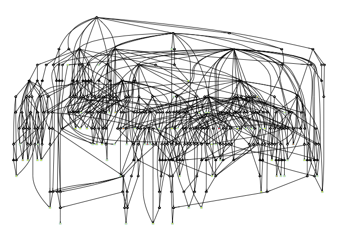<!-- -->

    ## $dag
    ## A graphNEL graph with directed edges
    ## Number of Nodes = 350 
    ## Number of Edges = 683 
    ## 
    ## $complete.dag
    ## [1] "A graph with 350 nodes."

``` r
cluster_9_16_genes <- unique(unlist(genes_by_GO[cluster_9_16]))
cluster_9_16_genes_DE <- DE_05_SwissProt %>% filter(query %in%cluster_9_16_genes)
write.csv(cluster_9_16_genes,"../output_RNA/differential_expression/semantic-enrichment/cluster_gene_lists/Aboral_enrich_BP_development.csv",row.names=FALSE)

#### Clusters 1-2: Adhesion
cluster_1_2 <- Aboral_enriched_clustered %>% dplyr::filter(GO.cluster == 1|
                                                             GO.cluster == 2) %>% pull(GO.ID)

showSigOfNodes(BP_Aboral, score(elim_Aboral)[names(score(elim_Aboral)) %in% cluster_1_2],  firstSigNodes = length(cluster_1_2), useInfo = 'all')
```

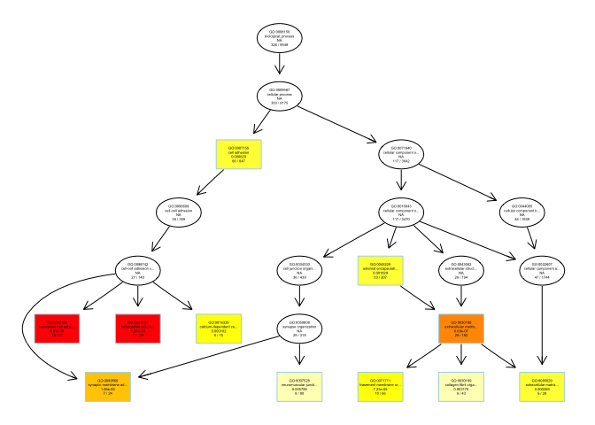<!-- -->

    ## $dag
    ## A graphNEL graph with directed edges
    ## Number of Nodes = 22 
    ## Number of Edges = 25 
    ## 
    ## $complete.dag
    ## [1] "A graph with 22 nodes."

``` r
cluster_1_2_genes <- unique(unlist(genes_by_GO[cluster_1_2]))
cluster_1_2_genes_DE <- DE_05_SwissProt %>% filter(query %in%cluster_1_2_genes)
write.csv(cluster_1_2_genes,"../output_RNA/differential_expression/semantic-enrichment/cluster_gene_lists/Aboral_enrich_BP_adhesion.csv",row.names=FALSE)

#### Clusters 3_4_6: Stimulus
cluster_3_4_6 <- Aboral_enriched_clustered %>% dplyr::filter(GO.cluster == 3|
                                                             GO.cluster == 4|
                                                             GO.cluster == 6) %>% pull(GO.ID)

showSigOfNodes(BP_Aboral, score(elim_Aboral)[names(score(elim_Aboral)) %in% cluster_3_4_6],  firstSigNodes = length(cluster_3_4_6), useInfo = 'all')
```

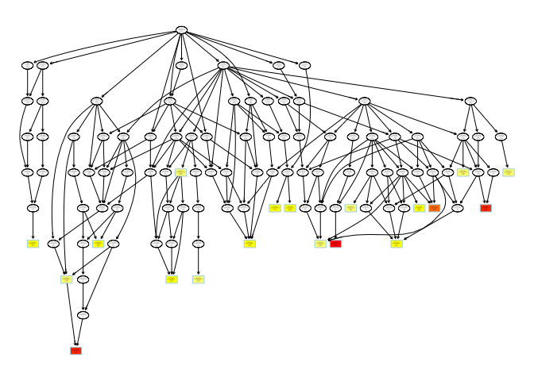<!-- -->

    ## $dag
    ## A graphNEL graph with directed edges
    ## Number of Nodes = 107 
    ## Number of Edges = 187 
    ## 
    ## $complete.dag
    ## [1] "A graph with 107 nodes."

``` r
cluster_3_4_6_genes <- unique(unlist(genes_by_GO[cluster_3_4_6]))
cluster_3_4_6_genes_DE <- DE_05_SwissProt %>% filter(query %in%cluster_3_4_6_genes)
write.csv(cluster_3_4_6_genes,"../output_RNA/differential_expression/semantic-enrichment/cluster_gene_lists/Aboral_enrich_BP_stimulus_immune.csv",row.names=FALSE)

#### Cluster 3
cluster_3 <- Aboral_enriched_clustered %>% dplyr::filter(GO.cluster == 3) %>% pull(GO.ID)

showSigOfNodes(BP_Aboral, score(elim_Aboral)[names(score(elim_Aboral)) %in% cluster_3],  firstSigNodes = length(cluster_3), useInfo = 'all')
```

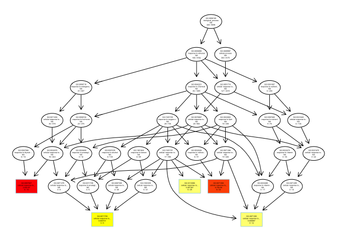<!-- -->

    ## $dag
    ## A graphNEL graph with directed edges
    ## Number of Nodes = 35 
    ## Number of Edges = 65 
    ## 
    ## $complete.dag
    ## [1] "A graph with 35 nodes."

``` r
cluster_3_genes <- unique(unlist(genes_by_GO[cluster_3]))
cluster_3_genes_DE <- DE_05_SwissProt %>% filter(query %in%cluster_3_genes)
write.csv(cluster_3_genes,"../output_RNA/differential_expression/semantic-enrichment/cluster_gene_lists/Aboral_enrich_BP_cluster3.csv",row.names=FALSE)

#### Cluster 4
cluster_4 <- Aboral_enriched_clustered %>% dplyr::filter(GO.cluster == 4) %>% pull(GO.ID)

showSigOfNodes(BP_Aboral, score(elim_Aboral)[names(score(elim_Aboral)) %in% cluster_4],  firstSigNodes = length(cluster_4), useInfo = 'all')
```

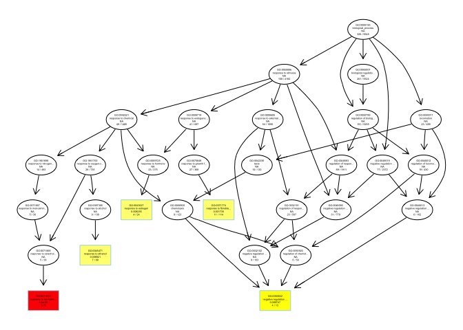<!-- -->

    ## $dag
    ## A graphNEL graph with directed edges
    ## Number of Nodes = 30 
    ## Number of Edges = 49 
    ## 
    ## $complete.dag
    ## [1] "A graph with 30 nodes."

``` r
cluster_4_genes <- unique(unlist(genes_by_GO[cluster_4]))
cluster_4_genes_DE <- DE_05_SwissProt %>% filter(query %in%cluster_4_genes)
write.csv(cluster_4_genes,"../output_RNA/differential_expression/semantic-enrichment/cluster_gene_lists/Aboral_enrich_BP_cluster4.csv",row.names=FALSE)

#### Cluster 6
cluster_6 <- Aboral_enriched_clustered %>% dplyr::filter(GO.cluster == 6) %>% pull(GO.ID)

showSigOfNodes(BP_Aboral, score(elim_Aboral)[names(score(elim_Aboral)) %in% cluster_6],  firstSigNodes = length(cluster_6), useInfo = 'all')
```

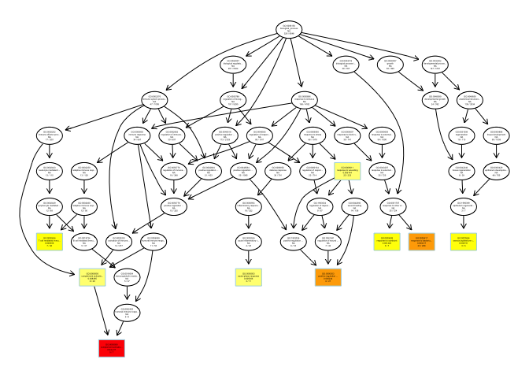<!-- -->

    ## $dag
    ## A graphNEL graph with directed edges
    ## Number of Nodes = 55 
    ## Number of Edges = 87 
    ## 
    ## $complete.dag
    ## [1] "A graph with 55 nodes."

``` r
cluster_6_genes <- unique(unlist(genes_by_GO[cluster_6]))
cluster_6_genes_DE <- DE_05_SwissProt %>% filter(query %in%cluster_6_genes)
write.csv(cluster_6_genes,"../output_RNA/differential_expression/semantic-enrichment/cluster_gene_lists/Aboral_enrich_BP_cluster6.csv",row.names=FALSE)

#### Cluster 5
cluster_5 <- Aboral_enriched_clustered %>% dplyr::filter(GO.cluster == 5) %>% pull(GO.ID)

showSigOfNodes(BP_Aboral, score(elim_Aboral)[names(score(elim_Aboral)) %in% cluster_5],  firstSigNodes = length(cluster_5), useInfo = 'all')
```

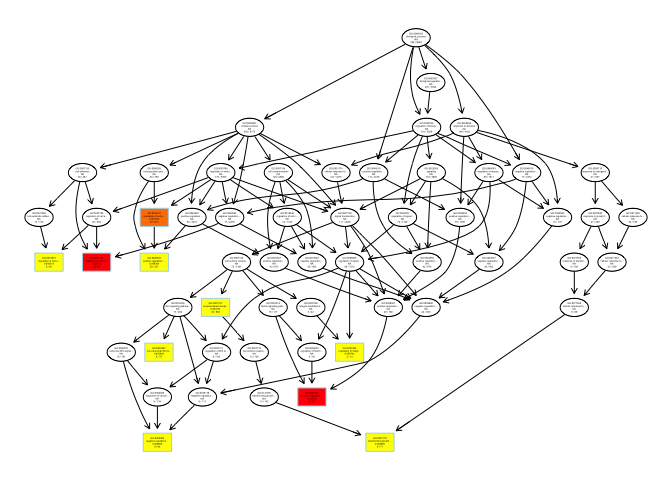<!-- -->

    ## $dag
    ## A graphNEL graph with directed edges
    ## Number of Nodes = 57 
    ## Number of Edges = 115 
    ## 
    ## $complete.dag
    ## [1] "A graph with 57 nodes."

``` r
cluster_5_genes <- unique(unlist(genes_by_GO[cluster_5]))
cluster_5_genes_DE <- DE_05_SwissProt %>% filter(query %in%cluster_5_genes)
write.csv(cluster_5_genes,"../output_RNA/differential_expression/semantic-enrichment/cluster_gene_lists/Aboral_enrich_BP_cluster5.csv",row.names=FALSE)


#### Cluster 7
cluster_7 <- Aboral_enriched_clustered %>% dplyr::filter(GO.cluster == 7) %>% pull(GO.ID)

showSigOfNodes(BP_Aboral, score(elim_Aboral)[names(score(elim_Aboral)) %in% cluster_7],  firstSigNodes = length(cluster_7), useInfo = 'all')
```

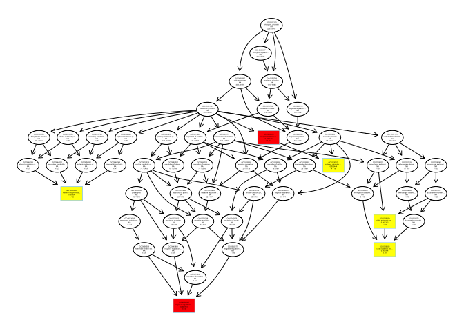<!-- -->

    ## $dag
    ## A graphNEL graph with directed edges
    ## Number of Nodes = 53 
    ## Number of Edges = 104 
    ## 
    ## $complete.dag
    ## [1] "A graph with 53 nodes."

``` r
cluster_7_genes <- unique(unlist(genes_by_GO[cluster_7]))
cluster_7_genes_DE <- DE_05_SwissProt %>% filter(query %in%cluster_7_genes)
write.csv(cluster_7_genes,"../output_RNA/differential_expression/semantic-enrichment/cluster_gene_lists/Aboral_enrich_BP_cluster7.csv",row.names=FALSE)

#### Cluster 8
cluster_8 <- Aboral_enriched_clustered %>% dplyr::filter(GO.cluster == 8) %>% pull(GO.ID)

showSigOfNodes(BP_Aboral, score(elim_Aboral)[names(score(elim_Aboral)) %in% cluster_8],  firstSigNodes = length(cluster_8), useInfo = 'all')
```

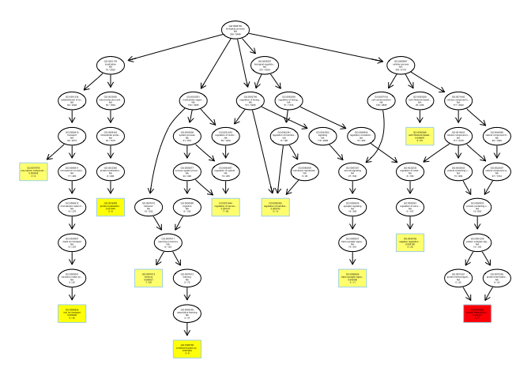<!-- -->

    ## $dag
    ## A graphNEL graph with directed edges
    ## Number of Nodes = 56 
    ## Number of Edges = 67 
    ## 
    ## $complete.dag
    ## [1] "A graph with 56 nodes."

``` r
cluster_8_genes <- unique(unlist(genes_by_GO[cluster_8]))
cluster_8_genes_DE <- DE_05_SwissProt %>% filter(query %in%cluster_8_genes)
write.csv(cluster_8_genes,"../output_RNA/differential_expression/semantic-enrichment/cluster_gene_lists/Aboral_enrich_BP_cluster8.csv",row.names=FALSE)


#DE_05_SwissProt %>% filter(query %in%unique(unlist(genes_by_GO[Aboral_enriched_clustered %>% pull(GO.ID)])))
```

## 1.3 Plotting of both tissues, pre-clustered by tissue

### 1.3.1 Custom plotting of results

``` r
clustered_Oral_DEGs_enrichedGO <- as.data.frame(Wang_clusters_wardD2_Oral@enrich_GOs@data) 

cluster_map <- data.frame(cluster_full = rownames(as.matrix(slot(Wang_clusters_wardD2_Oral,"clusters_dist")[["BMA"]])))
cluster_map <- cluster_map %>% 
  mutate(
    cluster = str_extract(cluster_full, "\\d+"),
    Cluster.name = str_replace(cluster_full,".*?_.*?_",""),
    Cluster.term = str_replace(cluster_full,"^\\d+_",""),
    Cluster.term = str_replace(Cluster.term,"_.*$","")
  ) %>%
  mutate(Cluster.name = paste0("Cluster ", cluster, ": ", Cluster.name)) %>%
  dplyr::select(cluster, Cluster.name)

clustered_Oral_DEGs_enrichedGO <- clustered_Oral_DEGs_enrichedGO %>%
  left_join(cluster_map, by = c("GO.cluster" = "cluster")) %>%
  mutate(Tissue="Oral")

clustered_Aboral_DEGs_enrichedGO <- as.data.frame(Wang_clusters_wardD2_Aboral@enrich_GOs@data)

cluster_map <- data.frame(cluster_full = rownames(as.matrix(slot(Wang_clusters_wardD2_Aboral,"clusters_dist")[["BMA"]])))
cluster_map <- cluster_map %>% 
  mutate(
    cluster = str_extract(cluster_full, "\\d+"),
    Cluster.name = str_replace(cluster_full,".*?_.*?_",""),
    Cluster.term = str_replace(cluster_full,"^\\d+_",""),
    Cluster.term = str_replace(Cluster.term,"_.*$","")
  ) %>%
  mutate(Cluster.name = paste0("Cluster ", cluster, ": ", Cluster.name)) %>%
  dplyr::select(cluster, Cluster.name)
clustered_Aboral_DEGs_enrichedGO <- clustered_Aboral_DEGs_enrichedGO %>%
  left_join(cluster_map, by = c("GO.cluster" = "cluster")) %>%
  mutate(Tissue="Aboral")


clustered_allDEGs_enrichedGO <- rbind(clustered_Oral_DEGs_enrichedGO %>%
                                        dplyr::select(-contains("Oral")),
                                      clustered_Aboral_DEGs_enrichedGO %>%
                                        dplyr::select(-contains("Aboral")))
```

### 1.3.2 Plotting of each tissue cluster separately

#### 1.3.2.1 extract cluster trees

``` r
library(ggdendro)
library(patchwork)
dist_mat <- slot(Wang_clusters_wardD2_Oral, "clusters_dist")[["BMA"]]
hc <- hclust(dist_mat, method = "ward.D2")
dend <- as.dendrogram(hc)
dend <- dendextend::rotate(dend,c(2,3,1,4,5,10,11,13,14,12,7,8,9,6))

dend_data <- ggdendro::dendro_data(dend, type = "rectangle")

dend_labels_oral <- dend_data$labels %>%
    mutate(
    cluster = str_extract(label, "\\d+"),
    Cluster.name = str_replace(label,".*?_.*?_",""),
    Cluster.term = str_replace(label,"^\\d+_",""),
    Cluster.term = str_replace(Cluster.term,"_.*$","")
  ) %>%
  mutate(Cluster.name = paste0("Cluster ", cluster, ": ", Cluster.name)) 

bar_plot_oral <- clustered_allDEGs_enrichedGO %>%  
filter(Tissue == "Oral") %>%
  arrange(as.numeric(GO.cluster)) %>%
  mutate(Cluster_label = factor(Cluster.name, levels = rev(dend_labels_oral$Cluster.name))) %>%
  ggplot(aes(x = Cluster_label)) +
  stat_count(width = .8, fill="white", color="black") +
  coord_flip() +
  theme_classic(base_size = 11) +
  scale_y_continuous(
    breaks = scales::breaks_width(2),
    expand = c(0, 0),
    limits = c(0, NA)
  ) + 
  theme(
    plot.title = element_text(face = "bold", size = 12),
    panel.grid.major.y = element_blank(),
    panel.grid.major.x = element_line(color = "grey90", linewidth = 0.2),
    axis.title.y = element_blank(),
    axis.text.y = element_text(size = 9, lineheight = 0.7,color = "black"),
    strip.text = element_text(face = "bold", size = 9),
    strip.background = element_rect(fill = "white", color = "black"),
    legend.position = "none",
    plot.subtitle = element_text(face = "bold", size = 9, hjust = 0.5),
    panel.spacing.y = unit(0.15, "lines")
  ) + labs(y = "Terms in Cluster")

dend_plot_oral <- ggplot() +
  geom_segment(
    data = dend_data$segments,
    aes(x = y, y = x, xend = yend, yend = xend),
    linewidth = 0.6,
    color = "#2C3E50"
  ) +
  scale_y_reverse(
    breaks = seq_along(dend_labels_oral$Cluster.name),
    expand = c(0.02, 0.02)
  ) +
  scale_x_reverse(expand = c(0.02, 0)) +
  theme_void()

# Combine plots with better proportions
final_oral_dend <- wrap_elements(
  dend_plot_oral + bar_plot_oral + plot_layout(widths = c(0.8, 3.5)) + theme(plot.margin = margin(0, 0, 0, 0)))

Wang_clusters_wardD2_Oral@heatmap$GOclusters_static
```

<!-- -->

``` r
ggsave("../output_RNA/differential_expression/semantic-enrichment/BP_Dend_Clusters_Oral.png", final_oral_dend, width = 5, height = 6.5, dpi = 300)
```

``` r
library(ggdendro)
dist_mat <- slot(Wang_clusters_wardD2_Aboral, "clusters_dist")[["BMA"]]
hc <- hclust(dist_mat, method = "ward.D2")
dend <- as.dendrogram(hc)
dend <- dendextend::rotate(dend,c(1:8,11,12,9:10,13:16))

dend_data <- ggdendro::dendro_data(dend, type = "rectangle")

dend_labels_aboral <- dend_data$labels %>%
    mutate(
    cluster = str_extract(label, "\\d+"),
    Cluster.name = str_replace(label,".*?_.*?_",""),
    Cluster.term = str_replace(label,"^\\d+_",""),
    Cluster.term = str_replace(Cluster.term,"_.*$","")
  ) %>%
  mutate(Cluster.name = paste0("Cluster ", cluster, ": ", Cluster.name)) 

bar_plot_aboral <- clustered_allDEGs_enrichedGO %>%  
filter(Tissue == "Aboral") %>%
  arrange(as.numeric(GO.cluster)) %>%
  mutate(Cluster_label = factor(Cluster.name, levels = rev(dend_labels_aboral$Cluster.name))) %>%
  ggplot(aes(x = Cluster_label)) +
  stat_count(width = .8, fill="white", color="black") +
  coord_flip() +
  theme_classic(base_size = 11) +
  scale_y_continuous(
    breaks = scales::breaks_width(2),
    expand = c(0, 0),
    limits = c(0, NA)
  ) + 
  theme(
    plot.title = element_text(face = "bold", size = 12),
    panel.grid.major.y = element_blank(),
    panel.grid.major.x = element_line(color = "grey90", linewidth = 0.2),
    axis.title.y = element_blank(),
    axis.text.y = element_text(size = 9, lineheight = 0.7,color = "black"),
    strip.text = element_text(face = "bold", size = 9),
    strip.background = element_rect(fill = "white", color = "black"),
    legend.position = "none",
    plot.subtitle = element_text(face = "bold", size = 9, hjust = 0.5),
    panel.spacing.y = unit(0.15, "lines")
  ) + labs(y = "Terms in Cluster")


dend_plot_aboral <- ggplot() +
  geom_segment(
    data = dend_data$segments,
    aes(x = y, y = x, xend = yend, yend = xend),
    linewidth = 0.6,
    color = "#2C3E50"
  ) +
  scale_y_reverse(
    breaks = seq_along(dend_labels_aboral$Cluster.name),
    expand = c(0.02, 0.02)
  ) +
  scale_x_reverse(expand = c(0.02, 0)) +
  theme_void()

# Combine plots with better proportions
final_aboral_dend <- wrap_elements(
  dend_plot_aboral + bar_plot_aboral + plot_layout(widths = c(0.8, 3.5)) + theme(plot.margin = margin(0, 0, 0, 0)))

Wang_clusters_wardD2_Oral@heatmap$GOclusters_static
```

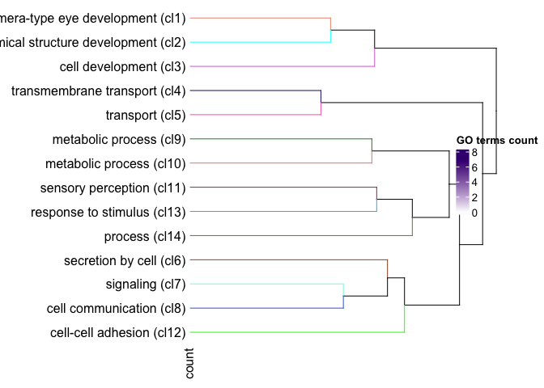<!-- -->

``` r
ggsave("../output_RNA/differential_expression/semantic-enrichment/BP_Dend_Clusters_Aboral.png", final_aboral_dend, width = 5, height = 6.5, dpi = 300)
```

### 1.3.3 Plotting of both tissues, pre-clustered by tissue

``` r
top_Oral_per_Cluster <- clustered_Oral_DEGs_enrichedGO %>% group_by(GO.cluster) %>% arrange(Oral_elim.pvalue) %>% slice(1) %>% ungroup() %>% dplyr::select(GO.cluster,GO.ID,term) %>% rename("top_sig_GO" = `GO.ID`,"top_sig_term" = `term`)

plotting_oral <- left_join(clustered_Oral_DEGs_enrichedGO,top_Oral_per_Cluster) %>%
                        arrange(match(GO.cluster,dend_labels_oral$cluster)) %>%
                        mutate(is_top = GO.ID == top_sig_GO,
                               pvalue = Oral_elim.pvalue,
                                term_wrapped = str_wrap(`term`, width = 25),
                                 cluster_label = factor(str_wrap(Cluster.name,
                                        width = 20), levels = unique(str_wrap(Cluster.name,
                                        width = 20)))) %>%
  add_count(GO.cluster, name = "n_terms")
```

    ## Joining with `by = join_by(GO.cluster)`

``` r
top_Aboral_per_Cluster <- clustered_Aboral_DEGs_enrichedGO %>% group_by(GO.cluster) %>% arrange(Aboral_elim.pvalue) %>% slice(1) %>% ungroup() %>% dplyr::select(GO.cluster,GO.ID,term) %>% rename("top_sig_GO" = `GO.ID`,"top_sig_term" = `term`)

plotting_aboral <- left_join(clustered_Aboral_DEGs_enrichedGO,top_Aboral_per_Cluster)%>%
                      arrange(match(GO.cluster,dend_labels_aboral$cluster)) %>%
                        mutate(is_top = GO.ID == top_sig_GO,
                               pvalue = Aboral_elim.pvalue,
                                term_wrapped = str_wrap(`term`, width = 25),
                                 cluster_label = factor(str_wrap(Cluster.name,
                                        width = 20), levels = unique(str_wrap(Cluster.name,
                                        width = 20)))) %>%
  add_count(GO.cluster, name = "n_terms")
```

    ## Joining with `by = join_by(GO.cluster)`

``` r
combined_plotting <- rbind(plotting_oral %>%
                                        dplyr::select(-contains("Oral")),
                                      plotting_aboral %>%
                                        dplyr::select(-contains("Aboral")))
```

### 1.3.4 Figure 3

``` r
p_oral <-ggplot(plotting_oral, 
       aes(x = `Oral_elim.-log10_pvalue`, 
           y = reorder(GO.ID, `Oral_elim.-log10_pvalue`),
           size = `Oral_elim.-log10_pvalue`)) +
  geom_segment(aes(xend = 0, yend = reorder(GO.ID, `Oral_elim.-log10_pvalue`)),
               alpha = 0.8, linewidth = 0.6, color = "#FD8D3C") +
  geom_point(alpha = 0.8, color = "#FD8D3C") +
    facet_grid(cluster_label ~ ., 
               scales = "free_y", space = "free_y") +
    labs(x = "-log10(p-value)",
         y = NULL) +
    theme_minimal(base_size = 12) +
    theme(plot.title = element_text(face = "bold", size = 12),
          axis.text.y = element_text(size = 9),
          strip.text.y = element_text(size = 10, angle = 0, hjust=0,face = "bold"),
          legend.position = "none",
          panel.spacing = unit(.15, "lines"),
          panel.grid.major.y = element_blank(),
          panel.grid.minor = element_blank()) +
    scale_size_continuous(range = c(2, 5)) + 
 # scale_x_continuous(expand = expansion(mult = c(0, 0.1))) +  # adds 10% padding on right
  coord_cartesian(clip = "off")

p_aboral <- ggplot(plotting_aboral, 
         aes(x = `Aboral_elim.-log10_pvalue`, 
             y = reorder(GO.ID, `Aboral_elim.-log10_pvalue`),
             color = factor(GO.cluster),
             size = `Aboral_elim.-log10_pvalue`)) +
    geom_segment(aes(xend = 0, yend = reorder(GO.ID, `Aboral_elim.-log10_pvalue`)),
               alpha = 0.8, linewidth = 0.6, color = "#756BB1") +
  geom_point(alpha = 0.8, color = "#756BB1") +
      facet_grid(cluster_label ~ ., 
                scales = "free_y", space = "free_y") +
  labs(x = "-log10(p-value)",
         y = NULL) +
   theme_minimal(base_size = 12) +
    theme(axis.text.y = element_text(size = 9),
          strip.text.y = element_text(size = 10, angle = 0, hjust=0,face = "bold"),
          legend.position = "none",
          panel.spacing = unit(.15, "lines"),
          panel.grid.major.y = element_blank(),
          panel.grid.minor = element_blank()) +
    scale_size_continuous(range = c(2, 5)) + 
  coord_cartesian(clip = "off")

layout <- "
ABFF
CDFF
EEFF
EEFF
EEFF
"

final_fig <- 
  dend_plot_oral + bar_plot_oral + 
  dend_plot_aboral + bar_plot_aboral +
  free(p_oral) + free(p_aboral) + 
  plot_layout(design = layout, widths = c(1.5, 8,8,8), axes = "collect_x") +
  plot_annotation(tag_levels = "A") &
  theme(plot.tag = element_text(size = 12, face = "bold", hjust = 0, vjust = -0.5),
        plot.tag.position = c(0, 1),
        margins=margin(10.5,5.5,5.5,5.5, unit = "pt")) 

final_fig <- final_fig + plot_annotation(tag_levels = list(c("A: Oral Epidermis Tissue", "","B: Aboral Tissue", "","C: Oral Epidermis Tissue", "D: Aboral Tissue")))

ggsave("../output_RNA/differential_expression/composite_figs/Figure3.svg", final_fig, width = 12, height = 16)
```

### 1.3.5 Plot

``` r
library(dplyr)
library(tidyr)
library(ggplot2)

# Create bidirectional data
cluster_data <- clustered_allDEGs_enrichedGO %>%
  dplyr::select(Cluster.name, Tissue) %>%
  group_by(Cluster.name) %>%
  summarise(
    Oral_terms = sum(Tissue=="Oral"),
    Aboral_terms = sum(Tissue=="Aboral"),
    .groups = "drop"
  ) %>%
  mutate(
    deviation = Aboral_terms - Oral_terms,
    Oral_terms = -Oral_terms  # Make negative for bidirectional plot
  ) %>%
  pivot_longer(cols = c("Oral_terms", "Aboral_terms"), 
               names_to = "Tissue", values_to = "n_terms") %>%
  mutate(Tissue = ifelse(Tissue == "Oral_terms", "Oral epidermis", "Aboral"))

# Calculate transition points for dashed lines
transition_data <- cluster_data %>%
  distinct(Cluster.name, deviation) %>%
  arrange(deviation)

oral_to_equal <- sum(transition_data$deviation >= 0) + 0.5
equal_to_aboral <- sum(transition_data$deviation > 0) + 0.5

# Plot
p <- ggplot(cluster_data, aes(x = reorder(Cluster.name, -deviation), y = n_terms, fill = Tissue)) +
  geom_col(width = 0.7, alpha = 0.8) +
  geom_hline(yintercept = 0, color = "black", linewidth = 0.8) +
  geom_vline(xintercept = c(oral_to_equal, equal_to_aboral), 
             color = "grey60", linetype = "dashed", linewidth = 0.6) +
  scale_fill_manual(values = c("Oral epidermis" = "#FD8D3C", "Aboral" = "#756BB1")) + #green: "#2E8B57"
  coord_flip() +
  theme_minimal() +
  theme(
    panel.grid.major.y = element_blank(),
    panel.grid.minor = element_blank(),
    legend.position = "bottom",
    legend.title = element_text(face = "bold"),
    axis.title = element_text(face = "bold"),
    axis.text = element_text(color = "black"),
    axis.text.x = element_text(size = 12),
    axis.text.y = element_text(size = 12)
  ) +
  scale_y_continuous(labels = abs) +
  labs(
    x = "Gene clusters",
    y = "Number of enriched GO terms",
    title = "Tissue-specific GO term enrichment patterns",
    subtitle = "Clusters ordered by net enrichment (Oral vs. Aboral)"
  )

ggsave("../output_RNA/differential_expression/semantic-enrichment/GO_enrichment_bidirectional_clustered_separate.png", p, width = 10, height = 8, dpi = 300)
```

# 2 CC

## 2.1 Oral Epidermis:

### 2.1.1 create topGO objects and perform enrichment using topGO wrapped by ViSEAGO

``` r
# create viseago object
selection <- names(selection_Oral)[selection_Oral==1]
background <- names(expressed)

CC_Oral <- ViSEAGO::create_topGOdata(
    geneSel=selection,
    allGenes=background,
    gene2GO=myGENE2GO_Pacuta, 
    ont="CC",
    nodeSize=5
)
```

    ## 
    ## Building most specific GOs .....

    ##  ( 1530 GO terms found. )

    ## 
    ## Build GO DAG topology ..........

    ##  ( 1759 GO terms and 2893 relations. )

    ## 
    ## Annotating nodes ...............

    ##  ( 10114 genes annotated to the GO terms. )

``` r
# perform TopGO test using elim algorithm
elim_Oral <- topGO::runTest(
    CC_Oral,
    algorithm ="elim",
    statistic = "fisher"
)
```

    ## 
    ##           -- Elim Algorithm -- 
    ## 
    ##       the algorithm is scoring 615 nontrivial nodes
    ##       parameters: 
    ##           test statistic: fisher
    ##           cutOff: 0.01

    ## 
    ##   Level 12:  1 nodes to be scored    (0 eliminated genes)

    ## 
    ##   Level 11:  22 nodes to be scored   (0 eliminated genes)

    ## 
    ##   Level 10:  60 nodes to be scored   (0 eliminated genes)

    ## 
    ##   Level 9:   83 nodes to be scored   (6 eliminated genes)

    ## 
    ##   Level 8:   98 nodes to be scored   (12 eliminated genes)

    ## 
    ##   Level 7:   97 nodes to be scored   (54 eliminated genes)

    ## 
    ##   Level 6:   96 nodes to be scored   (336 eliminated genes)

    ## 
    ##   Level 5:   67 nodes to be scored   (761 eliminated genes)

    ## 
    ##   Level 4:   44 nodes to be scored   (772 eliminated genes)

    ## 
    ##   Level 3:   44 nodes to be scored   (772 eliminated genes)

    ## 
    ##   Level 2:   2 nodes to be scored    (3565 eliminated genes)

    ## 
    ##   Level 1:   1 nodes to be scored    (3565 eliminated genes)

``` r
CC_Results <- ViSEAGO::merge_enrich_terms(
    Input = list( Oral_elim = c("CC_Oral", "elim_Oral")))
```

    ## 'select()' returned 1:1 mapping between keys and columns

### 2.1.2 Visualize and save initial results

``` r
# display the merged table
CC_Results
```

    ## - object class: enrich_GO_terms
    ## - ontology: CC
    ## - method: topGO
    ## - summary:
    ##  Oral_elim
    ##       CC_Oral 
    ##         description: Custom pacuta ../output_RNA/differential_expression/semantic-enrichment/custom_GOs.txt
    ##         available_genes: 10652
    ##         available_genes_significant: 825
    ##         feasible_genes: 10114
    ##         feasible_genes_significant: 773
    ##         genes_nodeSize: 5
    ##         nodes_number: 968
    ##         edges_number: 1611
    ##       elim_Oral 
    ##         description: Custom pacuta ../output_RNA/differential_expression/semantic-enrichment/custom_GOs.txt 
    ##         test_name: fisher p<0.01
    ##         algorithm_name: elim
    ##         GO_scored: 968
    ##         GO_significant: 19
    ##         feasible_genes: 10114
    ##         feasible_genes_significant: 773
    ##         genes_nodeSize: 5
    ##         Nontrivial_nodes: 615 
    ##  - enrichment pvalue cutoff:
    ##         Oral_elim : 0.01
    ## - enrich GOs (in at least one list): 19 GO terms of 1 conditions.
    ##         Oral_elim : 19 terms

``` r
ViSEAGO::show_table(CC_Results)
```

<div id="htmlwidget-f1b7853f85fbec1b3fe9" class="datatables html-widget"
style="width:650px;height:auto;">

</div>

<script type="application/json" data-for="htmlwidget-f1b7853f85fbec1b3fe9">{"x":{"filter":"top","vertical":false,"filterHTML":"<tr>\n  <td><\/td>\n  <td data-type=\"character\" style=\"vertical-align: top;\">\n    <div class=\"form-group has-feedback\" style=\"margin-bottom: auto;\">\n      <input type=\"search\" placeholder=\"All\" class=\"form-control\" style=\"width: 100%;\"/>\n      <span class=\"glyphicon glyphicon-remove-circle form-control-feedback\"><\/span>\n    <\/div>\n  <\/td>\n  <td data-type=\"character\" style=\"vertical-align: top;\">\n    <div class=\"form-group has-feedback\" style=\"margin-bottom: auto;\">\n      <input type=\"search\" placeholder=\"All\" class=\"form-control\" style=\"width: 100%;\"/>\n      <span class=\"glyphicon glyphicon-remove-circle form-control-feedback\"><\/span>\n    <\/div>\n  <\/td>\n  <td data-type=\"character\" style=\"vertical-align: top;\">\n    <div class=\"form-group has-feedback\" style=\"margin-bottom: auto;\">\n      <input type=\"search\" placeholder=\"All\" class=\"form-control\" style=\"width: 100%;\"/>\n      <span class=\"glyphicon glyphicon-remove-circle form-control-feedback\"><\/span>\n    <\/div>\n  <\/td>\n  <td data-type=\"number\" style=\"vertical-align: top;\">\n    <div class=\"form-group has-feedback\" style=\"margin-bottom: auto;\">\n      <input type=\"search\" placeholder=\"All\" class=\"form-control\" style=\"width: 100%;\"/>\n      <span class=\"glyphicon glyphicon-remove-circle form-control-feedback\"><\/span>\n    <\/div>\n    <div style=\"display: none;position: absolute;width: 200px;opacity: 1\">\n      <div data-min=\"1.206467e-05\" data-max=\"0.009862255\" data-scale=\"11\"><\/div>\n      <span style=\"float: left;\"><\/span>\n      <span style=\"float: right;\"><\/span>\n    <\/div>\n  <\/td>\n  <td data-type=\"number\" style=\"vertical-align: top;\">\n    <div class=\"form-group has-feedback\" style=\"margin-bottom: auto;\">\n      <input type=\"search\" placeholder=\"All\" class=\"form-control\" style=\"width: 100%;\"/>\n      <span class=\"glyphicon glyphicon-remove-circle form-control-feedback\"><\/span>\n    <\/div>\n    <div style=\"display: none;position: absolute;width: 200px;opacity: 1\">\n      <div data-min=\"2\" data-max=\"4.92\" data-scale=\"2\"><\/div>\n      <span style=\"float: left;\"><\/span>\n      <span style=\"float: right;\"><\/span>\n    <\/div>\n  <\/td>\n<\/tr>","extensions":["Buttons","FixedColumns","Scroller"],"data":[["1","2","3","4","5","6","7","8","9","10","11","12","13","14","15","16","17","18","19"],["<a href=\"http://amigo.geneontology.org/amigo/term/GO:0033010\">GO:0033010<\/a>","<a href=\"http://amigo.geneontology.org/amigo/term/GO:0005576\">GO:0005576<\/a>","<a href=\"http://amigo.geneontology.org/amigo/term/GO:0071944\">GO:0071944<\/a>","<a href=\"http://amigo.geneontology.org/amigo/term/GO:0014731\">GO:0014731<\/a>","<a href=\"http://amigo.geneontology.org/amigo/term/GO:1902710\">GO:1902710<\/a>","<a href=\"http://amigo.geneontology.org/amigo/term/GO:0042734\">GO:0042734<\/a>","<a href=\"http://amigo.geneontology.org/amigo/term/GO:0034706\">GO:0034706<\/a>","<a href=\"http://amigo.geneontology.org/amigo/term/GO:0030673\">GO:0030673<\/a>","<a href=\"http://amigo.geneontology.org/amigo/term/GO:0097386\">GO:0097386<\/a>","<a href=\"http://amigo.geneontology.org/amigo/term/GO:0060170\">GO:0060170<\/a>","<a href=\"http://amigo.geneontology.org/amigo/term/GO:0044306\">GO:0044306<\/a>","<a href=\"http://amigo.geneontology.org/amigo/term/GO:0045211\">GO:0045211<\/a>","<a href=\"http://amigo.geneontology.org/amigo/term/GO:0032420\">GO:0032420<\/a>","<a href=\"http://amigo.geneontology.org/amigo/term/GO:0009986\">GO:0009986<\/a>","<a href=\"http://amigo.geneontology.org/amigo/term/GO:0030424\">GO:0030424<\/a>","<a href=\"http://amigo.geneontology.org/amigo/term/GO:0033093\">GO:0033093<\/a>","<a href=\"http://amigo.geneontology.org/amigo/term/GO:0009925\">GO:0009925<\/a>","<a href=\"http://amigo.geneontology.org/amigo/term/GO:0032579\">GO:0032579<\/a>","<a href=\"http://amigo.geneontology.org/amigo/term/GO:0008091\">GO:0008091<\/a>"],["paranodal junction","extracellular region","cell periphery","spectrin-associated cytoskeleton","GABA receptor complex","presynaptic membrane","sodium channel complex","axolemma","glial cell projection","ciliary membrane","neuron projection terminus","postsynaptic membrane","stereocilium","cell surface","axon","Weibel-Palade body","basal plasma membrane","apical lamina of hyaline layer","spectrin"],["A highly specialized cell-cell junction found in vertebrates, which forms between a neuron and a glial cell, and has structural similarity to Drosophila septate junctions. It flanks the node of Ranvier in myelinated nerve and electrically isolates the myelinated from unmyelinated nerve segments and physically separates the voltage-gated sodium channels at the node from the cluster of potassium channels underneath the myelin sheath.","The space external to the outermost structure of a cell. For cells without external protective or external encapsulating structures this refers to space outside of the plasma membrane. This term covers the host cell environment outside an intracellular parasite.","The broad region around and including the plasma membrane of a cell, encompassing the cell cortex (inside the cell), the plasma membrane, and any external encapsulating structures.","The part of the cytoskeleton composed of spectrin, protein 4.1 and ankyrin. Spectrin-associated cytoskeleton is associated with the plasma membrane.","NA","A specialized area of membrane of the axon terminal that faces the plasma membrane of the neuron or muscle fiber with which the axon terminal establishes a synaptic junction; many synaptic junctions exhibit structural presynaptic characteristics, such as conical, electron-dense internal protrusions, that distinguish it from the remainder of the axon plasma membrane.","An ion channel complex through which sodium ions pass.","The portion of the plasma membrane surrounding an axon; it is a specialized trilaminar random mosaic of protein molecules floating within a fluid matrix of highly mobile phospholipid molecules, 7-8 nm in thickness.","A prolongation or process extending from a glial cell.","The portion of the plasma membrane surrounding a cilium.","The specialized, terminal region of a neuron projection such as an axon or a dendrite.","A specialized area of membrane facing the presynaptic membrane on the tip of the nerve ending and separated from it by a minute cleft (the synaptic cleft). Neurotransmitters cross the synaptic cleft and transmit the signal to the postsynaptic membrane.","An actin-based protrusion from the apical surface of auditory and vestibular hair cells and of neuromast cells. These protrusions are supported by a bundle of cross-linked actin filaments (an actin cable), oriented such that the plus (barbed) ends are at the tip of the protrusion, capped by a tip complex which bridges to the plasma. Bundles of stereocilia act as mechanosensory organelles.","The external part of the cell wall and/or plasma membrane.","The long process of a neuron that conducts nerve impulses, usually away from the cell body to the terminals and varicosities, which are sites of storage and release of neurotransmitter.","A large, elongated, rod-shaped secretory granule characteristic of vascular endothelial cells that contain a number of structurally and functionally distinct proteins, of which the best characterized are von Willebrand factor (VWF) and P-selectin. Weibel-Palade bodies are formed from the trans-Golgi network in a process that depends on VWF, which is densely packed in a highly organized manner, and on coat proteins that remain associated with the granules. Upon cell stimulation, regulated exocytosis releases the contained proteins to the cell surface, where they act in the recruitment of platelets and leukocytes and in inflammatory and vasoactive responses.","The region of the plasma membrane located at the basal end of the cell. Often used in reference to animal polarized epithelial membranes, where the basal membrane is the part attached to the extracellular matrix, or in plant cells, where the basal membrane is defined with respect to the zygotic axis.","A fibrous network that is part of the hyalin layer extracellular matrix. The apical lamina is thought to be principally composed of the glycoproteins fibropellins. This matrix has been found in echinoderms.","Membrane associated dimeric protein (240 and 220 kDa) of erythrocytes. Forms a complex with ankyrin, actin and probably other components of the membrane cytoskeleton, so that there is a mesh of proteins underlying the plasma membrane, potentially restricting the lateral mobility of integral proteins."],[0.00489397,0.0001339397,0.001325775,0.001972381,0.0008056184000000001,0.00241269,0.007230172,0.001632187,0.007976828,0.003982664,0.009862255,1.206467e-05,0.0008129884,0.003376914,0.009008225,0.007463283,0.008320175000000001,0.0003442073,0.007463283],[2.31,3.87,2.88,2.71,3.09,2.62,2.14,2.79,2.1,2.4,2.01,4.92,3.09,2.47,2.05,2.13,2.08,3.46,2.13]],"container":"<table class=\"display\">\n  <thead>\n    <tr>\n      <th> <\/th>\n      <th>GO ID<\/th>\n      <th>term<\/th>\n      <th>definition<\/th>\n      <th>Oral_elim pvalue<\/th>\n      <th>Oral_elim -log10_pvalue<\/th>\n    <\/tr>\n  <\/thead>\n<\/table>","options":{"columnDefs":[{"targets":[2,3],"render":"function(data, type, row, meta) {\nreturn type === 'display' && data.length > 50 ?\n'<span title=\"' + data + '\">' + data.substr(0, 50) + '...<\/span>' : data;\n}"},{"className":"dt-right","targets":[4,5]},{"orderable":false,"targets":0},{"name":" ","targets":0},{"name":"GO ID","targets":1},{"name":"term","targets":2},{"name":"definition","targets":3},{"name":"Oral_elim pvalue","targets":4},{"name":"Oral_elim -log10_pvalue","targets":5}],"dom":"Bfltipr","search":{"regex":true,"caseInsensitive":false},"searchHighlight":true,"scrollX":true,"fixedColumns":{"leftColumns":1},"deferRender":true,"scrollY":400,"scroller":true,"buttons":["colvis"],"order":[],"autoWidth":false,"orderClasses":false,"orderCellsTop":true}},"evals":["options.columnDefs.0.render"],"jsHooks":[]}</script>

``` r
# print the merged table in a file
ViSEAGO::show_table(
    CC_Results,
    "../output_RNA/differential_expression/semantic-enrichment/CC_DE_05_Oral.tsv"
)
```

- enrichment pvalue cutoff: Oral_elim : 0.01
- enrich GOs (in at least one list): Oral_elim : 19 terms

### 2.1.3 Semantic similarity –\> Cluster: Use Wang graph-based method to identify similarity between GO terms

``` r
# initialize 
myGOs<-ViSEAGO::build_GO_SS(
    gene2GO=myGENE2GO_Pacuta,
    enrich_GO_terms=CC_Results
)
```

    ## 'select()' returned 1:1 mapping between keys and columns

``` r
myGOs <- ViSEAGO::compute_SS_distances(
    myGOs,
   distance=c("Wang")
)

myGOs
```

    ## - object class: GO_SS
    ## - ontology: CC
    ## - method: topGO
    ## - summary:
    ## Oral_elim
    ##       CC_Oral 
    ##         description: Custom pacuta ../output_RNA/differential_expression/semantic-enrichment/custom_GOs.txt
    ##         available_genes: 10652
    ##         available_genes_significant: 825
    ##         feasible_genes: 10114
    ##         feasible_genes_significant: 773
    ##         genes_nodeSize: 5
    ##         nodes_number: 968
    ##         edges_number: 1611
    ##       elim_Oral 
    ##         description: Custom pacuta ../output_RNA/differential_expression/semantic-enrichment/custom_GOs.txt 
    ##         test_name: fisher p<0.01
    ##         algorithm_name: elim
    ##         GO_scored: 968
    ##         GO_significant: 19
    ##         feasible_genes: 10114
    ##         feasible_genes_significant: 773
    ##         genes_nodeSize: 5
    ##         Nontrivial_nodes: 615 
    ##  - enrichment pvalue cutoff:
    ##         Oral_elim : 0.01
    ## - enrich GOs (in at least one list): 19 GO terms of 1 conditions.
    ##         Oral_elim : 19 terms
    ## - terms distances:  Wang

#### 2.1.3.1 Multi Dimensional Scaling Plot of the GO-terms based on semantic similarity

``` r
# display MDSplot
ViSEAGO::MDSplot(myGOs,
                 "GOterms")
```

#### 2.1.3.2 Heatmap + table of GO terms, with clusters aggregated by hclust with ward.D2 method

``` r
# GOterms heatmap with the default parameters
Wang_clusters_wardD2_Oral <- ViSEAGO::GOterms_heatmap(
  myGOs,
  showIC = TRUE,
  showGOlabels = TRUE,
  GO.tree = list(
    tree = list(distance = "Wang", aggreg.method = "ward.D2"),
    cut = list(
      dynamic = list(
        pamStage = TRUE,
        pamRespectsDendro = TRUE,
        deepSplit = 2,
        minClusterSize = 2
      )
    )
  ),
  samples.tree = NULL
)

# Display the clusters-heatmap
ViSEAGO::show_heatmap(
    Wang_clusters_wardD2_Oral,
    "GOterms")
```

<div id="htmlwidget-41704078c4d25c414146"
class="plotly html-widget html-fill-item"
style="width:672px;height:480px;">

</div>

<script type="application/json" data-for="htmlwidget-41704078c4d25c414146">{"x":{"data":[{"x":[1],"y":[1,2,3,4,5,6,7,8,9,10,11,12,13,14,15,16,17,18,19],"z":[[0.04123711340206189],[0.24054982817869422],[0.04123711340206189],[0.044673539518900456],[0.37113402061855671],[0.15807560137457058],[0.63917525773195882],[0.49828178694158082],[0.2989690721649485],[0.10309278350515473],[0.013745704467353964],[0],[0.030927835051546494],[0.37113402061855671],[0.13402061855670105],[0.26804123711340211],[1],[0.20962199312714785],[0.024054982817869511]],"text":[["<br>cluster: 7 <br>GO.ID: GO:0008091 <br>GO.name: spectrin<br>column: Oral_elim<br>-log10 pvalue: 2.13<br>gene frequency: 50% (3/6)"],["<br>cluster: 7 <br>GO.ID: GO:0014731 <br>GO.name: spectrin-associated cytoskeleton<br>column: Oral_elim<br>-log10 pvalue: 2.71<br>gene frequency: 38.462% (5/13)"],["<br>cluster: 7 <br>GO.ID: GO:0033093 <br>GO.name: Weibel-Palade body<br>column: Oral_elim<br>-log10 pvalue: 2.13<br>gene frequency: 50% (3/6)"],["<br>cluster: 6 <br>GO.ID: GO:0034706 <br>GO.name: sodium channel complex<br>column: Oral_elim<br>-log10 pvalue: 2.14<br>gene frequency: 36.364% (4/11)"],["<br>cluster: 6 <br>GO.ID: GO:1902710 <br>GO.name: GABA receptor complex<br>column: Oral_elim<br>-log10 pvalue: 3.09<br>gene frequency: 45.455% (5/11)"],["<br>cluster: 4 <br>GO.ID: GO:0009986 <br>GO.name: cell surface<br>column: Oral_elim<br>-log10 pvalue: 2.47<br>gene frequency: 12.203% (36/295)"],["<br>cluster: 4 <br>GO.ID: GO:0005576 <br>GO.name: extracellular region<br>column: Oral_elim<br>-log10 pvalue: 3.87<br>gene frequency: 10.364% (128/1235)"],["<br>cluster: 5 <br>GO.ID: GO:0032579 <br>GO.name: apical lamina of hyaline layer<br>column: Oral_elim<br>-log10 pvalue: 3.46<br>gene frequency: 42.857% (6/14)"],["<br>cluster: 5 <br>GO.ID: GO:0071944 <br>GO.name: cell periphery<br>column: Oral_elim<br>-log10 pvalue: 2.88<br>gene frequency: 9.985% (274/2744)"],["<br>cluster: 4 <br>GO.ID: GO:0033010 <br>GO.name: paranodal junction<br>column: Oral_elim<br>-log10 pvalue: 2.31<br>gene frequency: 40% (4/10)"],["<br>cluster: 3 <br>GO.ID: GO:0030424 <br>GO.name: axon<br>column: Oral_elim<br>-log10 pvalue: 2.05<br>gene frequency: 12.113% (47/388)"],["<br>cluster: 3 <br>GO.ID: GO:0044306 <br>GO.name: neuron projection terminus<br>column: Oral_elim<br>-log10 pvalue: 2.01<br>gene frequency: 15.663% (13/83)"],["<br>cluster: 3 <br>GO.ID: GO:0097386 <br>GO.name: glial cell projection<br>column: Oral_elim<br>-log10 pvalue: 2.10<br>gene frequency: 25% (6/24)"],["<br>cluster: 3 <br>GO.ID: GO:0032420 <br>GO.name: stereocilium<br>column: Oral_elim<br>-log10 pvalue: 3.09<br>gene frequency: 24.39% (10/41)"],["<br>cluster: 2 <br>GO.ID: GO:0060170 <br>GO.name: ciliary membrane<br>column: Oral_elim<br>-log10 pvalue: 2.40<br>gene frequency: 18.966% (11/58)"],["<br>cluster: 2 <br>GO.ID: GO:0030673 <br>GO.name: axolemma<br>column: Oral_elim<br>-log10 pvalue: 2.79<br>gene frequency: 33.333% (6/18)"],["<br>cluster: 1 <br>GO.ID: GO:0045211 <br>GO.name: postsynaptic membrane<br>column: Oral_elim<br>-log10 pvalue: 4.92<br>gene frequency: 17.647% (30/170)"],["<br>cluster: 1 <br>GO.ID: GO:0042734 <br>GO.name: presynaptic membrane<br>column: Oral_elim<br>-log10 pvalue: 2.62<br>gene frequency: 15.447% (19/123)"],["<br>cluster: 1 <br>GO.ID: GO:0009925 <br>GO.name: basal plasma membrane<br>column: Oral_elim<br>-log10 pvalue: 2.08<br>gene frequency: 13.174% (22/167)"]],"colorscale":[[0,"#F3D1CA"],[0.013745704467353964,"#F2CFC7"],[0.024054982817869511,"#F2CDC5"],[0.030927835051546494,"#F1CBC4"],[0.04123711340206189,"#F1CAC2"],[0.044673539518900456,"#F0C9C1"],[0.10309278350515473,"#EDBEB5"],[0.13402061855670105,"#EBB8AE"],[0.15807560137457058,"#E9B4A9"],[0.20962199312714785,"#E6AB9F"],[0.24054982817869422,"#E3A599"],[0.26804123711340211,"#E1A093"],[0.2989690721649485,"#DF9A8D"],[0.37113402061855671,"#D98D7F"],[0.49828178694158082,"#CE7666"],[0.63917525773195882,"#C15C4C"],[1,"#99000D"]],"type":"heatmap","showscale":false,"autocolorscale":false,"showlegend":false,"xaxis":"x","yaxis":"y","hoverinfo":"text","frame":null},{"x":[1],"y":[1],"name":"f72b31d3df39bb605c03c39fed60afbe","type":"scatter","mode":"markers","opacity":0,"hoverinfo":"skip","showlegend":false,"marker":{"color":[0,1],"colorscale":[[0,"#F3D1CA"],[0.0033444816053511402,"#F3D1CA"],[0.0066889632107022803,"#F3D0C9"],[0.010033444816053573,"#F3CFC8"],[0.013377926421404712,"#F2CFC7"],[0.016722408026755852,"#F2CEC7"],[0.020066889632106993,"#F2CDC6"],[0.023411371237458133,"#F2CDC5"],[0.026755852842809423,"#F2CCC5"],[0.030100334448160564,"#F1CCC4"],[0.033444816053511704,"#F1CBC3"],[0.036789297658862845,"#F1CAC3"],[0.040133779264213985,"#F1CAC2"],[0.043478260869565279,"#F1C9C1"],[0.046822742474916419,"#F0C9C0"],[0.05016722408026756,"#F0C8C0"],[0.0535117056856187,"#F0C7BF"],[0.056856187290969834,"#F0C7BE"],[0.060200668896321127,"#F0C6BE"],[0.063545150501672268,"#EFC5BD"],[0.066889632107023408,"#EFC5BC"],[0.070234113712374549,"#EFC4BC"],[0.07357859531772569,"#EFC4BB"],[0.076923076923076983,"#EEC3BA"],[0.080267558528428123,"#EEC2B9"],[0.083612040133779264,"#EEC2B9"],[0.086956521739130405,"#EEC1B8"],[0.090301003344481545,"#EEC1B7"],[0.093645484949832838,"#EDC0B7"],[0.096989966555183979,"#EDBFB6"],[0.10033444816053512,"#EDBFB5"],[0.10367892976588626,"#EDBEB5"],[0.1070234113712374,"#EDBDB4"],[0.11036789297658868,"#ECBDB3"],[0.11371237458193982,"#ECBCB3"],[0.11705685618729096,"#ECBCB2"],[0.1204013377926421,"#ECBBB1"],[0.12374581939799324,"#EBBAB0"],[0.12709030100334454,"#EBBAB0"],[0.13043478260869568,"#EBB9AF"],[0.13377926421404682,"#EBB9AE"],[0.13712374581939796,"#EBB8AE"],[0.1404682274247491,"#EAB7AD"],[0.14381270903010038,"#EAB7AC"],[0.14715719063545152,"#EAB6AC"],[0.15050167224080266,"#EAB5AB"],[0.1538461538461538,"#E9B5AA"],[0.15719063545150494,"#E9B4AA"],[0.16053511705685625,"#E9B4A9"],[0.16387959866220739,"#E9B3A8"],[0.16722408026755853,"#E9B2A8"],[0.17056856187290967,"#E8B2A7"],[0.17391304347826081,"#E8B1A6"],[0.17725752508361195,"#E8B1A5"],[0.18060200668896323,"#E8B0A5"],[0.18394648829431437,"#E7AFA4"],[0.18729096989966551,"#E7AFA3"],[0.19063545150501665,"#E7AEA3"],[0.19397993311036796,"#E7ADA2"],[0.1973244147157191,"#E6ADA1"],[0.20066889632107024,"#E6ACA1"],[0.20401337792642138,"#E6ACA0"],[0.20735785953177252,"#E6AB9F"],[0.21070234113712366,"#E5AA9F"],[0.21404682274247494,"#E5AA9E"],[0.21739130434782608,"#E5A99D"],[0.22073578595317722,"#E5A99D"],[0.22408026755852836,"#E4A89C"],[0.22742474916387964,"#E4A79B"],[0.23076923076923078,"#E4A79B"],[0.23411371237458192,"#E4A69A"],[0.23745819397993306,"#E4A699"],[0.2408026755852842,"#E3A599"],[0.24414715719063534,"#E3A498"],[0.24749163879598665,"#E3A497"],[0.25083612040133779,"#E3A397"],[0.2541806020066889,"#E2A296"],[0.25752508361204007,"#E2A295"],[0.26086956521739135,"#E2A195"],[0.26421404682274252,"#E2A194"],[0.26755852842809363,"#E1A093"],[0.2709030100334448,"#E19F93"],[0.27424749163879591,"#E19F92"],[0.27759197324414708,"#E09E91"],[0.28093645484949836,"#E09E91"],[0.28428093645484948,"#E09D90"],[0.28762541806020064,"#E09C8F"],[0.29096989966555176,"#DF9C8F"],[0.29431438127090304,"#DF9B8E"],[0.2976588628762542,"#DF9B8D"],[0.30100334448160532,"#DF9A8D"],[0.30434782608695649,"#DE998C"],[0.3076923076923076,"#DE998B"],[0.31103678929765877,"#DE988B"],[0.31438127090301005,"#DE988A"],[0.31772575250836121,"#DD9789"],[0.32107023411371233,"#DD9689"],[0.3244147157190635,"#DD9688"],[0.32775919732441477,"#DD9587"],[0.33110367892976589,"#DC9487"],[0.33444816053511706,"#DC9486"],[0.33779264214046817,"#DC9385"],[0.34113712374581934,"#DB9385"],[0.34448160535117045,"#DB9284"],[0.34782608695652162,"#DB9183"],[0.3511705685618729,"#DB9183"],[0.35451505016722407,"#DA9082"],[0.35785953177257535,"#DA9081"],[0.36120401337792646,"#DA8F81"],[0.36454849498327763,"#DA8E80"],[0.36789297658862874,"#D98E7F"],[0.37123745819397991,"#D98D7F"],[0.37458193979933102,"#D98D7E"],[0.37792642140468219,"#D88C7D"],[0.3812709030100333,"#D88B7D"],[0.38461538461538458,"#D88B7C"],[0.38795986622073575,"#D88A7B"],[0.39130434782608703,"#D78A7B"],[0.3946488294314382,"#D7897A"],[0.39799331103678931,"#D78879"],[0.40133779264214048,"#D78879"],[0.40468227424749159,"#D68778"],[0.40802675585284276,"#D68778"],[0.41137123745819387,"#D68677"],[0.41471571906354504,"#D58576"],[0.41806020066889632,"#D58576"],[0.42140468227424743,"#D58475"],[0.42474916387959877,"#D58374"],[0.42809364548494988,"#D48374"],[0.43143812709030099,"#D48273"],[0.43478260869565216,"#D48272"],[0.43812709030100327,"#D38172"],[0.44147157190635444,"#D38071"],[0.44481605351170556,"#D38070"],[0.44816053511705672,"#D27F70"],[0.451505016722408,"#D27F6F"],[0.45484949832775917,"#D27E6F"],[0.45819397993311045,"#D27D6E"],[0.46153846153846156,"#D17D6D"],[0.46488294314381273,"#D17C6D"],[0.46822742474916385,"#D17C6C"],[0.47157190635451501,"#D07B6B"],[0.47491638795986613,"#D07A6B"],[0.47826086956521729,"#D07A6A"],[0.48160535117056841,"#D07969"],[0.48494983277591974,"#CF7969"],[0.48829431438127086,"#CF7868"],[0.49163879598662213,"#CF7767"],[0.4949832775919733,"#CE7767"],[0.49832775919732442,"#CE7666"],[0.50167224080267558,"#CE7566"],[0.50501672240802675,"#CD7565"],[0.50836120401337781,"#CD7464"],[0.51170568561872898,"#CD7464"],[0.51505016722408015,"#CD7363"],[0.51839464882943143,"#CC7262"],[0.52173913043478259,"#CC7262"],[0.52508361204013387,"#CC7161"],[0.52842809364548504,"#CB7161"],[0.5317725752508361,"#CB7060"],[0.53511705685618727,"#CB6F5F"],[0.53846153846153844,"#CA6F5F"],[0.5418060200668896,"#CA6E5E"],[0.54515050167224066,"#CA6E5D"],[0.54849498327759183,"#C96D5D"],[0.55183946488294311,"#C96C5C"],[0.55518394648829428,"#C96C5C"],[0.55852842809364556,"#C86B5B"],[0.56187290969899673,"#C86A5A"],[0.56521739130434789,"#C86A5A"],[0.56856187290969895,"#C86959"],[0.57190635451505012,"#C76958"],[0.57525083612040129,"#C76858"],[0.57859531772575234,"#C76757"],[0.58193979933110351,"#C66757"],[0.58528428093645479,"#C66656"],[0.58862876254180596,"#C66655"],[0.59197324414715724,"#C56555"],[0.59531772575250841,"#C56454"],[0.59866220735785958,"#C56453"],[0.60200668896321063,"#C46353"],[0.6053511705685618,"#C46252"],[0.60869565217391297,"#C46252"],[0.61204013377926414,"#C36151"],[0.6153846153846152,"#C36150"],[0.61872909698996659,"#C36050"],[0.62207357859531764,"#C25F4F"],[0.62541806020066892,"#C25F4F"],[0.62876254180602009,"#C25E4E"],[0.63210702341137126,"#C15D4D"],[0.63545150501672243,"#C15D4D"],[0.63879598662207349,"#C15C4C"],[0.64214046822742465,"#C05C4C"],[0.64548494983277582,"#C05B4B"],[0.64882943143812699,"#C05A4A"],[0.65217391304347827,"#BF5A4A"],[0.65551839464882933,"#BF5949"],[0.6588628762541805,"#BF5849"],[0.66220735785953178,"#BE5848"],[0.66555183946488294,"#BE5747"],[0.66889632107023411,"#BE5747"],[0.67224080267558528,"#BD5646"],[0.67558528428093634,"#BD5545"],[0.67892976588628751,"#BD5545"],[0.68227424749163867,"#BC5444"],[0.68561872909698984,"#BC5344"],[0.6889632107023409,"#BC5343"],[0.69230769230769207,"#BB5242"],[0.69565217391304324,"#BB5142"],[0.69899665551839463,"#BB5141"],[0.7023411371237458,"#BA5041"],[0.70568561872909696,"#BA5040"],[0.70903010033444813,"#BA4F3F"],[0.71237458193979919,"#B94E3F"],[0.71571906354515069,"#B94E3E"],[0.71906354515050175,"#B94D3E"],[0.72240802675585292,"#B84C3D"],[0.72575250836120409,"#B84C3D"],[0.72909698996655525,"#B74B3C"],[0.73244147157190631,"#B74A3B"],[0.73578595317725748,"#B74A3B"],[0.73913043478260865,"#B6493A"],[0.74247491638795982,"#B6483A"],[0.74581939799331087,"#B64839"],[0.74916387959866204,"#B54738"],[0.75250836120401321,"#B54638"],[0.75585284280936438,"#B54637"],[0.75919732441471544,"#B44537"],[0.7625418060200666,"#B44436"],[0.76588628762541811,"#B44435"],[0.76923076923076916,"#B34335"],[0.77257525083612033,"#B34234"],[0.7759197324414715,"#B34234"],[0.77926421404682267,"#B24133"],[0.78260869565217406,"#B24033"],[0.78595317725752523,"#B14032"],[0.78929765886287639,"#B13F31"],[0.79264214046822745,"#B13E31"],[0.79598662207357862,"#B03E30"],[0.79933110367892979,"#B03D30"],[0.80267558528428096,"#B03C2F"],[0.80602006688963201,"#AF3C2E"],[0.80936454849498318,"#AF3B2E"],[0.81270903010033435,"#AF3A2D"],[0.81605351170568552,"#AE3A2D"],[0.81939799331103658,"#AE392C"],[0.82274247491638774,"#AD382C"],[0.82608695652173891,"#AD372B"],[0.82943143812709008,"#AD372A"],[0.83277591973244147,"#AC362A"],[0.83612040133779264,"#AC3529"],[0.83946488294314381,"#AC3429"],[0.84280936454849487,"#AB3428"],[0.84615384615384603,"#AB3328"],[0.84949832775919754,"#AA3227"],[0.85284280936454859,"#AA3126"],[0.85618729096989976,"#AA3126"],[0.85953177257525093,"#A93025"],[0.86287625418060199,"#A92F25"],[0.86622073578595316,"#A92E24"],[0.86956521739130432,"#A82E23"],[0.87290969899665549,"#A82D23"],[0.87625418060200655,"#A72C22"],[0.87959866220735772,"#A72B22"],[0.88294314381270889,"#A72A21"],[0.88628762541806005,"#A62A21"],[0.88963210702341111,"#A62920"],[0.89297658862876228,"#A6281F"],[0.89632107023411345,"#A5271F"],[0.89966555183946484,"#A5261E"],[0.90301003344481601,"#A4251E"],[0.90635451505016718,"#A4251D"],[0.90969899665551834,"#A4241D"],[0.9130434782608694,"#A3231C"],[0.9163879598662209,"#A3221B"],[0.91973244147157207,"#A2211B"],[0.92307692307692313,"#A2201A"],[0.9264214046822743,"#A21F1A"],[0.92976588628762546,"#A11E19"],[0.93311036789297663,"#A11D19"],[0.93645484949832769,"#A11C18"],[0.93979933110367886,"#A01B17"],[0.94314381270903003,"#A01A17"],[0.9464882943143812,"#9F1916"],[0.94983277591973225,"#9F1816"],[0.95317725752508342,"#9F1715"],[0.95652173913043459,"#9E1515"],[0.95986622073578576,"#9E1414"],[0.96321070234113682,"#9D1313"],[0.96655518394648832,"#9D1113"],[0.96989966555183948,"#9D1012"],[0.97324414715719054,"#9C0E12"],[0.97658862876254171,"#9C0D11"],[0.97993311036789288,"#9B0B11"],[0.98327759197324427,"#9B0910"],[0.98662207357859544,"#9B070F"],[0.98996655518394661,"#9A050F"],[0.99331103678929777,"#9A040E"],[0.99665551839464883,"#99020E"],[1,"#99000D"]],"colorbar":{"bgcolor":"rgba(255,255,255,1)","bordercolor":"transparent","borderwidth":0,"thickness":23.039999999999996,"title":"-log10pvalue","titlefont":{"color":"rgba(0,0,0,1)","family":"","size":14.611872146118724},"tickmode":"array","ticktext":["3","4"],"tickvals":[0.34073883161512031,0.68323596792668961],"tickfont":{"color":"rgba(0,0,0,1)","family":"","size":11.68949771689498},"ticklen":2,"len":0.5}},"xaxis":"x","yaxis":"y","frame":null},{"x":[0.5,0.5,1.5,1.5,0.5],"y":[8.5,9.5,9.5,8.5,8.5],"text":"value: 2.2 <br>column: IC<br>row: <br>cluster: 5 <br>GO.ID: GO:0071944 <br>GO.name: cell periphery","type":"scatter","mode":"lines","line":{"width":0.75590551181102372,"color":"transparent","dash":"solid"},"fill":"toself","fillcolor":"rgba(255,255,255,1)","hoveron":"fills","name":"2.2","legendgroup":"2.2","showlegend":true,"xaxis":"x2","yaxis":"y","hoverinfo":"text","frame":null},{"x":[0.5,0.5,1.5,1.5,0.5],"y":[6.5,7.5,7.5,6.5,6.5],"text":"value: 3.27 <br>column: IC<br>row: <br>cluster: 4 <br>GO.ID: GO:0005576 <br>GO.name: extracellular region","type":"scatter","mode":"lines","line":{"width":0.75590551181102372,"color":"transparent","dash":"solid"},"fill":"toself","fillcolor":"rgba(243,239,245,1)","hoveron":"fills","name":"3.27","legendgroup":"3.27","showlegend":true,"xaxis":"x2","yaxis":"y","hoverinfo":"text","frame":null},{"x":[0.5,0.5,1.5,1.5,0.5],"y":[10.5,11.5,11.5,10.5,10.5],"text":"value: 4.31 <br>column: IC<br>row: <br>cluster: 3 <br>GO.ID: GO:0030424 <br>GO.name: axon","type":"scatter","mode":"lines","line":{"width":0.75590551181102372,"color":"transparent","dash":"solid"},"fill":"toself","fillcolor":"rgba(232,223,236,1)","hoveron":"fills","name":"4.31","legendgroup":"4.31","showlegend":true,"xaxis":"x2","yaxis":"y","hoverinfo":"text","frame":null},{"x":[0.5,0.5,1.5,1.5,0.5],"y":[5.5,6.5,6.5,5.5,5.5],"text":"value: 4.82 <br>column: IC<br>row: <br>cluster: 4 <br>GO.ID: GO:0009986 <br>GO.name: cell surface","type":"scatter","mode":"lines","line":{"width":0.75590551181102372,"color":"transparent","dash":"solid"},"fill":"toself","fillcolor":"rgba(220,207,227,1)","hoveron":"fills","name":"4.82","legendgroup":"4.82","showlegend":true,"xaxis":"x2","yaxis":"y","hoverinfo":"text","frame":null},{"x":[0.5,0.5,1.5,1.5,0.5],"y":[16.5,17.5,17.5,16.5,16.5],"text":"value: 5.37 <br>column: IC<br>row: <br>cluster: 1 <br>GO.ID: GO:0045211 <br>GO.name: postsynaptic membrane","type":"scatter","mode":"lines","line":{"width":0.75590551181102372,"color":"transparent","dash":"solid"},"fill":"toself","fillcolor":"rgba(209,191,217,1)","hoveron":"fills","name":"5.37","legendgroup":"5.37","showlegend":true,"xaxis":"x2","yaxis":"y","hoverinfo":"text","frame":null},{"x":[0.5,0.5,1.5,1.5,0.5],"y":[18.5,19.5,19.5,18.5,18.5],"text":"value: 5.42 <br>column: IC<br>row: <br>cluster: 1 <br>GO.ID: GO:0009925 <br>GO.name: basal plasma membrane","type":"scatter","mode":"lines","line":{"width":0.75590551181102372,"color":"transparent","dash":"solid"},"fill":"toself","fillcolor":"rgba(198,175,208,1)","hoveron":"fills","name":"5.42","legendgroup":"5.42","showlegend":true,"xaxis":"x2","yaxis":"y","hoverinfo":"text","frame":null},{"x":[0.5,0.5,1.5,1.5,0.5],"y":[17.5,18.5,18.5,17.5,17.5],"text":"value: 5.73 <br>column: IC<br>row: <br>cluster: 1 <br>GO.ID: GO:0042734 <br>GO.name: presynaptic membrane","type":"scatter","mode":"lines","line":{"width":0.75590551181102372,"color":"transparent","dash":"solid"},"fill":"toself","fillcolor":"rgba(186,159,199,1)","hoveron":"fills","name":"5.73","legendgroup":"5.73","showlegend":true,"xaxis":"x2","yaxis":"y","hoverinfo":"text","frame":null},{"x":[0.5,0.5,1.5,1.5,0.5],"y":[11.5,12.5,12.5,11.5,11.5],"text":"value: 6.03 <br>column: IC<br>row: <br>cluster: 3 <br>GO.ID: GO:0044306 <br>GO.name: neuron projection terminus","type":"scatter","mode":"lines","line":{"width":0.75590551181102372,"color":"transparent","dash":"solid"},"fill":"toself","fillcolor":"rgba(175,143,189,1)","hoveron":"fills","name":"6.03","legendgroup":"6.03","showlegend":true,"xaxis":"x2","yaxis":"y","hoverinfo":"text","frame":null},{"x":[0.5,0.5,1.5,1.5,0.5],"y":[14.5,15.5,15.5,14.5,14.5],"text":"value: 6.53 <br>column: IC<br>row: <br>cluster: 2 <br>GO.ID: GO:0060170 <br>GO.name: ciliary membrane","type":"scatter","mode":"lines","line":{"width":0.75590551181102372,"color":"transparent","dash":"solid"},"fill":"toself","fillcolor":"rgba(163,127,180,1)","hoveron":"fills","name":"6.53","legendgroup":"6.53","showlegend":true,"xaxis":"x2","yaxis":"y","hoverinfo":"text","frame":null},{"x":[0.5,0.5,1.5,1.5,0.5],"y":[13.5,14.5,14.5,13.5,13.5],"text":"value: 6.66 <br>column: IC<br>row: <br>cluster: 3 <br>GO.ID: GO:0032420 <br>GO.name: stereocilium","type":"scatter","mode":"lines","line":{"width":0.75590551181102372,"color":"transparent","dash":"solid"},"fill":"toself","fillcolor":"rgba(152,111,171,1)","hoveron":"fills","name":"6.66","legendgroup":"6.66","showlegend":true,"xaxis":"x2","yaxis":"y","hoverinfo":"text","frame":null},{"x":[0.5,0.5,1.5,1.5,0.5],"y":[12.5,13.5,13.5,12.5,12.5],"text":"value: 7.41 <br>column: IC<br>row: <br>cluster: 3 <br>GO.ID: GO:0097386 <br>GO.name: glial cell projection","type":"scatter","mode":"lines","line":{"width":0.75590551181102372,"color":"transparent","dash":"solid"},"fill":"toself","fillcolor":"rgba(141,95,161,1)","hoveron":"fills","name":"7.41","legendgroup":"7.41","showlegend":true,"xaxis":"x2","yaxis":"y","hoverinfo":"text","frame":null},{"x":[0.5,0.5,1.5,1.5,0.5],"y":[4.5,5.5,5.5,4.5,4.5],"text":"value: 7.7 <br>column: IC<br>row: <br>cluster: 6 <br>GO.ID: GO:1902710 <br>GO.name: GABA receptor complex","type":"scatter","mode":"lines","line":{"width":0.75590551181102372,"color":"transparent","dash":"solid"},"fill":"toself","fillcolor":"rgba(129,79,152,1)","hoveron":"fills","name":"7.7","legendgroup":"7.7","showlegend":true,"xaxis":"x2","yaxis":"y","hoverinfo":"text","frame":null},{"x":[0.5,0.5,1.5,1.5,0.5],"y":[15.5,16.5,16.5,15.5,15.5],"text":"value: 7.7 <br>column: IC<br>row: <br>cluster: 2 <br>GO.ID: GO:0030673 <br>GO.name: axolemma","type":"scatter","mode":"lines","line":{"width":0.75590551181102372,"color":"transparent","dash":"solid"},"fill":"toself","fillcolor":"rgba(129,79,152,1)","hoveron":"fills","name":"7.7","legendgroup":"7.7","showlegend":false,"xaxis":"x2","yaxis":"y","hoverinfo":"text","frame":null},{"x":[0.5,0.5,1.5,1.5,0.5],"y":[7.5,8.5,8.5,7.5,7.5],"text":"value: 7.95 <br>column: IC<br>row: <br>cluster: 5 <br>GO.ID: GO:0032579 <br>GO.name: apical lamina of hyaline layer","type":"scatter","mode":"lines","line":{"width":0.75590551181102372,"color":"transparent","dash":"solid"},"fill":"toself","fillcolor":"rgba(118,63,143,1)","hoveron":"fills","name":"7.95","legendgroup":"7.95","showlegend":true,"xaxis":"x2","yaxis":"y","hoverinfo":"text","frame":null},{"x":[0.5,0.5,1.5,1.5,0.5],"y":[1.5,2.5,2.5,1.5,1.5],"text":"value: 8.03 <br>column: IC<br>row: <br>cluster: 7 <br>GO.ID: GO:0014731 <br>GO.name: spectrin-associated cytoskeleton","type":"scatter","mode":"lines","line":{"width":0.75590551181102372,"color":"transparent","dash":"solid"},"fill":"toself","fillcolor":"rgba(107,47,133,1)","hoveron":"fills","name":"8.03","legendgroup":"8.03","showlegend":true,"xaxis":"x2","yaxis":"y","hoverinfo":"text","frame":null},{"x":[0.5,0.5,1.5,1.5,0.5],"y":[3.5,4.5,4.5,3.5,3.5],"text":"value: 8.19 <br>column: IC<br>row: <br>cluster: 6 <br>GO.ID: GO:0034706 <br>GO.name: sodium channel complex","type":"scatter","mode":"lines","line":{"width":0.75590551181102372,"color":"transparent","dash":"solid"},"fill":"toself","fillcolor":"rgba(95,31,124,1)","hoveron":"fills","name":"8.19","legendgroup":"8.19","showlegend":true,"xaxis":"x2","yaxis":"y","hoverinfo":"text","frame":null},{"x":[0.5,0.5,1.5,1.5,0.5],"y":[9.5,10.5,10.5,9.5,9.5],"text":"value: 8.29 <br>column: IC<br>row: <br>cluster: 4 <br>GO.ID: GO:0033010 <br>GO.name: paranodal junction","type":"scatter","mode":"lines","line":{"width":0.75590551181102372,"color":"transparent","dash":"solid"},"fill":"toself","fillcolor":"rgba(84,15,115,1)","hoveron":"fills","name":"8.29","legendgroup":"8.29","showlegend":true,"xaxis":"x2","yaxis":"y","hoverinfo":"text","frame":null},{"x":[0.5,0.5,1.5,1.5,0.5],"y":[2.5,3.5,3.5,2.5,2.5],"text":"value: 8.8 <br>column: IC<br>row: <br>cluster: 7 <br>GO.ID: GO:0033093 <br>GO.name: Weibel-Palade body","type":"scatter","mode":"lines","line":{"width":0.75590551181102372,"color":"transparent","dash":"solid"},"fill":"toself","fillcolor":"rgba(73,0,106,1)","hoveron":"fills","name":"8.8","legendgroup":"8.8","showlegend":true,"xaxis":"x2","yaxis":"y","hoverinfo":"text","frame":null},{"x":[0.5,0.5,1.5,1.5,0.5],"y":[0.5,1.5,1.5,0.5,0.5],"text":"value: 8.8 <br>column: IC<br>row: <br>cluster: 7 <br>GO.ID: GO:0008091 <br>GO.name: spectrin","type":"scatter","mode":"lines","line":{"width":0.75590551181102372,"color":"transparent","dash":"solid"},"fill":"toself","fillcolor":"rgba(73,0,106,1)","hoveron":"fills","name":"8.8","legendgroup":"8.8","showlegend":false,"xaxis":"x2","yaxis":"y","hoverinfo":"text","frame":null},{"x":[1.014094703006907,1.014094703006907,null,1.014094703006907,0.88563837616339391,null,0.88563837616339391,0.88563837616339391,null,0.88563837616339391,0.52400000000000002,null,0.52400000000000002,0.52400000000000002,null,0.52400000000000002,0,null,0.52400000000000002,0.52400000000000002,null,0.52400000000000002,0,null,0.88563837616339391,0.88563837616339391,null,0.88563837616339391,0],"y":[3.375,2.25,null,2.25,2.25,null,2.25,1.5,null,1.5,1.5,null,1.5,1,null,1,1,null,1.5,2,null,2,2,null,2.25,3,null,3,3],"text":["y: 1.0140947","y: 1.0140947",null,"y: 1.0140947","y: 1.0140947",null,"y: 0.8856384","y: 0.8856384",null,"y: 0.8856384","y: 0.8856384",null,"y: 0.5240000","y: 0.5240000",null,"y: 0.5240000","y: 0.5240000",null,"y: 0.5240000","y: 0.5240000",null,"y: 0.5240000","y: 0.5240000",null,"y: 0.8856384","y: 0.8856384",null,"y: 0.8856384","y: 0.8856384"],"type":"scatter","mode":"lines","line":{"width":0.37795275590551186,"color":"rgba(127,255,212,1)","dash":"solid"},"hoveron":"points","showlegend":false,"xaxis":"x3","yaxis":"y","hoverinfo":"text","frame":null},{"x":[1.2881553903836429,1.2881553903836429,null,1.2881553903836429,1.2571143316568874,null,1.2571143316568874,1.2571143316568874,null,1.2571143316568874,1.0626550710366938,null,1.0626550710366938,1.0626550710366938,null,1.0626550710366938,1.014094703006907,null,1.0626550710366938,1.0626550710366938,null,1.0626550710366938,0.80606637443823459,null,0.80606637443823459,0.80606637443823459,null,0.80606637443823459,0.62943863878856376,null,1.2881553903836429,1.2881553903836429,null,1.2881553903836429,0.80974786199162019],"y":[13.234375,9.59375,null,9.59375,9.59375,null,9.59375,6.0625,null,6.0625,6.0625,null,6.0625,3.375,null,3.375,3.375,null,6.0625,8.75,null,8.75,8.75,null,8.75,7.5,null,7.5,7.5,null,13.234375,16.875,null,16.875,16.875],"text":["y: 1.2881554","y: 1.2881554",null,"y: 1.2881554","y: 1.2881554",null,"y: 1.2571143","y: 1.2571143",null,"y: 1.2571143","y: 1.2571143",null,"y: 1.0626551","y: 1.0626551",null,"y: 1.0626551","y: 1.0626551",null,"y: 1.0626551","y: 1.0626551",null,"y: 1.0626551","y: 1.0626551",null,"y: 0.8060664","y: 0.8060664",null,"y: 0.8060664","y: 0.8060664",null,"y: 1.2881554","y: 1.2881554",null,"y: 1.2881554","y: 1.2881554"],"type":"scatter","mode":"lines","line":{"width":0.37795275590551186,"color":"rgba(0,0,0,1)","dash":"solid"},"hoveron":"points","showlegend":false,"xaxis":"x3","yaxis":"y","hoverinfo":"text","frame":null},{"x":[0.80974786199162019,0.80974786199162019,null,0.80974786199162019,0.54600000000000004,null,0.54600000000000004,0.54600000000000004,null,0.54600000000000004,0,null,0.54600000000000004,0.54600000000000004,null,0.54600000000000004,0],"y":[16.875,15.5,null,15.5,15.5,null,15.5,15,null,15,15,null,15.5,16,null,16,16],"text":["y: 0.8097479","y: 0.8097479",null,"y: 0.8097479","y: 0.8097479",null,"y: 0.5460000","y: 0.5460000",null,"y: 0.5460000","y: 0.5460000",null,"y: 0.5460000","y: 0.5460000",null,"y: 0.5460000","y: 0.5460000"],"type":"scatter","mode":"lines","line":{"width":0.37795275590551186,"color":"rgba(0,255,255,1)","dash":"solid"},"hoveron":"points","showlegend":false,"xaxis":"x3","yaxis":"y","hoverinfo":"text","frame":null},{"x":[0.80974786199162019,0.80974786199162019,null,0.80974786199162019,0.53796654171054159,null,0.53796654171054159,0.53796654171054159,null,0.53796654171054159,0.31000000000000005,null,0.31000000000000005,0.31000000000000005,null,0.31000000000000005,0,null,0.31000000000000005,0.31000000000000005,null,0.31000000000000005,0,null,0.53796654171054159,0.53796654171054159,null,0.53796654171054159,0],"y":[16.875,18.25,null,18.25,18.25,null,18.25,17.5,null,17.5,17.5,null,17.5,17,null,17,17,null,17.5,18,null,18,18,null,18.25,19,null,19,19],"text":["y: 0.8097479","y: 0.8097479",null,"y: 0.8097479","y: 0.8097479",null,"y: 0.5379665","y: 0.5379665",null,"y: 0.5379665","y: 0.5379665",null,"y: 0.3100000","y: 0.3100000",null,"y: 0.3100000","y: 0.3100000",null,"y: 0.3100000","y: 0.3100000",null,"y: 0.3100000","y: 0.3100000",null,"y: 0.5379665","y: 0.5379665",null,"y: 0.5379665","y: 0.5379665"],"type":"scatter","mode":"lines","line":{"width":0.37795275590551186,"color":"rgba(233,150,122,1)","dash":"solid"},"hoveron":"points","showlegend":false,"xaxis":"x3","yaxis":"y","hoverinfo":"text","frame":null},{"x":[0.62943863878856376,0.62943863878856376,null,0.62943863878856376,0.43899999999999995,null,0.43899999999999995,0.43899999999999995,null,0.43899999999999995,0,null,0.43899999999999995,0.43899999999999995,null,0.43899999999999995,0],"y":[7.5,8.5,null,8.5,8.5,null,8.5,8,null,8,8,null,8.5,9,null,9,9],"text":["y: 0.6294386","y: 0.6294386",null,"y: 0.6294386","y: 0.6294386",null,"y: 0.4390000","y: 0.4390000",null,"y: 0.4390000","y: 0.4390000",null,"y: 0.4390000","y: 0.4390000",null,"y: 0.4390000","y: 0.4390000"],"type":"scatter","mode":"lines","line":{"width":0.37795275590551186,"color":"rgba(255,105,180,1)","dash":"solid"},"hoveron":"points","showlegend":false,"xaxis":"x3","yaxis":"y","hoverinfo":"text","frame":null},{"x":[0.62943863878856376,0.62943863878856376,null,0.62943863878856376,0.45699999999999996,null,0.45699999999999996,0.45699999999999996,null,0.45699999999999996,0,null,0.45699999999999996,0.45699999999999996,null,0.45699999999999996,0,null,0.80606637443823459,0.80606637443823459,null,0.80606637443823459,0],"y":[7.5,6.5,null,6.5,6.5,null,6.5,6,null,6,6,null,6.5,7,null,7,7,null,8.75,10,null,10,10],"text":["y: 0.6294386","y: 0.6294386",null,"y: 0.6294386","y: 0.6294386",null,"y: 0.4570000","y: 0.4570000",null,"y: 0.4570000","y: 0.4570000",null,"y: 0.4570000","y: 0.4570000",null,"y: 0.4570000","y: 0.4570000",null,"y: 0.8060664","y: 0.8060664",null,"y: 0.8060664","y: 0.8060664"],"type":"scatter","mode":"lines","line":{"width":0.37795275590551186,"color":"rgba(25,25,112,1)","dash":"solid"},"hoveron":"points","showlegend":false,"xaxis":"x3","yaxis":"y","hoverinfo":"text","frame":null},{"x":[1.2571143316568874,1.2571143316568874,null,1.2571143316568874,0.58987555184688456,null,0.58987555184688456,0.58987555184688456,null,0.58987555184688456,0.48427609205218186,null,0.48427609205218186,0.48427609205218186,null,0.48427609205218186,0.30000000000000004,null,0.30000000000000004,0.30000000000000004,null,0.30000000000000004,0,null,0.30000000000000004,0.30000000000000004,null,0.30000000000000004,0,null,0.48427609205218186,0.48427609205218186,null,0.48427609205218186,0,null,0.58987555184688456,0.58987555184688456,null,0.58987555184688456,0],"y":[9.59375,13.125,null,13.125,13.125,null,13.125,12.25,null,12.25,12.25,null,12.25,11.5,null,11.5,11.5,null,11.5,11,null,11,11,null,11.5,12,null,12,12,null,12.25,13,null,13,13,null,13.125,14,null,14,14],"text":["y: 1.2571143","y: 1.2571143",null,"y: 1.2571143","y: 1.2571143",null,"y: 0.5898756","y: 0.5898756",null,"y: 0.5898756","y: 0.5898756",null,"y: 0.4842761","y: 0.4842761",null,"y: 0.4842761","y: 0.4842761",null,"y: 0.3000000","y: 0.3000000",null,"y: 0.3000000","y: 0.3000000",null,"y: 0.3000000","y: 0.3000000",null,"y: 0.3000000","y: 0.3000000",null,"y: 0.4842761","y: 0.4842761",null,"y: 0.4842761","y: 0.4842761",null,"y: 0.5898756","y: 0.5898756",null,"y: 0.5898756","y: 0.5898756"],"type":"scatter","mode":"lines","line":{"width":0.37795275590551186,"color":"rgba(218,112,214,1)","dash":"solid"},"hoveron":"points","showlegend":false,"xaxis":"x3","yaxis":"y","hoverinfo":"text","frame":null},{"x":[1.014094703006907,1.014094703006907,null,1.014094703006907,0.82899999999999996,null,0.82899999999999996,0.82899999999999996,null,0.82899999999999996,0,null,0.82899999999999996,0.82899999999999996,null,0.82899999999999996,0],"y":[3.375,4.5,null,4.5,4.5,null,4.5,4,null,4,4,null,4.5,5,null,5,5],"text":["y: 1.0140947","y: 1.0140947",null,"y: 1.0140947","y: 1.0140947",null,"y: 0.8290000","y: 0.8290000",null,"y: 0.8290000","y: 0.8290000",null,"y: 0.8290000","y: 0.8290000",null,"y: 0.8290000","y: 0.8290000"],"type":"scatter","mode":"lines","line":{"width":0.37795275590551186,"color":"rgba(160,82,45,1)","dash":"solid"},"hoveron":"points","showlegend":false,"xaxis":"x3","yaxis":"y","hoverinfo":"text","frame":null},{"x":[1.2881553903836429,1.2571143316568874,1.0626550710366938,1.014094703006907,0.88563837616339391,0.52400000000000002,0,0,0,0.82899999999999996,0,0,0.80606637443823459,0.62943863878856376,0.45699999999999996,0,0,0.43899999999999995,0,0,0,0.58987555184688456,0.48427609205218186,0.30000000000000004,0,0,0,0,0.80974786199162019,0.54600000000000004,0,0,0.53796654171054159,0.31000000000000005,0,0,0],"y":[13.234375,9.59375,6.0625,3.375,2.25,1.5,1,2,3,4.5,4,5,8.75,7.5,6.5,6,7,8.5,8,9,10,13.125,12.25,11.5,11,12,13,14,16.875,15.5,15,16,18.25,17.5,17,18,19],"text":["y: 1.2881554","y: 1.2571143","y: 1.0626551","y: 1.0140947","y: 0.8856384","y: 0.5240000","y: 0.0000000","y: 0.0000000","y: 0.0000000","y: 0.8290000","y: 0.0000000","y: 0.0000000","y: 0.8060664","y: 0.6294386","y: 0.4570000","y: 0.0000000","y: 0.0000000","y: 0.4390000","y: 0.0000000","y: 0.0000000","y: 0.0000000","y: 0.5898756","y: 0.4842761","y: 0.3000000","y: 0.0000000","y: 0.0000000","y: 0.0000000","y: 0.0000000","y: 0.8097479","y: 0.5460000","y: 0.0000000","y: 0.0000000","y: 0.5379665","y: 0.3100000","y: 0.0000000","y: 0.0000000","y: 0.0000000"],"type":"scatter","mode":"markers","marker":{"autocolorscale":false,"color":"transparent","opacity":1,"size":null,"symbol":null,"line":{"width":1.8897637795275593,"color":"transparent"}},"hoveron":"points","showlegend":false,"xaxis":"x3","yaxis":"y","hoverinfo":"text","frame":null}],"layout":{"xaxis":{"domain":[0.025000000000000001,0.5],"automargin":true,"type":"linear","autorange":false,"range":[0.5,1.5],"tickmode":"array","ticktext":["Oral_elim"],"tickvals":[1],"categoryorder":"array","categoryarray":["Oral_elim"],"nticks":null,"ticks":"outside","tickcolor":"rgba(51,51,51,1)","ticklen":3.6529680365296811,"tickwidth":0,"showticklabels":true,"tickfont":{"color":"rgba(77,77,77,1)","family":"","size":10},"tickangle":-45,"showline":true,"linecolor":"rgba(0,0,0,1)","linewidth":0,"showgrid":false,"gridcolor":null,"gridwidth":0,"zeroline":false,"anchor":"y","title":"","hoverformat":".2f","family":"Times New Roman"},"xaxis2":{"domain":[0.5,0.55000000000000004],"automargin":true,"type":"linear","autorange":false,"range":[0.40000000000000002,1.6000000000000001],"tickmode":"array","ticktext":["IC"],"tickvals":[1],"categoryorder":"array","categoryarray":["IC"],"nticks":null,"ticks":"","tickcolor":null,"ticklen":3.6529680365296811,"tickwidth":0,"showticklabels":true,"tickfont":{"color":"rgba(77,77,77,1)","family":"","size":13.283520132835205},"tickangle":-45,"showline":false,"linecolor":null,"linewidth":0,"showgrid":true,"gridcolor":"rgba(255,255,255,1)","gridwidth":0,"zeroline":false,"anchor":"y","title":{"text":"","font":{"color":"rgba(0,0,0,1)","family":"","size":14.611872146118724}},"hoverformat":".2f"},"xaxis3":{"domain":[0.55000000000000004,1],"automargin":true,"type":"linear","autorange":false,"range":[0,1.2881553903836429],"tickmode":"array","ticktext":["0.00","0.25","0.50","0.75","1.00","1.25"],"tickvals":[0,0.25,0.5,0.75000000000000011,1,1.25],"categoryorder":"array","categoryarray":["0.00","0.25","0.50","0.75","1.00","1.25"],"nticks":null,"ticks":"","tickcolor":null,"ticklen":3.6529680365296811,"tickwidth":0,"showticklabels":false,"tickfont":{"color":null,"family":null,"size":0},"tickangle":-0,"showline":false,"linecolor":null,"linewidth":0,"showgrid":false,"gridcolor":null,"gridwidth":0,"zeroline":false,"anchor":"y","title":{"text":"","font":{"color":null,"family":null,"size":0}},"hoverformat":".2f"},"yaxis":{"domain":[0,1],"automargin":true,"type":"linear","autorange":false,"range":[0.5,19.5],"tickmode":"array","ticktext":["spectrin","spectrin-associated cytoskeleton","Weibel-Palade body","sodium channel complex","GABA receptor complex","cell surface","extracellular region","apical lamina of hyaline layer","cell periphery","paranodal junction","axon","neuron projection terminus","glial cell projection","stereocilium","ciliary membrane","axolemma","postsynaptic membrane","presynaptic membrane","basal plasma membrane"],"tickvals":[1,2,3,4,5,6,7,8,9,10,11,12,13,14,15,16,17,18,19],"categoryorder":"array","categoryarray":["<br>cluster: 7 <br>GO.ID: GO:0008091 <br>GO.name: spectrin","<br>cluster: 7 <br>GO.ID: GO:0014731 <br>GO.name: spectrin-associated cytoskeleton","<br>cluster: 7 <br>GO.ID: GO:0033093 <br>GO.name: Weibel-Palade body","<br>cluster: 6 <br>GO.ID: GO:0034706 <br>GO.name: sodium channel complex","<br>cluster: 6 <br>GO.ID: GO:1902710 <br>GO.name: GABA receptor complex","<br>cluster: 4 <br>GO.ID: GO:0009986 <br>GO.name: cell surface","<br>cluster: 4 <br>GO.ID: GO:0005576 <br>GO.name: extracellular region","<br>cluster: 5 <br>GO.ID: GO:0032579 <br>GO.name: apical lamina of hyaline layer","<br>cluster: 5 <br>GO.ID: GO:0071944 <br>GO.name: cell periphery","<br>cluster: 4 <br>GO.ID: GO:0033010 <br>GO.name: paranodal junction","<br>cluster: 3 <br>GO.ID: GO:0030424 <br>GO.name: axon","<br>cluster: 3 <br>GO.ID: GO:0044306 <br>GO.name: neuron projection terminus","<br>cluster: 3 <br>GO.ID: GO:0097386 <br>GO.name: glial cell projection","<br>cluster: 3 <br>GO.ID: GO:0032420 <br>GO.name: stereocilium","<br>cluster: 2 <br>GO.ID: GO:0060170 <br>GO.name: ciliary membrane","<br>cluster: 2 <br>GO.ID: GO:0030673 <br>GO.name: axolemma","<br>cluster: 1 <br>GO.ID: GO:0045211 <br>GO.name: postsynaptic membrane","<br>cluster: 1 <br>GO.ID: GO:0042734 <br>GO.name: presynaptic membrane","<br>cluster: 1 <br>GO.ID: GO:0009925 <br>GO.name: basal plasma membrane"],"nticks":null,"ticks":"outside","tickcolor":"rgba(51,51,51,1)","ticklen":3.6529680365296811,"tickwidth":0,"showticklabels":true,"tickfont":{"color":"rgba(77,77,77,1)","family":"","size":10},"tickangle":-0,"showline":true,"linecolor":"rgba(0,0,0,1)","linewidth":0,"showgrid":false,"gridcolor":null,"gridwidth":0,"zeroline":false,"anchor":"x","title":"","hoverformat":".2f","family":"Times New Roman"},"annotations":[],"shapes":[{"type":"rect","fillcolor":null,"line":{"color":null,"width":0,"linetype":[]},"yref":"paper","xref":"paper","layer":"below","x0":0,"x1":0.69999999999999996,"y0":0,"y1":1},{"type":"rect","fillcolor":null,"line":{"color":null,"width":0,"linetype":[]},"yref":"paper","xref":"paper","layer":"below","x0":0.69999999999999996,"x1":0.79999999999999993,"y0":0,"y1":1},{"type":"rect","fillcolor":null,"line":{"color":null,"width":0,"linetype":[]},"yref":"paper","xref":"paper","layer":"below","x0":0.79999999999999993,"x1":1,"y0":0,"y1":1}],"images":[],"margin":{"t":100,"r":0,"b":150,"l":300},"paper_bgcolor":"rgba(255,255,255,1)","font":{"color":"rgba(0,0,0,1)","family":"","size":14},"showlegend":false,"legend":{"bgcolor":"rgba(255,255,255,1)","bordercolor":"transparent","borderwidth":0,"font":{"color":"rgba(0,0,0,1)","family":"","size":11.68949771689498},"title":{"text":"row side colors","font":{"color":"rgba(0,0,0,1)","family":"","size":14.611872146118724}},"y":1,"yanchor":"top"},"hovermode":"closest","barmode":"relative","title":"Wang GOterms distance clustering heatmap plot"},"attrs":{"11290370de961":{"x":{},"y":{},"fill":{},"text":{},"type":"heatmap"},"112905687c19c":{"x":{},"y":{},"fill":{},"type":"scatter"},"11290440e0291":{"x":{},"y":{},"xend":{},"yend":{},"colour":{},"linetype":{},"size":{},"type":"scatter"},"1129073caa07e":{"x":{},"y":{},"colour":{},"shape":{},"size":{}}},"source":"A","config":{"doubleClick":"reset","modeBarButtonsToAdd":["hoverclosest","hovercompare"],"showSendToCloud":false,"displaylogo":false,"modeBarButtonsToRemove":["sendDataToCloud","select2d","lasso2d","autoScale2d","hoverClosestCartesian","hoverCompareCartesian","sendDataToCloud"]},"highlight":{"on":"plotly_click","persistent":false,"dynamic":false,"selectize":false,"opacityDim":0.20000000000000001,"selected":{"opacity":1},"debounce":0},"subplot":true,"shinyEvents":["plotly_hover","plotly_click","plotly_selected","plotly_relayout","plotly_brushed","plotly_brushing","plotly_clickannotation","plotly_doubleclick","plotly_deselect","plotly_afterplot","plotly_sunburstclick"],"base_url":"https://plot.ly"},"evals":[],"jsHooks":[]}</script>

``` r
# Display the clusters-heatmap table
ViSEAGO::show_table(Wang_clusters_wardD2_Oral)
```

<div id="htmlwidget-f890bf0db27eb8b6c485" class="datatables html-widget"
style="width:650px;height:auto;">

</div>

<script type="application/json" data-for="htmlwidget-f890bf0db27eb8b6c485">{"x":{"filter":"top","vertical":false,"filterHTML":"<tr>\n  <td><\/td>\n  <td data-type=\"character\" style=\"vertical-align: top;\">\n    <div class=\"form-group has-feedback\" style=\"margin-bottom: auto;\">\n      <input type=\"search\" placeholder=\"All\" class=\"form-control\" style=\"width: 100%;\"/>\n      <span class=\"glyphicon glyphicon-remove-circle form-control-feedback\"><\/span>\n    <\/div>\n  <\/td>\n  <td data-type=\"number\" style=\"vertical-align: top;\">\n    <div class=\"form-group has-feedback\" style=\"margin-bottom: auto;\">\n      <input type=\"search\" placeholder=\"All\" class=\"form-control\" style=\"width: 100%;\"/>\n      <span class=\"glyphicon glyphicon-remove-circle form-control-feedback\"><\/span>\n    <\/div>\n    <div style=\"display: none;position: absolute;width: 200px;opacity: 1\">\n      <div data-min=\"2.2\" data-max=\"8.81\" data-scale=\"2\"><\/div>\n      <span style=\"float: left;\"><\/span>\n      <span style=\"float: right;\"><\/span>\n    <\/div>\n  <\/td>\n  <td data-type=\"character\" style=\"vertical-align: top;\">\n    <div class=\"form-group has-feedback\" style=\"margin-bottom: auto;\">\n      <input type=\"search\" placeholder=\"All\" class=\"form-control\" style=\"width: 100%;\"/>\n      <span class=\"glyphicon glyphicon-remove-circle form-control-feedback\"><\/span>\n    <\/div>\n  <\/td>\n  <td data-type=\"character\" style=\"vertical-align: top;\">\n    <div class=\"form-group has-feedback\" style=\"margin-bottom: auto;\">\n      <input type=\"search\" placeholder=\"All\" class=\"form-control\" style=\"width: 100%;\"/>\n      <span class=\"glyphicon glyphicon-remove-circle form-control-feedback\"><\/span>\n    <\/div>\n  <\/td>\n  <td data-type=\"character\" style=\"vertical-align: top;\">\n    <div class=\"form-group has-feedback\" style=\"margin-bottom: auto;\">\n      <input type=\"search\" placeholder=\"All\" class=\"form-control\" style=\"width: 100%;\"/>\n      <span class=\"glyphicon glyphicon-remove-circle form-control-feedback\"><\/span>\n    <\/div>\n  <\/td>\n  <td data-type=\"number\" style=\"vertical-align: top;\">\n    <div class=\"form-group has-feedback\" style=\"margin-bottom: auto;\">\n      <input type=\"search\" placeholder=\"All\" class=\"form-control\" style=\"width: 100%;\"/>\n      <span class=\"glyphicon glyphicon-remove-circle form-control-feedback\"><\/span>\n    <\/div>\n    <div style=\"display: none;position: absolute;width: 200px;opacity: 1\">\n      <div data-min=\"1.206467e-05\" data-max=\"0.009862255\" data-scale=\"11\"><\/div>\n      <span style=\"float: left;\"><\/span>\n      <span style=\"float: right;\"><\/span>\n    <\/div>\n  <\/td>\n  <td data-type=\"number\" style=\"vertical-align: top;\">\n    <div class=\"form-group has-feedback\" style=\"margin-bottom: auto;\">\n      <input type=\"search\" placeholder=\"All\" class=\"form-control\" style=\"width: 100%;\"/>\n      <span class=\"glyphicon glyphicon-remove-circle form-control-feedback\"><\/span>\n    <\/div>\n    <div style=\"display: none;position: absolute;width: 200px;opacity: 1\">\n      <div data-min=\"2\" data-max=\"4.92\" data-scale=\"2\"><\/div>\n      <span style=\"float: left;\"><\/span>\n      <span style=\"float: right;\"><\/span>\n    <\/div>\n  <\/td>\n<\/tr>","extensions":["Buttons","FixedColumns","Scroller"],"data":[["1","2","3","4","5","6","7","8","9","10","11","12","13","14","15","16","17","18","19"],["1","1","1","2","2","3","3","3","3","4","5","5","4","4","6","6","7","7","7"],[5.42,5.73,5.37,7.7,6.53,6.66,7.41,6.03,4.31,8.289999999999999,2.2,7.95,3.27,4.82,7.7,8.19,8.800000000000001,8.029999999999999,8.800000000000001],["<a href=\"http://amigo.geneontology.org/amigo/term/GO:0009925\">GO:0009925<\/a>","<a href=\"http://amigo.geneontology.org/amigo/term/GO:0042734\">GO:0042734<\/a>","<a href=\"http://amigo.geneontology.org/amigo/term/GO:0045211\">GO:0045211<\/a>","<a href=\"http://amigo.geneontology.org/amigo/term/GO:0030673\">GO:0030673<\/a>","<a href=\"http://amigo.geneontology.org/amigo/term/GO:0060170\">GO:0060170<\/a>","<a href=\"http://amigo.geneontology.org/amigo/term/GO:0032420\">GO:0032420<\/a>","<a href=\"http://amigo.geneontology.org/amigo/term/GO:0097386\">GO:0097386<\/a>","<a href=\"http://amigo.geneontology.org/amigo/term/GO:0044306\">GO:0044306<\/a>","<a href=\"http://amigo.geneontology.org/amigo/term/GO:0030424\">GO:0030424<\/a>","<a href=\"http://amigo.geneontology.org/amigo/term/GO:0033010\">GO:0033010<\/a>","<a href=\"http://amigo.geneontology.org/amigo/term/GO:0071944\">GO:0071944<\/a>","<a href=\"http://amigo.geneontology.org/amigo/term/GO:0032579\">GO:0032579<\/a>","<a href=\"http://amigo.geneontology.org/amigo/term/GO:0005576\">GO:0005576<\/a>","<a href=\"http://amigo.geneontology.org/amigo/term/GO:0009986\">GO:0009986<\/a>","<a href=\"http://amigo.geneontology.org/amigo/term/GO:1902710\">GO:1902710<\/a>","<a href=\"http://amigo.geneontology.org/amigo/term/GO:0034706\">GO:0034706<\/a>","<a href=\"http://amigo.geneontology.org/amigo/term/GO:0033093\">GO:0033093<\/a>","<a href=\"http://amigo.geneontology.org/amigo/term/GO:0014731\">GO:0014731<\/a>","<a href=\"http://amigo.geneontology.org/amigo/term/GO:0008091\">GO:0008091<\/a>"],["basal plasma membrane","presynaptic membrane","postsynaptic membrane","axolemma","ciliary membrane","stereocilium","glial cell projection","neuron projection terminus","axon","paranodal junction","cell periphery","apical lamina of hyaline layer","extracellular region","cell surface","GABA receptor complex","sodium channel complex","Weibel-Palade body","spectrin-associated cytoskeleton","spectrin"],["The region of the plasma membrane located at the basal end of the cell. Often used in reference to animal polarized epithelial membranes, where the basal membrane is the part attached to the extracellular matrix, or in plant cells, where the basal membrane is defined with respect to the zygotic axis.","A specialized area of membrane of the axon terminal that faces the plasma membrane of the neuron or muscle fiber with which the axon terminal establishes a synaptic junction; many synaptic junctions exhibit structural presynaptic characteristics, such as conical, electron-dense internal protrusions, that distinguish it from the remainder of the axon plasma membrane.","A specialized area of membrane facing the presynaptic membrane on the tip of the nerve ending and separated from it by a minute cleft (the synaptic cleft). Neurotransmitters cross the synaptic cleft and transmit the signal to the postsynaptic membrane.","The portion of the plasma membrane surrounding an axon; it is a specialized trilaminar random mosaic of protein molecules floating within a fluid matrix of highly mobile phospholipid molecules, 7-8 nm in thickness.","The portion of the plasma membrane surrounding a cilium.","An actin-based protrusion from the apical surface of auditory and vestibular hair cells and of neuromast cells. These protrusions are supported by a bundle of cross-linked actin filaments (an actin cable), oriented such that the plus (barbed) ends are at the tip of the protrusion, capped by a tip complex which bridges to the plasma. Bundles of stereocilia act as mechanosensory organelles.","A prolongation or process extending from a glial cell.","The specialized, terminal region of a neuron projection such as an axon or a dendrite.","The long process of a neuron that conducts nerve impulses, usually away from the cell body to the terminals and varicosities, which are sites of storage and release of neurotransmitter.","A highly specialized cell-cell junction found in vertebrates, which forms between a neuron and a glial cell, and has structural similarity to Drosophila septate junctions. It flanks the node of Ranvier in myelinated nerve and electrically isolates the myelinated from unmyelinated nerve segments and physically separates the voltage-gated sodium channels at the node from the cluster of potassium channels underneath the myelin sheath.","The broad region around and including the plasma membrane of a cell, encompassing the cell cortex (inside the cell), the plasma membrane, and any external encapsulating structures.","A fibrous network that is part of the hyalin layer extracellular matrix. The apical lamina is thought to be principally composed of the glycoproteins fibropellins. This matrix has been found in echinoderms.","The space external to the outermost structure of a cell. For cells without external protective or external encapsulating structures this refers to space outside of the plasma membrane. This term covers the host cell environment outside an intracellular parasite.","The external part of the cell wall and/or plasma membrane.","NA","An ion channel complex through which sodium ions pass.","A large, elongated, rod-shaped secretory granule characteristic of vascular endothelial cells that contain a number of structurally and functionally distinct proteins, of which the best characterized are von Willebrand factor (VWF) and P-selectin. Weibel-Palade bodies are formed from the trans-Golgi network in a process that depends on VWF, which is densely packed in a highly organized manner, and on coat proteins that remain associated with the granules. Upon cell stimulation, regulated exocytosis releases the contained proteins to the cell surface, where they act in the recruitment of platelets and leukocytes and in inflammatory and vasoactive responses.","The part of the cytoskeleton composed of spectrin, protein 4.1 and ankyrin. Spectrin-associated cytoskeleton is associated with the plasma membrane.","Membrane associated dimeric protein (240 and 220 kDa) of erythrocytes. Forms a complex with ankyrin, actin and probably other components of the membrane cytoskeleton, so that there is a mesh of proteins underlying the plasma membrane, potentially restricting the lateral mobility of integral proteins."],[0.008320175000000001,0.00241269,1.206467e-05,0.001632187,0.003982664,0.0008129884,0.007976828,0.009862255,0.009008225,0.00489397,0.001325775,0.0003442073,0.0001339397,0.003376914,0.0008056184000000001,0.007230172,0.007463283,0.001972381,0.007463283],[2.08,2.62,4.92,2.79,2.4,3.09,2.1,2.01,2.05,2.31,2.88,3.46,3.87,2.47,3.09,2.14,2.13,2.71,2.13]],"container":"<table class=\"display\">\n  <thead>\n    <tr>\n      <th> <\/th>\n      <th>GO cluster<\/th>\n      <th>IC<\/th>\n      <th>GO ID<\/th>\n      <th>term<\/th>\n      <th>definition<\/th>\n      <th>Oral_elim pvalue<\/th>\n      <th>Oral_elim -log10_pvalue<\/th>\n    <\/tr>\n  <\/thead>\n<\/table>","options":{"columnDefs":[{"targets":[4,5],"render":"function(data, type, row, meta) {\nreturn type === 'display' && data.length > 50 ?\n'<span title=\"' + data + '\">' + data.substr(0, 50) + '...<\/span>' : data;\n}"},{"className":"dt-right","targets":[2,6,7]},{"orderable":false,"targets":0},{"name":" ","targets":0},{"name":"GO cluster","targets":1},{"name":"IC","targets":2},{"name":"GO ID","targets":3},{"name":"term","targets":4},{"name":"definition","targets":5},{"name":"Oral_elim pvalue","targets":6},{"name":"Oral_elim -log10_pvalue","targets":7}],"dom":"Bfltipr","search":{"regex":true,"caseInsensitive":false},"searchHighlight":true,"scrollX":true,"fixedColumns":{"leftColumns":1},"deferRender":true,"scrollY":400,"scroller":true,"buttons":["colvis"],"order":[],"autoWidth":false,"orderClasses":false,"orderCellsTop":true}},"evals":["options.columnDefs.0.render"],"jsHooks":[]}</script>

``` r
# Print the clusters-heatmap table
ViSEAGO::show_table(
    Wang_clusters_wardD2_Oral,
    "../output_RNA/differential_expression/semantic-enrichment/CC_DE_05_Oral_cluster_heatmap_Wang_wardD2.tsv"
)
```

#### 2.1.3.3 Multi Dimensional Scaling Plot of the enriched GO-terms based on semantic similarity, colored by cluster

``` r
# display colored MDSplot
ViSEAGO::MDSplot(
    Wang_clusters_wardD2_Oral,
    "GOterms")
```

### 2.1.4 Further summarizing the Semantic Similarity-based clusters

``` r
# calculate semantic similarities between clusters of GO terms
Wang_clusters_wardD2_Oral<-ViSEAGO::compute_SS_distances(
    Wang_clusters_wardD2_Oral,
    distance=c("max", "avg","rcmax", "BMA")
)
```

    ## 'select()' returned 1:1 mapping between keys and columns

``` r
# MDSplot - one point per cluster
ViSEAGO::MDSplot(
    Wang_clusters_wardD2_Oral,
    "GOclusters")
```

``` r
# GOclusters heatmap
Wang_clusters_wardD2_Oral <-ViSEAGO::GOclusters_heatmap(
    Wang_clusters_wardD2_Oral,
    tree=list(
        distance="BMA",
        aggreg.method="ward.D2"
    )
)

# display the GOClusters heatmap
ViSEAGO::show_heatmap(
    Wang_clusters_wardD2_Oral,
    "GOclusters")
```

<div id="htmlwidget-6a11327288dcb709e071"
class="plotly html-widget html-fill-item"
style="width:672px;height:480px;">

</div>

<script type="application/json" data-for="htmlwidget-6a11327288dcb709e071">{"x":{"data":[{"x":[1],"y":[1,2,3,4,5,6,7],"z":[[0.5],[0],[0],[0.5],[0.5],[1],[0]],"text":[["row: <br>cluster: 7<br>GO.ID: GO:0043229<br>GO.name: intracellular organelle<br>column: count<br>value: 3"],["row: <br>cluster: 6<br>GO.ID: GO:0032991<br>GO.name: protein-containing complex<br>column: count<br>value: 2"],["row: <br>cluster: 5<br>GO.ID: GO:0071944<br>GO.name: cell periphery<br>column: count<br>value: 2"],["row: <br>cluster: 4<br>GO.ID: GO:0110165<br>GO.name: cellular anatomical structure<br>column: count<br>value: 3"],["row: <br>cluster: 1<br>GO.ID: GO:0098590<br>GO.name: plasma membrane region<br>column: count<br>value: 3"],["row: <br>cluster: 3<br>GO.ID: GO:0120025<br>GO.name: plasma membrane bounded cell projection<br>column: count<br>value: 4"],["row: <br>cluster: 2<br>GO.ID: GO:0031253<br>GO.name: cell projection membrane<br>column: count<br>value: 2"]],"colorscale":[[0,"#FCFBFD"],[0.5,"#A17FBD"],[1,"#3F007D"]],"type":"heatmap","showscale":false,"autocolorscale":false,"showlegend":false,"xaxis":"x","yaxis":"y","hoverinfo":"text","frame":null},{"x":[1],"y":[1],"name":"c4ea12c15409c297b825a5ecb1d9c941","type":"scatter","mode":"markers","opacity":0,"hoverinfo":"skip","showlegend":false,"marker":{"color":[0,1],"colorscale":[[0,"#FCFBFD"],[0.0033444816053511683,"#FBFAFD"],[0.0066889632107023367,"#FBF9FC"],[0.010033444816053505,"#FAF8FC"],[0.013377926421404673,"#FAF8FB"],[0.016722408026755842,"#F9F7FB"],[0.02006688963210701,"#F8F6FA"],[0.023411371237458178,"#F8F5FA"],[0.026755852842809347,"#F7F4FA"],[0.030100334448160515,"#F7F3F9"],[0.033444816053511683,"#F6F2F9"],[0.036789297658862852,"#F5F1F8"],[0.04013377926421402,"#F5F1F8"],[0.043478260869565188,"#F4F0F7"],[0.046822742474916357,"#F4EFF7"],[0.050167224080267525,"#F3EEF7"],[0.053511705685618693,"#F2EDF6"],[0.056856187290969862,"#F2ECF6"],[0.06020066889632103,"#F1EBF5"],[0.063545150501672198,"#F0EBF5"],[0.066889632107023367,"#F0EAF4"],[0.070234113712374535,"#EFE9F4"],[0.073578595317725703,"#EFE8F4"],[0.076923076923076872,"#EEE7F3"],[0.08026755852842804,"#EDE6F3"],[0.083612040133779209,"#EDE5F2"],[0.086956521739130377,"#ECE5F2"],[0.090301003344481545,"#ECE4F1"],[0.093645484949832714,"#EBE3F1"],[0.096989966555183882,"#EAE2F1"],[0.10033444816053505,"#EAE1F0"],[0.10367892976588622,"#E9E0F0"],[0.10702341137123739,"#E9E0EF"],[0.11036789297658856,"#E8DFEF"],[0.11371237458193972,"#E7DEEE"],[0.11705685618729089,"#E7DDEE"],[0.12040133779264206,"#E6DCED"],[0.12374581939799323,"#E6DBED"],[0.1270903010033444,"#E5DAED"],[0.13043478260869557,"#E4DAEC"],[0.13377926421404673,"#E4D9EC"],[0.1371237458193979,"#E3D8EB"],[0.14046822742474907,"#E3D7EB"],[0.14381270903010024,"#E2D6EA"],[0.14715719063545141,"#E1D5EA"],[0.1505016722408028,"#E1D4EA"],[0.15384615384615374,"#E0D4E9"],[0.15719063545150513,"#DFD3E9"],[0.16053511705685608,"#DFD2E8"],[0.16387959866220747,"#DED1E8"],[0.16722408026755842,"#DED0E7"],[0.17056856187290981,"#DDCFE7"],[0.17391304347826075,"#DCCFE7"],[0.17725752508361214,"#DCCEE6"],[0.18060200668896309,"#DBCDE6"],[0.18394648829431448,"#DBCCE5"],[0.18729096989966543,"#DACBE5"],[0.19063545150501682,"#D9CAE4"],[0.19397993311036799,"#D9CAE4"],[0.19732441471571915,"#D8C9E4"],[0.20066889632107032,"#D8C8E3"],[0.20401337792642149,"#D7C7E3"],[0.20735785953177266,"#D6C6E2"],[0.21070234113712383,"#D6C5E2"],[0.214046822742475,"#D5C5E1"],[0.21739130434782616,"#D5C4E1"],[0.22073578595317733,"#D4C3E1"],[0.2240802675585285,"#D3C2E0"],[0.22742474916387967,"#D3C1E0"],[0.23076923076923084,"#D2C0DF"],[0.23411371237458201,"#D2C0DF"],[0.23745819397993317,"#D1BFDE"],[0.24080267558528434,"#D0BEDE"],[0.24414715719063551,"#D0BDDE"],[0.24749163879598668,"#CFBCDD"],[0.25083612040133785,"#CEBBDD"],[0.25418060200668902,"#CEBBDC"],[0.25752508361204018,"#CDBADC"],[0.26086956521739135,"#CDB9DB"],[0.26421404682274252,"#CCB8DB"],[0.26755852842809369,"#CBB7DB"],[0.27090301003344486,"#CBB6DA"],[0.27424749163879603,"#CAB6DA"],[0.27759197324414719,"#CAB5D9"],[0.28093645484949836,"#C9B4D9"],[0.28428093645484953,"#C8B3D8"],[0.2876254180602007,"#C8B2D8"],[0.29096989966555187,"#C7B1D8"],[0.29431438127090304,"#C7B1D7"],[0.2976588628762542,"#C6B0D7"],[0.30100334448160537,"#C5AFD6"],[0.30434782608695654,"#C5AED6"],[0.30769230769230771,"#C4ADD5"],[0.31103678929765888,"#C4ACD5"],[0.31438127090301005,"#C3ACD5"],[0.31772575250836121,"#C2ABD4"],[0.32107023411371238,"#C2AAD4"],[0.32441471571906355,"#C1A9D3"],[0.32775919732441472,"#C0A8D3"],[0.33110367892976589,"#C0A8D2"],[0.33444816053511706,"#BFA7D2"],[0.33779264214046822,"#BFA6D2"],[0.34113712374581939,"#BEA5D1"],[0.34448160535117056,"#BDA4D1"],[0.34782608695652173,"#BDA3D0"],[0.3511705685618729,"#BCA3D0"],[0.35451505016722407,"#BCA2CF"],[0.35785953177257523,"#BBA1CF"],[0.3612040133779264,"#BAA0CF"],[0.36454849498327757,"#BA9FCE"],[0.36789297658862874,"#B99FCE"],[0.37123745819397991,"#B99ECD"],[0.37458193979933108,"#B89DCD"],[0.37792642140468224,"#B79CCC"],[0.38127090301003341,"#B79BCC"],[0.38461538461538458,"#B69BCC"],[0.38795986622073575,"#B69ACB"],[0.39130434782608692,"#B599CB"],[0.39464882943143809,"#B498CA"],[0.39799331103678925,"#B497CA"],[0.40133779264214042,"#B397C9"],[0.40468227424749159,"#B296C9"],[0.40802675585284276,"#B295C9"],[0.41137123745819393,"#B194C8"],[0.4147157190635451,"#B193C8"],[0.41806020066889626,"#B092C7"],[0.42140468227424743,"#AF92C7"],[0.4247491638795986,"#AF91C6"],[0.42809364548494977,"#AE90C6"],[0.43143812709030094,"#AE8FC6"],[0.43478260869565211,"#AD8EC5"],[0.43812709030100327,"#AC8EC5"],[0.44147157190635444,"#AC8DC4"],[0.44481605351170561,"#AB8CC4"],[0.44816053511705678,"#AA8BC3"],[0.45150501672240795,"#AA8AC3"],[0.45484949832775912,"#A98AC3"],[0.45819397993311028,"#A989C2"],[0.46153846153846145,"#A888C2"],[0.46488294314381262,"#A787C1"],[0.46822742474916379,"#A786C1"],[0.47157190635451496,"#A686C0"],[0.47491638795986635,"#A685C0"],[0.47826086956521729,"#A584C0"],[0.48160535117056869,"#A483BF"],[0.48494983277591963,"#A482BF"],[0.48829431438127102,"#A382BE"],[0.49163879598662197,"#A381BE"],[0.49498327759197336,"#A280BD"],[0.4983277591973243,"#A17FBD"],[0.5016722408026757,"#A17FBD"],[0.50501672240802664,"#A07EBC"],[0.50836120401337803,"#9F7DBC"],[0.51170568561872898,"#9F7CBB"],[0.51505016722408037,"#9E7BBB"],[0.51839464882943131,"#9E7BBA"],[0.52173913043478271,"#9D7ABA"],[0.52508361204013365,"#9C79BA"],[0.52842809364548504,"#9C78B9"],[0.53177257525083599,"#9B77B9"],[0.53511705685618738,"#9B77B8"],[0.53846153846153832,"#9A76B8"],[0.54180602006688972,"#9975B7"],[0.54515050167224066,"#9974B7"],[0.54849498327759205,"#9873B7"],[0.551839464882943,"#9773B6"],[0.55518394648829439,"#9772B6"],[0.55852842809364533,"#9671B5"],[0.56187290969899673,"#9670B5"],[0.56521739130434767,"#9570B4"],[0.56856187290969906,"#946FB4"],[0.57190635451505001,"#946EB4"],[0.5752508361204014,"#936DB3"],[0.57859531772575234,"#926CB3"],[0.58193979933110374,"#926CB2"],[0.58528428093645468,"#916BB2"],[0.58862876254180607,"#916AB1"],[0.59197324414715702,"#9069B1"],[0.59531772575250841,"#8F69B1"],[0.59866220735785936,"#8F68B0"],[0.60200668896321075,"#8E67B0"],[0.60535117056856191,"#8D66AF"],[0.60869565217391308,"#8D65AF"],[0.61204013377926425,"#8C65AE"],[0.61538461538461542,"#8C64AE"],[0.61872909698996659,"#8B63AE"],[0.62207357859531776,"#8A62AD"],[0.62541806020066892,"#8A61AD"],[0.62876254180602009,"#8961AC"],[0.63210702341137126,"#8860AC"],[0.63545150501672243,"#885FAB"],[0.6387959866220736,"#875EAB"],[0.64214046822742477,"#875EAB"],[0.64548494983277593,"#865DAA"],[0.6488294314381271,"#855CAA"],[0.65217391304347827,"#855BA9"],[0.65551839464882944,"#845BA9"],[0.65886287625418061,"#835AA8"],[0.66220735785953178,"#8359A8"],[0.66555183946488294,"#8258A8"],[0.66889632107023411,"#8257A7"],[0.67224080267558528,"#8157A7"],[0.67558528428093645,"#8056A6"],[0.67892976588628762,"#8055A6"],[0.68227424749163879,"#7F54A5"],[0.68561872909698995,"#7E54A5"],[0.68896321070234112,"#7E53A5"],[0.69230769230769229,"#7D52A4"],[0.69565217391304346,"#7D51A4"],[0.69899665551839463,"#7C50A3"],[0.7023411371237458,"#7B50A3"],[0.70568561872909696,"#7B4FA2"],[0.70903010033444813,"#7A4EA2"],[0.7123745819397993,"#794DA2"],[0.71571906354515047,"#794DA1"],[0.71906354515050164,"#784CA1"],[0.72240802675585281,"#774BA0"],[0.72575250836120397,"#774AA0"],[0.72909698996655514,"#7649A0"],[0.73244147157190631,"#76499F"],[0.73578595317725748,"#75489F"],[0.73913043478260865,"#74479E"],[0.74247491638795982,"#74469E"],[0.74581939799331098,"#73469D"],[0.74916387959866215,"#72459D"],[0.75250836120401332,"#72449D"],[0.75585284280936449,"#71439C"],[0.75919732441471566,"#70429C"],[0.76254180602006683,"#70429B"],[0.76588628762541799,"#6F419B"],[0.76923076923076916,"#6E409A"],[0.77257525083612055,"#6E3F9A"],[0.7759197324414715,"#6D3F9A"],[0.77926421404682289,"#6D3E99"],[0.78260869565217384,"#6C3D99"],[0.78595317725752523,"#6B3C98"],[0.78929765886287617,"#6B3B98"],[0.79264214046822756,"#6A3B97"],[0.79598662207357851,"#693A97"],[0.7993311036789299,"#693997"],[0.80267558528428085,"#683896"],[0.80602006688963224,"#673896"],[0.80936454849498318,"#673795"],[0.81270903010033457,"#663695"],[0.81605351170568552,"#653594"],[0.81939799331103691,"#653494"],[0.82274247491638786,"#643494"],[0.82608695652173925,"#633393"],[0.82943143812709019,"#633293"],[0.83277591973244158,"#623192"],[0.83612040133779253,"#613092"],[0.83946488294314392,"#613091"],[0.84280936454849487,"#602F91"],[0.84615384615384626,"#5F2E91"],[0.8494983277591972,"#5F2D90"],[0.85284280936454859,"#5E2C90"],[0.85618729096989954,"#5D2C8F"],[0.85953177257525093,"#5D2B8F"],[0.86287625418060188,"#5C2A8E"],[0.86622073578595327,"#5B298E"],[0.86956521739130421,"#5B288E"],[0.8729096989966556,"#5A278D"],[0.87625418060200655,"#59278D"],[0.87959866220735794,"#59268C"],[0.88294314381270889,"#58258C"],[0.88628762541806028,"#57248B"],[0.88963210702341122,"#57238B"],[0.89297658862876261,"#56228B"],[0.89632107023411356,"#55228A"],[0.89966555183946495,"#55218A"],[0.9030100334448159,"#542089"],[0.90635451505016729,"#531F89"],[0.90969899665551823,"#521E88"],[0.91304347826086962,"#521D88"],[0.91638795986622057,"#511C88"],[0.91973244147157196,"#501B87"],[0.92307692307692291,"#501A87"],[0.9264214046822743,"#4F1986"],[0.92976588628762524,"#4E1886"],[0.93311036789297663,"#4E1786"],[0.93645484949832758,"#4D1785"],[0.93979933110367897,"#4C1685"],[0.94314381270903014,"#4B1484"],[0.94648829431438131,"#4B1384"],[0.94983277591973247,"#4A1283"],[0.95317725752508364,"#491183"],[0.95652173913043481,"#491083"],[0.95986622073578598,"#480F82"],[0.96321070234113715,"#470E82"],[0.96655518394648832,"#460D81"],[0.96989966555183948,"#460B81"],[0.97324414715719065,"#450A80"],[0.97658862876254182,"#440980"],[0.97993311036789299,"#430780"],[0.98327759197324416,"#43067F"],[0.98662207357859533,"#42057F"],[0.98996655518394649,"#41047E"],[0.99331103678929766,"#41027E"],[0.99665551839464883,"#40017D"],[1,"#3F007D"]],"colorbar":{"bgcolor":"rgba(255,255,255,1)","bordercolor":"transparent","borderwidth":0,"thickness":23.039999999999996,"title":"GO terms count","titlefont":{"color":"rgba(0,0,0,1)","family":"","size":14.611872146118724},"tickmode":"array","ticktext":["2.0","2.5","3.0","3.5","4.0"],"tickvals":[0.0016666666666666668,0.2508333333333333,0.49999999999999994,0.74916666666666665,0.99833333333333329],"tickfont":{"color":"rgba(0,0,0,1)","family":"","size":11.68949771689498},"ticklen":2,"len":0.5}},"xaxis":"x","yaxis":"y","frame":null},{"x":[0.83799999999999997,0.83799999999999997,null,0.83799999999999997,0],"y":[1.5,1,null,1,1],"text":"y: 0.8380000","type":"scatter","mode":"lines","line":{"width":0.37795275590551186,"color":"rgba(127,255,212,1)","dash":"solid"},"hoveron":"points","showlegend":false,"xaxis":"x2","yaxis":"y","hoverinfo":"text","frame":null},{"x":[0.94176475679590876,0.94176475679590876,null,0.94176475679590876,0.83799999999999997,null,0.94176475679590876,0.94176475679590876,null,0.94176475679590876,0.83433985881054495,null,0.83433985881054495,0.83433985881054495,null,0.83433985881054495,0.68688281387730188,null,0.68688281387730188,0.68688281387730188,null,0.68688281387730188,0.53600000000000003,null,0.83433985881054495,0.83433985881054495,null,0.83433985881054495,0.59499999999999997],"y":[3.4375,1.5,null,1.5,1.5,null,3.4375,5.375,null,5.375,5.375,null,5.375,4.25,null,4.25,4.25,null,4.25,3.5,null,3.5,3.5,null,5.375,6.5,null,6.5,6.5],"text":["y: 0.9417648","y: 0.9417648",null,"y: 0.9417648","y: 0.9417648",null,"y: 0.9417648","y: 0.9417648",null,"y: 0.9417648","y: 0.9417648",null,"y: 0.8343399","y: 0.8343399",null,"y: 0.8343399","y: 0.8343399",null,"y: 0.6868828","y: 0.6868828",null,"y: 0.6868828","y: 0.6868828",null,"y: 0.8343399","y: 0.8343399",null,"y: 0.8343399","y: 0.8343399"],"type":"scatter","mode":"lines","line":{"width":0.37795275590551186,"color":"rgba(0,0,0,1)","dash":"solid"},"hoveron":"points","showlegend":false,"xaxis":"x2","yaxis":"y","hoverinfo":"text","frame":null},{"x":[0.59499999999999997,0.59499999999999997,null,0.59499999999999997,0],"y":[6.5,7,null,7,7],"text":"y: 0.5950000","type":"scatter","mode":"lines","line":{"width":0.37795275590551186,"color":"rgba(0,255,255,1)","dash":"solid"},"hoveron":"points","showlegend":false,"xaxis":"x2","yaxis":"y","hoverinfo":"text","frame":null},{"x":[0.68688281387730188,0.68688281387730188,null,0.68688281387730188,0],"y":[4.25,5,null,5,5],"text":"y: 0.6868828","type":"scatter","mode":"lines","line":{"width":0.37795275590551186,"color":"rgba(233,150,122,1)","dash":"solid"},"hoveron":"points","showlegend":false,"xaxis":"x2","yaxis":"y","hoverinfo":"text","frame":null},{"x":[0.53600000000000003,0.53600000000000003,null,0.53600000000000003,0],"y":[3.5,3,null,3,3],"text":"y: 0.5360000","type":"scatter","mode":"lines","line":{"width":0.37795275590551186,"color":"rgba(255,105,180,1)","dash":"solid"},"hoveron":"points","showlegend":false,"xaxis":"x2","yaxis":"y","hoverinfo":"text","frame":null},{"x":[0.53600000000000003,0.53600000000000003,null,0.53600000000000003,0],"y":[3.5,4,null,4,4],"text":"y: 0.5360000","type":"scatter","mode":"lines","line":{"width":0.37795275590551186,"color":"rgba(25,25,112,1)","dash":"solid"},"hoveron":"points","showlegend":false,"xaxis":"x2","yaxis":"y","hoverinfo":"text","frame":null},{"x":[0.59499999999999997,0.59499999999999997,null,0.59499999999999997,0],"y":[6.5,6,null,6,6],"text":"y: 0.5950000","type":"scatter","mode":"lines","line":{"width":0.37795275590551186,"color":"rgba(218,112,214,1)","dash":"solid"},"hoveron":"points","showlegend":false,"xaxis":"x2","yaxis":"y","hoverinfo":"text","frame":null},{"x":[0.83799999999999997,0.83799999999999997,null,0.83799999999999997,0],"y":[1.5,2,null,2,2],"text":"y: 0.8380000","type":"scatter","mode":"lines","line":{"width":0.37795275590551186,"color":"rgba(160,82,45,1)","dash":"solid"},"hoveron":"points","showlegend":false,"xaxis":"x2","yaxis":"y","hoverinfo":"text","frame":null},{"x":[0.94176475679590876,0.83799999999999997,0,0,0.83433985881054495,0.68688281387730188,0.53600000000000003,0,0,0,0.59499999999999997,0,0],"y":[3.4375,1.5,1,2,5.375,4.25,3.5,3,4,5,6.5,6,7],"text":["y: 0.9417648","y: 0.8380000","y: 0.0000000","y: 0.0000000","y: 0.8343399","y: 0.6868828","y: 0.5360000","y: 0.0000000","y: 0.0000000","y: 0.0000000","y: 0.5950000","y: 0.0000000","y: 0.0000000"],"type":"scatter","mode":"markers","marker":{"autocolorscale":false,"color":"transparent","opacity":1,"size":null,"symbol":null,"line":{"width":1.8897637795275593,"color":"transparent"}},"hoveron":"points","showlegend":false,"xaxis":"x2","yaxis":"y","hoverinfo":"text","frame":null}],"layout":{"xaxis":{"domain":[0,0.20000000000000001],"automargin":true,"type":"linear","autorange":false,"range":[0.5,1.5],"tickmode":"array","ticktext":["count"],"tickvals":[1],"categoryorder":"array","categoryarray":["count"],"nticks":null,"ticks":"outside","tickcolor":"rgba(51,51,51,1)","ticklen":3.6529680365296811,"tickwidth":0,"showticklabels":true,"tickfont":{"color":"rgba(77,77,77,1)","family":"","size":10},"tickangle":-45,"showline":true,"linecolor":"rgba(0,0,0,1)","linewidth":0,"showgrid":false,"gridcolor":null,"gridwidth":0,"zeroline":false,"anchor":"y","title":"","hoverformat":".2f","family":"Times New Roman"},"xaxis2":{"domain":[0.20000000000000001,0.80000000000000004],"automargin":true,"type":"linear","autorange":false,"range":[0,0.94176475679590876],"tickmode":"array","ticktext":["0.00","0.25","0.50","0.75"],"tickvals":[0,0.25,0.5,0.75],"categoryorder":"array","categoryarray":["0.00","0.25","0.50","0.75"],"nticks":null,"ticks":"","tickcolor":null,"ticklen":3.6529680365296811,"tickwidth":0,"showticklabels":false,"tickfont":{"color":null,"family":null,"size":0},"tickangle":-0,"showline":false,"linecolor":null,"linewidth":0,"showgrid":false,"gridcolor":null,"gridwidth":0,"zeroline":false,"anchor":"y","title":{"text":"","font":{"color":null,"family":null,"size":0}},"hoverformat":".2f"},"yaxis":{"domain":[0,1],"automargin":true,"type":"linear","autorange":false,"range":[0.5,7.5],"tickmode":"array","ticktext":["intracellular organelle (cl7)","protein-containing complex (cl6)","cell periphery (cl5)","cellular anatomical structure (cl4)","plasma membrane region (cl1)","plasma membrane bounded cell projection (cl3)","cell projection membrane (cl2)"],"tickvals":[1,2,3,4,5,6,7],"categoryorder":"array","categoryarray":["<br>cluster: 7<br>GO.ID: GO:0043229<br>GO.name: intracellular organelle","<br>cluster: 6<br>GO.ID: GO:0032991<br>GO.name: protein-containing complex","<br>cluster: 5<br>GO.ID: GO:0071944<br>GO.name: cell periphery","<br>cluster: 4<br>GO.ID: GO:0110165<br>GO.name: cellular anatomical structure","<br>cluster: 1<br>GO.ID: GO:0098590<br>GO.name: plasma membrane region","<br>cluster: 3<br>GO.ID: GO:0120025<br>GO.name: plasma membrane bounded cell projection","<br>cluster: 2<br>GO.ID: GO:0031253<br>GO.name: cell projection membrane"],"nticks":null,"ticks":"outside","tickcolor":"rgba(51,51,51,1)","ticklen":3.6529680365296811,"tickwidth":0,"showticklabels":true,"tickfont":{"color":"rgba(77,77,77,1)","family":"","size":10},"tickangle":-0,"showline":true,"linecolor":"rgba(0,0,0,1)","linewidth":0,"showgrid":false,"gridcolor":null,"gridwidth":0,"zeroline":false,"anchor":"x","title":"","hoverformat":".2f","family":"Times New Roman"},"annotations":[],"shapes":[{"type":"rect","fillcolor":null,"line":{"color":null,"width":0,"linetype":[]},"yref":"paper","xref":"paper","layer":"below","x0":0,"x1":0.80000000000000004,"y0":0,"y1":1},{"type":"rect","fillcolor":null,"line":{"color":null,"width":0,"linetype":[]},"yref":"paper","xref":"paper","layer":"below","x0":0.80000000000000004,"x1":1,"y0":0,"y1":1}],"images":[],"margin":{"t":100,"r":0,"b":150,"l":300},"paper_bgcolor":"rgba(255,255,255,1)","font":{"color":"rgba(0,0,0,1)","family":"","size":14},"showlegend":false,"legend":{"bgcolor":"rgba(255,255,255,1)","bordercolor":"transparent","borderwidth":0,"font":{"color":"rgba(0,0,0,1)","family":"","size":11.68949771689498},"title":{"text":"GO terms count","font":{"color":"rgba(0,0,0,1)","family":"","size":14.611872146118724}},"y":1,"yanchor":"top"},"hovermode":"closest","barmode":"relative","title":"BMA GOclusters distance heatmap"},"attrs":{"112904d66fe9d":{"x":{},"y":{},"fill":{},"text":{},"type":"heatmap"},"1129041564820":{"x":{},"y":{},"xend":{},"yend":{},"colour":{},"linetype":{},"size":{},"type":"scatter"},"112907994e63":{"x":{},"y":{},"colour":{},"shape":{},"size":{}}},"source":"A","config":{"doubleClick":"reset","modeBarButtonsToAdd":["hoverclosest","hovercompare"],"showSendToCloud":false,"displaylogo":false,"modeBarButtonsToRemove":["sendDataToCloud","select2d","lasso2d","autoScale2d","hoverClosestCartesian","hoverCompareCartesian","sendDataToCloud"]},"highlight":{"on":"plotly_click","persistent":false,"dynamic":false,"selectize":false,"opacityDim":0.20000000000000001,"selected":{"opacity":1},"debounce":0},"subplot":true,"shinyEvents":["plotly_hover","plotly_click","plotly_selected","plotly_relayout","plotly_brushed","plotly_brushing","plotly_clickannotation","plotly_doubleclick","plotly_deselect","plotly_afterplot","plotly_sunburstclick"],"base_url":"https://plot.ly"},"evals":[],"jsHooks":[]}</script>

## 2.2 Aboral Epidermis:

### 2.2.1 create topGO objects and perform enrichment using topGO wrapped by ViSEAGO

``` r
# create viseago object
selection <- names(selection_Aboral)[selection_Aboral==1]
background <- names(expressed)

CC_Aboral <- ViSEAGO::create_topGOdata(
    geneSel=selection,
    allGenes=background,
    gene2GO=myGENE2GO_Pacuta, 
    ont="CC",
    nodeSize=5
)
```

    ## 
    ## Building most specific GOs .....

    ##  ( 1530 GO terms found. )

    ## 
    ## Build GO DAG topology ..........

    ##  ( 1759 GO terms and 2893 relations. )

    ## 
    ## Annotating nodes ...............

    ##  ( 10114 genes annotated to the GO terms. )

``` r
# perform TopGO test using elim algorithm
elim_Aboral <- topGO::runTest(
    CC_Aboral,
    algorithm ="elim",
    statistic = "fisher"
)
```

    ## 
    ##           -- Elim Algorithm -- 
    ## 
    ##       the algorithm is scoring 350 nontrivial nodes
    ##       parameters: 
    ##           test statistic: fisher
    ##           cutOff: 0.01

    ## 
    ##   Level 11:  6 nodes to be scored    (0 eliminated genes)

    ## 
    ##   Level 10:  26 nodes to be scored   (0 eliminated genes)

    ## 
    ##   Level 9:   39 nodes to be scored   (0 eliminated genes)

    ## 
    ##   Level 8:   52 nodes to be scored   (8 eliminated genes)

    ## 
    ##   Level 7:   55 nodes to be scored   (43 eliminated genes)

    ## 
    ##   Level 6:   61 nodes to be scored   (451 eliminated genes)

    ## 
    ##   Level 5:   48 nodes to be scored   (871 eliminated genes)

    ## 
    ##   Level 4:   29 nodes to be scored   (1110 eliminated genes)

    ## 
    ##   Level 3:   31 nodes to be scored   (3132 eliminated genes)

    ## 
    ##   Level 2:   2 nodes to be scored    (3513 eliminated genes)

    ## 
    ##   Level 1:   1 nodes to be scored    (3513 eliminated genes)

``` r
CC_Results <- ViSEAGO::merge_enrich_terms(
    Input = list(Aboral_elim = c("CC_Aboral", "elim_Aboral"))
)
```

    ## 'select()' returned 1:1 mapping between keys and columns

### 2.2.2 Visualize and save initial results

``` r
# display the merged table
CC_Results
```

    ## - object class: enrich_GO_terms
    ## - ontology: CC
    ## - method: topGO
    ## - summary:
    ##  Aboral_elim
    ##       CC_Aboral 
    ##         description: Custom pacuta ../output_RNA/differential_expression/semantic-enrichment/custom_GOs.txt
    ##         available_genes: 10652
    ##         available_genes_significant: 376
    ##         feasible_genes: 10114
    ##         feasible_genes_significant: 365
    ##         genes_nodeSize: 5
    ##         nodes_number: 968
    ##         edges_number: 1611
    ##       elim_Aboral 
    ##         description: Custom pacuta ../output_RNA/differential_expression/semantic-enrichment/custom_GOs.txt 
    ##         test_name: fisher p<0.01
    ##         algorithm_name: elim
    ##         GO_scored: 968
    ##         GO_significant: 26
    ##         feasible_genes: 10114
    ##         feasible_genes_significant: 365
    ##         genes_nodeSize: 5
    ##         Nontrivial_nodes: 350 
    ##  - enrichment pvalue cutoff:
    ##         Aboral_elim : 0.01
    ## - enrich GOs (in at least one list): 26 GO terms of 1 conditions.
    ##         Aboral_elim : 26 terms

``` r
ViSEAGO::show_table(CC_Results)
```

<div id="htmlwidget-86956c9a34e37d874a24" class="datatables html-widget"
style="width:650px;height:auto;">

</div>

<script type="application/json" data-for="htmlwidget-86956c9a34e37d874a24">{"x":{"filter":"top","vertical":false,"filterHTML":"<tr>\n  <td><\/td>\n  <td data-type=\"character\" style=\"vertical-align: top;\">\n    <div class=\"form-group has-feedback\" style=\"margin-bottom: auto;\">\n      <input type=\"search\" placeholder=\"All\" class=\"form-control\" style=\"width: 100%;\"/>\n      <span class=\"glyphicon glyphicon-remove-circle form-control-feedback\"><\/span>\n    <\/div>\n  <\/td>\n  <td data-type=\"character\" style=\"vertical-align: top;\">\n    <div class=\"form-group has-feedback\" style=\"margin-bottom: auto;\">\n      <input type=\"search\" placeholder=\"All\" class=\"form-control\" style=\"width: 100%;\"/>\n      <span class=\"glyphicon glyphicon-remove-circle form-control-feedback\"><\/span>\n    <\/div>\n  <\/td>\n  <td data-type=\"character\" style=\"vertical-align: top;\">\n    <div class=\"form-group has-feedback\" style=\"margin-bottom: auto;\">\n      <input type=\"search\" placeholder=\"All\" class=\"form-control\" style=\"width: 100%;\"/>\n      <span class=\"glyphicon glyphicon-remove-circle form-control-feedback\"><\/span>\n    <\/div>\n  <\/td>\n  <td data-type=\"number\" style=\"vertical-align: top;\">\n    <div class=\"form-group has-feedback\" style=\"margin-bottom: auto;\">\n      <input type=\"search\" placeholder=\"All\" class=\"form-control\" style=\"width: 100%;\"/>\n      <span class=\"glyphicon glyphicon-remove-circle form-control-feedback\"><\/span>\n    <\/div>\n    <div style=\"display: none;position: absolute;width: 200px;opacity: 1\">\n      <div data-min=\"0\" data-max=\"0.008574668000001\" data-scale=\"15\"><\/div>\n      <span style=\"float: left;\"><\/span>\n      <span style=\"float: right;\"><\/span>\n    <\/div>\n  <\/td>\n  <td data-type=\"number\" style=\"vertical-align: top;\">\n    <div class=\"form-group has-feedback\" style=\"margin-bottom: auto;\">\n      <input type=\"search\" placeholder=\"All\" class=\"form-control\" style=\"width: 100%;\"/>\n      <span class=\"glyphicon glyphicon-remove-circle form-control-feedback\"><\/span>\n    <\/div>\n    <div style=\"display: none;position: absolute;width: 200px;opacity: 1\">\n      <div data-min=\"2.06\" data-max=\"31.15\" data-scale=\"2\"><\/div>\n      <span style=\"float: left;\"><\/span>\n      <span style=\"float: right;\"><\/span>\n    <\/div>\n  <\/td>\n<\/tr>","extensions":["Buttons","FixedColumns","Scroller"],"data":[["1","2","3","4","5","6","7","8","9","10","11","12","13","14","15","16","17","18","19","20","21","22","23","24","25","26"],["<a href=\"http://amigo.geneontology.org/amigo/term/GO:0098685\">GO:0098685<\/a>","<a href=\"http://amigo.geneontology.org/amigo/term/GO:0001527\">GO:0001527<\/a>","<a href=\"http://amigo.geneontology.org/amigo/term/GO:0097060\">GO:0097060<\/a>","<a href=\"http://amigo.geneontology.org/amigo/term/GO:0098965\">GO:0098965<\/a>","<a href=\"http://amigo.geneontology.org/amigo/term/GO:0098966\">GO:0098966<\/a>","<a href=\"http://amigo.geneontology.org/amigo/term/GO:0090733\">GO:0090733<\/a>","<a href=\"http://amigo.geneontology.org/amigo/term/GO:0098644\">GO:0098644<\/a>","<a href=\"http://amigo.geneontology.org/amigo/term/GO:0005614\">GO:0005614<\/a>","<a href=\"http://amigo.geneontology.org/amigo/term/GO:0005615\">GO:0005615<\/a>","<a href=\"http://amigo.geneontology.org/amigo/term/GO:0005581\">GO:0005581<\/a>","<a href=\"http://amigo.geneontology.org/amigo/term/GO:0005584\">GO:0005584<\/a>","<a href=\"http://amigo.geneontology.org/amigo/term/GO:0005589\">GO:0005589<\/a>","<a href=\"http://amigo.geneontology.org/amigo/term/GO:0070062\">GO:0070062<\/a>","<a href=\"http://amigo.geneontology.org/amigo/term/GO:0005576\">GO:0005576<\/a>","<a href=\"http://amigo.geneontology.org/amigo/term/GO:0005604\">GO:0005604<\/a>","<a href=\"http://amigo.geneontology.org/amigo/term/GO:0005927\">GO:0005927<\/a>","<a href=\"http://amigo.geneontology.org/amigo/term/GO:0045177\">GO:0045177<\/a>","<a href=\"http://amigo.geneontology.org/amigo/term/GO:0005912\">GO:0005912<\/a>","<a href=\"http://amigo.geneontology.org/amigo/term/GO:0005886\">GO:0005886<\/a>","<a href=\"http://amigo.geneontology.org/amigo/term/GO:0005796\">GO:0005796<\/a>","<a href=\"http://amigo.geneontology.org/amigo/term/GO:0120216\">GO:0120216<\/a>","<a href=\"http://amigo.geneontology.org/amigo/term/GO:0005938\">GO:0005938<\/a>","<a href=\"http://amigo.geneontology.org/amigo/term/GO:0032154\">GO:0032154<\/a>","<a href=\"http://amigo.geneontology.org/amigo/term/GO:0009986\">GO:0009986<\/a>","<a href=\"http://amigo.geneontology.org/amigo/term/GO:0005788\">GO:0005788<\/a>","<a href=\"http://amigo.geneontology.org/amigo/term/GO:0031012\">GO:0031012<\/a>"],["Schaffer collateral - CA1 synapse","microfibril","synaptic membrane","extracellular matrix of synaptic cleft","perisynaptic extracellular matrix","tenascin complex","complex of collagen trimers","interstitial matrix","extracellular space","collagen trimer","collagen type I trimer","collagen type VI trimer","extracellular exosome","extracellular region","basement membrane","muscle tendon junction","apical part of cell","adherens junction","plasma membrane","Golgi lumen","matrilin complex","cell cortex","cleavage furrow","cell surface","endoplasmic reticulum lumen","extracellular matrix"],["A synapse between the Schaffer collateral axon of a CA3 pyramidal cell and a CA1 pyramidal cell.","Extracellular matrix components occurring independently or along with elastin. Thought to have force-bearing functions in tendon. In addition to fibrillins, microfibrils may contain other associated proteins.","A specialized area of membrane on either the presynaptic or the postsynaptic side of a synapse, the junction between a nerve fiber of one neuron and another neuron or muscle fiber or glial cell.","The portion of the extracellular matrix that lies within the synaptic cleft.","The portion of the extracellular matrix that lies within the perisynaptic space.","A extracellular matrix complex involved in cell adhesion and cell migration. Typically homotrimeric or homohexameric. In mammals, four complexes exist: Tenascin-C, Tenascin-N (also known as Tenascin-W), Tenascin-X and Tenascin-R.","A complex of collagen trimers such as a fibril or collagen network.","A type of extracellular matrix found in interstitial connective tissue, characterized by the presence of fibronectins, proteoglycans, and types I, III, V, VI, VII and XII collagens.","That part of a multicellular organism outside the cells proper, usually taken to be outside the plasma membranes, and occupied by fluid.","A protein complex consisting of three collagen chains assembled into a left-handed triple helix. These trimers typically assemble into higher order structures.","A collagen trimer containing alpha(I) chains. The most common form of type I collagen is a heterotrimer containing two alpha1(I) chains and one alpha2(I) chain; homotrimers containing three alpha1(I) chains are also found. Type I collagen triple helices associate to form banded fibrils.","A collagen heterotrimer containing type VI alpha chains in alpha1(VI)alpha2(VI)alpha3(VI) trimers; type VI collagen triple helices associate to form beaded fibrils.","A vesicle that is released into the extracellular region by fusion of the limiting endosomal membrane of a multivesicular body with the plasma membrane. Extracellular exosomes, also simply called exosomes, have a diameter of about 40-100 nm.","The space external to the outermost structure of a cell. For cells without external protective or external encapsulating structures this refers to space outside of the plasma membrane. This term covers the host cell environment outside an intracellular parasite.","A collagen-containing extracellular matrix consisting of a thin layer of dense material found in various animal tissues interposed between the cells and the adjacent connective tissue. It consists of the basal lamina plus an associated layer of reticulin fibers.","A cell-substrate junction found at the terminal anchorage site of skeletal muscle cells to tendons.","The region of a polarized cell that forms a tip or is distal to a base. For example, in a polarized epithelial cell, the apical region has an exposed surface and lies opposite to the basal lamina that separates the epithelium from other tissue.","A cell-cell junction composed of the epithelial cadherin-catenin complex. The epithelial cadherins, or E-cadherins, of each interacting cell extend through the plasma membrane into the extracellular space and bind to each other. The E-cadherins bind to catenins on the cytoplasmic side of the membrane, where the E-cadherin-catenin complex binds to cytoskeletal components and regulatory and signaling molecules.","The membrane surrounding a cell that separates the cell from its external environment. It consists of a phospholipid bilayer and associated proteins.","The volume enclosed by the membranes of any cisterna or subcompartment of the Golgi apparatus, including the cis- and trans-Golgi networks.","NA","The region of a cell that lies just beneath the plasma membrane and often, but not always, contains a network of actin filaments and associated proteins.","The cleavage furrow is a plasma membrane invagination at the cell division site. The cleavage furrow begins as a shallow groove and eventually deepens to divide the cytoplasm.","The external part of the cell wall and/or plasma membrane.","The volume enclosed by the membranes of the endoplasmic reticulum.","A structure lying external to one or more cells, which provides structural support, biochemical or biomechanical cues for cells or tissues."],[0.0005032783,0.002280111,0.006941719,0.0004416109,3.825561e-05,0.003329147,0.003706987,0.0001820371,7.058214000000001e-32,1.116414e-05,3.050005e-06,0.008574668000000001,0.005758438,1.459036e-26,2.893836e-12,0.000589738,0.003057013,0.001115739,0.0001372503,1.675537e-05,0.001464103,0.0004742814,0.0001487612,2.699179e-06,0.001194642,2.565964e-06],[3.3,2.64,2.16,3.35,4.42,2.48,2.43,3.74,31.15,4.95,5.52,2.07,2.24,25.84,11.54,3.23,2.51,2.95,3.86,4.78,2.83,3.32,3.83,5.57,2.92,5.59]],"container":"<table class=\"display\">\n  <thead>\n    <tr>\n      <th> <\/th>\n      <th>GO ID<\/th>\n      <th>term<\/th>\n      <th>definition<\/th>\n      <th>Aboral_elim pvalue<\/th>\n      <th>Aboral_elim -log10_pvalue<\/th>\n    <\/tr>\n  <\/thead>\n<\/table>","options":{"columnDefs":[{"targets":[2,3],"render":"function(data, type, row, meta) {\nreturn type === 'display' && data.length > 50 ?\n'<span title=\"' + data + '\">' + data.substr(0, 50) + '...<\/span>' : data;\n}"},{"className":"dt-right","targets":[4,5]},{"orderable":false,"targets":0},{"name":" ","targets":0},{"name":"GO ID","targets":1},{"name":"term","targets":2},{"name":"definition","targets":3},{"name":"Aboral_elim pvalue","targets":4},{"name":"Aboral_elim -log10_pvalue","targets":5}],"dom":"Bfltipr","search":{"regex":true,"caseInsensitive":false},"searchHighlight":true,"scrollX":true,"fixedColumns":{"leftColumns":1},"deferRender":true,"scrollY":400,"scroller":true,"buttons":["colvis"],"order":[],"autoWidth":false,"orderClasses":false,"orderCellsTop":true}},"evals":["options.columnDefs.0.render"],"jsHooks":[]}</script>

``` r
# print the merged table in a file
ViSEAGO::show_table(
    CC_Results,
    "../output_RNA/differential_expression/semantic-enrichment/CC_DE_05_Aboral.tsv"
)
```

- enrichment pvalue cutoff: Aboral_elim : 0.01
- enrich GOs (in at least one list): Aboral_elim : 23 terms

### 2.2.3 Semantic similarity –\> Cluster: Use Wang graph-based method to identify similarity between GO terms

``` r
# initialize 
myGOs<-ViSEAGO::build_GO_SS(
    gene2GO=myGENE2GO_Pacuta,
    enrich_GO_terms=CC_Results
)
```

    ## 'select()' returned 1:1 mapping between keys and columns

``` r
myGOs <- ViSEAGO::compute_SS_distances(
    myGOs,
   distance=c("Wang")
)

myGOs
```

    ## - object class: GO_SS
    ## - ontology: CC
    ## - method: topGO
    ## - summary:
    ## Aboral_elim
    ##       CC_Aboral 
    ##         description: Custom pacuta ../output_RNA/differential_expression/semantic-enrichment/custom_GOs.txt
    ##         available_genes: 10652
    ##         available_genes_significant: 376
    ##         feasible_genes: 10114
    ##         feasible_genes_significant: 365
    ##         genes_nodeSize: 5
    ##         nodes_number: 968
    ##         edges_number: 1611
    ##       elim_Aboral 
    ##         description: Custom pacuta ../output_RNA/differential_expression/semantic-enrichment/custom_GOs.txt 
    ##         test_name: fisher p<0.01
    ##         algorithm_name: elim
    ##         GO_scored: 968
    ##         GO_significant: 26
    ##         feasible_genes: 10114
    ##         feasible_genes_significant: 365
    ##         genes_nodeSize: 5
    ##         Nontrivial_nodes: 350 
    ##  - enrichment pvalue cutoff:
    ##         Aboral_elim : 0.01
    ## - enrich GOs (in at least one list): 26 GO terms of 1 conditions.
    ##         Aboral_elim : 26 terms
    ## - terms distances:  Wang

#### 2.2.3.1 Multi Dimensional Scaling Plot of the GO-terms based on semantic similarity

``` r
# display MDSplot
ViSEAGO::MDSplot(myGOs,
                 "GOterms")
```

#### 2.2.3.2 Heatmap + table of GO terms, with clusters aggregated by hclust with ward.D2 method

``` r
# GOterms heatmap with the default parameters
Wang_clusters_wardD2_Aboral <- ViSEAGO::GOterms_heatmap(
  myGOs,
  showIC = TRUE,
  showGOlabels = TRUE,
  GO.tree = list(
    tree = list(distance = "Wang", aggreg.method = "ward.D2"),
    cut = list(
      dynamic = list(
        pamStage = TRUE,
        pamRespectsDendro = TRUE,
        deepSplit = 2,
        minClusterSize = 2
      )
    )
  ),
  samples.tree = NULL
)

# Display the clusters-heatmap
ViSEAGO::show_heatmap(
    Wang_clusters_wardD2_Aboral,
    "GOterms")
```

<div id="htmlwidget-2a3baac1872f4670d9ba"
class="plotly html-widget html-fill-item"
style="width:672px;height:480px;">

</div>

<script type="application/json" data-for="htmlwidget-2a3baac1872f4670d9ba">{"x":{"data":[{"x":[1],"y":[1,2,3,4,5,6,7,8,9,10,11,12,13,14,15,16,17,18,19,20,21,22,23,24,25,26],"z":[[0.12035763411279232],[0.015130674002751031],[0.042297111416781295],[0.042984869325997252],[0.030261348005502078],[0.039889958734525457],[0.81740027510316371],[1],[0.0058459422283356393],[0.060522696011004136],[0.061554332874828067],[0.0030949105914718127],[0],[0.099037138927097673],[0.029229711141678133],[0.093191196698762052],[0.12104539202200826],[0.057427785419532341],[0.32565337001375516],[0.01237964236588722],[0.080811554332874833],[0.044016506189821197],[0.026134800550206339],[0.014099037138927104],[0.1186382393397524],[0.019601100412654757]],"text":[["<br>cluster: 8 <br>GO.ID: GO:0009986 <br>GO.name: cell surface<br>column: Aboral_elim<br>-log10 pvalue:  5.57<br>gene frequency: 9.492% (28/295)"],["<br>cluster: 8 <br>GO.ID: GO:0045177 <br>GO.name: apical part of cell<br>column: Aboral_elim<br>-log10 pvalue:  2.51<br>gene frequency: 6.832% (22/322)"],["<br>cluster: 8 <br>GO.ID: GO:0098685 <br>GO.name: Schaffer collateral - CA1 synapse<br>column: Aboral_elim<br>-log10 pvalue:  3.30<br>gene frequency: 13.846% (9/65)"],["<br>cluster: 8 <br>GO.ID: GO:0005938 <br>GO.name: cell cortex<br>column: Aboral_elim<br>-log10 pvalue:  3.32<br>gene frequency: 8.482% (19/224)"],["<br>cluster: 7 <br>GO.ID: GO:0005912 <br>GO.name: adherens junction<br>column: Aboral_elim<br>-log10 pvalue:  2.95<br>gene frequency: 11.494% (10/87)"],["<br>cluster: 7 <br>GO.ID: GO:0005927 <br>GO.name: muscle tendon junction<br>column: Aboral_elim<br>-log10 pvalue:  3.23<br>gene frequency: 25% (5/20)"],["<br>cluster: 6 <br>GO.ID: GO:0005576 <br>GO.name: extracellular region<br>column: Aboral_elim<br>-log10 pvalue: 25.84<br>gene frequency: 12.874% (159/1235)"],["<br>cluster: 6 <br>GO.ID: GO:0005615 <br>GO.name: extracellular space<br>column: Aboral_elim<br>-log10 pvalue: 31.15<br>gene frequency: 13.062% (90/689)"],["<br>cluster: 6 <br>GO.ID: GO:0070062 <br>GO.name: extracellular exosome<br>column: Aboral_elim<br>-log10 pvalue:  2.24<br>gene frequency: 6.583% (21/319)"],["<br>cluster: 5 <br>GO.ID: GO:0032154 <br>GO.name: cleavage furrow<br>column: Aboral_elim<br>-log10 pvalue:  3.83<br>gene frequency: 14.706% (10/68)"],["<br>cluster: 5 <br>GO.ID: GO:0005886 <br>GO.name: plasma membrane<br>column: Aboral_elim<br>-log10 pvalue:  3.86<br>gene frequency: 5.265% (131/2488)"],["<br>cluster: 5 <br>GO.ID: GO:0097060 <br>GO.name: synaptic membrane<br>column: Aboral_elim<br>-log10 pvalue:  2.16<br>gene frequency: 6.844% (18/263)"],["<br>cluster: 4 <br>GO.ID: GO:0005589 <br>GO.name: collagen type VI trimer<br>column: Aboral_elim<br>-log10 pvalue:  2.07<br>gene frequency: 17.391% (4/23)"],["<br>cluster: 4 <br>GO.ID: GO:0005581 <br>GO.name: collagen trimer<br>column: Aboral_elim<br>-log10 pvalue:  4.95<br>gene frequency: 26.984% (17/63)"],["<br>cluster: 3 <br>GO.ID: GO:0005788 <br>GO.name: endoplasmic reticulum lumen<br>column: Aboral_elim<br>-log10 pvalue:  2.92<br>gene frequency: 10.084% (12/119)"],["<br>cluster: 3 <br>GO.ID: GO:0005796 <br>GO.name: Golgi lumen<br>column: Aboral_elim<br>-log10 pvalue:  4.78<br>gene frequency: 24.242% (8/33)"],["<br>cluster: 2 <br>GO.ID: GO:0031012 <br>GO.name: extracellular matrix<br>column: Aboral_elim<br>-log10 pvalue:  5.59<br>gene frequency: 21.032% (53/252)"],["<br>cluster: 2 <br>GO.ID: GO:0005614 <br>GO.name: interstitial matrix<br>column: Aboral_elim<br>-log10 pvalue:  3.74<br>gene frequency: 44.444% (4/9)"],["<br>cluster: 2 <br>GO.ID: GO:0005604 <br>GO.name: basement membrane<br>column: Aboral_elim<br>-log10 pvalue: 11.54<br>gene frequency: 20.513% (24/117)"],["<br>cluster: 2 <br>GO.ID: GO:0098644 <br>GO.name: complex of collagen trimers<br>column: Aboral_elim<br>-log10 pvalue:  2.43<br>gene frequency: 63.636% (7/11)"],["<br>cluster: 2 <br>GO.ID: GO:0098966 <br>GO.name: perisynaptic extracellular matrix<br>column: Aboral_elim<br>-log10 pvalue:  4.42<br>gene frequency: 41.667% (5/12)"],["<br>cluster: 2 <br>GO.ID: GO:0098965 <br>GO.name: extracellular matrix of synaptic cleft<br>column: Aboral_elim<br>-log10 pvalue:  3.35<br>gene frequency: 60% (3/5)"],["<br>cluster: 2 <br>GO.ID: GO:0120216 <br>GO.name: matrilin complex<br>column: Aboral_elim<br>-log10 pvalue:  2.83<br>gene frequency: 42.857% (3/7)"],["<br>cluster: 2 <br>GO.ID: GO:0090733 <br>GO.name: tenascin complex<br>column: Aboral_elim<br>-log10 pvalue:  2.48<br>gene frequency: 33.333% (3/9)"],["<br>cluster: 1 <br>GO.ID: GO:0005584 <br>GO.name: collagen type I trimer<br>column: Aboral_elim<br>-log10 pvalue:  5.52<br>gene frequency: 62.5% (5/8)"],["<br>cluster: 1 <br>GO.ID: GO:0001527 <br>GO.name: microfibril<br>column: Aboral_elim<br>-log10 pvalue:  2.64<br>gene frequency: 37.5% (3/8)"]],"colorscale":[[0,"#FEF9F8"],[0.0030949105914718127,"#FEF8F7"],[0.0058459422283356393,"#FDF8F6"],[0.01237964236588722,"#FDF6F5"],[0.014099037138927104,"#FDF6F4"],[0.015130674002751031,"#FDF5F4"],[0.019601100412654757,"#FDF4F3"],[0.026134800550206339,"#FCF3F1"],[0.029229711141678133,"#FCF2F0"],[0.030261348005502078,"#FCF2F0"],[0.039889958734525457,"#FCF0ED"],[0.042297111416781295,"#FBEFED"],[0.042984869325997252,"#FBEFED"],[0.044016506189821197,"#FBEFEC"],[0.057427785419532341,"#FBECE9"],[0.060522696011004136,"#FAEBE8"],[0.061554332874828067,"#FAEBE8"],[0.080811554332874833,"#F9E6E3"],[0.093191196698762052,"#F8E4DF"],[0.099037138927097673,"#F8E2DE"],[0.1186382393397524,"#F7DED9"],[0.12035763411279232,"#F7DED8"],[0.12104539202200826,"#F7DDD8"],[0.32565337001375516,"#E7B0A4"],[0.81740027510316371,"#B24133"],[1,"#99000D"]],"type":"heatmap","showscale":false,"autocolorscale":false,"showlegend":false,"xaxis":"x","yaxis":"y","hoverinfo":"text","frame":null},{"x":[1],"y":[1],"name":"1bbc0242d3d01884594e83eeccabf5c0","type":"scatter","mode":"markers","opacity":0,"hoverinfo":"skip","showlegend":false,"marker":{"color":[0,1],"colorscale":[[0,"#FEF9F8"],[0.0033444816053511718,"#FEF8F7"],[0.0066889632107023436,"#FDF7F6"],[0.010033444816053515,"#FDF7F5"],[0.013377926421404687,"#FDF6F4"],[0.016722408026755845,"#FDF5F4"],[0.020066889632107017,"#FDF4F3"],[0.023411371237458189,"#FCF4F2"],[0.026755852842809361,"#FCF3F1"],[0.030100334448160532,"#FCF2F0"],[0.033444816053511704,"#FCF1EF"],[0.036789297658862873,"#FCF1EE"],[0.040133779264214048,"#FCF0ED"],[0.043478260869565216,"#FBEFEC"],[0.046822742474916391,"#FBEEEC"],[0.05016722408026756,"#FBEDEB"],[0.053511705685618735,"#FBEDEA"],[0.05685618729096991,"#FBECE9"],[0.060200668896321079,"#FAEBE8"],[0.06354515050167224,"#FAEAE7"],[0.066889632107023395,"#FAEAE6"],[0.070234113712374591,"#FAE9E5"],[0.073578595317725731,"#FAE8E5"],[0.076923076923076941,"#F9E7E4"],[0.080267558528428082,"#F9E7E3"],[0.083612040133779278,"#F9E6E2"],[0.086956521739130418,"#F9E5E1"],[0.090301003344481601,"#F9E4E0"],[0.093645484949832769,"#F8E4DF"],[0.096989966555183937,"#F8E3DE"],[0.10033444816053511,"#F8E2DE"],[0.10367892976588629,"#F8E1DD"],[0.10702341137123746,"#F8E1DC"],[0.11036789297658862,"#F7E0DB"],[0.11371237458193979,"#F7DFDA"],[0.11705685618729098,"#F7DED9"],[0.12040133779264214,"#F7DDD8"],[0.12374581939799331,"#F7DDD7"],[0.12709030100334448,"#F6DCD7"],[0.13043478260869562,"#F6DBD6"],[0.13377926421404682,"#F6DAD5"],[0.13712374581939799,"#F6DAD4"],[0.14046822742474915,"#F5D9D3"],[0.14381270903010029,"#F5D8D2"],[0.14715719063545149,"#F5D7D1"],[0.15050167224080263,"#F5D7D1"],[0.15384615384615385,"#F5D6D0"],[0.157190635451505,"#F4D5CF"],[0.16053511705685619,"#F4D4CE"],[0.16387959866220733,"#F4D4CD"],[0.16722408026755853,"#F4D3CC"],[0.17056856187290967,"#F3D2CB"],[0.17391304347826086,"#F3D1CB"],[0.17725752508361201,"#F3D1CA"],[0.18060200668896317,"#F3D0C9"],[0.18394648829431437,"#F2CFC8"],[0.18729096989966551,"#F2CEC7"],[0.19063545150501671,"#F2CEC6"],[0.19397993311036785,"#F2CDC5"],[0.19732441471571904,"#F2CCC5"],[0.20066889632107018,"#F1CBC4"],[0.20401337792642141,"#F1CBC3"],[0.20735785953177255,"#F1CAC2"],[0.21070234113712374,"#F1C9C1"],[0.21404682274247488,"#F0C8C0"],[0.21739130434782608,"#F0C8BF"],[0.22073578595317722,"#F0C7BF"],[0.22408026755852842,"#F0C6BE"],[0.22742474916387956,"#EFC5BD"],[0.23076923076923078,"#EFC5BC"],[0.23411371237458192,"#EFC4BB"],[0.23745819397993312,"#EFC3BA"],[0.24080267558528426,"#EEC2BA"],[0.24414715719063546,"#EEC2B9"],[0.2474916387959866,"#EEC1B8"],[0.25083612040133774,"#EEC0B7"],[0.25418060200668896,"#EDBFB6"],[0.25752508361204007,"#EDBFB5"],[0.2608695652173913,"#EDBEB4"],[0.26421404682274241,"#ECBDB4"],[0.26755852842809363,"#ECBCB3"],[0.27090301003344475,"#ECBCB2"],[0.27424749163879597,"#ECBBB1"],[0.27759197324414719,"#EBBAB0"],[0.28093645484949831,"#EBB9AF"],[0.28428093645484953,"#EBB9AF"],[0.28762541806020064,"#EBB8AE"],[0.29096989966555181,"#EAB7AD"],[0.29431438127090298,"#EAB6AC"],[0.29765886287625415,"#EAB6AB"],[0.30100334448160537,"#EAB5AA"],[0.30434782608695649,"#E9B4AA"],[0.30769230769230771,"#E9B4A9"],[0.31103678929765882,"#E9B3A8"],[0.31438127090301005,"#E8B2A7"],[0.31772575250836116,"#E8B1A6"],[0.32107023411371238,"#E8B1A5"],[0.3244147157190635,"#E8B0A5"],[0.32775919732441472,"#E7AFA4"],[0.33110367892976589,"#E7AEA3"],[0.33444816053511706,"#E7AEA2"],[0.33779264214046822,"#E6ADA1"],[0.34113712374581939,"#E6ACA1"],[0.34448160535117056,"#E6ABA0"],[0.34782608695652173,"#E6AB9F"],[0.3511705685618729,"#E5AA9E"],[0.35451505016722412,"#E5A99D"],[0.35785953177257523,"#E5A89C"],[0.3612040133779264,"#E4A89C"],[0.36454849498327757,"#E4A79B"],[0.36789297658862874,"#E4A69A"],[0.37123745819397991,"#E3A599"],[0.37458193979933108,"#E3A598"],[0.37792642140468224,"#E3A498"],[0.38127090301003341,"#E3A397"],[0.38461538461538464,"#E2A296"],[0.38795986622073575,"#E2A295"],[0.39130434782608697,"#E2A194"],[0.39464882943143809,"#E1A093"],[0.39799331103678931,"#E1A093"],[0.40133779264214042,"#E19F92"],[0.40468227424749165,"#E09E91"],[0.40802675585284282,"#E09D90"],[0.41137123745819398,"#E09D8F"],[0.41471571906354515,"#DF9C8F"],[0.41806020066889632,"#DF9B8E"],[0.42140468227424749,"#DF9A8D"],[0.42474916387959866,"#DF9A8C"],[0.42809364548494983,"#DE998B"],[0.43143812709030094,"#DE988B"],[0.43478260869565216,"#DE978A"],[0.43812709030100333,"#DD9789"],[0.4414715719063545,"#DD9688"],[0.44481605351170567,"#DD9587"],[0.44816053511705684,"#DC9487"],[0.451505016722408,"#DC9486"],[0.45484949832775917,"#DC9385"],[0.45819397993311034,"#DB9284"],[0.46153846153846156,"#DB9283"],[0.46488294314381268,"#DB9183"],[0.4682274247491639,"#DA9082"],[0.47157190635451501,"#DA8F81"],[0.47491638795986624,"#DA8F80"],[0.47826086956521735,"#D98E7F"],[0.48160535117056852,"#D98D7F"],[0.48494983277591969,"#D98C7E"],[0.48829431438127091,"#D88C7D"],[0.49163879598662197,"#D88B7C"],[0.49498327759197319,"#D88A7B"],[0.49832775919732442,"#D7897B"],[0.50167224080267547,"#D7897A"],[0.50501672240802664,"#D78879"],[0.50836120401337792,"#D68778"],[0.51170568561872909,"#D68677"],[0.51505016722408015,"#D68677"],[0.51839464882943131,"#D58576"],[0.52173913043478259,"#D58475"],[0.52508361204013376,"#D58474"],[0.52842809364548482,"#D48374"],[0.5317725752508361,"#D48273"],[0.53511705685618727,"#D48172"],[0.53846153846153844,"#D38171"],[0.54180602006688949,"#D38070"],[0.54515050167224077,"#D27F70"],[0.54849498327759194,"#D27E6F"],[0.55183946488294311,"#D27E6E"],[0.55518394648829439,"#D17D6D"],[0.55852842809364545,"#D17C6D"],[0.56187290969899661,"#D17B6C"],[0.56521739130434778,"#D07B6B"],[0.56856187290969906,"#D07A6A"],[0.57190635451505012,"#D07969"],[0.57525083612040129,"#CF7869"],[0.57859531772575257,"#CF7868"],[0.58193979933110362,"#CE7767"],[0.58528428093645479,"#CE7666"],[0.58862876254180596,"#CE7666"],[0.59197324414715724,"#CD7565"],[0.5953177257525083,"#CD7464"],[0.59866220735785947,"#CD7363"],[0.60200668896321075,"#CC7363"],[0.60535117056856191,"#CC7262"],[0.60869565217391297,"#CC7161"],[0.61204013377926414,"#CB7060"],[0.61538461538461542,"#CB7060"],[0.61872909698996659,"#CA6F5F"],[0.62207357859531764,"#CA6E5E"],[0.62541806020066892,"#CA6D5D"],[0.62876254180602009,"#C96D5C"],[0.63210702341137126,"#C96C5C"],[0.63545150501672232,"#C86B5B"],[0.6387959866220736,"#C86A5A"],[0.64214046822742477,"#C86A59"],[0.64548494983277582,"#C76959"],[0.64882943143812699,"#C76858"],[0.65217391304347827,"#C76757"],[0.65551839464882944,"#C66756"],[0.6588628762541805,"#C66656"],[0.66220735785953178,"#C56555"],[0.66555183946488294,"#C56454"],[0.66889632107023411,"#C56453"],[0.67224080267558517,"#C46353"],[0.67558528428093645,"#C46252"],[0.67892976588628762,"#C36151"],[0.68227424749163879,"#C36151"],[0.68561872909698995,"#C36050"],[0.68896321070234112,"#C25F4F"],[0.69230769230769229,"#C25E4E"],[0.69565217391304346,"#C15E4E"],[0.69899665551839463,"#C15D4D"],[0.7023411371237458,"#C15C4C"],[0.70568561872909696,"#C05B4B"],[0.70903010033444824,"#C05B4B"],[0.7123745819397993,"#BF5A4A"],[0.71571906354515047,"#BF5949"],[0.71906354515050164,"#BF5848"],[0.72240802675585281,"#BE5848"],[0.72575250836120397,"#BE5747"],[0.72909698996655514,"#BD5646"],[0.73244147157190642,"#BD5545"],[0.73578595317725748,"#BD5545"],[0.73913043478260865,"#BC5444"],[0.74247491638795982,"#BC5343"],[0.7458193979933111,"#BB5243"],[0.74916387959866215,"#BB5142"],[0.75250836120401332,"#BA5141"],[0.75585284280936449,"#BA5040"],[0.75919732441471577,"#BA4F40"],[0.76254180602006683,"#B94E3F"],[0.76588628762541799,"#B94E3E"],[0.76923076923076927,"#B84D3D"],[0.77257525083612044,"#B84C3D"],[0.7759197324414715,"#B84B3C"],[0.77926421404682267,"#B74A3B"],[0.78260869565217395,"#B74A3B"],[0.785953177257525,"#B6493A"],[0.78929765886287617,"#B64839"],[0.79264214046822745,"#B54738"],[0.79598662207357862,"#B54638"],[0.79933110367892968,"#B54637"],[0.80267558528428085,"#B44536"],[0.80602006688963213,"#B44436"],[0.80936454849498329,"#B34335"],[0.81270903010033435,"#B34234"],[0.81605351170568563,"#B24233"],[0.8193979933110368,"#B24133"],[0.82274247491638797,"#B24032"],[0.82608695652173902,"#B13F31"],[0.8294314381270903,"#B13E31"],[0.83277591973244147,"#B03D30"],[0.83612040133779264,"#B03D2F"],[0.8394648829431437,"#AF3C2F"],[0.84280936454849498,"#AF3B2E"],[0.84615384615384615,"#AE3A2D"],[0.84949832775919731,"#AE392C"],[0.85284280936454848,"#AE382C"],[0.85618729096989965,"#AD372B"],[0.85953177257525082,"#AD372A"],[0.86287625418060188,"#AC362A"],[0.86622073578595316,"#AC3529"],[0.86956521739130432,"#AB3428"],[0.87290969899665549,"#AB3328"],[0.87625418060200666,"#AA3227"],[0.87959866220735783,"#AA3126"],[0.882943143812709,"#A93025"],[0.88628762541806017,"#A92F25"],[0.88963210702341133,"#A92E24"],[0.8929765886287625,"#A82D23"],[0.89632107023411367,"#A82D23"],[0.89966555183946495,"#A72C22"],[0.90301003344481601,"#A72B21"],[0.90635451505016718,"#A62A21"],[0.90969899665551834,"#A62920"],[0.91304347826086962,"#A5281F"],[0.91638795986622068,"#A5271F"],[0.91973244147157185,"#A4261E"],[0.92307692307692313,"#A4241D"],[0.9264214046822743,"#A3231C"],[0.92976588628762535,"#A3221C"],[0.93311036789297652,"#A3211B"],[0.9364548494983278,"#A2201A"],[0.93979933110367886,"#A21F1A"],[0.94314381270903003,"#A11E19"],[0.9464882943143812,"#A11C18"],[0.94983277591973247,"#A01B18"],[0.95317725752508353,"#A01A17"],[0.9565217391304347,"#9F1916"],[0.95986622073578598,"#9F1716"],[0.96321070234113715,"#9E1615"],[0.96655518394648821,"#9E1414"],[0.96989966555183937,"#9D1313"],[0.97324414715719065,"#9D1113"],[0.97658862876254182,"#9C0F12"],[0.97993311036789288,"#9C0D11"],[0.98327759197324416,"#9B0B11"],[0.98662207357859533,"#9B0910"],[0.98996655518394649,"#9A070F"],[0.99331103678929755,"#9A040E"],[0.99665551839464883,"#99020E"],[1,"#99000D"]],"colorbar":{"bgcolor":"rgba(255,255,255,1)","bordercolor":"transparent","borderwidth":0,"thickness":23.039999999999996,"title":"-log10pvalue","titlefont":{"color":"rgba(0,0,0,1)","family":"","size":14.611872146118724},"tickmode":"array","ticktext":["10","20","30"],"tickvals":[0.27345369096744609,0.61618638239339751,0.95891907381934893],"tickfont":{"color":"rgba(0,0,0,1)","family":"","size":11.68949771689498},"ticklen":2,"len":0.5}},"xaxis":"x","yaxis":"y","frame":null},{"x":[0.5,0.5,1.5,1.5,0.5],"y":[10.5,11.5,11.5,10.5,10.5],"text":"value: 2.36 <br>column: IC<br>row: <br>cluster: 5 <br>GO.ID: GO:0005886 <br>GO.name: plasma membrane","type":"scatter","mode":"lines","line":{"width":0.75590551181102372,"color":"transparent","dash":"solid"},"fill":"toself","fillcolor":"rgba(255,255,255,1)","hoveron":"fills","name":"2.36","legendgroup":"2.36","showlegend":true,"xaxis":"x2","yaxis":"y","hoverinfo":"text","frame":null},{"x":[0.5,0.5,1.5,1.5,0.5],"y":[6.5,7.5,7.5,6.5,6.5],"text":"value: 3.27 <br>column: IC<br>row: <br>cluster: 6 <br>GO.ID: GO:0005576 <br>GO.name: extracellular region","type":"scatter","mode":"lines","line":{"width":0.75590551181102372,"color":"transparent","dash":"solid"},"fill":"toself","fillcolor":"rgba(247,243,248,1)","hoveron":"fills","name":"3.27","legendgroup":"3.27","showlegend":true,"xaxis":"x2","yaxis":"y","hoverinfo":"text","frame":null},{"x":[0.5,0.5,1.5,1.5,0.5],"y":[7.5,8.5,8.5,7.5,7.5],"text":"value: 3.93 <br>column: IC<br>row: <br>cluster: 6 <br>GO.ID: GO:0005615 <br>GO.name: extracellular space","type":"scatter","mode":"lines","line":{"width":0.75590551181102372,"color":"transparent","dash":"solid"},"fill":"toself","fillcolor":"rgba(239,232,242,1)","hoveron":"fills","name":"3.93","legendgroup":"3.93","showlegend":true,"xaxis":"x2","yaxis":"y","hoverinfo":"text","frame":null},{"x":[0.5,0.5,1.5,1.5,0.5],"y":[1.5,2.5,2.5,1.5,1.5],"text":"value: 4.59 <br>column: IC<br>row: <br>cluster: 8 <br>GO.ID: GO:0045177 <br>GO.name: apical part of cell","type":"scatter","mode":"lines","line":{"width":0.75590551181102372,"color":"transparent","dash":"solid"},"fill":"toself","fillcolor":"rgba(231,221,235,1)","hoveron":"fills","name":"4.59","legendgroup":"4.59","showlegend":true,"xaxis":"x2","yaxis":"y","hoverinfo":"text","frame":null},{"x":[0.5,0.5,1.5,1.5,0.5],"y":[16.5,17.5,17.5,16.5,16.5],"text":"value: 4.73 <br>column: IC<br>row: <br>cluster: 2 <br>GO.ID: GO:0031012 <br>GO.name: extracellular matrix","type":"scatter","mode":"lines","line":{"width":0.75590551181102372,"color":"transparent","dash":"solid"},"fill":"toself","fillcolor":"rgba(223,210,229,1)","hoveron":"fills","name":"4.73","legendgroup":"4.73","showlegend":true,"xaxis":"x2","yaxis":"y","hoverinfo":"text","frame":null},{"x":[0.5,0.5,1.5,1.5,0.5],"y":[11.5,12.5,12.5,11.5,11.5],"text":"value: 4.75 <br>column: IC<br>row: <br>cluster: 5 <br>GO.ID: GO:0097060 <br>GO.name: synaptic membrane","type":"scatter","mode":"lines","line":{"width":0.75590551181102372,"color":"transparent","dash":"solid"},"fill":"toself","fillcolor":"rgba(215,199,222,1)","hoveron":"fills","name":"4.75","legendgroup":"4.75","showlegend":true,"xaxis":"x2","yaxis":"y","hoverinfo":"text","frame":null},{"x":[0.5,0.5,1.5,1.5,0.5],"y":[0.5,1.5,1.5,0.5,0.5],"text":"value: 4.82 <br>column: IC<br>row: <br>cluster: 8 <br>GO.ID: GO:0009986 <br>GO.name: cell surface","type":"scatter","mode":"lines","line":{"width":0.75590551181102372,"color":"transparent","dash":"solid"},"fill":"toself","fillcolor":"rgba(207,188,216,1)","hoveron":"fills","name":"4.82","legendgroup":"4.82","showlegend":true,"xaxis":"x2","yaxis":"y","hoverinfo":"text","frame":null},{"x":[0.5,0.5,1.5,1.5,0.5],"y":[8.5,9.5,9.5,8.5,8.5],"text":"value: 4.83 <br>column: IC<br>row: <br>cluster: 6 <br>GO.ID: GO:0070062 <br>GO.name: extracellular exosome","type":"scatter","mode":"lines","line":{"width":0.75590551181102372,"color":"transparent","dash":"solid"},"fill":"toself","fillcolor":"rgba(199,177,209,1)","hoveron":"fills","name":"4.83","legendgroup":"4.83","showlegend":true,"xaxis":"x2","yaxis":"y","hoverinfo":"text","frame":null},{"x":[0.5,0.5,1.5,1.5,0.5],"y":[3.5,4.5,4.5,3.5,3.5],"text":"value: 5.02 <br>column: IC<br>row: <br>cluster: 8 <br>GO.ID: GO:0005938 <br>GO.name: cell cortex","type":"scatter","mode":"lines","line":{"width":0.75590551181102372,"color":"transparent","dash":"solid"},"fill":"toself","fillcolor":"rgba(191,166,203,1)","hoveron":"fills","name":"5.02","legendgroup":"5.02","showlegend":true,"xaxis":"x2","yaxis":"y","hoverinfo":"text","frame":null},{"x":[0.5,0.5,1.5,1.5,0.5],"y":[18.5,19.5,19.5,18.5,18.5],"text":"value: 5.72 <br>column: IC<br>row: <br>cluster: 2 <br>GO.ID: GO:0005604 <br>GO.name: basement membrane","type":"scatter","mode":"lines","line":{"width":0.75590551181102372,"color":"transparent","dash":"solid"},"fill":"toself","fillcolor":"rgba(183,155,196,1)","hoveron":"fills","name":"5.72","legendgroup":"5.72","showlegend":true,"xaxis":"x2","yaxis":"y","hoverinfo":"text","frame":null},{"x":[0.5,0.5,1.5,1.5,0.5],"y":[14.5,15.5,15.5,14.5,14.5],"text":"value: 5.81 <br>column: IC<br>row: <br>cluster: 3 <br>GO.ID: GO:0005788 <br>GO.name: endoplasmic reticulum lumen","type":"scatter","mode":"lines","line":{"width":0.75590551181102372,"color":"transparent","dash":"solid"},"fill":"toself","fillcolor":"rgba(175,144,190,1)","hoveron":"fills","name":"5.81","legendgroup":"5.81","showlegend":true,"xaxis":"x2","yaxis":"y","hoverinfo":"text","frame":null},{"x":[0.5,0.5,1.5,1.5,0.5],"y":[4.5,5.5,5.5,4.5,4.5],"text":"value: 6.13 <br>column: IC<br>row: <br>cluster: 7 <br>GO.ID: GO:0005912 <br>GO.name: adherens junction","type":"scatter","mode":"lines","line":{"width":0.75590551181102372,"color":"transparent","dash":"solid"},"fill":"toself","fillcolor":"rgba(167,133,183,1)","hoveron":"fills","name":"6.13","legendgroup":"6.13","showlegend":true,"xaxis":"x2","yaxis":"y","hoverinfo":"text","frame":null},{"x":[0.5,0.5,1.5,1.5,0.5],"y":[13.5,14.5,14.5,13.5,13.5],"text":"value: 6.34 <br>column: IC<br>row: <br>cluster: 4 <br>GO.ID: GO:0005581 <br>GO.name: collagen trimer","type":"scatter","mode":"lines","line":{"width":0.75590551181102372,"color":"transparent","dash":"solid"},"fill":"toself","fillcolor":"rgba(160,121,177,1)","hoveron":"fills","name":"6.34","legendgroup":"6.34","showlegend":true,"xaxis":"x2","yaxis":"y","hoverinfo":"text","frame":null},{"x":[0.5,0.5,1.5,1.5,0.5],"y":[9.5,10.5,10.5,9.5,9.5],"text":"value: 6.37 <br>column: IC<br>row: <br>cluster: 5 <br>GO.ID: GO:0032154 <br>GO.name: cleavage furrow","type":"scatter","mode":"lines","line":{"width":0.75590551181102372,"color":"transparent","dash":"solid"},"fill":"toself","fillcolor":"rgba(152,110,170,1)","hoveron":"fills","name":"6.37","legendgroup":"6.37","showlegend":true,"xaxis":"x2","yaxis":"y","hoverinfo":"text","frame":null},{"x":[0.5,0.5,1.5,1.5,0.5],"y":[2.5,3.5,3.5,2.5,2.5],"text":"value: 6.42 <br>column: IC<br>row: <br>cluster: 8 <br>GO.ID: GO:0098685 <br>GO.name: Schaffer collateral - CA1 synapse","type":"scatter","mode":"lines","line":{"width":0.75590551181102372,"color":"transparent","dash":"solid"},"fill":"toself","fillcolor":"rgba(144,99,164,1)","hoveron":"fills","name":"6.42","legendgroup":"6.42","showlegend":true,"xaxis":"x2","yaxis":"y","hoverinfo":"text","frame":null},{"x":[0.5,0.5,1.5,1.5,0.5],"y":[15.5,16.5,16.5,15.5,15.5],"text":"value: 7.1 <br>column: IC<br>row: <br>cluster: 3 <br>GO.ID: GO:0005796 <br>GO.name: Golgi lumen","type":"scatter","mode":"lines","line":{"width":0.75590551181102372,"color":"transparent","dash":"solid"},"fill":"toself","fillcolor":"rgba(136,88,157,1)","hoveron":"fills","name":"7.1","legendgroup":"7.1","showlegend":true,"xaxis":"x2","yaxis":"y","hoverinfo":"text","frame":null},{"x":[0.5,0.5,1.5,1.5,0.5],"y":[12.5,13.5,13.5,12.5,12.5],"text":"value: 7.46 <br>column: IC<br>row: <br>cluster: 4 <br>GO.ID: GO:0005589 <br>GO.name: collagen type VI trimer","type":"scatter","mode":"lines","line":{"width":0.75590551181102372,"color":"transparent","dash":"solid"},"fill":"toself","fillcolor":"rgba(128,77,151,1)","hoveron":"fills","name":"7.46","legendgroup":"7.46","showlegend":true,"xaxis":"x2","yaxis":"y","hoverinfo":"text","frame":null},{"x":[0.5,0.5,1.5,1.5,0.5],"y":[5.5,6.5,6.5,5.5,5.5],"text":"value: 7.6 <br>column: IC<br>row: <br>cluster: 7 <br>GO.ID: GO:0005927 <br>GO.name: muscle tendon junction","type":"scatter","mode":"lines","line":{"width":0.75590551181102372,"color":"transparent","dash":"solid"},"fill":"toself","fillcolor":"rgba(120,66,144,1)","hoveron":"fills","name":"7.6","legendgroup":"7.6","showlegend":true,"xaxis":"x2","yaxis":"y","hoverinfo":"text","frame":null},{"x":[0.5,0.5,1.5,1.5,0.5],"y":[20.5,21.5,21.5,20.5,20.5],"text":"value: 7.95 <br>column: IC<br>row: <br>cluster: 2 <br>GO.ID: GO:0098966 <br>GO.name: perisynaptic extracellular matrix","type":"scatter","mode":"lines","line":{"width":0.75590551181102372,"color":"transparent","dash":"solid"},"fill":"toself","fillcolor":"rgba(112,55,138,1)","hoveron":"fills","name":"7.95","legendgroup":"7.95","showlegend":true,"xaxis":"x2","yaxis":"y","hoverinfo":"text","frame":null},{"x":[0.5,0.5,1.5,1.5,0.5],"y":[19.5,20.5,20.5,19.5,19.5],"text":"value: 8.19 <br>column: IC<br>row: <br>cluster: 2 <br>GO.ID: GO:0098644 <br>GO.name: complex of collagen trimers","type":"scatter","mode":"lines","line":{"width":0.75590551181102372,"color":"transparent","dash":"solid"},"fill":"toself","fillcolor":"rgba(104,44,131,1)","hoveron":"fills","name":"8.19","legendgroup":"8.19","showlegend":true,"xaxis":"x2","yaxis":"y","hoverinfo":"text","frame":null},{"x":[0.5,0.5,1.5,1.5,0.5],"y":[23.5,24.5,24.5,23.5,23.5],"text":"value: 8.4 <br>column: IC<br>row: <br>cluster: 2 <br>GO.ID: GO:0090733 <br>GO.name: tenascin complex","type":"scatter","mode":"lines","line":{"width":0.75590551181102372,"color":"transparent","dash":"solid"},"fill":"toself","fillcolor":"rgba(96,33,125,1)","hoveron":"fills","name":"8.4","legendgroup":"8.4","showlegend":true,"xaxis":"x2","yaxis":"y","hoverinfo":"text","frame":null},{"x":[0.5,0.5,1.5,1.5,0.5],"y":[17.5,18.5,18.5,17.5,17.5],"text":"value: 8.4 <br>column: IC<br>row: <br>cluster: 2 <br>GO.ID: GO:0005614 <br>GO.name: interstitial matrix","type":"scatter","mode":"lines","line":{"width":0.75590551181102372,"color":"transparent","dash":"solid"},"fill":"toself","fillcolor":"rgba(96,33,125,1)","hoveron":"fills","name":"8.4","legendgroup":"8.4","showlegend":false,"xaxis":"x2","yaxis":"y","hoverinfo":"text","frame":null},{"x":[0.5,0.5,1.5,1.5,0.5],"y":[24.5,25.5,25.5,24.5,24.5],"text":"value: 8.51 <br>column: IC<br>row: <br>cluster: 1 <br>GO.ID: GO:0005584 <br>GO.name: collagen type I trimer","type":"scatter","mode":"lines","line":{"width":0.75590551181102372,"color":"transparent","dash":"solid"},"fill":"toself","fillcolor":"rgba(73,0,106,1)","hoveron":"fills","name":"8.51","legendgroup":"8.51","showlegend":true,"xaxis":"x2","yaxis":"y","hoverinfo":"text","frame":null},{"x":[0.5,0.5,1.5,1.5,0.5],"y":[25.5,26.5,26.5,25.5,25.5],"text":"value: 8.51 <br>column: IC<br>row: <br>cluster: 1 <br>GO.ID: GO:0001527 <br>GO.name: microfibril","type":"scatter","mode":"lines","line":{"width":0.75590551181102372,"color":"transparent","dash":"solid"},"fill":"toself","fillcolor":"rgba(73,0,106,1)","hoveron":"fills","name":"8.51","legendgroup":"8.51","showlegend":false,"xaxis":"x2","yaxis":"y","hoverinfo":"text","frame":null},{"x":[0.5,0.5,1.5,1.5,0.5],"y":[22.5,23.5,23.5,22.5,22.5],"text":"value: 8.65 <br>column: IC<br>row: <br>cluster: 2 <br>GO.ID: GO:0120216 <br>GO.name: matrilin complex","type":"scatter","mode":"lines","line":{"width":0.75590551181102372,"color":"transparent","dash":"solid"},"fill":"toself","fillcolor":"rgba(73,0,106,1)","hoveron":"fills","name":"8.65","legendgroup":"8.65","showlegend":true,"xaxis":"x2","yaxis":"y","hoverinfo":"text","frame":null},{"x":[0.5,0.5,1.5,1.5,0.5],"y":[21.5,22.5,22.5,21.5,21.5],"text":"value: 8.98 <br>column: IC<br>row: <br>cluster: 2 <br>GO.ID: GO:0098965 <br>GO.name: extracellular matrix of synaptic cleft","type":"scatter","mode":"lines","line":{"width":0.75590551181102372,"color":"transparent","dash":"solid"},"fill":"toself","fillcolor":"rgba(73,0,106,1)","hoveron":"fills","name":"8.98","legendgroup":"8.98","showlegend":true,"xaxis":"x2","yaxis":"y","hoverinfo":"text","frame":null},{"x":[0.86155489281492292,0.86155489281492292,null,0.86155489281492292,0.57800000000000007,null,0.57800000000000007,0.57800000000000007,null,0.57800000000000007,0,null,0.57800000000000007,0.57800000000000007,null,0.57800000000000007,0],"y":[4.3125,5.5,null,5.5,5.5,null,5.5,5,null,5,5,null,5.5,6,null,6,6],"text":["y: 0.8615549","y: 0.8615549",null,"y: 0.8615549","y: 0.8615549",null,"y: 0.5780000","y: 0.5780000",null,"y: 0.5780000","y: 0.5780000",null,"y: 0.5780000","y: 0.5780000",null,"y: 0.5780000","y: 0.5780000"],"type":"scatter","mode":"lines","line":{"width":0.37795275590551186,"color":"rgba(127,255,212,1)","dash":"solid"},"hoveron":"points","showlegend":false,"xaxis":"x3","yaxis":"y","hoverinfo":"text","frame":null},{"x":[1.8238387765074819,1.8238387765074819,null,1.8238387765074819,1.2787947101526054,null,1.2787947101526054,1.2787947101526054,null,1.2787947101526054,1.2133827567118769,null,1.2133827567118769,1.2133827567118769,null,1.2133827567118769,1.1562248435701807,null,1.1562248435701807,1.1562248435701807,null,1.1562248435701807,0.96340616795017686,null,0.96340616795017686,0.96340616795017686,null,0.96340616795017686,0.86155489281492292,null,1.8238387765074819,1.8238387765074819,null,1.8238387765074819,0.77446129664431917],"y":[18.509765625,13.31640625,null,13.31640625,13.31640625,null,13.31640625,11.1328125,null,11.1328125,11.1328125,null,11.1328125,8.765625,null,8.765625,8.765625,null,8.765625,6.28125,null,6.28125,6.28125,null,6.28125,4.3125,null,4.3125,4.3125,null,18.509765625,23.703125,null,23.703125,23.703125],"text":["y: 1.8238388","y: 1.8238388",null,"y: 1.8238388","y: 1.8238388",null,"y: 1.2787947","y: 1.2787947",null,"y: 1.2787947","y: 1.2787947",null,"y: 1.2133828","y: 1.2133828",null,"y: 1.2133828","y: 1.2133828",null,"y: 1.1562248","y: 1.1562248",null,"y: 1.1562248","y: 1.1562248",null,"y: 0.9634062","y: 0.9634062",null,"y: 0.9634062","y: 0.9634062",null,"y: 1.8238388","y: 1.8238388",null,"y: 1.8238388","y: 1.8238388"],"type":"scatter","mode":"lines","line":{"width":0.37795275590551186,"color":"rgba(0,0,0,1)","dash":"solid"},"hoveron":"points","showlegend":false,"xaxis":"x3","yaxis":"y","hoverinfo":"text","frame":null},{"x":[0.77446129664431917,0.77446129664431917,null,0.77446129664431917,0.53715345417611648,null,0.53715345417611648,0.53715345417611648,null,0.53715345417611648,0.49297278491481322,null,0.49297278491481322,0.49297278491481322,null,0.49297278491481322,0.3772631707442432,null,0.3772631707442432,0.3772631707442432,null,0.3772631707442432,0.30125736505519662,null,0.30125736505519662,0.30125736505519662,null,0.30125736505519662,0.27400000000000002,null,0.27400000000000002,0.27400000000000002,null,0.27400000000000002,0,null,0.27400000000000002,0.27400000000000002,null,0.27400000000000002,0,null,0.30125736505519662,0.30125736505519662,null,0.30125736505519662,0,null,0.3772631707442432,0.3772631707442432,null,0.3772631707442432,0,null,0.49297278491481322,0.49297278491481322,null,0.49297278491481322,0.25800000000000001,null,0.25800000000000001,0.25800000000000001,null,0.25800000000000001,0,null,0.25800000000000001,0.25800000000000001,null,0.25800000000000001,0,null,0.53715345417611648,0.53715345417611648,null,0.53715345417611648,0.35499999999999998,null,0.35499999999999998,0.35499999999999998,null,0.35499999999999998,0,null,0.35499999999999998,0.35499999999999998,null,0.35499999999999998,0],"y":[23.703125,21.90625,null,21.90625,21.90625,null,21.90625,20.3125,null,20.3125,20.3125,null,20.3125,19.125,null,19.125,19.125,null,19.125,18.25,null,18.25,18.25,null,18.25,17.5,null,17.5,17.5,null,17.5,17,null,17,17,null,17.5,18,null,18,18,null,18.25,19,null,19,19,null,19.125,20,null,20,20,null,20.3125,21.5,null,21.5,21.5,null,21.5,21,null,21,21,null,21.5,22,null,22,22,null,21.90625,23.5,null,23.5,23.5,null,23.5,23,null,23,23,null,23.5,24,null,24,24],"text":["y: 0.7744613","y: 0.7744613",null,"y: 0.7744613","y: 0.7744613",null,"y: 0.5371535","y: 0.5371535",null,"y: 0.5371535","y: 0.5371535",null,"y: 0.4929728","y: 0.4929728",null,"y: 0.4929728","y: 0.4929728",null,"y: 0.3772632","y: 0.3772632",null,"y: 0.3772632","y: 0.3772632",null,"y: 0.3012574","y: 0.3012574",null,"y: 0.3012574","y: 0.3012574",null,"y: 0.2740000","y: 0.2740000",null,"y: 0.2740000","y: 0.2740000",null,"y: 0.2740000","y: 0.2740000",null,"y: 0.2740000","y: 0.2740000",null,"y: 0.3012574","y: 0.3012574",null,"y: 0.3012574","y: 0.3012574",null,"y: 0.3772632","y: 0.3772632",null,"y: 0.3772632","y: 0.3772632",null,"y: 0.4929728","y: 0.4929728",null,"y: 0.4929728","y: 0.4929728",null,"y: 0.2580000","y: 0.2580000",null,"y: 0.2580000","y: 0.2580000",null,"y: 0.2580000","y: 0.2580000",null,"y: 0.2580000","y: 0.2580000",null,"y: 0.5371535","y: 0.5371535",null,"y: 0.5371535","y: 0.5371535",null,"y: 0.3550000","y: 0.3550000",null,"y: 0.3550000","y: 0.3550000",null,"y: 0.3550000","y: 0.3550000",null,"y: 0.3550000","y: 0.3550000"],"type":"scatter","mode":"lines","line":{"width":0.37795275590551186,"color":"rgba(0,255,255,1)","dash":"solid"},"hoveron":"points","showlegend":false,"xaxis":"x3","yaxis":"y","hoverinfo":"text","frame":null},{"x":[0.77446129664431917,0.77446129664431917,null,0.77446129664431917,0.46699999999999997,null,0.46699999999999997,0.46699999999999997,null,0.46699999999999997,0,null,0.46699999999999997,0.46699999999999997,null,0.46699999999999997,0],"y":[23.703125,25.5,null,25.5,25.5,null,25.5,25,null,25,25,null,25.5,26,null,26,26],"text":["y: 0.7744613","y: 0.7744613",null,"y: 0.7744613","y: 0.7744613",null,"y: 0.4670000","y: 0.4670000",null,"y: 0.4670000","y: 0.4670000",null,"y: 0.4670000","y: 0.4670000",null,"y: 0.4670000","y: 0.4670000"],"type":"scatter","mode":"lines","line":{"width":0.37795275590551186,"color":"rgba(233,150,122,1)","dash":"solid"},"hoveron":"points","showlegend":false,"xaxis":"x3","yaxis":"y","hoverinfo":"text","frame":null},{"x":[1.1562248435701807,1.1562248435701807,null,1.1562248435701807,0.41249161607641599,null,0.41249161607641599,0.41249161607641599,null,0.41249161607641599,0.30800000000000005,null,0.30800000000000005,0.30800000000000005,null,0.30800000000000005,0,null,0.30800000000000005,0.30800000000000005,null,0.30800000000000005,0,null,0.41249161607641599,0.41249161607641599,null,0.41249161607641599,0],"y":[8.765625,11.25,null,11.25,11.25,null,11.25,10.5,null,10.5,10.5,null,10.5,10,null,10,10,null,10.5,11,null,11,11,null,11.25,12,null,12,12],"text":["y: 1.1562248","y: 1.1562248",null,"y: 1.1562248","y: 1.1562248",null,"y: 0.4124916","y: 0.4124916",null,"y: 0.4124916","y: 0.4124916",null,"y: 0.3080000","y: 0.3080000",null,"y: 0.3080000","y: 0.3080000",null,"y: 0.3080000","y: 0.3080000",null,"y: 0.3080000","y: 0.3080000",null,"y: 0.4124916","y: 0.4124916",null,"y: 0.4124916","y: 0.4124916"],"type":"scatter","mode":"lines","line":{"width":0.37795275590551186,"color":"rgba(255,105,180,1)","dash":"solid"},"hoveron":"points","showlegend":false,"xaxis":"x3","yaxis":"y","hoverinfo":"text","frame":null},{"x":[1.2133827567118769,1.2133827567118769,null,1.2133827567118769,0.44099999999999995,null,0.44099999999999995,0.44099999999999995,null,0.44099999999999995,0,null,0.44099999999999995,0.44099999999999995,null,0.44099999999999995,0],"y":[11.1328125,13.5,null,13.5,13.5,null,13.5,13,null,13,13,null,13.5,14,null,14,14],"text":["y: 1.2133828","y: 1.2133828",null,"y: 1.2133828","y: 1.2133828",null,"y: 0.4410000","y: 0.4410000",null,"y: 0.4410000","y: 0.4410000",null,"y: 0.4410000","y: 0.4410000",null,"y: 0.4410000","y: 0.4410000"],"type":"scatter","mode":"lines","line":{"width":0.37795275590551186,"color":"rgba(25,25,112,1)","dash":"solid"},"hoveron":"points","showlegend":false,"xaxis":"x3","yaxis":"y","hoverinfo":"text","frame":null},{"x":[1.2787947101526054,1.2787947101526054,null,1.2787947101526054,0.23299999999999998,null,0.23299999999999998,0.23299999999999998,null,0.23299999999999998,0,null,0.23299999999999998,0.23299999999999998,null,0.23299999999999998,0],"y":[13.31640625,15.5,null,15.5,15.5,null,15.5,15,null,15,15,null,15.5,16,null,16,16],"text":["y: 1.2787947","y: 1.2787947",null,"y: 1.2787947","y: 1.2787947",null,"y: 0.2330000","y: 0.2330000",null,"y: 0.2330000","y: 0.2330000",null,"y: 0.2330000","y: 0.2330000",null,"y: 0.2330000","y: 0.2330000"],"type":"scatter","mode":"lines","line":{"width":0.37795275590551186,"color":"rgba(218,112,214,1)","dash":"solid"},"hoveron":"points","showlegend":false,"xaxis":"x3","yaxis":"y","hoverinfo":"text","frame":null},{"x":[0.86155489281492292,0.86155489281492292,null,0.86155489281492292,0.75239716905368537,null,0.75239716905368537,0.75239716905368537,null,0.75239716905368537,0.69400936593103701,null,0.69400936593103701,0.69400936593103701,null,0.69400936593103701,0.45699999999999996,null,0.45699999999999996,0.45699999999999996,null,0.45699999999999996,0,null,0.45699999999999996,0.45699999999999996,null,0.45699999999999996,0,null,0.69400936593103701,0.69400936593103701,null,0.69400936593103701,0,null,0.75239716905368537,0.75239716905368537,null,0.75239716905368537,0],"y":[4.3125,3.125,null,3.125,3.125,null,3.125,2.25,null,2.25,2.25,null,2.25,1.5,null,1.5,1.5,null,1.5,1,null,1,1,null,1.5,2,null,2,2,null,2.25,3,null,3,3,null,3.125,4,null,4,4],"text":["y: 0.8615549","y: 0.8615549",null,"y: 0.8615549","y: 0.8615549",null,"y: 0.7523972","y: 0.7523972",null,"y: 0.7523972","y: 0.7523972",null,"y: 0.6940094","y: 0.6940094",null,"y: 0.6940094","y: 0.6940094",null,"y: 0.4570000","y: 0.4570000",null,"y: 0.4570000","y: 0.4570000",null,"y: 0.4570000","y: 0.4570000",null,"y: 0.4570000","y: 0.4570000",null,"y: 0.6940094","y: 0.6940094",null,"y: 0.6940094","y: 0.6940094",null,"y: 0.7523972","y: 0.7523972",null,"y: 0.7523972","y: 0.7523972"],"type":"scatter","mode":"lines","line":{"width":0.37795275590551186,"color":"rgba(65,105,225,1)","dash":"solid"},"hoveron":"points","showlegend":false,"xaxis":"x3","yaxis":"y","hoverinfo":"text","frame":null},{"x":[0.96340616795017686,0.96340616795017686,null,0.96340616795017686,0.53761231384706953,null,0.53761231384706953,0.53761231384706953,null,0.53761231384706953,0.19699999999999995,null,0.19699999999999995,0.19699999999999995,null,0.19699999999999995,0,null,0.19699999999999995,0.19699999999999995,null,0.19699999999999995,0,null,0.53761231384706953,0.53761231384706953,null,0.53761231384706953,0],"y":[6.28125,8.25,null,8.25,8.25,null,8.25,7.5,null,7.5,7.5,null,7.5,7,null,7,7,null,7.5,8,null,8,8,null,8.25,9,null,9,9],"text":["y: 0.9634062","y: 0.9634062",null,"y: 0.9634062","y: 0.9634062",null,"y: 0.5376123","y: 0.5376123",null,"y: 0.5376123","y: 0.5376123",null,"y: 0.1970000","y: 0.1970000",null,"y: 0.1970000","y: 0.1970000",null,"y: 0.1970000","y: 0.1970000",null,"y: 0.1970000","y: 0.1970000",null,"y: 0.5376123","y: 0.5376123",null,"y: 0.5376123","y: 0.5376123"],"type":"scatter","mode":"lines","line":{"width":0.37795275590551186,"color":"rgba(160,82,45,1)","dash":"solid"},"hoveron":"points","showlegend":false,"xaxis":"x3","yaxis":"y","hoverinfo":"text","frame":null},{"x":[1.8238387765074819,1.2787947101526054,1.2133827567118769,1.1562248435701807,0.96340616795017686,0.86155489281492292,0.75239716905368537,0.69400936593103701,0.45699999999999996,0,0,0,0,0.57800000000000007,0,0,0.53761231384706953,0.19699999999999995,0,0,0,0.41249161607641599,0.30800000000000005,0,0,0,0.44099999999999995,0,0,0.23299999999999998,0,0,0.77446129664431917,0.53715345417611648,0.49297278491481322,0.3772631707442432,0.30125736505519662,0.27400000000000002,0,0,0,0,0.25800000000000001,0,0,0.35499999999999998,0,0,0.46699999999999997,0,0],"y":[18.509765625,13.31640625,11.1328125,8.765625,6.28125,4.3125,3.125,2.25,1.5,1,2,3,4,5.5,5,6,8.25,7.5,7,8,9,11.25,10.5,10,11,12,13.5,13,14,15.5,15,16,23.703125,21.90625,20.3125,19.125,18.25,17.5,17,18,19,20,21.5,21,22,23.5,23,24,25.5,25,26],"text":["y: 1.8238388","y: 1.2787947","y: 1.2133828","y: 1.1562248","y: 0.9634062","y: 0.8615549","y: 0.7523972","y: 0.6940094","y: 0.4570000","y: 0.0000000","y: 0.0000000","y: 0.0000000","y: 0.0000000","y: 0.5780000","y: 0.0000000","y: 0.0000000","y: 0.5376123","y: 0.1970000","y: 0.0000000","y: 0.0000000","y: 0.0000000","y: 0.4124916","y: 0.3080000","y: 0.0000000","y: 0.0000000","y: 0.0000000","y: 0.4410000","y: 0.0000000","y: 0.0000000","y: 0.2330000","y: 0.0000000","y: 0.0000000","y: 0.7744613","y: 0.5371535","y: 0.4929728","y: 0.3772632","y: 0.3012574","y: 0.2740000","y: 0.0000000","y: 0.0000000","y: 0.0000000","y: 0.0000000","y: 0.2580000","y: 0.0000000","y: 0.0000000","y: 0.3550000","y: 0.0000000","y: 0.0000000","y: 0.4670000","y: 0.0000000","y: 0.0000000"],"type":"scatter","mode":"markers","marker":{"autocolorscale":false,"color":"transparent","opacity":1,"size":null,"symbol":null,"line":{"width":1.8897637795275593,"color":"transparent"}},"hoveron":"points","showlegend":false,"xaxis":"x3","yaxis":"y","hoverinfo":"text","frame":null}],"layout":{"xaxis":{"domain":[0.025000000000000001,0.5],"automargin":true,"type":"linear","autorange":false,"range":[0.5,1.5],"tickmode":"array","ticktext":["Aboral_elim"],"tickvals":[1],"categoryorder":"array","categoryarray":["Aboral_elim"],"nticks":null,"ticks":"outside","tickcolor":"rgba(51,51,51,1)","ticklen":3.6529680365296811,"tickwidth":0,"showticklabels":true,"tickfont":{"color":"rgba(77,77,77,1)","family":"","size":10},"tickangle":-45,"showline":true,"linecolor":"rgba(0,0,0,1)","linewidth":0,"showgrid":false,"gridcolor":null,"gridwidth":0,"zeroline":false,"anchor":"y","title":"","hoverformat":".2f","family":"Times New Roman"},"xaxis2":{"domain":[0.5,0.55000000000000004],"automargin":true,"type":"linear","autorange":false,"range":[0.40000000000000002,1.6000000000000001],"tickmode":"array","ticktext":["IC"],"tickvals":[1],"categoryorder":"array","categoryarray":["IC"],"nticks":null,"ticks":"","tickcolor":null,"ticklen":3.6529680365296811,"tickwidth":0,"showticklabels":true,"tickfont":{"color":"rgba(77,77,77,1)","family":"","size":13.283520132835205},"tickangle":-45,"showline":false,"linecolor":null,"linewidth":0,"showgrid":true,"gridcolor":"rgba(255,255,255,1)","gridwidth":0,"zeroline":false,"anchor":"y","title":{"text":"","font":{"color":"rgba(0,0,0,1)","family":"","size":14.611872146118724}},"hoverformat":".2f"},"xaxis3":{"domain":[0.55000000000000004,1],"automargin":true,"type":"linear","autorange":false,"range":[0,1.8238387765074819],"tickmode":"array","ticktext":["0.0","0.5","1.0","1.5"],"tickvals":[0,0.5,1,1.5],"categoryorder":"array","categoryarray":["0.0","0.5","1.0","1.5"],"nticks":null,"ticks":"","tickcolor":null,"ticklen":3.6529680365296811,"tickwidth":0,"showticklabels":false,"tickfont":{"color":null,"family":null,"size":0},"tickangle":-0,"showline":false,"linecolor":null,"linewidth":0,"showgrid":false,"gridcolor":null,"gridwidth":0,"zeroline":false,"anchor":"y","title":{"text":"","font":{"color":null,"family":null,"size":0}},"hoverformat":".2f"},"yaxis":{"domain":[0,1],"automargin":true,"type":"linear","autorange":false,"range":[0.5,26.5],"tickmode":"array","ticktext":["cell surface","apical part of cell","Schaffer collateral - CA1 synapse","cell cortex","adherens junction","muscle tendon junction","extracellular region","extracellular space","extracellular exosome","cleavage furrow","plasma membrane","synaptic membrane","collagen type VI trimer","collagen trimer","endoplasmic reticulum lumen","Golgi lumen","extracellular matrix","interstitial matrix","basement membrane","complex of collagen trimers","perisynaptic extracellular matrix","extracellular matrix of synaptic cleft","matrilin complex","tenascin complex","collagen type I trimer","microfibril"],"tickvals":[1,2,3,4,5,6,7,8,9,10,11,12,13,14,15,16,17,18,19,20,21,22,23,24,25,26],"categoryorder":"array","categoryarray":["<br>cluster: 8 <br>GO.ID: GO:0009986 <br>GO.name: cell surface","<br>cluster: 8 <br>GO.ID: GO:0045177 <br>GO.name: apical part of cell","<br>cluster: 8 <br>GO.ID: GO:0098685 <br>GO.name: Schaffer collateral - CA1 synapse","<br>cluster: 8 <br>GO.ID: GO:0005938 <br>GO.name: cell cortex","<br>cluster: 7 <br>GO.ID: GO:0005912 <br>GO.name: adherens junction","<br>cluster: 7 <br>GO.ID: GO:0005927 <br>GO.name: muscle tendon junction","<br>cluster: 6 <br>GO.ID: GO:0005576 <br>GO.name: extracellular region","<br>cluster: 6 <br>GO.ID: GO:0005615 <br>GO.name: extracellular space","<br>cluster: 6 <br>GO.ID: GO:0070062 <br>GO.name: extracellular exosome","<br>cluster: 5 <br>GO.ID: GO:0032154 <br>GO.name: cleavage furrow","<br>cluster: 5 <br>GO.ID: GO:0005886 <br>GO.name: plasma membrane","<br>cluster: 5 <br>GO.ID: GO:0097060 <br>GO.name: synaptic membrane","<br>cluster: 4 <br>GO.ID: GO:0005589 <br>GO.name: collagen type VI trimer","<br>cluster: 4 <br>GO.ID: GO:0005581 <br>GO.name: collagen trimer","<br>cluster: 3 <br>GO.ID: GO:0005788 <br>GO.name: endoplasmic reticulum lumen","<br>cluster: 3 <br>GO.ID: GO:0005796 <br>GO.name: Golgi lumen","<br>cluster: 2 <br>GO.ID: GO:0031012 <br>GO.name: extracellular matrix","<br>cluster: 2 <br>GO.ID: GO:0005614 <br>GO.name: interstitial matrix","<br>cluster: 2 <br>GO.ID: GO:0005604 <br>GO.name: basement membrane","<br>cluster: 2 <br>GO.ID: GO:0098644 <br>GO.name: complex of collagen trimers","<br>cluster: 2 <br>GO.ID: GO:0098966 <br>GO.name: perisynaptic extracellular matrix","<br>cluster: 2 <br>GO.ID: GO:0098965 <br>GO.name: extracellular matrix of synaptic cleft","<br>cluster: 2 <br>GO.ID: GO:0120216 <br>GO.name: matrilin complex","<br>cluster: 2 <br>GO.ID: GO:0090733 <br>GO.name: tenascin complex","<br>cluster: 1 <br>GO.ID: GO:0005584 <br>GO.name: collagen type I trimer","<br>cluster: 1 <br>GO.ID: GO:0001527 <br>GO.name: microfibril"],"nticks":null,"ticks":"outside","tickcolor":"rgba(51,51,51,1)","ticklen":3.6529680365296811,"tickwidth":0,"showticklabels":true,"tickfont":{"color":"rgba(77,77,77,1)","family":"","size":10},"tickangle":-0,"showline":true,"linecolor":"rgba(0,0,0,1)","linewidth":0,"showgrid":false,"gridcolor":null,"gridwidth":0,"zeroline":false,"anchor":"x","title":"","hoverformat":".2f","family":"Times New Roman"},"annotations":[],"shapes":[{"type":"rect","fillcolor":null,"line":{"color":null,"width":0,"linetype":[]},"yref":"paper","xref":"paper","layer":"below","x0":0,"x1":0.69999999999999996,"y0":0,"y1":1},{"type":"rect","fillcolor":null,"line":{"color":null,"width":0,"linetype":[]},"yref":"paper","xref":"paper","layer":"below","x0":0.69999999999999996,"x1":0.79999999999999993,"y0":0,"y1":1},{"type":"rect","fillcolor":null,"line":{"color":null,"width":0,"linetype":[]},"yref":"paper","xref":"paper","layer":"below","x0":0.79999999999999993,"x1":1,"y0":0,"y1":1}],"images":[],"margin":{"t":100,"r":0,"b":150,"l":300},"paper_bgcolor":"rgba(255,255,255,1)","font":{"color":"rgba(0,0,0,1)","family":"","size":14},"showlegend":false,"legend":{"bgcolor":"rgba(255,255,255,1)","bordercolor":"transparent","borderwidth":0,"font":{"color":"rgba(0,0,0,1)","family":"","size":11.68949771689498},"title":{"text":"row side colors","font":{"color":"rgba(0,0,0,1)","family":"","size":14.611872146118724}},"y":1,"yanchor":"top"},"hovermode":"closest","barmode":"relative","title":"Wang GOterms distance clustering heatmap plot"},"attrs":{"112903da9704c":{"x":{},"y":{},"fill":{},"text":{},"type":"heatmap"},"112906da14f8a":{"x":{},"y":{},"fill":{},"type":"scatter"},"112904913facf":{"x":{},"y":{},"xend":{},"yend":{},"colour":{},"linetype":{},"size":{},"type":"scatter"},"112903eb75184":{"x":{},"y":{},"colour":{},"shape":{},"size":{}}},"source":"A","config":{"doubleClick":"reset","modeBarButtonsToAdd":["hoverclosest","hovercompare"],"showSendToCloud":false,"displaylogo":false,"modeBarButtonsToRemove":["sendDataToCloud","select2d","lasso2d","autoScale2d","hoverClosestCartesian","hoverCompareCartesian","sendDataToCloud"]},"highlight":{"on":"plotly_click","persistent":false,"dynamic":false,"selectize":false,"opacityDim":0.20000000000000001,"selected":{"opacity":1},"debounce":0},"subplot":true,"shinyEvents":["plotly_hover","plotly_click","plotly_selected","plotly_relayout","plotly_brushed","plotly_brushing","plotly_clickannotation","plotly_doubleclick","plotly_deselect","plotly_afterplot","plotly_sunburstclick"],"base_url":"https://plot.ly"},"evals":[],"jsHooks":[]}</script>

``` r
# Display the clusters-heatmap table
ViSEAGO::show_table(Wang_clusters_wardD2_Aboral)
```

<div id="htmlwidget-06d3c5de22c1a2bf91f2" class="datatables html-widget"
style="width:650px;height:auto;">

</div>

<script type="application/json" data-for="htmlwidget-06d3c5de22c1a2bf91f2">{"x":{"filter":"top","vertical":false,"filterHTML":"<tr>\n  <td><\/td>\n  <td data-type=\"character\" style=\"vertical-align: top;\">\n    <div class=\"form-group has-feedback\" style=\"margin-bottom: auto;\">\n      <input type=\"search\" placeholder=\"All\" class=\"form-control\" style=\"width: 100%;\"/>\n      <span class=\"glyphicon glyphicon-remove-circle form-control-feedback\"><\/span>\n    <\/div>\n  <\/td>\n  <td data-type=\"number\" style=\"vertical-align: top;\">\n    <div class=\"form-group has-feedback\" style=\"margin-bottom: auto;\">\n      <input type=\"search\" placeholder=\"All\" class=\"form-control\" style=\"width: 100%;\"/>\n      <span class=\"glyphicon glyphicon-remove-circle form-control-feedback\"><\/span>\n    <\/div>\n    <div style=\"display: none;position: absolute;width: 200px;opacity: 1\">\n      <div data-min=\"2.36\" data-max=\"8.98\" data-scale=\"2\"><\/div>\n      <span style=\"float: left;\"><\/span>\n      <span style=\"float: right;\"><\/span>\n    <\/div>\n  <\/td>\n  <td data-type=\"character\" style=\"vertical-align: top;\">\n    <div class=\"form-group has-feedback\" style=\"margin-bottom: auto;\">\n      <input type=\"search\" placeholder=\"All\" class=\"form-control\" style=\"width: 100%;\"/>\n      <span class=\"glyphicon glyphicon-remove-circle form-control-feedback\"><\/span>\n    <\/div>\n  <\/td>\n  <td data-type=\"character\" style=\"vertical-align: top;\">\n    <div class=\"form-group has-feedback\" style=\"margin-bottom: auto;\">\n      <input type=\"search\" placeholder=\"All\" class=\"form-control\" style=\"width: 100%;\"/>\n      <span class=\"glyphicon glyphicon-remove-circle form-control-feedback\"><\/span>\n    <\/div>\n  <\/td>\n  <td data-type=\"character\" style=\"vertical-align: top;\">\n    <div class=\"form-group has-feedback\" style=\"margin-bottom: auto;\">\n      <input type=\"search\" placeholder=\"All\" class=\"form-control\" style=\"width: 100%;\"/>\n      <span class=\"glyphicon glyphicon-remove-circle form-control-feedback\"><\/span>\n    <\/div>\n  <\/td>\n  <td data-type=\"number\" style=\"vertical-align: top;\">\n    <div class=\"form-group has-feedback\" style=\"margin-bottom: auto;\">\n      <input type=\"search\" placeholder=\"All\" class=\"form-control\" style=\"width: 100%;\"/>\n      <span class=\"glyphicon glyphicon-remove-circle form-control-feedback\"><\/span>\n    <\/div>\n    <div style=\"display: none;position: absolute;width: 200px;opacity: 1\">\n      <div data-min=\"0\" data-max=\"0.008574668000001\" data-scale=\"15\"><\/div>\n      <span style=\"float: left;\"><\/span>\n      <span style=\"float: right;\"><\/span>\n    <\/div>\n  <\/td>\n  <td data-type=\"number\" style=\"vertical-align: top;\">\n    <div class=\"form-group has-feedback\" style=\"margin-bottom: auto;\">\n      <input type=\"search\" placeholder=\"All\" class=\"form-control\" style=\"width: 100%;\"/>\n      <span class=\"glyphicon glyphicon-remove-circle form-control-feedback\"><\/span>\n    <\/div>\n    <div style=\"display: none;position: absolute;width: 200px;opacity: 1\">\n      <div data-min=\"2.06\" data-max=\"31.15\" data-scale=\"2\"><\/div>\n      <span style=\"float: left;\"><\/span>\n      <span style=\"float: right;\"><\/span>\n    <\/div>\n  <\/td>\n<\/tr>","extensions":["Buttons","FixedColumns","Scroller"],"data":[["1","2","3","4","5","6","7","8","9","10","11","12","13","14","15","16","17","18","19","20","21","22","23","24","25","26"],["1","1","2","2","2","2","2","2","2","2","3","3","4","4","5","5","5","6","6","6","7","7","8","8","8","8"],[8.51,8.51,8.4,8.65,8.98,7.95,8.19,5.72,8.4,4.73,7.1,5.81,6.34,7.46,4.75,2.36,6.37,4.83,3.93,3.27,7.6,6.13,5.02,6.42,4.59,4.82],["<a href=\"http://amigo.geneontology.org/amigo/term/GO:0001527\">GO:0001527<\/a>","<a href=\"http://amigo.geneontology.org/amigo/term/GO:0005584\">GO:0005584<\/a>","<a href=\"http://amigo.geneontology.org/amigo/term/GO:0090733\">GO:0090733<\/a>","<a href=\"http://amigo.geneontology.org/amigo/term/GO:0120216\">GO:0120216<\/a>","<a href=\"http://amigo.geneontology.org/amigo/term/GO:0098965\">GO:0098965<\/a>","<a href=\"http://amigo.geneontology.org/amigo/term/GO:0098966\">GO:0098966<\/a>","<a href=\"http://amigo.geneontology.org/amigo/term/GO:0098644\">GO:0098644<\/a>","<a href=\"http://amigo.geneontology.org/amigo/term/GO:0005604\">GO:0005604<\/a>","<a href=\"http://amigo.geneontology.org/amigo/term/GO:0005614\">GO:0005614<\/a>","<a href=\"http://amigo.geneontology.org/amigo/term/GO:0031012\">GO:0031012<\/a>","<a href=\"http://amigo.geneontology.org/amigo/term/GO:0005796\">GO:0005796<\/a>","<a href=\"http://amigo.geneontology.org/amigo/term/GO:0005788\">GO:0005788<\/a>","<a href=\"http://amigo.geneontology.org/amigo/term/GO:0005581\">GO:0005581<\/a>","<a href=\"http://amigo.geneontology.org/amigo/term/GO:0005589\">GO:0005589<\/a>","<a href=\"http://amigo.geneontology.org/amigo/term/GO:0097060\">GO:0097060<\/a>","<a href=\"http://amigo.geneontology.org/amigo/term/GO:0005886\">GO:0005886<\/a>","<a href=\"http://amigo.geneontology.org/amigo/term/GO:0032154\">GO:0032154<\/a>","<a href=\"http://amigo.geneontology.org/amigo/term/GO:0070062\">GO:0070062<\/a>","<a href=\"http://amigo.geneontology.org/amigo/term/GO:0005615\">GO:0005615<\/a>","<a href=\"http://amigo.geneontology.org/amigo/term/GO:0005576\">GO:0005576<\/a>","<a href=\"http://amigo.geneontology.org/amigo/term/GO:0005927\">GO:0005927<\/a>","<a href=\"http://amigo.geneontology.org/amigo/term/GO:0005912\">GO:0005912<\/a>","<a href=\"http://amigo.geneontology.org/amigo/term/GO:0005938\">GO:0005938<\/a>","<a href=\"http://amigo.geneontology.org/amigo/term/GO:0098685\">GO:0098685<\/a>","<a href=\"http://amigo.geneontology.org/amigo/term/GO:0045177\">GO:0045177<\/a>","<a href=\"http://amigo.geneontology.org/amigo/term/GO:0009986\">GO:0009986<\/a>"],["microfibril","collagen type I trimer","tenascin complex","matrilin complex","extracellular matrix of synaptic cleft","perisynaptic extracellular matrix","complex of collagen trimers","basement membrane","interstitial matrix","extracellular matrix","Golgi lumen","endoplasmic reticulum lumen","collagen trimer","collagen type VI trimer","synaptic membrane","plasma membrane","cleavage furrow","extracellular exosome","extracellular space","extracellular region","muscle tendon junction","adherens junction","cell cortex","Schaffer collateral - CA1 synapse","apical part of cell","cell surface"],["Extracellular matrix components occurring independently or along with elastin. Thought to have force-bearing functions in tendon. In addition to fibrillins, microfibrils may contain other associated proteins.","A collagen trimer containing alpha(I) chains. The most common form of type I collagen is a heterotrimer containing two alpha1(I) chains and one alpha2(I) chain; homotrimers containing three alpha1(I) chains are also found. Type I collagen triple helices associate to form banded fibrils.","A extracellular matrix complex involved in cell adhesion and cell migration. Typically homotrimeric or homohexameric. In mammals, four complexes exist: Tenascin-C, Tenascin-N (also known as Tenascin-W), Tenascin-X and Tenascin-R.","NA","The portion of the extracellular matrix that lies within the synaptic cleft.","The portion of the extracellular matrix that lies within the perisynaptic space.","A complex of collagen trimers such as a fibril or collagen network.","A collagen-containing extracellular matrix consisting of a thin layer of dense material found in various animal tissues interposed between the cells and the adjacent connective tissue. It consists of the basal lamina plus an associated layer of reticulin fibers.","A type of extracellular matrix found in interstitial connective tissue, characterized by the presence of fibronectins, proteoglycans, and types I, III, V, VI, VII and XII collagens.","A structure lying external to one or more cells, which provides structural support, biochemical or biomechanical cues for cells or tissues.","The volume enclosed by the membranes of any cisterna or subcompartment of the Golgi apparatus, including the cis- and trans-Golgi networks.","The volume enclosed by the membranes of the endoplasmic reticulum.","A protein complex consisting of three collagen chains assembled into a left-handed triple helix. These trimers typically assemble into higher order structures.","A collagen heterotrimer containing type VI alpha chains in alpha1(VI)alpha2(VI)alpha3(VI) trimers; type VI collagen triple helices associate to form beaded fibrils.","A specialized area of membrane on either the presynaptic or the postsynaptic side of a synapse, the junction between a nerve fiber of one neuron and another neuron or muscle fiber or glial cell.","The membrane surrounding a cell that separates the cell from its external environment. It consists of a phospholipid bilayer and associated proteins.","The cleavage furrow is a plasma membrane invagination at the cell division site. The cleavage furrow begins as a shallow groove and eventually deepens to divide the cytoplasm.","A vesicle that is released into the extracellular region by fusion of the limiting endosomal membrane of a multivesicular body with the plasma membrane. Extracellular exosomes, also simply called exosomes, have a diameter of about 40-100 nm.","That part of a multicellular organism outside the cells proper, usually taken to be outside the plasma membranes, and occupied by fluid.","The space external to the outermost structure of a cell. For cells without external protective or external encapsulating structures this refers to space outside of the plasma membrane. This term covers the host cell environment outside an intracellular parasite.","A cell-substrate junction found at the terminal anchorage site of skeletal muscle cells to tendons.","A cell-cell junction composed of the epithelial cadherin-catenin complex. The epithelial cadherins, or E-cadherins, of each interacting cell extend through the plasma membrane into the extracellular space and bind to each other. The E-cadherins bind to catenins on the cytoplasmic side of the membrane, where the E-cadherin-catenin complex binds to cytoskeletal components and regulatory and signaling molecules.","The region of a cell that lies just beneath the plasma membrane and often, but not always, contains a network of actin filaments and associated proteins.","A synapse between the Schaffer collateral axon of a CA3 pyramidal cell and a CA1 pyramidal cell.","The region of a polarized cell that forms a tip or is distal to a base. For example, in a polarized epithelial cell, the apical region has an exposed surface and lies opposite to the basal lamina that separates the epithelium from other tissue.","The external part of the cell wall and/or plasma membrane."],[0.002280111,3.050005e-06,0.003329147,0.001464103,0.0004416109,3.825561e-05,0.003706987,2.893836e-12,0.0001820371,2.565964e-06,1.675537e-05,0.001194642,1.116414e-05,0.008574668000000001,0.006941719,0.0001372503,0.0001487612,0.005758438,7.058214000000001e-32,1.459036e-26,0.000589738,0.001115739,0.0004742814,0.0005032783,0.003057013,2.699179e-06],[2.64,5.52,2.48,2.83,3.35,4.42,2.43,11.54,3.74,5.59,4.78,2.92,4.95,2.07,2.16,3.86,3.83,2.24,31.15,25.84,3.23,2.95,3.32,3.3,2.51,5.57]],"container":"<table class=\"display\">\n  <thead>\n    <tr>\n      <th> <\/th>\n      <th>GO cluster<\/th>\n      <th>IC<\/th>\n      <th>GO ID<\/th>\n      <th>term<\/th>\n      <th>definition<\/th>\n      <th>Aboral_elim pvalue<\/th>\n      <th>Aboral_elim -log10_pvalue<\/th>\n    <\/tr>\n  <\/thead>\n<\/table>","options":{"columnDefs":[{"targets":[4,5],"render":"function(data, type, row, meta) {\nreturn type === 'display' && data.length > 50 ?\n'<span title=\"' + data + '\">' + data.substr(0, 50) + '...<\/span>' : data;\n}"},{"className":"dt-right","targets":[2,6,7]},{"orderable":false,"targets":0},{"name":" ","targets":0},{"name":"GO cluster","targets":1},{"name":"IC","targets":2},{"name":"GO ID","targets":3},{"name":"term","targets":4},{"name":"definition","targets":5},{"name":"Aboral_elim pvalue","targets":6},{"name":"Aboral_elim -log10_pvalue","targets":7}],"dom":"Bfltipr","search":{"regex":true,"caseInsensitive":false},"searchHighlight":true,"scrollX":true,"fixedColumns":{"leftColumns":1},"deferRender":true,"scrollY":400,"scroller":true,"buttons":["colvis"],"order":[],"autoWidth":false,"orderClasses":false,"orderCellsTop":true}},"evals":["options.columnDefs.0.render"],"jsHooks":[]}</script>

``` r
# Print the clusters-heatmap table
ViSEAGO::show_table(
    Wang_clusters_wardD2_Aboral,
    "../output_RNA/differential_expression/semantic-enrichment/CC_DE_05_Aboral_cluster_heatmap_Wang_wardD2.tsv"
)
```

#### 2.2.3.3 Multi Dimensional Scaling Plot of the enriched GO-terms based on semantic similarity, colored by cluster

``` r
# display colored MDSplot
ViSEAGO::MDSplot(
    Wang_clusters_wardD2_Aboral,
    "GOterms")
```

### 2.2.4 Further summarizing the Semantic Similarity-based clusters

``` r
# calculate semantic similarities between clusters of GO terms
Wang_clusters_wardD2_Aboral<-ViSEAGO::compute_SS_distances(
    Wang_clusters_wardD2_Aboral,
    distance=c("max", "avg","rcmax", "BMA")
)
```

    ## 'select()' returned many:1 mapping between keys and columns

``` r
# MDSplot - one point per cluster
ViSEAGO::MDSplot(
    Wang_clusters_wardD2_Aboral,
    "GOclusters")
```

``` r
# GOclusters heatmap
Wang_clusters_wardD2_Aboral<-ViSEAGO::GOclusters_heatmap(
    Wang_clusters_wardD2_Aboral,
    tree=list(
        distance="BMA",
        aggreg.method="ward.D2"
    )
)

# display the GOClusters heatmap
ViSEAGO::show_heatmap(
    Wang_clusters_wardD2_Aboral,
    "GOclusters")
```

<div id="htmlwidget-85a6c3469aba459ad63e"
class="plotly html-widget html-fill-item"
style="width:672px;height:480px;">

</div>

<script type="application/json" data-for="htmlwidget-85a6c3469aba459ad63e">{"x":{"data":[{"x":[1],"y":[1,2,3,4,5,6,7,8],"z":[[0.33333333333333331],[0.16666666666666666],[0.16666666666666666],[0],[0],[1],[0],[0]],"text":[["row: <br>cluster: 8<br>GO.ID: GO:0110165<br>GO.name: cellular anatomical structure<br>column: count<br>value: 4"],["row: <br>cluster: 6<br>GO.ID: GO:0005576<br>GO.name: extracellular region<br>column: count<br>value: 3"],["row: <br>cluster: 5<br>GO.ID: GO:0005886<br>GO.name: plasma membrane<br>column: count<br>value: 3"],["row: <br>cluster: 7<br>GO.ID: GO:0070161<br>GO.name: anchoring junction<br>column: count<br>value: 2"],["row: <br>cluster: 3<br>GO.ID: GO:0031974<br>GO.name: membrane-enclosed lumen<br>column: count<br>value: 2"],["row: <br>cluster: 2<br>GO.ID: GO:0031012<br>GO.name: extracellular matrix<br>column: count<br>value: 8"],["row: <br>cluster: 1<br>GO.ID: GO:0031012<br>GO.name: extracellular matrix<br>column: count<br>value: 2"],["row: <br>cluster: 4<br>GO.ID: GO:0005581<br>GO.name: collagen trimer<br>column: count<br>value: 2"]],"colorscale":[[0,"#FCFBFD"],[0.16666666666666666,"#DED0E8"],[0.33333333333333331,"#BFA7D2"],[1,"#3F007D"]],"type":"heatmap","showscale":false,"autocolorscale":false,"showlegend":false,"xaxis":"x","yaxis":"y","hoverinfo":"text","frame":null},{"x":[1],"y":[1],"name":"37b43d56a7f7b0aedda785beeb3afdb7","type":"scatter","mode":"markers","opacity":0,"hoverinfo":"skip","showlegend":false,"marker":{"color":[0,1],"colorscale":[[0,"#FCFBFD"],[0.0033444816053511683,"#FBFAFD"],[0.0066889632107023367,"#FBF9FC"],[0.010033444816053505,"#FAF8FC"],[0.013377926421404673,"#FAF8FB"],[0.016722408026755842,"#F9F7FB"],[0.02006688963210701,"#F8F6FA"],[0.023411371237458178,"#F8F5FA"],[0.026755852842809347,"#F7F4FA"],[0.030100334448160515,"#F7F3F9"],[0.033444816053511683,"#F6F2F9"],[0.036789297658862852,"#F5F1F8"],[0.04013377926421402,"#F5F1F8"],[0.043478260869565188,"#F4F0F7"],[0.046822742474916357,"#F4EFF7"],[0.050167224080267601,"#F3EEF7"],[0.053511705685618693,"#F2EDF6"],[0.056856187290969938,"#F2ECF6"],[0.06020066889632103,"#F1EBF5"],[0.063545150501672268,"#F0EBF5"],[0.066889632107023436,"#F0EAF4"],[0.070234113712374605,"#EFE9F4"],[0.073578595317725773,"#EFE8F4"],[0.076923076923076941,"#EEE7F3"],[0.08026755852842811,"#EDE6F3"],[0.083612040133779278,"#EDE5F2"],[0.086956521739130446,"#ECE5F2"],[0.090301003344481615,"#ECE4F1"],[0.093645484949832783,"#EBE3F1"],[0.096989966555183951,"#EAE2F1"],[0.10033444816053512,"#EAE1F0"],[0.10367892976588629,"#E9E0F0"],[0.10702341137123746,"#E9E0EF"],[0.11036789297658862,"#E8DFEF"],[0.11371237458193979,"#E7DEEE"],[0.11705685618729096,"#E7DDEE"],[0.12040133779264213,"#E6DCED"],[0.1237458193979933,"#E6DBED"],[0.12709030100334448,"#E5DAED"],[0.13043478260869565,"#E4DAEC"],[0.13377926421404682,"#E4D9EC"],[0.13712374581939799,"#E3D8EB"],[0.14046822742474915,"#E3D7EB"],[0.14381270903010032,"#E2D6EA"],[0.14715719063545155,"#E1D5EA"],[0.15050167224080266,"#E1D4EA"],[0.15384615384615388,"#E0D4E9"],[0.157190635451505,"#DFD3E9"],[0.16053511705685622,"#DFD2E8"],[0.16387959866220733,"#DED1E8"],[0.16722408026755856,"#DED0E7"],[0.17056856187290967,"#DDCFE7"],[0.17391304347826089,"#DCCFE7"],[0.17725752508361201,"#DCCEE6"],[0.18060200668896323,"#DBCDE6"],[0.18394648829431434,"#DBCCE5"],[0.18729096989966557,"#DACBE5"],[0.19063545150501673,"#D9CAE4"],[0.1939799331103679,"#D9CAE4"],[0.19732441471571907,"#D8C9E4"],[0.20066889632107024,"#D8C8E3"],[0.20401337792642141,"#D7C7E3"],[0.20735785953177258,"#D6C6E2"],[0.21070234113712374,"#D6C5E2"],[0.21404682274247491,"#D5C5E1"],[0.21739130434782608,"#D5C4E1"],[0.22073578595317725,"#D4C3E1"],[0.22408026755852842,"#D3C2E0"],[0.22742474916387959,"#D3C1E0"],[0.23076923076923075,"#D2C0DF"],[0.23411371237458192,"#D2C0DF"],[0.23745819397993309,"#D1BFDE"],[0.24080267558528426,"#D0BEDE"],[0.24414715719063551,"#D0BDDE"],[0.2474916387959866,"#CFBCDD"],[0.25083612040133785,"#CEBBDD"],[0.25418060200668896,"#CEBBDC"],[0.25752508361204018,"#CDBADC"],[0.2608695652173913,"#CDB9DB"],[0.26421404682274252,"#CCB8DB"],[0.26755852842809363,"#CBB7DB"],[0.27090301003344486,"#CBB6DA"],[0.27424749163879597,"#CAB6DA"],[0.27759197324414719,"#CAB5D9"],[0.28093645484949831,"#C9B4D9"],[0.28428093645484953,"#C8B3D8"],[0.28762541806020064,"#C8B2D8"],[0.29096989966555187,"#C7B1D8"],[0.29431438127090304,"#C7B1D7"],[0.2976588628762542,"#C6B0D7"],[0.30100334448160537,"#C5AFD6"],[0.30434782608695654,"#C5AED6"],[0.30769230769230771,"#C4ADD5"],[0.31103678929765888,"#C4ACD5"],[0.31438127090301005,"#C3ACD5"],[0.31772575250836121,"#C2ABD4"],[0.32107023411371238,"#C2AAD4"],[0.32441471571906355,"#C1A9D3"],[0.32775919732441472,"#C0A8D3"],[0.33110367892976589,"#C0A8D2"],[0.33444816053511711,"#BFA7D2"],[0.33779264214046822,"#BFA6D2"],[0.34113712374581934,"#BEA5D1"],[0.34448160535117056,"#BDA4D1"],[0.34782608695652178,"#BDA3D0"],[0.3511705685618729,"#BCA3D0"],[0.35451505016722401,"#BCA2CF"],[0.35785953177257523,"#BBA1CF"],[0.36120401337792646,"#BAA0CF"],[0.36454849498327757,"#BA9FCE"],[0.36789297658862868,"#B99FCE"],[0.37123745819397991,"#B99ECD"],[0.37458193979933113,"#B89DCD"],[0.37792642140468224,"#B79CCC"],[0.38127090301003347,"#B79BCC"],[0.38461538461538475,"#B69BCC"],[0.38795986622073581,"#B69ACB"],[0.39130434782608692,"#B599CB"],[0.39464882943143814,"#B498CA"],[0.39799331103678942,"#B497CA"],[0.40133779264214048,"#B397C9"],[0.40468227424749159,"#B296C9"],[0.40802675585284282,"#B295C9"],[0.41137123745819409,"#B194C8"],[0.41471571906354515,"#B193C8"],[0.41806020066889626,"#B092C7"],[0.42140468227424749,"#AF92C7"],[0.42474916387959877,"#AF91C6"],[0.42809364548494983,"#AE90C6"],[0.43143812709030094,"#AE8FC6"],[0.43478260869565216,"#AD8EC5"],[0.43812709030100344,"#AC8EC5"],[0.4414715719063545,"#AC8DC4"],[0.44481605351170561,"#AB8CC4"],[0.44816053511705684,"#AA8BC3"],[0.45150501672240811,"#AA8AC3"],[0.45484949832775917,"#A98AC3"],[0.45819397993311028,"#A989C2"],[0.46153846153846151,"#A888C2"],[0.46488294314381279,"#A787C1"],[0.46822742474916385,"#A786C1"],[0.47157190635451496,"#A686C0"],[0.47491638795986618,"#A685C0"],[0.47826086956521746,"#A584C0"],[0.48160535117056852,"#A483BF"],[0.4849498327759198,"#A482BF"],[0.48829431438127102,"#A382BE"],[0.49163879598662213,"#A381BE"],[0.49498327759197319,"#A280BD"],[0.49832775919732447,"#A17FBD"],[0.5016722408026757,"#A17FBD"],[0.50501672240802675,"#A07EBC"],[0.50836120401337792,"#9F7DBC"],[0.51170568561872909,"#9F7CBB"],[0.51505016722408037,"#9E7BBB"],[0.51839464882943143,"#9E7BBA"],[0.52173913043478259,"#9D7ABA"],[0.52508361204013376,"#9C79BA"],[0.52842809364548504,"#9C78B9"],[0.5317725752508361,"#9B77B9"],[0.53511705685618727,"#9B77B8"],[0.53846153846153844,"#9A76B8"],[0.54180602006688972,"#9975B7"],[0.54515050167224077,"#9974B7"],[0.54849498327759194,"#9873B7"],[0.55183946488294311,"#9773B6"],[0.55518394648829439,"#9772B6"],[0.55852842809364545,"#9671B5"],[0.56187290969899661,"#9670B5"],[0.56521739130434778,"#9570B4"],[0.56856187290969906,"#946FB4"],[0.57190635451505012,"#946EB4"],[0.57525083612040129,"#936DB3"],[0.57859531772575246,"#926CB3"],[0.58193979933110374,"#926CB2"],[0.58528428093645479,"#916BB2"],[0.58862876254180607,"#916AB1"],[0.59197324414715735,"#9069B1"],[0.59531772575250841,"#8F69B1"],[0.59866220735785947,"#8F68B0"],[0.60200668896321075,"#8E67B0"],[0.60535117056856202,"#8D66AF"],[0.60869565217391308,"#8D65AF"],[0.61204013377926414,"#8C65AE"],[0.61538461538461542,"#8C64AE"],[0.6187290969899667,"#8B63AE"],[0.62207357859531776,"#8A62AD"],[0.62541806020066881,"#8A61AD"],[0.62876254180602009,"#8961AC"],[0.63210702341137137,"#8860AC"],[0.63545150501672243,"#885FAB"],[0.63879598662207349,"#875EAB"],[0.64214046822742477,"#875EAB"],[0.64548494983277604,"#865DAA"],[0.6488294314381271,"#855CAA"],[0.65217391304347816,"#855BA9"],[0.65551839464882944,"#845BA9"],[0.65886287625418072,"#835AA8"],[0.66220735785953178,"#8359A8"],[0.66555183946488283,"#8258A8"],[0.66889632107023411,"#8257A7"],[0.67224080267558539,"#8157A7"],[0.67558528428093645,"#8056A6"],[0.67892976588628773,"#8055A6"],[0.68227424749163879,"#7F54A5"],[0.68561872909699006,"#7E54A5"],[0.68896321070234112,"#7E53A5"],[0.6923076923076924,"#7D52A4"],[0.69565217391304346,"#7D51A4"],[0.69899665551839474,"#7C50A3"],[0.7023411371237458,"#7B50A3"],[0.70568561872909707,"#7B4FA2"],[0.70903010033444813,"#7A4EA2"],[0.71237458193979941,"#794DA2"],[0.71571906354515047,"#794DA1"],[0.71906354515050175,"#784CA1"],[0.72240802675585281,"#774BA0"],[0.72575250836120409,"#774AA0"],[0.72909698996655514,"#7649A0"],[0.73244147157190642,"#76499F"],[0.73578595317725748,"#75489F"],[0.73913043478260876,"#74479E"],[0.74247491638795982,"#74469E"],[0.7458193979933111,"#73469D"],[0.74916387959866226,"#72459D"],[0.75250836120401343,"#72449D"],[0.7558528428093646,"#71439C"],[0.75919732441471577,"#70429C"],[0.76254180602006694,"#70429B"],[0.76588628762541811,"#6F419B"],[0.76923076923076927,"#6E409A"],[0.77257525083612044,"#6E3F9A"],[0.77591973244147161,"#6D3F9A"],[0.77926421404682278,"#6D3E99"],[0.78260869565217395,"#6C3D99"],[0.78595317725752512,"#6B3C98"],[0.78929765886287628,"#6B3B98"],[0.79264214046822745,"#6A3B97"],[0.79598662207357862,"#693A97"],[0.79933110367892979,"#693997"],[0.80267558528428096,"#683896"],[0.80602006688963213,"#673896"],[0.80936454849498329,"#673795"],[0.81270903010033446,"#663695"],[0.81605351170568563,"#653594"],[0.8193979933110368,"#653494"],[0.82274247491638797,"#643494"],[0.82608695652173914,"#633393"],[0.8294314381270903,"#633293"],[0.83277591973244147,"#623192"],[0.83612040133779264,"#613092"],[0.83946488294314381,"#613091"],[0.84280936454849498,"#602F91"],[0.84615384615384615,"#5F2E91"],[0.84949832775919731,"#5F2D90"],[0.85284280936454848,"#5E2C90"],[0.85618729096989965,"#5D2C8F"],[0.85953177257525093,"#5D2B8F"],[0.86287625418060199,"#5C2A8E"],[0.86622073578595327,"#5B298E"],[0.86956521739130432,"#5B288E"],[0.8729096989966556,"#5A278D"],[0.87625418060200666,"#59278D"],[0.87959866220735794,"#59268C"],[0.882943143812709,"#58258C"],[0.88628762541806028,"#57248B"],[0.88963210702341133,"#57238B"],[0.89297658862876261,"#56228B"],[0.89632107023411367,"#55228A"],[0.89966555183946495,"#55218A"],[0.90301003344481601,"#542089"],[0.90635451505016729,"#531F89"],[0.90969899665551834,"#521E88"],[0.91304347826086962,"#521D88"],[0.91638795986622068,"#511C88"],[0.91973244147157196,"#501B87"],[0.92307692307692302,"#501A87"],[0.9264214046822743,"#4F1986"],[0.92976588628762535,"#4E1886"],[0.93311036789297663,"#4E1786"],[0.93645484949832769,"#4D1785"],[0.93979933110367897,"#4C1685"],[0.94314381270903003,"#4B1484"],[0.94648829431438131,"#4B1384"],[0.94983277591973236,"#4A1283"],[0.95317725752508364,"#491183"],[0.9565217391304347,"#491083"],[0.95986622073578598,"#480F82"],[0.96321070234113704,"#470E82"],[0.96655518394648832,"#460D81"],[0.9698996655518396,"#460B81"],[0.97324414715719065,"#450A80"],[0.97658862876254193,"#440980"],[0.97993311036789299,"#430780"],[0.98327759197324427,"#43067F"],[0.98662207357859533,"#42057F"],[0.98996655518394661,"#41047E"],[0.99331103678929766,"#41027E"],[0.99665551839464894,"#40017D"],[1,"#3F007D"]],"colorbar":{"bgcolor":"rgba(255,255,255,1)","bordercolor":"transparent","borderwidth":0,"thickness":23.039999999999996,"title":"GO terms count","titlefont":{"color":"rgba(0,0,0,1)","family":"","size":14.611872146118724},"tickmode":"array","ticktext":["2","3","4","5","6","7","8"],"tickvals":[0.0016666666666666668,0.16777777777777778,0.33388888888888885,0.49999999999999994,0.6661111111111111,0.8322222222222222,0.99833333333333329],"tickfont":{"color":"rgba(0,0,0,1)","family":"","size":11.68949771689498},"ticklen":2,"len":0.5}},"xaxis":"x","yaxis":"y","frame":null},{"x":[0.7951390863658172,0.7951390863658172,null,0.7951390863658172,0],"y":[3.125,4,null,4,4],"text":"y: 0.7951391","type":"scatter","mode":"lines","line":{"width":0.37795275590551186,"color":"rgba(127,255,212,1)","dash":"solid"},"hoveron":"points","showlegend":false,"xaxis":"x2","yaxis":"y","hoverinfo":"text","frame":null},{"x":[1.0586882685663423,1.0586882685663423,null,1.0586882685663423,0.91427397425498236,null,0.91427397425498236,0.91427397425498236,null,0.91427397425498236,0.7951390863658172,null,0.7951390863658172,0.7951390863658172,null,0.7951390863658172,0.66886122128086722,null,0.66886122128086722,0.66886122128086722,null,0.66886122128086722,0.56200000000000006,null,1.0586882685663423,1.0586882685663423,null,1.0586882685663423,0.72421267594540217,null,0.72421267594540217,0.72421267594540217,null,0.72421267594540217,0.47799999999999998],"y":[5.65625,4.0625,null,4.0625,4.0625,null,4.0625,3.125,null,3.125,3.125,null,3.125,2.25,null,2.25,2.25,null,2.25,1.5,null,1.5,1.5,null,5.65625,7.25,null,7.25,7.25,null,7.25,6.5,null,6.5,6.5],"text":["y: 1.0586883","y: 1.0586883",null,"y: 1.0586883","y: 1.0586883",null,"y: 0.9142740","y: 0.9142740",null,"y: 0.9142740","y: 0.9142740",null,"y: 0.7951391","y: 0.7951391",null,"y: 0.7951391","y: 0.7951391",null,"y: 0.6688612","y: 0.6688612",null,"y: 0.6688612","y: 0.6688612",null,"y: 1.0586883","y: 1.0586883",null,"y: 1.0586883","y: 1.0586883",null,"y: 0.7242127","y: 0.7242127",null,"y: 0.7242127","y: 0.7242127"],"type":"scatter","mode":"lines","line":{"width":0.37795275590551186,"color":"rgba(0,0,0,1)","dash":"solid"},"hoveron":"points","showlegend":false,"xaxis":"x2","yaxis":"y","hoverinfo":"text","frame":null},{"x":[0.47799999999999998,0.47799999999999998,null,0.47799999999999998,0],"y":[6.5,6,null,6,6],"text":"y: 0.4780000","type":"scatter","mode":"lines","line":{"width":0.37795275590551186,"color":"rgba(0,255,255,1)","dash":"solid"},"hoveron":"points","showlegend":false,"xaxis":"x2","yaxis":"y","hoverinfo":"text","frame":null},{"x":[0.47799999999999998,0.47799999999999998,null,0.47799999999999998,0],"y":[6.5,7,null,7,7],"text":"y: 0.4780000","type":"scatter","mode":"lines","line":{"width":0.37795275590551186,"color":"rgba(233,150,122,1)","dash":"solid"},"hoveron":"points","showlegend":false,"xaxis":"x2","yaxis":"y","hoverinfo":"text","frame":null},{"x":[0.66886122128086722,0.66886122128086722,null,0.66886122128086722,0],"y":[2.25,3,null,3,3],"text":"y: 0.6688612","type":"scatter","mode":"lines","line":{"width":0.37795275590551186,"color":"rgba(255,105,180,1)","dash":"solid"},"hoveron":"points","showlegend":false,"xaxis":"x2","yaxis":"y","hoverinfo":"text","frame":null},{"x":[0.72421267594540217,0.72421267594540217,null,0.72421267594540217,0],"y":[7.25,8,null,8,8],"text":"y: 0.7242127","type":"scatter","mode":"lines","line":{"width":0.37795275590551186,"color":"rgba(25,25,112,1)","dash":"solid"},"hoveron":"points","showlegend":false,"xaxis":"x2","yaxis":"y","hoverinfo":"text","frame":null},{"x":[0.91427397425498236,0.91427397425498236,null,0.91427397425498236,0],"y":[4.0625,5,null,5,5],"text":"y: 0.9142740","type":"scatter","mode":"lines","line":{"width":0.37795275590551186,"color":"rgba(218,112,214,1)","dash":"solid"},"hoveron":"points","showlegend":false,"xaxis":"x2","yaxis":"y","hoverinfo":"text","frame":null},{"x":[0.56200000000000006,0.56200000000000006,null,0.56200000000000006,0],"y":[1.5,1,null,1,1],"text":"y: 0.5620000","type":"scatter","mode":"lines","line":{"width":0.37795275590551186,"color":"rgba(65,105,225,1)","dash":"solid"},"hoveron":"points","showlegend":false,"xaxis":"x2","yaxis":"y","hoverinfo":"text","frame":null},{"x":[0.56200000000000006,0.56200000000000006,null,0.56200000000000006,0],"y":[1.5,2,null,2,2],"text":"y: 0.5620000","type":"scatter","mode":"lines","line":{"width":0.37795275590551186,"color":"rgba(160,82,45,1)","dash":"solid"},"hoveron":"points","showlegend":false,"xaxis":"x2","yaxis":"y","hoverinfo":"text","frame":null},{"x":[1.0586882685663423,0.91427397425498236,0.7951390863658172,0.66886122128086722,0.56200000000000006,0,0,0,0,0,0.72421267594540217,0.47799999999999998,0,0,0],"y":[5.65625,4.0625,3.125,2.25,1.5,1,2,3,4,5,7.25,6.5,6,7,8],"text":["y: 1.0586883","y: 0.9142740","y: 0.7951391","y: 0.6688612","y: 0.5620000","y: 0.0000000","y: 0.0000000","y: 0.0000000","y: 0.0000000","y: 0.0000000","y: 0.7242127","y: 0.4780000","y: 0.0000000","y: 0.0000000","y: 0.0000000"],"type":"scatter","mode":"markers","marker":{"autocolorscale":false,"color":"transparent","opacity":1,"size":null,"symbol":null,"line":{"width":1.8897637795275593,"color":"transparent"}},"hoveron":"points","showlegend":false,"xaxis":"x2","yaxis":"y","hoverinfo":"text","frame":null}],"layout":{"xaxis":{"domain":[0,0.20000000000000001],"automargin":true,"type":"linear","autorange":false,"range":[0.5,1.5],"tickmode":"array","ticktext":["count"],"tickvals":[1],"categoryorder":"array","categoryarray":["count"],"nticks":null,"ticks":"outside","tickcolor":"rgba(51,51,51,1)","ticklen":3.6529680365296811,"tickwidth":0,"showticklabels":true,"tickfont":{"color":"rgba(77,77,77,1)","family":"","size":10},"tickangle":-45,"showline":true,"linecolor":"rgba(0,0,0,1)","linewidth":0,"showgrid":false,"gridcolor":null,"gridwidth":0,"zeroline":false,"anchor":"y","title":"","hoverformat":".2f","family":"Times New Roman"},"xaxis2":{"domain":[0.20000000000000001,0.80000000000000004],"automargin":true,"type":"linear","autorange":false,"range":[0,1.0586882685663423],"tickmode":"array","ticktext":["0.00","0.25","0.50","0.75","1.00"],"tickvals":[0,0.25,0.5,0.75,1],"categoryorder":"array","categoryarray":["0.00","0.25","0.50","0.75","1.00"],"nticks":null,"ticks":"","tickcolor":null,"ticklen":3.6529680365296811,"tickwidth":0,"showticklabels":false,"tickfont":{"color":null,"family":null,"size":0},"tickangle":-0,"showline":false,"linecolor":null,"linewidth":0,"showgrid":false,"gridcolor":null,"gridwidth":0,"zeroline":false,"anchor":"y","title":{"text":"","font":{"color":null,"family":null,"size":0}},"hoverformat":".2f"},"yaxis":{"domain":[0,1],"automargin":true,"type":"linear","autorange":false,"range":[0.5,8.5],"tickmode":"array","ticktext":["cellular anatomical structure (cl8)","extracellular region (cl6)","plasma membrane (cl5)","anchoring junction (cl7)","membrane-enclosed lumen (cl3)","extracellular matrix (cl2)","extracellular matrix (cl1)","collagen trimer (cl4)"],"tickvals":[1,2,3,4,5,6,7,8],"categoryorder":"array","categoryarray":["<br>cluster: 8<br>GO.ID: GO:0110165<br>GO.name: cellular anatomical structure","<br>cluster: 6<br>GO.ID: GO:0005576<br>GO.name: extracellular region","<br>cluster: 5<br>GO.ID: GO:0005886<br>GO.name: plasma membrane","<br>cluster: 7<br>GO.ID: GO:0070161<br>GO.name: anchoring junction","<br>cluster: 3<br>GO.ID: GO:0031974<br>GO.name: membrane-enclosed lumen","<br>cluster: 2<br>GO.ID: GO:0031012<br>GO.name: extracellular matrix","<br>cluster: 1<br>GO.ID: GO:0031012<br>GO.name: extracellular matrix","<br>cluster: 4<br>GO.ID: GO:0005581<br>GO.name: collagen trimer"],"nticks":null,"ticks":"outside","tickcolor":"rgba(51,51,51,1)","ticklen":3.6529680365296811,"tickwidth":0,"showticklabels":true,"tickfont":{"color":"rgba(77,77,77,1)","family":"","size":10},"tickangle":-0,"showline":true,"linecolor":"rgba(0,0,0,1)","linewidth":0,"showgrid":false,"gridcolor":null,"gridwidth":0,"zeroline":false,"anchor":"x","title":"","hoverformat":".2f","family":"Times New Roman"},"annotations":[],"shapes":[{"type":"rect","fillcolor":null,"line":{"color":null,"width":0,"linetype":[]},"yref":"paper","xref":"paper","layer":"below","x0":0,"x1":0.80000000000000004,"y0":0,"y1":1},{"type":"rect","fillcolor":null,"line":{"color":null,"width":0,"linetype":[]},"yref":"paper","xref":"paper","layer":"below","x0":0.80000000000000004,"x1":1,"y0":0,"y1":1}],"images":[],"margin":{"t":100,"r":0,"b":150,"l":300},"paper_bgcolor":"rgba(255,255,255,1)","font":{"color":"rgba(0,0,0,1)","family":"","size":14},"showlegend":false,"legend":{"bgcolor":"rgba(255,255,255,1)","bordercolor":"transparent","borderwidth":0,"font":{"color":"rgba(0,0,0,1)","family":"","size":11.68949771689498},"title":{"text":"GO terms count","font":{"color":"rgba(0,0,0,1)","family":"","size":14.611872146118724}},"y":1,"yanchor":"top"},"hovermode":"closest","barmode":"relative","title":"BMA GOclusters distance heatmap"},"attrs":{"112909985f79":{"x":{},"y":{},"fill":{},"text":{},"type":"heatmap"},"11290266cf37d":{"x":{},"y":{},"xend":{},"yend":{},"colour":{},"linetype":{},"size":{},"type":"scatter"},"112903ae5a740":{"x":{},"y":{},"colour":{},"shape":{},"size":{}}},"source":"A","config":{"doubleClick":"reset","modeBarButtonsToAdd":["hoverclosest","hovercompare"],"showSendToCloud":false,"displaylogo":false,"modeBarButtonsToRemove":["sendDataToCloud","select2d","lasso2d","autoScale2d","hoverClosestCartesian","hoverCompareCartesian","sendDataToCloud"]},"highlight":{"on":"plotly_click","persistent":false,"dynamic":false,"selectize":false,"opacityDim":0.20000000000000001,"selected":{"opacity":1},"debounce":0},"subplot":true,"shinyEvents":["plotly_hover","plotly_click","plotly_selected","plotly_relayout","plotly_brushed","plotly_brushing","plotly_clickannotation","plotly_doubleclick","plotly_deselect","plotly_afterplot","plotly_sunburstclick"],"base_url":"https://plot.ly"},"evals":[],"jsHooks":[]}</script>

## 2.3 Plotting of both tissues, pre-clustered by tissue

### 2.3.1 Custom plotting of results

``` r
clustered_Oral_DEGs_enrichedGO <- as.data.frame(Wang_clusters_wardD2_Oral@enrich_GOs@data) 

cluster_map <- data.frame(cluster_full = rownames(as.matrix(slot(Wang_clusters_wardD2_Oral,"clusters_dist")[["BMA"]])))
cluster_map <- cluster_map %>% 
  mutate(
    cluster = str_extract(cluster_full, "\\d+"),
    Cluster.name = str_replace(cluster_full,".*?_.*?_",""),
    Cluster.term = str_replace(cluster_full,"^\\d+_",""),
    Cluster.term = str_replace(Cluster.term,"_.*$","")
  ) %>%
  mutate(Cluster.name = paste0("Cluster ", cluster, ": ", Cluster.name)) %>%
  dplyr::select(cluster, Cluster.name)

clustered_Oral_DEGs_enrichedGO <- clustered_Oral_DEGs_enrichedGO %>%
  left_join(cluster_map, by = c("GO.cluster" = "cluster")) %>%
  mutate(Tissue="Oral")

clustered_Aboral_DEGs_enrichedGO <- as.data.frame(Wang_clusters_wardD2_Aboral@enrich_GOs@data)

cluster_map <- data.frame(cluster_full = rownames(as.matrix(slot(Wang_clusters_wardD2_Aboral,"clusters_dist")[["BMA"]])))
cluster_map <- cluster_map %>% 
  mutate(
    cluster = str_extract(cluster_full, "\\d+"),
    Cluster.name = str_replace(cluster_full,".*?_.*?_",""),
    Cluster.term = str_replace(cluster_full,"^\\d+_",""),
    Cluster.term = str_replace(Cluster.term,"_.*$","")
  ) %>%
  mutate(Cluster.name = paste0("Cluster ", cluster, ": ", Cluster.name)) %>%
  dplyr::select(cluster, Cluster.name)
clustered_Aboral_DEGs_enrichedGO <- clustered_Aboral_DEGs_enrichedGO %>%
  left_join(cluster_map, by = c("GO.cluster" = "cluster")) %>%
  mutate(Tissue="Aboral")


clustered_allDEGs_enrichedGO <- rbind(clustered_Oral_DEGs_enrichedGO %>%
                                        dplyr::select(-contains("Oral")),
                                      clustered_Aboral_DEGs_enrichedGO %>%
                                        dplyr::select(-contains("Aboral")))
```

### 2.3.2 Plot

``` r
library(dplyr)
library(tidyr)
library(ggplot2)

# Create bidirectional data
cluster_data <- clustered_allDEGs_enrichedGO %>%
  dplyr::select(Cluster.name, Tissue) %>%
  group_by(Cluster.name) %>%
  summarise(
    Oral_terms = sum(Tissue=="Oral"),
    Aboral_terms = sum(Tissue=="Aboral"),
    .groups = "drop"
  ) %>%
  mutate(
    deviation = Aboral_terms - Oral_terms,
    Oral_terms = -Oral_terms  # Make negative for bidirectional plot
  ) %>%
  pivot_longer(cols = c("Oral_terms", "Aboral_terms"), 
               names_to = "Tissue", values_to = "n_terms") %>%
  mutate(Tissue = ifelse(Tissue == "Oral_terms", "Oral epidermis", "Aboral"))

# Calculate transition points for dashed lines
transition_data <- cluster_data %>%
  distinct(Cluster.name, deviation) %>%
  arrange(deviation)

oral_to_equal <- sum(transition_data$deviation >= 0) + 0.5
equal_to_aboral <- sum(transition_data$deviation > 0) + 0.5

# Plot
p <- ggplot(cluster_data, aes(x = reorder(Cluster.name, -deviation), y = n_terms, fill = Tissue)) +
  geom_col(width = 0.7, alpha = 0.8) +
  geom_hline(yintercept = 0, color = "black", linewidth = 0.8) +
  geom_vline(xintercept = c(oral_to_equal, equal_to_aboral), 
             color = "grey60", linetype = "dashed", linewidth = 0.6) +
  scale_fill_manual(values = c("Oral epidermis" = "#FD8D3C", "Aboral" = "#756BB1")) + #green: "#2E8B57"
  coord_flip() +
  theme_minimal() +
  theme(
    panel.grid.major.y = element_blank(),
    panel.grid.minor = element_blank(),
    legend.position = "bottom",
    legend.title = element_text(face = "bold"),
    axis.title = element_text(face = "bold"),
    axis.text = element_text(color = "black"),
    axis.text.x = element_text(size = 12),
    axis.text.y = element_text(size = 12)
  ) +
  scale_y_continuous(labels = abs) +
  labs(
    x = "Gene clusters",
    y = "Number of enriched GO terms",
    title = "Tissue-specific GO term enrichment patterns",
    subtitle = "Clusters ordered by net enrichment (Oral vs. Aboral)"
  )

ggsave("../output_RNA/differential_expression/semantic-enrichment/CC_GO_enrichment_bidirectional_clustered_separate.png", p, width = 10, height = 8, dpi = 300)
```

# 3 MF

## 3.1 Oral Epidermis:

### 3.1.1 create topGO objects and perform enrichment using topGO wrapped by ViSEAGO

``` r
# create viseago object
selection <- names(selection_Oral)[selection_Oral==1]
background <- names(expressed)

MF_Oral <- ViSEAGO::create_topGOdata(
    geneSel=selection,
    allGenes=background,
    gene2GO=myGENE2GO_Pacuta, 
    ont="MF",
    nodeSize=5
)
```

    ## 
    ## Building most specific GOs .....

    ##  ( 3418 GO terms found. )

    ## 
    ## Build GO DAG topology ..........

    ##  ( 3992 GO terms and 5216 relations. )

    ## 
    ## Annotating nodes ...............

    ##  ( 9105 genes annotated to the GO terms. )

``` r
# perform TopGO test using elim algorithm
elim_Oral <- topGO::runTest(
    MF_Oral,
    algorithm ="elim",
    statistic = "fisher"
)
```

    ## 
    ##           -- Elim Algorithm -- 
    ## 
    ##       the algorithm is scoring 980 nontrivial nodes
    ##       parameters: 
    ##           test statistic: fisher
    ##           cutOff: 0.01

    ## 
    ##   Level 12:  2 nodes to be scored    (0 eliminated genes)

    ## 
    ##   Level 11:  8 nodes to be scored    (0 eliminated genes)

    ## 
    ##   Level 10:  19 nodes to be scored   (32 eliminated genes)

    ## 
    ##   Level 9:   44 nodes to be scored   (32 eliminated genes)

    ## 
    ##   Level 8:   87 nodes to be scored   (327 eliminated genes)

    ## 
    ##   Level 7:   136 nodes to be scored  (422 eliminated genes)

    ## 
    ##   Level 6:   203 nodes to be scored  (1035 eliminated genes)

    ## 
    ##   Level 5:   223 nodes to be scored  (1092 eliminated genes)

    ## 
    ##   Level 4:   188 nodes to be scored  (1475 eliminated genes)

    ## 
    ##   Level 3:   51 nodes to be scored   (1479 eliminated genes)

    ## 
    ##   Level 2:   18 nodes to be scored   (1479 eliminated genes)

    ## 
    ##   Level 1:   1 nodes to be scored    (1479 eliminated genes)

``` r
MF_Results <- ViSEAGO::merge_enrich_terms(
    Input = list( Oral_elim = c("MF_Oral", "elim_Oral")))
```

    ## 'select()' returned 1:1 mapping between keys and columns

### 3.1.2 Visualize and save initial results

``` r
# display the merged table
MF_Results
```

    ## - object class: enrich_GO_terms
    ## - ontology: MF
    ## - method: topGO
    ## - summary:
    ##  Oral_elim
    ##       MF_Oral 
    ##         description: Custom pacuta ../output_RNA/differential_expression/semantic-enrichment/custom_GOs.txt
    ##         available_genes: 10652
    ##         available_genes_significant: 825
    ##         feasible_genes: 9105
    ##         feasible_genes_significant: 707
    ##         genes_nodeSize: 5
    ##         nodes_number: 1477
    ##         edges_number: 1949
    ##       elim_Oral 
    ##         description: Custom pacuta ../output_RNA/differential_expression/semantic-enrichment/custom_GOs.txt 
    ##         test_name: fisher p<0.01
    ##         algorithm_name: elim
    ##         GO_scored: 1477
    ##         GO_significant: 28
    ##         feasible_genes: 9105
    ##         feasible_genes_significant: 707
    ##         genes_nodeSize: 5
    ##         Nontrivial_nodes: 980 
    ##  - enrichment pvalue cutoff:
    ##         Oral_elim : 0.01
    ## - enrich GOs (in at least one list): 28 GO terms of 1 conditions.
    ##         Oral_elim : 28 terms

``` r
ViSEAGO::show_table(MF_Results)
```

<div id="htmlwidget-a45814817c488f68ad38" class="datatables html-widget"
style="width:650px;height:auto;">

</div>

<script type="application/json" data-for="htmlwidget-a45814817c488f68ad38">{"x":{"filter":"top","vertical":false,"filterHTML":"<tr>\n  <td><\/td>\n  <td data-type=\"character\" style=\"vertical-align: top;\">\n    <div class=\"form-group has-feedback\" style=\"margin-bottom: auto;\">\n      <input type=\"search\" placeholder=\"All\" class=\"form-control\" style=\"width: 100%;\"/>\n      <span class=\"glyphicon glyphicon-remove-circle form-control-feedback\"><\/span>\n    <\/div>\n  <\/td>\n  <td data-type=\"character\" style=\"vertical-align: top;\">\n    <div class=\"form-group has-feedback\" style=\"margin-bottom: auto;\">\n      <input type=\"search\" placeholder=\"All\" class=\"form-control\" style=\"width: 100%;\"/>\n      <span class=\"glyphicon glyphicon-remove-circle form-control-feedback\"><\/span>\n    <\/div>\n  <\/td>\n  <td data-type=\"character\" style=\"vertical-align: top;\">\n    <div class=\"form-group has-feedback\" style=\"margin-bottom: auto;\">\n      <input type=\"search\" placeholder=\"All\" class=\"form-control\" style=\"width: 100%;\"/>\n      <span class=\"glyphicon glyphicon-remove-circle form-control-feedback\"><\/span>\n    <\/div>\n  <\/td>\n  <td data-type=\"number\" style=\"vertical-align: top;\">\n    <div class=\"form-group has-feedback\" style=\"margin-bottom: auto;\">\n      <input type=\"search\" placeholder=\"All\" class=\"form-control\" style=\"width: 100%;\"/>\n      <span class=\"glyphicon glyphicon-remove-circle form-control-feedback\"><\/span>\n    <\/div>\n    <div style=\"display: none;position: absolute;width: 200px;opacity: 1\">\n      <div data-min=\"1.94715e-10\" data-max=\"0.008320683000001\" data-scale=\"15\"><\/div>\n      <span style=\"float: left;\"><\/span>\n      <span style=\"float: right;\"><\/span>\n    <\/div>\n  <\/td>\n  <td data-type=\"number\" style=\"vertical-align: top;\">\n    <div class=\"form-group has-feedback\" style=\"margin-bottom: auto;\">\n      <input type=\"search\" placeholder=\"All\" class=\"form-control\" style=\"width: 100%;\"/>\n      <span class=\"glyphicon glyphicon-remove-circle form-control-feedback\"><\/span>\n    <\/div>\n    <div style=\"display: none;position: absolute;width: 200px;opacity: 1\">\n      <div data-min=\"2.08\" data-max=\"9.72\" data-scale=\"2\"><\/div>\n      <span style=\"float: left;\"><\/span>\n      <span style=\"float: right;\"><\/span>\n    <\/div>\n  <\/td>\n<\/tr>","extensions":["Buttons","FixedColumns","Scroller"],"data":[["1","2","3","4","5","6","7","8","9","10","11","12","13","14","15","16","17","18","19","20","21","22","23","24","25","26","27","28"],["<a href=\"http://amigo.geneontology.org/amigo/term/GO:0005254\">GO:0005254<\/a>","<a href=\"http://amigo.geneontology.org/amigo/term/GO:0005544\">GO:0005544<\/a>","<a href=\"http://amigo.geneontology.org/amigo/term/GO:0016831\">GO:0016831<\/a>","<a href=\"http://amigo.geneontology.org/amigo/term/GO:0005509\">GO:0005509<\/a>","<a href=\"http://amigo.geneontology.org/amigo/term/GO:0004062\">GO:0004062<\/a>","<a href=\"http://amigo.geneontology.org/amigo/term/GO:0008859\">GO:0008859<\/a>","<a href=\"http://amigo.geneontology.org/amigo/term/GO:0015189\">GO:0015189<\/a>","<a href=\"http://amigo.geneontology.org/amigo/term/GO:0005332\">GO:0005332<\/a>","<a href=\"http://amigo.geneontology.org/amigo/term/GO:0004930\">GO:0004930<\/a>","<a href=\"http://amigo.geneontology.org/amigo/term/GO:0005308\">GO:0005308<\/a>","<a href=\"http://amigo.geneontology.org/amigo/term/GO:0099095\">GO:0099095<\/a>","<a href=\"http://amigo.geneontology.org/amigo/term/GO:0005001\">GO:0005001<\/a>","<a href=\"http://amigo.geneontology.org/amigo/term/GO:0035198\">GO:0035198<\/a>","<a href=\"http://amigo.geneontology.org/amigo/term/GO:0015267\">GO:0015267<\/a>","<a href=\"http://amigo.geneontology.org/amigo/term/GO:0042806\">GO:0042806<\/a>","<a href=\"http://amigo.geneontology.org/amigo/term/GO:0016917\">GO:0016917<\/a>","<a href=\"http://amigo.geneontology.org/amigo/term/GO:0000064\">GO:0000064<\/a>","<a href=\"http://amigo.geneontology.org/amigo/term/GO:0000978\">GO:0000978<\/a>","<a href=\"http://amigo.geneontology.org/amigo/term/GO:0019894\">GO:0019894<\/a>","<a href=\"http://amigo.geneontology.org/amigo/term/GO:0015085\">GO:0015085<\/a>","<a href=\"http://amigo.geneontology.org/amigo/term/GO:0005158\">GO:0005158<\/a>","<a href=\"http://amigo.geneontology.org/amigo/term/GO:0061459\">GO:0061459<\/a>","<a href=\"http://amigo.geneontology.org/amigo/term/GO:0009374\">GO:0009374<\/a>","<a href=\"http://amigo.geneontology.org/amigo/term/GO:0004111\">GO:0004111<\/a>","<a href=\"http://amigo.geneontology.org/amigo/term/GO:0043028\">GO:0043028<\/a>","<a href=\"http://amigo.geneontology.org/amigo/term/GO:1904315\">GO:1904315<\/a>","<a href=\"http://amigo.geneontology.org/amigo/term/GO:0033229\">GO:0033229<\/a>","<a href=\"http://amigo.geneontology.org/amigo/term/GO:0005267\">GO:0005267<\/a>"],["chloride channel activity","calcium-dependent phospholipid binding","carboxy-lyase activity","calcium ion binding","aryl sulfotransferase activity","exoribonuclease II activity","L-lysine transmembrane transporter activity","gamma-aminobutyric acid:sodium:chloride symporter activity","G protein-coupled receptor activity","creatine transmembrane transporter activity","ligand-gated monoatomic anion channel activity","transmembrane receptor protein tyrosine phosphatase activity","miRNA binding","channel activity","fucose binding","GABA receptor activity","L-ornithine transmembrane transporter activity","RNA polymerase II cis-regulatory region sequence-specific DNA binding","kinesin binding","calcium ion transmembrane transporter activity","insulin receptor binding","L-arginine transmembrane transporter activity","biotin binding","creatine kinase activity","cysteine-type endopeptidase regulator activity involved in apoptotic process","transmitter-gated monoatomic ion channel activity involved in regulation of postsynaptic membrane potential","cysteine transmembrane transporter activity","potassium channel activity"],["Enables the energy-independent facilitated diffusion of a chloride ion through a transmembrane aqueous pore or channel.","Binding to a phospholipid, a class of lipids containing phosphoric acid as a mono- or diester, in the presence of calcium.","Catalysis of the nonhydrolytic addition or removal of a carboxyl group to or from a compound.","Binding to a calcium ion (Ca2+).","Catalysis of the reaction: 3'-phosphoadenosine 5'-phosphosulfate + a phenol = adenosine 3',5'-bisphosphate + an aryl sulfate.","Catalysis of the reaction: RNA + H2O = 5'-phosphomononucleotides. Cleaves RNA in the 3' to 5' direction.","Enables the transfer of L-lysine from one side of a membrane to the other. L-lysine is 2,6-diaminohexanoic acid.","Enables the transfer of a solute or solutes from one side of a membrane to the other according to the reaction: gamma-aminobutyric acid(out) + Na+(out) + Cl-(out) = gamma-aminobutyric acid(in) + Na+(in) + Cl(in).","Combining with an extracellular signal and transmitting the signal across the membrane by activating an associated G-protein; promotes the exchange of GDP for GTP on the alpha subunit of a heterotrimeric G-protein complex.","Enables the transfer of creatine from one side of a membrane to the other. Creatine is a compound synthesized from the amino acids arginine, glycine, and methionine that occurs in muscle.","Enables the transmembrane transfer of an inorganic anion by a channel that opens when a specific ligand has been bound by the channel complex or one of its constituent parts.","Combining with a signal and transmitting the signal from one side of the membrane to the other to initiate a change in cell activity by catalysis of the reaction: protein tyrosine phosphate + H2O = protein tyrosine + phosphate.","Binding to a microRNA, a 21-23 nucleotide RNA that is processed from a stem-loop RNA precursor (pre-miRNA) that is encoded within plant and animal genomes.","Enables the energy-independent facilitated diffusion of a solute through a transmembrane aqueous pore or channel. Stereospecificity is not exhibited but this transport may be specific for a particular molecular species or class of molecules.","Binding to fucose, the pentose 6-deoxygalactose.","Combining with gamma-aminobutyric acid (GABA), and transmitting the signal from one side of the membrane to the other to initiate a change in cell activity. (GABA, 4-aminobutyrate) is an amino acid which acts as a neurotransmitter in some organisms.","Enables the transfer of L-ornithine from one side of a membrane to the other. L-ornithine is 2,5-diaminopentanoic acid.","Binding to a specific upstream regulatory DNA sequence (transcription factor recognition sequence or binding site) located in cis relative to the transcription start site (i.e., on the same strand of DNA) of a gene transcribed by RNA polymerase II.","Interacting selectively and non-covalently and stoichiometrically with kinesin, a member of a superfamily of microtubule-based motor proteins that perform force-generating tasks such as organelle transport and chromosome segregation.","Enables the transfer of calcium (Ca) ions from one side of a membrane to the other.","Binding to an insulin receptor.","Enables the transfer of L-arginine from one side of a membrane to the other.","Binding to biotin (cis-tetrahydro-2-oxothieno(3,4-d)imidazoline-4-valeric acid), the (+) enantiomer of which is very widely distributed in cells and serves as a carrier in a number of enzymatic beta-carboxylation reactions.","Catalysis of the reaction: ATP + creatine = N-phosphocreatine + ADP + 2 H+.","Binds to and modulates the activity of a cysteine-type endopeptidase involved in the apoptotic process.","NA","Enables the transfer of cysteine from one side of a membrane to the other.","Enables the energy-independent facilitated diffusion of a potassium ion through a transmembrane aqueous pore or channel."],[0.002008129,0.004545858,0.006930701,1.947152e-10,1.471337e-05,0.007802079,0.0004763373,0.003309641,0.001131346,0.001958396,0.001261704,0.0008657117,0.002482371,0.008320683000000001,5.123658e-05,0.001389783,0.004139208,0.008013487,0.003705887,0.00560731,0.007645086,0.0004763373,4.437452e-05,0.0004763373,0.007802079,0.001343999,0.001389783,0.00633196],[2.7,2.34,2.16,9.710000000000001,4.83,2.11,3.32,2.48,2.95,2.71,2.9,3.06,2.61,2.08,4.29,2.86,2.38,2.1,2.43,2.25,2.12,3.32,4.35,3.32,2.11,2.87,2.86,2.2]],"container":"<table class=\"display\">\n  <thead>\n    <tr>\n      <th> <\/th>\n      <th>GO ID<\/th>\n      <th>term<\/th>\n      <th>definition<\/th>\n      <th>Oral_elim pvalue<\/th>\n      <th>Oral_elim -log10_pvalue<\/th>\n    <\/tr>\n  <\/thead>\n<\/table>","options":{"columnDefs":[{"targets":[2,3],"render":"function(data, type, row, meta) {\nreturn type === 'display' && data.length > 50 ?\n'<span title=\"' + data + '\">' + data.substr(0, 50) + '...<\/span>' : data;\n}"},{"className":"dt-right","targets":[4,5]},{"orderable":false,"targets":0},{"name":" ","targets":0},{"name":"GO ID","targets":1},{"name":"term","targets":2},{"name":"definition","targets":3},{"name":"Oral_elim pvalue","targets":4},{"name":"Oral_elim -log10_pvalue","targets":5}],"dom":"Bfltipr","search":{"regex":true,"caseInsensitive":false},"searchHighlight":true,"scrollX":true,"fixedColumns":{"leftColumns":1},"deferRender":true,"scrollY":400,"scroller":true,"buttons":["colvis"],"order":[],"autoWidth":false,"orderClasses":false,"orderCellsTop":true}},"evals":["options.columnDefs.0.render"],"jsHooks":[]}</script>

``` r
# print the merged table in a file
ViSEAGO::show_table(
    MF_Results,
    "../output_RNA/differential_expression/semantic-enrichment/MF_DE_05_Oral.tsv"
)
```

- enrichment pvalue cutoff: Oral_elim : 0.01
- enrich GOs (in at least one list): Oral_elim : 32 terms

### 3.1.3 Semantic similarity –\> Cluster: Use Wang graph-based method to identify similarity between GO terms

``` r
# initialize 
myGOs<-ViSEAGO::build_GO_SS(
    gene2GO=myGENE2GO_Pacuta,
    enrich_GO_terms=MF_Results
)
```

    ## 'select()' returned 1:1 mapping between keys and columns

``` r
myGOs <- ViSEAGO::compute_SS_distances(
    myGOs,
   distance=c("Wang")
)

myGOs
```

    ## - object class: GO_SS
    ## - ontology: MF
    ## - method: topGO
    ## - summary:
    ## Oral_elim
    ##       MF_Oral 
    ##         description: Custom pacuta ../output_RNA/differential_expression/semantic-enrichment/custom_GOs.txt
    ##         available_genes: 10652
    ##         available_genes_significant: 825
    ##         feasible_genes: 9105
    ##         feasible_genes_significant: 707
    ##         genes_nodeSize: 5
    ##         nodes_number: 1477
    ##         edges_number: 1949
    ##       elim_Oral 
    ##         description: Custom pacuta ../output_RNA/differential_expression/semantic-enrichment/custom_GOs.txt 
    ##         test_name: fisher p<0.01
    ##         algorithm_name: elim
    ##         GO_scored: 1477
    ##         GO_significant: 28
    ##         feasible_genes: 9105
    ##         feasible_genes_significant: 707
    ##         genes_nodeSize: 5
    ##         Nontrivial_nodes: 980 
    ##  - enrichment pvalue cutoff:
    ##         Oral_elim : 0.01
    ## - enrich GOs (in at least one list): 28 GO terms of 1 conditions.
    ##         Oral_elim : 28 terms
    ## - terms distances:  Wang

#### 3.1.3.1 Multi Dimensional Scaling Plot of the GO-terms based on semantic similarity

``` r
# display MDSplot
ViSEAGO::MDSplot(myGOs,
                 "GOterms")
```

#### 3.1.3.2 Heatmap + table of GO terms, with clusters aggregated by hclust with ward.D2 method

``` r
# GOterms heatmap with the default parameters
Wang_clusters_wardD2_Oral <- ViSEAGO::GOterms_heatmap(
  myGOs,
  showIC = TRUE,
  showGOlabels = TRUE,
  GO.tree = list(
    tree = list(distance = "Wang", aggreg.method = "ward.D2"),
    cut = list(
      dynamic = list(
        pamStage = TRUE,
        pamRespectsDendro = TRUE,
        deepSplit = 2,
        minClusterSize = 2
      )
    )
  ),
  samples.tree = NULL
)

# Display the clusters-heatmap
ViSEAGO::show_heatmap(
    Wang_clusters_wardD2_Oral,
    "GOterms")
```

<div id="htmlwidget-21f3dcc8afbe8e4f7631"
class="plotly html-widget html-fill-item"
style="width:672px;height:480px;">

</div>

<script type="application/json" data-for="htmlwidget-21f3dcc8afbe8e4f7631">{"x":{"data":[{"x":[1],"y":[1,2,3,4,5,6,7,8,9,10,11,12,13,14,15,16,17,18,19,20,21,22,23,24,25,26,27,28],"z":[[0.0039318479685451898],[0.0039318479685451898],[0.1625163826998689],[0.36041939711664478],[0.010484927916120585],[0.10222804718217558],[0.11402359108781128],[0.12844036697247704],[0.28964613368283088],[0.034076015727391842],[1],[0.0052424639580602927],[0.045871559633027532],[0.29750982961992128],[0.069462647444298795],[0.0026212319790301464],[0.10747051114023588],[0.081258191349934478],[0],[0.10353866317169069],[0.015727391874180877],[0.022280471821756215],[0.1625163826998689],[0.1625163826998689],[0.039318479685452136],[0.10222804718217558],[0.052424639580602866],[0.082568807339449518]],"text":[["<br>cluster: 6 <br>GO.ID: GO:0043028 <br>GO.name: cysteine-type endopeptidase regulator activity involved in apoptotic process<br>column: Oral_elim<br>-log10 pvalue: 2.11<br>gene frequency: 50% (3/6)"],["<br>cluster: 6 <br>GO.ID: GO:0008859 <br>GO.name: exoribonuclease II activity<br>column: Oral_elim<br>-log10 pvalue: 2.11<br>gene frequency: 50% (3/6)"],["<br>cluster: 6 <br>GO.ID: GO:0004111 <br>GO.name: creatine kinase activity<br>column: Oral_elim<br>-log10 pvalue: 3.32<br>gene frequency: 66.667% (4/6)"],["<br>cluster: 6 <br>GO.ID: GO:0004062 <br>GO.name: aryl sulfotransferase activity<br>column: Oral_elim<br>-log10 pvalue: 4.83<br>gene frequency: 66.667% (6/9)"],["<br>cluster: 6 <br>GO.ID: GO:0016831 <br>GO.name: carboxy-lyase activity<br>column: Oral_elim<br>-log10 pvalue: 2.16<br>gene frequency: 23.333% (7/30)"],["<br>cluster: 5 <br>GO.ID: GO:0016917 <br>GO.name: GABA receptor activity<br>column: Oral_elim<br>-log10 pvalue: 2.86<br>gene frequency: 41.667% (5/12)"],["<br>cluster: 5 <br>GO.ID: GO:0004930 <br>GO.name: G protein-coupled receptor activity<br>column: Oral_elim<br>-log10 pvalue: 2.95<br>gene frequency: 13.187% (36/273)"],["<br>cluster: 5 <br>GO.ID: GO:0005001 <br>GO.name: transmembrane receptor protein tyrosine phosphatase activity<br>column: Oral_elim<br>-log10 pvalue: 3.06<br>gene frequency: 45.455% (5/11)"],["<br>cluster: 4 <br>GO.ID: GO:0042806 <br>GO.name: fucose binding<br>column: Oral_elim<br>-log10 pvalue: 4.29<br>gene frequency: 71.429% (5/7)"],["<br>cluster: 4 <br>GO.ID: GO:0005544 <br>GO.name: calcium-dependent phospholipid binding<br>column: Oral_elim<br>-log10 pvalue: 2.34<br>gene frequency: 22.857% (8/35)"],["<br>cluster: 4 <br>GO.ID: GO:0005509 <br>GO.name: calcium ion binding<br>column: Oral_elim<br>-log10 pvalue: 9.71<br>gene frequency: 15.495% (86/555)"],["<br>cluster: 4 <br>GO.ID: GO:0005158 <br>GO.name: insulin receptor binding<br>column: Oral_elim<br>-log10 pvalue: 2.12<br>gene frequency: 36.364% (4/11)"],["<br>cluster: 4 <br>GO.ID: GO:0019894 <br>GO.name: kinesin binding<br>column: Oral_elim<br>-log10 pvalue: 2.43<br>gene frequency: 25.926% (7/27)"],["<br>cluster: 4 <br>GO.ID: GO:0009374 <br>GO.name: biotin binding<br>column: Oral_elim<br>-log10 pvalue: 4.35<br>gene frequency: 42.105% (8/19)"],["<br>cluster: 4 <br>GO.ID: GO:0035198 <br>GO.name: miRNA binding<br>column: Oral_elim<br>-log10 pvalue: 2.61<br>gene frequency: 23.077% (9/39)"],["<br>cluster: 4 <br>GO.ID: GO:0000978 <br>GO.name: RNA polymerase II cis-regulatory region sequence-specific DNA binding<br>column: Oral_elim<br>-log10 pvalue: 2.10<br>gene frequency: 12.075% (32/265)"],["<br>cluster: 3 <br>GO.ID: GO:0099095 <br>GO.name: ligand-gated monoatomic anion channel activity<br>column: Oral_elim<br>-log10 pvalue: 2.90<br>gene frequency: 35.294% (6/17)"],["<br>cluster: 3 <br>GO.ID: GO:0005254 <br>GO.name: chloride channel activity<br>column: Oral_elim<br>-log10 pvalue: 2.70<br>gene frequency: 25.806% (8/31)"],["<br>cluster: 3 <br>GO.ID: GO:0015267 <br>GO.name: channel activity<br>column: Oral_elim<br>-log10 pvalue: 2.08<br>gene frequency: 16.206% (41/253)"],["<br>cluster: 3 <br>GO.ID: GO:1904315 <br>GO.name: transmitter-gated monoatomic ion channel activity involved in regulation of postsynaptic membrane potential<br>column: Oral_elim<br>-log10 pvalue: 2.87<br>gene frequency: 30.435% (7/23)"],["<br>cluster: 2 <br>GO.ID: GO:0005267 <br>GO.name: potassium channel activity<br>column: Oral_elim<br>-log10 pvalue: 2.20<br>gene frequency: 17.391% (12/69)"],["<br>cluster: 2 <br>GO.ID: GO:0015085 <br>GO.name: calcium ion transmembrane transporter activity<br>column: Oral_elim<br>-log10 pvalue: 2.25<br>gene frequency: 15.957% (15/94)"],["<br>cluster: 1 <br>GO.ID: GO:0061459 <br>GO.name: L-arginine transmembrane transporter activity<br>column: Oral_elim<br>-log10 pvalue: 3.32<br>gene frequency: 66.667% (4/6)"],["<br>cluster: 1 <br>GO.ID: GO:0015189 <br>GO.name: L-lysine transmembrane transporter activity<br>column: Oral_elim<br>-log10 pvalue: 3.32<br>gene frequency: 66.667% (4/6)"],["<br>cluster: 1 <br>GO.ID: GO:0000064 <br>GO.name: L-ornithine transmembrane transporter activity<br>column: Oral_elim<br>-log10 pvalue: 2.38<br>gene frequency: 60% (3/5)"],["<br>cluster: 1 <br>GO.ID: GO:0033229 <br>GO.name: cysteine transmembrane transporter activity<br>column: Oral_elim<br>-log10 pvalue: 2.86<br>gene frequency: 41.667% (5/12)"],["<br>cluster: 1 <br>GO.ID: GO:0005332 <br>GO.name: gamma-aminobutyric acid:sodium:chloride symporter activity<br>column: Oral_elim<br>-log10 pvalue: 2.48<br>gene frequency: 44.444% (4/9)"],["<br>cluster: 1 <br>GO.ID: GO:0005308 <br>GO.name: creatine transmembrane transporter activity<br>column: Oral_elim<br>-log10 pvalue: 2.71<br>gene frequency: 50% (4/8)"]],"colorscale":[[0,"#FAE9E6"],[0.0026212319790301464,"#FAE9E5"],[0.0039318479685451898,"#FAE8E5"],[0.0052424639580602927,"#FAE8E5"],[0.010484927916120585,"#F9E7E3"],[0.015727391874180877,"#F9E6E2"],[0.022280471821756215,"#F9E5E0"],[0.034076015727391842,"#F8E2DE"],[0.039318479685452136,"#F8E1DC"],[0.045871559633027532,"#F7E0DB"],[0.052424639580602866,"#F7DED9"],[0.069462647444298795,"#F6DBD5"],[0.081258191349934478,"#F5D8D2"],[0.082568807339449518,"#F5D8D2"],[0.10222804718217558,"#F4D4CD"],[0.10353866317169069,"#F4D3CD"],[0.10747051114023588,"#F4D3CC"],[0.11402359108781128,"#F3D1CA"],[0.12844036697247704,"#F2CEC7"],[0.1625163826998689,"#F0C7BF"],[0.28964613368283088,"#E6ADA1"],[0.29750982961992128,"#E6AB9F"],[0.36041939711664478,"#E09E91"],[1,"#99000D"]],"type":"heatmap","showscale":false,"autocolorscale":false,"showlegend":false,"xaxis":"x","yaxis":"y","hoverinfo":"text","frame":null},{"x":[1],"y":[1],"name":"0a3d31fe3cce94ae19dc0a855e2a981a","type":"scatter","mode":"markers","opacity":0,"hoverinfo":"skip","showlegend":false,"marker":{"color":[0,1],"colorscale":[[0,"#FAE9E6"],[0.0033444816053511853,"#FAE9E5"],[0.0066889632107023705,"#FAE8E4"],[0.010033444816053498,"#F9E7E3"],[0.013377926421404682,"#F9E6E3"],[0.016722408026755866,"#F9E6E2"],[0.020066889632106996,"#F9E5E1"],[0.023411371237458178,"#F9E4E0"],[0.026755852842809364,"#F8E4DF"],[0.03010033444816055,"#F8E3DE"],[0.033444816053511732,"#F8E2DE"],[0.036789297658862866,"#F8E1DD"],[0.040133779264214048,"#F8E1DC"],[0.04347826086956523,"#F7E0DB"],[0.046822742474916357,"#F7DFDA"],[0.050167224080267546,"#F7DFDA"],[0.053511705685618728,"#F7DED9"],[0.056856187290969917,"#F7DDD8"],[0.0602006688963211,"#F6DDD7"],[0.063545150501672226,"#F6DCD6"],[0.066889632107023408,"#F6DBD6"],[0.070234113712374591,"#F6DAD5"],[0.073578595317725731,"#F6DAD4"],[0.076923076923076913,"#F5D9D3"],[0.080267558528428096,"#F5D8D2"],[0.083612040133779278,"#F5D8D2"],[0.08695652173913046,"#F5D7D1"],[0.090301003344481587,"#F5D6D0"],[0.093645484949832783,"#F4D5CF"],[0.096989966555183965,"#F4D5CE"],[0.10033444816053509,"#F4D4CE"],[0.10367892976588627,"#F4D3CD"],[0.10702341137123746,"#F4D3CC"],[0.11036789297658864,"#F3D2CB"],[0.11371237458193983,"#F3D1CA"],[0.11705685618729096,"#F3D1CA"],[0.12040133779264214,"#F3D0C9"],[0.12374581939799333,"#F2CFC8"],[0.12709030100334445,"#F2CEC7"],[0.13043478260869565,"#F2CEC6"],[0.13377926421404682,"#F2CDC6"],[0.13712374581939801,"#F2CCC5"],[0.14046822742474918,"#F1CCC4"],[0.14381270903010032,"#F1CBC3"],[0.14715719063545152,"#F1CAC2"],[0.15050167224080269,"#F1CAC2"],[0.15384615384615383,"#F0C9C1"],[0.157190635451505,"#F0C8C0"],[0.16053511705685619,"#F0C7BF"],[0.16387959866220739,"#F0C7BE"],[0.16722408026755856,"#F0C6BE"],[0.1705685618729097,"#EFC5BD"],[0.17391304347826086,"#EFC5BC"],[0.17725752508361206,"#EFC4BB"],[0.18060200668896317,"#EFC3BB"],[0.18394648829431437,"#EEC3BA"],[0.18729096989966557,"#EEC2B9"],[0.19063545150501673,"#EEC1B8"],[0.19397993311036793,"#EEC1B7"],[0.19732441471571904,"#EDC0B7"],[0.20066889632107024,"#EDBFB6"],[0.20401337792642144,"#EDBEB5"],[0.20735785953177255,"#EDBEB4"],[0.21070234113712374,"#ECBDB3"],[0.21404682274247491,"#ECBCB3"],[0.21739130434782611,"#ECBCB2"],[0.22073578595317728,"#ECBBB1"],[0.22408026755852842,"#EBBAB0"],[0.22742474916387961,"#EBBAB0"],[0.23076923076923078,"#EBB9AF"],[0.23411371237458192,"#EBB8AE"],[0.23745819397993309,"#EAB7AD"],[0.24080267558528429,"#EAB7AC"],[0.24414715719063548,"#EAB6AC"],[0.24749163879598665,"#EAB5AB"],[0.25083612040133779,"#E9B5AA"],[0.2541806020066889,"#E9B4A9"],[0.25752508361204013,"#E9B3A9"],[0.2608695652173913,"#E9B3A8"],[0.26421404682274252,"#E8B2A7"],[0.26755852842809363,"#E8B1A6"],[0.2709030100334448,"#E8B1A5"],[0.27424749163879603,"#E8B0A5"],[0.27759197324414714,"#E7AFA4"],[0.28093645484949836,"#E7AEA3"],[0.28428093645484953,"#E7AEA2"],[0.28762541806020064,"#E7ADA2"],[0.29096989966555176,"#E6ACA1"],[0.29431438127090304,"#E6ACA0"],[0.29765886287625426,"#E6AB9F"],[0.30100334448160537,"#E5AA9F"],[0.30434782608695649,"#E5AA9E"],[0.30769230769230765,"#E5A99D"],[0.31103678929765888,"#E5A89C"],[0.31438127090300999,"#E4A89C"],[0.31772575250836127,"#E4A79B"],[0.32107023411371238,"#E4A69A"],[0.3244147157190635,"#E4A699"],[0.32775919732441477,"#E3A598"],[0.33110367892976589,"#E3A498"],[0.33444816053511711,"#E3A397"],[0.33779264214046822,"#E2A396"],[0.34113712374581939,"#E2A295"],[0.34448160535117051,"#E2A195"],[0.34782608695652173,"#E2A194"],[0.35117056856187301,"#E1A093"],[0.35451505016722412,"#E19F92"],[0.35785953177257523,"#E19F92"],[0.36120401337792635,"#E09E91"],[0.36454849498327763,"#E09D90"],[0.36789297658862874,"#E09D8F"],[0.37123745819397996,"#E09C8F"],[0.37458193979933113,"#DF9B8E"],[0.37792642140468224,"#DF9B8D"],[0.38127090301003347,"#DF9A8C"],[0.38461538461538458,"#DE998C"],[0.38795986622073586,"#DE988B"],[0.39130434782608697,"#DE988A"],[0.39464882943143809,"#DD9789"],[0.39799331103678925,"#DD9689"],[0.40133779264214048,"#DD9688"],[0.4046822742474917,"#DD9587"],[0.40802675585284287,"#DC9486"],[0.41137123745819398,"#DC9486"],[0.4147157190635451,"#DC9385"],[0.41806020066889632,"#DB9284"],[0.42140468227424749,"#DB9283"],[0.42474916387959871,"#DB9183"],[0.42809364548494983,"#DA9082"],[0.43143812709030099,"#DA9081"],[0.43478260869565222,"#DA8F80"],[0.43812709030100333,"#D98E80"],[0.44147157190635455,"#D98D7F"],[0.44481605351170572,"#D98D7E"],[0.44816053511705684,"#D98C7E"],[0.45150501672240795,"#D88B7D"],[0.45484949832775923,"#D88B7C"],[0.45819397993311045,"#D88A7B"],[0.46153846153846156,"#D7897B"],[0.46488294314381268,"#D7897A"],[0.46822742474916385,"#D78879"],[0.47157190635451507,"#D68778"],[0.47491638795986618,"#D68778"],[0.47826086956521746,"#D68677"],[0.48160535117056857,"#D58576"],[0.48494983277591969,"#D58575"],[0.48829431438127097,"#D58475"],[0.49163879598662208,"#D48374"],[0.4949832775919733,"#D48373"],[0.49832775919732442,"#D48273"],[0.50167224080267558,"#D38172"],[0.50501672240802664,"#D38071"],[0.50836120401337792,"#D38070"],[0.5117056856187292,"#D27F70"],[0.51505016722408026,"#D27E6F"],[0.51839464882943143,"#D27E6E"],[0.52173913043478259,"#D17D6D"],[0.52508361204013376,"#D17C6D"],[0.52842809364548493,"#D17C6C"],[0.53177257525083621,"#D07B6B"],[0.53511705685618727,"#D07A6B"],[0.53846153846153844,"#D07A6A"],[0.54180602006688972,"#CF7969"],[0.54515050167224077,"#CF7868"],[0.54849498327759205,"#CF7868"],[0.55183946488294322,"#CE7767"],[0.55518394648829428,"#CE7666"],[0.55852842809364556,"#CE7566"],[0.56187290969899661,"#CD7565"],[0.56521739130434778,"#CD7464"],[0.56856187290969906,"#CD7363"],[0.57190635451505012,"#CC7363"],[0.57525083612040129,"#CC7262"],[0.57859531772575257,"#CC7161"],[0.58193979933110362,"#CB7161"],[0.5852842809364549,"#CB7060"],[0.58862876254180607,"#CB6F5F"],[0.59197324414715713,"#CA6F5E"],[0.59531772575250841,"#CA6E5E"],[0.59866220735785958,"#CA6D5D"],[0.60200668896321075,"#C96C5C"],[0.60535117056856191,"#C96C5C"],[0.60869565217391297,"#C86B5B"],[0.61204013377926425,"#C86A5A"],[0.61538461538461542,"#C86A5A"],[0.61872909698996648,"#C76959"],[0.62207357859531776,"#C76858"],[0.62541806020066892,"#C76857"],[0.62876254180601998,"#C66757"],[0.63210702341137126,"#C66656"],[0.63545150501672243,"#C66655"],[0.6387959866220736,"#C56555"],[0.64214046822742477,"#C56454"],[0.64548494983277593,"#C56353"],[0.6488294314381271,"#C46353"],[0.65217391304347827,"#C46252"],[0.65551839464882955,"#C36151"],[0.65886287625418061,"#C36150"],[0.66220735785953178,"#C36050"],[0.66555183946488294,"#C25F4F"],[0.66889632107023411,"#C25F4E"],[0.67224080267558528,"#C25E4E"],[0.67558528428093645,"#C15D4D"],[0.67892976588628762,"#C15C4C"],[0.68227424749163879,"#C05C4C"],[0.68561872909698995,"#C05B4B"],[0.68896321070234112,"#C05A4A"],[0.6923076923076924,"#BF5A4A"],[0.69565217391304346,"#BF5949"],[0.69899665551839463,"#BF5848"],[0.70234113712374591,"#BE5748"],[0.70568561872909696,"#BE5747"],[0.70903010033444824,"#BD5646"],[0.7123745819397993,"#BD5546"],[0.71571906354515047,"#BD5545"],[0.71906354515050175,"#BC5444"],[0.72240802675585281,"#BC5343"],[0.72575250836120397,"#BB5243"],[0.72909698996655525,"#BB5242"],[0.73244147157190631,"#BB5141"],[0.73578595317725748,"#BA5041"],[0.73913043478260876,"#BA5040"],[0.74247491638795982,"#BA4F3F"],[0.7458193979933111,"#B94E3F"],[0.74916387959866226,"#B94D3E"],[0.75250836120401332,"#B84D3D"],[0.7558528428093646,"#B84C3D"],[0.75919732441471577,"#B84B3C"],[0.76254180602006694,"#B74A3B"],[0.76588628762541811,"#B74A3B"],[0.76923076923076916,"#B6493A"],[0.77257525083612044,"#B64839"],[0.7759197324414715,"#B64839"],[0.77926421404682278,"#B54738"],[0.78260869565217395,"#B54637"],[0.78595317725752512,"#B44537"],[0.78929765886287617,"#B44536"],[0.79264214046822734,"#B44435"],[0.79598662207357873,"#B34335"],[0.79933110367892979,"#B34234"],[0.80267558528428096,"#B24233"],[0.80602006688963213,"#B24133"],[0.80936454849498318,"#B24032"],[0.81270903010033457,"#B13F31"],[0.81605351170568574,"#B13E31"],[0.8193979933110368,"#B03E30"],[0.82274247491638797,"#B03D2F"],[0.82608695652173902,"#B03C2F"],[0.82943143812709041,"#AF3B2E"],[0.83277591973244136,"#AF3B2E"],[0.83612040133779264,"#AE3A2D"],[0.83946488294314381,"#AE392C"],[0.84280936454849498,"#AD382C"],[0.84615384615384626,"#AD372B"],[0.8494983277591972,"#AD362A"],[0.85284280936454859,"#AC362A"],[0.85618729096989965,"#AC3529"],[0.85953177257525082,"#AB3428"],[0.86287625418060221,"#AB3328"],[0.86622073578595304,"#AB3227"],[0.86956521739130443,"#AA3226"],[0.87290969899665549,"#AA3126"],[0.87625418060200666,"#A93025"],[0.87959866220735805,"#A92F24"],[0.88294314381270889,"#A82E24"],[0.88628762541806028,"#A82D23"],[0.88963210702341144,"#A82C22"],[0.8929765886287625,"#A72B22"],[0.89632107023411367,"#A72A21"],[0.89966555183946484,"#A62A21"],[0.90301003344481612,"#A62920"],[0.90635451505016729,"#A5281F"],[0.90969899665551845,"#A5271F"],[0.91304347826086951,"#A5261E"],[0.91638795986622068,"#A4251D"],[0.91973244147157207,"#A4241D"],[0.92307692307692313,"#A3231C"],[0.9264214046822743,"#A3221B"],[0.92976588628762535,"#A2211B"],[0.93311036789297652,"#A2201A"],[0.93645484949832791,"#A11F19"],[0.93979933110367875,"#A11D19"],[0.94314381270903014,"#A11C18"],[0.94648829431438131,"#A01B18"],[0.94983277591973236,"#A01A17"],[0.95317725752508375,"#9F1916"],[0.9565217391304347,"#9F1716"],[0.95986622073578598,"#9E1615"],[0.96321070234113715,"#9E1514"],[0.96655518394648832,"#9D1314"],[0.9698996655518396,"#9D1213"],[0.97324414715719054,"#9D1012"],[0.97658862876254193,"#9C0E12"],[0.97993311036789299,"#9C0C11"],[0.98327759197324416,"#9B0A10"],[0.98662207357859544,"#9B0810"],[0.98996655518394638,"#9A060F"],[0.99331103678929777,"#9A040E"],[0.99665551839464883,"#99020E"],[1,"#99000D"]],"colorbar":{"bgcolor":"rgba(255,255,255,1)","bordercolor":"transparent","borderwidth":0,"thickness":23.039999999999996,"title":"-log10pvalue","titlefont":{"color":"rgba(0,0,0,1)","family":"","size":14.611872146118724},"tickmode":"array","ticktext":["4","6","8"],"tickvals":[0.25246614242027082,0.51371559633027519,0.77496505024027951],"tickfont":{"color":"rgba(0,0,0,1)","family":"","size":11.68949771689498},"ticklen":2,"len":0.5}},"xaxis":"x","yaxis":"y","frame":null},{"x":[0.5,0.5,1.5,1.5,0.5],"y":[18.5,19.5,19.5,18.5,18.5],"text":"value: 3.99 <br>column: IC<br>row: <br>cluster: 3 <br>GO.ID: GO:0015267 <br>GO.name: channel activity","type":"scatter","mode":"lines","line":{"width":0.75590551181102372,"color":"transparent","dash":"solid"},"fill":"toself","fillcolor":"rgba(255,255,255,1)","hoveron":"fills","name":"3.99","legendgroup":"3.99","showlegend":true,"xaxis":"x2","yaxis":"y","hoverinfo":"text","frame":null},{"x":[0.5,0.5,1.5,1.5,0.5],"y":[10.5,11.5,11.5,10.5,10.5],"text":"value: 3.99 <br>column: IC<br>row: <br>cluster: 4 <br>GO.ID: GO:0005509 <br>GO.name: calcium ion binding","type":"scatter","mode":"lines","line":{"width":0.75590551181102372,"color":"transparent","dash":"solid"},"fill":"toself","fillcolor":"rgba(255,255,255,1)","hoveron":"fills","name":"3.99","legendgroup":"3.99","showlegend":false,"xaxis":"x2","yaxis":"y","hoverinfo":"text","frame":null},{"x":[0.5,0.5,1.5,1.5,0.5],"y":[6.5,7.5,7.5,6.5,6.5],"text":"value: 4.45 <br>column: IC<br>row: <br>cluster: 5 <br>GO.ID: GO:0004930 <br>GO.name: G protein-coupled receptor activity","type":"scatter","mode":"lines","line":{"width":0.75590551181102372,"color":"transparent","dash":"solid"},"fill":"toself","fillcolor":"rgba(245,241,247,1)","hoveron":"fills","name":"4.45","legendgroup":"4.45","showlegend":true,"xaxis":"x2","yaxis":"y","hoverinfo":"text","frame":null},{"x":[0.5,0.5,1.5,1.5,0.5],"y":[15.5,16.5,16.5,15.5,15.5],"text":"value: 4.7 <br>column: IC<br>row: <br>cluster: 4 <br>GO.ID: GO:0000978 <br>GO.name: RNA polymerase II cis-regulatory region sequence-specific DNA binding","type":"scatter","mode":"lines","line":{"width":0.75590551181102372,"color":"transparent","dash":"solid"},"fill":"toself","fillcolor":"rgba(235,228,239,1)","hoveron":"fills","name":"4.7","legendgroup":"4.7","showlegend":true,"xaxis":"x2","yaxis":"y","hoverinfo":"text","frame":null},{"x":[0.5,0.5,1.5,1.5,0.5],"y":[21.5,22.5,22.5,21.5,21.5],"text":"value: 5.42 <br>column: IC<br>row: <br>cluster: 2 <br>GO.ID: GO:0015085 <br>GO.name: calcium ion transmembrane transporter activity","type":"scatter","mode":"lines","line":{"width":0.75590551181102372,"color":"transparent","dash":"solid"},"fill":"toself","fillcolor":"rgba(226,214,231,1)","hoveron":"fills","name":"5.42","legendgroup":"5.42","showlegend":true,"xaxis":"x2","yaxis":"y","hoverinfo":"text","frame":null},{"x":[0.5,0.5,1.5,1.5,0.5],"y":[20.5,21.5,21.5,20.5,20.5],"text":"value: 5.49 <br>column: IC<br>row: <br>cluster: 2 <br>GO.ID: GO:0005267 <br>GO.name: potassium channel activity","type":"scatter","mode":"lines","line":{"width":0.75590551181102372,"color":"transparent","dash":"solid"},"fill":"toself","fillcolor":"rgba(216,201,223,1)","hoveron":"fills","name":"5.49","legendgroup":"5.49","showlegend":true,"xaxis":"x2","yaxis":"y","hoverinfo":"text","frame":null},{"x":[0.5,0.5,1.5,1.5,0.5],"y":[17.5,18.5,18.5,17.5,17.5],"text":"value: 6.59 <br>column: IC<br>row: <br>cluster: 3 <br>GO.ID: GO:0005254 <br>GO.name: chloride channel activity","type":"scatter","mode":"lines","line":{"width":0.75590551181102372,"color":"transparent","dash":"solid"},"fill":"toself","fillcolor":"rgba(207,187,215,1)","hoveron":"fills","name":"6.59","legendgroup":"6.59","showlegend":true,"xaxis":"x2","yaxis":"y","hoverinfo":"text","frame":null},{"x":[0.5,0.5,1.5,1.5,0.5],"y":[14.5,15.5,15.5,14.5,14.5],"text":"value: 6.64 <br>column: IC<br>row: <br>cluster: 4 <br>GO.ID: GO:0035198 <br>GO.name: miRNA binding","type":"scatter","mode":"lines","line":{"width":0.75590551181102372,"color":"transparent","dash":"solid"},"fill":"toself","fillcolor":"rgba(197,174,207,1)","hoveron":"fills","name":"6.64","legendgroup":"6.64","showlegend":true,"xaxis":"x2","yaxis":"y","hoverinfo":"text","frame":null},{"x":[0.5,0.5,1.5,1.5,0.5],"y":[9.5,10.5,10.5,9.5,9.5],"text":"value: 6.75 <br>column: IC<br>row: <br>cluster: 4 <br>GO.ID: GO:0005544 <br>GO.name: calcium-dependent phospholipid binding","type":"scatter","mode":"lines","line":{"width":0.75590551181102372,"color":"transparent","dash":"solid"},"fill":"toself","fillcolor":"rgba(187,161,200,1)","hoveron":"fills","name":"6.75","legendgroup":"6.75","showlegend":true,"xaxis":"x2","yaxis":"y","hoverinfo":"text","frame":null},{"x":[0.5,0.5,1.5,1.5,0.5],"y":[4.5,5.5,5.5,4.5,4.5],"text":"value: 6.81 <br>column: IC<br>row: <br>cluster: 6 <br>GO.ID: GO:0016831 <br>GO.name: carboxy-lyase activity","type":"scatter","mode":"lines","line":{"width":0.75590551181102372,"color":"transparent","dash":"solid"},"fill":"toself","fillcolor":"rgba(178,147,192,1)","hoveron":"fills","name":"6.81","legendgroup":"6.81","showlegend":true,"xaxis":"x2","yaxis":"y","hoverinfo":"text","frame":null},{"x":[0.5,0.5,1.5,1.5,0.5],"y":[19.5,20.5,20.5,19.5,19.5],"text":"value: 6.94 <br>column: IC<br>row: <br>cluster: 3 <br>GO.ID: GO:1904315 <br>GO.name: transmitter-gated monoatomic ion channel activity involved in regulation of postsynaptic membrane potential","type":"scatter","mode":"lines","line":{"width":0.75590551181102372,"color":"transparent","dash":"solid"},"fill":"toself","fillcolor":"rgba(168,134,184,1)","hoveron":"fills","name":"6.94","legendgroup":"6.94","showlegend":true,"xaxis":"x2","yaxis":"y","hoverinfo":"text","frame":null},{"x":[0.5,0.5,1.5,1.5,0.5],"y":[12.5,13.5,13.5,12.5,12.5],"text":"value: 7.01 <br>column: IC<br>row: <br>cluster: 4 <br>GO.ID: GO:0019894 <br>GO.name: kinesin binding","type":"scatter","mode":"lines","line":{"width":0.75590551181102372,"color":"transparent","dash":"solid"},"fill":"toself","fillcolor":"rgba(159,120,176,1)","hoveron":"fills","name":"7.01","legendgroup":"7.01","showlegend":true,"xaxis":"x2","yaxis":"y","hoverinfo":"text","frame":null},{"x":[0.5,0.5,1.5,1.5,0.5],"y":[13.5,14.5,14.5,13.5,13.5],"text":"value: 7.36 <br>column: IC<br>row: <br>cluster: 4 <br>GO.ID: GO:0009374 <br>GO.name: biotin binding","type":"scatter","mode":"lines","line":{"width":0.75590551181102372,"color":"transparent","dash":"solid"},"fill":"toself","fillcolor":"rgba(149,107,168,1)","hoveron":"fills","name":"7.36","legendgroup":"7.36","showlegend":true,"xaxis":"x2","yaxis":"y","hoverinfo":"text","frame":null},{"x":[0.5,0.5,1.5,1.5,0.5],"y":[16.5,17.5,17.5,16.5,16.5],"text":"value: 7.42 <br>column: IC<br>row: <br>cluster: 3 <br>GO.ID: GO:0099095 <br>GO.name: ligand-gated monoatomic anion channel activity","type":"scatter","mode":"lines","line":{"width":0.75590551181102372,"color":"transparent","dash":"solid"},"fill":"toself","fillcolor":"rgba(140,93,160,1)","hoveron":"fills","name":"7.42","legendgroup":"7.42","showlegend":true,"xaxis":"x2","yaxis":"y","hoverinfo":"text","frame":null},{"x":[0.5,0.5,1.5,1.5,0.5],"y":[5.5,6.5,6.5,5.5,5.5],"text":"value: 7.82 <br>column: IC<br>row: <br>cluster: 5 <br>GO.ID: GO:0016917 <br>GO.name: GABA receptor activity","type":"scatter","mode":"lines","line":{"width":0.75590551181102372,"color":"transparent","dash":"solid"},"fill":"toself","fillcolor":"rgba(130,80,153,1)","hoveron":"fills","name":"7.82","legendgroup":"7.82","showlegend":true,"xaxis":"x2","yaxis":"y","hoverinfo":"text","frame":null},{"x":[0.5,0.5,1.5,1.5,0.5],"y":[25.5,26.5,26.5,25.5,25.5],"text":"value: 7.82 <br>column: IC<br>row: <br>cluster: 1 <br>GO.ID: GO:0033229 <br>GO.name: cysteine transmembrane transporter activity","type":"scatter","mode":"lines","line":{"width":0.75590551181102372,"color":"transparent","dash":"solid"},"fill":"toself","fillcolor":"rgba(130,80,153,1)","hoveron":"fills","name":"7.82","legendgroup":"7.82","showlegend":false,"xaxis":"x2","yaxis":"y","hoverinfo":"text","frame":null},{"x":[0.5,0.5,1.5,1.5,0.5],"y":[7.5,8.5,8.5,7.5,7.5],"text":"value: 7.91 <br>column: IC<br>row: <br>cluster: 5 <br>GO.ID: GO:0005001 <br>GO.name: transmembrane receptor protein tyrosine phosphatase activity","type":"scatter","mode":"lines","line":{"width":0.75590551181102372,"color":"transparent","dash":"solid"},"fill":"toself","fillcolor":"rgba(120,67,145,1)","hoveron":"fills","name":"7.91","legendgroup":"7.91","showlegend":true,"xaxis":"x2","yaxis":"y","hoverinfo":"text","frame":null},{"x":[0.5,0.5,1.5,1.5,0.5],"y":[11.5,12.5,12.5,11.5,11.5],"text":"value: 7.91 <br>column: IC<br>row: <br>cluster: 4 <br>GO.ID: GO:0005158 <br>GO.name: insulin receptor binding","type":"scatter","mode":"lines","line":{"width":0.75590551181102372,"color":"transparent","dash":"solid"},"fill":"toself","fillcolor":"rgba(120,67,145,1)","hoveron":"fills","name":"7.91","legendgroup":"7.91","showlegend":false,"xaxis":"x2","yaxis":"y","hoverinfo":"text","frame":null},{"x":[0.5,0.5,1.5,1.5,0.5],"y":[3.5,4.5,4.5,3.5,3.5],"text":"value: 8.11 <br>column: IC<br>row: <br>cluster: 6 <br>GO.ID: GO:0004062 <br>GO.name: aryl sulfotransferase activity","type":"scatter","mode":"lines","line":{"width":0.75590551181102372,"color":"transparent","dash":"solid"},"fill":"toself","fillcolor":"rgba(111,53,137,1)","hoveron":"fills","name":"8.11","legendgroup":"8.11","showlegend":true,"xaxis":"x2","yaxis":"y","hoverinfo":"text","frame":null},{"x":[0.5,0.5,1.5,1.5,0.5],"y":[26.5,27.5,27.5,26.5,26.5],"text":"value: 8.11 <br>column: IC<br>row: <br>cluster: 1 <br>GO.ID: GO:0005332 <br>GO.name: gamma-aminobutyric acid:sodium:chloride symporter activity","type":"scatter","mode":"lines","line":{"width":0.75590551181102372,"color":"transparent","dash":"solid"},"fill":"toself","fillcolor":"rgba(111,53,137,1)","hoveron":"fills","name":"8.11","legendgroup":"8.11","showlegend":false,"xaxis":"x2","yaxis":"y","hoverinfo":"text","frame":null},{"x":[0.5,0.5,1.5,1.5,0.5],"y":[27.5,28.5,28.5,27.5,27.5],"text":"value: 8.23 <br>column: IC<br>row: <br>cluster: 1 <br>GO.ID: GO:0005308 <br>GO.name: creatine transmembrane transporter activity","type":"scatter","mode":"lines","line":{"width":0.75590551181102372,"color":"transparent","dash":"solid"},"fill":"toself","fillcolor":"rgba(101,40,129,1)","hoveron":"fills","name":"8.23","legendgroup":"8.23","showlegend":true,"xaxis":"x2","yaxis":"y","hoverinfo":"text","frame":null},{"x":[0.5,0.5,1.5,1.5,0.5],"y":[8.5,9.5,9.5,8.5,8.5],"text":"value: 8.36 <br>column: IC<br>row: <br>cluster: 4 <br>GO.ID: GO:0042806 <br>GO.name: fucose binding","type":"scatter","mode":"lines","line":{"width":0.75590551181102372,"color":"transparent","dash":"solid"},"fill":"toself","fillcolor":"rgba(92,26,121,1)","hoveron":"fills","name":"8.36","legendgroup":"8.36","showlegend":true,"xaxis":"x2","yaxis":"y","hoverinfo":"text","frame":null},{"x":[0.5,0.5,1.5,1.5,0.5],"y":[22.5,23.5,23.5,22.5,22.5],"text":"value: 8.51 <br>column: IC<br>row: <br>cluster: 1 <br>GO.ID: GO:0061459 <br>GO.name: L-arginine transmembrane transporter activity","type":"scatter","mode":"lines","line":{"width":0.75590551181102372,"color":"transparent","dash":"solid"},"fill":"toself","fillcolor":"rgba(73,0,106,1)","hoveron":"fills","name":"8.51","legendgroup":"8.51","showlegend":true,"xaxis":"x2","yaxis":"y","hoverinfo":"text","frame":null},{"x":[0.5,0.5,1.5,1.5,0.5],"y":[2.5,3.5,3.5,2.5,2.5],"text":"value: 8.51 <br>column: IC<br>row: <br>cluster: 6 <br>GO.ID: GO:0004111 <br>GO.name: creatine kinase activity","type":"scatter","mode":"lines","line":{"width":0.75590551181102372,"color":"transparent","dash":"solid"},"fill":"toself","fillcolor":"rgba(73,0,106,1)","hoveron":"fills","name":"8.51","legendgroup":"8.51","showlegend":false,"xaxis":"x2","yaxis":"y","hoverinfo":"text","frame":null},{"x":[0.5,0.5,1.5,1.5,0.5],"y":[0.5,1.5,1.5,0.5,0.5],"text":"value: 8.51 <br>column: IC<br>row: <br>cluster: 6 <br>GO.ID: GO:0043028 <br>GO.name: cysteine-type endopeptidase regulator activity involved in apoptotic process","type":"scatter","mode":"lines","line":{"width":0.75590551181102372,"color":"transparent","dash":"solid"},"fill":"toself","fillcolor":"rgba(73,0,106,1)","hoveron":"fills","name":"8.51","legendgroup":"8.51","showlegend":false,"xaxis":"x2","yaxis":"y","hoverinfo":"text","frame":null},{"x":[0.5,0.5,1.5,1.5,0.5],"y":[1.5,2.5,2.5,1.5,1.5],"text":"value: 8.51 <br>column: IC<br>row: <br>cluster: 6 <br>GO.ID: GO:0008859 <br>GO.name: exoribonuclease II activity","type":"scatter","mode":"lines","line":{"width":0.75590551181102372,"color":"transparent","dash":"solid"},"fill":"toself","fillcolor":"rgba(73,0,106,1)","hoveron":"fills","name":"8.51","legendgroup":"8.51","showlegend":false,"xaxis":"x2","yaxis":"y","hoverinfo":"text","frame":null},{"x":[0.5,0.5,1.5,1.5,0.5],"y":[23.5,24.5,24.5,23.5,23.5],"text":"value: 8.51 <br>column: IC<br>row: <br>cluster: 1 <br>GO.ID: GO:0015189 <br>GO.name: L-lysine transmembrane transporter activity","type":"scatter","mode":"lines","line":{"width":0.75590551181102372,"color":"transparent","dash":"solid"},"fill":"toself","fillcolor":"rgba(73,0,106,1)","hoveron":"fills","name":"8.51","legendgroup":"8.51","showlegend":false,"xaxis":"x2","yaxis":"y","hoverinfo":"text","frame":null},{"x":[0.5,0.5,1.5,1.5,0.5],"y":[24.5,25.5,25.5,24.5,24.5],"text":"value: 8.7 <br>column: IC<br>row: <br>cluster: 1 <br>GO.ID: GO:0000064 <br>GO.name: L-ornithine transmembrane transporter activity","type":"scatter","mode":"lines","line":{"width":0.75590551181102372,"color":"transparent","dash":"solid"},"fill":"toself","fillcolor":"rgba(73,0,106,1)","hoveron":"fills","name":"8.7","legendgroup":"8.7","showlegend":true,"xaxis":"x2","yaxis":"y","hoverinfo":"text","frame":null},{"x":[2.1018042759224067,2.1018042759224067,null,2.1018042759224067,1.3936075487740442,null,1.3936075487740442,1.3936075487740442,null,1.3936075487740442,1.2599546949526927,null,2.1018042759224067,2.1018042759224067,null,2.1018042759224067,1.3716472457110345,null,1.3716472457110345,1.3716472457110345,null,1.3716472457110345,0.92879769953777691],"y":[16.4296875,9.1875,null,9.1875,9.1875,null,9.1875,5.0625,null,5.0625,5.0625,null,16.4296875,23.671875,null,23.671875,23.671875,null,23.671875,20.3125,null,20.3125,20.3125],"text":["y: 2.1018043","y: 2.1018043",null,"y: 2.1018043","y: 2.1018043",null,"y: 1.3936075","y: 1.3936075",null,"y: 1.3936075","y: 1.3936075",null,"y: 2.1018043","y: 2.1018043",null,"y: 2.1018043","y: 2.1018043",null,"y: 1.3716472","y: 1.3716472",null,"y: 1.3716472","y: 1.3716472"],"type":"scatter","mode":"lines","line":{"width":0.37795275590551186,"color":"rgba(0,0,0,1)","dash":"solid"},"hoveron":"points","showlegend":false,"xaxis":"x3","yaxis":"y","hoverinfo":"text","frame":null},{"x":[0.92879769953777691,0.92879769953777691,null,0.92879769953777691,0.46399999999999997,null,0.46399999999999997,0.46399999999999997,null,0.46399999999999997,0,null,0.46399999999999997,0.46399999999999997,null,0.46399999999999997,0],"y":[20.3125,21.5,null,21.5,21.5,null,21.5,21,null,21,21,null,21.5,22,null,22,22],"text":["y: 0.9287977","y: 0.9287977",null,"y: 0.9287977","y: 0.9287977",null,"y: 0.4640000","y: 0.4640000",null,"y: 0.4640000","y: 0.4640000",null,"y: 0.4640000","y: 0.4640000",null,"y: 0.4640000","y: 0.4640000"],"type":"scatter","mode":"lines","line":{"width":0.37795275590551186,"color":"rgba(0,255,255,1)","dash":"solid"},"hoveron":"points","showlegend":false,"xaxis":"x3","yaxis":"y","hoverinfo":"text","frame":null},{"x":[1.3716472457110345,1.3716472457110345,null,1.3716472457110345,0.72452416568853439,null,0.72452416568853439,0.72452416568853439,null,0.72452416568853439,0.69390662196004438,null,0.69390662196004438,0.69390662196004438,null,0.69390662196004438,0.43362964228321227,null,0.43362964228321227,0.43362964228321227,null,0.43362964228321227,0.24079313389989618,null,0.24079313389989618,0.24079313389989618,null,0.24079313389989618,0.20399999999999996,null,0.20399999999999996,0.20399999999999996,null,0.20399999999999996,0,null,0.20399999999999996,0.20399999999999996,null,0.20399999999999996,0,null,0.24079313389989618,0.24079313389989618,null,0.24079313389989618,0,null,0.43362964228321227,0.43362964228321227,null,0.43362964228321227,0,null,0.69390662196004438,0.69390662196004438,null,0.69390662196004438,0,null,0.72452416568853439,0.72452416568853439,null,0.72452416568853439,0],"y":[23.671875,27.03125,null,27.03125,27.03125,null,27.03125,26.0625,null,26.0625,26.0625,null,26.0625,25.125,null,25.125,25.125,null,25.125,24.25,null,24.25,24.25,null,24.25,23.5,null,23.5,23.5,null,23.5,23,null,23,23,null,23.5,24,null,24,24,null,24.25,25,null,25,25,null,25.125,26,null,26,26,null,26.0625,27,null,27,27,null,27.03125,28,null,28,28],"text":["y: 1.3716472","y: 1.3716472",null,"y: 1.3716472","y: 1.3716472",null,"y: 0.7245242","y: 0.7245242",null,"y: 0.7245242","y: 0.7245242",null,"y: 0.6939066","y: 0.6939066",null,"y: 0.6939066","y: 0.6939066",null,"y: 0.4336296","y: 0.4336296",null,"y: 0.4336296","y: 0.4336296",null,"y: 0.2407931","y: 0.2407931",null,"y: 0.2407931","y: 0.2407931",null,"y: 0.2040000","y: 0.2040000",null,"y: 0.2040000","y: 0.2040000",null,"y: 0.2040000","y: 0.2040000",null,"y: 0.2040000","y: 0.2040000",null,"y: 0.2407931","y: 0.2407931",null,"y: 0.2407931","y: 0.2407931",null,"y: 0.4336296","y: 0.4336296",null,"y: 0.4336296","y: 0.4336296",null,"y: 0.6939066","y: 0.6939066",null,"y: 0.6939066","y: 0.6939066",null,"y: 0.7245242","y: 0.7245242",null,"y: 0.7245242","y: 0.7245242"],"type":"scatter","mode":"lines","line":{"width":0.37795275590551186,"color":"rgba(233,150,122,1)","dash":"solid"},"hoveron":"points","showlegend":false,"xaxis":"x3","yaxis":"y","hoverinfo":"text","frame":null},{"x":[1.2599546949526927,1.2599546949526927,null,1.2599546949526927,0.7078048224381257,null,0.7078048224381257,0.7078048224381257,null,0.7078048224381257,0.36099999999999999,null,0.36099999999999999,0.36099999999999999,null,0.36099999999999999,0,null,0.36099999999999999,0.36099999999999999,null,0.36099999999999999,0,null,0.7078048224381257,0.7078048224381257,null,0.7078048224381257,0],"y":[5.0625,7.25,null,7.25,7.25,null,7.25,6.5,null,6.5,6.5,null,6.5,6,null,6,6,null,6.5,7,null,7,7,null,7.25,8,null,8,8],"text":["y: 1.2599547","y: 1.2599547",null,"y: 1.2599547","y: 1.2599547",null,"y: 0.7078048","y: 0.7078048",null,"y: 0.7078048","y: 0.7078048",null,"y: 0.3610000","y: 0.3610000",null,"y: 0.3610000","y: 0.3610000",null,"y: 0.3610000","y: 0.3610000",null,"y: 0.3610000","y: 0.3610000",null,"y: 0.7078048","y: 0.7078048",null,"y: 0.7078048","y: 0.7078048"],"type":"scatter","mode":"lines","line":{"width":0.37795275590551186,"color":"rgba(255,105,180,1)","dash":"solid"},"hoveron":"points","showlegend":false,"xaxis":"x3","yaxis":"y","hoverinfo":"text","frame":null},{"x":[1.3936075487740442,1.3936075487740442,null,1.3936075487740442,1.0767313654451296,null,1.0767313654451296,1.0767313654451296,null,1.0767313654451296,0.87426468150859971,null,0.87426468150859971,0.87426468150859971,null,0.87426468150859971,0.84218149271203213,null,0.84218149271203213,0.84218149271203213,null,0.84218149271203213,0.80699999999999994,null,0.80699999999999994,0.80699999999999994,null,0.80699999999999994,0,null,0.80699999999999994,0.80699999999999994,null,0.80699999999999994,0,null,0.84218149271203213,0.84218149271203213,null,0.84218149271203213,0,null,0.87426468150859971,0.87426468150859971,null,0.87426468150859971,0.63100000000000001,null,0.63100000000000001,0.63100000000000001,null,0.63100000000000001,0,null,0.63100000000000001,0.63100000000000001,null,0.63100000000000001,0,null,1.0767313654451296,1.0767313654451296,null,1.0767313654451296,0.79592817933948456,null,0.79592817933948456,0.79592817933948456,null,0.79592817933948456,0.74099999999999999,null,0.74099999999999999,0.74099999999999999,null,0.74099999999999999,0,null,0.74099999999999999,0.74099999999999999,null,0.74099999999999999,0,null,0.79592817933948456,0.79592817933948456,null,0.79592817933948456,0],"y":[9.1875,13.3125,null,13.3125,13.3125,null,13.3125,11.375,null,11.375,11.375,null,11.375,10.25,null,10.25,10.25,null,10.25,9.5,null,9.5,9.5,null,9.5,9,null,9,9,null,9.5,10,null,10,10,null,10.25,11,null,11,11,null,11.375,12.5,null,12.5,12.5,null,12.5,12,null,12,12,null,12.5,13,null,13,13,null,13.3125,15.25,null,15.25,15.25,null,15.25,14.5,null,14.5,14.5,null,14.5,14,null,14,14,null,14.5,15,null,15,15,null,15.25,16,null,16,16],"text":["y: 1.3936075","y: 1.3936075",null,"y: 1.3936075","y: 1.3936075",null,"y: 1.0767314","y: 1.0767314",null,"y: 1.0767314","y: 1.0767314",null,"y: 0.8742647","y: 0.8742647",null,"y: 0.8742647","y: 0.8742647",null,"y: 0.8421815","y: 0.8421815",null,"y: 0.8421815","y: 0.8421815",null,"y: 0.8070000","y: 0.8070000",null,"y: 0.8070000","y: 0.8070000",null,"y: 0.8070000","y: 0.8070000",null,"y: 0.8070000","y: 0.8070000",null,"y: 0.8421815","y: 0.8421815",null,"y: 0.8421815","y: 0.8421815",null,"y: 0.8742647","y: 0.8742647",null,"y: 0.8742647","y: 0.8742647",null,"y: 0.6310000","y: 0.6310000",null,"y: 0.6310000","y: 0.6310000",null,"y: 0.6310000","y: 0.6310000",null,"y: 0.6310000","y: 0.6310000",null,"y: 1.0767314","y: 1.0767314",null,"y: 1.0767314","y: 1.0767314",null,"y: 0.7959282","y: 0.7959282",null,"y: 0.7959282","y: 0.7959282",null,"y: 0.7410000","y: 0.7410000",null,"y: 0.7410000","y: 0.7410000",null,"y: 0.7410000","y: 0.7410000",null,"y: 0.7410000","y: 0.7410000",null,"y: 0.7959282","y: 0.7959282",null,"y: 0.7959282","y: 0.7959282"],"type":"scatter","mode":"lines","line":{"width":0.37795275590551186,"color":"rgba(25,25,112,1)","dash":"solid"},"hoveron":"points","showlegend":false,"xaxis":"x3","yaxis":"y","hoverinfo":"text","frame":null},{"x":[0.92879769953777691,0.92879769953777691,null,0.92879769953777691,0.70081749883023525,null,0.70081749883023525,0.70081749883023525,null,0.70081749883023525,0.60548850801095588,null,0.60548850801095588,0.60548850801095588,null,0.60548850801095588,0.35699999999999998,null,0.35699999999999998,0.35699999999999998,null,0.35699999999999998,0,null,0.35699999999999998,0.35699999999999998,null,0.35699999999999998,0,null,0.60548850801095588,0.60548850801095588,null,0.60548850801095588,0,null,0.70081749883023525,0.70081749883023525,null,0.70081749883023525,0],"y":[20.3125,19.125,null,19.125,19.125,null,19.125,18.25,null,18.25,18.25,null,18.25,17.5,null,17.5,17.5,null,17.5,17,null,17,17,null,17.5,18,null,18,18,null,18.25,19,null,19,19,null,19.125,20,null,20,20],"text":["y: 0.9287977","y: 0.9287977",null,"y: 0.9287977","y: 0.9287977",null,"y: 0.7008175","y: 0.7008175",null,"y: 0.7008175","y: 0.7008175",null,"y: 0.6054885","y: 0.6054885",null,"y: 0.6054885","y: 0.6054885",null,"y: 0.3570000","y: 0.3570000",null,"y: 0.3570000","y: 0.3570000",null,"y: 0.3570000","y: 0.3570000",null,"y: 0.3570000","y: 0.3570000",null,"y: 0.6054885","y: 0.6054885",null,"y: 0.6054885","y: 0.6054885",null,"y: 0.7008175","y: 0.7008175",null,"y: 0.7008175","y: 0.7008175"],"type":"scatter","mode":"lines","line":{"width":0.37795275590551186,"color":"rgba(218,112,214,1)","dash":"solid"},"hoveron":"points","showlegend":false,"xaxis":"x3","yaxis":"y","hoverinfo":"text","frame":null},{"x":[1.2599546949526927,1.2599546949526927,null,1.2599546949526927,0.95707836669731494,null,0.95707836669731494,0.95707836669731494,null,0.95707836669731494,0.94299999999999995,null,0.94299999999999995,0.94299999999999995,null,0.94299999999999995,0,null,0.94299999999999995,0.94299999999999995,null,0.94299999999999995,0,null,0.95707836669731494,0.95707836669731494,null,0.95707836669731494,0.85633404696998938,null,0.85633404696998938,0.85633404696998938,null,0.85633404696998938,0.77200000000000002,null,0.77200000000000002,0.77200000000000002,null,0.77200000000000002,0,null,0.77200000000000002,0.77200000000000002,null,0.77200000000000002,0,null,0.85633404696998938,0.85633404696998938,null,0.85633404696998938,0],"y":[5.0625,2.875,null,2.875,2.875,null,2.875,1.5,null,1.5,1.5,null,1.5,1,null,1,1,null,1.5,2,null,2,2,null,2.875,4.25,null,4.25,4.25,null,4.25,3.5,null,3.5,3.5,null,3.5,3,null,3,3,null,3.5,4,null,4,4,null,4.25,5,null,5,5],"text":["y: 1.2599547","y: 1.2599547",null,"y: 1.2599547","y: 1.2599547",null,"y: 0.9570784","y: 0.9570784",null,"y: 0.9570784","y: 0.9570784",null,"y: 0.9430000","y: 0.9430000",null,"y: 0.9430000","y: 0.9430000",null,"y: 0.9430000","y: 0.9430000",null,"y: 0.9430000","y: 0.9430000",null,"y: 0.9570784","y: 0.9570784",null,"y: 0.9570784","y: 0.9570784",null,"y: 0.8563340","y: 0.8563340",null,"y: 0.8563340","y: 0.8563340",null,"y: 0.7720000","y: 0.7720000",null,"y: 0.7720000","y: 0.7720000",null,"y: 0.7720000","y: 0.7720000",null,"y: 0.7720000","y: 0.7720000",null,"y: 0.8563340","y: 0.8563340",null,"y: 0.8563340","y: 0.8563340"],"type":"scatter","mode":"lines","line":{"width":0.37795275590551186,"color":"rgba(160,82,45,1)","dash":"solid"},"hoveron":"points","showlegend":false,"xaxis":"x3","yaxis":"y","hoverinfo":"text","frame":null},{"x":[2.1018042759224067,1.3936075487740442,1.2599546949526927,0.95707836669731494,0.94299999999999995,0,0,0.85633404696998938,0.77200000000000002,0,0,0,0.7078048224381257,0.36099999999999999,0,0,0,1.0767313654451296,0.87426468150859971,0.84218149271203213,0.80699999999999994,0,0,0,0.63100000000000001,0,0,0.79592817933948456,0.74099999999999999,0,0,0,1.3716472457110345,0.92879769953777691,0.70081749883023525,0.60548850801095588,0.35699999999999998,0,0,0,0,0.46399999999999997,0,0,0.72452416568853439,0.69390662196004438,0.43362964228321227,0.24079313389989618,0.20399999999999996,0,0,0,0,0,0],"y":[16.4296875,9.1875,5.0625,2.875,1.5,1,2,4.25,3.5,3,4,5,7.25,6.5,6,7,8,13.3125,11.375,10.25,9.5,9,10,11,12.5,12,13,15.25,14.5,14,15,16,23.671875,20.3125,19.125,18.25,17.5,17,18,19,20,21.5,21,22,27.03125,26.0625,25.125,24.25,23.5,23,24,25,26,27,28],"text":["y: 2.1018043","y: 1.3936075","y: 1.2599547","y: 0.9570784","y: 0.9430000","y: 0.0000000","y: 0.0000000","y: 0.8563340","y: 0.7720000","y: 0.0000000","y: 0.0000000","y: 0.0000000","y: 0.7078048","y: 0.3610000","y: 0.0000000","y: 0.0000000","y: 0.0000000","y: 1.0767314","y: 0.8742647","y: 0.8421815","y: 0.8070000","y: 0.0000000","y: 0.0000000","y: 0.0000000","y: 0.6310000","y: 0.0000000","y: 0.0000000","y: 0.7959282","y: 0.7410000","y: 0.0000000","y: 0.0000000","y: 0.0000000","y: 1.3716472","y: 0.9287977","y: 0.7008175","y: 0.6054885","y: 0.3570000","y: 0.0000000","y: 0.0000000","y: 0.0000000","y: 0.0000000","y: 0.4640000","y: 0.0000000","y: 0.0000000","y: 0.7245242","y: 0.6939066","y: 0.4336296","y: 0.2407931","y: 0.2040000","y: 0.0000000","y: 0.0000000","y: 0.0000000","y: 0.0000000","y: 0.0000000","y: 0.0000000"],"type":"scatter","mode":"markers","marker":{"autocolorscale":false,"color":"transparent","opacity":1,"size":null,"symbol":null,"line":{"width":1.8897637795275593,"color":"transparent"}},"hoveron":"points","showlegend":false,"xaxis":"x3","yaxis":"y","hoverinfo":"text","frame":null}],"layout":{"xaxis":{"domain":[0.025000000000000001,0.5],"automargin":true,"type":"linear","autorange":false,"range":[0.5,1.5],"tickmode":"array","ticktext":["Oral_elim"],"tickvals":[1],"categoryorder":"array","categoryarray":["Oral_elim"],"nticks":null,"ticks":"outside","tickcolor":"rgba(51,51,51,1)","ticklen":3.6529680365296811,"tickwidth":0,"showticklabels":true,"tickfont":{"color":"rgba(77,77,77,1)","family":"","size":10},"tickangle":-45,"showline":true,"linecolor":"rgba(0,0,0,1)","linewidth":0,"showgrid":false,"gridcolor":null,"gridwidth":0,"zeroline":false,"anchor":"y","title":"","hoverformat":".2f","family":"Times New Roman"},"xaxis2":{"domain":[0.5,0.55000000000000004],"automargin":true,"type":"linear","autorange":false,"range":[0.40000000000000002,1.6000000000000001],"tickmode":"array","ticktext":["IC"],"tickvals":[1],"categoryorder":"array","categoryarray":["IC"],"nticks":null,"ticks":"","tickcolor":null,"ticklen":3.6529680365296811,"tickwidth":0,"showticklabels":true,"tickfont":{"color":"rgba(77,77,77,1)","family":"","size":13.283520132835205},"tickangle":-45,"showline":false,"linecolor":null,"linewidth":0,"showgrid":true,"gridcolor":"rgba(255,255,255,1)","gridwidth":0,"zeroline":false,"anchor":"y","title":{"text":"","font":{"color":"rgba(0,0,0,1)","family":"","size":14.611872146118724}},"hoverformat":".2f"},"xaxis3":{"domain":[0.55000000000000004,1],"automargin":true,"type":"linear","autorange":false,"range":[0,2.1018042759224067],"tickmode":"array","ticktext":["0.0","0.5","1.0","1.5","2.0"],"tickvals":[0,0.5,1,1.5,2],"categoryorder":"array","categoryarray":["0.0","0.5","1.0","1.5","2.0"],"nticks":null,"ticks":"","tickcolor":null,"ticklen":3.6529680365296811,"tickwidth":0,"showticklabels":false,"tickfont":{"color":null,"family":null,"size":0},"tickangle":-0,"showline":false,"linecolor":null,"linewidth":0,"showgrid":false,"gridcolor":null,"gridwidth":0,"zeroline":false,"anchor":"y","title":{"text":"","font":{"color":null,"family":null,"size":0}},"hoverformat":".2f"},"yaxis":{"domain":[0,1],"automargin":true,"type":"linear","autorange":false,"range":[0.5,28.5],"tickmode":"array","ticktext":["cysteine-type endopeptidase regulator activity inv...","exoribonuclease II activity","creatine kinase activity","aryl sulfotransferase activity","carboxy-lyase activity","GABA receptor activity","G protein-coupled receptor activity","transmembrane receptor protein tyrosine phosphatas...","fucose binding","calcium-dependent phospholipid binding","calcium ion binding","insulin receptor binding","kinesin binding","biotin binding","miRNA binding","RNA polymerase II cis-regulatory region sequence-s...","ligand-gated monoatomic anion channel activity","chloride channel activity","channel activity","transmitter-gated monoatomic ion channel activity ...","potassium channel activity","calcium ion transmembrane transporter activity","L-arginine transmembrane transporter activity","L-lysine transmembrane transporter activity","L-ornithine transmembrane transporter activity","cysteine transmembrane transporter activity","gamma-aminobutyric acid:sodium:chloride symporter ...","creatine transmembrane transporter activity"],"tickvals":[1,2,3,4,5,6,7,8,9,10,11,12,13,14,15,16,17,18,19,20,21,22,23,24,25,26,27,28],"categoryorder":"array","categoryarray":["<br>cluster: 6 <br>GO.ID: GO:0043028 <br>GO.name: cysteine-type endopeptidase regulator activity involved in apoptotic process","<br>cluster: 6 <br>GO.ID: GO:0008859 <br>GO.name: exoribonuclease II activity","<br>cluster: 6 <br>GO.ID: GO:0004111 <br>GO.name: creatine kinase activity","<br>cluster: 6 <br>GO.ID: GO:0004062 <br>GO.name: aryl sulfotransferase activity","<br>cluster: 6 <br>GO.ID: GO:0016831 <br>GO.name: carboxy-lyase activity","<br>cluster: 5 <br>GO.ID: GO:0016917 <br>GO.name: GABA receptor activity","<br>cluster: 5 <br>GO.ID: GO:0004930 <br>GO.name: G protein-coupled receptor activity","<br>cluster: 5 <br>GO.ID: GO:0005001 <br>GO.name: transmembrane receptor protein tyrosine phosphatase activity","<br>cluster: 4 <br>GO.ID: GO:0042806 <br>GO.name: fucose binding","<br>cluster: 4 <br>GO.ID: GO:0005544 <br>GO.name: calcium-dependent phospholipid binding","<br>cluster: 4 <br>GO.ID: GO:0005509 <br>GO.name: calcium ion binding","<br>cluster: 4 <br>GO.ID: GO:0005158 <br>GO.name: insulin receptor binding","<br>cluster: 4 <br>GO.ID: GO:0019894 <br>GO.name: kinesin binding","<br>cluster: 4 <br>GO.ID: GO:0009374 <br>GO.name: biotin binding","<br>cluster: 4 <br>GO.ID: GO:0035198 <br>GO.name: miRNA binding","<br>cluster: 4 <br>GO.ID: GO:0000978 <br>GO.name: RNA polymerase II cis-regulatory region sequence-specific DNA binding","<br>cluster: 3 <br>GO.ID: GO:0099095 <br>GO.name: ligand-gated monoatomic anion channel activity","<br>cluster: 3 <br>GO.ID: GO:0005254 <br>GO.name: chloride channel activity","<br>cluster: 3 <br>GO.ID: GO:0015267 <br>GO.name: channel activity","<br>cluster: 3 <br>GO.ID: GO:1904315 <br>GO.name: transmitter-gated monoatomic ion channel activity involved in regulation of postsynaptic membrane potential","<br>cluster: 2 <br>GO.ID: GO:0005267 <br>GO.name: potassium channel activity","<br>cluster: 2 <br>GO.ID: GO:0015085 <br>GO.name: calcium ion transmembrane transporter activity","<br>cluster: 1 <br>GO.ID: GO:0061459 <br>GO.name: L-arginine transmembrane transporter activity","<br>cluster: 1 <br>GO.ID: GO:0015189 <br>GO.name: L-lysine transmembrane transporter activity","<br>cluster: 1 <br>GO.ID: GO:0000064 <br>GO.name: L-ornithine transmembrane transporter activity","<br>cluster: 1 <br>GO.ID: GO:0033229 <br>GO.name: cysteine transmembrane transporter activity","<br>cluster: 1 <br>GO.ID: GO:0005332 <br>GO.name: gamma-aminobutyric acid:sodium:chloride symporter activity","<br>cluster: 1 <br>GO.ID: GO:0005308 <br>GO.name: creatine transmembrane transporter activity"],"nticks":null,"ticks":"outside","tickcolor":"rgba(51,51,51,1)","ticklen":3.6529680365296811,"tickwidth":0,"showticklabels":true,"tickfont":{"color":"rgba(77,77,77,1)","family":"","size":10},"tickangle":-0,"showline":true,"linecolor":"rgba(0,0,0,1)","linewidth":0,"showgrid":false,"gridcolor":null,"gridwidth":0,"zeroline":false,"anchor":"x","title":"","hoverformat":".2f","family":"Times New Roman"},"annotations":[],"shapes":[{"type":"rect","fillcolor":null,"line":{"color":null,"width":0,"linetype":[]},"yref":"paper","xref":"paper","layer":"below","x0":0,"x1":0.69999999999999996,"y0":0,"y1":1},{"type":"rect","fillcolor":null,"line":{"color":null,"width":0,"linetype":[]},"yref":"paper","xref":"paper","layer":"below","x0":0.69999999999999996,"x1":0.79999999999999993,"y0":0,"y1":1},{"type":"rect","fillcolor":null,"line":{"color":null,"width":0,"linetype":[]},"yref":"paper","xref":"paper","layer":"below","x0":0.79999999999999993,"x1":1,"y0":0,"y1":1}],"images":[],"margin":{"t":100,"r":0,"b":150,"l":300},"paper_bgcolor":"rgba(255,255,255,1)","font":{"color":"rgba(0,0,0,1)","family":"","size":14},"showlegend":false,"legend":{"bgcolor":"rgba(255,255,255,1)","bordercolor":"transparent","borderwidth":0,"font":{"color":"rgba(0,0,0,1)","family":"","size":11.68949771689498},"title":{"text":"row side colors","font":{"color":"rgba(0,0,0,1)","family":"","size":14.611872146118724}},"y":1,"yanchor":"top"},"hovermode":"closest","barmode":"relative","title":"Wang GOterms distance clustering heatmap plot"},"attrs":{"11290197bf3f7":{"x":{},"y":{},"fill":{},"text":{},"type":"heatmap"},"112906666a254":{"x":{},"y":{},"fill":{},"type":"scatter"},"112907d18d0c4":{"x":{},"y":{},"xend":{},"yend":{},"colour":{},"linetype":{},"size":{},"type":"scatter"},"1129068323405":{"x":{},"y":{},"colour":{},"shape":{},"size":{}}},"source":"A","config":{"doubleClick":"reset","modeBarButtonsToAdd":["hoverclosest","hovercompare"],"showSendToCloud":false,"displaylogo":false,"modeBarButtonsToRemove":["sendDataToCloud","select2d","lasso2d","autoScale2d","hoverClosestCartesian","hoverCompareCartesian","sendDataToCloud"]},"highlight":{"on":"plotly_click","persistent":false,"dynamic":false,"selectize":false,"opacityDim":0.20000000000000001,"selected":{"opacity":1},"debounce":0},"subplot":true,"shinyEvents":["plotly_hover","plotly_click","plotly_selected","plotly_relayout","plotly_brushed","plotly_brushing","plotly_clickannotation","plotly_doubleclick","plotly_deselect","plotly_afterplot","plotly_sunburstclick"],"base_url":"https://plot.ly"},"evals":[],"jsHooks":[]}</script>

``` r
# Display the clusters-heatmap table
ViSEAGO::show_table(Wang_clusters_wardD2_Oral)
```

<div id="htmlwidget-d9a49a23434d50f44d22" class="datatables html-widget"
style="width:650px;height:auto;">

</div>

<script type="application/json" data-for="htmlwidget-d9a49a23434d50f44d22">{"x":{"filter":"top","vertical":false,"filterHTML":"<tr>\n  <td><\/td>\n  <td data-type=\"character\" style=\"vertical-align: top;\">\n    <div class=\"form-group has-feedback\" style=\"margin-bottom: auto;\">\n      <input type=\"search\" placeholder=\"All\" class=\"form-control\" style=\"width: 100%;\"/>\n      <span class=\"glyphicon glyphicon-remove-circle form-control-feedback\"><\/span>\n    <\/div>\n  <\/td>\n  <td data-type=\"number\" style=\"vertical-align: top;\">\n    <div class=\"form-group has-feedback\" style=\"margin-bottom: auto;\">\n      <input type=\"search\" placeholder=\"All\" class=\"form-control\" style=\"width: 100%;\"/>\n      <span class=\"glyphicon glyphicon-remove-circle form-control-feedback\"><\/span>\n    <\/div>\n    <div style=\"display: none;position: absolute;width: 200px;opacity: 1\">\n      <div data-min=\"3.99\" data-max=\"8.7\" data-scale=\"2\"><\/div>\n      <span style=\"float: left;\"><\/span>\n      <span style=\"float: right;\"><\/span>\n    <\/div>\n  <\/td>\n  <td data-type=\"character\" style=\"vertical-align: top;\">\n    <div class=\"form-group has-feedback\" style=\"margin-bottom: auto;\">\n      <input type=\"search\" placeholder=\"All\" class=\"form-control\" style=\"width: 100%;\"/>\n      <span class=\"glyphicon glyphicon-remove-circle form-control-feedback\"><\/span>\n    <\/div>\n  <\/td>\n  <td data-type=\"character\" style=\"vertical-align: top;\">\n    <div class=\"form-group has-feedback\" style=\"margin-bottom: auto;\">\n      <input type=\"search\" placeholder=\"All\" class=\"form-control\" style=\"width: 100%;\"/>\n      <span class=\"glyphicon glyphicon-remove-circle form-control-feedback\"><\/span>\n    <\/div>\n  <\/td>\n  <td data-type=\"character\" style=\"vertical-align: top;\">\n    <div class=\"form-group has-feedback\" style=\"margin-bottom: auto;\">\n      <input type=\"search\" placeholder=\"All\" class=\"form-control\" style=\"width: 100%;\"/>\n      <span class=\"glyphicon glyphicon-remove-circle form-control-feedback\"><\/span>\n    <\/div>\n  <\/td>\n  <td data-type=\"number\" style=\"vertical-align: top;\">\n    <div class=\"form-group has-feedback\" style=\"margin-bottom: auto;\">\n      <input type=\"search\" placeholder=\"All\" class=\"form-control\" style=\"width: 100%;\"/>\n      <span class=\"glyphicon glyphicon-remove-circle form-control-feedback\"><\/span>\n    <\/div>\n    <div style=\"display: none;position: absolute;width: 200px;opacity: 1\">\n      <div data-min=\"1.94715e-10\" data-max=\"0.008320683000001\" data-scale=\"15\"><\/div>\n      <span style=\"float: left;\"><\/span>\n      <span style=\"float: right;\"><\/span>\n    <\/div>\n  <\/td>\n  <td data-type=\"number\" style=\"vertical-align: top;\">\n    <div class=\"form-group has-feedback\" style=\"margin-bottom: auto;\">\n      <input type=\"search\" placeholder=\"All\" class=\"form-control\" style=\"width: 100%;\"/>\n      <span class=\"glyphicon glyphicon-remove-circle form-control-feedback\"><\/span>\n    <\/div>\n    <div style=\"display: none;position: absolute;width: 200px;opacity: 1\">\n      <div data-min=\"2.08\" data-max=\"9.72\" data-scale=\"2\"><\/div>\n      <span style=\"float: left;\"><\/span>\n      <span style=\"float: right;\"><\/span>\n    <\/div>\n  <\/td>\n<\/tr>","extensions":["Buttons","FixedColumns","Scroller"],"data":[["1","2","3","4","5","6","7","8","9","10","11","12","13","14","15","16","17","18","19","20","21","22","23","24","25","26","27","28"],["1","1","1","1","1","1","2","2","3","3","3","3","4","4","4","4","4","4","4","4","5","5","5","6","6","6","6","6"],[8.23,8.109999999999999,7.82,8.699999999999999,8.51,8.51,5.42,5.49,6.94,3.99,6.59,7.42,4.7,6.64,7.36,7.01,7.91,3.99,6.75,8.359999999999999,7.91,4.45,7.82,6.81,8.109999999999999,8.51,8.51,8.51],["<a href=\"http://amigo.geneontology.org/amigo/term/GO:0005308\">GO:0005308<\/a>","<a href=\"http://amigo.geneontology.org/amigo/term/GO:0005332\">GO:0005332<\/a>","<a href=\"http://amigo.geneontology.org/amigo/term/GO:0033229\">GO:0033229<\/a>","<a href=\"http://amigo.geneontology.org/amigo/term/GO:0000064\">GO:0000064<\/a>","<a href=\"http://amigo.geneontology.org/amigo/term/GO:0015189\">GO:0015189<\/a>","<a href=\"http://amigo.geneontology.org/amigo/term/GO:0061459\">GO:0061459<\/a>","<a href=\"http://amigo.geneontology.org/amigo/term/GO:0015085\">GO:0015085<\/a>","<a href=\"http://amigo.geneontology.org/amigo/term/GO:0005267\">GO:0005267<\/a>","<a href=\"http://amigo.geneontology.org/amigo/term/GO:1904315\">GO:1904315<\/a>","<a href=\"http://amigo.geneontology.org/amigo/term/GO:0015267\">GO:0015267<\/a>","<a href=\"http://amigo.geneontology.org/amigo/term/GO:0005254\">GO:0005254<\/a>","<a href=\"http://amigo.geneontology.org/amigo/term/GO:0099095\">GO:0099095<\/a>","<a href=\"http://amigo.geneontology.org/amigo/term/GO:0000978\">GO:0000978<\/a>","<a href=\"http://amigo.geneontology.org/amigo/term/GO:0035198\">GO:0035198<\/a>","<a href=\"http://amigo.geneontology.org/amigo/term/GO:0009374\">GO:0009374<\/a>","<a href=\"http://amigo.geneontology.org/amigo/term/GO:0019894\">GO:0019894<\/a>","<a href=\"http://amigo.geneontology.org/amigo/term/GO:0005158\">GO:0005158<\/a>","<a href=\"http://amigo.geneontology.org/amigo/term/GO:0005509\">GO:0005509<\/a>","<a href=\"http://amigo.geneontology.org/amigo/term/GO:0005544\">GO:0005544<\/a>","<a href=\"http://amigo.geneontology.org/amigo/term/GO:0042806\">GO:0042806<\/a>","<a href=\"http://amigo.geneontology.org/amigo/term/GO:0005001\">GO:0005001<\/a>","<a href=\"http://amigo.geneontology.org/amigo/term/GO:0004930\">GO:0004930<\/a>","<a href=\"http://amigo.geneontology.org/amigo/term/GO:0016917\">GO:0016917<\/a>","<a href=\"http://amigo.geneontology.org/amigo/term/GO:0016831\">GO:0016831<\/a>","<a href=\"http://amigo.geneontology.org/amigo/term/GO:0004062\">GO:0004062<\/a>","<a href=\"http://amigo.geneontology.org/amigo/term/GO:0004111\">GO:0004111<\/a>","<a href=\"http://amigo.geneontology.org/amigo/term/GO:0008859\">GO:0008859<\/a>","<a href=\"http://amigo.geneontology.org/amigo/term/GO:0043028\">GO:0043028<\/a>"],["creatine transmembrane transporter activity","gamma-aminobutyric acid:sodium:chloride symporter activity","cysteine transmembrane transporter activity","L-ornithine transmembrane transporter activity","L-lysine transmembrane transporter activity","L-arginine transmembrane transporter activity","calcium ion transmembrane transporter activity","potassium channel activity","transmitter-gated monoatomic ion channel activity involved in regulation of postsynaptic membrane potential","channel activity","chloride channel activity","ligand-gated monoatomic anion channel activity","RNA polymerase II cis-regulatory region sequence-specific DNA binding","miRNA binding","biotin binding","kinesin binding","insulin receptor binding","calcium ion binding","calcium-dependent phospholipid binding","fucose binding","transmembrane receptor protein tyrosine phosphatase activity","G protein-coupled receptor activity","GABA receptor activity","carboxy-lyase activity","aryl sulfotransferase activity","creatine kinase activity","exoribonuclease II activity","cysteine-type endopeptidase regulator activity involved in apoptotic process"],["Enables the transfer of creatine from one side of a membrane to the other. Creatine is a compound synthesized from the amino acids arginine, glycine, and methionine that occurs in muscle.","Enables the transfer of a solute or solutes from one side of a membrane to the other according to the reaction: gamma-aminobutyric acid(out) + Na+(out) + Cl-(out) = gamma-aminobutyric acid(in) + Na+(in) + Cl(in).","Enables the transfer of cysteine from one side of a membrane to the other.","Enables the transfer of L-ornithine from one side of a membrane to the other. L-ornithine is 2,5-diaminopentanoic acid.","Enables the transfer of L-lysine from one side of a membrane to the other. L-lysine is 2,6-diaminohexanoic acid.","Enables the transfer of L-arginine from one side of a membrane to the other.","Enables the transfer of calcium (Ca) ions from one side of a membrane to the other.","Enables the energy-independent facilitated diffusion of a potassium ion through a transmembrane aqueous pore or channel.","NA","Enables the energy-independent facilitated diffusion of a solute through a transmembrane aqueous pore or channel. Stereospecificity is not exhibited but this transport may be specific for a particular molecular species or class of molecules.","Enables the energy-independent facilitated diffusion of a chloride ion through a transmembrane aqueous pore or channel.","Enables the transmembrane transfer of an inorganic anion by a channel that opens when a specific ligand has been bound by the channel complex or one of its constituent parts.","Binding to a specific upstream regulatory DNA sequence (transcription factor recognition sequence or binding site) located in cis relative to the transcription start site (i.e., on the same strand of DNA) of a gene transcribed by RNA polymerase II.","Binding to a microRNA, a 21-23 nucleotide RNA that is processed from a stem-loop RNA precursor (pre-miRNA) that is encoded within plant and animal genomes.","Binding to biotin (cis-tetrahydro-2-oxothieno(3,4-d)imidazoline-4-valeric acid), the (+) enantiomer of which is very widely distributed in cells and serves as a carrier in a number of enzymatic beta-carboxylation reactions.","Interacting selectively and non-covalently and stoichiometrically with kinesin, a member of a superfamily of microtubule-based motor proteins that perform force-generating tasks such as organelle transport and chromosome segregation.","Binding to an insulin receptor.","Binding to a calcium ion (Ca2+).","Binding to a phospholipid, a class of lipids containing phosphoric acid as a mono- or diester, in the presence of calcium.","Binding to fucose, the pentose 6-deoxygalactose.","Combining with a signal and transmitting the signal from one side of the membrane to the other to initiate a change in cell activity by catalysis of the reaction: protein tyrosine phosphate + H2O = protein tyrosine + phosphate.","Combining with an extracellular signal and transmitting the signal across the membrane by activating an associated G-protein; promotes the exchange of GDP for GTP on the alpha subunit of a heterotrimeric G-protein complex.","Combining with gamma-aminobutyric acid (GABA), and transmitting the signal from one side of the membrane to the other to initiate a change in cell activity. (GABA, 4-aminobutyrate) is an amino acid which acts as a neurotransmitter in some organisms.","Catalysis of the nonhydrolytic addition or removal of a carboxyl group to or from a compound.","Catalysis of the reaction: 3'-phosphoadenosine 5'-phosphosulfate + a phenol = adenosine 3',5'-bisphosphate + an aryl sulfate.","Catalysis of the reaction: ATP + creatine = N-phosphocreatine + ADP + 2 H+.","Catalysis of the reaction: RNA + H2O = 5'-phosphomononucleotides. Cleaves RNA in the 3' to 5' direction.","Binds to and modulates the activity of a cysteine-type endopeptidase involved in the apoptotic process."],[0.001958396,0.003309641,0.001389783,0.004139208,0.0004763373,0.0004763373,0.00560731,0.00633196,0.001343999,0.008320683000000001,0.002008129,0.001261704,0.008013487,0.002482371,4.437452e-05,0.003705887,0.007645086,1.947152e-10,0.004545858,5.123658e-05,0.0008657117,0.001131346,0.001389783,0.006930701,1.471337e-05,0.0004763373,0.007802079,0.007802079],[2.71,2.48,2.86,2.38,3.32,3.32,2.25,2.2,2.87,2.08,2.7,2.9,2.1,2.61,4.35,2.43,2.12,9.710000000000001,2.34,4.29,3.06,2.95,2.86,2.16,4.83,3.32,2.11,2.11]],"container":"<table class=\"display\">\n  <thead>\n    <tr>\n      <th> <\/th>\n      <th>GO cluster<\/th>\n      <th>IC<\/th>\n      <th>GO ID<\/th>\n      <th>term<\/th>\n      <th>definition<\/th>\n      <th>Oral_elim pvalue<\/th>\n      <th>Oral_elim -log10_pvalue<\/th>\n    <\/tr>\n  <\/thead>\n<\/table>","options":{"columnDefs":[{"targets":[4,5],"render":"function(data, type, row, meta) {\nreturn type === 'display' && data.length > 50 ?\n'<span title=\"' + data + '\">' + data.substr(0, 50) + '...<\/span>' : data;\n}"},{"className":"dt-right","targets":[2,6,7]},{"orderable":false,"targets":0},{"name":" ","targets":0},{"name":"GO cluster","targets":1},{"name":"IC","targets":2},{"name":"GO ID","targets":3},{"name":"term","targets":4},{"name":"definition","targets":5},{"name":"Oral_elim pvalue","targets":6},{"name":"Oral_elim -log10_pvalue","targets":7}],"dom":"Bfltipr","search":{"regex":true,"caseInsensitive":false},"searchHighlight":true,"scrollX":true,"fixedColumns":{"leftColumns":1},"deferRender":true,"scrollY":400,"scroller":true,"buttons":["colvis"],"order":[],"autoWidth":false,"orderClasses":false,"orderCellsTop":true}},"evals":["options.columnDefs.0.render"],"jsHooks":[]}</script>

``` r
# Print the clusters-heatmap table
ViSEAGO::show_table(
    Wang_clusters_wardD2_Oral,
    "../output_RNA/differential_expression/semantic-enrichment/MF_DE_05_Oral_cluster_heatmap_Wang_wardD2.tsv"
)
```

#### 3.1.3.3 Multi Dimensional Scaling Plot of the enriched GO-terms based on semantic similarity, colored by cluster

``` r
# display colored MDSplot
ViSEAGO::MDSplot(
    Wang_clusters_wardD2_Oral,
    "GOterms")
```

### 3.1.4 Further summarizing the Semantic Similarity-based clusters

``` r
# calculate semantic similarities between clusters of GO terms
Wang_clusters_wardD2_Oral<-ViSEAGO::compute_SS_distances(
    Wang_clusters_wardD2_Oral,
    distance=c("max", "avg","rcmax", "BMA")
)
```

    ## 'select()' returned 1:1 mapping between keys and columns

``` r
# MDSplot - one point per cluster
ViSEAGO::MDSplot(
    Wang_clusters_wardD2_Oral,
    "GOclusters")
```

``` r
# GOclusters heatmap
Wang_clusters_wardD2_Oral <-ViSEAGO::GOclusters_heatmap(
    Wang_clusters_wardD2_Oral,
    tree=list(
        distance="BMA",
        aggreg.method="ward.D2"
    )
)

# display the GOClusters heatmap
ViSEAGO::show_heatmap(
    Wang_clusters_wardD2_Oral,
    "GOclusters")
```

<div id="htmlwidget-e18b45bf628a3a698653"
class="plotly html-widget html-fill-item"
style="width:672px;height:480px;">

</div>

<script type="application/json" data-for="htmlwidget-e18b45bf628a3a698653">{"x":{"data":[{"x":[1],"y":[1,2,3,4,5,6],"z":[[0.5],[0.16666666666666666],[1],[0.33333333333333331],[0],[0.66666666666666663]],"text":[["row: <br>cluster: 6<br>GO.ID: GO:0003674<br>GO.name: molecular<br>GO.name: function<br>column: count<br>value: 5"],["row: <br>cluster: 5<br>GO.ID: GO:0004888<br>GO.name: transmembrane signaling receptor activity<br>column: count<br>value: 3"],["row: <br>cluster: 4<br>GO.ID: GO:0005488<br>GO.name: binding<br>column: count<br>value: 8"],["row: <br>cluster: 3<br>GO.ID: GO:0015267<br>GO.name: channel activity<br>column: count<br>value: 4"],["row: <br>cluster: 2<br>GO.ID: GO:0046873<br>GO.name: metal ion transmembrane transporter activity<br>column: count<br>value: 2"],["row: <br>cluster: 1<br>GO.ID: GO:0046943<br>GO.name: carboxylic acid transmembrane transporter activity<br>column: count<br>value: 6"]],"colorscale":[[0,"#FCFBFD"],[0.16666666666666666,"#DED0E8"],[0.33333333333333331,"#BFA7D2"],[0.5,"#A17FBD"],[0.66666666666666663,"#8258A7"],[1,"#3F007D"]],"type":"heatmap","showscale":false,"autocolorscale":false,"showlegend":false,"xaxis":"x","yaxis":"y","hoverinfo":"text","frame":null},{"x":[1],"y":[1],"name":"37b43d56a7f7b0aedda785beeb3afdb7","type":"scatter","mode":"markers","opacity":0,"hoverinfo":"skip","showlegend":false,"marker":{"color":[0,1],"colorscale":[[0,"#FCFBFD"],[0.0033444816053511683,"#FBFAFD"],[0.0066889632107023367,"#FBF9FC"],[0.010033444816053505,"#FAF8FC"],[0.013377926421404673,"#FAF8FB"],[0.016722408026755842,"#F9F7FB"],[0.02006688963210701,"#F8F6FA"],[0.023411371237458178,"#F8F5FA"],[0.026755852842809347,"#F7F4FA"],[0.030100334448160515,"#F7F3F9"],[0.033444816053511683,"#F6F2F9"],[0.036789297658862852,"#F5F1F8"],[0.04013377926421402,"#F5F1F8"],[0.043478260869565188,"#F4F0F7"],[0.046822742474916357,"#F4EFF7"],[0.050167224080267601,"#F3EEF7"],[0.053511705685618693,"#F2EDF6"],[0.056856187290969938,"#F2ECF6"],[0.06020066889632103,"#F1EBF5"],[0.063545150501672268,"#F0EBF5"],[0.066889632107023436,"#F0EAF4"],[0.070234113712374605,"#EFE9F4"],[0.073578595317725773,"#EFE8F4"],[0.076923076923076941,"#EEE7F3"],[0.08026755852842811,"#EDE6F3"],[0.083612040133779278,"#EDE5F2"],[0.086956521739130446,"#ECE5F2"],[0.090301003344481615,"#ECE4F1"],[0.093645484949832783,"#EBE3F1"],[0.096989966555183951,"#EAE2F1"],[0.10033444816053512,"#EAE1F0"],[0.10367892976588629,"#E9E0F0"],[0.10702341137123746,"#E9E0EF"],[0.11036789297658862,"#E8DFEF"],[0.11371237458193979,"#E7DEEE"],[0.11705685618729096,"#E7DDEE"],[0.12040133779264213,"#E6DCED"],[0.1237458193979933,"#E6DBED"],[0.12709030100334448,"#E5DAED"],[0.13043478260869565,"#E4DAEC"],[0.13377926421404682,"#E4D9EC"],[0.13712374581939799,"#E3D8EB"],[0.14046822742474915,"#E3D7EB"],[0.14381270903010032,"#E2D6EA"],[0.14715719063545155,"#E1D5EA"],[0.15050167224080266,"#E1D4EA"],[0.15384615384615388,"#E0D4E9"],[0.157190635451505,"#DFD3E9"],[0.16053511705685622,"#DFD2E8"],[0.16387959866220733,"#DED1E8"],[0.16722408026755856,"#DED0E7"],[0.17056856187290967,"#DDCFE7"],[0.17391304347826089,"#DCCFE7"],[0.17725752508361201,"#DCCEE6"],[0.18060200668896323,"#DBCDE6"],[0.18394648829431434,"#DBCCE5"],[0.18729096989966557,"#DACBE5"],[0.19063545150501673,"#D9CAE4"],[0.1939799331103679,"#D9CAE4"],[0.19732441471571907,"#D8C9E4"],[0.20066889632107024,"#D8C8E3"],[0.20401337792642141,"#D7C7E3"],[0.20735785953177258,"#D6C6E2"],[0.21070234113712374,"#D6C5E2"],[0.21404682274247491,"#D5C5E1"],[0.21739130434782608,"#D5C4E1"],[0.22073578595317725,"#D4C3E1"],[0.22408026755852842,"#D3C2E0"],[0.22742474916387959,"#D3C1E0"],[0.23076923076923075,"#D2C0DF"],[0.23411371237458192,"#D2C0DF"],[0.23745819397993309,"#D1BFDE"],[0.24080267558528426,"#D0BEDE"],[0.24414715719063551,"#D0BDDE"],[0.2474916387959866,"#CFBCDD"],[0.25083612040133785,"#CEBBDD"],[0.25418060200668896,"#CEBBDC"],[0.25752508361204018,"#CDBADC"],[0.2608695652173913,"#CDB9DB"],[0.26421404682274252,"#CCB8DB"],[0.26755852842809363,"#CBB7DB"],[0.27090301003344486,"#CBB6DA"],[0.27424749163879597,"#CAB6DA"],[0.27759197324414719,"#CAB5D9"],[0.28093645484949831,"#C9B4D9"],[0.28428093645484953,"#C8B3D8"],[0.28762541806020064,"#C8B2D8"],[0.29096989966555187,"#C7B1D8"],[0.29431438127090304,"#C7B1D7"],[0.2976588628762542,"#C6B0D7"],[0.30100334448160537,"#C5AFD6"],[0.30434782608695654,"#C5AED6"],[0.30769230769230771,"#C4ADD5"],[0.31103678929765888,"#C4ACD5"],[0.31438127090301005,"#C3ACD5"],[0.31772575250836121,"#C2ABD4"],[0.32107023411371238,"#C2AAD4"],[0.32441471571906355,"#C1A9D3"],[0.32775919732441472,"#C0A8D3"],[0.33110367892976589,"#C0A8D2"],[0.33444816053511711,"#BFA7D2"],[0.33779264214046822,"#BFA6D2"],[0.34113712374581934,"#BEA5D1"],[0.34448160535117056,"#BDA4D1"],[0.34782608695652178,"#BDA3D0"],[0.3511705685618729,"#BCA3D0"],[0.35451505016722401,"#BCA2CF"],[0.35785953177257523,"#BBA1CF"],[0.36120401337792646,"#BAA0CF"],[0.36454849498327757,"#BA9FCE"],[0.36789297658862868,"#B99FCE"],[0.37123745819397991,"#B99ECD"],[0.37458193979933113,"#B89DCD"],[0.37792642140468224,"#B79CCC"],[0.38127090301003347,"#B79BCC"],[0.38461538461538475,"#B69BCC"],[0.38795986622073581,"#B69ACB"],[0.39130434782608692,"#B599CB"],[0.39464882943143814,"#B498CA"],[0.39799331103678942,"#B497CA"],[0.40133779264214048,"#B397C9"],[0.40468227424749159,"#B296C9"],[0.40802675585284282,"#B295C9"],[0.41137123745819409,"#B194C8"],[0.41471571906354515,"#B193C8"],[0.41806020066889626,"#B092C7"],[0.42140468227424749,"#AF92C7"],[0.42474916387959877,"#AF91C6"],[0.42809364548494983,"#AE90C6"],[0.43143812709030094,"#AE8FC6"],[0.43478260869565216,"#AD8EC5"],[0.43812709030100344,"#AC8EC5"],[0.4414715719063545,"#AC8DC4"],[0.44481605351170561,"#AB8CC4"],[0.44816053511705684,"#AA8BC3"],[0.45150501672240811,"#AA8AC3"],[0.45484949832775917,"#A98AC3"],[0.45819397993311028,"#A989C2"],[0.46153846153846151,"#A888C2"],[0.46488294314381279,"#A787C1"],[0.46822742474916385,"#A786C1"],[0.47157190635451496,"#A686C0"],[0.47491638795986618,"#A685C0"],[0.47826086956521746,"#A584C0"],[0.48160535117056852,"#A483BF"],[0.4849498327759198,"#A482BF"],[0.48829431438127102,"#A382BE"],[0.49163879598662213,"#A381BE"],[0.49498327759197319,"#A280BD"],[0.49832775919732447,"#A17FBD"],[0.5016722408026757,"#A17FBD"],[0.50501672240802675,"#A07EBC"],[0.50836120401337792,"#9F7DBC"],[0.51170568561872909,"#9F7CBB"],[0.51505016722408037,"#9E7BBB"],[0.51839464882943143,"#9E7BBA"],[0.52173913043478259,"#9D7ABA"],[0.52508361204013376,"#9C79BA"],[0.52842809364548504,"#9C78B9"],[0.5317725752508361,"#9B77B9"],[0.53511705685618727,"#9B77B8"],[0.53846153846153844,"#9A76B8"],[0.54180602006688972,"#9975B7"],[0.54515050167224077,"#9974B7"],[0.54849498327759194,"#9873B7"],[0.55183946488294311,"#9773B6"],[0.55518394648829439,"#9772B6"],[0.55852842809364545,"#9671B5"],[0.56187290969899661,"#9670B5"],[0.56521739130434778,"#9570B4"],[0.56856187290969906,"#946FB4"],[0.57190635451505012,"#946EB4"],[0.57525083612040129,"#936DB3"],[0.57859531772575246,"#926CB3"],[0.58193979933110374,"#926CB2"],[0.58528428093645479,"#916BB2"],[0.58862876254180607,"#916AB1"],[0.59197324414715735,"#9069B1"],[0.59531772575250841,"#8F69B1"],[0.59866220735785947,"#8F68B0"],[0.60200668896321075,"#8E67B0"],[0.60535117056856202,"#8D66AF"],[0.60869565217391308,"#8D65AF"],[0.61204013377926414,"#8C65AE"],[0.61538461538461542,"#8C64AE"],[0.6187290969899667,"#8B63AE"],[0.62207357859531776,"#8A62AD"],[0.62541806020066881,"#8A61AD"],[0.62876254180602009,"#8961AC"],[0.63210702341137137,"#8860AC"],[0.63545150501672243,"#885FAB"],[0.63879598662207349,"#875EAB"],[0.64214046822742477,"#875EAB"],[0.64548494983277604,"#865DAA"],[0.6488294314381271,"#855CAA"],[0.65217391304347816,"#855BA9"],[0.65551839464882944,"#845BA9"],[0.65886287625418072,"#835AA8"],[0.66220735785953178,"#8359A8"],[0.66555183946488283,"#8258A8"],[0.66889632107023411,"#8257A7"],[0.67224080267558539,"#8157A7"],[0.67558528428093645,"#8056A6"],[0.67892976588628773,"#8055A6"],[0.68227424749163879,"#7F54A5"],[0.68561872909699006,"#7E54A5"],[0.68896321070234112,"#7E53A5"],[0.6923076923076924,"#7D52A4"],[0.69565217391304346,"#7D51A4"],[0.69899665551839474,"#7C50A3"],[0.7023411371237458,"#7B50A3"],[0.70568561872909707,"#7B4FA2"],[0.70903010033444813,"#7A4EA2"],[0.71237458193979941,"#794DA2"],[0.71571906354515047,"#794DA1"],[0.71906354515050175,"#784CA1"],[0.72240802675585281,"#774BA0"],[0.72575250836120409,"#774AA0"],[0.72909698996655514,"#7649A0"],[0.73244147157190642,"#76499F"],[0.73578595317725748,"#75489F"],[0.73913043478260876,"#74479E"],[0.74247491638795982,"#74469E"],[0.7458193979933111,"#73469D"],[0.74916387959866226,"#72459D"],[0.75250836120401343,"#72449D"],[0.7558528428093646,"#71439C"],[0.75919732441471577,"#70429C"],[0.76254180602006694,"#70429B"],[0.76588628762541811,"#6F419B"],[0.76923076923076927,"#6E409A"],[0.77257525083612044,"#6E3F9A"],[0.77591973244147161,"#6D3F9A"],[0.77926421404682278,"#6D3E99"],[0.78260869565217395,"#6C3D99"],[0.78595317725752512,"#6B3C98"],[0.78929765886287628,"#6B3B98"],[0.79264214046822745,"#6A3B97"],[0.79598662207357862,"#693A97"],[0.79933110367892979,"#693997"],[0.80267558528428096,"#683896"],[0.80602006688963213,"#673896"],[0.80936454849498329,"#673795"],[0.81270903010033446,"#663695"],[0.81605351170568563,"#653594"],[0.8193979933110368,"#653494"],[0.82274247491638797,"#643494"],[0.82608695652173914,"#633393"],[0.8294314381270903,"#633293"],[0.83277591973244147,"#623192"],[0.83612040133779264,"#613092"],[0.83946488294314381,"#613091"],[0.84280936454849498,"#602F91"],[0.84615384615384615,"#5F2E91"],[0.84949832775919731,"#5F2D90"],[0.85284280936454848,"#5E2C90"],[0.85618729096989965,"#5D2C8F"],[0.85953177257525093,"#5D2B8F"],[0.86287625418060199,"#5C2A8E"],[0.86622073578595327,"#5B298E"],[0.86956521739130432,"#5B288E"],[0.8729096989966556,"#5A278D"],[0.87625418060200666,"#59278D"],[0.87959866220735794,"#59268C"],[0.882943143812709,"#58258C"],[0.88628762541806028,"#57248B"],[0.88963210702341133,"#57238B"],[0.89297658862876261,"#56228B"],[0.89632107023411367,"#55228A"],[0.89966555183946495,"#55218A"],[0.90301003344481601,"#542089"],[0.90635451505016729,"#531F89"],[0.90969899665551834,"#521E88"],[0.91304347826086962,"#521D88"],[0.91638795986622068,"#511C88"],[0.91973244147157196,"#501B87"],[0.92307692307692302,"#501A87"],[0.9264214046822743,"#4F1986"],[0.92976588628762535,"#4E1886"],[0.93311036789297663,"#4E1786"],[0.93645484949832769,"#4D1785"],[0.93979933110367897,"#4C1685"],[0.94314381270903003,"#4B1484"],[0.94648829431438131,"#4B1384"],[0.94983277591973236,"#4A1283"],[0.95317725752508364,"#491183"],[0.9565217391304347,"#491083"],[0.95986622073578598,"#480F82"],[0.96321070234113704,"#470E82"],[0.96655518394648832,"#460D81"],[0.9698996655518396,"#460B81"],[0.97324414715719065,"#450A80"],[0.97658862876254193,"#440980"],[0.97993311036789299,"#430780"],[0.98327759197324427,"#43067F"],[0.98662207357859533,"#42057F"],[0.98996655518394661,"#41047E"],[0.99331103678929766,"#41027E"],[0.99665551839464894,"#40017D"],[1,"#3F007D"]],"colorbar":{"bgcolor":"rgba(255,255,255,1)","bordercolor":"transparent","borderwidth":0,"thickness":23.039999999999996,"title":"GO terms count","titlefont":{"color":"rgba(0,0,0,1)","family":"","size":14.611872146118724},"tickmode":"array","ticktext":["2","3","4","5","6","7","8"],"tickvals":[0.0016666666666666668,0.16777777777777778,0.33388888888888885,0.49999999999999994,0.6661111111111111,0.8322222222222222,0.99833333333333329],"tickfont":{"color":"rgba(0,0,0,1)","family":"","size":11.68949771689498},"ticklen":2,"len":0.5}},"xaxis":"x","yaxis":"y","frame":null},{"x":[1.1622377840470797,1.1622377840470797,null,1.1622377840470797,0.93047478919814552,null,0.93047478919814552,0.93047478919814552,null,0.93047478919814552,0.89000000000000001,null,1.1622377840470797,1.1622377840470797,null,1.1622377840470797,0.73746208942109914,null,0.73746208942109914,0.73746208942109914,null,0.73746208942109914,0.63700000000000001],"y":[3.75,2.25,null,2.25,2.25,null,2.25,1.5,null,1.5,1.5,null,3.75,5.25,null,5.25,5.25,null,5.25,4.5,null,4.5,4.5],"text":["y: 1.1622378","y: 1.1622378",null,"y: 1.1622378","y: 1.1622378",null,"y: 0.9304748","y: 0.9304748",null,"y: 0.9304748","y: 0.9304748",null,"y: 1.1622378","y: 1.1622378",null,"y: 1.1622378","y: 1.1622378",null,"y: 0.7374621","y: 0.7374621",null,"y: 0.7374621","y: 0.7374621"],"type":"scatter","mode":"lines","line":{"width":0.37795275590551186,"color":"rgba(0,0,0,1)","dash":"solid"},"hoveron":"points","showlegend":false,"xaxis":"x2","yaxis":"y","hoverinfo":"text","frame":null},{"x":[0.63700000000000001,0.63700000000000001,null,0.63700000000000001,0],"y":[4.5,5,null,5,5],"text":"y: 0.6370000","type":"scatter","mode":"lines","line":{"width":0.37795275590551186,"color":"rgba(0,255,255,1)","dash":"solid"},"hoveron":"points","showlegend":false,"xaxis":"x2","yaxis":"y","hoverinfo":"text","frame":null},{"x":[0.73746208942109914,0.73746208942109914,null,0.73746208942109914,0],"y":[5.25,6,null,6,6],"text":"y: 0.7374621","type":"scatter","mode":"lines","line":{"width":0.37795275590551186,"color":"rgba(233,150,122,1)","dash":"solid"},"hoveron":"points","showlegend":false,"xaxis":"x2","yaxis":"y","hoverinfo":"text","frame":null},{"x":[0.89000000000000001,0.89000000000000001,null,0.89000000000000001,0],"y":[1.5,2,null,2,2],"text":"y: 0.8900000","type":"scatter","mode":"lines","line":{"width":0.37795275590551186,"color":"rgba(255,105,180,1)","dash":"solid"},"hoveron":"points","showlegend":false,"xaxis":"x2","yaxis":"y","hoverinfo":"text","frame":null},{"x":[0.93047478919814552,0.93047478919814552,null,0.93047478919814552,0],"y":[2.25,3,null,3,3],"text":"y: 0.9304748","type":"scatter","mode":"lines","line":{"width":0.37795275590551186,"color":"rgba(25,25,112,1)","dash":"solid"},"hoveron":"points","showlegend":false,"xaxis":"x2","yaxis":"y","hoverinfo":"text","frame":null},{"x":[0.63700000000000001,0.63700000000000001,null,0.63700000000000001,0],"y":[4.5,4,null,4,4],"text":"y: 0.6370000","type":"scatter","mode":"lines","line":{"width":0.37795275590551186,"color":"rgba(218,112,214,1)","dash":"solid"},"hoveron":"points","showlegend":false,"xaxis":"x2","yaxis":"y","hoverinfo":"text","frame":null},{"x":[0.89000000000000001,0.89000000000000001,null,0.89000000000000001,0],"y":[1.5,1,null,1,1],"text":"y: 0.8900000","type":"scatter","mode":"lines","line":{"width":0.37795275590551186,"color":"rgba(160,82,45,1)","dash":"solid"},"hoveron":"points","showlegend":false,"xaxis":"x2","yaxis":"y","hoverinfo":"text","frame":null},{"x":[1.1622377840470797,0.93047478919814552,0.89000000000000001,0,0,0,0.73746208942109914,0.63700000000000001,0,0,0],"y":[3.75,2.25,1.5,1,2,3,5.25,4.5,4,5,6],"text":["y: 1.1622378","y: 0.9304748","y: 0.8900000","y: 0.0000000","y: 0.0000000","y: 0.0000000","y: 0.7374621","y: 0.6370000","y: 0.0000000","y: 0.0000000","y: 0.0000000"],"type":"scatter","mode":"markers","marker":{"autocolorscale":false,"color":"transparent","opacity":1,"size":null,"symbol":null,"line":{"width":1.8897637795275593,"color":"transparent"}},"hoveron":"points","showlegend":false,"xaxis":"x2","yaxis":"y","hoverinfo":"text","frame":null}],"layout":{"xaxis":{"domain":[0,0.20000000000000001],"automargin":true,"type":"linear","autorange":false,"range":[0.5,1.5],"tickmode":"array","ticktext":["count"],"tickvals":[1],"categoryorder":"array","categoryarray":["count"],"nticks":null,"ticks":"outside","tickcolor":"rgba(51,51,51,1)","ticklen":3.6529680365296811,"tickwidth":0,"showticklabels":true,"tickfont":{"color":"rgba(77,77,77,1)","family":"","size":10},"tickangle":-45,"showline":true,"linecolor":"rgba(0,0,0,1)","linewidth":0,"showgrid":false,"gridcolor":null,"gridwidth":0,"zeroline":false,"anchor":"y","title":"","hoverformat":".2f","family":"Times New Roman"},"xaxis2":{"domain":[0.20000000000000001,0.80000000000000004],"automargin":true,"type":"linear","autorange":false,"range":[0,1.1622377840470797],"tickmode":"array","ticktext":["0.0","0.3","0.6","0.9"],"tickvals":[0,0.30000000000000004,0.60000000000000009,0.90000000000000013],"categoryorder":"array","categoryarray":["0.0","0.3","0.6","0.9"],"nticks":null,"ticks":"","tickcolor":null,"ticklen":3.6529680365296811,"tickwidth":0,"showticklabels":false,"tickfont":{"color":null,"family":null,"size":0},"tickangle":-0,"showline":false,"linecolor":null,"linewidth":0,"showgrid":false,"gridcolor":null,"gridwidth":0,"zeroline":false,"anchor":"y","title":{"text":"","font":{"color":null,"family":null,"size":0}},"hoverformat":".2f"},"yaxis":{"domain":[0,1],"automargin":true,"type":"linear","autorange":false,"range":[0.5,6.5],"tickmode":"array","ticktext":["function (cl6)","transmembrane signaling receptor activity (cl5)","binding (cl4)","channel activity (cl3)","metal ion transmembrane transporter activity (cl2)","carboxylic acid transmembrane transporter activity (cl1)"],"tickvals":[1,2,3,4,5,6],"categoryorder":"array","categoryarray":["<br>cluster: 6<br>GO.ID: GO:0003674<br>GO.name: molecular<br>GO.name: function","<br>cluster: 5<br>GO.ID: GO:0004888<br>GO.name: transmembrane signaling receptor activity","<br>cluster: 4<br>GO.ID: GO:0005488<br>GO.name: binding","<br>cluster: 3<br>GO.ID: GO:0015267<br>GO.name: channel activity","<br>cluster: 2<br>GO.ID: GO:0046873<br>GO.name: metal ion transmembrane transporter activity","<br>cluster: 1<br>GO.ID: GO:0046943<br>GO.name: carboxylic acid transmembrane transporter activity"],"nticks":null,"ticks":"outside","tickcolor":"rgba(51,51,51,1)","ticklen":3.6529680365296811,"tickwidth":0,"showticklabels":true,"tickfont":{"color":"rgba(77,77,77,1)","family":"","size":10},"tickangle":-0,"showline":true,"linecolor":"rgba(0,0,0,1)","linewidth":0,"showgrid":false,"gridcolor":null,"gridwidth":0,"zeroline":false,"anchor":"x","title":"","hoverformat":".2f","family":"Times New Roman"},"annotations":[],"shapes":[{"type":"rect","fillcolor":null,"line":{"color":null,"width":0,"linetype":[]},"yref":"paper","xref":"paper","layer":"below","x0":0,"x1":0.80000000000000004,"y0":0,"y1":1},{"type":"rect","fillcolor":null,"line":{"color":null,"width":0,"linetype":[]},"yref":"paper","xref":"paper","layer":"below","x0":0.80000000000000004,"x1":1,"y0":0,"y1":1}],"images":[],"margin":{"t":100,"r":0,"b":150,"l":300},"paper_bgcolor":"rgba(255,255,255,1)","font":{"color":"rgba(0,0,0,1)","family":"","size":14},"showlegend":false,"legend":{"bgcolor":"rgba(255,255,255,1)","bordercolor":"transparent","borderwidth":0,"font":{"color":"rgba(0,0,0,1)","family":"","size":11.68949771689498},"title":{"text":"GO terms count","font":{"color":"rgba(0,0,0,1)","family":"","size":14.611872146118724}},"y":1,"yanchor":"top"},"hovermode":"closest","barmode":"relative","title":"BMA GOclusters distance heatmap"},"attrs":{"112902781e9b1":{"x":{},"y":{},"fill":{},"text":{},"type":"heatmap"},"1129078886263":{"x":{},"y":{},"xend":{},"yend":{},"colour":{},"linetype":{},"size":{},"type":"scatter"},"1129041f38f67":{"x":{},"y":{},"colour":{},"shape":{},"size":{}}},"source":"A","config":{"doubleClick":"reset","modeBarButtonsToAdd":["hoverclosest","hovercompare"],"showSendToCloud":false,"displaylogo":false,"modeBarButtonsToRemove":["sendDataToCloud","select2d","lasso2d","autoScale2d","hoverClosestCartesian","hoverCompareCartesian","sendDataToCloud"]},"highlight":{"on":"plotly_click","persistent":false,"dynamic":false,"selectize":false,"opacityDim":0.20000000000000001,"selected":{"opacity":1},"debounce":0},"subplot":true,"shinyEvents":["plotly_hover","plotly_click","plotly_selected","plotly_relayout","plotly_brushed","plotly_brushing","plotly_clickannotation","plotly_doubleclick","plotly_deselect","plotly_afterplot","plotly_sunburstclick"],"base_url":"https://plot.ly"},"evals":[],"jsHooks":[]}</script>

## 3.2 Aboral Epidermis:

### 3.2.1 create topGO objects and perform enrichment using topGO wrapped by ViSEAGO

``` r
# create viseago object
selection <- names(selection_Aboral)[selection_Aboral==1]
background <- names(expressed)

MF_Aboral <- ViSEAGO::create_topGOdata(
    geneSel=selection,
    allGenes=background,
    gene2GO=myGENE2GO_Pacuta, 
    ont="MF",
    nodeSize=5
)
```

    ## 
    ## Building most specific GOs .....

    ##  ( 3418 GO terms found. )

    ## 
    ## Build GO DAG topology ..........

    ##  ( 3992 GO terms and 5216 relations. )

    ## 
    ## Annotating nodes ...............

    ##  ( 9105 genes annotated to the GO terms. )

``` r
# perform TopGO test using elim algorithm
elim_Aboral <- topGO::runTest(
    MF_Aboral,
    algorithm ="elim",
    statistic = "fisher"
)
```

    ## 
    ##           -- Elim Algorithm -- 
    ## 
    ##       the algorithm is scoring 581 nontrivial nodes
    ##       parameters: 
    ##           test statistic: fisher
    ##           cutOff: 0.01

    ## 
    ##   Level 11:  3 nodes to be scored    (0 eliminated genes)

    ## 
    ##   Level 10:  6 nodes to be scored    (0 eliminated genes)

    ## 
    ##   Level 9:   17 nodes to be scored   (0 eliminated genes)

    ## 
    ##   Level 8:   41 nodes to be scored   (30 eliminated genes)

    ## 
    ##   Level 7:   79 nodes to be scored   (141 eliminated genes)

    ## 
    ##   Level 6:   117 nodes to be scored  (698 eliminated genes)

    ## 
    ##   Level 5:   135 nodes to be scored  (954 eliminated genes)

    ## 
    ##   Level 4:   124 nodes to be scored  (1012 eliminated genes)

    ## 
    ##   Level 3:   42 nodes to be scored   (1336 eliminated genes)

    ## 
    ##   Level 2:   16 nodes to be scored   (1791 eliminated genes)

    ## 
    ##   Level 1:   1 nodes to be scored    (1791 eliminated genes)

``` r
MF_Results <- ViSEAGO::merge_enrich_terms(
    Input = list(Aboral_elim = c("MF_Aboral", "elim_Aboral"))
)
```

    ## 'select()' returned 1:1 mapping between keys and columns

### 3.2.2 Visualize and save initial results

``` r
# display the merged table
MF_Results
```

    ## - object class: enrich_GO_terms
    ## - ontology: MF
    ## - method: topGO
    ## - summary:
    ##  Aboral_elim
    ##       MF_Aboral 
    ##         description: Custom pacuta ../output_RNA/differential_expression/semantic-enrichment/custom_GOs.txt
    ##         available_genes: 10652
    ##         available_genes_significant: 376
    ##         feasible_genes: 9105
    ##         feasible_genes_significant: 330
    ##         genes_nodeSize: 5
    ##         nodes_number: 1477
    ##         edges_number: 1949
    ##       elim_Aboral 
    ##         description: Custom pacuta ../output_RNA/differential_expression/semantic-enrichment/custom_GOs.txt 
    ##         test_name: fisher p<0.01
    ##         algorithm_name: elim
    ##         GO_scored: 1477
    ##         GO_significant: 27
    ##         feasible_genes: 9105
    ##         feasible_genes_significant: 330
    ##         genes_nodeSize: 5
    ##         Nontrivial_nodes: 581 
    ##  - enrichment pvalue cutoff:
    ##         Aboral_elim : 0.01
    ## - enrich GOs (in at least one list): 27 GO terms of 1 conditions.
    ##         Aboral_elim : 27 terms

``` r
ViSEAGO::show_table(MF_Results)
```

<div id="htmlwidget-fd521eb4987a22347227" class="datatables html-widget"
style="width:650px;height:auto;">

</div>

<script type="application/json" data-for="htmlwidget-fd521eb4987a22347227">{"x":{"filter":"top","vertical":false,"filterHTML":"<tr>\n  <td><\/td>\n  <td data-type=\"character\" style=\"vertical-align: top;\">\n    <div class=\"form-group has-feedback\" style=\"margin-bottom: auto;\">\n      <input type=\"search\" placeholder=\"All\" class=\"form-control\" style=\"width: 100%;\"/>\n      <span class=\"glyphicon glyphicon-remove-circle form-control-feedback\"><\/span>\n    <\/div>\n  <\/td>\n  <td data-type=\"character\" style=\"vertical-align: top;\">\n    <div class=\"form-group has-feedback\" style=\"margin-bottom: auto;\">\n      <input type=\"search\" placeholder=\"All\" class=\"form-control\" style=\"width: 100%;\"/>\n      <span class=\"glyphicon glyphicon-remove-circle form-control-feedback\"><\/span>\n    <\/div>\n  <\/td>\n  <td data-type=\"character\" style=\"vertical-align: top;\">\n    <div class=\"form-group has-feedback\" style=\"margin-bottom: auto;\">\n      <input type=\"search\" placeholder=\"All\" class=\"form-control\" style=\"width: 100%;\"/>\n      <span class=\"glyphicon glyphicon-remove-circle form-control-feedback\"><\/span>\n    <\/div>\n  <\/td>\n  <td data-type=\"number\" style=\"vertical-align: top;\">\n    <div class=\"form-group has-feedback\" style=\"margin-bottom: auto;\">\n      <input type=\"search\" placeholder=\"All\" class=\"form-control\" style=\"width: 100%;\"/>\n      <span class=\"glyphicon glyphicon-remove-circle form-control-feedback\"><\/span>\n    <\/div>\n    <div style=\"display: none;position: absolute;width: 200px;opacity: 1\">\n      <div data-min=\"0\" data-max=\"0.006847494\" data-scale=\"15\"><\/div>\n      <span style=\"float: left;\"><\/span>\n      <span style=\"float: right;\"><\/span>\n    <\/div>\n  <\/td>\n  <td data-type=\"number\" style=\"vertical-align: top;\">\n    <div class=\"form-group has-feedback\" style=\"margin-bottom: auto;\">\n      <input type=\"search\" placeholder=\"All\" class=\"form-control\" style=\"width: 100%;\"/>\n      <span class=\"glyphicon glyphicon-remove-circle form-control-feedback\"><\/span>\n    <\/div>\n    <div style=\"display: none;position: absolute;width: 200px;opacity: 1\">\n      <div data-min=\"2.16\" data-max=\"17.11\" data-scale=\"2\"><\/div>\n      <span style=\"float: left;\"><\/span>\n      <span style=\"float: right;\"><\/span>\n    <\/div>\n  <\/td>\n<\/tr>","extensions":["Buttons","FixedColumns","Scroller"],"data":[["1","2","3","4","5","6","7","8","9","10","11","12","13","14","15","16","17","18","19","20","21","22","23","24","25","26","27"],["<a href=\"http://amigo.geneontology.org/amigo/term/GO:0004499\">GO:0004499<\/a>","<a href=\"http://amigo.geneontology.org/amigo/term/GO:0005109\">GO:0005109<\/a>","<a href=\"http://amigo.geneontology.org/amigo/term/GO:0005539\">GO:0005539<\/a>","<a href=\"http://amigo.geneontology.org/amigo/term/GO:0004252\">GO:0004252<\/a>","<a href=\"http://amigo.geneontology.org/amigo/term/GO:0005507\">GO:0005507<\/a>","<a href=\"http://amigo.geneontology.org/amigo/term/GO:0005509\">GO:0005509<\/a>","<a href=\"http://amigo.geneontology.org/amigo/term/GO:0004866\">GO:0004866<\/a>","<a href=\"http://amigo.geneontology.org/amigo/term/GO:0048018\">GO:0048018<\/a>","<a href=\"http://amigo.geneontology.org/amigo/term/GO:0034899\">GO:0034899<\/a>","<a href=\"http://amigo.geneontology.org/amigo/term/GO:0004222\">GO:0004222<\/a>","<a href=\"http://amigo.geneontology.org/amigo/term/GO:0008083\">GO:0008083<\/a>","<a href=\"http://amigo.geneontology.org/amigo/term/GO:0005007\">GO:0005007<\/a>","<a href=\"http://amigo.geneontology.org/amigo/term/GO:0048407\">GO:0048407<\/a>","<a href=\"http://amigo.geneontology.org/amigo/term/GO:0000981\">GO:0000981<\/a>","<a href=\"http://amigo.geneontology.org/amigo/term/GO:0008046\">GO:0008046<\/a>","<a href=\"http://amigo.geneontology.org/amigo/term/GO:0005201\">GO:0005201<\/a>","<a href=\"http://amigo.geneontology.org/amigo/term/GO:0038023\">GO:0038023<\/a>","<a href=\"http://amigo.geneontology.org/amigo/term/GO:0045545\">GO:0045545<\/a>","<a href=\"http://amigo.geneontology.org/amigo/term/GO:0017147\">GO:0017147<\/a>","<a href=\"http://amigo.geneontology.org/amigo/term/GO:0043394\">GO:0043394<\/a>","<a href=\"http://amigo.geneontology.org/amigo/term/GO:0043208\">GO:0043208<\/a>","<a href=\"http://amigo.geneontology.org/amigo/term/GO:0004725\">GO:0004725<\/a>","<a href=\"http://amigo.geneontology.org/amigo/term/GO:0008201\">GO:0008201<\/a>","<a href=\"http://amigo.geneontology.org/amigo/term/GO:0008191\">GO:0008191<\/a>","<a href=\"http://amigo.geneontology.org/amigo/term/GO:0005125\">GO:0005125<\/a>","<a href=\"http://amigo.geneontology.org/amigo/term/GO:0050840\">GO:0050840<\/a>","<a href=\"http://amigo.geneontology.org/amigo/term/GO:0030020\">GO:0030020<\/a>"],["N,N-dimethylaniline monooxygenase activity","frizzled binding","glycosaminoglycan binding","serine-type endopeptidase activity","copper ion binding","calcium ion binding","endopeptidase inhibitor activity","receptor ligand activity","trimethylamine monooxygenase activity","metalloendopeptidase activity","growth factor activity","fibroblast growth factor receptor activity","platelet-derived growth factor binding","DNA-binding transcription factor activity, RNA polymerase II-specific","axon guidance receptor activity","extracellular matrix structural constituent","signaling receptor activity","syndecan binding","Wnt-protein binding","proteoglycan binding","glycosphingolipid binding","protein tyrosine phosphatase activity","heparin binding","metalloendopeptidase inhibitor activity","cytokine activity","extracellular matrix binding","extracellular matrix structural constituent conferring tensile strength"],["Catalysis of the reaction: N,N-dimethylaniline + NADPH + H+ + O2 = N,N-dimethylaniline N-oxide + NADP+ + H2O.","Binding to a frizzled (fz) receptor.","Binding to a glycan (polysaccharide) containing a substantial proportion of aminomonosaccharide residues.","Catalysis of the hydrolysis of internal, alpha-peptide bonds in a polypeptide chain by a catalytic mechanism that involves a catalytic triad consisting of a serine nucleophile that is activated by a proton relay involving an acidic residue (e.g. aspartate or glutamate) and a basic residue (usually histidine).","Binding to a copper (Cu) ion.","Binding to a calcium ion (Ca2+).","Binds to and stops, prevents or reduces the activity of an endopeptidase.","The activity of a gene product that interacts with a receptor to effect a change in the activity of the receptor. Ligands may be produced by the same cell that expresses the receptor. Ligands may also be expressed at the plasma membrane of an adjacent cell (e.g. Notch ligands) or be secreted and diffuse extracellularly from their point of origin to the receiving cell (e.g. interleukins).","Catalysis of the reaction: N,N,N-trimethylamine + NADPH + H+ + O2 = N,N,N-trimethylamine N-oxide + NADP+ + H2O.","Catalysis of the hydrolysis of internal, alpha-peptide bonds in a polypeptide chain by a mechanism in which water acts as a nucleophile, one or two metal ions hold the water molecule in place, and charged amino acid side chains are ligands for the metal ions.","The function that stimulates a cell to grow or proliferate. Most growth factors have other actions besides the induction of cell growth or proliferation.","Combining with a fibroblast growth factor receptor ligand and transmitting the signal across the plasma membrane to initiate a change in cell activity.","Binding to platelet-derived growth factor.","A DNA-binding transcription factor activity that modulates the transcription of specific gene sets transcribed by RNA polymerase II.","Combining with an extracellular messenger and transmitting the signal from one side of the membrane to the other to results in a change in cellular activity involved in axon guidance.","The action of a molecule that contributes to the structural integrity of the extracellular matrix.","Receiving a signal and transmitting it in the cell to initiate a change in cell activity. A signal is a physical entity or change in state that is used to transfer information in order to trigger a response.","Binding to syndecan, an integral membrane proteoglycan (250-300 kDa) associated largely with epithelial cells.","Binding to a Wnt-protein, a secreted growth factor involved in signaling.","Binding to a proteoglycan, any glycoprotein in which the carbohydrate units are glycosaminoglycans.","Binding to glycosphingolipid, a compound with residues of sphingoid and at least one monosaccharide.","Catalysis of the reaction: protein tyrosine phosphate + H2O = protein tyrosine + phosphate.","Binding to heparin, a member of a group of glycosaminoglycans found mainly as an intracellular component of mast cells and which consist predominantly of alternating alpha-(1->4)-linked D-galactose and N-acetyl-D-glucosamine-6-sulfate residues.","Binds to and stops, prevents or reduces the activity of metalloendopeptidases, enzymes that catalyze the hydrolysis of nonterminal peptide bonds in a polypeptide chain and contain a chelated metal ion at their active sites which is essential to their catalytic activity.","The activity of a soluble extracellular gene product that interacts with a receptor to effect a change in the activity of the receptor to control the survival, growth, differentiation and effector function of tissues and cells.","Binding to a component of the extracellular matrix.","A constituent of the extracellular matrix that enables the matrix to resist longitudinal stress."],[0.002306618,0.001233435,0.001076362,6.368537e-07,0.0003364439,7.713114e-18,0.0008855815,0.001565302,0.0008697475,0.006459289,0.0006152321,0.004097575,1.20064e-06,0.006352596,9.272081e-05,6.117913e-13,0.004405454,0.004682527,0.002933357,0.001634758,0.0008697475,0.006847494,0.0003480985,0.002306618,4.905801e-06,0.002570167,3.322178e-06],[2.64,2.91,2.97,6.2,3.47,17.11,3.05,2.81,3.06,2.19,3.21,2.39,5.92,2.2,4.03,12.21,2.36,2.33,2.53,2.79,3.06,2.16,3.46,2.64,5.31,2.59,5.48]],"container":"<table class=\"display\">\n  <thead>\n    <tr>\n      <th> <\/th>\n      <th>GO ID<\/th>\n      <th>term<\/th>\n      <th>definition<\/th>\n      <th>Aboral_elim pvalue<\/th>\n      <th>Aboral_elim -log10_pvalue<\/th>\n    <\/tr>\n  <\/thead>\n<\/table>","options":{"columnDefs":[{"targets":[2,3],"render":"function(data, type, row, meta) {\nreturn type === 'display' && data.length > 50 ?\n'<span title=\"' + data + '\">' + data.substr(0, 50) + '...<\/span>' : data;\n}"},{"className":"dt-right","targets":[4,5]},{"orderable":false,"targets":0},{"name":" ","targets":0},{"name":"GO ID","targets":1},{"name":"term","targets":2},{"name":"definition","targets":3},{"name":"Aboral_elim pvalue","targets":4},{"name":"Aboral_elim -log10_pvalue","targets":5}],"dom":"Bfltipr","search":{"regex":true,"caseInsensitive":false},"searchHighlight":true,"scrollX":true,"fixedColumns":{"leftColumns":1},"deferRender":true,"scrollY":400,"scroller":true,"buttons":["colvis"],"order":[],"autoWidth":false,"orderClasses":false,"orderCellsTop":true}},"evals":["options.columnDefs.0.render"],"jsHooks":[]}</script>

``` r
# print the merged table in a file
ViSEAGO::show_table(
    MF_Results,
    "../output_RNA/differential_expression/semantic-enrichment/MF_DE_05_Aboral.tsv"
)
```

- enrichment pvalue cutoff: Aboral_elim : 0.01
- enrich GOs (in at least one list): Aboral_elim : 28 terms

### 3.2.3 Semantic similarity –\> Cluster: Use Wang graph-based method to identify similarity between GO terms

``` r
# initialize 
myGOs<-ViSEAGO::build_GO_SS(
    gene2GO=myGENE2GO_Pacuta,
    enrich_GO_terms=MF_Results
)
```

    ## 'select()' returned 1:1 mapping between keys and columns

``` r
myGOs <- ViSEAGO::compute_SS_distances(
    myGOs,
   distance=c("Wang")
)

myGOs
```

    ## - object class: GO_SS
    ## - ontology: MF
    ## - method: topGO
    ## - summary:
    ## Aboral_elim
    ##       MF_Aboral 
    ##         description: Custom pacuta ../output_RNA/differential_expression/semantic-enrichment/custom_GOs.txt
    ##         available_genes: 10652
    ##         available_genes_significant: 376
    ##         feasible_genes: 9105
    ##         feasible_genes_significant: 330
    ##         genes_nodeSize: 5
    ##         nodes_number: 1477
    ##         edges_number: 1949
    ##       elim_Aboral 
    ##         description: Custom pacuta ../output_RNA/differential_expression/semantic-enrichment/custom_GOs.txt 
    ##         test_name: fisher p<0.01
    ##         algorithm_name: elim
    ##         GO_scored: 1477
    ##         GO_significant: 27
    ##         feasible_genes: 9105
    ##         feasible_genes_significant: 330
    ##         genes_nodeSize: 5
    ##         Nontrivial_nodes: 581 
    ##  - enrichment pvalue cutoff:
    ##         Aboral_elim : 0.01
    ## - enrich GOs (in at least one list): 27 GO terms of 1 conditions.
    ##         Aboral_elim : 27 terms
    ## - terms distances:  Wang

#### 3.2.3.1 Multi Dimensional Scaling Plot of the GO-terms based on semantic similarity

``` r
# display MDSplot
ViSEAGO::MDSplot(myGOs,
                 "GOterms")
```

#### 3.2.3.2 Heatmap + table of GO terms, with clusters aggregated by hclust with ward.D2 method

``` r
# GOterms heatmap with the default parameters
Wang_clusters_wardD2_Aboral <- ViSEAGO::GOterms_heatmap(
  myGOs,
  showIC = TRUE,
  showGOlabels = TRUE,
  GO.tree = list(
    tree = list(distance = "Wang", aggreg.method = "ward.D2"),
    cut = list(
      dynamic = list(
        pamStage = TRUE,
        pamRespectsDendro = TRUE,
        deepSplit = 2,
        minClusterSize = 2
      )
    )
  ),
  samples.tree = NULL
)

# Display the clusters-heatmap
ViSEAGO::show_heatmap(
    Wang_clusters_wardD2_Aboral,
    "GOterms")
```

<div id="htmlwidget-7c7c34e1078bcf529e20"
class="plotly html-widget html-fill-item"
style="width:672px;height:480px;">

</div>

<script type="application/json" data-for="htmlwidget-7c7c34e1078bcf529e20">{"x":{"data":[{"x":[1],"y":[1,2,3,4,5,6,7,8,9,10,11,12,13,14,15,16,17,18,19,20,21,22,23,24,25,26,27],"z":[[0.0020066889632106896],[0.2702341137123746],[0],[0.060200668896321065],[0.032107023411371241],[0.22207357859531776],[0.67224080267558539],[0.0026755852842809389],[0.013377926421404665],[0.1250836120401338],[0.015384615384615384],[0.032107023411371241],[0.059531772575250816],[0.024749163879598642],[0.25150501672240805],[0.028762541806020048],[0.05016722408026756],[0.042140468227424746],[0.011371237458193975],[0.086956521739130432],[0.05418060200668897],[0.060200668896321065],[1],[0.087625418060200674],[0.070234113712374577],[0.043478260869565216],[0.21070234113712372]],"text":[["<br>cluster: 9 <br>GO.ID: GO:0004222 <br>GO.name: metalloendopeptidase activity<br>column: Aboral_elim<br>-log10 pvalue:  2.19<br>gene frequency: 9.091% (10/110)"],["<br>cluster: 9 <br>GO.ID: GO:0004252 <br>GO.name: serine-type endopeptidase activity<br>column: Aboral_elim<br>-log10 pvalue:  6.20<br>gene frequency: 19.403% (13/67)"],["<br>cluster: 9 <br>GO.ID: GO:0004725 <br>GO.name: protein tyrosine phosphatase activity<br>column: Aboral_elim<br>-log10 pvalue:  2.16<br>gene frequency: 11.29% (7/62)"],["<br>cluster: 8 <br>GO.ID: GO:0034899 <br>GO.name: trimethylamine monooxygenase activity<br>column: Aboral_elim<br>-log10 pvalue:  3.06<br>gene frequency: 50% (3/6)"],["<br>cluster: 8 <br>GO.ID: GO:0004499 <br>GO.name: N,N-dimethylaniline monooxygenase activity<br>column: Aboral_elim<br>-log10 pvalue:  2.64<br>gene frequency: 37.5% (3/8)"],["<br>cluster: 7 <br>GO.ID: GO:0030020 <br>GO.name: extracellular matrix structural constituent conferring tensile strength<br>column: Aboral_elim<br>-log10 pvalue:  5.48<br>gene frequency: 29.63% (8/27)"],["<br>cluster: 7 <br>GO.ID: GO:0005201 <br>GO.name: extracellular matrix structural constituent<br>column: Aboral_elim<br>-log10 pvalue: 12.21<br>gene frequency: 30.588% (26/85)"],["<br>cluster: 7 <br>GO.ID: GO:0000981 <br>GO.name: DNA-binding transcription factor activity, RNA polymerase II-specific<br>column: Aboral_elim<br>-log10 pvalue:  2.20<br>gene frequency: 6.786% (19/280)"],["<br>cluster: 6 <br>GO.ID: GO:0038023 <br>GO.name: signaling receptor activity<br>column: Aboral_elim<br>-log10 pvalue:  2.36<br>gene frequency: 6.977% (42/602)"],["<br>cluster: 6 <br>GO.ID: GO:0008046 <br>GO.name: axon guidance receptor activity<br>column: Aboral_elim<br>-log10 pvalue:  4.03<br>gene frequency: 35.714% (5/14)"],["<br>cluster: 6 <br>GO.ID: GO:0005007 <br>GO.name: fibroblast growth factor receptor activity<br>column: Aboral_elim<br>-log10 pvalue:  2.39<br>gene frequency: 16.667% (5/30)"],["<br>cluster: 5 <br>GO.ID: GO:0008191 <br>GO.name: metalloendopeptidase inhibitor activity<br>column: Aboral_elim<br>-log10 pvalue:  2.64<br>gene frequency: 37.5% (3/8)"],["<br>cluster: 5 <br>GO.ID: GO:0004866 <br>GO.name: endopeptidase inhibitor activity<br>column: Aboral_elim<br>-log10 pvalue:  3.05<br>gene frequency: 19.231% (10/52)"],["<br>cluster: 4 <br>GO.ID: GO:0017147 <br>GO.name: Wnt-protein binding<br>column: Aboral_elim<br>-log10 pvalue:  2.53<br>gene frequency: 15% (6/40)"],["<br>cluster: 4 <br>GO.ID: GO:0048407 <br>GO.name: platelet-derived growth factor binding<br>column: Aboral_elim<br>-log10 pvalue:  5.92<br>gene frequency: 71.429% (5/7)"],["<br>cluster: 4 <br>GO.ID: GO:0050840 <br>GO.name: extracellular matrix binding<br>column: Aboral_elim<br>-log10 pvalue:  2.59<br>gene frequency: 15.385% (6/39)"],["<br>cluster: 4 <br>GO.ID: GO:0005109 <br>GO.name: frizzled binding<br>column: Aboral_elim<br>-log10 pvalue:  2.91<br>gene frequency: 17.647% (6/34)"],["<br>cluster: 4 <br>GO.ID: GO:0043394 <br>GO.name: proteoglycan binding<br>column: Aboral_elim<br>-log10 pvalue:  2.79<br>gene frequency: 28% (7/25)"],["<br>cluster: 4 <br>GO.ID: GO:0045545 <br>GO.name: syndecan binding<br>column: Aboral_elim<br>-log10 pvalue:  2.33<br>gene frequency: 30% (3/10)"],["<br>cluster: 3 <br>GO.ID: GO:0008201 <br>GO.name: heparin binding<br>column: Aboral_elim<br>-log10 pvalue:  3.46<br>gene frequency: 13.333% (10/75)"],["<br>cluster: 3 <br>GO.ID: GO:0005539 <br>GO.name: glycosaminoglycan binding<br>column: Aboral_elim<br>-log10 pvalue:  2.97<br>gene frequency: 15.306% (15/98)"],["<br>cluster: 3 <br>GO.ID: GO:0043208 <br>GO.name: glycosphingolipid binding<br>column: Aboral_elim<br>-log10 pvalue:  3.06<br>gene frequency: 50% (3/6)"],["<br>cluster: 2 <br>GO.ID: GO:0005509 <br>GO.name: calcium ion binding<br>column: Aboral_elim<br>-log10 pvalue: 17.11<br>gene frequency: 11.712% (65/555)"],["<br>cluster: 2 <br>GO.ID: GO:0005507 <br>GO.name: copper ion binding<br>column: Aboral_elim<br>-log10 pvalue:  3.47<br>gene frequency: 16.327% (8/49)"],["<br>cluster: 1 <br>GO.ID: GO:0008083 <br>GO.name: growth factor activity<br>column: Aboral_elim<br>-log10 pvalue:  3.21<br>gene frequency: 20% (6/30)"],["<br>cluster: 1 <br>GO.ID: GO:0048018 <br>GO.name: receptor ligand activity<br>column: Aboral_elim<br>-log10 pvalue:  2.81<br>gene frequency: 20.253% (16/79)"],["<br>cluster: 1 <br>GO.ID: GO:0005125 <br>GO.name: cytokine activity<br>column: Aboral_elim<br>-log10 pvalue:  5.31<br>gene frequency: 24.324% (9/37)"]],"colorscale":[[0,"#FCF2F0"],[0.0020066889632106896,"#FCF2F0"],[0.0026755852842809389,"#FCF2EF"],[0.011371237458193975,"#FCF0ED"],[0.013377926421404665,"#FBEFED"],[0.015384615384615384,"#FBEFEC"],[0.024749163879598642,"#FBEDEA"],[0.028762541806020048,"#FBECE9"],[0.032107023411371241,"#FAEBE8"],[0.042140468227424746,"#FAE9E5"],[0.043478260869565216,"#FAE9E5"],[0.05016722408026756,"#F9E7E3"],[0.05418060200668897,"#F9E6E2"],[0.059531772575250816,"#F9E5E1"],[0.060200668896321065,"#F9E5E1"],[0.070234113712374577,"#F8E3DE"],[0.086956521739130432,"#F7DFDA"],[0.087625418060200674,"#F7DFDA"],[0.1250836120401338,"#F5D7D1"],[0.21070234113712372,"#EFC4BB"],[0.22207357859531776,"#EEC2B9"],[0.25150501672240805,"#ECBBB1"],[0.2702341137123746,"#EAB7AD"],[0.67224080267558539,"#C36151"],[1,"#99000D"]],"type":"heatmap","showscale":false,"autocolorscale":false,"showlegend":false,"xaxis":"x","yaxis":"y","hoverinfo":"text","frame":null},{"x":[1],"y":[1],"name":"15dc12223060a2328ce2def4651e46c4","type":"scatter","mode":"markers","opacity":0,"hoverinfo":"skip","showlegend":false,"marker":{"color":[0,1],"colorscale":[[0,"#FCF2F0"],[0.0033444816053511588,"#FCF1EF"],[0.0066889632107023471,"#FCF1EE"],[0.010033444816053507,"#FCF0EE"],[0.013377926421404694,"#FBEFED"],[0.016722408026755852,"#FBEEEC"],[0.020066889632107014,"#FBEEEB"],[0.023411371237458203,"#FBEDEA"],[0.026755852842809361,"#FBECE9"],[0.03010033444816055,"#FBECE8"],[0.033444816053511704,"#FAEBE8"],[0.036789297658862866,"#FAEAE7"],[0.040133779264214055,"#FAE9E6"],[0.043478260869565216,"#FAE9E5"],[0.046822742474916405,"#FAE8E4"],[0.05016722408026756,"#F9E7E3"],[0.053511705685618721,"#F9E6E3"],[0.05685618729096991,"#F9E6E2"],[0.060200668896321065,"#F9E5E1"],[0.063545150501672254,"#F9E4E0"],[0.066889632107023408,"#F8E3DF"],[0.070234113712374577,"#F8E3DE"],[0.073578595317725731,"#F8E2DD"],[0.076923076923076927,"#F8E1DD"],[0.08026755852842811,"#F8E0DC"],[0.083612040133779264,"#F7E0DB"],[0.086956521739130432,"#F7DFDA"],[0.090301003344481587,"#F7DED9"],[0.093645484949832769,"#F7DED8"],[0.096989966555183965,"#F7DDD8"],[0.10033444816053512,"#F6DCD7"],[0.10367892976588627,"#F6DBD6"],[0.10702341137123744,"#F6DBD5"],[0.11036789297658862,"#F6DAD4"],[0.11371237458193982,"#F6D9D3"],[0.11705685618729098,"#F5D8D3"],[0.12040133779264213,"#F5D8D2"],[0.1237458193979933,"#F5D7D1"],[0.12709030100334451,"#F5D6D0"],[0.13043478260869562,"#F4D5CF"],[0.13377926421404682,"#F4D5CE"],[0.13712374581939799,"#F4D4CD"],[0.14046822742474915,"#F4D3CD"],[0.14381270903010038,"#F4D3CC"],[0.14715719063545146,"#F3D2CB"],[0.15050167224080269,"#F3D1CA"],[0.15384615384615385,"#F3D0C9"],[0.157190635451505,"#F3D0C9"],[0.16053511705685622,"#F2CFC8"],[0.16387959866220733,"#F2CEC7"],[0.16722408026755853,"#F2CDC6"],[0.1705685618729097,"#F2CDC5"],[0.17391304347826086,"#F1CCC4"],[0.17725752508361206,"#F1CBC4"],[0.18060200668896317,"#F1CBC3"],[0.1839464882943144,"#F1CAC2"],[0.18729096989966554,"#F1C9C1"],[0.19063545150501671,"#F0C8C0"],[0.19397993311036793,"#F0C8BF"],[0.19732441471571902,"#F0C7BF"],[0.20066889632107024,"#F0C6BE"],[0.20401337792642141,"#EFC5BD"],[0.20735785953177255,"#EFC5BC"],[0.21070234113712377,"#EFC4BB"],[0.21404682274247488,"#EFC3BA"],[0.21739130434782611,"#EEC3BA"],[0.22073578595317725,"#EEC2B9"],[0.22408026755852842,"#EEC1B8"],[0.22742474916387964,"#EEC0B7"],[0.23076923076923073,"#EDC0B6"],[0.23411371237458195,"#EDBFB6"],[0.23745819397993312,"#EDBEB5"],[0.24080267558528426,"#EDBDB4"],[0.24414715719063548,"#ECBDB3"],[0.2474916387959866,"#ECBCB2"],[0.25083612040133779,"#ECBBB1"],[0.25418060200668896,"#ECBBB1"],[0.25752508361204013,"#EBBAB0"],[0.2608695652173913,"#EBB9AF"],[0.26421404682274247,"#EBB8AE"],[0.26755852842809363,"#EAB8AD"],[0.2709030100334448,"#EAB7AD"],[0.27424749163879597,"#EAB6AC"],[0.27759197324414714,"#EAB5AB"],[0.28093645484949831,"#E9B5AA"],[0.28428093645484953,"#E9B4A9"],[0.28762541806020064,"#E9B3A9"],[0.29096989966555181,"#E9B3A8"],[0.29431438127090298,"#E8B2A7"],[0.29765886287625415,"#E8B1A6"],[0.30100334448160537,"#E8B0A5"],[0.30434782608695654,"#E8B0A5"],[0.30769230769230771,"#E7AFA4"],[0.31103678929765882,"#E7AEA3"],[0.31438127090300999,"#E7AEA2"],[0.31772575250836121,"#E6ADA1"],[0.32107023411371238,"#E6ACA1"],[0.32441471571906355,"#E6ABA0"],[0.32775919732441472,"#E6AB9F"],[0.33110367892976583,"#E5AA9E"],[0.33444816053511706,"#E5A99D"],[0.33779264214046822,"#E5A99D"],[0.34113712374581939,"#E4A89C"],[0.34448160535117056,"#E4A79B"],[0.34782608695652173,"#E4A69A"],[0.35117056856187295,"#E4A699"],[0.35451505016722407,"#E3A599"],[0.35785953177257523,"#E3A498"],[0.3612040133779264,"#E3A497"],[0.36454849498327757,"#E2A396"],[0.36789297658862874,"#E2A295"],[0.37123745819397996,"#E2A195"],[0.37458193979933108,"#E1A194"],[0.37792642140468224,"#E1A093"],[0.38127090301003341,"#E19F92"],[0.38461538461538458,"#E19E91"],[0.38795986622073581,"#E09E91"],[0.39130434782608697,"#E09D90"],[0.39464882943143803,"#E09C8F"],[0.39799331103678925,"#DF9C8E"],[0.40133779264214048,"#DF9B8E"],[0.4046822742474917,"#DF9A8D"],[0.40802675585284282,"#DE998C"],[0.41137123745819393,"#DE998B"],[0.4147157190635451,"#DE988A"],[0.41806020066889632,"#DE978A"],[0.42140468227424754,"#DD9789"],[0.42474916387959866,"#DD9688"],[0.42809364548494977,"#DD9587"],[0.43143812709030099,"#DC9487"],[0.43478260869565222,"#DC9486"],[0.43812709030100339,"#DC9385"],[0.4414715719063545,"#DB9284"],[0.44481605351170561,"#DB9283"],[0.44816053511705684,"#DB9183"],[0.45150501672240806,"#DA9082"],[0.45484949832775928,"#DA8F81"],[0.45819397993311034,"#DA8F80"],[0.46153846153846145,"#D98E80"],[0.46488294314381268,"#D98D7F"],[0.4682274247491639,"#D98D7E"],[0.47157190635451512,"#D88C7D"],[0.47491638795986624,"#D88B7D"],[0.47826086956521729,"#D88A7C"],[0.48160535117056852,"#D78A7B"],[0.48494983277591974,"#D7897A"],[0.48829431438127097,"#D78879"],[0.49163879598662208,"#D68879"],[0.49498327759197319,"#D68778"],[0.49832775919732442,"#D68677"],[0.50167224080267558,"#D58576"],[0.50501672240802675,"#D58576"],[0.50836120401337792,"#D58475"],[0.51170568561872898,"#D48374"],[0.51505016722408026,"#D48373"],[0.51839464882943143,"#D48273"],[0.52173913043478259,"#D38172"],[0.52508361204013376,"#D38071"],[0.52842809364548493,"#D38070"],[0.5317725752508361,"#D27F70"],[0.53511705685618727,"#D27E6F"],[0.53846153846153844,"#D27E6E"],[0.5418060200668896,"#D17D6D"],[0.54515050167224077,"#D17C6D"],[0.54849498327759194,"#D17B6C"],[0.55183946488294322,"#D07B6B"],[0.55518394648829428,"#D07A6A"],[0.55852842809364545,"#D0796A"],[0.56187290969899661,"#CF7969"],[0.56521739130434778,"#CF7868"],[0.56856187290969906,"#CF7767"],[0.57190635451505012,"#CE7667"],[0.57525083612040129,"#CE7666"],[0.57859531772575246,"#CD7565"],[0.58193979933110362,"#CD7464"],[0.5852842809364549,"#CD7464"],[0.58862876254180596,"#CC7363"],[0.59197324414715724,"#CC7262"],[0.5953177257525083,"#CC7161"],[0.59866220735785947,"#CB7161"],[0.60200668896321075,"#CB7060"],[0.6053511705685618,"#CB6F5F"],[0.60869565217391308,"#CA6F5E"],[0.61204013377926414,"#CA6E5E"],[0.61538461538461542,"#C96D5D"],[0.61872909698996659,"#C96C5C"],[0.62207357859531764,"#C96C5C"],[0.62541806020066892,"#C86B5B"],[0.62876254180601998,"#C86A5A"],[0.63210702341137126,"#C86959"],[0.63545150501672243,"#C76959"],[0.63879598662207349,"#C76858"],[0.64214046822742477,"#C76757"],[0.64548494983277582,"#C66756"],[0.6488294314381271,"#C66656"],[0.65217391304347827,"#C56555"],[0.65551839464882944,"#C56454"],[0.65886287625418061,"#C56453"],[0.66220735785953166,"#C46353"],[0.66555183946488294,"#C46252"],[0.66889632107023411,"#C36151"],[0.67224080267558528,"#C36151"],[0.67558528428093645,"#C36050"],[0.67892976588628762,"#C25F4F"],[0.68227424749163879,"#C25F4E"],[0.68561872909698995,"#C25E4E"],[0.68896321070234112,"#C15D4D"],[0.69230769230769229,"#C15C4C"],[0.69565217391304346,"#C05C4C"],[0.69899665551839463,"#C05B4B"],[0.70234113712374591,"#C05A4A"],[0.70568561872909696,"#BF5949"],[0.70903010033444813,"#BF5949"],[0.7123745819397993,"#BE5848"],[0.71571906354515047,"#BE5747"],[0.71906354515050164,"#BE5647"],[0.72240802675585281,"#BD5646"],[0.72575250836120397,"#BD5545"],[0.72909698996655514,"#BC5444"],[0.73244147157190631,"#BC5344"],[0.73578595317725748,"#BC5343"],[0.73913043478260865,"#BB5242"],[0.74247491638795993,"#BB5142"],[0.74581939799331098,"#BA5041"],[0.74916387959866215,"#BA5040"],[0.75250836120401332,"#BA4F40"],[0.75585284280936449,"#B94E3F"],[0.75919732441471577,"#B94D3E"],[0.76254180602006683,"#B84D3D"],[0.76588628762541799,"#B84C3D"],[0.76923076923076916,"#B84B3C"],[0.77257525083612033,"#B74A3B"],[0.77591973244147161,"#B74A3B"],[0.77926421404682267,"#B6493A"],[0.78260869565217395,"#B64839"],[0.785953177257525,"#B54739"],[0.78929765886287617,"#B54738"],[0.79264214046822745,"#B54637"],[0.79598662207357851,"#B44536"],[0.79933110367892979,"#B44436"],[0.80267558528428085,"#B34335"],[0.80602006688963213,"#B34334"],[0.80936454849498329,"#B34234"],[0.81270903010033435,"#B24133"],[0.81605351170568563,"#B24032"],[0.81939799331103669,"#B13F32"],[0.82274247491638797,"#B13F31"],[0.82608695652173914,"#B03E30"],[0.82943143812709019,"#B03D30"],[0.83277591973244147,"#B03C2F"],[0.83612040133779253,"#AF3B2E"],[0.83946488294314381,"#AF3B2E"],[0.84280936454849498,"#AE3A2D"],[0.84615384615384615,"#AE392C"],[0.84949832775919731,"#AD382C"],[0.85284280936454837,"#AD372B"],[0.85618729096989965,"#AD362A"],[0.85953177257525082,"#AC3529"],[0.86287625418060199,"#AC3529"],[0.86622073578595316,"#AB3428"],[0.86956521739130432,"#AB3327"],[0.87290969899665549,"#AA3227"],[0.87625418060200666,"#AA3126"],[0.87959866220735783,"#A93025"],[0.882943143812709,"#A92F25"],[0.88628762541806017,"#A92E24"],[0.88963210702341133,"#A82E23"],[0.89297658862876261,"#A82D23"],[0.89632107023411367,"#A72C22"],[0.89966555183946484,"#A72B21"],[0.90301003344481601,"#A62A21"],[0.90635451505016718,"#A62920"],[0.90969899665551845,"#A5281F"],[0.91304347826086951,"#A5271F"],[0.91638795986622068,"#A5261E"],[0.91973244147157185,"#A4251D"],[0.92307692307692302,"#A4241D"],[0.92642140468227419,"#A3231C"],[0.92976588628762535,"#A3221B"],[0.93311036789297663,"#A2211B"],[0.93645484949832758,"#A21F1A"],[0.93979933110367897,"#A11E19"],[0.94314381270903003,"#A11D19"],[0.9464882943143812,"#A01C18"],[0.94983277591973247,"#A01B17"],[0.95317725752508342,"#A01917"],[0.95652173913043492,"#9F1816"],[0.95986622073578587,"#9F1715"],[0.96321070234113704,"#9E1515"],[0.96655518394648832,"#9E1414"],[0.96989966555183926,"#9D1213"],[0.97324414715719076,"#9D1113"],[0.97658862876254171,"#9C0F12"],[0.97993311036789288,"#9C0D11"],[0.98327759197324416,"#9B0B10"],[0.9866220735785951,"#9B0910"],[0.98996655518394661,"#9A060F"],[0.99331103678929755,"#9A040E"],[0.99665551839464883,"#99020E"],[1,"#99000D"]],"colorbar":{"bgcolor":"rgba(255,255,255,1)","bordercolor":"transparent","borderwidth":0,"thickness":23.039999999999996,"title":"-log10pvalue","titlefont":{"color":"rgba(0,0,0,1)","family":"","size":14.611872146118724},"tickmode":"array","ticktext":["4","8","12","16"],"tickvals":[0.12433333333333331,0.39099999999999996,0.65766666666666662,0.92433333333333334],"tickfont":{"color":"rgba(0,0,0,1)","family":"","size":11.68949771689498},"ticklen":2,"len":0.5}},"xaxis":"x","yaxis":"y","frame":null},{"x":[0.5,0.5,1.5,1.5,0.5],"y":[8.5,9.5,9.5,8.5,8.5],"text":"value: 3.52 <br>column: IC<br>row: <br>cluster: 6 <br>GO.ID: GO:0038023 <br>GO.name: signaling receptor activity","type":"scatter","mode":"lines","line":{"width":0.75590551181102372,"color":"transparent","dash":"solid"},"fill":"toself","fillcolor":"rgba(255,255,255,1)","hoveron":"fills","name":"3.52","legendgroup":"3.52","showlegend":true,"xaxis":"x2","yaxis":"y","hoverinfo":"text","frame":null},{"x":[0.5,0.5,1.5,1.5,0.5],"y":[22.5,23.5,23.5,22.5,22.5],"text":"value: 3.99 <br>column: IC<br>row: <br>cluster: 2 <br>GO.ID: GO:0005509 <br>GO.name: calcium ion binding","type":"scatter","mode":"lines","line":{"width":0.75590551181102372,"color":"transparent","dash":"solid"},"fill":"toself","fillcolor":"rgba(246,243,248,1)","hoveron":"fills","name":"3.99","legendgroup":"3.99","showlegend":true,"xaxis":"x2","yaxis":"y","hoverinfo":"text","frame":null},{"x":[0.5,0.5,1.5,1.5,0.5],"y":[7.5,8.5,8.5,7.5,7.5],"text":"value: 4.37 <br>column: IC<br>row: <br>cluster: 7 <br>GO.ID: GO:0000981 <br>GO.name: DNA-binding transcription factor activity, RNA polymerase II-specific","type":"scatter","mode":"lines","line":{"width":0.75590551181102372,"color":"transparent","dash":"solid"},"fill":"toself","fillcolor":"rgba(238,231,241,1)","hoveron":"fills","name":"4.37","legendgroup":"4.37","showlegend":true,"xaxis":"x2","yaxis":"y","hoverinfo":"text","frame":null},{"x":[0.5,0.5,1.5,1.5,0.5],"y":[0.5,1.5,1.5,0.5,0.5],"text":"value: 5.57 <br>column: IC<br>row: <br>cluster: 9 <br>GO.ID: GO:0004222 <br>GO.name: metalloendopeptidase activity","type":"scatter","mode":"lines","line":{"width":0.75590551181102372,"color":"transparent","dash":"solid"},"fill":"toself","fillcolor":"rgba(230,220,234,1)","hoveron":"fills","name":"5.57","legendgroup":"5.57","showlegend":true,"xaxis":"x2","yaxis":"y","hoverinfo":"text","frame":null},{"x":[0.5,0.5,1.5,1.5,0.5],"y":[25.5,26.5,26.5,25.5,25.5],"text":"value: 5.69 <br>column: IC<br>row: <br>cluster: 1 <br>GO.ID: GO:0048018 <br>GO.name: receptor ligand activity","type":"scatter","mode":"lines","line":{"width":0.75590551181102372,"color":"transparent","dash":"solid"},"fill":"toself","fillcolor":"rgba(221,208,227,1)","hoveron":"fills","name":"5.69","legendgroup":"5.69","showlegend":true,"xaxis":"x2","yaxis":"y","hoverinfo":"text","frame":null},{"x":[0.5,0.5,1.5,1.5,0.5],"y":[20.5,21.5,21.5,20.5,20.5],"text":"value: 5.7 <br>column: IC<br>row: <br>cluster: 3 <br>GO.ID: GO:0005539 <br>GO.name: glycosaminoglycan binding","type":"scatter","mode":"lines","line":{"width":0.75590551181102372,"color":"transparent","dash":"solid"},"fill":"toself","fillcolor":"rgba(213,197,221,1)","hoveron":"fills","name":"5.7","legendgroup":"5.7","showlegend":true,"xaxis":"x2","yaxis":"y","hoverinfo":"text","frame":null},{"x":[0.5,0.5,1.5,1.5,0.5],"y":[6.5,7.5,7.5,6.5,6.5],"text":"value: 5.84 <br>column: IC<br>row: <br>cluster: 7 <br>GO.ID: GO:0005201 <br>GO.name: extracellular matrix structural constituent","type":"scatter","mode":"lines","line":{"width":0.75590551181102372,"color":"transparent","dash":"solid"},"fill":"toself","fillcolor":"rgba(205,185,214,1)","hoveron":"fills","name":"5.84","legendgroup":"5.84","showlegend":true,"xaxis":"x2","yaxis":"y","hoverinfo":"text","frame":null},{"x":[0.5,0.5,1.5,1.5,0.5],"y":[2.5,3.5,3.5,2.5,2.5],"text":"value: 5.94 <br>column: IC<br>row: <br>cluster: 9 <br>GO.ID: GO:0004725 <br>GO.name: protein tyrosine phosphatase activity","type":"scatter","mode":"lines","line":{"width":0.75590551181102372,"color":"transparent","dash":"solid"},"fill":"toself","fillcolor":"rgba(197,173,207,1)","hoveron":"fills","name":"5.94","legendgroup":"5.94","showlegend":true,"xaxis":"x2","yaxis":"y","hoverinfo":"text","frame":null},{"x":[0.5,0.5,1.5,1.5,0.5],"y":[19.5,20.5,20.5,19.5,19.5],"text":"value: 5.99 <br>column: IC<br>row: <br>cluster: 3 <br>GO.ID: GO:0008201 <br>GO.name: heparin binding","type":"scatter","mode":"lines","line":{"width":0.75590551181102372,"color":"transparent","dash":"solid"},"fill":"toself","fillcolor":"rgba(188,162,200,1)","hoveron":"fills","name":"5.99","legendgroup":"5.99","showlegend":true,"xaxis":"x2","yaxis":"y","hoverinfo":"text","frame":null},{"x":[0.5,0.5,1.5,1.5,0.5],"y":[1.5,2.5,2.5,1.5,1.5],"text":"value: 6.1 <br>column: IC<br>row: <br>cluster: 9 <br>GO.ID: GO:0004252 <br>GO.name: serine-type endopeptidase activity","type":"scatter","mode":"lines","line":{"width":0.75590551181102372,"color":"transparent","dash":"solid"},"fill":"toself","fillcolor":"rgba(180,150,194,1)","hoveron":"fills","name":"6.1","legendgroup":"6.1","showlegend":true,"xaxis":"x2","yaxis":"y","hoverinfo":"text","frame":null},{"x":[0.5,0.5,1.5,1.5,0.5],"y":[12.5,13.5,13.5,12.5,12.5],"text":"value: 6.23 <br>column: IC<br>row: <br>cluster: 5 <br>GO.ID: GO:0004866 <br>GO.name: endopeptidase inhibitor activity","type":"scatter","mode":"lines","line":{"width":0.75590551181102372,"color":"transparent","dash":"solid"},"fill":"toself","fillcolor":"rgba(172,139,187,1)","hoveron":"fills","name":"6.23","legendgroup":"6.23","showlegend":true,"xaxis":"x2","yaxis":"y","hoverinfo":"text","frame":null},{"x":[0.5,0.5,1.5,1.5,0.5],"y":[23.5,24.5,24.5,23.5,23.5],"text":"value: 6.39 <br>column: IC<br>row: <br>cluster: 2 <br>GO.ID: GO:0005507 <br>GO.name: copper ion binding","type":"scatter","mode":"lines","line":{"width":0.75590551181102372,"color":"transparent","dash":"solid"},"fill":"toself","fillcolor":"rgba(163,127,180,1)","hoveron":"fills","name":"6.39","legendgroup":"6.39","showlegend":true,"xaxis":"x2","yaxis":"y","hoverinfo":"text","frame":null},{"x":[0.5,0.5,1.5,1.5,0.5],"y":[13.5,14.5,14.5,13.5,13.5],"text":"value: 6.62 <br>column: IC<br>row: <br>cluster: 4 <br>GO.ID: GO:0017147 <br>GO.name: Wnt-protein binding","type":"scatter","mode":"lines","line":{"width":0.75590551181102372,"color":"transparent","dash":"solid"},"fill":"toself","fillcolor":"rgba(155,115,173,1)","hoveron":"fills","name":"6.62","legendgroup":"6.62","showlegend":true,"xaxis":"x2","yaxis":"y","hoverinfo":"text","frame":null},{"x":[0.5,0.5,1.5,1.5,0.5],"y":[15.5,16.5,16.5,15.5,15.5],"text":"value: 6.62 <br>column: IC<br>row: <br>cluster: 4 <br>GO.ID: GO:0050840 <br>GO.name: extracellular matrix binding","type":"scatter","mode":"lines","line":{"width":0.75590551181102372,"color":"transparent","dash":"solid"},"fill":"toself","fillcolor":"rgba(155,115,173,1)","hoveron":"fills","name":"6.62","legendgroup":"6.62","showlegend":false,"xaxis":"x2","yaxis":"y","hoverinfo":"text","frame":null},{"x":[0.5,0.5,1.5,1.5,0.5],"y":[26.5,27.5,27.5,26.5,26.5],"text":"value: 6.69 <br>column: IC<br>row: <br>cluster: 1 <br>GO.ID: GO:0005125 <br>GO.name: cytokine activity","type":"scatter","mode":"lines","line":{"width":0.75590551181102372,"color":"transparent","dash":"solid"},"fill":"toself","fillcolor":"rgba(147,104,166,1)","hoveron":"fills","name":"6.69","legendgroup":"6.69","showlegend":true,"xaxis":"x2","yaxis":"y","hoverinfo":"text","frame":null},{"x":[0.5,0.5,1.5,1.5,0.5],"y":[16.5,17.5,17.5,16.5,16.5],"text":"value: 6.78 <br>column: IC<br>row: <br>cluster: 4 <br>GO.ID: GO:0005109 <br>GO.name: frizzled binding","type":"scatter","mode":"lines","line":{"width":0.75590551181102372,"color":"transparent","dash":"solid"},"fill":"toself","fillcolor":"rgba(139,92,160,1)","hoveron":"fills","name":"6.78","legendgroup":"6.78","showlegend":true,"xaxis":"x2","yaxis":"y","hoverinfo":"text","frame":null},{"x":[0.5,0.5,1.5,1.5,0.5],"y":[24.5,25.5,25.5,24.5,24.5],"text":"value: 6.9 <br>column: IC<br>row: <br>cluster: 1 <br>GO.ID: GO:0008083 <br>GO.name: growth factor activity","type":"scatter","mode":"lines","line":{"width":0.75590551181102372,"color":"transparent","dash":"solid"},"fill":"toself","fillcolor":"rgba(130,81,153,1)","hoveron":"fills","name":"6.9","legendgroup":"6.9","showlegend":true,"xaxis":"x2","yaxis":"y","hoverinfo":"text","frame":null},{"x":[0.5,0.5,1.5,1.5,0.5],"y":[10.5,11.5,11.5,10.5,10.5],"text":"value: 6.9 <br>column: IC<br>row: <br>cluster: 6 <br>GO.ID: GO:0005007 <br>GO.name: fibroblast growth factor receptor activity","type":"scatter","mode":"lines","line":{"width":0.75590551181102372,"color":"transparent","dash":"solid"},"fill":"toself","fillcolor":"rgba(130,81,153,1)","hoveron":"fills","name":"6.9","legendgroup":"6.9","showlegend":false,"xaxis":"x2","yaxis":"y","hoverinfo":"text","frame":null},{"x":[0.5,0.5,1.5,1.5,0.5],"y":[17.5,18.5,18.5,17.5,17.5],"text":"value: 6.94 <br>column: IC<br>row: <br>cluster: 4 <br>GO.ID: GO:0043394 <br>GO.name: proteoglycan binding","type":"scatter","mode":"lines","line":{"width":0.75590551181102372,"color":"transparent","dash":"solid"},"fill":"toself","fillcolor":"rgba(122,69,146,1)","hoveron":"fills","name":"6.94","legendgroup":"6.94","showlegend":true,"xaxis":"x2","yaxis":"y","hoverinfo":"text","frame":null},{"x":[0.5,0.5,1.5,1.5,0.5],"y":[5.5,6.5,6.5,5.5,5.5],"text":"value: 7.01 <br>column: IC<br>row: <br>cluster: 7 <br>GO.ID: GO:0030020 <br>GO.name: extracellular matrix structural constituent conferring tensile strength","type":"scatter","mode":"lines","line":{"width":0.75590551181102372,"color":"transparent","dash":"solid"},"fill":"toself","fillcolor":"rgba(114,57,139,1)","hoveron":"fills","name":"7.01","legendgroup":"7.01","showlegend":true,"xaxis":"x2","yaxis":"y","hoverinfo":"text","frame":null},{"x":[0.5,0.5,1.5,1.5,0.5],"y":[9.5,10.5,10.5,9.5,9.5],"text":"value: 7.67 <br>column: IC<br>row: <br>cluster: 6 <br>GO.ID: GO:0008046 <br>GO.name: axon guidance receptor activity","type":"scatter","mode":"lines","line":{"width":0.75590551181102372,"color":"transparent","dash":"solid"},"fill":"toself","fillcolor":"rgba(106,46,133,1)","hoveron":"fills","name":"7.67","legendgroup":"7.67","showlegend":true,"xaxis":"x2","yaxis":"y","hoverinfo":"text","frame":null},{"x":[0.5,0.5,1.5,1.5,0.5],"y":[18.5,19.5,19.5,18.5,18.5],"text":"value: 8 <br>column: IC<br>row: <br>cluster: 4 <br>GO.ID: GO:0045545 <br>GO.name: syndecan binding","type":"scatter","mode":"lines","line":{"width":0.75590551181102372,"color":"transparent","dash":"solid"},"fill":"toself","fillcolor":"rgba(97,34,126,1)","hoveron":"fills","name":"8","legendgroup":"8","showlegend":true,"xaxis":"x2","yaxis":"y","hoverinfo":"text","frame":null},{"x":[0.5,0.5,1.5,1.5,0.5],"y":[21.5,22.5,22.5,21.5,21.5],"text":"value: 8 <br>column: IC<br>row: <br>cluster: 3 <br>GO.ID: GO:0043208 <br>GO.name: glycosphingolipid binding","type":"scatter","mode":"lines","line":{"width":0.75590551181102372,"color":"transparent","dash":"solid"},"fill":"toself","fillcolor":"rgba(97,34,126,1)","hoveron":"fills","name":"8","legendgroup":"8","showlegend":false,"xaxis":"x2","yaxis":"y","hoverinfo":"text","frame":null},{"x":[0.5,0.5,1.5,1.5,0.5],"y":[4.5,5.5,5.5,4.5,4.5],"text":"value: 8.23 <br>column: IC<br>row: <br>cluster: 8 <br>GO.ID: GO:0004499 <br>GO.name: N,N-dimethylaniline monooxygenase activity","type":"scatter","mode":"lines","line":{"width":0.75590551181102372,"color":"transparent","dash":"solid"},"fill":"toself","fillcolor":"rgba(89,23,119,1)","hoveron":"fills","name":"8.23","legendgroup":"8.23","showlegend":true,"xaxis":"x2","yaxis":"y","hoverinfo":"text","frame":null},{"x":[0.5,0.5,1.5,1.5,0.5],"y":[11.5,12.5,12.5,11.5,11.5],"text":"value: 8.23 <br>column: IC<br>row: <br>cluster: 5 <br>GO.ID: GO:0008191 <br>GO.name: metalloendopeptidase inhibitor activity","type":"scatter","mode":"lines","line":{"width":0.75590551181102372,"color":"transparent","dash":"solid"},"fill":"toself","fillcolor":"rgba(89,23,119,1)","hoveron":"fills","name":"8.23","legendgroup":"8.23","showlegend":false,"xaxis":"x2","yaxis":"y","hoverinfo":"text","frame":null},{"x":[0.5,0.5,1.5,1.5,0.5],"y":[14.5,15.5,15.5,14.5,14.5],"text":"value: 8.36 <br>column: IC<br>row: <br>cluster: 4 <br>GO.ID: GO:0048407 <br>GO.name: platelet-derived growth factor binding","type":"scatter","mode":"lines","line":{"width":0.75590551181102372,"color":"transparent","dash":"solid"},"fill":"toself","fillcolor":"rgba(81,11,112,1)","hoveron":"fills","name":"8.36","legendgroup":"8.36","showlegend":true,"xaxis":"x2","yaxis":"y","hoverinfo":"text","frame":null},{"x":[0.5,0.5,1.5,1.5,0.5],"y":[3.5,4.5,4.5,3.5,3.5],"text":"value: 8.51 <br>column: IC<br>row: <br>cluster: 8 <br>GO.ID: GO:0034899 <br>GO.name: trimethylamine monooxygenase activity","type":"scatter","mode":"lines","line":{"width":0.75590551181102372,"color":"transparent","dash":"solid"},"fill":"toself","fillcolor":"rgba(73,0,106,1)","hoveron":"fills","name":"8.51","legendgroup":"8.51","showlegend":true,"xaxis":"x2","yaxis":"y","hoverinfo":"text","frame":null},{"x":[1.2183590056574731,1.2183590056574731,null,1.2183590056574731,0.96772206753798895,null,0.96772206753798895,0.96772206753798895,null,0.96772206753798895,0.21199999999999997,null,0.21199999999999997,0.21199999999999997,null,0.21199999999999997,0,null,0.21199999999999997,0.21199999999999997,null,0.21199999999999997,0,null,0.96772206753798895,0.96772206753798895,null,0.96772206753798895,0],"y":[8.75,7.25,null,7.25,7.25,null,7.25,6.5,null,6.5,6.5,null,6.5,6,null,6,6,null,6.5,7,null,7,7,null,7.25,8,null,8,8],"text":["y: 1.2183590","y: 1.2183590",null,"y: 1.2183590","y: 1.2183590",null,"y: 0.9677221","y: 0.9677221",null,"y: 0.9677221","y: 0.9677221",null,"y: 0.2120000","y: 0.2120000",null,"y: 0.2120000","y: 0.2120000",null,"y: 0.2120000","y: 0.2120000",null,"y: 0.2120000","y: 0.2120000",null,"y: 0.9677221","y: 0.9677221",null,"y: 0.9677221","y: 0.9677221"],"type":"scatter","mode":"lines","line":{"width":0.37795275590551186,"color":"rgba(127,255,212,1)","dash":"solid"},"hoveron":"points","showlegend":false,"xaxis":"x3","yaxis":"y","hoverinfo":"text","frame":null},{"x":[1.8403655281403413,1.8403655281403413,null,1.8403655281403413,1.3689464608184692,null,1.3689464608184692,1.3689464608184692,null,1.3689464608184692,1.3196247262694869,null,1.3196247262694869,1.3196247262694869,null,1.3196247262694869,1.223783504818833,null,1.3196247262694869,1.3196247262694869,null,1.3196247262694869,1.2183590056574731,null,1.8403655281403413,1.8403655281403413,null,1.8403655281403413,1.2989507253983836,null,1.2989507253983836,1.2989507253983836,null,1.2989507253983836,1.1873972725369899,null,1.1873972725369899,1.1873972725369899,null,1.1873972725369899,0.99230948353379711],"y":[16.55078125,9.28125,null,9.28125,9.28125,null,9.28125,6.0625,null,6.0625,6.0625,null,6.0625,3.375,null,3.375,3.375,null,6.0625,8.75,null,8.75,8.75,null,16.55078125,23.8203125,null,23.8203125,23.8203125,null,23.8203125,21.390625,null,21.390625,21.390625,null,21.390625,19.28125,null,19.28125,19.28125],"text":["y: 1.8403655","y: 1.8403655",null,"y: 1.8403655","y: 1.8403655",null,"y: 1.3689465","y: 1.3689465",null,"y: 1.3689465","y: 1.3689465",null,"y: 1.3196247","y: 1.3196247",null,"y: 1.3196247","y: 1.3196247",null,"y: 1.3196247","y: 1.3196247",null,"y: 1.3196247","y: 1.3196247",null,"y: 1.8403655","y: 1.8403655",null,"y: 1.8403655","y: 1.8403655",null,"y: 1.2989507","y: 1.2989507",null,"y: 1.2989507","y: 1.2989507",null,"y: 1.1873973","y: 1.1873973",null,"y: 1.1873973","y: 1.1873973"],"type":"scatter","mode":"lines","line":{"width":0.37795275590551186,"color":"rgba(0,0,0,1)","dash":"solid"},"hoveron":"points","showlegend":false,"xaxis":"x3","yaxis":"y","hoverinfo":"text","frame":null},{"x":[1.1873972725369899,1.1873972725369899,null,1.1873972725369899,0.44999999999999996,null,0.44999999999999996,0.44999999999999996,null,0.44999999999999996,0,null,0.44999999999999996,0.44999999999999996,null,0.44999999999999996,0],"y":[21.390625,23.5,null,23.5,23.5,null,23.5,23,null,23,23,null,23.5,24,null,24,24],"text":["y: 1.1873973","y: 1.1873973",null,"y: 1.1873973","y: 1.1873973",null,"y: 0.4500000","y: 0.4500000",null,"y: 0.4500000","y: 0.4500000",null,"y: 0.4500000","y: 0.4500000",null,"y: 0.4500000","y: 0.4500000"],"type":"scatter","mode":"lines","line":{"width":0.37795275590551186,"color":"rgba(0,255,255,1)","dash":"solid"},"hoveron":"points","showlegend":false,"xaxis":"x3","yaxis":"y","hoverinfo":"text","frame":null},{"x":[1.2989507253983836,1.2989507253983836,null,1.2989507253983836,0.21478826783602498,null,0.21478826783602498,0.21478826783602498,null,0.21478826783602498,0.12,null,0.12,0.12,null,0.12,0,null,0.12,0.12,null,0.12,0,null,0.21478826783602498,0.21478826783602498,null,0.21478826783602498,0],"y":[23.8203125,26.25,null,26.25,26.25,null,26.25,25.5,null,25.5,25.5,null,25.5,25,null,25,25,null,25.5,26,null,26,26,null,26.25,27,null,27,27],"text":["y: 1.2989507","y: 1.2989507",null,"y: 1.2989507","y: 1.2989507",null,"y: 0.2147883","y: 0.2147883",null,"y: 0.2147883","y: 0.2147883",null,"y: 0.1200000","y: 0.1200000",null,"y: 0.1200000","y: 0.1200000",null,"y: 0.1200000","y: 0.1200000",null,"y: 0.1200000","y: 0.1200000",null,"y: 0.2147883","y: 0.2147883",null,"y: 0.2147883","y: 0.2147883"],"type":"scatter","mode":"lines","line":{"width":0.37795275590551186,"color":"rgba(233,150,122,1)","dash":"solid"},"hoveron":"points","showlegend":false,"xaxis":"x3","yaxis":"y","hoverinfo":"text","frame":null},{"x":[1.223783504818833,1.223783504818833,null,1.223783504818833,0.78361938039671608,null,0.78361938039671608,0.78361938039671608,null,0.78361938039671608,0.45999999999999996,null,0.45999999999999996,0.45999999999999996,null,0.45999999999999996,0,null,0.45999999999999996,0.45999999999999996,null,0.45999999999999996,0,null,0.78361938039671608,0.78361938039671608,null,0.78361938039671608,0],"y":[3.375,2.25,null,2.25,2.25,null,2.25,1.5,null,1.5,1.5,null,1.5,1,null,1,1,null,1.5,2,null,2,2,null,2.25,3,null,3,3],"text":["y: 1.2237835","y: 1.2237835",null,"y: 1.2237835","y: 1.2237835",null,"y: 0.7836194","y: 0.7836194",null,"y: 0.7836194","y: 0.7836194",null,"y: 0.4600000","y: 0.4600000",null,"y: 0.4600000","y: 0.4600000",null,"y: 0.4600000","y: 0.4600000",null,"y: 0.4600000","y: 0.4600000",null,"y: 0.7836194","y: 0.7836194",null,"y: 0.7836194","y: 0.7836194"],"type":"scatter","mode":"lines","line":{"width":0.37795275590551186,"color":"rgba(34,139,34,1)","dash":"solid"},"hoveron":"points","showlegend":false,"xaxis":"x3","yaxis":"y","hoverinfo":"text","frame":null},{"x":[1.3689464608184692,1.3689464608184692,null,1.3689464608184692,0.125,null,0.125,0.125,null,0.125,0,null,0.125,0.125,null,0.125,0],"y":[9.28125,12.5,null,12.5,12.5,null,12.5,12,null,12,12,null,12.5,13,null,13,13],"text":["y: 1.3689465","y: 1.3689465",null,"y: 1.3689465","y: 1.3689465",null,"y: 0.1250000","y: 0.1250000",null,"y: 0.1250000","y: 0.1250000",null,"y: 0.1250000","y: 0.1250000",null,"y: 0.1250000","y: 0.1250000"],"type":"scatter","mode":"lines","line":{"width":0.37795275590551186,"color":"rgba(255,105,180,1)","dash":"solid"},"hoveron":"points","showlegend":false,"xaxis":"x3","yaxis":"y","hoverinfo":"text","frame":null},{"x":[0.99230948353379711,0.99230948353379711,null,0.99230948353379711,0.77765277170041214,null,0.77765277170041214,0.77765277170041214,null,0.77765277170041214,0.68743472417386664,null,0.68743472417386664,0.68743472417386664,null,0.68743472417386664,0.63827501909443396,null,0.63827501909443396,0.63827501909443396,null,0.63827501909443396,0.50900000000000001,null,0.50900000000000001,0.50900000000000001,null,0.50900000000000001,0,null,0.50900000000000001,0.50900000000000001,null,0.50900000000000001,0,null,0.63827501909443396,0.63827501909443396,null,0.63827501909443396,0,null,0.68743472417386664,0.68743472417386664,null,0.68743472417386664,0,null,0.77765277170041214,0.77765277170041214,null,0.77765277170041214,0.15400000000000003,null,0.15400000000000003,0.15400000000000003,null,0.15400000000000003,0,null,0.15400000000000003,0.15400000000000003,null,0.15400000000000003,0],"y":[19.28125,17.3125,null,17.3125,17.3125,null,17.3125,16.125,null,16.125,16.125,null,16.125,15.25,null,15.25,15.25,null,15.25,14.5,null,14.5,14.5,null,14.5,14,null,14,14,null,14.5,15,null,15,15,null,15.25,16,null,16,16,null,16.125,17,null,17,17,null,17.3125,18.5,null,18.5,18.5,null,18.5,18,null,18,18,null,18.5,19,null,19,19],"text":["y: 0.9923095","y: 0.9923095",null,"y: 0.9923095","y: 0.9923095",null,"y: 0.7776528","y: 0.7776528",null,"y: 0.7776528","y: 0.7776528",null,"y: 0.6874347","y: 0.6874347",null,"y: 0.6874347","y: 0.6874347",null,"y: 0.6382750","y: 0.6382750",null,"y: 0.6382750","y: 0.6382750",null,"y: 0.5090000","y: 0.5090000",null,"y: 0.5090000","y: 0.5090000",null,"y: 0.5090000","y: 0.5090000",null,"y: 0.5090000","y: 0.5090000",null,"y: 0.6382750","y: 0.6382750",null,"y: 0.6382750","y: 0.6382750",null,"y: 0.6874347","y: 0.6874347",null,"y: 0.6874347","y: 0.6874347",null,"y: 0.7776528","y: 0.7776528",null,"y: 0.7776528","y: 0.7776528",null,"y: 0.1540000","y: 0.1540000",null,"y: 0.1540000","y: 0.1540000",null,"y: 0.1540000","y: 0.1540000",null,"y: 0.1540000","y: 0.1540000"],"type":"scatter","mode":"lines","line":{"width":0.37795275590551186,"color":"rgba(25,25,112,1)","dash":"solid"},"hoveron":"points","showlegend":false,"xaxis":"x3","yaxis":"y","hoverinfo":"text","frame":null},{"x":[0.99230948353379711,0.99230948353379711,null,0.99230948353379711,0.72808103944547264,null,0.72808103944547264,0.72808103944547264,null,0.72808103944547264,0.27200000000000002,null,0.27200000000000002,0.27200000000000002,null,0.27200000000000002,0,null,0.27200000000000002,0.27200000000000002,null,0.27200000000000002,0,null,0.72808103944547264,0.72808103944547264,null,0.72808103944547264,0],"y":[19.28125,21.25,null,21.25,21.25,null,21.25,20.5,null,20.5,20.5,null,20.5,20,null,20,20,null,20.5,21,null,21,21,null,21.25,22,null,22,22],"text":["y: 0.9923095","y: 0.9923095",null,"y: 0.9923095","y: 0.9923095",null,"y: 0.7280810","y: 0.7280810",null,"y: 0.7280810","y: 0.7280810",null,"y: 0.2720000","y: 0.2720000",null,"y: 0.2720000","y: 0.2720000",null,"y: 0.2720000","y: 0.2720000",null,"y: 0.2720000","y: 0.2720000",null,"y: 0.7280810","y: 0.7280810",null,"y: 0.7280810","y: 0.7280810"],"type":"scatter","mode":"lines","line":{"width":0.37795275590551186,"color":"rgba(218,112,214,1)","dash":"solid"},"hoveron":"points","showlegend":false,"xaxis":"x3","yaxis":"y","hoverinfo":"text","frame":null},{"x":[1.223783504818833,1.223783504818833,null,1.223783504818833,0.29100000000000004,null,0.29100000000000004,0.29100000000000004,null,0.29100000000000004,0,null,0.29100000000000004,0.29100000000000004,null,0.29100000000000004,0],"y":[3.375,4.5,null,4.5,4.5,null,4.5,4,null,4,4,null,4.5,5,null,5,5],"text":["y: 1.2237835","y: 1.2237835",null,"y: 1.2237835","y: 1.2237835",null,"y: 0.2910000","y: 0.2910000",null,"y: 0.2910000","y: 0.2910000",null,"y: 0.2910000","y: 0.2910000",null,"y: 0.2910000","y: 0.2910000"],"type":"scatter","mode":"lines","line":{"width":0.37795275590551186,"color":"rgba(65,105,225,1)","dash":"solid"},"hoveron":"points","showlegend":false,"xaxis":"x3","yaxis":"y","hoverinfo":"text","frame":null},{"x":[1.2183590056574731,1.2183590056574731,null,1.2183590056574731,0.71769097342333443,null,0.71769097342333443,0.71769097342333443,null,0.71769097342333443,0.34299999999999997,null,0.34299999999999997,0.34299999999999997,null,0.34299999999999997,0,null,0.34299999999999997,0.34299999999999997,null,0.34299999999999997,0,null,0.71769097342333443,0.71769097342333443,null,0.71769097342333443,0],"y":[8.75,10.25,null,10.25,10.25,null,10.25,9.5,null,9.5,9.5,null,9.5,9,null,9,9,null,9.5,10,null,10,10,null,10.25,11,null,11,11],"text":["y: 1.2183590","y: 1.2183590",null,"y: 1.2183590","y: 1.2183590",null,"y: 0.7176910","y: 0.7176910",null,"y: 0.7176910","y: 0.7176910",null,"y: 0.3430000","y: 0.3430000",null,"y: 0.3430000","y: 0.3430000",null,"y: 0.3430000","y: 0.3430000",null,"y: 0.3430000","y: 0.3430000",null,"y: 0.7176910","y: 0.7176910",null,"y: 0.7176910","y: 0.7176910"],"type":"scatter","mode":"lines","line":{"width":0.37795275590551186,"color":"rgba(160,82,45,1)","dash":"solid"},"hoveron":"points","showlegend":false,"xaxis":"x3","yaxis":"y","hoverinfo":"text","frame":null},{"x":[1.8403655281403413,1.3689464608184692,1.3196247262694869,1.223783504818833,0.78361938039671608,0.45999999999999996,0,0,0,0.29100000000000004,0,0,1.2183590056574731,0.96772206753798895,0.21199999999999997,0,0,0,0.71769097342333443,0.34299999999999997,0,0,0,0.125,0,0,1.2989507253983836,1.1873972725369899,0.99230948353379711,0.77765277170041214,0.68743472417386664,0.63827501909443396,0.50900000000000001,0,0,0,0,0.15400000000000003,0,0,0.72808103944547264,0.27200000000000002,0,0,0,0.44999999999999996,0,0,0.21478826783602498,0.12,0,0,0],"y":[16.55078125,9.28125,6.0625,3.375,2.25,1.5,1,2,3,4.5,4,5,8.75,7.25,6.5,6,7,8,10.25,9.5,9,10,11,12.5,12,13,23.8203125,21.390625,19.28125,17.3125,16.125,15.25,14.5,14,15,16,17,18.5,18,19,21.25,20.5,20,21,22,23.5,23,24,26.25,25.5,25,26,27],"text":["y: 1.8403655","y: 1.3689465","y: 1.3196247","y: 1.2237835","y: 0.7836194","y: 0.4600000","y: 0.0000000","y: 0.0000000","y: 0.0000000","y: 0.2910000","y: 0.0000000","y: 0.0000000","y: 1.2183590","y: 0.9677221","y: 0.2120000","y: 0.0000000","y: 0.0000000","y: 0.0000000","y: 0.7176910","y: 0.3430000","y: 0.0000000","y: 0.0000000","y: 0.0000000","y: 0.1250000","y: 0.0000000","y: 0.0000000","y: 1.2989507","y: 1.1873973","y: 0.9923095","y: 0.7776528","y: 0.6874347","y: 0.6382750","y: 0.5090000","y: 0.0000000","y: 0.0000000","y: 0.0000000","y: 0.0000000","y: 0.1540000","y: 0.0000000","y: 0.0000000","y: 0.7280810","y: 0.2720000","y: 0.0000000","y: 0.0000000","y: 0.0000000","y: 0.4500000","y: 0.0000000","y: 0.0000000","y: 0.2147883","y: 0.1200000","y: 0.0000000","y: 0.0000000","y: 0.0000000"],"type":"scatter","mode":"markers","marker":{"autocolorscale":false,"color":"transparent","opacity":1,"size":null,"symbol":null,"line":{"width":1.8897637795275593,"color":"transparent"}},"hoveron":"points","showlegend":false,"xaxis":"x3","yaxis":"y","hoverinfo":"text","frame":null}],"layout":{"xaxis":{"domain":[0.025000000000000001,0.5],"automargin":true,"type":"linear","autorange":false,"range":[0.5,1.5],"tickmode":"array","ticktext":["Aboral_elim"],"tickvals":[1],"categoryorder":"array","categoryarray":["Aboral_elim"],"nticks":null,"ticks":"outside","tickcolor":"rgba(51,51,51,1)","ticklen":3.6529680365296811,"tickwidth":0,"showticklabels":true,"tickfont":{"color":"rgba(77,77,77,1)","family":"","size":10},"tickangle":-45,"showline":true,"linecolor":"rgba(0,0,0,1)","linewidth":0,"showgrid":false,"gridcolor":null,"gridwidth":0,"zeroline":false,"anchor":"y","title":"","hoverformat":".2f","family":"Times New Roman"},"xaxis2":{"domain":[0.5,0.55000000000000004],"automargin":true,"type":"linear","autorange":false,"range":[0.40000000000000002,1.6000000000000001],"tickmode":"array","ticktext":["IC"],"tickvals":[1],"categoryorder":"array","categoryarray":["IC"],"nticks":null,"ticks":"","tickcolor":null,"ticklen":3.6529680365296811,"tickwidth":0,"showticklabels":true,"tickfont":{"color":"rgba(77,77,77,1)","family":"","size":13.283520132835205},"tickangle":-45,"showline":false,"linecolor":null,"linewidth":0,"showgrid":true,"gridcolor":"rgba(255,255,255,1)","gridwidth":0,"zeroline":false,"anchor":"y","title":{"text":"","font":{"color":"rgba(0,0,0,1)","family":"","size":14.611872146118724}},"hoverformat":".2f"},"xaxis3":{"domain":[0.55000000000000004,1],"automargin":true,"type":"linear","autorange":false,"range":[0,1.8403655281403413],"tickmode":"array","ticktext":["0.0","0.5","1.0","1.5"],"tickvals":[0,0.5,1,1.5],"categoryorder":"array","categoryarray":["0.0","0.5","1.0","1.5"],"nticks":null,"ticks":"","tickcolor":null,"ticklen":3.6529680365296811,"tickwidth":0,"showticklabels":false,"tickfont":{"color":null,"family":null,"size":0},"tickangle":-0,"showline":false,"linecolor":null,"linewidth":0,"showgrid":false,"gridcolor":null,"gridwidth":0,"zeroline":false,"anchor":"y","title":{"text":"","font":{"color":null,"family":null,"size":0}},"hoverformat":".2f"},"yaxis":{"domain":[0,1],"automargin":true,"type":"linear","autorange":false,"range":[0.5,27.5],"tickmode":"array","ticktext":["metalloendopeptidase activity","serine-type endopeptidase activity","protein tyrosine phosphatase activity","trimethylamine monooxygenase activity","N,N-dimethylaniline monooxygenase activity","extracellular matrix structural constituent confer...","extracellular matrix structural constituent","DNA-binding transcription factor activity, RNA pol...","signaling receptor activity","axon guidance receptor activity","fibroblast growth factor receptor activity","metalloendopeptidase inhibitor activity","endopeptidase inhibitor activity","Wnt-protein binding","platelet-derived growth factor binding","extracellular matrix binding","frizzled binding","proteoglycan binding","syndecan binding","heparin binding","glycosaminoglycan binding","glycosphingolipid binding","calcium ion binding","copper ion binding","growth factor activity","receptor ligand activity","cytokine activity"],"tickvals":[1,2,3,4,5,6,7,8,9,10,11,12,13,14,15,16,17,18,19,20,21,22,23,24,25,26,27],"categoryorder":"array","categoryarray":["<br>cluster: 9 <br>GO.ID: GO:0004222 <br>GO.name: metalloendopeptidase activity","<br>cluster: 9 <br>GO.ID: GO:0004252 <br>GO.name: serine-type endopeptidase activity","<br>cluster: 9 <br>GO.ID: GO:0004725 <br>GO.name: protein tyrosine phosphatase activity","<br>cluster: 8 <br>GO.ID: GO:0034899 <br>GO.name: trimethylamine monooxygenase activity","<br>cluster: 8 <br>GO.ID: GO:0004499 <br>GO.name: N,N-dimethylaniline monooxygenase activity","<br>cluster: 7 <br>GO.ID: GO:0030020 <br>GO.name: extracellular matrix structural constituent conferring tensile strength","<br>cluster: 7 <br>GO.ID: GO:0005201 <br>GO.name: extracellular matrix structural constituent","<br>cluster: 7 <br>GO.ID: GO:0000981 <br>GO.name: DNA-binding transcription factor activity, RNA polymerase II-specific","<br>cluster: 6 <br>GO.ID: GO:0038023 <br>GO.name: signaling receptor activity","<br>cluster: 6 <br>GO.ID: GO:0008046 <br>GO.name: axon guidance receptor activity","<br>cluster: 6 <br>GO.ID: GO:0005007 <br>GO.name: fibroblast growth factor receptor activity","<br>cluster: 5 <br>GO.ID: GO:0008191 <br>GO.name: metalloendopeptidase inhibitor activity","<br>cluster: 5 <br>GO.ID: GO:0004866 <br>GO.name: endopeptidase inhibitor activity","<br>cluster: 4 <br>GO.ID: GO:0017147 <br>GO.name: Wnt-protein binding","<br>cluster: 4 <br>GO.ID: GO:0048407 <br>GO.name: platelet-derived growth factor binding","<br>cluster: 4 <br>GO.ID: GO:0050840 <br>GO.name: extracellular matrix binding","<br>cluster: 4 <br>GO.ID: GO:0005109 <br>GO.name: frizzled binding","<br>cluster: 4 <br>GO.ID: GO:0043394 <br>GO.name: proteoglycan binding","<br>cluster: 4 <br>GO.ID: GO:0045545 <br>GO.name: syndecan binding","<br>cluster: 3 <br>GO.ID: GO:0008201 <br>GO.name: heparin binding","<br>cluster: 3 <br>GO.ID: GO:0005539 <br>GO.name: glycosaminoglycan binding","<br>cluster: 3 <br>GO.ID: GO:0043208 <br>GO.name: glycosphingolipid binding","<br>cluster: 2 <br>GO.ID: GO:0005509 <br>GO.name: calcium ion binding","<br>cluster: 2 <br>GO.ID: GO:0005507 <br>GO.name: copper ion binding","<br>cluster: 1 <br>GO.ID: GO:0008083 <br>GO.name: growth factor activity","<br>cluster: 1 <br>GO.ID: GO:0048018 <br>GO.name: receptor ligand activity","<br>cluster: 1 <br>GO.ID: GO:0005125 <br>GO.name: cytokine activity"],"nticks":null,"ticks":"outside","tickcolor":"rgba(51,51,51,1)","ticklen":3.6529680365296811,"tickwidth":0,"showticklabels":true,"tickfont":{"color":"rgba(77,77,77,1)","family":"","size":10},"tickangle":-0,"showline":true,"linecolor":"rgba(0,0,0,1)","linewidth":0,"showgrid":false,"gridcolor":null,"gridwidth":0,"zeroline":false,"anchor":"x","title":"","hoverformat":".2f","family":"Times New Roman"},"annotations":[],"shapes":[{"type":"rect","fillcolor":null,"line":{"color":null,"width":0,"linetype":[]},"yref":"paper","xref":"paper","layer":"below","x0":0,"x1":0.69999999999999996,"y0":0,"y1":1},{"type":"rect","fillcolor":null,"line":{"color":null,"width":0,"linetype":[]},"yref":"paper","xref":"paper","layer":"below","x0":0.69999999999999996,"x1":0.79999999999999993,"y0":0,"y1":1},{"type":"rect","fillcolor":null,"line":{"color":null,"width":0,"linetype":[]},"yref":"paper","xref":"paper","layer":"below","x0":0.79999999999999993,"x1":1,"y0":0,"y1":1}],"images":[],"margin":{"t":100,"r":0,"b":150,"l":300},"paper_bgcolor":"rgba(255,255,255,1)","font":{"color":"rgba(0,0,0,1)","family":"","size":14},"showlegend":false,"legend":{"bgcolor":"rgba(255,255,255,1)","bordercolor":"transparent","borderwidth":0,"font":{"color":"rgba(0,0,0,1)","family":"","size":11.68949771689498},"title":{"text":"row side colors","font":{"color":"rgba(0,0,0,1)","family":"","size":14.611872146118724}},"y":1,"yanchor":"top"},"hovermode":"closest","barmode":"relative","title":"Wang GOterms distance clustering heatmap plot"},"attrs":{"11290bc62030":{"x":{},"y":{},"fill":{},"text":{},"type":"heatmap"},"112902680519a":{"x":{},"y":{},"fill":{},"type":"scatter"},"112905f59f5bd":{"x":{},"y":{},"xend":{},"yend":{},"colour":{},"linetype":{},"size":{},"type":"scatter"},"11290b147c33":{"x":{},"y":{},"colour":{},"shape":{},"size":{}}},"source":"A","config":{"doubleClick":"reset","modeBarButtonsToAdd":["hoverclosest","hovercompare"],"showSendToCloud":false,"displaylogo":false,"modeBarButtonsToRemove":["sendDataToCloud","select2d","lasso2d","autoScale2d","hoverClosestCartesian","hoverCompareCartesian","sendDataToCloud"]},"highlight":{"on":"plotly_click","persistent":false,"dynamic":false,"selectize":false,"opacityDim":0.20000000000000001,"selected":{"opacity":1},"debounce":0},"subplot":true,"shinyEvents":["plotly_hover","plotly_click","plotly_selected","plotly_relayout","plotly_brushed","plotly_brushing","plotly_clickannotation","plotly_doubleclick","plotly_deselect","plotly_afterplot","plotly_sunburstclick"],"base_url":"https://plot.ly"},"evals":[],"jsHooks":[]}</script>

``` r
# Display the clusters-heatmap table
ViSEAGO::show_table(Wang_clusters_wardD2_Aboral)
```

<div id="htmlwidget-b20dfe20ab8dc22144ed" class="datatables html-widget"
style="width:650px;height:auto;">

</div>

<script type="application/json" data-for="htmlwidget-b20dfe20ab8dc22144ed">{"x":{"filter":"top","vertical":false,"filterHTML":"<tr>\n  <td><\/td>\n  <td data-type=\"character\" style=\"vertical-align: top;\">\n    <div class=\"form-group has-feedback\" style=\"margin-bottom: auto;\">\n      <input type=\"search\" placeholder=\"All\" class=\"form-control\" style=\"width: 100%;\"/>\n      <span class=\"glyphicon glyphicon-remove-circle form-control-feedback\"><\/span>\n    <\/div>\n  <\/td>\n  <td data-type=\"number\" style=\"vertical-align: top;\">\n    <div class=\"form-group has-feedback\" style=\"margin-bottom: auto;\">\n      <input type=\"search\" placeholder=\"All\" class=\"form-control\" style=\"width: 100%;\"/>\n      <span class=\"glyphicon glyphicon-remove-circle form-control-feedback\"><\/span>\n    <\/div>\n    <div style=\"display: none;position: absolute;width: 200px;opacity: 1\">\n      <div data-min=\"3.52\" data-max=\"8.51\" data-scale=\"2\"><\/div>\n      <span style=\"float: left;\"><\/span>\n      <span style=\"float: right;\"><\/span>\n    <\/div>\n  <\/td>\n  <td data-type=\"character\" style=\"vertical-align: top;\">\n    <div class=\"form-group has-feedback\" style=\"margin-bottom: auto;\">\n      <input type=\"search\" placeholder=\"All\" class=\"form-control\" style=\"width: 100%;\"/>\n      <span class=\"glyphicon glyphicon-remove-circle form-control-feedback\"><\/span>\n    <\/div>\n  <\/td>\n  <td data-type=\"character\" style=\"vertical-align: top;\">\n    <div class=\"form-group has-feedback\" style=\"margin-bottom: auto;\">\n      <input type=\"search\" placeholder=\"All\" class=\"form-control\" style=\"width: 100%;\"/>\n      <span class=\"glyphicon glyphicon-remove-circle form-control-feedback\"><\/span>\n    <\/div>\n  <\/td>\n  <td data-type=\"character\" style=\"vertical-align: top;\">\n    <div class=\"form-group has-feedback\" style=\"margin-bottom: auto;\">\n      <input type=\"search\" placeholder=\"All\" class=\"form-control\" style=\"width: 100%;\"/>\n      <span class=\"glyphicon glyphicon-remove-circle form-control-feedback\"><\/span>\n    <\/div>\n  <\/td>\n  <td data-type=\"number\" style=\"vertical-align: top;\">\n    <div class=\"form-group has-feedback\" style=\"margin-bottom: auto;\">\n      <input type=\"search\" placeholder=\"All\" class=\"form-control\" style=\"width: 100%;\"/>\n      <span class=\"glyphicon glyphicon-remove-circle form-control-feedback\"><\/span>\n    <\/div>\n    <div style=\"display: none;position: absolute;width: 200px;opacity: 1\">\n      <div data-min=\"0\" data-max=\"0.006847494\" data-scale=\"15\"><\/div>\n      <span style=\"float: left;\"><\/span>\n      <span style=\"float: right;\"><\/span>\n    <\/div>\n  <\/td>\n  <td data-type=\"number\" style=\"vertical-align: top;\">\n    <div class=\"form-group has-feedback\" style=\"margin-bottom: auto;\">\n      <input type=\"search\" placeholder=\"All\" class=\"form-control\" style=\"width: 100%;\"/>\n      <span class=\"glyphicon glyphicon-remove-circle form-control-feedback\"><\/span>\n    <\/div>\n    <div style=\"display: none;position: absolute;width: 200px;opacity: 1\">\n      <div data-min=\"2.16\" data-max=\"17.11\" data-scale=\"2\"><\/div>\n      <span style=\"float: left;\"><\/span>\n      <span style=\"float: right;\"><\/span>\n    <\/div>\n  <\/td>\n<\/tr>","extensions":["Buttons","FixedColumns","Scroller"],"data":[["1","2","3","4","5","6","7","8","9","10","11","12","13","14","15","16","17","18","19","20","21","22","23","24","25","26","27"],["1","1","1","2","2","3","3","3","4","4","4","4","4","4","5","5","6","6","6","7","7","7","8","8","9","9","9"],[6.69,5.69,6.9,6.39,3.99,8,5.7,5.99,8,6.94,6.78,6.62,8.359999999999999,6.62,6.23,8.23,6.9,7.67,3.52,4.37,5.84,7.01,8.23,8.51,5.94,6.1,5.57],["<a href=\"http://amigo.geneontology.org/amigo/term/GO:0005125\">GO:0005125<\/a>","<a href=\"http://amigo.geneontology.org/amigo/term/GO:0048018\">GO:0048018<\/a>","<a href=\"http://amigo.geneontology.org/amigo/term/GO:0008083\">GO:0008083<\/a>","<a href=\"http://amigo.geneontology.org/amigo/term/GO:0005507\">GO:0005507<\/a>","<a href=\"http://amigo.geneontology.org/amigo/term/GO:0005509\">GO:0005509<\/a>","<a href=\"http://amigo.geneontology.org/amigo/term/GO:0043208\">GO:0043208<\/a>","<a href=\"http://amigo.geneontology.org/amigo/term/GO:0005539\">GO:0005539<\/a>","<a href=\"http://amigo.geneontology.org/amigo/term/GO:0008201\">GO:0008201<\/a>","<a href=\"http://amigo.geneontology.org/amigo/term/GO:0045545\">GO:0045545<\/a>","<a href=\"http://amigo.geneontology.org/amigo/term/GO:0043394\">GO:0043394<\/a>","<a href=\"http://amigo.geneontology.org/amigo/term/GO:0005109\">GO:0005109<\/a>","<a href=\"http://amigo.geneontology.org/amigo/term/GO:0050840\">GO:0050840<\/a>","<a href=\"http://amigo.geneontology.org/amigo/term/GO:0048407\">GO:0048407<\/a>","<a href=\"http://amigo.geneontology.org/amigo/term/GO:0017147\">GO:0017147<\/a>","<a href=\"http://amigo.geneontology.org/amigo/term/GO:0004866\">GO:0004866<\/a>","<a href=\"http://amigo.geneontology.org/amigo/term/GO:0008191\">GO:0008191<\/a>","<a href=\"http://amigo.geneontology.org/amigo/term/GO:0005007\">GO:0005007<\/a>","<a href=\"http://amigo.geneontology.org/amigo/term/GO:0008046\">GO:0008046<\/a>","<a href=\"http://amigo.geneontology.org/amigo/term/GO:0038023\">GO:0038023<\/a>","<a href=\"http://amigo.geneontology.org/amigo/term/GO:0000981\">GO:0000981<\/a>","<a href=\"http://amigo.geneontology.org/amigo/term/GO:0005201\">GO:0005201<\/a>","<a href=\"http://amigo.geneontology.org/amigo/term/GO:0030020\">GO:0030020<\/a>","<a href=\"http://amigo.geneontology.org/amigo/term/GO:0004499\">GO:0004499<\/a>","<a href=\"http://amigo.geneontology.org/amigo/term/GO:0034899\">GO:0034899<\/a>","<a href=\"http://amigo.geneontology.org/amigo/term/GO:0004725\">GO:0004725<\/a>","<a href=\"http://amigo.geneontology.org/amigo/term/GO:0004252\">GO:0004252<\/a>","<a href=\"http://amigo.geneontology.org/amigo/term/GO:0004222\">GO:0004222<\/a>"],["cytokine activity","receptor ligand activity","growth factor activity","copper ion binding","calcium ion binding","glycosphingolipid binding","glycosaminoglycan binding","heparin binding","syndecan binding","proteoglycan binding","frizzled binding","extracellular matrix binding","platelet-derived growth factor binding","Wnt-protein binding","endopeptidase inhibitor activity","metalloendopeptidase inhibitor activity","fibroblast growth factor receptor activity","axon guidance receptor activity","signaling receptor activity","DNA-binding transcription factor activity, RNA polymerase II-specific","extracellular matrix structural constituent","extracellular matrix structural constituent conferring tensile strength","N,N-dimethylaniline monooxygenase activity","trimethylamine monooxygenase activity","protein tyrosine phosphatase activity","serine-type endopeptidase activity","metalloendopeptidase activity"],["The activity of a soluble extracellular gene product that interacts with a receptor to effect a change in the activity of the receptor to control the survival, growth, differentiation and effector function of tissues and cells.","The activity of a gene product that interacts with a receptor to effect a change in the activity of the receptor. Ligands may be produced by the same cell that expresses the receptor. Ligands may also be expressed at the plasma membrane of an adjacent cell (e.g. Notch ligands) or be secreted and diffuse extracellularly from their point of origin to the receiving cell (e.g. interleukins).","The function that stimulates a cell to grow or proliferate. Most growth factors have other actions besides the induction of cell growth or proliferation.","Binding to a copper (Cu) ion.","Binding to a calcium ion (Ca2+).","Binding to glycosphingolipid, a compound with residues of sphingoid and at least one monosaccharide.","Binding to a glycan (polysaccharide) containing a substantial proportion of aminomonosaccharide residues.","Binding to heparin, a member of a group of glycosaminoglycans found mainly as an intracellular component of mast cells and which consist predominantly of alternating alpha-(1->4)-linked D-galactose and N-acetyl-D-glucosamine-6-sulfate residues.","Binding to syndecan, an integral membrane proteoglycan (250-300 kDa) associated largely with epithelial cells.","Binding to a proteoglycan, any glycoprotein in which the carbohydrate units are glycosaminoglycans.","Binding to a frizzled (fz) receptor.","Binding to a component of the extracellular matrix.","Binding to platelet-derived growth factor.","Binding to a Wnt-protein, a secreted growth factor involved in signaling.","Binds to and stops, prevents or reduces the activity of an endopeptidase.","Binds to and stops, prevents or reduces the activity of metalloendopeptidases, enzymes that catalyze the hydrolysis of nonterminal peptide bonds in a polypeptide chain and contain a chelated metal ion at their active sites which is essential to their catalytic activity.","Combining with a fibroblast growth factor receptor ligand and transmitting the signal across the plasma membrane to initiate a change in cell activity.","Combining with an extracellular messenger and transmitting the signal from one side of the membrane to the other to results in a change in cellular activity involved in axon guidance.","Receiving a signal and transmitting it in the cell to initiate a change in cell activity. A signal is a physical entity or change in state that is used to transfer information in order to trigger a response.","A DNA-binding transcription factor activity that modulates the transcription of specific gene sets transcribed by RNA polymerase II.","The action of a molecule that contributes to the structural integrity of the extracellular matrix.","A constituent of the extracellular matrix that enables the matrix to resist longitudinal stress.","Catalysis of the reaction: N,N-dimethylaniline + NADPH + H+ + O2 = N,N-dimethylaniline N-oxide + NADP+ + H2O.","Catalysis of the reaction: N,N,N-trimethylamine + NADPH + H+ + O2 = N,N,N-trimethylamine N-oxide + NADP+ + H2O.","Catalysis of the reaction: protein tyrosine phosphate + H2O = protein tyrosine + phosphate.","Catalysis of the hydrolysis of internal, alpha-peptide bonds in a polypeptide chain by a catalytic mechanism that involves a catalytic triad consisting of a serine nucleophile that is activated by a proton relay involving an acidic residue (e.g. aspartate or glutamate) and a basic residue (usually histidine).","Catalysis of the hydrolysis of internal, alpha-peptide bonds in a polypeptide chain by a mechanism in which water acts as a nucleophile, one or two metal ions hold the water molecule in place, and charged amino acid side chains are ligands for the metal ions."],[4.905801e-06,0.001565302,0.0006152321,0.0003364439,7.713114e-18,0.0008697475,0.001076362,0.0003480985,0.004682527,0.001634758,0.001233435,0.002570167,1.20064e-06,0.002933357,0.0008855815,0.002306618,0.004097575,9.272081e-05,0.004405454,0.006352596,6.117913e-13,3.322178e-06,0.002306618,0.0008697475,0.006847494,6.368537e-07,0.006459289],[5.31,2.81,3.21,3.47,17.11,3.06,2.97,3.46,2.33,2.79,2.91,2.59,5.92,2.53,3.05,2.64,2.39,4.03,2.36,2.2,12.21,5.48,2.64,3.06,2.16,6.2,2.19]],"container":"<table class=\"display\">\n  <thead>\n    <tr>\n      <th> <\/th>\n      <th>GO cluster<\/th>\n      <th>IC<\/th>\n      <th>GO ID<\/th>\n      <th>term<\/th>\n      <th>definition<\/th>\n      <th>Aboral_elim pvalue<\/th>\n      <th>Aboral_elim -log10_pvalue<\/th>\n    <\/tr>\n  <\/thead>\n<\/table>","options":{"columnDefs":[{"targets":[4,5],"render":"function(data, type, row, meta) {\nreturn type === 'display' && data.length > 50 ?\n'<span title=\"' + data + '\">' + data.substr(0, 50) + '...<\/span>' : data;\n}"},{"className":"dt-right","targets":[2,6,7]},{"orderable":false,"targets":0},{"name":" ","targets":0},{"name":"GO cluster","targets":1},{"name":"IC","targets":2},{"name":"GO ID","targets":3},{"name":"term","targets":4},{"name":"definition","targets":5},{"name":"Aboral_elim pvalue","targets":6},{"name":"Aboral_elim -log10_pvalue","targets":7}],"dom":"Bfltipr","search":{"regex":true,"caseInsensitive":false},"searchHighlight":true,"scrollX":true,"fixedColumns":{"leftColumns":1},"deferRender":true,"scrollY":400,"scroller":true,"buttons":["colvis"],"order":[],"autoWidth":false,"orderClasses":false,"orderCellsTop":true}},"evals":["options.columnDefs.0.render"],"jsHooks":[]}</script>

``` r
# Print the clusters-heatmap table
ViSEAGO::show_table(
    Wang_clusters_wardD2_Aboral,
    "../output_RNA/differential_expression/semantic-enrichment/MF_DE_05_Aboral_cluster_heatmap_Wang_wardD2.tsv"
)
```

#### 3.2.3.3 Multi Dimensional Scaling Plot of the enriched GO-terms based on semantic similarity, colored by cluster

``` r
# display colored MDSplot
ViSEAGO::MDSplot(
    Wang_clusters_wardD2_Aboral,
    "GOterms")
```

### 3.2.4 Further summarizing the Semantic Similarity-based clusters

``` r
# calculate semantic similarities between clusters of GO terms
Wang_clusters_wardD2_Aboral<-ViSEAGO::compute_SS_distances(
    Wang_clusters_wardD2_Aboral,
    distance=c("max", "avg","rcmax", "BMA")
)
```

    ## 'select()' returned 1:1 mapping between keys and columns

``` r
# MDSplot - one point per cluster
ViSEAGO::MDSplot(
    Wang_clusters_wardD2_Aboral,
    "GOclusters")
```

``` r
cluster_GOs <- Wang_clusters_wardD2_Aboral@enrich_GOs@data %>% dplyr::filter(GO.cluster == 8) %>% pull(GO.ID)

showSigOfNodes(MF_Aboral, score(elim_Aboral)[names(score(elim_Aboral)) %in% cluster_GOs],  firstSigNodes = length(cluster_GOs), useInfo = 'all')
```

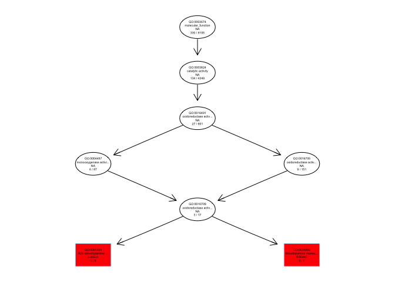<!-- -->

    ## $dag
    ## A graphNEL graph with directed edges
    ## Number of Nodes = 8 
    ## Number of Edges = 8 
    ## 
    ## $complete.dag
    ## [1] "A graph with 8 nodes."

``` r
# GOclusters heatmap
Wang_clusters_wardD2_Aboral<-ViSEAGO::GOclusters_heatmap(
    Wang_clusters_wardD2_Aboral,
    tree=list(
        distance="BMA",
        aggreg.method="ward.D2"
    )
)

# display the GOClusters heatmap
ViSEAGO::show_heatmap(
    Wang_clusters_wardD2_Aboral,
    "GOclusters")
```

<div id="htmlwidget-02403d0a15b0229c15db"
class="plotly html-widget html-fill-item"
style="width:672px;height:480px;">

</div>

<script type="application/json" data-for="htmlwidget-02403d0a15b0229c15db">{"x":{"data":[{"x":[1],"y":[1,2,3,4,5,6,7,8,9],"z":[[0.25],[0],[0.25],[0.25],[0],[1],[0.25],[0.25],[0]],"text":[["row: <br>cluster: 9<br>GO.ID: GO:0016787<br>GO.name: hydrolase activity<br>column: count<br>value: 3"],["row: <br>cluster: 8<br>GO.ID: GO:0016709<br>GO.name: oxidoreductase activity, acting on paired donors, with incorporation or reduction of molecular oxygen, NAD(P)H as one donor, and incorporation of one atom of oxygen<br>column: count<br>value: 2"],["row: <br>cluster: 7<br>GO.ID: GO:0003674<br>GO.name: molecular<br>GO.name: function<br>column: count<br>value: 3"],["row: <br>cluster: 6<br>GO.ID: GO:0038023<br>GO.name: signaling receptor activity<br>column: count<br>value: 3"],["row: <br>cluster: 5<br>GO.ID: GO:0004866<br>GO.name: endopeptidase inhibitor activity<br>column: count<br>value: 2"],["row: <br>cluster: 4<br>GO.ID: GO:0005488<br>GO.name: binding<br>column: count<br>value: 6"],["row: <br>cluster: 3<br>GO.ID: GO:0097367<br>GO.name: carbohydrate derivative binding<br>column: count<br>value: 3"],["row: <br>cluster: 1<br>GO.ID: GO:0048018<br>GO.name: receptor ligand activity<br>column: count<br>value: 3"],["row: <br>cluster: 2<br>GO.ID: GO:0046872<br>GO.name: metal ion binding<br>column: count<br>value: 2"]],"colorscale":[[0,"#FCFBFD"],[0.25,"#CFBCDD"],[1,"#3F007D"]],"type":"heatmap","showscale":false,"autocolorscale":false,"showlegend":false,"xaxis":"x","yaxis":"y","hoverinfo":"text","frame":null},{"x":[1],"y":[1],"name":"0140ccdaff97e72e8e32c8807e4aa487","type":"scatter","mode":"markers","opacity":0,"hoverinfo":"skip","showlegend":false,"marker":{"color":[0,1],"colorscale":[[0,"#FCFBFD"],[0.0033444816053511683,"#FBFAFD"],[0.0066889632107023367,"#FBF9FC"],[0.010033444816053505,"#FAF8FC"],[0.013377926421404673,"#FAF8FB"],[0.016722408026755842,"#F9F7FB"],[0.02006688963210701,"#F8F6FA"],[0.023411371237458178,"#F8F5FA"],[0.026755852842809347,"#F7F4FA"],[0.030100334448160515,"#F7F3F9"],[0.033444816053511683,"#F6F2F9"],[0.036789297658862852,"#F5F1F8"],[0.04013377926421402,"#F5F1F8"],[0.043478260869565188,"#F4F0F7"],[0.046822742474916357,"#F4EFF7"],[0.050167224080267525,"#F3EEF7"],[0.053511705685618693,"#F2EDF6"],[0.056856187290969862,"#F2ECF6"],[0.06020066889632103,"#F1EBF5"],[0.063545150501672198,"#F0EBF5"],[0.066889632107023367,"#F0EAF4"],[0.070234113712374535,"#EFE9F4"],[0.073578595317725703,"#EFE8F4"],[0.076923076923076872,"#EEE7F3"],[0.08026755852842804,"#EDE6F3"],[0.083612040133779209,"#EDE5F2"],[0.086956521739130377,"#ECE5F2"],[0.090301003344481545,"#ECE4F1"],[0.093645484949832714,"#EBE3F1"],[0.096989966555183993,"#EAE2F1"],[0.10033444816053516,"#EAE1F0"],[0.10367892976588633,"#E9E0F0"],[0.1070234113712375,"#E9E0EF"],[0.11036789297658867,"#E8DFEF"],[0.11371237458193983,"#E7DEEE"],[0.117056856187291,"#E7DDEE"],[0.12040133779264217,"#E6DCED"],[0.12374581939799334,"#E6DBED"],[0.12709030100334451,"#E5DAED"],[0.13043478260869568,"#E4DAEC"],[0.13377926421404684,"#E4D9EC"],[0.13712374581939801,"#E3D8EB"],[0.14046822742474918,"#E3D7EB"],[0.14381270903010035,"#E2D6EA"],[0.14715719063545152,"#E1D5EA"],[0.15050167224080269,"#E1D4EA"],[0.15384615384615385,"#E0D4E9"],[0.15719063545150502,"#DFD3E9"],[0.16053511705685619,"#DFD2E8"],[0.16387959866220736,"#DED1E8"],[0.16722408026755853,"#DED0E7"],[0.1705685618729097,"#DDCFE7"],[0.17391304347826086,"#DCCFE7"],[0.17725752508361203,"#DCCEE6"],[0.1806020066889632,"#DBCDE6"],[0.18394648829431437,"#DBCCE5"],[0.18729096989966554,"#DACBE5"],[0.19063545150501671,"#D9CAE4"],[0.19397993311036787,"#D9CAE4"],[0.19732441471571904,"#D8C9E4"],[0.20066889632107021,"#D8C8E3"],[0.20401337792642138,"#D7C7E3"],[0.20735785953177255,"#D6C6E2"],[0.21070234113712372,"#D6C5E2"],[0.21404682274247488,"#D5C5E1"],[0.21739130434782605,"#D5C4E1"],[0.22073578595317722,"#D4C3E1"],[0.22408026755852839,"#D3C2E0"],[0.22742474916387956,"#D3C1E0"],[0.23076923076923073,"#D2C0DF"],[0.23411371237458189,"#D2C0DF"],[0.23745819397993317,"#D1BFDE"],[0.24080267558528434,"#D0BEDE"],[0.24414715719063551,"#D0BDDE"],[0.24749163879598668,"#CFBCDD"],[0.25083612040133785,"#CEBBDD"],[0.25418060200668902,"#CEBBDC"],[0.25752508361204018,"#CDBADC"],[0.26086956521739135,"#CDB9DB"],[0.26421404682274252,"#CCB8DB"],[0.26755852842809369,"#CBB7DB"],[0.27090301003344486,"#CBB6DA"],[0.27424749163879603,"#CAB6DA"],[0.27759197324414719,"#CAB5D9"],[0.28093645484949836,"#C9B4D9"],[0.28428093645484953,"#C8B3D8"],[0.2876254180602007,"#C8B2D8"],[0.29096989966555187,"#C7B1D8"],[0.29431438127090304,"#C7B1D7"],[0.2976588628762542,"#C6B0D7"],[0.30100334448160537,"#C5AFD6"],[0.30434782608695654,"#C5AED6"],[0.30769230769230771,"#C4ADD5"],[0.31103678929765888,"#C4ACD5"],[0.31438127090301005,"#C3ACD5"],[0.31772575250836121,"#C2ABD4"],[0.32107023411371238,"#C2AAD4"],[0.32441471571906355,"#C1A9D3"],[0.32775919732441472,"#C0A8D3"],[0.33110367892976589,"#C0A8D2"],[0.33444816053511706,"#BFA7D2"],[0.33779264214046822,"#BFA6D2"],[0.34113712374581939,"#BEA5D1"],[0.34448160535117056,"#BDA4D1"],[0.34782608695652173,"#BDA3D0"],[0.3511705685618729,"#BCA3D0"],[0.35451505016722407,"#BCA2CF"],[0.35785953177257523,"#BBA1CF"],[0.3612040133779264,"#BAA0CF"],[0.36454849498327757,"#BA9FCE"],[0.36789297658862874,"#B99FCE"],[0.37123745819397991,"#B99ECD"],[0.37458193979933108,"#B89DCD"],[0.37792642140468224,"#B79CCC"],[0.38127090301003341,"#B79BCC"],[0.38461538461538458,"#B69BCC"],[0.38795986622073575,"#B69ACB"],[0.39130434782608692,"#B599CB"],[0.39464882943143809,"#B498CA"],[0.39799331103678925,"#B497CA"],[0.40133779264214042,"#B397C9"],[0.40468227424749159,"#B296C9"],[0.40802675585284276,"#B295C9"],[0.41137123745819393,"#B194C8"],[0.4147157190635451,"#B193C8"],[0.41806020066889626,"#B092C7"],[0.42140468227424743,"#AF92C7"],[0.4247491638795986,"#AF91C6"],[0.42809364548494977,"#AE90C6"],[0.43143812709030094,"#AE8FC6"],[0.43478260869565211,"#AD8EC5"],[0.43812709030100327,"#AC8EC5"],[0.44147157190635444,"#AC8DC4"],[0.44481605351170561,"#AB8CC4"],[0.44816053511705678,"#AA8BC3"],[0.45150501672240795,"#AA8AC3"],[0.45484949832775912,"#A98AC3"],[0.45819397993311028,"#A989C2"],[0.46153846153846145,"#A888C2"],[0.46488294314381262,"#A787C1"],[0.46822742474916379,"#A786C1"],[0.47157190635451507,"#A686C0"],[0.47491638795986624,"#A685C0"],[0.47826086956521741,"#A584C0"],[0.48160535117056857,"#A483BF"],[0.48494983277591974,"#A482BF"],[0.48829431438127091,"#A382BE"],[0.49163879598662208,"#A381BE"],[0.49498327759197325,"#A280BD"],[0.49832775919732442,"#A17FBD"],[0.5016722408026757,"#A17FBD"],[0.50501672240802664,"#A07EBC"],[0.50836120401337803,"#9F7DBC"],[0.51170568561872898,"#9F7CBB"],[0.51505016722408037,"#9E7BBB"],[0.51839464882943131,"#9E7BBA"],[0.52173913043478271,"#9D7ABA"],[0.52508361204013365,"#9C79BA"],[0.52842809364548504,"#9C78B9"],[0.53177257525083599,"#9B77B9"],[0.53511705685618738,"#9B77B8"],[0.53846153846153832,"#9A76B8"],[0.54180602006688972,"#9975B7"],[0.54515050167224066,"#9974B7"],[0.54849498327759205,"#9873B7"],[0.551839464882943,"#9773B6"],[0.55518394648829439,"#9772B6"],[0.55852842809364533,"#9671B5"],[0.56187290969899673,"#9670B5"],[0.56521739130434767,"#9570B4"],[0.56856187290969906,"#946FB4"],[0.57190635451505001,"#946EB4"],[0.5752508361204014,"#936DB3"],[0.57859531772575234,"#926CB3"],[0.58193979933110374,"#926CB2"],[0.58528428093645468,"#916BB2"],[0.58862876254180607,"#916AB1"],[0.59197324414715702,"#9069B1"],[0.59531772575250841,"#8F69B1"],[0.59866220735785936,"#8F68B0"],[0.60200668896321075,"#8E67B0"],[0.60535117056856191,"#8D66AF"],[0.60869565217391308,"#8D65AF"],[0.61204013377926425,"#8C65AE"],[0.61538461538461542,"#8C64AE"],[0.61872909698996659,"#8B63AE"],[0.62207357859531776,"#8A62AD"],[0.62541806020066892,"#8A61AD"],[0.62876254180602009,"#8961AC"],[0.63210702341137126,"#8860AC"],[0.63545150501672243,"#885FAB"],[0.6387959866220736,"#875EAB"],[0.64214046822742477,"#875EAB"],[0.64548494983277593,"#865DAA"],[0.6488294314381271,"#855CAA"],[0.65217391304347827,"#855BA9"],[0.65551839464882944,"#845BA9"],[0.65886287625418061,"#835AA8"],[0.66220735785953178,"#8359A8"],[0.66555183946488294,"#8258A8"],[0.66889632107023411,"#8257A7"],[0.67224080267558528,"#8157A7"],[0.67558528428093645,"#8056A6"],[0.67892976588628762,"#8055A6"],[0.68227424749163879,"#7F54A5"],[0.68561872909698995,"#7E54A5"],[0.68896321070234112,"#7E53A5"],[0.69230769230769229,"#7D52A4"],[0.69565217391304346,"#7D51A4"],[0.69899665551839463,"#7C50A3"],[0.7023411371237458,"#7B50A3"],[0.70568561872909696,"#7B4FA2"],[0.70903010033444813,"#7A4EA2"],[0.7123745819397993,"#794DA2"],[0.71571906354515047,"#794DA1"],[0.71906354515050164,"#784CA1"],[0.72240802675585281,"#774BA0"],[0.72575250836120397,"#774AA0"],[0.72909698996655514,"#7649A0"],[0.73244147157190631,"#76499F"],[0.73578595317725748,"#75489F"],[0.73913043478260865,"#74479E"],[0.74247491638795982,"#74469E"],[0.74581939799331098,"#73469D"],[0.74916387959866215,"#72459D"],[0.75250836120401332,"#72449D"],[0.75585284280936449,"#71439C"],[0.75919732441471566,"#70429C"],[0.76254180602006683,"#70429B"],[0.76588628762541799,"#6F419B"],[0.76923076923076916,"#6E409A"],[0.77257525083612055,"#6E3F9A"],[0.7759197324414715,"#6D3F9A"],[0.77926421404682289,"#6D3E99"],[0.78260869565217384,"#6C3D99"],[0.78595317725752523,"#6B3C98"],[0.78929765886287617,"#6B3B98"],[0.79264214046822756,"#6A3B97"],[0.79598662207357851,"#693A97"],[0.7993311036789299,"#693997"],[0.80267558528428085,"#683896"],[0.80602006688963224,"#673896"],[0.80936454849498318,"#673795"],[0.81270903010033457,"#663695"],[0.81605351170568552,"#653594"],[0.81939799331103691,"#653494"],[0.82274247491638786,"#643494"],[0.82608695652173925,"#633393"],[0.82943143812709019,"#633293"],[0.83277591973244158,"#623192"],[0.83612040133779253,"#613092"],[0.83946488294314392,"#613091"],[0.84280936454849487,"#602F91"],[0.84615384615384626,"#5F2E91"],[0.8494983277591972,"#5F2D90"],[0.85284280936454859,"#5E2C90"],[0.85618729096989954,"#5D2C8F"],[0.85953177257525093,"#5D2B8F"],[0.86287625418060188,"#5C2A8E"],[0.86622073578595327,"#5B298E"],[0.86956521739130421,"#5B288E"],[0.8729096989966556,"#5A278D"],[0.87625418060200655,"#59278D"],[0.87959866220735794,"#59268C"],[0.88294314381270889,"#58258C"],[0.88628762541806028,"#57248B"],[0.88963210702341122,"#57238B"],[0.89297658862876261,"#56228B"],[0.89632107023411356,"#55228A"],[0.89966555183946495,"#55218A"],[0.9030100334448159,"#542089"],[0.90635451505016729,"#531F89"],[0.90969899665551823,"#521E88"],[0.91304347826086962,"#521D88"],[0.91638795986622057,"#511C88"],[0.91973244147157196,"#501B87"],[0.92307692307692291,"#501A87"],[0.9264214046822743,"#4F1986"],[0.92976588628762524,"#4E1886"],[0.93311036789297663,"#4E1786"],[0.93645484949832758,"#4D1785"],[0.93979933110367897,"#4C1685"],[0.94314381270903014,"#4B1484"],[0.94648829431438131,"#4B1384"],[0.94983277591973247,"#4A1283"],[0.95317725752508364,"#491183"],[0.95652173913043481,"#491083"],[0.95986622073578598,"#480F82"],[0.96321070234113715,"#470E82"],[0.96655518394648832,"#460D81"],[0.96989966555183948,"#460B81"],[0.97324414715719065,"#450A80"],[0.97658862876254182,"#440980"],[0.97993311036789299,"#430780"],[0.98327759197324416,"#43067F"],[0.98662207357859533,"#42057F"],[0.98996655518394649,"#41047E"],[0.99331103678929766,"#41027E"],[0.99665551839464883,"#40017D"],[1,"#3F007D"]],"colorbar":{"bgcolor":"rgba(255,255,255,1)","bordercolor":"transparent","borderwidth":0,"thickness":23.039999999999996,"title":"GO terms count","titlefont":{"color":"rgba(0,0,0,1)","family":"","size":14.611872146118724},"tickmode":"array","ticktext":["2","3","4","5","6"],"tickvals":[0.0016666666666666668,0.2508333333333333,0.49999999999999994,0.74916666666666665,0.99833333333333329],"tickfont":{"color":"rgba(0,0,0,1)","family":"","size":11.68949771689498},"ticklen":2,"len":0.5}},"xaxis":"x","yaxis":"y","frame":null},{"x":[0.82800000000000007,0.82800000000000007,null,0.82800000000000007,0],"y":[3.5,3,null,3,3],"text":"y: 0.8280000","type":"scatter","mode":"lines","line":{"width":0.37795275590551186,"color":"rgba(127,255,212,1)","dash":"solid"},"hoveron":"points","showlegend":false,"xaxis":"x2","yaxis":"y","hoverinfo":"text","frame":null},{"x":[1.1243376272276935,1.1243376272276935,null,1.1243376272276935,0.9684063713132004,null,0.9684063713132004,0.9684063713132004,null,0.9684063713132004,0.92396347330400452,null,0.92396347330400452,0.92396347330400452,null,0.92396347330400452,0.877,null,0.92396347330400452,0.92396347330400452,null,0.92396347330400452,0.82800000000000007,null,1.1243376272276935,1.1243376272276935,null,1.1243376272276935,0.87325053678769637,null,0.87325053678769637,0.87325053678769637,null,0.87325053678769637,0.77679019046329367,null,0.77679019046329367,0.77679019046329367,null,0.77679019046329367,0.60699999999999998],"y":[5.9375,3.75,null,3.75,3.75,null,3.75,2.5,null,2.5,2.5,null,2.5,1.5,null,1.5,1.5,null,2.5,3.5,null,3.5,3.5,null,5.9375,8.125,null,8.125,8.125,null,8.125,7.25,null,7.25,7.25,null,7.25,6.5,null,6.5,6.5],"text":["y: 1.1243376","y: 1.1243376",null,"y: 1.1243376","y: 1.1243376",null,"y: 0.9684064","y: 0.9684064",null,"y: 0.9684064","y: 0.9684064",null,"y: 0.9239635","y: 0.9239635",null,"y: 0.9239635","y: 0.9239635",null,"y: 0.9239635","y: 0.9239635",null,"y: 0.9239635","y: 0.9239635",null,"y: 1.1243376","y: 1.1243376",null,"y: 1.1243376","y: 1.1243376",null,"y: 0.8732505","y: 0.8732505",null,"y: 0.8732505","y: 0.8732505",null,"y: 0.7767902","y: 0.7767902",null,"y: 0.7767902","y: 0.7767902"],"type":"scatter","mode":"lines","line":{"width":0.37795275590551186,"color":"rgba(0,0,0,1)","dash":"solid"},"hoveron":"points","showlegend":false,"xaxis":"x2","yaxis":"y","hoverinfo":"text","frame":null},{"x":[0.87325053678769637,0.87325053678769637,null,0.87325053678769637,0],"y":[8.125,9,null,9,9],"text":"y: 0.8732505","type":"scatter","mode":"lines","line":{"width":0.37795275590551186,"color":"rgba(0,255,255,1)","dash":"solid"},"hoveron":"points","showlegend":false,"xaxis":"x2","yaxis":"y","hoverinfo":"text","frame":null},{"x":[0.77679019046329367,0.77679019046329367,null,0.77679019046329367,0],"y":[7.25,8,null,8,8],"text":"y: 0.7767902","type":"scatter","mode":"lines","line":{"width":0.37795275590551186,"color":"rgba(233,150,122,1)","dash":"solid"},"hoveron":"points","showlegend":false,"xaxis":"x2","yaxis":"y","hoverinfo":"text","frame":null},{"x":[0.877,0.877,null,0.877,0],"y":[1.5,1,null,1,1],"text":"y: 0.8770000","type":"scatter","mode":"lines","line":{"width":0.37795275590551186,"color":"rgba(34,139,34,1)","dash":"solid"},"hoveron":"points","showlegend":false,"xaxis":"x2","yaxis":"y","hoverinfo":"text","frame":null},{"x":[0.9684063713132004,0.9684063713132004,null,0.9684063713132004,0],"y":[3.75,5,null,5,5],"text":"y: 0.9684064","type":"scatter","mode":"lines","line":{"width":0.37795275590551186,"color":"rgba(255,105,180,1)","dash":"solid"},"hoveron":"points","showlegend":false,"xaxis":"x2","yaxis":"y","hoverinfo":"text","frame":null},{"x":[0.60699999999999998,0.60699999999999998,null,0.60699999999999998,0],"y":[6.5,6,null,6,6],"text":"y: 0.6070000","type":"scatter","mode":"lines","line":{"width":0.37795275590551186,"color":"rgba(25,25,112,1)","dash":"solid"},"hoveron":"points","showlegend":false,"xaxis":"x2","yaxis":"y","hoverinfo":"text","frame":null},{"x":[0.60699999999999998,0.60699999999999998,null,0.60699999999999998,0],"y":[6.5,7,null,7,7],"text":"y: 0.6070000","type":"scatter","mode":"lines","line":{"width":0.37795275590551186,"color":"rgba(218,112,214,1)","dash":"solid"},"hoveron":"points","showlegend":false,"xaxis":"x2","yaxis":"y","hoverinfo":"text","frame":null},{"x":[0.877,0.877,null,0.877,0],"y":[1.5,2,null,2,2],"text":"y: 0.8770000","type":"scatter","mode":"lines","line":{"width":0.37795275590551186,"color":"rgba(65,105,225,1)","dash":"solid"},"hoveron":"points","showlegend":false,"xaxis":"x2","yaxis":"y","hoverinfo":"text","frame":null},{"x":[0.82800000000000007,0.82800000000000007,null,0.82800000000000007,0],"y":[3.5,4,null,4,4],"text":"y: 0.8280000","type":"scatter","mode":"lines","line":{"width":0.37795275590551186,"color":"rgba(160,82,45,1)","dash":"solid"},"hoveron":"points","showlegend":false,"xaxis":"x2","yaxis":"y","hoverinfo":"text","frame":null},{"x":[1.1243376272276935,0.9684063713132004,0.92396347330400452,0.877,0,0,0.82800000000000007,0,0,0,0.87325053678769637,0.77679019046329367,0.60699999999999998,0,0,0,0],"y":[5.9375,3.75,2.5,1.5,1,2,3.5,3,4,5,8.125,7.25,6.5,6,7,8,9],"text":["y: 1.1243376","y: 0.9684064","y: 0.9239635","y: 0.8770000","y: 0.0000000","y: 0.0000000","y: 0.8280000","y: 0.0000000","y: 0.0000000","y: 0.0000000","y: 0.8732505","y: 0.7767902","y: 0.6070000","y: 0.0000000","y: 0.0000000","y: 0.0000000","y: 0.0000000"],"type":"scatter","mode":"markers","marker":{"autocolorscale":false,"color":"transparent","opacity":1,"size":null,"symbol":null,"line":{"width":1.8897637795275593,"color":"transparent"}},"hoveron":"points","showlegend":false,"xaxis":"x2","yaxis":"y","hoverinfo":"text","frame":null}],"layout":{"xaxis":{"domain":[0,0.20000000000000001],"automargin":true,"type":"linear","autorange":false,"range":[0.5,1.5],"tickmode":"array","ticktext":["count"],"tickvals":[1],"categoryorder":"array","categoryarray":["count"],"nticks":null,"ticks":"outside","tickcolor":"rgba(51,51,51,1)","ticklen":3.6529680365296811,"tickwidth":0,"showticklabels":true,"tickfont":{"color":"rgba(77,77,77,1)","family":"","size":10},"tickangle":-45,"showline":true,"linecolor":"rgba(0,0,0,1)","linewidth":0,"showgrid":false,"gridcolor":null,"gridwidth":0,"zeroline":false,"anchor":"y","title":"","hoverformat":".2f","family":"Times New Roman"},"xaxis2":{"domain":[0.20000000000000001,0.80000000000000004],"automargin":true,"type":"linear","autorange":false,"range":[0,1.1243376272276935],"tickmode":"array","ticktext":["0.0","0.3","0.6","0.9"],"tickvals":[0,0.30000000000000004,0.60000000000000009,0.90000000000000024],"categoryorder":"array","categoryarray":["0.0","0.3","0.6","0.9"],"nticks":null,"ticks":"","tickcolor":null,"ticklen":3.6529680365296811,"tickwidth":0,"showticklabels":false,"tickfont":{"color":null,"family":null,"size":0},"tickangle":-0,"showline":false,"linecolor":null,"linewidth":0,"showgrid":false,"gridcolor":null,"gridwidth":0,"zeroline":false,"anchor":"y","title":{"text":"","font":{"color":null,"family":null,"size":0}},"hoverformat":".2f"},"yaxis":{"domain":[0,1],"automargin":true,"type":"linear","autorange":false,"range":[0.5,9.5],"tickmode":"array","ticktext":["hydrolase activity (cl9)","oxidoreductase activity, acting on paired donors, ... (cl8)","function (cl7)","signaling receptor activity (cl6)","endopeptidase inhibitor activity (cl5)","binding (cl4)","carbohydrate derivative binding (cl3)","receptor ligand activity (cl1)","metal ion binding (cl2)"],"tickvals":[1,2,3,4,5,6,7,8,9],"categoryorder":"array","categoryarray":["<br>cluster: 9<br>GO.ID: GO:0016787<br>GO.name: hydrolase activity","<br>cluster: 8<br>GO.ID: GO:0016709<br>GO.name: oxidoreductase activity, acting on paired donors, with incorporation or reduction of molecular oxygen, NAD(P)H as one donor, and incorporation of one atom of oxygen","<br>cluster: 7<br>GO.ID: GO:0003674<br>GO.name: molecular<br>GO.name: function","<br>cluster: 6<br>GO.ID: GO:0038023<br>GO.name: signaling receptor activity","<br>cluster: 5<br>GO.ID: GO:0004866<br>GO.name: endopeptidase inhibitor activity","<br>cluster: 4<br>GO.ID: GO:0005488<br>GO.name: binding","<br>cluster: 3<br>GO.ID: GO:0097367<br>GO.name: carbohydrate derivative binding","<br>cluster: 1<br>GO.ID: GO:0048018<br>GO.name: receptor ligand activity","<br>cluster: 2<br>GO.ID: GO:0046872<br>GO.name: metal ion binding"],"nticks":null,"ticks":"outside","tickcolor":"rgba(51,51,51,1)","ticklen":3.6529680365296811,"tickwidth":0,"showticklabels":true,"tickfont":{"color":"rgba(77,77,77,1)","family":"","size":10},"tickangle":-0,"showline":true,"linecolor":"rgba(0,0,0,1)","linewidth":0,"showgrid":false,"gridcolor":null,"gridwidth":0,"zeroline":false,"anchor":"x","title":"","hoverformat":".2f","family":"Times New Roman"},"annotations":[],"shapes":[{"type":"rect","fillcolor":null,"line":{"color":null,"width":0,"linetype":[]},"yref":"paper","xref":"paper","layer":"below","x0":0,"x1":0.80000000000000004,"y0":0,"y1":1},{"type":"rect","fillcolor":null,"line":{"color":null,"width":0,"linetype":[]},"yref":"paper","xref":"paper","layer":"below","x0":0.80000000000000004,"x1":1,"y0":0,"y1":1}],"images":[],"margin":{"t":100,"r":0,"b":150,"l":300},"paper_bgcolor":"rgba(255,255,255,1)","font":{"color":"rgba(0,0,0,1)","family":"","size":14},"showlegend":false,"legend":{"bgcolor":"rgba(255,255,255,1)","bordercolor":"transparent","borderwidth":0,"font":{"color":"rgba(0,0,0,1)","family":"","size":11.68949771689498},"title":{"text":"GO terms count","font":{"color":"rgba(0,0,0,1)","family":"","size":14.611872146118724}},"y":1,"yanchor":"top"},"hovermode":"closest","barmode":"relative","title":"BMA GOclusters distance heatmap"},"attrs":{"112904f5e820a":{"x":{},"y":{},"fill":{},"text":{},"type":"heatmap"},"112904d12e3bf":{"x":{},"y":{},"xend":{},"yend":{},"colour":{},"linetype":{},"size":{},"type":"scatter"},"1129013263821":{"x":{},"y":{},"colour":{},"shape":{},"size":{}}},"source":"A","config":{"doubleClick":"reset","modeBarButtonsToAdd":["hoverclosest","hovercompare"],"showSendToCloud":false,"displaylogo":false,"modeBarButtonsToRemove":["sendDataToCloud","select2d","lasso2d","autoScale2d","hoverClosestCartesian","hoverCompareCartesian","sendDataToCloud"]},"highlight":{"on":"plotly_click","persistent":false,"dynamic":false,"selectize":false,"opacityDim":0.20000000000000001,"selected":{"opacity":1},"debounce":0},"subplot":true,"shinyEvents":["plotly_hover","plotly_click","plotly_selected","plotly_relayout","plotly_brushed","plotly_brushing","plotly_clickannotation","plotly_doubleclick","plotly_deselect","plotly_afterplot","plotly_sunburstclick"],"base_url":"https://plot.ly"},"evals":[],"jsHooks":[]}</script>

## 3.3 Plotting of both tissues, pre-clustered by tissue

### 3.3.1 Custom plotting of results

``` r
clustered_Oral_DEGs_enrichedGO <- as.data.frame(Wang_clusters_wardD2_Oral@enrich_GOs@data) 

cluster_map <- data.frame(cluster_full = rownames(as.matrix(slot(Wang_clusters_wardD2_Oral,"clusters_dist")[["BMA"]])))
cluster_map <- cluster_map %>% 
  mutate(
    cluster = str_extract(cluster_full, "\\d+"),
    Cluster.name = str_replace(cluster_full,".*?_.*?_",""),
    Cluster.term = str_replace(cluster_full,"^\\d+_",""),
    Cluster.term = str_replace(Cluster.term,"_.*$","")
  ) %>%
  mutate(Cluster.name = paste0("Cluster ", cluster, ": ", Cluster.name)) %>%
  dplyr::select(cluster, Cluster.name)

clustered_Oral_DEGs_enrichedGO <- clustered_Oral_DEGs_enrichedGO %>%
  left_join(cluster_map, by = c("GO.cluster" = "cluster")) %>%
  mutate(Tissue="Oral")

clustered_Aboral_DEGs_enrichedGO <- as.data.frame(Wang_clusters_wardD2_Aboral@enrich_GOs@data)

cluster_map <- data.frame(cluster_full = rownames(as.matrix(slot(Wang_clusters_wardD2_Aboral,"clusters_dist")[["BMA"]])))
cluster_map <- cluster_map %>% 
  mutate(
    cluster = str_extract(cluster_full, "\\d+"),
    Cluster.name = str_wrap(str_replace(cluster_full,".*?_.*?_",""), width = 60),
    Cluster.term = str_replace(cluster_full,"^\\d+_",""),
    Cluster.term = str_replace(Cluster.term,"_.*$","")
  ) %>%
  mutate(Cluster.name = paste0("Cluster ", cluster, ": ", Cluster.name)) %>%
  dplyr::select(cluster, Cluster.name)
clustered_Aboral_DEGs_enrichedGO <- clustered_Aboral_DEGs_enrichedGO %>%
  left_join(cluster_map, by = c("GO.cluster" = "cluster")) %>%
  mutate(Tissue="Aboral")


clustered_allDEGs_enrichedGO <- rbind(clustered_Oral_DEGs_enrichedGO %>%
                                        dplyr::select(-contains("Oral")),
                                      clustered_Aboral_DEGs_enrichedGO %>%
                                        dplyr::select(-contains("Aboral")))
```

### 3.3.2 Plot

``` r
library(dplyr)
library(tidyr)
library(ggplot2)

# Create bidirectional data
cluster_data <- clustered_allDEGs_enrichedGO %>%
  dplyr::select(Cluster.name, Tissue) %>%
  group_by(Cluster.name) %>%
  summarise(
    Oral_terms = sum(Tissue=="Oral"),
    Aboral_terms = sum(Tissue=="Aboral"),
    .groups = "drop"
  ) %>%
  mutate(
    deviation = Aboral_terms - Oral_terms,
    Oral_terms = -Oral_terms  # Make negative for bidirectional plot
  ) %>%
  pivot_longer(cols = c("Oral_terms", "Aboral_terms"), 
               names_to = "Tissue", values_to = "n_terms") %>%
  mutate(Tissue = ifelse(Tissue == "Oral_terms", "Oral epidermis", "Aboral"))

# Calculate transition points for dashed lines
transition_data <- cluster_data %>%
  distinct(Cluster.name, deviation) %>%
  arrange(deviation)

oral_to_equal <- sum(transition_data$deviation >= 0) + 0.5
equal_to_aboral <- sum(transition_data$deviation > 0) + 0.5

# Plot
p <- ggplot(cluster_data, aes(x = reorder(Cluster.name, -deviation), y = n_terms, fill = Tissue)) +
  geom_col(width = 0.7, alpha = 0.8) +
  geom_hline(yintercept = 0, color = "black", linewidth = 0.8) +
  geom_vline(xintercept = c(oral_to_equal, equal_to_aboral), 
             color = "grey60", linetype = "dashed", linewidth = 0.6) +
  scale_fill_manual(values = c("Oral epidermis" = "#FD8D3C", "Aboral" = "#756BB1")) + #green: "#2E8B57"
  coord_flip() +
  theme_minimal() +
  theme(
    panel.grid.major.y = element_blank(),
    panel.grid.minor = element_blank(),
    legend.position = "bottom",
    legend.title = element_text(face = "bold"),
    axis.title = element_text(face = "bold"),
    axis.text = element_text(color = "black"),
    axis.text.x = element_text(size = 12),
    axis.text.y = element_text(size = 12)
  ) +
  scale_y_continuous(labels = abs) +
  labs(
    x = "Gene clusters",
    y = "Number of enriched GO terms",
    title = "Tissue-specific GO term enrichment patterns",
    subtitle = "Clusters ordered by net enrichment (Oral vs. Aboral)"
  )

ggsave("../output_RNA/differential_expression/semantic-enrichment/MF_GO_enrichment_bidirectional_clustered_separate.png", p, width = 10, height = 8, dpi = 300)
```

## 3.4 Combine everything into one big plot:

``` r
BP_GOs_Aboral <- read.delim(file="../output_RNA/differential_expression/semantic-enrichment/DE_05_Aboral.tsv") %>% mutate(ontology="BP")
MF_GOs_Aboral <- read.delim(file="../output_RNA/differential_expression/semantic-enrichment/MF_DE_05_Aboral.tsv")   %>% mutate(ontology="MF")
CC_GOs_Aboral <- read.delim(file="../output_RNA/differential_expression/semantic-enrichment/CC_DE_05_Aboral.tsv") %>% mutate(ontology="CC")

BP_GOs_Oral <- read.delim(file="../output_RNA/differential_expression/semantic-enrichment/DE_05_Oral.tsv") %>% mutate(ontology="BP")
MF_GOs_Oral <- read.delim(file="../output_RNA/differential_expression/semantic-enrichment/MF_DE_05_Oral.tsv") %>% mutate(ontology="MF")
CC_GOs_Oral <- read.delim(file="../output_RNA/differential_expression/semantic-enrichment/CC_DE_05_Oral.tsv") %>% mutate(ontology="CC")

oral_combined <- rbind(BP_GOs_Oral,MF_GOs_Oral,CC_GOs_Oral) %>%
                        rename_with(~ str_replace_all(.x, "Oral_elim|\\.", "")) %>% mutate(Tissue="Oral")
aboral_combined <- rbind(BP_GOs_Aboral,MF_GOs_Aboral,CC_GOs_Aboral) %>%
                        rename_with(~ str_replace_all(.x, "Aboral_elim|\\.", "")) %>% mutate(Tissue="Aboral")

tissues_combined <- rbind(oral_combined,aboral_combined) %>%
                          mutate(freq = as.numeric(str_remove(genes_frequency,pattern="\\%.*")))
```

``` r
aboral_cols <- c(
  BP = "#756BB1",
  CC = "#9E9AC8",
  MF = "#CBC9E2"
)

oral_cols <- c(
  BP = "#FD8D3C",
  CC = "#FDAE6B",
  MF = "#FDD0A2"
)

top10_pval <- tissues_combined %>%
  filter(ontology=="BP") %>%
  group_by(Tissue,ontology) %>%
  slice_max(order_by = desc(pvalue), n = 30, with_ties = FALSE) %>% 
  arrange(Tissue, ontology, log10_pvalue) %>%
  ungroup() %>%
  mutate(term=str_wrap(`term`, width = 40))

p1 <- top10_pval %>% filter(Tissue == "Aboral") %>%
  mutate(term = fct_reorder(term, log10_pvalue)) %>% 
  ggplot(aes(x = term, y = log10_pvalue, fill = ontology)) +
  geom_col(width = .8, fill="#756BB1", alpha = 0.8) +
  facet_grid(ontology ~ ., scales = "free_y", space = "free_y") +
  coord_flip() +
 # scale_fill_manual(values = aboral_cols) +
  theme_bw(base_size = 9) +
  #scale_y_continuous(limits = c(0, 35), expand = expansion(mult = c(0, 0.05)))+
  theme(
    panel.grid.major.y = element_blank(),
    panel.grid.major.x = element_line(color = "grey90", linewidth = 0.2),
    axis.title.y = element_blank(),
    axis.text.y = element_text(size = 7, lineheight = 0.7,color = "black"),
    strip.text = element_text(face = "bold", size = 9),
    strip.background = element_rect(fill = "white", color = "black"),
    legend.position = "none",
    plot.subtitle = element_text(face = "bold", size = 9, hjust = 0.5),
    panel.spacing.y = unit(0.2, "lines")
  ) + labs(subtitle = "Aboral", y = "-log10(p-value)")

p2 <- top10_pval %>% filter(Tissue == "Oral") %>%
  mutate(term = fct_reorder(term, log10_pvalue)) %>% 
  ggplot(aes(x = term, y = log10_pvalue, fill = ontology)) +
  geom_col(width = .8, fill="#FD8D3C", alpha = 0.8) +
  facet_grid(ontology ~ ., scales = "free_y", space = "free_y") +
  coord_flip() +
 # scale_fill_manual(values = oral_cols) +
 # scale_y_continuous(limits = c(0, 35), expand = expansion(mult = c(0, 0.05)))+
  theme_bw(base_size = 9) +
  theme(
    panel.grid.major.y = element_blank(),
    panel.grid.major.x = element_line(color = "grey90", linewidth = 0.2),
    axis.title.y = element_blank(),
    axis.text.y = element_text(size = 7, lineheight = 0.7,color = "black"),
    strip.text = element_text(face = "bold", size = 9),
     strip.background = element_rect(fill = "white", color = "black"),
    legend.position = "none",
    plot.subtitle = element_text(face = "bold", size = 9, hjust = 0.5),
    panel.spacing.y = unit(0.2, "lines")
  ) + labs(subtitle = "Oral epidermis", y = "-log10(p-value)")

plot <- p1 + p2 +
  plot_annotation(
    title = "Top 30 enriched GO terms by p-value",
    theme = theme(plot.title = element_text(face = "bold", size = 9, hjust = 0.5))
  )

ggsave("../output_RNA/differential_expression/semantic-enrichment/Top_BP_30.png", plot, width = 7, height = 6.5, dpi = 300)
```

``` r
top10_freq <- tissues_combined %>% group_by(Tissue,ontology) %>%
  slice_max(order_by = freq, n = 10, with_ties = FALSE) %>% 
  arrange(Tissue, ontology, log10_pvalue) %>%
  ungroup() %>%
  mutate(term=str_wrap(`term`, width = 40))


p1 <- top10_freq %>% filter(Tissue == "Aboral") %>%
  mutate(term = fct_reorder(term, freq)) %>% 
  ggplot(aes(x = term, y = freq, fill = ontology)) +
  geom_col(width = 0.7, alpha = 0.85) +
  facet_grid(ontology ~ ., scales = "free_y", space = "free_y") +
  coord_flip() +
  scale_fill_manual(values = aboral_cols) +
  theme_bw(base_size = 9) +
  theme(
    panel.grid.major.y = element_blank(),
    panel.grid.major.x = element_line(color = "grey90", linewidth = 0.2),
    axis.title.y = element_blank(),
    axis.text.y = element_text(size = 7, lineheight = 0.7,color = "black"),
    strip.text = element_text(face = "bold", size = 9),
     strip.background = element_rect(fill = "white", color = "black"),
    legend.position = "none",
    plot.subtitle = element_text(face = "bold", size = 9, hjust = 0.5),
    panel.spacing.y = unit(0.2, "lines")
  ) + labs(subtitle = "Aboral", y = "% DEGs with GO term of\nall genes with GO term")

p2 <- top10_freq %>% filter(Tissue == "Oral") %>%
  mutate(term = fct_reorder(term, freq)) %>% 
  ggplot(aes(x = term, y = freq, fill = ontology)) +
  geom_col(width = 0.7, alpha = 0.85) +
  facet_grid(ontology ~ ., scales = "free_y", space = "free_y") +
  coord_flip() +
  scale_fill_manual(values = oral_cols) +
  theme_bw(base_size = 9) +
  theme(
    panel.grid.major.y = element_blank(),
    panel.grid.major.x = element_line(color = "grey90", linewidth = 0.2),
    axis.title.y = element_blank(),
    axis.text.y = element_text(size = 7, lineheight = 0.7,color = "black"),
    strip.text = element_text(face = "bold", size = 9),
     strip.background = element_rect(fill = "white", color = "black"),
    legend.position = "none",
    plot.subtitle = element_text(face = "bold", size = 9, hjust = 0.5),
    panel.spacing.y = unit(0.2, "lines")
  ) + labs(subtitle = "Oral epidermis", y = "% DEGs with GO term of\nall genes with GO term")


plot <- p1 + p2 +
  plot_annotation(
    title = "Top 10 enriched GO terms by frequency in tissue DEGs",
    theme = theme(plot.title = element_text(face = "bold", size = 9, hjust = 0.5))
  )

ggsave("../output_RNA/differential_expression/semantic-enrichment/All_Onts_frq.png", plot, width = 7, height = 6.5, dpi = 300)
```

``` r
# Create gradient scales for each tissue
aboral_gradient <- colorRampPalette(c("#CBC9E2", "#756BB1"))(100)
oral_gradient <- colorRampPalette(c("#FDD0A2", "#FD8D3C"))(100)

p1 <- top10_freq %>% filter(Tissue == "Aboral") %>%
  mutate(term = fct_reorder(term, freq)) %>% 
  ggplot(aes(x = term, y = freq, fill = log10_pvalue)) +
  geom_col(width = 0.7, alpha = 0.85) +
  facet_grid(ontology ~ ., scales = "free_y", space = "free_y") +
  coord_flip() +
  scale_fill_gradientn(colors = aboral_gradient, name = "-log10(p-value)") +
  theme_bw(base_size = 9) +
  theme(
    panel.grid.major.y = element_blank(),
    panel.grid.major.x = element_line(color = "grey90", linewidth = 0.2),
    axis.title.y = element_blank(),
    axis.text.y = element_text(size = 7, lineheight = 0.7, color = "black"),
    strip.text = element_text(face = "bold", size = 9),
    strip.background = element_rect(fill = "white", color = "black"),
    legend.position = "right",
    legend.key.height = unit(0.8, "cm"),
    legend.key.width = unit(0.3, "cm"),
    plot.subtitle = element_text(face = "bold", size = 9, hjust = 0.5),
    panel.spacing.y = unit(0.2, "lines")
  ) + labs(subtitle = "Aboral", y = "% DEGs with GO term of\nall genes with GO term")

p2 <- top10_freq %>% filter(Tissue == "Oral") %>%
  mutate(term = fct_reorder(term, freq)) %>% 
  ggplot(aes(x = term, y = freq, fill = log10_pvalue)) +
  geom_col(width = 0.7, alpha = 0.85) +
  facet_grid(ontology ~ ., scales = "free_y", space = "free_y") +
  coord_flip() +
  scale_fill_gradientn(colors = oral_gradient, name = "-log10(p-value)") +
  theme_bw(base_size = 9) +
  theme(
    panel.grid.major.y = element_blank(),
    panel.grid.major.x = element_line(color = "grey90", linewidth = 0.2),
    axis.title.y = element_blank(),
    axis.text.y = element_text(size = 7, lineheight = 0.7, color = "black"),
    strip.text = element_text(face = "bold", size = 9),
    strip.background = element_rect(fill = "white", color = "black"),
    legend.position = "right",
    legend.key.height = unit(0.8, "cm"),
    legend.key.width = unit(0.3, "cm"),
    plot.subtitle = element_text(face = "bold", size = 9, hjust = 0.5),
    panel.spacing.y = unit(0.2, "lines")
  ) + labs(subtitle = "Oral epidermis", y = "% DEGs with GO term of\nall genes with GO term")

plot <- p1 + p2 +
  plot_annotation(
    title = "Top 10 enriched GO terms by frequency in tissue DEGs",
    theme = theme(plot.title = element_text(face = "bold", size = 9, hjust = 0.5))
  )

ggsave("../output_RNA/differential_expression/semantic-enrichment/All_Onts_freq_pval.png", plot, width = 8, height = 6.5, dpi = 300)
```

``` r
top10_pval <- tissues_combined %>%
  group_by(Tissue,ontology) %>%
  slice_max(order_by = desc(pvalue), n = 10, with_ties = FALSE) %>% 
  arrange(Tissue, ontology, log10_pvalue) %>%
  ungroup() %>%
  mutate(term=str_wrap(`term`, width = 40))

make_lollipop <- function(df, subtitle_label,fill="white") {
  df %>%
    mutate(term = fct_reorder(term, log10_pvalue)) %>%
    ggplot(aes(y = term, x = log10_pvalue)) +

    # stick
    geom_segment(aes(yend = term, x = 0, xend = log10_pvalue),
                 color = fill, linewidth = 0.6) +

    # dot sized by frequency
    geom_point(aes(size = freq, fill = fill),
               shape = 21, color = "black") +
    facet_grid(ontology ~ ., scales = "free_y", space = "free_y") +
    scale_fill_manual(values = fill, guide = "none") +
    scale_size_continuous(name = "% DEGs\nwith GO term",
                          limits = c(0, 100),
                          breaks = c(0, 25, 50, 75, 100),
                          range = c(2, 6)) +

    theme_bw(base_size = 9) +
    theme(
      panel.grid.major.y = element_blank(),
      panel.grid.major.x = element_line(color = "grey90", linewidth = 0.2),
      axis.title.y = element_blank(),
      axis.text.y = element_text(size = 7, lineheight = 0.7, color = "black"),
      strip.text = element_text(face = "bold", size = 9),
      strip.background = element_rect(fill = "white", color = "black"),
      legend.position = "bottom",
      plot.subtitle = element_text(face = "bold", size = 9, hjust = 0.5),
      panel.spacing.y = unit(0.2, "lines")
    ) +
    labs(
      subtitle = subtitle_label,
      x = expression(-log[10](p-value))
    )
}

p1 <- make_lollipop(
  top10_pval %>% filter(Tissue == "Aboral"),
  "Aboral", fill = "#9E9AC8"
)

p2 <- make_lollipop(
  top10_pval %>% filter(Tissue == "Oral"),
  "Oral epidermis", fill = "#FDAE6B"
)

plot <- p1 + p2 + 
  plot_layout(guides = "collect") +
  plot_annotation(
    title = "Top 10 enriched GO terms by p-value in tissue DEGs",
    theme = theme(plot.title = element_text(face = "bold", size = 9, hjust = 0.5))
  ) &
  theme(legend.position='bottom')

ggsave("../output_RNA/differential_expression/semantic-enrichment/All_Onts_pval_top10_lollipop.png", plot, width = 10, height = 6.5, dpi = 300)
```

``` r
top10_pval <- tissues_combined %>%
  group_by(Tissue,ontology) %>%
  slice_max(order_by = desc(pvalue), n = 20, with_ties = FALSE) %>% 
  arrange(Tissue, ontology, log10_pvalue) %>%
  ungroup() %>%
  mutate(term=str_wrap(`term`, width = 40))

make_lollipop <- function(df, subtitle_label,fill="white") {
  df %>%
    mutate(term = fct_reorder(term, log10_pvalue)) %>%
    ggplot(aes(y = term, x = log10_pvalue)) +

    # stick
    geom_segment(aes(yend = term, x = 0, xend = log10_pvalue),
                 color = fill, linewidth = 0.6) +

    # dot sized by frequency
    geom_point(aes(size = freq, fill = fill),
               shape = 21, color = "black") +
    facet_grid(ontology ~ ., scales = "free_y", space = "free_y") +
    scale_fill_manual(values = fill, guide = "none") +
    scale_size_continuous(name = "% DEGs\nwith GO term",
                          limits = c(0, 100),
                          breaks = c(0, 25, 50, 75, 100),
                          range = c(2, 6)) +

    theme_bw(base_size = 9) +
    theme(
      panel.grid.major.y = element_blank(),
      panel.grid.major.x = element_line(color = "grey90", linewidth = 0.2),
      axis.title.y = element_blank(),
      axis.text.y = element_text(size = 7, lineheight = 0.7, color = "black"),
      strip.text = element_text(face = "bold", size = 9),
      strip.background = element_rect(fill = "white", color = "black"),
      legend.position = "bottom",
      plot.subtitle = element_text(face = "bold", size = 9, hjust = 0.5),
      panel.spacing.y = unit(0.2, "lines")
    ) +
    labs(
      subtitle = subtitle_label,
      x = expression(-log[10](p-value))
    )
}

p1 <- make_lollipop(
  top10_pval %>% filter(Tissue == "Aboral"),
  "Aboral", fill = "#9E9AC8"
)

p2 <- make_lollipop(
  top10_pval %>% filter(Tissue == "Oral"),
  "Oral epidermis", fill = "#FDAE6B"
)

plot <- p1 + p2 + 
  plot_layout(guides = "collect") +
  plot_annotation(
    title = "Top 10 enriched GO terms by p-value in tissue DEGs",
    theme = theme(plot.title = element_text(face = "bold", size = 9, hjust = 0.5))
  ) &
  theme(legend.position='bottom')

ggsave("../output_RNA/differential_expression/semantic-enrichment/All_Onts_pval_top20_lollipop.png", plot, width = 10, height = 16, dpi = 300)
```
