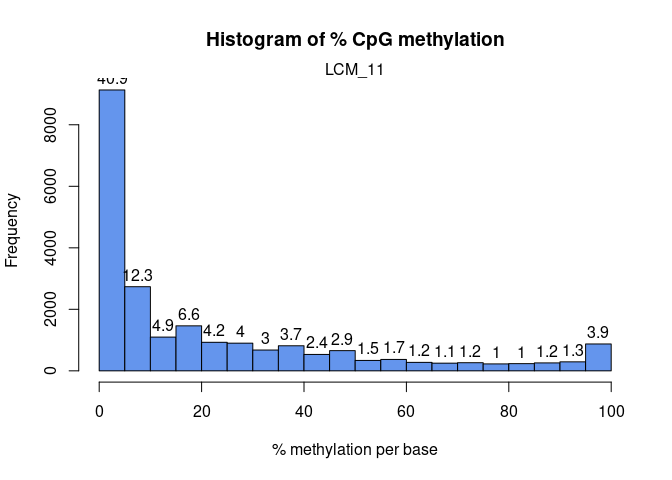
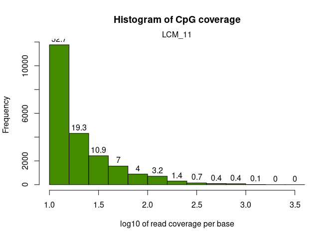
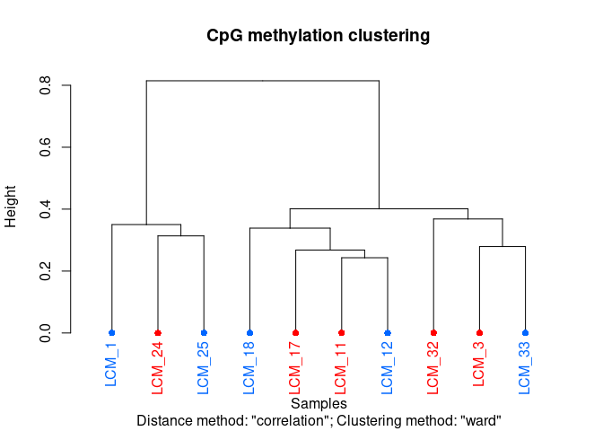
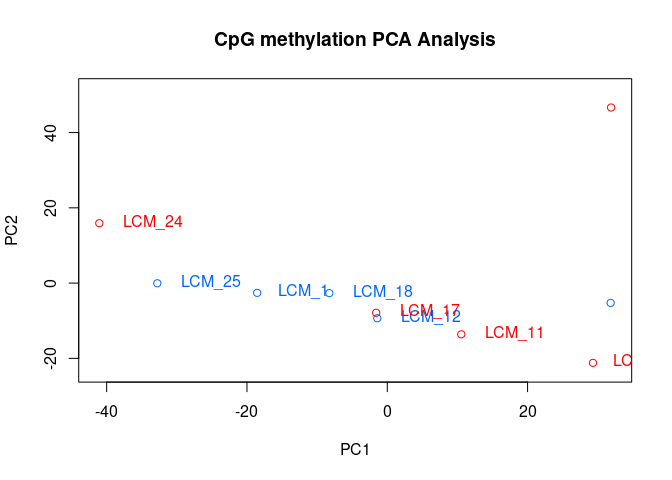
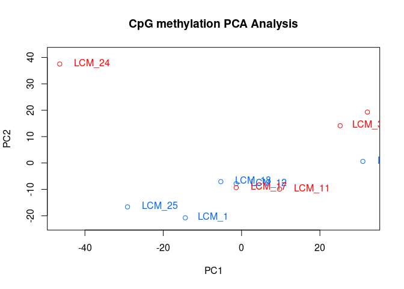
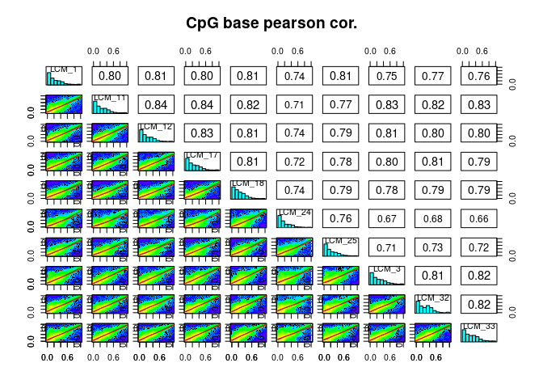
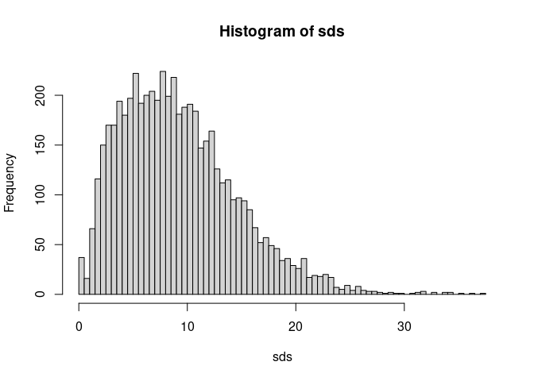
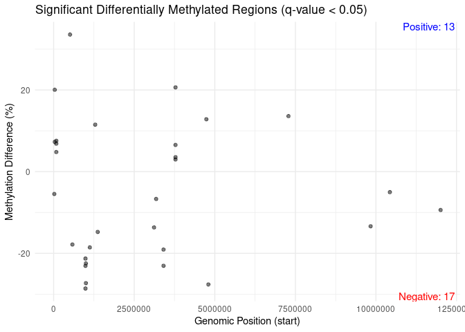
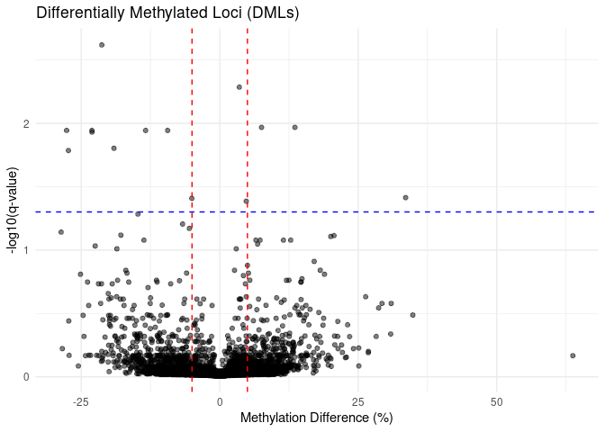
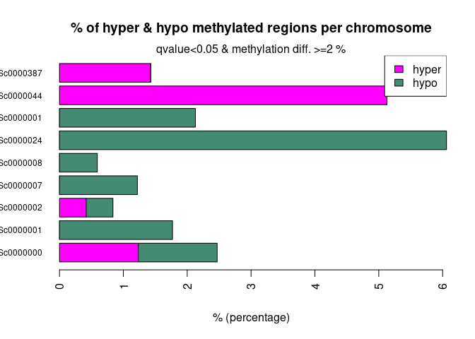

09-MethylKit
================
Zoe Dellaert
2025-02-09

- [0.1 MethylKit](#01-methylkit)
- [0.2 Managing Packages Using Renv](#02-managing-packages-using-renv)
- [0.3 Load packages](#03-load-packages)
  - [0.3.1 other possible filtering](#031-other-possible-filtering)
  - [0.3.2 Identify DML](#032-identify-dml)
- [0.4 Further look at genome wide
  methylation](#04-further-look-at-genome-wide-methylation)
  - [0.4.1 Annotation](#041-annotation)
- [0.5 Are any DMGs DMLs?](#05-are-any-dmgs-dmls)

## 0.1 MethylKit

I am identifying differentially methylated loci using methylkit based on
[Yaamini Venkataraman’s code](https://osf.io/u46xj)

## 0.2 Managing Packages Using Renv

To run this code in my project using the renv environment, run the
following lines of code

``` r
install.packages("renv") #install the package on the new computer (may not be necessary if renv bootstraps itself as expected)
renv::restore() #reinstall all the package versions in the renv lockfile
```

## 0.3 Load packages

``` r
require("methylKit")
```

    ## Loading required package: methylKit

    ## Loading required package: GenomicRanges

    ## Loading required package: stats4

    ## Loading required package: BiocGenerics

    ## 
    ## Attaching package: 'BiocGenerics'

    ## The following objects are masked from 'package:stats':
    ## 
    ##     IQR, mad, sd, var, xtabs

    ## The following objects are masked from 'package:base':
    ## 
    ##     anyDuplicated, aperm, append, as.data.frame, basename, cbind,
    ##     colnames, dirname, do.call, duplicated, eval, evalq, Filter, Find,
    ##     get, grep, grepl, intersect, is.unsorted, lapply, Map, mapply,
    ##     match, mget, order, paste, pmax, pmax.int, pmin, pmin.int,
    ##     Position, rank, rbind, Reduce, rownames, sapply, saveRDS, setdiff,
    ##     table, tapply, union, unique, unsplit, which.max, which.min

    ## Loading required package: S4Vectors

    ## 
    ## Attaching package: 'S4Vectors'

    ## The following object is masked from 'package:utils':
    ## 
    ##     findMatches

    ## The following objects are masked from 'package:base':
    ## 
    ##     expand.grid, I, unname

    ## Loading required package: IRanges

    ## Loading required package: GenomeInfoDb

``` r
require("tidyverse")
```

    ## Loading required package: tidyverse

    ## ── Attaching core tidyverse packages ──────────────────────── tidyverse 2.0.0 ──
    ## ✔ dplyr     1.1.4     ✔ readr     2.1.5
    ## ✔ forcats   1.0.0     ✔ stringr   1.5.1
    ## ✔ ggplot2   3.5.1     ✔ tibble    3.2.1
    ## ✔ lubridate 1.9.4     ✔ tidyr     1.3.1
    ## ✔ purrr     1.0.4     
    ## ── Conflicts ────────────────────────────────────────── tidyverse_conflicts() ──
    ## ✖ lubridate::%within%() masks IRanges::%within%()
    ## ✖ dplyr::collapse()     masks IRanges::collapse()
    ## ✖ dplyr::combine()      masks BiocGenerics::combine()
    ## ✖ dplyr::desc()         masks IRanges::desc()
    ## ✖ tidyr::expand()       masks S4Vectors::expand()
    ## ✖ dplyr::filter()       masks stats::filter()
    ## ✖ dplyr::first()        masks S4Vectors::first()
    ## ✖ dplyr::lag()          masks stats::lag()
    ## ✖ ggplot2::Position()   masks BiocGenerics::Position(), base::Position()
    ## ✖ purrr::reduce()       masks GenomicRanges::reduce(), IRanges::reduce()
    ## ✖ dplyr::rename()       masks S4Vectors::rename()
    ## ✖ lubridate::second()   masks S4Vectors::second()
    ## ✖ lubridate::second<-() masks S4Vectors::second<-()
    ## ✖ dplyr::select()       masks methylKit::select()
    ## ✖ dplyr::slice()        masks IRanges::slice()
    ## ✖ tidyr::unite()        masks methylKit::unite()
    ## ℹ Use the conflicted package (<http://conflicted.r-lib.org/>) to force all conflicts to become errors

``` r
require("vegan")
```

    ## Loading required package: vegan
    ## Loading required package: permute
    ## Loading required package: lattice

``` r
require("gplots")
```

    ## Loading required package: gplots
    ## 
    ## Attaching package: 'gplots'
    ## 
    ## The following object is masked from 'package:IRanges':
    ## 
    ##     space
    ## 
    ## The following object is masked from 'package:S4Vectors':
    ## 
    ##     space
    ## 
    ## The following object is masked from 'package:stats':
    ## 
    ##     lowess

``` r
require("ggplot2")
require("dichromat")
```

    ## Loading required package: dichromat

``` r
require("readr")
require("genomationData")
```

    ## Loading required package: genomationData

``` r
require("genomation")
```

    ## Loading required package: genomation
    ## Loading required package: grid

    ## Warning: replacing previous import 'Biostrings::pattern' by 'grid::pattern'
    ## when loading 'genomation'

    ## 
    ## Attaching package: 'genomation'
    ## 
    ## The following objects are masked from 'package:methylKit':
    ## 
    ##     getFeatsWithTargetsStats, getFlanks, getMembers,
    ##     getTargetAnnotationStats, plotTargetAnnotation

``` r
sessionInfo() #provides list of loaded packages and version of R.
```

    ## R version 4.4.0 (2024-04-24)
    ## Platform: x86_64-pc-linux-gnu
    ## Running under: Ubuntu 22.04.3 LTS
    ## 
    ## Matrix products: default
    ## BLAS:   /usr/lib/x86_64-linux-gnu/openblas-pthread/libblas.so.3 
    ## LAPACK: /usr/lib/x86_64-linux-gnu/openblas-pthread/libopenblasp-r0.3.20.so;  LAPACK version 3.10.0
    ## 
    ## locale:
    ##  [1] LC_CTYPE=en_US.UTF-8       LC_NUMERIC=C              
    ##  [3] LC_TIME=en_US.UTF-8        LC_COLLATE=en_US.UTF-8    
    ##  [5] LC_MONETARY=en_US.UTF-8    LC_MESSAGES=en_US.UTF-8   
    ##  [7] LC_PAPER=en_US.UTF-8       LC_NAME=C                 
    ##  [9] LC_ADDRESS=C               LC_TELEPHONE=C            
    ## [11] LC_MEASUREMENT=en_US.UTF-8 LC_IDENTIFICATION=C       
    ## 
    ## time zone: Etc/UTC
    ## tzcode source: system (glibc)
    ## 
    ## attached base packages:
    ## [1] grid      stats4    stats     graphics  grDevices datasets  utils    
    ## [8] methods   base     
    ## 
    ## other attached packages:
    ##  [1] genomation_1.38.0     genomationData_1.38.0 dichromat_2.0-0.1    
    ##  [4] gplots_3.2.0          vegan_2.6-10          lattice_0.22-6       
    ##  [7] permute_0.9-7         lubridate_1.9.4       forcats_1.0.0        
    ## [10] stringr_1.5.1         dplyr_1.1.4           purrr_1.0.4          
    ## [13] readr_2.1.5           tidyr_1.3.1           tibble_3.2.1         
    ## [16] ggplot2_3.5.1         tidyverse_2.0.0       methylKit_1.32.0     
    ## [19] GenomicRanges_1.58.0  GenomeInfoDb_1.42.3   IRanges_2.40.1       
    ## [22] S4Vectors_0.44.0      BiocGenerics_0.52.0  
    ## 
    ## loaded via a namespace (and not attached):
    ##  [1] bitops_1.0-9                rlang_1.1.5                
    ##  [3] magrittr_2.0.3              gridBase_0.4-7             
    ##  [5] matrixStats_1.5.0           compiler_4.4.0             
    ##  [7] mgcv_1.9-1                  vctrs_0.6.5                
    ##  [9] reshape2_1.4.4              pkgconfig_2.0.3            
    ## [11] crayon_1.5.3                fastmap_1.2.0              
    ## [13] XVector_0.46.0              caTools_1.18.3             
    ## [15] Rsamtools_2.22.0            rmarkdown_2.29             
    ## [17] tzdb_0.4.0                  UCSC.utils_1.2.0           
    ## [19] xfun_0.50                   zlibbioc_1.52.0            
    ## [21] jsonlite_1.8.9              DelayedArray_0.32.0        
    ## [23] BiocParallel_1.40.0         parallel_4.4.0             
    ## [25] cluster_2.1.8               R6_2.6.0                   
    ## [27] stringi_1.8.4               limma_3.62.2               
    ## [29] rtracklayer_1.66.0          numDeriv_2016.8-1.1        
    ## [31] Rcpp_1.0.14                 SummarizedExperiment_1.36.0
    ## [33] knitr_1.49                  R.utils_2.12.3             
    ## [35] Matrix_1.7-2                splines_4.4.0              
    ## [37] timechange_0.3.0            tidyselect_1.2.1           
    ## [39] seqPattern_1.38.0           qvalue_2.38.0              
    ## [41] rstudioapi_0.17.1           abind_1.4-8                
    ## [43] yaml_2.3.10                 codetools_0.2-20           
    ## [45] curl_6.2.0                  plyr_1.8.9                 
    ## [47] Biobase_2.66.0              withr_3.0.2                
    ## [49] coda_0.19-4.1               evaluate_1.0.3             
    ## [51] mclust_6.1.1                Biostrings_2.74.1          
    ## [53] pillar_1.10.1               BiocManager_1.30.25        
    ## [55] MatrixGenerics_1.18.1       KernSmooth_2.23-26         
    ## [57] renv_1.1.1                  generics_0.1.3             
    ## [59] RCurl_1.98-1.16             emdbook_1.3.13             
    ## [61] hms_1.1.3                   munsell_0.5.1              
    ## [63] scales_1.3.0                gtools_3.9.5               
    ## [65] glue_1.8.0                  tools_4.4.0                
    ## [67] BiocIO_1.16.0               data.table_1.16.4          
    ## [69] BSgenome_1.74.0             GenomicAlignments_1.42.0   
    ## [71] mvtnorm_1.3-3               XML_3.99-0.18              
    ## [73] plotrix_3.8-4               impute_1.80.0              
    ## [75] bbmle_1.0.25.1              bdsmatrix_1.3-7            
    ## [77] colorspace_2.1-1            nlme_3.1-167               
    ## [79] GenomeInfoDbData_1.2.13     restfulr_0.0.15            
    ## [81] cli_3.6.4                   fastseg_1.52.0             
    ## [83] S4Arrays_1.6.0              gtable_0.3.6               
    ## [85] R.methodsS3_1.8.2           digest_0.6.37              
    ## [87] SparseArray_1.6.1           rjson_0.2.23               
    ## [89] htmltools_0.5.8.1           R.oo_1.27.0                
    ## [91] lifecycle_1.0.4             httr_1.4.7                 
    ## [93] statmod_1.5.0               MASS_7.3-64

``` r
meta <- read.csv("../data_WGBS/LCM_WGBS_metadata.csv", sep = ",", header = TRUE) %>%
  mutate(Section_Date = as.character(Section_Date), LCM_Date = as.character(LCM_Date),DNA_Extraction_Date = as.character(DNA_Extraction_Date))

meta <- meta %>% arrange(Sample)
```

``` r
file_list <- list.files("~/zdellaert_uri_edu-shared/methylseq_bwa_fb/methyldackel", pattern = "*methylKit", full.names = TRUE, include.dirs = FALSE)

sample <- gsub(".markdup.sorted_CpG.methylKit", "", basename(file_list) )

sample == meta$Sample #the files and metadata are in the same order
```

    ##  [1] TRUE TRUE TRUE TRUE TRUE TRUE TRUE TRUE TRUE TRUE

``` r
tissue <- meta$Tissue
tissue_binary <- gsub("Aboral", "1", tissue)
tissue_binary <- gsub("OralEpi", "0", tissue_binary)
tissue_binary <- as.numeric(tissue_binary)
fragment <- meta$Fragment

# methylObj=methRead(as.list(file_list),
#            sample.id = as.list(sample),
#            assembly = "Pacuta",
#            treatment = tissue_binary,
#            context = "CpG",
#            mincov = 10
#            )
#    
#  save(methylObj, file = "../output_WGBS/MethylKit-flexbar.RData") 
```

``` r
load("../output_WGBS/MethylKit-flexbar.RData")

getMethylationStats(methylObj[[2]],plot=FALSE,both.strands=FALSE)
```

    ## methylation statistics per base
    ## summary:
    ##    Min. 1st Qu.  Median    Mean 3rd Qu.    Max. 
    ##   0.000   0.000   9.091  21.802  33.333 100.000 
    ## percentiles:
    ##         0%        10%        20%        30%        40%        50%        60% 
    ##   0.000000   0.000000   0.000000   0.000000   4.464286   9.090909  16.666667 
    ##        70%        80%        90%        95%        99%      99.5%      99.9% 
    ##  27.272727  41.295581  69.230769  90.909091 100.000000 100.000000 100.000000 
    ##       100% 
    ## 100.000000

``` r
getMethylationStats(methylObj[[2]],plot=TRUE,both.strands=FALSE)
```

<!-- -->

``` r
getCoverageStats(methylObj[[2]],plot=TRUE,both.strands=FALSE)
```

<!-- -->

``` r
filtered_methylObj=filterByCoverage(methylObj,lo.count=10,lo.perc=NULL,
                                      hi.count=NULL,hi.perc=99.9)

filtered_methylObj_norm <- filtered_methylObj %>% methylKit::normalizeCoverage(.)
```

``` r
meth_filter=methylKit::unite(filtered_methylObj_norm)
```

    ## uniting...

``` r
meth_filter_destrand=methylKit::unite(filtered_methylObj_norm,destrand = TRUE)
```

    ## destranding...
    ## uniting...

``` r
clusterSamples(meth_filter, dist="correlation", method="ward", plot=TRUE)
```

    ## The "ward" method has been renamed to "ward.D"; note new "ward.D2"

<!-- -->

    ## 
    ## Call:
    ## hclust(d = d, method = HCLUST.METHODS[hclust.method])
    ## 
    ## Cluster method   : ward.D 
    ## Distance         : pearson 
    ## Number of objects: 10

``` r
clusterSamples(meth_filter_destrand, dist="correlation", method="ward", plot=TRUE)
```

    ## The "ward" method has been renamed to "ward.D"; note new "ward.D2"

<!-- -->

    ## 
    ## Call:
    ## hclust(d = d, method = HCLUST.METHODS[hclust.method])
    ## 
    ## Cluster method   : ward.D 
    ## Distance         : pearson 
    ## Number of objects: 10

``` r
PCASamples(meth_filter)
```

<!-- -->

``` r
PCASamples(meth_filter_destrand)
```

<!-- -->

``` r
getCorrelation(meth_filter_destrand,plot=TRUE)
```

    ##            LCM_1    LCM_11    LCM_12    LCM_17    LCM_18    LCM_24    LCM_25
    ## LCM_1  1.0000000 0.8032054 0.8097826 0.8011421 0.8079095 0.7424978 0.8097379
    ## LCM_11 0.8032054 1.0000000 0.8371024 0.8370943 0.8246628 0.7065030 0.7717387
    ## LCM_12 0.8097826 0.8371024 1.0000000 0.8315817 0.8114754 0.7359549 0.7916401
    ## LCM_17 0.8011421 0.8370943 0.8315817 1.0000000 0.8132234 0.7246539 0.7795600
    ## LCM_18 0.8079095 0.8246628 0.8114754 0.8132234 1.0000000 0.7407441 0.7936524
    ## LCM_24 0.7424978 0.7065030 0.7359549 0.7246539 0.7407441 1.0000000 0.7604778
    ## LCM_25 0.8097379 0.7717387 0.7916401 0.7795600 0.7936524 0.7604778 1.0000000
    ## LCM_3  0.7524076 0.8319358 0.8108744 0.7975677 0.7788669 0.6718475 0.7111990
    ## LCM_32 0.7668084 0.8211673 0.8007235 0.8072538 0.7899848 0.6766992 0.7333086
    ## LCM_33 0.7619028 0.8320172 0.8042593 0.7943880 0.7921395 0.6605799 0.7222451
    ##            LCM_3    LCM_32    LCM_33
    ## LCM_1  0.7524076 0.7668084 0.7619028
    ## LCM_11 0.8319358 0.8211673 0.8320172
    ## LCM_12 0.8108744 0.8007235 0.8042593
    ## LCM_17 0.7975677 0.8072538 0.7943880
    ## LCM_18 0.7788669 0.7899848 0.7921395
    ## LCM_24 0.6718475 0.6766992 0.6605799
    ## LCM_25 0.7111990 0.7333086 0.7222451
    ## LCM_3  1.0000000 0.8120304 0.8210832
    ## LCM_32 0.8120304 1.0000000 0.8218289
    ## LCM_33 0.8210832 0.8218289 1.0000000

    ## Warning in par(usr): argument 1 does not name a graphical parameter
    ## Warning in par(usr): argument 1 does not name a graphical parameter
    ## Warning in par(usr): argument 1 does not name a graphical parameter
    ## Warning in par(usr): argument 1 does not name a graphical parameter
    ## Warning in par(usr): argument 1 does not name a graphical parameter
    ## Warning in par(usr): argument 1 does not name a graphical parameter
    ## Warning in par(usr): argument 1 does not name a graphical parameter
    ## Warning in par(usr): argument 1 does not name a graphical parameter
    ## Warning in par(usr): argument 1 does not name a graphical parameter
    ## Warning in par(usr): argument 1 does not name a graphical parameter
    ## Warning in par(usr): argument 1 does not name a graphical parameter
    ## Warning in par(usr): argument 1 does not name a graphical parameter
    ## Warning in par(usr): argument 1 does not name a graphical parameter
    ## Warning in par(usr): argument 1 does not name a graphical parameter
    ## Warning in par(usr): argument 1 does not name a graphical parameter
    ## Warning in par(usr): argument 1 does not name a graphical parameter
    ## Warning in par(usr): argument 1 does not name a graphical parameter
    ## Warning in par(usr): argument 1 does not name a graphical parameter
    ## Warning in par(usr): argument 1 does not name a graphical parameter
    ## Warning in par(usr): argument 1 does not name a graphical parameter
    ## Warning in par(usr): argument 1 does not name a graphical parameter
    ## Warning in par(usr): argument 1 does not name a graphical parameter
    ## Warning in par(usr): argument 1 does not name a graphical parameter
    ## Warning in par(usr): argument 1 does not name a graphical parameter
    ## Warning in par(usr): argument 1 does not name a graphical parameter
    ## Warning in par(usr): argument 1 does not name a graphical parameter
    ## Warning in par(usr): argument 1 does not name a graphical parameter
    ## Warning in par(usr): argument 1 does not name a graphical parameter
    ## Warning in par(usr): argument 1 does not name a graphical parameter
    ## Warning in par(usr): argument 1 does not name a graphical parameter
    ## Warning in par(usr): argument 1 does not name a graphical parameter
    ## Warning in par(usr): argument 1 does not name a graphical parameter
    ## Warning in par(usr): argument 1 does not name a graphical parameter
    ## Warning in par(usr): argument 1 does not name a graphical parameter
    ## Warning in par(usr): argument 1 does not name a graphical parameter
    ## Warning in par(usr): argument 1 does not name a graphical parameter
    ## Warning in par(usr): argument 1 does not name a graphical parameter
    ## Warning in par(usr): argument 1 does not name a graphical parameter
    ## Warning in par(usr): argument 1 does not name a graphical parameter
    ## Warning in par(usr): argument 1 does not name a graphical parameter
    ## Warning in par(usr): argument 1 does not name a graphical parameter
    ## Warning in par(usr): argument 1 does not name a graphical parameter
    ## Warning in par(usr): argument 1 does not name a graphical parameter
    ## Warning in par(usr): argument 1 does not name a graphical parameter
    ## Warning in par(usr): argument 1 does not name a graphical parameter
    ## Warning in par(usr): argument 1 does not name a graphical parameter
    ## Warning in par(usr): argument 1 does not name a graphical parameter
    ## Warning in par(usr): argument 1 does not name a graphical parameter
    ## Warning in par(usr): argument 1 does not name a graphical parameter
    ## Warning in par(usr): argument 1 does not name a graphical parameter
    ## Warning in par(usr): argument 1 does not name a graphical parameter
    ## Warning in par(usr): argument 1 does not name a graphical parameter
    ## Warning in par(usr): argument 1 does not name a graphical parameter
    ## Warning in par(usr): argument 1 does not name a graphical parameter
    ## Warning in par(usr): argument 1 does not name a graphical parameter

<!-- --> \###
batch effects

``` r
as=assocComp(mBase=meth_filter_destrand,select(meta,c("PCR_ReAmp_Cycles", "Fragment")))
as
```

    ## $pcs
    ##               PC1         PC2         PC3         PC4          PC5         PC6
    ## LCM_1  -0.3173743  0.21172631  0.41006638  0.01497861  0.039204458 -0.35933724
    ## LCM_11 -0.3260576 -0.18524350  0.04630625 -0.14726486  0.187545527  0.07006145
    ## LCM_12 -0.3246517 -0.01976781  0.04503151 -0.47599858 -0.027660228 -0.09054695
    ## LCM_17 -0.3228120 -0.04419213  0.08640674 -0.40104858 -0.212269771  0.61924248
    ## LCM_18 -0.3213522  0.07039895  0.14472485  0.38953860  0.606488323  0.44957810
    ## LCM_24 -0.2912581  0.63081302 -0.70125570  0.05954023 -0.005335128 -0.01456564
    ## LCM_25 -0.3099014  0.41223996  0.43462340  0.07867743 -0.254331250 -0.21977863
    ## LCM_3  -0.3149494 -0.35604791 -0.30958520 -0.30753049  0.152866072 -0.33536621
    ## LCM_32 -0.3166029 -0.29436384 -0.11592452  0.45105101 -0.660429868  0.15165848
    ## LCM_33 -0.3158889 -0.36368951 -0.09655826  0.36218308  0.159341023 -0.29698835
    ##                PC7         PC8         PC9        PC10
    ## LCM_1  -0.73834262  0.05634183 -0.06339976  0.05534198
    ## LCM_11  0.03661568 -0.04504451 -0.22166554 -0.86194710
    ## LCM_12  0.10927899 -0.23454950  0.76772627  0.01688822
    ## LCM_17 -0.10628954 -0.20648626 -0.38082557  0.31313181
    ## LCM_18  0.06989186  0.25731215  0.23931811  0.14413534
    ## LCM_24 -0.08321861 -0.09356435 -0.04615275 -0.06235991
    ## LCM_25  0.61476681  0.10834532 -0.18738464  0.03398127
    ## LCM_3   0.10659986  0.57442710 -0.19435508  0.26206166
    ## LCM_32 -0.12231482  0.23795508  0.23158828 -0.10882319
    ## LCM_33  0.11915206 -0.65104139 -0.16275702  0.22205954
    ## 
    ## $vars
    ##  [1] 80.284475  4.717204  2.578369  2.003322  1.904504  1.896842  1.840880
    ##  [8]  1.701551  1.601833  1.471019
    ## 
    ## $association
    ##                         PC1       PC2       PC3       PC4       PC5        PC6
    ## PCR_ReAmp_Cycles 0.46027154 0.2221326 0.9419768 0.1309235 0.8579357 0.06506379
    ## Fragment         0.08148463 0.1760042 0.7824451 0.2536518 0.7824451 0.13116138
    ##                        PC7       PC8       PC9      PC10
    ## PCR_ReAmp_Cycles 0.9407154 0.5137813 0.9076576 0.3003766
    ## Fragment         0.8410289 0.6430087 0.9689278 0.2536518

### 0.3.1 other possible filtering

``` r
# get percent methylation matrix
pm=percMethylation(meth_filter_destrand)

# calculate standard deviation of CpGs
sds=matrixStats::rowSds(pm)

# Visualize the distribution of the per-CpG standard deviation
# to determine a suitable cutoff
hist(sds, breaks = 100)
```

<!-- -->

``` r
# keep only CpG with standard deviations larger than 2%
meth <- meth_filter_destrand[sds > 2]

# This leaves us with this number of CpG sites
nrow(meth_filter_destrand)
```

    ## [1] 5471

``` r
nrow(meth)
```

    ## [1] 5236

### 0.3.2 Identify DML

``` r
DMLStats_Tissue <- methylKit::calculateDiffMeth(meth_filter_destrand, overdispersion = "MN", test = "Chisq", mc.cores = 8) #Calculate differential methylation statistics and include covariate information.
```

    ## two groups detected:
    ##  will calculate methylation difference as the difference of
    ## treatment (group: 1) - control (group: 0)

``` r
head(DMLStats_Tissue) #Look at differential methylation output
```

    ##                                  chr  start    end strand       pvalue
    ## 1 Pocillopora_acuta_HIv2___Sc0000000  48656  48656      + 3.515255e-01
    ## 2 Pocillopora_acuta_HIv2___Sc0000000 508417 508417      + 8.682383e-05
    ## 3 Pocillopora_acuta_HIv2___Sc0000000 508643 508643      + 6.873065e-01
    ## 4 Pocillopora_acuta_HIv2___Sc0000000 509163 509163      + 7.509875e-01
    ## 5 Pocillopora_acuta_HIv2___Sc0000000 844614 844614      + 9.425873e-01
    ## 6 Pocillopora_acuta_HIv2___Sc0000000 844624 844624      + 9.231047e-01
    ##       qvalue  meth.diff
    ## 1 0.93580367  5.3030303
    ## 2 0.03857872 33.5603632
    ## 3 0.95917895  2.4311372
    ## 4 0.96047301  2.0869304
    ## 5 0.97459331 -0.6691618
    ## 6 0.97459331  0.7140995

``` r
# Filter DMRs with q-value < 0.05
significant_dmg <- getData(DMLStats_Tissue[DMLStats_Tissue$qvalue < 0.1, ])

# Create a data frame for plotting
plot_data <- data.frame(
  chr = significant_dmg$chr,
  start = significant_dmg$start,
  meth.diff = significant_dmg$meth.diff
)

# Count the number of positive and negative methylation differences
positive_count <- sum(significant_dmg$meth.diff > 0)
negative_count <- sum(significant_dmg$meth.diff < 0)

# Plot with counts added to the quadrants
ggplot(plot_data, aes(x = start, y = meth.diff)) +
  geom_point(alpha = 0.5) +  # Set alpha to reduce point transparency
  theme_minimal() +
  labs(title = "Significant Differentially Methylated Regions (q-value < 0.05)",
       x = "Genomic Position (start)",
       y = "Methylation Difference (%)") +
  theme(legend.position = "none") +  # Remove the legend
  # Add the count of positive and negative methylation differences as text annotations
  annotate("text", x = Inf, y = Inf, label = paste("Positive:", positive_count), 
           hjust = 1.1, vjust = 1.1, size = 4, color = "blue") +
  annotate("text", x = Inf, y = -Inf, label = paste("Negative:", negative_count), 
           hjust = 1.1, vjust = -0.1, size = 4, color = "red")
```

<!-- -->

``` r
dml_df <- as.data.frame(DMLStats_Tissue)

# Volcano plot
ggplot(dml_df, aes(x = meth.diff, y = -log10(qvalue))) +
  geom_point(alpha = 0.5) +
  geom_vline(xintercept = c(-5, 5), linetype = "dashed", color = "red") +
  geom_hline(yintercept = -log10(0.05), linetype = "dashed", color = "blue") +
  labs(title = "Differentially Methylated Loci (DMLs)",
       x = "Methylation Difference (%)",
       y = "-log10(q-value)") +
  theme_minimal()
```

<!-- -->

``` r
DMLs <- methylKit::getMethylDiff(DMLStats_Tissue, difference = 2, qvalue = 0.05) #Identify DML based on difference threshold

length(DMLs$chr) #DML
```

    ## [1] 14

``` r
head(DMLs)
```

    ##                                    chr    start      end strand       pvalue
    ## 2   Pocillopora_acuta_HIv2___Sc0000000   508417   508417      + 8.682383e-05
    ## 40  Pocillopora_acuta_HIv2___Sc0000000 12006739 12006739      + 1.706933e-05
    ## 139 Pocillopora_acuta_HIv2___Sc0000001  3408829  3408829      + 2.951899e-05
    ## 142 Pocillopora_acuta_HIv2___Sc0000001  3408857  3408857      + 1.978081e-05
    ## 293 Pocillopora_acuta_HIv2___Sc0000002  7285683  7285683      + 8.070036e-06
    ## 381 Pocillopora_acuta_HIv2___Sc0000002 10432150 10432150      + 9.524740e-05
    ##         qvalue  meth.diff
    ## 2   0.03857872  33.560363
    ## 40  0.01137671  -9.398723
    ## 139 0.01573953 -19.089674
    ## 142 0.01171903 -23.054576
    ## 293 0.01075736  13.585812
    ## 381 0.03906609  -5.034635

## 0.4 Further look at genome wide methylation

``` r
diffMethPerChr(DMLStats_Tissue, meth.cutoff = 2, qvalue.cutoff = 0.05,cex.names=.75)
```

    ## Warning in eval(quote(list(...)), env): NAs introduced by coercion

<!-- -->

### 0.4.1 Annotation

``` r
require("genomationData")
require("genomation")

gff.file = "../references/Pocillopora_acuta_HIv2.gtf"
gff = gffToGRanges(gff.file)
head(gff)
```

    ## GRanges object with 6 ranges and 6 metadata columns:
    ##                     seqnames    ranges strand |   source       type     score
    ##                        <Rle> <IRanges>  <Rle> | <factor>   <factor> <numeric>
    ##   [1] Pocillopora_acuta_HI..  151-2746      + | AUGUSTUS transcript        NA
    ##   [2] Pocillopora_acuta_HI..   151-172      + | AUGUSTUS exon              NA
    ##   [3] Pocillopora_acuta_HI..   264-304      + | AUGUSTUS exon              NA
    ##   [4] Pocillopora_acuta_HI.. 1491-1602      + | AUGUSTUS exon              NA
    ##   [5] Pocillopora_acuta_HI.. 1889-1990      + | AUGUSTUS exon              NA
    ##   [6] Pocillopora_acuta_HI.. 2107-2127      + | AUGUSTUS exon              NA
    ##           phase          transcript_id                gene_id
    ##       <integer>            <character>            <character>
    ##   [1]      <NA> Pocillopora_acuta_HI.. Pocillopora_acuta_HI..
    ##   [2]      <NA> Pocillopora_acuta_HI.. Pocillopora_acuta_HI..
    ##   [3]      <NA> Pocillopora_acuta_HI.. Pocillopora_acuta_HI..
    ##   [4]      <NA> Pocillopora_acuta_HI.. Pocillopora_acuta_HI..
    ##   [5]      <NA> Pocillopora_acuta_HI.. Pocillopora_acuta_HI..
    ##   [6]      <NA> Pocillopora_acuta_HI.. Pocillopora_acuta_HI..
    ##   -------
    ##   seqinfo: 425 sequences from an unspecified genome; no seqlengths

``` r
exons = gffToGRanges(gff.file, filter = "exon")

transcripts = gffToGRanges(gff.file, filter = "transcript")
```

``` r
DML_grange = as(DMLs,"GRanges")
head(DML_grange)
```

    ## GRanges object with 6 ranges and 3 metadata columns:
    ##                     seqnames    ranges strand |      pvalue    qvalue meth.diff
    ##                        <Rle> <IRanges>  <Rle> |   <numeric> <numeric> <numeric>
    ##   [1] Pocillopora_acuta_HI..    508417      + | 8.68238e-05 0.0385787  33.56036
    ##   [2] Pocillopora_acuta_HI..  12006739      + | 1.70693e-05 0.0113767  -9.39872
    ##   [3] Pocillopora_acuta_HI..   3408829      + | 2.95190e-05 0.0157395 -19.08967
    ##   [4] Pocillopora_acuta_HI..   3408857      + | 1.97808e-05 0.0117190 -23.05458
    ##   [5] Pocillopora_acuta_HI..   7285683      + | 8.07004e-06 0.0107574  13.58581
    ##   [6] Pocillopora_acuta_HI..  10432150      + | 9.52474e-05 0.0390661  -5.03464
    ##   -------
    ##   seqinfo: 9 sequences from an unspecified genome; no seqlengths

``` r
transcripts = gffToGRanges(gff.file, filter = "transcript")

# Find overlaps between DMLs and transcripts
overlaps_transcripts <- findOverlaps(DML_grange, transcripts,ignore.strand = TRUE)

# Extract matching transcript information
DML_transcript_annot <- data.frame(
  DML_chr = seqnames(DML_grange)[queryHits(overlaps_transcripts)],
  DML_start = start(DML_grange)[queryHits(overlaps_transcripts)],
  DML_end = end(DML_grange)[queryHits(overlaps_transcripts)],
  DML_qvalue = (DML_grange$qvalue)[queryHits(overlaps_transcripts)],
  DML_methdiff = (DML_grange$meth.diff)[queryHits(overlaps_transcripts)],
  transcript_chr = seqnames(transcripts)[subjectHits(overlaps_transcripts)],
  transcript_start = start(transcripts)[subjectHits(overlaps_transcripts)],
  transcript_end = end(transcripts)[subjectHits(overlaps_transcripts)],
  transcript_id = transcripts$transcript_id[subjectHits(overlaps_transcripts)],
  gene_id = transcripts$gene_id[subjectHits(overlaps_transcripts)]
)

# View first few rows
head(DML_transcript_annot)
```

    ##                              DML_chr DML_start  DML_end DML_qvalue DML_methdiff
    ## 1 Pocillopora_acuta_HIv2___Sc0000000  12006739 12006739 0.01137671    -9.398723
    ## 2 Pocillopora_acuta_HIv2___Sc0000001   3408829  3408829 0.01573953   -19.089674
    ## 3 Pocillopora_acuta_HIv2___Sc0000001   3408857  3408857 0.01171903   -23.054576
    ## 4 Pocillopora_acuta_HIv2___Sc0000002   7285683  7285683 0.01075736    13.585812
    ## 5 Pocillopora_acuta_HIv2___Sc0000002  10432150 10432150 0.03906609    -5.034635
    ## 6 Pocillopora_acuta_HIv2___Sc0000007   4800467  4800467 0.01137671   -27.631579
    ##                       transcript_chr transcript_start transcript_end
    ## 1 Pocillopora_acuta_HIv2___Sc0000000         11997463       12010370
    ## 2 Pocillopora_acuta_HIv2___Sc0000001          3407978        3412324
    ## 3 Pocillopora_acuta_HIv2___Sc0000001          3407978        3412324
    ## 4 Pocillopora_acuta_HIv2___Sc0000002          7282828        7288983
    ## 5 Pocillopora_acuta_HIv2___Sc0000002         10424300       10432843
    ## 6 Pocillopora_acuta_HIv2___Sc0000007          4793420        4810018
    ##                               transcript_id
    ## 1     Pocillopora_acuta_HIv2___TS.g11189.t1
    ## 2 Pocillopora_acuta_HIv2___RNAseq.g10458.t1
    ## 3 Pocillopora_acuta_HIv2___RNAseq.g10458.t1
    ## 4 Pocillopora_acuta_HIv2___RNAseq.g25317.t1
    ## 5     Pocillopora_acuta_HIv2___TS.g21936.t1
    ## 6 Pocillopora_acuta_HIv2___RNAseq.g17735.t1
    ##                                     gene_id
    ## 1     Pocillopora_acuta_HIv2___TS.g11189.t1
    ## 2 Pocillopora_acuta_HIv2___RNAseq.g10458.t1
    ## 3 Pocillopora_acuta_HIv2___RNAseq.g10458.t1
    ## 4 Pocillopora_acuta_HIv2___RNAseq.g25317.t1
    ## 5     Pocillopora_acuta_HIv2___TS.g21936.t1
    ## 6 Pocillopora_acuta_HIv2___RNAseq.g17735.t1

## 0.5 Are any DMGs DMLs?

``` r
#load in DESeq results
DESeq <- read.csv("../output_RNA/differential_expression/DESeq_results.csv", header = TRUE) %>% dplyr::rename("query" ="X")

#make dataframes of just differentially expressed genes for each LFC direction
DE_05_Aboral <- DESeq %>% filter(padj < 0.05 & log2FoldChange > 0)
DE_05_OralEpi <- DESeq %>% filter(padj < 0.05& log2FoldChange < 0)
DE_05 <- DESeq %>% filter(padj < 0.05)

DML_transcript_annot[DML_transcript_annot$transcript_id %in% DE_05$query,]
```

    ##                              DML_chr DML_start  DML_end DML_qvalue DML_methdiff
    ## 1 Pocillopora_acuta_HIv2___Sc0000000  12006739 12006739 0.01137671    -9.398723
    ## 4 Pocillopora_acuta_HIv2___Sc0000002   7285683  7285683 0.01075736    13.585812
    ##                       transcript_chr transcript_start transcript_end
    ## 1 Pocillopora_acuta_HIv2___Sc0000000         11997463       12010370
    ## 4 Pocillopora_acuta_HIv2___Sc0000002          7282828        7288983
    ##                               transcript_id
    ## 1     Pocillopora_acuta_HIv2___TS.g11189.t1
    ## 4 Pocillopora_acuta_HIv2___RNAseq.g25317.t1
    ##                                     gene_id
    ## 1     Pocillopora_acuta_HIv2___TS.g11189.t1
    ## 4 Pocillopora_acuta_HIv2___RNAseq.g25317.t1

``` r
DE_05[DE_05$query %in% DML_transcript_annot$transcript_id,]
```

    ##                                         query baseMean log2FoldChange    lfcSE
    ## 52  Pocillopora_acuta_HIv2___RNAseq.g25317.t1 2252.955    -10.9676174 2.314492
    ## 189     Pocillopora_acuta_HIv2___TS.g11189.t1 1096.332     -0.5749994 1.261979
    ##           pvalue         padj
    ## 52  7.981667e-15 2.188813e-12
    ## 189 2.459734e-11 1.882412e-09
