09-MethylKit
================
Zoe Dellaert
2025-02-09

- [0.1 MethylKit](#01-methylkit)
- [0.2 Managing Packages Using Renv](#02-managing-packages-using-renv)
- [0.3 Load packages](#03-load-packages)
  - [0.3.1 batch effects](#031-batch-effects)
  - [0.3.2 other possible filtering](#032-other-possible-filtering)
  - [0.3.3 Identify DML](#033-identify-dml)
- [0.4 Further look at genome wide
  methylation](#04-further-look-at-genome-wide-methylation)
  - [0.4.1 Annotation](#041-annotation)
- [0.5 Are any DMGs DMLs?](#05-are-any-dmgs-dmls)
  - [0.5.1 Read counts](#051-read-counts)
- [0.6 Can i get methylation in FPKM format instead of %
  methylation?](#06-can-i-get-methylation-in-fpkm-format-instead-of--methylation)
- [0.7 Appendix: Methylation percent count
  matrix](#07-appendix-methylation-percent-count-matrix)
- [0.8 Appendix: Joining percent methylation data to
  annotations:](#08-appendix-joining-percent-methylation-data-to-annotations)

## 0.1 MethylKit

I am identifying differentially methylated loci using methylkit based on
[Yaamini Venkataraman’s code](https://osf.io/u46xj)

## 0.2 Managing Packages Using Renv

To run this code in my project using the renv environment, run the
following lines of code

``` r
install.packages("renv") #install the package on the new computer (may not be necessary if renv bootstraps itself as expected)
renv::restore() #reinstall all the package versions in the renv lockfile
```

## 0.3 Load packages

``` r
require("methylKit")
```

    ## Loading required package: methylKit

    ## Loading required package: GenomicRanges

    ## Loading required package: stats4

    ## Loading required package: BiocGenerics

    ## 
    ## Attaching package: 'BiocGenerics'

    ## The following objects are masked from 'package:stats':
    ## 
    ##     IQR, mad, sd, var, xtabs

    ## The following objects are masked from 'package:base':
    ## 
    ##     anyDuplicated, aperm, append, as.data.frame, basename, cbind,
    ##     colnames, dirname, do.call, duplicated, eval, evalq, Filter, Find,
    ##     get, grep, grepl, intersect, is.unsorted, lapply, Map, mapply,
    ##     match, mget, order, paste, pmax, pmax.int, pmin, pmin.int,
    ##     Position, rank, rbind, Reduce, rownames, sapply, saveRDS, setdiff,
    ##     table, tapply, union, unique, unsplit, which.max, which.min

    ## Loading required package: S4Vectors

    ## 
    ## Attaching package: 'S4Vectors'

    ## The following object is masked from 'package:utils':
    ## 
    ##     findMatches

    ## The following objects are masked from 'package:base':
    ## 
    ##     expand.grid, I, unname

    ## Loading required package: IRanges

    ## Loading required package: GenomeInfoDb

``` r
require("tidyverse")
```

    ## Loading required package: tidyverse

    ## ── Attaching core tidyverse packages ──────────────────────── tidyverse 2.0.0 ──
    ## ✔ dplyr     1.1.4     ✔ readr     2.1.5
    ## ✔ forcats   1.0.0     ✔ stringr   1.5.1
    ## ✔ ggplot2   3.5.1     ✔ tibble    3.2.1
    ## ✔ lubridate 1.9.4     ✔ tidyr     1.3.1
    ## ✔ purrr     1.0.4     
    ## ── Conflicts ────────────────────────────────────────── tidyverse_conflicts() ──
    ## ✖ lubridate::%within%() masks IRanges::%within%()
    ## ✖ dplyr::collapse()     masks IRanges::collapse()
    ## ✖ dplyr::combine()      masks BiocGenerics::combine()
    ## ✖ dplyr::desc()         masks IRanges::desc()
    ## ✖ tidyr::expand()       masks S4Vectors::expand()
    ## ✖ dplyr::filter()       masks stats::filter()
    ## ✖ dplyr::first()        masks S4Vectors::first()
    ## ✖ dplyr::lag()          masks stats::lag()
    ## ✖ ggplot2::Position()   masks BiocGenerics::Position(), base::Position()
    ## ✖ purrr::reduce()       masks GenomicRanges::reduce(), IRanges::reduce()
    ## ✖ dplyr::rename()       masks S4Vectors::rename()
    ## ✖ lubridate::second()   masks S4Vectors::second()
    ## ✖ lubridate::second<-() masks S4Vectors::second<-()
    ## ✖ dplyr::select()       masks methylKit::select()
    ## ✖ dplyr::slice()        masks IRanges::slice()
    ## ✖ tidyr::unite()        masks methylKit::unite()
    ## ℹ Use the conflicted package (<http://conflicted.r-lib.org/>) to force all conflicts to become errors

``` r
require("vegan")
```

    ## Loading required package: vegan
    ## Loading required package: permute
    ## Loading required package: lattice

``` r
require("gplots")
```

    ## Loading required package: gplots
    ## 
    ## Attaching package: 'gplots'
    ## 
    ## The following object is masked from 'package:IRanges':
    ## 
    ##     space
    ## 
    ## The following object is masked from 'package:S4Vectors':
    ## 
    ##     space
    ## 
    ## The following object is masked from 'package:stats':
    ## 
    ##     lowess

``` r
require("ggplot2")
require("ggrepel")
```

    ## Loading required package: ggrepel

``` r
require("ggpmisc")
```

    ## Loading required package: ggpmisc
    ## Loading required package: ggpp
    ## Registered S3 methods overwritten by 'ggpp':
    ##   method                  from   
    ##   heightDetails.titleGrob ggplot2
    ##   widthDetails.titleGrob  ggplot2
    ## 
    ## Attaching package: 'ggpp'
    ## 
    ## The following object is masked from 'package:ggplot2':
    ## 
    ##     annotate

``` r
require("dichromat")
```

    ## Loading required package: dichromat

``` r
require("readr")
require("genomationData")
```

    ## Loading required package: genomationData

``` r
require("genomation")
```

    ## Loading required package: genomation
    ## Loading required package: grid

    ## Warning: replacing previous import 'Biostrings::pattern' by 'grid::pattern'
    ## when loading 'genomation'

    ## 
    ## Attaching package: 'genomation'
    ## 
    ## The following objects are masked from 'package:methylKit':
    ## 
    ##     getFeatsWithTargetsStats, getFlanks, getMembers,
    ##     getTargetAnnotationStats, plotTargetAnnotation

``` r
sessionInfo() #provides list of loaded packages and version of R.
```

    ## R version 4.4.0 (2024-04-24)
    ## Platform: x86_64-pc-linux-gnu
    ## Running under: Ubuntu 22.04.3 LTS
    ## 
    ## Matrix products: default
    ## BLAS:   /usr/lib/x86_64-linux-gnu/openblas-pthread/libblas.so.3 
    ## LAPACK: /usr/lib/x86_64-linux-gnu/openblas-pthread/libopenblasp-r0.3.20.so;  LAPACK version 3.10.0
    ## 
    ## locale:
    ##  [1] LC_CTYPE=en_US.UTF-8       LC_NUMERIC=C              
    ##  [3] LC_TIME=en_US.UTF-8        LC_COLLATE=en_US.UTF-8    
    ##  [5] LC_MONETARY=en_US.UTF-8    LC_MESSAGES=en_US.UTF-8   
    ##  [7] LC_PAPER=en_US.UTF-8       LC_NAME=C                 
    ##  [9] LC_ADDRESS=C               LC_TELEPHONE=C            
    ## [11] LC_MEASUREMENT=en_US.UTF-8 LC_IDENTIFICATION=C       
    ## 
    ## time zone: Etc/UTC
    ## tzcode source: system (glibc)
    ## 
    ## attached base packages:
    ## [1] grid      stats4    stats     graphics  grDevices datasets  utils    
    ## [8] methods   base     
    ## 
    ## other attached packages:
    ##  [1] genomation_1.38.0     genomationData_1.38.0 dichromat_2.0-0.1    
    ##  [4] ggpmisc_0.6.1         ggpp_0.5.8-1          ggrepel_0.9.6        
    ##  [7] gplots_3.2.0          vegan_2.6-10          lattice_0.22-6       
    ## [10] permute_0.9-7         lubridate_1.9.4       forcats_1.0.0        
    ## [13] stringr_1.5.1         dplyr_1.1.4           purrr_1.0.4          
    ## [16] readr_2.1.5           tidyr_1.3.1           tibble_3.2.1         
    ## [19] ggplot2_3.5.1         tidyverse_2.0.0       methylKit_1.32.0     
    ## [22] GenomicRanges_1.58.0  GenomeInfoDb_1.42.3   IRanges_2.40.1       
    ## [25] S4Vectors_0.44.0      BiocGenerics_0.52.0  
    ## 
    ## loaded via a namespace (and not attached):
    ##  [1] rstudioapi_0.17.1           jsonlite_1.8.9             
    ##  [3] magrittr_2.0.3              rmarkdown_2.29             
    ##  [5] BiocIO_1.16.0               zlibbioc_1.52.0            
    ##  [7] vctrs_0.6.5                 Rsamtools_2.22.0           
    ##  [9] RCurl_1.98-1.16             htmltools_0.5.8.1          
    ## [11] S4Arrays_1.6.0              polynom_1.4-1              
    ## [13] plotrix_3.8-4               curl_6.2.0                 
    ## [15] SparseArray_1.6.1           KernSmooth_2.23-26         
    ## [17] plyr_1.8.9                  impute_1.80.0              
    ## [19] GenomicAlignments_1.42.0    lifecycle_1.0.4            
    ## [21] pkgconfig_2.0.3             Matrix_1.7-2               
    ## [23] R6_2.6.0                    fastmap_1.2.0              
    ## [25] GenomeInfoDbData_1.2.13     MatrixGenerics_1.18.1      
    ## [27] digest_0.6.37               numDeriv_2016.8-1.1        
    ## [29] colorspace_2.1-1            timechange_0.3.0           
    ## [31] httr_1.4.7                  abind_1.4-8                
    ## [33] mgcv_1.9-1                  compiler_4.4.0             
    ## [35] withr_3.0.2                 BiocParallel_1.40.0        
    ## [37] R.utils_2.12.3              MASS_7.3-64                
    ## [39] quantreg_6.00               DelayedArray_0.32.0        
    ## [41] rjson_0.2.23                gtools_3.9.5               
    ## [43] caTools_1.18.3              tools_4.4.0                
    ## [45] R.oo_1.27.0                 glue_1.8.0                 
    ## [47] restfulr_0.0.15             nlme_3.1-167               
    ## [49] gridBase_0.4-7              cluster_2.1.8              
    ## [51] reshape2_1.4.4              generics_0.1.3             
    ## [53] gtable_0.3.6                BSgenome_1.74.0            
    ## [55] tzdb_0.4.0                  R.methodsS3_1.8.2          
    ## [57] seqPattern_1.38.0           data.table_1.16.4          
    ## [59] hms_1.1.3                   XVector_0.46.0             
    ## [61] pillar_1.10.1               fastseg_1.52.0             
    ## [63] emdbook_1.3.13              limma_3.62.2               
    ## [65] splines_4.4.0               renv_1.1.1                 
    ## [67] survival_3.8-3              rtracklayer_1.66.0         
    ## [69] SparseM_1.84-2              tidyselect_1.2.1           
    ## [71] Biostrings_2.74.1           knitr_1.49                 
    ## [73] SummarizedExperiment_1.36.0 xfun_0.50                  
    ## [75] Biobase_2.66.0              statmod_1.5.0              
    ## [77] matrixStats_1.5.0           stringi_1.8.4              
    ## [79] UCSC.utils_1.2.0            yaml_2.3.10                
    ## [81] evaluate_1.0.3              codetools_0.2-20           
    ## [83] bbmle_1.0.25.1              qvalue_2.38.0              
    ## [85] BiocManager_1.30.25         cli_3.6.4                  
    ## [87] munsell_0.5.1               Rcpp_1.0.14                
    ## [89] coda_0.19-4.1               bdsmatrix_1.3-7            
    ## [91] XML_3.99-0.18               parallel_4.4.0             
    ## [93] MatrixModels_0.5-3          mclust_6.1.1               
    ## [95] bitops_1.0-9                mvtnorm_1.3-3              
    ## [97] scales_1.3.0                crayon_1.5.3               
    ## [99] rlang_1.1.5

``` r
meta <- read.csv("../data_WGBS/LCM_WGBS_metadata.csv", sep = ",", header = TRUE) %>%
  mutate(Section_Date = as.character(Section_Date), LCM_Date = as.character(LCM_Date),DNA_Extraction_Date = as.character(DNA_Extraction_Date))

meta <- meta %>% arrange(Sample)
```

``` r
file_list <- list.files("../output_WGBS/methylseq_V3_bwa_test/methyldackel", pattern = "*methylKit", full.names = TRUE, include.dirs = FALSE)

sample <- gsub(".markdup.sorted_CpG.methylKit", "", basename(file_list) )

sample == meta$Sample #the files and metadata are in the same order
```

    ##  [1] TRUE TRUE TRUE TRUE TRUE TRUE TRUE TRUE TRUE TRUE

``` r
tissue <- meta$Tissue
tissue_binary <- gsub("Aboral", "1", tissue)
tissue_binary <- gsub("OralEpi", "0", tissue_binary)
tissue_binary <- as.numeric(tissue_binary)
fragment <- meta$Fragment

# methylObj=methRead(as.list(file_list),
#            sample.id = as.list(sample),
#            assembly = "Pacuta",
#            treatment = tissue_binary,
#            context = "CpG",
#            mincov = 5
#            )

# save(methylObj, file = "../output_WGBS/MethylKit.RData")
```

``` r
load("../output_WGBS/MethylKit.RData")

getMethylationStats(methylObj[[2]],plot=FALSE,both.strands=FALSE)
```

    ## methylation statistics per base
    ## summary:
    ##    Min. 1st Qu.  Median    Mean 3rd Qu.    Max. 
    ##    0.00    0.00    0.00   12.92    0.00  100.00 
    ## percentiles:
    ##        0%       10%       20%       30%       40%       50%       60%       70% 
    ##   0.00000   0.00000   0.00000   0.00000   0.00000   0.00000   0.00000   0.00000 
    ##       80%       90%       95%       99%     99.5%     99.9%      100% 
    ##  19.04762  57.14286 100.00000 100.00000 100.00000 100.00000 100.00000

``` r
getMethylationStats(methylObj[[2]],plot=TRUE,both.strands=FALSE)
```

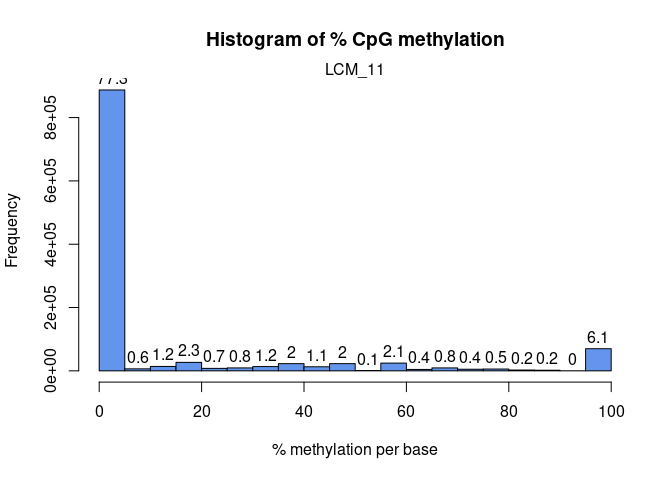<!-- -->

``` r
getCoverageStats(methylObj[[2]],plot=TRUE,both.strands=FALSE)
```

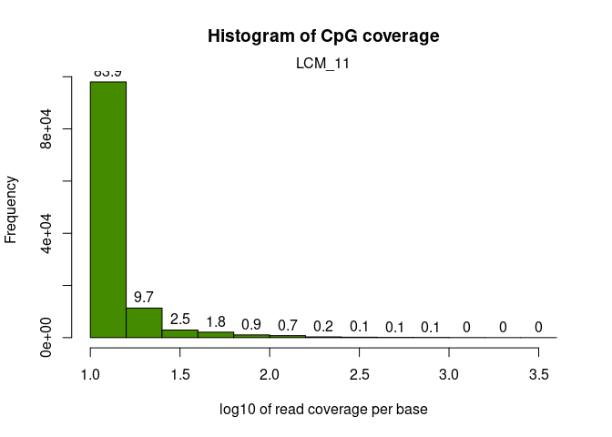<!-- -->

``` r
getCoverageStats(methylObj[[2]],plot=TRUE,both.strands=TRUE)
```

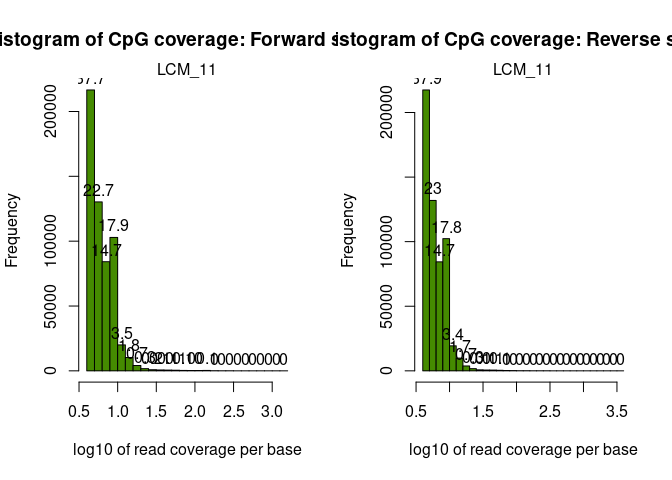<!-- -->

``` r
filtered_methylObj=filterByCoverage(methylObj,lo.count=5,lo.perc=NULL,
                                      hi.count=NULL,hi.perc=99.9)

filtered_methylObj_norm <- filtered_methylObj %>% methylKit::normalizeCoverage(.)
```

``` r
meth_filter=methylKit::unite(filtered_methylObj_norm)
```

    ## uniting...

``` r
meth_filter_destrand=methylKit::unite(filtered_methylObj_norm,destrand = TRUE)
```

    ## destranding...
    ## uniting...

``` r
clusterSamples(meth_filter, dist="correlation", method="ward", plot=TRUE)
```

    ## The "ward" method has been renamed to "ward.D"; note new "ward.D2"

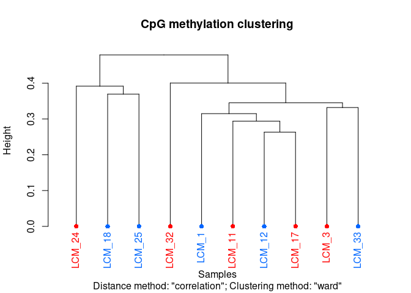<!-- -->

    ## 
    ## Call:
    ## hclust(d = d, method = HCLUST.METHODS[hclust.method])
    ## 
    ## Cluster method   : ward.D 
    ## Distance         : pearson 
    ## Number of objects: 10

``` r
clusterSamples(meth_filter_destrand, dist="correlation", method="ward", plot=TRUE)
```

    ## The "ward" method has been renamed to "ward.D"; note new "ward.D2"

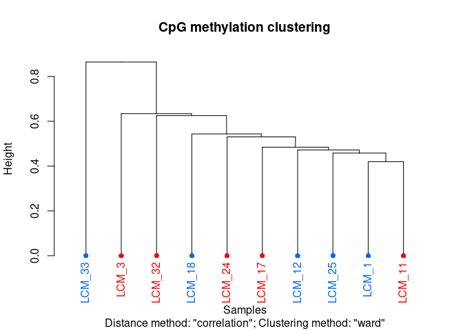<!-- -->

    ## 
    ## Call:
    ## hclust(d = d, method = HCLUST.METHODS[hclust.method])
    ## 
    ## Cluster method   : ward.D 
    ## Distance         : pearson 
    ## Number of objects: 10

``` r
PCASamples(meth_filter)
```

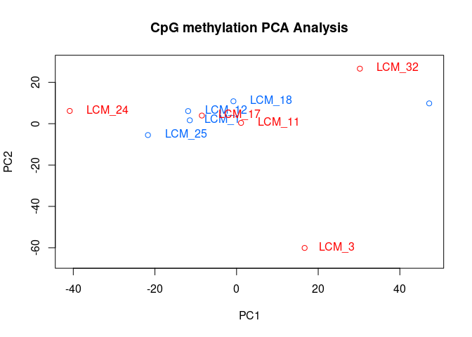<!-- -->

``` r
PCASamples(meth_filter_destrand)
```

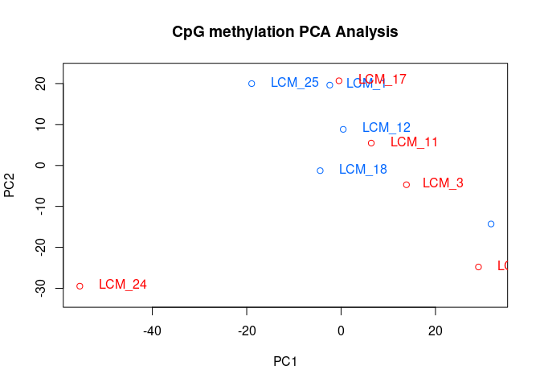<!-- -->

``` r
getCorrelation(meth_filter_destrand,plot=TRUE)
```

    ##            LCM_1    LCM_11    LCM_12    LCM_17    LCM_18    LCM_24    LCM_25
    ## LCM_1  1.0000000 0.6892526 0.6728976 0.6657415 0.6355410 0.6403901 0.6759630
    ## LCM_11 0.6892526 1.0000000 0.6603484 0.6588697 0.6264304 0.6082192 0.6581236
    ## LCM_12 0.6728976 0.6603484 1.0000000 0.6558708 0.6324357 0.6112462 0.6528702
    ## LCM_17 0.6657415 0.6588697 0.6558708 1.0000000 0.6323791 0.5993774 0.6473040
    ## LCM_18 0.6355410 0.6264304 0.6324357 0.6323791 1.0000000 0.5933854 0.6209116
    ## LCM_24 0.6403901 0.6082192 0.6112462 0.5993774 0.5933854 1.0000000 0.6550695
    ## LCM_25 0.6759630 0.6581236 0.6528702 0.6473040 0.6209116 0.6550695 1.0000000
    ## LCM_3  0.6059547 0.6040347 0.5991381 0.6107807 0.5842224 0.5430122 0.5837491
    ## LCM_32 0.6193958 0.6199490 0.6047293 0.5989849 0.5821232 0.5527861 0.5962708
    ## LCM_33 0.5291518 0.5398136 0.5069320 0.5269192 0.5080946 0.4494055 0.5005961
    ##            LCM_3    LCM_32    LCM_33
    ## LCM_1  0.6059547 0.6193958 0.5291518
    ## LCM_11 0.6040347 0.6199490 0.5398136
    ## LCM_12 0.5991381 0.6047293 0.5069320
    ## LCM_17 0.6107807 0.5989849 0.5269192
    ## LCM_18 0.5842224 0.5821232 0.5080946
    ## LCM_24 0.5430122 0.5527861 0.4494055
    ## LCM_25 0.5837491 0.5962708 0.5005961
    ## LCM_3  1.0000000 0.5581504 0.5185112
    ## LCM_32 0.5581504 1.0000000 0.5276969
    ## LCM_33 0.5185112 0.5276969 1.0000000

    ## Warning in par(usr): argument 1 does not name a graphical parameter
    ## Warning in par(usr): argument 1 does not name a graphical parameter
    ## Warning in par(usr): argument 1 does not name a graphical parameter
    ## Warning in par(usr): argument 1 does not name a graphical parameter
    ## Warning in par(usr): argument 1 does not name a graphical parameter
    ## Warning in par(usr): argument 1 does not name a graphical parameter
    ## Warning in par(usr): argument 1 does not name a graphical parameter
    ## Warning in par(usr): argument 1 does not name a graphical parameter
    ## Warning in par(usr): argument 1 does not name a graphical parameter
    ## Warning in par(usr): argument 1 does not name a graphical parameter
    ## Warning in par(usr): argument 1 does not name a graphical parameter
    ## Warning in par(usr): argument 1 does not name a graphical parameter
    ## Warning in par(usr): argument 1 does not name a graphical parameter
    ## Warning in par(usr): argument 1 does not name a graphical parameter
    ## Warning in par(usr): argument 1 does not name a graphical parameter
    ## Warning in par(usr): argument 1 does not name a graphical parameter
    ## Warning in par(usr): argument 1 does not name a graphical parameter
    ## Warning in par(usr): argument 1 does not name a graphical parameter
    ## Warning in par(usr): argument 1 does not name a graphical parameter
    ## Warning in par(usr): argument 1 does not name a graphical parameter
    ## Warning in par(usr): argument 1 does not name a graphical parameter
    ## Warning in par(usr): argument 1 does not name a graphical parameter
    ## Warning in par(usr): argument 1 does not name a graphical parameter
    ## Warning in par(usr): argument 1 does not name a graphical parameter
    ## Warning in par(usr): argument 1 does not name a graphical parameter
    ## Warning in par(usr): argument 1 does not name a graphical parameter
    ## Warning in par(usr): argument 1 does not name a graphical parameter
    ## Warning in par(usr): argument 1 does not name a graphical parameter
    ## Warning in par(usr): argument 1 does not name a graphical parameter
    ## Warning in par(usr): argument 1 does not name a graphical parameter
    ## Warning in par(usr): argument 1 does not name a graphical parameter
    ## Warning in par(usr): argument 1 does not name a graphical parameter
    ## Warning in par(usr): argument 1 does not name a graphical parameter
    ## Warning in par(usr): argument 1 does not name a graphical parameter
    ## Warning in par(usr): argument 1 does not name a graphical parameter
    ## Warning in par(usr): argument 1 does not name a graphical parameter
    ## Warning in par(usr): argument 1 does not name a graphical parameter
    ## Warning in par(usr): argument 1 does not name a graphical parameter
    ## Warning in par(usr): argument 1 does not name a graphical parameter
    ## Warning in par(usr): argument 1 does not name a graphical parameter
    ## Warning in par(usr): argument 1 does not name a graphical parameter
    ## Warning in par(usr): argument 1 does not name a graphical parameter
    ## Warning in par(usr): argument 1 does not name a graphical parameter
    ## Warning in par(usr): argument 1 does not name a graphical parameter
    ## Warning in par(usr): argument 1 does not name a graphical parameter
    ## Warning in par(usr): argument 1 does not name a graphical parameter
    ## Warning in par(usr): argument 1 does not name a graphical parameter
    ## Warning in par(usr): argument 1 does not name a graphical parameter
    ## Warning in par(usr): argument 1 does not name a graphical parameter
    ## Warning in par(usr): argument 1 does not name a graphical parameter
    ## Warning in par(usr): argument 1 does not name a graphical parameter
    ## Warning in par(usr): argument 1 does not name a graphical parameter
    ## Warning in par(usr): argument 1 does not name a graphical parameter
    ## Warning in par(usr): argument 1 does not name a graphical parameter
    ## Warning in par(usr): argument 1 does not name a graphical parameter

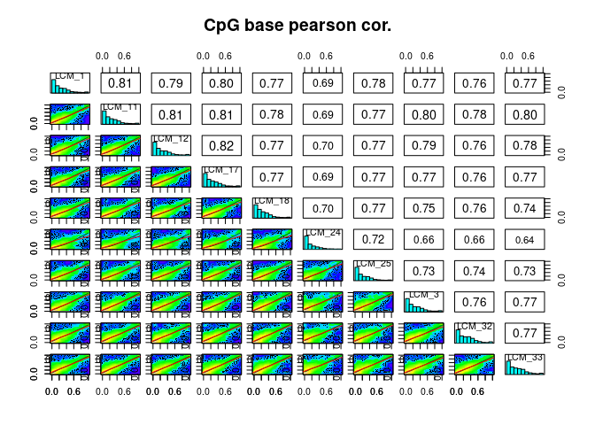<!-- -->

### 0.3.1 batch effects

``` r
as=assocComp(mBase=meth_filter_destrand,select(meta,c("PCR_ReAmp_Cycles", "Fragment")))
as
```

    ## $pcs
    ##              PC1         PC2         PC3          PC4         PC5          PC6
    ## LCM_1  0.3338583  0.12128846 -0.07720379 -0.005419477 -0.03308604  0.256605642
    ## LCM_11 0.3301683  0.02569803 -0.03934815  0.097854257  0.01277378  0.390744918
    ## LCM_12 0.3267925  0.13493914  0.06177046  0.096404568  0.16752421  0.297409509
    ## LCM_17 0.3266056  0.04043675  0.16266871  0.024208156  0.19839302  0.329042567
    ## LCM_18 0.3171073  0.06761685  0.13471362 -0.028405125  0.74872176 -0.525390239
    ## LCM_24 0.3090060  0.39200633 -0.31114649 -0.435479535 -0.33502102 -0.395386389
    ## LCM_25 0.3265171  0.23376956 -0.17432660 -0.173740178 -0.15174089  0.089122089
    ## LCM_3  0.3058523 -0.16036635  0.80404167 -0.036076566 -0.42610825 -0.209587363
    ## LCM_32 0.3086454 -0.15279027 -0.30726667  0.787485411 -0.23152323 -0.316933508
    ## LCM_33 0.2731303 -0.83835170 -0.27562496 -0.372082762  0.01726556  0.008292728
    ##                PC7         PC8          PC9          PC10
    ## LCM_1   0.16046495 -0.23475447  0.156550083  0.8339845594
    ## LCM_11  0.24173983 -0.57598024  0.263104355 -0.5166669223
    ## LCM_12  0.46053971  0.72024244  0.020727658 -0.1187276977
    ## LCM_17 -0.82007693  0.15946463  0.132997196 -0.0370712945
    ## LCM_18  0.08312060 -0.17091853 -0.054813809  0.0130530300
    ## LCM_24 -0.07672461  0.12919691  0.396299536 -0.1272415963
    ## LCM_25 -0.05495299 -0.10796954 -0.852562633 -0.0751974424
    ## LCM_3   0.07356071 -0.03248837 -0.031043612  0.0051931926
    ## LCM_32 -0.09681841  0.05673023 -0.014289933  0.0009484129
    ## LCM_33  0.02427633  0.08439634 -0.007839138  0.0033420682
    ## 
    ## $vars
    ##  [1] 64.096864  6.045395  4.519961  4.320724  3.995412  3.870769  3.428768
    ##  [8]  3.395078  3.272026  3.055003
    ## 
    ## $association
    ##                        PC1       PC2       PC3       PC4       PC5       PC6
    ## PCR_ReAmp_Cycles 0.1916616 0.1106778 0.6213573 0.4382057 0.1587682 0.3891865
    ## Fragment         0.3084410 0.1688444 0.1368522 0.3084410 0.1489187 0.4468051
    ##                        PC7       PC8       PC9      PC10
    ## PCR_ReAmp_Cycles 0.1223133 0.8336374 0.9260907 0.9825280
    ## Fragment         0.1834361 0.8780986 0.8598312 0.1153717

### 0.3.2 other possible filtering

``` r
# get percent methylation matrix
pm=percMethylation(meth_filter_destrand)

# calculate standard deviation of CpGs
sds=matrixStats::rowSds(pm)

# Visualize the distribution of the per-CpG standard deviation
# to determine a suitable cutoff
hist(sds, breaks = 100)
```

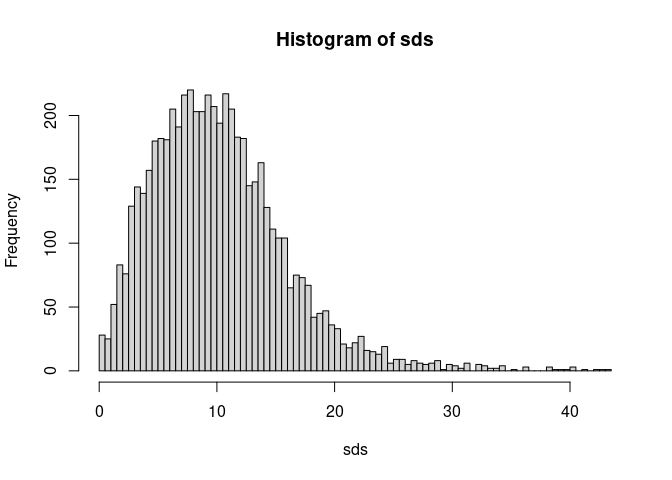<!-- -->

``` r
# keep only CpG with standard deviations larger than 2%
meth <- meth_filter_destrand[sds > 2]

# This leaves us with this number of CpG sites
nrow(meth_filter_destrand)
```

    ## [1] 12252

``` r
nrow(meth)
```

    ## [1] 11885

### 0.3.3 Identify DML

``` r
DMLStats_Tissue <- methylKit::calculateDiffMeth(meth_filter_destrand, overdispersion = "MN", test = "Chisq", mc.cores = 8) #Calculate differential methylation statistics and include covariate information.
```

    ## two groups detected:
    ##  will calculate methylation difference as the difference of
    ## treatment (group: 1) - control (group: 0)

``` r
head(DMLStats_Tissue) #Look at differential methylation output
```

    ##                                  chr  start    end strand     pvalue    qvalue
    ## 1 Pocillopora_acuta_HIv2___Sc0000000   8517   8517      + 0.73974649 0.9398592
    ## 2 Pocillopora_acuta_HIv2___Sc0000000   8556   8556      + 0.75975304 0.9416162
    ## 3 Pocillopora_acuta_HIv2___Sc0000000  48656  48656      + 0.33135768 0.8056480
    ## 4 Pocillopora_acuta_HIv2___Sc0000000  48703  48703      + 0.06329730 0.5296139
    ## 5 Pocillopora_acuta_HIv2___Sc0000000  55614  55614      + 0.03206979 0.4294523
    ## 6 Pocillopora_acuta_HIv2___Sc0000000 508403 508403      + 0.40262375 0.8430765
    ##    meth.diff
    ## 1   3.576616
    ## 2   5.253078
    ## 3   7.268433
    ## 4  24.354545
    ## 5  34.260797
    ## 6 -13.901639

``` r
# Filter DMRs with q-value < 0.05
significant_dmg <- getData(DMLStats_Tissue[DMLStats_Tissue$qvalue < 0.1, ])

# Create a data frame for plotting
plot_data <- data.frame(
  chr = significant_dmg$chr,
  start = significant_dmg$start,
  meth.diff = significant_dmg$meth.diff
)

# Count the number of positive and negative methylation differences
positive_count <- sum(significant_dmg$meth.diff > 0)
negative_count <- sum(significant_dmg$meth.diff < 0)

# Plot with counts added to the quadrants
ggplot(plot_data, aes(x = start, y = meth.diff)) +
  geom_point(alpha = 0.5) +  # Set alpha to reduce point transparency
  theme_minimal() +
  labs(title = "Significant Differentially Methylated Regions (q-value < 0.05)",
       x = "Genomic Position (start)",
       y = "Methylation Difference (%)") +
  theme(legend.position = "none") +  # Remove the legend
  # Add the count of positive and negative methylation differences as text annotations
  annotate("text", x = Inf, y = Inf, label = paste("Positive:", positive_count), 
           hjust = 1.1, vjust = 1.1, size = 4, color = "blue") +
  annotate("text", x = Inf, y = -Inf, label = paste("Negative:", negative_count), 
           hjust = 1.1, vjust = -0.1, size = 4, color = "red")
```

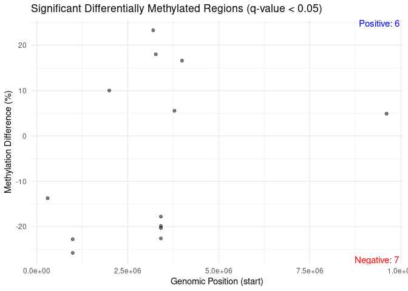<!-- -->

``` r
dml_df <- as.data.frame(DMLStats_Tissue)

# Volcano plot
ggplot(dml_df, aes(x = meth.diff, y = -log10(qvalue))) +
  geom_point(alpha = 0.5) +
  geom_vline(xintercept = c(-5, 5), linetype = "dashed", color = "red") +
  geom_hline(yintercept = -log10(0.05), linetype = "dashed", color = "blue") +
  labs(title = "Differentially Methylated Loci (DMLs)",
       x = "Methylation Difference (%)",
       y = "-log10(q-value)") +
  theme_minimal()
```

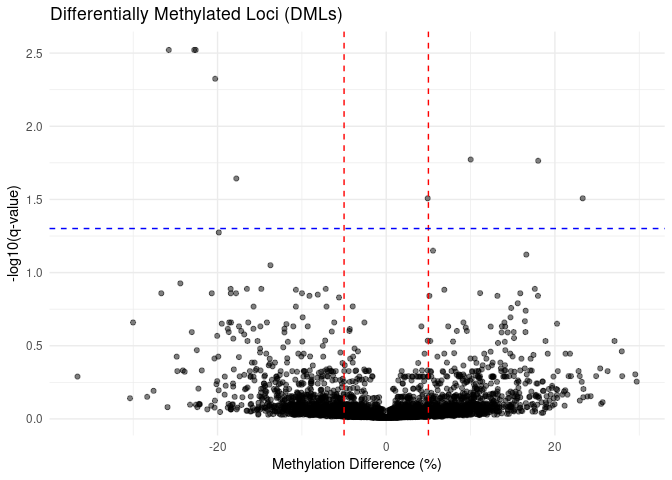<!-- -->

``` r
DMLs <- methylKit::getMethylDiff(DMLStats_Tissue, difference = 2, qvalue = 0.05) #Identify DML based on difference threshold

length(DMLs$chr) #DML
```

    ## [1] 59

``` r
head(DMLs)
```

    ##                                    chr   start     end strand       pvalue
    ## 61  Pocillopora_acuta_HIv2___Sc0000000 6962047 6962047      + 1.327078e-05
    ## 282 Pocillopora_acuta_HIv2___Sc0000001 3408829 3408829      + 2.463817e-05
    ## 286 Pocillopora_acuta_HIv2___Sc0000001 3408857 3408857      + 1.941094e-06
    ## 287 Pocillopora_acuta_HIv2___Sc0000001 3408864 3408864      + 1.907778e-04
    ## 291 Pocillopora_acuta_HIv2___Sc0000001 3408892 3408892      + 4.173266e-05
    ## 648 Pocillopora_acuta_HIv2___Sc0000002 7012109 7012109      + 8.147227e-05
    ##          qvalue meth.diff
    ## 61  0.011313340 -17.40617
    ## 282 0.016904276 -19.50357
    ## 286 0.006863872 -22.60904
    ## 287 0.043630941 -24.99178
    ## 291 0.021163390 -20.35679
    ## 648 0.027949105 -21.93292

## 0.4 Further look at genome wide methylation

``` r
diffMethPerChr(DMLStats_Tissue, meth.cutoff = 2, qvalue.cutoff = 0.05,cex.names=.75)
```

    ## Warning in eval(quote(list(...)), env): NAs introduced by coercion

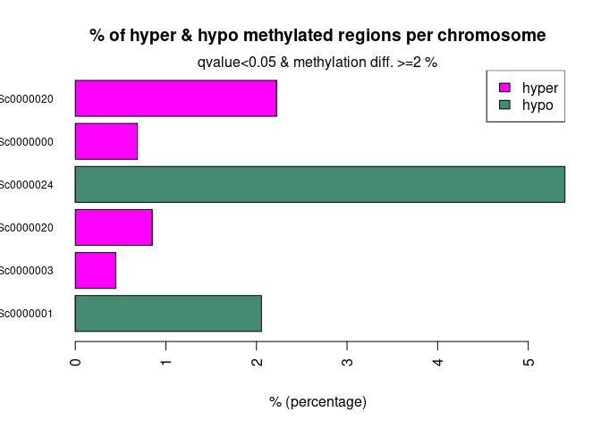<!-- -->

### 0.4.1 Annotation

``` r
require("genomationData")
require("genomation")

gff.file = "../references/Pocillopora_acuta_HIv2.gtf"
gff = gffToGRanges(gff.file)
head(gff)
```

    ## GRanges object with 6 ranges and 6 metadata columns:
    ##                     seqnames    ranges strand |   source       type     score
    ##                        <Rle> <IRanges>  <Rle> | <factor>   <factor> <numeric>
    ##   [1] Pocillopora_acuta_HI..  151-2746      + | AUGUSTUS transcript        NA
    ##   [2] Pocillopora_acuta_HI..   151-172      + | AUGUSTUS exon              NA
    ##   [3] Pocillopora_acuta_HI..   264-304      + | AUGUSTUS exon              NA
    ##   [4] Pocillopora_acuta_HI.. 1491-1602      + | AUGUSTUS exon              NA
    ##   [5] Pocillopora_acuta_HI.. 1889-1990      + | AUGUSTUS exon              NA
    ##   [6] Pocillopora_acuta_HI.. 2107-2127      + | AUGUSTUS exon              NA
    ##           phase          transcript_id                gene_id
    ##       <integer>            <character>            <character>
    ##   [1]      <NA> Pocillopora_acuta_HI.. Pocillopora_acuta_HI..
    ##   [2]      <NA> Pocillopora_acuta_HI.. Pocillopora_acuta_HI..
    ##   [3]      <NA> Pocillopora_acuta_HI.. Pocillopora_acuta_HI..
    ##   [4]      <NA> Pocillopora_acuta_HI.. Pocillopora_acuta_HI..
    ##   [5]      <NA> Pocillopora_acuta_HI.. Pocillopora_acuta_HI..
    ##   [6]      <NA> Pocillopora_acuta_HI.. Pocillopora_acuta_HI..
    ##   -------
    ##   seqinfo: 425 sequences from an unspecified genome; no seqlengths

``` r
exons = gffToGRanges(gff.file, filter = "exon")

transcripts = gffToGRanges(gff.file, filter = "transcript")
```

``` r
DML_grange = as(DMLs,"GRanges")
head(DML_grange)
```

    ## GRanges object with 6 ranges and 3 metadata columns:
    ##                     seqnames    ranges strand |      pvalue     qvalue
    ##                        <Rle> <IRanges>  <Rle> |   <numeric>  <numeric>
    ##   [1] Pocillopora_acuta_HI..   6962047      + | 1.32708e-05 0.01131334
    ##   [2] Pocillopora_acuta_HI..   3408829      + | 2.46382e-05 0.01690428
    ##   [3] Pocillopora_acuta_HI..   3408857      + | 1.94109e-06 0.00686387
    ##   [4] Pocillopora_acuta_HI..   3408864      + | 1.90778e-04 0.04363094
    ##   [5] Pocillopora_acuta_HI..   3408892      + | 4.17327e-05 0.02116339
    ##   [6] Pocillopora_acuta_HI..   7012109      + | 8.14723e-05 0.02794910
    ##       meth.diff
    ##       <numeric>
    ##   [1]  -17.4062
    ##   [2]  -19.5036
    ##   [3]  -22.6090
    ##   [4]  -24.9918
    ##   [5]  -20.3568
    ##   [6]  -21.9329
    ##   -------
    ##   seqinfo: 42 sequences from an unspecified genome; no seqlengths

``` r
transcripts = gffToGRanges(gff.file, filter = "transcript")

# Find overlaps between DMLs and transcripts
overlaps_transcripts <- findOverlaps(DML_grange, transcripts,ignore.strand = TRUE)

# Extract matching transcript information
DML_transcript_annot <- data.frame(
  DML_chr = seqnames(DML_grange)[queryHits(overlaps_transcripts)],
  DML_start = start(DML_grange)[queryHits(overlaps_transcripts)],
  DML_end = end(DML_grange)[queryHits(overlaps_transcripts)],
  DML_qvalue = (DML_grange$qvalue)[queryHits(overlaps_transcripts)],
  DML_methdiff = (DML_grange$meth.diff)[queryHits(overlaps_transcripts)],
  transcript_chr = seqnames(transcripts)[subjectHits(overlaps_transcripts)],
  transcript_start = start(transcripts)[subjectHits(overlaps_transcripts)],
  transcript_end = end(transcripts)[subjectHits(overlaps_transcripts)],
  transcript_id = transcripts$transcript_id[subjectHits(overlaps_transcripts)],
  gene_id = transcripts$gene_id[subjectHits(overlaps_transcripts)]
)

# View first few rows
head(DML_transcript_annot)
```

    ##                              DML_chr DML_start DML_end  DML_qvalue DML_methdiff
    ## 1 Pocillopora_acuta_HIv2___Sc0000001   3408829 3408829 0.016904276    -19.50357
    ## 2 Pocillopora_acuta_HIv2___Sc0000001   3408857 3408857 0.006863872    -22.60904
    ## 3 Pocillopora_acuta_HIv2___Sc0000001   3408864 3408864 0.043630941    -24.99178
    ## 4 Pocillopora_acuta_HIv2___Sc0000001   3408892 3408892 0.021163390    -20.35679
    ## 5 Pocillopora_acuta_HIv2___Sc0000006   2741380 2741380 0.042772094     27.00782
    ## 6 Pocillopora_acuta_HIv2___Sc0000007   4800418 4800418 0.037574118    -20.22096
    ##                       transcript_chr transcript_start transcript_end
    ## 1 Pocillopora_acuta_HIv2___Sc0000001          3407978        3412324
    ## 2 Pocillopora_acuta_HIv2___Sc0000001          3407978        3412324
    ## 3 Pocillopora_acuta_HIv2___Sc0000001          3407978        3412324
    ## 4 Pocillopora_acuta_HIv2___Sc0000001          3407978        3412324
    ## 5 Pocillopora_acuta_HIv2___Sc0000006          2733883        2747450
    ## 6 Pocillopora_acuta_HIv2___Sc0000007          4793420        4810018
    ##                               transcript_id
    ## 1 Pocillopora_acuta_HIv2___RNAseq.g10458.t1
    ## 2 Pocillopora_acuta_HIv2___RNAseq.g10458.t1
    ## 3 Pocillopora_acuta_HIv2___RNAseq.g10458.t1
    ## 4 Pocillopora_acuta_HIv2___RNAseq.g10458.t1
    ## 5     Pocillopora_acuta_HIv2___TS.g27914.t3
    ## 6 Pocillopora_acuta_HIv2___RNAseq.g17735.t1
    ##                                     gene_id
    ## 1 Pocillopora_acuta_HIv2___RNAseq.g10458.t1
    ## 2 Pocillopora_acuta_HIv2___RNAseq.g10458.t1
    ## 3 Pocillopora_acuta_HIv2___RNAseq.g10458.t1
    ## 4 Pocillopora_acuta_HIv2___RNAseq.g10458.t1
    ## 5     Pocillopora_acuta_HIv2___TS.g27914.t3
    ## 6 Pocillopora_acuta_HIv2___RNAseq.g17735.t1

## 0.5 Are any DMGs DMLs?

``` r
#load in DESeq results
DESeq <- read.csv("../output_RNA/differential_expression/DESeq_results.csv", header = TRUE) %>% dplyr::rename("query" ="X")

#make dataframes of just differentially expressed genes for each LFC direction
DE_05_Aboral <- DESeq %>% filter(padj < 0.05 & log2FoldChange > 0)
DE_05_OralEpi <- DESeq %>% filter(padj < 0.05& log2FoldChange < 0)
DE_05 <- DESeq %>% filter(padj < 0.05)

DML_transcript_annot[DML_transcript_annot$transcript_id %in% DE_05$query,]
```

    ##                                 DML_chr DML_start DML_end DML_qvalue
    ## 10   Pocillopora_acuta_HIv2___Sc0000015    409253  409253 0.01725888
    ## 18 Pocillopora_acuta_HIv2___xfSc0000009   4968296 4968296 0.02159195
    ## 21 Pocillopora_acuta_HIv2___xfSc0000012   1505143 1505143 0.04856409
    ## 22 Pocillopora_acuta_HIv2___xfSc0000021   2601350 2601350 0.04578924
    ##    DML_methdiff                       transcript_chr transcript_start
    ## 10     27.85388   Pocillopora_acuta_HIv2___Sc0000015           404604
    ## 18     15.20642 Pocillopora_acuta_HIv2___xfSc0000009          4960678
    ## 21     19.30342 Pocillopora_acuta_HIv2___xfSc0000012          1498290
    ## 22     15.57377 Pocillopora_acuta_HIv2___xfSc0000021          2589323
    ##    transcript_end                            transcript_id
    ## 10         412806    Pocillopora_acuta_HIv2___TS.g29592.t2
    ## 18        4972226     Pocillopora_acuta_HIv2___TS.g3401.t1
    ## 21        1508944 Pocillopora_acuta_HIv2___RNAseq.g1208.t1
    ## 22        2605551    Pocillopora_acuta_HIv2___TS.g19623.t2
    ##                                     gene_id
    ## 10    Pocillopora_acuta_HIv2___TS.g29592.t2
    ## 18     Pocillopora_acuta_HIv2___TS.g3401.t1
    ## 21 Pocillopora_acuta_HIv2___RNAseq.g1208.t1
    ## 22    Pocillopora_acuta_HIv2___TS.g19623.t2

``` r
DE_05[DE_05$query %in% DML_transcript_annot$transcript_id,]
```

    ##                                         query  baseMean log2FoldChange    lfcSE
    ## 637      Pocillopora_acuta_HIv2___TS.g3401.t1  92.69481    -11.2018977 3.635355
    ## 930     Pocillopora_acuta_HIv2___TS.g19623.t2 269.40223     -0.7395856 1.427873
    ## 1568 Pocillopora_acuta_HIv2___RNAseq.g1208.t1 544.93022      0.7332125 1.457682
    ## 2597    Pocillopora_acuta_HIv2___TS.g29592.t2 198.58417     -0.4754287 1.109910
    ##            pvalue         padj
    ## 637  6.463609e-08 1.467655e-06
    ## 930  1.100703e-06 1.711889e-05
    ## 1568 4.649329e-05 4.288769e-04
    ## 2597 1.414923e-03 7.880421e-03

``` r
plot_data <- merge(DML_transcript_annot, DESeq, by.x = "transcript_id", by.y = "query")

ggplot(plot_data, aes(x = DML_methdiff, y = log2FoldChange)) +
  geom_point(aes(color = padj < 0.05), size = 3) +
  geom_text_repel(aes(label = ifelse(padj < 0.05, transcript_id, "")), max.overlaps = 20) +
  geom_hline(yintercept = 0, linetype = "dashed") +
  geom_vline(xintercept = 0, linetype = "dashed") +
  scale_color_manual(values = c("grey", "red")) +
  labs(x = "Methylation Difference (%)", 
       y = "RNA-seq: Log2FoldChange",
       title = "Differentially methylated loci (DMLs) vs. Gene Expression",
       color = "Significant DEGs") +
  theme_minimal()
```

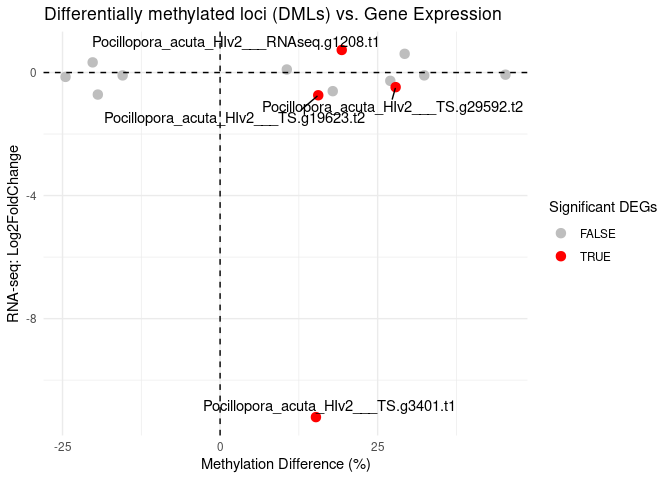<!-- -->

``` r
# Find overlaps between methylated loci and transcripts
MLs_in_genes <- regionCounts(meth_filter_destrand, regions=transcripts)
```

    ## Warning in .merge_two_Seqinfo_objects(x, y): Each of the 2 combined objects has sequence levels not in the other:
    ##   - in 'x': Pocillopora_acuta_HIv2___Sc0000053, Pocillopora_acuta_HIv2___Sc0000056, Pocillopora_acuta_HIv2___Sc0000058, Pocillopora_acuta_HIv2___Sc0000059, Pocillopora_acuta_HIv2___Sc0000060, Pocillopora_acuta_HIv2___Sc0000062, Pocillopora_acuta_HIv2___Sc0000063, Pocillopora_acuta_HIv2___Sc0000064, Pocillopora_acuta_HIv2___Sc0000066, Pocillopora_acuta_HIv2___Sc0000068, Pocillopora_acuta_HIv2___Sc0000070, Pocillopora_acuta_HIv2___Sc0000073, Pocillopora_acuta_HIv2___Sc0000075, Pocillopora_acuta_HIv2___Sc0000076, Pocillopora_acuta_HIv2___Sc0000077, Pocillopora_acuta_HIv2___Sc0000078, Pocillopora_acuta_HIv2___Sc0000080, Pocillopora_acuta_HIv2___xfSc0000051, Pocillopora_acuta_HIv2___xfSc0000055, Pocillopora_acuta_HIv2___xfSc0000057, Pocillopora_acuta_HIv2___xfSc0000058, Pocillopora_acuta_HIv2___xfSc0000062, Pocillopora_acuta_HIv2___xfSc0000064, Pocillopora_acuta_HIv2___xfSc0000065, Pocillopora_acuta_HIv2___xfSc0000066, Pocillopora_acuta_HIv2___xfSc0000070, Pocillopora_acuta_HIv2___xfSc0000071, Pocillopora_acuta_HIv2___xfSc0000072, Pocillopora_acuta_HIv2___xfSc0000073, Pocillopora_acuta_HIv2___xfSc0000074, Pocillopora_acuta_HIv2___xfSc0000075, Pocillopora_acuta_HIv2___xfSc0000077, Pocillopora_acuta_HIv2___xfSc0000078, Pocillopora_acuta_HIv2___xfSc0000080, Pocillopora_acuta_HIv2___xfSc0000081, Pocillopora_acuta_HIv2___xfSc0000084, Pocillopora_acuta_HIv2___xfSc0000086, Pocillopora_acuta_HIv2___xfSc0000087, Pocillopora_acuta_HIv2___xfSc0000089, Pocillopora_acuta_HIv2___xfSc0000090, Pocillopora_acuta_HIv2___xfSc0000091, Pocillopora_acuta_HIv2___xfSc0000094, Pocillopora_acuta_HIv2___xfSc0000095, Pocillopora_acuta_HIv2___xfSc0000096, Pocillopora_acuta_HIv2___xfSc0000097, Pocillopora_acuta_HIv2___xfSc0000098, Pocillopora_acuta_HIv2___xfSc0000099, Pocillopora_acuta_HIv2___xfSc0000100, Pocillopora_acuta_HIv2___xfSc0000101, Pocillopora_acuta_HIv2___xfSc0000102, Pocillopora_acuta_HIv2___xfSc0000103, Pocillopora_acuta_HIv2___xfSc0000104, Pocillopora_acuta_HIv2___xfSc0000105, Pocillopora_acuta_HIv2___xfSc0000108, Pocillopora_acuta_HIv2___xfSc0000109, Pocillopora_acuta_HIv2___xfSc0000110, Pocillopora_acuta_HIv2___xfSc0000114, Pocillopora_acuta_HIv2___xfSc0000115, Pocillopora_acuta_HIv2___xfSc0000116, Pocillopora_acuta_HIv2___xfSc0000119, Pocillopora_acuta_HIv2___xfSc0000121, Pocillopora_acuta_HIv2___xfSc0000122, Pocillopora_acuta_HIv2___xfSc0000125, Pocillopora_acuta_HIv2___xfSc0000126, Pocillopora_acuta_HIv2___xfSc0000127, Pocillopora_acuta_HIv2___xfSc0000128, Pocillopora_acuta_HIv2___xfSc0000129, Pocillopora_acuta_HIv2___xfSc0000130, Pocillopora_acuta_HIv2___xfSc0000131, Pocillopora_acuta_HIv2___xfSc0000132, Pocillopora_acuta_HIv2___xfSc0000133, Pocillopora_acuta_HIv2___xfSc0000135, Pocillopora_acuta_HIv2___xfSc0000136, Pocillopora_acuta_HIv2___xfSc0000137, Pocillopora_acuta_HIv2___xfSc0000138, Pocillopora_acuta_HIv2___xfSc0000139, Pocillopora_acuta_HIv2___xfSc0000140, Pocillopora_acuta_HIv2___xfSc0000141, Pocillopora_acuta_HIv2___xfSc0000142, Pocillopora_acuta_HIv2___xfSc0000143, Pocillopora_acuta_HIv2___xfSc0000144, Pocillopora_acuta_HIv2___xfSc0000145, Pocillopora_acuta_HIv2___xfSc0000147, Pocillopora_acuta_HIv2___xfSc0000148, Pocillopora_acuta_HIv2___xfSc0000150, Pocillopora_acuta_HIv2___xfSc0000151, Pocillopora_acuta_HIv2___xfSc0000152, Pocillopora_acuta_HIv2___xfSc0000154, Pocillopora_acuta_HIv2___xfSc0000155, Pocillopora_acuta_HIv2___xfSc0000157, Pocillopora_acuta_HIv2___xfSc0000158, Pocillopora_acuta_HIv2___xfSc0000159, Pocillopora_acuta_HIv2___xfSc0000160, Pocillopora_acuta_HIv2___xfSc0000161, Pocillopora_acuta_HIv2___xfSc0000162, Pocillopora_acuta_HIv2___xfSc0000163, Pocillopora_acuta_HIv2___xfSc0000164, Pocillopora_acuta_HIv2___xfSc0000165, Pocillopora_acuta_HIv2___xfSc0000166, Pocillopora_acuta_HIv2___xfSc0000167, Pocillopora_acuta_HIv2___xfSc0000168, Pocillopora_acuta_HIv2___xfSc0000171, Pocillopora_acuta_HIv2___xfSc0000173, Pocillopora_acuta_HIv2___xfSc0000174, Pocillopora_acuta_HIv2___xfSc0000177, Pocillopora_acuta_HIv2___xfSc0000178, Pocillopora_acuta_HIv2___xfSc0000179, Pocillopora_acuta_HIv2___xfSc0000180, Pocillopora_acuta_HIv2___xfSc0000181, Pocillopora_acuta_HIv2___xfSc0000182, Pocillopora_acuta_HIv2___xfSc0000183, Pocillopora_acuta_HIv2___xfSc0000184, Pocillopora_acuta_HIv2___xfSc0000185, Pocillopora_acuta_HIv2___xfSc0000186, Pocillopora_acuta_HIv2___xfSc0000187, Pocillopora_acuta_HIv2___xfSc0000188, Pocillopora_acuta_HIv2___xfSc0000189, Pocillopora_acuta_HIv2___xfSc0000190, Pocillopora_acuta_HIv2___xfSc0000191, Pocillopora_acuta_HIv2___xfSc0000192, Pocillopora_acuta_HIv2___xfSc0000193, Pocillopora_acuta_HIv2___xfSc0000196, Pocillopora_acuta_HIv2___xfSc0000197, Pocillopora_acuta_HIv2___xfSc0000200, Pocillopora_acuta_HIv2___xfSc0000202, Pocillopora_acuta_HIv2___xfSc0000203, Pocillopora_acuta_HIv2___xfSc0000204, Pocillopora_acuta_HIv2___xfSc0000205, Pocillopora_acuta_HIv2___xfSc0000206, Pocillopora_acuta_HIv2___xfSc0000207, Pocillopora_acuta_HIv2___xfSc0000208, Pocillopora_acuta_HIv2___xfSc0000209, Pocillopora_acuta_HIv2___xfSc0000210, Pocillopora_acuta_HIv2___xfSc0000212, Pocillopora_acuta_HIv2___xfSc0000213, Pocillopora_acuta_HIv2___xfSc0000214, Pocillopora_acuta_HIv2___xfSc0000215, Pocillopora_acuta_HIv2___xfSc0000216, Pocillopora_acuta_HIv2___xfSc0000217, Pocillopora_acuta_HIv2___xfSc0000218, Pocillopora_acuta_HIv2___xfSc0000220, Pocillopora_acuta_HIv2___xfSc0000221, Pocillopora_acuta_HIv2___xfSc0000222, Pocillopora_acuta_HIv2___xfSc0000223, Pocillopora_acuta_HIv2___xfSc0000224, Pocillopora_acuta_HIv2___xfSc0000226, Pocillopora_acuta_HIv2___xfSc0000227, Pocillopora_acuta_HIv2___xfSc0000228, Pocillopora_acuta_HIv2___xfSc0000230, Pocillopora_acuta_HIv2___xfSc0000231, Pocillopora_acuta_HIv2___xfSc0000232, Pocillopora_acuta_HIv2___xfSc0000233, Pocillopora_acuta_HIv2___xfSc0000234, Pocillopora_acuta_HIv2___xfSc0000235, Pocillopora_acuta_HIv2___xfSc0000236, Pocillopora_acuta_HIv2___xfSc0000238, Pocillopora_acuta_HIv2___xfSc0000239, Pocillopora_acuta_HIv2___xfSc0000240, Pocillopora_acuta_HIv2___xfSc0000241, Pocillopora_acuta_HIv2___xfSc0000242, Pocillopora_acuta_HIv2___xfSc0000243, Pocillopora_acuta_HIv2___xfSc0000244, Pocillopora_acuta_HIv2___xfSc0000245, Pocillopora_acuta_HIv2___xfSc0000247, Pocillopora_acuta_HIv2___xfSc0000248, Pocillopora_acuta_HIv2___xfSc0000250, Pocillopora_acuta_HIv2___xfSc0000251, Pocillopora_acuta_HIv2___xfSc0000252, Pocillopora_acuta_HIv2___xfSc0000254, Pocillopora_acuta_HIv2___xfSc0000255, Pocillopora_acuta_HIv2___xfSc0000256, Pocillopora_acuta_HIv2___xfSc0000257, Pocillopora_acuta_HIv2___xfSc0000258, Pocillopora_acuta_HIv2___xfSc0000259, Pocillopora_acuta_HIv2___xfSc0000260, Pocillopora_acuta_HIv2___xfSc0000261, Pocillopora_acuta_HIv2___xfSc0000262, Pocillopora_acuta_HIv2___xfSc0000264, Pocillopora_acuta_HIv2___xfSc0000265, Pocillopora_acuta_HIv2___xfSc0000266, Pocillopora_acuta_HIv2___xfSc0000268, Pocillopora_acuta_HIv2___xfSc0000269, Pocillopora_acuta_HIv2___xfSc0000270, Pocillopora_acuta_HIv2___xfSc0000271, Pocillopora_acuta_HIv2___xfSc0000272, Pocillopora_acuta_HIv2___xfSc0000273, Pocillopora_acuta_HIv2___xfSc0000274, Pocillopora_acuta_HIv2___xfSc0000275, Pocillopora_acuta_HIv2___xfSc0000276, Pocillopora_acuta_HIv2___xfSc0000277, Pocillopora_acuta_HIv2___xfSc0000278, Pocillopora_acuta_HIv2___xfSc0000279, Pocillopora_acuta_HIv2___xfSc0000280, Pocillopora_acuta_HIv2___xfSc0000281, Pocillopora_acuta_HIv2___xfSc0000282, Pocillopora_acuta_HIv2___xfSc0000283, Pocillopora_acuta_HIv2___xfSc0000284, Pocillopora_acuta_HIv2___xfSc0000286, Pocillopora_acuta_HIv2___xfSc0000288, Pocillopora_acuta_HIv2___xfSc0000289, Pocillopora_acuta_HIv2___xfSc0000291, Pocillopora_acuta_HIv2___xfSc0000293, Pocillopora_acuta_HIv2___xfSc0000295, Pocillopora_acuta_HIv2___xfSc0000296, Pocillopora_acuta_HIv2___xfSc0000301, Pocillopora_acuta_HIv2___xfSc0000302, Pocillopora_acuta_HIv2___xfSc0000303, Pocillopora_acuta_HIv2___xfSc0000305, Pocillopora_acuta_HIv2___xfSc0000306, Pocillopora_acuta_HIv2___xfSc0000307, Pocillopora_acuta_HIv2___xfSc0000310, Pocillopora_acuta_HIv2___xfSc0000311, Pocillopora_acuta_HIv2___xfSc0000313, Pocillopora_acuta_HIv2___xfSc0000315, Pocillopora

``` r
#MLs_in_genes <- getData(MLs_in_genes)
MLs_in_genes$gene_id <- transcripts$gene_id[match(paste(MLs_in_genes$chr, MLs_in_genes$start, MLs_in_genes$end), paste(seqnames(transcripts), start(transcripts), end(transcripts)))]

percent_meth <- percMethylation(MLs_in_genes)
percent_meth <- as.data.frame(percent_meth)
percent_meth$gene_id <- MLs_in_genes$gene_id 

percent_meth <- percent_meth %>% rowwise() %>%
  mutate(percent_meth_ALL = mean(c_across(starts_with("LCM")), na.rm = TRUE)) %>%
  ungroup()

percent_meth <- percent_meth %>% rowwise() %>%
  mutate(Oral = mean(c_across(meta$Sample[meta$Tissue=="OralEpi"]), na.rm = TRUE)) %>%
  mutate(Aboral = mean(c_across(meta$Sample[meta$Tissue=="Aboral"]), na.rm = TRUE)) %>%
  ungroup()
  
percent_meth_long <- percent_meth %>% pivot_longer(
                                      cols = c(Oral,Aboral),
                                      names_to = "Tissue",
                                      values_to = "tissue_percent_meth"
)
```

``` r
plot_data <- merge(percent_meth, DESeq, by.x = "gene_id", by.y = "query")

ggplot(plot_data, aes(y = baseMean, x = percent_meth_ALL)) +
  geom_point(alpha = 0.5) +
  geom_smooth(method = "lm") + stat_poly_eq(use_label("eq", "R2")) +
  labs(x = "Average CpG % methylation of gene", y = "DeSeq2 BaseMean", 
       title = "Gene Methylation vs Expression") +
  theme_minimal()
```

    ## `geom_smooth()` using formula = 'y ~ x'

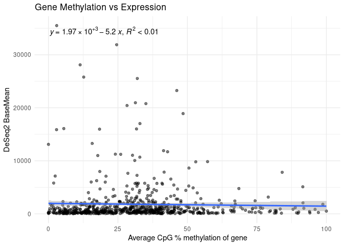<!-- -->

``` r
ggplot(plot_data, aes(y = log2(baseMean), x = percent_meth_ALL)) +
  geom_point(alpha = 0.5) +
  geom_smooth(method = "lm") + stat_poly_eq(use_label("eq", "R2")) +
  labs(x = "Average CpG % methylation of gene", y = "Log2(DeSeq2 BaseMean)", 
       title = "Gene Methylation vs Expression") +
  theme_minimal()
```

    ## `geom_smooth()` using formula = 'y ~ x'

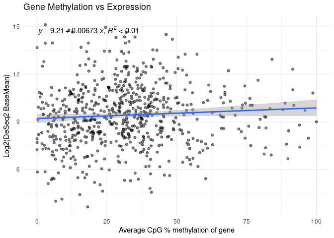<!-- -->

``` r
ggplot(plot_data, aes(y = abs(log2FoldChange), x = percent_meth_ALL)) +
  geom_point(alpha = 0.5) +
  geom_smooth(method = "lm") +  stat_poly_eq(use_label("eq", "R2")) +
  labs(x = "Average CpG % methylation of gene", y = "Abs(DeSeq2 Log2FoldChange)", 
       title = "Gene Methylation vs Expression") +
  theme_minimal()
```

    ## `geom_smooth()` using formula = 'y ~ x'

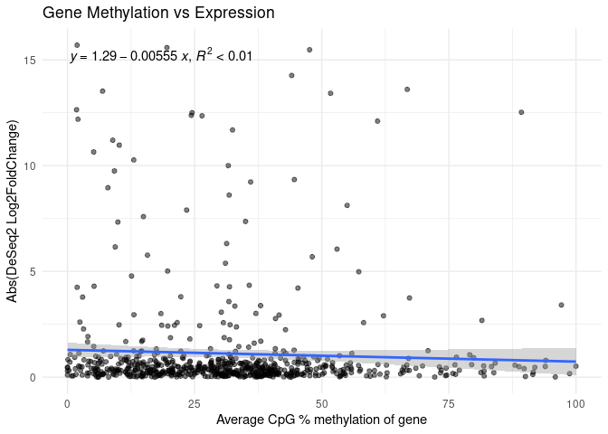<!-- -->

``` r
# Create the plot
ggplot(plot_data, aes(x = percent_meth_ALL, y = log2FoldChange)) +
  geom_point(aes(color = padj < 0.05)) +
  #geom_text_repel(aes(label = ifelse(padj < 0.05, gene_id, "")), max.overlaps = 20) +
  geom_hline(yintercept = 0, linetype = "dashed") +
  geom_vline(xintercept = 0, linetype = "dashed") +
  scale_color_manual(values = c("grey", "red")) +
  labs(x = "Average CpG % methylation of gene", 
       y = "RNA-seq: Log2FoldChange",
       title = "Differentially methylated loci (DMLs) vs. Gene Expression",
       color = "Significant DEGs") +
  theme_minimal()
```

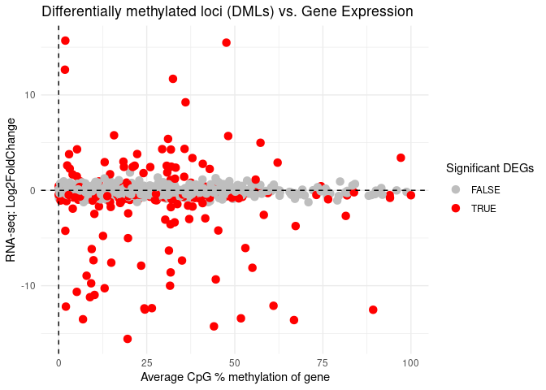<!-- -->

``` r
plot_data <- merge(percent_meth_long, DESeq, by.x = "gene_id", by.y = "query")

ggplot(plot_data, aes(y = abs(log2FoldChange), x = tissue_percent_meth, color=Tissue)) +
  geom_point(alpha = 0.5) + geom_smooth(method = "lm") + stat_poly_eq(use_label("eq", "R2"))+
  labs(x = "Average CpG % methylation of gene", y = "Abs(DeSeq2 Log2FoldChange)", 
       title = "Gene Methylation vs Expression") +
  theme_minimal()
```

    ## `geom_smooth()` using formula = 'y ~ x'

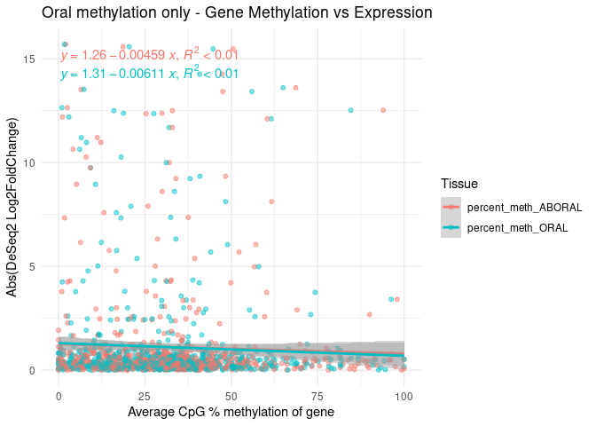<!-- -->

### 0.5.1 Read counts

RNA metadata:

``` r
meta_RNA <- read.csv("../data_RNA/LCM_RNA_metadata.csv") %>%
            dplyr::arrange(Sample) %>%
            mutate(across(c(Tissue, Fragment, Section_Date, LCM_Date), factor)) # Set variables as factors 

meta_RNA$Tissue <- factor(meta_RNA$Tissue, levels = c("OralEpi","Aboral")) #we want OralEpi to be the baseline
```

``` r
filtered_counts_RNA <- read.csv("../output_RNA/differential_expression/filtered_counts.csv") 
rownames(filtered_counts_RNA) <- filtered_counts_RNA$X
filtered_counts_RNA <- filtered_counts_RNA %>% select(-X)
filtered_counts_RNA$sum <- rowSums(filtered_counts_RNA)
filtered_counts_RNA$gene_id <- rownames(filtered_counts_RNA)

filtered_counts_RNA <- filtered_counts_RNA %>% rowwise() %>%
  mutate(Oral = mean(c_across(meta_RNA$Sample[meta_RNA$Tissue=="OralEpi"]), na.rm = TRUE)) %>%
  mutate(Aboral = mean(c_across(meta_RNA$Sample[meta_RNA$Tissue=="Aboral"]), na.rm = TRUE)) %>%
  ungroup()
  
filtered_counts_RNA_long <- filtered_counts_RNA %>% pivot_longer(
                                      cols = c(Oral,Aboral),
                                      names_to = "Tissue",
                                      values_to = "tissue_mean_counts"
)
```

``` r
plot_data <- merge(percent_meth_long, filtered_counts_RNA_long, by = c("gene_id", "Tissue"))

ggplot(plot_data, aes(y = log2(tissue_mean_counts), x = tissue_percent_meth, color=Tissue)) +
  geom_point(alpha = 0.5) + geom_smooth(method = "lm") + stat_poly_eq(use_label("eq", "R2"))+
  labs(x = "Average CpG % methylation of gene", y = "Mean counts, all samples", 
       title = "Gene Methylation vs Expression") +
  theme_minimal()
```

    ## `geom_smooth()` using formula = 'y ~ x'

    ## Warning: Removed 15 rows containing non-finite outside the scale range
    ## (`stat_smooth()`).

    ## Warning: Removed 15 rows containing non-finite outside the scale range
    ## (`stat_poly_eq()`).

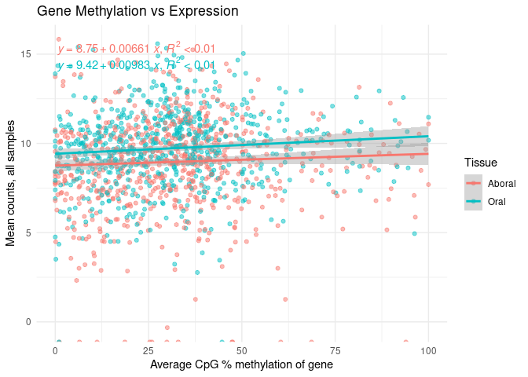<!-- -->

## 0.6 Can i get methylation in FPKM format instead of % methylation?

## 0.7 Appendix: Methylation percent count matrix

``` r
percent_meth_5x_orig <- read.csv("../output_WGBS/methylseq_V3_bwa_test/gene_body_methylation_5x.csv") 

percent_meth_5x <-percent_meth_5x_orig %>% filter(context=="CpG")
percent_meth_5x <- percent_meth_5x %>% select(transcript_id, methylation, sample)
percent_meth_5x <- percent_meth_5x %>% pivot_wider(names_from = sample, values_from = methylation )

percent_meth_5x <-percent_meth_5x %>% column_to_rownames(var = "transcript_id") 

write.csv(percent_meth_5x, "../output_WGBS/methylseq_V3_bwa_test/gene_body_CpG_matrix_5x.csv")
```

## 0.8 Appendix: Joining percent methylation data to annotations:

``` r
Biomin <- read.csv("../references/Pacuta_Biomin.csv") %>% dplyr::rename("query" = Pocillopora_acuta_best_hit) %>% select(-c(accessionnumber.geneID, Ref))

Biomin <- Biomin %>%
  group_by(query,List) %>%
  summarize(definition = paste(unique(definition), collapse = ","))
```

    ## `summarise()` has grouped output by 'query'. You can override using the
    ## `.groups` argument.

``` r
Biomin$def_short <- ifelse(nchar(Biomin$definition) > 40, 
                            paste0(substr(Biomin$definition, 1, 37), "..."), 
                            Biomin$definition)

#percent_meth_5x <- read.csv("../output_WGBS/methylseq_V3_bwa_test/gene_body_CpG_matrix_5x.csv") %>% dplyr::rename("query" = "gene_id") %>% select(-c(X)) 

Biomin_filtered_percent_methylation <- percent_meth_5x[(rownames(percent_meth_5x) %in% Biomin$query),]

write.csv(Biomin_filtered_percent_methylation, "../output_WGBS/methylseq_V3_bwa_test/Biomin_percent_methylation.csv")
```
