10-CpG-Methylation-V3
================
Zoe Dellaert
2025-02-17

- [0.1 CpG Methylation analysis](#01-cpg-methylation-analysis)
- [0.2 Managing Packages Using Renv](#02-managing-packages-using-renv)
- [0.3 Load packages](#03-load-packages)
- [0.4 All samples](#04-all-samples)
- [0.5 5X Coverage Cytosines ONLY](#05-5x-coverage-cytosines-only)
- [0.6 plots side by side](#06-plots-side-by-side)
- [0.7 Filtered for conversion
  efficiency:](#07-filtered-for-conversion-efficiency)

## 0.1 CpG Methylation analysis

## 0.2 Managing Packages Using Renv

To run this code in my project using the renv environment, run the
following lines of code

``` r
install.packages("renv") #install the package on the new computer (may not be necessary if renv bootstraps itself as expected)
renv::restore() #reinstall all the package versions in the renv lockfile
```

## 0.3 Load packages

``` r
require("tidyverse")
```

    ## Loading required package: tidyverse

    ## ── Attaching core tidyverse packages ──────────────────────── tidyverse 2.0.0 ──
    ## ✔ dplyr     1.1.4     ✔ readr     2.1.5
    ## ✔ forcats   1.0.0     ✔ stringr   1.5.1
    ## ✔ ggplot2   3.5.1     ✔ tibble    3.2.1
    ## ✔ lubridate 1.9.4     ✔ tidyr     1.3.1
    ## ✔ purrr     1.0.4     
    ## ── Conflicts ────────────────────────────────────────── tidyverse_conflicts() ──
    ## ✖ dplyr::filter() masks stats::filter()
    ## ✖ dplyr::lag()    masks stats::lag()
    ## ℹ Use the conflicted package (<http://conflicted.r-lib.org/>) to force all conflicts to become errors

``` r
require("ggplot2")
require("gtools")
```

    ## Loading required package: gtools

``` r
sessionInfo() #provides list of loaded packages and version of R.
```

    ## R version 4.4.0 (2024-04-24)
    ## Platform: x86_64-pc-linux-gnu
    ## Running under: Ubuntu 22.04.3 LTS
    ## 
    ## Matrix products: default
    ## BLAS:   /usr/lib/x86_64-linux-gnu/openblas-pthread/libblas.so.3 
    ## LAPACK: /usr/lib/x86_64-linux-gnu/openblas-pthread/libopenblasp-r0.3.20.so;  LAPACK version 3.10.0
    ## 
    ## locale:
    ##  [1] LC_CTYPE=en_US.UTF-8       LC_NUMERIC=C              
    ##  [3] LC_TIME=en_US.UTF-8        LC_COLLATE=en_US.UTF-8    
    ##  [5] LC_MONETARY=en_US.UTF-8    LC_MESSAGES=en_US.UTF-8   
    ##  [7] LC_PAPER=en_US.UTF-8       LC_NAME=C                 
    ##  [9] LC_ADDRESS=C               LC_TELEPHONE=C            
    ## [11] LC_MEASUREMENT=en_US.UTF-8 LC_IDENTIFICATION=C       
    ## 
    ## time zone: Etc/UTC
    ## tzcode source: system (glibc)
    ## 
    ## attached base packages:
    ## [1] stats     graphics  grDevices datasets  utils     methods   base     
    ## 
    ## other attached packages:
    ##  [1] gtools_3.9.5    lubridate_1.9.4 forcats_1.0.0   stringr_1.5.1  
    ##  [5] dplyr_1.1.4     purrr_1.0.4     readr_2.1.5     tidyr_1.3.1    
    ##  [9] tibble_3.2.1    ggplot2_3.5.1   tidyverse_2.0.0
    ## 
    ## loaded via a namespace (and not attached):
    ##  [1] gtable_0.3.6        compiler_4.4.0      BiocManager_1.30.25
    ##  [4] renv_1.1.1          tidyselect_1.2.1    scales_1.3.0       
    ##  [7] yaml_2.3.10         fastmap_1.2.0       R6_2.6.0           
    ## [10] generics_0.1.3      knitr_1.49          munsell_0.5.1      
    ## [13] pillar_1.10.1       tzdb_0.4.0          rlang_1.1.5        
    ## [16] stringi_1.8.4       xfun_0.50           timechange_0.3.0   
    ## [19] cli_3.6.4           withr_3.0.2         magrittr_2.0.3     
    ## [22] digest_0.6.37       grid_4.4.0          rstudioapi_0.17.1  
    ## [25] hms_1.1.3           lifecycle_1.0.4     vctrs_0.6.5        
    ## [28] evaluate_1.0.3      glue_1.8.0          colorspace_2.1-1   
    ## [31] rmarkdown_2.29      tools_4.4.0         pkgconfig_2.0.3    
    ## [34] htmltools_0.5.8.1

``` r
meta <- read.csv("../data_WGBS/LCM_WGBS_metadata.csv", sep = ",", header = TRUE) %>%
  mutate(Section_Date = as.character(Section_Date), LCM_Date = as.character(LCM_Date),DNA_Extraction_Date = as.character(DNA_Extraction_Date))

meta_simple <- meta %>% select(Sample, Fragment, Tissue, PCR_ReAmp_Cycles)
```

“Bisulfite conversion efficiency was also estimated from coral
alignments as the ratio of the sum of unmethylated cytosines in CHG and
CHH context to the sum of methylated and unmethyl- ated cytosines in CHG
and CHH.”

## 0.4 All samples

first, count the lines of all the CHH and CHG files in terminal because
it takes forever via R. You only need to do the “total” counts for one
sample since this is the same for all samples (and takes a long time)

``` bash
cd ../output_WGBS/methylseq_V3_bwa_test/methyldackel

wc -l LCM_1_quant/*_total.txt > total_counts.txt

for dir in *_quant; do
  wc -l ${dir}/*_unmethylated.txt > ${dir}/${dir}_counts.txt
done
```

``` r
#get list of all sample output directories and extract sample names
sample_directories <- list.files("../output_WGBS/methylseq_V3_bwa_test/methyldackel", pattern = "_quant", full.names = TRUE, include.dirs = TRUE)
samples <- gsub("_quant","",basename(sample_directories))

# make an empty data frame to store methylation data and conversion efficiency data
all_methylation_data <- data.frame()
conversion_eff_data <- data.frame()

for (sample in samples) {
  output_dir <- paste0("/project/pi_hputnam_uri_edu/zdellaert/LaserCoral/output_WGBS/methylseq_V3_bwa_test/methyldackel/", sample, "_quant")

  # Read percent methylation data for CpG, CHG, and CHH contexts
  CpG <- read.table(file.path(output_dir, "gene_body_CpG_methylation.txt"), header=FALSE)
  CHG <- read.table(file.path(output_dir, "gene_body_CHG_methylation.txt"), header=FALSE)
  CHH <- read.table(file.path(output_dir, "gene_body_CHH_methylation.txt"), header=FALSE)

  # label dataframe with context
  CpG$context <- "CpG"
  CHG$context <- "CHG"
  CHH$context <- "CHH"
  
  # combine into one
  methylation_data <- rbind(CpG, CHG, CHH)
  colnames(methylation_data) <- c("scaffold", "transcript_start", "transcript_end", "transcript_id", "methylation", "context")
  methylation_data$methylation <- as.numeric(methylation_data$methylation)
  methylation_data$sample <- sample

  # Append methylation data for this sample
  all_methylation_data <- rbind(all_methylation_data, methylation_data)
  
  # read in file length info for CHH and CHG total counts and unmethyated counts
  
  count_table <- read.table(file.path(output_dir, paste0(sample, "_quant_counts.txt")), header=FALSE)
  counts <- as.numeric(count_table$V1)
  names(counts) <- basename(count_table$V2)

  unmethylated_CHG <- counts["CHG_unmethylated.txt"]
  unmethylated_CHH <- counts["CHH_unmethylated.txt"]

  total_table <- read.table("/project/pi_hputnam_uri_edu/zdellaert/LaserCoral/output_WGBS/methylseq_V3_bwa_test/methyldackel/total_counts.txt", header=FALSE)
  totals <- as.numeric(total_table$V1)
  names(totals) <- basename(total_table$V2)
  
  total_CHG <- totals["CHG_total.txt"]
  total_CHH <- totals["CHH_total.txt"]

  # Sum of unmethylated cytosines
  unmethylated_total <- unmethylated_CHG + unmethylated_CHH

  # Sum of total cytosines (methylated + unmethylated)
  total_cytosines <- total_CHG + total_CHH

  # Bisulfite conversion efficiency calculation
  conversion_efficiency <- unmethylated_total / total_cytosines
  print(paste(sample, "Bisulfite Conversion Efficiency: ", conversion_efficiency))

  conversion_eff_data <- rbind(conversion_eff_data, data.frame(sample=sample, efficiency=conversion_efficiency))
}

write.csv(all_methylation_data, "../output_WGBS/methylseq_V3_bwa_test/gene_body_methylation.csv",row.names = FALSE)
write.csv(conversion_eff_data, "../output_WGBS/methylseq_V3_bwa_test/conversion_efficiency.csv",row.names = FALSE)
```

Analyze and plot:

``` r
conversion_eff_data <- read.csv( "../output_WGBS/methylseq_V3_bwa_test/conversion_efficiency.csv", sep = ",", header = TRUE) 
all_methylation_data <- read.csv( "../output_WGBS/methylseq_V3_bwa_test/gene_body_methylation.csv", sep = ",", header = TRUE) 

conversion_eff_data <- conversion_eff_data %>%
  left_join(meta_simple,by = join_by(sample == Sample)) %>%
  mutate(sample = fct_relevel(sample, conversion_eff_data$sample[mixedorder(conversion_eff_data$sample)])) 

all_methylation_data <- all_methylation_data %>% left_join(meta_simple,by = join_by(sample == Sample)) %>%
  mutate(sample = fct_relevel(sample, (unique(all_methylation_data$sample)[mixedorder(unique(all_methylation_data$sample))]))) 

# Plot methylation distributions by context and sample
ggplot(all_methylation_data, aes(x=sample, y=methylation, fill=Fragment)) +
  geom_boxplot() +
  facet_grid(~context, scales = "free") +
  theme_minimal() +
  theme(axis.text.x = element_text(angle = 45, hjust = 1)) +
  labs(title="Gene Body Methylation at CpG, CHG, and CHH loci", y="Mean Methylation (%)")
```

    ## Warning: Removed 102012 rows containing non-finite outside the scale range
    ## (`stat_boxplot()`).

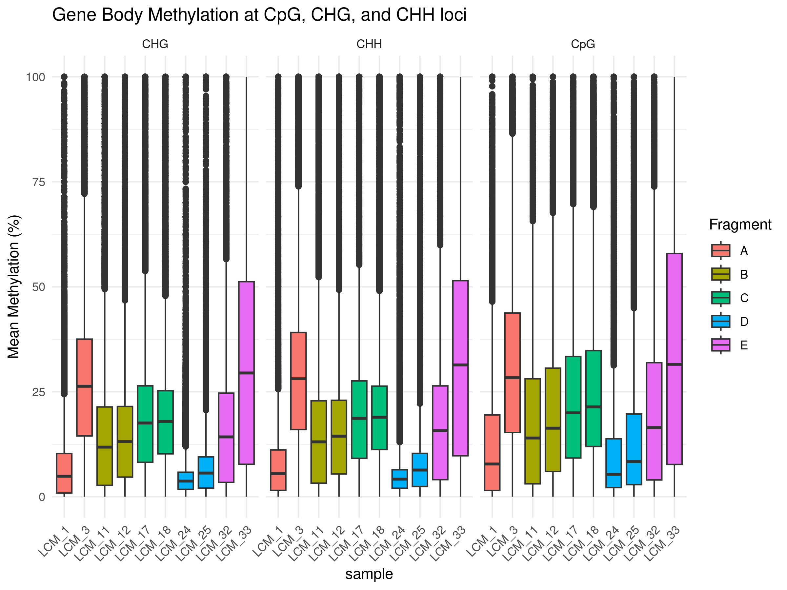<!-- -->

``` r
ggplot(conversion_eff_data, aes(x=sample, y=efficiency, fill=Tissue)) +
  geom_bar(stat="identity", color="black") +
  theme_minimal() +
  facet_grid(~Fragment, scales = "free") +
  labs(title="Bisulfite Conversion Efficiency per Sample", y="Conversion Efficiency", x="Sample") +
  theme(axis.text.x = element_text(angle = 45, hjust = 1)) +
  ylim(0, 1) 
```

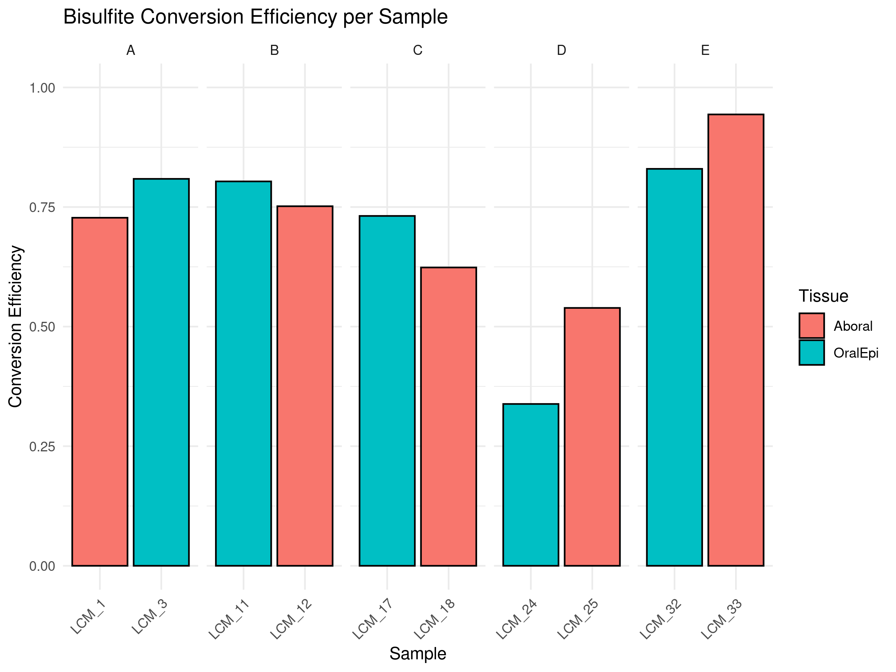<!-- -->

``` r
ggplot(conversion_eff_data, aes(x=sample, y=efficiency, fill=PCR_ReAmp_Cycles)) +
  geom_bar(stat="identity", color="black") +
  theme_minimal() +
  facet_grid(~Fragment, scales = "free") +
  labs(title="Bisulfite Conversion Efficiency per Sample", y="Conversion Efficiency", x="Sample") +
  theme(axis.text.x = element_text(angle = 45, hjust = 1)) +
  ylim(0, 1) 
```

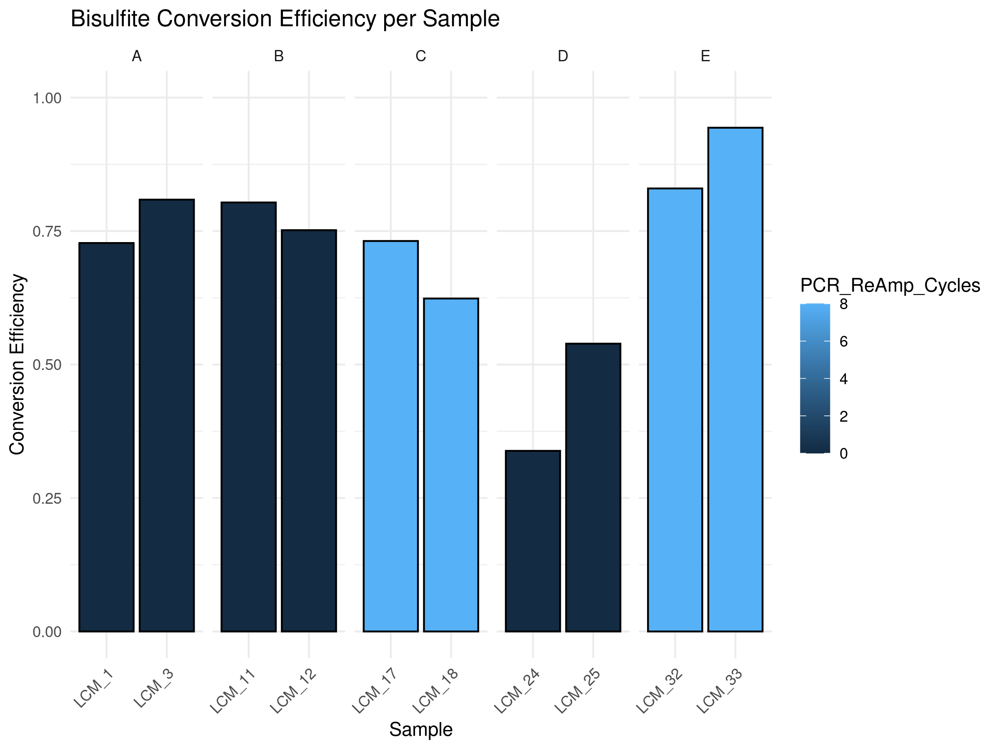<!-- -->

``` r
summary <- all_methylation_data %>%
  group_by(sample, context) %>%
  summarize(mean_methylation = mean(methylation, na.rm = TRUE)) %>% filter(context =="CpG") %>% left_join(conversion_eff_data)
```

    ## `summarise()` has grouped output by 'sample'. You can override using the
    ## `.groups` argument.
    ## Joining with `by = join_by(sample)`

``` r
ggplot(summary, aes(x=mean_methylation, y=efficiency, color=Fragment, label=sample)) +
  geom_point() +
    geom_text(nudge_x = -2.5) + 
  #geom_smooth() +
  theme_minimal() +
  theme(axis.text.x = element_text(angle = 45, hjust = 1)) +
  labs(y="bisulfite conversion efficiency")
```

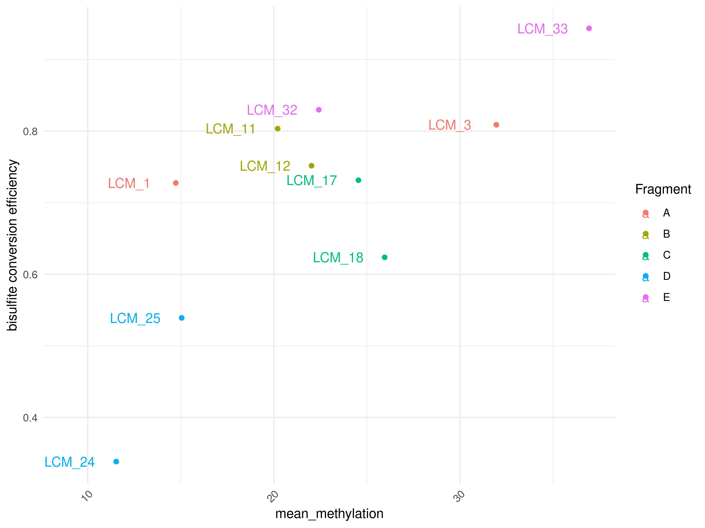<!-- -->

## 0.5 5X Coverage Cytosines ONLY

first, count the lines of all the CHH and CHG files in terminal because
it takes forever via R

``` bash
cd ../output_WGBS/methylseq_V3_bwa_test/methyldackel

wc -l LCM_1_5Xquant/*_total_5x.txt > total_counts_5x.txt

for dir in *_5Xquant; do
  wc -l ${dir}/*_unmethylated_5x.txt > ${dir}/${dir}_counts.txt
done
```

``` r
#get list of all sample output directories and extract sample names
sample_directories <- list.files("../output_WGBS/methylseq_V3_bwa_test/methyldackel", pattern = "_5Xquant", full.names = TRUE, include.dirs = TRUE)
samples <- gsub("_5Xquant","",basename(sample_directories))

# make an empty data frame to store methylation data and conversion efficiency data
all_methylation_data_5x <- data.frame()
conversion_eff_data_5x <- data.frame()

for (sample in samples) {
  output_dir <- paste0("/project/pi_hputnam_uri_edu/zdellaert/LaserCoral/output_WGBS/methylseq_V3_bwa_test/methyldackel/", sample, "_5Xquant")
  
  # Read percent methylation data for CpG, CHG, and CHH contexts
  CpG <- read.table(file.path(output_dir, "gene_body_CpG_methylation.txt"), header=FALSE)
  CHG <- read.table(file.path(output_dir, "gene_body_CHG_methylation.txt"), header=FALSE)
  CHH <- read.table(file.path(output_dir, "gene_body_CHH_methylation.txt"), header=FALSE)

  # label dataframe with context
  CpG$context <- "CpG"
  CHG$context <- "CHG"
  CHH$context <- "CHH"
  
  # combine into one
  methylation_data <- rbind(CpG, CHG, CHH)
  colnames(methylation_data) <- c("scaffold", "transcript_start", "transcript_end", "transcript_id", "methylation", "context")
  methylation_data$methylation <- as.numeric(methylation_data$methylation)
  methylation_data$sample <- sample

  # Append methylation data for this sample
  all_methylation_data_5x <- rbind(all_methylation_data_5x, methylation_data)

  count_table <- read.table(file.path(output_dir, paste0(sample, "_5Xquant_counts.txt")), header=FALSE)
  counts <- as.numeric(count_table$V1)
  names(counts) <- basename(count_table$V2)

  unmethylated_CHG <- counts["CHG_unmethylated_5x.txt"]
  unmethylated_CHH <- counts["CHH_unmethylated_5x.txt"]

  total_table <- read.table("/project/pi_hputnam_uri_edu/zdellaert/LaserCoral/output_WGBS/methylseq_V3_bwa_test/methyldackel/total_counts_5x.txt", header=FALSE)
  totals <- as.numeric(total_table$V1)
  names(totals) <- basename(total_table$V2)
  
  total_CHG <- totals["CHG_total_5x.txt"]
  total_CHH <- totals["CHH_total_5x.txt"]

  # Sum of unmethylated cytosines
  unmethylated_total <- unmethylated_CHG + unmethylated_CHH

  # Sum of total cytosines (methylated + unmethylated)
  total_cytosines <- total_CHG + total_CHH

  # Bisulfite conversion efficiency calculation
  conversion_efficiency <- unmethylated_total / total_cytosines
  print(paste(sample, "Bisulfite Conversion Efficiency: ", conversion_efficiency))

  conversion_eff_data_5x <- rbind(conversion_eff_data_5x, data.frame(sample=sample, efficiency=conversion_efficiency))
}

write.csv(all_methylation_data_5x, "../output_WGBS/methylseq_V3_bwa_test/gene_body_methylation_5x.csv",row.names = FALSE)
write.csv(conversion_eff_data_5x, "../output_WGBS/methylseq_V3_bwa_test/conversion_efficiency_5x.csv",row.names = FALSE)
```

Analyze and plot:

``` r
conversion_eff_data_5x <- read.csv( "../output_WGBS/methylseq_V3_bwa_test/conversion_efficiency_5x.csv", sep = ",", header = TRUE) 
all_methylation_data_5x <- read.csv( "../output_WGBS/methylseq_V3_bwa_test/gene_body_methylation_5x.csv", sep = ",", header = TRUE) 

conversion_eff_data_5x <- conversion_eff_data_5x %>%
  left_join(meta_simple,by = join_by(sample == Sample)) %>%
  mutate(sample = fct_relevel(sample, conversion_eff_data_5x$sample[mixedorder(conversion_eff_data_5x$sample)])) 

all_methylation_data_5x <- all_methylation_data_5x %>% left_join(meta_simple,by = join_by(sample == Sample)) %>%
  mutate(sample = fct_relevel(sample, (unique(all_methylation_data_5x$sample)[mixedorder(unique(all_methylation_data_5x$sample))]))) 

# Plot methylation distributions by context and sample
ggplot(all_methylation_data_5x, aes(x=sample, y=methylation, fill=Fragment)) +
  geom_boxplot() +
  facet_grid(~context, scales = "free") +
  theme_minimal() +
  theme(axis.text.x = element_text(angle = 45, hjust = 1)) +
  labs(title="5X coverage-loci ONLY - Gene Body Methylation at CpG, CHG, and CHH loci", y="Mean Methylation (%)")
```

    ## Warning: Removed 274652 rows containing non-finite outside the scale range
    ## (`stat_boxplot()`).

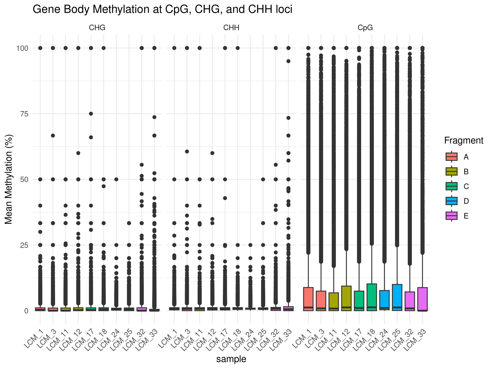<!-- -->

``` r
ggplot(conversion_eff_data_5x, aes(x=sample, y=efficiency, fill=Tissue)) +
  geom_bar(stat="identity", color="black") +
  theme_minimal() +
  facet_grid(~Fragment, scales = "free") +
  labs(title="5X coverage-loci ONLY - Bisulfite Conversion Efficiency per Sample", y="Conversion Efficiency", x="Sample") +
  theme(axis.text.x = element_text(angle = 45, hjust = 1)) +
  ylim(0, 1) 
```

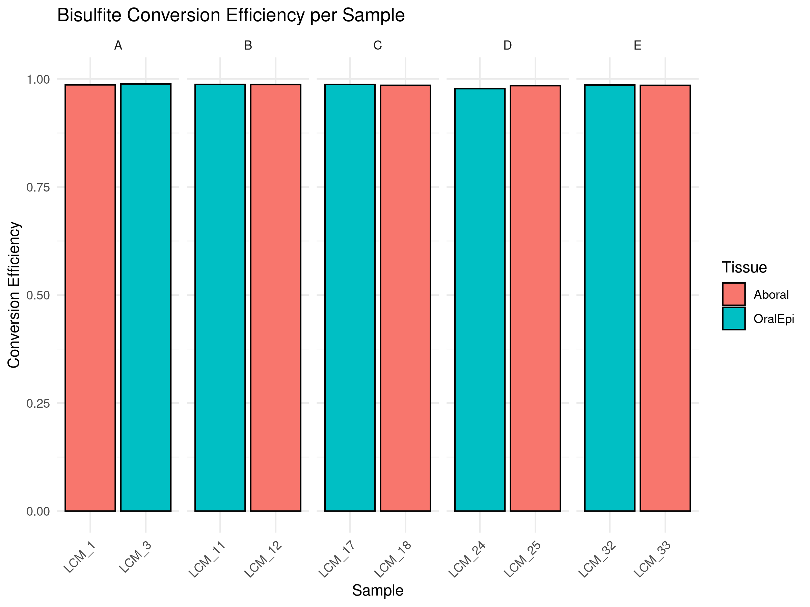<!-- -->

``` r
ggplot(conversion_eff_data_5x, aes(x=sample, y=efficiency, fill=PCR_ReAmp_Cycles)) +
  geom_bar(stat="identity", color="black") +
  theme_minimal() +
  facet_grid(~Fragment, scales = "free") +
  labs(title="5X coverage-loci ONLY - Bisulfite Conversion Efficiency per Sample", y="Conversion Efficiency", x="Sample") +
  theme(axis.text.x = element_text(angle = 45, hjust = 1)) +
  ylim(0, 1) 
```

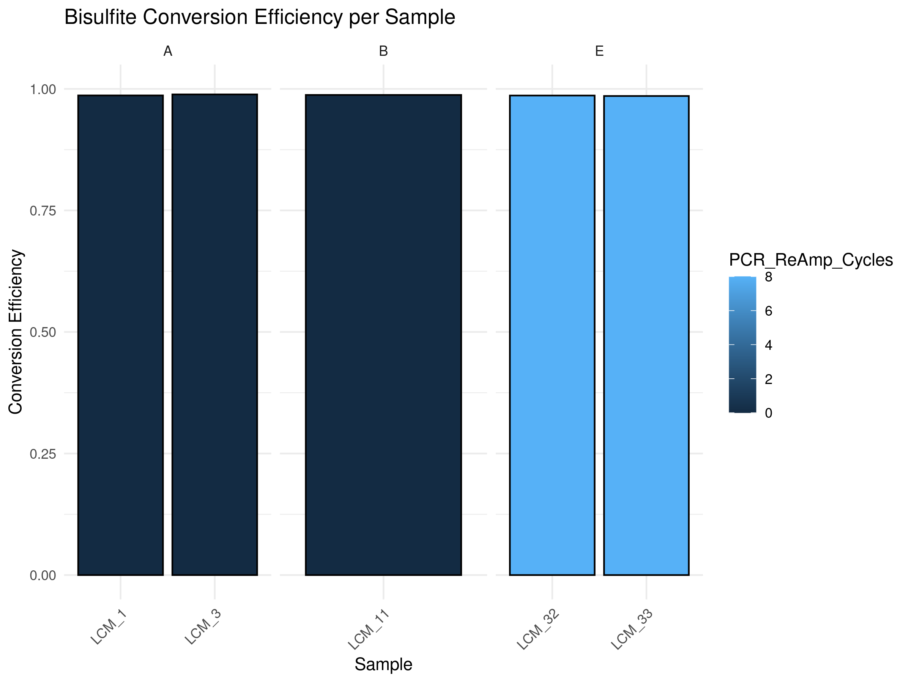<!-- -->

``` r
summary <- all_methylation_data_5x %>%
  group_by(sample, context) %>%
  summarize(mean_methylation = mean(methylation, na.rm = TRUE)) %>% filter(context =="CpG") %>% left_join(conversion_eff_data_5x)
```

    ## `summarise()` has grouped output by 'sample'. You can override using the
    ## `.groups` argument.
    ## Joining with `by = join_by(sample)`

``` r
ggplot(summary, aes(x=mean_methylation, y=efficiency, color=Fragment, label=sample)) +
  geom_point() +
  geom_text(nudge_x = -2.5) + 
  #geom_smooth() +
  theme_minimal() +
  theme(axis.text.x = element_text(angle = 45, hjust = 1)) +
  labs(title="5X coverage-loci ONLY" , y="bisulfite conversion efficiency")
```

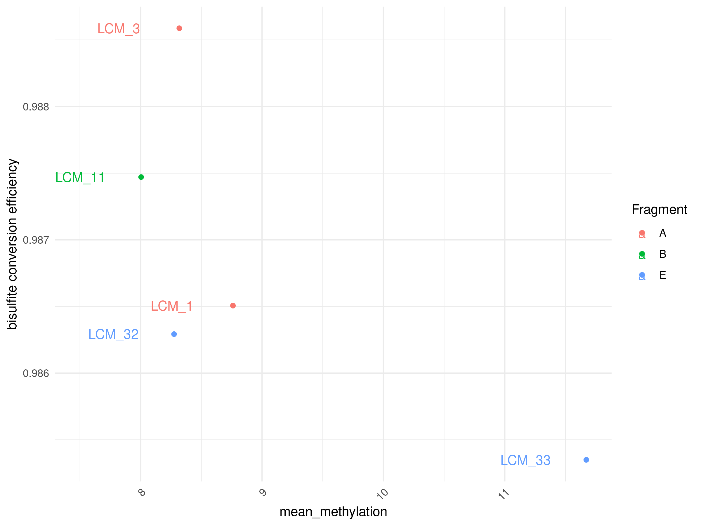<!-- -->

## 0.6 plots side by side

``` r
ggplot(all_methylation_data, aes(x=sample, y=methylation, fill=Fragment)) +
  geom_boxplot() +
  facet_grid(~context, scales = "free") +
  theme_minimal() +
  theme(axis.text.x = element_text(angle = 45, hjust = 1)) +
  labs(title="Gene Body Methylation at CpG, CHG, and CHH loci", y="Mean Methylation (%)")
```

    ## Warning: Removed 102012 rows containing non-finite outside the scale range
    ## (`stat_boxplot()`).

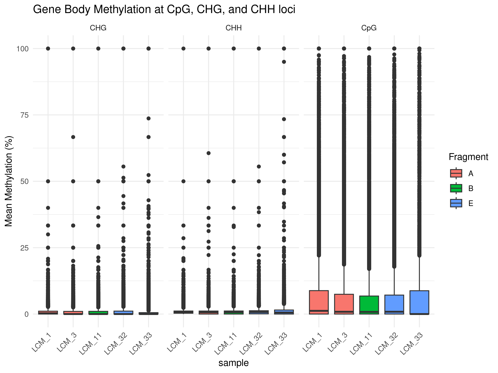<!-- -->

``` r
ggplot(all_methylation_data_5x, aes(x=sample, y=methylation, fill=Fragment)) +
  geom_boxplot() +
  facet_grid(~context, scales = "free") +
  theme_minimal() +
  theme(axis.text.x = element_text(angle = 45, hjust = 1)) +
  labs(title="5X coverage-loci ONLY - Gene Body Methylation at CpG, CHG, and CHH loci", y="Mean Methylation (%)")
```

    ## Warning: Removed 274652 rows containing non-finite outside the scale range
    ## (`stat_boxplot()`).

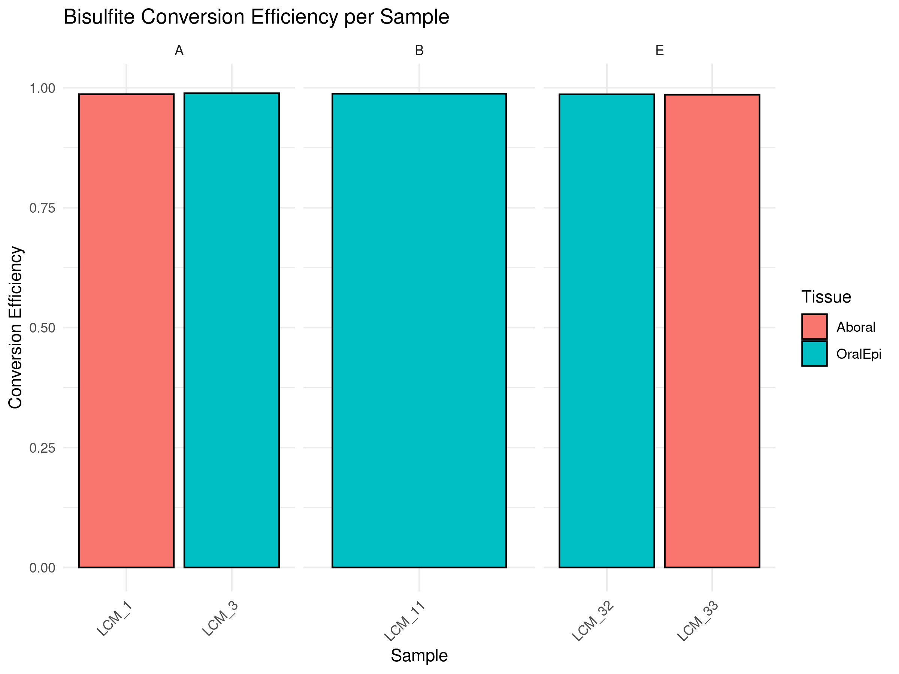<!-- -->

``` r
ggplot(conversion_eff_data, aes(x=sample, y=efficiency, fill=Tissue)) +
  geom_bar(stat="identity", color="black") +
  theme_minimal() +
  facet_grid(~Fragment, scales = "free") +
  labs(title="Bisulfite Conversion Efficiency per Sample", y="Conversion Efficiency", x="Sample") +
  theme(axis.text.x = element_text(angle = 45, hjust = 1)) +
  ylim(0, 1) 
```

<!-- -->

``` r
ggplot(conversion_eff_data_5x, aes(x=sample, y=efficiency, fill=Tissue)) +
  geom_bar(stat="identity", color="black") +
  theme_minimal() +
  facet_grid(~Fragment, scales = "free") +
  labs(title="5X coverage-loci ONLY - Bisulfite Conversion Efficiency per Sample", y="Conversion Efficiency", x="Sample") +
  theme(axis.text.x = element_text(angle = 45, hjust = 1)) +
  ylim(0, 1) 
```

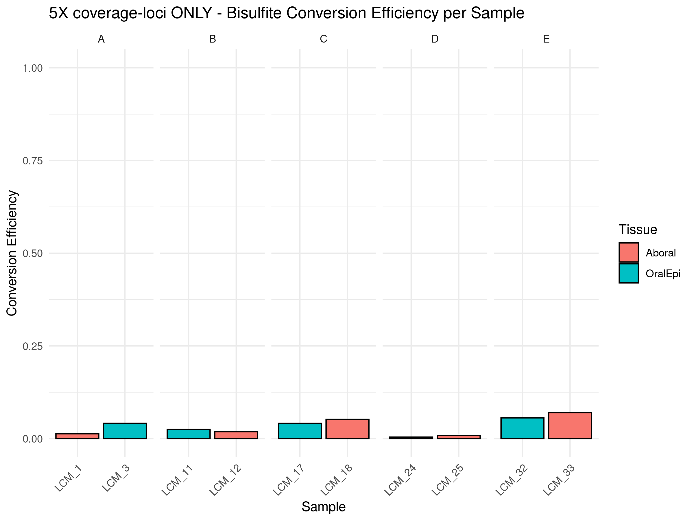<!-- -->

``` r
ggplot(conversion_eff_data, aes(x=sample, y=efficiency, fill=PCR_ReAmp_Cycles)) +
  geom_bar(stat="identity", color="black") +
  theme_minimal() +
  facet_grid(~Fragment, scales = "free") +
  labs(title="Bisulfite Conversion Efficiency per Sample", y="Conversion Efficiency", x="Sample") +
  theme(axis.text.x = element_text(angle = 45, hjust = 1)) +
  ylim(0, 1) 
```

<!-- -->

``` r
ggplot(conversion_eff_data_5x, aes(x=sample, y=efficiency, fill=PCR_ReAmp_Cycles)) +
  geom_bar(stat="identity", color="black") +
  theme_minimal() +
  facet_grid(~Fragment, scales = "free") +
  labs(title="5X coverage-loci ONLY - Bisulfite Conversion Efficiency per Sample", y="Conversion Efficiency", x="Sample") +
  theme(axis.text.x = element_text(angle = 45, hjust = 1)) +
  ylim(0, 1) 
```

<!-- -->

``` r
summary <- all_methylation_data %>%
  group_by(sample, context) %>%
  summarize(mean_methylation = mean(methylation, na.rm = TRUE)) %>% filter(context =="CpG") %>% left_join(conversion_eff_data)
```

    ## `summarise()` has grouped output by 'sample'. You can override using the
    ## `.groups` argument.
    ## Joining with `by = join_by(sample)`

``` r
ggplot(summary, aes(x=mean_methylation, y=efficiency, color=Fragment, label=sample)) +
  geom_point() +
    geom_text(nudge_x = -2.5) + 
  #geom_smooth() +
  theme_minimal() +
  theme(axis.text.x = element_text(angle = 45, hjust = 1)) +
    labs(y="bisulfite conversion efficiency")
```

<!-- -->

``` r
summary <- all_methylation_data_5x %>%
  group_by(sample, context) %>%
  summarize(mean_methylation = mean(methylation, na.rm = TRUE)) %>% filter(context =="CpG") %>% left_join(conversion_eff_data_5x)
```

    ## `summarise()` has grouped output by 'sample'. You can override using the
    ## `.groups` argument.
    ## Joining with `by = join_by(sample)`

``` r
ggplot(summary, aes(x=mean_methylation, y=efficiency, color=Fragment, label=sample)) +
  geom_point() +
  geom_text(nudge_x = -2.5) + 
  #geom_smooth() +
  theme_minimal() +
  theme(axis.text.x = element_text(angle = 45, hjust = 1)) +
    labs(title="5X coverage-loci ONLY" , y="bisulfite conversion efficiency")
```

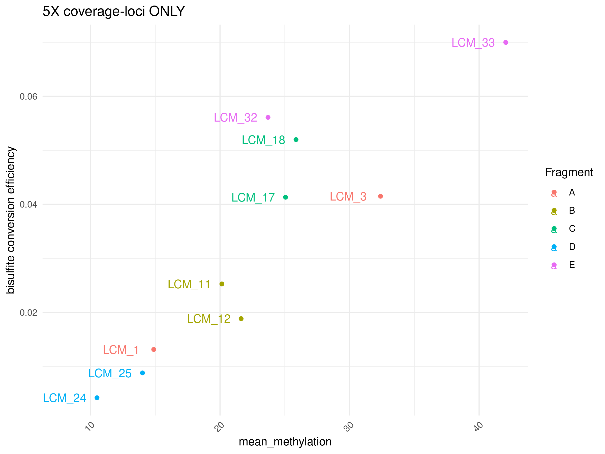<!-- -->

## 0.7 Filtered for conversion efficiency:

first, count the lines of all the CHH and CHG files in terminal because
it takes forever via R. You only need to do the “total” counts for one
sample since this is the same for all samples (and takes a long time)

> 50% conversion efficiency:

``` bash
cd ../output_WGBS/methylseq_V3_bwa_test/bwameth/deduplicated/min_efficiency_test

wc -l min_50_LCM_3_quant/*_total.txt > min_50_total_counts.txt

for dir in min_50_*_quant; do
  wc -l ${dir}/*_unmethylated.txt > ${dir}/${dir}_counts.txt
done
```

``` r
#get list of all sample output directories and extract sample names
sample_directories <- list.files("../output_WGBS/methylseq_V3_bwa_test/bwameth/deduplicated/min_efficiency_test", pattern = "_quant", full.names = TRUE, include.dirs = TRUE)

sample_directories <- sample_directories[grep("min_50",sample_directories)]
samples <- gsub("_quant","",basename(sample_directories))
samples <- gsub("min_50_","",samples)

# make an empty data frame to store methylation data and conversion efficiency data
all_methylation_data <- data.frame()
conversion_eff_data <- data.frame()

for (sample in samples) {
  output_dir <- paste0("/project/pi_hputnam_uri_edu/zdellaert/LaserCoral/output_WGBS/methylseq_V3_bwa_test/bwameth/deduplicated/min_efficiency_test/min_50_", sample, "_quant")

  # Read percent methylation data for CpG, CHG, and CHH contexts
  CpG <- read.table(file.path(output_dir, "gene_body_CpG_methylation.txt"), header=FALSE)
  CHG <- read.table(file.path(output_dir, "gene_body_CHG_methylation.txt"), header=FALSE)
  CHH <- read.table(file.path(output_dir, "gene_body_CHH_methylation.txt"), header=FALSE)

  # label dataframe with context
  CpG$context <- "CpG"
  CHG$context <- "CHG"
  CHH$context <- "CHH"
  
  # combine into one
  methylation_data <- rbind(CpG, CHG, CHH)
  colnames(methylation_data) <- c("scaffold", "transcript_start", "transcript_end", "transcript_id", "methylation", "context")
  methylation_data$methylation <- as.numeric(methylation_data$methylation)
  methylation_data$sample <- sample

  # Append methylation data for this sample
  all_methylation_data <- rbind(all_methylation_data, methylation_data)
  
  # read in file length info for CHH and CHG total counts and unmethyated counts
  
  count_table <- read.table(file.path(output_dir, paste0("min_50_",sample, "_quant_counts.txt")), header=FALSE)
  counts <- as.numeric(count_table$V1)
  names(counts) <- basename(count_table$V2)

  unmethylated_CHG <- counts["CHG_unmethylated.txt"]
  unmethylated_CHH <- counts["CHH_unmethylated.txt"]

  total_table <- read.table(file.path(gsub(paste0("min_50_",sample, "_quant"),"", output_dir), "min_50_total_counts.txt"), header=FALSE)
  totals <- as.numeric(total_table$V1)
  names(totals) <- basename(total_table$V2)
  
  total_CHG <- totals["CHG_total.txt"]
  total_CHH <- totals["CHH_total.txt"]

  # Sum of unmethylated cytosines
  unmethylated_total <- unmethylated_CHG + unmethylated_CHH

  # Sum of total cytosines (methylated + unmethylated)
  total_cytosines <- total_CHG + total_CHH

  # Bisulfite conversion efficiency calculation
  conversion_efficiency <- unmethylated_total / total_cytosines
  print(paste(sample, "Bisulfite Conversion Efficiency: ", conversion_efficiency))

  conversion_eff_data <- rbind(conversion_eff_data, data.frame(sample=sample, efficiency=conversion_efficiency))
}

write.csv(all_methylation_data, "../output_WGBS/methylseq_V3_bwa_test/bwameth/deduplicated/min_efficiency_test/min_50_gene_body_methylation.csv",row.names = FALSE)
write.csv(conversion_eff_data, "../output_WGBS/methylseq_V3_bwa_test/bwameth/deduplicated/min_efficiency_test/min_50_conversion_efficiency.csv",row.names = FALSE)
```

Analyze and plot:

``` r
conversion_eff_data <- read.csv( "../output_WGBS/methylseq_V3_bwa_test/bwameth/deduplicated/min_efficiency_test/min_50_conversion_efficiency.csv", sep = ",", header = TRUE) 
all_methylation_data <- read.csv(  "../output_WGBS/methylseq_V3_bwa_test/bwameth/deduplicated/min_efficiency_test/min_50_gene_body_methylation.csv", sep = ",", header = TRUE) 

conversion_eff_data <- conversion_eff_data %>%
  left_join(meta_simple,by = join_by(sample == Sample)) %>%
  mutate(sample = fct_relevel(sample, conversion_eff_data$sample[mixedorder(conversion_eff_data$sample)])) 

all_methylation_data <- all_methylation_data %>% left_join(meta_simple,by = join_by(sample == Sample)) %>%
  mutate(sample = fct_relevel(sample, (unique(all_methylation_data$sample)[mixedorder(unique(all_methylation_data$sample))]))) 

# Plot methylation distributions by context and sample
ggplot(all_methylation_data, aes(x=sample, y=methylation, fill=Fragment)) +
  geom_boxplot() +
  facet_grid(~context, scales = "free") +
  theme_minimal() +
  theme(axis.text.x = element_text(angle = 45, hjust = 1)) +
  labs(title="Gene Body Methylation at CpG, CHG, and CHH loci", y="Mean Methylation (%)")
```

    ## Warning: Removed 79609 rows containing non-finite outside the scale range
    ## (`stat_boxplot()`).

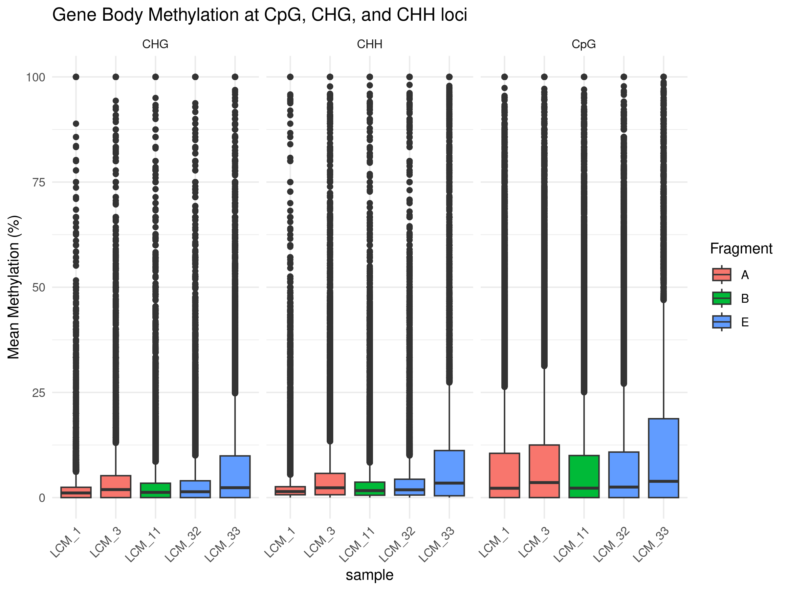<!-- -->

``` r
ggplot(conversion_eff_data, aes(x=sample, y=efficiency, fill=Tissue)) +
  geom_bar(stat="identity", color="black") +
  theme_minimal() +
  facet_grid(~Fragment, scales = "free") +
  labs(title="Bisulfite Conversion Efficiency per Sample", y="Conversion Efficiency", x="Sample") +
  theme(axis.text.x = element_text(angle = 45, hjust = 1)) +
  ylim(0, 1) 
```

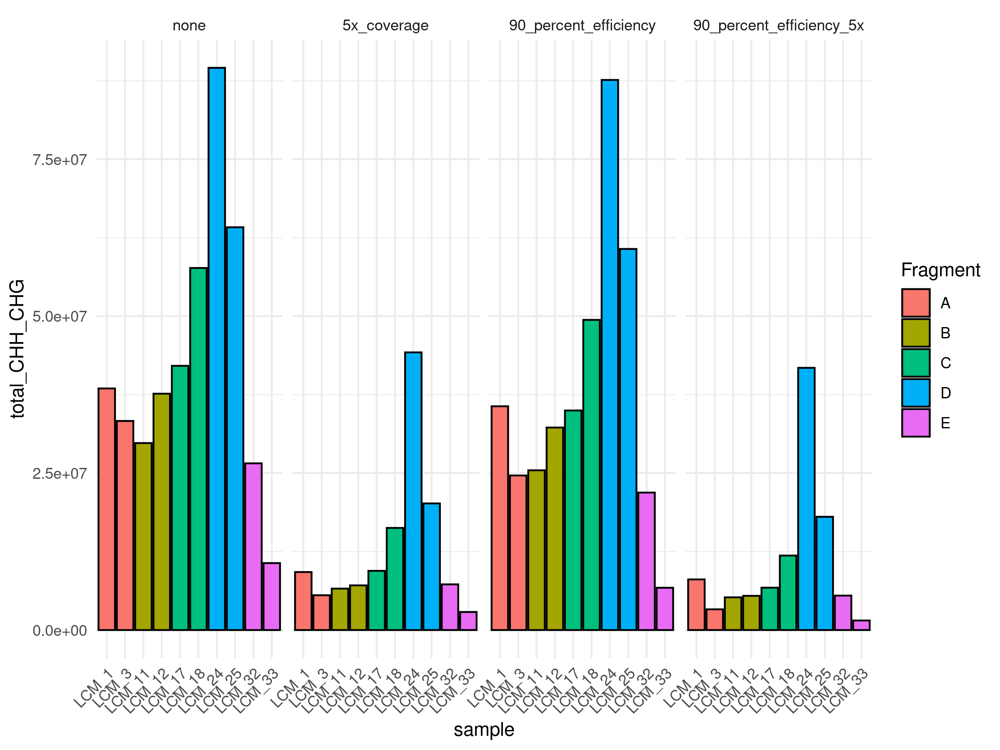<!-- -->

``` r
ggplot(conversion_eff_data, aes(x=sample, y=efficiency, fill=PCR_ReAmp_Cycles)) +
  geom_bar(stat="identity", color="black") +
  theme_minimal() +
  facet_grid(~Fragment, scales = "free") +
  labs(title="Bisulfite Conversion Efficiency per Sample", y="Conversion Efficiency", x="Sample") +
  theme(axis.text.x = element_text(angle = 45, hjust = 1)) +
  ylim(0, 1) 
```

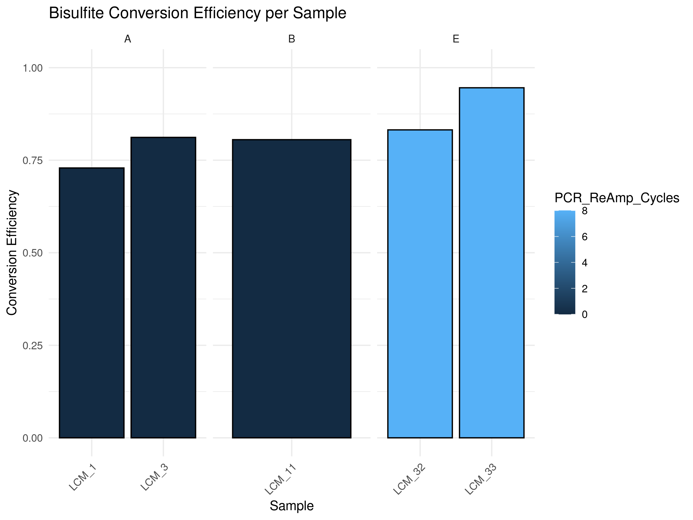<!-- -->

``` r
summary <- all_methylation_data %>%
  group_by(sample, context) %>%
  summarize(mean_methylation = mean(methylation, na.rm = TRUE)) %>% filter(context =="CpG") %>% left_join(conversion_eff_data)
```

    ## `summarise()` has grouped output by 'sample'. You can override using the
    ## `.groups` argument.
    ## Joining with `by = join_by(sample)`

``` r
ggplot(summary, aes(x=mean_methylation, y=efficiency, color=Fragment, label=sample)) +
  geom_point() +
    geom_text(nudge_x = -0.5) + 
  #geom_smooth() +
  theme_minimal() +
  theme(axis.text.x = element_text(angle = 45, hjust = 1)) +
  labs(y="bisulfite conversion efficiency")
```

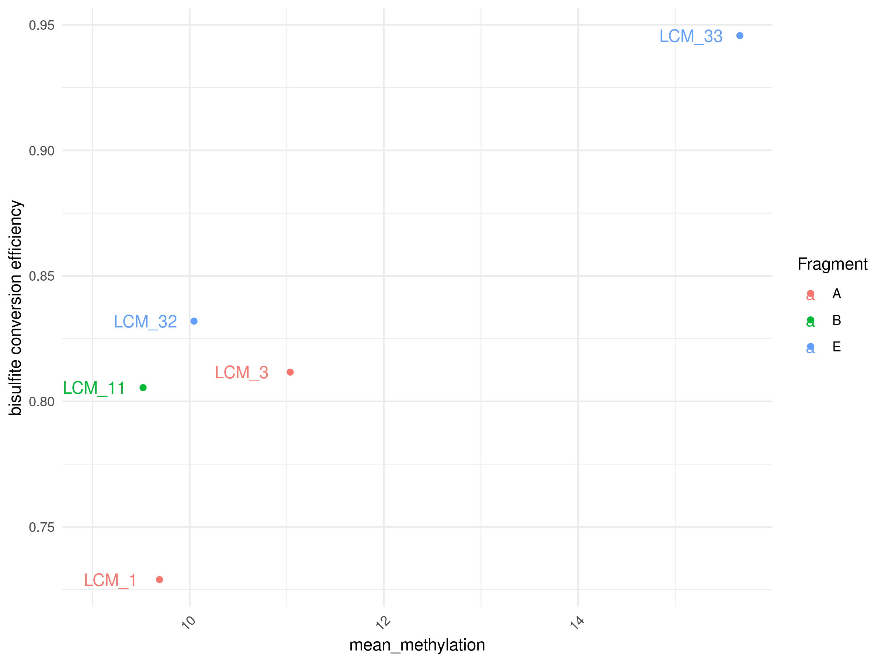<!-- -->
