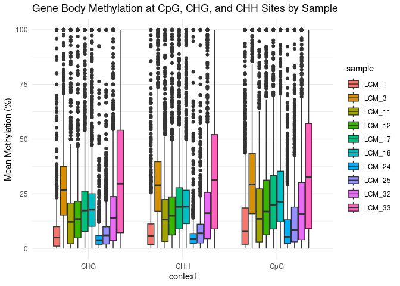
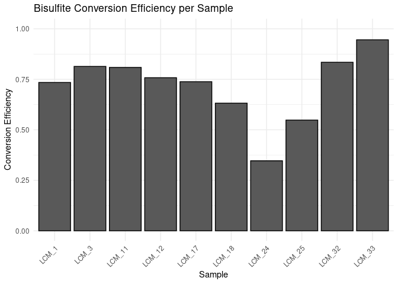

10-CpG-Methylation-fb
================
Zoe Dellaert
2025-02-17

- [0.1 CpG Methylation analysis](#01-cpg-methylation-analysis)
- [0.2 Managing Packages Using Renv](#02-managing-packages-using-renv)
- [0.3 Load packages](#03-load-packages)
- [0.4 All samples](#04-all-samples)

## 0.1 CpG Methylation analysis

## 0.2 Managing Packages Using Renv

To run this code in my project using the renv environment, run the
following lines of code

``` r
install.packages("renv") #install the package on the new computer (may not be necessary if renv bootstraps itself as expected)
renv::restore() #reinstall all the package versions in the renv lockfile
```

## 0.3 Load packages

``` r
require("tidyverse")
```

    ## Loading required package: tidyverse

    ## ── Attaching core tidyverse packages ──────────────────────── tidyverse 2.0.0 ──
    ## ✔ dplyr     1.1.4     ✔ readr     2.1.5
    ## ✔ forcats   1.0.0     ✔ stringr   1.5.1
    ## ✔ ggplot2   3.5.1     ✔ tibble    3.2.1
    ## ✔ lubridate 1.9.4     ✔ tidyr     1.3.1
    ## ✔ purrr     1.0.4     
    ## ── Conflicts ────────────────────────────────────────── tidyverse_conflicts() ──
    ## ✖ dplyr::filter() masks stats::filter()
    ## ✖ dplyr::lag()    masks stats::lag()
    ## ℹ Use the conflicted package (<http://conflicted.r-lib.org/>) to force all conflicts to become errors

``` r
require("ggplot2")
require("gtools")
```

    ## Loading required package: gtools

``` r
sessionInfo() #provides list of loaded packages and version of R.
```

    ## R version 4.4.0 (2024-04-24)
    ## Platform: x86_64-pc-linux-gnu
    ## Running under: Ubuntu 22.04.3 LTS
    ## 
    ## Matrix products: default
    ## BLAS:   /usr/lib/x86_64-linux-gnu/openblas-pthread/libblas.so.3 
    ## LAPACK: /usr/lib/x86_64-linux-gnu/openblas-pthread/libopenblasp-r0.3.20.so;  LAPACK version 3.10.0
    ## 
    ## locale:
    ##  [1] LC_CTYPE=en_US.UTF-8       LC_NUMERIC=C              
    ##  [3] LC_TIME=en_US.UTF-8        LC_COLLATE=en_US.UTF-8    
    ##  [5] LC_MONETARY=en_US.UTF-8    LC_MESSAGES=en_US.UTF-8   
    ##  [7] LC_PAPER=en_US.UTF-8       LC_NAME=C                 
    ##  [9] LC_ADDRESS=C               LC_TELEPHONE=C            
    ## [11] LC_MEASUREMENT=en_US.UTF-8 LC_IDENTIFICATION=C       
    ## 
    ## time zone: Etc/UTC
    ## tzcode source: system (glibc)
    ## 
    ## attached base packages:
    ## [1] stats     graphics  grDevices datasets  utils     methods   base     
    ## 
    ## other attached packages:
    ##  [1] gtools_3.9.5    lubridate_1.9.4 forcats_1.0.0   stringr_1.5.1  
    ##  [5] dplyr_1.1.4     purrr_1.0.4     readr_2.1.5     tidyr_1.3.1    
    ##  [9] tibble_3.2.1    ggplot2_3.5.1   tidyverse_2.0.0
    ## 
    ## loaded via a namespace (and not attached):
    ##  [1] gtable_0.3.6        compiler_4.4.0      BiocManager_1.30.25
    ##  [4] renv_1.1.1          tidyselect_1.2.1    scales_1.3.0       
    ##  [7] yaml_2.3.10         fastmap_1.2.0       R6_2.6.0           
    ## [10] generics_0.1.3      knitr_1.49          munsell_0.5.1      
    ## [13] pillar_1.10.1       tzdb_0.4.0          rlang_1.1.5        
    ## [16] stringi_1.8.4       xfun_0.50           timechange_0.3.0   
    ## [19] cli_3.6.4           withr_3.0.2         magrittr_2.0.3     
    ## [22] digest_0.6.37       grid_4.4.0          rstudioapi_0.17.1  
    ## [25] hms_1.1.3           lifecycle_1.0.4     vctrs_0.6.5        
    ## [28] evaluate_1.0.3      glue_1.8.0          colorspace_2.1-1   
    ## [31] rmarkdown_2.29      tools_4.4.0         pkgconfig_2.0.3    
    ## [34] htmltools_0.5.8.1

``` r
meta <- read.csv("../data_WGBS/LCM_WGBS_metadata.csv", sep = ",", header = TRUE) %>%
  mutate(Section_Date = as.character(Section_Date), LCM_Date = as.character(LCM_Date),DNA_Extraction_Date = as.character(DNA_Extraction_Date))

meta <- meta %>% arrange(Sample)

tissue <- meta$Tissue
tissue_binary <- gsub("Aboral", "1", tissue)
tissue_binary <- gsub("OralEpi", "0", tissue_binary)
tissue_binary <- as.numeric(tissue_binary)
fragment <- meta$Fragment
```

“Bisulfite conversion efficiency was also estimated from coral
alignments as the ratio of the sum of unmethylated cytosines in CHG and
CHH context to the sum of methylated and unmethyl- ated cytosines in CHG
and CHH.”

## 0.4 All samples

``` r
#get list of all sample output directories and extract sample names
sample_directories <- list.files("~/zdellaert_uri_edu-shared/methylseq_bwa_fb/methyldackel", pattern = "_quant", full.names = TRUE, include.dirs = TRUE)
samples <- gsub("_quant","",basename(sample_directories))

# make an empty data frame to store methylation data and conversion efficiency data
all_methylation_data <- data.frame()
conversion_eff_data <- data.frame()

for (sample in samples) {
  output_dir <- paste0("~/zdellaert_uri_edu-shared/methylseq_bwa_fb/methyldackel/", sample, "_quant")

  # Read methylation data for CpG, CHG, and CHH contexts
  CpG <- read.table(file.path(output_dir, "gene_body_CpG_methylation.txt"), header=FALSE)
  CHG <- read.table(file.path(output_dir, "gene_body_CHG_methylation.txt"), header=FALSE)
  CHH <- read.table(file.path(output_dir, "gene_body_CHH_methylation.txt"), header=FALSE)

  # label dataframe with context
  CpG$context <- "CpG"
  CHG$context <- "CHG"
  CHH$context <- "CHH"
  
  # combine into one
  methylation_data <- rbind(CpG, CHG, CHH)
  colnames(methylation_data) <- c("scaffold", "transcript_start", "transcript_end", "transcript_id", "methylation", "context")
  methylation_data$methylation <- as.numeric(methylation_data$methylation)
  methylation_data$sample <- sample

  # Append methylation data for this sample
  all_methylation_data <- rbind(all_methylation_data, methylation_data)

  # Read unmethylated and total cytosine data for CHG and CHH contexts
  CHG_unmethylated <- data.table::fread(file.path(output_dir, "CHG_unmethylated.txt"), header=FALSE)
  CHH_unmethylated <- data.table::fread(file.path(output_dir, "CHH_unmethylated.txt"), header=FALSE)

  CHG_total <- data.table::fread(file.path(output_dir, "CHG_total.txt"), header=FALSE)
  CHH_total <- data.table::fread(file.path(output_dir, "CHH_total.txt"), header=FALSE)

  # Calculate bisulfite conversion efficiency for CHG and CHH contexts
  unmethylated_CHG <- nrow(CHG_unmethylated)
  unmethylated_CHH <- nrow(CHH_unmethylated)

  total_CHG <- nrow(CHG_total)
  total_CHH <- nrow(CHH_total)

  # Sum of unmethylated cytosines
  unmethylated_total <- unmethylated_CHG + unmethylated_CHH

  # Sum of total cytosines (methylated + unmethylated)
  total_cytosines <- total_CHG + total_CHH

  # Bisulfite conversion efficiency calculation
  conversion_efficiency <- unmethylated_total / total_cytosines
  print(paste(sample, "Bisulfite Conversion Efficiency: ", conversion_efficiency))

  conversion_eff_data <- rbind(conversion_eff_data, data.frame(sample=sample, efficiency=conversion_efficiency))
  
  #remove huge files
  rm(CHG_unmethylated)
  rm(CHH_unmethylated)
  rm(CHG_total)
  rm(CHH_total)
}
```

    ## Warning: NAs introduced by coercion

    ## [1] "LCM_1 Bisulfite Conversion Efficiency:  0.734333115711656"

    ## Warning: NAs introduced by coercion

    ## [1] "LCM_11 Bisulfite Conversion Efficiency:  0.808799547668931"

    ## Warning: NAs introduced by coercion

    ## [1] "LCM_12 Bisulfite Conversion Efficiency:  0.75785852620509"

    ## Warning: NAs introduced by coercion

    ## [1] "LCM_17 Bisulfite Conversion Efficiency:  0.738095813309405"

    ## Warning: NAs introduced by coercion

    ## [1] "LCM_18 Bisulfite Conversion Efficiency:  0.631857954023121"

    ## Warning: NAs introduced by coercion

    ## [1] "LCM_24 Bisulfite Conversion Efficiency:  0.346693593845345"

    ## Warning: NAs introduced by coercion

    ## [1] "LCM_25 Bisulfite Conversion Efficiency:  0.54801046159016"

    ## Warning: NAs introduced by coercion

    ## [1] "LCM_3 Bisulfite Conversion Efficiency:  0.813734208729636"

    ## Warning: NAs introduced by coercion

    ## [1] "LCM_32 Bisulfite Conversion Efficiency:  0.834303225260465"

    ## Warning: NAs introduced by coercion

    ## [1] "LCM_33 Bisulfite Conversion Efficiency:  0.945523642000795"

``` r
write.csv(all_methylation_data, "../output_WGBS/methylseq_bwa_fb/gene_body_methylation.csv",row.names = FALSE)
write.csv(conversion_eff_data, "../output_WGBS/methylseq_bwa_fb/conversion_efficiency.csv",row.names = FALSE)

conversion_eff_data <- read.csv( "../output_WGBS/methylseq_bwa_fb/conversion_efficiency.csv", sep = ",", header = TRUE) 
all_methylation_data <- read.csv( "../output_WGBS/methylseq_bwa_fb/gene_body_methylation.csv", sep = ",", header = TRUE) 

conversion_eff_data <- conversion_eff_data %>% mutate(sample = fct_relevel(sample, conversion_eff_data$sample[mixedorder(conversion_eff_data$sample)])) 


all_methylation_data <- all_methylation_data %>% mutate(sample = fct_relevel(sample, (unique(all_methylation_data$sample)[mixedorder(unique(all_methylation_data$sample))])))

# Plot methylation distributions by context and sample
ggplot(all_methylation_data, aes(x=context, y=methylation, fill=sample)) +
  geom_boxplot() +
  theme_minimal() +
  labs(title="Gene Body Methylation at CpG, CHG, and CHH Sites by Sample", y="Mean Methylation (%)")
```

    ## Warning: Removed 4746 rows containing non-finite outside the scale range
    ## (`stat_boxplot()`).

<!-- -->

``` r
ggplot(conversion_eff_data, aes(x=sample, y=efficiency)) +
  geom_bar(stat="identity", color="black") +
  theme_minimal() +
  labs(title="Bisulfite Conversion Efficiency per Sample", y="Conversion Efficiency", x="Sample") +
  theme(axis.text.x = element_text(angle = 45, hjust = 1)) +
  ylim(0, 1) 
```

<!-- -->
