11-Alternative-Splicing
================
Zoe Dellaert
2025-02-19

- [0.1 Managing Packages Using Renv](#01-managing-packages-using-renv)
- [0.2 Command-line analyses](#02-command-line-analyses)
- [0.3 Notes about above:](#03-notes-about-above)
- [0.4 R- analyses](#04-r--analyses)
- [0.5 Parse Spladder output](#05-parse-spladder-output)
- [0.6 Read in metadata](#06-read-in-metadata)
- [0.7 make some diagnostic plots of
  counts](#07-make-some-diagnostic-plots-of-counts)
- [0.8 Spladder test output](#08-spladder-test-output)
- [0.9 What if I run spladder with the geneExt-extended gtf
  file?](#09-what-if-i-run-spladder-with-the-geneext-extended-gtf-file)

## 0.1 Managing Packages Using Renv

To run this code in my project using the renv environment, run the
following lines of code

``` r
install.packages("renv") #install the package on the new computer (may not be necessary if renv bootstraps itself as expected)
renv::restore() #reinstall all the package versions in the renv lockfile
```

## 0.2 Command-line analyses

Set up conda environments and install program

``` bash
module load conda/latest

conda create --prefix /work/pi_hputnam_uri_edu/conda/envs/spladder python=3.8

# OPTIONAL, make a symlink (shortcut) to home directory
ln -s /work/pi_hputnam_uri_edu/conda/envs/spladder ~/spladder

# activate environment
conda activate /work/pi_hputnam_uri_edu/conda/envs/spladder
cd /work/pi_hputnam_uri_edu/conda/envs/spladder

#install spladder
pip install spladder

# Test that it is working, should print help file 
spladder build --help
```

Within this repo:

``` bash
cd output_RNA
mkdir splicing
cd splicing

cp ../../references/Pocillopora_acuta_HIv2.gtf .
cp ../../references/geneext/Pocillopora_acuta_GeneExt.gtf .
nano alignments.txt
```

Enter the following, one bam file path per line:

``` bash
output_RNA/hisat2/LCM_4.bam
output_RNA/hisat2/LCM_5.bam
output_RNA/hisat2/LCM_8.bam
output_RNA/hisat2/LCM_9.bam
output_RNA/hisat2/LCM_15.bam
output_RNA/hisat2/LCM_16.bam
output_RNA/hisat2/LCM_20.bam
output_RNA/hisat2/LCM_21.bam
output_RNA/hisat2/LCM_26.bam
output_RNA/hisat2/LCM_27.bam
```

Run spladder build:

``` bash
nano scripts/spladder_build.sh
```

``` bash
#!/usr/bin/env bash
#SBATCH --ntasks=1 --cpus-per-task=6 #split one task over multiple CPU
#SBATCH --mem=250GB
#SBATCH -t 48:00:00
#SBATCH --mail-type=END,FAIL,TIME_LIMIT_80 #email you when job stops and/or fails or is nearing its time limit
#SBATCH --error=scripts/outs_errs/"%x_error.%j" #if your job fails, the error report will be put in this file
#SBATCH --output=scripts/outs_errs/"%x_output.%j" #once your job is completed, any final job report comments will be put in this file
#SBATCH -D /project/pi_hputnam_uri_edu/zdellaert/LaserCoral

module load conda/latest
conda activate /work/pi_hputnam_uri_edu/conda/envs/spladder

spladder_dir="output_RNA/splicing"
out_dir="/scratch3/workspace/zdellaert_uri_edu-shared/spladder_out"

mkdir -p ${out_dir}

spladder build --bams ${spladder_dir}/alignments.txt \
               --annotation ${spladder_dir}/Pocillopora_acuta_HIv2.gtf \
               --outdir ${out_dir} \
               --parallel 4 \
               --verbose
```

``` bash
cd output_RNA/splicing
nano Aboral.txt
```

Enter the following, one bam file path per line:

``` bash
output_RNA/hisat2/LCM_4.bam
output_RNA/hisat2/LCM_9.bam
output_RNA/hisat2/LCM_16.bam
output_RNA/hisat2/LCM_21.bam
output_RNA/hisat2/LCM_27.bam
```

``` bash
nano Oral.txt
```

Enter the following, one bam file path per line:

``` bash
output_RNA/hisat2/LCM_5.bam
output_RNA/hisat2/LCM_8.bam
output_RNA/hisat2/LCM_15.bam
output_RNA/hisat2/LCM_20.bam
output_RNA/hisat2/LCM_26.bam
```

``` bash
nano scripts/spladder_test.sh
```

``` bash
#!/usr/bin/env bash
#SBATCH --ntasks=1 --cpus-per-task=12 #split one task over multiple CPU
#SBATCH --mem=250GB
#SBATCH -t 48:00:00
#SBATCH --mail-type=END,FAIL,TIME_LIMIT_80 #email you when job stops and/or fails or is nearing its time limit
#SBATCH --error=scripts/outs_errs/"%x_error.%j" #if your job fails, the error report will be put in this file
#SBATCH --output=scripts/outs_errs/"%x_output.%j" #once your job is completed, any final job report comments will be put in this file
#SBATCH -D /project/pi_hputnam_uri_edu/zdellaert/LaserCoral

module load conda/latest
conda activate /work/pi_hputnam_uri_edu/conda/envs/spladder

spladder_dir="output_RNA/splicing"
out_dir="/scratch3/workspace/zdellaert_uri_edu-shared/spladder_out"

spladder test --conditionA ${spladder_dir}/Oral.txt \
              --conditionB ${spladder_dir}/Aboral.txt \
              --labelA Oral --labelB Aboral \
              --diagnose-plots \
              --parallel 12 \
              --outdir ${out_dir}
```

Unsure about this next part:

``` bash
nano scripts/spladder_viz.sh
```

``` bash
#!/usr/bin/env bash
#SBATCH --ntasks=1 --cpus-per-task=12 #split one task over multiple CPU
#SBATCH --mem=250GB
#SBATCH -t 48:00:00
#SBATCH --mail-type=END,FAIL,TIME_LIMIT_80 #email you when job stops and/or fails or is nearing its time limit
#SBATCH --error=scripts/outs_errs/"%x_error.%j" #if your job fails, the error report will be put in this file
#SBATCH --output=scripts/outs_errs/"%x_output.%j" #once your job is completed, any final job report comments will be put in this file
#SBATCH -D /project/pi_hputnam_uri_edu/zdellaert/LaserCoral

module load conda/latest
conda activate /work/pi_hputnam_uri_edu/conda/envs/spladder

spladder_dir="output_RNA/splicing"
out_dir="/scratch3/workspace/zdellaert_uri_edu-shared/spladder_out"

spladder viz \
    --track TYPE \
    --range TYPE SPECS \
    --test testing_Oral_vs_Aboral any 5 \
    --outdir ${out_dir}
```

## 0.3 Notes about above:

I think I’ve done this right, but they also have a workflow for “large
cohorts” that runs the build step over multiple iterations. I may want
to run that workflow as well to confirm doing it in one step gets the
same result.

## 0.4 R- analyses

Load packages

``` r
require("tidyverse")
```

    ## Loading required package: tidyverse

    ## ── Attaching core tidyverse packages ──────────────────────── tidyverse 2.0.0 ──
    ## ✔ dplyr     1.1.4     ✔ readr     2.1.5
    ## ✔ forcats   1.0.0     ✔ stringr   1.5.1
    ## ✔ ggplot2   3.5.1     ✔ tibble    3.2.1
    ## ✔ lubridate 1.9.3     ✔ tidyr     1.3.1
    ## ✔ purrr     1.0.2     
    ## ── Conflicts ────────────────────────────────────────── tidyverse_conflicts() ──
    ## ✖ dplyr::filter() masks stats::filter()
    ## ✖ dplyr::lag()    masks stats::lag()
    ## ℹ Use the conflicted package (<http://conflicted.r-lib.org/>) to force all conflicts to become errors

``` r
require("ggplot2")
require("gtools")
```

    ## Loading required package: gtools

``` r
require("ggbiplot")
```

    ## Loading required package: ggbiplot

``` r
require("pheatmap")
```

    ## Loading required package: pheatmap

``` r
require("viridis")
```

    ## Loading required package: viridis
    ## Loading required package: viridisLite

``` r
sessionInfo() #provides list of loaded packages and version of R.
```

    ## R version 4.3.2 (2023-10-31)
    ## Platform: aarch64-apple-darwin20 (64-bit)
    ## Running under: macOS Ventura 13.0
    ## 
    ## Matrix products: default
    ## BLAS:   /Library/Frameworks/R.framework/Versions/4.3-arm64/Resources/lib/libRblas.0.dylib 
    ## LAPACK: /Library/Frameworks/R.framework/Versions/4.3-arm64/Resources/lib/libRlapack.dylib;  LAPACK version 3.11.0
    ## 
    ## locale:
    ## [1] en_US.UTF-8/en_US.UTF-8/en_US.UTF-8/C/en_US.UTF-8/en_US.UTF-8
    ## 
    ## time zone: America/New_York
    ## tzcode source: internal
    ## 
    ## attached base packages:
    ## [1] stats     graphics  grDevices datasets  utils     methods   base     
    ## 
    ## other attached packages:
    ##  [1] viridis_0.6.5     viridisLite_0.4.2 pheatmap_1.0.12   ggbiplot_0.6.2   
    ##  [5] gtools_3.9.5      lubridate_1.9.3   forcats_1.0.0     stringr_1.5.1    
    ##  [9] dplyr_1.1.4       purrr_1.0.2       readr_2.1.5       tidyr_1.3.1      
    ## [13] tibble_3.2.1      ggplot2_3.5.1     tidyverse_2.0.0  
    ## 
    ## loaded via a namespace (and not attached):
    ##  [1] gtable_0.3.5        compiler_4.3.2      BiocManager_1.30.25
    ##  [4] renv_1.0.11         tidyselect_1.2.1    gridExtra_2.3      
    ##  [7] scales_1.3.0        yaml_2.3.10         fastmap_1.2.0      
    ## [10] R6_2.5.1            generics_0.1.3      knitr_1.48         
    ## [13] munsell_0.5.1       RColorBrewer_1.1-3  pillar_1.9.0       
    ## [16] tzdb_0.4.0          rlang_1.1.4         utf8_1.2.4         
    ## [19] stringi_1.8.4       xfun_0.48           timechange_0.3.0   
    ## [22] cli_3.6.3           withr_3.0.1         magrittr_2.0.3     
    ## [25] digest_0.6.37       grid_4.3.2          rstudioapi_0.17.0  
    ## [28] hms_1.1.3           lifecycle_1.0.4     vctrs_0.6.5        
    ## [31] evaluate_1.0.1      glue_1.8.0          fansi_1.0.6        
    ## [34] colorspace_2.1-1    rmarkdown_2.28      tools_4.3.2        
    ## [37] pkgconfig_2.0.3     htmltools_0.5.8.1

## 0.5 Parse Spladder output

Based on Kate Stankiewicz’ work from [Stankiewicz et al 2025,
bioRxiv](https://www.biorxiv.org/content/10.1101/2025.01.21.634199v1.full.pdf):
[code
here](https://github.com/kate-stankiewicz/Acer_globalSearch_AltSplice/blob/main/scripts/Acer_Sfit_runs/analysis/Acer_AS_analysis.R)

``` r
df <- list() 
listcsv <- list.files("../output_RNA/splicing/spladder_out/", pattern = "_C3.confirmed.txt",full.names = TRUE)

for (i in 1:length(listcsv)){
  df[[i]] <- read.table(file = listcsv[i], header = T)
}

# get only psi and gene name columns
psi <- lapply(df, function(x) x[, grepl('psi|gene|event' , names( x ) ) ])

# convert to one dataframe
one_df <- do.call(rbind, psi)
```

``` r
# count the number of events per sample

# for host
subset <- subset(one_df, select = -c(event_id, gene_name))
test_res <- as.data.frame(colSums(subset > 0.5, na.rm = T, ))

# for each add in metadata for sample types

# make col name meaningful
colnames(test_res) <- "count"

# add col name of sample IDs from rownames
test_res$sample_id <- row.names(test_res)

# set the basename
test_res$Sample <- gsub(".psi", "", test_res$sample_id)
```

## 0.6 Read in metadata

``` r
meta <- read.csv("../data_RNA/LCM_RNA_metadata.csv") %>%
            dplyr::arrange(Sample) %>%
            mutate(across(c(Tissue, Fragment, Section_Date, LCM_Date), factor)) # Set variables as factors 

meta$Tissue <- factor(meta$Tissue, levels = c("OralEpi","Aboral")) #we want OralEpi to be the baseline

# merge the data frames
merged <- merge(test_res, meta, by = "Sample")
```

## 0.7 make some diagnostic plots of counts

``` r
ggplot(merged, aes(x = Tissue, y = count)) + geom_boxplot() + theme_bw() 
```

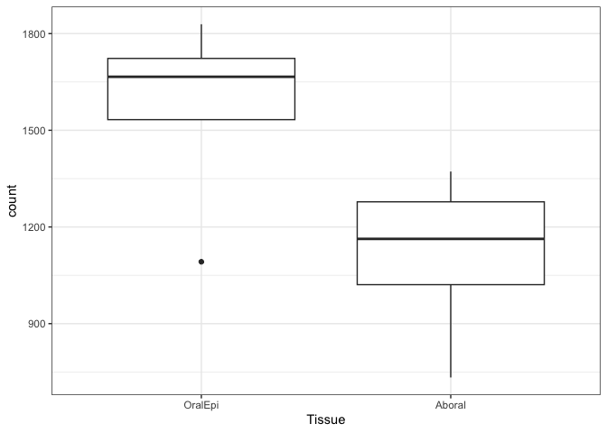<!-- -->

``` r
# now lets consider event type
# split the event ID into type and number
split_ID <- one_df %>% tidyr::separate(event_id, sep = "\\.", into = c("event_type", "event_num"), remove = FALSE)

# convert to long format
long <- split_ID %>% tidyr::pivot_longer(cols = c(-event_id, -event_type, -event_num, -gene_name), names_to = "sample_id", values_to = "psi")

# count the number of events by event type
counts_type <- long %>% dplyr::group_by(event_type, sample_id) %>% dplyr::summarise(count = sum(psi > 0.5, na.rm = T))
```

    ## `summarise()` has grouped output by 'event_type'. You can override using the
    ## `.groups` argument.

``` r
# join this new dataframe with the metadata again
# set the basename
counts_type$Sample <- gsub(".psi", "", counts_type$sample_id)

# merge with metadata
merged_type <- merge(counts_type, meta, by = "Sample")
```

``` r
# Now generate plots showing counts by event type
#first set the appropriate order of the factors
merged_type$Tissue <- factor(merged_type$Tissue, levels = c("OralEpi","Aboral"))

merged_type$Fragment <- factor(merged_type$Fragment, levels = c("A", "B", "C", "D", "E"))

# create the plots
ggplot(merged_type, aes(x = Tissue, y = count)) + geom_boxplot() + theme_bw() + scale_fill_brewer(palette = "YlOrRd") + facet_grid(event_type ~., scales = "free", space = "free_x")
```

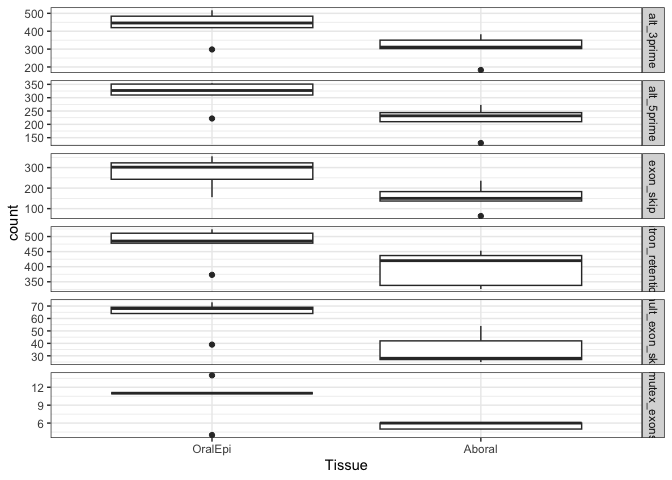<!-- -->

``` r
# look at overall counts per type
ggplot(merged_type, aes(x = reorder(event_type, -count), y = count, fill = event_type)) + geom_boxplot() + theme_bw() + labs(x = "Event type")
```

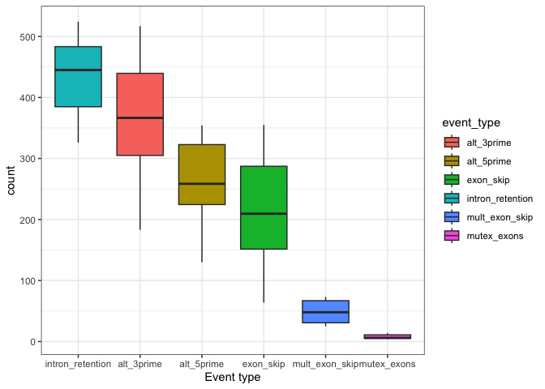<!-- -->

``` r
ggplot(merged_type, aes(x = reorder(event_type, -count), y = count, fill = Tissue)) + geom_boxplot() + theme_bw() + labs(x = "Event type")
```

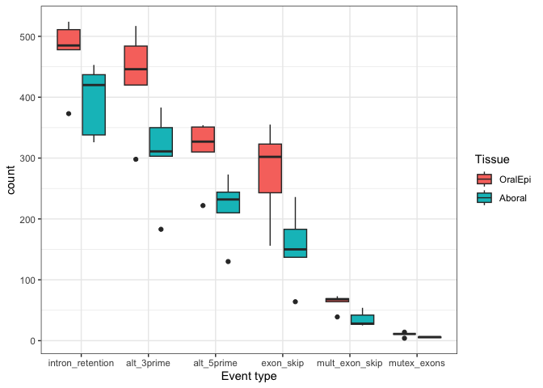<!-- -->

``` r
## calculate the number of NaNs per sample

# calculate the proportion for each sample 
NaN_prop <- as.data.frame(colMeans(is.na(one_df[,-c(1:2)])))

# change the column name
colnames(NaN_prop) <- "prop_NaN"

# add a column for sample ID
NaN_prop$sample_id <- rownames(NaN_prop)

# get the base name
NaN_prop$Sample <- gsub(".psi", "", NaN_prop$sample_id)
```

``` r
# does NaN proportion correlate with count of events?
counts_perc_NaN <- merge(merged, NaN_prop, by = c("Sample", "sample_id"))

# plot correlation between count and proportion NaN
counts_perc_NaN$prop_NaN <- as.numeric(counts_perc_NaN$prop_NaN)
counts_perc_NaN$Tissue <- factor(counts_perc_NaN$Tissue, levels = c("OralEpi","Aboral"))
counts_perc_NaN$Fragment <- factor(counts_perc_NaN$Fragment, levels = c("A", "B", "C", "D", "E"))

ggplot(counts_perc_NaN, aes(x = prop_NaN, y = count, col = Fragment)) + 
  geom_point(pch=21, colour = "black", size = 2, aes(fill = Fragment)) + 
  theme_bw() + facet_grid(~Tissue)
```

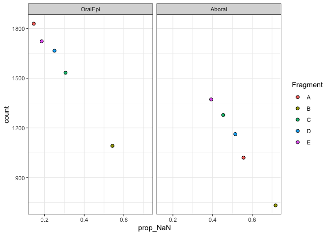<!-- -->

``` r
# now lets check boxplots of the distribution of NaN by sample type
# plot boxplots of mapping rate by sample

ggplot(counts_perc_NaN, aes(x = Tissue, y = prop_NaN)) + geom_boxplot() + theme_bw() #+ facet_grid(. ~ Treatment, scales = "free_x", space = "free")
```

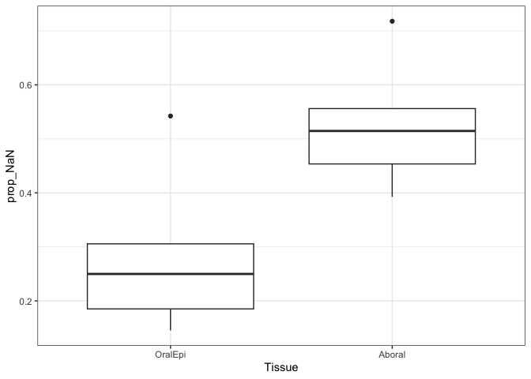<!-- -->

``` r
mapping_file <- read_delim("../output_RNA/hisat2/mapped_reads_counts_Pacuta", "                ", col_names = "text")
```

    ## Rows: 30 Columns: 1
    ## ── Column specification ────────────────────────────────────────────────────────
    ## Delimiter: "                "
    ## chr (1): text
    ## 
    ## ℹ Use `spec()` to retrieve the full column specification for this data.
    ## ℹ Specify the column types or set `show_col_types = FALSE` to quiet this message.

``` r
mapping <- data.frame("Sample", "overall_mapping_rate","primary_mapping_rate")

for (i in seq(from=1, to = 28,by=3)){
  mapping_i <- mapping_file[i:(i+2),]
  mapping_i <- unlist(mapping_i$text)

  mapping <- rbind(mapping,mapping_i)
}

colnames(mapping) <- mapping[1,]
mapping <- mapping[-1,]
mapping$Sample <- gsub("output_RNA/hisat2/", "", gsub(".bam", "", mapping$Sample))
mapping$mapping_rate <- str_split(mapping$overall_mapping_rate, " ", simplify = T)[,5]
mapping$mapping_rate <- gsub("%", "", gsub("[(]", "", mapping$mapping_rate))
mapping$mapped_counts <- str_split(mapping$overall_mapping_rate, " ", simplify = T)[,1]

mapping$mapping_rate <- as.numeric(mapping$mapping_rate)
mapping$mapped_counts <- as.numeric(mapping$mapped_counts)
mapping <- mapping[c("Sample","mapping_rate","mapped_counts")]
```

``` r
# join the counts per species with the existing meta file
all_meta <- merge(counts_perc_NaN, mapping, by = c("Sample"))
```

``` r
# create a boxplots of these counts
ggplot(all_meta, aes(x = mapped_counts, y = mapping_rate, color = Tissue)) + geom_point() + theme_bw() 
```

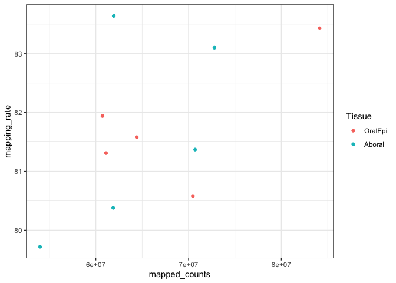<!-- -->

``` r
ggplot(all_meta, aes(x = Tissue, y = mapping_rate, color = Tissue)) + geom_boxplot() + theme_bw() 
```

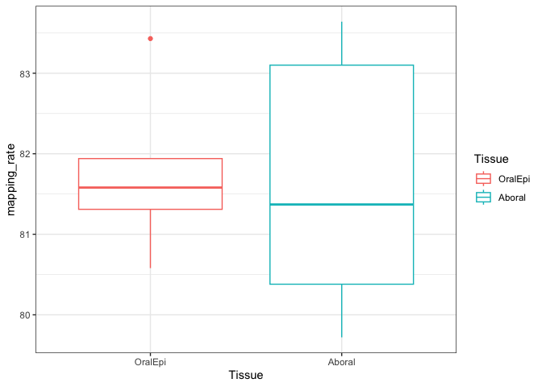<!-- -->

``` r
ggplot(all_meta, aes(x = Tissue, y = mapped_counts, color = Tissue)) + geom_boxplot() + theme_bw() 
```

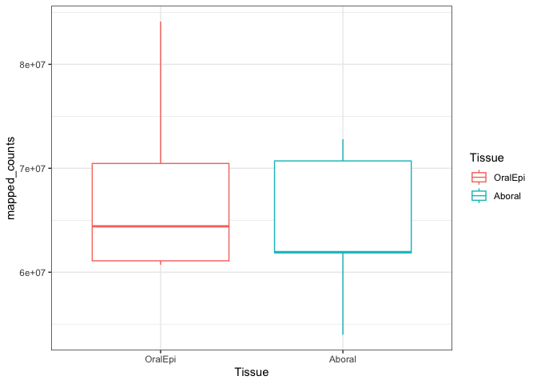<!-- -->

``` r
# create correlation plots with total reads mapped per species
ggplot(all_meta, aes(x = mapped_counts, y = prop_NaN, col = Tissue)) + geom_point(pch=21, size = 2, aes(fill = Tissue)) + theme_bw()
```

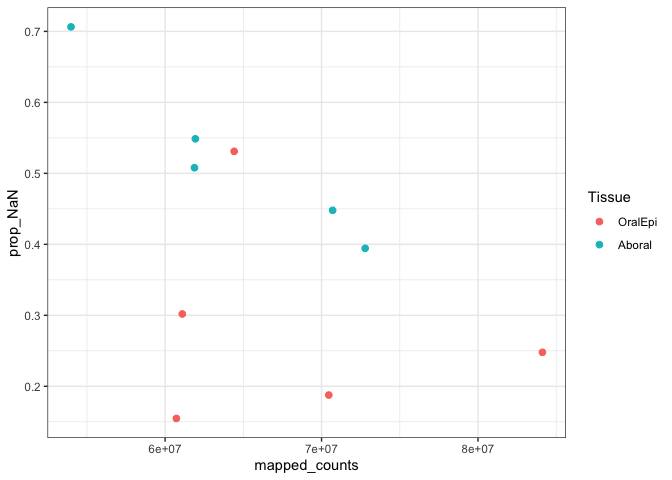<!-- -->

``` r
ggplot(all_meta, aes(x = mapping_rate, y = prop_NaN, col = Tissue)) + geom_point(pch=21, size = 2, aes(fill = Tissue)) + theme_bw()
```

<!-- -->

``` r
## next lets start global analysis of splicing events
# first we need to remove low quality samples
# let's try dropping samples with high NaN proportion

# set a threshold
threshold <- 0.6

# host
#remove the event id and gene id columns
just_psi <- one_df %>% dplyr::select(-c(event_id, gene_name))
drop_thresh_samps <- just_psi %>% dplyr::select(which(colMeans(is.na(.)) < threshold))

# get list of samples passing the threshold
names <- as.data.frame(colnames(drop_thresh_samps))

# change the column name
colnames(names) <- "sample_id"

# get the base sample name
names$Sample <- gsub(".psi", "", names$sample_id)

# merge with metadata
passing_samps_meta <- merge(names, meta, by = "Sample")

# check what is remaining
table(passing_samps_meta$Tissue)
```

    ## 
    ## OralEpi  Aboral 
    ##       5       4

``` r
table(meta$Tissue)
```

    ## 
    ## OralEpi  Aboral 
    ##       5       5

``` r
# next check the variance in PSI across samples
variance_all <- cbind(var = apply(just_psi, 1, function(x) var(na.omit(x))), just_psi)

# remove rows with NAs
drop_na_events <- na.omit(just_psi)
drop_na_events_thresh <- na.omit(drop_thresh_samps)

# calculate variance on the NA free events
variance_na_omit <- cbind(var = apply(drop_na_events, 1, function(x) var(na.omit(x))), drop_na_events)
variance_na_omit_thresh <- cbind(var = apply(drop_na_events_thresh, 1, function(x) var(na.omit(x))), drop_na_events_thresh)
```

``` r
## run a PCA on all non-NA events
# transform and convert to a matrix
mat_t <- t(as.matrix(drop_na_events_thresh))

# run pca
pca <- prcomp(mat_t)

# get the meta information incorporated 
meta_pca_samples <- as.data.frame(rownames(mat_t))
colnames(meta_pca_samples) <- "sample_id"
meta_pca_samples$Sample <- gsub(".psi", "", meta_pca_samples$sample_id)

meta_pca <- merge(meta_pca_samples, meta, by = c("Sample"))

# plot the pca
ggbiplot::ggbiplot(pca,ellipse=TRUE, var.axes=FALSE) + 
  geom_point(size = 4, aes(shape = as.factor(meta_pca$Fragment),
                           color = as.factor(meta_pca$Tissue),
                           fill = as.factor(meta_pca$Tissue))) + 
  theme_bw() +
  labs(fill = "Tissue",color = "Tissue", shape = "Fragment") + 
  scale_shape_manual(values=c(23,8,22,21,24))
```

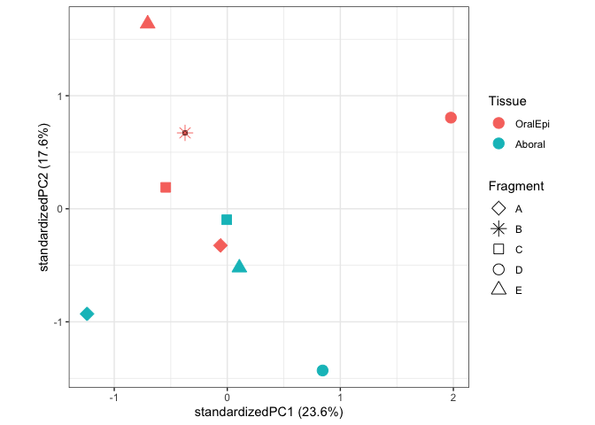<!-- -->

``` r
## check if there's more or less alt usage based on temp
## create a heatmap of psi values for host

# get just samples with NAs above threshold and filter original data frame for these
filt_thresh <- split_ID %>% dplyr::select(c(event_id, event_type, event_num, gene_name, c(names$sample_id)))

# remove events with NAs from the df that includes event type information
no_na_event_ID <- na.omit(filt_thresh)

# remove rows where all PSI values across samples are exactly the same
keep <- apply(no_na_event_ID[5:ncol(no_na_event_ID)], 1, function(x) length(unique(x[!is.na(x)])) != 1)
rem_psi_ident <- no_na_event_ID[keep, ]
```

``` r
# calculate variance on remaining rows to identify those with little variance between all samples
low_var_estimates <- cbind(var = apply(rem_psi_ident[5:ncol(rem_psi_ident)], 1, function(x) var(na.omit(x))), rem_psi_ident)

# remove rows with variance below a given threshold
low_var_removed <- low_var_estimates %>% dplyr::filter(var > 0.04)

# create the heatmap of the highest variance events across all samples
# filter for just the psi columns
psi_only_low_var <- low_var_removed %>% dplyr::select(!(var:gene_name))

# set the event ID as the rowname
rownames(psi_only_low_var) <- low_var_removed$event_id
colnames(psi_only_low_var) <- gsub(".psi", "",colnames(psi_only_low_var))

# reformat as a matrix
mat_low_var_rem <- as.matrix(psi_only_low_var)

# create the row and column annotations for the files
# get the sample order
sample_order_mat <- as.data.frame(colnames(mat_low_var_rem))
colnames(sample_order_mat) <- "Sample"

# merge with metadata information
sample_order_meta <- merge(sample_order_mat, meta, by = "Sample")

# generate the col annotation
col_annot <- sample_order_meta %>% dplyr::select(Tissue)
rownames(col_annot) <- sample_order_meta$Sample

# generate the row annotation
row_annot <- data.frame(low_var_removed$event_type)
rownames(row_annot) <- low_var_removed$event_id
colnames(row_annot) <- c("Event_Type")

# AS classes
alt_3_col ="#999999"
alt_5_col ="#E69F00"
ES_col = "#56B4E9"
IR_col = "#009E73"
multi_ES_col = "#D55E00"
mutex_col = "#CC79A7"

# set the colors for the heatmap
annot_colors = list(
  Tissue = c(OralEpi="palegreen3", Aboral="mediumpurple1"),
  Event_Type  = c(alt_3prime=alt_3_col, alt_5prime=alt_5_col, exon_skip = ES_col, intron_retention = IR_col, mult_exon_skip = multi_ES_col, mutex_exons = mutex_col))

# create a basic heatmap
heatmap_low_var_rem <- pheatmap(mat_low_var_rem, cluster_cols = F, annotation_col = col_annot, annotation_row = row_annot, annotation_colors = annot_colors, show_rownames = F, show_colnames = T, color = viridis(10))
```

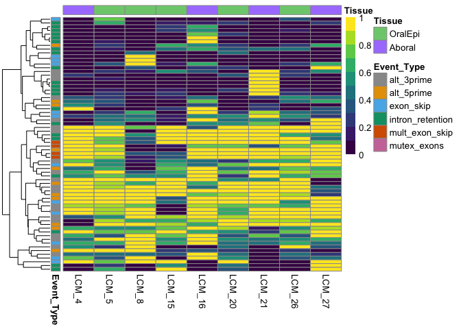<!-- -->

``` r
pheatmap(mat_low_var_rem, cluster_cols = T, annotation_col = col_annot, annotation_row = row_annot, annotation_colors = annot_colors, show_rownames = F, show_colnames = T, color = viridis(10))
```

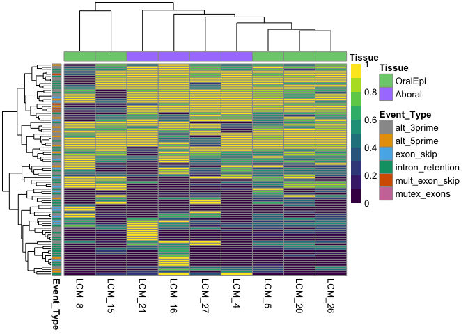<!-- -->

``` r
pheatmap(mat_low_var_rem, cluster_cols = T, annotation_col = col_annot, cutree_cols = 2,cutree_rows = 3, annotation_row = row_annot, annotation_colors = annot_colors, show_rownames = F, show_colnames = T, color = viridis(10))
```

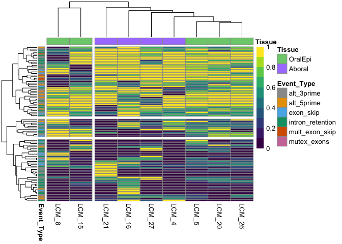<!-- -->

``` r
## now let's look at the PSI distribution for each group for these high variance events
long_no_na_ident <- low_var_removed %>% tidyr::gather(sample_id, psi, -c("var", "event_id", "event_type", "event_num", "gene_name"))

# add base sample name
long_no_na_ident$Sample <- gsub(".psi", "", long_no_na_ident$sample_id)

# add the metadata 
long_no_na_ident <- dplyr::left_join(long_no_na_ident, meta, by = "Sample")

# plot this distribution
long_no_na_ident$Tissue <- factor(long_no_na_ident$Tissue, levels = c("OralEpi", "Aboral"))
long_no_na_ident$Fragment <- factor(long_no_na_ident$Fragment, levels = c("A","B","C","D","E"))

ggplot(long_no_na_ident, aes(y=psi, x=Tissue, fill=Fragment)) + 
  geom_boxplot(position=position_dodge2(preserve = "single")) + 
  theme_bw() 
```

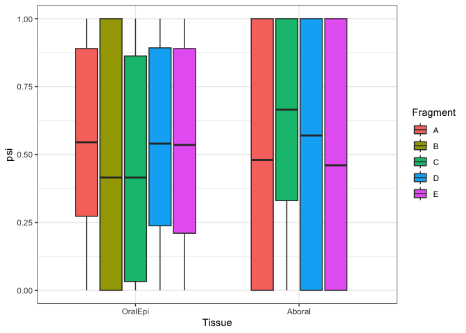<!-- -->

``` r
ggplot(long_no_na_ident, aes(fill = factor(Fragment, levels = c("A","B","C","D","E")), x=psi)) +
  geom_density(alpha = 0.6) + theme_bw() + facet_grid(. ~ Tissue) + 
  guides(fill = guide_legend(reverse = TRUE)) + labs(fill = "Fragment")
```

<!-- -->

``` r
# Next check the total number of each event type
table(row_annot)
```

    ## Event_Type
    ##       alt_3prime       alt_5prime        exon_skip intron_retention 
    ##               20               11               12               21 
    ##   mult_exon_skip 
    ##                4

``` r
## count the events by type for each sample after removing samples with high NaN and then removing all events with any NaN
# first convert to long format
long_thresh_no_NA <- no_na_event_ID %>% tidyr::pivot_longer(cols = c(-event_id, -event_type, -event_num, -gene_name), names_to = "sample_id", values_to = "psi")

# count by group
long_thresh_no_NA_counts <- long_thresh_no_NA %>% dplyr::group_by(event_type, sample_id) %>% dplyr::summarise(count = sum(psi > 0.5, na.rm = T)) %>% ungroup()
```

    ## `summarise()` has grouped output by 'event_type'. You can override using the
    ## `.groups` argument.

``` r
# set the base name and add in metainformation 
long_thresh_no_NA_counts$Sample <- gsub(".psi", "", long_thresh_no_NA_counts$sample_id)

lh_thresh_noNA_countmeta <- merge(long_thresh_no_NA_counts, meta, by = "Sample")

# get count of number of samples for each category
lh_tnoNA_countMeta_numSamp <- lh_thresh_noNA_countmeta %>% dplyr::add_count(Tissue)

# divide count by number of samples
lh_tnoNA_countMeta_numSamp$adj_count <- lh_tnoNA_countMeta_numSamp$count / lh_tnoNA_countMeta_numSamp$n

# plot these counts by sample type
lh_tnoNA_countMeta_numSamp$Tissue <- factor(lh_tnoNA_countMeta_numSamp$Tissue, levels = c("OralEpi", "Aboral"))
lh_tnoNA_countMeta_numSamp$Fragment <- factor(lh_tnoNA_countMeta_numSamp$Fragment, levels = c("A","B","C","D","E"))

ggplot(lh_tnoNA_countMeta_numSamp, aes(x = Tissue, y = count, color=Tissue)) + geom_boxplot() + theme_bw() +facet_grid(~ event_type, scales = "free", space = "free") 
```

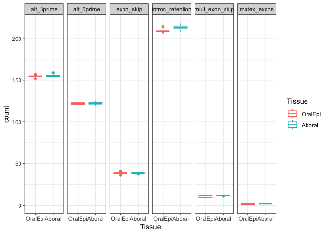<!-- -->

## 0.8 Spladder test output

Based on Kate Stankiewicz’ work from [Stankiewicz et al 2025,
bioRxiv](https://www.biorxiv.org/content/10.1101/2025.01.21.634199v1.full.pdf):
[code
here](https://github.com/kate-stankiewicz/Acer_globalSearch_AltSplice/blob/main/scripts/Acer_Sfit_runs/SplAdder/host_spladder_jobs/testing_contrasts/run_parse_spladder_output.R)

``` r
# read in the event file for the Oral vs Aboral contrast
df <- list() 
listcsv <- grep(list.files("../output_RNA/splicing/spladder_out/testing_Oral_vs_Aboral", pattern = "*.tsv",full.names = TRUE), pattern='gene.unique|extended', invert = TRUE, value = TRUE)

for (i in 1:length(listcsv)){
  df[[i]] <- read.table(file = listcsv[i], header = T)
}

# combine into one DF
one_df <- do.call(rbind, df)

#write out the results as one table
write.table(one_df, "../output_RNA/splicing/all_events_parsed/Oral_vs_Aboral.tsv", quote = F, row.names = F)
```

Based on Kate Stankiewicz’ work from [Stankiewicz et al 2025,
bioRxiv](https://www.biorxiv.org/content/10.1101/2025.01.21.634199v1.full.pdf):
[code
here](https://github.com/kate-stankiewicz/Acer_globalSearch_AltSplice/blob/main/scripts/Acer_Sfit_runs/analysis/Acer_AS_analysis.R)

``` r
# Next we will examine the differentially spliced events identified by Spladder test mode
# the output from Spladder test mode was parsed by a different script to collect all the events in merged files

# read in testing files

one_df <- read.table(file = "../output_RNA/splicing/all_events_parsed/Oral_vs_Aboral.tsv", header = T)

#filter for only significant events
sig_all <- one_df %>% dplyr::filter(p_val_adj <= 0.05)

split_ID <- sig_all %>% tidyr::separate(event_id, sep = "\\.", into = c("event_type", "event_num"), remove = FALSE)

sig_all
```

    ##               event_id                               chrm
    ## 1 intron_retention.786 Pocillopora_acuta_HIv2___Sc0000029
    ##                                          exon_pos alt_usage
    ## 1 1879511-1879774:1879511-1879834:1879807-1879834     1:1:1
    ##                                    gene_id gene_name        p_val  p_val_adj
    ## 1 Pocillopora_acuta_HIv2___RNAseq.g4097.t1      None 7.746017e-05 0.04275801
    ##          dPSI mean_event_count_A mean_event_count_B log2FC_event_count
    ## 1 -0.08631326            97.5473                  0                Inf
    ##   mean_gene_exp_A mean_gene_exp_B log2FC_gene_exp
    ## 1        73904.45         5461.36        3.758329

``` r
# plot the significant results per contrast
event_counts <- split_ID %>% dplyr::count(event_type)

split_ID$treatment_contrast <- "Oral_vs_Aboral"

# plot the counts
ggplot(split_ID, aes(fill=event_type, x = treatment_contrast)) + geom_bar(position = "dodge") + theme_bw() 
```

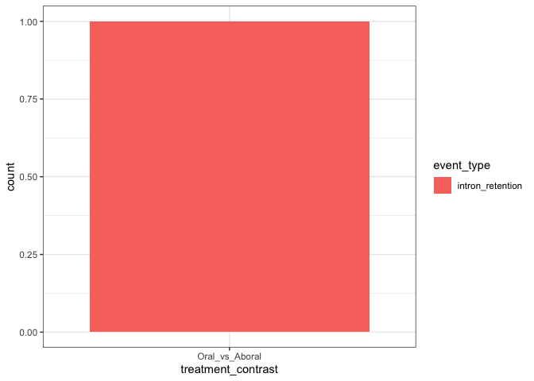<!-- -->

There was only one significant event.

## 0.9 What if I run spladder with the geneExt-extended gtf file?

Within this repo:

``` bash
cd output_RNA
mkdir splicing
cd splicing

cp ../../references/Pocillopora_acuta_HIv2.gtf .
cp ../../references/geneext/Pocillopora_acuta_GeneExt.gtf .
nano alignments.txt
```

Enter the following, one bam file path per line:

``` bash
output_RNA/hisat2/LCM_4.bam
output_RNA/hisat2/LCM_5.bam
output_RNA/hisat2/LCM_8.bam
output_RNA/hisat2/LCM_9.bam
output_RNA/hisat2/LCM_15.bam
output_RNA/hisat2/LCM_16.bam
output_RNA/hisat2/LCM_20.bam
output_RNA/hisat2/LCM_21.bam
output_RNA/hisat2/LCM_26.bam
output_RNA/hisat2/LCM_27.bam
```

Run spladder build:

``` bash
nano scripts/spladder_build_ext.sh
```

``` bash
#!/usr/bin/env bash
#SBATCH --ntasks=1 --cpus-per-task=6 #split one task over multiple CPU
#SBATCH --mem=250GB
#SBATCH -t 48:00:00
#SBATCH --mail-type=END,FAIL,TIME_LIMIT_80 #email you when job stops and/or fails or is nearing its time limit
#SBATCH --error=scripts/outs_errs/"%x_error.%j" #if your job fails, the error report will be put in this file
#SBATCH --output=scripts/outs_errs/"%x_output.%j" #once your job is completed, any final job report comments will be put in this file
#SBATCH -D /project/pi_hputnam_uri_edu/zdellaert/LaserCoral

module load conda/latest
conda activate /work/pi_hputnam_uri_edu/conda/envs/spladder

spladder_dir="output_RNA/splicing"
out_dir="/scratch3/workspace/zdellaert_uri_edu-shared/spladder_out_ext"

mkdir -p ${out_dir}

spladder build --bams ${spladder_dir}/alignments.txt \
               --annotation ${spladder_dir}/Pocillopora_acuta_GeneExt.gtf \
               --outdir ${out_dir} \
               --parallel 4 \
               --verbose
```

``` bash
cd output_RNA/splicing
nano Aboral.txt
```

Enter the following, one bam file path per line:

``` bash
output_RNA/hisat2/LCM_4.bam
output_RNA/hisat2/LCM_9.bam
output_RNA/hisat2/LCM_16.bam
output_RNA/hisat2/LCM_21.bam
output_RNA/hisat2/LCM_27.bam
```

``` bash
nano Oral.txt
```

Enter the following, one bam file path per line:

``` bash
output_RNA/hisat2/LCM_5.bam
output_RNA/hisat2/LCM_8.bam
output_RNA/hisat2/LCM_15.bam
output_RNA/hisat2/LCM_20.bam
output_RNA/hisat2/LCM_26.bam
```

``` bash
nano scripts/spladder_test_ext.sh
```

``` bash
#!/usr/bin/env bash
#SBATCH --ntasks=1 --cpus-per-task=12 #split one task over multiple CPU
#SBATCH --mem=250GB
#SBATCH -t 48:00:00
#SBATCH --mail-type=END,FAIL,TIME_LIMIT_80 #email you when job stops and/or fails or is nearing its time limit
#SBATCH --error=scripts/outs_errs/"%x_error.%j" #if your job fails, the error report will be put in this file
#SBATCH --output=scripts/outs_errs/"%x_output.%j" #once your job is completed, any final job report comments will be put in this file
#SBATCH -D /project/pi_hputnam_uri_edu/zdellaert/LaserCoral

module load conda/latest
conda activate /work/pi_hputnam_uri_edu/conda/envs/spladder

spladder_dir="output_RNA/splicing"
out_dir="/scratch3/workspace/zdellaert_uri_edu-shared/spladder_out_ext"

spladder test --conditionA ${spladder_dir}/Oral.txt \
              --conditionB ${spladder_dir}/Aboral.txt \
              --labelA Oral --labelB Aboral \
              --diagnose-plots \
              --parallel 12 \
              --outdir ${out_dir}
```
