09-MethylKit, filtered for \>90% conversion efficiency
================
Zoe Dellaert
2025-02-09

- [0.1 MethylKit - Reads filtered for \>90% conversion
  efficiency](#01-methylkit---reads-filtered-for-90-conversion-efficiency)
- [0.2 Managing Packages Using Renv](#02-managing-packages-using-renv)
- [0.3 Load packages](#03-load-packages)
  - [0.3.1 Note: I changed the code below so that a CpG does not have to
    have 5X coverage in all samples to be analyzed, and only needs 5X
    coverage in 2 samples per group to be retained. This way we don’t
    remove CpGs that happen to have lower coverage in a few samples or
    one
    tissue.](#031-note-i-changed-the-code-below-so-that-a-cpg-does-not-have-to-have-5x-coverage-in-all-samples-to-be-analyzed-and-only-needs-5x-coverage-in-2-samples-per-group-to-be-retained-this-way-we-dont-remove-cpgs-that-happen-to-have-lower-coverage-in-a-few-samples-or-one-tissue)
  - [0.3.2 batch effects](#032-batch-effects)
  - [0.3.3 other possible filtering](#033-other-possible-filtering)
  - [0.3.4 Identify DML](#034-identify-dml)
- [0.4 Further look at genome wide
  methylation](#04-further-look-at-genome-wide-methylation)
  - [0.4.1 Annotation](#041-annotation)
- [0.5 Are any DMGs DMLs?](#05-are-any-dmgs-dmls)
  - [0.5.1 BaseMean: Raw gene expression levels (skewed by highly
    expressed
    genes)](#051-basemean-raw-gene-expression-levels-skewed-by-highly-expressed-genes)
  - [0.5.2 Log2 of BaseMean: Transformed gene expression
    levels](#052-log2-of-basemean-transformed-gene-expression-levels)
  - [0.5.3 Absolute value of Log2FoldChange: Relationship between
    overall methylation of a gene and whether or not it is
    differentially
    expressed](#053-absolute-value-of-log2foldchange-relationship-between-overall-methylation-of-a-gene-and-whether-or-not-it-is-differentially-expressed)
  - [0.5.4 Read counts/vsd transformed
    counts](#054-read-countsvsd-transformed-counts)
  - [0.5.5 Above but only for DEGS](#055-above-but-only-for-degs)
  - [0.5.6 Extracting table of genes](#056-extracting-table-of-genes)
- [0.6 Methylated CpG locations](#06-methylated-cpg-locations)
  - [0.6.1 All DMLs boxplots](#061-all-dmls-boxplots)

## 0.1 MethylKit - Reads filtered for \>90% conversion efficiency

I am identifying differentially methylated loci using methylkit based on
[Yaamini Venkataraman’s code](https://osf.io/u46xj)

## 0.2 Managing Packages Using Renv

To run this code in my project using the renv environment, run the
following lines of code

``` r
install.packages("renv") #install the package on the new computer (may not be necessary if renv bootstraps itself as expected)
renv::restore() #reinstall all the package versions in the renv lockfile
```

## 0.3 Load packages

``` r
require("methylKit")
```

    ## Loading required package: methylKit

    ## Loading required package: GenomicRanges

    ## Loading required package: stats4

    ## Loading required package: BiocGenerics

    ## 
    ## Attaching package: 'BiocGenerics'

    ## The following objects are masked from 'package:stats':
    ## 
    ##     IQR, mad, sd, var, xtabs

    ## The following objects are masked from 'package:base':
    ## 
    ##     anyDuplicated, aperm, append, as.data.frame, basename, cbind,
    ##     colnames, dirname, do.call, duplicated, eval, evalq, Filter, Find,
    ##     get, grep, grepl, intersect, is.unsorted, lapply, Map, mapply,
    ##     match, mget, order, paste, pmax, pmax.int, pmin, pmin.int,
    ##     Position, rank, rbind, Reduce, rownames, sapply, saveRDS, setdiff,
    ##     table, tapply, union, unique, unsplit, which.max, which.min

    ## Loading required package: S4Vectors

    ## 
    ## Attaching package: 'S4Vectors'

    ## The following object is masked from 'package:utils':
    ## 
    ##     findMatches

    ## The following objects are masked from 'package:base':
    ## 
    ##     expand.grid, I, unname

    ## Loading required package: IRanges

    ## Loading required package: GenomeInfoDb

``` r
require("parallel")
```

    ## Loading required package: parallel

``` r
require("tidyverse")
```

    ## Loading required package: tidyverse

    ## ── Attaching core tidyverse packages ──────────────────────── tidyverse 2.0.0 ──
    ## ✔ dplyr     1.1.4     ✔ readr     2.1.5
    ## ✔ forcats   1.0.0     ✔ stringr   1.5.1
    ## ✔ ggplot2   3.5.1     ✔ tibble    3.2.1
    ## ✔ lubridate 1.9.4     ✔ tidyr     1.3.1
    ## ✔ purrr     1.0.4     
    ## ── Conflicts ────────────────────────────────────────── tidyverse_conflicts() ──
    ## ✖ lubridate::%within%() masks IRanges::%within%()
    ## ✖ dplyr::collapse()     masks IRanges::collapse()
    ## ✖ dplyr::combine()      masks BiocGenerics::combine()
    ## ✖ dplyr::desc()         masks IRanges::desc()
    ## ✖ tidyr::expand()       masks S4Vectors::expand()
    ## ✖ dplyr::filter()       masks stats::filter()
    ## ✖ dplyr::first()        masks S4Vectors::first()
    ## ✖ dplyr::lag()          masks stats::lag()
    ## ✖ ggplot2::Position()   masks BiocGenerics::Position(), base::Position()
    ## ✖ purrr::reduce()       masks GenomicRanges::reduce(), IRanges::reduce()
    ## ✖ dplyr::rename()       masks S4Vectors::rename()
    ## ✖ lubridate::second()   masks S4Vectors::second()
    ## ✖ lubridate::second<-() masks S4Vectors::second<-()
    ## ✖ dplyr::select()       masks methylKit::select()
    ## ✖ dplyr::slice()        masks IRanges::slice()
    ## ✖ tidyr::unite()        masks methylKit::unite()
    ## ℹ Use the conflicted package (<http://conflicted.r-lib.org/>) to force all conflicts to become errors

``` r
require("vegan")
```

    ## Loading required package: vegan
    ## Loading required package: permute
    ## Loading required package: lattice

``` r
require("gplots")
```

    ## Loading required package: gplots
    ## 
    ## Attaching package: 'gplots'
    ## 
    ## The following object is masked from 'package:IRanges':
    ## 
    ##     space
    ## 
    ## The following object is masked from 'package:S4Vectors':
    ## 
    ##     space
    ## 
    ## The following object is masked from 'package:stats':
    ## 
    ##     lowess

``` r
require("ggplot2")
require("ggrepel")
```

    ## Loading required package: ggrepel

``` r
require("ggpmisc")
```

    ## Loading required package: ggpmisc
    ## Loading required package: ggpp
    ## Registered S3 methods overwritten by 'ggpp':
    ##   method                  from   
    ##   heightDetails.titleGrob ggplot2
    ##   widthDetails.titleGrob  ggplot2
    ## 
    ## Attaching package: 'ggpp'
    ## 
    ## The following object is masked from 'package:ggplot2':
    ## 
    ##     annotate

``` r
require("dichromat")
```

    ## Loading required package: dichromat

``` r
require("readr")
require("genomationData")
```

    ## Loading required package: genomationData

``` r
require("genomation")
```

    ## Loading required package: genomation
    ## Loading required package: grid

    ## Warning: replacing previous import 'Biostrings::pattern' by 'grid::pattern'
    ## when loading 'genomation'

    ## 
    ## Attaching package: 'genomation'
    ## 
    ## The following objects are masked from 'package:methylKit':
    ## 
    ##     getFeatsWithTargetsStats, getFlanks, getMembers,
    ##     getTargetAnnotationStats, plotTargetAnnotation

``` r
sessionInfo() #provides list of loaded packages and version of R.
```

    ## R version 4.4.0 (2024-04-24)
    ## Platform: x86_64-pc-linux-gnu
    ## Running under: Ubuntu 22.04.3 LTS
    ## 
    ## Matrix products: default
    ## BLAS:   /usr/lib/x86_64-linux-gnu/openblas-pthread/libblas.so.3 
    ## LAPACK: /usr/lib/x86_64-linux-gnu/openblas-pthread/libopenblasp-r0.3.20.so;  LAPACK version 3.10.0
    ## 
    ## locale:
    ##  [1] LC_CTYPE=en_US.UTF-8       LC_NUMERIC=C              
    ##  [3] LC_TIME=en_US.UTF-8        LC_COLLATE=en_US.UTF-8    
    ##  [5] LC_MONETARY=en_US.UTF-8    LC_MESSAGES=en_US.UTF-8   
    ##  [7] LC_PAPER=en_US.UTF-8       LC_NAME=C                 
    ##  [9] LC_ADDRESS=C               LC_TELEPHONE=C            
    ## [11] LC_MEASUREMENT=en_US.UTF-8 LC_IDENTIFICATION=C       
    ## 
    ## time zone: Etc/UTC
    ## tzcode source: system (glibc)
    ## 
    ## attached base packages:
    ##  [1] grid      parallel  stats4    stats     graphics  grDevices datasets 
    ##  [8] utils     methods   base     
    ## 
    ## other attached packages:
    ##  [1] genomation_1.38.0     genomationData_1.38.0 dichromat_2.0-0.1    
    ##  [4] ggpmisc_0.6.1         ggpp_0.5.8-1          ggrepel_0.9.6        
    ##  [7] gplots_3.2.0          vegan_2.6-10          lattice_0.22-6       
    ## [10] permute_0.9-7         lubridate_1.9.4       forcats_1.0.0        
    ## [13] stringr_1.5.1         dplyr_1.1.4           purrr_1.0.4          
    ## [16] readr_2.1.5           tidyr_1.3.1           tibble_3.2.1         
    ## [19] ggplot2_3.5.1         tidyverse_2.0.0       methylKit_1.32.0     
    ## [22] GenomicRanges_1.58.0  GenomeInfoDb_1.42.3   IRanges_2.40.1       
    ## [25] S4Vectors_0.44.0      BiocGenerics_0.52.0  
    ## 
    ## loaded via a namespace (and not attached):
    ##  [1] rstudioapi_0.17.1           jsonlite_1.8.9             
    ##  [3] magrittr_2.0.3              rmarkdown_2.29             
    ##  [5] BiocIO_1.16.0               zlibbioc_1.52.0            
    ##  [7] vctrs_0.6.5                 Rsamtools_2.22.0           
    ##  [9] RCurl_1.98-1.16             htmltools_0.5.8.1          
    ## [11] S4Arrays_1.6.0              polynom_1.4-1              
    ## [13] plotrix_3.8-4               curl_6.2.0                 
    ## [15] SparseArray_1.6.1           KernSmooth_2.23-26         
    ## [17] plyr_1.8.9                  impute_1.80.0              
    ## [19] GenomicAlignments_1.42.0    lifecycle_1.0.4            
    ## [21] pkgconfig_2.0.3             Matrix_1.7-2               
    ## [23] R6_2.6.0                    fastmap_1.2.0              
    ## [25] GenomeInfoDbData_1.2.13     MatrixGenerics_1.18.1      
    ## [27] digest_0.6.37               numDeriv_2016.8-1.1        
    ## [29] colorspace_2.1-1            timechange_0.3.0           
    ## [31] httr_1.4.7                  abind_1.4-8                
    ## [33] mgcv_1.9-1                  compiler_4.4.0             
    ## [35] withr_3.0.2                 BiocParallel_1.40.0        
    ## [37] R.utils_2.12.3              MASS_7.3-64                
    ## [39] quantreg_6.00               DelayedArray_0.32.0        
    ## [41] rjson_0.2.23                gtools_3.9.5               
    ## [43] caTools_1.18.3              tools_4.4.0                
    ## [45] R.oo_1.27.0                 glue_1.8.0                 
    ## [47] restfulr_0.0.15             nlme_3.1-167               
    ## [49] gridBase_0.4-7              cluster_2.1.8              
    ## [51] reshape2_1.4.4              generics_0.1.3             
    ## [53] gtable_0.3.6                BSgenome_1.74.0            
    ## [55] tzdb_0.4.0                  R.methodsS3_1.8.2          
    ## [57] seqPattern_1.38.0           data.table_1.16.4          
    ## [59] hms_1.1.3                   XVector_0.46.0             
    ## [61] pillar_1.10.1               fastseg_1.52.0             
    ## [63] emdbook_1.3.13              limma_3.62.2               
    ## [65] splines_4.4.0               renv_1.1.1                 
    ## [67] survival_3.8-3              rtracklayer_1.66.0         
    ## [69] SparseM_1.84-2              tidyselect_1.2.1           
    ## [71] Biostrings_2.74.1           knitr_1.49                 
    ## [73] SummarizedExperiment_1.36.0 xfun_0.50                  
    ## [75] Biobase_2.66.0              statmod_1.5.0              
    ## [77] matrixStats_1.5.0           stringi_1.8.4              
    ## [79] UCSC.utils_1.2.0            yaml_2.3.10                
    ## [81] evaluate_1.0.3              codetools_0.2-20           
    ## [83] bbmle_1.0.25.1              qvalue_2.38.0              
    ## [85] BiocManager_1.30.25         cli_3.6.4                  
    ## [87] munsell_0.5.1               Rcpp_1.0.14                
    ## [89] coda_0.19-4.1               bdsmatrix_1.3-7            
    ## [91] XML_3.99-0.18               MatrixModels_0.5-3         
    ## [93] mclust_6.1.1                bitops_1.0-9               
    ## [95] mvtnorm_1.3-3               scales_1.3.0               
    ## [97] crayon_1.5.3                rlang_1.1.5

``` r
save_ggplot <- function(plot, filename, width = 7, height = 5, units = "in", dpi = 300) {
  # Display plot
  print(plot)
  
  # Save plot
  ggsave(filename = paste0(filename, ".png"), plot = plot, width = width, height = height, units = units, dpi = dpi)
}
```

``` r
meta <- read.csv("../data_WGBS/LCM_WGBS_metadata.csv", sep = ",", header = TRUE) %>%
  mutate(Section_Date = as.character(Section_Date), LCM_Date = as.character(LCM_Date),DNA_Extraction_Date = as.character(DNA_Extraction_Date))

meta <- meta %>% arrange(Sample)
```

``` r
file_list <- list.files("../output_WGBS/methylseq_V3_bwa_test/methyldackel/min_efficiency_test_new",pattern = "^min_90.*_CpG.methylKit$",  full.names = TRUE, include.dirs = FALSE)

sample <- gsub("_CpG.methylKit", "", basename(file_list) )
sample <- gsub("min_90_", "", sample)

sample == meta$Sample #the files and metadata are in the same order
```

    ##  [1] TRUE TRUE TRUE TRUE TRUE TRUE TRUE TRUE TRUE TRUE

``` r
tissue <- meta$Tissue
tissue_binary <- gsub("Aboral", "1", tissue)
tissue_binary <- gsub("OralEpi", "0", tissue_binary)
tissue_binary <- as.numeric(tissue_binary)
fragment <- meta$Fragment
```

``` r
# methylObj=methRead(as.list(file_list),
#            sample.id = as.list(sample),
#            assembly = "Pacuta",
#            treatment = tissue_binary,
#            context = "CpG",
#            mincov = 5
#            )

# save(methylObj, file = "../output_WGBS/MethylKit.RData")

methyl_list <- mclapply(seq_along(file_list), function(i) {
  methRead(
    file_list[[i]],
    sample.id = sample[[i]],
    assembly = "Pacuta",
    treatment = tissue_binary[[i]],
    context = "CpG",
    mincov = 5
  )
}, mc.cores = 4) 

methylObj <- new("methylRawList", methyl_list, treatment = tissue_binary)

save(methylObj, file = "../output_WGBS/MethylKit_20250513.RData")
```

``` r
load("../output_WGBS/MethylKit_20250513.RData")

getMethylationStats(methylObj[[2]],plot=FALSE,both.strands=FALSE)
```

    ## methylation statistics per base
    ## summary:
    ##    Min. 1st Qu.  Median    Mean 3rd Qu.    Max. 
    ##   0.000   0.000   0.000   2.573   0.000 100.000 
    ## percentiles:
    ##    0%   10%   20%   30%   40%   50%   60%   70%   80%   90%   95%   99% 99.5% 
    ##     0     0     0     0     0     0     0     0     0     0     0   100   100 
    ## 99.9%  100% 
    ##   100   100

``` r
getMethylationStats(methylObj[[2]],plot=TRUE,both.strands=FALSE)
```

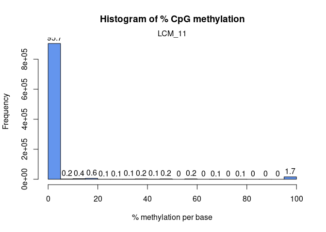<!-- -->

``` r
getCoverageStats(methylObj[[2]],plot=TRUE,both.strands=FALSE)
```

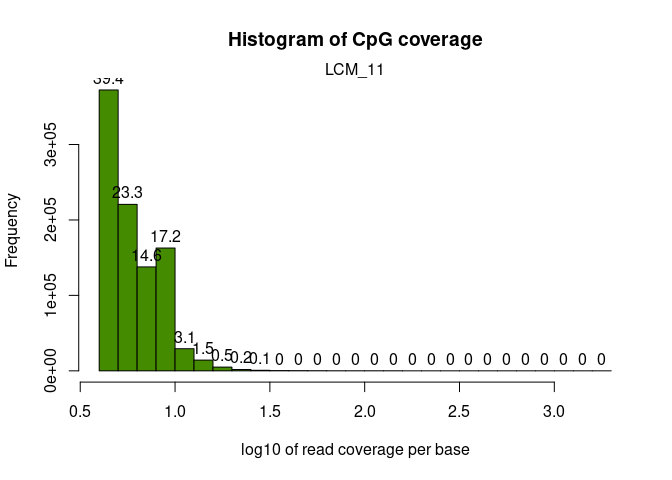<!-- -->

``` r
getCoverageStats(methylObj[[2]],plot=TRUE,both.strands=TRUE)
```

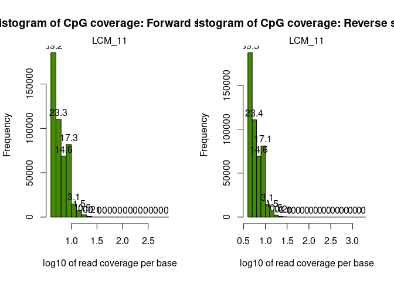<!-- -->

### 0.3.1 Note: I changed the code below so that a CpG does not have to have 5X coverage in all samples to be analyzed, and only needs 5X coverage in 2 samples per group to be retained. This way we don’t remove CpGs that happen to have lower coverage in a few samples or one tissue.

``` r
#filtered_methylObj=filterByCoverage(methylObj,lo.count=5,lo.perc=NULL,
#                                      hi.count=NULL,hi.perc=99.9)

#filtered_methylObj_norm <- filtered_methylObj %>% methylKit::normalizeCoverage(.)
methylObj_norm <- methylObj %>% methylKit::normalizeCoverage(.)
```

``` r
#meth_filter=methylKit::unite(filtered_methylObj_norm)
meth_filter=methylKit::unite(methylObj_norm, min.per.group = c(3L,3L))
```

    ## uniting...

    ## Warning in rowSums(ldat) >= min.per.group: longer object length is not a
    ## multiple of shorter object length

``` r
#meth_filter_destrand=methylKit::unite(filtered_methylObj_norm,destrand = TRUE)
meth_filter_destrand=methylKit::unite(methylObj_norm, min.per.group = c(3L,3L), destrand = TRUE)
```

    ## destranding...
    ## uniting...

    ## Warning in rowSums(ldat) >= min.per.group: longer object length is not a
    ## multiple of shorter object length
    ## Warning in rowSums(ldat) >= min.per.group: longer object length is not a
    ## multiple of shorter object length

``` r
clusterSamples(meth_filter, dist="correlation", method="ward", plot=TRUE)
```

    ## The "ward" method has been renamed to "ward.D"; note new "ward.D2"

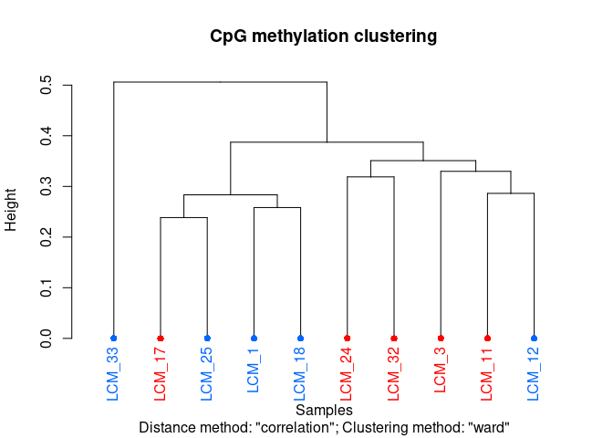<!-- -->

    ## 
    ## Call:
    ## hclust(d = d, method = HCLUST.METHODS[hclust.method])
    ## 
    ## Cluster method   : ward.D 
    ## Distance         : pearson 
    ## Number of objects: 10

``` r
clusterSamples(meth_filter_destrand, dist="correlation", method="ward", plot=TRUE)
```

    ## The "ward" method has been renamed to "ward.D"; note new "ward.D2"

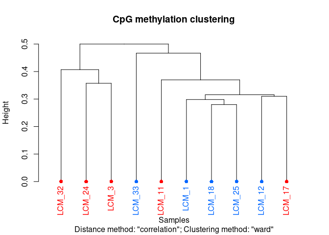<!-- -->

    ## 
    ## Call:
    ## hclust(d = d, method = HCLUST.METHODS[hclust.method])
    ## 
    ## Cluster method   : ward.D 
    ## Distance         : pearson 
    ## Number of objects: 10

``` r
PCASamples(meth_filter)
```

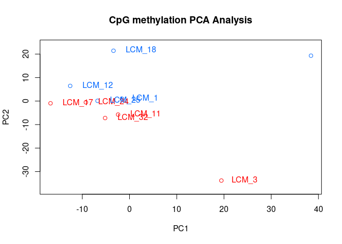<!-- -->

``` r
PCASamples(meth_filter_destrand)
```

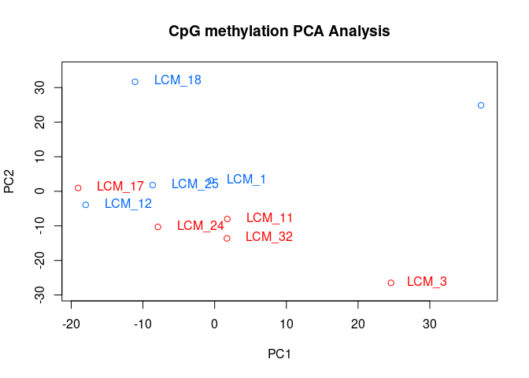<!-- -->

``` r
getCorrelation(meth_filter_destrand,plot=TRUE)
```

    ##            LCM_1    LCM_11    LCM_12    LCM_17    LCM_18    LCM_24    LCM_25
    ## LCM_1  1.0000000 0.7222808 0.7057141 0.7223606 0.7507291 0.6701742 0.7235446
    ## LCM_11 0.7222808 1.0000000 0.6855233 0.6821552 0.6858891 0.6332845 0.6866522
    ## LCM_12 0.7057141 0.6855233 1.0000000 0.7235759 0.7371029 0.7103337 0.7362472
    ## LCM_17 0.7223606 0.6821552 0.7235759 1.0000000 0.7327728 0.6518541 0.7299340
    ## LCM_18 0.7507291 0.6858891 0.7371029 0.7327728 1.0000000 0.6837319 0.7504358
    ## LCM_24 0.6701742 0.6332845 0.7103337 0.6518541 0.6837319 1.0000000 0.7266801
    ## LCM_25 0.7235446 0.6866522 0.7362472 0.7299340 0.7504358 0.7266801 1.0000000
    ## LCM_3  0.6447084 0.6611449 0.6455462 0.6312393 0.6349158 0.6784281 0.6782781
    ## LCM_32 0.6620827 0.6091002 0.6556295 0.6316165 0.6513680 0.6415957 0.6665304
    ## LCM_33 0.6619763 0.5983036 0.6270250 0.6429158 0.6617203 0.5945263 0.6355318
    ##            LCM_3    LCM_32    LCM_33
    ## LCM_1  0.6447084 0.6620827 0.6619763
    ## LCM_11 0.6611449 0.6091002 0.5983036
    ## LCM_12 0.6455462 0.6556295 0.6270250
    ## LCM_17 0.6312393 0.6316165 0.6429158
    ## LCM_18 0.6349158 0.6513680 0.6617203
    ## LCM_24 0.6784281 0.6415957 0.5945263
    ## LCM_25 0.6782781 0.6665304 0.6355318
    ## LCM_3  1.0000000 0.6473983 0.5666346
    ## LCM_32 0.6473983 1.0000000 0.6036661
    ## LCM_33 0.5666346 0.6036661 1.0000000

    ## Warning in par(usr): argument 1 does not name a graphical parameter

    ## Warning in KernSmooth::bkde2D(x, bandwidth = bandwidth, gridsize = nbin, :
    ## Binning grid too coarse for current (small) bandwidth: consider increasing
    ## 'gridsize'
    ## Warning in KernSmooth::bkde2D(x, bandwidth = bandwidth, gridsize = nbin, :
    ## Binning grid too coarse for current (small) bandwidth: consider increasing
    ## 'gridsize'

    ## Warning in par(usr): argument 1 does not name a graphical parameter
    ## Warning in par(usr): argument 1 does not name a graphical parameter

    ## Warning in KernSmooth::bkde2D(x, bandwidth = bandwidth, gridsize = nbin, :
    ## Binning grid too coarse for current (small) bandwidth: consider increasing
    ## 'gridsize'
    ## Warning in KernSmooth::bkde2D(x, bandwidth = bandwidth, gridsize = nbin, :
    ## Binning grid too coarse for current (small) bandwidth: consider increasing
    ## 'gridsize'
    ## Warning in KernSmooth::bkde2D(x, bandwidth = bandwidth, gridsize = nbin, :
    ## Binning grid too coarse for current (small) bandwidth: consider increasing
    ## 'gridsize'
    ## Warning in KernSmooth::bkde2D(x, bandwidth = bandwidth, gridsize = nbin, :
    ## Binning grid too coarse for current (small) bandwidth: consider increasing
    ## 'gridsize'
    ## Warning in KernSmooth::bkde2D(x, bandwidth = bandwidth, gridsize = nbin, :
    ## Binning grid too coarse for current (small) bandwidth: consider increasing
    ## 'gridsize'

    ## Warning in par(usr): argument 1 does not name a graphical parameter
    ## Warning in par(usr): argument 1 does not name a graphical parameter
    ## Warning in par(usr): argument 1 does not name a graphical parameter

    ## Warning in KernSmooth::bkde2D(x, bandwidth = bandwidth, gridsize = nbin, :
    ## Binning grid too coarse for current (small) bandwidth: consider increasing
    ## 'gridsize'

    ## Warning in par(usr): argument 1 does not name a graphical parameter
    ## Warning in par(usr): argument 1 does not name a graphical parameter
    ## Warning in par(usr): argument 1 does not name a graphical parameter
    ## Warning in par(usr): argument 1 does not name a graphical parameter
    ## Warning in par(usr): argument 1 does not name a graphical parameter
    ## Warning in par(usr): argument 1 does not name a graphical parameter
    ## Warning in par(usr): argument 1 does not name a graphical parameter
    ## Warning in par(usr): argument 1 does not name a graphical parameter
    ## Warning in par(usr): argument 1 does not name a graphical parameter

    ## Warning in KernSmooth::bkde2D(x, bandwidth = bandwidth, gridsize = nbin, :
    ## Binning grid too coarse for current (small) bandwidth: consider increasing
    ## 'gridsize'

    ## Warning in par(usr): argument 1 does not name a graphical parameter
    ## Warning in par(usr): argument 1 does not name a graphical parameter
    ## Warning in par(usr): argument 1 does not name a graphical parameter
    ## Warning in par(usr): argument 1 does not name a graphical parameter
    ## Warning in par(usr): argument 1 does not name a graphical parameter
    ## Warning in par(usr): argument 1 does not name a graphical parameter

    ## Warning in KernSmooth::bkde2D(x, bandwidth = bandwidth, gridsize = nbin, :
    ## Binning grid too coarse for current (small) bandwidth: consider increasing
    ## 'gridsize'
    ## Warning in KernSmooth::bkde2D(x, bandwidth = bandwidth, gridsize = nbin, :
    ## Binning grid too coarse for current (small) bandwidth: consider increasing
    ## 'gridsize'

    ## Warning in par(usr): argument 1 does not name a graphical parameter
    ## Warning in par(usr): argument 1 does not name a graphical parameter
    ## Warning in par(usr): argument 1 does not name a graphical parameter
    ## Warning in par(usr): argument 1 does not name a graphical parameter
    ## Warning in par(usr): argument 1 does not name a graphical parameter
    ## Warning in par(usr): argument 1 does not name a graphical parameter
    ## Warning in par(usr): argument 1 does not name a graphical parameter

    ## Warning in KernSmooth::bkde2D(x, bandwidth = bandwidth, gridsize = nbin, :
    ## Binning grid too coarse for current (small) bandwidth: consider increasing
    ## 'gridsize'
    ## Warning in KernSmooth::bkde2D(x, bandwidth = bandwidth, gridsize = nbin, :
    ## Binning grid too coarse for current (small) bandwidth: consider increasing
    ## 'gridsize'

    ## Warning in par(usr): argument 1 does not name a graphical parameter
    ## Warning in par(usr): argument 1 does not name a graphical parameter
    ## Warning in par(usr): argument 1 does not name a graphical parameter
    ## Warning in par(usr): argument 1 does not name a graphical parameter
    ## Warning in par(usr): argument 1 does not name a graphical parameter
    ## Warning in par(usr): argument 1 does not name a graphical parameter
    ## Warning in par(usr): argument 1 does not name a graphical parameter
    ## Warning in par(usr): argument 1 does not name a graphical parameter
    ## Warning in par(usr): argument 1 does not name a graphical parameter
    ## Warning in par(usr): argument 1 does not name a graphical parameter
    ## Warning in par(usr): argument 1 does not name a graphical parameter
    ## Warning in par(usr): argument 1 does not name a graphical parameter
    ## Warning in par(usr): argument 1 does not name a graphical parameter
    ## Warning in par(usr): argument 1 does not name a graphical parameter
    ## Warning in par(usr): argument 1 does not name a graphical parameter
    ## Warning in par(usr): argument 1 does not name a graphical parameter
    ## Warning in par(usr): argument 1 does not name a graphical parameter
    ## Warning in par(usr): argument 1 does not name a graphical parameter
    ## Warning in par(usr): argument 1 does not name a graphical parameter
    ## Warning in par(usr): argument 1 does not name a graphical parameter
    ## Warning in par(usr): argument 1 does not name a graphical parameter
    ## Warning in par(usr): argument 1 does not name a graphical parameter
    ## Warning in par(usr): argument 1 does not name a graphical parameter
    ## Warning in par(usr): argument 1 does not name a graphical parameter
    ## Warning in par(usr): argument 1 does not name a graphical parameter
    ## Warning in par(usr): argument 1 does not name a graphical parameter
    ## Warning in par(usr): argument 1 does not name a graphical parameter

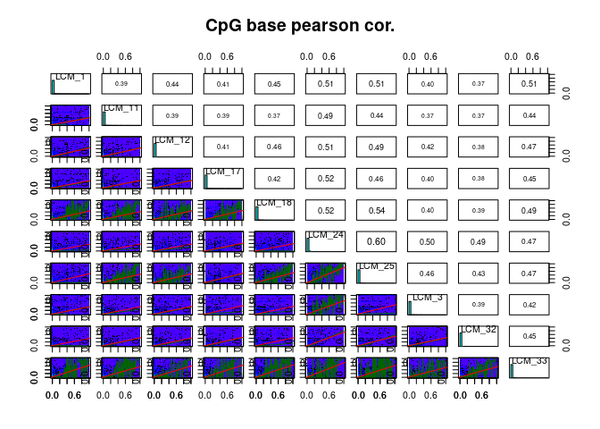<!-- -->

### 0.3.2 batch effects

``` r
#as=assocComp(mBase=meth_filter_destrand,dplyr::select(meta,c("PCR_ReAmp_Cycles", "Fragment")))
#as
```

### 0.3.3 other possible filtering

``` r
# get percent methylation matrix
pm=percMethylation(meth_filter_destrand)

# calculate standard deviation of CpGs
sds=matrixStats::rowSds(pm)

# Visualize the distribution of the per-CpG standard deviation
# to determine a suitable cutoff
hist(sds, breaks = 100)
```

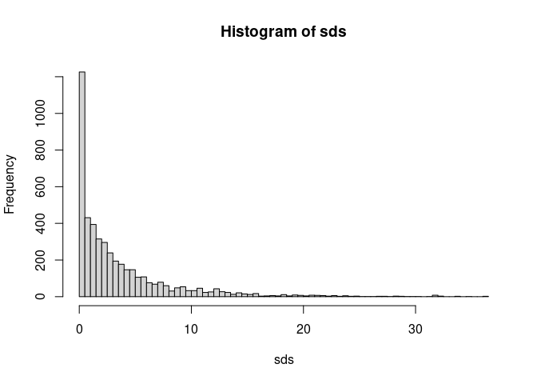<!-- -->

``` r
# keep only CpG with standard deviations larger than 2%
#meth <- meth_filter_destrand[sds > 2]

# This leaves us with this number of CpG sites
nrow(meth_filter_destrand)
```

    ## [1] 134034

``` r
#nrow(meth)
```

### 0.3.4 Identify DML

``` r
DMLStats_Tissue <- methylKit::calculateDiffMeth(meth_filter_destrand, overdispersion = "MN", test = "Chisq", mc.cores = 8) #Calculate differential methylation statistics and include covariate information.
```

    ## two groups detected:
    ##  will calculate methylation difference as the difference of
    ## treatment (group: 1) - control (group: 0)

``` r
head(DMLStats_Tissue) #Look at differential methylation output
```

    ##                                  chr  start    end strand      pvalue    qvalue
    ## 1 Pocillopora_acuta_HIv2___Sc0000000   5326   5326      + 1.000000000 0.8599801
    ## 2 Pocillopora_acuta_HIv2___Sc0000000   5331   5331      + 1.000000000 0.8599801
    ## 3 Pocillopora_acuta_HIv2___Sc0000000  83557  83557      + 0.004626153 0.5025833
    ## 4 Pocillopora_acuta_HIv2___Sc0000000  83565  83565      + 0.053009864 0.8599801
    ## 5 Pocillopora_acuta_HIv2___Sc0000000  83588  83588      + 0.123774009 0.8599801
    ## 6 Pocillopora_acuta_HIv2___Sc0000000 153088 153088      + 1.000000000 0.8599801
    ##   meth.diff
    ## 1   0.00000
    ## 2   0.00000
    ## 3 -54.54545
    ## 4 -28.12500
    ## 5 -26.66667
    ## 6   0.00000

``` r
# Filter DMRs with q-value < 0.05
significant_dmg <- getData(DMLStats_Tissue[DMLStats_Tissue$qvalue < 0.05, ])

# Create a data frame for plotting
plot_data <- data.frame(
  chr = significant_dmg$chr,
  start = significant_dmg$start,
  meth.diff = significant_dmg$meth.diff
)

# Count the number of positive and negative methylation differences
positive_count <- sum(significant_dmg$meth.diff > 0)
negative_count <- sum(significant_dmg$meth.diff < 0)

# Plot with counts added to the quadrants
DML_direction <- ggplot(plot_data, aes(x = start, y = meth.diff)) +
  geom_point(alpha = 0.5) +  # Set alpha to reduce point transparency
  theme_minimal() +
  labs(title = "Significant Differentially Methylated Regions (q-value < 0.05)",
       x = "Genomic Position (start)",
       y = "Methylation Difference (%)") +
  theme(legend.position = "none") +  # Remove the legend
  # Add the count of positive and negative methylation differences as text annotations
  annotate("text", x = Inf, y = Inf, label = paste("Positive:", positive_count), 
           hjust = 1.1, vjust = 1.1, size = 4, color = "blue") +
  annotate("text", x = Inf, y = -Inf, label = paste("Negative:", negative_count), 
           hjust = 1.1, vjust = -0.1, size = 4, color = "red")

save_ggplot(DML_direction, "../output_WGBS/figures/6_DML_direction")
```

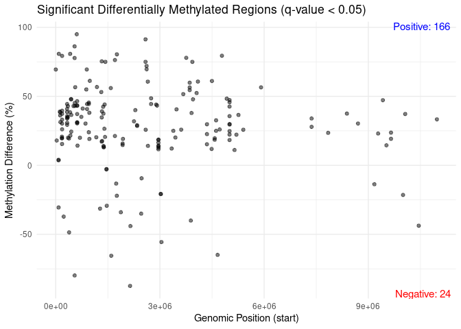<!-- -->

``` r
dml_df <- as.data.frame(DMLStats_Tissue)

# Volcano plot
DML_volcano <- ggplot(dml_df, aes(x = meth.diff, y = -log10(qvalue))) +
  geom_point(alpha = 0.5) +
  geom_vline(xintercept = c(-5, 5), linetype = "dashed", color = "red") +
  geom_hline(yintercept = -log10(0.05), linetype = "dashed", color = "blue") +
  labs(title = "Differentially Methylated Loci (DMLs)",
       x = "Methylation Difference (%)",
       y = "-log10(q-value)") +
  theme_minimal()

save_ggplot(DML_volcano, "../output_WGBS/figures/7_DML_volcano")
```

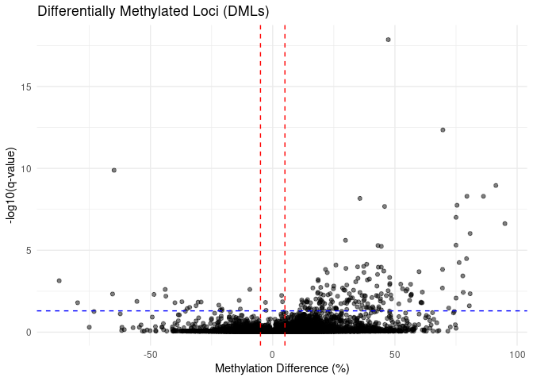<!-- -->

``` r
DMLs <- methylKit::getMethylDiff(DMLStats_Tissue, difference = 2, qvalue = 0.05) #Identify DML based on difference threshold

length(DMLs$chr) #DML
```

    ## [1] 190

``` r
head(DMLs)
```

    ##                                     chr   start     end strand       pvalue
    ## 4981 Pocillopora_acuta_HIv2___Sc0000002 3933210 3933210      + 6.801995e-06
    ## 5079 Pocillopora_acuta_HIv2___Sc0000002 4354140 4354140      + 4.217920e-05
    ## 5080 Pocillopora_acuta_HIv2___Sc0000002 4354519 4354519      + 3.498027e-06
    ## 5083 Pocillopora_acuta_HIv2___Sc0000002 4354790 4354790      + 2.793794e-10
    ## 6087 Pocillopora_acuta_HIv2___Sc0000002 9281328 9281328      + 5.825224e-05
    ## 7904 Pocillopora_acuta_HIv2___Sc0000003 2149671 2149671      + 1.223095e-06
    ##            qvalue meth.diff
    ## 4981 8.340879e-03  75.00000
    ## 5079 3.077121e-02  15.29412
    ## 5080 5.236437e-03  22.64151
    ## 5083 2.477162e-06  29.78723
    ## 6087 3.837845e-02  23.07692
    ## 7904 2.468497e-03 -44.00000

``` r
DMLs_25 <- methylKit::getMethylDiff(DMLStats_Tissue, difference = 25, qvalue = 0.05) #Identify DML based on difference threshold

length(DMLs_25$chr) #DML
```

    ## [1] 128

``` r
head(DMLs_25)
```

    ##                                     chr   start     end strand       pvalue
    ## 4981 Pocillopora_acuta_HIv2___Sc0000002 3933210 3933210      + 6.801995e-06
    ## 5083 Pocillopora_acuta_HIv2___Sc0000002 4354790 4354790      + 2.793794e-10
    ## 7904 Pocillopora_acuta_HIv2___Sc0000003 2149671 2149671      + 1.223095e-06
    ## 8011 Pocillopora_acuta_HIv2___Sc0000003 2461240 2461240      + 5.405275e-05
    ## 9203 Pocillopora_acuta_HIv2___Sc0000003 8383662 8383662      + 4.331291e-06
    ## 9218 Pocillopora_acuta_HIv2___Sc0000003 8702392 8702392      + 2.065599e-05
    ##            qvalue meth.diff
    ## 4981 8.340879e-03  75.00000
    ## 5083 2.477162e-06  29.78723
    ## 7904 2.468497e-03 -44.00000
    ## 8011 3.643553e-02 -35.00000
    ## 9203 5.854711e-03  37.50000
    ## 9218 1.725322e-02  30.30303

## 0.4 Further look at genome wide methylation

``` r
diffMethPerChr(DMLStats_Tissue, meth.cutoff = 2, qvalue.cutoff = 0.05,cex.names=.75)
```

    ## Warning in eval(quote(list(...)), env): NAs introduced by coercion

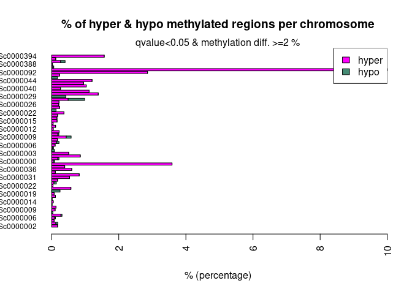<!-- -->

### 0.4.1 Annotation

``` r
require("genomationData")
require("genomation")

gff.file = "../references/Pocillopora_acuta_HIv2.gtf"
gff = gffToGRanges(gff.file)
head(gff)
```

    ## GRanges object with 6 ranges and 6 metadata columns:
    ##                     seqnames    ranges strand |   source       type     score
    ##                        <Rle> <IRanges>  <Rle> | <factor>   <factor> <numeric>
    ##   [1] Pocillopora_acuta_HI..  151-2746      + | AUGUSTUS transcript        NA
    ##   [2] Pocillopora_acuta_HI..   151-172      + | AUGUSTUS exon              NA
    ##   [3] Pocillopora_acuta_HI..   264-304      + | AUGUSTUS exon              NA
    ##   [4] Pocillopora_acuta_HI.. 1491-1602      + | AUGUSTUS exon              NA
    ##   [5] Pocillopora_acuta_HI.. 1889-1990      + | AUGUSTUS exon              NA
    ##   [6] Pocillopora_acuta_HI.. 2107-2127      + | AUGUSTUS exon              NA
    ##           phase          transcript_id                gene_id
    ##       <integer>            <character>            <character>
    ##   [1]      <NA> Pocillopora_acuta_HI.. Pocillopora_acuta_HI..
    ##   [2]      <NA> Pocillopora_acuta_HI.. Pocillopora_acuta_HI..
    ##   [3]      <NA> Pocillopora_acuta_HI.. Pocillopora_acuta_HI..
    ##   [4]      <NA> Pocillopora_acuta_HI.. Pocillopora_acuta_HI..
    ##   [5]      <NA> Pocillopora_acuta_HI.. Pocillopora_acuta_HI..
    ##   [6]      <NA> Pocillopora_acuta_HI.. Pocillopora_acuta_HI..
    ##   -------
    ##   seqinfo: 425 sequences from an unspecified genome; no seqlengths

``` r
exons = gffToGRanges(gff.file, filter = "exon")

transcripts = gffToGRanges(gff.file, filter = "transcript")

DML_all_grange = as(DMLStats_Tissue,"GRanges")
DML_grange = as(DMLs,"GRanges")
DML_grange
```

    ## GRanges object with 190 ranges and 3 metadata columns:
    ##                       seqnames    ranges strand |      pvalue      qvalue
    ##                          <Rle> <IRanges>  <Rle> |   <numeric>   <numeric>
    ##     [1] Pocillopora_acuta_HI..   3933210      + | 6.80199e-06 8.34088e-03
    ##     [2] Pocillopora_acuta_HI..   4354140      + | 4.21792e-05 3.07712e-02
    ##     [3] Pocillopora_acuta_HI..   4354519      + | 3.49803e-06 5.23644e-03
    ##     [4] Pocillopora_acuta_HI..   4354790      + | 2.79379e-10 2.47716e-06
    ##     [5] Pocillopora_acuta_HI..   9281328      + | 5.82522e-05 3.83785e-02
    ##     ...                    ...       ...    ... .         ...         ...
    ##   [186] Pocillopora_acuta_HI..    442312      + | 3.87231e-07 0.001062733
    ##   [187] Pocillopora_acuta_HI..    442314      + | 4.90440e-07 0.001256253
    ##   [188] Pocillopora_acuta_HI..    893636      + | 3.35911e-08 0.000147786
    ##   [189] Pocillopora_acuta_HI..    903270      + | 7.10337e-05 0.043785082
    ##   [190] Pocillopora_acuta_HI..    903292      + | 7.07557e-05 0.043785082
    ##         meth.diff
    ##         <numeric>
    ##     [1]   75.0000
    ##     [2]   15.2941
    ##     [3]   22.6415
    ##     [4]   29.7872
    ##     [5]   23.0769
    ##     ...       ...
    ##   [186]   47.9526
    ##   [187]   47.8618
    ##   [188]   69.4872
    ##   [189]   44.4444
    ##   [190]   40.8192
    ##   -------
    ##   seqinfo: 64 sequences from an unspecified genome; no seqlengths

``` r
transcripts = gffToGRanges(gff.file, filter = "transcript")

# Find overlaps between DMLs and transcripts
overlaps_transcripts <- findOverlaps(DML_all_grange, transcripts,ignore.strand = TRUE)
```

    ## Warning in .merge_two_Seqinfo_objects(x, y): Each of the 2 combined objects has sequence levels not in the other:
    ##   - in 'x': Pocillopora_acuta_HIv2___Sc0000054, Pocillopora_acuta_HIv2___Sc0000069, Pocillopora_acuta_HIv2___xfSc0000067, Pocillopora_acuta_HIv2___xfSc0000112, Pocillopora_acuta_HIv2___xfSc0000153, Pocillopora_acuta_HIv2___xfSc0000172, Pocillopora_acuta_HIv2___xfSc0000225, Pocillopora_acuta_HIv2___xfSc0000365, Pocillopora_acuta_HIv2___xfSc0000369, Pocillopora_acuta_HIv2___xfSc0000372, Pocillopora_acuta_HIv2___xfSc0000375, Pocillopora_acuta_HIv2___xfSc0000383, Pocillopora_acuta_HIv2___xpSc0000428
    ##   - in 'y': Pocillopora_acuta_HIv2___Sc0000056, Pocillopora_acuta_HIv2___Sc0000058, Pocillopora_acuta_HIv2___Sc0000059, Pocillopora_acuta_HIv2___Sc0000062, Pocillopora_acuta_HIv2___Sc0000064, Pocillopora_acuta_HIv2___Sc0000068, Pocillopora_acuta_HIv2___Sc0000070, Pocillopora_acuta_HIv2___Sc0000073, Pocillopora_acuta_HIv2___Sc0000076, Pocillopora_acuta_HIv2___Sc0000077, Pocillopora_acuta_HIv2___Sc0000080, Pocillopora_acuta_HIv2___xfSc0000071, Pocillopora_acuta_HIv2___xfSc0000074, Pocillopora_acuta_HIv2___xfSc0000078, Pocillopora_acuta_HIv2___xfSc0000087, Pocillopora_acuta_HIv2___xfSc0000089, Pocillopora_acuta_HIv2___xfSc0000090, Pocillopora_acuta_HIv2___xfSc0000095, Pocillopora_acuta_HIv2___xfSc0000097, Pocillopora_acuta_HIv2___xfSc0000099, Pocillopora_acuta_HIv2___xfSc0000104, Pocillopora_acuta_HIv2___xfSc0000105, Pocillopora_acuta_HIv2___xfSc0000108, Pocillopora_acuta_HIv2___xfSc0000109, Pocillopora_acuta_HIv2___xfSc0000110, Pocillopora_acuta_HIv2___xfSc0000116, Pocillopora_acuta_HIv2___xfSc0000119, Pocillopora_acuta_HIv2___xfSc0000121, Pocillopora_acuta_HIv2___xfSc0000122, Pocillopora_acuta_HIv2___xfSc0000128, Pocillopora_acuta_HIv2___xfSc0000129, Pocillopora_acuta_HIv2___xfSc0000131, Pocillopora_acuta_HIv2___xfSc0000132, Pocillopora_acuta_HIv2___xfSc0000135, Pocillopora_acuta_HIv2___xfSc0000136, Pocillopora_acuta_HIv2___xfSc0000139, Pocillopora_acuta_HIv2___xfSc0000140, Pocillopora_acuta_HIv2___xfSc0000141, Pocillopora_acuta_HIv2___xfSc0000143, Pocillopora_acuta_HIv2___xfSc0000144, Pocillopora_acuta_HIv2___xfSc0000147, Pocillopora_acuta_HIv2___xfSc0000148, Pocillopora_acuta_HIv2___xfSc0000151, Pocillopora_acuta_HIv2___xfSc0000152, Pocillopora_acuta_HIv2___xfSc0000154, Pocillopora_acuta_HIv2___xfSc0000155, Pocillopora_acuta_HIv2___xfSc0000158, Pocillopora_acuta_HIv2___xfSc0000160, Pocillopora_acuta_HIv2___xfSc0000161, Pocillopora_acuta_HIv2___xfSc0000163, Pocillopora_acuta_HIv2___xfSc0000165, Pocillopora_acuta_HIv2___xfSc0000166, Pocillopora_acuta_HIv2___xfSc0000167, Pocillopora_acuta_HIv2___xfSc0000168, Pocillopora_acuta_HIv2___xfSc0000171, Pocillopora_acuta_HIv2___xfSc0000177, Pocillopora_acuta_HIv2___xfSc0000179, Pocillopora_acuta_HIv2___xfSc0000180, Pocillopora_acuta_HIv2___xfSc0000182, Pocillopora_acuta_HIv2___xfSc0000183, Pocillopora_acuta_HIv2___xfSc0000184, Pocillopora_acuta_HIv2___xfSc0000185, Pocillopora_acuta_HIv2___xfSc0000186, Pocillopora_acuta_HIv2___xfSc0000187, Pocillopora_acuta_HIv2___xfSc0000189, Pocillopora_acuta_HIv2___xfSc0000191, Pocillopora_acuta_HIv2___xfSc0000192, Pocillopora_acuta_HIv2___xfSc0000193, Pocillopora_acuta_HIv2___xfSc0000195, Pocillopora_acuta_HIv2___xfSc0000196, Pocillopora_acuta_HIv2___xfSc0000200, Pocillopora_acuta_HIv2___xfSc0000203, Pocillopora_acuta_HIv2___xfSc0000204, Pocillopora_acuta_HIv2___xfSc0000205, Pocillopora_acuta_HIv2___xfSc0000207, Pocillopora_acuta_HIv2___xfSc0000208, Pocillopora_acuta_HIv2___xfSc0000209, Pocillopora_acuta_HIv2___xfSc0000212, Pocillopora_acuta_HIv2___xfSc0000214, Pocillopora_acuta_HIv2___xfSc0000215, Pocillopora_acuta_HIv2___xfSc0000216, Pocillopora_acuta_HIv2___xfSc0000217, Pocillopora_acuta_HIv2___xfSc0000218, Pocillopora_acuta_HIv2___xfSc0000223, Pocillopora_acuta_HIv2___xfSc0000228, Pocillopora_acuta_HIv2___xfSc0000230, Pocillopora_acuta_HIv2___xfSc0000231, Pocillopora_acuta_HIv2___xfSc0000232, Pocillopora_acuta_HIv2___xfSc0000233, Pocillopora_acuta_HIv2___xfSc0000234, Pocillopora_acuta_HIv2___xfSc0000236, Pocillopora_acuta_HIv2___xfSc0000237, Pocillopora_acuta_HIv2___xfSc0000239, Pocillopora_acuta_HIv2___xfSc0000240, Pocillopora_acuta_HIv2___xfSc0000243, Pocillopora_acuta_HIv2___xfSc0000244, Pocillopora_acuta_HIv2___xfSc0000248, Pocillopora_acuta_HIv2___xfSc0000249, Pocillopora_acuta_HIv2___xfSc0000250, Pocillopora_acuta_HIv2___xfSc0000251, Pocillopora_acuta_HIv2___xfSc0000252, Pocillopora_acuta_HIv2___xfSc0000255, Pocillopora_acuta_HIv2___xfSc0000256, Pocillopora_acuta_HIv2___xfSc0000257, Pocillopora_acuta_HIv2___xfSc0000258, Pocillopora_acuta_HIv2___xfSc0000260, Pocillopora_acuta_HIv2___xfSc0000262, Pocillopora_acuta_HIv2___xfSc0000264, Pocillopora_acuta_HIv2___xfSc0000265, Pocillopora_acuta_HIv2___xfSc0000266, Pocillopora_acuta_HIv2___xfSc0000267, Pocillopora_acuta_HIv2___xfSc0000268, Pocillopora_acuta_HIv2___xfSc0000269, Pocillopora_acuta_HIv2___xfSc0000271, Pocillopora_acuta_HIv2___xfSc0000272, Pocillopora_acuta_HIv2___xfSc0000273, Pocillopora_acuta_HIv2___xfSc0000275, Pocillopora_acuta_HIv2___xfSc0000276, Pocillopora_acuta_HIv2___xfSc0000277, Pocillopora_acuta_HIv2___xfSc0000280, Pocillopora_acuta_HIv2___xfSc0000281, Pocillopora_acuta_HIv2___xfSc0000283, Pocillopora_acuta_HIv2___xfSc0000284, Pocillopora_acuta_HIv2___xfSc0000287, Pocillopora_acuta_HIv2___xfSc0000288, Pocillopora_acuta_HIv2___xfSc0000291, Pocillopora_acuta_HIv2___xfSc0000293, Pocillopora_acuta_HIv2___xfSc0000296, Pocillopora_acuta_HIv2___xfSc0000302, Pocillopora_acuta_HIv2___xfSc0000303, Pocillopora_acuta_HIv2___xfSc0000305, Pocillopora_acuta_HIv2___xfSc0000306, Pocillopora_acuta_HIv2___xfSc0000310, Pocillopora_acuta_HIv2___xfSc0000311, Pocillopora_acuta_HIv2___xfSc0000313, Pocillopora_acuta_HIv2___xfSc0000315, Pocillopora_acuta_HIv2___xfSc0000316, Pocillopora_acuta_HIv2___xfSc0000319, Pocillopora_acuta_HIv2___xfSc0000322, Pocillopora_acuta_HIv2___xfSc0000325, Pocillopora_acuta_HIv2___xfSc0000326, Pocillopora_acuta_HIv2___xfSc0000327, Pocillopora_acuta_HIv2___xfSc0000334, Pocillopora_acuta_HIv2___xfSc0000343, Pocillopora_acuta_HIv2___xfSc0000344, Pocillopora_acuta_HIv2___xfSc0000345, Pocillopora_acuta_HIv2___xfSc0000346, Pocillopora_acuta_HIv2___xfSc0000347, Pocillopora_acuta_HIv2___xfSc0000349, Pocillopora_acuta_HIv2___xfSc0000350, Pocillopora_acuta_HIv2___xfSc0000354, Pocillopora_acuta_HIv2___xfSc0000361, Pocillopora_acuta_HIv2___xfSc0000362, Pocillopora_acuta_HIv2___xfSc0000363, Pocillopora_acuta_HIv2___xfSc0000368, Pocillopora_acuta_HIv2___xfSc0000370, Pocillopora_acuta_HIv2___xfSc0000371, Pocillopora_acuta_HIv2___xfSc0000374, Pocillopora_acuta_HIv2___xfSc0000376, Pocillopora_acuta_HIv2___xfSc0000377, Pocillopora_acuta_HIv2___xfSc0000378, Pocillopora_acuta_HIv2___xfSc0000379, Pocillopora_acuta_HIv2___xfSc0000380, Pocillopora_acuta_HIv2___xfSc0000384, Pocillopora_acuta_HIv2___xfSc0000386, Pocillopora_acuta_HIv2___xpSc0000402, Pocillopora_acuta_HIv2___xpSc0000412, Pocillopora_acuta_HIv2___xpSc0000414, Pocillopora_acuta_HIv2___xpSc0000415, Pocillopora_acuta_HIv2___xpSc0000417, Pocillopora_acuta_HIv2___xpSc0000422, Pocillopora_acuta_HIv2___xpSc0000423, Pocillopora_acuta_HIv2___xpSc0000425, Pocillopora_acuta_HIv2___xpSc0000430, Pocillopora_acuta_HIv2___xpSc0000439, Pocillopora_acuta_HIv2___xpSc0000447
    ##   Make sure to always combine/compare objects based on the same reference
    ##   genome (use suppressWarnings() to suppress this warning).

``` r
# Extract matching transcript information
DML_transcript_annot_allCpg <- data.frame(
  chr = seqnames(DML_all_grange)[queryHits(overlaps_transcripts)],
  start = start(DML_all_grange)[queryHits(overlaps_transcripts)],
  end = end(DML_all_grange)[queryHits(overlaps_transcripts)],
  DML_qvalue = (DML_all_grange$qvalue)[queryHits(overlaps_transcripts)],
  DML_methdiff = (DML_all_grange$meth.diff)[queryHits(overlaps_transcripts)],
  transcript_chr = seqnames(transcripts)[subjectHits(overlaps_transcripts)],
  transcript_start = start(transcripts)[subjectHits(overlaps_transcripts)],
  transcript_end = end(transcripts)[subjectHits(overlaps_transcripts)],
  transcript_id = transcripts$transcript_id[subjectHits(overlaps_transcripts)],
  gene_id = transcripts$gene_id[subjectHits(overlaps_transcripts)]
)

DML_transcript_annot <- DML_transcript_annot_allCpg %>% filter(DML_qvalue < 0.05)
  
# View first few rows
head(DML_transcript_annot)
```

    ##                                  chr   start     end   DML_qvalue DML_methdiff
    ## 1 Pocillopora_acuta_HIv2___Sc0000002 4354140 4354140 3.077121e-02     15.29412
    ## 2 Pocillopora_acuta_HIv2___Sc0000002 4354519 4354519 5.236437e-03     22.64151
    ## 3 Pocillopora_acuta_HIv2___Sc0000002 4354790 4354790 2.477162e-06     29.78723
    ## 4 Pocillopora_acuta_HIv2___Sc0000002 9281328 9281328 3.837845e-02     23.07692
    ## 5 Pocillopora_acuta_HIv2___Sc0000003 2461240 2461240 3.643553e-02    -35.00000
    ## 6 Pocillopora_acuta_HIv2___Sc0000003 8702392 8702392 1.725322e-02     30.30303
    ##                       transcript_chr transcript_start transcript_end
    ## 1 Pocillopora_acuta_HIv2___Sc0000002          4352529        4355343
    ## 2 Pocillopora_acuta_HIv2___Sc0000002          4352529        4355343
    ## 3 Pocillopora_acuta_HIv2___Sc0000002          4352529        4355343
    ## 4 Pocillopora_acuta_HIv2___Sc0000002          9279157        9293249
    ## 5 Pocillopora_acuta_HIv2___Sc0000003          2441368        2461336
    ## 6 Pocillopora_acuta_HIv2___Sc0000003          8696824        8734794
    ##                               transcript_id
    ## 1 Pocillopora_acuta_HIv2___RNAseq.g25038.t1
    ## 2 Pocillopora_acuta_HIv2___RNAseq.g25038.t1
    ## 3 Pocillopora_acuta_HIv2___RNAseq.g25038.t1
    ## 4 Pocillopora_acuta_HIv2___RNAseq.g25453.t1
    ## 5  Pocillopora_acuta_HIv2___RNAseq.g4860.t2
    ## 6  Pocillopora_acuta_HIv2___RNAseq.g5465.t1
    ##                                     gene_id
    ## 1 Pocillopora_acuta_HIv2___RNAseq.g25038.t1
    ## 2 Pocillopora_acuta_HIv2___RNAseq.g25038.t1
    ## 3 Pocillopora_acuta_HIv2___RNAseq.g25038.t1
    ## 4 Pocillopora_acuta_HIv2___RNAseq.g25453.t1
    ## 5  Pocillopora_acuta_HIv2___RNAseq.g4860.t2
    ## 6  Pocillopora_acuta_HIv2___RNAseq.g5465.t1

``` r
# how many DMLs are in gene bodies?
length(DML_transcript_annot$gene_id)
```

    ## [1] 91

``` r
#how many genes do these consist of?
length(unique(DML_transcript_annot$gene_id))
```

    ## [1] 65

``` r
DML_transcript_annot %>% group_by(transcript_id) %>% summarize(num_DMLs=n()) %>% summary()
```

    ##  transcript_id         num_DMLs  
    ##  Length:65          Min.   :1.0  
    ##  Class :character   1st Qu.:1.0  
    ##  Mode  :character   Median :1.0  
    ##                     Mean   :1.4  
    ##                     3rd Qu.:1.0  
    ##                     Max.   :7.0

## 0.5 Are any DMGs DMLs?

``` r
#load in DESeq results
DESeq <- read.csv("../output_RNA/differential_expression/DESeq_results.csv", header = TRUE) %>% dplyr::rename("query" ="X")

#make dataframes of just differentially expressed genes for each LFC direction
DE_05_Aboral <- DESeq %>% filter(padj < 0.05 & log2FoldChange > 0)
DE_05_OralEpi <- DESeq %>% filter(padj < 0.05& log2FoldChange < 0)
DE_05 <- DESeq %>% filter(padj < 0.05)

DML_transcript_annot[DML_transcript_annot$transcript_id %in% DE_05$query,]
```

    ##                                     chr   start     end   DML_qvalue
    ## 1    Pocillopora_acuta_HIv2___Sc0000002 4354140 4354140 3.077121e-02
    ## 2    Pocillopora_acuta_HIv2___Sc0000002 4354519 4354519 5.236437e-03
    ## 3    Pocillopora_acuta_HIv2___Sc0000002 4354790 4354790 2.477162e-06
    ## 10   Pocillopora_acuta_HIv2___Sc0000006 5260722 5260722 2.225195e-02
    ## 11   Pocillopora_acuta_HIv2___Sc0000007 1469599 1469599 1.443216e-02
    ## 19   Pocillopora_acuta_HIv2___Sc0000009 1926284 1926284 4.300753e-02
    ## 20   Pocillopora_acuta_HIv2___Sc0000009 1926297 1926297 3.564570e-02
    ## 37 Pocillopora_acuta_HIv2___xfSc0000000 5400485 5400485 3.281083e-02
    ## 63 Pocillopora_acuta_HIv2___xfSc0000009 1377935 1377935 1.383141e-02
    ## 64 Pocillopora_acuta_HIv2___xfSc0000009 3043722 3043722 1.327307e-02
    ## 74 Pocillopora_acuta_HIv2___xfSc0000024 2471817 2471817 2.468497e-03
    ##    DML_methdiff                       transcript_chr transcript_start
    ## 1     15.294118   Pocillopora_acuta_HIv2___Sc0000002          4352529
    ## 2     22.641509   Pocillopora_acuta_HIv2___Sc0000002          4352529
    ## 3     29.787234   Pocillopora_acuta_HIv2___Sc0000002          4352529
    ## 10    36.502508   Pocillopora_acuta_HIv2___Sc0000006          5258672
    ## 11   -29.268293   Pocillopora_acuta_HIv2___Sc0000007          1469481
    ## 19    15.789474   Pocillopora_acuta_HIv2___Sc0000009          1924903
    ## 20    14.754098   Pocillopora_acuta_HIv2___Sc0000009          1924903
    ## 37    25.806452 Pocillopora_acuta_HIv2___xfSc0000000          5393991
    ## 63    14.035088 Pocillopora_acuta_HIv2___xfSc0000009          1376679
    ## 64   -55.555556 Pocillopora_acuta_HIv2___xfSc0000009          3018389
    ## 74    -9.360961 Pocillopora_acuta_HIv2___xfSc0000024          2471129
    ##    transcript_end                             transcript_id
    ## 1         4355343 Pocillopora_acuta_HIv2___RNAseq.g25038.t1
    ## 2         4355343 Pocillopora_acuta_HIv2___RNAseq.g25038.t1
    ## 3         4355343 Pocillopora_acuta_HIv2___RNAseq.g25038.t1
    ## 10        5262000 Pocillopora_acuta_HIv2___RNAseq.g15474.t1
    ## 11        1470395 Pocillopora_acuta_HIv2___RNAseq.g17564.t1
    ## 19        1932130  Pocillopora_acuta_HIv2___RNAseq.g2626.t1
    ## 20        1932130  Pocillopora_acuta_HIv2___RNAseq.g2626.t1
    ## 37        5402276 Pocillopora_acuta_HIv2___RNAseq.g22998.t1
    ## 63        1378770 Pocillopora_acuta_HIv2___RNAseq.g12189.t1
    ## 64        3057287      Pocillopora_acuta_HIv2___TS.g3256.t1
    ## 74        2473563 Pocillopora_acuta_HIv2___RNAseq.g20860.t1
    ##                                      gene_id
    ## 1  Pocillopora_acuta_HIv2___RNAseq.g25038.t1
    ## 2  Pocillopora_acuta_HIv2___RNAseq.g25038.t1
    ## 3  Pocillopora_acuta_HIv2___RNAseq.g25038.t1
    ## 10 Pocillopora_acuta_HIv2___RNAseq.g15474.t1
    ## 11 Pocillopora_acuta_HIv2___RNAseq.g17564.t1
    ## 19  Pocillopora_acuta_HIv2___RNAseq.g2626.t1
    ## 20  Pocillopora_acuta_HIv2___RNAseq.g2626.t1
    ## 37 Pocillopora_acuta_HIv2___RNAseq.g22998.t1
    ## 63 Pocillopora_acuta_HIv2___RNAseq.g12189.t1
    ## 64      Pocillopora_acuta_HIv2___TS.g3256.t1
    ## 74 Pocillopora_acuta_HIv2___RNAseq.g20860.t1

``` r
DE_05[DE_05$query %in% DML_transcript_annot$transcript_id,]
```

    ##                                          query   baseMean log2FoldChange
    ## 21   Pocillopora_acuta_HIv2___RNAseq.g20860.t1 1265.27422    -15.5762448
    ## 1788 Pocillopora_acuta_HIv2___RNAseq.g17564.t1  708.27278     -0.7085281
    ## 1802  Pocillopora_acuta_HIv2___RNAseq.g2626.t1  237.04137      5.6905130
    ## 1928 Pocillopora_acuta_HIv2___RNAseq.g15474.t1   42.82082     -4.5903434
    ## 2005 Pocillopora_acuta_HIv2___RNAseq.g22998.t1  287.46168     -0.7535547
    ## 2924 Pocillopora_acuta_HIv2___RNAseq.g25038.t1  453.44869      1.4528771
    ## 3133 Pocillopora_acuta_HIv2___RNAseq.g12189.t1  184.60827     -0.3170635
    ## 3249      Pocillopora_acuta_HIv2___TS.g3256.t1  295.29556     -1.0719805
    ##         lfcSE       pvalue         padj
    ## 21   3.873810 1.358173e-16 9.354577e-14
    ## 1788 1.285995 1.192290e-04 9.645014e-04
    ## 1802 2.267624 1.246384e-04 1.000427e-03
    ## 1928 2.195922 1.899619e-04 1.425108e-03
    ## 2005 1.430480 2.545588e-04 1.836378e-03
    ## 2924 2.114543 3.385288e-03 1.674583e-02
    ## 3133 1.047937 5.237407e-03 2.417933e-02
    ## 3249 1.600315 6.755427e-03 3.007402e-02

``` r
plot_data <- merge(DML_transcript_annot, DESeq, by.x = "transcript_id", by.y = "query")

ggplot(plot_data, aes(x = DML_methdiff, y = log2FoldChange)) +
  geom_point(aes(color = padj < 0.05), size = 3) +
  geom_text_repel(aes(label = ifelse(padj < 0.05, transcript_id, "")), max.overlaps = 20) +
  geom_hline(yintercept = 0, linetype = "dashed") +
  geom_vline(xintercept = 0, linetype = "dashed") +
  scale_color_manual(values = c("grey", "red")) +
  labs(x = "Methylation Difference (%)", 
       y = "RNA-seq: Log2FoldChange",
       title = "Differentially methylated loci (DMLs) vs. Gene Expression",
       color = "Significant DEGs") +
  theme_minimal()
```

    ## Warning: ggrepel: 3 unlabeled data points (too many overlaps). Consider
    ## increasing max.overlaps

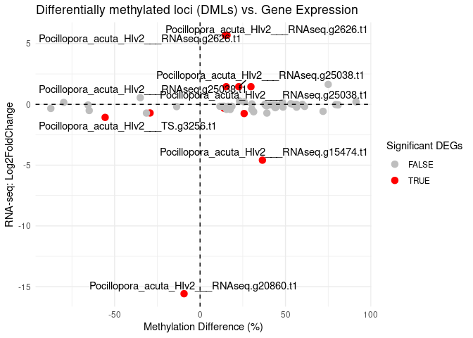<!-- -->

``` r
# how many CpG sites are there after filtering?
dim(meth_filter_destrand)
```

    ## [1] 134034     34

``` r
CpG_grange = as(meth_filter_destrand,"GRanges")

# identify all the CpGs that are in transcripts
genes_with_CpGs <- findOverlaps(CpG_grange, transcripts,ignore.strand = TRUE)
```

    ## Warning in .merge_two_Seqinfo_objects(x, y): Each of the 2 combined objects has sequence levels not in the other:
    ##   - in 'x': Pocillopora_acuta_HIv2___Sc0000054, Pocillopora_acuta_HIv2___Sc0000069, Pocillopora_acuta_HIv2___xfSc0000067, Pocillopora_acuta_HIv2___xfSc0000112, Pocillopora_acuta_HIv2___xfSc0000153, Pocillopora_acuta_HIv2___xfSc0000172, Pocillopora_acuta_HIv2___xfSc0000225, Pocillopora_acuta_HIv2___xfSc0000365, Pocillopora_acuta_HIv2___xfSc0000369, Pocillopora_acuta_HIv2___xfSc0000372, Pocillopora_acuta_HIv2___xfSc0000375, Pocillopora_acuta_HIv2___xfSc0000383, Pocillopora_acuta_HIv2___xpSc0000428
    ##   - in 'y': Pocillopora_acuta_HIv2___Sc0000056, Pocillopora_acuta_HIv2___Sc0000058, Pocillopora_acuta_HIv2___Sc0000059, Pocillopora_acuta_HIv2___Sc0000062, Pocillopora_acuta_HIv2___Sc0000064, Pocillopora_acuta_HIv2___Sc0000068, Pocillopora_acuta_HIv2___Sc0000070, Pocillopora_acuta_HIv2___Sc0000073, Pocillopora_acuta_HIv2___Sc0000076, Pocillopora_acuta_HIv2___Sc0000077, Pocillopora_acuta_HIv2___Sc0000080, Pocillopora_acuta_HIv2___xfSc0000071, Pocillopora_acuta_HIv2___xfSc0000074, Pocillopora_acuta_HIv2___xfSc0000078, Pocillopora_acuta_HIv2___xfSc0000087, Pocillopora_acuta_HIv2___xfSc0000089, Pocillopora_acuta_HIv2___xfSc0000090, Pocillopora_acuta_HIv2___xfSc0000095, Pocillopora_acuta_HIv2___xfSc0000097, Pocillopora_acuta_HIv2___xfSc0000099, Pocillopora_acuta_HIv2___xfSc0000104, Pocillopora_acuta_HIv2___xfSc0000105, Pocillopora_acuta_HIv2___xfSc0000108, Pocillopora_acuta_HIv2___xfSc0000109, Pocillopora_acuta_HIv2___xfSc0000110, Pocillopora_acuta_HIv2___xfSc0000116, Pocillopora_acuta_HIv2___xfSc0000119, Pocillopora_acuta_HIv2___xfSc0000121, Pocillopora_acuta_HIv2___xfSc0000122, Pocillopora_acuta_HIv2___xfSc0000128, Pocillopora_acuta_HIv2___xfSc0000129, Pocillopora_acuta_HIv2___xfSc0000131, Pocillopora_acuta_HIv2___xfSc0000132, Pocillopora_acuta_HIv2___xfSc0000135, Pocillopora_acuta_HIv2___xfSc0000136, Pocillopora_acuta_HIv2___xfSc0000139, Pocillopora_acuta_HIv2___xfSc0000140, Pocillopora_acuta_HIv2___xfSc0000141, Pocillopora_acuta_HIv2___xfSc0000143, Pocillopora_acuta_HIv2___xfSc0000144, Pocillopora_acuta_HIv2___xfSc0000147, Pocillopora_acuta_HIv2___xfSc0000148, Pocillopora_acuta_HIv2___xfSc0000151, Pocillopora_acuta_HIv2___xfSc0000152, Pocillopora_acuta_HIv2___xfSc0000154, Pocillopora_acuta_HIv2___xfSc0000155, Pocillopora_acuta_HIv2___xfSc0000158, Pocillopora_acuta_HIv2___xfSc0000160, Pocillopora_acuta_HIv2___xfSc0000161, Pocillopora_acuta_HIv2___xfSc0000163, Pocillopora_acuta_HIv2___xfSc0000165, Pocillopora_acuta_HIv2___xfSc0000166, Pocillopora_acuta_HIv2___xfSc0000167, Pocillopora_acuta_HIv2___xfSc0000168, Pocillopora_acuta_HIv2___xfSc0000171, Pocillopora_acuta_HIv2___xfSc0000177, Pocillopora_acuta_HIv2___xfSc0000179, Pocillopora_acuta_HIv2___xfSc0000180, Pocillopora_acuta_HIv2___xfSc0000182, Pocillopora_acuta_HIv2___xfSc0000183, Pocillopora_acuta_HIv2___xfSc0000184, Pocillopora_acuta_HIv2___xfSc0000185, Pocillopora_acuta_HIv2___xfSc0000186, Pocillopora_acuta_HIv2___xfSc0000187, Pocillopora_acuta_HIv2___xfSc0000189, Pocillopora_acuta_HIv2___xfSc0000191, Pocillopora_acuta_HIv2___xfSc0000192, Pocillopora_acuta_HIv2___xfSc0000193, Pocillopora_acuta_HIv2___xfSc0000195, Pocillopora_acuta_HIv2___xfSc0000196, Pocillopora_acuta_HIv2___xfSc0000200, Pocillopora_acuta_HIv2___xfSc0000203, Pocillopora_acuta_HIv2___xfSc0000204, Pocillopora_acuta_HIv2___xfSc0000205, Pocillopora_acuta_HIv2___xfSc0000207, Pocillopora_acuta_HIv2___xfSc0000208, Pocillopora_acuta_HIv2___xfSc0000209, Pocillopora_acuta_HIv2___xfSc0000212, Pocillopora_acuta_HIv2___xfSc0000214, Pocillopora_acuta_HIv2___xfSc0000215, Pocillopora_acuta_HIv2___xfSc0000216, Pocillopora_acuta_HIv2___xfSc0000217, Pocillopora_acuta_HIv2___xfSc0000218, Pocillopora_acuta_HIv2___xfSc0000223, Pocillopora_acuta_HIv2___xfSc0000228, Pocillopora_acuta_HIv2___xfSc0000230, Pocillopora_acuta_HIv2___xfSc0000231, Pocillopora_acuta_HIv2___xfSc0000232, Pocillopora_acuta_HIv2___xfSc0000233, Pocillopora_acuta_HIv2___xfSc0000234, Pocillopora_acuta_HIv2___xfSc0000236, Pocillopora_acuta_HIv2___xfSc0000237, Pocillopora_acuta_HIv2___xfSc0000239, Pocillopora_acuta_HIv2___xfSc0000240, Pocillopora_acuta_HIv2___xfSc0000243, Pocillopora_acuta_HIv2___xfSc0000244, Pocillopora_acuta_HIv2___xfSc0000248, Pocillopora_acuta_HIv2___xfSc0000249, Pocillopora_acuta_HIv2___xfSc0000250, Pocillopora_acuta_HIv2___xfSc0000251, Pocillopora_acuta_HIv2___xfSc0000252, Pocillopora_acuta_HIv2___xfSc0000255, Pocillopora_acuta_HIv2___xfSc0000256, Pocillopora_acuta_HIv2___xfSc0000257, Pocillopora_acuta_HIv2___xfSc0000258, Pocillopora_acuta_HIv2___xfSc0000260, Pocillopora_acuta_HIv2___xfSc0000262, Pocillopora_acuta_HIv2___xfSc0000264, Pocillopora_acuta_HIv2___xfSc0000265, Pocillopora_acuta_HIv2___xfSc0000266, Pocillopora_acuta_HIv2___xfSc0000267, Pocillopora_acuta_HIv2___xfSc0000268, Pocillopora_acuta_HIv2___xfSc0000269, Pocillopora_acuta_HIv2___xfSc0000271, Pocillopora_acuta_HIv2___xfSc0000272, Pocillopora_acuta_HIv2___xfSc0000273, Pocillopora_acuta_HIv2___xfSc0000275, Pocillopora_acuta_HIv2___xfSc0000276, Pocillopora_acuta_HIv2___xfSc0000277, Pocillopora_acuta_HIv2___xfSc0000280, Pocillopora_acuta_HIv2___xfSc0000281, Pocillopora_acuta_HIv2___xfSc0000283, Pocillopora_acuta_HIv2___xfSc0000284, Pocillopora_acuta_HIv2___xfSc0000287, Pocillopora_acuta_HIv2___xfSc0000288, Pocillopora_acuta_HIv2___xfSc0000291, Pocillopora_acuta_HIv2___xfSc0000293, Pocillopora_acuta_HIv2___xfSc0000296, Pocillopora_acuta_HIv2___xfSc0000302, Pocillopora_acuta_HIv2___xfSc0000303, Pocillopora_acuta_HIv2___xfSc0000305, Pocillopora_acuta_HIv2___xfSc0000306, Pocillopora_acuta_HIv2___xfSc0000310, Pocillopora_acuta_HIv2___xfSc0000311, Pocillopora_acuta_HIv2___xfSc0000313, Pocillopora_acuta_HIv2___xfSc0000315, Pocillopora_acuta_HIv2___xfSc0000316, Pocillopora_acuta_HIv2___xfSc0000319, Pocillopora_acuta_HIv2___xfSc0000322, Pocillopora_acuta_HIv2___xfSc0000325, Pocillopora_acuta_HIv2___xfSc0000326, Pocillopora_acuta_HIv2___xfSc0000327, Pocillopora_acuta_HIv2___xfSc0000334, Pocillopora_acuta_HIv2___xfSc0000343, Pocillopora_acuta_HIv2___xfSc0000344, Pocillopora_acuta_HIv2___xfSc0000345, Pocillopora_acuta_HIv2___xfSc0000346, Pocillopora_acuta_HIv2___xfSc0000347, Pocillopora_acuta_HIv2___xfSc0000349, Pocillopora_acuta_HIv2___xfSc0000350, Pocillopora_acuta_HIv2___xfSc0000354, Pocillopora_acuta_HIv2___xfSc0000361, Pocillopora_acuta_HIv2___xfSc0000362, Pocillopora_acuta_HIv2___xfSc0000363, Pocillopora_acuta_HIv2___xfSc0000368, Pocillopora_acuta_HIv2___xfSc0000370, Pocillopora_acuta_HIv2___xfSc0000371, Pocillopora_acuta_HIv2___xfSc0000374, Pocillopora_acuta_HIv2___xfSc0000376, Pocillopora_acuta_HIv2___xfSc0000377, Pocillopora_acuta_HIv2___xfSc0000378, Pocillopora_acuta_HIv2___xfSc0000379, Pocillopora_acuta_HIv2___xfSc0000380, Pocillopora_acuta_HIv2___xfSc0000384, Pocillopora_acuta_HIv2___xfSc0000386, Pocillopora_acuta_HIv2___xpSc0000402, Pocillopora_acuta_HIv2___xpSc0000412, Pocillopora_acuta_HIv2___xpSc0000414, Pocillopora_acuta_HIv2___xpSc0000415, Pocillopora_acuta_HIv2___xpSc0000417, Pocillopora_acuta_HIv2___xpSc0000422, Pocillopora_acuta_HIv2___xpSc0000423, Pocillopora_acuta_HIv2___xpSc0000425, Pocillopora_acuta_HIv2___xpSc0000430, Pocillopora_acuta_HIv2___xpSc0000439, Pocillopora_acuta_HIv2___xpSc0000447
    ##   Make sure to always combine/compare objects based on the same reference
    ##   genome (use suppressWarnings() to suppress this warning).

``` r
# Extract matching transcript information
CpG_transcript_annot <- data.frame(
  CpG_chr = seqnames(CpG_grange)[queryHits(genes_with_CpGs)],
  CpG_start = start(CpG_grange)[queryHits(genes_with_CpGs)],
  CpG_end = end(CpG_grange)[queryHits(genes_with_CpGs)],
  transcript_chr = seqnames(transcripts)[subjectHits(genes_with_CpGs)],
  transcript_start = start(transcripts)[subjectHits(genes_with_CpGs)],
  transcript_end = end(transcripts)[subjectHits(genes_with_CpGs)],
  transcript_id = transcripts$transcript_id[subjectHits(genes_with_CpGs)],
  gene_id = transcripts$gene_id[subjectHits(genes_with_CpGs)]
)

#how many CpGs are represented
length(CpG_transcript_annot$transcript_id)
```

    ## [1] 38747

``` r
# how many CpGs are in these genes?
cpg_counts <- CpG_transcript_annot %>%
  group_by(gene_id) %>%
  summarise(num_cpgs = n())

hist <- ggplot(cpg_counts, aes(x = num_cpgs)) +
  geom_histogram(binwidth = 3, fill = "#1f78b4", color = "black") +
  scale_x_continuous(limits = c(0, max(cpg_counts$num_cpgs))) +
  labs(x = "Number of CpGs per gene passing coverage filtering",
       y = "Count of genes") +
  theme_minimal()

save_ggplot(hist, "../output_WGBS/figures/1_cpghist")
```

    ## Warning: Removed 2 rows containing missing values or values outside the scale range
    ## (`geom_bar()`).

    ## Warning: Removed 2 rows containing missing values or values outside the scale range
    ## (`geom_bar()`).

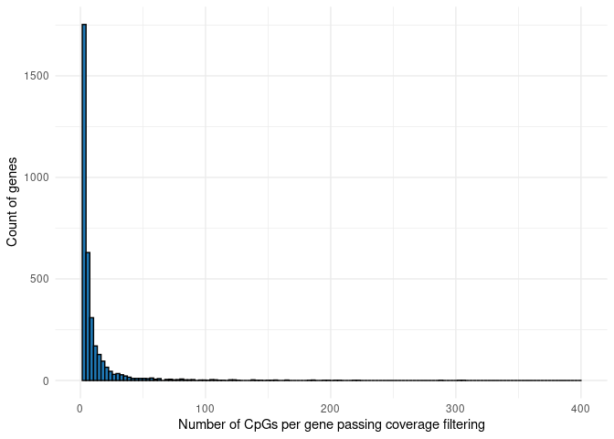<!-- -->

``` r
# Calculate summary stats
summary_stats <- cpg_counts %>%
  summarise(
    min_cpgs = min(num_cpgs),
    median_cpgs = median(num_cpgs),
    mean_cpgs = mean(num_cpgs),
    max_cpgs = max(num_cpgs),
    total_genes = n(),
    one_cpg = sum(num_cpgs == 1)
  )

# Create annotation text
annotation_text <- paste0(
  "Total genes: ", summary_stats$total_genes, "\n",
  "Min CpGs: ", summary_stats$min_cpgs, "\n",
  "Median: ", summary_stats$median_cpgs, "\n",
  "Mean: ", round(summary_stats$mean_cpgs,2), "\n",
  "Max CpGs: ", summary_stats$max_cpgs, "\n",
  "Genes with 1 CpG: ", summary_stats$one_cpg, "(",(round(summary_stats$one_cpg/summary_stats$total_genes*100)),"%)")

# Plot histogram with annotation box
hist +
  annotate("text", 
           x = Inf, y = Inf, 
           label = annotation_text, 
           hjust = 1.1, vjust = 1.1, 
           size = 4, 
           fontface = "italic",
           color = "black")
```

    ## Warning: Removed 2 rows containing missing values or values outside the scale range
    ## (`geom_bar()`).

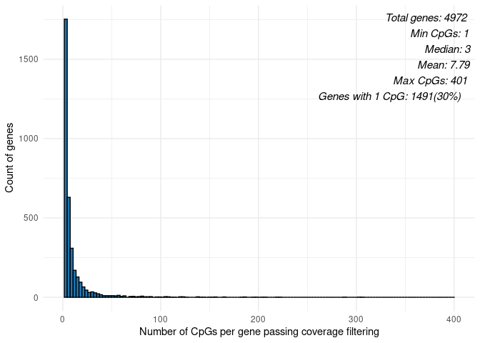<!-- -->

``` r
# Find overlaps between methylated loci and transcripts, averaged by gene
CpGs_in_genes <- regionCounts(meth_filter_destrand, regions=transcripts)
```

    ## Warning in .merge_two_Seqinfo_objects(x, y): Each of the 2 combined objects has sequence levels not in the other:
    ##   - in 'x': Pocillopora_acuta_HIv2___Sc0000056, Pocillopora_acuta_HIv2___Sc0000058, Pocillopora_acuta_HIv2___Sc0000059, Pocillopora_acuta_HIv2___Sc0000062, Pocillopora_acuta_HIv2___Sc0000064, Pocillopora_acuta_HIv2___Sc0000068, Pocillopora_acuta_HIv2___Sc0000070, Pocillopora_acuta_HIv2___Sc0000073, Pocillopora_acuta_HIv2___Sc0000076, Pocillopora_acuta_HIv2___Sc0000077, Pocillopora_acuta_HIv2___Sc0000080, Pocillopora_acuta_HIv2___xfSc0000071, Pocillopora_acuta_HIv2___xfSc0000074, Pocillopora_acuta_HIv2___xfSc0000078, Pocillopora_acuta_HIv2___xfSc0000087, Pocillopora_acuta_HIv2___xfSc0000089, Pocillopora_acuta_HIv2___xfSc0000090, Pocillopora_acuta_HIv2___xfSc0000095, Pocillopora_acuta_HIv2___xfSc0000097, Pocillopora_acuta_HIv2___xfSc0000099, Pocillopora_acuta_HIv2___xfSc0000104, Pocillopora_acuta_HIv2___xfSc0000105, Pocillopora_acuta_HIv2___xfSc0000108, Pocillopora_acuta_HIv2___xfSc0000109, Pocillopora_acuta_HIv2___xfSc0000110, Pocillopora_acuta_HIv2___xfSc0000116, Pocillopora_acuta_HIv2___xfSc0000119, Pocillopora_acuta_HIv2___xfSc0000121, Pocillopora_acuta_HIv2___xfSc0000122, Pocillopora_acuta_HIv2___xfSc0000128, Pocillopora_acuta_HIv2___xfSc0000129, Pocillopora_acuta_HIv2___xfSc0000131, Pocillopora_acuta_HIv2___xfSc0000132, Pocillopora_acuta_HIv2___xfSc0000135, Pocillopora_acuta_HIv2___xfSc0000136, Pocillopora_acuta_HIv2___xfSc0000139, Pocillopora_acuta_HIv2___xfSc0000140, Pocillopora_acuta_HIv2___xfSc0000141, Pocillopora_acuta_HIv2___xfSc0000143, Pocillopora_acuta_HIv2___xfSc0000144, Pocillopora_acuta_HIv2___xfSc0000147, Pocillopora_acuta_HIv2___xfSc0000148, Pocillopora_acuta_HIv2___xfSc0000151, Pocillopora_acuta_HIv2___xfSc0000152, Pocillopora_acuta_HIv2___xfSc0000154, Pocillopora_acuta_HIv2___xfSc0000155, Pocillopora_acuta_HIv2___xfSc0000158, Pocillopora_acuta_HIv2___xfSc0000160, Pocillopora_acuta_HIv2___xfSc0000161, Pocillopora_acuta_HIv2___xfSc0000163, Pocillopora_acuta_HIv2___xfSc0000165, Pocillopora_acuta_HIv2___xfSc0000166, Pocillopora_acuta_HIv2___xfSc0000167, Pocillopora_acuta_HIv2___xfSc0000168, Pocillopora_acuta_HIv2___xfSc0000171, Pocillopora_acuta_HIv2___xfSc0000177, Pocillopora_acuta_HIv2___xfSc0000179, Pocillopora_acuta_HIv2___xfSc0000180, Pocillopora_acuta_HIv2___xfSc0000182, Pocillopora_acuta_HIv2___xfSc0000183, Pocillopora_acuta_HIv2___xfSc0000184, Pocillopora_acuta_HIv2___xfSc0000185, Pocillopora_acuta_HIv2___xfSc0000186, Pocillopora_acuta_HIv2___xfSc0000187, Pocillopora_acuta_HIv2___xfSc0000189, Pocillopora_acuta_HIv2___xfSc0000191, Pocillopora_acuta_HIv2___xfSc0000192, Pocillopora_acuta_HIv2___xfSc0000193, Pocillopora_acuta_HIv2___xfSc0000195, Pocillopora_acuta_HIv2___xfSc0000196, Pocillopora_acuta_HIv2___xfSc0000200, Pocillopora_acuta_HIv2___xfSc0000203, Pocillopora_acuta_HIv2___xfSc0000204, Pocillopora_acuta_HIv2___xfSc0000205, Pocillopora_acuta_HIv2___xfSc0000207, Pocillopora_acuta_HIv2___xfSc0000208, Pocillopora_acuta_HIv2___xfSc0000209, Pocillopora_acuta_HIv2___xfSc0000212, Pocillopora_acuta_HIv2___xfSc0000214, Pocillopora_acuta_HIv2___xfSc0000215, Pocillopora_acuta_HIv2___xfSc0000216, Pocillopora_acuta_HIv2___xfSc0000217, Pocillopora_acuta_HIv2___xfSc0000218, Pocillopora_acuta_HIv2___xfSc0000223, Pocillopora_acuta_HIv2___xfSc0000228, Pocillopora_acuta_HIv2___xfSc0000230, Pocillopora_acuta_HIv2___xfSc0000231, Pocillopora_acuta_HIv2___xfSc0000232, Pocillopora_acuta_HIv2___xfSc0000233, Pocillopora_acuta_HIv2___xfSc0000234, Pocillopora_acuta_HIv2___xfSc0000236, Pocillopora_acuta_HIv2___xfSc0000237, Pocillopora_acuta_HIv2___xfSc0000239, Pocillopora_acuta_HIv2___xfSc0000240, Pocillopora_acuta_HIv2___xfSc0000243, Pocillopora_acuta_HIv2___xfSc0000244, Pocillopora_acuta_HIv2___xfSc0000248, Pocillopora_acuta_HIv2___xfSc0000249, Pocillopora_acuta_HIv2___xfSc0000250, Pocillopora_acuta_HIv2___xfSc0000251, Pocillopora_acuta_HIv2___xfSc0000252, Pocillopora_acuta_HIv2___xfSc0000255, Pocillopora_acuta_HIv2___xfSc0000256, Pocillopora_acuta_HIv2___xfSc0000257, Pocillopora_acuta_HIv2___xfSc0000258, Pocillopora_acuta_HIv2___xfSc0000260, Pocillopora_acuta_HIv2___xfSc0000262, Pocillopora_acuta_HIv2___xfSc0000264, Pocillopora_acuta_HIv2___xfSc0000265, Pocillopora_acuta_HIv2___xfSc0000266, Pocillopora_acuta_HIv2___xfSc0000267, Pocillopora_acuta_HIv2___xfSc0000268, Pocillopora_acuta_HIv2___xfSc0000269, Pocillopora_acuta_HIv2___xfSc0000271, Pocillopora_acuta_HIv2___xfSc0000272, Pocillopora_acuta_HIv2___xfSc0000273, Pocillopora_acuta_HIv2___xfSc0000275, Pocillopora_acuta_HIv2___xfSc0000276, Pocillopora_acuta_HIv2___xfSc0000277, Pocillopora_acuta_HIv2___xfSc0000280, Pocillopora_acuta_HIv2___xfSc0000281, Pocillopora_acuta_HIv2___xfSc0000283, Pocillopora_acuta_HIv2___xfSc0000284, Pocillopora_acuta_HIv2___xfSc0000287, Pocillopora_acuta_HIv2___xfSc0000288, Pocillopora_acuta_HIv2___xfSc0000291, Pocillopora_acuta_HIv2___xfSc0000293, Pocillopora_acuta_HIv2___xfSc0000296, Pocillopora_acuta_HIv2___xfSc0000302, Pocillopora_acuta_HIv2___xfSc0000303, Pocillopora_acuta_HIv2___xfSc0000305, Pocillopora_acuta_HIv2___xfSc0000306, Pocillopora_acuta_HIv2___xfSc0000310, Pocillopora_acuta_HIv2___xfSc0000311, Pocillopora_acuta_HIv2___xfSc0000313, Pocillopora_acuta_HIv2___xfSc0000315, Pocillopora_acuta_HIv2___xfSc0000316, Pocillopora_acuta_HIv2___xfSc0000319, Pocillopora_acuta_HIv2___xfSc0000322, Pocillopora_acuta_HIv2___xfSc0000325, Pocillopora_acuta_HIv2___xfSc0000326, Pocillopora_acuta_HIv2___xfSc0000327, Pocillopora_acuta_HIv2___xfSc0000334, Pocillopora_acuta_HIv2___xfSc0000343, Pocillopora_acuta_HIv2___xfSc0000344, Pocillopora_acuta_HIv2___xfSc0000345, Pocillopora_acuta_HIv2___xfSc0000346, Pocillopora_acuta_HIv2___xfSc0000347, Pocillopora_acuta_HIv2___xfSc0000349, Pocillopora_acuta_HIv2___xfSc0000350, Pocillopora_acuta_HIv2___xfSc0000354, Pocillopora_acuta_HIv2___xfSc0000361, Pocillopora_acuta_HIv2___xfSc0000362, Pocillopora_acuta_HIv2___xfSc0000363, Pocillopora_acuta_HIv2___xfSc0000368, Pocillopora_acuta_HIv2___xfSc0000370, Pocillopora_acuta_HIv2___xfSc0000371, Pocillopora_acuta_HIv2___xfSc0000374, Pocillopora_acuta_HIv2___xfSc0000376, Pocillopora_acuta_HIv2___xfSc0000377, Pocillopora_acuta_HIv2___xfSc0000378, Pocillopora_acuta_HIv2___xfSc0000379, Pocillopora_acuta_HIv2___xfSc0000380, Pocillopora_acuta_HIv2___xfSc0000384, Pocillopora_acuta_HIv2___xfSc0000386, Pocillopora_acuta_HIv2___xpSc0000402, Pocillopora_acuta_HIv2___xpSc0000412, Pocillopora_acuta_HIv2___xpSc0000414, Pocillopora_acuta_HIv2___xpSc0000415, Pocillopora_acuta_HIv2___xpSc0000417, Pocillopora_acuta_HIv2___xpSc0000422, Pocillopora_acuta_HIv2___xpSc0000423, Pocillopora_acuta_HIv2___xpSc0000425, Pocillopora_acuta_HIv2___xpSc0000430, Pocillopora_acuta_HIv2___xpSc0000439, Pocillopora_acuta_HIv2___xpSc0000447
    ##   - in 'y': Pocillopora_acuta_HIv2___Sc0000054, Pocillopora_acuta_HIv2___Sc0000069, Pocillopora_acuta_HIv2___xfSc0000067, Pocillopora_acuta_HIv2___xfSc0000112, Pocillopora_acuta_HIv2___xfSc0000153, Pocillopora_acuta_HIv2___xfSc0000172, Pocillopora_acuta_HIv2___xfSc0000225, Pocillopora_acuta_HIv2___xfSc0000365, Pocillopora_acuta_HIv2___xfSc0000369, Pocillopora_acuta_HIv2___xfSc0000372, Pocillopora_acuta_HIv2___xfSc0000375, Pocillopora_acuta_HIv2___xfSc0000383, Pocillopora_acuta_HIv2___xpSc0000428
    ##   Make sure to always combine/compare objects based on the same reference
    ##   genome (use suppressWarnings() to suppress this warning).

``` r
CpGs_in_genes$gene_id <- transcripts$gene_id[match(paste(CpGs_in_genes$chr, CpGs_in_genes$start, CpGs_in_genes$end), paste(seqnames(transcripts), start(transcripts), end(transcripts)))]

#how many genes are represented
nrow(CpGs_in_genes)
```

    ## [1] 4972

``` r
#does this match the above?
length(unique(CpG_transcript_annot$transcript_id))
```

    ## [1] 4972

``` r
percent_meth <- percMethylation(CpGs_in_genes)
percent_meth <- as.data.frame(percent_meth)
percent_meth$gene_id <- CpGs_in_genes$gene_id 
percent_meth <- percent_meth %>% select(gene_id, everything())

percent_meth <- percent_meth %>% rowwise() %>%
  mutate(percent_meth_ALL = mean(c_across(starts_with("LCM")), na.rm = TRUE)) %>%
  ungroup()

percent_meth <- percent_meth %>% rowwise() %>%
  mutate(Oral = mean(c_across(meta$Sample[meta$Tissue=="OralEpi"]), na.rm = TRUE)) %>%
  mutate(Aboral = mean(c_across(meta$Sample[meta$Tissue=="Aboral"]), na.rm = TRUE)) %>%
  ungroup()
  
percent_meth_long <- percent_meth %>% pivot_longer(
                                      cols = c(Oral,Aboral),
                                      names_to = "Tissue",
                                      values_to = "tissue_percent_meth"
)
```

Now, combine the genes that contain methylated loci that passed
filtering with the genes that were found to be expressed in our RNA-seq
dataset (14464).

``` r
# number of genes containing CpGs
nrow(percent_meth)
```

    ## [1] 4972

``` r
# number of expressed genes
nrow(DESeq)
```

    ## [1] 14464

``` r
expressed_genes_percent_meth <- merge(percent_meth, DESeq, by.x = "gene_id", by.y = "query")

nrow(expressed_genes_percent_meth)
```

    ## [1] 2572

``` r
plot_data <- merge(percent_meth_long, DESeq, by.x = "gene_id", by.y = "query")

ggplot(percent_meth, aes(x = percent_meth_ALL)) +
  geom_histogram(bins = 50) +
  theme_minimal() +
  labs(x = "(% gene body methylation", y = "Gene count")
```

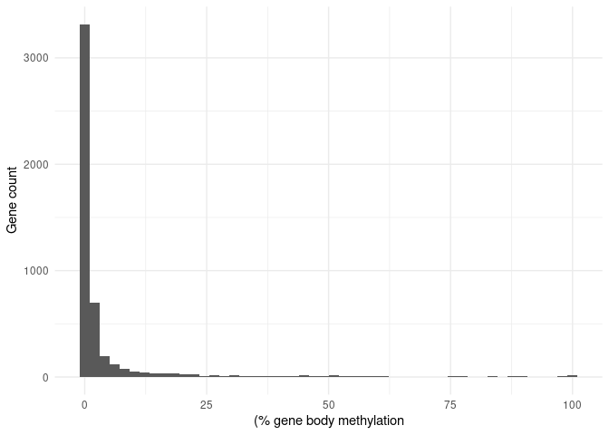<!-- -->

### 0.5.1 BaseMean: Raw gene expression levels (skewed by highly expressed genes)

``` r
ggplot(plot_data, aes(y = baseMean, x = percent_meth_ALL)) +
  geom_point(alpha = 0.5) +
  geom_smooth(method = "lm") + stat_poly_eq(use_label("eq", "R2")) +
  labs(x = "Average CpG % methylation of gene", y = "DeSeq2 BaseMean", 
       title = "Gene Methylation vs Expression") +
  theme_minimal()
```

    ## `geom_smooth()` using formula = 'y ~ x'

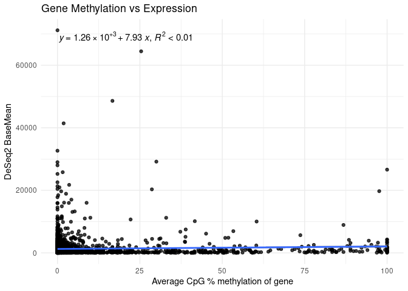<!-- -->

``` r
ggplot(plot_data, aes(y = baseMean, x = tissue_percent_meth,color=Tissue)) +
  geom_point(alpha = 0.5) +
  geom_smooth(method = "lm") + stat_poly_eq(use_label("eq", "R2")) +
  labs(x = "Average CpG % methylation of gene", y = "DeSeq2 BaseMean", 
       title = "Gene Methylation vs Expression") +
  theme_minimal()
```

    ## `geom_smooth()` using formula = 'y ~ x'

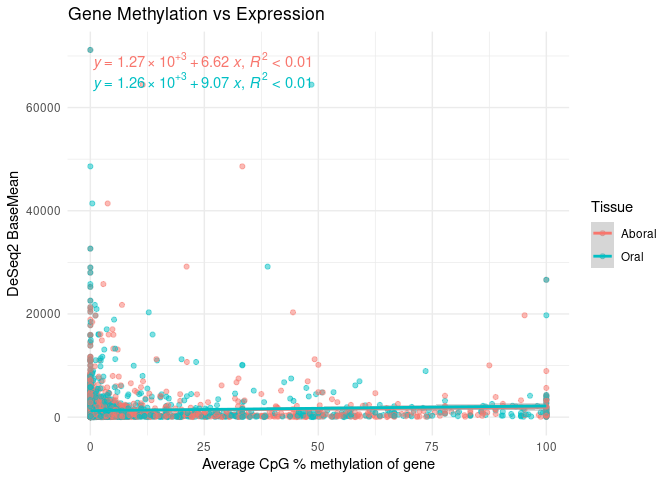<!-- -->

### 0.5.2 Log2 of BaseMean: Transformed gene expression levels

``` r
ggplot(plot_data, aes(y = log2(baseMean), x = percent_meth_ALL)) +
  geom_point(alpha = 0.5) +
  geom_smooth(method = "lm") + stat_poly_eq(use_label("eq", "R2")) +
  labs(x = "Average CpG % methylation of gene", y = "Log2(DeSeq2 BaseMean)", 
       title = "Gene Methylation vs Expression") +
  theme_minimal()
```

    ## `geom_smooth()` using formula = 'y ~ x'

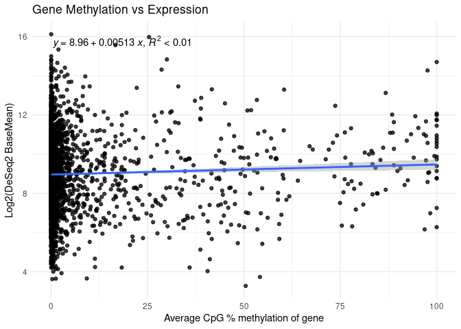<!-- -->

``` r
ggplot(plot_data, aes(y = log2(baseMean), x = tissue_percent_meth,color=Tissue)) +
  geom_point(alpha = 0.5) +
  geom_smooth(method = "lm") + stat_poly_eq(use_label("eq", "R2")) +
  labs(x = "Average CpG % methylation of gene", y = "Log2(DeSeq2 BaseMean)", 
       title = "Gene Methylation vs Expression") +
  theme_minimal()
```

    ## `geom_smooth()` using formula = 'y ~ x'

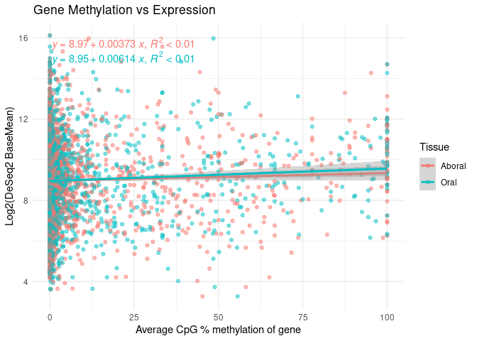<!-- -->

### 0.5.3 Absolute value of Log2FoldChange: Relationship between overall methylation of a gene and whether or not it is differentially expressed

``` r
ggplot(plot_data, aes(y = abs(log2FoldChange), x = percent_meth_ALL)) +
  geom_point(alpha = 0.5) +
  geom_smooth(method = "lm") +  stat_poly_eq(use_label("eq", "R2")) +
  labs(x = "Average CpG % methylation of gene", y = "Abs(DeSeq2 Log2FoldChange)", 
       title = "Gene Methylation vs Expression") +
  theme_minimal()
```

    ## `geom_smooth()` using formula = 'y ~ x'

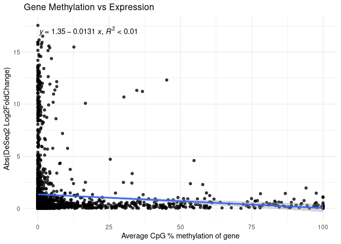<!-- -->

``` r
ggplot(plot_data, aes(y = abs(log2FoldChange), x = tissue_percent_meth,color=Tissue)) +
  geom_point(alpha = 0.5) +
  geom_smooth(method = "lm") +  stat_poly_eq(use_label("eq", "R2")) +
  labs(x = "Average CpG % methylation of gene", y = "Abs(DeSeq2 Log2FoldChange)", 
       title = "Gene Methylation vs Expression") +
  theme_minimal()
```

    ## `geom_smooth()` using formula = 'y ~ x'

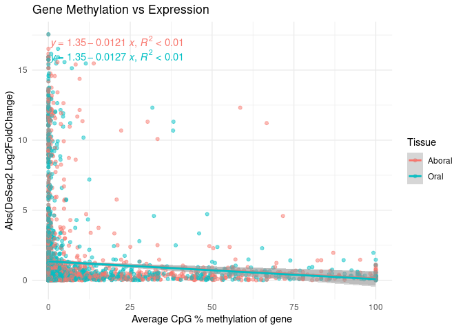<!-- -->

``` r
# Create the plot
ggplot(plot_data, aes(x = percent_meth_ALL, y = log2FoldChange)) +
  geom_point(aes(color = padj < 0.05)) +
  #geom_text_repel(aes(label = ifelse(padj < 0.05, gene_id, "")), max.overlaps = 20) +
  geom_hline(yintercept = 0, linetype = "dashed") +
  geom_vline(xintercept = 0, linetype = "dashed") +
  scale_color_manual(values = c("grey", "red")) +
  labs(x = "Average CpG % methylation of gene", 
       y = "RNA-seq: Log2FoldChange",
       title = "LFC and DEGs (red) vs. % CpG Methylation",
       color = "Significant DEGs") +
  theme_minimal()
```

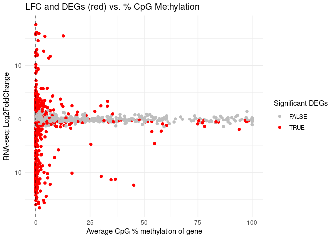<!-- -->

### 0.5.4 Read counts/vsd transformed counts

RNA metadata:

``` r
meta_RNA <- read.csv("../data_RNA/LCM_RNA_metadata.csv") %>%
            dplyr::arrange(Sample) %>%
            mutate(across(c(Tissue, Fragment, Section_Date, LCM_Date), factor)) # Set variables as factors 

meta_RNA$Tissue <- factor(meta_RNA$Tissue, levels = c("OralEpi","Aboral")) #we want OralEpi to be the baseline

oral_samples <- meta_RNA$Sample[meta_RNA$Tissue == "OralEpi"]
aboral_samples <- meta_RNA$Sample[meta_RNA$Tissue == "Aboral"]
```

``` r
vsd <- read.csv("../output_RNA/differential_expression/vsd_expression_matrix.csv", row.names = 1)
vsd$vst_mean <- rowMeans(vsd)
vsd$gene_id <- rownames(vsd)

vsd <- vsd %>%select(gene_id,everything())
vsd <- vsd %>% rowwise() %>%
  mutate(Oral = mean(c_across(all_of(oral_samples)), na.rm = TRUE),
         Aboral = mean(c_across(all_of(aboral_samples)), na.rm = TRUE)) %>% 
 # mutate(Oral = mean(c_across(meta_RNA$Sample[meta_RNA$Tissue=="OralEpi"]), na.rm = TRUE)) %>%
  #mutate(Aboral = mean(c_across(meta_RNA$Sample[meta_RNA$Tissue=="Aboral"]), na.rm = TRUE)) %>%
  ungroup()
  
vsd_long <- vsd %>% pivot_longer(cols = c(Oral,Aboral),
                                      names_to = "Tissue",
                                      values_to = "tissue_vst_mean") %>%
                    mutate(Tissue= factor(Tissue,levels = c("Oral", "Aboral")))

VST_all <- vsd_long %>% ggplot(aes(x = Tissue,y = tissue_vst_mean, fill = Tissue)) + 
                        geom_boxplot() + theme_minimal() + scale_fill_manual(values = c("Aboral" = "mediumpurple1", "Oral" = "palegreen3")) +
                        labs(x = "Tissue", y = "VST Expression", 
                             title = "VST expression of all expressed genes by tissue type",
                             caption = "n = 14,464 genes") 

save_ggplot(VST_all, "../output_WGBS/figures/4_VST_all_boxplot")
```

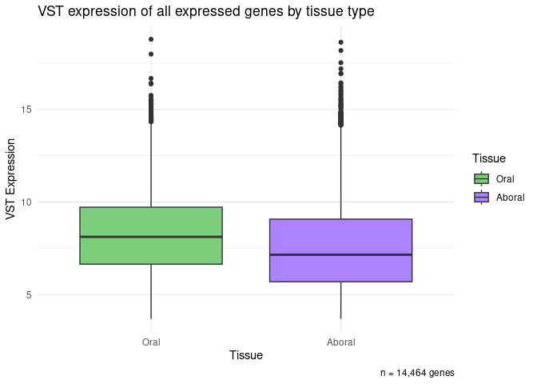<!-- -->

``` r
plot_data_tissue <- merge(percent_meth_long, vsd_long, by = c("gene_id", "Tissue")) %>% mutate(Tissue= factor(Tissue,levels = c("Oral", "Aboral")))

vst_percmeth <- ggplot(plot_data_tissue, aes(y = tissue_vst_mean, x = tissue_percent_meth, color=Tissue)) +
  geom_point(alpha = 0.5) + geom_smooth(method = "lm") + stat_poly_eq(use_label("eq", "R2"))+
  labs(x = "Average CpG % methylation of gene", y = "VST Expression", 
       title = "Gene Methylation vs Expression") + scale_color_manual(values = c("Aboral" = "mediumpurple1", "Oral" = "palegreen4")) +
  theme_minimal()

save_ggplot(vst_percmeth, "../output_WGBS/figures/5_VST_tissue_percentmeth")
```

    ## `geom_smooth()` using formula = 'y ~ x'
    ## `geom_smooth()` using formula = 'y ~ x'

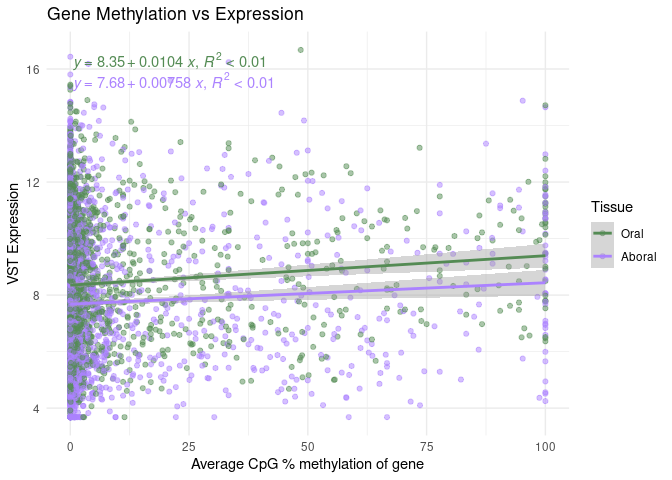<!-- -->

``` r
plot_data <- merge(percent_meth, vsd, by = c("gene_id"))

ggplot(plot_data, aes(y = vst_mean, x = percent_meth_ALL)) +
  geom_point(alpha = 0.5) + geom_smooth(method = "lm") + stat_poly_eq(use_label("eq", "R2"))+
  labs(x = "Average CpG % methylation of gene", y = "VST Expression", 
       title = "Gene Methylation vs Expression") +
  theme_minimal()
```

    ## `geom_smooth()` using formula = 'y ~ x'

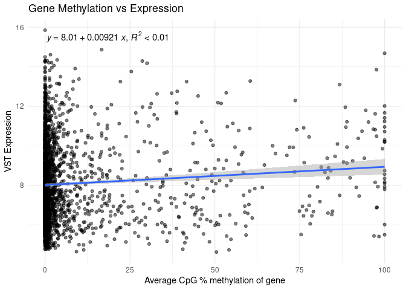<!-- -->

``` r
model <- lm(tissue_vst_mean ~ tissue_percent_meth * Tissue, data = plot_data_tissue)

summary(model)
```

    ## 
    ## Call:
    ## lm(formula = tissue_vst_mean ~ tissue_percent_meth * Tissue, 
    ##     data = plot_data_tissue)
    ## 
    ## Residuals:
    ##     Min      1Q  Median      3Q     Max 
    ## -4.7884 -1.7766 -0.2367  1.5714  8.7536 
    ## 
    ## Coefficients:
    ##                                   Estimate Std. Error t value Pr(>|t|)    
    ## (Intercept)                       8.351888   0.047769 174.840  < 2e-16 ***
    ## tissue_percent_meth               0.010408   0.002426   4.291 1.81e-05 ***
    ## TissueAboral                     -0.672722   0.067824  -9.919  < 2e-16 ***
    ## tissue_percent_meth:TissueAboral -0.002831   0.003356  -0.844    0.399    
    ## ---
    ## Signif. codes:  0 '***' 0.001 '**' 0.01 '*' 0.05 '.' 0.1 ' ' 1
    ## 
    ## Residual standard error: 2.274 on 5140 degrees of freedom
    ## Multiple R-squared:  0.02764,    Adjusted R-squared:  0.02707 
    ## F-statistic:  48.7 on 3 and 5140 DF,  p-value: < 2.2e-16

``` r
# Full model
full_model <- lm(vst_mean ~ percent_meth_ALL, data = plot_data)

# Per-tissue models
oral_model <- lm(tissue_vst_mean ~ tissue_percent_meth, data = filter(plot_data_tissue, Tissue == "Oral"))
aboral_model <- lm(tissue_vst_mean ~ tissue_percent_meth, data = filter(plot_data_tissue, Tissue == "Aboral"))

summary(full_model)$r.squared
```

    ## [1] 0.007249067

``` r
summary(oral_model)$r.squared
```

    ## [1] 0.008261222

``` r
summary(aboral_model)$r.squared
```

    ## [1] 0.003628742

``` r
# Model 1: simple model, no tissue info
full_model <- lm(tissue_vst_mean ~ tissue_percent_meth, data = plot_data_tissue)

# Model 2: interaction model, includes tissue and interaction term
interaction_model <- lm(tissue_vst_mean ~ tissue_percent_meth * Tissue, data = plot_data_tissue)

summary(full_model)
```

    ## 
    ## Call:
    ## lm(formula = tissue_vst_mean ~ tissue_percent_meth, data = plot_data_tissue)
    ## 
    ## Residuals:
    ##     Min      1Q  Median      3Q     Max 
    ## -4.9061 -1.7960 -0.1833  1.6215  8.4146 
    ## 
    ## Coefficients:
    ##                     Estimate Std. Error t value Pr(>|t|)    
    ## (Intercept)         8.018113   0.034298 233.778  < 2e-16 ***
    ## tissue_percent_meth 0.008555   0.001695   5.047 4.65e-07 ***
    ## ---
    ## Signif. codes:  0 '***' 0.001 '**' 0.01 '*' 0.05 '.' 0.1 ' ' 1
    ## 
    ## Residual standard error: 2.3 on 5142 degrees of freedom
    ## Multiple R-squared:  0.004929,   Adjusted R-squared:  0.004736 
    ## F-statistic: 25.47 on 1 and 5142 DF,  p-value: 4.646e-07

``` r
summary(interaction_model)
```

    ## 
    ## Call:
    ## lm(formula = tissue_vst_mean ~ tissue_percent_meth * Tissue, 
    ##     data = plot_data_tissue)
    ## 
    ## Residuals:
    ##     Min      1Q  Median      3Q     Max 
    ## -4.7884 -1.7766 -0.2367  1.5714  8.7536 
    ## 
    ## Coefficients:
    ##                                   Estimate Std. Error t value Pr(>|t|)    
    ## (Intercept)                       8.351888   0.047769 174.840  < 2e-16 ***
    ## tissue_percent_meth               0.010408   0.002426   4.291 1.81e-05 ***
    ## TissueAboral                     -0.672722   0.067824  -9.919  < 2e-16 ***
    ## tissue_percent_meth:TissueAboral -0.002831   0.003356  -0.844    0.399    
    ## ---
    ## Signif. codes:  0 '***' 0.001 '**' 0.01 '*' 0.05 '.' 0.1 ' ' 1
    ## 
    ## Residual standard error: 2.274 on 5140 degrees of freedom
    ## Multiple R-squared:  0.02764,    Adjusted R-squared:  0.02707 
    ## F-statistic:  48.7 on 3 and 5140 DF,  p-value: < 2.2e-16

``` r
anova(full_model, interaction_model)
```

    ## Analysis of Variance Table
    ## 
    ## Model 1: tissue_vst_mean ~ tissue_percent_meth
    ## Model 2: tissue_vst_mean ~ tissue_percent_meth * Tissue
    ##   Res.Df   RSS Df Sum of Sq      F    Pr(>F)    
    ## 1   5142 27207                                  
    ## 2   5140 26586  2    620.98 60.029 < 2.2e-16 ***
    ## ---
    ## Signif. codes:  0 '***' 0.001 '**' 0.01 '*' 0.05 '.' 0.1 ' ' 1

### 0.5.5 Above but only for DEGS

RNA metadata:

``` r
vsd_de <- vsd %>% filter(gene_id %in% DE_05_OralEpi$query)
vsd_de_long <- vsd_de %>% pivot_longer(cols = c(Oral,Aboral),
                                      names_to = "Tissue",
                                      values_to = "tissue_vst_mean")
```

``` r
plot_data_tissue <- merge(percent_meth_long, vsd_long, by = c("gene_id", "Tissue")) %>% filter(gene_id %in% DE_05$query)

ggplot(plot_data_tissue, aes(y = tissue_vst_mean, x = tissue_percent_meth, color=Tissue)) +
  geom_point(alpha = 0.5) + geom_smooth(method = "lm") + stat_poly_eq(use_label("eq", "R2"))+
  labs(x = "Average CpG % methylation of gene", y = "VST Expression", 
       title = "Differentially Expressed Genes (ALL): Gene Methylation vs Expression") +
  theme_minimal()
```

    ## `geom_smooth()` using formula = 'y ~ x'

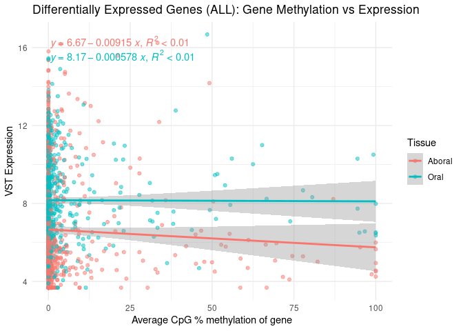<!-- -->

``` r
plot_data <- merge(percent_meth, vsd, by = c("gene_id"))

ggplot(plot_data, aes(y = vst_mean, x = percent_meth_ALL)) +
  geom_point(alpha = 0.5) + geom_smooth(method = "lm") + stat_poly_eq(use_label("eq", "R2"))+
  labs(x = "Average CpG % methylation of gene", y = "VST Expression", 
       title = "Differentially Expressed Genes (ALL): Gene Methylation vs Expression") +
  theme_minimal()
```

    ## `geom_smooth()` using formula = 'y ~ x'

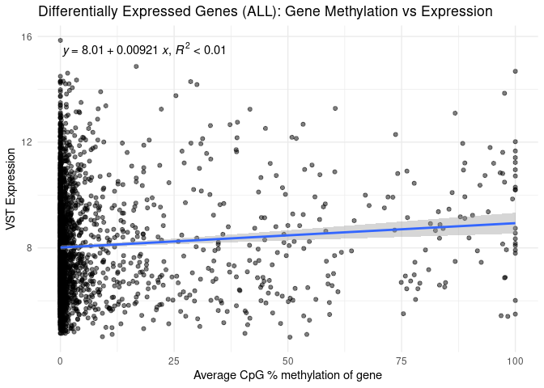<!-- -->

``` r
plot_data_tissue <- merge(percent_meth_long, vsd_long, by = c("gene_id", "Tissue")) %>% filter(gene_id %in% DE_05_OralEpi$query)

ggplot(plot_data_tissue, aes(y = tissue_vst_mean, x = tissue_percent_meth, color=Tissue)) +
  geom_point(alpha = 0.5) + geom_smooth(method = "lm") + stat_poly_eq(use_label("eq", "R2"))+
  labs(x = "Average CpG % methylation of gene", y = "VST Expression", 
       title = "Differentially Expressed Genes (Higher in Oral): Gene Methylation vs Expression") +
  theme_minimal()
```

    ## `geom_smooth()` using formula = 'y ~ x'

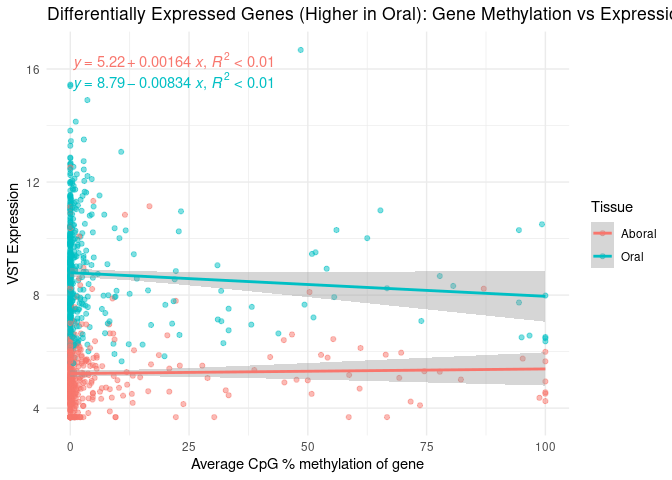<!-- -->

``` r
plot_data <- merge(percent_meth, vsd, by = c("gene_id"))

ggplot(plot_data, aes(y = vst_mean, x = percent_meth_ALL)) +
  geom_point(alpha = 0.5) + geom_smooth(method = "lm") + stat_poly_eq(use_label("eq", "R2"))+
  labs(x = "Average CpG % methylation of gene", y = "VST Expression", 
       title = "Differentially Expressed Genes (Higher in Oral): Gene Methylation vs Expression") +
  theme_minimal()
```

    ## `geom_smooth()` using formula = 'y ~ x'

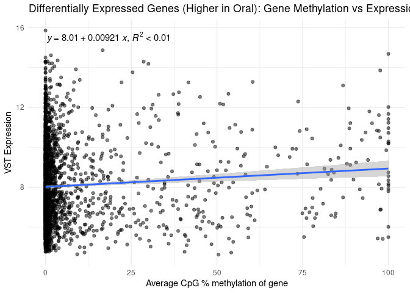<!-- -->

``` r
plot_data_tissue <- merge(percent_meth_long, vsd_long, by = c("gene_id", "Tissue")) %>% filter(gene_id %in% DE_05_Aboral$query)

ggplot(plot_data_tissue, aes(y = tissue_vst_mean, x = tissue_percent_meth, color=Tissue)) +
  geom_point(alpha = 0.5) + geom_smooth(method = "lm") + stat_poly_eq(use_label("eq", "R2"))+
  labs(x = "Average CpG % methylation of gene", y = "VST Expression", 
       title = "Differentially Expressed Genes (Higher in Aboral): Gene Methylation vs Expression") +
  theme_minimal()
```

    ## `geom_smooth()` using formula = 'y ~ x'

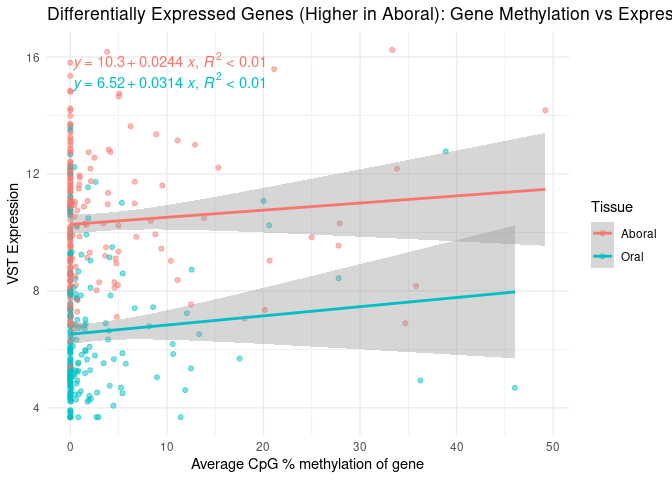<!-- -->

``` r
plot_data <- merge(percent_meth, vsd, by = c("gene_id"))

ggplot(plot_data, aes(y = vst_mean, x = percent_meth_ALL)) +
  geom_point(alpha = 0.5) + geom_smooth(method = "lm") + stat_poly_eq(use_label("eq", "R2"))+
  labs(x = "Average CpG % methylation of gene", y = "VST Expression", 
       title = "Differentially Expressed Genes (Higher in Aboral): Gene Methylation vs Expression") +
  theme_minimal()
```

    ## `geom_smooth()` using formula = 'y ~ x'

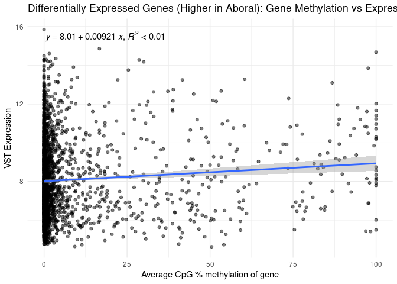<!-- -->

``` r
model <- lm(tissue_vst_mean ~ tissue_percent_meth * Tissue, data = plot_data_tissue)

summary(model)
```

    ## 
    ## Call:
    ## lm(formula = tissue_vst_mean ~ tissue_percent_meth * Tissue, 
    ##     data = plot_data_tissue)
    ## 
    ## Residuals:
    ##     Min      1Q  Median      3Q     Max 
    ## -4.8717 -1.6852 -0.4006  1.3858  7.1100 
    ## 
    ## Coefficients:
    ##                                 Estimate Std. Error t value Pr(>|t|)    
    ## (Intercept)                    10.274036   0.171269  59.988   <2e-16 ***
    ## tissue_percent_meth             0.024392   0.021265   1.147    0.252    
    ## TissueOral                     -3.756490   0.240936 -15.591   <2e-16 ***
    ## tissue_percent_meth:TissueOral  0.007016   0.033392   0.210    0.834    
    ## ---
    ## Signif. codes:  0 '***' 0.001 '**' 0.01 '*' 0.05 '.' 0.1 ' ' 1
    ## 
    ## Residual standard error: 2.241 on 398 degrees of freedom
    ## Multiple R-squared:  0.4176, Adjusted R-squared:  0.4132 
    ## F-statistic: 95.13 on 3 and 398 DF,  p-value: < 2.2e-16

``` r
# Full model
full_model <- lm(vst_mean ~ percent_meth_ALL, data = plot_data)

# Per-tissue models
oral_model <- lm(tissue_vst_mean ~ tissue_percent_meth, data = filter(plot_data_tissue, Tissue == "Oral"))
aboral_model <- lm(tissue_vst_mean ~ tissue_percent_meth, data = filter(plot_data_tissue, Tissue == "Aboral"))

summary(full_model)$r.squared
```

    ## [1] 0.007249067

``` r
summary(oral_model)$r.squared
```

    ## [1] 0.007216146

``` r
summary(aboral_model)$r.squared
```

    ## [1] 0.006761669

``` r
# Model 1: simple model, no tissue info
full_model <- lm(tissue_vst_mean ~ tissue_percent_meth, data = plot_data_tissue)

# Model 2: interaction model, includes tissue and interaction term
interaction_model <- lm(tissue_vst_mean ~ tissue_percent_meth * Tissue, data = plot_data_tissue)

summary(full_model)
```

    ## 
    ## Call:
    ## lm(formula = tissue_vst_mean ~ tissue_percent_meth, data = plot_data_tissue)
    ## 
    ## Residuals:
    ##     Min      1Q  Median      3Q     Max 
    ## -5.5992 -2.5663 -0.1971  2.4096  7.6626 
    ## 
    ## Coefficients:
    ##                     Estimate Std. Error t value Pr(>|t|)    
    ## (Intercept)          8.35636    0.15664  53.347   <2e-16 ***
    ## tissue_percent_meth  0.04183    0.02130   1.964   0.0502 .  
    ## ---
    ## Signif. codes:  0 '***' 0.001 '**' 0.01 '*' 0.05 '.' 0.1 ' ' 1
    ## 
    ## Residual standard error: 2.915 on 400 degrees of freedom
    ## Multiple R-squared:  0.009554,   Adjusted R-squared:  0.007078 
    ## F-statistic: 3.858 on 1 and 400 DF,  p-value: 0.05019

``` r
summary(interaction_model)
```

    ## 
    ## Call:
    ## lm(formula = tissue_vst_mean ~ tissue_percent_meth * Tissue, 
    ##     data = plot_data_tissue)
    ## 
    ## Residuals:
    ##     Min      1Q  Median      3Q     Max 
    ## -4.8717 -1.6852 -0.4006  1.3858  7.1100 
    ## 
    ## Coefficients:
    ##                                 Estimate Std. Error t value Pr(>|t|)    
    ## (Intercept)                    10.274036   0.171269  59.988   <2e-16 ***
    ## tissue_percent_meth             0.024392   0.021265   1.147    0.252    
    ## TissueOral                     -3.756490   0.240936 -15.591   <2e-16 ***
    ## tissue_percent_meth:TissueOral  0.007016   0.033392   0.210    0.834    
    ## ---
    ## Signif. codes:  0 '***' 0.001 '**' 0.01 '*' 0.05 '.' 0.1 ' ' 1
    ## 
    ## Residual standard error: 2.241 on 398 degrees of freedom
    ## Multiple R-squared:  0.4176, Adjusted R-squared:  0.4132 
    ## F-statistic: 95.13 on 3 and 398 DF,  p-value: < 2.2e-16

``` r
anova(full_model, interaction_model)
```

    ## Analysis of Variance Table
    ## 
    ## Model 1: tissue_vst_mean ~ tissue_percent_meth
    ## Model 2: tissue_vst_mean ~ tissue_percent_meth * Tissue
    ##   Res.Df    RSS Df Sum of Sq      F    Pr(>F)    
    ## 1    400 3398.8                                  
    ## 2    398 1998.5  2    1400.3 139.43 < 2.2e-16 ***
    ## ---
    ## Signif. codes:  0 '***' 0.001 '**' 0.01 '*' 0.05 '.' 0.1 ' ' 1

### 0.5.6 Extracting table of genes

``` r
DML_info <- DML_transcript_annot %>% dplyr::select(start,end,DML_qvalue,DML_methdiff,gene_id)
DML_info <- DML_info %>% group_by(gene_id) %>% summarise(n_DML = n(),
                                                         mean_methdiff = mean(DML_methdiff),
                                                         median_methdiff = median(DML_methdiff),
                                                         mean_methdiff_qvalue = mean(DML_qvalue),
                                                         min_methdiff_qvalue = min(DML_qvalue),
                                                         max_methdiff_qvalue = max(DML_qvalue))
  
RNA_CpG <- left_join(percent_meth, DML_info, by = c("gene_id")) # take percent methylated CpGs per gene matrix and add signficance info for any differentially methylated loci
RNA_CpG <- inner_join(RNA_CpG, vsd, by = c("gene_id")) # add gene expression info, vst-transformed expression values
RNA_CpG <- inner_join(RNA_CpG, DESeq, by = join_by(gene_id == query)) # add DEseq results

RNA_CpG <- RNA_CpG %>% 
              rename(mean_percent_meth_ALL = percent_meth_ALL,
                     Aboral_mean_perc_meth = Aboral.x,
                     Aboral_mean_vst_expr = Aboral.y,
                     Oral_mean_perc_meth = Oral.x,
                     Oral_mean_vst_expr =  Oral.y,
                     vst_mean_gene_expression = vst_mean,
                     DEseq_baseMean = baseMean,
                     DEseq_log2FoldChange = log2FoldChange,
                     DEseq_lfcSE = lfcSE,
                     DEseq_pvalue = pvalue,
                     DEseq_padj = padj
              )

SwissProt <- read.delim("../references/annotation/protein-GO.tsv")

RNA_CpG_annot <- RNA_CpG%>% left_join(SwissProt, by = join_by(gene_id == query)) 
write.csv(RNA_CpG_annot, "../output_WGBS/MethylKit_ConvFilt90_RNA_Meth.csv")
```

## 0.6 Methylated CpG locations

``` r
library(dplyr)

# Define sequencing error rate and alpha
p_error <- 0.01
alpha <- 0.05

# Function to compute adjusted binomial p-values and flag methylated sites per sample
compute_methylation_flags <- function(data, coverage_col, methylated_col, p_error = 0.01, alpha = 0.05) {
  # Extract vectors
  coverage <- data[[coverage_col]]
  methylated <- data[[methylated_col]]
  
  # Handle zero or NA coverage by setting p-values to 1 (not significant)
  pvals <- rep(1, length(coverage))
  
  valid <- !is.na(coverage) & !is.na(methylated) & coverage > 0
  
  # Calculate p-values for valid sites only
  pvals[valid] <- 1 - pbinom(q = methylated[valid] - 1, size = coverage[valid], prob = p_error)
  
  # Adjust p-values for multiple testing with FDR correction
  pvals_adj <- p.adjust(pvals, method = "fdr")
  
  # Return logical vector: TRUE if site methylated (adjusted p < alpha), else FALSE
  return(pvals_adj < alpha)
}

# Assuming you know how many samples you have, for example 10 samples:
num_samples <- 10
methylated_CpGs <- meth_filter_destrand

for (i in 1:num_samples) {
  coverage_col <- paste0("coverage", i)
  methylated_col <- paste0("numCs", i)
  methylation_flag_col <- paste0("methylated_sample", i)

  methylated_CpGs[[methylation_flag_col]] <- compute_methylation_flags(
    methylated_CpGs, 
    coverage_col = coverage_col, 
    methylated_col = methylated_col, 
    p_error = p_error, 
    alpha = alpha
  )
}
```

``` r
methylated_CpGs <- getData(methylated_CpGs)

oral_samples <- which(sample %in% meta$Sample[meta$Tissue=="OralEpi"])
aboral_samples <- which(sample %in%meta$Sample[meta$Tissue=="Aboral"])
   
oral_samples <- paste0("methylated_sample", oral_samples) 
aboral_samples <- paste0("methylated_sample", aboral_samples)

methylated_CpGs <- methylated_CpGs %>%
  rowwise() %>%
  mutate(
    methylated_Oral = sum(c_across(all_of(oral_samples))) >= 3,
    methylated_Aboral = sum(c_across(all_of(aboral_samples))) >= 3,
    methylated_overall = (methylated_Oral | methylated_Aboral)
  ) %>%
  ungroup()

nrow(methylated_CpGs)
```

    ## [1] 134034

``` r
sum(methylated_CpGs$methylated_Oral)
```

    ## [1] 1052

``` r
sum(methylated_CpGs$methylated_Aboral)
```

    ## [1] 1480

``` r
sum(methylated_CpGs$methylated_overall)
```

    ## [1] 1846

``` r
ML_grange = as(methylated_CpGs,"GRanges")

# identify all the MLs that are in transcripts
genes_with_MLs <- findOverlaps(ML_grange, transcripts,ignore.strand = TRUE)
```

    ## Warning in .merge_two_Seqinfo_objects(x, y): Each of the 2 combined objects has sequence levels not in the other:
    ##   - in 'x': Pocillopora_acuta_HIv2___Sc0000054, Pocillopora_acuta_HIv2___Sc0000069, Pocillopora_acuta_HIv2___xfSc0000067, Pocillopora_acuta_HIv2___xfSc0000112, Pocillopora_acuta_HIv2___xfSc0000153, Pocillopora_acuta_HIv2___xfSc0000172, Pocillopora_acuta_HIv2___xfSc0000225, Pocillopora_acuta_HIv2___xfSc0000365, Pocillopora_acuta_HIv2___xfSc0000369, Pocillopora_acuta_HIv2___xfSc0000372, Pocillopora_acuta_HIv2___xfSc0000375, Pocillopora_acuta_HIv2___xfSc0000383, Pocillopora_acuta_HIv2___xpSc0000428
    ##   - in 'y': Pocillopora_acuta_HIv2___Sc0000056, Pocillopora_acuta_HIv2___Sc0000058, Pocillopora_acuta_HIv2___Sc0000059, Pocillopora_acuta_HIv2___Sc0000062, Pocillopora_acuta_HIv2___Sc0000064, Pocillopora_acuta_HIv2___Sc0000068, Pocillopora_acuta_HIv2___Sc0000070, Pocillopora_acuta_HIv2___Sc0000073, Pocillopora_acuta_HIv2___Sc0000076, Pocillopora_acuta_HIv2___Sc0000077, Pocillopora_acuta_HIv2___Sc0000080, Pocillopora_acuta_HIv2___xfSc0000071, Pocillopora_acuta_HIv2___xfSc0000074, Pocillopora_acuta_HIv2___xfSc0000078, Pocillopora_acuta_HIv2___xfSc0000087, Pocillopora_acuta_HIv2___xfSc0000089, Pocillopora_acuta_HIv2___xfSc0000090, Pocillopora_acuta_HIv2___xfSc0000095, Pocillopora_acuta_HIv2___xfSc0000097, Pocillopora_acuta_HIv2___xfSc0000099, Pocillopora_acuta_HIv2___xfSc0000104, Pocillopora_acuta_HIv2___xfSc0000105, Pocillopora_acuta_HIv2___xfSc0000108, Pocillopora_acuta_HIv2___xfSc0000109, Pocillopora_acuta_HIv2___xfSc0000110, Pocillopora_acuta_HIv2___xfSc0000116, Pocillopora_acuta_HIv2___xfSc0000119, Pocillopora_acuta_HIv2___xfSc0000121, Pocillopora_acuta_HIv2___xfSc0000122, Pocillopora_acuta_HIv2___xfSc0000128, Pocillopora_acuta_HIv2___xfSc0000129, Pocillopora_acuta_HIv2___xfSc0000131, Pocillopora_acuta_HIv2___xfSc0000132, Pocillopora_acuta_HIv2___xfSc0000135, Pocillopora_acuta_HIv2___xfSc0000136, Pocillopora_acuta_HIv2___xfSc0000139, Pocillopora_acuta_HIv2___xfSc0000140, Pocillopora_acuta_HIv2___xfSc0000141, Pocillopora_acuta_HIv2___xfSc0000143, Pocillopora_acuta_HIv2___xfSc0000144, Pocillopora_acuta_HIv2___xfSc0000147, Pocillopora_acuta_HIv2___xfSc0000148, Pocillopora_acuta_HIv2___xfSc0000151, Pocillopora_acuta_HIv2___xfSc0000152, Pocillopora_acuta_HIv2___xfSc0000154, Pocillopora_acuta_HIv2___xfSc0000155, Pocillopora_acuta_HIv2___xfSc0000158, Pocillopora_acuta_HIv2___xfSc0000160, Pocillopora_acuta_HIv2___xfSc0000161, Pocillopora_acuta_HIv2___xfSc0000163, Pocillopora_acuta_HIv2___xfSc0000165, Pocillopora_acuta_HIv2___xfSc0000166, Pocillopora_acuta_HIv2___xfSc0000167, Pocillopora_acuta_HIv2___xfSc0000168, Pocillopora_acuta_HIv2___xfSc0000171, Pocillopora_acuta_HIv2___xfSc0000177, Pocillopora_acuta_HIv2___xfSc0000179, Pocillopora_acuta_HIv2___xfSc0000180, Pocillopora_acuta_HIv2___xfSc0000182, Pocillopora_acuta_HIv2___xfSc0000183, Pocillopora_acuta_HIv2___xfSc0000184, Pocillopora_acuta_HIv2___xfSc0000185, Pocillopora_acuta_HIv2___xfSc0000186, Pocillopora_acuta_HIv2___xfSc0000187, Pocillopora_acuta_HIv2___xfSc0000189, Pocillopora_acuta_HIv2___xfSc0000191, Pocillopora_acuta_HIv2___xfSc0000192, Pocillopora_acuta_HIv2___xfSc0000193, Pocillopora_acuta_HIv2___xfSc0000195, Pocillopora_acuta_HIv2___xfSc0000196, Pocillopora_acuta_HIv2___xfSc0000200, Pocillopora_acuta_HIv2___xfSc0000203, Pocillopora_acuta_HIv2___xfSc0000204, Pocillopora_acuta_HIv2___xfSc0000205, Pocillopora_acuta_HIv2___xfSc0000207, Pocillopora_acuta_HIv2___xfSc0000208, Pocillopora_acuta_HIv2___xfSc0000209, Pocillopora_acuta_HIv2___xfSc0000212, Pocillopora_acuta_HIv2___xfSc0000214, Pocillopora_acuta_HIv2___xfSc0000215, Pocillopora_acuta_HIv2___xfSc0000216, Pocillopora_acuta_HIv2___xfSc0000217, Pocillopora_acuta_HIv2___xfSc0000218, Pocillopora_acuta_HIv2___xfSc0000223, Pocillopora_acuta_HIv2___xfSc0000228, Pocillopora_acuta_HIv2___xfSc0000230, Pocillopora_acuta_HIv2___xfSc0000231, Pocillopora_acuta_HIv2___xfSc0000232, Pocillopora_acuta_HIv2___xfSc0000233, Pocillopora_acuta_HIv2___xfSc0000234, Pocillopora_acuta_HIv2___xfSc0000236, Pocillopora_acuta_HIv2___xfSc0000237, Pocillopora_acuta_HIv2___xfSc0000239, Pocillopora_acuta_HIv2___xfSc0000240, Pocillopora_acuta_HIv2___xfSc0000243, Pocillopora_acuta_HIv2___xfSc0000244, Pocillopora_acuta_HIv2___xfSc0000248, Pocillopora_acuta_HIv2___xfSc0000249, Pocillopora_acuta_HIv2___xfSc0000250, Pocillopora_acuta_HIv2___xfSc0000251, Pocillopora_acuta_HIv2___xfSc0000252, Pocillopora_acuta_HIv2___xfSc0000255, Pocillopora_acuta_HIv2___xfSc0000256, Pocillopora_acuta_HIv2___xfSc0000257, Pocillopora_acuta_HIv2___xfSc0000258, Pocillopora_acuta_HIv2___xfSc0000260, Pocillopora_acuta_HIv2___xfSc0000262, Pocillopora_acuta_HIv2___xfSc0000264, Pocillopora_acuta_HIv2___xfSc0000265, Pocillopora_acuta_HIv2___xfSc0000266, Pocillopora_acuta_HIv2___xfSc0000267, Pocillopora_acuta_HIv2___xfSc0000268, Pocillopora_acuta_HIv2___xfSc0000269, Pocillopora_acuta_HIv2___xfSc0000271, Pocillopora_acuta_HIv2___xfSc0000272, Pocillopora_acuta_HIv2___xfSc0000273, Pocillopora_acuta_HIv2___xfSc0000275, Pocillopora_acuta_HIv2___xfSc0000276, Pocillopora_acuta_HIv2___xfSc0000277, Pocillopora_acuta_HIv2___xfSc0000280, Pocillopora_acuta_HIv2___xfSc0000281, Pocillopora_acuta_HIv2___xfSc0000283, Pocillopora_acuta_HIv2___xfSc0000284, Pocillopora_acuta_HIv2___xfSc0000287, Pocillopora_acuta_HIv2___xfSc0000288, Pocillopora_acuta_HIv2___xfSc0000291, Pocillopora_acuta_HIv2___xfSc0000293, Pocillopora_acuta_HIv2___xfSc0000296, Pocillopora_acuta_HIv2___xfSc0000302, Pocillopora_acuta_HIv2___xfSc0000303, Pocillopora_acuta_HIv2___xfSc0000305, Pocillopora_acuta_HIv2___xfSc0000306, Pocillopora_acuta_HIv2___xfSc0000310, Pocillopora_acuta_HIv2___xfSc0000311, Pocillopora_acuta_HIv2___xfSc0000313, Pocillopora_acuta_HIv2___xfSc0000315, Pocillopora_acuta_HIv2___xfSc0000316, Pocillopora_acuta_HIv2___xfSc0000319, Pocillopora_acuta_HIv2___xfSc0000322, Pocillopora_acuta_HIv2___xfSc0000325, Pocillopora_acuta_HIv2___xfSc0000326, Pocillopora_acuta_HIv2___xfSc0000327, Pocillopora_acuta_HIv2___xfSc0000334, Pocillopora_acuta_HIv2___xfSc0000343, Pocillopora_acuta_HIv2___xfSc0000344, Pocillopora_acuta_HIv2___xfSc0000345, Pocillopora_acuta_HIv2___xfSc0000346, Pocillopora_acuta_HIv2___xfSc0000347, Pocillopora_acuta_HIv2___xfSc0000349, Pocillopora_acuta_HIv2___xfSc0000350, Pocillopora_acuta_HIv2___xfSc0000354, Pocillopora_acuta_HIv2___xfSc0000361, Pocillopora_acuta_HIv2___xfSc0000362, Pocillopora_acuta_HIv2___xfSc0000363, Pocillopora_acuta_HIv2___xfSc0000368, Pocillopora_acuta_HIv2___xfSc0000370, Pocillopora_acuta_HIv2___xfSc0000371, Pocillopora_acuta_HIv2___xfSc0000374, Pocillopora_acuta_HIv2___xfSc0000376, Pocillopora_acuta_HIv2___xfSc0000377, Pocillopora_acuta_HIv2___xfSc0000378, Pocillopora_acuta_HIv2___xfSc0000379, Pocillopora_acuta_HIv2___xfSc0000380, Pocillopora_acuta_HIv2___xfSc0000384, Pocillopora_acuta_HIv2___xfSc0000386, Pocillopora_acuta_HIv2___xpSc0000402, Pocillopora_acuta_HIv2___xpSc0000412, Pocillopora_acuta_HIv2___xpSc0000414, Pocillopora_acuta_HIv2___xpSc0000415, Pocillopora_acuta_HIv2___xpSc0000417, Pocillopora_acuta_HIv2___xpSc0000422, Pocillopora_acuta_HIv2___xpSc0000423, Pocillopora_acuta_HIv2___xpSc0000425, Pocillopora_acuta_HIv2___xpSc0000430, Pocillopora_acuta_HIv2___xpSc0000439, Pocillopora_acuta_HIv2___xpSc0000447
    ##   Make sure to always combine/compare objects based on the same reference
    ##   genome (use suppressWarnings() to suppress this warning).

``` r
# Extract matching transcript information
ML_transcript_annot <- data.frame(
  ML_chr = seqnames(ML_grange)[queryHits(genes_with_MLs)],
  ML_start = start(ML_grange)[queryHits(genes_with_MLs)],
  ML_end = end(ML_grange)[queryHits(genes_with_MLs)],
  methylated_Oral = (ML_grange$methylated_Oral)[queryHits(genes_with_MLs)],
  methylated_Aboral = (ML_grange$methylated_Aboral)[queryHits(genes_with_MLs)],
  methylated_overall = (ML_grange$methylated_overall)[queryHits(genes_with_MLs)],
  transcript_chr = seqnames(transcripts)[subjectHits(genes_with_MLs)],
  transcript_start = start(transcripts)[subjectHits(genes_with_MLs)],
  transcript_end = end(transcripts)[subjectHits(genes_with_MLs)],
  transcript_id = transcripts$transcript_id[subjectHits(genes_with_MLs)],
  gene_id = transcripts$gene_id[subjectHits(genes_with_MLs)]
)

nrow(ML_transcript_annot)
```

    ## [1] 38747

``` r
## At this point, ML_transcript_annot == CpG_transcript_annot with extra info about methylation or not. but it is the same list of CpGs

methylated_transcript_annot <- ML_transcript_annot %>% filter(methylated_overall==TRUE)

num_methylated_genic <- nrow(methylated_transcript_annot)
num_methylated_genic
```

    ## [1] 1073

``` r
num_methylated_total <- sum(ML_grange$methylated_overall)
num_methylated_total
```

    ## [1] 1846

``` r
percent_genic <- num_methylated_genic / num_methylated_total * 100
percent_genic
```

    ## [1] 58.12568

``` r
percent_intergenic <- 100 - percent_genic
percent_intergenic
```

    ## [1] 41.87432

``` r
num_methylated_genic_oral <- methylated_transcript_annot %>% filter(methylated_Oral) %>% nrow()
num_methylated_oral <- sum(ML_grange$methylated_Oral)
percent_genic_oral <- num_methylated_genic_oral / num_methylated_oral * 100

num_methylated_genic_aboral <- methylated_transcript_annot %>% filter(methylated_Aboral) %>% nrow()
num_methylated_aboral <- sum(ML_grange$methylated_Aboral)
percent_genic_aboral <- num_methylated_genic_aboral / num_methylated_aboral * 100

percent_genic_oral
```

    ## [1] 57.98479

``` r
percent_genic_aboral
```

    ## [1] 57.5

``` r
ML_grange = as(methylated_CpGs,"GRanges")

# identify all the MLs that are in transcripts
exons_with_MLs <- findOverlaps(ML_grange, exons,ignore.strand = TRUE)
```

    ## Warning in .merge_two_Seqinfo_objects(x, y): Each of the 2 combined objects has sequence levels not in the other:
    ##   - in 'x': Pocillopora_acuta_HIv2___Sc0000054, Pocillopora_acuta_HIv2___Sc0000069, Pocillopora_acuta_HIv2___xfSc0000067, Pocillopora_acuta_HIv2___xfSc0000112, Pocillopora_acuta_HIv2___xfSc0000153, Pocillopora_acuta_HIv2___xfSc0000172, Pocillopora_acuta_HIv2___xfSc0000225, Pocillopora_acuta_HIv2___xfSc0000365, Pocillopora_acuta_HIv2___xfSc0000369, Pocillopora_acuta_HIv2___xfSc0000372, Pocillopora_acuta_HIv2___xfSc0000375, Pocillopora_acuta_HIv2___xfSc0000383, Pocillopora_acuta_HIv2___xpSc0000428
    ##   - in 'y': Pocillopora_acuta_HIv2___Sc0000056, Pocillopora_acuta_HIv2___Sc0000058, Pocillopora_acuta_HIv2___Sc0000059, Pocillopora_acuta_HIv2___Sc0000062, Pocillopora_acuta_HIv2___Sc0000064, Pocillopora_acuta_HIv2___Sc0000068, Pocillopora_acuta_HIv2___Sc0000070, Pocillopora_acuta_HIv2___Sc0000073, Pocillopora_acuta_HIv2___Sc0000076, Pocillopora_acuta_HIv2___Sc0000077, Pocillopora_acuta_HIv2___Sc0000080, Pocillopora_acuta_HIv2___xfSc0000071, Pocillopora_acuta_HIv2___xfSc0000074, Pocillopora_acuta_HIv2___xfSc0000078, Pocillopora_acuta_HIv2___xfSc0000087, Pocillopora_acuta_HIv2___xfSc0000089, Pocillopora_acuta_HIv2___xfSc0000090, Pocillopora_acuta_HIv2___xfSc0000095, Pocillopora_acuta_HIv2___xfSc0000097, Pocillopora_acuta_HIv2___xfSc0000099, Pocillopora_acuta_HIv2___xfSc0000104, Pocillopora_acuta_HIv2___xfSc0000105, Pocillopora_acuta_HIv2___xfSc0000108, Pocillopora_acuta_HIv2___xfSc0000109, Pocillopora_acuta_HIv2___xfSc0000110, Pocillopora_acuta_HIv2___xfSc0000116, Pocillopora_acuta_HIv2___xfSc0000119, Pocillopora_acuta_HIv2___xfSc0000121, Pocillopora_acuta_HIv2___xfSc0000122, Pocillopora_acuta_HIv2___xfSc0000128, Pocillopora_acuta_HIv2___xfSc0000129, Pocillopora_acuta_HIv2___xfSc0000131, Pocillopora_acuta_HIv2___xfSc0000132, Pocillopora_acuta_HIv2___xfSc0000135, Pocillopora_acuta_HIv2___xfSc0000136, Pocillopora_acuta_HIv2___xfSc0000139, Pocillopora_acuta_HIv2___xfSc0000140, Pocillopora_acuta_HIv2___xfSc0000141, Pocillopora_acuta_HIv2___xfSc0000143, Pocillopora_acuta_HIv2___xfSc0000144, Pocillopora_acuta_HIv2___xfSc0000147, Pocillopora_acuta_HIv2___xfSc0000148, Pocillopora_acuta_HIv2___xfSc0000151, Pocillopora_acuta_HIv2___xfSc0000152, Pocillopora_acuta_HIv2___xfSc0000154, Pocillopora_acuta_HIv2___xfSc0000155, Pocillopora_acuta_HIv2___xfSc0000158, Pocillopora_acuta_HIv2___xfSc0000160, Pocillopora_acuta_HIv2___xfSc0000161, Pocillopora_acuta_HIv2___xfSc0000163, Pocillopora_acuta_HIv2___xfSc0000165, Pocillopora_acuta_HIv2___xfSc0000166, Pocillopora_acuta_HIv2___xfSc0000167, Pocillopora_acuta_HIv2___xfSc0000168, Pocillopora_acuta_HIv2___xfSc0000171, Pocillopora_acuta_HIv2___xfSc0000177, Pocillopora_acuta_HIv2___xfSc0000179, Pocillopora_acuta_HIv2___xfSc0000180, Pocillopora_acuta_HIv2___xfSc0000182, Pocillopora_acuta_HIv2___xfSc0000183, Pocillopora_acuta_HIv2___xfSc0000184, Pocillopora_acuta_HIv2___xfSc0000185, Pocillopora_acuta_HIv2___xfSc0000186, Pocillopora_acuta_HIv2___xfSc0000187, Pocillopora_acuta_HIv2___xfSc0000189, Pocillopora_acuta_HIv2___xfSc0000191, Pocillopora_acuta_HIv2___xfSc0000192, Pocillopora_acuta_HIv2___xfSc0000193, Pocillopora_acuta_HIv2___xfSc0000195, Pocillopora_acuta_HIv2___xfSc0000196, Pocillopora_acuta_HIv2___xfSc0000200, Pocillopora_acuta_HIv2___xfSc0000203, Pocillopora_acuta_HIv2___xfSc0000204, Pocillopora_acuta_HIv2___xfSc0000205, Pocillopora_acuta_HIv2___xfSc0000207, Pocillopora_acuta_HIv2___xfSc0000208, Pocillopora_acuta_HIv2___xfSc0000209, Pocillopora_acuta_HIv2___xfSc0000212, Pocillopora_acuta_HIv2___xfSc0000214, Pocillopora_acuta_HIv2___xfSc0000215, Pocillopora_acuta_HIv2___xfSc0000216, Pocillopora_acuta_HIv2___xfSc0000217, Pocillopora_acuta_HIv2___xfSc0000218, Pocillopora_acuta_HIv2___xfSc0000223, Pocillopora_acuta_HIv2___xfSc0000228, Pocillopora_acuta_HIv2___xfSc0000230, Pocillopora_acuta_HIv2___xfSc0000231, Pocillopora_acuta_HIv2___xfSc0000232, Pocillopora_acuta_HIv2___xfSc0000233, Pocillopora_acuta_HIv2___xfSc0000234, Pocillopora_acuta_HIv2___xfSc0000236, Pocillopora_acuta_HIv2___xfSc0000237, Pocillopora_acuta_HIv2___xfSc0000239, Pocillopora_acuta_HIv2___xfSc0000240, Pocillopora_acuta_HIv2___xfSc0000243, Pocillopora_acuta_HIv2___xfSc0000244, Pocillopora_acuta_HIv2___xfSc0000248, Pocillopora_acuta_HIv2___xfSc0000249, Pocillopora_acuta_HIv2___xfSc0000250, Pocillopora_acuta_HIv2___xfSc0000251, Pocillopora_acuta_HIv2___xfSc0000252, Pocillopora_acuta_HIv2___xfSc0000255, Pocillopora_acuta_HIv2___xfSc0000256, Pocillopora_acuta_HIv2___xfSc0000257, Pocillopora_acuta_HIv2___xfSc0000258, Pocillopora_acuta_HIv2___xfSc0000260, Pocillopora_acuta_HIv2___xfSc0000262, Pocillopora_acuta_HIv2___xfSc0000264, Pocillopora_acuta_HIv2___xfSc0000265, Pocillopora_acuta_HIv2___xfSc0000266, Pocillopora_acuta_HIv2___xfSc0000267, Pocillopora_acuta_HIv2___xfSc0000268, Pocillopora_acuta_HIv2___xfSc0000269, Pocillopora_acuta_HIv2___xfSc0000271, Pocillopora_acuta_HIv2___xfSc0000272, Pocillopora_acuta_HIv2___xfSc0000273, Pocillopora_acuta_HIv2___xfSc0000275, Pocillopora_acuta_HIv2___xfSc0000276, Pocillopora_acuta_HIv2___xfSc0000277, Pocillopora_acuta_HIv2___xfSc0000280, Pocillopora_acuta_HIv2___xfSc0000281, Pocillopora_acuta_HIv2___xfSc0000283, Pocillopora_acuta_HIv2___xfSc0000284, Pocillopora_acuta_HIv2___xfSc0000287, Pocillopora_acuta_HIv2___xfSc0000288, Pocillopora_acuta_HIv2___xfSc0000291, Pocillopora_acuta_HIv2___xfSc0000293, Pocillopora_acuta_HIv2___xfSc0000296, Pocillopora_acuta_HIv2___xfSc0000302, Pocillopora_acuta_HIv2___xfSc0000303, Pocillopora_acuta_HIv2___xfSc0000305, Pocillopora_acuta_HIv2___xfSc0000306, Pocillopora_acuta_HIv2___xfSc0000310, Pocillopora_acuta_HIv2___xfSc0000311, Pocillopora_acuta_HIv2___xfSc0000313, Pocillopora_acuta_HIv2___xfSc0000315, Pocillopora_acuta_HIv2___xfSc0000316, Pocillopora_acuta_HIv2___xfSc0000319, Pocillopora_acuta_HIv2___xfSc0000322, Pocillopora_acuta_HIv2___xfSc0000325, Pocillopora_acuta_HIv2___xfSc0000326, Pocillopora_acuta_HIv2___xfSc0000327, Pocillopora_acuta_HIv2___xfSc0000334, Pocillopora_acuta_HIv2___xfSc0000343, Pocillopora_acuta_HIv2___xfSc0000344, Pocillopora_acuta_HIv2___xfSc0000345, Pocillopora_acuta_HIv2___xfSc0000346, Pocillopora_acuta_HIv2___xfSc0000347, Pocillopora_acuta_HIv2___xfSc0000349, Pocillopora_acuta_HIv2___xfSc0000350, Pocillopora_acuta_HIv2___xfSc0000354, Pocillopora_acuta_HIv2___xfSc0000361, Pocillopora_acuta_HIv2___xfSc0000362, Pocillopora_acuta_HIv2___xfSc0000363, Pocillopora_acuta_HIv2___xfSc0000368, Pocillopora_acuta_HIv2___xfSc0000370, Pocillopora_acuta_HIv2___xfSc0000371, Pocillopora_acuta_HIv2___xfSc0000374, Pocillopora_acuta_HIv2___xfSc0000376, Pocillopora_acuta_HIv2___xfSc0000377, Pocillopora_acuta_HIv2___xfSc0000378, Pocillopora_acuta_HIv2___xfSc0000379, Pocillopora_acuta_HIv2___xfSc0000380, Pocillopora_acuta_HIv2___xfSc0000384, Pocillopora_acuta_HIv2___xfSc0000386, Pocillopora_acuta_HIv2___xpSc0000402, Pocillopora_acuta_HIv2___xpSc0000412, Pocillopora_acuta_HIv2___xpSc0000414, Pocillopora_acuta_HIv2___xpSc0000415, Pocillopora_acuta_HIv2___xpSc0000417, Pocillopora_acuta_HIv2___xpSc0000422, Pocillopora_acuta_HIv2___xpSc0000423, Pocillopora_acuta_HIv2___xpSc0000425, Pocillopora_acuta_HIv2___xpSc0000430, Pocillopora_acuta_HIv2___xpSc0000439, Pocillopora_acuta_HIv2___xpSc0000447
    ##   Make sure to always combine/compare objects based on the same reference
    ##   genome (use suppressWarnings() to suppress this warning).

``` r
# Extract matching transcript information
ML_exon_annot <- data.frame(
  ML_chr = seqnames(ML_grange)[queryHits(exons_with_MLs)],
  ML_start = start(ML_grange)[queryHits(exons_with_MLs)],
  ML_end = end(ML_grange)[queryHits(exons_with_MLs)],
  methylated_Oral = (ML_grange$methylated_Oral)[queryHits(exons_with_MLs)],
  methylated_Aboral = (ML_grange$methylated_Aboral)[queryHits(exons_with_MLs)],
  methylated_overall = (ML_grange$methylated_overall)[queryHits(exons_with_MLs)],
  exon_chr = seqnames(exons)[subjectHits(exons_with_MLs)],
  exon_start = start(exons)[subjectHits(exons_with_MLs)],
  exon_end = end(exons)[subjectHits(exons_with_MLs)],
  transcript_id = exons$transcript_id[subjectHits(exons_with_MLs)],
  gene_id = exons$gene_id[subjectHits(exons_with_MLs)]
)

nrow(ML_exon_annot)
```

    ## [1] 15311

``` r
genic_CpGs <- ML_transcript_annot
exonic_CpGs <- ML_exon_annot 

# Counts:
num_methylated_total <- sum(ML_grange$methylated_overall)
num_methylated_total
```

    ## [1] 1846

``` r
num_genic <- sum(genic_CpGs$methylated_overall)
num_genic
```

    ## [1] 1073

``` r
num_intergenic <- num_methylated_total - num_genic
num_intergenic
```

    ## [1] 773

``` r
num_exonic <- sum(exonic_CpGs$methylated_overall)
num_exonic
```

    ## [1] 409

``` r
num_intronic <- num_genic-num_exonic
num_intronic
```

    ## [1] 664

``` r
# Inner ring: Genic vs Intergenic
inner_data <- data.frame(
  group = c("Genic", "Intergenic"),
  count = c(num_genic, num_intergenic)
)

inner_data <- inner_data %>%
  mutate(
    fraction = count / sum(count),
    ymax = cumsum(fraction),
    ymin = c(0, head(ymax, n = -1)),
    label = paste0(group, "\n", round(fraction * 100, 1), "%")
  )

# Outer ring: Exonic, Intronic, Intergenic
outer_data <- data.frame(
  subgroup = c("Exonic", "Intronic", "Intergenic"),
  group = c("Genic", "Genic", "Intergenic"),
  count = c(num_exonic, num_intronic, num_intergenic)
)

outer_data <- outer_data %>%
  mutate(
    fraction = count / sum(count),
    ymax = cumsum(fraction),
    ymin = c(0, head(ymax, n = -1)),
    label = paste0(subgroup, "\n", count)
  )

region_colors <- c(
  "Intergenic" = "#f7a884",   # orange
  "Exonic"     = "#2268ae",   # dark blue
  "Intronic"   = "#d4e6f5",   # light blue
  "Genic"      = "#808080"    # gray (for inner ring genic portion)
)

venn <- ggplot() +
  # Outer ring (Exonic, Intronic, Intergenic)
  geom_rect(data = outer_data, aes(
    ymin = ymin, ymax = ymax,
    xmin = 1, xmax = 2,
    fill = subgroup
  ), color = "white") +

  # Inner ring (Genic, Intergenic)
  geom_rect(data = inner_data, aes(
    ymin = ymin, ymax = ymax,
    xmin = 0, xmax = 1,
    fill = group
  ), color = "white") +

  coord_polar(theta = "y") +
  xlim(c(0, 2)) +
  theme_void() +
  geom_text(data = outer_data, aes(
    x = 1.5,
    y = (ymin + ymax) / 2,
    label = label
  ), size = 4) +
  geom_text(data = inner_data, aes(
    x = 0.5,
    y = (ymin + ymax) / 2,
    label = label
  ), size = 4, fontface = "bold") +
  scale_fill_manual(values = region_colors) +
  ggtitle("Nested Donut: Methylated CpGs by Genomic Region") +
  theme(legend.position = "none")

save_ggplot(venn, "../output_WGBS/figures/2_cpgvenn")
```

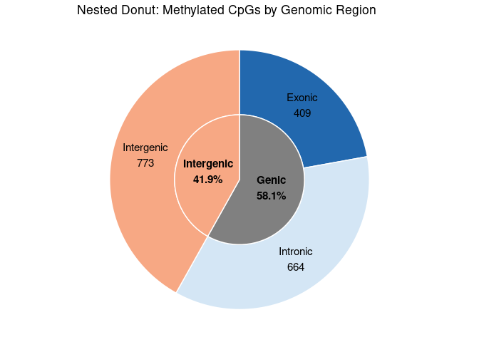<!-- -->

``` r
all_CpGs <- data.frame(
  region = c("Intergenic", "Exonic", "Intronic"),
  total_CpGs = c(nrow(methylated_CpGs)-nrow(genic_CpGs), nrow(exonic_CpGs), nrow(genic_CpGs)-nrow(exonic_CpGs)),
  methylated_CpGs = c(num_intergenic, num_exonic, num_intronic)
)

# Calculate percentage
all_CpGs <- all_CpGs %>%
  mutate(region = factor(region, levels = c("Intronic","Exonic","Intergenic")),
         percent_methylated = (methylated_CpGs / total_CpGs) * 100)

# Define custom colors
region_colors <- c(
  "Intergenic" = "#f7a884",   # orange
  "Exonic"     = "#2268ae",   # dark blue
  "Intronic"   = "#d4e6f5"    # light blue
)

# Plot
bar <- ggplot(all_CpGs, aes(y = region, x = percent_methylated, fill = region)) +
  geom_col(width = 0.6) +
  geom_text(aes(label = paste0(round(percent_methylated, 1), "%")),
            hjust = -0.1, size = 5) +
  scale_fill_manual(values = region_colors) +
  scale_x_continuous(expand = expansion(mult = c(0, 0.1))) +
  labs(
    title = "Methylated CpGs as % of All CpGs by Region",
    x = "% Methylated",
    y = NULL
  ) +
  theme_minimal(base_size = 14) +
  theme(legend.position = "none")

save_ggplot(bar, "../output_WGBS/figures/3_cpgbar")
```

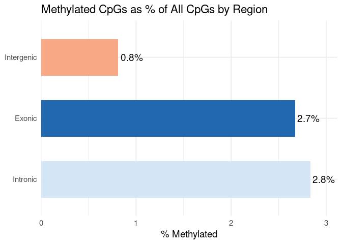<!-- -->

### 0.6.1 All DMLs boxplots

``` r
percent_meth <- percMethylation(meth_filter_destrand)
percent_meth <- as.data.frame(percent_meth)
percent_meth$chr <- meth_filter_destrand$chr
percent_meth$start <- meth_filter_destrand$start
percent_meth$end <- meth_filter_destrand$end
percent_meth$strand <- meth_filter_destrand$strand
percent_meth <- percent_meth %>% select(c(chr,start,end,strand), everything())


percent_meth_DML <- inner_join(percent_meth,DMLs) %>% 
                                rename("DML_qvalue"=qvalue) %>% 
                                rename("DML_pvalue"=pvalue)%>% 
                                rename("DML_methdiff"=meth.diff)
```

    ## Joining with `by = join_by(chr, start, end, strand)`

``` r
percent_meth_DML_ingene <- inner_join(percent_meth,DML_transcript_annot) 
```

    ## Joining with `by = join_by(chr, start, end)`

``` r
percent_meth_DML_tissue <- percent_meth_DML %>% rowwise() %>%
  mutate(Oral = mean(c_across(meta$Sample[meta$Tissue=="OralEpi"]), na.rm = TRUE)) %>%
  mutate(Aboral = mean(c_across(meta$Sample[meta$Tissue=="Aboral"]), na.rm = TRUE)) %>%
  ungroup()

percent_meth_DML_ingene_tissue <- percent_meth_DML_ingene %>% rowwise() %>%
  mutate(Oral = mean(c_across(meta$Sample[meta$Tissue=="OralEpi"]), na.rm = TRUE)) %>%
  mutate(Aboral = mean(c_across(meta$Sample[meta$Tissue=="Aboral"]), na.rm = TRUE)) %>%
  ungroup()
  
percent_meth_DML_long <- percent_meth_DML %>%
  pivot_longer(cols = starts_with("LCM_"), 
               names_to = "Sample", 
               values_to = "Percent_Methylation") %>%
  left_join((meta %>% select(c(Sample,Tissue))), by = "Sample") %>%
  filter(!is.na(Percent_Methylation)) %>% mutate(Tissue= factor(Tissue,levels = c("OralEpi", "Aboral")))

boxplot_percmeth_DMLs <- ggplot(percent_meth_DML_long, aes(x = Tissue, y = Percent_Methylation, fill = Tissue)) +
  geom_boxplot(outlier.shape = NA) +
  geom_jitter(width = 0.2, alpha = 0.4, size = 1) +
  labs(title = "Percent Methylation at DMLs by Tissue",
       x = "Tissue Type", y = "Percent Methylation") +
  theme_minimal() + scale_fill_manual(values = c("Aboral" = "mediumpurple1", "OralEpi" = "palegreen3"))+
  theme(legend.position = "none") 

save_ggplot(boxplot_percmeth_DMLs, "../output_WGBS/figures/8_boxplot_percmeth_DMLs")
```

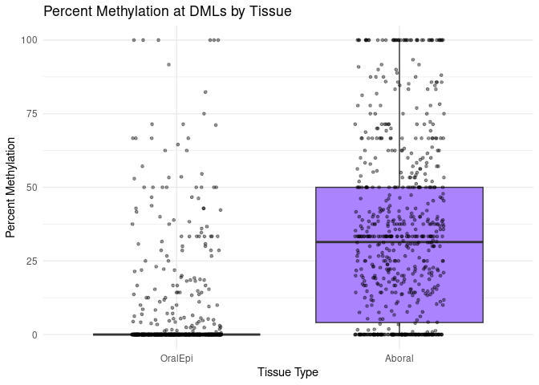<!-- -->

``` r
boxplot_percmeth_DMLs_LOG <- ggplot(percent_meth_DML_long, aes(x = Tissue, y = Percent_Methylation, fill = Tissue)) +
  geom_boxplot(outlier.shape = NA) +
  geom_jitter(width = 0.2, alpha = 0.4, size = 1) +scale_y_log10() +
  labs(title = "Percent Methylation at DMLs by Tissue",
       x = "Tissue Type", y = "Log10(Percent Methylation)") +
  theme_minimal() + scale_fill_manual(values = c("Aboral" = "mediumpurple1", "OralEpi" = "palegreen3")) +
  theme(legend.position = "none")

save_ggplot(boxplot_percmeth_DMLs_LOG, "../output_WGBS/figures/9_boxplot_percmeth_DMLs_LOG")
```

    ## Warning in scale_y_log10(): log-10 transformation introduced infinite values.
    ## log-10 transformation introduced infinite values.

    ## Warning: Removed 709 rows containing non-finite outside the scale range
    ## (`stat_boxplot()`).

    ## Warning in scale_y_log10(): log-10 transformation introduced infinite values.
    ## log-10 transformation introduced infinite values.

    ## Warning: Removed 709 rows containing non-finite outside the scale range
    ## (`stat_boxplot()`).

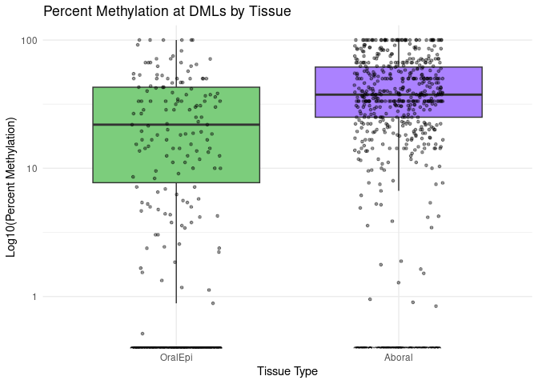<!-- -->

``` r
percent_meth_DML_ingene_long <- percent_meth_DML_ingene %>%
  pivot_longer(cols = starts_with("LCM_"), 
               names_to = "Sample", 
               values_to = "Percent_Methylation") %>%
  left_join((meta %>% select(c(Sample,Tissue))), by = "Sample") %>%
  filter(!is.na(Percent_Methylation)) %>% mutate(Tissue= factor(Tissue,levels = c("OralEpi", "Aboral")))

boxplot_percmeth_DMLs_ingenes <- ggplot(percent_meth_DML_ingene_long, aes(x = Tissue, y = Percent_Methylation, fill = Tissue)) +
  geom_boxplot(outlier.shape = NA) +
  geom_jitter(width = 0.2, alpha = 0.4, size = 1) +
  labs(title = "DMLs in genes: Percent Methylation at DMLs by Tissue",
       x = "Tissue Type", y = "Percent Methylation") +
  theme_minimal() + scale_fill_manual(values = c("Aboral" = "mediumpurple1", "OralEpi" = "palegreen3")) +
  theme(legend.position = "none")

save_ggplot(boxplot_percmeth_DMLs_ingenes, "../output_WGBS/figures/10_boxplot_percmeth_DMLs_ingenes")
```

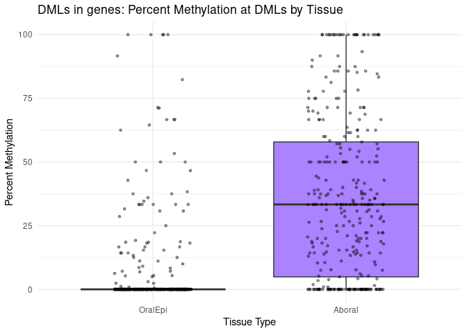<!-- -->

``` r
boxplot_percmeth_DMLs_ingenes_LOG <- ggplot(percent_meth_DML_ingene_long, aes(x = Tissue, y = Percent_Methylation, fill = Tissue)) +
  geom_boxplot(outlier.shape = NA) +
  geom_jitter(width = 0.2, alpha = 0.4, size = 1) +scale_y_log10() +
  labs(title = "DMLs in genes: Percent Methylation at DMLs by Tissue",
       x = "Tissue Type", y = "Log10(Percent Methylation)") +
  theme_minimal() + scale_fill_manual(values = c("Aboral" = "mediumpurple1", "OralEpi" = "palegreen3")) +
  theme(legend.position = "none")

save_ggplot(boxplot_percmeth_DMLs_ingenes_LOG, "../output_WGBS/figures/11_boxplot_percmeth_DMLs_ingenes_LOG")
```

    ## Warning in scale_y_log10(): log-10 transformation introduced infinite values.

    ## Warning in scale_y_log10(): log-10 transformation introduced infinite values.

    ## Warning: Removed 333 rows containing non-finite outside the scale range
    ## (`stat_boxplot()`).

    ## Warning in scale_y_log10(): log-10 transformation introduced infinite values.
    ## log-10 transformation introduced infinite values.

    ## Warning: Removed 333 rows containing non-finite outside the scale range
    ## (`stat_boxplot()`).

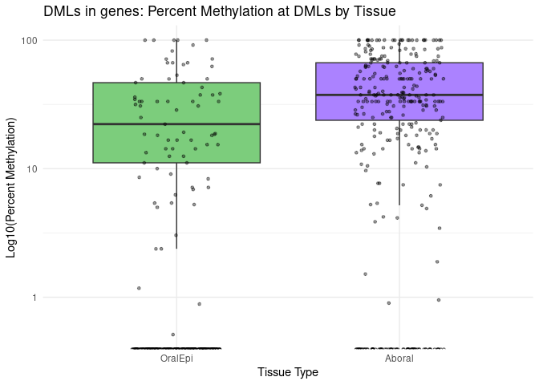<!-- -->

``` r
library(patchwork)

# Combine non-log plots
combined_boxplot_percmeth_DMLs <- boxplot_percmeth_DMLs + boxplot_percmeth_DMLs_ingenes +
  plot_layout(ncol = 2, guides = "collect") &
  theme(legend.position = "none")  # ensures consistent theme

# Save non-log version
ggsave("../output_WGBS/figures/12_combined_boxplot_percmeth_DMLs.png",
       combined_boxplot_percmeth_DMLs, width = 10, height = 5, dpi = 300)

# Combine log-transformed plots
combined_boxplot_percmeth_DMLs_LOG <- boxplot_percmeth_DMLs_LOG + boxplot_percmeth_DMLs_ingenes_LOG +
  plot_layout(ncol = 2, guides = "collect") &
  theme(legend.position = "none")

# Save log version
ggsave("../output_WGBS/figures/13_combined_boxplot_percmeth_DMLs_LOG.png",
       combined_boxplot_percmeth_DMLs_LOG, width = 10, height = 5, dpi = 300)
```

    ## Warning in scale_y_log10(): log-10 transformation introduced infinite values.
    ## log-10 transformation introduced infinite values.

    ## Warning: Removed 709 rows containing non-finite outside the scale range
    ## (`stat_boxplot()`).

    ## Warning in scale_y_log10(): log-10 transformation introduced infinite values.
    ## log-10 transformation introduced infinite values.

    ## Warning: Removed 333 rows containing non-finite outside the scale range
    ## (`stat_boxplot()`).
