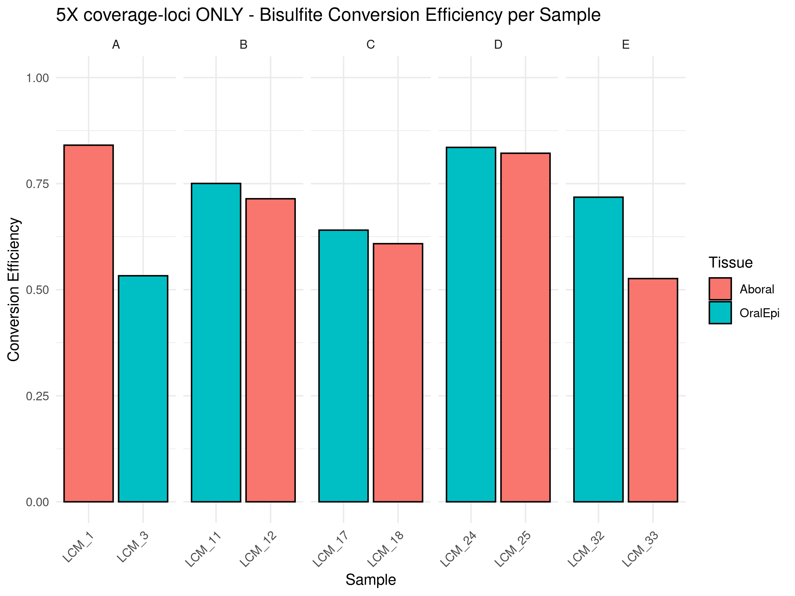
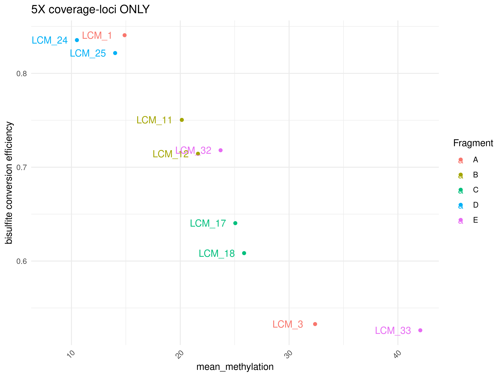
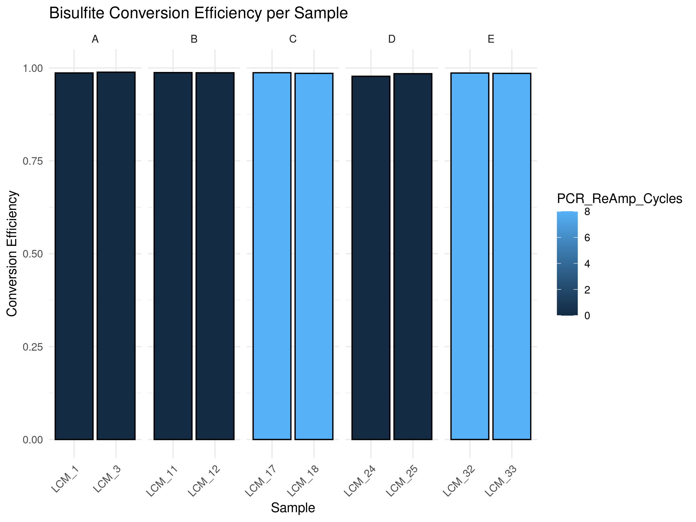
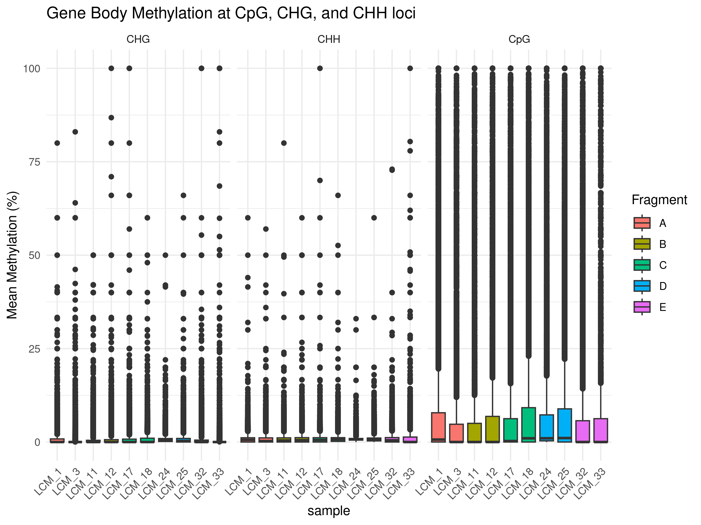

10-CpG-Methylation-V3
================
Zoe Dellaert
2025-02-17

- [0.1 CpG Methylation analysis](#01-cpg-methylation-analysis)
- [0.2 Managing Packages Using Renv](#02-managing-packages-using-renv)
- [0.3 Load packages](#03-load-packages)
- [0.4 All samples](#04-all-samples)
- [0.5 5X Coverage Cytosines ONLY](#05-5x-coverage-cytosines-only)
- [0.6 Filtered for conversion
  efficiency:](#06-filtered-for-conversion-efficiency)
  - [0.6.1 \> 90% conversion
    efficiency:](#061--90-conversion-efficiency)
  - [0.6.2 \> 90% conversion
    efficiency:](#062--90-conversion-efficiency)
- [0.7 Total counts comparisons](#07-total-counts-comparisons)

## 0.1 CpG Methylation analysis

## 0.2 Managing Packages Using Renv

To run this code in my project using the renv environment, run the
following lines of code

``` r
install.packages("renv") #install the package on the new computer (may not be necessary if renv bootstraps itself as expected)
renv::restore() #reinstall all the package versions in the renv lockfile
```

## 0.3 Load packages

``` r
require("tidyverse")
```

    ## Loading required package: tidyverse

    ## ── Attaching core tidyverse packages ──────────────────────── tidyverse 2.0.0 ──
    ## ✔ dplyr     1.1.4     ✔ readr     2.1.5
    ## ✔ forcats   1.0.0     ✔ stringr   1.5.1
    ## ✔ ggplot2   3.5.1     ✔ tibble    3.2.1
    ## ✔ lubridate 1.9.4     ✔ tidyr     1.3.1
    ## ✔ purrr     1.0.4     
    ## ── Conflicts ────────────────────────────────────────── tidyverse_conflicts() ──
    ## ✖ dplyr::filter() masks stats::filter()
    ## ✖ dplyr::lag()    masks stats::lag()
    ## ℹ Use the conflicted package (<http://conflicted.r-lib.org/>) to force all conflicts to become errors

``` r
require("ggplot2")
require("gtools")
```

    ## Loading required package: gtools

``` r
sessionInfo() #provides list of loaded packages and version of R.
```

    ## R version 4.4.0 (2024-04-24)
    ## Platform: x86_64-pc-linux-gnu
    ## Running under: Ubuntu 22.04.3 LTS
    ## 
    ## Matrix products: default
    ## BLAS:   /usr/lib/x86_64-linux-gnu/openblas-pthread/libblas.so.3 
    ## LAPACK: /usr/lib/x86_64-linux-gnu/openblas-pthread/libopenblasp-r0.3.20.so;  LAPACK version 3.10.0
    ## 
    ## locale:
    ##  [1] LC_CTYPE=en_US.UTF-8       LC_NUMERIC=C              
    ##  [3] LC_TIME=en_US.UTF-8        LC_COLLATE=en_US.UTF-8    
    ##  [5] LC_MONETARY=en_US.UTF-8    LC_MESSAGES=en_US.UTF-8   
    ##  [7] LC_PAPER=en_US.UTF-8       LC_NAME=C                 
    ##  [9] LC_ADDRESS=C               LC_TELEPHONE=C            
    ## [11] LC_MEASUREMENT=en_US.UTF-8 LC_IDENTIFICATION=C       
    ## 
    ## time zone: Etc/UTC
    ## tzcode source: system (glibc)
    ## 
    ## attached base packages:
    ## [1] stats     graphics  grDevices datasets  utils     methods   base     
    ## 
    ## other attached packages:
    ##  [1] gtools_3.9.5    lubridate_1.9.4 forcats_1.0.0   stringr_1.5.1  
    ##  [5] dplyr_1.1.4     purrr_1.0.4     readr_2.1.5     tidyr_1.3.1    
    ##  [9] tibble_3.2.1    ggplot2_3.5.1   tidyverse_2.0.0
    ## 
    ## loaded via a namespace (and not attached):
    ##  [1] gtable_0.3.6        compiler_4.4.0      BiocManager_1.30.25
    ##  [4] renv_1.1.1          tidyselect_1.2.1    scales_1.3.0       
    ##  [7] yaml_2.3.10         fastmap_1.2.0       R6_2.6.0           
    ## [10] generics_0.1.3      knitr_1.49          munsell_0.5.1      
    ## [13] pillar_1.10.1       tzdb_0.4.0          rlang_1.1.5        
    ## [16] stringi_1.8.4       xfun_0.50           timechange_0.3.0   
    ## [19] cli_3.6.4           withr_3.0.2         magrittr_2.0.3     
    ## [22] digest_0.6.37       grid_4.4.0          rstudioapi_0.17.1  
    ## [25] hms_1.1.3           lifecycle_1.0.4     vctrs_0.6.5        
    ## [28] evaluate_1.0.3      glue_1.8.0          colorspace_2.1-1   
    ## [31] rmarkdown_2.29      tools_4.4.0         pkgconfig_2.0.3    
    ## [34] htmltools_0.5.8.1

``` r
meta <- read.csv("../data_WGBS/LCM_WGBS_metadata.csv", sep = ",", header = TRUE) %>%
  mutate(Section_Date = as.character(Section_Date), LCM_Date = as.character(LCM_Date),DNA_Extraction_Date = as.character(DNA_Extraction_Date))

meta_simple <- meta %>% dplyr::select(Sample, Fragment, Tissue, PCR_ReAmp_Cycles)
```

“Bisulfite conversion efficiency was also estimated from coral
alignments as the ratio of the sum of unmethylated cytosines in CHG and
CHH context to the sum of methylated and unmethyl- ated cytosines in CHG
and CHH.”

## 0.4 All samples

``` r
#get list of all sample output directories and extract sample names
sample_directories <- list.files("../output_WGBS/methylseq_V3_bwa_test/methyldackel", pattern = "_quant", full.names = TRUE, include.dirs = TRUE)
samples <- gsub("_quant","",basename(sample_directories))

# make an empty data frame to store methylation data and conversion efficiency data
all_methylation_data <- data.frame()
conversion_eff_data <- data.frame()

for (sample in samples) {
  output_dir <- paste0("/project/pi_hputnam_uri_edu/zdellaert/LaserCoral/output_WGBS/methylseq_V3_bwa_test/methyldackel/", sample, "_quant")

  # Read percent methylation data for CpG, CHG, and CHH contexts
  CpG <- read.table(file.path(output_dir, "gene_body_CpG_methylation.txt"), header=FALSE)
  CHG <- read.table(file.path(output_dir, "gene_body_CHG_methylation.txt"), header=FALSE)
  CHH <- read.table(file.path(output_dir, "gene_body_CHH_methylation.txt"), header=FALSE)

  # label dataframe with context
  CpG$context <- "CpG"
  CHG$context <- "CHG"
  CHH$context <- "CHH"
  
  # combine into one
  methylation_data <- rbind(CpG, CHG, CHH)
  colnames(methylation_data) <- c("scaffold", "transcript_start", "transcript_end", "transcript_id", "methylation", "context")
  methylation_data$methylation <- as.numeric(methylation_data$methylation)
  methylation_data$sample <- sample

  # Append methylation data for this sample
  all_methylation_data <- rbind(all_methylation_data, methylation_data)
  
  # read in file length info for CHH and CHG total counts and unmethyated counts
  
  count_table <- read.table(file.path(output_dir, "efficiency.txt"), header=FALSE)
  counts <- as.numeric(count_table$V1)

  unmethylated_CHG <- counts[1]
  unmethylated_CHH <- counts[2]
  total_CHG <- counts[3]
  total_CHH <- counts[4]

  # Sum of unmethylated cytosines
  unmethylated_total <- unmethylated_CHG + unmethylated_CHH

  # Sum of total cytosines (methylated + unmethylated)
  total_cytosines <- total_CHG + total_CHH

  # Bisulfite conversion efficiency calculation
  conversion_efficiency <- unmethylated_total / total_cytosines
  print(paste(sample, "Bisulfite Conversion Efficiency: ", conversion_efficiency))

  conversion_eff_data <- rbind(conversion_eff_data, data.frame(sample=sample, efficiency=conversion_efficiency, total_CHH_CHG=total_cytosines))
}
```

    ## Warning: NAs introduced by coercion

    ## [1] "LCM_1 Bisulfite Conversion Efficiency:  0.890600799505604"

    ## Warning: NAs introduced by coercion

    ## [1] "LCM_11 Bisulfite Conversion Efficiency:  0.813884614881023"

    ## Warning: NAs introduced by coercion

    ## [1] "LCM_12 Bisulfite Conversion Efficiency:  0.801044016296052"

    ## Warning: NAs introduced by coercion

    ## [1] "LCM_17 Bisulfite Conversion Efficiency:  0.750518241110567"

    ## Warning: NAs introduced by coercion

    ## [1] "LCM_18 Bisulfite Conversion Efficiency:  0.725736429417941"

    ## Warning: NAs introduced by coercion

    ## [1] "LCM_24 Bisulfite Conversion Efficiency:  0.874967725490902"

    ## Warning: NAs introduced by coercion

    ## [1] "LCM_25 Bisulfite Conversion Efficiency:  0.873786814056671"

    ## Warning: NAs introduced by coercion

    ## [1] "LCM_3 Bisulfite Conversion Efficiency:  0.666685731620454"

    ## Warning: NAs introduced by coercion

    ## [1] "LCM_32 Bisulfite Conversion Efficiency:  0.786320790702449"

    ## Warning: NAs introduced by coercion

    ## [1] "LCM_33 Bisulfite Conversion Efficiency:  0.635185456548705"

``` r
write.csv(all_methylation_data, "../output_WGBS/methylseq_V3_bwa_test/gene_body_methylation.csv",row.names = FALSE)
write.csv(conversion_eff_data, "../output_WGBS/methylseq_V3_bwa_test/conversion_efficiency.csv",row.names = FALSE)
```

Analyze and plot:

``` r
conversion_eff_data <- read.csv( "../output_WGBS/methylseq_V3_bwa_test/conversion_efficiency.csv", sep = ",", header = TRUE) 
all_methylation_data <- read.csv( "../output_WGBS/methylseq_V3_bwa_test/gene_body_methylation.csv", sep = ",", header = TRUE) 

conversion_eff_data <- conversion_eff_data %>%
  left_join(meta_simple,by = join_by(sample == Sample)) %>%
  mutate(sample = fct_relevel(sample, conversion_eff_data$sample[mixedorder(conversion_eff_data$sample)])) 

all_methylation_data <- all_methylation_data %>% left_join(meta_simple,by = join_by(sample == Sample)) %>%
  mutate(sample = fct_relevel(sample, (unique(all_methylation_data$sample)[mixedorder(unique(all_methylation_data$sample))]))) 

# Plot methylation distributions by context and sample
ggplot(all_methylation_data, aes(x=sample, y=methylation, fill=Fragment)) +
  geom_boxplot() +
  facet_grid(~context, scales = "free") +
  theme_minimal() +
  theme(axis.text.x = element_text(angle = 45, hjust = 1)) +
  labs(title="Gene Body Methylation at CpG, CHG, and CHH loci", y="Mean Methylation (%)")
```

    ## Warning: Removed 102012 rows containing non-finite outside the scale range
    ## (`stat_boxplot()`).

<!-- -->

``` r
ggplot(conversion_eff_data, aes(x=sample, y=efficiency, fill=Tissue)) +
  geom_bar(stat="identity", color="black") +
  theme_minimal() +
  facet_grid(~Fragment, scales = "free") +
  labs(title="Bisulfite Conversion Efficiency per Sample", y="Conversion Efficiency", x="Sample") +
  theme(axis.text.x = element_text(angle = 45, hjust = 1)) +
  ylim(0, 1) 
```

<!-- -->

``` r
ggplot(conversion_eff_data, aes(x=sample, y=efficiency, fill=PCR_ReAmp_Cycles)) +
  geom_bar(stat="identity", color="black") +
  theme_minimal() +
  facet_grid(~Fragment, scales = "free") +
  labs(title="Bisulfite Conversion Efficiency per Sample", y="Conversion Efficiency", x="Sample") +
  theme(axis.text.x = element_text(angle = 45, hjust = 1)) +
  ylim(0, 1) 
```

<!-- -->

``` r
summary <- all_methylation_data %>%
  group_by(sample, context) %>%
  summarize(mean_methylation = mean(methylation, na.rm = TRUE)) %>% filter(context =="CpG") %>% left_join(conversion_eff_data)
```

    ## `summarise()` has grouped output by 'sample'. You can override using the
    ## `.groups` argument.
    ## Joining with `by = join_by(sample)`

``` r
ggplot(summary, aes(x=mean_methylation, y=efficiency, color=Fragment, label=sample)) +
  geom_point() +
    geom_text(nudge_x = -2.5) + 
  #geom_smooth() +
  theme_minimal() +
  theme(axis.text.x = element_text(angle = 45, hjust = 1)) +
  labs(y="bisulfite conversion efficiency")
```

<!-- -->

## 0.5 5X Coverage Cytosines ONLY

``` r
#get list of all sample output directories and extract sample names
sample_directories <- list.files("../output_WGBS/methylseq_V3_bwa_test/methyldackel", pattern = "_5Xquant", full.names = TRUE, include.dirs = TRUE)
samples <- gsub("_5Xquant","",basename(sample_directories))

# make an empty data frame to store methylation data and conversion efficiency data
all_methylation_data_5x <- data.frame()
conversion_eff_data_5x <- data.frame()

for (sample in samples) {
  output_dir <- paste0("/project/pi_hputnam_uri_edu/zdellaert/LaserCoral/output_WGBS/methylseq_V3_bwa_test/methyldackel/", sample, "_5Xquant")
  
  # Read percent methylation data for CpG, CHG, and CHH contexts
  CpG <- read.table(file.path(output_dir, "gene_body_CpG_methylation.txt"), header=FALSE)
  CHG <- read.table(file.path(output_dir, "gene_body_CHG_methylation.txt"), header=FALSE)
  CHH <- read.table(file.path(output_dir, "gene_body_CHH_methylation.txt"), header=FALSE)

  # label dataframe with context
  CpG$context <- "CpG"
  CHG$context <- "CHG"
  CHH$context <- "CHH"
  
  # combine into one
  methylation_data <- rbind(CpG, CHG, CHH)
  colnames(methylation_data) <- c("scaffold", "transcript_start", "transcript_end", "transcript_id", "methylation", "context")
  methylation_data$methylation <- as.numeric(methylation_data$methylation)
  methylation_data$sample <- sample

  # Append methylation data for this sample
  all_methylation_data_5x <- rbind(all_methylation_data_5x, methylation_data)

  # read in file length info for CHH and CHG total counts and unmethyated counts
  
  count_table <- read.table(file.path(output_dir, "efficiency.txt"), header=FALSE)
  counts <- as.numeric(count_table$V1)

  unmethylated_CHG <- counts[1]
  unmethylated_CHH <- counts[2]
  total_CHG <- counts[3]
  total_CHH <- counts[4]

  # Sum of unmethylated cytosines
  unmethylated_total <- unmethylated_CHG + unmethylated_CHH

  # Sum of total cytosines (methylated + unmethylated)
  total_cytosines <- total_CHG + total_CHH

  # Bisulfite conversion efficiency calculation
  conversion_efficiency <- unmethylated_total / total_cytosines
  print(paste(sample, "Bisulfite Conversion Efficiency: ", conversion_efficiency))

  conversion_eff_data_5x <- rbind(conversion_eff_data_5x, data.frame(sample=sample, efficiency=conversion_efficiency, total_CHH_CHG=total_cytosines))
}
```

    ## Warning: NAs introduced by coercion

    ## [1] "LCM_1 Bisulfite Conversion Efficiency:  0.840657342012325"

    ## Warning: NAs introduced by coercion

    ## [1] "LCM_11 Bisulfite Conversion Efficiency:  0.750424210758876"

    ## Warning: NAs introduced by coercion

    ## [1] "LCM_12 Bisulfite Conversion Efficiency:  0.714339146408392"

    ## Warning: NAs introduced by coercion

    ## [1] "LCM_17 Bisulfite Conversion Efficiency:  0.640375986047663"

    ## Warning: NAs introduced by coercion

    ## [1] "LCM_18 Bisulfite Conversion Efficiency:  0.608429044631969"

    ## Warning: NAs introduced by coercion

    ## [1] "LCM_24 Bisulfite Conversion Efficiency:  0.835452252486402"

    ## Warning: NAs introduced by coercion

    ## [1] "LCM_25 Bisulfite Conversion Efficiency:  0.821647003105493"

    ## Warning: NAs introduced by coercion

    ## [1] "LCM_3 Bisulfite Conversion Efficiency:  0.532825756045478"

    ## Warning: NAs introduced by coercion

    ## [1] "LCM_32 Bisulfite Conversion Efficiency:  0.718054304730599"

    ## Warning: NAs introduced by coercion

    ## [1] "LCM_33 Bisulfite Conversion Efficiency:  0.526192887932907"

``` r
write.csv(all_methylation_data_5x, "../output_WGBS/methylseq_V3_bwa_test/gene_body_methylation_5x.csv",row.names = FALSE)
write.csv(conversion_eff_data_5x, "../output_WGBS/methylseq_V3_bwa_test/conversion_efficiency_5x.csv",row.names = FALSE)
```

Analyze and plot:

``` r
conversion_eff_data_5x <- read.csv( "../output_WGBS/methylseq_V3_bwa_test/conversion_efficiency_5x.csv", sep = ",", header = TRUE) 
all_methylation_data_5x <- read.csv( "../output_WGBS/methylseq_V3_bwa_test/gene_body_methylation_5x.csv", sep = ",", header = TRUE) 

conversion_eff_data_5x <- conversion_eff_data_5x %>%
  left_join(meta_simple,by = join_by(sample == Sample)) %>%
  mutate(sample = fct_relevel(sample, conversion_eff_data_5x$sample[mixedorder(conversion_eff_data_5x$sample)])) 

all_methylation_data_5x <- all_methylation_data_5x %>% left_join(meta_simple,by = join_by(sample == Sample)) %>%
  mutate(sample = fct_relevel(sample, (unique(all_methylation_data_5x$sample)[mixedorder(unique(all_methylation_data_5x$sample))]))) 

# Plot methylation distributions by context and sample
ggplot(all_methylation_data_5x, aes(x=sample, y=methylation, fill=Fragment)) +
  geom_boxplot() +
  facet_grid(~context, scales = "free") +
  theme_minimal() +
  theme(axis.text.x = element_text(angle = 45, hjust = 1)) +
  labs(title="5X coverage-loci ONLY - Gene Body Methylation at CpG, CHG, and CHH loci", y="Mean Methylation (%)")
```

    ## Warning: Removed 274652 rows containing non-finite outside the scale range
    ## (`stat_boxplot()`).

<!-- -->

``` r
ggplot(conversion_eff_data_5x, aes(x=sample, y=efficiency, fill=Tissue)) +
  geom_bar(stat="identity", color="black") +
  theme_minimal() +
  facet_grid(~Fragment, scales = "free") +
  labs(title="5X coverage-loci ONLY - Bisulfite Conversion Efficiency per Sample", y="Conversion Efficiency", x="Sample") +
  theme(axis.text.x = element_text(angle = 45, hjust = 1)) +
  ylim(0, 1) 
```

<!-- -->

``` r
ggplot(conversion_eff_data_5x, aes(x=sample, y=efficiency, fill=PCR_ReAmp_Cycles)) +
  geom_bar(stat="identity", color="black") +
  theme_minimal() +
  facet_grid(~Fragment, scales = "free") +
  labs(title="5X coverage-loci ONLY - Bisulfite Conversion Efficiency per Sample", y="Conversion Efficiency", x="Sample") +
  theme(axis.text.x = element_text(angle = 45, hjust = 1)) +
  ylim(0, 1) 
```

<!-- -->

``` r
summary <- all_methylation_data_5x %>%
  group_by(sample, context) %>%
  summarize(mean_methylation = mean(methylation, na.rm = TRUE)) %>% filter(context =="CpG") %>% left_join(conversion_eff_data_5x)
```

    ## `summarise()` has grouped output by 'sample'. You can override using the
    ## `.groups` argument.
    ## Joining with `by = join_by(sample)`

``` r
ggplot(summary, aes(x=mean_methylation, y=efficiency, color=Fragment, label=sample)) +
  geom_point() +
  geom_text(nudge_x = -2.5) + 
  #geom_smooth() +
  theme_minimal() +
  theme(axis.text.x = element_text(angle = 45, hjust = 1)) +
  labs(title="5X coverage-loci ONLY" , y="bisulfite conversion efficiency")
```

<!-- -->

## 0.6 Filtered for conversion efficiency:

Methyldackel has a setting where it can only extract methylation counts
from reads that pass a certain minimum threshold of conversion
efficiency. It recommends against using this for analyses, but I wanted
to try it on a few samples and calculate conversion efficiency to
confirm my caclulations were correct and also to get an idea of the
results.

### 0.6.1 \> 90% conversion efficiency:

``` r
#get list of all sample output directories and extract sample names
sample_directories <- list.files("../output_WGBS/methylseq_V3_bwa_test/methyldackel/min_efficiency_test_new", pattern = "_quant", full.names = TRUE, include.dirs = TRUE)

sample_directories <- sample_directories[grep("min_90",sample_directories)]
samples <- gsub("_quant","",basename(sample_directories))
samples <- gsub("min_90_","",samples)

# make an empty data frame to store methylation data and conversion efficiency data
all_methylation_data <- data.frame()
conversion_eff_data <- data.frame()

for (sample in samples) {
  output_dir <- paste0("../output_WGBS/methylseq_V3_bwa_test/methyldackel/min_efficiency_test_new/min_90_", sample, "_quant")

  # Read percent methylation data for CpG, CHG, and CHH contexts
  CpG <- read.table(file.path(output_dir, "gene_body_CpG_methylation.txt"), header=FALSE)
  CHG <- read.table(file.path(output_dir, "gene_body_CHG_methylation.txt"), header=FALSE)
  CHH <- read.table(file.path(output_dir, "gene_body_CHH_methylation.txt"), header=FALSE)

  # label dataframe with context
  CpG$context <- "CpG"
  CHG$context <- "CHG"
  CHH$context <- "CHH"
  
  # combine into one
  methylation_data <- rbind(CpG, CHG, CHH)
  colnames(methylation_data) <- c("scaffold", "transcript_start", "transcript_end", "transcript_id", "methylation", "context")
  methylation_data$methylation <- as.numeric(methylation_data$methylation)
  methylation_data$sample <- sample

  # Append methylation data for this sample
  all_methylation_data <- rbind(all_methylation_data, methylation_data)
  
  # read in file length info for CHH and CHG total counts and unmethyated counts
  
  count_table <- read.table(file.path(output_dir, "efficiency.txt"), header=FALSE)
  counts <- as.numeric(count_table$V1)

  unmethylated_CHG <- counts[1]
  unmethylated_CHH <- counts[2]
  total_CHG <- counts[3]
  total_CHH <- counts[4]

  # Sum of unmethylated cytosines
  unmethylated_total <- unmethylated_CHG + unmethylated_CHH

  # Sum of total cytosines (methylated + unmethylated)
  total_cytosines <- total_CHG + total_CHH

  # Bisulfite conversion efficiency calculation
  conversion_efficiency <- unmethylated_total / total_cytosines
  print(paste(sample, "Bisulfite Conversion Efficiency: ", conversion_efficiency))

  conversion_eff_data <- rbind(conversion_eff_data, data.frame(sample=sample, efficiency=conversion_efficiency, total_CHH_CHG=total_cytosines))
}
```

    ## Warning: NAs introduced by coercion

    ## [1] "LCM_1 Bisulfite Conversion Efficiency:  0.986510462036031"

    ## Warning: NAs introduced by coercion

    ## [1] "LCM_11 Bisulfite Conversion Efficiency:  0.987471481438896"

    ## Warning: NAs introduced by coercion

    ## [1] "LCM_12 Bisulfite Conversion Efficiency:  0.987040149602644"

    ## Warning: NAs introduced by coercion

    ## [1] "LCM_17 Bisulfite Conversion Efficiency:  0.987141758517886"

    ## Warning: NAs introduced by coercion

    ## [1] "LCM_18 Bisulfite Conversion Efficiency:  0.985403845972864"

    ## Warning: NAs introduced by coercion

    ## [1] "LCM_24 Bisulfite Conversion Efficiency:  0.977596623138475"

    ## Warning: NAs introduced by coercion

    ## [1] "LCM_25 Bisulfite Conversion Efficiency:  0.984539842589393"

    ## Warning: NAs introduced by coercion

    ## [1] "LCM_3 Bisulfite Conversion Efficiency:  0.988588403593704"

    ## Warning: NAs introduced by coercion

    ## [1] "LCM_32 Bisulfite Conversion Efficiency:  0.986295668831883"

    ## Warning: NAs introduced by coercion

    ## [1] "LCM_33 Bisulfite Conversion Efficiency:  0.985355898011945"

``` r
write.csv(all_methylation_data, "../output_WGBS/methylseq_V3_bwa_test/methyldackel/min_efficiency_test_new/min_90_gene_body_methylation_Version2.csv",row.names = FALSE)
write.csv(conversion_eff_data, "../output_WGBS/methylseq_V3_bwa_test/methyldackel/min_efficiency_test_new/min_90_conversion_efficiency_Version2.csv",row.names = FALSE)
```

Analyze and plot:

``` r
all_methylation_data <- read.csv( "../output_WGBS/methylseq_V3_bwa_test/methyldackel/min_efficiency_test_new/min_90_gene_body_methylation_Version2.csv", sep = ",", header = TRUE) 
conversion_eff_data <- read.csv(  "../output_WGBS/methylseq_V3_bwa_test/methyldackel/min_efficiency_test_new/min_90_conversion_efficiency_Version2.csv", sep = ",", header = TRUE) 

conversion_eff_data <- conversion_eff_data %>%
  left_join(meta_simple,by = join_by(sample == Sample)) %>%
  mutate(sample = fct_relevel(sample, unique(conversion_eff_data$sample)[mixedorder(unique(conversion_eff_data$sample))])) 

all_methylation_data <- all_methylation_data %>% left_join(meta_simple,by = join_by(sample == Sample)) %>%
  mutate(sample = fct_relevel(sample, (unique(all_methylation_data$sample)[mixedorder(unique(all_methylation_data$sample))]))) 

# Plot methylation distributions by context and sample
ggplot(all_methylation_data, aes(x=sample, y=methylation, fill=Fragment)) +
  geom_boxplot() +
  facet_grid(~context, scales = "free") +
  theme_minimal() +
  theme(axis.text.x = element_text(angle = 45, hjust = 1)) +
  labs(title="Gene Body Methylation at CpG, CHG, and CHH loci", y="Mean Methylation (%)")
```

    ## Warning: Removed 131739 rows containing non-finite outside the scale range
    ## (`stat_boxplot()`).

<!-- -->

``` r
ggplot(conversion_eff_data, aes(x=sample, y=efficiency, fill=Tissue)) +
  geom_bar(stat="identity", color="black") +
  theme_minimal() +
  facet_grid(~Fragment, scales = "free") +
  labs(title="Bisulfite Conversion Efficiency per Sample", y="Conversion Efficiency", x="Sample") +
  theme(axis.text.x = element_text(angle = 45, hjust = 1)) +
  ylim(0, 1) 
```

<!-- -->

``` r
ggplot(conversion_eff_data, aes(x=sample, y=efficiency, fill=PCR_ReAmp_Cycles)) +
  geom_bar(stat="identity", color="black") +
  theme_minimal() +
  facet_grid(~Fragment, scales = "free") +
  labs(title="Bisulfite Conversion Efficiency per Sample", y="Conversion Efficiency", x="Sample") +
  theme(axis.text.x = element_text(angle = 45, hjust = 1)) +
  ylim(0, 1) 
```

<!-- -->

``` r
summary <- all_methylation_data %>%
  group_by(sample, context) %>%
  summarize(mean_methylation = mean(methylation, na.rm = TRUE)) %>% filter(context =="CpG") %>% left_join(conversion_eff_data)
```

    ## `summarise()` has grouped output by 'sample'. You can override using the
    ## `.groups` argument.
    ## Joining with `by = join_by(sample)`

``` r
ggplot(summary, aes(x=mean_methylation, y=efficiency, color=Fragment, label=sample)) +
  geom_point() +
    geom_text(nudge_x = -0.5) + 
  #geom_smooth() +
  theme_minimal() +
  theme(axis.text.x = element_text(angle = 45, hjust = 1)) +
  labs(y="bisulfite conversion efficiency")
```

<!-- -->

### 0.6.2 \> 90% conversion efficiency:

``` r
#get list of all sample output directories and extract sample names
sample_directories <- list.files("../output_WGBS/methylseq_V3_bwa_test/methyldackel/min_efficiency_test_new_5x", pattern = "_quant", full.names = TRUE, include.dirs = TRUE)

sample_directories <- sample_directories[grep("min_90",sample_directories)]
samples <- gsub("_quant","",basename(sample_directories))
samples <- gsub("min_90_","",samples)

# make an empty data frame to store methylation data and conversion efficiency data
all_methylation_data <- data.frame()
conversion_eff_data <- data.frame()

for (sample in samples) {
  output_dir <- paste0("../output_WGBS/methylseq_V3_bwa_test/methyldackel/min_efficiency_test_new_5x/min_90_", sample, "_quant")

  # Read percent methylation data for CpG, CHG, and CHH contexts
  CpG <- read.table(file.path(output_dir, "gene_body_CpG_methylation.txt"), header=FALSE)
  CHG <- read.table(file.path(output_dir, "gene_body_CHG_methylation.txt"), header=FALSE)
  CHH <- read.table(file.path(output_dir, "gene_body_CHH_methylation.txt"), header=FALSE)

  # label dataframe with context
  CpG$context <- "CpG"
  CHG$context <- "CHG"
  CHH$context <- "CHH"
  
  # combine into one
  methylation_data <- rbind(CpG, CHG, CHH)
  colnames(methylation_data) <- c("scaffold", "transcript_start", "transcript_end", "transcript_id", "methylation", "context")
  methylation_data$methylation <- as.numeric(methylation_data$methylation)
  methylation_data$sample <- sample

  # Append methylation data for this sample
  all_methylation_data <- rbind(all_methylation_data, methylation_data)
  
  # read in file length info for CHH and CHG total counts and unmethyated counts
  
  count_table <- read.table(file.path(output_dir, "efficiency.txt"), header=FALSE)
  counts <- as.numeric(count_table$V1)

  unmethylated_CHG <- counts[1]
  unmethylated_CHH <- counts[2]
  total_CHG <- counts[3]
  total_CHH <- counts[4]

  # Sum of unmethylated cytosines
  unmethylated_total <- unmethylated_CHG + unmethylated_CHH

  # Sum of total cytosines (methylated + unmethylated)
  total_cytosines <- total_CHG + total_CHH

  # Bisulfite conversion efficiency calculation
  conversion_efficiency <- unmethylated_total / total_cytosines
  print(paste(sample, "Bisulfite Conversion Efficiency: ", conversion_efficiency))

  conversion_eff_data <- rbind(conversion_eff_data, data.frame(sample=sample, efficiency=conversion_efficiency, total_CHH_CHG=total_cytosines))
}
```

    ## Warning: NAs introduced by coercion

    ## [1] "LCM_1 Bisulfite Conversion Efficiency:  0.977675567414624"

    ## Warning: NAs introduced by coercion

    ## [1] "LCM_11 Bisulfite Conversion Efficiency:  0.979789964770142"

    ## Warning: NAs introduced by coercion

    ## [1] "LCM_12 Bisulfite Conversion Efficiency:  0.977403640378794"

    ## Warning: NAs introduced by coercion

    ## [1] "LCM_17 Bisulfite Conversion Efficiency:  0.977887385961856"

    ## Warning: NAs introduced by coercion

    ## [1] "LCM_18 Bisulfite Conversion Efficiency:  0.975202227888297"

    ## Warning: NAs introduced by coercion

    ## [1] "LCM_24 Bisulfite Conversion Efficiency:  0.967038578537502"

    ## Warning: NAs introduced by coercion

    ## [1] "LCM_25 Bisulfite Conversion Efficiency:  0.974566649701122"

    ## Warning: NAs introduced by coercion

    ## [1] "LCM_3 Bisulfite Conversion Efficiency:  0.979966328690774"

    ## Warning: NAs introduced by coercion

    ## [1] "LCM_32 Bisulfite Conversion Efficiency:  0.979845727552407"

    ## Warning: NAs introduced by coercion

    ## [1] "LCM_33 Bisulfite Conversion Efficiency:  0.980528113504992"

``` r
write.csv(all_methylation_data, "../output_WGBS/methylseq_V3_bwa_test/methyldackel/min_efficiency_test_new/min_90_gene_body_methylation_Version2_5xcov.csv",row.names = FALSE)
write.csv(conversion_eff_data, "../output_WGBS/methylseq_V3_bwa_test/methyldackel/min_efficiency_test_new/min_90_conversion_efficiency_Version2_5xcov.csv",row.names = FALSE)
```

Analyze and plot:

``` r
# all_methylation_data <- read.csv( "../output_WGBS/methylseq_V3_bwa_test/methyldackel/min_efficiency_test_new/min_90_gene_body_methylation_Version2_5xcov.csv", sep = ",", header = TRUE) 
# conversion_eff_data <- read.csv(  "../output_WGBS/methylseq_V3_bwa_test/methyldackel/min_efficiency_test_new/min_90_conversion_efficiency_Version2_5xcov.csv", sep = ",", header = TRUE) 

conversion_eff_data <- conversion_eff_data %>%
  left_join(meta_simple,by = join_by(sample == Sample)) %>%
  mutate(sample = fct_relevel(sample, unique(conversion_eff_data$sample)[mixedorder(unique(conversion_eff_data$sample))])) 

all_methylation_data <- all_methylation_data %>% left_join(meta_simple,by = join_by(sample == Sample)) %>%
  mutate(sample = fct_relevel(sample, (unique(all_methylation_data$sample)[mixedorder(unique(all_methylation_data$sample))]))) 

# Plot methylation distributions by context and sample
ggplot(all_methylation_data, aes(x=sample, y=methylation, fill=Fragment)) +
  geom_boxplot() +
  facet_grid(~context, scales = "free") +
  theme_minimal() +
  theme(axis.text.x = element_text(angle = 45, hjust = 1)) +
  labs(title="Gene Body Methylation at CpG, CHG, and CHH loci", y="Mean Methylation (%)")
```

    ## Warning: Removed 326476 rows containing non-finite outside the scale range
    ## (`stat_boxplot()`).

<!-- -->

``` r
ggplot(conversion_eff_data, aes(x=sample, y=efficiency, fill=Tissue)) +
  geom_bar(stat="identity", color="black") +
  theme_minimal() +
  facet_grid(~Fragment, scales = "free") +
  labs(title="Bisulfite Conversion Efficiency per Sample", y="Conversion Efficiency", x="Sample") +
  theme(axis.text.x = element_text(angle = 45, hjust = 1)) +
  ylim(0, 1) 
```

<!-- -->

``` r
ggplot(conversion_eff_data, aes(x=sample, y=efficiency, fill=PCR_ReAmp_Cycles)) +
  geom_bar(stat="identity", color="black") +
  theme_minimal() +
  facet_grid(~Fragment, scales = "free") +
  labs(title="Bisulfite Conversion Efficiency per Sample", y="Conversion Efficiency", x="Sample") +
  theme(axis.text.x = element_text(angle = 45, hjust = 1)) +
  ylim(0, 1) 
```

<!-- -->

``` r
summary <- all_methylation_data %>%
  group_by(sample, context) %>%
  summarize(mean_methylation = mean(methylation, na.rm = TRUE)) %>% filter(context =="CpG") %>% left_join(conversion_eff_data)
```

    ## `summarise()` has grouped output by 'sample'. You can override using the
    ## `.groups` argument.
    ## Joining with `by = join_by(sample)`

``` r
ggplot(summary, aes(x=mean_methylation, y=efficiency, color=Fragment, label=sample)) +
  geom_point() +
    geom_text(nudge_x = -0.5) + 
  #geom_smooth() +
  theme_minimal() +
  theme(axis.text.x = element_text(angle = 45, hjust = 1)) +
  labs(y="bisulfite conversion efficiency")
```

<!-- -->

## 0.7 Total counts comparisons

``` r
efficiency_all <- read.csv( "../output_WGBS/methylseq_V3_bwa_test/conversion_efficiency.csv", sep = ",", header = TRUE)

efficiency_5x <- read.csv( "../output_WGBS/methylseq_V3_bwa_test/conversion_efficiency_5x.csv", sep = ",", header = TRUE) 

efficiency_min90 <- read.csv( "../output_WGBS/methylseq_V3_bwa_test/methyldackel/min_efficiency_test_new/min_90_conversion_efficiency_Version2.csv", sep = ",", header = TRUE) 

efficiency_min90_5x <- read.csv( "../output_WGBS/methylseq_V3_bwa_test/methyldackel/min_efficiency_test_new/min_90_conversion_efficiency_Version2_5xcov.csv", sep = ",", header = TRUE) 

efficiency_all$filter <- "none"
efficiency_5x$filter <- "5x_coverage"
efficiency_min90$filter <- "90_percent_efficiency"
efficiency_min90_5x$filter <- "90_percent_efficiency_5x"
```

``` r
efficiency <- rbind(efficiency_all,efficiency_5x,efficiency_min90,efficiency_min90_5x)
reorder <- unique(efficiency$sample)[mixedorder(unique(efficiency$sample))]

efficiency <- efficiency %>%
  left_join(meta_simple,by = join_by(sample == Sample)) %>%
  mutate(sample = fct_relevel(sample, reorder)) %>%
  mutate(filter = fct_relevel(filter, c("none","5x_coverage","90_percent_efficiency","90_percent_eff_5x_cov")))
```

    ## Warning: There was 1 warning in `mutate()`.
    ## ℹ In argument: `filter = fct_relevel(...)`.
    ## Caused by warning:
    ## ! 1 unknown level in `f`: 90_percent_eff_5x_cov

``` r
ggplot(efficiency, aes(x=sample, y=efficiency, fill=Fragment)) +
  geom_bar(stat="identity", color="black") +
  theme_minimal() +
  facet_grid(~filter) +
  theme(axis.text.x = element_text(angle = 45, hjust = 1)) +
  ylim(0, 1) 
```

<!-- -->

``` r
ggplot(efficiency, aes(x=sample, y=total_CHH_CHG, fill=Fragment)) +
  geom_bar(stat="identity", color="black") +
  theme_minimal() +
  facet_grid(~filter) +
  theme(axis.text.x = element_text(angle = 45, hjust = 1)) 
```

<!-- -->

``` r
ggplot(efficiency, aes(x=total_CHH_CHG, y=efficiency)) +
  geom_point() +
  facet_grid(~filter, scales = "free") +
  geom_smooth(method="lm") +
  labs(y="bisulfite conversion efficiency")
```

    ## `geom_smooth()` using formula = 'y ~ x'

<!-- -->
