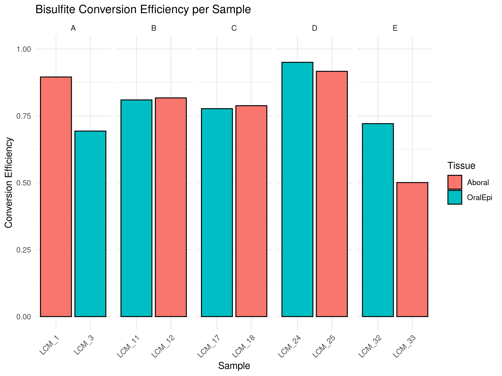
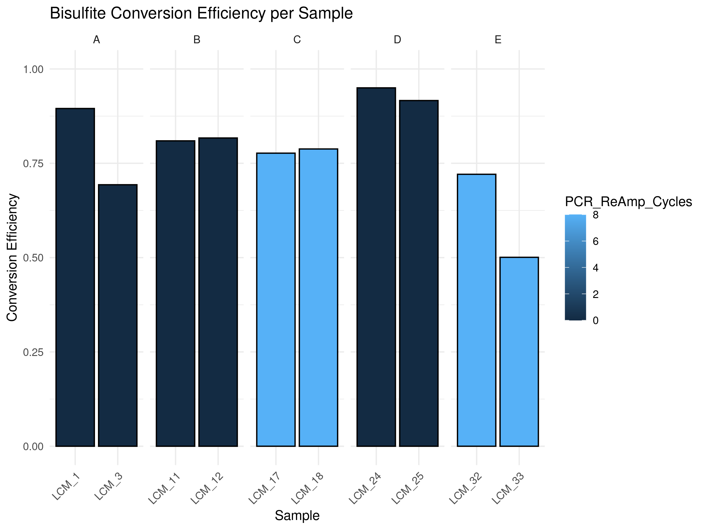
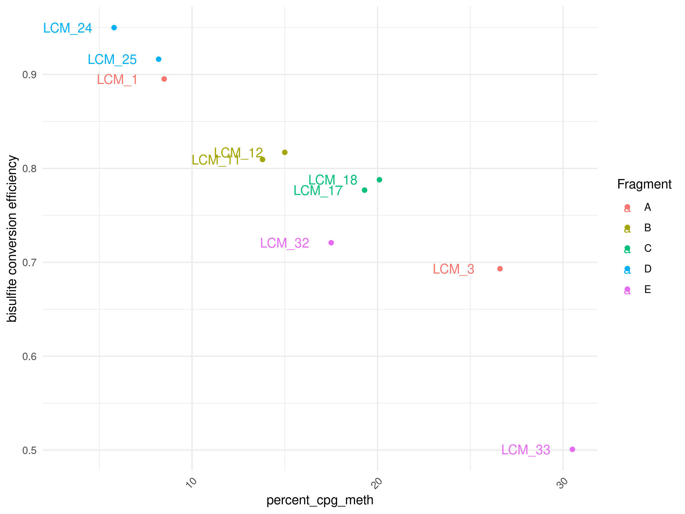

10-CpG-Methylation-Bismark
================
Zoe Dellaert
2025-02-17

- [0.1 CpG Methylation analysis](#01-cpg-methylation-analysis)
- [0.2 Managing Packages Using Renv](#02-managing-packages-using-renv)
- [0.3 Load packages](#03-load-packages)
- [0.4 Calculate based on methylation extraction
  stats](#04-calculate-based-on-methylation-extraction-stats)
- [0.5 VERY IMPORTANT NOTE:](#05-very-important-note)

## 0.1 CpG Methylation analysis

## 0.2 Managing Packages Using Renv

To run this code in my project using the renv environment, run the
following lines of code

``` r
install.packages("renv") #install the package on the new computer (may not be necessary if renv bootstraps itself as expected)
renv::restore() #reinstall all the package versions in the renv lockfile
```

## 0.3 Load packages

``` r
require("tidyverse")
```

    ## Loading required package: tidyverse

    ## ── Attaching core tidyverse packages ──────────────────────── tidyverse 2.0.0 ──
    ## ✔ dplyr     1.1.4     ✔ readr     2.1.5
    ## ✔ forcats   1.0.0     ✔ stringr   1.5.1
    ## ✔ ggplot2   3.5.1     ✔ tibble    3.2.1
    ## ✔ lubridate 1.9.4     ✔ tidyr     1.3.1
    ## ✔ purrr     1.0.4     
    ## ── Conflicts ────────────────────────────────────────── tidyverse_conflicts() ──
    ## ✖ dplyr::filter() masks stats::filter()
    ## ✖ dplyr::lag()    masks stats::lag()
    ## ℹ Use the conflicted package (<http://conflicted.r-lib.org/>) to force all conflicts to become errors

``` r
require("ggplot2")
require("gtools")
```

    ## Loading required package: gtools

``` r
sessionInfo() #provides list of loaded packages and version of R.
```

    ## R version 4.4.0 (2024-04-24)
    ## Platform: x86_64-pc-linux-gnu
    ## Running under: Ubuntu 22.04.3 LTS
    ## 
    ## Matrix products: default
    ## BLAS:   /usr/lib/x86_64-linux-gnu/openblas-pthread/libblas.so.3 
    ## LAPACK: /usr/lib/x86_64-linux-gnu/openblas-pthread/libopenblasp-r0.3.20.so;  LAPACK version 3.10.0
    ## 
    ## locale:
    ##  [1] LC_CTYPE=en_US.UTF-8       LC_NUMERIC=C              
    ##  [3] LC_TIME=en_US.UTF-8        LC_COLLATE=en_US.UTF-8    
    ##  [5] LC_MONETARY=en_US.UTF-8    LC_MESSAGES=en_US.UTF-8   
    ##  [7] LC_PAPER=en_US.UTF-8       LC_NAME=C                 
    ##  [9] LC_ADDRESS=C               LC_TELEPHONE=C            
    ## [11] LC_MEASUREMENT=en_US.UTF-8 LC_IDENTIFICATION=C       
    ## 
    ## time zone: Etc/UTC
    ## tzcode source: system (glibc)
    ## 
    ## attached base packages:
    ## [1] stats     graphics  grDevices datasets  utils     methods   base     
    ## 
    ## other attached packages:
    ##  [1] gtools_3.9.5    lubridate_1.9.4 forcats_1.0.0   stringr_1.5.1  
    ##  [5] dplyr_1.1.4     purrr_1.0.4     readr_2.1.5     tidyr_1.3.1    
    ##  [9] tibble_3.2.1    ggplot2_3.5.1   tidyverse_2.0.0
    ## 
    ## loaded via a namespace (and not attached):
    ##  [1] gtable_0.3.6        compiler_4.4.0      BiocManager_1.30.25
    ##  [4] renv_1.1.1          tidyselect_1.2.1    scales_1.3.0       
    ##  [7] yaml_2.3.10         fastmap_1.2.0       R6_2.6.0           
    ## [10] generics_0.1.3      knitr_1.49          munsell_0.5.1      
    ## [13] pillar_1.10.1       tzdb_0.4.0          rlang_1.1.5        
    ## [16] stringi_1.8.4       xfun_0.50           timechange_0.3.0   
    ## [19] cli_3.6.4           withr_3.0.2         magrittr_2.0.3     
    ## [22] digest_0.6.37       grid_4.4.0          rstudioapi_0.17.1  
    ## [25] hms_1.1.3           lifecycle_1.0.4     vctrs_0.6.5        
    ## [28] evaluate_1.0.3      glue_1.8.0          colorspace_2.1-1   
    ## [31] rmarkdown_2.29      tools_4.4.0         pkgconfig_2.0.3    
    ## [34] htmltools_0.5.8.1

``` r
meta <- read.csv("../data_WGBS/LCM_WGBS_metadata.csv", sep = ",", header = TRUE) %>%
  mutate(Section_Date = as.character(Section_Date), LCM_Date = as.character(LCM_Date),DNA_Extraction_Date = as.character(DNA_Extraction_Date))

meta_simple <- meta %>% select(Sample, Fragment, Tissue, PCR_ReAmp_Cycles)
```

## 0.4 Calculate based on methylation extraction stats

(based on this code:
<https://github.com/hputnam/Meth_Compare/blob/f1b3f771862cbaf81ae5903dd33e0b9bc53de79e/code/00.05-FormatMultiQC.Rmd#L82>)

``` r
multiqc_extract_orig <- data.table::fread("../output_WGBS/dedup_V3/multiqc_data/multiqc_bismark_methextract.txt", header = TRUE, sep = "\t", stringsAsFactors = FALSE)

multiqc <- multiqc_extract_orig %>% mutate(Sample = str_extract(Sample, "LCM_\\d+"))

#create tot_cpg, tot_chh, tot_chg columns

#calculate the total chg counts by summing unmeth chg counts and meth chg counts
multiqc$tot_chg <- multiqc$meth_chg + multiqc$unmeth_chg

#calculate the total chh counts by summing unmeth chh counts and meth chh counts
multiqc$tot_chh <- multiqc$meth_chh + multiqc$unmeth_chh

#calculate the total cpg counts by summing unmeth cpg counts and meth cpg counts
multiqc$tot_cpg <- multiqc$meth_cpg + multiqc$unmeth_cpg

#calculate the unmeht chg + chh counts by summing unmeth chg counts and unmeth chh counts
multiqc$unmeth_chg_chh <- multiqc$unmeth_chg + multiqc$unmeth_chh

#calculate the total chg + chh counts by summing total chg counts and total chh counts
multiqc$tot_chg_chh <- multiqc$tot_chg + multiqc$tot_chh

#calculate percent conversion efficiency by dividing the unmethylated chg + chh counts by the total (meth + unmeth) chg + chh counts
multiqc$conversion_efficiency <- (multiqc$unmeth_chg_chh/multiqc$tot_chg_chh)

#write out table
write.csv(multiqc, "../output_WGBS/dedup_V3/extracted_alignments_descriptive_stats.csv", row.names = FALSE, quote = FALSE)
```

Analyze and plot:

``` r
multiqc <- read.csv( "../output_WGBS/dedup_V3/extracted_alignments_descriptive_stats.csv", sep = ",", header = TRUE) 

conversion_eff_data <- multiqc %>% dplyr::select(c(Sample, conversion_efficiency,percent_cpg_meth)) %>%
  left_join(meta_simple,by = join_by(Sample)) 

print(conversion_eff_data)
```

    ##    Sample conversion_efficiency percent_cpg_meth Fragment  Tissue
    ## 1  LCM_11             0.8094886             13.8        B OralEpi
    ## 2  LCM_12             0.8170680             15.0        B  Aboral
    ## 3  LCM_17             0.7768621             19.3        C OralEpi
    ## 4  LCM_18             0.7879308             20.1        C  Aboral
    ## 5   LCM_1             0.8952221              8.5        A  Aboral
    ## 6  LCM_24             0.9499476              5.8        D OralEpi
    ## 7  LCM_25             0.9163091              8.2        D  Aboral
    ## 8  LCM_32             0.7208651             17.5        E OralEpi
    ## 9  LCM_33             0.5007885             30.5        E  Aboral
    ## 10  LCM_3             0.6931446             26.6        A OralEpi
    ##    PCR_ReAmp_Cycles
    ## 1                 0
    ## 2                 0
    ## 3                 8
    ## 4                 8
    ## 5                 0
    ## 6                 0
    ## 7                 0
    ## 8                 8
    ## 9                 8
    ## 10                0

``` r
conversion_eff_data <- conversion_eff_data %>% mutate(Sample = fct_relevel(Sample, conversion_eff_data$Sample[mixedorder(conversion_eff_data$Sample)])) 
conversion_eff_data$conversion_efficiency <- as.numeric(conversion_eff_data$conversion_efficiency)
  
ggplot(conversion_eff_data, aes(x=Sample, y=conversion_efficiency, fill=Tissue)) +
  geom_bar(stat="identity", color="black") +
  theme_minimal() +
  facet_grid(~Fragment, scales = "free") +
  labs(title="Bisulfite Conversion Efficiency per Sample", y="Conversion Efficiency", x="Sample") +
  theme(axis.text.x = element_text(angle = 45, hjust = 1)) +
  ylim(0, 1) 
```

<!-- -->

``` r
ggplot(conversion_eff_data, aes(x=Sample, y=conversion_efficiency, fill=PCR_ReAmp_Cycles)) +
  geom_bar(stat="identity", color="black") +
  theme_minimal() +
  facet_grid(~Fragment, scales = "free") +
  labs(title="Bisulfite Conversion Efficiency per Sample", y="Conversion Efficiency", x="Sample") +
  theme(axis.text.x = element_text(angle = 45, hjust = 1)) +
  ylim(0, 1) 
```

<!-- -->

``` r
ggplot(conversion_eff_data, aes(x=percent_cpg_meth, y=conversion_efficiency, color=Fragment, label=Sample)) +
  geom_point() +
    geom_text(nudge_x = -2.5) + 
  #geom_smooth() +
  theme_minimal() +
  theme(axis.text.x = element_text(angle = 45, hjust = 1)) +
    labs(y="bisulfite conversion efficiency")
```

<!-- -->

## 0.5 VERY IMPORTANT NOTE:

THIS IS NOT COVERAGE FILTERED AND ALSO THE MAPPING RATE WAS VERY LOW. I
would not trust this efficiency estimate.
